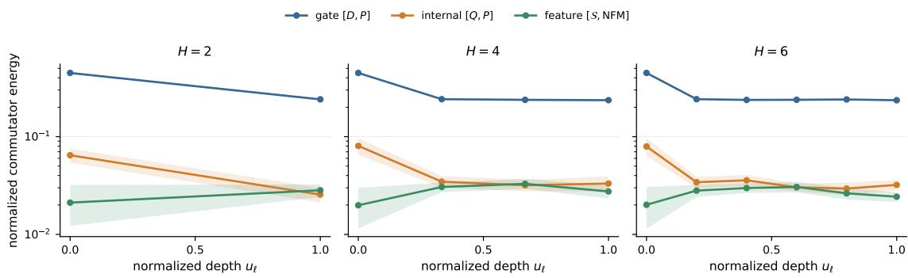
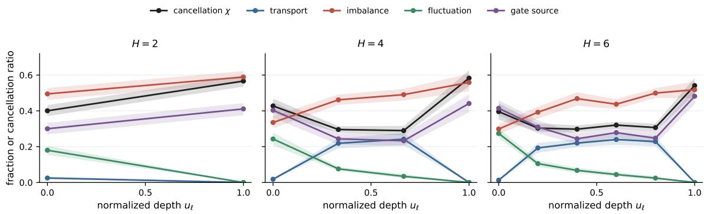
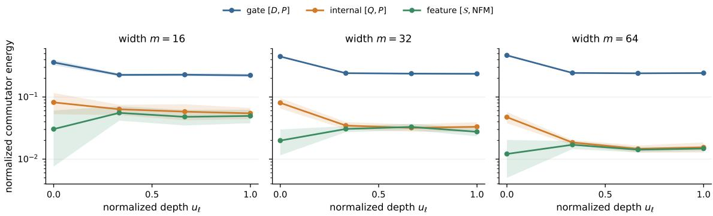
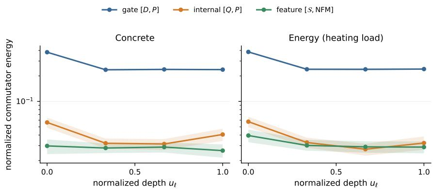
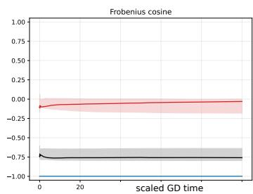
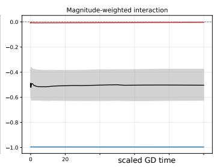
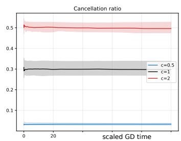

# A COMMUTATOR FRAMEWORK FOR SELECTIVE SPECTRAL ALIGNMENT IN DEEP NEURAL NETWORKS

## KAJ NYSTROM¨

Abstract. We develop a finite-width geometric framework describing how learned feature geometries are organized, transported, and selectively aligned in deep neural networks. Incompatibility among weightgenerated covariance, gates, and backward sensitivities is quantified through three families of commutators: between gates and covariance, between sensitivities and covariance, and between average gradient outer products (AGOPs) and neural feature matrices (NFMs).

An exact layerwise identity decomposes the sensitivity-covariance commutator into four sources: downstream transport, adjacent-layer imbalance, pointwise sensitivity fluctuations, and nonlinear gatecovariance interactions. The AGOP-NFM commutator is a singular-value-weighted transport of the internal commutator, explaining why observed feature-side alignment alone does not determine the internal geometry from which it emerges.

Bufered localized energies resolve mixing between separated covariance subspaces. We establish spectral-gap, projector-evolution, and stabilization estimates, and formulate conditional Lyapunov principles that yield decay under explicit geometric error-bound or intrinsic-damping assumptions. These criteria do not follow from gradient flow alone and clarify why risk reduction need not imply commutator collapse.

Analytic examples and numerical experiments exhibit factorization of spectral and activation geometry, transient growth, and cancellation among nonzero sources. In tested finite-time regimes, cancellation dominated by a negative transport-imbalance interaction persists across depths, widths, and two regression benchmarks. Spectral alignment therefore appears as a layer- and scale-dependent compatibility phenomenon governed by transport, interaction, cancellation, and possible damping, rather than a universal consequence of training.

## 1. Introduction

Understanding how neural networks learn statistical features from data remains a central problem in supervised learning. A growing body of work suggests that training produces geometric and spectral structure linking backward sensitivity to the forward representation. Average Gradient Outer Products (AGOPs) encode the directions to which the network output is sensitive, whereas Neural Feature Matrices (NFMs) encode the geometry generated by the learned weights. Their observed correspondence motivates the Neural Feature Ansatz (NFA), which in its strongest form relates a layerwise NFM to a positive spectral power of the corresponding AGOP [16]. Section 2 gives a detailed comparison with this and related approaches.

Deep linear networks provide an exact reference case: under balanced gradient flow, the NFA holds with a spectral exponent determined by depth. For nonlinear networks, however, exact power-law relations can fail even when the target function is represented exactly [17]. A prescribed relation between eigenvalues may therefore be too rigid to capture the common geometric content. In this paper we instead study the weaker compatibility condition

$$
\begin{array} { r } { [ S _ { \ell } ( t ) , \mathrm { N F M } _ { \ell } ( t ) ] = 0 , } \end{array}\tag{1.1}
$$

where $\boldsymbol { s } _ { \ell }$ is the layerwise AGOP and $\mathrm { N F M } _ { \ell } = W _ { \ell } ^ { \top } W _ { \ell }$ . Since both operators are real symmetric, (1.1) is equivalent to simultaneous orthogonal diagonalizability. Every spectral functional relation implies commutativity, but the converse imposes no relation between the corresponding eigenvalues.

The purpose of this paper is to identify the internal mechanisms governing this spectral compatibility in finite-width nonlinear networks. The question is not whether training universally drives all relevant commutators to zero, but how incompatibility is generated, transported, localized, and cancelled across layers, and which additional hypotheses can produce genuine decay. The theory is developed primarily for bias-free, fully connected, scalar-output networks trained by population gradient flow. The algebraic identities also apply to empirical averages, and vector outputs are accommodated by replacing scalar gradient outer products with Jacobian Gram matrices.

The first observation is that the AGOP-NFM commutator is not a closed geometric object. Let

$$
P _ { \ell } = W _ { \ell } W _ { \ell } ^ { \top } , \qquad { \mathrm { N F M } } _ { \ell } = W _ { \ell } ^ { \top } W _ { \ell }\tag{1.2}
$$

be the covariance operators on the internal and feature sides of the same weight matrix. Introducing the population backward-sensitivity operator $Q _ { \ell } ,$ one has

$$
S _ { \ell } = W _ { \ell } ^ { \top } Q _ { \ell } W _ { \ell }\tag{1.3}
$$

and the exact transport identity

$$
\begin{array} { r } { [ S _ { \ell } , \mathrm { N F M } _ { \ell } ] = W _ { \ell } ^ { \top } [ Q _ { \ell } , P _ { \ell } ] W _ { \ell } . } \end{array}\tag{1.4}
$$

Thus the feature-side commutator is a congruence image of the internal sensitivity-covariance commutator. Small internal incompatibility implies feature-side alignment, subject to the scale of $W _ { \ell } .$ whereas the converse may fail because transport suppresses components in small singular directions and annihilates covariance-null directions.

The second observation is that $[ Q _ { \ell } , P _ { \ell } ]$ satisfies an exact backward recursion. The nonlinear activation geometry is represented by the gate

$$
D _ { \ell } ( x , t ) = \mathrm { d i a g } \big ( \sigma ^ { \prime } ( z _ { \ell } ( x , t ) ) \big ) ,\tag{1.5}
$$

whose compatibility with the covariance geometry is measured by $[ D _ { \ell } ( x , t ) , P _ { \ell } ( t ) ]$ . At each hidden layer the recursion has the schematic form

$$
[ Q _ { \ell } , P _ { \ell } ] = T _ { \ell } ^ { \mathrm { t r } } + T _ { \ell } ^ { \mathrm { i m b } } + T _ { \ell } ^ { \mathrm { f u c } } + T _ { \ell } ^ { \mathrm { g a t e } } .\tag{1.6}
$$

The four terms arise, respectively, from downstream transport, adjacent-layer imbalance, pointwise sensitivity fluctuation, and the nonlinear gate-covariance interaction. Here

$$
\Delta _ { \ell } = P _ { \ell } - W _ { \ell + 1 } ^ { \top } W _ { \ell + 1 } , \qquad R _ { \ell + 1 } = S _ { \ell + 1 } - S _ { \ell + 1 } .
$$

They may reinforce or cancel one another. The gate commutator is therefore an intrinsic nonlinear source, but it is neither the only source of internal incompatibility nor a complete explanation of a small total commutator.

Equations (1.4) and (1.6) organize the three alignment levels into the hierarchy

$$
[ D _ { \ell } , P _ { \ell } ] \quad \longrightarrow \quad [ Q _ { \ell } , P _ { \ell } ] \quad \longrightarrow \quad [ S _ { \ell } , \mathrm { N F M } _ { \ell } ] .\tag{1.7}
$$

The first commutator records pointwise incompatibility between activation and covariance geometry and enters as a primitive nonlinear source; the second records the internal sensitivity mixing produced by all four mechanisms after backward transport; and the third is its singular-value-weighted featureside image. The arrows indicate propagation and transport, not strict causality, monotone decay, or a universal ordering of the corresponding energies.

Global commutator norms aggregate interactions across the entire covariance spectrum. They do not reveal where in the spectrum the misalignment is concentrated, nor do they distinguish coupling across well-separated spectral blocks from mixing1 inside a nearly degenerate cluster. Bufered localized energies provide this information at a prescribed blockwise spectral resolution by isolating the direct coupling between selected covariance subspaces.

To make this distinction precise, write $W _ { \ell } : \mathbb { R } ^ { m _ { \ell } } \longrightarrow \mathbb { R } ^ { m _ { \ell + 1 } }$ and use the spectral decomposition

$$
P _ { \ell } = \sum _ { i = 1 } ^ { m _ { \ell + 1 } } \lambda _ { \ell , i } u _ { \ell , i } u _ { \ell , i } ^ { \top } , \qquad \lambda _ { \ell , 1 } \geq \dots \geq \lambda _ { \ell , m _ { \ell + 1 } } \geq 0 .
$$

For $1 \leq q \leq m _ { \ell + 1 }$ , let

$$
\Pi _ { \ell } ^ { ( q ) } = \sum _ { i = 1 } ^ { q } u _ { \ell , i } u _ { \ell , i } ^ { \top } , \qquad \Pi _ { \ell } ^ { ( q ) , \bot } = I _ { m _ { \ell + 1 } } - \Pi _ { \ell } ^ { ( q ) } ,
$$

and define the boundary gap

$$
\gamma _ { \ell } ^ { ( q ) } = \lambda _ { \ell , q } - \lambda _ { \ell , q + 1 } , \qquad 1 \leq q < m _ { \ell + 1 } .
$$

When $\gamma _ { \ell } ^ { ( q ) } > 0 .$ , the projector $\Pi _ { \ell } ^ { ( q ) }$ is intrinsically determined by $P _ { \ell } .$ , independently of the choice of eigenbasis inside its spectral subspaces.

Fix $k \geq 1$ and a bufer width $\beta \geq 0 .$ , with $k + \beta < m _ { \ell + 1 }$ , and assume

$$
\gamma _ { \ell } ^ { ( k ) } > 0 , \qquad \gamma _ { \ell } ^ { ( k + \beta ) } > 0 .
$$

The bufered localized energies measure the direct coupling between the leading covariance subspace Ran $\Pi _ { \ell } ^ { ( k ) }$ and the complement of Ran $\Pi _ { \ell } ^ { ( k + \beta ) }$ , while leaving mixing through the intermediate modes

$$
u _ { \ell , k + 1 } , \ldots , u _ { \ell , k + \beta }
$$

unrestricted when $\beta > 0 .$ . When the bufer is chosen to contain a nearly degenerate boundary cluster, rotations inside that cluster are therefore not interpreted as misalignment across the separated spectral blocks. The separation relevant to the retained coupling is the bufered gap

$$
\gamma _ { \ell } ^ { ( k , \beta ) } = \lambda _ { \ell , k } - \lambda _ { \ell , k + \beta + 1 } .
$$

These localized energies are natural defects for selective alignment because they are precisely the squared norms of the of-diagonal blocks connecting the two selected spectral regions. Indeed, for a symmetric operator $A _ { \ell }$ on $\mathbb { R } ^ { m _ { \ell + 1 } }$ ，

$$
\left\| \Pi _ { \ell } ^ { ( k ) } A _ { \ell } \Pi _ { \ell } ^ { ( k + \beta ) , \perp } \right\| _ { F } ^ { 2 } = \sum _ { 1 \le i \le k \atop j > k + \beta } \left| u _ { \ell , i } ^ { \top } A _ { \ell } u _ { \ell , j } \right| ^ { 2 } .
$$

This quantity vanishes exactly when $A _ { \ell }$ produces no direct coupling between the leading k-dimensional covariance subspace and the remote complement beyond the bufer. It is invariant under orthogonal changes of basis within the two spectral subspaces and therefore depends on the subspaces rather than

on the particular eigenvectors used to represent them. Moreover, the eigenbasis expansion of the global commutator gives

$$
\begin{array} { r } { \| [ A _ { \ell } , P _ { \ell } ] \| _ { F } ^ { 2 } \geq 2 \big ( \gamma _ { \ell } ^ { ( k , \beta ) } \big ) ^ { 2 } \left\| \Pi _ { \ell } ^ { ( k ) } A _ { \ell } \Pi _ { \ell } ^ { ( k + \beta ) , \perp } \right\| _ { F } ^ { 2 } . } \end{array}
$$

Applying this estimate pointwise and integrating for $A _ { \ell } = D _ { \ell } ( x )$ , and applying it directly for $A _ { \ell } = Q _ { \ell }$ shows that the global gate and internal commutator energies dominate their corresponding localized energies by the common factor $2 ( \gamma _ { \ell } ^ { ( k , \beta ) } ) ^ { 2 }$ . The same conclusion holds at the feature level whenever the cutof is admissible on both sides of $W _ { \ell } .$ Vanishing of these localized energies expresses selective alignment across the bufered interface and is weaker than global commutativity.

To compare the three localized levels, we use on the feature side the right singular vectors of $W _ { \ell }$ completed through ker $W _ { \ell } ,$ , so that their nonzero spectral indices agree with those of $P _ { \ell }$ . Let $r _ { \ell } \ = \quad$ rank $( W _ { \ell } )$ . A common cutof is admissible when

$$
1 \leq k \leq r _ { \ell } , \qquad k \leq k + \beta \leq m _ { \ell } , \qquad k + \beta < m _ { \ell + 1 } .
$$

If $\mathcal { G } _ { S , \ell } ^ { ( k , \beta ) }$ denotes the corresponding feature-side localized energy, the transport identity gives

$$
{ \mathcal G } _ { S , \ell } ^ { ( k , \beta ) } = \sum _ { \stackrel { 1 \leq i \leq k } { k + \beta < j \leq r _ { \ell } } } \lambda _ { \ell , i } \lambda _ { \ell , j } \left| u _ { \ell , i } ^ { \top } { \mathcal Q } _ { \ell } u _ { \ell , j } \right| ^ { 2 } .\tag{1.8}
$$

Thus feature-side alignment is a spectrally filtered, and potentially non-faithful, image of internal sensitivity alignment: mixing into low-variance directions is suppressed, whereas mixing into the null space of the covariance is invisible.

The preceding localization describes the geometry at a fixed time. Along training, the dynamical problem has two coupled components. The covariance subspaces move, so the evolution of their projectors, boundary gaps, and separated spectral clusters must be controlled. Simultaneously, the activation operators evolve relative to these moving subspaces. For smooth activations, the gates can be diferentiated along the training trajectory. For ReLU networks, by contrast, the gates change discontinuously when preactivations cross zero, and their finite-time variation is controlled by symmetric diferences of the data regions on which the corresponding neurons are active.

This leads to a central distinction between stabilization and alignment. Under the appropriate gap and regularity assumptions, finite variation of the covariance and activation geometries can force a localized energy to approach a limit, but it neither identifies that limit nor forces it to vanish. Genuine decay requires an additional compatibility mechanism, a geometric error bound coupling the defect to risk dissipation, or intrinsic transverse damping. Likewise, localized gate alignment propagates through (1.7) only when the imbalance, sensitivity fluctuations, operator scales, and relevant spectral gaps are also controlled. The Lyapunov theory below distinguishes risk-based transfer under a geometric error bound from decay generated directly by intrinsic damping; neither mechanism follows from gradient flow alone.

The numerical experiments support the need for these qualifications. At the matched finite-time risk levels attained by the tested synthetic ensembles, a reduction in relative risk by approximately three orders of magnitude is not accompanied by decay of the normalized global gate commutator, and the leading localized sensitivity defect may increase before stabilizing. Across the tested widths, greater width is associated with smaller internal and feature-side defects but not with a smaller gate defect. At interior layers of the deeper networks, the Frobenius interaction between the transport and imbalance sources is strongly negative, leaving the total internal commutator much smaller than the combined magnitudes of its sources. This source-level cancellation persists across the tested depths and widths and on two scalar-regression benchmarks. A function-preserving rescaling of adjacent layers also changes the source decomposition without changing the initial function represented by the network. These finite-time observations support selective, mechanism-dependent alignment rather than universal commutator decay driven by risk minimization.

1.1. Our principal contributions. The principal contributions of the paper are the following.

(1) We derive the exact transport identity (1.4) and the recursive four-source decomposition (1.6) of the internal sensitivity-covariance commutator. Together with the associated energy identities, these formulas make downstream transport, adjacent-layer imbalance, pointwise sensitivity fluctuations, nonlinear gate-covariance interactions, and the resulting reinforcement and cancellation explicit at finite width.

(2) We develop a common localization theory relative to the evolving spectrum of $P _ { \ell } .$ . Bufered energies isolate direct coupling between separated spectral blocks while leaving mixing through intermediate modes unrestricted. Spectral-gap bounds relate these localized defects to the global commutator energies, projector and cluster estimates control the selected covariance subspaces, and singular-value weights quantify the transport of internal mixing to feature space.

(3) We treat smooth and ReLU activations separately. For smooth activations, we derive diferential estimates for the localized gate energies. For ReLU networks, where the gates change discontinuously, we formulate their finite-time evolution through activation regions and gate-switching estimates based on symmetric diferences of these regions.

(4) We establish conditional stabilization, propagation, and Lyapunov principles. Under finite variation, gap, and regularity hypotheses, selected localized energies converge to finite limits. Quantitative decay is obtained under explicit compatibility, geometric error-bound, or intrinsic damping assumptions. We also identify the imbalance, fluctuation, gap, operator-scale, and boundedness conditions needed to propagate alignment through the commutator hierarchy.

(5) We analyze exactly solvable finite-width models exhibiting spectral-activation factorization, separation between the three alignment levels, exact cancellation among nonzero sources, and transient growth along a constrained population-gradient-flow trajectory. These examples explain why none of the individual commutator energies is automatically a Lyapunov function.

(6) We introduce matched-risk numerical diagnostics for global, localized, and source-level observables. The experiments confirm the exact identities to numerical precision, distinguish the three alignment levels, reveal persistent transport-imbalance cancellation, and isolate the parametrization dependence of the source geometry through a function-preserving rescaling.

Together, these results show why a small AGOP-NFM commutator may reflect internal damping, singular-value filtering, structured source cancellation, or a combination of these mechanisms. The hierarchy and its bufered localization distinguish these possibilities at finite width.

1.2. Organization of the paper. The remainder of the paper is organized as follows. Section 2 places the commutator framework in the context of the Neural Feature Ansatz, feature-alignment mechanisms, deep-linear balancedness, symmetry-induced conservation laws, and related weight-Gram dynamics. Section 3 introduces the network, sensitivity, covariance, imbalance, fluctuation, and gradient-flow notation. Section 4 derives the transport identity, the four-source internal recursion, its energy and norm estimates, and the evolution of imbalance and sensitivity fluctuations. Section 5 develops bufered localization, covariance subspace dynamics, and transport to feature-side geometry. Section 6 studies smooth activation dynamics and ReLU switching. Section 7 distinguishes stabilization from decay and gives conditional propagation results, while Section 8 develops Lyapunov principles for selected bufered sensitivity defects. Section 9 presents the exactly solvable models and their cancellation and

transient-growth mechanisms. Section 10 develops and applies the finite-width numerical diagnostics.   
Finally, Section 11 summarizes the framework and briefly indicates several directions for further work.

## 2. Relation to existing work

The present work is most closely related to the recent literature on the Average Gradient Outer Product (AGOP) and the Neural Feature Ansatz (NFA). The NFA was introduced in [16] as a mechanism for feature learning, motivated by an empirical correspondence between layerwise AGOPs and weight Gram matrices. Subsequent work connected AGOP-based feature learning to deep neural collapse [4] and decomposed the observed NFM-AGOP correlation through the singular geometry of weight updates and preactivation tangent features [3]. Related forms of dynamically emerging feature geometry include the alignment of neural tangent features with a small number of task-relevant directions [2] and the Canonical Representation Hypothesis of [22], which posits mutual alignment relations among representations, weights, and neuron gradients. The FACT framework [5] provides a complementary convergence-based perspective by deriving feature relations from first-order optimality conditions.

Our point of departure is that an exact spectral functional relation between the AGOP and the NFM is stronger than the eigenspace compatibility required for spectral alignment. We therefore study the weaker condition stated in (1.1) which retains common spectral subspaces without prescribing a relation between the corresponding eigenvalues. The purpose is not to propose a competing feature ansatz, but to determine how this weaker compatibility is generated, transported, or obstructed by finite-width nonlinear dynamics. The commutator framework accordingly separates the feature-side observable from the internal sensitivity, covariance, activation, imbalance, and fluctuation geometries that produce it.

Deep linear networks provide the principal exact comparison. Under gradient flow, their adjacentlayer Gram diferences are conserved; such balancedness identities play a central role, for example, in [1]. For balanced initialization they also lead to exact depth-dependent NFA relations. A related implicit-regularization result was established in [11]: for linearly separable classification, the weight matrices become asymptotically rank one and their adjacent singular directions align. The direct connection between deep-linear balancedness and the NFA was developed in [17], which obtained the exponent 1/L for an L-layer linear network, proved an asymptotic relation for unbalanced initialization with weight decay, and exhibited nonlinear counterexamples.

For bias-free homogeneous nonlinear networks, the full adjacent-layer matrix law need not persist, although neuronwise diferences between incoming and outgoing squared norms remain invariant under gradient flow [9]. Architectural symmetries and their associated conservation laws have been studied more generally in [12, 14]; this literature also clarifies their dependence on the continuous-time dynamics and on symmetry-breaking perturbations. In the present framework, the adjacent-layer matrix imbalance is not eliminated by assumption. It appears instead as one of the four sources in the recursive sensitivity-covariance commutator identity. The function-preserving rescaling experiment correspondingly changes the values of the conserved neuronwise imbalance quantities while leaving the represented initial function unchanged.

The closest dynamical comparisons are [3] and [8]. The former relates the NFM-AGOP correlation to alignment between weight updates and preactivation tangent features. The latter derives a Feature Learning Equation in which the weight Gram matrix links parameter updates to a virtual evolution of hidden features. Our analysis addresses a diferent level of this geometry: it derives an exact layerwise transport identity and decomposes the internal sensitivity-covariance commutator into downstream transport, adjacent-layer imbalance, pointwise sensitivity fluctuations, and nonlinear gate-covariance interactions. These identities hold along finite-width trajectories, are not restricted to critical points, and require neither balanced initialization nor commutator decay. They therefore permit transient growth and cancellation among nonzero sources. The bufered localized energies further distinguish mixing across separated covariance subspaces from mixing inside nearly degenerate spectral clusters, leading to a selective rather than universal notion of spectral alignment.

The present results are finite-width identities and estimates. They are complementary to featurelearning limits in mean-field and tensor-program parametrizations [15, 20], which address asymptotic training dynamics as layer widths diverge.

Xiao, Sui, and Ruan [19] recently proposed a flag-variety framework for deep-network alignment. Their principal objects are the relative positions of adjacent weight-generated subspaces, with emphasis on intersection data invariant under reparametrization, flag geometry, and alignment induced by ridge regularization; nonlinear activations appear there through a commutator obstruction to exact basis alignment. The present framework is complementary. Its basic objects are data-dependent gates, backward sensitivities, and covariance operators, and its central conclusions are the exact four-source recursion, cancellation among those sources, and the AGOP-NFM transport identity. Thus the two approaches use related commutator language but address diferent geometries and diferent dynamical questions.

Finally, a separate future direction concerns probabilistic gate surrogates and random-matrix universality. The nonasymptotic universality and sharp concentration principles of [6] apply to sums of independent random matrices. They do not apply directly to the data-dependent, dynamically coupled gates of a trained network, but they suggest tools for asking which commutator phenomena persist across probabilistic gate models. No such universality principle is assumed in the deterministic hierarchy developed here.

## 3. Preliminaries

We consider scalar-valued regression on

$$
\begin{array} { r } { \boldsymbol { X } \times \boldsymbol { y } = \mathbb { R } ^ { d } \times \mathbb { R } , \qquad \boldsymbol { x } \sim \boldsymbol { \mu } , \qquad \boldsymbol { y } = f _ { * } ( \boldsymbol { x } ) , } \end{array}\tag{3.1}
$$

where $\mu$ is a probability measure on $\mathbb { R } ^ { d }$ and $f _ { * } : \mathbb { R } ^ { d }  \mathbb { R }$ is the target function. Given a loss $\mathcal { L } : \mathbb { R } \times \mathbb { R } $ $[ 0 , \infty )$ , diferentiable in its second argument, the population risk is

$$
\mathscr { R } ( W ) = \int _ { \mathbb { R } ^ { d } } \mathscr { L } \big ( f _ { * } ( x ) , F ( x , W ) \big ) \ \mathrm { d } \mu ( x ) .\tag{3.2}
$$

The empirical setting is obtained by replacing $\mu$ with $\begin{array} { r } { \mu _ { N } = N ^ { - 1 } \sum _ { i = 1 } ^ { N } \delta _ { x _ { i } } . } \end{array}$ so that

$$
\mathcal { R } _ { N } ( W ) : = \int _ { \mathbb { R } ^ { d } } \mathcal { L } \big ( f _ { * } ( x ) , F ( x , W ) \big ) \mathrm { d } \mu _ { N } ( x ) = \frac { 1 } { N } \sum _ { i = 1 } ^ { N } \mathcal { L } \big ( f _ { * } ( x _ { i } ) , F ( x _ { i } , W ) \big ) .\tag{3.3}
$$

All operator identities below then have empirical analogues with expectations replaced by empirical averages. The restriction to scalar-valued outputs simplifies the notation only; vector-valued outputs are discussed in Remark 3.1.

For a matrix A, we write $| | A | | _ { \mathrm { o p } }$ and $| | A | | _ { F }$ for its operator and Frobenius norms, respectively, so that

$$
\| A \| _ { \mathrm { o p } } \leq \| A \| _ { F } \leq \sqrt { \mathrm { r a n k } ( A ) } \| A \| _ { \mathrm { o p } } .\tag{3.4}
$$

For square matrices of the same size, $[ A , B ] = A B - B A$ . Unless stated otherwise, dependence on x, W, and, along gradient flow, t, is suppressed. Gradients with respect to vector variables are understood as column vectors.

3.1. Feedforward networks. Let $F ( \cdot , W ) : \mathbb { R } ^ { d } $ R be a feedforward network of depth $L ,$ without bias parameters, with

$$
W = ( W _ { 0 } , \ldots , W _ { L - 1 } ) , \qquad W _ { \ell } \in \mathbb { R } ^ { m _ { \ell + 1 } \times m _ { \ell } } , \quad \ell = 0 , \ldots , L - 1 ,\tag{3.5}
$$

where $m _ { 0 } = d$ and $m _ { L } = 1$ . The omission of biases preserves the homogeneous operator structure and avoids additional afine terms. Given $a _ { 0 } = x ,$ , define

(3.6)

$$
\begin{array} { r l } { z _ { \ell } = W _ { \ell } a _ { \ell } , \qquad } & { { } a _ { \ell + 1 } = \sigma ( z _ { \ell } ) , } \\ { z _ { L - 1 } = W _ { L - 1 } a _ { L - 1 } , \qquad } & { { } a _ { L } = z _ { L - 1 } = F ( x , W ) , } \end{array}\tag{3.7}
$$

$$
\ell = 0 , \ldots , L - 2 ,
$$

where $\sigma : \mathbb { R }  \mathbb { R }$ acts componentwise. We assume that $\sigma$ is locally Lipschitz and impose additional regularity only when the activation geometry is diferentiated. ReLU is treated separately from the smooth-activation theory. We do not include width-dependent normalizations in $W _ { \ell } ;$ fixed layerwise normalizations can be absorbed into the weights and associated covariance operators without changing the identities below.

3.2. Backpropagation and Jacobian transport. For $\ell = 0 , \ldots , L - 2$ , define the gate and adjoint layer Jacobian by

$$
D _ { \ell } ( x , W ) = \mathrm { d i a g } \big ( \sigma ^ { \prime } ( z _ { \ell } ( x , W ) ) \big ) , \qquad J _ { \ell } ( x , W ) = W _ { \ell } ^ { \top } D _ { \ell } ( x , W ) .\tag{3.8}
$$

Thus $J _ { \ell }$ is the adjoint of the diferential $D _ { \ell } W _ { \ell }$ of the map $a _ { \ell } \mapsto a _ { \ell + 1 }$ . At the linear output layer, set $J _ { L - 1 } = W _ { L - 1 } ^ { \top } . ~ \mathrm { A t }$ points where $\sigma$ is not diferentiable, we use a fixed measurable selection of $\sigma ^ { \prime } ;$ for ReL $\mathrm { U } , \sigma ^ { \prime } ( s ) = \mathbf { 1 } _ { \{ s > 0 \} }$ . Define the output and loss sensitivities by

$$
\widetilde { \delta } _ { \ell } = \nabla _ { z _ { \ell } } F , \qquad \delta _ { \ell } = \nabla _ { z _ { \ell } } \mathcal { L } = \partial _ { F } \mathcal { L } \big ( f _ { * } ( x ) , F ( x , W ) \big ) \widetilde { \delta } _ { \ell } , \qquad \ell = 0 , \dots , L - 1 .\tag{3.9}
$$

Since the output layer is linear,

$$
\widetilde { \delta } _ { L - 1 } = 1 , \qquad \widetilde { \delta } _ { \ell } = D _ { \ell } W _ { \ell + 1 } ^ { \top } \widetilde { \delta } _ { \ell + 1 } , \qquad \ell = L - 2 , \ldots , 0 .\tag{3.10}
$$

Consequently,

$$
\nabla _ { W _ { \ell } } \mathcal { L } = \delta _ { \ell } \boldsymbol { a } _ { \ell } ^ { \top } , \qquad \nabla _ { W _ { \ell } } F = \widetilde { \delta } _ { \ell } \boldsymbol { a } _ { \ell } ^ { \top } , \qquad \ell = 0 , \dots , L - 1 ,\tag{3.11}
$$

and repeated application of the chain rule gives

(3.12)

$$
\nabla _ { a _ { \ell } } \mathcal { L } = \partial _ { F } \mathcal { L } \bigl ( f _ { * } ( x ) , F ( x , W ) \bigr ) J _ { \ell } J _ { \ell + 1 } \cdot \cdot \cdot J _ { L - 1 } ,\tag{3.13}
$$

$$
\nabla _ { a _ { \ell } } F = J _ { \ell } J _ { \ell + 1 } \cdot \cdot \cdot J _ { L - 1 } , \qquad \ell = 0 , \dots , L - 1 .
$$

3.3. Sensitivity and covariance operators. For a diferentiable scalar function H of a vector v, the gradient outer product is $\nabla _ { \nu } H \nabla _ { \nu } H ^ { \top }$ , and its average over the data distribution is the corresponding Average Gradient Outer Product (AGOP). At the activation level, define the pointwise and population operators

$$
\boldsymbol { S } _ { \ell } = \nabla _ { a _ { \ell } } F \nabla _ { a _ { \ell } } F ^ { \top } , \qquad \boldsymbol { S } _ { \ell } = \mathbb { E } _ { \mu } [ \boldsymbol { S } _ { \ell } ] , \qquad \ell = 0 , \ldots , L .\tag{3.14}
$$

Thus $S _ { \ell }$ is positive semidefinite and has rank at most one, whereas $\boldsymbol { s } _ { \ell }$ aggregates the pointwise sensitivity directions. Since $F = a _ { L }$ and the output layer is linear,

$$
\begin{array} { r } { S _ { L } = 1 , \quad S _ { L - 1 } = W _ { L - 1 } ^ { \top } W _ { L - 1 } , \quad S _ { \ell } = W _ { \ell } ^ { \top } D _ { \ell } S _ { \ell + 1 } D _ { \ell } W _ { \ell } , \quad \ell = 0 , \ldots , L - 2 . } \end{array}\tag{3.15}
$$

To distinguish pointwise from averaged backward sensitivity, define the pointwise backward sensitivity operator by

$$
\begin{array} { r } { \mathsf Q _ { L - 1 } : = I _ { m _ { L } } = 1 , \qquad \mathsf Q _ { \ell } : = D _ { \ell } \mathsf S _ { \ell + 1 } D _ { \ell } , \qquad \ell = 0 , \ldots , L - 2 , } \end{array}\tag{3.16}
$$

and define

$$
\begin{array} { r } { Q _ { \ell } : = \mathbb { E } _ { \mu } [ \mathbb { Q } _ { \ell } ] , \qquad \ell = 0 , \ldots , L - 1 . } \end{array}\tag{3.17}
$$

Thus $\mathsf { Q } _ { \ell }$ depends on x, while $Q _ { \ell }$ is its population average and has no x-dependence. Equivalently, $\begin{array} { r } { S _ { \ell } = W _ { \ell } ^ { \top } \mathsf { Q } _ { \ell } W _ { \ell } ; } \end{array}$ ; hence averaging (3.15) yields

$$
\begin{array} { r } { S _ { \ell } = W _ { \ell } ^ { \top } Q _ { \ell } W _ { \ell } , \qquad \ell = 0 , \ldots , L - 1 . } \end{array}\tag{3.18}
$$

The forward covariance operator and Neural Feature Matrix associated with $W _ { \ell }$ are

$$
\begin{array} { r } { P _ { \ell } = W _ { \ell } W _ { \ell } ^ { \top } , \qquad \mathrm { N F M } _ { \ell } = W _ { \ell } ^ { \top } W _ { \ell } , \qquad \ell = 0 , \dots , L - 1 . } \end{array}\tag{3.19}
$$

Thus $P _ { \ell } \in \mathbb { R } ^ { m _ { \ell + 1 } \times m _ { \ell + 1 } }$ and $\mathbf { N F M } _ { \ell } \in \mathbb { R } ^ { m _ { \ell } \times m _ { \ell } }$ . They have the same nonzero eigenvalues and describe the outgoing and incoming covariance geometries of $W _ { \ell } .$ , respectively. Together, (3.18) and (3.19) exhibit $\boldsymbol { s } _ { \ell }$ and $\mathbf { N F M } _ { \ell }$ as the congruence images under $W _ { \ell }$ of $Q _ { \ell }$ and $I _ { m _ { \ell + 1 } } ,$ , respectively; this is the common transport representation underlying the commutator hierarchy. At the final hidden layer, $S _ { L - 1 } = S _ { L - 1 } =$ $\mathrm { N F M } _ { L - 1 }$

The alignment diagnostics studied below occur at three levels:

$$
[ D _ { \ell } ( x ) , P _ { \ell } ] , \qquad [ Q _ { \ell } , P _ { \ell } ] , \qquad [ S _ { \ell } , { \mathrm { N F M } } _ { \ell } ] .\tag{3.20}
$$

The first is defined for $\ell = 0 , \ldots , L { - 2 }$ , and the latter two for $\ell = 0 , \ldots , L - 1$ . They measure, respectively, the compatibility of $D _ { \ell }$ with $P _ { \ell } ,$ of $Q _ { \ell }$ with $P _ { \ell } ,$ and of $\scriptstyle { S _ { \ell } }$ with $\mathrm { N F M } _ { \ell }$ . No decay of these commutators is assumed: training may create, reduce, transport, or cancel the corresponding incompatibilities. The purpose of the subsequent hierarchy is to relate the three levels and identify the mechanisms responsible for their behavior.

The loss-weighted population AGOP satisfies

$$
S _ { \ell } ^ { \mathcal { L } } ( W ) : = \mathbb { E } _ { \boldsymbol { \mu } } \left[ \nabla _ { a _ { \ell } } \mathcal { L } \nabla _ { a _ { \ell } } \mathcal { L } ^ { \top } \right] = \mathbb { E } _ { \boldsymbol { \mu } } \left[ ( \partial _ { F } \mathcal { L } ) ^ { 2 } S _ { \ell } \right] .\tag{3.21}
$$

Remark 3.1. For $F : \mathbb { R } ^ { d }  \mathbb { R } ^ { M }$ , let $\mathcal { T } _ { \ell } = { \partial F } / { \partial a _ { \ell } } \in \mathbb { R } ^ { M \times m _ { \ell } }$ and define

$$
\boldsymbol { S } _ { \ell } = \mathcal { T } _ { \ell } ^ { \top } \mathcal { T } _ { \ell } = \sum _ { r = 1 } ^ { M } \nabla _ { a _ { \ell } } F _ { r } \nabla _ { a _ { \ell } } F _ { r } ^ { \top } .\tag{3.22}
$$

With $m _ { L } = M , S _ { L } = I _ { M }$ , and $\mathsf Q _ { L - 1 } = \boldsymbol Q _ { L - 1 } = I _ { M }$ , the transport identities and hidden-space commutator relations retain the same form.

3.4. Spectral projectors. Since $P _ { \ell }$ is symmetric and positive semidefinite, write

(3.23)

$$
P _ { \ell } = U _ { \ell } \Lambda _ { \ell } U _ { \ell } ^ { \top } , \qquad U _ { \ell } = [ u _ { \ell , 1 } , \ldots , u _ { \ell , m _ { \ell + 1 } } ] \in O ( m _ { \ell + 1 } ) ,\tag{3.24}
$$

$$
P _ { \ell } = \sum _ { i = 1 } ^ { m _ { \ell + 1 } } \lambda _ { \ell , i } u _ { \ell , i } u _ { \ell , i } ^ { \top } , \qquad \lambda _ { \ell , 1 } \geq \dots \geq \lambda _ { \ell , m _ { \ell + 1 } } \geq 0 ,
$$

where $\Lambda _ { \ell } = \operatorname { d i a g } ( \lambda _ { \ell , 1 } , \ldots , \lambda _ { \ell , m _ { \ell + 1 } } )$ . For $1 \leq k < m _ { \ell + 1 }$ , define

$$
\Pi _ { \ell } ^ { ( k ) } = \sum _ { i = 1 } ^ { k } u _ { \ell , i } u _ { \ell , i } ^ { \top } , \qquad \Pi _ { \ell } ^ { ( k ) , \perp } = I _ { m _ { \ell + 1 } } - \Pi _ { \ell } ^ { ( k ) } , \qquad \gamma _ { \ell } ^ { ( k ) } = \lambda _ { \ell , k } - \lambda _ { \ell , k + 1 } .\tag{3.25}
$$

We also use the endpoint conventions $\Pi _ { \ell } ^ { ( 0 ) } = 0$ and $\Pi _ { \ell } ^ { ( m _ { \ell + 1 } ) } = I _ { m _ { \ell + 1 } } . \mathrm { ~ I f ~ } \gamma _ { \ell } ^ { ( k ) } > 0$ , then $\Pi _ { \ell } ^ { ( k ) }$ is uniquely determined by $P _ { \ell } ; \mathrm { i f } \gamma _ { \ell } ^ { ( k ) } = 0$ , it depends on the choice of eigenbasis across the corresponding degenerate spectral cluster. These projectors and gaps provide the coordinates used below to localize activationcovariance and sensitivity-covariance incompatibility.

3.5. Imbalance and fluctuation operators. For $\ell = 0 , \ldots , L - 2$ , define the adjacent-layer imbalance by

$$
\Delta _ { \ell } : = P _ { \ell } - \mathrm { N F M } _ { \ell + 1 } = W _ { \ell } W _ { \ell } ^ { \top } - W _ { \ell + 1 } ^ { \top } W _ { \ell + 1 } .\tag{3.26}
$$

Thus $\Delta _ { \ell }$ measures the diference between the outgoing covariance of layer ℓ and the incoming covariance of layer $\ell + 1$ . In deep linear networks it is conserved under gradient flow, whereas in nonlinear networks it enters as a source in the internal commutator recursion. The commutator $[ P _ { \ell } , \mathrm { N F M } _ { \ell + 1 } ]$ measures only the spectral incompatibility of the adjacent covariance geometries; hence $\Delta _ { \ell } = 0$ implies $[ P _ { \ell } , \mathrm { N F M } _ { \ell + 1 } ] = 0$ , but not conversely.

Define the centered sensitivity fluctuation by

$$
R _ { \ell } ( x , W ) : = S _ { \ell } ( x , W ) - S _ { \ell } ( W ) , \qquad \mathbb { E } _ { \mu } [ R _ { \ell } ] = 0 , \qquad \ell = 0 , \ldots , L .\tag{3.27}
$$

In particular, $R _ { L - 1 } = R _ { L } = 0$ . The imbalance $\Delta _ { \ell } ,$ fluctuation $R _ { \ell + 1 }$ , and the gate commutator $[ D _ { \ell } , P _ { \ell } ]$ generate the three local source terms in the recursive decomposition of $[ Q _ { \ell } , P _ { \ell } ] ;$ the fourth term transports the downstream commutator. This decomposition is developed in Section 4.

3.6. Gradient flow. We consider the population gradient flow

$$
\dot { W } _ { \ell } = - \nabla _ { W _ { \ell } } \mathcal { R } ( W ) = - \int _ { \mathbb { R } ^ { d } } \delta _ { \ell } ( x , W ) a _ { \ell } ( x , W ) ^ { \top } \mathrm { d } \mu ( x ) , \qquad \ell = 0 , \ldots , L - 1 .\tag{3.28}
$$

Standing trajectory convention. Unless a stronger hypothesis is stated, a training trajectory $W ( t )$ is locally absolutely continuous and satisfies the selected gradient-flow equation (3.28) for almost every t. At a ReLU kink we use throughout the fixed selection $\sigma ^ { \prime } ( s ) = \mathbf { 1 } _ { \{ s > 0 \} }$ . Algebraic identities involving $D _ { \ell } , Q _ { \ell } , P _ { \ell } ,$ , and the three commutators are pointwise identities at every time at which these operators are defined. Diferential identities for $W _ { \ell } , P _ { \ell } , Q _ { \ell }$ , or their spectral projectors are interpreted almost everywhere on intervals on which the relevant operator-valued maps are absolutely continuous and the stated gaps remain open. We never diferentiate a ReLU gate in time: its global variation is treated by the finite-increment estimates of Section 6. Whenever continuity of $D _ { \ell } ( \cdot , t )$ in $\operatorname { L } ^ { 2 } ( \mu ; F )$ is invoked, we explicitly use the no-interface-mass condition $\mu \{ x : z _ { \ell , r } ( x , t ) = 0 \} = 0$ at the limiting time. These conventions also apply to empirical gradient flow, with expectations replaced by finite averages.

Along such a trajectory, the chain rule for locally absolutely continuous curves gives, for almost every t,

$$
\frac { \mathrm { d } } { \mathrm { d } t } \mathcal { R } ( W ( t ) ) = - \sum _ { \ell = 0 } ^ { L - 1 } \| \nabla _ { W _ { \ell } } \mathcal { R } ( W ( t ) ) \| _ { F } ^ { 2 } .\tag{3.29}
$$

Using (3.11), the dissipation identity can equivalently be written as

(3.30)

$$
\frac { \mathrm { d } } { \mathrm { d } t } \mathcal { R } ( W ( t ) ) = - \sum _ { \ell = 0 } ^ { L - 1 } \int _ { \mathbb { R } ^ { d } } \int _ { \mathbb { R } ^ { d } } K _ { \ell } ( x , x ^ { \prime } , W ( t ) ) \ \mathrm { d } \mu ( x ) \ \mathrm { d } \mu ( x ^ { \prime } ) ,\tag{3.31}
$$

$$
K _ { \ell } ( x , x ^ { \prime } , W ) : = \langle a _ { \ell } ( x , W ) , a _ { \ell } ( x ^ { \prime } , W ) \rangle \langle \delta _ { \ell } ( x , W ) , \delta _ { \ell } ( x ^ { \prime } , W ) \rangle .
$$

Thus gradient-flow dissipation couples forward activation correlations with backward loss-sensitivity correlations.

## 4. The internal commutator hierarchy

We now relate the three alignment levels introduced in (3.20). The feature-side commutator is the most aggregated quantity and follows directly from the factorization $S _ { \ell } = W _ { \ell } ^ { \top } Q _ { \ell } W _ { \ell }$ . Its internal preimage $[ Q _ { \ell } , P _ { \ell } ]$ , however, contains the mechanisms that the feature-side observable alone cannot distinguish. We first make this compression explicit and then derive the exact recursion satisfied by the internal commutators. No decay statement is implicit in either identity.

Lemma 4.1. Fix $t \geq 0$ and $\ell \in \{ 0 , \ldots , L - 1 \}$ , and set

$$
C _ { \ell } ^ { \mathrm { f e a t } } : = [ S _ { \ell } , { \mathrm { N F M } } _ { \ell } ] , \qquad C _ { \ell } ^ { \mathrm { i n t } } : = [ Q _ { \ell } , P _ { \ell } ] .
$$

Then

$$
C _ { \ell } ^ { \mathrm { f e a t } } = W _ { \ell } ^ { \top } C _ { \ell } ^ { \mathrm { i n t } } W _ { \ell }\tag{4.1}
$$

and

$$
\| C _ { \ell } ^ { \mathrm { f e a t } } \| _ { F } \leq \| W _ { \ell } \| _ { \mathrm { o p } } ^ { 2 } \| C _ { \ell } ^ { \mathrm { i n t } } \| _ { F } .\tag{4.2}
$$

$H W _ { \ell }$ hasfull row rank, and $\sigma _ { \operatorname* { m i n } } ( W _ { \ell } )$ denotes its smallest singular value, then

$$
\sigma _ { \operatorname* { m i n } } ( W _ { \ell } ) ^ { 2 } \lVert C _ { \ell } ^ { \mathrm { i n t } } \rVert _ { F } \leq \lVert C _ { \ell } ^ { \mathrm { f e a t } } \rVert _ { F } \leq \sigma _ { \operatorname* { m a x } } ( W _ { \ell } ) ^ { 2 } \lVert C _ { \ell } ^ { \mathrm { i n t } } \rVert _ { F } ,\tag{4.3}
$$

and hence $C _ { \ell } ^ { \mathrm { f e a t } } = 0$ if and only $i f C _ { \ell } ^ { \mathrm { i n t } } = 0 .$

Proof. Suppressing ℓ and t, the identities $S = W ^ { \top } Q W , \mathrm { N F M } = W ^ { \top } W$ , and $P = W W ^ { \top }$ give

$$
[ S , \mathrm { N F M } ] = W ^ { \top } ( Q P - P Q ) W = W ^ { \top } [ Q , P ] W .
$$

The upper bound follows from $\| A B C \| _ { F } \leq \| A \| _ { \mathrm { o p } } \| B \| _ { F } \| C \| _ { \mathrm { o p } }$ . If W has full row rank, its Moore-Penrose inverse satisfies $W W ^ { \dagger } = I ,$ so $[ Q , P ] = ( W ^ { \dagger } ) ^ { \top } [ S$ , NFM]W†. Since $\| W ^ { \dagger } \| _ { \mathrm { o p } } = \sigma _ { \mathrm { m i n } } ( W ) ^ { - 1 }$ , this also gives the lower bound. □

The transport in (4.1) is a congruence, not a similarity. More precisely, let

$$
W _ { \ell } = \sum _ { i = 1 } ^ { r _ { \ell } } \sigma _ { \ell , i } u _ { \ell , i } \nu _ { \ell , i } ^ { \top } , \qquad \sigma _ { \ell , i } > 0 ,
$$

be a thin singular-value decomposition. Since $P _ { \ell } u _ { \ell , i } = \sigma _ { \ell , i } ^ { 2 } u _ { \ell , i }$

$$
\lVert C _ { \ell } ^ { \mathrm { f e a t } } \rVert _ { F } ^ { 2 } = \sum _ { i , j = 1 } ^ { r _ { \ell } } \sigma _ { \ell , i } ^ { 2 } \sigma _ { \ell , j } ^ { 2 } \left| u _ { \ell , i } ^ { \top } C _ { \ell } ^ { \mathrm { i n t } } u _ { \ell , j } \right| ^ { 2 } = \sum _ { i , j = 1 } ^ { r _ { \ell } } \sigma _ { \ell , i } ^ { 2 } \sigma _ { \ell , j } ^ { 2 } \left( \sigma _ { \ell , j } ^ { 2 } - \sigma _ { \ell , i } ^ { 2 } \right) ^ { 2 } \left| u _ { \ell , i } ^ { \top } Q _ { \ell } u _ { \ell , j } \right| ^ { 2 } .\tag{4.4}
$$

The second identity displays two distinct spectral filters. The gap factor $| \sigma _ { \ell , j } ^ { 2 } - \sigma _ { \ell , i } ^ { 2 } |$ is already present in the internal commutator $C _ { \ell } ^ { \mathrm { i n t } } = [ Q _ { \ell } , P _ { \ell } ] ,$ , whereas transport to feature space introduces the additional factor $\sigma _ { \ell , i } \sigma _ { \ell , j }$

Consequently, $C _ { \ell } ^ { \mathrm { i n t } }$ , together with $W _ { \ell } ,$ , determines $C _ { \ell } ^ { \mathrm { f e a t } }$ , but the converse generally fails. Indeed, the congruence discards every component of $C _ { \ell } ^ { \mathrm { i n t } }$ involving ker $W _ { \ell } ^ { \top }$ and attenuates the components associated with small singular values. Even when $W _ { \ell }$ has full row rank and the congruence can be inverted, the reconstruction becomes unstable as the smallest singular value approaches zero. A small feature-side commutator may therefore reflect a small internal commutator, additional suppression under singularvalue transport, loss of covariance-null directions, or a combination of these efects.

In this relative sense, $C _ { \ell } ^ { \mathrm { i n t } }$ is the more informative object: it retains the full internal commutator before feature-side compression and is the quantity governed by the four-source recursive decomposition. This does not mean that it resolves every form of internal mixing. Since the commutator itself weights $u _ { \ell , i } ^ { \top } Q _ { \ell } u _ { \ell , j }$ by the covariance gap, it remains insensitive to mixing inside an exactly degenerate eigenspace and weakly sensitive inside a nearly degenerate cluster. The bufered localized energies provide the finer spectral resolution needed in that regime. At the terminal layer, $Q _ { L - 1 } \ = \ I _ { m _ { L } }$ , and hence both commutators vanish.

We next resolve $C _ { \ell } ^ { \mathrm { i n t } }$ into one transported contribution and three local sources.

Theorem 4.1. The terminal internal commutator satisfies

$$
C _ { L - 1 } ^ { \mathrm { i n t } } = [ Q _ { L - 1 } , P _ { L - 1 } ] = 0 .
$$

For $\ell = 0 , \ldots , L - 2 ,$ , define

(4.5)

$$
\begin{array} { r } { T _ { \ell } ^ { \mathrm { t r } } : = \mathbb { E } _ { \mu } \big [ D _ { \ell } W _ { \ell + 1 } ^ { \top } C _ { \ell + 1 } ^ { \mathrm { i n t } } W _ { \ell + 1 } D _ { \ell } \big ] , } \end{array}\tag{4.6}
$$

$$
T _ { \ell } ^ { \mathrm { i m b } } : = \mathbb { E } _ { \mu } \big [ D _ { \ell } [ S _ { \ell + 1 } , \Delta _ { \ell } ] D _ { \ell } \big ] ,\tag{4.7}
$$

$$
T _ { \ell } ^ { \mathrm { f l u c } } : = \mathbb { E } _ { \mu } \big [ D _ { \ell } [ R _ { \ell + 1 } , P _ { \ell } ] D _ { \ell } \big ] ,\tag{4.8}
$$

$$
T _ { \ell } ^ { \mathrm { g a t e } } : = \mathbb { E } _ { \mu } \left[ [ D _ { \ell } , P _ { \ell } ] S _ { \ell + 1 } D _ { \ell } + D _ { \ell } S _ { \ell + 1 } [ D _ { \ell } , P _ { \ell } ] \right] .
$$

Then each component is skew-symmetric and

$$
C _ { \ell } ^ { \mathrm { i n t } } = T _ { \ell } ^ { \mathrm { t r } } + T _ { \ell } ^ { \mathrm { i m b } } + T _ { \ell } ^ { \mathrm { f l u c } } + T _ { \ell } ^ { \mathrm { g a t e } } .\tag{4.9}
$$

Proof. Since $Q _ { \ell } = \mathbb { E } _ { \mu } [ \mathsf { Q } _ { \ell } ]$ and $\mathsf Q _ { \ell } = D _ { \ell } S _ { \ell + 1 } D _ { \ell } .$

$$
C _ { \ell } ^ { \mathrm { i n t } } = \mathbb { E } _ { \mu } \left[ D _ { \ell } [ S _ { \ell + 1 } , P _ { \ell } ] D _ { \ell } + [ D _ { \ell } , P _ { \ell } ] S _ { \ell + 1 } D _ { \ell } + D _ { \ell } S _ { \ell + 1 } [ D _ { \ell } , P _ { \ell } ] \right] .\tag{4.10}
$$

Using $S _ { \ell + 1 } = S _ { \ell + 1 } + R _ { \ell + 1 }$ and $P _ { \ell } = \mathrm { N F M } _ { \ell + 1 } + \Delta _ { \ell }$ , we obtain

$$
\begin{array} { r } { [ S _ { \ell + 1 } , P _ { \ell } ] = [ S _ { \ell + 1 } , \mathrm { N F M } _ { \ell + 1 } ] + [ S _ { \ell + 1 } , \Delta _ { \ell } ] + [ R _ { \ell + 1 } , P _ { \ell } ] } \\ { = W _ { \ell + 1 } ^ { \top } C _ { \ell + 1 } ^ { \mathrm { i n t } } W _ { \ell + 1 } + [ S _ { \ell + 1 } , \Delta _ { \ell } ] + [ R _ { \ell + 1 } , P _ { \ell } ] . } \end{array}
$$

Substitution into (4.10) proves (4.9). The first three components are congruences of skew-symmetric matrices. For the last one, symmetry of $D _ { \ell }$ and $S _ { \ell + 1 }$ gives

$$
\left( [ D _ { \ell } , P _ { \ell } ] S _ { \ell + 1 } D _ { \ell } + D _ { \ell } S _ { \ell + 1 } [ D _ { \ell } , P _ { \ell } ] \right) ^ { \top } = - [ D _ { \ell } , P _ { \ell } ] S _ { \ell + 1 } D _ { \ell } - D _ { \ell } S _ { \ell + 1 } [ D _ { \ell } , P _ { \ell } ] .
$$

Hence all four components are skew-symmetric.

The term $T _ { \ell } ^ { \mathrm { t r } }$ transports downstream internal incompatibility. The other terms are local: $T _ { \ell } ^ { \mathrm { i m b } }$ measures the interaction with adjacent-layer imbalance, $T _ { \ell } ^ { \mathrm { f l u c } }$ measures variation of the pointwise sensitivity around its population average, and $T _ { \ell } ^ { \mathrm { g a t e } }$ is the nonlinear gate-covariance contribution. The four components need not reinforce one another in Frobenius space and may undergo substantial cancellation; none is asserted to decay under training.

Proposition 4.1. For

$$
\begin{array} { r } { \mathcal { E } _ { \ell } ^ { \nu } : = \| T _ { \ell } ^ { \nu } \| _ { F } ^ { 2 } , \qquad \quad T _ { \ell } ^ { \nu , \eta } : = 2 \langle T _ { \ell } ^ { \nu } , T _ { \ell } ^ { \eta } \rangle _ { F } , \qquad \nu , \eta \in \{ \mathrm { t r } , \mathrm { i m b } , \mathrm { f l u c } , \mathrm { g a t e } \} , } \end{array}
$$

one has

$$
\Vert C _ { \ell } ^ { \mathrm { i n t } } \Vert _ { F } ^ { 2 } = \sum _ { \nu } \mathcal { E } _ { \ell } ^ { \nu } + \sum _ { \nu < \eta } \bar { \mathcal { I } } _ { \ell } ^ { \nu , \eta } .\tag{4.11}
$$

$I f \sum _ { \nu } \| T _ { \ell } ^ { \nu } \| _ { F } > 0 ,$ the aggregate cancellation ratio

$$
\chi _ { \ell } : = \frac { \| C _ { \ell } ^ { \mathrm { i n t } } \| _ { F } } { \sum _ { \nu } \| T _ { \ell } ^ { \nu } \| _ { F } }\tag{4.12}
$$

satisfies $0 \leq \chi _ { \ell } \leq 1$ . Small $\chi _ { \ell }$ indicates strong matrix-valued cancellation among the source components. If the denominator in (4.12) vanishes, then every component and $C _ { \ell } ^ { \mathrm { i n t } }$ vanish, and $\chi _ { \ell }$ is left undefined.

Proof. Both statements follow by expanding the squared Frobenius norm in (4.9) and applying the triangle inequality. □

Thus a small internal commutator has two distinct explanations: the components may be individually small, or large components may cancel. The following norm estimate controls the first mechanism but necessarily discards the second.

Define the gate-covariance energy

$$
\begin{array} { r } { \mathcal G _ { \ell } ( t ) : = \mathbb { E } _ { \mu } \| [ D _ { \ell } ( t ) , P _ { \ell } ( t ) ] \| _ { F } ^ { 2 } , \qquad \ell = 0 , \ldots , L - 2 . } \end{array}\tag{4.13}
$$

Lemma 4.2. For $\ell = 0 , \ldots , L - 2 ,$ , set

$$
\begin{array} { r } { d _ { \ell } : = \mathbb { E } _ { \mu } \Vert D _ { \ell } \Vert _ { \mathrm { o p } } ^ { 2 } , \qquad \nu _ { \ell } : = \mathbb { E } _ { \mu } \left[ \Vert D _ { \ell } \Vert _ { \mathrm { o p } } ^ { 2 } \Vert R _ { \ell + 1 } \Vert _ { F } \right] , \qquad s _ { \ell } : = \mathbb { E } _ { \mu } \left[ \Vert S _ { \ell + 1 } \Vert _ { \mathrm { o p } } ^ { 2 } \Vert D _ { \ell } \Vert _ { \mathrm { o p } } ^ { 2 } \right] . } \end{array}
$$

Then

$$
\begin{array} { r } { \| C _ { \ell } ^ { \mathrm { i n t } } \| _ { F } ^ { 2 } \leq 4 \| W _ { \ell + 1 } \| _ { \mathrm { o p } } ^ { 4 } d _ { \ell } ^ { 2 } \| C _ { \ell + 1 } ^ { \mathrm { i n t } } \| _ { F } ^ { 2 } + 1 6 d _ { \ell } ^ { 2 } \| \Delta _ { \ell } \| _ { \mathrm { o p } } ^ { 2 } \| S _ { \ell + 1 } \| _ { F } ^ { 2 } + 1 6 \| W _ { \ell } \| _ { \mathrm { o p } } ^ { 4 } \nu _ { \ell } ^ { 2 } + 1 6 \mathcal { G } _ { \ell } s _ { \ell } . } \end{array}\tag{4.14}
$$

Proof. The four components satisfy

$$
\begin{array} { r l } & { \| T _ { \ell } ^ { \mathrm { f r } } \| _ { F } \leq \| W _ { \ell + 1 } \| _ { \mathrm { o p } } ^ { 2 } d _ { \ell } \| C _ { \ell + 1 } ^ { \mathrm { i n t } } \| _ { F } , \qquad \| T _ { \ell } ^ { \mathrm { i n b } } \| _ { F } \leq 2 d _ { \ell } \| \Delta _ { \ell } \| _ { \mathrm { o p } } \| S _ { \ell + 1 } \| _ { F } , } \\ & { \| T _ { \ell } ^ { \mathrm { f l u c } } \| _ { F } \leq 2 \| W _ { \ell } \| _ { \mathrm { o p } } ^ { 2 } \nu _ { \ell } , \qquad \| T _ { \ell } ^ { \mathrm { g a t e } } \| _ { F } \leq 2 \mathbb { E } _ { \mu } \left[ \| [ D _ { \ell } , P _ { \ell } ] \| _ { F } \| S _ { \ell + 1 } \| _ { \mathrm { o p } } \| D _ { \ell } \| _ { \mathrm { o p } } \right] . } \end{array}
$$

Here we used ∥[A, $B ] \Vert _ { F } \leq 2 \Vert A \Vert _ { \mathrm { o p } } \Vert B \Vert _ { F }$ and $\| P _ { \ell } \| _ { \mathrm { o p } } = \| W _ { \ell } \| _ { \mathrm { o p } } ^ { 2 }$ . Applying Cauchy-Schwarz to the last expectation and $( a + b + c + d ) ^ { 2 } \leq 4 ( a ^ { 2 } + b ^ { 2 } + c ^ { 2 } + d ^ { 2 } )$ proves (4.14). □

Corollary 4.1. If σ is ReLU, then

$$
\begin{array} { r } { \| C _ { \ell } ^ { \mathrm { i n t } } \| _ { F } ^ { 2 } \leq 4 \| W _ { \ell + 1 } \| _ { \mathrm { o p } } ^ { 4 } \| C _ { \ell + 1 } ^ { \mathrm { i n t } } \| _ { F } ^ { 2 } + 1 6 \| \Delta _ { \ell } \| _ { \mathrm { o p } } ^ { 2 } \| S _ { \ell + 1 } \| _ { F } ^ { 2 } + 1 6 \| W _ { \ell } \| _ { \mathrm { o p } } ^ { 4 } \mathbb { E } _ { \mu } \| R _ { \ell + 1 } \| _ { F } ^ { 2 } + 1 6 \mathcal { G } _ { \ell } \mathbb { E } _ { \mu } \| S _ { \ell + 1 } \| _ { \mathrm { o p } } ^ { 2 } . } \end{array}\tag{4.15}
$$

Proof. For ReLU, $\| D _ { \ell } \| _ { \mathrm { o p } } \leq 1$ . Hence $d _ { \ell } \leq 1 , \nu _ { \ell } ^ { 2 } \leq \mathbb { E } _ { \mu } \Vert R _ { \ell + 1 } \Vert _ { F } ^ { 2 }$ , and $s _ { \ell } \leq \mathbb { E } _ { \mu } | | S _ { \ell + 1 } | | _ { \mathrm { o p } } ^ { 2 }$ . The conclusion follows from Lemma 4.2. □

At the first nontrivial internal level,

$$
C _ { L - 1 } ^ { \mathrm { i n t } } = 0 , \qquad S _ { L - 1 } = S _ { L - 1 } = W _ { L - 1 } ^ { \top } W _ { L - 1 } , \qquad R _ { L - 1 } = 0 .
$$

Consequently,

$$
C _ { L - 2 } ^ { \mathrm { i n t } } = T _ { L - 2 } ^ { \mathrm { i m b } } + T _ { L - 2 } ^ { \mathrm { g a t e } } ,\tag{4.16}
$$

and

$$
\| C _ { L - 2 } ^ { \mathrm { i n t } } \| _ { F } ^ { 2 } = \mathcal { E } _ { L - 2 } ^ { \mathrm { i m b } } + \mathcal { E } _ { L - 2 } ^ { \mathrm { g a t e } } + \mathcal { I } _ { L - 2 } ^ { \mathrm { i m b , g a t e } } .\tag{4.17}
$$

For ReLU,

$$
\begin{array} { r } { \| C _ { L - 2 } ^ { \mathrm { i n t } } \| _ { F } ^ { 2 } \leq 1 6 \| \Delta _ { L - 2 } \| _ { \mathrm { o p } } ^ { 2 } \| S _ { L - 1 } \| _ { F } ^ { 2 } + 1 6 \mathcal { G } _ { L - 2 } \| S _ { L - 1 } \| _ { \mathrm { o p } } ^ { 2 } . } \end{array}\tag{4.18}
$$

Thus the hierarchy is initiated by imbalance and gate geometry, after which the resulting internal incompatibility is transported toward the input and supplemented by all three local sources. This is not an implication chain from $[ D _ { \ell } , P _ { \ell } ]$ to $C _ { \ell } ^ { \mathrm { i n t } }$ to $C _ { \ell } ^ { \mathrm { f e a t } }$ : the gate commutator is only one local source of $C _ { \ell } ^ { \mathrm { i n t } }$ while $C _ { \ell } ^ { \mathrm { f e a t } } = W _ { \ell } ^ { \top } C _ { \ell } ^ { \mathrm { i n t } } W _ { \ell }$ is a weighted compression of the combined internal geometry.

Remark 4.1. The four-source decomposition in (4.9) is exact but not algebraically unique. Its form is chosen to separate the mechanisms relevant to the commutator hierarchy. The transport term is the only component containing the downstream commutator $C _ { \ell + 1 } ^ { \mathrm { i n t } }$ ; the imbalance term isolates the interaction of the population sensitivity $s _ { \ell + 1 }$ with the adjacent-layer mismatch $\Delta \ell ;$ the fluctuation term is the part of the central commutator contribution $D _ { \ell } [ S _ { \ell + 1 } , P _ { \ell } ] D _ { \ell }$ generated by the centered field $R _ { \ell + 1 } ;$ and the gate term contains the product-rule contributions generated by $[ D _ { \ell } , P _ { \ell } ] .$ , weighted by the full pointwise sensitivity $S _ { \ell + 1 }$ . Thus the labels describe the algebraic origin of the terms rather than mutually exclusive dependence on the underlying quantities. This convention keeps every component skew-symmetric and provides the source normalization used in the energy identities and numerical diagnostics below. For a coarser description of propagation, the three local sources can be combined. Define

$$
\mathcal { T } _ { \ell } ( A ) : = \mathbb { E } _ { \mu } \left[ D _ { \ell } W _ { \ell + 1 } ^ { \top } A W _ { \ell + 1 } D _ { \ell } \right]
$$

and

$$
T _ { \ell } ^ { \mathrm { l o c } } : = T _ { \ell } ^ { \mathrm { i m b } } + T _ { \ell } ^ { \mathrm { f l u c } } + T _ { \ell } ^ { \mathrm { g a t e } } .
$$

Then (4.9) becomes

$$
C _ { \ell } ^ { \mathrm { i n t } } = \mathcal { T } _ { \ell } \big ( C _ { \ell + 1 } ^ { \mathrm { i n t } } \big ) + T _ { \ell } ^ { \mathrm { l o c } } .
$$

Since $C _ { L - 1 } ^ { \mathrm { i n t } } = 0$ , iteration gives

$$
C _ { \ell } ^ { \mathrm { i n t } } = \sum _ { j = \ell } ^ { L - 2 } \bigl ( \mathcal T _ { \ell } \circ \cdots \circ \mathcal T _ { j - 1 } \bigr ) \bigl ( T _ { j } ^ { \mathrm { l o c } } \bigr ) ,
$$

where the composition is interpreted as the identity when $j = \ell .$ Thus every internal incompatibility is generated locally at the same or a deeper layer and, when generated deeper, is transported backward through the intervening layers. Finer decompositions are possible. For example,

$$
[ R _ { \ell + 1 } , P _ { \ell } ] = [ R _ { \ell + 1 } , { \mathrm { N F M } } _ { \ell + 1 } ] + [ R _ { \ell + 1 } , \Delta _ { \ell } ]
$$

splits the fluctuation source into a contribution relative to the downstream NFM and a mixed fluctuationimbalance contribution. The gate source could similarly be divided by writing $S _ { \ell + 1 } = S _ { \ell + 1 } + R _ { \ell + 1 }$ Such refinements introduce additional source energies and pairwise interactions without changing the underlying identity. We retain the four-source formulation because it separates the mechanisms studied here without introducing additional mixed source terms and pairwise interactions. Accordingly, all source-level energies and cancellation diagnostics below refer to this fixed convention.

4.1. Evolution of the adjacent-layer imbalance. We next record how one local source evolves under gradient flow. Set

$$
G _ { j } ( t ) : = \nabla _ { W _ { j } } \mathcal { R } ( W ( t ) )
$$

and

$$
\begin{array} { r } { F _ { \ell } : = - G _ { \ell } W _ { \ell } ^ { \top } - W _ { \ell } G _ { \ell } ^ { \top } + G _ { \ell + 1 } ^ { \top } W _ { \ell + 1 } + W _ { \ell + 1 } ^ { \top } G _ { \ell + 1 } . } \end{array}\tag{4.19}
$$

Proposition 4.2. Under the unregularized gradientflow $\dot { W } _ { j } = - G _ { j }$

$$
\dot { \Delta } _ { \ell } = F _ { \ell } .\tag{4.20}
$$

Moreover,

$$
\begin{array} { r } { \| F _ { \ell } \| _ { \mathrm { o p } } \leq 2 \| W _ { \ell } \| _ { \mathrm { o p } } \| G _ { \ell } \| _ { \mathrm { o p } } + 2 \| W _ { \ell + 1 } \| _ { \mathrm { o p } } \| G _ { \ell + 1 } \| _ { \mathrm { o p } } . } \end{array}\tag{4.21}
$$

Under the regularized flow $\dot { W } _ { j } = - G _ { j } - \lambda W _ { j } , \lambda > 0 ,$ , with $G _ { j } = \nabla _ { W _ { j } } \mathcal { R }$ as above,

$$
\begin{array} { r } { \dot { \Delta } _ { \ell } + 2 \lambda \Delta _ { \ell } = F _ { \ell } . } \end{array}\tag{4.22}
$$

Proof. Diferentiate $\Delta _ { \ell } = W _ { \ell } W _ { \ell } ^ { \top } - W _ { \ell + 1 } ^ { \top } W _ { \ell + 1 }$ and substitute the corresponding gradient flow. The norm estimate follows from the triangle inequality and submultiplicativity. □

Remark 4.2. For a deep linear network and any diferentiable loss depending on the weights only through the end-to-end product, the chain rule gives

$$
G _ { \ell } W _ { \ell } ^ { \top } = W _ { \ell + 1 } ^ { \top } G _ { \ell + 1 } , \qquad W _ { \ell } G _ { \ell } ^ { \top } = G _ { \ell + 1 } ^ { \top } W _ { \ell + 1 } .
$$

Consequently, $F _ { \ell } = 0$ . Under unregularized gradient flow, this yields $\Delta _ { \ell } ( t ) = \Delta _ { \ell } ( 0 )$ , whereas under quadratic weight decay with the same coeficient $\lambda > 0$ at every layer, $\Delta _ { \ell } ( t ) = e ^ { - 2 \lambda t } \Delta _ { \ell } ( 0 )$ These are the classical matrix balancedness identities; see, for example, [1]. In nonlinear networks, the gates generally destroy the full matrix identities, and $F _ { \ell }$ measures the corresponding failure of the deep-linear conservation law. For bias-free networks with positively homogeneous activations, however, a diagonal neuronwise conservation law survives, as explained in Remark 4.3 below.

Corollary 4.2. Suppose that

$$
\int _ { 0 } ^ { \infty } \left( \| W _ { \ell } ( t ) \| _ { \mathrm { o p } } \| G _ { \ell } ( t ) \| _ { \mathrm { o p } } + \| W _ { \ell + 1 } ( t ) \| _ { \mathrm { o p } } \| G _ { \ell + 1 } ( t ) \| _ { \mathrm { o p } } \right) \mathrm { d } t < \infty .\tag{4.23}
$$

Then, for the unregularized flow, $\Delta _ { \ell } ( t )$ converges to a symmetric matrix $\Delta _ { \ell } ^ { \infty }$ , and

$$
\| \Delta _ { \ell } ^ { \infty } - \Delta _ { \ell } ( t ) \| _ { \mathrm { o p } } \leq 2 \int _ { t } ^ { \infty } \left( \| W _ { \ell } ( s ) \| _ { \mathrm { o p } } \| G _ { \ell } ( s ) \| _ { \mathrm { o p } } + \| W _ { \ell + 1 } ( s ) \| _ { \mathrm { o p } } \| G _ { \ell + 1 } ( s ) \| _ { \mathrm { o p } } \right) \mathrm { d } s .\tag{4.24}
$$

For the regularized flow,

$$
\| \Delta _ { \ell } ( t ) \| _ { \mathrm { o p } } \leq e ^ { - 2 \lambda t } \| \Delta _ { \ell } ( 0 ) \| _ { \mathrm { o p } } + 2 \int _ { 0 } ^ { t } e ^ { - 2 \lambda ( t - s ) } \big ( \| W _ { \ell } ( s ) \| _ { \mathrm { o p } } \| G _ { \ell } ( s ) \| _ { \mathrm { o p } } + \| W _ { \ell + 1 } ( s ) \| _ { \mathrm { o p } } \| G _ { \ell + 1 } ( s ) \| _ { \mathrm { o p } } \big ) \mathrm { d } s ,\tag{4.25}
$$

and $\Delta _ { \ell } ( t ) \to 0$ as $t \to \infty$

Proof. In the unregularized case, (4.20)-(4.21) make $\dot { \Delta } _ { \ell }$ integrable in operator norm; the Cauchy criterion and integration over (t, ) give the conclusion. In the regularized case, variation of constants in (4.22) and (4.21) give the displayed estimate. The convolution of an $\mathrm { L } ^ { 1 } ( 0 , \infty )$ forcing with $e ^ { - 2 \lambda t }$ converges to zero. □

Risk dissipation controls the time integral of squared gradient norms, but it does not by itself imply (4.23), which contains an additional weight factor and is an ${ \mathrm { L } } ^ { 1 }$ -in-time condition. Accordingly, unregularized gradient flow may stabilize the imbalance at a nonzero limit; the result above does not assert full matrix balancing.

Remark 4.3. Assume that the network is bias-free and that the activation is positively homogeneous of degree one, as for the ReLU activation. The corresponding neuronwise rescaling invariance implies that, along the unregularized gradient flow,

$$
\frac { \mathrm { d } } { \mathrm { d } t } \left( \| W _ { \ell } [ i , : ] ( t ) \| _ { 2 } ^ { 2 } - \| W _ { \ell + 1 } [ : , i ] ( t ) \| _ { 2 } ^ { 2 } \right) = 0 .
$$

Since

$$
( \Delta _ { \ell } ) _ { i i } = | | W _ { \ell } [ i , : ] | | _ { 2 } ^ { 2 } - | | W _ { \ell + 1 } [ : , i ] | | _ { 2 } ^ { 2 } ,
$$

it follows that

$$
\mathrm { D i a g } \Delta _ { \ell } ( t ) = \mathrm { D i a g } \Delta _ { \ell } ( 0 ) ;
$$

see [9]. In particular,

$$
\| W _ { \ell } ( t ) \| _ { F } ^ { 2 } - \| W _ { \ell + 1 } ( t ) \| _ { F } ^ { 2 } = \mathrm { t r } \Delta _ { \ell } ( 0 ) .
$$

Thus, writing

$$
\Delta _ { \ell } ( t ) = \mathrm { D i a g } \Delta _ { \ell } ( 0 ) + \mathrm { O f f } \Delta _ { \ell } ( t ) ,
$$

the diagonal part is fixed by the initialization, whereas the of-diagonal part may be generated and modified by the nonlinear dynamics. This contrasts with the deep linear setting, in which the full matrix $\Delta _ { \ell }$ is conserved. The distinction is directly relevant to the imbalance source in the commutator recursion, since

$$
[ S _ { \ell + 1 } , \Delta _ { \ell } ] = [ S _ { \ell + 1 } , \mathrm { D i a g } \Delta _ { \ell } ( 0 ) ] + [ S _ { \ell + 1 } , 0 \mathrm { f f } \Delta _ { \ell } ] .
$$

Consequently, neuronwise balanced initialization, Diag $\Delta _ { \ell } ( 0 ) = 0$ , eliminates the conserved diagonal contribution but does not prevent the nonlinear dynamics from generating an of-diagonal imbalance source. Moreover, scalar multiples of the identity commute with every matrix, so only the anisotropic part

$$
\Delta _ { \ell } ^ { \circ } = \Delta _ { \ell } - \frac { { \mathrm { t r } } \Delta _ { \ell } } { m _ { \ell + 1 } } I
$$

contributes to this commutator. Full matrix balancedness is therefore neither preserved nor required for the commutator hierarchy; what matters is the part of the imbalance that is spectrally incompatible with $S _ { \ell + 1 }$

4.2. Sensitivity fluctuations across the data distribution. The fluctuation source is governed by

$$
R _ { \ell + 1 } ( x , t ) = S _ { \ell + 1 } ( x , t ) - S _ { \ell + 1 } ( t ) , \qquad \mathbb { E } _ { \mu } [ R _ { \ell + 1 } ] = 0 ,\tag{4.26}
$$

and its natural size is

$$
\mathcal { V } _ { \ell + 1 } ( t ) : = \mathbb { E } _ { \mu } \| R _ { \ell + 1 } ( t ) \| _ { F } ^ { 2 } .\tag{4.27}
$$

Proposition 4.3. Let $x , x ^ { \prime }$ be independent with law $\mu .$ Then

(4.28)

$$
\begin{array} { r l } & { \mathcal { V } _ { \ell + 1 } = \mathbb { E } _ { \mu } \| S _ { \ell + 1 } \| _ { F } ^ { 2 } - \| S _ { \ell + 1 } \| _ { F } ^ { 2 } } \\ & { \qquad = \frac { 1 } { 2 } \mathbb { E } _ { \mu \otimes \mu } \| S _ { \ell + 1 } ( x ) - S _ { \ell + 1 } ( x ^ { \prime } ) \| _ { F } ^ { 2 } . } \end{array}\tag{4.29}
$$

$H g _ { \ell + 1 } = \nabla _ { a _ { \ell + 1 } } F ,$ , so that $S _ { \ell + 1 } = g _ { \ell + 1 } g _ { \ell + 1 } ^ { \top }$ , then

(4.30)

$$
\mathcal { V } _ { \ell + 1 } = \mathbb { E } _ { \mu } \Vert g _ { \ell + 1 } \Vert ^ { 4 } - \left. \mathbb { E } _ { \mu } [ g _ { \ell + 1 } g _ { \ell + 1 } ^ { \top } ] \right. _ { F } ^ { 2 }\tag{4.31}
$$

$$
= \frac { 1 } { 2 } \mathbb { E } _ { \mu \otimes \mu } \big [ \| g _ { \ell + 1 } ( x ) \| ^ { 4 } + \| g _ { \ell + 1 } ( x ^ { \prime } ) \| ^ { 4 } - 2 \langle g _ { \ell + 1 } ( x ) , g _ { \ell + 1 } ( x ^ { \prime } ) \rangle ^ { 2 } \big ] .
$$

In particular, $\boldsymbol { \mathcal { V } } _ { \ell + 1 } = 0$ if and only $i f S _ { \ell + 1 } ( x ) = S _ { \ell + 1 }$ for µ-almost every x.

Proof. The first identity follows by expanding $\mathbb { E } _ { \mu } | | S _ { \ell + 1 } - S _ { \ell + 1 } | | _ { F } ^ { 2 }$ ; the second is the independent-copy variance identity in the Frobenius space. The final two follow from $\| g g ^ { \top } \| _ { F } ^ { 2 } = \| g \| ^ { 4 }$ and $\langle g g ^ { \top } , h h ^ { \top } \rangle _ { F } =$ $\langle g , h \rangle ^ { 2 }$ □

The fluctuation component satisfies

$$
\begin{array} { r } { \| T _ { \ell } ^ { \mathrm { f l u c } } \| _ { F } ^ { 2 } \leq 4 \| W _ { \ell } \| _ { \mathrm { o p } } ^ { 4 } \left( \mathbb { E } _ { \mu } \left[ \| D _ { \ell } \| _ { \mathrm { o p } } ^ { 2 } \| R _ { \ell + 1 } \| _ { F } \right] \right) ^ { 2 } \leq 4 \| W _ { \ell } \| _ { \mathrm { o p } } ^ { 4 } \mathbb { E } _ { \mu } \| D _ { \ell } \| _ { \mathrm { o p } } ^ { 4 } \mathcal { V } _ { \ell + 1 } . } \end{array}\tag{4.32}
$$

For ReLU gates,

$$
\| T _ { \ell } ^ { \mathrm { f l u c } } \| _ { F } ^ { 2 } \leq 4 \| W _ { \ell } \| _ { \mathrm { o p } } ^ { 4 } \mathcal { V } _ { \ell + 1 } .\tag{4.33}
$$

At the final hidden layer, $S _ { L - 1 } = S _ { L - 1 }$ and $\mathcal { V } _ { L - 1 } = 0$ , which explains the absence of a fluctuation term in (4.16). At earlier layers, $\boldsymbol { \mathcal { V } } _ { \ell + 1 }$ measures variation generated by the downstream activation pattern. It has no closed monotonicity law under gradient flow in general; its smallness is an additional hypothesis or an empirical observation, not a consequence of the hierarchy.

Remark 4.4. Suppose that $\mu$ satisfies the $\operatorname { L } ^ { 2 } ( \mu )$ Poincare inequality´

$$
\Vert f - \mathbb { E } _ { \mu } [ f ] \Vert _ { \mathrm { L } ^ { 2 } ( \mu ) } ^ { 2 } \leq C _ { \mathrm { P } } \Vert \nabla f \Vert _ { \mathrm { L } ^ { 2 } ( \mu ) } ^ { 2 }
$$

for every suficiently regular scalar function $f .$ Assume that $x \mapsto S _ { \ell + 1 } ( x , t )$ belongs entrywise to $\mathrm { H } ^ { 1 } ( \mu )$ Applying the scalar Poincare inequality to the matrix entries and summing gives´

$$
\mathcal { V } _ { \ell + 1 } ( t ) \leq C _ { \mathrm { P } } \mathbb { E } _ { \mu } \left\| \nabla _ { x } S _ { \ell + 1 } ( x , t ) \right\| _ { F } ^ { 2 } ,\tag{4.34}
$$

where the norm on the right denotes the Hilbert-Schmidt norm over both the matrix and input-variable indices. If $\boldsymbol { S } _ { \ell + 1 } = \boldsymbol { g } _ { \ell + 1 } \boldsymbol { g } _ { \ell + 1 } ^ { \top }$ , then

$$
\begin{array} { r } { \partial _ { x _ { j } } S _ { \ell + 1 } = ( \partial _ { x _ { j } } g _ { \ell + 1 } ) g _ { \ell + 1 } ^ { \top } + g _ { \ell + 1 } ( \partial _ { x _ { j } } g _ { \ell + 1 } ) ^ { \top } , } \end{array}
$$

and consequently

$$
\begin{array} { r } { \| \nabla _ { x } S _ { \ell + 1 } \| _ { F } ^ { 2 } \leq 4 \| g _ { \ell + 1 } \| ^ { 2 } \| \nabla _ { x } g _ { \ell + 1 } \| _ { F } ^ { 2 } . } \end{array}
$$

Thus,

$$
\mathcal { V } _ { \ell + 1 } ( t ) \leq 4 C _ { \mathrm { P } } \mathbb { E } _ { \mu } \left[ \| g _ { \ell + 1 } ( x , t ) \| ^ { 2 } \| \nabla _ { x } g _ { \ell + 1 } ( x , t ) \| _ { F } ^ { 2 } \right] .\tag{4.35}
$$

For smooth activations, this reduces the estimation of the fluctuation source to the spatial regularity of the backward sensitivity. For ReLU networks, however, $_ { g _ { \ell + 1 } }$ is generally piecewise smooth and may jump across downstream activation boundaries. It therefore need not belong to $\mathrm { H } ^ { 1 } ( \mu )$ , and its almosteverywhere derivative does not detect the jumps between activation regions. Hence (4.34) cannot be applied naively in the ReLU setting. There the pairwise identity (4.29) is more robust: it suggests estimating $\boldsymbol { \mathcal { V } } _ { \ell + 1 }$ through the frequency and size of changes in the downstream activation pattern. In particular,

$$
\mathcal { V } _ { \ell + 1 } \leq \frac { 1 } { 2 } \mathbb { E } _ { \mu \otimes \mu } \left[ \big ( \lVert g _ { \ell + 1 } ( x ) \rVert + \lVert g _ { \ell + 1 } ( x ^ { \prime } ) \rVert \big ) ^ { 2 } \lVert g _ { \ell + 1 } ( x ) - g _ { \ell + 1 } ( x ^ { \prime } ) \rVert ^ { 2 } \right] .
$$

These estimates provide possible suficient conditions for small fluctuations, but they do not imply that $\gamma _ { \ell + 1 } ( t )$ is small or decreasing along gradient flow.

## KAJ NYSTROM¨

## 5. Spectral localization and covariance geometry

The three commutators in (3.20) measure diferent forms of spectral compatibility. The gate and internal commutators act on the covariance space of $P _ { \ell }$ and may therefore be localized relative to the same spectral decomposition, whereas the feature commutator is their congruence image under $W _ { \ell } .$ We develop this common localization, quantify the motion of the covariance subspaces, and identify the singular-value weights introduced by transport to the feature side. These results describe spectral resolution and stability; they do not imply decay of any commutator.

5.1. Common and bufered spectral localization. Fix a layer ℓ, suppress the time variable, and use the spectral decomposition (3.23)-(3.24). The following elementary identity is the basis of the localization theory.

Proposition 5.1. Let $A _ { \ell }$ be symmetric on $\mathbb { R } ^ { m _ { \ell + 1 } }$ . Then

$$
\lVert [ A _ { \ell } , P _ { \ell } ] \rVert _ { F } ^ { 2 } = \sum _ { i , j = 1 } ^ { m _ { \ell + 1 } } ( \lambda _ { \ell , i } - \lambda _ { \ell , j } ) ^ { 2 } | u _ { \ell , i } ^ { \top } A _ { \ell } u _ { \ell , j } | ^ { 2 } = 2 \sum _ { i < j } ( \lambda _ { \ell , i } - \lambda _ { \ell , j } ) ^ { 2 } | u _ { \ell , i } ^ { \top } A _ { \ell } u _ { \ell , j } | ^ { 2 } .\tag{5.1}
$$

$H I _ { \mathsf { a } } , I _ { \mathsf { b } }$ are disjoint spectral index sets, $\begin{array} { r } { \Pi _ { \ell , \mathsf { a } } = \sum _ { i \in I _ { \mathsf { a } } } u _ { \ell , i } u _ { \ell , i } ^ { \top } , \Pi _ { \ell , \mathsf { b } } = \sum _ { j \in I _ { \mathsf { b } } } u _ { \ell , j } u _ { \ell , j } ^ { \top } , } \end{array}$ and

$$
\delta _ { \ell } ( \mathsf { a } , \mathsf { b } ) : = \operatorname* { m i n } _ { i \in I _ { \mathsf { a } } , j \in I _ { \mathsf { b } } } | \lambda _ { \ell , i } - \lambda _ { \ell , j } | ,\tag{5.2}
$$

then

$$
\begin{array} { r } { \| [ A _ { \ell } , P _ { \ell } ] \| _ { F } ^ { 2 } \geq 2 \delta _ { \ell } ( \bar { \mathbf { a } } , \mathbf { b } ) ^ { 2 } \| \Pi _ { \ell , \bar { \mathbf { a } } } A _ { \ell } \Pi _ { \ell , \mathsf { b } } \| _ { F } ^ { 2 } . } \end{array}\tag{5.3}
$$

Proof. Set $\widetilde { A _ { \ell } } = U _ { \ell } ^ { \top } A _ { \ell } U _ { \ell }$ . In the eigenbasis of $P _ { \ell } .$

$$
\left( U _ { \ell } ^ { \top } [ A _ { \ell } , P _ { \ell } ] U _ { \ell } \right) _ { i j } = ( \lambda _ { \ell , j } - \lambda _ { \ell , i } ) ( \widetilde { A } _ { \ell } ) _ { i j } .
$$

Orthogonal invariance of the Frobenius norm gives the first identity, and symmetry gives the second. Restricting the sum to $I _ { \mathsf { a } } \times I _ { \mathsf { b } }$ and its transpose yields (5.3). □

Thus the commutator weights the mixing coeficient $| u _ { \ell , i } ^ { \top } A _ { \ell } u _ { \ell , j } |$ by the spectral separation of the corresponding covariance directions. It weakly detects mixing within a nearly degenerate cluster and strongly detects mixing across separated clusters.

Fix integers $1 \leq k \leq k + \beta < m _ { \ell + 1 } , \beta \geq 0 ,$ , and assume $\gamma _ { \ell } ^ { ( k ) } , \gamma _ { \ell } ^ { ( k + \beta ) } > 0$ . Define the bufered gap

$$
\gamma _ { \ell } ^ { ( k , \beta ) } : = \lambda _ { \ell , k } - \lambda _ { \ell , k + \beta + 1 } .\tag{5.4}
$$

The bufer removes the intermediate directions $u _ { \ell , k + 1 } , \ldots , u _ { \ell , k + \beta }$ and retains only mixing from the leading k-dimensional subspace into the complement of the leading $k + \beta$ directions. Set

(5.5)

$$
\displaystyle \mathcal { G } _ { D , \ell } ^ { ( k , \beta ) } ( t ) : = \int _ { \mathbb { R } ^ { d } } \| \Pi _ { \ell } ^ { ( k ) } ( t ) D _ { \ell } ( x , t ) \Pi _ { \ell } ^ { ( k + \beta ) , \perp } ( t ) \| _ { F } ^ { 2 } \ \mathrm { d } \mu ( x ) ,\tag{5.6}
$$

$$
\begin{array} { r } { \mathcal G _ { Q , \ell } ^ { ( k , \beta ) } ( t ) : = \| \Pi _ { \ell } ^ { ( k ) } ( t ) Q _ { \ell } ( t ) \Pi _ { \ell } ^ { ( k + \beta ) , \perp } ( t ) \| _ { F } ^ { 2 } . } \end{array}
$$

For $\beta = 0$ , we omit $\beta$ from the superscript. In addition to the global gate energy $\mathcal { G } _ { \ell }$ from (4.13), define

$$
\begin{array} { r } { G _ { \boldsymbol { Q } , \ell } ( t ) : = \| [ \boldsymbol { Q } _ { \ell } ( t ) , \boldsymbol { P } _ { \ell } ( t ) ] \| _ { F } ^ { 2 } = \| C _ { \ell } ^ { \mathrm { i n t } } ( t ) \| _ { F } ^ { 2 } . } \end{array}\tag{5.7}
$$

Proposition 5.1, applied pointwise to $D _ { \ell }$ and directly to $Q _ { \ell } .$ , gives

$$
G _ { \ell } ( t ) \geq 2 \big ( \gamma _ { \ell } ^ { ( k , \beta ) } ( t ) \big ) ^ { 2 } \mathcal { G } _ { D , \ell } ^ { ( k , \beta ) } ( t ) ,\tag{5.8}
$$

$$
G _ { \mathcal { Q } , \ell } ( t ) \geq 2 \big ( \gamma _ { \ell } ^ { ( k , \beta ) } ( t ) \big ) ^ { 2 } \mathcal { G } _ { \mathcal { Q } , \ell } ^ { ( k , \beta ) } ( t ) .\tag{5.9}
$$

The first localized energy measures the pointwise nonlinear mixing that enters the internal recursion as a local source; the second measures the accumulated incompatibility between backward sensitivity and covariance geometry. For $\beta = 0$ , their vanishing is equivalent, respectively, to invariance of Ran $\Pi _ { \ell } ^ { ( k ) }$ under $D _ { \ell } ( x , t )$ for $\mu \cdot$ -almost every $x ,$ and under $Q _ { \ell } ( t )$ . For $\beta > 0 ,$ vanishing excludes only direct coupling to the remote complement; mixing through the bufered directions may remain.

The same definitions apply to any two disjoint spectral clusters. This is the natural formulation near repeated eigenvalues: the cluster projector is intrinsic even when the eigenvectors inside the cluster are not, and (5.3) depends only on the separation between the clusters.

For later use, let $A _ { \ell } ( x , t )$ be symmetric and define

$$
\begin{array} { r l } & { \mathcal { E } _ { A , \ell } ^ { ( k , \beta ) } : = \displaystyle \int \| \Pi _ { \ell } ^ { ( k ) } A _ { \ell } \Pi _ { \ell } ^ { ( k + \beta ) , \perp } \| _ { F } ^ { 2 } ~ \mathrm { d } \mu , } \\ & { C _ { A , \ell } ^ { ( k , \beta ) } : = \displaystyle \int \| [ \Pi _ { \ell } ^ { ( k ) } A _ { \ell } \Pi _ { \ell } ^ { ( k + \beta ) , \perp } , P _ { \ell } ] \| _ { F } ^ { 2 } ~ \mathrm { d } \mu . } \end{array}
$$

The eigenbasis expansion gives the exact equivalence

$$
\begin{array} { r } { \big ( \gamma _ { \ell } ^ { ( k , \beta ) } \big ) ^ { 2 } \mathcal { E } _ { A , \ell } ^ { ( k , \beta ) } \leq C _ { A , \ell } ^ { ( k , \beta ) } \leq ( \lambda _ { \ell , 1 } - \lambda _ { \ell , m _ { \ell + 1 } } ) ^ { 2 } \mathcal { E } _ { A , \ell } ^ { ( k , \beta ) } . } \end{array}\tag{5.10}
$$

Thus $\mathcal { E } _ { A , \ell } ^ { ( k , \beta ) }$ measures unweighted mixing across the bufered interface, whereas $C _ { A , \ell } ^ { ( k , \beta ) }$ records its spectrally weighted contribution to the commutator.

5.2. Motion and stability of covariance subspaces. Write $G _ { \ell } = \nabla _ { W _ { \ell } } \mathcal { R } ( W )$ . We consider both $\dot { W } _ { \ell } =$ $- G _ { \ell }$ and $\dot { W } _ { \ell } = - G _ { \ell } - \lambda W _ { \ell } , \lambda \ge 0$

Proposition 5.2. Under unregularized gradient flow,

$$
\dot { \boldsymbol { P } } _ { \ell } = - G _ { \ell } \boldsymbol { W } _ { \ell } ^ { \top } - \boldsymbol { W } _ { \ell } \boldsymbol { G } _ { \ell } ^ { \top } , \qquad \lVert \dot { \boldsymbol { P } } _ { \ell } \rVert _ { \mathrm { o p } } \leq 2 \lVert \boldsymbol { W } _ { \ell } \rVert _ { \mathrm { o p } } \lVert \boldsymbol { G } _ { \ell } \rVert _ { \mathrm { o p } } .\tag{5.11}
$$

Under gradient flow with weight decay,

$$
\dot { P } _ { \ell } + 2 \lambda P _ { \ell } = - G _ { \ell } W _ { \ell } ^ { \top } - W _ { \ell } G _ { \ell } ^ { \top } = : H _ { \ell } , \qquad \| H _ { \ell } \| _ { \mathrm { o p } } \leq 2 \| W _ { \ell } \| _ { \mathrm { o p } } \| G _ { \ell } \| _ { \mathrm { o p } } .\tag{5.12}
$$

Proof. Diferentiate $P _ { \ell } = W _ { \ell } W _ { \ell } ^ { \top }$ , insert the corresponding gradient-flow equation, and use submultiplicativity. □

Assume that $P _ { \ell } ( t )$ is continuously diferentiable on an interval I and that

$$
\gamma _ { \ell } ^ { ( k ) } ( t ) = \lambda _ { \ell , k } ( t ) - \lambda _ { \ell , k + 1 } ( t ) > 0 , \qquad t \in I .
$$

Fix $t _ { 0 } \in I .$ . By continuity of the spectrum, there exist a neighborhood $J \subset I$ of $t _ { 0 }$ and a positively oriented simple closed contour $\Gamma _ { \ell } ^ { ( k ) }$ that lies in the resolvent set of $P _ { \ell } ( t )$ for every $t \in J ,$ encloses

$$
\lambda _ { \ell , 1 } ( t ) , \ldots , \lambda _ { \ell , k } ( t ) ,
$$

and excludes the remaining eigenvalues. The contour can therefore be held fixed for $t \in J$ , and the leading spectral projector admits the Riesz representation; see, for example, [13].

$$
\Pi _ { \ell } ^ { ( k ) } ( t ) = { \frac { 1 } { 2 \pi i } } \oint _ { \Gamma _ { \ell } ^ { ( k ) } } ( z I - P _ { \ell } ( t ) ) ^ { - 1 } ~ \mathrm { d } z .\tag{5.13}
$$

Because $P _ { \ell } ( t )$ is real symmetric, this Riesz projector coincides with the orthogonal projector onto the leading k-dimensional covariance subspace. The construction depends only on the separation between

the leading and trailing spectral clusters; no simplicity assumption is required for the eigenvalues inside either cluster.

For $z \in \Gamma _ { \ell } ^ { ( k ) }$ , diferentiation of the resolvent gives

$$
{ \frac { \mathrm { d } } { \mathrm { d } t } } ( z I - P _ { \ell } ( t ) ) ^ { - 1 } = ( z I - P _ { \ell } ( t ) ) ^ { - 1 } { \dot { P } } _ { \ell } ( t ) ( z I - P _ { \ell } ( t ) ) ^ { - 1 } .
$$

Diferentiating under the contour integral therefore yields

$$
\dot { \Pi } _ { \ell } ^ { ( k ) } ( t ) = \frac { 1 } { 2 \pi i } \oint _ { \Gamma _ { \ell } ^ { ( k ) } } ( z I - P _ { \ell } ( t ) ) ^ { - 1 } \dot { P } _ { \ell } ( t ) ( z I - P _ { \ell } ( t ) ) ^ { - 1 } \mathrm { ~ d } z .\tag{5.14}
$$

In particular, $\Pi _ { \ell } ^ { ( k ) } ( t )$ remains continuously diferentiable as long as the boundary gap remains open. Diferentiating $( \Pi _ { \ell } ^ { ( k ) } ) ^ { 2 } = \Pi _ { \ell } ^ { ( k ) }$ also gives

$$
\Pi _ { \ell } ^ { ( k ) } \dot { \Pi } _ { \ell } ^ { ( k ) } \Pi _ { \ell } ^ { ( k ) } = 0 , \qquad \Pi _ { \ell } ^ { ( k ) , \perp } \dot { \Pi } _ { \ell } ^ { ( k ) } \Pi _ { \ell } ^ { ( k ) , \perp } = 0 ,
$$

and hence

$$
\begin{array} { r } { \dot { \Pi } _ { \ell } ^ { ( k ) } = \Pi _ { \ell } ^ { ( k ) , \perp } \dot { \Pi } _ { \ell } ^ { ( k ) } \Pi _ { \ell } ^ { ( k ) } + \Pi _ { \ell } ^ { ( k ) } \dot { \Pi } _ { \ell } ^ { ( k ) } \Pi _ { \ell } ^ { ( k ) , \perp } . } \end{array}
$$

Thus the projector derivative records only motion between the leading subspace and its complement; rotations of a chosen eigenbasis within either spectral cluster do not afect it. The two resolvent factors in (5.14) also explain the inverse dependence of the projector velocity on the separating spectral gap.

Proposition 5.3. There is a universal constant $C > 0$ such that

$$
\| \dot { \Pi } _ { \ell } ^ { ( k ) } ( t ) \| _ { \mathrm { o p } } \leq \frac { C } { \gamma _ { \ell } ^ { ( k ) } ( t ) } \| \dot { P } _ { \ell } ( t ) \| _ { \mathrm { o p } }\tag{5.15}
$$

whenever $P _ { \ell }$ is diferentiable and the gap remains open. Under either gradientflow,

$$
\| \dot { \Pi } _ { \ell } ^ { ( k ) } ( t ) \| _ { \mathrm { o p } } \leq \frac { 2 C } { \gamma _ { \ell } ^ { ( k ) } ( t ) } \| W _ { \ell } ( t ) \| _ { \mathrm { o p } } \| G _ { \ell } ( t ) \| _ { \mathrm { o p } } .\tag{5.16}
$$

Proof. The Riesz formula and the resolvent bound for a separated invariant subspace give (5.15); this is the diferential form of the standard invariant-subspace perturbation estimate [10, 13]. Equation (5.11) then gives the unregularized case of (5.16). Under weight decay, the radial term $- 2 \lambda P _ { \ell }$ commutes with $P _ { \ell }$ and changes its eigenvalues but not its eigenspaces, so only $H _ { \ell }$ contributes to the projector velocity. The bound follows from (5.12). □

Consequently,

$$
\| \Pi _ { \ell } ^ { ( k ) } ( t ) - \Pi _ { \ell } ^ { ( k ) } ( s ) \| _ { \mathrm { o p } } \leq 2 C \int _ { s } ^ { t } \frac { \| W _ { \ell } ( \tau ) \| _ { \mathrm { o p } } \| G _ { \ell } ( \tau ) \| _ { \mathrm { o p } } } { \gamma _ { \ell } ^ { ( k ) } ( \tau ) } \mathrm { d } \tau .\tag{5.17}
$$

In particular, $\Pi _ { \ell } ^ { ( k ) } ( t )$ converges in operator norm if

$$
\int _ { 0 } ^ { \infty } \frac { \| W _ { \ell } ( t ) \| _ { \mathrm { o p } } \| G _ { \ell } ( t ) \| _ { \mathrm { o p } } } { \gamma _ { \ell } ^ { ( k ) } ( t ) } ~ \mathrm { d } t < \infty .\tag{5.18}
$$

The inverse gap in these estimates makes spectral separation a dynamical condition rather than a fixed background assumption.

Proposition 5.4. ${ \cal I } f { \cal P } _ { \ell }$ is continuously diferentiable, then,for $0 \leq s \leq t ,$

$$
| \gamma _ { \ell } ^ { ( k ) } ( t ) - \gamma _ { \ell } ^ { ( k ) } ( s ) | \leq 2 \| P _ { \ell } ( t ) - P _ { \ell } ( s ) \| _ { \mathrm { o p } } \leq 2 \int _ { s } ^ { t } \| \dot { P } _ { \ell } ( \tau ) \| _ { \mathrm { o p } } ~ \mathrm { d } \tau .\tag{5.19}
$$

Under unregularized gradient flow,

$$
\gamma _ { \ell } ^ { ( k ) } ( t ) \geq \gamma _ { \ell } ^ { ( k ) } ( s ) - 4 \int _ { s } ^ { t } \| W _ { \ell } ( \tau ) \| _ { \mathrm { o p } } \| G _ { \ell } ( \tau ) \| _ { \mathrm { o p } } \mathrm { d } \tau .\tag{5.20}
$$

The same estimate holds for the bufered gap $\gamma _ { \ell } ^ { ( k , \beta ) }$ . Under weight decay it holds after replacing $P _ { \ell }$ and its gaps by $\overline { { P } } _ { \ell } ( t ) = e ^ { 2 \lambda t } P _ { \ell } ( t )$ and $\overline { { { \gamma } } } _ { \ell } ( t ) = e ^ { 2 \lambda t } { \gamma } _ { \ell } ( t )$ , with the integrand on the right multiplied by $e ^ { 2 \lambda \tau }$

Proof. Weyl’s inequality bounds the variation of each ordered eigenvalue by $\| P _ { \ell } ( t ) - P _ { \ell } ( s ) \| _ { \mathrm { o p } } ;$ subtracting two eigenvalues gives (5.19). Equation (5.11) yields (5.20). For weight decay, $ \dot { \overline { { P } } } _ { \ell } = e ^ { 2 \lambda t } H _ { \ell }$ , and the same argument applies. □

In particular, a gap present at time s remains open on [s, t] if the corresponding right-hand variation in (5.20) is strictly smaller than its value at s. No simplicity assumption is needed inside either separated spectral cluster.

The projector motion also enters the localized energies. For a matrix-valued function A, write

$$
\| A \| _ { \mathrm { L } ^ { 2 } ( \mu ; F ) } : = \left( \int \| A ( x ) \| _ { F } ^ { 2 } ~ \mathrm { d } \mu ( x ) \right) ^ { 1 / 2 } .
$$

Proposition 5.5. Let $A _ { \ell } ( \cdot , t ) , \partial _ { t } A _ { \ell } ( \cdot , t ) \in \mathrm { L } ^ { 2 } ( \mu ; F )$ , and set

$$
\mathcal { E } _ { A , \ell } ^ { ( k , \beta ) } ( t ) : = \int \| \Pi _ { \ell } ^ { ( k ) } ( t ) A _ { \ell } ( x , t ) \Pi _ { \ell } ^ { ( k + \beta ) , \perp } ( t ) \| _ { F } ^ { 2 } \ \mathrm { d } \mu ( x ) .
$$

Whenever the two projectors are diferentiable,

$$
\biggl | \frac { \mathrm { d } } { \mathrm { d } t } \mathcal { E } _ { A , \ell } ^ { ( k , \beta ) } ( t ) \biggr | \leq 2 \sqrt { \mathcal { E } _ { A , \ell } ^ { ( k , \beta ) } ( t ) } \biggl ( \| \partial _ { t } A _ { \ell } ( \cdot , t ) \| _ { \mathrm { L } ^ { 2 } ( \mu , F ) } + \left( \| \dot { \Pi } _ { \ell } ^ { ( k ) } ( t ) \| _ { \mathrm { o p } } + \| \dot { \Pi } _ { \ell } ^ { ( k + \beta ) } ( t ) \| _ { \mathrm { o p } } \right) \| A _ { \ell } ( \cdot , t ) \| _ { \mathrm { L } ^ { 2 } ( \mu ; F ) } \biggr ) .\tag{5.21}
$$

Proof. For $B _ { \ell } = \Pi _ { \ell } ^ { ( k ) } A _ { \ell } \Pi _ { \ell } ^ { ( k + \beta ) , \perp }$

$$
\partial _ { t } B _ { \ell } = \dot { \Pi } _ { \ell } ^ { ( k ) } { \cal A } _ { \ell } \Pi _ { \ell } ^ { ( k + \beta ) , \perp } + \Pi _ { \ell } ^ { ( k ) } \partial _ { t } { \cal A } _ { \ell } \Pi _ { \ell } ^ { ( k + \beta ) , \perp } - \Pi _ { \ell } ^ { ( k ) } { \cal A } _ { \ell } \dot { \Pi } _ { \ell } ^ { ( k + \beta ) } .
$$

Diferentiate $\| B _ { \ell } \| _ { \mathrm { L } ^ { 2 } ( \mu ; F ) } ^ { 2 }$ and apply Cauchy-Schwarz and submultiplicativity.

For $A _ { \ell } = Q _ { \ell }$ , the integral is omitted and the $\operatorname { L } ^ { 2 } ( \mu ; F )$ -norm is replaced by the Frobenius norm. Combining (5.21) with (5.16) displays explicitly the dependence on the two boundary gaps. The estimate is two-sided in sign and gives stability, not monotonicity. For smooth activations it applies to $A _ { \ell } = D _ { \ell }$ under the stated regularity assumptions. A ReLU gate changes discontinuously when an activation boundary is crossed, so its evolution must instead be treated through switching estimates or finite-time increments.

5.3. Transport to feature-side geometry. Write a thin singular-value decomposition

$$
W _ { \ell } = \sum _ { i = 1 } ^ { r _ { \ell } } \sqrt { \lambda _ { \ell , i } } u _ { \ell , i } \nu _ { \ell , i } ^ { \top } , \qquad \lambda _ { \ell , 1 } \geq \dots \geq \lambda _ { \ell , r _ { \ell } } > 0 ,
$$

where $r _ { \ell } = { \mathrm { r a n k } } ( W _ { \ell } )$ . The nonzero eigenvalues of $P _ { \ell }$ and $\mathbf { N F M } _ { \ell }$ are the same. Extend $\nu _ { \ell , 1 } , \ldots , \nu _ { \ell , r _ { \ell } }$ to an orthonormal eigenbasis of $\mathrm { N F M } _ { \ell } .$ , with the remaining vectors spanning ker $W _ { \ell }$ , and set

$$
\Pi _ { \ell , N } ^ { ( j ) } : = \sum _ { i = 1 } ^ { j } \nu _ { \ell , i } \nu _ { \ell , i } ^ { \top } , \qquad \Pi _ { \ell , N } ^ { ( 0 ) } = 0 , \qquad \Pi _ { \ell , N } ^ { ( m _ { \ell } ) } = I _ { m _ { \ell } } .
$$

For $1 \leq k \leq r _ { \ell }$ and $k \le k + \beta \le m _ { \ell } ,$ , define

$$
\begin{array} { r } { \mathcal { G } _ { S , \ell } ^ { ( k , \beta ) } : = \| \Pi _ { \ell , N } ^ { ( k ) } S _ { \ell } \Pi _ { \ell , N } ^ { ( k + \beta ) , \perp } \| _ { F } ^ { 2 } . } \end{array}\tag{5.22}
$$

When the three localization levels are compared at the same cutof, we also require $k + \beta < m _ { \ell + 1 }$ . The extension through the nullspace resolves the endpoint convention without assigning a positive singular value to a null direction.

Proposition 5.6. For $1 \leq i , j \leq r _ { \ell } ,$

$$
\nu _ { \ell , i } ^ { \top } S _ { \ell } \nu _ { \ell , j } = \sqrt { \lambda _ { \ell , i } \lambda _ { \ell , j } } u _ { \ell , i } ^ { \top } Q _ { \ell } u _ { \ell , j } .\tag{5.23}
$$

Consequently, for the preceding range of $( k , \beta )$

(5.24)

$$
\mathcal { G } _ { S , \ell } ^ { ( k , \beta ) } = \sum _ { \stackrel { 1 \leq i \leq k } { k + \beta < j \leq r _ { \ell } } } \lambda _ { \ell , i } \lambda _ { \ell , j } | u _ { \ell , i } ^ { \top } \mathcal { Q } _ { \ell } u _ { \ell , j } | ^ { 2 } ,\tag{5.25}
$$

$$
\Vert [ S _ { \ell } , \mathrm { N F M } _ { \ell } ] \Vert _ { F } ^ { 2 } = \sum _ { i , j = 1 } ^ { r _ { \ell } } ( \lambda _ { \ell , i } - \lambda _ { \ell , j } ) ^ { 2 } \lambda _ { \ell , i } \lambda _ { \ell , j } | u _ { \ell , i } ^ { \top } Q _ { \ell } u _ { \ell , j } | ^ { 2 } .
$$

Moreover,

$$
\| [ \Pi _ { \ell , N } ^ { ( k ) } S _ { \ell } \Pi _ { \ell , N } ^ { ( k + \beta ) , \perp } , \mathrm { N F } \mathbf { M } _ { \ell } ] \| _ { F } ^ { 2 } = \sum _ { \stackrel { 1 \leq i \leq k } { k + \beta < j \leq r _ { \ell } } } ( \lambda _ { \ell , i } - \lambda _ { \ell , j } ) ^ { 2 } \lambda _ { \ell , i } \lambda _ { \ell , j } | u _ { \ell , i } ^ { \top } \mathcal { Q } _ { \ell } u _ { \ell , j } | ^ { 2 } .\tag{5.26}
$$

Proof. By (3.18), $S _ { \ell } = W _ { \ell } ^ { \top } Q _ { \ell } W _ { \ell }$ , and $W _ { \ell } \nu _ { \ell , i } = \sqrt { \lambda _ { \ell , i } } u _ { \ell , i }$ , which proves (5.23). Summation over the indicated blocks gives the remaining identities. □

Remark 5.1. Formula (5.24) explains why the feature-side commutator may vanish more frequently than the corresponding internal commutators. Indeed, each internal mixing entry $u _ { \ell , i } ^ { \top } Q _ { \ell } u _ { \ell , j }$ is transported to the feature side with the spectral weight $\lambda _ { \ell , i } \lambda _ { \ell , j }$ . Thus the feature-side observable only detects sensitivity mixing between directions that are visible through the covariance operator $P _ { \ell } .$ . In particular, if $k + \beta \ge r _ { \ell }$ , then

$$
{ \mathrm { R a n } } \Pi _ { \ell , N } ^ { ( k + \beta ) , \perp } \subseteq { \mathrm { k e r } } W _ { \ell } ,
$$

and hence

$$
\mathcal { G } _ { S , \ell } ^ { ( k , \beta ) } = 0 .
$$

$$
\Pi _ { \ell } ^ { ( k ) } { \cal Q } _ { \ell } \Pi _ { \ell } ^ { ( k + \beta ) , \perp } \neq 0 .
$$

If, in addition, $k + \beta < m _ { \ell + 1 }$ , then at the corresponding covariance-side cutof one may still have

Hence the feature-side commutator can indicate exact alignment while nontrivial internal sensitivity mixing persists in covariance-null directions. More generally, whenever the common cutof is admissible,

$$
\begin{array} { r } { \mathcal { G } _ { S , \ell } ^ { ( k , \beta ) } \leq \lambda _ { \ell , 1 } \lambda _ { \ell , k + \beta + 1 } \mathcal { G } _ { Q , \ell } ^ { ( k , \beta ) } , } \end{array}\tag{5.27}
$$

with the convention that the right-hand side is zero once $k + \beta \ge r _ { \ell }$ . Thus mixing into low-variance directions is strongly suppressed. The feature-side commutator is therefore a spectrally filtered, and potentially non-faithful, image of the internal sensitivity commutator. This provides a structural explanation for the more frequent vanishing of feature-side commutators observed in the numerical experiments: feature-side alignment need not imply full internal spectral alignment.

For a common cutof satisfying $k + \beta < m _ { \ell + 1 }$ , Proposition 5.1, now on the feature side, also gives

$$
\begin{array} { r } { \| [ S _ { \ell } , \mathrm { N F M } _ { \ell } ] \| _ { F } ^ { 2 } \geq 2 \big ( \gamma _ { \ell } ^ { ( k , \beta ) } \big ) ^ { 2 } \mathcal { G } _ { S , \ell } ^ { ( k , \beta ) } . } \end{array}\tag{5.28}
$$

The internal and feature-side localizations detect the same of-diagonal entries of $Q _ { \ell }$ , but the latter multiplies each entry by $\lambda _ { \ell , i } \lambda _ { \ell , j }$ . Internal mixing involving small singular directions may therefore remain visible in $\mathcal { G } _ { \mathcal { O } , \ell } ^ { ( k , \beta ) }$ while being suppressed on the feature side, and directions annihilated by $W _ { \ell } ^ { \top }$ are invisible there. This is the localized form of the congruence identity (4.1); under full row rank, the converse control is quantified by (4.3).

Remark 5.2. The pointwise feature energy

$$
\widetilde { \mathcal { G } } _ { S , \ell } ^ { ( k , \beta ) } : = \int \| \Pi _ { \ell , N } ^ { ( k ) } S _ { \ell } ( x , t ) \Pi _ { \ell , N } ^ { ( k + \beta ) , \bot } \| _ { F } ^ { 2 } ~ \mathrm { d } \mu ( x )
$$

splits, by $S _ { \ell } = S _ { \ell } + R _ { \ell }$ and $\mathbb { E } _ { \mu } R _ { \ell } = 0$ , as

$$
\widetilde { g } _ { S , \ell } ^ { ( k , \beta ) } = \mathcal { G } _ { S , \ell } ^ { ( k , \beta ) } + \int \| \Pi _ { \ell , N } ^ { ( k ) } R _ { \ell } ( x , t ) \Pi _ { \ell , N } ^ { ( k + \beta ) , \perp } \| _ { F } ^ { 2 } ~ \mathrm { d } \mu ( x ) .
$$

Pointwise AGOP alignment is therefore stronger than population AGOP alignment: it also requires control of the localized sensitivity fluctuations.

The three localized quantities thus resolve diferent parts of the same geometry: $\mathcal { G } _ { D , \ell } ^ { ( k , \beta ) }$ records nonlinear gate mixing, $\mathcal { G } _ { Q , \ell } ^ { ( k , \beta ) }$ records accumulated internal mixing, and $\mathcal { G } _ { S , \ell } ^ { ( k , \beta ) }$ records the part visible after singular-value-weighted transport. They should be compared, not identified; none is forced by the preceding identities to decrease during training.

Remark 5.3. For $q \geq 1$ , define ad $\mathsf { I } _ { P _ { \ell } } ^ { 1 } ( A ) = [ A , P _ { \ell } ]$ and a $\mathrm { d } _ { P _ { \ell } } ^ { q + 1 } ( A ) = [ \mathrm { a d } _ { P _ { \ell } } ^ { q } ( A ) , P _ { \ell } ]$ . Then

$$
\| \mathbf { a d } _ { P _ { \ell } } ^ { q } ( A ) \| _ { F } ^ { 2 } = \sum _ { i , j } | \lambda _ { \ell , i } - \lambda _ { \ell , j } | ^ { 2 q } | u _ { \ell , i } ^ { \top } A u _ { \ell , j } | ^ { 2 } .
$$

Moreover, the congruence identity extends inductively to

$$
\mathrm { a d } _ { \mathrm { N F M } _ { \ell } } ^ { q } ( S _ { \ell } ) = W _ { \ell } ^ { \top } \mathrm { a d } _ { P _ { \ell } } ^ { q } ( Q _ { \ell } ) W _ { \ell } .\tag{5.29}
$$

Higher order therefore changes the spectral weighting by emphasizing widely separated modes; it does not create a scale-independent monotone hierarchy. We do not develop its dynamics here.

## KAJ NYSTROM¨

## 6. Activation geometry and gate switching

The pointwise gate $D _ { \ell } ( x , t )$ and the averaged sensitivity $Q _ { \ell } ( t )$ are localized relative to the same covariance $P _ { \ell } ( t )$ , but their dynamics are diferent. The latter is generated by backward transport and population averaging, whereas

$$
D _ { \ell } ( x , t ) = \mathrm { d i a g } { \bigl ( } \sigma ^ { \prime } ( z _ { \ell } ( x , t ) ) { \bigr ) }
$$

is a pointwise nonlinear function of the preactivation. We isolate here the activation-side dynamics needed below. For smooth activations the gate has a classical velocity; for ReLU it evolves by switching between diagonal projections. Neither description contains an intrinsic alignment mechanism.

6.1. Smooth activation geometry. Assume first that $\sigma \in C ^ { 2 } ( \mathbb { R } )$ . Along a continuously diferentiable weight trajectory, diferentiation of the forward recursion gives, for $\ell = 0 , \ldots , L - 2$

$$
\partial _ { t } a _ { 0 } = 0 , \qquad \partial _ { t } z _ { \ell } = \dot { W } _ { \ell } a _ { \ell } + W _ { \ell } \partial _ { t } a _ { \ell } , \qquad \partial _ { t } a _ { \ell + 1 } = D _ { \ell } \partial _ { t } z _ { \ell } .\tag{6.1}
$$

Thus gate motion at layer ℓ depends on the local weight velocity and on the activation dynamics transported from the preceding layers.

Proposition 6.1. Let the weight trajectory be continuously diferentiable on an interval I, and suppose that $M _ { \sigma } : = \| \sigma ^ { \prime \prime } \| _ { L ^ { \infty } ( \mathbb { R } ) } < \infty$ . Then, for $\ell = 0 , \ldots , L - 2$ and $t \in I ,$

$$
\partial _ { t } D _ { \ell } ( x , t ) = \mathrm { d i a g } \big ( \sigma ^ { \prime \prime } ( z _ { \ell } ( x , t ) ) \odot \partial _ { t } z _ { \ell } ( x , t ) \big ) ,\tag{6.2}
$$

and

(6.3)

$$
\| \partial _ { t } D _ { \ell } ( x , t ) \| _ { \mathrm { \scriptsize { o p } } } \leq M _ { \sigma } \| \partial _ { t } z _ { \ell } ( x , t ) \| _ { \infty } ,\tag{6.4}
$$

$$
\lVert \partial _ { t } D _ { \ell } ( x , t ) \rVert _ { F } \leq M _ { \sigma } \lVert \partial _ { t } z _ { \ell } ( x , t ) \rVert _ { 2 } ,\tag{6.5}
$$

$$
\begin{array} { r } { \| \partial _ { t } D _ { \ell } ( \cdot , t ) \| _ { \mathrm { L } ^ { 2 } ( \mu ; F ) } \leq M _ { \sigma } \| \partial _ { t } z _ { \ell } ( \cdot , t ) \| _ { \mathrm { L } ^ { 2 } ( \mu ; \mathbb { R } ^ { m _ { \ell + 1 } } ) } . } \end{array}
$$

Proof. The r-th diagonal entry of $D _ { \ell }$ is $\sigma ^ { \prime } ( z _ { \ell , r } )$ , whose derivative is $\sigma ^ { \prime \prime } ( z _ { \ell , r } ) \partial _ { t } z _ { \ell , r }$ . The pointwise norm bounds follow from the corresponding $\ell ^ { \infty } -$ and $\ell ^ { 2 }$ -norms of the diagonal, and integration gives (6.5). □

These estimates control gate variation through preactivation variation; they have no preferred sign and do not imply decay of a gate-covariance commutator.

6.2. ReLU regions and gate switching. For ReLU, $\sigma ^ { \prime } ( r ) = \mathbf { 1 } _ { \{ r > 0 \} }$ . For $r = 1 , \ldots , m _ { \ell + 1 }$ , define

$$
A _ { \ell , r } ( t ) : = \{ x : z _ { \ell , r } ( x , t ) > 0 \} , \qquad Z _ { \ell , r } ( t ) : = \{ x : z _ { \ell , r } ( x , t ) = 0 \} .\tag{6.6}
$$

Then

$$
D _ { \ell } ( x , t ) = \mathrm { d i a g } \big ( \mathbf { 1 } _ { A _ { \ell , 1 } ( t ) } ( x ) , \dots , \mathbf { 1 } _ { A _ { \ell , m _ { \ell + 1 } } ( t ) } ( x ) \big ) .\tag{6.7}
$$

If $z _ { \ell , r } ( \cdot , t )$ is continuous, the activation interface $\partial A _ { \ell , r } ( t )$ is contained in $Z _ { \ell , r } ( t )$ , with equality under the usual sign-change nondegeneracy.

The next identity expresses the gate geometry in the covariance eigenbasis.

Proposition 6.2. Let $P _ { \ell } ( t ) = U _ { \ell } ( t ) \Lambda _ { \ell } ( t ) U _ { \ell } ( t ) ^ { \top }$ and define $\widetilde { D } _ { \ell } ( x , t ) : = U _ { \ell } ( t ) ^ { \top } D _ { \ell } ( x , t ) U _ { \ell } ( t )$ . Then

(6.8)

$$
( \widetilde { D } _ { \ell } ( x , t ) ) _ { i j } = \sum _ { r = 1 } ^ { m _ { \ell + 1 } } u _ { \ell , r i } ( t ) u _ { \ell , r j } ( t ) \mathbf { 1 } _ { A _ { \ell , r } ( t ) } ( x ) ,\tag{6.9}
$$

$$
\mathbb { E } _ { \mu } \left[ \vert ( \widetilde { D } _ { \ell } ( x , t ) ) _ { i j } \vert ^ { 2 } \right] = \sum _ { r , s = 1 } ^ { m _ { \ell + 1 } } u _ { \ell , r i } ( t ) u _ { \ell , r { j } } ( t ) u _ { \ell , s i } ( t ) u _ { \ell , s j } ( t ) \mu \big ( A _ { \ell , r } ( t ) \cap A _ { \ell , s } ( t ) \big ) .
$$

Proof. Insert (6.7) into $U _ { \ell } ^ { \top } D _ { \ell } U _ { \ell }$ , then square the resulting scalar expression and integrate.

Together with (5.1), this shows that the gate-covariance energy couples spectral separation in $P _ { \ell }$ to the overlap geometry of the activation regions. Its time dependence is measured without diferentiating the ReLU gate.

## Proposition 6.3. For every s, t,

$$
\Vert D _ { \ell } ( \cdot , t ) - D _ { \ell } ( \cdot , s ) \Vert _ { \mathrm { L } ^ { 2 } ( \mu ; F ) } ^ { 2 } = \sum _ { r = 1 } ^ { m _ { \ell + 1 } } \mu \big ( A _ { \ell , r } ( t ) \Delta A _ { \ell , r } ( s ) \big ) .\tag{6.10}
$$

Moreover, $i f z _ { \ell , r } ( x , t _ { n } ) \to z _ { \ell , r } ( x , t )$ for µ-almost every x and

$$
\mu \big ( Z _ { \ell , r } ( t ) \big ) = 0 , \qquad r = 1 , \ldots , m _ { \ell + 1 } ,\tag{6.11}
$$

then $D _ { \ell } ( \cdot , t _ { n } ) \to D _ { \ell } ( \cdot , t ) i n \mathrm { L } ^ { 2 } ( \mu ; F )$ .

Proof. For each $r ,$

$$
\left( \mathbf { 1 } _ { A _ { \ell , r } ( t ) } - \mathbf { 1 } _ { A _ { \ell , r } ( s ) } \right) ^ { 2 } = \mathbf { 1 } _ { A _ { \ell , r } ( t ) \Delta A _ { \ell , r } ( s ) } ,
$$

which gives (6.10). Under (6.11), the signs converge almost everywhere, and the second assertion follows by dominated convergence. □

Thus the ReLU gate may be continuous in the matrix-valued $\mathrm { L } ^ { 2 } .$ -space without being classically diferentiable. If $z _ { \ell , r }$ is $C ^ { 1 }$ in $( x , t )$ and $\nabla _ { x } z _ { \ell , r } \neq 0$ on the interface, its normal velocity in the direction $\nabla _ { x } z _ { \ell , r } / | | \nabla _ { x } z _ { \ell , r } | | _ { 2 }$ is

$$
\nu _ { \ell , r } ^ { \mathrm { n } } = - \frac { \partial _ { t } z _ { \ell , r } } { \lVert \nabla _ { x } z _ { \ell , r } \rVert _ { 2 } } .
$$

The symmetric-diference identity provides a robust global formulation that does not require this regularity.

## 6.3. Localized gate-energy variation. Fix integers $1 \leq k \leq k + \beta < m _ { \ell + 1 } , \beta \geq 0 ,$ , and set

$$
B _ { D , \ell } ^ { ( k , \beta ) } ( x , t ) : = \Pi _ { \ell } ^ { ( k ) } ( t ) D _ { \ell } ( x , t ) \Pi _ { \ell } ^ { ( k + \beta ) , \perp } ( t ) .\tag{6.12}
$$

Then $\mathcal { G } _ { D , \ell } ^ { ( k , \beta ) } = \| B _ { D , \ell } ^ { ( k , \beta ) } \| _ { \mathrm { L } ^ { 2 } ( \mu ; F ) } ^ { 2 }$ . For a smooth activation, the common evolution estimate from Proposition 5.5 gives the following specialization.

Corollary 6.1. Assume the hypotheses of Proposition 6.1, with $D _ { \ell } ( \cdot , t ) \in \mathrm { L } ^ { 2 } ( \mu ; F )$ and $\partial _ { t } z _ { \ell } ( \cdot , t ) \ \in$ $\mathbf { L } ^ { 2 } ( \mu ; \mathbb { R } ^ { m _ { \ell + 1 } } )$ , and suppose that $\hat { \gamma } _ { \ell } ^ { ( k ) } , \gamma _ { \ell } ^ { ( k + \beta ) } > 0$ on the interval under consideration. Then

$$
\begin{array} { r l r } {  { \bigg \vert \frac { \mathrm { d } } { \mathrm { d } t } \mathcal { G } _ { D , \ell } ^ { ( k , \beta ) } ( t ) \bigg \vert \le 2 \sqrt { \mathcal { G } _ { D , \ell } ^ { ( k , \beta ) } ( t ) } \bigg [ M _ { \sigma } \| \partial _ { t } z _ { \ell } ( \cdot , t ) \| _ { \mathrm { L } ^ { 2 } ( \mu ; \mathbb R ^ { m _ { \ell + 1 } } ) } } } \\ & { } & { + ( \| \dot { \Pi } _ { \ell } ^ { ( k ) } ( t ) \| _ { \mathrm { o p } } + \| \dot { \Pi } _ { \ell } ^ { ( k + \beta ) } ( t ) \| _ { \mathrm { o p } } ) \| D _ { \ell } ( \cdot , t ) \| _ { \mathrm { L } ^ { 2 } ( \mu ; F ) } \bigg ] . } \end{array}\tag{6.13}
$$

Under unregularized gradient flow or gradient flow with weight decay, the projector contribution inside the brackets is bounded by

$$
2 C \Vert W _ { \ell } ( t ) \Vert _ { \mathrm { o p } } \Vert G _ { \ell } ( t ) \Vert _ { \mathrm { o p } } \left( \frac { 1 } { \gamma _ { \ell } ^ { ( k ) } ( t ) } + \frac { 1 } { \gamma _ { \ell } ^ { ( k + \beta ) } ( t ) } \right) \Vert D _ { \ell } ( \cdot , t ) \Vert _ { \mathrm { L } ^ { 2 } ( \mu ; F ) } .\tag{6.14}
$$

Proof. Apply (5.21) with $A _ { \ell } = D _ { \ell } .$ , use (6.5), and then apply (5.16) at the two cutof indices. □

For ReLU, the corresponding control is finite-time.

Proposition 6.4. Assume that the relevant spectral projectors have been chosen at s and t. Then

$$
\begin{array} { r l } & { \bigg \vert \sqrt { \mathscr { G } _ { D , \ell } ^ { ( k , \beta ) } ( t ) } - \sqrt { \mathscr { G } _ { D , \ell } ^ { ( k , \beta ) } ( s ) } \bigg \vert \leq \big ( \displaystyle \sum _ { r = 1 } ^ { m _ { \ell + 1 } } \mu \big ( A _ { \ell , r } ( t ) \triangle A _ { \ell , r } ( s ) \big ) \big ) ^ { 1 / 2 } } \\ & { \qquad + \sqrt { m _ { \ell + 1 } } \Big ( \| \Pi _ { \ell } ^ { ( k ) } ( t ) - \Pi _ { \ell } ^ { ( k ) } ( s ) \| _ { \mathrm { o p } } + \| \Pi _ { \ell } ^ { ( k + \beta ) } ( t ) - \Pi _ { \ell } ^ { ( k + \beta ) } ( s ) \| _ { \mathrm { o p } } \Big ) . } \end{array}\tag{6.15}
$$

If, in addition, the weights follow either gradient flow considered above and the relevant gaps remain positive on $[ s , t ]$ , the projector diferences are controlled by (5.17).

Proof. The reverse triangle inequality and a three-term telescoping decomposition give

$$
\begin{array} { r l } { \big \vert \vert \vert B _ { D , \ell } ^ { ( k , \beta ) } ( t ) \vert \vert _ { \mathrm { L } ^ { 2 } ( \mu ; F ) } - \vert \vert B _ { D , \ell } ^ { ( k , \beta ) } ( s ) \vert \vert _ { \mathrm { L } ^ { 2 } ( \mu ; F ) } \big \vert \le \vert \vert D _ { \ell } ( t ) - D _ { \ell } ( s ) \vert \vert _ { \mathrm { L } ^ { 2 } ( \mu ; F ) } } & { } \\ { + \ \sqrt { m _ { \ell + 1 } } \vert \vert \Pi _ { \ell } ^ { ( k ) } ( t ) - \Pi _ { \ell } ^ { ( k ) } ( s ) \vert \vert _ { \mathrm { o p } } } & { } \\ { + \ \sqrt { m _ { \ell + 1 } } \vert \vert \Pi _ { \ell } ^ { ( k + \beta ) } ( t ) - \Pi _ { \ell } ^ { ( k + \beta ) } ( s ) \vert \vert _ { \mathrm { o p } } , } \end{array}
$$

because $\begin{array} { r } { \| D _ { \ell } ( \cdot , \tau ) \| _ { \mathrm { L } ^ { 2 } ( \mu ; F ) } ^ { 2 } = \sum _ { r } \mu ( A _ { \ell , r } ( \tau ) ) \leq m _ { \ell + 1 } } \end{array}$ . Now use Proposition 6.3.

The smooth and ReLU estimates separate activation motion from covariance subspace motion. They control variation, not its sign. Hence convergence of the projectors and stabilization of the gates imply convergence of the localized energies, but do not force their limits to vanish; alignment requires an additional mechanism controlling the limiting cross blocks.

## 7. Stabilization and conditional propagation of spectral alignment

The preceding sections introduced activation, internal sensitivity, and feature-side alignment and identified the exact relations between them. These relations do not form an unconditional decay chain. The gate commutator is one local source in the recursion for the internal commutator, while the featureside commutator is a singular-value-weighted congruence image of the combined internal geometry. We now distinguish stabilization of the localized energies from decay to zero and give suficient conditions under which alignment propagates between the three levels.

Throughout the section, fix a hidden layer $0 \leq \ell \leq L - 2$ and integers

$$
1 \leq k \leq k + \beta < m _ { \ell + 1 } , \qquad \beta \geq 0 .
$$

We use the bufered energies $\mathcal { G } _ { D , \ell } ^ { ( k , \beta ) }$ and $\mathcal { G } _ { Q , \ell } ^ { ( k , \beta ) }$ from (5.5) and (5.6); when $\beta = 0$ , we omit $\beta$ from the superscript.

## 7.1. Stabilization and limiting compatibility. For smooth activations, Corollary 6.1 implies

$$
\left| \sqrt { \mathcal { G } _ { D , \ell } ^ { ( k , \beta ) } ( t ) } - \ \sqrt { \mathcal { G } _ { D , \ell } ^ { ( k , \beta ) } ( s ) } \right| \leq \int _ { s } ^ { t } b _ { D , \ell } ^ { ( k , \beta ) } ( \tau ) \ \mathrm { d } \tau ,\tag{7.1}
$$

where

$$
\begin{array} { r } { b _ { D , \ell } ^ { ( k , \beta ) } : = \| \partial _ { t } D _ { \ell } \| _ { \mathrm { L } ^ { 2 } ( \mu ; F ) } + \big ( \| \dot { \Pi } _ { \ell } ^ { ( k ) } \| _ { \mathrm { o p } } + \| \dot { \Pi } _ { \ell } ^ { ( k + \beta ) } \| _ { \mathrm { o p } } \big ) \| D _ { \ell } \| _ { \mathrm { L } ^ { 2 } ( \mu ; F ) } . } \end{array}\tag{7.2}
$$

Thus $b _ { D , \ell } ^ { ( k , \beta ) } \in \mathrm { L } ^ { 1 } ( 0 , \infty )$ implies convergence of the localized gate energy. For ReLU, the same conclusion follows from Proposition 6.4 if the two covariance projectors converge and $D _ { \ell } ( \cdot , t )$ is Cauchy in

$\operatorname { L } ^ { 2 } ( \mu ; F )$ . By Proposition 6.3, the latter condition is equivalent to

$$
\operatorname* { l i m } _ { T \to \infty } \operatorname* { s u p } _ { s , t \geq T } \sum _ { r = 1 } ^ { m _ { \ell + 1 } } \mu \big ( A _ { \ell , r } ( t ) \triangle A _ { \ell , r } ( s ) \big ) = 0 .
$$

Likewise, $\mathcal { G } _ { Q , \ell } ^ { ( k , \beta ) } ( t )$ converges whenever $Q _ { \ell } ( t )$ is Cauchy in Frobenius norm and the two projectors are Cauchy in operator norm. These assertions control late-time variation, not the value of the limiting cross block.

Theorem 7.1. Assume that

$$
\Pi _ { \ell } ^ { ( k ) } ( t ) \longrightarrow \Pi _ { \ell } ^ { ( k ) , \infty } , \qquad \Pi _ { \ell } ^ { ( k + \beta ) } ( t ) \longrightarrow \Pi _ { \ell } ^ { ( k + \beta ) , \infty } \quad i n o p e r a t o r n o r m .
$$

1 $f D _ { \ell } ( \cdot , t )  D _ { \ell } ^ { \infty } ( \cdot )$ in $\operatorname { L } ^ { 2 } ( \mu ; F )$ , then

$$
\begin{array} { r } { \begin{array} { r } { \mathcal { G } _ { D , \ell } ^ { ( k , \beta ) } ( t ) \longrightarrow \left\| \Pi _ { \ell } ^ { ( k ) , \infty } D _ { \ell } ^ { \infty } ( \cdot ) \Pi _ { \ell } ^ { ( k + \beta ) , \infty , \perp } \right\| _ { \mathrm { L } ^ { 2 } ( \mu ; F ) } ^ { 2 } . } \end{array} } \end{array}\tag{7.3}
$$

$I f Q _ { \ell } ( t ) \to Q _ { \ell } ^ { \infty }$ in Frobenius norm, then

$$
\begin{array} { r } { \boldsymbol { \mathcal { G } } _ { \boldsymbol { Q } , \boldsymbol { \ell } } ^ { ( k , \beta ) } ( t ) \longrightarrow \left\| \boldsymbol { \Pi } _ { \boldsymbol { \ell } } ^ { ( k ) , \infty } \boldsymbol { \mathcal { Q } } _ { \boldsymbol { \ell } } ^ { \infty } \boldsymbol { \Pi } _ { \boldsymbol { \ell } } ^ { ( k + \beta ) , \infty , \perp } \right\| _ { F } ^ { 2 } . } \end{array}\tag{7.4}
$$

Hence either localized energy converges to zero ifand only ifits limiting bufered cross block vanishes. For $\beta = 0 ,$ these conditions are equivalent, respectively, to

$$
[ D _ { \ell } ^ { \infty } ( x ) , \Pi _ { \ell } ^ { ( k ) , \infty } ] = 0 \mathrm { \it ~ f o r ~ } \mu { \cdot } a . e . \mathrm { \it ~ x } , \qquad [ Q _ { \ell } ^ { \infty } , \Pi _ { \ell } ^ { ( k ) , \infty } ] = 0 .\tag{7.5}
$$

Proof. A three-term telescoping decomposition and continuity of matrix multiplication give

$$
\Pi _ { \ell } ^ { ( k ) } ( t ) D _ { \ell } ( \cdot , t ) \Pi _ { \ell } ^ { ( k + \beta ) , \perp } ( t ) \longrightarrow \Pi _ { \ell } ^ { ( k ) , \infty } D _ { \ell } ^ { \infty } ( \cdot ) \Pi _ { \ell } ^ { ( k + \beta ) , \infty , \perp }
$$

in $\operatorname { L } ^ { 2 } ( \mu ; F ) ;$ the argument for $Q _ { \ell }$ is identical. When $\beta = 0 ;$ symmetry shows that vanishing of one cross block is equivalent to block diagonality relative to $\Pi _ { \ell } ^ { ( k ) , \infty }$ , hence to the corresponding commutation relation. □

The theorem separates stabilization from alignment. Stabilization means that the cross block approaches a limit; alignment is the additional assertion that this limit vanishes. No convergence estimate above supplies that compatibility by itself.

7.2. A dissipation criterion for localized decay. The following abstract criterion applies to either the gate or the averaged sensitivity localization. It is stated separately from the network-specific problem of proving the required coercivity estimate.

Theorem 7.2. Let $\mathcal { G } : [ 0 , \infty ) \to [ 0 , \infty )$ be one of $\mathcal { G } _ { D , \ell } ^ { ( k , \beta ) }$ or $\mathcal { G } _ { Q , \ell } ^ { ( k , \beta ) }$ , and assume that $\mathcal { G }$ is uniformly continuous. Suppose that W(t)follows gradientflow, $\dot { W } = - \nabla { \mathcal R } ( W )$ , that $\mathcal { R }$ is bounded below along the trajectory, and set

$$
\Vert \nabla \mathcal { R } ( W ) \Vert _ { F } ^ { 2 } : = \sum _ { j = 0 } ^ { L - 1 } \Vert \nabla _ { W _ { j } } \mathcal { R } ( W ) \Vert _ { F } ^ { 2 } .
$$

Assume that,for some $c > 0$ and nonnegative $r \in \mathrm { L } ^ { 1 } ( 0 , \infty )$ ,

$$
\mathcal { G } ( t ) \leq c \| \nabla \mathcal { R } ( W ( t ) ) \| _ { F } ^ { 2 } + r ( t )\tag{7.6}
$$

for almost every $t \geq 0 .$ . Then $\mathcal { G } ( t ) \to 0 a s t \to \infty$

Proof. The dissipation identity and the lower bound for the risk give

$$
\int _ { 0 } ^ { \infty } \| \nabla \mathcal { R } ( W ( t ) ) \| _ { F } ^ { 2 } ~ \mathrm { d } t < \infty .
$$

Integrating (7.6) yields $\mathcal { G } \in \mathrm { L } ^ { 1 } ( 0 , \infty )$ . A nonnegative, uniformly continuous, integrable function on [0, ) converges to zero, which proves the claim. □

Remark 7.1. For smooth activations, uniform bounds on $\| D _ { \ell } ( \cdot , t ) \| _ { \mathrm { L } ^ { 2 } ( \mu ; F ) }$ and on the variation coeficient in (7.2) imply uniform continuity of the localized gate energy; uniform cutof gaps and the bounds entering (6.14) provide one way to control the projector part of that coeficient. For ReLU networks, the corresponding uniform continuity may instead be verified using the switching and projector moduli in (6.15), while the sensitivity energy can be treated directly through the deterministic operator $Q _ { \ell } ( t )$ The substantive assumption in Theorem 7.2 is therefore the coercive estimate (7.6). In the ReLU case, boundedness of the gate operators implies that $\mathcal { G } _ { D , \ell } ^ { ( k , \beta ) }$ is uniformly bounded, but it does not imply this estimate. Indeed, the loss gradient contains the gates only through residual-weighted and backwardtransported expressions and may be small because of interpolation, cancellation, weak backward sensitivity, or small activations, while the gate-covariance incompatibility remains nonzero. In particular, a stationary point of the risk may satisfy

$$
\nabla { \mathcal R } ( W ) = 0 \qquad \mathrm { a n d } \qquad g _ { D , \ell } ^ { ( k , \beta ) } > 0 .
$$

Thus (7.6) is a genuine geometric hypothesis asserting that persistent mixing across the selected covariance blocks must remain visible through loss dissipation, up to an integrable transient. It is not a general consequence of gradient flow or of bounded gate operators and may fail even when the risk converges. Accordingly, Theorem 7.2 provides a conditional dissipation-driven mechanism rather than a universal alignment theorem.

7.3. From localized to global alignment. The passage from all unbufered localized energies to the global commutator requires only bounded covariance scale; the converse additionally requires spectral separation.

Proposition 7.1. At a fixed time, let $A _ { \ell } ( x )$ be symmetric and square-integrable, possibly independent of x, and set

$$
\mathcal { E } _ { A , \ell } ^ { ( k ) } : = \int \| \Pi _ { \ell } ^ { ( k ) } A _ { \ell } \Pi _ { \ell } ^ { ( k ) , \perp } \| _ { F } ^ { 2 } ~ \mathrm { d } \mu , \qquad C _ { A , \ell } : = \int \| [ A _ { \ell } , P _ { \ell } ] \| _ { F } ^ { 2 } ~ \mathrm { d } \mu ,
$$

where the integrals are omitted when $A _ { \ell }$ is deterministic. $I f n = m _ { \ell + 1 }$ and $\underline { { \gamma } } _ { \ell } : =$ min1≤k<n $\gamma _ { \ell } ^ { ( k ) } > 0 ,$ , then

$$
2 \underline { { \gamma } } _ { \ell } ^ { 2 } \sum _ { k = 1 } ^ { n - 1 } \mathcal { E } _ { A , \ell } ^ { ( k ) } \leq C _ { A , \ell } \leq 2 \| P _ { \ell } \| _ { \mathrm { o p } } ^ { 2 } \sum _ { k = 1 } ^ { n - 1 } \mathcal { E } _ { A , \ell } ^ { ( k ) } .\tag{7.7}
$$

Proof. In the eigenbasis of $P _ { \ell } .$ , writing $a _ { i j } = u _ { \ell , i } ^ { \top } A _ { \ell } u _ { \ell , j } ,$ , one has

$$
\sum _ { k = 1 } ^ { n - 1 } { \mathcal E } _ { A , \ell } ^ { ( k ) } = \int \sum _ { 1 \leq i < j \leq n } ( j - i ) | a _ { i j } | ^ { 2 } \ \mathrm { d } \mu , C _ { A , \ell } = 2 \int \sum _ { 1 \leq i < j \leq n } ( \lambda _ { \ell , i } - \lambda _ { \ell , j } ) ^ { 2 } | a _ { i j } | ^ { 2 } \ \mathrm { d } \mu .
$$

Now use $| \lambda _ { \ell , i } - \lambda _ { \ell , j } | \leq \| P _ { \ell } \| _ { \mathrm { o p } }$ and $\lambda _ { \ell , i } - \lambda _ { \ell , j } \geq ( j - i ) \underline { { \gamma } } _ { \ell } ,$ together with $( j - i ) ^ { 2 } \geq j - i .$

For $A _ { \ell } = D _ { \ell }$ , the global quantity is $\mathcal { G } _ { \ell } ;$ for $A _ { \ell } = Q _ { \ell }$ , it is $\mathcal { G } _ { Q , \ell }$ . Hence decay of every unbufered localized energy implies global decay if $\| P _ { \ell } ( t ) \| _ { \mathrm { o p } }$ remains bounded. Conversely, global decay implies

decay at every uniformly separated interface by (5.8) or (5.9). Without the scale and gap hypotheses, the corresponding implications need not hold.

7.4. Propagation through the internal hierarchy. Gate alignment removes only the gate source in the internal recursion. Transported incompatibility, adjacent-layer imbalance, and sensitivity fluctuations remain and must be controlled separately.

## Proposition 7.2. Suppose that σ is ReLU, that

$$
\operatorname* { s u p } _ { t \ge 0 } \| W _ { j } ( t ) \| _ { \mathrm { o p } } < \infty , \qquad j = 0 , \ldots , L - 1 ,
$$

and that, for $\ell = 0 , \ldots , L - 2 ,$

$$
\operatorname* { s u p } _ { t \geq 0 } \| S _ { \ell + 1 } ( t ) \| _ { F } < \infty , \qquad \operatorname* { s u p } _ { t \geq 0 } \mathbb { E } _ { \mu } \| S _ { \ell + 1 } ( t ) \| _ { \mathrm { o p } } ^ { 2 } < \infty .\tag{7.8}
$$

Assumefurther that,for the same indices,

$$
| | \Delta _ { \ell } ( t ) | | _ { \mathrm { o p } } \longrightarrow 0 , \qquad \mathcal { V } _ { \ell + 1 } ( t ) \longrightarrow 0 , \qquad \mathcal { G } _ { \ell } ( t ) \longrightarrow 0 .\tag{7.9}
$$

Then

$$
G _ { \mathrm { } Q , \ell } ( t ) = \Vert C _ { \ell } ^ { \mathrm { i n t } } ( t ) \Vert _ { F } ^ { 2 } \longrightarrow 0\tag{7.10}
$$

for every hidden layer ℓ.

Proof. At the terminal internal level, $C _ { L - 1 } ^ { \mathrm { i n t } } = [ I _ { m _ { L } } , P _ { L - 1 } ] = 0 .$ If $G _ { Q , \ell + 1 } ( t ) \to 0$ , the ReLU estimate (4.15) gives

$$
\mathcal { G } _ { \mathcal { Q } , \ell } \leq 4 \Vert W _ { \ell + 1 } \Vert _ { \mathrm { o p } } ^ { 4 } \mathcal { G } _ { \mathcal { Q } , \ell + 1 } + 1 6 \Vert \Delta _ { \ell } \Vert _ { \mathrm { o p } } ^ { 2 } \Vert S _ { \ell + 1 } \Vert _ { F } ^ { 2 } + 1 6 \Vert W _ { \ell } \Vert _ { \mathrm { o p } } ^ { 4 } \mathcal { V } _ { \ell + 1 } + 1 6 \mathcal { G } _ { \ell } \mathbb { E } _ { \mu } \Vert S _ { \ell + 1 } \Vert _ { \mathrm { o p } } ^ { 2 } .
$$

Every term on the right tends to zero, and backward induction proves the claim.

The assumptions in (7.9) are independent requirements, not consequences of gate alignment. In particular, $\mathcal { V } _ { L - 1 } = 0$ , but fluctuation decay at earlier layers is a genuine additional hypothesis; likewise, unregularized gradient flow may only make $\Delta _ { \ell } ( t )$ converge to a nonzero limit, as shown by Corollary 4.2. If a bufered gap remains uniformly positive, (5.9) further gives

$$
\mathcal { G } _ { Q , \ell } ^ { ( k , \beta ) } ( t ) \leq \frac { \mathcal { G } _ { Q , \ell } ( t ) } { 2 ( \gamma _ { \ell } ^ { ( k , \beta ) } ( t ) ) ^ { 2 } } \longrightarrow 0 .\tag{7.11}
$$

## 7.5. Consequences for feature geometry.

Corollary 7.1. $I f G _ { Q , \ell } ( t ) \to 0$ and $\begin{array} { r } { \operatorname* { s u p } _ { t \geq 0 } \| W _ { \ell } ( t ) \| _ { \mathrm { o p } } < \infty , } \end{array}$ , then

$$
\Vert [ S _ { \ell } ( t ) , \mathrm { N F M } _ { \ell } ( t ) ] \Vert _ { F } \longrightarrow 0 .
$$

If, in addition, $S _ { \ell } ( t ) \to S _ { \ell } ^ { \infty }$ and $\mathrm { N F M } _ { \ell } ( t ) \to \mathrm { N F M } _ { \ell } ^ { \infty }$ , then $[ S _ { \ell } ^ { \infty } , \mathrm { N F M } _ { \ell } ^ { \infty } ] = 0$

Proof. By Lemma 4.1,

$$
\begin{array} { r } { \| [ S _ { \ell } , \mathrm { N F M } _ { \ell } ] \| _ { F } \leq \| W _ { \ell } \| _ { \mathrm { o p } } ^ { 2 } \sqrt { \mathcal G _ { Q , \ell } } . } \end{array}
$$

The first conclusion follows, and the second is immediate from continuity of the commutator.

The converse to the conclusion of Corollary 7.1 need not hold: the feature-side commutator may be small because internal directions are suppressed by small or clustered singular values or lost through ker $W _ { \ell } ^ { \top }$ . Thus the section yields only conditional propagation. Decay of all unbufered localized gate energies gives global gate alignment under a covariance-scale bound; global gate alignment gives internal alignment only when imbalance and fluctuations also vanish; and internal alignment gives feature-side alignment under bounded transport. None of these hypotheses is asserted to hold universally along training trajectories.

## 8. Conditional coercivity and Lyapunov principles

The results in this section characterize suficient mechanisms for decay; they do not establish that these mechanisms arise generically from neural-network gradient flow. The risk-dissipation identity governs only the scalar risk. Even if one additionally assumes a Polyak–Lojasiewicz (PL) inequality, the resulting exponential decay concerns the excess risk, not the localized defects. We therefore consider two additional coercive relations. The first is static: a geometric error bound controls the selected defects by the excess risk and hence, through the PL inequality, by the risk dissipation. The second is dynamic: the sensitivity evolution itself damps selected cross blocks relative to the covariance splitting. Both mechanisms are conditional. Their purpose is to identify alternative geometric coercivity conditions under which selective alignment can be deduced from optimization.

The static principle applies equally to the localized gate and sensitivity defects,

$$
\mathcal { G } _ { D , \ell } ^ { ( k , \beta ) } \quad \mathrm { a n d } \quad \mathcal { G } _ { Q , \ell } ^ { ( k , \beta ) } .
$$

The dynamic principle is formulated for the sensitivity energies. This distinction is dynamical rather than geometric: on intervals of smooth evolution, $Q _ { \ell } ( t )$ admits an ordinary evolution equation, whereas the ReLU gate $D _ { \ell } ( x , t )$ changes through sample-dependent switching events. Switching estimates may control variation of the gate energies, but do not by themselves provide a sign-definite transverse term.

Let  denote the population or empirical risk and set

$$
\mathcal { E } ( t ) : = \mathcal { R } ( W ( t ) ) - \mathcal { R } _ { * } , \qquad \mathcal { R } _ { * } : = \operatorname* { i n f } _ { W } \mathcal { R } ( W ) , \qquad \mathcal { D } ( t ) : = \sum _ { j = 0 } ^ { L - 1 } \| \nabla _ { W _ { j } } \mathcal { R } ( W ( t ) ) \| _ { F } ^ { 2 } .\tag{8.1}
$$

Along gradient flow,

$$
\dot { W } _ { j } = - \nabla _ { W _ { j } } \mathcal { R } ( W ) , \qquad \dot { \mathcal { E } } ( t ) = - \mathcal { D } ( t ) .\tag{8.2}
$$

Fix a finite set

$$
\begin{array} { r } { \bar { I } \subset \{ ( \ell , k , \beta ) : 0 \leq \ell \leq L - 2 , \quad 1 \leq k \leq k + \beta < m _ { \ell + 1 } , \quad \beta \in \mathbb { N } _ { 0 } \} . } \end{array}
$$

For $i = ( \ell , k , \beta ) \in \mathcal { I }$ , write

(8.3)

$$
\Pi _ { i } ( t ) : = \Pi _ { \ell } ^ { ( k ) } ( t ) , \quad \widehat { \Pi } _ { i } ( t ) : = \Pi _ { \ell } ^ { ( k + \beta ) } ( t ) , \quad \widehat { \Pi } _ { i } ^ { \perp } ( t ) : = I - \widehat { \Pi } _ { i } ( t ) ,\tag{8.4}
$$

$$
B _ { i } ( t ) : = \Pi _ { i } ( t ) Q _ { \ell } ( t ) \widehat { \Pi } _ { i } ^ { \perp } ( t ) ,\tag{8.5}
$$

$$
q _ { i } ( t ) : = \| B _ { i } ( t ) \| _ { F } ^ { 2 } = \mathcal { G } _ { Q , \ell } ^ { ( k , \beta ) } ( t ) .
$$

Here $Q _ { \ell } = \mathbb { E } _ { \mu } [ \mathsf { Q } _ { \ell } ]$ is the deterministic averaged sensitivity operator. The quantity $q _ { i }$ measures direct transfer from the leading k covariance directions to the complement of the leading $k + \beta$ directions, leaving the bufered modes unpenalized.

Remark 8.1. Since the projectors in (8.3) are spectral projectors of $P _ { \ell }$

$$
\lbrack B _ { i } , P _ { \ell } ] = \Pi _ { i } [ Q _ { \ell } , P _ { \ell } ] \widehat { \Pi } _ { i } ^ { \bot } .
$$

Thus the localized commutator energy

$$
\widehat { q } _ { i } : = \left. \Pi _ { i } [ Q _ { \ell } , P _ { \ell } ] \widehat { \Pi } _ { i } ^ { \perp } \right. _ { F } ^ { 2 }
$$

satisfies

$$
\gamma _ { i } ^ { 2 } q _ { i } \le \widehat { q } _ { i } \le \Gamma _ { i } ^ { 2 } q _ { i } , \qquad \gamma _ { i } : = \gamma _ { \ell } ^ { ( k , \beta ) } , \qquad \Gamma _ { i } : = \lambda _ { \ell , 1 } - \lambda _ { \ell , m _ { \ell + 1 } } ,
$$

where $\gamma _ { i }$ bis the bufered spectral gap. Under a uniform positive lower bound on $\gamma _ { i }$ and a uniform upper bound on $\Gamma _ { i } ,$ decay of $q _ { i }$ is equivalent to decay of $\widehat { q } _ { i }$ . We focus on $q _ { i }$ because it measures transverse bmixing independently of spectral scale; diferentiating $\widehat { q } _ { i }$ would also introduce $[ B _ { i } , \dot { P } _ { \ell } ]$

8.1. Variation and risk-based transfer. We first specialize Proposition 5.5 to the selected sensitivity blocks.

Proposition 8.1. Fix $i = ( \ell , k , \beta ) \in \mathcal { I }$ , and suppose that $Q _ { \ell } , \Pi _ { i } ,$ , and $\widehat { \Pi } _ { i }$ are absolutely continuous on the interval under consideration. Assume that

(8.6)

$$
\| Q _ { \ell } ( t ) \| _ { F } \leq M _ { i } ^ { Q } ,\tag{8.7}
$$

$$
\begin{array} { r } { \| \dot { \Pi } _ { i } ( t ) \| _ { \mathrm { o p } } \leq H _ { i } ^ { - } \sqrt { \mathcal { D } ( t ) } , \quad \| \dot { \widehat { \Pi } } _ { i } ( t ) \| _ { \mathrm { o p } } \leq H _ { i } ^ { + } \sqrt { \mathcal { D } ( t ) } , } \end{array}\tag{8.8}
$$

$$
\Vert \Pi _ { i } ( t ) \dot { Q } _ { \ell } ( t ) \widehat { \Pi } _ { i } ^ { \perp } ( t ) \Vert _ { F } \leq L _ { i } ^ { Q } \sqrt { \mathcal { D } ( t ) } .
$$

Then, almost everywhere,

$$
| \dot { q } _ { i } ( t ) | \leq c _ { i } \sqrt { q _ { i } ( t ) } \sqrt { \mathcal { D } ( t ) } , \qquad c _ { i } : = 2 \big ( L _ { i } ^ { Q } + M _ { i } ^ { Q } ( H _ { i } ^ { - } + H _ { i } ^ { + } ) \big ) .\tag{8.9}
$$

Proof. Diferentiation gives

$$
\dot { B } _ { i } = \dot { \Pi } _ { i } Q _ { \ell } \widehat { \Pi } _ { i } ^ { \perp } + \Pi _ { i } \dot { Q } _ { \ell } \widehat { \Pi } _ { i } ^ { \perp } - \Pi _ { i } Q _ { \ell } \dot { \widehat { \Pi } } _ { i } .
$$

The assumptions yield

$$
\lVert \dot { B } _ { i } \rVert _ { F } \leq \left( L _ { i } ^ { Q } + M _ { i } ^ { Q } ( H _ { i } ^ { - } + H _ { i } ^ { + } ) \right) \sqrt { \mathcal { D } } .
$$

Since $\dot { q } _ { i } = 2 \langle B _ { i } , \dot { B } _ { i } \rangle _ { F }$ , the result follows.

Remark 8.2. Along the gradient flow (8.2), $\mathrm { i f } \parallel W _ { \ell } \parallel _ { \mathrm { o p } } \leq M _ { \ell }$ and the two cutof gaps are bounded below by $\underline { { \gamma } } _ { i } ^ { - } > 0$ and $\underline { { \gamma } } _ { i } ^ { + } > 0$ , Proposition 5.3 permits the choices

$$
H _ { i } ^ { - } = \frac { 2 C M _ { \ell } } { \underline { { { \gamma } } } _ { i } ^ { - } } , \qquad H _ { i } ^ { + } = \frac { 2 C M _ { \ell } } { \underline { { { \gamma } } } _ { i } ^ { + } } ,\tag{8.10}
$$

where C is the constant in (5.16); here $\| G _ { \ell } \| _ { \mathrm { o p } } \leq \sqrt { \mathcal { D } } .$ . Thus the production estimate deteriorates as either boundary gap closes. Its remaining substantive input is the transverse derivative bound (8.8). For ReLU, the argument applies on intervals of absolute continuity; a global statement requires a boundedvariation or switching remainder.

The simplest risk-transfer principle through a geometric error bound is immediate.

Theorem 8.1. Assume that, along the gradient-flow trajectory,

$$
\mathcal { D } ( t ) \geq 2 \mu \mathcal { E } ( t ) , \qquad \mu > 0 ,\tag{8.11}
$$

and, for every $i \in { \mathcal { I } } ,$

$$
q _ { i } ( t ) \leq K _ { i } \mathcal { E } ( t ) , \qquad K _ { i } > 0 .\tag{8.12}
$$

Then

$$
\begin{array} { r } { \mathcal { E } ( t ) \leq e ^ { - 2 \mu t } \mathcal { E } ( 0 ) , \qquad q _ { i } ( t ) \leq K _ { i } e ^ { - 2 \mu t } \mathcal { E } ( 0 ) , \quad i \in \mathcal { I } . } \end{array}\tag{8.13}
$$

The same conclusion holds with $q _ { i }$ replaced by a localized gate defect whenever the corresponding error bound is available.

Proof. Equations (8.2) and (8.11) give $\dot { \mathcal { E } } \leq - 2 \mu \mathcal { E }$ . The conclusion follows from Gronwall’s inequality and (8.12). □

The alignment conclusion comes from the error bound, not from the production estimate. The latter becomes useful when geometric variation and remainders must be absorbed into a single functional. Indeed, suppose in addition that the absolutely continuous defects satisfy, almost everywhere,

$$
\dot { q } _ { i } \le c _ { i } \sqrt { q _ { i } } \sqrt { \mathcal { D } } + r _ { i } , \qquad r _ { i } \ge 0 , \qquad r _ { i } \in \mathrm { L } _ { \mathrm { l o c } } ^ { 1 } ,\tag{8.14}
$$

and choose $A > 0 , \omega _ { i } > 0$ , and $\rho \in ( 0 , 1 )$ so that

$$
\sum _ { i \in J } \omega _ { i } c _ { i } \sqrt { \frac { K _ { i } } { 2 \mu } } \leq A \rho .\tag{8.15}
$$

Then, for

$$
\mathcal { V } _ { \mathrm { r i s k } } : = A \mathcal { E } + \sum _ { i \in J } \omega _ { i } q _ { i } ,
$$

the PL inequality and (8.12) give

$$
\dot { \mathcal { V } } _ { \mathrm { r i s k } } \le - A ( 1 - \rho ) \mathcal { D } + \sum _ { i \in \mathcal { I } } \omega _ { i } r _ { i } .\tag{8.16}
$$

This estimate organizes production and remainders but does not strengthen the decay already contained in (8.13).

The geometric error bound is restrictive. Let

$$
M : = \{ W : \mathcal { R } ( W ) = \mathcal { R } _ { * } \}
$$

be a local minimizing set. Suppose that, in a tubular neighborhood U of a regular component of ,

(8.17)

$$
\mathcal { R } ( W ) - \mathcal { R } _ { * } \geq c \mathrm { ~ d i s t } ( W , M ) ^ { 2 } ,\tag{8.18}
$$

$$
B _ { i } ( \overline { { W } } ) = 0 \quad \mathrm { f o r e v e r y ~ } \overline { { W } } \in M \cap U ,\tag{8.19}
$$

$$
\| B _ { i } ( W ) - B _ { i } ( \overline { { W } } ) \| _ { F } \leq L _ { i } \| W - \overline { { W } } \| \quad \mathrm { f o r ~ } W , \overline { { W } } \in U .
$$

Choosing a nearest $\overline { { W } } \in { \mathcal { M } }$ gives

$$
q _ { i } ( W ) \leq L _ { i } ^ { 2 } \operatorname { d i s t } ( W , \mathcal { M } ) ^ { 2 } \leq \frac { L _ { i } ^ { 2 } } { c } \big ( \mathcal { R } ( W ) - \mathcal { R } _ { * } \big ) .\tag{8.20}
$$

Persistent cutof gaps and local regularity of $Q _ { \ell } ( W )$ provide the required regularity of $B _ { i } .$ The strong condition is (8.18): the selected block must vanish on the entire minimizing component under consideration.

For empirical squared loss, let

$$
r _ { N } ( W ) : = \big ( F ( x ^ { ( 1 ) } , W ) - y ^ { ( 1 ) } , \dots , F ( x ^ { ( N ) } , W ) - y ^ { ( N ) } \big ) .
$$

Then

$$
\mathcal { R } _ { N } ( W ) = \frac { 1 } { 2 N } | | r _ { N } ( W ) | | _ { 2 } ^ { 2 } ,
$$

and the interpolation set is

$$
\mathcal { M } _ { N } : = \{ W : r _ { N } ( W ) = 0 \} = \{ W : \mathcal { R } _ { N } ( W ) = 0 \} .
$$

Near a regular interpolating point, uniform nondegeneracy of the Jacobian $J _ { N } = D _ { W } r _ { N }$ in directions normal to $M _ { N }$ yields local quadratic growth. A uniform lower bound on the relevant positive spectrum of the empirical Gram operator $N ^ { - 1 } J _ { N } J _ { N } ^ { \top }$ yields a local PL inequality. Neither condition implies $B _ { i } =$ 0 on $M _ { N }$ . Risk-based alignment is therefore available only near minimizing components on which interpolation and the selected spectral compatibility condition coexist.

8.2. Intrinsic transverse damping. The preceding mechanism explains alignment only when the defect is already tied to the risk by (8.12). We now assume instead that the sensitivity evolution damps the selected cross block.

Proposition 8.2. Fix $i = ( \ell , k , \beta ) \in \mathcal { I } .$ . In addition to (8.6) and (8.7), suppose that there exist $\kappa _ { i } > 0$ and $L _ { i } ^ { Q } \ge 0$ such that

$$
\begin{array} { r } { \left\| \Pi _ { i } \dot { Q } _ { \ell } \widehat { \Pi } _ { i } ^ { \bot } + \kappa _ { i } B _ { i } \right\| _ { F } \leq L _ { i } ^ { Q } \sqrt { \mathcal { D } } . } \end{array}\tag{8.21}
$$

Then, almost everywhere,

$$
\dot { q } _ { i } \le - 2 \kappa _ { i } q _ { i } + c _ { i } \sqrt { q _ { i } } \sqrt { \mathcal { D } } , \qquad c _ { i } : = 2 \big ( L _ { i } ^ { Q } + M _ { i } ^ { Q } ( H _ { i } ^ { - } + H _ { i } ^ { + } ) \big ) .\tag{8.22}
$$

Proof. Set

$$
Z _ { i } : = \Pi _ { i } \dot { Q } _ { \ell } \widehat { \Pi } _ { i } ^ { \bot } + \kappa _ { i } B _ { i } .
$$

Then

$$
\begin{array} { r } { \dot { B } _ { i } = - \kappa _ { i } B _ { i } + Z _ { i } + \dot { \Pi } _ { i } Q _ { \ell } \widehat { \Pi } _ { i } ^ { \perp } - \Pi _ { i } Q _ { \ell } \dot { \widehat { \Pi } } _ { i } . } \end{array}
$$

The assumptions bound $\| \dot { B } _ { i } + \kappa _ { i } B _ { i } \| _ { F }$ by

$$
\left( L _ { i } ^ { Q } + M _ { i } ^ { Q } ( H _ { i } ^ { - } + H _ { i } ^ { + } ) \right) \sqrt { \mathcal { D } } .
$$

Taking the Frobenius inner product with $2 B _ { i }$ proves the result.

□

The assumption has a direct operator interpretation. Define

$$
\mathfrak { T } _ { i } ( Q ) : = \Pi _ { i } Q \widehat { \Pi } _ { i } ^ { \perp } + \widehat { \Pi } _ { i } ^ { \perp } Q \Pi _ { i } .
$$

Since Ran $\Pi _ { i } \subseteq \mathbb { R } \mathrm { a n } \widehat { \Pi } _ { i }$

$$
\Pi _ { i } \mathfrak { T } _ { i } ( Q ) \widehat { \Pi } _ { i } ^ { \perp } = \Pi _ { i } Q \widehat { \Pi } _ { i } ^ { \perp } .
$$

Hence a decomposition

$$
\dot { Q } _ { \ell } = - \kappa _ { i } \mathfrak { T } _ { i } ( Q _ { \ell } ) + \mathcal { F } _ { i } ,\tag{8.23}
$$

together with

$$
\left\| \Pi _ { i } \mathcal { F } _ { i } \widehat { \Pi } _ { i } ^ { \perp } \right\| _ { F } \leq L _ { i } ^ { Q } \sqrt { \mathcal { D } } ,\tag{8.24}
$$

implies (8.21). The motion of the projectors is then accounted for by the terms $H _ { i } ^ { - }$ and $H _ { i } ^ { + }$ in (8.22). Equivalently,

$$
\dot { B } _ { i } = - \kappa _ { i } B _ { i } + \mathcal { R } _ { i } ,
$$

where

$$
\mathcal { R } _ { i } : = \Pi _ { i } \mathcal { F } _ { i } \widehat { \Pi } _ { i } ^ { \perp } + \dot { \Pi } _ { i } Q _ { \ell } \widehat { \Pi } _ { i } ^ { \perp } - \Pi _ { i } Q _ { \ell } \dot { \widehat { \Pi } } _ { i } .
$$

When $\beta = 0$

$$
\mathfrak { T } _ { i } ( \boldsymbol { Q } ) = \Pi _ { i } \boldsymbol { Q } \Pi _ { i } ^ { \perp } + \Pi _ { i } ^ { \perp } \boldsymbol { Q } \Pi _ { i } = [ \Pi _ { i } , [ \Pi _ { i } , \boldsymbol { Q } ] ] ,
$$

so the damping acts on the full of-diagonal part of $Q$ relative to Ran Πi ⊕ Ran $\Pi _ { i } ^ { \perp }$ . For $\beta > 0$ , it suppresses only the direct coupling between Ran $\Pi _ { i }$ and Ran $\widehat { \Pi } _ { i } ^ { \perp }$ ; mixing through the bufered modes is left unrestricted.

This representation interprets, but does not derive, the damping assumption. Indeed, diferentiability of $W \mapsto Q _ { \ell } ( W )$ gives along gradient flow

$$
\begin{array} { r } { \dot { Q } _ { \ell } = - D Q _ { \ell } ( W ) \big [ \nabla { \mathcal R } ( W ) \big ] , } \end{array}
$$

and a uniform derivative bound may yield

$$
\lVert \dot { Q } _ { \ell } \rVert _ { F } \lesssim \lVert \nabla \mathcal { R } ( W ) \rVert _ { F } = \sqrt { \mathcal { D } } .
$$

This controls the speed of $Q _ { \ell } ,$ , but supplies neither a sign nor the negative transverse term in (8.23).   
Intrinsic damping is therefore a genuine, model-dependent dynamical coercivity hypothesis.

Theorem 8.2. Assume (8.2), the PL inequality (8.11), and (8.22) for every $i \in { \mathcal { I } } .$ . For $A > 0$ and $\omega _ { i } > 0 ,$ define

$$
\mathcal { V } _ { \mathrm { d a m p } } ( t ) : = A \mathcal { E } ( t ) + \sum _ { i \in J } \omega _ { i } q _ { i } ( t ) .\tag{8.25}
$$

If

$$
\delta : = A - \sum _ { i \in J } { \frac { \omega _ { i } c _ { i } ^ { 2 } } { 4 \kappa _ { i } } } > 0 ,\tag{8.26}
$$

then

(8.27)

$$
\dot { \mathcal { V } } _ { \mathrm { d a m p } } \leq - \delta \mathcal { D } - \sum _ { i \in \mathcal { I } } \omega _ { i } \kappa _ { i } q _ { i } ,\tag{8.28}
$$

$$
\mathcal { V } _ { \mathrm { d a m p } } ( t ) \leq e ^ { - \lambda _ { \mathrm { d a m p } } t } \mathcal { V } _ { \mathrm { d a m p } } ( 0 ) , \qquad \lambda _ { \mathrm { d a m p } } : = \operatorname* { m i n } \left\{ \frac { 2 \mu \delta } { A } , \operatorname* { m i n } _ { i \in \bar { I } } \kappa _ { i } \right\} .
$$

In particular, $\mathcal { E } ( t )  0$ and $q _ { i } ( t ) \to 0$ exponentially for all selected modes.

Proof. Young’s inequality gives

$$
c _ { i } \sqrt { q _ { i } } \sqrt { \mathcal { D } } \leq \kappa _ { i } q _ { i } + \frac { c _ { i } ^ { 2 } } { 4 \kappa _ { i } } \mathcal { D } .
$$

Combining this with (8.2) and (8.22) yields (8.27). By (8.11),

$$
\dot { \mathcal { V } } _ { \mathrm { d a m p } } \leq - 2 \mu \delta \mathcal { E } - \sum _ { i \in I } \omega _ { i } \kappa _ { i } q _ { i } \leq - \lambda _ { \mathrm { d a m p } } \mathcal { V } _ { \mathrm { d a m p } } ,
$$

and Gronwall’s inequality proves (8.28).

Unlike Theorem 8.1, this result does not assume $q _ { i } \lesssim \mathcal { E } . \mathrm { A s } \mathcal { D } ( t )$ becomes small, the production term weakens while $- 2 \kappa _ { i } q _ { i }$ remains efective. The mechanism can therefore eliminate a persistent late-time sensitivity defect, provided the model-dependent damping estimate holds.

8.3. A linear consistency example. We record a simplified, fully trainable linear network showing only that the assumptions of Theorem 8.2 are mutually consistent. This is not an example of nonlinear feature alignment: the target is zero and the sensitivity operator ultimately collapses. Its role is to check the conditional mechanism, not to supply evidence that intrinsic damping occurs generically.

Let $\xi \in \mathbb { R } ^ { 2 }$ satisfy $\mathbb { E } [ \xi \xi ^ { \top } ] = I _ { 2 }$ , and consider the two-layer linear network

$$
F _ { U , \nu } ( \boldsymbol { \xi } ) = \nu ^ { \top } U \boldsymbol { \xi } , \qquad U \in \mathbb { R } ^ { 2 \times 2 } , \qquad \nu \in \mathbb { R } ^ { 2 } ,
$$

trained against the zero target with population risk

$$
\mathcal { R } ( U , \nu ) = \frac { 1 } { 2 } \mathbb { E } \big [ | F _ { U , \nu } ( \xi ) | ^ { 2 } \big ] = \frac { 1 } { 2 } \nu ^ { \top } U U ^ { \top } \nu .
$$

At the hidden interface,

$$
P = U U ^ { \top } , \qquad Q = \nu \nu ^ { \top } ,
$$

and both operators arise from trainable weights. Gradient flow gives

$$
\dot { U } = - \nu \nu ^ { \top } U = - Q U , \qquad \dot { \nu } = - U U ^ { \top } \nu = - P \nu ,
$$

hence

$$
\dot { P } = - Q P - P Q , \qquad \dot { Q } = - P Q - Q P .
$$

The imbalance $\Delta : = P - Q$ is therefore conserved. Choose

$$
\Delta = { \binom { 2 } { 0 } } \ 0  , \qquad \nu ( 0 ) = { \binom { \varepsilon } { \varepsilon } } , \qquad \varepsilon = { \frac { 1 } { 1 0 } } ,
$$

and set

$$
U ( 0 ) = { \left( \Delta + \nu ( 0 ) \nu ( 0 ) ^ { \top } \right) } ^ { 1 / 2 } .
$$

Then

$$
\begin{array} { r } { P ( t ) = \Delta + Q ( t ) = \Delta + \nu ( t ) \nu ( t ) ^ { \top } . } \end{array}
$$

Writing $\nu = ( x , y ) ^ { \top }$ and $r ^ { 2 } = x ^ { 2 } + y ^ { 2 }$ , we obtain

$$
\dot { x } = - ( 2 + r ^ { 2 } ) x , \qquad \dot { y } = - ( 1 + r ^ { 2 } ) y , \qquad r ^ { 2 } ( t ) \leq r ^ { 2 } ( 0 ) = \frac { 1 } { 5 0 } .
$$

Let Π(t) be the projector onto the leading eigendirection of $P ( t )$ and define

$$
q ( t ) : = \| \Pi ( t ) Q ( t ) ( I - \Pi ( t ) ) \| _ { F } ^ { 2 } = \mathcal { G } _ { Q , 0 } ^ { ( 1 , 0 ) } ( t ) .
$$

The spectral gap $\gamma = \lambda _ { 1 } ( P ) - \lambda _ { 2 } ( P )$ satisfies

$$
\gamma ( t ) \geq 1 - r ^ { 2 } ( t ) \geq \frac { 4 9 } { 5 0 } .
$$

Since $[ P , Q ] = [ \Delta , Q ]$ , the two-dimensional commutator identity gives

$$
q ( t ) = \frac { x ( t ) ^ { 2 } y ( t ) ^ { 2 } } { \gamma ( t ) ^ { 2 } } .
$$

In particular, $q ( 0 ) > 0$

Set

$$
\begin{array} { r } { \boldsymbol { \mathcal { E } } ( t ) : = \mathcal { R } ( \boldsymbol { U } ( t ) , \nu ( t ) ) , \qquad \mathcal { D } ( t ) : = \| \nabla _ { \boldsymbol { U } } \mathcal { R } \| _ { F } ^ { 2 } + \| \nabla _ { \nu } \mathcal { R } \| ^ { 2 } . } \end{array}
$$

Here $\mathcal { R } _ { * } = 0 .$ , and $\dot { \mathcal { E } } ^ { \vert } = - \mathcal { D }$ . Since $P ( t ) \geq \Delta \geq I _ { 2 }$

$$
\mathcal { D } \geq \| P \nu \| _ { 2 } ^ { 2 } = \nu ^ { \top } P ^ { 2 } \nu \geq \nu ^ { \top } P \nu = 2 \mathcal { E } .
$$

Thus (8.11) holds with $\mu = 1$

It remains to verify transverse damping. In the spectral basis of $P ,$

$$
\Pi \dot { \cal Q } ( I - \Pi ) = - \big ( \lambda _ { 1 } ( P ) + \lambda _ { 2 } ( P ) \big ) \Pi { \cal Q } ( I - \Pi ) .
$$

Diferentiating the localized block and using

$$
\| \dot { \Pi } \| _ { \mathrm { o p } } \leq \frac { \| \dot { P } \| _ { \mathrm { o p } } } { \gamma }
$$

therefore gives

$$
\dot { q } \leq - 2 \operatorname { t r } ( P ) q + 4 \frac { | | Q | | _ { F } | | \dot { P } | | _ { \mathrm { o p } } } { \gamma } \sqrt { q } .
$$

Moreover,

$$
\| \dot { P } \| _ { \mathrm { o p } } \leq 2 \| U \| _ { \mathrm { o p } } \| \dot { U } \| _ { F } \leq 2 \sqrt { \| P \| _ { \mathrm { o p } } } \sqrt { \mathcal { D } } .
$$

Using

$$
\mathrm { t r } ( P ) \geq 3 , \qquad \| Q \| _ { F } = r ^ { 2 } \leq \frac { 1 } { 5 0 } , \qquad \| P \| _ { \mathrm { o p } } \leq \frac { 1 0 1 } { 5 0 } , \qquad \gamma \geq \frac { 4 9 } { 5 0 } ,
$$

we conclude that

$$
\dot { q } \leq - 6 q + c _ { * } \sqrt { \mathcal { D } q } , \qquad c _ { * } : = \frac { 8 ( 1 / 5 0 ) \sqrt { 1 0 1 / 5 0 } } { 4 9 / 5 0 } < 0 . 2 3 3 .
$$

Thus (8.22) holds with $\kappa = 3$ and $c = c _ { * }$ . Taking $A = \omega = 1$

$$
\delta = 1 - \frac { c _ { * } ^ { 2 } } { 1 2 } > 0 ,
$$

and Theorem 8.2 yields

$$
\begin{array} { r } { \mathcal { C } ( t ) + q ( t ) \leq e ^ { - \lambda _ { \mathrm { d a m p } } t } \big ( \mathcal { E } ( 0 ) + q ( 0 ) \big ) , \qquad \lambda _ { \mathrm { d a m p } } = \operatorname* { m i n } \{ 2 \delta , 3 \} > 1 . 9 9 . } \end{array}
$$

Hence both the population risk and a nonzero initial covariance-sensitivity defect decay exponentially. This example verifies compatibility of the Lyapunov assumptions within a trainable architecture; it does not establish nonlinear feature alignment, and here $q ( t ) \to 0$ partly because $Q ( t ) = \nu ( t ) \nu ( t ) ^ { \top }$ collapses.

8.4. Consequences for the other alignment levels. The internal sensitivity energy is the natural Lyapunov variable because it incorporates the combined efect of the four source terms and transports directly to feature space. Proposition 5.6 gives, for $i = ( \ell , k , \beta ) \in \mathcal { I }$ such that $1 \leq k \leq r _ { \ell }$ and $k + \beta \leq m _ { \ell } ,$

$$
\Pi _ { \ell , N } ^ { ( k ) } S _ { \ell } \Pi _ { \ell , N } ^ { ( k + \beta ) , \perp } = W _ { \ell } ^ { \top } \Pi _ { \ell } ^ { ( k ) } { \cal Q } _ { \ell } \Pi _ { \ell } ^ { ( k + \beta ) , \perp } W _ { \ell } .\tag{8.29}
$$

Here $\Pi _ { \ell , N } ^ { ( k ) }$ is the leading spectral projector of $\mathrm { N F M } _ { \ell } = W _ { \ell } ^ { \top } W _ { \ell } .$ . Consequently,

$$
\mathcal { G } _ { S , \ell } ^ { ( k , \beta ) } ( t ) \leq \| W _ { \ell } ( t ) \| _ { \mathrm { o p } } ^ { 4 } \mathcal { G } _ { Q , \ell } ^ { ( k , \beta ) } ( t ) = \| P _ { \ell } ( t ) \| _ { \mathrm { o p } } ^ { 2 } \mathcal { G } _ { Q , \ell } ^ { ( k , \beta ) } ( t ) .\tag{8.30}
$$

Thus, under a uniform bound on $\| P _ { \ell } ( t ) \| _ { \mathrm { o p } } ,$ internal sensitivity alignment implies the corresponding feature-side AGOP-NFM alignment. The converse may fail: small singular values or a nontrivial kernel of $W _ { \ell }$ can suppress internal mixing. A direct feature-side evolution would also involve both $W _ { \ell }$ and the spectral projectors of NFMℓ. We therefore regard $\mathcal { G } _ { Q , \ell } ^ { ( k , \beta ) }$ as the primitive Lyapunov quantity and $\mathcal { G } _ { S , \ell } ^ { ( k , \beta ) }$ as its transported consequence.

Gate alignment requires an independent argument. For smooth activations, the localized gate energies may be added to the Lyapunov functional if they satisfy an analogous error bound or damping estimate. For ReLU, a global argument requires a bounded-variation formulation with an explicit switching remainder. In either case, decay of $\mathcal { G } _ { \mathcal { Q } , \ell } ^ { ( k , \bar { \beta } ) }$ does not imply decay of $\mathcal { G } _ { D , \ell } ^ { ( k , \beta ) }$ : the gate-covariance interaction is only one source in the internal recursion and may be ofset by the other three.

## 9. Analytic examples

The preceding sections distinguish activation, internal sensitivity, and feature-side alignment. The examples below isolate phenomena that cannot be inferred from any one of these commutators alone: gate and sensitivity alignment need not coincide, the sources of the internal commutator may cancel, feature transport may hide internal incompatibility, and alignment need not be monotone. In a deep linear network $\begin{array} { r } { D _ { \ell } = I , } \end{array}$ so the activation commutator and the nonlinear gate source vanish identically; this is the reference configuration against which the nonlinear examples should be read.

## 9.1. A two-neuron hidden layer. Consider

$$
F ( x ) = W _ { 1 } \sigma ( W _ { 0 } x ) , \qquad W _ { 0 } = { \binom { w _ { 1 } ^ { \top } } { w _ { 2 } ^ { \top } } } , \qquad W _ { 1 } = \left( c _ { 1 } \quad c _ { 2 } \right) ,\tag{9.1}
$$

and write

$$
P _ { 0 } = W _ { 0 } W _ { 0 } ^ { \top } = \left( { a \atop b } b \right) , \qquad ( a , b , c ) = ( \| w _ { 1 } \| ^ { 2 } , w _ { 1 } ^ { \top } w _ { 2 } , \| w _ { 2 } \| ^ { 2 } ) , \qquad D _ { 0 } = \mathrm { d i a g } ( d _ { 1 } , d _ { 2 } ) .
$$

Direct multiplication gives

$$
[ D _ { 0 } , P _ { 0 } ] = b ( d _ { 1 } - d _ { 2 } ) \left( \begin{array} { l l } { 0 } & { 1 } \\ { - 1 } & { 0 } \end{array} \right) , \qquad \mathscr { G } _ { 0 } = 2 b ^ { 2 } \mathbb { E } _ { \mu } [ ( d _ { 1 } - d _ { 2 } ) ^ { 2 } ] .\tag{9.2}
$$

Thus the gate energy separates covariance coupling from disagreement of the two activation patterns. If $\lambda _ { + } \ge \lambda _ { - }$ are the eigenvalues of $P _ { 0 } , U = ( u _ { + } , u _ { - } )$ , and $\widetilde { D } _ { 0 } = U ^ { \top } D _ { 0 } U$ , the same identity becomes

$$
\mathcal { G } _ { 0 } = 2 ( \lambda _ { + } - \lambda _ { - } ) ^ { 2 } \mathbb { E } _ { \mu } | \widetilde { D } _ { 0 , 1 2 } | ^ { 2 } ,\tag{9.3}
$$

which is the two-dimensional form of the general spectral expansion.

Assume now that $x \sim N ( 0 , I _ { d } )$ , w1, w2 , 0, and $\sigma ( r ) = \operatorname* { m a x } \{ r , 0 \}$ . Set

$$
\rho = \frac { w _ { 1 } ^ { \top } w _ { 2 } } { \| w _ { 1 } \| \| w _ { 2 } \| } , \qquad \vartheta = \operatorname { a r c c o s } \rho , \qquad \pi _ { 1 2 } : = \mathbb { E } _ { \mu } [ d _ { 1 } d _ { 2 } ] = \frac { 1 } { 4 } + \frac { 1 } { 2 \pi } \arcsin \rho .
$$

Theorem 9.1. For the Gaussian ReLU model (9.1),

$$
\displaystyle \mathcal { G } _ { 0 } = \frac { 2 } { \pi } ( w _ { 1 } ^ { \top } w _ { 2 } ) ^ { 2 } \operatorname { a r c c o s } \rho = \frac { 2 } { \pi } \| w _ { 1 } \| ^ { 2 } \| w _ { 2 } \| ^ { 2 } \vartheta \cos ^ { 2 } \vartheta .\tag{9.4}
$$

Proof. For binary gates, $( d _ { 1 } - d _ { 2 } ) ^ { 2 } \ = \ 1 _ { \{ d _ { 1 } \neq d _ { 2 } \} }$ . Substituting $\mathbb { P } ( d _ { 1 } \neq d _ { 2 } ) = \vartheta / \pi$ into (9.2) gives the result. □

For fixed neuron norms, the formula has two distinct zero mechanisms: $\rho = 0$ removes covariance coupling, whereas $\rho = 1$ makes the oriented half-spaces coincide. By contrast, $\rho = - 1$ gives complementary gates and $\mathcal { G } _ { 0 } = 2 \| w _ { 1 } \| ^ { 2 } \| w _ { 2 } \| ^ { 2 }$ . Hence gate compatibility is not a monotone function of neuron correlation.

9.1.1. Internal and feature-side alignment. Let $\boldsymbol { s } = ( c _ { 1 } , c _ { 2 } ) ^ { \top }$ . Since $\boldsymbol { S } _ { 1 } = \boldsymbol { S } _ { 1 } = \boldsymbol { s s } ^ { \intercal }$ and $Q _ { 1 } = 1$

$$
Q _ { 0 } = \mathbb { E } _ { \mu } [ D _ { 0 } S _ { 1 } D _ { 0 } ] = { \binom { c _ { 1 } ^ { 2 } / 2 } { c _ { 1 } c _ { 2 } \pi _ { 1 2 } } } \quad c _ { 1 } c _ { 2 } \pi _ { 1 2 }  .\tag{9.5}
$$

With $J : = \left( \begin{array} { c c } { { 0 } } & { { 1 } } \\ { { - 1 } } & { { 0 } } \end{array} \right)$ , one finds

$$
C _ { 0 } ^ { \mathrm { i n t } } = [ Q _ { 0 } , P _ { 0 } ] = \kappa _ { 0 } J , \qquad \kappa _ { 0 } = \frac { b } { 2 } ( c _ { 1 } ^ { 2 } - c _ { 2 } ^ { 2 } ) + ( c - a ) c _ { 1 } c _ { 2 } \pi _ { 1 2 } .\tag{9.6}
$$

Consequently, gate alignment need not imply internal alignment: if $w _ { 1 } ~ \bot ~ w _ { 2 } .$ , then $\mathcal { G } _ { 0 } ~ = ~ 0 .$ , while $C _ { 0 } ^ { \mathrm { i n t } } \neq 0$ whenever $a \neq c$ and $c _ { 1 } c _ { 2 } \neq 0 .$ . The transport identity and $\| \boldsymbol { W } _ { 0 } ^ { \top } \boldsymbol { J } \boldsymbol { W } _ { 0 } \| _ { F } ^ { 2 } = 2 ( a c - b ^ { 2 } )$ give the exact feature-side relation

$$
\lVert C _ { 0 } ^ { \mathrm { f e a t } } \rVert _ { F } ^ { 2 } = \operatorname* { d e t } ( P _ { 0 } ) \lVert C _ { 0 } ^ { \mathrm { i n t } } \rVert _ { F } ^ { 2 } .\tag{9.7}
$$

Thus rank collapse can hide a nonzero internal commutator, whereas a well-conditioned $W _ { 0 }$ transmits it quantitatively.

9.1.2. Exact cancellation of local sources. At the penultimate level there is no transported or fluctuation component, so $C _ { 0 } ^ { \mathrm { i n t } } = T _ { 0 } ^ { \mathrm { i m b } } + T _ { 0 } ^ { \mathrm { g a t e } }$ . Still for ReLU, but now for a general input distribution, put $p _ { i } = \mathbb { E } _ { \mu } [ d _ { i } ]$ and $p _ { 1 2 } = \mathbb { E } _ { \mu } [ d _ { 1 } d _ { 2 } ]$ . Then

(9.8)

$$
\begin{array} { r l r l } & { T _ { \mathrm { 0 } } ^ { \mathrm { i m b } } = \kappa _ { \mathrm { i m b } } J , \qquad } & & { \kappa _ { \mathrm { i m b } } = p _ { \mathrm { 1 2 } } \left[ b ( c _ { 1 } ^ { 2 } - c _ { 2 } ^ { 2 } ) + ( c - a ) c _ { 1 } c _ { 2 } \right] , } \\ & { T _ { \mathrm { 0 } } ^ { \mathrm { g a t e } } = \kappa _ { \mathrm { g a t e } } J , \qquad } & & { \kappa _ { \mathrm { g a t e } } = b \left[ c _ { 1 } ^ { 2 } p _ { 1 } - c _ { 2 } ^ { 2 } p _ { 2 } + ( c _ { 2 } ^ { 2 } - c _ { 1 } ^ { 2 } ) p _ { 1 2 } \right] . } \end{array}\tag{9.9}
$$

The common term $b ( c _ { 1 } ^ { 2 } - c _ { 2 } ^ { 2 } ) p _ { 1 2 }$ cancels in their sum. This cancellation can be exact while both sources and the gate energy remain nonzero. Indeed, let $d = 2 , x \sim N ( 0 , I _ { 2 } )$ , and

$$
w _ { 1 } = e _ { 1 } , \qquad w _ { 2 } = e _ { 1 } + e _ { 2 } , \qquad c _ { 1 } = u : = \frac { \sqrt { 7 3 } - 3 } 8 , \qquad c _ { 2 } = 1 .
$$

Here $p _ { 1 } = p _ { 2 } = 1 / 2 , p _ { 1 2 } = 3 / 8$ , and $4 u ^ { 2 } + 3 u - 4 = 0$ , whence

$$
T _ { 0 } ^ { \mathrm { i m b } } = \frac { 3 u } { 3 2 } J , \qquad T _ { 0 } ^ { \mathrm { g a t e } } = - \frac { 3 u } { 3 2 } J , \qquad C _ { 0 } ^ { \mathrm { i n t } } = C _ { 0 } ^ { \mathrm { f e a t } } = 0 , \qquad \mathcal { G } _ { 0 } = \frac { 1 } { 2 } .\tag{9.10}
$$

This is exact sensitivity and feature-side alignment produced by cancellation, not by smallness of the local mechanisms.

9.1.3. Dependence on a function-preserving parametrization. The represented function does not determine the three commutator geometries. For $r > 0$ , let

$$
H _ { r } = \operatorname { d i a g } ( r , 1 ) , \qquad W _ { 0 } ^ { ( r ) } = H _ { r } W _ { 0 } , \qquad W _ { 1 } ^ { ( r ) } = W _ { 1 } H _ { r } ^ { - 1 } .
$$

Positive homogeneity of ReLU gives $W _ { 1 } ^ { ( r ) } \sigma ( W _ { 0 } ^ { ( r ) } x ) = F ( x )$ , and the gates are unchanged, but

$$
P _ { 0 } ^ { ( r ) } = { \cal H } _ { r } P _ { 0 } { \cal H } _ { r } , \qquad Q _ { 0 } ^ { ( r ) } = { \cal H } _ { r } ^ { - 1 } Q _ { 0 } { \cal H } _ { r } ^ { - 1 } .
$$

Writing $C _ { 0 } ^ { \mathrm { i n t } , ( r ) } = \kappa _ { 0 } ( r ) J$ , formula (9.6) yields

$$
\kappa _ { 0 } ( r ) = \frac { A } { r } - B r , \qquad A = \frac { b c _ { 1 } ^ { 2 } } { 2 } + c c _ { 1 } c _ { 2 } \pi _ { 1 2 } , \qquad B = \frac { b c _ { 2 } ^ { 2 } } { 2 } + a c _ { 1 } c _ { 2 } \pi _ { 1 2 } .\tag{9.11}
$$

Moreover,

$$
\begin{array} { r } { \mathcal { G } _ { 0 } ^ { ( r ) } = r ^ { 2 } \mathcal { G } _ { 0 } , \qquad | | C _ { 0 } ^ { \mathrm { f e a t } , ( r ) } | | _ { F } ^ { 2 } = 2 r ^ { 2 } \operatorname* { d e t } ( P _ { 0 } ) \kappa _ { 0 } ( r ) ^ { 2 } . } \end{array}\tag{9.12}
$$

When $A , B \ > \ 0 .$ , the choice $r ^ { 2 } \ = \ A / B$ produces exact internal and feature-side alignment without changing the network function. This does not make alignment arbitrary: it shows that these quantities describe parameter geometry and must therefore be interpreted relative to the chosen parametrization.

9.1.4. Transient growth along a constrained gradient flow. The preceding identities hold along arbitrary parameter paths. To exhibit nonmonotonicity under a population-gradient flow constrained to a symmetric manifold, let $x \sim N ( 0 , I _ { d } )$ , choose orthonormal $\nu , e ,$ and take the teacher $f _ { * } ( x ) = \sigma ( \nu ^ { \top } x )$ and the symmetric student

$$
\boldsymbol F _ { \boldsymbol \theta } ( \boldsymbol x ) = \frac { 1 } { 2 } \big ( \sigma ( w _ { 1 } ( \boldsymbol \theta ) ^ { \top } \boldsymbol x ) + \sigma ( w _ { 2 } ( \boldsymbol \theta ) ^ { \top } \boldsymbol x ) \big ) , \qquad w _ { 1 , 2 } ( \boldsymbol \theta ) = \cos \theta \nu \pm \sin \theta \boldsymbol e , \quad 0 \le \theta \le \frac { \pi } { 2 } .
$$

For unit vectors with mutual angle α, the Gaussian ReLU kernel is

$$
K ( \alpha ) = { \frac { 1 } { 2 \pi } } { \bigl ( } \sin \alpha + ( \pi - \alpha ) \cos \alpha { \bigr ) } .\tag{9.13}
$$

This is the first-order arc-cosine kernel of [7]. The quadratic population risk restricted to this symmetric manifold is

$$
\mathcal { R } ( \theta ) = \frac { 3 } { 8 } + \frac { 1 } { 4 } K ( 2 \theta ) - K ( \theta ) , \qquad \mathcal { R } ^ { \prime } ( \theta ) = \frac { \sin \theta } { 2 \pi } \big [ ( \pi - \theta ) - ( \pi - 2 \theta ) \cos \theta \big ] > 0\tag{9.14}
$$

for $0 < \theta \leq \pi / 2$ . The Euclidean metric on $( w _ { 1 } , w _ { 2 } )$ induces $g _ { \theta } = \| \partial _ { \theta } w _ { 1 } \| ^ { 2 } + \| \partial _ { \theta } w _ { 2 } \| ^ { 2 } = 2$ , so the constrained gradient flow satisfies $\dot { \theta } = - \mathcal { R } ^ { \prime } ( \theta ) / 2$

Proposition 9.1. $H 0 < \theta ( 0 ) \leq \pi / 2$ , then $\theta ( t )  0$ and $w _ { 1 } ( t ) , w _ { 2 } ( t ) \to \nu .$ Along the flow,

$$
\quad G _ { 0 } ( \theta ) = { \frac { 4 \theta } { \pi } } \cos ^ { 2 } ( 2 \theta ) \longrightarrow 0 ,\tag{9.15}
$$

but $\mathcal { G } _ { 0 } ( t )$ need not be monotone. In particular, trajectories starting below and suficiently close to $\pi / 4$ first increase and then decrease in gate energy.

Proof. The bracket in (9.14) equals $\theta + ( \pi - 2 \theta ) ( 1 - \cos \theta )$ , so its strict positivity gives $\dot { \theta } < 0$ for $\theta > 0$ and forces $\theta ( t )  0$ . Since $w _ { 1 } ^ { \top } w _ { 2 } = \cos ( 2 \theta )$ , Theorem 9.1 gives (9.15). Finally,

$$
\frac { \mathrm { d } } { \mathrm { d } \theta } \mathcal { G } _ { 0 } ( \theta ) = \frac { 4 } { \pi } \bigl ( \cos ^ { 2 } ( 2 \theta ) - 2 \theta \sin ( 4 \theta ) \bigr ) .
$$

The displayed derivative is negative immediately to the left of $\pi / 4$ and positive near $0 .$ Since $\dot { \theta } < 0$ the time derivative of the energy has the opposite sign, which proves the asserted initial growth and subsequent decay. □

The initial growth is caused by increasing covariance coupling as the neurons leave orthogonality; near the teacher, decreasing gate disagreement dominates. Thus convergence to exact activation alignment does not make the gate energy a Lyapunov function.

## 9.2. A minimal depth-two hierarchy. Consider

$$
F ( x ) = W _ { 2 } \sigma \big ( W _ { 1 } \sigma ( W _ { 0 } x ) \big ) , \qquad W _ { 0 } = \binom { w _ { 1 } ^ { \top } } { w _ { 2 } ^ { \top } } , \qquad W _ { 1 } = \binom { \alpha } { - \beta } , \qquad \alpha \bigg ) , \qquad W _ { 2 } = \big ( c _ { 1 } \quad c _ { 2 } \big ) ,\tag{9.16}
$$

where $\sigma$ is ReLU and $\alpha > \beta > 0$ . Let $D _ { j } = \operatorname { d i a g } ( d _ { j , 1 } , d _ { j , 2 } )$ . Then

$$
P _ { 0 } = \left( \begin{array} { c c } { { \| w _ { 1 } \| ^ { 2 } } } & { { w _ { 1 } ^ { \top } w _ { 2 } } } \\ { { w _ { 1 } ^ { \top } w _ { 2 } } } & { { \| w _ { 2 } \| ^ { 2 } } } \end{array} \right) , \qquad P _ { 1 } = \left( \begin{array} { c c } { { \alpha ^ { 2 } + \beta ^ { 2 } } } & { { - 2 \alpha \beta } } \\ { { - 2 \alpha \beta } } & { { \alpha ^ { 2 } + \beta ^ { 2 } } } \end{array} \right) ,
$$

and (9.2) gives

(9.17)

$$
\mathcal { G } _ { 0 } = 2 ( w _ { 1 } ^ { \top } w _ { 2 } ) ^ { 2 } \mathbb { P } _ { \mu } ( d _ { 0 , 1 } \neq d _ { 0 , 2 } ) ,\tag{9.18}
$$

$$
\mathcal { G } _ { 1 } = 8 \alpha ^ { 2 } \beta ^ { 2 } \mathbb { P } _ { \mu } ( d _ { 1 , 1 } \neq d _ { 1 , 2 } ) .
$$

If both coordinates of $a _ { 1 } = \sigma ( W _ { 0 } x )$ are positive and $R = a _ { 1 , 1 } / a _ { 1 , 2 }$ , the second-layer gates disagree precisely when

$$
R < \frac { \beta } { \alpha } \qquad \mathrm { o r } \qquad R > \frac { \alpha } { \beta } .\tag{9.19}
$$

Proposition 9.2. For the depth-two ReLU model (9.16), assume $x \sim N ( 0 , I _ { d } )$ and $w _ { 1 } , w _ { 2 }$ are orthonormal, and put $\tau = \arctan ( \beta / \alpha )$ . Then

$$
{ \cal G } _ { 0 } = 0 , \qquad { \cal G } _ { 1 } = 8 \alpha ^ { 2 } \beta ^ { 2 } \left( \frac 1 2 + \frac { \tau } { \pi } \right) > 0 .\tag{9.20}
$$

Moreover, with $p _ { i } = \mathbb { E } _ { \mu } [ d _ { 1 , i } ]$ and $p _ { 1 2 } = \mathbb { E } _ { \mu } [ d _ { 1 , 1 } d _ { 1 , 2 } ]$

$$
p _ { 1 } = p _ { 2 } = \frac { 1 } { 2 } - \frac { \tau } { 2 \pi } , \qquad p _ { 1 2 } = \frac { 1 } { 4 } - \frac { \tau } { \pi } .\tag{9.21}
$$

Proof. The second and fourth Gaussian quadrants, of total angular measure $\pi ,$ give gate disagreement. In the first quadrant, the two exterior sectors in (9.19) have total angle $2 \tau ,$ while the third quadrant activates neither neuron. Division by 2π gives (9.20); counting the individual active sectors and their intersection gives (9.21). □

Thus exact gate alignment at the first layer does not prevent a new nonlinear incompatibility from being created at the second. At that layer,

$$
\begin{array} { r } { Q _ { 1 } = \mathbb { E } _ { \mu } [ D _ { 1 } S _ { 2 } D _ { 1 } ] = \left( \begin{array} { c c } { c _ { 1 } ^ { 2 } p _ { 1 } } & { c _ { 1 } c _ { 2 } p _ { 1 2 } } \\ { c _ { 1 } c _ { 2 } p _ { 1 2 } } & { c _ { 2 } ^ { 2 } p _ { 2 } } \end{array} \right) , \qquad S _ { 2 } = W _ { 2 } ^ { \top } W _ { 2 } , } \end{array}\tag{9.22}
$$

and hence

$$
C _ { 1 } ^ { \mathrm { i n t } } = \kappa _ { 1 } J , \qquad \kappa _ { 1 } = - 2 \alpha \beta ( c _ { 1 } ^ { 2 } p _ { 1 } - c _ { 2 } ^ { 2 } p _ { 2 } ) .\tag{9.23}
$$

The gate and internal energies therefore share the covariance factor $8 \alpha ^ { 2 } \beta ^ { 2 }$ , but contain diferent geometric information: gate disagreement in the first case and sensitivity imbalance in the second. In the orthonormal Gaussian configuration, $p _ { 1 } = p _ { 2 } > 0 .$ , so $C _ { 1 } ^ { \mathrm { i n t } } = 0$ when $\displaystyle | c _ { 1 } | = | c _ { 2 } |$ , although $\mathcal { G } _ { 1 } > 0$

Since $A ^ { \top } J A = ( \operatorname* { d e t } A ) J$ for $2 \times 2$ matrices,

$$
C _ { 1 } ^ { \mathrm { f e a t } } = ( \alpha ^ { 2 } - \beta ^ { 2 } ) C _ { 1 } ^ { \mathrm { i n t } } , \qquad \| C _ { 1 } ^ { \mathrm { f e a t } } \| _ { F } ^ { 2 } = ( \alpha ^ { 2 } - \beta ^ { 2 } ) ^ { 2 } \| C _ { 1 } ^ { \mathrm { i n t } } \| _ { F } ^ { 2 } .\tag{9.24}
$$

This is the singular-value weighting of feature transport in exact two-dimensional form. At the preceding layer,

$$
\begin{array} { r } { Q _ { 0 } = \mathbb { E } _ { \mu } \big [ D _ { 0 } W _ { 1 } ^ { \top } D _ { 1 } S _ { 2 } D _ { 1 } W _ { 1 } D _ { 0 } \big ] , \qquad C _ { 0 } ^ { \mathrm { f e a t } } = W _ { 0 } ^ { \top } C _ { 0 } ^ { \mathrm { i n t } } W _ { 0 } . } \end{array}\tag{9.25}
$$

The compact formula already displays the composed activation geometry of both hidden layers. In particular, if $P _ { 0 } = \lambda I .$ , then ${ \dot { C } } _ { 0 } ^ { \mathrm { i n t } } = { \bar { C } } _ { 0 } ^ { \mathrm { f e a t } } = 0$ irrespective of the deeper gates: isotropy can mask, at the earlier layer, incompatibility created deeper in the network.

At $\ell = 1 = L - 2$ , only the imbalance and gate sources remain. With $h = - 2 \alpha \beta ,$

(9.26)

$$
T _ { 1 } ^ { \mathrm { i m b } } = h ( c _ { 1 } ^ { 2 } - c _ { 2 } ^ { 2 } ) p _ { 1 2 } J ,\tag{9.27}
$$

$$
T _ { 1 } ^ { \mathrm { g a t e } } = h \bigl [ c _ { 1 } ^ { 2 } p _ { 1 } - c _ { 2 } ^ { 2 } p _ { 2 } + ( c _ { 2 } ^ { 2 } - c _ { 1 } ^ { 2 } ) p _ { 1 2 } \bigr ] J ,
$$

so their sum is $C _ { 1 } ^ { \mathrm { i n t } } = h ( c _ { 1 } ^ { 2 } p _ { 1 } - c _ { 2 } ^ { 2 } p _ { 2 } ) J$ . If $p _ { 1 } , p _ { 2 } , p _ { 1 2 } > 0 , p _ { 1 } \neq p _ { 2 }$ , and $c _ { 1 } ^ { 2 } p _ { 1 } = c _ { 2 } ^ { 2 } p _ { 2 }$ with $c _ { 1 } ^ { 2 } \neq c _ { 2 } ^ { 2 }$ the two nonzero sources cancel exactly. The depth-two model therefore reproduces the cancellation mechanism while also showing that nonlinear incompatibility may be created anew from layer to layer.

These examples give no universal direction of evolution. A vanishing gate commutator may coexist with a nonzero internal commutator; a vanishing internal commutator may result from cancellation of nonzero sources; and a small feature-side commutator may result from singular-value suppression. Moreover, the same represented function can carry diferent commutator geometries, and even a convergent constrained gradient-flow trajectory can exhibit transient growth. The three levels should therefore be read as complementary diagnostics of a layer-dependent mechanism, not as quantities whose decay is built into the framework.

## 10. Numerical experiments

The purpose of this section is to determine how the mechanisms isolated in the preceding analysis are realized along finite-width training trajectories. The exact transport identity and internal commutator recursion require no numerical confirmation as mathematical statements. Numerically, the relevant questions are instead whether the gate, internal-sensitivity, and feature-side geometries evolve in the same manner; whether a small internal commutator is produced by small source terms or by cancellation among large terms; and whether the resulting picture persists across depth, width, initialization, and data. We therefore distinguish throughout between exact identities, ensemble observations, and conditional interpretations. In particular, a decrease of the risk is not assumed to force decay of any commutator.

The study has three components. First, a controlled synthetic experiment compares two, four, and six hidden layers at matched relative-risk levels and adds a width comparison at fixed depth. Second, the resulting conclusions are tested on the Concrete Compressive Strength and Energy Eficiency regression datasets.3 Third, a paired positive-homogeneous rescaling preserves the initialized network function while changing the adjacent-layer imbalance. The first two components test robustness of the geometric picture, whereas the third probes how the imbalance and parametrization class influence the internal hierarchy while holding the initialized function and gates fixed.

10.1. Experimental setting and observables. For the synthetic experiments, the input distribution is the standard Gaussian measure on $\mathbb { R } ^ { 2 }$ , and the scalar target is

$$
f _ { * } ( x _ { 1 } , x _ { 2 } ) = 0 . 8 ( x _ { 1 } + 0 . 6 x _ { 2 } ) _ { + } - 0 . 6 ( - 0 . 7 x _ { 1 } + x _ { 2 } ) _ { + } + 0 . 2 5 x _ { 1 } .\tag{10.1}
$$

A fixed sample of $N = 2 5 6$ points is used for training, and an independent sample of size $M = 1 0 2 4$ is used for geometric diagnostics. All networks are bias-free, fully connected ReLU networks with scalar linear output. If H denotes the number of hidden layers, the depth experiment uses

$$
H \in \{ 2 , 4 , 6 \} , \qquad m _ { 1 } = \cdots = m _ { H } = 3 2 ,
$$

whereas the capacity experiment fixes $H = 4$ and uses widths 16, 32, 64. The weight entries are initialized independently with variance $2 / m _ { \mathrm { i n } } ,$ and the empirical risk

$$
\mathcal { E } _ { N } ( W ) = \frac { 1 } { 2 N } \sum _ { i = 1 } ^ { N } \bigl ( F _ { W } ( x _ { i } ) - f _ { * } ( x _ { i } ) \bigr ) ^ { 2 }
$$

is minimized by full-batch gradient descent in double precision, with step size $\eta = 1 0 ^ { - 2 }$ , for at most $1 0 ^ { 4 }$ iterations. We identify iteration n with the scaled gradient-descent time $t _ { n } = n \eta ;$ this is a discrete time variable, not an observed continuous gradient-flow trajectory. Thus the final checkpoint corresponds to $T = 1 0 0$ . The geometry is evaluated at logarithmically spaced checkpoints and at the first crossings of

$$
r ( t ) : = \frac { \mathcal { E } _ { N } ( t ) } { \mathcal { E } _ { N } ( 0 ) } \in \{ 1 0 ^ { - 1 } , 1 0 ^ { - 2 } , 1 0 ^ { - 3 } , 1 0 ^ { - 4 } \} .\tag{10.2}
$$

Architecture comparisons are therefore made at matched optimization progress rather than at a common iteration number. For the squared loss used here, $\mathcal { E } _ { N } = \mathcal { R } _ { N }$ in the notation of (3.3).

The Concrete Compressive Strength and Energy Eficiency datasets [21, 18] contain, respectively, 1030 and 768 observations with eight input variables. For Energy, the heating load is used as the scalar response. Each dataset is split once into 80% training data and 20% test data. Inputs and targets are standardized using statistics computed only from the training split. Four-hidden-layer width-32 networks are trained for $1 0 ^ { 4 }$ iterations over twenty independent initializations, with the same trainingtest split retained across all seeds.

When no ambiguity arises, the sample subscript is suppressed in tables and figures. Synthetic global profiles use the independent diagnostic sample, benchmark global profiles use the test sample, and all source decompositions use the corresponding training sample.

For a diagnostic sample $\{ x _ { a } \} _ { a = 1 } ^ { M }$ , set

$$
Q _ { \ell , M } = \frac { 1 } { M } \sum _ { a = 1 } ^ { M } D _ { \ell } ( x _ { a } ) S _ { \ell + 1 } ( x _ { a } ) D _ { \ell } ( x _ { a } ) , \qquad S _ { \ell , M } = \frac { 1 } { M } \sum _ { a = 1 } ^ { M } S _ { \ell } ( x _ { a } ) .
$$

The three global defects are normalized by the operator scale of the first factor and the covariance scale of the second:

(10.3)

$$
\widehat { \mathcal { G } } _ { D , \ell , M } : = \frac { M ^ { - 1 } \sum _ { a = 1 } ^ { M } \| [ D _ { \ell } ( x _ { a } ) , P _ { \ell } ] \| _ { F } ^ { 2 } } { \left( M ^ { - 1 } \sum _ { a = 1 } ^ { M } \| D _ { \ell } ( x _ { a } ) \| _ { \mathrm { o p } } ^ { 2 } \right) \| P _ { \ell } \| _ { F } ^ { 2 } } ,\tag{10.4}
$$

$$
\widehat { g } _ { \boldsymbol { Q } , \ell , M } : = \frac { | | [ \boldsymbol { Q } _ { \ell , M } , \boldsymbol { P } _ { \ell } ] | | _ { F } ^ { 2 } } { | | \boldsymbol { Q } _ { \ell , M } | | _ { \mathrm { o p } } ^ { 2 } | | \boldsymbol { P } _ { \ell } | | _ { F } ^ { 2 } } ,\tag{10.5}
$$

$$
\widehat { G } _ { S , \ell , M } : = \frac { | | [ S _ { \ell , M } , \mathrm { N F M } _ { \ell } ] | | _ { F } ^ { 2 } } { | | S _ { \ell , M } | | _ { \mathrm { o p } } ^ { 2 } | | \mathrm { N F M } _ { \ell } | | _ { F } ^ { 2 } } .
$$

Here $Q _ { \ell , M }$ and $s _ { \ell , M }$ denote the empirical counterparts of the corresponding population operators. The gate defect averages the pointwise commutator energy, whereas the sensitivity and feature-side defects are formed from the empirically averaged operators. Thus (10.4) and (10.5) correspond to the internal and feature-side objects studied in the theory, rather than to stronger pointwise variants. These dimensionless quantities measure relative incompatibility and are invariant under separate scalar rescalings of the two operators, whenever the normalizing denominators are nonzero; otherwise they are left undefined according to the convention specified below.

For localized quantities, let $\Pi _ { \ell , P } ^ { ( k ) }$ denote the leading rank-k spectral projector of $P _ { \ell } .$ , and set

$$
{ \sf Q } _ { \ell } ( x ) : = D _ { \ell } ( x ) S _ { \ell + 1 } ( x ) D _ { \ell } ( x ) .
$$

For a sample of size M, define

(10.6)

$$
q _ { D , \ell , M } ^ { ( k , \beta ) } : = \frac { 1 } { M } \sum _ { a = 1 } ^ { M } \left\| \Pi _ { \ell , P } ^ { ( k ) } D _ { \ell } ( x _ { a } ) \Pi _ { \ell , P } ^ { ( k + \beta ) , \perp } \right\| _ { F } ^ { 2 } ,\tag{10.7}
$$

$$
\begin{array} { r } { q _ { \mathcal { Q } , \ell , M } ^ { ( k , \beta ) , \mathrm { a v } } : = \left. \Pi _ { \ell , P } ^ { ( k ) } \mathcal { Q } _ { \ell , M } \Pi _ { \ell , P } ^ { ( k + \beta ) , \perp } \right. _ { F } ^ { 2 } , } \end{array}\tag{10.8}
$$

$$
q _ { \mathcal { Q } , \ell , M } ^ { ( k , \beta ) , \mathrm { p t } } : = \frac { 1 } { M } \sum _ { a = 1 } ^ { M } \left\| \Pi _ { \ell , P } ^ { ( k ) } \Omega _ { \ell } ( x _ { a } ) \Pi _ { \ell , P } ^ { ( k + \beta ) , \perp } \right\| _ { F } ^ { 2 } .
$$

The averaged quantity in (10.7) is the empirical counterpart of the localized internal defect used in the Lyapunov theory, whereas the pointwise quantity in (10.8) is a stronger inputwise diagnostic. Jensen’s inequality gives

$$
q _ { Q , \ell , M } ^ { ( k , \beta ) , \mathrm { a v } } \leq q _ { Q , \ell , M } ^ { ( k , \beta ) , \mathrm { p t } } .
$$

Let

$$
r _ { \ell , P } ^ { ( k , \beta ) } : = \operatorname* { m i n } \{ k , m _ { \ell + 1 } - k - \beta \} .
$$

The corresponding normalized quantities are

(10.9)

$$
\widehat { q } _ { D , \ell , M } ^ { ( k , \beta ) } : = \frac { q _ { D , \ell , M } ^ { ( k , \beta ) } } { r _ { \ell , P } ^ { ( k , \beta ) } M ^ { - 1 } \sum _ { a = 1 } ^ { M } | | D _ { \ell } ( x _ { a } ) | | _ { \mathrm { o p } } ^ { 2 } } ,\tag{10.10}
$$

$$
\widehat { q } _ { \mathcal { Q } , \ell , M } ^ { ( k , \beta ) , \mathrm { a v } } : = \frac { q _ { \mathcal { Q } , \ell , M } ^ { ( k , \beta ) , \mathrm { a v } } } { r _ { \ell , P } ^ { ( k , \beta ) } \lVert Q _ { \ell , M } \rVert _ { \mathrm { o p } } ^ { 2 } } ,\tag{10.11}
$$

$$
\widehat { q } _ { \mathcal { Q } , \ell , M } ^ { ( k , \beta ) , \mathrm { p t } } : = \frac { q _ { \mathcal { Q } , \ell , M } ^ { ( k , \beta ) , \mathrm { p t } } } { r _ { \ell , P } ^ { ( k , \beta ) } M ^ { - 1 } \sum _ { a = 1 } ^ { M } \vert \vert { \sf Q } _ { \ell } ( x _ { a } ) \vert \vert _ { \mathrm { o p } } ^ { 2 } } .
$$

Writing $\lambda _ { \ell , 1 } \geq \dots \geq \lambda _ { \ell , m _ { \ell + 1 } }$ 1 for the eigenvalues of $P _ { \ell } .$ , define the normalized boundary gap by

$$
\widehat { \gamma } _ { \ell , j } : = \frac { \lambda _ { \ell , j } - \lambda _ { \ell , j + 1 } } { \lambda _ { \ell , 1 } } = \frac { \lambda _ { \ell , j } - \lambda _ { \ell , j + 1 } } { \vert \vert P _ { \ell } \vert \vert _ { \mathrm { o p } } } .
$$

We use

$$
( k , \beta ) \in \{ ( 1 , 0 ) , ( 1 , 1 ) , ( 2 , 0 ) , ( 2 , 2 ) \}
$$

and retain a projector-dependent quantity only when

$$
\operatorname* { m i n } \left\{ \widehat { \gamma } _ { \ell , k } , \widehat { \gamma } _ { \ell , k + \beta } \right\} \geq 1 0 ^ { - 6 } .
$$

b bAll cutofs reported below satisfy this criterion for every seed. Ensemble curves display means over the defined seed set and pointwise 95% bootstrap intervals; matrices and projectors are never averaged across independently initialized networks. The threshold is only a numerical nondegeneracy filter. It does not by itself establish statistical stability of the selected eigenspaces, and no robustness claim with respect to alternative gap thresholds is made here.

The source-level diagnostics are computed on the corresponding training sample. Writing

$$
Q _ { \ell , N } = \frac { 1 } { N } \sum _ { a = 1 } ^ { N } D _ { \ell } ( x _ { a } ) S _ { \ell + 1 } ( x _ { a } ) D _ { \ell } ( x _ { a } ) ,
$$

and replacing every population expectation in the four source terms by an average over the same sample, the exact finite-sample identity is

$$
[ Q _ { \ell , N } , P _ { \ell } ] = T _ { \ell } ^ { \mathrm { t r } } + T _ { \ell } ^ { \mathrm { i m b } } + T _ { \ell } ^ { \mathrm { f l u c } } + T _ { \ell } ^ { \mathrm { g a t e } } .\tag{10.12}
$$

Let

$$
\mathcal { V } = \{ \mathrm { t r } , \mathrm { i m b } , \mathrm { f u c } , \mathrm { g a t e } \} .
$$

For $\nu \in \mathcal { V } ,$ define the source-energy fraction and aggregate cancellation ratio by

$$
e _ { \ell } ^ { \nu } : = \frac { \| T _ { \ell } ^ { \nu } \| _ { F } ^ { 2 } } { \displaystyle \sum _ { \zeta \in \mathcal { V } } \| T _ { \ell } ^ { \zeta } \| _ { F } ^ { 2 } } , \qquad \chi _ { \ell } : = \frac { \displaystyle \big \| \sum _ { \nu \in \mathcal { V } } T _ { \ell } ^ { \nu } \big \| _ { F } } { \displaystyle \sum _ { \nu \in \mathcal { V } } \| T _ { \ell } ^ { \nu } \| _ { F } } .\tag{10.13}
$$

Whenever they are defined, the fractions $e _ { \ell } ^ { \nu }$ sum to one and describe the relative squared magnitudes of the four sources. They do not include the pairwise interaction terms in the squared norm of the total commutator. The ratio $\chi _ { \ell } \in [ 0 , 1 ]$ compares the norm of the total commutator with the sum of the source norms; a small value therefore indicates strong matrix-valued cancellation. We further measure the principal directional interaction by

$$
\rho _ { \ell } ^ { \mathrm { t r , i m b } } : = \frac { \langle T _ { \ell } ^ { \mathrm { t r } } , T _ { \ell } ^ { \mathrm { i m b } } \rangle _ { F } } { \Vert T _ { \ell } ^ { \mathrm { t r } } \Vert _ { F } \Vert T _ { \ell } ^ { \mathrm { i m b } } \Vert _ { F } } .\tag{10.14}
$$

Whenever it is defined, $\rho _ { \ell } ^ { \mathrm { t r , i m b } } \in [ - 1 , 1 ]$ , with negative values indicating that the transport and imbalance sources point in opposing directions in Frobenius space.

All ensemble summaries retain every seed for which the displayed observable is defined. A normalized global or localized defect is left undefined when its normalizing denominator vanishes. The quantities $e _ { \ell } ^ { \nu }$ and $\chi \ell$ are defined only when at least one source term is nonzero, and $\rho _ { \ell } ^ { \mathrm { t r , i m b } }$ only when both source norms are positive. Undefined values are omitted from the corresponding layerwise mean and bootstrap interval and are never replaced by zero. In particular, seed 19, which produces a dead layer at one recorded checkpoint, remains in the risk summaries and in every well-defined global statistic but is omitted from the afected sensitivity and source summaries. We call a summary formed after such an omission an active-seed summary; all other summaries use the full stated ensemble. Thus a stored zero placeholder for a dead layer is not interpreted as perfect alignment or perfect cancellation.

Table 1 records the number of seeds reaching each relative-risk level. All synthetic seeds reach $1 0 ^ { - 3 }$ , which is therefore the principal matched-risk level. The benchmark ensembles do not reach $1 0 ^ { - 3 }$ and conditioning the comparison on the seven Concrete or fifteen Energy seeds that reach $1 0 ^ { - 2 }$ would change the initialization ensemble. Their principal comparison is consequently made at the common final time $t = 1 0 0$

10.2. Risk reduction does not force global alignment. Figure 1 compares the three normalized defects at $r = 1 0 ^ { - 3 }$ . The gate defect is substantially larger than the internal and feature defects at every depth. At the input layer its mean is 0.4486, 0.4486, and 0.4487 for $H = 2 , 4 , 6 ,$ respectively. The corresponding internal means are 0.0646, 0.0805, and 0.0793, whereas the feature means are 0.0211, 0.0199, and 0.0201. Thus the input-layer gate geometry is almost depth-independent, while the smaller feature-side values are consistent with attenuation of internal incompatibility under congruence transport. In the interior of the deeper networks, the internal and feature defects are both of order $1 0 ^ { - 2 }$ but remain nonzero.

<table><tr><td>experiment</td><td>H</td><td>width</td><td>seeds</td><td> $r \leq 1 0 ^ { - 2 }$   $r \leq 1 0 ^ { - 3 }$ </td><td> $r \leq 1 0 ^ { - 4 }$ </td></tr><tr><td>synthetic depth</td><td>2</td><td>32</td><td>20</td><td> $2 0$  20</td><td>13</td></tr><tr><td>synthetic depth</td><td>4</td><td>32</td><td>20</td><td>20 20</td><td>20</td></tr><tr><td>synthetic depth</td><td>6</td><td>32</td><td>20</td><td>20 20</td><td>19</td></tr><tr><td>synthetic capacity</td><td>4</td><td>16</td><td>10</td><td>10 10</td><td>4</td></tr><tr><td>synthetic capacity</td><td>4</td><td>64</td><td>10</td><td>10 10</td><td>10</td></tr><tr><td>Concrete</td><td>4</td><td>32</td><td>20</td><td>7 0</td><td>0</td></tr><tr><td>Energy</td><td>4</td><td>32</td><td>20</td><td>15 0</td><td>0</td></tr></table>

Table 1. Numbers of seeds reaching the indicated relative-risk levels. No architectureConcrete 4 32 20 7 0 0 comparison is reported at a risk level not attained by every seed in the correspondingEnergy 4 32 20 15 0 0 ensemble.

  
Figure 1. The three normalized commutator energies at matched relative risk $r = 1 0 ^ { - 3 }$ plotted against normalized depth $u _ { \ell } = \ell / ( H - 1 )$ . Curves are means over the twenty-seed are pointwise 95% bootstrap intervals. The logarithmic vertical scale makes clear that the gate,ensembles, subject to the active-seed convention for an undefined normalized entry, and averaged internal, and aggregated feature geometries remain quantitatively distinct.shaded regions are pointwise 95% bootstrap intervals. The logarithmic vertical scale makes clear that the gate, averaged internal, and aggregated feature geometries remain quantitatively distinct.

summaries use the full stated ensemble. Thus a stored zero placeholder for a dead layer is not interpreted asThe separation is not merely an endpoint efect. Table 2 follows the four-hidden-layer network while perfect alignment or perfect canthe relative risk decreases from $1 0 ^ { - 1 } \ \mathrm { { t o } } \ 1 0 ^ { - 3 }$ . The gate defect is essentially constant in every layer. At Table 1 records the number of seeds reaching each relative-risk level. All synthetic seeds reach 10−3, whichthe input, the internal defect increases from 0.0446 to 0.0805, and the feature defect increases from is therefore the principal matched-risk level. The benchmark ensembles 0.0134 to 0.0199. The three interior profiles change only slightly. $\mathrm { A t } \ r \ = \ 1 0 ^ { - 4 }$ , and conditioning, the corresponding the comparison on the seven Concrete or fifteen Energy seeds that reach 10− would change the initializationinput values are 0.4487, 0.0791, and 0.0211, so the profile has stabilized without approaching global commutation.

This experiment therefore gives no evidence for universal alignment generated solely by risk minimization. It instead exhibits three diferent responses: the gate geometry is nearly frozen, the input internal and feature defects increase before stabilizing, and the interior defects remain approximately constant. The numerical conclusion is not that alignment is absent, but that it is selective and cannot be input-layer gate geometry isinferred from the risk alone.

internal and feature defects are both of order 10−2 but remain nonzero.10.3. Depth propagation and systematic source cancellation. We now apply the finite-sample decomposition and source diagnostics defined in (10.12)-(10.14). Figure 2 shows a stable backwardpropagation pattern. In the interior layers of the H = 4 network, $\chi _ { 1 } = 0 . 2 9 6$ and $\chi _ { 2 } = 0 . 2 9 0 \textnormal { . }$ ; for $H = 6 ,$ the corresponding interior values range from 0.298 to 0.321. Hence the net internal commutator is only

$$
\begin{array} { r l } { \underline { { \hat { \mathcal { G } } _ { D , \ell } } } } & { \left| \begin{array} { c } { \widehat { \mathcal { G } } _ { D , \ell } } \\ { 1 0 ^ { - 1 } } \end{array} \right| 1 0 ^ { - 3 } } & { \left| \begin{array} { c } { \widehat { \mathcal { G } } _ { Q , \ell } } \\ { 1 0 ^ { - 1 } } \end{array} \right| 1 0 ^ { - 3 } } & { \left| \begin{array} { c c } { \widehat { \mathcal { G } } _ { S , \ell } } \\ { 1 0 ^ { - 1 } } \end{array} \right| 1 0 ^ { - 3 } } \\ { 0 } & { 0 . 4 4 8 6 } & { 0 . 4 4 8 6 } \end{array}
$$

Table 2. Means for the four-hidden-layer width-32 synthetic network at two matched relative-risk levels. All twenty seeds enter except for an undefined normalized entry covered by the active-seed convention. A hundredfold decrease of the risk does not produce global commutator decay.  
  
=Figure 2. Source-energy fractions and aggregate cancellation ratio at $r = 1 0 ^ { - 3 }$ . Curves are active-seed means and shaded regions are pointwise 95% bootstrap intervals; all twenty seeds enter whenever the displayed ratio is defined. Imbalance is the largest interior source, transport remains substantial, and the fluctuation fraction decreases that layer is not directly comparable with the interior ones.toward the output. At the terminal hidden layer, transport and fluctuation vanish by the boundary structure of the recursion, so that layer is not directly comparable with the interior ones.

y width m = 16 width m = 32 width m = 64about thirty percent of the sum of the source magnitudes. The main cancellation is between transport neand imbalance:

$$
\rho _ { \ell } ^ { \mathrm { t r , i m b } } \in [ - 0 . 7 1 2 , - 0 . 7 0 3 ] \quad \mathrm { f o r t h e ~ t w o ~ i n t e r i o r ~ l a y e r s ~ w h e n ~ } H = 4 ,
$$

coand it lies between −0.716 and −0.649 across the four interior layers when H = 6. This persistent 2zenegative interaction is not visible from separate norm estimates for the sources.

rmThe source fractions add a second distinction between layers. Near the input, the fluctuation and 0.0 0.5 1.0 0.0 0.5 1.0 0.0 0.5 1.0nonlinear gate terms carry a substantial part of the source energy, while transport is small. Moving toward the interior, imbalance becomes dominant, transport rises to approximately 20%-25%, and the 3fluctuation contribution decreases. These profiles change little between the last matched-risk checkpoints. The observed small internal commutator is therefore not generally the result of uniformly small convention for an undefined normalized entry; bands are pointwproduction; it is maintained by a reproducible cancellation structure.

not.10.4. Width dependence and the localized Lyapunov question. The capacity experiment compares the width dependence of the three defects. Figure 3 and Table 3 show that, over the tested width range, increasing width is associated with smaller internal and feature defects, especially in the interior, but not with a smaller gate defect. At layer 1, the internal mean decreases from 0.0635 at width 16 to 0.0185 at width 64, and the feature mean decreases from 0.0555 to 0.0170. In contrast, the input gate defect increases from 0.3610 to 0.4685. Three widths do not determine an asymptotic scaling law, but over the tested range they do not support the interpretation that the three defects are interchangeable finite-width measurements of one common alignment quantity.

Figure 3. Width comparison for four hidden layers at $r = 1 0 ^ { - 3 }$ . The width-32 curves use twenty seeds and the width-16 and width-64 curves use ten seeds, subject to the active-seed convention for an undefined normalized entry; bands are pointwise 95% bootstrap intervals. The internal and feature defects decrease over the tested widths, whereas the gate defect does not.
<table><tr><td>width</td><td> $\widehat { G } _ { D , 0 }$ </td><td> $\widehat { g } _ { Q , 1 }$ </td><td> $\widehat { G } _ { S , 1 }$ </td><td> $\chi _ { 1 }$ </td><td> $\chi _ { 2 }$ </td><td> $\rho _ { 1 } ^ { \mathrm { t r , i m b } }$ </td></tr><tr><td>16</td><td>0.3610</td><td>0.0635</td><td>0.0555</td><td>0.352</td><td>0.348</td><td>-0.663</td></tr><tr><td>32</td><td>0.4486</td><td>0.0347</td><td>0.0306</td><td>0.296</td><td>0.290</td><td>-0.712</td></tr><tr><td>64</td><td>0.4685</td><td>0.0185</td><td>0.0170</td><td>0.314</td><td>0.270</td><td>-0.649</td></tr></table>

Table 3. Seed means at $r = 1 0 ^ { - 3 }$ in the four-hidden-layer synthetic capacity experiment. The separation of the three alignment levels and the negative transport-imbalance interaction both persist across the tested widths. Source ratios are active-seed means whenever a denominator vanishes.

The localized data give a direct numerical caution for the Lyapunov principles of Section 8. Define the unnormalized leading internal defect on the training sample by

$$
\begin{array} { r } { q _ { \mathcal { Q } , 0 , N } ^ { ( 1 , 0 ) , \mathrm { a v } } : = \left. \Pi _ { 0 , P } ^ { ( 1 ) } \mathcal { Q } _ { 0 , N } \Pi _ { 0 , P } ^ { ( 1 ) , \perp } \right. _ { F } ^ { 2 } . } \end{array}
$$

Table 4 shows that this defect increases while the risk decreases by two orders of magnitude. The same conclusion holds for the bufered cutof $( k , \beta ) = ( 1 , 1 )$ , for which the median paired growth factors are 2.15, 1.96, and 1.79 at widths 16, 32, 64.

For width 32, all twenty seeds also reach $r = 1 0 ^ { - 4 }$ . At that level,

$$
\langle q _ { Q , 0 , N } ^ { ( 1 , 0 ) , \mathrm { a v } } \rangle _ { \mathrm { s e e d } } = 3 . 2 4 \times 1 0 ^ { - 3 } , \qquad \langle \frac { q _ { Q , 0 , N } ^ { ( 1 , 0 ) , \mathrm { a v } } } { \mathcal { E } _ { N } } \rangle _ { \mathrm { s e e d } } = 3 7 . 4 ,
$$

<table><tr><td>width</td><td>mean  $r = 1 0 ^ { - 1 }$ </td><td> $q _ { Q , 0 , N } ^ { ( 1 , 0 ) , \mathrm { a v } }$   $r = 1 0 ^ { - 3 }$ </td><td>median paired factor  $q ( 1 0 ^ { - 3 } ) / q ( 1 0 ^ { - 1 } )$ </td><td>mean  $r = 1 0 ^ { - 1 }$ </td><td> $\widehat { q } _ { D , 0 , N } ^ { ( 1 , 0 ) }$   $r = 1 0 ^ { - 3 }$ </td></tr><tr><td>16</td><td> $\overline { { 4 . 6 1 \times 1 0 ^ { - 3 } } }$ </td><td> $9 . 1 5 \times 1 0 ^ { - 3 }$ </td><td>2.09</td><td>0.1949</td><td>0.1960</td></tr><tr><td>32</td><td> $1 . 8 8 \times 1 0 ^ { - 3 }$ </td><td> $3 . 4 1 \times 1 0 ^ { - 3 }$ </td><td>2.03</td><td>0.2287</td><td>0.2287</td></tr><tr><td>64</td><td> $7 . 6 3 \times 1 0 ^ { - 4 }$ </td><td> $1 . 2 4 \times 1 0 ^ { - 3 }$ </td><td>1.79</td><td>0.2395</td><td>0.2395</td></tr></table>

Table 4. Localized input-layer behavior in the four-hidden-layer synthetic experiment. The raw averaged-Q defect grows across the matched-risk interval, while the normalized localized gate defect is stationary. Every displayed projector boundary passes the spectral reliability test.

<table><tr><td>dataset</td><td> $\chi _ { 1 }$ </td><td> $\underline { { \rho _ { 1 } ^ { \mathrm { t r , i m b } } } }$ </td><td> $\chi _ { 2 }$ </td><td> $\rho _ { 2 } ^ { \mathrm { t r , i m b } }$ </td><td> $e _ { 1 } ^ { \mathrm { i m b } }$ </td><td> $e _ { 2 } ^ { \mathrm { i m b } }$ </td></tr><tr><td>Concrete</td><td>0.327</td><td> $- 0 . 7 2 2$ </td><td>0.347</td><td> $- 0 . 6 8 9$ </td><td>0.517</td><td>0.539</td></tr><tr><td>Energy</td><td>0.310</td><td>-0.678</td><td>0.289</td><td>-0.713</td><td>0.480</td><td>0.516</td></tr></table>

Table 5. Twenty-seed means of the final-time source geometry on the two benchmarks, with undefined ratios omitted as above. The interior cancellation and the negative transport-imbalance interaction reproduce the synthetic pattern.

whereas the latter mean is 0.025 at $r = 1 0 ^ { - 1 }$ . Hence the data do not support a risk-transfer estimate with a constant comparable to its early-time value. More importantly, the localized defect does not track the risk at all: it grows and then stabilizes while the risk continues to decrease. This does not contradict the conditional Lyapunov results, whose intrinsic damping and risk-transfer hypotheses are additional assumptions. It shows that risk dissipation alone cannot supply those hypotheses in the present regime.

10.5. Replication on scalar-regression benchmarks. The benchmark trajectories provide a test of whether the synthetic source geometry is tied to the specially constructed target (10.1). At the common final time, the twenty-seed training and test risks are

$$
\begin{array} { r l r l } & { \mathrm { C o n c r e t e : } \quad \mathcal { E } _ { \mathrm { t r a i n } } = 0 . 0 1 8 3 \pm 0 . 0 0 1 8 , \qquad } & & { \mathcal { E } _ { \mathrm { t e s t } } = 0 . 0 7 8 0 \pm 0 . 0 1 1 7 , } \\ & { \mathrm { E n e r g y : } \quad \mathcal { E } _ { \mathrm { t r a i n } } = 0 . 0 0 6 1 \pm 0 . 0 0 2 4 , \qquad } & & { \mathcal { E } _ { \mathrm { t e s t } } ^ { \circ } = 0 . 0 1 8 1 \pm 0 . 0 0 4 9 . } \end{array}
$$

These values are half mean-squared errors in standardized target units. Here denotes one standard deviation across the twenty seeds.

Figure 4 shows that the three-level separation is reproduced on the test data. For Concrete, the layer-1 gate, internal, and feature means are 0.2365, 0.0320, and 0.0281; for Energy they are 0.2397, 0.0327, and 0.0302. The agreement is not imposed by a shared training sample or target: the datasets have diferent observations, responses, and train-test splits.

The source decomposition also replicates. Table 5 shows strong cancellation in both interior layers, again dominated by a negative transport-imbalance interaction. The imbalance term carries approximately one half of the source energy. The fluctuation fraction is larger near the input and falls from 0.0345 to 0.0116 between layers 1 and 2 for Concrete, and from 0.0599 to 0.0227 for Energy. Thus both the cancellation and the backward decrease of the fluctuation contribution persist beyond the synthetic model.

10.6. A function-preserving imbalance intervention. This paired experiment uses the same synthetic target (10.1), but a separate three-hidden-layer width-32 network with $N = 1 6 0$ training points, $M =$ 1024 diagnostic points, and ten paired initializations. The learning rate is $1 0 ^ { - 2 }$ , and the final time is $T = 1 0 0$

  
Figure 4. Test-sample alignment profiles at the common final training time for Concrete Compressive Strength and Energy Eficiency with heating load as the response. malized entry, and bands are pointwise 95% bootstrap intervals. Both datasets reproduce theCurves are means over the twenty-seed ensembles, subject to the active-seed convenquantitative separation of the gate geometry from the averaged internal and aggregated featuretion for n undefined normalized entry, and bands are pointwise 95% boo strap intergeometries.vals. Both datasets reproduce the quantitative separation of the gate geometry from the averaged internal and aggregated feature geometries.

Energy 0.310 -0.678 0.289 -0.713 0.480 0.516To vary the adjacent-layer imbalance while holding the realized initial function and activation gates Table 5. Twenty-seed means fixed, we apply the positive rescaling

$$
W _ { 1 } ^ { ( c ) } ( 0 ) = c W _ { 1 } ( 0 ) , \qquad W _ { 2 } ^ { ( c ) } ( 0 ) = c ^ { - 1 } W _ { 2 } ( 0 ) , \qquad c \in \left\{ \frac 1 2 , 1 , 2 \right\} .
$$

By the positive homogeneity of the ReLU activation, this transformation preserves both the initial net-10.6. A function-preserving imbalance intervention. This paired experiment uses the same synthetic targetwork function and the activation gates. It does, however, change the adjacent-layer imbalance according to

$$
\Delta _ { 1 } ^ { ( c ) } ( 0 ) = c ^ { 2 } W _ { 1 } ( 0 ) W _ { 1 } ( 0 ) ^ { \top } - c ^ { - 2 } W _ { 2 } ( 0 ) ^ { \top } W _ { 2 } ( 0 ) .\tag{T(10.15}
$$

We measure its relative magnitude at initialization by

$$
\widehat { \Delta } _ { 1 } ^ { ( c ) } ( 0 ) : = \frac { \Vert \Delta _ { 1 } ^ { ( c ) } ( 0 ) \Vert _ { F } } { \Vert c ^ { 2 } W _ { 1 } ( 0 ) W _ { 1 } ( 0 ) ^ { \top } \Vert _ { F } + \Vert c ^ { - 2 } W _ { 2 } ( 0 ) ^ { \top } W _ { 2 } ( 0 ) \Vert _ { F } } .\tag{10.16}
$$

function and the activation gates. It does, however, change the adjacent-layer iAcross the ten paired initializations, the mean and standard deviation of $\widehat { \Delta } _ { 1 } ^ { ( c ) } ( 0 )$ are

$$
0 . 9 1 4 \pm 0 . 0 0 7 , \qquad 0 . 5 0 7 \pm 0 . 0 0 9 , \qquad 0 . 9 1 4 \pm 0 . 0 0 7
$$

for $c = 1 / 2 , c = 1$ , and $c = 2$ , respectively. Thus the two nontrivial rescalings have nearly equal nor-(c) k∆1 (0)kFmalized imbalance magnitudes, although they weight the two matrix contributions to $\Delta _ { 1 } ^ { ( c ) } ( 0 )$ in opposite ways.

Across the ten paired initializations, the mean and standard deviation of ∆1 (0) areThis intervention also has a neuronwise balancedness interpretation. Indeed,

$$
\begin{array} { r } { \mathrm { D i a g } \Delta _ { 1 } ^ { ( c ) } ( 0 ) = c ^ { 2 } \mathrm { D i a g } \big ( W _ { 1 } ( 0 ) W _ { 1 } ( 0 ) ^ { \top } \big ) - c ^ { - 2 } \mathrm { D i a g } \big ( W _ { 2 } ( 0 ) ^ { \top } W _ { 2 } ( 0 ) \big ) . } \end{array}\tag{10.17}
$$

Consequently, although the rescaling preserves the realized network function and the activation gates at initialization, diferent values of c generally place the trajectories in distinct neuronwise imbalance classes. For bias-free ReLU gradient flow, these diagonal imbalances are conserved by Remark 4.3. The subsequent diferences between the rescaled trajectories should therefore not be interpreted as random numerical variation. Rather, they reflect training from functionally equivalent initializations with systematically diferent diagonal imbalances, which may alter the imbalance source and its interaction with the remaining terms in the commutator recursion. Under the finite-step optimization used in the experiments, the corresponding conservation law holds only approximately.

<table><tr><td>C</td><td> $\rho _ { 1 } ^ { \mathrm { t r , i m b } }$ </td><td> $I _ { 1 } ^ { \mathrm { t r , i m b } }$ </td><td>X1</td><td> $e _ { 1 } ^ { \mathrm { t r } }$ </td><td> $e _ { 1 } ^ { \mathrm { i m b } }$ </td><td> $e _ { 1 } ^ { \mathrm { f i u c } }$ </td><td> $e _ { 1 } ^ { \mathrm { g a t e } }$ </td></tr><tr><td>1/2</td><td>-0.997</td><td>-0.994</td><td>0.037</td><td>0.4970</td><td>0.5000</td><td>0.0007</td><td>0.0026</td></tr><tr><td>1</td><td>-0.704</td><td>-0.492</td><td>0.296</td><td>0.2410</td><td>0.4920</td><td>0.0580</td><td>0.2090</td></tr><tr><td>2</td><td>-0.091</td><td>-0.005</td><td>0.477</td><td>0.0021</td><td>0.5010</td><td>0.1070</td><td>0.3890</td></tr></table>

Table 6. Ten-seed means of the middle-layer source geometry at $t ~ = ~ 1 0 0$ in the function-preserving rescaling experiment. The intervention redistributes the source budget and changes its directional cancellation.

The intervention should nevertheless not be interpreted as changing $\Delta _ { 1 }$ alone. The rescaling also changes the scales of the adjacent covariance operators and the parametrization of the gradient dynamics. Accordingly, the experiment separates the imbalance and parametrization class from the realized initial function, but does not attribute the subsequent diferences exclusively to $\Delta _ { 1 }$

For two source terms, also define the magnitude-weighted interaction

$$
I _ { \ell } ^ { \nu , \eta } = \frac { 2 \langle T _ { \ell } ^ { \nu } , T _ { \ell } ^ { \eta } \rangle _ { F } } { \sum _ { \zeta } \| T _ { \ell } ^ { \zeta } \| _ { F } ^ { 2 } } .
$$

The ten-seed endpoint means in Table 6 show that the rescaling changes the source geometry sharply, even though the initialized function and activation gates are unchanged. For $c = 1 / 2$ , transport and imbalance each carry approximately one half of the source energy and cancel almost exactly. For $c = 2$ transport carries only 0.21%, while imbalance and the nonlinear gate source dominate. Since $c = 1 / 2$ and $c = 2$ have nearly the same normalized imbalance magnitude, $\| \Delta _ { 1 } \| _ { F }$ alone cannot predict the interaction.

The separation persists along the recorded trajectories, as shown in Figure 5. It also afects the subsequent localized sensitivity geometry. Define

$$
R _ { \mathcal { Q } } ^ { ( c ) } ( T ) : = \frac { \widehat { q } _ { \mathcal { Q } , 1 , M } ^ { ( 1 , 0 ) , \mathrm { p t } , ( c ) } ( T ) } { \widehat { q } _ { \mathcal { Q } , 1 , M } ^ { ( 1 , 0 ) , \mathrm { p t } , ( c ) } ( 0 ) } .
$$

For paired seeds $s = 1 , \ldots , 1 0$ , the reported fixed-time efect of $c = 2$ relative to $c = 1$ is

$$
\mathfrak { E } _ { Q } ^ { ( 2 : 1 ) } ( T ) : = \exp \left\{ \frac { 1 } { 1 0 } \sum _ { s = 1 } ^ { 1 0 } \log \frac { R _ { Q , s } ^ { ( 2 ) } ( T ) } { R _ { Q , s } ^ { ( 1 ) } ( T ) } \right\} ,
$$

with the analogous definition at matched empirical-risk crossings. Relative to $c = 1$ , the geometricmean paired efect of $c = 2$ on $R _ { Q } ^ { ( c ) } ( T )$ is 1.219, with paired 95% bootstrap interval [1.027, 1.523], at fixed time. At the matched empirical-risk level $1 0 ^ { - 3 }$ , the corresponding efect is 1.235, with interval [1.079, 1.441]. Thus the diference persists after matching the empirical-risk level and cannot be explained solely by the time required to reach the prescribed risk. The intervention has a particularly stable efect on the source decomposition, whereas the endpoint defect remains more seed-dependent. Source production, source cancellation, and observed alignment must therefore be distinguished. Moreover, $\hat { q } _ { Q , 1 , M } ^ { ( \hat { 1 } , 0 ) , \mathrm { p t } }$ is the pointwise diagnostic in (10.11), not the averaged-Q variable in the Lyapunov theory. bThe paired efect therefore shows parametrization sensitivity of the stronger inputwise geometry, but is not direct evidence for decay or growth of the Lyapunov defect.

  
Figure 5. Evolution of the middle-layer transport-imbalance interaction and aggregate realized initial function can lead to nearly exact source cancellation or to a regime in whichcancellation ratio in the paired rescaling experiment. Curves summarize ten paired transport is almost absent.seeds. The same realized initial function can lead to nearly exact source cancellation or to a regime in which transport is almost absent.

## whereas the endpoint defect remains more seed-dependent. Source production, source cancellation,10.7. Validation and interpretation. For two matrices A and B, define the relative residual

$$
{ \mathrm { R e s } } ( A , B ) : = { \frac { \| A - B \| _ { F } } { \| A \| _ { F } + \| B \| _ { F } + \varepsilon _ { \mathrm { n u m } } } } ,
$$

10where $\varepsilon _ { \mathrm { { n u m } } } > 0$ on and interpretation. For two matrices A and B, define tprevents division by zero. The computations use $\varepsilon _ { \mathrm { n u m } } ~ = ~ 1 0 ^ { - 3 0 }$ l. The four-source residual is obtained by taking

$$
A = [ Q _ { \ell , N } , P _ { \ell } ] , \qquad B = T _ { \ell } ^ { \mathrm { t r } } + T _ { \ell } ^ { \mathrm { i m b } } + T _ { \ell } ^ { \mathrm { f l u c } } + T _ { \ell } ^ { \mathrm { g a t e } } .
$$

A [Q P ] B Ttr Timb Tfluc TgateThe feature-transport residual is evaluated on each training, diagnostic, or test sample using the corresponding empirical operators. Thus, for a sample of size n, it uses

$$
A = [ S _ { \ell , n } , { \mathrm { N F M } } _ { \ell } ] , \qquad B = W _ { \ell } ^ { \top } [ { Q _ { \ell , n } } , { P _ { \ell } } ] W _ { \ell } .
$$

The exact finite-sample identities provide stringent implementation checks. Across 12 452 evaluations, theThe exact finite-sample identities provide stringent implementation checks. Across 12 452 evaluanormalized residual in the four-source recursion never exceeds 1.25 10−15.tions, the normalized residual in the four-source recursion never exceeds $1 . 2 5 \times 1 0 ^ { - 1 5 }$ evaluations, the. Across 24 904 feature-transport residual never exceeds 6.54×10− . Symmevaluations, the feature-transport residual never exceeds $6 . 5 4 \times 1 0 ^ { - 1 3 }$ ectral-gap, and localized-gap checks. Symmetry, Jensen, spectral-gap, and localized-gap checks are also satisfied, and all projector boundaries used in the main tables and figures are spectrally resolved. These residuals validate the implementation; they are not treated as empirical evidence for alignment.

tures, widths, datasets, and optimization horizon tested here.No active run reaches exact interpolation. Accordingly, every alignment and source statement in this Taken together, the experiments support five conclusions within these regimes. First, gate, internal, andsection is a finite-time ensemble observation, dependent on the sampled initializations and restricted to feature-side commutators constitute genuinely diferent geometries. Second, a decreasing risk does not forcethe architectures, widths, datasets, and optimization horizon tested here. The experiments use a single any of the three global defects, nor the leading localized internal defect, to decay. Third, over the tested widthlearning rate and the normalizations in (10.3)- (10.5); neither a step-size refinement toward continuous range, increasing width reduces the internal and feature incompatibilities without reducing the gate incompat-gradient flow nor a systematic comparison of alternative global normalizations is included. The width and cancellation conclusions should be read with this scope in mind.

Within the tested regimes, the three commutators remain quantitatively distinct, and decreasing risk does not force their global or leading localized defects to decay. Width reduces the internal and featureside defects, but not the gate defect, over the tested range. The persistent negative transport–imbalance interaction, including under the function-preserving rescaling, supports the interpretation that small observed commutators may reflect structured cancellation rather than universal Lyapunov decay.

## 11. Concluding remarks

This paper develops the three-level hierarchy

$$
[ D _ { \ell } , P _ { \ell } ] \quad \longrightarrow \quad [ Q _ { \ell } , P _ { \ell } ] \quad \longrightarrow \quad [ S _ { \ell } , \mathrm { N F M } _ { \ell } ] ,
$$

in finite-width nonlinear networks, where the arrows indicate structural coupling rather than logical implication. The exact recursion for the middle commutator identifies downstream transport, adjacentlayer imbalance, pointwise sensitivity fluctuations, and nonlinear gate-covariance interactions as its four sources. Bufered localization distinguishes coupling across separated spectral blocks from mixing within a boundary cluster, while the transport identity carries internal compatibility to feature space with explicit singular-value weights.

Risk reduction alone does not impose a universal monotone alignment law: stabilization and decay are distinct, and a small net commutator may result from cancellation among large sources or from singular-value filtering. The decay results instead isolate two additional suficient mechanisms, geometric error bounds and intrinsic transverse damping. The analytic examples and finite-time experiments exhibit the corresponding separation among gate, internal, and feature-side geometry, together with exact cancellation, transient growth, and parametrization dependence.

The most important next problem is to derive verifiable, model-dependent conditions that produce genuine localized damping with a non-collapsing sensitivity operator. Other natural extensions are to stochastic training, where switching and mini-batch noise introduce additional variation; to widenetwork limits in feature-learning parametrizations; and to implicit selection among the many internal geometries compatible with interpolation. The present hierarchy provides concrete observables and exact identities with which to formulate these questions, but their resolution lies beyond the scope of this paper.

Declaration on the use of generative AI. The main ideas and an initial version of the manuscript were developed by the author before ChatGPT and Codex, developed by OpenAI, were used in its subsequent preparation and revision. These tools were used as an interactive aid for language editing, organization, LaTeX formatting, checking the clarity and internal consistency of the mathematical arguments, and in particular in the development and debugging of the numerical experiments. All AI-assisted outputs were critically assessed by the author, and all mathematical statements, proofs, references, and conclusions are independently verified by the author, who takes full responsibility for the content of the paper.

## References

[1] S. Arora, N. Cohen, N. Golowich, and W. Hu. A convergence analysis of gradient descent for deep linear neural networks. In International Conference on Learning Representations (ICLR), 2019.

[2] A. Baratin, T. George, C. Laurent, R. D. Hjelm, G. Lajoie, P. Vincent, and S. Lacoste-Julien. Implicit regularization via neural feature alignment. In Proceedings of the 24th International Conference on Artificial Intelligence and Statistics, volume 130 of Proceedings of Machine Learning Research, pages 2269–2277, 2021.

[3] D. Beaglehole, I. Mitliagkas, and A. Agarwala. Feature learning as alignment: A structural property of gradient descent in non-linear neural networks. Transactions on Machine Learning Research, 2024.

[4] D. Beaglehole, P. Suken ´ ´ık, M. Mondelli, and M. Belkin. Average gradient outer product as a mechanism for deep neural collapse. In Advances in Neural Information Processing Systems, volume 37, pages 130764–130796, 2024.

[5] E. Boix-Adsera, N. Mallinar, J. B. Simon, and M. Belkin. FACT: A first-principles alternative to the Neural Feature \` Ansatz for how networks learn representations. In International Conference on Learning Representations (ICLR), 2026.

[6] T. Brailovskaya and R. van Handel. Universality and sharp matrix concentration inequalities. Geometric and Functional Analysis, 34(6):1734–1838, 2024. doi: 10.1007/s00039-024-00692-9.

[7] Y. Cho and L. K. Saul. Kernel methods for deep learning. In Advances in Neural Information Processing Systems, volume 22, pages 342–350, 2009.

[8] T. Cha, D. Beaglehole, A. Radhakrishnan, and D. Lee. The weight Gram matrix captures sequential feature linearization in deep networks. arXiv preprint arXiv:2605.06258, 2026.

[9] S. S. Du, W. Hu, and J. D. Lee. Algorithmic regularization in learning deep homogeneous models: layers are automatically balanced. In Advances in Neural Information Processing Systems, volume 31, 2018.

[10] C. Davis and W. M. Kahan. The rotation of eigenvectors by a perturbation. III. SIAM Journal on Numerical Analysis, 7(1):1–46, 1970. doi: 10.1137/0707001.

[11] Z. Ji and M. Telgarsky. Gradient descent aligns the layers of deep linear networks. In International Conference on Learning Representations (ICLR), 2019.

[12] D. Kunin, J. Sagastuy-Brena, S. Ganguli, D. L. K. Yamins, and H. Tanaka. Neural mechanics: Symmetry and broken conservation laws in deep learning dynamics. In International Conference on Learning Representations (ICLR), 2021.

[13] T. Kato. Perturbation Theory for Linear Operators. Classics in Mathematics. Springer-Verlag, Berlin, 1995. Reprint of the 1980 edition.

[14] S. Marcotte, R. Gribonval, and G. Peyre. Abide by the law and follow the flow: Conservation laws for gradient flows. In´ Advances in Neural Information Processing Systems, volume 36, 2023.

[15] P.-M. Nguyen and H. T. Pham. A rigorous framework for the mean field limit of multilayer neural networks. Mathemat ical Statistics and Learning, 6(3–4):201–357, 2023. doi: 10.4171/MSL/42.

[16] A. Radhakrishnan, D. Beaglehole, P. Pandit, and M. Belkin. Mechanism for feature learning in neural networks and backpropagation-free machine learning models. Science, 383(6690):1461–1467, 2024. doi: 10.1126/science.adi5639.

[17] E. Tansley, E. Massart, and C. Cartis. On the Neural Feature Ansatz for deep neural networks. arXiv preprint arXiv:2510.15563, 2025.

[18] A. Tsanas and A. Xifara. Accurate quantitative estimation of energy performance of residential buildings using statistical machine learning tools. Energy and Buildings, 49:560–567, 2012. doi: 10.1016/j.enbuild.2012.03.003.

[19] J. Xiao, X. Sui, and C. Ruan. Flag varieties: A geometric framework for deep network alignment. arXiv preprint arXiv:2605.09861, 2026.

[20] G. Yang and E. J. Hu. Tensor Programs IV: Feature learning in infinite-width neural networks. In Proceedings of the 38th International Conference on Machine Learning, volume 139 of Proceedings of Machine Learning Research, pages 11727–11737, 2021.

[21] I.-C. Yeh. Modeling of strength of high-performance concrete using artificial neural networks. Cement and Concrete Research, 28(12):1797–1808, 1998. doi: 10.1016/S0008-8846(98)00165-3.

[22] L. Ziyin, I. Chuang, T. Galanti, and T. Poggio. Formation of representations in neural networks. In International Conference on Learning Representations (ICLR), 2025