# A Physical Response-and-Memory Model for Muon Optimization

Yinze Hu1,2, Hongjun Xiang1, Xingao Gong1, Hongyu Yu1,∗

1Key Laboratory of Computational Physical Sciences (Ministry of Education), Institute of Computational

Physical Sciences, State Key Laboratory of Surface Physics, and Department of Physics,

Fudan University, Shanghai 200433, China

2School of Physics Science and Engineering, Tongji University, Shanghai 200092, China

## Abstract

Training large language models is costly. How low a loss the same compute can ultimately reach depends on how each step’s gradient is converted into a weight update; the rule that performs this conversion is the optimizer. From SGD and AdamW to the recent Muon, efective update rules have mostly been shaped by engineering intuition and then selected on benchmarks. Muon semi-orthogonalizes the momentum matrix before applying the update and has kept breaking records on public training benchmarks; yet why the semi-orthogonalized direction works, and over how long a history the momentum should average, are two questions at present answered mainly by experience. Here we treat the weight matrix during training as a responsive medium with memory and build a physical model for it, in which both questions find answers: the semi-orthogonalized direction is the maximally dissipative response under an output-side safety budget, which explains why it works; momentum is the internal stress accumulated by the medium; how long it should average is set by the relaxation of this stress, and a real medium relaxes on more than one timescale, the simplest form being one fast and one slow. On this basis we propose the Bi-Maxwell optimizer. The framework further yields a testable consequence: gradient directions change fast early in training and more slowly later, so the optimal memory length should grow with training stage; step-by-step measurements of a proxy for it by a read-only probe across 8 independent training trajectories are consistent with this consequence. Replacing the memory kernel alone, from a single timescale to two, brings training to the target loss in noticeably fewer steps on a public large-language-model optimizer benchmark.

## 1 Introduction

Large language models are becoming infrastructure for science and industry, and their training cost has risen steeply in tandem: a single frontier pretraining run routinely occupies thousands of GPUs for weeks. With compute costs this high, how the weights are updated at every step, that is, the choice of optimizer, directly determines how low a loss the same compute can ultimately reach.

The essence of training is to repeatedly compute gradients over massive text and adjust billions of parameters accordingly; within this, the optimizer is the rule that converts each step’s gradient into a parameter update. It simultaneously determines three things: training speed (how many steps are needed to reach a given loss), stability (whether the loss diverges), and the loss attainable under a given compute budget.

The most basic optimizer of stochastic training is stochastic gradient descent (SGD): take a step against the gradient of the current batch of data, $W _ { t + 1 } = W _ { t } - \eta g _ { t } [ 4 0 ]$ . Batch-to-batch gradient noise makes single-step updates jitter; the momentum method replaces $g _ { t }$ with an exponential moving average of past gradients, $M _ { t } = \beta M _ { t - 1 } + ( 1 - \beta ) g _ { t }$ , suppressing the noise and accelerating convergence[36]. This recursion is often read as a particle moving through a viscous medium, with the momentum coeficient playing the role of the particle’s mass[37]; its efect in deep network training has also been examined systematically[43]. The picture of this paper difers: the memory here is not a particle’s inertia but the medium’s internal stress, and how long it lasts is set by the relaxation spectrum of that stress (Sec. 3.2). This skeleton, an instantaneous gradient plus a time average, has been inherited by almost every optimizer since.

Adam introduces a per-coordinate second-moment estimate $v _ { t } .$ , giving each parameter its own adaptive step size, $W _ { t + 1 } = W _ { t } - \eta M _ { t } / ( \sqrt { v _ { t } } + \epsilon )$ , and quickly became the most widely used optimizer in deep learning[19]; its decoupled-weight-decay variant AdamW (adding $- \eta \lambda W _ { t }$ to the update) remains the default choice of mainstream large-model training stacks to this day[26].

In the past two years Muon has taken a diferent route: it semi-orthogonalizes the momentum matrix through Newton–Schulz iterations before using it for the update, $\boldsymbol { W _ { t + 1 } } = \boldsymbol { W _ { t } } - \eta \boldsymbol { U _ { t } } \boldsymbol { V _ { t } ^ { \intercal } }$ (with $U _ { t } V _ { t } ^ { \mathsf { T } }$ the orthogonal polar factor of the momentum matrix), and has kept breaking records on public language-model training speedruns[15, 16]; it has since been scaled to the billion-parameter level[25] and has run stably throughout frontier training at the trillion-token scale[18]. Refinements have followed in quick succession: per-neuron adaptive scaling[21], second-moment injection[41], distributed orthogonalization[1]. Muon is now one of the most actively developed optimizer families.

But for SGD, AdamW and Muon alike, much of the design preceded theory: the rules came from engineering intuition and were repeatedly tested, discarded and selected on benchmarks. Optimizer iteration is in essence a dynamical process in discrete time; one update is one step of motion, and momentum is memory. What we lack is a systematic theory from physical assumptions to algorithmic form that answers two basic questions: why the semi-orthogonalized direction works, and how long the momentum memory should last. The answers given here are conditional: they rest on the assumptions set out explicitly in Section 3, whose boundaries and relaxed generalizations are given in Appendix F. Meanwhile, the work that mathematized spectral-norm steepest descent also points out that nailing down the precise role of the exponential moving average is perhaps still an open problem[3].

Physical models already have successful precedents in AI: the 2024 Nobel Prize in Physics recognized foundational discoveries and inventions enabling machine learning with artificial neural networks[44], and physics-informed neural networks write physical laws directly into models and training[39]. These works use physics to understand and design the network itself; for the optimization process that trains the network, such physical models remain scarce[9, 27].

In this paper we construct a physical model of the training optimization process, treating the weight matrix during training as a responsive medium with memory (Fig. 1), and derive its laws of motion from how it responds to applied forces: Muon’s semi-orthogonalized direction is the maximally dissipative response under an output-side safety budget; momentum is the internal stress accumulated by the medium, how long it should average is set by the relaxation of this stress, and the relaxation of a real medium has more than one timescale, the simplest form being one fast and one slow. On this basis we propose the Bi-Maxwell optimizer: keeping all other components of Muon unchanged, it replaces the single-timescale momentum with a two-timescale stress memory.

On modded-nanogpt, the public NanoGPT optimizer training benchmark[15], this replacement brought training to the target at step 2635, ahead of the 2690-step record standing at the time (July 2026) (and likewise brought training to the target 40 steps earlier on the bare tuned-Muon baseline without SOAP or other add-ons). The same framework also points to a quantity not measured directly before: the optimal memory length of momentum, that is, over how many recent steps of gradients it should average. Early in training directions change fast and the optimal memory is short; later they change slowly and the optimal memory should lengthen. Step-by-step readonly measurements on 8 independent trajectories are consistent with this picture (Experiment 2). The nature of this comparison deserves a word: the baseline of this benchmark is not one we set ourselves, but the standing record of a public track that the community has tuned adversarially over a long period, its hyperparameters and components repeatedly selected by many hands. Gaining a further speed-up on such a configuration is harder than obtaining the same margin over a self-chosen baseline.

The paper is organized as follows. Section 3 builds the physical model and completes the derivation: first the Muon update direction is derived, then momentum is identified as the medium’s internal stress memory, and finally the memory kernel is extended from a single timescale to one fast and one slow. Section 4 performs the controlled kernel-swap experiment: only the memory kernel is exchanged, all other components are held fixed, alternative explanations and readout artefacts are checked item by item, and cross-hardware transfer is tested. Section 5 uses a read-only probe to examine whether the optimal memory length grows with training. The Discussion covers mechanism and limitations; Methods and the appendices give protocol details, proofs and per-seed data.

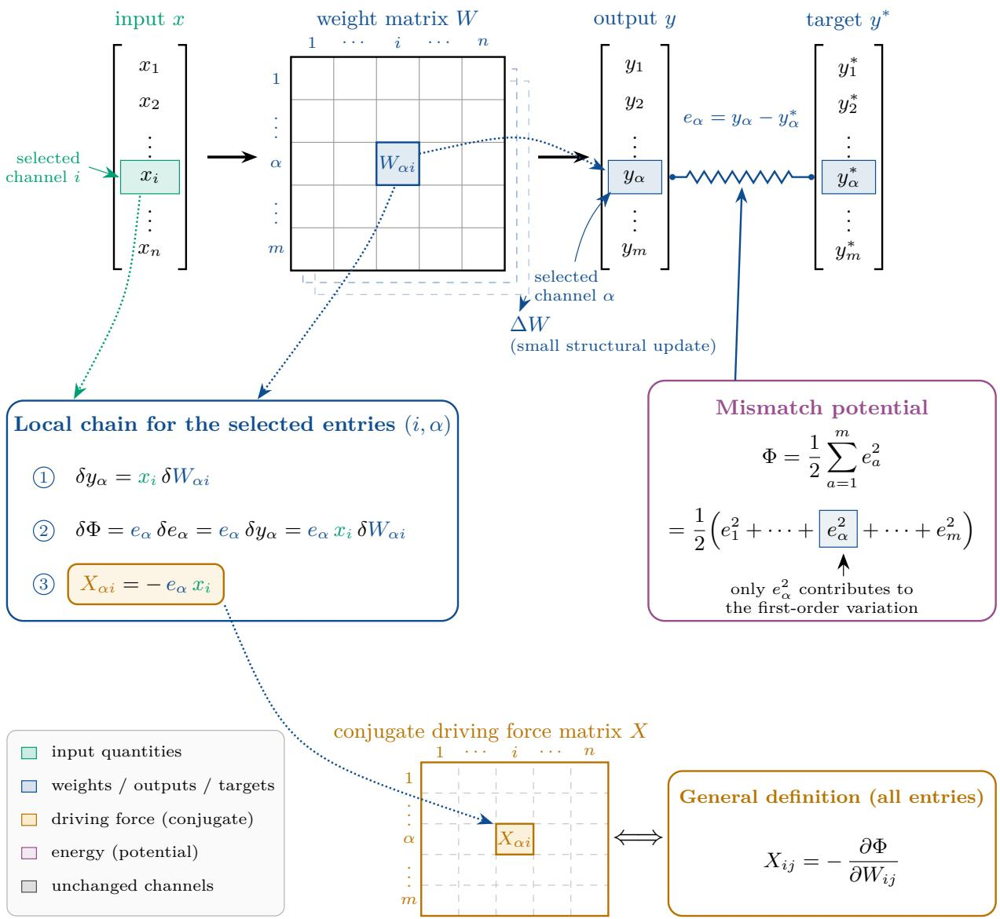  
Figure 1: Construction of the responsive medium and the mismatch potential (schematic). An input x passes through the weight matrix W to produce the output $y = W x ;$ the mismatch between the output and the target $y ^ { \star } , e _ { \alpha } = y _ { \alpha } - y _ { \alpha } ^ { \star }$ , is measured by the mismatch potential $\begin{array} { r } { \Phi = \frac { 1 } { 2 } \sum _ { \alpha } e _ { \alpha } ^ { 2 } , } \end{array}$ so that each output channel is equivalent to a linear spring whose elongation is the mismatch. For a selected coupling element $W _ { \alpha i } .$ , only $e _ { \alpha }$ contributes to the first-order variation, giving the conjugate driving force $X _ { \alpha i } = - e _ { \alpha } x _ { i } ;$ assembling all components gives $X = - \partial \Phi / \partial W$ . The linear readout and quadratic mismatch shown here are an illustrative special case chosen so that every step can be drawn; for a general nonlinear network the same definition is carried by the backpropagation gradient and does not depend on this special case (full derivation in Sec. 3).

## 2 Related work

## 2.1 The temporal dimension of optimizers

Optimizer development started from SGD and the momentum method[36, 40]; with per-coordinate adaptivity, Adam/AdamW then became the default of large-model training[19, 26]; the preconditioning line brings second-order information into matrix structure, from Shampoo to the SOAP used in this paper’s record stack[14, 22, 45]; symbolic search and lightweight second-order estimation give Lion and Sophia respectively[6, 24]. Muon turns to the spectral geometry of the matrix itself[16], entering billion-parameter and trillion-token training with scaling recipes[18, 25], and a family of variants has followed: per-neuron scaling, second-moment injection, distributed orthogonalization, Fisher structuring, fusion with Adam, nuclear-norm constraints, and numerical acceleration of the orthogonalization have appeared one after another[1, 11, 13, 21, 41, 46, 47]. But all of this work lies on the spatial side (orthogonalization implementations, weight decay, scale matching), while the memory kernel has remained the default single exponential. Schedule-Free eliminates the learningrate schedule with a new averaging structure[10], and the theoretical equivalence of its slow EMA to accelerated SGD variants has been established[32]; it explains and replaces the schedule, but does not replace the memory kernel itself. Closest along the time dimension is AdEMAMix in the Adam family: it adds a slow EMA branch to Adam, mixed non-convexly with the fast branch[33]; Admeta introduces a variant of the double exponential moving average into adaptive and non-adaptive momentum optimizers[7].

## 2.2 Relaxation spectra and aging

The stress response with a single relaxation time goes back to the theory of viscoelasticity that Maxwell proposed in 1867[28]: the stress $\sigma$ satisfies $\tau \dot { \sigma } + \sigma = \eta \dot { \gamma }$ , and after the drive is removed it relaxes as $\sigma ( t ) = \sigma ( 0 ) e ^ { - t / \tau } ;$ the exponential average of momentum is of exactly this form, with the momentum coeficient $\beta$ related to the relaxation time $\tau$ by $\beta = e ^ { - \Delta t / \tau }$ . Real materials generally have many internal modes, and the relaxation modulus is written as a positively weighted superposition of exponentials

$$
G ( t ) = \int _ { 0 } ^ { \infty } H ( \tau ) e ^ { - t / \tau } { \frac { d \tau } { \tau } } , \qquad H ( \tau ) \geq 0 ,
$$

where the positive relaxation spectrum $H ( \tau )$ and the distribution of relaxation times are the standard language of viscoelasticity[12], and the two-timescale kernel is precisely the minimal discretization of this spectrum. The Mori–Zwanzig formalism shows that, once the fast variables are eliminated from the full dynamics, the reduced equation acquires a convolutional memory kernel over history[31, 48]; this provides a precedent and a motivation for why an optimizer should have memory: the batch noise and fast degrees of freedom averaged away in training play, in this picture, the role of the eliminated fast variables. It motivates the use of temporal memory here, rather than deriving a first-order relaxation equation, a positive exponential spectrum, or a literal identification of batch noise with a particular fast variable. The relation between response and fluctuation is delimited by the fluctuation–dissipation theorem[20].

Aging has a well-established precedent in glassy physics: in Struik’s classical picture of physical aging, the longer a polymer glass has been left, the more slowly it relaxes, its properties changing systematically with its own age[42]; the training-stage lengthening of the optimal-memory proxy measured here is of the same family in form. On the mathematical side, the closest work is that of Bernstein and Newhouse: they show that, with exponential moving averages switched of, several common optimizers are equivalent to steepest descent under particular norms, the spectral-norm case corresponding to Muon’s update direction; they further note that the precise role of the exponential moving average is perhaps still an open problem. The present paper re-derives this update direction from a dissipative physical picture, and takes as its central object the temporal averaging that this characterization excludes, the memory kernel in the language of this paper[3].

## 3 A physical model for the optimizer

## 3.1 Space: the responsive medium and the update direction

We first construct a physical model based on a linear responsive medium to understand neuralnetwork optimizers. The bulk of most neural networks consists of trainable weight matrices, and here we regard one such matrix, a linear block embedded in an arbitrary nonlinear diferentiable network, as a linear responsive medium with $d _ { \mathrm { i n } }$ input channels and $d _ { \mathrm { o u t } }$ output channels, characterized by $W \in \mathbb { R } ^ { d _ { \mathrm { o u t } } \times d _ { \mathrm { i n } } }$ : a block input $x \in \mathbb { R } ^ { d _ { \mathrm { i n } } }$ passes through W to produce the block output $y =$ $W x \in \mathbb { R } ^ { d _ { \mathrm { o u t } } }$ . Response structures of this kind are common: a conductance matrix maps potential diferences to currents, an elastic response tensor maps deformation to stress, and the transmission matrix of a multi-port network maps incident port signals to outgoing port signals. What they have in common is that each describes how an entire input pattern couples collectively to output patterns, while no single component alone carries the complete physical meaning.

The only physically definite quantity is the efect that the motion of the structure as a whole produces at the output; all a downstream system can feel is the change of the output. We therefore choose to place the constraint on structural rearrangement on the output-side perturbation, not on the change of any individual coupling element.

Assume that the timescale of a single input–output response is far shorter than the rearrangement timescale of $W ,$ so that W can be regarded as fixed during each fast response. On longer timescales, $W$ evolves slowly as a structural variable and gradually changes the coupling between the input and output channels. A rearrangement of W should therefore be understood as a collective motion of the whole medium, not as each coupling element changing independently. We write the above principle in quantitative form with a small rearrangement $\Delta W$ : the perturbation received at the output is

$$
\Delta y = \Delta W x .
$$

To quantify the deviation between the response produced by the current structure and a given target response, define a scalar function Φ(W) depending on W, and call Φ the response mismatch potential. If the actual response is $y$ and the target response is $y ^ { \star }$ , then $r = y - y ^ { \star }$ defines their response mismatch. Near the target response $r = 0$ , the simplest stable mismatch potential takes the quadratic form

$$
\phi ( r ) = \frac { k } { 2 } r ^ { 2 } , \qquad k > 0 ,
$$

which is precisely the potential of a linear spring with elongation r. The negative gradient of the mismatch potential along r gives the restoring force

$$
f = - \frac { d \phi } { d r } = - k r ;
$$

since $k > 0$ , this force always opposes the mismatch r and points toward the target state $r = 0$ In a multi-channel medium, the actual response of output channel α is $\begin{array} { r } { y _ { \alpha } = \sum _ { i } W _ { \alpha i } x _ { i } } \end{array}$ , with error $e _ { \alpha } = y _ { \alpha } - y _ { \alpha } ^ { \star }$ . Summing the spring potentials of the channels (taking $k = 1 \AA ,$ gives the mismatch potential

$$
\Phi = \frac { 1 } { 2 } \sum _ { \alpha } e _ { \alpha } ^ { 2 } ,
$$

whose partial derivative with respect to $e _ { \alpha }$ is $\partial \Phi / \partial e _ { \alpha } = e _ { \alpha }$ . For the α-th channel, changing the coupling element $W _ { \alpha i }$ by $\delta W _ { \alpha i }$ changes the mismatch by $\delta e _ { \alpha } = \delta y _ { \alpha } = x _ { i } \delta W _ { \alpha i } ;$ multiplying the derivative by this increment gives the first-order change of the mismatch potential, $\delta \Phi = e _ { \alpha } \delta e _ { \alpha } =$ $e _ { \alpha } x _ { i } \delta W _ { \alpha i }$ . The driving force felt by the coupling element $W _ { \alpha i }$ is therefore $X _ { \alpha i } = - e _ { \alpha } x _ { i } \colon$ the stronger the input signal and the larger the output error, the larger the rearranging force on that coupling. Thus, for each coupling element $W _ { i j }$ , the conjugate driving force produced by the mismatch potential is

$$
X _ { i j } = - \frac { \partial \Phi } { \partial W _ { i j } } ;
$$

assembling all components in matrix form, $X = - \partial \Phi / \partial W$

The spring construction above uses the most transparent setting, a linear readout with a squared mismatch, in which every step of the derivation has a clear physical picture $\left( \mathrm { F i g . ~ 1 } \right)$ . The resulting definition, $X = - \partial \Phi / \partial W$ , does not depend on that setting. For a block $y _ { b } = W x _ { b }$ inside an arbitrary nonlinear diferentiable network, trained on a minibatch of B samples with per-sample loss $\ell _ { b } .$ , let $\delta _ { b } = \partial \ell _ { b } / \partial y _ { b }$ be the sensitivity passed back to the block output; taking $\Phi$ to be the minibatch loss, the same definition gives

$$
X = - \frac { \partial \Phi } { \partial W } = - \frac { 1 } { B } \sum _ { b = 1 } ^ { B } \delta _ { b } x _ { b } ^ { \mathsf { T } } ,
$$

the sign-reversed minibatch backpropagation gradient of this block. The rank-one spring force $X =$ $- e x ^ { \mathsf { T } }$ is recovered for a linear output layer under squared error with a single sample. Everything that follows uses only $X = - \partial \Phi / \partial W$ , with Φ the loss of the current minibatch, so the construction carries over unchanged to the cross-entropy training used in the experiments.

Although we have now determined the restoring force $f = - k r$ , how r changes in time still depends on the dynamical response of the medium. If inertia is negligible and the drag is proportional to velocity, force balance gives

$$
\gamma \dot { r } = f , \qquad \gamma > 0 ,
$$

hence $\dot { r } = - k r / \gamma$ . The mismatch potential thus determines the restoring force, the dynamical response of the medium determines how fast that force is converted into motion, and together they determine $r ( t )$

If the structure rearranges at rate $V = { \dot { W } }$ , the rate of change of the mismatch potential is

$$
{ \dot { \Phi } } = \sum _ { i j } { \frac { \partial \Phi } { \partial W _ { i j } } } V _ { i j } = - \sum _ { i j } X _ { i j } V _ { i j } .
$$

The instantaneous rate at which structural rearrangement releases the mismatch potential is then $\begin{array} { r } { P = - \dot { \Phi } = \sum _ { i j } X _ { i j } V _ { i j } } \end{array}$ , where $P > 0$ corresponds to motion under which the mismatch potential falls. Just as the one-dimensional spring needs its damping coeficient $\gamma ,$ the matrix medium also needs an additional dynamical relation to convert the driving force X into a structural velocity $V$

For a fixed input x, $y = W x$ gives

$$
\begin{array} { r } { \dot { y } = \dot { W } x = V x , } \end{array}
$$

where $V = { \dot { W } }$ is the structural rearrangement rate. In linear viscous dynamics, the structural rearrangement rate $V$ is proportional to the driving force $X \colon$ the larger the force, the faster the structure moves. This amounts to treating each coupling element as an independent small particle, each immersed in a viscous fluid and each dragged by its own force. In this picture, strongly driven directions move fast, weakly driven directions move slowly, and most of the motion budget is taken by a few strong directions. But the speed cannot grow without bound, and the dynamical mechanism realizing a finite speed is not unique: one can give each particle in the viscous picture its own speed limit, or let the whole medium share one output-side safety budget. As stated above, we place the constraint on the output side, so here we directly limit ${ \dot { y } } = V x$ rather than limiting the motion speed of each internal coupling element. We measure the overall strength of a multi-channel signal by the root mean square of the channel amplitudes. The amplitudes of the input signal x and of the output rate of change $V x$ are

$$
A _ { \mathrm { i n } } ( x ) = { \sqrt { { \frac { 1 } { n } } \sum _ { i = 1 } ^ { n } x _ { i } ^ { 2 } } } , \qquad A _ { \mathrm { o u t } } ( V x ) = { \sqrt { { \frac { 1 } { m } } \sum _ { \alpha = 1 } ^ { m } ( V x ) _ { \alpha } ^ { 2 } } } .
$$

The output rate of change depends on both V and x: the same structural rearrangement afects some input directions weakly and others possibly more strongly. One may average the perturbation over the diferent input directions, or limit the strongest response among them; this paper chooses the latter, requiring every input direction to satisfy the same upper bound. Taking one structuralupdate interval as the unit of time, and letting $\varepsilon > 0$ denote the maximum output rate of change allowed per unit input amplitude, the direction-wise limit above reads

$$
A _ { \mathrm { o u t } } ( V x ) \leq \varepsilon A _ { \mathrm { i n } } ( x ) , \qquad { \mathrm { f o r ~ a l l ~ } } x .
$$

Substituting the definitions of the root-mean-square amplitudes, this becomes

$$
\sqrt { \frac { 1 } { m } \sum _ { \alpha = 1 } ^ { m } ( V x ) _ { \alpha } ^ { 2 } } \leq \varepsilon \sqrt { \frac { 1 } { n } \sum _ { i = 1 } ^ { n } x _ { i } ^ { 2 } } , \qquad \mathrm { f o r ~ a l l ~ } x .
$$

For any nonzero input x, dividing by the total input amplitude and rearranging the channel-count factors gives

$$
\frac { \big ( \sum _ { \alpha = 1 } ^ { m } ( V x ) _ { \alpha } ^ { 2 } \big ) ^ { 1 / 2 } } { \big ( \sum _ { i = 1 } ^ { n } x _ { i } ^ { 2 } \big ) ^ { 1 / 2 } } \leq \varepsilon \sqrt { \frac { m } { n } } .
$$

For a given input direction x, the left-hand side is the ratio of the total amplitude of the output rate of change to the total input amplitude, that is, the output gain of V in that direction. The problem therefore becomes: among all structural velocities V satisfying the output-gain limit, choose the one that maximizes the mismatch-potential release rate $\begin{array} { r } { P = \sum _ { i j } X _ { i j } V _ { i j } } \end{array}$

Consider first the one-dimensional case: when the structure can move along only one direction, the output limit above is an ordinary speed cap. Let the structural degree of freedom be $q ;$ the velocity $v = \dot { q }$ satisfies $| v | \leq v _ { 0 }$ , where $v _ { 0 } > 0$ is the maximum speed allowed for this structure. In this one-dimensional case, the conjugate driving force produced by the mismatch potential $\Phi ( q )$ is

$$
X = - { \frac { d \Phi } { d q } } .
$$

The release rate of the mismatch potential is then

$$
P = - \dot { \Phi } = - \frac { d \Phi } { d q } \dot { q } = X v .
$$

The release rate $P = X v$ is positive when v and X share a sign (the mismatch potential falls), negative when they difer, and its magnitude grows with v ; the fastest release is therefore $v = v _ { 0 }$ when $X > 0$ and $v = - v _ { 0 }$ when $X < 0 ;$ when $X = 0$ the structure is undriven and hence stays at rest, $v = 0$ . Writing the three cases together, the velocity of the structure is

$$
v = \left\{ \begin{array} { l l } { v _ { 0 } , } & { X > 0 , } \\ { 0 , } & { X = 0 , } \\ { - v _ { 0 } , } & { X < 0 . } \end{array} \right.
$$

Next consider two mutually independent input–output channels. Let a and b denote the rearrangement speeds of the structure along the first and the second channel. Since the two channels do not mix, for an input $\boldsymbol { x } = \left( x _ { 1 } , x _ { 2 } \right)$ the first channel produces the output rate of change ax and the second produces bx2, so

$$
{ \dot { y } } = ( a x _ { 1 } , b x _ { 2 } ) .
$$

The amplitudes of the input and of the output rate of change are then

$$
A _ { \mathrm { i n } } ( x ) = \sqrt { \frac { x _ { 1 } ^ { 2 } + x _ { 2 } ^ { 2 } } { 2 } } , \qquad A _ { \mathrm { o u t } } ( \dot { y } ) = \sqrt { \frac { a ^ { 2 } x _ { 1 } ^ { 2 } + b ^ { 2 } x _ { 2 } ^ { 2 } } { 2 } } .
$$

Substituting these two amplitudes into the output limit and squaring gives

$$
a ^ { 2 } x _ { 1 } ^ { 2 } + b ^ { 2 } x _ { 2 } ^ { 2 } \leq \varepsilon ^ { 2 } ( x _ { 1 } ^ { 2 } + x _ { 2 } ^ { 2 } ) , \qquad { \mathrm { f o r ~ a l l ~ } } ( x _ { 1 } , x _ { 2 } ) .
$$

For any nonzero input, this is equivalent to

$$
\frac { a ^ { 2 } x _ { 1 } ^ { 2 } + b ^ { 2 } x _ { 2 } ^ { 2 } } { x _ { 1 } ^ { 2 } + x _ { 2 } ^ { 2 } } \leq \varepsilon ^ { 2 } .
$$

Expanding the left-hand side, it can be written as

$$
\frac { x _ { 1 } ^ { 2 } } { x _ { 1 } ^ { 2 } + x _ { 2 } ^ { 2 } } a ^ { 2 } + \frac { x _ { 2 } ^ { 2 } } { x _ { 1 } ^ { 2 } + x _ { 2 } ^ { 2 } } b ^ { 2 } ,
$$

where the two coeficients are nonnegative and sum to 1, so the left-hand side is a weighted average of $a ^ { 2 }$ and $b ^ { 2 }$ , taking values between the two; when the input lies along a single channel, the weight concentrates on that channel and the weighted average attains $a ^ { 2 }$ or $b ^ { 2 }$ accordingly. Hence the requirement that the weighted average not exceed $\varepsilon ^ { 2 }$ for every input direction is equivalent to

$$
| a | \leq \varepsilon , \qquad | b | \leq \varepsilon .
$$

In particular, when $| a | = | b | = \varepsilon$ the weighted average equals $\varepsilon ^ { 2 }$ for every input direction, and both channels reach the upper bound without violating the output limit. The maximum output gain is therefore determined by the larger of a and b , not by their sum. Take, in each channel, the direction of motion that lowers the mismatch potential as positive, and denote the driving-force strengths on the two channels by $\sigma _ { 1 } > 0$ and $\sigma _ { 2 } > 0$ . The two channels contribute $\sigma _ { 1 } a$ and $\sigma _ { 2 } b$ to the release rate of the mismatch potential, so the total release rate is

$$
P = \sigma _ { 1 } a + \sigma _ { 2 } b .
$$

Since $\sigma _ { 1 } , \sigma _ { 2 } > 0$ , increasing either a or b raises the release rate $P ;$ and the output limit allows each channel to reach ε on its own, so the rearrangement speeds that maximize the release rate are

$$
a = b = \varepsilon .
$$

Substituting $a = b = \varepsilon$ into the total release rate gives

$$
P _ { \mathrm { m a x } } = \varepsilon ( \sigma _ { 1 } + \sigma _ { 2 } ) .
$$

One sees that the stronger driving force contributes more to $P _ { \mathrm { m a x } } .$ but as long as the driving forces on both channels are positive, both rearrangement speeds take ε. The output cap is therefore not a total budget shared between the two channels but a separate ceiling for each: the strength of the driving force only determines how much mismatch potential each channel releases, while the size of the motion is set uniformly at the output.

In a general multi-channel medium, diferent input and output directions usually mix: an independent channel no longer corresponds to a single coupling element, but to a collective mode in which many coupling elements rearrange together in fixed proportion. In the k-th collective mode, vk gives which input channels participate and in what relative proportion, $u _ { k }$ gives the participation proportions of the output channels, and $a _ { k }$ denotes the rearrangement speed of the whole mode. In a collective channel formed by pairing $v _ { k }$ with $u _ { k }$ , the rearrangement speed of the coupling element $W _ { \alpha i }$ is taken as the product of the participation proportions on the two sides times the overall speed, that is,

$$
V _ { \alpha i } ^ { ( k ) } = a _ { k } ( u _ { k } ) _ { \alpha } ( v _ { k } ) _ { i } .
$$

Arranging the speeds of these $m \times n$ coupling elements into a matrix $V ^ { ( k ) }$ , the relation above can be written jointly as

$$
V ^ { ( k ) } = a _ { k } u _ { k } v _ { k } ^ { \mathsf { T } } .
$$

The components of the input x are first combined according to the proportions given by $v _ { k }$ into

$$
\sum _ { i = 1 } ^ { n } ( v _ { k } ) _ { i } x _ { i } ,
$$

so the output rate of change produced by the k-th collective mode is

$$
{ \dot { y } } ^ { ( k ) } = V ^ { ( k ) } x = a _ { k } u _ { k } \sum _ { i = 1 } ^ { n } ( v _ { k } ) _ { i } x _ { i } .
$$

The sum gives the amplitude with which the input x enters the k-th collective mode: if it is zero, this mode produces no output change; its sign determines whether the output moves along $u _ { k }$ or along the opposite direction. To regard several collective modes as independent channels, one must guarantee that the input combination received by one mode does not enter another, and that the output-change directions they produce do not mix either. The same amplitude argument as in the two-channel case shows (step-by-step derivation in Appendix A) that this requires the participation proportions to be orthogonal on each side:

$$
\sum _ { i = 1 } ^ { n } ( v _ { l } ) _ { i } ( v _ { k } ) _ { i } = 0 , \qquad \sum _ { \alpha = 1 } ^ { m } ( u _ { k } ) _ { \alpha } ( u _ { l } ) _ { \alpha } = 0 , \qquad k \neq l .
$$

Orthogonality on the input side guarantees that the modes do not cross-talk; orthogonality on the output side eliminates the cross terms in the output amplitude, so that the output limit constrains each mode’s own contribution.

The driving force felt by a collective mode should be determined by the rate at which it releases the mismatch potential when moving at unit rearrangement speed: substituting $V ^ { ( k ) }$ into the release rate $\begin{array} { r } { P = \sum _ { \alpha i } X _ { \alpha i } V _ { \alpha i } } \end{array}$ , and taking the potential-lowering direction of motion of each collective mode as positive, gives the force-times-velocity power relation

$$
P _ { k } = \sigma _ { k } a _ { k } , \qquad \sigma _ { k } = \sum _ { \alpha = 1 } ^ { m } \sum _ { i = 1 } ^ { n } X _ { \alpha i } ( u _ { k } ) _ { \alpha } ( v _ { k } ) _ { i } \geq 0 .
$$

When the medium rearranges along r independent modes simultaneously, the structural velocities of the modes add; since the release rate is linear in the structural velocity, the total velocity and total release rate are

$$
V = \sum _ { k = 1 } ^ { r } a _ { k } u _ { k } v _ { k } ^ { \mathsf { T } } , \qquad P = \sum _ { k = 1 } ^ { r } \sigma _ { k } a _ { k } .
$$

The derivation above decomposes the structural motion into independent modes, so it remains to confirm that, for an arbitrary distribution of conjugate driving force X, such a set of modes can always be found and represents X completely. For any real matrix X, one can always find mode pairs $( u _ { k } , v _ { k } )$ satisfying the input-side and output-side independence conditions above, such that the full nonzero driving force decomposes completely as

$$
X = \sum _ { k = 1 } ^ { r } \sigma _ { k } u _ { k } v _ { k } ^ { \mathsf { T } } .
$$

Here r denotes the number of modes with $\sigma _ { k } > 0$ , that is, the number of collective channels actually driven; the componentwise proof of this decomposition, together with the zero-driving-force and degenerate cases, is given in Appendix B. With the unified mode scale of Appendix B, $\left| a _ { k } \right|$ is the ratio of the k-th channel’s total output amplitude to its total input amplitude, so the root-meansquare output limit above gives

$$
\left| a _ { k } \right| \leq c , \qquad c \equiv \varepsilon { \sqrt { \frac { m } { n } } } .
$$

Independent modes have no output cross terms, so the output amplitude ratio under any input never exceeds max $\left| a _ { k } \right|$ ; all modes can therefore reach $| a _ { k } | = c$ simultaneously without violating the total output limit. In the total release rate $\begin{array} { r } { P = \sum _ { k } \sigma _ { k } a _ { k } } \end{array}$ , each $\sigma _ { k } > 0$ , and each $a _ { k }$ can independently reach $c ;$ maximum dissipation therefore selects

$$
a _ { k } = c , \qquad k = 1 , \dots , r .
$$

Substituting these speeds back into the total release rate gives

$$
P _ { \operatorname* { m a x } } = c \sum _ { k = 1 } ^ { r } \sigma _ { k } .
$$

Since every driven mode takes $a _ { k } = c ,$ the total structural rearrangement velocity of the medium is

$$
V ^ { \star } = c \sum _ { k = 1 } ^ { r } u _ { k } v _ { k } ^ { \top } .
$$

For modes with $\sigma _ { k } = 0 , P _ { k } = \sigma _ { k } a _ { k } = 0 $ , so the maximum-dissipation condition by itself cannot determine their speed; as in the one-dimensional case, this paper adopts the convention that what is undriven does not move, setting $a _ { k } = 0$ . The medium thus retains the collective channels indicated by the driving force but flattens the diferences in their strengths: all driven channels update at the same safe speed c. Under the same output-gain cap, this releases the mismatch potential faster than viscous dynamics: in viscous dynamics most of the motion budget is occupied by a few strong channels while the weak ones barely participate; under the output cap, all driven channels release the mismatch potential in parallel at the safe amplitude, opening more release channels without increasing the maximum worst-case output perturbation.

The correspondence with optimizer notation difers only by a sign: $X = - G$ , where $G = \partial \Phi / \partial W$ is the backpropagation gradient of this block, so $V ^ { \star } / c$ is the orthogonal polar factor of X and $\operatorname { p o l a r } ( X ) = - \operatorname { p o l a r } ( G )$ ; the physical form $W _ { t + 1 } = W _ { t } + \eta V ^ { \star }$ corresponds to the descent form $W _ { t + 1 } = W _ { t } - \eta c \mathrm { p o l a r } ( G )$ implemented in Muon. Actual Muon approximates this polar factor with a finite Newton–Schulz iteration and applies its implementation-level magnitude scaling; these magnitude details are not derived here and are kept unchanged in all kernel-swap experiments.

## 3.2 Time: internal stress memory

The derivation above determined the structural rearrangement velocity of the medium for a given conjugate driving force X, implicitly assuming that during one structural response X can be regarded as steady. A real medium continually undergoes fast input–output responses, so the conjugate driving force $X ( t )$ changes before the slow structure has had time to rearrange. Consequently, the instantaneous force direction produced by one brief response need not represent the direction that keeps lowering the mismatch potential over a stretch of time. If the medium responded to every instantaneous force with the full-amplitude update described above, the structural motion would keep changing direction with the fast variation of $X ( t )$

When describing the slow structure, one should therefore put many fast impulses together and consider the average efect they leave over a period of time. This resembles a Brownian particle in a liquid: the direction of an individual molecular impact is random, and the particle’s macroscopic motion is decided not by any single impact but by the joint statistics of many. Treating the stochastic gradient drive as an efective noise process has precedent in statistical physics[30]. Fast fluctuations are thus not passed intact to the slow structure: impulses in opposing directions cancel one another, while impulses that stay aligned gradually accumulate into internal stress.

When a medium is subjected to an external force, the internal stress is not established completely in an instant; nor does it vanish instantly once the force is removed, but relaxes gradually within a finite time. What the slow structure responds to is precisely this stress that is gradually established and persists inside the medium. Denote this internal stress by a matrix $M ( t )$ , and call it the generalized internal stress memory. If the current external force $X ( t )$ difers from the internal memory $M ( t )$ , the internal stress gradually approaches $X ( t )$ ; if the current external force disappears, the existing internal stress slowly relaxes. The simplest form of stress relaxation is first-order relaxation,

$$
\tau \frac { d M } { d t } = X ( t ) - M ( t ) .
$$

Here τ is the memory time of the material. This is the most basic first-order relaxation form in many physical systems, from Maxwell’s viscoelastic element[28] to the memory kernel that necessarily appears in the Mori–Zwanzig formalism after the fast variables are eliminated[31, 48]: the current internal state does not instantly equal the external drive, but follows it on some finite timescale. It has three implications: if $X ( t )$ stays unchanged for a long time, $M ( t )$ eventually approaches $X ( t )$ if $X ( t )$ jitters back and forth rapidly, $M ( t )$ does not follow the jitter completely but filters out the high-frequency fluctuations; the larger τ, the longer the memory, and the smaller τ, the faster the response. In particular, if the external force is removed at $t = 0$ , only the self-relaxation of the internal stress remains in the equation, so

$$
M ( t ) = M ( 0 ) e ^ { - t / \tau } .
$$

Within a suficiently short time interval $\Delta t .$ , the external force can be taken as constant, and the per-step relaxation rate computed from the internal stress $M _ { t - 1 }$ at the start of the interval, so

$$
M _ { t } - M _ { t - 1 } = \frac { \Delta t } { \tau } \big ( X _ { t } - M _ { t - 1 } \big ) .
$$

Rearranging,

$$
M _ { t } = \Big ( 1 - \frac { \Delta t } { \tau } \Big ) M _ { t - 1 } + \frac { \Delta t } { \tau } X _ { t } .
$$

Writing

$$
\beta = 1 - \frac { \Delta t } { \tau }
$$

for the fraction of internal stress retained after each time step, this becomes

$$
M _ { t } = \beta M _ { t - 1 } + ( 1 - \beta ) X _ { t } .
$$

And since $\Delta t$ is a small quantity, for $\Delta t \ll \tau$

$$
1 - \frac { \Delta t } { \tau } \simeq e ^ { - \Delta t / \tau } .
$$

In fact, if $X ( t )$ is taken as constant within each time step, exact integration of the continuous relaxation equation gives

$$
\beta = e ^ { - \Delta t / \tau } ,
$$

of which the preceding expression is the short-time first-order expansion. This recursion ${ M } _ { t } \ =$ $\beta M _ { t - 1 } + ( 1 - \beta ) X _ { t }$ is precisely the standard form of momentum memory in deep learning, whose discrete-time ancestor goes back to heavy-ball[36].

Hence, once the internal stress memory $M _ { t }$ has formed, only forces that recur over multiple time steps with a consistent direction are retained; that is, when the medium selects its fastest rearrangement under the output cap, the driving force it relies on changes from the instantaneous force $X _ { t }$ to the internal stress memory $M _ { t }$ . What is then selected is the structural motion that releases the internal stress memory fastest, not the motion that most rapidly lowers the mismatch potential under each instantaneous force. This point is especially important for the full-amplitude update under the output cap. It was derived above that under the output cap all driven channels are pushed to the same safe amplitude, which means the per-step perturbation budget at the output is precious and should not be wasted on transient noise directions that appear by chance. The internal stress memory provides exactly this temporal screening of directions before the fullamplitude update: only channels that persist over multiple time steps accumulate in the memory, while channels that appear briefly and disappear cancel each other. The order therefore matters: first let the instantaneous forces accumulate inside the medium into stress memory, then apply the full-amplitude update to the persistent channels in the memory. Persistent components are thereby reinforced before the full-amplitude update, whereas transient components retain only their instantaneous contribution; in the benchmark implementation this temporal screening is partial rather than absolute, because what enters the spatial response is a mixture of the instantaneous drive and the memory (see Sec. 3.3 and Methods). If instead the order is reversed, first applying a full-amplitude update to the instantaneous force at each step and then averaging the results, noise directions would be amplified to the safe amplitude before the averaging.

## 3.3 From a single relaxation time to a two-timescale kernel

The derivation above used a single relaxation time, representing a medium in which all internal rearrangements proceed at the same speed.

But a complex medium generally has more than one internal rearrangement mode: even if the macroscopic slow variable is a single weight matrix $W$ , the eliminated internal structure can still reorganize in many diferent ways. Near a stable state, the free energy of all internal degrees of freedom is a positive-definite quadratic form, and so is the dissipation. After decomposing these mutually coupled internal motions into normal modes, each normal mode independently satisfies the same first-order relaxation equation, but each with its own restoring strength and friction, hence a diferent relaxation time:

$$
\tau _ { j } \frac { d M _ { j } } { d t } = X ( t ) - M _ { j } ( t ) .
$$

Here $M _ { j }$ is the stress held by the j-th internal mode and $\tau _ { j }$ the relaxation time of that mode. The macroscopic stress memory of the medium is the sum of the stresses carried by all internal modes. Normalizing the total static response, it can be written as

$$
M ( t ) = \sum _ { j } w _ { j } M _ { j } ( t ) , \qquad w _ { j } \geq 0 , \sum _ { j } w _ { j } = 1 .
$$

We restrict the medium to the class in which all mode weights are positive, the generalized-Maxwell class with completely monotone relaxation: in such a medium, every internal mode under sustained aligned loading carries stress of the same sign as the load; none contributes with the opposite sign. That the weights are positive is a stated property of this model class, not a consequence of stability alone: a stable overdamped system with non-reciprocal internal couplings can relax nonmonotonically in a chosen input–output channel. The weights summing to one guarantees that after a constant external force has acted long enough, the macroscopic internal stress finally returns to the applied force, $M ( t )  X$ . If the medium is first equilibrated under a constant force $X _ { 0 }$ and the force is suddenly removed at $t = 0$ , then

$$
M ( t ) = X _ { 0 } \sum _ { j } w _ { j } e ^ { - t / \tau _ { j } } .
$$

A medium of this class with many degrees of freedom has not a single relaxation time but a positive spectrum of relaxation times. Standard Muon keeps only one of these modes, equivalent to describing the entire stress memory of the medium by one exponential,

$$
M ( t ) = X _ { 0 } e ^ { - t / \tau } .
$$

This is the single-pole approximation of the relaxation spectrum. It uses one and the same $\tau$ to determine both the initial response speed and the long-time memory depth: the shorter $\tau ,$ the faster the medium responds but the faster it forgets; the longer τ , the deeper the memory but the harder it is to follow changes in time. A single exponential cannot separate these two physical properties. The minimal model beyond the single-pole approximation keeps two representative relaxation modes, one fast and one slow:

$$
\tau _ { f } \frac { d M _ { f } } { d t } = X ( t ) - M _ { f } ( t ) , \qquad \tau _ { s } \frac { d M _ { s } } { d t } = X ( t ) - M _ { s } ( t ) , \qquad \tau _ { f } < \tau _ { s } .
$$

The total internal stress is their convex combination,

$$
M _ { \mathrm { B M } } ( t ) = w M _ { f } ( t ) + ( 1 - w ) M _ { s } ( t ) , \qquad 0 \leq w \leq 1 .
$$

This is the Bi-Maxwell memory: the minimal two-timescale form of the general relaxation spectrum relative to the single-pole approximation, with the fast mode determining the short-time response and the slow mode the long-time tail (Fig. 2). The two belong to the same medium: they first jointly form the total stress, and the update direction derived above then decides how the weight (a) Microscopic analogy of the fast and slow internal relaxation modes in a glassy medium. The same matrix drive X(t) excites both types of response: the fast mode corresponds to local relaxation of a single particle inside the cage of its neighbours, in which no contact of the cage is broken, so that the mode follows the drive fast and forgets fast (analogous to $\beta$ relaxation in glasses); the slow mode corresponds to a cooperative structural rearrangement of a group of particles, in which existing contacts must first break and then reconnect (grey dashed and blue solid lines in the panel), so that the mode builds and relaxes slowly and leaves long-lived structural memory once the contacts have changed (analogous to α relaxation). The contrast between a single particle and a group of particles is drawn only to separate the two types of motion; the fast and slow modes of this paper are internal modes of one and the same medium and difer only in relaxation time (Sec. 3.3). The panel provides intuition by analogy, not a microscopic derivation of the optimizer dynamics.

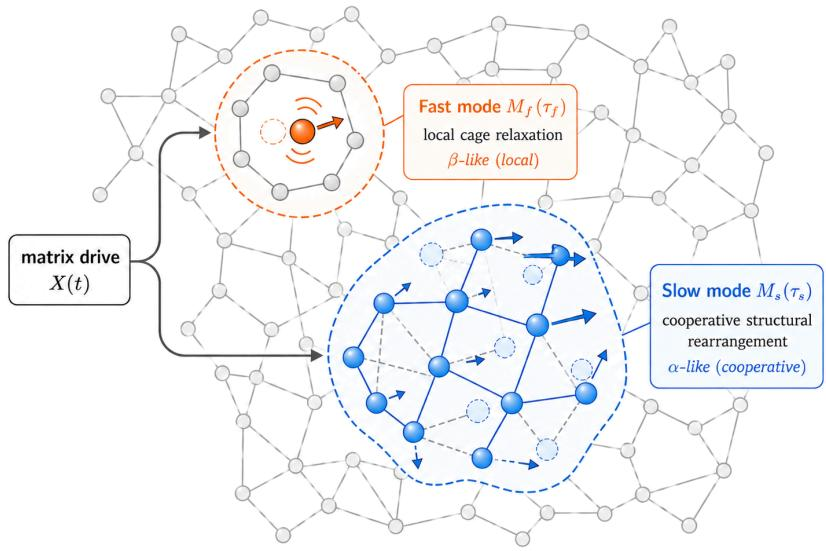  
(a)  
unperturbed particle previous position particle in fast local motion particles in cooperative rearrangement

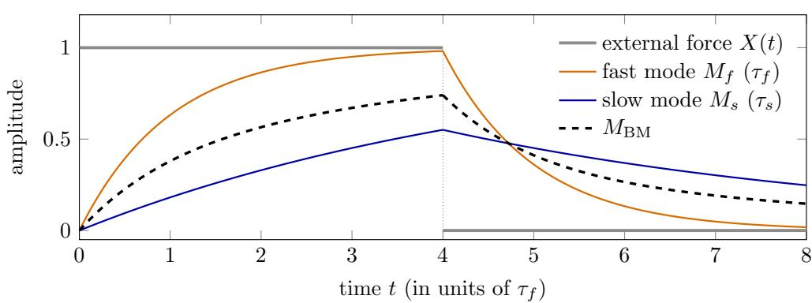  
(b)  
Figure 2: Glassy picture and temporal picture of the Bi-Maxwell memory (schematic).

(b) Temporal picture (illustrative parameters: $\tau _ { s } = 5 \tau _ { f } , w = 0 . 4 4 ;$ the recipe used in the experiments is $\beta _ { f } ~ = ~ 0 . 8 5 , ~ \beta _ { s } ~ = ~ 0 . 9 8 , ~ w ~ = ~ 0 . 4 3 8 5$ , see Methods). A constant external force is applied at $t \ : = \ : 0$ and removed at $t = 4 \tau _ { f } \ \mathrm { ( g r e y ) }$ . The fast mode follows quickly and also forgets quickly (orange); the slow mode builds up slowly and relaxes slowly (blue); the macroscopic internal stress $M _ { \mathrm { B M } } = w M _ { f } + ( 1 - w ) M _ { s }$ (black dashed) is fast first and slow later, combining response speed with memory depth.

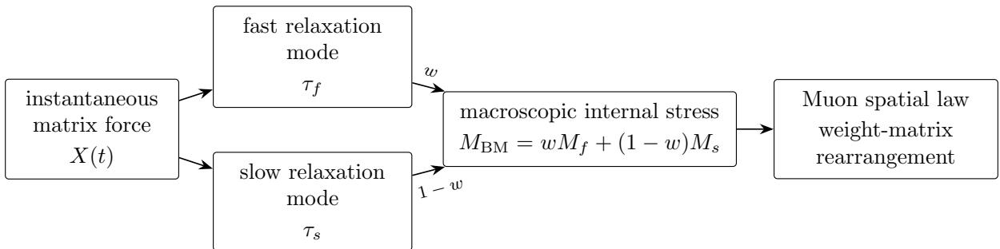  
Figure 3: Two-timescale structure of Bi-Maxwell (schematic). The same matrix force $X ( t )$ drives the fast and the slow relaxation mode; the two combine with weights w and ${ 1 - w }$ into the macroscopic internal stress $M _ { \mathrm { B M } } = w M _ { f } + ( 1 - w ) M _ { s }$ , which then enters the spatial law to complete the weightmatrix rearrangement.

matrix rearranges $\left( { \mathrm { F i g . ~ 3 } } \right)$ . “Minimal” means: the single pole locks response speed and memory depth to the same τ, the two-timescale form is the smallest form that separates the two, and three or more modes are the natural generalization.

If the external force is taken as approximately constant between two adjacent training instants, the continuous equations above discretize exactly to

$$
M _ { t } ^ { f } = \beta _ { f } M _ { t - 1 } ^ { f } + ( 1 - \beta _ { f } ) X _ { t } , \qquad M _ { t } ^ { s } = \beta _ { s } M _ { t - 1 } ^ { s } + ( 1 - \beta _ { s } ) X _ { t } ,
$$

where

$$
\beta _ { f } = e ^ { - \Delta t / \tau _ { f } } , \qquad \beta _ { s } = e ^ { - \Delta t / \tau _ { s } } .
$$

The two-timescale internal stress memory is then

$$
\boldsymbol { M _ { t } ^ { \mathrm { B M } } } = \boldsymbol { w } \boldsymbol { M _ { t } ^ { f } } + ( 1 - \boldsymbol { w } ) \boldsymbol { M _ { t } ^ { s } } .
$$

It replaces standard Muon’s single-timescale stress memory $M _ { t } = \beta M _ { t - 1 } + ( 1 - \beta ) X _ { t }$ and then enters Muon’s original spatial matrix response as before: the instantaneous forces are first accumulated inside the medium into the two-timescale stress memory, and the persistent channels in the memory then receive the full-amplitude update under the output cap. In the implementation, what enters the spatial response is the mix $R _ { t }$ of the instantaneous force and the memory (Methods); the kernel swap modifies only the memory branch, while the instantaneous branch and its mixing schedule are kept unchanged.

## 4 Experiment 1: the controlled kernel swap

## 4.1 Speedup on a frozen protocol

Experiment 1 asks whether the shape of the memory kernel afects training speed. The design: on a fully frozen optimizer configuration, we replace only the internal memory kernel of the medium and keep every other component unchanged.

We use a 124 M-parameter language model; the drive is fixed to the gradient force given by one batch of text per step; the target is fixed to a held-out validation loss of 3.28. A group of runs with the same configuration and diferent seeds is called an arm. Whether an arm reaches the target is decided by the benchmark criterion $( 3 . 2 8 - \bar { L } ) \sqrt { n } \geq 0 . 0 0 4$ , with L¯ the mean validation loss over the arm’s seeds at the same step; the earliest synchronized validation step at which the arm satisfies this criterion is called the first-crossing step below. To make the two memory kernels comparable item by item, all components other than $\beta _ { f } , \beta _ { s } , w$ and the enable step $T _ { \mathrm { o n } }$ (from which the two-timescale kernel is active; see Sec. 4.2), namely the spatial response, Newton–Schulz orthogonalization[2], the learning-rate and weight-decay schedules, and the readout, are kept identical line by line; comparisons are made only at synchronized step counts.

We first perform the kernel swap at the cleanest level, the bare tuned-Muon stack: only the single-timescale kernel is replaced by the two-timescale one. The single-pole kernel (that is, single timescale) crossed at step 3250 on $n = 1 0$ seeds, and the two-timescale kernel crossed at step 3210 on $n = 8$ seeds, 40 steps earlier $\left( \mathrm { F i g . \ 4 a } \right)$ . The two arms difer only in the memory kernel at the optimizer level; the two-timescale arm ran on A800 $( n = 8 )$ , while the tuned reference uses the oficial H100 logs $( n = 1 0 )$ , so hardware and seed counts difer.

This advance is not driven by a single trajectory. The crossing steps of the eight seeds on the bare stack are 3210, 3180, 3175, 3200, 3190, 3210, 3170, 3190 , with no exclusions of any kind; the full per-seed table is in Appendix C.

This diference was tested directly at synchronized steps and is not an accident of a single-step reading. The benchmark’s test statistic is the diference of the two arms’ mean validation losses at the same step divided by $\sqrt { 1 / n _ { 1 } + 1 / n _ { 2 } }$ , the diference being the reference arm minus the tested arm (so a positive value means the latter has the lower loss), with values above 0.004 counted as significant. At steps 3200/3225/3250 this statistic is $0 . 0 0 4 3 6 / 0 . 0 0 4 1 3 / 0 . 0 0 4 0 8$ , all above the threshold, including step 3250, the crossing step of the reference arm itself. The first-crossing step is read out by the track’s margin criterion; the per-seed crossing steps are recorded as well, to reflect the randomness of individual trajectories; the comparison between the arms is always based on the mean diference.

## 4.2 Kernel shape, age and path

To distinguish whether the gain comes from the two-timescale shape or merely from a deeper average memory, first define the mean age (the average lag, in steps, of the gradients entering the average)

$$
\bar { n } = w n ( \beta _ { f } ) + ( 1 - w ) n ( \beta _ { s } ) , \qquad n ( \beta ) = \frac { \beta } { 1 - \beta } .
$$

The kernel mean age is written ¯n and measured in steps; an unmarked n always denotes the number of seeds in an arm. To exclude the explanation of a deeper average memory, the single-pole kernel is matched to the same mean age as the two-timescale kernel, and the two kernel shapes are then compared: the single-pole kernel has only one time constant, while the two-timescale kernel contains one fast and one slow time constant. Under two diferent $( \beta _ { f } , \beta _ { s } , w )$ choices with the same mean age $\bar { n } = 1 9$ , the two-timescale kernel still beats the matched single pole, showing that what acts is the two-timescale shape, not the mean age itself. At the main recipe’s $\bar { n } = 3 0$ this control was repeated at formal scale: degenerating the two-timescale kernel to a single pole with equal $\beta ~ ( \beta = 3 0 / 3 1$ everything else kept line-by-line unchanged, $T _ { \mathrm { o n } } = 1 0 0 0 , \mathrm { A } 8 0 0 , n = 8 )$ gives an arm-level first crossing at step 2775, that is, 140 steps later than the two-timescale arm’s 2635, and later even than the $\bar { n } = 1 9$ single-pole baseline (2690); at step 2635 the test statistic is 0.0181, far above the 0.004 significance threshold. Deepening the single pole’s memory to the same mean age does not reproduce the gain; it degrades performance.

Longer memory is not always better. On the fixed protocol we scan the mean age $\bar { n } \in$ $\{ 1 5 , 1 9 , 2 5 , 3 0 , 3 6 , 4 2 \}$ . The fixed-step loss diference first falls and then rises with ¯n (the gain first grows and then shrinks), and is best in this exploratory single-trajectory fork scan at $\bar { n } = 3 0$ (hyperparameter-scan figure in Appendix E): shorter gives insuficient memory, longer over-smooths, and both ends degrade.

Nor is deep memory equally beneficial throughout training. Fixing $\bar { n } = 3 0$ , we scan the enable step $T _ { \mathrm { o n } } \in \{ 0 , 5 0 0 , 7 0 0 , 1 0 0 0 , 1 1 5 0 \}$ . The curve is non-monotonic, with an enabling window: enabling too early is harmful; one possible reading is that the slow mode absorbs too much early noise while the drift has not yet stabilized; $T _ { \mathrm { o n } } = 7 0 0$ first crosses at 2655, $T _ { \mathrm { o n } } = 1 0 0 0$ at 2635 (the best observed in this scan), and 1150 falls back. Of these, 700 and 1000 are each formal from-scratch $n = 8$ arms (A800), and the same-seed pairing of 1000 against 700 $( n = 3 )$ gives a median fixed-step diference of $- 1 . 8 2 \times 1 0 ^ { - 3 }$ , with the three seeds agreeing in direction; $T _ { \mathrm { o n } } = 0$ and 500 are exploratory readings, and 1150 is $n = 2$ , for directional reference only. This enabling window belongs to the current protocol and is not a universal absolute training step.

Does the gain come from being smoother near the endpoint, or from rerouting the trajectory in the middle? An exploratory control compares two ways of administering the deep memory: one arm keeps a constant deep kernel at $\bar { n } = 3 0$ throughout after enabling; the other stays at $\bar { n } = 1 9$ and anneals the mean age up to 30 only within the tail window [2200, 2700]. The slow-state recursions of the two arms are identical; they difer only in when the deep weight is handed to the slow component. Deepening only in the tail is nearly neutral in gain; the constant deep kernel falls temporarily behind in the middle, and by the tail recovers the deficit and obtains a better result. The final state therefore depends on the path taken to reach it: the pattern is consistent with the picture of path dependence, though it does not by itself single out a microscopic mechanism. This also parallels the familiar memory formation in amorphous solids, where the competition between energetics and dynamics likewise makes the final state depend on the writing path[23, 34].

Nor does the gain come from raising the readout weight $\mu { : }$ raising $\mu$ alone to 0.96 or 0.97 degrades the loss monotonically, showing that memory shape and readout weight are two diferent things.

## 4.3 Raw readout and hardware transfer

The record stack’s validation readout carries a tail EMA average (Tail-EMA; see Methods). To verify whether the gain comes only from this readout, we switch it of on both arms: under the raw readout the two-timescale arm first crosses at step 2690 and the single-pole record arm at step 2735, with a synchronized between-arm test statistic of 0.0078 at step 2690; the ordering survives without the readout; this control argues against a readout-only explanation of the gain.

The gain likewise appears on the more complex frozen stack. The record stack contains SOAP[45], Tail-EMA, RowFloor, layer-radius pinning and schedules, all of which are kept untouched; replacing only the internal memory kernel with the two-timescale one, the main-result arm on A800 with n = 8 reaches the target at step 2635, ahead of the 2690-step record standing at the time (July 2026).

The gain reproduces across hardware: the eight A800 seeds cross at 2620, 2620, 2640, 2600, 2630, 2585, 2630, 2610 (margin 0.00419), and an independent H100 n = 8 arm crosses at step 2645 (margin 0.00466), each hardware arm satisfying the criterion independently; the pooled n = 16 crosses at step 2635 (margin 0.00487). Under the same test, the statistic at step 2635 between the two-timescale arm and the single-pole record arm (each n = 8) is 0.00713, above the 0.004 threshold (Fig. 4). An earlier age-19 recipe has additional n = 3 side evidence on H100 and H200, with mean crossing steps 2645 and 2653; these readings serve as corroboration only and are not included in any of the statistics above. The per-seed crossing steps are stochastic: the A800 arm has a per-seed mean of 2616.9 (sd 17.9) and the H100 arm 2623.8 (sd 16.6); the paired per-seed diference is +6.9 steps, positive in four of the eight seeds, with a bootstrap 95% confidence interval of [ 2, +18] steps that contains 0. No hardware-associated systematic shift was detected at this sample size; the relevant per-seed data and recomputations are in Table 1 and Appendix C.

The advances on the bare stack and on the record stack difer (40 versus 55 steps). A natural concern is that the record stack’s validation readout already carries a slow Tail-EMA average, which acts similarly to the slow memory branch on the training side, so the two gains might overlap and the advance on the record stack should then be smaller. The observation is the opposite. These two advances, however, come from stacks that difer in baseline recipe, total step count, readout and hardware, so their diference cannot be attributed to any single component; quantifying the interaction between the memory kernel and Tail-EMA would require a same-hardware factorial experiment with each component switched on and of.

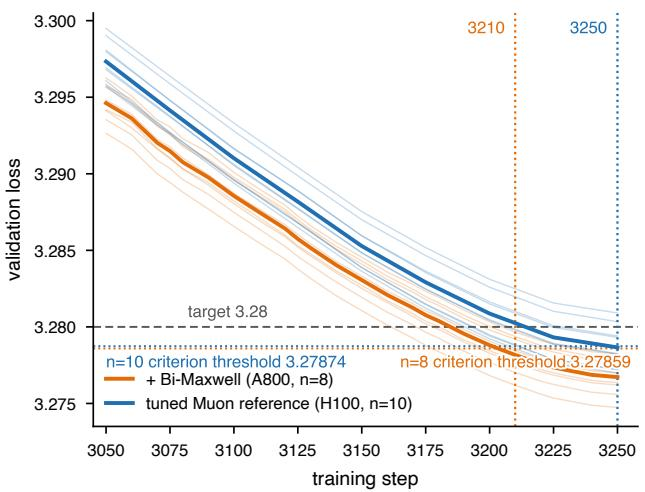  
(a) bare tuned-Muon stack

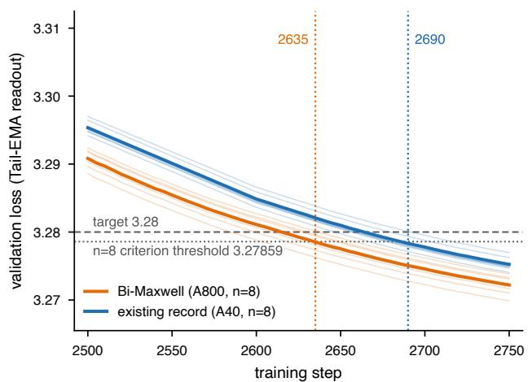  
(b) record stack  
Figure 4: Thin lines are per-seed curves, thick lines arm means; the dashed line is the 3.28 target, and the dotted lines are the pass thresholds implied by the margin criterion $( 3 . 2 8 - \bar { L } ) \sqrt { n } \geq 0 . 0 0 4$ that is $\bar { L } \le 3 . 2 8 - 0 . 0 0 4 / \sqrt { n }$ , which depends on the seed count: 3.27859 at $n = 8$ (orange) and 3.27874 at $n = 1 0$ (blue). (a) Bare tuned-Muon stack (raw validation loss): the two-timescale arm (orange, A800, $n = 8 )$ first crosses at step 3210; the tuned reference (blue, H100, $n = 1 0$ , by its $n = 1 0$ criterion) first crosses at step 3250. (b) Record stack (Tail-EMA readout): both arms have $n = 8$ , so only the 3.27859 threshold applies; the two-timescale arm (orange, A800) at step 2635, the existing record (blue, A40, PR #328 public logs) at step 2690. The spread of the thin lines is the within-arm seed spread; no separate error range is drawn. The pass criterion is judged one-sided (see Methods).

Table 1: Summary of the evidence boundary. Smaller first-crossing steps are better; the existing records in the table are the state as of July 2026 (see also the Note added in the Discussion). The hardware column gives the GPU on which each arm actually ran; rows on diferent hardware are not compared directly. The per-seed column gives the mean standard deviation of the individual seeds’ own crossing steps (data in Appendix C); a blank entry means this paper has no per-seed data for that arm. Step counts can be verified against the public benchmark and the corresponding PR logs; results introduced in this work are documented in PR #339/#340.
<table><tr><td>Stack</td><td>Memory kernel Hardware</td><td></td><td></td><td>First crossing n Per-seed and source</td></tr><tr><td>Bare tuned-Muon single-pole Bare tuned-Muon two-timescale</td><td></td><td>H100 A800</td><td>3250 3210</td><td>10 official #36 tuned log 8 3190.6 ± 15.2; this work (PR</td></tr><tr><td>Record stack</td><td>single-pole</td><td>A40</td><td>2690</td><td>#340) 8 existing record (PR #328</td></tr><tr><td>Record stack</td><td>single-pole</td><td>A40</td><td>2735</td><td>logs) 8 same logs, recomputed with</td></tr><tr><td>Record stack</td><td>two-timescale</td><td>A800</td><td>2635</td><td>Tail-EMA off 8 2616.9 ± 17.9; main result</td></tr><tr><td>Record stack</td><td>two-timescale</td><td>A800</td><td>2690</td><td>(PR #339), margin 0.00419 8 as above, Tail-EMA off;</td></tr><tr><td>Record stack</td><td>two-timescale</td><td>H100</td><td>2645</td><td>ordering preserved 8 2623.8 ± 16.6; independent</td></tr><tr><td>Record stack</td><td>two-timescale</td><td>A800+H100 2635</td><td></td><td>hardware replication, margin 0.00466 16 pooled arms, margin 0.00487 (sensitivity summary)</td></tr></table>

## 5 Experiment 2: mode dependence and protocol dependence of the optimal memory length

The question of Experiment 2 is whether the medium itself really needs more than one timescale. Experiment 1 showed that switching to two poles crosses the target sooner; it did not show why one pole is insuficient, since a two-timescale kernel could equally well be a double-EMA recipe that happens to work. The approach is to construct a read-only diagnostic and measure, direction by direction, the memory length the medium prefers.

The diagnostic and where it is measured What momentum performs is a tracking task. The driving force at each step has two parts: one persists across steps, the other is the noise brought in by the current batch of data. Take the persistent component to drift randomly and the batch noise to be independent from step to step. In the sense of minimizing the stationary mean-square tracking error, the optimal mean age of a single-pole memory has a closed form

$$
n ^ { \star } = \frac { - 1 + \sqrt { 1 + 4 T / D } } { 2 } ,
$$

where D is the drift strength of the persistent component and $T$ the batch-noise strength (derivation in Methods). Both can be estimated online, without altering the training itself.

What matters is where the measurement is taken. The picture of Sec. 3 is that the medium’s response is carried by a set of collective modes whose relaxations difer. Accordingly this section measures no global scalar but measures along the directions momentum actually pushes: the whitened momentum of the current step is put through the mode decomposition of Sec. 3 and split into five bands by strength rank. $b _ { 1 }$ is the strongest 5%, followed by 5–15%, 15–35% and 35–65%, and $b _ { 5 }$ is the weakest stretch. The five bands are rank quantiles and the decomposition is redone at every step.

$n ^ { \star }$ is the quantity this tracking model supplies, used to diagnose the memory length a given direction prefers. D and $T$ act in opposite directions: a fall in D raises $T / D$ and so increases $n ^ { \star }$ while a fall in T lowers $T / D$ and so decreases $n ^ { \star }$

The readings are taken on two pre-specified windows: the early window [700, 1500] and the late window [2200, 2700]. The measurement is done by a read-only probe that runs step by step alongside the baseline training, changing no parameters, gradients or optimizer state. The estimator, the definition of the ratio and the conversion conventions are in Appendix G.

Opposite trends under a frozen learning rate On the record-stack baseline, 8 trajectories (diferent random seeds, sharing one fixed data stream) give two things: the $n ^ { \star }$ of the five bands spans more than an order of magnitude; and from the early to the late window all $8 \times 5 = 4 0$ paired readings rise, without exception.

This alone does not settle the matter. A single scalar factor changing over training, stretching the whole profile uniformly, would also make the five bands rise together; and between the two windows the original schedule cuts the learning rate to $1 / 5 . 3$ of its earlier value, so the smaller step by itself would change D and T. Separating these two possibilities requires re-running with the learning rate frozen.

Freezing the learning rate is not merely a way to remove a confounder. The learning rate sets the weight displacement produced by one optimizer step, that is, how far the medium advances per step; two frozen values a factor of 5.3 apart therefore cover two advance speeds, which makes this both a control and an independent rate-response experiment.

The three arms share model, data, batch size, probe, total step count and hardware, and difer only in the learning-rate protocol: the original-schedule arm decays the learning rate by PowerCool, 8 trajectories; the constant-high-learning-rate arm has 16 trajectories and the constant-low arm 8. The two frozen values are the median learning rate of the original schedule within the early and the late window respectively. The full configuration is in Appendix G.3.

Once frozen, the shape of the profile changes (Table 2, Fig. 5a). Under the constant high learning rate the ratio of the strongest band exceeds 1 while the ratios of the middle and weak bands fall below it: $R _ { b _ { 3 } } = 0 . 9 1 8 7 , R _ { b _ { 4 } } = 0 . 9 0 6 3$ , with not one of the 16 trajectories rising. Under the constant low learning rate all five ratios exceed 1.

This is the most direct evidence this section gives about the form of the memory kernel. In one and the same medium, at one and the same stage of training, the memory preferred by the dominant modes is lengthening while that of the middle and weak modes is shortening at the same time. A single pole has one time constant: whether it is set long or short, all modes are forced onto the same compromise. Fast response together with long memory is a demand for which the single-pole parameter space holds no point.

Going from strong to weak across the five bands, the change of the preferred timescale $\Delta$ log $\boldsymbol { \tau _ { b } ^ { \star } }$ turns from positive to negative on the constant-high-learning-rate arm: $+ 0 . 0 4 5 , \ : + 0 . 0 2 8 , \ : - 0 . 0 1 4 .$ $- 0 . 0 1 1 , \ - 0 . 0 3 9$ (the per-tensor $\tau ^ { \star }$ route; it reads $b _ { 2 }$ diferently from the $n ^ { \star }$ route of Table 2, see that table’s footnote). A factor independent of mode strength could only shift the five ratios in the same direction; it could not put some above one and others below. A single timescale rescaled uniformly over training is thereby excluded. What this excludes is more than a fixed single pole. Any memory law written with only one time constant, including one that lets $\beta$ vary over training, still has only one time constant available at any given instant.

That the strongest band’s ratio exceeds 1 depends on where the late window sits; that the middle and weak bands fall below 1 does not. The argument of this section therefore does not rest on a sign change between the two ends. A scalar factor predicts five equal ratios, and the measurement makes them systematically unequal; that point alone sufices to exclude explanations of this kind. The middle and weak bands stay below 1 under all five ways of computing the ratio, and the weakest band stays below 1 at all nine late-window positions (both controls in Appendix G.4).

The relative decay of drift and noise Split the diagnostic into its two sources. The three protocols carry 32 trajectories in all, each with five bands and one summary value per band, 160 values. In all 160, the change of both D and $T$ between the windows is negative, with no exception.

$n ^ { \star }$ is set by the ratio $T / D _ { ; }$ , so its change cannot be explained by the fall of D alone; the net direction depends on the relative decay of the two, which on a log scale is the diference of their log changes. Where $T$ falls faster, $n ^ { \star }$ decreases; where D falls faster, $n ^ { \star }$ increases. The middle and weak bands of the constant high learning rate belong to the former, while the five bands of both the constant low learning rate and the original schedule belong to the latter. One and the same relation $n ^ { \star } ( T / D )$ therefore produces three diferent profiles under the three protocols (Fig. 5b). In all five bands of the original schedule $D$ falls further than $T _ { i }$ , and the gap between them widens from about 0.25 to about 1.5 log units from $b _ { 1 }$ to $b _ { 5 }$

The net efect is small because each of the two subtracted terms falls by a great deal. In $b _ { 1 }$ of the constant high learning rate the paired median changes are $\Delta \log \hat { D } = - 1 . 2 6 1 2$ and $\Delta$ log $\hat { T }$ = 1.2103, falls of about 72% and 70% respectively, leaving 5.6% after cancellation (Fig. 5c). Both are falling; what is opposite is their efect on $n ^ { \star }$ . The per-tensor identity

$$
\begin{array} { r } { \Delta \log K _ { b } ^ { \star } = \frac { 1 } { 2 } \big ( \Delta \log \hat { D } _ { b } - \Delta \log \hat { T } _ { b } \big ) } \end{array}
$$

$\mathrm { g i }$ ves the form of this cancellation. That diferent modes demand diferent memory lengths comes from $D$ and $T$ decaying at diferent rates on diferent modes.

The fork experiment and path dependence At this point the structural insuficiency of the single pole is established. The next question is whether the time demand of each mode is itself fixed: if it moves with the training protocol, then any fixed set of time constants can only be an approximation valid in some one state, the two-pole kernel included.

The three arms above were each trained from scratch and by the late window sit in diferent model states, so they cannot separate the current learning rate from the training path. To test this at a fixed initial state, define the strength-rank tilt

$$
B _ { s } = \frac { 1 } { 4 } \sum _ { b = 2 } ^ { 5 } \log R _ { s , b } - \log R _ { s , b _ { 1 } } ,
$$

where $B _ { s } > 0$ means the four weaker bands lean towards longer memory relative to the strongest band. The experiment forks two branches from one and the same step-300 checkpoint: the future minibatches of the two branches are identical byte for byte and the code identical line by line, and only the learning rate difers. One branch is frozen at the high value, the other at the low. The statistic, the sample size and the reading rule were all fixed before the jobs were submitted (protocol in Methods).

The paired diference is +0.073, one-sample two-sided $t = 2 . 4 2 , p = 0 . 0 4 6 , n = 8$ pairs. With the same initial state and the same future data, only the learning rate can produce this diference; the memory length the medium prefers is therefore a state variable that the training protocol can push.

The same statistic on the three from-scratch arms is +0.169 $( p = 7 . 9 8 \times 1 0 ^ { - 4 } )$ , a value written into the preregistration before the fork jobs were submitted. The fork reproduces only part of it: less than half the observed diference is attributable to the current learning rate, the rest coming from other diferences between the two kinds of experiment. This also explains why the fork’s $p = 0 . 0 4 6$ only barely clears the significance threshold.

This yields a conclusion more specific than the statement that the kernel is not fixed: the allocation among modes moves with the learning rate. At a high learning rate the middle and weak modes lean towards shorter memory; once the learning rate comes down, they move towards longer memory relative to the dominant modes. The actual PowerCool schedule runs across exactly these two regimes. A two-pole kernel with fixed parameters is therefore itself a static approximation valid over one stretch of the learning rate: it keeps one fast and one slow time constant but pins the weights of the two branches. The side evidence from Experiment 1 agrees: there is a window for enabling the slow mode. The role of the slow branch depends on the stage; it takes part in the whole training path as an independent internal state.

The observed change splits into two parts: a common shift of the whole profile, and a relative reallocation among modes. What the fork confirms is the causal action of the learning rate on the latter; the former does not follow from it. The three from-scratch arms give the same conclusion from the other side. Each frozen arm has the same current learning rate as the original schedule in the corresponding window, yet only in the early window are the two profiles close; in the late window the departure grows towards the weaker bands and is an order of magnitude larger than in the early window (full readings in Appendix G.5). Matching the current learning rate reproduces the profile only when the history is also close: in the early window the original schedule has accumulated only a short history, whereas by the late window it has run through the whole decay schedule, which the constant arms never experience.

The state variable of the constitutive law therefore cannot be the instantaneous $\eta _ { t }$ alone. The fork shows that the learning rate rearranges the allocation among modes, and the three-arm comparison shows that the whole profile also depends on an internal state formed by the history; together they force the constitutive law to be written at least as $J ^ { \star } ( \ell \mid \rho , z _ { t } , \eta _ { t } )$ , where $\rho$ is the normalized strength rank of the mode. This section cannot go further and separate the schedule history itself from training progress: by the late window the two from-scratch arms difer in both at once.

Why one time constant is not enough Form, intervention and measurement each supply a part, and none can be spared. Sec. 3 supplies the form: under a positive relaxation spectrum a single pole locks response speed and memory depth onto the same time constant, and two poles are the first form that separates them. Experiment 1 supplies the intervention: a single pole matched to the same mean age crosses 140 steps later, and enabling the slow mode has a stage window. This section supplies the mechanism: at one and the same stage of training, the memory lengths preferred by diferent modes move in opposite directions, and this demand can be changed causally by the learning rate.

The single-pole parameter space contains no point that serves both kinds of mode. Put in the frequency domain this is more direct: the frequency response of the single-pole memory kernel $J _ { \beta } ( \ell ) = ( 1 - \beta ) \beta ^ { \ell }$

$$
\hat { J } _ { \beta } ( \omega ) = \sum _ { \ell \ge 0 } J _ { \beta } ( \ell ) e ^ { - i \omega \ell } = \frac { 1 - \beta } { 1 - \beta e ^ { - i \omega } } ,
$$

is a first-order low pass with a single corner frequency, located at roughly the reciprocal of the mean age, $1 / n ( \beta )$ . Taking $\beta$ large moves the corner down and keeps more history; taking it small moves the corner up and responds faster; but every choice gives one corner. The $n ^ { \star }$ measured here corresponds to exactly this quantity: the corner each mode prefers is given by $1 / n ^ { \star }$ . The bandresolved readings show that the preferences of diferent modes move in opposite directions; the fork experiment further shows that these positions also move with the learning rate; and the PowerCool schedule takes training from high to low. One fixed corner frequency therefore covers neither the two kinds of mode at one instant nor the training protocol as a whole. Two poles give

$$
\hat { J } _ { \mathrm { B M } } ( \omega ) = w \hat { J } _ { \beta _ { f } } ( \omega ) + ( 1 - w ) \hat { J } _ { \beta _ { s } } ( \omega ) ,
$$

with both corners in place at once, fast response and long memory each carried by one branch. Sec. 3 used the standard language of viscoelasticity to write the positive relaxation spectrum as $H ( \tau )$ and to regard the two-timescale kernel as its coarsest discretization; this says the same thing, only in the frequency domain. The result of Experiment 1 thus runs in the same direction as the demand measured here: the medium calls for more than one timescale, and two poles are the minimal form that supplies two.

One step further: the allocation among modes itself moves with the learning rate, so a two-pole kernel with fixed weights is the lowest-order static basis. Written as a kernel, the empirical picture is

$$
J ^ { \star } ( \ell \mid \rho , z _ { t } , \eta _ { t } ) \approx a _ { f } ( \rho , z _ { t } , \eta _ { t } ) J _ { f } ( \ell ) + a _ { s } ( \rho , z _ { t } , \eta _ { t } ) J _ { s } ( \ell ) ,
$$

and Bi-Maxwell with fixed parameters keeps the fast branch $J _ { f }$ and the slow branch $J _ { s }$ while coarse-graining the weights into global constants.

Shifting weights at fixed parameters The coarse-graining leaves one mismatch that has to be accounted for: the measured time demands difer from mode to mode, whereas the $\beta _ { f } , \ \beta _ { s }$ and w of Bi-Maxwell are identical for every mode and every matrix. One possible mechanism by which a fixed global two-pole kernel can still serve demands that difer is that it does not identify modes at all: the split is set by the temporal content of the mode itself. The two branches act on the same instantaneous force. For a mode that persists across steps and keeps one sign for a long time, the fast and slow states gradually come to agree, and the slow branch can accumulate and retain the long-time component. For a mode that changes fast and flips sign often, the slow branch cancels itself in accumulation and the efective stress is carried more by the fast branch. The amplitude ratio of the two branch outputs,

$$
\frac { \left( 1 - w \right) \left| \hat { J } _ { \beta _ { s } } ( \omega ) \right| } { w \left| \hat { J } _ { \beta _ { f } } ( \omega ) \right| } ,
$$

is 1.281 at DC under the recipe of this paper and drops by a factor of 8, to 0.160, at the other end, where the sign flips at every step; the two amplitudes are equal at a persistence time of about 61 steps, and the nominal ratio $( 1 - w ) / w$ holds only at DC. Nothing about the parameters changes, yet the split moves with the temporal content of the mode. The $a _ { f }$ and $a _ { s }$ above are therefore efective weights in this sense, set by the temporal content of the mode itself.

The accurate placement is this: the true temporal constitutive law depends on state and is not uniform across modes, and Bi-Maxwell is its lowest-order static basis. Its step beyond the single pole is consistent across the formal grounds, the intervention result of Experiment 1 and the measurement of this section; letting the profile vary with state is its natural direction of generalization. The comparison against a non-convex fast-slow mixture gives two things: the extra gain of the memory relative to the instantaneous gradient is harmful, so the positive convex normalization is a necessary part of this form; and within the convex family w depends on the stack it sits in and cannot be carried across stacks. Appendix G.6 and Appendix E carry the comparison and its limits.

Table 2: Kernel-age ratio $R _ { b }$ per mode band under the three learning-rate protocols (the ratio of the median $n ^ { \star }$ in the late window [2200, 2700] to that in the early window [700, 1500], taken as the median across trajectories). $R _ { b } ~ > ~ 1$ means a longer memory is preferred late; the count in parentheses is the number of trajectories that rise in that band. $b _ { 1 }$ is the strongest 5% and $b _ { 5 }$ the weakest stretch. The $b _ { 2 }$ of the constant high learning rate is marked $\dagger \colon$ computed directly from $n ^ { \star }$ it shortens slightly, while the per-tensor decomposition under a diferent aggregation order gives a slight increase, and this paper judges it near-neutral. The preregistered primary criterion of the three-arm experiment is the $b _ { 1 }$ of the two frozen arms; the complete five-band profile was identified only after seeing the data.
<table><tr><td>Protocol (trajectories)</td><td> $b _ { 1 }$ </td><td> $b _ { 2 }$ </td><td> $b _ { 3 }$ </td><td> $b _ { 4 }$ </td><td> $b _ { 5 }$ </td></tr><tr><td>Original schedule (8)</td><td>1.1828 (8/8)</td><td>1.3519 (8/8)</td><td>1.4646 (8/8)</td><td>1.8132  $( 8 / 8 )$ </td><td>2.3130 (8/8)</td></tr><tr><td>Constant high LR (16)</td><td>1.0558 (14/16)</td><td>0.9798† (3/16)</td><td>0.9187 (0/16)</td><td>0.9063 (0/16)</td><td>0.9584 (2/16)</td></tr><tr><td>Constant low LR (8)</td><td>1.0689 (7/8)</td><td>1.1077 (8/8)</td><td>1.0587 (8/8)</td><td>1.1168 (8/8)</td><td>1.1260 (8/8)</td></tr></table>

Evidence level and scope The only confirmatory conclusion of this section is the paired difference of the fork experiment, whose statistic and reading rule were fixed before the jobs were submitted; the complete profile of the five bands on the three observation arms, and the $D / T$ decomposition, are exploratory results identified only after seeing the data. The measurement protocol, the comparison of five ways of computing the ratio, the supplementary decompositions and the structural boundaries are in Appendix G. The scope of the conclusion is limited to the Track-3 setting at 124 M parameters: the mean memory of the slow mode is about 49 steps, about 2% of the total step count of this paper’s training.

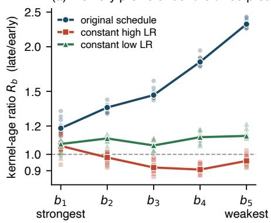

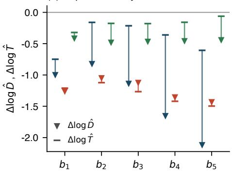

(c) Near-cancellation  
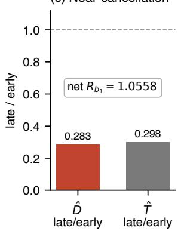  
Figure 5: Band-resolved optimal-memory profile under the three learning-rate protocols. (a) The kernel-age ratio $R _ { b }$ across mode bands; faint small markers are the per-trajectory readings (8 each for the original schedule and the constant low learning rate, 16 for the constant high learning rate), thick lines the median across trajectories, the grey dashed line $R _ { b } = 1$ , and the vertical axis is logarithmic. The original schedule lengthens in all five bands, by more towards the weaker bands; under the constant high learning rate only $b _ { 1 }$ lengthens while $b _ { 3 } { - } b _ { 5 }$ shorten; under the constant low learning rate all five lengthen again. (b) Per-tensor paired $\Delta$ log $\hat { D } _ { b }$ (down triangles) and $\Delta$ log $\hat { T } _ { b }$ (dashes); the two points of one band are joined by a thin line, coloured as in (a). Both are negative, that is, drift and batch noise weaken together in every protocol and every band; what decides whether the optimal memory lengthens or shortens is which of the two falls more. (c) The nearcancellation in $b _ { 1 }$ of the constant high learning rate: late-window drift and batch noise are 0.283 and 0.298 times their early-window values (falls of about 72% and 70%), leaving the net increase $R _ { b _ { 1 } } = 1 . 0 5 5 8$ after cancellation. The preregistered primary criterion of the three-arm experiment is the $b _ { 1 }$ of the two frozen arms; the rest are exploratory results.

## Discussion

This paper gives a physical derivation of the momentum memory kernel and improves on it. Treating the weight matrix during training as a responsive medium with memory, we established a derivable physical model for neural-network optimizers: it has a safety budget for output perturbations and a relaxation spectrum for internal stress. It identifies Muon’s semi-orthogonalized direction as the maximally dissipative response under the output-side safety budget, and momentum as the singlepole relaxation of the medium’s internal stress, answering two questions that previously had only empirical answers. Once identified as approximations, they can be improved in a targeted way: changing the approximation of the relaxation spectrum from a single pole to one fast and one slow timescale is Bi-Maxwell; under the fully frozen public benchmark protocol, replacing only the memory kernel brought the first-crossing step from 2690 to 2635, and finished 40 steps earlier on the bare tuned-Muon stack. The model also gives a previously unmeasured phenomenon: the proxy for the optimal memory length grows with training stage. These results show that optimizers can be derived and improved from the properties of the medium; the change of the memory kernel is one product of that improvement.

First accumulating the instantaneous forces into memory and only then doing the full-amplitude update has a physical reason: the output cap makes every driven channel update at the same amplitude, so once a noise direction that appears only once enters the update directly, it is amplified to that same amplitude; the role of the memory is to screen out these directions before the update. The $\mu$ scan provides a related control: raising the instantaneous–memory readout weight $\mu$ alone to 0.96 or 0.97 brings only monotonic degradation, showing that simply increasing the weight of the existing memory branch does not reproduce the gain of the two-timescale kernel.

Close along the time dimension are AdEMAMix and Admeta: the former mixes fast and slow EMAs of the per-coordinate gradient non-convexly on Adam[33]; the latter builds the backwardlooking part of momentum from a variant of the double exponential moving average[7]. The only thing these methods share with this paper is the form of multi-timescale averaging. The memory kernel of this paper is a superposition of exponential decays: the fast one forgets within a few steps, the slow one within tens of steps, each decay carrying a share, and this set of shares is the relaxation spectrum; in the generalized-Maxwell class adopted here, every share is a positive number. The convex and non-convex mixtures have been compared directly on the same stack; the result is in Appendix G.6. The enabling window of the slow mode falls after the medium has aged (Sec. 4.2); the probe reads out a consistent late-training rise of the memory-age proxy (Sec. 5). Transplanting two EMA branches onto Muon yields none of these: they come from the physical picture of momentum as the medium’s internal stress. A family that runs the opposite way is Demon, which decays the momentum coeficient over training, that is, shortens the memory as training proceeds[5]. This divergence falls exactly on the quantity measured in Section 5, and the two deserve a direct comparison under one protocol.

The phenomenon measured in Section 5 is qualitatively reminiscent of what soft-matter physics calls aging. Amorphous materials such as glasses and polymers never truly equilibrate after a quench: the longer the wait, the slower the relaxation, the wider the response window, the properties of the material changing systematically with age[4, 42]. The training medium behaves the same way. Combining the two measured strengths into the proxy for the optimal memory length $n ^ { \star } ( t )$ = $( \sqrt { 1 + 4 \hat { T } ( t ) / \hat { D } ( t ) } - 1 ) / 2$ , it lengthens overall from the early to the late window, with the five direction groups moving the same way: the longer the training, the longer the medium remembers.

In the language of the memory kernel this can be stated more precisely. Momentum is a weighted sum over past driving forces, $\begin{array} { r } { M _ { t } = \sum _ { \tau > 0 } J ( \tau ) X _ { t - \tau } } \end{array}$ , where the weight function J is the memory kernel; if J does not change over training, the weight of each past force is determined only by its lag τ from the present, for example the two-timescale kernel $J ( \tau ) = w ( 1 - \beta _ { f } ) \beta _ { f } ^ { \tau } + ( 1 - w ) ( 1 - \beta _ { s } ) \beta _ { s } ^ { \tau }$ Aging then means the optimal kernel should also depend on the training age itself, written $J _ { t } ( \tau )$ early in training the drift is fast and the kernel should be short; later the drift slows and a long kernel becomes beneficial. The non-monotonic enabling window in Experiment 1 is consistent with this picture on the interventional side: enabling the slow mode from step 0 is instead harmful, $T _ { \mathrm { o n } } ~ = ~ 1 0 0 0$ is best (within this scan), and later falls back again. The kernel actually used in this paper is precisely such a piecewise, age-dependent kernel: before $T _ { \mathrm { o n } }$ the scheduled singlepole baseline momentum runs; at $T _ { \mathrm { o n } }$ the fast and slow states are initialized from the memory at that moment and then evolve with their fixed decay rates, with the two-timescale expression above describing this post-switch stage. It can therefore be regarded as the simplest implementation of an aging kernel $J _ { t } ( \tau )$ . Measurement (the probe) and intervention (the enabling window), two complementary handles, point in the same direction.

A stricter comparison with physical aging would require explicit measurements of waiting-timedependent two-time correlation and response. Violations of the fluctuation–dissipation relation, and the efective temperature constructed from them, provide a further class of nonequilibrium diagnostics in glassy systems rather than the unique definition of aging[8]. An item-by-item comparison between deep-network training and structural-glass dynamics has already been carried out[17]; memory lengthening with age adds a directly measurable entry to that comparison.

Practical guidance. Under the protocol of this paper the defaults are $\beta _ { f } = 0 . 8 5 , \beta _ { s } = 0 . 9 8$ $w = 0 . 4 3 8 5$ and $T _ { \mathrm { o n } } = 1 0 0 0$ (mean age $\bar { n } = 3 0 )$ . The cost is two extra FP32 bufers per twodimensional parameter, of the same shape as the momentum: about 680 MB in total at the 124 M configuration, growing linearly with parameter count; the per-step wall-clock increment lies within rerun noise. The two memory states have the same shape as the original momentum, so in an implementation that shards by parameter they shard exactly as the momentum does; all experiments here ran on a single GPU and the distributed behaviour was not tested. The optimal position of $T _ { \mathrm { o n } }$ depends on the total step count of the protocol rather than being a universal absolute step, and should be relocated rather than carried over as 1000 when moving to a diferent training length.

Note added. After completion of this work, an open community submission (PR #341) applied, in addition to the two-timescale momentum, an output-head covariance preconditioner likewise using fast and slow timescales (KFAC-type), reaching the target at step 2600 (likewise an open submission; see the public page for its numbers and current status). This follow-up work is not part of the experiments analysed here.

## Methods

Numerical system and target. We fix GPT-2[38] (124 M parameters, 12 layers, $d \ = \ 7 6 8 .$ vocabulary 50304), the FineWeb corpus[35], and 524288 tokens per step, with one forward–backward pass per optimizer step; the target is held-out validation loss 3.28, scored as the minimum number of steps to reach it.

Statistical criterion. The benchmark’s record rules require the arm-mean validation loss to be significantly below 3.28 at a one-sided level of $p < 0 . 0 1$ , tested by a one-sample t test on the perseed validation losses[15]. For convenience in comparing arms, this paper additionally uses a fixed threshold $( 3 . 2 8 - \bar { L } ) \sqrt { n } \geq 0 . 0 0 4$ as a uniform read-out, with L¯ the mean validation loss over the arm’s seeds at the same step; the threshold takes $\sigma = 0 . 0 0 1 3$ as a stipulated value for the per-seed spread and is judged one-sided. The two criteria are not equivalent: the fixed threshold does not move with the sample, whereas the benchmark test’s threshold moves with the arm’s sample spread and its number of seeds. For the three qualifying record-stack arms of this paper, the benchmark test’s threshold converts to 0.0032–0.0038 on the same scale, below 0.004, so the fixed threshold is the stricter of the two; all three arms also pass the benchmark’s own test— $- p = 0 . 0 0 6 5$ for the A800 main-result arm, $p = 0 . 0 0 3 5$ for the H100 arm, and $p = 7 . 0 \times 1 0 ^ { - 4 }$ for the two arms pooled. validation is dense per the track rules with a unified selection of points across all seeds, the recordstack script sampling every 5 steps within the target zone [2500, 2800] and the bare-stack script every 5 steps within [2900, 3200] and more densely thereafter; within each stack all seeds use the same fixed grid, and every per-seed crossing step lands on that grid; the two memory kernels are compared directly only at synchronized step counts, with no extrapolation. The validation grid is one point every 5 steps, so the resolution of the crossing steps reported here is one grid interval, that is, 5 steps.

Bare tuned-Muon configuration. The oficial tuned baseline (#36, Muon learning rate 0.025, weight decay 0.05, plus an AdamW auxiliary[26], 3250 steps) is the frozen object; only the internal memory kernel is replaced, with all other components kept line-for-line unchanged.

Record-stack configuration. The record stack (#328) contains SOAP-Muon[45] (hidden full matrices, freq = 1), the Tail-EMA validation readout $( \tau = 1 5 0 , \lambda = 0 . 6 $ , window [2400, 2900]), RowFloor, post-pin CWD = 0.025, a radius pin re-pinning the Frobenius radius of each hidden matrix every step, EMA-Nesterov lookahead, the PowerCool learning rate, the $\mu$ schedule (0.85 0.95 back to 0.85 in the last 200 steps), among other components; as with the bare stack, the kernel swap freezes the complete script and replaces only the internal memory kernel, leaving everything else unchanged line by line.

Single-pole and two-timescale state updates. The updates below are applied to each hidden 2-D parameter. The baseline has a single memory state,

$$
M _ { t } = \mu _ { t } M _ { t - 1 } + ( 1 - \mu _ { t } ) X _ { t } ,
$$

whose memory length is set by the µ schedule above; what enters the downstream response is its mix with the instantaneous force, $R _ { t } = ( 1 - \mu _ { t } ) X _ { t } + \mu _ { t } M _ { t }$ (a Nesterov-type mix). From $T _ { \mathrm { o n } } = 1 0 0 0$ on, the two-timescale kernel uses two states with fixed decay rates,

$$
\begin{array} { r } { \boldsymbol { M } _ { t } ^ { f } = \beta _ { f } \boldsymbol { M } _ { t - 1 } ^ { f } + ( 1 - \beta _ { f } ) \boldsymbol { X } _ { t } , \qquad \boldsymbol { M } _ { t } ^ { s } = \beta _ { s } \boldsymbol { M } _ { t - 1 } ^ { s } + ( 1 - \beta _ { s } ) \boldsymbol { X } _ { t } , \qquad \boldsymbol { M } _ { t } ^ { \mathrm { e f f } } = \boldsymbol { w } \boldsymbol { M } _ { t } ^ { f } + ( 1 - \boldsymbol { w } ) \boldsymbol { M } _ { t } ^ { s } . } \end{array}
$$

The readout and the downstream response are unchanged; only $M _ { t }$ is replaced by $M _ { t } ^ { \mathrm { { e f f } } }$ . At the switch step $t = T _ { \mathrm { o n } } ,$ the baseline state $M _ { t }$ is computed first and both new states take it as their initial value, with no decay update of their own at that step. Hence $M _ { t } ^ { \mathrm { e f f } } = M _ { t }$ , the parameter update is bitwise identical to the baseline, and the two branch recurrences start from the next step. The four experimental values are $\beta _ { f } = 0 . 8 5$ (fast-mode memory of about 6 steps), $\beta _ { s } = 0 . 9 8$ (about 49 steps), $w = 0 . 4 3 8 5 , T _ { \mathrm { o n } } = 1 0 0 0$ , determined by the scans under the frozen protocol above. The implementation accumulates the gradient $G _ { t } = - X _ { t } ;$ since all temporal operations are linear and the polar map is odd, the two sign conventions yield identical parameter updates.

Parameter selection and public disclosure. The criteria, windows and readout intervals were fixed before the readout of the confirmatory runs; the selection order was kernel shape, mean age, enable step; fork single trajectories were used only to determine direction rankings, and efect sizes were given exclusively by from-scratch multi-seed runs (in practice fork readings once overestimated the efect about 5-fold, see Appendix D). Public timestamps are given by the record sequence: PR #339 was opened on 2026-07-14 and PR #340 on 2026-07-15[15]; these timestamps document public disclosure of the protocol and data, not a registration predating the runs; the per-seed logs of each record package are archived in full with no exclusions, and each log embeds the runtime source code and environment snapshot.

The $K ^ { \star }$ probe. The probe performs read-only step-by-step measurement on the baseline dynamics (single-pole record stack, from scratch, 8 independent trajectories seeds $0 { - } 7 .$ , measured by the same frozen instrument), changing no parameters, gradients or optimizer state; the accompanied runs are separate diagnostic trajectories and enter no benchmark-scored result, and the half-batch split occurs only on these diagnostic runs. For all 72 hidden-layer matrices, take the singular directions of the whitened momentum matrix, divided into five groups by the fixed boundaries $0 / 0 . 0 5 / 0 . 1 5 / 0 . 3 5 / 0 . 6 5 / 1 . 0$ of normalized strength rank, 360 channels in total; at each step, estimate each channel’s batch-noise strength $\hat { T }$ by half-batch splitting, and the drift strength $\hat { D }$ by an online recursion with EMA decay 0.99 (e-folding time about 100 steps); the drift-to-noise gain is taken as $K ^ { \star } = \sqrt { \hat { D } / \hat { T } }$ (equal to the optimal EMA gain in the slow-drift limit; the exact general form is carried by the $n ^ { \star }$ formula below), whose inverse $\tau ^ { \star } \equiv 1 / K ^ { \star }$ gives the equivalent estimate of the optimal memory length (the smaller the gain, the longer the optimal memory); the kernel-age proxy plotted in Fig. 8 is the mean lag of the gain-matched EMA, $n ^ { \star } = \big ( \sqrt { 1 + 4 / ( K ^ { \star } ) ^ { 2 } } - 1 \big ) / 2$ the positive root of $n ^ { \star } ( n ^ { \star } + 1 ) = ( \tau ^ { \star } ) ^ { 2 }$ which reduces to $n ^ { \star } \approx 1 / K ^ { \star } - 1 / 2$ for $K ^ { \star } \ll 1 ;$ the first 250 steps are estimator warm-up. The two pre-specified windows are [700, 1500] and [2200, 2700]; the summary statistics are the IQR of log $K ^ { \star }$ across channels and the Spearman correlation of the group ordering between the two windows. The oficial frozen script recomputed all 360 channels on slimmed data, giving IQRs 0.7432/0.9399, Spearman 0.90, and a late-window median below the early window in every group, agreeing in direction with the original-schedule row of Table 2. The per-seed late/early ratios of the 8 trajectories are plotted in Fig. 7.

Compute cost and implementation validation. The two-timescale kernel adds two momentum copies relative to the single pole, about 340 MB (FP32) each and about 680 MB of GPU memory in total at this scale; the per-step wall-clock increment is within rerun noise. Implementation validation has two steps. In the research trainer used during development, every new component sits behind an environment-variable gate, and a suite of 72 tests (bitwise checkpoint round-trips, puremath unit tests and gate-identity assertions) verified that with all gates of training is bytewise identical to the baseline. The clean self-contained script used for the formal runs was then checked against the research trainer by same-seed reruns, with validation losses at each evaluation point difering by about $4 \times 1 0 ^ { - 5 }$

Data and code availability. All logs, frozen scripts and per-seed summaries needed for reproduction are currently archived self-contained as four record packages: record 2665 submission (early recipe, kernel mean age 19, $T _ { \mathrm { o n } } = 7 0 0$ , A800 $n = 8$ first crossing 2665, margin 0.00428); record 2655 submission (mean age 30, $T _ { \mathrm { o n } } ~ = ~ 7 0 0$ , A800 $n \ = \ 8$ first crossing 2655, margin 0.00472); record 2635 submission (the same recipe’s independent H100 $n = 8$ reading, first crossing 2635, margin 0.00425; under the benchmark’s own test this arm gives a one-sided p of 0.011, slightly above 0.01; the package is archival only and enters none of the statistics in the main text); record st1000 submission (final recipe, mean age 30, $T _ { \mathrm { o n } } = 1 0 0 0 $ : A800 $n = 8$ first crossing 2635, margin 0.00419; H100 $n = 8$ first crossing 2645, margin 0.00466; pooled $n = 1 6$ margin 0.00487). All record-stack numbers in Section 4.3 correspond to record st1000 submission; the two formal $n = 8$ experiments of the enable-step scan in Section 4.2 correspond to the A800 arms of record 2655 submission and record st1000 submission; each package contains the complete logs of the 8 seeds, summary.tsv and clean self-contained scripts. The four record packages, together with the full 360-channel raw series of the $K ^ { \star }$ probe and the frozen extraction and analysis scripts, are public at https://github.com/orange4664/bimaxwell-track3-reproduction (commit d125ceb); the per-seed logs and frozen training scripts of the final recipe and of the bare stack are additionally public with PR #339/#340 on the corresponding branches of the benchmark repository. The figs data summary CSVs shipped with the paper source sufice to regenerate all data figures in the main text. The experimental protocol and record sequence are in the public modded-nanogpt repository and PR #339/#340[15].

## A Derivation of the independence conditions for collective modes

This appendix derives the two mode-independence conditions of Section 3.1. First the input side. If the input components are composed exactly in the proportions of the k-th mode, that is, $x _ { i } = ( v _ { k } ) _ {  i }$ , then by the weighted sum of the main text, its amplitude entering the l-th mode is

$$
\sum _ { i = 1 } ^ { n } ( v _ { l } ) _ { i } ( v _ { k } ) _ { i } .
$$

If this sum is nonzero, an input composed according to the k-th mode also enters the l-th mode and produces an output change along $u _ { l } ;$ mutual independence on the input side therefore requires

$$
\sum _ { i = 1 } ^ { n } ( v _ { l } ) _ { i } ( v _ { k } ) _ { i } = 0 , \qquad k \neq l .
$$

Now the output side. For the same input, if the k-th and the l-th mode produce output changes along $u _ { k }$ and $u _ { l }$ respectively, with amplitudes denoted $b _ { k }$ and $b _ { l }$ , then

$$
\dot { y } = b _ { k } u _ { k } + b _ { l } u _ { l } .
$$

The α-th output component is

$$
\dot { y } _ { \alpha } = b _ { k } ( u _ { k } ) _ { \alpha } + b _ { l } ( u _ { l } ) _ { \alpha } ,
$$

so its squared root-mean-square amplitude is

$$
A _ { \mathrm { o u t } } ^ { 2 } ( \dot { y } ) = \frac { 1 } { m } \sum _ { \alpha = 1 } ^ { m } \left( b _ { k } ( \boldsymbol { u } _ { k } ) _ { \alpha } + b _ { l } ( \boldsymbol { u } _ { l } ) _ { \alpha } \right) ^ { 2 } .
$$

The squared output amplitude splits into the two modes’ own contributions and their cross contribution:

$$
A _ { \mathrm { o u t } } ^ { 2 } ( \dot { y } ) = \underbrace { \frac { b _ { k } ^ { 2 } } { m } \sum _ { \alpha } ( u _ { k } ) _ { \alpha } ^ { 2 } } _ { \mathrm { m o d e } \ k } + \underbrace { \frac { b _ { l } ^ { 2 } } { m } \sum _ { \alpha } ( u _ { l } ) _ { \alpha } ^ { 2 } } _ { \mathrm { m o d e } \ l } + \underbrace { \frac { 2 b _ { k } b _ { l } } { m } \sum _ { \alpha } ( u _ { k } ) _ { \alpha } ( u _ { l } ) _ { \alpha } } _ { \mathrm { c r o s s ~ t e r m } } .
$$

When the cross term is nonzero, it makes the output changes of the two modes reinforce or cancel each other according to the sign of $b _ { k } b _ { l }$ , so the output limit constrains their combination rather

than two mutually independent contributions. For the squared output amplitude to equal the sum of the two modes’ own contributions for arbitrary $b _ { k }$ and $b _ { l } ,$ , the coeficient of the cross term must vanish, that is,

$$
\sum _ { \alpha = 1 } ^ { m } ( u _ { k } ) _ { \alpha } ( u _ { l } ) _ { \alpha } = 0 , \qquad k \neq l .
$$

## B Completeness proof of the collective-mode decomposition

This appendix proves the mode decomposition cited in Section 3.1: for an arbitrary real conjugate driving-force matrix $X \in \mathbb { R } ^ { d _ { \mathrm { o u t } } \times d _ { \mathrm { i n } } }$ , there exist mode pairs that satisfy the input-side and output-side independence conditions and represent the full nonzero driving force completely as

$$
X = \sum _ { k = 1 } ^ { r } \sigma _ { k } u _ { k } v _ { k } ^ { \mathsf { T } } , \qquad X _ { \alpha i } = \sum _ { k = 1 } ^ { r } \sigma _ { k } ( u _ { k } ) _ { \alpha } ( v _ { k } ) _ { i } ,
$$

where $\sigma _ { 1 } \geq \cdots \geq \sigma _ { r } > 0 , \{ u _ { k } \} \subset \mathbb { R } ^ { d _ { \mathrm { o u t } } }$ and $\{ v _ { k } \} \subset \mathbb { R } ^ { d _ { \mathrm { i n } } }$ are each orthonormal, and $r$ is the number of modes with $\sigma _ { k } > 0$ . This is precisely the singular value decomposition of a real matrix; below we give a componentwise proof and handle the zero-driving-force and degenerate cases.

Proof. Consider the symmetric positive-semidefinite matrix $X ^ { \mathsf { T } } X \in \mathbb { R } ^ { d _ { \mathrm { i n } } \times d _ { \mathrm { i n } } } \colon$ for any $z \in \mathbb { R } ^ { d _ { \mathrm { i n } } }$ $z ^ { \mathsf { T } } X ^ { \mathsf { T } } X z = \| X z \| ^ { 2 } \geq 0$ . A symmetric matrix can be orthogonally diagonalized, so there exist an orthonormal basis $\{ v _ { i } \} _ { i = 1 } ^ { d _ { \mathrm { i n } } }$ of $\mathbb { R } ^ { d _ { \mathrm { i n } } }$ and nonnegative reals $\lambda _ { 1 } \geq \cdot \cdot \cdot \geq \lambda _ { n } \geq 0$ such that

$$
X ^ { \mathsf { T } } X v _ { i } = \lambda _ { i } v _ { i } , \qquad i = 1 , \ldots , d _ { \mathrm { i n } } .
$$

Let $r$ be the number of positive eigenvalues, and for $k = 1 , \ldots , r$ set

$$
\sigma _ { k } = \sqrt { \lambda _ { k } } > 0 , \qquad u _ { k } = \frac { X v _ { k } } { \sigma _ { k } } \in \mathbb { R } ^ { d _ { \mathrm { o u t } } } .
$$

First verify that $\{ u _ { k } \}$ is orthonormal: for $k , l \leq r .$

$$
u _ { k } ^ { \mathsf { T } } u _ { l } = \frac { v _ { k } ^ { \mathsf { T } } X ^ { \mathsf { T } } X v _ { l } } { \sigma _ { k } \sigma _ { l } } = \frac { \lambda _ { l } } { \sigma _ { k } \sigma _ { l } } v _ { k } ^ { \mathsf { T } } v _ { l } = \delta _ { k l } ,
$$

using $v _ { k } ^ { \mathsf { T } } v _ { l } = \delta _ { k l }$ and $\lambda _ { l } = \sigma _ { l } ^ { 2 }$ . Next verify that the directions with $i > r$ carry no driving force:

$$
\| X v _ { i } \| ^ { 2 } = v _ { i } ^ { \mathsf { T } } X ^ { \mathsf { T } } X v _ { i } = \lambda _ { i } = 0 \ \Rightarrow \ X v _ { i } = 0 , \qquad i > r .
$$

Then on every vector of the basis $\{ v _ { i } \}$ , the matrices X and $\begin{array} { r } { \tilde { X } = \sum _ { k = 1 } ^ { r } \sigma _ { k } u _ { k } v _ { k } ^ { \top } } \end{array}$ act identically: for $i \le r , \tilde { X } v _ { i } = \sigma _ { i } u _ { i } = X v _ { i } ;$ ; for $i > r , \dot { X } v _ { i } = 0 = X v _ { i }$ . Two matrices that agree pointwise on a basis are equal, hence $X = { \tilde { X } }$ . Written componentwise,

$$
X _ { \alpha i } = \sum _ { k = 1 } ^ { r } \sigma _ { k } \left( u _ { k } \right) _ { \alpha } ( v _ { k } ) _ { i } .
$$

By construction, $\{ v _ { k } \}$ are pairwise orthogonal (the input-side independence condition), $\{ u _ { k } \}$ are pairwise orthogonal (the output-side independence condition), and r equals the rank of X, the number of collective channels actually driven. This completes the proof.

Zero driving force. For $X = 0$ , all $\lambda _ { i } = 0$ and $r = 0 .$ , and the decomposition is an empty sum: no driven channel exists. This is consistent with the main text’s convention that what is undriven does not move; in this case no mode needs to be assigned a rearrangement speed.

Degenerate case. If $\sigma _ { k } = \sigma _ { l }$ (a repeated eigenvalue), the choice of orthonormal basis within the corresponding eigensubspace is not unique; but for any orthonormal basis of that subspace, every step of the proof above holds as before and the form of the decomposition is unchanged. Moreover, the sum over a degenerate group satisfies

$$
\sum _ { k : \sigma _ { k } = \sigma } { u _ { k } } v _ { k } ^ { \mathsf { T } } = \frac { 1 } { \sigma } X \sum _ { k : \sigma _ { k } = \sigma } { v _ { k } } v _ { k } ^ { \mathsf { T } } ,
$$

where the second factor on the right is the orthogonal projection onto that eigensubspace, independent of the basis choice, so the left side does not depend on the choice of basis within the degenerate subspace either. The maximum-dissipation condition of the main text acts only on the scalar speed $a _ { k }$ of each mode and likewise does not depend on this choice.

Unified mode scale. The main text takes $\| u _ { k } \| = \| v _ { k } \| = 1$ . Then the mode $V ^ { ( k ) } = a _ { k } u _ { k } v _ { k } ^ { \top }$ acting on the unit input $x = v _ { k } .$ , gives the output $a _ { k } u _ { k }$ , and the ratio of total output amplitude to total input amplitude is exactly $\left| a _ { k } \right|$ . The output-gain limit of Section 3.1 is then written mode by mode as $\vert a _ { k } \vert \le c \equiv \varepsilon \sqrt { m / n }$ , the unified scale used in the main text.

## C Per-seed data tables

Table 3 gives the per-seed crossing steps of the kernel-swap experiments, in one-to-one correspondence with the summaries of Sections 4.1, 4.2 and 4.3; the numbers are taken verbatim from the data files, with no exclusions of any kind. The steps listed here are descriptive individual crossings, the first validation point at which that seed’s own loss reaches 3.28; whether an arm passes is decided separately by the track criterion $( 3 . 2 8 - \bar { L } ) \sqrt { n } \geq 0 . 0 0 4$ applied to the across-seed mean (Methods).

Table 3: Per-seed crossing steps: bare tuned-Muon stack, two-timescale kernel $( n \ = \ 8 ;$ data: bare twounit perseed.csv).
<table><tr><td>seed</td><td>crossing step</td></tr><tr><td>0</td><td>3210</td></tr><tr><td>1</td><td>3180</td></tr><tr><td>2</td><td>3175</td></tr><tr><td>3</td><td>3200</td></tr><tr><td>4</td><td>3190</td></tr><tr><td>5</td><td>3210</td></tr><tr><td>6</td><td>3170</td></tr><tr><td>7</td><td>3190</td></tr></table>

Table 4: Per-seed crossing steps: record stack, two-timescale kernel (A800, $\begin{array} { r c l } { n } & { = } & { 8 ; } \end{array}$ data: record twounit perseed.csv).
<table><tr><td>seed</td><td>crossing step</td></tr><tr><td>0</td><td>2620</td></tr><tr><td>1</td><td>2620</td></tr><tr><td>2</td><td>2640</td></tr><tr><td>3</td><td>2600</td></tr><tr><td>4</td><td>2630</td></tr><tr><td>5</td><td>2585</td></tr><tr><td>6</td><td>2630</td></tr><tr><td>7</td><td>2610</td></tr></table>

Table 5: Per-seed crossing steps: record stack, two-timescale kernel, independent H100 replication $( n = 8 ;$ data: H100-arm logs of record st1000 submission).
<table><tr><td>seed</td><td>crossing step</td></tr><tr><td>0</td><td>2615</td></tr><tr><td>1</td><td>2615</td></tr><tr><td>2</td><td>2635</td></tr><tr><td>3</td><td>2640</td></tr><tr><td>4</td><td>2645</td></tr><tr><td>5</td><td>2595</td></tr><tr><td>6</td><td>2630</td></tr><tr><td>7</td><td>2615</td></tr></table>

Table 6: Per-seed crossing steps: record stack, two-timescale kernel, $T _ { \mathrm { o n } } = 7 0 0 \ \mathrm { a r m } \ ( \mathrm { A } 8 0 0 , n = 8 ;$ data: logs of record 2655 submission).
<table><tr><td>seed</td><td>crossing step</td></tr><tr><td>0</td><td>2635</td></tr><tr><td>1</td><td>2640</td></tr><tr><td>2</td><td>2645</td></tr><tr><td>3</td><td>2615</td></tr><tr><td>4</td><td>2630</td></tr><tr><td>5</td><td>2610</td></tr><tr><td>6</td><td>2645</td></tr><tr><td>7</td><td>2645</td></tr></table>

Table 7: Per-seed crossing steps: matched single-pole control (equal $\beta = 3 0 / 3 1 , \bar { n } = 3 0$ , record stack, A800, $n = 8 ;$ data: sp30 matched perseed.csv).
<table><tr><td>seed</td><td>crossing step</td></tr><tr><td>0</td><td>2760</td></tr><tr><td>1</td><td>2725</td></tr><tr><td>2</td><td>2745</td></tr><tr><td>3</td><td>2750</td></tr><tr><td>4</td><td>2745</td></tr><tr><td>5</td><td>2740</td></tr><tr><td>6</td><td>2750</td></tr><tr><td>7</td><td>2760</td></tr></table>

## D Methodological status of the fork protocol

The parameter exploration of this paper uses the fork protocol: fork two trajectories from the same checkpoint, change the parameter on one branch and not on the other, and compare the readout diferences within a short window after the fork. The value of fork lies in direction and ranking: the two trajectories share the entire history before the fork point and their driving noise is highly correlated, so the comparison is sensitive to which direction is better, and is well suited to scanning parameter grids at low cost.

But fork readings cannot serve as efect sizes, for three reasons. First, the shared history means the post-fork diference partly inherits the fluctuations of the common trajectory, and a single trajectory has no seed averaging. Second, short-window readings amplify path-dependent transients, and the choice of the window itself afects the reading. Third, the two trajectories are completely identical before the fork point, so the reading is a biased estimate of the net efect of the parameter change. In practice, fork single-trajectory readings once overestimated the efect about 5-fold.

The discipline of this paper is therefore: fork only determines directions and parameter rankings, and all efect sizes are given by from-scratch multi-seed experiments. All numbers in the main text, the kernel-swap first crossings, the efect sizes other than the dose curve, and the cross-hardware replication, obey this discipline; every place involving fork readings is declared as such. Appendix E gives one complete execution of this discipline: the direction set by the fork scan is confirmed independently by from-scratch training on 8 seeds.

## E Dose scan of the kernel mean age and its multi-seed confirmation

This appendix gives the dose scan of the kernel mean age, together with the independent confirmation, by from-scratch multi-seed experiments, of the drop that scan reports.

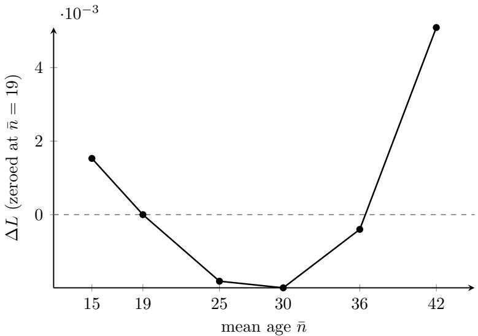  
Figure 6: Age dose curve (fork@700, seed 0, window [2650, 2700], zeroed at the $\bar { n } = 1 9$ matched point). The vertical axis $\Delta L$ is the fixed-step validation-loss diference relative to the matched point (lower is better); the curve is U-shaped with its minimum near $\bar { n } \approx 3 0$ , degrading at both ends.

The dose curve comes from a single-trajectory fork scan and, under the discipline of Appendix D, is used only to set direction and ranking. Its verdict that $\bar { n } = 3 0$ is optimal was later challenged by a reading of the opposite sign: on the bare tuned-Muon stack, the convex control arm of the comparison in Appendix G.6 $( w = 1 / 6 , \bar { n } = 4 1 . 8 )$ in fact beats the recipe of this paper $( w = 0 . 4 3 8 5$ $\bar { n } = 3 0 )$ , with a per-seed paired diference ${ \mathrm { ~ o f ~ } } - 0 . 0 0 1 3 8 \ ( t = - 1 3 . 2 , p = 3 . 3 \times 1 0 ^ { - 6 } , n = 8 )$ . Both arms are convex and neither carries extra gain; they difer only in w, so what is isolated is the efect of w itself. This reading has the opposite sign to the one the scan gives.

We therefore re-checked it on the record stack at the same level of evidence: w is changed from 0.4385 $( \bar { n } = 3 0 )$ to $1 / 6 \ ( \bar { n } = 4 1 . 8 )$ with everything else untouched line by line; record stack, A800, seeds $0 ^ { - 7 }$ . The arm-level first crossing is step 2735, 100 steps later than the 2635 of $\bar { n } = 3 0$ ; the per-seed paired diference at step 2635 is +0.006874 (t = 18.81, $p = 3 . 0 \times 1 0 ^ { - 7 }$ , with no exception among the 8 seeds). Over the same interval the curve predicts +0.00708 (the +0.00509 of $\bar { n } = 4 2$ minus the 0.00199 of $\bar { n } = 3 0 )$ , 3.0% away from the measurement. The statistic, the sample size and the reading rule were fixed before the jobs were submitted.

The two stacks give opposite signs, and the magnitudes difer by a factor of 5. The pre-registered conjecture is that the record stack’s validation readout already carries a slow Tail-EMA average, so that deepening the memory further on the training side yields a redundant gain; the bare stack has no such layer. The measurements are compatible with this conjecture, but the two stacks difer in more than Tail-EMA alone; isolating its contribution would require the kind of factorial experiment with each component switched on and of described at the end of Sec. 4, which this paper does not do.

## F Assumption boundary of the output-perturbation budget and anisotropic generalizations

Section 3.1 of the main text has already completed, under the isotropic worst-case output limit, the derivation of the independent collective modes, the common speed ceiling, and the semiorthogonalized spatial response; the mode independence and the completeness of the decomposition were given in Appendices A and B. This appendix only clarifies the modelling assumptions contained in the output budget adopted in the main text, and explains how the spatial response changes once actual activation statistics or downstream sensitivity are taken into account. The generalizations below take no part in the algorithms or experiments of this paper; they only delimit the range of applicability of the main-text model.

## F.1 Modelling choices in the main-text output budget

The constraint falls on the output side because a network layer is itself an input–output response structure: all a downstream system can feel is the change of the output; but “constraining the output change” does not by itself uniquely prescribe how the output change should be measured. What the main text adopts is an isotropic hard-cap model: input and output channels are both measured by the ordinary Euclidean root-mean-square amplitude, the constraint holds for every possible input direction, and all directions share one and the same safety threshold.

These three conditions correspond to three modelling choices. First, diferent channels carry equal weight in the amplitude measure, that is, no distinction is made yet between which input directions are more frequently activated and which output directions are more sensitive for the downstream. Second, the constraint is set by the most dangerous input direction, not by the average perturbation over the training data distribution. Third, the safety boundary is directionindependent: the first condition governs how size is measured, this one governs whether the ceiling varies with direction, and the medium is treated as isotropic on both the input and the output side. Under these conditions, the main text obtains the semi-orthogonalized response in which all driven collective modes share the same maximum speed.

The main-text conclusion should be understood as a result with explicit conditions: under the Euclidean, isotropic, worst-case output budget, Muon’s ideal semi-orthogonalized direction gives the structural rearrangement that releases the mismatch potential fastest. This conclusion does not mean that any form of output-side constraint would uniquely lead to the same update direction. Two natural anisotropic generalizations are given below.

## F.2 An average output budget defined by the actual activation distribution

The worst-case constraint of the main text treats all input directions alike. If one instead limits the average output perturbation actually occurring on the training distribution, the frequency and amplitude of the input directions enter the cost of structural motion directly. Suppose a batch contains B input activations. Their second-order correlation matrix is defined as

$$
C _ { i j } = \frac { 1 } { B } \sum _ { b = 1 } ^ { B } x _ { i } ^ { ( b ) } x _ { j } ^ { ( b ) } .\tag{F1}
$$

If the activations have had their mean removed, C is the covariance matrix; in general, it denotes the uncentred second moment. Using the same input and output root-mean-square definitions as the main text, the batch-averaged input amplitude and batch-averaged output rate of change can be written as

$$
\overline { { A } } _ { \mathrm { i n } } ^ { 2 } = \frac { 1 } { n } \sum _ { i = 1 } ^ { n } C _ { i i } , \qquad \overline { { A } } _ { \mathrm { o u t } } ^ { 2 } = \frac { 1 } { m } \sum _ { \alpha = 1 } ^ { m } \sum _ { i , j = 1 } ^ { n } V _ { \alpha i } C _ { i j } V _ { \alpha j } .\tag{F2}
$$

The output budget in the statistically averaged sense is then taken as

$$
\overline { { A } } _ { \mathrm { o u t } } ^ { 2 } \le \varepsilon ^ { 2 } \overline { { A } } _ { \mathrm { i n } } ^ { 2 } .\tag{F3}
$$

This condition no longer requires every possible input direction to satisfy the same ceiling separately, but only that the average perturbation over the training distribution not exceed the same limit. Under this budget, still taking the mismatch-potential release rate P of the main text as the objective and varying the components of the structural velocity, one obtains

$$
X _ { \alpha i } = 2 \lambda \sum _ { j = 1 } ^ { n } V _ { \alpha j } C _ { j i } , \qquad V _ { \alpha i } = { \frac { 1 } { 2 \lambda } } \sum _ { j = 1 } ^ { n } X _ { \alpha j } \left( C ^ { - 1 } \right) _ { j i } .\tag{F4}
$$

Here λ is determined by the given output budget and absorbs the channel-count factors that only afect the overall scale. The closed form above requires $C \succ 0$ . If C is singular the problem needs care: a force component along a zero mode of C moves at zero cost, the objective is then unbounded, and taking the inverse on the complement of the zero modes does not repair this. A pseudo-inverse form is admissible only when the force has no such component, $X ( I - C ^ { + } C ) = 0 ;$ otherwise the budget itself must be regularized, $C _ { \delta } = C + \delta I$ with $\delta > 0$ , giving $V = ( 2 \lambda ) ^ { - 1 } X C _ { \delta } ^ { - 1 }$ whose sensitivity to δ should then be reported.

Along input directions with larger variance in training, the same structural speed causes a larger average output perturbation, so these directions are constrained more strongly; directions that occur rarely carry a smaller average motion cost. What results is a covariance-preconditioned response depending on the activation statistics, in the same family as Shampoo and SOAP[14, 45], diferent from the plain semi-orthogonalized response under the main text’s worst-case hard cap. Even when C is proportional to the identity matrix, the average quadratic budget gives a linear response proportional to the size of the driving force; semi-orthogonalization comes from the additional choice of a “worst-case hard cap”, not merely from the constraint sitting at the output.

## F.3 An output budget incorporating downstream functional sensitivity

Output changes of equal size in the current layer need not have equal efect on the subsequent network. Let the current layer’s output y produce, through the downstream network, p response components z. In a local linear approximation, the downstream rate of change caused by the structural rearrangement is

$$
\dot { z } _ { \mu } = \sum _ { \alpha = 1 } ^ { m } \sum _ { i = 1 } ^ { n } J _ { \mu \alpha } V _ { \alpha i } x _ { i } , \qquad J _ { \mu \alpha } = \frac { \partial z _ { \mu } } { \partial y _ { \alpha } } .\tag{F5}
$$

Here J is the Jacobian matrix of the downstream response with respect to the current layer’s output. To describe the functional cost of diferent output directions, define the symmetric positivesemidefinite downstream sensitivity matrix $S ,$ and write the batch-averaged functional perturbation as

$$
S _ { \alpha \beta } = \frac { 1 } { p } \sum _ { \mu = 1 } ^ { p } J _ { \mu \alpha } J _ { \mu \beta } , \qquad Q [ V ] = \sum _ { \alpha , \beta = 1 } ^ { m } \sum _ { i , j = 1 } ^ { n } S _ { \alpha \beta } V _ { \alpha i } C _ { i j } V _ { \beta j } .\tag{F6}
$$

Maximizing the same mismatch-potential release rate under fixed $\mathcal { Q } [ V ]$ , and varying $V .$ , gives

$$
V = { \frac { 1 } { 2 \lambda } } S ^ { - 1 } X C ^ { - 1 } .\tag{F7}
$$

C determines how strongly each input-side direction is actually activated, and $S$ determines how strongly each output-side direction is amplified by the downstream. Motion along high-variance input directions produces larger average output perturbations; motion along high-sensitivity output directions produces larger downstream functional changes. The two together form a directiondependent motion cost. If C or S is not of full rank, the same well-posedness issue arises: a pseudo-inverse expression is admissible only after checking that the force has no component along the zero-cost directions; otherwise the regularized budgets $S _ { \delta } = S + \delta I _ { m } , C _ { \delta } = C + \delta I _ { n }$ must be used.

Equation (F7) is the anisotropic response under this budget. If one instead retains the main text’s hard cap holding for arbitrary input directions, only replacing the ordinary Euclidean amplitude by the weighted amplitude defined by $C$ and $S _ { ; }$ , then the semi-orthogonalization should be redone in the corresponding weighted coordinates; the result is a generalized semi-orthogonal response, no longer the plain polar factor in the original coordinates. This paper does not use this generalization and does not expand it further here.

## F.4 Range of applicability of the main-text model

The generalizations above show that the output side is the natural location of the constraint, while the measure of the output perturbation, the manner of averaging, and the directional weights remain part of the model assumptions. The main text deliberately adopts the simplest Euclidean, isotropic, worst-case budget, to obtain a spatial baseline with clear boundaries, and to study the temporal memory kernel separately while keeping that spatial response unchanged.

The spatial conclusion of the main text is explicitly conditional: under the isotropic hard output budget chosen in this paper, Muon’s ideal semi-orthogonalized direction is the response that releases the mismatch potential fastest. Activation second-order statistics, downstream sensitivity, and more general curvature information correspond to diferent ways of moving from this baseline medium toward a non-uniform responsive medium. This boundary does not change the experimental design of this paper concerning the temporal kernel: all controlled comparisons freeze the same spatial response and replace only the memory kernel entering that response. The Bi-Maxwell results of the main text test a change of temporal structure, while the anisotropic geometry discussed in this appendix is an independent follow-up question.

## G Full definition, measurement protocol and robustness of the $K ^ { \star }$ probe

This appendix carries every detail of the measurement of Sec. 5, in six parts. G.1 writes out the probe estimator step by step; G.2 gives the definition and computation of the window ratio together with the order of conversion and aggregation; G.3 gives the configuration of the three arms; G.4 gives the robustness checks over window position, computation variant and numerical floor; G.5 gives the decompositions for which the main text reports only conclusions; G.6 gives the boundaries of the argument and of the structure. The main text keeps only the claims and their direct evidence and everything else sits here; with G.1 and G.2 the whole data processing can be reproduced without consulting the source. Every quantity below is computed step by step on a single hidden 2-D parameter, and all of it is read-only: nothing is written back to the parameters, the gradients, or the optimizer state.

## G.1 Full definition of the estimator

Half-batch estimate of the batch noise The gradient of each step mixes two components: the drift that persists across steps, and the sampling noise specific to the current batch. The batch noise is estimated by a half-batch split. The global batch of each optimizer step is accumulated from $n _ { \mathrm { m b } }$ microbatches; once the first half has been accumulated (microbatch index $i = n _ { \mathrm { m b } } / 2 - 1 )$ the gradient bufer is copied and denoted A, and the full-batch gradient at the end of the step is denoted G (on multiple devices both are reduced across ranks in the same way). Writing $G _ { A } , G _ { B }$ for the mean gradients of the two halves, we have $G = ( G _ { A } + G _ { B } ) / 2$ and $A = G _ { A } / 2$ , so

$$
N \equiv 2 A - G = \frac { G _ { A } - G _ { B } } { 2 } .
$$

The two halves face the same parameters at the same moment of training, so the drift is common to both and cancels to leading order in the diference; what remains in N is the sampling part, and its square gives the batch-noise strength. Measuring gradient noise by the diference of two halves shares its origin with the gradient noise scale[29]; the diference is that the gradient noise scale gives one global scalar, whereas the estimate here is made online, direction by direction and step by step, along the mode directions.

Measurement basis and per-direction projections The measurement is taken along the directions the momentum actually drives, not along individual coupling elements. The basis is the singular vectors of the SOAP-whitened momentum $\widetilde { M } _ { t }$ entering Newton–Schulz at that step, that is, the channels pushed to the safe amplitude under the output cap; this singular value decomposition is recomputed every step. With $\begin{array} { r } { \widetilde { M } _ { t } = \sum _ { i = 1 } ^ { r } \sigma _ { i } u _ { i } v _ { i } ^ { \top } } \end{array}$ and $\sigma _ { i }$ in descending order, the per-direction signal and noise projections are

$$
g _ { i } = u _ { i } ^ { \mathsf { T } } G v _ { i } , \qquad \nu _ { i } = u _ { i } ^ { \mathsf { T } } N v _ { i } .
$$

Mode grouping A single matrix has several hundred directions of very diferent strengths; they are split into five groups by normalized strength rank $i / r$ at the fixed boundaries 0, 0.05, 0.15, 0.35, 0.65, 1, group 1 being the strongest 5%. Within group $b ,$

$$
s _ { b } = \frac { 1 } { n _ { b } } \sum _ { i \in b } g _ { i } , \qquad T _ { b } = \frac { 1 } { n _ { b } } \sum _ { i \in b } \nu _ { i } ^ { 2 } ,
$$

with $n _ { b }$ the number of directions in the group. $s _ { b }$ keeps the sign, so opposing components cancel;   
$T _ { b }$ squares before averaging and is insensitive to sign.

Online estimation of drift and noise Each (tensor, group) pair carries two exponential moving averages with decay $\beta _ { e } = 0 . 9 9$ (an e-folding time of about 100 steps), each initialized at its first observation:

$$
\begin{array} { c } { { \hat { T } _ { b } ( t ) = \beta _ { e } \hat { T } _ { b } ( t - 1 ) + ( 1 - \beta _ { e } ) T _ { b } ( t ) , } } \\ { { \ } } \\ { { E _ { b } ( t ) = \beta _ { e } E _ { b } ( t - 1 ) + ( 1 - \beta _ { e } ) \big ( s _ { b } ( t ) - s _ { b } ( t - 1 ) \big ) ^ { 2 } . } } \end{array}
$$

$E _ { b }$ is the second moment of the step increment of the signal projection, but it is not the drift strength itself: $s _ { b }$ carries measurement noise, so even a perfectly static signal would give diferent $s _ { b }$ at neighbouring steps. $s _ { b }$ is the mean of $n _ { b }$ projections, so its measurement-noise variance is

$T _ { b } / n _ { b } ;$ diferencing neighbouring steps involves two independent measurements and doubles that term. Subtracting it gives

$$
\hat { D } _ { b } ( t ) = \operatorname* { m a x } \Bigl ( E _ { b } ( t ) - \frac { 2 \hat { T } _ { b } ( t ) } { n _ { b } } , \ 1 0 ^ { - 1 2 } \Bigr ) , \qquad K _ { b } ^ { \star } ( t ) = \sqrt { \hat { D } _ { b } ( t ) / \hat { T } _ { b } ( t ) } ,
$$

where $K _ { b } ^ { \star }$ is the drift-to-noise gain of the main text. The floor 10 $^ { - 1 2 }$ acts only when the subtraction turns negative. This step assumes that the noise of diferent directions within a group is uncorrelated: noise correlated across directions, or rotation of the measurement basis with the training step, biases $\hat { D } _ { b }$ upward.

What is read from the estimator The numerator and denominator of $K _ { b } ^ { \star }$ do not measure the same object: $\hat { D } _ { b }$ measures the drift of the group mean $s _ { b } .$ , while $\hat { T } _ { b }$ measures the noise of a single direction. When the directions of a group drift in phase, the drift of the mean equals that of a single direction; when they drift independently, averaging reduces it by a factor of $n _ { b }$ . $K _ { b } ^ { \star }$ therefore difers from the per-direction optimal gain by a factor set by the coherence of the drift within the group, between 1 and $\sqrt { n _ { b } }$ , and $n _ { b }$ difers between the five groups. This factor and the two biases of the previous paragraph all enter $K _ { b } ^ { \star }$ multiplicatively; as long as they change slowly over training, the early-versus-late comparison of a given channel and the preservation of the group ordering between the two windows are unafected. The main text reads only these two relative quantities and does not treat the absolute values of $K ^ { \star }$ or $n ^ { \star }$ as calibrated measurements; the step units on the vertical axis of Fig. 8 are to be understood in the same way.

Aggregation The 72 hidden matrices each carry five groups, 360 channels in all, and each channel yields one $K ^ { \star }$ per step; each curve in Fig. 8 is the median of log $K ^ { \star }$ for that group across the 72 matrices. The first 250 steps are estimator warm-up and are excluded.

## G.2 Window ratio, conversion and order of aggregation

The window ratio and the order of conversion Every efect size in the main text and the appendices is a ratio between two pre-specified windows. For mode band b of trajectory s,

$$
R _ { s , b } = \frac { \mathrm { m e d i a n } _ { t \in [ 2 2 0 0 , 2 7 0 0 ] } n _ { s , b } ^ { \star } ( t ) } { \mathrm { m e d i a n } _ { t \in [ 7 0 0 , 1 5 0 0 ] } n _ { s , b } ^ { \star } ( t ) } .
$$

The order of the three steps is fixed: at each step $n ^ { \star }$ is first converted from $K ^ { \star }$ , then the median is taken within the window, and only then the division. Reversing the first two steps, taking the window median of log $K ^ { \star }$ and converting afterwards, gives a diferent result. In particular exp( ∆ log $K ^ { \star } )$ gives the ratio of $\tau ^ { \star } = 1 / K ^ { \star }$ , not the ratio of $n ^ { \star }$ . The two are approximately equal only for $K ^ { \star } \ll 1 ;$ within the two windows of this paper $K ^ { \star }$ lies between 0.068 and 0.920, where $1 / K ^ { \star }$ exceeds $n ^ { \star }$ by 3.4% to 56.1%. This diference changes neither the signs nor the band ordering, only the size of the efect.

Order of aggregation and a self-check Aggregation across tensors and across trajectories also follows a fixed order: the window median is taken within a single tensor, the $\Delta$ log is formed on that tensor, the median is then taken across the 72 tensors, and the trajectories are aggregated last; pooling the tensors before taking logarithms gives something diferent. Taking logarithms of $K _ { b } ^ { \star } = \sqrt { \hat { D } _ { b } / \hat { T } _ { b } }$ tensor by tensor gives the identity used in Sec. 5, $\Delta$ log $\begin{array} { r } { K _ { b } ^ { \star } = \frac { 1 } { 2 } \big ( \Delta \log \hat { D } _ { b } - \Delta \log \hat { T } _ { b } \big ) } \end{array}$ which can serve as a self-check when recomputing. The identity holds by definition on every tensor. The median is not a linear operation, so after taking medians across tensors and trajectories it holds only approximately: over the 15 summary numbers reported here, five bands on each of the three arms, the two sides difer by no more than 0.07.

## G.3 Configuration of the three arms

The three arms share model, data, batch size, probe, total step count and hardware. The originalschedule arm decays the learning rate by PowerCool, 8 trajectories; the constant-high-learning-rate arm freezes the learning rate at $\eta = 0 . 0 2 6 7 3 4 1 5$ , 16 trajectories; the constant-low-learning-rate arm freezes it at $\eta = 0 . 0 0 5 0 6 5 1 7 .$ 8 trajectories. The two frozen values equal the median learning rate of the original schedule within the early and the late window respectively. Within the two reading windows the momentum coeficient of all three arms is 0.95; the original-schedule arm departs from it only outside the windows. What changes between the three arms is therefore the learning-rate protocol alone.

## G.4 Robustness of the readings

Scan over the late-window position The early window is fixed at [700, 1500] and the late window is fixed at 500 steps wide, its start sliding from step 1600 to step 2400, nine positions in all. The medians across trajectories are as follows.

<table><tr><td>Late window</td><td>Original  $R _ { b _ { 1 } }$ </td><td>High LR  $R _ { b _ { 1 } }$ </td><td>Low LR  $R _ { b _ { 1 } }$ </td><td>High LR  $R _ { b _ { 5 } }$ </td><td>Paired  $\Delta B _ { s }$ </td></tr><tr><td>[1600, 2100]</td><td>0.963</td><td>0.922</td><td>0.862</td><td>0.943</td><td>+0.166</td></tr><tr><td>[1700, 2200]</td><td>0.989</td><td>0.941</td><td>0.880</td><td>0.949</td><td>+0.183</td></tr><tr><td>[1800, 2300]</td><td>1.002</td><td>0.955</td><td>0.888</td><td>0.953</td><td>+0.197</td></tr><tr><td>[1900, 2400]</td><td>1.057</td><td>0.976</td><td>0.924</td><td>0.961</td><td>+0.198</td></tr><tr><td>[2000, 2500]</td><td>1.064</td><td>0.971</td><td>0.926</td><td>0.960</td><td>+0.185</td></tr><tr><td>[2100, 2600]</td><td>1.143</td><td>1.012</td><td>1.020</td><td>0.957</td><td>+0.166</td></tr><tr><td>[2200, 2700]†</td><td>1.183</td><td>1.056</td><td>1.069</td><td>0.958</td><td>+0.166</td></tr><tr><td>[2300, 2800]</td><td>1.165</td><td>1.081</td><td>1.039</td><td>0.961</td><td>+0.206</td></tr><tr><td>[2400, 2900]</td><td>1.212</td><td>1.095</td><td>1.052</td><td>0.965</td><td>+0.196</td></tr></table>

† The preregistered window.

Two things separate cleanly. Under the high learning rate the weak band stays below 1: $R _ { b _ { 5 } }$ lies between 0.943 and 0.965 at all nine positions, without exception; and the diference in strength-rank tilt between the two arms is positive: $\Delta B _ { s }$ is positive at all nine positions, ranging from +0.166 to +0.206. Neither of these depends on the window position.

That the strongest band exceeds 1 does depend on the window position: the $R _ { b _ { 1 } }$ of the two frozen arms crosses 1 near a late-window start of step 2100, and on earlier windows it too falls below 1. The preregistered window [2200, 2700] lies past the crossing.

Five ways of computing the ratio Besides the preregistered computation, three window variants and one variant using a trimmed mean are taken. The early and late windows of the three window variants are: narrowed, [800, 1400] and [2250, 2650]; widened, [650, 1600] and [2150, 2750]; late window moved earlier, [700, 1500] and [2000, 2500]. The fourth replaces the median by a 20% trimmed mean. The five-band profile of the constant-high-learning-rate arm is:
<table><tr><td>Computation</td><td> $b _ { 1 }$ </td><td> $b _ { 2 }$ </td><td> $b _ { 3 }$ </td><td> $b _ { 4 }$ </td><td> $b _ { 5 }$ </td><td>Signs</td><td> $\Delta B _ { s }$  (t)</td></tr><tr><td>Preregistered</td><td>1.056</td><td>0.980</td><td>0.919</td><td>0.906</td><td>0.958</td><td>十一</td><td>+0.166 (5.76)</td></tr><tr><td>Narrowed windows</td><td>1.047</td><td>0.967</td><td>0.908</td><td>0.891</td><td>0.949</td><td>+-</td><td>+0.158 (5.50)</td></tr><tr><td>Widened windows</td><td>1.062</td><td>0.981</td><td>0.917</td><td>0.911</td><td>0.970</td><td>+一</td><td>+0.167 (8.72)</td></tr><tr><td>Late window earlier</td><td>0.971</td><td>0.975</td><td>0.913</td><td>0.909</td><td>0.960</td><td></td><td>+0.185 (7.23)</td></tr><tr><td>20% trimmed mean</td><td>1.122</td><td>0.976</td><td>0.917</td><td>0.906</td><td>0.961</td><td>+-</td><td>+0.212 (8.20)</td></tr></table>

The conclusion agrees with the previous paragraph: $b _ { 2 }$ to $b _ { 5 }$ stay below 1 under all five computations and $\Delta B _ { s }$ is positive throughout (+0.158 to +0.212, t = 5.5 to 8.7); $b _ { 1 }$ above 1 fails under the computation with the late window moved earlier. Testing on the raw ratio or on the log ratio does not change the result $( b _ { 1 }$ of the constant high learning rate: t = 4.222 versus 4.206).

Window sensitivity of the strongest band The window dependence of $b _ { 1 }$ has a specific source. After step 2505 there is a stretch of sharply rising batch noise, where the $n ^ { \star }$ of $b _ { 1 }$ climbs from 2.16 to 3.17 within ten steps while $b _ { 2 }$ to $b _ { 5 }$ hardly move. This rise appears synchronously on every trajectory of all three arms, because the reading order of the training data does not change with the random seed. Removing [2500, 2700] from the late window drops the test statistic of $b _ { 1 }$ against R = 1 from 4.22 to 0.79.

Mechanically this is consistent with the form of the estimator: $\hat { D } _ { b } = \operatorname* { m a x } ( E _ { b } - 2 \hat { T } _ { b } / n _ { b } , 1 0 ^ { - 1 2 } )$ has to subtract a measurement-noise term from the second moment of the signal increment, and $b _ { 1 }$ has the smallest number of directions $n _ { b }$ within the group, hence the largest subtracted term $2 \hat { T } _ { b } / n _ { b }$ and the greatest sensitivity to a sharp rise in $\hat { T }$

This removal is a check made after seeing the step-by-step sequence and is not part of the prelocked primary analysis, so this paper reports it as an exploratory result. It changes neither the sign of the middle and weak bands nor the sign of $\Delta B _ { s }$

How often the numerical floor is reached The probe imposes a floor of $1 0 ^ { - 1 2 }$ on $\hat { D }$ , which acts only when the noise subtraction turns negative. Counted cell by cell within the two reading windows: $b _ { 2 }$ to $b _ { 4 }$ never reach the floor on any of the three arms in either window; the cases concentrate in $b _ { 1 }$ (a proportion between 0.015% and 0.305%) and in $b _ { 5 }$ of the original-schedule arm in the late window (1.235%). Only 7 trajectories of the original-schedule arm enter this count: the raw diagnostic jsonl of seed 0 is no longer on the cluster, though its bucket CSV remains.

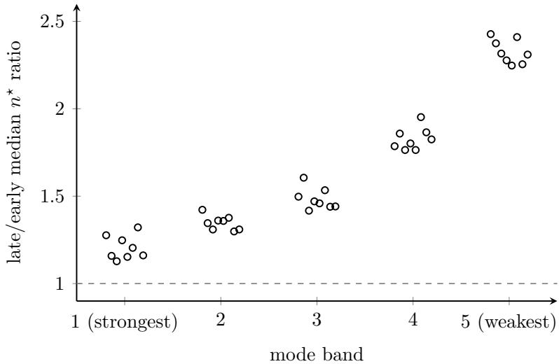  
Figure 7: Cross-seed replication of aging. On 8 independent from-scratch trajectories, the ratio of the late-window [2200, 2700] to the early-window [700, 1500] median $n ^ { \star }$ for each mode band (8 points per band, one per trajectory, slightly ofset horizontally for readability). All $8 \times 5 = 4 0$ ratios exceed 1 (grey dashed line; range 1.13–2.43); the five bands within one trajectory are not mutually independent, and the independent unit of replication is the 8 trajectories: all five bands rise from the early to the late window in every one of the eight trajectories. Each point is one trajectory’s ratio and the eight points are the entire sample; no summary or error bar is drawn. This figure is descriptive; the significance test (one-sample t test, two-sided) is reported in the main text and Methods.

## G.5 Supplementary decompositions

Common shift and relative reallocation Write the observation as $\Delta$ log $\tau _ { b } ^ { \star } = { \cal A } + { \cal S } _ { b }$ , with A the common shift of the whole profile and $S _ { b }$ the relative reallocation among modes. What the fork experiment confirms is the causal action of the learning rate on $S _ { b } ;$ A does not follow from it. The low-learning-rate branch of the fork does not reproduce the whole-profile shift of the from-scratch arms, its five ratios being 0.9997, 0.9674, 0.9235, 0.9546, 0.9616. On that branch the ratio of the strongest band does not difer significantly from 1 $( p = 0 . 3 5 )$ , so the common shift of the whole profile does not appear; the ratios of $b _ { 2 }$ and $b _ { 3 }$ are significantly below 1 $\left( p = 0 . 0 0 8 , 0 . 0 0 3 \right)$ , and the $p$ values of $b _ { 4 }$ and $b _ { 5 }$ are 0.078 and 0.050.

The three arms compared in the two windows The learning rates of the two frozen arms are taken from the median of the original schedule in its early and late window respectively, so each has the same current learning rate as the original schedule in the corresponding window. In the early window the five $n ^ { \star }$ ratios of the constant-high-learning-rate arm against the original schedule are 0.996, 0.956, 0.958, 0.996, 1.037; in the late window the corresponding ratios of the constantlow-learning-rate arm are 0.883, 0.764, 0.733, 0.703, 0.679. The two difer in magnitude: the log departure is 0.004 to 0.045 in the early window and 0.125 to 0.387 in the late window, and the late-window departure grows towards the weaker bands (each $p \leq 1 . 1 \times 1 0 ^ { - 7 } )$ . In the early window $b _ { 2 }$ $b _ { 3 }$ and $b _ { 5 }$ remain statistically distinguishable $( p = 0 . 0 0 1 , 0 . 0 0 5 , 0 . 0 0 0 1 )$ , but the size is an order of magnitude smaller.

Which way the diferent modules go The per-tensor $\Delta$ log $K ^ { \star }$ grouped by module type (a negative sign means the memory lengthens), on the constant-high-learning-rate arm:
<table><tr><td>Module</td><td> $b _ { 1 }$ </td><td> $b _ { 2 }$ </td><td> $b _ { 3 }$ </td><td> $b _ { 4 }$ </td><td> $b _ { 5 }$ </td></tr><tr><td>attn.q</td><td>-0.003</td><td>-0.010</td><td>-0.006</td><td>+0.010</td><td>+0.063</td></tr><tr><td>attn.k</td><td>-0.023</td><td>-0.002</td><td>+0.017</td><td>-0.034</td><td>-0.066</td></tr><tr><td>attn.v</td><td>-0.075</td><td>+0.083</td><td>+0.042</td><td>-0.005</td><td>-0.006</td></tr><tr><td>attn.proj</td><td>-0.029</td><td>+0.010</td><td>+0.152</td><td>+0.184</td><td>+0.212</td></tr><tr><td>mlp.fc</td><td>-0.076</td><td>-0.045</td><td>-0.044</td><td>-0.031</td><td>+0.028</td></tr><tr><td>mlp.proj</td><td>-0.263</td><td>-0.040</td><td>-0.042</td><td>-0.036</td><td>-0.037</td></tr></table>

Under the constant high learning rate the shortening of the middle and weak bands comes almost entirely from the attention output projection $\left( + 0 . 1 5 \mathrm { t o } + 0 . 2 1 \right.$ on $b _ { 3 } { - } b _ { 5 } )$ , while the two MLP matrices are still moving towards longer memory on the same bands. On the constant-low-learning-rate arm all six module types are uniformly negative. The strength profile at the aggregate level therefore hides diferences between modules.

This paper does not treat that layer: the five bands are formed within each tensor, module grouping is a diferent cut across tensors, and the two contributions are mixed in the aggregate; separating them would require redoing the whole set of readings by module type.

The absolute size of $\hat { D }$ and a normalized control $\hat { D } _ { b }$ measures the absolute size of the projection increment, and its fall may come from the persistent component changing more slowly or merely from the projection amplitude shrinking overall. After normalization by the mean square of the projection itself, the five bands of the constant-low-learning-rate arm and the weak bands of the constant-high-learning-rate arm still show a residual fall; the strongest band of the constant-highlearning-rate arm does not $( b _ { 1 }$ , seed 0: $\Delta \log \hat { D } = - 1 . 2 0 2$ against $\Delta \log \langle s ^ { 2 } \rangle = - 1 . 1 8 0$ , giving 0.022 after normalization). This distinction corrects the reading that the local dynamics of the medium slow down across the board; it does not alter the directional conclusion the main text draws from $T / D$

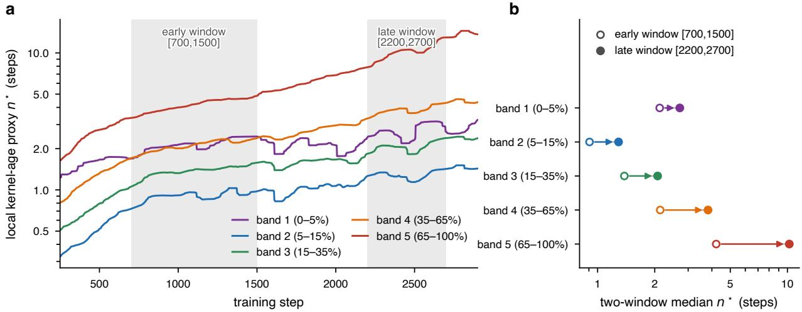  
Figure 8: Local kernel-age proxy $n ^ { \star }$ (defined in Methods) versus training step (seed-0 trajectory). (a) Each curve is the median over the 72 hidden-layer matrices of $n ^ { \star }$ for one mode band (band 1 is the strongest $0 - 5 \%$ , band 5 the weakest $6 5 - 1 0 0 \% )$ ; the vertical axis is logarithmic; the first 250 steps are estimator warm-up and are not shown; the two vertical strips are the pre-specified windows [700, 1500] and [2200, 2700]. (b) Median $n ^ { \star }$ per band within the two windows (horizontal axis logarithmic), open markers for the early window, filled for the late window. The shaded bands in (a) are the interquartile range $\left( Q _ { 1 } { - } Q _ { 3 } \right)$ over the 72 hidden matrices within each band, smoothed in the same rolling window as the median lines; their mutual overlap shows that the dispersion of individual channels is much larger than the separation between bands, so what is resolved is the ordering of the medians rather than the value of any single channel. This figure shows a single trajectory; across-trajectory statistics are in Table 2 of the main text, and the per-point replication over 8 trajectories is in Fig. 7.

## G.6 Boundaries of the argument and of the structure

Three limits on the frequency-domain argument itself The main text uses the amplitude ratio of the two branch outputs to explain why fixed global parameters can still serve the demands of diferent modes. That step shows only that the mechanism exists and that its size is not trivial; it does not show that this particular $w , \ \beta _ { f } , \ \beta _ { s }$ match the demands measured here. This section also does not measure where each mode sits on that frequency axis: $n ^ { \star }$ is set by $T / D$ and measures the preferred memory length, whereas the actual frequency content of the persistent component is a diferent quantity, not measured here. The argument further treats a mode as a direction that is quasi-stable over the memory length of the filter, while the decomposition is recomputed at every step.

The comparison against a non-convex fast-slow mixture Sec. 3 fixes the two-timescale kernel as the coarsest discretization of a positive relaxation spectrum. The non-convex mixture of AdEMAMix[33], $m = m _ { \mathrm { f } } + \alpha m _ { \mathrm { s } }$ with $\alpha > 1$ , gives another form in which fast and slow coexist, with weights summing to $1 + \alpha ;$ were it equally efective, the restriction to a positive relaxation spectrum would carry no exclusivity.

Convex and non-convex difer in exactly one place. $m _ { \mathrm { f } } + \alpha m _ { \mathrm { s } }$ and the convex combination $w = 1 / ( 1 + \alpha )$ give exactly the same update direction before entering msign; the non-convex form only scales the amplitude of the memory relative to the instantaneous gradient by $1 + \alpha$ . A directionmatched pair of arms is set up accordingly: the non-convex arm takes $\alpha = 5$ (the AdEMAMix default) and the convex control arm takes $w = 1 / 6$ , the two difering in this gain alone. Bare tuned-Muon stack, trained from scratch, seeds $0 { - } 7 .$ , identical line by line apart from the memory kernel; $\beta _ { f } , \beta _ { s }$ both take this paper’s (0.85, 0.98) rather than the $\beta _ { 3 } = 0 . 9 9 9 9$ of AdEMAMix (a memory of about $1 0 ^ { 4 }$ steps, longer than the whole of the training here).

The per-seed paired diference at step 3210 is +0.00061 (t = 4.13, $p = 0 . 0 0 4 4$ , n = 8, two-sided), the non-convex arm being worse; the arm-level first crossings are 3190 for convex and 3200 for non-convex. The extra factor of $1 + \alpha$ in amplitude is harmful, so the positive convex normalization is a necessary part of this form. The $w$ of the convex arm is fixed uniquely by α and is not this paper’s 0.4385: replacing it by the latter would leave the two arms no longer direction-matched, and what would be measured would be direction and gain mixed together. The direct comparison between that convex arm and this paper’s recipe isolates w itself; that reading and its limits across stacks are in Appendix E.

Structural boundaries First, the five bands are rank quantiles recomputed at every step, so $b _ { 3 }$ of the early window and $b _ { 3 }$ of the late window are composed of diferent modes. Second, the coherence of the drift within a group, the noise correlation between directions and the rotation of the measurement basis all afect the absolute value of $K _ { b } ^ { \star }$ , and this section therefore reads only the relative change between the early and late windows of one and the same band (see G.1).

Both of these biases enter $K ^ { \star }$ multiplicatively. If their change between the early and the late window is smaller than the observed $\Delta$ log $\hat { D } _ { b } - \Delta$ log $\hat { T } _ { b }$ , they do not alter the sign of the conclusions above; this paper does not verify that condition directly.

## Acknowledgements

We thank Ruichen Jiang (Google Research) for helpful discussions.

## References

[1] Kwangjun Ahn, Byron Xu, Natalie Abreu, et al. Dion: Distributed Orthonormalized Updates, 2025. https://arxiv.org/abs/2504.05295.

[2] Noah Amsel, David Persson, Christopher Musco, and Robert M. Gower. The Polar Express: Optimal Matrix Sign Methods and Their Application to the Muon Algorithm, 2025. https: //arxiv.org/abs/2505.16932.

[3] Jeremy Bernstein and Laker Newhouse. Old Optimizer, New Norm: An Anthology, 2024. https://arxiv.org/abs/2409.20325.

[4] Jean-Philippe Bouchaud. Weak Ergodicity Breaking and Aging in Disordered Systems. Journal de Physique I, 2:1705–1713, 1992. https://doi.org/10.1051/jp1:1992238.

[5] John Chen, Cameron Wolfe, Zhao Li, and Anastasios Kyrillidis. Demon: Improved Neural Network Training with Momentum Decay, 2019. https://arxiv.org/abs/1910.04952.

[6] Xiangning Chen, Chen Liang, Da Huang, et al. Symbolic Discovery of Optimization Algorithms, 2023. https://arxiv.org/abs/2302.06675.

[7] Yineng Chen, Zuchao Li, Lefei Zhang, Bo Du, and Hai Zhao. Bidirectional Looking with A Novel Double Exponential Moving Average to Adaptive and Non-adaptive Momentum Optimizers. In International Conference on Machine Learning, pages 4764–4803, 2023. https://proceedings.mlr.press/v202/chen23r.html.

[8] Leticia F. Cugliandolo and Jorge Kurchan. Analytical Solution of the Of-Equilibrium Dynamics of a Long-Range Spin-Glass Model. Physical Review Letters, 71:173–176, 1993. https://doi.org/10.1103/PhysRevLett.71.173.

[9] Giuseppe Bruno De Luca and Eva Silverstein. Born-Infeld (BI) for AI: Energy-Conserving Descent (ECD) for Optimization. In International Conference on Machine Learning, pages 4918–4936, 2022. https://proceedings.mlr.press/v162/de-luca22a.html.

[10] Aaron Defazio, Xingyu Alice Yang, Harsh Mehta, Konstantin Mishchenko, Ahmed Khaled, and Ashok Cutkosky. The Road Less Scheduled, 2024. https://arxiv.org/abs/2405.15682.

[11] Hadi Mohaghegh Dolatabadi, Thalaiyasingam Ajanthan, Sameera Ramasinghe, et al. NuMuon: Nuclear-Norm-Constrained Muon for Compressible LLM Training, 2026. https://arxiv.org/ abs/2603.03597.

[12] John D. Ferry. Viscoelastic Properties of Polymers. Wiley, 3rd edition, 1980.

[13] Ekaterina Grishina, Matvey Smirnov, and Maxim Rakhuba. Accelerating Newton–Schulz Iteration for Orthogonalization via Chebyshev-Type Polynomials, 2025. https://arxiv.org/ abs/2506.10935.

[14] Vineet Gupta, Tomer Koren, and Yoram Singer. Shampoo: Preconditioned Stochastic Tensor Optimization. In International Conference on Machine Learning, pages 1842–1850, 2018. https://proceedings.mlr.press/v80/gupta18a.html.

[15] Keller Jordan, Jeremy Bernstein, Brendan Rappazzo, et al. modded-nanogpt: Speedrunning the NanoGPT baseline, 2024. GitHub repository; Track 3 optimization records. https:// github.com/KellerJordan/modded-nanogpt. Accessed 2026-08-17.

[16] Keller Jordan, Yuchen Jin, Vlado Boza, et al. Muon: An Optimizer for Hidden Layers in Neural Networks, 2024. https://kellerjordan.github.io/posts/muon/. Accessed 2026-08-17.

[17] Max Kerr Winter and Liesbeth M. C. Janssen. Glassy dynamics in deep neural networks: A structural comparison. Physical Review Research, 7:023010, 2025. https://doi.org/10. 1103/PhysRevResearch.7.023010.

[18] Kimi Team. Kimi K2: Open Agentic Intelligence, 2025. https://arxiv.org/abs/2507.20534.

[19] Diederik P. Kingma and Jimmy Ba. Adam: A Method for Stochastic Optimization. In International Conference on Learning Representations, 2015. https://arxiv.org/abs/1412.6980.

[20] Ryogo Kubo. The Fluctuation-Dissipation Theorem. Reports on Progress in Physics, 29:255– 284, 1966. https://doi.org/10.1088/0034-4885/29/1/306.

[21] Zichong Li, Liming Liu, Chen Liang, Weizhu Chen, and Tuo Zhao. NorMuon: Making Muon More Eficient and Scalable, 2025. https://arxiv.org/abs/2510.05491.

[22] Wu Lin, Scott C. Lowe, Felix Dangel, Runa Eschenhagen, Zikun Xu, and Roger B. Grosse. Understanding and Improving Shampoo and SOAP via Kullback–Leibler Minimization, 2025. https://arxiv.org/abs/2509.03378.

[23] Chloe W. Lindeman, Varda F. Hagh, Chi Ian Ip, and Sidney R. Nagel. Competition Between Energy and Dynamics in Memory Formation. Physical Review Letters, 130:197201, 2023. https://doi.org/10.1103/PhysRevLett.130.197201.

[24] Hong Liu, Zhiyuan Li, David Hall, Percy Liang, and Tengyu Ma. Sophia: A Scalable Stochastic Second-Order Optimizer for Language Model Pre-Training, 2023. https://arxiv.org/abs/ 2305.14342.

[25] Jingyuan Liu, Jianlin Su, Xingcheng Yao, et al. Muon Is Scalable for LLM Training, 2025. https://arxiv.org/abs/2502.16982.

[26] Ilya Loshchilov and Frank Hutter. Decoupled Weight Decay Regularization. In International Conference on Learning Representations, 2019. https://openreview.net/forum?id= Bkg6RiCqY7.

[27] Binghang Lu, Jiahao Zhang, and Guang Lin. Muon with Spectral Guidance: Eficient Optimization for Scientific Machine Learning. Journal of Computational Physics, 565:115231, 2026. https://doi.org/10.1016/j.jcp.2026.115231.

[28] James Clerk Maxwell. On the Dynamical Theory of Gases. Philosophical Transactions of the Royal Society of London, 157:49–88, 1867. https://doi.org/10.1098/rstl.1867.0004.

[29] Sam McCandlish, Jared Kaplan, Dario Amodei, et al. An Empirical Model of Large-Batch Training, 2018. https://arxiv.org/abs/1812.06162.

[30] Francesca Mignacco and Pierfrancesco Urbani. The Efective Noise of Stochastic Gradient Descent. Journal of Statistical Mechanics: Theory and Experiment, 2022:083405, 2022. https: //doi.org/10.1088/1742-5468/ac841d.

[31] Hazime Mori. Transport, Collective Motion, and Brownian Motion. Progress of Theoretical Physics, 33:423–455, 1965. https://doi.org/10.1143/PTP.33.423.

[32] Depen Morwani, Nikhil Vyas, Hanlin Zhang, and Sham Kakade. Connections Between Schedule-Free Optimizers, AdEMAMix, and Accelerated SGD Variants, 2025. https://arxiv. org/abs/2502.02431.

[33] Matteo Pagliardini, Pierre Ablin, and David Grangier. The AdEMAMix Optimizer: Better, Faster, Older, 2024. https://arxiv.org/abs/2409.03137.

[34] Joseph D. Paulsen and Nathan C. Keim. Mechanical Memories in Solids, from Disorder to Design. Annual Review of Condensed Matter Physics, 16:61–81, 2025. https://doi.org/10. 1146/annurev-conmatphys-032822-035544.

[35] Guilherme Penedo, Hynek Kydl´ıˇcek, Loubna Ben Allal, et al. The FineWeb Datasets: Decanting the Web for the Finest Text Data at Scale, 2024. https://arxiv.org/abs/2406.17557.

[36] Boris T. Polyak. Some Methods of Speeding up the Convergence of Iteration Methods. USSR Computational Mathematics and Mathematical Physics, 4(5):1–17, 1964. https://doi.org/ 10.1016/0041-5553%2864%2990137-5.

[37] Ning Qian. On the Momentum Term in Gradient Descent Learning Algorithms. Neural Networks, 12(1):145–151, 1999. https://doi.org/10.1016/S0893-6080%2898%2900116-6.

[38] Alec Radford, Jefrey Wu, Rewon Child, David Luan, Dario Amodei, and Ilya Sutskever. Language Models Are Unsupervised Multitask Learners, 2019. OpenAI technical report.

[39] Maziar Raissi, Paris Perdikaris, and George Em Karniadakis. Physics-Informed Neural Networks: A Deep Learning Framework for Solving Forward and Inverse Problems Involving Nonlinear Partial Diferential Equations. Journal of Computational Physics, 378:686–707, 2019. https://doi.org/10.1016/j.jcp.2018.10.045.

[40] Herbert Robbins and Sutton Monro. A Stochastic Approximation Method. The Annals of Mathematical Statistics, 22(3):400–407, 1951. https://doi.org/10.1214/aoms/1177729586.

[41] Chongjie Si, Debing Zhang, and Wei Shen. AdaMuon: Adaptive Muon Optimizer, 2025. https://arxiv.org/abs/2507.11005.

[42] L. C. E. Struik. Physical Aging in Amorphous Polymers and Other Materials. Elsevier, 1978.

[43] Ilya Sutskever, James Martens, George Dahl, and Geofrey Hinton. On the Importance of Initialization and Momentum in Deep Learning. In International Conference on Machine Learning, pages 1139–1147, 2013. https://proceedings.mlr.press/v28/sutskever13.html.

[44] The Royal Swedish Academy of Sciences. The Nobel Prize in Physics 2024, 2024. https: //www.nobelprize.org/prizes/physics/2024/. Accessed 2026-08-17.

[45] Nikhil Vyas, Depen Morwani, Rosie Zhao, et al. SOAP: Improving and Stabilizing Shampoo Using Adam, 2024. https://arxiv.org/abs/2409.11321.

[46] Chenrui Xu, Wenjing Yan, and Ying-Jun Angela Zhang. FISMO: Fisher-Structured Momentum-Orthogonalized Optimizer, 2026. https://arxiv.org/abs/2601.21750.

[47] Minxin Zhang, Yuxuan Liu, and Hayden Schaefer. Adam Improves Muon: Adaptive Moment Estimation with Orthogonalized Momentum, 2026. https://arxiv.org/abs/2602.17080.

[48] Robert Zwanzig. Memory Efects in Irreversible Thermodynamics. Physical Review, 124:983– 992, 1961. https://doi.org/10.1103/PhysRev.124.983.