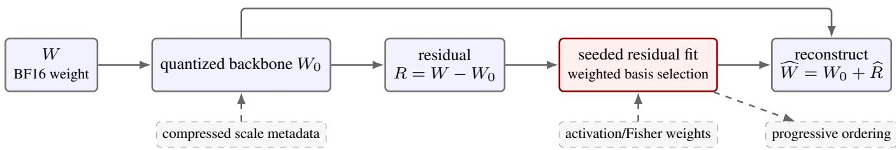
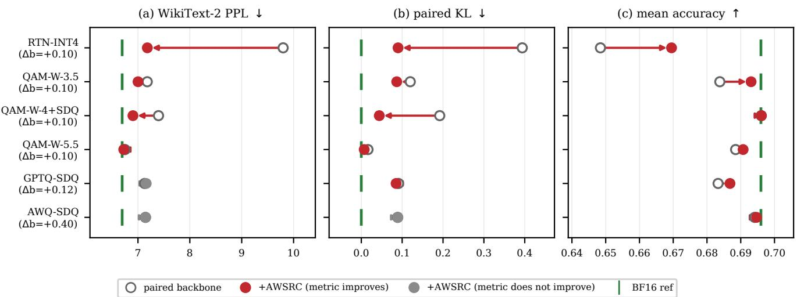

# ACTIVATION-WEIGHTED SEEDED RESIDUAL CODING FOR LOW-BIT LLM WEIGHT REPAIR

Zehao Liu, Chuangchuang Fang, Yang Ren

Huawei Boole RC, United Kingdom

zehao.liu1@h-partners.com {fangchuangchuang, renyang1}@huawei.com

## ABSTRACT

Low-bit weight quantization saves storage but leaves errors that degrade language-model quality. We introduce activation-weighted seeded residual coding (AWSRC), a compact repair codec for an existing quantization backbone. Given a reconstructed weight W0, AWSRC encodes the residual W − W0 using deterministic seedgenerated bases. The sidecar stores seed selectors, low-bit coefficients, and scales rather than an explicit codebook. Activation statistics prioritize errors that affect layer outputs. On Qwen2.5-3B-Instruct, adding 0.162 scope-bits/weight to an INT4 RTN backbone closes 88.2%, 78.9%, and 71.3% of the matched PPL, KL, and accuracy gaps to BF16. Repairing a matched strong low-bit backbone also improves all measured quality metrics. With a matched 49.25 MB sidecar, about 0.8% of the BF16 model-weight payload, AWSRC gives the best perplexity and mean task accuracy among sparse, low-rank, and vector-quantized codecs.

Index Terms— large language models, weight quantization, residual coding, seeded coding, model compression

## 1. INTRODUCTION

Large language models are expensive to store, transfer, and load because their weights contain billions of parameters. Weight-only posttraining quantization (PTQ) reduces this cost without retraining and is therefore attractive when an existing checkpoint must be deployed under a fixed memory budget. Simple round-to-nearest (RTN) quantization is inexpensive; methods such as GPTQ and AWQ use calibration to preserve more quality [1, 2]. These backbones make different accuracy-cost trade-offs, but each produces a reconstructed weight W that differs from its high-precision source W. The remaining error $R = W - W _ { 0 }$ is useful information. Adding it back exactly would recover W, but a dense high-precision copy of R is as costly as the weight it repairs. A practical residual code must therefore recover model quality with a small and explicitly measured payload. This is not only a matrix-approximation problem. Errors should be measured by their impact on layer outputs, while all methods should be compared under the same end-to-end storage budget, including metadata and padding.

We study this problem as post-hoc residual repair. The parent quantizer and W0 remain fixed, while a separately serialized sidecar approximates R. This separation has two advantages. First, repair can be attached to a cheap or already available backbone without repeating its optimization. Second, the parent and repaired model can be evaluated as a matched pair, so the quality gain and additional bytes are directly attributable to the residual codec.

Three challenges shape the design. First, the residual is neither guaranteed to be sparse nor well approximated at a small rank.

Sparse correction pays for coordinates [3], low-rank correction stores dense factors [4, 5], and vector quantization stores assignments together with a learned codebook [6, 7]. Second, treating all weight errors equally can waste compression capacity on coordinates that rarely affect layer outputs under the model’s actual input distribution. Third, a useful sidecar should be independently budgeted, deterministically decodable, and compatible with more than one backbone. Seeded coding provides a compact alternative to an explicit basis or codebook. Encoder and decoder share a deterministic generator, so a short seed identifies a reproducible set of basis atoms. SeedLM applies this principle to complete weight blocks [8]. An alternative is to retain the reconstruction of an off-the-shelf quantizer and seed-code only its residual. This reduces the coding target to a smaller-magnitude signal while keeping the correction relative to a fixed base quantizer.

We propose AWSRC, an activation-weighted seeded residual codec. AWSRC partitions R into tiles, generates candidate bases from seed-dependent sign flips and selected Hadamard columns, and fits low-bit coefficients under an activation-weighted least-squares objective. The central design decision is to optimize repair gain per stored byte rather than approximate every residual tile uniformly. Records are selected by activation-weighted error reduction per serialized byte. This criterion jointly determines basis choice, tile selection, and progressive order, while preventing apparent gains from unreported metadata overhead. Each record stores a tile index, seed selector, quantized coefficients, and scale. Decoding requires no search. The stored selector regenerates the basis and adds the correction to its designated tile. Because every record is additive, omitted tiles retain the exact parent reconstruction and a repair stream can be removed without changing the backbone format. Records may also be gain-ordered into a progressive stream, where every completerecord prefix reconstructs against the same W0. AWSRC assumes only that a backbone supplies W0, allowing the same codec to repair both inexpensive RTN and stronger calibrated backbones. We make three contributions.

• A zero-codebook residual codec with seed-generated bases and compact low-bit repair records.

• Activation-weighted fitting and byte-normalized allocation, with optional Fisher weighting and progressive prefixes.

• A byte-audited five-model evaluation. At +0.162 scope-bpw, AWSRC recovers 88.2%, 78.9%, and 71.3% of the matched PPL, KL, and accuracy gaps to BF16.

## 2. RELATED WORK

Weight-only PTQ improves the primary quantized representation. GPTQ compensates sequential rounding with second-order information, while AWQ rescales activation-salient channels [1, 2]. The recent QAM-W method combines activation-aware scaling, Hadamard rotation, and learned two-dimensional codes [9]; we implement it independently from the paper specification as a strong backbone. Residual compensation is complementary. Sparse formats retain sensitive outliers and their coordinates [3]; LQER and QERA reconstruct quantization error with dense low-rank factors [4, 5]; and AQLM and GPTVQ learn vectors and assignments [6, 7]. SeedLM avoids an explicit codebook by regenerating complete weight blocks from shared seeds [8]. AWSRC uses the same shared-seed principle in a different setting: it encodes only the residual of an independently chosen quantizer. It preserves $W _ { 0 } ,$ codes only its residual, and ranks records by activation-weighted repair gain. Section 4.2 compares these residual representations with the parent, repaired scope, and serialized sidecar bytes held fixed. Any-Precision and BitStack instead expose multiple model rates from one representation [10, 11]. AWSRC serves a narrower role. It keeps the parent unchanged and orders complete seeded residual records, so prefixes provide fine-grained non-integer scope-bpw without replacing the backbone codec.

## 3. AWSRC METHOD

Figure 1 summarizes the design: AWSRC adds a seeded, activationweighted residual stream to a fixed quantized backbone, with optional progressive ordering.

Table 1. Notation used by the codec and storage model.
<table><tr><td>Symbol</td><td>Meaning</td></tr><tr><td> $W , W _ { 0 } , R$ </td><td>dense weight, backbone, residual</td></tr><tr><td> ${ \widehat { R } } , { \widehat { W } }$ </td><td>coded residual, repaired weight</td></tr><tr><td> $C , P , b , S$ </td><td>tile size, coefficients, bits, seed pool</td></tr><tr><td> $s , B _ { s }$ </td><td>seed identifier and generated basis</td></tr><tr><td> $\alpha , \widehat { \alpha }$ </td><td>fitted and stored coefficients</td></tr><tr><td> $D = \mathrm { d i a g } ( d )$ </td><td>activation-importance diagonal</td></tr><tr><td> $T , K$ </td><td>candidate and retained tile counts</td></tr><tr><td> $B _ { \mathrm { b b } } , B _ { \mathrm { s i d e } }$ </td><td>serialized backbone and sidecar bytes</td></tr><tr><td> $N _ { \mathrm { s c o p e } }$ </td><td>parameters in the reported scope</td></tr><tr><td> $b _ { e } , h$ </td><td>exponent width and stream-header bytes</td></tr></table>

## 3.1. Seeded residual representation

For any quantizer Q, AWSRC starts from

$$
W _ { 0 } = Q ( W ) , \quad R = W - W _ { 0 } , \quad \widehat { W } = W _ { 0 } + \widehat { R } .\tag{1}
$$

Target matrices are split into row-wise tiles $\boldsymbol { r } \in \mathbb { R } ^ { C }$ . Seed $s$ deterministically generates $\boldsymbol { B } _ { s } \in \mathbb { R } ^ { C \times P }$ , so no basis matrix is serialized.

$$
B _ { s } = \mathrm { G e n B a s i s } ( s , C , P ) , \qquad \widehat { r } _ { s } = B _ { s } \widehat { \alpha } _ { s } .\tag{2}
$$

We use normalized signed and permuted Hadamard bases. Encoder and decoder share the generator, seed order, and numeric convention. Candidate bases therefore cost only a seed selector in the stored stream; basis search is confined to the encoder. Specifically, the seed initializes a synchronized pseudo-random generator that selects a sign pattern, a coordinate permutation, and $P$ columns of the order-C Hadamard matrix. The selected columns are normalized by $\sqrt { C }$ Different seeds expose alternative structured subspaces without serializing their $C \times P$ atoms. Reproducibility therefore requires only the generator version and convention recorded in the stream header. The parameters expose distinct trade-offs. Here C controls locality and index amortization, $P$ the generated-subspace dimension, b coefficient precision, and S basis diversity, encoder search, and selector bits. Increasing P, b, or S is therefore not free even though basis atoms are not stored. An explicit bank of S candidate bases would store $O ( S C P )$ values. AWSRC instead stores only a $\left\lceil \log _ { 2 } S ^ { \right\rceil }$ ⌉-bit selector per retained tile plus fixed generator metadata; increasing S primarily expands offline search.

## 3.2. Activation-weighted fitting

Calibration gives $d _ { j } ~ = ~ \mathbb { E } [ x _ { j } ^ { 2 } ]$ for input coordinate $j$ and $D =$ diag(d). Each candidate seed is fitted by

$$
\alpha _ { s } ^ { * } = \underset { \alpha } { \arg \operatorname* { m i n } } \left\| \boldsymbol B _ { s } \alpha - \boldsymbol r \right\| _ { D } ^ { 2 } = ( \boldsymbol B _ { s } ^ { \top } D \boldsymbol B _ { s } + \epsilon I ) ^ { - 1 } \boldsymbol B _ { s } ^ { \top } D \boldsymbol r .\tag{3}
$$

Under the diagonal activation-covariance approximation, this objective estimates the expected output perturbation. $\mathbb { E } _ { x } [ ( r \mathrm { ~ - ~ }$ $\overline { { \widehat { r } _ { s } } } ) ^ { \top } x ) ^ { 2 } ] \approx \| r - \widehat { r } _ { s } \| _ { L } ^ { 2 }$ . Thus activations determine which residual errors are important to repair; they are not quantized or stored by AWSRC. The diagonal is shared by output rows of the same linear module and is computed once from calibration inputs. This avoids storing or solving with a full activation covariance while retaining coordinate-wise sensitivity. Coefficients are quantized with one power-of-two scale per tile. The encoder selects the seed with the lowest weighted error after coefficient quantization, so selection matches the stored reconstruction. A record contains a tile index, seed selector, $P$ signed b-bit coefficients, and a scale exponent. Decoding regenerates $B _ { s } \widehat { \alpha } _ { s }$ and adds it to $W _ { 0 } ;$ ; omitted tiles receive no correction. Calibration statistics and seed search are encoderonly. The decoder needs only $W _ { 0 } ,$ , the stream header, and retained records; it loads no calibration corpus and recomputes no activation or Fisher statistics. With no retained records, decoding returns $W _ { 0 }$ exactly. This parent-preserving invariant attributes every quality and byte change to the detachable sidecar and allows matrices outside the selected repair scope to remain untouched.

## 3.3. Allocation and progressive prefixes

The encoder evaluates the reconstruction after coefficient quantization and assigns tile t the byte-normalized gain

$$
\rho _ { t } = \frac { \| r _ { t } \| _ { D } ^ { 2 } - \| r _ { t } - \widehat { r } _ { t } \| _ { D } ^ { 2 } } { B _ { t } } ,\tag{4}
$$

where $B _ { t }$ is the complete serialized record size. Non-positive records are discarded. Uniform allocation retains records within each module, whereas the progressive variant sorts all eligible records by $\rho _ { t }$ . Truncating this ordered stream only removes complete additive corrections, so every prefix decodes against the same $W _ { 0 }$ without refitting or storing intermediate models. In $\mathrm { A W S R C - P } _ { F } ,$ , F blends Fisher and activation diagonals, while P globally ranks records by $\rho _ { t }$ . Any complete-record prefix is independently decodable, yielding the 4.15 and 4.23 bpw points without changing basis generation or reconstruction. Encoding costs $O ( T S ( \breve { C } \breve { P ^ { 2 } } + P ^ { 3 } ) )$ and decoding K retained records costs $O ( K C P )$ without a search. Candidate fits are independent before global sorting, so the encoder can process modules sequentially without retaining the full dense residual or every rejected candidate. Separately, scale double quantization (SDQ), derived from QLoRA’s Double Quantization, further compresses backbone group-scale metadata [12].

  
Fig. 1. AWSRC augments an arbitrary quantization backbone. It codes $R = W - W _ { 0 }$ per tile with a seed-generated basis and an activationweighted fit. Fisher weighting and record ordering are optional.

## 3.4. Serialized rate

For payload length $\ell _ { \mathrm { p a y l o a d } } = \lceil \log _ { 2 } S \rceil + b _ { e } + P b ,$ , measured storage is

$$
\begin{array} { r } { B _ { \mathrm { s i d e } } = h + K \left\lceil \frac { \left\lceil \log _ { 2 } T \right\rceil + \ell _ { \mathrm { p a y l o a d } } } { 8 } \right\rceil , } \\ { \mathrm { b p w } _ { \mathrm { s c o p e } } = \frac { 8 ( B _ { \mathrm { b b } } + B _ { \mathrm { s i d e } } ) } { N _ { \mathrm { s c o p e } } } . \qquad } \end{array}\tag{5}
$$

We also report full-effective-bpw, which includes BF16 parameters outside the target scope. Thus scope-bpw compares the same repaired matrices, while full-effective-bpw states model-wide storage. The Qwen2.5 main artifact has 7-byte records, a 904-byte header, and a measured 49.25 MB sidecar.

## 4. EXPERIMENTS

The main model is Qwen2.5-3B-Instruct [13]; the target scope is its 108 MLP gate, up, and down projections. Other weights remain BF16. We collect activation statistics from 32 fixed synthetic texts and use 4,096 WikiText-2 training tokens for the optional Fisher diagonal [14]. Perplexity uses 16,384 WikiText-2 test tokens with length 2,048 and stride 1,024. Paired KL uses 4,096 tokens and the same BF16 teacher. Mean accuracy averages PIQA, HellaSwag, COPA, RTE, OpenBookQA, and LAMBADA at zero shot with at most 300 examples per task [15].

For candidate distribution ${ \boldsymbol { p } } \theta ,$ teacher distribution $p _ { T }$ , and $N$ scored positions, the reported sequence metrics are

$$
\begin{array} { l } { \mathrm { P P L } = \displaystyle \exp \left[ - \frac { 1 } { N } \sum _ { i } \log p _ { \theta } ( x _ { i } \mid x _ { < i } ) \right] , } \\ { \mathrm { K L } = \displaystyle \frac { 1 } { N } \sum _ { i } \sum _ { v } p _ { T } ( v \mid x _ { < i } ) \log \frac { p _ { T } ( v \mid x _ { < i } ) } { p _ { \theta } ( v \mid x _ { < i } ) } . } \end{array}\tag{6}
$$

Let $p , r ,$ and b denote the parent, repaired, and BF16 scores. Gap recovery is $( p - r ) / ( p - b )$ for lower-is-better PPL/KL and $( r -$ $p ) / ( b - p )$ for accuracy. We compute each percentage from unrounded scores within one matched run. All paired rows use the same tokenizer, token order, and scored positions. Accuracy is computed per task before taking the unweighted mean.

RTN uses group size 128. GPTQ/AWQ are official references; QAM-W is our paper-specification clean-room implementation, not the authors’ code [1, 2, 9]. Its absolute PPL/KL differ from reported values, so only matched repair comparisons support our claims. All candidates are reconstructed as dense BF16 weights for evaluation. We claim compressed quality and serialized size, not packed-runtime acceleration. The main table is the deterministic seed-0 formal run (Table 2). Basis generation, tile ordering, calibration order, and tie breaking are fixed. Small weighted systems are solved in FP32 before coefficient quantization. Quality evaluation runs on Ascend

910C devices without an NPU-specific quantization kernel. Serialized rates include indices, payloads, headers, and padding; no analytic byte estimate is substituted for a measured artifact size.

Table 2. Reported configurations. In $\mathrm { A W S R C - P } _ { F }$ , P is a gainranked progressive prefix and F adds Fisher weighting (0.75/0.25).
<table><tr><td>Variant</td><td>Allocation / weights</td><td>(C, P, b, S)</td></tr><tr><td>AWSRC-U</td><td>per-module / activation</td><td>(128, 2, 4, 2)</td></tr><tr><td> $\mathrm { A W S R C - P } _ { F }$ </td><td>global progressive prefix / act.+Fisher (16, 4, 4, 16)</td><td></td></tr></table>

We also serialize the complete RTN-SDQ+AWSRC-PF representation as a 2.60 GB standalone checkpoint. Two independent fresh processes load it without access to the dense source checkpoint and produce identical sampled reconstruction hashes. Their WikiText-2 PPL is 7.06, within 0.01 of the materialized evaluation path, and fresh loading takes 6.89–7.10 seconds. This round trip validates the stored representation and decoder, but it is not a packedkernel latency measurement.

## 4.1. Main results

Table 3. Qwen2.5-3B-Instruct. $s / f$ is scope/full-effective-bpw. Lower PPL/KL and higher accuracy are better. † denotes official checkpoints and ‡ our clean-room QAM-W implementation. The BF16 entry applies to both s and $f .$
<table><tr><td>Weight configuration</td><td>bpw s/f PPL KL acc.</td></tr><tr><td>BF16 RTN INT4</td><td>166.700.000.70 4.13/6.639.80 0.390.65</td></tr><tr><td>RTN-SDQ GPTQ exact†</td><td>4.07/6.599.62 0.350.65 4.17/5.367.120.100.69 4.16/6.977.150.090.69</td></tr><tr><td>AWQ exact† QAM-W-4-SDQ</td><td>4.00/6.537.400.190.70</td></tr><tr><td> $+ \mathrm { A W S R C - U }$ </td><td>4.10/6.616.900.040.70</td></tr><tr><td> $\mathrm { R T N + A W S R C \mathrm { - U } }$ </td><td></td></tr><tr><td> $\mathrm { R T N - S D Q + A W S R C - P } _ { F }$ </td><td>4.23/6.717.180.090.67</td></tr><tr><td></td><td>4.15/6.657.11 0.090.68 4.23/6.717.04 0.080.69</td></tr><tr><td></td><td></td></tr><tr><td></td><td></td></tr><tr><td> $\mathrm { R T N - S D Q + A W S R C - P } _ { F }$ </td><td></td></tr></table>

Table 3 reports selected operating points, while Figure 2 tests whether the repair direction persists across six matched parents. At 4.23 scope-bpw, RTN-SDQ repair lowers PPL from 9.62 to 7.04 and KL from 0.35 to 0.08, while accuracy rises from 0.65 to 0.69. QAM-W repairs lower PPL/KL at all three seed-0 rates; 4-bit repeats confirm both in 3/3 seeds, with accuracy improving in 2/3. This supports matched clean-room repair, not reproduction of reported

  
Fig. 2. Qwen2.5-3B paired repairs across RTN-INT4, three clean-room QAM-W bit widths, and GPTQ/AWQ checkpoints. Each arrow runs from a parent (open) to parent+AWSRC (filled); green ticks mark BF16. Red denotes improvement in the displayed metric and gray a non-improving change. Rows are matched only within each parent and are not a cross-row iso-bpw ranking.

QAM-W quality. GPTQ improves KL and accuracy but slightly worsens PPL; AWQ changes are negligible despite a larger sidecar. AWSRC thus consistently repairs RTN and clean-room QAM-W, but not every prequantized backbone. GPTQ/AWQ use different scopes and are references, not cross-row iso-bpw competitors.

## 4.2. Byte-matched residual codecs

We repair the same RTN-SDQ backbone and 108 matrices with four codecs. Every sidecar is exactly 49,245,876 bytes after headers and padding, giving 4.23 scope-bpw and 6.71 full-effective-bpw. Sparse coding stores FP16 values and 32-bit coordinates. Low-rank coding uses activation-weighted rank-34 INT8 factors. VQ uses per-module K = 256 FP16 codebooks and uint8 assignments.

Table 4. Residual codecs at identical serialized bytes.
<table><tr><td>Codec PPL</td><td>KL mean acc.</td></tr><tr><td>Sparse 7.15 0.08</td><td>0.69</td></tr><tr><td>Quantized low-rank 7.09 0.07</td><td>0.67</td></tr><tr><td>Learned VQ</td><td>7.090.07 0.68</td></tr><tr><td>AWSRC 7.04 0.08</td><td>0.69</td></tr></table>

Table 4 shows AWSRC has the best PPL and mean accuracy; learned VQ gives the best unrounded KL. This supports a qualityper-byte, not metric-dominance, claim and shows the storage benefit of omitting an explicit codebook.

## 4.3. Downstream task and model generalization

An independently fitted complete 11-task run raises scope-bpw from 4.068 to 4.230. Respectively for BF16, parent, and repair, PPL is 6.704, 9.834, 7.075; KL is 0, 0.339, 0.071; and mean accuracy is 0.695, 0.648, 0.682. The gap-recovery definition above gives 88.2%, 78.9%, and 71.3%, respectively, and every task improves.

Table 5. Cross-model paired results. Parent and repair rows use the same model, scope, and protocol. Lower PPL/KL and higher accuracy are better. Bold marks a repair improvement over the paired parent using the unrounded source values.
<table><tr><td>Model</td><td>Configuration bpw PPL KL acc.</td></tr><tr><td>Qwen3-4B</td><td>RTN 4.13 8.31 0.09 0.66 +AWSRC-U 4.23 8.27 0.07 0.67</td></tr><tr><td>Llama-3.2-3B</td><td>RTN-SDQ 4.0710.35 0.08 0.67 +AWSRC-U 4.23 9.80 0.04 0.67</td></tr><tr><td>Qwen2.5-Coder-7B QAM-W</td><td>4.007.41 0.02 0.71 +AWSRC-U 4.11 7.38 0.02 0.71</td></tr><tr><td>Yi-1.5-9B</td><td>QAM-W 4.00 5.27 0.11 0.69 +AWSRC-U 4.11 5.17 0.04 0.69</td></tr></table>

Table 5 shows paired gains across four model families [16, 17, 18, 19]; it is not a cross-model ranking. The 11-task point is also stable across three seeds.

## 5. CONCLUSION

AWSRC repairs quantization residuals with seed-generated bases and activation-weighted fitting. At +0.162 scope-bpw, it recovers 88.2%, 78.9%, and 71.3% of the matched PPL, KL, and accuracy gaps to BF16. It also improves a stronger low-bit backbone, transfers across four model families, and gives the best PPL and accuracy among four byte-matched codecs. Mixed GPTQ/AWQ results show parent dependence. These results concern compressed quality rather than runtime. Current artifacts reconstruct dense BF16 and primarily repair MLP projections, unlike the all-linear references. Keeping W fixed and accounting for every sidecar byte decouples backbone choice from repair allocation, enabling gain-per-byte evaluation against a matched parent rather than standalone cross-row ranking. Future work will measure packed decoding, memory traffic, latency, loading cost, and serverless LLM cold-start time.

## 6. REFERENCES

[1] Elias Frantar, Saleh Ashkboos, Torsten Hoefler, and Dan Alistarh, “GPTQ: Accurate post-training quantization for generative pre-trained transformers,” in International Conference on Learning Representations, 2023.

[2] Ji Lin, Jiaming Tang, Haotian Tang, Shang Yang, Wei-Ming Chen, Wei-Chen Wang, Guangxuan Xiao, Xingyu Dang, Chuang Gan, and Song Han, “AWQ: Activation-aware weight quantization for on-device LLM compression and acceleration,” in Proceedings ofMachine Learning and Systems (ML-Sys), 2024.

[3] Sehoon Kim, Coleman Richard Charles Hooper, Amir Gholami, Zhen Dong, Xiuyu Li, Sheng Shen, Michael W. Mahoney, and Kurt Keutzer, “SqueezeLLM: Dense-and-sparse quantization,” in International Conference on Machine Learning (ICML), 2024.

[4] Cheng Zhang, Jianyi Cheng, George Anthony Constantinides, and Yiren Zhao, “LQER: Low-rank quantization error reconstruction for LLMs,” in Proceedings of the 41st International Conference on Machine Learning. 2024, vol. 235 of Proceedings ofMachine Learning Research, pp. 58763–58779, PMLR.

[5] Cheng Zhang, Jeffrey T. H. Wong, Can Xiao, George Anthony Constantinides, and Yiren Zhao, “QERA: An analytical framework for quantization error reconstruction,” in International Conference on Learning Representations, 2025.

[6] Vage Egiazarian, Andrei Panferov, Denis Kuznedelev, Elias Frantar, Artem Babenko, and Dan Alistarh, “Extreme compression of large language models via additive quantization,” in International Conference on Machine Learning (ICML), 2024.

[7] Mart van Baalen, Andrey Kuzmin, Markus Nagel, Peter Couperus, Cedric Bastoul, Eric Mahurin, Tijmen Blankevoort, and Paul Whatmough, “GPTVQ: The blessing of dimensionality for LLM quantization,” arXiv preprint arXiv:2402.15319, 2024.

[8] Rasoul Shafipour, David Harrison, Maxwell Horton, Jeffrey Marker, Houman Bedayat, Sachin Mehta, Mohammad Rastegari, Mahyar Najibi, and Saman Naderiparizi, “SeedLM: Compressing LLM weights into seeds of pseudo-random generators,” in International Conference on Learning Representations, 2025.

[9] Preetam Sharma and Kacper Dobek, “QAM-W: Joint 2D codebook quantization for LLM weights via hadamard rotation and activation-aware scaling,” arXiv preprint arXiv:2605.26339, 2026.

[10] Yeonhong Park, Jake Hyun, Sanglyul Cho, Bonggeun Sim, and Jae W. Lee, “Any-Precision LLM: Low-cost deployment of multiple, different-sized LLMs,” in Proceedings ofthe 41st International Conference on Machine Learning. 2024, vol. 235 of Proceedings of Machine Learning Research, pp. 39682– 39701, PMLR.

[11] Xinghao Wang, Pengyu Wang, Bo Wang, Dong Zhang, Yunhua Zhou, and Xipeng Qiu, “BitStack: Any-size compression of large language models in variable memory environments,” in International Conference on Learning Representations, 2025.

[12] Tim Dettmers, Artidoro Pagnoni, Ari Holtzman, and Luke Zettlemoyer, “QLoRA: Efficient finetuning of quantized

LLMs,” in Advances in Neural Information Processing Systems (NeurIPS), 2023.

[13] Qwen, An Yang, Baosong Yang, et al., “Qwen2.5 technical report,” arXiv preprint arXiv:2412.15115, 2024.

[14] Stephen Merity, Caiming Xiong, James Bradbury, and Richard Socher, “Pointer sentinel mixture models,” in International Conference on Learning Representations, 2017.

[15] Leo Gao, Jonathan Tow, Baber Abbasi, Stella Biderman, Sid Black, Anthony DiPofi, Charles Foster, Laurence Golding, Jeffrey Hsu, Alain Le Noac’h, Haonan Li, Kyle McDonell, Niklas Muennighoff, Chris Ociepa, Jason Phang, Laria Reynolds, Hailey Schoelkopf, Aviya Skowron, Lintang Sutawika, Eric Tang, Anish Thite, Ben Wang, Kevin Wang, and Andy Zou, “The language model evaluation harness,” 2024.

[16] An Yang, Anfeng Li, Baosong Yang, et al., “Qwen3 technical report,” arXiv preprint arXiv:2505.09388, 2025.

[17] Meta AI, “Llama 3.2-3B model card,” Hugging Face model release, 2024, Released September 25, 2024.

[18] Binyuan Hui, Jian Yang, Zeyu Cui, et al., “Qwen2.5-Coder technical report,” arXiv preprint arXiv:2409.12186, 2024.

[19] 01.AI, Alex Young, Bei Chen, et al., “Yi: Open foundation models by 01.AI,” arXiv preprint arXiv:2403.04652, 2024.

## 7. COMPLIANCE WITH ETHICAL STANDARDS

This computational study used publicly available model checkpoints and benchmark datasets and involved no human or animal subjects; therefore, no ethical approval was required. The authors declare no conflicts of interest.