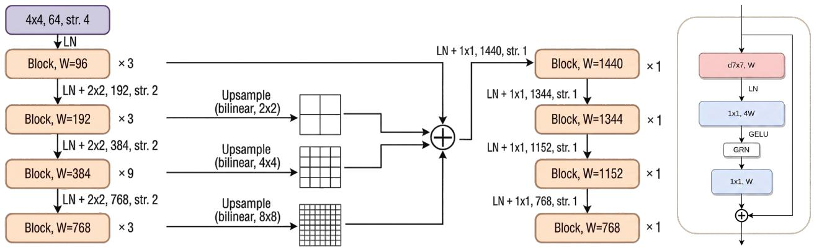
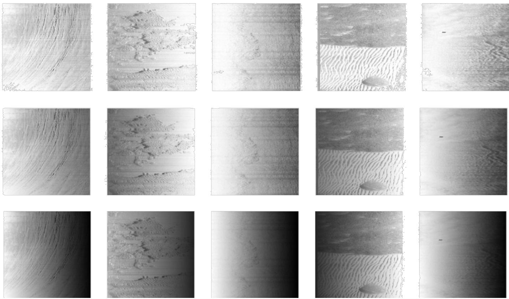
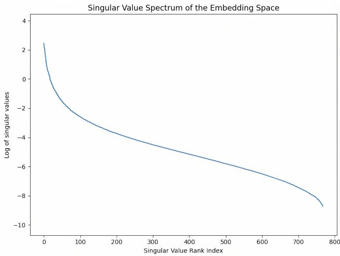
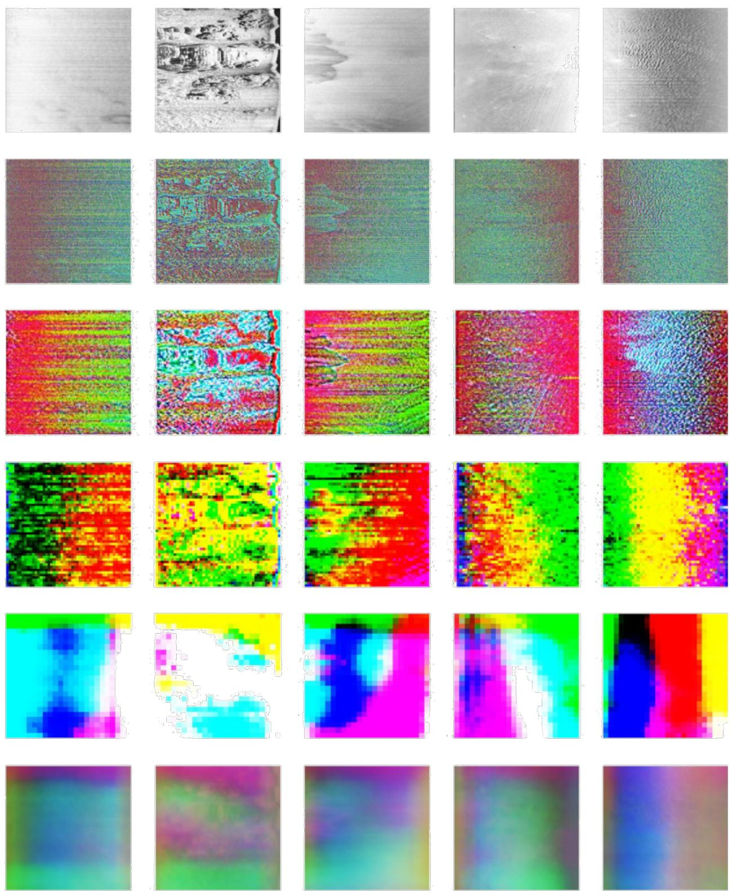
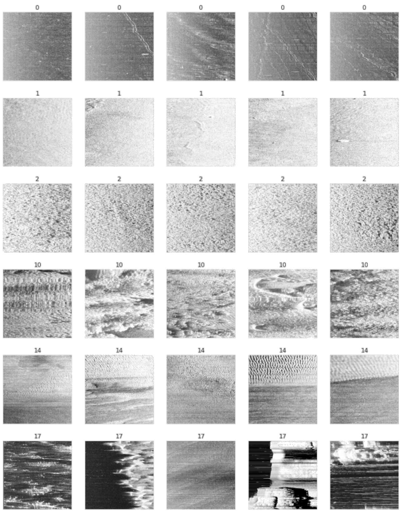
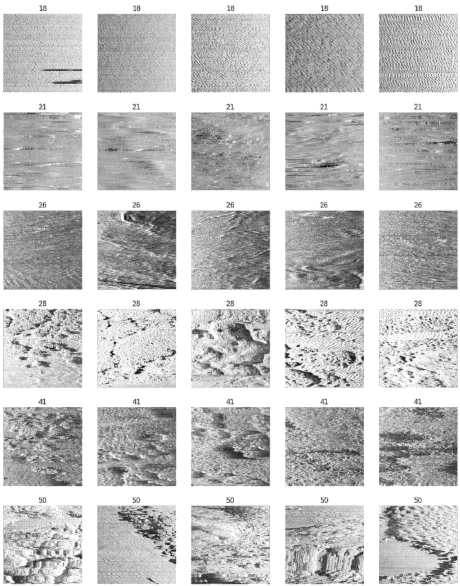

# BenthicDINO: Physics-Informed Self-Distillation for View-Invariant Side-Scan Sonar Representations

Taqi Hamoda, Hayat Rajani, Member, IEEE, and Nuno Gracias, Member, IEEE

Abstract—Automated perception in side-scan sonar (SSS) imagery is severely hindered by physical acoustic artifacts, resulting in representations that inextricably mix intrinsic seabed reflectivity with transient viewing geometries. Existing self-supervised learning (SSL) frameworks rely on augmentations designed for natural images, failing to account for acoustic degradation and explicitly enforce view-invariance. To address this gap, we introduce a physics-informed self-distillation framework built upon the DINOv3 framework with a ConvNeXt-v2-Tiny backbone to maximize data efficiency. The proposed methodology enforces view-invariance through two primary mechanisms: physically motivated augmentations that simulate speckle noise, rangedependent attenuation, and radiometric miscalibration; and a Hilbert-Schmidt Independence Criterion (HSIC) penalty that explicitly decouples learned dense patch features from physical viewing parameters. Furthermore, we propose a dense, hierarchical feature fusion strategy across all four network stages to preserve fine-grained sediment details alongside deep semantic abstractions. Extensive evaluation demonstrates that the framework natively groups complex benthic topographies into stable, noise-free semantic clusters without relying on manual annotations. During supervised downstream tasks on the S3Seg dataset, the fused representations exhibited exceptional data efficiency, achieving 96% of its absolute peak performance using only 10% of the available annotated data, ultimately reaching a mean Intersection over Union (mIoU) of 71.4% and an overall accuracy of 86.5%.

Index Terms—side-scan sonar, self-supervised learning, viewinvariant representation learning, physics-guided augmentation, Hilbert-Schmidt independence criterion, benthic habitat mapping, DINOv3, ConvNeXt.

## I. INTRODUCTION

U NDERWATER robotic perception is severely constrained by the marine environment. Due to absorption and scattering, electromagnetic radiation attenuates rapidly in water, limiting high-resolution optical sensors to ranges under 10 m [1], [2]. Conversely, acoustic energy propagates with low attenuation, enabling sound waves to travel hundreds of metres even in turbid or low-light conditions. As such, side-scan sonar (SSS) has become the primary modality for large-scale seafloor mapping, long-range target detection, and autonomous navigation [3], [4].

Unlike optical cameras, SSS image formation is governed by acoustic acquisition dynamics [3], [5]. Laterally mounted transducers on a moving platform emit fan-shaped pulses perpendicular to the trajectory. The returning echoes are recorded over time and converted to range assuming a constant sound speed of $\mathrm { 1 5 0 0 m s ^ { - 1 } }$ , yielding a continuous 2D backscatter intensity map [3], [4]. Traditionally, this process is approximated by a Lambertian model:

$$
I ( x , y ) = \rho ( x , y ) \cdot \cos ( \theta ( x , y ) ) \cdot L ( x , y )\tag{1}
$$

where the recorded intensity $I ( x , y )$ is a function of the intrinsic seabed reflectivity $\rho ( x , y )$ , the local incidence angle $\theta ( x , y )$ , and the acoustic propagation loss $L ( x , y ) \ [ 3 ] , [ 5 ] .$

However, this simplified model fails to capture true acoustic complexity. Real SSS transducers emit non-uniform power profiles that diminish at the beam edges and vary across side lobes [6]. Furthermore, topographic occlusions create acoustic shadows, and multiplicative speckle noise inherently corrupts the signal [2], [7]. The resulting imagery is therefore highly viewpoint-dependent: the same seafloor structure produces drastically different intensity patterns and shadow geometries when surveyed from a different direction or range. Because a large portion of the recorded intensity encodes the acquisition geometry rather than the seabed itself, features extracted from raw imagery inextricably mix intrinsic reflectivity (ρ) with transient viewing conditions.

These physical artefacts severely bottleneck automated perception. Viewpoint dependence and non-uniform intensity result in poor repeatability for traditional handcrafted keypoint extractors (e.g., SIFT [8], SURF [9]), causing high matching errors and rendering real-time analytical interpretation unreliable [1], [2], [4], [10]. The most direct consequence is unreliable cross-view correspondence: when the same location is imaged from two different headings, the views are difficult to associate, weakening loop closure, mosaicking, and change detection over repeated surveys. A view-invariant representation—one that responds to the structural seabed and not the sensor geometry—is therefore a prerequisite for robust largescale SSS perception.

To overcome these limitations, recent research has turned toward deep self-supervised learning (SSL). By leveraging large-scale unlabelled sonar data, SSL frameworks extract invariant features without relying on scarce manual annotations [7], [11]. Modern self-distillation methods like DINOv3 [11] promote generic invariance through multi-crop augmentation. However, these standard augmentations are designed for natural scenes and fail to model the physical causes of SSS view dependence. Consequently, the learned features still absorb geometric information. No existing SSL approach for SSS explicitly forces the learned representations to be statistically independent of the acquisition parameters.

We address this gap with a physics-guided self-supervised framework built upon the DINOv3 framework. We replace the default Vision Transformer (ViT) with a ConvNeXt-v2-Tiny [12] backbone, leveraging its convolutional inductive biases and global response normalization to stabilize masked latent learning on small SSS datasets. The framework operates on two complementary fronts. First, physics-guided augmentations reproduce dominant SSS nuisance factors during training: bounded additive Gaussian perturbations act as a denoising regularizer against speckle, linear synthetic Time-Varying Gain (TVG) profiles enforce invariance to uncompensated attenuation, and radiometric jitter simulates gain miscalibration. Second, a Hilbert-Schmidt Independence Criterion (HSIC) [13] penalty explicitly minimizes the statistical dependence between the learned dense patch features and the measured viewing parameters, effectively scrubbing residual geometry information that augmentations alone cannot suppress. Finally, a novel hierarchical MLP fusion strategy aggregates features across all four network stages, preserving high-frequency sediment details alongside deep semantic abstractions.

The main contributions of this work are as follows:

• We adapt the DINOv3 framework to acoustic data by integrating a ConvNeXt-v2-Tiny backbone and proposing a dense, multi-scale hierarchical feature fusion that retains fine-grained seabed textures.

• We formulate view-invariance in SSS as a statistical independence problem, introducing an HSIC-based objective—efficiently estimated via random Fourier features—that explicitly decouples learned dense representations from acquisition geometries (slant range and incidence angle).

• We design a set of physics-guided augmentations derived from the SSS acquisition model, safely injecting speckle, linear range-dependent attenuation, and radiometric variation to enforce physical invariances without manual annotation.

• We demonstrate through extensive representation-quality analyses that the resulting embeddings are view-invariant, significantly improving cross-view correspondence reliability compared to existing self-supervised baselines, while transferring effectively to downstream perception tasks.

## II. RELATED WORK

## A. Representation Learning for Sonar

Self-supervised learning (SSL) has seen increasing adoption for sonar perception, driven by the high cost of expert annotations and the poor transferability of models pre-trained on natural optical images [14]. Early investigations explored fundamental pretext tasks—such as rotation prediction, denoising autoencoders, and jigsaw solving—demonstrating that SSL significantly narrows the performance gap with supervised methods in low-label regimes for forward-looking sonar (FLS) [7]. For synthetic-aperture sonar (SAS), subsequent works adapted momentum-contrast pre-training [15] and surveyed both contrastive and generative SSL paradigms for processing and recognition [16].

Within the SSS domain, recent research has evaluated modern architectures, comparing ViTs against convolutional networks (including ConvNeXt variants) for classification, highlighting SSL as a critical next step for acoustic data [17]. Concurrently, joint-embedding predictive architectures have been applied for in-domain mine-like object classification [18]. More advanced self-distillation frameworks, such as DINOv3, have proven highly effective at generating robust dense features [11], inspiring related FLS applications that leverage selfsupervised feature-space transformations to suppress speckle and enhance target regions [19].

Despite this rapid progress, existing sonar SSL pipelines inherit augmentations and pretext tasks designed for natural imagery. None explicitly enforce statistical invariance to the physical acquisition geometry or acoustic degradation models. This fundamental gap motivates our approach, which uniquely embeds an explicit independence constraint and physicsguided augmentations directly within a dense self-distillation framework.

## B. Physics-Informed Learning for Sonar

The scarcity of paired, high-quality real sonar data has driven significant interest in physics-informed learning, largely focused on realistic image synthesis and closing the domain gap between simulated and real imagery. Explicit acoustic simulators, such as S3Simulator [20] and ACOUSIM [21], model the acquisition process directly to generate benchmark datasets or measure statistical alignment without generative models. Another major line of work combines learned generators with physical priors to augment small datasets: Li et al. explored zero-shot and few-shot SSS synthesis for target detection [22], Peng et al. trained multi-view generative adversarial networks [23], Koo et al. utilized CycleGANs for synthetic generation [24], and Ma et al. embedded random-fusion strategies within diffusion frameworks for segmentation [25].

A third group of methods grounds the physics directly in the acquisition geometry to normalize or transform backscatter intensity. For instance, Liu and Ye proposed a gray-scale correction method accounting for rugged seafloors [26], Stewart et al. mapped SAS intensity to seabed elevation via imageto-height translation [27], and recent works have employed physics-based backscatter correction to reduce view-dependent variations prior to feature extraction [5].

While these approaches demonstrate that encoding the sensor model improves data realism and mitigates intensity inconsistencies, they universally apply physics during preprocessing or image synthesis. They do not embed physical constraints directly into the representation learning objective. Consequently, the resulting deep features are not mathematically guaranteed to be invariant to the acquisition geometry. Our work departs from this paradigm by enforcing geometric view-invariance directly in the latent space during pre-training, ensuring the network natively decouples intrinsic seabed structure from transient viewing conditions.

## III. METHODOLOGY

We build on the DINOv3 self-distillation framework and adapt it to the acoustic characteristics of SSS. The framework has three parts: a base self-distillation model with a ConvNeXt-v2-Tiny encoder (Sections III-A and III-B); a set of physics-guided augmentations that reproduce the dominant SSS nuisance factors during training (Section III-C); and an explicit statistical-independence penalty that decouples the learned dense features from the acquisition geometry (Section III-D). Furthermore, we introduce a set of training adaptations that make self-distillation stable under small-batch distributed training on SSS data that are described later with the experimental settings (Section IV-B).

## A. DINOv3 Self-Distillation Framework

DINOv3 employs a self-distillation paradigm where a student network learns to match the output distributions of a teacher network. The teacher’s weights are updated using an exponential moving average (EMA) of the student’s weights, ensuring a stable target representation [11], [28]. The overall pre-training objective is a composite loss function designed to capture both global semantic understanding and fine-grained local structures:

$$
\mathcal { L } _ { P r e } = \mathcal { L } _ { D I N O } + \mathcal { L } _ { i B O T } + 0 . 5 \cdot \mathcal { L } _ { G r a m } + 0 . 1 \cdot \mathcal { L } _ { K o L e o }
$$

1) Global Discriminative Loss: The DINO objective enforces view-invariance at the global image level by aligning representations across different augmented views of the SSS input. Specifically, the student network processes a comprehensive set of global and local crops, denoted as $V ,$ while the teacher network is restricted to processing only global crops $V _ { \mathrm { g l o b a l } }$ [11]. The outputs from both networks are transformed into probability distributions over K dimensions via a projection head followed by a softmax activation. To effectively prevent representational collapse, Sinkhorn-Knopp centering is used for the teacher’s distributions, replacing the original centering and sharpening mechanism used in DINOv1 [28], [29]. The resulting loss minimizes the cross-entropy between the student distribution $P _ { s } ( x _ { v } )$ and the centered teacher distribution $P _ { t } ( x _ { v ^ { \prime } } )$

$$
\mathcal { L } _ { \mathrm { { D I N O } } } = - \sum _ { v \in V } \sum _ { v ^ { \prime } \in V _ { \mathrm { { g l o b a l } } } } P _ { t } ( x _ { v ^ { \prime } } ) \log P _ { s } ( x _ { v } )
$$

Minimizing this objective promotes the learning of global features that are robustly invariant to geometric distortions and sensor noise.

2) Masked Latent Reconstruction: To instill dense prediction capabilities and enhance the model’s robustness to acoustic shadows, an iBOT masked image modeling loss is used to complement the global objective [28]. This patchlevel objective forces the student network to reconstruct the features of masked tokens using the teacher’s representations of the corresponding unmasked patches as learning targets. Consistent with the global DINO objective, Sinkhorn-Knopp centering is also applied to these patch-level projections. For a given set of masked patch indices $\mathcal { M } ,$ the reconstruction loss is formulated as the cross-entropy between the teacher’s patch distribution $P _ { t _ { i } } ^ { p a t c h }$ and the student’s prediction $P _ { s _ { i } } ^ { p a t c h }$

$$
\mathcal { L } _ { i B O T } = - \sum _ { i \in \mathcal { M } } P _ { t _ { i } } ^ { p a t c h } \log P _ { s _ { i } } ^ { p a t c h }
$$

3) Feature Regularisation: To prevent feature collapse and encourage a uniform distribution across the hypersphere, KoLeo regularization is applied on the dense embeddings of the student patches [11], [28].

$$
{ \mathcal { L } } _ { \mathrm { K o L e o } } = - { \frac { 1 } { n } } \sum _ { i = 1 } ^ { n } \ln \left( \operatorname* { m i n } _ { j \neq i } \| z _ { i } - z _ { j } \| \right)\tag{2}
$$

This term maximises the minimum distance between samples, which improves class separability in downstream benthic tasks. In $\mathcal { L } _ { \mathrm { P r e } }$ we use its distributed variant, which computes the same quantity across the distributed batch.

4) Gram Anchoring: Long training schedules and high resolutions often degrade dense feature maps, causing patchlevel inconsistency and noisy representations that harm SSS matching and registration [2], [11]. DINOv3 introduces Gram anchoring to preserve local structure [11]. The Gram matrix captures the pairwise correlations of the L2-normalised patch features. The student is regularised by matching its Gram matrix to that of a stable “Gram teacher”, a checkpoint from earlier training.

$$
\mathcal { L } _ { \mathrm { G r a m } } = | X _ { S } X _ { S } ^ { \top } - X _ { G } X _ { G } ^ { \top } | _ { F } ^ { 2 }\tag{3}
$$

Gram anchoring stabilises dense features, accelerates iBOT convergence, and improves performance on dense SSS tasks such as feature matching and segmentation, while preserving fine sediment textures [4], [11].

## B. ConvNeXt-v2 Backbone

Standard implementations of the DINO framework typically rely heavily on ViTs as the backbone. However, ViTs lack the strong inductive biases inherent to CNNs, such as translation equivariance and local connectivity, and therefore demand massive amounts of training data to generalize effectively. Given that high-quality, diverse SSS data is notoriously scarce and our dataset is relatively small, we opted for a convolutional architecture to maximize data efficiency. Furthermore, selecting the tiny variant was a deliberate regularization tactic; its constrained parameter space prevents the model from severely overfitting to the limited acoustic dataset while remaining computationally viable for AUV deployment.

The original ConvNeXt [30] modernized the standard ResNet block by incorporating ViT-inspired design choices, including large $7 \times 7$ depthwise convolutions, inverted bottlenecks, and replacing Batch Normalization with Layer Normalization. While highly effective for supervised learning, applying mask-based self-supervised learning, such as the iBOT objective, directly to ConvNeXt induces severe representation collapse [12]. When trained on masked inputs, the dimensionexpansion MLP layers produce dead or saturated feature maps, leading to redundant channel activations and degraded feature diversity [12].

To mitigate this, our framework utilizes ConvNeXt-v2 [12], which introduces Global Response Normalization (GRN). Inserted directly after the MLP expansion layer, GRN enhances inter-channel competition by aggregating spatial features into a channel-wise $L _ { \mathrm { { 2 } } } \mathrm { { - n o r m } }$ vector and applying divisive normalization [12]. This calibration successfully maintains feature diversity and prevents channel saturation during the masked latent reconstruction of sonar patches.

  
Fig. 1. ConvNeXt-v2 adapted for DINOv3 (Left). Outputs from stages 1–4 are upsampled to match stage 1, concatenated, and compressed via a fusion MLP into a 768-D embedding. The ConvNeXt-v2 block structure (Right) utilizes global response normalization to stabilize masked learning.

Furthermore, moving beyond previous multi-scale approaches that discarded early features, our framework extracts and aggregates hierarchical representations from all four stages of the network. This is as depicted in Fig. 1.

Let $F ^ { ( s ) }$ denote the feature map from stage $s \in \{ 1 , 2 , 3 , 4 \}$ Feature maps from stages 2, 3, and 4 are upsampled via bilinear interpolation to match the spatial resolution of stage 1. The upsampled feature maps are then concatenated along the channel dimension. To effectively fuse these multi-scale representations without losing spatial context, we introduce a 3-layer Multi-Layer Perceptron (implemented via $1 \times 1$ convolutions) that compresses the concatenated features into a unified 768-dimensional descriptor:

$$
\mathcal { H } _ { i , j } = \mathbf { M } \mathbf { L } \mathbf { P } _ { 1 \times 1 } \left( \bigoplus _ { s = 1 } ^ { 4 } F _ { i , j } ^ { ( s ) } \right) \in \mathbb { R } ^ { 7 6 8 }
$$

This dense feature fusion effectively preserves the finegrained, high-frequency sediment details captured in the initial stage, while seamlessly integrating the deep, robust semantic abstraction generated in the deeper stages.

## C. Physics-Guided Augmentations

DINOv3 induces its target invariances through the augmentations applied to each crop. The default photometric augmentations are designed for natural photographs and do not accurately represent the physical factors that affect SSS imagery. We therefore incorporate three physically motivated augmentations, each targeting a dominant SSS nuisance factor: speckle noise, range-dependent attenuation, and radiometric miscalibration.

Each operation is applied independently to every crop. Consequently, the student and teacher process varying acoustic conditions for the same seabed patch, compelling the network to learn features invariant to these physical artifacts. Let $I \in \mathbb { R } ^ { H \times W }$ denote an input tile, with x representing the alongtrack axis and r representing the across-track (range) axis.

1) Speckle Perturbation: Coherent acoustic imaging produces speckle, a grainy multiplicative fluctuation that corrupts the backscatter signal [7]. To improve robustness to this degradation, we perturb the tile with additive Gaussian noise:

$$
\tilde { I } ( x , r ) = I ( x , r ) + \eta ( x , r ) , \quad \eta ( x , r ) \sim \mathcal { N } ( 0 , \sigma ^ { 2 } )\tag{4}
$$

While a multiplicative variant is closer to the true physical speckle model, the additive formulation acts as a highly effective denoising regularizer that forces the network to learn robust structural representations rather than over-indexing on raw pixel intensities [7]. Unlike previous assumptions of a zero-based uniform distribution, our implementation explicitly bounds the standard deviation to prevent catastrophic signal destruction. Specifically, σ is sampled per tile from a uniform distribution $\sigma ~ \sim ~ \mathcal { U } ( 0 . 0 1 , 0 . 0 5 )$ , and the augmentation is applied with a probability of $p = 0 . 5$

2) Synthetic Time-Varying Gain (TVG): Recorded acoustic intensity decays with range due to geometric spreading and absorption. While hardware TVG is normally applied to compensate for this loss, the compensation is often imperfect, leaving residual range-dependent trends that vary drastically between survey passes [3], [31]. To enforce invariance to uncompensated transmission loss, we multiply the tile by a synthetic residual gain curve [3].

Diverging from exponential decibel-based models, our augmentation simulates this artifact by applying a linear decay gradient across the range of the tile:

$$
\tilde { I } ( x , r ) = g ( r ) \cdot I ( x , r ) , \quad g ( r ) = 1 . 0 - ( 1 . 0 - \beta ) \frac { r } { r _ { \mathrm { m a x } } }\tag{5}
$$

where $r _ { \mathrm { m a x } }$ is the maximum range of the tile, and $\beta \sim$ $\mathcal { U } ( 0 . 3 , 0 . 7 )$ represents the retention factor at the farthest edge (i.e., the far edge retains between 30% and 70% of its original intensity). Applied with a probability of $p = 0 . 5$ , this linear decay simulates severe, uncompensated profile fading, driving the network to decouple structural features from spatial acoustic attenuation. This is as depicted in Fig. 2.

  
Fig. 2. Effects of TVG Attenuation on five sample SSS patches, progressing from the original patches (top row) to moderate (middle row) and extreme (bottom row) attenuation levels.

3) Radiometric Jitter: Operator adjustments and automatic gain control (AGC) consistently change the overall brightness and contrast of a survey, altering the dynamic range independently of the underlying seabed structure [3]. To make the representations invariant to these radiometric calibration errors, we apply a global brightness and contrast perturbation using standard jitter implementations:

$$
\tilde { I } ( x , r ) = \kappa \big ( I ( x , r ) - \bar { I } \big ) + \bar { I } + \delta\tag{6}
$$

where $\bar { I }$ is the mean tile intensity, $\kappa \sim \mathcal { U } ( 1 - c , 1 + c )$ is a contrast scaling factor with $c = 0 . 2 ,$ , and $\delta \sim \mathcal { U } ( - b , b )$ is a brightness offset with $b = 0 . 1$ . By artificially perturbing the global intensity scale, the network is forced to isolate the intrinsic seabed reflectivity (ρ) rather than relying on transient intensity shifts [1]. The output is subsequently clipped to maintain valid, normalized intensity boundaries.

## D. Enforcing View-Invariance

While the self-distillation framework of DINOv3 inherently promotes a degree of invariance through multi-crop augmentations, explicitly decoupling the learned representations from the physical viewing geometry can further isolate the intrinsic seafloor properties. The physics-guided augmentations above do encourage invariance, but only implicitly. Residual geometric information can still leak into the features. To remove it, we enforce statistical independence between the learned representations and the viewing parameters using the Hilbert-Schmidt Independence Criterion (HSIC) [13].

Unlike mutual information, which lacks a notion of geometry in the feature space and can be difficult to estimate directly, HSIC incorporates geometry via kernel choice and can be directly estimated from mini-batches without restrictive data assumptions [32]. For two random variables X and Y, HSIC measures the squared Hilbert-Schmidt norm of the crosscovariance operator between their non-linear feature mappings in reproducing kernel Hilbert spaces (RKHS):

$$
\mathrm { H S I C } ( X , Y ) = \left\| \mathbb { E } [ \phi ( X ) \otimes \psi ( Y ) ] - \mathbb { E } [ \phi ( X ) ] \otimes \mathbb { E } [ \psi ( Y ) ] \right\| _ { \mathrm { H S } } ^ { 2 }
$$

where $\phi$ and ψ are the feature transformations induced by the chosen kernels for X and Y . Crucially, for a wide range of characteristic kernels, HS $[ \mathbf { C } ( X , Y ) ] = 0$ if and only if X and $Y$ are strictly independent.

Let Z denote the dense patch features outputted by the DI-NOv3 backbone for the global views. For each corresponding patch, let $V = ( \theta , r _ { s } )$ represent the physical viewing geometry, where θ is the incidence angle and $r _ { s }$ is the slant range; both are obtained from the recorded acquisition geometry and navigation data. To incentivize the model to output features that rely solely on the intrinsic reflectivity and structure of the seabed, we want to minimize the statistical dependence between the patch features Z and the viewing geometry V . We can achieve this by introducing an HSIC-based regularization loss during training:

$$
\mathcal { L } _ { \mathrm { v i e w - i n v } } = \mathrm { H S I C } ( Z , V )
$$

Minimizing this term penalizes the network whenever its feature distribution covaries with the incidence angle or the slant range. The objective acts as an information bottleneck that filters out the geometric and attenuation artifacts specific to a given sonar pass. It integrates directly into the DINOv3 pre-training objective, yielding the overall loss:

$$
\mathcal { L } _ { \mathrm { T o t a l } } = \mathcal { L } _ { \mathrm { P r e } } + \gamma \mathrm { H S I C } ( Z , V )
$$

where $\mathcal { L } _ { \mathrm { P r e } }$ represents the combination of the global discriminative loss $( \mathcal { L } _ { \mathrm { D I N O } } )$ , masked latent reconstruction $( \mathcal { L } _ { \mathrm { i B O T } } )$ , and other regularizers, while $\gamma$ is a hyperparameter controlling the strength of the view-invariance constraint.

However, a naive empirical estimation of HSIC requires computing exact kernel matrices over the mini-batch, resulting in a computational complexity of $\mathcal { O } ( B ^ { 2 } )$ ), where B is the batch size [32]. Given that SSS self-distillation often operates under small-batch distributed training constraints, this quadratic complexity can become a bottleneck. To maintain training efficiency, we utilize Random Fourier Features (RFF) [33] to approximate a Gaussian Radial Basis Function (RBF) kernel. By projecting the data into a randomized low-dimensional Fourier space before computing the covariance, the computational complexity of the HSIC regularizer is reduced to $\mathcal { O } ( B )$ , scaling linearly with the batch size [32]. Furthermore, to ensure stable gradients, the bandwidth of the Gaussian RBF kernel is dynamically calibrated during each forward pass using the median distance heuristic of the batch. This implementation ensures that enforcing strict statistical viewinvariance adds minimal computational overhead to the DI-NOv3 training pipeline.

## IV. EXPERIMENTAL SETUP

## A. Dataset and Preprocessing

We utilize the BenthiCat dataset, a large-scale opti-acoustic dataset for benthic classification and habitat mapping [4], to train and evaluate our framework. The dataset contains a subset comprising approximately one million SSS tiles for self-supervised representation learning, collected along the coast of Catalonia, Spain, which covers a wide variety of benthic habitats.

The raw 12-bit SSS waterfall data underwent rigorous preprocessing to ensure stable feature learning. First, the data were logarithmically compressed and normalized to the range [0, 1] to preserve low-intensity structural details:

$$
I _ { \mathrm { n o r m a l i z e d } } ^ { \prime } = \frac { \ln ( 1 + I _ { \mathrm { r a w } } ) } { \operatorname* { m a x } ( \ln ( 1 + I _ { \mathrm { r a w } } ) ) } .\tag{7}
$$

Subsequently, slant-range correction was applied under a flatseafloor assumption to convert the slant range rs to ground range $r _ { g } \mathrm { : }$

$$
r _ { g } = \sqrt { r _ { s } ^ { 2 } - h ^ { 2 } } ,\tag{8}
$$

where h denotes the sensor altitude above the seabed. This crucial step removes nadir compression and the acoustic blind zone. Finally, images were extracted into overlapping 384 × 384 pixel patches with a 192-pixel stride. During the self-supervised training pipeline, these patches are further processed by our multi-crop augmentation strategy, producing global crops of 224 × 224 pixels and local crops of $9 6 \times 9 6$ pixels.

## B. Training Details

Direct application of DINO-style self-distillation to SSS imagery is inherently challenging due to acoustic-specific statistics (e.g., speckle noise and gain variations) and the small-batch distributed training constraints typical in this domain. . We introduce two adaptations that stabilise training under these conditions.

First, because the original DINOv3 high-dimensional output $( K = 6 5 , 5 3 6 )$ produces near-zero gradients at smaller batch sizes, we drastically reduced the projection-head dimensionality to $K = 4 , 0 9 6 .$ . Second, the standard Sinkhorn-Knopp algorithm frequently produces zero rows or columns under these batch constraints, leading to numerical instability. Therefore, for the global-to-local distillation loss, we reverted to the DINOv1 centering mechanism [29]:

$$
C _ { t } \gets m C _ { t - 1 } + ( 1 - m ) \frac { 1 } { B } \sum _ { i = 1 } ^ { B } O _ { \mathrm { t e a c h e r } } ( x _ { i } )\tag{9}
$$

where the teacher output center C is subtracted prior to the softmax activation. The iBOT masked-image-modeling head retains Sinkhorn-Knopp, as its dense patch tokens provide sufficient statistical density to prevent collapse.

The network was trained across two NVIDIA Quadro RTX 6000 GPUs with an effective batch size of 8,192 (4,096 per $\mathbf { G P U } \times 2 )$ . Optimization was performed using a cosine learning rate scheduler with linear warmup.

## C. Unsupervised Feature Space Evaluation

To rigorously assess the quality and robustness of the learned representations without relying on downstream task biases, we conduct a comprehensive unsupervised analysis of the fused, dense feature space $( \mathbb { R } ^ { 7 6 8 } )$ utilizing several geometric and topological metrics:

1) Dimensional Collapse via SVD and Effective Rank: To ensure the network utilizes its full capacity and avoids dimensional collapse, we compute the Singular Value Decomposition (SVD) on the covariance matrix of the patch embeddings. For a mean-centered feature matrix $\mathbf { X } \in \mathbb { R } ^ { N \times D }$ , we decompose $\mathbf { X } = \mathbf { U } \pmb { \Sigma } \mathbf { V } ^ { T }$ [34]. The effective rank is then measured using the Shannon entropy of the normalized singular values $\sigma _ { i } ,$ quantifying the uniformity of variance distribution across the latent dimensions.

2) Intrinsic Dimension: We estimate the intrinsic dimension of the learned manifold using the Two-NN algorithm [35]. This method relies on the ratio of distances to the first and second nearest neighbours, estimating the minimal number of parameters required to describe the local data distribution without assuming a global Euclidean structure.

3) Clustering and Manifold Metrics: To evaluate the separability and semantic grouping of the representations, we apply both K-Means and HDBSCAN clustering over the embeddings. The clustering quality is quantified using the Silhouette Coefficient [36], defined for a single sample as:

  
Fig. 3. The log of singular values against the singular value rank index of the fused representation.

$$
s = \frac { b - a } { \operatorname* { m a x } ( a , b ) }\tag{10}
$$

where a is the mean intra-cluster distance and b is the mean nearest-cluster distance. Values approaching 1 indicate dense, well-separated spherical clusters in Euclidean space.

For non-spherical density estimations via HDBSCAN (applied post-UMAP projection [37]), we track the Noise Ratio (percentage of unclustered diffuse samples) and Mean Confidence (probability of cluster membership) [38]. Finally, we measure Trustworthiness [39] to ensure that the local neighborhoods of the high-dimensional feature space are faithfully preserved when projected or clustered, penalizing the false preservation of distant points as nearest neighbors.

## V. RESULTS AND DISCUSSION

## A. Unsupervised Feature Space Evaluation

To understand the geometric and semantic properties of the learned representations prior to any downstream supervised fine-tuning, we evaluated the 768-dimensional fused, dense feature space utilizing the metrics outlined in our experimental setup.

1) Dimensionality and Feature Collapse: A critical failure mode in self-supervised masked modeling is dimensional collapse, where the network projects inputs into a trivial lowdimensional subspace, limiting representation capacity. Our evaluation of the feature covariance matrix yielded an effective rank of 53.81. While lower than the ambient dimension of 768, the log-singular value spectrum (derived from the SVD) exhibits a smooth, continuous decay rather than a sharp cutoff [34]. This confirms that the ConvNeXt-v2 backbone successfully leverages a highly expressive subspace, avoiding representation collapse despite the acoustic homogeneity of SSS imagery.

Furthermore, the Two-NN algorithm estimated the intrinsic dimension of the data manifold to be 8.80. This indicates that while the features reside in a high-dimensional space, the local semantic neighborhoods can be defined by approximately 9 degrees of freedom. This strong compression suggests the model successfully filtered out high-variance, viewpointdependent acoustic noise (e.g., speckle and transient geometry) and isolated the underlying intrinsic benthic structures.

2) Manifold Geometry and Clustering: We assessed the structural grouping of the unannotated representations using both K-Means (an isotropic, distance-based algorithm) and HDBSCAN (a density-based algorithm).

A K-Means sweep across $k \in [ 4 , 6 4 ]$ revealed consistently high Trustworthiness, rapidly scaling to 1.0000 for $k \geq 3 2$ This indicates that the local topological neighbourhoods are perfectly preserved in the latent space. However, the K-Means Silhouette score remained relatively modest, peaking at 0.1336 for $k = 5 6$

This discrepancy implies that the feature space is not partitioned into simple, spherical Euclidean clusters. When applying HDBSCAN—which is capable of discovering nonlinear, arbitrarily shaped manifolds—the clustering performance improved dramatically. Upon projecting the space to its intrinsic dimension, HDBSCAN identified 6 distinct, highly dense clusters with an impressive filtered Silhouette score of 0.5359.

Most notably, the algorithm reported a 0.0% noise ratio alongside a mean cluster membership confidence of 0.995. This demonstrates that the self-distillation objective, coupled with our physics-guided augmentations, forces the representations into highly stable, well-separated density basins. There are virtually no diffuse or ambiguous samples bridging the gaps between these semantic clusters, proving the framework learns highly discriminative textures completely unsupervised.

## B. Supervised Downstream Evaluation on S3Seg

To evaluate the semantic discriminative power of our selfsupervised representations, we conduct extensive supervised ablation studies on the S3Seg dataset, which provides pixelwise annotations for four distinct benthic classes: Sand Ripples, Fine Sediments, Rocks, and Maerl [40]. We freeze the pre-trained ConvNeXt-v2 backbone and evaluate the representations using two standard protocols: Linear Probing (LP) and K-Nearest Neighbors (K-NN).

To rigorously assess the data-efficiency of our model, we simulate a few-shot learning environment by strictly limiting the amount of annotated training data available to the evaluators, sweeping across 1%, 5%, 10%, 50%, and 100% subsets of the training split.

1) Feature Representation and Stage-by-Stage Progression: A primary focus of our ablation study is tracking the evolution of the feature representations through the network to justify our multi-scale feature fusion. Table I presents the Accuracy, Macro F1, and Mean Intersection over Union (mIoU) for features extracted at individual backbone stages compared against our 3-layer MLP fusion module (the Fused Representation).

Using the full dataset Linear Probe as a baseline, the quality of the representations improves dramatically through the network. Stage 1 captures basic textures but struggles with semantic boundaries (45.4% mIoU). Stage 2 exhibits a strong +11.5% jump to 56.9% mIoU as low-level features, such as acoustic shadows and highlights, begin to group. Stage 3 provides another massive +10.4% improvement (67.3% mIoU). However, performance stalls and plateaus at Stage 4 (67.0% mIoU). This plateau is expected in heavily downsampled convolutional networks, where intermediate layers lose fine-grained spatial details before the fusion layers solidify global concepts while restoring granularity.

TABLE I  
STAGE-BY-STAGE FEATURE PROGRESSION (100% DATA, LINEAR PROBE)
<table><tr><td>Representation</td><td>Accuracy (%)</td><td>Macro F1</td><td>mIoU (%)</td></tr><tr><td>Stage 1</td><td>70.6</td><td>0.597</td><td>45.4</td></tr><tr><td>Stage 2</td><td>78.3</td><td>0.704</td><td>56.9</td></tr><tr><td>Stage 3</td><td>84.5</td><td>0.791</td><td>67.3</td></tr><tr><td>Stage 4</td><td>83.8</td><td>0.789</td><td>67.0</td></tr><tr><td>Fused Representation</td><td>86.5</td><td>0.822</td><td>71.4</td></tr></table>

Our concatenated and MLP-compressed Fused Representation strictly dominates, peaking at 71.4% mIoU and 86.5% accuracy. By preserving the fine-grained high-frequency acoustic details from Stage 1 alongside the deep semantic context from later stages, the final fusion layer successfully consolidates the features for optimal class separation.

2) Classifier Generalization: Linear Probe vs. K-NN: Our results, detailed in Table II, definitively prove that Linear Probing is vastly superior to K-NN for navigating this specific embedding space. Across nearly every stage and few-shot scale, K-NN heavily overfits: it achieves a near-perfect Train mIoU (∼ 0.998) during evaluation but collapses on the Test set (dropping to 59.7% mIoU at full data scale).

Because the DINO self-distillation objective produces highdimensional embeddings (768-D), K-NN likely falls victim to the curse of dimensionality—memorizing exact training vectors without learning a smooth, generalizing decision boundary. Conversely, the Linear Probe forces a simpler, hyperplanebased decision that ignores noisy micro-textures, generalizing far better to unseen sonar swaths and maintaining a Test mIoU of 71.4%.

3) Data Efficiency and the Power of Self-Supervision: One of the primary promises of the DINO methodology is extreme sample efficiency, which our model delivers. Looking at how the Linear Probe Test mIoU scales for our Fused Representation in Table II, we observe steady, rapid growth from 1% to 10% data scale.

Remarkably, by utilizing just 10% of the labeled data, the model achieves 96% of its absolute peak performance (68.8% vs 71.4% mIoU). Furthermore, scaling from 50% to 100% yields a microscopic +0.004 gain in mIoU. This confirms the success of our unsupervised pre-training: the learned representations are natively well-separated in the latent space, requiring very few supervised labels to draw accurate classification boundaries.

4) Class-Level Bottleneck Analysis: To understand the remaining error modes, we conducted a class-level deep dive on our best configuration (Fused Representation, 100% Data, Linear Probe). The per-class metrics are reported in Table III.

Clearly, the Rocks class serves as the primary bottleneck dragging down the overall dataset mIoU. Analysis of the normalized confusion matrix reveals that true Rocks are misclassified as Sand Ripples 20.7% of the time, and as Maerl 6.5% of the time.

We attribute this to two primary factors. First, acoustic similarity: in side-scan sonar imagery, both rocks and sand ripples create distinct high-intensity returns followed by hard acoustic shadows. Given the low spatial resolution of the extracted patch (i.e. 256 × 256), the input data fails to capture the broader, repetitive structural pattern of a ripple field versus the isolated geometric nature of a rock causing the embedding space to confuse them. Second, class imbalance: the support size for Rocks is significantly smaller than for Sand Ripples or Fine Sediments. The linear probe is therefore naturally biased toward predicting the majority classes to minimize global cross-entropy loss.

## VI. CONCLUSION AND FUTURE WORK

In this work, we introduced a novel, physics-informed selfdistillation framework tailored for Side-Scan Sonar (SSS) imagery. Recognizing the inherent limitations of applying standard vision models to acoustic data, we adapted the DINO methodology to overcome small-batch distributed training constraints and acoustic-specific statistics. Our primary architectural contribution—a multi-scale feature fusion module utilizing a 1 × 1 convolutional MLP—successfully bridged the gap between fine-grained, high-frequency acoustic textures (extracted from shallow layers) and deep, context-aware semantic abstractions (from deeper layers).

Our unsupervised feature space analysis demonstrated that the network avoids dimensional collapse and natively groups complex benthic topographies into highly dense, noise-free semantic clusters. During supervised downstream evaluation on the S3Seg dataset, the fused representation strictly dominated individual stage outputs. Notably, the framework exhibited exceptional data efficiency: utilizing a simple Linear Probe on just 10% of the annotated data, the model achieved 96% of its peak performance, ultimately reaching 71.4% mIoU and 86.5% overall accuracy at full data scale. This proves that selfsupervised pre-training can effectively eliminate the massive annotation bottleneck traditionally associated with SSS habitat mapping.

While these results establish a strong baseline for deep learned SSS representations, several avenues remain for future investigation:

• Comparative SSL Framework Evaluation: While our DINO-based self-distillation proved highly effective, future work will benchmark our representations against other leading Self-Supervised Learning (SSL) paradigms. Specifically, we aim to evaluate our framework against the standard Masked Autoencoder (MAE) approach, which was the original pre-training methodology proposed for the ConvNeXt-v2 backbone, to determine which objective better captures acoustic scattering physics [12].

TABLE II  
FEW-SHOT GENERALIZATION: LINEAR PROBE VS. K-NN USING THE FUSED REPRESENTATION
<table><tr><td>Evaluator</td><td>Metric</td><td>1% Data</td><td>5% Data</td><td>10% Data</td><td>50% Data</td><td>100%Data</td></tr><tr><td rowspan="3">Linear Probe</td><td>Accuracy (%)</td><td>80.9</td><td>83.7</td><td>85.0</td><td>86.4</td><td>86.5</td></tr><tr><td>Macro F1</td><td>0.744</td><td>0.786</td><td>0.802</td><td>0.819</td><td>0.822</td></tr><tr><td>mIoU (%)</td><td>61.8</td><td>66.6</td><td>68.8</td><td>71.0</td><td>71.4</td></tr><tr><td rowspan="3">K-NN</td><td>Accuracy (%)</td><td>73.8</td><td>77.2</td><td>78.5</td><td>80.8</td><td>81.6</td></tr><tr><td>Macro F1</td><td>0.608</td><td>0.671</td><td>0.680</td><td>0.703</td><td>0.717</td></tr><tr><td>mIoU (%)</td><td>47.6</td><td>54.1</td><td>55.4</td><td>58.3</td><td>59.7</td></tr></table>

TABLE III

PER-CLASS PERFORMANCE FOR THE FUSED REPRESENTATION (100% DATA, LINEAR PROBE)
<table><tr><td>Benthic Class</td><td>Precision</td><td>Recall</td><td>F1-Score</td><td>IoU (%)</td></tr><tr><td>Sand Ripples</td><td>0.942</td><td>0.885</td><td>0.913</td><td>83.9</td></tr><tr><td>Fine Sediments</td><td>0.907</td><td>0.934</td><td>0.920</td><td>85.2</td></tr><tr><td>Rocks</td><td>0.580</td><td>0.683</td><td>0.627</td><td>45.7</td></tr><tr><td>Maerl</td><td>0.826</td><td>0.833</td><td>0.829</td><td>70.8</td></tr></table>

• Generalization to Public Datasets: The S3Seg dataset provided a rigorous testbed for benthic habitat classification; however, to fully validate the generalizability of our pre-trained backbone across different sensor payloads and distinct marine environments, we plan to evaluate the model on publicly available datasets, such as the AI4Shipwrecks dataset [41].

• Non-Linear Segmentation Heads: Our current ablation studies utilized Linear Probing and K-Nearest Neighbors to strictly measure the quality of the frozen latent space. However, as observed in the confusion between acoustically similar classes (e.g., Rocks and Sand Ripples), a linear hyperplane is sometimes insufficient. Future iterations will utilize a lightweight multi-layer perceptron (MLP) or a dedicated segmentation decoder to capture non-linear decision boundaries and further elevate the final segmentation performance on the S3Seg dataset.

## ACKNOWLEDGMENTS

This work was supported by Spanish Government through the project ”Automated Seabed Analysis through Self-Supervised Deep Learning Sonar Technology (ASSiST)” under grant PID2023-149413OB-I00.

## REFERENCES

[1] C. Lei, H. Rajani, N. Gracias, R. Garcia, and H. Wang, “A geometrically consistent matching framework for side-scan sonar mapping,” 2025. [Online]. Available: https://arxiv.org/abs/2509.11255

[2] O. Katrusha, D. Prylipko, and K. Yefremov, “Change detection in side-scan sonar imagery based on deep learning feature matching methods,” Eastern-European Journal of Enterprise Technologies, vol. 6, no. 2 (138), pp. 52–62, Dec. 2025. [Online]. Available: https://journals.uran.ua/eejet/article/view/346940

[3] A. Burguera and G. Oliver, “High-resolution underwater mapping using side-scan sonar,” PLOS ONE, vol. 11, no. 1, pp. 1–41, 01 2016. [Online]. Available: https://doi.org/10.1371/journal.pone.0146396

[4] H. Rajani, V. Franchi, B. M.-C. Valles, R. Ramos, R. Garcia, and N. Gracias, “Benthicat: An opti-acoustic dataset for advancing benthic classification and habitat mapping,” 2025. [Online]. Available: https://arxiv.org/abs/2510.04876

[5] C. Lei, H. Rajani, N. Gracias, R. Garcia, and H. Wang, “Physdnet: Physics-guided decomposition network of side-scan sonar imagery,” IEEE Geoscience and Remote Sensing Letters, 2026.

[6] E. Coiras, Y. Petillot, and D. M. Lane, “Multiresolution 3-d reconstruction from side-scan sonar images,” IEEE Transactions on Image Processing, vol. 16, no. 2, pp. 382–390, 2007. [Online]. Available: https://ieeexplore.ieee.org/document/4060928

[7] A. Preciado-Grijalva, B. Wehbe, M. B. Firvida, and M. Valdenegro-Toro, “Self-supervised learning for sonar image classification,” in 2022 IEEE/CVF Conference on Computer Vision and Pattern Recognition Workshops (CVPRW). IEEE, 2022, pp. 1498–1507.

[8] D. G. Lowe, “Distinctive image features from scale-invariant keypoints,” International Journal of Computer Vision, vol. 60, no. 2, pp. 91–110, 2004.

[9] H. Bay, A. Ess, T. Tuytelaars, and L. Van Gool, “Speeded-up robust features (SURF),” Computer Vision and Image Understanding, vol. 110, no. 3, pp. 346–359, 2008.

[10] Y. Fu, X. Luo, X. Qin, H. Wan, J. Cui, and Z. Huang, “Deep learning-based feature matching algorithm for multi-beam and side-scan images,” Remote Sensing, vol. 17, no. 4, 2025. [Online]. Available: https://www.mdpi.com/2072-4292/17/4/675

[11] O. Simeoni, H. V. Vo, M. Seitzer, F. Baldassarre, M. Oquab,´ C. Jose, V. Khalidov, M. Szafraniec, S. Yi, M. Ramamonjisoa, F. Massa, D. Haziza, L. Wehrstedt, J. Wang, T. Darcet, T. Moutakanni, L. Sentana, C. Roberts, A. Vedaldi, J. Tolan, J. Brandt, C. Couprie, J. Mairal, H. Jegou, P. Labatut, and P. Bojanowski, “Dinov3,” 2025.´ [Online]. Available: https://arxiv.org/abs/2508.10104

[12] S. Woo, S. Debnath, R. Hu, X. Chen, Z. Liu, I. S. Kweon, and S. Xie, “Convnext v2: Co-designing and scaling convnets with masked autoencoders,” in 2023 IEEE/CVF Conference on Computer Vision and Pattern Recognition (CVPR). Ieee, 2023, pp. 16 133–16 142.

[13] A. Gretton, O. Bousquet, A. Smola, and B. Sch”olkopf, “Measuring statistical dependence with Hilbert-Schmidt norms,” in International Conference on Algorithmic Learning Theory (ALT), ser. LNAI, vol. 3734. Springer, 2005, pp. 63–77.

[14] M. Valdenegro-Toro, A. Preciado-Grijalva, and B. Wehbe, “Pre-trained models for sonar images,” in OCEANS 2021: San Diego–Porto. IEEE, 2021, pp. 1–8.

[15] B. Sheffield, “Self-supervised learning for improved synthetic aperture sonar target recognition,” arXiv preprint arXiv:2307.15098, 2023.

[16] B. W. Sheffield, F. E. Bobe, B. Marchand, and M. S. Emigh, “Advances in self-supervised learning for synthetic aperture sonar data processing, classification, and pattern recognition,” in OCEANS 2023-MTS/IEEE US Gulf Coast. IEEE, 2023, pp. 1–5.

[17] B. Sheffield, J. Ellen, and B. Whitmore, “On vision transformers for classification tasks in side-scan sonar imagery,” arXiv preprint arXiv:2409.12026, 2024.

[18] T. Kwon, Y. Choi, H. Kim, M. Cho, J. Choi, and M. H. Kim, “Mine-jepa: In-domain self-supervised learning for mine-like object classification in side-scan sonar,” arXiv preprint arXiv:2604.00383, 2026.

[19] Z. Zhang, P. Zhang, F. Wang, L. Ma, and F. Sun, “Self-supervised enhancement of forward-looking sonar images: Bridging cross-modal degradation gaps through feature space transformation and multi-frame fusion,” arXiv preprint arXiv:2504.10974, 2025.

[20] S. Kamal Basha and A. Nambiar, “S3simulator: A benchmarking side scan sonar simulator dataset for underwater image analysis,” in International Conference on Pattern Recognition. Springer, 2024, pp. 219–235.

[21] A. Nambiar et al., “Physics-informed simulation framework for realistic sonar image generation and statistical validation,” arXiv preprint arXiv:2605.19712, 2026.

[22] L. Li, Y. Li, H. Wang, C. Yue, P. Gao, Y. Wang, and X. Feng, “Side-

scan sonar image generation under zero and few samples for underwater target detection,” Remote Sensing, vol. 16, no. 22, p. 4134, 2024.

[23] Y. Peng, H. Li, W. Zhang, J. Zhu, L. Liu, and G. Zhai, “Multi-view sonar image generation via gan trained with limited data for underwater object classification and detection,” Expert Systems with Applications, p. 129452, 2025.

[24] S. Koo, S. Youm, and J. Shin, “Cycle-gan-based synthetic sonar image generation for improved underwater classification,” in Ocean Sensing and Monitoring XVI, vol. 13061. SPIE, 2024, pp. 69–83.

[25] Z. Ma, W. Meng, X. Zhao, and L. Jiang, “Enhancing sonar image segmentation with random fusion in a diffusion model framework: Z. ma et al.” The Visual Computer, vol. 41, no. 11, pp. 8369–8383, 2025.

[26] Y. Liu and X. Ye, “A gray scale correction method for side-scan sonar images considering rugged seafloor,” IEEE Transactions on Geoscience and Remote Sensing, vol. 61, pp. 1–10, 2023.

[27] D. Stewart, A. Kreulach, S. F. Johnson, and A. Zare, “Image-to-height domain translation for synthetic aperture sonar,” IEEE Transactions on Geoscience and Remote Sensing, vol. 61, pp. 1–13, 2023.

[28] M. Oquab, T. Darcet, T. Moutakanni, H. Vo, M. Szafraniec, V. Khalidov, P. Fernandez, D. Haziza, F. Massa, A. El-Nouby, M. Assran, N. Ballas, W. Galuba, R. Howes, P.-Y. Huang, S.-W. Li, I. Misra, M. Rabbat, V. Sharma, G. Synnaeve, H. Xu, H. Jegou, J. Mairal, P. Labatut, A. Joulin, and P. Bojanowski, “Dinov2: Learning robust visual features without supervision,” 2024. [Online]. Available: https://arxiv.org/abs/2304.07193

[29] M. Caron, H. Touvron, I. Misra, H. Jegou, J. Mairal, P. Bojanowski, and´ A. Joulin, “Emerging properties in self-supervised vision transformers,” 2021. [Online]. Available: https://arxiv.org/abs/2104.14294

[30] Z. Liu, H. Mao, C.-Y. Wu, C. Feichtenhofer, T. Darrell, and S. Xie, “A convnet for the 2020s,” in 2022 IEEE/CVF conference on computer vision and pattern recognition (CVPR). IEEE, 2022, pp. 11 966–11 976.

[31] P. Blondel, The Handbook of Sidescan Sonar. Berlin, Heidelberg: Springer (Praxis), 2009.

[32] Y. Li, R. Pogodin, D. J. Sutherland, and A. Gretton, “Selfsupervised learning with kernel dependence maximization,” in Advances in Neural Information Processing Systems, M. Ranzato, A. Beygelzimer, Y. Dauphin, P. Liang, and J. W. Vaughan, Eds., vol. 34. Curran Associates, Inc., 2021, pp. 15 543– 15 556. [Online]. Available: https://proceedings.neurips.cc/paper files/ paper/2021/file/83004190b1793d7aa15f8d0d49a13eba-Paper.pdf

[33] A. Rahimi and B. Recht, “Random features for large-scale kernel machines,” in Advances in Neural Information Processing Systems (NIPS), vol. 20, 2007, pp. 1177–1184.

[34] L. Jing, P. Vincent, Y. LeCun, and Y. Tian, “Understanding dimensional collapse in contrastive self-supervised learning,” 2022. [Online]. Available: https://arxiv.org/abs/2110.09348

[35] E. Facco, M. d’Errico, A. Rodriguez, and A. Laio, “Estimating the intrinsic dimension of datasets by a minimal neighborhood information,” Scientific Reports, vol. 7, no. 1, 2017. [Online]. Available: http://dx.doi.org/10.1038/s41598-017-11873-y

[36] P. J. Rousseeuw, “Silhouettes: A graphical aid to the interpretation and validation of cluster analysis,” Journal of Computational and Applied Mathematics, vol. 20, pp. 53–65, 1987. [Online]. Available: https://www.sciencedirect.com/science/article/pii/0377042787901257

[37] L. McInnes, J. Healy, and J. Melville, “Umap: Uniform manifold approximation and projection for dimension reduction,” 2020. [Online]. Available: https://arxiv.org/abs/1802.03426

[38] R. J. G. B. Campello, D. Moulavi, and J. Sander, “Density-based clustering based on hierarchical density estimates,” in Advances in Knowledge Discovery and Data Mining, J. Pei, V. S. Tseng, L. Cao, H. Motoda, and G. Xu, Eds. Berlin, Heidelberg: Springer Berlin Heidelberg, 2013, pp. 160–172.

[39] L. van der Maaten, “Learning a parametric embedding by preserving local structure,” in Proceedings of the Twelfth International Conference on Artificial Intelligence and Statistics, ser. Proceedings of Machine Learning Research, D. van Dyk and M. Welling, Eds., vol. 5. Hilton Clearwater Beach Resort, Clearwater Beach, Florida USA: PMLR, 16–18 Apr 2009, pp. 384–391. [Online]. Available: https: //proceedings.mlr.press/v5/maaten09a.html

[40] H. Rajani, N. Gracias, and R. Garcia, “A convolutional vision transformer for semantic segmentation of side-scan sonar data,” Ocean Engineering, vol. 286, p. 115647, 2023. [Online]. Available: https://www.sciencedirect.com/science/article/pii/S0029801823020310

[41] A. V. Sethuraman, A. Sheppard, O. Bagoren, C. Pinnow, J. Anderson, T. C. Havens, and K. A. Skinner, “Machine learning for shipwreck segmentation from side scan sonar imagery: Dataset and benchmark,” 2024. [Online]. Available: https://arxiv.org/abs/2401.14546

  
Fig. 4. PCA visualization of feature maps across network stages. The first three principal components are mapped to RGB channels to visualize the highdimensional feature spaces. Rows (from top to bottom) display: original image patches, intermediate outputs from Stages 1 through 4, and the final fused representation.

  
Fig. 5. Top five matches for a sample of the centroids obtained by running K-Means clustering on 56 clusters. The centroid label is outlined on top of each respective image.

  
Fig. 6. Continued: Top five matches for a sample of the centroids obtained using the K-Means clustering.