# Beyond Point Predictions: Uncertainty-Aware Satellite Poverty Mapping for Public Policy

Markus B. Pettersson1,2,3,∗ James Bailie1,3 Mohammad Kakooei3,4 Eagon Meng3,5,6 Adel Daoud1,2,3,∗

1Division of Data Science and AI, Department of Computer Science and Engineering, Chalmers University of Technology and the University of Gothenburg, Gothenburg, Sweden

2Institute for Analytical Sociology, Link¨oping University, Norrk¨oping, Sweden 3AI & Global Development Lab, Link¨oping University, Norrk¨oping, Sweden 4Geomatics, Department of Environmental and Life Sciences, Karlstad University, Karlstad, Sweden

5Department of Electrical Engineering and Computer Science, Massachusetts Institute of Technology, Cambridge, Massachusetts, USA

6Computer Science and Artificial Intelligence Laboratory, Massachusetts Institute of Technology, Cambridge, Massachusetts, USA

∗Corresponding authors: Markus B. Pettersson (markus.pettersson@chalmers.se) and Adel Daoud (adel.daoud@liu.se)

August 25, 2026

## Abstract

Despite their critical importance for policy and research, high-resolution poverty data remain limited across much of Africa. Machine learning (ML) with earth observation (EO) imagery has recently emerged as a way to supplement these data by predicting (i.e., estimating) poverty where it has not been directly measured. Yet to be used reliably, decision-makers and analysts need assurances that they will not be misled by the errors in these predictions. To meet this need, we develop an uncertainty-aware EO-ML method for poverty mapping based on simultaneous quantile regression and a novel form of conformal prediction. Using a spatiotemporal transformer trained on sequences of Landsat and nighttime-light images, we produce prediction intervals for neighborhood-level International Wealth Index estimates across Africa which are statistically guaranteed to achieve their desired coverage rates. While our method’s point-prediction performance matches the state of the art, its prediction intervals are wider than might be expected given its high R2 of 0.75. However, other models of

similar accuracy likely sufer from comparable uncertainty, pointing to an inherent limitation: Even with its remarkably high explanatory power, EO-ML cannot naively be relied upon for policy-making, such as when designing poverty-targeting programs. To handle this challenge, we develop a procedure to eficiently allocate aid using both ground-truth surveys and model predictions while provably ensuring the risk of excluding eligible neighborhoods remains below a prespecified level. In simulations, this approach delivers substantially more aid per eligible recipient than other strategies, thereby demonstrating that EO-ML can indeed be a reliable supplement to traditional data sources—as long as methods are tailored to the problem at hand. Taken together, this work establishes how survey estimates and EO-ML predictions can be combined to achieve eficiency gains beyond what is possible with either data source alone, without compromising the reliability of the resulting decisions.

## Significance Statement

By analyzing satellite images, machine learning models are now producing detailed poverty maps for regions where household surveys are scarce. To a large degree, these models explain the diferences in poverty levels across Africa, but there is still substantial error in many of their estimates. Thus, while the poverty maps they produce are informative, using these maps without accounting for the uncertainty introduced by the models’ errors can lead to incorrect decisions and unreliable findings. Because machine learning poverty estimates are increasingly informing policy and research, it is critical to have uncertainty-aware methods that provide explicit guarantees of the reliability of downstream analysis and decision-making. This article presents some of the first such methods tailored to poverty maps produced by machine learning with satellite images—a task which has its own unique challenges.

## Introduction

Reliable and fine-grained information on poverty is a prerequisite for targeting scarce development resources, evaluating aid programs, and monitoring progress toward policy goals. Yet in much of Africa, data on living standards are drawn primarily from household surveys, which are costly to field, slow to update, and geographically incomplete [9, 19, 23]. Thus, the decisions that most benefit from high-resolution, up-to-date poverty data are frequently made in precisely the settings where such data are hardest to come by.

Recent work suggests a complementary path that draws on the growing archive of earth observation (EO) imagery. By training machine learning (ML) models to predict asset wealth and related proxies from satellite data, EO-ML systems can generate neighborhood-level poverty estimates over large areas using limited ground-truth supervision [7, 21, 26, 34, 35]. In many settings, these approaches achieve strong performance, with reported R2 values between

0.56 and 0.76, raising the prospect of high-resolution poverty mapping at scale [26].

However, strong average performance does not ensure that EO-ML estimates are useful for decision-making. $R ^ { 2 }$ is the fraction of variation observed in the data that is explained by a model. It is a measure of relative accuracy—relative to the baseline of predicting the average—rather than a measure of absolute accuracy. Thus, a model can achieve $R ^ { 2 } > 0 . 7 5$ while still producing residuals that are too large for threshold-based aid targeting or other policy-making. Even if EO-ML point predictions were more accurate than what is currently possible, they would still not be suficient for decision-making and research. This is because even small errors in a model’s predictions can matter: if a village just below the poverty line is predicted to be above the line, they will miss out on receiving aid from a program that uses EO-ML poverty estimates to assess eligibility. Thus, before this new source of data can be used reliably, it is essential to address the error introduced by EO-ML by quantifying the uncertainty in its predictions—that is, by quantifying how wrong each prediction could plausibly be.

In this work, we develop an EO-ML approach that yields statistically valid uncertainty quantification. First, we train a model with simultaneous quantile regression [31] to produce prediction intervals for an asset-based proxy of poverty. Using conformal prediction [27, 33], we then transform each prediction interval so that it is guaranteed to cover the true value of the proxy at the prespecified coverage rate under mild assumptions. We show that, despite matching state-of-the-art EO-ML poverty models in terms of $R ^ { 2 }$ and accuracy, the resulting prediction intervals are typically wide, with the median interval covering two fifths of the observed values. These large interval widths are ultimately driven by the residual errors in the underlying point predictions: the larger those errors, the wider the intervals must be. In general, prediction intervals must have width inversely related to the model’s accuracy, regardless of the model in question. Thus, because our model’s accuracy is on par with prior EO-ML results [7, 21, 25, 26, 29, 34–36], similarly wide intervals would arise with those models too. This finding suggests that previous work, which focused on point metrics and $R ^ { 2 }$ performance, may understate the uncertainty remaining in their predictions, and it clarifies when and where EO-derived estimates can be trusted.

The wide intervals we observed also motivate a tailored approach to designing EO-ML systems. Clearly, in order to build an EO-ML system which is reliable—i.e., which provides uncertainty guarantees—while still being eficient— e.g., not having wide prediction intervals—we must make the most out of the information available by tailoring to the downstream use in question. To provide a concrete example of this approach, we consider the problem of determining which areas fall below a given poverty line. Using a novel form of conformal prediction, we develop a method that controls the rate of misclassification according to the risk tolerance of the policy-maker. We then extend this method to address the question of how to allocate aid to communities that need it the most. In this setting, by spending survey resources only where the EO-ML model is genuinely uncertain, our method can support reliable targeting of aid at substantially lower cost than traditional survey-only approaches. At the same time, it guarantees that the fraction of eligible neighborhoods not receiving aid is capped below a preset threshold. Recent evidence suggests that the cost of identifying eligible recipients rivals the size of the aggregate poverty gap (the total amount of money needed to lift everyone above the poverty line), strengthening the case for targeting procedures like ours that leverage EO-ML to reduce such costs [28].

Overall, this work addresses what has become an either-or view of poverty measurement: either field costly surveys to directly collect data, or accept potentially unreliable EO-ML model predictions [2, 4]. Breaking this dichotomy, our results show that EO-ML methods can reliably and eficiently be used in conjunction with surveys. As every prediction carries a calibrated statement of its own uncertainty, predictions and surveys become complements: model output is acted on where it is decisive, and survey resources are reserved for the places where it is not.

## 1 Methods

For a more detailed description of our methods, including all formal definitions, algorithms and theory, see Appendix A.

## 1.1 Measuring poverty

Our outcome is household asset wealth, as measured by the International Wealth Index (IWI), which ranges from 0 (owning none of the tracked assets) to 100 (owning all of the tracked assets, including a TV, car, flush toilet, and three or more rooms) [30]. We source IWI data from the Demographic and Health Surveys (DHS), a survey programme funded by the United States Agency for International Development (USAID) that interviews households in small geographic clusters (roughly a village in rural areas or a neighborhood in urban ones) [6, 9]. We average household IWI scores within each cluster and treat these neighborhoods as the units for which we make predictions and decisions. In total, our data cover roughly 70,000 neighborhoods across 38 African countries between approximately 1990 and 2020 [14].

## 1.2 Predicting wealth from satellite images

For each neighborhood, we assemble a time series of multispectral Landsat [11– 13] and nighttime-light [24] satellite images covering a 6.72 × 6.72 km footprint centered on its location. We train a transformer-based simultaneous-quantileregression model, which we call the EO-SQR model, to learn the relationship between these images and the neighborhood’s IWI. Unlike conventional regression models, which return a single best estimate, simultaneous quantile regression takes a given quantile level q as input and predicts the value below which the true neighborhood-level IWI is expected to fall with probability $q ,$ conditional on the neighborhood’s satellite imagery [31]. We obtain a point estimate for each neighborhood by predicting the 50th percentile, which is equivalent to the prediction produced by a standard regression model. To construct a prediction interval with a target coverage level of $\alpha = 9 0 \%$ , we predict the 5th and 95th percentiles and use them as the lower and upper interval bounds, respectively (Figure 1A).

## 1.3 Calibrating prediction intervals with conformal prediction

The naive 90% intervals produced by the transformer model are not calibrated, as the true IWI values are not guaranteed to lie in these intervals $9 0 \%$ of the time. This can be amended using conformalized quantile regression (CQR) [27]. The idea is simple: set aside a labeled dataset that the EO-SQR model has never seen during training (a calibration set), evaluate how much the prediction intervals miss the true labels on this data, sort the resulting residuals in ascending order, and select the residual corresponding to the desired coverage level. At deployment, this residual is then used as a uniform correction term, widening every prediction interval by the calibration-derived error margin to achieve the target coverage guarantee. Under a mild assumption (that calibration and new neighborhoods are exchangeable), the corrected intervals are mathematically guaranteed to contain the true wealth level at the target rate $\alpha ,$ no matter how complex the underlying model is. The guarantee is marginal: it holds on average across neighborhoods, not for each named neighborhood individually.

## 1.4 Conformalized thresholding for poverty classification

Many policy questions reduce to a threshold: is this neighborhood below the poverty line $\beta$ or not? Prediction intervals give a natural decision rule, illustrated in Figure 1D: classify a neighborhood only when its entire interval falls on one side of the threshold, and otherwise abstain and say “indeterminate.” Our contribution, Conformalized Thresholding (CT), calibrates these prediction intervals so that both types of errors are controlled at the pre-set level $1 - \alpha \colon$ among neighborhoods that are truly below the poverty line, at most a fraction $1 - \alpha$ are wrongly cleared, and among neighborhoods above the line, at most a fraction $1 - \alpha$ are wrongly flagged. Moreover, because one type of error can be more costly than the other, our method allows a practitioner to set the two error rate levels separately, ensuring an $\alpha _ { 1 }$ -coverage guarantee for neighborhoods below the poverty line, and an $\alpha _ { 2 } { \mathrm { - c o v e r } }$ age guarantee for those above. We obtain these two guarantees by calibrating the two sides of the decision separately on the corresponding groups of calibration neighborhoods, similar to class-conditional conformal prediction [3]. Subject to these error caps, a good method should abstain as rarely as possible. Figure 1 walks through the calibration mechanics: residuals are collected separately for the two groups of calibration neighborhoods, a group-specific quantile sets each correction, and new intervals are padded so that threshold decisions err on the safe side at the chosen rates.

A  
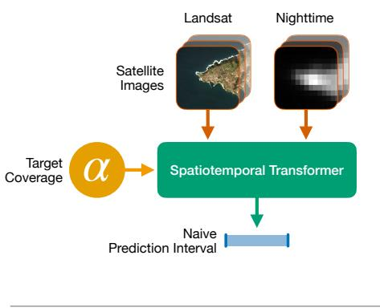

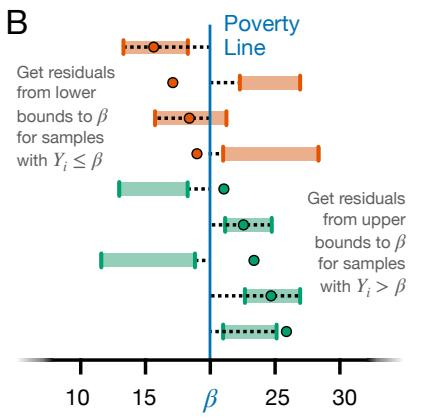

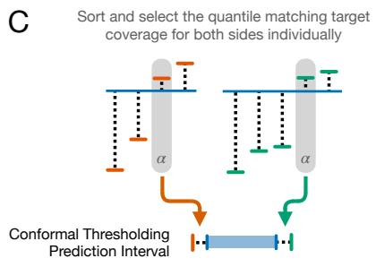

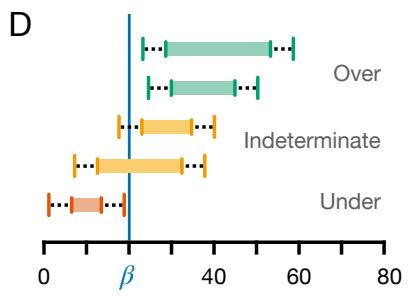  
Figure 1: Pipeline for Conformalized Thresholding (CT). (A) The simultaneous quantile-regression model maps Landsat and nighttime-light imagery to an initial prediction interval. These model-based intervals adapt to the input location but have no finite-sample coverage guarantee before calibration. (B) Using a held-out, labeled calibration set, CT measures one-sided errors relative to the policy threshold $\beta$ separately for neighborhoods with $Y _ { i } ~ \le ~ \beta$ and for neighborhoods with $Y _ { i } > \beta .$ . (C) From each set of errors, CT selects the con-Conformalformal quantile associated with the target coverage rate α and uses it to adjust the corresponding interval bound, producing a calibrated thresholding interval for a new neighborhood. (D) If the calibrated interval lies entirely above $\beta _ { ; }$ the Prediction Intervalneighborhood is classified as “Above”; if it lies entirely below $\beta ,$ it is classified as “Below”; and if it overlaps $\beta _ { ; }$ , CT abstains and returns “Indeterminate.” Unselected quantile residualder exchangeability, both the probability of misclassifying a neighborhood with $Y \le \beta$ as “Above” and the probability of misclassifying a neighborhood with $Y > \beta$ as “Below” are at most $1 - \alpha$

## 1.5 From classification to aid allocation: SAFE

To demonstrate the practical utility of these methods for policymaking, we simulate an aid-allocation problem. Given a fixed budget and an eligibility threshold $\beta ,$ we seek to determine which neighborhoods in a country are eligible for cash transfers. We have access to our EO-SQR model, a small survey that serves as a calibration set, and the option to survey any neighborhood at a predetermined cost to establish its true eligibility. The aim is to maximize the fraction of the budget spent on cash transfers to eligible neighborhoods while respecting a predetermined upper bound $1 - \alpha _ { 1 }$ on the exclusion rate among eligible recipients .

To this end, we extend CT into a procedure called Screen And Follow up with Error control (SAFE). SAFE first screens out neighborhoods that are confidently above the eligibility threshold $\beta ,$ with the risk of wrongly excluding a neighborhood capped at the predetermined exclusion rate $1 - \alpha _ { 1 } ,$ as in CT. Among the neighborhoods that remain, those whose CT prediction intervals lie entirely below $\beta$ receive aid directly, whereas indeterminate neighborhoods are surveyed. This creates a trade-of: providing aid directly risks allocating funds to ineligible neighborhoods, whereas surveying diverts resources that could otherwise fund transfers. The coverage level $\alpha _ { 2 }$ governs this trade-of.

SAFE selects $\alpha _ { 2 }$ value by iteratively evaluating all available values from 0, at which all remaining neighborhoods receive aid, to 1, at which all are surveyed. It then chooses the value that maximizes a transparent utility measure, aid dollars per truly eligible recipient, estimated from the calibration data.

## 1.6 Evaluation design

We evaluate our methods using five-fold cross-validation. In each cross-validation round, three folds are used to train the EO-SQR model, one fold is used to estimate the conformal corrections, and the remaining fold is used exclusively for testing. Conformal corrections are estimated separately in each cross-validation round using only its designated calibration fold and are then applied to that round’s test fold. Unless otherwise stated, the folds are constructed using an out-of-area splitting procedure that spatially separates neighborhoods and prevents overlapping satellite footprints from appearing across partitions [26].

By default, we compute evaluation metrics from the pooled out-of-fold test predictions. For the SAFE evaluation, we instead partition the data by country to represent deployment in countries excluded from model training. The countries assigned to the training, calibration, and evaluation partitions for each fold are also listed in Supplementary Table 2 (in Appendix A.4).

## 2 Results

## 2.1 Conformalized quantile-regression estimates

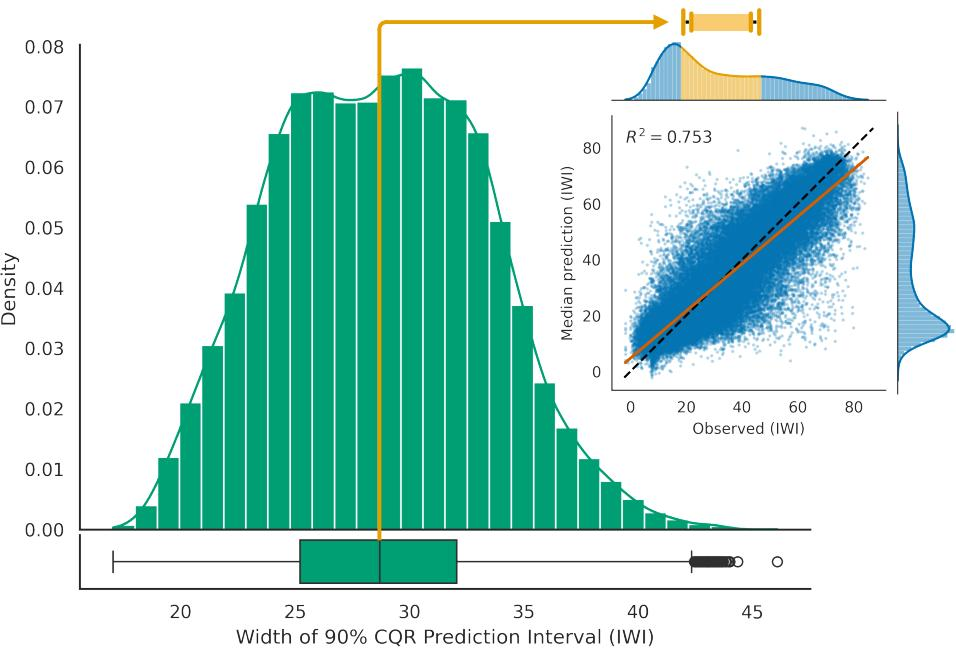  
Figure 2: Strong aggregate predictive performance coexists with substantial local uncertainty. The main panel shows the distribution of 90% CQR prediction-interval widths across held-out DHS neighborhoods. Although the inset shows strong aggregate agreement between observed IWI and the median predictions $( R ^ { 2 } = 0 . 7 5 3 )$ , matching reported values in prior works, the median interval is still 28.7 IWI points wide (orange). When centered on the mean observed IWI, an interval of this width contains 39.7% of the observations in the full dataset, illustrating how limited the model’s local precision remains despite its strong aggregate performance.

Much like prior EO-ML work on asset-wealth prediction, our EO-SQR model achieves strong point-prediction accuracy. Using the model’s median predictions, we obtain $R ^ { 2 } = 0 . 7 5$ on held-out survey locations, indicating that the model explains a substantial share of out-of-sample variation in asset wealth while still leaving meaningful residual error (Figure 2). Although direct comparisons with earlier studies are dificult because of diferences in data, assumptions, and evaluation setups, this performance appears to be matching the state of the art in the existing EO-ML literature. Across eight recent papers on the topic, the reported $R ^ { 2 }$ values range from 0.56 to 0.76, placing our model near the top of the reported performance range (see Appendix B for further discussion). Any calibrated interval procedure must expand where residuals are large or heterogeneous, and prediction interval width is ultimately driven by the residual error of the underlying point predictions: the larger that error, the wider the intervals needed to maintain coverage. Because our model performance match prior EO-ML results, similarly wide intervals would likely arise for those models if they were required to achieve the same coverage.

To quantify model uncertainty, we use conformalized quantile regression to construct 90% prediction intervals for each neighborhood-level estimate and assess their performance on held-out DHS neighborhoods. The naive intervals produced by our EO-ML modelalready come close to the target coverage, but they still require conformal calibration to satisfy this requirement (see Supplementary Figure 2). Figure 2 shows the distribution of interval widths. Although point predictions are accurate on average, interval widths remain large for most locations relative to the observed wealth range. To illustrate the practical magnitude of this uncertainty, the median interval width (28.7), when centered on the mean IWI score across all surveys, yields a span from 18.1 to 46.8, encompassing households with basic floor materials and few durable assets to households with televisions and refrigerators. As a result, even in the average case, these estimates are likely too uncertain for many operational tasks that require confident local-level decisions, such as threshold-based targeting or rank-based allocation. This highlights the limitations of relying on EO-ML estimates without careful consideration of uncertainty, while also motivating a broader view of what these models can still deliver at continental scale.

To demonstrate the scalability of this EO-ML approach, we created a 6.72 km/pixel raster covering all populated places on the African continent with predictions of IWI levels for the year 2021. The resulting gridded asset-wealth map and CQR prediction intervals (Figure 3) are made available through the Harvard Dataverse. More details on the map creation process are provided in Appendix C.

## 2.2 Reliable EO-ML classification (CT)

To illustrate the need for the extended conformal procedure, consider the task of determining whether a location falls below a fixed poverty-line, $\beta ,$ set to 20 IWI. The objective is to classify neighborhoods as “Below” or “Above” this threshold, while capping the error rate for both classes at 5%. Subject to these constraints, we aim to maximize decision coverage, i.e., the share of neighborhoods for which the method makes a definitive classification rather than returning “Indeterminate.” As in Figure 1D, a neighborhood is classified as “Below” if its entire prediction interval falls below $\beta$ and as “Above” if the entire interval falls above.

As seen in Table 1, simply classifying all units based on their point prediction naturally leads to full decision coverage, but violates both error constraints (0.20 for below, 0.13 for above). The naive intervals of our EO-SQR model satisfy both thresholds in this instance, despite not having a finite-sample guarantee, but classify fewer than half the samples. The traditional Conformal Quantile Regression intervals with $\alpha = 0 . 9 5$ add statistical validity, but are overly conservative here, reducing decision coverage further to 34.0%. By contrast, our Conformal Thresholding method meets both target error rates exactly (0.05 for below, 0.05 for above) while retaining substantially higher decision coverage, classifying 69.3% of samples.

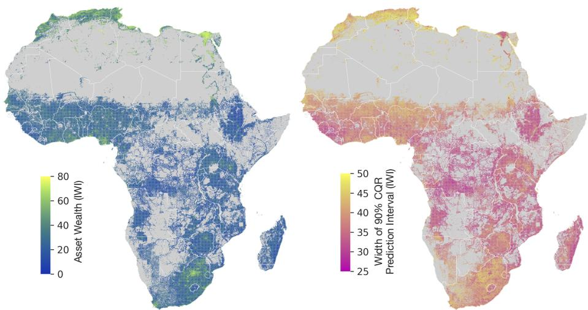  
Figure 3: Neighborhood-level maps of predicted asset wealth (left) and uncertainty (right), measured as the width of the 90% prediction interval given by conformal quantile regression. Predicted wealth is highest in North Africa, along the Nile valley, in South Africa, and around cities and transport corridors, while most of the sub-Saharan interior shows low predicted IWI. There are clear spatial patterns for uncertainty as well, but they are not clearly correlated with wealth. For example, most of the relatively wealthy North Africa have wide prediction intervals, while Egypt does not.

<table><tr><td></td><td>Error Rate “Below&quot;</td><td>Error Rate “Above”</td><td>Decision Coverage</td><td>Accuracy</td><td>Error Rate</td></tr><tr><td>Point prediction</td><td>0.201</td><td>0.133</td><td>1.000</td><td>0.843</td><td>0.157</td></tr><tr><td>Naive intervals</td><td>0.027</td><td>0.004</td><td>0.465</td><td>0.453</td><td>0.012</td></tr><tr><td>CQR intervals</td><td>0.009</td><td>0.000</td><td>0.340</td><td>0.337</td><td>0.003</td></tr><tr><td>CT (ours)</td><td>0.050</td><td>0.050</td><td>0.693</td><td>0.644</td><td>0.050</td></tr></table>

Table 1: Results on using the diferent methods for threshold classification when the threshold β is 20 IWI and the target coverage α is 0.95. Our “Conformalized thresholding” (CT) method achieves the highest decision coverage of all methods respecting the α coverage. Red entries mark error rates that exceed the 5% targets; struck-out values are displayed for completeness but are not valid comparators, since the method attains them only by violating the error constraints. We use the total number of samples, not just the number of predictions, in the denominator when calculating Accuracy and Error Rate.

## 2.3 Reliable EO-ML for aid allocation (SAFE)

We evaluate SAFE in simulations covering the seventeen countries whose DHS surveys were completed after 2020. To approximate deployment without using local observations to train the EO-SQR model, we generate predictions for each evaluation country using an EO-SQR model trained exclusively on surveys from the other countries in the dataset. We define eligibility using a countryspecific poverty threshold, β, set to the first quartile of the evaluation country’s surveyed IWI distribution. We assume a fixed survey cost of $c = 1 0 0$ per neighborhood and a total budget of $T = c N$ , where N is the estimated number of neighborhoods in the country. As a DHS enumeration area may include up to 300 households, we approximate N by dividing the country’s population by 300 [15, 32].

For decision-makers, the central risk parameter is the maximum share of eligible neighborhoods they are willing to leave without aid. We call this the exclusion rate among eligible recipients and vary it from 0 to 0.30 as a robustness check. A target of zero is the most conservative: no eligible neighborhood may be excluded. Meeting this target generally requires more surveys and/or allocating aid to more ineligible neighborhoods, leaving less of the budget available for eligible neighborhoods. Allowing for a higher exclusion rate relaxes this constraint and can increase the amount available for each recipient. We therefore evaluate a policy frontier that, for each exclusion rate among eligible recipients , shows the maximum aid delivered per eligible recipient.

In addition to our proposed SAFE method, we compare against several benchmark strategies. Two natural baselines guarantee full coverage. The first, which we call “Give all,” divides the transfer budget evenly across all neighborhoods in the country. As a result, no neighborhood (whether eligible or ineligible) is excluded from receiving aid, but a substantial portion of the budget is misallocated to ineligible recipients. The second baseline, “Survey all,” takes the opposite approach by conducting a complete census to identify every eligible neighborhood before distributing aid. This eliminates misallocation but incurs substantial survey costs, reducing the budget available for transfers. To ensure a fair comparison with SAFE, both baselines drops a fraction of neighborhoods sampled uniformly at random, so that all methods operate under the same allowable exclusion rate. We also evaluate “CQR,” which uses the SQR-EO model together with standard conformal quantile regression to construct prediction intervals with α coverage and classifies neighborhoods as described in Section 2.2. Finally, we include an “Oracle” strategy, representing the best achievable outcome under the assumption that each neighborhood’s eligibility status is known in advance.

Figure 4 compares the policy frontiers, with shaded regions showing the range between the best- and worst-performing countries at each exclusion rate. Across the full range of target rates, safe delivers more aid per eligible recipient on average than the other implementable strategies. Part of the increase in aid as the target rate rises is mechanical: when fewer eligible neighborhoods receive transfers, the available budget is divided among fewer recipients, as illustrated by the “Give all” strategy. A higher tolerance for exclusion can also reduce targeting costs. For example, “Survey all” requires fewer surveys as the permitted exclusion rate increases and therefore overtakes “Give all” at higher target rates. More generally, a less stringent target allows the uncertaintyaware procedures to rely more heavily on EO-ML predictions and less on costly surveys. As a result, safe approaches the performance of the “Oracle” as the permitted exclusion rate among eligible recipients increases.

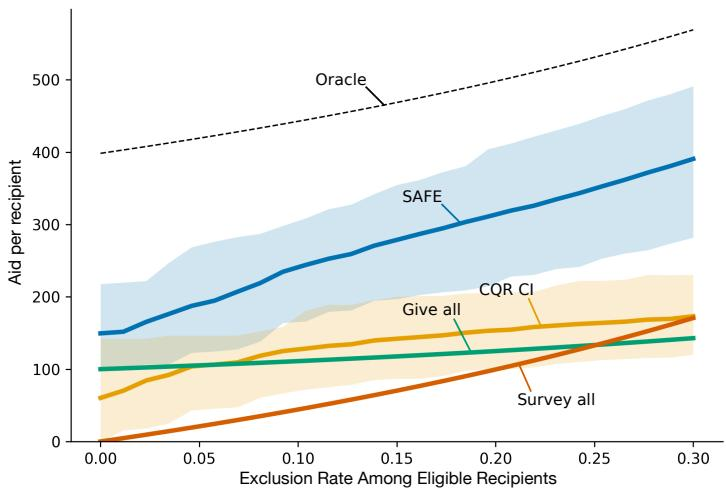  
Figure 4: Aid-allocation frontiers under varying exclusion tolerance. Curves show the mean aid delivered per eligible recipient across 17 countries as the maximum permitted share of eligible neighborhoods left without aid varies from 0 to 0.30. Shaded regions span the lowest- and highest-performing countries. SAFE achieves the highest return among the implementable strategies throughout and approaches the unattainable “Oracle” benchmark as the permitted exclusion rate increases.

Figure 5 illustrates the spatial allocation produced by SAFE with an exclusion rate of 0.05, using the most recent available survey conducted in or after 2020 for each DHS country. Because the survey enumeration-area boundaries are unavailable, we apply SAFE to a raster grid, as with the maps presented in Figure 3, with bar height representing the population of each grid cell. The procedure allocates aid directly where a cell can be classified as eligible with suficient confidence, withholds aid where it can be classified as ineligible, and directs follow-up surveys to cells for which the available evidence is inconclusive. Overall, direct allocation is most common in poorer rural areas, while surveys occur frequently in urban and peri-urban areas and in some rural pockets. It’s worth noting that this information is not explicitly given to the model, but a pattern which the model has learned from the data.

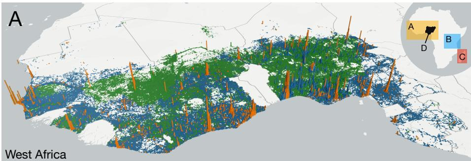

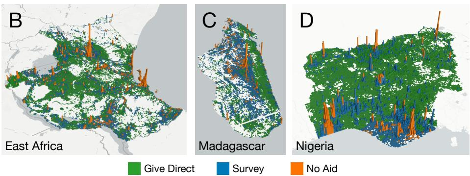  
Figure 5: Spatial allocation decisions produced by SAFE. SAFE is applied to populated raster cells in countries with DHS surveys completed after 2020, using the most recent national survey as the calibration set. Bar height is proportional to cell population, while color indicates whether aid is given directly, withheld, or preceded by a follow-up survey. In general, aid tends to be allocated directly to poorer rural areas, withheld from dense urban centers, and directed through surveys in more ambiguous areas, including many smaller cities. These patterns vary locally: panel D, for example, shows sparsely populated rural cells in the relatively wealthier South-East Nigeria being assigned surveys rather than direct aid.

## 3 Discussion

EO-ML poverty mapping has reached point-prediction accuracy that makes it tempting to use model outputs directly for policy decisions [7, 21, 26, 34, 35]. This study shows both why that temptation is risky and why it still remains promising. Although our model’s out-of-sample fit matches the upper end of prior work, conformalized quantile regression produces prediction intervals that remain wide for most neighborhoods. Interval widths are fundamentally determined by the error of the underlying predictions. Thus, other EO-ML poverty models—which have similar or lower accuracy—likely entail comparable uncertainty without explicitly quantifying it.

The practical implication is not that EO-ML estimates should be discarded, but rather that their uncertainty must be incorporated into policy decisions. CT and SAFE methods do this by allowing for abstention when the evidence is insuficient. They act on EO-ML predictions when the signal is suficiently clear and defer to follow-up measurement when it is not, maintaining statistical guarantees for the vulnerable population. The goal is not to pitch EO-ML estimates and surveys against each other, but to show how they, when combined, can lead to policy decisions which are both safe and cost-efective.

The proposed calibration and decision procedures do not depend on satellite imagery, asset wealth, or a transformer architecture. They can be paired with any predictor that supplies suitable scores or quantiles and with a labeled calibration sample that is exchangeable with the intended deployment population. Possible inputs therefore include mobile-phone, administrative, or survey-linked data in addition to EO imagery [4], and the same recipe extends to other EO-ML products that inform action, such as gridded population mapping and other screening problems [32]. Phone-based poverty predictions have already informed humanitarian targeting at national scale [1]. Distribution-free calibration could thus provide a common interface with controlled error rates and transparent abstention, something more important for planners than a higher R2.

The guarantees provided by conformal prediction depend on the calibration data being exchangeable with the population in which the model is deployed. When a program expands to a new domain, a calibration set drawn from an earlier context will likely no longer represent the current errors [3]. In practice, the most robust path is likely to budget for a small, recent calibration survey in each deployment region and to refresh it as conditions change. Importantly, the guarantees are marginal over the entire population, and thus do not necessarily hold for all policy-relevant subgroups. If calibration data for these groups exists, this could likely be remedied by combining CT and SAFE with class-conditional conformal prediction, as described by Angelopoulos and Bates [3], but we leave this as future work.

A further limitation is that SAFE treats eligibility as a binary status determined by a fixed poverty threshold. This formulation assigns the same importance to all classification errors of a given type, even though their welfare consequences may difer substantially. For example, allocating aid to a neighborhood just above the threshold may arguable bring greater utility than conducting an additional survey. A useful extension would therefore replace binary eligibility with a continuous, policy-specific utility function that accounts for the severity of poverty, while still maintaining the coverage guarantee for neighborhoods below the threshold. Incorporating such a utility into SAFE, following related utility-based approaches to aid targeting like in Aiken et al. [1], could direct surveys toward cases in which resolving uncertainty has the greatest expected welfare benefit.

Taken together, our findings show that strong predictive performance alone is not suficient for responsible policy use of EO-ML poverty estimates. By making uncertainty explicit and directing follow-up surveys to cases in which the available evidence is insuficient, CT and SAFE combine the scale of EO-ML with the reliability of conventional measurement. This provides a practical path from accurate poverty mapping toward accountable, uncertainty-aware decision-making.

## Acknowledgments and Disclosure of Funding

Computational resources were provided by the National Academic Infrastructure for Supercomputing in Sweden (NAISS), funded by the Swedish Research Council. MBP, JB and AD were supported by SRC grant numbers 2020-03088 and 2020-00491, as well as the European Horizon project “ToBe – Towards a sustainable wellbeing economy: integrated policies and transformative indicators” (grant agreement number 101094211).

## References

[1] Emily Aiken, Suzanne Bellue, Dean Karlan, Chris Udry, and Joshua E. Blumenstock. Machine learning and phone data can improve targeting of humanitarian aid. Nature, 603(7903):864–870, 2022. doi: 10.1038/ s41586-022-04484-9.

[2] Emily Aiken, Anik Ashraf, Joshua Blumenstock, Raymond Guiteras, Ahmed Mushfiq Mobarak, and Nicole Hu. When should big data and algorithms be used to determine programme eligibility? VoxDev, 2025. URL https://voxdev.org/topic/methods-measurement/ when-should-big-data-and-algorithms-be-used-determine-programme.

[3] Anastasios N Angelopoulos and Stephen Bates. Conformal prediction: A gentle introduction. Foundations and Trends in Machine Learning, 16(4): 494–591, 2023.

[4] Joshua E. Blumenstock. Estimating economic characteristics with phone data. AEA Papers and Proceedings, 108:72–76, 2018. ISSN 2574-0768. doi: 10.1257/pandp.20181033. URL https://www.aeaweb.org/doi/10.1257/ pandp.20181033.

[5] Maksym Bondarenko, Rhorom Priyatikanto, Natalia Tejedor-Garavito, Wei Zhang, Tessa McKeen, Andrew Cunningham, Thomas Woods, Jason Hilton, Derya Cihan, Bogdan Nosatiuk, Thomas Brinkhof, Andrew Tatem, and Alessandro Sorichetta. Constrained estimates of 2015–2030 total number of people per grid square at a resolution of 3 arc (approximately 100 m at the equator), r2025a version v1. WorldPop, School of Geography and Environmental Science, University of Southampton, 2025. URL https://hub.worldpop.org/doi/10.5258/SOTON/WP00839.

[6] Clara R. Burgert, Josh Colston, Thea Roy, and Blake Zachary. Geographic displacement procedure and georeferenced data release policy for the Demographic and Health Surveys. Technical report, ICF International, Calverton, Maryland, USA, 2013. URL http://dhsprogram.com/pubs/ pdf/SAR7/SAR7.pdf.

[7] Guanghua Chi, Han Fang, Sourav Chatterjee, and Joshua E. Blumenstock. Microestimates of wealth for all low- and middle-income countries. Proceedings ofthe National Academy ofSciences, 119(3):e2113658119, 2022. ISSN 0027-8424, 1091-6490. doi: 10.1073/pnas.2113658119. URL http://www.pnas.org/lookup/doi/10.1073/pnas.2113658119.

[8] Yezhen Cong, Samar Khanna, Chenlin Meng, Patrick Liu, Erik Rozi, Yutong He, Marshall Burke, David B. Lobell, and Stefano Ermon. SatMAE: Pre-training transformers for temporal and multi-spectral satellite imagery. In Alice H. Oh, Alekh Agarwal, Danielle Belgrave, and Kyunghyun Cho, editors, Advances in Neural Information Processing Systems, 2022. URL https://openreview.net/forum?id=WBhqzpF6KYH.

[9] DHS Program. Demographic and Health Surveys. www.dhsprogram.com, 2026.

[10] Alexey Dosovitskiy, Lucas Beyer, Alexander Kolesnikov, Dirk Weissenborn, Xiaohua Zhai, Thomas Unterthiner, Mostafa Dehghani, Matthias Minderer, Georg Heigold, Sylvain Gelly, Jakob Uszkoreit, and Neil Houlsby. An image is worth 16x16 words: Transformers for image recognition at scale. In International Conference on Learning Representations, 2021. URL https://openreview.net/forum?id=YicbFdNTTy.

[11] Earth Resources Observation and Science (EROS) Center. Landsat 4-5 Thematic Mapper Level-2, Collection 2, 2020. URL https://doi.org/ 10.5066/P9IAXOVV. Dataset.

[12] Earth Resources Observation and Science (EROS) Center. Landsat 7 Enhanced Thematic Mapper Plus Level-2, Collection 2, 2020. URL https: //doi.org/10.5066/P9C7I13B. Dataset.

[13] Earth Resources Observation and Science (EROS) Center. Landsat 8–9 Operational Land Imager / Thermal Infrared Sensor Level-2, Collection 2, 2020. URL https://doi.org/10.5066/P9OGBGM6. Dataset.

[14] Hans Ekbrand. DHSharmonisation. https://bitbucket.org/ hansekbrand/dhsharmonisation/, 2026. Software package.

[15] Mahmoud Elkasabi, Ruilin Ren, and Thomas W. Pullum. Multilevel modeling using DHS surveys: A framework to approximate level-weights. DHS Methodological Reports 27, ICF, Rockville, Maryland, USA, 2020. URL https://www.dhsprogram.com/pubs/pdf/MR27/MR27.pdf.

[16] Martin Fox and Herman Rubin. Admissibility of quantile estimates of a single location parameter. The Annals of Mathematical Statistics, 35(3): 1019–1030, 1964. doi: 10.1214/aoms/1177700518. URL https://doi.org/ 10.1214/aoms/1177700518.

[17] Matteo Gasparin and Aaditya Ramdas. Merging uncertainty sets via majority vote. arXiv preprint arXiv:2401.09379, 2024.

[18] Noel Gorelick, Matt Hancher, Mike Dixon, Simon Ilyushchenko, David Thau, and Rebecca Moore. Google Earth Engine: Planetary-scale geospatial analysis for everyone. Remote Sensing of Environment, 202, 2017. ISSN 00344257. doi: 10.1016/j.rse.2017.06.031.

[19] Robert M. Groves and Lars Lyberg. Total survey error: Past, present, and future. Public Opinion Quarterly, 74(5):849–879, 2010. ISSN 0033- 362X. doi: 10.1093/poq/nfq065. URL https://academic.oup.com/poq/ article/74/5/849/1817502.

[20] Kaiming He, Xinlei Chen, Saining Xie, Yanghao Li, Piotr Doll´ar, and Ross Girshick. Masked autoencoders are scalable vision learners. In 2022 IEEE/CVF Conference on Computer Vision and Pattern Recognition (CVPR), pages 15979–15988, 2022. doi: 10.1109/CVPR52688.2022.01553.

[21] Neal Jean, Marshall Burke, Michael Xie, W. Matthew Davis, David B. Lobell, and Stefano Ermon. Combining satellite imagery and machine learning to predict poverty. Science, 353, 2016. ISSN 10959203. doi: 10.1126/science.aaf7894.

[22] Diederik P. Kingma and Jimmy Ba. Adam: A method for stochastic optimization. arXiv:1412.6980, 2014. URL http://arxiv.org/abs/1412. 6980.

[23] Paul Lavrakas. Encyclopedia of Survey Research Methods. Sage Publications, Inc., 2455 Teller Road, Thousand Oaks California 91320 United States of America, 2008. ISBN 978-1-4129-1808-4 978-1-4129-6394- 7. doi: 10.4135/9781412963947. URL http://methods.sagepub.com/ reference/encyclopedia-of-survey-research-methods.

[24] Xuecao Li, Yuyu Zhou, Min Zhao, and Xia Zhao. A harmonized global nighttime light dataset 1992–2018. Scientific Data, 7(1):168, 2020. ISSN 2052-4463. doi: 10.1038/s41597-020-0510-y. URL https://doi.org/10. 1038/s41597-020-0510-y.

[25] Robert Marty and Alice Duhaut. Global poverty estimation using private and public sector big data sources. Scientific Reports, 14(1):3160, 2024.

[26] Markus B. Pettersson, Mohammad Kakooei, Julia Ortheden, Fredrik D. Johansson, and Adel Daoud. Time series of satellite imagery improve deep learning estimates of neighborhood-level poverty in Africa. In Proceedings of the Thirty-Second International Joint Conference on Artificial Intelligence, IJCAI-23, pages 6165–6173. International Joint Conferences on Artificial Intelligence Organization, 2023. doi: 10.24963/ijcai.2023/684. URL https://doi.org/10.24963/ijcai.2023/684.

[27] Yaniv Romano, Evan Patterson, and Emmanuel Candes. Conformalized quantile regression. In H. Wallach, H. Larochelle, A. Beygelzimer, F. d'Alch´e-Buc, E. Fox, and R. Garnett, editors, Advances in Neural Information Processing Systems, volume 32. Curran Associates, Inc., 2019. URL https://proceedings.neurips.cc/paper\_files/paper/ 2019/file/5103c3584b063c431bd1268e9b5e76fb-Paper.pdf.

[28] Roshni Sahoo, Joshua Blumenstock, Paul Niehaus, Leo Selker, and Stefan Wager. What would it cost to end extreme poverty? Technical report, National Bureau of Economic Research, 2025.

[29] Luke Sherman, Jonathan Proctor, Hannah Druckenmiller, Heriberto Tapia, and Solomon Hsiang. Global high-resolution estimates of the UN Human

Development Index using satellite imagery and machine learning. Nature Communications, 17(1):1315, 2026.

[30] Jeroen Smits and Roel Steendijk. The International Wealth Index (IWI). Social Indicators Research, 122:65–85, 2015. ISSN 1573- 0921. doi: 10.1007/s11205-014-0683-x. URL https://doi.org/10.1007/ s11205-014-0683-x.

[31] Natasa Tagasovska and David Lopez-Paz. Single-model uncertainties for deep learning. In Neural Information Processing Systems, 2018. URL https://api.semanticscholar.org/CorpusID:202539625.

[32] Andrew J. Tatem. WorldPop, open data for spatial demography. Scientific Data, 4(1):170004, 2017. ISSN 2052-4463. doi: 10.1038/sdata.2017.4. URL https://doi.org/10.1038/sdata.2017.4.

[33] Vladimir Vovk, Alexander Gammerman, and Glenn Shafer. Algorithmic Learning in a Random World. Springer, 2005. ISBN 978-0-387-00152-4. doi: 10.1007/b106715. URL http://link.springer.com/10.1007/b106715.

[34] Mengjie Wang and Xi Li. Estimating asset wealth using multidimensional luminous information in areas lacking nighttime light. International Journal of Digital Earth, 17(1):2336049, 2024. doi: 10.1080/17538947.2024. 2336049. URL https://doi.org/10.1080/17538947.2024.2336049.

[35] Christopher Yeh, Anthony Perez, Anne Driscoll, George Azzari, Zhongyi Tang, David Lobell, Stefano Ermon, and Marshall Burke. Using publicly available satellite imagery and deep learning to understand economic wellbeing in Africa. Nature Communications, 11, 2020. ISSN 20411723. doi: 10.1038/s41467-020-16185-w.

[36] Zhuo Zheng, Timothy Wu, Richard Lee, David Newhouse, Talip Kilic, Marshall Burke, Stefano Ermon, and David B Lobell. Dynamic, high-resolution poverty measurement in data-scarce environments. Journal of Development Economics, page 103691, 2025.

## A Detailed methods and technical setup

## A.1 SQR EO-ML model

## A.1.1 Input construction

We use Landsat 5, 7, and 8 multispectral imagery [18]. For each neighborhood location, we extract 224 × 224 patches (approximately 6.72 × 6.72 km at 30 m resolution) with six channels: Blue, Green, Red, NIR1, NIR2, and SWIR. The patch size is chosen to match the neighborhood-scale unit used for DHS-cluster prediction and to remain comparable with prior EO-ML work [26, 35].

Landsat revisits are frequent, about once every 16th day, but many frames are unusable due to cloud contamination [13]. For each location, we therefore select up to 25 low-cloud Landsat frames from the historical archive and additionally include the least-cloudy frame from the year preceding the survey date. This yields computationally tractable sequences while preserving both long-run context and recent pre-survey signal.

We use harmonized nighttime-light data that bridges DMSP (1992-2013) and VIIRS (2012 onward) to obtain a comparable temporal signal [24]. Because native nighttime-light resolution is coarse (about 1 km/pixel), each sample covers a $7 \times 7$ nighttime-light patch over the same area as the Landsat crop.

## A.1.2 Model architecture

The model has a spatial encoder, a temporal encoder, and a scalar prediction head. Each Landsat frame is encoded with a ViT-based spatial encoder, while each nighttime-light frame is projected to the same embedding size using a linear layer [10]. Temporal encodings are then added to all frame tokens before temporal aggregation.

As EO sequences are irregularly sampled, we use explicit time encodings instead of relying only on input order. Following the design of SATMAE by Cong et al. [8], each frame is encoded using year, month, and hour components, where year is represented relative to the survey year (to avoid leakage from absolute calendar time). The sinusoidal base encoding is:

$$
\operatorname { E n c o d e } ( k , 2 i ) = \sin \left( { \frac { k } { \Omega ^ { 2 i / d } } } \right) , \qquad \operatorname { E n c o d e } ( k , 2 i + 1 ) = \cos \left( { \frac { k } { \Omega ^ { 2 i / d } } } \right) ,
$$

and the frame-level temporal feature is constructed by concatenating encoded year, month, and hour components.

The temporal transformer receives these frame tokens together with a dedicated τ-token used for quantile conditioning. The final contextual representation (via the transformer output token) is passed through a linear task head to produce a scalar IWI estimate at quantile level τ .

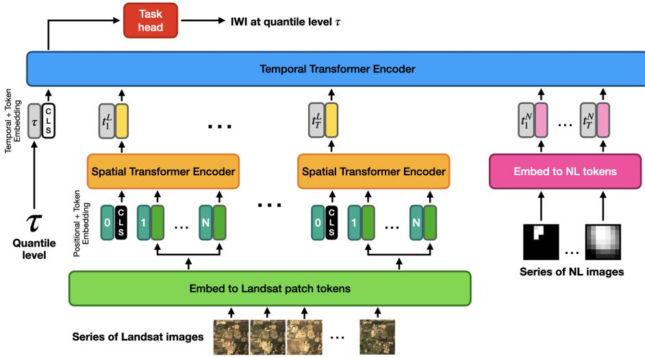  
Supplementary Figure 1: Architecture of the EO-ML model. Landsat frames are encoded by a spatial transformer, combined with nighttime-light images and conditioning tokens in a temporal transformer, and mapped to a scalar IWI output.

## A.1.3 Self-supervised pretraining

To improve representation quality under limited labeled survey data, the spatial Landsat encoder is initialized from masked-autoencoder (MAE) pretraining [20]. Pretraining uses approximately 300,000 additional unlabeled locations across Africa, sampled with population weighting based on WorldPop [32]. A high masking ratio (75%) is used during MAE training on single-frame Landsat inputs; learned weights are then transferred to the supervised IWI model.

## A.1.4 Optimization and inference settings

The supervised model is optimized with AdamW (learning rate $1 0 ^ { - 4 }$ , efective batch size 16) for up to 200 epochs [22]. During training, we subsample frame sequences to increase variation (average of about 10 Landsat frames and 5 nighttime-light frames per sample) and apply random flip augmentation. The best-validation checkpoint is retained.

At inference, all available selected frames are used (up to 25 Landsat frames per sample). The model is queried at $\tau \in \{ 0 . 0 0 , 0 . 0 1 , . . . , 0 . 9 9 , 1 . 0 0 \}$ for predictions at each percentile. The $\tau = 0 . 5$ output is used as the point estimate and $\tau \in \{ 0 . 0 5 , 0 . 9 5 \}$ define the nominal 90% model-based interval before conformal calibration.

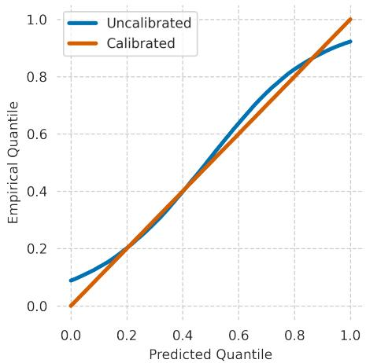  
Supplementary Figure 2: QQ-plot of the model predicted against the observed quantiles before and after conformal prediction calibration. The naive prediction intervals capture much of the uncertainty but undercover: the nominal 90% interval contains the observed outcome for 79.5% of held-out neighborhoods. After conformal calibration, coverage matches the target (90.0%), in line with the theoretical guarantees.

## A.1.5 Simultaneous quantile regression

To produce uncertainty-aware predictions, we train the EO-ML model as a simultaneous-quantile regressor rather than only as a conditional-mean predictor. For a fixed quantile level $\tau \in ( 0 , 1 )$ , the standard objective is the pinball loss

$$
\ell _ { \tau } ( y , \hat { y } ) = \left\{ \begin{array} { l l } { \tau ( y - \hat { y } ) } & { \mathrm { i f ~ } y - \hat { y } \geq 0 , } \\ { ( 1 - \tau ) ( \hat { y } - y ) } & { \mathrm { o t h e r w i s e . } } \end{array} \right.
$$

Minimizing this loss yields an estimate of the conditional τ-quantile of $Y \ |$ X [16]. A direct approach would train a separate model for each quantile of interest, but that is ineficient and can produce quantile crossing, where the outcome does not increase monotonically with the quantile [31].

Instead, we use simultaneous quantile regression (SQR), as introduced by Tagasovska and Lopez-Paz [31], where the model takes both covariates x and a quantile index $\tau$ as input and is trained over the full range of quantiles. The objective is

$$
\hat { f } \in \arg \operatorname* { m i n } _ { f } \frac { 1 } { n } \sum _ { i = 1 } ^ { n } \mathbb { E } _ { \tau \sim U [ 0 , 1 ] } \left[ \ell _ { \tau } \left( f ( x _ { i } , \tau ) , y _ { i } \right) \right] .
$$

In practice, this expectation is approximated stochastically by sampling τ values for each sample-iteration during training. In our architecture, this is implemented by conditioning the temporal transformer on a dedicated τ -token, so one shared network is trained to produce quantile estimates across the full distribution.

At inference time, if we wish to evaluate a 90% prediction interval, we make two predictions fixing τ as 0.05 and 0.95, obtaining a lower and upper bound of a nominal 90% model-based interval. These intervals are informative but remain model-dependent. Coverage is therefore not guaranteed at this stage and will have to be further calibrated in the conformal step below.

## A.2 Conformalized quantile regression

In order to calibrate the nominal prediction intervals produced by the SQR model, we use conformalized quantile regression (CQR), as introduced by Romano et al. [27], on a held-out calibration set that is not used for model fitting. Under exchangeability between calibration and test points, conformal prediction guarantees marginal coverage close to the target level. For target miscoverage $\alpha ,$ the interval $\bar { \hat { C } } ( x )$ satisfies

$$
1 - \alpha \le \mathbb { P } \left( y _ { \mathrm { t e s t } } \in \hat { C } ( x _ { \mathrm { t e s t } } ) \right) \le 1 - \alpha + \frac { 1 } { n + 1 } ,
$$

where n is the number of calibration points. Starting from model quantiles $\hat { t } _ { \alpha / 2 } ( x )$ and $\hat { t } _ { 1 - \alpha / 2 } ( x )$ , we compute nonconformity scores on calibration samples:

$$
s ( x _ { i } , y _ { i } ) = \operatorname* { m a x } \left\{ \hat { t } _ { \alpha / 2 } ( x _ { i } ) - y _ { i } , y _ { i } - \hat { t } _ { 1 - \alpha / 2 } ( x _ { i } ) \right\} .
$$

Let $\hat { q }$ be the empirical $\left\lceil ( n + 1 ) ( 1 - \alpha ) \right\rceil / n$ quantile of these scores. The calibrated interval is then

$$
\hat { C } ( x ) = \left[ \hat { t } _ { \alpha / 2 } ( x ) - \hat { q } , \hat { t } _ { 1 - \alpha / 2 } ( x ) + \hat { q } \right] .
$$

Intuitively, conformal calibration expands or contracts the model-based intervals using the magnitude of held-out residuals, yielding valid marginal coverage while retaining location-specific variation from the EO-ML model.

## A.3 Reliable EO-ML methods

In many applications, the primary objective is not to predict the exact regression value, but rather to determine whether it lies above or below a fixed threshold $\beta .$ Examples include assessing whether pollution levels exceed regulatory limits or whether the IWI of a neighborhood falls below a poverty threshold. A straightforward approach would be to train a dedicated classifier for each threshold, but this restricts the model to a specific choice of $\beta$ . In contrast, prediction interval-based models are more flexible because the threshold can be selected or adjusted after training. Prediction intervals also provide a natural decision rule for thresholding: if the entire interval lies above $\beta ,$ , the sample can be confidently classified as above the threshold; if the interval lies entirely below $\beta ,$ it can be classified as below. However, when the interval contains $\beta ,$ , the data do not support either classification with the desired confidence. In such cases, a reliable method should abstain from assigning a class and instead label the sample as indeterminate.

## A.3.1 Conformalized thresholding (CT)

We implement reliable thresholding by extending CQR to threshold classification with set error rates. We refer to this procedure as Conformalized Thresholding (CT).

Taking inspiration from “class-conditional conformal” as defined by Angelopoulos and Bates [3], CT uses separate conformal corrections for the two classes, i.e., the two sides of the threshold. Define the threshold scores

$$
\begin{array} { l } { { s _ { \leq } ( x ) = \hat { t } _ { \alpha _ { 1 } } ( x ) - \beta , } } \\ { { s _ { > } ( x ) = \beta - \hat { t } _ { 1 - \alpha _ { 2 } } ( x ) . } } \end{array}
$$

Let $\hat { q } _ { \leq }$ be the $\lceil ( n _ { 1 } + 1 ) ( 1 - \alpha _ { 1 } ) \rceil / n _ { 1 }$ quantile of the scores among calibration points at or below the threshold,

$$
\{ s \leq ( X _ { i } ) \mid i \in \{ 1 , \ldots , n \} \ \mathrm { s . t . } \ Y _ { i } \leq \beta \} ,\tag{1}
$$

where $\{ ( X _ { i } , Y _ { i } ) \} _ { i = 1 } ^ { n }$ is the calibration set and $n _ { 1 }$ is the cardinality of (1). Similarly, let $\hat { q } _ { > }$ be the $\lceil ( n _ { 2 } + 1 ) ( 1 - \alpha _ { 2 } ) \rceil / n _ { 2 }$ quantile of the scores among calibration points above the threshold that are not classified as “Above” after the first calibration step,

$$
\{ s _ { > } ( X _ { i } ) \mid i \in \{ 1 , \ldots , n \} \mathrm { ~ s . t . ~ } Y _ { i } > \beta \mathrm { ~ a n d ~ } \hat { t } _ { \alpha _ { 1 } } ( X _ { i } ) - \hat { q } _ { \leq } \leq \beta \} ,\tag{2}
$$

where $n _ { 2 }$ is the cardinality of (2).

Theorem 1. Suppose that the calibration data points $( X _ { 1 } , Y _ { 1 } ) , \dots , ( X _ { n } , Y _ { n } )$ and the new data point $\left( X _ { n + 1 } , Y _ { n + 1 } \right)$ are exchangeable. Further suppose that $\alpha _ { i } \ge 1 / n _ { i } ~ f o r ~ i = 1 , 2$ . Then CT controls the two threshold error rates in the sense that

$$
\begin{array} { r } { \operatorname* { P r } \left( \hat { t } _ { \alpha _ { 1 } } ( X _ { n + 1 } ) - \hat { q } _ { \le } > \beta \mid Y _ { n + 1 } \le \beta \right) \le \alpha _ { 1 } , } \\ { \operatorname* { P r } \left( \hat { t } _ { 1 - \alpha _ { 2 } } ( X _ { n + 1 } ) + \hat { q } _ { > } < \beta \mid Y _ { n + 1 } > \beta , \hat { t } _ { \alpha _ { 1 } } ( X _ { n + 1 } ) - \hat { q } _ { \le } \le \beta \right) \le \alpha _ { 2 } . } \end{array}
$$

The condition $\alpha _ { i } \geq 1 / n _ { i }$ ensures that the corresponding quantile is welldefined, i.e., that $\lceil ( n _ { i } + 1 ) ( 1 - \alpha _ { i } ) \rceil / n _ { i } \leq 1$ . The proof is provided in $\mathrm { A p \mathrm { - } }$ pendix A.3.3.

Given these calibrated corrections, we construct the CT classifier $\mathrm { T h } _ { \alpha _ { 1 } , \alpha _ { 2 } }$ as

$$
\begin{array} { r } { \mathrm { T h } _ { \alpha _ { 1 } , \alpha _ { 2 } } ( x ) = \left\{ \begin{array} { l l } { \mathrm { ` A b o v e ' } } & { \mathrm { i f ~ } \hat { t } _ { \alpha _ { 1 } } ( x ) - \hat { q } _ { \le } > \beta , } \\ { \mathrm { ` B e l o w ' } } & { \mathrm { e l s e ~ i f ~ } \hat { t } _ { 1 - \alpha _ { 2 } } ( x ) + \hat { q } _ { > } < \beta , } \\ { \mathrm { ` I n d e t e r m i n a t e ' } } & { \mathrm { o t h e r w i s e . } } \end{array} \right. } \end{array}
$$

The intuition behind CT is that the two types of thresholding errors are inherently one-sided. A point with $Y \le \beta$ can only be misclassified as “Above” if the lower bound is too large, while a point with $Y > \beta$ can only be misclassified as “Below” if the upper bound is too small. This allows the two error events to be calibrated separately.

To connect this rule to prediction intervals, define the one-sided prediction sets

$$
C _ { \leq } ( X _ { i } ) = \left[ \hat { t } _ { \alpha _ { 1 } } ( X _ { i } ) - \hat { q } _ { \leq } , \infty \right]
$$

and

$$
C _ { > } ( X _ { i } ) = \left[ - \infty , \hat { t } _ { 1 - \alpha _ { 2 } } ( X _ { i } ) + \hat { q } _ { > } \right] .
$$

The set $C _ { \leq }$ is calibrated using only calibration samples satisfying $Y _ { i } \le \beta$ Consequently,

$$
\Pr \left( \beta \in C _ { \leq } ( X _ { n + 1 } ) \mid Y _ { n + 1 } \leq \beta \right) \geq 1 - \alpha _ { 1 } .
$$

Intuitively, $C _ { \leq }$ acts as a conservative lower bound: if $\beta \notin C _ { \leq } ( X _ { i } )$ , then the entire interval lies above the threshold, providing evidence that $Y _ { i } > \beta$

Similarly, $C _ { > }$ is calibrated using only samples with $Y _ { i } ~ > ~ \beta$ that are not classified as $^ { 6 6 } \mathrm { A }$ bove”, yielding the same false-positive guarantee for the second CT decision step,

$$
\Pr \left( \beta \in C _ { > } ( X _ { n + 1 } ) \mid Y _ { n + 1 } > \beta \right) \geq 1 - \alpha _ { 2 } .
$$

Thus, $C _ { > }$ acts as a conservative upper bound: if $\beta \notin C _ { > } ( X _ { i } )$ , then the interval lies entirely below the threshold, suggesting $Y _ { i } \le \beta$

The CT classifier combines these two one-sided sets. Equivalently, using the construction outlined above, one may consider the two-sided interval

$$
C ( X _ { i } ) = C _ { \leq } ( X _ { i } ) \cap C _ { > } ( X _ { i } ) .
$$

If $C ( X _ { i } )$ lies entirely above $\beta ,$ the point is classified as “Above”; if it lies entirely below $\beta ,$ it is classified as “Below”; otherwise, the interval overlaps the threshold and the prediction is declared “Indeterminate.”

## A.3.2 SAFE decision making

As discussed above, a major obstacle in eradicating poverty through monetary aid is figuring out which communities are in need of assistance. This information can be obtained through household surveys, but surveying every possible recipient is expensive and diverts resources away from transfers themselves. We operate on neighborhoods rather than individual households for three reasons: EO imagery resolves neighborhood-level conditions rather than single dwellings; the DHS releases cluster-level rather than household-level coordinates; and areabased targeting is an established first stage in practice, with within-community allocation handled by complementary mechanisms. To this end, we extend Conformalized Thresholding into an aid-allocation framework that we call Screen And Follow $u p$ with Error control, or safe. The idea is to use our EO-ML model to screen out neighborhoods that are very unlikely to fall below a poverty threshold $\beta ,$ assign aid directly to those that likely do, and survey the remaining communities for which the model is not suficiently certain.

In this setting, the key error is the eligible-unit exclusion rate: the share of neighborhoods truly below the poverty line that are mistakenly left without aid.

CT allows this risk to be set in advance through the parameter $\alpha _ { 1 }$ . Controlling exclusion, however, is not suficient to determine the full operational policy. Among neighborhoods that are not screened out, the algorithm must still decide which should receive aid directly and which should be sent to follow-up surveys. Direct aid risks spending resources on ineligible recipients, while surveys consume resources that could otherwise be used for transfers. The parameter $\alpha _ { 2 }$ governs this trade-of by determining how conservative the rule is before assigning aid without a survey, and safe selects the value of $\alpha _ { 2 }$ that optimizes the resulting allocation policy for a fixed budget T.

Formally, consider a deployment set $\mathcal { D } : = \{ X _ { i } \} _ { i = 1 } ^ { N }$ of neighborhoods for which EO imagery is observed but true wealth outcomes are unobserved. The goal is to allocate aid to neighborhoods with $Y _ { i } \leq \beta _ { \mathrm { : } }$ , where $\beta$ denotes the set poverty line. SAFE takes as input the trained SQR model $\hat { t } _ { \tau } ,$ an exchangeable calibration set $\mathscr { C } : = \{ ( X _ { j } , Y _ { j } ) \} _ { j = 1 } ^ { n }$ , a utility function $\mathcal { U }$ to be maximized, a fixed budget $T ,$ and an exclusion-risk tolerance $\alpha _ { 1 }$ . It then chooses the CT parameter $\alpha _ { 2 }$ that maximizes the estimated utility of the allocation policy. The full algorithm is provided in Appendix A.3.4, but below we give a high-level intuition for the procedure:

Algorithm 1 SAFE calibration intuition   
1: for candidate values $\alpha _ { 2 } \in [ 0 , 1 ]$ do   
2: Calibrate a CT classifier $\mathrm { T h } _ { \alpha _ { 1 } , \alpha _ { 2 } }$ on $\mathcal { C }$ using $\left( \alpha _ { 1 } , \alpha _ { 2 } \right)$   
3: uˆ ← estimated utility U of the allocation policy induced from $\mathrm { T h } _ { \alpha _ { 1 } , \alpha _ { 2 } }$   
under budget $T .$   
4: if uˆ $> u ^ { * }$ then   
5: $u ^ { * } \gets \hat { u }$   
6: $\mathrm { T h } _ { \alpha _ { 1 } , \alpha _ { 2 } } { } ^ { * } \gets \mathrm { T h } _ { \alpha _ { 1 } , \alpha _ { 2 } }$   
7: end if   
8: end for   
9: Classify all neighborhoods in D with $\mathrm { T h } _ { \alpha _ { 1 } , \alpha _ { 2 } }$ ∗   
10: Survey all neighborhoods classified as “Indeterminate”   
11: Assign aid to neighborhoods classified as “Below” and to surveyed neigh  
borhoods with $Y _ { i } \le \beta$

We leave the utility U purposefully vague to leave room for diferent things. Its value will likely be estimated using $\mathcal { C }$ and/or D. As an example, consider when we wish to maximize the amount of aid per neighborhood with a fixed survey cost c per neighborhood. In this setting, we have

$$
\mathcal { U } : = \frac { T - c N _ { \mathrm { S u r v e y } } } { N _ { \mathrm { A i d } } } .
$$

This can be estimated from C and D with

$$
\begin{array} { r l } & { \hat { N } _ { \mathrm { S u r v e y } } = \hat { p } _ { \mathrm { S u r v e y } } \cdot N , } \\ & { \quad \hat { N } _ { \mathrm { A i d } } = \hat { p } _ { \mathrm { D i r e c t } } \cdot N + \hat { p } _ { \mathrm { A i d | S u r v e y } } \cdot N _ { \mathrm { S u r v e y } } . } \end{array}
$$

With the number of samples $N = | \mathcal { D } |$ and the remaining variables estimated from applying $\mathrm { T h } _ { \alpha _ { 1 } , \alpha _ { 2 } }$ on $\mathcal { C }$ .

## A.3.3 Proof of Theorem 1

Proof. The CT procedure controls the false negative rate at the $\alpha _ { 1 }$ level because

$$
\begin{array} { r l } & { \operatorname* { P r } { ( \mathrm { T h } _ { \alpha _ { 1 } , \alpha _ { 2 } } ( X _ { n + 1 } ) = \mathrm { \# } \mathrm { A b o v e } ^ { \mathrm { \# } } \mid Y _ { n + 1 } \leq \beta ) } = \operatorname* { P r } { \left( \hat { t } _ { \alpha _ { 1 } } ( X _ { n + 1 } ) - \hat { q } _ { \leq } > \beta \mid Y _ { n + 1 } \leq \beta \right) } } \\ & { \quad \quad \quad \quad \quad = \operatorname* { P r } { \left( \hat { t } _ { \alpha _ { 1 } } ( X _ { n + 1 } ) - \beta > \hat { q } _ { \leq } \mid Y _ { n + 1 } \leq \beta \right) } } \\ & { \quad \quad \quad \quad = \operatorname* { P r } { ( s _ { \leq } ( X _ { n + 1 } ) > \hat { q } _ { \leq } \mid Y _ { n + 1 } \leq \beta ) } } \\ & { \quad \quad \quad \quad \leq { \alpha _ { 1 } } , } \end{array}
$$

where the final line follows from exchangeability conditional on $Y _ { n + 1 } \le \beta$ and the fact that $\hat { q } _ { \leq }$ is the $\lceil ( n _ { 1 } + 1 ) ( 1 - \alpha _ { 1 } ) \rceil$ -order statistic of (1).

Similarly, CT controls the false positive rate at the $\alpha _ { 2 }$ level. Let

$$
A _ { n + 1 } = \left\{ \hat { t } _ { \alpha _ { 1 } } ( X _ { n + 1 } ) - \hat { q } _ { \leq } \leq \beta \right\}
$$

denote the event that a wealthy point is not classified as “Above” by the first CT decision step. Then

$$
\begin{array} { r l } & { \operatorname* { P r } ( \mathrm { T h } _ { \alpha _ { 1 } , \alpha _ { 2 } } ( X _ { n + 1 } ) = \ " \mathrm { S e l o w } ^ { \prime } \mid Y _ { n + 1 } > \beta ) } \\ & { \qquad = \operatorname* { P r } \left( \hat { t } _ { \alpha _ { 1 } } ( X _ { n + 1 } ) - \hat { q } _ { \le } \le \beta , \hat { t } _ { 1 - \alpha _ { 2 } } ( X _ { n + 1 } ) + \hat { q } _ { > } < \beta \mid Y _ { n + 1 } > \beta \right) } \\ & { \qquad = \operatorname* { P r } \left( A _ { n + 1 } \mid Y _ { n + 1 } > \beta \right) \operatorname* { P r } \left( \hat { t } _ { 1 - \alpha _ { 2 } } ( X _ { n + 1 } ) + \hat { q } _ { > } < \beta \mid Y _ { n + 1 } > \beta , A _ { n + 1 } \right) } \\ & { \qquad \le \operatorname* { P r } \left( \hat { t } _ { 1 - \alpha _ { 2 } } ( X _ { n + 1 } ) + \hat { q } _ { > } < \beta \mid Y _ { n + 1 } > \beta , A _ { n + 1 } \right) } \\ & { \qquad = \operatorname* { P r } \left( \beta - \hat { t } _ { 1 - \alpha _ { 2 } } ( X _ { n + 1 } ) > \hat { q } _ { > } \mid Y _ { n + 1 } > \beta , A _ { n + 1 } \right) } \\ & { \qquad = \operatorname* { P r } \left( s _ { > } ( X _ { n + 1 } ) > \hat { q } _ { > } \mid Y _ { n + 1 } > \beta , A _ { n + 1 } \right) } \\ & { \qquad \le \alpha _ { 2 } , } \end{array}
$$

where the final line follows from exchangeability conditional on $Y _ { n + 1 } > \beta$ and $A _ { n + 1 }$ and the fact that $\hat { q } _ { > }$ is the $\lceil ( n _ { 2 } + 1 ) ( 1 - \alpha _ { 2 } ) \rceil$ -order statistic of (2).

## A.3.4 Full pseudocode for the SAFE calibration algorithm

Algorithm 2 SAFE calibration   
Require: Calibration set $\begin{array} { r } { \mathcal { C } ~ = ~ \{ ( x _ { i } , y _ { i } ) \} _ { i = 1 } ^ { n } , } \end{array}$ deployment set $\mathbfcal { D } \ = \ \{ x _ { i } \} _ { i = 1 } ^ { N } ,$   
threshold $\beta ,$ fixed FNR target $\alpha _ { 1 } .$ prediction models $\hat { t } _ { \alpha } ( \cdot )$ for all $\alpha \in [ 0 , 1 ]$   
utility estimator $\widehat { \mathcal { U } } ( \cdot ; \mathcal { C } , \mathcal { D } )$   
Ensure: Calibrated thresholding rule $\mathrm { T h } _ { \alpha _ { 1 } , \alpha _ { 2 } ^ { * } }$   
1: - Phase 1: Lower Bound That Ensures FNR -   
2: ${ \mathcal { C } } _ { \leq \beta } \gets \{ ( x _ { i } , y _ { i } ) \in { \mathcal { C } } : y _ { i } \leq \beta \}$   
3: $n _ { \le \beta }  \vert \mathcal { C } _ { \le \beta } \vert$   
4: $\mathcal { S } _ { 1 } ^ { - }  \{ \hat { t } _ { \alpha _ { 1 } } \overline { { ( } } x _ { i } ) - \beta \mid ( x _ { i } , y _ { i } ) \in \mathcal { C } _ { \leq \beta } \}$   
5: $\begin{array} { r } { \hat { q } _ { 1 } \gets \mathrm { Q u a n t i l e } \left( S _ { 1 } ; \frac { \lceil ( n _ { \le \beta } + 1 ) ( 1 - \alpha _ { 1 } ) \rceil } { n _ { \le \beta } } \right) } \end{array}$   
6: $C _ { \alpha _ { 1 } } ^ { ( l ) } ( x ) \gets [ \hat { t } _ { \alpha _ { 1 } } ( x ) - \hat { q } _ { 1 } , \infty ]$   
$\mathrm { \Delta 7 : ~ - }$ Phase 2: Find Upper Bound (FPR) With Highest Utility -   
8: $\mathcal { C } _ { > \beta } ^ { ( l ) }  \{ ( x _ { i } , y _ { i } ) \in \mathcal { C } : y _ { i } > \beta$ and $\beta \in C _ { \alpha _ { 1 } } ^ { ( l ) } ( x _ { i } ) \}$   
9: $n _ { > \beta } ^ { ( l ) }  \vert \mathcal { C } _ { > \beta } ^ { ( l ) } \vert$   
10: $A ^ { * }  - \infty$   
11: for $\alpha _ { 2 } \in \{ 0 , 0 . 0 1 , \ldots , 0 . 9 9 , 1 \}$ do   
12: $\mathcal { S } _ { 2 }  \{ \beta - \hat { t } _ { 1 - \alpha _ { 2 } } ( x _ { i } ) \ | \ ( x _ { i } , y _ { i } ) \in \mathcal { C } _ { > \beta } ^ { ( l ) } \}$   
13: $\begin{array} { r } { \hat { q } _ { 2 } \gets \mathrm { Q u a n t i l e } \left( S _ { 2 } ; \frac { \lceil ( n _ { > \beta } ^ { ( l ) } + 1 ) ( 1 - \alpha _ { 2 } ) \rceil } { n _ { > \beta } ^ { ( l ) } } \right) } \end{array}$   
14: $C _ { \alpha _ { 2 } } ^ { ( r ) } ( x ) \gets [ - \infty , \hat { t } _ { 1 - \alpha _ { 2 } } ( x ) + \hat { q } _ { 2 } ]$   
No Aid $\beta \notin C _ { \alpha _ { 1 } } ^ { ( l ) } ( x ) .$   
15: $\mathrm { T h } _ { \alpha _ { 1 } , \alpha _ { 2 } } ( x ) \gets$ Give Direct $\beta \notin C _ { \alpha _ { 2 } } ^ { ( r ) } ( x )$   
Survey otherwise.   
16: $\hat { A } _ { \alpha _ { 2 } } \gets \widehat { \mathcal { U } } ( \mathrm { T h } _ { \alpha _ { 1 } , \alpha _ { 2 } } ; \mathcal { C } , \mathcal { D } )$   
17: if $\hat { A } _ { \alpha _ { 2 } } > A ^ { * }$ then   
18: $A ^ { * }  \hat { A } _ { \alpha _ { 2 } }$   
19: $\mathrm { T h } _ { \alpha _ { 1 } , \alpha _ { 2 } ^ { * } }  \mathrm { T h } _ { \alpha _ { 1 } , \alpha _ { 2 } }$   
20: end if   
21: end for   
22: return $\mathrm { T h } _ { \alpha _ { 1 } , \alpha _ { 2 } ^ { * } }$

## A.4 Evaluation design and splits

The images used for training the model have a footprint of $6 . 7 2 k m \times 6 . 7 2 k m$ centered on the reported neighborhood coordinate. Given the distribution of these neighborhoods across Africa, there are many common spatial areas between them. To ensure that there are no overlapping areas between points in diferent folds during a 5-fold cross-validation evaluation, we clustered neighborhoods based on their distances. This approach aims to group all neighborhoods within a cluster together into the same fold, ensuring no overlapping areas between diferent clusters and folds.

To achieve this, we used DBScan clustering with a minimum number of samples set to 1, allowing the detection of individual points. The minimum distance between two points for inclusion in the same cluster is 9.5km, which is the diagonal of the input square (6.72 km × 2 ≈ 9.5 km).

Using the DBScan results as initial clusters, we identified some clusters with a large number of members. For example, in Egypt, many neighborhoods along the Nile River were clustered together. To break these large chains, some previous literature conducted visual inspections [26, 35]. To increase the reproducibility, we implemented a systematic procedure in which we applied K-means clustering to further subdivide these large clusters into smaller ones.

Next, we removed points between the clusters to ensure that the minimum distance between points in diferent clusters was more than 9.5 km. This process was iterative: after performing K-means clustering, we identified points within each cluster that were less than 9.5 km from points in other clusters. We removed the point with the maximum number of close neighbors, then repeated the process until no points in a cluster were less than 9.5 km from any point in another cluster. As a conclusion, this K-means-based procedure aimed to balance the number of points within clusters while minimizing the number of removed points.

Initially, K-means clustering was applied to clusters with more than 500 points to subdivide them into smaller clusters. Following this, a country-based investigation using Shannon entropy was conducted to identify countries with unbalanced number of points per cluster. The Shannon entropy values from DBScan, the first round of K-means on large clusters, and the second round of K-means based on Shannon entropy are shown below. Finally, 67,829 points remained in the dataset.

As an example, for Burundi, the initial DBScan algorithm groups almost all samples into one cluster due to their distance (Supplementary Figure 3a). By applying multiple steps of KMeans clustering, the area is divided into more clusters, and the points among the clusters are removed. Supplementary Table 1 shows how this process afects the results.

To generate the folds, we aimed to balance them according to country clusters, which would naturally lead to balanced folds. We started with the country containing the largest number of points and proceeded to the country with the fewest points. For each country, we began with the largest cluster, assigning it to the fold with the fewest points from that country. This procedure not only balanced the number of points per country in each fold but also ensured an overall balance in the number of points across all folds. The final number of samples in the five folds are 14,128, 13,726, 13,576, 13,357, and 13,042. Since all points within a cluster were assigned to the same fold, there is some variation in the number of points between folds.

All the results are evaluated with five-fold cross-validation, where the nontraining held-out fold is further partitioned into calibration and test subsets for conformal prediction.

Supplementary Table 1: Shannon entropy of clusters per country
<table><tr><td>Country</td><td>DBScan</td><td>First Kmeans</td><td>Second Kmeans</td><td>Shannon based</td></tr><tr><td>Angola</td><td>7.21</td><td>7.21</td><td>7.21</td><td>7.21</td></tr><tr><td>Burkina Faso</td><td>6.62</td><td>6.62</td><td>6.62</td><td>6.62</td></tr><tr><td>Benin</td><td>3.00</td><td>4.33</td><td>4.33</td><td>4.33</td></tr><tr><td>Burundi</td><td>0.01</td><td>1.39</td><td>2.57</td><td>3.51</td></tr><tr><td>Congo - Kinshasa</td><td>8.39</td><td>8.41</td><td>8.43</td><td>8.43</td></tr><tr><td>Central African Republic</td><td>5.03</td><td>5.03</td><td>5.03</td><td>5.03</td></tr><tr><td>Côte d’Ivoire</td><td>7.26</td><td>7.26</td><td>7.26</td><td>7.26</td></tr><tr><td>Cameroon</td><td>6.56</td><td>6.56</td><td>6.56</td><td>6.56</td></tr><tr><td>Egypt</td><td>1.02</td><td>2.93</td><td>4.80</td><td>4.80</td></tr><tr><td>Ethiopia</td><td>8.13</td><td>8.13</td><td>8.13</td><td>8.13</td></tr><tr><td>Gabon</td><td>5.92</td><td>5.92</td><td>5.92</td><td>5.92</td></tr><tr><td>Ghana</td><td>5.37</td><td>6.02</td><td>6.02</td><td>6.02</td></tr><tr><td>Gambia</td><td>2.01</td><td>2.55</td><td>2.55</td><td>2.70</td></tr><tr><td>Guinea</td><td>6.61</td><td>6.61</td><td>6.61</td><td>6.61</td></tr><tr><td>Kenya</td><td>4.05</td><td>5.41</td><td>6.01</td><td>6.01</td></tr><tr><td>Comoros</td><td>1.45</td><td>1.45</td><td>1.45</td><td>2.10</td></tr><tr><td>Liberia</td><td>4.21</td><td>5.02</td><td>5.02</td><td>5.03</td></tr><tr><td>Lesotho</td><td>0.06</td><td>2.35</td><td>2.35</td><td>3.32</td></tr><tr><td>Morocco</td><td>6.96</td><td>6.96</td><td>6.96</td><td>6.96</td></tr><tr><td>Madagascar</td><td>8.07</td><td>8.07</td><td>8.07</td><td>8.07</td></tr><tr><td>Mali</td><td>7.77</td><td>7.77</td><td>7.77</td><td>7.77</td></tr><tr><td>Mauritania</td><td>6.58</td><td>6.58</td><td>6.58</td><td>6.58</td></tr><tr><td>Malawi</td><td>1.49</td><td>3.35</td><td>4.07</td><td>5.00</td></tr><tr><td>Mozambique</td><td>7.56</td><td>7.63</td><td>7.64</td><td>7.66</td></tr><tr><td>Nigeria</td><td>8.37</td><td>8.37</td><td>8.37</td><td>8.37</td></tr><tr><td>Niger</td><td>7.14</td><td>7.14</td><td>7.14</td><td>7.14</td></tr><tr><td>Namibia</td><td>6.42</td><td>6.42</td><td>6.42</td><td>6.42</td></tr><tr><td>Rwanda</td><td>0.00</td><td>1.77</td><td>3.66</td><td>3.66</td></tr><tr><td>Sierra Leone</td><td>2.44</td><td>3.87</td><td>3.87</td><td>4.54</td></tr><tr><td>Senegal</td><td>3.59</td><td>4.77</td><td>4.77</td><td>5.21</td></tr><tr><td>Eswatini</td><td>3.15</td><td>3.15</td><td>3.15</td><td>3.15</td></tr><tr><td>Chad</td><td>8.16</td><td>8.16</td><td>8.16</td><td>8.16</td></tr><tr><td>Togo</td><td>4.21</td><td>4.45</td><td>4.45</td><td>4.45</td></tr><tr><td>Tanzania</td><td>8.03</td><td>8.04</td><td>8.04</td><td>8.06</td></tr><tr><td>Uganda</td><td>5.06</td><td>5.45</td><td>6.21</td><td>6.21</td></tr><tr><td>South Africa</td><td>7.49</td><td>7.50</td><td>7.50</td><td>7.50</td></tr><tr><td>Zambia</td><td>8.07</td><td>8.07</td><td>8.07</td><td>8.07</td></tr><tr><td>Zimbabwe</td><td>7.43</td><td>7.43</td><td>7.43</td><td>7.43</td></tr></table>

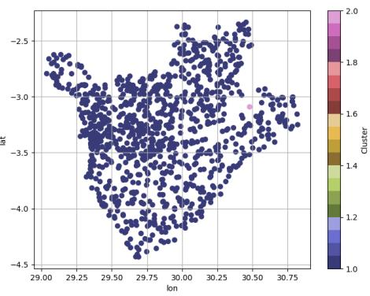  
(a)

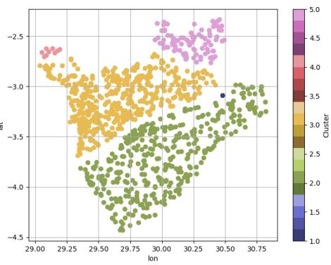  
(b)

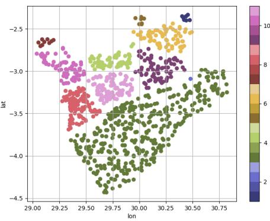  
(c)

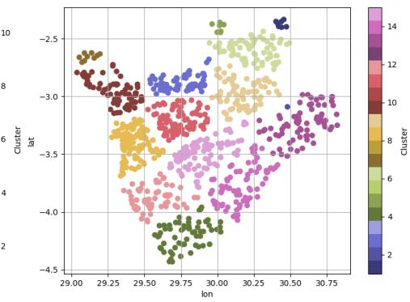  
(d)  
Supplementary Figure 3: Out of area clusters in Burundi. (a) Result from DBScan. (b) Applying the first round of KMeans. (c) Applying the Second round of KMeans. (d) Applying KMeans to countries with low Shannon entropy

Supplementary Table 2: Countries assigned to each cross-validation fold during out-of-country training.
<table><tr><td>Fold Countries</td><td></td></tr><tr><td>A</td><td>Cameroon, Chad, Democratic Republic of the Congo, Egypt, Eswatini, Guinea, Mauritania</td></tr><tr><td>B</td><td>Comoros, Gabon, Namibia, Niger, Nigeria, Rwanda, Uganda, Zambia</td></tr><tr><td>C D</td><td>Angola, Côte d&#x27;Ivoire, Ethiopia, Kenya, Liberia, Mali, Togo Burundi, Gambia, Ghana, Madagascar, Morocco, Sierra Leone, Tanza-</td></tr><tr><td>E</td><td>nia, Zimbabwe Benin, Burkina Faso, Central African Republic, Lesotho, Malawi</td></tr><tr><td></td><td>Mozambique, Senegal, South Africa</td></tr></table>

## B Previous work

Comparing results across studies remains dificult due to difering datasets, covariates and assumptions.

As a complement, we have trained several baseline architectures on the same dataset and splits, to show that our SQR model’s point accuracy is representative of what standard architectures achieve on these data rather than an artifact of model choice (Supplementary Table 3).

<table><tr><td>Paper</td><td>Model type</td><td> $R ^ { 2 }$ </td><td>Covariates</td></tr><tr><td>Pettersson et al. [26]</td><td>CNN + LSTM</td><td>0.76</td><td>Landsat + NL</td></tr><tr><td>Marty and Duhaut [25]</td><td>XGBoost</td><td>0.75</td><td>EO + other sources</td></tr><tr><td>Wang and Li [34]</td><td>RF</td><td>0.70</td><td>NL</td></tr><tr><td>Zheng et al. [36]</td><td>SwinV2-T</td><td>0.69</td><td>Landsat</td></tr><tr><td>Yeh et al. [35]</td><td>CNN</td><td>0.67</td><td>Landsat + NL</td></tr><tr><td>Sherman et ai. [29]</td><td>MOSAIKS</td><td>0.67</td><td>MOSAIKS</td></tr><tr><td>Jean et al. [21]</td><td>CNN</td><td>0.56</td><td>Google Maps imagery</td></tr><tr><td>Chi et al. [7]</td><td>Gradient Boosting</td><td>0.56</td><td>EO + other sources</td></tr><tr><td rowspan="3">Other baselines</td><td>Small-ViT</td><td>0.69</td><td>Landsat + NL</td></tr><tr><td>ResNet-50</td><td>0.67</td><td>Landsat + NL</td></tr><tr><td>ResNet-18</td><td>0.65</td><td>Landsat + NL</td></tr><tr><td>Our EO-SQR model</td><td>SQR-transformer</td><td>0.75</td><td>Landsat + NL</td></tr></table>

Supplementary Table 3: Previous works Performance reported in earlier works trained to predict asset wealth from DHS data. Direct comparisons between diferent works remains dificult, but nevertheless, our proposed EO-SQR model appears competitive with reported figures.

## C Map creation

To ensure privacy and conserve computational resource, we only generate map predictions for raster grid cells with at least 20 inhabitants according to Bondarenko et al. [5]. For the 2021 target year, each of the five outer-fold models predicts the 5th, 50th, and 95th conditional IWI quantiles at every retained grid center. The point predictions presented in the left panel of Figure 3 display the average of the five median predictions.

In accordance with Gasparin and Ramdas [17], we aim to merge the five prediction intervals by majority voting. Assuming that the five intervals all overlap, we aggregate these intervals by taking the median lower endpoint and the median upper endpoint across folds. The right panel in Figure 3 displays the distance between these aggregated endpoints.

These maps are useful for visualization, but the coverage across the raster has not been established. Each conformal correction applies to a new observation exchangeable with one fold’s calibration sample. This will not be the case for historical displaced DHS clusters and the 2021 continental grid. We therefore describe the displayed map and its interval widths as descriptive.

The checked-in grid centers are spaced by approximately 0.05875 degrees, about 6.5 km north–south, with east–west distance varying by latitude. This spacing is distinct from the $6 . 7 2 \times 6 . 7 2$ km Landsat input footprint. A separate population-enrichment helper sums the WorldPop Global 2015–2030 R2025A constrained 100 m product within 6.27 km squares. These three spatial quantities should not be used interchangeably.