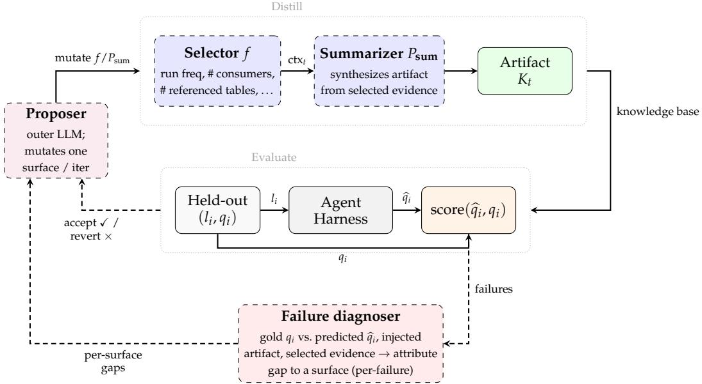
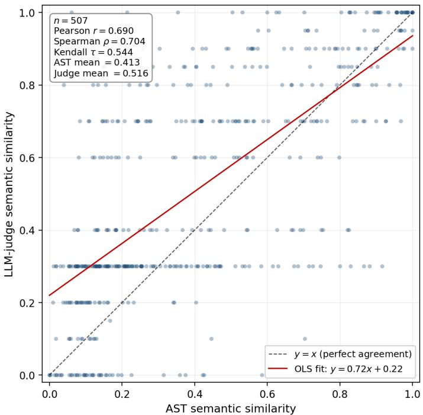
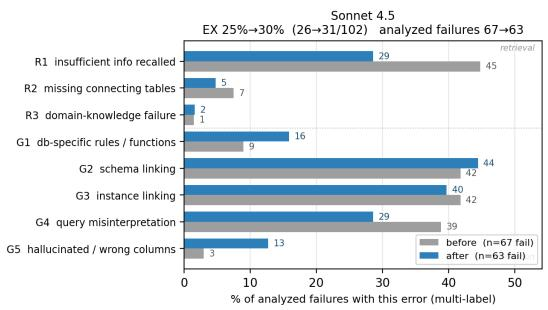
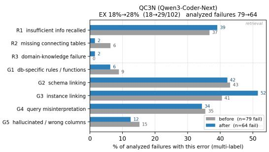

# Beyond the Harness: End-to-End Optimization of Context Artifacts for Enterprise Text-to-SQL

Kate Gwimm kgwimm@amazon.com

Carson Eisenach

ceisen@amazon.com

## Abstract

Deploying LLMs for enterprise Text-to-SQL is bottlenecked less by the model than by what context reaches it: business logic spans thousands of tables, and no model can ingest a full catalog at once. We argue that the most effective place to intervene is therefore the knowledge-base context the model consumes, and that this context should be constructed from historical usage rather than tuned for as a fixed input. Using a query-DAG decomposition– the same family of intermediates that enterprise benchmarks like BEAVER annotate, here recovered from production SQL–we compare the value of oracle query graphs versus retrieved knowledge-base context. In this ablation, retrieved knowledge-base context provides the largest marginal improvement when added to the full oracle graph. Building on this, we optimize a distillation procedure that turns historical query profiles into reusable SQL reference cards. On a benchmark of 5176 production queries from a major online retailer, optimizing these context artifacts yields larger gains (∼12–25% AST similarity) than optimizing the retrieval harness (∼3– 12%). On the public BEAVER benchmark, which lacks the productionusage signals available in our internal setting, the picture is more mixed: table cards alone perform about the same as raw historical SQL. The best optimized variant retrieves both cards and raw SQL, scoring 9.00% versus 6.33% (p-value 0.12) for the comparable baseline on a held-out N=300 subset, using retrieved context and harness changes but no agentic loop.

## 1 Introduction

Successful real-world deployments of large language model (LLM) systems depend not just on the model but also on the information that reaches the model and the harness that manages the model’s interaction with the external world. A growing body of work optimizes this harness–the executable scaffolding that decides what an LLM application stores, retrieves, and presents–automatically (Lee et al., 2026; Hu et al., 2024).

In this work we consider the complementary problem of optimizing the context artifacts that the model uses for downstream tasks. Concurrent work refines knowledge bases and memory artifacts after they are built (Huang et al., 2026), or accumulates them online with hand-designed update rules (Biswal et al., 2026). We instead ask how to construct the artifacts from raw production traces in the first place. Appendix A gives an extended discussion of related work.

We distinguish raw traces (prior SQL usage records, excluding held-out queries), distilled artifacts (the reusable SQL reference cards synthesized from those traces), the harness (retrieval and generation scaffolding), and the injected context the model actually sees. This distinction matters because our claim is not that every useful context item must be summarized first, but that historical SQL-usage signal should be treated as an optimizable input to the Text-to-SQL system.

Enterprise Text-to-SQL is hard for reasons academic benchmarks rarely capture. Business logic spans thousands of tables and intermediate views, long-horizon planning remains brittle even for reasoning models (Valmeekam et al., 2024), and accuracy degrades as the input grows despite nominally large context windows (Hsieh et al., 2024; Bai et al., 2024). Benchmarks such as Spider (Yu et al., 2018), BIRD (Li et al., 2024), and even Spider 2.0 (Lei et al., 2024) evaluate on schemas far simpler than production data lakes. Because no model can ingest a full enterprise catalog at once, deciding which evidence to surface for a given query becomes the central bottleneck.

We study the Text-to-SQL–specific version of this problem and show, in a production enterprise setting, that SQL reference-card context artifacts distilled from historical query profiles outperform prompt/tool harness optimization under the same search procedure. We treat the knowledge-base context the model consumes as the primary optimization target: we represent SQL queries as a DAG of sub-problems, which makes critical subtasks–such as identifying which tables are relevant–independently measurable, and we distill historical query profiles into reusable SQL reference-card artifacts. Unlike fixed workload-mining recipes (Vaidya et al., 2025; Baek et al., 2025), our distillation function is optimized end-toend against downstream SQL quality using an AlphaEvolve-style search (Novikov et al., 2025).

Our contribution is a distillation-time optimization method that learns to convert historical data-warehouse queries into reusable SQL reference-card artifacts. To make enterprise context bottlenecks independently measurable we adopt a query-DAG supervision view– the same family of intermediates that enterprise benchmarks like BEAVER annotate (Chen et al., 2024), here recovered from production SQL rather than hand-labeled–and use it to ablate which subtasks and intermediate graph information the model is given–table linkage, output schemas, and the surrounding graph structure–to locate where the bottlenecks actually lie. We then quantify the trade-off between the two optimization surfaces: on the internal benchmark, optimizing context artifacts yields larger relative end-to-end AST gains within each model than prompt/tool harness optimization (∼12% vs. ∼3% for Sonnet; ∼25% vs. ∼12% for Qwen). Finally, we test the procedure on BEAVER (Chen et al., 2024), a public enterprise SQL benchmark graded by execution accuracy. Because BEAVER lacks the production-usage signals available internally, it serves as a conservative transfer check. The result is more nuanced than the internal benchmark: cards-only and raw-query retrieval are statistically indistinguishable on our held-out N=300 subset. The best-scoring held-out variant retrieves both cards and raw SQL, scoring 9.00% versus 6.33% for the comparable baseline, using a single generation call and no agentic exploration. This difference is directional rather than statistically significant.

## 2 Query-DAG Supervision Framework

To measure context quality at the right granularity, we represent each production query as a directed acyclic graph (DAG) of sub-problems, in the same spirit as the subtask annotations of enterprise benchmarks like BEAVER (Chen et al., 2024). This scaffold exposes verifiable intermediates, defines context-fidelity controls, and yields cheap supervision signals that avoid executing arbitrary queries at scale. We use it to diagnose where context matters (Section 2.4), motivating the context-artifact optimization of Section 3. The optimized generator consumes retrieved text artifacts and raw SQL examples, not predicted query DAGs.

## 2.1 Production SQL as a query DAG

We represent a production query as a DAG $\mathcal { G } = \left( V , E , \mathcal { D } \right)$ , where each node $v \in V$ is a logical sub-query (a CTE or subquery), each edge $( v _ { i } , v _ { j } ) \in E$ denotes dataflow, and $\mathcal { D } = \{ ( v , d _ { v } , S _ { v } ) \} _ { v \in V }$ annotates each node with a natural-language description $d _ { v }$ and an output schema $\boldsymbol { S _ { v } }$ . Each node additionally carries an input schema: the source tables or upstream node outputs it reads. Importantly, this representation is recovered from real production SQL rather than hand-authored: we parse each query into an abstract syntax tree, extract CTEs and subqueries as nodes, and resolve column-level lineage to establish edges (Appendix B). The resulting graphs are an order of magnitude more complex than academic benchmarks–production queries in our corpus average ∼7 intermediate steps and reference ∼5 source tables, versus the single-digit table counts of Spider (Yu et al., 2018) and BIRD (Li et al., 2024).

## 2.2 Verifiable intermediates and graph-fidelity levels

The payoff of the DAG is that each node is a verifiable intermediate: its description, input linkage, and output schema can each be checked against ground truth without executing the full query–essential in enterprise settings where end-to-end execution is expensive and governed by data-access controls. This lets us define a nested hierarchy of graph-fidelity levels, each adding one more slice of the ground-truth graph to what the model is given:

$$
\begin{array} { r } { \mathcal { Z } _ { 1 } = \left\{ d _ { v } \right\} _ { v \in V } \qquad \mathrm { ( N L \mathrm { - o n l y ) } } \qquad \mathcal { Z } _ { 2 } = \mathcal { Z } _ { 1 } \cup E } \end{array}\tag{+ input linkage}
$$

$$
\begin{array} { r l r } { \mathcal { T } _ { 3 } = \mathcal { T } _ { 2 } \cup \left\{ S _ { v } \right\} _ { v \in V } ( + \mathrm { o u t p u t s c h e m a s } ) } & { } & { \mathcal { T } _ { 4 } = \mathcal { T } _ { 3 } \cup \left\{ \mathrm { i n p u t s c h e m a s } \right\} ( + \mathrm { f u l l g r a p h } ) } \end{array}
$$

Because $\mathcal { T } _ { 1 } \subset \mathcal { T } _ { 2 } \subset \mathcal { T } _ { 3 } \subset \mathcal { T } _ { 4 }$ , these levels are the controls we turn in the diagnosis of Section 2.4.

## 2.3 Benchmark and metrics

We instantiate the framework on an internal benchmark of 5176 production queries drawn from a large enterprise data warehouse, each paired with its ground-truth SQL, an LLMgenerated natural-language intent, and the source tables and schemas.

We score a generated query against ground truth at the granularity the DAG exposes. Representing a query as sub-queries $Q = \{ q _ { 1 } , \dots , q _ { m } \}$ with predicted counterparts ${ \widehat { Q } } ,$ and letting $O _ { k }$ be the number of AST operations in q<sub>k</sub> (a complexity weight), we report

$$
\begin{array} { r } { \mathrm { A S T } \sin . = 1 - \sum _ { k } O _ { k } d _ { \mathrm { A S T } } ( q _ { k } , \widehat { q } _ { k } ) \big / \sum _ { k } O _ { k } , } \end{array}\tag{2.1}
$$

$$
\begin{array} { r } { { \mathrm { S t r i n g ~ s i m . } } = 1 - \sum _ { k } { O _ { k } } d _ { \mathrm { S T R } } ( q _ { k } , \widehat { q } _ { k } ) \big / \sum _ { k } { O _ { k } } , } \end{array}\tag{2.2}
$$

$$
\mathrm { L i n k a g e s i m . } = { | E ( Q ) \cap E ( \widehat { Q } ) | } / { | E ( Q ) \cup E ( \widehat { Q } ) | } ,\tag{2.3}
$$

where $d _ { \mathrm { A S T } }$ and $d _ { \mathrm { S T R } }$ are normalized edit distances on AST and string representations and (2.3) is the Jaccard index on DAG edges. We additionally report an LLM-judge semanticsimilarity score (Appendix E) and an execution accuracy metric on a subsampled set of queries.

## 2.4 Diagnosis: graph fidelity or retrieved content?

We now use the framework to ask the question that motivates the rest of the paper: holding the model fixed, which lever is more valuable–the fidelity of the query graph we hand the model, or the knowledge-base content it retrieves? To upper-bound the improvement from better graph structure prediction, we provide an oracle ground-truth graph at several levels of granularity $\mathcal { T } _ { 1 } \mathrm { - } \mathcal { T } _ { 4 } ;$ to isolate the impact of content, we add retrieval (RAG) on top. Table 1 measures synthesis quality for Claude Sonnet 4.5 and Qwen Coder 3-30B. Every row carrying the oracle graph $( { \mathcal { T } } _ { 2 }$ onward, including $\mathcal { T } _ { 4 } { + } \mathrm { R A G } )$ is a diagnostic ceiling, not an attainable system: these rows hand the model ground-truth graph structure that is unavailable at inference, so they bound–rather than report–what predicting that structure could buy. That high-fidelity intermediates help is not itself new: on BEAVER, supplying gold subtask annotations increases execution accuracy from ∼10.8% to ∼30.1% (Chen et al., 2024), yet leaves a large gap. Our ablation asks the sharper question of which lever–graph fidelity or retrieved content–closes more of that gap, and how to produce the necessary signal without oracle annotation (Section 3).

Table 1 separates two effects. First, graph fidelity matters. Within the oracle-graph series, quality rises monotonically: moving from linkage to the full graph $( \mathcal { T } _ { 2 } \to \mathcal { T } _ { 4 } )$ improves AST similarity by +0.093 for Sonnet and +0.092 for Qwen. This column-specific trend does not mean a partial oracle graph always beats ordinary retrieval–for Sonnet, NL+RAG (0.278) exceeds $\dot { \mathcal { I } } _ { 2 }$ (0.248) and nearly matches $\mathcal { T } _ { 4 }$ (0.341). Predicting graph structure is therefore a real source of signal, but retrieved context is already competitive with weaker oracle graph views.

Second, retrieved knowledge-base context has a large impact. With no graph at all, retrieval over the knowledge base improves AST similarity over NL-only for both models $( 0 . 1 0 0  0 . 2 7 8$ for Sonnet and 0.082 → 0.184 for Qwen). When this context is added on top of the full graph, it produces the largest jump in the table $( \mathbb { Z } _ { 4 } \to \mathbb { Z } _ { 4 } + \mathrm { R A G } , 0 . 3 4 1 \to 0 . 5 8 2$ for Sonnet and $\stackrel { \cdot } { 0 . 2 9 1 } \stackrel { \cdot } {  } 0 . 5 5 8$ for Qwen). The implication is not that graphs are irrelevant; it is that knowledge-base context can be improved offline, before inference.

Table 1: Synthesis quality versus oracle graph fidelity. Rows are ordered by increasing input; linkage similarity applies only to graph-level rows.
<table><tr><td rowspan="2">MODEL</td><td rowspan="2">INPUT</td><td colspan="3">SIMILARITY</td></tr><tr><td>AST</td><td>STRING</td><td>LINKAGE</td></tr><tr><td>CLAUDE SONNET 4.5 QWEN CODER 3-30B</td><td> $\mathcal { T } _ { 1 } \colon \mathrm { N L }$ </td><td>0.100 0.082</td><td>0.303 0.281</td><td>一 一</td></tr><tr><td>CLAUDE SONNET 4.5 QWEN CODER 3-30B</td><td> $\mathcal { T } _ { 1 } \colon \mathrm { N L } + \mathrm { R A G }$ </td><td>0.278 0.184</td><td>0.447 0.346</td><td></td></tr><tr><td>CLAUDE SONNET 4.5 QWEN CODER 3-30B</td><td> $\mathcal { T } _ { 2 } \colon \mathrm { N L } + \mathrm { L I N K A G E }$ </td><td>0.248 0.199</td><td>0.468 0.410</td><td>0.735 0.564</td></tr><tr><td>CLAUDE SONNET 4.5</td><td>_3: + OUTPUT SCHEMA</td><td>0.323 0.271</td><td>0.582</td><td>0.756</td></tr><tr><td>QWEN CODER 3-30B CLAUDE SONNET 4.5</td><td> $\mathcal { T } _ { 4 } \mathrm { : + F U L L G R A P H }$ </td><td>0.341</td><td>0.531 0.597</td><td>0.607 0.860</td></tr><tr><td>QWEN CODER 3-30B CLAUDE SONNET 4.5 QWEN CODER 3-30B</td><td> $\mathcal { T } _ { 4 } + \mathrm { R A G }$ </td><td>0.291 0.582 0.558</td><td>0.551 0.750 0.727</td><td>0.708 0.881 0.804</td></tr></table>

## 3 Optimizing Context Artifacts

The diagnosis of Section 2.4 is a comparison of optimization surfaces, not a dismissal of graph structure. Oracle graph fidelity is valuable, but the ablation shows that retrieved knowledge-base context contributes a larger marginal gain, including when it is added on top of the full graph. This makes the retrieved content itself the natural object to optimize: it can be distilled from historical traces once, indexed, and reused at inference. The resulting problem is to optimize the content of reusable context artifacts–the knowledge-base material the model retrieves–rather than treating that content as a fixed input. This focus differs from prompt- and harness-optimization methods (Khattab et al., 2023; 2024; Yüksekgonul et al., 2024; Lee et al., 2026), which tune how the system reasons and retrieves while holding the underlying knowledge fixed, and from fixed workload-mining recipes (Vaidya et al., 2025; Baek et al., 2025), which build these artifacts with a hand-designed pipeline rather than optimizing them end-to-end.

## 3.1 Agent System

At enterprise scale a catalog holds thousands of tables and millions of lines of ${ \mathrm { S Q L } }$ , far exceeding any context window, so the model is wrapped in an agent $A _ { \theta }$ that, given a naturallanguage query $l ,$ retrieves a compact evidence set ${ \bf \dot { \mathcal { E } } } = H ( l , K ) { \bf \dot { \subseteq } } K$ before generating. The parameters $\theta \doteq ( K , H , P )$ name three optimizable surfaces:

• Knowledge base $\begin{array} { r } { K = \bigcup _ { t } \left( R _ { t } \cup \left\{ K _ { t } \right\} \right) - } \end{array}$ for each table $t ,$ historical queries $R _ { t }$ plus a synthesized table summary $K _ { t }$ . Its content is a decision variable, not a fixed input.

• Retrieval and generation harness H – the tools and retrieval logic that select $\mathcal { E }$ and generate the SQL.

• Instruction prompt P – the instructions governing planning and generation.

To prevent leakage, the query under evaluation i is excluded at inference, yielding $K _ { - i }$ Given benchmark pairs $\{ \tilde { ( } l _ { i } , \tilde { q _ { i } } ) \}$ , we seek

$$
\theta ^ { * } = \arg \operatorname* { m a x } _ { \theta } \ { \frac { 1 } { n } } \sum _ { i = 1 } ^ { n } { \mathrm { s c o r e } } \big ( A _ { \theta } { ( l _ { i } ) } , q _ { i } \big ) ,\tag{3.1}
$$

where score is one of the metrics of Section 2.3. Our focus is the knowledge-base context $\{ K _ { t } \} ;$ we optimize it separately from the harness H and prompt P. In Section 4 we evaluate the two separately-optimized surfaces in combination in order to attribute downstream gains to each surface and test whether they compound.

  
Figure 1: Context-artifact optimization loop. An outer LLM mutates the selector $f$ or summarizer prompt $P _ { \mathrm { s u m } } ,$ , regenerates per-table artifacts $K _ { t } ,$ scores held-out queries, and accepts or reverts by metric delta. Failure feedback attributes errors to $f , P _ { \mathrm { s u m } } ,$ or harness H to target later mutations.

## 3.2 The distillation abstraction

The core object is a distillation function that turns raw usage signals into a compact, reusable context artifact. For each table $t , \mathsf { a }$ selector $f ( R _ { t } ^ { - i } ) \to \mathbf { c t x } _ { t }$ filters that table’s queries (excluding query i) by attributes such as run frequency, number of consumers, and number of referenced tables, producing a compact set of selected evidence ctx<sub>t</sub>; a summarizer $\operatorname { L L M } ( \operatorname { c t x } _ { t } ; P _ { \operatorname { s u m } } ) $ $K _ { t } ^ { - i }$ then synthesizes the table’s artifact under prompt $P _ { \mathrm { s u m } }$ . The optimized summaries then augment ${ \dot { K } } ,$ improving the evidence available to the agent (Figure 1).

This abstraction is deliberately source-agnostic. Internally, the distillation input is raw production ${ \mathrm { S Q L } } ;$ recovered DAG annotations construct labels and diagnose failures, not inference artifacts. On BEAVER (Section 4.2), benchmark-provided SQL, schema metadata, and BEAVER’s own intermediate annotations serve as a weaker public proxy for usage and are distilled into aggregated table cards. The method does not require proprietary traces, but its strongest setting is one with a real corpus of prior warehouse usage to distill from.

## 3.3 Optimization procedure

We search over these surfaces with an AlphaEvolve-style autoresearch loop (Novikov et al., 2025): an outer loop proposes a mutation to a single surface, scores it on the benchmark, and accepts or reverts based on the metric delta (Algorithm 1). The search procedure itself is off-the-shelf; our contribution is not a new optimizer but what we optimize–the context-artifact distillation function $( f , P _ { \mathrm { s u m } } )$ that turns raw historical traces into reusable retrieval artifacts. We place both the selector $f$ and the summarizer prompt $P _ { \mathrm { s u m } }$ in the search space and search against downstream SQL quality, rather than hand-designing this function or holding it fixed. For harness and prompt optimization the mutation targets H or $P ;$ for context-artifact optimization it targets the selector $f$ or the summarizer prompt $P _ { \mathrm { s u m } , }$ , a two-level search over what goes into each artifact and how it is written. Each search restricts mutations to one surface family $( \{ f , P _ { \mathrm { s u m } } \}$ or $\{ H , P \} )$ ; the combined configuration of Section 4 stacks the two separately-optimized surfaces rather than searching them jointly. On the internal benchmark, the outer proposer evaluates mutations on a 100-query innerloop sample spanning 78 referenced tables; accepted artifact mutations regenerate those tables’ summaries with a 8192-token cap. We use Claude Sonnet 4.6 and Qwen Coder 3-30B. Each surface search is run until it plateaus.

Algorithm 1 Context-artifact optimization   
Input: Profile corpus $\left\{ R _ { t } \right\}$ , eval set $\boldsymbol { \mathcal { D } } = \{ ( l _ { i } , q _ { i } , T _ { i } ) \} _ { i = 1 } ^ { n }$ with relevant tables $T _ { i } ,$ initial   
selector f and prompt $\dot { P } _ { \mathrm { s u m } }$   
Output: Optimized $f ^ { * } , P _ { \mathrm { s u m } } ^ { * }$   
1: $\hat { f } ^ { * } , P _ { \mathrm { s u m } } ^ { * }  f , P _ { \mathrm { s u m } } ;$ best\_score $ - \infty$   
2: repeat   
3: Mutate one surface in θ (one per iteration)   
4: for each held-out example $i \in \{ 1 , \ldots , n \}$ do   
5: for each relevant table $t \in \dot { T _ { i } }$ do   
6: $\mathsf { c t x } _ { t , i } \gets f ( R _ { t } ^ { - i } ) ; ~ K _ { t } ^ { - i } \gets \mathrm { L L M } ( \mathsf { c t x } _ { t , i } , P _ { \mathrm { s u m } } )$   
7: Embed $K _ { t } ^ { - \ i }$ into the knowledge base for example i   
8: end for   
9: end for   
10: s ← score $\big ( \mathcal { D } , \{ K _ { t } ^ { - i } \} \big )$   
11: if $s >$ best\_score then   
12: accept; best\_score ← s; f<sup>∗</sup>, P<sup>∗</sup><sub>sum</sub> ← f , P<sub>sum</sub>   
13: else   
14: revert   
15: end if   
16: until convergence

To keep artifact search tractable, candidate artifacts are rebuilt only for relevant tables known during search; all reported results in Section 4 are scored end-to-end with real retrieval.

## 3.4 Error feedback: diagnosing failures to target mutations

A scalar score delta tells the outer loop whether a mutation helped but not why a candidate still fails, so a search driven by the delta alone mutates its allowed surface without knowing which part is responsible. We close this gap with an error-feedback mechanism (Figure 1). After a candidate is scored, afailure diagnoser–an LLM call–examines each wrong prediction together with the artifacts that produced it: the natural-language question, the gold query $q _ { i } ,$ the model’s prediction ${ \widehat { q } } _ { i } ,$ the injected artifact the model actually saw, and the selected evidence that fed the summarizer. For each failure it attributes the missing information to exactly one optimizable surface: (1) Summarizer $( P _ { \mathbf { s u m } } )$ gap – the needed fact was present in the selected evidence but did not survive into the artifact; the summarizer prompt should surface it. (2) Selector (f) gap – the needed fact was in none of the selected evidence; the selector should expose different or additional usage signals. (3) Harness (H) gap – the artifact was adequate but the generation step errored for a prompt-fixable reason (e.g. wrong SQL dialect, or output not emitted in the required form); the harness instruction should constrain it.

Aggregating these attributions across the failed tasks yields a per-surface ranking of missinginformation categories (each with a suggested fix), which the outer loop can use to target the next mutation at the surface most responsible for the residual errors. Note that the diagnoser reads the concrete failing examples but its output–the categories and suggested fixes–is generic, so the optimizer is steered toward better extraction procedures without copying instance-specific values into a prompt.

## 4 Empirics

We now test whether automatically generated context artifacts deliver the gains suggested by the oracle-graph diagnosis (Section 2.4), and how they compare to optimizing the harness.

Metrics. On the internal benchmark we report AST, string, and linkage similarities (Section 2.3), LLM-judge semantic similarity (Appendix E), and table-selection recall/precision. Because arbitrary production queries cannot be re-executed at scale–most read tables the evaluation cluster is not granted access to, or depend on upstream state we cannot reconstruct–these structural metrics are the primary internal signals, and we use BEAVER as a public execution-graded check.

Table 2: Internal benchmark results: harness optimization versus context-artifact optimization, evaluated end-to-end with real retrieval. Table-selection and similarity metrics use the n=517 sample; EX uses the executable cohort with $n { = } 1 0 2$ . “Context” = table schema information vs. optimized SQL reference cards.
<table><tr><td></td><td></td><td></td><td colspan="2">TABLE SELECTION</td><td colspan="3">END-TO-END</td><td>EXEC.</td></tr><tr><td>MODEL</td><td>HARNESS</td><td>CONTEXT</td><td>RECALL</td><td>PREC.</td><td>AST</td><td>STRING</td><td>LLM-J</td><td>EX</td></tr><tr><td rowspan="4">CLAUDE SONNET 4.6</td><td>BASELINE</td><td>BASELINE</td><td>0.714</td><td>0.658</td><td>0.490</td><td>0.591</td><td>0.553</td><td>0.255</td></tr><tr><td>OPTIMIZED</td><td>BASELINE</td><td>0.741</td><td>0.679</td><td>0.503</td><td>0.600</td><td>0.546</td><td>0.275</td></tr><tr><td>BASELINE</td><td>OPTIMIZED</td><td>0.805</td><td>0.777</td><td>0.550</td><td>0.639</td><td>0.597</td><td>0.333</td></tr><tr><td>OPTIMIZED</td><td>OPTIMIZED</td><td>0.766</td><td>0.717</td><td>0.570</td><td>0.655</td><td>0.600</td><td>0.304</td></tr><tr><td rowspan="4">QWEN CODER 3-30B</td><td>BASELINE</td><td>BASELINE</td><td>0.660</td><td>0.577</td><td>0.407</td><td>0.508</td><td>0.503</td><td>0.176</td></tr><tr><td>OPTIMIZED</td><td>BASELINE</td><td>0.726</td><td>0.621</td><td>0.456</td><td>0.547</td><td>0.516</td><td>0.206</td></tr><tr><td>BASELINE</td><td>OPTIMIZED</td><td>0.737</td><td>0.687</td><td>0.509</td><td>0.594</td><td>0.550</td><td>0.235</td></tr><tr><td>OPTIMIZED</td><td>OPTIMIZED</td><td>0.740</td><td>0.631</td><td>0.519</td><td>0.603</td><td>0.566</td><td>0.284</td></tr></table>

We additionally report execution accuracy (EX) on a separate cohort of n=102 production queries, becase not every query in our corpus was executable in our test environment. Only 11 of the 102 also appear in the 517-query sample.

## 4.1 Internal Production Text2SQL Benchmark

We compare four configurations: baseline versus optimized retrieval harness, crossed with baseline versus optimized knowledge-base context. Every configuration is evaluated with the same end-to-end retrieval-and-generation protocol. Table 2 ablates the two optimization surfaces–harness (H, P) and knowledge-base context (K)–against the baseline, for both models.

Benchmark, models, and retrieval. We evaluate on the internal benchmark of Section 2.3 (5176 production queries, ∼100K-profile corpus) with two models–Claude Sonnet 4.6 and Qwen Coder 3-30B–so conclusions are not tied to a single model family. All results use real retrieval at test time: no oracle table linkage is supplied to the generator. The oracle linkage used inside Section 3.3 only reduces the cost of constructing candidate artifacts during search.

Baselines. The all-baseline cell uses two deliberately simple defaults. The context baseline is handcrafted table documentation plus raw query profiles $R _ { t } ;$ context optimization replaces the documentation with distilled SQL reference cards (Section 3), and Appendix H shows a representative card. The harness baseline is a single vector-search retrieval tool with k=10 and a hand-written generation prompt; harness optimization searches over retrieval tools H and prompt P (Appendix D). Each row in Table 2 names which surfaces are optimized, with the all-baseline row as the common reference point.

Optimizing the prompt and retrieval tools over the baseline knowledge base improves table selection (recall +4% for Sonnet, +10% for Qwen) and end-to-end AST similarity (+3% and +12%). The accepted harness changes mostly affect retrieval: the best configuration issues two calls (query search and table-documentation search) over both semantic and keyword indices, and an evidence-voting variant best serves table selection.

Holding the harness at baseline and replacing documentation with optimized SQL reference cards improves AST similarity by ∼12% relative for Sonnet and ∼25% relative for Qwen. In contrast to the BEAVER execution estimates below, this internal structural effect is resolved at n=517: for Sonnet the 95% intervals for baseline documentation and optimized cards are separated (0.490 [0.461, 0.520] → 0.550 [0.521, 0.579]), and the Qwen optimized-cards interval is comparably tight (0.509 [0.479, 0.541]). The effect is larger than the harness-only relative gain within each model (∼3% for Sonnet and ∼12% for Qwen); under the same retrieval/generation harness, table-selection recall rises to 0.81 / 0.74. The optimized artifact is a SQL reference-card consisting of: verbatim SQL fragments, join recipes, filter templates, and example CTEs, with roughly 60% of the token budget spent on concrete SQL examples. In this internal ablation, compact optimized evidence outperforms baseline documentation under the same harness.

Table 3: External validation on BEAVER (execution accuracy, held-out N=300; no oracle table linkage). Exec. acc. is reported with a 95% CI over the 300 binary outcomes. Published rows (†) are point estimates from the benchmark authors’ harness (Chen et al., 2024). Pairwise differences among the optimized rows are not significant under paired t-tests: Both vs. raw $p { = } 0 . 1 2$ , Both vs. cards $p { \dot { = } } 0 . 1 4$
<table><tr><td>METHOD</td><td>CONTEXT INJECTED</td><td>TOOLS / CALLS</td><td>EXEC. ACC.</td><td>95% CI</td></tr><tr><td>FEW-SHOT (OURS)</td><td>SCHEMAS + DEMOS</td><td></td><td>6.33%</td><td>[4.1, 9.7]</td></tr><tr><td>FEW-SHOT†</td><td>SCHEMAS + DEMOS</td><td></td><td>8.8%</td><td></td></tr><tr><td>REFORCE†</td><td>SELF-EXPLORED SCHEMA</td><td>EXPLORE, VOTE, FIX</td><td>10.8%</td><td></td></tr><tr><td>RAW QUERIES (OPTIMIZED)</td><td>RETRIEVED GOLD SQL</td><td></td><td>6.33%</td><td>[4.1, 9.7]</td></tr><tr><td>TABLE CARDS (OPTIMIZED)</td><td>AGGREGATED PER-TABLE</td><td></td><td>6.67%</td><td>[4.4, 10.1]</td></tr><tr><td>BOTH (OPTIMIZED)</td><td>CARDS + RAW QUERIES</td><td></td><td>9.00%</td><td>[6.3, 12.8]</td></tr></table>

Combining both optimizations roughly matches–but does not exceed–the better single surface. On Qwen the harness adds ∼12% AST similarity over baseline documentation but only ∼2% on top of optimized cards; on Sonnet the combination is marginally best on AST/string-similarity and LLM-judge, but is within the CIs of the artifacts-only configuration. The tweo surfaces partially substitute: once the right content is in front of the model, smarter retrieval has less to recover. On the executable cohort where we measure execution accuracy (EX), the estimates move in the same direction: the content-only rows have higher EX point estimates by +0.078 on Sonnet (0.255→0.333) and +0.059 on Qwen (0.176 → 0.235), versus +0.020 and +0.030 for the harness. Because the executable cohort is small, we read EX as directional corroboration: at n=102 each CI is roughly ±0.08 wide and every EX interval overlaps the others within its model block (Table 4). Despite not being statistically significant, the execution accuracy improvements align directionally with the structural metrics.

What errors remain? A failure analysis (Appendix G) shows that optimization reduces some retrieval-phase errors, but persistent schema- and instance-linking failures remain.

## 4.2 External validation: BEAVER Benchmark

Our internal benchmark is proprietary and scored primarily by structural proxies, so we turn to BEAVER (Chen et al., 2024)–a public enterprise Text-to-SQL benchmark drawn from real private data warehouses and graded by execution accuracy–to test how far context-artifact distillation transfers beyond our internal benchmark. We evaluate on a fixed N=300 subset drawn once (seed 20260617) from BEAVER’s 5787-query dw development split, stratified by query compositionality and kept fixed across conditions. Each question is answered with the same evaluation scaffold: dense retrieval over a per-table context index, generation with Claude Sonnet 4.5, execution against BEAVER’s MySQL database, and BEAVER’s official set-based scoring. No oracle table linkage is given. Published rows in Table 3 are external reference points only; optimized rows remove held-out task IDs before building raw-query or table-card indices.

Experiment Setup. We ask whether distilling usage into reference cards adds anything over retrieving the raw historical SQL traces directly. We compare three optimized context channels: (1) Aggregated table cards – one card per table, distilling many non-held-out historical queries for that table into join recipes, filter idioms, and a representative example. (2) Raw historical queries – the retrieved gold SQL of non-held-out questions referencing the table, injected verbatim with no distillation. (3) Both – retrieve cards and raw queries separately, inject both. In each setting, we optimize the harness and, in the case of table cards, the context.

Optimization Procedure. We select configurations on disjoint development splits using the optimization loop of Sections 3.3 and 3.4, then evaluate the selected configurations once on the held-out N=300 test subset (Table 3). Development accuracy is higher than held-out test accuracy, as expected when the search selects on development folds.

Results On this held-out subset, the optimized cards+raw system scores 9.00%, compared with 6.33% for our directly comparable pre-optimization harness: a +2.67 point difference (∼42% relative) on the same 300 questions, with the same generator, one generation call, and no agentic loop. At N=300, this is a directional result with a p-value of p=0.12 on the paired test.

The content-source comparison is nuanced: cards alone are similar to raw-query retrieval (6.67% vs. 6.33%; discordant pairs split near-evenly, 11/10), while cards+raw gives the best score (27/300). Since that arm receives more total context, we treat BEAVER as an encouraging but non-decisive transfer check: the combined context scores highest, while the cards-only comparison is tied with raw SQL at this sample size. This smaller effect size on BEAVER is not surprising as BEAVER lacks the production-usage signals our method is able to exploit. Its table context is limited to column identifiers, column types, and a few example rows, and SQL queries without usage signals.

Limitations. There are several limitations of our work. (i) Scoring. The internal benchmark is graded primarily by structural proxies (AST, string, and linkage similarity) and an LLM judge; execution accuracy is available on a smaller executable cohort (n=102), because most production profiles cannot be re-executed at scale. (ii) Statistical power. The public execution-graded result uses an N=300 BEAVER subset that is underpowered for the small effect sizes we observe, so every BEAVER comparison here is directional (Table 3). (iii) Compositionality. The gains concentrate on table selection and schema grounding; deeply compositional queries stay near zero regardless of injected content (Table 5), leaving query structure as a separate bottleneck. (iv) Regime. We study a single-call, retrieval-only harness rather than a multi-turn or RL-trained agent.

## LLM Usage Disclosure

We used LLMs in this work – in addition to human effort – to perform more extensive literature reviews, implement code with tools like CoPilot, and to edit the writing of this paper.

## References

ASCOLI, B. G., KANDIKONDA, Y. S. R. and CHOI, J. D. (2024). Etm: Modern insights into perspective on text-to-sql evaluation in the age of large language models. arXiv:2407.07313.

BAEK, J., SAMULOWITZ, H., HASSANZADEH, O., SUBRAMANIAN, D., SHIRAI, S., GLIOZZO, A. and BHATTACHARJYA, D. (2025). Knowledge base construction for knowledgeaugmented text-to-sql. arXiv:2505.22096.

BAI, Y., LV, X., ZHANG, J., LYU, H., TANG, J., HUANG, Z., DU, Z., LIU, X., ZENG, A., HOU, L., DONG, Y., TANG, J. and LI, J. (2024). Longbench: A bilingual, multitask benchmark for long context understanding. In Proceedings of the 62nd Annual Meeting of the Association for Computational Linguistics (ACL 2024).

BISWAL, A., LEI, C., QIN, X., LI, A., NARAYANASWAMY, B. and KRASKA, T. (2026). AgentSM: Semantic Memory for Agentic Text-to-SQL. arXiv preprint arXiv:2601.15709 .

CHEN, P. B., YANG, D., LI, W., WENZ, F., ZHANG, Y., TATBUL, N., CAFARELLA, M., DEMIRALP, Ç. and STONEBRAKER, M. (2024). Beaver: An enterprise benchmark for text-to-sql. arXiv:2409.02038.

DENG, M., RAMACHANDRAN, A., XU, C., HU, L., YAO, Z., DATTA, A. and ZHANG, H. (2025). ReFoRCE: A Text-to-SQL Agent with Self-Refinement, Consensus Enforcement, and Column Exploration. arXiv preprint arXiv:2502.00675 .

GAO, D., WANG, H., LI, Y., SUN, X., QIAN, Y., DING, B. and ZHOU, J. (2023). Text-to-sql empowered by large language models: A benchmark evaluation. arXiv:2308.15363.

GUO, J., ZHAN, Z., GAO, Y., XIAO, Y., LOU, J.-G., LIU, T. and ZHANG, D. (2019). Towards complex text-to-sql in cross-domain database with intermediate representation. arXiv:1905.08205.

HSIEH, C.-P., SUN, S., KRIMAN, S., ACHARYA, S., REKESH, D., JIA, F., ZHANG, Y. and GINSBURG, B. (2024). Ruler: What’s the real context size of your long-context language models? arXiv:2404.06654.

HU, S., LU, C. and CLUNE, J. (2024). Automated design of agentic systems. arXiv preprint arXiv:2408.08435 .

HUANG, H., BAI, J., LIU, S., WEI, Y., TSANG, H. T., GAO, Y., XIE, Z., LI, Y. and SONG, Y. (2026). Deeprefine: Agent-compiled knowledge refinement via reinforcement learning. arXiv:2605.10488.

KHATTAB, O., POTTS, C. and ZAHARIA, M. (2024). Optimizing instructions and demonstrations for multi-stage language model programs. arXiv preprint arXiv:2406.11695 .

KHATTAB, O., SINGHVI, A., MAHESHWARI, P., ZHANG, Z., SANTHANAM, K., VARD-HAMANAN, S., HAQ, S., SHARMA, A., JOSHI, T. T., MOBER, H. ET AL. (2023). DSPy: Compiling declarative language model calls into self-improving pipelines. arXiv preprint arXiv:2310.03714 .

KIM, H., JEON, T., CHOI, S., CHOI, S. and CHO, H. (2024). Flex: Expert-level false-less execution metric for reliable text-to-sql benchmark. arXiv:2409.19014.

LEE, Y., NAIR, R., ZHANG, Q., LEE, K., KHATTAB, O. and FINN, C. (2026). Meta-harness: End-to-end optimization of model harnesses. arXiv:2603.28052.

LEI, F., CHEN, J., YE, Y., CAO, R., SHIN, D., SU, H., SUO, Z., GAO, H., HU, W., YIN, P., ZHONG, V., XIONG, C., SUN, R., LIU, Q., WANG, S. and YU, T. (2024). Spider 2.0: Evaluating language models on real-world enterprise text-to-sql workflows. arXiv:2411.07763.

LI, H., ZHANG, J., LI, C. and CHEN, H. (2023). Resdsql: Decoupling schema linking and skeleton parsing for text-to-sql. arXiv:2302.05965.

LI, J., HUI, B., QU, G., YANG, J., LI, B., LI, B., WANG, B., QIN, B., GENG, R., HUO, N., ZHOU, X., MA, C., LI, G., CHANG, K. C. C., HUANG, F., CHENG, R. and LI, Y. (2024). Can llm already serve as a database interface? a big bench for large-scale database grounded text-to-sqls. Advances in Neural Information Processing Systems 36. BIRD benchmark for large-scale, database-grounded Text-to-SQL tasks.

LIU, S., ZHU, A., HEGDE, S., CAO, S., YUAN, S., SUWITO, S., GRIGGS, T., ZAHARIA, M., GONZALEZ, J. E. and STOICA, I. (2025). SkyRL-SQL: Multi-turn SQL data agents via RL. In First Workshop on Multi-Turn Interactions in Large Language Models.

NOVIKOV, A. ET AL. (2025). AlphaEvolve: A coding agent for scientific and algorithmic discovery. arXiv preprint arXiv:2506.13131 .

POURREZA, M. and RAFIEI, D. (2023a). Din-sql: Decomposed in-context learning of text-tosql with self-correction. arXiv:2304.11015.

POURREZA, M. and RAFIEI, D. (2023b). Evaluating cross-domain text-to-sql models and benchmarks. arXiv:2310.18538.

SCHOLAK, T., SCHUCHER, N. and BAHDANAU, D. (2021). Picard: Parsing incrementally for constrained auto-regressive decoding from language models. arXiv:2109.05093.

VAIDYA, K., DING, J., KOSAK, S., KERNERT, D., LEI, C., QIN, X., TRIPATHY, A., BALAN, R., NARAYANASWAMY, B. and KRASKA, T. (2025). Tailorsql: An nl2sql system tailored to your query workload. arXiv:2505.23039.

VALMEEKAM, K., STECHLY, K. and KAMBHAMPATI, S. (2024). Llms still can’t plan; can lrms? a preliminary evaluation of openai’s o1 on planbench. arXiv:2409.13373.

WANG, B., SHIN, R., LIU, X., POLOZOV, O. and RICHARDSON, M. (2019). Rat-sql: Relationaware schema encoding and linking for text-to-sql parsers. arXiv:1911.04942.

WANG, C., TATWAWADI, K., BROCKSCHMIDT, M., HUANG, P.-S., MAO, Y., POLOZOV, O. and SINGH, R. (2018). Robust text-to-sql generation with execution-guided decoding. arXiv:1807.03100.

YU, T., ZHANG, R., YANG, K., YASUNAGA, M., WANG, D., LI, Z., MA, J., LI, I., YAO, Q., RO-MAN, S., ZHANG, Z. and RADEV, D. (2018). Spider: A large-scale human-labeled dataset for complex and cross-domain semantic parsing and text-to-sql task. arXiv:1809.08887.

YÜKSEKGONUL, M., BIANCHI, F., BOEN, J., LIU, S., HUANG, Z., GUESTRIN, C. and ZOU, J. (2024). TextGrad: Automatic “differentiation” via text. arXiv preprint arXiv:2406.07496 .

## A Extended related work

A large body of Text-to-SQL work improves schema-aware SQL generation: representing the question and database schema, linking mentions to tables and columns, and constraining the query produced by the model. Schema-aware parsers such as RAT-SQL (Wang et al., 2019) and IRNet (Guo et al., 2019) make schema structure and schema linking explicit, while RESDSQL (Li et al., 2023) separates schema linking from SQL-skeleton prediction. LLM-era systems move more of this structure into prompting and control: DIN-SQL (Pourreza and Rafiei, 2023a) decomposes generation into smaller in-context subproblems, DAIL-SQL (Gao et al., 2023) studies how examples should be selected and organized at inference time, PICARD (Scholak et al., 2021) constrains decoding with an incremental parser, SkyRL-SQL (Liu et al., 2025) trains a multi-turn agent to probe databases, refine queries, and verify results, and ReFoRCE (Deng et al., 2025) combines schema compression, self-refinement, consensus, and column exploration. These methods primarily target representation, decoding, prompting, or interaction at generation time. Our focus is complementary: deciding what reusable evidence should exist in the knowledge base before retrieval and generation begin.

The closest Text-to-SQL work uses historical workload signal. TailorSQL (Vaidya et al., 2025) exploits past queries because they reveal common join paths and obscure schema semantics that are absent from table names alone. Baek et al. (2025) construct a reusable knowledge base from available questions, schemas, and associated knowledge, improving knowledge-augmented Text-to-SQL across datasets. AgentSM (Biswal et al., 2026) stores prior execution traces as structured semantic memories that guide future agent trajectories, and DeepRefine (Huang et al., 2026) refines an already constructed agent-compiled knowledge base through multi-turn diagnosis and targeted refinement. Together, this line of work shows that external artifacts and past traces are useful system inputs, rather than static documentation. The key difference is that we search over how SQL-workload artifacts are constructed from raw traces, using downstream SQL quality as the acceptance criterion. The search can change the format, content, and granularity of the reference cards, rather than assuming a fixed workload-mining template or refining only an already constructed knowledge base.

Our optimization procedure is also related to work that treats prompts, programs, and agent harnesses as learnable objects. DSPy (Khattab et al., 2023) abstracts LM pipelines as parameterized computational graphs; MIPRO (Khattab et al., 2024) optimizes instructions and demonstrations for multi-stage LM programs; and TextGrad (Yüksekgonul et al., 2024) uses natural-language feedback as a gradient-like signal through compound AI systems. AlphaEvolve (Novikov et al., 2025) and ADAS (Hu et al., 2024) search over code or agent designs with evaluator feedback, while Meta-Harness (Lee et al., 2026) searches over the harness code that stores, retrieves, and presents information to the model. We use a similar outer-loop accept/revert search, but make the knowledge content an optimized surface alongside the retrieval harness and prompt. Keeping these surfaces separate is what allows the attribution in Section 4: in our setting, changing the artifact content can dominate changing the agent scaffolding around it.

The evaluation setting is shaped by the gap between public benchmarks and production data lakes. Spider (Yu et al., 2018) introduced cross-domain generalization, and BIRD (Li et al., 2024) added larger databases, external knowledge, and database-value grounding. Spider 2.0 (Lei et al., 2024) and BEAVER (Chen et al., 2024) move closer to enterprise use cases with larger schemas, realistic workflows, and domain knowledge requirements. Our internal benchmark pushes on the same regime but uses private production traces, so arbitrary execution is costly and often impossible. This motivates the structural metrics of Section 2.3 and the external BEAVER validation in Section 4.2.

Finally, Text-to-SQL evaluation itself is imperfect. Execution can be useful as a decoding or validation signal (Wang et al., 2018), but benchmark-level execution accuracy can penalize semantically valid alternatives, reward structurally wrong queries that happen to match outputs, and change model rankings under closer inspection (Pourreza and Rafiei, 2023b; Ascoli et al., 2024; Kim et al., 2024). These concerns are especially acute for long enterprise queries, where partial equivalence, dialect behavior, and underspecified natural-language requests are common. We therefore report structural and judge-based proxies on the internal benchmark, and use execution-graded BEAVER as an external check that the main conclusion is not an artifact of proxy scoring.

## B Benchmark construction details

The internal benchmark is derived from recurring query profiles logged by an enterprise workload-orchestration system. Each profile contains production SQL and usage metadata. From the ∼100K-profile corpus we select 5176 queries with three filters:

1. Relevance: retain only queries that reference a table in the target business domain, the use case we evaluate against.

2. Version control: keep only the most recent version of each profile, avoiding nearduplicate revisions of the same query.

3. Execution validation: keep only queries that executed successfully within the past three years, as a coarse proxy for production viability.

Canonicalization. Each SQL string is normalized before DAG extraction: we parse with SQLGlot, normalize identifiers and aliases, standardize intermediate-table creation to CREATE TEMP TABLE, and flatten nested sub-query expressions inside CREATE statements. These transforms produce a uniform representation for structural comparison; they are not intended to change query semantics.

Query-profile DAG. On the canonicalized AST we run lineage analysis to build the query DAG of Section 2.1. Source tables form the input nodes, temporary tables and CTEs form internal nodes, and the final SELECT is the sink. Column-level lineage defines the edges. The resulting graph is the basis for the verifiable intermediates and fidelity levels in Section 2.2.

Ground-truth labels via LLM annotation. We use Qwen Coder 3-30B to annotate each DAG node with a natural-language sub-problem description and each full profile with a natural-language intent. The gold SQL remains the original human-authored production query; only the natural-language labels are model generated. This avoids relying on stale analyst-written descriptions while keeping the SQL target fixed.

Graph-structure input diagnosis. The annotated DAG lets us construct, for each query, the various inputs ablated in Section 2.4: the natural-language intent and target output schema (NL); the script-level input tables and their schemas (linkage); per-node natural-language descriptions of the ground-truth graph (NL + linkage, I<sub>2</sub>); the per-node output schemas (I ); and the full set of inter-node linkages including node-level input/output schemas (full graph, I<sub>4</sub>). Supplying successively more of this ground-truth structure is exactly the oracle ablation of Table 1.

## C Confidence intervals for the internal benchmark

Table 2 reports point estimates; Table 4 gives a 95% interval for every one of those cells. For the continuous metrics–table-selection recall and precision, and the three end-to-end similarities–these are bootstrap percentile intervals computed over the per-task scores at evaluation time (2000 resamples, seed 42).

Table 4: 95% confidence intervals for every cell of Table 2. Effective per-cell n after evaluation failures is 488–517 for table selection and 509–517 end-to-end; EX is n=102 in every cell. “Context” baseline = handcrafted documentation, optimized = SQL reference cards.
<table><tr><td rowspan="2">MODEL</td><td rowspan="2">HARNESS</td><td rowspan="2">CONTEXT</td><td colspan="2">TABLE SELECTION</td><td colspan="3">END-TO-END</td><td>EXEC.</td></tr><tr><td>RECALL</td><td>PREC.</td><td>AST</td><td>STRING</td><td>LLM-J</td><td>EX</td></tr><tr><td rowspan="4">CLAUDE SONNET 4.6</td><td>BASELINE</td><td>BASELINE</td><td>[0.682, 0.745]</td><td>[0.628, 0.689]</td><td>[0.461, 0.520]</td><td>[0.564, 0.618]</td><td>[0.525, 0.580]</td><td>[0.180, 0.347]</td></tr><tr><td>OPTIMIZED</td><td>BASELINE</td><td>[0.712, 0.770]</td><td>[0.650, 0.709]</td><td>[0.473, 0.533]</td><td>[0.574, 0.628]</td><td>[0.518, 0.574]</td><td>[0.197, 0.368]</td></tr><tr><td>BASELINE</td><td>OPTIMIZED</td><td>[0.778, 0.830]</td><td>[0.749, 0.802]</td><td>[0.521, 0.579]</td><td>[0.613, 0.665]</td><td>[0.570, 0.625]</td><td>[0.249, 0.429]</td></tr><tr><td>OPTIMIZED</td><td>OPTIMIZED</td><td>[0.738, 0.793]</td><td>[0.689, 0.745]</td><td>[0.540, 0.599]</td><td>[0.627, 0.681]</td><td>[0.571, 0.629]</td><td>[0.223, 0.399]</td></tr><tr><td rowspan="4">QWEN CODER 3-30B</td><td>BASELINE</td><td>BASELINE</td><td>[0.628, 0.690]</td><td>[0.545, 0.607]</td><td>[0.381, 0.435]</td><td>[0.484, 0.534]</td><td>[0.478, 0.531]</td><td>[0.115, 0.262]</td></tr><tr><td>OPTIMIZED</td><td>BASELINE</td><td>[0.698, 0.756]</td><td>[0.593, 0.651]</td><td>[0.424, 0.486]</td><td>[0.519, 0.575]</td><td>[0.487, 0.544]</td><td>[0.139, 0.294]</td></tr><tr><td>BASELINE</td><td>OPTIMIZED</td><td>[0.710, 0.763]</td><td>[0.658, 0.714]</td><td>[0.479, 0.541]</td><td>[0.567, 0.622]</td><td>[0.521, 0.578]</td><td>[0.164, 0.326]</td></tr><tr><td>OPTIMIZED</td><td>OPTIMIZED</td><td>[0.712, 0.768]</td><td>[0.601, 0.661]</td><td>[0.490, 0.549]</td><td>[0.577, 0.630]</td><td>[0.537, 0.594]</td><td>[0.206, 0.378]</td></tr></table>

From table 4 we see that holding the harness at baseline, the Sonnet AST intervals for baseline documentation and optimized cards do not overlap ([0.461, 0.520] vs. [0.521, 0.579], though only barely), and the table-selection recall intervals separate more comfortably for both models. For the EX column, at n=102 each CI spans roughly ±0.08, and within each model block every EX interval overlaps every other one–so the EX ordering is consistent with the structural metrics but cannot on its own establish that ranking. The same caveat applies to the combined configuration, whose intervals overlap those of the better single surface on every metric.

## D Harness and prompt optimization: search space and accepted mutations

The optimized-harness column of Table 2 comes from the same autoresearch loop as the artifact search, but with mutations restricted to retrieval tools H and instructions P. The accepted retrieval changes increase independent evidence per call: the baseline is a single semantic search over the indexed corpora (k=10), while the best end-to-end configuration searches both dense and keyword indices over profiles and documentation. For table selection, the best mutation uses evidence voting: it dispatches a fixed slate of diverse searches and ranks candidate tables by how many searches surfaced them.

Prompt mutations were smaller. The accepted SQL-generation edits emphasize request coverage and forbid guessing columns not present in retrieved evidence. The accepted table-selection edits shift the model away from a strict precision-only rule toward a recallweighted rule: select only grounded candidates, but prefer one uncertain plausible source table over dropping a required table. These changes explain the table-selection recall gains in Table 2; they are less important than the retrieval-tool changes.

## E LLM-judge versus AST-similarity correlation

The LLM judge of Section 4 (Qwen 3 Coder Next) scores whether the generated and gold SQL would answer the same request, ignoring formatting, wrapper statements, and semantically equivalent rewrites. Judge score and AST similarity move together (Figure 2): the judge preserves the ordering of configurations while crediting semantically equivalent queries that differ syntactically, which is why we report it alongside the structural proxies.

## F Our few-shot baseline versus the published BEAVER baseline

Our reproduction of BEAVER’s few-shot baseline obtains 6.33% (19/300), while the benchmark authors report 8.8% for the same generator family in their setting 0 (no oracle tables). These two numbers are measured on different question samples: our figure is the 300- question stratified draw of Section 4.2, while the published cell is measured on the release’s own subsample of the dw development split, which the download script regenerates from a fixed seed at install time rather than shipping. Because the exact question sets are not aligned, this comparison is descriptive rather than paired, and the published cell is useful as context rather than as a direct target; 8.8% lies inside the 95% confidence interval [4.1, 9.7] of our own 19/300.

## G Failure analysis

We analyze residual errors in two complementary ways: by applying the BEAVER error taxonomy to the executable internal cohort (Figure 3), and by query compositionality on BEAVER (Table 5). Together, these views agree with the oracle-graph ceiling of Section 2.4 and the per-surface attributions the failure diagnoser (Section 3.4) produced during optimization: optimized cards improve which tables the model reaches for, but the residual difficulty lives in column-, join-, and composition-level structure.

Internal benchmark: structural error categories. Classifying each failing prediction in the executable internal cohort (Figure 3), the gains from optimized cards concentrate in table selection: wrong\_tables and partial\_tables failures drop and shift into near\_correct. The residual errors move downstream into joins, filters, and aggregations, the column- and join-level detail the oracle-graph ceiling predicted would remain difficult.

  
Figure 2: LLM-judge semantic similarity versus AST similarity on the internal benchmark. The positive association supports using the judge as a complementary semantic signal to the structural metrics.  
BEAVER error taxonomy (arXiv:2409.02038): failure mix before vs after optimization Execution set (c102), failures = execution accuracy 0



  
Figure 3: BEAVER-taxonomy failure mix before versus after optimization on the internal execution cohort (n=102; failures defined by execution accuracy = 0). Bars show the percentage of analyzed failures exhibiting each error category (multi-label; bars do not sum to 100%). Retrieval-phase categories (R1–R3) appear above the dotted line and generationphase categories (G1–G5) below. Panel titles report binary execution accuracy and the analyzed-failure count for each condition.

Reliability. A separate judge on an independent one-in-four sample agreed on the binary correct/wrong label 89% of the time. Fine-grained codes are noisier, especially around the R1/G2/G4 boundary, so we treat them as indicative. Cases judged semantically correct despite EX=0 are excluded, making the analyzed-failure counts slightly smaller than 102 − EX.

Findings. Optimization acts primarily on retrieval-phase errors. For Sonnet, R1 insufficient information recalled is the largest single reduction (45% → 29% of failures, while EX rises from 25% to 30%), consistent with optimized summaries surfacing correct table identifiers so the model stops omitting required tables. By contrast, generation-phase precision errors persist: schema linking (G2) remains the modal error in every condition (∼42–44%), and instance linking (G3) is sticky, rising as a share of QC3N’s smaller residual failure set (41% → 52%). In short, the first-order benefit is better routing to the right evidence: some “wrong tables” failures become “right tables, wrong columns/predicates” failures. This independently reproduces BEAVER’s central observation that schema linking is a persistent error class, and it mirrors our broader result that optimization improves schema grounding before it solves full query semantics.

Table 5: BEAVER execution accuracy by query compositionality (N=300, dw split). The pattern holds uniformly across all context conditions of Table $3 ;$ difficulty is governed by query structure, not by the injected context.
<table><tr><td>Query structure</td><td>Exec. acc.</td></tr><tr><td>Single-level (base)</td><td>48%</td></tr><tr><td>Deeply compositional (nested-CTE)</td><td> ${ \sim } 1 . 5 \%$ </td></tr></table>

BEAVER: difficulty by query compositionality. On BEAVER, accuracy is dominated by query structure rather than by which content source is injected (Table 5): single-level (base) queries reach 48%, but deeply compositional (nested-CTE) queries collapse to ∼1.5%, uniformly across all context conditions. Compositionality remains the limiting factor, pointing to structure-aware generation rather than stronger table-level artifacts as the next lever.

## H Example context artifacts

To make the ablation of Table 3 concrete, we show the two content sources it contrasts for one BEAVER table (dw.fclt\_rooms). Both are mined only from other questions’ gold SQL under the leakage discipline of Section 4.2; identifiers and literal values are reproduced verbatim from the source queries.

Aggregated table card (distilled). The summarizer $P _ { \mathrm { s u m } }$ condenses many of the table’s historical queries into a single reusable card with a fixed structure: a one-line purpose, join recipes annotated with cardinality, observed filter idioms and value domains, a handful of representative verbatim statements, and explicit correctness rules. Below is the card our optimized $P _ { \mathrm { s u m } }$ produced for dw.fclt\_rooms, reproduced verbatim and abridged for space (the join-recipe, two of four example queries, and correctness-rule sections of a six-section card).

\# Table SQL Reference Card: dw.fclt\_rooms

```prolog
## 1. Table: dw.FCLT_ROOMS -- Facility room records (room dimensions, access
levels), joined to building tables for aggregating room statistics by building.
## 2. Common Join Recipes + Cardinality
-- FCLT_ROOMS.FCLT_BUILDING_KEY = FCLT_BUILDING.FCLT_BUILDING_KEY
-- (7 examples; 1:many building->rooms -> aggregation required, no DISTINCT when grouping)
-- FCLT_ROOMS.FCLT_ROOM_KEY = COURSE_CATALOG_SUBJECT_OFFERED.MEET_PLACE
-- (1 example; many:many -> requires aggregation by building key)
-- Three-way (3 examples): rooms -> FCLT_BUILDING -> FCLT_BUILDING_ADDRESS
Cardinality notes: all joins fan out building->rooms (1:many); aggregation
(COUNT/AVG/VARIANCE/STDDEV/MIN/MAX) is standard; no DISTINCT under GROUP BY.
## 3. Frequent Filter Idioms + Value Domains
b.BUILDING_TYPE = 'ACADEMIC' -- (filtered in ALL 12 examples)
b.SITE = 'MIT' -- (6 examples)
r.ACCESS_LEVEL IN (1, 2) -- numeric access level
HAVING COUNT(r.FCLT_ROOM_KEY) > 10 ; HAVING AVG(r.AREA) > 0
## 4. Representative Full-SQL Examples
-- A: statistical aggregation with HAVING
```

SELECT b.BUILDING\_NAME, MAX(r.AREA)-MIN(r.AREA) AS area\_range, VARIANCE(r.AREA) AS area\_variance, STDDEV(r.AREA) AS area\_stddev   
FROM FCLT\_BUILDING b JOIN FCLT\_ROOMS r ON b.FCLT\_BUILDING\_KEY=r.FCLT\_BUILDING\_KEY   
WHERE b.SITE='MIT' AND b.BUILDING\_TYPE='ACADEMIC   
GROUP BY b.BUILDING\_NAME HAVING COUNT(r.FCLT\_ROOM\_KEY)>10 ORDER BY area\_range DESC;   
-- C: three-way join + safe division   
SELECT b.BUILDING\_NAME\_LONG, a.POSTAL\_CODE, STDDEV(r.AREA)/NULLIF(AVG(r.AREA),0) AS coefficient\_of\_variation   
FROM FCLT\_ROOMS r JOIN FCLT\_BUILDING b ON r.FCLT\_BUILDING\_KEY=b.FCLT\_BUILDING\_KEY JOIN FCLT\_BUILDING\_ADDRESS a ON b.FCLT\_BUILDING\_KEY=a.FCLT\_BUILDING\_KEY   
WHERE b.BUILDING\_TYPE='ACADEMIC' AND b.BUILDING\_NAME <> 'ASHDOWN HOUSE   
GROUP BY b.BUILDING\_NAME\_LONG, a.POSTAL\_CODE HAVING AVG(r.AREA)>0   
ORDER BY coefficient\_of\_variation DESC;

```markdown
## 5. Correctness Rules
- NULL: coefficient of variation MUST use NULLIF(AVG(r.AREA),0) to avoid /0.
- AGG: FCLT_ROOMS is always aggregated when joined (never raw rows); GROUP BY
on building identifiers; COUNT(r.FCLT_ROOM_KEY) and COUNT(*) interchangeable.
- TYPES: FCLT_BUILDING_KEY compared as string ('32'); ACCESS_LEVEL numeric.
```

Raw retrieved query (no distillation). The raw-queries condition skips the summarizer entirely and injects the retrieved gold SQL of another fclt\_rooms question verbatim. As Table 3 shows, this matches the distilled card to within noise–the model benefits from seeing how the table is queried, whether or not that signal is first summarized.

WITH inner\_cte AS ( SELECT b.BUILDING\_NAME, COUNT(r.FCLT\_ROOM\_KEY) AS room\_count FROM FCLT\_BUILDING\_HIST b JOIN FCLT\_ROOMS r ON b.FCLT\_BUILDING\_KEY = r.FCLT\_BUILDING\_KEY WHERE b.BUILDING\_TYPE = 'ACADEMIC' GROUP BY b.BUILDING\_NAME )   
SELECT BUILDING\_NAME, room\_count FROM inner\_cte   
WHERE room\_count > ( SELECT AVG(room\_count) FROM inner\_cte )   
ORDER BY room\_count DESC LIMIT 10;