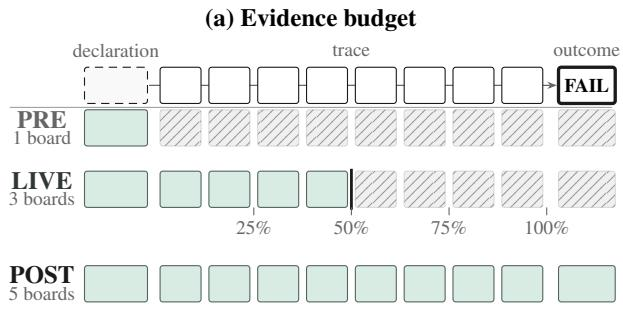
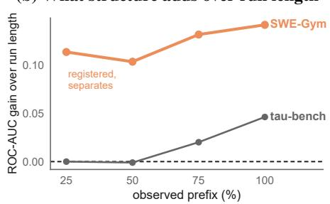
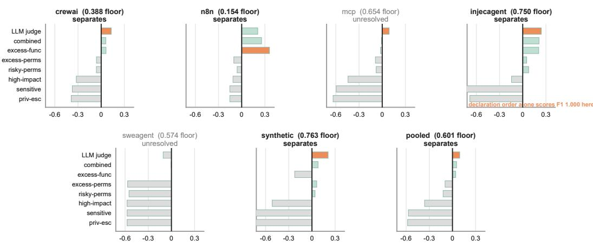
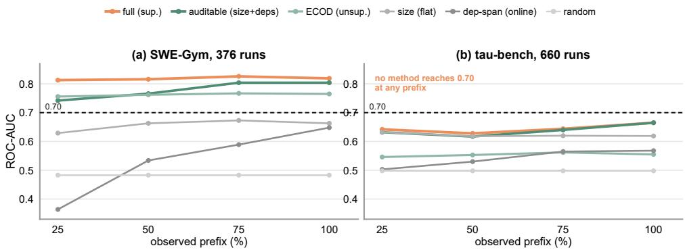
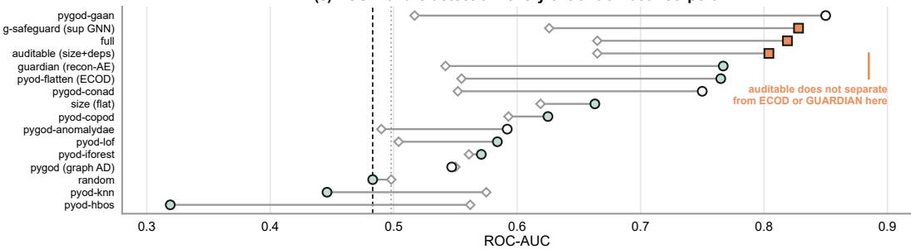
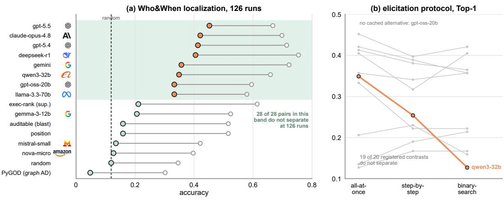
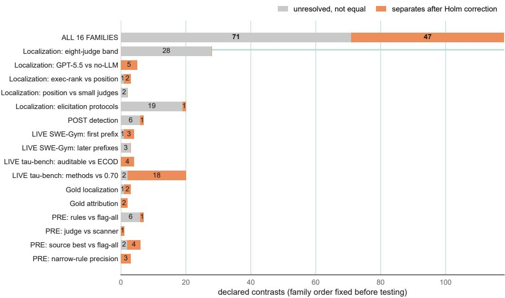
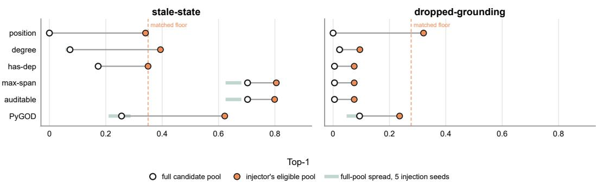

# CATCHBENCH: WHEN CAN AN AGENT FAILURE BE CAUGHT?

Yue Zhao   
University of Southern California   
yue.z@usc.edu

## ABSTRACT

When can an agent failure be caught? An audit is usually limited by the record rather than by the method. CatchBench therefore puts one auditor’s question to three information states: the declared configuration before a run (PRE), a growing prefix of its trace (LIVE), and the finished trace (POST). Prior benchmarks fix one of these states or vary the telemetry; to our knowledge none scores all three under one task-method interface. Each state admits different questions, so seven task contracts carry their own labels and metrics rather than one leaderboard. Four are evidential; three are Gold-derived mechanism diagnostics.

The release scores 72 entrants, from rule scanners and structural models to eleven LLM judges across nine model families (GPT, Claude, Gemini, Gemma, Llama, Qwen, DeepSeek, Mistral, Nova), over 1187 declared configurations and 1162 recorded runs. Most of the arena does not order: 47 of 118 pre-declared contrasts separate, and the rest are published unresolved rather than ranked. The two sharpest results cut against our own data. One rule ignores every name and permission; it flags each capability declared after the first. On one of six configuration sources it reaches a perfect F1, so a score there measures how the corpus was built rather than how well a method reasons. Our admissibility bar then rejected one injected substrate and withheld evidential status from the other. A benchmark number is therefore not interpretable until the process behind its labels is published and tested for the shortcut it may leave. We report both, and regenerate every ordering from released predictions with no model call.

Preprint, work in progress. The benchmark is still being extended.

## 1 INTRODUCTION

An agent failure can only be caught with the evidence its record happens to carry. Three lines of work have grown around three records: static audits of a declared harness, which never observe a run (Li et al., 2026; Yan et al., 2026; Yang et al., 2026); runtime monitors, which must act on a prefix (Zhou et al., 2025; Wang et al., 2025); and post-hoc attribution, which reads the trace after the fact (Zhang et al., 2025c; Deshpande et al., 2025; Cemri et al., 2025). One task, agent auditing, is being measured at three budgets of evidence, its PRE, LIVE, and POST information states, drawn over one run in Figure 1. Auditing is distinct from tracing, which represents a run (Zhao, 2026; Ou et al., 2025), and from task evaluation, which scores the final outcome (Yao et al., 2025).1

What none of them varies is the budget itself. Benchmarks that score these threats fix one information state, each with a corpus, a metric, and a label process of its own (Yuan et al., 2024; Deshpande et al., 2025). AgentTelemetry alone reaches two, and it compares telemetry schemas rather than auditors (Balusu, 2026); Table 1 lays out the grid. A weak audit score is therefore unattributable: a thin record and a weak method produce the same number, though only one of them is worth paying to fix. CatchBench holds the auditor’s question fixed and varies the evidence instead: seven task contracts over six scenarios, one task-method interface, on Who&When, SWE-Gym, tau-bench (Zhang et al., 2025c; Pan et al., 2025; Yao et al., 2025), and a PRE corpus of declared harnesses built for this question. Every board carries its own labels, metric, and entrants; the data and the scoring contract stay fixed.

(b) What structure adds over run length  
  
Figure 1: The record decides the audit: the information state fixes which audits are possible, and the corpus fixes how much signal they find. (a) The evidence budget grows from the declaration alone (PRE), through an observed trace prefix (LIVE), to the complete trace and outcome (POST); filled cells are readable and hatched cells masked, and board counts refer to Table 2. (b) On the two LIVE boards, what dependency structure adds over an entrant that reads run length alone. SWE-Gym holds a 0.10 to 0.14 ROC-AUC gain at every prefix, and the quarter-trace point is a registered contrast that separates. Tau-bench never reaches 0.05, and no contrast against run length is registered there, so that line is point estimates. Section 5.2 reports both boards against the 0.70 warning bar, which neither entrant resolves against on 376 runs.

What CatchBench Contains. The arena is nine scored boards over the three states, built from three public trace corpora and one configuration corpus assembled for this paper. The configuration corpus holds 1187 declared harnesses drawn from six sources, each record tagged with the process that labelled it, so a board never pools label processes silently. The trace corpora are 126 failed Who&When runs, 376 SWE-Gym runs, and 660 tau-bench runs. Seventy-two entrants are scored across the boards: static rule scanners, structural and graph detectors, supervised references, off-theshelf anomaly detectors, and eleven LLM judges from nine families (GPT, Claude, Gemini, Gemma, Llama, Qwen, DeepSeek, Mistral, Nova) under three elicitation protocols.

## Contributions.

1. To our knowledge, the first arena that scores an auditor at all three information states. A method enters through one runner and the same task object feeds every method on a board, so a comparison is held at the data rather than at the method. No prior benchmark in Table 1 scores an auditor at more than two of the three.

2. No method family leads across it. GPT-5.5 leads POST localization on Who&When at Top-1 by a margin no structural entrant closes. On SWE-Gym POST detection the structural features carry the only beyond-size effect that survives correction. Orderings rest on sixteen pre-declared, Holm-corrected families; 47 of 118 contrasts separate and the rest are published unresolved.

3. A PRE corpus that records how each label was made, which caught a leak in our own data. We release derived records for all 1187 configurations, each tagged with its source and its label process. In one of the six sources the capability a task needs is always declared first. A rule reading position alone, no name and no permission, then finds all 510 excess capabilities there with no false alarm and no miss. That score measures how the corpus was built, and a pooled number would have hidden it.

4. An admissibility bar that our own injected data failed. Labeled dependency-state failures are scarce, so CatchBench-Gold plants known faults inside real runs. A method can then score well by spotting the planting rather than the fault. Five tests decide whether such a substrate may carry evidential weight; we ran them and published every verdict. Neither cleared them. A baseline reading only how we built the file-level edges ranks the planted step first in all 188 injected runs, and flags none of the 188 clean controls. The three Gold boards therefore ship as mechanism diagnostics.

Table 1: Which information state each benchmark lets its evaluated auditor read. • scored there, ◦ exercised with no auditor scored, blank not covered. Label-evidence marks say how a target was established, not how good it is; Auto. covers construction, injection, and program oracles. Scale keeps each paper’s own unit and does not compare across rows. Appendix A gives the per-work mechanics and the omissions.
<table><tr><td rowspan="2">Benchmark</td><td colspan="2">Auditor may read</td><td colspan="2">Label evidence</td><td rowspan="2">Scale</td></tr><tr><td>PRE LIVE POST</td><td>Human Model Auto.</td><td></td><td></td></tr><tr><td>Pre-execution privilege</td><td colspan="2"></td><td colspan="2"></td><td></td></tr><tr><td>AuthBench (Yan et al., 2026)</td><td></td><td></td><td></td><td></td><td>120 tasks</td></tr><tr><td>ToolPrivBench (Yang et al., 2026)</td><td>o</td><td></td><td></td><td></td><td>544 scenarios</td></tr><tr><td>FORTIS (Li et al., 2026)</td><td></td><td></td><td></td><td></td><td>2,143 queries</td></tr><tr><td>Complete-trace diagnosis</td><td colspan="2"></td><td colspan="2"></td><td></td></tr><tr><td>R-Judge (Yuan et al., 2024)</td><td></td><td></td><td></td><td>569 records 148 traces</td><td></td></tr><tr><td>TRAIL (Deshpande et al., 2025) MAST (Cemri et al., 2025)</td><td></td><td></td><td></td><td></td><td>1,642 traces</td></tr><tr><td>Who&amp;When (Zhang et al., 2025c)</td><td></td><td></td><td></td><td></td><td>184 tasks</td></tr><tr><td>Who&amp;When Pro (Liu et al., 2026)</td><td>O</td><td></td><td></td><td>V</td><td></td></tr><tr><td>AgenTracer (Zhang et al., 2025a)</td><td></td><td></td><td></td><td>√</td><td>12,326 traces</td></tr><tr><td>Runtime monitoring</td><td></td><td></td><td></td><td></td><td>&gt;2,000 pairs</td></tr><tr><td></td><td></td><td></td><td></td><td></td><td></td></tr><tr><td>AgentTelemetry (Balusu, 2026)</td><td></td><td></td><td></td><td></td><td>2,940 configs</td></tr><tr><td>CatchBench (ours)</td><td></td><td></td><td></td><td></td><td></td></tr></table>

## 2 RELATED WORK

Two lines of work bound this one. One fixed the data and compared many methods on it, which is the contract this paper inherits. The other scores the same threats on agent runs, under task definitions that differ from ours in what the evaluated auditor is allowed to see. Appendix A holds the per-work mechanics, the omissions, and the adjacent tracing, static-analysis, and graph-security systems. This section states only what separates CatchBench from each line.

The Fixed-Data Contract This Paper Inherits. Neither of the two benchmarks that set this contract audits agents, and neither is the closest work to CatchBench; what they supply is the shape of the comparison. ADBench established a common tabular anomaly-detection arena with fixed datasets, many methods, and comparisons across supervision regimes (Han et al., 2022). BOND carried that template to attributed graphs, including outlier-type breakdowns and a runtime table (Liu et al., 2022). CatchBench inherits the fixed-data, many-method, per-type, and runtime contract. It differs by organizing agent audits around PRE, LIVE, and POST information states on dependency graphs, with one task-method interface across those states. Table 1 places CatchBench among the benchmarks that score the same threats. The axis is the information a method is allowed to read, because that decides which audit is possible at all.

The Closest Agent-Auditing Neighbors Have Different Contracts. R-Judge establishes a direct precedent for agent auditing: it asks models to identify safety risks in human-annotated interaction records (Yuan et al., 2024). Agent Security Bench instead executes attacks and defenses across toolusing agent scenarios and scores both security and utility (Zhang et al., 2025b). These benchmarks make a broad first-agent-auditing claim untenable. AgentTelemetry, Who&When Pro, and GAM-MAF are the closest observability, POST-attribution, and graph-security neighbors (Balusu, 2026; Liu et al., 2026; Mateo-Torrejon & S´ anchez-Maci´ an, 2026). AgenTracer establishes its attribution´ labels by counterfactual replay and fault injection rather than by annotation (Zhang et al., 2025a), which is the substrate question CatchBench’s admissibility bar was written to decide. The distinction is a reliability-framed task contract, rather than a claim that agent-security or agent-auditing benchmarks do not exist.

## 3 THE BENCHMARK

Three constraints force this design, and each one is a fact about auditing agents rather than a preference of ours. The record bounds the audit: a method that reads only a declared configuration cannot be moved to a board that reads a finished trace, so the states are separate tracks rather than views of one dataset. Labels for agent failures are scarce, so a found corpus can be scored for how it was assembled rather than for how a method reasons. Every record we release therefore carries its label process (Section 4), and synthesized faults must clear an admissibility bar before they carry weight (Section 4.3). The boards are also small. Testing 118 contrasts at a nominal five percent would return several separations from noise alone, so every comparison family is fixed before scoring and corrected within itself (Section 3.3).

Scoring an auditing method therefore requires three things to be fixed first: which evidence it may read, which question it is asked of that evidence, and what makes one answer count as better than another. The three subsections below fix them in that order, and Section 5 reports what the boards return.

## 3.1 THE THREE INFORMATION STATES

The three information states are not three convenient buckets. They are the states a run passes through, and the evidence available at each state fixes which audit is even possible. Before execution, only the plan and the harness exist, so the only audit is static: is the plan over-privileged, is a guardrail missing (PRE)? During execution, a growing prefix of the trace is visible while the outcome is not. The audit is therefore predictive, and it has to run under a false-alarm budget: can failure be called early (LIVE)? After execution, the complete trace and the outcome are in hand. The audit is then forensic: which step caused the failure, would it have failed, and what kind of fault was it (POST)? A method built for one state cannot read the evidence of another. The states are therefore separate tracks rather than interchangeable views of one dataset, and a PRE scanner and a POST detector never share a leaderboard column.

## 3.2 AUDIT SCENARIOS AND THEIR METRICS

Within an information state, each scenario is the specific question an auditor asks there, paired with the label that answers it.

• PRE (shipped): is the declared plan or harness over-privileged before the run ever starts, judged against what the task actually requires (Section 5.1).

• LIVE (shipped): can failure be called early from a growing prefix (streaming early warning), and can afault be caught as it happens without false-alarming (online detection).

• POST (shipped): the three forensic questions on a finished trace, which step failed (localization), did it fail (detection), and what kind of fault it was (cause attribution).

These bullets define six audit scenarios. They produce seven task contracts because localization has two instantiations: human-labeled natural failures on Who&When and injected faults on CatchBench-Gold. A contract fixes the task, label, metric, and baseline set. Two of the seven run against two corpora each, so the runner emits nine scored blocks from the seven contracts. Table 2 lists the nine. A board is not specified by its corpus and metric alone. A reader also needs what scoring it trivially would earn, and how much room the entrants leave above that, which is why the floor and the field are printed here rather than held back for Section 5. The last column counts how many of the contrasts a board declares its own tests resolve, which is a property of that board rather than a result about any entrant. The three artifact-limited Gold boards retain the mechanism-diagnostic status established in Section 4.3.

Entrant Labels. Three supervised entrants share the flat block on the detection and early-warning boards. size (flat) reads run size and event counts. Relative to that same block, auditable (size+deps) adds size-normalized dependency density and shape, while full adds executiontopology and raw dependency features; the two extend the flat block rather than each other. pyod-flatten (ECOD) is an off-the-shelf unsupervised detector over the flat per-run features. The two graph baselines adapt published agent-specific mechanisms to this representation rather than reproducing them: guardian (recon-AE) keeps GUARDIAN’s unsupervised reconstruction objective but simplifies its adjacency-reconstruction and information-bottleneck terms to attribute reconstruction, and g-safeguard (sup GNN) carries G-Safeguard’s supervised graph-message-passing idea over to structural features and run-level failure scoring, omitting its adversarial-agent localization and topological remediation (Zhou et al., 2025; Wang et al., 2025). Localization takes different entrants: exec-rank (sup.) is GRADE’s supervised executionfeature ranker (Zhao, 2026), auditable (blast) ranks each step by its downstream dependency reach, and pygod (graph AD) scores each step with an unsupervised graph autoencoder.

The metric in each scenario follows from its question rather than from convention. Localization uses Top-k and MRR. Failure detection and the present two-class cause-attribution board use ROC-AUC. The streaming question adds time to detection, because earliness is the point of asking early. The online question reports the true-positive rate at a fixed false-positive budget, because a live detector that floods the operator with false alarms is of no use.

## 3.3 THE SCORING CONTRACT

Nine blocks with their own labels, metrics, and entrant fields are not yet one benchmark. What makes them one is that every method enters every board the same way. The same task object feeds each of them, so a comparison is held fixed at the data rather than at the method, and adding a method means declaring which task ids it supports and returning a metric dictionary.

That fixed point is what licenses the tests. Because the methods on a board score the same runs, every comparison in this paper is paired. Binary Top-1 and Top-3 outcomes use the exact conditional McNemar test on discordant runs, ROC-AUC contrasts use paired DeLong cross-checked by a stratified paired bootstrap, and the Gold boards use a pair-cluster bootstrap or the exact randomization distribution of their analytic floor. Sixteen comparison families are declared before scoring, and the contrasts inside each are adjusted by Holm’s step-down procedure. That declaration, rather than this prose, defines multiplicity here, and all 118 reported contrasts are regenerated from the committed predictions. Table 3 in Appendix B lists the families.

Corpus size bounds what any of this can resolve. On the 126-run Top-1 column only gaps near 0.20 separate, and on the 376-run detection board only paired ROC-AUC gaps near 0.06. Crossvalidation seed spread and run-level sampling answer different questions and can disagree, so where both exist we report both. An ordering these tests do not resolve is reported as a point-estimate ordering and is not claimed as a result.

Table 2: The nine scored blocks. Floor is what the trivial policy scores: flag-all for PRE, random elsewhere. Field is the spread of the displayed entrants and orders nothing; on LIVE rows it averages the four prefixes. Separates counts the contrasts a board declares that the Holm-adjusted tests resolve, so the column sums to 47 of 118, and on the tau-bench early-warning row resolving means an entrant is established below the 0.70 bar. † (mint): the Gold boards are mechanism diagnostics rather than artifact-controlled evidence (Section 4.3); Appendix B names every contrast.
<table><tr><td>Board</td><td>Corpus</td><td></td><td>Size</td><td>Metric</td><td>Floor</td><td>Field</td><td>Separates</td></tr><tr><td colspan="6">PRE: before the run, plan and harness only</td><td></td><td></td></tr><tr><td>Over-privilege</td><td>6 sources</td><td></td><td>1,187 configs</td><td>F1</td><td>0.601</td><td>0.020–0.695</td><td>9/17</td></tr><tr><td colspan="8">LIVE: during the run, a growing prefix</td></tr><tr><td>Early warning</td><td>SWE-Gym</td><td>376 runs</td><td></td><td>ROC-AUC</td><td>0.483</td><td>0.534-0.818</td><td>3/7</td></tr><tr><td>Early warning</td><td>tau-bench</td><td>660</td><td>runs</td><td>ROC-AUC</td><td>0.498</td><td>0.541–0.645</td><td>22/24</td></tr><tr><td>Online stale†</td><td>Gold</td><td></td><td>82 injections</td><td>TPR@5%FPR</td><td>0.024</td><td>0.061–0.122</td><td></td></tr><tr><td colspan="8">POST: after the run, the complete trace</td></tr><tr><td>Localization</td><td>Who&amp;When</td><td>126 runs</td><td></td><td>Top-1</td><td>0.119</td><td>0.048-0.452</td><td>8/58</td></tr><tr><td>Detection</td><td>SWE-Gym</td><td>376</td><td>runs</td><td>ROC-AUC</td><td>0.483</td><td>0.319–0.850</td><td>1/5</td></tr><tr><td>Detection</td><td>tau-bench</td><td>660</td><td>runs</td><td>ROC-AUC</td><td>0.498</td><td>0.490–0.665</td><td>0/2</td></tr><tr><td>Localization†</td><td>Gold</td><td>188</td><td>runs</td><td>Top-1</td><td>0.032</td><td>0.000-0.309</td><td>2/3</td></tr><tr><td>Cause attribution†</td><td>Gold</td><td>166</td><td>paired runs</td><td>ROC-AUC</td><td>0.498</td><td>0.566–0.675</td><td>2/2</td></tr></table>

auditable is the reference implementation released with the benchmark. It appears throughout as a scored entrant rather than as the referee. The boards score four task-specific variants of it, so the parenthetical in each of its labels states the signal that entrant reads.

What the boards score is fixed by the contract above. What they score it on is not, and the corpora differ in how their labels were made, which is the subject of the next section.

## 4 THE DATA

CatchBench scores four data families. Who&When supplies natural localization failures, while SWE-Gym and tau-bench supply POST and LIVE runs. Six declared-harness sources supply PRE configurations. SWE-Gym and tau-bench support the two Gold injection substrates. Natural labels anchor the failure boards, while injected data isolate known fault mechanisms. Tables 19 and 16 give the population rules and label balances.

## 4.1 SOURCE CORPORA AND POPULATIONS

Who&When localization uses 126 naturally occurring failures from its Algorithm-Generated split. The board excludes the 58 Hand-Crafted runs because their schema and trace lengths define a distinct population. Who&When Pro lacks documented dependency edges and event timestamps, so structural methods need a validated conversion before it can join the board (Liu et al., 2026). POST and LIVE use a balanced SWE-Gym population and the full pinned tau-bench population. File-level Gold uses resolved SWE-Gym runs, while named-value Gold v2 uses tau-bench. These choices retain the trace fields each board requires and avoid pooling incompatible sampling frames. Those three corpora were found. The next one had to be built, so how each of its records came by its label is part of the data rather than a detail of it.

## 4.2 THE PRE CONFIGURATION CORPUS

PRE tests whether a static method can flag capabilities that a declared task or role does not need. Its 1187 records come from crewai, injecagent, mcp, n8n, sweagent, and synthetic configurations. Four label processes remain explicit: cross-vendor LLM judging for crewai, n8n, and mcp; roster relabeling for injecagent; declared-minus-used labels from paired sweagent traces; and controlled synthetic over-grant injection (Liu et al., 2022). Unused in one observed run is only a proxy for unneeded and does not prove it. Pooling these processes silently would conflate different forms of evidence, so every record carries its source and label-process tag. Appendix Tables 16, 17, and 18 report construction, licences, and agreement.

## 4.3 CATCHBENCH-GOLD: INJECTION AND THE ADMISSIBILITY BAR

Gold plants a known fault in a real run because labeled dependency-state failures do not exist at scale, following ADBench and BOND (Han et al., 2022; Liu et al., 2022). The injection site supplies a detector-independent localization and attribution target.

The Fault Taxonomy. A stale-state read redirects a dependency from the latest event on a file to an earlier superseded event on that file. Dropped grounding removes one required dependency, leaving the step ungrounded.

The Defensibility Bar. An injection is admissible only if it clears five tests. First, (1) fault realism maps to a documented mode, and (2) no construction-only baseline detects it trivially. Next, (3) injected and clean runs remain distributionally comparable. Finally, (4) labels are detectorindependent, and (5) human validation confirms a real fault on an airtight substrate.

The Bar Verdicts. File-level Gold passes item 1 as a taxonomy mapping, fails item 2, leaves item 3 undetermined, passes item 4, and does not meet item 5. Its edited edge breaks a clean-graph predecessor invariant, which a construction-only baseline detects perfectly. Named-value Gold v2 leaves items 1 to 3 undetermined, passes item 4, and does not meet item 5. Thus both substrates remain mechanism diagnostics and carry no evidential weight. Table 20 gives the evidence for each verdict.

## 4.4 GOLD V2: THE NAMED-VALUE SUBSTRATE

File-level Gold failed the bar on the marker its own edits left behind. A second substrate therefore had to test whether the objection was to injection itself or to that way of doing it.

Gold v2 mutates an argument value and rebuilds dependency edges from the values present in a real tau-bench trace. This design removes the edited-edge marker in file-level Gold, but the same five-item bar applies. Its process controls currently lack complete positive-control power, and its stale-state sample lacks the validation needed for evidential use.

## 5 RESULTS

Each subsection below asks one board’s question and answers it on that board alone. Five questions run in lifecycle order, what can be audited before a run, then during it, then after:

1. Does a static harness audit beat flagging every declared capability? (Section 5.1, PRE)

2. Does an early warning appear before a run ends, on more than one corpus? (Section 5.2, LIVE)

3. Does dependency structure name the decisive step as well as a language model does? (Section 5.3, POST)

4. Does dependency structure show that a run failed, beyond what its length already says? (Section 5.4, POST)

5. Does any audit signal survive a move to a harder information state? (Section 5.6, across states)

That order is not a presentation choice. A method that reads only a declared configuration cannot be moved to a board that reads a finished trace. No subsection may therefore borrow evidence from the one before it. Three of the five answers are negative. Each is reported on its own board, under a test from the pre-declared family of 118 contrasts (Appendix B), rather than gathered into a limitations section. Every number comes from one runner that scores each valid method-task pair. The Gold derived boards are collected in Section 5.5 under the status they carry, before the transfer checks that read them, and Appendix C holds the exact-cell tables and the supporting diagnostics.

## 5.1 PRE: DOES A STATIC HARNESS AUDIT BEAT FLAGGING EVERYTHING?

This board scores rule-based scanners, a held-out LLM judge, and two trivial policies over the 1187 configurations of Section 4.2.

PRE Is Compared With Source-Specific Floors. Figure 2 compares every method with its source-specific flag all floor across four label processes.

The Held-Out Judge Leads Pooled PRE. The combined scanner is the strongest rule-based method at 0.654 F1 and 0.910 recall. On the 1182 configurations both judged, the held-out LLM judge leads it, 0.695 against 0.648. Two other judges produced the crewai, n8n, and mcp labels, while Llama-3.3-70B produced none. Scored as methods on 661 judge-labeled configurations, those label makers reach 0.854 and 0.960 F1 against the held-out model’s 0.703. The conjunctive key gives each label maker recall 1.000 by construction, so neither can serve as a baseline.

Source Results Reflect Label Process. The held-out judge reaches 0.990 and 0.972 on rosterrelabeled injecagent and injected synthetic, but 0.362 to 0.744 on judge-labeled sources. The three narrow rules each target one risk, so low pooled recall reflects small coverage rather than failure inside the slice each covers. Keyword rules remain language-brittle, and one false alarm can sharply reduce precision when excess is rare.

  
F1 above the flag-everything floor  
Bars: F1 minus flag-all; left of zero is worse. Titles: registered verdicts; source panels are selection-aware.

Figure 2: The PRE board read against its own floor: F1 minus that source’s flag all F1, so a bar left of the line scores below flagging every declared capability. flag none (0.000 everywhere) and the oracle identity check (1.000 everywhere) are omitted, and flag all is the line itself. Panel titles carry registered verdicts from Appendix B. The source titles use a selection-aware commonsupport test of the best of eight candidates against flag all; the pooled title instead reports the held-out judge against the combined scanner. Neither estimate need equal the longest bar drawn here. Exact cells are in Table 7. Drawn from the shipped board.

Pooled, the Scanner Clears the Floor and the Judge Clears the Scanner. Because the board prints a flag all floor, the comparison that matters is against it rather than against zero. The combined scanner gains 0.053 F1 over flag all, 0.654 against 0.601. Scored on the 1182 configurations it judged, where the floor is 0.591, the held-out judge reaches 0.695. On that common support the judge also separates from the combined scanner, by 0.048 with a 95% confidence interval of [0.021, 0.074].

Four Sources Separate, but Two Measure Construction. Of the six sources, four separate from their floors; sweagent and mcp remain unresolved. Two of the four separations measure construction rather than reasoning: injecagent preserves declaration order, and synthetic is authored. Appendix D gives the rule definitions, parser diagnosis, source-level tests, and averaging analysis.

PRE completes the benchmark’s information-state axis and is its most crowded corner because static scanning is already an occupied lane. CatchBench contributes the labeled dataset and a shared arena in this state; it makes no claim of a new detector.

## 5.2 LIVE: HOW EARLY IS FAILURE VISIBLE?

LIVE Scores Prefixes in Three Regimes. The board scores dependency-graph prefixes at 25%, 50%, 75%, and 100% through supervised, batch-unsupervised, and strict per-run online regimes. Supervised scoring uses seed-averaged five-fold cross-validation; batch-unsupervised scoring fits ECOD to population prefix features. Strict per-run online scoring reads one raw structural scalar from one run, without labels or other runs. At 100%, cross-validation recovers the POST board of Section 5.4.

Figure 3 traces every entrant across the four prefixes on both corpora, against the 0.70 bar. Tables 8 and 9 in Appendix C carry the exact cells.

SWE-Gym Supports Early Warning. At 25%, supervised auditable reaches 0.742 against run size’s 0.629, and paired testing preserves the gap. Unsupervised ECOD reaches 0.756, while the length-confounded raw online scalar reaches 0.364. Run size never crosses 0.70, with a best of 0.673

(c) POST failure detection: every entrant on both corpora  
  
supervised unsupervised graph family, one initialization seed same entrant on tau-bench

Figure 3: LIVE early warning and the POST detection field. (a) and (b) score every entrant at the four prefixes, with the 0.70 bar drawn. Time to detection is the first crossing: three curves cross at the first quarter of a SWE-Gym run, and no tau-bench curve crosses at any prefix. (c) shows the whole POST detection field on both corpora, one row per entrant. The SWE-Gym score is filled and the tau-bench score hollow, so the segment between them is the domain gap. The four PyGOD graph detectors are each displayed at one initialization seed, so their SWE-Gym markers are drawn hollow-white. Table 12 carries their twenty-seed analysis; it places GAAN below the supervised graph network, so the displayed single-seed PyGOD maximum should not be read as a lead. The bracket marks auditable’s two registered comparisons on this board, with ECOD and with GUARDIAN; neither separates. Exact prefix cells are in Tables 8 and 9, Table 14 gives the headline POST rows, and Appendix C describes the wider detector arena. Drawn from the shipped board.

at 75%. With 376 runs, neither 0.742 nor 0.673 resolves against the bar. The structure-minus-size gap therefore carries the result, rather than the threshold crossing alone.

Tau-Bench Remains Below the Warning Bar. On tau-bench, auditable scores 0.632, 0.617, 0.640, and 0.665 across prefixes. No point estimate crosses the 0.70 warning bar, so early warning remains unresolved; at the full trace the test leaves two of the five entrants unresolved against the bar rather than below it. The same domain split appears on the POST detection board: dependency structure carries early signal on SWE-Gym but remains weak on tau-bench.

## 5.3 POST: WHICH STEP BROKE THE RUN?

Eleven LLM Judges Are Compared With Structural Methods. Eleven LLM judges receive each full failed trace and name its decisive mistake step under Who&When (Zhang et al., 2025c). Figure 4 compares them with structural methods; Tables 5 and 6 give exact cells and protocol results.

GPT-5.5 Leads the Structural Methods, but Eight Judges Are Not Ordered. GPT-5.5 scores 0.452 Top-1 against 0.211 for the highest structural point estimate. Eight judges form an unresolved band from 0.333 to 0.452 across 126 runs.

  
Top-1, in band Top-1, outside the band Top-3

Figure 4: (a) Who&When localization on 126 runs: filled markers give Top-1 and hollow markers Top-3. The all-at-once LLM judges span 0.127 to 0.452 Top-1. GPT-5.5 holds the top of an eightmodel band that this corpus does not separate, while Nova-Micro and Mistral-Small do not improve on the 0.159 position prior. The generic graph detector does not clear the 0.119 random floor. (b) Top-1 under the three elicitation protocols, for the ten judges with all three cached; GPT-oss-20B is omitted because its alternative-protocol outputs are unavailable. Gray lines carry no registered separation, and the highlighted Qwen3-32B line is the one contrast that separates after correction, its fall from 0.349 under all-at-once to 0.127 under binary-search. Drawn from the shipped board.

Execution Features Lead the Structural Methods on Top-3. Reproduced from GRADE (Zhao, 2026), exec-rank (sup.) reaches 0.211 Top-1 and 0.614 Top-3, against 0.159 and 0.516 for position. The Top-3 gap separates; Top-1 does not.

All-at-Once Is the Headline Protocol. All-at-once is Who&When’s default and costs one call per run, so the board reports it. Binary-search is the only within-model protocol contrast that separates after correction, and it lowers Qwen3-32B from 0.349 to 0.127.

## 5.4 POST: DOES DEPENDENCY STRUCTURE DETECT FAILURE BEYOND RUN SIZE?

The second forensic question is whether the run failed at all, and whether the dependency structure carries that signal beyond run size. SWE-Gym and tau-bench provide run-level resolved or unresolved outcomes.

The Structural Contrast Reproduces GRADE. This contrast reproduces GRADE (Zhao, 2026), and CatchBench imports its feature construction and evaluation code. Every other entrant is scored against the same fixed task.

SWE-Gym Shows a Reliable Structural Gain. The auditable lift over size (flat) is +0.141 on SWE-Gym (0.804 against 0.663). This is the paper’s only effect that survives multiplicity correction. The registered paired test applies DeLong to seed-averaged out-of-fold run scores, so its effect estimate need not equal the difference of the mean per-seed board values displayed here. Tau-bench’s +0.046 lift (0.665 against 0.619) remains unresolved. G-Safeguard has the highest displayed point estimate, 0.828. Across five joint split and initialization seeds, it reaches 0.824 ± 0.007. The full feature model reaches 0.819 ± 0.005 across five split seeds. Their within-seed difference includes zero, so these supervised references are not ordered.

Auditable, GUARDIAN, and ECOD Are Not Ordered. GUARDIAN and the tabular ECOD land 0.002 apart, at 0.767 and 0.765. They rank runs differently, so the paired resolution limit between them is wider than their point estimates suggest. At 0.804, auditable (size+deps) sits inside that limit against either; this board orders none of the three.

The Two Tau-Bench Feature Models Are Not Ordered. On tau-bench, auditable and the full-feature reference both round to 0.665. The paired test establishes neither ordering nor equivalence.

## 5.5 DIAGNOSTICS: WHAT THE GOLD BOARDS SHOW AND DO NOT ESTABLISH

Gold Boards Remain Mechanism Diagnostics. File-level Gold failed its artifact-leakage bar, so its three boards are mechanism diagnostics rather than benchmark evidence. Gold v2 remains undetermined because several controls lack demonstrated power. Its stale-state substrate also lacks corpus adequacy, with 16 sites in 6 runs across the full 660-run corpus.

Mechanism Signals Differ. Stale-state remains localizable as a mechanism signal after eligibility matching, while dropped grounding does not. Within the eligible pool, max-span reaches 0.805 against the 0.350 stale-state floor and 0.795 ± 0.020 across five injection seeds. Dropped-grounding methods remain near or below their 0.277 floor.

Cause Attribution Discriminates. On 166 paired runs, maximum dependency span separates stale reads at ROC-AUC 0.675. Edge count separates dropped grounding at 0.566, while the paired chance floor is 0.498. The full controls, seed analyses, eligibility checks, and Gold figure appear beside the verdicts in Appendix F.

## 5.6 TRANSFER: DO METHODS AND SIGNALS TRANSFER RELIABLY?

A method built for one information state should not be assumed to read another’s evidence. Two checks test that here: whether off-the-shelf detectors transfer to agent traces at all, and whether a structural signal read strictly online separates an injected fault from its signal-free control.

No Off-the-Shelf Detector Leads a Task Board. Tabular detectors score flat per-run features while graph detectors score the typed graph, and neither family establishes a lead on a task board. Table 12 in Appendix C carries every value from the committed seed records.

Graph Detectors Are Too Seed-Sensitive. Across twenty initialization seeds, graph-detector spreads on SWE-Gym range from 0.091 to 0.164. These deviations are thirteen to forty-one times the supervised model’s. Quadrupling the seed count moves the mean of DOMINANT (Ding et al., 2019) by more than 0.10 and widens its spread. A mean under that instability cannot support an operational ordering.

GAAN Retains a Narrow Within-Size Signal. Over a fixed 262-pair subset, GAAN retains 0.652 ± 0.169 within-size ROC-AUC. Its initialization interval, [0.571, 0.734], excludes chance, but the control changes the population. It establishes no beyond-size advantage and covers no unmatched runs. The subset contains 224 of 376 runs in 42 node-count strata and yields 262 positive-negative comparisons. Its interval covers initialization uncertainty for that fixed comparison set, without sampling error for the set. On tau-bench, the graph family remains at chance and no pair separates.

Online Detection Uses Only Causal Prefix Evidence. Each step receives a causal dependencyspan z-score against the prefix strictly before it. The run is flagged when its peak crosses a threshold calibrated on paired clean runs. This construction uses no future step and isolates an injected spike against an otherwise identical run.

Online Detection Recovers Little Stale-State Signal. On the representative seed, at realized 6.1% and 11% false-positive rates, the causal span z-score catches 0.061 and 0.110 of stale reads while raw span reaches 0.122 and 0.159. Across five injection seeds the causal rates are 0.054 ± 0.012 and 0.124 ± 0.012, and the raw-span rates are 0.098 ± 0.017 and 0.151 ± 0.012. A dependency-count control equals the realized false-positive rate because injection preserves every step’s edge count, so at 6.1% the z-score ties that control and only raw span exceeds it. This board declares no contrast, so it orders nothing against the control. Section 5.5’s 0.703 post-hoc Top-1 ranks a step once a failure is known, a different decision from flagging a run; it is context here and estimates no cross-state drop. Target rates are not exactly attainable on 82 paired runs, so the board reports realized rates.

## 6 DISCUSSION AND LIMITATIONS

Read one at a time, the boards answer their own questions. Read together, they say less about which method to use than about which evidence makes two methods comparable at all.

Leaders Differ Across Audit Boards; the Information State Decides What Is Admissible. GPT-5.5 separates from all five registered no-LLM entrants on POST localization at Top-1. Leading this board is a property of particular models, and the reader cannot substitute “an LLM judge” for the model that was measured. On SWE-Gym POST detection, size-normalized dependency features establish a gain over run size. At the first SWE-Gym LIVE prefix, the registered test does not resolve unsupervised ECOD from the supervised structural block. Structural features require no model call and apply in LIVE and online settings, where a post-hoc judge over the complete trace cannot run.

Measured Headroom Locates Three Open Problems. Dropped grounding remains open because no reported method shows a substantial and stable gain over the appropriate candidate-pool floor. Online stale-state detection is the second open problem. On the representative injection seed, at a realized 6.1% false-alarm rate the causal span z-score ties its signal-free control, while raw span holds a higher point estimate. This diagnostic board declares no registered contrast, so it establishes no ordering against that control. The tau-bench domain is the third open problem. Its warning bar sits at the edge of what 660 runs resolve, so a larger sample is needed to measure that gap.

Evidence Limits Shape the Next Release. Three boards use source-corpus labels, while PRE uses four constructed label processes. The three Gold-derived boards remain artifact-limited mechanism diagnostics. Dropped grounding passes its current readings, and its admissibility stays undetermined until every control has demonstrated power. Of the 1187 derived feature records, 661 carry crossvendor LLM-judge labels. The strongest non-oracle method on that board is itself an LLM judge. Separation is the main defense: the scored judge is held out, because two other model families produced those labels. Cross-vendor agreement can still reflect shared model preferences, leaving label subjectivity as a residual risk. The next release will test whether AppWorld cross-app writes can provide a named-value substrate with third-party supersession. It also adds the missing-guardrail PRE scenario and a human-audited validation slice. The validation report will include inter-rater agreement, making disagreement visible alongside the result.

## 7 CONCLUSION

CatchBench provides a shared arena for agent auditing across PRE, LIVE, and POST, with each board tied to the evidence available at that point in a run. Seven task contracts span six audit scenarios. Four carry evidential weight, PRE over-privilege, LIVE streaming warning, and POST localization and failure detection; the three Gold-derived boards are mechanism diagnostics.

The admissibility protocol rejected the Gold file-level substrate for artifact leakage, and withheld evidential status from the tau-bench stale-state data, whose corpus adequacy remains undetermined. Both limitations stay out of the evidential claims. A third party can add a method class or corpus adapter, after which the runner scores each valid task-method pair through the shared result interface.

The arena settles less than a leaderboard would, and it reports what it cannot settle. Of the 118 registered contrasts, 71 remain unresolved and are published as such. The boards therefore mark where the evidence runs out rather than averaging over it.

## ARTIFACT AVAILABILITY

The CatchBench code, the committed PRE derived records, the cached LLM-judge predictions, and the diagnostic scripts form the artifact, which is public at https://github.com/yzhao062/ catchbench. It does not redistribute the raw Who&When, SWE-Gym, or tau-bench traces, or

the raw PRE task and role descriptions; those remain at their cited upstream sources (Zhang et al., 2025c; Pan et al., 2025; Yao et al., 2025; Zhan et al., 2024; Yang et al., 2024).

## REPRODUCIBILITY STATEMENT

The scored board calls no model service: it reads committed prediction caches, so a third party reproduces every number in this paper without an API key. All three trace corpora are pinned by commit and the pins are checked before scoring. Appendix G states what is pinned, what regener ating the cached predictions would additionally require, and what continuous integration checks on every commit. Table 21 carries the revisions and what is left unpinned.

## ETHICS AND DATA STATEMENT

CatchBench processes public agent traces, public software repositories, public MCP manifests, public n8n template-gallery entries, and authored synthetic configurations. The PRE harvesters initially collected each public task or role description together with its declared capability roster and source record. Template authors sometimes included contact details in their own descriptions, so the released records exclude that prose. task or role spec was removed from every PRE row before release, and replaced by sorted spec tokens plus small spec token overrides summaries sufficient for the shipped scanner. The conversion first strips email addresses, URLs, home-directory paths, social handles, and phone numbers, then keeps only scanner vocabulary and terms tied to the declared capability roster. All 1187 committed rows carry spec tokens and none carries task or role spec.

The released PII scan, run over the distributed records, reports zero occurrences and zero distinct values for all seven patterns it checks: email addresses, LinkedIn profile URLs, other profile URLs, Unix and Windows home paths, social handles, and phone numbers. That is the output of seven regular expressions, not a guarantee that no indirect identifier survives. The released records deliberately retain source repository, commit, path, capability names, labels, and scanner features, because an auditing benchmark whose own sources cannot be checked is worth little. A reader therefore cannot reconstruct the deleted prose from the released fields, but can follow the retained references back to the public upstream material. Researchers should respect each source licence and should not use this corpus to contact, profile, or rank individual template authors.

One redaction is recorded against the released prediction cache. On the nine PRE records declaring GPL-3.0, spans of the cached judge reply that reproduce upstream prose are replaced by a marker. The judge’s own reasoning and its verdict stay in place, and no scored number moves, because the board reads the published needed-list cache rather than the reply text.

## REFERENCES

Krishna Chaitanya Balusu. AgentTelemetry: A fault detection benchmark and toolkit for LLM agent observability. In Proceedings ofthe 3rd ACM International Conference on AI-Powered Software, pp. 380–387. ACM, 2026. doi: 10.1145/3805760.3814931.

Shraddha Barke, Arnav Goyal, Alind Khare, Avaljot Singh, Suman Nath, and Chetan Bansal. AgentRx: Diagnosing AI agent failures from execution trajectories. arXiv preprint arXiv:2602.02475, 2026. URL https://arxiv.org/abs/2602.02475.

Mert Cemri, Melissa Z. Pan, Shuyi Yang, Lakshya A. Agrawal, Bhavya Chopra, Rishabh Tiwari, Kurt Keutzer, Aditya Parameswaran, Dan Klein, Kannan Ramchandran, Matei Zaharia, Joseph E. Gonzalez, and Ion Stoica. Why do multi-agent LLM systems fail? In Advances in Neural Information Processing Systems, 2025. URL https://openreview.net/forum?id= fAjbYBmonr. Datasets and Benchmarks Track.

Mengzhuo Chen, Junjie Wang, Fangwen Mu, Yawen Wang, Zhe Liu, Huanxiang Feng, and Qing Wang. Seeing the whole elephant: A benchmark for failure attribution in LLM-based multiagent systems. In Proceedings of the 64th Annual Meeting of the Association for Computational Linguistics (Volume 1: Long Papers), pp. 19888–19905, 2026. doi: 10.18653/v1/2026.acl-long. 912. URL https://aclanthology.org/2026.acl-long.912/.

Darshan Deshpande, Varun Gangal, Hersh Mehta, Jitin Krishnan, Anand Kannappan, and Rebecca Qian. TRAIL: Trace reasoning and agentic issue localization. arXiv preprint arXiv:2505.08638, 2025.

Kaize Ding, Jundong Li, Rohit Bhanushali, and Huan Liu. Deep anomaly detection on attributed networks. In Proceedings of the SIAM International Conference on Data Mining (SDM), pp. 594–602, 2019.

Songqiao Han, Xiyang Hu, Hailiang Huang, Minqi Jiang, and Yue Zhao. ADBench: Anomaly detection benchmark. Advances in Neural Information Processing Systems, 35:32142–32159, 2022.

Xu He, Di Wu, Yan Zhai, and Kun Sun. SentinelAgent: Graph-based anomaly detection in multiagent systems. arXiv preprint arXiv:2505.24201, 2025.

Shawn Li, Chenxiao Yu, Han Wang, Wei Yang, Ryan Rossi, Franck Dernoncourt, Xiyang Hu, Philip S Yu, Chaowei Xiao, Huan Zhang, and Yue Zhao. FORTIS: Benchmarking over-privilege in agent skills. arXiv preprint arXiv:2605.09163, 2026.

Jiale Liu, Huajun Xi, Shaokun Zhang, Yifan Zeng, Tianwei Yue, Chi Wang, Jian Kang, Qingyun Wu, and Huazheng Wang. Who&When Pro: Can LLMs really attribute failures in AI agents?, 2026. URL https://arxiv.org/abs/2607.09996.

Kay Liu, Yingtong Dou, Yue Zhao, Xueying Ding, Xiyang Hu, Ruitong Zhang, Kaize Ding, Canyu Chen, Hao Peng, Kai Shu, Lichao Sun, Jundong Li, George H Chen, Zhihao Jia, and Philip S Yu. BOND: Benchmarking unsupervised outlier node detection on static attributed graphs. In Advances in Neural Information Processing Systems, volume 35, pp. 27021–27035, 2022.

Pablo Mateo-Torrejon and Alfonso S´ anchez-Maci´ an. GAMMAF: A common framework for´ graph-based anomaly monitoring benchmarking in LLM multi-agent systems. arXiv preprint arXiv:2604.24477, 2026.

Tianyue Ou, Wanyao Guo, Apurva Gandhi, Graham Neubig, and Xiang Yue. AgentDiagnose: An open toolkit for diagnosing LLM agent trajectories. In Proceedings of the 2025 Conference on Empirical Methods in Natural Language Processing: System Demonstrations, pp. 207–215. Association for Computational Linguistics, 2025. doi: 10.18653/v1/2025.emnlp-demos.15. URL https://aclanthology.org/2025.emnlp-demos.15/.

Nils Palumbo, Sarthak Choudhary, Jihye Choi, Guy Amir, Prasad Chalasani, and Somesh Jha. Formal policy enforcement for real-world agentic systems. arXiv preprint arXiv:2602.16708, 2026.

Jiayi Pan, Xingyao Wang, Graham Neubig, Navdeep Jaitly, Heng Ji, Alane Suhr, and Yizhe Zhang. Training software engineering agents and verifiers with SWE-Gym. In Proceedings of the 42nd International Conference on Machine Learning, volume 267 of Proceedings of Machine Learning Research, pp. 47717–47737, 2025.

Shilong Wang, Guibin Zhang, Miao Yu, Guancheng Wan, Fanci Meng, Chongye Guo, Kun Wang, and Yang Wang. G-Safeguard: A topology-guided security lens and treatment on LLM-based multi-agent systems. In Proceedings of the 63rd Annual Meeting of the Association for Computational Linguistics (Volume 1: Long Papers), pp. 7261–7276. Association for Computational Linguistics, 2025. doi: 10.18653/v1/2025.acl-long.359.

Zheng Yan, Jingxiang Weng, Charles Chen, Dengyun Peng, Ethan Qin, Jiannan Guan, Jinhao Liu, Qiming Yu, Yixin Yuan, Fanqing Meng, Carl Che, and Mengkang Hu. Do coding agents understand least-privilege authorization? arXiv preprint arXiv:2605.14859, 2026.

John Yang, Carlos E. Jimenez, Alexander Wettig, Kilian Lieret, Shunyu Yao, Karthik Narasimhan, and Ofir Press. SWE-agent: Agent-computer interfaces enable automated software engineering. In Advances in Neural Information Processing Systems, 2024.

Kaiyue Yang, Yuyan Bu, Jingwei Yi, Yuchi Wang, Biyu Zhou, Juntao Dai, Songlin Hu, and Yaodong Yang. When lower privileges suffice: Investigating over-privileged tool selection in LLM agents. arXiv preprint arXiv:2606.20023, 2026.

Shunyu Yao, Noah Shinn, Pedram Razavi, and Karthik Narasimhan. τ-bench: A benchmark for tool-agent-user interaction in real-world domains. In International Conference on Learning Representations, volume 2025, pp. 9965–10017, 2025.

Tongxin Yuan, Zhiwei He, Lingzhong Dong, Yiming Wang, Ruijie Zhao, Tian Xia, Lizhen Xu, Binglin Zhou, Fangqi Li, Zhuosheng Zhang, Rui Wang, and Gongshen Liu. R-judge: Benchmarking safety risk awareness for LLM agents. In Findings of the Association for Computational Linguistics: EMNLP 2024, pp. 1467–1490. Association for Computational Linguistics, 2024. doi: 10.18653/v1/2024.findings-emnlp.79. URL https://aclanthology.org/ 2024.findings-emnlp.79/.

Qiusi Zhan, Zhixiang Liang, Zifan Ying, and Daniel Kang. InjecAgent: Benchmarking indirect prompt injections in tool-integrated large language model agents. In Findings of the Association for Computational Linguistics: ACL 2024, 2024.

Guibin Zhang, Junhao Wang, Junjie Chen, Wangchunshu Zhou, Kun Wang, and Shuicheng Yan. AgenTracer: Who is inducing failure in the LLM agentic systems? arXiv preprint arXiv:2509.03312, 2025a. URL https://arxiv.org/abs/2509.03312.

Hanrong Zhang, Jingyuan Huang, Kai Mei, Yifei Yao, Zhenting Wang, Chenlu Zhan, Hongwei Wang, and Yongfeng Zhang. Agent security bench (ASB): Formalizing and benchmarking attacks and defenses in LLM-based agents. In International Conference on Learning Representations, 2025b. URL https://openreview.net/forum?id=V4y0CpX4hK.

Shaokun Zhang, Ming Yin, Jieyu Zhang, Jiale Liu, Zhiguang Han, Jingyang Zhang, Beibin Li, Chi Wang, Huazheng Wang, Yiran Chen, and Qingyun Wu. Which agent causes task failures and when? on automated failure attribution of LLM multi-agent systems. In Proceedings ofthe 42nd International Conference on Machine Learning, volume 267 of Proceedings of Machine Learning Research, pp. 76583–76599, 2025c.

Yue Zhao. GRADE: Graph representation of LLM agent dependency and execution. arXiv preprint arXiv:2606.22741, 2026.

Yue Zhao, Zain Nasrullah, and Zheng Li. PyOD: A Python toolbox for scalable outlier detection. Journal ofMachine Learning Research, 20(96):1–7, 2019.

Jialong Zhou, Lichao Wang, and Xiao Yang. GUARDIAN: Safeguarding LLM multi-agent collaborations with temporal graph modeling. In Advances in Neural Information Processing Systems, volume 38, pp. 7973–8001, 2025. doi: 10.52202/085713-0272.

## A EXTENDED RELATED WORK

Section 2 places CatchBench against the benchmarks that score the same threats and states the distinction in one paragraph. This appendix gives the per-work mechanics behind that placement. It also covers the adjacent tracing, static-analysis, and graph-security systems that Table 1 omits because they do not evaluate an external auditor.

## A.1 BENCHMARKS FOR ANOMALY AND GRAPH ANOMALY DETECTION

CatchBench takes its construction protocol from this line, not only its comparison format. Because labeled anomalies are scarce in real graphs, BOND injects structural and contextual anomalies into real data and reports the construction (Liu et al., 2022). CatchBench-Gold follows that precedent for agent runs: Section 4.3 plants a known fault in a real trace and releases the injection site as a detector-independent target.

## A.2 AGENT SAFETY, SECURITY, AND OBSERVABILITY BENCHMARKS

The two nearest safety benchmarks differ from CatchBench in contract rather than in ambition. R-Judge is a POST risk-judgment task over human-annotated interaction records (Yuan et al., 2024). Agent Security Bench executes adversarial attacks and defenses (Zhang et al., 2025b), rather than scoring PRE over-privilege, LIVE failure prediction, or POST benign-failure localization on a common dataset.

AgentTelemetry is a closer observability-centered neighbor. It injects fourteen fault types and compares five telemetry conditions to test which faults a span vocabulary can expose (Balusu, 2026). Its unit of comparison is the telemetry schema and its injected fault-detection coverage. CatchBench instead holds the dataset and scored task fixed, then compares methods at three information states over dependency graphs.

## A.3 AGENT FAILURE ATTRIBUTION

Who&When provides the human-verified agent and decisive-step labels used as the anchor for this paper’s localization score (Zhang et al., 2025c). Its all-at-once, step-by-step, and binary-search prompts also establish direct LLM-judge controls. Who&When Pro is the strongest direct POSTside neighbor. It scales decisive-error attribution to 12,326 controlled-injection trajectories from 26 source benchmarks across text, image, and video, with responsible-agent, decisive-step, and failuremode labels (Liu et al., 2026). This evaluation begins from a failed trajectory and evaluates attribution, so it defines no PRE harness audit or LIVE prediction under a false-alarm budget. TRAIL supplies 148 human-annotated agent traces carrying 841 errors across GAIA and SWE-Bench Lite, scored by category F1, location accuracy, and joint accuracy (Deshpande et al., 2025). Every an notation there sits inside one completed trace, so PRE configuration records and streaming prefixes fall outside its scope.

Recent methods deepen this POST task. AgenTracer constructs counterfactual and injected training traces and trains a dedicated localizer, while AgentRx couples 115 human-annotated failed traces to constraint-based step diagnosis (Zhang et al., 2025a; Barke et al., 2026). MAST assigns failure taxonomies over complete traces, and TraceElephant measures attribution with fuller execution visibility (Cemri et al., 2025; Chen et al., 2026). A frontier LLM judge holds the highest Top-1 point estimate on this paper’s own localization board, inside a band of eight that 126 runs do not separate, placing CatchBench inside this line.

## A.4 GRAPH ANOMALY DETECTION FOR AGENTS

Agent-specific graph anomaly detection in the cited line takes a security framing. G-Safeguard detects injected adversarial agents from interaction topology, GUARDIAN reconstructs temporal collaboration graphs, and SentinelAgent combines dynamic execution graphs with LLM oversight (Wang et al., 2025; Zhou et al., 2025; He et al., 2025). GAMMAF is the standardized benchmark entrant and the closest security-framed sibling (Mateo-Torrejon & S´ anchez-Maci´ an, 2026). It injects´ adversarial agents into its own debate simulator, uses attack-injection ground truth, and reports ASR, uASR, ADR, AIR, and AUROC. Its baseline set carries no PyGOD, ADBench, or BOND lineage. GAMMAF’s definition of malfunctioning admits inherent model failure, and uASR includes nonadversarial wrong answers. That metric still measures security evasion among wrong final answers; it does not label benign stale, drifted, or out-of-distribution dependency state.

<table><tr><td>Family</td><td>Tests</td><td>Scope</td></tr><tr><td>localization_band_top1</td><td>28</td><td>All 28 pairs in the eight-judge all-at-once Top-1 band.</td></tr><tr><td>localization_gpt55_no_llm_top1</td><td>5</td><td>GPT-5.5 against the five registered no-LLM entrants.</td></tr><tr><td>localization_exec_position</td><td>3</td><td>Exec-rank against position on Top-1, Top-3, and MRR.</td></tr><tr><td>localization_small-position_top1</td><td>2</td><td>Position against Mistral-Small and Nova-Micro.</td></tr><tr><td>localization_protocol_top1</td><td>20 7</td><td>All-at-once against two alternatives for ten cached judges.</td></tr><tr><td>post_detection_auc</td><td></td><td>Seven prespecified POST detection AUC contrasts.</td></tr><tr><td>live_swegym_25_auc</td><td>4</td><td>Four prespecified contrasts at the first SWE-Gym prefix.</td></tr><tr><td>live_swegym_auditable_ecod_later_auc</td><td>3</td><td>Auditable against ECOD at the three later SWE-Gym prefixes.</td></tr><tr><td>live_tau_auditable_ecod_auc</td><td>4</td><td>Auditable against ECOD at all four tau-bench prefixes.</td></tr><tr><td>live_tau_threshold_auc</td><td>20</td><td>Twenty nonrandom tau method-prefix cells against 0.70.</td></tr><tr><td>gold_localization_top1</td><td>3</td><td>Three primary Gold localization Top-1 claims.</td></tr><tr><td>gold_attribution_auc</td><td>2</td><td>Two Gold attribution features against chance.</td></tr><tr><td>pre-rules-flag-all_f1</td><td>7</td><td>Seven pooled rule-based PRE methods against flag-all.</td></tr><tr><td>pre_combined_judge_f1</td><td>6</td><td>Pooled combined PRE scanner against the held-out judge.</td></tr><tr><td>pre_source_best_flag-all_f1</td><td></td><td>Selection-aware best non-oracle PRE candidate against flag-all in six sources.</td></tr><tr><td>pre_narrow-precision</td><td>3</td><td>Three narrow PRE rules&#x27; precision against the capability base rate.</td></tr><tr><td>Total</td><td>118</td><td></td></tr></table>

Table 3: The comparison families. Each is declared in the module docstring of tools/statistical tests.py and is what the code adjusts over, so the paper and the correction cannot drift apart. tools/emit stats table.py generates this table from the shipped results, and its --check mode fails when the paper’s counts or rows fall behind the module. The four PRE families reached the module one wave before they reached this page. Family membership is prespecified by the claim a section makes, not chosen after seeing the p-values.

The named graph methods target prompt injection, tool or metadata poisoning, and malicious or colluding agents. None of those cited evaluations centers its task on the benign dependency-state failures scored here. CatchBench evaluates simplified, task-adapted versions of G-Safeguard and GUARDIAN on its dependency graph, and reports both on the detection board, following the AD-Bench and BOND practice of running a method on the benchmark’s own representation.

## A.5 TRACING, EVALUATION, AND STATIC AGENT ANALYSIS

GRADE represents dependencies and execution structure for agent traces (Zhao, 2026), while task benchmarks such as τ-bench score final outcomes (Yao et al., 2025). AgentDiagnose adds tracelevel scores for five behavioral competencies and an interactive diagnostic view (Ou et al., 2025). These systems supply representations, outcomes, or diagnostic views, but they do not by themselves define the same scored audit across information states. Formal policy systems evaluate authorization predicates over execution context and can statically analyze the policy (Palumbo et al., 2026). On the PRE side, CatchBench instead scores whether declared capabilities exceed what each fixed task record requires. The overall distinction is the conjunction: the dataset is the fixed point; PRE, LIVE, and POST share a task-method interface. Every scored method then receives only the information permitted at its state.

## B COMPARISON FAMILIES AND ORDERING TESTS

tools/statistical tests.py regenerates every inferential claim in this paper from the committed predictions, with no API call, and writes tools/statistical tests results.json. The 16 families below are the paper’s definition of multiplicity: each family’s raw p-values are adjusted together by Holm’s step-down procedure with running-maximum monotonicity enforcement. A point-estimate ordering that appears in a table but not in a family is descriptive and is not claimed as a result. Of the 118 contrasts, 47 separate after correction and 71 do not.

  
Figure 5: Shape of all 118 declared contrasts, in prespecified family order. Bar length is family size, split into the 47 separates and 71 unresolved verdicts after within-family Holm correction. Gray means unresolved, not equal; no point estimate is plotted or ranked. Table 3 keeps the exact family scopes, and Table 4 keeps every estimate, interval, adjusted $p ,$ and verdict.

Figure 5 exposes the family-level shape before the exact contrast matrix: the localization band, the elicitation-protocol family, and the pooled PRE-rule family are mostly unresolved, while the taubench threshold family supplies many of the separations. The figure does not turn an unresolved test into evidence of equality.

Binary Top-1 and Top-3 outcomes use the exact conditional McNemar test on discordant runs rather than its chi-square approximation, because at these discordant counts the two straddle 0.05 in opposite directions. Reciprocal rank uses Wilcoxon’s paired signed-rank test, with the exact binomial sign test reported alongside as a diagnostic. Ordinary paired ROC-AUC contrasts use paired De-Long, cross-checked by a stratified paired bootstrap. Gold attribution uses a pair-cluster bootstrap and a within-pair label-swap randomization, because its construction pairs each injected run with it own clean control and the runs are therefore not independent. Tests against an analytic Gold floor use the exact Poisson-binomial randomization distribution rather than a sign test, whose null median is negative for any pool of three or more candidates while its null mean is zero.

Two limits apply to every interval reported here. Each cached judge prediction is a single generation pass, and the caches record no temperature, seed, or repeat index, so the localization and protocol intervals reflect run sampling alone and are optimistic about what regeneration would show. DeLong and the bootstrap both condition on the fitted models, so they omit the variance contributed by refitting inside each resample; the supervised intervals should be read as test-sample intervals rather than as full end-to-end uncertainty.

Table 4 prints every one of those contrasts: the two entrants, their scores, the difference, the interval on that difference, the Holm-adjusted $p ,$ and the verdict. The body argues from a subset of these rows and says which; this table is where the rest live, so a reader can check a point-estimate ordering the body reports without claiming.

Table 4: Every declared contrast, by family. A and B are the two entrants named in the contrast, in that order, and the interval is on the difference at the level and axis the family header states. Unresolved is a failure to reject at the Holm-adjusted level, which is not evidence that the two are equivalent. This table is the printed home of every claim in Appendix B; the body reports the subset it argues from. Generated by tools/emit stats table.py --contrasts, which fails CI when the paper falls behind the shipped results.
<table><tr><td rowspan=1 colspan=7>Contrast                                      A   B A- B      95% CI             Holm pVerdict</td></tr><tr><td rowspan=2 colspan=7>localization_band_top1 · All 28 pairs in the eight-judge all-at-once Top-1 band. · top1 · paired percentile bootstrap, run-levelsamplingunresolved</td></tr><tr><td rowspan=1 colspan=2></td><td rowspan=1 colspan=1>0.421</td><td rowspan=1 colspan=1>+0.032</td><td rowspan=1 colspan=1>[-0.040,0.103</td><td rowspan=1 colspan=1>1.000</td></tr><tr><td rowspan=1 colspan=2>gpt-5.5 vs gpt-5.4                            0.452</td><td rowspan=1 colspan=1>0.413</td><td rowspan=1 colspan=1>+0.040</td><td rowspan=1 colspan=1>-0.032, 0.111]</td><td rowspan=1 colspan=1>1.000</td><td rowspan=1 colspan=1>unresolved</td></tr><tr><td rowspan=1 colspan=2>gpt-5.5 vs deepseek-r1                         0.452</td><td rowspan=1 colspan=1>0.405</td><td rowspan=1 colspan=1>+0.048</td><td rowspan=1 colspan=1>-0.056,0.151]</td><td rowspan=1 colspan=1>1.000</td><td rowspan=1 colspan=1>unresolved</td></tr><tr><td rowspan=1 colspan=2>gpt-5.5 vs gemini                            0.452</td><td rowspan=1 colspan=1>0.357</td><td rowspan=1 colspan=1>+0.095</td><td rowspan=1 colspan=1>[0.016,0.175]</td><td rowspan=1 colspan=1>0.811</td><td rowspan=1 colspan=1>unresolved</td></tr><tr><td rowspan=1 colspan=2>gpt-5.5 vs qwen3-32b                         0.452</td><td rowspan=1 colspan=1>0.349</td><td rowspan=1 colspan=1>+0.103</td><td rowspan=1 colspan=1>-0.008,0.214]</td><td rowspan=1 colspan=1>1.000</td><td rowspan=1 colspan=1>unresolved</td></tr><tr><td rowspan=1 colspan=2>gpt-5.5 vs gpt-oss-20b                         0.452</td><td rowspan=1 colspan=1>0.333</td><td rowspan=1 colspan=1>+0.119</td><td rowspan=1 colspan=1>[0.016, 0.222]</td><td rowspan=1 colspan=1>1.000</td><td rowspan=1 colspan=1>unresolved</td></tr><tr><td rowspan=1 colspan=2>gpt-5.5 vs llama-3.3-70b                       0.452</td><td rowspan=1 colspan=1>0.333</td><td rowspan=1 colspan=1>+0.119</td><td rowspan=1 colspan=1>[0.008, 0.230]</td><td rowspan=1 colspan=1>1.000</td><td rowspan=1 colspan=1>unresolved</td></tr><tr><td rowspan=1 colspan=2>claude-opus-4.8 vs gpt-5.4                      0.421</td><td rowspan=1 colspan=1>0.413</td><td rowspan=1 colspan=1>+0.008</td><td rowspan=1 colspan=1>-0.048, 0.071]</td><td rowspan=1 colspan=1>1.000</td><td rowspan=1 colspan=1>unresolved</td></tr><tr><td rowspan=1 colspan=2>claude-opus-4.8 vs deepseek-r1                  0.421</td><td rowspan=1 colspan=1>0.405</td><td rowspan=1 colspan=1>+0.016</td><td rowspan=1 colspan=1>-0.079,0.111]</td><td rowspan=1 colspan=1>1.000</td><td rowspan=1 colspan=1>unresolved</td></tr><tr><td rowspan=1 colspan=1>claude-opus-4.8 vs gemini</td><td rowspan=1 colspan=1>0.421</td><td rowspan=1 colspan=1>0.357</td><td rowspan=1 colspan=1>+0.063</td><td rowspan=1 colspan=1>-0.024,0.151</td><td rowspan=1 colspan=1>1.000</td><td rowspan=1 colspan=1>unresolved</td></tr><tr><td rowspan=1 colspan=1>claude-opus-4.8 vs qwen3-32b</td><td rowspan=1 colspan=1>0.421</td><td rowspan=1 colspan=1>0.349</td><td rowspan=1 colspan=1>+0.071</td><td rowspan=1 colspan=1>-0.032, 0.175]</td><td rowspan=1 colspan=1>1.000</td><td rowspan=1 colspan=1>unresolved</td></tr><tr><td rowspan=1 colspan=1>claude-opus-4.8 vs gpt-oss-20b</td><td rowspan=1 colspan=1>0.421</td><td rowspan=1 colspan=1>0.333</td><td rowspan=1 colspan=1>+0.087</td><td rowspan=1 colspan=1>-0.008,0.183]</td><td rowspan=1 colspan=1>1.000</td><td rowspan=1 colspan=1>unresolved</td></tr><tr><td rowspan=1 colspan=1>claude-opus-4.8 vs illama-3.3-70b</td><td rowspan=1 colspan=1>0.421</td><td rowspan=1 colspan=1>0.333</td><td rowspan=1 colspan=1>+0.087</td><td rowspan=1 colspan=1>-0.024,0.190]</td><td rowspan=1 colspan=1>1.000</td><td rowspan=1 colspan=1>unresolved</td></tr><tr><td rowspan=1 colspan=1>gpt-5.4 vs deepseek-r1</td><td rowspan=1 colspan=1>0.413</td><td rowspan=1 colspan=1>0.405</td><td rowspan=1 colspan=1>+0.008</td><td rowspan=1 colspan=1>-0.087,0.103]</td><td rowspan=1 colspan=1>1.000</td><td rowspan=1 colspan=1>unresolved</td></tr><tr><td rowspan=1 colspan=1>gpt-5.4 vs gemini</td><td rowspan=1 colspan=1>0.413</td><td rowspan=1 colspan=1>0.357</td><td rowspan=1 colspan=1>+0.056</td><td rowspan=1 colspan=1>–0.024, 0.127]</td><td rowspan=1 colspan=1>1.000</td><td rowspan=1 colspan=1>unresolved</td></tr><tr><td rowspan=1 colspan=1>gpt-5.4 vs qwen3-32b</td><td rowspan=1 colspan=1>0.413</td><td rowspan=1 colspan=1>0.349</td><td rowspan=1 colspan=1>+0.063</td><td rowspan=1 colspan=1>-0.032,0.167]</td><td rowspan=1 colspan=1>1.000</td><td rowspan=1 colspan=1>unresolved</td></tr><tr><td rowspan=1 colspan=1>gpt-5.4 vs gpt-oss-20b</td><td rowspan=1 colspan=1>0.413</td><td rowspan=1 colspan=1>0.333</td><td rowspan=1 colspan=1>+0.079</td><td rowspan=1 colspan=1>-0.016,0.175]</td><td rowspan=1 colspan=1>1.000</td><td rowspan=1 colspan=1>unresolved</td></tr><tr><td rowspan=1 colspan=1>gpt-5.4 vs llama-3.3-70b</td><td rowspan=1 colspan=1>0.413</td><td rowspan=1 colspan=1>0.333</td><td rowspan=1 colspan=1>+0.079</td><td rowspan=1 colspan=1>-0.024,0.183]</td><td rowspan=1 colspan=1>1.000</td><td rowspan=1 colspan=1>unresolved</td></tr><tr><td rowspan=1 colspan=1>deepseek-r1 vs gemini</td><td rowspan=1 colspan=1>0.405</td><td rowspan=1 colspan=1>0.357</td><td rowspan=1 colspan=1>+0.048</td><td rowspan=1 colspan=1>-0.048, 0.143]</td><td rowspan=1 colspan=1>1.000</td><td rowspan=1 colspan=1>unresolved</td></tr><tr><td rowspan=1 colspan=1>deepseek-r1 vs qwen3-32b</td><td rowspan=1 colspan=1>0.405</td><td rowspan=1 colspan=1>0.349</td><td rowspan=1 colspan=1>+0.056</td><td rowspan=1 colspan=1>-0.040, 0.151]</td><td rowspan=1 colspan=1>1.000</td><td rowspan=1 colspan=1>unresolved</td></tr><tr><td rowspan=1 colspan=2>deepseek-r1 vs gpt-oss-20b                     0.405</td><td rowspan=1 colspan=1>0.333</td><td rowspan=1 colspan=1>+0.071</td><td rowspan=1 colspan=1>-0.016,0.159]</td><td rowspan=1 colspan=1>1.000</td><td rowspan=1 colspan=1>unresolved</td></tr><tr><td rowspan=1 colspan=2>deepseek-r1 vs llama-3.3-70b                   0.405</td><td rowspan=1 colspan=1>0.333</td><td rowspan=1 colspan=1>+0.071</td><td rowspan=1 colspan=1>-0.032,0.167]</td><td rowspan=1 colspan=1>1.000</td><td rowspan=1 colspan=1>unresolved</td></tr><tr><td rowspan=1 colspan=2>gemini vs qwen3-32b                         0.357</td><td rowspan=1 colspan=1>0.349</td><td rowspan=1 colspan=1>+0.008</td><td rowspan=1 colspan=1>-0.087,0.111</td><td rowspan=1 colspan=1>1.000</td><td rowspan=1 colspan=1>unresolved</td></tr><tr><td rowspan=1 colspan=2>gemini vs gpt-oss-20b                         0.357</td><td rowspan=1 colspan=1>0.333</td><td rowspan=1 colspan=1>+0.024</td><td rowspan=1 colspan=1>-0.071, 0.119]</td><td rowspan=1 colspan=1>1.000</td><td rowspan=1 colspan=1>unresolved</td></tr><tr><td rowspan=1 colspan=2>gemini vs llama-3.3-70b                       0.357</td><td rowspan=1 colspan=1>0.333</td><td rowspan=1 colspan=1>+0.024</td><td rowspan=1 colspan=1>-0.079, 0.127]</td><td rowspan=1 colspan=1>1.000</td><td rowspan=1 colspan=1>unresolved</td></tr><tr><td rowspan=1 colspan=2>qwen3-32b vs gpt-oss-20b                     0.349</td><td rowspan=1 colspan=1>0.333</td><td rowspan=1 colspan=1>+0.016</td><td rowspan=1 colspan=1>-0.079,0.111]</td><td rowspan=1 colspan=1>1.000</td><td rowspan=2 colspan=1>unresolvedunresolved</td></tr><tr><td rowspan=1 colspan=1>qwen3-32b vs llama-3.3-70b</td><td rowspan=1 colspan=1>0.349</td><td rowspan=1 colspan=1>0.333</td><td rowspan=1 colspan=1>+0.016</td><td rowspan=1 colspan=1>-0.063, 0.095]</td><td rowspan=1 colspan=1>1.000</td></tr><tr><td rowspan=1 colspan=1>gpt-oss-20b vs llama-3.3-70b</td><td rowspan=1 colspan=1>0.333</td><td rowspan=1 colspan=1>0.333</td><td rowspan=1 colspan=1>+0.000</td><td rowspan=1 colspan=1>-0.095, 0.095]</td><td rowspan=1 colspan=1>1.000</td><td rowspan=1 colspan=1>unresolved</td></tr><tr><td rowspan=1 colspan=1>localization_gpt55_no_l1m_top1 · GPT-5.5 against</td><td rowspan=1 colspan=1>the fiv</td><td rowspan=1 colspan=1>e regi</td><td rowspan=1 colspan=1>stered no-LLM</td><td rowspan=1 colspan=1>entrants. · top</td><td rowspan=2 colspan=1>1 · paired percentil</td><td rowspan=5 colspan=1>e bootstrap,separatesseparatesseparates</td></tr><tr><td rowspan=1 colspan=1>run-level sampling</td><td rowspan=1 colspan=1></td><td rowspan=1 colspan=1></td><td rowspan=1 colspan=1></td><td rowspan=1 colspan=1></td></tr><tr><td rowspan=1 colspan=1>gpt-5.5 vs random</td><td rowspan=1 colspan=1>0.452</td><td rowspan=1 colspan=1>0.119</td><td rowspan=1 colspan=1>+0.333</td><td rowspan=1 colspan=1>[0.241, 0.425]</td><td rowspan=1 colspan=1> $2 . 8 \times { 1 0 } ^ { - 1 6 }$ </td></tr><tr><td rowspan=1 colspan=1>gpt-5.5 vs auditable (blast)</td><td rowspan=1 colspan=1>0.452</td><td rowspan=1 colspan=1>0.159</td><td rowspan=1 colspan=1>+0.294</td><td rowspan=1 colspan=1>[0.175,0.413]</td><td rowspan=1 colspan=1> $1 . 9 \times { { 1 0 } ^ { - 5 } }$ </td></tr><tr><td rowspan=1 colspan=1>gpt-5.5 vs position</td><td rowspan=1 colspan=1>0.452</td><td rowspan=1 colspan=1>0.159</td><td rowspan=1 colspan=1>+0.294</td><td rowspan=1 colspan=1>[0.175, 0.405]</td><td rowspan=1 colspan=1> $1 . 9 \times 1 0 ^ { - 5 }$ </td></tr><tr><td rowspan=1 colspan=1>gpt-5.5 vs pygod (graph AD)</td><td rowspan=1 colspan=1>0.452</td><td rowspan=1 colspan=1>0.048</td><td rowspan=1 colspan=1>+0.405</td><td rowspan=1 colspan=1>[0.310,0.500]</td><td rowspan=1 colspan=1> $6 . 8 \times 1 0 ^ { - 1 2 }$ </td><td rowspan=1 colspan=1>separates</td></tr><tr><td rowspan=1 colspan=1>gpt-5.5 vs exec-rank (sup.)</td><td rowspan=1 colspan=1>0.452</td><td rowspan=1 colspan=1>0.211</td><td rowspan=1 colspan=1>+0.241</td><td rowspan=1 colspan=1>[0.133, 0.351]</td><td rowspan=1 colspan=1> $8 . 8 \times 1 0 ^ { - 5 }$ </td><td rowspan=1 colspan=1>separates</td></tr><tr><td rowspan=1 colspan=1>localization_exec-position· Exec-rank agains</td><td rowspan=1 colspan=1>t positi</td><td rowspan=1 colspan=1>on on T</td><td rowspan=1 colspan=1>op-1, Top-3, a</td><td rowspan=1 colspan=1>nd MRR. · metric</td><td rowspan=2 colspan=1>on each row· paired</td><td rowspan=3 colspan=1>percentileunresolved</td></tr><tr><td rowspan=1 colspan=1>bootstrap, run-level sampling</td><td rowspan=1 colspan=1></td><td rowspan=1 colspan=1></td><td rowspan=1 colspan=1></td><td rowspan=1 colspan=1></td></tr><tr><td rowspan=1 colspan=1>exec-rank (sup.) vs position (top1)</td><td rowspan=1 colspan=1>0.211</td><td rowspan=1 colspan=1>0.159</td><td rowspan=1 colspan=1>+0.052</td><td rowspan=1 colspan=1>[−0.003,0.110]</td><td rowspan=1 colspan=1>0.503</td></tr><tr><td rowspan=1 colspan=1>exec-rank (sup.) vs position (top3)</td><td rowspan=1 colspan=1>0.614</td><td rowspan=1 colspan=1>0.516</td><td rowspan=1 colspan=1>+0.098</td><td rowspan=1 colspan=1>[0.035, 0.167]</td><td rowspan=1 colspan=1>0.003</td><td rowspan=2 colspan=1>separatesseparates</td></tr><tr><td rowspan=1 colspan=1>exec-rank (sup.) vs position (mrr)</td><td rowspan=1 colspan=1>0.454</td><td rowspan=1 colspan=1>0.407</td><td rowspan=1 colspan=1>+0.048</td><td rowspan=1 colspan=1>[0.015,0.080]</td><td rowspan=1 colspan=1>0.003</td></tr><tr><td rowspan=1 colspan=1>localization_small_position_top1· Position aga</td><td rowspan=1 colspan=1>inst Mi</td><td rowspan=1 colspan=1>stral-S</td><td rowspan=1 colspan=1>mall and Nova</td><td rowspan=1 colspan=1>-Micro.· top1· p</td><td rowspan=1 colspan=1>aired percentile bo</td><td rowspan=3 colspan=1>otstrap, run-unresolved</td></tr><tr><td rowspan=1 colspan=1>level sampling</td><td rowspan=2 colspan=1>0.159</td><td rowspan=2 colspan=1>0.135</td><td rowspan=2 colspan=1>+0.024</td><td rowspan=2 colspan=1>-0.032,0.079]</td><td rowspan=2 colspan=1>1.000</td></tr><tr><td rowspan=1 colspan=1>position vs mistral-small</td></tr><tr><td rowspan=1 colspan=1>position vs nova-micro</td><td rowspan=1 colspan=1>0.159</td><td rowspan=1 colspan=1>0.127</td><td rowspan=1 colspan=1>+0.032</td><td rowspan=1 colspan=1>-0.056, 0.119]</td><td rowspan=1 colspan=1>1.000</td><td rowspan=1 colspan=1>unresolved</td></tr><tr><td rowspan=1 colspan=1>localization_protocol_top1 · All-at-once against</td><td rowspan=1 colspan=1>two alte</td><td rowspan=1 colspan=1>rnativ</td><td rowspan=1 colspan=1>es for ten cac</td><td rowspan=1 colspan=1>hed judges. · to</td><td rowspan=1 colspan=1>p1· paired percentil</td><td rowspan=3 colspan=1>e bootstrap,unresolved</td></tr><tr><td rowspan=2 colspan=1>gpt-5.5: all-at-once vs step-by-step</td><td rowspan=1 colspan=4></td><td rowspan=1 colspan=1></td><td rowspan=1 colspan=1></td></tr><tr><td rowspan=1 colspan=1>0.452</td><td rowspan=1 colspan=1>0.397</td><td rowspan=1 colspan=1>+0.056</td><td rowspan=1 colspan=1>-0.040,0.151]</td><td rowspan=1 colspan=1>1.000</td></tr><tr><td rowspan=1 colspan=1>gpt-5.5: all-at-once vs binary-search</td><td rowspan=1 colspan=1>0.452</td><td rowspan=1 colspan=1>0.421</td><td rowspan=1 colspan=1>+0.032</td><td rowspan=1 colspan=1>-0.024,0.087]</td><td rowspan=1 colspan=1>1.000</td><td rowspan=1 colspan=1>unresolved</td></tr><tr><td rowspan=1 colspan=2>claude-opus-4.8: all-at-once vs step-by-step        0.421</td><td rowspan=1 colspan=1>0.389</td><td rowspan=1 colspan=1>+0.032</td><td rowspan=1 colspan=1>-0.056, 0.119]</td><td rowspan=1 colspan=1>1.000</td><td rowspan=1 colspan=1>unresolved</td></tr><tr><td rowspan=2 colspan=2>claude-opus-4.8: all-at-once vs binary-search       0.421gpt-5.4: all-at-once vs step-by-step               0.413</td><td rowspan=1 colspan=1>0.357</td><td rowspan=1 colspan=1>+0.063</td><td rowspan=1 colspan=1>-0.008, 0.135]</td><td rowspan=1 colspan=1>1.000</td><td rowspan=1 colspan=1>unresolved</td></tr><tr><td rowspan=1 colspan=1>0.381</td><td rowspan=1 colspan=1>+0.032</td><td rowspan=1 colspan=1>-0.063, 0.135]</td><td rowspan=1 colspan=1>1.000</td><td rowspan=1 colspan=1>unresolved</td></tr><tr><td rowspan=1 colspan=2>gpt-5.4: all-at-once vs binary-search              0.413</td><td rowspan=1 colspan=1>0.365</td><td rowspan=1 colspan=1>+0.048</td><td rowspan=1 colspan=1>-0.032, 0.127]</td><td rowspan=1 colspan=1>1.000</td><td rowspan=1 colspan=1>unresolved</td></tr><tr><td rowspan=8 colspan=2>deepseek-r1: all-at-once vs step-by-step           0.405deepseek-r1: all-at-once vs binary-search          0.405gemini: all-at-once vs step-by-step               0.357gemini: all-at-once vs binary-search              0.357qwen3-32b: all-at-once vs step-by-step            0.349qwen3-32b: all-at-once vs binary-search           0.349llama-3.3-70b: all-at-once vs step-by-step          0.333llama-3.3-70b: all-at-once vs binary-search         0.333</td><td rowspan=1 colspan=1>0.317</td><td rowspan=1 colspan=1>+0.087</td><td rowspan=1 colspan=1>-0.024,0.190]</td><td rowspan=1 colspan=1>1.000</td><td rowspan=1 colspan=1>unresolved</td></tr><tr><td rowspan=1 colspan=1>0.405</td><td rowspan=1 colspan=1>+0.000</td><td rowspan=1 colspan=1>-0.095,0.095]</td><td rowspan=1 colspan=1>1.000</td><td rowspan=1 colspan=1>unresolved</td></tr><tr><td rowspan=1 colspan=1>0.341</td><td rowspan=1 colspan=1>+0.016</td><td rowspan=1 colspan=1>-0.095,0.127]</td><td rowspan=1 colspan=1>1.000</td><td rowspan=3 colspan=1>unresolvedunresolvedunresolved</td></tr><tr><td rowspan=1 colspan=1>0.357</td><td rowspan=1 colspan=1>+0.000</td><td rowspan=1 colspan=1>-0.103,0.103]</td><td rowspan=1 colspan=1>1.000</td></tr><tr><td rowspan=1 colspan=1>0.254</td><td rowspan=1 colspan=1>+0.095</td><td rowspan=1 colspan=1>[0.000,0.190]</td><td rowspan=1 colspan=1>1.000</td></tr><tr><td rowspan=1 colspan=1>0.127</td><td rowspan=1 colspan=1>+0.222</td><td rowspan=1 colspan=1>[0.135,0.310]</td><td rowspan=1 colspan=1>1.7×10−4</td><td rowspan=2 colspan=1>separatesunresolved</td></tr><tr><td rowspan=1 colspan=1>0.222</td><td rowspan=1 colspan=1>+0.111</td><td rowspan=1 colspan=1>[0.024,0.198]</td><td rowspan=1 colspan=1>0.381</td></tr><tr><td rowspan=1 colspan=1>0.222</td><td rowspan=1 colspan=1>+0.111</td><td rowspan=1 colspan=1>[0.016,0.206]</td><td rowspan=1 colspan=1>0.519</td><td rowspan=2 colspan=1>unresolvedunresolved</td></tr><tr><td rowspan=6 colspan=2>gemma-3-12b: all-at-once vs step-by-step          0.206gemma-3-12b: all-at-once vs binary-search         0.206mistral-small: all-at-once vs step-by-step          0.135mistral-small: all-at-once vs binary-search         0.135nova-micro: all-at-once vs step-by-step            0.127nova-micro: all-at-once vs binary-search           0.127</td><td rowspan=1 colspan=1>0.230</td><td rowspan=1 colspan=1>-0.024</td><td rowspan=1 colspan=1>-0.119,0.071]</td><td rowspan=1 colspan=1>1.000</td></tr><tr><td rowspan=1 colspan=1>0.159</td><td rowspan=1 colspan=1>+0.048</td><td rowspan=1 colspan=1>-0.032,0.127]</td><td rowspan=1 colspan=1>1.000</td><td rowspan=5 colspan=1>unresolvedunresolvedunresolvedunresolvedunresolved</td></tr><tr><td rowspan=1 colspan=1>0.190</td><td rowspan=1 colspan=1>-0.056</td><td rowspan=1 colspan=1>-0.127,0.016]</td><td rowspan=1 colspan=1>1.000</td></tr><tr><td rowspan=1 colspan=1>0.214</td><td rowspan=1 colspan=1>-0.079</td><td rowspan=1 colspan=1>-0.159,0.000]</td><td rowspan=1 colspan=1>1.000</td></tr><tr><td rowspan=1 colspan=1>0.167</td><td rowspan=1 colspan=1>-0.040</td><td rowspan=1 colspan=1>-0.127,0.048]</td><td rowspan=1 colspan=1>1.000</td></tr><tr><td rowspan=1 colspan=1>0.167</td><td rowspan=1 colspan=1>-0.040</td><td rowspan=1 colspan=1>-0.119,0.048]</td><td rowspan=1 colspan=1>1.000</td></tr></table>

Continued from the previous page.
<table><tr><td rowspan=1 colspan=9>Contrast                                       A   B A- B      95% CI             Holm pVerdict</td></tr><tr><td rowspan=3 colspan=9>post_detect ion_auc · Seven prespecified POST detection AUC contrasts. · roc_auc · paired DeLong, run-level samplingswegym: auditable (size+deps) vs size (flat)        0.803      +0.147   [0.080, 0.214]       1.1×10  separatestau: auditable (size+deps) vs size (flat)            0.6620.616+0.046   [0.010, 0.082]           0.068unresolved</td></tr><tr><td rowspan=1 colspan=1>0.655</td></tr><tr><td rowspan=1 colspan=1>0.616</td><td rowspan=1 colspan=1>+0.046</td><td rowspan=1 colspan=4></td></tr><tr><td rowspan=3 colspan=2>swegym: g-safeguard (sup GNN) vs fullswegym: guardian (recon-AE)VSpyod-flatten(ECOD)swegym:  auditable(size+deps)vs pyod-flatten(ECOD)</td><td rowspan=1 colspan=1>0.816</td><td rowspan=1 colspan=1>0.814</td><td rowspan=1 colspan=1>+0.002</td><td rowspan=1 colspan=1>-0.020,0.023]</td><td rowspan=1 colspan=3>1.000unresolved</td></tr><tr><td rowspan=1 colspan=1>0.767</td><td rowspan=1 colspan=1>0.765</td><td rowspan=1 colspan=1>+0.001</td><td rowspan=1 colspan=1>-0.059,0.061]</td><td rowspan=1 colspan=3>1.000unresolved</td></tr><tr><td rowspan=1 colspan=1>0.803</td><td rowspan=1 colspan=1>0.765</td><td rowspan=1 colspan=1>+0.037</td><td rowspan=1 colspan=4>[−0.007, 0.082]          0.404unresolved</td></tr><tr><td rowspan=2 colspan=3>swegym:auditable (size+deps) vs guardian (recon-0.803AE)tau: auditable (size+deps) vs full</td><td rowspan=1 colspan=1>0.767</td><td rowspan=1 colspan=1>+0.036</td><td rowspan=1 colspan=1>[-0.004,0.076]</td><td rowspan=1 colspan=3>0.376unresolved</td></tr><tr><td rowspan=1 colspan=2></td><td rowspan=1 colspan=1>0.665</td><td rowspan=1 colspan=1>-0.002</td><td rowspan=1 colspan=1>[-0.030, 0.026]</td><td rowspan=4 colspan=3>1.000unresolvedDeLong, run-level sampling0.003 separates0.522unresolved</td></tr><tr><td rowspan=1 colspan=2>1ive_swegym_25_auc· Four prespecified contrasts a</td><td rowspan=1 colspan=1>t the fi</td><td rowspan=1 colspan=1>rst SWE</td><td rowspan=1 colspan=1>-Gym prefix.</td><td rowspan=1 colspan=1>· roc_auc · paired</td></tr><tr><td rowspan=2 colspan=2>SWE-Gym 25%: auditable vs sizeSWE-Gym 25%: auditable vs ECOD</td><td rowspan=1 colspan=1>0.738</td><td rowspan=1 colspan=1>0.637</td><td rowspan=1 colspan=1>+0.101</td><td rowspan=1 colspan=1>[0.041,0.161]</td></tr><tr><td rowspan=1 colspan=1>0.738</td><td rowspan=1 colspan=1>0.756</td><td rowspan=1 colspan=1>-0.018</td><td rowspan=1 colspan=1>[-0.072, 0.036]</td><td rowspan=1 colspan=2>0.522</td></tr><tr><td rowspan=5 colspan=2>SWE-Gym 25%: full vs auditable (size+deps)SWE-Gym 25%: full vs pyod (ECOD)live_swegym_auditable_ecod_later_auc · Audit</td><td rowspan=1 colspan=1>0.808</td><td rowspan=1 colspan=1>0.738</td><td rowspan=1 colspan=1>+0.070</td><td rowspan=1 colspan=1>[0.029,0.112]</td><td rowspan=1 colspan=2>0.003</td><td></td></tr><tr><td></td><td></td><td></td><td rowspan=3 colspan=1>[0.019, 0.086]</td><td rowspan=3 colspan=2>0.004</td><td></td></tr><tr><td></td><td></td><td></td><td rowspan=2 colspan=1>separatesseparates</td></tr><tr><td rowspan=1 colspan=1>0.808</td><td rowspan=1 colspan=1>0.756</td><td rowspan=1 colspan=1>+0.053</td></tr><tr><td rowspan=1 colspan=1>able ag</td><td rowspan=1 colspan=1>ainst E</td><td rowspan=1 colspan=1>COD at the t</td><td rowspan=1 colspan=1>hree later SWE-</td><td rowspan=1 colspan=2>Gym prefixes. · roc</td><td rowspan=4 colspan=1>_auc· pairedunresolved</td></tr><tr><td rowspan=1 colspan=2>DeLong, run-level sampling</td><td></td><td></td><td></td><td></td><td></td><td></td></tr><tr><td rowspan=2 colspan=2>SWE-Gym 50%: auditable vs ECOD</td><td></td><td></td><td></td><td></td><td></td><td></td></tr><tr><td rowspan=1 colspan=1>0.763</td><td rowspan=1 colspan=1>0.762</td><td rowspan=1 colspan=1>+0.001</td><td rowspan=1 colspan=1>–0.056,0.058]</td><td rowspan=1 colspan=2>0.970</td></tr><tr><td rowspan=1 colspan=2>SWE-Gym 75%: auditable vs ECOD</td><td rowspan=1 colspan=1>0.800</td><td rowspan=1 colspan=1>0.767</td><td rowspan=1 colspan=1>+0.033</td><td rowspan=1 colspan=1>-0.011,0.077]</td><td rowspan=1 colspan=2>0.303</td><td rowspan=1 colspan=1>unresolved</td></tr><tr><td rowspan=1 colspan=2>SWE-Gym 100%: auditable vs ECOD</td><td rowspan=1 colspan=1>0.803</td><td rowspan=1 colspan=1>0.765</td><td rowspan=1 colspan=1>+0.037</td><td rowspan=1 colspan=1>-0.007, 0.082]</td><td rowspan=1 colspan=2>0.303</td><td rowspan=1 colspan=1>unresolved</td></tr><tr><td rowspan=1 colspan=2>live_tau_auditable_ecod_auc · Auditable again</td><td rowspan=1 colspan=1>st ECOD</td><td rowspan=1 colspan=1>at all</td><td rowspan=1 colspan=1>four tau-be</td><td rowspan=1 colspan=1>nch prefixes.· ro</td><td rowspan=1 colspan=2>c_auc · paired DeLo</td><td rowspan=3 colspan=1>ng, run-levelseparates</td></tr><tr><td rowspan=1 colspan=2>sampling</td><td rowspan=1 colspan=1></td><td rowspan=1 colspan=1></td><td rowspan=1 colspan=1></td><td rowspan=2 colspan=1>[0.021,0.137]</td><td rowspan=1 colspan=2></td></tr><tr><td rowspan=1 colspan=2>tau-bench 25%: auditable vs ECOD</td><td rowspan=1 colspan=1>0.625</td><td rowspan=1 colspan=1>0.546</td><td rowspan=1 colspan=1>+0.079</td><td rowspan=1 colspan=2>0.023</td></tr><tr><td rowspan=1 colspan=2>tau-bench 50%: auditable vs ECOD</td><td rowspan=1 colspan=1>0.617</td><td rowspan=1 colspan=1>0.553</td><td rowspan=1 colspan=1>+0.064</td><td rowspan=1 colspan=1>[0.003,0.125]</td><td rowspan=1 colspan=2>0.039</td><td rowspan=1 colspan=1>separates</td></tr><tr><td rowspan=1 colspan=2>tau-bench 75%: auditable vs ECOD</td><td rowspan=1 colspan=1>0.639</td><td rowspan=1 colspan=1>0.562</td><td rowspan=1 colspan=1>+0.077</td><td rowspan=1 colspan=1>[0.016, 0.139]</td><td rowspan=1 colspan=2>0.027</td><td rowspan=1 colspan=1>separates</td></tr><tr><td rowspan=1 colspan=2>tau-bench 100%: auditable vs ECOD</td><td rowspan=1 colspan=1>0.662</td><td rowspan=1 colspan=1>0.555</td><td rowspan=1 colspan=1>+0.107</td><td rowspan=1 colspan=1>[0.051, 0.163]</td><td rowspan=1 colspan=2>7.6×10−4</td><td rowspan=1 colspan=1>separates</td></tr><tr><td rowspan=1 colspan=2>live_tau_threshold_auc· Twenty nonrandom tau m</td><td rowspan=1 colspan=1>ethod-</td><td rowspan=1 colspan=1>prefix</td><td rowspan=1 colspan=1>cells again</td><td rowspan=1 colspan=1>st 0.70.· roc_auc</td><td rowspan=1 colspan=2>· single-curve DeLo</td><td rowspan=1 colspan=1>ng, run-level</td></tr><tr><td rowspan=1 colspan=2>sampling</td><td rowspan=1 colspan=1></td><td rowspan=1 colspan=1></td><td rowspan=1 colspan=1></td><td rowspan=1 colspan=1></td><td rowspan=1 colspan=2></td><td rowspan=1 colspan=1></td></tr><tr><td rowspan=1 colspan=2>tau-bench 25%: size (flat) vs 0.70</td><td rowspan=1 colspan=1>0.626</td><td rowspan=1 colspan=1>0.700</td><td rowspan=1 colspan=1>-0.074</td><td rowspan=1 colspan=1>-0.117, -0.032</td><td rowspan=1 colspan=2>]         0.002</td><td rowspan=1 colspan=1>separates</td></tr><tr><td rowspan=1 colspan=2>tau-bench 25%: auditable (size+deps) vs 0.70</td><td rowspan=1 colspan=1>0.625</td><td rowspan=1 colspan=1>0.700</td><td rowspan=1 colspan=1>-0.075</td><td rowspan=1 colspan=1>-0.117, -0.032</td><td rowspan=1 colspan=2>]         0.002</td><td rowspan=1 colspan=1>separates</td></tr><tr><td rowspan=1 colspan=2>tau-bench 25%: full vs 0.70</td><td rowspan=1 colspan=1>0.635</td><td rowspan=1 colspan=1>0.700</td><td rowspan=1 colspan=1>-0.065</td><td rowspan=1 colspan=1>-0.107, -0.023</td><td rowspan=1 colspan=2>]         0.006</td><td rowspan=1 colspan=1>separates</td></tr><tr><td rowspan=1 colspan=2>tau-bench 25%: pyod (ECOD) vs 0.70</td><td rowspan=1 colspan=1>0.546</td><td rowspan=1 colspan=1>0.700</td><td rowspan=1 colspan=1>-0.154</td><td rowspan=1 colspan=1>-0.198, -0.110</td><td rowspan=1 colspan=2>]    6.8×10−11</td><td rowspan=1 colspan=1>separates</td></tr><tr><td rowspan=1 colspan=2>tau-bench 25%: dep-span (online) vs 0.70</td><td rowspan=1 colspan=1>0.503</td><td rowspan=1 colspan=1>0.700</td><td rowspan=1 colspan=1>-0.197</td><td rowspan=1 colspan=1>-0.201, -0.193</td><td rowspan=1 colspan=2>4.5×10-307]</td><td rowspan=1 colspan=1>separates</td></tr><tr><td rowspan=1 colspan=2>tau-bench 50%: size (flat) vs 0.70</td><td rowspan=1 colspan=1>0.617</td><td rowspan=1 colspan=1>0.700</td><td rowspan=1 colspan=1>-0.083</td><td rowspan=1 colspan=1>-0.126, -0.040</td><td rowspan=1 colspan=2>7.0×104]</td><td rowspan=1 colspan=1>separates</td></tr><tr><td rowspan=1 colspan=2>tau-bench 50%: auditable (size+deps) vs 0.70</td><td rowspan=1 colspan=1>0.617</td><td rowspan=1 colspan=1>0.700</td><td rowspan=1 colspan=1>-0.083</td><td rowspan=1 colspan=1>-0.126, -0.040</td><td rowspan=1 colspan=2>7.0×10-4]</td><td rowspan=1 colspan=1>separates</td></tr><tr><td rowspan=1 colspan=2>tau-bench 50%: full vs 0.70</td><td rowspan=1 colspan=1>0.628</td><td rowspan=1 colspan=1>0.700</td><td rowspan=1 colspan=1>-0.072</td><td rowspan=1 colspan=1>-0.115, -0.030</td><td rowspan=1 colspan=2>]         0.002</td><td rowspan=1 colspan=1>separates</td></tr><tr><td rowspan=1 colspan=2>tau-bench 50%: pyod (ECOD) vs 0.70</td><td rowspan=1 colspan=1>0.553</td><td rowspan=1 colspan=1>0.700</td><td rowspan=1 colspan=1>-0.147</td><td rowspan=1 colspan=1>-0.191, -0.103</td><td rowspan=1 colspan=2>]    5.2×10−10</td><td rowspan=1 colspan=1>separates</td></tr><tr><td rowspan=1 colspan=2>tau-bench 50%: dep-span (online) vs 0.70</td><td rowspan=1 colspan=1>0.530</td><td rowspan=1 colspan=1>0.700</td><td rowspan=1 colspan=1>-0.170</td><td rowspan=1 colspan=1>-0.190, -0.150</td><td rowspan=1 colspan=2>]   4.1×10-61</td><td rowspan=1 colspan=1>separates</td></tr><tr><td rowspan=2 colspan=2>tau-bench 75%: size (flat) vs 0.70tau-bench 75%: auditable (size+deps) vs 0.70</td><td rowspan=1 colspan=1>0.617</td><td rowspan=1 colspan=1>0.700</td><td rowspan=1 colspan=1>-0.083</td><td rowspan=1 colspan=1>-0.126, -0.041</td><td rowspan=1 colspan=2>]     7.0×10-4</td><td rowspan=1 colspan=1>separates</td></tr><tr><td rowspan=1 colspan=1>0.639</td><td rowspan=1 colspan=1>0.700</td><td rowspan=1 colspan=1>-0.061</td><td rowspan=1 colspan=1>-0.103, -0.019</td><td rowspan=1 colspan=2>]         0.009</td><td rowspan=1 colspan=1>separates</td></tr><tr><td rowspan=1 colspan=2>tau-bench 75%: full vs 0.70</td><td rowspan=1 colspan=1>0.643</td><td rowspan=1 colspan=1>0.700</td><td rowspan=1 colspan=1>-0.057</td><td rowspan=1 colspan=1>-0.099, -0.016</td><td rowspan=1 colspan=2>]         0.011</td><td rowspan=1 colspan=1>separates</td></tr><tr><td rowspan=1 colspan=2>tau-bench 75%: pyod (ECOD) vs 0.70</td><td rowspan=1 colspan=1>0.562</td><td rowspan=1 colspan=1>0.700</td><td rowspan=1 colspan=1>-0.138</td><td rowspan=1 colspan=1>-0.182, -0.094</td><td rowspan=1 colspan=2>]     5.8×10</td><td rowspan=1 colspan=1>separates</td></tr><tr><td rowspan=1 colspan=2>tau-bench 75%: dep-span (online) vs 0.70</td><td rowspan=1 colspan=1>0.565</td><td rowspan=1 colspan=1>0.700</td><td rowspan=1 colspan=1>-0.135</td><td rowspan=1 colspan=1>-0.171, -0.100</td><td rowspan=1 colspan=2>]    7.5×10−13</td><td rowspan=1 colspan=1>separates</td></tr><tr><td rowspan=1 colspan=2>tau-bench 100%: size (flat) vs 0.70</td><td rowspan=1 colspan=1>0.616</td><td rowspan=1 colspan=1>0.700</td><td rowspan=1 colspan=1>-0.084</td><td rowspan=1 colspan=1>-0.126, -0.041]</td><td rowspan=1 colspan=2>6.7×10-4</td><td rowspan=1 colspan=1>separates</td></tr><tr><td rowspan=1 colspan=2>tau-bench 100%: auditable (size+deps) vs 0.70</td><td rowspan=1 colspan=1>0.662</td><td rowspan=1 colspan=1>0.700</td><td rowspan=1 colspan=1>-0.038</td><td rowspan=1 colspan=1>-0.079,0.004]</td><td rowspan=1 colspan=2>0.074</td><td rowspan=1 colspan=1>unresolved</td></tr><tr><td rowspan=1 colspan=2>tau-bench 100%: full vs 0.70</td><td rowspan=1 colspan=1>0.665</td><td rowspan=1 colspan=1>0.700</td><td rowspan=1 colspan=1>-0.035</td><td rowspan=1 colspan=1>-0.076,0.006]</td><td rowspan=1 colspan=2>0.074</td><td rowspan=1 colspan=1>unresolved</td></tr><tr><td rowspan=1 colspan=2>tau-bench 100%: pyod (ECOD) vs 0.70</td><td rowspan=1 colspan=1>0.555</td><td rowspan=1 colspan=1>0.700</td><td rowspan=1 colspan=1>-0.145</td><td rowspan=1 colspan=1>-0.189,-0.100]</td><td rowspan=1 colspan=2>9.6×10−10</td><td rowspan=1 colspan=1>separates</td></tr><tr><td rowspan=1 colspan=2>tau-bench 100%: dep-span (online) vs 0.70</td><td rowspan=1 colspan=1>0.568</td><td rowspan=1 colspan=1>0.700</td><td rowspan=1 colspan=1>-0.132</td><td rowspan=1 colspan=1>[-0.175, -0.089]</td><td rowspan=1 colspan=2>1.7×10</td><td rowspan=1 colspan=1>separates</td></tr><tr><td rowspan=1 colspan=2>gold_localization_top1· Three primary Gold loc</td><td rowspan=1 colspan=1>alizati</td><td rowspan=1 colspan=1>on Top-</td><td rowspan=1 colspan=1>1 claims.</td><td rowspan=1 colspan=1>· top1 · paired run boo</td><td rowspan=1 colspan=2>tstrap, run-level sam</td><td rowspan=1 colspan=1>pling</td></tr><tr><td rowspan=1 colspan=3>Gold full-pool max-span on stale-state vs analytic0.703</td><td rowspan=1 colspan=1>0.029</td><td rowspan=1 colspan=1>+0.674</td><td rowspan=1 colspan=1>[0.581,0.762]</td><td rowspan=1 colspan=2>9.5×10</td><td rowspan=1 colspan=1>separates</td></tr><tr><td rowspan=1 colspan=3>Gold full-pool has-dep on dropped grounding vs ana-0.005lytic floor</td><td rowspan=1 colspan=1>0.035</td><td rowspan=1 colspan=1>-0.030</td><td rowspan=1 colspan=1>-0.034, -0.027</td><td rowspan=1 colspan=2>]         0.044</td><td rowspan=2 colspan=1>separatesunresolved</td></tr><tr><td rowspan=2 colspan=2>Gold matched-pool PyGOD vs max-span overallgold_attribution_auc·Two Gold attribution featu</td><td rowspan=1 colspan=1>0.404</td><td rowspan=1 colspan=1>0.394</td><td rowspan=1 colspan=1>+0.011</td><td rowspan=1 colspan=1>[−0.053, 0.074]</td><td rowspan=1 colspan=2>0.802</td></tr><tr><td rowspan=1 colspan=1>res agai</td><td rowspan=1 colspan=1>nst cha</td><td rowspan=1 colspan=1>nce.. · roc_au</td><td rowspan=1 colspan=1>c · pair-cluster perc</td><td rowspan=1 colspan=2>entile bootstrap, run-</td><td rowspan=1 colspan=1>level sampling</td></tr><tr><td rowspan=1 colspan=2>Gold attribution max-span (higher=stale) vs chance</td><td rowspan=1 colspan=1>0.675</td><td rowspan=1 colspan=1>0.500</td><td rowspan=1 colspan=1>+0.175</td><td rowspan=1 colspan=1>[0.146, 0.207]</td><td rowspan=1 colspan=2>10.0×10−6</td><td rowspan=1 colspan=1>separates</td></tr><tr><td rowspan=2 colspan=2>Gold attribution edge-count (higher=stale) vs chancepre_rules_flag_all_f1· Seven pooled rule-based PRE</td><td rowspan=1 colspan=1>0.566</td><td rowspan=1 colspan=1>0.500</td><td rowspan=1 colspan=1>+0.066</td><td rowspan=1 colspan=1>[0.058, 0.081]</td><td rowspan=1 colspan=2>10.0×10−⁶</td><td rowspan=1 colspan=1>separates</td></tr><tr><td rowspan=1 colspan=1>methods</td><td rowspan=1 colspan=1>against</td><td rowspan=1 colspan=1>flag-all. ·</td><td rowspan=1 colspan=1>micro_f1 ·paired c</td><td rowspan=1 colspan=2>onfiguration-clust</td><td rowspan=3 colspan=1>er percentileunresolved</td></tr><tr><td rowspan=2 colspan=2>bootstrap of a ratio of sums, configuration-cluster samPRE pooled: flag_risky-perms vs flag_all</td><td rowspan=1 colspan=1>pling</td><td rowspan=1 colspan=1></td><td rowspan=1 colspan=1></td><td rowspan=1 colspan=1></td><td rowspan=1 colspan=2></td></tr><tr><td rowspan=1 colspan=1>0.480</td><td rowspan=1 colspan=1>0.601</td><td rowspan=1 colspan=1>-0.121</td><td rowspan=1 colspan=1>-0.176, -0.076]</td><td rowspan=1 colspan=2>1.000</td></tr><tr><td rowspan=1 colspan=2>PRE pooled: owasp-excess_permissions vs flag-all</td><td rowspan=1 colspan=1>0.505</td><td rowspan=1 colspan=1>0.601</td><td rowspan=1 colspan=1>-0.096</td><td rowspan=1 colspan=1>-0.158, -0.047]</td><td rowspan=1 colspan=2>1.000</td><td rowspan=1 colspan=1>unresolved</td></tr><tr><td rowspan=7 colspan=2>PRE pooled: owasp_excess_functionality vs flag_allPRE pooled: owasp-privilege_escalation vs flag-allPRE pooled: unrequested_high_impact vs flag_allPRE pooled: sensitive_access vs flag_allPRE pooled: owasp_asi_combined vs flag_allpre_combined_judge_f1 · Pooled combined PRE scanncentile bootstrap of a ratio of sums, configuration-clusPRE pooled: held-out judge vs combined scanner</td><td rowspan=1 colspan=1>0.642</td><td rowspan=1 colspan=1>0.601</td><td rowspan=1 colspan=1>+0.041</td><td rowspan=1 colspan=1>[−0.005, 0.079]</td><td rowspan=1 colspan=2>0.240</td><td rowspan=1 colspan=1>unresolved</td></tr><tr><td rowspan=1 colspan=1>0.020</td><td rowspan=1 colspan=1>0.601</td><td rowspan=1 colspan=1>-0.581</td><td rowspan=1 colspan=1>-0.624, −0.529]</td><td rowspan=1 colspan=1></td><td rowspan=1 colspan=1>1.000</td><td rowspan=1 colspan=1>unresolved</td></tr><tr><td rowspan=1 colspan=1>0.240</td><td rowspan=1 colspan=1>0.601</td><td rowspan=1 colspan=1>-0.361</td><td rowspan=1 colspan=1>-0.413, -0.308]</td><td rowspan=1 colspan=1></td><td rowspan=1 colspan=1>1.000</td><td rowspan=2 colspan=1>unresolvedunresolved</td></tr><tr><td rowspan=1 colspan=1>0.030</td><td rowspan=1 colspan=1>0.601</td><td rowspan=1 colspan=1>-0.571</td><td rowspan=1 colspan=1>-0.612, -0.525]</td><td rowspan=1 colspan=1></td><td rowspan=1 colspan=1>1.000</td></tr><tr><td rowspan=1 colspan=1>0.654</td><td rowspan=1 colspan=1>0.601</td><td rowspan=1 colspan=1>+0.053</td><td rowspan=1 colspan=1>[0.030, 0.077]</td><td rowspan=1 colspan=2>7.0×10−4</td><td rowspan=1 colspan=1>separates</td></tr><tr><td rowspan=1 colspan=1>er againter samp</td><td rowspan=1 colspan=1>st theling</td><td rowspan=1 colspan=1>held-out ju</td><td rowspan=1 colspan=1>dge. · micro_f1 · pa</td><td rowspan=2 colspan=2>ired configuration6.0×10</td><td rowspan=2 colspan=1>-cluster per-separates</td></tr><tr><td rowspan=1 colspan=1>0.695</td><td rowspan=1 colspan=1>0.648</td><td rowspan=1 colspan=1>+0.048</td><td rowspan=1 colspan=1>[0.021, 0.074]</td></tr></table>

Continued from the previous page.
<table><tr><td>Contrast</td><td>A</td><td>B</td><td>A- B</td><td>95% CI</td><td>Holm p Verdict</td><td></td></tr><tr><td colspan="7">pre_source_best_flag-all_f1 · Selection-aware best non-oracle PRE candidate against flag-all in six sources. · micro_f1 . configuration-cluster percentile bootstrap with candidate reselection, configuration-cluster sampling</td></tr><tr><td>PRE crewai: best candidate (llm_judge_needed(llama- 0.518 0.388 +0.130 3.3-70b)) vs flag_all</td><td></td><td></td><td></td><td>[0.066, 0.194]</td><td></td><td>0.008 separates</td></tr><tr><td>PRE n8n: best candidate (owasp_excess_functionality) 0.528 0.154 +0.374</td><td></td><td></td><td></td><td>[0.237,0.505]</td><td>6.0×10−4</td><td>separates</td></tr><tr><td>vs flag-all PRE mcp: best candidate (llm_judge_needed(llama- 0.744 0.640 +0.104</td><td></td><td></td><td></td><td>[0.058, 0.158]</td><td></td><td>0.195 unresolved</td></tr><tr><td>3.3-70b)) vs flag-all PRE injecagent: best</td><td>candidate 0.990 0.750 +0.240</td><td></td><td></td><td>[0.232,0.249]</td><td>6.0×10−4</td><td>separates</td></tr><tr><td>(llm_judge_needed(llama-3.3-70b)) vs flag_all PRE sweagent: best</td><td>candidate 0.574 0.574</td><td></td><td></td><td>-0.000 [-0.007,0.007]</td><td></td><td>0.880 unresolved</td></tr><tr><td>(owasp_excess_functionality) vs flag-all PRE synthetic: best</td><td>candidate 0.972 0.763 +0.209</td><td></td><td></td><td>[0.163, 0.252]</td><td></td><td>0.001 separates</td></tr><tr><td colspan="7">pre_narrow_precision· Three narrow PRE rules&#x27;precision against the capability base rate. · precision · paired configuration-cluster</td></tr><tr><td>percentile bootstrap of a ratio of sums, configuration-cluster sampling PRE pooled: owasp-privilege_escalation precision vs 0.811 0.430 +0.381</td><td></td><td></td><td></td><td>[0.249, 0.513]</td><td>3.0×10−4</td><td>separates</td></tr><tr><td>capability base rate PRE pooled: unrequested_high_impact precision vs 0.633 0.430 +0.204</td><td></td><td></td><td></td><td>[0.150, 0.264]</td><td>3.0×10−4</td><td>separates</td></tr><tr><td>capability base rate PRE pooled: sensitive_access precision vs capability 0.763 0.430 +0.333</td><td></td><td></td><td></td><td>[0.047, 0.515]</td><td></td><td>0.012 separates</td></tr></table>

## C FULL BOARD VALUES

The body reports the principal comparisons as figures or compact prose, so exact cells and supporting diagnostics live here. The relocated board tables carry the values the body previously printed, unchanged; Appendix B prints the declared comparison families themselves.

Table 12 carries the transfer diagnostics of Section 5.6: each unsupervised detector’s spread across initialization seeds, the run-size control on the one entrant that approaches the supervised reference, and the comparison that places it below that reference. Every value is derived from the two committed seed records rather than from a console session, so a reader can recompute all of it without a corpus, a GRADE checkout, or torch.

## C.1 ADDITIONAL PRE BOARD VALUES

## C.2 ADDITIONAL LIVE PREFIX RESULTS

How the Prefixes Are Built and Which Runs Qualify. A finished run either failed or did not, and Section 5.4 scores that. The LIVE streaming board asks the harder question of whether failure is visible early, from a growing prefix of the trace. We build the dependency graph over the first k steps at prefix fractions of 25%, 50%, 75%, and 100%, then score each prefix three ways. Supervised scoring uses the same seed-averaged five-fold cross-validation as POST detection. Batch-unsupervised scoring runs an off-the-shelf ECOD over the run population’s prefix flat features with no labels. Strict per-run online scoring reads a single raw structural scalar from a run’s own prefix, with no labels and no other runs. Under cross-validation the 100% prefix is the whole run, so that column is the POST detection board of Section 5.4. LIVE keeps runs of at least four steps, so that an early prefix is distinct from a late one, while POST keeps runs of at least two. Every current tau-bench run passing the POST filter also clears four steps, so the two populations coincide today rather than by construction.

SWE-Gym Supports Early Warning. At the first 25% of the run the supervised auditable (size+deps) method reaches ROC-AUC 0.742 against run size’s 0.629, a gap that holds up on paired testing, and the unsupervised ECOD reaches 0.756, so early warning is available even without labels. Run size does not reach the 0.70 bar at any prefix here, with a best of 0.673 at 75%. That reading and the 0.742 are both close enough to the bar that 376 runs do not settle either against it. We therefore read the structure-minus-size gap rather than the threshold crossing. The raw per-run dependency span, by contrast, is length-confounded and never clears the bar (0.364 at 25%): the early signal comes from the full prefix features, supervised or unsupervised, not from a single online scalar.

Table 5: Fault localization on Who&When (126 failed runs, human mistake-step labels). Top-1 / Top-3 / MRR. The LLM-judge panel uses the all-at-once protocol (Zhang et al., 2025c), the default of three protocols compared in Table 6; predictions are cached and committed, so scoring is deterministic and API-free. Frontier judges run through the NAIRR gateway, open-weights judges through AWS Bedrock. Bold marks the point-estimate maximum in each column, not a separated winner: no ordering among the leading judges is resolvable at $n = 1 2 6 .$ , and neither is the gap between the position prior and the random floor. Rows are ordered by Top-1 point estimate, so the generic graph detector sits below the random floor. † marks the one stochastic entrant: across twenty detector-initialization seeds it reaches 0.057 ± 0.019 Top-1, so its displayed single-seed cell understates it and both readings stay under the floor.
<table><tr><td>Method</td><td>Top-1</td><td>Top-3</td><td>MRR</td></tr><tr><td>LLM-judge panel (all-at-once) GPT-5.5 Claude-Opus-4.8 GPT-5.4 DeepSeek-R1 Gemini 0.357</td><td>0.452 0.421 0.413 0.405</td><td>0.667 0.698 0.714 0.754 0.722 0.659</td><td>0.618 0.605 0.601 0.606 0.572 0.541 0.521 0.515 0.427 0.363 0.342</td></tr><tr><td colspan="4">Mistral-Small 0.135 0.421 Nova-Micro 0.127 0.397 Structural / baseline (no LLM) exec-rank (sup.) 0.211 0.614 0.454 auditable (blast) 0.159 0.516 0.407 0.159 0.516 0.407</td></tr></table>

Table 6: LLM-judge elicitation protocol comparison on Who&When (126 runs, Top-1). All-at-once shows the complete trace in one call and repeats the Top-1 column of Table 5; step-by-step and binary-search are Who&When’s prefix-walk protocols (Zhang et al., 2025c) that reveal the trace incrementally. All-at-once leads or ties for seven of ten models on point estimates, but the effect is small and non-monotonic, and no protocol difference among the strongest judges is distinguishable from zero. Structural baselines carry no protocol and appear in Table 5. GPT-oss-20B (in Table 5) is omitted here: AWS Bedrock capacity for it was unavailable during the step-by-step and binarysearch regeneration. Predictions cached and committed, so scoring is API-free.
<table><tr><td>Model</td><td>All-at-once</td><td>Step-by-step</td><td>Binary-search</td></tr><tr><td>GPT-5.5</td><td>0.452</td><td>0.397</td><td>0.421</td></tr><tr><td>Claude-Opus-4.8</td><td>0.421</td><td>0.389</td><td>0.357</td></tr><tr><td>GPT-5.4</td><td>0.413</td><td>0.381</td><td>0.365</td></tr><tr><td>DeepSeek-R1</td><td>0.405</td><td>0.317</td><td>0.405</td></tr><tr><td>Gemini</td><td>0.357</td><td>0.341</td><td>0.357</td></tr><tr><td>Qwen3-32B</td><td>0.349</td><td>0.254</td><td>0.127</td></tr><tr><td>Llama-3.3-70B</td><td>0.333</td><td>0.222</td><td>0.222</td></tr><tr><td>Gemma-3-12B</td><td>0.206</td><td>0.230</td><td>0.159</td></tr><tr><td>Mistral-Small</td><td>0.135</td><td>0.190</td><td>0.214</td></tr><tr><td>Nova-Micro</td><td>0.127</td><td>0.167</td><td>0.167</td></tr></table>

Tau-Bench Remains Below the Warning Bar. On tau-bench every method is weak and late. auditable (size+deps) scores 0.632, 0.617, 0.640, and 0.665 at the four prefixes. No point estimate reaches 0.70, so its time to detection is undefined: no prefix crosses the 0.70 bar drawn in Figure 3. Read that as a statement about the printed values. Of the twenty registered contrasts against the fixed bar, eighteen separate; the two that do not are auditable (size+deps) at 0.6624 and the full-feature reference at 0.6647, both at the full trace, so for those two the board declines to place the score below the bar rather than placing it there. This is the same domain split the detection board shows. Early warning appears on SWE-Gym, where dependency structure already carries the failure signal; tau-bench remains open.

<table><tr><td>Method</td><td>crewai</td><td>n8n</td><td>mcp</td><td>injecagent</td><td>sweagent</td><td>synthetic</td><td>overall</td></tr><tr><td>flag-all</td><td>0.388</td><td>0.154</td><td>0.654</td><td>0.750</td><td>0.574</td><td>0.763</td><td>0.601</td></tr><tr><td>flag_none</td><td>0.000</td><td>0.000</td><td>0.000</td><td>0.000</td><td>0.000</td><td>0.000</td><td>0.000</td></tr><tr><td>flag_risky-perms</td><td>0.326</td><td>0.095</td><td>0.575</td><td>0.827</td><td>0.025</td><td>0.803</td><td>0.480</td></tr><tr><td>owasp-excess-permissions</td><td>0.327</td><td>0.052</td><td>0.566</td><td>0.801</td><td>0.007</td><td>0.825</td><td>0.505</td></tr><tr><td>owasp-excess_functionality</td><td>0.451</td><td>0.514</td><td>0.632</td><td>0.957</td><td>0.574</td><td>0.539</td><td>0.642</td></tr><tr><td>owasp-privilege_escalation</td><td>0.000</td><td>0.000</td><td>0.018</td><td>0.065</td><td>0.000</td><td>0.000</td><td>0.020</td></tr><tr><td>unrequested_high_impact</td><td>0.066</td><td>0.041</td><td>0.211</td><td>0.605</td><td>0.000</td><td>0.248</td><td>0.240</td></tr><tr><td>sensitive_access</td><td>0.014</td><td>0.000</td><td>0.058</td><td>0.000</td><td>0.000</td><td>0.000</td><td>0.030</td></tr><tr><td>owasp-asi_combined</td><td>0.448</td><td>0.411</td><td>0.644</td><td>0.961</td><td>0.570</td><td>0.842</td><td>0.654</td></tr><tr><td>oracle-privilege_diff</td><td>1.000</td><td>1.000</td><td>1.000</td><td>1.000</td><td>1.000</td><td>1.000</td><td>1.000</td></tr><tr><td>11m_judge_needed (Llama-3.3-70B)‡</td><td>0.518</td><td>0.362</td><td>0.744</td><td>0.990</td><td>0.467</td><td>0.972</td><td>0.695</td></tr></table>

Table 7: F1 by configuration source. The overall column pools four distinct label processes and should be read with the source columns. It is also decided by a single file: one MCP server declares 622 capabilities and carries 337 excess labels, which is 9.2% of the corpus scoring units from 0.08% of its configurations. ‡ The judge abstains on that file and on four others, so it is scored on 143 of 144 mcp and 215 of 219 n8n configurations.

Table 8: LIVE streaming early warning on SWE-Gym. ROC-AUC at each prefix fraction and time to detection (t2d), the earliest prefix reaching ROC-AUC 0.70 (“none” if no prefix does). Size, structure, and full use supervised cross-validation, and random is a label-independent floor; PyOD (ECOD) is batch-unsupervised and dep-span is strict per-run online. Bold marks a lead that a registered paired test resolves, so most columns here and in the other result tables carry none: the displayed maximum is usually inside a set the corpus does not separate, and Table 4 says which differences do.
<table><tr><td>Method</td><td>25%</td><td>50%</td><td>75%</td><td>100%</td><td>t2d</td></tr><tr><td>random</td><td>0.483</td><td>0.483</td><td>0.483</td><td>0.483</td><td>none</td></tr><tr><td>size (flat)</td><td>0.629</td><td>0.663</td><td>0.673</td><td>0.663</td><td>none</td></tr><tr><td>auditable(size+deps)</td><td>0.742</td><td>0.766</td><td>0.804</td><td>0.804</td><td>25%</td></tr><tr><td>full</td><td>0.813</td><td>0.816</td><td>0.826</td><td>0.819</td><td>25%</td></tr><tr><td>PyOD (ECOD, unsup.)</td><td>0.756</td><td>0.762</td><td>0.767</td><td>0.765</td><td>25%</td></tr><tr><td>dep-span (online)</td><td>0.364</td><td>0.534</td><td>0.589</td><td>0.648</td><td>none</td></tr></table>

## C.3 ADDITIONAL POST LOCALIZATION RESULTS

Model Identity Decides This Board. The field-standard control is to ask an LLM directly: show it the full failed trace and have it name the decisive mistake step. We run this control as an elevenmodel panel. Frontier models come through the NAIRR gateway (GPT-5.5, GPT-5.4, Claude-Opus-4.8, Gemini); open-weights and small proprietary models come through AWS Bedrock (Llama-3.3- 70B, Qwen3-32B, DeepSeek-R1, and four smaller models). Each is prompted once over the trace in the Who&When all-at-once protocol (Zhang et al., 2025c). Predictions are cached and committed, so the board scores them deterministically and re-running the benchmark needs no API call. Figure 4 scores the panel against Who&When’s human mistake-step labels, alongside the structural methods and the three elicitation protocols. Exact Top-1, Top-3, and MRR cells are in Tables 5 and 6 of Appendix C.

Strong Judges Form One Unresolved Band. Three things stand out. The LLM judges are the strongest localizers here, and eight of them occupy a single band from 0.333 to 0.452 Top-1 that 126 runs do not separate. GPT-5.5 holds the top of that band at 0.452: with the full trace in hand and room to reason, reading the steps directly beats every structural feature, which is the expected and honest result on this board. The panel spans 0.127 to 0.452, and that span resolves only at its extremes. It does not divide into frontier and open-weight tiers, since the open-weights DeepSeek-R1 at 0.405 sits above the lowest frontier judge. The smallest models do not improve on the trivial position prior, with Mistral at 0.135 and Nova at 0.127 against 0.159, and both clear the prior under the two other elicitation protocols of Table 6. Thus, “just ask an LLM” is only as good as the LLM.

Table 9: LIVE streaming early warning on tau-bench. ROC-AUC at each prefix fraction and time to detection (t2d), following the settings and threshold in Table 8.
<table><tr><td>Method</td><td>25%</td><td>50%</td><td>75%</td><td>100%</td><td>t2d</td></tr><tr><td>random</td><td>0.498</td><td>0.498</td><td>0.498</td><td>0.498</td><td>none</td></tr><tr><td>size (flat)</td><td>0.632</td><td>0.618</td><td>0.620</td><td>0.619</td><td>none</td></tr><tr><td>auditable (size+deps)</td><td>0.632</td><td>0.617</td><td>0.640</td><td>0.665</td><td>none</td></tr><tr><td>full</td><td>0.642</td><td>0.628</td><td>0.644</td><td>0.665</td><td>none</td></tr><tr><td>PyOD (ECOD, unsup.)</td><td>0.546</td><td>0.553</td><td>0.562</td><td>0.555</td><td>none</td></tr><tr><td>dep-span (online)</td><td>0.503</td><td>0.530</td><td>0.565</td><td>0.568</td><td>none</td></tr></table>

Table 10: CatchBench-Gold, full candidate pool. Top-1 by fault kind. Equal scores are resolved in expectation over the tied ranks, so a baseline that assigns one constant score lands on the random floor rather than on whatever the pool order happens to give it. Every row but PyGOD is deterministic given the injection seed. PyGOD also fits an autoencoder, so its cell fixes injection seed 0 and initialization seed 0; the text reports the two seed axes separately.
<table><tr><td>Method</td><td>overall</td><td>stale-state</td><td>dropped-grounding</td></tr><tr><td>random (seed-averaged)</td><td>0.032</td><td>0.028</td><td>0.036</td></tr><tr><td>position (leak check)</td><td>0.000</td><td>0.000</td><td>0.000</td></tr><tr><td>degree (leak check)</td><td>0.045</td><td>0.073</td><td>0.023</td></tr><tr><td>has-dep (control)</td><td>0.078</td><td>0.173</td><td>0.005</td></tr><tr><td>max-span (control)</td><td>0.309</td><td>0.703</td><td>0.005</td></tr><tr><td>auditable (dep-anomaly)</td><td>0.309</td><td>0.703</td><td>0.005</td></tr><tr><td>PyGOD (graph AD)</td><td>0.165</td><td>0.256</td><td>0.094</td></tr></table>

Execution Features Lead the Structural Methods. Among methods that use no LLM, exec-rank (sup.), the supervised execution-feature ranker reproduced from GRADE (Zhao, 2026), holds the highest point estimate on all three metrics. On the same 126-run split it scores 0.211 Top-1 and 0.614 Top-3, against 0.159 and 0.516 for the position prior. The Top-3 gap holds up; the Top-1 gap of 6.6 runs out of 126 does not resolve at this corpus size, so the two are ordered on Top-3 and unordered on Top-1. GRADE evaluated that structural contrast without an LLM judge, on the cross-validation split axis. CatchBench places the same ranker in the wider comparison of Table 5, where GPT-5.5 holds the top of the judge band at 0.452, and adds run-level sampling variation to the picture. The full-context dependency prior coincides with position because Who&When assumes full-context dependencies; the two rank identically on all 126 runs.

How the Judge Is Elicited Barely Matters. Beside all-at-once (the whole trace in one call), Who&When defines two alternatives (Zhang et al., 2025c). Step-by-step reveals the trace incrementally, asking at each prefix whether the decisive mistake has already occurred. Binary-search keeps the full trace visible in every call and narrows the question instead, halving the suspect interval by repeated first-half or second-half judgments. The two therefore vary different things: step-by-step restricts the evidence, and binary-search restricts the decision. Table 6 scores all three on the same 126 runs. All-at-once leads or ties for seven of the ten models on point estimates, and the movement elsewhere is small and mostly inside sampling noise at this corpus size. No protocol difference among the strongest judges is distinguishable from zero. DeepSeek-R1 and Gemini score identically under all-at-once and binary-search, although the two protocols name the same step on roughly half of runs, so those ties reflect symmetric disagreement rather than convergent answers. The two largest step-by-step losses belong to mid-tier open models (Llama 0.333 to 0.222, Qwen 0.349 to 0.254), neither separable from DeepSeek-R1’s 0.405 to 0.317. The weakest models are higher under at least one alternative (Mistral 0.135 to 0.214 under binary-search, Nova 0.127 to 0.167 under either, Gemma 0.206 to 0.230 under step-by-step but 0.206 to 0.159 under binary-search), and no single one of those gains is distinguishable from zero. The one protocol effect large enough to stand on its own is Qwen3-32B under binary-search, 0.349 to 0.127, and it occurs with the entire trace in the prompt. We report all-at-once as the headline LLM-judge reference because it is Who&When’s default and costs one call per run against log n or n for the alternatives. It is also the only protocol that returns a ranked shortlist rather than a single step, so it is the only one for which Top-3 and MRR are defined. The mixed, non-monotonic gaps caution against over-reading any single elicitation as the LLM-judge number.

Table 11: CatchBench-Gold, eligibility-matched pool. Top-1 by fault kind.
<table><tr><td>Method</td><td>overall</td><td>stale-state</td><td>dropped-grounding</td></tr><tr><td>random (matched floor)</td><td>0.308</td><td>0.350</td><td>0.277</td></tr><tr><td>position</td><td>0.330</td><td>0.341</td><td>0.321</td></tr><tr><td>degree</td><td>0.225</td><td>0.394</td><td>0.095</td></tr><tr><td>has-dep</td><td>0.195</td><td>0.350</td><td>0.075</td></tr><tr><td>max-span</td><td>0.394</td><td>0.805</td><td>0.075</td></tr><tr><td>auditable (dep-anomaly)</td><td>0.391</td><td>0.799</td><td>0.075</td></tr><tr><td>PyGOD (graph AD)</td><td>0.404</td><td>0.622</td><td>0.236</td></tr></table>

Table 12: Transfer diagnostics for Section 5.6, derived from the two committed seed records. The upper block is each unsupervised detector’s ROC-AUC over 20 initialization seeds, with the interval on its mean. The supervised reference varies on a different axis and over five seeds, so its row is separated. The lower block is the run-size control on GAAN, and the Welch comparison that places it below the supervised reference. SD is the seed record’s own std field, which is the population form over the seeds drawn, and is what the body prints after a plus-or-minus; the interval is the ordinary t interval and therefore uses the sample form, so its half-width is slightly wider than SD alone implies. Generated by tools/emit transfer table.py, which reads only tools/pygod seed stability results{, 20seeds}.json and fails CI when this table falls behind them.
<table><tr><td>Corpus</td><td>Entrant</td><td>Mean</td><td>SD</td><td>95% CI on the mean</td></tr><tr><td rowspan="5">SWE-Gym</td><td>DOMINANT</td><td>0.631</td><td>0.164</td><td>[0.553, 0.710]</td></tr><tr><td>AnomalyDAE</td><td>0.488</td><td>0.149</td><td>[0.417, 0.560]</td></tr><tr><td>CONAD</td><td>0.596</td><td>0.099</td><td>[0.549, 0.644]</td></tr><tr><td>GAAN</td><td>0.774</td><td>0.091</td><td>[0.730, 0.817]</td></tr><tr><td>DOMINANT</td><td>0.513</td><td>0.042</td><td>[0.493, 0.533]</td></tr><tr><td rowspan="4"></td><td>AnomalyDAE</td><td>0.523</td><td>0.031</td><td>[0.508, 0.538]</td></tr><tr><td>CONAD</td><td>0.513</td><td>0.039</td><td>[0.494, 0.532]</td></tr><tr><td>GAAN</td><td>0.514</td><td>0.023</td><td></td></tr><tr><td>g-safeguard (sup GNN), 5 seeds</td><td>0.824</td><td>0.007</td><td>[0.503, 0.525]</td></tr><tr><td colspan="4">SWE-Gym Run-size control on GAAN, SWE-Gym</td><td colspan="2">[0.814, 0.834]</td></tr><tr><td colspan="7">Quantity Value</td></tr><tr><td colspan="7">Spearman of run score with node count —0.736 over 20 seeds (the five-seed record reads —0.745)</td></tr><tr><td colspan="7">Runs in strata holding both outcomes 224 of 376, in 42 node-count strata, giving 262 positive-negative pairs</td></tr><tr><td colspan="7">Within-size ROC-AUC on that pair set 0.652 ± 0.169 over 20 seeds, 95% CI [0.571, 0.734]</td></tr><tr><td colspan="7">GAAN against the supervised graph network, Welch on the seed samples Difference in means −0.050, 95% CI [−0.095, −0.006], ν = 20.1, p = 0.027</td></tr><tr><td colspan="7"></td></tr></table>

The structural methods do not lead this board. Their value is elsewhere: they need no model call, and they apply in the LIVE and online settings (Section 5.2) where a post-hoc judge over the complete trace cannot run. This board sets the LLM-judge reference; the detection and LIVE boards are where the dependency structure earns its place.

## C.4 ADDITIONAL POST DETECTION RESULTS

The Structural Contrast Reproduces GRADE. The auditable (size+deps) versus size (flat) contrast on this board is not a new result and we do not claim it as one. It reproduces GRADE (Zhao, 2026), on GRADE’s corpora, using GRADE’s feature construction and evaluation code, which CatchBench imports rather than reimplements. We report it because a benchmark has to establish that its reference method behaves as published before the rest of the board means anything, and because every other entrant here is scored against the same fixed task. What the arena adds is the comparison GRADE did not run: the two published agent-specific detectors in Table 14 and the wider unsupervised field in Section 5.6. It also adds the prefix decomposition in Section 5.2, where the paired test does not resolve an off-the-shelf unsupervised detector from this block at the first prefix.

<table><tr><td colspan="2">Public Category</td><td colspan="2">Scanner Rule</td><td colspan="2">Standard Reference</td></tr><tr><td colspan="2">Excessive permissions / least privilege</td><td colspan="2">owasp_excess-permissions</td><td colspan="2">OWASP LLM06:2025; CWE-272, CWE-250</td></tr><tr><td colspan="2">Excessive functionality</td><td colspan="2">owasp-excess_functionality</td><td colspan="2">OWASP LLM06:2025</td></tr><tr><td colspan="2">Privilege compromise / escalation</td><td colspan="2">owasp-privilege_escalation</td><td colspan="2">CWE-269; OWASP ASI</td></tr><tr><td colspan="2">Excessive autonomy (approximation)</td><td colspan="2">unrequested_high_impact</td><td colspan="2">OWASP LLM06:2025</td></tr><tr><td colspan="2">Sensitive-access exposure surface</td><td colspan="2">sensitive_access</td><td colspan="2">OWASP LLM02:2025</td></tr><tr><td></td><td colspan="2">Method</td><td>Precision</td><td>Recall F1</td><td></td></tr><tr><td></td><td colspan="2">flag-all (floor)</td><td>0.430</td><td>1.000</td><td>0.601</td></tr><tr><td></td><td colspan="2">flag-none (floor) risky-permission scan</td><td>0.000</td><td>0.000</td><td>0.000</td></tr><tr><td></td><td colspan="2"></td><td>0.418</td><td>0.564</td><td>0.480</td></tr><tr><td></td><td colspan="2">owasp-excess-permissions</td><td>0.504</td><td>0.506</td><td>0.505</td></tr><tr><td></td><td colspan="2">owasp_excess_functionality</td><td>0.538</td><td>0.796</td><td>0.642</td></tr><tr><td></td><td colspan="2">owasp-privilege_escalation</td><td>0.811</td><td>0.010</td><td>0.020</td></tr><tr><td></td><td colspan="2">unrequested_high_impact</td><td>0.633</td><td>0.148</td><td>0.240</td></tr><tr><td></td><td colspan="2">sensitive_access</td><td>0.763</td><td>0.016</td><td>0.030</td></tr><tr><td></td><td colspan="2">owasp-asi_combined</td><td>0.511</td><td>0.910</td><td>0.654</td></tr><tr><td></td><td colspan="2">LLM judge, held out (Llama-3.3-70B)‡</td><td>0.594</td><td>0.839</td><td>0.695</td></tr><tr><td></td><td colspan="2">oracle (declared minus minimal)§</td><td>1.000</td><td>1.000</td><td>1.000</td></tr></table>

Table 13: PRE static coverage and capability-level over-privilege results. Standards identifiers name public categories rather than paper citations. Rule methods receive derived task or role tokens and declared capabilities, while the held-out judge row scores committed needed-capability predictions. ‡ The judge answered every configuration, but a strict name parser rejected five of its replies, so it is scored on the 1182 it judged (coverage 0.996) and abstains on the rest rather than being recorded a flagging nothing. Its cells are therefore not comparable to the others as printed; the common-support comparison is in the text. § The oracle is not a method. It computes declared capabilities minus the minimal reference, which equals the ground-truth excess set on 1187 of 1187 configurations by construction, so its row is an identity check on the released labels and its 1.000 is not headroom.

Table 14: Failure detection. ROC-AUC on SWE-Gym and tau-bench. GUARDIAN and G-Safeguard are simplified adaptations of published agent-specific detectors, described in Section 3; the wider PyOD / PyGOD detector arena is summarized in Section 5.6. † marks the unsupervised PyGOD row, whose displayed cell is a single initialization seed; its twenty-seed spread is 0.631 ± 0.164 on SWE-Gym and 0.513 ± 0.042 on tau-bench. The supervised rows are also refit per seed and are reported with their own spreads in the text.
<table><tr><td>Method</td><td>SWE-Gym</td><td>tau-bench</td></tr><tr><td>random</td><td>0.483</td><td>0.498</td></tr><tr><td>size (flat)</td><td>0.663</td><td>0.619</td></tr><tr><td>PyOD-flatten (ECOD)</td><td>0.765</td><td>0.555</td></tr><tr><td>PyGOD-DOMINANT (graph AD)†</td><td>0.547</td><td>0.550</td></tr><tr><td>GUARDIAN (recon-AE)</td><td>0.767</td><td>0.542</td></tr><tr><td>auditable (size+deps)</td><td>0.804</td><td>0.665</td></tr><tr><td>full</td><td>0.819</td><td>0.665</td></tr><tr><td>G-Safeguard (sup GNN)</td><td>0.828</td><td>0.626</td></tr></table>

SWE-Gym Shows a Reliable Structural Gain. Table 14 reports the headline methods, including simplified adaptations of two published agent-specific detectors: GUARDIAN, whose unsupervised reconstruction autoencoder enters here without its adjacency-reconstruction and information bottleneck terms (Zhou et al., 2025), and G-Safeguard, whose supervised graph-message-passing idea enters over structural features as a run-level failure classifier, without its agent-localization or remediation stages (Wang et al., 2025). The auditable (size+deps) lift over size (flat) is +0.141 on SWE-Gym (0.804 against 0.663) and +0.046 on tau-bench (0.665 against 0.619). The two carry very different weight. The SWE-Gym lift is the largest and most robust effect on this board and the only one here that survives correction for the comparisons we run against it; the tau-bench lift is an order of magnitude less certain and does not. On SWE-Gym the supervised graph network holds the highest displayed point estimate, 0.828. Across five seeds that jointly set its cross-validation split and its network initialization it reaches 0.824 ± 0.007, and across five cross-validation split seeds the full feature model reaches 0.819 ± 0.005. The two share their crossvalidation splits seed by seed, so the difference can be taken within seed, and it does not exclude zero: the two are not ordered.

Tau-Bench Leaves the Contrast Unresolved. On tau-bench auditable (size+deps) and the full-feature reference both round to 0.665 at three decimals, and the paired test establishes neither an ordering nor an equivalence between them. They are not interchangeable either. The two feature sets disagree on a sixth of the run pairs that define the score, so the equal displayed values summarize partly different signal. The lower scores across methods retain the domain split seen on the other boards.

## C.5 FULL DETECTOR TRANSFER ARENA

Off-the-Shelf Tabular Detectors Stay Far Below. The detection table reports the headline detectors. Behind it, CatchBench runs a wider unsupervised anomaly-detection arena, which tests whether any off-the-shelf detector recovers the failure signal without task-aware features. Two families enter. PyOD tabular detectors run on the flat per-run features (Isolation Forest, KNN, LOF, COPOD, HBOS) (Zhao et al., 2019), and PyGOD graph detectors run on the typed graph (DOM-INANT, CONAD, AnomalyDAE, GAAN) (Liu et al., 2022). On SWE-Gym the tabular detectors span ROC-AUC 0.319 for HBOS to 0.625 for COPOD, and on tau-bench 0.504 for LOF to 0.593 for COPOD. The tabular detectors are deterministic here. The four graph detectors fit autoencoders, so we report them over twenty initialization seeds.

Graph Detectors Are Too Seed-Sensitive. Their instability is itself the first result. Across twenty detector-initialization seeds on SWE-Gym the means are DOMINANT 0.631 ± 0.164, Anomaly-DAE 0.488 ± 0.149, CONAD 0.596 ± 0.099, and GAAN 0.774 ± 0.091. The supervised references vary on a different axis: 0.804 ± 0.004 for the structural features across cross-validation split seeds, and 0.824 ± 0.007 for the supervised graph network across seeds that set both its split and its initialization. A detector whose seed-to-seed standard deviation runs from thirteen to forty-one times the supervised model’s is not something an auditor can act on, whatever its mean. Quadrupling the seed count did not settle the family down: it moved DOMINANT’s mean by more than 0.10 and widened its spread, which is what an unstable estimator does when it is sampled more.

GAAN Retains a Narrow Within-Size Signal. GAAN is the one entrant whose mean approaches the supervised reference, and twenty seeds now place it firmly below that reference: the Welch difference against the supervised graph network is −0.050 with a 95% interval of [−0.095, −0.006]. Its run score correlates −0.736 with node count, in the direction expected when the failed SWE-Gym runs are the shorter ones, which is consistent with a length-related signal. Table 12 in Appendix C carries every value in this subsection, derived from the two committed seed records. Restricting comparisons to the 224 of 376 runs falling in the 42 node-count strata that contain both outcomes gives a pair-weighted within-size ROC-AUC of 0.652 ± 0.169 over 262 positive-negative comparisons, whose interval across initializations, [0.571, 0.734], excludes chance. That control removes the node-count difference inside each comparison, and it also changes the evaluated population. What it establishes is a within-size advantage on the matchable subset under initialization uncertainty. It is not a beyond-size advantage on the board, and not a claim about the runs it drops. The interval is over initializations of a fixed 262-pair comparison set, so it does not carry the sampling error of that set. On tau-bench the whole family sits at chance, from 0.513 ± 0.042 to 0.523 ± 0.031 with no pair separating, and on Who&When localization DOMINANT reaches 0.057 ± 0.019 Top-1, below the 0.119 random floor. GUARDIAN, the agent-specific reconstruction autoencoder (Zhou et al., 2025), scores 0.767 on SWE-Gym against ECOD’s 0.765, and the paired test does not separate the two. That is a failure to resolve them, not evidence that they are level.

Table 15: LIVE online stale-state detection on 82 paired runs (a representative seed). True-positive rate at each target false-positive rate, with the realized clean-flag rate in parentheses. The dep-count control preserves edge count, so its true-positive rate equals its false-positive rate (no signal); it is the negative control, not a competitor.
<table><tr><td>Method</td><td>TPR @ 5% FPR</td><td>TPR @ 10% FPR</td></tr><tr><td>random</td><td>0.024 (6.1%)</td><td>0.024 (11.0%)</td></tr><tr><td>dep-count (control)</td><td>0.061 (6.1%)</td><td>0.061 (6.1%)</td></tr><tr><td>auditable (span z-score)</td><td>0.061 (6.1%)</td><td>0.110 (11.0%)</td></tr><tr><td>raw span</td><td>0.122 (6.1%)</td><td>0.159 (11.0%)</td></tr></table>

No Off-the-Shelf Detector Leads a Task Board. What the corrected arena shows is narrower: no off-the-shelf detector establishes a task-relevant board lead. GAAN no longer reaches the supervised reference once twenty seeds are drawn, and its exact-node-count control establishes a within-size advantage on the matchable subset rather than a beyond-size advantage on the board. PyGOD’s dropped-grounding gains do exceed the keyed span baselines by more than seed noise, but their twenty-initialization-seed mean stays below the matched random floor and establishes no matchedpool localization. The task-aware structural features, and a network trained on them, are what carry the signal reliably. Five-seed sweeps come from tools/pygod seed stability.py.

Online Stale-State Detection. The LIVE stale-state board reuses the CatchBench-Gold stale-state injection (Section 4.3), but scores it as online detection rather than post-hoc localization. Each step receives a causal score, the z-score of its dependency span against the prefix strictly before it, so the score at step t uses only steps before t. A run is flagged when its peak score crosses a threshold calibrated on the paired clean runs to a target false-positive rate. Because the injection adds one spike to an otherwise identical clean run, a true-positive rate above the false-positive rate isolates the injected signal.

Online Detection Recovers Little Stale-State Signal. Table 15 reports a representative seed, and the board is deliberately hard. At a realized 6.1% false-positive rate the causal span z-score catches only 6% of stale reads, and 11% at a realized 11% rate; the raw span does a little better (12% and 16%). Across five injection seeds the span z-score holds at 0.054 ± 0.012 and $0 . 1 2 4 \pm 0 . 0 1 2$ , so the difficulty is stable rather than a single draw. The same injection reaches 0.703 Top-1 under post-hoc within-run localization on Gold (Section 5.5), but that value ranks a step once a failure is known while this board flags a run at a fixed false-alarm rate. The two neither estimate nor bound relative task difficulty. A dependency-count control isolates the signal. The injection redirects an edge without changing any step’s edge count. The dependency-count control therefore equals the realized false-positive rate. At the displayed 5% target, the span z-score ties that control, while raw span scores higher. Per-run normalization does not help here, the raw span edges out the z-score, and the target false-positive rates are not exactly attainable on 82 paired runs, so the realized rate is reported beside each true-positive rate.

## C.6 ADDITIONAL DISCUSSION DETAILS

Localization and Detection Endpoints. The headline fault-localization result is that GPT-5.5 separates from all five registered no-LLM entrants, at Top-1 0.452 against 0.211 for exec-rank (sup.). Every member of the eight-model band outscores that entrant, but only the GPT-5.5 contrast is registered, so the rest of the band is a point-estimate ordering. Reading it as a family result would be wrong in any case. Three judges outside the band score below exec-rank (sup.): gemma-3-12b at 0.206, mistral-small at 0.135, and nova-micro at 0.127. The full-context dependency prior scores 0.159, identical to the position prior because the full-context assumption makes the dependency score monotone in position. Consequently, the two rank every one of the 126 runs alike. A best judge reaching only 0.452 shows that the board retains substantial headroom. Structural methods do not yet beat that band at POST localization, but they carry complementary evidence. On failure detection, auditable (size+deps) separates from size (flat) on SWE-Gym, 0.804 against 0.663. Its tau-bench point estimate is also higher, 0.665 against 0.619, though the paired test leaves that pair unresolved. At the first SWE-Gym LIVE prefix, unsupervised ECOD reaches 0.756 against that block’s 0.742, and the paired test does not resolve the two. Both stay below the full supervised model at 0.813, the one ordering in that column the board does establish.

<table><tr><td>Source</td><td>Configs</td><td>Capability balance</td><td>Config balance</td><td>Selection and label rule</td></tr><tr><td>crewai</td><td>298</td><td>144 excess / needed (24.1%)</td><td>90 / 208</td><td>Agent YAML entries from 105 commit-pinned pub- lic repositories; require a nonempty role and tool ros- ter; deduplicate by lowercased role plus sorted roster. Labels require both judges to agree.</td></tr><tr><td>injecagent</td><td>340</td><td>510 / 340 (60.0%)</td><td>340 / 0</td><td>Four test-case files; skip user and attacker overlap; deduplicate rosters; at most 20 per user tool, round- robin across attack types. The user tool is needed and attacker tools are excess.</td></tr><tr><td>mcp</td><td>144</td><td>1457 / 1545 (48.5%)</td><td>94 / 50</td><td>Registry source list; require resolvable GitHub meta- data, a live unauthenticated tools/list, and a nonempty roster. Labels require both judges to agree.</td></tr><tr><td>n8n</td><td>219</td><td>46 / 504 (8.4%)</td><td>36 /183</td><td>Frozen ordered template-ID list; keep published workflows with an AI Agent node and a nonempty wired roster. Labels require both judges to agree.</td></tr><tr><td>sweagent</td><td>130</td><td>625 / 929 (40.2%)</td><td>130 / 0</td><td>An explicit 130-instance list; require a nonempty his- tory beginning with a system message. Declared mi- nus observed use defines excess.</td></tr><tr><td>synthetic</td><td>56</td><td>111 / 69 (61.7%)</td><td>56/0</td><td>Fourteen authored cases for each of four frameworks; add declared excess capabilities to the authored min- imum and shuffle roster order under a fixed seed.</td></tr><tr><td>Total</td><td>1187</td><td>2893 / 3841 (43.0%)</td><td>746 / 441</td><td>Six sources, four label processes.</td></tr></table>

Table 16: PRE corpus composition, computed from the six committed data/pre/\*.json files. The four label processes differ in strength, which is why per-source results are reported alongside the pooled board rather than instead of it.

Headroom Endpoints. The causal span z-score catches 6.1% of stale reads at a realized 6.1% false-positive rate, which is what its signal-free control also reaches. The 0.703 the same injection reaches under post-hoc localization scores a different decision and is not an endpoint of this axis. No reported LIVE method’s point estimate reaches 0.70 on tau-bench, and the best reported score is 0.665.

Evidence Qualification. The standalone Gold v2 diagnostic is outside the shipped board. App-World is a candidate named-value substrate for the next release. Results are also reported per source and per label process, so the four label processes do not pool silently. The PRE labels also require caution.

## D PRE CORPUS, LICENCES, AND LABEL RELIABILITY

Before a run, the available evidence is the agent’s stated task or role and the capabilities granted by its harness. PRE asks whether a method can flag granted capabilities that the task does not need. The threat model is OWASP LLM06:2025 Excessive Agency, read statically from the declared artifact. Tool poisoning is a separate threat. Over-privileged tool selection during execution belongs to LIVE, where a method can inspect the growing trace.

The corpus contains 1187 derived feature records representing configurations from six sources: crewai 298, injecagent 340 (Zhan et al., 2024), mcp 144, n8n 219, sweagent 130 (Yang et al., 2024), and synthetic 56. FORTIS benchmarks the same threat from the model side, scoring whether ten frontier models pick the minimally sufficient skill and stay inside the tools it grants (Li et al., 2026). CatchBench instead scores a detector over labeled pre-run configuration records, so the subject under test here is the auditing method and the audited object is the declared artifact. AuthBench and ToolPrivBench label the same threat on their own substrates, file-level permissions for 120 terminal tasks and privilege-ranked tool choices (Yan et al., 2026; Yang et al., 2026). Each supplies task-relative least-privilege labels, and each holds one artifact type from one construction. What CatchBench adds is a detector scored over heterogeneous declared harness records drawn from six sources. Their four label processes stay explicit through a tag on every instance, so the board does not pool them silently. They are cross-vendor LLM judging for crewai, n8n, and mcp; roster relabeling for injecagent; declared-minus-used labels from paired sweagent traces; and synthetic overgrant injection following the controlled-anomaly precedent of BOND (Liu et al., 2022). On the cross-vendor subset, inter-rater reliability was Cohen’s $\kappa = 0 . 6 6 6$ , per source in Table 18. Offline harvesters produced the committed PRE feature records. The board reads those records locally, and the repository does not redistribute the upstream task or role prose. Each instance records its origin and license; Table 17 gives the licence tallies per source and Table 16 the corpus composition.

<table><tr><td>Source</td><td>Records</td><td>Licence values on released records</td></tr><tr><td>crewai</td><td>298</td><td>Apache-2.0 9; GPL-3.0 9; MIT 132; NOASSERTION 148</td></tr><tr><td>injecagent</td><td>340</td><td>MIT 340</td></tr><tr><td>mcp</td><td>144</td><td>AGPL-3.0-only 1; Apache-2.0 15; BUSL-1.1 1; CC-BY- 4.0 2; MIT 98; NOASSERTION 27</td></tr><tr><td>n8n</td><td>219</td><td>NOASSERTION 219</td></tr><tr><td>sweagent</td><td>130</td><td>NOASSERTION 130</td></tr><tr><td>synthetic</td><td>56</td><td>MIT 56</td></tr></table>

Table 17: Licence values read from the license field recorded with each released record. Every record also carries repo, commit, and path. Of the 1187 records, 663 carry an established declaration and 524 carry NOASSERTION: every n8n and SWE-agent record, and about half of crewai. NOASSERTION records the absence of a grant rather than a permissive one, so they should not be read as a claim that the upstream prose may be redistributed. The repository distributes derived features and labels rather than that prose. An earlier reading of the same records recorded 106 crewai and MCP entries as undeclared that their upstream states in a README or package manifest; the counts here are the corrected ones.
<table><tr><td>Source</td><td>Configs</td><td>Capabilities</td><td>Agreement</td><td>Cohen&#x27;s κ</td></tr><tr><td>crewai</td><td>298</td><td>598</td><td>0.753</td><td>0.492</td></tr><tr><td>n8n</td><td>219</td><td>550</td><td>0.880</td><td>0.515</td></tr><tr><td>mcp</td><td>144</td><td>3002</td><td>0.838</td><td>0.674</td></tr><tr><td>Pooled</td><td>661</td><td>4150</td><td>0.832</td><td>0.666</td></tr></table>

Table 18: Capability-level agreement between the two judge vendors, the exact output of tools/pre merge judges.py. A capability is labeled excess only when both judges agree it is not needed, so disagreement costs recall rather than precision. Agreement is moderate on crewai $( \kappa = 0 . 4 9 2 )$ and n8n $( \kappa = 0 . 5 1 5 )$ and substantial on mcp. The two moderate values are a real limit on those two sources and are the reason the labels are conjunctive.

## D.1 PRE SCANNER AND SOURCE DIAGNOSTICS

Static Rules Cover Distinct Risks. Table 13 makes static coverage explicit. The permissions rule matches task verbs to grant levels, while functionality compares the non-generic subjects of the task and capability. The three narrower rules flag unrequested tokens from their respective risk classes. owasp asi combined takes the union of all five rules.

Standards Fix the Scanner Scope. Every standard reference in Table 13 names its edition, so a later revision cannot silently change what a rule is claimed to cover. The rules cite the OWASP Top 10 for LLM Applications 2025, which is the published edition, and MITRE CWE. One citation already deserves a note: CWE 4.20 marks CWE-269 as discouraged for direct vulnerability mapping and points instead to CWE-250, which now names over-privileged agent components explicitly. The citation here documents conceptual lineage rather than mapping a vulnerability, so it stands, and a later rule revision should prefer CWE-250. Neither point changes what a rule computes, since each rule is a fixed token test over the declared artifact.

Static Coverage Has Known Limits. Some standard concerns exceed a static singleconfiguration audit. A full excessive-autonomy check requires an approval-gate field, which the schema does not carry. Full tool-misuse coverage requires declared operation, scope, and allowlist controls that the schema does not express. Detecting a deprecated or duplicate extension requires deployment history. Accordingly, unrequested high impact approximates autonomy, and sensitive access measures an LLM02 exposure surface rather than complete tool misuse.

Source-Specific Floors Reveal Method Value. Figure 2 reads the per-source board against each source’s own flag-everything floor, which is more informative than the pooled column because the four label processes differ. The label sources are LLM judge for crewai, n8n, and mcp; roster relabel for injecagent; declared minus used for sweagent; and synthetic injection for synthetic.

Why the Judge Baseline Must Be Held Out. Section 5.1 reports the held-out LLM judge ahead of the combined scanner on the configurations both judged. “Held out” is essential: two other judges produced the crewai, n8n, and mcp labels, while Llama-3.3-70B produced none of them, so the baseline does not grade its own outputs. The cost of skipping that design is measurable. Scored as methods on the 661 judge-labeled configurations, the two label makers read 0.854 and 0.960 F1 against the held-out model’s 0.703. Part of that gap is mechanical rather than skill. The merge marks a capability excess only when both judges call it unneeded, so the released key is a subset of what either judge flagged. Each label maker therefore scores recall 1.000 by construction, and its F1 is decided by precision alone. That is exactly why a label maker cannot serve as a baseline, and why the held-out row is the one the board reports.

Source Results Expose Label-Process Limits. The held-out judge is near the top on the rosterrelabeled injecagent and injected synthetic labels, at 0.990 and 0.972, but reaches only 0.362 to 0.744 on the judge-labeled sources. The three narrow rules make few predictions, so low pooled recall indicates that they cover small slices of excess rather than failing within those slices. Keyword rules are language-brittle. A task written outside their keyword coverage falls to the read-only permission floor and is over-flagged. When excess is rare, one over-flag can sharply reduce precision.

A Second Defect in Our Own Harness. An earlier version of this board scored the held-out judge at 0.659 F1 and read that as the judge failing to separate from the rule scanners. It was our parser. The judge answered all 1187 configurations, but its reply is matched against the declared capability roster by exact name. Five replies named a capability whose spelling did not match. Three declared names carried a double or trailing space, one reply corrected a misspelling in the source data, and one shortened name was ambiguous between two declared capabilities. In each case the parser discarded the whole judgment, and the board recorded the method as flagging nothing. Four of those five are small. The fifth is an MCP server declaring 622 capabilities and carrying 337 excess labels, so that single discard removed 11.7% of the corpus positive class and cost the judge 337 false negatives it never made. We now treat an unparsed reply as an abstention: the configuration leaves that method’s denominator, and every row reports the coverage this costs, so a method scored on fewer configurations can never be compared silently against one scored on all of them. That correction moves the judge from 0.741 to 0.839 recall and from 0.659 to 0.695 F1, and moves its mcp cell from 0.662 to 0.744. No other board in this paper changes.

On Two of Six Sources Nothing Is Established Above It. Those pooled gains hide sweagent and mcp, the two panels of Figure 2 whose titles read unresolved. On sweagent the judge abstains on none of its 130 configurations, so the reading is clean: flag all reaches 0.574, the excessfunctionality rule ties it at 0.574 with a paired difference of −0.0001, the combined scanner reads 0.570, and the judge falls to 0.467. On mcp one file moves the margin by an order of magnitude and moves the verdict not at all. Across all 144 configurations the best method sits 0.008 above the floor; across the 143 the judge parsed, it sits 0.104 above, 0.744 against 0.640. Both readings turn on a single MCP server declaring 622 capabilities, 20.7% of the source and 9.2% of the whole corpus by scoring unit. Neither separates: with 143 configurations and the best of eight candidates selected, the selection-aware test returns p = 0.195, so mcp is unresolved whichever way that file is handled.

Two of the Four Separations Measure Construction Rather Than Reasoning. Separation appears on the roster-relabeled injecagent source at 0.990 against 0.750, on the injected synthetic source at 0.972 against 0.763, and on the two judge-labeled sources where excess is rarest, n8n at 0.411 against 0.154 and crewai at 0.518 against 0.388. The first two we report as construction. The injecagent harvester writes each roster as the user tool followed by the attacker tools, and the released records preserve that order, so on all 340 configurations the first declared capability is exactly the minimum and the rest are exactly the excess. A rule that reads nothing but position, keeping the first capability and flagging the tail, scores 1.000 F1 there, above every method in Figure 2. It makes 510 true positives, no false positives, and no false negatives. That the leak is the corpus and not the rule is visible in the same rule’s other columns: 0.446 on crewai and 0.106 on n8n. The rule is registered as reported quantities.pre.declaration order leak in tools/statistical tests results.json, scored on every source, and injecagent is the only one where it is perfect. It joins no comparison family, because we report it as an exact construction diagnostic on the released corpus rather than as a population-level method comparison. The synthetic source is authored, and its injected capabilities are separable from surface features the scanners already read. Only crewai and n8n show a separation that no construction accounts for, and those are the two sources whose labels are weakest, at κ = 0.492 and 0.515 (Table 18).

<table><tr><td>Population</td><td>Board size</td><td>Label balance</td><td>Step filter</td><td>Selection rule</td></tr><tr><td>Who&amp;When Algorithm- Generated (Zhang et al., 2025c)</td><td>126 runs, 1099 steps</td><td>126 fault steps, 973 other</td><td>≥ 3 con- verted steps; failed; valid mistake_step</td><td>The loader requires is_correct=false, which selects all 126 Algorithm-Generated files and excludes all 58 Hand-Crafted files, whose key is is_corrected.</td></tr><tr><td>SWE-Gym POST and LIVE (Pan et al., 2025)</td><td>376 runs</td><td>188 failed, 188 re- solved</td><td> $\begin{array} { r l r } { \mathrm { P O S T } } & { { } \ge } & { 2 , } \end{array}$   $\begin{array} { r l } { \mathrm { L I V E } \ge } & { { } 4 ; } \end{array}$  current row</td><td>From 6055 rows in the dump, take the single run_id with the largest balanced capacity, then retain 188 runs per class</td></tr><tr><td>tau-bench POST and LIVE (Yao et al., 2025)</td><td>660 runs</td><td>363 failed, 297 re- solved</td><td>lost by either ≥ 3 messages with db_match; POST ≥</td><td>All rows from four fixed model files at the pinned revision; all 660 pass both filters. The population is 200 airline and 460 retail runs.</td></tr><tr><td>File-level Gold</td><td>188 injected runs with 188 paired clean</td><td>82 stale-state, 106 dropped-grounding</td><td> $\mathrm { L I V E } \geq { \overline { { 4 } } }$  Resolved SWE- Gym runs with ≥ 4 steps and at</td><td>Alternate the intended fault kind by run or- der, falling back to the other kind when the</td></tr></table>

Table 19: POST, LIVE, and file-level Gold populations. Who&When counts come from tools/whoandwhen split report.py, which exits non-zero if a corpus refresh changes the scored population. Gold counts come from src/catchbench/gold.py and were reproduced by tools/gold artifact diagnostic.py.

The Floor Tracks Each Source’s Base Rate, and the Pooled Column Tracks One File. Since flag all has perfect recall, its F1 is a monotone reading of each source’s base rate (Table 16), which runs from 8% on n8n to 62% on synthetic, and the two sources it wins are the midrange ones. A method earns its false alarms only where it clears that floor by a margin an operator would notice, and on sweagent and mcp no method here is established to. The pooled column carries a second distortion. Its score is micro-averaged over capabilities while the sampling unit is the configuration, and configuration size runs from a median of 3 capabilities to a maximum of 622. So mcp contributes 44.6% of the pooled denominator from 12.1% of the configurations, and one file contributes 9.2% on its own. The per-source columns are where this board carries its result.

## E CORPUS COMPOSITION

The SWE-Gym dump holds 491 resolved and 5564 unresolved rows, a pass rate of 8.1%, so the balanced 188-and-188 board is far denser in successes than the source population and should not be read as a sample of it. Within the selected run id, 188 resolved and 2241 unresolved runs are available; balancing keeps all 188 resolved runs and the first 188 unresolved ones. The 58 excluded Hand-Crafted Who&When runs hold 2993 steps with median length 32 against 10 for the included split, which is the length difference cited in Section 4.1.

A benchmark is only as strong as the data its methods run on, so CatchBench makes the dataset the asset rather than any one method. A new task or corpus uses the shared interface, but it is scored only by methods that explicitly declare support for that task ID. Table 19 gives each POST and LIVE population’s selection rule and label balance, and Table 16 does the same for PRE. The release grows the data along two axes, more information states and more corpora, while preserving the result interface.

<table><tr><td>Bar item</td><td>File-level Gold v1</td><td>Named-value Gold v2</td></tr><tr><td>1. Fault realism</td><td>Pass as a taxonomy mapping. The injector implements stale-state redirection and dropped grounding rather than an abstract graph pertur- bation. The stale edge remains an inferred dependency-misattribution proxy, so empirical re-</td><td>Undetermined. Dropped grounding changes one real argument leaf using a same-key donor from the corpus. Stale-state has 16 sites in 6 runs and supplies no natural validation example, and development was adaptive and in-sample.</td></tr><tr><td>2. No artifact leak- age</td><td>Fail. The diagnostic uniquely ranks 82 of 82 stale and 106 of 106 dropped targets and flags 0 of 188 paired clean runs, at every one of five seeds (Sec- tion 4.3).</td><td>Undetermined. All six process controls meet the current margin, but positive-control power is demonstrated for only three of them and only for Top-1.</td></tr><tr><td>3. Distributional validity</td><td>Undetermined. Paired summaries are reported, but no acceptance threshold or global separation test is.</td><td>Undetermined. The fixed-margin readings place each control near the matched floor, but three con- trols lack demonstrated power and the injector was tuned on these same diagnostics.</td></tr><tr><td>4. Non-circular la- bels</td><td>Pass. The target is the injection site fixed at con- struction, independent of every detector.</td><td>Pass. Each paired graph stores the mutated event and argument path as the label; no control or oracle chooses that label.</td></tr><tr><td>5. Validation</td><td>Not met. No human-audited slice is reported, and the substrate uses inferred file-level dependencies rather than tracked value flow.</td><td>Not met. No human-audited slice is reported, and stale-state lacks enough sites for a realism study.</td></tr></table>

Table 20: Per-item verdicts against the five-item bar of Section 4.3. A substrate clears the bar only when every row passes. Neither does: v1 fails item 2 and lacks item 5, and v2 is undetermined on items 1 to 3 and lacks item 5. This is why both Gold boards are reported as mechanism diagnostics and neither is promoted to evidential weight.

The Who&When localization board contains 126 naturally occurring CaptainAgent failures with human decisive-step labels. They are the Algorithm-Generated split of Who&When, which also ships a 58-run Hand-Crafted split that this board excludes as a scope choice. Hand-Crafted trajectories omit the per-step agent name field, in 0 of their 2993 steps against 1099 of 1099 in Algorithm-Generated. The converter falls back to role, so the structural feature vector stays defined: over those 2993 steps seven of the eight execution features vary and only is tool is constant. What separates the splits is schema and trace length. Their median run is 32 steps against 10, which by itself moves the random Top-1 floor from 0.120 to 0.095 on a pooled corpus. We report Algorithm-Generated alone to keep those two populations out of every comparison. The role fallback already makes a separate Hand-Crafted board possible; pooling the two would first need a validated cross-split comparison design. The repository ships tools/whoandwhen split report.py, which prints this composition and exits non-zero if a corpus refresh changes the scored population. Who&When Pro (Liu et al., 2026) is a broader controlled-injection corpus whose available cards do not document dependency edges or event timestamps, so structural methods require a validated conversion layer.2

## F DEFENSIBILITY BAR VERDICTS

The Who&When localization, failure-detection, and LIVE streaming boards reuse source-corpus labels. Gold localization, cause attribution, and LIVE online stale-state detection use constructed injection labels. Gold is the benchmark’s run-time injection methodology, together with the admissibility checks that govern its use. It plants a known fault in a real run and asks whether a method points to it. Labeled real dependency-state failures do not exist at scale, so we synthesize them, following ADBench and BOND (Han et al., 2022; Liu et al., 2022). As in BOND, the construction and its checks are reported plainly. A check that fires is evidence that the protocol is working.

The Defensibility Bar. An injection is defensible only if it clears five checks, each tested rather than assumed. Table 20 records the per-item verdict for both Gold substrates.

1. Fault realism. Each injected fault maps to a documented agent failure mode, not an abstract graph perturbation.

2. No artifact leakage. No baseline keyed only to the substrate construction or the injection mechanism wins trivially. If such a detect-the-artifact baseline separates injected from clean, the injection leaks.

3. Distributional validity. Injected runs resemble clean runs at the run level, so a global giveaway cannot stand in for the fault.

4. Non-circular labels. The label is the injection site, correct by construction and independent of any detector.

5. Validation. A human-audited slice confirms annotators judge the injected step a real fault, and an airtight substrate removes inference noise.

The Fault Taxonomy. We realize two grounded faults on the inferred dependency layer of a real run, alternated across runs.

• Stale-state read. Redirect one dependency from the latest event on a file to an earlier, superseded event on the same file, so the step relies on an out-of-date version of that resource. Signature: an unusually long dependency span.

• Dropped grounding. Remove one required dependency, so the step acts ungrounded. Signature: an unusually low dependency count.

The Substrate. The substrate is 188 resolved SWE-Gym runs with inferred dependency edges, one fault per run at a known step, 82 stale-state and 106 dropped-grounding (a run affords a stalestate fault only when it has an earlier same-file read to redirect to).

The Construction Artifact This Substrate Does Not Control. The clean file-level substrate constructs every dependency edge by the rule deps = [last on file[f]]. Thus every file event with an earlier same-file event points to its immediate same-file predecessor, without exception. Both injections mutate that stored edge: stale-state redirects it to an older event, while droppedgrounding removes it. Both therefore break an invariant that clean construction never breaks.

A broken-predecessor baseline uses only this construction rule. In each of five injection seeds, it uniquely ranks all 82 stale-state targets and all 106 dropped-grounding targets Top-1, while flagging 0 of the 188 paired clean runs. Both fault kinds therefore fail Defensibility Bar item 2 on this substrate. The eligibility-matched control remains a target-selection control, and its span lift remains a measurement of mechanism signal; it does not control the missing-predecessor marker. Item 4 still passes because the label is the injection site, fixed during construction and independent of every detector.

The public repository ships this check as tools/gold artifact diagnostic.py; it exits 0 exactly when the documented separation reproduces. The Gold boards above are therefore mechanism diagnostics rather than artifact-controlled benchmark evidence. Detector quality cannot repair this construction invariant; the substrate must change.

Distributional Check and Caveats. Stale-state preserves the run-level dependency-edge count (mean 9.2, unchanged); dropped-grounding removes exactly one edge (mean 7.9 to 6.9); stalestate lengthens the run-level maximum dependency span by construction. The board’s span line is not split by fault kind: across all 188 paired runs the mean rises from 8.6 to 9.4 and 53 increase, and only 82 of those runs carry a stale-state injection. These are distributional properties of the artifact-limited Gold results. The dependency-aware detector is essentially the raw max-span control, so it is keyed to the stale-state mechanism and is reported beside that control rather than as a general detector. SWE-Gym dependencies are inferred, not gold value-flow, so a redirected edge is a dependency-misattribution proxy for a true stale read. Section 4.4 reports the namedvalue rebuild with explicit writes and reads, where the admissibility checks must be applied again; a human-audited validation slice remains part of the bar.

Gold $\mathbf { v } 2$ replaces the artifact-limited file-level Gold substrate with a named-value design. It mutates an argument value and derives dependency edges from the values present when the graph is built. The rebuilt graph can therefore be the output of a real run without storing a separately edited edge.

The substrate uses tau-bench trajectories (Yao et al., 2025) pinned at revision 382e57d: 660 runs, of which 363 failed and 297 resolved. The extractor reads scalar leaves from raw messages because the existing loader discards values. At graph-build time, each consumed value links to the latest earlier result containing that value. Every consumption receives one grounding class: derived from a prior result, given by the user or system, or ungrounded. The shipped board does not report named-value consumption counts or edge-share diagnostics, so we omit those quantities pending board integration.

Stale-State Read. An entity is indexed by tool and primary identifier. Let two successive observations of one entity hold value sets $V _ { 1 }$ and $V _ { 2 }$ at the same field $p .$ A site is eligible when $V _ { 1 } \setminus V _ { 2 }$ is nonempty and a later call consumes a scalar equal to a value in V2. The current implementation does not require the consumption argument path to match field $p .$ The injector replaces the exact argument leaf with a sampled value from $V _ { 1 } \stackrel { \cdot } { \setminus } V _ { 2 }$ ; the argument key and count remain unchanged.

Dropped Grounding. Any identifier-shaped argument leaf derived from a prior result is eligible. The injector samples real corpus donors from the same collapsed argument key in other runs, rejecting any donor consumed, produced, or supplied in the target run. It then selects a donor whose string-distance profile most closely matches the original value, with seeded random tie breaking. Only the selected leaf changes; the key, argument count, and list siblings remain unchanged.

Standalone Admissibility Diagnostic. Six process-artifact controls test editing traces: format-outlier, schema-shape, position-prior, field-prior, tool-prior, and edit-distance. Two fault-definitional oracles are reported separately: superseded-value for stale reads and a grounding oracle for ungrounded consumptions. The former controls should remain at a matched random floor; the latter oracles test whether a scorer recognizes the programmed fault predicate.

The intended matched floor assumes a uniformly random ranking over the injector’s eligible pool. An earlier evaluator credited only the first tied candidate in eligible-pool order, which rewards a control that scores many candidates equally. Both Gold substrates now compute the expected score under uniform tie breaking. The two evaluators keep separate implementations, because v1 returns a Top-1, Top-3, and MRR triple while v2 returns Top-1 alone, so a regression test on each side pins a constant-score baseline to the analytic random floor and holds the two rules together. The same change moved the Gold v1 full-pool table in Section 5.5: it raised the controls there and lowered the headline stale-state figure from 0.707 to 0.703. The rule was applied to both substrates at once, and it moved numbers in both directions. The diagnostic stays outside run.py and ships as tools/namedvalue admissibility.py, alongside the artifact check of Section 4.3.

Development Record. Development was adaptive and in-sample: earlier standalone runs led to donor matching on string distance, so a future PASS must freeze the injector before evaluation on a new substrate.

The positive-control inventory is incomplete: its standalone script covers three of six controls on Top-1 alone, and its output is absent from the shipped board.

The first evaluator built its eligible pool from the injected graph, which removed the true site from its original eligibility class and gave every scorer Top-1 zero. The harness then reported NOT AD-MISSIBLE with all six controls failing. The grounding oracle exposed the bug, showing why the control panel must retain an oracle with a known correct value.

## F.1 GOLD BOARD MECHANISM DIAGNOSTICS

Gold Boards Remain Mechanism Diagnostics. The three Gold-derived boards are reported here as mechanism diagnostics rather than as artifact-controlled benchmark evidence, for the reason established in Section 4.3. Methods rank the steps of a run; the injected step is the target. Figure 6 reports both pools at a representative injection seed, split by fault kind because the aggregate hides that the two faults behave differently.

Stale State Localizes; Dropped Grounding Does Not. Table 20 limits the evidential status of these results. The injected stale-state mechanism is localizable on this substrate. A dependencyspan detector reaches 0.703 Top-1 for this seed and 0.653 ± 0.028 across five injection seeds. Both exceed the 0.028 random floor for that fault kind. Dropped-grounding resists every keyed baseline. Across the same five injection seeds the span detectors reach 0.005 ± 0.000 and degree 0.029 ± 0.008, both well under that kind’s 0.036 floor. Only the generic graph detector clears it. Its two seed axes answer different questions and we report both: holding its initialization fixed, it reaches 0.072 ± 0.024 across those five injection seeds, and holding injection seed 0 fixed while varying five initialization seeds gives 0.085 ± 0.010. Either lift is too small to call the fault localized. Removing one dependency among many leaves little signal the current detectors catch, an open problem rather than a result to average away.

The Eligibility-Matched Control. The injector selects sites from the clean run using fault-specific eligibility, and the full-pool controls show that the selection leaks. has-dep scores 0.173 on stalestate against a 0.028 random floor for that kind, and 0.078 overall against 0.032. On dropped grounding the same marker inverts, scoring 0.005 against a 0.036 floor, because that injection removes the dependency the marker selects on. Both directions are the same eligibility artifact, and the second is the sharper evidence for it: a control that is anti-informative is reading the construction, not the fault. Degree’s 0.045 overall does not separate from the floor and is reported for completeness. This is what eligibility selection should be expected to produce, and it is why the matched control is necessary rather than a precaution. We rank each method only within the steps the injector could have targeted for that run’s fault kind (mean 7.4 candidates per run). The eligible pool mirrors the injector’s own precondition, so the true injected step is always inside it. Both Gold tables score ties in expectation, which matters here because two of these baselines assign the same score to many candidates.

Eligibility Matching Does Not Match Degree. What the pool holds constant is eligibility, and only eligibility. For stale-state, has-dep is constant in the eligible pool and scores 0.350 against a 0.350 floor. For dropped grounding, the target can lose its only dependency, so has-dep scores 0.075 against a 0.277 floor. Degree is not equalized: eligible steps still differ in how many dependencies they carry, so the control is a selection control rather than a full degree match. The board makes that visible. degree scores 0.516 Top-3 inside the pool against a 0.622 random floor, and a statistic held genuinely constant could not fall below its floor at all. Reading that gap as mild anti-information is more accurate than reading the pool as degree-matched, and it is why the control is a partial check on construction leakage rather than a complete one. Figure 6 draws the move as the filled marker in each pair, and Tables 10 and 11 in Appendix C carry the exact cells.

Stale State Remains Localizable After Matching. Within the pool, max-span reaches 0.805 on stale-state against the 0.350 random floor, and 0.795 ± 0.020 across five injection seeds. The corresponding auditable (dep-anomaly) score is 0.799. Degree’s smaller 0.394 result is consistent with seed noise under a Monte-Carlo check. For dropped grounding, position scores 0.321, degree 0.095, and has-dep, max-span, and auditable (dep-anomaly) each score 0.075. Position’s 0.321 does not separate from the 0.277 floor, so the position leak check also passes inside the matched pool.

Aggregate Gold Rankings Hide Fault Differences. The overall column should not be read as a ranking, and PyGOD shows why. It is nominally highest there at 0.404, and the two uncertainty axes disagree about whether that lead is real. Across twenty initialization seeds it reaches 0.425 ± 0.038, and against max-span’s deterministic 0.394 that gives +0.031 with a 95% interval of [0.012, 0.049]: on the initialization axis the lead holds. Resampling the runs instead leaves it unresolved, because only 39 of the 188 runs rank the two differently at all. The lead is therefore a property of this run set rather than an established ordering, which is the distinction the overall column is too coarse to carry. It leads neither fault kind on either axis: max-span is far ahead on stale-state (0.805 against 0.662 ± 0.036) and PyGOD does not clear the floor on dropped grounding (0.242 ± 0.066, interval [0.210, 0.273], against 0.277). What the aggregate rewards is evenness across two kinds on which every entrant is weak somewhere, so the per-kind columns carry the result and the overall column carries an average of unlike things. The construction-artifact verdict in Table 20 determines the evidential status of all of it.

  
Figure 6: What the eligibility control removes. Each row is one method; the open marker ranks it over the whole candidate pool and the filled marker only inside the pool the injector could have targeted, both at the same representative injection seed. The band is that method’s full-pool spread over five injection seeds. The full-pool random floor is 0.028 on stale-state and 0.036 on droppedgrounding, which at this scale is the axis; the matched floor is drawn. Ties are resolved in expectation, so a constant-score baseline lands on the floor rather than wherever the pool order puts it. Exact Top-1 cells are in Tables 10 and 11. Produced by figure/make gold.py from the shipped board.

Cause Attribution. The third forensic question is what kind of fault occurred, given that one did. We answer it on CatchBench-Gold (Section 4.3), where the cause is known by construction. To keep the label the fault rather than the run, the substrate is paired. Every run that affords both faults is injected twice, once with a stale-state read and once with dropped grounding. The two classes are therefore the same runs, and a classifier cannot separate them on run identity. This is the run-level analogue of the localization eligibility-matched selection control. On 166 paired runs the two faults leave opposite structural traces, and a single run-level feature separates them above chance, against a 0.498 chance floor. A stale read lengthens the maximum dependency span (ROC-AUC 0.675, and 0.671 ± 0.005 across five injection seeds), while dropped grounding removes one edge (edge-count ROC-AUC 0.566). Each feature is keyed to one mechanism. As an artifact-limited Gold result, this board reports mechanism-discriminative information only.

Gold v2 Admissibility Status. Stale-state fails on corpus adequacy, and that finding stands. Enumerating injectable sites over the full 660-run corpus yields 16 stale-state sites in 6 runs, against 2077 dropped-grounding sites in 614 runs. This census is independent of the scorer. Sixteen sites in six runs cannot support a board and supply no natural example for a realism check. Field-level supersession is rare on tau-bench because an agent mostly supersedes its own values rather than reading a value that a third party has since overwritten.

Dropped Grounding Passes the Fixed Margins. Dropped grounding is plentiful. Under the corrected tie rule, all six process-artifact controls sit at the matched floor within the declared margin across five injection seeds. The tightest is edit-distance at +0.034 ± 0.008 Top-1 above floor, whose 0.042 upper bound falls inside the ±0.05 band, with run-level AUC 0.512 ± 0.001 inside [0.45, 0.55]. The provenance oracle reaches +0.503 ± 0.000, so the panel does register a fault predicate when one is present.

Missing Control Power Blocks Admissibility. This is still not a PASS, and the obstacle is control power rather than the readings themselves. tools/namedvalue control power.py plants a known artifact and checks that the matching control fires. It demonstrates power for three of the six controls on Top-1 alone: format-outlier at +0.529, schema-shape at +0.393, and position-prior at +0.379 above floor. Power for field-prior, tool-prior, and edit-distance is undemonstrated, and edit-distance is the control sitting closest to the margin. A control at the floor is evidence of a clean injector only if that control would have left the floor had the injector been dirty. Dropped grounding therefore passes the current fixed-margin readings, and its admissibility stays undetermined until all six controls have demonstrated power on Top-1 and on run-level AUC. What the tie fix settles is the earlier NOT ADMISSIBLE reading, which came from the tie rule rather than from the injector. For the next release, we plan to test whether AppWorld cross-app writes can supply the third-party supersession that tau-bench lacks.

## G ARTIFACT AND REPRODUCIBILITY DETAIL

This section carries what the Reproducibility Statement points at. It describes what the artifact guarantees rather than how it is laid out, because a path or a command in a paper goes stale the first time either moves.

The Scored Board Needs No Model Call. The scoring entry point reads the committed POST prediction caches and the committed PRE held-out-judge cache, and calls no model service. A first run still needs network access to obtain the upstream trace corpora unless they are already cached. All three corpora are pinned by commit, with the full hashes in Table 21. The tau-bench pin, 382e57d1, sits inside its GRADE loader. Who&When at 59b9fcba and SWE-Gym at baf3a4e4 go through a preflight instead: it resolves each dataset’s current head, compares it against the recorded commit, and stops before scoring when either has moved. A released tool prints the three, and the board header records the revisions it scored, so a printed board names its own corpus. Prediction caches are addressed by a digest of the source record rather than by load order, so adding or removing a corpus file cannot silently reassign a cached prediction to a different run.

Figures and Tables Read One Artifact. The figure scripts ship with this manuscript’s source rather than with the benchmark repository, and each parses the released board file, so a figure and the table beside it read the same numbers. The benchmark repository carries its own generators for the two board figures it publishes, with a check that fails when a committed image no longer matches the board it was drawn from.

Continuous Integration. The test suite runs on Python 3.10 and 3.12 under two hash seeds. The seed-0 job fails on any skipped test outside two declared files, and each declared file carries a ceiling on how many cases it may skip, so a contract cannot rot behind a growing exemption. An offline smoke job asserts the six PRE source counts, the 1187 total, and the two PRE floors. A separate job checks the JSON shape of the 31 POST caches and the one PRE method cache. Prediction generation sits deliberately outside the scoring path, because remote-model outputs vary between calls; the committed predictions are the scored artifacts.

What a Third Party Can and Cannot Rerun. Without an API key a third party can run the complete scored board, the tests and smoke checks, the Who&When split report, the PRE label merge from committed votes, the PII scan, and the Gold diagnostics. Regenerating the POST judge predictions requires a gateway, Bedrock, or any OpenAI-compatible endpoint. Regenerating the PRE held-out-judge cache additionally requires a prose-retaining PRE harvest held outside the repository, because the released records have had that prose removed, so the released records cannot rebuild those prompts. What is not pinned is stated in Table 21.

Three tables are generated from committed records and fail CI when the paper falls behind them: Table 2 from the shipped board, Table 4 from the declared contrasts, and Table 12 from the two seed records. Table 22 covers the rest. Every quantity in it is printed by a committed script rather than read from a committed record, so it is reproducible with the named command and is not checked by CI. The distinction matters when reading the paper: a value in the first three tables cannot drift from its source without the build failing, and a value in the fourth can.

<table><tr><td>Component</td><td>Revision</td><td>Enforcement</td></tr><tr><td>tau-bench Who&amp;When</td><td>382e57d1784b55c5155f4ef394ef48f1c747a287 59b9fcba1aaed7bbf206b5f4d3c68b8face2f49c</td><td>Passed to the loader inside GRADE. Recorded in CatchBench and checked by the pre-</td></tr><tr><td></td><td></td><td>flight, which stops the run when the upstream head differs. The GRADE loader itself does not pass a revision, so direct GRADE execution out- side this benchmark remains unpinned.</td></tr><tr><td>SWE-Gym</td><td>baf3a4e4bff514d48ddc08a93a2ade5c126212c7</td><td>As Who&amp;When, covering both shard discovery and shard download.</td></tr><tr><td>GRADE PRE records</td><td>3839a57ac165d58a807fce0a3ff38346732ee936</td><td>Pinned by the CI workflow. Committed with each record. n8n stores tem-</td></tr><tr><td></td><td>Per-record repo, commit, path, license</td><td>plate identifiers and SWE-agent stores a submis- sion identifier rather than a repository commit.</td></tr></table>

Table 21: Corpus and code revisions. A commit pin is not an archival guarantee: if an upstream dataset is deleted or access is withdrawn, a fresh download fails rather than silently returning different data. The exact auditable revision and a resolved dependency environment are not yet locked.
<table><tr><td>Quantity, and where the body prints it</td><td>Command, run from the repository root</td><td>What that command needs</td></tr><tr><td>Who&amp;When split report: the scored population, the is_correct against is_corrected key split, and the per-split random Top-1 floors (Section 4.1)</td><td>tools/whoandwhen_split_report.py</td><td>The cached Who&amp;When corpus, which the localization board writes on its first run.</td></tr><tr><td>PRE label makers scored as methods, and the held-out model on the same 661 configurations (Section 5.1)</td><td>No committed command reproduces this comparison.tools/pre-judge_method.py builds the held-out prediction cache the board scores, but it does not score the two label makers.</td><td>A prose-retaining harvest and model access. The released records are de-identified, so they cannot rebuild a judge prompt, and the three figures here come from a run</td></tr><tr><td>PyGOD batching degeneracy before and after the repair (Section 5.6)</td><td>tools/pygod_degeneracy-diagnostic.py</td><td>that predates that de-identification. The torch stack and the SWE-Gym graphs.</td></tr><tr><td>Gold v2 named-value admissibility: site and run counts, the fixed-margin readings, and the oracle control (Section 5.5)</td><td>tools/namedvalue_admissibility·py and tools/namedvalue_control-power.py</td><td>The tau-bench corpus and the GRADE checkout. Gold v2 is built over tau-bench trajectories, unlike the file-level Gold board below,</td></tr><tr><td>Gold file-level construction leakage (Section 4.3)</td><td>tools/gold_artifact_diagnostic.py</td><td>which uses SWE-Gym. The SWE-Gym corpus and the GRADE checkout.</td></tr></table>

Table 22: Body quantities that a committed script prints rather than a committed record holds. This is weaker than the generated tables: nothing recomputes these when the paper changes, so a reader who wants to check one runs the command. The PRE row is weaker still and is listed so that the gap is visible rather than assumed away: no committed command reproduces it. Two values comparing this benchmark with published work, the Who&When Pro trace count and the AuthBench task count, come from those papers rather than from any command here and carry their citations in place.

## G.1 PYGOD BATCHING DEFECT RECONSTRUCTION

A Defect in Our Own Harness. An earlier version of this benchmark reported that all four graph detectors sat at chance on every board, and concluded that generic graph anomaly detection fails here. That conclusion was an artifact of our harness. PyGOD’s deep detectors decide how many nodes to write scores for by reading a batch size attribute off the object their loader yields, and a PyTorch Geometric Batch carries that attribute set to its graph count. Passing a batch of g graphs therefore scored the first g nodes and left every other node at its initial zero. On the Gold board 182 of 188 runs received an exactly constant score, which under tie-aware ranking lands on the random floor and reads as a detector that ranked nothing. Joining each chunk into a plain Data object instead removes the attribute, and the degeneracy goes to 0 of 188. We report the corrected numbers throughout and ship the diagnostic as tools/pygod degeneracy diagnostic.py, which keeps the oldjoiner behind --legacy-batch so both counts reproduce rather than being asserted. A benchmark whose baselines are silently broken measures its own plumbing.