# Change Detection in Probability Flow ODE: Online Testing in Diffusion Latent Spaces

Artem Kraevskiy National Research University Higher School of Economics Moscow, Russia aakraevskiy@hse.ru

Artem Prokhorov The University of Sydney Business School & CIREQ & CEBDA Sydney, Australia artem.prokhorov@sydney.edu.au

## Abstract

A rapidly growing range of sequential data tasks, such as identifying trend reversals in financial markets, auto-segmenting video and audio recordings, detecting changes in movement direction from motion sensors cannot be fully addressed without detection of distributional shifts in time-ordered data. We consider a sequential change-point detection problem where the conditional density switches at an unknown time, yet neither the pre- nor post-change distribution admits a closed-form. Classical likelihood-ratio statistics are inapplicable in this settings.

A conditional diffusion model, trained on pre-change-point data with a frozen context encoder, defines a deterministic bijection via the probability flow ODE. Prechange observations are mapped onto standard Gaussian latent variables. Postchange observations, processed through the same frozen map, deviate from this reference. We employ the Maximum Mean Discrepancy as the test statistic, derive closed-form expressions for its components under the Gaussian null, and establish its asymptotic distribution as a degenerate U-statistic. Afterwards we apply an online detection procedure of Shiryaev–Roberts to the resulting statistic with exact threshold calibration.

The method detects arbitrary distributional shifts, including covariance rotations and higher-order structural breaks, without parametric assumptions on either regime.

Keywords: Change-point, diffusion models, PF-ODE, U-statistic, Shiryaev–Roberts statistic, optimal stopping rules, concept drift.

## 1 Problem Formulation

Let $( X _ { t } ) _ { t > 1 } , X _ { t } \ \in \ \mathbb { R } ^ { d }$ , be an observed sequence and let $\mathcal { F } _ { t } ~ = ~ \sigma ( X _ { 1 } , \ldots , X _ { t } )$ denote its natural filtration. Fix a look-back window $l \geq 1$ and let $\mathbf { h } _ { t - 1 } \in \mathbb { R } ^ { m }$ be a summary of the history $X _ { t - l } , \ldots , X _ { t - 1 }$ produced by a causal encoder (e.g. GRU, Transformer encoder, MLP, etc.), with $\mathbf { h } _ { 0 } = 0 .$

Let $\theta \in \mathbb { N }$ be an unobservable change-point, independent of $\mathcal { F } _ { \infty }$ and distributed geometrically, $\mathbb { P } ( \theta = k ) = ( 1 - \rho ) ^ { k - 1 } \rho , \rho \in ( 0 , 1 )$ . The conditional distribution of $X _ { t }$ given $\mathcal { F } _ { t - 1 }$ is

$$
\begin{array} { r } { X _ { t } \mid \mathcal { F } _ { t - 1 } \sim \left\{ \begin{array} { l l } { p _ { 0 } ( \cdot \mid \mathbf { h } _ { t - 1 } ) } & { t < \theta , } \\ { p _ { 1 } ( \cdot \mid \mathbf { h } _ { t - 1 } ) } & { t \geq \theta , } \end{array} \right. } \end{array}\tag{1}
$$

where $p _ { 0 } ( \cdot \mathrm { ~ \bf ~ \vert ~ h ~ } )$ and $p _ { 1 } ( \cdot \mathbf { \theta } \mid \mathbf { h } )$ are families of absolutely continuous conditional densities with $p _ { 0 } \neq p _ { 1 }$ . Neither density is assumed to have a known analytic form.

Shiryaev (1963) and Roberts (1966) showed that, for the Bayes risk

$$
\mathcal { R } ( \tau ) = c \mathbb { E } [ ( \tau - \theta ) ^ { + } ] + \mathbb { P } ( \tau < \theta ) , \qquad c > 0 ,
$$

trading off detection delay against the false-alarm probability, the rule minimising $\mathcal { R } ( \tau )$ over stopping times $\tau$ has the form: $\bar { \tau } ^ { * } = \operatorname* { i n f } \{ t : \pi _ { t } \geq \bar { \pi ^ { * } } \}$ , where $\pi _ { t } = \mathbb { P } ( \theta \leq t \mid \mathcal { F } _ { t } )$ is the posterior change-point probability and $\pi ^ { * }$ is determined by a free-boundary problem (Peskir and Shiryaev (2006)). Computing $\pi _ { t }$ requires the conditional log-likelihood ratio log $\left[ \frac { p _ { 1 } ( X _ { t } \mid \mathbf { h } _ { t - 1 } ) } { p _ { 0 } ( X _ { t } \mid \mathbf { h } _ { t - 1 } ) } \right]$ , which is intractable whenever the densities $p _ { 0 }$ and $p _ { 1 }$ are unknown.

Another crucial factor that makes the direct application of the Shiryaev-Roberts approach impractical is the curse of dimensionality. Classical approaches to multivariate PDF estimation (kNN, tree-based algorithms, KDE, etc.) suffer even when the dimensionality is moderately large. Furthermore, it may be difficult to consider various domain-specific aspects for empirical distributions such as heavy-tails and tail-dependence in financial time series or sparsity of images in video frame sequences.

We address this problem by applying a trained Probability Flow ODE (PF-ODE) generative model (Song et al., 2021b) as a conditional encoder that, provided the model is well trained, deterministically maps1 a complex, unknown multivariate PDF in the original data domain to a latent space following $\bar { \mathcal { N } } ( 0 , I )$ , and back again. If the current data $X _ { t }$ comes from the same distribution as its previous values (aggregated into the embedding $\mathbf { h } _ { t - 1 } )$ then the corresponding latent variable $z _ { t }$ will follow this standard normal distribution. If the distribution has changed, the projection into latent space will no longer follow $\mathcal { N } ( 0 , I )$

In this sense, we want to test the hypothesis that the distribution of latent variables is $\mathcal { N } ( 0 , I )$ . The moment when we reject this hypothesis would be considered a change-point.

The paper proceeds as follows. First, we derive a formula for maximum mean discrepancy (MMD) against a Gaussian alternative and find its asymptotic distribution. Second, we apply the Shiryaev-Roberts approach and describe an algorithm for finding the optimal threshold $\pi ^ { * }$ . Finally, we apply the proposed approach to synthetic and real-world data.

## 2 Maximum Mean Discrepancy

## 2.1 Definition and RKHS characterisation

Let $k : \mathbb { R } ^ { d } \times \mathbb { R } ^ { d } $ R be a symmetric positive-definite kernel and $\mathcal { H } _ { k }$ the associated reproducing kernel Hilbert space (RKHS) with inner product $\langle \cdot , \cdot \rangle _ { \mathscr { H } } .$ . For a distribution $P$ on $\mathbb { R } ^ { d }$ , the Riesz representation theorem (Aronszajn, 1950; Smola et al., 2007) in $\mathcal { H } _ { k }$ guarantees a unique element $\mu _ { P } \in \mathcal { H } _ { k }$ (the kernel mean embedding), satisfying:

$$
\operatorname { \mathbb { E } } _ { X \sim P } [ f ( X ) ] = \langle f , \mu _ { P } \rangle _ { \mathcal { H } } , \qquad \mu _ { P } ( \cdot ) = \operatorname { \mathbb { E } } _ { X \sim P } [ k ( \cdot , X ) ]
$$

The Maximum Mean Discrepancy (MMD) between two distributions $P$ and $Q$ is the distance between their mean embeddings in $\mathcal { H } _ { k } .$

$$
\mathrm { M M D } ( P , Q ; k ) = \operatorname* { s u p } _ { \| f \| _ { \mathcal { H } } \leq 1 } \left( \mathbb { E } _ { X \sim P } [ f ( X ) ] - \mathbb { E } _ { Y \sim Q } [ f ( Y ) ] \right) = \| \mu _ { P } - \mu _ { Q } \| _ { \mathcal { H } }
$$

Expanding the squared norm using the reproducing property $\langle k ( \cdot , x ) , k ( \cdot , y ) \rangle _ { \mathcal { H } } = k ( x , y ) \colon$

$$
\mathrm { M M D } ^ { 2 } ( P , Q ) = \mathbb { E } _ { X , X ^ { \prime } \sim P } [ k ( X , X ^ { \prime } ) ] - 2 \mathbb { E } _ { X \sim Q } [ k ( X , Y ) ] + \mathbb { E } _ { Y , Y ^ { \prime } \sim Q } [ k ( Y , Y ^ { \prime } ) ]
$$

A kernel k is called characteristic if $\mu _ { P } = \mu _ { Q } \Rightarrow P = Q $ , so that $\mathrm { M M D } ( P , Q ) = 0 \Leftrightarrow P = Q$ and MMD is a proper metric on the space of probability measures.

## 2.2 Estimator against a standard normal reference distribution

In our setting, the reference distribution $Q = \mathcal { N } ( 0 , I )$ is known exactly. Given a window of encoded observations $Z _ { 1 } , \dots , Z _ { w } \in \mathbb { R } ^ { d }$ , we estimate $\mathrm { M M D } ^ { 2 } ( \hat { P } _ { w } , \mathcal { N } ( 0 , I ) )$ by decomposing it into three expectations:

$$
\widehat { \overline { { \mathrm { M M D } } } } ^ { 2 } = \underbrace { \frac { 1 } { w ^ { 2 } } \sum _ { i = 1 } ^ { w } \sum _ { j = 1 } ^ { w } k ( Z _ { i } , Z _ { j } ) } _ { A } - \underbrace { \frac { 2 } { w } \sum _ { i = 1 } ^ { w } \mathbb { E } _ { Y \sim Q } [ k ( Z _ { i } , Y ) ] } _ { B } + \underbrace { \mathbb { E } _ { Y , Y ^ { \prime } \sim Q } [ k ( Y , Y ^ { \prime } ) ] } _ { C }
$$

This estimator includes the diagonal $k ( Z _ { i } , Z _ { i } )$ in Term A, making it biased. Write $\mathbb { E } _ { 0 } [ \cdot ]$ for expectation under $H _ { 0 } .$ , i.e. with $Z _ { i } \stackrel { \mathrm { i i d } } { \sim } P _ { 0 } = Q ;$ then

$$
\mathbb { E } _ { 0 } \big [ \widehat { \mathrm { M M D } } ^ { 2 } \big ] = \frac { k _ { 0 } - C } { w } , \qquad k _ { 0 } = k ( z , z )
$$

which is strictly positive whenever $k _ { 0 } > C . ^ { 2 }$ The unbiased U-statistic estimator is the one with the removed diagonal elements:

$$
\widehat { \mathrm { M M D } } _ { u } ^ { 2 } = \frac { 1 } { w ( w - 1 ) } \sum _ { i \neq j } k ( Z _ { i } , Z _ { j } ) - \frac { 2 } { w } \sum _ { i = 1 } ^ { w } \mathbb { E } _ { Y } [ k ( Z _ { i } , Y ) ] + C , \qquad \mathbb { E } _ { 0 } \big [ \widehat { \mathrm { M M D } } _ { u } ^ { 2 } \big ] = 0
$$

3

We will be using the Radial Basis Function (RBF) kernel $k ( x , y ) = \exp ( - \| x - y \| ^ { 2 } / 2 \sigma ^ { 2 } )$ as it is characteristic on $\mathbb { R } ^ { d }$ for any $\sigma > 0$ (Sriperumbudur et al., 2010).

For $k ( x , y ) = \mathrm { e x p } ( - \| x - y \| ^ { 2 } / 2 \sigma ^ { 2 } )$ and $Q = \mathcal { N } ( 0 , I )$ , both terms reduce to products of onedimensional Gaussian integrals, since the kernel factorises over coordinates and $Q$ is Gaussian.4

$$
C = \left( { \frac { \sigma ^ { 2 } } { \sigma ^ { 2 } + 2 } } \right) ^ { d / 2 } B ( z ) = \left( { \frac { \sigma ^ { 2 } } { \sigma ^ { 2 } + 1 } } \right) ^ { d / 2 } \exp \left( - { \frac { \| z \| ^ { 2 } } { 2 ( \sigma ^ { 2 } + 1 ) } } \right)
$$

## Assembled estimator

Substituting the results into the formula, the MMD² against $\mathcal { N } ( 0 , I )$ is:

$$
\widehat { \mathrm { M M D } } ^ { 2 } = \frac { 1 } { w ^ { 2 } } \sum _ { i , j } e ^ { - \Vert Z _ { i } - Z _ { j } \Vert ^ { 2 } / 2 \sigma ^ { 2 } } - \frac { 2 } { w } \left( \frac { \sigma ^ { 2 } } { \sigma ^ { 2 } + 1 } \right) ^ { d / 2 } \sum _ { i = 1 } ^ { w } e ^ { - \Vert Z _ { i } \Vert ^ { 2 } / 2 ( \sigma ^ { 2 } + 1 ) } + \left( \frac { \sigma ^ { 2 } } { \sigma ^ { 2 } + 2 } \right) ^ { d / 2 }
$$

Only Term A requires pairwise distances and scales as $O ( w ^ { 2 } d )$ ; Terms B and C are $O ( w d )$ and $O ( 1 )$ respectively. Under $H _ { 0 }$ , the finite-sample bias is:

$$
\mathbb { E } _ { 0 } \widehat { \big [ \mathrm { M M D } ^ { 2 } \big ] } = \frac { 1 - C } { w } = \frac { 1 } { w } [ 1 - ( \frac { \sigma ^ { 2 } } { \sigma ^ { 2 } + 2 } ) ^ { d / 2 } ] \xrightarrow { w  \infty } \textnormal { 0 }
$$

## 2.3 Asymptotic null distribution

Under $H _ { 0 } \ ( Z \sim P _ { 0 } = Q )$ , the centred kernel $\tilde { k } ( x , y ) = k ( x , y ) - B ( x ) - B ( y ) + C$ has zero conditional mean and $\mathbb { E } _ { Z ^ { \prime } \sim P _ { 0 } } [ \tilde { k } ( z , Z ^ { \prime } ) ] = 0$ for all $z ,$ so the unbiased estimator $\widehat { \mathrm { M M D } } _ { u } ^ { 2 }$ is a firstorder degenerate U-statistic: the usual $\scriptstyle { \sqrt { w } } \mathbf { - C L T }$ term vanishes, and the correct normalisation is $w ,$ not $\sqrt { w } . ^ { 5 }$ Expanding $\tilde { k }$ via Mercer’s theorem, $\begin{array} { r } { \tilde { k } ( x , y ) = \sum _ { l } \lambda _ { l } \phi _ { l } ( x ) \phi _ { l } ( y ) } \end{array}$ , the rescaled statistic converges to a weighted sum of centred $\chi _ { 1 } ^ { 2 }$ variables (Hall 1984; Gretton et al. 2012, Thm. 12):6

$$
 { \boldsymbol { w } } \cdot \widehat { \mathrm { M M D } } _ { u } ^ { 2 } \stackrel { d } {  } \sum _ { l = 1 } ^ { \infty } \lambda _ { l } ( Z _ { l } ^ { 2 } - 1 ) , \qquad Z _ { l } \stackrel { \mathrm { i i d } } { \sim }  { \mathcal { N } } ( 0 , 1 ) .
$$

A generalised $\chi ^ { 2 }$ law has no closed-form CDF and, for the RBF kernel under $P _ { 0 } = \mathcal { N } ( 0 , I )$ , the eigenfunctions are weighted Hermite functions with geometrically decaying eigenvalues, $\lambda _ { m } \propto r ^ { m }$ where $r = \frac { \sigma ^ { 2 } + 2 - \sigma \sqrt { \sigma ^ { 2 } + 4 } } { 2 } \in ( 0 , 1 )$ , so the limit is dominated by the first few modes.7

The choice of kernel determines which distributional changes are detectable. The linear kernel sees only mean shifts, degree-p polynomials see moments up to order $p ,$ while RBF, Laplace and Inverse Multiquadric (IMQ) are characteristic and detect any $\dot { P } \neq Q$ (Table 2).

## 2.4 Asymptotic alternative distribution

Under the alternative $( Z \sim P _ { 1 } \neq Q$ , with $\delta ^ { 2 } : = \mathrm { M M D } ^ { 2 } ( P _ { 1 } , Q ) > 0 )$ , degeneracy breaks down. The Hoeffding (1948) decomposition of ˜k has a first-order term $h _ { 1 } ( z ) = \mathbb { E } _ { Z ^ { \prime } \sim P _ { 1 } } [ \tilde { k } ( z , Z ^ { \prime } ) ] - \delta ^ { 2 }$ that is identically zero under $\bar { H _ { 0 } }$ but nonzero under $H _ { 1 }$ in general, since $\mathbb { E } _ { Z ^ { \prime } \sim P _ { 1 } } [ k ( \dot { z } , \dot { Z } ^ { \prime } ) ] \ne B ( z )$ whenever $\textstyle P _ { 1 } \neq Q . ^ { 8 }$ The resulting linear term is a sum of w i.i.d. mean-zero contributions, $O _ { p } ( w ^ { - 1 / 2 } )$ by the ordinary CLT, while the remaining degenerate second-order term is $O _ { p } ( w ^ { - 1 } )$ and asymptotically negligible by Slutsky’s theorem.9 The estimator therefore reverts to standard $\sqrt { w } -$ rate asymptotic normality around the true value:

$$
\sqrt { w } \Bigl ( \widehat { \mathrm { M M D } } _ { u } ^ { 2 } - \delta ^ { 2 } \Bigr ) \stackrel { d } {  } \mathcal { N } \bigl ( 0 , 4 \sigma _ { 1 } ^ { 2 } \bigr ) , \qquad \sigma _ { 1 } ^ { 2 } = \mathrm { V a r } _ { Z \sim P _ { 1 } } \Bigl [ \mathbb { E } _ { Z ^ { \prime } \sim P _ { 1 } } \bigl [ \tilde { k } ( Z , Z ^ { \prime } ) \bigr ] \Bigr ]
$$

Rescaling to the same w-normalisation used for the null statistic gives us the following result:

$$
\boldsymbol { w } \cdot \widehat { \mathrm { M M D } } _ { u } ^ { 2 } \sim \mathcal { N } \big ( \boldsymbol { w } \delta ^ { 2 } , 4 \boldsymbol { w } \sigma _ { 1 } ^ { 2 } \big )
$$

a mean growing linearly in w against the null’s $O _ { p } ( 1 )$ generalised- $\cdot \chi ^ { 2 }$ behaviour (Appendix $\mathbf { C } ,$ Step 2). We use this distinct behaviour to force detection power to go to one as the window grows.

## 3 Shiryaev-Roberts Statistic for MMD-Based Change-Point Detection

## 3.1 The Shiryaev-Roberts statistic

Consider first the classical change-point detection setting. Let $X _ { 1 } , X _ { 2 } , . . .$ . denote an i.i.d sequence from a known density $p _ { 0 }$ before an unknown shift moment θ and from a known density $p _ { 1 } \neq$ p0 after θ. The Shiryaev-Roberts (SR) statistic (Shiryaev, 1963; Roberts, 1966) is defined by the recursion

$$
R _ { t } = \left( 1 + R _ { t - 1 } \right) \Lambda _ { t } , \qquad R _ { 0 } = 0 , \qquad \Lambda _ { t } = \frac { p _ { 1 } ( X _ { t } ) } { p _ { 0 } ( X _ { t } ) } ,
$$

which has the equivalent closed form

$$
R _ { t } = \sum _ { k = 1 } ^ { t } \frac { p _ { 1 } ( X _ { k } ) \cdot \cdot \cdot p _ { 1 } ( X _ { t } ) } { p _ { 0 } ( X _ { k } ) \cdot \cdot \cdot p _ { 0 } ( X _ { t } ) } = \sum _ { k = 1 } ^ { t } \prod _ { j = k } ^ { t } \Lambda _ { j } .
$$

Each term is the likelihood ratio for the hypothesis“the change occurred at $k ^ { \prime \prime }$ against “no change observed,” so $R _ { t }$ aggregates evidence for a change having occurred at any past time $k \leq t ,$ rather than committing to a single candidate k as CUSUM does.

## 3.2 The Shiryaev-Roberts recursion for mixture MMD likelihood ratio.

Let

$$
\tilde { S } _ { t } : = \widehat { \mathrm { M M D } } _ { t } ^ { 2 } - \mu _ { 0 } , \qquad \mu _ { 0 } : = \mathbb { E } _ { 0 } \big [ \widehat { \mathrm { M M D } } ^ { 2 } \big ] = \frac { k _ { 0 } - C } { w } ,
$$

denote the bias-corrected window summary statistic: $\widehat { \mathrm { M M D } } _ { t } ^ { 2 }$ is the closed-form RBF estimator of Section 2, computed on the t-th non-overlapping window of w consecutive encoded observations $Z _ { ( t - 1 ) w + 1 } , \bar { \mathbf { \Omega } } . . . \mathbf { \Omega } , Z _ { t w }$ , and $\mu _ { 0 }$ is its exact finite-sample null bias derived there. Its null and alternative densities are the ones derived above. By the independence result for the frozen-context, non-overlapping-window construction actually used online, $\cdot ^ { 1 0 ^ { - } }$ the sequence $\tilde { S } _ { 1 } , \tilde { S } _ { 2 } , \ldots$ . is i.i.d. within each regime. Its null density $p _ { 0 } ( \cdot ) = : g _ { 0 } ( \cdot )$ is the density of $G _ { 0 } .$ , the exact (finite-w) law of $\tilde { S } _ { t }$ under $H _ { 0 } { \mathrm { : } }$ as $w  \infty , w \tilde { S } _ { t }$ converges to the generalised- $\cdot \chi ^ { 2 }$ law $\begin{array} { r } { \sum _ { l = 1 } ^ { \infty } \lambda _ { l } \big ( Z _ { l } ^ { 2 } - 1 \big ) } \end{array}$ of Section 2.3, so $G _ { 0 }$ is the finite-sample analogue of that law and, like it, has no closed form; g0 is therefore evaluated numerically, by Monte Carlo simulation of $\tilde { S } _ { t }$ under the known null $\mathcal { N } ( 0 , I )$ (Appendix F). For its alternative density, we can average over the unknown signal strength $\dot { \delta } ^ { 2 }$ using the Tartakovsky-Spivak exponential prior (Pergamenchtchikov et al., 2022; Tartakovsky et al., 2014). This gives $\bar { p } _ { 1 }$ Replacing $\Lambda _ { t }$ with $\Lambda _ { t } ^ { \pi } = \bar { p } _ { 1 } ( \tilde { S } _ { t } ) / g _ { 0 } ( \tilde { S } _ { t } )$ for the generic, unavailable ratio $p _ { 1 } ( X _ { t } ) / p _ { 0 } ( X _ { t } )$ gives

$$
\Lambda _ { t } ^ { \pi } = \frac { \alpha \exp \Bigl ( - \alpha \tilde { S } _ { t } + \frac { 1 } { 2 } \alpha ^ { 2 } v _ { 1 } ^ { 2 } \Bigr ) \Phi \Biggl ( \displaystyle \frac { \tilde { S } _ { t } - \alpha v _ { 1 } ^ { 2 } } { v _ { 1 } } \Biggr ) } { g _ { 0 } ( \tilde { S } _ { t } ) } ,
$$

where the SR statistic is now indexed by windows rather than individual observations, with the equivalent form of $R _ { t }$ carried over unchanged:

$$
R _ { t } = \left( 1 + R _ { t - 1 } \right) \Lambda _ { t } ^ { \pi } , \qquad R _ { 0 } = 0 , \qquad \tau _ { A } = \operatorname* { i n f } \{ t \geq 1 : R _ { t } \geq A \}
$$

Replacing the true, unavailable likelihood ratio by its Bayes average over $\delta ^ { 2 }$ turns $R _ { t }$ into a generalised likelihood-ratio SR statistic in the sense of Tartakovsky and Veeravalli (2005). No online estimate of $\delta ^ { 2 }$ enters $\Lambda _ { t } ^ { \pi }$ though the prior hyperparameters $( \alpha , v _ { 1 } )$ still have to be set.

## 3.3 Choosing α and $v _ { 1 }$ .

There are two main approaches to hyperparameter selection. The first needs the researcher’s decision. Under the exponential prior of Tartakovsky-Spivak, $\mathbb { E } _ { \pi } [ \delta ^ { 2 } ] = 1 / \alpha$ . Thus, mixing α is a minimum-detectable-effect choice, that is the smallest post-change signal that the mixture is tuned

for. It follows the same logic as choosing an effect size in classical power analysis. The second method, used in Section 4, replaces this judgement with a plug-in estimate of $( \alpha , v _ { 1 } )$ from a window of data. The construction and its limitations are given in Appendix E.

The two approaches are not mutually exclusive and and neither affects the false-alarm rate, which is governed entirely by the threshold calibration. A poorly chosen $( \alpha , v _ { 1 } )$ only makes the detector slower to react to whatever shift eventually occurs.

## 3.4 Threshold calibration

We consider two optimality criteria for the SR statistic $R _ { t }$ . One requires committing to an explicit cost trade-off between delay and false alarm and delivers an exactly optimal threshold for that tradeoff, the other requires only an operational false-alarm budget and delivers an asymptotically optimal threshold.

Approach A – Bayes risk minimisation (Shiryaev–Peskir). Fixing a cost $c > 0$ for the trade-off between delay and false alarms, the Bayes-type risk of Section 1 $, \mathcal { R } ( \tau ^ { - } ) = c \mathbb { E } [ ( \tau - \theta ) ^ { + } ] + \mathbb { P } ( \tau < \theta )$ can be expressed in terms of $R _ { n }$ as $\dot { \Pi } _ { n } = \dot { R } _ { n } / ( 1 + R _ { n } ) \in [ 0 , 1 )$ . This is the window-indexed analogue of $\pi _ { t } = \varphi _ { t } / ( 1 + \varphi _ { t } )$ used throughout Peskir and Shiryaev (2006). It can be used an optimal stopping problem for the Markov chain $( \Pi _ { n } ) _ { n \geq 0 }$ . The problem becomes

$$
V ( x ) = \operatorname* { i n f } _ { n \geq 0 } \mathbb { E } _ { x } \left[ 1 - \Pi _ { n } + c \sum _ { k = 0 } ^ { n - 1 } \Pi _ { k } \right] ,
$$

and can be solved using their Wiener and Poisson disorder problems (§22, §24).11

This yields, for a given cost c, the threshold $b ^ { * } ( c )$ that is exactly optimal for that specific trade-off, together with the minimal achievable risk V. For example, it traces out the best possible delay/falsealarm frontier as c varies.

Approach B – ARL-constrained calibration (Pollak). Instread we can fix a target average run length γ, i.e., how many windows between false alarms we can tolerate. This requires no assumption about how often changes occur, therefore, calibration reduces to solving:

$$
\mathbb { E } _ { \infty } [ \tau _ { A } ] = \gamma
$$

for $A . ^ { 1 2 }$

This produces the threshold that gives the desired false-alarm rate, and by the Pollak (1985) theorem, the resulting threshold-crossing rule is asymptotically minimax-optimal as $\gamma \to \infty$ . No other rule with the same false-alarm rate can have smaller worst-case delay.

Approach A is valuable as a theoretical benchmark, in our experiments we use Approach B. It requires only a false-alarm budget γ that practitioners can state directly, so no separate optimisation over c is needed.

## 3.5 The full detection procedure

The components described above (the frozen PF-ODE encoder, the closed-form RBF $\mathrm { { \bf M M D } ^ { 2 } }$ , the Tartakovsky-Spivak mixture likelihood ratio, and the Pollak-calibrated SR threshold) combine into an online procedure with a one-time offline stage and a per-window online iteration. Appendix H contains the full pseudocode in Algorithm 1 and a discussion of the design choices.

## 4 Experiments on synthetic data

We demonstrate the procedure on three synthetic $p _ { 0 }  p _ { 1 }$ pairs in $\mathbb { R } ^ { 2 }$ , chosen to reflect different kinds of distributional change while holding window $w = 2 5$ , RBF bandwidth $\sigma = { \sqrt { 2 } }$ , and a false-alarm budget $P _ { \mathrm { F A } } \leq 5 \%$ over a 175-window monitoring horizon, calibrated by Approach B (Appendix G).

For each pair, a GRU history encoder of Cho et al. (2014) paired with a pre-norm-residual denoiser that uses FiLM-conditioning of Perez et al. (2018) and v-prediction of Salimans and Ho (2022) (see Appendix I for full specification) is trained from scratch for 3,000 steps. The training uses the Adam optimiser (Kingma and Ba, 2015) with an EMA of the weights on series of length 256. The context is then frozen from a p -only burn-in, $( \hat { \alpha } , \hat { v } _ { 1 } )$ calibrated as in Appendix E, and the threshold calibrated as above. Each trained detector is finally run once on a fresh test series of length L = 200 with a genuine, previously unseen change-point at τ = 100.

## Gaussian mixture rotation.

$$
\begin{array} { r } { \bullet \ \boldsymbol { p } _ { 0 } = \frac { 1 } { 2 } \mathcal { N } ( [ - 2 , 0 ] , I ) + \frac { 1 } { 2 } \mathcal { N } ( [ 2 , 0 ] , I ) . } \end{array}
$$

• $p _ { 1 }$ is the same two-component mixture rotated 90◦. Mean and per-component covariance are unchanged (only the joint arrangement of the two modes rotates).

## Four clusters → one cluster.

• p places four Gaussian blobs (std = 0.35) at the corners $( \pm 2 , \pm 2 )$

• $p _ { 1 }$ collapses all mass into a single centred blob (std = 1.2). A change in the number of modes rather than in any single low-order moment.

## Blob → Ring.

$p _ { 0 } = { \mathcal { N } } ( 0 , I ) .$

• $p _ { 1 }$ is a thin ring at radius 2.5 (std = 0.2). A purely radial, rotationally-symmetric redistribution of mass away from the centre, with near-identical mean.

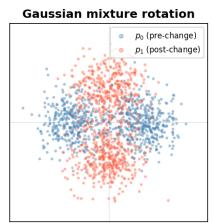

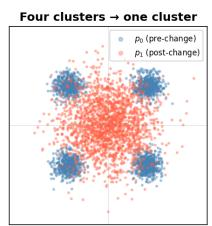

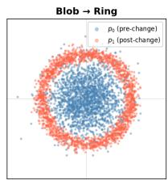

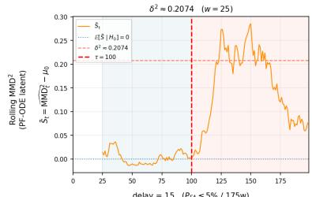

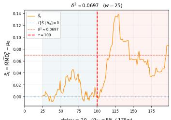

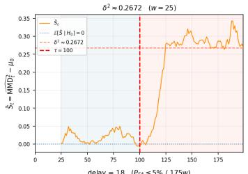

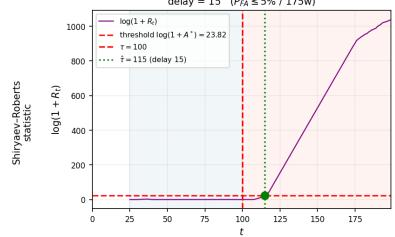

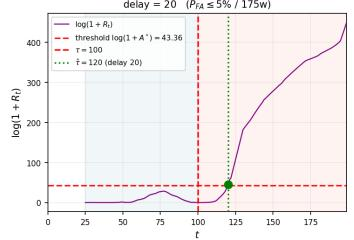

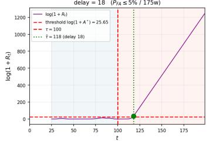  
Figure 1: Top: example draws from $p _ { 0 }$ and $p _ { 1 }$ for each pair. Middle: the rolling $\widehat { \mathrm { M M D } } _ { t } ^ { 2 } \mathrm { ~ - ~ } \mu _ { 0 }$ statistic, with its ${ \hat { \delta } } ^ { 2 }$ under $H _ { 1 }$ marked. Bottom: the Shiryaev–Roberts statistic $\log ( 1 + R _ { t } )$ , its calibrated threshold, the true changepoint τ, and the declared alarm τˆ.

For a better resolution the online iterations evaluate $\widehat { \mathrm { M M D } } _ { n } ^ { 2 }$ on a sliding window rather than the nonoverlapping windows the algorithm formally specifies, so consecutive ${ \tilde { S } } _ { n }$ are autocorrelated rather than i.i.d., and $\tau , \hat { \tau }$ are raw time indices rather than window counts. Threshold calibration (Appendices E, G) is carried out under the same sliding construction, so the reported false-alarm budget is internally consistent. The near-minimax delay-optimality proved for non-overlapping windows is not guaranteed to transfer unchanged to the sliding construction.

All three delays land within a narrow band (15-20 steps) despite an almost fourfold spread in $\hat { \delta } ^ { 2 }$ because the SR statistic reacts exponentially fast once genuine evidence starts accumulating. The pilot signal strength mainly sets how many windows it takes to start climbing, not how fast it climbs once it does.

## 5 A Real-Data Illustration: MNIST Digit 0 → 1

The three distribution pairs in Section 4 are chosen so the nature of each shift is visually obvious. To check the pipeline is not inadvertently relying on that transparency, we run it, unchanged, on an image domain. We use MNIST digits (LeCun et al., 1998) down-sampled to $1 6 \times 1 6 ( d = 2 5 6 )$ , p0 as the digit “0”, p1 as the digit $" 1 "$ , with the same GRU history encoder now preceded by a small MLP frame embedding, and the same conditioned, pre-norm-residual, v-prediction denoiser architecture (Appendix I).

The encoder-denoiser pair is trained with classifier-free guidance (Ho and Salimans, 2022) so the frozen context can also drive conditional generation, not only change-point detection. Window and bandwidth follow the same convention $w = T _ { \mathrm { b u r n } } , \sigma = \sqrt { d }$ as the synthetic pairs, giving $w = 2 0$ $\sigma = 1 6$ . The threshold is calibrated in the same way (Approach $\mathrm { B } , \dot { P } _ { \mathrm { F A } } \leq 5 \dot { \% }$ over a 105-window horizon).

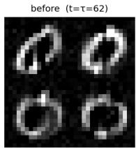

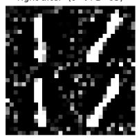

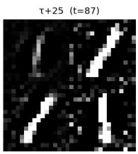

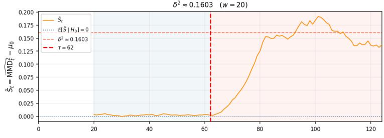

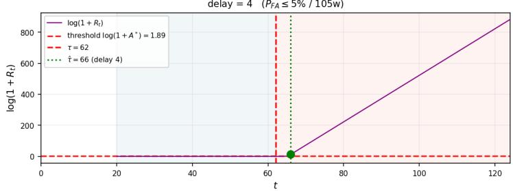  
Figure 2: MNIST digit $0  1$ , real data. Top: conditional generation $p _ { \theta } ( x \mid \mathrm { h i s t o r y } _ { : t } )$ just before τ , one step after, and 25 steps after (four samples each, $2 \times 2 )$ . Middle/bottom: the same rolling $\mathrm { { \bf M M D } ^ { 2 } }$ and Shiryaev–Roberts panels as Figure 1.

Pilot calibration (described in Appendix E) on this reduced-budget model against a calibrated threshold $\log ( 1 + A ^ { * } ) \approx 1 . 8 9$ gives $\hat { \delta } ^ { 2 } \approx 0 . 1 6 0$ which is slightly better compared to the strongest of the three synthetic pairs. Table 3). On a test series of length 125 with a genuine change-point at $\tau = 6 2$ the detector fires at $\hat { \tau } = 6 6 - \mathbf { a }$ delay of four windows, which is faster than any synthetic pair despite the much higher-dimensional observation space. This is consistent with detection speed tracking $\hat { \delta } ^ { 2 }$ rather than d itself at fixed w.

An interesting hypothesis is whether dimension works in the detector’s favour in this example. Two clearly distinct digit classes, pushed through the same encoder into a 256-dimensional latent space, end up far apart in the Euclidean distance whereas a hand-built 2D density shift has only two coordinates. The curse of dimensionality invoked in Section 1 affects the density estimator, however, it does not affect the signal that a well-trained encoder can carry. $\hat { \delta } ^ { 2 }$ does not shrink with d the way a naive density estimation would.

## 6 Comparison with other methods

A natural question is how much of this performance comes from the PF-ODE encoder specifically, versus from the Shiryaev-Roberts machinery. We compare against three natural baselines on the pairs of Sections $_ { 4 - 5 }$ (the three synthetic pairs and MNIST).

A, the same two-sample $\widehat { \mathrm { M M D } } ^ { 2 }$ statistic computed directly on raw observations (no encoder), whose null law has no known closed form even asymptotically. Observations are standardised online by a rolling mean/std of its own history and its null approximated as $\mathcal { N } ( 0 , 1 )$

B, the mean-embedding statistic $\| \overline { { Z } } _ { w } \| ^ { 2 }$ on the same PF-ODE latents, whose null is exactly $\scriptstyle { \frac { 1 } { w } } \chi _ { d } ^ { 2 }$ by the same injectivity argument as our full statistic, but which discards everything but the first moment;

$\mathbf { C } ,$ classical Hotelling’s $T ^ { 2 }$ (Hotelling, 1931) (squared Mahalanobis distance of the window mean from a burn-in-estimated reference) fed into a one-sided CUSUM (Page, 1954), whose null is asymptotically $\chi _ { d } ^ { 2 }$ by the CLT. No PF-ODE, no MMD, no mixture-SR.

Every method, including ours, is restricted to the same information. Only the burn-in segment of the series being monitored is ever treated as known $- p _ { 0 }$ data; no baseline is given oracle access to the true generating $p _ { 0 }$ (Appendix J gives the full construction).

Table 1 reports the resulting metrics from 1,000 independent Monte Carlo trials per dataset, each with a fresh realisation of the process and change-point τ drawn uniformly at random after the burnin window closes. Unlike Table 3 in the Appendix, these numbers are not a single realized run but genuine estimates of false-alarm probability, miss probability, and mean detection delay, all at the shared $P _ { \mathrm { F A } } \leq 5 \%$ design budget. Only our method and method B carry a threshold that is provably calibrated to that budget, rather than approximately so.

On the three synthetic pairs, the picture is unambiguous: Ours is the only method that stays near the 5% design budget (observed 1.8–2.9%), while every baseline overshoots it by roughly an order of magnitude (24–80%). $\mathbf { A } ^ { \prime } \mathbf { s } \mathcal { N } ( 0 , 1 )$ approximation to its own null is not accurate enough in finite windows and over-alarms substantially. B is either mediocre or outright non-operational when the shift is mean-preserving (the case of “Four clusters $ \mathrm { o n e } ^ { \prime \prime }$ , where $\hat { \delta } ^ { 2 } < 0 \cdot$ , so it never fires and gives a 100% miss rate). C’s asymptotic $\chi _ { d } ^ { 2 }$ null is the most severely miscalibrated of all, since Hotelling’s $T ^ { 2 }$ needs an approximately Gaussian window mean that a bimodal $p _ { 0 }$ at $w = 2 5$ does not deliver.

MNIST is the only exception. No method holds the 5% budget. Ours overshoots it substantially. The EDICT inversion of Wallace et al. (2023) allows for a slight improvement but does not fix the problem. The underlying issue is that DDIM inversion of the burn-in observations does not recover a clean $\mathcal { N } ( 0 , I )$ latent. The mean per-dimension variance of the recovered code Z is 0.845, not 1.

This symptom is visible in Figure 2 which shows the conditional samples generated from the frozen context with speckled noise around and behind the digit strokes instead of a clean digit. This is the visual representation of a score network whose denoising has not fully converged. EDICT did not help much because it deliberately trades exact invertibility for numerical stability.

<table><tr><td>Experiment</td><td>Method</td><td>null dist.</td><td>P(false alarm)</td><td>P(miss)</td><td>avg. delay</td></tr><tr><td rowspan="4">Gaussian mixture rotation</td><td>Ours</td><td>exact</td><td>1.9%</td><td>9.7%</td><td>16.9</td></tr><tr><td>A</td><td>approx.</td><td>32.0%</td><td>13.8%</td><td>30.9</td></tr><tr><td>B</td><td>exact</td><td>24.1%</td><td>16.3%</td><td>36.2</td></tr><tr><td>C</td><td>asympt.</td><td>67.0%</td><td>2.8%</td><td>38.5</td></tr><tr><td rowspan="4">Four clusters → one</td><td>Ours</td><td>exact</td><td>2.9%</td><td>15.3%</td><td>29.3</td></tr><tr><td>A</td><td>approx.</td><td>44.3%</td><td>14.5%</td><td>40.6</td></tr><tr><td>B</td><td>exact</td><td>0.0%</td><td>100%</td><td></td></tr><tr><td>C</td><td>asympt.</td><td>79.7%</td><td>0.7%</td><td>31.8</td></tr><tr><td rowspan="4">Blob → Ring</td><td>Ours</td><td>exact</td><td>1.8%</td><td>9.2%</td><td>15.3</td></tr><tr><td>A</td><td>approx.</td><td>31.7%</td><td>5.0%</td><td>14.2</td></tr><tr><td>B</td><td>exact</td><td>23.2%</td><td>13.1%</td><td>31.8</td></tr><tr><td>C</td><td>asympt.</td><td>57.0%</td><td>3.1%</td><td>26.7</td></tr><tr><td rowspan="5">MNIST 0 → 1</td><td>Ours (DDIM inversion)</td><td>exact</td><td>18.7%</td><td>4.2%</td><td>6.7</td></tr><tr><td>Ours (EDICT inversion)†</td><td>exact</td><td>16.5%</td><td>4.5%</td><td>6.9</td></tr><tr><td>A</td><td>approx.</td><td>18.5%</td><td>5.1%</td><td>8.1</td></tr><tr><td>B</td><td>exact</td><td>50.9%</td><td>2.3%</td><td>9.1</td></tr><tr><td>C</td><td>asympt.</td><td>98.7%</td><td>0.0%</td><td>0.0</td></tr></table>

Table 1: Operating characteristics over 1,000 Monte Carlo trials per experiment (τ uniform after burn-in, shared $P _ { \mathrm { F A } } \leq 5 \%$ design budget). † Same encoder-denoiser checkpoint as the row above, only the DDIM encoding step at detection time replaced by EDICT (Wallace et ${ \mathrm { a l . } }$ , 2023) – no retraining involved.

## 7 Conclusion and Future Directions

We address sequential change-point detection problem when neither the pre- nor post-change conditional density admits a closed form. The construction stacks three components. First, a conditional PF-ODE diffusion model, trained only on pre-change data with a frozen history context, gives a provably injective encoder, which maps the unknown data distribution onto $\mathcal { N } ( 0 , I )$ . Second, $\mathrm { { \bf M M D } ^ { 2 } }$ against this reference reduces detection to a single scalar per window, which is degenerate under $H _ { 0 }$ but ${ \sqrt { w } } { \mathrm { - G a u s s i a n } }$ under $H _ { 1 }$ . Finally, the Tartakovsky-Spivak mixture of the Shiryaev-Roberts statistic, with Pollak-calibration to a stated false-alarm budget turns that sequence into a sequential decision rule.

Validated on three synthetic shifts the method detected all three within a narrow 15-20-window delay despite an almost fourfold spread in signal strength $\hat { \delta } ^ { 2 }$ . When run unchanged on real MNIST data $( d = 2 5 6 )$ , it detected a 0 → 1 digit-class change in just four windows, which confirms that dimension enters only the encoding cost, not the behaviour of the resulting scalar statistic $\tilde { S } _ { t }$ . So, a well-separated high-dimensional shift can be easier, not harder, to detect than a low-dimensional one.

The method needs only a trainable conditional encoder, so it applies wherever sequential data has an unknown high-dimensional conditional distribution. This includes financial return or orderbooks, where heavy tails and high-dimensionality make closed-form modelling impractical, autosegmentation of video and audio into scenes, speakers, or musical sections, detecting abrupt shifts in motion-sensor and self-driving telemetry, and so on.

The denoiser needs to be trained to a genuinely clean null. That is, $Z \sim \mathcal { N } ( 0 , I )$ under $H _ { 0 }$ in Lemma 1 has to come from a conditional, autoregressively-trained denoiser that has actually converged. The MNIST example in Section 6 shows that this is the binding constraint in practice. This is the most consequential open problem, since every other component is conditioned on the encoder actually reaching that asymptotic state.

The experiments commit to one fixed-bandwidth RBF kernel. Table 2 shows that the kernel choice determines which shifts are detectable at all, so adaptive or learned kernels could sharpen sensitivity. Finally, Algorithm 1 targets a single θ. Extending it to continuous monitoring by restarting the context and SR statistic at each alarm, as sketched in Appendix H, and proving formal guarantees for the restart procedure remain open.

## References

Aronszajn, N. (1950). Theory of reproducing kernels. Transactions of the American Mathematical Society, 68(3):337–404.

Ba, J. L., Kiros, J. R., and Hinton, G. E. (2016). Layer normalization. arXiv:1607.06450.

Cho, K., van Merriënboer, B., Gulcehre, C., Bahdanau, D., Bougares, F., Schwenk, H., and Bengio, Y. (2014). Learning phrase representations using RNN encoder–decoder for statistical machine translation. In Proceedings of the 2014 Conference on Empirical Methods in Natural Language Processing (EMNLP), pages 1724–1734.

Dinh, L., Sohl-Dickstein, J., and Bengio, S. (2017). Density estimation using Real NVP. In International Conference on Learning Representations (ICLR).

Elfwing, S., Uchibe, E., and Doya, K. (2018). Sigmoid-weighted linear units for neural network function approximation in reinforcement learning. Neural Networks, 107:3–11.

Gretton, A., Borgwardt, K. M., Rasch, M. J., Schölkopf, B., and Smola, A. (2012). A kernel twosample test. Journal ofMachine Learning Research, 13(25):723–773.

Hall, P. (1984). Central limit theorem for integrated square error of multivariate nonparametric density estimators. Journal ofMultivariate Analysis, 14(1):1–16.

Ho, J., Jain, A., and Abbeel, P. (2020). Denoising diffusion probabilistic models. In Advances in Neural Information Processing Systems (NeurIPS), volume 33, pages 6840–6851.

Ho, J. and Salimans, T. (2022). Classifier-free diffusion guidance. arXiv:2207.12598.

Hoeffding, W. (1948). A class of statistics with asymptotically normal distribution. The Annals of Mathematical Statistics, 19(3):293–325.

Hotelling, H. (1931). The generalization of student’s ratio. The Annals of Mathematical Statistics, 2(3):360–378.

Kingma, D. P. and Ba, J. (2015). Adam: A method for stochastic optimization. In International Conference on Learning Representations (ICLR).

Kingma, D. P. and Dhariwal, P. (2018). Glow: Generative flow with invertible 1x1 convolutions. In Advances in Neural Information Processing Systems (NeurIPS), volume 31, pages 10236–10245.

LeCun, Y., Bottou, L., Bengio, Y., and Haffner, P. (1998). Gradient-based learning applied to document recognition. Proceedings ofthe IEEE, 86(11):2278–2324.

Page, E. S. (1954). Continuous inspection schemes. Biometrika, 41(1/2):100–115.

Perez, E., Strub, F., de Vries, H., Dumoulin, V., and Courville, A. (2018). FiLM: Visual reasoning with a general conditioning layer. In Proceedings of the AAAI Conference on Artificial Intelli gence, volume 32.

Pergamenchtchikov, S., Tartakovsky, A. G., and Spivak, V. S. (2022). Minimax and pointwise sequential changepoint detection and identification for general stochastic models. Journal of Multivariate Analysis, 190:104977.

Peskir, G. and Shiryaev, A. (2006). Optimal Stopping and Free-Boundary Problems. Lectures in Mathematics ETH Zürich. Birkhäuser Basel.

Pollak, M. (1985). Optimal detection of a change in distribution. The Annals ofStatistics, 13(1):206– 227.

Rasmussen, C. E. and Williams, C. K. I. (2006). Gaussian Processes for Machine Learning. MIT Press.

Roberts, S. W. (1966). A comparison of some control chart procedures. Technometrics, 8(3):411– 430.

Salimans, T. and Ho, J. (2022). Progressive distillation for fast sampling of diffusion models. In International Conference on Learning Representations (ICLR).

Shiryaev, A. N. (1963). On optimum methods in quickest detection problems. Theory of Probability & Its Applications, 8(1):22–46.

Smola, A., Gretton, A., Song, L., and Schölkopf, B. (2007). A Hilbert space embedding for distributions. In International Conference on Algorithmic Learning Theory (ALT), volume 4754 of Lecture Notes in Computer Science, pages 13–31. Springer.

Song, J., Meng, C., and Ermon, S. (2021a). Denoising diffusion implicit models. In International Conference on Learning Representations (ICLR).

Song, Y., Sohl-Dickstein, J., Kingma, D. P., Kumar, A., Ermon, S., and Poole, B. (2021b). Scorebased generative modeling through stochastic differential equations. In International Conference on Learning Representations (ICLR).

Sriperumbudur, B. K., Gretton, A., Fukumizu, K., Schölkopf, B., and Lanckriet, G. R. G. (2010). Hilbert space embeddings and metrics on probability measures. Journal of Machine Learning Research, 11:1517–1561.

Tartakovsky, A., Nikiforov, I., and Basseville, M. (2014). Sequential Analysis: Hypothesis Testing and Changepoint Detection. Monographs on Statistics and Applied Probability. CRC Press.

Tartakovsky, A. G. and Veeravalli, V. V. (2005). General asymptotic bayesian theory of quickest change detection. Theory ofProbability & Its Applications, 49(3):458–497.

Wallace, B., Gokul, A., and Naik, N. (2023). EDICT: Exact diffusion inversion via coupled transformations. In IEEE/CVF Conference on Computer Vision and Pattern Recognition (CVPR).

Zhu, H., Williams, C. K. I., Rohwer, R., and Morciniec, M. (1997). Gaussian regression and optimal finite dimensional linear models. Technical Report NCRG/97/011, Neural Computing Research Group, Aston University.

## A Injectivity of the Conditional PF-ODE Encoder

Lemma 1. Let $\Phi ( \cdot ; { \bf h } ) : \mathbb { R } ^ { d } \to \mathbb { R } ^ { d }$ be injective and Borel measurable, with Borel measurable inverse on its range. Thenfor any two probability measures $P , P ^ { \prime } o n \mathbb { R } ^ { d }$

$$
\Phi ( \cdot ; { \bf h } ) _ { \# } P = \Phi ( \cdot ; { \bf h } ) _ { \# } P ^ { \prime } \quad \Longleftrightarrow \quad P = P ^ { \prime } .
$$

Proof. The (⇐) direction is immediate. For (⇒), apply $\left( \Phi ( \cdot ; \mathbf { h } ) ^ { - 1 } \right) _ { \# }$ to both sides:

$$
\big ( \Phi ( \cdot ; \mathbf { h } ) ^ { - 1 } \big ) _ { \# } \Phi ( \cdot ; \mathbf { h } ) _ { \# } P = \big ( \Phi ( \cdot ; \mathbf { h } ) ^ { - 1 } \circ \Phi ( \cdot ; \mathbf { h } ) \big ) _ { \# } P = P ,
$$

and likewise for $P ^ { \prime }$ , since $\Phi ( \cdot ; { \mathbf h } ) ^ { - 1 } \circ \Phi ( \cdot ; { \mathbf h } ) = \mathrm { i d }$ on the domain. Hence $P = P ^ { \prime }$

Since $\Phi ( \cdot ; { \bf h } _ { \mathrm { f i x e d } } ) _ { \# } p _ { 0 } \ = \ N ( 0 , I )$ by construction (Section 1) and $p _ { 1 } ~ \neq ~ p _ { 0 }$ , Lemma 1 gives $\Phi ( \cdot ; \mathbf { h } _ { \mathrm { f i x e d } } ) _ { \# } p _ { 1 } \neq { \mathcal { N } } ( 0 , I ) \colon$ no genuine distributional shift can be rendered invisible by the en coding, regardless of which moments or features it affects.

Remark 1. This guarantee requires only injectivity of $\Phi ( \cdot ; \mathbf { h } )$ , not full surjectivity. PF-ODE flows obtain injectivity for free from the uniqueness of ODE trajectories (Picard–Lindelöf): distinct initial conditions cannot collide, so $\bar { \Phi ( \cdot ; \mathbf { h } ) }$ is automatically invertible whenever the drift $\begin{array} { r } { f ( x , \tau ) - \frac { g ^ { 2 } ( \tau ) } { 2 } \nabla _ { x } \log p _ { \tau } ( x ) } \end{array}$ is Lipschitz in x. This is not architectural — no invertible-network design (as in normalizing flows such as RealNVP (Dinh et al., 2017) or Glow (Kingma and Dhariwal, 2018)) is required.

In contrast, the stochastic reverse process of DDPM (Ho et al., 2020) injects independent noise $\eta _ { \tau } \sim \mathcal { N } ( 0 , I )$ at every step, making the map a Markov kernel rather than a function: the same $X _ { t }$ can be encoded into different latent codes across runs, and no measurable inverse exists. Lemma 1 therefore does not apply, and a DDPM-based encoding offers no guarantee that a genuine change $p _ { 1 } \neq p _ { 0 }$ will produce $\mathsf { \bar { P } } _ { 1 } ^ { \mathrm { ~ } } \neq \mathcal { N } ( 0 , I )$ — the shift could, in principle, be averaged away by the injected noise.

## B Derivation of Terms B and C for the RBF Kernel

Term C

$$
C = \mathbb { E } _ { Y , Y ^ { \prime } \sim \mathcal { N } ( 0 , I ) } \left[ \exp \left( - \frac { \| Y - Y ^ { \prime } \| ^ { 2 } } { 2 \sigma ^ { 2 } } \right) \right]
$$

Since $Y \perp Y ^ { \prime }$ and each has independent coordinates, $Y - Y ^ { \prime } \sim { \mathcal { N } } ( 0 , 2 I )$ . The kernel factorises over dimensions:

$$
C = \prod _ { l = 1 } ^ { d } \mathbb { E } _ { \xi _ { l } \sim \mathcal { N } ( 0 , 2 ) } \left[ \exp \left( - \frac { \xi _ { l } ^ { 2 } } { 2 \sigma ^ { 2 } } \right) \right]
$$

For a single factor, we apply the moment generating function identity for $\xi \sim \mathcal { N } ( 0 , \sigma _ { \xi } ^ { 2 } )$

$$
\mathbb { E } \Big [ e ^ { - t \xi ^ { 2 } } \Big ] = \big ( 1 + 2 t \sigma _ { \xi } ^ { 2 } \big ) ^ { - 1 / 2 }
$$

Setting $t = 1 / ( 2 \sigma ^ { 2 } )$ and $\sigma _ { \xi } ^ { 2 } = 2$

$$
\mathbb { E } _ { \xi \sim \mathcal { N } ( 0 , 2 ) } \left[ \exp \left( - \frac { \xi ^ { 2 } } { 2 \sigma ^ { 2 } } \right) \right] = \left( 1 + \frac { 2 } { \sigma ^ { 2 } } \right) ^ { - 1 / 2 } = \frac { \sigma } { \sqrt { \sigma ^ { 2 } + 2 } }
$$

Taking the product over d independent dimensions:

$$
C = \left( \frac { \sigma ^ { 2 } } { \sigma ^ { 2 } + 2 } \right) ^ { d / 2 }
$$

## Term B

For a fixed observation $z \in \mathbb { R } ^ { d }$

$$
B ( z ) = \mathbb { E } _ { Y \sim \mathcal { N } ( 0 , I ) } \left[ \exp \left( - \frac { \| z - Y \| ^ { 2 } } { 2 \sigma ^ { 2 } } \right) \right]
$$

The kernel again factorises over coordinates:

$$
B ( z ) = \prod _ { l = 1 } ^ { d } \mathbb { E } _ { Y _ { l } \sim \mathcal { N } ( 0 , 1 ) } \bigg [ \exp \bigg ( - \frac { ( z _ { l } - Y _ { l } ) ^ { 2 } } { 2 \sigma ^ { 2 } } \bigg ) \bigg ]
$$

For each factor, we compute the integral by combining the two Gaussian terms. Expanding in the exponent:

$$
- \frac { ( z _ { l } - y ) ^ { 2 } } { 2 \sigma ^ { 2 } } - \frac { y ^ { 2 } } { 2 } = - \frac { 1 } { 2 \sigma ^ { 2 } } \big ( z _ { l } ^ { 2 } - 2 z _ { l } y + y ^ { 2 } \big ) - \frac { y ^ { 2 } } { 2 } = - \frac { \sigma ^ { 2 } + 1 } { 2 \sigma ^ { 2 } } y ^ { 2 } + \frac { z _ { l } } { \sigma ^ { 2 } } y - \frac { z _ { l } ^ { 2 } } { 2 \sigma ^ { 2 } }
$$

Completing the square in y:

$$
= - \frac { \sigma ^ { 2 } + 1 } { 2 \sigma ^ { 2 } } \bigg ( y - \frac { z _ { l } } { \sigma ^ { 2 } + 1 } \bigg ) ^ { 2 } + \frac { z _ { l } ^ { 2 } } { 2 ( \sigma ^ { 2 } + 1 ) } - \frac { z _ { l } ^ { 2 } } { 2 \sigma ^ { 2 } } = - \frac { \sigma ^ { 2 } + 1 } { 2 \sigma ^ { 2 } } \bigg ( y - \frac { z _ { l } } { \sigma ^ { 2 } + 1 } \bigg ) ^ { 2 } - \frac { z _ { l } ^ { 2 } } { 2 ( \sigma ^ { 2 } + 1 ) }
$$

The one-dimensional integral therefore evaluates to:

$$
{ \begin{array} { r l } & { { \cfrac { 1 } { \sqrt { 2 \pi } } } \displaystyle \int _ { - \infty } ^ { \infty } \exp \left( - { \cfrac { \left( z _ { l } - y \right) ^ { 2 } } { 2 \sigma ^ { 2 } } } - { \cfrac { y ^ { 2 } } { 2 } } \right) d y } \\ & { = \exp \left( - { \cfrac { z _ { l } ^ { 2 } } { 2 ( \sigma ^ { 2 } + 1 ) } } \right) \cdot { \cfrac { 1 } { \sqrt { 2 \pi } } } \displaystyle \int _ { - \infty } ^ { \infty } \exp \left( - { \cfrac { \sigma ^ { 2 } + 1 } { 2 \sigma ^ { 2 } } } \left( y - { \cfrac { z _ { l } } { \sigma ^ { 2 } + 1 } } \right) ^ { 2 } \right) d y } \\ & { = \exp \left( - { \cfrac { z _ { l } ^ { 2 } } { 2 ( \sigma ^ { 2 } + 1 ) } } \right) \cdot { \sqrt { \cfrac { \sigma ^ { 2 } } { \sigma ^ { 2 } + 1 } } } } \end{array} }
$$

where the last Gaussian integral gives $\sqrt { 2 \pi \sigma ^ { 2 } / ( \sigma ^ { 2 } + 1 ) }$ . Taking the product over all d dimensions:

$$
B ( z ) = \left( \frac { \sigma ^ { 2 } } { \sigma ^ { 2 } + 1 } \right) ^ { d / 2 } \exp \left( - \frac { \| z \| ^ { 2 } } { 2 ( \sigma ^ { 2 } + 1 ) } \right)
$$

## Bias of the diagonal-included estimator

Under $H _ { 0 } \left( Z _ { i } \stackrel { \mathrm { i i d } } { \sim } P _ { 0 } = Q \right)$ , split Term A into its diagonal and off-diagonal parts:

$$
\frac { 1 } { w ^ { 2 } } \sum _ { i , j = 1 } ^ { w } k ( Z _ { i } , Z _ { j } ) = \frac { 1 } { w ^ { 2 } } \sum _ { i \neq j } k ( Z _ { i } , Z _ { j } ) + \frac { 1 } { w ^ { 2 } } \sum _ { i = 1 } ^ { w } k ( Z _ { i } , Z _ { i } ) .
$$

For $i \neq j , Z _ { i } \perp Z _ { j }$ and both are drawn from $Q .$ , so ${ \mathbb E } _ { 0 } [ k ( Z _ { i } , Z _ { j } ) ] = { \mathbb E } _ { Y , Y ^ { \prime } \sim Q } [ k ( Y , Y ^ { \prime } ) ] = C ;$ ; there are $w ( w - 1 )$ such ordered pairs, contributing $\frac { w - 1 } { \ d t } C$ . On the diagonal, k $( Z _ { i } , Z _ { i } ) = k _ { 0 } : = k ( z , z )$ a constant for any stationary kernel (for the RBF kernel, $k _ { 0 } = 1$ regardless of z); the w diagonal terms contribute $k _ { 0 } / w$ . For Term $B ,$ since $Z _ { i } \sim Q$ under $H _ { 0 }$

$$
\begin{array} { r } { \mathbb { E } _ { 0 } [ B ( Z _ { i } ) ] = \mathbb { E } _ { Z \sim Q } \left[ \mathbb { E } _ { Y \sim Q } [ k ( Z , Y ) ] \right] = \mathbb { E } _ { Z , Y \sim Q } [ k ( Z , Y ) ] = C , } \end{array}
$$

so the w terms of Term B contribute $- 2 C$ . Term C is already the constant C itself. Summing all three:

$$
\mathbb { E } _ { 0 } \big [ \widehat { \mathrm { M M D } } ^ { 2 } \big ] = \underbrace { \frac { w - 1 } { w } C + \frac { k _ { 0 } } { w } } _ { \mathrm { T e r m } ~ A } \underbrace { - 2 C } _ { \mathrm { T e r m } ~ B } + \underbrace { C } _ { \mathrm { T e r m } ~ C } = \frac { k _ { 0 } - C } { w } ,
$$

an $O ( 1 / w )$ bias coming entirely from the w diagonal terms $k ( Z _ { i } , Z _ { i } )$ retained in Term $A ;$ removing them, as in $\widehat { \mathrm { M M D } } _ { u } ^ { 2 }$ below, removes the bias exactly rather than merely asymptotically. The analogous bias of the diagonal-included (“V-statistic”) estimator in the two-sample setting is well known; see e.g. Gretton et al. (2012).

## C Asymptotic Distribution of $\widehat { \mathrm { M M D } } ^ { 2 }$ : Derivations

## Step 1 — Centered kernel and degeneracy

Define the centered kernel:

$$
\tilde { k } ( x , y ) = k ( x , y ) - B ( x ) - B ( y ) + C
$$

where $B ( z ) = \mathbb { E } _ { Y \sim Q } [ k ( z , Y ) ]$ ] is Term B evaluated at z. The unbiased estimator is then a degree-2 U-statistic with kernel ˜k:

$$
\widehat { \mathrm { M M D } } _ { u } ^ { 2 } = \frac { 1 } { w ( w - 1 ) } \sum _ { i \neq j } \tilde { k } ( Z _ { i } , Z _ { j } )
$$

Under $H _ { 0 } \left( Z \sim P _ { 0 } = Q \right)$ , the centered kernel satisfies thefirst-order degeneracy condition:

$$
\mathbb { E } _ { Z ^ { \prime } \sim P _ { 0 } } \left[ \tilde { k } ( z , Z ^ { \prime } ) \right] = \mathbb { E } _ { Z ^ { \prime } } [ k ( z , Z ^ { \prime } ) ] - B ( z ) - \mathbb { E } _ { Z ^ { \prime } } [ B ( Z ^ { \prime } ) ] + C = B ( z ) - B ( z ) - C + C = 0 \quad \forall z
$$

Since this holds for every fixed $z ,$ it holds in particular after averaging over $z = Z _ { i } \sim P _ { 0 }$ itself: by the tower property, for each pair $i \neq j$

$$
\begin{array} { r } { \mathbb { E } _ { 0 } \big [ \tilde { k } ( Z _ { i } , Z _ { j } ) \big ] = \mathbb { E } _ { 0 } \Big [ \underbrace { \mathbb { E } _ { Z _ { j } } \big [ \tilde { k } ( Z _ { i } , Z _ { j } ) \mid Z _ { i } \big ] } _ { = 0 \mathrm { ~ b y ~ t h e ~ a b o v e } , \mathrm { ~ a t ~ } z = Z _ { i } } \Big ] = 0 , } \end{array}
$$

so the unbiased estimator has exactly zero mean under $H _ { 0 }$ for every w:

$$
{ \mathbb E } _ { 0 } \big [ \widehat { \mathrm { M M D } } _ { u } ^ { 2 } \big ] = \frac { 1 } { w ( w - 1 ) } \sum _ { i \neq j } { \mathbb E } _ { 0 } \big [ \tilde { k } ( Z _ { i } , Z _ { j } ) \big ] = 0 .
$$

For an ordinary (non-degenerate) U-statistic the standard CLT gives a $\sqrt { w } .$ -rate and a Gaussian limit. For a first-order degenerate U-statistic the leading Gaussian term vanishes identically, and the fluctuation is of order $\bar { 1 } / w$ . Correct normalisation requires scaling by w:

$$
\widehat { w \cdot \mathrm { M M D } _ { u } ^ { 2 } } = \frac { w } { w ( w - 1 ) } \sum _ { i \neq j } \tilde { k } ( Z _ { i } , Z _ { j } )
$$

## Step 2 — Spectral decomposition and limiting distribution

The centered kernel $\tilde { k }$ is symmetric and square-integrable under $P _ { 0 }$ . Define the integral operator $T _ { \tilde { k } } : L ^ { 2 } ( P _ { 0 } )  L ^ { 2 } ( P _ { 0 } )$ :

$$
( T _ { \tilde { k } } \phi ) ( x ) = \int \tilde { k } ( x , y ) \phi ( y ) d P _ { 0 } ( y ) = \lambda \phi ( x )
$$

By the Hilbert–Schmidt theorem, $T _ { \tilde { k } }$ is compact and self-adjoint, so it has a countable spectral decomposition. The degeneracy condition forces all eigenfunctions $\phi _ { l }$ to satisfy $\mathbb { E } _ { P _ { 0 } } [ \phi _ { l } ( Z ) ] = 0$ (zero mean), with $\mathrm { V a r } [ \check { \phi } _ { l } ( Z ) ] \doteq 1$ by normalisation. The Mercer expansion gives:

$$
\tilde { k } ( x , y ) = \sum _ { l = 1 } ^ { \infty } \lambda _ { l } \phi _ { l } ( x ) \phi _ { l } ( y ) , \qquad \lambda _ { l } \geq 0 , \quad \sum _ { l } \lambda _ { l } ^ { 2 } < \infty
$$

Substituting into the rescaled U-statistic and using the symmetry of $\tilde { k } \colon$

$$
w \cdot { \widehat { \mathrm { M M D } } } _ { u } ^ { 2 } \approx { \frac { 1 } { w } } \sum _ { i \neq j } { \tilde { k } } ( Z _ { i } , Z _ { j } ) = \sum _ { l = 1 } ^ { \infty } \lambda _ { l } [ \underbrace { ( { \frac { 1 } { \sqrt { w } } } \sum _ { i = 1 } ^ { w } \phi _ { l } ( Z _ { i } ) ) ^ { 2 } } _ { = : S _ { l } ^ { 2 } } - \underbrace { { \frac { 1 } { w } } \sum _ { i = 1 } ^ { w } \phi _ { l } ( Z _ { i } ) ^ { 2 } } _ {  \mathbb { 1 } { \mathrm { b y L N } } } ]
$$

By the CLT, $S _ { l } \stackrel { d } {  } \mathcal { N } ( 0 , 1 )$ for each l (since $\mathbb { E } [ \phi _ { l } ] ~ = ~ 0 , ~ \mathrm { V a r } [ \phi _ { l } ] ~ = ~ 1 )$ . The orthogonality $\mathbb { E } [ \phi _ { l } ( Z ) \phi _ { m } ( Z ) ] = \delta _ { l m }$ implies $S _ { l } ~ \perp ~ S _ { m }$ asymptotically for $l \ \ne \ \bar { m }$ . Together with Slutsky’s theorem:

$$
w \cdot \widehat { \mathrm { M M D } } _ { u } ^ { 2 } \ \stackrel { d } {  } \ \sum _ { l = 1 } ^ { \infty } \lambda _ { l } ( Z _ { l } ^ { 2 } - 1 ) , \qquad Z _ { l } \stackrel { \mathrm { i i d } } { \sim } \ N ( 0 , 1 )
$$

This result was established for degenerate U-statistics by Hall (1984); the MMD-specific statement appears in Gretton et al. (2012, Theorem 12). The limit belongs to the class of generalised $\chi ^ { 2 }$ distributions (infinite weighted sums of centred $\chi ^ { 2 } ( 1 )$ variables), for which no closed-form CDF exists.

## Step 3 — Eigenvalues for the RBF kernel under $P _ { 0 } = \mathcal { N } ( 0 , I )$

Consider first $d \ : = \ : 1$ . We seek $\lambda , \phi$ solving the eigenvalue problem for the (uncentred) kernel $k ( x , y ) = e ^ { - ( x - y ) ^ { 2 } / 2 \sigma ^ { 2 } }$ against $P _ { 0 } = \mathcal { N } ( 0 , 1 )$

$$
\int _ { - \infty } ^ { \infty } k ( x , y ) \phi ( y ) \frac { e ^ { - y ^ { 2 } / 2 } } { \sqrt { 2 \pi } } d y = \lambda \phi ( x ) .
$$

Trying the ground-state ansatz $\phi _ { 0 } ( x ) = e ^ { - \beta x ^ { 2 } }$ and evaluating the Gaussian integral (complete the square in y, then apply $\textstyle \int e ^ { - K y ^ { 2 } + L y } d y = { \sqrt { \pi / K } } e ^ { L ^ { 2 } / 4 K } )$ gives, after matching the coefficient of $x ^ { 2 }$ on both sides, a self-consistency condition for $\begin{array} { r } { K : = \frac { 1 } { 2 \sigma ^ { 2 } } + \beta + \frac { 1 } { 2 } } \end{array}$

$$
K ^ { 2 } - \left( \frac { 1 } { \sigma ^ { 2 } } + \frac { 1 } { 2 } \right) K + \frac { 1 } { 4 \sigma ^ { 4 } } = 0 .
$$

Taking the admissible (larger) root,

$$
K = A : = p + q + u , \qquad p = \frac { 1 } { 4 } , \quad q = \frac { 1 } { 2 \sigma ^ { 2 } } , \quad u = \sqrt { p ^ { 2 } + 2 p q } = \frac { \sqrt { \sigma ^ { 2 } + 4 } } { 4 \sigma } ,
$$

which matches the classical parametrisation of Gaussian-kernel/Gaussian-measure eigenproblems (Zhu et al. 1997; Rasmussen and Williams 2006, §4.3.1). The ladder structure of the Hermite/harmonic-oscillator basis propagates this ratio to every mode: writing the (unnormalised) eigenfunctions as weighted Hermite functions,

$$
\phi _ { n } ( x ) \propto H e _ { n } \big ( c ( \sigma ) x \big ) e ^ { - a ( \sigma ) x ^ { 2 } } , \qquad a ( \sigma ) = u - p , \quad c ( \sigma ) = 2 \sqrt { u } ,
$$

the eigenvalues decay exactly geometrically, $\lambda _ { n } = \lambda _ { 0 } r ^ { n }$ , with ratio

$$
r = { \frac { q } { A } } = { \frac { 1 / ( 2 \sigma ^ { 2 } ) } { 1 / 4 + 1 / ( 2 \sigma ^ { 2 } ) + { \sqrt { \sigma ^ { 2 } + 4 } } / ( 4 \sigma ) } } = { \frac { 2 } { \sigma ^ { 2 } + 2 + \sigma { \sqrt { \sigma ^ { 2 } + 4 } } } } .
$$

Rationalising (multiply numerator and denominator by $\sigma ^ { 2 } + 2 - \sigma \sqrt { \sigma ^ { 2 } + 4 } \nonumber$ , whose product with the denominator collapses to 4) gives the compact closed form

$$
r = \frac { \sigma ^ { 2 } + 2 - \sigma \sqrt { \sigma ^ { 2 } + 4 } } { 2 } \in ( 0 , 1 ) .
$$

As a check, $r  1$ as $\sigma \to 0$ (a near-delta kernel needs infinitely many modes to resolve) and $r  0$ as $\sigma  \infty \mathrm { ( a }$ near-constant kernel degenerates to rank one) — both limits behave as they should, which rules out the naive guess $r = \sigma ^ { 2 } / ( \sigma ^ { 2 } + 2 )$ (that expression is in fact $C ^ { 2 / d }$ from Step 1, an unrelated quantity, and has the opposite monotonicity in σ).

For general d, the kernel factorises over coordinates, so the eigenfunctions are products of onedimensional weighted Hermite functions indexed by a multi-index $\mathbf { n } = \left( n _ { 1 } , \ldots , n _ { d } \right)$

$$
\phi _ { \mathbf { n } } ( x ) \propto \prod _ { l = 1 } ^ { d } H e _ { n _ { l } } \bigl ( c ( \sigma ) x _ { l } \bigr ) \cdot e ^ { - a ( \sigma ) x _ { l } ^ { 2 } } , \qquad \lambda _ { \mathbf { n } } \propto r ^ { | \mathbf { n } | } ,
$$

and all $\binom { m + d - 1 } { d - 1 }$ eigenfunctions of total degree $m = | { \bf n } |$ share the same eigenvalue:

$$
\lambda _ { m } \propto r ^ { m } = \left( \frac { \sigma ^ { 2 } + 2 - \sigma \sqrt { \sigma ^ { 2 } + 4 } } { 2 } \right) ^ { m } .
$$

The series $\begin{array} { r } { \sum _ { m } \binom { m + d - 1 } { d - 1 } \lambda _ { m } ^ { 2 } < \infty } \end{array}$ ensures Hilbert–Schmidt compactness, and the geometric decay means the limiting distribution is dominated by the first few eigenfunctions.

<table><tr><td>Kernel</td><td> $k ( x , y )$ </td><td>C</td><td>B</td><td> $\widehat { w \cdot \widehat { \mathrm { M M D } } ^ { 2 } \overset { d } { \to } }$ </td><td>Detectable shifts</td></tr><tr><td>Linear</td><td> $x ^ { \top } y$ </td><td>0</td><td>0</td><td> $\chi ^ { 2 } ( d )$  (exact, any w)</td><td>Mean only:  $\mathbb { E } [ Z ] \neq 0 ^ { \cdot }$ </td></tr><tr><td>Deg.-p poly.</td><td> $( 1 + x ^ { \top } y / c ) ^ { p }$ </td><td> $\sum _ { m = 0 } ^ { \lfloor p / 2 \rfloor } \kappa _ { m }$ </td><td> $\sum _ { m = 0 } ^ { \lfloor p / 2 \rfloor } \tau _ { m } ( z )$ </td><td> $\begin{array} { r } { \sum _ { l = 1 } ^ { K } \lambda _ { l } ( Z _ { l } ^ { 2 } - 1 ) , } \end{array}$   $K = { \binom { p + d } { d } } - 1$ </td><td>Moments  $1 , \ldots , p \colon$  mean, cov., skewness  $\left( p \ge 3 \right)$ </td></tr><tr><td>RBF</td><td> $e ^ { - \| x - y \| ^ { 2 } / 2 \sigma ^ { 2 } }$ </td><td> $\left( \frac { \sigma ^ { 2 } } { \sigma ^ { 2 } + 2 } \right) ^ { d / 2 }$ </td><td> $\left( \frac { \sigma ^ { 2 } } { \sigma ^ { 2 } + 1 } \right) ^ { d / 2 }$   $\cdot e ^ { - \| z \| ^ { 2 } / 2 ( \sigma ^ { 2 } + 1 ) }$ </td><td> $\begin{array} { r } { \sum _ { l = 1 } ^ { \infty } \lambda _ { l } ( Z _ { l } ^ { 2 } - 1 ) , } \end{array}$   $\lambda _ { l } \propto r ^ { l }$ </td><td> $\operatorname { A n y } P \neq Q$ </td></tr><tr><td>Laplace</td><td> $e ^ { - \| x - y \| / \sigma }$ </td><td>No closed form</td><td>No closed form</td><td> $\begin{array} { r } { \sum _ { l = 1 } ^ { \infty } \lambda _ { l } ( Z _ { l } ^ { 2 } - 1 ) , } \end{array}$   $\lambda _ { l } \sim l ^ { - ( d + 1 ) / 2 }$ </td><td> $\operatorname { A n y } P \neq Q$ </td></tr><tr><td>IMQ</td><td> $( c ^ { 2 } + \| x - y \| ^ { 2 } ) ^ { - \beta }$ </td><td>No closed form</td><td>No closed form</td><td> $\begin{array} { r } { \sum _ { l = 1 } ^ { \infty } \lambda _ { l } ( Z _ { l } ^ { 2 } - 1 ) . } \end{array}$  exp. decay</td><td> $\operatorname { A n y } P \neq Q$ </td></tr></table>

Table 2: $\overline { { { \mathrm { M M D } } ^ { 2 } } }$ against $Q = \mathcal { N } ( 0 , I )$ for common kernels.

## Alternative case — Hoeffding decomposition

For a symmetric kernel $h ( x , y )$ and an i.i.d. sample $Z _ { 1 } , \ldots , Z _ { w }$ drawn from a common $\mathrm { l a w } - P _ { 0 }$ under $H _ { 0 } , P _ { 1 }$ under $H _ { 1 } \mathrm { ~ - ~ }$ the U-statistic $\begin{array} { r } { U _ { w } ~ = ~ \frac { 1 } { w ( w - 1 ) } \sum _ { i \neq j } h ( Z _ { i } , Z _ { j } ) } \end{array}$ admits the orthogonal Hoeffding (1948) decomposition:

$$
h ( z _ { 1 } , z _ { 2 } ) = \mu + h _ { 1 } ( z _ { 1 } ) + h _ { 1 } ( z _ { 2 } ) + h _ { 2 } ( z _ { 1 } , z _ { 2 } )
$$

where, with expectations taken under that same sampling law,

$$
\begin{array} { r l } & { \mu = \mathbb { E } [ h ( Z , Z ^ { \prime } ) ] , } \\ & { h _ { 1 } ( z ) = \mathbb { E } _ { Z ^ { \prime } } [ h ( z , Z ^ { \prime } ) ] - \mu , } \\ & { h _ { 2 } ( z _ { 1 } , z _ { 2 } ) = h ( z _ { 1 } , z _ { 2 } ) - h _ { 1 } ( z _ { 1 } ) - h _ { 1 } ( z _ { 2 } ) - \mu . } \end{array}
$$

By construction, $\mathbb { E } [ h _ { 1 } ( Z ) ] = 0$ and $\mathbb { E } _ { Z ^ { \prime } } [ h _ { 2 } ( z , Z ^ { \prime } ) ] = 0$ for every fixed z, and the three components are mutually orthogonal. Substituting into the centered statistic:

$$
U _ { w } - \mu = \underbrace { \frac { 2 } { w } \sum _ { i = 1 } ^ { w } h _ { 1 } ( Z _ { i } ) } _ { \mathrm { l i n e a r t e r m } } + \underbrace { \frac { 1 } { w ( w - 1 ) } \sum _ { i \neq j } h _ { 2 } ( Z _ { i } , Z _ { j } ) } _ { \mathrm { d e g e n e r a t e ~ U \mathrm { - } s t a t i s t i c } }
$$

In our setting $h = { \tilde { k } } .$ , the kernel centred with respect to $Q = \mathcal { N } ( 0 , I )$ , so $\mu = \mathrm { M M D } ^ { 2 } ( P _ { 0 } , Q )$ under $H _ { 0 }$ and $\mu = \mathrm { M M D } ^ { 2 } ( P _ { 1 } , Q )$ under $H _ { 1 }$ . Under the null $P _ { 0 } = Q$ , the first-order projection evaluates to:

$$
h _ { 1 } ( z ) = \mathbb { E } _ { Z ^ { \prime } \sim Q } [ \tilde { k } ( z , Z ^ { \prime } ) ] - 0 = \underbrace { \mathbb { E } _ { Z ^ { \prime } \sim Q } [ k ( z , Z ^ { \prime } ) ] } _ { = B ( z ) } - B ( z ) - \underbrace { \mathbb { E } _ { Z ^ { \prime } \sim Q } [ B ( Z ^ { \prime } ) ] } _ { = C } + C = 0
$$

Hence $h _ { 1 } \equiv 0$ on all of $\mathbb { R } ^ { d } \colon$ this is precisely first-order degeneracy. The linear term vanishes identically, and the statistic is governed entirely by the second-order degenerate part, which after rescaling by w converges to the generalised $\chi ^ { 2 }$ distribution described above.

Suppose now $Z _ { 1 } , \ldots , Z _ { w }$ are instead drawn i.i.d. from $P _ { 1 } ~ \neq ~ Q$ , with signal strength $\delta ^ { 2 } \ =$ $\mathrm { M M D } ^ { 2 } ( P _ { 1 } , Q ) > 0$ taking the role of $\mu .$ The first-order projection becomes:

$$
h _ { 1 } ( z ) = \mathbb { E } _ { Z ^ { \prime } \sim P _ { 1 } } [ \tilde { k } ( z , Z ^ { \prime } ) ] - \delta ^ { 2 } = \underbrace { \mathbb { E } _ { Z ^ { \prime } \sim P _ { 1 } } [ k ( z , Z ^ { \prime } ) ] } _ { \neq B ( z ) } - B ( z ) - \mathbb { E } _ { Z ^ { \prime } \sim P _ { 1 } } [ B ( Z ^ { \prime } ) ] + C - \delta ^ { 2 } \ \neq \ 0
$$

since $\begin{array} { r c l } { { \mathbb { E } _ { Z ^ { \prime } \sim P _ { 1 } } [ k ( z , Z ^ { \prime } ) ] } } & { { \neq } } & { { \mathbb { E } _ { Z ^ { \prime } \sim Q } [ k ( z , Z ^ { \prime } ) ] = { } \ B ( z ) } } \end{array}$ whenever $P _ { 1 } \neq Q$ . Let $\sigma _ { 1 } ^ { 2 } =$ Var $_ { Z \sim P _ { 1 } } [ h _ { 1 } ( Z ) ] > 0$

The linear term is now a sum of w independent, mean-zero contributions:

$$
{ \frac { 2 } { w } } \sum _ { i = 1 } ^ { w } h _ { 1 } ( Z _ { i } ) = { \frac { 2 } { \sqrt { w } } } \cdot { \frac { 1 } { \sqrt { w } } } \sum _ { i = 1 } ^ { w } h _ { 1 } ( Z _ { i } ) \ { \overset { d } { \to } } \ { \mathcal { N } } { \bigg ( } 0 , { \frac { 4 \sigma _ { 1 } ^ { 2 } } { w } } { \bigg ) }
$$

by the standard CLT, since $\mathbb { E } [ h _ { 1 } ( Z _ { i } ) ] = 0$ and $\mathrm { V a r } [ h _ { 1 } ( Z _ { i } ) ] = \sigma _ { 1 } ^ { 2 } < \infty$ . This contributes at rate $O _ { p } ( w ^ { - 1 / 2 } )$ .

The second-order term $\begin{array} { r } { \frac { 1 } { w ( w - 1 ) } \sum _ { i \neq j } h _ { 2 } ( Z _ { i } , Z _ { j } ) } \end{array}$ remains a degenerate U-statistic (since $\mathbb { E } _ { Z ^ { \prime } } [ h _ { 2 } ( z , Z ^ { \prime } ) ] = 0$ by construction) and satisfies $\begin{array} { r } { \mathrm { V a r } \big [ { \frac { 1 } { w ( w - 1 ) } } \sum _ { i \neq j } h _ { 2 } \big ] = O ( w ^ { - 2 } ) } \end{array}$ , placing it at rate $O _ { p } ( w ^ { - 1 } ) \ll O _ { p } ( w ^ { - 1 / 2 } )$ . By Slutsky’s theorem the degenerate term is asymptotically negligible, giving:

$$
\sqrt { w } \Big ( \widehat { \mathrm { M M D } } _ { u } ^ { 2 } - \delta ^ { 2 } \Big ) \stackrel { d } {  } \mathcal { N } \big ( 0 , 4 \sigma _ { 1 } ^ { 2 } \big ) , \qquad \sigma _ { 1 } ^ { 2 } = \mathrm { V a r } _ { Z \sim P _ { 1 } } \Big [ \mathbb { E } _ { Z ^ { \prime } \sim P _ { 1 } } \big [ \tilde { k } ( Z , Z ^ { \prime } ) \big ] \Big ]
$$

## D Tartakovsky–Spivak Mixture Likelihood Ratio under the Exponential Prior

Under $H _ { 1 }$ conditional on signal strength $\delta ^ { 2 }$ , the window statistic is approximately $\tilde { S } _ { t } \sim \mathcal N ( \delta ^ { 2 } , v _ { 1 } ^ { 2 } )$ Averaging this Gaussian density over the exponential prior $\pi ( \delta ^ { 2 } ) = \alpha e ^ { - \alpha \delta ^ { 2 } } , \delta ^ { 2 } > 0$ , gives the marginal (mixture) density

$$
\bar { p } _ { 1 } ( s ) = \int _ { 0 } ^ { \infty } \frac { 1 } { \sqrt { 2 \pi } v _ { 1 } } \exp \biggl ( - \frac { ( s - \delta ^ { 2 } ) ^ { 2 } } { 2 v _ { 1 } ^ { 2 } } \biggr ) \alpha e ^ { - \alpha \delta ^ { 2 } } d ( \delta ^ { 2 } ) .
$$

Write $x = \delta ^ { 2 }$ for brevity and expand the exponent:

$$
- \frac { ( s - x ) ^ { 2 } } { 2 v _ { 1 } ^ { 2 } } - \alpha x = - \frac { 1 } { 2 v _ { 1 } ^ { 2 } } \Big [ x ^ { 2 } - 2 x ( s - \alpha v _ { 1 } ^ { 2 } ) \Big ] - \frac { s ^ { 2 } } { 2 v _ { 1 } ^ { 2 } } .
$$

Completing the square in x:

$$
= - \frac { \left( x - ( s - \alpha v _ { 1 } ^ { 2 } ) \right) ^ { 2 } } { 2 v _ { 1 } ^ { 2 } } + \frac { ( s - \alpha v _ { 1 } ^ { 2 } ) ^ { 2 } - s ^ { 2 } } { 2 v _ { 1 } ^ { 2 } } .
$$

The quadratic term in the exponent simplifies to a term linear in s:

$$
\frac { ( s - \alpha v _ { 1 } ^ { 2 } ) ^ { 2 } - s ^ { 2 } } { 2 v _ { 1 } ^ { 2 } } = \frac { - 2 \alpha v _ { 1 } ^ { 2 } s + \alpha ^ { 2 } v _ { 1 } ^ { 4 } } { 2 v _ { 1 } ^ { 2 } } = - \alpha s + \frac { \alpha ^ { 2 } v _ { 1 } ^ { 2 } } { 2 } .
$$

Substituting back,

$$
\bar { p } _ { 1 } ( s ) = \alpha \exp \Biggl ( - \alpha s + \frac { \alpha ^ { 2 } v _ { 1 } ^ { 2 } } { 2 } \Biggr ) \underbrace { \int _ { 0 } ^ { \infty } \frac { 1 } { \sqrt { 2 \pi } v _ { 1 } } \exp \Biggl ( - \frac { \left( x - ( s - \alpha v _ { 1 } ^ { 2 } ) \right) ^ { 2 } } { 2 v _ { 1 } ^ { 2 } } \Biggr ) d x } _ { = \mathbb { P } \bigl ( N ( s - \alpha v _ { 1 } ^ { 2 } , v _ { 1 } ^ { 2 } ) > 0 \bigr ) } .
$$

The remaining integral is the probability that a $\mathcal { N } ( s - \alpha v _ { 1 } ^ { 2 } , v _ { 1 } ^ { 2 } )$ variable exceeds 0 – the boundary of the prior’s support – i.e.

$$
\int _ { 0 } ^ { \infty } \frac { 1 } { \sqrt { 2 \pi } v _ { 1 } } \exp \left( - \frac { \left( x - ( s - \alpha v _ { 1 } ^ { 2 } ) \right) ^ { 2 } } { 2 v _ { 1 } ^ { 2 } } \right) d x = \Phi \left( \frac { s - \alpha v _ { 1 } ^ { 2 } } { v _ { 1 } } \right) .
$$

Collecting terms gives the closed-form mixture density

$$
\bar { p } _ { 1 } ( s ) = \alpha \exp \biggl ( - \alpha s + \frac { \alpha ^ { 2 } v _ { 1 } ^ { 2 } } { 2 } \biggr ) \Phi \biggl ( \frac { s - \alpha v _ { 1 } ^ { 2 } } { v _ { 1 } } \biggr ) .
$$

Dividing by the null density $g _ { 0 }$ of $G _ { 0 } -$ evaluated numerically, since $G _ { 0 }$ has no closed form $( \mathsf { A p - }$ pendix C) – gives the mixture likelihood ratio used in the Shiryaev–Roberts recursion:

$$
\Lambda _ { t } ^ { \pi } = \frac { \bar { p } _ { 1 } ( \tilde { S } _ { t } ) } { g _ { 0 } ( \tilde { S } _ { t } ) } = \frac { \alpha \exp \Bigl ( - \alpha \tilde { S } _ { t } + \frac { 1 } { 2 } \alpha ^ { 2 } v _ { 1 } ^ { 2 } \Bigr ) \Phi \Biggl ( \frac { \tilde { S } _ { t } - \alpha v _ { 1 } ^ { 2 } } { v _ { 1 } } \Biggr ) } { g _ { 0 } ( \tilde { S } _ { t } ) } .
$$

## E Pilot Calibration of the Prior Rate α and Scale $v _ { 1 }$

The mixture $\bar { p } _ { 1 } ( s ; \alpha , v _ { 1 } )$ of Appendix D is a function of two hyperparameters that Algorithm 1 takes as given. Section 1 shows that $\textstyle { \overline { { \delta ^ { 2 } } } }$ itself never needs to be estimated – the mixture already averages over it – but $( \alpha , v _ { 1 } )$ still have to be fixed somehow before the mixture can be evaluated at all. This appendix gives the plug-in construction used for that in Section 4, together with what it does and does not require.

## Construction

Fix a pool of $N _ { \mathrm { p o o l } }$ observations standing in for $H _ { 1 } -$ either genuine post-change data, if a validation or backtest window with a known past change is available, or a domain-informed synthetic perturbation of the training data (a hypothesised shift: a mean shift, a covariance rotation, an inflated tail, etc.) when no real post-change instance has yet been observed. Encode the pool through the same frozen map $\Phi ( \cdot ; { \bf h } _ { \mathrm { f i x e d } } )$ used online, then repeatedly draw a window of size w from the encoded pool (with replacement across draws) and evaluate the closed-form RBF estimator on it, giving $N _ { \mathrm { p i l o t } }$ draws

$$
S ^ { ( 1 ) } , \ldots , S ^ { ( N _ { \mathrm { p i l o t } } ) } \stackrel { \mathrm { i . i . d . } } { \sim } ( \mathrm { a p p r o x . } ) \tilde { S } | H _ { 1 } .
$$

Method-of-moments estimates follow directly from the model $\begin{array} { c c c c c } { { \tilde { S } } } & { { | } } & { { \delta ^ { 2 } } } & { { \sim \ { \mathcal N } ( \delta ^ { 2 } , v _ { 1 } ^ { 2 } ) , \ \delta ^ { 2 } } } \end{array} \sim \nonumber$ Exponential(α), whose marginal mean and variance are $\mathbb { E } [ \tilde { S } ] = 1 / \alpha$ and $\mathrm { V a r } ( \tilde { S } ) \approx v _ { 1 } ^ { 2 }$ (the prior’s own variance $\mathrm { i } / \alpha ^ { 2 }$ is folded into $v _ { 1 } ^ { 2 }$ here rather than fit separately, since the two sources of spread are not identifiable from $N _ { \mathrm { p i l o t } }$ scalar draws alone):

$$
\widehat { \delta } ^ { 2 } = \overline { { S } } = \frac { 1 } { N _ { \mathrm { p i l o t } } } \sum _ { i = 1 } ^ { N _ { \mathrm { p i l o t } } } S ^ { ( i ) } , \qquad \widehat { v } _ { 1 } = \sqrt { \frac { 1 } { N _ { \mathrm { p i l o t } } } \sum _ { i = 1 } ^ { N _ { \mathrm { p i l o t } } } \left( S ^ { ( i ) } - \overline { { S } } \right) ^ { 2 } } , \qquad \widehat { \alpha } = \frac { 1 } { \widehat { \delta } ^ { 2 } } .
$$

These are the values substituted into $\Lambda _ { t } ^ { \pi }$ and, consequently, into the null simulation used for threshold calibration (Appendix G), since that simulation also runs $\Lambda _ { t } ^ { \pi }$ with the fitted $( \hat { \alpha } , \hat { v } _ { 1 } )$ on synthetic $H _ { 0 }$ paths.

## What this does and does not require

Only the shape of the anticipated shift needs to be plausible, not its exact post-change law: $\hat { \alpha } , \hat { v } _ { 1 }$ enter $\Lambda _ { t } ^ { \pi }$ only through the mixture that gets averaged over $\delta ^ { 2 }$ in the first place, so a pilot pool that gets the sign or rough magnitude of the effect right but not its precise distribution still yields a serviceable detector – Section 4 reports one dataset (the chirality-flip pair) where the true $\delta ^ { 2 }$ is small and pilot estimation faithfully recovers this, rather than the discrepancy being an estimation failure. What it does not do is relieve the false-alarm ratio of any dependence on $( \hat { \alpha } , \hat { v } _ { 1 } )$ : the null simulation of Appendix G is run with the fitted mixture, so a badly misspecified pilot pool changes which threshold A is required to hit the target $\gamma$ (see the remark on non-universality of A at the end of that appendix) without changing the guarantee that whatever A is selected does hit it, since that calibration step is self-consistent by construction – it simulates under the same $( \hat { \alpha } , \hat { v } _ { 1 } )$ it will be deployed with. What degrades under misspecification is purely statistical efficiency: a pilot pool that understates the eventual true $\delta ^ { 2 }$ (large αˆ) yields a mixture concentrated near small effect sizes, which reacts more sluggishly once a larger shift actually occurs, exactly as an underpowered study designed for too small an effect size loses power against a larger one.

## Statistics for synthetic data

The table below provides main descriptive statistics for proper density estimation.

<table><tr><td>Experiment</td><td> $\hat { \delta } ^ { 2 }$ </td><td> $\log ( 1 + A ^ { * } )$ </td><td> $\tau$ </td><td> $\hat { \tau }$ </td><td>delay</td></tr><tr><td>Gaussian mixture rotation</td><td>0.207</td><td>23.8</td><td>100</td><td>115</td><td>15</td></tr><tr><td>Four clusters → one</td><td>0.070</td><td>43.4</td><td>100</td><td>120</td><td>20</td></tr><tr><td>Blob → Ring</td><td>0.267</td><td>25.6</td><td>100</td><td>118</td><td>18</td></tr></table>

Table 3: Pilot signal strength, calibrated threshold, and detection delay (raw time steps) for the three experiments, all at the shared $\begin{array} { r } { P _ { \mathrm { F A } } \leq 5 \% / 1 7 5 - } \end{array}$ window budget.

## F Numerical Stability of the Shiryaev–Roberts Recursion

The recursion of the main text,

$$
R _ { t } = \left( 1 + R _ { t - 1 } \right) \Lambda _ { t } ^ { \pi } , \qquad R _ { 0 } = 0 ,
$$

is exact but numerically fragile when evaluated in raw (non-logarithmic) floating-point arithmetic, for two compounding reasons specific to this construction.

Source of the fragility. First, g is not available in closed form and is evaluated by a kernel density estimate fitted to a Monte Carlo sample of $\tilde { S }$ under $P _ { 0 }$ (Section 1, Appendix $\mathrm { C } ) { \vdots }$ like any KDE, its estimated density decays to (numerically) zero outside the support of the fitting sample. Whenever a realised $\tilde { S } _ { t }$ falls in this region – which happens routinely once genuine post-change evidence accumulates, since $\tilde { S } _ { t }$ then concentrates near $\delta ^ { 2 }$ , several null standard deviations away from 0 – the ratio $\Lambda _ { t } ^ { \pi } \ = \ \bar { p } _ { 1 } ( \tilde { S } _ { t } ) / g _ { 0 } ( \tilde { S } _ { t } )$ is a division by a value at or below machine epsilon, producing a single-window likelihood ratio of unbounded, uninformative magnitude rather than a merely large one. Second, even with $\Lambda _ { t } ^ { \pi }$ well behaved, the recursion multiplies t such factors together; under a sustained alternative log $R _ { t }$ grows linearly in t (since E1[log $\Lambda _ { t } ^ { \pi } ] > 0 )$ , so $R _ { t }$ itself grows geometrically and exceeds the double-precision range $( R _ { t } > e ^ { \tilde { \approx } 7 0 9 } )$ after only a few dozen windows of strong signal – well inside the horizons used in Section 1’s experiments – silently overflowing to inf and terminating the recursion.

Fix 1: capping the per-window log-likelihood ratio. To keep any single window’s evidence finite and commensurable with the rest of the path regardless of how far $\tilde { S } _ { t }$ strays from the fitted support of $g _ { 0 }$ , we clip

$$
\log \Lambda _ { t } ^ { \pi }  \mathrm { c l i p } \big ( \mathrm { l o g } \bar { p } _ { 1 } ( \tilde { S } _ { t } ) - \log g _ { 0 } ( \tilde { S } _ { t } ) , - L , L \big )
$$

for a generous constant L (we use $L = 1 5 .$ , i.e. a single window contributes a likelihood ratio of at most $e ^ { 1 5 } \approx 3 . 3 \times 1 0 ^ { 6 } )$ . This leaves the recursion unaffected everywhere | log $\Lambda _ { t } ^ { \pi } | < L -$ in particular throughout the null regime and the bulk of the alternative regime – and only truncates the rare windows where the KDE floor would otherwise inject an artefactual, arbitrarily large jump. This is a routine safeguard for any likelihood ratio built by dividing by an estimated density.

Fix 2: an exact log-space reparametrisation. Even with $\Lambda _ { t } ^ { \pi }$ capped, the running product across many windows can still overflow. Rather than track $R _ { t }$ directly, define

$$
M _ { t } : = \log ( 1 + R _ { t } ) .
$$

Substituting $1 + R _ { t - 1 } = e ^ { M _ { t - 1 } }$ into the recursion gives

$$
1 + R _ { t } = 1 + e ^ { M _ { t - 1 } } \Lambda _ { t } ^ { \pi } = 1 + \exp \bigl ( M _ { t - 1 } + \log \Lambda _ { t } ^ { \pi } \bigr ) ,
$$

so that

$$
M _ { t } = \mathrm { s o f t p l u s } \big ( M _ { t - 1 } + \log \Lambda _ { t } ^ { \pi } \big ) , \qquad M _ { 0 } = 0 , \qquad \mathrm { s o f t p l u s } ( x ) : = \log ( 1 + e ^ { x } ) ,
$$

which is an exact restatement of the recursion – not an approximation – since $M _ { t }$ is by definition $\log ( 1 + R _ { t } )$ at every t. Evaluated via the standard stabilised form

$$
\mathrm { s o f t p l u s } ( x ) = \operatorname* { m a x } ( x , 0 ) + \log \left( 1 + e ^ { - | x | } \right) ,
$$

this never overflows for any finite argument, because the exponential is always applied to a nonpositive number. The threshold-crossing rule $\tau _ { A } = \operatorname* { i n f } \{ t : R _ { t } \geq A \}$ becomes the equivalent, equally exact rule

$$
\tau _ { A } = \operatorname* { i n f } \{ t : M _ { t } \geq \log ( 1 + A ) \}
$$

on the chain $( M _ { t } )$ , so Algorithm 1 and the threshold calibration of Appendix G – which operate on the $[ 0 , 1 )$ -scaled chain $\bar { \Pi _ { n } } = R _ { n } / ( 1 + R _ { n } ) = 1 - e ^ { - M _ { n } }$ , itself unaffected by the reparametrisation – carry over unchanged; only the internal representation used to accumulate evidence changes, and comparing to a threshold expressed on the same log scale requires no re-derivation.

## G Threshold Calibration: Two Free-Boundary Problems

## Preliminaries: the chain $\left( \Pi _ { n } \right)$

Write $\Pi _ { n } = R _ { n } / ( 1 + R _ { n } )$ for the SR statistic on the [0, 1) scale, and recall the recursion $R _ { n } =$ $( 1 + R _ { n - 1 } ) \Lambda _ { n } ^ { \pi }$ . In terms of Πn this reads

$$
\Pi _ { n } = \frac { ( 1 + R _ { n - 1 } ) \Lambda _ { n } ^ { \pi } } { 1 + ( 1 + R _ { n - 1 } ) \Lambda _ { n } ^ { \pi } } = \frac { \displaystyle \frac { \Pi _ { n - 1 } } { 1 - \Pi _ { n - 1 } } \Lambda _ { n } ^ { \pi } } { 1 + \displaystyle \frac { \Pi _ { n - 1 } } { 1 - \Pi _ { n - 1 } } \Lambda _ { n } ^ { \pi } } = : T ( \Pi _ { n - 1 } , \Lambda _ { n } ^ { \pi } ) ,
$$

so $( \Pi _ { n } ) _ { n \geq 0 }$ is a time-homogeneous Markov chain on [0, 1) driven by the i.i.d. sequence $\Lambda _ { 1 } ^ { \pi } , \Lambda _ { 2 } ^ { \pi } , \ldots .$ – the window-indexed, discrete-time analogue of the posterior probability process $( \pi _ { t } ) _ { t \geq 0 }$ that Peskir and Shiryaev (2006, §22.0, §24.1) construct from the continuously observed Wiener or Poisson process (compare T above with their update rule $\pi _ { t } = \varphi _ { t } / ( 1 + \varphi _ { t } )$ , eqs. (22.0.8)–(22.0.9), (24.1.8)). Since $\left( \Pi _ { n } \right)$ moves only at integer window steps, by a random multiplicative jump of continuous distribution at every step, it never moves continuously between updates: for any level $b \in \mathsf { \Gamma } ( 0 , 1 ) , \Pi _ { n }$ almost surely overshoots b rather than landing on it. This single fact governs the boundary condition in both approaches below: wherever a differential (“smooth-fit”) condition would be imposed for a diffusion (Peskir and Shiryaev 2006, Thm. 22.1) or could still sometimes be imposed for a jump-diffusion (their Poisson case, Theorem 24.1(i)), it is not meaningful here, and only continuous fit – plain value matching – survives, in line with their Theorem 24.1(ii)–(iii) and the discussion of jump entrances in §24.3 (Figure VI.8).

## Approach A – Bayes risk minimisation

Following the reduction of the Bayes risk (their (22.0.4)) to the optimal stopping problem (their (22.0.5)) for $\left( \pi _ { t } \right)$ , the risk $\mathcal { R } ( \tau ) \stackrel { } { = } c \mathbb { E } [ ( \tau - \theta ) ^ { + } ] + \mathbb { P } ( \tau < \theta )$ , re-expressed on the window scale using the SR statistic in place of the proper-prior posterior, becomes an optimal stopping problem for $( \Pi _ { n } ) \colon$

$$
V ( x ) = \operatorname* { i n f } _ { n \geq 0 } \mathbb { E } _ { x } \left[ 1 - \Pi _ { n } + c \sum _ { k = 0 } ^ { n - 1 } \Pi _ { k } \right] , \quad \quad \mathbb { P } _ { x } ( \Pi _ { 0 } = x ) = 1 .
$$

Since $\left( \Pi _ { n } \right)$ is a discrete-time Markov chain, the role of the infinitesimal generator is played by the one-step operator (cf. their (22.1.2) and (24.1.16)):

$$
( \mathbb { L } f ) ( x ) = \mathbb { E } \big [ f ( T ( x , \Lambda ^ { \pi } ) ) \big ] - f ( x ) , \qquad \Lambda ^ { \pi } \overset { d } { = } \Lambda _ { 1 } ^ { \pi } .
$$

Guessing (and, as in their Theorems 22.1/24.1, subsequently verifying via a standard martingale argument) that it is optimal to stop the first time $\Pi _ { n }$ reaches or exceeds some level $b ,$

$$
\tau _ { A } = \operatorname* { i n f } \{ n \geq 0 : \Pi _ { n } \geq b \} = \operatorname* { i n f } \{ n \geq 0 : R _ { n } \geq A \} , \qquad A = { \frac { b } { 1 - b } } ,
$$

the value function must satisfy, on the continuation region $\{ x < b \}$

$$
( \mathbb { L } V ) ( x ) = - c x , \qquad 0 \leq x < b ,
$$

and $V ( x ) = 1 - x$ on the stopping region $\{ x \geq b \}$ . By the preliminary discussion above, only continuous fit applies at the unknown boundary:

$$
( \mathbb { L } V ) ( x ) = - c x ~ ( 0 \leq x < b ) , \qquad V ( x ) = 1 - x ~ ( b \leq x < 1 ) , \qquad V ( b - ) = 1 - b
$$

Unlike the Wiener case (solved in closed form via the integrating factor, their (22.1.10)–(22.1.12)) or the Poisson case (solved via the step function (24.1.24)–(24.1.33), requiring the Gauss hypergeometric function once more than one region is involved), the one-step operator L here involves an expectation over $\Lambda ^ { \pi }$ , whose density is the ratio of the closed-form mixture $\bar { p } _ { 1 }$ to the non-closed-form null density $g _ { 0 }$ (Appendices D, C), so no elementary solution to this system is available; $( V , b ^ { * } ( c ) )$ is obtained numerically by value iteration of the fixed-point equation above on a grid in $[ 0 , 1 )$ . Repeating this for a range of c traces out the achievable delay/false-alarm frontier.

## Approach B – ARL-constrained calibration

Here no cost c is introduced. Instead, fix a target average run length to false alarm $\gamma > 0$ and let

$$
U ( x ) = \mathbb { E } _ { x } ^ { \infty } [ \tau _ { A } ] , \qquad \tau _ { A } = \operatorname* { i n f } \{ n \geq 0 : \Pi _ { n } \geq b \} ,
$$

be the expected number of further windows to threshold-crossing under $P _ { \infty }$ (no change), starting from $\Pi _ { 0 } ~ = ~ x . ~ \mathrm { \bf ~ B y }$ the same one-step decomposition as above (now with running cost ≡ 1 per window rather than c ${ \mathrm { I } } _ { k } .$ , and no minimisation – the rule is already fixed as a threshold crossing, so this is a linear first-passage problem, not a variational one),

$$
U ( x ) = 1 + \mathbb { E } \left[ U ( T ( x , \Lambda ^ { \pi } ) ) \right] ( 0 \leq x < b ) , \qquad U ( x ) = 0 ( b \leq x < 1 )
$$

again with U merely continuous (value-matching, $U ( b - ) = 0 )$ rather than smooth at $b ,$ for the same overshoot reason as above. The threshold is then the value of b (equivalently $A = b / ( 1 - b ) )$ solving

$$
U ( 0 ) = \gamma .
$$

As with Approach $\mathbf { A } , \boldsymbol { \Lambda } ^ { \pi }$ has no elementary distribution, so $U$ and $b ( \gamma )$ are obtained numerically: simulate $\left( R _ { n } \right)$ under $P _ { \infty }$ for a grid of candidate thresholds $A ,$ estimate $\mathbb { E } _ { \infty } [ \tau _ { A } ]$ by the empirical mean first-passage time over repeated simulated paths, and select A matching the target γ – exactly as g itself is evaluated by simulation in Section 2.3. By the Pollak (1985) theorem, the resulting rule is then asymptotically minimax-optimal as $\gamma \to \infty$ , with no cost parameter, and hence no implicit assumption about the frequency of changes, ever required.

## Remark: why A itself is not universal across problems

The exact identity underlying both approaches is worth isolating on its own. Since $R _ { n }$ is a $P _ { \infty } \cdot$ martingale with $R _ { 0 } = 0$ regardless of which mixture built $\begin{array} { r } { \Lambda ^ { \pi } \stackrel { \smile } { - } \mathbb { E } _ { \infty } [ \Lambda ^ { \pi } ] = \int \bar { p } _ { 1 } ( s ) d s = 1 } \end{array}$ for any valid mixture density $\bar { p } _ { 1 } ( \cdot ; \alpha , v _ { 1 } )$ , exactly as $\begin{array} { r } { \mathbb { E } _ { 0 } [ p _ { 1 } ( X ) / p _ { 0 } ( X ) ] = \int p _ { 1 } = 1 } \end{array}$ in the classical, known-alternative case – optional stopping applied at $\tau _ { A }$ gives, exactly rather than asymptotically,

$$
\mathbb { E } _ { \infty } [ \tau _ { A } ] = A + \mathbb { E } _ { \infty } \big [ R _ { \tau _ { A } } - A \big ] ,
$$

the second term being the mean overshoot of $R _ { n }$ past the boundary at the moment it is crossed. Only the overshoot depends on which $( \hat { \alpha } , \hat { v } _ { 1 } )$ built $\Lambda _ { n } ^ { \pi } ( \mathrm { A }$ ppendix E): when it is small relative to A – lighttailed $\Lambda ^ { \pi }$ , large A – the familiar approximation $A \approx \gamma$ is recovered essentially independently of the alternative, which is the precise sense in which Pollak’s asymptotic optimality above holds for any alternative as $\gamma \to \infty$ . At the moderate, realistic γ used in Section 4, the overshoot is not negligible: $\Lambda _ { n } ^ { \pi }$ can jump by a large factor whenever a null ${ \tilde { S } } _ { n }$ lands where the fitted mixture $\bar { p } _ { 1 }$ disagrees sharply with the true null density $g _ { 0 }$ in its tail – the same mechanism flagged in Appendix $\mathrm { F } -$ and the size of that disagreement is governed by $( \hat { \alpha } , \hat { v } _ { 1 } )$ . Different pilot fits therefore give different overshoot distributions and hence different $\dot { A }$ for the same target γ, even though $\gamma$ itself, being exactly the quantity Approach B calibrates against, comes out identical by construction across every dataset in Section 4.

## H The Full Detection Procedure

This appendix collects the pieces derived through the main text — the frozen PF-ODE encoder (Appendix A), the closed-form RBF MMD2, the Tartakovsky–Spivak mixture likelihood ratio $( \mathsf { A p } \cdot$ pendix D, pilot-calibrated per Appendix E), and the Pollak-calibrated Shiryaev–Roberts threshold (Appendix G) — into the single online procedure referenced throughout as Algorithm 1, with a one-time offline stage and a per-window online loop.

Algorithm 1: Sequential PF-ODE / Shiryaev–Roberts changepoint detection   
Input: Burn-in sample $\overline { { X _ { 1 } , \ldots , X _ { T _ { \mathrm { b u r n } } } } } ;$ window size $w ;$ RBF bandwidth σ; prior rate α; target   
average run length $\gamma$   
Output: Alarm time $\hat { \theta }$   
/\* Offline \*/   
Train $\hat { \varepsilon } _ { \boldsymbol { \theta } } .$ , Enc jointly on $X _ { 1 } , \ldots , X _ { T _ { \mathrm { b u r n } } }$ (DSM loss)   
$\mathbf { h } _ { \mathrm { f i x e d } }  \mathrm { E n c } ( X _ { 1 } , \cdot \cdot \cdot , X _ { T _ { \mathrm { b u r n } } } )$   
Tabulate $g _ { 0 }$ by Monte Carlo under $\mathcal { N } ( 0 , I )$   
Calibrate A: solve $U ( 0 ) = \gamma \left( \mathbf { A } \right)$ ppendix G, Approach B)   
$n \gets 0 ; R _ { 0 } \gets 0$   
$^ { \prime * }$ Online \*/   
while no alarm do   
$n \gets n + 1$   
Read window $X _ { ( n - 1 ) w + 1 } , \ldots , X _ { n w }$   
$Z _ { i } \gets \Phi ( X _ { i } ; \mathbf { h } _ { \mathrm { f i x e d } } )$ for i = 1, . . . , w   
$\widehat { \mathrm { M M D } } _ { n } ^ { 2 }$ ← closed-form RBF estimator on $\left\{ Z _ { i } \right\}$   
$\tilde { S } _ { n } \gets \widehat { \mathrm { M M D } } _ { n } ^ { 2 } - \mu _ { 0 }$   
$\Lambda _ { n } ^ { \pi }  \bar { p } _ { 1 } ( \tilde { S } _ { n } ) / g _ { 0 } ( \tilde { S } _ { n } )$   
$R _ { n } \gets ( 1 + \dot { R _ { n - 1 } } ) \Lambda _ { n } ^ { \pi }$   
if $R _ { n } \geq A$ then   
return $\hat { \theta } \gets ( n - 1 ) w + 1$   
else   
continue   
end   
end  
Remark 2 (Design choices). Several steps deserve comment. The context $\mathbf { h } _ { \mathrm { f i x e d } }$ is frozen once, after burn-in, and never updated: this is what makes $\Phi ( \cdot ; { \bf h } _ { \mathrm { f i x e d } } )$ a fixed, well-defined bijection (Appendix A) rather than a moving target, and why encoding uses the deterministic PF-ODE map rather than a DDPM-style stochastic sampler. Windows are non-overlapping, which is what makes $\tilde { S } _ { 1 } , \tilde { S } _ { 2 } , \ldots$ . i.i.d. within a regime – the condition the SR recursion needs: because $\mathbf { h } _ { \mathrm { f i x e d } }$ is frozen, every $X _ { i }$ in the online phase is drawn i.i.d. from $p _ { 0 } ( \cdot \mid \mathbf { h } _ { \mathrm { f i x e d } } )$ (or $p _ { 1 } ( \cdot \mid \mathbf { h } _ { \mathrm { f i x e d } } )$ after the change), so non-overlapping windows partition this i.i.d. sequence into disjoint blocks; disjoint blocks of independent variables are themselves independent, and equal-sized blocks of the same i.i.d. law are identically distributed, so passing each block through the same fixed map $\widetilde { S } _ { n } = \widehat { \mathrm { M M D } } _ { n } ^ { 2 } - \mu _ { 0 }$ yields an i.i.d. sequence $\tilde { S } _ { 1 } , \tilde { S } _ { 2 } , \ldots$ . Overlapping (sliding) windows break this disjointness and hence the i.i.d. property – exactly the caveat noted in Section 4 for the sliding construction actually used there. The null density $g _ { 0 }$ is tabulated once offline, since it depends only on $( \sigma , w , d )$ and not on the incoming data stream; $\bar { p } _ { 1 }$ is the closed-form Tartakovsky–Spivak mixture of Appendix D. The threshold A is calibrated via $\mathbf { A }$ pproach B (Appendix G) rather than Approach A: it requires only an operational ARL budget $\gamma _ { : }$ with no cost parameter c and no assumption about how often changes occur.

Remark 3 (Cost and scope). Encoding each $X _ { i }$ requires solving the PF-ODE and is the dominant cost; everything downstream $- \widehat { \mathrm { \mathrm { M M D } } } _ { n } ^ { 2 } , \Lambda _ { n } ^ { \pi } , R _ { n } -$ is closed-form arithmetic on w numbers. Algorithm 1 targets a single changepoint, matching the model of Section 1 (θ singular); for continuous monitoring across multiple regime changes, the natural extension is to restart at the alarm (re-estimate $\mathbf { h } _ { \mathrm { f i x e d } }$ from a fresh burn-in window, reset $R  0 )$ , which we do not analyse here.

## I Model Architectures Used in the Experiments

Section 1 leaves Enc and the denoiser $\hat { \varepsilon } _ { \boldsymbol { \theta } }$ unspecified beyond the causality of the former and the injectivity of the resulting PF-ODE (Appendix A); neither claim depends on the concrete networks below. This appendix fixes the two instantiations actually used, in Section 4 and Section 5 respectively – both trained once, with no architecture search.

History encoder. A single-layer GRU (Cho et al., 2014) in both cases. For the $\mathbb { R } ^ { 2 }$ pairs it consumes each raw observation $\boldsymbol { X } _ { i } ^ { \overline { { \mathbf { \alpha } } } } \in \mathbb { R } ^ { 2 }$ directly; for MNIST each 16 × 16 frame is first mapped to a 64-dimensional embedding by a two-layer MLP (256 → 256 → 64, SiLU (Elfwing et al., 2018)) before the GRU. In both cases $\mathbf { h } _ { t - 1 }$ is the GRU’s hidden state after processing $X _ { 1 } , \dots , X _ { t - 1 }$ (zero at t = 0), which is exactly the causal, one-step-shifted encoding Section 1 requires of Enc

Denoiser. Both variants are pre-norm residual stacks (Ba et al., 2016) predicting $v ~ = ~ \mu _ { t } \varepsilon ^ { \mathrm { ~ - ~ } }$ $\sigma _ { t } x _ { 0 }$ (Salimans and Ho, 2022) rather than ε directly, so that $x _ { 0 }$ and ε can be recovered at inference without dividing by $\mu _ { t } -$ this is what keeps the DDIM inversion (Song et al., 2021a) of Section 1 well-conditioned at the large-t, small- $- \mu _ { t }$ end of the schedule, and is the network-level analogue of the log-space reparametrization Appendix F uses to keep the SR recursion itself from overflowing. They differ only in how the context $\mathbf { h } _ { t - 1 }$ enters the residual block:

• 2D pairs (FiLM): the context is projected once to a per-block (scale, shift) pair, applied after the block’s own linear-SiLU transform: $h \gets h + \left[ \mathrm { S i L U } ( \mathrm { L i n e a r } ( \mathrm { L a y e r N o r m } ( h ) ) ) \right. \left. \right.$ ⊙ $( 1 + { \mathrm { s c a l e } } ) + { \mathrm { s h i f t } } ]$

• MNIST (concatenation): x, a sinusoidal diffusion-step embedding, and $\mathbf { h } _ { t - 1 }$ are concatenated and projected once to the working width before the residual stack (no per-block FiLM). Section 5’s illustration additionally zeroes the context with probability 0.10 during training (classifier-free guidance), so the same frozen context that drives detection can also drive the conditional generation of Figure 2; the corrected recipe used for Table 1 (Table 4) drops this dropout entirely; see Section 6 for why.

<table><tr><td></td><td>2D pairs (§4)</td><td>MNIST (§5)</td></tr><tr><td>observation dim d</td><td>2</td><td>256 (16 × 16)</td></tr><tr><td>history encoder</td><td>GRU, hidden 64</td><td>MLP embed (64) → GRU, hidden 512†</td></tr><tr><td>denoiser conditioning</td><td>FiLM</td><td>concatenation, CFG dropout†</td></tr><tr><td>denoiser width / # blocks</td><td>128 / 4</td><td>256 / 8†</td></tr><tr><td>diffusion steps T</td><td>500</td><td>1000</td></tr><tr><td>β schedule</td><td>linear,  $1 0 ^ { - 4 } \to 0 . 0 2$ </td><td>linear,  $1 0 ^ { - 4 } \to 0 . 0 2$ </td></tr><tr><td>training series length</td><td>256</td><td>125</td></tr><tr><td>series per step</td><td>32</td><td>64</td></tr><tr><td>training steps</td><td>3,000</td><td>100,000†</td></tr><tr><td>LR schedule cosine,</td><td> $3 \times 1 0 ^ { - 4 } \xrightarrow { } 3 \times 1 0 ^ { - 6 }$  , 100-step warmup</td><td>cosine,  $1 0 ^ { - 4 } \to 3 \times 1 0 ^ { - 6 } ,$  1000-step warmup†</td></tr><tr><td>gradient clip (max norm)</td><td></td><td> $1 . 0 ^ { \dagger }$ </td></tr><tr><td>EMA decay</td><td>0.995</td><td>0.999</td></tr><tr><td>DDIM / PF-ODE steps</td><td>499 (full)</td><td>999 (full)†</td></tr></table>

Table 4: Architecture and training hyperparameters for the two model families used throughout the paper. †: the MNIST column shows the corrected recipe used to produce Table 1 and the convergence study of Section 6 – hidden width 512, 8 denoiser blocks, learning rate $1 0 ^ { - 4 }$ with gradient-norm clipping at 1, no CFG dropout, 120,000 steps, full 999-step DDIM budget. Section $\bar { 5 ^ { \circ } } \mathrm { s }$ single-trajectory illustration (Figure 2) instead uses the original, smaller recipe disclosed there for tractability: hidden width 256, 4 denoiser blocks, learning rate $3 \times 1 0 ^ { - 4 }$ (unclipped), no CFG dropout, 6,000 steps, and only 100 DDIM steps; see the caveat stated there and the discussion in Section 6 for why the two recipes diverged and what the correction changed.

## J Baseline Detectors and Equal-Footing Evaluation

This appendix specifies the three baselines compared against in the main text (end of Section 5) and the Monte Carlo protocol used to produce Table 1.

## The equal-footing rule

Section 1 assumes only that a burn-in segment of the monitored series is known to be drawn from $p _ { 0 } ;$ nothing else about $p _ { 0 }$ or $p _ { 1 }$ is assumed known. Every baseline below is held to exactly this standard: none of them is ever given a fresh draw from the true $p _ { 0 }$ generator for null calibration. Where a baseline needs a reference pool or a covariance estimate, it is built from – or bootstrapped from – the burn-in segment of the same series it monitors, i.e. exactly the same w observations $" \mathrm { o u r s } "$ itself would have access to at that point. The one exception, applied identically to "ours" as to A and B, is pilot calibration: choosing $( \hat { \alpha } , \hat { v } _ { 1 } )$ (Appendix E) still uses an idealised $p _ { 1 }$ pilot pool throughout the paper, since pilot calibration only sets detection speed, not false-alarm validity, and this idealisation is unchanged from how "ours" is evaluated everywhere else.

## Baseline A: raw two-sample $\widehat { \mathrm { M M D } } ^ { 2 }$ , online self-normalised

Baseline A removes the PF-ODE encoder entirely and computes the two-sample $\widehat { \mathrm { M M D } } ^ { 2 }$ (RBF kernel, median-heuristic bandwidth from the burn-in segment) between the current window and a fixed reference pool – the burn-in segment itself. Unlike the statistic against the known $\mathcal { N } ( 0 , I )$ reference that $" \mathrm { o u r s } "$ enjoys, this raw-space two-sample statistic’s null law has no known closed form, not even asymptotically: Appendix ${ \mathrm { C } } { \mathrm { : } }$ own derivation shows $\widehat { \mathrm { M M D } } ^ { 2 }$ is generically a weighted sum of centred $\chi ^ { 2 } ( 1 )$ variables, not Gaussian, even when the reference law is $\mathcal { N } ( 0 , I )$ . Rather than fitting a KDE to data the problem setup does not grant access to, baseline A standardises online: at each step t the raw statistic $u _ { t }$ is centred and scaled by the mean/std of a trailing causal buffer of its own 60 most recent values (seeded from a bootstrap of the burn-in segment), and the standardised value is fed into the same Tartakovsky–Spivak mixture likelihood ratio of Appendix D used everywhere else in the paper, just with $g _ { 0 } = \varphi$ (the standard normal density) in place of the exact/KDE null. This is an explicit, honest approximation – exactly the price of not having the injectivity theorem – rather than one hidden inside a density estimate fit to data that would not really be available. Threshold calibration bootstraps synthetic null paths by resampling individual burn-in observations with replacement (a valid bootstrap of $p _ { 0 }$ under the i.i.d. model), never drawing from the true generator.

## Baseline B: mean-embedding on the same latents

Baseline B keeps the PF-ODE encoder but replaces $\widehat { \mathrm { M M D } } ^ { 2 }$ with the cruder statistic $\| \overline { { Z } } _ { w } \| ^ { 2 }$ , the squared norm of the window mean of the same latents "ours" uses. Under $H _ { 0 } , Z \stackrel { \cdot \cdot } { \sim } \mathcal { N } ( 0 , I _ { d } )$ exactly (Lemma 1), so $\overline { { Z } } _ { w } \sim \mathcal { N } ( 0 , I _ { d } / w )$ and $w \| \overline { { Z } } _ { w } \| ^ { 2 } \sim \chi _ { d } ^ { 2 }$ exactly – the same theorem $" \mathrm { o u r s } "$ relies on, applied to a linear-kernel analogue of Table $2 \mathrm { { : } } \mathrm { { s } }$ row-by-row comparison. B isolates what the mixture-SR machinery buys beyond a naive mean shift once the encoder has already done its job; because none of the three synthetic pairs are constructed as pure mean shifts (rotation, mode-count change, and a radial redistribution respectively all leave the mean approximately unchanged), B is expected – and, in Table 1, found – to be nearly blind to all of them.

## Baseline C: raw Hotelling’s $T ^ { 2 }$ + CUSUM

Baseline C uses no encoder and no MMD at all: it computes Hotelling’s $T ^ { 2 }$ (Hotelling, 1931), the (diagonal-covariance) squared Mahalanobis distance of the window mean from a burn-in-estimated reference mean, $\begin{array} { r } { T _ { t } = w \sum _ { j = 1 } ^ { d } ( \overline { { X } } _ { w , j } - \hat { \mu } _ { 0 , j } ) ^ { 2 } / \hat { \sigma } _ { 0 , j } ^ { 2 } } \end{array}$ , with $\hat { \mu } _ { 0 } , \hat { \sigma } _ { 0 } ^ { 2 }$ estimated from the burn-in segment (a diagonal rather than full covariance, since a full $d \times d$ estimate from only w burn-in observations is singular whenever $d > w )$ . By the CLT, $T _ { t }$ is asymptotically $\chi _ { d } ^ { 2 }$ under $H _ { 0 } - \mathrm { { u n l i k e } \ \mathrm { { A } } }$ , this is a known, closed-form null, so the threshold comes directly from simulating a CUSUM fed by i.i.d. $\chi _ { d } ^ { 2 }$ increments with slack $k = d$ (the null mean), no data of any kind required for calibration itself: $g _ { t } ^ { \sim } = \operatorname* { m a x } ( 0 , g _ { t - 1 } + T _ { t } - k )$ , alarm at the first t with $g _ { t } \geq \dot { h } ^ { * }$ . This is deliberately the simplest thing a practitioner reaches for first – and, being asymptotic rather than exact, its calibration is only as good as the CLT approximation at the chosen window length $w ,$ , which Table 1 shows degrading badly whenever $p _ { 0 }$ itself is far from Gaussian at that $w$ (the two-component mixtures here).

## Monte Carlo protocol

For each experiment, all four detectors are calibrated once: a single burn-in sample of w observations from $p _ { 0 }$ is drawn, pilot pools are drawn from $p _ { 1 }$ exactly as in Appendix $\mathrm { E , }$ and each method’s threshold is set from its own null model at the shared budget $P _ { \mathrm { F A } } \leq 5 \% - \mathrm { M o n t } $ Carlo simulation under the exact $\mathcal { N } ( 0 , I )$ null for ours/B, bootstrap of the burn-in for A, and the closed-form $\chi _ { d } ^ { 2 } -$ CUSUM construction for C. This mirrors how a threshold is actually used in practice: set once from a false-alarm budget, then applied to every future monitoring episode, not re-derived per episode. Holding the threshold fixed, 1,000 independent test series of length L are then drawn, each with a changepoint τ sampled uniformly at random in $[ w , L ) - \mathrm { i } . \mathrm { e }$ . never before the burn-in window has closed, consistent with the only assumption Section 1 licenses – and every method’s fixed threshold is run against every series.