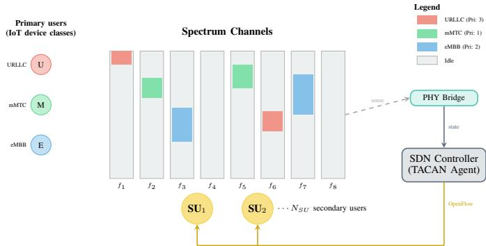
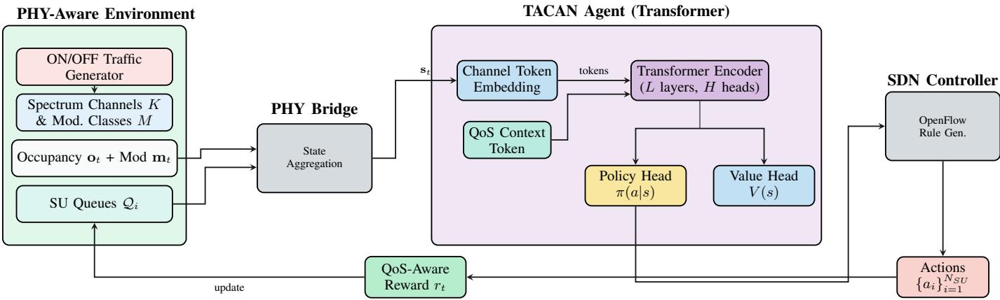
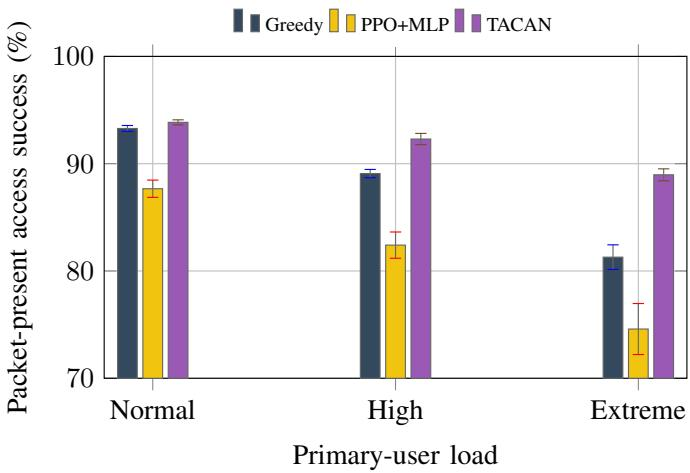
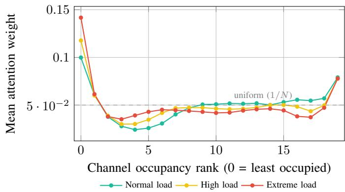

# Channel-Token Attention for Reliable Dynamic Spectrum Access under Bursty Primary-User Traffic

Krishna Acharya, Dinanath Padhya, Utsab Dahal, Ashish Kandel, and Binod Sapkota

Department of Electronics and Computer Engineering, Thapathali Campus

Institute of Engineering, Tribhuvan University, Kathmandu 44600, Nepal

Equal contribution: Krishna Acharya, Dinanath Padhya. Supervisor: Binod Sapkota.

Abstract—Dynamic spectrum access must coordinate secondary users under bursty primary-user activity while preserving packet reliability and delay. We present TACAN, a centralized policy that represents each channel as a token containing occupancy history and automatic-modulation-classification entropy; a context token supplies queue class, delay and user identity. A Transformer encoder is warm-started from an occupancy-greedy policy and refined with proximal policy optimization. The frozen policies were trained to maintain a channel assignment in every slot, including when queues were empty. We therefore replay them on held-out trajectories and distinguish standby assignment success from packet-present access and packet delivery. In a 20- channel network with 60 primary devices and 4 secondary users, TACAN achieves 92.53% ± 0.47 packet-present access success, compared with 89.94% for Greedy and 83.53% for PPO+MLP. Its paired gain over Greedy is 2.59 points (parametric 95% CI 1.89–3.29), with wins in all five seeds; the exact two-sided sign-test value is 0.0625. The gain rises from 0.57 points at normal primary-user load to 7.67 points at extreme load. TACAN also reduces mean delivery delay from 1.208 to 1.123 slots and the conditional user-reliability gap from 9.69 to 3.15 points. Delivered packets per SU-slot remain arrival-limited (30.12% versus 30.11%), so no packet-throughput gain is claimed.

Index Terms—Cognitive radio, Dynamic spectrum access, Reinforcement learning, Resource allocation, Internet of Things, QoS.

## I. INTRODUCTION

Spectrum scarcity is the binding constraint on dense IoT deployment. Sixth generation networks are expected to carry ultra-reliable low-latency communication (URLLC), massive machine-type communication (mMTC) and enhanced mobile broadband (eMBB) over shared bands [1]. Cognitive radio lets secondary users (SUs) transmit in the gaps left by licensed primary users (PUs), but IoT traffic is bursty, heavy tailed and class dependent, so deciding which gap to use is a hard sequential decision problem.

Deep reinforcement learning (DRL) has become a standard tool for this problem [2], [3]. Foundational agents usually flatten the channel history, although graph encoders and attention-based policies now supply relational structure [4]– [7]. We study a representation that combines relational channel structure with a compact uncertainty statistic derived from automatic modulation classification (AMC). Modern AMC can recover modulation classes from raw I/Q samples [8]; here, only normalized posterior entropy is used, not the predicted modulation label. In the simulator, class-conditioned posterior templates make this entropy weakly correlated with primaryuser holding time. Section VI-G measures the contribution and limits of that synthetic feature.

TACAN addresses these limitations by tokenising the spectrum. Each channel becomes one token whose features are its occupancy history and its per-channel AMC entropy, and a single additional QoS context token encodes the class and the normalised queueing delay of the packet the SU is currently trying to send. A Transformer encoder over these K + 1 tokens gives two capabilities that a flat encoder cannot express cheaply. Channel tokens attend to one another, so the representation of one band can incorporate the state of the others and compare its persistence against the load across the spectrum. And the QoS token attends over the channels, so the same network implements a different effective policy depending on whether it is currently serving a latency-critical URLLC packet or a delay-tolerant mMTC report.

The policy is warm-started by behaviour cloning an occupancy-greedy heuristic and refined with PPO. A learnable occupancy prior is added to the policy logits. The reward uses class-dependent access and delay weights, a PU-collision penalty and an explicit URLLC deadline penalty. These components were trained jointly; the current experiments do not isolate their individual effects.

We also expose the policy through a controller interface and measure the simulation-mode Python decision path. This timing is an implementation microbenchmark, not a live SDN deployment result.

## A. Contributions

• Channel tokens with a QoS query. Building on prior relational spectrum policies, we represent each channel by its temporal occupancy and AMC entropy and add a QoS context token that re-ranks the channels for the service class in flight. Complexity is $O ( L ( K { + } 1 ) ^ { 2 } d )$ rather than the $O ( ( H K M ) ^ { 2 } d )$ of attention over the flattened observation.

• Packet-aware checkpoint re-evaluation. We separate continuous standby assignment success from access success on slots with queued packets, packet delivery, delay and per-user reliability. The replay uses frozen policies and identical held-out trajectories.

• Load-dependent reliability analysis. We evaluate mixed and fixed primary-user load regimes over 5 independently trained seeds and report paired effect sizes, parametric intervals and exact sign tests rather than treating slots as independent samples.

## II. RELATED WORK

DRL for dynamic spectrum access. The canonical formulation treats access as a POMDP solved by a deep Qnetwork over an occupancy history. Wang et al. [9] established this for correlated multichannel access and compared against the Whittle index; Naparstek and Cohen [10] extended it to distributed multi-user access without coordination signalling; Yu et al. [2] learned a MAC protocol from scratch for heterogeneous coexistence. Li et al. [11] added joint sensing and bandwidth aggregation, Tan et al. [12] used recurrent networks under centralised training with decentralised execution, and Zhang et al. [13] scaled distributed access to IoT. Wang et al. [3] compress occupancy history for a double DQN, while Chang et al. [14] combine recurrent state with model-generated experience under partial observability. Policy gradient methods have since proved stronger in dense settings: Shraa and Alauthman [15] report large latency reductions for PPO over DQN, Fasihi and Mark [16] add priority-aware rewards for NR-U coexistence, and Song et al. [17] apply DRL to spectrum management under uncertainty. Broader context appears in the surveys of Luong et al. [18]. Most of these agents use flat or recurrent encoders. A parallel line instead imposes graph structure: Jiang et al. [4] map traffic and interference graphs to access decisions, Yuan et al. [5] combine graph attention with DQN for channel and power allocation, and Li et al. [19] couple a GNN and DQN for IoT DSA. These methods establish the value of relational inductive bias, but their nodes encode users or interference relations rather than per-channel temporal and PHY observations.

Attention in cognitive radio. Attention first entered mainly through sensing. Lan et al. [20] combine graph attention with a Transformer for cooperative sensing; Gao et al. [21] use attention to fuse sensing reports across agents; Zhang et al. [22] apply self-attention to wideband detection. Policyside attention is no longer absent. Bai et al. [23] weight users in a centralised critic; Elfikky et al. [6] place selfattention in a distributed optical channel-access policy; and Tondwalkar and Kwasinski [7] add attention to both PPO actor and critic for cognitive-radio power control. Zhao et al. [24] use a Transformer for cellular resource allocation, where the sequences represent users and resources. TACAN therefore does not claim attention itself as novel. Its distinction is the token content and conditioning: each policy token denotes one radio channel and jointly carries occupancy history and an AMC-derived feature, while a QoS query token makes the channel ranking class-conditional.

PHY-aware access. O’Shea et al. [8] established that deep AMC recovers modulation class from raw I/Q over the air, and AMC is now a mature standalone capability on commodity SDR front ends. The literature predominantly treats it as an end in itself: the classifier output is a report, not a policy input.

To our knowledge, prior DSA policies do not feed an AMCderived uncertainty signal into channel-selection reinforcement learning. TACAN closes that loop, and Sec. VI-G measures what the resulting signal is actually worth.

QoS-differentiated access. Traffic-aware DSA predates deep learning: Liu et al. [25] use estimated PU traffic to order channel sensing. Recent learning methods include the ruleassisted, SU-traffic-aware MARL policy of Si et al. [26]. Iqbal et al. [27] allocate channels by priority class for vehicular IoT and Qian et al. [28] share spectrum across operators for massive IoT. Barqi et al. [29] and Jalil et al. [30] target fairness in distributed access. These condition on class through separate policies, per-class weights or fixed priority rules. We condition a single shared policy through a learned QoS token that participates in the attention mechanism, so one set of weights serves all classes and the class identity re-ranks the channels rather than re-selecting the network.

SDN for cognitive radio. Kobo et al. [31] and Akyildiz et al. [32] argue for SDN as the control plane of wireless systems. Liu et al. [33] pair reinforcement learning with a softwaredefined controller for industrial IoT spectrum access using a flat network. We keep the architectural premise and replace the agent, and we report measured controller loop latency rather than assuming it is negligible.

Traffic modelling. Realistic IoT traffic is neither Poisson nor saturated. El Fawal et al. [34] model machine-to-machine heterogeneous traffic with Markov-modulated Poisson processes, Paxson and Floyd [35] document the failure of Poisson modelling at scale, and Gajewski et al. [36] argue for Pareto service times under burstiness. Motivated by this literature, our implemented generator is a discrete-time ON/OFF semi-Markov process with Bernoulli activation and clipped-Pareto busy periods. This temporal persistence makes the current-slot genie of Sec. VI a useful reactive reference.

Positioning. Attention, relational encoders, SDN integration, QoS-aware rewards and heavy-tailed traffic all have precedents. TACAN’s claimed novelty is their specific policy representation: per-channel tokens fuse occupancy history with AMC entropy, and a QoS query token makes one shared policy class-conditional. Table I separates that representation from attention over users, interference graphs, sensing reports and generic state sequences.

## III. SYSTEM MODEL

## A. Network Scenario

We consider K orthogonal channels ${ \mathcal { C } } = \{ 1 , \ldots , K \}$ shared by $N _ { P U }$ primary IoT devices and $N _ { S U }$ secondary users coordinated by a centralised SDN controller (Fig. 1). Each PU belongs to one of the three 3GPP service classes and is assigned to one channel. SUs opportunistically transmit on channels they believe to be idle. If two SUs pick the same channel both fail, so the controller must also avoid selfcollisions.

TABLE I  
POSITION OF TACAN RELATIVE TO THE CLOSEST PRIOR WORK. ATT. TARGET IS WHAT ATTENTION OPERATES OVER; PHY DENOTES PHYSICAL-LAYERFEATURES IN THE OBSERVATION.
<table><tr><td>Work</td><td>Att. target</td><td>Where</td><td>QoS</td><td>PHY</td><td>SDN</td></tr><tr><td>[2], [9]</td><td>none</td><td>n/a</td><td>no</td><td>no</td><td>no</td></tr><tr><td>[10], [12]</td><td>none</td><td>n/a</td><td>no</td><td>no</td><td>no</td></tr><tr><td>[21], [22]</td><td>sensing reports</td><td>detector</td><td>no</td><td>I/Q</td><td>no</td></tr><tr><td>[20]</td><td>sensor nodes</td><td>detector</td><td>no</td><td>I/Q</td><td>no</td></tr><tr><td>[23]</td><td>users</td><td>critic</td><td>no</td><td>no</td><td>no</td></tr><tr><td>[4], [5]</td><td>graph neighbours</td><td>policy</td><td>traffic</td><td>no</td><td>no</td></tr><tr><td>[6]</td><td>state sequence</td><td>policy</td><td>no</td><td>no</td><td>no</td></tr><tr><td>[7]</td><td>state features</td><td>actor+critic</td><td>no</td><td>no</td><td>no</td></tr><tr><td>[24]</td><td>user requests</td><td>policy</td><td>no</td><td>no</td><td>no</td></tr><tr><td>[27]</td><td>none</td><td>n/a</td><td>rule</td><td>no</td><td>no</td></tr><tr><td>[33]</td><td>none</td><td>n/a</td><td>no</td><td>no</td><td>yes</td></tr><tr><td>TACAN</td><td>channels</td><td>policy</td><td>token</td><td>AMC</td><td>yes</td></tr></table>

  
Fig. 1. SDN-enabled cognitive radio network. Primary IoT devices of three service classes occupy channels with class-specific traffic and modulation. The controller runs the TACAN policy and produces channel-assignment recommendations for the secondary users.

## B. Traffic and PHY Model

Each PU device follows a discrete-time ON/OFF semi-Markov process. While idle, it activates with probability $p _ { \mathrm { a c t } } = 1 - e ^ { - \lambda _ { d } l }$ , the probability of at least one event in a Poisson interval at load multiplier l. At activation, its busy duration is a rounded, clipped Pareto draw,

$$
\begin{array} { r l } & { \tau = \mathrm { r o u n d } \big ( \operatorname* { m i n } \{ H , \operatorname* { m a x } \{ L , x _ { m } ( 1 + Y ) \} \} \big ) , } \\ & { Y \sim \mathrm { P a r e t o } ( \alpha ) , } \end{array}\tag{1}
$$

which produces persistent, heavy-tailed busy periods with endpoint clipping. Class parameters are given in Table II.

Each simulated class carries a characteristic distribution over M = 10 modulation schemes. URLLC is dominated by BPSK and QPSK, mMTC by OOK and BPSK, and eMBB by 16QAM. At each step the simulator samples a classconditioned AMC posterior $\mathbf { m } _ { t , k } \in \mathbb { R } ^ { M }$ per channel, from which we compute the normalised entropy

$$
e _ { t , k } = - \frac { 1 } { \log M } \sum _ { j = 1 } ^ { M } m _ { t , k , j } \log m _ { t , k , j } .\tag{2}
$$

TABLE II  
IOT TRAFFIC CLASS PARAMETERS. DURATIONS ARE IN SLOTS.
<table><tr><td>Class</td><td>Pri.</td><td>λ</td><td>α</td><td>Dur.</td><td>Dominant mod.</td></tr><tr><td>URLLC</td><td>3</td><td>1/8</td><td>0.8</td><td>1 to 10</td><td>BPSK 40%, QPSK 50%</td></tr><tr><td>mMTC</td><td>1</td><td>1/60</td><td>0.5</td><td>1 to 5</td><td>OOK 35%, BPSK 40%</td></tr><tr><td>eMBB</td><td>2</td><td>1/12</td><td>1.5</td><td>5 to 40</td><td>16QAM 50%, 8PSK 15%</td></tr></table>

We use entropy because it is permutation invariant and compresses M dimensions to one, keeping the per-channel token small. It preserves posterior concentration, not the identity of the predicted modulation. The class-conditioned templates have different concentration and therefore make entropy classcorrelated in this simulation; validating that correlation with a real noisy AMC front end remains outside the present evidence.

## C. Decision Problem

The task is a partially observable Markov decision process $\langle S , \mathcal { A } , \mathcal { P } , R , \gamma \rangle$ . Secondary user i observes

$$
s _ { t , i } = [ \mathbf { O } _ { t } \ \middle | \ \middle | \ \mathbf { E } _ { t } \ \middle | \ \middle | \ \mathbf { q } _ { i } \ | \ \middle | \ d _ { i } \ \middle | \ \middle | \ \mathbf { u } _ { i } ] ,\tag{3}
$$

where $\mathbf { O } _ { t } \in \{ 0 , 1 \} ^ { H \times K }$ is the occupancy history over the last H slots, $\mathbf { E } _ { t } \ \in \ [ 0 , 1 ] ^ { H \times K }$ the matching modulation entropy history from (2), $\bar { \mathbf { q } _ { i } } \in \{ 0 , 1 \} ^ { 3 }$ a one-hot class indicator for the head-of-line packet, $d _ { i }$ its normalised queueing delay, and u a one-hot SU identifier. With $H ~ = ~ 8 , ~ K ~ = ~ 2 0$ and $N _ { S U } ~ = ~ 4$ this gives 328 dimensions per SU. The action $a _ { t , i } \in \{ 1 , \ldots , K \}$ is a channel index; the controller emits $N _ { S U }$ actions per slot. This implementation maintains an assignment for every SU in every slot. If a queue is empty, the assignment is a standby channel recommendation rather than a packet transmission. Section VI therefore reports assignment success over all slots separately from access success on slots where a packet is queued. The objective is the usual discounted return $\begin{array} { r } { \dot { \boldsymbol { J } } ( \pi ) = \mathbb { E } _ { \tau \sim \pi } \big [ \sum _ { t } \gamma ^ { t } \sum _ { i } \boldsymbol { r } _ { t , i } \big ] } \end{array}$

## IV. THE TACAN ARCHITECTURE

Fig. 2 shows the complete pipeline. The design question is how to turn (3), a flat vector, into something whose structure matches the problem.

## A. Spectrum Tokenisation

For channel k we assemble a token from the three quantities the agent needs about that band: its occupancy history, its modulation-entropy history, and its mean occupancy, which is exactly the statistic the greedy heuristic acts on and which therefore gives the network direct access to the baseline signal:

$$
\begin{array} { r } { \mathbf { x } _ { k } = \left[ \mathbf { o } _ { : , k } ~ \Big | \mid \mathbf { e } _ { : , k } ~ \Big | \Big | ~ \frac { 1 } { H } \sum _ { h } o _ { h , k } \right] \in \mathbb { R } ^ { 2 H + 1 } , } \end{array}\tag{4}
$$

$$
\mathbf { z } _ { k } = \mathrm { G E L U } \big ( \mathrm { L N } ( \mathbf { W } _ { e } \mathbf { x } _ { k } + \mathbf { b } _ { e } ) \big ) \in \mathbb { R } ^ { d } .\tag{5}
$$

The QoS context of the serving SU is projected by a separate head into one additional token $\begin{array} { r l } { { \bf z } _ { \mathrm { Q o S } } } & { { } = } \end{array}$ $\operatorname { G E L U } ( \operatorname { L N } ( \mathbf { W } _ { q } [ \mathbf { q } _ { i } \Vert d _ { i } ] + \mathbf { b } _ { q } ) )$ . Learnable positional embeddings $\textbf { P } \in \bar { \mathbb { R } } ^ { ( K + 1 ) \times d }$ are added to the sequence ${ \textbf { Z } } =$ $[ \mathbf { z } _ { \mathrm { Q o S } } , \mathbf { z } _ { 1 } , \dots , \mathbf { z } _ { K } ]$

Unlike a flat encoder, Eq. (4) applies one shared feature extractor to all channels. The subsequent attention layers compare the resulting channel representations.

## B. Encoder and Heads

L pre-norm Transformer blocks are applied,

$$
\mathbf { Z } ^ { \prime } = \mathbf { Z } + \mathrm { M H A } \big ( \mathrm { L N } ( \mathbf { Z } ) \big ) ,\tag{6}
$$

$$
\mathbf { Z } ^ { \prime \prime } = \mathbf { Z } ^ { \prime } + \mathrm { F F N } \big ( \mathrm { L N } ( \mathbf { Z } ^ { \prime } ) \big ) ,\tag{7}
$$

with $N _ { H }$ heads and a two-layer GELU feed-forward network of width 4d. Writing $\mathbf { H } = [ \mathbf { h } _ { \mathrm { Q o S } } , \mathbf { h } _ { 1 } , \dots , \mathbf { h } _ { K } ]$ for the output, the policy takes per-channel logits through a shared linear head and adds a learnable residual on the greedy occupancy prior,

$$
\boldsymbol { \ell } _ { k } = { \mathbf w } _ { \pi } ^ { \top } { \mathbf h } _ { k } - \alpha _ { g } \sum _ { h = 1 } ^ { H } o _ { h , k } , \qquad \boldsymbol { \pi } ( a = k \mid s ) = \mathrm { s o f t m a x } _ { k } ( \ell ) ,\tag{8}
$$

where $\alpha _ { g }$ is a scalar parameter learned jointly with the rest of the network. The second term encodes the heuristic that emptier channels are better; learning $\alpha _ { g }$ lets the agent decide how much to trust it, and the network output supplies the correction. The value head reads the QoS token pooled with the channel mean, $\begin{array} { r } { V ( s ) = \mathrm { M L P } ( \mathbf { h } _ { \mathrm { Q o S } } + \frac { 1 } { K } \sum _ { k } \bar { \mathbf { h } _ { k } } ) } \end{array}$ . An auxiliary head predicts next-slot occupancy per channel from $\mathbf { h } _ { k } ;$ its loss is added with weight 0.1 and acts as a representation regulariser that forces the encoder to be predictive rather than merely descriptive.

Attention over $K + 1$ tokens costs $O ( L ( K { + } 1 ) ^ { 2 } d )$ per forward pass. Applying attention to the raw observation instead would cost $O ( ( H K M ) ^ { 2 } d )$ , which for our configuration is four orders of magnitude larger.

## C. QoS-Differentiated Reward

For SU i serving a class-c packet at step t,

$$
\begin{array} { r l } & { r _ { t , i } = w _ { T } ^ { ( c ) } \mathbb { I } ( \operatorname { s u c c e s s } _ { i } ) - w _ { D } ^ { ( c ) } \operatorname * { m i n } \Bigl ( \frac { d _ { i } } { d _ { \operatorname * { m a x } } } , 1 \Bigr ) } \\ & { \phantom { r _ { t , i } = } - \beta \mathbb { I } ( \operatorname { P U } \operatorname { c o l l i s i o n } _ { i } ) - \delta \mathbb { I } ( c = \operatorname { U R L L C } , d _ { i } > 1 0 ) , } \end{array}\tag{9}
$$

with $\beta = 1 . 5 , \delta = 5 . 0$ and $d _ { \operatorname* { m a x } } = 5 0$ . The executed class weights are $( w _ { T } , w _ { D } ) \ = \ ( 3 . 0 , 2 . 0 )$ for URLLC, (1.0, 0.2) for mMTC and (1.5, 0.5) for eMBB. Thus URLLC receives the largest success weight, a delay weight ten times that of mMTC and an additional penalty after ten slots. The reported checkpoints use no switching or fairness bonus; those optional implementation coefficients are zero. During legacy training, empty queues receive a zero-valued queue context and are treated as mMTC for reward lookup, while collision-free standby assignments still receive the success term. The packetaware analysis in Sec. VI removes these standby outcomes from packet-attempt and delivery metrics, but it does not retrain the policies.

## D. Training

Training has two stages. First the policy is behaviour cloned for 20,000 steps against the occupancy-greedy heuristic, which places it in a competent region of policy space and avoids the long random-exploration phase in which PPO would otherwise collide constantly. Then PPO [37] with generalised advantage estimation optimises the clipped surrogate

$$
L ^ { \mathrm { C L I P } } ( \theta ) = \mathbb { E } _ { t } \Big [ \operatorname* { m i n } \big ( \rho _ { t } \hat { A } _ { t } , \ \mathrm { c l i p } ( \rho _ { t } , 1 - \epsilon , 1 + \epsilon ) \hat { A } _ { t } \big ) \Big ] ,\tag{10}
$$

$\rho _ { t } ~ = ~ \pi _ { \theta } ( a _ { t } | s _ { t } ) / \pi _ { \theta _ { \mathrm { o l d } } } ( a _ { t } | s _ { t } )$ , with the value, entropy and auxiliary-prediction losses added. Transitions from all $N _ { S U }$ users share one buffer with per-minibatch advantage normalisation. The learning rate is cosine annealed from $3 \times 1 0 ^ { - 4 }$ to $1 0 ^ { - 5 }$ after a 3% warmup, the entropy coefficient from 0.03 to 0.01, and gradients are clipped at 0.5. TACAN and PPO+MLP share the PPO schedule, reward, warm start and seeds. TACAN additionally has the auxiliary prediction head, the learned greedy-prior term and 485,892 parameters, whereas the MLP has 155,413 parameters. Their comparison therefore evaluates complete training configurations and does not isolate attention from supervision, prior structure or capacity.

## V. CONTROLLER INTEGRATION

The trained policy is exposed through a three-stage controller interface. A simulation bridge collects occupancy, AMC posteriors, history and queue state; a decision engine builds the observation in Eq. (3); and a rule builder converts channel assignments into Python dictionaries with OpenFlow-like fields. The default polling interval is 500 ms.

The repository also contains prototype Ryu and Mininet-WiFi adapters inspired by [38]. They are not exercised in the reported experiments: the live bridge uses placeholder queue state, and no OpenFlow transport, switch installation or radio retuning is included in the latency measurement. Section VI-H therefore reports only the simulation-mode decision path.

  
Fig. 2. TACAN pipeline. The PHY bridge aggregates occupancy and AMC output into the observation. Each channel becomes one token; the serving SU’s traffic class and delay become a QoS context token. A Transformer encoder mixes them, per-channel logits form the policy and the QoS token drives the value head. The controller converts assignments into rule descriptions.

## VI. EVALUATION

## A. Setup

The environment has K = 20 channels, $N _ { P U } = 6 0$ primary devices, $N _ { S U } = 4$ secondary users, history length $H = 8$ and episodes of 200 slots. At reset, the load multiplier is sampled as 1.0, 1.5 or 2.5 with probabilities 0.50, 0.35 and 0.15. TACAN and PPO+MLP are trained for 500,000 environment steps under 5 seeds (42, 123, 7, 2024, 314). We replay each frozen policy for 10,000 steps on matched held-out seeds under mixed load and each fixed primary-user load. No retraining is performed for the packet-aware analysis. A slot is a simulation decision epoch without an assumed mapping to wall-clock duration; delay values are therefore reported in slots rather than milliseconds.

We distinguish four outcomes. Assignment success is the legacy metric: the recommended channel is free of PU and SU contention, including standby assignments made for empty queues. Packet-present access success is the fraction of queued transmission attempts that deliver a packet. Delivery rate is delivered packets per SU-slot, and delivery delay is measured in slots. Packet accounting includes synthetic reset packets, stochastic arrivals, silent queue-capacity drops and packets censored at episode boundaries.

The comparison includes a coordinated random policy that selects distinct channels, Greedy, PPO+MLP, TACAN and a current-slot genie. The PPO+MLP configuration shares the observation, reward, warm start, PPO schedule and seeds, but it is smaller and lacks TACAN’s auxiliary head and greedy-prior term; it is not an attention-only ablation. DDQN is omitted because only a cached scalar, not a matched checkpoint, is available.

## B. Overall Performance

Table III separates standby assignment from packet service. The legacy TACAN assignment-success rate is 92.93%, but 67.59% of its successful assignments occur while the queue is empty. This value is therefore not packet throughput. On slots with a queued packet, TACAN succeeds on 92.53% ± 0.47 of attempts, compared with 89.94% for Greedy and 83.53% for PPO+MLP. Delivered packets per SU-slot are nearly equal for TACAN (30.12%) and Greedy (30.11%) because the fixed 30% arrival process limits offered traffic. We therefore claim improved access reliability and delay, not higher packet throughput. TACAN’s mean delivery delay is 1.123 slots, against 1.208 for Greedy and 1.359 for PPO+MLP.

## C. Paired Uncertainty

Table IV reports paired differences across the five independently trained seeds. TACAN improves packet-present access over Greedy by 2.59 points, with a parametric 95% interval of 1.89 to 3.29 points, and wins in 5/5 seeds. However, five pairs are too few for a distribution-free significance claim: the exact two-sided sign-test value is 0.0625. We therefore emphasize the paired effect size, interval and consistency rather than treating a small-sample t-test as decisive. The PPO+MLP difference is larger but remains a whole-configuration comparison, not an attention-only effect.

## D. Behaviour Under Load

Fig. 3 and Table V decompose packet-present access by primary-user load; SU arrivals remain fixed. TACAN and Greedy are close at normal load (93.85% versus 93.28%), a 0.57-point difference. At extreme load the difference grows to 7.67 points (88.96% versus 81.29%). This pattern holds in every seed and is consistent with temporal context becoming more useful as idle periods become scarce. It does not establish the mechanism causally because the complete TACAN and Greedy configurations differ in several ways.

## E. Per-Class Service and Fairness

Table VI shows that TACAN’s packet-present access success is similar across classes: 92.56% for URLLC, 92.53% for mMTC and 92.50% for eMBB. The corresponding Greedy values are 89.72%, 90.01% and 89.99%. Mean delivery delays are also lower with TACAN in all three classes. The URLLC miss rate is 0.00% for TACAN and 0.16% for Greedy. Because the class weights, deadline penalty and QoS token are not ablated separately, these differences cannot be assigned to one component.

TABLE III  
PACKET-AWARE RE-EVALUATION OF THE FROZEN POLICIES (MEAN ± STANDARD DEVIATION OVER FIVE SEEDS). ASSIGNMENT SUCCESS INCLUDES STANDBY ASSIGNMENTS; ACCESS SUCCESS IS CONDITIONED ON A QUEUED PACKET. DEL./SLOT IS DELIVERED PACKETS PER SU-SLOT, AND USER GAP IS THE MAX–MIN CONDITIONAL-ACCESS GAP.
<table><tr><td>Method</td><td>Assignment (%)</td><td>Packet-present access (%)</td><td>Del./slot (%)</td><td>Mean delay</td><td>P95 delay</td><td>User gap (pp)</td></tr><tr><td>Random (coordinated)</td><td> $5 1 . 6 5 \pm 0 . 6 0$ </td><td> $5 0 . 2 6 \pm 0 . 8 5$ </td><td>29.67</td><td>3.760</td><td>11.850</td><td>1.29</td></tr><tr><td>Greedy</td><td> $9 1 . 6 0 \pm 0 . 3 2$ </td><td> $8 9 . 9 4 \pm 0 . 5 7$ </td><td>30.11</td><td>1.208</td><td>2.000</td><td>9.69</td></tr><tr><td>PPO+MLP</td><td> $8 6 . 1 1 \pm 0 . 7 7$ </td><td> $8 3 . 5 3 \pm 0 . 9 8$ </td><td>30.08</td><td>1.359</td><td>3.000</td><td>9.75</td></tr><tr><td>TACAN</td><td> ${ \bf 9 2 . 9 3 \pm 0 . 1 4 }$ </td><td> $\mathbf { 9 2 . 5 3 \ : \pm { \ : 0 . 4 7 } }$ </td><td>30.12</td><td>1.123</td><td>2.000</td><td>3.15</td></tr><tr><td>Current-slot genie</td><td> $8 8 . 3 0 \pm 0 . 4 1$ </td><td> $8 8 . 1 3 \pm 0 . 3 2$ </td><td>30.10</td><td>1.203</td><td>2.000</td><td>1.45</td></tr></table>

The policies were trained under continuous per-slot channel assignment. These packet-aware metrics are a post hoc replay of the frozen checkpoints; no retraining was performed.

TABLE IV  
PAIRED PACKET-AWARE DIFFERENCES FOR TACAN. CONFIDENCE INTERVALS ARE PARAMETRIC STUDENT-t INTERVALS; THE EXACT SIGN TEST IS REPORTED BECAUSE ONLY FIVE TRAINED SEEDS ARE AVAILABLE.
<table><tr><td>TACAN vs.</td><td>Metric</td><td>Mean</td><td>95% CI</td><td>Wins</td><td>Exact p</td></tr><tr><td>Greedy</td><td>Access success (pp)</td><td>+2.59</td><td>[1.89, 3.29]</td><td>5/5</td><td>0.0625</td></tr><tr><td>Greedy</td><td>Mean-delay reduction</td><td>+0.09</td><td>[0.06, 0.11]</td><td>5/5</td><td>0.0625</td></tr><tr><td>Greedy</td><td>User-gap reduction (pp)</td><td>+6.54</td><td>[5.82, 7.27]</td><td>5/5</td><td>0.0625</td></tr><tr><td>PPO+MLP</td><td>Access success (pp)</td><td>+9.00</td><td>[7.94, 10.06]</td><td>5/5</td><td>0.0625</td></tr><tr><td>PPO+MLP</td><td>Mean-delay reduction</td><td>+0.24</td><td>[0.17, 0.30]</td><td>5/5</td><td>0.0625</td></tr><tr><td>PPO+MLP</td><td>User-gap reduction (pp)</td><td>+6.60</td><td>[4.87, 8.33]</td><td>5/5</td><td>0.0625</td></tr></table>

  
Fig. 3. Packet-present access success by primary-user load, mean ±1 standard deviation over 5 seeds.

TABLE V  
PACKET-PRESENT ACCESS SUCCESS (%) BY PRIMARY-USER LOAD, AVERAGED OVER FIVE SEEDS.
<table><tr><td>Method</td><td>Normal</td><td>High</td><td>Extreme</td></tr><tr><td>Greedy</td><td>93.28</td><td>89.08</td><td>81.29</td></tr><tr><td>PPO+MLP</td><td>87.67</td><td>82.41</td><td>74.59</td></tr><tr><td>TACAN</td><td>93.85</td><td>92.30</td><td>88.96</td></tr><tr><td>Current-slot genie</td><td>90.34</td><td>87.04</td><td>82.69</td></tr></table>

TABLE VI  
PACKET-PRESENT ACCESS SUCCESS AND MEAN DELIVERY DELAY BY TRAFFIC CLASS, AVERAGED OVER FIVE SEEDS.
<table><tr><td></td><td colspan="2">URLLC</td><td colspan="2">mMTC</td><td colspan="2">eMBB</td></tr><tr><td>Method</td><td>Access (%)</td><td>Delay</td><td>Access (%)</td><td>Delay</td><td>Access (%)</td><td>Delay</td></tr><tr><td>Greedy</td><td>89.72</td><td>1.209</td><td>90.01</td><td>1.211</td><td>89.99</td><td>1.196</td></tr><tr><td>PPO+MLP</td><td>83.14</td><td>1.353</td><td>83.43</td><td>1.367</td><td>84.26</td><td>1.339</td></tr><tr><td>TACAN</td><td>92.56</td><td>1.121</td><td>92.53</td><td>1.124</td><td>92.50</td><td>1.121</td></tr></table>

Table VII separates two fairness questions. TACAN reduces the max–min conditional-access gap from 9.69 to 3.15 points and the mean-delay gap from 0.312 to 0.066 slots. In contrast, the per-slot delivery-rate gaps are nearly identical (0.97 versus 0.98 points) because delivery is limited by the common arrival process. We therefore claim improved reliability and delay balance, not improved delivered-throughput fairness. Sequential masking prevents same-slot duplicate channel choices for both TACAN and Greedy; their fairness difference is not caused by SU self-collisions.

TABLE VII  
PACKET-AWARE INTER-USER FAIRNESS. GAPS ARE MAX–MIN DIFFERENCES AVERAGED OVER FIVE SEEDS.
<table><tr><td>Method</td><td>Access gap (pp)</td><td>Delivery gap (pp)</td><td>Delay gap</td><td>Access Jain</td></tr><tr><td>Greedy</td><td>9.69</td><td>0.97</td><td>0.312</td><td>0.9983</td></tr><tr><td>PPO+MLP</td><td>9.75</td><td>0.98</td><td>0.350</td><td>0.9980</td></tr><tr><td>TACAN</td><td>3.15</td><td>0.98</td><td>0.066</td><td>0.9998</td></tr></table>

## F. What the Attention Learns

Fig. 4 plots the attention of the QoS token over the channel tokens in the final encoder block, against each channel’s occupancy rank in the current window. These are the trained weights the policy actually uses, extracted from the encoder’s self-attention rather than from a separate probe. Channel identity is arbitrary and differs by seed, so ranking by occupancy is the only meaningful alignment.

The distribution is non-uniform and U-shaped. Mass concentrates on the least occupied channels, which are the transmission candidates, and on the most occupied ones, which are the dominant interferers, while mid-rank channels sit at or below uniform 1/K. The peaks reach roughly twice uniform, rising from 0.0999 at nominal load to 0.1417 under extreme load. Attention to busy channels may summarize channel persistence and overall congestion, but the weights alone do not establish a causal mechanism. This pattern is therefore treated as descriptive.

  
Fig. 4. Trained attention of the QoS token over channel tokens (final block, averaged over heads and 5 seeds) against occupancy rank. The distribution is U-shaped and departs substantially from uniform 1/K (dashed).

## G. Ablations

Table VIII separates two questions that are often conflated.

Group (a) compares complete encoders: TACAN has channel tokens, attention and an auxiliary occupancy head (485,892 parameters), whereas PPO+MLP is a 155,413- parameter flat network without the auxiliary loss or greedy-prior term. The 6.82-point assignment-success gap therefore compares full configurations and does not isolate attention.

Group (b) is input perturbation: the trained policy is left untouched and one modality is suppressed at inference. Zeroing the modulation entropy costs 2.89 points and collapsing the history to its most recent frame costs 4.77 points in standby assignment success. These numbers must be read with care. Zeroing drives a feature to a value the policy never observes during training, so the drop mixes loss of information with distribution shift; group (c) separates the two for the AMC feature. The unperturbed row reproduces the stored assignment-success result exactly.

TABLE VIII  
STANDBY-ASSIGNMENT ABLATION. GROUP (A) COMPARES COMPLETE RETRAINED ENCODERS; THE MLP IS SMALLER AND LACKS TACAN’S AUXILIARY HEAD, SO THE ROW IS NOT AN ATTENTION-ONLY ABLATION. GROUP (B) SUPPRESSES AN INPUT MODALITY AT INFERENCE TIME FOR THE same TRAINED TACAN POLICY. ∆A IS THE ASSIGNMENT-SUCCESS CHANGE IN PERCENTAGE POINTS.
<table><tr><td>Configuration</td><td>Assignment success (%)</td><td>Assignment failure (%)</td><td>∆A (pp)</td></tr><tr><td>TACAN (full)</td><td>92.93 ± 0.14</td><td>7.07</td><td>n/a</td></tr><tr><td colspan="4">(a) Complete encoder comparison (independently retrained, shared PPO schedule)</td></tr><tr><td>PPO+MLP (155k, no auxiliary head)</td><td>86.11 ± 0.77</td><td>13.89</td><td>-6.82</td></tr><tr><td colspan="4">(b) Input-perturbation ablation (same trained policy, feature suppressed at inference)</td></tr><tr><td>Unmodified observation</td><td>92.93 ± 0.14</td><td>7.07</td><td>n/a</td></tr><tr><td>— AMC-entropy feature</td><td>90.04 ± 1.31</td><td>9.96</td><td>-2.89</td></tr><tr><td>— Occupancy history (single frame)</td><td>88.16 ± 0.24</td><td>11.84</td><td>-4.77</td></tr></table>

Group (c) separates information from distribution shift for the AMC feature. Instead of zeroing it, we blend a uniform posterior into the simulated AMC output at evaluation time.

At full blending the posterior is uniform on every channel, so the feature carries no information about the emitter, yet it stays inside its natural range. The standby assignment-success cost is 0.35 points, an order of magnitude smaller than the 2.89 points obtained by zeroing. The honest reading is that most of the zeroing penalty is distribution shift, and that the AMC signal is worth roughly 0.35 assignment points in this environment. Degradation is monotone in the blending rate, so a realistic front end with partial confidence loss would sit between these endpoints.

TABLE IX  
STANDBY-ASSIGNMENT SENSITIVITY TO AMC POSTERIOR FLATTENING, OVER 5 MATCHED SEEDS. THE MIXING RATE IS THE FRACTION OF A UNIFORM POSTERIOR BLENDED INTO THE SIMULATED AMC OUTPUT.
<table><tr><td>Uniform mix (%)</td><td>Assignment success (%)</td><td>∆A (pp)</td><td>Failure (%)</td></tr><tr><td>0 (original)</td><td> $9 2 . 9 3 \pm 0 . 1 4$ </td><td>+0.00</td><td>7.07</td></tr><tr><td>25</td><td> $9 2 . 8 9 \pm 0 . 1 7$ </td><td>-0.04</td><td>7.11</td></tr><tr><td>50</td><td> $9 2 . 7 2 \pm 0 . 3 1$ </td><td>-0.21</td><td>7.28</td></tr><tr><td>75</td><td> $9 2 . 6 4 \pm 0 . 3 5$ </td><td>-0.29</td><td>7.36</td></tr><tr><td>100</td><td> $9 2 . 5 9 \pm 0 . 3 2$ </td><td>-0.35</td><td>7.41</td></tr></table>

## H. Simulation Decision-Path Cost

Table X reports a Python microbenchmark of the simulation-mode decision path. State extraction, policy inference and rule-dictionary construction take 5.01 ms at the median and 17.27 ms at the 95th percentile on one CPU core. Policy inference dominates at 4.943 ms. The measurement excludes sensing, AMC inference, OpenFlow serialization and transport, switch rule installation, and radio retuning; it is therefore not an end-to-end networking latency. With 485,892 parameters, the model occupies a few megabytes in single precision.

TABLE X  
SIMULATION-MODE CONTROLLER DECISION-PATH LATENCY (1000 CYCLES, SINGLE CPU CORE). THE MEASUREMENT EXCLUDES SENSING, AMC INFERENCE, OPENFLOW TRANSPORT AND INSTALLATION, AND RADIO CHANNEL SWITCHING.
<table><tr><td>Component</td><td>Median (ms)</td><td>95th pct. (ms)</td></tr><tr><td>Simulation state extraction</td><td>0.041</td><td>0.087</td></tr><tr><td>Policy inference</td><td>4.943</td><td>17.097</td></tr><tr><td>Rule-dictionary construction</td><td>0.033</td><td>0.069</td></tr><tr><td>Total measured path</td><td>5.01</td><td>17.27</td></tr></table>

## VII. DISCUSSION

## A. Interpreting the Packet-Aware Result

The packet-aware replay changes the meaning of the legacy result. A high standby assignment-success rate does not imply high packet throughput because most queues are empty under the 30% arrival process. TACAN and Greedy therefore deliver almost the same number of packets per SU-slot. The discriminating result is conditional reliability: when a packet is queued, TACAN is more likely to assign a collision-free channel, particularly under high PU load. This reduces delivery delay and conditional reliability imbalance. It does not demonstrate increased offered traffic or packet throughput.

## B. What Each Component Contributes

The evidence supports the TACAN configuration as a package. Relative to PPO+MLP, packet-present access improves by 9.00 points and mean delay falls by 0.24 slots. The comparison also changes tokenisation, attention, auxiliary supervision, the greedy-prior term and capacity, so it does not identify the contribution of attention alone.

The AMC-derived entropy feature contributes a small but consistent gain, and the size of that gain depends on how it is measured. Zeroing it costs 2.89 standby assignment points, but destroying its information content while keeping it in range costs only 0.35 points, so the larger number is mostly distribution shift rather than lost information. Even the smaller result is not evidence that the policy identifies modulation order, since entropy discards the posterior argmax; the simulated class templates differ in concentration, so entropy is merely correlated with traffic class and hence with holding time. The feature is a genuine but modest contributor here, and its value under a real AMC front end is untested.

Packet-present reliability is similar across URLLC, mMTC and eMBB, and TACAN improves it over Greedy in each class. The reward weights, deadline penalty and QoS token all affect these results; their individual contributions are not isolated.

Behaviour cloning and the learned greedy-prior term provide an engineering warm start. No no-warm-start experiment was run, so neither convergence stability nor final reliability is attributed to those components individually.

## C. Cost and Integration Scope

The whole model is 485,892 parameters, a few megabytes in single precision, and the measured simulation decision path costs 5.01 ms (Sec. VI-H). Attention over K channel tokens is $O ( K ^ { 2 } d )$ , which at K = 20 is negligible; the quadratic term would begin to matter only for wideband deployments with hundreds of channels, where the standard remedies of local windows or channel grouping apply directly because the token axis is the frequency axis. Nothing here requires a GPU at inference.

## D. Limitations

Five limitations bound the result. First, the policies were trained with continuous per-slot assignments, including standby assignments for empty queues; packet-aware metrics are a post hoc replay rather than packet-gated retraining. Second, only five trained seeds are available. Parametric intervals are reported, but the exact sign test cannot reject zero at 5% with five all-positive pairs. Third, PPO+MLP is not capacityor supervision-matched to TACAN. Fourth, sensing is ideal and AMC posteriors come from synthetic class-conditioned templates; only one channel/user configuration is trained. Fifth, evaluation is entirely simulated, and the controller timing excludes the live networking path. These limitations preclude claims of attention causality, packet-throughput gain, general scaling or deployed SDN performance.

## VIII. CONCLUSION

TACAN treats the spectrum as a token sequence rather than a flat vector, gives each channel token an AMC-derived entropy feature alongside its occupancy history, and lets a QoS context token query the resulting representation so one policy adapts to queue context. A packet-aware replay of the five frozen checkpoints yields 92.53% packet-present access success, compared with 89.94% for Greedy and 83.53% for PPO+MLP. TACAN also lowers mean delivery delay to 1.123 slots and reduces the conditional user-reliability gap to 3.15 points. The gain over Greedy increases with primary-user load and appears in all five seeds. Packet deliveries per SUslot remain essentially unchanged because the experiment is arrival-limited, so no packet-throughput gain is claimed. The result supports the complete TACAN configuration as a reliability-oriented channel-assignment policy within the evaluated simulator. Section VII-D summarizes the scope of that evidence.

## REFERENCES

[1] ITU-R, “IMT vision: Framework and overall objectives of the future development of IMT for 2020 and beyond,” International Telecommunication Union, Recommendation ITU-R M.2083-0, 2015.

[2] Y. Yu, T. Wang, and S. C. Liew, “Deep-reinforcement learning multiple access for heterogeneous wireless networks,” IEEE Journal on Selected Areas in Communications, vol. 37, no. 6, pp. 1277–1290, 2019.

[3] X. Wang, Y. Teraki, M. Umehira, H. Zhou, and Y. Ji, “A usage aware dynamic spectrum access scheme for interweave cognitive radio network by exploiting deep reinforcement learning,” Sensors, vol. 22, no. 18, p. 6949, 2022.

[4] H. Jiang, H. He, and L. Liu, “Dynamic spectrum access for femtocell networks: A graph neural network based learning approach,” in Proc. International Conference on Computing, Networking and Communications (ICNC), 2020, pp. 927–931.

[5] S. Yuan, Y. Zhang, T. Ma, Z. Cheng, and D. Guo, “Graph convolutional reinforcement learning for resource allocation in hybrid overlay– underlay cognitive radio network with network slicing,” IET Communications, vol. 17, no. 2, pp. 215–227, 2023.

[6] A. Elfikky, Z. Ali, Z. Rezki, and Y. Boumhaout, “Reinforcement learning with attention for dynamic spectrum access in optical networks,” in Proc. International Conference on Advanced Communication Technologies and Networking (CommNet), 2025, pp. 1–6.

[7] A. Tondwalkar and A. Kwasinski, “Attention accelerates learning of proximal policy optimization reinforcement learning in distributed and uncoordinated cognitive radio networks,” in Proc. International Conference on Communication Systems and Networks (COMSNETS), 2026, pp. 491–497.

[8] T. J. O’Shea, T. Roy, and T. C. Clancy, “Over-the-air deep learning based radio signal classification,” in IEEE Journal of Selected Topics in Signal Processing, vol. 12, no. 1, 2018, pp. 168–179.

[9] S. Wang, H. Liu, P. H. Gomes, and B. Krishnamachari, “Deep reinforcement learning for dynamic multichannel access in wireless networks,” IEEE Transactions on Cognitive Communications and Networking, vol. 4, no. 2, pp. 257–265, 2018.

[10] O. Naparstek and K. Cohen, “Deep multi-user reinforcement learning for distributed dynamic spectrum access,” IEEE Transactions on Wireless Communications, vol. 18, no. 1, pp. 310–323, 2019.

[11] Y. Li, W. Zhang, C.-X. Wang, J. Sun, and Y. Liu, “Deep reinforcement learning for dynamic spectrum sensing and aggregation in multi-channel wireless networks,” IEEE Transactions on Cognitive Communications and Networking, vol. 6, no. 2, pp. 464–475, 2020.

[12] X. Tan, L. Zhou, H. Wang, Y. Sun, H. Zhao, B.-C. Seet, J. Wei, and V. C. M. Leung, “Cooperative multi-agent reinforcement-learning-based distributed dynamic spectrum access in cognitive radio networks,” IEEE Internet of Things Journal, vol. 9, no. 19, pp. 19 477–19 488, 2022.

[13] X. Zhang, Z. Chen, Y. Zhang, Y. Liu, M. Jin, and T. Qiu, “Deepreinforcement-learning-based distributed dynamic spectrum access in multiuser multichannel cognitive radio internet of things networks,” IEEE Internet of Things Journal, vol. 11, no. 10, pp. 17 495–17 509, 2024.

[14] H.-H. Chang, N. Mohammadi, R. Safavinejad, Y. Yi, and L. Liu, “Dyna-ESN: Efficient deep reinforcement learning for partially observable dynamic spectrum access,” IEEE Transactions on Wireless Communications, vol. 24, no. 6, pp. 4517–4531, 2025.

[15] T. Shraa and A. Alauthman, “Deep reinforcement learning-driven dynamic spectrum access in dense Wi-Fi environments,” IEEE Access, vol. 13, pp. 1–15, 2025.

[16] M. R. Fasihi and B. L. Mark, “Traffic priority-aware 5g nr-u/wi-fi coexistence with deep reinforcement learning,” in Proc. IEEE 100th Vehicular Technology Conference (VTC2024-Fall), 2024, pp. 1–6.

[17] H. Song, L. Liu, J. Ashdown, and Y. Yi, “A deep reinforcement learning framework for spectrum management in dynamic spectrum access,” IEEE Internet of Things Journal, vol. 8, no. 14, pp. 11 208–11 218, 2021.

[18] N. C. Luong, D. T. Hoang, S. Gong, D. Niyato, P. Wang, Y.-C. Liang, and D. I. Kim, “Applications of deep reinforcement learning in communications and networking: A survey,” IEEE Communications Surveys & Tutorials, vol. 21, no. 4, pp. 3133–3174, 2019.

[19] F. Li, J. Yang, K.-Y. Lam, B. Shen, and G. Wei, “Dynamic spectrum access for internet-of-things with joint GNN and DQN,” Ad Hoc Networks, vol. 163, p. 103596, 2024.

[20] D. T. Lan, Q. T. Ngo, L. V. Nguyen, and O.-J. Lee, “A multi-branch network for cooperative spectrum sensing via attention-based and CNN feature fusion,” Scientific Reports, vol. 16, p. 36031, 2026.

[21] A. Gao, Q. Wang, Y. Wang, C. Du, Y. Hu, W. Liang, and S. X. Ng, “Attention enhanced multi-agent reinforcement learning for cooperative spectrum sensing in cognitive radio networks,” IEEE Transactions on Vehicular Technology, vol. 73, no. 7, pp. 10 464–10 477, 2024.

[22] W. Zhang, Y. Wang, X. Chen, Z. Cai, and Z. Tian, “Spectrum transformer: An attention-based wideband spectrum detector,” IEEE Transactions on Wireless Communications, vol. 23, no. 9, pp. 12 343–12 353, 2024.

[23] W. Bai, G. Zheng, W. Xia, Y. Mu, and Y. Xue, “Multi-user opportunistic spectrum access for cognitive radio networks based on multi-head selfattention and multi-agent deep reinforcement learning,” Sensors, vol. 25, no. 7, p. 2025, 2025.

[24] D. Zhao, Z. Zheng, P. Qin, H. Qin, and B. Song, “Resource allocation in multi-user cellular networks: A transformer-based deep reinforcement learning approach,” China Communications, vol. 21, no. 5, pp. 77–96, 2024.

[25] C.-H. Liu, J. A. Tran, P. Pawelczak, and D. Cabric, “Traffic-aware channel sensing order in dynamic spectrum access networks,” IEEE Journal on Selected Areas in Communications, vol. 31, no. 11, pp. 2312– 2323, 2013.

[26] C. Si, J. Zhang, and J. Deng, “SU-traffic-aware deep reinforcement learning for distributed dynamic spectrum access,” in Proc. IEEE 101st Vehicular Technology Conference (VTC2025-Spring), 2025, pp. 1–6.

[27] A. Iqbal, T. Khurshaid, Y. A. Qadri, A. Nauman, and S. W. Kim, “Intelligent priority-aware spectrum access in 5G vehicular IoT: A reinforcement learning approach,” Sensors, vol. 25, no. 15, p. 4554, 2025.

[28] B. Qian, H. Zhou, T. Ma, K. Yu, Q. Yu, and X. Shen, “Multioperator spectrum sharing for massive IoT coexisting in 5g/b5g wireless networks,” IEEE Journal on Selected Areas in Communications, vol. 39, no. 3, pp. 881–895, 2021.

[29] S. Barqi Janiar and V. Pourahmadi, “Deep-reinforcement learning for fair distributed dynamic spectrum access in priority buffered heterogeneous wireless networks,” IET Communications, vol. 15, no. 10, pp. 1302– 1312, 2021.

[30] S. Q. Jalil, M. H. Rehmani, and S. Chalup, “A deep reinforcement learning approach to fair distributed dynamic spectrum access,” in Proc. 17th EAI Int. Conf. Mobile and Ubiquitous Systems (MobiQuitous), 2020, pp. 236–244.

[31] H. I. Kobo, A. M. Abu-Mahfouz, and G. P. Hancke, “A survey on software-defined wireless sensor networks: Challenges and design requirements,” IEEE Access, vol. 5, pp. 1872–1899, 2017.

[32] I. F. Akyildiz, P. Wang, and S.-C. Lin, “SoftAir: A software defined networking architecture for 5g wireless systems,” Computer Networks, vol. 85, pp. 1–18, 2015.

[33] X. Liu, C. Sun, W. Yu, and M. Zhou, “Reinforcement-learning-based dynamic spectrum access for software-defined cognitive industrial internet of things,” IEEE Transactions on Industrial Informatics, vol. 18, no. 6, pp. 4244–4253, 2022.

[34] A. H. El Fawal, A. Mansour, and A. Nasser, “Markov-modulated poisson process modeling for machine-to-machine heterogeneous traffic,” Applied Sciences, vol. 14, no. 18, p. 8561, 2024.

[35] V. Paxson and S. Floyd, “Wide area traffic: The failure of poisson modeling,” IEEE/ACM Transactions on Networking, vol. 3, no. 3, pp. 226–244, 1995.

[36] P. Gajewski, J. Łopatka, and P. Łubkowski, “Performance analysis of public safety cognitive radio MANET for diversified traffic,” Sensors, vol. 22, no. 5, p. 1927, 2022.

[37] J. Schulman, F. Wolski, P. Dhariwal, A. Radford, and O. Klimov, “Proximal policy optimization algorithms,” arXiv preprint arXiv:1707.06347, 2017.

[38] R. d. R. Fontes, S. Afzal, S. H. B. Brito, M. A. S. Santos, and C. E. Rothenberg, “Mininet-WiFi: Emulating software-defined wireless networks,” in Proc. 11th International Conference on Network and Service Management (CNSM), 2015, pp. 384–389.