# ChebBooster: A Training-Free Approach for Eficient Difusion Transformer Inference via Chebyshev-Inspired Extrapolation

Chengjie Lu1, Tianchi Deng2, Zhengqi He1, Chengwen Luo2, Xueliang Li2†

1College of Electronics and Information Engineering, Shenzhen University

2School of Artificial Intelligence, Shenzhen University

†Corresponding author

§ Source Code: https://github.com/Kiramei/ChebBooster

## Abstract

Difusion Transformers (DiTs) have shown strong performance in high-fidelity image generation, but their sampling process remains computationally intensive due to full model execution at every timestep. While cache-based acceleration has been explored to mitigate inference cost, naïve reuse schemes sufer from low accuracy over long intervals, and Taylor-series-based extrapolation methods often face instability caused by Runge oscillations. In this paper, we propose ChebBooster, a training-free extrapolation framework based on Chebyshev polynomial theory that achieves stable and eficient acceleration for DiTs. Specifically, we adopt the Barycentric formulation to evaluate Chebyshev approximants with high numerical stability and minimal overhead, and further decouple the extrapolation into an ofline weight precomputation phase and a lightweight online application stage. Extensive experiments across three representative DiT based models—DiT-XL/2, PixArt-Σ, and FLUX.1-dev—demonstrate that ChebBooster achieves consistent improvements in visual quality and inference eficiency, reaching up to 3.68× latency speedup and 5.12× FLOPs reduction, outperforming existing training-free baselines under diverse generation tasks and resolutions.

Keywords: difusion transformers, training-free acceleration, feature caching, Chebyshev extrapolation

## 1. Introduction

Denoising difusion probabilistic models (DDPMs) [13] have emerged as a dominant paradigm in generative modeling, surpassing traditional generative adversarial networks [7, 2, 31] in synthesizing high-quality images from large-scale datasets. Recent advances have increasingly integrated Transformer architectures into difusion models to better capture long-range dependencies, leading to the development ofDifusion Transformers (DiTs). DiTs have achieved remarkable performance across tasks such as class-to-image (C2I) [32] and text-to-image (T2I) [3, 4, 19]. However, their growing capacity introduces a trade-of between generation quality and computational cost [22].

To mitigate this trade-of, various acceleration strategies have been proposed. Quantization [21] and

VAE-based training optimizations [46] reduce memory and training overhead, though they often require retraining or finetuning. Sampling-based approaches improve eficiency by reducing iteration counts through deterministic trajectories [39] or high order solvers [26], while flow-based models [25, 6, 17] enable exact likelihood estimation but struggle with memory eficiency [10]. Meanwhile, A complementary line of work focuses on inference-time caching [29, 38, 51, 5, 24], where TaylorSeer [24] outperforms other methods with its mechanism transformation from cache-then-use to cache-then-forcast.

To improve inference eficiency in difusion models, various caching strategies have been proposed to reuse intermediate features during the denoising process. DeepCache [29] exploits temporal redundancy by reusing high-level features across adjacent steps, while TeaCache [23] utilizes timestep embeddings to guide eficient, retraining-free caching. Δ-DiT [5] further introduces a stage-aware mechanism to selectively cache computations based on the distinct roles of front and rear DiT blocks. Token-level reuse is also explored in ToCa [51], whereas FORA [38] directly stores attention maps with limited correction capacity at large timestep intervals (see Figure 1), restricting its efectiveness in aggressive acceleration regimes. To address this, TaylorSeer [24] models feature evolution via Taylor series expansion, enabling derivative-based extrapolation of future representations. However, its local approximation nature can introduce numerical instability, such as Runge oscillations [9], especially in long-range predictions (see Figure 2), ultimately degrading generation quality.

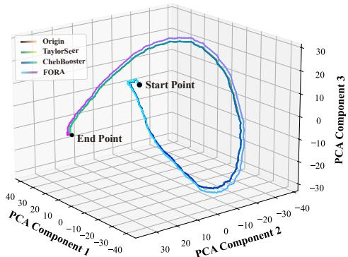  
Figure 1: 3D Feature visualization of DiT forward features across timesteps. The naïve caching method (i.e., FORA [38]) fails to align with the original feature trajectory, resulting in degraded generation quality.

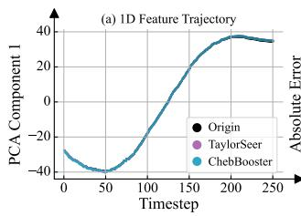

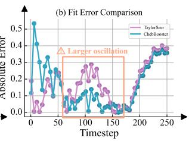  
Figure 2: 1D feature comparison between TaylorSeer [24] and ChebBooster extrapolation. (a) illustrates the feature trajectory of DiT, which evolves smoothly; both methods exhibit minimal diferences in their fitted curves. (b) presents the extrapolation errors, where TaylorSeer displays larger oscillations in the mid-trajectory, yielding deviation in the predicted outcome.

To tackle these problems, we propose a novel method called ChebBooster, which leverages Chebyshevinspired extrapolation to predict future features of difusion transformers. Chebyshev-based interpola tion is a well-established technique in numerical analysis, known for mitigating the Runge phenomenon by approximating functions using Chebyshev polynomi als [41]. In our approach, we extend this idea by trans forming interpolation into extrapolation, enabling future feature prediction across difusion timesteps. Unlike standard Chebyshev interpolation, we adopt the barycentric formulation [1], which expresses the Lagrange interpolant as a rational function with pre computed weights. This formulation significantly improves numerical stability and reduces the compu tational overhead of evaluating the interpolant [8]. Building upon this eficient form, we notice that weight computation is merely dependent on caching schedule, while independent of the feature values themselves. This finding allows us to decouple the extrapolation into two stages: (1) Ofline precom putation stage for the barycentric weights, and (2) Online application stage during inference. The weight table can be stored and reused locally, enabling repeated inferences under the same caching schedule to bypass the precomputation step—particularly beneficial for large-batch inference. Moreover, our method avoids redundant multiply–accumulate (MAC) opera tions by requiring only a single weight multiplication per extrapolation. Qualitative and quantitive experi ments on three mainstream pretrained DiT-based im age generation models—DiT/XL-2 [13], PixArt-Σ [4], and FLUX.1-dev [19]—across resolutions of 256 × 256, $5 1 2 \times 5 1 2$ , and 1024 × 1024 demonstrate that Cheb Booster preserves generation quality while achieving up to 3.68× speedup in latency and 5.12× reduction in FLOPs under diverse settings.

## 2. Related Works

## 2.1. Difusion Model

Difusion models [13] have become a cornerstone of generative modeling, excelling in high-quality image [32, 3, 4, 19] and video synthesis [18, 42]. While early variants based on U-Net [13, 33] were efective for iterative denoising, they faced scalability challenges in high-resolution settings. To overcome these limitations, transformer-based architectures such as Difusion Transformer (DiT) [32] have been introduced, leveraging the expressive power and scalability of transformers to enhance generation quality and flexibility. DiT has since evolved with techniques like self-conditioning [15, 48, 47] and novel normalization strategies [50], extending its applicability to complex and multimodal tasks. Its scalability is further demonstrated by its success in synthesizing long, coherent video sequences [18], highlighting its promise in modeling real-world dynamics.

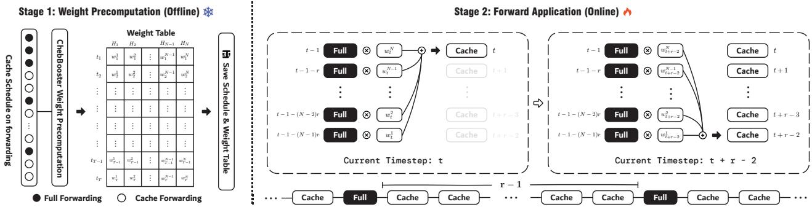  
Figure 3: Overview of the ChebBooster framework. The process consists of two stages: (1) Weight Precomputation (ofline), where Chebyshev-inspired extrapolation weights are precomputed for diferent timesteps and stored in a structured weight table guided by the cache schedule; and (2) Forward Application (online), where full model forwarding is performed at sparse reference timesteps, while intermediate features are eficiently extrapolated using cached activations and precomputed weights. This decoupled design enables acceleration by reducing redundant computations while maintaining generative fidelity.

## 2.2. Sampling Step Reduction

Accelerating sampling while preserving output quality is a central goal in difusion models. Original DDPMs [13] require hundreds of steps, prompting step reduction methods such as DDIM [39], which introduces a deterministic non-Markovian trajectory for faster sampling. The DPM-Solver series [26, 27, 49] further improves convergence via high-order ODE solvers. Alternative strategies include flowbased formulations like Rectified Flow [25], and knowledge distillation [36, 28], which compress multistep denoising into few-step student models. More recently, Consistency Models [40] have shown promise, with extensions such as Generator-Augmented Consistency [14] and Truncated Consistency [20] enhancing few-step fidelity. Theoretical insights [45] favor two-step over single-step updates for stability, while continuous-time variants ofer further scalability, solidifying consistency-based paradigms for eficient

generation.

## 2.3. Cache Acceleration

Recent eforts to accelerate difusion model inference have increasingly focused on caching intermediate features to exploit temporal redundancy between adjacent sampling steps. DeepCache [29] first demonstrated that high-level U-Net features exhibit strong temporal consistency, enabling reuse via a simple, training-free non-uniform strategy with minimal quality loss. However, its reliance on U-Net limits generalizability to transformer-based architectures. FORA [38] extends caching to DiTs by reusing redundant attention and MLP features without modifying the model. AdaCache [16] further introduces adaptive scheduling by adjusting caching intervals based on feature residuals and motion dynamics. To handle non-uniform timestep changes, TeaCache [23] uses timestep embeddings and polynomial corrections to guide caching decisions. Δ-DiT [5] proposes a structure-aware scheme that accelerates DiT blocks asymmetrically based on their roles in sampling. Token-level methods such as ToCa [51] and TokenCache improve granularity by caching less salient tokens identified via attention or learned predictors, with layer-wise ratio adjustment to reduce error. Most recently, TaylorSeer [24] shifts from reuse to prediction, employing Taylor-series-based extrapolation to forecast future features, achieving highfidelity generation under aggressive acceleration— without retraining.

## 3. Method

## 3.1. Preliminary

Difusion Models. Difusion models are a class of generative probabilistic models formulated through two stochastic processes: a forward process that incrementally perturbs data with noise, and a reverse process that learns to reconstruct data by denoising. Given a sample $\mathbf { x } _ { 0 } \sim q ( \mathbf { x } _ { 0 } )$ , the forward process produces a sequence $\left\{ \mathbf { x } _ { t } \right\} _ { t = 1 } ^ { T }$ over $T$ timesteps as

$$
\mathbf { x } _ { t } = \sqrt { \alpha _ { t } } \mathbf { x } _ { t - 1 } + \sqrt { 1 - \alpha _ { t } } \mathbf { \epsilon } \epsilon _ { t } ,\tag{1}
$$

where $\epsilon _ { t } \sim { \cal N } ( 0 , \bf { I } )$ , and $\{ \alpha _ { t } \}$ denotes a predefined noise schedule.

The reverse process approximates the intractable posterior $q ( \mathbf { x } _ { t - 1 } | \mathbf { x } _ { t } )$ via a parameterized Gaussian transition:

$$
p _ { \theta } ( \mathbf { x } _ { t - 1 } \vert \mathbf { x } _ { t } ) = N \big ( \mathbf { x } _ { t - 1 } ; \pmb { \mu } _ { \theta } ( \mathbf { x } _ { t } , t ) , \beta _ { t } \mathbf { I } \big ) ,\tag{2}
$$

where the mean is computed by a neural network $\epsilon \theta$ as

$$
{ \pmb \mu } _ { \theta } ( { \bf x } _ { t } , t ) = \frac { 1 } { \sqrt { \alpha _ { t } } } \left( { \bf x } _ { t } - \frac { 1 - \alpha _ { t } } { \sqrt { 1 - \bar { \alpha } _ { t } } } { \pmb \epsilon } _ { \theta } ( { \bf x } _ { t } , t ) \right) ,\tag{3}
$$

with $\begin{array} { r } { \bar { \alpha } _ { t } = \prod _ { i = 1 } ^ { t } \alpha _ { i } } \end{array}$ . The model parameters $\theta$ are optimized to minimize a variational bound or an equivalent score-matching loss.

In the continuous-time setting, the difusion process can be expressed as a stochastic diferential equation:

$$
d \mathbf { x } = \sigma ( t ) d \mathbf { w } ,\tag{4}
$$

with the reverse dynamics governed by the score function $\nabla _ { \mathbf { x } } \log p _ { t } ( \mathbf { x } )$ . This temporally-indexed generative framework forms the foundation for incorporating more expressive architectures and flexible inference algorithms.

Blocks in Difusion Transformers. Building on the probabilistic foundation above, the DiT realizes the reverse process as a composition of � hierarchical blocks, expressed as $G = B ^ { 1 } \circ B ^ { 2 } \circ \cdots \circ B ^ { l }$ . Each block $B ^ { l } \left( l = 1 , \ldots , L \right)$ is modularly constructed from three components: a self-attention module $S ^ { l } { } _ { ; }$ , a crossattention module $C ^ { l }$ (when conditioning is required), and a feed-forward multilayer perceptron $M ^ { l }$ . For an input sequence of latent tokens $x _ { t } = \{ x _ { j } \} _ { j = 1 } ^ { H \cdot W }$ at timestep �, where each $x _ { j }$ represents a patch embedding, the transformation performed by $B ^ { l }$ is given by

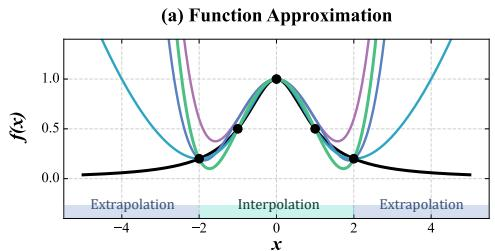

(b) Absolute Error (Logarithmic Scale)  
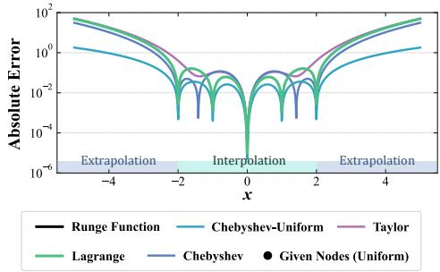  
Figure 4: Approximations and Errors with diverse methods on the Runge function. Taylor expansion shows oscillation artifacts quickly in the near expolation. Lagrange interpolation starts solving the edge oscillation problem. Chebyshev methods give the best performance in both interpolation and extrapolation, while the one given equispaced nodes (Chebyshev-Uniform) is superior than that with the Chebyshev nodes.

$$
B ^ { l } ( x ) = x + S ^ { l } ( x ) + C ^ { l } ( x ) + M ^ { l } ( x ) ,\tag{5}
$$

where residual connections and adaptive normalization mechanisms are implicitly applied to maintain stable signal propagation. The modules $S ^ { l } , C ^ { l }$ , and $M ^ { l }$ adjust over timesteps to accommodate the changing noise profile inherent in the difusion trajectory. This explicit modularization of � not only clarifies the architectural structure but also subtly suggests that each component might benefit from distinct fitting strategies.

## 3.2. Chebyshev-Inspired Extrapolation

The key in our method is to develop a training-free method for accelerating difusion models by eficiently approximating future feature tensors, which requires a tool that can extrapolate a function’s behavior from a small set of known points (i.e. cache schedule depicted in Figure 3). We find that Chebyshev barycentric interpolation provides a robust and computationally ideal framework for this task. The foundation of this approach lies in polynomial interpolation. Given a function $h ( x )$ defined on $x \in \left[ - 1 , 1 \right]$ we can approximate it with a polynomial. In the term of interpolation, using equispaced points for interpolation often leads to the Runge phenomenon, where oscillations near the interval’s ends cause large errors. To overcome this, the Chebyshev method uses Chebyshev nodes, the roots of the Chebyshev polynomials of the first kind, denoted by $T _ { N } ( x ) = \cos ( N$ arccos �). For a polynomial of degree �, these � nodes are given by:

$$
x _ { j } = \cos \left( \frac { 2 j - 1 } { 2 N } \pi \right) , \quad j = 1 , 2 , . . . , N .\tag{6}
$$

These nodes are optimally distributed, clustering near the endpoints ±1, which guarantees stable and nearoptimal polynomial approximation in theory.

While one could construct the interpolating polynomial $P _ { N } ( x )$ via a Chebyshev series expansion with Lagrange form, a more numerically stable and eficient representation is the Barycentric interpolation formula [1]. This formula expresses the interpolant $P _ { N } ( x )$ as a weighted average of the known function values $h ( x _ { j } )$ :

$$
P _ { N } ( x ) = \sum _ { j = 1 } ^ { N } \frac { \rho _ { j } } { x - x _ { j } } h ( x _ { j } ) \left/ \sum _ { j = 1 } ^ { N } \frac { \rho _ { j } } { x - x _ { j } } , \right.\tag{7}
$$

where the $\rho _ { j }$ are the precomputed barycentric weights. For Chebyshev nodes, these weights have a remarkably simple alternating form:

$$
\rho _ { j } = ( - 1 ) ^ { j } \cdot { \left\{ \begin{array} { l l } { 0 . 5 , } & { j = 1 { \mathrm { ~ o r ~ } } j = N , } \\ { 1 , } & { { \mathrm { o t h e r w i s e } } . } \end{array} \right. }\tag{8}
$$

This formulation can be rewritten to highlight a crucial property for our application: the separation of weights and function values. Let us define the interpolation coeficients $w _ { x } ^ { j }$ as:

$$
w _ { x } ^ { j } = \frac { \rho _ { j } } { x - x _ { j } } \Bigg / \sum _ { i = 1 } ^ { N } \frac { \rho _ { i } } { x - x _ { i } } .\tag{9}
$$

Then, the interpolation becomes a simple linear combination:

$$
P _ { N } ( x ) = \sum _ { j = 1 } ^ { N } w _ { x } ^ { j } h ( x _ { j } ) .\tag{10}
$$

This separability is the cornerstone of our method. The coeficients $w _ { x } ^ { j }$ depend only on the fixed node locations $\{ x _ { j } \}$ and the evaluation point $x ,$ but not on the function values $\{ h ( x _ { j } ) \}$ . This allows us to pre-compute these coeficients for any target point.

Finally, we intend to turn the interpolation problem into an extrapolation problem. To validate the problem more straightforward, we take the Runge Function as an example, which is defined as: $f ( x ) =$ $\left( 1 + 2 5 x ^ { 2 } \right) ^ { - 1 }$

As illustrated in Figure 4, we investigate the behavior of various polynomial approximation strategies when applied to the function. Notably, our observations reveal that Chebyshev nodes, despite their theoretical advantages in interpolation, exhibit inferior performance compared to equispaced nodes in the context of extrapolation. Specifically, when approximating long-range target points beyond the original domain, extrapolation using Chebyshev nodes results in a significantly larger error scale. Based on this empirical evidence, we adopt equispaced nodes in our method to ensure more stable and accurate long-range prediction.

## 3.3. ChebBooster

Building upon the principles of Chebyshev-inspired extrapolation, we propose ChebBooster, a trainingfree acceleration scheme for DiTs, which is illustrated in Figure 3. The key idea is to replace a subset of expensive full-network computations with lightweight extrapolation based on previously cached features.

Specifically, in this framework, we reinterpret Chebyshev polynomial extrapolation in the context of the difusion process. Specifically, the function $h ( x )$ corresponds to a feature module’s output tensor � within the difusion model, while the variable � represents the difusion timestep �, normalized to a continuous variable $\tau \in \ [ - 1 , 1 ]$ . The nodes $\{ x _ { j } \}$ are the normalized timesteps $\{ \tau _ { j } \}$ at which full computations are performed and the corresponding features $\{ f _ { j } \}$ are cached. Given a query timestep � with normalized value $\tau _ { t } ,$ ChebBooster performs extrapolation to approximate the target feature $f _ { t }$ using the precomputed cached values. This formulation allows for accurate, eficient feature prediction across timesteps without retraining. ChebBooster operates in mainly two stages:

<table><tr><td>Method</td><td>r</td><td>Latency(s) ↓</td><td>Speed ↑</td><td> $\mathbf { F L O P s } ( \mathbf { T } ) \downarrow$ </td><td>Speed ↑</td><td> $\mathbf { F I D \downarrow }$ </td><td> $\mathbf { s F I D \downarrow }$ </td><td> $\begin{array} { c } { { \bf { I n c e p t i o n } } _ { \uparrow } } \\ { { \bf { S c o r e } } } \end{array}$ </td></tr><tr><td>DDIM-50 steps</td><td>x</td><td>0.506</td><td>1.000×</td><td>23.735</td><td>1.000×</td><td>2.18</td><td>4.29</td><td>251.56</td></tr><tr><td>DDIM-25 steps</td><td>x</td><td>0.272</td><td>1.855×</td><td>11.868</td><td>2.000×</td><td>2.75</td><td>4.55</td><td>244.03</td></tr><tr><td>TaylorSeer [24]</td><td>3</td><td>0.343</td><td>1.473×</td><td>8.570</td><td>2.770×</td><td>2.34</td><td>4.76</td><td>247.00</td></tr><tr><td>ChebBooster (H = 3)</td><td>3</td><td>0.302</td><td>1.674×</td><td>8.564</td><td>2.771×</td><td>2.25</td><td>4.59</td><td>246.49</td></tr><tr><td>ChebBooster (H = 5)</td><td>3</td><td>0.342</td><td>1.476×</td><td>8.567</td><td>2.770×</td><td>2.28</td><td>4.64</td><td>247.27</td></tr><tr><td>DDIM-16 steps</td><td>x</td><td>0.189</td><td>2.681×</td><td>7.595</td><td>3.125×</td><td>4.24</td><td>5.69</td><td>223.38</td></tr><tr><td>TaylorSeer [24]</td><td>4</td><td>0.334</td><td>1.513×</td><td>6.676</td><td>3.555×</td><td>2.49</td><td>5.27</td><td>244.20</td></tr><tr><td>ChebBooster (H = 3)</td><td>4</td><td>0.279</td><td>1.812×</td><td>6.668</td><td>3.560×</td><td>2.35</td><td>4.95</td><td>242.58</td></tr><tr><td>ChebBooster (H = 5)</td><td>4</td><td>0.312</td><td>1.618×</td><td>6.671</td><td>3.558X</td><td>2.38</td><td>5.02</td><td>244.20</td></tr><tr><td>DDIM-12 steps</td><td>x</td><td>0.150</td><td>3.368×</td><td>5.696</td><td>4.167×</td><td>7.07</td><td>8.05</td><td>195.83</td></tr><tr><td>TaylorSeer [24]</td><td>5</td><td>0.304</td><td>1.662×</td><td>5.725</td><td>4.146×</td><td>2.63</td><td>5.46</td><td>241.83</td></tr><tr><td>ChebBooster  $\left( H = 3 \right)$ </td><td>5</td><td>0.267</td><td>1.894×</td><td>5.720</td><td>4.150×</td><td>2.44</td><td>4.96</td><td>238.48</td></tr></table>

Table 1: Quantitative comparison on DiT-XL/2 generation with resolution of 256×256.
<table><tr><td rowspan="2">Method FLUX.1 [19]</td><td rowspan="2">Refresh Ratio (r)</td><td colspan="4">Acceleration</td><td>Image Reward ↑</td><td>CLIP↑</td></tr><tr><td>Latency(s) ↓</td><td>Speed ↑</td><td>FLOPs(T) ↓</td><td>Speed ↑</td><td>DrawBench</td><td>Score</td></tr><tr><td rowspan="2">[Dev]: 50 steps Δ-DiT[5]</td><td>x</td><td>26.039</td><td>1.000×</td><td>3719.500</td><td>1.000×</td><td>0.9613</td><td>31.63</td></tr><tr><td>2</td><td>18.085</td><td>1.440×</td><td>2480.000</td><td>1.500×</td><td>0.9360</td><td>31.58</td></tr><tr><td rowspan="2">[Dev]: 30 steps Δ-DiT[5]</td><td>x</td><td>16.123</td><td>1.615×</td><td>2231.700</td><td>1.667×</td><td>0.9715</td><td>31.57</td></tr><tr><td>3</td><td>13.381</td><td>1.946×</td><td>1686.763</td><td>2.205×</td><td>0.8969</td><td>31.53</td></tr><tr><td rowspan="2">[Dev]: 20 steps ToCa [51]</td><td>x</td><td>13.470</td><td>1.933×</td><td>1487.800</td><td>2.500×</td><td>0.9838</td><td>31.42</td></tr><tr><td>5</td><td>15.657</td><td>1.663×</td><td>1064.060</td><td>3.496×</td><td>0.9881</td><td>31.36</td></tr><tr><td>TaylorSeer [24]</td><td>5</td><td>8.256</td><td>3.154×</td><td>893.730</td><td>4.162×</td><td>0.9899</td><td>31.60</td></tr><tr><td>ChebBooster (H = 2)</td><td>5</td><td>8.031</td><td>3.242×</td><td>893.666</td><td>4.162×</td><td>1.0070</td><td>31.63</td></tr><tr><td>[Dev]: 16 steps</td><td>x</td><td>8.952</td><td>2.909×</td><td>1190.240</td><td>3.125×</td><td>0.9281</td><td>31.13</td></tr><tr><td>ToCa [51]</td><td>6</td><td>13.904</td><td>1.873×</td><td>924.300</td><td>4.024×</td><td>0.9771</td><td>31.25</td></tr><tr><td>TaylorSeer [24]</td><td>6</td><td>7.739</td><td>3.365×</td><td>745.103</td><td>4.992×</td><td>0.9946</td><td>31.69</td></tr><tr><td>ChebBooster  $\left( H = 2 \right)$ </td><td>6</td><td>7.078</td><td>3.679×</td><td>744.938</td><td>4.993×</td><td>0.9962</td><td>31.61</td></tr></table>

Table 2: Quantitative comparison on FLUX.1[Dev] generation with resolution of 1024×1024.

1. Weight Precomputation. First, we define a schedule that dictates when to perform a full computation versus an extrapolation. Full computations occur at a set of timesteps $s \in { \mathcal { F } }$ , defined by:

$$
\mathcal { F } = \left\{ s \ \middle | s \notin \left[ s _ { 0 } , T - 1 - s _ { 1 } \right] \mathrm { o r } r \ | \ ( s - s _ { 0 } ) \right\}\tag{11}
$$

where $s \in [ 0 , T - 1 ]$ . The initial and final stages of difusion reserve full computation, limited by $s _ { 0 }$ and $s _ { 1 } { } _ { : }$ , and $r$ is the refresh ratio for intermediate steps. For all target timesteps $t \notin \mathcal { F }$ where extrapolation will occur, we precompute the coeficients $w _ { t } ^ { j }$ . This involves normalizing the target timestep � and the cached history timesteps $\left\{ s _ { j } \right\}$ to the [−1, 1] interval and applying Equation 9. These coeficients are computed once and stored.

2. ChebBooster Forward Application. During the denoising process, at each full-computation step $s \in \mathcal { F }$ , we compute the feature tensor $f _ { s } ,$ including $S ^ { l } , C ^ { l }$ and $M ^ { l }$ . This tensor is detached from the computational graph and cached in a fixed-size history bufer $H = \{ ( s _ { j } , f _ { j } ) \} _ { j = 1 } ^ { N }$ , which holds the � most re-

<table><tr><td rowspan="2">Method PixArt-Σ [4]</td><td rowspan="2">Refresh Ratio (r)</td><td colspan="4">Acceleration</td><td rowspan="2">Image ↑ Reward</td><td rowspan="2">CLIP↑ Score</td></tr><tr><td>Latency(s) ↓</td><td>Speed ↑</td><td>FLOPs(T) ↓</td><td>Speed ↑</td></tr><tr><td rowspan="2">DDIM-50 steps ∆-DiT [5]</td><td>x</td><td>1.255</td><td>1.000×</td><td>95.362</td><td>1.000×</td><td>1.1318</td><td>33.0278</td></tr><tr><td>2</td><td>0.469</td><td>2.675×</td><td>36.138</td><td>2.639×</td><td>1.1056</td><td>33.1066</td></tr><tr><td>DDIM-40 steps</td><td>x</td><td>1.003</td><td>1.250×</td><td>76.290</td><td>1.250×</td><td>1.1364</td><td>33.0198</td></tr><tr><td>FORA [38]</td><td>3</td><td>0.973</td><td>1.289×</td><td>36.138</td><td>2.639×</td><td>1.0917</td><td>33.0869</td></tr><tr><td>ToCa [51]</td><td>3</td><td>1.265</td><td>0.992×</td><td>58.238</td><td>1.637×</td><td>1.0920</td><td>33.0869</td></tr><tr><td>TaylorSeer [24]</td><td>3</td><td>0.839</td><td>1.495×</td><td>33.575</td><td>2.840×</td><td>1.1195</td><td>33.0895</td></tr><tr><td>ChebBooster (H = 3)</td><td>3</td><td>0.706</td><td>1.778×</td><td>33.540</td><td>2.843×</td><td>1.1392</td><td>33.0943</td></tr><tr><td>DDIM-30 steps</td><td>x</td><td>0.753</td><td>1.666×</td><td>57.217</td><td>1.667×</td><td>1.1358†</td><td>33.0194</td></tr><tr><td>FORA [38]</td><td>4</td><td>0.801</td><td>1.566×</td><td>28.108</td><td>3.393×</td><td>1.0609</td><td>33.0373</td></tr><tr><td>ToCa [51]</td><td>4</td><td>1.176</td><td>1.067×</td><td>53.312</td><td>1.789×</td><td>1.0787</td><td>33.1463</td></tr><tr><td>TaylorSeer [24]</td><td>4</td><td>0.818</td><td>1.535×</td><td>26.143</td><td>3.648×</td><td>1.1111</td><td>33.1579</td></tr><tr><td>ChebBooster (H = 4)</td><td>4</td><td>0.622</td><td>2.018×</td><td>26.112</td><td>3.652×</td><td>1.1222</td><td>33.1699</td></tr><tr><td>DDIM-25 steps</td><td>x</td><td>0.622</td><td>2.018×</td><td>47.681</td><td>2.000×</td><td>1.1203†</td><td>33.0418</td></tr><tr><td>FORA [38]</td><td>5</td><td>0.714</td><td>1.757×</td><td>24.092</td><td>3.958×</td><td>1.0023</td><td>32.9549</td></tr><tr><td>ToCa [51]</td><td>5</td><td>1.128</td><td>1.112×</td><td>50.687</td><td>1.881×</td><td>1.0542</td><td>33.0372</td></tr><tr><td>TaylorSeer [24]</td><td>5</td><td>0.807</td><td>1.555×</td><td>22.430</td><td>4.252×</td><td>1.0660</td><td>33.2279</td></tr><tr><td>ChebBooster (H = 2)</td><td>5</td><td>0.536</td><td>2.339×</td><td>22.362</td><td>4.265×</td><td>1.1152</td><td>33.0824</td></tr><tr><td>DDIM-20 steps</td><td>x</td><td></td><td></td><td></td><td></td><td></td><td></td></tr><tr><td></td><td>6</td><td>0.502</td><td>2.500×</td><td>38.145</td><td>2.500×</td><td>1.1090†</td><td>33.0300</td></tr><tr><td>FORA [38]</td><td>6</td><td>0.631</td><td>1.990×</td><td>19.073</td><td>5.000×</td><td>0.9493</td><td>32.9773</td></tr><tr><td>ToCa [51] TaylorSeer [24]</td><td>6</td><td>1.087 0.794</td><td>1.154× 1.580×</td><td>48.389 18.710</td><td>1.971×</td><td>0.9873</td><td>33.1547</td></tr><tr><td></td><td></td><td></td><td></td><td></td><td>5.097×</td><td>1.0699</td><td>33.1878</td></tr><tr><td>ChebBooster (H = 2)</td><td>6</td><td>0.499</td><td>2.513×</td><td>18.640</td><td>5.116×</td><td>1.0784</td><td>33.1923</td></tr></table>

• † Despite some performance retention, high FLOPs cost makes them unsuitable for eficient inference.

Table 3: Quantitative comparison on PixArt-Σ generation with resolution of 512×512.

cent feature-step pairs. When the bufer is full, the oldest entry is discarded.

At any timestep $t \not \in { \mathcal { F } }$ where we wish to skip a full computation, and provided the history bufer � contains enough entries $( | H | = n )$ , we approximate the feature tensor $f _ { t }$ using the precomputed weights and the cached features:

$$
f _ { t } = \sum _ { j = 1 } ^ { N } w _ { t } ^ { j } f _ { s _ { j } } , \quad \mathrm { w h e r e ~ } ( s _ { j } , f _ { s _ { j } } ) \in H .\tag{12}
$$

This step is a simple, highly eficient linear combination of cached tensors, reducing the per-module complexity from that of a full network pass to just $O ( n )$ . The entire set of schedules and weight tables can be prepackaged, making ChebBooster a portable and eficient drop-in accelerator for inference.

## 4. Experiments

## 4.1. Experimental Settings

We evaluate our method on three DiT-based models: DiT-XL/2 [32] (C2I, 256×256), PixArt-Σ [4] (T2I, 512×512), and FLUX.1-dev [19] (T2I, 1024×1024), where quantitive results are displayed in Table 1, 3, 2, respectively. All use oficial weights with 50 steps (DDIM for the first two, Rectified Flow for FLUX). DiT-XL/2 is trained on ImageNet [34]; PixArt-Σ improves fidelity via weak-to-strong training and token compression; FLUX.1-dev enhances sharpness using self-attention and Rectified Flow. We generate 50K samples for DiT-XL/2 and evaluate them via FID [12], sFID [30], IS [37]. We randomly choose 400 prompts from HPSv2 [43] for PixArt-Σ and use all 200 Draw-Bench [35] prompts for FLUX.1-dev, evaluated by CLIPScore [11] and ImageReward [44], with the former measuring CLIP-based similarity and the latter modeling human preferences.

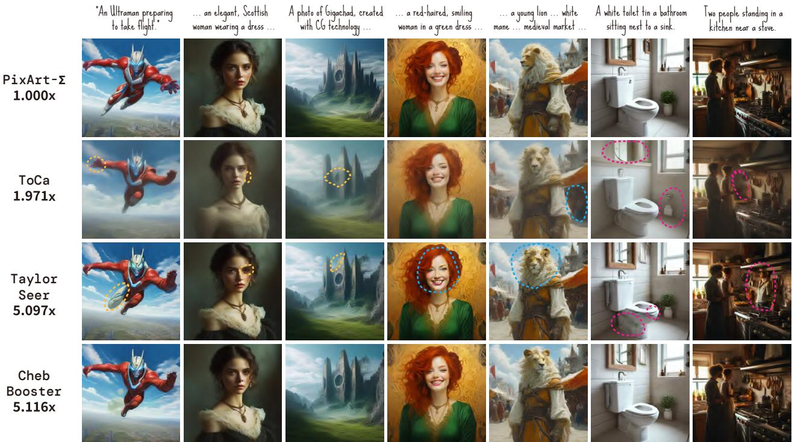  
Figure 5: Qualitative Study of diverse methods on PixArt-Σ.

## 4.2. Results on DiT-XL/2

We evaluate ChebBooster on DiT-XL/2 (256×256) against state-of-the-art acceleration methods and reduced-step DDIM baselines. As shown in Table 1, ChebBooster achieves consistently superior acceleration-quality trade-ofs across various refresh ratios (�). At � = 3, ChebBooster (� = 3) yields the lowest FID of 2.25 with a 1.674× latency speedup — 13.6% faster than TaylorSeer and 9.8% faster than DDIM-25. This corresponds to a 3.3% quality gain over DDIM-50 (FID = 2.18) with a 2.771× FLOPs reduction. At � = 4, ChebBooster maintains FID = 2.35 and 1.812× acceleration, outperforming TaylorSeer by 19.7% in speed and 5.6% in FID, and surpassing DDIM-20 (FID = 3.27) by 22.4% in latency. Under extreme acceleration (� = 5), ChebBooster still delivers near-original quality (FID = 2.44) with 1.894× speedup, exceeding TaylorSeer by 14.0% in speed and 7.2% in FID, and significantly outperforming degraded DDIM-12.

## 4.3. Results on PixArt-Σ

As shown in Table 3, ChebBooster achieves stateof-the-art acceleration-quality trade-ofs on 512×512 PixArt generation. At � = 3 (� = 3), it delivers 1.778× speedup—19.0% faster than TaylorSeer— while attaining higher image quality (Reward=1.1392, Δ+0.65% vs. DDIM-50). At � = 4 (� = 4), Cheb-Booster reaches 2.018× speedup with a peak CLIP score of 33.1699, exceeding TaylorSeer by 31.5% in speed and reducing FLOPs by 3.652×. The CLIP score also surpasses the DDIM-50 baseline by 0.43%. Under aggressive settings (� = 6, � = 2), ChebBooster maintains robust fidelity (Reward=1.0784), while FORA and ToCa drop to 0.9493 (Δ-16.0%) and 0.9873 (Δ-9.4%), respectively.

For Qualitative Study, as shown in Figure 5, Cheb-Booster consistently outperforms ToCa and TaylorSeer, generating images with sharper structure, finer textures, and better semantic alignment to the prompts. For instance, in scenes like "... an elegant ... woman ...", ChebBooster preserves facial features and the eyes’ details, while other methods exhibit noticeable distortions or omissions. These results highlight ChebBooster’s robustness in maintaining high-fidelity generation even under aggressive acceleration.

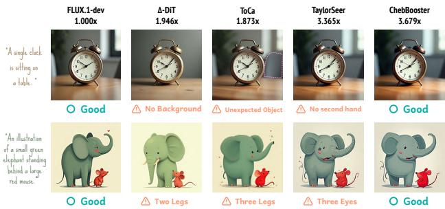  
Figure 6: Qualitative Study on FLUX.1-dev.

## 4.4. Results on FLUX.1-dev

ChebBooster sets a new state-of-the-art for highresolution generation on FLUX.1-dev, as shown in Table 2. At � = 5 (� = 2), it achieves a 3.242× latency speedup (8.031s) with statistically superior image quality (Reward=1.0070, Δ+4.76% vs. DDIM-50), outperforming TaylorSeer and ToCa by 2.7% and 48.7% in speed, respectively, while reducing FLOPs by 4.162×. At � = 6, ChebBooster reaches the fastest reported runtime of 7.078s (3.679× speedup), 9.3% faster than TaylorSeer, and matches baseline CLIP score (31.61 vs. 31.63). It also preserves Image Reward of 0.9962, outperforming ToCa (0.9771, � < 0.01) and FORA (0.9493) by 7.3% and 4.9%, under a 4.993× FLOPs reduction.

For Qualitative Study, as shown in Figure 6, Cheb-Booster achieves the best visual consistency among all methods, accurately following prompt semantics while preserving object structure. ChebBooster avoids hallucinations like extra limbs or missing elements, which are present in other methods. These results confirm ChebBooster’s robustness in highresolution generation under strong acceleration.

## 5. Conclusion

We proposed ChebBooster, a training-free acceleration framework for Difusion Transformers that leverages Chebyshev polynomial extrapolation to predict future features and reduce redundant computation during sampling. To address numerical instability and computational overhead traditionally associated with polynomial extrapolation, ChebBooster employs the Barycentric interpolation formulation for eficient and stable evaluation, and further decouples the extrapolation process into ofline weight precomputation and lightweight online application. Experiments on multiple DiT-based models—covering C2I and T2I tasks at varying resolutions—demonstrate that ChebBooster achieves superior acceleration-quality trade-ofs, outperforming prior cache-based methods in both visual fidelity and computational eficiency. With high acceleration ratio, ChebBooster provides a practical and scalable solution for generation and large-batch inference, and opens avenues for future exploration into adaptive caching and hybrid extrapolation strategies in generative modeling.

## References

[1] Jean-Paul Berrut and Lloyd N. Trefethen. Barycentric lagrange interpolation. SIAM Review, 46 (3):501–517, 2004.

[2] Andrew Brock, Jef Donahue, and Karen Simonyan. Large scale GAN training for high fidelity natural image synthesis. In 7th International Conference on Learning Representations, ICLR 2019, New Orleans, LA, USA, May 6-9, 2019. OpenReview.net, 2019.

[3] Junsong Chen, Jincheng Yu, Chongjian Ge, Lewei Yao, Enze Xie, Yue Wu, Zhongdao Wang, James Kwok, Ping Luo, Huchuan Lu, and Zhenguo Li. Pixart-�: Fast training of difusion transformer for photorealistic text-to-image synthesis, 2023.

[4] Junsong Chen, Chongjian Ge, Enze Xie, Yue Wu, Lewei Yao, Xiaozhe Ren, Zhongdao Wang, Ping Luo, Huchuan Lu, and Zhenguo Li. Pixart-�: Weak-to-strong training of difusion transformer for 4k text-to-image generation, 2024.

[5] Pengtao Chen, Mingzhu Shen, Peng Ye, Jianjian Cao, Chongjun Tu, Christos-Savvas Bouganis, Yiren Zhao, and Tao Chen. �-dit: A training-free acceleration method tailored for difusion transformers. arXiv preprint arXiv:2406.01125, 2024.

[6] Laurent Dinh, Jascha Sohl-Dickstein, and Samy Bengio. Density estimation using real NVP. CoRR, abs/1605.08803, 2016.

[7] Ian Goodfellow, Jean Pouget-Abadie, Mehdi Mirza, Bing Xu, David Warde-Farley, Sherjil Ozair, Aaron Courville, and Yoshua Bengio. Generative adversarial networks. Commun. ACM, 63(11): 139–144, 2020.

[8] J. A. Grant. Chebyshev polynomials in numerical analysis. by l. fox and i. b. parker. pp. ix, 205. 42s. 1968. (oxford.). The Mathematical Gazette, 54(387),

1970.

[9] M. Grasselli and D. Pelinovsky. Numerical Mathematics. Jones & Bartlett Publishers, Inc., CA, 2008.

[10] Leonhard Helminger, Abdelaziz Djelouah, Markus Gross, and Christopher Schroers. Lossy image compression with normalizing flows. In Neural Compression: From Information Theory to Applications – Workshop @ ICLR 2021, 2021.

[11] Jack Hessel, Ari Holtzman, Maxwell Forbes, Ronan Le Bras, and Yejin Choi. Clipscore: A reference-free evaluation metric for image captioning. In Proceedings of the 2021 Conference on Empirical Methods in Natural Language Processing, EMNLP 2021, Virtual Event / Punta Cana, Dominican Republic, 7-11 November, 2021, pages 7514–7528. Association for Computational Linguistics, 2021.

[12] Martin Heusel, Hubert Ramsauer, Thomas Unterthiner, Bernhard Nessler, and Sepp Hochreiter. Gans trained by a two time-scale update rule converge to a local nash equilibrium. In Advances in Neural Information Processing Systems 30: Annual Conference on Neural Information Processing Systems 2017, December 4-9, 2017, Long Beach, CA, USA, pages 6626–6637, 2017.

[13] Jonathan Ho, Ajay Jain, and Pieter Abbeel. Denoising difusion probabilistic models. In Advances in Neural Information Processing Systems 33: Annual Conference on Neural Information Processing Systems 2020, NeurIPS 2020, December 6-12, 2020, virtual, 2020.

[14] Thibaut Issenhuth, Sangchul Lee, Ludovic Dos Santos, Jean-Yves Franceschi, Chansoo Kim, and Alain Rakotomamonjy. Improving consistency models with generator-augmented flows. arXiv preprint arXiv:2406.09570, 2024.

[15] Dengyang Jiang, Mengmeng Wang, Liuzhuozheng Li, Lei Zhang, Haoyu Wang, Wei Wei, Guang Dai, Yanning Zhang, and Jingdong Wang. No other representation component is needed: Difusion transformers can provide representation guidance by themselves. arXiv preprint arXiv:2505.02831, 2025.

[16] Kumara Kahatapitiya, Haozhe Liu, Sen He, Ding Liu, Menglin Jia, Chenyang Zhang, Michael S Ryoo, and Tian Xie. Adaptive caching for faster video generation with difusion transformers. arXiv preprint arXiv:2411.02397, 2024.

[17] Durk P Kingma and Prafulla Dhariwal. Glow:

Generative flow with invertible 1x1 convolutions. Advances in neural information processing systems, 31, 2018.

[18] Weijie Kong, Qi Tian, Zijian Zhang, Rox Min, Zuozhuo Dai, Jin Zhou, Jiangfeng Xiong, Xin Li, Bo Wu, Jianwei Zhang, et al. Hunyuanvideo: A systematic framework for large video generative models. arXiv preprint arXiv:2412.03603, 2024.

[19] Black Forest Labs. Flux. https://github.com/black-forest-labs/flux, 2024.

[20] Sangyun Lee, Yilun Xu, Tomas Gefner, Giulia Fanti, Karsten Kreis, Arash Vahdat, and Weili Nie. Truncated consistency models. arXiv preprint arXiv:2410.14895, 2024.

[21] Xiuyu Li, Yijiang Liu, Long Lian, Huanrui Yang, Zhen Dong, Daniel Kang, Shanghang Zhang, and Kurt Keutzer. Q-difusion: Quantizing difusion models. In Proceedings of the IEEE/CVF International Conference on Computer Vision (ICCV), pages 17535–17545, 2023.

[22] Zhengyang Liang, Hao He, Ceyuan Yang, and Bo Dai. Scaling laws for difusion transformers, 2024.

[23] Feng Liu, Shiwei Zhang, Xiaofeng Wang, Yujie Wei, Haonan Qiu, Yuzhong Zhao, Yingya Zhang, Qixiang Ye, and Fang Wan. Timestep embedding tells: It’s time to cache for video difusion model. In Proceedings of the Computer Vision and Pattern Recognition Conference (CVPR), pages 7353–7363, 2025.

[24] Jiacheng Liu, Chang Zou, Yuanhuiyi Lyu, Junjie Chen, and Linfeng Zhang. From reusing to forecasting: Accelerating difusion models with taylorseers. arXiv preprint arXiv:2503.06923, 2025.

[25] Xingchao Liu, Chengyue Gong, and Qiang Liu. Flow straight and fast: Learning to generate and transfer data with rectified flow. arXiv preprint arXiv:2209.03003, 2022.

[26] Cheng Lu, Yuhao Zhou, Fan Bao, Jianfei Chen, Chongxuan Li, and Jun Zhu. Dpm-solver: A fast ode solver for difusion probabilistic model sampling in around 10 steps. Advances in Neural Information Processing Systems, 35:5775–5787, 2022.

[27] Cheng Lu, Yuhao Zhou, Fan Bao, Jianfei Chen, Chongxuan Li, and Jun Zhu. Dpm-solver++: Fast solver for guided sampling of difusion probabilistic models. arXiv preprint arXiv:2211.01095, 2022.

[28] Eric Luhman and Troy Luhman. Knowledge distillation in iterative generative models for improved sampling speed, 2021.

[29] Xinyin Ma, Gongfan Fang, and Xinchao Wang. Deepcache: Accelerating difusion models for free. In Proceedings of the IEEE/CVF Conference on Computer Vision and Pattern Recognition, pages 15762–15772, 2024.

[30] Charlie Nash, Jacob Menick, Sander Dieleman, and Peter W. Battaglia. Generating images with sparse representations. CoRR, abs/2103.03841, 2021.

[31] Taesung Park, Ming-Yu Liu, Ting-Chun Wang, and Jun-Yan Zhu. Semantic image synthesis with spatially-adaptive normalization. In Proceedings of the IEEE Conference on Computer Vision and Pattern Recognition, 2019.

[32] William Peebles and Saining Xie. Scalable difusion models with transformers. In Proceedings ofthe IEEE/CVF International Conference on Computer Vision, pages 4195–4205, 2023.

[33] Robin Rombach, Andreas Blattmann, Dominik Lorenz, Patrick Esser, and Björn Ommer. High-resolution image synthesis with latent difusion models, 2021.

[34] Olga Russakovsky, Jia Deng, Hao Su, Jonathan Krause, Sanjeev Satheesh, Sean Ma, Zhiheng Huang, Andrej Karpathy, Aditya Khosla, Michael S. Bernstein, Alexander C. Berg, and Li Fei-Fei. Imagenet large scale visual recognition challenge. Int. J. Comput. Vis., 115(3):211–252, 2015.

[35] Chitwan Saharia, William Chan, Saurabh Saxena, Lala Li, Jay Whang, Emily L Denton, Kamyar Ghasemipour, Raphael Gontijo Lopes, Burcu Karagol Ayan, Tim Salimans, et al. Photorealistic text-to-image difusion models with deep language understanding. Advances in neural information processing systems, 35:36479–36494, 2022.

[36] Tim Salimans and Jonathan Ho. Progressive distillation for fast sampling of difusion models. In International Conference on Learning Representations, 2022.

[37] Tim Salimans, Ian Goodfellow, Wojciech Zaremba, Vicki Cheung, Alec Radford, and Xi Chen. Improved techniques for training gans. In Proceedings of the 30th International Conference on Neural Information Processing Systems, pages 2234–2242, Red Hook, NY, USA, 2016. Curran Associates Inc.

[38] Pratheba Selvaraju, Tianyu Ding, Tianyi Chen, Ilya Zharkov, and Luming Liang. Fora: Fast-forward caching in difusion transformer acceleration. arXiv preprint arXiv:2407.01425, 2024.

[39] Jiaming Song, Chenlin Meng, and Stefano Ermon. Denoising difusion implicit models. In 9th International Conference on Learning Representations, ICLR 2021, Virtual Event, Austria, May 3-7, 2021. OpenReview.net, 2021.

[40] Yang Song, Prafulla Dhariwal, Mark Chen, and Ilya Sutskever. Consistency models. In Proceedings of the 40th International Conference on Machine Learning. JMLR.org, 2023.

[41] Lloyd N. Trefethen. Approximation Theory and Approximation Practice, Extended Edition. SIAM-Society for Industrial and Applied Mathematics, Philadelphia, PA, USA, 2019.

[42] Team Wan, Ang Wang, Baole Ai, Bin Wen, Chaojie Mao, Chen-Wei Xie, Di Chen, Feiwu Yu, Haiming Zhao, Jianxiao Yang, Jianyuan Zeng, Jiayu Wang, Jingfeng Zhang, Jingren Zhou, Jinkai Wang, Jixuan Chen, Kai Zhu, Kang Zhao, Keyu Yan, Lianghua Huang, Mengyang Feng, Ningyi Zhang, Pandeng Li, Pingyu Wu, Ruihang Chu, Ruili Feng, Shiwei Zhang, Siyang Sun, Tao Fang, Tianxing Wang, Tianyi Gui, Tingyu Weng, Tong Shen, Wei Lin, Wei Wang, Wei Wang, Wenmeng Zhou, Wente Wang, Wenting Shen, Wenyuan Yu, Xianzhong Shi, Xiaoming Huang, Xin Xu, Yan Kou, Yangyu Lv, Yifei Li, Yijing Liu, Yiming Wang, Yingya Zhang, Yitong Huang, Yong Li, You Wu, Yu Liu, Yulin Pan, Yun Zheng, Yuntao Hong, Yupeng Shi, Yutong Feng, Zeyinzi Jiang, Zhen Han, Zhi-Fan Wu, and Ziyu Liu. Wan: Open and advanced large-scale video generative models. arXiv preprint arXiv:2503.20314, 2025.

[43] Xiaoshi Wu, Yiming Hao, Keqiang Sun, Yixiong Chen, Feng Zhu, Rui Zhao, and Hongsheng Li. Human preference score v2: A solid benchmark for evaluating human preferences of text-to-image synthesis. arXiv preprint arXiv:2306.09341, 2023.

[44] Jiazheng Xu, Xiao Liu, Yuchen Wu, Yuxuan Tong, Qinkai Li, Ming Ding, Jie Tang, and Yuxiao Dong. Imagereward: Learning and evaluating human preferences for text-to-image generation. In Advances in Neural Information Processing Systems 36: Annual Conference on Neural Information Processing Systems 2023, NeurIPS 2023, New Orleans, LA, USA, December 10 - 16, 2023, 2023.

[45] Ruofeng Yang, Bo Jiang, Cheng Chen, and Shuai Li.

Improved discretization complexity analysis of consistency models: Variance exploding forward process and decay discretization scheme. In Forty-second International Conference on Machine Learning, 2025.

[46] Jingfeng Yao, Bin Yang, and Xinggang Wang. Reconstruction vs. generation: Taming optimization dilemma in latent difusion models. In Proceedings of the IEEE/CVF Conference on Computer Vision and Pattern Recognition, 2025.

[47] Wangbo Zhao, Yizeng Han, Jiasheng Tang, Kai Wang, Hao Luo, Yibing Song, Gao Huang, Fan Wang, and Yang You. Dydit++: Dynamic difusion transformers for eficient visual generation, 2025.

[48] Wangbo Zhao, Yizeng Han, Jiasheng Tang, Kai Wang, Yibing Song, Gao Huang, Fan Wang, and Yang You. Dynamic difusion transformer. ICLR, 2025.

[49] Kaiwen Zheng, Cheng Lu, Jianfei Chen, and Jun Zhu. Dpm-solver-v3: Improved difusion ode solver with empirical model statistics. In Thirty-seventh Conference on Neural Information Processing Systems, 2023.

[50] Jiachen Zhu, Xinlei Chen, Kaiming He, Yann LeCun, and Zhuang Liu. Transformers without normalization. In Proceedings ofthe IEEE/CVF Conference on Computer Vision and Pattern Recognition (CVPR), 2025.

[51] Chang Zou, Xuyang Liu, Ting Liu, Siteng Huang, and Linfeng Zhang. Accelerating difusion transformers with token-wise feature caching. In The Thirteenth International Conference on Learning Representations, ICLR 2025, Singapore, April 24-28, 2025. OpenReview.net, 2025.

## A. Extensive Proof for Chebyshev-Inspired Extrapolation

This section establishes the mathematical basis for Barycentric Extrapolation with Equispaced Nodes. We show that, despite the traditional preference for Chebyshev nodes in interpolation, equispaced nodes— when paired with properly designed barycentric weights—ofer a more stable and efective approach for extrapolation from sparse data. Unlike interpolation, where Chebyshev nodes minimize Runge’s phenomenon, extrapolation benefits from the predictable behavior of the nodal polynomial in the equispaced setting, supporting our empirical findings.

Let us begin by establishing the general form of the barycentric interpolation formula, which is valid for any set of distinct nodes $\{ x _ { j } \} _ { j = 1 } ^ { N }$ . The foundation is the unique Lagrange interpolating polynomial $P _ { N } ( x )$ of degree at most $N - 1$ that passes through the � points $\left( x _ { j } , h ( x _ { j } ) \right)$ .

The Lagrange form is given by:

$$
P _ { N } ( x ) = \sum _ { j = 1 } ^ { N } h ( x _ { j } ) l _ { j } ( x ) ,\tag{13}
$$

where $l _ { j } ( x )$ are the Lagrange basis polynomials:

$$
l _ { j } ( x ) = \prod _ { \stackrel { k = 1 } { k \neq j } } ^ { N } { \frac { x - x _ { k } } { x _ { j } - x _ { k } } } .\tag{14}
$$

Let us define the nodal polynomial $\omega ( x )$ as:

$$
\omega ( x ) = \prod _ { k = 1 } ^ { N } ( x - x _ { k } ) .\tag{15}
$$

The denominator of $l _ { j } ( x )$ can be expressed using the derivative of $\omega ( x )$

$$
\omega ^ { \prime } ( x _ { j } ) = \prod _ { \stackrel { k = 1 } { k \neq j } } ^ { N } ( x _ { j } - x _ { k } ) .\tag{16}
$$

Thus, the Lagrange basis polynomial can be rewritten as:

$$
l _ { j } ( x ) = \frac { \omega ( x ) } { ( x - x _ { j } ) \omega ^ { \prime } ( x _ { j } ) } .\tag{17}
$$

Substituting this back into the Lagrange formula yields the first barycentric form:

$$
P _ { N } ( x ) = \omega ( x ) \sum _ { j = 1 } ^ { N } \frac { \rho _ { j } } { x - x _ { j } } h ( x _ { j } ) ,\tag{18}
$$

where the barycentric weights, $\rho _ { j }$ , are defined as:

$$
\rho _ { j } = { \frac { 1 } { \omega ^ { \prime } ( x _ { j } ) } } .\tag{19}
$$

This definition is universal and applies to any choice of distinct nodes. To derive the more numerically stable second form, we apply the same formula to the constant function $g ( x ) = 1$ . Since $P _ { N } ( x )$ must be an exact interpolant, we have $\begin{array} { r } { 1 = \sum _ { j = 1 } ^ { N } l _ { j } ( x ) } \end{array}$ . This leads to:

$$
1 = \omega ( x ) \sum _ { j = 1 } ^ { N } \frac { \rho _ { j } } { x - x _ { j } } .\tag{20}
$$

Dividing the polynomial formula by this identity, we cancel the $\omega ( x )$ term and arrive at the final barycentric interpolation formula:

$$
P _ { N } ( x ) = { \frac { \displaystyle \sum _ { j = 1 } ^ { N } { \frac { \rho _ { j } } { x - x _ { j } } } h ( x _ { j } ) } { \displaystyle \sum _ { j = 1 } ^ { N } { \frac { \rho _ { j } } { x - x _ { j } } } } } .\tag{21}
$$

This formulation is the cornerstone of the method. The key insight is that the weights $\rho _ { j }$ are determined solely by the geometry of the nodes $\{ x _ { j } \}$ , not the function values $\{ h ( x _ { j } ) \}$

Here we make the justification for Equispaced Nodes in Extrapolation from two perspectives: the error in polynomial approximation and the growth of the nodal polynomial.

The Error in Polynomial Approximation. The error of polynomial interpolation for a function $f ( x ) \in$ $C ^ { N } ( [ - 1 , 1 ] )$ is given by the formula:

$$
\begin{array} { l } { \displaystyle { E ( x ) = f ( x ) - P _ { N } ( x ) = \frac { f ^ { ( N ) } ( \xi ) } { N ! } \omega ( x ) } } \\ { \displaystyle { \ = \frac { f ^ { ( N ) } ( \xi ) } { N ! } \prod _ { j = 1 } ^ { N } ( x - x _ { j } ) } } \end{array}\tag{22}
$$

for some $\xi \in [ - 1 , 1 ]$

The primary goal of Chebyshev nodes is to minimize the term $\| \omega ( x ) \| _ { \infty }$ for $x \in [ - 1 , 1 ]$ . The nodal polynomial for Chebyshev nodes, $\omega _ { C } ( { \boldsymbol { x } } )$ , is a scaled version of the Chebyshev polynomial $T _ { N } ( x )$ , which has the unique property of having the smallest possible maximum magnitude on $[ - 1 , 1 ]$ among all monic polynomials of degree �. This guarantees near-optimal stability for interpolation.

However, this guarantee does not apply to extrapolation, i.e., when $\vert x \vert \ > \ 1$ Outside the interval $[ - 1 , 1 ]$ , the Chebyshev polynomial $\begin{array} { r l } { T _ { N } ( x ) } & { { } = } \end{array}$ cosh(� · arccosh(�)) grows exponentially fast. This rapid growth in $| \omega _ { C } ( x ) |$ for $| x | > 1$ can lead to a large extrapolation error, as observed empirically.

Nodal Polynomial Growth for Equispaced Nodes. For equispaced nodes on $[ - 1 , 1 ]$ , given by $\begin{array} { r l } { x _ { j } } & { { } = } \end{array}$ $- 1 + \hat { 2 } \frac { j - \hat { 1 } } { N - 1 }$ for $j = 1 , \ldots , N$ , the nodal polynomial $\omega _ { E } ( x )$ does not possess the equi-oscillation property inside the interval. Its magnitude grows significantly towards the endpoints, leading to the Runge phenomenon for high �.

However, for extrapolation $( | x | > 1 )$ , the growth of $| \omega _ { E } ( x ) |$ can be more moderate compared to $| \omega _ { C } ( x ) |$ The equispaced nodes are evenly distributed, preventing the multiplicative efect of $( x - x _ { j } )$ from becoming disproportionately large, as it does for the clustered Chebyshev nodes when � is far from the interval. In the context of sparse data, the number of nodes � is inherently small. For small �, the Runge phenomenon is not a dominant factor, and the stability diference between node sets for in-domain interpolation is less critical. The primary concern becomes the behavior of the extrapolant, which is governed by the growth of $| \omega ( x ) |$ outside the domain. The choice of equispaced nodes is therefore a pragmatic and theoretically sound decision to control the growth of the extrapolation error.

Our method does not use "custom" weights in an adhoc manner; rather, it employs the mathematically correct barycentric weights corresponding to an equispaced grid, as derived from the general formula in Equation 19.

Let the equispaced nodes be $x _ { j } = - 1 + ( j - 1 ) h$ for $j = 1 , \ldots , N _ { : }$ , where the step size is $\begin{array} { r } { h = \frac { 2 } { N - 1 } } \end{array}$ . The term $\omega ^ { \prime } ( x _ { j } )$ is:

$$
\begin{array} { c } { { \omega ^ { \prime } ( x _ { j } ) = \displaystyle \prod _ { k = 1 , k \neq j } ^ { N } \left( x _ { j } - x _ { k } \right) } } \\ { { = \displaystyle \prod _ { k = 1 , k \neq j } ^ { N } \left[ ( - 1 + ( j - 1 ) h ) \right. } } \\ { { \left. - ( - 1 + ( k - 1 ) h ) \right] } } \end{array}\tag{23}
$$

(24)

$$
= \prod _ { k = 1 , k \neq j } ^ { N } ( j - k ) h\tag{25}
$$

$$
= h ^ { N - 1 } \prod _ { k = 1 , k \neq j } ^ { N } ( j - k )\tag{26}
$$

$$
= h ^ { N - 1 } \cdot ( j - 1 ) ! \cdot ( - 1 ) ^ { N - j } ( N - j ) !\tag{27}
$$

The barycentric weight $\rho _ { j }$ is the reciprocal:

$$
\rho _ { j } = \frac { 1 } { \omega ^ { \prime } ( x _ { j } ) } = \frac { 1 } { h ^ { N - 1 } ( j - 1 ) ! ( - 1 ) ^ { N - j } ( N - j ) ! } .\tag{28}
$$

We can absorb the constant scaling factor $h ^ { - ( N - 1 ) }$ into the overall normalization of Equation 21, as it cancels out from the numerator and denominator. We can also adjust the alternating sign. A common convention is to define the weights as:

$$
\rho _ { j } = ( - 1 ) ^ { j - 1 } { \binom { N - 1 } { j - 1 } } .\tag{29}
$$

This formulation is derived by recognizing that $\begin{array} { r } { \frac { ( N - 1 ) ! } { ( j - 1 ) ! ( N - j ) ! } = { \binom { N - 1 } { j - 1 } } } \end{array}$ and adjusting the sign and constant factors. The use of these specific, alternating binomial coeficients as weights is therefore not an arbitrary choice but the direct consequence of applying the barycentric principle to an equispaced set of nodes.

In conclusion, the proposed method adopted in Chebyshev-inspired Expolation is a theoretically robust and well-justified technique. Its strength arises from a deliberate set of choices tailored to the problem of extrapolation from sparse data:

1. Barycentric Formulation: It leverages the numerical stability and computational eficiency (�(�) per evaluation point) of the barycentric formula (Equation 21).

2. Equispaced Nodes: It prioritizes stability in the extrapolation domain $( | x | > 1 )$ over optimality in the interpolation domain $( | x | \leq 1 )$ . This is justified because the error term $\vert \omega ( x ) \vert$ for equispaced nodes exhibits more controlled growth outside the interval compared to the explosive growth associated with Chebyshev nodes, which is particularly relevant for long-range predictions.

3. Correct Weights: It utilizes the mathematically derived barycentric weights for an equispaced grid, $\rho _ { j } \propto ( - 1 ) ^ { j - 1 } \binom { N - 1 } { j - 1 }$ , ensuring that the method correctly implements Lagrange polynomial extrapolation in a stable form.

In summary, the method does not contradict established theory but rather applies it judiciously, recognizing that the optimal choice of nodes is contextdependent. For the specified goal of extrapolation from a limited number of points, the combination of equispaced nodes and their corresponding barycentric weights provides a superior and more reliable framework than the traditional Chebyshev-based approach.

## B. Pseudocode of ChebBooster

From provided pseudocode in Algorithm 1, we can make it clearer that our ChebBooster algorithm consists of two main stages: an ofline precomputation stage and an online application stage, which makes the cache and forcasting process more eficient. The ofline precomputation stage is conducted before the inference, where we define a full-computation schedule based on the schedule parameters and precompute the interpolation coeficients for the steps that are not in the full-computation schedule. The online application stage is conducted during the inference, where we initialize an empty history bufer to store the features computed at full-computation steps, and use the pre-computed coeficients to approximate the features at the extrapolation steps.

Algorithm 1 ChebBooster Algorithm   
Require: Model $M ,$ schedule parameters   
$( s _ { 0 } , s _ { 1 } , r )$ , history size �.   
1. Ofline Precomputation Stage:   
1: Define full-computation schedule $\mathcal { F }$ based on   
$s _ { 0 } , s _ { 1 } , r .$   
2: For each step $t \notin \mathcal { F } _ { \mathbf { \Delta } }$ , pre-compute and store in  
terpolation coeficients ${ \boldsymbol { \nu } } ^ { t } .$   
2. Online Application Stage:   
3: Initialize an empty history bufer � (size �).   
4: for each timestep � from 0 to $T - 1$ do   
5: ${ \mathrm { i f ~ } } s \in { \mathcal { F } }$ then ⊲ Full computation   
6: Compute feature $f _ { s }$ using the model �.   
7: Store the pair $( s , f _ { s } )$ in the history bufer   
$H .$   
8: else ⊲ Extrapolation   
9: Retrieve cached features $\{ f _ { j } \}$ from $H .$   
10: Retrieve pre-computed coeficients $w ^ { s } .$   
11: Approximate feature $\begin{array} { r } { f _ { s } \gets \sum \alpha _ { j } ^ { s } \cdot f _ { j } . } \end{array}$   
12: end if   
13: Use the feature $f _ { s }$ to proceed with the difu  
sion step.   
14: end for

## C. Additional Introduction to Experiment Settings

Our experiments on DiT-XL/2 and PixArt-Σ are conducted on Nvidia RTX 4090 GPUs, while the experiments on FLUX.1-dev are conducted on an Nvidia A800 GPU. For the experiments of ${ \mathrm {  ~ \ P i x A r t { - } } } \Sigma ,$ we seperate the whole process into the text embedding process and the sampling process, for the former is conducted redundantly with the same prompts. This step allows us to conduct all of our experiments on only one low-memory GPU. The ImageReward score is evaluated using their oficial evaluation code, and the evaluation model is ImageReward=1.0, which can be retrieved from the Hugging Face model hub. The ClipScore is evaluated using the code implemented by torchmetrics, and the evaluation model is clip-vitbase-patch32, which can also be retrieved from the Hugging Face model hub. The evaluation code of FID, sFID and Inception Score is from the oficial implementation of Guided Difusion. In the C2I task, we set the CFG scale to 1.55, and set the seed to 2025. For the T2I tasks, we set the seed to 2025 and keep the same settings as the original implementation.

Here we notice there is a mistake in the Reproducibility Checklist, for the Question 4.6, our answer should be "Yes". We apologize for the missing of the answer.

D. Additional Experiments on DiT-XL/2
<table><tr><td>Method</td><td>IS↑</td><td>FID↓</td><td>sFID↓</td><td>FLOPs↓</td></tr><tr><td>Original (50 steps)</td><td>251.56</td><td>2.18</td><td>4.29</td><td>23.735</td></tr><tr><td>Original (25 steps)</td><td>244.03</td><td>2.75</td><td>4.55</td><td>11.868</td></tr><tr><td>Original (20 steps)</td><td>235.35</td><td>3.27</td><td>4.93</td><td>9.494</td></tr><tr><td>Original (16 steps)</td><td>223.38</td><td>4.24</td><td>5.69</td><td>7.595</td></tr><tr><td>Original (12 steps)</td><td>195.83</td><td>7.07</td><td>8.05</td><td>5.696</td></tr><tr><td>Original (10 steps)</td><td>168.99</td><td>11.19</td><td>11.12</td><td>4.747</td></tr><tr><td>Cheb (r = 2, n = 2)</td><td>246.98</td><td>2.40</td><td>4.91</td><td>8.562</td></tr><tr><td>Cheb (r = 3, n = 3)</td><td>246.49</td><td>2.25</td><td>4.59</td><td>8.564</td></tr><tr><td>Cheb (r = 4, n = 4)</td><td>247.27</td><td>2.40</td><td>4.84</td><td>8.566</td></tr><tr><td>Cheb (r = 5, n = 5)</td><td>247.27</td><td>2.28</td><td>4.64</td><td>8.567</td></tr><tr><td>Cheb (r = 2, n = 2)</td><td>244.54</td><td>2.62</td><td>5.63</td><td>6.666</td></tr><tr><td>Cheb (r = 3, n = 3)</td><td>242.58</td><td>2.35</td><td>4.95</td><td>6.668</td></tr><tr><td>Cheb (r = 4, n = 4)</td><td>244.31</td><td>2.61</td><td>5.44</td><td>6.670</td></tr><tr><td>Cheb (r = 5, n = 5)</td><td>244.20</td><td>2.38</td><td>5.02</td><td>6.671</td></tr><tr><td></td><td></td><td></td><td></td><td></td></tr><tr><td>Cheb (r = 2, n = 2)</td><td>240.99</td><td>2.79</td><td>5.67</td><td>5.717</td></tr><tr><td>Cheb (r = 3, n = 3)</td><td>238.48</td><td>2.44</td><td>4.96</td><td>5.720</td></tr><tr><td>Cheb (r = 4, n = 4)</td><td>241.06</td><td>2.75</td><td>5.46</td><td>5.721</td></tr><tr><td>Cheb (r = 5, n = 5)</td><td>241.26</td><td>2.49</td><td>4.97</td><td>5.722</td></tr><tr><td>Cheb (r = 2, n = 2)</td><td>230.61</td><td>3.50</td><td>7.68</td><td>4.769</td></tr><tr><td>Cheb (r = 3, n = 3)</td><td>228.95</td><td>2.87</td><td>5.76</td><td>4.772</td></tr><tr><td>Cheb (r = 4, n = 4)</td><td>230.38</td><td>3.33</td><td>6.78</td><td>4.773</td></tr><tr><td>Cheb (r = 5, n = 5)</td><td>232.37</td><td>2.91</td><td>5.85</td><td>4.774</td></tr><tr><td>Cheb (r = 2, n = 2)</td><td>223.52</td><td>3.98</td><td>8.32</td><td>4.295</td></tr><tr><td>Cheb (r = 3, n = 3)</td><td>223.52</td><td>3.17</td><td>5.91</td><td>4.297</td></tr><tr><td></td><td></td><td></td><td></td><td></td></tr><tr><td>Cheb (r = 4, n = 4)</td><td>226.86</td><td>3.60</td><td>6.94</td><td>4.299</td></tr><tr><td>Cheb (r = 5, n = 5)</td><td>228.57</td><td>3.14</td><td>5.68</td><td>4.299</td></tr><tr><td></td><td></td><td></td><td></td><td></td></tr></table>

Table 4: Performance Comparison of Cheb-Booster on DiT-XL/2. This table summarizes the performance of ChebBooster across diferent configurations, comparing Inception Score (IS), FID, sFID, and FLOPs against the original model with varying sampling steps. The results demonstrate that Cheb-Booster achieves significant speedup while maintain ing competitive quality metrics.

We conduct additional experiments on DiT-XL/2 to further validate the efectiveness ofChebBooster. The results are shown in Table 4, and the visualization has been illustrated in Figure 7, Figure 8 and Figure 9. Our evaluation focuses on comparing the proposed ChebBooster method against the Original baseline, performing an ablation study on the hyperparameters of ChebBooster, and ofering optimal parameter recommendations based on the empirical results.

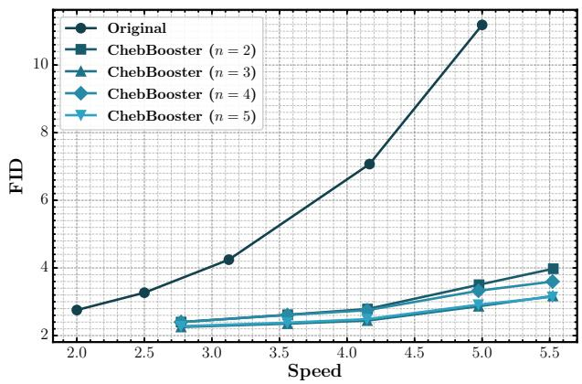  
Figure 7: FID evaluation on DiT-XL/2 across varying sampling steps. This figure shows the trade-of between FID scores and inference speed when applying ChebBooster. Notably, ChebBooster achieves substantial acceleration while preserving competitive FID performance, indicating that the generated images remain close to the real data distribution even under aggressive speedup.

Key Observations. Our experiments reveal several critical insights. First, the Original models exhibit a clear and predictable trade-of: reducing inference steps (e.g., from 50 to 10) cuts FLOPs by nearly 80% but causes a catastrophic degradation in generation quality, with the FID score worsening by over 410% (from 2.18 to 11.19). This establishes a critical performance bottleneck for naive acceleration. Second, ChebBooster consistently overcomes this limitation. For instance, Cheb (r=5, n=5) achieves a superior FID (2.28 vs. 3.27) and a much higher IS (247.27 vs. 235.35) than Original (20 steps) while requiring 10% fewer FLOPs. This demonstrates that Cheb-Booster fundamentally improves the performanceeficiency frontier. Finally, the hyperparameters have distinct roles: � primarily governs the foundational acceleration and computational budget, while � acts as a quality-tuning parameter within that budget, consistently improving fidelity for a negligible computational cost.

Parameter Recommendations. Based on this analysis, we can recommend specific parameter configurations tailored to diferent use-cases, depending on the desired balance between generation fidelity and computational eficiency.

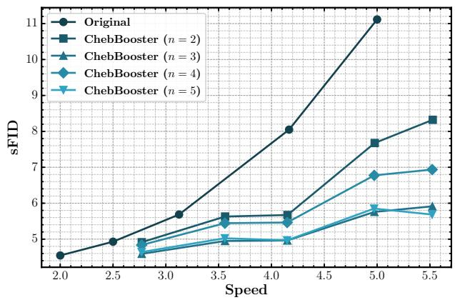  
Figure 8: Structural FID (sFID) evaluation on DiT-XL/2. The figure highlights how ChebBooster maintains structural consistency in generated images while achieving high speedup ratios. Compared to FID, sFID is more sensitive to localized distortions, and the consistently low sFID values indicate that structural fidelity is preserved even at faster sampling rates.

For Maximizing Generation Quality. If the primary goal is to achieve the best possible output quality while still realizing significant speedup, the optimal choice is Cheb (r=3, n=5). It yields the highest Inception Score (247.27) and one of the best FID scores (2.28) among all accelerated models. Its performance is nearly on par with the Original (50 steps) baseline (FID of 2.28 vs. 2.18) but reduces the computational cost by over 63%.

For Maximizing Computational Eficiency. If the primary constraint is minimizing FLOPs for deployment on resource-limited hardware, the recommended configuration is Cheb (r=7, n=2). It ofers the lowest computational footprint (4.295 GFLOPs) of all tested ChebBooster variants. Critically, when compared to the Original (10 steps) model which has a similar computational budget, this ChebBooster configuration is vastly superior, improving the FID from a poor 11.19 down to a respectable 3.98.

A Balanced Recommendation. For a generalpurpose, high-performance setting, a configuration of � = 4 with � ≥ 4 provides an excellent balance. For example, Cheb (r=4, n=5) maintains a strong FID of 2.38 and an IS of 244.20, while reducing FLOPs to 6.671—a 72% reduction from the full model.

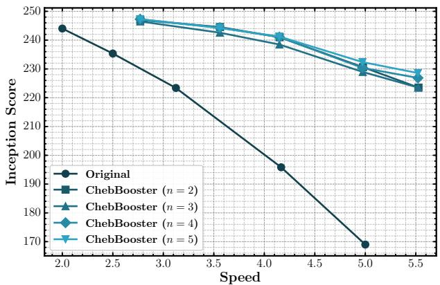  
Figure 9: Inception Score evaluation on DiT-XL/2. This figure shows how ChebBooster impacts sample diversity and semantic clarity across diferent acceleration levels. Despite fewer sampling steps, the method sustains high Inception Scores, indicating that the generated samples remain both varied and classifiable.

In summary, ChebBooster is a robust and efective method for accelerating the generative model. By appropriately selecting the acceleration level � and tuning the quality with �, users can achieve performance far superior to naive methods across the entire performance-eficiency spectrum.

## E. Extensive Visual Quality Analysis of ChebBooster

To further validate the efectiveness of ChebBooster, we conducted visual comparisons on both classto-image and text-to-image generation tasks, as shown in Figure 10 and Figure 11. These comparisons include several recent training-free acceleration methods—Δ-DiT, FORA, ToCa, and TaylorSeer—as baselines. Across all evaluated prompts and classes, ChebBooster consistently produces outputs that are visually superior in terms of sharpness, semantic fidelity, and structural coherence.

In the PixArt-Sigma setting (Figure 10), ChebBooster avoids the blurriness and semantic degradation exhibited by TaylorSeer and Δ-DiT. While ToCa and FORA generate outputs with acceptable global layout, they often sufer from washed-out textures or oversimplified details. In contrast, ChebBooster maintains fine-grained textures, well-defined contours, and vivid colors, demonstrating its ability to preserve both high-frequency details and global consistency.

PixArt-Sigma  
Δ-DiT  
FORA  
ToCa  
TaylorSeer  
ChebBooster  
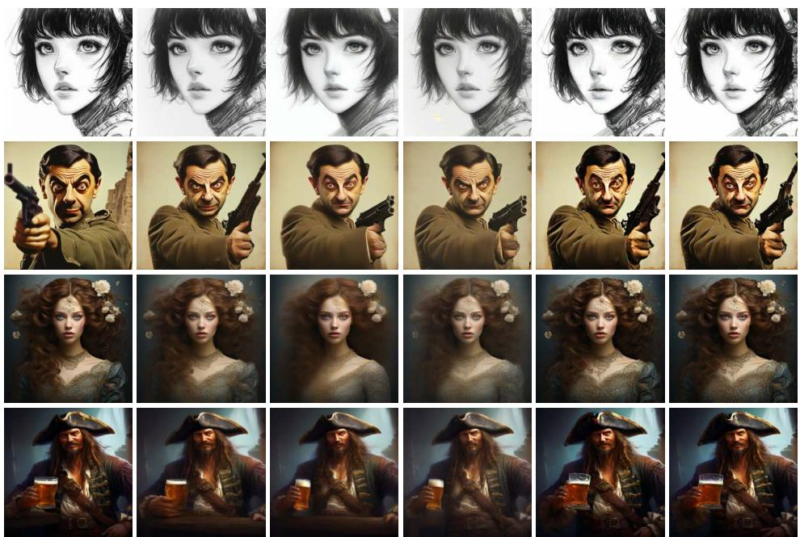  
Figure 10: Extensive qualitative results on PixArt-Σ.

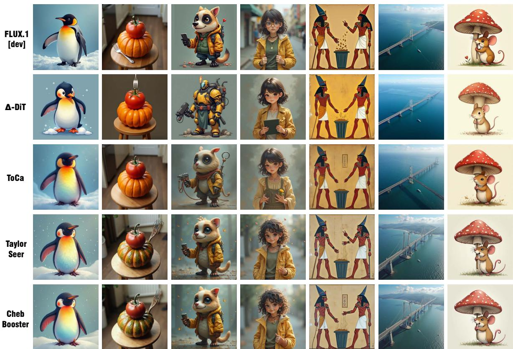  
Figure 11: Extensive qualitative results on FLUX.1-dev.

Similarly, in the FLUX.1-dev setting (Figure 11), Cheb-Booster clearly outperforms all other baselines in generating semantically correct and visually appealing images. Notably, ChebBooster retains distinctive visual attributes (e.g., facial features, object poses, and stylistic elements) that are often lost or distorted in other methods. This indicates that the Chebyshevinspired extrapolation strategy employed by Cheb-Booster not only improves sampling eficiency, but also enhances the model’s ability to maintain feature consistency across denoising steps.

Overall, these qualitative results provide strong evidence that ChebBooster achieves a better trade-of between acceleration and image quality. Its robustness across diferent models and prompts further suggests that ChebBooster generalizes well to diverse generative scenarios.

## F. Prompts for Demonstration

We provide the prompts used in our demonstration of ChebBooster on PixArt-Σ and FLUX.1-dev in Figure 5 and 6. These prompts are designed to showcase the capabilities of ChebBooster in generating highquality images with various styles and subjects.

1. An Ultraman preparing to take flight. (Figure 5)

2. A full body shot of an elegant, Scottish woman wearing a dress with a sharp focus on her striking eyes in a realistic and beautifully retouched art piece by Artgerm and Jason Chan. (Figure 5)

3. A portrait painting ofa red-haired, smiling woman in a green dress against a golden background with intricate patterns. (Figure 5)

4. Yoshitaka Amano’s painting of a young lion beastman with a white mane, wearing complex fantasy clothing and huge paws, at a medieval market on a windy day. (Figure 5)

5. A white toilet sitting next to a large window. (mis-

taken for "A white toilet tin a bathroom sitting next to a sink." in Figure 5)

6. Two people standing in a kitchen near a stove. (Figure 5)

7. A single clock is sitting on a table. (Figure 6)

8. An illustration of a small green elephant standing behind a large red mouse. (Figure 6)

9. Medium shot black and white manga pencil drawing with a highly detailed face of Alita by Yukito Kishiro. (Figure 6)

10. Mr. Bean featured on a WWII propaganda poster holding a gun. (Figure 10)

11. The image portrays Ophelia with a detailed and elegant face, featuring wonderful eyes, wearing an intricate dress, and created with hyperrealistic painting techniques. (Figure 10)

12. A pirate with a beer is illustrated in detailed digital painting. (Figure 10)

13. Rainbow coloured penguin. (Figure 11)

14. A tomato has been put on top of a pumpkin on a kitchen stool. There is a fork sticking into the pumpkin. The scene is viewed from above. (Figure 11)

15. Rbefraigerator. (Figure 11)

16. Matutinal. (Figure 11)

17. An ancient Egyptian painting depicting an argument over whose turn it is to take out the trash. (Figure 11)

18. A bridge connecting Europe and North America on the Atlantic Ocean, bird’s eye view. (Figure 11)

19. Illustration of a mouse using a mushroom as an umbrella. (Figure 11)