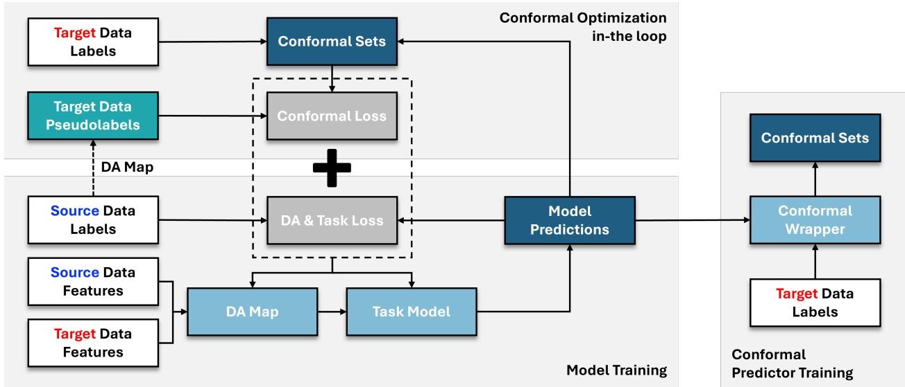
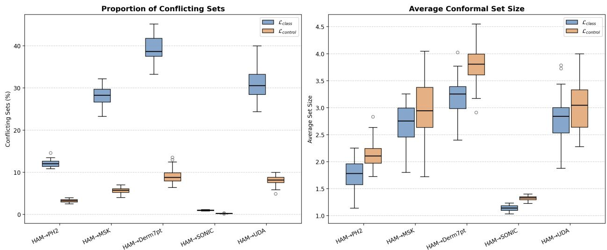

# Conformal Risk Minimization for Semi-Supervised Domain Adaptation via Optimal Transport

Manos Giannopoulos Duke University

Yi Shen

Duke University

Michael M. Zavlanos

Duke University

manos.giannopoulos@duke.edu

ys267@duke.edu

mz61@duke.edu

## Abstract

In high-stakes healthcare applications, machine learning models are frequently trained on data from one patient population and deployed on another, creating a distribution shift that degrades both accuracy and reliability. Semi-Supervised Domain Adaptation (SSDA) addresses this by leveraging labeled data from some source domain to improve model per formance on a target domain where labels are scarce. However, existing SSDA methods optimize primarily for point-prediction accuracy and ofer no principled uncertainty quantification — a prerequisite for clinical trust. Conformal Prediction (CP) can address this limitation by providing prediction sets with rigorous, distribution-free coverage guarantees. However, applying CP post-hoc to a pre-trained model can yield prohibitively large prediction sets, as SSDA pre-training methods do not account for the nonconformity score geometry that determines conformal set size. Conformal Risk Minimization (CRM) has been used to resolve this issue in the fully supervised setting by integrating the CP objective directly into model training, but it requires a large labeled dataset to compute nonconformity thresholds during training, precisely the data that is scarce in the SSDA regime. We propose an end-to-end framework that integrates CRM into the SSDA training objective, enabling efective CRM in the limited-labeled-target-data regime. The key idea is to utilize Optimal Transport (OT) to generate pseudolabels for unlabeled target instances, providing the ad ditional training signal needed by CRM to operate using only a small labeled target set. This results in a model jointly optimized for domain invariance and conformal eficiency, producing prediction sets that are compact, coverage-valid, and support domain-specific constraints such as excluding mutually contradictory diagnoses in skin lesion classification.

## 1 Introduction

In many clinical applications of machine learning, medical imaging being a prominent example, labeled data in the target domain are scarce, while labeled data from a related source domain and unlabeled data from the target domain may be abundant. Semi-Supervised Domain Adaptation (SSDA) algorithms exploit this setting by leveraging labeled source data alongside the limited labeled target data to improve point-prediction accuracy on the target domain. Another requirement in high-stakes settings, where an incorrect decision could lead to serious complications, is reliable deployment beyond predictive accuracy alone. To reliably use a model, a clinician might require both a prediction and a calibrated measure of its uncertainty, in order to assess when an output can be trusted and when further evidence is warranted. Conventional SSDA objectives, designed solely around point-prediction accuracy, do not provide such uncertainty estimates.

Conformal Prediction (Vovk et al., 2005a) (CP) can address this limitation by equipping any pre-trained model with distribution-free, finite-sample guarantees on prediction uncertainty. Given a significance level α, CP constructs a prediction set C(X) for an input X (e.g., a feature vector, an image, or other structured input) such that the true label Y is included in the set with a probability of at least 1 − α, i.e.,

  
Figure 1: Our proposed framework (CP-JDOT) that integrates conformal optimization in-the-loop for Semi-Supervised Domain Adaptation tasks. Our algorithm uses the labeled target dataset to compute a diferentiable quantile of the nonconformity score distribution. Then, it optimizes a loss function that contains a Domain Alignment component and a Conformal Alignment component derived from the sizes of the conformal sets constructed on the unlabeled target data, using pseudolabels generated from optimally transported source data.

$$
\mathbb { P } ( Y \in C ( X ) ) \geq 1 - \alpha .
$$

Through this guarantee, CP produces prediction sets that are inherently adaptive: small for inputs that the model can easily classify, and larger for inputs that are more dificult or atypical. This adaptive behavior makes predictive uncertainty explicit in a statistically rigorous way, providing a principled foundation for clinical decision-making.

Traditionally, CP has been applied as a post-hoc wrapper on top of pre-trained models (Angelopoulos et al., 2021; Romano et al., 2019; 2020; Vovk & Bendtsen, 2018; Vovk et al., 2020). However, this approach often yields prediction sets that are far too large to be clinically useful. The reason is fundamental: A pretraining objective that optimizes for point-prediction accuracy does not account for the nonconformity score geometry that governs conformal set size. While an optimized post-hoc calibration method can yield modest improvements in set size, the best achievable result is fundamentally constrained by the predictive outputs of the underlying model. Conformal Risk Minimization (CRM) (Bellotti, 2020; 2021; Stutz et al., 2021) addresses this by incorporating set-size directly into the training objective via diferentiable nonconformity thresholds, jointly optimizing accuracy and conformal eficiency end-to-end. However, extending CRM to an SSDA setting is non-trivial: existing approaches rely on large labeled datasets to estimate or learn nonconformity score thresholds during training, and do not provide a clear way to use labeled data from a diferent distribution. The question we address in this work is therefore:

## How can we optimally train conformal predictors for semi-supervised domain adaptation tasks where labeled data is limited in the target domain?

In this work, we propose CP-JDOT (outlined in Figure 1), an end-to-end CRM training algorithm designed for SSDA tasks where labeled target data are scarce. We assume access to a small labeled target set, suficient unlabeled target data, and labeled source data. The labeled target samples are used to compute a diferentiable quantile of the nonconformity scores at each training iteration, serving as the conformal threshold during training. To align source and target distributions, we use Joint Domain Adaptation to map both domains into a shared representation space, and rely on Optimal Transport (OT) to transfer source labels to unlabeled target instances as pseudolabels. Conformal sets are then constructed around these pseudolabeled target instances using the quantile derived from the small labeled target set, and the resulting classification and set-size losses are backpropagated end-to-end, directly shaping the model’s output geometry for conformal eficiency. Our experiments show that CP-JDOT consistently reduces average prediction set size compared to state-of-the-art SSDA pre-training methods that optimize for top-1 accuracy, while preserving coverage. Furthermore, since our method directly modifies the training loss, it can support domain-specific constraints — for example, penalizing sets that simultaneously include benign and malignant classes in skin lesion classification — making the framework attractive for applications where prediction set composition directly impacts clinical decision-making.

The key contributions of this work are summarized as follows:

1. We propose CP-JDOT, a novel SSDA training framework that integrates a CRM objective within a Joint Domain Adaptation with Optimal Transport framework to enable the optimization of a predictive model with respect to the prediction sets it will produce downstream. This framework specifically addresses target-label scarcity by leveraging OT-derived pseudolabels to calibrate a conformal predictor in a globally aligned feature space, bridging the gap between supervised CRM and SSDA.

2. We demonstrate that, by incorporating the conformal objective directly into the training loop, CP-JDOT supports penalty terms tailored to domain-specific requirements. Beyond minimizing set cardinality, this enables control over set composition — such as mitigating “coverage confusion” (Stutz et al., 2021) by penalizing the simultaneous inclusion of mutually exclusive high-level classes — yielding prediction sets that are both statistically valid and semantically meaningful.

3. We provide a rigorous empirical analysis demonstrating that our end-to-end approach consistently outperforms state-of-the-art CP-agnostic SSDA methods with post-hoc conformal wrappers when evaluated on the downstream average set size, while preserving coverage guarantees.

## 2 Preliminaries

We will first review some key concepts around CP and CRM. Consider a supervised classification problem with K classes, where inputs lie in a feature space X and labels in a label space $\mathcal { V } = \{ 1 , \ldots , K \}$ . Let D denote the joint distribution over $\mathcal { X } \times \mathcal { V }$ , and let $f _ { \theta }$ be a probabilistic classifier modeled by a neural network parameterized by θ. Moreover, let $f _ { \boldsymbol { \theta } , \boldsymbol { y } } ( \boldsymbol { x } )$ denote the predicted probability of class $y \in \mathcal { V }$ for a single input $x \in \mathcal { X }$ . In CP, a pre-trained $f _ { \theta }$ is usually “wrapped” to produce prediction sets $C _ { \theta } ( X )$ , which are subsets of Y intended to contain the true label Y with a desired probability, a constraint commonly called coverage.

## 2.1 Coverage Constraints in Conformal Prediction

In CP, coverage refers to the probability that the prediction set $C _ { \theta } ( X )$ contains the true label Y. In an ideal scenario, one would aim for full conditional coverage, which requires that for every possible input $x \in \mathcal { X }$ , the prediction set captures the true label with a probability of at least 1 − α:

$$
\mathbb { P } \big ( Y \in C _ { \theta } ( X ) \mid X = x \big ) \geq 1 - \alpha , \quad \mathrm { f o r ~ a l l ~ } x \in \mathcal { X } .\tag{1}
$$

Intuitively, this guarantees that the method is perfectly calibrated for every possible input. However, achieving full conditional coverage is generally impossible in a distribution-free, finite-sample setting unless the algorithm adopts the trivial behavior of including the entire label space in the conformal sets (Lei et al., 2013). To address this limitation, a more achievable relaxation is marginal coverage, which only requires that the coverage guarantee holds on average over the distribution of the features $X { : }$

$$
\mathbb { P } \big ( Y \in C _ { \theta } ( X ) \big ) \geq 1 - \alpha .\tag{2}
$$

While this guarantee is weaker, it is attainable in a finite-sample, distribution-free setting using standard conformal prediction methods. Marginal coverage ensures that the prediction sets are correct on average, yet it does not provide guarantees for specific regions of the input space, which may result in under-coverage for certain subpopulations.

## 2.2 Conformal Predictors

In this work, we focus on Split Conformal Prediction (SCP) (Papadopoulos et al., 2002), a practical variant of conformal prediction that guarantees marginal coverage using a held-out calibration dataset that has not been used during the training of the predictive model $f _ { \theta }$ . Let $\mathbf { \bar { \rho } } D _ { \mathrm { c a l } } = \{ ( x _ { i } , y _ { i } ) \} _ { i = 1 } ^ { N _ { \mathrm { c a l } } }$ denote this calibration dataset, and let $s : \mathcal { X } \times \mathcal { Y }  \mathbb { R }$ denote a nonconformity score function. Intuitively, $s ( \cdot , \cdot )$ measures how nonconforming a pair $( x , y )$ is to the underlying data distribution D. SCP involves two phases: (i) a calibration phase, where a threshold $\tau$ is computed using $D _ { \mathrm { c a l } }$ to satisfy the desired coverage level, and (ii) a prediction phase, where prediction sets $C _ { \theta } ( x ; \tau )$ are formed for individual inputs $x .$ These sets depend on the model parameters θ both through the predicted probabilities $f _ { \boldsymbol { \theta } , \boldsymbol { y } } ( \boldsymbol { x } )$ and the calibrated threshold τ. We next review two commonly used conformal predictors that will be the basis of our experimental evaluation: HPS and APS.

The Homogeneous Prediction Sets (HPS) (Sadinle et al., 2019) predictor constructs confidence sets by thresholding the predicted probabilities:

$$
C _ { \theta } ( x ; \tau ) : = \{ y : s _ { \theta } ( x , y ) \leq \tau \} .\tag{3}
$$

where $s _ { \theta } ( x , y ) = 1 - f _ { \theta , y } ( x )$ . The subscript in $C _ { \theta }$ emphasizes the dependence on the model $f _ { \theta }$ and its parameters θ. During calibration, the threshold τ is set to the $( 1 { - } \alpha ) ( 1 { + } 1 / N _ { \mathrm { c a l } } )$ quantile of the nonconformity scores $s _ { \theta } ( x _ { i } , y _ { i } )$ computed on the calibration set. This ensures that marginal coverage of at least $1 - \alpha$ is achieved for new test examples (X, Y).

The Adaptive Prediction Sets (APS) (Romano et al., 2020) predictor constructs confidence sets based on the cumulative sums of sorted class probabilities. Specifically, the set is defined as $C _ { \theta } ( x ; \tau ) : = \{ y :$ $s _ { \theta } ( x , y ) \leq \tau \}$ , where the nonconformity score $s _ { \theta } ( x , y )$ is given by

$$
s _ { \theta } ( x , y ) : = \sum _ { j = 1 } ^ { k - 1 } f _ { \theta , y ^ { ( j ) } } ( x ) + U \cdot f _ { \theta , y ^ { ( k ) } } ( x ) ,
$$

with $f _ { \theta , y ^ { ( 1 ) } } ( x ) \ge f _ { \theta , y ^ { ( 2 ) } } ( x ) \ge \cdots \ge f _ { \theta , y ^ { ( K ) } } ( x )$ the sorted class probabilities and $U \sim \mathrm { U n i f } ( 0 , 1 )$ used to break ties between diferent class scores. Calibration proceeds as in HPS: the threshold τ is set to the $( 1 - \alpha ) ( 1 + 1 / N _ { \mathrm { c a l } } )$ empirical quantile of the scores at the true labels, ensuring marginal coverage.

In our experiments, SCP using the above conformal predictors will be applied post-hoc to pre-trained models, producing prediction sets. Since coverage is guaranteed regardless of the pre-training method, the standard comparison metric is the ineficiency. For a test set T of size n, ineficiency is defined as

$$
I n e f f i c i e n c y : = \frac { 1 } { n } \sum _ { i \in T } | C _ { \theta } ( x _ { i } ) | ,
$$

where | · | denotes the cardinality of the prediction set.

## 2.3 Conformal Risk Minimization

CRM aims to train a classifier such that the prediction sets it produces after downstream conformal calibration have minimal cardinality. A common formulation augments the standard Empirical Risk Minimization (ERM) objective with a conformal alignment loss:

$$
\begin{array} { r l } { \underset { \theta } { \operatorname* { m i n } } } & { { } \mathcal { L } _ { c l s } ( f _ { \theta } ) + \lambda \mathcal { L } _ { c } ( f _ { \theta } ) } \end{array}\tag{4}
$$

where $\mathcal { L } _ { c l s }$ is a classification loss, $\mathcal { L } _ { c } ( f _ { \theta } )$ is the conformal alignment loss, and λ controls the trade-of between the two objectives. As in previous work (Stutz et al., 2021; Bellotti, 2020), we consider the case where the conformal alignment loss is the expected (smoothed) set cardinality parameterized by a quantile τ:

$$
\mathcal { L } _ { c } ( f _ { \theta } ; \tau ) = \mathbb { E } \left[ \sum _ { y \in \mathcal { V } } \tilde { \mathbb { 1 } } [ s ( X , y ) \leq \tau ] \right] .
$$

Here, 1˜[·] is a smoothed approximation of the indicator function 1[·], implemented using the sigmoid function. Standard stochastic CRM methods employ a two-stage process within each training iteration, since the quantile $\tau$ of the score distribution changes with each model update. First, they sample a batch of labeled examples to estimate the current conformal quantile τ. Then, they sample a separate batch to compute the classification and conformal alignment losses in problem 4. While the conformal alignment loss $\mathcal { L } _ { c }$ can be evaluated without access to ground-truth labels, the same is not true for the classification loss $\mathcal { L } _ { c l s }$ and the nonconformity score quantile τ. Therefore, the main challenge our method aims to address is how to optimally use the few labeled target samples together with the labeled source samples in order to construct a CRM objective while bridging the two domains in an SSDA setting.

## 3 Related Work

## 3.1 Domain Adaptation

Unsupervised domain adaptation (UDA) considers prediction in a target domain for which labeled examples are unavailable during training, while labeled data are provided from a related source domain Ben-David et al. (2007). A central challenge is to extract information that transfers across the domain shift without discarding features that are predictive of the target task. Existing approaches address this challenge through severa mechanisms, including feature-distribution matching Sun & Saenko (2016); Long et al. (2015), adversaria domain alignment Ganin et al. (2016); Tzeng et al. (2015), and optimal transport.

Optimal Transport (OT) provides a distribution-level framework for establishing correspondences between samples from two domains Kantorovich (1942); Villani (2009). In domain adaptation, this correspondence can be used to transfer information from labeled source observations to otherwise unlabeled target observations (Courty et al., 2014). Joint Distribution Optimal Transport (JDOT) (Courty et al., 2017) makes this correspondence sensitive to the prediction task by incorporating label discrepancies into the transport cost, while DeepJDOT (Damodaran et al., 2018) integrates this formulation with deep representation learning. The resulting transport plan associates target samples with source labels and can therefore serve as a form of supervision for the target domain. DeepJDOT can be considered a seminal work in the field; subsequent work has built upon it to improve the scalability and robustness of OT-based adaptation by considering Unbalanced and Partial Optimal Transport (Fatras et al., 2021; Nguyen et al., 2022), or utilizing alternative distance metrics to the Euclidean distance proposed by DeepJDOT (Tai et al., 2021; Duque et al., 2022; Asadulaev et al., 2024; Gu et al., 2026; Maman & Talmon, 2025). Our work also builds upon the framework proposed by DeepJDOT; by incorporating a CRM term and appropriately modifying its training procedure, we align the training objective more closely with conformal set-size eficiency, resulting in more compact prediction sets downstream.

Semi-supervised domain adaptation (SSDA) relaxes the UDA setting by adding a small labeled subset of target-domain observations. Existing SSDA methods exploit these labels through mechanisms such as entropy minimization (Saito et al., 2019), adversarial pseudo-label refinement (Li et al., 2021), active targetlabel selection (He et al., 2024), and prototype-based or co-training strategies (Huang et al., 2023; Yang et al.,

2021). Our work considers the same limited-target-label setting but is complementary to these approaches: rather than using the labeled target data solely for conventional adaptation, we use them to incorporate the conformal objective into training, while leveraging OT-based domain adaptation to provide supervision for the unlabeled target data. To the best of our knowledge, we are the first to incorporate CRM into the SSDA framework. We therefore compare our approach against post-hoc conformalized versions of representative SSDA methods to validate the benefit of incorporating the conformal objective into the training procedure when the metric of interest is the downstream conformal set size.

## 3.2 Conformal Prediction

Conformal prediction (CP), introduced by Vovk et al. (2005b), provides finite-sample prediction sets with marginal coverage guarantees under exchangeability, with applications to both regression and classification problems (Romano et al., 2019; 2020). Split conformal prediction, the method adopted in this paper, is particularly common in practice due to its simplicity and compatibility with arbitrary predictive models (Papadopoulos et al., 2002; Lei et al., 2013). Nevertheless, valid conformal methods based on leave-one-out estimators (Barber et al., 2019) and cross-calibration (Vovk, 2013) are also present in the literature. Modern CP research focuses on improving non-conformity scores targeting smaller conformal set sizes (Sadinle et al., 2019; Angelopoulos et al., 2022; Huang et al., 2024) and better conditional coverage (Romano et al., 2020). However, the above methods all work as post-hoc calibrators. Thus, their performance is inherently constrained by the quality of the underlying predictive model. Prior work (Bellotti, 2021) has noted that this model dependence can be consequential: models trained with objectives that are misaligned with conformal set-size eficiency may yield unnecessarily large and less informative prediction sets after calibration.

Conformal Risk Minimization (CRM), introduced concurrently by Bellotti (2021) and Stutz et al. (2021), aims to pre-train a model to learn better non-conformity scores, leading to reduced downstream ineficiency $( { \mathrm { i . e . } }$ , smaller set sizes) after the post-hoc calibration. Following the seminal paper of Stutz et al. (2021) (ConfTr), several works have proposed improved versions of CRM, including enhanced conditional coverage (CUT) (Einbinder et al., 2022), reduced variance (ConfTr-VR) (Noorani et al., 2025), robustness to adversarial samples (RSCP) (Yan et al., 2024), tighter learning bounds (DPSM) (Shi et al., 2025). The above approaches all consider supervised learning problems; our work extends the approach of CRM to the SSDA, enabling the learning of non-conformity scores without access to a high volume of labeled data samples from the target distribution.

## 4 Problem Definition

We consider a multi-class classification problem across a source and a target domain, characterized by a shared input space X and a common label space Y, with $| y | = K$ . Let $\boldsymbol { S } = \{ ( x _ { i } ^ { s } , y _ { i } ^ { s } ) \} _ { i = 1 } ^ { N _ { s } }$ denote a labeled source dataset, with samples drawn i.i.d. from a joint distribution $\mathcal { D } ^ { S }$ over $\mathcal { X } \times \mathcal { V }$ . The target domain is drawn from a diferent joint distribution $\mathcal { D } ^ { T } \neq \mathcal { D } ^ { S }$ over the same space and consists of a small labeled subset $\mathcal { T } _ { l } = \{ ( x _ { j } ^ { l } , y _ { j } ^ { l } ) \} _ { j = 1 } ^ { N _ { l } }$ and a larger unlabeled subset $\mathcal { T } _ { u } = \{ x _ { k } ^ { u } \} _ { k = 1 } ^ { N _ { u } }$

Our goal is to solve a Conformal Risk Minimization (CRM) problem, similar to the one described in Section 2.3. We model the predictive function $f _ { \theta } : \mathcal { X }  \Delta ( \mathcal { Y } )$ as a neural network with parameters θ, where $\Delta ( y )$ denotes the probability simplex over the label space Y. At deployment, the trained model is wrapped by a post-hoc conformalizing function $\phi : \Delta ( \mathcal { Y } )  2 ^ { \mathcal { Y } }$ to produce prediction sets $C _ { \theta } : = \phi \circ f _ { \theta }$ . Our goal is to learn $f _ { \theta }$ such that the resulting conformal sets have small expected cardinality on the target domain while maintaining the desired coverage level. As mentioned previously, since the post-hoc conformalization procedure provides the desired coverage guarantee, the role of CRM during training is to improve the eficiency of the resulting prediction sets.

In addition to conformal eficiency, the model must adapt to the target domain using the limited labeled target data together with the available source and unlabeled target data. We therefore consider objectives that combine a classification loss, a domain adaptation loss, and a conformal alignment loss. Specifically, we define a Domain Adaptation Conformal Risk Minimization (DA-CRM) problem as an objective of the form

$$
\operatorname* { m i n } _ { \theta } \quad \mathcal { L } _ { c l s } ( f _ { \theta } ) + \lambda _ { 1 } \mathcal { L } _ { D A } ( f _ { \theta } ) + \lambda _ { 2 } \mathcal { L } _ { c } ( f _ { \theta } ) .\tag{5}
$$

Each term in Problem 5 serves a specific purpose: $\mathcal { L } _ { c l s }$ promotes predictive accuracy, $\mathcal { L } _ { D A }$ encourages adaptation between the source and target domains, and $\mathcal { L } _ { c }$ promotes conformal eficiency by reducing the size of the resulting prediction sets. The coeficients $\lambda _ { 1 }$ and $\lambda _ { 2 }$ control the relative contributions of the domain adaptation and conformal objectives. The following section describes our specific choices for these loss functions and the resulting training algorithm.

## 5 Method

In this section, we present our method for constructing and optimizing Problem 5. Before presenting our method, we will first review DeepJDOT, an established Optimal Transport-based domain adaptation framework that forms the basis of our approach. We then introduce CP-JDOT and describe how we extend DeepJDOT to incorporate CRM in its training objective.

## 5.1 Joint Domain Adaptation with Optimal Transport: The DeepJDOT framework

In order to adapt CRM to an SSDA setting, we build upon the framework proposed in DeepJDOT (Damodaran et al., 2018). DeepJDOT decomposes $f _ { \theta }$ into two distinct components: an embedding function $g : \mathcal { X }  \mathcal { Z }$ that maps an input from either the source or target domain to a latent space ${ \mathcal { Z } } ,$ and a classifier $h : \mathcal { Z } \to \mathcal { y }$ that maps these latent representations to the label space. The goal is to jointly optimize the feature representation and classifier so that the learned representation captures features that are useful for classification while aligning the source and target domains. To this end, they define the following optimization problem:

$$
\operatorname* { m i n } _ { \gamma \in \Pi ( \mu _ { s } , \mu _ { t } ) , h , g } \quad \sum _ { i } \sum _ { j } \gamma _ { i j } d \Big ( g ( x _ { i } ^ { s } ) , y _ { i } ^ { s } ; g ( x _ { j } ^ { u } ) , h ( g ( x _ { j } ^ { u } ) ) \Big ) ,\tag{6}
$$

where

$$
\begin{array} { r } { d \Big ( g ( x _ { i } ^ { s } ) , y _ { i } ^ { s } ; g ( x _ { j } ^ { u } ) , h ( g ( x _ { j } ^ { u } ) ) \Big ) = \lambda _ { a } c \big ( g ( x _ { i } ^ { s } ) , g ( x _ { j } ^ { u } ) \big ) + \lambda _ { c l s } \mathcal { L } _ { c l s } \big ( y _ { i } ^ { s } , h ( g ( x _ { j } ^ { u } ) ) \big ) . } \end{array}\tag{7}
$$

Here, $\Pi ( \mu _ { s } , \mu _ { t } )$ denotes the set of all joint distributions with marginals $\mu _ { s }$ and $\mu _ { t } , c ( \cdot , \cdot )$ denotes an appropriate cost function that measures the cost of transporting $g ( x _ { i } ^ { s } )$ to $g ( x _ { j } ^ { u } )$ , and $\mathcal { L } _ { c l s } ( \cdot , \cdot )$ denotes a classification loss. The parameters $\lambda _ { a }$ and $\lambda _ { c l s }$ control the tradeof between the alignment and classification terms. The first term in d encourages alignment between the source and target representations by minimizing the discrepancy between their embeddings. The second term evaluates the classifier h on the target domain by measuring its agreement with the labels of the source samples under the optimal transport plan. In the next section, we show how we define $c ( \cdot , \cdot )$ and $\mathcal { L } _ { c l s } ( \cdot , \cdot )$ in CP-JDOT so that the resulting objective implements CRM, explicitly accounting for both representation geometry and conformal set eficiency.

## 5.2 Incorporating CRM with CP-JDOT

We restate our method’s end goal: to learn a model $f _ { \theta }$ which, when paired with a downstream conformal prediction wrapper, produces more eficient prediction sets than a standard SSDA-trained model with posthoc calibration. To achieve this, CP-JDOT incorporates conformal prediction into the training procedure while jointly optimizing the embedding function g and classifier h.

At a high level, each training iteration consists of three steps. First, we estimate a diferentiable $( 1 - \alpha ) \cdot$ quantile τ of the nonconformity scores using the labeled target set $\mathcal { T } _ { \ell } .$ . Second, we use labeled source and unlabeled target samples to compute an Optimal Transport coupling, which aligns the two domains and provides source-label information for the target samples. Finally, we use this coupling together with τ to optimize a combined objective that encourages both domain alignment and conformal eficiency.

We implement this procedure stochastically using two minibatches of size B at each iteration: $\begin{array} { r l } { B ^ { S } } & { { } = } \end{array}$ $\{ ( x _ { i } ^ { s } , y _ { i } ^ { s } ) \} _ { i = 1 } ^ { B }$ sampled from $s$ and $B ^ { T } = \bar { \{ x _ { j } ^ { u } \} } _ { j = 1 } ^ { B }$ sampled from $\mathcal { T } _ { u }$ . Given these batches and the current threshold $\tau ,$ we instantiate Problem 8 with our choices of the domain-alignment cost and CRM-aware classification loss. For fixed model parameters $( g , h )$ and conformal threshold $\tau ,$ we optimize an OT coupling parameter $\gamma$ by solving

$$
\operatorname* { m i n } _ { \gamma \in \Pi ( \mu _ { s } , \mu _ { t } ) } \mathcal { L } _ { \mathrm { D A } } ( \gamma , x ^ { s } , x ^ { u } ; \theta ) + \mathcal { L } _ { \mathrm { c l s } } ( \gamma , x ^ { u } , y ^ { s } ; \theta , \tau )\tag{8}
$$

where

$$
\mathcal { L } _ { \mathrm { D A } } ( \gamma , x ^ { s } , x ^ { u } ; \theta ) = \lambda _ { a } \sum _ { i , j = 1 } ^ { B } \gamma _ { i j } \underbrace { \left( c _ { \mathrm { G O T } } ( x _ { i } ^ { s } , x _ { j } ^ { u } ) \right) } _ { c \left( g ( x _ { i } ^ { s } ) , g ( x _ { j } ^ { u } ) \right) }
$$

$$
\mathcal { L } _ { \mathrm { c l s } } ( \gamma , x ^ { u } , y ^ { s } ; \theta , \tau ) = \lambda _ { c l s } \sum _ { i , j = 1 } ^ { B } \gamma _ { i j } \underbrace { \left( \sigma \left( \left[ 1 - h _ { y _ { i } ^ { s } } ( g ( x _ { j } ^ { u } ) ) \right] - \tau \right) \right) } _ { \mathcal { L } _ { c l s } \left( y _ { i } ^ { s } , h ( g ( x _ { j } ^ { u } ) ) \right) } .
$$

In Problem $8 , \sigma ( \cdot )$ is the sigmoid function, and $h _ { y } ( g ( x ) ) : = f _ { \theta , y } ( x )$ denotes the model’s predicted probability that input x belongs to class $y .$ The term σ $\left( \left[ 1 - h _ { y _ { i } ^ { s } } ( g ( x _ { j } ^ { u } ) ) \right] - \tau \right)$ is a smoothed equivalent of the indicator function 1 $\left\lceil \left( 1 - h _ { y _ { i } ^ { s } } ( g ( x _ { j } ^ { u } ) ) \right) > \tau \right\rceil$ , which is equal to 1 when $s ( x _ { j } ^ { u } , y _ { i } ^ { s } ) > \tau$ . Thus, $\mathcal { L } _ { c l s }$ defines a diferentiable penalty when the conformal set of $x ^ { u }$ excludes the OT-propagated class $y _ { i } ^ { s }$

The remaining term, $\mathcal { L } _ { D A }$ , is the domain-alignment loss in DeepJDOT’s framework, which aligns the source and target domains. We replace the original squared Euclidean cost used in DeepJDOT with the labelguided Geometric Optimal Transport (GOT) (Maman & Talmon, 2025), which incorporates source and target geometry through difusion processes. We denote the resulting pairwise cost by $c _ { \mathrm { G O T } } ( x _ { i } ^ { s } , x _ { j } ^ { u } )$ . The choice of transport cost is not central to our method; we use GOT as a state-of-the-art transport cost, while recognizing that the design of transport costs is itself an active area of research. We therefore omit the technical details here and briefly present GOT in Appendix A for completeness. The optimal coupling $\gamma$ obtained by solving the minimization Problem 8 serves a dual purpose: it aligns the source samples with the unlabeled target samples to enable the learning of a joint latent space, and it simultaneously assigns probabilistic pseudolabels to the unlabeled target samples. Given this fixed coupling $\gamma .$ , the algorithm then updates the model parameters $\theta ,$ comprising both the embedding function g and the classifier $h ,$ via stochastic gradient descent to minimize the following empirical loss:

$$
\begin{array} { r } { \mathcal { L } _ { \mathrm { t o t a l } } ( \gamma , x ^ { s } , y ^ { s } , x ^ { u } ; \theta , \tau ) : = \mathcal L _ { \mathrm { s o u r c e } } ( x ^ { s } , y ^ { s } ; \theta ) + \mathcal L _ { \mathrm { c l s } } ( \gamma , x ^ { u } , y ^ { s } ; \theta , \tau ) + \mathcal L _ { \mathrm { D A } } ( \gamma , x ^ { s } , x ^ { u } ; \theta ) + \mathcal L _ { \mathrm { c } } ( x ^ { u } ; \theta , \tau ) } \end{array}\tag{9}
$$

where

$$
\begin{array} { l } { \displaystyle \mathcal { L } _ { \mathrm { s o u r c e } } ( x ^ { s } , y ^ { s } ; \theta ) = \displaystyle \frac { 1 } { B } \sum _ { i = 1 } ^ { B } C E \left( y _ { i } ^ { s } , h \left( g ( x _ { i } ^ { s } ) \right) \right) } \\ { \displaystyle } \\ { \displaystyle \mathcal { L } _ { \mathrm { c } } ( x ^ { u } ; \theta , \tau ) = \displaystyle \frac { 1 } { B } \sum _ { j = 1 } ^ { B } \Omega \left( C ( x _ { j } ^ { u } ; \theta , \tau ) \right) . } \end{array}
$$

The $C E ( \cdot )$ denotes the categorical cross-entropy function and $\begin{array} { r } { \Omega ( C ( x ) ) : = \sum _ { y \in \mathcal { V } } \tilde { \mathbb { 1 } } [ s ( x , y ) \leq \tau ] } \end{array}$ denotes the smoothed set size of a sample $x ,$ as also defined in Section 2. In equation $9 , \mathcal { L } _ { \mathrm { s o u r c e } }$ appears even though it does not exist in Problem 5. $\mathcal { L } _ { \mathrm { s o u r c e } }$ represents the Empirical Risk Minimization (ERM) objective on the labeled source domain, which we empirically show to stabilize the training process. The term $\mathcal { L } _ { \mathrm { D A } }$ allows feature alignment between the source and target domains via Optimal Transport. To address the lack of target labels, $\mathcal { L } _ { \mathrm { c l s } }$ acts as a cross-domain classification loss; it utilizes the coupling $\gamma$ to ensure that the label $y _ { i } ^ { s }$ of the source sample $\boldsymbol { x } _ { i } ^ { s }$ that is matched to the target sample $x _ { j } ^ { u }$ is properly included in the conformal set $C ( x _ { j } ^ { u } )$ . Finally, $\mathcal { L } _ { \mathrm { c } }$ is the penalty term used to minimize the average size of the prediction sets for the unlabeled target samples. The full procedure is summarized in Algorithm 1.

Algorithm 1 CP-JDOT   
1: Input: $g , h$   
2: Input: Conformal Predictor (e.g. HPS) defining the nonconformity score $s ( \cdot , \cdot )$   
3: while $^ { g , }$ h not converged do   
4: Calculate τ := diferentiable $( 1 - \alpha )$ -quantile of the scores $s ( x _ { i } ^ { l } , y _ { i } ^ { l } )$ using $\mathcal { T } _ { l }$   
5: Randomly sample $B ^ { S } \subset S$ and $B ^ { T } \subset \overline { { \mathcal { T } } } _ { u }$   
6: Freeze $g , h$ and solve Problem 8 for $\gamma ,$ using $\tau , B ^ { S } , B ^ { T } ,$   
7: Compute the loss in equation 9 using $\gamma$ and the conformal sets.   
8: Update $g , h$ via backpropagation.   
9: end while   
10: Output: Trained $g , h .$

## 5.3 Encoding Domain Knowledge into $\mathcal { L } _ { \mathbf { c l s } }$

The loss function $\mathcal { L } _ { \mathrm { c l s } }$ in equation 9 ensures that the conformal set includes the correct class, which represents the primary requirement for maintaining set validity. In practice, however, it is often desirable to exercise finer control over the composition of the conformal sets, even if this results in a slight reduction in set eficiency (cardinality). For instance, in a skin lesion classification task, a conformal set containing only malignant classes — such as {melanoma, basal cell carcinoma} — is more clinically actionable than an equally sized set that mixes diagnostic categories, such as {melanoma, melanocytic nevi} (one malignant and one benign), since the latter simultaneously suggests both a cancer-positive and cancer-negative diagnoses. Similar to the Conformal Training approach by Stutz et al. (2021), to accommodate such hierarchical constraints where classes belong to distinct parent categories, we replace ${ \mathcal L } _ { \mathrm { c l s } }$ in equation 9 with a specialized control loss, $\mathcal { L } _ { \mathrm { c o n t r o l } }$ , defined as:

$$
\mathcal { L } _ { \mathrm { c o n t r o l } } ( \gamma , x ^ { u } , y ^ { s } ; \theta , \tau ) : = \lambda _ { c t r l } \sum _ { i , j = 1 } ^ { B } \gamma _ { i j } \Big ( \mathbb { \tilde { I } } \{ y _ { i } ^ { s } \notin C ( x _ { i } ^ { u } ; \theta , \tau ) \} + \lambda \sum _ { y \in \mathcal { Y } _ { \mathrm { e r r } } } \mathbb { \tilde { I } } \{ y \in C ( x _ { i } ^ { u } ; \theta , \tau ) \} \Big ) ,\tag{10}
$$

where ${ \mathcal { V } } _ { \mathrm { e r r } }$ represents the set of conflicting classes given the transported label $y _ { i } ^ { s }$ . The first term ensures the transported label is included in the set, while the second term penalizes the inclusion of “conflicting” classes. Thus, our final objective when we are given such structural constraints is:

$$
\begin{array} { r l } & { \mathcal { L } _ { \mathrm { t o t a l , c t r l } } ( \gamma , x ^ { s } , y ^ { s } , x ^ { u } ; \theta , \tau ) : = \mathcal { L } _ { \mathrm { s o u r c e } } ( x ^ { s } , y ^ { s } ; \theta ) + \mathcal { L } _ { \mathrm { D A } } ( \gamma , x ^ { s } , x ^ { u } ; \theta ) + \mathcal { L } _ { \mathrm { c o n t r o l } } ( \gamma , x ^ { u } , y ^ { s } ; \theta , \tau ) } \\ & { \qquad + \mathcal { L } _ { \mathrm { c } } ( x ^ { u } ; \theta , \tau ) . } \end{array}
$$

## 6 Results

Our experimental results aim to (i) demonstrate the ability of our algorithm to construct smaller conformal sets compared to other state-of-the-art SSDA methods that aim for top-1 accuracy and (ii) control the structure of these sets when additional domain-specific structural constraints are available. Specifically, in Section 6.1, we compare our method to state-of-the-art semi-supervised domain adaptation methods calibrated with post-hoc split CP, using the scores presented in Section 2. Next, in Section 6.2, we demonstrate the ability of our method to control the structure of prediction sets using the loss function described in Section 5.3.

<table><tr><td>Method</td><td>A→C</td><td>A→P</td><td>A→R</td><td>C→A</td><td>C→P</td><td>C→R</td><td>P→A</td><td>P→C</td><td>P→R</td><td>R→A</td><td>R→C</td><td>R→P</td><td>Avg</td></tr><tr><td>S&amp;T</td><td>48.32 ± 2.10</td><td>24.18 ± 1.20</td><td>9.84 ± 1.10</td><td>19.45 ± 2.30</td><td>22.67 ± 2.80</td><td>10.21 ± 1.05</td><td>23.14 ± 2.15</td><td>46.23 ± 2.05</td><td>8.93 ± 1.20</td><td>15.67 ± 1.85</td><td>44.21 ± 2.10</td><td>22.34 ± 1.40</td><td>24.60</td></tr><tr><td>MME</td><td>45.12 ± 1.95</td><td>22.43 ± 1.25</td><td>8.87 ± 1.05</td><td> $\overline { { 1 7 . 9 8 \pm 2 . 2 0 } }$ </td><td> $2 1 . 3 4 \pm 2 . 6 0$ </td><td>9.43 ± 1.02</td><td>21.87 ± 2.10</td><td>43.67 ± 2.00</td><td>8.12 ± 1.15</td><td>14.87 ± 1.80</td><td>42.56 ± 2.00</td><td>20.98 ± 1.35</td><td>23.10</td></tr><tr><td>CDAC</td><td> $4 4 . 2 3 \pm 1 . 8 8$ </td><td> $2 1 . 8 7 \pm 1 . 1 8$ </td><td>8.43 ± 1.00</td><td> $1 7 . 1 2 \pm 2 . 1 5$ </td><td> $2 0 . 8 7 \pm 2 . 5 0$ </td><td>8.98 ± 0.98</td><td>21.23 ± 2.05</td><td>42.98 ± 1.92</td><td> $7 . 8 7 \pm 1 . 1 0$ </td><td> $1 4 . 2 3 \pm 1 . 7 5$ </td><td> $4 1 . 8 7 \pm 1 . 9 2$ </td><td> $2 0 . 2 3 \pm 1 . 2 8$ </td><td>22.49</td></tr><tr><td>DECOTA</td><td>44.87 ± 1.82</td><td>22.34 ± 1.10</td><td>9.65 ± 0.92</td><td> $1 7 . 8 7 \pm 2 . 0 5$ </td><td>21.23 ± 2.40</td><td>9.87 ± 0.92</td><td>21.43 ± 1.98</td><td>43.23 ± 1.85</td><td>9.12 ± 1.02</td><td>15.12 ± 1.68</td><td> $4 2 . 3 4 \pm 1 . 8 5$ </td><td> $2 0 . 8 7 \pm 1 . 2 2$ </td><td>23.16</td></tr><tr><td>IDMNE</td><td>41.34 ± 1.78</td><td>21.12 ± 1.08</td><td>7.23 ± 0.90</td><td>14.98 ± 2.00</td><td>20.45 ± 2.35</td><td>7.54 ± 0.88</td><td>18.87 ± 1.92</td><td>39.87 ± 1.80</td><td>6.87 ± 0.98</td><td>12.54 ± 1.62</td><td>38.92 ± 1.80</td><td>19.43 ± 1.18</td><td>20.93</td></tr><tr><td>ProML</td><td>43.12 ± 1.80</td><td> $1 9 . 8 7 \pm 1 . 0 5$ </td><td>6.98 ± 0.88</td><td> $1 5 . 4 3 \pm 1 . 9 8$ </td><td> $1 8 . 8 7 \pm 2 . 2 8$ </td><td>8.23 ± 0.90</td><td>19.87 ± 1.95</td><td>40.54 ± 1.82</td><td> $7 . 3 4 \pm 1 . 0 0$ </td><td> $1 3 . 8 7 \pm 1 . 6 5$ </td><td> $3 9 . 8 7 \pm 1 . 8 2$ </td><td>18.12 ± 1.20</td><td>21.01</td></tr><tr><td>EFTL</td><td>40.87 ± 1.75</td><td>20.56 ± 1.02</td><td>6.87 ± 0.85</td><td> $1 4 . 2 3 \pm 1 . 9 2$ </td><td>18.34 ± 2.22</td><td>7.23 ± 0.85</td><td>18.23 ± 1.88</td><td>40.12 ± 1.78</td><td> $6 . 5 4 \pm 0 . 9 5$ </td><td> $1 1 . 9 8 \pm 1 . 5 8$ </td><td>38.43 ± 1.78</td><td>17.54 ± 1.12</td><td>20.08</td></tr><tr><td>Ours</td><td>40.23 ± 1.60</td><td> $1 7 . 2 1 \pm 0 . 7 3$ </td><td>5.43 ± 0.85</td><td> $1 2 . 5 4 \pm 1 . 8 8$ </td><td>16.12 ± 3.28</td><td>6.37 ± 0.76</td><td>16.34 ± 2.10</td><td>39.98 ± 1.60</td><td>5.62 ± 0.86</td><td> $1 0 . 2 3 \pm 1 . 3 1$ </td><td>38.54 ± 1.47</td><td>18.43 ± 1.13</td><td>18.92</td></tr></table>

Table 1: Avg. Set Size on Ofice-Home (ResNet-34 / 1-Shot / APS)
<table><tr><td>Method</td><td>A→C 45.87 ± 2.05</td><td>A→P</td><td>A→R</td><td>C→A</td><td>C→P</td><td>C→R</td><td>P→A</td><td>P→C</td><td>P→R</td><td>R→A</td><td>R→C</td><td>R→P</td><td>Avg</td></tr><tr><td>S&amp;T</td><td></td><td>22.43 ± 1.18</td><td>8.92 ± 1.05</td><td>17.87 ± 2.25</td><td>20.98 ± 2.72</td><td>9.43 ± 1.02</td><td>21.56 ± 2.10</td><td>44.12 ± 2.00</td><td>8.12 ± 1.15</td><td>14.23 ± 1.80</td><td>42.34 ± 2.05</td><td>20.87 ± 1.35</td><td>23.06</td></tr><tr><td>MME</td><td>43.23 ± 1.92</td><td>21.12 ± 1.22</td><td>8.43 ± 1.00</td><td>16.87 ± 2.18</td><td>20.12 ± 2.55</td><td>8.87 ± 0.98</td><td>20.43 ± 2.05</td><td>41.87 ± 1.95</td><td> $7 . 6 5 \pm 1 . 1 0$ </td><td>13.98 ± 1.75</td><td> $4 0 . 8 7 \pm 1 . 9 5$ </td><td>19.87 ± 1.30</td><td>21.94</td></tr><tr><td>CDAC</td><td>42.12 ± 1.85</td><td>20.54 ± 1.15</td><td>7.98 ± 0.95</td><td>16.12 ± 2.12</td><td>19.54 ± 2.48</td><td>8.43 ± 0.95</td><td>19.87 ± 2.00</td><td>41.12 ± 1.88</td><td>7.34 ± 1.05</td><td>13.34 ± 1.70</td><td>39.98 ± 1.88</td><td>19.12 ± 1.25</td><td>21.29</td></tr><tr><td>DECOTA</td><td>40.54 ± 1.78</td><td>19.12 ± 1.08</td><td>7.23 ± 0.88</td><td>14.87 ± 2.00</td><td>18.12 ± 2.35</td><td>7.43 ± 0.88</td><td>18.23 ± 1.92</td><td>39.12 ± 1.80</td><td>6.65 ± 0.98</td><td>12.23 ± 1.62</td><td>38.23 ± 1.80</td><td>17.76 ± 1.18</td><td>20.13</td></tr><tr><td>IDMNE</td><td>39.12 ± 1.75</td><td>19.87 ± 1.05</td><td>6.87 ± 0.85</td><td>13.98 ± 1.95</td><td>19.23 ± 2.30</td><td>7.12 ± 0.85</td><td>17.65 ± 1.88</td><td>37.65 ± 1.75</td><td>6.43 ± 0.95</td><td>11.65 ± 1.58</td><td>36.87 ± 1.75</td><td>18.23 ± 1.15</td><td>19.73</td></tr><tr><td>ProML</td><td>40.98 ± 1.76</td><td>18.65 ± 1.02</td><td>6.54 ± 0.85</td><td>14.43 ± 1.92</td><td>17.65 ± 2.22</td><td>7.76 ± 0.88</td><td> $1 8 . 6 5 \pm 1 . 9 0$ </td><td>38.43 ± 1.78</td><td>6.87 ± 0.95</td><td> $1 2 . 8 7 \pm 1 . 6 0$ </td><td> $3 7 . 6 5 \pm 1 . 7 8$ </td><td> $1 7 . 0 1 \pm 1 . 1 7$ </td><td>19.79</td></tr><tr><td>EFTL</td><td>38.65 ± 1.72</td><td>19.34 ± 1.00</td><td>6.43 ± 0.82</td><td>13.23 ± 1.88</td><td>16.87 ± 2.18</td><td>6.87 ± 0.82</td><td> $1 6 . 8 7 \pm 1 . 8 5$ </td><td>37.98 ± 1.75</td><td>6.12 ± 0.92</td><td> $1 1 . 1 2 \pm 1 . 5 5$ </td><td> $3 6 . 2 3 \pm 1 . 7 5$ </td><td>16.43 ± 1.10</td><td>19.01</td></tr><tr><td>Ours</td><td>38.43 ± 1.57</td><td>16.54 ± 0.71</td><td>5.04 ± 0.82</td><td>11.62 ± 1.85</td><td>13.65 ± 3.22</td><td>5.93 ± 0.74</td><td>14.87 ± 2.05</td><td>38.54 ± 1.57</td><td>5.03 ± 0.83</td><td>9.23 ± 1.28</td><td>37.12 ± 1.44</td><td>16 = 7.12 ± 1.10</td><td>17.77</td></tr></table>

Table 2: Avg. Set Size on Ofice-Home (ResNet-34 / 3-Shot / APS)

For our experiments, we use two benchmark transfer learning settings. Ofice-Home (Venkateswara et al., 2017) is a standard domain adaptation benchmark consisting of images from four domains: Art (A), Clipart (C), Product (P), and Real World (R), with 65 object categories. We evaluate all 12 pairwise transfer directions using a ResNet-34 backbone (He et al., 2016) in the 1-shot and 3-shot settings, where only one and three labeled target samples per class is available respectively. Skin Lesion defines a challenging medical imaging transfer learning setting, where HAM10000 (Tschandl et al., 2018) serves as the labeled source domain and five target domains of varying dificulty are considered: PH2 (Mendona et al., 2013), Derm7pt (Kawahara & Hamarneh, 2018), and 3 datasets from the ISIC repository (Codella et al., 2018) — MSK, SONIC and UDA. We use a ResNet-18 backbone for this setting with 10 labeled target samples per class. For all experiments, results are averaged over 10 runs with 10 random calibration-test splits to account for calibration sample variance. For each run, the target dataset’s test split is further split 50/50: the first half is used as a held-out calibration set post-hoc threshold estimation, and the remaining target samples form the test set.

## 6.1 Average Set Size Reduction

In this section, we evaluate whether CP-JDOT can reduce conformal set size relative to state-of-the-art SSDA methods followed by post-hoc conformal calibration. We compare against the following baselines: Empirical Risk Minimization on the labeled source and target samples (S&T), MME (Saito et al., 2019), CDAC (Li et al., 2021), DECOTA (Yang et al., 2021), ProML (Huang et al., 2023), EFTL (He et al., 2024), and IDMNE (Li et al., 2024). These methods span a range of SSDA approaches, including adversarial learning (MME and CDAC), co-training with task decomposition (DECOTA), and prototype- and metric-learningbased approaches (ProML and IDMNE). To provide a consistent comparison, we post-hoc conformalize each baseline using the Adaptive Prediction Set (APS) score (Romano et al., 2020). APS generally provides more inflated prediction sets but avoids constructing empty sets and achieves better conditional coverage, and thus is a naturally score choice for the comparison.

Table 1 and Table 2 report average set sizes across all 12 Ofice-Home transfer directions under the 1- shot and 3-shot settings with a ResNet-34 backbone. CP-JDOT consistently achieves the smallest average set size across transfer directions, outperforming the best-performing baseline by approximately 5–10% on average. We observe that the improvement is most pronounced in easier transfer directions such as A→R and P→R. These directions generally exhibit smaller domain shifts and higher baseline performance, which may yield more reliable OT-derived pseudolabels and allow the conformal alignment objective to more efectively exploit the available target data. In harder transfer directions such as A→C and P→C, where most methods achieve lower accuracy, the gains are smaller but consistent, suggesting that conformal-aware training provides a benefit even when the OT-derived pseudolabels are less accurate. We provide tables with the top-1 accuracy of each algorithm in Appendix C. Notably, when calibrating with the APS score,

<table><tr><td>Method</td><td> $\mathrm { H A M } {  } \mathrm { P H } 2$ </td><td> $\mathrm { H A M } {  } \mathrm { M S K }$ </td><td> $\mathrm { H A M { \to } D e r m 7 p t }$ </td><td> $\mathrm { H A M {  } S O N I C }$ </td><td> $\mathrm { H A M } {  } \mathrm { U D A }$ </td><td> $\operatorname { A v g }$ </td></tr><tr><td>S&amp;T</td><td> $2 . 8 7 \pm 0 . 4 3$ </td><td> $3 . 9 8 \pm 0 . 6 1$ </td><td> $4 . 5 4 \pm 0 . 5 5$ </td><td> $2 . 2 3 \pm 0 . 2 2$ </td><td> $4 . 3 7 \pm 0 . 6 8$ </td><td>3.60</td></tr><tr><td>MME</td><td> $2 . 4 3 \pm 0 . 3 8$ </td><td> $3 . 5 4 \pm 0 . 5 4$ </td><td> $4 . 1 2 \pm 0 . 4 8$ </td><td> $1 . 1 7 \pm 0 . 1 5$ </td><td> $3 . 9 3 \pm 0 . 6 1$ </td><td>3.04</td></tr><tr><td>CDAC</td><td> $2 . 3 4 \pm 0 . 3 5$ </td><td> $3 . 4 3 \pm 0 . 5 1$ </td><td> $3 . 9 8 \pm 0 . 4 5$ </td><td> $1 . 2 6 \pm 0 . 1 3$ </td><td> $3 . 8 2 \pm 0 . 5 8$ </td><td>2.97</td></tr><tr><td>DECOTA</td><td> $1 . 9 8 \pm 0 . 3 1$ </td><td> $3 . 2 3 \pm 0 . 4 8$ </td><td> $3 . 7 6 \pm 0 . 4 2$ </td><td> $1 . 1 4 \pm 0 . 2 0$ </td><td> $3 . 3 7 \pm 0 . 5 4$ </td><td>2.70</td></tr><tr><td>IDMNE</td><td> $2 . 1 2 \pm 0 . 3 3$ </td><td> $2 . 9 8 \pm 0 . 4 5$ </td><td> $3 . 5 4 \pm 0 . 4 0$ </td><td> $1 . 1 2 \pm 0 . 0 7$ </td><td> $3 . 6 2 \pm 0 . 5 6$ </td><td>2.68</td></tr><tr><td>ProML</td><td> $1 . 8 7 \pm 0 . 2 9$ </td><td> $3 . 1 2 \pm 0 . 4 7$ </td><td> $3 . 8 7 \pm 0 . 4 3$ </td><td> $1 . 1 2 \pm 0 . 1 5$ </td><td> $3 . 1 5 \pm 0 . 5 1$ </td><td>2.63</td></tr><tr><td>EFTL</td><td> $2 . 0 3 \pm 0 . 3 0$ </td><td> $2 . 8 7 \pm 0 . 4 4$ </td><td> $3 . 4 3 \pm 0 . 3 8$ </td><td> $1 . 0 8 \pm 0 . 1 3$ </td><td> $3 . 0 4 \pm 0 . 4 9$ </td><td>2.49</td></tr><tr><td>Ours</td><td> $1 . 7 6 \pm 0 . 2 7$ </td><td> $2 . 6 5 \pm 0 . 4 1$ </td><td> $3 . 2 1 \pm 0 . 3 5$ </td><td> $1 . 1 5 \pm 0 . 0 5$ </td><td> $2 . 8 3 \pm 0 . 4 6$ </td><td>2.32</td></tr></table>

Table 3: Avg. Set Size on Skin Lesion Classification (ResNet-18 / 10-Shot / APS)

  
Figure 2: Ablation study comparing CP-JDOT trained with ${ \mathcal L } _ { \mathrm { c l s } }$ versus $\mathcal { L } _ { \mathrm { c o n t r o l } }$ on the skin lesion classifi cation setting. Training with $\mathcal { L } _ { \mathrm { c o n t r o l } }$ consistently reduces the proportion of conflicting sets across all target domains, at the cost of a modest increase in average set size.

CP-JDOT improves conformal set size despite achieving up to 10% lower top-1 accuracy than the strongest SSDA baselines. This finding is consistent with observations from the supervised CRM literature (Stutz et al., 2021; Einbinder et al., 2022; Shi et al., 2025) and supports the hypothesis of Stutz et al. (2021) that the conventional top-1 accuracy objective can be misaligned with downstream conformal set-size eficiency.

Table 3 reports results on the five skin lesion target domains. The improvement over the baselines is consistent across 4 target datasets (PH2, MSK, Derm7pt, UDA) with the exception of SONIC. SONIC has the following distinct characteristic: When we have access to the amount of labeled target samples required to succesfully run conformal prediction with safety parameter $\alpha ,$ all algorithms can achieve accuracy close to or surpassing $1 - \alpha .$ which deprecates the problem and makes CP trivial. For the rest of the datasets, we see improvements of up to 12%, indicating that incorporating CRM during training can improve the downstream performance of a conformal predictor.

## 6.2 Loss Function Customization for Set Control

In this section, we demonstrate the ability of $\mathcal { L } _ { \mathrm { c o n t r o l } }$ in equation 10 to shape the composition of conformal sets when domain knowledge is available, using the skin lesion classification setting as a case study. Specifically, we consider the clinically motivated constraint that prediction sets should not simultaneously include both benign and malignant classes, as such sets provide conflicting diagnostic signals and reduce clinical utility.

We conduct an ablation study comparing (i) CP-JDOT trained with ${ \mathcal L } _ { \mathrm { c l s } }$ , and (ii) CP-JDOT trained with $\mathcal { L } _ { \mathrm { c o n t r o l } }$ replacing ${ \mathcal L } _ { \mathrm { c l s } }$ . For configuration (ii), ${ \mathcal { V } } _ { \mathrm { e r r } }$ is defined as the set of classes belonging to the opposite diagnostic category from the transported label $y _ { i } ^ { s }$ . We evaluate each configuration on two metrics: the proportion of conformal sets containing both benign and malignant classes (conflicting sets), and the average set size.

Figure 2 shows that training with ${ \mathcal L } _ { \mathrm { c l s } }$ produces conflicting sets in approximately 12%, 28%, 38%, 2%, and 30% of the cases in PH2, MSK, Derm7pt, SONIC and UDA respectively. Training with $\mathcal { L } _ { \mathrm { c o n t r o l } }$ reduces conflicting sets to 4%, 6%, 9%, 0.5%, and 9% respectively, at the cost of a modest increase in average set size. This tradeof is clinically desirable: a slightly larger but semantically coherent set is more actionable than a compact but contradictory one. Our ablation study shows that for a less than 10% increase in set size, we can reduce the number of conflicting sets by 60-75% across datasets, significantly decreasing the number of clinically useless sets.

## 7 Conclusion

We introduced CP-JDOT, a framework for integrating conformal risk minimization into semi-supervised domain adaptation. Unlike the conventional approach that would first optimize a domain-adaptation objective and subsequently apply conformal prediction as a post-hoc calibration step, CP-JDOT incorporates conformal objectives directly into training, allowing the learned representation and prediction scores to better reflect the geometry required for eficient prediction sets. Beyond set-size reduction, CP-JDOT provides a flexible mechanism for incorporating domain-specific structure into the prediction sets through customizable training losses. Together, these results highlight the potential of jointly optimizing domain adaptation and conformal objectives rather than treating uncertainty quantification as a separate post-processing step. We believe this provides a useful foundation for developing domain-adaptive models with prediction sets that are not only statistically calibrated, but also eficient and aligned with application-specific requirements.

## References

Anastasios Angelopoulos, Stephen Bates, Jitendra Malik, and Michael I. Jordan. Uncertainty sets for image classifiers using conformal prediction, 2022. URL https://arxiv.org/abs/2009.14193.

Anastasios Nikolas Angelopoulos, Stephen Bates, Michael Jordan, and Jitendra Malik. Uncertainty sets for image classifiers using conformal prediction. In Proc. of the International Conference on Learning Representations (ICLR), 2021.

Arip Asadulaev, Alexander Korotin, Vage Egiazarian, Petr Mokrov, and Evgeny Burnaev. Neural optimal transport with general cost functionals, 2024. URL https://arxiv.org/abs/2205.15403.

Rina Foygel Barber, Emmanuel J. Candès, Aaditya Ramdas, and Ryan J. Tibshirani. Predictive inference with the jackknife+. arXiv.org, abs/1905.02928, 2019.

Anthony Bellotti. Constructing normalized nonconformity measures based on maximizing predictive eficiency. In Alexander Gammerman, Vladimir Vovk, Zhiyuan Luo, Evgueni N. Smirnov, Giovanni Cherubin, and Marco Christini (eds.), Proc. of the Symposium on Conformal and Probabilistic Prediction and Applications (COPA), 2020.

Anthony Bellotti. Optimized conformal classification using gradient descent approximation. arXiv.org, abs/2105.11255, 2021.

S. Ben-David, J. Blitzer, K. Crammer, and F. Pereira. Analysis of representations for domain adaptation. In Advances in Neural Information Processing Systems (NeurIPS), pp. 137–144, 2007.

Noel Codella, Veronica Rotemberg, Philipp Tschandl, M Emre Celebi, Stephen Dusza, David Gutman, Brian Helba, Aadi Kalloo, Konstantinos Liopyris, Michael Marchetti, et al. Isic 2018: Skin lesion analysis towards melanoma detection. https://challenge.isic-archive.com, 2018.

N. Courty, R. Flamary, A. Habrard, and A. Rakotomamonjy. Joint distribution optimal transportation for domain adaptation. In Advances in Neural Information Processing Systems (NeurIPS), 2017.

Nicolas Courty, Rémi Flamary, and Devis Tuia. Domain adaptation with regularized optimal transport. In European Conference on Machine Learning (ECML), 2014.

Bharath Bhushan Damodaran, Benjamin Kellenberger, Rémi Flamary, Devis Tuia, and Nicolas Courty. Deepjdot: Deep joint distribution optimal transport for unsupervised domain adaptation. In Proceedings of the European conference on computer vision (ECCV), pp. 447–463, 2018.

Andres F. Duque, Guy Wolf, and Kevin R. Moon. Difusion transport alignment, 2022. URL https: //arxiv.org/abs/2206.07305.

Bat-Sheva Einbinder, Yaniv Romano, Matteo Sesia, and Yanfei Zhou. Training uncertainty-aware classifiers with conformalized deep learning, 2022. URL https://arxiv.org/abs/2205.05878.

Kilian Fatras, Younes Zine, Szymon Majewski, Rémi Flamary, Rémi Gribonval, and Nicolas Courty. Minibatch optimal transport distances; analysis and applications, 2021. URL https://arxiv.org/abs/2101. 01792.

Y. Ganin, E. Ustinova, H. Ajakan, P. Germain, H. Larochelle, F. Laviolette, M. Marchand, and V. Lempitsky. Domain-adversarial training of neural networks. Journal of Machine Learning Research, 17(1):2096–2030, 2016.

Xiang Gu, Yucheng Yang, Wei Zeng, Jian Sun, and Zongben Xu. Keypoint-guided optimal transport: Models, algorithms, and applications, 2026. URL https://arxiv.org/abs/2303.13102.

Jiaheng He, Bing Liu, and Guosheng Yin. Enhancing semi-supervised domain adaptation via efective target labeling. In Proceedings of the AAAI Conference on Artificial Intelligence, 2024.

Kaiming He, X. Zhang, Shaoqing Ren, and Jian Sun. Deep residual learning for image recognition. Proc. of the IEEE Conference on Computer Vision and Pattern Recognition (CVPR), 2016.

Jianguo Huang, Huajun Xi, Linjun Zhang, Huaxiu Yao, Yue Qiu, and Hongxin Wei. Conformal prediction for deep classifier via label ranking, 2024. URL https://arxiv.org/abs/2310.06430.

Xinyang Huang, Chuang Zhu, and Wenkai Chen. Semi-supervised domain adaptation via prototype-based multi-level learning. In Proceedings of the Thirty-Second International Joint Conference on Artificial Intelligence (IJCAI), pp. 884–892, 2023.

L. Kantorovich. On the translocation of masses. Doklady Akademii Nauk SSSR, 37:199–201, 1942.

Jeremy Kawahara and Ghassan Hamarneh. A benchmark for dermoscopic image segmentation. In Medical Imaging with Deep Learning, 2018.

Jing Lei, Alessandro Rinaldo, and Larry Wasserman. A conformal prediction approach to explore functional data. Annals of Mathematics and Artificial Intelligence, 74:29–43, 2013.

Jichang Li, Guanbin Li, Yemin Shi, and Yizhou Yu. Cross-domain adaptive clustering for semi-supervised domain adaptation. In Proceedings of the IEEE/CVF Conference on Computer Vision and Pattern Recognition (CVPR), pp. 2505–2514, 2021.

Jichang Li, Guanbin Li, and Yizhou Yu. Inter-domain mixup for semi-supervised domain adaptation. Pattern Recognition, 146:110023, 2024.

M. Long, Y. Cao, J. Wang, and M. I. Jordan. Learning transferable features with deep adaptation networks. In International Conference on Machine Learning (ICML), pp. 97–105, 2015.

Gal Maman and Ronen Talmon. Geometric optimal transport for unsupervised domain adaptation. Transactions on Machine Learning Research, 2025. ISSN 2835-8856. URL https://openreview.net/forum? id=8Nef4vZUzU.

Teresa Mendona, Pedro M Ferreira, Jorge S Marques, Andre R S Marcal, and Jorge Rozeira. Ph2 - a dermoscopic image database for research and benchmarking. In Proceedings of the 35th Annual International Conference of the IEEE Engineering in Medicine and Biology Society, pp. 5437–5440, 2013.

Khai Nguyen, Dang Nguyen, The-Anh Vu-Le, Tung Pham, and Nhat Ho. Improving mini-batch optimal transport via partial transportation, 2022. URL https://arxiv.org/abs/2108.09645.

Sima Noorani, Orlando Romero, Nicolo Dal Fabbro, Hamed Hassani, and George J. Pappas. Conformal risk minimization with variance reduction, 2025. URL https://arxiv.org/abs/2411.01696.

Harris Papadopoulos, Kostas Proedrou, Volodya Vovk, and Alex Gammerman. Inductive confidence machines for regression. In Tapio Elomaa, Heikki Mannila, and Hannu Toivonen (eds.), Machine Learning: ECML 2002, pp. 345–356, Berlin, Heidelberg, 2002. Springer Berlin Heidelberg. ISBN 978-3-540-36755-0.

Yaniv Romano, Evan Patterson, and Emmanuel J. Candès. Conformalized quantile regression. In Advances in Neural Information Processing Systems (NeurIPS), 2019.

Yaniv Romano, Matteo Sesia, and Emmanuel J. Candès. Classification with valid and adaptive coverage. In Advances in Neural Information Processing Systems (NeurIPS), 2020.

Mauricio Sadinle, Jing Lei, and Larry Wasserman. Least ambiguous set-valued classifiers with bounded error levels. Journal of the American Statistical Association (JASA), 114(525):223–234, 2019.

Kuniaki Saito, Donghyun Kim, Stan Sclarof, Trevor Darrell, and Kate Saenko. Semi-supervised domain adaptation via minimax entropy. In Proceedings of the IEEE/CVF International Conference on Computer Vision (ICCV), pp. 8049–8057, 2019.

Yuanjie Shi, Hooman Shahrokhi, Xuesong Jia, Xiongzhi Chen, Janardhan Rao Doppa, and Yan Yan. Direct prediction set minimization via bilevel conformal classifier training, 2025. URL https://arxiv.org/abs/ 2506.06599.

David Stutz, Ali Taylan Cemgil, Arnaud Doucet, et al. Learning optimal conformal classifiers. arXiv preprint arXiv:2110.09192, 2021.

B. Sun and K. Saenko. Deep coral: Correlation alignment for deep domain adaptation. In ECCV Workshops, pp. 443–450, 2016.

Kai Sheng Tai, Peter Bailis, and Gregory Valiant. Sinkhorn label allocation: Semi-supervised classification via annealed self-training, 2021. URL https://arxiv.org/abs/2102.08622.

Philipp Tschandl, Clif Rosendahl, and Harald Kittler. The ham10000 dataset, a large collection of multisource dermatoscopic images of common pigmented skin lesions. Scientific Data, 5(1):1–9, 2018.

E. Tzeng, J. Hofman, T. Darrell, and K. Saenko. Simultaneous deep transfer across domains and tasks. In International Conference on Computer Vision (ICCV), 2015.

Hemanth Venkateswara, Jose Eusebio, Shayok Chakraborty, and Sethuraman Panchanathan. Deep hashing network for unsupervised domain adaptation. In Proceedings of the IEEE Conference on Computer Vision and Pattern Recognition, pp. 5018–5027, 2017.

C. Villani. Optimal Transport: Old and New. Springer, 2009.

Vladimir Vovk. Cross-conformal predictors. Annals of Mathematics and Artificial Intelligence, 74:9–28, 2013.

Vladimir Vovk and Claus Bendtsen. Conformal predictive decision making. In Proc. of the Symposium on Conformal and Probabilistic Prediction and Applications (COPA), 2018.

Vladimir Vovk, Alex Gammerman, and Glenn Shafer. Algorithmic Learning in a Random World. Springer-Verlag, Berlin, Heidelberg, 2005a.

Vladimir Vovk, Alexander Gammerman, and Glenn Shafer. Algorithmic learning in a random world, volume 29. Springer, 2005b.

Vladimir Vovk, Ivan Petej, Paolo Toccaceli, Alexander Gammerman, Ernst Ahlberg, and Lars Carlsson. Conformal calibrators. In Proc. of the Symposium on Conformal and Probabilistic Prediction and Applications (COPA), 2020.

Ge Yan, Yaniv Romano, and Tsui-Wei Weng. Provably robust conformal prediction with improved eficiency, 2024. URL https://arxiv.org/abs/2404.19651.

Luyu Yang, Yan Wang, Mingfei Gao, Abhinav Shrivastava, Kilian Q. Weinberger, Wei-Lun Chao, and Ser-Nam Lim. Deep co-training with task decomposition for semi-supervised domain adaptation. In Proceedings of the IEEE/CVF International Conference on Computer Vision (ICCV), pp. 8886–8896, 2021.

## Appendix

## A Geometric Optimal Transport information

We use the label-guided Geometric Optimal Transport (GOT) cost proposed by Maman & Talmon (2025) as the transport cost in CP-JDOT. Unlike the squared Euclidean cost used in DeepJDOT, which only depends on the distance between an individual source–target pair, GOT incorporates the local geometry of both domains through difusion processes. The method further incorporates the available source labels to guide the difusion process according to class structure.

Let

$$
z _ { i } ^ { s } = g ( x _ { i } ^ { s } ) , \qquad z _ { j } ^ { u } = g ( x _ { j } ^ { u } )
$$

denote the source and target representations in a minibatch of size B. GOT first constructs three afinity matrices corresponding to source-domain, target-domain, and cross-domain relationships. We denote these matrices by $K ^ { \bar { s } } \in \mathbb { R } ^ { B \times B } , K ^ { t } \in \mathbb { R } ^ { B \times B }$ , and $\bar { K } ^ { s t } \in \mathbb { R } ^ { B \times B }$ , respectively. The source afinity matrix is made label-aware by incorporating the known source labels:

$$
K _ { i i ^ { \prime } } ^ { s } = k ( z _ { i } ^ { s } , z _ { i ^ { \prime } } ^ { s } ) \mathbb { 1 } [ y _ { i } ^ { s } = y _ { i ^ { \prime } } ^ { s } ] ,\tag{11}
$$

where $k ( \cdot , \cdot )$ is the afinity kernel used to measure local similarity. The target and cross-domain afinity matrices are given by

$$
K _ { j j ^ { \prime } } ^ { t } = k ( z _ { j } ^ { u } , z _ { j ^ { \prime } } ^ { u } ) ,\tag{12}
$$

$$
K _ { i j } ^ { s t } = k ( z _ { i } ^ { s } , z _ { j } ^ { u } ) .\tag{13}
$$

The afinity matrices are normalized to obtain difusion operators for the source domain, target domain, and source–target transition. We denote these operators by $P ^ { s } , P ^ { t }$ , and $Q ,$ respectively. GOT combines these operators into a source-to-target difusion operator

$$
S = P ^ { s } Q P ^ { t } ,\tag{14}
$$

whose $( i , j ) \ – \mathrm { t h }$ entry quantifies the difusion-based connectivity between source sample i and target sample $j .$ This quantity captures both the geometry within each domain and the relationship between the two domains.

The GOT transport cost is obtained by taking the negative logarithm of the difusion-based transport probability:

$$
C _ { i j } ^ { \mathrm { G O T } } = - \log S _ { i j } .\tag{15}
$$

Thus, the transport cost used by CP-JDOT is

$$
c \big ( g ( x _ { i } ^ { s } ) , g ( x _ { j } ^ { u } ) \big ) = C _ { i j } ^ { \mathrm { G O T } } ,\tag{16}
$$

which replaces the squared Euclidean distance in Problem 8. The source-label information in equation 11 encourages the resulting difusion geometry to respect the class structure of the source domain.

All remaining details of the afinity construction, normalization, and difusion process follow Maman & Talmon (2025). We use the label-guided GOT construction as a drop-in replacement for the Euclidean transport cost in DeepJDOT.

## B Experimental Details

All experiments in the reproduction study were conducted on a workstation equipped with an NVIDIA TITAN RTX GPU with 24GB of VRAM and an Intel Core i9-9980XE CPU running at 3.00 GHz. All experiments were implemented in PyTorch with CUDA version 12.2 and conducted using the same hardware and software environment throughout.

## B.1 Ofice-Home

For the Ofice-Home experiments, we define g as a pre-trained ResNet-34 backbone with its final fully connected layer removed, and f as a fully connected classification layer. Source mini-batches are sampled so that the classes are represented equally. We optimize the proposed model with SGD at a learning rate of 0.001, using a batch size of $m = 6 5$ for 10,000 iterations. We consider both the 1-shot and 3-shot settings, where the labeled target set contains the specified number of examples per class and the remaining target samples are unlabeled. For our method, we adopt the Ofice-Home hyperparameter configuration used by GOT Maman & Talmon (2025): $\lambda _ { \alpha } = 0 . 0 1 , \lambda _ { c l s } = 2 .$ , for the objective function, $\epsilon = 1$ for the Gaussian kernels in the difusion operator, and $\lambda = 0 . 0 2 , \tau = 0 . 5$ for the unbalanced Sinkhorn optimization. We set the conformal-alignment hyperparameter to $\lambda _ { c } = 0 . 0 1$ . For the baseline methods, we use the hyperparameter values specified in their respective original papers.

## B.2 Skin Lesion

For the skin lesion experiments, we define g as a pre-trained ResNet-18 backbone with its final fully connected layer removed, and f as a fully connected classification layer. We train the proposed method using SGD with a learning rate of 0.001. The OT-related hyperparameters are set to $\lambda _ { \alpha } = 1$ and $\lambda _ { c l s } = 1$ for the objective function, $\epsilon = 1$ for the Gaussian kernels used to construct the difusion operator, and $\lambda = 0 . 0 2$ and $\tau = 0 . 5$ for the unbalanced Sinkhorn optimization. We set the conformal-alignment hyperparameter to $\lambda _ { c } = 0 . 0 1$ . For the reproduced baseline methods, we use the hyperparameter settings reported in their respective original papers and follow their corresponding training procedures.

## C Additional Experimental Results

## C.1 Accuracy Tables

<table><tr><td>Method</td><td>A→C</td><td>A→P</td><td>A→R</td><td>C→A</td><td>C→P</td><td>C→R</td><td>P→A</td><td>P→C</td><td>P→R</td><td>R→A</td><td>R→C</td><td>R→P</td><td>Avg</td></tr><tr><td>S&amp;T</td><td>50.9</td><td>69.8</td><td>73.8</td><td>56.3</td><td>68.1</td><td>70.0</td><td>57.2</td><td>48.3</td><td>74.4</td><td>66.2</td><td>52.1</td><td>78.6</td><td>63.8</td></tr><tr><td>MME</td><td>59.6</td><td>75.5</td><td>77.8</td><td>65.7</td><td>74.5</td><td>74.8</td><td>64.7</td><td>57.4</td><td>79.2</td><td>71.2</td><td>61.9</td><td>82.8</td><td>70.4</td></tr><tr><td>CDAC</td><td>61.2</td><td>75.9</td><td>78.5</td><td>64.5</td><td>75.1</td><td>75.3</td><td>64.6</td><td>59.3</td><td>80.0</td><td>72.7</td><td>61.9</td><td>83.1</td><td>71.0</td></tr><tr><td>DECOTA</td><td>42.1</td><td>68.5</td><td>72.6</td><td>60.3</td><td>70.4</td><td>70.7</td><td>60.0</td><td>48.8</td><td>76.9</td><td>71.3</td><td>56.0</td><td>79.4</td><td>64.8</td></tr><tr><td>IDMNE</td><td>62.4</td><td>77.9</td><td>76.7</td><td>65.5</td><td>77.9</td><td>77.0</td><td>66.4</td><td>61.4</td><td>80.7</td><td>73.6</td><td>66.7</td><td>85.6</td><td>72.6</td></tr><tr><td>ProML</td><td>64.5</td><td>79.7</td><td>81.7</td><td>69.1</td><td>80.5</td><td>79.0</td><td>69.3</td><td>61.4</td><td>81.9</td><td>73.7</td><td>67.5</td><td>86.1</td><td>74.5</td></tr><tr><td>EFTL</td><td>65.7</td><td>80.5</td><td>80.8</td><td>65.6</td><td>79.6</td><td>77.5</td><td>68.7</td><td>63.3</td><td>82.6</td><td>74.3</td><td>66.6</td><td>87.2</td><td>74.4</td></tr><tr><td>Ours</td><td>59.7</td><td>77.2</td><td>78.4</td><td>67.3</td><td>75.4</td><td>76.2</td><td>65.3</td><td>54.9</td><td>78.8</td><td>72.3</td><td>60.2</td><td>80.7</td><td>70.5</td></tr></table>

Table 4: Top-1 Accuracy on Ofice-Home (ResNet-34 / 1-Shot)

<table><tr><td>Method</td><td>A→C</td><td>A→P</td><td>A→R</td><td>C→A</td><td>C→P</td><td>C→R</td><td>P→A</td><td> $\mathrm { P  C }$ </td><td>P→R</td><td>R→A</td><td> $\mathrm { R \to C }$ </td><td>R→P</td><td> $\operatorname { A v g }$ </td></tr><tr><td>S&amp;T</td><td>54.0</td><td>73.1</td><td>74.2</td><td>57.6</td><td>72.3</td><td>68.3</td><td>63.5</td><td>53.8</td><td>73.1</td><td>67.8</td><td>55.7</td><td>80.8</td><td>66.2</td></tr><tr><td>MME</td><td>63.6</td><td>79.0</td><td>79.7</td><td>67.2</td><td>79.3</td><td>76.6</td><td>65.5</td><td>64.6</td><td>80.1</td><td>71.3</td><td>64.6</td><td>85.5</td><td>73.1</td></tr><tr><td>CDAC</td><td>65.9</td><td>80.3</td><td>80.6</td><td>67.4</td><td>81.4</td><td>80.2</td><td>67.5</td><td>67.0</td><td>81.9</td><td>72.2</td><td>67.8</td><td>85.6</td><td>74.8</td></tr><tr><td>DECOTA</td><td>64.0</td><td>81.8</td><td>80.5</td><td>68.0</td><td>83.2</td><td>79.0</td><td>69.9</td><td>68.0</td><td>82.1</td><td>74.0</td><td>70.4</td><td>87.7</td><td>75.7</td></tr><tr><td>IDMNE</td><td>66.3</td><td>82.4</td><td>79.3</td><td>69.1</td><td>83.0</td><td>79.4</td><td>68.9</td><td>67.5</td><td>82.6</td><td>75.1</td><td>71.7</td><td>88.0</td><td>76.1</td></tr><tr><td>ProML</td><td>67.8</td><td>83.9</td><td>82.2</td><td>72.1</td><td>84.1</td><td>82.3</td><td>72.5</td><td>68.9</td><td>83.8</td><td>75.8</td><td>71.0</td><td>88.6</td><td>77.8</td></tr><tr><td>EFTL</td><td>70.3</td><td>84.8</td><td>83.8</td><td>70.6</td><td>84.6</td><td>81.5</td><td>72.6</td><td>70.9</td><td>85.4</td><td>77.5</td><td>72.8</td><td>89.3</td><td>78.7</td></tr><tr><td>Ours</td><td>62.9</td><td>80.7</td><td>79.9</td><td>69.7</td><td>77.8</td><td>77.1</td><td>66.5</td><td>59.1</td><td>79.4</td><td>73.9</td><td>64.1</td><td>87.2</td><td>73.2</td></tr></table>

Table 5: Top-1 Accuracy on Ofice-Home (ResNet-34 / 3-Shot)

<table><tr><td>Method</td><td>HAM→PH2</td><td>HAM→MSK</td><td>HAM→Derm7pt</td><td>HAM→SONIC</td><td>HAM→UDA</td><td> $\operatorname { A v g }$ </td></tr><tr><td>S&amp;T</td><td>80.2</td><td>68.4</td><td>60.1</td><td>88.0</td><td>65.8</td><td>72.10</td></tr><tr><td>MME</td><td>84.8</td><td>73.1</td><td>64.9</td><td>93.5</td><td>72.6</td><td>77.78</td></tr><tr><td>CDAC</td><td>85.2</td><td>73.6</td><td>65.4</td><td>93.8</td><td>73.1</td><td>78.22</td></tr><tr><td>DECOTA</td><td>85.6</td><td>74.2</td><td>65.8</td><td>94.1</td><td>73.6</td><td>78.66</td></tr><tr><td>IDMNE</td><td>85.9</td><td>74.6</td><td>66.1</td><td>94.4</td><td>74.0</td><td>79.00</td></tr><tr><td>ProML</td><td>86.4</td><td>75.0</td><td>66.7</td><td>94.8</td><td>74.5</td><td>79.48</td></tr><tr><td>EFTL</td><td>86.8</td><td>75.4</td><td>67.1</td><td>95.1</td><td>74.9</td><td>79.86</td></tr><tr><td>Ours</td><td>83.15</td><td>70.89</td><td>62.15</td><td>92.1</td><td>69.7</td><td>75.60</td></tr></table>

Table 6: Top-1 Accuracy on Skin Lesion Classification (ResNet-18 / 10-Shot)