# ConvergeFlow: Language Flow with Provable Convergence to Token Embeddings

Na Li∗† Yuchen Jiao∗†

Changxiao Cai‡ Gen Li†

August 25, 2026

## Abstract

Recent advances in continuous difusion and flow-based language models (LMs) have achieved performance competitive with discrete LMs. However, existing continuous frameworks still rely on decoders supervised with cross entropy (CE) because the flow trajectories are not guaranteed to terminate at valid token embeddings. Motivated by this limitation, we introduce ConvergeFlow, an embedding-space flowbased LM, which constrains the data predictor to the convex hull of token embeddings and trains it solely with the mean squared error objective induced by flow matching. Under suitable regularity conditions, we prove that the resulting flow converges to valid token embeddings despite errors in the data predictor, enabling direct token prediction without a CE-supervised decoder. We further develop three sampling mechanisms for controlling the trade-of between the generative perplexity and entropy. Experiments on OpenWebText demonstrate that ConvergeFlow achieves performance competitive with existing continuous and discrete difusion LMs. These findings demonstrate the potential of the flow-based paradigm for language modeling. Our code is available at https://github.com/Na-Li66/ConvergeFlow.

## Contents

1 Introduction 2   
1.1 Contributions 3   
1.2 Related work 4   
2 Background 5   
2.1 Flow matching and difusion models 5   
2.2 Evaluation metrics for language modeling 7   
3 ConvergeFlow 8   
3.1 Framework and convergence theory 8   
3.2 Sampling 11   
4 Experiments 13   
4.1 Empirical flow convergence to token embeddings 13   
4.2 Efect of the training objective: MSE versus CE . 14   
4.3 Control of quality-diversity trade-of 15   
4.4 Combination of three sampling techniques 16   
4.5 Further improvement . 17

## 5 Discussion

A Proof of theorem and propositions 23   
A.1 Proof of Theorem 1 . 23   
A.2 Proof of Proposition 1 28   
A.3 Proof of Proposition 2 28   
A.4 Proof of Proposition 3 29   
B Further experimental results 30   
B.1 Detailed results for quality-diversity control . 30   
B.2 Detailed results for combinations of sampling techniques 30   
B.3 Detailed results for guidance allocation . 30   
B.4 Qualitative Samples 35

## 1 Introduction

Difusion models (Sohl-Dickstein et al., 2015; Song and Ermon, 2019; Ho et al., 2020) and flow matching (FM) (Lipman et al., 2022; Liu et al., 2022) have become the backbone for generative modeling in continuous data domains, with applications spanning image synthesis (Dhariwal and Nichol, 2021; Rombach et al., 2022; Esser et al., 2024), video generation (Ho et al., 2022; Wan et al., 2025), and protein design (Trippe et al., 2022). At a high level, these models learn a transport from a simple noise distribution to the data distribution. Difusion models construct this transformation by learning to reverse a progressive noise corruption process, while FM learns the velocity field of a prescribed probability path. Once learned, the resulting generative dynamics iteratively transform fresh noise into new samples from the data distribution.

Language modeling, a central task in modern generative modeling, has long been dominated by autoregressive (AR) language models (LMs) (Radford et al., 2019; Brown et al., 2020). Despite their remarkable success in practice, AR models have two inherent drawbacks. First, the left-to-right generation order prevents earlier tokens from being revised using later context, limiting bidirectional reasoning and controllable generation. Second, one-by-one sequential generation inherently restricts parallelism and creates a fundamental bottleneck in sampling speed.

To overcome these limitations, substantial efort has recently been devoted to difusion and flow-based language modeling (Li et al., 2022; Sahoo et al., 2024). These models ofer a fundamentally diferent generation principle—they iteratively refine all token positions using bidirectional context. This formulation permits parallel token updates and allows global planning, controllable generation, and iterative revision, ofering the potential for faster and more flexible generation.

Existing difusion language models (DLMs) can be broadly categorized into continuous and discrete approaches. Continuous difusion/flow-based models (Li et al., 2022; Han et al., 2023; Lovelace et al., 2023) map discrete tokens to continuous representations and apply Gaussian difusion in the resulting continuous space.1 Discrete DLMs (Sahoo et al., 2024; Shi et al., 2024) tailor the difusion framework to the discrete nature of text by leveraging discrete difusion models (Hoogeboom et al., 2021; Austin et al., 2021; Campbell et al., 2022), which define categorical corruption processes directly in token space. Recent scaling eforts have shown that discrete DLMs can achieve performance competitive with AR models (Nie et al., 2025; You et al., 2025; Ye et al., 2025; Song et al., 2025; Labs et al., 2025). Despite these substantial advances, operating in categorical state spaces makes it dificult to apply the extensive toolkit developed for continuous difusion models, including classifier-free guidance (CFG) (Ho and Salimans, 2022), self-conditioning (Chen et al., 2022b), few-step ODE solvers (Lu et al., 2022a,b), and distillation (Song and Dhariwal, 2024; Yin et al., 2024). Moreover, their reliance on discrete token states may also limit their ability to exploit the rich latent geometry underlying language.

These considerations have motivated renewed interest in continuous flow-based LMs. Notably, recent embedding-space flow-based LMs, including LangFlow (Chen et al., 2026), ELF (Hu et al., 2026), and FLM (Lee et al., 2026), have achieved performance competitive with discrete DLMs. However, these continuous models still rely on token-level cross entropy (CE) supervision during training—LangFlow and FLM apply the CE objective along the flow trajectory, whereas ELF combines the FM objective at intermediate denoising steps with the CE objective at the final decoding step. Crucially, their learned flow trajectories are not guaranteed to terminate at valid token embeddings, because errors in the learned data predictor or velocity can leave the terminal state between vocabulary embeddings. Consequently, these models require a CEtrained decoding mechanism to map such of-embedding states to discrete tokens. Although efective, this reintroduced discrete supervision is inconsistent with the continuous nature of flow-based models, and may limit their full potential.

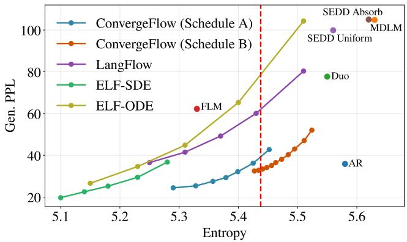  
Figure 1: Gen. PPL-entropy trade-of across diferent models on the OWT dataset (Rafel et al., 2020). Curves show the trade-ofs achieved by ConvergeFlow, LangFlow, ELF-SDE, and ELF-ODE, while individual markers indicate the reported results of the remaining baselines. Schedules A and B denote two time-adaptive guidance schedules for ConvergeFlow, defined in Section 3.2. The red dashed line marks the entropy of the OWT dataset, 5.44.

Consequently, an important question remains unresolved:

Can the sampling trajectories of a flow-based LM converge directly to valid token embeddings, enabling discrete token prediction without a CE-supervised decoder?

## 1.1 Contributions

In this work, we provide an afirmative answer by introducing ConvergeFlow, an embedding-space flowbased LM that retains a fully continuous formulation while incorporating the discrete structure of text.

We parameterize the data predictor as a weighted average of vocabulary embeddings, first introduced in Plaid (Gulrajani and Hashimoto, 2023) and later adopted by LangFlow. Each coeficient is parameterized using a learnable weight and an exact Gaussian kernel induced by the corruption process. The resulting data predictor is trained using the mean squared error (MSE) loss induced by the FM objective. We emphasize that LangFlow directly learns the convex-combination coeficients as token posteriors using CE supervision and subsequently maps them to a continuous data predictor. Instead, ConvergeFlow uses the factorization solely as an architectural parameterization and trains the resulting continuous data predictor directly with the FM objective.

Theoretically, under suitable regularity conditions, we prove that this parameterization ensures the learned flow converges to a valid token embedding despite errors in the learned data predictor. The same data predictor can therefore drive the intermediate continuous flow updates and produce the final discrete token prediction, thereby eliminating the need for a CE-supervised token decoder. We further validate this theoretical guarantee by showing that discrete tokens can be recovered accurately and directly from the terminal flow states.

Our contributions can be summarized as twofold:

• Flow-based LM with provable convergence to token embeddings. We introduce ConvergeFlow, an embedding-space flow-based LM. We prove that the resulting flow provably converges to valid token embeddings, enabling direct token prediction without a CE-supervised decoder. To our knowledge, ConvergeFlow is the first flow-based LM with provable convergence to token embeddings.

• Quality–diversity control and strong empirical performance. We propose three sampling mechanisms that provide explicit control over the trade-of between generation quality, measured by generative perplexity (Gen. PPL), and diversity, measured by entropy. Combined with these mechanisms, ConvergeFlow achieves performance competitive with continuous baselines, including LangFlow and ELF, as well as discrete baselines such as Duo (Sahoo et al., 2025). In particular, on the OpenWebText (OWT) dataset (Rafel et al., 2020), ConvergeFlow achieves a Gen. PPL of 33.17 while maintaining an entropy of 5.44; see Figure 1 and Table 1 for details.

Table 1: Comparison of Gen. PPL and entropy across diferent models. For ELF and LangFlow, we report the Gen. PPL at the point whose entropy is closest to that of the dataset; their complete Gen. PPL-entropy curves are shown in Figure 1. For ConvergeFlow, we report the Gen. PPL at the dataset entropy using the complete results in Figure 1 and Table 10. Results and model sizes marked with ‡ are taken from Duo. At the dataset entropy of 5.44, our method achieves a Gen. PPL of 33.17, whereas the lowest Gen. PPL among the continuous flow-based LMs is approximately 60, even though these models are evaluated at entropies below the dataset entropy.
<table><tr><td>Model</td><td>Gen. PPL (↓)</td><td>Entropy (↑)</td><td>Model Size</td></tr><tr><td>Autoregressive Transformer‡</td><td></td><td></td><td></td></tr><tr><td></td><td>35.90</td><td>5.58</td><td>170M</td></tr><tr><td>Discrete DLMs MDLM‡ (Sahoo et al., 2024)</td><td></td><td></td><td></td></tr><tr><td>Duo‡ (Sahoo et al., 2025)</td><td>104.85</td><td>5.63</td><td>170M</td></tr><tr><td>SEDD Uniform‡ (Lou et al., 2023)</td><td>77.69</td><td>5.55</td><td>170M</td></tr><tr><td>SEDD Absorb‡ (Lou et al., 2023)</td><td>99.90 105.03</td><td>5.56 5.62</td><td>170M 170M</td></tr><tr><td></td><td></td><td></td><td></td></tr><tr><td>Continuous DLMs</td><td></td><td></td><td></td></tr><tr><td>FLM (Lee et al., 2026)</td><td>62.23</td><td>5.33</td><td>179M</td></tr><tr><td>LangFlow (Chen et al., 2026)</td><td>60.09</td><td>5.43</td><td>130M</td></tr><tr><td>ELF (Hu et al., 2026)</td><td>65.30</td><td>5.40</td><td>105M</td></tr><tr><td>ConvergeFlow</td><td>33.17</td><td>5.44</td><td>130M</td></tr><tr><td>Dataset</td><td></td><td>5.44</td><td>一</td></tr></table>

## 1.2 Related work

Continuous DLMs. Continuous DLMs difer primarily in the space over which Gaussian difusion is performed. At the token level, embedding-space DLMs (Li et al., 2022; Dieleman et al., 2022; Gong et al., 2022; Gulrajani and Hashimoto, 2023) difuse a sequence of token-level embeddings. Simplex-based DLMs (Han et al., 2023; Mahabadi et al., 2024; Tae et al., 2025; Potaptchik et al., 2026; Roos et al., 2026) instead map each token to a point on the probability simplex over the vocabulary, while Lee et al. (2026) adopts the one-hot encoding. Because such token-level states may not adequately capture contextual semantics, latent DLMs perform difusion in sequence-level latent spaces constructed from contextual representations. Earlier approaches obtain these features from the outputs of a frozen pre-trained encoder (Lovelace et al., 2023; Zhang et al., 2023; Meshchaninov et al., 2026a), whereas more recent works jointly learn the latent encoder and the difusion model (Meshchaninov et al., 2026b; Guo et al., 2026).

Discrete DLMs. Two families dominate modern discrete DLMs, distinguished by their forward corruption processes: uniform difusion models (UDMs) and masked difusion models (MDMs). UDMs progressively corrupt tokens toward the uniform distribution over the vocabulary (Sahoo et al., 2025, 2026). MDMs instead augment the vocabulary with a special mask token as an absorbing state, and progressively replace tokens with it (Sahoo et al., 2024; Shi et al., 2024). In MDMs, the discrete score (Meng et al., 2022; Lou et al., 2023) is equivalent to the joint conditional distribution of the masked tokens given the unmasked context (Ou et al., 2024; Zheng et al., 2025). In practice, masked DLMs approximate this joint conditional by a product of token-wise conditional marginals (Nie et al., 2025; Arriola et al., 2025). Although this enables parallel generation, it imposes a conditional independence assumption among tokens revealed in the same iteration and thus introduces an inherent factorization bias. Consequently, the unmasking strategy—which determines the number and positions of tokens to reveal at each step—plays a critical role in the performance of masked DLMs (Kim et al., 2025; Wu et al., 2025; Yu et al., 2025; Ben-Hamu et al., 2026; Fu et al., 2025).

Theory for DLMs. Because masked DLMs have historically outperformed continuous DLMs and uniform DLMs, theoretical analyses for DLMs have largely focused on masked DLMs, particularly on characterizing the accuracy-speed trade-of in parallel generation. Early work studied fixed-size, random-ordering unmasking (Shi et al., 2024; Sahoo et al., 2024), which prescribes the number of sampling steps and tokens revealed per step while selecting their positions at random. Li and Cai (2025) derived the first convergence guarantees for such strategies, which were subsequently sharpened using information-theoretic quantities that capture low-complexity structure in the data distribution (Chen et al., 2025; Lavenant and Zanella, 2025; Zhao and Cai, 2026; Wainwright, 2026; Dmitriev et al., 2026). More recently, Cai and Li (2026) established the provable eficiency of confidence-based unmasking (Ben-Hamu et al., 2026), which adaptively selects both the number and positions of tokens to reveal based on the model’s predictive confidence. Parallel to these sampling convergence results, statistical generalization guarantees have been established in Wakasugi and Suzuki (2026); Zhang et al. (2026).

Theory for continuous difusion models. Recent years have witnessed substantial theoretical progress in continuous difusion models (Lee et al., 2022; Chen et al., 2023b; Oko et al., 2023; Cai and Li, 2025; Wu and Cai, 2026). In particular, a line of work derives convergence guarantees for sampling from data distributions under mild assumptions, such as bounded moments, without requiring globally Lipschitz score functions (Chen et al., 2022a, 2023a; Benton et al., 2023; Li et al., 2024; Li and Yan, 2024; Jiao and Li, 2024; Jiao et al., 2025). Because token-level embedding distributions have finite support and hence bounded moments, these results naturally apply to continuous DLMs and flow-based LMs. Provably accelerated samplers based on higher-order approximations are further developed in (Li and Cai, 2024; Li et al., 2025b; Jain and Zhang, 2026). Moreover, the discrete nature of text also provides additional structure where Gaussian smoothing of the discrete token-embedding distribution yields a Gaussian mixture. Exploiting this structure, nearly dimension-free convergence guarantees have been established in Li et al. (2025a).

## 2 Background

## 2.1 Flow matching and difusion models

Flow matching (FM) (Lipman et al., 2022) is a continuous-time generative modeling framework that transports a sample from a source distribution $p _ { 0 }$ (typically the standard Gaussian) to a target distribution $p _ { 1 } = p _ { \mathsf { d a t a } }$

The framework consists of two steps. First, one specifies a probability path $( p _ { t } ) _ { t \in ( 0 , 1 ) }$ interpolating between the source $p _ { 0 }$ and target $p _ { 1 }$ . A common choice defines $p _ { t }$ as the marginal distribution of

$$
x _ { t } = \alpha _ { t } x _ { \star } + \sigma _ { t } z , \quad t \in [ 0 , 1 ] ,\tag{1}
$$

where $x _ { \star } \sim p _ { \mathsf { d a t a } }$ and $z \sim \mathcal { N } ( 0 , I )$ is independent Gaussian noise. The diferentiable schedules $( \alpha _ { t } , \sigma _ { t } ) _ { t \in ( 0 , 1 ) }$ are chosen such that $\mathrm { l i m } _ { t \to 0 } \alpha _ { t } / \sigma _ { t } = 0$ and $\operatorname* { l i m } _ { t \to 1 } \alpha _ { t } / \sigma _ { t } = \infty$ Under the standard endpoint conditions $( \alpha _ { 0 } , \sigma _ { 0 } ) = ( 0 , 1 )$ and $( \alpha _ { 1 } , \sigma _ { 1 } ) = ( 1 , 0 )$ , one has $x _ { 1 } = x _ { \star } \sim p _ { 1 }$ and $x _ { 0 } = z \sim p _ { 0 }$

Second, one learns a time-dependent velocity field $v : \mathbb { R } ^ { d } \times [ 0 , 1 ] \to \mathbb { R } ^ { d }$ whose induced flow realizes the prescribed probability path. Specifically, the velocity $\boldsymbol { v } ( \boldsymbol { x } , t )$ generates the probability path $p _ { t }$ if the solution to the ordinary diferential equation (ODE),

$$
\frac { \mathrm { d } x _ { t } } { \mathrm { d } t } = v ( x _ { t } , t ) , \quad t \in ( 0 , 1 ) ; \qquad x _ { 0 } \sim p _ { 0 } ,\tag{2}
$$

satisfies $x _ { t } \sim p _ { t }$ for all $t \in [ 0 , 1 ]$

Training. A natural objective for learning the velocity $v _ { t }$ is the flow matching loss

$$
\ell _ { \mathsf { F M } } ( \theta ) : = \mathbb { E } _ { t , x _ { t } } \Big [ \big \| v _ { \theta } ( x _ { t } , t ) - v ( x _ { t } , t ) \big \| _ { 2 } ^ { 2 } \Big ] ,\tag{3}
$$

where $t \sim \mathsf { U n i f } ( 0 , 1 )$ and $x _ { t } \sim p _ { t }$ . However, this objective cannot be evaluated directly because the velocity $v _ { t }$ is generally unavailable. Fortunately, one can obtain a tractable objective by conditioning on the target $x _ { \star }$ Under the prescribed probability path (1), consider the conditional distribution $p _ { t } ( \cdot \mid x _ { \star } )$ of $x _ { t }$ given $x _ { \star }$ . By the path construction in (1) and the ODE in (2), the conditional velocity field is given by

$$
v ( x _ { t } , t \mid x _ { \star } ) = \alpha _ { t } ^ { \prime } x _ { \star } + \sigma _ { t } ^ { \prime } z = { \frac { \sigma _ { t } ^ { \prime } } { \sigma _ { t } } } x _ { t } + \Bigl ( \alpha _ { t } ^ { \prime } - { \frac { \sigma _ { t } ^ { \prime } } { \sigma _ { t } } } \alpha _ { t } \Bigr ) x _ { \star } = { \frac { \alpha _ { t } ^ { \prime } } { \alpha _ { t } } } x _ { t } + \Bigl ( \sigma _ { t } ^ { \prime } - { \frac { \alpha _ { t } ^ { \prime } } { \alpha _ { t } } } \sigma _ { t } \Bigr ) z .\tag{4}
$$

The key observation underlying conditional flow matching (CFM) is that under mild regularity conditions, the posterior expectation of the conditional velocity,

$$
v ( x , t ) = \mathbb { E } _ { x _ { \star } } [ v ( x _ { t } , t \mid x _ { \star } ) \mid x _ { t } = x ] ,\tag{5}
$$

yields the marginal velocity $v _ { t }$ that generates the probability path $p _ { t }$ (Lipman et al., 2022). This leads to the conditional flow matching loss:

$$
\ell _ { \mathsf { C F M } } ( \theta ) : = \mathbb { E } _ { t , x _ { \star } , z } \Bigl [ \bigl \| v _ { \theta } ( x _ { t } , t ) - v ( x _ { t } , t \mid x _ { \star } ) \bigr \| _ { 2 } ^ { 2 } \Bigr ] ,\tag{6}
$$

where $t \sim \mathsf { U n i f } ( 0 , 1 ) , x _ { \star } \sim p _ { 1 } , z \sim \mathcal { N } ( 0 , I )$ , and $x _ { t } = \alpha _ { t } x _ { \star } + \sigma _ { t } z$ . The minimizer of the objective (6) is given by the conditional expectation

$$
v _ { \theta ^ { \star } } ( x , t ) = \mathbb { E } _ { x _ { \star } } \bigl [ v ( x _ { t } , t \mid x _ { \star } ) \mid x _ { t } = x \bigr ] = v ( x , t ) .
$$

Therefore, the CFM loss (6) shares the same minimizer as the FM loss (3) and thus provides a tractable objective for learning the velocity $v _ { t }$ . For simplicity of presentation, we will refer to the CFM loss as the FM loss in the rest of the paper.

In addition, the velocity can also be expressed via either a data predictor or a noise predictor. Define

$$
\mu ( x , t ) : = \mathbb { E } [ x _ { \star } \mid x _ { t } = x ] \quad { \mathrm { a n d } } \quad \varepsilon ( x , t ) : = \mathbb { E } [ z \mid x _ { t } = x ] .\tag{7}
$$

Combining (4) and (5), we obtain

$$
v ( x , t ) = \frac { \sigma _ { t } ^ { \prime } } { \sigma _ { t } } x + \Bigl ( \alpha _ { t } ^ { \prime } - \frac { \sigma _ { t } ^ { \prime } } { \sigma _ { t } } \alpha _ { t } \Bigr ) \mu ( x , t ) = \frac { \alpha _ { t } ^ { \prime } } { \alpha _ { t } } x + \Bigl ( \sigma _ { t } ^ { \prime } - \frac { \alpha _ { t } ^ { \prime } } { \alpha _ { t } } \sigma _ { t } \Bigr ) \varepsilon ( x , t ) .\tag{8}
$$

This identity shows that learning the velocity is equivalent to predicting the clean data or noise. Therefore, FM is essentially the probability flow ODE in difusion models (Song et al., 2020). Since we use the linear Gaussian interpolation, we use FM and difusion models interchangeably in this paper.

Finally, for the linear schedule $\alpha _ { t } \ = \ t$ and $\sigma _ { t } \ = \ 1 - \ t ,$ the FM objective under the data prediction parameterization simplifies to

$$
\mathbb { E } _ { t , x _ { \star } , z } \Big [ ( 1 - t ) ^ { - 2 } \big \| x _ { \star } - \mu _ { \theta } ( x _ { t } , t ) \big \| _ { 2 } ^ { 2 } \Big ] .
$$

For general schedules, the corresponding FM objective has a schedule-dependent weighting that is not invariant across schedules at a fixed signal-to-noise ratio (SNR). To remove this dependence, we instead use the following objective:

$$
\mathbb { E } _ { t , x _ { \star } , z } \bigg [ \Big ( 1 + \frac { \alpha _ { t } } { \sigma _ { t } } \Big ) ^ { 2 } \big \| x _ { \star } - \mu _ { \theta } \big ( x _ { t } , t \big ) \big \| _ { 2 } ^ { 2 } \bigg ] .
$$

Inference. After learning a velocity $v _ { \theta }$ , approximate samples from the target distribution $p _ { 1 }$ can be generated by drawing $x _ { 0 } \sim p _ { 0 }$ from the source distribution $p _ { 0 }$ and numerically solving the ODE

$$
\frac { \mathrm { d } x _ { t } } { \mathrm { d } t } = v _ { \theta } ( x _ { t } , t ) , \quad t \in [ 0 , 1 ] .\tag{9}
$$

In practice, one can use a forward Euler method to approximate the one-step update from t to s:

$$
x _ { s } - x _ { t } = \int _ { t } ^ { s } v _ { \theta } ( x _ { \tau } , \tau ) \mathrm { d } \tau \approx v _ { \theta } ( x _ { t } , t ) ( s - t ) .
$$

The ODE in (9) can be reparameterized using either a data predictor $\mu _ { \theta }$ or a noise predictor $\varepsilon _ { \theta }$ . Replacing $\mu$ with $\mu _ { \theta }$ in the data-prediction parameterization of the velocity in (8) gives

$$
{ \frac { \mathrm { d } } { \mathrm { d } t } } \left( { \frac { x _ { t } } { \sigma _ { t } } } \right) = \mu _ { \theta } ( x _ { t } , t ) { \frac { \mathrm { d } } { \mathrm { d } t } } \left( { \frac { \alpha _ { t } } { \sigma _ { t } } } \right) .
$$

This leads to the data prediction-based inference procedure:

$$
\frac { x _ { s } } { \sigma _ { s } } - \frac { x _ { t } } { \sigma _ { t } } = \int _ { t } ^ { s } \mu _ { \theta } ( x _ { \tau } , \tau ) \mathrm { d } \Bigg ( \frac { \alpha _ { \tau } } { \sigma _ { \tau } } \Bigg ) \approx \mu _ { \theta } ( x _ { t } , t ) \Bigg ( \frac { \alpha _ { s } } { \sigma _ { s } } - \frac { \alpha _ { t } } { \sigma _ { t } } \Bigg ) .\tag{10}
$$

Similarly, the noise predictor-based inference is given by

$$
\frac { x _ { s } } { \alpha _ { s } } - \frac { x _ { t } } { \alpha _ { t } } = \int _ { t } ^ { s } \varepsilon _ { \theta } ( x _ { \tau } , \tau ) \mathrm { d } \left( \frac { \sigma _ { \tau } } { \alpha _ { \tau } } \right) \approx \varepsilon _ { \theta } ( x _ { t } , t ) \bigg ( \frac { \sigma _ { s } } { \alpha _ { s } } - \frac { \sigma _ { t } } { \alpha _ { t } } \bigg ) .\tag{11}
$$

Self-conditioning. Self-conditioning (Chen et al., 2022b) is a technique that adds an additional input c to the predictor. During training, the conditional flow matching loss in (6) is modified to

$$
\mathbb { E } _ { t , x _ { \star } , z , c } \Big [ \big | | v _ { \theta } ( x _ { t } , t , c ) - v ( x _ { t } , t | x _ { \star } ) \big | \big | _ { 2 } ^ { 2 } \Big ] ,
$$

where the input c is constructed by

$$
\begin{array} { r } { c = \left\{ \begin{array} { l l } { \emptyset , } & { \mathrm { w i t h ~ p r o b a b i l i t y ~ } 1 - p , } \\ { \mathsf { s t o p g r a d } \big ( v _ { \theta } ( x _ { t } , t , \emptyset ) \big ) , } & { \mathrm { w i t h ~ p r o b a b i l i t y ~ } p . } \end{array} \right. } \end{array}\tag{12}
$$

During training, the model makes an ordinary prediction without self-conditioning with a certain probability. Otherwise, it first produces an ordinary prediction and then uses the resulting prediction as an additional input in a second forward pass. In this way, the model learns to refine a prediction previously produced by itself. During inference, self-conditioning is applied at every step. The self-conditioning input is initialized as empty at the first step, when no previous prediction is available, and is set to the model’s prediction from the preceding step thereafter.

## 2.2 Evaluation metrics for language modeling

We briefly review the metrics commonly used to evaluate language models. Let $p _ { \theta }$ denote the distribution induced by a trained language model.

Because the data distribution $p _ { \mathsf { d a t a } }$ is unknown, the quality of the trained model is often assessed using a reference language model such as the GPT-2 Large model (Radford et al., 2019). Specifically, let $p _ { \mathsf { r e f } }$ denote the distribution of the reference model. Generative perplexity (Gen. PPL) is defined as

$$
\mathrm { P P L } _ { \mathrm { g e n } } ( p _ { \theta } ; p _ { \mathrm { r e f } } ) : = \exp \biggl ( - \frac { 1 } { L } \mathbb { E } _ { X \sim p _ { \theta } } [ \log p _ { \mathrm { r e f } } ( X ) ] \biggr ) ,\tag{13}
$$

which satisfies the following relationship:

$$
\log { \mathrm { P P L } } _ { \mathrm { g e n } } ( p _ { \theta } ; p _ { \mathsf { r e f } } ) = \frac { 1 } { L } { \mathsf { K L } } ( p _ { \theta } \parallel p _ { \mathsf { r e f } } ) + \frac { 1 } { L } H ( p _ { \theta } ) ,\tag{14}
$$

where $\mathsf { K L } ( p _ { \theta } \parallel p _ { \mathsf { r e f } } )$ is the Kullback-Leibler (KL) divergence between the model distribution $p _ { \theta }$ and the reference distribution $p _ { \mathsf { r e f } }$ , and $H ( p _ { \theta } )$ denotes the entropy of $p _ { \theta }$

Identity (14) reveals that low Gen. PPL may arise either because the generated samples have high likelihood under the reference model or because the model concentrates its probability mass on a small set of likely sequences. Therefore, it is common to evaluate the entropy of the model distribution alongside its Gen. PPL as a measure of diversity.

In practice, entropy is often approximated using unigram entropy. For a sequence $x = ( x ^ { ( 1 ) } , \dots , x ^ { ( L ) } )$ , define its empirical unigram distribution by

$$
\widehat { p } _ { x } ( v ) = \frac { 1 } { L } \sum _ { i = 1 } ^ { L } \mathbb { 1 } \{ x ^ { ( i ) } = v \} , \quad \forall v ,
$$

and let $H ( \widehat { p } _ { x } )$ denote the corresponding entropy. The unigram entropy is then defined as

$$
H _ { \mathsf { u n i } } ( p _ { \theta } ) : = \mathbb { E } _ { X \sim p _ { \theta } } [ H ( \widehat { p } _ { X } ) ] .\tag{15}
$$

The unigram entropy serves as a proxy for the normalized sequence entropy $L ^ { - 1 } H ( p _ { \theta } )$ appearing in (14), providing a simple diagnostic of within-sequence diversity.

In practice, the expectations defining Gen. PPL and unigram entropy are approximated by averaging over independent samples.

## 3 ConvergeFlow

## 3.1 Framework and convergence theory

Let $s = ( s ^ { ( 1 ) } , \dots , s ^ { ( L ) } )$ be a token sequence of length L drawn from the data distribution $p _ { \mathsf { d a t a } }$ , where each token $s ^ { ( i ) }$ belongs to a vocabulary of size V. Without loss of generality, we assume the vocabulary is $[ V ] : = \{ 1 , \ldots , V \}$ . We map tokens to continuous representations using an embedding matrix $E \in \mathbb { R } ^ { V \times d }$ where d is the embedding dimension. For each $j \in \left[ V \right]$ , let $e _ { j } ^ { \top } : = E _ { j , : } \in \mathbb { R } ^ { d }$ denote the j-th row of the embedding matrix $E ,$ , representing the embedding of the j-th token in the vocabulary. The target $x _ { \star }$ is the continuous representation of the token sequence, given by

$$
\boldsymbol { x } _ { \star } = \left[ \boldsymbol { e } _ { s ^ { ( 1 ) } } , \ldots , \boldsymbol { e } _ { s ^ { ( L ) } } \right] ^ { \top } \in \mathbb { R } ^ { L \times d } .\tag{16}
$$

We consider FM with general interpolation schedules $\left( \alpha _ { t } , \sigma _ { t } \right)$

$$
\boldsymbol { x } _ { t } = \alpha _ { t } \boldsymbol { x } _ { \star } + \sigma _ { t } \boldsymbol { z } ,
$$

where $\boldsymbol { z } \in \mathbb { R } ^ { L \times d }$ is a standard Gaussian random matrix with i.i.d. entries $z _ { i j } \stackrel { \mathrm { i . i . d . } } { \sim } \mathcal { N } ( 0 , 1 )$ . Using the dataprediction parameterization, we train a data predictor $\mu _ { \theta } : \mathbb { R } ^ { L \times d } \times [ 0 , 1 ] \to \mathbb { R } ^ { \bar { L } \times d }$ using the MSE loss induced by the FM objective:

$$
\mathbb { E } _ { t , x _ { \star } , z } \bigg [ \Big ( 1 + \frac { \alpha _ { t } } { \sigma _ { t } } \Big ) ^ { 2 } \big \| x _ { \star } - \mu _ { \theta } ( x _ { t } , t ) \big \| _ { \mathrm { F } } ^ { 2 } \bigg ] .\tag{17}
$$

This objective, also used by ELF, provides purely continuous supervision and does not involve a token-level CE loss.

An important caveat is that the FM objective alone does not suficiently supervise the joint learning of the embedding matrix and the data predictor. Because the target $x ,$ itself is defined by the embedding matrix, the FM objective admits degenerate embedding-collapse solutions. We therefore use the pre-trained embedding matrix from LangFlow and keep it fixed throughout training and inference.

We note that for language data, each row of the target $x _ { \star }$ is supported on a finite collection of token embeddings rather than an unrestricted Euclidean space. The MSE loss in (17), however, treats the data predictor $\mu _ { \theta } ( x _ { t } , t )$ as an unconstrained regressor and therefore fails to exploit this discrete support. This observation motivates the structured parameterization introduced next.

Embedding-weighted data predictor. Fix a token position $i \in [ L ]$ . The clean embedding of the token at position i is $\boldsymbol { x } _ { \star } ^ { ( i ) } = \boldsymbol { e } _ { s ^ { ( i ) } }$ . Observe that its conditional expectation given $x _ { t }$ is a weighted average of all token embeddings according to the posterior token distribution:

$$
\mathbb { E } [ x _ { \star } ^ { ( i ) } \mid x _ { t } ] = \sum _ { j = 1 } ^ { V } \mathbb { P } \{ s ^ { ( i ) } = j \mid x _ { t } \} e _ { j } .\tag{18}
$$

Consequently, the Bayes-optimal data predictor under the MSE loss (17) lies in the convex hull of the vocabulary embeddings. Moreover, the following proposition reveals a useful multiplicative structure of the posterior distribution: it can be factored into a context-only posterior and an exact Gaussian kernel. The proof is deferred to Appendix A.2.

Proposition 1. For $\boldsymbol { x } = [ x ^ { ( 1 ) } , \ldots , x ^ { ( L ) } ] ^ { \top } \in \mathbb { R } ^ { L \times d }$ , denote

$$
\begin{array} { r } { x ^ { ( - i ) } : = \left[ x ^ { ( 1 ) } , \ldots , x ^ { ( i - 1 ) } , x ^ { ( i + 1 ) } , \ldots , x ^ { ( L ) } \right] ^ { \top } \in \mathbb { R } ^ { ( L - 1 ) \times d } . } \end{array}\tag{19}
$$

The posterior token distribution satisfies

$$
\mathbb { P } \{ s ^ { ( i ) } = j \mid x _ { t } \} \propto \mathbb { P } \{ s ^ { ( i ) } = j \mid x _ { t } ^ { ( - i ) } \} \exp \bigl ( - \| x _ { t } ^ { ( i ) } - \alpha _ { t } e _ { j } \| _ { 2 } ^ { 2 } / ( 2 \sigma _ { t } ^ { 2 } ) \bigr ) .\tag{20}
$$

The identity in (18) establishes an existence result—the posterior probabilities constitute one set of convex weights whose embedding-space barycenter equals the conditional mean of the clean embedding. However, these weights are generally not unique. Because the vocabulary size V is typically much larger than the embedding dimension $d ,$ distinct convex weights can produce exactly the same data prediction. Nevertheless, the convex structure in (18) suggests a useful parameterization.

Consequently, our goal is not to learn the posterior distribution itself, but to learn a valid set of convex weights whose embedding-space barycenter accurately predicts the conditional mean. Inspired by the multiplicative form in Proposition 1, we parameterize these convex coeficients using a learned base weight function and the known Gaussian corruption kernel. Specifically, we learn a base weight function $f _ { \theta } ^ { ( i ) } : \mathbb { R } ^ { L \times d } \times [ 0 , 1 ] \mapsto \Delta ( [ V ] )$ , which is optimized using the MSE loss in (17). Importantly, $f _ { \theta } ^ { ( i ) }$ is neither supervised nor interpreted as a token posterior. In particular, it is not intended to estimate the distribution $\mathbb { P } \{ s ^ { ( i ) } = \cdot \ | \ x _ { t } ^ { ( - i ) } \}$ appearing in Proposition 1. Rather, the proposition motivates only the form of the parameterization. We then define the convex weights

$$
w _ { \theta } ^ { ( i ) } ( j \mid x _ { t } , t ) = \frac { f _ { \theta } ^ { ( i ) } ( j \mid x _ { t } , t ) \exp \bigl ( - \| x _ { t } ^ { ( i ) } - \alpha _ { t } e _ { j } \| _ { 2 } ^ { 2 } / ( 2 \sigma _ { t } ^ { 2 } ) \bigr ) } { \sum _ { j ^ { \prime } \in [ V ] } f _ { \theta } ^ { ( i ) } ( j ^ { \prime } \mid x _ { t } , t ) \exp \bigl ( - \| x _ { t } ^ { ( i ) } - \alpha _ { t } e _ { j ^ { \prime } } \| _ { 2 } ^ { 2 } / ( 2 \sigma _ { t } ^ { 2 } ) \bigr ) } , \quad j \in [ V ] .\tag{21}
$$

The resulting data predictor for the token at position i is given by

$$
\mu _ { \theta } ^ { ( i ) } ( x _ { t } , t ) = \sum _ { j = 1 } ^ { V } w _ { \theta } ^ { ( i ) } ( j \mid x _ { t } , t ) e _ { j } = E ^ { \top } w _ { \theta } ^ { ( i ) } ( \cdot \mid x _ { t } , t ) .\tag{22}
$$

Applying (22) to each token position i and stacking the outputs yields the full data predictor $\mu _ { \theta } ( x _ { t } , t )$

In summary, our proposed parameterization preserves the target of unconstrained MSE data prediction while explicitly incorporating both the discrete token structure and the known Gaussian corruption.

Provable convergence to token embeddings. Notably, our proposed parameterization for the data predictor guarantees convergence of the sampling trajectory to a valid token embedding. This is formalized below, with the proof deferred to Appendix A.1.

Theorem 1 (Flow convergence to token embeddings). Assume that, for every token position $i \in [ L ]$ , the learned base weight function satisfies $f _ { \theta } ^ { ( i ) } ( j \mid x _ { t } , t ) > 0$ for any $j \in \ [ V ]$ , state $x _ { t } ,$ , and time $t \in \mathsf { \Gamma } ( 0 , 1 )$ Moreover, assume that the log-weight is Lipschitz continuous along the sampling trajectory: there exists a constant $\widetilde { L }$ such that

$$
\operatorname* { m a x } _ { j \in [ V ] } \big | \log f _ { \theta } ^ { ( i ) } ( j \mid x _ { t } , t ) - \log f _ { \theta } ^ { ( i ) } ( j \mid x _ { \tau } , \tau ) \big | \le \widetilde L \big | t - \tau \big | , \quad \forall 0 < t , \tau < 1 .
$$

Finally, assume that the time grid $0 = t _ { 0 } < t _ { 1 } < . . . < t _ { N } < 1$ satisfies $t _ { N } \to 1$ as $N \to \infty$ and

$$
\operatorname* { m a x } _ { 0 \leq k < N } \frac { t _ { k + 1 } - t _ { k } } { ( 1 - t _ { k + 1 } ) ^ { 3 } } < \delta
$$

for a suficiently small $\delta > 0$ . Then, for each token position $i \in [ L ]$ , there exists some $j _ { i } \in [ V ]$ such that

$$
x _ { t _ { N } } ^ { ( i ) }  e _ { j _ { i } } i n \ p r o b a b i l i t y a s N  \infty . \nonumber\tag{23}
$$

Theorem 1 shows that every token-level state converges to a valid token embedding. Consequently, provided that the vocabulary embeddings are distinct, nearest-neighbor decoding naturally yields the token prediction. In particular, no separately trained terminal decoder is required. We empirically validate this convergence behavior in Section 4.

We next explain why data prediction accuracy alone does not guarantee convergence to token embeddings, and why additional structure, such as our convex-structured parameterization, is necessary. In particular, an unconstrained data predictor may be asymptotically accurate along any corruption path while its induced flow fails to converge to any token embedding.

The following proposition provides a concrete counterexample. Its proof is deferred to Appendix A.3.

Proposition 2. There exists a smooth, unconstrained data predictor $\mu _ { \theta }$ such that

$$
\begin{array} { r } { \mu _ { \theta } ( x _ { t } , t ) \to x _ { \star } \mathrm { ~ \ ~ } i n \ p r o b a b i l i t y \mathrm { ~ \ ~ } \ a s \ t \to 1 , } \end{array}
$$

where $x _ { t } = \alpha _ { t } x _ { \star } + \sigma _ { t } z$ and $z _ { i j } \stackrel { \mathrm { i . i . d . } } { \sim } \mathcal { N } ( 0 , 1 )$ . Let $x _ { t _ { N } }$ denote the flow output induced by this data predictor on a time grid $0 = t _ { 0 } < t _ { 1 } < . . . < t _ { N } < 1$ with $t _ { N } \to 1$ as $N  \infty$ . Then there exists a constant $c _ { \vert \mathsf { b } } > 0$ independent of $N ,$ such that, for every token position $i \in [ L ]$ and all suficiently large $N$

$$
\begin{array} { r } { \mathbb { P } \left\{ \underset { j \in [ V ] } { \operatorname* { m i n } } \left\| \alpha _ { t _ { N } } ^ { - 1 } x _ { t _ { N } } ^ { ( i ) } - e _ { j } \right\| _ { 2 } \geq 1 \right\} \geq c _ { \mathsf { l b } } . } \end{array}\tag{24}
$$

This counterexample demonstrates that a smooth, asymptotically accurate data predictor does not by itself ensure convergence to the discrete vocabulary. The convex-structured parameterization provides sufi cient structure to guarantee convergence to a valid token embedding

Moreover, recall that the data predictor is a convex combination of the token embeddings, with weights given by $w _ { \theta } ^ { ( i ) }$ . The following proposition shows that if the data predictor converges to a token embedding, then the corresponding weight vectors converge to a one-hot vector. The proof is deferred to Appendix A.4.

Proposition 3. Assume that the token embeddings $\{ e _ { j } \} _ { j \in [ V ] }$ have the same norm and are pairwise separated, namely, ma $\begin{array} { r } { \mathfrak { c } _ { j \ne j ^ { \prime } } \Big | \frac { \langle e _ { j } , e _ { j } ^ { \prime } \rangle } { \| e _ { j } \| _ { 2 } \| e _ { j } ^ { \prime } \| _ { 2 } } \Big | \le 1 - \rho } \end{array}$ for some constant $\rho > 0$ . If there exists some $j \in \ [ V ]$ such that $\mu _ { \theta } ^ { ( i ) } ( x _ { t } , t )  e _ { j }$ as $t \to 1$ , then one has

$$
w _ { \theta } ^ { ( i ) } ( \cdot \mid x _ { t } , t )  \delta _ { j } \quad a s ~ t  1 ,\tag{25}
$$

where $\delta _ { j } \in \mathbb { R } ^ { V }$ denotes the one-hot vector associated with token $j$

Comparison with embedding-space flow-based LMs.

• Comparison with ELF (Hu et al., 2026). Both ELF and our framework use the MSE objective to train a data predictor. ELF directly learns the data predictor as an unconstrained regressor. At the final step, it invokes a distinct trained decoder. In contrast, we impose additional structure on the data predictor through (22). This guarantees that the flow automatically converges to a token embedding, so the final decoding does not require a separate decoder.

• Comparison with LangFlow (Chen et al., 2026). Both LangFlow and our framework produce a data predictor through a convex combination of vocabulary embeddings. LangFlow directly learns the posterior distribution and trains it using the discrete CE objective. In contrast, we parameterize each convex weight using a learned base weight and an exact Gaussian likelihood, and train the resulting data predictor using the continuous MSE objective (17).

## 3.2 Sampling

Given a trained data predictor $\mu _ { \theta }$ , we generate samples by solving the data prediction-based ODE in (10), initialized with a standard Gaussian random matrix $x _ { t _ { 0 } }$ with i.i.d. $\mathcal { N } ( 0 , 1 )$ entries.

Given N sampling steps and a time grid $t _ { 0 } < t _ { 1 } < . . . < t _ { N }$ , the ODE can be solved using the first-order Euler method, yielding the following update rule:

$$
\frac { x _ { t _ { i + 1 } } } { \sigma _ { t _ { i + 1 } } } - \frac { x _ { t _ { i } } } { \sigma _ { t _ { i } } } = \mu _ { t _ { i } } \bigg ( \frac { \alpha _ { t _ { i + 1 } } } { \sigma _ { t _ { i + 1 } } } - \frac { \alpha _ { t _ { i } } } { \sigma _ { t _ { i } } } \bigg ) ,\tag{26}
$$

where $\mu _ { t _ { i } } = \mu _ { \theta } ( x _ { t _ { i } } , t _ { i } )$ denotes the data prediction used at step i. As we will see momentarily, the data prediction $\mu _ { t } ,$ can be constructed in various ways, leading to diferent trade-ofs between Gen. PPL and entropy.

After the last step, we convert the generated embedding $x _ { t _ { N } }$ into a token sequence $\widehat { \boldsymbol { s } } = ( \widehat { \boldsymbol { s } } ^ { ( 1 ) } , \dots , \widehat { \boldsymbol { s } } ^ { ( L ) } )$ by taking the nearest neighbor in the embedding space for each token position:

$$
\begin{array} { r } { \widehat { \boldsymbol s } ^ { ( i ) } = \mathrm { a r g m i n } _ { j \in [ V ] } \| \boldsymbol x _ { t _ { N } } ^ { ( i ) } - \boldsymbol e _ { j } \| _ { 2 } , \quad i \in [ L ] . } \end{array}\tag{27}
$$

Alternatively, we can use the trained weights $w _ { \theta } ( x _ { t _ { N } } , t _ { N } )$ as the token distribution for decoding, i.e.,

$$
\widehat { \boldsymbol { s } } ^ { ( i ) } = \mathrm { a r g m a x } _ { j \in [ V ] } \boldsymbol { w } _ { \boldsymbol { \theta } } ^ { ( i ) } ( j \mid \boldsymbol { x } _ { t _ { N } } , t _ { N } ) , \quad i \in [ L ] .\tag{28}
$$

Notably, both token prediction rules are parameter-free and require no separately trained terminal decoder. Next, we describe sampling with self-conditioning. The data prediction in the ideal two-pass implementation of self-conditioning is given by

$$
\begin{array} { r } { \mu _ { t _ { i } } = \mu _ { \theta } \big ( x _ { t _ { i } } , t _ { i } , \mu _ { \theta } ( x _ { t _ { i } } , t _ { i } , \mathcal { D } ) \big ) . } \end{array}
$$

To reduce the computational burden, it is common to construct the data prediction $\mu _ { t _ { i } }$ at step i using that from the preceding step i−1 as the self-conditioning input, in place of the same-step unconditional prediction $\mu _ { \theta } ( x _ { t _ { i } } , t _ { i } , \theta )$ , i.e.,

$$
\mu _ { t _ { 0 } } = \mu _ { \theta } { \left( x _ { t _ { 0 } } , t _ { 0 } , \emptyset \right) } \quad \mathrm { a n d } \quad \mu _ { t _ { i } } = \mu _ { \theta } { \left( x _ { t _ { i } } , t _ { i } , \mu _ { t _ { i - 1 } } \right) } , \ i \geq 1 .\tag{29}
$$

The data prediction $\mu _ { t _ { i } }$ is then used in the sampling update (26).

One can expect that $\mu _ { t _ { i - 1 } } \approx \mu _ { \theta } ( x _ { t _ { i } } , t _ { i } , \emptyset )$ because $t _ { i - 1 }$ and $t _ { i } ,$ as well as $x _ { t - 1 }$ and $x _ { t }$ are close when the solver uses suficiently many steps. However, we observe that such a computational shortcut also introduces a deeper self-conditioning recursion, which will be elaborated later.

Controlling Gen. PPL-entropy trade-of. We introduce three inference mechanisms for controlling the trade-of between Gen. PPL and entropy; see Table 2 for a summary.

• self-conditioning guidance. Motivated by classifier-free guidance (CFG) (Ho and Salimans, 2022), we introduce a CFG-type guidance for self-conditioning. At each solver step i, we form the guided data prediction via the unconditional and one-step self-conditioned predictions:

$$
\mu _ { t _ { i } } ^ { \mathrm { s c g } } = \mu _ { \theta } ( x _ { t _ { i } } , t _ { i } , \otimes ) + w _ { \mathrm { s c g } } \big ( \mu _ { \theta } ( x _ { t _ { i } } , t _ { i } , c _ { t _ { i } } ) - \mu _ { \theta } ( x _ { t _ { i } } , t _ { i } , \otimes ) \big ) \quad \mathrm { w i t h } \quad c _ { t _ { i } } = \mu _ { \theta } ( x _ { t _ { i } } , t _ { i } , \otimes ) .\tag{30}
$$

When $w _ { \tt S C E } = 0$ , this reduces to sampling without self-conditioning; when $w _ { \tt s c g } = 1$ , it recovers the ordinary sampling with self-conditioning. Values of $w _ { \tt s c g } > 1$ extrapolate beyond the self-conditioned prediction and amplify the refinement induced by self-conditioning.

Although the form in (30) resembles CFG, the condition here is generated by the model itself rather than supplied externally.

• Iterative self-conditioning refinement. Recall the computational shortcut for self-conditioning in (29), which reuses the data prediction from the previous step. Unrolling this recursion over K steps shows that the data prediction $\mu _ { t _ { i } }$ at time $t _ { i }$ satisfies

$$
\mu _ { t _ { i - j } } = \mu _ { \theta } \big ( x _ { t _ { i - j } } , t _ { i - j } , \mu _ { t _ { i - j - 1 } } \big ) , \quad j = 0 , \ldots , K - 1 ,
$$

or equivalently,

$$
\mu _ { t _ { i } } = \mu _ { \theta } \Big ( x _ { t _ { i } } , t _ { i } , \mu _ { \theta } \big ( x _ { t _ { i - 1 } } , t _ { i - 1 } , \dots , \mu _ { \theta } \big ( x _ { t _ { i - K + 1 } } , t _ { i - K + 1 } , \mu _ { t _ { i - K } } \big ) \dots \big ) \Big ) .
$$

If the time grid is suficiently fine, then the state and time vary little over these K steps, and $\mu _ { \boldsymbol \theta } ( x _ { t _ { i - j } } , t _ { i - j } , c ) \approx \mu _ { \boldsymbol \theta } ( x _ { t _ { i } } , t _ { i } , c )$ for $j = 0 , \ldots , K - 1$ . Consequently, the data prediction $\mu _ { t _ { i } }$ is approximately given by

$$
\mu _ { t _ { i } } \approx \mu _ { \theta } \Bigl ( x _ { t _ { i } } , t _ { i } , \mu _ { \theta } \bigl ( x _ { t _ { i } } , t _ { i } , \ldots , \mu _ { \theta } ( x _ { t _ { i } } , t _ { i } , \mu _ { t _ { i - K } } ) \ldots \bigr ) \Bigr ) ,
$$

where K recursive evaluations are all applied to the current state $\boldsymbol { x } _ { t _ { i } }$ and time $t _ { i } .$ . Thus, reusing the previous data prediction in self-conditioning implicitly produces a recursive refinement whose efective depth depends on the number and spacing of solver steps.

Motivated by this observation, we make the self-conditioning refinement explicit. At each sampling step $i ,$ we define

$$
\begin{array} { r } { \boldsymbol { u } _ { t _ { i } } ^ { 0 } : = \mu _ { \theta } ( \boldsymbol { x } _ { t _ { i } } , t _ { i } , \boldsymbol { \mathcal { O } } ) , \qquad \boldsymbol { u } _ { t _ { i } } ^ { k } : = \mu _ { \theta } ( \boldsymbol { x } _ { t _ { i } } , t _ { i } , \boldsymbol { u } _ { t _ { i } } ^ { k - 1 } ) , \quad k = 1 , \dots , K , } \end{array}\tag{31}
$$

and use $u _ { t _ { i } } ^ { K }$ as the data prediction in the solver update. This construction makes the recursion depth K an explicit hyperparameter, thereby decoupling it from the number of solver steps.

Empirically, we observe that iterative self-conditioning refinement is less sensitive to the solver-step count than the standard self-conditioning shortcut in (29). Moreover, varying the depth K provides an efective means of controlling the trade-of between Gen. PPL and entropy.

• Unconditional guidance. We note that improving PPL is equivalent to increasing log $p ( x )$ , so the most eficient way is to move in the direction of $\nabla \log p ( x )$ . By Tweedie’s formula, we have

$$
\nabla \log p _ { t } ( x ) = - \frac { \varepsilon ( x , t ) } { \sigma _ { t } } , \quad \mathrm { w i t h } \quad \varepsilon ( x , t ) = \frac { x - \alpha _ { t } \mu ( x , t ) } { \sigma _ { t } } .
$$

Recall the standard noise prediction-based update rule from (11):

$$
\frac { x _ { t _ { i + 1 } } } { \alpha _ { t _ { i + 1 } } } - \frac { x _ { t _ { i } } } { \alpha _ { t _ { i } } } = \bigg ( \frac { \sigma _ { t _ { i + 1 } } } { \alpha _ { t _ { i + 1 } } } - \frac { \sigma _ { t _ { i } } } { \alpha _ { t _ { i } } } \bigg ) \varepsilon _ { \theta } ( x _ { t _ { i } } , t _ { i } ) .
$$

As $\sigma _ { t } / \alpha _ { t }$ decreases along the sampling process, the coeficient on the right-hand side is negative and the update therefore moves in the direction of $- \varepsilon _ { \theta }$ . To strengthen this motion, we multiply the update by a factor of $1 + w _ { \mathsf { u g } }$ , resulting in the following sampler:

$$
\frac { x _ { t _ { i + 1 } } } { \alpha _ { t _ { i + 1 } } } - \frac { x _ { t _ { i } } } { \alpha _ { t _ { i } } } = ( 1 + w _ { { \mathrm { u g } } } ) \bigg ( \frac { \sigma _ { t _ { i + 1 } } } { \alpha _ { t _ { i + 1 } } } - \frac { \sigma _ { t _ { i } } } { \alpha _ { t _ { i } } } \bigg ) \varepsilon _ { \theta } ( x _ { t _ { i } } , t _ { i } ) .\tag{32}
$$

Table 2: Summary of sampling techniques for quality-diversity trade-ofs.
<table><tr><td>Technique</td><td>Control parameter</td><td>Intended effect</td></tr><tr><td rowspan="2">Self-conditioning guidance refinement</td><td>Coefficient  $w _ { \mathsf { s c g } }$ </td><td>Amplify refinement from self-conditioning</td></tr><tr><td>Iterative self-conditioning Iteration count K</td><td>Refine data prediction</td></tr><tr><td>Unconditional guidance</td><td>Coefficient  $w _ { \mathsf { u g } }$ </td><td>Strengthen movement toward gradient of PPL</td></tr></table>

## 4 Experiments

Dataset. We follow the experimental setup used in the literature on DLMs (Chen et al., 2026; Hu et al., 2026; Sahoo et al., 2025). We conduct all experiments on the OpenWebText (OWT) dataset (Rafel et al., 2020), which contains approximately 9B tokens, and pack the text into sequences of length $L = 1 0 2 4$

Training. We follow the architecture and setup of LangFlow (Chen et al., 2026). We use the same DiTstyle Transformer architecture (Peebles and Xie, 2023) as LangFlow, which consists of 12 layers, a hidden dimension of 768, and 12 attention heads, totaling approximately 130M parameters. Self-conditioning is applied during training with probability 0.25.

Because jointly learning the token embeddings and data predictor under the MSE objective admits degenerate embedding-collapse solutions, we use the embedding matrix from the LangFlow checkpoint and keep it fixed throughout training. For all experiments except the convergence study, the remaining trainable parameters are also initialized from the same checkpoint.

For a controlled comparison, we continue training our model using the MSE objective and the LangFlow baseline using its token-level CE objective for additional 200K steps. Both models are trained using AdamW (Loshchilov and Hutter, 2017) with a global batch size of 480 and a learning rate of $1 0 ^ { - 5 }$ Training is distributed across four or eight NVIDIA A100 40 GB GPUs, depending on availability.

Evaluation. For each sampling configuration, we generate 1024 samples with length $L = 1 0 2 4$ . We measure generation quality using Gen. PPL, evaluated by GPT-2 Large (Radford et al., 2019), and quantify diversity using unigram entropy. We compare sampling methods based on their Gen. PPL–entropy trade-of, where lower Gen. PPL indicates higher quality and higher entropy indicates greater diversity.

We observe that the sampling grid used by LangFlow is highly nonuniform near the two endpoints. Therefore, we use the uniform grid $t _ { i } = ( i + 0 . 5 ) / N$ for $i = 0 , 1 , \ldots , N - 1$ , where N denotes the number of sampling steps. This grid slightly outperforms the original one in LangFlow; see Figure 9 in Appendix B.

Unless otherwise specified, our default sampling configuration is the standard sampler with one-step self-conditioning, as defined in (26) and (29), without additional techniques introduced in Section 3.2; see Appendix B.4 for generated examples at an entropy of 5.44. This corresponds to $w _ { \tt s c g } = 1 , w _ { \tt u g } = 0$ , and $K = 1$ . We compare all sampling methods under the same number of function evaluations (NFEs). Every evaluation of the data predictor is counted, including additional evaluations introduced by self-conditioning guidance or iterative self-conditioning refinement.

Unless otherwise stated, the results reported below use the checkpoint obtained after 175K additiona training steps, which achieved the best performance among the evaluated checkpoints.

## 4.1 Empirical flow convergence to token embeddings

We empirically examine how the parameterization of the data predictor afects the convergence of the learned flow. We train two models from random initialization using the same pre-trained LangFlow embedding matrix, network architecture, and training configuration. The models difer only in their output parameterization. The embedding-weighted data predictor expresses its output as a weighted combination of token embeddings, as defined in (22), whereas the direct data predictor outputs an unconstrained vector in the embedding space. This controlled comparison isolates the efect of the structured parameterization: Theorem 1 guarantees the learned flow driven by the embedding-weighted data predictor converges to valid token embeddings, while Proposition 2 shows that such a convergence guarantee may not hold for an unconstrained data predictor.

For each token position $i \in [ L ]$ , we compute the normalized distance between its continuous state $\boldsymbol { x } _ { t } ^ { ( i ) }$ and every scaled token embedding $\alpha _ { t } e _ { j }$

$$
\frac { \| \boldsymbol { x } _ { t } ^ { ( i ) } - \alpha _ { t } \boldsymbol { e } _ { j } \| _ { 2 } } { \sigma _ { t } \sqrt { d } } , \qquad j \in [ V ] .
$$

For each log-SNR value, we aggregate the smallest and second-smallest distances over all $1 6 \times 1 0 2 4 = 1 6 { , } 3 8 4$ token positions from 16 generated sequences of length $L = 1 0 2 4$ , separately for each data predictor. For each distance statistic, we plot the midpoint of its empirical 1st–99th percentile interval, with error bars spanning the full interval.

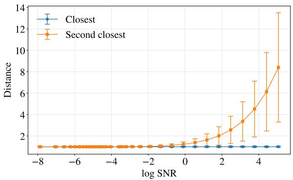  
(a) Embedding-weighted data predictor

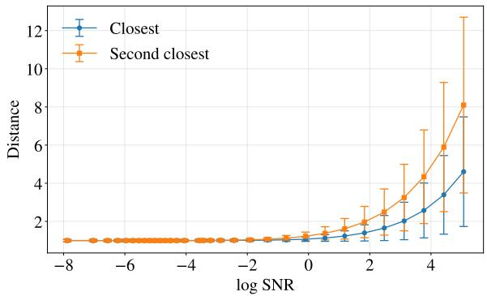  
(b) Unconstrained direct data predictor  
Figure 2: Comparison of flow convergence between the embedding-weighted and direct data predictors. The two models use the same fixed LangFlow embeddings, architecture, and training configuration, difering only in their output parameterization. We plot the smallest and second-smallest normalized distances $\Vert \boldsymbol { x } _ { t } ^ { ( i ) } -$ $\alpha _ { t } e _ { j } \| _ { 2 } / ( \sigma _ { t } \sqrt { d } )$ from the flow state associated with each token position $\boldsymbol { x } _ { t } ^ { ( i ) }$ to the scaled token embeddings as functions of log-SNR.

As shown in Figure 2, the closest and second-closest distances are nearly indistinguishable in the low-SNR regime for both data predictors, but their behaviors diverge as the SNR increases. For the embeddingweighted data predictor in Figure 2(a), the closest normalized distance approaches one and remains tightly concentrated, whereas the second-closest distance increases rapidly, producing a clear separation. In contrast, for the unconstrained direct data predictor in Figure 2(b), both distances increase, exhibit substantially greater variation, and remain poorly separated. These empirical results validate the contrasting convergence behaviors characterized by Theorem 1 and Proposition 2.

Having empirically examined convergence toward token embeddings, we next examine the consistency of the weight-based and distance-based token prediction rules. Theorem 1 and Proposition 3 together imply their asymptotic equivalence: the flow state converges to a token embedding, while the corresponding weights converge to its one-hot representation. As the number of sampling steps N varies from 32 to 512, the two rules agree at 99.16%–99.82% of token positions, with the agreement increasing as the sampling discretization becomes finer. This near-perfect agreement indicates that the two rules are efectively equivalent in practice, with the remaining discrepancies diminishing as the sampling time discretization becomes finer.

## 4.2 Efect of the training objective: MSE versus CE

Starting from the pre-trained LangFlow checkpoint, we continue training two models for 200K iterations under identical configurations, using the MSE and CE objectives, respectively. We evaluate Gen. PPL and entropy every 25K steps.

The entropy remains above 5.5 for both objectives throughout training. As for Gen. PPL, Figure 3(a) shows that training with the CE objective provides no consistent improvement over the initial checkpoint and its Gen. PPL remains near its initial value. In contrast, training with the MSE objective steadily reduces Gen. PPL and maintains a clear advantage throughout training, despite some fluctuations across checkpoints.

To further isolate the efect of the training objective, we conduct a crossover experiment using the checkpoints obtained after 100K steps. Specifically, we continue the CE-trained checkpoint using the MSE objective and, conversely, continue the MSE-trained checkpoint using the CE objective. As shown in Figure 3(b), despite starting from the worse-performing CE-trained checkpoint, switching to MSE reduces Gen. PPL consistently. Conversely, switching the better-performing MSE-trained checkpoint to CE degrades Gen. PPL. This crossover experiment confirms that the improvement is attributable to the MSE objective rather than favorable initialization. It further demonstrates that subsequent CE-based training can reverse gains previously obtained through MSE-based training.

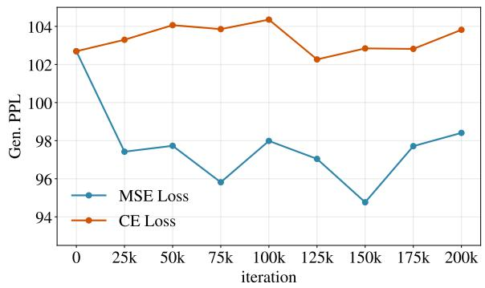  
(a) Continued training from same LangFlow checkpoint

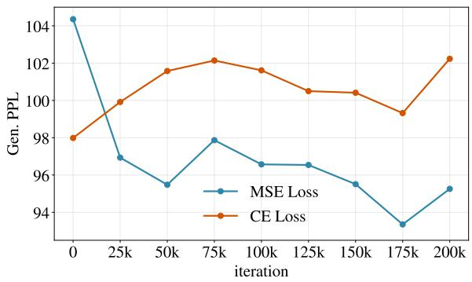  
(b) Swapping objectives after 100K training steps  
Figure 3: Efect of the training objective on Gen. PPL. (a) Starting from the same pre-trained LangFlow checkpoint, MSE-based training yields an immediate and persistent improvement over CE-based training. (b) In the crossover experiment, the CE-trained checkpoint improves rapidly after switching to MSE, whereas the MSE-trained checkpoint degrades after switching to CE. The horizontal axis denotes additional training steps after the objective switch.

## 4.3 Control of quality-diversity trade-of

Empirically, we find that sampling guidance is most efective near the data endpoint. We therefore adopt time-adaptive variants of self-conditioning guidance, unconditional guidance, and iterative self-conditioning refinement.

Specifically, at each step i, we replace the constant guidance strengths $w _ { \mathsf { s c g } }$ and $w _ { \mathsf { u g } }$ with ${ w _ { \mathrm { s c g } } } / ( 1 + \sigma _ { t _ { i } } / \alpha _ { t _ { i } } )$ and ${ w _ { \mathbf { u g } } } / ( 1 + \sigma _ { t _ { i } } / \alpha _ { t _ { i } } )$ , respectively. Thus, these schedules gradually increase the guidance strength over the sampling trajectory.

For iterative self-conditioning refinement, we analogously adapt the refinement count according to

$$
K _ { i } = \lceil \frac { K _ { \mathsf { i s c r } } } { 1 + \sigma _ { t _ { i } } / \alpha _ { t _ { i } } } \rceil .
$$

To ensure a fair comparison under a fixed computational budget, we choose the number of sampling steps separately for each configuration. In particular, the NFE for iterative self-conditioning refinement is given by

$$
{ \mathsf { N F E } } = \sum _ { i = 0 } ^ { N - 1 } ( K _ { i } + 1 ) .
$$

All three sampling mechanisms provide efective control over the quality-diversity trade-of. Figures $4 ( \mathrm { a } ) -$ 4(c) present the results for self-conditioning guidance, unconditional guidance, and iterative self-conditioning refinement, respectively. Figure 4(d) compares their time-adaptive variants. Each trade-of curve is obtained by varying the corresponding nominal control parameter, namely $w _ { \tt s c g } , \ w _ { { \tt u g } } ,$ or $K _ { \mathsf { i s c r } }$ , while holding the total NFE fixed. The complete results for NFE=64 and NFE=128 are summarized in Tables 3 and 4 in Appendix B.1, respectively.

Overall, the time-adaptive variants generally improve the Gen. PPL-entropy frontier relative to their constant-strength counterparts. As shown in Figure 4(d), among the three adaptive techniques, selfconditioning guidance spans the broadest range of operating points and achieves the most favorable trade-of in the low- and medium-entropy regimes. Iterative self-conditioning refinement is particularly efective in the high-entropy regime, although it covers a narrower controllable range. Unconditional guidance yields only modest Gen. PPL reductions, and we investigate this further in Section 4.5.

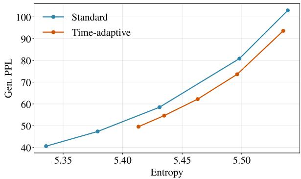  
(a) Standard and time-adaptive self-conditioning guidance.

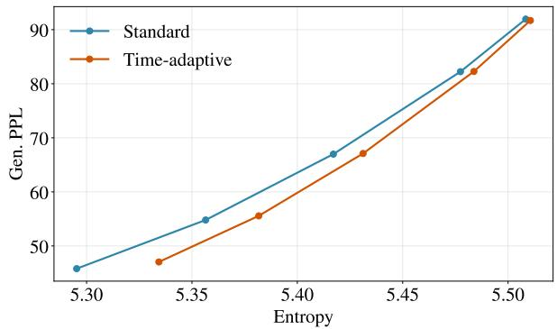  
(b) Standard and time-adaptive unconditional guidance.

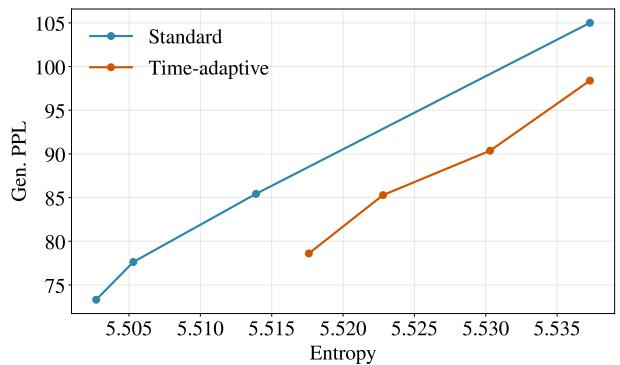  
(c) Standard and time-adaptive iterative selfconditioning refinement.

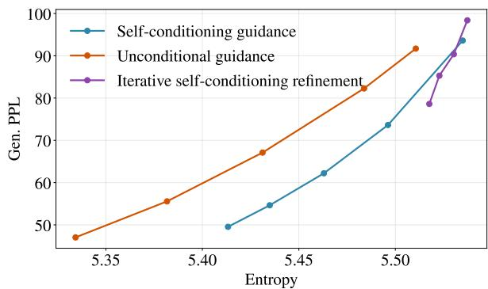  
(d) Comparison of the three time-adaptive samplers.  
Figure 4: Gen. PPL-entropy trade-ofs of the three sampling techniques at NFE=64. Each curve is obtained by varying the corresponding nominal control parameter. (a)–(c) compare the standard and time-adaptive variants of each sampling technique, where the adaptive variants increase the guidance strength or selfconditioning refinement count toward the data endpoint. (d) compares the time-adaptive variants of the three sampling techniques.

## 4.4 Combination of three sampling techniques

We next test the performance of combinations of the three sampling techniques, where we use the timeadaptive variant in all cases.

We first combine self-conditioning guidance and iterative self-conditioning refinement. Figure 5 reports the results under a fixed NFE budget of 64. The complete results for NFE=64 and NFE=128 are provided in Tables 5 and 6 in Appendix B.2, respectively.

As illustrated in Figure 5, increasing $K _ { \mathrm { i s c r } }$ generally shifts the trade-of frontier toward lower Gen. PPL at comparable entropy levels. Thus, combining a suficiently large self-conditioning refinement parameter $K _ { \mathsf { i s c r } }$ with an appropriate self-conditioning guidance strength $w _ { \mathsf { s c g } }$ substantially improves the trade-of.

We next add time-adaptive unconditional guidance to the combined sampler. Figure 6 plots the results, with $K _ { \mathsf { i s c r } } = 5 0$ and $K _ { \mathsf { i s c r } } = 1 0 0$ shown separately in Figures 6(a) and 6(b), respectively. For both settings, varying $w _ { \mathsf { u g } }$ primarily moves the operating point along a similar Gen. PPL-entropy frontier rather than shifting the frontier outward. These results suggest that self-conditioning guidance and iterative self-conditioning refinement capture most of the gain. Nevertheless, unconditional guidance remains useful because it does not require a conditioning signal, which we believe has independent interest. The complete numerical results for diferent combinations of $w _ { \mathsf { u g } } , K _ { \mathsf { i s c r } }$ , and $w _ { \mathsf { s c g } }$ are reported in Table 7 in Appendix B.2.

Finally, we compare the two token prediction rules described in Section 3.2. As the flow approaches the data endpoint, these two rules should output the same token. Figure 7 empirically verifies this agreement, with the NFE= 64 and NFE= 128 results shown in Figures 7(a) and 7(b), respectively. The corresponding

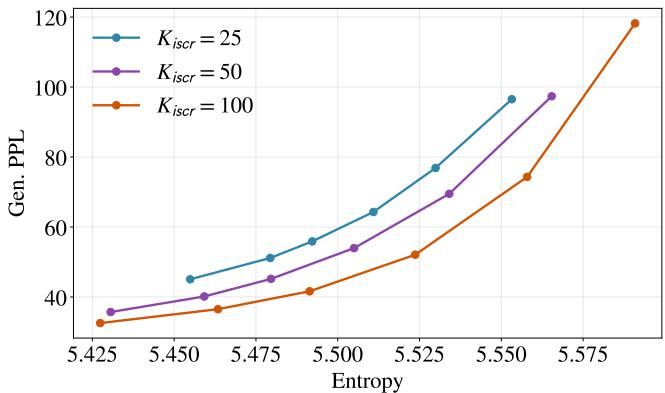  
Figure 5: Joint efect of iterative self-conditioning refinement and self-conditioning guidance at NFE=64. Each curve fixes the refinement parameter $K _ { \mathsf { i s c r } }$ and varies the guidance strength $w _ { \mathsf { s c g } }$

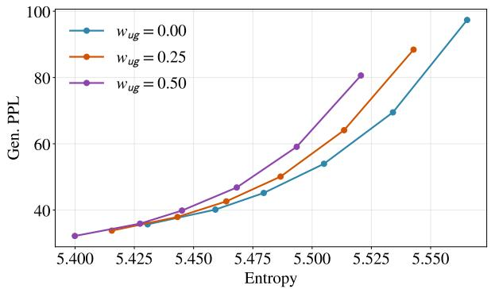  
(a) $K _ { \mathsf { i s c r } } { = } 5 0$

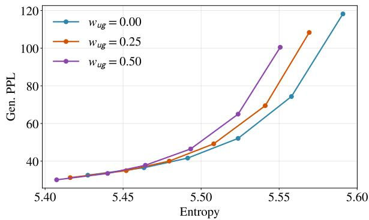  
(b) $K _ { \mathsf { i s c r } } { = } 1 0 0$  
Figure 6: Efect of adding unconditional guidance to a sampler combining iterative self-conditioning refinement and self-conditioning guidance at $\mathrm { N F E } = 6 4 $

Gen. PPL-entropy curves nearly overlap under both computational budgets. In the high-entropy, high-Gen. PPL regime, distance-based decoding yields a slightly more favorable trade-of. These results support using nearest-neighbor projection to map the generated continuous flow state to a token sequence, without a separately trained terminal decoder.

## 4.5 Further improvement

The experiments in Section 4.3 indicate that concentrating sampling guidance near the data endpoint improves the Gen. PPL-entropy trade-of. At suficiently large guidance strengths, however, data endpointfocused allocation exhibits diminishing returns. Further reduction in Gen. PPL requires stronger guidance earlier in the trajectory, when the state remains relatively noisy.

To study this efect, we compare the following three configurations under the same NFE budget:

• Configuration A: fixed refinement count $K _ { i } = K$ and $w _ { \tt S C g } ( t _ { i } ) = w _ { \tt S c g }$ ;

• Configuration B: $K _ { i } = \lceil K _ { \mathrm { i s c r } } / ( 1 + \sqrt { \sigma _ { t _ { i } } / \alpha _ { t _ { i } } } ) \rceil$ and $w _ { \mathrm { s c g } } ( t _ { i } ) = w _ { \mathrm { s c g } } / ( 1 + \sqrt { \sigma _ { t _ { i } } / \alpha _ { t _ { i } } } ) ;$

• Configuration C: $K _ { i } = \lceil K _ { \mathrm { i s c r } } / ( 1 + \sigma _ { t _ { i } } / \alpha _ { t _ { i } } ) \rceil$ and $w _ { \mathrm { s c g } } ( t _ { i } ) = w _ { \mathrm { s c g } } / ( 1 + \sigma _ { t _ { i } } / \alpha _ { t _ { i } } )$

Relative to Configuration C, Configuration B applies stronger guidance in the high-noise regime.

Figure 8 presents the results for NFE=64 and 128. The three configurations are favorable in diferent regions of the quality-diversity frontier. Configuration A, particularly with $K = 8 .$ , reaches the low-entropy, low-Gen. PPL regime. Configuration B provides strong intermediate operating points by applying more guidance during the noisier portion of the trajectory, whereas Configuration C preserves the greatest diversity by concentrating guidance near the endpoint.

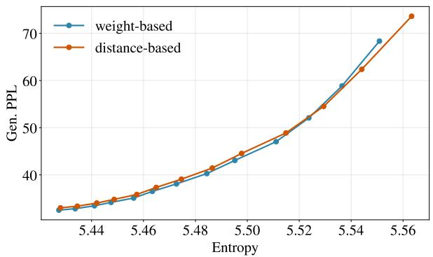  
(a) NFE=64

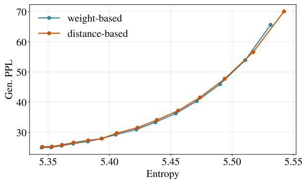  
(b) NFE=128

Figure 7: Comparison of two token prediction rules for NFE budgets of 64 and 128.  
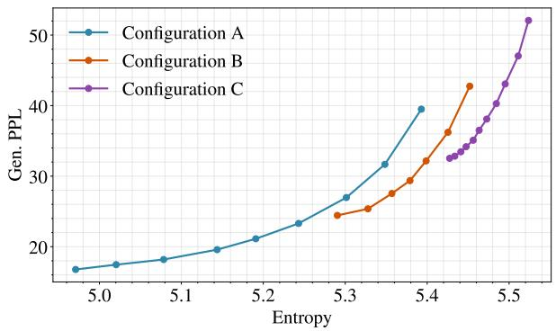  
(a) NFE=64

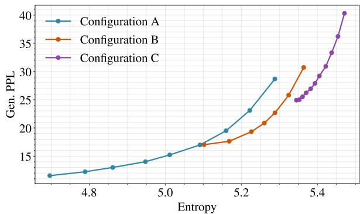  
(b) NFE=128  
Figure 8: Comparison of the three configurations for NFE budgets of 64 and 128. Each curve is obtained by varying the self-conditioning guidance strength $w _ { \mathsf { s c g } }$

In regions where the curves overlap, increasing the refinement count generally improves the trade-of. Among the settings considered, $K _ { \mathsf { i s c r } } = 1 0 0$ and $K _ { \mathsf { i s c r } } = 2 0 0$ yield the most favorable frontiers for NFE=64 and 128, respectively. These results show that both the refinement count and its temporal allocation determine the attainable Gen. PPL-entropy regime.

Complete numerical results for Configurations A and B are reported in Tables 8 and 9 in Appendix B.3, respectively. Results for additional guidance configurations under NFE=64 and 128 are provided in Tables 10 and 11 in Appendix B.3.

## 5 Discussion

ConvergeFlow suggests several directions for future work. First, our formulation keeps the token embeddings fixed to avoid degenerate solutions. It would be interesting to develop fully continuous objectives that support joint learning of the embedding and data predictor. Second, extending the convergence analysis under weaker assumptions and developing non-asymptotic theoretical guarantees would provide a more complete account of practical generation. Third, scaling ConvergeFlow to larger models and evaluating it on conditional generation, instruction following, and reasoning tasks will clarify its broader applicability. Finally, the continuous formulation may facilitate the use of techniques such as distillation and higher-order acceleration, whose efectiveness for language generation remains to be explored.

## Acknowledgments

N. Li, Y. Jiao, and G. Li are supported in part by the Chinese University of Hong Kong Direct Grant for Research and the Hong Kong Research Grants Council ECS 24305724 and GRF 14307525. C. Cai is supported in part by the NSF CAREER award CCF-2541600 and grant DMS-2515333.

## References

Arriola, M., Gokaslan, A., Chiu, J., Yang, Z., Qi, Z., Han, J., Sahoo, S., and Kuleshov, V. (2025). Block difusion: Interpolating between autoregressive and difusion language models. In International Conference on Learning Representations, volume 2025, pages 50726–50753.

Austin, J., Johnson, D. D., Ho, J., Tarlow, D., and Van Den Berg, R. (2021). Structured denoising difusion models in discrete state-spaces. Advances in Neural Information Processing Systems, 34:17981–17993.

Ben-Hamu, H., Gat, I., Severo, D., Nolte, N. S., and Karrer, B. (2026). Accelerated sampling from masked difusion models via entropy bounded unmasking. Advances in Neural Information Processing Systems, 38:55981–56007.

Benton, J., De Bortoli, V., Doucet, A., and Deligiannidis, G. (2023). Nearly d-linear convergence bounds for difusion models via stochastic localization. arXiv preprint arXiv:2308.03686.

Brown, T., Mann, B., Ryder, N., Subbiah, M., Kaplan, J. D., Dhariwal, P., Neelakantan, A., Shyam, P., Sastry, G., Askell, A., et al. (2020). Language models are few-shot learners. Advances in neural information processing systems, 33:1877–1901.

Cai, C. and Li, G. (2025). Minimax optimality of the probability flow ode for difusion models. arXiv preprint arXiv:2503.09583.

Cai, C. and Li, G. (2026). Confidence-based decoding is provably eficient for difusion language models. arXiv preprint arXiv:2603.22248.

Campbell, A., Benton, J., De Bortoli, V., Rainforth, T., Deligiannidis, G., and Doucet, A. (2022). A continuous time framework for discrete denoising models. Advances in Neural Information Processing Systems, 35:28266–28279.

Chen, H., Lee, H., and Lu, J. (2023a). Improved analysis of score-based generative modeling: User-friendly bounds under minimal smoothness assumptions. In International Conference on Machine Learning, pages 4735–4763. PMLR.

Chen, S., Chewi, S., Lee, H., Li, Y., Lu, J., and Salim, A. (2023b). The probability flow ode is provably fast. Advances in Neural Information Processing Systems, 36:68552–68575.

Chen, S., Chewi, S., Li, J., Li, Y., Salim, A., and Zhang, A. R. (2022a). Sampling is as easy as learning the score: theory for difusion models with minimal data assumptions. arXiv preprint arXiv:2209.11215.

Chen, S., Cong, K., and Li, J. (2025). Optimal inference schedules for masked difusion models. arXiv preprint arXiv:2511.04647.

Chen, T., Zhang, R., and Hinton, G. (2022b). Analog bits: Generating discrete data using difusion models with self-conditioning. arXiv preprint arXiv:2208.04202.

Chen, Y., Liang, C., Sui, H., Guo, R., Cheng, C., You, J., and Liu, G. (2026). Langflow: Continuous difusion rivals discrete in language modeling. arXiv preprint arXiv:2604.11748.

Dhariwal, P. and Nichol, A. (2021). Difusion models beat gans on image synthesis. Advances in neural information processing systems, 34:8780–8794.

Dieleman, S., Sartran, L., Roshannai, A., Savinov, N., Ganin, Y., Richemond, P. H., Doucet, A., Strudel, R., Dyer, C., Durkan, C., et al. (2022). Continuous difusion for categorical data. arXiv preprint arXiv:2211.15089.

Dmitriev, D., Huang, Z., and Wei, Y. (2026). Eficient sampling with discrete difusion models: Sharp and adaptive guarantees. arXiv preprint arXiv:2602.15008.

Esser, P., Kulal, S., Blattmann, A., Entezari, R., Müller, J., Saini, H., Levi, Y., Lorenz, D., Sauer, A., Boesel, F., et al. (2024). Scaling rectified flow transformers for high-resolution image synthesis. In Fortyfirst international conference on machine learning.

Fu, H., Huang, B., Adams, V., Wang, C., Srinivasan, V., and Jiao, J. (2025). From bits to rounds: Parallel decoding with exploration for difusion language models. arXiv preprint arXiv:2511.21103.

Gong, S., Li, M., Feng, J., Wu, Z., and Kong, L. (2022). Difuseq: Sequence to sequence text generation with difusion models. arXiv preprint arXiv:2210.08933.

Gulrajani, I. and Hashimoto, T. B. (2023). Likelihood-based difusion language models. Advances in Neural Information Processing Systems, 36:16693–16715.

Guo, H., Zhao, Q., Zhao, Y., Nie, S., Zhu, R., Guo, Q., Wang, F., Yang, T., Zhao, H., Wei, G., et al. (2026). Continuous latent difusion language model. arXiv preprint arXiv:2605.06548.

Han, X., Kumar, S., and Tsvetkov, Y. (2023). Ssd-lm: Semi-autoregressive simplex-based difusion language model for text generation and modular control. In Proceedings of the 61st Annual Meeting of the Association for Computational Linguistics (Volume 1: Long Papers), pages 11575–11596.

Ho, J., Jain, A., and Abbeel, P. (2020). Denoising difusion probabilistic models. Advances in neural information processing systems, 33:6840–6851.

Ho, J. and Salimans, T. (2022). Classifier-free difusion guidance. arXiv preprint arXiv:2207.12598.

Ho, J., Salimans, T., Gritsenko, A., Chan, W., Norouzi, M., and Fleet, D. J. (2022). Video difusion models. Advances in neural information processing systems, 35:8633–8646.

Hoogeboom, E., Nielsen, D., Jaini, P., Forré, P., and Welling, M. (2021). Argmax flows and multinomial difusion: Learning categorical distributions. Advances in neural information processing systems, 34:12454– 12465.

Hu, K., Qiu, L., Lu, Y., Zhao, H., Li, T., Kim, Y., Andreas, J., and He, K. (2026). Elf: Embedded language flows. arXiv preprint arXiv:2605.10938.

Jain, N. and Zhang, T. (2026). A sharp kl convergence analysis for difusion models under minimal assumptions. In International Conference on Learning Representations, volume 2026, pages 22706–22735.

Jiao, Y. and Li, G. (2024). Instance-dependent convergence theory for difusion models. arXiv preprint arXiv:2410.13738.

Jiao, Y., Zhou, Y., and Li, G. (2025). Optimal convergence analysis of ddpm for general distributions. arXiv preprint arXiv:2510.27562.

Kim, J., Shah, K., Kontonis, V., Kakade, S., and Chen, S. (2025). Train for the worst, plan for the best: Understanding token ordering in masked difusions. arXiv preprint arXiv:2502.06768.

Labs, I., Khanna, S., Kharbanda, S., Li, S., Varma, H., Wang, E., Birnbaum, S., Luo, Z., Miraoui, Y., Palrecha, A., et al. (2025). Mercury: Ultra-fast language models based on difusion. arXiv preprint arXiv:2506.17298.

Lavenant, H. and Zanella, G. (2025). Error bounds and optimal schedules for masked difusions with factorized approximations. arXiv preprint arXiv:2510.25544.

Lee, C., Yoo, J., Agarwal, M., Shah, S., Huang, J., Raghunathan, A., Hong, S., Bofi, N. M., and Kim, J. (2026). Flow map language models: One-step language modeling via continuous denoising. arXiv preprint arXiv:2602.16813.

Lee, H., Lu, J., and Tan, Y. (2022). Convergence for score-based generative modeling with polynomial complexity. Advances in Neural Information Processing Systems, 35:22870–22882.

Li, G. and Cai, C. (2024). Provable acceleration for difusion models under minimal assumptions. arXiv preprint arXiv:2410.23285.

Li, G. and Cai, C. (2025). Breaking AR’s sampling bottleneck: Provable acceleration via difusion language models. Advances in Neural Information Processing Systems, 38:11700–11725.

Li, G., Cai, C., and Wei, Y. (2025a). Dimension-free convergence of difusion models for approximate gaussian mixtures. arXiv preprint arXiv:2504.05300.

Li, G., Wei, Y., Chi, Y., and Chen, Y. (2024). A sharp convergence theory for the probability flow odes of difusion models. arXiv preprint arXiv:2408.02320.

Li, G. and Yan, Y. (2024). O(d/T) convergence theory for difusion probabilistic models under minimal assumptions. arXiv preprint arXiv:2409.18959.

Li, G., Zhou, Y., Wei, Y., and Chen, Y. (2025b). Faster difusion models via higher-order approximation. arXiv preprint arXiv:2506.24042.

Li, X., Thickstun, J., Gulrajani, I., Liang, P. S., and Hashimoto, T. B. (2022). Difusion-lm improves controllable text generation. Advances in Neural Information Processing Systems, 35:4328–4343.

Lipman, Y., Chen, R. T., Ben-Hamu, H., Nickel, M., and Le, M. (2022). Flow matching for generative modeling. arXiv preprint arXiv:2210.02747.

Liu, X., Gong, C., and Liu, Q. (2022). Flow straight and fast: Learning to generate and transfer data with rectified flow. arXiv preprint arXiv:2209.03003.

Loshchilov, I. and Hutter, F. (2017). Decoupled weight decay regularization. arXiv preprint arXiv:1711.05101.

Lou, A., Meng, C., and Ermon, S. (2023). Discrete difusion modeling by estimating the ratios of the data distribution. arXiv preprint arXiv:2310.16834.

Lovelace, J., Kishore, V., Wan, C., Shekhtman, E., and Weinberger, K. Q. (2023). Latent difusion for language generation. Advances in Neural Information Processing Systems, 36:56998–57025.

Lu, C., Zhou, Y., Bao, F., Chen, J., Li, C., and Zhu, J. (2022a). Dpm-solver: A fast ode solver for difusion probabilistic model sampling in around 10 steps. Advances in Neural Information Processing Systems, 35:5775–5787.

Lu, C., Zhou, Y., Bao, F., Chen, J., Li, C., and Zhu, J. (2022b). Dpm-solver++: Fast solver for guided sampling of difusion probabilistic models. arXiv preprint arXiv:2211.01095.

Mahabadi, R. K., Ivison, H., Tae, J., Henderson, J., Beltagy, I., Peters, M. E., and Cohan, A. (2024). Tess: Text-to-text self-conditioned simplex difusion. In Proceedings of the 18th Conference of the European Chapter of the Association for Computational Linguistics (Volume 1: Long Papers), pages 2347–2361.

Meng, C., Choi, K., Song, J., and Ermon, S. (2022). Concrete score matching: Generalized score matching for discrete data. Advances in Neural Information Processing Systems, 35:34532–34545.

Meshchaninov, V., Chimbulatov, E., Shabalin, A., Abramov, A., and Vetrov, D. (2026a). Cosmos: Compressed and smooth latent space for text difusion modeling. Advances in Neural Information Processing Systems, 38:14271–14299.

Meshchaninov, V., Shabalin, A., Chimbulatov, E., Gushchin, N., Koziev, I., Korotin, A., and Vetrov, D. (2026b). How to train your latent difusion language model jointly with the latent space. arXiv preprint arXiv:2605.07933.

Nie, S., Zhu, F., You, Z., Zhang, X., Ou, J., Hu, J., Zhou, J., Lin, Y., Wen, J.-R., and Li, C. (2025). Large language difusion models. arXiv preprint arXiv:2502.09992.

Oko, K., Akiyama, S., and Suzuki, T. (2023). Difusion models are minimax optimal distribution estimators. In International Conference on Machine Learning, pages 26517–26582. PMLR.

Ou, J., Nie, S., Xue, K., Zhu, F., Sun, J., Li, Z., and Li, C. (2024). Your absorbing discrete difusion secretly models the conditional distributions of clean data. arXiv preprint arXiv:2406.03736.

Peebles, W. and Xie, S. (2023). Scalable difusion models with transformers. In 2023 IEEE/CVF International Conference on Computer Vision (ICCV), pages 4172–4182. IEEE.

Potaptchik, P., Yim, J., Saravanan, A., Holderrieth, P., Vanden-Eijnden, E., and Albergo, M. S. (2026). Discrete flow maps. arXiv preprint arXiv:2604.09784.

Radford, A., Wu, J., Child, R., Luan, D., Amodei, D., Sutskever, I., et al. (2019). Language models are unsupervised multitask learners. OpenAI blog, 1(8):9.

Rafel, C., Shazeer, N., Roberts, A., Lee, K., Narang, S., Matena, M., Zhou, Y., Li, W., and Liu, P. J. (2020). Exploring the limits of transfer learning with a unified text-to-text transformer. Journal of machine learning research, 21(140):1–67.

Rombach, R., Blattmann, A., Lorenz, D., Esser, P., and Ommer, B. (2022). High-resolution image synthesis with latent difusion models. In Proceedings of the IEEE/CVF conference on computer vision and pattern recognition, pages 10684–10695.

Roos, D., Davis, O., Eijkelboom, F., Bronstein, M., Welling, M., Ceylan, I. I., Ambrogioni, L., and van de Meent, J.-W. (2026). Categorical flow maps. arXiv preprint arXiv:2602.12233.

Sahoo, S., Arriola, M., Schif, Y., Gokaslan, A., Marroquin, E., Chiu, J., Rush, A., and Kuleshov, V. (2024). Simple and efective masked difusion language models. Advances in Neural Information Processing Systems, 37:130136–130184.

Sahoo, S. S., Deschenaux, J., Gokaslan, A., Wang, G., Chiu, J., and Kuleshov, V. (2025). The difusion duality. Proceedings of machine learning research, 267:52584.

Sahoo, S. S., Lemercier, J.-M., Yang, Z., Deschenaux, J., Liu, J., Thickstun, J., and Jukic, A. (2026). Scaling beyond masked difusion language models. arXiv preprint arXiv:2602.15014.

Shi, J., Han, K., Wang, Z., Doucet, A., and Titsias, M. (2024). Simplified and generalized masked difusion for discrete data. Advances in neural information processing systems, 37:103131–103167.

Sohl-Dickstein, J., Weiss, E., Maheswaranathan, N., and Ganguli, S. (2015). Deep unsupervised learning using nonequilibrium thermodynamics. In International conference on machine learning, pages 2256–2265. pmlr.

Song, Y. and Dhariwal, P. (2024). Improved techniques for training consistency models. In International Conference on Learning Representations, volume 2024, pages 15078–15097.

Song, Y. and Ermon, S. (2019). Generative modeling by estimating gradients of the data distribution. Advances in neural information processing systems, 32.

Song, Y., Sohl-Dickstein, J., Kingma, D. P., Kumar, A., Ermon, S., and Poole, B. (2020). Score-based generative modeling through stochastic diferential equations. arXiv preprint arXiv:2011.13456.

Song, Y., Zhang, Z., Luo, C., Gao, P., Xia, F., Luo, H., Li, Z., Yang, Y., Yu, H., Qu, X., et al. (2025). Seed diffusion: A large-scale difusion language model with high-speed inference. arXiv preprint arXiv:2508.02193.

Tae, J., Ivison, H., Kumar, S., and Cohan, A. (2025). Tess 2: A large-scale generalist difusion language model. In Proceedings of the 63rd Annual Meeting of the Association for Computational Linguistics (Volume 1: Long Papers), pages 21171–21188.

Trippe, B. L., Yim, J., Tischer, D., Baker, D., Broderick, T., Barzilay, R., and Jaakkola, T. (2022). Difusion probabilistic modeling of protein backbones in 3d for the motif-scafolding problem. arXiv preprint arXiv:2206.04119.

Wainwright, M. J. (2026). The data geometry of masking difusion: Certified-optimal schedules via unmasking growth complexity. arXiv preprint arXiv:2608.13520.

Wakasugi, S. and Suzuki, T. (2026). State size independent statistical error bound for discrete difusion models. volume 38, pages 138908–138943.

Wan, T., Wang, A., Ai, B., Wen, B., Mao, C., Xie, C.-W., Chen, D., Yu, F., Zhao, H., Yang, J., et al. (2025). Wan: Open and advanced large-scale video generative models. arXiv preprint arXiv:2503.20314.

Wu, C., Zhang, H., Xue, S., Liu, Z., Diao, S., Zhu, L., Luo, P., Han, S., and Xie, E. (2025). Fast-dllm: Training-free acceleration of difusion llm by enabling kv cache and parallel decoding. arXiv preprint arXiv:2505.22618.

Wu, J. and Cai, C. (2026). Difusion models are statistically optimal for learning low-dimensional multimodal distributions. arXiv preprint arXiv:2605.30153.

Ye, J., Xie, Z., Zheng, L., Gao, J., Wu, Z., Jiang, X., Li, Z., and Kong, L. (2025). Dream 7b: Difusion large language models. arXiv preprint arXiv:2508.15487.

Yin, T., Gharbi, M., Zhang, R., Shechtman, E., Durand, F., Freeman, W. T., and Park, T. (2024). One-step difusion with distribution matching distillation. In 2024 IEEE/CVF Conference on Computer Vision and Pattern Recognition (CVPR), pages 6613–6623. IEEE.

You, Z., Nie, S., Zhang, X., Hu, J., Zhou, J., Lu, Z., Wen, J.-R., and Li, C. (2025). Llada-v: Large language difusion models with visual instruction tuning. arXiv preprint arXiv:2505.16933.

Yu, R., Ma, X., and Wang, X. (2025). Dimple: Discrete difusion multimodal large language model with parallel decoding. arXiv preprint arXiv:2505.16990.

Zhang, Y., Gu, J., Wu, Z., Zhai, S., Susskind, J., and Jaitly, N. (2023). Planner: Generating diversified paragraph via latent language difusion model. Advances in Neural Information Processing Systems, 36:80178–80190.

Zhang, Z., Fu, H., Yang, Z., Wang, M., Zhao, T., and Chen, M. (2026). Generalization bounds for discrete difusion: Statistical advantage of masking. In International Conference on Machine Learning.

Zhao, Y. and Cai, C. (2026). Adaptation to intrinsic dependence in difusion language models. arXiv preprint arXiv:2602.20126.

Zheng, K., Chen, Y., Mao, H., Liu, M.-Y., Zhu, J., and Zhang, Q. (2025). Masked difusion models are secretly time-agnostic masked models and exploit inaccurate categorical sampling. In International Conference on Learning Representations, volume 2025, pages 63186–63227.

## A Proof of theorem and propositions

## A.1 Proof of Theorem 1

In this section, we provide a proof of Theorem 1, organized into four steps.

Step 1: Construction of an auxiliary sequence. Define the probability simplex over the vocabulary as

$$
F : = \bigg \{ f \in \mathbb { R } _ { + } ^ { V } : \sum _ { v \in [ V ] } f ( v ) = 1 \bigg \} .
$$

We first note that given an initial point $x _ { t _ { 0 } }$ and a collection of base weights $\{ \widehat { f } _ { k } ^ { ( i ) } \} _ { 0 \leq k \leq N - 1 , 1 \leq i \leq L } \subset F$ satisfying

$$
\operatorname* { m a x } _ { j , k , i } \big | \log \widehat f _ { k + 1 } ^ { ( i ) } ( j ) - \log \widehat f _ { k } ^ { ( i ) } ( j ) \big | \leq \widetilde L | t _ { k + 1 } - t _ { k } | ,
$$

we can use them to construct an auxiliary flow state sequence $\widehat { x } _ { t _ { k } }$ as follows.

Initialize the auxiliary sequence $\widehat { x } _ { t _ { 0 } } = x _ { t _ { 0 } }$ . For each token position i and step k, define the auxiliary weights

$$
\widehat { w } _ { k } ^ { ( i ) } ( j \mid \widehat { x } _ { t _ { k } } ) : = \frac { \widehat { f } _ { k } ^ { ( i ) } ( j ) \exp \left( - \frac { \| \widehat { x } _ { t _ { k } } ^ { ( i ) } - \alpha _ { t _ { k } } e _ { j } \| _ { 2 } ^ { 2 } } { 2 \sigma _ { t _ { k } } ^ { 2 } } \right) } { \sum _ { j = 1 } ^ { V } \widehat { f } _ { k } ^ { ( i ) } ( j ) \exp \left( - \frac { \| \widehat { x } _ { t _ { k } } ^ { ( i ) } - \alpha _ { t _ { k } } e _ { j } \| _ { 2 } ^ { 2 } } { 2 \sigma _ { t _ { k } } ^ { 2 } } \right) } , \quad j \in [ V ] .\tag{33}
$$

Thus, $\widehat { w } _ { k } ^ { ( i ) } ( j \mid \widehat { x } _ { t _ { k } } )$ is the counterpart of the learned weight $w _ { \theta } ^ { ( i ) } ( j | \widehat { x } _ { t _ { k } } , t _ { k } )$ , obtained by replacing the learned base weight $f _ { \theta } ^ { ( i ) } ( j \mid x _ { t _ { k } } , t _ { k } )$ with the data-independent quantity $\widehat { f } _ { k } ^ { ( i ) } ( j )$

The corresponding auxiliary data predictor $\widehat { \mu } _ { \theta } ( \widehat { x } _ { t _ { k } } , t _ { k } )$ is given by

$$
\widehat { \mu } _ { \theta } ^ { ( i ) } ( \widehat { x } _ { t _ { k } } , t _ { k } ) : = \sum _ { j = 1 } ^ { V } \widehat { w } _ { k } ^ { ( i ) } ( j \mid \widehat { x } _ { t _ { k } } ) e _ { j } .\tag{34}
$$

We then iteratively update the auxiliary sequence according to

$$
\widehat { x } _ { t _ { k + 1 } } = \frac { \sigma _ { t _ { k + 1 } } } { \sigma _ { t _ { k } } } \widehat { x } _ { t _ { k } } + \big ( \alpha _ { t _ { k + 1 } } - \frac { \sigma _ { t _ { k + 1 } } \alpha _ { t _ { k } } } { \sigma _ { t _ { k } } } \big ) \widehat { \mu } _ { \theta } ( \widehat { x } _ { t _ { k } } , t _ { k } ) , \qquad k = 0 , 1 , \dots , N - 1 .\tag{35}
$$

With this construction procedure in place, we next show that the auxiliary sequence can reproduce the original sampling trajectory. Given the original trajectory $( x _ { t _ { k } } ) _ { k = 0 } ^ { N } .$ , choose

$$
\begin{array} { r } { \widehat { f } _ { k } ^ { ( i ) } ( j ) : = f _ { \theta } ^ { ( i ) } ( j \mid x _ { t _ { k } } , t _ { k } ) , \qquad j \in [ V ] , } \end{array}\tag{36}
$$

for each iteration $0 \leq k < N$ and token position $i \in [ L ]$ . The log-Lipschitz assumption in Theorem 1 ensures that this sequence satisfies the required regularity condition. We claim that

$$
x _ { t _ { k } } = { \widehat { x } } _ { t _ { k } } , \qquad 0 \leq k \leq N .\tag{37}
$$

We prove this claim by induction. First, it holds trivially for $k = 0$ . Next, suppose that $x _ { t _ { k } } = \widehat { x } _ { t _ { k } }$ holds for some k. By the choice of $\widehat { f } _ { k } ^ { ( i ) } ( j )$ in (36) and the construction of $\widehat { w } _ { k } ^ { ( i ) }$ in (33), we have

$$
\widehat { w } _ { k } ^ { ( i ) } ( j \mid \widehat { x } _ { t _ { k } } ) = w _ { \theta } ^ { ( i ) } ( j | \widehat { x } _ { t _ { k } } , t _ { k } ) = w _ { \theta } ^ { ( i ) } ( j \mid x _ { t _ { k } } , t _ { k } ) .\tag{38}
$$

It then follows from (34) and (22) that

$$
{ \widehat { \mu } } _ { \theta } ^ { ( i ) } ( { \widehat { x } } _ { t _ { k } } , t _ { k } ) = \sum _ { j = 1 } ^ { V } w _ { \theta } ^ { ( i ) } ( j \mid x _ { t _ { k } } , t _ { k } ) e _ { j } = \mu _ { \theta } ^ { ( i ) } ( x _ { t _ { k } } , t _ { k } ) .
$$

Therefore, the update rule of the auxiliary sequence in (35) coincides with that of the original sequence in (10), thereby yielding $x _ { t _ { k + 1 } } = \widehat { x } _ { t _ { k + 1 } }$ . This completes the induction and proves (37).

Consequently, it remains to analyze the auxiliary sequence for an arbitrary collection of base weights satisfying the stated regularity condition. Concretely, we will show that for any token position $i \in [ L ]$ , there exists some $j _ { i } \in [ V ]$ , such that

$$
\widehat { x } _ { t _ { N } } ^ { ( i ) } \to e _ { j _ { i } } , \qquad \mathrm { a s } \quad t _ { N } \to 1 .
$$

Step 2: Construction of reference distributions. For each token position $i ,$ let $q _ { k } ^ { ( i ) }$ denote the probability density function of $\widehat { x } _ { t , . . } ^ { ( i ) }$ when $\widehat { x } _ { t _ { 0 } } ^ { ( i ) }$ is initialized with the standard Gaussian distribution. In addition, for each $0 \leq k \leq N$ and $i \in [ L ]$ , we define the reference distribution

$$
\widehat { p } _ { k } ^ { ( i ) } ( x ) : = ( 2 \pi \sigma _ { t _ { k } } ^ { 2 } ) ^ { - d / 2 } \sum _ { j = 1 } ^ { V } \widehat { f } _ { k } ^ { ( i ) } ( j ) \exp \Bigl ( - \frac { \| x - \alpha _ { t _ { k } } e _ { j } \| _ { 2 } ^ { 2 } } { 2 \sigma _ { t _ { k } } ^ { 2 } } \Bigr ) , \qquad \forall x \in \mathbb { R } ^ { d } .
$$

In the remainder of the proof, we focus on a token position i. For notational brevity, we omit the superscript (i) from $\widehat { f } _ { k } ^ { ( i ) } , \widehat { w } _ { k } ^ { ( i ) } , \widehat { \mu } _ { \theta } ^ { ( i ) } , \widehat { p } _ { k } ^ { ( i ) }$ and $\widehat { q } _ { k } ^ { \left( i \right) }$ , and $\widehat { x } _ { t _ { k } } ^ { ( i ) }$

We first compare the reference densities at two consecutive points along the auxiliary trajectory. By the definition of $\widehat { p } _ { k }$ , one can derive

$$
\begin{array} { r l } { \frac { \widehat { p } _ { k + 1 } ( \widehat { x } _ { t + 1 } ) } { \widehat { p } _ { k } ( \widehat { x } _ { t , t } ) } = } & { \frac { 1 } { \widehat { p } _ { k } ( \widehat { x } _ { t + 1 } ) } ( 2 \pi \sigma _ { t + 1 } ^ { 2 } ) ^ { - d / 2 } \displaystyle \sum _ { j = 1 } ^ { V } \widehat { f } _ { k + 1 } ( j ) \exp \Big ( - \frac { \| \widehat { x } _ { t + 1 } - \alpha _ { t + 1 } e _ { j } \| _ { 2 } ^ { 2 } } { 2 \sigma _ { t + 1 } ^ { 2 } } \Big ) } \\ & { = \frac { 1 } { \widehat { p } _ { k } ( \widehat { x } _ { t + 1 } ) } ( 2 \pi \sigma _ { t + 1 } ^ { 2 } ) ^ { - d / 2 } \Big ( \frac { \sigma _ { t + 1 } } { \sigma _ { t + 1 } } \Big ) ^ { i } \displaystyle \sum _ { j = 1 } ^ { V } \widehat { f } _ { k } ( j ) \exp \Big ( - \frac { \| \widehat { x } _ { t + 1 } - \alpha _ { t } e _ { j } \| _ { 2 } ^ { 2 } } { 2 \sigma _ { t } ^ { 2 } } \Big ) \frac { \widehat { f } _ { k + 1 } ( j ) } { \widehat { f } _ { k } ( j ) } \exp ( \Delta _ { t } ( e _ { j } ) ) } \\ &  \overset { ( ) } { \geq } \exp \big ( - \widehat { L } ( t _ { k + 1 } - t _ { k } ) \big ) \frac { 1 } { \widehat { p } _ { k } ( \widehat { x } _ { t + 1 } ) } ( 2 \pi \sigma _ { t + 1 } ^ { 2 } ) ^ { - d / 2 } \Big ( \frac { \sigma _ { t _ { k } } } { \sigma _ { t + 1 } } \Big ) ^ { d } \displaystyle \sum _ { j = 1 } ^ { V } \widehat { f } _ { k } ( j ) \exp \Big ( - \frac { \| \widehat { x } _ { t + 1 } - \alpha _ { t + 2 } e _ { j } \| _ { 2 } ^ { 2 } } { 2 \sigma _ { t _ { k } } ^ { 2 } } \end{array}
$$

Here, $\Delta _ { t _ { k } } ( e _ { j } )$ records the change in the Gaussian exponent associated with the j-th token embedding:

$$
\begin{array} { r l } & { \Delta _ { t _ { k } } ( e _ { j } ) : = \frac { \| \widehat { x } _ { t _ { k } } - \alpha _ { t _ { k } } e _ { j } \| _ { 2 } ^ { 2 } } { 2 \sigma _ { t _ { k } } ^ { 2 } } - \frac { \| \widehat { x } _ { t _ { k + 1 } } - \alpha _ { t _ { k + 1 } } e _ { j } \| _ { 2 } ^ { 2 } } { 2 \sigma _ { t _ { k + 1 } } ^ { 2 } } } \\ & { \qquad = \frac { 1 } { 2 } \Big ( 1 - \frac { \alpha _ { t _ { k + 1 } } ^ { 2 } \sigma _ { t _ { k } } ^ { 2 } } { \alpha _ { t _ { k } } ^ { 2 } \sigma _ { t _ { k + 1 } } ^ { 2 } } \Big ) \frac { \| \widehat { x } _ { t _ { k } } - \alpha _ { t _ { k } } e _ { j } \| _ { 2 } ^ { 2 } } { \sigma _ { t _ { k } } ^ { 2 } } - \frac { 1 } { 2 } \Big ( 1 - \frac { \alpha _ { t _ { k + 1 } } ^ { 2 } \sigma _ { t _ { k } } ^ { 2 } } { \alpha _ { t _ { k } } ^ { 2 } \sigma _ { t _ { k + 1 } } ^ { 2 } } \Big ) \frac { \| \widehat { x } _ { t _ { k } } - \alpha _ { t _ { k } } \widehat { \mu } _ { \theta } ( \widehat { x } _ { t _ { k } } , t _ { k } ) \| _ { 2 } ^ { 2 } } { \sigma _ { t _ { k } } ^ { 2 } } , } \end{array}\tag{40}
$$

where the second line follows from the update rule of $\widehat { x } _ { t _ { k } }$ given in (35) and the definition of $\widehat { \mu } _ { \theta } ( \widehat { x } _ { t _ { k } } , t _ { k } )$ from (34); (i) follows from the log-Lipschitz condition on ${ \widehat { f } } _ { k } ; ( { \mathrm { i i } } )$ follows from the identity

$$
\widehat w _ { k } ( j \mid \widehat x _ { t _ { k } } ) = \frac { \widehat f _ { k } ( j ) \exp \Big ( - \frac { \| \widehat x _ { t _ { k } } - \alpha _ { t _ { k } } e _ { j } \| _ { 2 } ^ { 2 } } { 2 \sigma _ { t _ { k } } ^ { 2 } } \Big ) } { \sum _ { j ^ { \prime } = 1 } ^ { V } \widehat f _ { k } ( j ^ { \prime } ) \exp \Big ( - \frac { \| \widehat x _ { t _ { k } } - \alpha _ { t _ { k } } e _ { j ^ { \prime } } \| _ { 2 } ^ { 2 } } { 2 \sigma _ { t _ { k } } ^ { 2 } } \Big ) } = \frac { 1 } { \widehat p _ { k } ( \widehat x _ { t _ { k } } ) } ( 2 \pi \sigma _ { t _ { k } } ^ { 2 } ) ^ { - d / 2 } \widehat f _ { k } ( j ) \exp \Big ( - \frac { \| \widehat x _ { t _ { k } } - \alpha _ { t _ { k } } e _ { j } \| _ { 2 } ^ { 2 } } { 2 \sigma _ { t _ { k } } ^ { 2 } } \Big ) .
$$

(iii) is a consequence of Jensen’s inequality $\mathbb { E } [ e ^ { X } ] \geq e ^ { \mathbb { E } [ X ] }$ . By summary, we have

$$
\begin{array} { r l } { \displaystyle \sum _ { j = 1 } ^ { V } \widehat { w } _ { k } ( j \mid \widehat { x } _ { t _ { k } } ) \Delta _ { t _ { k } } ( e _ { j } ) = \frac { 1 } { 2 } \Big ( 1 - \frac { \alpha _ { t _ { k + 1 } } ^ { 2 } \sigma _ { t _ { k } } ^ { 2 } } { \alpha _ { t _ { k } } ^ { 2 } \sigma _ { t _ { k + 1 } } ^ { 2 } } \Big ) \Bigg ( \displaystyle \sum _ { j = 1 } ^ { V } \widehat { w } _ { k } ( j \mid \widehat { x } _ { t _ { k } } ) \frac { \| \widehat { x } _ { t _ { k } } - \alpha _ { t _ { k } } e _ { j } \| _ { 2 } ^ { 2 } } { \sigma _ { t _ { k } } ^ { 2 } } - \frac { \| \widehat { x } _ { t _ { k } } - \alpha _ { t _ { k } } \widehat { \mu } _ { \theta } ( \widehat { x } _ { t _ { k } } , t _ { k } ) \| _ { 2 } ^ { 2 } } { \sigma _ { t _ { k } } ^ { 2 } } \Bigg ) } & { } \\ { \displaystyle } & { = \frac { \alpha _ { t _ { k } } ^ { 2 } } { 2 \sigma _ { t _ { k } } ^ { 2 } } \Big ( 1 - \frac { \alpha _ { t _ { k + 1 } } ^ { 2 } \sigma _ { t _ { k } } ^ { 2 } } { \alpha _ { t _ { k } } ^ { 2 } \sigma _ { t _ { k + 1 } } ^ { 2 } } \Big ) \Bigg ( \displaystyle \sum _ { j = 1 } ^ { V } \widehat { w } _ { k } ( j \mid \widehat { x } _ { t _ { k } } ) \| e _ { j } \| _ { 2 } ^ { 2 } - \| \widehat { \mu } _ { \theta } ( \widehat { x } _ { t _ { k } } , t _ { k } ) \| _ { 2 } ^ { 2 } \Bigg ) . \qquad ( \mathrm { ~ a ~ n ~ d ~ } \Gamma ( \widehat { x } _ { t _ { k } } , t _ { k } ) ) } \end{array}\tag{41}
$$

Substituting into (39) yields

$$
\frac { \widehat { p } _ { k + 1 } ( \widehat { x } _ { t _ { k + 1 } } ) } { \widehat { p } _ { k } ( \widehat { x } _ { t _ { k } } ) } \geq \exp \bigl ( - \widetilde { L } ( t _ { k + 1 } - t _ { k } ) \bigr ) \biggl ( \frac { \sigma _ { t _ { k } } } { \sigma _ { t _ { k + 1 } } } \biggr ) ^ { d } \exp \biggl ( \frac { \alpha _ { t _ { k } } ^ { 2 } } { 2 \sigma _ { t _ { k } } ^ { 2 } } \biggr ( 1 - \frac { \alpha _ { t _ { k + 1 } } ^ { 2 } \sigma _ { t _ { k } } ^ { 2 } } { \alpha _ { t _ { k } } ^ { 2 } \sigma _ { t _ { k + 1 } } ^ { 2 } } \biggr ) \biggr ( \sum _ { i = 1 } ^ { V } \widehat { w } _ { k } \big ( j \ | \widehat { x } _ { t _ { k } } \big ) \| \epsilon _ { j } \| _ { 2 } ^ { 2 } - \| \widehat { \mu } _ { \theta } ( \widehat { x } _ { t _ { k } } , t _ { k } ) \| _ { 2 } ^ { 2 } \biggr ) \biggr ) .\tag{42}
$$

Step 3: Analysis of the distributions of $\widehat { x } _ { t _ { k } }$ . We now track the density of the auxiliary sequence $\widehat { x } _ { t _ { k } }$ . Because the update is deterministic, its one-step density ratio is determined by the inverse Jacobian determinant of the update map. From the update rule in (35), the change-of-variable formula yields the following relationship between the densities of $\widehat { x } _ { t _ { k } }$ and $\widehat { x } _ { t _ { k + 1 } }$

$$
\begin{array} { r l } & { \frac { q _ { k + 1 } \left( \widehat { x } _ { t _ { k + 1 } } \right) } { q _ { k } \left( \widehat { x } _ { t _ { k } } \right) } = \Big | \frac { \sigma _ { t _ { k + 1 } } } { \sigma _ { t _ { k } } } I + \big ( \alpha _ { t _ { k + 1 } } - \frac { \sigma _ { t _ { k + 1 } } \alpha _ { t _ { k } } } { \sigma _ { t _ { k } } } \big ) \nabla _ { \widehat { x } _ { t _ { k } } } \widehat { \mu } _ { \theta } \big ( \widehat { x } _ { t _ { k } } , t _ { k } \big ) \Big | ^ { - 1 } } \\ & { \qquad = \Big ( \frac { \sigma _ { t _ { k + 1 } } } { \sigma _ { t _ { k } } } \Big ) ^ { - d } \Big | I - \alpha _ { t _ { k } } \Big ( 1 - \frac { \alpha _ { t _ { k + 1 } } \sigma _ { t _ { k } } } { \alpha _ { t _ { k } } \sigma _ { t _ { k + 1 } } } \Big ) \nabla _ { \widehat { x } _ { t _ { k } } } \widehat { \mu } _ { \theta } \big ( \widehat { x } _ { t _ { k } } , t _ { k } \big ) \Big | ^ { - 1 } . } \end{array}\tag{43}
$$

where $| \cdot |$ denotes the determinant. By the construction of the embedding-weighted predictor $\widehat { \mu } _ { \theta } ( \widehat { x } _ { t _ { k } } , t _ { k } )$ in (34), we obtain

$$
\begin{array} { r l } { \nabla _ { \hat { \sigma } _ { \hat { \sigma } _ { \hat { \sigma } _ { \hat { \sigma } _ { \hat { \sigma } _ { \hat { \sigma } } } } } } } \hat { h _ { \theta } } ( \hat { x } _ { \hat { t } _ { k } } , t _ { k } ) = \displaystyle \sum _ { j = 1 } ^ { V } e _ { j } \big ( \nabla _ { \hat { \sigma } _ { \hat { \sigma } _ { \hat { \sigma } _ { \hat { \sigma } } } } } \hat { w } _ { \hat { k } } ( j \ | \ \hat { x } _ { \hat { t } _ { k } } ) \big ) ^ { \top } } & { } \\ & { = - \displaystyle \frac { 1 } { \sigma _ { \hat { \sigma } _ { \hat { \sigma } _ { \hat { \sigma } _ { \hat { \sigma } } } } ^ { 2 } } } \displaystyle \sum _ { \hat { w } _ { k } ( \hat { \sigma } ) } ^ { V } \big ( \hat { x } _ { t _ { k } } \big ) e _ { j } ( \hat { \sigma } _ { \hat { \sigma } _ { k } } - \alpha _ { k } e _ { j } ) ^ { \top } + \frac { 1 } { \sigma _ { k } ^ { 2 } } \displaystyle \sum _ { j = 1 } ^ { V } \big ( \displaystyle \sum _ { \hat { \sigma } _ { k } ^ { \prime } } ^ { V } \hat { w } _ { k } ( j \ | \ \hat { x } _ { t _ { k } } ) e _ { j } \big ) \big ( \displaystyle \sum _ { j = 1 } ^ { V } \hat { w } _ { k } ( j \ | \ \hat { x } _ { t _ { k } } ) ( \hat { x } _ { t _ { k } } - \alpha _ { k } e _ { j } ) \big ) ^ { \top } } \\ &  = \displaystyle \frac { \alpha _ { t _ { k } } } { \sigma _ { \hat { \sigma } _ { k } } } ( \displaystyle \sum _ { j = 1 } ^ { V } \hat { w } _ { k } ( j \ | \ \hat { x } _ { t _ { k } } ) e _ { j } e _ { j } ^ { \top } - \displaystyle ( \sum _ { j = 1 } ^ { V } \hat { w } _ { k } ( j \ | \hat { x } _  \end{array}
$$

where (i) applies the definition of $\widehat { \mu } _ { \theta } ( \widehat { x } _ { t _ { k } } , t _ { k } )$ in (34), and $\widehat { \Sigma } _ { k } ( \widehat { \boldsymbol { x } } _ { t _ { k } } )$ is the covariance matrix of discrete distribution on $\{ e _ { j } \} _ { j \in [ V ] }$ associated with the probability ${ \mathbb { P } } \{ X = e _ { j } \} = { \widehat { w } } _ { k } ( j \mid { \widehat { x } } _ { t _ { k } } )$ . This is the same quantity that appears in the reference-density calculation in Step 2; see (41).

Substituting this expression into (43) yields

$$
\begin{array} { l } { \frac { q _ { k + 1 } ( \widehat { x } _ { t _ { k + 1 } } ) } { q _ { k } ( \widehat { x } _ { t _ { k } } ) } = \Big ( \frac { \sigma _ { t _ { k + 1 } } } { \sigma _ { t _ { k } } } \Big ) ^ { - d } \bigg | I - \frac { \alpha _ { t _ { k } } ^ { 2 } } { \sigma _ { t _ { k } } ^ { 2 } } \Big ( 1 - \frac { \alpha _ { t _ { k + 1 } } \sigma _ { t _ { k } } } { \alpha _ { t _ { k } } \sigma _ { t _ { k + 1 } } } \Big ) \widehat { \Sigma } _ { k } ( \widehat { x } _ { t _ { k } } ) \bigg | ^ { - 1 } } \\ { \overset { ( i ) } { = } \Big ( \frac { \sigma _ { t _ { k + 1 } } } { \sigma _ { t _ { k } } } \Big ) ^ { - d } \exp \bigg ( \frac { \alpha _ { t _ { k } } ^ { 2 } } { \sigma _ { t _ { k } } ^ { 2 } } \Big ( 1 - \frac { \alpha _ { t _ { k + 1 } } \sigma _ { t _ { k } } } { \alpha _ { t _ { k } } \sigma _ { t _ { k + 1 } } } \Big ) \mathbb { T r } ( \widehat { \Sigma } _ { k } ( \widehat { x } _ { t _ { k } } ) ) + \frac { \alpha _ { t _ { k } } ^ { 4 } } { \sigma _ { t _ { k } } ^ { 4 } } \Big ( 1 - \frac { \alpha _ { t _ { k + 1 } } \sigma _ { t _ { k } } } { \alpha _ { t _ { k } } \sigma _ { t _ { k + 1 } } } \Big ) ^ { 2 } O \big ( \| \widehat { \Sigma } _ { k } ( \widehat { x } _ { t _ { k } } ) \| _ { F } ^ { 2 } \big ) \bigg ) } \\  = \Big ( \frac { \sigma _ { t _ { k + 1 } } } { \sigma _ { t _ { k } } } \Big ) ^ { - d } \exp \bigg ( \frac { \alpha _ { t _ { k } } ^ { 2 } } { \sigma _ { t _ { k } } ^ { 2 } } \big ( 1 - \frac  \alpha _ { t _ { k + 1 } } \sigma  \end{array}\tag{44}
$$

Here the leading term in the right-hand-side of (i) is obtained from the first-order expansion of the log determinant, while the remainder collects the corresponding higher-order terms, and

$$
\mathcal { E } _ { t _ { k } } ( \widehat { x } _ { t _ { k } } ) : = \frac { \alpha _ { t _ { k } } ^ { 4 } } { \sigma _ { t _ { k } } ^ { 4 } } \Big ( 1 - \frac { \alpha _ { t _ { k + 1 } } \sigma _ { t _ { k } } } { \alpha _ { t _ { k } } \sigma _ { t _ { k + 1 } } } \Big ) ^ { 2 } O \big ( \| \widehat { \Sigma } _ { k } ( \widehat { x } _ { t _ { k } } ) \| _ { F } ^ { 2 } \big ) .
$$

Step 4: Combining the estimates. We finally compare the two density evolutions. Combining (42) and (44), and using the identity

$$
1 - \frac { \alpha _ { t _ { k + 1 } } \sigma _ { t _ { k } } } { \alpha _ { t _ { k } } \sigma _ { t _ { k + 1 } } } - \biggl ( \frac { 1 } { 2 } - \frac { \alpha _ { t _ { k + 1 } } ^ { 2 } \sigma _ { t _ { k } } ^ { 2 } } { 2 \alpha _ { t _ { k } } ^ { 2 } \sigma _ { t _ { k + 1 } } ^ { 2 } } \biggr ) = \frac { 1 } { 2 } \biggl ( 1 - \frac { \alpha _ { t _ { k + 1 } } \sigma _ { t _ { k } } } { \alpha _ { t _ { k } } \sigma _ { t _ { k + 1 } } } \biggr ) ^ { 2 } ,
$$

we obtain

$$
\begin{array} { r l } & { \frac { q _ { k + 1 } ( \widehat { x } _ { t _ { k + 1 } } ) \widehat { p } _ { k } ( \widehat { x } _ { t _ { k } } ) } { q _ { k } ( \widehat { x } _ { t _ { k } } ) \widehat { p } _ { k + 1 } ( \widehat { x } _ { t _ { k + 1 } } ) } } \\ & { \quad \le \exp \bigl ( \widetilde { L } ( t _ { k + 1 } - t _ { k } ) \bigr ) \exp \Bigg ( \frac { \alpha _ { t _ { k } } ^ { 2 } } { 2 \sigma _ { t _ { k } } ^ { 2 } } \Big ( 1 - \frac { \alpha _ { t _ { k + 1 } } \sigma _ { t _ { k } } } { \alpha _ { t _ { k } } \sigma _ { t _ { k + 1 } } } \Big ) ^ { 2 } \Bigg ( \displaystyle \sum _ { j = 1 } ^ { V } \widehat { w } _ { k } ( j \mid \widehat { x } _ { t _ { k } } ) \| e _ { j } \| _ { 2 } ^ { 2 } - \| \widehat { \mu } _ { \theta } ( \widehat { x } _ { t _ { k } } , t _ { k } ) \| _ { 2 } ^ { 2 } \Bigg ) + \mathcal { E } _ { t _ { k } } ( \widehat { x } _ { t _ { k } } ) \Bigg ) } \\ & { \quad \le \exp \bigl ( \widetilde { L } ( t _ { k + 1 } - t _ { k } ) \bigr ) \exp \Bigg ( \frac { \alpha _ { t _ { k } } ^ { 2 } } { 2 \sigma _ { t _ { k } } ^ { 2 } } \Big ( 1 - \frac { \alpha _ { t _ { k + 1 } } \sigma _ { t _ { k } } } { \alpha _ { t _ { k } } \sigma _ { t _ { k + 1 } } } \Big ) ^ { 2 } \displaystyle \sum _ { j = 1 } ^ { V } \widehat { w } _ { k } ( j \mid \widehat { x } _ { t _ { k } } ) \| e _ { j } \| _ { 2 } ^ { 2 } + \mathcal { E } _ { t _ { k } } ( \widehat { x } _ { t _ { k } } ) \Bigg ) . } \end{array}
$$

To control the right-hand side, recall that $\| e _ { j } \| _ { 2 }$ is bounded, i.e., $\| e _ { j } \| _ { 2 } = B$ . Consequently, telescoping the one-step density-ratio bounds gives

$$
\begin{array} { r l r } {  { \frac { q _ { N } ( \widehat { x } _ { t _ { N } } ) } { \widehat { p } _ { N } ( \widehat { x } _ { t _ { N } } ) } = \frac { q _ { 0 } ( \widehat { x } _ { t _ { 0 } } ) } { \widehat { p } _ { 0 } ( \widehat { x } _ { t _ { 0 } } ) } \prod _ { k = 0 } ^ { N - 1 } \frac { q _ { k + 1 } ( \widehat { x } _ { t _ { k + 1 } } ) \widehat { p } _ { k } ( \widehat { x } _ { t _ { k } } ) } { q _ { k } ( \widehat { x } _ { t _ { k } } ) \widehat { p } _ { k + 1 } ( \widehat { x } _ { t _ { k + 1 } } ) } } } \\ & { } & { \leq \frac { q _ { 0 } ( \widehat { x } _ { t _ { 0 } } ) } { \widehat { p } _ { 0 } ( \widehat { x } _ { t _ { 0 } } ) } \exp ( \widetilde { L } ) \exp \bigg ( \displaystyle \sum _ { k = 0 } ^ { N - 1 } \frac { \alpha _ { t _ { k } } ^ { 2 } } { 2 \sigma _ { t _ { k } } ^ { 2 } } \Big ( 1 - \frac { \alpha _ { t _ { k + 1 } } \sigma _ { t _ { k } } } { \alpha _ { t _ { k } } \sigma _ { t _ { k + 1 } } } \Big ) ^ { 2 } B ^ { 2 } + \displaystyle \sum _ { k = 0 } ^ { N - 1 } \mathcal { E } _ { t _ { k } } ( \widehat { x } _ { t _ { k } } ) \bigg ) , } \end{array}
$$

where we have used

$$
\begin{array} { r l } & { \displaystyle \sum _ { k = 0 } ^ { N - 1 } \frac { \alpha _ { t _ { k } } ^ { 2 } } { 2 \sigma _ { t _ { k } } ^ { 2 } } \Big ( 1 - \frac { \alpha _ { t _ { k + 1 } } \sigma _ { t _ { k } } } { \alpha _ { t _ { k } } \sigma _ { t _ { k + 1 } } } \Big ) ^ { 2 } \sum _ { j = 1 } ^ { V } \widehat w _ { k } ( j \mid \widehat x _ { t _ { k } } ) \| e _ { j } \| _ { 2 } ^ { 2 } } \\ & { \displaystyle = \frac { 1 } { 2 } \sum _ { k = 0 } ^ { N - 1 } \Big ( \frac { \alpha _ { t _ { k } } } { \sigma _ { t _ { k } } } - \frac { \alpha _ { t _ { k + 1 } } } { \sigma _ { t _ { k + 1 } } } \Big ) ^ { 2 } B ^ { 2 } \lesssim N \delta ^ { 2 } , } \end{array}
$$

and

$$
\begin{array} { r l } & { \displaystyle \sum _ { k = 0 } ^ { N - 1 } \mathcal { E } _ { t _ { k } } ( \widehat { x } _ { t _ { k } } ) \lesssim \sum _ { k = 0 } ^ { N - 1 } \frac { \alpha _ { t _ { k } } ^ { 4 } } { \sigma _ { t _ { k } } ^ { 4 } } \Big ( 1 - \frac { \alpha _ { t _ { k + 1 } } \sigma _ { t _ { k } } } { \alpha _ { t _ { k } } \sigma _ { t _ { k + 1 } } } \Big ) ^ { 2 } \mathsf { T r } ( \widehat { \Sigma } _ { k } ( \widehat { x } _ { t _ { k } } ) ) ^ { 2 } } \\ & { \qquad \lesssim \displaystyle \sum _ { k = 0 } ^ { N - 1 } \frac { \alpha _ { t _ { k } } ^ { 4 } } { \sigma _ { t _ { k } } ^ { 4 } } \Big ( 1 - \frac { \alpha _ { t _ { k + 1 } } \sigma _ { t _ { k } } } { \alpha _ { t _ { k } } \sigma _ { t _ { k + 1 } } } \Big ) ^ { 2 } \mathsf { T r } \Big ( \displaystyle \sum _ { j = 1 } ^ { V } \widehat { w } _ { k } ( j \mid \widehat { x } _ { t _ { k } } ) \| e _ { j } \| _ { 2 } ^ { 2 } \Big ) ^ { 2 } } \\ & { \qquad = \displaystyle \sum _ { k = 0 } ^ { N - 1 } \frac { \alpha _ { t _ { k } } ^ { 2 } } { \sigma _ { t _ { k } } ^ { 2 } } \Big ( \frac { \alpha _ { t _ { k } } } { \sigma _ { t _ { k } } } - \frac { \alpha _ { t _ { k + 1 } } } { \sigma _ { t _ { k + 1 } } } \Big ) ^ { 2 } B ^ { 4 } \lesssim N \delta ^ { 2 } B ^ { 4 } , } \end{array}
$$

where the last inequality uses the facts that

$$
\begin{array} { r } { \big | \frac { \alpha _ { t _ { k } } } { \sigma _ { t _ { k } } } - \frac { \alpha _ { t _ { k + 1 } } } { \sigma _ { t _ { k + 1 } } } \big | = \frac { t _ { k + 1 } - t _ { k } } { ( 1 - t _ { k } ) ( 1 - t _ { k + 1 } ) } \le \delta , } \\ { \frac { \alpha _ { t _ { k } } } { \sigma _ { t _ { k } } } \big | \frac { \alpha _ { t _ { k } } } { \sigma _ { t _ { k } } } - \frac { \alpha _ { t _ { k + 1 } } } { \sigma _ { t _ { k + 1 } } } \big | = \frac { ( t _ { k + 1 } - t _ { k } ) t _ { k } } { ( 1 - t _ { k } ) ^ { 2 } ( 1 - t _ { k + 1 } ) } \le \delta . } \end{array}\tag{45}
$$

It remains to control the initial density ratio. Observe that the initial time step satisfies

$$
\frac { q _ { 0 } ( \widehat { x } _ { t _ { 0 } } ) } { \widehat { p } _ { 0 } ( \widehat { x } _ { t _ { 0 } } ) } = \sigma _ { t _ { 0 } } ^ { d } \frac { 1 } { \sum _ { j = 1 } ^ { V } \widehat { f } _ { k } ( j ) \exp \big ( - \frac { \alpha _ { t _ { 0 } } ^ { 2 } \| e _ { j } \| _ { 2 } ^ { 2 } } { 2 \sigma _ { t _ { 0 } } ^ { 2 } } + \frac { \alpha _ { t _ { 0 } } e _ { j } ^ { \top } \widehat { x } _ { t _ { 0 } } } { 2 \sigma _ { t _ { 0 } } ^ { 2 } } - \frac { 1 - \sigma _ { t _ { 0 } } ^ { 2 } } { 2 \sigma _ { t _ { 0 } } ^ { 2 } } \| \widehat { x } _ { t _ { 0 } } \| _ { 2 } ^ { 2 } \big ) }  1 \quad \mathrm { a s } \quad t _ { 0 }  0 .
$$

Under the stated discretization condition, the accumulated remainder remains bounded. In particular,for suficiently small $\delta ,$ we have $\delta ^ { 2 } N = O ( 1 )$ . Consequently, as $t _ { 0 } \to 0$

$$
\frac { q _ { N } ( \widehat { x } _ { t _ { N } } ) } { \widehat { p } _ { N } ( \widehat { x } _ { t _ { N } } ) } = O ( 1 ) .
$$

Finally, recall that

$$
\widehat { p } _ { N } ( \widehat { x } _ { t _ { N } } ) = ( 2 \pi \sigma _ { t _ { N } } ^ { 2 } ) ^ { - d / 2 } \sum _ { j = 1 } ^ { V } \widehat { w } _ { N } ( e _ { j } ) \exp \bigl ( { - | | \widehat { x } _ { t _ { N } } - \alpha _ { t _ { N } } e _ { j } | | _ { 2 } ^ { 2 } } / ( 2 \sigma _ { t _ { N } } ^ { 2 } ) \bigr ) ,
$$

which implies that

$$
q _ { N } ( \widehat { x } _ { t _ { N } } ) \lesssim ( 2 \pi \sigma _ { t _ { N } } ^ { 2 } ) ^ { - d / 2 } \sum _ { j = 1 } ^ { V } \widehat { w } _ { N } ( e _ { j } ) \exp \bigl ( - \| \widehat { x } _ { t _ { N } } - \alpha _ { t _ { N } } e _ { j } \| _ { 2 } ^ { 2 } / ( 2 \sigma _ { t _ { N } } ^ { 2 } ) \bigr ) .
$$

As $t _ { N } \ \to \ 1$ , the variance of every Gaussian component vanishes and its center approaches a vocabulary embedding. Therefore, $q _ { N }$ is asymptotically bounded by $\sum _ { j = 1 } ^ { V } \widehat { w } _ { N } ( e _ { j } ) \delta _ { e _ { j } }$ , where $\delta _ { e _ { j } }$ denotes the Dirac measure with mass at $e _ { j }$ . This completes the proof.

## A.2 Proof of Proposition 1

Define

$$
p ^ { ( i ) } ( j \mid x _ { t } ^ { ( - i ) } , t ) : = \mathbb { P } \{ s ^ { ( i ) } = j \mid x _ { t } ^ { ( - i ) } \} , \quad j \in [ V ] .\tag{46}
$$

By Bayes’s rule, we can derive

$$
\mathbb { P } \{ s ^ { ( i ) } = j \mid x _ { t } \} = \frac { \mathbb { P } \{ s ^ { ( i ) } = j , x _ { t } ^ { ( i ) } \mid x _ { t } ^ { ( - i ) } \} } { \mathbb { P } \{ x _ { t } ^ { ( i ) } \mid x _ { t } ^ { ( - i ) } \} } = \frac { p ^ { ( - i ) } ( j \mid x _ { t } ^ { ( - i ) } , t ) p ( x _ { t } ^ { ( i ) } \mid s ^ { ( i ) } = j , x _ { t } ^ { ( - i ) } ) } { \sum _ { j ^ { \prime } \in [ V ] } p ^ { ( - i ) } ( j ^ { \prime } \mid x _ { t } ^ { ( - i ) } , t ) p ( x _ { t } ^ { ( i ) } \mid s ^ { ( i ) } = j ^ { \prime } , x _ { t } ^ { ( - i ) } ) } .\tag{47}
$$

Because the Gaussian corruption is independent across token positions (see the probability path construction in $( 1 ) ) , x _ { t } ^ { ( i ) }$ and $x _ { t } ^ { ( - i ) }$ are conditionally independent given $s ^ { ( i ) }$ . As a result, we have

$$
\boldsymbol { x } _ { t } ^ { ( i ) } \mid \boldsymbol { s } ^ { ( i ) } = j , \boldsymbol { x } _ { t } ^ { ( - i ) } \sim \mathcal { N } ( \alpha _ { t } \boldsymbol { e } _ { j } , \sigma _ { t } ^ { 2 } I _ { d } ) .
$$

Plugging this into (47) yields the claim in (20).

## A.3 Proof of Proposition 2

Consider a general schedule $\left( \alpha _ { t } , \sigma _ { t } \right)$ such that $\alpha _ { t }  1$ and $\sigma _ { t } \to 0 \mathrm { a s } t \to 1$ . Define the smooth, unconstrained data predictor

$$
\mu _ { \theta } ( x , t ) = \frac { x } { \alpha _ { t } + \sigma _ { t } } .\tag{48}
$$

It is easy to verify that

$$
\mu _ { \theta } ( x _ { t } , t ) = \frac { x _ { t } } { \alpha _ { t } + \sigma _ { t } } = \frac { \alpha _ { t } x _ { \star } + \sigma _ { t } z } { \alpha _ { t } + \sigma _ { t } }  x _ { \star } \quad \mathrm { a s } \quad t  1 .
$$

Thus, the data predictor is asymptotically accurate. However, we will show that the flow induced by this data predictor does not converge to any token embedding with constant probability.

By the ODE in (2) and the velocity identity in (8), the flow induced by $\mu _ { \theta }$ is given by

$$
\frac { \mathrm { d } x _ { t } } { \mathrm { d } t } = \frac { \sigma _ { t } ^ { \prime } } { \sigma _ { t } } x _ { t } + \Big ( \alpha _ { t } ^ { \prime } - \frac { \sigma _ { t } ^ { \prime } } { \sigma _ { t } } \alpha _ { t } \Big ) \frac { x _ { t } } { \alpha _ { t } + \sigma _ { t } } = \frac { \alpha _ { t } ^ { \prime } + \sigma _ { t } ^ { \prime } } { \alpha _ { t } + \sigma _ { t } } x _ { t } .
$$

Solving the ODE shows that the flow trajectory initialized at $x _ { t _ { 0 } }$ evolves according to

$$
x _ { t } = \frac { \alpha _ { t } + \sigma _ { t } } { \alpha _ { t _ { 0 } } + \sigma _ { t _ { 0 } } } x _ { t _ { 0 } } .
$$

As a result, the data predictor remains constant along the flow trajectory:

$$
\mu _ { \theta } ( x _ { t } , t ) = \frac { x _ { t } } { \alpha _ { t } + \sigma _ { t } } = \frac { x _ { t _ { 0 } } } { \alpha _ { t _ { 0 } } + \sigma _ { t _ { 0 } } } .
$$

Suppose that $x _ { t _ { 0 } } = \sigma z$ with $z _ { i j } \stackrel { \mathrm { i . i . d . } } { \sim } \mathcal { N } ( 0 , 1 )$ . Then the final iterate is given by

$$
{ \frac { x _ { t _ { N } } } { \alpha _ { t _ { N } } } } = \sigma _ { N } z \qquad { \mathrm { w i t h } } \qquad \sigma _ { N } : = { \frac { \sigma ( \alpha _ { t _ { N } } + \sigma _ { t _ { N } } ) } { \alpha _ { t _ { N } } ( \alpha _ { t _ { 0 } } + \sigma _ { t _ { 0 } } ) } } .
$$

Because $\sigma _ { t } / \alpha _ { t }  0$ as $t \to 1$ , we have

$$
\sigma _ { N } \downarrow \sigma _ { \infty } : = \frac { \sigma } { \alpha _ { t _ { 0 } } + \sigma _ { t _ { 0 } } } > 0 \quad \mathrm { a s } \quad N  \infty .
$$

Because $\sigma _ { \infty } z$ has a continuous distribution, its probability of belonging to any finite set is zero. Therefore, the final iterate $x _ { t _ { N } }$ fails to converge to any token embedding with constant probability, as formalized in (24).

For example, if $\| e _ { j } \| _ { 2 } = \sqrt { d }$ for every $j \in [ V ]$ , then for any token position $i \in [ L ]$ , one has

$$
\begin{array} { r l r } & { } & { \mathbb { P } \bigg \{ \underset { j } { \operatorname* { m i n } } \left\| \alpha _ { t _ { N } } ^ { - 1 } x _ { t _ { N } } ^ { ( i ) } - e _ { j } \right\| _ { 2 } \geq 1 \bigg \} \geq \mathbb { P } \Big \{ \left| \sigma _ { N } \| z ^ { ( i ) } \| _ { 2 } - \| e _ { j } \| _ { 2 } \right| \geq 1 \Big \} } \\ & { } & { \geq \mathbb { P } \Big \{ \sigma _ { \infty } \| z ^ { ( i ) } \| _ { 2 } \geq 1 + \sqrt { d } \Big \} \geq c _ { \mathrm { l b } } } \end{array}
$$

for some constant $c _ { \vert \mathsf { b } } > 0$ independent of N.

## A.4 Proof of Proposition 3

Let us denote by $\overline { { e } } _ { j } : = e _ { j } / \| e _ { j } \| _ { 2 }$ the normalized embedding vector. Fix an arbitrary token position $i \in [ L ]$ Notice the relation

$$
\begin{array} { r l } & { \displaystyle \frac { \| \mu _ { \theta } ^ { ( i ) } ( x _ { t } , t ) \| _ { 2 } ^ { 2 } } { \| e _ { j } \| _ { 2 } ^ { 2 } } = \bigg \| \sum _ { j ^ { \prime } = 1 } ^ { V } w _ { \theta } ^ { ( i ) } ( j ^ { \prime } \mid x _ { t } , t ) \overline { { e } } _ { j ^ { \prime } } \bigg \| _ { 2 } ^ { 2 } } \\ & { \displaystyle \quad \quad = \sum _ { j ^ { \prime } = 1 } ^ { V } w _ { \theta } ^ { ( i ) } ( j ^ { \prime } \mid x _ { t } , t ) ^ { 2 } + \sum _ { j ^ { \prime } = 1 } ^ { V } \sum _ { \ell \neq j ^ { \prime } } w _ { \theta } ^ { ( i ) } ( j ^ { \prime } \mid x _ { t } , t ) w _ { \theta } ^ { ( i ) } ( \ell \mid x _ { t } , t ) \frac { \langle e _ { j ^ { \prime } } , e _ { \ell } \rangle } { \| e _ { j ^ { \prime } } \| _ { 2 } \| e _ { \ell } \| _ { 2 } } . } \end{array}
$$

By the separation condition that $\begin{array} { r } { \operatorname* { m a x } _ { j ^ { \prime } \neq \ell } \Big | \frac { \langle e _ { j ^ { \prime } } , e _ { \ell } \rangle } { \| e _ { j ^ { \prime } } \| _ { 2 } \| e _ { \ell } \| _ { 2 } } \Big | \leq 1 - \rho , } \end{array}$ one can derive

$$
\begin{array} { r l } { \displaystyle \frac { | | \mu _ { \theta } ^ { ( i ) } ( x _ { t } , t ) | | _ { 2 } ^ { 2 } } { | | \epsilon _ { j } | | _ { 2 } ^ { 2 } } \le \sum _ { j ^ { \prime } = 1 } ^ { V } w _ { \theta } ^ { ( i ) } ( j ^ { \prime } | x _ { t } , l ) ^ { 2 } + ( 1 - \rho ) \sum _ { j ^ { \prime } = 1 } ^ { V } \sum _ { \ell \neq j ^ { \prime } } w _ { \theta } ^ { ( i ) } ( j ^ { \prime } | x _ { t } , l ) w _ { \theta } ^ { ( i ) } ( \ell | x _ { t } , l ) } & { } \\ & { \displaystyle \frac { ( \mathrm { i } ) } { f ^ { \prime } - 1 } \sum _ { j ^ { \prime } = 1 } ^ { V } w _ { \theta } ^ { ( i ) } ( j ^ { \prime } | x _ { t } , \ell ) ^ { 2 } + ( 1 - \rho ) \sum _ { j ^ { \prime } = 1 } ^ { V } w _ { \theta } ^ { ( i ) } ( j ^ { \prime } | x _ { t } , \ell ) \big ( 1 - w _ { \theta } ^ { ( i ) } ( j ^ { \prime } | x _ { t } , \ell ) \big ) } \\ & { \displaystyle \frac { ( \mathrm { i } ) } { f ^ { \prime } - 1 } \sum _ { j ^ { \prime } = 1 } ^ { V } w _ { \theta } ^ { ( i ) } ( j ^ { \prime } | x _ { t } , \ell ) ^ { 2 } + ( 1 - \rho ) - ( 1 - \rho ) \sum _ { j ^ { \prime } = 1 } ^ { V } w _ { \theta } ^ { ( i ) } ( j ^ { \prime } | x _ { t } , \ell ) ^ { 2 } } \\ & { = 1 - \rho + \rho \sum _ { j ^ { \prime } = 1 } ^ { V } w _ { \theta } ^ { ( i ) } ( j ^ { \prime } | x _ { t } , \ell ) ^ { 2 } , } \end{array}\tag{49}
$$

where (i) and (ii) use the fact that $\begin{array} { r } { \sum _ { j ^ { \prime } = 1 } ^ { V } w _ { \theta } ^ { ( i ) } ( j ^ { \prime } | x _ { t } , t ) = 1 . \mathrm { A s } ~ \mu _ { \theta } ^ { ( i ) } ( x _ { t } , t ) \to e _ { j } } \end{array}$ , one has $\frac { \| \mu _ { \theta } ^ { ( i ) } ( x _ { t } , t ) \| _ { 2 } ^ { 2 } } { \| e _ { j } \| _ { 2 } ^ { 2 } }  1$ Combining this with (49), we obtain

$$
1 - \rho + \rho \operatorname* { l i m } _ { t  1 } \sum _ { j ^ { \prime } = 1 } ^ { V } w _ { \theta } ^ { ( i ) } ( j ^ { \prime } \mid x _ { t } , t ) ^ { 2 } \geq 1 ,
$$

which leads to

$$
\operatorname* { l i m } _ { t  1 } \sum _ { j ^ { \prime } = 1 } ^ { V } w _ { \theta } ^ { ( i ) } ( j ^ { \prime } | x _ { t } , t ) ^ { 2 } \geq 1 .
$$

As $w _ { \theta } ^ { ( i ) } ( j ^ { \prime } | x _ { t } , t ) \in [ 0 , 1 ]$ and $\begin{array} { r } { \sum _ { j ^ { \prime } = 1 } ^ { V } w _ { \theta } ^ { ( i ) } ( j ^ { \prime } \mid x _ { t } , t ) = 1 } \end{array}$ , there exists some $\widehat { j } \in [ V ]$ such as $w _ { \theta } ^ { ( i ) } ( \hat { j } | x _ { t } , t )  1$ and $w _ { \theta } ^ { ( i ) } ( j ^ { \prime } | x _ { t } , t )  0$ for ${ j ^ { \prime } \ne \widehat { j } }$ . Since $\mu _ { \theta } ^ { ( i ) } ( x _ { t } , t )  e _ { j }$ , we conclude that ${ \widehat { j } } = j$ , thereby completing the proof.

## B Further experimental results

This section provides the complete numerical results underlying the experimental analyses in Section 4, together with additional results under larger NFE budgets. Figure 9 compares the original LangFlow schedule with the adaptive schedule.

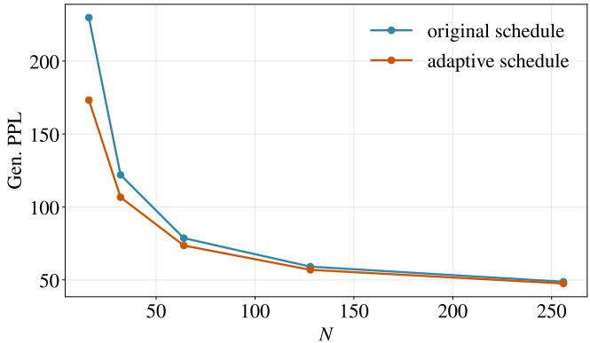  
Figure 9: Efect of the sampling schedule on Gen. PPL. We compare the original schedule by LangFlow with the proposed adaptive schedule $t _ { i } = ( i + 0 . 5 ) / N , i = 0 , \dots , N - 1$ , across diferent steps N.

## B.1 Detailed results for quality-diversity control

Tables 3 and 4 report the complete numerical results for the three sampling techniques under NFE budgets of 64 and 128, respectively. These results underlie the $\mathrm { N F E = 6 4 }$ trade-of curves in Figure 4 and extend the same comparison to $\mathrm { N F E = 1 2 8 }$ . Across both budgets, increasing the corresponding control parameter lowers Gen. PPL at the cost of entropy, while the time-adaptive variants generally retain more entropy at comparable Gen. PPL. This consistent behavior confirms the benefit of concentrating guidance or iterative refinement near the data endpoint.

## B.2 Detailed results for combinations of sampling techniques

Tables 5 and 6 provide the complete sweeps for jointly varying iterative self-conditioning refinement $K _ { \mathsf { i s c r } }$ and self-conditioning guidance $w _ { \mathsf { s c g } }$ under NFE budgets of 64 and 128, respectively. Consistent with Figure 5, a suficiently large $K _ { \mathsf { i s c r } }$ combined with an appropriate $w _ { \mathsf { s c g } }$ shifts the trade-of frontier toward lower Gen. PPL at comparable entropy. Table 7 further reports the three-way combinations that include unconditional guidance. Varying $w _ { \mathsf { u g } }$ mainly moves the operating point along a similar frontier, providing only a marginal additional improvement after the other two techniques have been combined.

## B.3 Detailed results for guidance allocation

Tables 8 and 9 report the complete sweeps for Configurations A and B, respectively, under both NFE budgets. Tables 10 and 11 then collect representative operating points from all three configurations for $\mathrm { N F E = 6 4 }$ and 128. The numerical results support the trends in Figure 8: Configuration A reaches the low-entropy, low-Gen. PPL regime, Configuration B provides strong intermediate operating points, and Configuration C preserves the greatest entropy. In overlapping regions, a larger refinement parameter $K _ { \mathsf { i s c r } }$ generally yields a more favorable trade-of, confirming that both the refinement count and its temporal allocation are important.

Table 3: Gen. PPL-entropy trade-ofs produced by the three sampling techniques under a fixed NFE budget of 64. We compare each standard variant with its time-adaptive counterpart. For the time-adaptive variants, “Nominal value” denotes the control parameter before time-dependent scaling.
<table><tr><td rowspan="2">Sampling technique</td><td colspan="3">Standard</td><td colspan="3">Time-adaptive</td></tr><tr><td>Value</td><td>Gen. PPL</td><td>Entropy</td><td>Nominal value</td><td>Gen. PPL</td><td>Entropy</td></tr><tr><td rowspan="4">Iterative self-conditioning refinement</td><td>1</td><td>105.0006</td><td>5.5373</td><td>10</td><td>98.3887</td><td>5.5373</td></tr><tr><td>2</td><td>85.4298</td><td>5.5139</td><td>15</td><td>90.3650</td><td>5.5303</td></tr><tr><td>3</td><td>77.6263</td><td>5.5053</td><td>20</td><td>85.2866</td><td>5.5228</td></tr><tr><td>5</td><td>73.3118</td><td>5.5027</td><td>40</td><td>78.6051</td><td>5.5176</td></tr><tr><td rowspan="5">Self-conditioning guidance</td><td>1</td><td>102.9869</td><td>5.5387</td><td>20</td><td>93.5983</td><td>5.5349</td></tr><tr><td>2</td><td>80.8420</td><td>5.4981</td><td>40</td><td>73.6271</td><td>5.4962</td></tr><tr><td>4</td><td>58.4980</td><td>5.4310</td><td>60</td><td>62.2094</td><td>5.4630</td></tr><tr><td>6</td><td>47.3374</td><td>5.3790</td><td>80</td><td>54.6371</td><td>5.4349</td></tr><tr><td>8</td><td>40.5905</td><td>5.3357</td><td>100</td><td>49.5442</td><td>5.4133</td></tr><tr><td rowspan="5">Unconditional guidance</td><td>0.01</td><td>91.9529</td><td>5.5084</td><td>0.25</td><td>91.6968</td><td>5.5106</td></tr><tr><td>0.02</td><td>82.2282</td><td>5.4774</td><td>0.50</td><td>82.2702</td><td>5.4838</td></tr><tr><td>0.04</td><td>66.9820</td><td>5.4171</td><td>1.00</td><td>67.0967</td><td>5.4312</td></tr><tr><td>0.06</td><td>54.8009</td><td>5.3565</td><td>1.50</td><td>55.5643</td><td>5.3817</td></tr><tr><td>0.08</td><td>45.8002</td><td>5.2953</td><td>2.00</td><td>47.0382</td><td>5.3343</td></tr></table>

Table 4: Gen. PPL-entropy trade-ofs produced by the three sampling techniques under a fixed NFE budget of 128. We compare each standard variant with its time-adaptive counterpart. For the time-adaptive variants, “Nominal value” denotes the control parameter before time-dependent scaling.
<table><tr><td rowspan="2">Sampling technique</td><td colspan="3">Standard</td><td colspan="3">Time-adaptive</td></tr><tr><td>Value</td><td>Gen. PPL</td><td>Entropy</td><td>Nominal value</td><td>Gen. PPL</td><td>Entropy</td></tr><tr><td rowspan="4">Iterative self-conditioning refinement</td><td>1</td><td>93.3518</td><td>5.5078</td><td>10</td><td>89.2618</td><td>5.5052</td></tr><tr><td>2</td><td>73.9209</td><td>5.4694</td><td>15</td><td>80.2898</td><td>5.4941</td></tr><tr><td>3</td><td>64.3410</td><td>5.4497</td><td>20</td><td>74.6253</td><td>5.4828</td></tr><tr><td>5</td><td>56.5077</td><td>5.4300</td><td>40</td><td>64.9262</td><td>5.4636</td></tr><tr><td rowspan="5">Self-conditioning guidance</td><td>1</td><td>93.3518</td><td>5.5078</td><td>20</td><td>84.4239</td><td>5.5039</td></tr><tr><td>2</td><td>72.7807</td><td>5.4623</td><td>40</td><td>65.6629</td><td>5.4601</td></tr><tr><td>4</td><td>51.5329</td><td>5.3858</td><td>60</td><td>55.0511</td><td>5.4230</td></tr><tr><td>6</td><td>41.0542</td><td>5.3279</td><td>80</td><td>48.2367</td><td>5.3934</td></tr><tr><td>8</td><td>35.0187</td><td>5.2822</td><td>100</td><td>43.8744</td><td>5.3719</td></tr><tr><td rowspan="5">Unconditional guidance</td><td>0.01</td><td>81.4945</td><td>5.4708</td><td>0.25</td><td>82.5130</td><td>5.4779</td></tr><tr><td>0.02</td><td>72.4452</td><td>5.4362</td><td>0.50</td><td>73.6181</td><td>5.4501</td></tr><tr><td>0.04</td><td>57.1142</td><td>5.3643</td><td>1.00</td><td>59.6448</td><td>5.3943</td></tr><tr><td>0.06</td><td>46.1258</td><td>5.2910</td><td>1.50</td><td>49.2387</td><td>5.3419</td></tr><tr><td>0.08</td><td>38.1393</td><td>5.2205</td><td>2.00</td><td>41.3981</td><td>5.2915</td></tr></table>

Table 5: Joint efect of iterative self-conditioning refinement and self-conditioning guidance under $\mathrm { N F E } = 6 4 $
<table><tr><td rowspan="2">Refinement parameter  $K _ { \mathsf { i s c r } }$ </td><td rowspan="2">Metric</td><td colspan="6">Self-conditioning guidance strength  $w _ { \mathsf { s c g } }$ </td></tr><tr><td>10</td><td>15</td><td>20</td><td>25</td><td>30</td><td>40</td></tr><tr><td>25</td><td>Gen. PPL</td><td>96.5033</td><td>76.8682</td><td>64.2796</td><td>55.8742</td><td>51.1444</td><td>45.0416</td></tr><tr><td></td><td>Entropy Gen. PPL</td><td>5.5532 97.3557</td><td>5.5299 69.4861</td><td>5.5109 53.9569</td><td>5.4922 45.1607</td><td>5.4794 40.1334</td><td>5.4549 35.691</td></tr><tr><td rowspan="2">50</td><td>Entropy</td><td>5.5654</td><td>5.5341</td><td>5.505</td><td>5.4796</td><td>5.4592</td><td>5.4306</td></tr><tr><td>Gen. PPL</td><td>118.1948</td><td>74.3155</td><td>52.0762</td><td>41.6154</td><td>36.5026</td><td>32.5312</td></tr><tr><td>100</td><td>Entropy</td><td>5.5909</td><td>5.5579</td><td>5.5237</td><td>5.4914</td><td>5.4634</td><td>5.4274</td></tr></table>

Table 6: Joint efect of iterative self-conditioning refinement and self-conditioning guidance under NFE = 128.
<table><tr><td rowspan="2">Refinement parameter  $K _ { \mathsf { i s c r } }$ </td><td rowspan="2">Metric</td><td colspan="6">Self-conditioning guidance strength  $w _ { \mathsf { s c g } }$ </td></tr><tr><td>10</td><td>15</td><td>20</td><td>25</td><td>30</td><td>40</td></tr><tr><td>50</td><td>Gen. PPL Entropy</td><td>79.8379 5.5191</td><td>57.2238 5.4771</td><td>44.7869 5.443</td><td>37.8605 5.4145</td><td>33.7153 5.3898</td><td>29.8325 5.3587</td></tr><tr><td>100</td><td>Gen. PPL</td><td>85.1575</td><td>54.8722</td><td>39.9296</td><td>32.6275</td><td>28.7678</td><td>25.5304</td></tr><tr><td></td><td>Entropy Gen. PPL</td><td>5.5417 103.3736</td><td>5.4906 59.3922</td><td>5.4453 40.3115</td><td>5.4049 32.0478</td><td>5.3741 27.9034</td><td>5.3379 24.925</td></tr><tr><td>200</td><td>Entropy</td><td>5.5743</td><td>5.5226</td><td>5.4712</td><td>5.4286</td><td>5.3937</td><td>5.3448</td></tr></table>

Table 7: Joint efect of unconditional guidance, iterative self-conditioning refinement, and self-conditioning guidance under NFE= 64.
<table><tr><td colspan="3"></td><td colspan="7">Self-conditioning guidance strength  $w _ { \mathsf { s c g } }$ </td></tr><tr><td> $w _ { \mathsf { u g } }$ </td><td> $K _ { \mathrm { i s c r } }$ </td><td>Metric</td><td>10</td><td>15</td><td>20</td><td>25</td><td>30</td><td>40</td></tr><tr><td rowspan="3">0.0</td><td>50</td><td>Gen. PPL</td><td>97.3557 5.5654</td><td>69.4861</td><td>53.9569 5.5050</td><td>45.1607</td><td>40.1334</td><td>35.6910</td></tr><tr><td></td><td>Entropy Gen. PPL</td><td>118.1948</td><td>5.5341 74.3155</td><td>52.0762</td><td>5.4796</td><td>5.4592</td><td>5.4306</td></tr><tr><td>100</td><td>Entropy</td><td>5.5909</td><td>5.5579</td><td>5.5237</td><td>41.6154 5.4914</td><td>36.5026 5.4634</td><td>32.5312 5.4274</td></tr><tr><td rowspan="2">0.25</td><td>50</td><td>Gen. PPL Entropy</td><td>88.4084 5.5428</td><td>64.1003 5.5135</td><td>50.0962 5.4867</td><td>42.6205 5.4638</td><td>37.9129 5.4432</td><td>33.7868 5.4155</td></tr><tr><td>100</td><td>Gen. PPL</td><td>108.3142</td><td>69.4401</td><td>49.1897</td><td>40.0159</td><td>34.9445</td><td>31.2325</td></tr><tr><td rowspan="2">0.5</td><td>50</td><td>Entropy Gen. PPL</td><td>5.5693 80.6113</td><td>5.5411 59.0871</td><td>5.5081 46.8084</td><td>5.4796 39.8520</td><td>5.4520 35.8997</td><td>5.4161 32.1812</td></tr><tr><td></td><td>Entropy</td><td>5.5206</td><td>5.4935</td><td>5.4682</td><td>5.4451</td><td>5.4274</td><td>5.3999</td></tr><tr><td></td><td>100</td><td>Gen. PPL Entropy</td><td>100.4747 5.5507</td><td>64.9446 5.5237</td><td>46.4663 5.4933</td><td>37.8119 5.4643</td><td>33.4694 5.4401</td><td>30.0821 5.4074</td></tr></table>

Table 8: Results for Configuration A that uses a constant refinement count K and self-conditioning guidance strength $w _ { \mathsf { s c g } }$
<table><tr><td colspan="3"></td><td colspan="5">Self-conditioning guidance strength  $w _ { \mathsf { s c g } }$ </td></tr><tr><td rowspan="3">NFE</td><td rowspan="3">K 4</td><td rowspan="3">Metric</td><td colspan="4">1.5 2</td><td rowspan="2">3.5</td></tr><tr><td>45.7076</td><td>32.4898</td><td>2.5</td><td>3</td></tr><tr><td>Gen. PPL</td><td></td><td>26.1870 5.2835</td><td>22.6047 5.2272</td><td>20.7017</td></tr><tr><td rowspan="3">64</td><td>6</td><td>Entropy Gen. PPL</td><td>5.4124 42.8333</td><td>5.3412 29.9203</td><td>24.1211</td><td>20.8427</td><td>5.1831 19.2514</td></tr><tr><td></td><td>Entropy Gen. PPL</td><td>5.4107 39.4945</td><td>5.3332 26.9691</td><td>5.2610 21.1209</td><td>5.1853 18.1815</td><td>5.1118 16.7697</td></tr><tr><td>8</td><td>Entropy Gen. PPL</td><td>5.3929 36.0510</td><td>5.3014</td><td>5.1909</td><td>5.0784</td><td>4.9710</td></tr><tr><td rowspan="3">128</td><td>4</td><td>Entropy</td><td>5.3282</td><td>25.1186 5.2313</td><td>19.9984 5.1521</td><td>17.1249 5.0747</td><td>15.3786 5.0131</td></tr><tr><td>6</td><td>Gen. PPL Entropy</td><td>31.0520 5.3032</td><td>21.3595 5.1938</td><td>17.2039 5.0999</td><td>14.6103 4.9871</td><td>13.3592 4.8959</td></tr><tr><td>8</td><td>Gen. PPL Entropy</td><td>28.6775 5.2882</td><td>19.4933 5.1598</td><td>15.2157 5.0118</td><td>12.9933 4.8618</td><td>11.5411 4.6964</td></tr></table>

Table 9: Results for Configuration B, in which both the refinement count and self-conditioning guidance strength are scaled by $1 / ( 1 + \sqrt { \sigma _ { t _ { i } } / \alpha _ { t _ { i } } } )$ .
<table><tr><td rowspan="2">NFE  $K _ { \mathsf { i s c r } }$ </td><td rowspan="2">Metric</td><td rowspan="2"></td><td colspan="4">Self-conditioning guidance strength  $w _ { \mathsf { s c g } }$ </td></tr><tr><td>6</td><td>8</td><td>10</td><td>15</td></tr><tr><td rowspan="5">64</td><td>10</td><td>Gen. PPL</td><td>54.4313</td><td>43.7583</td><td>38.1201</td><td>32.4360</td></tr><tr><td></td><td>Entropy</td><td>5.4732</td><td>5.4399</td><td>5.4151</td><td>5.3710</td></tr><tr><td>15</td><td>Gen. PPL Entropy</td><td>48.0552 5.4593</td><td>37.5346 5.4161</td><td>32.1775 5.3818</td><td>27.5590 5.3216</td></tr><tr><td></td><td>Gen. PPL</td><td>44.6766</td><td>34.0579</td><td>29.1159</td><td>25.1861</td></tr><tr><td>20</td><td>Entropy</td><td>5.4545</td><td>5.4040</td><td>5.3662</td><td>5.2994</td></tr><tr><td rowspan="3"></td><td>25</td><td>Gen. PPL</td><td>42.7540</td><td>32.1617</td><td>27.5400</td><td>24.4351</td></tr><tr><td></td><td>Entropy</td><td>5.4520</td><td>5.3987</td><td>5.3569</td><td>5.2904</td></tr><tr><td>10</td><td>Gen. PPL Entropy</td><td>45.4814 5.4142</td><td>36.4717 5.3748</td><td>31.7101 5.3485</td><td>26.5305 5.2930</td></tr><tr><td rowspan="4">128</td><td>20</td><td>Gen. PPL</td><td>35.2302</td><td>26.7910</td><td>22.5727</td><td>18.6685</td></tr><tr><td></td><td>Entropy Gen. PPL</td><td>5.3741</td><td>5.3149</td><td>5.2624</td><td>5.1597</td></tr><tr><td>30</td><td>Entropy</td><td>31.6256 5.3633</td><td>23.6132 5.2928</td><td>20.0410 5.2321</td><td>17.2126 5.1147</td></tr><tr><td>40</td><td>Gen. PPL Entropy</td><td>30.7218 5.3640</td><td>22.6761 5.2884</td><td>19.3316 5.2264</td><td>17.0313 5.1022</td></tr></table>

Table 10: Detailed Gen. PPL and entropy results for Configurations A–C under a fixed NFE budget of 64. Within each configuration, the columns vary the nominal self-conditioning guidance strength $w _ { \mathsf { s c g } } .$
<table><tr><td>Configuration</td><td>Metric</td><td colspan="10"> $w _ { \mathsf { s c g } }$ </td></tr><tr><td></td><td></td><td>1.5</td><td>1.75</td><td>2</td><td>2.25</td><td></td><td>2.5</td><td>2.75</td><td>3</td><td>3.25</td><td>3.5</td></tr><tr><td rowspan="3">A</td><td>Gen. PPL</td><td>39.49</td><td>31.67</td><td>26.97</td><td>23.30</td><td>21.12</td><td></td><td>19.58</td><td>18.18</td><td>17.45</td><td>16.77</td></tr><tr><td>Entropy</td><td>5.393</td><td>5.348</td><td>5.301</td><td>5.243</td><td>5.191</td><td></td><td>5.144</td><td>5.078</td><td>5.020</td><td>4.971 15</td></tr><tr><td></td><td>6</td><td colspan="2">7</td><td colspan="2">8</td><td>9</td><td colspan="2">10</td><td colspan="2">12</td></tr><tr><td rowspan="3">B</td><td>Gen. PPL</td><td>42.75</td><td colspan="2">36.23</td><td colspan="2">32.16</td><td>29.36</td><td colspan="2">27.54</td><td colspan="2">25.37</td></tr><tr><td>Entropy</td><td>5.452</td><td>5.425</td><td></td><td>5.399</td><td>5.379</td><td></td><td>5.357</td><td>5.328</td><td></td><td>24.44 5.290</td></tr><tr><td></td><td>20</td><td>22</td><td>24</td><td>26</td><td>28</td><td>30</td><td>32</td><td>34</td><td>38</td><td>40</td></tr><tr><td rowspan="3">C</td><td></td><td></td><td></td><td></td><td>40.28</td><td>38.09</td><td>36.50</td><td></td><td>36</td><td></td><td></td></tr><tr><td>Gen. PPL Entropy</td><td>52.08 5.524</td><td>47.04 5.511</td><td>43.07 5.495</td><td>5.484 5.473</td><td>5.463</td><td>35.10 5.456</td><td>34.17 5.448</td><td>33.45 5.441</td><td>32.83 5.434</td><td>32.53 5.427</td></tr></table>

Table 11: Detailed Gen. PPL and entropy results for Configurations A–C under a fixed NFE budget of 128. Within each configuration, the columns vary the nominal self-conditioning guidance strength $w _ { \mathsf { s c g } } .$
<table><tr><td>Configuration</td><td>Metric</td><td colspan="10"> $w _ { \mathsf { s c g } }$ </td></tr><tr><td rowspan="3">A</td><td></td><td>1.5</td><td>1.75</td><td>2</td><td>2.25</td><td>2.5</td><td></td><td>2.75</td><td>3</td><td>3.25</td><td>3.5</td></tr><tr><td>Gen. PPL</td><td>28.68</td><td>23.10</td><td>19.49</td><td>16.99</td><td>15.22</td><td>14.02</td><td></td><td>12.99</td><td>12.23</td><td>11.54</td></tr><tr><td>Entropy</td><td>5.288</td><td>5.222</td><td>5.160</td><td>5.092</td><td></td><td>5.012</td><td>4.948</td><td>4.862</td><td>4.789</td><td>4.696 15</td></tr><tr><td rowspan="3">B</td><td></td><td>6</td><td colspan="2">7</td><td colspan="2">8</td><td>9</td><td colspan="2">10</td><td colspan="2">12</td></tr><tr><td>Gen. PPL</td><td>30.72</td><td colspan="2">25.81</td><td colspan="2">22.68</td><td>20.87</td><td colspan="2">19.33</td><td colspan="2">17.64</td></tr><tr><td>Entropy</td><td>5.364</td><td>5.325</td><td></td><td>5.288</td><td>5.261</td><td></td><td>5.226</td><td>5.168</td><td></td><td>5.102</td></tr><tr><td rowspan="3">C</td><td></td><td>20</td><td>22</td><td>24</td><td>26</td><td>28</td><td>30</td><td>32</td><td>34 36</td><td>38</td><td>40</td></tr><tr><td>Gen. PPL</td><td>40.31</td><td>36.23</td><td>33.32</td><td>30.92</td><td>29.21 27.90</td><td>26.94</td><td>26.22</td><td>25.52</td><td>25.00</td><td>24.93</td></tr><tr><td>Entropy</td><td>5.471</td><td>5.454</td><td>5.438</td><td>5.422</td><td>5.405</td><td>5.394</td><td>5.382</td><td>5.370 5.361</td><td>5.353</td><td>5.345</td></tr></table>

## B.4 Qualitative Samples

We present qualitative generation samples from ConvergeFlow under NFE=64. All samplesare generated with a fixed sequence length of 1024 tokens.

## ConvergeFlow

NFE: 64; Gen. PPL: 33.09; Entropy: 5.44

So if capitalism is to be subordinate to the proletariat (from which it must be neither independent, independent, or direct friend), then the state must do its part and let it make no concessions to what it wants, or force it to keep its power. Indeed, as is often the case with major bourgeois parties, the bourgeoisie is more interested in the actual fate of its role than in other parties.<|endoftext|>Yes, I would doubt that this (which has never happened), because Disney was about making an existing noncontained series with one-row characters in the 1930s or early 1940s. Even by this point, I was quite confident that the studio had to submit a schedule (as several months later) of two sold-out Disneyonly episodes (and that, today if you haven’t made a Disney-only series, you’ve made it elsewhere). But it’s also quite probable now that there are at least one three episodes. It’s hard to know what this would amount, but at least right now, it would seem that it would be a stretch to think we could make a lot season (or, for whatever reason, I’d suggest starting at least sooner).

Secondly, what about the current phase of our strategy is the need to work on the groundbreaking books made up to children at Disney. I know Ursula Puig was best known for this idea, and I suppose it’s safe to say (with his knowledge) that most of our ongoing work is currently based on works that don’t seem familiar enough to tell a live-action story about a man and two orphaned children in a world spanning as 100 or so years. As far as I know (e.g., the comic books), no longer are just 17 children’s books in the comic books (such as Alice for Wonderland, King’s Child, Aladdin, the Lion Z, and Tooty Duck: Edge of Time) that have appeared over the past 200 years alone. (And there are 17 of these made up more than a hundred years ago.) That supplemental programming has begun to play.

In that respect, I’ve just ofered some detail of one fairly important strategy I would have come waiting to worry about:

Rather than make 12 completely incompatible films with an iconic female lead, our challenge was to make a realistic show, featuring a female lead character. In this area, we could focus on hundreds, or thousands, of a male/female diference, and then we could do it multiple times each year. But we had to pay a \$10 fee (at the Disney amusement park, in New York) for every episode of our show that went through a deal with Turner Entertainment (a major partner for the ABC network, now owned by the BBC). Along the way, we went three more years on that goal and built the first Disney network to feature a female lead in every episode. Sailor Moon, Nickelodeon, Snow White, and the ABC’s Pirates of the Sea have all been designed with Turner Brothers (with ABC obtaining a fee each) in less than two years.

Today, our vision is very broad. A major part of the mission that we’ve been working toward over the course of the 20 years now is: to make 12 completely films with iconic male characters, and have stand-alone characters with really female monsters and really female characters. And those people are all really talented! We don’t really know how progressive we would actually be in taking that initiative, but it certainly makes sense. We wanted to be the first (and, certainly, most lucky, not necessarily the first) that we’d make "way 12" of a one-week movie with a female lead in the 1960s. The one other thing that really sucks, however, is that in the 1950s, we still had both the restriction (and expectations) of a really female character. We realized that the narratives conferred on women in the ’60s and ’70s were unfair, and didn’t work. And then there just seemed to be no way to repurpose a family-friendly show that only had a stand-alone character (such as Professor Norris or Cat in the Jungle or Braisey or Winnie Florid reappearing in the 1930s), or even a stand-alone character such as Bugs Bunny, or even having to have any sort of female cast since the 1950s. (There’s only a that one now as it stands by now.)

Once the proper process of gender-level work is completed (and then on more heavily done), then I think we can have the confidence that there are many other shows we can focus on being produced by women in the media, too. But we’ll ask for commitment until we can see that we absolutely need to focus on female characters everywhere. And of course, any sexism within our departments. Finally, let’s start by asking what is the necessary plan in these 20 years to try to make a completely consistent entertainment with a cartoon female first? This is what Walt Disney Animation and other

## ConvergeFlow

## NFE: 64; Gen. PPL: 33.17; Entropy: 5.44

Thousands of women have taken steps to prevent and stop such substance abuse. This is the first federal legislation in the country, changing the constitutional rights of women. Activists and women of all administration should be able to have the courage to speak up on this issue,” said Ayesem Housem, executive director for UNARAD in Washington, in a statement. “This legislation makes rape and violence a permanent target for our justice system.”

Miranda Moore, president and co-founder of the League on Women, State and Girls, said in a release: “This bill is about who cares about fighting sexual assault and what it may mean for women of color.” The drug drug conventions was passed in 1998, many states which have implemented drug laws now follow their federal practice. The District of Columbia is the first state that has banned marijuana, and it is the first time federal laws has passed. President Donald Trump has begun moving with a number of other directives that are attempt to cut down the use of marijuana, reduce the state’s opioid consumption and expand the criminal justice system.

During the campaign, President Donald Trump signed the Law Justice Act of 2017, which would decriminalize marijuana for use. The policy was announced in part by Attorney Attorney General Eric Holder, who partnered with federal prosecutors to end the crackdown on non-violent ofenders last year. The policy is expected to take efect in July 2018.<|endoftext|>As seems perfectly reasonable, few small businesses make lots of money to run a business. Unfortunately, our customers still get “great money” from our websites and business projects. If we can put it all by ourselves, let’s see how we can make it.

In this post I looked at how much money we used on Starbucks customers and how we missed it. In part 1, you’ll also see how much we wasted money.

Of course, I plan to update this post today. The video will give you a glimpse of how we worked (i.e., how we failed in terms of great innovation and marketing). I will also explain some of the mistakes we made and break out a brief outline of how our financial failures happened.

There are two main things I’ve talked about — improved customer experience and better customer success. In this post, I describe a more eficient strategy (i.e., we get financial resources from just one customer while building out only one business). Using these strategies, we can help accomplish a lot more smoothly.

Let’s start with the PayPal problem. We had a long and painful battle with PayPal and PayPal Inc, costing us \$6 million. The truth is, we kept spending money by using PayPal and all the water in the air was blowing up our financial rate of nowhere. Let us look at some of our (fun) mistakes: Spending

We spent about \$33 million building an business. As the name goes, the company had 22.1 percent of revenue. We borrowed money from other customers, built our first eCommerce store and rented out our unique business with PayPal. We also kept track of our business by spending money.

Spending was consistently ineficient — i.e., 49 percent of revenue came directly from our website and PayPal. We made an increase of 24.6 percent. (While you don’t have to spend all that much money, here’s how to do that.)

Let’s start with four methods:

Dation of debt. This means that money was actually charged for us. We charged \$4,500 a month — the average cost of (bighbage). Our charges were big-ranging and the average interest rate was 79 percent, an increase of 17.5 percent.

Investment of cost. This method didn’t change much at all. We engaged our e-commerce team to various teams in the development of our e-commerce store so that we could gain a steady flow of revenue while building out new businesses that serve customers. We spent 12 percent of our revenue in our first “4-point” trial. This increased the eficiency of our revenue model and gave us an increase of 1.8 percent. While our revenue was 1.6 or more optimistic than the 4-point trial, we still reduced productivity by 18.5 percent.

Our loans. The fourth method was quite ineficient. We didn’t use debt at all. Even rather, we borrowed income from just one customer. (Note the loans from the screen apps via app.) You don’t have to make that test to see how it’s worked.

Borrow from one customer. When we got financial money from another customer, we earned 23.8 percent.

This last method is a little diferent. Unlike our first method, it doesn’t really count as passive income or debt. Instead, we just take extra income from

## ConvergeFlow

## NFE: 64; Gen. PPL: 33.17; Entropy: 5.44

Primarily, it also applies to snakes, kangaroo, trophy-tailed dogs, and so on, while it applies to cows, dogs and chickens, raccours, leopards, wolves, and so on, and many other phenomena. Humanism allows for many diferent kinds of negative acts toward humans. Without these negative acts, nonhumanists have no reason to believe that their own actions are coming from humans, even if they share their true beliefs, values, and so forth. Eugenicists, in stark contrast, have no reason to take anyone’s actions, even if they have society’s moral authority behind them. It is the responsibilities of humanists to decide what is right for humans and what is best for society in these decisions.

Humanism is a statement of nature’s nature, a critique of nature’s culture, history, and so forth. It is essential for human people to consistently understand this one way or another, and obviously we will have incredible dificulty in hearing them. Vegetarianism does not view nature as a complicated activity that seeks to set the boundaries to our laws as we approach them toward one another. But its system of veganism is particularly harmful because it can intentionally distort nature’s boundaries and it is demeaning. Bulled animal abuse is so ubiquitous as it has little oficial use among animals. The failure to apply it, instead of treating it as a weapon, gives a death eye to ethical weakness. This is why the literature showing that animal abuse in animals is widespread, well-documented, and widespread.

Animalism is especially dangerous because it is often used as an excuse to stir a criticism of nature’s boundaries, but almost always by literally calling for animals that can be captured and domesticated. This incapacity to ignore it, instead of treating it as a deterrent, puts a temporary end to ethical weakness. Whether humans aim to “strictly exploit the natural environment” or “endrictly eat livestock,” nonhumanists often claim that their laws are incompatible with their moral duties against humans and animals we use, and even make the case that society ought to work with them just to make their lives better.

The key to improving the ethical treatment of victims of animal animal abuse is the lack of empathy by individuals who care nothing about their behavior as they understand their attitudes toward it. They cannot even talk about the boundaries or the acts that justify one’s moral duty towards animals. The most precise example used in this article is when lions and tigers were allegedly shot down an amusement park in Zimbabwe.

Reason and Peace: Nonhumanists

Phumanists are not necessarily bad people. They often celebrate a state’s constitutional right to a man to keep arms, but not a state’s constitutional right to bear arms. For some, the loss of such a powerful fellow is an extremely useful ethical choice given that it encaps in just a few of the same core principles and principles that historically entangled them with the wide range of moral issues. Nonhumanists generally seek to accept the “crime” of aggression with the right to be taken away from others, even though they distinguish between humans and all humans, rather than by acting on the application of moral relativism. Even when using the words “gender heteronamally,” an abdication of a bogeyman or patriarchal society, or a woman’s legal right to have children, or the ability to have children and them, these are thoroughly debunked.

Nonhumanists often seek to understand the “naturalization” of all humans, but how they seek to justify it in order to acknowledge the absolutism of nature. For example, they object to the term “theetine Earth,” and talk about keeping rabbits, gorillas or chimpanzees living in open spaces and engaging in other forms of transhumanization. Nonhumanists do not accept the purely contestal moral choice of a human being, unless they harm others with their own choices, even when pushing for creating laws or regulations that clearly violate our laws.

It is important to understand that physical violence—even intentional and reprehensible conduct—is central to our ethical practice. All acts of actions are religiously defined by these principles, and are adjudicated with a quick response to everyone who wants them. Nonhumanists areently act on animals without their direct legal responsibility, and rely exclusively on animals to try to destroy human beings lest they flaunt their rights.

Legal Considerations

You can find an authoritative list of dozens of cases that are central to our ethical practice. However, these are generally the laws that should be discussed in practice.

Human beings are well-organized in performing their moral duties towards us and should not be subject to any use by those with moral authority or responsibility. If you believe in truly equal liberty and equality, accept the fact that those with good moral responsibility are being only

## ConvergeFlow

## NFE: 64; Gen. PPL: 33.17; Entropy: 5.44

She looked at her very beautiful young sister, who looked up, but well-liked feeling as though she was making a living for her.

Kazuki came over to the restaurant without question, and walked into it with a sigh of relief. "There’s a serious problem, mother, don’t trust me if anyone asks that you can help."

"Thanks the best!" Murayumi said. Misuki closed his eyes and glanced at him, defiantly. "Now, try not to distract them, are you going to stay home, or are you planning next tomorrow to take care of your daughter altogether?"

Murayumi looked down at her feet to see if that would do anything, but that was what Misuki expected of her. She leaned on being worried about government interference, which seemed to be being the root cause of the situation. Misuki didn’t know when to talk or reassure her. His partner gave her a nod up next, but the blond’s two went alingter as she turned around, noticing that Murayumi felt like she had more control. Maybe she would, but she started to calm down, and then started to talk to bed.

"Looks better here. I’ll talk to you next week as we should. Any questions, I suppose." Kazuki groaned and glapped slightly.

"That was not working out." Murayumi let out a whimper. "Anyway, I’ll get you back here soon. I’m willing to do something else for you if you can help me do my very best! Dugging." Misuki glanced over at Murayumi’s young sister, angry that she wasn’t pustering. He tumbled to his feet and walked around, kneeling in search of food and swinging around on a jet driven midboard. Murayumi may have wanted him to, but he didn’t know. The young Yang seemed even more concerned, not with her new clothes, but her new body and anything else that could hold on. Why did it be so hot?

"What do you feel concerned about?" Murayumi began, blinking clearly. "I need a couple more minutes if I can discuss it with you."

Shinuki’s response was interesting. He was had much to think about, but it was perhaps not by the best part. She was calm and one of the most muscleless people that Murayumi had ever had to ofer, and he was certainly glad she would have been able to carry on with him.

"That’s it." Murayumi said as he walked around back to the table and waited for some leftover pancakes to prepare. "Get it yourself if you can."

"Mother." She was ready, lifting her head open and peering her hands back into the pancakes. The menu was okay as well, but the opportunity to see Misuki get on herself was relatively easy. The thinness of the legs didn’t help by much at that time, especially for her. They were the tinnest parts of Murayumi’s body and covered them perfectly, so she turned them around to make a skie. Though she didn’t have the same level of dificulty as caused by the abundance of clothes she was wearing, she instead appeared to be extremely active and motivated to get dressed.

So, what happened next? The initial conversation was seemingly awkward at first, but it did ofer an interesting perspective. Misuki already had a good understanding of Murayumi’s condition, but she was still not in fact very concerned of her health. She was definitely very concerned about the weight that she had put on her body, so it was actually by any means worrying. Misuki turned his eyes back to her mother and wondered how things had held up. "Was that one kind of meat? Were you ever worried about it?" Murayumi asked. "I wasn’t so much concerned, either. Had it not gone far enough?"

"It has been a very busy week, I suppose." Murayumi said, moving her mother’s hands back to the table and sliding her face up at the table. "It’s been fun, though, mother. Like I said before I ate most of your meals, but when you woke up, I always took them away right away."

"Alright." Misuki said, turning back to the table and hunching her hands, while still trying to force himself away from herself. "Alright, mother. I’ll talk with you as I plan a meal within the week."

Asakura shook her head and shook her head. "Again, great." She said. "Thank you so much. I hope you can join me for some wonderful times. You’re the one that I hope to eventually meet."

"Haha." Murayumi said with a hint of relief. "Well, you’re the one I would use the most. Later on, I can’t serve you. Don’t let