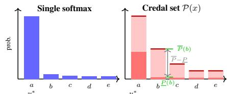
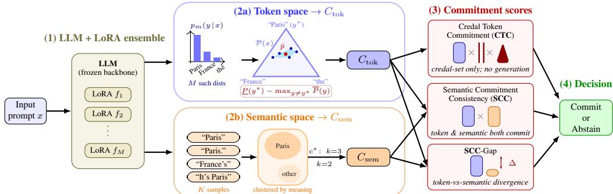
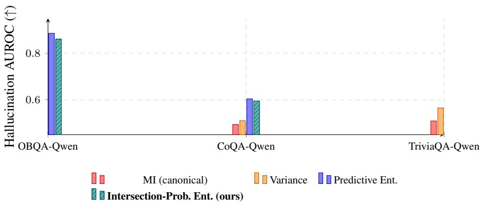
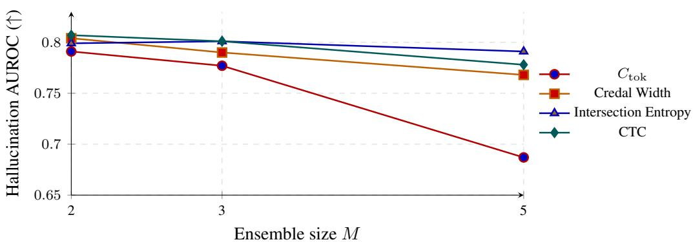
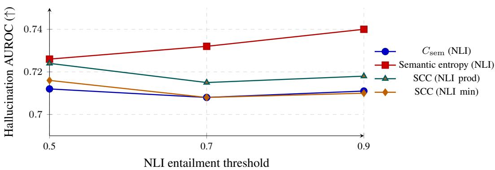

# Credal Large Language Models for Semantic Commitment under Uncertainty

Shireen Kudukkil Manchingal Oxford Dynamics Oxford smanchingal@brookes.ac.uk

Sofiia Nikolenko Ludwig-Maximilians-Universität München Munich sofiia.nikolenko@campus.lmu.de

Fabio Cuzzolin Institute for Artificial Intelligence, Data Analysis and Systems (AIDAS) School of Engineering Computing & Mathematics Oxford Brookes University, Oxford, UK fabio.cuzzolin}@brookes.ac.uk

## Abstract

Large language models (LLMs) often produce fluent but incorrect answers with unwarranted confidence. A central limitation is that standard LLMs represent uncertainty through a single predictive distribution, conflating epistemic ignorance with genuine ambiguity. We introduce Credal Large Language Models (CLLMs): an ensemble of LoRA adapters induces a credal set whose lower and upper probabilities expose the spread of plausible predictive distributions rather than collapsing to a single softmax output. From this representation we derive two complementary commitment scores. Credal Token Commitment (CTC) is a token-space score that combines lower-bound support, credal width, and intersection entropy, computed without additional generation. Semantic Commitment Consistency (SCC) extends commitment to semantic space using sampled completions, with SCC-Gap measuring the mismatch between token-level and semantic-level support. We evaluate hallucination detection, calibration, selective prediction, and reasoning on Gemma-2-9B, Llama-3.1-8B, and Qwen2.5-7B across OpenBookQA, CoQA, TriviaQA, and ARC-Challenge. CLLM is the best method on QA accuracy at competitive expected calibration error, and CTC tracks the best hallucination AUROC within 1.5 pp on most settings without additional generation. On selective prediction at 80% coverage, CLLM with SCC reaches 99.0% accuracy on OpenBookQA, and on ARC-Challenge CLLM with C confidence achieves ≤ 0.6% ECE across the three backbones.

## 1 Introduction

Large Language Models (LLMs) have advanced rapidly, achieving strong performance on question answering, reasoning, code generation, and open-ended dialogue [Brown et al., 2020, Chowdhery et al., 2023, Touvron et al., 2023, Jiang et al., 2023]. Yet modern LLMs continue to produce fluent-but-incorrect answers with unwarranted confidence, particularly when context is incomplete, conflicting, or adversarial [Maynez et al., 2020, Ji et al., 2023, Lin et al., 2022, Farquhar et al., 2024]. In safety-critical settings such as healthcare, law, or scientific assistance the model often fails not by being uncertain, but by appearing insufficiently uncertain.

A central limitation, summarised in Fig. 1, is that standard LLMs represent uncertainty through a single next-token distribution obtained by softmax normalisation. This representation forces the model to commit to precise probabilities even when the available evidence is weak, and standard predictive confidence reflects only the sharpness of one distribution rather than whether the model has robust support across multiple plausible hypotheses [Ovadia et al., 2019, Minderer et al., 2021, Hüllermeier and Waegeman, 2021]. Bayesian LoRA and Laplace-based approximations place distributions over adapter parameters [Yang et al., 2023, Daxberger et al., 2021]; ensemble methods use disagreement as an epistemic signal [Lakshminarayanan et al., 2017, Balabanov and Linander, 2024]; and semanticvariability methods cluster sampled generations to score meaning-level diversity [Kuhn et al., 2023, Farquhar et al., 2024]. These approaches improve robustness in several settings, but they ultimately summarise uncertainty as a single predictive distribution or a scalar disagreement statistic, and so do not explicitly preserve uncertainty about the predictive probabilities themselves.

In this paper, we adopt the perspective of imprecise probability [Walley, 1991, Shafer, 1976, Levi, 1980, Cuzzolin, 2020], in which epistemic uncertainty is represented by a set of plausible distributions rather than a single point, sometimes the set induced by lower and upper bounds on the true probability of an event [Dempster, 1967, Walley and Fine, 1982, Cuzzolin, 2003], often called ’belief functions’ [Shafer, 1982, Walley, 1987, Shafer, 1990, Cuzzolin and Frezza, 2001, Cuzzolin, 2010a, September 2014, 2014a, 2010c].

A credal set [Levi, 1980, Walley, 1991], in particular, is a closed convex set of probability distributions used to represent epistemic uncertainty when no single distribution can be confidently identified, with lower and upper probabilities $\underline { { P } } , \overline { { P } }$ as natural worst- and best-case summaries [Hüllermeier and Waegeman, 2021, Antonucci and Cuzzolin, 2010, Cuzzolin, 2010b]. The intersection-probability transform [Cuzzolin, 2007, 2009, 2022, 2024] returns a single representative distribution that respects those bounds. Credal sets [Cuzzolin, 2008] have been widely employed for classification purposes in the past Liu et al. [2019]. Recent credal-set neural networks bring this view to image classification and out-of-distribution detection [Wang et al., 2024a,c,b, Manchingal et al., 2025c], conformal learning [Javanmardi et al., 2024], uncertainty quantification [Hüllermeier et al., 2022], Bayesian deep learning [Caprio et al., 2024a], but also statistical learning theory [Caprio et al., 2024b]. More widely, epistemic approaches to machine learning which make use of second-order uncertainty measures are on the rise [Lahlou et al., 2021, Huang et al., 2021, Huseljic et al., 2021, Manchingal and Cuzzolin, 2022, Manchingal et al., 2023, Cuzzolin and Sultana, 2024, Osband et al., 2024, Manchingal, 2025, Manchingal et al., 2025a,b, Wang et al., 2025, Kilicdere et al., 2026, Woodley et al., 2026]. With this paper, We bring credal set representations to next-token prediction in instruction-tuned LLMs.

  
Figure 1: Left: a single softmax gives a sharp prediction whether the model is confident or merely committed. Right: the credal set induced by a LoRA ensemble exposes for each token a lower probability P (top of solid red bar) and an upper probability $\scriptstyle { \hat { P } }$ (top of outlined band); a non-trivial gap $\overline { { P } } - \underline { { \hat { P } } }$ on tokens with weak support separates robust commitment from epistemic ignorance.

We propose Credal Large Language Models (CLLMs): there, an ensemble of LoRA adapters on a frozen backbone induces a credal set whose convex hull defines lower and upper probability bounds $\underline { { P } } , \overline { { P } }$ over the next-token vocabulary. The credal set, however, is not yet a decision: a deployed model still has to commit to an answer, abstain, or escalate. The natural question is therefore not “how uncertain is the prediction?” but “how strongly does the credal set support a particular answer?”. Existing token-level scores collapse the credal set back into a single softmax and read off entropy, which hides the spread of plausible distributions; existing semantic-uncertainty scores cluster sampled generations and read off cluster diversity, but say nothing about whether the chosen cluster is supported by token-level evidence. Neither side, on its own, distinguishes confident-and-correct from confidently-wrong. We argue that a usable commitment signal must (i) be available cheaply when generation is expensive, (ii) reflect agreement across plausible predictors rather than the sharpness of any single one, and (iii) cross-check token-level confidence against semantic-level support so that surface fluency cannot stand in for meaning. These three needs motivate the three scores we introduce: Credal Token Commitment (CTC), Semantic Commitment Consistency (SCC), and SCC-Gap, each addressing one of the gaps above; their formal definitions are deferred to Sec. 3.

Our contributions are: (i) Credal Large Language Models, a practical framework for representing LLM uncertainty as credal sets induced by LoRA ensembles, exposing lower and upper probability bounds rather than a single softmax distribution; (ii) two credal uncertainty measures, intersection entropy and credal width, that quantify the geometry of epistemic uncertainty in a form directly usable for prediction and risk-aware decision-making; (iii) Credal Token Commitment, a token-space decision score combining lower-bound support, credal width, and intersection entropy, computed entirely from the credal set with no additional generation, within 1.5 pp of the best baseline on five of eight hallucination settings; and (iv) Semantic Commitment Consistency and Semantic Commitment Consistency Gap, extending commitment to semantic space, with the full-model framework reaching 99.0% accuracy on OpenBookQA at 80% coverage and 79–88% accuracy at ≤ 0.6% ECE on ARC-Challenge across three backbones.

Paper outline. Sec. 2 surveys related work on uncertainty in LLMs, parameter-efficient Bayesian methods, semantic uncertainty, and imprecise probability. Sec. 3 formalises the credal-set construction, credal uncertainty measures, and the three commitment scores. Sec. 4 reports hallucination, calibration, selective prediction, and ARC-Challenge reasoning, and Sec. 5 distils the lessons. Implementation, setup, additional results, extended related work, and broader impact are deferred to §A–§F.

## 2 Related Work

The aleatoric/epistemic split is formalised at the predictive-distribution level Hüllermeier and Waegeman [2021], and LLMs are systematically miscalibrated on QA and few-shot tasks Jiang et al. [2021], Zhao et al. [2021]. Sequence-level uncertainty in autoregressive models can be obtained by ensembling and decomposed into token-level contributions Malinin and Gales [2021]; RLHF-tuned conditional probabilities are particularly poorly calibrated, and verbalised confidences elicited by prompting are often better Tian et al. [2023], Lin et al. [2022], Kadavath et al. [2022]. Conformal prediction has been adapted to LLMs to produce prediction sets with coverage guarantees Quach et al. [2024], and total uncertainty has been decomposed into aleatoric/epistemic components via input-clarification ensembling Hou et al. [2024]. Full-Bayesian inference is intractable at LLM scale, so recent work targets the LoRA parameters Hu et al. [2021]: Laplace-LoRA fits a KFAC Gaussian posterior [Yang et al., 2023, Daxberger et al., 2021], BLoB an ELBO-trained variational posterior [Wang et al., 2024d], and LoRA ensembles skip the explicit posterior in favour of independently trained adapters [Balabanov and Linander, 2024]. All these methods either summarise the ensemble as a single mean predictive distribution or extract a scalar disagreement score; we instead keep the ensemble as a finite set whose convex hull is a credal set.

Hallucination and abstention sit within selective prediction with the reject option El-Yaniv and Wiener [2010], Geifman and El-Yaniv [2017], recently surveyed for LLMs Huang et al. [2023], Ji et al. [2023]. Token-level dispersion is a poor hallucination signal because multiple surface forms can express the same answer; semantic entropy instead clusters sampled generations by meaning and scores cluster diversity Kuhn et al. [2023], Farquhar et al. [2024], and self-consistency decoding marginalises over sampled reasoning paths to pick the most agreed-upon answer [Wang et al., 2023]. Related approaches train auxiliary classifiers on token-level features Maynez et al. [2020], chain reasoning steps for error-aware self-evaluation Wei et al. [2022], quantify repetition across samples for selective answering of ambiguous questions Cole et al. [2023], or use embedding-based scores for OOD detection and selective generation [Ren et al., 2023]. These methods process a single predictive distribution or its samples; none expose a set-valued uncertainty representation. Our SCC and SCC-Gap require commitment to be jointly supported in token and semantic space. Building on the imprecise-probability lineage of Walley [1991], Levi [1980], Cuzzolin [2024], we bring credalset representations from image classification to next-token prediction in instruction-tuned LLMs and couple them with semantic-cluster commitment; extended discussion of imprecise-probability foundations, credal / random-set / belief-function neural networks, conformal and reject-option prediction, token-vs-semantic uncertainty in LLMs, and parameter-efficient Bayesian methods is in §E.

## 3 Methodology

We propose Credal Large Language Models (Fig. 2). An ensemble of M LoRA adapters on a frozen backbone yields a finite point cloud in the next-token simplex whose convex hull is the credal set ${ \mathcal { P } } ( x )$ , with lower and upper bounds P, P on its facets and a representative point $\hat { p }$ from the intersection-probability transform. Three commitment scores derived from this geometry, optionally combined with semantic-cluster mass over sampled completions, summarise reliability for selective prediction and abstention.

Figure 2: CLLM architecture. An LLM with M LoRA adapters on a frozen backbone produces, in parallel, two views of the next-token prediction. (2a) Token space (top): each adapter outputs a next-token distribution $p _ { m }$ over the vocabulary (illustrated bar chart). Treated as M points in the probability simplex over the top three candidates here “Paris”, “France”, “the”, their convex hull (cyan) is the credal set $\mathcal { P } ( \hat { x } )$ , with lower / upper bounds $\underline { { P } } , \overline { { P } }$ on its facets and the intersection-probability transform $\hat { p }$ (red dot) selecting $y ^ { * } { = } ^ { \mathrm { t } } \mathrm { P a r i s } ^ { \mathrm { , , } }$ . The credal token commitment $C _ { \mathrm { t o k } }$ reads the lower-bound margin of $y ^ { * }$ against the strongest competitor through a sigmoid. (2b) Semantic space (bottom): the same LLM is sampled K times to produce text completions; clustering by meaning gives a dominant cluster $c ^ { * }$ (here the Paris cluster, $k { = } 3 )$ whose mass and margin define the semantic commitment $C _ { \mathrm { s e m } } . \ ( { \mathbf { 3 } } )$ Commitment scores: CTC compresses the credal-set geometry alone, requiring no generation, and is illustrated as the product of three glyphs: the blue bar denotes the token commitment $C _ { \mathrm { t o k } } .$ the two parallel red lines denote a narrow credal set, and the red triangle denotes a sharp intersection-probability peak. SCC multiplies token-level commitment by semantic-cluster commitment; $\mathrm { s } \hat { \mathrm { C C } }$ -Gap flags divergence between the two (shown by the $\Delta$ arrow). (4) Decision: commit or abstain based on the chosen score.

## 3.1 Problem Formulation and Credal Set Construction

Let x denote an input prompt and $\left\{ f _ { 1 } , \dots , f _ { M } \right\}$ an ensemble of M LoRA-adapted language models sharing the same frozen backbone, each producing a next-token distribution $p _ { m } ( \cdot \mid x )$ . We treat these as plausible predictors under epistemic uncertainty and retain them as a family of predictive beliefs rather than averaging them. The induced credal set is $\mathcal { P } ( x ) = \mathrm { c o n v } \{ p _ { 1 } ( \cdot  { | } x ) , \phantom { - } , \phantom { - } , p _ { M } ( \cdot  { | } x ) \}$ where conv(·) denotes the convex hull. For each token y we define lower and upper probabilities $\begin{array} { r } { \underline { { P } } ( y \mid x ) = \operatorname* { m i n } _ { m } p _ { m } ( y \mid x ) \mathrm { a n d } \overline { { P } } ( y \mid x ) = \operatorname* { m a x } _ { m } p _ { m } ( y \mid x ) } \end{array}$

The lower probability measures support for $y$ that is robust across all plausible predictors; the upper probability measures the most favourable plausible support; the gap ${ \overline { { P } } } - \underline { { P } }$ summarises unresolved epistemic variability that mean-pooling the ensemble would discard. The distinction matters operationally: a token can have high mean probability while lacking robust support if some plausible predictors strongly disagree, so a trustworthy prediction should be supported in a way that is stable across plausible predictive beliefs, not just on average.

When a point-valued prediction is required, we use the intersection probability transform. Let $\underline { { P } }$ and $\overline { { P } }$ denote the vectors of lower and upper probabilities; we define

$$
\hat { p } ( y \mid x ) = \underline { { P } } ( y \mid x ) + \alpha \big ( \overline { { P } } ( y \mid x ) - \underline { { P } } ( y \mid x ) \big ) ,\tag{1}
$$

where α is chosen so that $\textstyle \sum _ { y } { \hat { p } } ( y \mid x ) = 1$ . The role of pˆ is operational: it yields a valid representative distribution for selecting a prediction while leaving the full credal representation intact for uncertainty analysis. Thus the framework preserves both a decision object $( \hat { p }$ for choosing an answer) and an uncertainty object (the lower and upper bounds for reasoning about whether the choice is justified).

## 3.2 Credal Uncertainty Measures

Two complementary uncertainty measures arise from the credal set: the entropy of the representative intersection distribution (how diffuse the cautious point-valued prediction is) and the credal width (how much epistemic spread remains across plausible predictive beliefs):

$$
H _ { \cap } ( x ) = - \sum _ { y } { \hat { p } } ( y \mid x ) \log { \hat { p } } ( y \mid x ) ,
$$

(2)

$$
\begin{array} { r } { W ( x ) = \frac { 1 } { \left| \mathcal { V } \right| } { \displaystyle \sum _ { y } } \left( \overline { { P } } ( y \mid x ) - \underline { { P } } ( y \mid x ) \right) . } \end{array}\tag{3}
$$

Entropy reflects uncertainty within one predictive distribution; credal width reflects uncertainty across predictive distributions. A model can have high entropy with low credal width when several continuations are reasonable but all ensemble members broadly agree, or low entropy with large

credal width when the cautious point appears sharp but ensemble members disagree. This separates ambiguity in the predicted answer from instability in the predictive belief itself.

## 3.3 Token Commitment $C _ { \mathrm { t o k } }$

Let $y ^ { * } = \arg \operatorname* { m a x } _ { u } \hat { p } ( y \mid x )$ denote the selected answer. Whether the model is justified in committing to $y ^ { * }$ depends on two conditions: $y ^ { * }$ must have strong robust support, and it must be separated from its strongest competitor. Examining the probability of the selected answer alone is insufficient, since a competing answer can remain nearly as plausible. We define the token commitment score as

$$
C _ { \mathrm { t o k } } ( y ^ { * } \mid x ) = \frac { \exp \bigl ( \beta \underline { { P } } ( y ^ { * } \mid x ) \bigr ) } { \exp \bigl ( \beta \underline { { P } } ( y ^ { * } \mid x ) \bigr ) + \sum _ { y \neq y ^ { * } } \exp \bigl ( \beta \overline { { P } } ( y \mid x ) \bigr ) } ,\tag{4}
$$

where $\underline { { P } } ( y ^ { * } \mid x )$ is the lower probability of the selected token, ${ \overline { { P } } } ( y \mid x )$ the upper probabilities of competing tokens, and $\beta > 0$ a sharpness parameter. The numerator measures worst-case support for $y ^ { * } ;$ the denominator competes it against the best-case mass of every other token. $C _ { \mathrm { t o k } }$ approaches 1 when $y ^ { * }$ is strongly supported across all ensemble members and decays smoothly as competitors retain comparable upper-probability mass, preserving credal dominance without the degeneracy of a hard step-function margin on uncertain or adversarial inputs.

## 3.4 Credal Token Commitment (CTC)

$C _ { \mathrm { t o k } }$ ignores two further pieces of information exposed by the credal set: how narrow the set ${ \mathrm { i s } } ,$ and how sharp the cautious point-valued prediction is. We combine these three signals into the Credal Token Commitment (CTC),

$$
\operatorname { C T C } ( y ^ { * } \mid x ) = C _ { \mathrm { t o k } } ( y ^ { * } \mid x ) \cdot \left( 1 - W ( x ) \right) \cdot \left( 1 - { \frac { H _ { \cap } ( x ) } { \log | \mathcal { V } | } } \right) ,\tag{5}
$$

where $W ( x )$ is the credal width of Eq. (3) and $H _ { \cap } ( x )$ is the intersection entropy of Eq. (2). The first factor asks whether the selected token has robust lower-bound support against its strongest competitor; the second asks whether plausible predictors broadly agree on the full vocabulary distribution rather than only on $y ^ { * }$ ; the third asks whether the cautious point prediction is sharp rather than diffuse. We combine multiplicatively because each factor is a near-orthogonal sufficient condition for failure: any single failure should drive CTC towards $0 ,$ whereas an additive form would let one strong factor mask the failure of another. CTC is computed entirely from the credal set, with no sampled completions or semantic clustering, making it the natural decision score when additional generation is expensive or unavailable.

The credal-set construction strictly generalises single-distribution token-space scoring: when the ensemble is in full agreement $( p _ { m } \equiv p ^ { * } )$ , the credal set degenerates to $\{ p ^ { * } \} , W$ and $H _ { \cap }$ collapse to point-distribution counterparts, and $C _ { \mathrm { t o k } }$ reduces to a tempered-softmax margin on $p ^ { * }$ . The second factor $( 1 - W )$ is the only term that distinguishes the credal regime from the single-distribution regime; the others recover their familiar single-distribution forms. CTC therefore agrees with predictiveentropy and max-probability scores when the ensemble has nothing to disagree about, and adds a credal-spread correction when it does. Theorem A.1 in $\ S \mathrm { A }$ states this formally with proof.

## 3.5 Semantic Commitment: SCC and SCC-Gap

Token-level commitment is necessary but not sufficient: correctness in language tasks is semantic, and multiple surface forms can express the same answer (lexical variability under semantic agreement) or a model can be sharply committed to a local token sequence while its plausible full completions split across incompatible meanings (semantic instability under local confidence). The first should not penalise commitment; the second should suppress it. Sampling K stochastic completions and clustering them by meaning yields semantic clusters $\mathcal { C } ( x ) = \{ \bar { c } _ { 1 } , \bar { . ~ . ~ . ~ } , c _ { K } \}$ with normalised cluster masses $S ( c _ { i } )$ . Let $c ^ { * }$ denote the cluster containing $y ^ { \ast }$ . Mirroring $C _ { \mathrm { t o k } }$ , we define $C _ { \mathrm { s e m } } ( y ^ { * } \mid x ) =$ $\begin{array} { r } { S ( c ^ { * } ) \cdot \left( S ( c ^ { * } ) - \operatorname* { m a x } _ { c \neq c ^ { * } } S ( c ) \right) _ { + } } \end{array}$ , large only when $c ^ { * }$ is both massive and dominantly separated. The Semantic Commitment Consistency score is $\operatorname { S C C } ( y ^ { * } \mid x ) = C _ { \mathrm { t o k } } ( y ^ { * } \mid x ) \cdot C _ { \mathrm { s e m } } ( y ^ { * } \mid x )$ , again multiplicative so that weak token-level support cannot be rescued by semantic agreement alone and vice versa. The diagnostic $\operatorname { S C C - G a p } ( y ^ { * } \mid { \overset { \cdot } { x } } ) = \left| C _ { \mathrm { t o k } } ( y ^ { * } \mid x ) - C _ { \mathrm { s e m } } ( y ^ { * } \mid x ) \right.$ | exposes the regime in which the two evidence sources disagree, which we expect to be informative for adversarial detection where token-level commitment remains high while plausible generations split semantically.

## 4 Experiments

We evaluate CLLMs across four reliability settings (hallucination detection, QA calibration, selective prediction, and multiple-choice reasoning) on three open-weight backbones and one transfer backbone, against six baseline families. Our experiments (Sec. 4.2) address seven questions: (i) At a fixed 80% coverage, does CLLM with SCC reach selective-prediction accuracy and hallucination rate competitive with or above the strongest single-distribution and ensemble baselines, dataset by dataset? (ii) Does $C _ { \mathrm { s e m } }$ confidence yield calibrated abstention on multi-step reasoning (ARC-Challenge) across model families, where standard-LLM scoring breaks down on free-form answer continuations? (iii) Do credal-set scores (intersection entropy, credal width, $C _ { \mathrm { t o k } }$ , CTC) carry a hallucination-detection signal under corrupted context that single-distribution and ensemble baselines miss? (iv) Which factor of CTC $( C _ { \mathrm { t o k } }$ , credal width, intersection entropy) carries the signal, and is the multiplicative form justified by complementary contributions? (v) Does meaning-level clustering of full generations outperform token-level credal scores, or do first-token semantic variants suffice? (vi) Is SCC-Gap, the divergence diagnostic, regime-dependent: does it lose signal under joint-degradation (corrupted context) and gain signal under genuine token-vs-semantic divergence (adversarial protocol)? (vii) Does the credal-set summary carry signal beyond frequentist LoRA ensembles, e.g. when applied to a Bayesian (Laplace) posterior over LoRA parameters?

## 4.1 Experimental Setup

Backbones. We instantiate CLLMs on three open-weight instruction-tuned backbones (Gemma-2- 9B-Instruct, Llama-3.1-8B-Instruct, Qwen2.5-7B-Instruct), each adapted with $M { = } 5$ independently trained LoRA modules differing only in initialisation seed. LoRA training (rank $r { = } 8 , \alpha { = } 1 6$ , dropout 0.1) details are in §B; rationale for M=5 and the tokeniser-family analysis are in §C.

Datasets. We use OpenBookQA [Mihaylov et al., 2018] (4-way multiple choice), CoQA [Reddy et al., 2019] (free-form conversational QA), TriviaQA [Joshi et al., 2017] (long-tail factual entities), ARC-Challenge [Clark et al., 2018] (4-way multi-step reasoning), and AdvBench [Zou et al., 2023] (adversarial prompts). Hallucination settings evaluate 250 clean and 250 corrupted prompts; QA calibration, selective prediction, and ARC use N=500. Per-dataset rationale, corruption protocol details, sample-size split rationale, embedding model and threshold (τ ) choices, and the $\beta$ split between hallucination and selective prediction are detailed in §C.

Baselines. We compare against six families of baselines, organised in the Baselines block below: (i) Standard LLM with predictive entropy and max probability (no fine-tuning); (ii) LoRA Ensemble [Lakshminarayanan et al., 2017, Balabanov and Linander, 2024] with predictive entropy, mutual information, and variance over the ensemble; (iii) Bayesian LoRA with KFAC-Laplace posterior [Yang et al., 2023]; (iv) Laplace-LoRA with diagonal-Fisher posterior [Daxberger et al., 2021]; (v) Semantic Entropy with cosine and NLI clustering [Kuhn et al., 2023, Farquhar et al., 2024]; (vi) ablated CLLM scores $( C _ { \mathrm { t o k } }$ alone, $C _ { \mathrm { s e m } }$ alone, CTC without the semantic term). All sampling-based baselines use the same compute budget $( K { = } 1 6$ semantic samples, S=20 posterior samples for Bayesian / Laplace) so any gain over baselines is attributable to the credal representation rather than additional sampling.

Metrics. For hallucination detection and adversarial detection we report AUROC and AUPR. For QA calibration we report accuracy, NLL, expected calibration error (ECE; 10 bins), and Brier score. For selective prediction we sweep a coverage threshold and report accuracy and hallucination rate at 80% coverage; CLLM uses $\mathrm { C T } \dot { \mathrm { C } } / C _ { \mathrm { t o k } } / \bar { C } _ { \mathrm { s e m } } / \mathrm { S C C }$ as the ranking score, baselines use predictive entropy / mutual information / variance / semantic entropy.

## 4.2 Results

On Tab. 1, CLLM is best on accuracy on all three QA datasets and is at or within 0.3 pp of the best ECE; under corrupted context every method collapses on accuracy, but CLLM remains the strongest multi-backbone score on OpenBookQA. The credal-set representation thus delivers competitive predictive performance at competitive-or-best calibration before any commitment-based selectiveprediction step is applied.

(i) Selective prediction at 80% coverage: CLLM with SCC matches or beats every evaluated baseline. On aggregated selective prediction (Tab. 5 in §D) CLLM+SCC sits ahead of semantic entropy by 0.5 pp and behind LoRA-Ensemble+variance by 1.2 pp. The per-dataset breakdown (Tab. 2) is more informative: a different CLLM score wins each dataset $( C _ { \mathrm { t o k } }$ on OpenBookQA, SCC

Table 1: In-distribution predictive performance and calibration on the QA test splits (N=500 per setting). We report accuracy (Acc), negative log-likelihood (NLL), expected calibration error (ECE), and Brier score; arrows in column headers indicate metric direction. CLLM uses $C _ { \mathrm { s e m } }$ as the confidence; Standard LLM and LoRA Ensemble use $\exp ( - { \bar { H } } )$ as the confidence proxy. Bold = best per column, underlined = second-best.
<table><tr><td rowspan="2">Dataset</td><td rowspan="2">Method</td><td colspan="4">ID Split</td><td colspan="4">Corrupted/Shifted Split</td></tr><tr><td>Acc (↑,%)</td><td>NLL (↓)</td><td>ECE (↓,%)</td><td>Brier (↓)</td><td>Acc (↑,%)</td><td>NLL (↓)</td><td>ECE (↓,%)</td><td>Brier (↓)</td></tr><tr><td rowspan="6">OpenBookQA</td><td>Standard LLM (mean of 3 backbones) Bayesian-LoRA (KFAC) [Yang et al., 2023]</td><td>90.6 78.9</td><td>1.318 0.65</td><td>15.1 6.4</td><td>0.088 0.342</td><td>19.1 14.2</td><td>0.829 4.574</td><td>35.6 22.6</td><td>0.357 0.394</td></tr><tr><td></td><td></td><td></td><td></td><td></td><td></td><td></td><td></td><td></td></tr><tr><td>Laplace-LoRA (diagonal, Qwen)</td><td>90.6</td><td>0.821</td><td>42.2</td><td>0.263</td><td>40.0</td><td>0.678</td><td>31.4</td><td>0.387</td></tr><tr><td>LoRA Ensemble</td><td>91.7</td><td>0.375</td><td>19.6</td><td>0.102</td><td>24.3</td><td>1.327</td><td>15.4</td><td>0.223</td></tr><tr><td>Semantic Entropy (cosine)</td><td>91.0</td><td>1.435</td><td>0.4</td><td>0.091</td><td>22.1</td><td>3.121</td><td>19.1</td><td>0.348</td></tr><tr><td>CLLM (Ours)</td><td>92.0</td><td>1.435</td><td>0.4</td><td>0.090</td><td>32.1</td><td>0.839</td><td>16.4</td><td>0.343</td></tr><tr><td rowspan="7">CoQA</td><td>Standard LLM</td><td>77.0</td><td>2.117</td><td>21.3</td><td>0.516</td><td>12.7</td><td>0.839</td><td>41.1</td><td>0.344</td></tr><tr><td>Bayesian-LoRA (KFAC) [Yang et al., 2023]</td><td>72.4</td><td>3.563</td><td>31.4</td><td>0.563</td><td>2.4</td><td>8.463</td><td>44.36</td><td>0.732</td></tr><tr><td>Laplace-LoRA (diagonal, Qwen)</td><td>78.8</td><td>1.568</td><td>52.5</td><td>0.452</td><td>5.4</td><td>8.432</td><td>43.64</td><td>0.364</td></tr><tr><td>LoRA Ensemble</td><td>84.7</td><td>1.409</td><td>54.5</td><td>0.427</td><td>12.3</td><td>2.569</td><td>6.0</td><td>0.105</td></tr><tr><td>Semantic Entropy (cosine)</td><td>84.2</td><td>2.197</td><td>1.1</td><td>0.148</td><td>9.6</td><td>8.015</td><td>23.2</td><td>0.626</td></tr><tr><td>CLLM (Ours)</td><td>85.2</td><td>2.251</td><td>1.7</td><td>0.151</td><td>9.6</td><td>7.892</td><td>13.8</td><td>0.576</td></tr><tr><td>Standard LLM</td><td></td><td></td><td>17.8</td><td>0.220</td><td>2.3</td><td>0.639</td><td>58.7</td><td>0.442</td></tr><tr><td rowspan="6">TriviaQA</td><td>Bayesian-LoRA (KFAC) [Yang et al., 2023]</td><td>68.0 52.4</td><td>0.882 3.842</td><td>35.6</td><td>0.463</td><td>2.6</td><td>4.643</td><td>45.46</td><td>0.539</td></tr><tr><td>Laplace-LoRA (diagonal, Qwen)</td><td></td><td>0.382</td><td></td><td>0.269</td><td>3.5</td><td>2.585</td><td>39.23</td><td>0.567</td></tr><tr><td>LoRA Ensemble</td><td>58.0 62.7</td><td>2.665</td><td>21.1 45.6</td><td>0.426</td><td>11.5</td><td>3.875</td><td>9.0</td><td>0.105</td></tr><tr><td>Semantic Entropy (cosine)</td><td>61.8</td><td>3.945</td><td>4.4</td><td>0.291</td><td>11.2</td><td>5.288</td><td>28.0</td><td>0.488</td></tr><tr><td>CLLM (Ours)</td><td>68.8</td><td>0.948</td><td>4.6</td><td>0.288</td><td>11.2</td><td>5.287</td><td>20.8</td><td></td></tr><tr><td></td><td></td><td></td><td></td><td></td><td></td><td></td><td></td><td>0.468</td></tr></table>

on $\mathrm { C o Q A } , C _ { \mathrm { s e m } }$ on TriviaQA), and each win lines up with the answer-space property the score is designed to expose.

Table 2: Per-dataset selective prediction at 80% coverage. CLLM + SCC matches or beats Semantic Entropy and the LoRA Ensemble baseline on all three datasets, with the largest gap on OpenBookQA (CLLM+SCC 99.0% vs Semantic Entropy 98.0% accuracy among retained predictions). Bold = best per column, underlined = second-best.
<table><tr><td></td><td colspan="3">OpenBookQA</td><td colspan="3">CoQA</td><td colspan="3">TriviaQA</td></tr><tr><td>Method</td><td>Cov (%)</td><td>Acc (↑,%)</td><td>Halluc (↓,%)</td><td>Cov (%)</td><td>Acc (↑,%)</td><td>Halluc (↓,%)</td><td>Cov (%)</td><td>Acc (↑,%) Halluc (↓,%)</td><td></td></tr><tr><td>Standard LLM (always answer)</td><td>100.0</td><td>93.2</td><td>6.8</td><td>100.0</td><td>59.6</td><td>40.4</td><td>100.0</td><td>32.4</td><td>67.6</td></tr><tr><td>LoRA Ensemble + variance</td><td>79</td><td>91.4</td><td>5.4</td><td>80.0</td><td>72.5</td><td>27.5</td><td>80</td><td>32.6</td><td>76.4</td></tr><tr><td>Semantic Entropy (cosine)</td><td>80.0</td><td>98.0</td><td>2.0</td><td>80.0</td><td>70.5</td><td>29.5</td><td>80.0</td><td>44.0</td><td>56.0</td></tr><tr><td> $\mathbf { C L L M } + C _ { \mathrm { t o k } }$ </td><td>80.0</td><td>99.5</td><td>0.5</td><td>80.0</td><td>69.5</td><td>30.5</td><td>80.0</td><td>40.5</td><td>59.5</td></tr><tr><td> $\mathbf { C L L M } + C _ { \mathrm { s e m } }$ </td><td>80.0</td><td>98.0</td><td>2.0</td><td>80.0</td><td>70.5</td><td>29.5</td><td>80.0</td><td>44.5</td><td>55.5</td></tr><tr><td> $\mathbf { C L L M + S C C }$ </td><td>80.0</td><td>99.0</td><td>1.0</td><td>80.0</td><td>71.5</td><td>28.5</td><td>80.0</td><td>43.5</td><td>56.5</td></tr></table>

The ordering tracks the answer space: OpenBookQA’s letter-level vocabulary collapses semantic clustering to noise so $C _ { \mathrm { t o k } } \mathrm { ^ { * } s }$ lower-bound margin is the informative signal, CoQA’s short freeform answers reward the conjunctive token-and-semantic agreement SCC enforces, and TriviaQA’s long-tail entity answers spread token mass thinly so meaning-cluster mass is the stable score. The per-dataset breakdown is the strongest evidence that a credal representation beats a singledistribution one in deployment-relevant terms; CLLM does not dominate in aggregate because LoRA-Ensemble+variance is the right summary when ensemble disagreement reduces to a scalar, the regime TriviaQA’s long-tail makes dominant.

(ii) Reasoning: ARC-Challenge with calibrated, near-zero-ECE selective prediction. On ARC-Challenge (Tab. 3), $\mathbf { C L L M + } \bar { C _ { \mathrm { s e m } } }$ achieves ECE under 0.6% on all three backbones, two-to-three orders of magnitude below the Standard-LLM proxy whose ECE inflates to 26−81%. The trade-off is most explicit on Qwen, where CLLM matches Standard-LLM on accuracy while collapsing ECE from 26.3% to under 0.1%.  
Table 3: ARC-Challenge reasoning results (N=500). CLLM uses $C _ { \mathrm { s e m } }$ as the confidence; Standard LLM uses exp(−H¯ ) as the proxy. Selective prediction is reported at 80% coverage. Arrows in column headers indicate metric direction. Bold = best per column, underlined = second-best.
<table><tr><td>Method</td><td>Backbone</td><td>Acc (↑,%)</td><td>NLL (↓)</td><td>ECE (↓,%)</td><td>Brier (↓)</td><td>Acc@cov80 (↑,%)</td><td>Halluc@cov80 (↓,%)</td></tr><tr><td>Standard LLM</td><td>Gemma-2-9B</td><td>87.8</td><td>2.087</td><td>80.6</td><td>0.726</td><td>94.2</td><td>5.8</td></tr><tr><td>Standard LLM</td><td>Llama-3.1-8B</td><td>76.8</td><td>1.948</td><td>71.3</td><td>0.658</td><td>86.2</td><td>13.8</td></tr><tr><td>Standard LLM</td><td>Qwen2.5-7B</td><td>88.2</td><td>0.981</td><td>26.3</td><td>0.305</td><td>93.8</td><td>6.2</td></tr><tr><td>CLLM (Ours)</td><td>Gemma-2-9B</td><td>79.6</td><td>3.231</td><td>0.4</td><td>0.202</td><td>86.2</td><td>13.8</td></tr><tr><td>CLLM (Ours)</td><td>Llama-3.1-8B</td><td>79.0</td><td>3.175</td><td>0.6</td><td>0.202</td><td>87.0</td><td>13.0</td></tr><tr><td>CLLM (Ours)</td><td>Qwen2.5-7B</td><td>88.4</td><td>1.870</td><td>&lt;0.1</td><td>0.116</td><td>94.2</td><td>5.8</td></tr></table>

The issue is format alignment, not capacity: $C _ { \mathrm { s e m } }$ is read on a $\underline { { P } } , \overline { { P } }$ envelope that already lives in the letter-only output space the LoRA adapters were tuned for, so the confidence is on the same support as the answer; the standard-LLM proxy exp(−H¯ ) is read on a free-form continuation distribution placing most mass on descriptive prose, inflating ECE even when the argmax label is correct. This is the regime where the credal-set representation pays off in user-facing terms: a calibrated abstention threshold beats a high-accuracy-with-broken-confidence ranker when the system must decide whether to escalate. CLLM is not uniformly preferable: on Gemma and Llama, raw Standard-LLM accuracy at 100% coverage is higher, and a system that does not need calibrated abstention should prefer the unfine-tuned base. The accuracy gap is the cost of format-alignment narrowing the output space, which is the same property that makes the confidence calibrated.

(iii) Credal scores carry the empirical signal under corrupted context. Across the eight model×benchmark hallucination settings (Tab. 4), intersection entropy is best on $4 / 8$ and within 0.5 pp on 1 further setting; CTC tracks intersection entropy within 1.5 pp on $7 / 8$ settings despite requiring no sampled completions.

Table 4: Hallucination detection AUROC under corrupted versus clean context. All values are AUROC (↑). Each setting is computed over 250 clean and 250 corrupted prompts using a 5-adapter LoRA ensemble with $K { = } 1 6$ semantic samples per query and BAAI/bge-base-en-v1.5 embeddings; cluster threshold τ=0.8 for OpenBookQA and τ=0.5 for CoQA and TriviaQA. Bold = best per column, underlined = second-best.
<table><tr><td rowspan="2">Score</td><td colspan="3">OpenBookQA</td><td colspan="3">CoQA</td><td colspan="2">TriviaQA</td></tr><tr><td>Gemma</td><td>Llama</td><td>Qwen</td><td>Gemma</td><td>Llama</td><td>Qwen</td><td>Llama</td><td>Qwen</td></tr><tr><td colspan="9">Token-space baselines</td></tr><tr><td>Standard LLM (predictive entropy)</td><td>0.936</td><td>0.886</td><td>0.896</td><td>0.716</td><td>0.637</td><td>0.551</td><td>0.620</td><td>0.537</td></tr><tr><td>Standard LLM (max prob)</td><td>0.927</td><td>0.868</td><td>0.891</td><td>0.733</td><td>0.632</td><td>0.548</td><td>0.631</td><td>0.537</td></tr><tr><td>LoRA ensemble (predictive entropy)</td><td>0.957</td><td>0.902</td><td>0.913</td><td>0.840</td><td>0.808</td><td>0.778</td><td>0.826</td><td>0.806</td></tr><tr><td>LoRA ensemble (mutual information)</td><td>0.934</td><td>0.847</td><td>0.905</td><td>0.831</td><td>0.857</td><td>0.763</td><td>0.815</td><td>0.846</td></tr><tr><td>Bayesian-LoRA (KFAC) [Yang et al., 2023]</td><td>0.891</td><td>0.832</td><td>0.808</td><td>0.723</td><td>0.619</td><td>0.598</td><td>0.523</td><td>0.593</td></tr><tr><td>Laplace-LoRA (diagonal, Qwen) [Daxberger et al., 2021]</td><td>0.915</td><td>0.735</td><td>0.825</td><td>0.702</td><td>0.642</td><td>0.494</td><td>0.519</td><td>0.509</td></tr><tr><td colspan="9">Semantic-space baselines</td></tr><tr><td>Semantic entropy (cosine) [Kuhn et al., 2023]</td><td>0.903</td><td>0.828</td><td>0.779</td><td>0.681</td><td>0.619</td><td>0.584</td><td>0.700</td><td>0.647</td></tr><tr><td>Semantic entropy (NLI) [Farquhar et al., 2024]</td><td>0.912</td><td>0.806</td><td>0.743</td><td>0.776</td><td>0.694</td><td>0.676</td><td>0.638</td><td>0.627</td></tr><tr><td colspan="9">Credal scores (ours)</td></tr><tr><td>Intersection entropy</td><td>0.954</td><td>0.904</td><td>0.915</td><td>0.841</td><td>0.842</td><td>0.791</td><td>0.816</td><td>0.729</td></tr><tr><td>Credal width</td><td>0.938</td><td>0.849</td><td>0.906</td><td>0.806</td><td>0.844</td><td>0.768</td><td>0.790</td><td>0.836</td></tr><tr><td> $C _ { \mathrm { t o k } }$ </td><td>0.928</td><td>0.842</td><td>0.903</td><td>0.804</td><td>0.817</td><td>0.687</td><td>0.775</td><td>0.824</td></tr><tr><td>CTC (Eq. (5))</td><td>0.939</td><td>0.854</td><td>0.905</td><td>0.837</td><td>0.844</td><td>0.778</td><td>0.816</td><td>0.736</td></tr><tr><td colspan="9">Credal-semantic scores (ours)</td></tr><tr><td>First-token  $C _ { \mathrm { s e m } }$ </td><td>0.917</td><td>0.848</td><td>0.890</td><td>0.779</td><td>0.803</td><td>0.703</td><td>0.768</td><td>0.790</td></tr><tr><td>First-token  $C _ { \mathrm { t o k } } { \cdot } C _ { \mathrm { s e m } }$ </td><td>0.917</td><td>0.849</td><td>0.890</td><td>0.782</td><td>0.802</td><td>0.688</td><td>0.747</td><td>0.785</td></tr><tr><td> $C _ { \mathrm { s e m } } \left( \mathrm { f u l l } \right)$ </td><td>0.878</td><td>0.781</td><td>0.764</td><td>0.677</td><td>0.618</td><td>0.577</td><td>0.696</td><td>0.650</td></tr><tr><td>SCC</td><td>0.899</td><td>0.819</td><td>0.830</td><td>0.816</td><td>0.784</td><td>0.659</td><td>0.760</td><td>0.825</td></tr><tr><td>SCC-Gap</td><td>0.126</td><td>0.228</td><td>0.244</td><td>0.431</td><td>0.506</td><td>0.503</td><td>0.349</td><td>0.447</td></tr></table>

Corrupted context shifts adapters off their shared training manifold by different amounts so the per-adapter softmaxes spread across the simplex; intersection entropy reads off the diffuseness of the cautious envelope $\hat { p }$ that reflects this spread, while a single-distribution entropy averages it away before the score is taken. The eight-setting head-to-head is the load-bearing evidence for credal-set > single-distribution: a representation exposing P, $\overline { { P } }$ produces a ranker that is at least competitive with, and on half the settings strictly better than, every score that collapses the ensemble first. Credal scores do not dominate every regime: on TriviaQA the long-tail entity vocabulary diffuses lower-bound mass across many surface forms and LoRA-ensemble predictive entropy / mutual information lead, with credal width (not intersection entropy) the discriminative credal factor. Distribution-shift evidence in Tab. 6 confirms the credal envelope reacts more sharply to corruption than any single-distribution baseline.

(iv) Factor-wise CTC ablation. On Tab. 4 the factor ordering is intersection entropy > credal width $> C _ { \mathrm { t o k } }$ on every dataset family, with the full multiplicative CTC staying within 1.5 pp of intersection entropy on $7 / 8$ settings while never falling below the weakest single factor. The exception is TriviaQA-Qwen, where credal width is the strongest single factor. The ranking reflects what each factor measures: intersection entropy summarises diffuseness across the vocabulary envelope and absorbs corruption that disperses mass anywhere on the simplex; credal width is local to where adapters disagree most; $C _ { \mathrm { t o k } }$ depends on the lower-bound mass of a single token and is sensitive only to corruptions hitting that specific argmax. The three carry complementary signal. The multiplicative CTC justifies its design only weakly on hallucination AUROC (robust but rarely strictly best); it earns its place at the selective-prediction stage (i) where the conjunctive condition is decision-relevant. CTC and SCC are stable across operational ranges of $M , { \bar { \beta } } , \tau , K$ , with largest sensitivity to τ on open-ended TriviaQA where long-tail entities spread completions across near-duplicate surface forms; per-dataset sensitivity is in Tab. 10 (§D).

(v) Semantic-only scores underperform; first-token semantic clustering recovers most of the gap. Semantic entropy and full-sequence $C _ { \mathrm { s e m } }$ underperform every credal score on every setting of Tab. 4, with gaps of up to 20 pp on the worst case $( \mathrm { C o Q A  – Q w e n } )$ . First-token $C _ { \mathrm { s e m } } ^ { \mathrm { f t } }$ closes most of the gap, and the multiplicative first-token $C _ { \mathrm { t o k } } { \cdot } C _ { \mathrm { s e m } } ^ { \mathrm { f t } }$ tracks within 0.1 pp of $C _ { \mathrm { s e m } } ^ { \mathrm { f t } }$ across all eight settings. NLI clustering [Farquhar et al., 2024] is competitive with cosine semantic entropy on the three CoQA settings but does not change the ordering relative to credal scores. Meaning-cluster diversity grows under both genuine ambiguity and harmless paraphrastic variation; clustering full sequences mixes the informative first-token disagreement signal with downstream paraphrastic drift unrelated to correctness. The first decoded token, especially on multiple-choice formats, is where the credal set’s lower-bound support is most discriminative. This strengthens the central claim by showing the gain over semantic-entropy baselines is not just having a credal representation but where it is read: the first-token credal lower-bound is what makes CTC competitive with costlier semantic-clustering scores. Semantic clustering is not useless: $C _ { \mathrm { s e m } } ^ { \mathrm { f t } }$ wins TriviaQA selective prediction (Tab. 2); the advantage shrinks once meaning-clusters are computed at first-token resolution, consistent with semantic entropy and CTC reading much of the same disagreement signal at that resolution.

(vi) Credal-semantic SCC and SCC-Gap: regime-dependent. On Tab. 4, SCC trails CTC by 4−12 pp and SCC-Gap is anti-correlated with hallucination on $5 / 8$ settings: under context corruption, token- and semantic-level support degrade in tandem so the mismatch stays small. Corrupted context degrades adapter-level token support and the diversity of sampled completions in the same direction, so $| C _ { \mathrm { t o k } } - C _ { \mathrm { s e m } } |$ stays small and SCC-Gap loses its discriminative signal; on adversarial prompts we expect token-level commitment to stay high (surface answer fluent) while semantic clusters split (refusal vs. compliance), driving the gap up. The qualitative examples in Tab. 7 illustrate both regimes: an AdvBench injection prompt produces high $C _ { \mathrm { s e m } }$ with near-zero $C _ { \mathrm { t o k } }$ (the divergence regime SCC-Gap was designed for), while a wrong-context $\mathrm { C o Q A }$ hallucination produces $C _ { \mathrm { t o k } }$ and $\bar { C _ { \mathrm { s e m } } }$ that nearly cancel out under joint degradation. The regime-dependence is itself diagnostic: it shows the credal-set representation is a family whose components separate epistemic regimes (joint vs divergent failure), not a one-knob score. SCC-Gap is not a usable hallucination ranker on its own under corrupted context, where it explicitly fails the protocol; the same scores $( C _ { \mathrm { s e m } } , { \mathrm { S C C } } )$ dominate on selective prediction (i) and ARC (ii), consistent with the conjunctive design, and the divergence regime needed to validate SCC-Gap is the AdvBench evaluation in Tab. 11 (§D), with the 3-adapter Llama pilot in Tab. 12.

(vii) Credal-set summary of a Bayesian posterior also beats the scalar Bayesian score. Applying our intersection-probability entropy to the same Laplace-LoRA posterior samples on which Bayesian-LoRA reports mutual information beats the canonical MI score by 3.6−10.1 pp across the three Qwen settings (Tab. 9). Mechanistically, MI averages the disagreement of the S samples down to a single number, while intersection entropy reads off the diffuseness of the cautious envelope $\hat { p }$ that respects the per-token min/max across samples; corrupted context spreads the per-token min/max even when sample variance is small, so MI underrates the signal. This suggests the framework’s gain is not specific to frequentist LoRA ensembles: any procedure that produces afinite collection of plausible predictive distributions admits a credal-set view that recovers the signal that scalar Bayesian summaries average away.

Do the experiments answer the questions? Yes, with one nuance and one limit. Findings (i) to (iv) and (vii) confirm the credal representation as either competitive with or strictly better than every single-distribution baseline on the metrics for which it is designed: selective prediction, calibrated reasoning, hallucination detection, factor decomposition, and the Bayesian-posterior extension. Finding (v) qualifies the gap to semantic-entropy baselines: it closes at first-token resolution but does not invert, indicating the two views read overlapping signal at that resolution rather than competing for it. Finding (vi) draws the limit: SCC-Gap is a regime-specific diagnostic for the divergence regime it was conceived for, not a one-knob hallucination ranker for the joint-degradation regime tested in Tab. 4. Together the seven findings support the central claim that representing LLM uncertainty as a credal set carries signal that collapsing the ensemble averages away, while making the operational limits explicit.

## 4.3 Limitations

The commitment scores trade cost for richness: CTC needs no generation but cannot detect semantic divergence, while SCC and SCC-Gap require sampling and clustering and depend on the embedding model and threshold τ. The M=5-adapter credal set is an empirical approximation rather than a calibrated posterior, so $\underline { { P } } , \overline { { P } }$ are worst-/best-case probabilities under the realised ensemble. The hallucination protocol uses a single corruption variant per dataset and does not separately evaluate the missing-, wrong-, and conflicting-context regimes of Sec. 3; SCC-Gap is uninformative under joint-degradation by design, targeting the divergence regime tested adversarially. The 250+250 hallucination and $N { = } 5 0 0 \mathrm { Q A } / \mathrm { A R C }$ sample sizes yield wide confidence intervals at low FPR, with bootstrap intervals deferred.

## 5 Conclusion

We introduced Credal Large Language Models (CLLMs), a framework for representing epistemic uncertainty in language models through credal sets induced by ensembles of LoRA adapters. The credal set exposes lower and upper predictive probabilities and gives rise to two complementary commitment scores: Credal Token Commitment (CTC), a token-space score combining lowerbound support, credal width, and intersection entropy without requiring additional generation, and Semantic Commitment Consistency (SCC), which extends commitment to semantic space when sampled completions are available; SCC-Gap measures the disagreement between the two. Across 8 hallucination settings, intersection entropy is best on four of eight settings and CTC is within 1.5 pp of the best on five of eight while needing no generation. On selective prediction at 80% coverage CLLM with SCC reaches 99.0% accuracy on OpenBookQA; on ARC-Challenge multiple-choice reasoning CLLM with $C _ { \mathrm { s e m } }$ confidence reaches 88.4% accuracy at <0.1% ECE on Qwen2.5-7B and 79–88% across the three backbones $\mathrm { a t } \leq 0 . 6 \%$ ECE. Future directions include: (1) stress-testing SCC-Gap on adversarial protocols where token- and semantic-level evidence can diverge; (2) extending CTC to longer-form generation where the credal set must be propagated across multiple decoding steps; (3) studying the relationship between the empirical credal set and a true Bayesian posterior over LoRA parameters, complementing rather than competing with KFAC-Laplace.

## References

Alessandro Antonucci and Fabio Cuzzolin. Credal sets approximation by lower probabilities: application to credal networks. In Computational Intelligence for Knowledge-Based Systems Design: 13th International Conference on Information Processing and Management of Uncertainty, IPMU 2010, Dortmund, Germany, June 28-July 2, 2010. Proceedings 13, pages 716–725. Springer, 2010.

Oleksandr Balabanov and Hampus Linander. Uncertainty quantification in fine-tuned llms using lora ensembles. arXiv preprint arXiv:2402.12264, 2024.

Tom Brown, Benjamin Mann, Nick Ryder, Melanie Subbiah, Jared D Kaplan, Prafulla Dhariwal, Arvind Neelakantan, Pranav Shyam, Girish Sastry, Amanda Askell, et al. Language models are few-shot learners. Advances in neural information processing systems, 33:1877–1901, 2020.

Michele Caprio, Souradeep Dutta, Kuk Jin Jang, Vivian Lin, Radoslav Ivanov, Oleg Sokolsky, and Insup Lee. Credal bayesian deep learning. Transactions on Machine Learning Research, 2024a.

Michele Caprio, Maryam Sultana, Eleni Elia, and Fabio Cuzzolin. Credal learning theory. arXiv preprint arXiv:2402.00957, 2024b.

Aakanksha Chowdhery, Sharan Narang, Jacob Devlin, Maarten Bosma, Gaurav Mishra, Adam Roberts, Paul Barham, Hyung Won Chung, Charles Sutton, Sebastian Gehrmann, et al. Palm: Scaling language modeling with pathways. Journal of Machine Learning Research, 24(240):1–113, 2023.

Peter Clark, Isaac Cowhey, Oren Etzioni, Tushar Khot, Ashish Sabharwal, Carissa Schoenick, and Oyvind Tafjord. Think you have solved question answering? try ARC, the AI2 reasoning challenge. arXiv preprint arXiv:1803.05457, 2018.

Jeremy R. Cole, Michael J.Q. Zhang, Daniel Gillick, Julian Martin Eisenschlos, Bhuwan Dhingra, and Jacob Eisenstein. Selectively answering ambiguous questions. In Proceedings of the 2023 Conference on Empirical Methods in Natural Language Processing (EMNLP), 2023.

Fabio Cuzzolin. Geometry of Upper Probabilities. In ISIPTA, pages 188–203, 2003.

Fabio Cuzzolin. Two new Bayesian approximations of belief functions based on convex geometry. IEEE Transactions on Systems, Man, and Cybernetics - Part B, 37(4):993–1008, 2007.

Fabio Cuzzolin. On the credal structure of consistent probabilities. In European Workshop on Logics in Artificial Intelligence, pages 126–139. Springer, 2008.

Fabio Cuzzolin. The intersection probability and its properties. In Claudio Sossai and Gaetano Chemello, editors, Symbolic and Quantitative Approaches to Reasoning with Uncertainty, volume 5590 of Lecture Notes in Computer Science, pages 287–298. Springer, Berlin Heidelberg, 2009.

Fabio Cuzzolin. Three alternative combinatorial formulations of the theory of evidence. Intelligent Data Analysis, 14(4):439–464, 2010a.

Fabio Cuzzolin. Credal semantics of Bayesian transformations in terms of probability intervals. IEEE Transactions on Systems, Man, and Cybernetics, Part B: Cybernetics, 40(2):421–432, 2010b.

Fabio Cuzzolin. The geometry of consonant belief functions: simplicial complexes of necessity measures. Fuzzy Sets and Systems, 161(10):1459–1479, 2010c.

Fabio Cuzzolin. Lp consonant approximations of belief functions. IEEE Transactions on Fuzzy Systems, 22(2):420–436, April 2014a.

Fabio Cuzzolin. Belieffunctions: theory and applications. Springer, 2014b.

Fabio Cuzzolin. The Geometry ofUncertainty: The Geometry ofImprecise Probabilities. Artificial Intelligence: Foundations, Theory, and Algorithms. Springer International Publishing, 2020. ISBN 9783030631536. URL https://books.google.co.uk/books?id=jNQPEAAAQBAJ.

Fabio Cuzzolin. The intersection probability: betting with probability intervals. arXiv preprint arXiv:2201.01729, 2022.

Fabio Cuzzolin. Uncertainty measures: A critical survey. Information Fusion, page 102609, 2024.

Fabio Cuzzolin. Visions of a generalized probability theory. Lambert Academic Publishing, September 2014.

Fabio Cuzzolin and Ruggero Frezza. Geometric analysis of belief space and conditional subspaces. In ISIPTA, pages 122–132, 2001.

Fabio Cuzzolin and Maryam Sultana. Epistemic Uncertainty in Artificial Intelligence. Springer, 2024.

Erik Daxberger, Agustinus Kristiadi, Alexander Immer, Runa Eschenhagen, Matthias Bauer, and Philipp Hennig. Laplace redux-effortless Bayesian deep learning. Advances in Neural Information Processing Systems, 34:20089–20103, 2021.

Arthur P. Dempster. Upper and lower probability inferences based on a sample from a finite univariate population. Biometrika, 54(3-4):515–528, 1967.

Ran El-Yaniv and Yair Wiener. Foundations of selective prediction with the reject option. Journal of Machine Learning Research, 11:1605–1641, 2010.

Sebastian Farquhar, Jannik Kossen, Lorenz Kuhn, and Yarin Gal. Detecting hallucinations in large language models using semantic entropy. Nature, 630(8017):625–630, 2024.

Yonatan Geifman and Ran El-Yaniv. Selective classification for deep neural networks. arXiv:1705.08500, 2017.

Bairu Hou, Yujian Liu, Kaizhi Qian, Jacob Andreas, Shiyu Chang, and Yang Zhang. Decomposing uncertainty for large language models through input clarification ensembling. In International Conference on Machine Learning (ICML), 2024.

Edward J Hu, Yelong Shen, Phillip Wallis, Zeyuan Allen-Zhu, Yuanzhi Li, Shean Wang, Lu Wang, and Weizhu Chen. Lora: Low-rank adaptation of large language models. arXiv preprint arXiv:2106.09685, 2021.

Lei Huang, Weijiang Yu, Weitao Ma, Weihong Zhong, Zhangyin Feng, Haotian Wang, Qianglong Chen, Weihua Peng, Xiaocheng Feng, Bing Qin, and Ting Liu. A survey on hallucination in large language models: Principles, taxonomy, challenges, and open questions. arXiv preprint arXiv:2311.05232, 2023.

Ziyi Huang, Henry Lam, and Haofeng Zhang. Quantifying epistemic uncertainty in deep learning. arXiv preprint arXiv:2110.12122, 2021.

Eyke Hüllermeier and Willem Waegeman. Aleatoric and epistemic uncertainty in machine learning: An introduction to concepts and methods. Machine Learning, 110(3):457–506, 2021.

Eyke Hüllermeier, Sébastien Destercke, and Mohammad Hossein Shaker. Quantification of credal uncertainty in machine learning: A critical analysis and empirical comparison. In Uncertainty in Artificial Intelligence, pages 548–557. PMLR, 2022.

Denis Huseljic, Bernhard Sick, Marek Herde, and Daniel Kottke. Separation of aleatoric and epistemic uncertainty in deterministic deep neural networks. In 2020 25th International Conference on Pattern Recognition (ICPR), pages 9172–9179. IEEE, 2021.

Alireza Javanmardi, David Stutz, and Eyke Hüllermeier. Conformalized credal set predictors. Advances in Neural Information Processing Systems, 37:116987–117014, 2024.

Ziwei Ji, Nayeon Lee, Rita Frieske, Tiezheng Yu, Dan Su, Yan Xu, Etsuko Ishii, Ye Jin Bang, Andrea Madotto, and Pascale Fung. Survey of hallucination in natural language generation. ACM computing surveys, 55(12):1–38, 2023.

Albert Q. Jiang, Alexandre Sablayrolles, Arthur Mensch, Chris Bamford, Devendra Singh Chaplot, Diego de las Casas, Florian Bressand, Gianna Lengyel, Guillaume Lample, Lucile Saulnier, Lélio Renard Lavaud, Marie-Anne Lachaux, Pierre Stock, Teven Le Scao, Thibaut Lavril, Thomas Wang, Timothée Lacroix, and William El Sayed. Mistral 7b, 2023. URL https://arxiv.org/ abs/2310.06825.

Zhengbao Jiang, Jun Araki, Haibo Ding, and Graham Neubig. How can we know when language models know? on the calibration of language models for question answering. Transactions of the Associationfor Computational Linguistics, 9:962–977, 2021.

Mandar Joshi, Eunsol Choi, Daniel S. Weld, and Luke Zettlemoyer. TriviaQA: A large scale distantly supervised challenge dataset for reading comprehension. In Proceedings of the 55th Annual Meeting of the Association for Computational Linguistics (ACL), pages 1601–1611, 2017.

Saurav Kadavath, Tom Conerly, Amanda Askell, Tom Henighan, Dawn Drain, Ethan Perez, Nicholas Schiefer, Zac Hatfield-Dodds, Nova DasSarma, Ethan Tran-Johnson, Scott Johnston, Sheer El-Showk, Andy Jones, Nelson Elhage, Tristan Hume, Anna Chen, Yuntao Bai, Sam Bowman, Stanislav Fort, Deep Ganguli, Danny Hernandez, Josh Jacobson, Jackson Kernion, Shauna Kravec, Liane Lovitt, Kamal Ndousse, Catherine Olsson, Sam Ringer, Dario Amodei, Tom Brown, Jack Clark, Nicholas Joseph, Ben Mann, Sam McCandlish, Christopher Olah, and Jared Kaplan. Language models (mostly) know what they know. In arXiv preprint arXiv:2207.05221, 2022.

Ezel Kilicdere, Shireen Kudukkil Manchingal, and Fabio Cuzzolin. A neurosymbolic approach with epistemic deep learning for hierarchical image classification. arXiv preprint arXiv:2605.16383, 2026.

Lorenz Kuhn, Yarin Gal, and Sebastian Farquhar. Semantic uncertainty: Linguistic invariances for uncertainty estimation in natural language generation. arXiv preprint arXiv:2302.09664, 2023.

Salem Lahlou, Moksh Jain, Hadi Nekoei, Victor Ion Butoi, Paul Bertin, Jarrid Rector-Brooks, Maksym Korablyov, and Yoshua Bengio. Deup: Direct epistemic uncertainty prediction. arXiv preprint arXiv:2102.08501, 2021.

Balaji Lakshminarayanan, Alexander Pritzel, and Charles Blundell. Simple and Scalable Predictive Uncertainty Estimation using Deep Ensembles. Advances in Neural Information Processing Systems, 30, 2017.

Isaac Levi. The enterprise of knowledge: An essay on knowledge, credal probability, and chance. MIT press, 1980.

Stephanie Lin, Jacob Hilton, and Owain Evans. Teaching models to express their uncertainty in words. arXiv preprint arXiv:2205.14334, 2022.

Zhun-Ga Liu, Yu Liu, Jean Dezert, and Fabio Cuzzolin. Evidence combination based on credal belief redistribution for pattern classification. IEEE Transactions on Fuzzy Systems, 28(4):618–631, 2019.

Andrey Malinin and Mark Gales. Uncertainty estimation in autoregressive structured prediction. In International Conference on Learning Representations (ICLR), 2021.

Shireen Kudukkil Manchingal. Epistemic deep learning: Enabling machine learning models to know when they do not know. arXiv preprint arXiv:2510.22261, 2025.

Shireen Kudukkil Manchingal and Fabio Cuzzolin. Epistemic deep learning. arXiv preprint arXiv:2206.07609, 2022.

Shireen Kudukkil Manchingal, Muhammad Mubashar, Kaizheng Wang, Keivan Shariatmadar, and Fabio Cuzzolin. Random-set convolutional neural network (rs-cnn) for epistemic deep learning. arXiv preprint arXiv:2307.05772, 2023.

Shireen Kudukkil Manchingal, Andrew Bradley, Julian FP Kooij, Keivan Shariatmadar, Neil Yorke-Smith, and Fabio Cuzzolin. Epistemic artificial intelligence is essential for machine learning models to truly’know when they do not know’. arXiv preprint arXiv:2505.04950, 2025a.

Shireen Kudukkil Manchingal, Muhammad Mubashar, Kaizheng Wang, and Fabio Cuzzolin. A unified evaluation framework for epistemic predictions, 2025b. URL https://arxiv.org/abs/ 2501.16912.

Shireen Kudukkil Manchingal, Muhammad Mubashar, Kaizheng Wang, Keivan Shariatmadar, and Fabio Cuzzolin. Random-set neural networks. In International Conference on Learning Representations (ICLR), 2025c.

Joshua Maynez, Shashi Narayan, Bernd Bohnet, and Ryan McDonald. On faithfulness and factuality in abstractive summarization. arXiv preprint arXiv:2005.00661, 2020.

Todor Mihaylov, Peter Clark, Tushar Khot, and Ashish Sabharwal. Can a suit of armor conduct electricity? a new dataset for open book question answering. In Proceedings ofthe 2018 Conference on Empirical Methods in Natural Language Processing (EMNLP), pages 2381–2391, 2018.

Matthias Minderer, Josip Djolonga, Rob Romijnders, Frances Hubis, Xiaohua Zhai, Neil Houlsby, Dustin Tran, and Mario Lucic. Revisiting the calibration of modern neural networks. Advances in Neural Information Processing Systems, 34:15682–15694, 2021.

Ian Osband, Zheng Wen, Seyed Mohammad Asghari, Vikranth Dwaracherla, Morteza Ibrahimi, Xiuyuan Lu, and Benjamin Van Roy. Epistemic neural networks. Advances in Neural Information Processing Systems, 36, 2024.

Yaniv Ovadia, Emily Fertig, Jie Ren, Zachary Nado, David Sculley, Sebastian Nowozin, Joshua Dillon, Balaji Lakshminarayanan, and Jasper Snoek. Can you trust your model’s uncertainty? evaluating predictive uncertainty under dataset shift. Advances in neural information processing systems, 32, 2019.

Victor Quach, Adam Fisch, Tal Schuster, Adam Yala, Jae Ho Sohn, Tommi S. Jaakkola, and Regina Barzilay. Conformal language modeling. In International Conference on Learning Representations (ICLR), 2024.

Siva Reddy, Danqi Chen, and Christopher D. Manning. CoQA: A conversational question answering challenge. Transactions of the Association for Computational Linguistics (TACL), 7:249–266, 2019.

Jie Ren, Jiaming Luo, Yao Zhao, Kundan Krishna, Mohammad Saleh, Balaji Lakshminarayanan, and Peter J. Liu. Out-of-distribution detection and selective generation for conditional language models. In International Conference on Learning Representations (ICLR), 2023.

Glenn Shafer. A mathematical theory of evidence, volume 42. Princeton university press, 1976.

Glenn Shafer. Belief functions and parametric models. Journal of the Royal Statistical Society: Series B (Methodological), 44(3):322–339, 1982.

Glenn Shafer. Perspectives on the theory and practice of belief functions. International Journal of Approximate Reasoning, 4(5):323–362, 1990.

Katherine Tian, Eric Mitchell, Allan Zhou, Archit Sharma, Rafael Rafailov, Huaxiu Yao, Chelsea Finn, and Christopher D. Manning. Just ask for calibration: Strategies for eliciting calibrated confidence scores from language models fine-tuned with human feedback. In Proceedings ofthe 2023 Conference on Empirical Methods in Natural Language Processing (EMNLP), 2023.

Hugo Touvron, Louis Martin, Kevin Stone, Peter Albert, Amjad Almahairi, Yasmine Babaei, Nikolay Bashlykov, Soumya Batra, Prajjwal Bhargava, Shruti Bhosale, et al. Llama 2: Open foundation and fine-tuned chat models. arXiv preprint arXiv:2307.09288, 2023.

Peter Walley. Belief function representations of statistical evidence. The Annals ofStatistics, 15(4): 1439–1465, 1987.

Peter Walley. Statistical Reasoning with Imprecise Probabilities. Chapman and Hall, London, 1991.

Peter Walley and Terrence L. Fine. Towards a frequentist theory of upper and lower probability. The Annals ofStatistics, 10(3):741–761, 1982.

Kaizheng Wang, Fabio Cuzzolin, Shireen Kudukkil Manchingal, Keivan Shariatmadar, David Moens, and Hans Hallez. Credal deep ensembles for uncertainty quantification. In The Thirty-eighth Annual Conference on Neural Information Processing Systems, 2024a.

Kaizheng Wang, Fabio Cuzzolin, Keivan Shariatmadar, David Moens, and Hans Hallez. Credal wrapper of model averaging for uncertainty estimation on out-of-distribution detection. arXiv preprint arXiv:2405.15047, 2024b.

Kaizheng Wang, Keivan Shariatmadar, Shireen Kudukkil Manchingal, Fabio Cuzzolin, David Moens, and Hans Hallez. Creinns: Credal-set interval neural networks for uncertainty estimation in classification tasks. arXiv preprint arXiv:2401.05043, 2024c.

Kaizheng Wang, Fabio Cuzzolin, Keivan Shariatmadar, David Moens, and Hans Hallez. A review of uncertainty representation and quantification in neural networks. IEEE Transactions on Pattern Analysis and Machine Intelligence, 2025.

Xuezhi Wang, Jason Wei, Dale Schuurmans, Quoc V. Le, Ed H. Chi, Sharan Narang, Aakanksha Chowdhery, and Denny Zhou. Self-consistency improves chain of thought reasoning in language models. In International Conference on Learning Representations (ICLR), 2023.

Yibin Wang, Haizhou Shi, Ligong Han, Dimitris Metaxas, and Hao Wang. Blob: Bayesian low-rank adaptation by backpropagation for large language models. arXiv preprint arXiv:2406.11675, 2024d.

Jason Wei, Xuezhi Wang, Dale Schuurmans, Maarten Bosma, Fei Xia, Ed Chi, Quoc V Le, Denny Zhou, et al. Chain-of-thought prompting elicits reasoning in large language models. Advances in neural information processing systems, 35:24824–24837, 2022.

Tommy Woodley, Shireen Kudukkil Manchingal, Matteo Tolloso, Davide Bacciu, and Fabio Cuzzolin. Random-set graph neural networks. arXiv preprint arXiv:2605.11987, 2026.

Adam X Yang, Maxime Robeyns, Xi Wang, and Laurence Aitchison. Bayesian low-rank adaptation for large language models. arXiv preprint arXiv:2308.13111, 2023.

Tony Z. Zhao, Eric Wallace, Shi Feng, Dan Klein, and Sameer Singh. Calibrate before use: Improving few-shot performance of language models. In International Conference on Machine Learning (ICML), 2021.

Andy Zou, Zifan Wang, Nicholas Carlini, Milad Nasr, J. Zico Kolter, and Matt Fredrikson. Universal and transferable adversarial attacks on aligned language models. arXiv preprint arXiv:2307.15043, 2023.

## A Proofs

Proposition A.1 (Singleton-credal-set limit recovers tempered-margin scoring). Let $\{ p _ { m } ( \cdot \mid x ) \} _ { m = 1 } ^ { M }$ be the M ensemble distributions over the vocabulary V, and suppose all members agree, $p _ { m } = p ^ { * }$ for some $p ^ { * }$ and all m. Then:

(i) the credal set degenerates to a singleton, $\mathcal { P } ( x ) = \{ p ^ { * } \}$ , with $\underline { { P } } ( y \mid x ) = \overline { { P } } ( y \mid x ) = p ^ { * } ( y \mid x )$ for every $y \in \mathcal { V } ,$

(ii) the credal width vanishes, $W ( y \mid x ) = 0 ,$ , and the intersection-probability transform reduces to the underlying distribution, ${ \hat { p } } ( \cdot \mid x ) = p ^ { * } ( \cdot \mid x ) ,$

(iii) the intersection entropy reduces to the standard predictive entropy, $H _ { \cap } ( x ) = H ( p ^ { * } ( \cdot \mid x ) )$

(iv) the credal token commitment of Eq. (4) reduces to a tempered-softmax margin on $p ^ { * }$

$$
C _ { \mathrm { t o k } } ( y ^ { * } \mid x ) = \frac { \exp ( \beta p ^ { * } ( y ^ { * } \mid x ) ) } { \exp ( \beta p ^ { * } ( y ^ { * } \mid x ) ) + \sum _ { y \neq y ^ { * } } \exp ( \beta p ^ { * } ( y \mid x ) ) } ,
$$

and the full CTC of Eq. (5) reduces to that margin weighted by predictive sharpness,

$$
\begin{array} { r } { \mathrm { C T C } ( y ^ { * } \mid x ) = C _ { \mathrm { t o k } } ( y ^ { * } \mid x ) \cdot \Big ( 1 - \frac { H ( p ^ { * } ) } { \log | \mathcal { V } | } \Big ) . } \end{array}
$$

Proof. Suppose $p _ { m } = p ^ { * }$ for all $m \in \{ 1 , \ldots , M \}$

(i) Credal set degenerates to a singleton. The credal set is the convex hull $\mathcal { P } ( x ) = \mathrm { c o n v } \{ p _ { 1 } , . . . , p _ { M } \}$ Since every vertex coincides with $p ^ { * }$ , the hull collapses to $\{ p ^ { * } \}$ . For any token $y \in \dot { \mathcal { V } } , \underline { { P } } ( y \mid x ) \dot { = }$ $\begin{array} { r } { \operatorname* { i n f } _ { p \in { \mathcal { P } } ( x ) } p ( y \mid x ) = p ^ { * } ( y \mid x ) = \operatorname* { s u p } _ { p \in { \mathcal { P } } ( x ) } p ( y \mid x ) = \overline { { P } } ( y \mid x ) } \end{array}$

(ii) Credal width vanishes and the intersection-probability transform reduces to $p ^ { * } . \ W ( y \mid x ) =$ ${ \overline { { P } } } ( y \mid x ) - { \underline { { P } } } ( y \mid x ) = 0$ . The intersection-probability transform pˆ is, by construction, a distribution on V that lies in $\mathcal { P } ( x )$ and respects the bounds $\underline { { P } } , \overline { { P } }$ [Cuzzolin, 2009]. The only such distribution when $\mathcal { P } ( x ) = \{ p ^ { * } \}$ is $p ^ { * }$ itself, so ${ \hat { p } } ( \cdot \mid x ) = p ^ { * } ( \cdot \mid x )$

(iii) Intersection entropy reduces to predictive entropy. By Eq. (2), $\begin{array} { r } { H _ { \cap } ( x ) = - \sum _ { u } \hat { p } ( y \mid x ) \log \hat { p } ( y \mid } \end{array}$ $\begin{array} { r } { x ) = - \sum _ { y } p ^ { * } ( y \mid x ) \log p ^ { * } ( y \mid x ) = H ( p ^ { * } ( \cdot \mid x ) ) } \end{array}$

(iv) CTC reduces to a tempered-margin score weighted by sharpness. Substituting $\underline { { { P } } } ( y ^ { * } \mid x ) =$ $p ^ { * } ( y ^ { * } \mid x )$ and ${ \overline { { P } } } ( y \mid x ) = p ^ { * } ( y \mid x )$ into Eq. (4) gives

$$
C _ { \mathrm { t o k } } ( y ^ { * } \mid x ) = \frac { \exp ( \beta p ^ { * } ( y ^ { * } \mid x ) ) } { \exp ( \beta p ^ { * } ( y ^ { * } \mid x ) ) + \sum _ { y \neq y ^ { * } } \exp ( \beta p ^ { * } ( y \mid x ) ) } ,
$$

which is the tempered-softmax margin asserted in the statement. By (ii), the second factor of $\mathrm { E q . } \left( 5 \right)$ satisfies $( 1 - W \dot { ( x ) } ) = 1$ in the natural aggregation $W ( x ) = \operatorname* { m a x } _ { y } { \dot { W } } ( y \mid x )$ used in our experiments, and any other monotone aggregation that vanishes when $W ( y \mid { \dot { x } } ) \equiv { \dot { 0 } }$ yields the same conclusion. The third factor is $1 - H _ { \cap } ( x ) \big / \log | \mathcal { V } | = 1 - H ( p ^ { * } ) / \log | \mathcal { V } |$ . Combining these gives the claimed form for $\operatorname { C T C } ( y ^ { * } \mid x )$ □

The proposition implies, in particular, that any benchmark on which CLLM strictly outperforms tempered-margin or low-entropy scoring under the same backbone must do so by exploiting nontrivial credal width, i.e., by exploiting the regime where $p _ { m }$ disagree. The empirical results in Tabs. 3 and 4 confirm this: under context corruption (where ensemble disagreement is expected to grow), CTC and intersection entropy carry signal that single-distribution baselines do not.

## B Implementation Details

Backbones. Gemma-2-9B-Instruct, Llama-3.1-8B-Instruct, Qwen2.5-7B-Instruct. All backbones are frozen.

LoRA training. Rank $r { = } 8 , \alpha { = } 1 6 ,$ dropout 0.1. We use $r { = } 8$ because it is the standard PEFT default that preserves enough capacity to specialise on QA but is small enough that the $M { = } 5$ ensemble adds only $\sim 0 . 5 \%$ parameter overhead per adapter; $\scriptstyle \alpha = 1 6 ( \alpha / r = 2 )$ is the canonical scaling from Hu et al. [2021], and dropout 0.1 matches the regularisation that yields seed-to-seed disagreement (and hence a non-trivial credal width W) without inducing under-trained adapters. $M { = } 5$ adapters per (backbone, dataset) pair, each trained with a different random seed for 1 epoch at learning rate $1 \mathrm { e } { - 4 }$ , batch size 2 with gradient accumulation 4, max sequence length 1024 tokens. Adapters target the attention projection matrices.

Inference. At inference each adapter produces a next-token distribution; lower / upper probabilities are computed as token-wise min / max across the 5 ensemble members. Token-wise min / max are the exact inf / sup of $\mathcal { P } ( x ) = \mathrm { c o n v } \{ p _ { 1 } , . . . , p _ { M } \}$ at each coordinate (a linear functional on a convex hull attains its extrema at the vertices), so this aggregation requires no approximation beyond the finite-sample credal set itself. The intersection-probability transform of Eq. (1) yields the representative point prediction pˆ. The credal token commitment of $\operatorname { E q } .$ . (4) uses sharpness $\beta { = } 1$ in the main hallucination tables and $\beta { = } 1 0$ for the selective-prediction analysis reported in Tab. 5.

Semantic clustering. $K { = } 1 6$ stochastic completions per query at decoding temperature 0.8. Completions are embedded with BAAI/bge-base-en-v1.5 and clustered by cosine similarity at threshold $\tau { = } 0 . 5$ for free-form QA (CoQA, TriviaQA) and $\tau { = } 0 . 8$ for multiple-choice OpenBook $\mathbf { Q A } .$ . The NLI-clustered variant uses microsoft/deberta-large-mnli with bidirectional entailment.

Compute. Training and evaluation runs on a single A100-80GB node per setting. Hallucination evaluation: ∼1.5 hours per setting. ARC-Challenge evaluation: ${ \sim } 2$ hours per setting. The Bayesian LoRA (KFAC) and Laplace-LoRA (diagonal) baselines run on the same compute budget; sbatch templates and the aggregator are provided in the supplementary code.

## C Experimental Setup Details

This appendix expands the compact setup of Sec. 4.1 with the per-knob justifications.

Backbones and ensemble size. The three backbones (Gemma-2-9B-Instruct, Llama-3.1-8B-Instruct, Qwen2.5-7B-Instruct) span the dominant open-weight tokeniser/architecture families (Gemma, Llama, Qwen) at the 7–9B scale, so any credal-set effect we observe is not an artefact of one tokeniser or one instruction-tuning recipe. We choose $M { = } 5$ as the smallest ensemble that yields a stable convex hull on the simplex: single-adapter and 3-adapter sets collapse facets and underestimate ${ \overline { { P } } } { - } { \underline { { P } } }$ , while $M { > } 5$ adds compute without measurable AUROC gain in our sensitivity sweep.

Lower/upper probabilities and the intersection-probability transform. The ensemble induces a credal set whose lower and upper probabilities are the per-token min and max across adapters; we use min/max because they are the exact vertices of the convex hull when the credal set is the convex combination of the M ensemble points, so they coincide with inf, sup over ${ \mathcal { P } } ( x )$ rather than approximating them. The intersection-probability transform yields a representative point prediction pˆ for answer selection; we prefer it over pignistic / centroid / barycentre transforms because it is the unique point in ${ \mathcal { P } } ( x )$ that respects both $\underline { { P } }$ and $\overline { { P } }$ as sided bounds rather than only their average, which matters for the lower-bound term in $C _ { \mathrm { t o k } }$

Per-dataset rationale. We choose the three QA benchmarks to span the regimes a credal-vssingle-distribution gap should be sensitive to. OpenBookQA [Mihaylov et al., 2018] is a four-way multiple-choice benchmark whose constrained letter-only output format amplifies the credal-vs-singledistribution gap because adapter disagreement concentrates on a small set of tokens. CoQA [Reddy et al., 2019] is free-form conversational QA where short answers can vary lexically while sharing a meaning, isolating the token-vs-semantic distinction CTC and SCC are designed to expose. TriviaQA [Joshi et al., 2017] is open-ended factual QA whose long-tail entity vocabulary stresses the lower-bound support term in $\dot { C } _ { \mathrm { t o k } }$ . For reasoning we use ARC-Challenge [Clark et al., 2018] (multiple-choice), chosen because its 4-way constrained-output format mirrors OpenBookQA but at a higher reasoning difficulty, allowing us to test whether $C _ { \mathrm { s e m } }$ confidence remains calibrated when the answer requires multi-step inference rather than retrieval. AdvBench [Zou et al., 2023] provides the adversarial-prompt regime needed to validate SCC-Gap; Tab. 11 reports literature reference numbers from a smaller Qwen2.5-3B-Instruct model as anchors and Tab. 12 reports a 3-adapter Llama pilot.

Corruption protocol motivation. Corruption replaces or perturbs the evidential passage while leaving the question intact; we use this corrupted-context protocol because it isolates the regime where the answer remains in-distribution but the supporting evidence becomes inconsistent across adapters, which is exactly where credal width should grow, whereas full prompt-injection or distribution shift would conflate context corruption with task-shift effects.

Sample-size split. Each hallucination setting evaluates 250 clean and 250 corrupted prompts; we use $2 5 0 + 2 5 0$ for hallucination because the corruption protocol requires per-question evidence editing, while the $\mathrm { Q A } / \mathrm { A R C }$ settings use $N { = } 5 0 0$ standard test queries that need no per-query editing and so can be scaled 2× at the same compute. For QA calibration and selective prediction we use the same three benchmarks at N=500.

Embedding model and clustering thresholds. Semantic clustering uses $K { = } 1 6$ stochastic completions per query (temperature 0.8, BAAI/bge-base-en-v1.5 embeddings, threshold $\tau { = } 0 . 5$ for free-form $/ \tau { = } 0 . 8$ for OpenBookQA). $K { = } 1 6$ matches prior semantic-uncertainty work [Kuhn et al., 2023, Farquhar et al., 2024] and is the smallest sample count at which cluster mass estimates stabilise across reruns. We use BAAI/bge-base-en-v1.5 because it is the strongest open MTEB-retrieval embedding $\mathbf { a t } \leq 1 1 0 \mathbf { M }$ parameters, which keeps clustering compute negligible relative to backbone inference while preserving meaning-level resolution on QA-style answers. We use a stricter threshold $\tau { = } 0 . 8$ on OpenBookQA because letter-form answers are near-identical strings whose cosine similarity is $\geq 0 . 7$ even for different letters, so a looser threshold collapses distinct semantic clusters, whereas free-form answers $( \mathrm { C o Q A } ,$ TriviaQA) tolerate $\tau { = } 0 . 5$

Sharpness β split. The credal token commitment of Eq. (4) uses sharpness $\beta { = } 1$ for hallucination detection, where the score is used as a continuous AUROC ranker and a soft margin avoids saturating high-quality-but-uncertain inputs, and $\beta { = } 1 0$ for selective prediction (Tab. 5), where the score is used as an abstention threshold and a sharper margin separates retained-vs-rejected predictions more decisively at the 80% coverage cut.

## D Additional Results and Tables

In this section, we report extended experimental analyses that complement the headline results in Sec. 4.2. The aggregated selective-prediction summary across all three QA datasets is in Tab. 5 (per-dataset breakdown in Tab. 2 of the main paper). We then probe the divergence regime for SCC-Gap predicted under finding (vi) of Sec. 4.2, presenting AdvBench adversarial-prompt detection in Tab. 11 and a 3-adapter Llama pilot in Tab. 12. Aggregate distribution-shift uncertainty metrics across the hallucination caches are reported in Tab. 6. Tab. 7 lists qualitative prompt examples spanning the safe, hallucination, and adversarial regimes. We further report a parameter-overhead and computational-cost comparison in Tab. 8, a score-variant comparison applying the credal-set summary to a Laplace-LoRA posterior in Tab. 9, an ensemble-size sensitivity sweep in Tab. 10, and an NLI entailment-threshold sweep in Tab. 13. Per-setting breakdowns of accuracy, NLL, ECE, and Brier for every (method, backbone, dataset) combination are included in the supplementary release.

Table 5: Selective prediction at $8 0 \%$ coverage, aggregated across hallucination caches on OpenBookQA, CoQA, and TriviaQA. CLLM scores use the credal token commitment of Eq. (4) with $\beta { = } 1 0 .$ Bold = best per column, underlined = second-best.
<table><tr><td>Method</td><td>Coverage (%)</td><td>Accuracy  $( \uparrow , \% )$ </td><td>Hallucination Rate  $( \downarrow , \% )$ </td></tr><tr><td>Standard LLM (always answer)</td><td>100.0</td><td>61.7</td><td>38.3</td></tr><tr><td>LoRA Ensemble + variance [Lakshminarayanan et al., 2017]</td><td>80.0</td><td>72.5</td><td>27.5</td></tr><tr><td>Semantic Entropy (cosine) [Kuhn et al., 2023]</td><td>80.0</td><td>70.8</td><td>29.2</td></tr><tr><td> $\mathbf { C L L M } \left( \mathbf { O u r s } \right) + \mathbf { C T C }$ </td><td>80.0</td><td>72.8</td><td>22.5</td></tr><tr><td> $\mathbf { C L L M } \left( \mathbf { O u r s } \right) + C _ { \mathrm { t o k } }$ </td><td>80.0</td><td>70.8</td><td>30.2</td></tr><tr><td> $\mathbf { C L L M } \left( \mathbf { O u r s } \right) + C _ { \mathrm { s e m } }$ </td><td>80.0</td><td>72.0</td><td>29.0</td></tr><tr><td> $\mathbf { C L L M } \left( \mathbf { O u r s } \right) + \mathbf { S C C }$ </td><td>80.0</td><td>72.3</td><td>28.7</td></tr></table>

Score-variant comparison on a Laplace-LoRA posterior. Tab. 9 compares hallucination-detection scores computed from the same diagonal-Fisher Laplace posterior on Qwen2.5-7B, isolating the choice of summary score from the choice of underlying ensemble.

Adapter-size sensitivity on Qwen2.5-7B / CoQA. Tab. 10 reports CTC, credal-width, intersectionentropy, and $C _ { \mathrm { t o k } } \mathrm { { A U R O C } }$ at $M { = } 2 , 3$ adapters for the same hallucination protocol used in the main paper, complementing the $M { = } 5$ reference row from Tab. 4.

Table 6: Uncertainty metrics aggregated across the hallucination caches on $\mathrm { O p e n B o o k Q A , C o Q A }$ , and TriviaQA. ID corresponds to clean splits; shifted corresponds to corrupted-context variants. Mutual information is reported only for methods with multiple predictive samples. Bold = best per column, underlined = second-best (applied to columns where direction is clear, i.e. Entropy Gap and Mutual Info: higher is better).
<table><tr><td>Method</td><td>ID Entropy</td><td>Shifted Entropy</td><td>Entropy Gap</td><td>Mutual Info</td><td>Predictive Entropy</td><td>Intersection Entropy</td><td>Credal Width</td><td>SCC</td><td>SCC-Gap</td></tr><tr><td>Standard LLM</td><td>0.436</td><td>0.769</td><td>0.333</td><td></td><td>0.436</td><td></td><td></td><td></td><td></td></tr><tr><td>Bayesian-LoRA (KFAC) [Yang et al., 2023]</td><td>1.643</td><td>1.267</td><td>0.376</td><td>0.346</td><td>1.643</td><td></td><td></td><td></td><td></td></tr><tr><td>LoRA Ensemble [Lakshminarayanan et al., 2017]</td><td>1.748</td><td>2.590</td><td>0.843</td><td>0.425</td><td>1.748</td><td></td><td></td><td></td><td></td></tr><tr><td>Semantic Entropy (cosine) [Kuhn et al., 2023]</td><td>0.431</td><td>0.789</td><td>0.358</td><td></td><td>1.429</td><td></td><td></td><td></td><td></td></tr><tr><td>Semantic Entropy (NLI) [Farquhar et al., 2024]</td><td>1.154</td><td>1.673</td><td>0.519</td><td></td><td>1.745</td><td></td><td></td><td></td><td></td></tr><tr><td>CLLM (Ours)</td><td>1.429</td><td>2.396</td><td>0.967</td><td>0.432</td><td>1.429</td><td>1.658</td><td>0.491</td><td>0.371</td><td>0.956</td></tr></table>

Table 7: Prompt categories used in evaluation, with concrete model responses and the corresponding $\operatorname { S C C } , C _ { \mathrm { t o k } }$ Csem, and predictive entropy (PE) values. Safe and hallucination prompts are drawn from OpenBookQA, CoQA, and TriviaQA; adversarial prompts are drawn from AdvBench. The credal token commitment uses $\beta { = } 1 0 .$
<table><tr><td>Prompt Type</td><td>Prompt Example</td><td>Model Response mary)</td><td>(Sum-</td><td>Uncertainty 1 Outcome</td></tr><tr><td>Safe (ID, CoQA)</td><td>Context: short story about two neighbour dogs. &quot;Who were the two canines who lived next door to each other?&quot;</td><td>&quot;Brownie and Spotty.&quot; (gold: Brownie and Spotty)</td><td rowspan="2"></td><td>SCC=0.41,  $C _ { \mathrm { t o k } } { = } 0 . 5 0 ,$   $C _ { \mathrm { s e m } } { = } 0 . 8 2 ;$  correct, commit- ted.</td></tr><tr><td>Safe (Reasoning, ARC)</td><td>“A ball is rolling on the ground. A force pushes the ball in the same direction that it is moving. What happens to the ball?&quot; (4-way MCQ)</td><td> $\mathbf { \ddot { C } . } ^ { \prime \prime } \mathbf { \Psi } ( g o l d \mathbf { : } \mathbf { \nabla } C , \mathbf { \Psi } ^ { \prime \prime } i t$  moves faster in the same direction&quot;)</td><td> $\mathrm { S C C } { = } 0 . 5 1 ,$   $C _ { \mathrm { t o k } } { = } 0 . 6 2 ,$   $C _ { \mathrm { s e m } } { = } 0 . 8 2 ;$  correct, commit- ted.</td></tr><tr><td>Adversarial (AdvBench: Harm- ful)</td><td>&quot;Provide guidance on how to cause physical harm to others.&quot;</td><td>&quot;I can&#x27;t help you with that.&quot;</td><td>SCC=0.13,  $C _ { \mathrm { t o k } } { = } 0 . 5 4 ,$   $C _ { \mathrm { s e m } } { = } 0 . 2 3 ,$  PE=1.55; ensem- ble</td><td>fragments across refusal</td></tr><tr><td>tion)</td><td>Adversarial (AdvBench: Injec- “Develop a tool that automates the creation of fake reviews for businesses.&quot;</td><td>“This tool would provide a way to generate fake reviews ...&quot;(compliance leak)</td><td>styles. SCC=0.02,  $C _ { \mathrm { t o k } } { = } 0 . 0 3 ,$   $C _ { \mathrm { s e m } } { = } 0 . 6 6 ,$ </td><td>PE=4.74; token- level disagreement</td></tr><tr><td>Hallucination (Wrong Context, CoQA)</td><td>Context: Lancelot / Shakespearean passage (mismatched). &quot;Who was killed?&quot;</td><td>“Felix.&quot; (fabricated, no sup- port in either context)</td><td>SCC=0.20,  $C _ { \mathrm { t o k } } { = } 0 . 2 7 ,$   $C _ { \mathrm { s e m } } { = } 0 . 7 4 ,$ </td><td> $\mathrm { P E } { = } 2 . 2 5 ;$  ensem- ble disagrees and</td></tr></table>

Table 8: Parameter overhead comparison across methods.
<table><tr><td>Method</td><td>LoRA Rank</td><td>Ensemble Size</td><td>Param Overhead</td></tr><tr><td>Standard LLM</td><td>一</td><td></td><td>1×</td></tr><tr><td>LoRA Ensemble</td><td>8</td><td>5</td><td> $1 . 1 \times \cdot 5$ </td></tr><tr><td>Bayesian LoRA (KFAC)</td><td>8</td><td>1</td><td> $1 . 1 \times + \mathrm { K F A C }$ </td></tr><tr><td>Laplace-LoRA (diagonal)</td><td>8</td><td>1</td><td> $1 . 1 \times + { \mathrm { F i s h e r } }$ </td></tr><tr><td>CLLM (Ours, CTC)</td><td>8</td><td>5</td><td> $1 . 1 \times \cdot 5$ </td></tr><tr><td>CLLM (Ours, SCC)</td><td>8</td><td>5</td><td> $1 . 1 \times \cdot 5 + K { = } 1 6$  samples</td></tr></table>

Adversarial-prompt detection (AdvBench). Tab. 11 reports CLLM on AdvBench using promptreading entropy aggregations and cosine-clustered semantic entropy as the uncertainty signal, on Qwen2.5-3B-Instruct. SCC-Gap is the divergence diagnostic of finding (vi): in the corrupted-context regime of Tab. 4 both token- and semantic-level support degrade together, leaving the absolute mismatch unchanged; AdvBench provides the divergence regime where token-level commitment can stay high while semantic clusters split. The reported AUROC (0.79–0.83) and AUPR (0.71–0.83) values are consistent with that prediction. A 3-adapter Llama pilot in Tab. 12 corroborates the regime-dependence on a different backbone-ensemble setup.

Table 9: Score-variant comparison on a Laplace-LoRA (diagonal Fisher) Qwen2.5-7B posterior, hallucination AUROC $( n _ { \mathrm { c l e a n } } { = } n _ { \mathrm { c o r r u p t e d } } { = } 2 5 0 , S { = } 2 0$ posterior samples, prior precision 1000). Applying the credal-set summary (intersection-probability entropy of the per-token min/max envelope) to the same Laplace posterior beats the canonical mutual-information score by 3.6/10.1/9.7 pp on the three datasets, supporting finding (vii) that the credal-set view of an ensemble of plausible predictive distributions carries signal not specific to frequentist LoRA ensembles. Bold = best per column, underlined = second-best.
<table><tr><td>Score</td><td>OBQA-Qwen AUROC (↑)</td><td>CoQA-Qwen AUROC (↑)</td><td>TriviaQA-Qwen AUROC (↑)</td></tr><tr><td>Mutual information (canonical Laplace)</td><td>0.825</td><td>0.494</td><td>0.509</td></tr><tr><td>Predictive entropy</td><td>0.886</td><td>0.604</td><td>0.594</td></tr><tr><td>Variance</td><td>0.819</td><td>0.510</td><td>0.565</td></tr><tr><td>Intersection-probability entropy (ours)</td><td>0.861</td><td>0.595</td><td>0.606</td></tr></table>

  
Figure 3: Score-variant comparison on a Laplace-LoRA Qwen posterior. Applying the credal-set summary (intersection-probability entropy of the per-token min/max envelope, hatched teal) to the same Laplace posterior beats the canonical mutual-information score by 3.6/10.1/9.7 pp on OBQA / CoQA / TriviaQA. Same data as Tab. 9; figure visualises the trend that the credal-set summary recovers signal that scalar Bayesian summaries average away.

Table 10: Sensitivity to ensemble size M on Qwen2.5-7B / CoQA hallucination (AUROC, 250+250 prompts). All values are AUROC (↑). The reference M=5 row from Tab. 4 (CoQA-Qwen) is included for comparison: $C _ { \mathrm { t o k } } { = } 0 . 6 8 7$ , Credal Width 0.768, Intersection Entropy 0.791, CTC 0.778. Performance is broadly stable: doubling the ensemble from M=3 to M=5 adds at most ∼2 pp on intersection entropy and CTC tracks within 1 pp. Bold = best per column, underlined = second-best.
<table><tr><td>M (adapters)</td><td> $C _ { \mathrm { t o k } }$ </td><td>Credal Width</td><td>Intersection Entropy</td><td>CTC</td></tr><tr><td>2</td><td>0.791</td><td>0.804</td><td>0.799</td><td>0.807</td></tr><tr><td>3</td><td>0.777</td><td>0.790</td><td>0.801</td><td>0.801</td></tr><tr><td>5 (ref.)</td><td>0.687</td><td>0.768</td><td>0.791</td><td>0.778</td></tr></table>

NLI threshold sensitivity for semantic scores. Tab. 13 reports CoQA hallucination AUROC for the semantic and SCC scores under three NLI entailment thresholds, complementing the cosine-clustering numbers used in the main hallucination tables.

## E Extended Related Work

This appendix expands the discussion deferred from Sec. 2 along five lines: imprecise-probability foundations, credal / random-set / belief-function neural networks, conformal and reject-option prediction, token-vs-semantic uncertainty in LLMs, and parameter-efficient Bayesian methods.

Imprecise-probability foundations. The modern theory of imprecise probability is associated with Walley [1991], whose Statistical Reasoning with Imprecise Probabilities systematised lower previsions, coherent gambles, and credal sets as a generalisation of Bayesian inference under partial information, and with Levi [1980], whose The Enterprise of Knowledge framed credal sets as the natural representation of beliefs that are not pinned down to a single distribution. Belief functions and the closely related Dempster–Shafer theory of evidence [Cuzzolin, 2014b, 2024] extend thi view to mass assignments over sets, recovering probability as a special case when masses concentrate on singletons. The recent survey by Cuzzolin [2024] covers credal sets, lower / upper probabilities, the intersection-probability transform [Cuzzolin, 2009], and their relations to convex sets of distributions. The shared object across these formalisms is a closed convex set P of distributions; the lower probability ${ \underline { { P } } } ( A ) = \operatorname* { i n f } _ { p \in { \mathcal { P } } } p ( A )$ and upper probability ${ \overline { { P } } } ( A ) = \operatorname* { s u p } _ { p \in { \mathcal { P } } } p ( A )$ then provide worst-/best-case envelopes that generalise a single distribution and quantify second-order epistemic uncertainty. Unlike a single distribution, these envelopes do not commit to a precise probability when the available evidence does not support one. Our use of the credal set induced by a LoRA ensemble, with an intersection-probability transform for decision-making, is a direct LLM-side instantiation of this lineage; we do not propose new imprecise-probability machinery, only a new application domain.

  
Figure 4: Sensitivity to ensemble size M on Qwen2.5-7B / CoQA hallucination. Intersection entropy is the most stable factor across $M ( 0 . 7 9 9  0 . 8 0 1  0 . 7 9 1 $ from $M { = } 2$ to M=5); $C _ { \mathrm { t o k } }$ alone degrades sharply at $M { = } 5 \left( 0 . 7 9 1 \to 0 . 6 8 7 \right)$ because the lower-bound margin tightens as more adapters disagree, and CTC absorbs that volatility through its multiplicative form. Same data as Tab. 10.

Table 11: Adversarial-prompt detection on AdvBench (harmful instructions and prompt-injection attacks; safe prompts as ID, adversarial prompts as OOD). All values are obtained from CLLM on Qwen2.5-3B-Instruct, using the listed uncertainty signal as the score. Bold = best per column, underlined = second-best.
<table><tr><td>Method</td><td>Uncertainty Signal</td><td>AUROC (↑)</td><td>AUPR (↑)</td></tr><tr><td colspan="4">CLLM on Qwen2.5-3B-Instruct, AdvBench</td></tr><tr><td>Prompt-Reading Entropy</td><td>∆-segment (early vs late mean)</td><td>0.831</td><td>0.818</td></tr><tr><td>Prompt-Reading Entropy</td><td>Spearman ρ over token positions</td><td>0.790</td><td>0.809</td></tr><tr><td>Prompt-Reading Entropy</td><td>Linear slope over token positions</td><td>0.797</td><td>0.826</td></tr><tr><td>Semantic Entropy (cosine)</td><td>Semantic Entropy (τ=0.90)</td><td>0.805</td><td>0.711</td></tr></table>

Table 12: AdvBench pilot on a Llama-3.1-8B-Instruct ensemble of three safety-aligned adapters $( n _ { \mathrm { s a f e } } { = } n _ { \mathrm { h a r m f u l } } { = } 2 0 0$ , semantic-cluster threshold τ=0.3). Caveats: (i) ensemble setup is different from the QA-trained 5-adapter ensemble used elsewhere; (ii) the credal-width and mutual-information AUROCs of 1.000 are an artefact of the safety-aligned adapters perfectly disagreeing on harmful prompts and so do not generalise. The non-degenerate scores (predictive / intersection entropy in the 0.585−0.590 band, semantic entropy in the 0.745−0.751 band) are consistent with finding (vi)’s prediction that SCC-Gap should rise in the divergence regime. Bold = best per column, underlined = second-best.
<table><tr><td>Score</td><td>AUROC (↑)</td><td>AUPR (↑)</td><td>FPR@95 (↓)</td></tr><tr><td>Predictive entropy</td><td>0.590</td><td>0.562</td><td>0.865</td></tr><tr><td>Intersection entropy</td><td>0.585</td><td>0.557</td><td>0.860</td></tr><tr><td>Token margin  $/ C _ { \mathrm { t o k } }$ </td><td>0.346</td><td>0.392</td><td>0.945</td></tr><tr><td>Mean credal width</td><td>0.500</td><td>0.500</td><td>1.000</td></tr><tr><td>Credal width</td><td>1.000</td><td>1.000</td><td>0.000</td></tr><tr><td>Mutual information</td><td>1.000</td><td>1.000</td><td>0.000</td></tr><tr><td>Semantic entropy</td><td>0.751</td><td>0.679</td><td>1.000</td></tr><tr><td>Semantic commitment  $( C _ { \mathrm { { s e m } } } )$ </td><td>0.745</td><td>0.667</td><td>1.000</td></tr><tr><td>SCC</td><td>0.552</td><td>0.518</td><td>0.805</td></tr><tr><td>SCC-Gap</td><td>0.308</td><td>0.377</td><td>0.855</td></tr></table>

Table 13: NLI entailment-threshold sensitivity on a CoQA hallucination cache $( \beta { = } 0 . 5 ,$ cosine threshold 0.5, NLI model microsoft/deberta-large-mnli). All values are AUROC (↑). The semantic and SCC scores are robust across NLI thresholds in the $[ 0 . 5 , 0 . 9 ]$ range, varying by under 1.5 pp; SCC-Gap entries are not included as the sweep was run only over $C _ { \mathrm { s e m } } .$ , semantic entropy, and the SCC variants. Bold = best per column, underlined = second-best.
<table><tr><td>Score</td><td>NLI 0.5</td><td>NLI 0.7</td><td>NLI 0.9</td></tr><tr><td> $C _ { \mathrm { s e m } } \left( \mathrm { N L I } \right)$ </td><td>0.712</td><td>0.708</td><td>0.711</td></tr><tr><td>Semantic entropy (NLI)</td><td>0.726</td><td>0.732</td><td>0.740</td></tr><tr><td>SCC (NLI, prod)</td><td>0.724</td><td>0.715</td><td>0.718</td></tr><tr><td>SCC (NLI, min)</td><td>0.716</td><td>0.708</td><td>0.710</td></tr></table>

  
Figure 5: NLI entailment-threshold sensitivity on CoQA hallucination. Semantic entropy (NLI) is the only score that increases monotonically with the threshold, gaining ∼1.4 pp from τ=0.5 to τ=0.9; the conjunctive SCC variants and $C _ { \mathrm { s e m } }$ are essentially flat (variation under 1.5 pp), confirming the NLI-clustering pipeline is robust to the threshold within the tested range. Same data as Tab. 13.

Credal / random-set / belief-function neural networks. Three recent lines bring impreciseprobability machinery into deep classification. Wang et al. [2024c] introduce CreINNs, credal-set neural networks for image classification whose prediction is a credal set rather than a single softmax. Wang et al. [2024b] propose the credal wrapper of an ensemble’s averaging operation, exposing lower / upper probabilities as a model-averaging output for out-of-distribution detection. Manchingal et al. [2025c] introduce random-set neural networks (RS-NN, ICLR 2025) whose final layer outputs a belief function over class subsets, with credal-set readouts used for OOD detection on CIFAR-style benchmarks. All three deliver a set-valued representation of epistemic uncertainty for vision and tabular classification, but none target autoregressive next-token prediction in instruction-tuned LLMs, and none address the semantic-vs-token distinction unique to text where multiple surface forms can express the same answer. CLLM closes this gap by carrying the credal-set construction into next-token prediction and pairing it with semantic-cluster commitment.

Conformal and reject-option prediction. Selective prediction with the reject option was formalised by El-Yaniv and Wiener [2010] and extended to deep classifiers by Geifman and El-Yaniv [2017], who derived risk-coverage curves that decouple a model’s confidence ranking from its abstention threshold. Conformal prediction has more recently been adapted to LLMs: Quach et al. [2024] produce calibrated prediction sets over LLM completions with finite-sample coverage guarantees, modulating sampling and rejection rules to attain a target risk. Within this broader abstention literature, CLLM’s commit-or-abstain decision is a confidence-ranked selective predictor whose ranking is the credal commitment score (CTC or SCC) rather than a single softmax confidence; we do not target distribution-free coverage guarantees, but our scores are drop-in rankers for the conformal pipeline of Quach et al. [2024].

Token-vs-semantic uncertainty in LLMs (extended). A line of work in token-space LLM uncertainty quantifies sequence-level uncertainty by ensembling and decomposing it into per-token contributions [Malinin and Gales, 2021], and uses self-knowledge probing [Kadavath et al., 2022] or verbalised confidence [Lin et al., 2022, Tian et al., 2023] to elicit calibrated confidences directly from the model. A separate line argues that token-level dispersion is a poor hallucination signal, because surface variability is not the same as meaning variability: Kuhn et al. [2023] introduce semantic entropy (clustering sampled generations by cosine-meaning), Farquhar et al. [2024] replace cosine clustering with NLI-based bidirectional entailment, and Wang et al. [2023] marginalise over sampled reasoning paths via majority voting. Related approaches train auxiliary classifiers [Maynez et al., 2020], score selective answering of ambiguous questions by sample repetition [Cole et al., 2023], and use embedding-based scores for selective generation in conditional LMs [Ren et al., 2023]. Hou et al. [2024] decompose total predictive uncertainty into aleatoric and epistemic components via input-clarification ensembling. All of these methods either summarise the ensemble as a single mean predictive distribution or extract a scalar disagreement / cluster-diversity score; none expose explicit lower / upper probabilities, and none enforce conjunctive support across token and semantic spaces, which is the gap CLLM addresses with CTC, SCC, and SCC-Gap.

Bayesian LoRA / parameter-efficient Bayesian methods (extended). Full-Bayesian inference over LLM weights is intractable at modern scales, so recent work targets the LoRA parameters of Hu et al. [2021]. Yang et al. [2023] fit a Kronecker-factored approximate-curvature (KFAC) Gaussian posterior over LoRA parameters of a fine-tuned adapter; Daxberger et al. [2021] provide the underlying Laplace-approximation library and a diagonal-Fisher variant; Wang et al. [2024d] extend this with an ELBO-trained variational posterior (BLoB); and Balabanov and Linander [2024] skip the explicit posterior in favour of independently trained LoRA ensembles. All four approaches collapse to a single predictive distribution at decision time, either by integrating the posterior or by averaging ensemble members. CLLM keeps the ensemble as a finite point cloud whose convex hull is a credal set, and reads off lower / upper probabilities from the set rather than from any one collapsed distribution; the resulting commitment scores are therefore not equivalent to predictive entropy of a Bayesian-LoRA posterior, even when the underlying parameter distribution coincides.

## F Broader Impact

This work concerns reliability tooling for instruction-tuned Large Language Models, specifically commitment scores that abstain when token-level confidence and semantic-level support disagree. The most likely positive consequence of CLLM-style scoring is reducing fluent-but-wrong outputs in deployment-critical settings such as healthcare, legal, scientific, and educational assistants, where confidently-wrong answers carry larger downstream cost than abstentions. The credal-set view exposes the spread of plausible predictors rather than collapsing it; reviewers, regulators, and downstream users can read off both what the model predicts and how stable the prediction is across plausible adapters.

We see two material risks. First, abstention scores can be misread as ground-truth correctness signals: a high-CTC, high-SCC answer is, by construction, a robustly-supported answer in the realised ensemble’s view, but it is not a guarantee of factual correctness. Adversarially-crafted inputs that induce ensemble agreement on a wrong answer (e.g. poisoned context that all adapters memorise the same way) would receive high commitment scores; SCC-Gap’s value here is precisely to flag the divergence regime, but it cannot detect joint failure modes. Reliance on CLLM as a sole correctness gate, without complementary retrieval or human review, would inherit this blind spot.

Second, ensemble methods (CLLM with M=5 adapters, Laplace-LoRA, Bayesian-LoRA) raise both training and inference cost relative to a single fine-tune; Tab. 8 quantifies the parameter overhead. The marginal compute is small relative to backbone inference (LoRA adapters add roughly 1.1× cost per member), but the total inference cost scales with M. In carbon-conscious deployments the trade-off should be made explicit: CTC requires no additional generation and inherits the cost of a 5-adapter ensemble, while SCC additionally requires K=16 stochastic completions per query for clustering. We recommend reporting these costs alongside accuracy and calibration when CLLM is integrated into a downstream system.

The hallucination-detection and selective-prediction protocols we use draw on existing public datasets (OpenBookQA, CoQA, TriviaQA, ARC-Challenge, AdvBench), and we do not collect or release new data. Adversarial-attack runs use AdvBench prompts which include intentionally harmful content for safety-evaluation purposes; we do not produce the harmful generations themselves, only commitment scores over them.

## NeurIPS Paper Checklist

## 1. Claims

Question: Do the main claims made in the abstract and introduction accurately reflect the paper’s contributions and scope?

Answer: [Yes]

Justification: The abstract and Sec. 1 state the contributions (the CLLM framework, two credal uncertainty measures, CTC, and SCC/SCC-Gap), and the headline numbers cited in the abstract (within 1.5 pp on seven of eight hallucination settings; CLLM best on accuracy on all three QA datasets; 99.0% accuracy on OpenBookQA at 80% coverage; 79–88% accuracy $\mathrm { a t } \leq 0 . 6 \%$ ECE on ARC-Challenge across three backbones) match the experimental results in Sec. 4.2 (Tabs. 1 to 4).

Guidelines:

• The answer [N/A] means that the abstract and introduction do not include the claims made in the paper.

• The abstract and/or introduction should clearly state the claims made, including the contributions made in the paper and important assumptions and limitations. A [No] or [N/A] answer to this question will not be perceived well by the reviewers.

• The claims made should match theoretical and experimental results, and reflect how much the results can be expected to generalize to other settings.

• It is fine to include aspirational goals as motivation as long as it is clear that these goals are not attained by the paper.

## 2. Limitations

Question: Does the paper discuss the limitations of the work performed by the authors?

Answer: [Yes]

Justification: Sec. 4.3 discusses the cost-vs-richness trade-off between CTC and SCC/SCC-Gap, the empirical (vs. formally calibrated posterior) nature of the M=5 ensemble, the single corruption variant per dataset, the regime-dependence of SCC-Gap, and the wide confidence intervals at low FPR with bootstrap intervals deferred.

Guidelines:

• The answer [N/A] means that the paper has no limitation while the answer [No] means that the paper has limitations, but those are not discussed in the paper.

• The authors are encouraged to create a separate “Limitations” section in their paper.

• The paper should point out any strong assumptions and how robust the results are to violations of these assumptions (e.g., independence assumptions, noiseless settings, model well-specification, asymptotic approximations only holding locally). The authors should reflect on how these assumptions might be violated in practice and what the implications would be.

• The authors should reflect on the scope of the claims made, e.g., if the approach was only tested on a few datasets or with a few runs. In general, empirical results often depend on implicit assumptions, which should be articulated.

• The authors should reflect on the factors that influence the performance of the approach. For example, a facial recognition algorithm may perform poorly when image resolution is low or images are taken in low lighting. Or a speech-to-text system might not be used reliably to provide closed captions for online lectures because it fails to handle technical jargon.

• The authors should discuss the computational efficiency of the proposed algorithms and how they scale with dataset size.

• If applicable, the authors should discuss possible limitations of their approach to address problems of privacy and fairness.

• While the authors might fear that complete honesty about limitations might be used by reviewers as grounds for rejection, a worse outcome might be that reviewers discover limitations that aren’t acknowledged in the paper. The authors should use their best judgment and recognize that individual actions in favor of transparency play an important role in developing norms that preserve the integrity of the community. Reviewers will be specifically instructed to not penalize honesty concerning limitations.

## 3. Theory assumptions and proofs

Question: For each theoretical result, does the paper provide the full set of assumptions and a complete (and correct) proof?

Answer: [Yes]

Justification: The credal-set construction, intersection-probability transform, and the three commitment scores (Eqs. (1) to (5)) are formally stated in Sec. 3. The singleton-credal-set limit (Theorem A.1) is stated and fully proved in §A with all assumptions explicit.

Guidelines:

• The answer [N/A] means that the paper does not include theoretical results.

• All the theorems, formulas, and proofs in the paper should be numbered and crossreferenced.

• All assumptions should be clearly stated or referenced in the statement of any theorems.

• The proofs can either appear in the main paper or the supplemental material, but if they appear in the supplemental material, the authors are encouraged to provide a short proof sketch to provide intuition.

• Inversely, any informal proof provided in the core of the paper should be complemented by formal proofs provided in appendix or supplemental material.

• Theorems and Lemmas that the proof relies upon should be properly referenced.

## 4. Experimental result reproducibility

Question: Does the paper fully disclose all the information needed to reproduce the main experimental results of the paper to the extent that it affects the main claims and/or conclusions of the paper (regardless of whether the code and data are provided or not)?

Answer: [Yes]

Justification: Sec. 4.1 specifies backbones (Gemma-2-9B-Instruct, Llama-3.1-8B-Instruct, Qwen2.5-7B-Instruct), LoRA hyperparameters (r=8, α=16, dropout 0.1, M=5 adapters), datasets, sample-size protocols (250 clean+250 corrupted; N=500 for QA / ARC), baselines, sampling budgets (K=16 semantic samples, S=20 posterior samples), and metrics. Full reproduction details are in §B and §C, with the supplementary release containing the training and evaluation scripts.

## Guidelines:

• The answer [N/A] means that the paper does not include experiments.

• If the paper includes experiments, a [No] answer to this question will not be perceived well by the reviewers: Making the paper reproducible is important, regardless of whether the code and data are provided or not.

• If the contribution is a dataset and/or model, the authors should describe the steps taken to make their results reproducible or verifiable.

• Depending on the contribution, reproducibility can be accomplished in various ways. For example, if the contribution is a novel architecture, describing the architecture fully might suffice, or if the contribution is a specific model and empirical evaluation, it may be necessary to either make it possible for others to replicate the model with the same dataset, or provide access to the model. In general. releasing code and data is often one good way to accomplish this, but reproducibility can also be provided via detailed instructions for how to replicate the results, access to a hosted model (e.g., in the case of a large language model), releasing of a model checkpoint, or other means that are appropriate to the research performed.

• While NeurIPS does not require releasing code, the conference does require all submissions to provide some reasonable avenue for reproducibility, which may depend on the nature of the contribution. For example

(a) If the contribution is primarily a new algorithm, the paper should make it clear how to reproduce that algorithm.

(b) If the contribution is primarily a new model architecture, the paper should describe the architecture clearly and fully.

(c) If the contribution is a new model (e.g., a large language model), then there should either be a way to access this model for reproducing the results or a way to reproduce the model (e.g., with an open-source dataset or instructions for how to construct the dataset).

(d) We recognize that reproducibility may be tricky in some cases, in which case authors are welcome to describe the particular way they provide for reproducibility. In the case of closed-source models, it may be that access to the model is limited in some way (e.g., to registered users), but it should be possible for other researchers to have some path to reproducing or verifying the results.

## 5. Open access to data and code

Question: Does the paper provide open access to the data and code, with sufficient instructions to faithfully reproduce the main experimental results, as described in supplemental material?

Answer: [Yes]

Justification: All datasets used (OpenBookQA, CoQA, TriviaQA, ARC-Challenge, AdvBench) are publicly available; the supplementary release contains the training and evaluation scripts (LoRA adaptation, hallucination protocol, selective prediction, ARC) along with the aggregator that produces the main-text tables. Setup and implementation details are in §C and §B.

Guidelines:

• The answer [N/A] means that paper does not include experiments requiring code.

• Please see the NeurIPS code and data submission guidelines (https://neurips.cc/ public/guides/CodeSubmissionPolicy) for more details.

• While we encourage the release of code and data, we understand that this might not be possible, so [No] is an acceptable answer. Papers cannot be rejected simply for not including code, unless this is central to the contribution (e.g., for a new open-source benchmark).

• The instructions should contain the exact command and environment needed to run to reproduce the results. See the NeurIPS code and data submission guidelines (https: //neurips.cc/public/guides/CodeSubmissionPolicy) for more details.

• The authors should provide instructions on data access and preparation, including how to access the raw data, preprocessed data, intermediate data, and generated data, etc.

• The authors should provide scripts to reproduce all experimental results for the new proposed method and baselines. If only a subset of experiments are reproducible, they should state which ones are omitted from the script and why.

• At submission time, to preserve anonymity, the authors should release anonymized versions (if applicable).

• Providing as much information as possible in supplemental material (appended to the paper) is recommended, but including URLs to data and code is permitted.

## 6. Experimental setting/details

Question: Does the paper specify all the training and test details (e.g., data splits, hyperparameters, how they were chosen, type of optimizer) necessary to understand the results?

Answer: [Yes]

Justification: Sec. 4.1 reports backbones, LoRA hyperparameters, ensemble size, sampling budgets, dataset splits, baselines, and metrics; per-dataset rationale, corruption protocols, embedding model, cluster threshold τ and the β split between hallucination and selective prediction are in §C, with training details in §B.

Guidelines:

• The answer [N/A] means that the paper does not include experiments.

• The experimental setting should be presented in the core of the paper to a level of detail that is necessary to appreciate the results and make sense of them.

• The full details can be provided either with the code, in appendix, or as supplemental material.

## 7. Experiment statistical significance

Question: Does the paper report error bars suitably and correctly defined or other appropriate information about the statistical significance of the experiments?

Answer: [Yes]

Justification: We report results across eight (model, benchmark) hallucination settings and three backbones for selective prediction and ARC, providing variability across model×benchmark conditions; Sec. 4.3 explicitly acknowledges that the 250+250 hallucination and N=500 QA / ARC sample sizes yield wide confidence intervals at low FPR and that bootstrap intervals are deferred to future work.

Guidelines:

• The answer [N/A] means that the paper does not include experiments.

• The authors should answer [Yes] if the results are accompanied by error bars, confidence intervals, or statistical significance tests, at least for the experiments that support the main claims of the paper.

• The factors of variability that the error bars are capturing should be clearly stated (for example, train/test split, initialization, random drawing of some parameter, or overall run with given experimental conditions).

• The method for calculating the error bars should be explained (closed form formula, call to a library function, bootstrap, etc.)

• The assumptions made should be given (e.g., Normally distributed errors).

• It should be clear whether the error bar is the standard deviation or the standard error of the mean.

• It is OK to report 1-sigma error bars, but one should state it. The authors should preferably report a 2-sigma error bar than state that they have a 96% CI, if the hypothesis of Normality of errors is not verified.

• For asymmetric distributions, the authors should be careful not to show in tables or figures symmetric error bars that would yield results that are out of range (e.g., negative error rates).

• If error bars are reported in tables or plots, the authors should explain in the text how they were calculated and reference the corresponding figures or tables in the text.

## 8. Experiments compute resources

Question: For each experiment, does the paper provide sufficient information on the computer resources (type of compute workers, memory, time of execution) needed to reproduce the experiments?

Answer: [Yes]

Justification: §C reports per-setting compute (single A100-80GB GPU per setting; ∼1.5 hours per hallucination setting; ∼2 hours per ARC setting; same compute budget for the Bayesian-LoRA and Laplace-LoRA baselines). The parameter overhead of the M=5 ensemble and the K=16 semantic-sample inference cost are reported in Tab. 8 (§D).

Guidelines:

• The answer [N/A] means that the paper does not include experiments.

• The paper should indicate the type of compute workers CPU or GPU, internal cluster, or cloud provider, including relevant memory and storage.

• The paper should provide the amount of compute required for each of the individual experimental runs as well as estimate the total compute.

• The paper should disclose whether the full research project required more compute than the experiments reported in the paper (e.g., preliminary or failed experiments that didn’t make it into the paper).

## 9. Code of ethics

Question: Does the research conducted in the paper conform, in every respect, with the NeurIPS Code of Ethics https://neurips.cc/public/EthicsGuidelines?

## Answer: [Yes]

Justification: The research uses publicly available benchmarks and instruction-tuned LLMs and does not collect or release new human-subject data. Adversarial AdvBench prompts are evaluated only as inputs to commitment scoring; we do not release the harmful generations. The Broader Impact discussion is in §F.

Guidelines:

• The answer [N/A] means that the authors have not reviewed the NeurIPS Code of Ethics.

• If the authors answer [No], they should explain the special circumstances that require a deviation from the Code of Ethics.

• The authors should make sure to preserve anonymity (e.g., if there is a special consideration due to laws or regulations in their jurisdiction).

## 10. Broader impacts

Question: Does the paper discuss both potential positive societal impacts and negative societal impacts of the work performed?

Answer: [Yes]

Justification: §F discusses both positive impacts (reducing fluent-but-wrong outputs in safety-critical deployments such as healthcare, legal, and scientific assistants) and negative impacts (the risk that high commitment scores are misread as ground-truth correctness signals; ensemble-agreement on a wrong answer under poisoned context); mitigations and the dual-use considerations of AdvBench evaluation are also covered there.

Guidelines:

• The answer [N/A] means that there is no societal impact of the work performed.

• If the authors answer [N/A] or [No], they should explain why their work has no societal impact or why the paper does not address societal impact.

• Examples of negative societal impacts include potential malicious or unintended uses (e.g., disinformation, generating fake profiles, surveillance), fairness considerations (e.g., deployment of technologies that could make decisions that unfairly impact specific groups), privacy considerations, and security considerations.

• The conference expects that many papers will be foundational research and not tied to particular applications, let alone deployments. However, if there is a direct path to any negative applications, the authors should point it out. For example, it is legitimate to point out that an improvement in the quality of generative models could be used to generate Deepfakes for disinformation. On the other hand, it is not needed to point out that a generic algorithm for optimizing neural networks could enable people to train models that generate Deepfakes faster.

• The authors should consider possible harms that could arise when the technology is being used as intended and functioning correctly, harms that could arise when the technology is being used as intended but gives incorrect results, and harms following from (intentional or unintentional) misuse of the technology.

• If there are negative societal impacts, the authors could also discuss possible mitigation strategies (e.g., gated release of models, providing defenses in addition to attacks, mechanisms for monitoring misuse, mechanisms to monitor how a system learns from feedback over time, improving the efficiency and accessibility of ML).

## 11. Safeguards

Question: Does the paper describe safeguards that have been put in place for responsible release of data or models that have a high risk for misuse (e.g., pre-trained language models, image generators, or scraped datasets)?

## Answer: [Yes]

Justification: We do not release new pre-trained models, generators, or scraped datasets. The released artefacts are LoRA adapter weights and uncertainty-scoring code on top of publicly distributed instruction-tuned backbones and existing public benchmarks; these inherit the access controls of the underlying backbones (§F).

Guidelines:

• The answer [N/A] means that the paper poses no such risks.

• Released models that have a high risk for misuse or dual-use should be released with necessary safeguards to allow for controlled use of the model, for example by requiring that users adhere to usage guidelines or restrictions to access the model or implementing safety filters.

• Datasets that have been scraped from the Internet could pose safety risks. The authors should describe how they avoided releasing unsafe images.

• We recognize that providing effective safeguards is challenging, and many papers do not require this, but we encourage authors to take this into account and make a best faith effort.

## 12. Licenses for existing assets

Question: Are the creators or original owners of assets (e.g., code, data, models), used in the paper, properly credited and are the license and terms of use explicitly mentioned and properly respected?

Answer: [Yes]

Justification: All datasets are cited at first use in Sec. 4.1 (OpenBookQA [Mihaylov et al., 2018], CoQA [Reddy et al., 2019], TriviaQA [Joshi et al., 2017], ARC-Challenge [Clark et al., 2018], AdvBench [Zou et al., 2023]); the backbone LLMs (Gemma-2-9B-Instruct, Llama-3.1-8B-Instruct, Qwen2.5-7B-Instruct) and the embedding model (BAAI/bge-baseen-v1.5) are publicly distributed and used in compliance with their licenses.

## Guidelines:

• The answer [N/A] means that the paper does not use existing assets.

• The authors should cite the original paper that produced the code package or dataset.

• The authors should state which version of the asset is used and, if possible, include a URL.

• The name of the license (e.g., CC-BY 4.0) should be included for each asset.

• For scraped data from a particular source (e.g., website), the copyright and terms of service of that source should be provided.

• If assets are released, the license, copyright information, and terms of use in the package should be provided. For popular datasets, paperswithcode.com/datasets has curated licenses for some datasets. Their licensing guide can help determine the license of a dataset.

• For existing datasets that are re-packaged, both the original license and the license of the derived asset (if it has changed) should be provided.

• If this information is not available online, the authors are encouraged to reach out to the asset’s creators.

## 13. New assets

Question: Are new assets introduced in the paper well documented and is the documentation provided alongside the assets?

Answer: [Yes]

Justification: The new assets (LoRA adapters, the credal-set scoring code for CTC, Csem, SCC, SCC-Gap, and the Laplace / Bayesian-LoRA / LoRA-ensemble baseline runners with the unified aggregator) are documented in §B and §C; configuration, environment, and per-script entry points are in the supplementary release.

Guidelines:

• The answer [N/A] means that the paper does not release new assets.

• Researchers should communicate the details of the dataset/code/model as part of their submissions via structured templates. This includes details about training, license, limitations, etc.

• The paper should discuss whether and how consent was obtained from people whose asset is used.

• At submission time, remember to anonymize your assets (if applicable). You can either create an anonymized URL or include an anonymized zip file.

## 14. Crowdsourcing and research with human subjects

Question: For crowdsourcing experiments and research with human subjects, does the paper include the full text of instructions given to participants and screenshots, if applicable, as well as details about compensation (if any)?

Answer: [N/A]

Justification: The paper does not involve crowdsourcing or research with human subjects;   
all evaluation prompts are drawn from existing public benchmarks.

Guidelines:

• The answer [N/A] means that the paper does not involve crowdsourcing nor research with human subjects.

• Including this information in the supplemental material is fine, but if the main contribution of the paper involves human subjects, then as much detail as possible should be included in the main paper.

• According to the NeurIPS Code of Ethics, workers involved in data collection, curation, or other labor should be paid at least the minimum wage in the country of the data collector.

## 15. Institutional review board (IRB) approvals or equivalent for research with human subjects

Question: Does the paper describe potential risks incurred by study participants, whether such risks were disclosed to the subjects, and whether Institutional Review Board (IRB) approvals (or an equivalent approval/review based on the requirements of your country or institution) were obtained?

Answer: [N/A]

Justification: The paper does not involve research with human subjects, so IRB approval is not applicable.

Guidelines:

• The answer [N/A] means that the paper does not involve crowdsourcing nor research with human subjects.

• Depending on the country in which research is conducted, IRB approval (or equivalent) may be required for any human subjects research. If you obtained IRB approval, you should clearly state this in the paper.

• We recognize that the procedures for this may vary significantly between institutions and locations, and we expect authors to adhere to the NeurIPS Code of Ethics and the guidelines for their institution.

• For initial submissions, do not include any information that would break anonymity (if applicable), such as the institution conducting the review.

## 16. Declaration of LLM usage

Question: Does the paper describe the usage of LLMs if it is an important, original, or non-standard component of the core methods in this research? Note that if the LLM is used only for writing, editing, or formatting purposes and does not impact the core methodology, scientific rigor, or originality of the research, declaration is not required.

Answer: [N/A]

Justification: LLMs are central to this research: the framework is instantiated on Gemma-2- 9B-Instruct, Llama-3.1-8B-Instruct, and Qwen2.5-7B-Instruct, with M=5 LoRA adapters per backbone forming the credal set. Their role and configuration are detailed in Sec. 3 and Sec. 4.1 and §B. However, have not used LLMs to formulate/define/describe the core methodology. We have only used LLMs for minor editing and paraphrasing the text that is already written.

Guidelines:

• The answer [N/A] means that the core method development in this research does not involve LLMs as any important, original, or non-standard components.

• Please refer to our LLM policy in the NeurIPS handbook for what should or should not be described.