# DF-MoE: Generalizable Deepfake Detection via Multimodal Sparse Mixture-of-Experts

Vlad Hondru1 Florinel Alin Croitoru1

6Iuliana Georgescu1 02A. Sophia Koepke2,3

2Radu Tudor Ionescu1 graducu.ionescu@gmail.com

1 University of Bucharest Bucharest, Romania

2 Technical University Munich, MCML Munich, Germany

3 University of Tübingen, Tübingen AI   
Center   
Tübingen, Germany

## Abstract

Audio-visual deepfake detection is an actively studied topic, where one of the main challenges is to develop detectors able to generalize across deepfake generation methods. We conjecture that overfitting can be mitigated by extracting multiple high-level cues from the available audio and visual modalities via pre-trained models. We therefore assemble a wide variety of pre-trained models to extract features that encode mouth movements, face parsing, facial expressions, head pose, gaze tracking, heart rate, audio emotion and speech activity. We further integrate both unimodal and multimodal cues via a Mixture-of-Experts (MoE) backbone to detect deepfakes. We perform in-domain❎# \$ and cross-domain experiments on five benchmarks for deepfake detection (MAVOS-DD, AVLips, PolyGlotFake, BioDeepAV, FakeAVCeleb) to compare our framework (DF-✅ MoE) with state-of-the-art methods. Our results indicate that DF-MoE obtains superior deepfake detection results, surpassing all competing methods. We release our code at https://github.com/vladhondru25/DF-MoE.

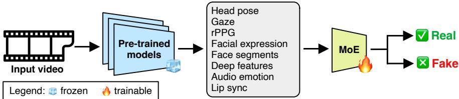  
Xure 1: Overview of the proposed pipeline for deepfake detection. First, we employ mul- atiple pre-trained models to extract high-level semantic cues. Then, a lightweight Mixtureof-Experts (MoE) transformer aggregates the extracted signals and learns to classify audiovisual inputs as real or fake. Our design prevents overfitting to a specific dataset by keeping the pre-trained models frozen, while only training the lightweight MoE on the target task.

## 1 Introduction

With the continuous advancements in generative AI [11, 30, 46, 101, 118] and the increasing democratization of generative technology, concerns towards potential misuse are rising [19].

Deepfakes, i.e. generated multimedia (audio-visual) content that aims to deceive humans into believing that the content is real, are predominantly used by malicious users in financial scams, misinformation and identity theft. Since humans, especially vulnerable groups (e.g. elders, visually impaired, etc.), may be easily deceived by deepfakes, an important area of research is the development of deepfake detectors [8, 38, 75, 76, 89, 104, 105, 108, 120]. One of the main challenges in this area is to obtain detectors able to generalize across deepfake generation methods, a key characteristic that is required to overcome the restless development of generative AI technology. Despite its importance, most studies in deepfake detection leave this aspect aside, focusing on improving performance across existing deepfake detection benchmarks [8, 43, 76, 80, 87]. While many works report impressive performance (up to 99% accuracy) in deepfake detection on public benchmarks, they fail to determine the generalization capacity of the detectors on deepfakes produced by newer and more advanced generative methods. Against the mainstream practice in the field, several studies attempted to address the generalization concern revolving around deepfake detectors [54, 67, 70, 111]. For instance, Ma et al. [67] noticed that current deepfake models create either face inconsistency or up-sampling artifacts, and leveraged this information to generate pseudo-fake training data. Lai et al. [54] proposed the Generalized Multi-Scenario Deepfake Detection framework to enable jointly training a model on multiple datasets, since naively training a deepfake model on multiple deepfake datasets decreases the overall performance.

Unlike previous studies in this area [54, 67, 70, 111], which usually fine-tune models on deepfake data, we propose to overcome the dataset overfitting issue by extracting multiple high-level cues from the available audio and video modalities via pre-trained models, as shown in Figure 1. Our assumption is that models that are pre-trained on distinct tasks, e.g. facial expression recognition, audio emotion recognition, head pose estimation, or gaze tracking, provide meaningful information about the authenticity of audio-visual content, without risking overfitting to artifacts specific to a certain generative model. We therefore aggregate such pre-trained models into a unified pipeline, while deferring the training stage on real vs. fake content classification to a lightweight Mixture-of-Experts backbone [86] that combines all the high-level (semantic) features. To avoid learning the distinctive patterns of different deepfake generation methods, we further introduce a novel contractive-repulsive objective (CRO) that contracts latent vectors around corresponding class anchors (aiming to reduce distinctive patterns inside each class), while repelling class anchors beyond a given margin (aiming to enforce better discrimination between classes). By expressing our contrastive objective through class anchors, we avoid searching for positive/negative pairs via expensive hard sample mining [27, 28, 34, 84, 90]. Our deepfake detection based on sparse Mixture-of-Experts (DF-MoE) is not only designed to improve generalization capacity, but also to maintain a reasonable compute time, achieving near real-time processing speed on a single Nvidia RTX 5090 GPU with 32GB VRAM.

We perform experiments on five recent and challenging benchmarks (MAVOS-DD [18], AVLips [64], PolyGlotFake [38], BioDeepAV [19], FakeAVCeleb [49]), showing that DF-MoE outperforms state-of-the-art deepfake detectors [1, 8, 21, 38, 49, 60, 72, 75, 76, 80, 89, 97, 104, 105, 108, 111, 120] across all five datasets, in both open-set and cross-domain evaluation scenarios. Ablation studies confirm that standalone high-level features from pre-trained models are individually well-suited for deepfake detection. Yet, combining all features via MoE is the best way to unleash their potential towards generalizable deepfake detection. Finally, we show that our framework takes a leap forward towards interpretable decisions via attributing gradient weights to the high-level features from pre-trained models, i.e. DF-MoE can determine that a video clip is fake because it exhibits unusual facial expressions, inconsistent speech and mouth movements, unexpected gaze behavior, etc. In summary, our contribution is fourfold:

• We propose DF-MoE, a novel deepfake detection framework that employs a sparse Mixture-of-Experts transformer to integrate multiple complementary cues into an endto-end pipeline.

• We introduce CRO, a novel contractive-repulsive (contrastive) loss that improves the generalization capacity across deepfake generation methods, harnessing learnable class anchors to improve latent space organization, while avoiding expensive hard sample mining techniques employed by conventional contrastive learning objectives.

• We demonstrate the high generalization capacity of DF-MoE in a suite of challenging open-set and cross-domain deepfake detection experiments, where DF-MoE surpasses state-of-the-art deepfake detectors.

• We show that DF-MoE provides a leap forward towards interpretable decisions, by inherently determining which high-level features contribute to the final decision.

## 2 Related Work

Based on the input domain, deepfake detection methods can be categorized into imagelevel [5, 9, 10, 14, 16, 22, 23, 25, 37, 43, 45, 47, 52, 55, 56, 57, 58, 59, 62, 71, 74, 79, 87, 92, 95, 96, 98, 103, 105, 106, 109 , 116, 117, 121], audio-level [2, 24, 42, 48, 93, 94, 99, 100, 115] and multimodal methods [3, 4, 17, 26, 33, 44, 53, 65, 73, 75, 78, 83, 89. 108, 114, 119, 120]. The initial efforts have employed convolutional neural networks (CNNs) [5, 9, 10, 12, 14, 16, 22, 23, 25, 37, 43, 45, 47, 52, 55, 56, 57, 58, 59, 62, 71, 74, 79, B7 91, 92, 95, 96, 98, 103, 105, 106, 109, 110 , 121] and recurrent neural networks (RNNs) [29, 40, 63, 69, 82]. More recently, most studies have adopted the transformer architecture [3, 6, 26, 33, 44, 53, 65, 73, 75, 83, 89, 108, 114, 119, 120], with the primary goal of jointly analyzing the video and audio content. Consequently, the recently proposed state-of-the-art methods [4, 75, 119, 120] for deepfake detection are multimodal.

Zhou et al. [119] proposed one of the early frameworks on jointly modeling audio and video streams to perform deepfake detection. The framework was based on the synchronization between video and audio, and different fusion approaches, such as late-fusion and two-plus-one. Several other works [4, 75] also relied on the synchronization between audio and video. For instance, Astrid et al. [4] employed pseudo-fake generation to improve the detection of local inconsistencies between audio and video. AVFF [75] captures the correspondence between audio and video modalities by first pre-training the model on real training data, then performing supervised training using both unimodal and cross-modal features. Switching to a more fine-grained output, Delocate [41] performs both detection and localization of deepfakes in videos in two stages, by first reconstructing the faces in the frames, and then classifying them. For a more efficient training, Hui et al. [68] proposed multi-task audio-visual prompt learning, by injecting prompts into each layer of an audio-visual foundation model, without updating the entire model. To efficiently process a video, TALL [104] transforms it into a thumbnail, and then applies the image-level Swin Transformer [66] to perform video deepfake detection.

Several works [54, 67, 70, 111] focused on the generalization of the deepfake detectors to out-of-domain data. Ma et al. [67] categorized the deepfake artifacts into face inconsistency and up-sampling artifacts, noticing that existing deepfake models exhibit either or both kinds of artifacts. Leveraging this observation, Ma et al. [67] generated pseudo-fake data to train their deepfake model, obtaining a robust classifier. Nadimpalli et al. [70] tackled the deepfake detection task using a hybrid combination of supervised and reinforcement learning techniques to improve cross-domain performance. Lai et al. [54] observed that naively training a model on multiple datasets does not improve the joint performance for deepfake detection. Therefore, they proposed the Generalized Multi-Scenario Deepfake Detection framework to enable the joint training of a model on multiple datasets, including a domain-aware meta-learning strategy. Closer to our work, optimizing for both increased generalization and short training time, Yermakov et al. [111] fine-tuned only the layer normalization parameters of a foundational pre-trained vision encoder. They obtained good results on several cross-dataset scenarios.

Different from previous works on generalizable deepfake detection [54, 67, 70, 111], we propose to extract different signals from available pre-trained models, overcoming overfitting and increasing the out-of-domain generalization capabilities by keeping these models frozen. To our knowledge, we are the first to integrate a wide range of high-level semantic cues for deepfake detection. The integration is performed by a learnable MoE block, which is carefully trained to mitigate overfitting on deepfake generative models seen at training via a novel contractive-repulsive objective.

## 3 Method

Spotting a deepfake video requires reasoning over multiple signals simultaneously, especially for videos with photorealistic facial manipulations generated by state-of-the-art models, in which the artifacts are very difficult to recognize, even for humans. Nevertheless, subtle inconsistencies often persist across time: unnatural head movements, irregular gaze patterns or audio-visual mismatches. To this end, we introduce DF-MoE, a multimodal deepfake detection framework that harnesses high-level semantic cues extracted from pre-trained models. We aggregate the semantic cues and model their temporal dynamics via a sparse MoE architecture. Instead of directly operating on raw pixels, our design decomposes the task into (i) extracting semantically meaningful visual and audio descriptors, and (ii) learning cross-modal and temporal inconsistencies to capture the manipulated content. We showcase our full pipeline in Figure 2, and explain its components in detail below.

## 3.1 Extracting Visual and Audio Cues

Our pipeline for feature extraction begins by splitting each video into frames. Then, on every fifth frame, we apply a face detector based on YOLOv11 [50] to extract the faces. The following step is to employ a face tracking model. For each pair of consecutive processed frames, we employ a face tracker based on DeepSORT [102] to match the faces and form long-term continuous tracking paths along the video. Each tracking path in a video corresponds to one person, and is processed independently through the pipeline. For each face track, we apply pre-trained models to extract a series of visual features: head pose, eye gaze, face segmentation, remote photoplethysmography (rPPG), and facial expression. At the same time, we take the associated audio signal and extract speech embeddings with Whisper-Tiny [77]. These are also used to compute emotion features from a custom pretrained model for audio emotion recognition.

Head pose. Deepfake methods may produce head movements with unnatural rigidity, subtle temporal jitter or physically implausible transitions (especially portrait animation models), which can be detected by modeling their temporal consistency. Therefore, for each frame, we estimate the 3D head pose using HopeNet [81], which returns three head pose angles (roll, pitch and yaw), denoted as $F _ { \mathrm { H P } } ^ { 3 }$

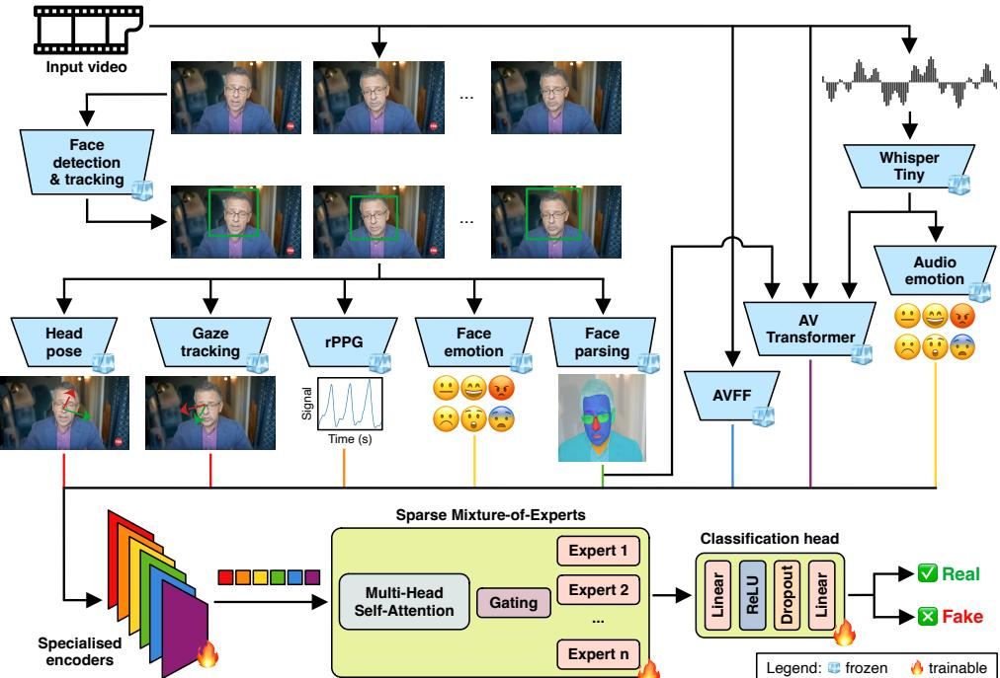  
Figure 2: Detailed overview of our DF-MoE framework for deepfake detection. Face detection and tracking are applied to obtain face tracks. Next, multiple pre-trained models (frozen) are employed to extract high-level semantic cues (features). The extracted features are encoded into tokens via specialized encoders (trainable adapters), ensuring consistent dimensionality across different cues. The resulting tokens are processed by a sparse MoE transformer (trainable). Best viewed in color.

Gaze estimation. Synthetic videos often fail to preserve natural gaze stability and coordination between both eyes, leading to measurable irregularities over time. The focus of the eyes on a specific point (gaze) is estimated by regressing the three Euler angles with a ResNet-34 [35]. We drop the roll angle, keeping only the horizontal and vertical angles, as the eyes cannot rotate along the roll direction. For each frame, its gaze features are denoted as $F _ { \mathrm { G a z e } } ^ { 2 }$ Face segmentation. We hypothesize that analyzing the temporal consistency of face parts can capture micro-movements and subtle spatial inconsistencies. To capture inconsistencies, we apply the Bilateral Segmentation Network [112] and obtain a facial segmentation map $F _ { \mathrm { S e g } } ^ { 5 1 2 \times 5 1 \bar { 2 } }$ with labeled face parts.

rPPG. Since heart rate is estimated via a weak rPPG signal (mostly invisible to humans), we conjecture that deepfake video generators do not insert such weak signals in generated video. Therefore, extracting rPPG signals can help distinguish between real and fake videos. We extract remote photoplethysmography $F _ { \mathrm { r P P G } } ^ { 5 \times 5 1 2 }$ via the model proposed by Yue et al. [113]. This model captures subtle periodic color variations in facial skin regions caused by blood flow. The rPPG signal can provide an estimate of the subject’s physiological pulse (heart rate) without physical contact. We estimate the rPPG waveform for five different face points. Facial expression. Deepfakes can be characterized by irregular temporal transitions between facial expression classes or by inconsistent facial expression and speech emotion classes. Therefore, given only the visual input, a facial expression recognition (FER) model is applied to classify the face in each frame into one of the eight basic emotions: anger, contempt, disgust, fear, happiness, neutral, sadness and surprise. We employ an EfficientNet-B0 [97] pre-trained on Video-level Group Affect [85], which produces a vector of probabilities across the eight emotion classes, denoted as $F _ { \mathrm { F E R } } ^ { 8 }$

Speech embeddings. Since speech signal is imperative for audio-visual deepfake detection, we take a pre-trained Whisper-Tiny [77] and encode speech via its latent representation $F _ { \mathrm { S p e c h } } ^ { 3 8 4 }$ . The speech embeddings contain information about the phonetic content, capturing potential irregularities of synthesized or voice-cloned speech.

Audio emotion. We aim to complement facial expressions with emotion classes from the audio input. To this end, we pre-train a simple MLP classifier over the extracted speech embeddings for speech emotion recognition (SER) on the CREMA-D [7] dataset. The resulting output, denoted as $F _ { \mathrm { S E R } } ^ { 8 }$ , provides cues about the temporal consistency of speech emotion, that can be used for assessing the consistency between audio and visual emotion.

Lip sync. Lip syncing is a crucial signal for detecting deepfakes. Therefore, we pre-train a custom transformer that aims to detect inconsistencies between the lip movement and speech. We use the output of the face parser (Bilateral Segmentation Network [112]) to obtain a crop around the mouth. We concatenate 50 crops and obtain their DINOv3 [88] embeddings. Similarly, we extract the Whisper-Tiny embeddings from the corresponding audio. The resulting visual and audio embeddings are fed into our cross-modal audio-visual (AV) transformer. The model consists of self-attention layers, followed by cross-attention layers, and outputs a 512-dimensional vector $F _ { \mathrm { L S } } ^ { 5 1 2 }$

AVFF. AVFF is a two-stage transformer framework for deepfake detection [75]. The first stage adopts unimodal encoders and decoders along with cross-modal networks that are trained with reconstruction and contrastive objectives to capture audio-visual correspondences. The second stage fine-tunes the model on deepfake classification, so we discard this stage to prevent overfitting. Specifically, we take the unimodal audio and video representations before the classification stage. Each unimodal representation is a 1024-dimensional vector. We concatenate the two vectors to obtain a deep feature vector denoted as $F _ { \mathrm { A V F F } } ^ { 2 0 4 8 }$ To mitigate overfitting on deepfake detection, we start from the pre-trained AVFF based on self-supervision and optimize only the unimodal transformer blocks via Effort [107]. This is a LoRA-style [39] approach that decomposes the weight matrices via Singular Value Decomposition (SVD), freezes the principal components, and fine-tunes only the remaining components. Effort is specifically designed to offer strong generalization in deepfake detection [107]. Moreover, we keep the cross-modality fusion modules (A2V Network and V2A Network) frozen, since interactions between the audio and visual modalities can also contribute to overfitting.

## 3.2 Specialized Adapters

To aggregate the high-level cues into a joint architecture, all features are projected into a shared embedding space of size $h = 1 2 8$ , using specialized adapters.

Movement adapter. The head pose $F _ { \mathrm { H P } } ^ { 3 }$ and eye gaze $F _ { \mathrm { G a z e } } ^ { 2 }$ are fed into a two-layer bidirectional LSTM [36]. Then, a cross-attention layer lets the gaze attend to the pose (gaze as queries, head pose as keys and values). In the end, the cross-attention output and the gaze representation (passed via a skip connection) are mean-pooled over time, concatenated, and projected. We denote the final head movement and gaze features as $E _ { \mathrm { H P + G a z e } } \in \mathbb { R } ^ { h }$

Face parsing adapter. The input of this encoder consists of the face segmentation maps $F _ { \mathrm { S e g } } ^ { 5 1 2 \times 5 1 2 }$ . The architecture is represented by 3D CNN with 3D convolution and max pooling layers along time and space, followed by a global average pooling and linear layers. The resulting features are denoted as $E _ { \mathrm { S e g } } \in \mathbb { R } ^ { h }$

rPPG adapter. The rPPG encoder takes the rPPG signal $F _ { \mathrm { r P P G } } ^ { 5 \times 5 1 2 }$ as input. It is composed of two 1D convolutional layers, followed by average pooling and two bidirectional GRUs. The final features are denoted by $E _ { \mathrm { r P P G } } \in \mathbb { R } ^ { h }$

Emotion adapter. This encoder uses both discrete emotions (from audio $F _ { \mathrm { A E R } } ^ { 8 }$ and video $F _ { \mathrm { F E R } } ^ { 8 } )$ . Each stream is passed through a shared embedding layer, and then processed by separate bidirectional GRUs [13]. The resulting representations are combined using a crossattention layer, concatenated with the video embeddings, and jointly projected. The resulting features are denoted by $E _ { \mathrm { E m o } } \in \mathbb { R } ^ { h }$

Lip sync adapter. This encoder takes the representation from our custom AV transformer, pools it over time with an adaptive average and projects it into the shared embedding space. We denote the final lip sync features by $E _ { \mathrm { L S } } \in \mathbb { R } ^ { h }$

Audio-visual adapter. The features obtained with AVFF, $F _ { \mathrm { A V F F } } ^ { 2 0 4 8 }$ , are simply projected through a linear layer to the shared embedding space. We denote the resulting feature vector by $E _ { \mathrm { A V F F } } \in \mathbb { R } ^ { h }$

## 3.3 Sparse Mixture-of-Experts

To classify a video as real or deepfake using the projected embeddings, we employ a sparse Mixture-of-Experts transformer. The projected embeddings are concatenated into a sequence S, as follows:

$$
S = \left[ E _ { \mathrm { H P + G a z e } } , E _ { \mathrm { S e g } } , E _ { \mathrm { E m o } } , E _ { \mathrm { r P P G } } , E _ { \mathrm { L S } } , E _ { \mathrm { A V F F } } \right] \in \mathbb { R } ^ { 6 \times h } .\tag{1}
$$

The sequence S is then processed by a multi-head self-attention module, enabling crossfeature modeling, before getting routed to the experts. The fact that experts can focus on different types of signals is particularly useful in our case, since tokens embed different high-level information from a wide variety of pre-trained models.

Mixture-of-experts. The gating network is represented by a linear layer, denoted as $g ( \cdot )$ that gives a ranking score for the available experts. The gating mechanism assigns routing weights to indicate which expert is most suitable for a given token. Formally, for each token $s _ { i }$ of the sequence $S = \{ s _ { i } \} _ { i = 1 } ^ { 6 }$ , we rank all experts based on the returned values $g ( s _ { i } ) _ { j } , \forall j \in$ $\{ 1 , \ldots , n \}$ , where n is the number of experts. Subsequently, each token $s _ { i }$ is passed through the top-k scoring experts. Let $J _ { i } = \{ j _ { 1 } ^ { i } , \ldots , j _ { k } ^ { i } \} , \forall i \in \{ 1 , \ldots , 6 \}$ denote the set of indices to which the token $s _ { i }$ is routed. Based on the ranking scores, we compute the weights $p _ { i }$ that are used to determine the output tokens of the MoE layer, given the input tokens S. Specifically, we employ the following equation, obtaining normalized weights for the experts:

$$
p _ { i j } = \frac { \exp ( g ( s _ { i } ) _ { j } ) } { \sum _ { l \in J ^ { i } } \exp ( g ( s _ { i } ) _ { l } ) } , j \in J ^ { i } , i \in \{ 1 , . . . , 6 \} .\tag{2}
$$

After computing $\{ p _ { i } \} _ { i = 1 } ^ { 6 }$ , we can determine the output sequence ${ \hat { S } } .$ . Formally, if we denote the experts with the top-k highest scores in $p _ { i }$ by $\{ \mathbf { e } _ { j } ( \cdot ) \} _ { j \in J ^ { i } } , \forall i \in \{ 1 , \ldots , 6 \}$ , then each output token $\hat { s } _ { i }$ of the MoE layer is computed as:

$$
\hat { s } _ { i } = \sum _ { j = 1 } ^ { k } p _ { i j } \cdot \mathbf { e } _ { j } ( s _ { i } ) .\tag{3}
$$

Intuitively, Eq. (3) uses the values in $p _ { i }$ as weights for the representations returned by the experts. If an expert has a higher score in $p _ { i }$ , then its representation is more important in Eq. (3).

Dropout regularization. At training time, we include a dropout regularization on the experts routing to avoid their over-specialization on a certain type of feature. The dropout is implemented by creating a mask $\{ m _ { i } \} _ { i = 1 } ^ { 6 } \in \{ 0 , 1 \} ^ { n }$ that corresponds to each score vector $\{ g ( s _ { i } ) \} _ { i = 1 } ^ { 6 }$ . We randomly set some of the positions in $m _ { i }$ to 0, and the remaining ones to 1. The number of values assigned to 0 is controlled by a dropout rate $d = 0 . 2$ . The output of the dropout layer is given by $\hat { g } ( s _ { i } ) = g ( s _ { i } ) * m _ { i }$ , where ∗ is the element-wise product. $\hat { g } ( s _ { i } )$ is further used in the top-k routing logic described before.

Training losses. Our final training objective comprises three components. The first one is the classic binary cross-entropy (BCE) loss over real and deepfake class labels. For this loss, we average the representations stored in the sequence $\hat { S } = \{ \hat { s _ { i } } \bar  \} _ { i = 1 } ^ { 6 }$ to obtain the feature vector $\begin{array} { r } { R = \frac { 1 } { 6 } \sum _ { \hat { s } _ { i } \in \hat { S } } \hat { s } _ { i } } \end{array}$ that is fed into the final classifier $c ( \cdot )$ . Given the ground-truth label $y \in \{ 0 , 1 \}$ of the input video, the binary cross-entropy loss is:

$$
\mathcal { L } _ { \mathrm { B C E } } = - \left[ y \cdot \log ( c ( R ) ) + ( 1 - y ) \cdot \log ( 1 - c ( R ) ) \right] .\tag{4}
$$

If deepfakes are spread around in the latent space, e.g. all around the real class region, it is likely that deepfakes generated by unknown generative methods will be confused with real samples. We therefore propose an additional objective to assist the standard BCE in structuring the latent space of the model, so as to reduce the discrimination power among various deepfake types, while boosting discrimination between real and fake samples. Our novel contractive-repulsive objective (CRO) is designed to reduce representation diversity inside classes (intra-class contraction), while increasing the gap between real and deepfake classes in the latent space (inter-class repulsion). This is achieved via a combination of three loss terms that operate with learnable class anchors. Let $A \in \mathbb { R } ^ { h }$ and $B \in \mathbb { R } ^ { h }$ denote the learnable anchors for the real and fake classes, respectively. We define the components of the CRO loss as follows:

$$
\begin{array} { r l } & { \mathcal { L } _ { \mathrm { c o n t r a c t } } ( A , B , R ) = ( 1 - y ) \cdot \| R - A \| _ { 2 } ^ { 2 } + y \cdot \| R - B \| _ { 2 } ^ { 2 } , } \\ & { \qquad \mathcal { L } _ { \mathrm { r e p e l } } ( A , B ) = \displaystyle \frac { 1 } { 2 } \left[ \operatorname* { m a x } \big ( 0 , 2 \cdot M - \| A - B \| \big ) \right] ^ { 2 } , } \\ & { \mathcal { L } _ { \mathrm { n o - c o l l a p s e } } ( A , B ) = \displaystyle \frac { 1 } { 2 } \left[ \operatorname* { m a x } \big ( 0 , P - \| A \| \big ) + \operatorname* { m a x } \big ( 0 , P - \| B \| \big ) \right] ^ { 2 } , } \end{array}\tag{5}
$$

where $M > 0$ represents the margin between the two anchors, and P is the minimum norm for each anchor. The anchors A and B are randomly initialized before training, and updated at every training iteration with the other trainable parameters. In our experiments, we set $M = 1$ and $P = 1$ $\mathcal { L } _ { \mathrm { c o n t r a c t } }$ minimizes the distance between the feature vector R and its corresponding anchor, A or B, depending on label y. $\mathcal { L } _ { \mathrm { r e p e l } }$ enforces a minimum margin between the anchors A and B, ensuring that classes are sufficiently far apart. Since class anchors A and B are learnable, a concentric configuration of real and fake latent vectors (i.e. a cluster of real samples surrounded by a band of fake samples) might bring the anchors in the same vicinity, which might put the first two objectives into conflict. To avoid the collapse of class anchors, we introduce $\scriptstyle { \mathcal { L } } _ { \mathrm { { n o - c o l l a p s e } } }$ , which pushes anchors away from the origin. Finally, $\scriptstyle { \mathcal { L } } _ { \mathrm { C R O } }$ is defined as:

$$
\begin{array} { r } { \mathcal { L } _ { \mathrm { C R O } } = \mathcal { L } _ { \mathrm { c o n t r a c t } } + \mathcal { L } _ { \mathrm { r e p e l } } + \mathcal { L } _ { \mathrm { n o - c o l l a p s e } } . } \end{array}\tag{6}
$$

An advantage of our CRO loss over traditional contrastive losses is that it operates relative to a set of learnable anchors. Consequently, it achieves feature separation without requiring computationally-expensive procedures to mine adequate sample pairs [27, 28, 34, 84, 90].

The third loss term penalizes the gating network if one expert receives too many tokens and the predicted probability for an expert is too high. This loss promotes diversity in the top-k selected tokens. To compute this loss, we determine the fraction of tokens routed to each expert $\{ f _ { j } \} _ { j = 1 } ^ { n }$ and the average probability score $\{ \bar { p } _ { j } \} _ { j = 1 } ^ { n }$ assigned to each expert, where $\begin{array} { r } { \bar { p } _ { j } = \frac { 1 } { 6 } \sum _ { i = 1 } ^ { 6 } p _ { i j } } \end{array}$ . In practice, both $f _ { j }$ and $\bar { p } _ { j }$ are estimated on an entire mini-batch. These two variables are combined into a loss function defined as follows:

$$
{ \mathcal { L } } _ { \mathrm { a u x } } = n \sum _ { j = 1 } ^ { n } f _ { j } \cdot { \bar { p } } _ { j } .\tag{7}
$$

The final loss is a combination of those defined in Eq. (4), Eq. (6) and Eq. (7):

$$
\begin{array} { r } { \mathcal { L } = \mathcal { L } _ { \mathrm { B C E } } + \lambda _ { 1 } \cdot \mathcal { L } _ { \mathrm { C R O } } + \lambda _ { 2 } \cdot \mathcal { L } _ { \mathrm { a u x } } , } \end{array}\tag{8}
$$

where $\lambda _ { 1 }$ and $\lambda _ { 2 }$ are hyperparameters that control the importance of the additional losses.

## 4 Experiments

Datasets. To assess the generalization capacity of DF-MoE, we evaluate it on five datasets: AVLips [64], MAVOS-DD [18], PolyGlotFake [38], BioDeepAV [19] and FakeAVCeleb [49]. In terms of evaluation setups, we conduct (i) in-domain experiments on AVLips [64] and MAVOS-DD [18], (ii) open-set experiments on MAVOS-DD [18], as well as (iii) crossdataset experiments on PolyGlotFake [38], BioDeepAV [19] and FakeAVCeleb [49].

AVLips [64] is designed for training and evaluating lip-sync forgery detection models. The dataset contains over 3,000 real and 4,000 manipulated videos. Throughout our experiments, we utilize the official train and test splits. MAVOS-DD is a multilingual benchmark that provides a training set (21K videos), a validation set (4K videos) and four test sets (together containing over 60K test videos). The evaluation protocol is designed to support four setups: closed-set, open-set model, open-set language and open-set full. The closed-set test set evaluates detectors on samples that correspond to the set of languages and generative methods seen during training. The open-set model test set introduces new (unseen) generative methods. The open-set language introduces two unseen languages, Hindi and German. Finally, the open-set full test set simultaneously evaluates performance on unseen languages and unseen methods.

For the cross-dataset evaluation, we choose three recent datasets, PolyGlotFake [38], BioDeepAV [19] and FakeAVCeleb [49]. PolyGlotFake is a multi-lingual dataset that contains 766 real and 14,472 fake videos. Compared to MAVOS-DD, PolyGlotFake has two new languages, French and Japanese. The manipulation methods of PolyGlotFake consist of text-to-speech, voice conversion and lip-synchronization methods. BioDeepAV comprises 2,010 real and 1,693 fake videos. This dataset comprises diverse generative approaches, including NeRF-based synthesis, Gaussian Splatting, and diffusion models. FakeAVCeleb is a very imbalanced dataset, comprising only 500 real and over 19,000 fake videos. We underline that typically employed metrics, such as AUC, can be misleading for highly imbalanced datasets. For example, if a model successfully isolates high-confidence fakes at the strictest thresholds, it rapidly increases the True Positive Rate (TPR), securing a high overall AUC. To ensure a correct evaluation and to avoid any bias in our evaluation metrics, we supplement the set of real videos with additional 19,000 videos randomly sampled from VoxCeleb2 [15]. We highlight that this video addition is also suggested by the authors of FakeAVCeleb [49] in their original work. The resulting dataset is further referred to as Vox+FakeAVCeleb.

<table><tr><td rowspan="2">Method</td><td colspan="3">Closed-set</td><td colspan="3">Open-set model</td><td colspan="3">Open-set lang.</td><td colspan="3">Open-set full</td></tr><tr><td>mAP</td><td>AUC</td><td>acc</td><td>mAP</td><td>AUC</td><td>acc</td><td>mAP</td><td>AUC</td><td>acc</td><td>mAP</td><td>AUC</td><td>acc</td></tr><tr><td>TALL []</td><td>0.84</td><td>0.85</td><td>75.61</td><td>0.67</td><td>0.73</td><td>62.40</td><td>0.77</td><td>0.78</td><td>70.14</td><td>0.69</td><td>0.72</td><td>63.86</td></tr><tr><td>MRDF [[]</td><td>0.90</td><td>0.92</td><td>79.55</td><td>0.75</td><td>0.81</td><td>67.86</td><td>0.88</td><td>0.89</td><td>76.91</td><td>0.80</td><td>0.83</td><td>70.95</td></tr><tr><td>AVFF []</td><td>0.97</td><td>0.97</td><td>90.71</td><td>0.93</td><td>0.94</td><td>85.10</td><td>0.93</td><td>0.93</td><td>86.58</td><td>0.91</td><td>0.93</td><td>84.85</td></tr><tr><td>AVH-Align []</td><td>0.56</td><td>0.56</td><td>52.48</td><td>0.51</td><td>0.51</td><td>62.66</td><td>0.57</td><td>0.57</td><td>58.11</td><td>0.54</td><td>0.54</td><td>57.78</td></tr><tr><td> $\mathsf { A V H - A l i g n _ { s u p } \ [ E \mathbf { q } ] }$ </td><td>0.81</td><td>0.83</td><td>75.56</td><td>0.69</td><td>0.74</td><td>63.84</td><td>0.76</td><td>0.78</td><td>72.75</td><td>0.70</td><td>0.73</td><td>64.90</td></tr><tr><td>DF-Linear</td><td>0.97</td><td>0.97</td><td>90.57</td><td>0.93</td><td>0.93</td><td>85.28</td><td>0.94</td><td>0.94</td><td>84.06</td><td>0.93</td><td>0.93</td><td>83.98</td></tr><tr><td>DF-MoE (ours)</td><td>0.99</td><td>0.99</td><td>97.73</td><td>0.98</td><td>0.98</td><td>93.64</td><td>0.99</td><td>0.99</td><td>94.55</td><td>0.98</td><td>0.98</td><td>92.95</td></tr></table>

Table 1: Results on MAVOS-DD obtained by TALL [104], MRDF [120], AVFF [75], AVH-Align [89], $\mathsf { A V H - A l i g n } _ { \mathrm { s u p } }$ [89], DF-Linear, and our DF-MoE. The best performing method is highlighted in blue bold, and the second-best in orange. Our DF-MoE outperforms all previous state-of-the-art methods, regardless of the evaluation setup.

Baselines. We evaluate our method on AVLips and MAVOS-DD against several state-of-theart methods: TALL [104], MRDF [120], AVFF [75], AVH-Align [89], $\mathsf { A V H - A l i g n } _ { \mathrm { s u p } }$ [89], RealForensics [32], LipForensics, and LipFD [64]. While most of these baselines leverage multimodal audio-visual features, TALL relies exclusively on video artifacts. For the cross-dataset evaluation on PolyGlotFake, BioDeepAV and Vox+FakeAVCeleb, we include additional baselines, e.g. UCF [105], StA [108], RECCE [8], GenD [111], among many others [1, 21, 38, 49, 60, 72, 76, 80, 89, 97, 104].

Ablated models. We carry out ablation studies to assess the impact of each high-level cue integrated in DF-MoE. We also ablate the joint MoE module, employing a custom linear classifier instead, resulting in a version called DF-Linear. DF-Linear aggregates the same semantic cues as DF-MoE, serving as a critical ablation to isolate the performance gains brought by our MoE architecture.

Hyperparameters. All the models, including the baselines, are trained for 10 epochs, with the optimal checkpoint selected based on validation performance. For the baselines, the hyperparameters (learning rate, optimizer, etc.) are configured in accordance with the official recommendation from their corresponding publications. For DF-MoE and DF-Linear, we employ AdamW as the optimizer, with a learning rate of $1 0 ^ { - 4 }$ , and a batch size of 4. The projection dimension for the shared latent space of the specialized encoders is set to $h = 1 2 8$ the number of experts n is set to 6, and each token is routed to $k = 2$ experts, based on the scores provided by the gating network. The specialized encoders vary in architecture, as per Section 3.2. However, these encoders generally integrate a hidden bottleneck layer, with a latent representation of 64 dimensions. The weight for the CRO loss is $\lambda _ { \mathrm { l } } = 1$ , and the weight of the auxiliary loss is set to $\lambda _ { 2 } = 0 . 0 1$ . More reproducibility details are provided in the supplementary.

Evaluation measures. We report mean average precision (mAP), area under the ROC curve (AUC), and accuracy (acc).

In-domain results. In Table 1, we present the results of DF-MoE on all four MAVOS-DD evaluation scenarios. We observe that DF-MoE consistently yields better performance across every setup. Remarkably, DF-MoE exhibits significantly greater robustness in the open-set model scenario compared with the strongest competitor (AVFF), maintaining higher performance stability due to our integration of multiple high-level cues. Overall, feature diversity is a strong point of our method, as it helps the detection model to observe different failure cases of the generative models. Our MoE-based architecture has an important role in increasing the robustness to unseen generative methods, being capable of correctly balancing complementary high-level cues to achieve substantial performance boost in the open-set model setup. In Table 2, we present the results of DF-MoE on AVLips [64]. The results demonstrate the superior performance of DF-MoE in terms of both mAP and AUC. Notably, while AVFF is an important component of our architecture, it yields significantly lower results when evaluated in isolation. This performance gap further underscores the importance of integrating highly diverse features via DF-MoE. While LipFD achieves higher accuracy than our method on AVLips, it is specifically designed to detect temporal inconsistencies between lip movements and audio (making it specifically suitable for AVLips), whereas DF-MoE provides a more general framework for multimodal deepfake detection.

<table><tr><td rowspan="2">Method</td><td colspan="3">AVLips</td></tr><tr><td>mAP</td><td>AUC</td><td>acc</td></tr><tr><td>RealForensics []</td><td>0.90</td><td>一</td><td>91.78</td></tr><tr><td>LipForensics []</td><td>0.82</td><td></td><td>86.13</td></tr><tr><td>LipFD []</td><td>0.93</td><td>0.95</td><td>95.27</td></tr><tr><td>AVH-Align [9]</td><td></td><td>0.89</td><td></td></tr><tr><td>AVFF []</td><td>0.89</td><td>0.89</td><td>76.64</td></tr><tr><td>DF-MoE (ours)</td><td>0.97</td><td>0.97</td><td>93.77</td></tr></table>

Table 2: In-domain results on AVLips [64] obtained by state-of-the-art models vs. DF-MoE. The best performing method is highlighted in blue bold, and the second-best in orange. Our DF-MoE outperforms all previous state-of-the-art methods in terms of mAP and AUC.

<table><tr><td>rPPG</td><td>Face segmentation</td><td>HP+Gaze</td><td>AV emotion</td><td>AV transformer</td><td>AVFF+ Effort</td><td>mAP</td><td>AUC</td><td>acc</td></tr><tr><td></td><td>X</td><td>x</td><td>X</td><td>X</td><td>X</td><td>0.73</td><td>0.74</td><td>66.18</td></tr><tr><td>X</td><td>√</td><td>x</td><td>x</td><td>X</td><td>X</td><td>0.73</td><td>0.72</td><td>66.58</td></tr><tr><td>x</td><td>x</td><td>√</td><td>x</td><td>x</td><td>x</td><td>0.66</td><td>0.69</td><td>62.51</td></tr><tr><td>x</td><td>x</td><td>x</td><td>√</td><td>x</td><td>x</td><td>0.78</td><td>0.78</td><td>70.48</td></tr><tr><td>X</td><td>X</td><td>x</td><td>x</td><td>√</td><td>X</td><td>0.88</td><td>0.88</td><td>81.40</td></tr><tr><td>X</td><td>X</td><td>x</td><td>X</td><td>X</td><td>√</td><td>0.96</td><td>0.96</td><td>88.58</td></tr><tr><td></td><td></td><td>x</td><td>x</td><td>X</td><td>X</td><td>0.74</td><td>0.74</td><td>67.33</td></tr><tr><td></td><td></td><td>V</td><td>x</td><td>x</td><td>x</td><td>0.74</td><td>0.75</td><td>68.28</td></tr><tr><td></td><td></td><td></td><td>√</td><td>x</td><td>x</td><td>0.78</td><td>0.78</td><td>68.18</td></tr><tr><td></td><td></td><td></td><td>V</td><td></td><td>x</td><td>0.92</td><td>0.92</td><td>85.85</td></tr><tr><td></td><td></td><td></td><td>7</td><td>了</td><td>√</td><td>0.98</td><td>0.98</td><td>92.95</td></tr></table>

Table 3: Ablation study on the impact of each feature type on the final performance of DF-MoE on MAVOS-DD (open-set full). The best individual components are AV Transformer and AVFF. However, the complementary cues brought by the other pre-trained models (HP+Gaze, rPPG, audio-visual emotion, face segmentation) bring consistent performance gains, all contributing to the final performance of DF-MoE.

Ablation studies. To validate the utility of the sparse MoE, we compare DF-MoE with DF-Linear in Tables 1 and Table 4. DF-Linear replaces the MoE module with a linear layer applied on the concatenation of all high-level features. While DF-Linear generally surpasses state-of-the-art detectors in the in-domain setting, its in-domain performance is consistently below our DF-MoE. Significant gaps are also observed for the cross-domain evaluation on PolyGlotFake and Vox+FakeAVCeleb.

In Table A1, we present a comprehensive ablation study designed to isolate and quantitatively evaluate the contribution of each individual feature type to the final performance. This analysis is conducted on the open-set full setup of MAVOS-DD. The ablation results indicate that the most important representations are extracted by the two audio-visual models (AV Transformer and AVFF), which already surpass some of the state-of-the-art models. Nevertheless, every high-level cue achieves non-trivial performance, when evaluated in isolation. This individual effectiveness indicates that the proposed features capture useful information that can be further harnessed in the full pipeline. Gradually integrating the individual components improves performance, indicating that the high-level cues exhibit a strong complementary effect, boosting the overall robustness and performance of DF-MoE. We report more ablations in the supplementary.

<table><tr><td rowspan="2"></td><td rowspan="2">Year Method</td><td colspan="3">PolyGlotFake []</td><td colspan="3">BioDeepAV []</td><td colspan="3">Vox+FakeAVCeleb []</td></tr><tr><td>mAP</td><td>AUC</td><td>acc</td><td>mAP</td><td>AUC</td><td>acc</td><td>mAP</td><td>AUC</td><td>acc</td></tr><tr><td rowspan="3">2018</td><td>MesoNet [0]</td><td>1</td><td>0.57</td><td></td><td></td><td>1</td><td></td><td></td><td>1</td><td></td></tr><tr><td>MesoInception []</td><td>=</td><td>0.58</td><td></td><td>1</td><td>1</td><td></td><td></td><td>1</td><td></td></tr><tr><td>DSP-FWA []</td><td>=</td><td>0.67</td><td>1</td><td>=</td><td>=</td><td>=</td><td></td><td>=</td><td>=</td></tr><tr><td rowspan="2">2019</td><td>XceptionNet []</td><td>1</td><td>0.61</td><td>1</td><td>=</td><td>0.57</td><td>=</td><td></td><td></td><td>1</td></tr><tr><td>EfficienNet-B4 []</td><td>=</td><td>0.58</td><td>1</td><td>=</td><td>=</td><td>=</td><td></td><td>=</td><td>=</td></tr><tr><td rowspan="2">2020</td><td>FFD []</td><td>1</td><td>0.60</td><td></td><td>=</td><td></td><td>=</td><td></td><td></td><td>I</td></tr><tr><td>F3Net []</td><td></td><td>0.64</td><td></td><td>=</td><td>0.50</td><td></td><td></td><td></td><td></td></tr><tr><td rowspan="2">2022</td><td>CORE []</td><td></td><td>0.62</td><td></td><td></td><td></td><td></td><td></td><td></td><td></td></tr><tr><td>RECCE []</td><td></td><td>0.66</td><td></td><td>=</td><td>0.50</td><td></td><td></td><td></td><td></td></tr><tr><td rowspan="2">2023</td><td>UCF [目]</td><td></td><td></td><td></td><td></td><td>0.49</td><td></td><td></td><td></td><td></td></tr><tr><td>TALL* [日]</td><td>0.56</td><td>0.58</td><td>32.74</td><td>0.83</td><td>0.82</td><td>74.66</td><td>0.50</td><td>0.57</td><td>55.06</td></tr><tr><td rowspan="3">2024</td><td>XRes [ [[]</td><td></td><td>0.68</td><td></td><td></td><td></td><td></td><td></td><td></td><td></td></tr><tr><td>AVFF* [四]</td><td>0.88</td><td>0.91</td><td>97.93</td><td>0.95</td><td>0.95</td><td>70.78</td><td>0.69</td><td>0.70</td><td>55.56</td></tr><tr><td>MRDF* [10]</td><td>0.51</td><td>0.39</td><td>5.56</td><td>0.53</td><td>0.53</td><td>52.12</td><td>0.65</td><td>0.65</td><td>61.83</td></tr><tr><td rowspan="3">2025</td><td>StA []</td><td></td><td></td><td></td><td>1</td><td>0.62</td><td></td><td></td><td></td><td></td></tr><tr><td>ForAda [四]</td><td></td><td>0.87</td><td></td><td></td><td></td><td></td><td></td><td></td><td></td></tr><tr><td>Effort []</td><td>1</td><td>0.85</td><td></td><td></td><td>=</td><td></td><td></td><td></td><td></td></tr><tr><td rowspan="6">2026</td><td>GenD (CLIP) []</td><td></td><td>0.90</td><td></td><td></td><td></td><td></td><td></td><td></td><td></td></tr><tr><td>GenD (PE) []</td><td></td><td>0.92</td><td></td><td></td><td></td><td></td><td></td><td></td><td></td></tr><tr><td>GenD (DINO) []</td><td>=</td><td>0.92</td><td>=</td><td>=</td><td>=</td><td></td><td>=</td><td>=</td><td>1</td></tr><tr><td>DF-Linear</td><td>0.82</td><td>0.89</td><td>94.57</td><td>0.99</td><td>0.99</td><td>97.87</td><td>0.46</td><td>0.45</td><td>50.91</td></tr><tr><td>DF-MoE (ours)</td><td>0.93</td><td>0.94</td><td>98.49</td><td>0.99</td><td>0.99</td><td>96.77</td><td>0.86</td><td>0.88</td><td>81.59</td></tr><tr><td></td><td></td><td></td><td></td><td></td><td></td><td></td><td></td><td></td><td></td></tr></table>

Table 4: Cross-dataset evaluation on PolyGlotFake, BioDeepAV and Vox+FakeAVCeleb. The best performing method is highlighted in blue bold, and the second-best in orange. DF-MoE obtains the best performance on both datasets in terms of AUC and acc. Results of methods marked with an asterisk are reproduced using publicly available code.

Cross-dataset results. Next, we verify the robustness of DF-MoE to different manipulation methods and various real-world data sources. Specifically, we report results on Poly-GlotFake, BioDeepAV and Vox+FakeAVCeleb in Table 4, using MAVOS-DD and AVLips as training data. The results follow the same trend observed in the open-set scenarios of MAVOS-DD, namely that DF-MoE obtains state-of-the-art results on all three datasets in terms of mAP and AUC. We compare these results with several other methods. We compute the performance metrics of AVFF, TALL and MRDF using the code available in the corresponding public repositories. For the remaining methods, the AUC metric is taken from the official publications. While some of the evaluated methods [105, 108] are designed to improve generalization in deepfake detection, they still struggle to maintain optimal performance when encountering the significant data distribution shifts in PolyGlotFake, BioDeepAV and Vox+FakeAVCeleb.

Qualitative analysis. In Figure 3, we show four videos from the MAVOS-DD test set that are correctly classified by DF-MoE. The fake videos are generated by three of the included manipulation methods (Memo, HifiFace and LivePortrait). These three methods cover all the visual manipulation types available in MAVOS-DD, namely talking face synthesis (Memo), face swapping (HifiFace) and lip synchronization (LivePortrait). Along with the video frames, we illustrate the attention scores associated with each high-level cue. The scores are computed based on the attention weights provided by the multi-head attention layer. To obtain a single value for each feature, given the attention weights, we compute their average across the head and query dimensions.

Memo Sample/DF-MoE: Fake  

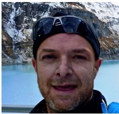

HifiFace Sample/DF-MoE: Fake  
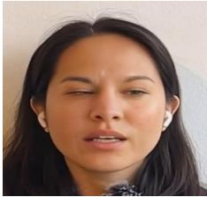

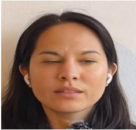

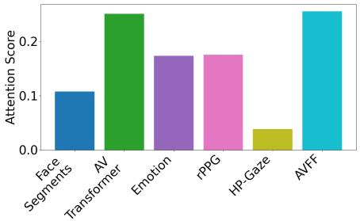  
Real Sample/DF-MoE: Real

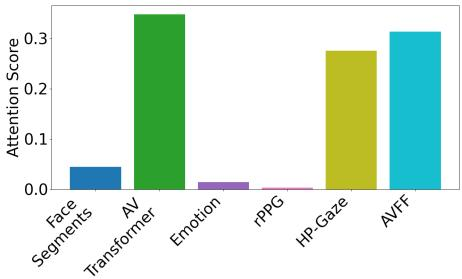  
LivePortrait Sample/DF-MoE: Fake

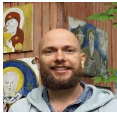

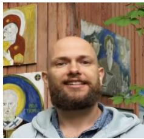

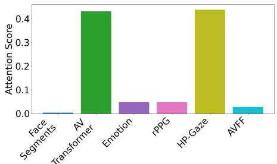

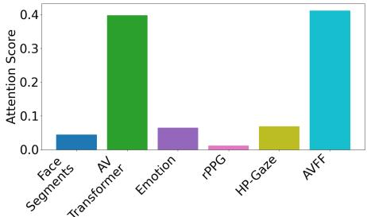  
Figure 3: Examples of videos correctly classified by DF-MoE, alongside the corresponding attention scores of each high-level cue. Best viewed in color.

By analyzing the results shown in Figure 3, we can make several interesting observations. The AV Transformer and AVFF models have generally high contributions, essentially due to their strong individual performance coming from the direct analysis of manipulated audiovisual content. The top-left example shows a slight skin tone variation between frames, which explains the high rPPG score. In the top-right example, head pose and gaze receive high importance, likely capturing gaze inconsistencies caused by face-swapping artifacts around the eyes. In the bottom-right LivePortrait sample, where lip movements are altered, the AV Transformer and AVFF effectively detect the manipulation by assessing audio-visual synchronization. Lastly, in the real sample (bottom-left), high scores from the AV Transformer and head pose features indicate that the model correctly identifies natural audio-visual synchronization and authentic head movements.

<table><tr><td>#GPUs</td><td>Average video duration</td><td>Face detection &amp; tracking</td><td>Feature extraction</td><td>MoE</td><td>Total</td></tr><tr><td>1</td><td>10.97</td><td>3.35</td><td>8.47</td><td>1.16</td><td>12.98</td></tr><tr><td>2</td><td>10.97</td><td>3.35</td><td>4.65</td><td>1.16</td><td>9.16</td></tr></table>

Table 5: Average video duration and stage-wise inference times (in seconds) for DF-MoE. The values are estimated across 20 videos on a machine with 1×AMD Ryzen Threadripper 9960X 24-core CPU and 2×Nvidia RTX 5090 GPU (32GB VRAM).

Computational complexity. Our complete pipeline, which integrates all pre-trained models, has 508.18 GFLOPs and 424.14M parameters. During training, we only update 19.9M (5%) of the 424.14M inference parameters. In Table 5, we report the average inference time in seconds for all stages of our pipeline. With all the components in place, DF-MoE reaches near real-time processing speed at inference, on both one or two GPUs. Training is conducted using two RTX 5090 GPUs. DF-MoE is trained for 10 epochs at roughly 5 hours and 20 minutes per epoch, totaling approximately 52 hours of compute time per experiment.

## 5 Conclusion

In this work, we addressed the out-of-domain generalization issue of audio-video deepfake detectors by proposing DF-MoE. Our framework integrates audio-visual cues provided by several pre-trained models, including head pose, gaze, face segmentation maps, rPPG signals, face and audio emotions, etc. Using pre-trained models prevents overfitting to a specific deepfake generator or dataset. Our DF-MoE also includes trainable mixture-of-experts, improving deepfake detection with their ability to create specialized features (in our case, for different input signals), while preserving the generalization capacity of our framework. The ablation results demonstrated that each high-level cue provides useful information for deepfake detection. DF-MoE obtained state-of-the-art results on three challenging datasets, outperforming the previous methods in terms of relevant performance metrics. We also demonstrated that introducing frozen pre-trained models into an efficient architecture provides state-of-the-art cross-domain performance. In future work, employing additional pretrained models to extract complementary signals could further boost performance on deepfake detection, and even on other complex tasks, such as video planning.

## 6 Acknowledgments

This work was supported by a grant of the Ministry of Research, Innovation and Digitization, CCCDI - UEFISCDI, project number PN-IV-P6-6.3-SOL-2024-2-0227, within PNCDI IV. This work was in part supported by the BMFTR (FKZ: 16IS24060), and the DFG (SFB 1233, project number: 276693517).

## References

[1] Darius Afchar, Vincent Nozick, Junichi Yamagishi, and Isao Echizen. MesoNet: a Compact Facial Video Forgery Detection Network. In Proceedings of WIFS, pages 1–7, 2018.

[2] Agil Aghasanli, Dmitry Kangin, and Plamen Angelov. Interpretable-throughprototypes deepfake detection for diffusion models. In Proceedings ofICCVW, pages 467–474, 2023.

[3] S. Asha, P. Vinod, and Varun G. Menon. A defensive attention mechanism to detect deepfake content across multiple modalities. Multimedia Systems, 30:351–356, 2024.

[4] Marcella Astrid, Enjie Ghorbel, and Djamila Aouada. Audio-visual deepfake detection with local temporal inconsistencies. In Proceedings of ICASSP, pages 1–5, 2025.

[5] Zhongjie Ba, Qingyu Liu, Zhenguang Liu, Shuang Wu, Feng Lin, Li Lu, and Kui Ren. Exposing the deception: Uncovering more forgery clues for deepfake detection. In Proceedings ofAAAI, pages 719–728, 2024.

[6] Emily R. Bartusiak and Edward J. Delp. Synthesized speech detection using convolutional transformer-based spectrogram analysis. In Proceedings ofACSSC, pages 1426–1430, 2021.

[7] Houwei Cao, David G. Cooper, Michael K. Keutmann, Ruben C. Gur, Ani Nenkova, and Ragini Verma. CREMA-D: Crowd-Sourced Emotional Multimodal Actors Dataset. IEEE Transactions on Affective Computing, 5(4):377–390, 2014.

[8] Junyi Cao, Chao Ma, Taiping Yao, Shen Chen, Shouhong Ding, and Xiaokang Yang. End-to-end reconstruction-classification learning for face forgery detection. In Proceedings ofCVPR, pages 4103–4112, 2022.

[9] Liang Chen, Yong Zhang, Yibing Song, Lingqiao Liu, and Jue Wang. Self-supervised learning of adversarial example: Towards good generalizations for deepfake detection. In Proceedings ofCVPR, pages 18689–18698, 2022.

[10] Liang Chen, Yong Zhang, Yibing Song, Jue Wang, and Lingqiao Liu. OST: Improving Generalization of DeepFake Detection via One-Shot Test-Time Training. In Proceedings ofNeurIPS, pages 24597–24610, 2022.

[11] Zhiyuan Chen, Jiajiong Cao, Zhiquan Chen, Yuming Li, and Chenguang Ma. EchoMimic: Lifelike Audio-Driven Portrait Animations through Editable Landmark Conditions. In Proceedings ofAAAI, pages 2403–2410, 2024.

[12] Jikang Cheng, Zhiyuan Yan, Ying Zhang, Li Hao, Jiaxin Ai, Qin Zou, Chen Li, and Zhongyuan Wang. Stacking brick by brick: Aligned feature isolation for incremental face forgery detection. In Proceedings of CVPR, pages 446–459, 2025.

[13] Kyunghyun Cho, Bart Van Merriënboer, Çaglar Gulçehre, Dzmitry Bahdanau, Fethi˘ Bougares, Holger Schwenk, and Yoshua Bengio. Learning phrase representations using RNN encoder-decoder for statistical machine translation. In Proceedings of EMNLP, pages 1724–1734, 2014.

[14] Sungik Choi, Hankook Lee, Jaehoon Lee, Seunghyun Kim, Stanley Jungkyu Choi, and Moontae Lee. HFI: A unified framework for training-free detection and implicit watermarking of latent diffusion model generated images. arXiv preprint arXiv:2412.20704, 2024.

[15] Joon Son Chung, Arsha Nagrani, and Andrew Zisserman. VoxCeleb2: Deep Speaker Recognition. In Proceedings ofINTERSPEECH, pages 1086–1090, 2018.

[16] Andrea Ciamarra, Roberto Caldelli, Federico Becattini, Lorenzo Seidenari, and Alberto Del Bimbo. Deepfake Detection by Exploiting Surface Anomalies: The Surfake Approach. In Proceedings ofWACV, pages 1024–1033, 2024.

[17] Davide Cozzolino, Alessandro Pianese, Matthias Nießner, and Luisa Verdoliva. Audio-visual person-of-interest deepfake detection. In Proceedings of CVPR, pages 943–952, 2023.

[18] Florinel-Alin Croitoru, Vlad Hondru, Marius Popescu, Radu Tudor Ionescu, Fahad Shahbaz Khan, and Mubarak Shah. MAVOS-DD: Multilingual Audio-Video Open-Set Deepfake Detection Benchmark. arXiv preprint arXiv:2505.11109, 2025.

[19] Florinel-Alin Croitoru, Andrei-Iulian Hiji, Vlad Hondru, Nicolae Catalin Ristea, Paul Irofti, Marius Popescu, Cristian Rusu, Radu Tudor Ionescu, Fahad Shahbaz Khan, and Mubarak Shah. Deepfake Media Generation and Detection in the Generative AI Era: A Survey and Outlook. ACM Computing Surveys, 58(15):387, 2026.

[20] Xinjie Cui, Yuezun Li, Ao Luo, Jiaran Zhou, and Junyu Dong. Forensics Adapter: Adapting CLIP for generalizable face forgery detection. In Proceedings of CVPR, pages 19207–19217, 2025.

[21] Hao Dang, Feng Liu, Joel Stehouwer, Xiaoming Liu, and Anil K. Jain. On the detection of digital face manipulation. In Proceedings ofCVPR, pages 5781–5790, 2020.

[22] Shichao Dong, Jin Wang, Jiajun Liang, Haoqiang Fan, and Renhe Ji. Explaining deepfake detection by analysing image matching. In Proceedings of ECCV, pages 18–35, 2022.

[23] Shichao Dong, Jin Wang, Renhe Ji, Jiajun Liang, Haoqiang Fan, and Zheng Ge. Implicit identity leakage: The stumbling block to improving deepfake detection generalization. In Proceedings ofCVPR, pages 3994–4004, 2023.

[24] Xiaoyi Dong, Jianmin Bao, Dongdong Chen, Ting Zhang, Weiming Zhang, Nenghai Yu, Dong Chen, Fang Wen, and Baining Guo. Protecting celebrities from deepfake with identity consistency transformer. In Proceedings of CVPR, pages 9458–9468, 2022.

[25] Mengnan Du, Shiva Pentyala, Yuening Li, and Xia Hu. Towards generalizable deepfake detection with locality-aware autoencoder. In Proceedings ofCIKM, pages 325– 334, 2019.

[26] Chao Feng, Ziyang Chen, and Andrew Owens. Self-supervised video forensics by audio-visual anomaly detection. In Proceedings ofCVPR, pages 10491–10503, 2023.

[27] Mariana-Iuliana Georgescu and Radu Tudor Ionescu. Teacher-student training and triplet loss for facial expression recognition under occlusion. In Proceedings of ICPR, pages 2288–2295, 2021.

[28] Mariana-Iuliana Georgescu, Georgian-Emilian Du¸ta, and Radu Tudor Ionescu.ˇ Teacher-student training and triplet loss to reduce the effect of drastic face occlusion: Application to emotion recognition, gender identification and age estimation. Machine Vision and Applications, 33(1):12, 2022.

[29] David Güera and Edward J. Delp. Deepfake Video Detection Using Recurrent Neural Networks. In Proceedings ofAVSS, pages 1–6, 2018.

[30] Jianzhu Guo, Dingyun Zhang, Xiaoqiang Liu, Zhizhou Zhong, Yuan Zhang, Pengfei Wan, and Di Zhang. LivePortrait: Efficient Portrait Animation with Stitching and Retargeting Control. arXiv preprint arXiv:2407.03168, 2024.

[31] Alexandros Haliassos, Konstantinos Vougioukas, Stavros Petridis, and Maja Pantic. Lips don’t lie: A generalisable and robust approach to face forgery detection. In Proceedings ofCVPR, pages 5039–5049, 2021.

[32] Alexandros Haliassos, Rodrigo Mira, Stavros Petridis, and Maja Pantic. Leveraging real talking faces via self-supervision for robust forgery detection. In Proceedings of CVPR, pages 14930–14942, 2022.

[33] Yue-Hua Han, Tai-Ming Huang, Kai-Lung Hua, and Jun-Cheng Chen. Towards more general video-based deepfake detection through facial component guided adaptation for foundation model. In Proceedings ofCVPR, pages 22995–23005, 2025.

[34] Ben Harwood, Vijay B.G. Kumar, Gustavo Carneiro, Ian Reid, and Tom Drummond. Smart mining for deep metric learning. In Proceedings of ICCV, pages 2821–2829, 2017.

[35] Kaiming He, Xiangyu Zhang, Shaoqing Ren, and Jian Sun. Deep residual learning for image recognition. In Proceedings ofCVPR, pages 770–778, 2016.

[36] Sepp Hochreiter and Jürgen Schmidhuber. Long short-term memory. Neural Computation, 9(8):1735–1780, 1997.

[37] Ashish Hooda, Neal Mangaokar, Ryan Feng, Kassem Fawaz, Somesh Jha, and Atul Prakash. D4: Detection of adversarial diffusion deepfakes using disjoint ensembles. In Proceedings ofWACV, pages 3800–3810, 2024.

[38] Yang Hou, Haitao Fu, Chunkai Chen, Zida Li, Haoyu Zhang, and Jianjun Zhao. Poly-GlotFake: A Novel Multilingual and Multimodal DeepFake Dataset. In Proceedings ofICPR, pages 180–193, 2024.

[39] Edward J. Hu, Yelong Shen, Phillip Wallis, Zeyuan Allen-Zhu, Yuanzhi Li, Shean Wang, Liang Wang, Weizhu Chen, Lu Wang, and Weizhu Chen. LoRA: Low-Rank Adaptation of Large Language Models. In Proceedings of ICLR, 2022.

[40] Juan Hu, Xin Liao, Jinwen Liang, Wenbo Zhou, and Zheng Qin. FInfer: Frame Inference-Based Deepfake Detection for High-Visual-Quality Videos. In Proceedings ofAAAI, pages 951–959, 2022.

[41] Juan Hu, Xin Liao, Difei Gao, Satoshi Tsutsui, Qian Wang, Zheng Qin, and Mike Zheng Shou. Delocate: Detection and localization for deepfake videos with randomly-located tampered traces. In Proceedings ofIJCAI, pages 5862–5871, 2024.

[42] Guang Hua, Andrew Beng Jin Teoh, and Haijian Zhang. Towards end-to-end synthetic speech detection. IEEE Signal Processing Letters, 28:1265–1269, 2021.

[43] Baojin Huang, Zhongyuan Wang, Jifan Yang, Jiaxin Ai, Qin Zou, Qian Wang, and Dengpan Ye. Implicit identity driven deepfake face swapping detection. In Proceedings ofCVPR, pages 4490–4499, 2023.

[44] Hafsa Ilyas, Ali Javed, and Khalid Mahmood Malik. AVFakeNet: A unified end-toend Dense Swin Transformer deep learning model for audio-visual deepfakes detection. Applied Soft Computing, 136:110124, 2023.

[45] Yonghyun Jeong, Doyeon Kim, Seungjai Min, Seongho Joe, Youngjune Gwon, and Jongwon Choi. BiHPF: Bilateral High-Pass Filters for Robust Deepfake Detection. In Proceedings ofWACV, pages 2878–2887, 2022.

[46] Xiaozhong Ji, Xiaobin Hu, Zhihong Xu, Junwei Zhu, Chuming Lin, Qingdong He, Jiangning Zhang, Donghao Luo, Yi Chen, Qin Lin, Qinglin Lu, and Chengjie Wang. Sonic: Shifting focus to global audio perception in portrait animation. In Proceedings of CVPR, pages 193–203, 2025.

[47] Yan Ju, Shu Hu, Shan Jia, George H. Chen, and Siwei Lyu. Improving fairness in deepfake detection. In Proceedings ofWACV, pages 4643–4653, 2024.

[48] Jee-Weon Jung, Hee-Soo Heo, Hemlata Tak, Hye-jin Shim, Joon Son Chung, Bong-Jin Lee, Ha-Jin Yu, and Nicholas Evans. AASIST: Audio Anti-Spoofing using Integrated Spectro-Temporal Graph Attention Networks. In Proceedings of ICASSP, pages 6367–6371, 2022.

[49] Hasam Khalid, Shahroz Tariq, Minha Kim, and Simon S. Woo. FakeAVCeleb: A novel audio-video multimodal deepfake dataset. In Proceedings ofNeurIPS, 2021.

[50] Rahima Khanam and Muhammad Hussain. YOLOv11: An Overview of the Key Architectural Enhancements. arXiv preprint arXiv:2410.17725, 2024.

[51] Marouane Kihal and Lamia Hamza. Robust multimedia spam filtering based on visual, textual, and audio deep features and random forest. Multimedia Tools and Applications, 82(26):40819–40837, 2023.

[52] Minha Kim, Shahroz Tariq, and Simon S. Woo. FReTAL: Generalizing Deepfake Detection using Knowledge Distillation and Representation Learning. In Proceedings ofCVPRW, pages 1001–1012, 2021.

[53] Zhe Kong, Feng Gao, Yong Zhang, Zhuoliang Kang, Xiaoming Wei, Xunliang Cai, Guanying Chen, and Wenhan Luo. Let them talk: Audio-driven multi-person conversational video generation. In Proceedings of NeurIPS, pages 70990–71013, 2025.

[54] Yingxin Lai, Hongyang Wang, Jing Yang, Xiangui Kang, Bin Li, Linlin Shen, and Zitong Yu. GM-DF: Generalized Multi-Scenario Deepfake Detection. In Proceedings ofACMMM, pages 4300–4309, 2025.

[55] Romeo Lanzino, Federico Fontana, Anxhelo Diko, Marco Raoul Marini, and Luigi Cinque. Faster than lies: Real-time deepfake detection using binary neural networks. In Proceedings ofCVPR, pages 3771–3780, 2024.

[56] Nicolas Larue, Ngoc-Son Vu, Vitomir Struc, Peter Peer, and Vassilis Christophides. SeeABLE: Soft Discrepancies and Bounded Contrastive Learning for Exposing Deepfakes. In Proceedings ofICCV, pages 20954–20964, 2023.

[57] Binh M. Le and Simon S. Woo. ADD: Frequency attention and multi-view based knowledge distillation to detect low-quality compressed deepfake images. In Proceedings ofAAAI, pages 122–130, 2022.

[58] Binh M Le and Simon S. Woo. Quality-agnostic deepfake detection with intra-model collaborative learning. In Proceedings ofICCV, pages 22321–22332, 2023.

[59] Hanzhe Li, Jiaran Zhou, Yuezun Li, Baoyuan Wu, Bin Li, and Junyu Dong. FreqBlender: enhancing DeepFake detection by blending frequency knowledge. In Proceedings ofNeurIPS, pages 44965–44988, 2025.

[60] Yuezun Li and Siwei Lyu. Exposing deepfake videos by detecting face warping artifacts. In Proceedings of CVPRW, pages 46–51, 2018.

[61] Yuezun Li, Xin Yang, Pu Sun, Honggang Qi, and Siwei Lyu. Celeb-df: A large-scale challenging dataset for deepfake forensics. In Proceedings of CVPR, pages 3204– 3213, 2020.

[62] Li Lin, Xinan He, Yan Ju, Xin Wang, Feng Ding, and Shu Hu. Preserving fairness generalization in deepfake detection. In Proceedings of CVPR, pages 16815–16825, 2024.

[63] Baoping Liu, Bo Liu, Ming Ding, Tianqing Zhu, and Xin Yu. TI2Net: Temporal Identity Inconsistency Network for Deepfake Detection. In Proceedings of WACV, pages 4680–4689, 2023.

[64] Weifeng Liu, Tianyi She, Jiawei Liu, Boheng Li, Dongyu Yao, Ziyou Liang, and Run Wang. Lips are lying: Spotting the temporal inconsistency between audio and visual in lip-syncing deepfakes. In Proceedings of NeurIPS, pages 91131–91155, 2024.

[65] Xiaolong Liu, Yang Yu, Xiaolong Li, and Yao Zhao. Magnifying multimodal forgery clues for deepfake detection. Signal Processing: Image Communication, 118:117010, 2023.

[66] Ze Liu, Yutong Lin, Yue Cao, Han Hu, Yixuan Wei, Zheng Zhang, Stephen Lin, and Baining Guo. Swin Transformer: Hierarchical Vision Transformer using Shifted Windows. In Proceedings ofICCV, pages 9992–10002, 2021.

[67] Long Ma, Zhiyuan Yan, Jin Xu, Yize Chen, Qinglang Guo, Zhen Bi, Yong Liao, and Hui Lin. From specificity to generality: Revisiting generalizable artifacts in detecting face deepfakes. In Proceedings ofNeurIPS, pages 69306–69344, 2025.

[68] Hui Miao, Yuanfang Guo, Zeming Liu, and Yunhong Wang. Multi-modal deepfake detection via multi-task audio-visual prompt learning. In Proceedings ofAAAI, pages 612–621, 2025.

[69] Daniel Mas Montserrat, Hanxiang Hao, Sri K Yarlagadda, Sriram Baireddy, Ruiting Shao, János Horváth, Emily Bartusiak, Justin Yang, David Guera, Fengqing Zhu, et al. Deepfakes Detection with Automatic Face Weighting. In Proceedings ofCVPR, pages 2851–2859, 2020.

[70] Aakash Varma Nadimpalli and Ajita Rattani. On improving cross-dataset generalization of deepfake detectors. In Proceedings ofCVPRW, pages 91–99, 2022.

[71] Dat Nguyen, Nesryne Mejri, Inder Pal Singh, Polina Kuleshova, Marcella Astrid, Anis Kacem, Enjie Ghorbel, and Djamila Aouada. LAA-Net: Localized Artifact Attention Network for Quality-Agnostic and Generalizable Deepfake Detection. In Proceedings ofCVPR, pages 17395–17405, 2024.

[72] Yunsheng Ni, Depu Meng, Changqian Yu, Chengbin Quan, Dongchun Ren, and Youjian Zhao. Core: Consistent representation learning for face forgery detection. In Proceedings ofCVPRW, pages 12–21, 2022.

[73] Fan Nie, Jiangqun Ni, Jian Zhang, Bin Zhang, and Weizhe Zhang. FRADE: Forgeryaware Audio-distilled Multimodal Learning for Deepfake Detection. In Proceedings ofACMMM, pages 6297–6306, 2024.

[74] Yuval Nirkin, Lior Wolf, Yosi Keller, and Tal Hassner. Deepfake detection based on discrepancies between faces and their context. IEEE Transactions on Pattern Analysis and Machine Intelligence, 44(10):6111–6121, 2022.

[75] Trevine Oorloff, Surya Koppisetti, Nicolò Bonettini, Divyaraj Solanki, Ben Colman, Yaser Yacoob, Ali Shahriyari, and Gaurav Bharaj. AVFF: Audio-Visual Feature Fusion for Video Deepfake Detection. In Proceedings of CVPR, pages 27102–27112, 2024.

[76] Yuyang Qian, Guojun Yin, Lu Sheng, Zixuan Chen, and Jing Shao. Thinking in frequency: Face forgery detection by mining frequency-aware clues. In Proceedings ofECCV, pages 86–103, 2020.

[77] Alec Radford, Jong Wook Kim, Tao Xu, Greg Brockman, Christine McLeavey, and Ilya Sutskever. Robust speech recognition via large-scale weak supervision. In Proceedings ofICML, pages 28492–28518, 2023.

[78] Muhammad Anas Raza and Khalid Mahmood Malik. Multimodaltrace: Deepfake detection using audiovisual representation learning. In Proceedings of CVPR, pages 993–1000, 2023.

[79] Jonas Ricker, Denis Lukovnikov, and Asja Fischer. AEROBLADE: Training-Free Detection of Latent Diffusion Images Using Autoencoder Reconstruction Error. In Proceedings ofCVPR, pages 9130–9140, 2024.

[80] Andreas Rössler, Davide Cozzolino, Luisa Verdoliva, Christian Riess, Justus Thies, and Matthias Nießner. FaceForensics++: Learning to detect manipulated facial images. In Proceedings ofICCV, pages 1–11, 2019.

[81] Nataniel Ruiz, Eunji Chong, and James M. Rehg. Fine-grained head pose estimation without keypoints. In Proceedings of CVPR, pages 2074–2083, 2018.

[82] Ekraam Sabir, Jiaxin Cheng, Ayush Jaiswal, Wael AbdAlmageed, Iacopo Masi, and Prem Natarajan. Recurrent Convolutional Strategies for Face Manipulation Detection in Videos. In Proceedings ofCVPRW, pages 80–87, 2019.

[83] Davide Salvi, Honggu Liu, Sara Mandelli, Paolo Bestagini, Wenbo Zhou, Weiming Zhang, and Stefano Tubaro. A Robust Approach to Multimodal Deepfake Detection. Journal ofImaging, 9(6), 2023.

[84] Florian Schroff, Dmitry Kalenichenko, and James Philbin. FaceNet: A unified embedding for face recognition and clustering. In Proceedings of CVPR, pages 815–823, 2015.

[85] Garima Sharma, Shreya Ghosh, and Abhinav Dhall. Automatic Group Level Affect and Cohesion Prediction in Videos. In Proceedings ofACIIW, pages 161–167, 2019.

[86] Noam Shazeer, Azalia Mirhoseini, Krzysztof Maziarz, Andy Davis, Quoc Le, Geoffrey Hinton, and Jeff Dean. Outrageously large neural networks: The sparsely-gated mixture-of-experts layer. In Proceedings ofICLR, 2017.

[87] Kaede Shiohara and Toshihiko Yamasaki. Detecting deepfakes with self-blended images. In Proceedings ofCVPR, pages 18699–18708, 2022.

[88] Oriane Siméoni, Huy V. Vo, Maximilian Seitzer, Federico Baldassarre, Maxime Oquab, Cijo Jose, Vasil Khalidov, Marc Szafraniec, Seungeun Yi, Michaël Ramamonjisoa, et al. DINOv3. arXiv preprint arXiv:2508.10104, 2025.

[89] Stefan Smeu, Dragos-Alexandru Boldisor, Dan Oneata, and Elisabeta Oneata. Circumventing shortcuts in audio-visual deepfake detection datasets with unsupervised learning. In Proceedings ofCVPR, pages 18815–18825, 2025.

[90] Yumin Suh, Bohyung Han, Wonsik Kim, and Kyoung Mu Lee. Stochastic Class-Based Hard Example Mining for Deep Metric Learning. In Proceedings of CVPR, pages 7244–7252, 2019.

[91] Ke Sun, Shen Chen, Taiping Yao, Xiaoshuai Sun, Shouhong Ding, and Rongrong Ji. Continual face forgery detection via historical distribution preserving. International Journal of Computer Vision, pages 1067–1084, 2025.

[92] Zhimin Sun, Shen Chen, Taiping Yao, Bangjie Yin, Ran Yi, Shouhong Ding, and Lizhuang Ma. Contrastive pseudo learning for open-world deepfake attribution. In Proceedings ofICCV, pages 20825–20835, 2023.

[93] Hemlata Tak, Jee-weon Jung, Jose Patino, Massimiliano Todisco, and Nicholas Evans. Graph attention networks for anti-spoofing. In Proceedings of INTERSPEECH, pages 2356–2360, 2021.

[94] Hemlata Tak, Jose Patino, Massimiliano Todisco, Andreas Nautsch, Nicholas Evans, and Anthony Larcher. End-to-end anti-spoofing with RawNet2. In Proceedings of ICASSP, pages 6369–6373, 2021.

[95] Chuangchuang Tan, Yao Zhao, Shikui Wei, Guanghua Gu, Ping Liu, and Yunchao Wei. Frequency-aware deepfake detection: Improving generalizability through frequency space domain learning. In Proceedings of AAAI, pages 5052–5060, 2024.

[96] Chuangchuang Tan, Yao Zhao, Shikui Wei, Guanghua Gu, Ping Liu, and Yunchao Wei. Rethinking the Up-Sampling Operations in CNN-Based Generative Network for Generalizable Deepfake Detection. In Proceedings of CVPR, pages 28130–28139, 2024.

[97] Mingxing Tan and Quoc Le. EfficientNet: Rethinking Model Scaling for Convolutional Neural Networks. In Proceedings ofICML, pages 6105–6114, 2019.

[98] Loc Trinh, Michael Tsang, Sirisha Rambhatla, and Yan Liu. Interpretable and trustworthy deepfake detection via dynamic prototypes. In Proceedings of WACV, pages 1972–1982, 2021.

[99] Chenglong Wang, Jiangyan Yi, Jianhua Tao, Chu Yuan Zhang, Shuai Zhang, and Xun Chen. Detection of Cross-Dataset Fake Audio Based on Prosodic and Pronunciation Features. In Proceedings ofINTERSPEECH, pages 3844–3848, 2023.

[100] Junke Wang, Zuxuan Wu, Wenhao Ouyang, Xintong Han, Jingjing Chen, Yu-Gang Jiang, and Ser-Nam Li. M2TR: Multi-modal Multi-scale Transformers for Deepfake Detection. In Proceedings ofICMR, page 615–623, 2022.

[101] Yuhan Wang, Xu Chen, Junwei Zhu, Wenqing Chu, Ying Tai, Chengjie Wang, Jilin Li, Yongjian Wu, Feiyue Huang, and Rongrong Ji. HifiFace: 3D Shape and Semantic Prior Guided High Fidelity Face Swapping. In Proceedings of IJCAI, pages 1136– 1142, 2021.

[102] Nicolai Wojke, Alex Bewley, and Dietrich Paulus. Simple online and realtime tracking with a deep association metric. In Proceedings of ICIP, pages 3645–3649, 2017.

[103] Ying Xu, Kiran Raja, Luisa Verdoliva, and Marius Pedersen. Learning pairwise interaction for generalizable deepfake detection. In Proceedings of WACVW, pages 1–11, 2023.

[104] Yuting Xu, Jian Liang, Gengyun Jia, Ziming Yang, Yanhao Zhang, and Ran He. TALL: Thumbnail Layout for Deepfake Video Detection. In Proceedings of ICCV, pages 22601–22611, 2023.

[105] Zhiyuan Yan, Yong Zhang, Yanbo Fan, and Baoyuan Wu. UCF: Uncovering Common Features for Generalizable Deepfake Detection. In Proceedings of ICCV, pages 22355–22366, 2023.

[106] Zhiyuan Yan, Yuhao Luo, Siwei Lyu, Qingshan Liu, and Baoyuan Wu. Transcending Forgery Specificity with Latent Space Augmentation for Generalizable Deepfake Detection. In Proceedings ofCVPR, pages 8984–8994, 2024.

[107] Zhiyuan Yan, Jiangming Wang, Peng Jin, Ke-Yue Zhang, Chengchun Liu, Shen Chen, Taiping Yao, Shouhong Ding, Baoyuan Wu, and Li Yuan. Orthogonal Subspace Decomposition for Generalizable AI-Generated Image Detection. In Proceedings of ICML, pages 70268–70288, 2025.

[108] Zhiyuan Yan, Yandan Zhao, Shen Chen, Mingyi Guo, Xinghe Fu, Taiping Yao, Shouhong Ding, Yunsheng Wu, and Li Yuan. Generalizing deepfake video detection with plug-and-play: Video-level blending and spatiotemporal adapter tuning. In Proceedings ofCVPR, pages 12615–12625, 2025.

[109] Tianyun Yang, Ziyao Huang, Juan Cao, Lei Li, and Xirong Li. Deepfake network architecture attribution. In Proceedings ofAAAI, pages 4662–4670, 2022.

[110] Kelu Yao, Jin Wang, Boyu Diao, and Chao Li. Towards understanding the generalization of deepfake detectors from a game-theoretical view. In Proceedings ofICCV, pages 2031–2041, 2023.

[111] Andrii Yermakov, Jan Cech, Jiri Matas, and Mario Fritz. Deepfake detection that generalizes across benchmarks. In Proceedings ofWACV, pages 773–783, 2026.

[112] Changqian Yu, Jingbo Wang, Chao Peng, Changxin Gao, Gang Yu, and Nong Sang. BiSeNet: Bilateral Segmentation Network for Real-time Semantic Segmentation. In Proceedings ofECCV, pages 325–341, 2018.

[113] Zijie Yue, Miaojing Shi, Hanli Wang, Shuai Ding, Qijun Chen, and Shanlin Yang. Bootstrapping vision-language models for frequency-centric self-supervised remote physiological measurement. International Journal of Computer Vision, 133(7):4112– 4133, 2025.

[114] Yibo Zhang, Weiguo Lin, and Junfeng Xu. Joint audio-visual attention with contrastive learning for more general deepfake detection. ACM Transactions on Multimedia Computing, Communications and Applications, 20:1–23, 2024.

[115] Zirui Zhang, Wei Hao, Aroon Sankoh, William Lin, Emanuel Mendiola-Ortiz, Junfeng Yang, and Chengzhi Mao. I can hear you: Selective robust training for deepfake audio detection. In Proceedings ofICLR, 2025.

[116] Hanqing Zhao, Wenbo Zhou, Dongdong Chen, Tianyi Wei, Weiming Zhang, and Nenghai Yu. Multi-attentional deepfake detection. In Proceedings of CVPR, pages 2185–2194, 2021.

[117] Tianchen Zhao, Xiang Xu, Mingze Xu, Hui Ding, Yuanjun Xiong, and Wei Xia. Learning self-consistency for deepfake detection. In Proceedings of ICCV, pages 15003–15013, 2021.

[118] Longtao Zheng, Yifan Zhang, Hanzhong Guo, Jiachun Pan, Zhenxiong Tan, Jiahao Lu, Chuanxin Tang, Bo An, and Shuicheng Yan. MEMO: Memory-Guided Diffusion for Expressive Talking Video Generation. arXiv preprint arXiv:2412.04448, 2024.

[119] Yipin Zhou and Ser-Nam Lim. Joint Audio-Visual Deepfake Detection. In Proceedings of ICCV, pages 14800–14809, 2021.

[120] Heqing Zou, Meng Shen, Yuchen Hu, Chen Chen, Eng Siong Chng, and Deepu Rajan. Cross-modality and within-modality regularization for audio-visual deepfake detection. In Proceedings ofICASSP, pages 4900–4904, 2024.

[121] Dragos, -Constantin T, ânt,aru, Elisabeta Oneat,a, and Dan Oneat ˘ ,a. Weakly-supervised˘ deepfake localization in diffusion-generated images. In Proceedings of WACV, pages 6246–6256, 2024.

<table><tr><td>Dropout Ratio</td><td>#Experts</td><td>mAP</td><td>AUC</td><td>acc</td></tr><tr><td>0.2</td><td>6</td><td>0.98</td><td>0.98</td><td>92.95</td></tr><tr><td>0.4</td><td>6</td><td>0.97</td><td>0.97</td><td>91.70</td></tr><tr><td>0.2</td><td>12</td><td>0.96</td><td>0.97</td><td>92.54</td></tr><tr><td>0.4</td><td>12</td><td>0.96</td><td>0.96</td><td>91.24</td></tr></table>

Table A1: Ablation study on the expert dropout ratio (d) and the number of experts (n) included in DF-MoE. The study is conducted on the open-set full protocol of MAVOS-DD [18].

<table><tr><td>CRO Loss</td><td>mAP</td><td>AUC</td><td>acc</td></tr><tr><td>x</td><td>0.919</td><td>0.936</td><td>98.42</td></tr><tr><td>」</td><td>0.929</td><td>0.941</td><td>98.49</td></tr></table>

Table A2: Results of DF-MoE on PolyGlotFake [38], before and after introducing the proposed contractive-repulsive objective (CRO).

## 7 Supplementary

## 7.1 Additional Ablation Studies

Ablation of hyperparameters. In Table A1, we present an ablation study evaluating two key hyperparameters of DF-MoE, the expert dropout ratio (d) and the number of experts (n). To prevent overfitting on the MAVOS-DD dataset, we limit our exploration of these parameters to a small set of values. The results confirm that the values used in our main experiments (d = 0.2 and n = 6) yield optimal performance on the open-set full scenario of MAVOS-DD. Moreover, all explored versions significantly surpass the state-of-the-art competitors [75, 89, 104, 120] (see Table 1 from the main paper), indicating that DF-MoE attains consistently high performance, even with suboptimal hyperparameter configurations. Effect of contractive-repulsive objective. To showcase the effect of the CRO loss on the latent space, we present t-SNE visualizations of real and deepfake embeddings from the latent space of DF-MoE, before and after introducing the proposed CRO loss. In Figure 1, we compare the latent space obtained after training on MAVOS-DD. Upon introducing our contractive-repulsive objective, we observe that deepfakes generated by different methods are entangled in a more compact region of the latent space. Interestingly, out-of-domain (open-set) deepfake generation methods, such as Sonic [46] and HifiFace [101], share the same behavior as in-domain (closed-set) deepfake generators.

In contrast, DF-MoE without our CRO loss spreads samples from different detection methods in a wider area, and different generative methods are located in distinctive regions, harming generalization capacity. Consequently, several deepfake samples produced by Hifi-Face [101] are entangled with the real samples. In general, real and deepfake entanglements in the latent space inherently lead to performance degradation in the cross-dataset scenario (see Table A2).

In summary, the t-SNE visualizations depicted in Figure 1 indicate that the latent space organization induced by our CRO loss contributes to the generalization of DF-MoE.

Semantic cues contributions. The advantages of incorporating multiple modalities beyond AVFF are most evident in the cross-dataset results from the main paper (Table 4, last column). Additionally, in Table A3, we break down the contribution of each modality on PolyGlotFake [38]. Most features improve upon the AVFF+Effort baseline. Although combining audio-video emotion features with AVFF features results in a slight performance drop (fourth row), further adding HP+Gaze (last row) outperforms the combination of AVFF and HP+Gaze features (third row). This result suggests that gaze provides complementary contextual information for facial expressions through self-attention, showing the benefits of jointly modeling complementary modalities for a more robust representation for deepfake detection.

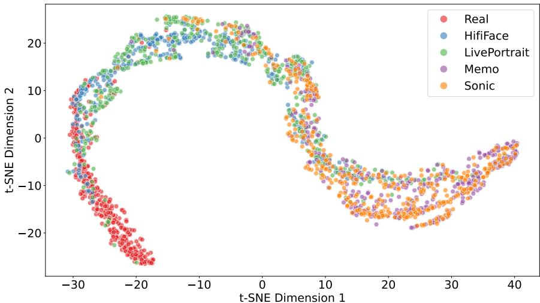  
(a) Latent space of DF-MoE before introducing the CRO loss.

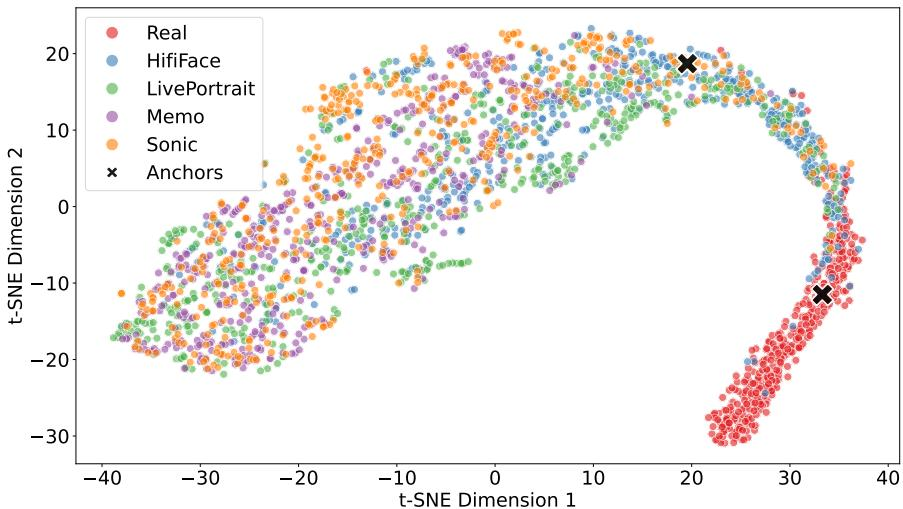  
(b) Latent space of DF-MoE after introducing the CRO loss.  
Figure 1: Comparison between latent spaces of DF-MoE, before and after introducing CRO loss. In both cases, the model is trained on MAVOS-DD. Real samples and deepfakes generated by various methods are illustrated through different colors. Sonic and HifiFace are generative methods that do not belong to the training set. Best viewed in color.

Fine-tuning feature extractors. Fully fine-tuning the foundational encoders is computationally impractical due to the massive memory footprint and processing costs required. Beyond these computational constraints, full fine-tuning can compromise generalization, as highly parameterized models are particularly prone to overfitting to dataset-specific forgery artifacts, and thus limiting their ability to detect unseen manipulation techniques. This phenomenon is corroborated by Table A4, which demonstrates that applying full fine-tuning on the AVFF encoder within the DF-MoE architecture actually degrades performance. In contrast, adapting the encoder using the Effort [107] strategy yields superior results, proving that parameter-efficient fine-tuning approach balances feature adaptation with robust generalization.

<table><tr><td>AVFF+ Effort</td><td>Face segmentation</td><td>HP+Gaze</td><td>AV emotion</td><td>AV transformer</td><td>rPPG</td><td>mAP</td><td>AUC</td><td>acc</td></tr><tr><td></td><td>X</td><td>x</td><td>x</td><td>x</td><td>X</td><td>0.88</td><td>0.91</td><td>97.93</td></tr><tr><td></td><td>√</td><td>x</td><td>X</td><td>x</td><td>X</td><td>0.90</td><td>0.90</td><td>96.70</td></tr><tr><td></td><td>X</td><td>√</td><td>x</td><td>x</td><td>x</td><td>0.91</td><td>0.92</td><td>96.65</td></tr><tr><td></td><td>X</td><td>x</td><td>V</td><td>x</td><td>x</td><td>0.87</td><td>0.88</td><td>91.71</td></tr><tr><td></td><td>X</td><td>x</td><td>X</td><td>√</td><td>X</td><td>0.92</td><td>0.93</td><td>98.70</td></tr><tr><td></td><td>X</td><td>X</td><td>X</td><td>x</td><td>√</td><td>0.90</td><td>0.92</td><td>98.56</td></tr><tr><td></td><td>X</td><td>√</td><td>V</td><td>X</td><td>X</td><td>0.93</td><td>0.93</td><td>98.70</td></tr></table>

Table A3: Ablation study on combinations of AVFF+Effort features and other high-level features included in DF-MoE. Results are reported on PolyGlotFake [38].

<table><tr><td>Method</td><td>mAP</td><td>AUC</td><td>acc</td></tr><tr><td>DF-MoE (AVFF full)</td><td>0.94</td><td>0.94</td><td>86.38</td></tr><tr><td>DF-MoE (AVFF+Effort)</td><td>0.98</td><td>0.98</td><td>92.95</td></tr></table>

Table A4: Full vs. parameter-efficient training of AVFF encoder on MAVOS-DD (open-set full). Fine-tuning based on Effort [107] surpasses full fine-tuning.

<table><tr><td rowspan=1 colspan=3>Method       AUC</td></tr><tr><td rowspan=1 colspan=3>F3Net []    0.789</td></tr><tr><td rowspan=2 colspan=2>CORE []RECCE []</td><td rowspan=1 colspan=1>0.809</td></tr><tr><td rowspan=1 colspan=1></td><td rowspan=1 colspan=1>0.823</td></tr><tr><td rowspan=1 colspan=3>DF-MoE (ours)0.834</td></tr></table>

Table A5: Cross-dataset evaluation on Celeb-DF (v2) [61], a video-only dataset. The results demonstrate that DF-MoE obtains competitive results even when the audio modality is missing.

Robustness to missing modalities. We deliberately omit positional embeddings from our token representations, enabling DF-MoE to work seamlessly when one or more modalities are missing. To demonstrate this, we evaluate DF-MoE on the Celeb-DF (v2) [61] dataset in the cross-dataset scenario in Table A5, where audio is not available. In this setting, DF-MoE safely ignores audio-specific features, while still obtaining competitive performance. This implies that DF-MoE is robust to changes in the concatenation order of features, and consequently, to variations in the set of available modalities.

## 7.2 Qualitative Result Analysis

In Figure 2, we show the average attention scores for each dataset, computed over 100 real and 100 fake videos randomly sampled from the respective test subsets. The results indicate that feature importance remains highly consistent across different datasets. This suggests that

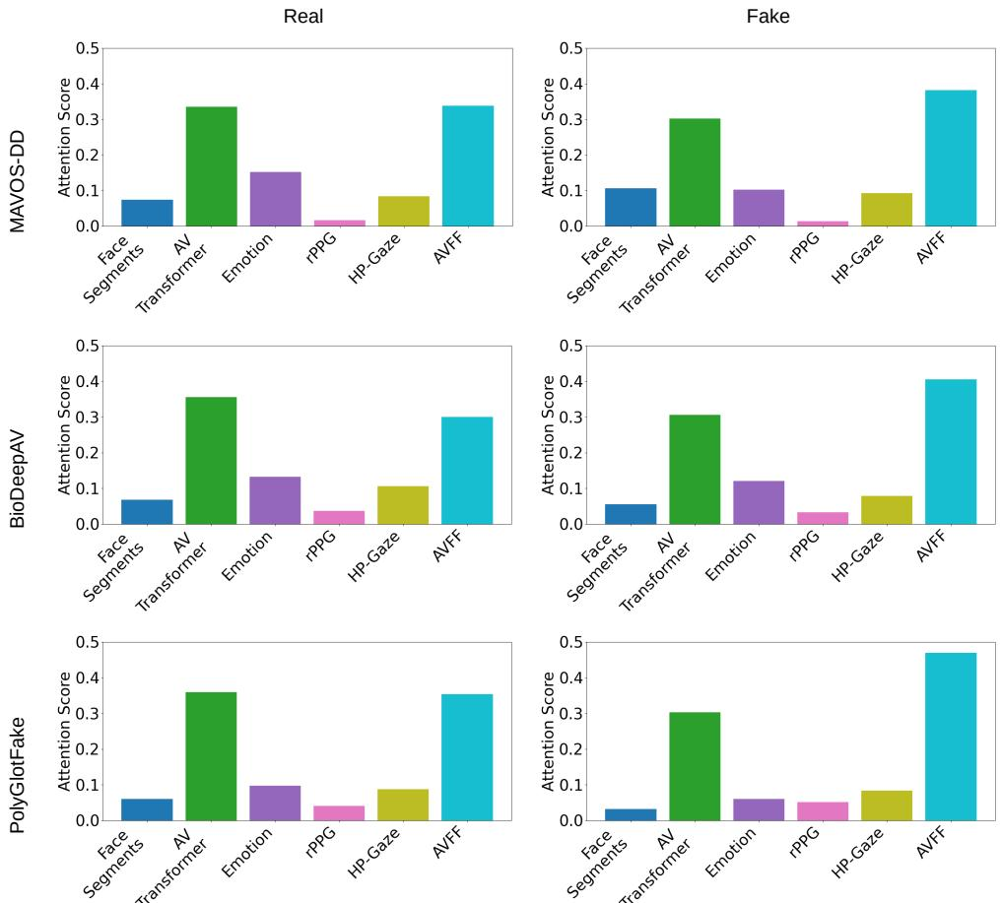  
Figure 2: Average attention scores across datasets and class labels.

our model relies on universal, domain-agnostic features rather than overfitting to datasetspecific artifacts, which directly explains its strong generalization capabilities on unseen data.

## 7.3 Faliure Cases

In Figure 3, we present failure cases of DF-MoE to point out some of its gaps. For the real video on the left-hand side, the AV Transformer and AVFF features are mainly responsible for the incorrect classification. The right-hand side example shows a fake video misclassified as real, where the model disproportionately attributes too much importance to emotion features. Our inspection of these predictions reveals persistent, inaccurate values of happiness andfear, that are misaligned with the actual emotions present in the audio-video streams. Together, these edge cases highlight two potential directions of improvement for our approach. First, we need to explicitly maintain a contribution balance when a small number of features begin to overshadow the rest of the cues. Second, we need to manage the sensitivity of the final classification to the precision of the upstream frozen feature extractors.

Real Sample/DF-MoE: Fake  
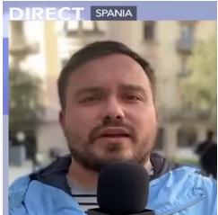

HifiFace Sample/DF-MoE: Real  
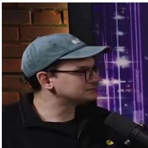

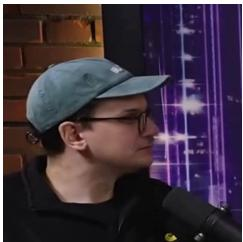

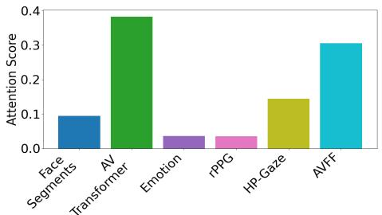

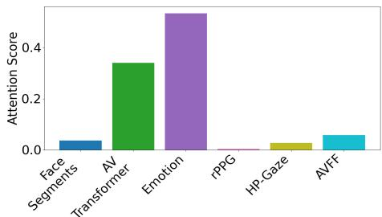  
Figure 3: Examples of videos incorrectly classified by DF-MoE, alongside the corresponding attention scores of each feature type. Best viewed in color.

## 7.4 Implementation Details

In this section, we provide details about the specialized encoders employed in our pipeline. In Figure 4, we illustrate the architectures that are briefly presented in the main paper for the rPPG, face segmentation, head movement and emotion encoders.

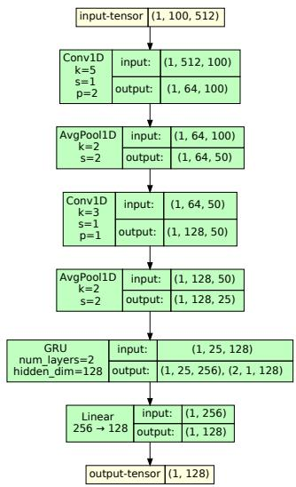  
(a) rPPG.

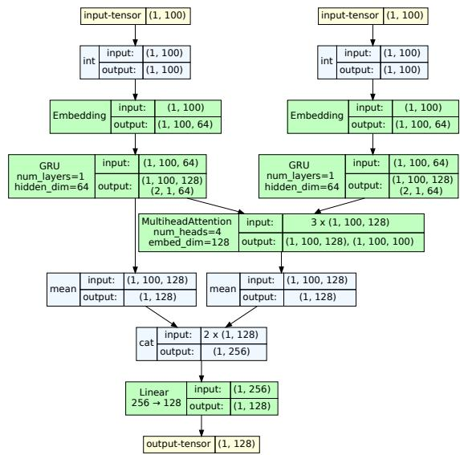  
(b) AV emotion.

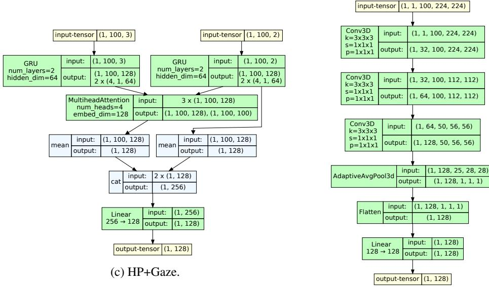  
(d) Face segments.  
Figure 4: Architectures of the specialized encoders, namely rPPG, audio-visual emotion, head and gaze movement, and face segmentation encoders.