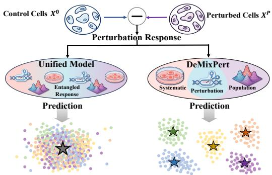
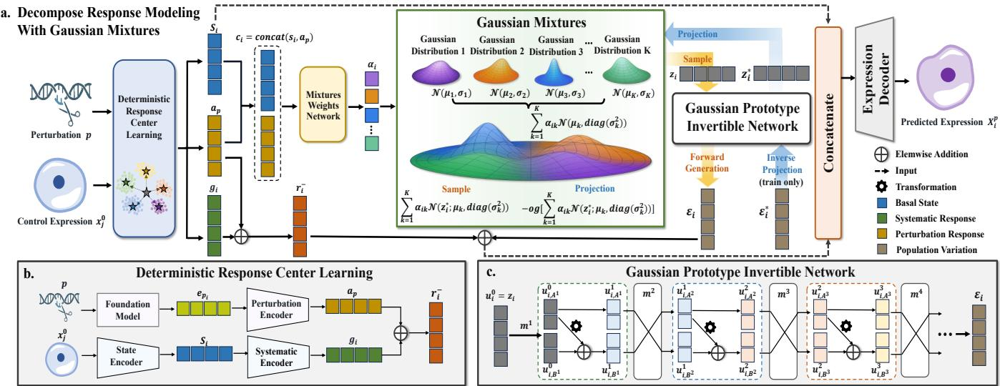
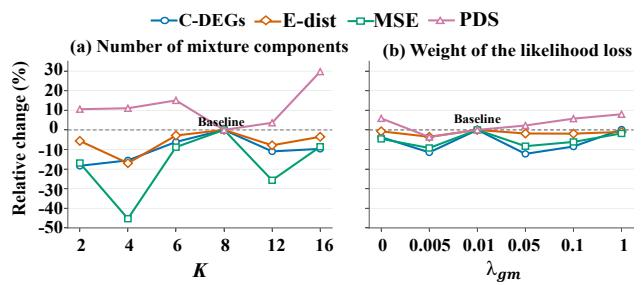
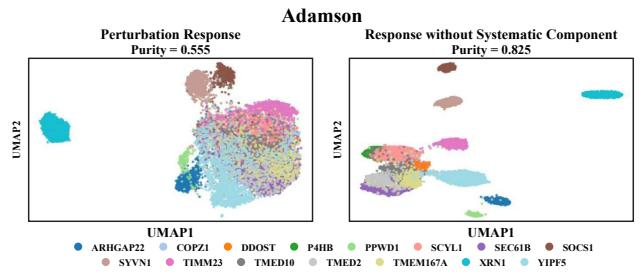
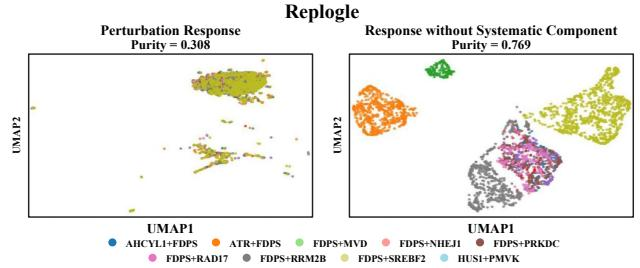
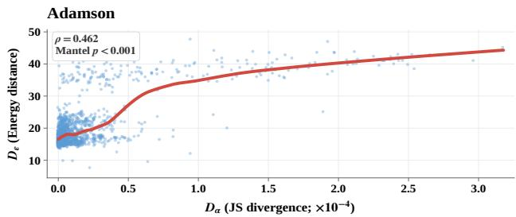
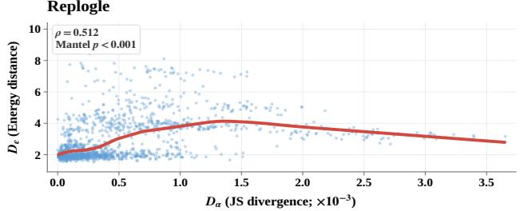

# DeMixPert: Decomposed Response Modeling with Gaussian Mixtures for OOD Single-Cell Perturbation Prediction

Jiawen Liu1, Xuechenxiao Cao1, Yutong Li2, Bing Liu1, Jiaming Liang1, Tinghe Zhang2, Xiaoqi Sheng2, Hongmin Cai1,2∗

1School of Computer Science and Engineering, South China University of Technology, Guangzhou, China 2School of Future Technology, South China University of Technology, Guangzhou, China \*hmcai@scut.edu.cn

## Abstract

Predicting transcriptome-wide responses to unseen genetic perturbations remains a major computational challenge because accurate prediction requires recovering both perturbation-specific transcriptional shifts and heterogeneous cellular responses. Existing methods often entangle deterministic response structure with stochastic populationlevel variation, causing dominant shared patterns to mask weaker perturbation-specific signals and impair distributional modeling. To address these challenges, we propose DeMixPert, an approach for Decomposed response Modeling with Gaussian Mixtures for Out-Of-Distribution (OOD) single-cell Perturbation prediction. DeMixPert decomposes perturbation-induced changes into a basal-state-dependent systematic response, a perturbation-specific response, and population-level variation. The systematic component is derived from the basal state encoded from control-cell expression, whereas the perturbation-specific component is inferred from pretrained target embeddings for unseen-target generalization. DeMixPert models population-level variation using a Gaussian prototype Invertible Network and adaptively combines reusable Gaussian prototypes according to the basal state and perturbation condition. The resulting mixture is mapped to a condition-specific variation distribution. Sampled variations are integrated with the systematic and perturbation-specific components, followed by joint decoding with the basal state to reconstruct perturbed-cell gene expression. Experimental results show that DeMixPert efectively captures heterogeneous single-cell perturbation responses and achieves superior performance across unseen-perturbation settings. The source code is made publicly available upon publication.

## Introduction

Single-cell genetic perturbation profiling couples controlled genetic interventions with transcriptome-wide readouts, enabling cell-resolved characterization of transcriptional responses and the regulatory programs underlying them (Adamson et al. 2016; Dixit et al. 2016). Despite its value, the scalability of such profiling is limited by the combinatorial growth of experimental conditions across perturbation targets, cellular states, and biological contexts (Cheng et al. 2026), making exhaustive measurement infeasible. Accordingly, in silico perturbation-response prediction ofers a scalable means of estimating cellular responses under experimentally profiled conditions.

  
Figure 1: Comparison of unified and decomposed response modeling. By separating entangled response components, DeMixPert better preserves perturbation-specific signals and condition-dependent population structure.

However, predicting responses under experimentally unobserved conditions involves more than estimating an average perturbation-induced expression shift (Yu et al. 2025). These challenges can be understood through three intertwined components of perturbation responses, as illustrated in Fig. 1. First, the basal cellular state contributes a systematic component that shapes responses across perturbation conditions (Dong et al. 2023; Song et al. 2025). This shared structure should be learned from observed conditions and transferred to unseen ones. Second, each perturbation condition induces a perturbation-specific transcriptional efect that distinguishes its response from those of other interventions (Norman et al. 2019; Replogle et al. 2020). For an unseen perturbation, this efect must be inferred from biological relationships with targets observed during training. Third, cells exposed to the same perturbation may occupy distinct response subpopulations, whose internal structure and relative abundance vary with cellular state and environmental context (Adamson et al. 2016; Frangieh et al. 2021). Consequently, Out-Of-Distribution (OOD) prediction imposes three distinct requirements involving systematic-structure transfer, unseen-target efect inference, and condition-specific population-distribution estimation without direct observations.

Existing methods improve perturbation-response prediction from diferent perspectives. Latent-variable approaches represent perturbation responses through state transformations or factorized perturbation components (Lotfollahi et al. 2023). In parallel, Knowledge-guided methods exploit gene representations or biological priors to generalize from limited perturbation observations (Cui et al. 2024). From another perspective, population-distribution approaches learn transitions from control to perturbed populations using optimal transport, set-level distributional objectives, or flow matching (Bunne et al. 2023; Adduri et al. 2025; Yu et al. 2026). Despite substantial advances in response transfer and distributional modeling, most approaches still formulate the full perturbation response as a monolithic prediction target, leaving shared systematic response, perturbation-specific response, and condition-dependent population-level variation entangled. This limitation is consequential because Systema shows that shared systematic variation can dominate standard evaluation metrics (Viñas Torné et al. 2025). Accordingly, accurate OOD prediction requires disentangling basalstate-dependent systematic responses, perturbation-specific responses, and population-level variation.

In this paper, we propose DeMixPert, a Decomposed response framework with Gaussian Mixtures for out-ofdistribution single-cell Perturbation prediction. By decomposing perturbation responses, DeMixPert assigns shared systematic response, perturbation-specific response, and population variation to separate modules. The basal-statedependent systematic response is integrated with the perturbation-specific response to define a deterministic response center. This separation preserves transferable response structure while preventing shared variation from masking perturbation-specific signals. Subsequently, a Gaussian prototype Invertible Network models population-level variation around the response center by adaptively weighting reusable Gaussian prototypes according to the basal state and perturbation embedding. The resulting mixture is transformed into a condition-specific variation distribution through an invertible mapping. Finally, sampled variations are added to the response center and decoded together with the basal state to reconstruct post-perturbation gene expression. This design improves response recovery for unseen perturbation targets while preserving perturbation discriminability and distributional fidelity. Our main contributions are summarized as follows:

• We propose DeMixPert, a decomposed response model for OOD single-cell perturbation prediction. DeMix-Pert disentangles deterministic response structure from stochastic cellular heterogeneity and captures conditionspecific response distributions using adaptive Gaussian mixtures.

• We introduce a Gaussian prototype Invertible Network for population-level variation modeling. The invertible network uses context-adaptive weights to combine reusable Gaussian mixture prototypes, thereby estimating condition-specific population-variation distributions.

• Quantitative analyses demonstrate that DeMixPert improves OOD perturbation prediction by accurately recovering perturbation-specific responses while preserving population-level distributional fidelity.

## Related Work

## Genetic Perturbation Prediction

Existing approaches formulate cellular responses as latent transformations: scGen applies an average shift, whereas CPA factorizes treatment, dose, and covariate contributions (Lotfollahi, Wolf, and Theis 2019; Lotfollahi et al. 2023). For unseen targets, GEARS leverages gene-relation graphs, while GenePert draws on external gene embeddings (Roohani, Huang, and Leskovec 2024; Chen and Zou 2024). To capture heterogeneity in unpaired data, STATE predicts postintervention cell sets, whereas scDFM learns full conditional distributions via flow matching (Adduri et al. 2025; Yu et al. 2026). Systema further reveals that shared systematic variation can dominate standard metrics and mask targetspecific signals (Viñas Torné et al. 2025). Nevertheless, most prior work does notjointly disentangle basal-state-dependent systematic responses, perturbation-specific responses, and condition-dependent population-level variation.

## Gaussian Mixtures and Distribution Modeling

Gaussian mixture (GM) models provide a flexible representation of complex population structure (McLachlan and Peel 2000), while normalizing flows transform tractable source distributions through invertible mappings (Dinh, Krueger, and Bengio 2014). PerturbNet combines perturbation embeddings with a conditional invertible network to generate cellstate distributions (Yu et al. 2025). More recently, MixFlow replaces the conventional unimodal Gaussian source with a descriptor-conditioned Gaussian mixture and transports it using conditional flow matching (Rubbi et al. 2026). Despite improved distributional flexibility, existing approaches still model perturbation responses monolithically, conflating systematic and perturbation-specific efects with residual variation. This entanglement limits component-wise generalization and mechanistic interpretation.

## Methodology

## Preliminaries

In the context of OOD single-cell perturbation prediction, we decompose responses into systematic, perturbation-specific, and population-level components to capture transferable patterns and condition-specific heterogeneity.

Let $\mathcal D = \{ X ^ { 0 } , \{ \bar { X } ^ { p } \} _ { p \in \mathcal P } \}$ denote a single-cell genetic perturbation dataset, where $\mathcal { P }$ is the set of perturbation conditions, each involving one or more target genes. The control population is defined by $X ^ { 0 } \ = \ \{ x _ { j } ^ { 0 } \ \in \ \mathbb { R } ^ { G } \} _ { i = 1 } ^ { N _ { 0 } } .$ Here, $N _ { 0 }$ is the number of control cells and $\mathbf { \Delta } \mathbf { \Sigma } _ { G }$ denotes the number of selected genes. For each perturbation condition $p \in \mathcal P$ , the corresponding perturbed population is defined by $X ^ { p } = \{ x _ { i } ^ { p } \} _ { i = 1 } ^ { N _ { p } }$ , where $N _ { p }$ is the number of cells observed under perturbation $p .$

Since the control and perturbed populations are unpaired, for each perturbed cell $\boldsymbol { x } _ { i } ^ { p }$ , we randomly sample a control cell $\dot { x } _ { j } ^ { 0 }$ from $X ^ { 0 }$ as its reference and define the perturbation response as $\Delta x _ { i } ^ { p } = x _ { i } ^ { p } - x _ { j } ^ { 0 }$ . To facilitate subsequent response modeling, the expression-space response $\Delta \hat { x } _ { i } ^ { p }$ is projected into a latent space using an encoder $E _ { r } \mathbf { : }$ $r _ { i } ^ { * } \overset { \cdot } { = } E _ { r } ( \Delta x _ { i } ^ { p } ) \in \mathbb { R } ^ { d _ { r } }$ . The objective of DeMixPert is to predict a perturbation response $\hat { r } _ { i }$ that approximates the target response $r _ { i } ^ { * }$ . In DeMixPert, $\boldsymbol { { \hat { r } } _ { i } }$ is modeled as three components: $\hat { r } _ { i } = g _ { i } + a _ { p } + \epsilon _ { i }$ . Here, ${ \mathit { g } } _ { i } , \ { \mathit { a } } _ { p } ,$ and $\epsilon _ { i }$ denote the systematic response, perturbation-specific response, and population-level response variation, respectively.

  
Figure 2: Overview of DeMixPert. (a) The overall workflow of DeMixPert. (b) The architecture of the Deterministic Response Center Learning module. (c) The architecture of the Gaussian prototype Invertible Network.

## Overview

Fig. 2 outlines the DeMixPert framework. As shown in Fig. 2 (a), the Deterministic Response Center Learning module takes the perturbation condition and control-cell expression as inputs. The module separates the response into systematic and perturbation-specific components, whose combination forms the deterministic response center. Meanwhile, the basal-state and perturbation representations are concatenated to predict mixture weights, adapting a set of shared Gaussian prototypes to the current cell state and perturbation condition. The adapted Gaussian mixture is connected to the Gaussian prototype Invertible Network for populationvariation modeling. The forward transformation generates population-level variations from source samples. Conversely, the training-only inverse transformation projects observed target variations into the Gaussian-mixture space. The corresponding conditional likelihood provides joint supervision for mixture-weight estimation and invertible transformation learning. Generated population-level variations are subsequently added to the deterministic response center. Thereafter, the resulting response representation is concatenated with the basal-state representation for expression decoding.

## Deterministic Response Center Learning

To prevent systematic variation from obscuring perturbationspecific efects, DeMixPert constructs a deterministic response center by combining separately learned systematic and perturbation-specific responses. The three encoders $E _ { s } ,$ $E _ { \mathrm { s y s } } ,$ , and $E _ { \mathrm { p e r t } }$ produce the basal-state representation, systematic response, and perturbation-specific response, respectively: $s _ { i } \ \stackrel { \cdot } { = } \ E _ { s } ( x _ { i } ^ { 0 } ) \ \stackrel { \cdot } { \in } \ \mathbb { R } ^ { d _ { s } } , \ g _ { i } \ \stackrel { \cdot } { = } \ E _ { \mathrm { s y s } } ( s _ { i } ) \ \in \ \mathbb { R } ^ { d _ { \tau } }$ r , and $a _ { p } = E _ { \mathrm { p e r t } } ( e _ { p } ) \in \mathbb { R } ^ { d _ { r } }$ . Here, $s _ { i }$ summarizes the unperturbed cellular context and is retained for subsequent variation modeling. The systematic response $g _ { i }$ captures basalstate-dependent patterns shared across perturbation conditions, whereas $a _ { p }$ captures the perturbation-specific response derived from the perturbation embedding $e _ { p } .$ . We derive $e _ { p }$ from pretrained scGPT representations (Cui et al. 2024) for OOD generalization. The $e _ { p }$ provides prior knowledge of biological relationships among genes for inferring perturbationspecific responses without direct observations.

Finally, the resulting systematic and perturbation-specific responses are combined to form the deterministic response center: $\bar { r } _ { i } = g _ { i } + a _ { p } \in \mathbb { R } ^ { d _ { r } }$ . The ${ \bar { r } } _ { i }$ denotes the deterministic response pattern jointly specified by the basal cellular state $s _ { i }$ and perturbation target $e _ { p }$ in the response latent space $\mathbb { R } ^ { d _ { r } }$

## Gaussian prototype Invertible Network

The deterministic response center captures systematic and perturbation-specific responses but not the conditional population-level variation distribution. Accordingly, DeMix-Pert models the remaining population-level variation using a Gaussian prototype Invertible Network. Using the target response $r _ { i } ^ { * }$ , the target variation from the deterministic response center is given by $\epsilon _ { i } ^ { * } = r _ { i } ^ { * } - \bar { r } _ { i } \in \mathbb { R } ^ { d _ { r } }$

For each perturbation condition, the target variations of its observed cells form samples from the corresponding population-variation distribution. To capture potential variation patterns shared across perturbations, the target variations $\epsilon ^ { * }$ pooled from all training conditions are modeled using a

K-component diagonal Gaussian mixtures:

$$
q _ { \mathrm { G M } } ( \boldsymbol { \epsilon } ) = \sum _ { k = 1 } ^ { K } \pi _ { k } \mathcal { N } \left( \boldsymbol { \epsilon } ; \mu _ { k } , \mathrm { d i a g } ( \sigma _ { k } ^ { 2 } ) \right) ,\tag{1}
$$

where $\pi _ { k } , \mu _ { k }$ , and $\mathrm { d i a g } ( \sigma _ { k } ^ { 2 } )$ denote the weight, mean, and diagonal variance of the k-th Gaussian prototype, respectively. These parameters are periodically re-estimated from the target variations using the expectation-maximization algorithm (Dempster, Laird, and Rubin 1977). Further details are provided in Supplementary Appendix F.

The global Gaussian Mixtures provide reusable Gaussian prototypes shared across perturbations. However, the contribution of each prototype depends jointly on the basal state and perturbation condition. Accordingly, $s _ { i }$ and $a _ { p }$ are concatenated to predicts Gaussian prototype weights:

$$
\alpha _ { i } = \mathrm { s o f t m a x } \left( \mathrm { M L P } ( \mathrm { c o n c a t } ( s _ { i } , a _ { p } ) ) \right) \in \mathbb { R } ^ { K } ,\tag{2}
$$

where concat $( \cdot , \cdot )$ denotes concatenation, MLP(·) denotes a multilayer perceptron, and softmax(·) normalizes the predicted prototype weights. The conditional Gaussian mixture is then defined as:

$$
P ( z \mid \alpha _ { i } ) = \sum _ { k = 1 } ^ { K } \alpha _ { i k } \mathcal { N } \left( z ; \mu _ { k } , \mathrm { d i a g } ( \sigma _ { k } ^ { 2 } ) \right) .\tag{3}
$$

The prototype parameters are shared globally, while their contributions are adapted to the condition representation $c _ { i } .$ Then, a source variable $z _ { i } \sim P ( z \mid \alpha _ { i } )$ is sampled from the conditional mixture and passed through the invertible network $T _ { \theta } .$ , producing a sample $\epsilon _ { i }$ from the final populationvariation distribution: $\epsilon _ { i } = T _ { \theta } ( z _ { i } ; c _ { i } )$ .

Let $u _ { i } ^ { ( 0 ) } ~ = ~ z _ { i }$ and $u _ { i } ^ { l } \ = \ F _ { l } \Big ( u _ { i } ^ { ( l - 1 ) } ; c _ { i } \Big ) \ \in \ \mathbb { R } ^ { d _ { r } }$ denote the output of the l-th coupling layer. A binary mask $m _ { l } \in \{ 0 , 1 \bar  \} ^ { d _ { r } }$ partitions the feature dimensions into two complementary index sets, $A ^ { l }$ and $B ^ { l }$ , corresponding to mask values of 1 and $0 ,$ respectively, such that ${ \bf \dot { \bf A } } ^ { \ell } \cap { \bf \bar { B } } ^ { \ell } = { \bf \Phi } \varnothing$ $A ^ { \ell } \cup B ^ { \ell } = \{ 1 , \dots , d _ { r } \}$ . Accordingly, the two input subvectors are defined as $\overline { { u _ { i , A ^ { l } } ^ { ( l - 1 ) } } } : = \begin{array} { l } { \overline { { \big ( u _ { i j } ^ { ( l - 1 ) } \big ) } } \in A ^ { l } } \end{array} \in \mathbb { R } ^ { | { \cal A } ^ { l } | }$ $u _ { i , B ^ { l } } ^ { ( l - 1 ) } : = \big ( u _ { i j } ^ { ( l - 1 ) } \big ) _ { j \in B ^ { l } } \in \mathbb { R } ^ { | B ^ { l } | }$ . The $u _ { i } ^ { ( l - 1 ) }$ can be recovered by restoring the two subvectors to the positions specified by $m _ { l } \colon u _ { i } ^ { ( l - 1 ) } = \mathrm { m e r g e } _ { m _ { l } } \left( u _ { i , A ^ { l } } ^ { ( l - 1 ) } , u _ { i , B ^ { l } } ^ { ( l - 1 ) } \right)$ . Here, $\mathrm { m e r g e } _ { m ^ { l } }$ restores the two subsets to their original feature positions specified by $m ^ { l } .$ . The mask is fixed within each layer but varies across layers, allowing all feature dimensions to be updated.

Within the l-th coupling layer, $u _ { i , A ^ { l } } ^ { ( l - 1 ) }$ remain unchanged and is used to determine the transformation applied to $u _ { i , B ^ { l } } ^ { ( l - 1 ) }$ DeMixPert first measures how closely the unchanged features match each Gaussian prototype. The normalized matching weight associated with prototype k is

$$
\gamma _ { i k } ^ { l } = \frac { \pi _ { k } \mathcal { N } \Big ( u _ { i , A ^ { l } } ^ { ( l - 1 ) } ; \mu _ { k , A ^ { l } } , \mathrm { d i a g } \Big ( \sigma _ { k , A ^ { l } } ^ { 2 } \Big ) \Big ) } { K } .\tag{4}
$$

In parallel, a layer-specific MLP $h ^ { l }$ produces prototype modulation coeficients from $c _ { i } \colon b _ { i } ^ { l } = h ^ { l } \dot { ( } c _ { i } ) \in \mathbb { R } ^ { K }$ . Here, $\gamma _ { i } ^ { l }$ captures feature-level prototype matching, whereas $b _ { i } ^ { l }$ captures the contribution of each prototype under the current basal-state and perturbation context. The two coeficients are combined to generate the additive shift applied to $B ^ { l }$

$$
f ^ { l } ( u _ { i , A ^ { l } } , c _ { i } ) = W ^ { l } \left( \gamma _ { i } ^ { l } \odot b _ { i } ^ { l } \right) \in \mathbb { R } ^ { | B ^ { l } | } ,\tag{5}
$$

where $W ^ { l } ~ \in ~ \mathbb { R } ^ { | B ^ { l } | \times K }$ is a learnable projection matrix and $\odot$ denotes element-wise multiplication. The additive coupling transformation is defined as follows: $u _ { i , A ^ { l } } ^ { l } ~ =$ $u _ { i , A ^ { l } } ^ { l - 1 } , \quad u _ { i , B ^ { l } } ^ { l } = u _ { i , B ^ { l } } ^ { l - 1 } + f _ { l } \left( u _ { i , A ^ { l } } ^ { l - 1 } , c _ { i } \right)$ . The two subsets are then reassembled to obtain the complete output of the l-th coupling layer:

$$
F _ { l } \left( u _ { i } ^ { l - 1 } ; c _ { i } \right) = u _ { i } ^ { l } = \mathrm { m e r g e } _ { m ^ { l } } \left( u _ { i , A ^ { l } } ^ { l } , u _ { i , B ^ { l } } ^ { l } \right) .\tag{6}
$$

Since the $A ^ { l }$ subset remains unchanged, the same shift function can be evaluated during inversion (Dinh, Sohl-Dickstein, and Bengio 2016). The inverse transformation is defined by $u _ { i , A ^ { l } } ^ { l - 1 } = u _ { i , A ^ { l } } ^ { l }$ and $u _ { i , B ^ { l } } ^ { l - 1 } = u _ { i , B ^ { l } } ^ { l } - f _ { l } \left( u _ { i , A ^ { l } } ^ { l } , c _ { i } \right)$

The recovered subsets are reassembled to obtain the complete output of the inverse layer:

$$
F _ { l } ^ { - 1 } \left( u _ { i } ^ { l } ; c _ { i } \right) = u _ { i } ^ { l - 1 } = \mathrm { m e r g e } _ { m ^ { l } } \left( u _ { i , A ^ { l } } ^ { l - 1 } , u _ { i , B ^ { l } } ^ { l - 1 } \right) .\tag{7}
$$

Each coupling layer is bijective and has a triangular Jacobian with unit determinant (Dinh, Krueger, and Bengio 2014). This invertibility maps each target variation back to the Gaussian mixtures. Its likelihood under the source distribution supervises the context-dependent prototype weights and the invertible transformation. The corresponding likeli hood objective is introduced in the training loss.

After L coupling layers, the generated variation sample is

$$
\epsilon _ { i } = T _ { \theta } ( z _ { i } ; c _ { i } ) = F _ { L } \circ \cdots \circ F _ { 1 } ( z _ { i } ; c _ { i } ) \in \mathbb { R } ^ { d _ { r } } .\tag{8}
$$

For perturbation condition $p ,$ the collection $\{ \epsilon _ { i } : p _ { i } = p \}$ forms samples from its predicted population-level variation distribution. Each sample perturbs the deterministic response center to yield the response latent: $\hat { r } _ { i } = \bar { r } _ { i } + \epsilon _ { i }$

## Expression Decoder

The post-perturbation expression is jointly determined by the original cellular context and the perturbation-induced response. The basal-state representation $s _ { i }$ captures the cellular context, whereas the predicted response latent $\boldsymbol { { \hat { r } } } _ { i }$ encodes the perturbation efect. The concatenated representation is then decoded to reconstruct post-perturbation gene expression: $\hat { x } _ { i } ^ { p } = D _ { \psi } \left( \mathrm { c o n c a t } ( s _ { i } , \hat { r } _ { i } ) \right)$ ) . Therein, $D _ { \psi }$ denotes the expression decoder.

## Training Objective

DeMixPert is trained end-to-end to jointly learn the deterministic response center and condition-specific population-level variation. The total training objective consists of four loss components that supervise response alignment, populationvariation likelihood, gene-expression reconstruction, and population-distribution matching.

Response Alignment Loss. A mean squared error loss is used to align the predicted response latent with its target: $\begin{array} { r } { \mathcal { L } _ { \mathrm { a l i g n } } = \frac { 1 } { N } \sum _ { i = 1 } ^ { N } \left\| \boldsymbol { \hat { r } } _ { i } - \boldsymbol { r } _ { i } ^ { * } \right\| _ { 2 } ^ { 2 } } \end{array}$ , where N denotes the number of cells in the training batch.

Population-Variation Likelihood Loss. To learn the conditional population-level variation, each target variation is first mapped back to the Gaussian mixtures: $\overline { { z _ { i } ^ { * } } } = T _ { \theta } ^ { - 1 } ( \epsilon _ { i } ^ { * } ; c _ { i } )$ We then minimize its negative log-likelihood under the conditional Gaussian mixtures:

$$
\mathcal { L } _ { \mathrm { g m } } = - \frac { 1 } { N } \sum _ { i = 1 } ^ { N } \log \left[ \sum _ { k = 1 } ^ { K } \alpha _ { i k } \mathcal { N } \left( z _ { i } ^ { * } ; \mu _ { k } , \mathrm { d i a g } ( \sigma _ { k } ^ { 2 } ) \right) \right] ,\tag{9}
$$

where, the ${ \mathcal { L } } _ { \mathrm { g m } }$ jointly supervises the context-dependent prototype weights and the invertible transformation.

Gene-Expression Reconstruction Loss. The reconstruction loss preserves gene expression information by reconstructing the perturbed expression from both the predicted and target responses, while recovering the control expression from a zero-response vector $\mathbf { 0 } \in \mathbb { R } ^ { d _ { r } }$

$$
\begin{array} { r l } & { \mathcal { L } _ { \mathrm { r e c } } = \mathcal { L } _ { m s e } ( D _ { \psi } ( [ s _ { i } , \hat { r } _ { i } ] ) , x _ { i } ^ { p _ { i } } ) + \mathcal { L } _ { m s e } ( D _ { \psi } ( [ s _ { i } , r _ { i } ^ { * } ] ) , x _ { i } ^ { p _ { i } } ) } \\ & { \quad \quad \quad + \mathcal { L } _ { m s e } \big ( D _ { \psi } ( [ s _ { i } , \mathbf { 0 } ] ) , x _ { j } ^ { 0 } \big ) , } \end{array}\tag{10}
$$

where $\mathcal { L } _ { m s e }$ denotes the mean square error loss.

Distribution Loss. At the population level, we use energy distance to align the generated and observed expression distributions under each perturbation condition:

$$
\mathcal { L } _ { \mathrm { d i s t } } = \frac { 1 } { | \mathcal { P } | } \sum _ { p \in \mathcal { P } } \mathrm { E D } \left( \{ \hat { x } _ { i } ^ { p } \} _ { i : p _ { i } = p } , \{ x _ { i } ^ { p } \} _ { i : p _ { i } = p } \right) ,\tag{11}
$$

where $\mathcal { P }$ denotes the set of perturbation conditions and ED(·) is the energy distance (Székely and Rizzo 2013). The overall training objective is $\mathcal { L } = \mathcal { L } _ { \mathrm { a l i g n } } + \lambda _ { \mathrm { g m } } \mathcal { L } _ { \mathrm { g m } } + \mathcal { L } _ { \mathrm { r e c } } + \mathcal { L } _ { \mathrm { d i s t } }$ The $\lambda _ { \mathrm { g m } }$ balances the numerical scale of the negative loglikelihood against the other loss components. All trainable parameters are jointly optimized by minimizing L.

## Experiments

## Experimental Setup

Datasets and preprocessing. We benchmark DeMixPert on four widely used single-cell genetic perturbation datasets. Adamson (Adamson et al. 2016) and Papalexi (Papalexi et al. 2021) contain single-gene perturbations, whereas Norman (Norman et al. 2019) and Replogle (Replogle et al. 2020) involve combinatorial perturbations. All datasets are processed following a standard single-cell RNA-seq preprocessing pipeline. For each dataset, we select 2,048 highly variable genes (HVGs) and additionally retain all perturbation-target genes to define the input gene space. Detailed dataset descriptions and statistics are provided in Appendix C.

Compared methods. We compare DeMixPert against five representative perturbation-response prediction methods: GEARS (Roohani, Huang, and Leskovec 2024), scGPT (Cui et al. 2024), GenePert (Chen and Zou 2024), scDFM (Yu et al. 2026), and STATE (Adduri et al. 2025). These methods span graph learning, pretrained foundation models, ridge regression, conditional flow matching, and set-based Transformers. Accordingly, the comparative experiments enable DeMixPert to be evaluated against methods with substantially diferent assumptions and predictive mechanisms.

Metrics and implementation. Model performance is evaluated at both the top-100 diferentially expressed genes (DEGs) level and the all-gene level. At the top-100 DEG level, we report Common Diferentially Expressed Genes (C-DEGs), Energy Distance (E-Dist), Wasserstein Distance (W-Dist), and Mean Squared Error (MSE). At the all-gene level, we report the Diferential Expression Score (DES), MSE, Centroid Accuracy (Centroid Acc), and the Perturbation Discrimination Score (PDS) (Wei et al. 2026; Viñas Torné et al. 2025; Roohani et al. 2025). Together, these metrics assess diferential-expression recovery, distributional agreement, expression error, and perturbation discrimination.

Condition-disjoint splits evaluate unseen perturbations. Single-gene datasets use 70%/10%/20% training/validation/test splits. For combinatorial datasets, training includes all single-gene conditions and half of the combinatorial conditions, while the remainder is divided equally between validation and test sets. Validation selects checkpoints, and results are reported as mean ± standard variation across random seeds. DeMixPert uses PyTorch and AdamW. Default and dataset-specific configurations are provided in AppendiX B and H, respectively.

## Quantitative Comparison

Table 1 summarizes the results for unseen single-gene and combinatorial perturbations. On the single-gene datasets Papalexi and Adamson, DeMixPert substantially improves perturbation-specific and distributional recovery, achieving C-DEGs scores of 22.000 and 10.733, PDS values of 0.904 and 0.947, and the lowest E-Dist values of 0.171 and 0.448, respectively. Although ScDFM obtains the highest DES on Papalexi, its lower C-DEGs and PDS suggest that matching response magnitude alone is insuficient to recover perturbation-specific efects. From another direction, performance on unseen combinatorial perturbations evaluates the ability to preserve interaction-specific efects and generalize to novel gene combinations. On Norman and Replogle, DeMixPert achieves the highest PDS (0.981 and 0.938) and the lowest E-Dist (0.374 and 0.155). Its C-DEGs score reaches 31.650 on Norman, surpassing STATE’s 21.006, and 12.378 on Replogle, close to the best baseline result of 12.711. Moreover, scGPT’s high Centroid Acc of 0.940 but worst E-Dist of 3.174 on Norman demonstrates that accurate centroid prediction does not guarantee distributional recovery. Overall, these results show that DeMixPert generalizes efectively across both perturbation regimes while preserving perturbation specificity and population-level heterogeneity.

<table><tr><td rowspan="2">Dataset</td><td rowspan="2">Method</td><td colspan="4">Top 100 DEGs Level</td><td colspan="4">All Gene Level</td></tr><tr><td>C-DEGs↑</td><td>E-Dist↓</td><td>W-Dist↓</td><td>MSE↓</td><td>DES↑</td><td>MSE↓</td><td>Centroid Acc↑</td><td>PDS↑</td></tr><tr><td rowspan="6">Papalexi</td><td>GEARS</td><td> $2 . 2 8 0 \pm 0 . 4 6 0$ </td><td> $0 . 6 1 7 \pm 0 . 2 1 8$ </td><td> $1 2 . 7 2 0 \pm 0 . 2 6 3$ </td><td> $0 . 0 6 5 \pm 0 . 0 3 2$ </td><td> $0 . 1 9 4 \pm 0 . 1 1 5$ </td><td> $0 . 0 2 4 \pm 0 . 0 1 5$ </td><td> $0 . 2 4 0 \pm 0 . 0 8 9$ </td><td> $0 . 6 4 0 \pm 0 . 0 4 9$ </td></tr><tr><td>scGPT</td><td> $1 . 0 4 0 \pm 0 . 8 6 2$ </td><td> $0 . 2 0 8 \pm 0 . 3 2 7$ </td><td> ${ \bf 3 . 4 6 8 \pm 1 . 1 5 9 }$ </td><td> $0 . 0 5 6 \pm 0 . 0 5 9$ </td><td> $0 . 0 7 7 \pm 0 . 0 4 5$ </td><td> $0 . 0 1 0 \pm 0 . 0 1 1$ </td><td> $0 . 5 0 0 \pm 0 . 0 0 0$ </td><td> $0 . 6 2 3 \pm 0 . 0 2 4$ </td></tr><tr><td>GenePert</td><td> $5 . 4 2 7 \pm 0 . 8 8 9$ </td><td> $0 . 3 3 7 \pm 0 . 1 3 6$ </td><td> $7 . 0 1 1 \pm 0 . 1 9 0$ </td><td> $0 . 0 2 7 \pm 0 . 0 1 2$ </td><td> $0 . 1 2 7 \pm 0 . 0 6 7$ </td><td> $0 . 0 0 4 \pm 0 . 0 0 2$ </td><td>0.500 ± 0.000</td><td> $0 . 6 0 0 \pm 0 . 0 2 5$ </td></tr><tr><td>scDFM</td><td> $5 . 5 6 0 \pm 1 . 5 0 6$ </td><td> $1 . 9 7 1 \pm 0 . 5 8 2$ </td><td> $1 4 . 0 5 3 \pm 0 . 3 2 4$ </td><td> $0 . 2 7 4 \pm 0 . 1 0 4$ </td><td> ${ \bf 0 . 2 1 2 \pm 0 . 0 9 9 }$ </td><td> $0 . 0 9 9 \pm 0 . 0 3 7$ </td><td>0.200 ± 0.141</td><td> $0 . 5 6 8 \pm 0 . 0 9 5$ </td></tr><tr><td>STATE</td><td> $4 . 7 6 0 \pm 1 . 4 9 9$ </td><td> $0 . 7 6 0 \pm 0 . 2 1 4$ </td><td> $1 3 . 3 6 4 \pm 0 . 2 2 2$ </td><td> $0 . 0 7 2 \pm 0 . 0 3 3$ </td><td> $0 . 1 9 8 \pm 0 . 1 0 7$ </td><td> $0 . 0 2 5 \pm 0 . 0 1 4$ </td><td>0.160 ± 0.089</td><td> $0 . 6 0 0 \pm 0 . 0 0 0$ </td></tr><tr><td>DeMixPert</td><td> $2 2 . 0 0 0 \pm 4 . 8 5 4$ </td><td> ${ \bf 0 . 1 7 1 \pm 0 . 0 8 8 }$ </td><td> $6 . 3 6 9 \pm 0 . 4 0 3$ </td><td> $\mathbf { 0 . 0 0 8 \pm 0 . 0 0 6 }$ </td><td>0.200 ± 0.129</td><td> $\mathbf { 0 . 0 0 2 \pm 0 . 0 0 1 }$ </td><td></td><td>0.720 ± 0.110 0.904 ± 0.046</td></tr><tr><td rowspan="6">Adamson</td><td>GEARS</td><td> $2 . 2 8 0 \pm 0 . 1 4 5$ </td><td> $0 . 5 6 3 \pm 0 . 1 2 5$ </td><td> $9 . 6 5 4 \pm 0 . 2 1 7$ </td><td> $0 . 0 4 6 \pm 0 . 0 1 5$ </td><td> $0 . 3 1 3 \pm 0 . 0 8 2$ </td><td> $0 . 0 1 2 \pm 0 . 0 0 3$ </td><td>0.133 ± 0.067</td><td> $0 . 6 0 5 \pm 0 . 0 2 6$ </td></tr><tr><td>scGPT</td><td> $4 . 1 5 1 \pm 0 . 1 3 1$ </td><td>2.997 ± 0.310</td><td> $\mathbf { 4 . 9 3 6 \pm 0 . 3 2 6 }$ </td><td>0.037 ± 0.014</td><td>0.378 ± 0.078</td><td>0.005 ± 0.002</td><td>0.586 ± 0.079</td><td> $0 . 5 6 7 \pm 0 . 0 3 7$ </td></tr><tr><td>GenePert</td><td> $0 . 0 6 3 \pm 0 . 0 1 0$ </td><td>0.468 ± 0.174</td><td>4.938 ±0.301</td><td>0.031 ± 0.013</td><td>0.105 ± 0.038</td><td>0.002 ± 0.001</td><td>0.533 ± 0.014</td><td>0.570 ± 0.025</td></tr><tr><td>scDFM</td><td> $3 . 4 0 0 \pm 1 . 3 8 1$ </td><td>1.355 ± 0.216</td><td>10.771 ± 0.628</td><td>0.132 ± 0.027</td><td>0.278 ± 0.082</td><td> $0 . 0 4 8 \pm 0 . 0 0 7$ </td><td>0.067 ± 0.047</td><td>0.539 ± 0.040</td></tr><tr><td>STATE</td><td> $2 . 9 4 7 \pm 0 . 3 5 7$ </td><td> $0 . 8 2 0 \pm 0 . 1 3 8$ </td><td>10.989 ±0.169</td><td>0.052 ± 0.017</td><td>0.280 ± 0.091</td><td>0.015 ± 0.003</td><td>0.080 ± 0.030</td><td>0.534 ± 0.004</td></tr><tr><td>DeMixPert</td><td> $\mathbf { 1 0 . 7 3 3 \pm 5 . 1 9 8 }$ </td><td>0.448 ± 0.052</td><td>5.481 ± 0.113</td><td>0.021 ± 0.003</td><td>0.153 ± 0.078</td><td>0.006 ± 0.001</td><td>0.560 ± 0.076</td><td>0.947 ± 0.020</td></tr><tr><td rowspan="6">Norman</td><td>GEARS</td><td> $3 . 8 5 0 \pm 0 . 5 5 7$ </td><td>0.855 ± 0.220</td><td>6.380 ± 0.234</td><td>0.049 ± 0.019</td><td>0.334 ± 0.029</td><td>0.008 ± 0.002</td><td>0.237 ± 0.112</td><td>0.802 ± 0.090</td></tr><tr><td>scGPT</td><td> $6 . 6 4 4 \pm 0 . 6 2 7$ </td><td>3.174±0.157</td><td>5.627 ± 0.239</td><td>0.028 ± 0.007</td><td>0.540 ± 0.031</td><td>0.004 ± 0.001</td><td>0.940 ± 0.013</td><td> $0 . 8 8 6 \pm 0 . 0 2 5$ </td></tr><tr><td>GenePert</td><td> $1 9 . 1 8 1 \pm 0 . 6 5 8$ </td><td>1.113 ± 0.154</td><td>6.305 ± 0.256</td><td>0.078 ± 0.013</td><td>0.404 ± 0.022</td><td>0.008 ± 0.011</td><td>0.639 ± 0.034</td><td> $0 . 6 4 6 \pm 0 . 0 3 3$ </td></tr><tr><td>scDFM</td><td> $1 5 . 3 5 0 \pm 3 . 5 4 8$ </td><td> $0 . 7 1 1 \pm 0 . 1 4 8$ </td><td> $7 . 6 0 7 \pm 0 . 4 6 4$ </td><td>0.046 ± 0.011</td><td>0.389 ± 0.029</td><td>0.009 ± 0.003</td><td>0.463 ± 0.116</td><td> $0 . 8 9 0 \pm 0 . 0 3 7$ </td></tr><tr><td>STATE</td><td> $2 1 . 0 0 6 \pm 5 . 8 7 2$ </td><td>1.341 ± 0.217</td><td>7.175±0.177</td><td>0.105 ± 0.021</td><td>0.354 ± 0.013</td><td>0.011 ± 0.002</td><td>0.031 ± 0.000</td><td> $0 . 5 2 4 \pm 0 . 0 1 4$ </td></tr><tr><td>DeMixPert</td><td> $\mathbf { 3 1 . 6 5 0 \pm 1 1 . 7 3 9 }$ </td><td> $\mathbf { 0 . 3 7 4 \pm 0 . 0 5 6 }$ </td><td> $6 . 6 0 6 \pm 0 . 2 6 9$ </td><td>0.003 ± 0.0002</td><td>0.506 ± 0.063</td><td>0.003 ± 0.0002</td><td> $0 . 7 5 0 \pm 0 . 1 6 3$ </td><td> ${ \bf 0 . 9 8 1 \pm 0 . 0 0 5 }$ </td></tr><tr><td rowspan="6">Replogle</td><td>GEARS</td><td> $2 . 1 1 1 \pm 0 . 1 7 6$ </td><td> $0 . 4 4 8 \pm 0 . 0 6 0$ </td><td> $1 2 . 7 4 3 \pm 0 . 1 1 4$ </td><td>0.038 ± 0.009</td><td> $0 . 1 8 9 \pm 0 . 0 4 7$ </td><td> $0 . 0 1 2 \pm 0 . 0 0 2$ </td><td>0.267 ± 0.127</td><td> $0 . 6 6 9 \pm 0 . 0 5 8$ </td></tr><tr><td>scGPT</td><td> $6 . 0 8 9 \pm 0 . 7 5 5$ </td><td> $2 . 2 6 3 \pm 0 . 2 8 0$ </td><td> $\mathbf { 4 . 3 0 2 \pm 0 . 4 8 3 }$ </td><td>0.011 ± 0.004</td><td>0.269 ± 0.060</td><td> $0 . 0 0 2 \pm 0 . 0 0 1$ </td><td>0.778 ± 0.125</td><td> $0 . 6 5 4 \pm 0 . 0 8 7$ </td></tr><tr><td>GenePert</td><td> $1 2 . 5 3 3 \pm 2 . 8 8 1$ </td><td> $0 . 2 0 0 \pm 0 . 0 4 7$ </td><td> $4 . 6 0 0 \pm 0 . 5 5 0$ </td><td> $\mathbf { 0 . 0 0 2 \pm 0 . 0 0 1 }$ </td><td> $0 . 2 0 0 \pm 0 . 0 4 7$ </td><td> $0 . 0 0 2 \pm 0 . 0 0 1$ </td><td> $0 . 5 5 8 \pm 0 . 0 4 8$ </td><td> $0 . 5 8 0 \pm 0 . 0 0 8$ </td></tr><tr><td>scDFM</td><td> $3 . 4 2 2 \pm 1 . 6 3 0$   $1 2 . 7 1 1 \pm 3 . 2 7 8$ </td><td> $0 . 8 0 2 \pm 0 . 0 9 1$   $0 . 5 1 0 \pm 0 . 0 7 5$ </td><td> $1 3 . 2 3 4 \pm 0 . 2 7 2$ </td><td> $0 . 0 9 2 \pm 0 . 0 1 5$   $0 . 0 4 0 \pm 0 . 0 1 2$ </td><td> $0 . 2 0 2 \pm 0 . 0 5 3$   $0 . 2 0 7 \pm 0 . 0 4 1$ </td><td> $0 . 0 2 6 \pm 0 . 0 0 4$   $0 . 0 1 1 \pm 0 . 0 0 2$ </td><td> $0 . 1 7 8 \pm 0 . 0 6 1$   $0 . 1 1 1 \pm 0 . 0 0 0$ </td><td> $0 . 5 8 8 \pm 0 . 0 5 2$ </td></tr><tr><td>STATE DeMixPert</td><td></td><td> $\mathbf { 0 . 1 5 5 \pm 0 . 0 4 0 }$ </td><td> $1 3 . 0 0 8 \pm 0 . 1 0 7$   $5 . 6 1 4 \pm 0 . 1 5 6$ </td><td> $0 . 0 0 5 \pm 0 . 0 0 1$ </td><td> $0 . 2 2 7 \pm 0 . 0 6 6$ </td><td> $\mathbf { 0 . 0 0 2 \pm 0 . 0 0 0 }$ </td><td> $0 . 7 7 8 \pm 0 . 1 9 3$ </td><td> $0 . 5 4 8 \pm 0 . 0 1 4$ </td></tr><tr><td></td><td> $1 2 . 3 7 8 \pm 4 . 0 7 1$ </td><td></td><td></td><td></td><td></td><td></td><td></td><td> ${ \bf 0 . 9 3 8 \pm 0 . 0 3 9 }$ </td></tr></table>

Table 1: Comprehensive evaluation results on four genetic perturbation datasets, reported as mean ± standard variation. ↑ (↓) indicates that higher (lower) values are better. The best result for each metric is marked in bold.

<table><tr><td rowspan="2">Dataset</td><td rowspan="2">Variant</td><td colspan="2">Top 100 DEGs</td><td colspan="2">All Genes</td></tr><tr><td>C-DEGs W-Dist ↑</td><td>↓</td><td>Centroid PDS Acc ↑</td><td>↑</td></tr><tr><td rowspan="5"></td><td>w/o Decomp</td><td>10.520</td><td>5.927</td><td>0.240</td><td>0.733</td></tr><tr><td>w/o Gene</td><td>8.773</td><td>5.772</td><td>0.267</td><td>0.787</td></tr><tr><td>Adamson w/o Sys</td><td>10.400</td><td>5.746</td><td>0.360</td><td>0.846</td></tr><tr><td>w/o GM</td><td>11.107</td><td>5.781</td><td>0.280</td><td>0.797</td></tr><tr><td>DeMixPert</td><td>10.733</td><td>5.481</td><td>0.560</td><td>0.947</td></tr><tr><td rowspan="5"></td><td>w/o Decomp</td><td>12.022</td><td>5.905</td><td>0.244</td><td>0.736</td></tr><tr><td>w/o Gene</td><td>9.733</td><td>5.852</td><td>0.333</td><td>0.760</td></tr><tr><td>Replogle w/o Sys</td><td>11.556</td><td>5.832</td><td>0.333</td><td>0.800</td></tr><tr><td>w/o GM</td><td>14.356</td><td>5.833</td><td>0.289</td><td>0.773</td></tr><tr><td>DeMixPert</td><td>12.378</td><td>5.614</td><td>0.778</td><td>0.938</td></tr></table>

Table 2: The results of the ablation study.

Table 2 shows that DeMixPert leads overall with the lowest W-Dist and highest Centroid Acc/PDS. Removing decomposition lowers Centroid Acc/PDS to 0.240/0.244 and 0.733/0.736 on Adamson/Replogle; removing the systematic component also degrades both, confirming complementary roles in perturbation specificity and transferable basal-state patterns. Removing the embedding-derived perturbationspecific efect reduces C-DEGs from 10.733/12.378 to 8.773/9.733, confirming its importance for unseen perturbations. Although w/o GM raises C-DEGs to 11.107/14.356, it worsens all other metrics, showing that the deterministic response center alone cannot recover population distributions.

## Sensitivity Analysis

## Ablation Study

Fig. 3 shows performance changes under diferent Gaussian prototype numbers K and GM-loss weights $\lambda _ { \mathrm { g m } }$ relative to the reference setting $( K = 8 , \ : \lambda _ { \mathrm { g m } } = 0 . 0 \dot { 1 } )$ . Deviating from K = 8 generally degrades DEG recovery, distribution modeling, and expression reconstruction, whereas larger K improves perturbation identification, indicating a fidelity–separability trade-of. Similarly, increasing $\lambda _ { \mathrm { g m } }$ improves identification but slightly afects other objectives. Overall, the reference setting achieves the best balance.

We conduct ablation experiments on Adamson and Replogle by comparing the complete model with four ablated variants. The w/o Decomp variant replaces decomposed response modeling with unified modeling. The w/o Gene and w/o Sys variants remove the embedding-derived perturbationspecific efect and the basal-state-dependent systematic response, respectively. For brevity, w/o GM denotes removal of the entire Gaussian prototype Invertible Network, including both the GM and the invertible network. The complete results are reported in Table 2.

## Interpretability Analysis

Two interpretability analyses are conducted to validate two central design principles of DeMixPert: explicit response decomposition and condition-dependent composition of shared Gaussian prototypes.

  
Figure 3: The result of the sensitivity analysis. Positive values indicate improvement and negative values degradation.

  
Figure 4: UMAP visualizations of the perturbation response $r _ { i } ^ { * }$ (left) and the response after removing the basal-statedependent systematic component, $r _ { i } ^ { * } - g _ { i }$ (right), on the Adamson and Replogle datasets. Points are colored by perturbation condition, and cluster purity scores quantify the separation among perturbations.

Fig. 4 compares representations of predicted response before and after removing the systematic component $g _ { i }$ . Cluster purity is applied to assess the separation of basal-state variation from perturbation-associated structure. It investigates whether the basal-state-dependent systematic response interferes with perturbation-associated structures in the predicted response space. After removing $g _ { i }$ , the responses on both datasets form more compact and clearly separated clusters. Accordingly, cluster purity increases from 0.308 to 0.769 on Replogle and from 0.555 to 0.825 on Adamson. Since $g _ { i }$ is computed exclusively from the basal-state representation and is the only component removed in this comparison, these improvements indicate that it introduces variation that is not aligned with perturbation identity. This validates the response decomposition in DeMixPert and improves the discrimination of unseen perturbations.

Fig. 5 illustrates the relationship between Gaussian prototype weights and cellular distributions across diferent perturbation conditions. For each pair of perturbation conditions, $D _ { \alpha }$ denotes the Jensen–Shannon (JS) divergence (Lin 2002) between their Gaussian prototype weight vectors α, whereas $D _ { \epsilon }$ denotes the energy distance between their population distributions ϵ. Spearman correlation is then used to assess the overall rank association between the two distance matrices (Spearman 1961), and its statistical significance is evaluated using a Mantel-style permutation test (Dietz 1983). Across all pairs of perturbation conditions, significant overall positive rank associations are observed in both the Adamson $( \rho = 0 . 4 6 2 )$ and Replogle $( \rho = 0 . 5 1 2 )$ datasets, with Mantel $p < 0 . 0 0 1$ in both cases. The consistency of this association across the single-gene and combinatorial perturbation datasets indicates that diferences in the learned prototype weights are closely associated with variation in perturbationspecific population distributions. These results provide empirical support for the efectiveness and interpretability of the Gaussian prototype composition mechanism.

  
Figure 5: The correlation between Prototype-weight divergence and perturbation-specific population diferences. Pairwise prototype-weight divergence $D _ { \alpha }$ is compared with population-level distance $D _ { \epsilon }$ in the Adamson and Replogle datasets. The red curves show the LOWESS-smoothed relationships between $D _ { \alpha }$ and $D _ { \epsilon }$

## Conclusion

In this study, we present DeMixPert, a Gaussian-mixturebased response decomposition framework for OOD singlecell perturbation prediction. DeMixPert disentangles perturbation responses into systematic, perturbation-specific, and population-level components, each modeled through a dedicated mechanism. A Gaussian prototype Invertible Network further characterizes cellular heterogeneity through context-adaptive prototype composition. Extensive experiments demonstrate accurate recovery of perturbation-specific responses under OOD settings. The adaptive prototype composition also captures condition-specific population structures, ofering a structured interpretation of heterogeneous cellular responses.

## Acknowledgements

This work was supported in part by the National Key Research and Development Program of China (2024YFF1206600); in part by Guangdong S&T Programme (2025B0101130001); in part by the National Natural Science Foundation ofChina (62325204, 62502161, 62502163); in part by the China Postdoctoral Science Foundation (2025M782912).

## References

Adamson, B.; Norman, T. M.; Jost, M.; Cho, M. Y.; Nuñez, J. K.; Chen, Y.; Villalta, J. E.; Gilbert, L. A.; Horlbeck, M. A.; Hein, M. Y.; et al. 2016. A multiplexed single-cell CRISPR screening platform enables systematic dissection of the unfolded protein response. Cell, 167(7): 1867–1882.

Adduri, A. K.; Gautam, D.; Bevilacqua, B.; Imran, A.; Shah, R.; Naghipourfar, M.; Teyssier, N.; Ilango, R.; Nagaraj, S.; Dong, M.; et al. 2025. Predicting cellular responses to perturbation across diverse contexts with State. BioRxiv, 2025–06.

Bunne, C.; Stark, S. G.; Gut, G.; Del Castillo, J. S.; Levesque, M.; Lehmann, K.-V.; Pelkmans, L.; Krause, A.; and Rätsch, G. 2023. Learning single-cell perturbation responses using neural optimal transport. Nature methods, 20(11): 1759– 1768.

Chen, Y.; and Zou, J. 2024. Genepert: Leveraging genept embeddings for gene perturbation prediction. bioRxiv, 2024– 10.

Cheng, J.; Chi, C.; Zhou, J.; Xin, H.; and Xia, J. 2026. PRE-SCRIBE: Predicting Single-Cell Responses with Bayesian Estimation. Advances in Neural Information Processing Systems, 38: 145457–145489.

Cui, H.; Wang, C.; Maan, H.; Pang, K.; Luo, F.; Duan, N.; and Wang, B. 2024. scGPT: toward building a foundation model for single-cell multi-omics using generative AI. Nature methods, 21(8): 1470–1480.

Dempster, A. P.; Laird, N. M.; and Rubin, D. B. 1977. Maximum likelihood from incomplete data via the EM algorithm. Journal ofthe royal statistical society: series B (methodological), 39(1): 1–22.

Dietz, E. J. 1983. Permutation tests for association between two distance matrices. Systematic Biology, 32(1): 21–26.

Dinh, L.; Krueger, D.; and Bengio, Y. 2014. Nice: Nonlinear independent components estimation. arXiv preprint arXiv:1410.8516.

Dinh, L.; Sohl-Dickstein, J.; and Bengio, S. 2016. Density estimation using real nvp. arXiv preprint arXiv:1605.08803.

Dixit, A.; Parnas, O.; Li, B.; Chen, J.; Fulco, C. P.; Jerby-Arnon, L.; Marjanovic, N. D.; Dionne, D.; Burks, T.; Raychowdhury, R.; et al. 2016. Perturb-Seq: dissecting molecular circuits with scalable single-cell RNA profiling of pooled genetic screens. cell, 167(7): 1853–1866.

Dong, M.; Wang, B.; Wei, J.; de O. Fonseca, A. H.; Perry, C. J.; Frey, A.; Ouerghi, F.; Foxman, E. F.; Ishizuka, J. J.; Dhodapkar, R. M.; et al. 2023. Causal identification ofsinglecell experimental perturbation efects with CINEMA-OT. Nature methods, 20(11): 1769–1779.

Frangieh, C. J.; Melms, J. C.; Thakore, P. I.; Geiger-Schuller, K. R.; Ho, P.; Luoma, A. M.; Cleary, B.; Jerby-Arnon, L.; Malu, S.; Cuoco, M. S.; et al. 2021. Multimodal pooled Perturb-CITE-seq screens in patient models define mechanisms of cancer immune evasion. Nature genetics, 53(3): 332–341.

Lin, J. 2002. Divergence measures based on the Shannon entropy. IEEE Transactions on Information theory, 37(1): 145–151.

Lotfollahi, M.; Klimovskaia Susmelj, A.; De Donno, C.; Hetzel, L.; Ji, Y.; Ibarra, I. L.; Srivatsan, S. R.; Naghipourfar, M.; Daza, R. M.; Martin, B.; et al. 2023. Predicting cellular responses to complex perturbations in high-throughput screens. Molecular systems biology, 19(6): MSB202211517.

Lotfollahi, M.; Wolf, F. A.; and Theis, F. J. 2019. scGen predicts single-cell perturbation responses. Nature methods, 16(8): 715–721.

McLachlan, G. J.; and Peel, D. 2000. Finite mixture models. John Wiley & Sons.

Norman, T. M.; Horlbeck, M. A.; Replogle, J. M.; Ge, A. Y.; Xu, A.; Jost, M.; Gilbert, L. A.; and Weissman, J. S. 2019. Exploring genetic interaction manifolds constructed from rich single-cell phenotypes. Science, 365(6455): 786–793.

Papalexi, E.; Mimitou, E. P.; Butler, A. W.; Foster, S.; Bracken, B.; Mauck III, W. M.; Wessels, H.-H.; Hao, Y.; Yeung, B. Z.; Smibert, P.; et al. 2021. Characterizing the molecular regulation of inhibitory immune checkpoints with multimodal single-cell screens. Nature genetics, 53(3): 322– 331.

Replogle, J. M.; Norman, T. M.; Xu, A.; Hussmann, J. A.; Chen, J.; Cogan, J. Z.; Meer, E. J.; Terry, J. M.; Riordan, D. P.; Srinivas, N.; et al. 2020. Combinatorial single-cell CRISPR screens by direct guide RNA capture and targeted sequencing. Nature biotechnology, 38(8): 954–961.

Roohani, Y.; Huang, K.; and Leskovec, J. 2024. Predicting transcriptional outcomes of novel multigene perturbations with GEARS. Nature Biotechnology, 42(6): 927–935.

Roohani, Y. H.; Hua, T. J.; Tung, P.-Y.; Bounds, L. R.; Yu, F. B.; Dobin, A.; Teyssier, N.; Adduri, A.; Woodrow, A.; Plosky, B. S.; et al. 2025. Virtual Cell Challenge: Toward a Turing test for the virtual cell. Cell, 188(13): 3370–3374.

Rubbi, A.; Akbarnejad, A.; Sanian, M. V.; Parast, A. Y.; Asadollahzadeh, H.; Amani, A.; Akhtar, N.; Cooper, S.; Bassett, A.; Liò, P.; et al. 2026. MixFlow: Mixture-Conditioned Flow Matching for Out-of-Distribution Generalization. arXiv preprint arXiv:2601.11827.

Song, B.; Liu, D.; Dai, W.; Mcmyn, N. F.; Wang, Q.; Yang, D.; Krejci, A.; Vasilyev, A.; Untermoser, N.; Loregger, A.; et al. 2025. Decoding heterogeneous single-cell perturbation responses. Nature cell biology, 27(3): 493–504.

Spearman, C. 1961. The proof and measurement of association between two things.

Székely, G. J.; and Rizzo, M. L. 2013. Energy statistics: A class of statistics based on distances. Journal of statistical planning and inference, 143(8): 1249–1272.

Viñas Torné, R.; Wiatrak, M.; Piran, Z.; Fan, S.; Jiang, L.; Teichmann, S. A.; Nitzan, M.; and Brbić, M. 2025. Systema: a framework for evaluating genetic perturbation response prediction beyond systematic variation. Nature Biotechnology, 1–10.

Wei, Z.; Wang, Y.; Gao, Y.; Wang, S.; Li, P.; Si, D.; Gao, Y.; Wu, S.; Li, D.; Dong, K.; et al. 2026. Benchmarking algorithms for generalizable single-cell perturbation response prediction. Nature Methods, 23(2): 451–464.

Yu, C.; Wang, C.; Liao, B.; and Wu, T. 2026. scdfm: Distributional flow matching model for robust single-cell perturbation prediction. arXiv preprint arXiv:2602.07103.

Yu, H.; Qian, W.; Song, Y.; and Welch, J. D. 2025. Perturbnet predicts single-cell responses to unseen chemical and genetic perturbations. Molecular Systems Biology, 21(8): 960.

## Supplementary Appendix

## Perturbation Embedding Construction

As stated in the main paper, the perturbation embedding is constructed from pretrained scGPT gene representations (Cui et al. 2024). Let $\mathcal { M } _ { p }$ denote the set of target genes named by perturbation condition p, and let $\mathbf { e } _ { m } \in \mathbb { R } ^ { 5 1 2 }$ be the pretrained scGPT embedding of target gene m. We define

$$
e _ { p } = \frac { 1 } { \vert \mathcal { M } _ { p } \vert } \sum _ { m \in \mathcal { M } _ { p } } \mathbf { e } _ { m } \in \mathbb { R } ^ { 5 1 2 } .\tag{12}
$$

For a single-gene perturbation, this reduces to the embedding of that gene. For a combinatorial perturbation, the targetgene embeddings are averaged with equal weight. Conditions whose named target is unavailable in the frozen embedding table are removed before split generation.

## Default Model Configuration

This section reports the default architecture and optimization configuration shared across all datasets. A summary of the model architecture is provided in Table 4, and dataset-specific training settings are reported in Supplementary Appendix H.

<table><tr><td>Hyperparameter</td><td>Value</td></tr><tr><td>State latent dimension</td><td>256</td></tr><tr><td>Response latent dimension</td><td>128</td></tr><tr><td>Perturbation embedding dimen-</td><td>512</td></tr><tr><td>sion Gaussian components K</td><td>8</td></tr><tr><td>Coupling layers L</td><td>4</td></tr><tr><td>Condition-network hidden width</td><td>256</td></tr><tr><td>Prototype temperature</td><td>1.0</td></tr><tr><td>Optimizer</td><td>AdamW</td></tr><tr><td>Learning rate</td><td> $5 \times 1 0 ^ { - 5 }$ </td></tr><tr><td>Weight decay</td><td> $1 0 ^ { - 6 }$ </td></tr><tr><td>Gradient clipping</td><td>global norm 5.0</td></tr><tr><td>Learning-rate scheduler</td><td>none (constant learning rate)</td></tr></table>

Default configuration shared across datasets. Datasetspecific batch sizes, evaluation intervals, Gaussian-mixture refresh settings, and training schedules are listed in Supplementary Appendix H.

## Dataset Descriptions

We evaluate DeMixPert on four single-cell genetic perturbation datasets, comprising two single-gene perturbation datasets, Adamson and Papalexi, and two combinatorial perturbation datasets, Norman and Replogle. These datasets cover diferent perturbation technologies, cellular contexts, and prediction settings. Dataset-specific preprocessing and feature construction are described in Supplementary Appendix D, while the perturbation-level splitting protocol is described in Supplementary Appendix E.

Adamson. The Adamson dataset was generated using Perturb-seq in K562 cells to characterize transcriptional responses associated with the unfolded protein response (Adamson et al. 2016). Each non-control condition corresponds to a single targeted genetic perturbation.

Papalexi. The Papalexi dataset was generated using ECCITE-seq in THP-1 cells to measure the transcriptional consequences of CRISPR perturbations targeting immuneregulatory genes (Papalexi et al. 2021). The dataset contains single-gene perturbation conditions.

Norman. The Norman dataset contains CRISPR activation measurements in K562 cells and was designed to study transcriptional responses and genetic interactions induced by single-gene and combinatorial perturbations (Norman et al. 2019). The formal input uses one shared gene space for all cells and perturbation conditions.

Replogle. The Replogle dataset contains both single-gene and dual-gene perturbations measured using direct guide-RNA capture technology (Replogle et al. 2020).

## Data Preprocessing

This section describes data quality control, normalization, gene selection, perturbation embedding construction, and the response reference used in the main-text formulation.

All models and metrics operate on the frozen logNor expression layer. The feature space is the union of the 2,048 genes selected by expression variability and the perturbation target genes that are available in the dataset. The resulting gene counts are reported in Table 5. Gene selection is performed once when constructing each frozen input, before the condition-level split is generated; it is therefore shared by all five seeds and all compared methods.

Perturbation embeddings are constructed as defined in Supplementary Appendix A.

Following the main text, a control cell $x _ { i } ^ { 0 }$ is randomly sampled from the control population for each perturbed cell $x _ { i } ^ { p }$ , and the response is defined as

$$
\Delta x _ { i } ^ { p } = x _ { i } ^ { p } - x _ { j } ^ { 0 } .\tag{13}
$$

## Out-of-Distribution Data Splitting Protocol

We perform perturbation-level splitting to evaluate generalization to unseen perturbation conditions. The non-control perturbations assigned to the training, validation, and test sets are mutually disjoint. Control cells are not treated as prediction targets in the split; instead, they are retained as a shared reference population for constructing perturbation responses and evaluating diferential expression.

## Single-Gene Perturbation Datasets

For Adamson and Papalexi, all unique non-control perturbation conditions are first sorted and then randomly permuted using a seed-specific NumPy random number generator. Given N non-control conditions, the numbers assigned to the training and validation sets are computed as

$$
N _ { \mathrm { t r a i n } } = \mathrm { r o u n d } ( 0 . 7 N ) , \qquad N _ { \mathrm { v a l } } = \mathrm { r o u n d } ( 0 . 1 N ) ,\tag{14}
$$

and the remaining conditions are assigned to the test set. For datasets with at least three non-control conditions, the implementation ensures that the validation and test sets are non-empty. The resulting conditions within each split are stored in lexicographic order.

<table><tr><td>Symbol</td><td>Definition</td></tr><tr><td>Problem formulation</td><td></td></tr><tr><td> $\mathcal { D }$ </td><td>A single-cell genetic perturbation dataset.</td></tr><tr><td> $X ^ { 0 }$ </td><td>The population of unperturbed control cells.</td></tr><tr><td> $X ^ { p }$ </td><td>The observed cell population under perturbation condition  $p .$ </td></tr><tr><td> $x _ { j } ^ { 0 } , x _ { i } ^ { p }$ </td><td>Gene-expression profiles of a control cell and a cell under perturbation p, respectively.</td></tr><tr><td> $\mathcal { P } , p$ </td><td>The set of perturbation conditions and an individual perturbation condition, respectively.</td></tr><tr><td> $N _ { 0 } , N _ { p }$ </td><td>The numbers of control cells and cells under perturbation  $p .$ </td></tr><tr><td> $G$ </td><td>The number of selected genes in the expression space.</td></tr><tr><td> $\pi _ { 0 }$ </td><td>The distribution of unperturbed control cells.</td></tr><tr><td> $\pi ( \cdot \mid p )$ </td><td>The condition-specific distribution of cells under perturbation</td></tr><tr><td> $f _ { \theta }$ </td><td> $p .$  The stochastic conditional generator parameterized by  $\theta .$ </td></tr><tr><td> $\Delta x _ { i } ^ { p }$ </td><td>The observed expression change defined in the main text,  $\Delta x _ { i } ^ { p } = x _ { i } ^ { p } - x _ { j } ^ { 0 }$  , where  $\boldsymbol { x } _ { j } ^ { 0 }$  is a randomly sampled control cell.</td></tr><tr><td>Response decomposition</td><td></td></tr><tr><td> $E _ { s } , E _ { r }$ </td><td>The basal-state encoder and response encoder, respectively.</td></tr><tr><td> $s _ { i } \in \mathbb { R } ^ { d _ { s } }$ </td><td>The basal cellular-state representation of cell ¿.</td></tr><tr><td> $r _ { i } ^ { * } \in \mathbb { R } ^ { d _ { r } }$ </td><td>The target response latent encoded from the observed expression change</td></tr><tr><td> $d _ { s } , d _ { r }$ </td><td> $\Delta x _ { i } ^ { p } .$  The dimensions of the basal-state latent and response latent spaces.</td></tr><tr><td> $g _ { i }$ </td><td>The basal-state-dependent systematic response component.</td></tr><tr><td> $e _ { p _ { i } } \in \mathbb { R } ^ { d _ { e } }$ </td><td>The pretrained embedding of perturbation condition  $p _ { i } .$ </td></tr><tr><td> $d _ { e }$ </td><td>The dimension of the pretrained perturbation embedding.</td></tr><tr><td> $a _ { p _ { i } }$ </td><td>The perturbation-level average response effect derived from  $e _ { p _ { i } } .$ </td></tr><tr><td> ${ \bar { r } } _ { i }$ </td><td>The deterministic response center,  $\bar { r } _ { i } = g _ { i } + a _ { p _ { i } } .$ </td></tr><tr><td> $\boldsymbol { \epsilon } _ { i } ^ { * }$ </td><td>The target cell-specific deviation,  $\epsilon _ { i } ^ { * } = r _ { i } ^ { * } - \bar { r } _ { i } .$ </td></tr><tr><td>Gaussian-prototype residual modeling</td><td></td></tr><tr><td> $K$ </td><td>The number of diagonal Gaussian response prototypes.</td></tr><tr><td> $\pi _ { k } , \mu _ { k } , \sigma _ { k } ^ { 2 }$ </td><td>The global mixture weight, mean, and diagonal variance of the k-th Gaussian prototype.</td></tr><tr><td></td><td>The joint condition representation,  $c _ { i } = \operatorname { c o n c a t } ( s _ { i } , a _ { p _ { i } } ) .$ </td></tr><tr><td> $c _ { i }$   $\alpha _ { i k }$ </td><td>The condition-dependent mixture weight of prototype k for cell ¿.</td></tr><tr><td> $z _ { i }$ </td><td>A source variable sampled from the condition-dependent Gaussian mixture.</td></tr><tr><td> $T _ { \theta }$ </td><td>to a cell-specific deviation.</td></tr><tr><td></td><td>The conditional invertible transformation that maps  $z _ { i }$ </td></tr><tr><td> $L$ </td><td>The number of additive coupling layers in  $T _ { \theta } .$ </td></tr><tr><td> $\gamma _ { i k } ^ { ( \ell ) }$ </td><td>The prototype-matching responsibility of prototype k at coupling layer</td></tr><tr><td> $\epsilon _ { i }$ </td><td>The generated stochastic cell-specific deviation.</td></tr><tr><td> ${ \hat { r } } _ { i }$ </td><td>The predicted response latent,  $\hat { r } _ { i } = \bar { r } _ { i } + \epsilon _ { i } .$ </td></tr><tr><td> $D _ { \psi }$ </td><td>The expression decoder parameterized by  $\psi .$ </td></tr><tr><td> $\hat { x } _ { i } ^ { p _ { i } }$ </td><td>The predicted post-perturbation expression profile.</td></tr><tr><td>Training objectives</td><td></td></tr><tr><td> $\mathcal { L } _ { \mathrm { a l i g n } }$ </td><td>The response-latent alignment loss.</td></tr><tr><td> ${ \mathcal { L } } _ { \mathrm { g m } }$ </td><td>The Gaussian-mixture negative log-likelihood loss.</td></tr><tr><td> $\mathcal { L } _ { \mathrm { r e c } }$ </td><td>The expression reconstruction loss.</td></tr><tr><td> ${ \mathcal { L } } _ { \mathrm { d i s t } }$ </td><td>The perturbation-condition-specific distribution matching loss.</td></tr><tr><td> $\mathcal { L }$ </td><td>The overall training objective.</td></tr></table>

Table 3: Summary of the notation used in DeMixPert.

## Combinatorial Perturbation Datasets

For Norman and Replogle, we follow the combinatorial perturbation protocol of (Wei et al. 2026). All single-gene perturbation conditions are included in the training set. The dual-gene conditions are randomly permuted, and

$$
N _ { \mathrm { d u a l , t r a i n } } = \mathrm { r o u n d } \left( 0 . 5 N _ { \mathrm { d u a l } } \right)\tag{15}
$$

dual-gene conditions are assigned to training. If $N _ { \mathrm { r e m a i n } }$ denotes the number of remaining dual-gene conditions, the validation set receives

$$
N _ { \mathrm { d u a l , v a l } } = \left\lfloor \frac { N _ { \mathrm { r e m a i n } } } { 2 } \right\rfloor ,\tag{16}
$$

and all other remaining dual-gene conditions are assigned to the test set. Therefore, when the number of remaining dual-gene conditions is odd, the test set contains one more condition than the validation set.

## Random Seeds and Split Validation

All methods are evaluated using the same five data-splitting seeds:

$$
S = \{ 1 7 , 2 3 , 2 9 , 3 1 , 3 7 \} .\tag{17}
$$

For each dataset and random seed, the generated split is saved before model training and reused by DeMixPert and all comparative methods. The implementation explicitly verifies

<table><tr><td>Module</td><td>Layer dimensions</td><td>Activation</td><td>Dropout</td><td>Norm.</td></tr><tr><td>State encoder</td><td>G-1024-512-256</td><td>SiLU after hidden layers</td><td>0.05</td><td>LayerNorm after hid- den linear layers</td></tr><tr><td>Response encoder</td><td>G-1024-512-128</td><td>SiLU after hidden layers</td><td>0.05</td><td>LayerNorm after hid- den linear layers</td></tr><tr><td>Systematic predictor</td><td>256–512; 512); 512–128</td><td>3×(512–1024– SiLU in blocks</td><td>0.05</td><td>LayerNorm at each block and output</td></tr><tr><td>Anchor predictor</td><td>512–512; 512); 512–128</td><td>3×(512–1024– SiLU in blocks</td><td>0.05</td><td>head LayerNorm at each block and output</td></tr><tr><td>Condition network</td><td>384–256–256; heads 8 and 32 SiLU</td><td></td><td>0</td><td>head None</td></tr><tr><td>Coupling flow</td><td>4× additive half-coupling; None 8 → 64 shift map</td><td></td><td>0</td><td>None</td></tr><tr><td>Expression decoder</td><td> $3 8 4  G$ </td><td>MLP-based mapping</td><td></td><td></td></tr></table>

Table 4: Main-text-aligned DeMixPert component summary. Hyphens denote successive linear-layer widths; residual-block repetition is written explicitly.
<table><tr><td>Dataset</td><td>Source</td><td></td><td>Species</td><td>Cell line</td><td>Sequencing</td><td>Perturbation</td><td>Cells</td><td>Control cells</td><td>Genes</td><td>Single</td><td>Dual</td></tr><tr><td>Adamson</td><td>(Adamson et al. Human 2016)</td><td></td><td></td><td>K562</td><td>Perturb-seq</td><td>CRISPRi</td><td>56,998</td><td>7,629</td><td>2,061</td><td>76</td><td>0</td></tr><tr><td>Papalexi</td><td>(Papalexi 2021)</td><td>et al. Human</td><td></td><td>THP-1</td><td>ECCITE-seq</td><td>CRISPR knockout</td><td>19,340</td><td>2,000</td><td>2,050</td><td>24</td><td>0</td></tr><tr><td>Norman</td><td>(Norman 2019)</td><td>et al. Human</td><td></td><td>K562</td><td>Perturb-seq</td><td>CRISPRa</td><td>96,994</td><td>2,000</td><td>2,096</td><td>101</td><td>125</td></tr><tr><td>Replogle</td><td>(Replogle et al. Human 2020)</td><td></td><td></td><td>K562</td><td>direct-capture Perturb- CRISPRi seq</td><td></td><td>26,777</td><td>2,000</td><td>2,050</td><td>33</td><td>35</td></tr></table>

Table 5: Dataset sources and post-filter statistics used in the experiments. “Single” and “Dual” denote non-control perturbation conditions; every dataset additionally contains one shared control condition.

$$
\mathcal { P } _ { \mathrm { t r a i n } } \cap \mathcal { P } _ { \mathrm { v a l } } = \mathcal { P } _ { \mathrm { t r a i n } } \cap \mathcal { P } _ { \mathrm { t e s t } } = \mathcal { P } _ { \mathrm { v a l } } \cap \mathcal { P } _ { \mathrm { t e s t } } = \emptyset .\tag{18}
$$

This condition-level separation ensures that the reported performance measures generalization to unseen perturbation conditions rather than memorization of cells from perturbations observed during training.

## Gaussian-Prototype EM Updates

This section describes the initialization, expectationmaximization procedure, and periodic refresh strategy of the Gaussian response prototypes.

Residual population. The Gaussian mixture model is fitted to training residuals only. With model parameters fixed in evaluation mode, the implementation computes

$$
\epsilon _ { i } ^ { * } = E _ { r } ( \Delta x _ { i } ^ { p } ) - \bar { r } _ { i }\tag{19}
$$

for every non-control training cell. At most the datasetspecific number of residuals in Table 7 is sampled uniformly without replacement. Residual extraction and mixture fitting use no\_grad; consequently, the EM updates are not diferentiated through.

Initialization. For $K = 8 ,$ a seeded random permutation ofthe N residuals is generated and the first K residual vectors initialize the component means. The mixture weights are initialized uniformly, $\pi _ { k } = 1 / K$ . Every component receives the same feature-wise population variance, with $\epsilon _ { \mathrm { c o v } } = 1 0 ^ { - 5 }$

$$
\sigma _ { k j } ^ { 2 ( 0 ) } = \operatorname* { m a x } \Biggl \{ \frac { 1 } { N } \sum _ { i = 1 } ^ { N } \left( \epsilon _ { i j } ^ { * } - \bar { \epsilon } _ { j } ^ { * } \right) ^ { 2 } , \epsilon _ { \mathrm { c o v } } \Biggr \} .\tag{20}
$$

The covariance is diagonal; no full-covariance or tiedcovariance parameter is estimated.

E step. At EM iteration t, let $v _ { k j } ^ { ( t ) } = \operatorname* { m a x } ( \sigma _ { k j } ^ { 2 ( t ) } , \epsilon _ { \mathrm { c o v } } )$ Responsibilities are computed in log space:

$$
\begin{array} { l } { \displaystyle \ell _ { i k } ^ { ( t ) } = \log \operatorname* { m a x } ( \pi _ { k } ^ { ( t ) } , 1 0 ^ { - 1 2 } ) } \\ { \displaystyle ~ - \frac { 1 } { 2 } \sum _ { j = 1 } ^ { d _ { r } } \frac { ( \epsilon _ { i j } ^ { * } - \mu _ { k j } ^ { ( t ) } ) ^ { 2 } } { v _ { k j } ^ { ( t ) } } } \\ { \displaystyle ~ - \frac { 1 } { 2 } \sum _ { j = 1 } ^ { d _ { r } } \left[ \log v _ { k j } ^ { ( t ) } + \log ( 2 \pi ) \right] , } \end{array}\tag{21}
$$

$$
\begin{array} { r } { \gamma _ { i k } ^ { ( t ) } = \exp \left[ \ell _ { i k } ^ { ( t ) } - \mathrm { L S E } _ { m = 1 } ^ { K } \ell _ { i m } ^ { ( t ) } \right] , } \end{array}
$$

where LSE denotes log-sum-exp.

(22)

M step. Let $\begin{array} { r } { N _ { k } ^ { ( t ) } = \operatorname* { m a x } ( \sum _ { i } \gamma _ { i k } ^ { ( t ) } , 1 0 ^ { - 8 } ) } \end{array}$ . The update is

$$
\pi _ { k } ^ { ( t + 1 ) } = \frac { N _ { k } ^ { ( t ) } } { N } ,\tag{23}
$$

$$
\boldsymbol \mu _ { k } ^ { ( t + 1 ) } = \frac { 1 } { N _ { k } ^ { ( t ) } } \sum _ { i } \boldsymbol \gamma _ { i k } ^ { ( t ) } \boldsymbol \epsilon _ { i } ^ { * } ,\tag{24}
$$

$$
\sigma _ { k j } ^ { 2 ( t + 1 ) } = \operatorname* { m a x } \left\{ \frac { 1 } { N _ { k } ^ { ( t ) } } \sum _ { i } \gamma _ { i k } ^ { ( t ) } \left( \epsilon _ { i j } ^ { * } - \mu _ { k j } ^ { ( t + 1 ) } \right) ^ { 2 } , \epsilon _ { \mathrm { c o v } } \right\} .\tag{25}
$$

The variance floor is the covariance regularizer; no additional Wishart, entropy, or Dirichlet penalty is used in EM.

Iteration and convergence. The mean log-likelihood computed in the E step,

$$
\mathcal { Q } ^ { ( t ) } = \frac { 1 } { N } \sum _ { i } \mathrm { L S E } _ { k = 1 } ^ { K } \ell _ { i k } ^ { ( t ) }\tag{26}
$$

is monitored once per EM iteration. EM stops when $\left| \mathcal { Q } ^ { ( t ) } - \right.$ $\mathcal { Q } ^ { ( t - 1 ) } \vert < 1 0 ^ { - 4 }$ or after the dataset-specific maximum number of iterations in Table 7, whichever occurs first.

Empty and near-empty components. Responsibilities are soft, and the efective count is lower-bounded by $1 0 ^ { - 8 }$ Therefore, a near-empty component remains finite and is not deleted, merged, or randomly reinitialized. If fewer than K residual samples are available, the refresh routine leaves the previous mixture parameters unchanged rather than silently reducing K.

Refresh schedule and numerical stability. The Gaussian mixture model is initialized once at epoch 0 and refreshed after every dataset-specific number of training epochs using newly recomputed residuals. The refresh seed is the run seed at epoch 0 and run\_seed+epoch thereafter. EM is performed in float32 on CPU and the resulting weights, means, and variances replace non-trainable model bufers. Besides the variance and efective-count floors, all mixture normalization uses log-sum-exp, Gaussian log-probabilities use a minimum variance of $1 \bar { 0 } ^ { - 6 }$ at training/inference, and sampling applies the same $1 0 ^ { - 6 }$ floor before the square root. Conditional mixture weights are produced with softmax; fixed global weights are clamped to $1 0 ^ { - 8 }$ before taking logarithms.

## Baseline References and Code

Table 6 lists the paper and oficial code repository for each comparison method used in the main paper. We omit repository-specific implementation details here and refer readers to the corresponding public releases.

## Dataset-Specific Hyperparameters

This section reports the dataset-specific training, validation, and Gaussian-prototype refresh settings used in the experiments.

<table><tr><td>Method</td><td>Paper</td><td>Official code</td></tr><tr><td>GEARS</td><td>https://www.nature.com/articles/s41587-023-01905-6</td><td>https://github.com/snap-stanford/GEARS</td></tr><tr><td>scGPT</td><td>https://www.nature.com/articles/s41592-024-02201-0</td><td>https://github.com/bowang-lab/scGPT</td></tr><tr><td>GenePert</td><td>https://www.biorxiv.org/content/10.1101/2024.10.27.620513v1</td><td>https://github.com/zou-group/GenePert</td></tr><tr><td>scDFM</td><td>https://openreview.net/forum?id=QSGanMEcUV</td><td>https://github.com/AI4Science-WestlakeU/scDFM</td></tr><tr><td>STATE</td><td>https://www.biorxiv.org/content/10.1101/2025.06.26.661135v1</td><td>https://github.com/ArcInstitute/state</td></tr></table>

Table 6: Paper and oficial code links for the five comparison methods used in the main experiments.

<table><tr><td>Dataset</td><td>LR</td><td>Cell batch</td><td>Max epochs Eval int.</td><td></td><td>EM int.</td><td>EM samples</td><td>EM iter.</td><td>K</td></tr><tr><td>Adamson</td><td> $5 \times 1 0 ^ { - 5 }$ </td><td>1024</td><td>5000</td><td>1000</td><td>1000</td><td>5000</td><td>15</td><td>8</td></tr><tr><td>Papalexi</td><td> $5 \times 1 0 ^ { - 5 }$ </td><td>4096</td><td>5000</td><td>100</td><td>100</td><td>50,000</td><td>50</td><td>8</td></tr><tr><td>Norman</td><td> $5 \times 1 0 ^ { - 5 }$ </td><td>16,384</td><td>5000</td><td>200</td><td>200</td><td>20,000</td><td>20</td><td>8</td></tr><tr><td>Replogle</td><td> $5 \times 1 0 ^ { - 5 }$ </td><td>1024</td><td>5000</td><td>200</td><td>100</td><td>30,000</td><td>50</td><td>8</td></tr></table>

Table 7: Dataset-specific optimization and Gaussian-mixture refresh configuration. “Cell batch” is the number of non-contro cells in one optimizer update; gradient accumulation is not used. “Int.” is measured in training epochs.

For every dataset, $\lambda _ { \mathrm { a l i g n } } ~ = ~ \lambda _ { \mathrm { r e c } } ~ = ~ \lambda _ { \mathrm { d i s t } } ~ = ~ 1$ and $\lambda _ { \mathrm { g m } } = 0 . 0 \dot { 1 }$ . The Gaussian mixture model is also refreshed at epoch 0, so an EM interval of 100 denotes updates at epochs 0, 100, 200, . . ..

## Additional Experimental Results

This section reports the sensitivity analysis of DeMixPert. The complete ablation results are already reported in the main paper; the module-level definitions and forward-path changes are provided in Supplementary Appendix J and are not duplicated as a second figure here.

## Ablation Details and Evaluation Metrics Ablation Implementation Details

The main paper defines four ablated variants:

• w/o Decomp replaces the explicit three-part decomposition $\hat { r } _ { i } = g ( s _ { i } ) + a ( e _ { p _ { i } } ) + \epsilon _ { i }$ with a unified response mapping. The response is no longer represented by separately parameterized systematic, target-specific, and population components.

• w/o Gene removes the embedding-derived target-specific response by setting $a ( e _ { p _ { i } } ) = \mathbf { \bar { 0 } }$ . Hence ${ \bar { r } } _ { i } ~ = ~ g ( s _ { i } ) ;$ the pretrained embedding-derived deterministic response branch is absent.

• w/o Sys removes the basal-state-dependent systematic response by setting $g ( s _ { i } ) = \mathbf { 0 }$ , yielding $\bar { r } _ { i } = a ( e _ { p _ { i } } )$ . The state encoder remains active because $s _ { i }$ is still used by the condition network and expression decoder.

• w/o GM removes the entire Gaussian-Prototype Invertible Network, including both the Gaussian mixture and the invertible network. No GMM is fitted, no EM refresh is performed, no coupling transform is applied, and $\epsilon _ { i } = \mathbf { 0 }$ . The prediction therefore reduces to the deterministic response center, $\hat { r } _ { i } = g ( s _ { i } ) + a ( e _ { p _ { i } } )$ . The inapplicable likelihood term $\lambda _ { \mathrm { g m } } \mathcal { L } _ { \mathrm { g m } }$ is disabled.

The ablation comparison is conducted on Adamson and Replogle. Each variant is independently initialized and retrained rather than produced by post-hoc masking of a trained complete model. Architecture-specific operations and their associated losses are disabled only when inapplicable to the corresponding variant.

## Evaluation Protocol and Metric Definitions

We evaluate each test perturbation condition independently and then macro-average the resulting scores across test conditions. Let $\mathbf { X } ^ { p } \in \mathbb { R } ^ { N _ { p } \times G }$ and $\widehat { \mathbf { X } } ^ { p } \in \mathbb { R } ^ { \widehat { N } _ { p } \times G }$ denote the observed and predicted expression matrices under perturbation condition $p ,$ respectively. Their population-level mean expression vectors are

$$
\pmb { \mu } ^ { p } = \frac { 1 } { N _ { p } } \sum _ { i = 1 } ^ { N _ { p } } \mathbf { x } _ { i } ^ { p } , \qquad \widehat { \pmb { \mu } } ^ { p } = \frac { 1 } { \widehat { N } _ { p } } \sum _ { i = 1 } ^ { \widehat { N } _ { p } } \widehat { \mathbf { x } } _ { i } ^ { p } .\tag{27}
$$

We denote the mean expression vector of the observed control population by $\mu ^ { 0 }$

## Top-100 DEG Metrics

Top-100 DEG selection. For each perturbation condition p, genes are ranked by comparing the observed perturbed cells with the observed control cells using the Wilcoxon ranksum test. Let $S _ { p } ^ { \mathrm { t r u e } }$ denote the 100 highest-ranked genes. The same procedure is applied to the predicted perturbed cells and the observed control cells to obtain $S _ { p } ^ { \mathrm { p r e d } }$ . The observed set $S _ { p } ^ { \mathrm { t r u e } }$ is used as the evaluation gene space for MSE, E-Dist, and W-Dist at the top-100 DEG level.

Common diferentially expressed genes (C-DEGs). C-DEGs measures the number of overlapping genes between the top-100 DEG sets obtained from the observed and predicted populations:

$$
\mathrm { C } \mathrm { - D E G s } _ { p } = \left| S _ { p } ^ { \mathrm { t r u e } } \cap S _ { p } ^ { \mathrm { p r e d } } \right| .\tag{28}
$$

The score ranges from 0 to 100, with a higher value indicating better recovery of the perturbation-responsive genes. The values reported in the main table may be non-integers because the condition-level counts are macro-averaged.

Mean squared error (MSE). For a gene set $s ,$ the population-level MSE is defined as

$$
\mathrm { M S E } _ { p } ( \boldsymbol { S } ) = \frac { 1 } { | \boldsymbol { S } | } \sum _ { g \in \boldsymbol { S } } \big ( \widehat { \mu } _ { g } ^ { p } - \mu _ { g } ^ { p } \big ) ^ { 2 } .\tag{29}
$$

At the top-100 DEG level, we use ${ \mathcal { S } } = S _ { p } ^ { \mathrm { t r u e } }$ . A lower value indicates more accurate recovery of the mean perturbation response.

Energy distance (E-Dist). Energy distance evaluates the discrepancy between the complete predicted and observed cell populations. Let $\widehat { \mathbf { x } } , \widehat { \mathbf { x } } ^ { \prime }$ be independent samples from the predicted distribution and $\mathbf { x } , \mathbf { x } ^ { \prime }$ be independent samples from the observed distribution. Energy distance is defined as

$$
\begin{array} { r l } & { { \mathrm { E } } { \mathrm { - } } { \mathrm { D i s t } } _ { p } = 2 \mathbb { E } \left[ \left\| \widehat { \mathbf { x } } - { \mathbf { x } } \right\| _ { 2 } \right] - \mathbb { E } \left[ \left\| \widehat { \mathbf { x } } - \widehat { \mathbf { x } } ^ { \prime } \right\| _ { 2 } \right] } \\ & { \quad \quad \quad - \mathbb { E } \left[ \left\| { \mathbf { x } } - { \mathbf { x } } ^ { \prime } \right\| _ { 2 } \right] . } \end{array}\tag{30}
$$

For the top-100 DEG result, all expression vectors are restricted to $\mathbf { \Delta } _ { S _ { p } ^ { \mathrm { t r u e } } } ^ { }$ . Lower E-Dist indicates better agreement between the predicted and observed distributions. The code uses the empirical V-statistic

$$
2 \overline { { { d } } } ( \widehat { X } ^ { p } , X ^ { p } ) - \overline { { { d } } } ( \widehat { X } ^ { p } , \widehat { X } ^ { p } ) - \overline { { { d } } } ( X ^ { p } , X ^ { p } ) ,\tag{31}
$$

where each bar is the mean of the complete pairwise Euclidean-distance matrix, including its zero diagonal for within-population terms. The result is clamped below at zero. Each population is subsampled without replacement to at most 2,000 cells with a fixed condition-index seed.

Wasserstein distance (W-Dist). W-Dist measures the optimal-transport cost between the empirical predicted and observed cell distributions. Using the squared Euclidean ground cost, it is calculated as

$$
\mathrm { W } \mathrm { - D i s t } _ { p } = \left[ \sum _ { i , j } \gamma _ { i j } ^ { \star } \left. \widehat { \mathbf { x } } _ { i } ^ { p } - \mathbf { x } _ { j } ^ { p } \right. _ { 2 } ^ { 2 } \right] ^ { 1 / 2 } ,\tag{32}
$$

where $\gamma ^ { \star }$ denotes the transport coupling returned by the shared optimal-transport implementation. W-Dist is evaluated on $S _ { p } ^ { \mathrm { t r u e } }$ , and a lower value indicates greater distributional similarity. The primary backend is Pertpy Distance with the Wasserstein metric; no additional cell subsampling is applied. If Pertpy is unavailable, the released fallback computes an entropically regularized Sinkhorn cost with $\varepsilon = 0 . 0 8$ and 35 iterations and reports the square root of the non-negative cost.

## All-Gene Metrics

Diferential Expression Score (DES). For each perturbation p, significant DEGs are identified separately from the observed and predicted populations relative to the same observed control population. We use the Wilcoxon rank-sum test with Benjamini–Hochberg correction and an adjusted p-value threshold of 0.05. Let $\mathcal { D } _ { p } ^ { \mathrm { t r u e } }$ and $\mathcal { D } _ { p } ^ { \mathrm { p r e d } }$ denote the resulting significant gene sets.

When the predicted set contains more genes than the observed set, it is truncated to the $| \mathcal { D } _ { p } ^ { \mathrm { t r u e } }$ | genes with the largest absolute log-fold changes. Denoting the resulting predicted set by $\widetilde { \mathcal { D } } _ { p } ^ { \mathrm { p r e d } }$ , DES is

$$
\mathrm { D E S } _ { p } = \frac { \Big | { \cal D } _ { p } ^ { \mathrm { t r u e } } \cap \widetilde { \cal D } _ { p } ^ { \mathrm { p r e d } } \Big | } { \left| { \cal D } _ { p } ^ { \mathrm { t r u e } } \right| } .\tag{33}
$$

Conditions with no significant observed DEGs are excluded from the DES average. A higher DES indicates more accurate recovery of statistically significant perturbation-responsive genes.

All-gene MSE. All-gene MSE uses the same definition as above, but is calculated over the complete frozen gene space rather than $S _ { p } ^ { \mathrm { t r u e } }$

Centroid accuracy. For every test perturbation, we compare its predicted population centroid with the observed centroids of all test perturbations:

$$
\mathrm { C A } _ { p } = { \bf 1 } \left[ \underset { q \in \mathcal { T } } { \arg \operatorname* { m i n } } \| \widehat { \pmb { \mu } } ^ { p } - { \pmb { \mu } } ^ { q } \| _ { 2 } = p \right] ,\tag{34}
$$

where $\tau$ is the set of test perturbation conditions. The final centroid accuracy is the mean of $\mathrm { C A } _ { p }$ across conditions. A higher value means that predicted populations preserve condition-specific identities more accurately.

Perturbation Discrimination Score (PDS). The main comparison table denotes this metric as PDS. The L1-based implementation below evaluates whether the predicted response of condition $p$ is most similar to the corresponding observed response rather than to another test perturbation. We first define the predicted and observed perturbation-efect vectors as

$$
{ \widehat { \pmb { \delta } } } ^ { p } = { \widehat { \pmb { \mu } } } ^ { p } - { \pmb { \mu } } ^ { 0 } , \qquad { \pmb { \delta } } ^ { q } = { \pmb { \mu } } ^ { q } - { \pmb { \mu } } ^ { 0 } .\tag{35}
$$

For every pair $( p , q )$ , the directly perturbed target genes of both conditions are excluded, producing the comparison gene set $\mathcal { G } _ { p , q }$ . The L1 distance is

$$
d _ { p , q } = \sum _ { g \in \mathcal { G } _ { p , q } } \left| \widehat { \delta } _ { g } ^ { p } - \delta _ { g } ^ { q } \right| .\tag{36}
$$

Let $r _ { p }$ be the rank of $d _ { p , p }$ among $\{ d _ { p , q } : q \in \mathcal { T } \}$ in ascending order. The condition-level score is

$$
\mathrm { P D S } _ { p } = 1 - \frac { r _ { p } - 1 } { | T | } .\tag{37}
$$

The final score is averaged across all test perturbations. A higher PDS indicates better discrimination between diferent perturbation responses. Ties are resolved deterministically by the lexicographic condition name. If target-gene removal would eliminate the entire feature space, the implementation falls back to all genes. This L1-based quantity may be named PDS-L1 in evaluator artifacts, but it is reported as PDS in the main paper.

Aggregation protocol. Across the five seeds defined in Supplementary Appendix E, the main table reports the arithmetic mean and sample standard deviation (ddof = 1) across these five trials. DES conditions with no significant observed genes are represented by NaN and omitted from the DES macro-average. The per-condition evaluation caps are 64, 512, 256, and 256 cells for Adamson, Papalexi, Norman, and Replogle, respectively. All methods are evaluated using the same frozen evaluation implementation.

## Reproducibility Details

Software environment. DeMixPert is implemented in Python and PyTorch. Data processing and evaluation use AnnData, Scanpy, NumPy, pandas, and SciPy.

Random seeds. The five split seeds defined in Supplementary Appendix E are also used for model initialization. For every run, the Python, NumPy, PyTorch, and CUDA randomnumber generators are initialized using the corresponding seed.

Model selection. Model selection is performed exclusively on the validation set. Specifically, the checkpoint with the lowest macro-averaged top-100 DEG MSE on the validation perturbation conditions is selected. The test set is evaluated only after checkpoint selection and is never used for model selection or hyperparameter tuning. The same checkpointselection rule is applied to every random seed.

## Details of the Interpretability Experiments Separability of the Decomposed Response Representation

We first examined whether the response decomposition isolates perturbation-specific information from variation driven by the basal cell state. For a perturbed cell i, the response representation was obtained from the expression diference between the perturbed cell $x _ { i }$ and its paired control cell $c _ { i } { : }$

$$
r _ { i } ^ { * } = \mathrm { E n c } _ { \mathrm { r e s p o n s e } } ( x _ { i } - c _ { i } ) .\tag{38}
$$

The model decomposes this representation as

$$
\begin{array} { r } { r _ { i } ^ { * } \approx g _ { i } + a _ { p } + \epsilon _ { i } , } \end{array}\tag{39}
$$

where $g _ { i }$ denotes the systematic response associated with the basal cell state, $a _ { p }$ is the perturbation-specific anchor for perturbation $p ,$ and $\epsilon _ { i }$ captures cell-level residual variation. The systematic component is predicted from the latent state of the paired control cell:

$$
s _ { i } = \mathrm { E n c } _ { \mathrm { s t a t e } } ( c _ { i } ) , \qquad g _ { i } = f _ { \mathrm { s y s } } ( s _ { i } ) .\tag{40}
$$

To assess the efect of removing state-driven variation, we compared the following two response representations:

$$
r _ { i } ^ { \mathrm { r a w } } = r _ { i } ^ { * } ,\tag{41}
$$

$$
r _ { i } ^ { \mathrm { s p e c i f i c } } = r _ { i } ^ { * } - g _ { i } .\tag{42}
$$

The second representation removes the systematic component predicted from the basal cell state while retaining the perturbation-specific anchor and cell-level residual variation.

Experimental protocol. All analyses used the most recent baseline checkpoint selected according to validation performance (best.pt). Checkpoints selected using test performance (best\_test.pt), as well as checkpoints from sensitivity or ablation experiments, were not used.

We evaluated the Adamson and Replogle datasets using five random seeds:

$$
\mathcal { S } = \left\{ 1 7 , 2 3 , 2 9 , 3 1 , 3 7 \right\} .\tag{43}
$$

For each dataset–seed combination, the analysis was restricted to perturbations in the test split. To prevent perturbations with larger cell populations from disproportionately influencing the clustering results, we randomly sampled an equal number of cells from every test perturbation.

For every sampled cell, we computed the raw response latent $r _ { i } ^ { * }$ , the control-state latent $s _ { i }$ , and the corresponding systematic response $g _ { i }$ . The specific response was subsequently obtained as $\boldsymbol { r } _ { i } ^ { * } - \boldsymbol { g } _ { i }$

Within each dataset–seed combination, the raw and specific response representations were concatenated when fitting a StandardScaler. The resulting common scaling transformation was then applied to both representations. This ensured that the raw and specific responses were evaluated using the same feature scaling.

K-means clustering was performed separately on the standardized raw and specific representations. The number of clusters was set equal to the number of held-out perturbations:

$$
K = \# \{ \mathrm { t e s t p e r t u r b a t i o n s } \} .\tag{44}
$$

The resulting cluster assignments were evaluated against the ground-truth perturbation labels using the following metrics:

• Adjusted Rand Index (ARI): agreement between the inferred clustering and the true perturbation partition, adjusted for chance.

• Normalized Mutual Information (NMI): normalized information shared by the inferred cluster assignments and the ground-truth perturbation labels.

• Purity: the proportion of correctly assigned cells when each cluster is labeled according to its most frequent ground-truth perturbation.

• Silhouette score: the compactness and separation of the inferred clusters in the response latent space.

All quantitative metrics were computed directly in the standardized, high-dimensional response latent space. UMAP projections were used only for visualization and were not used for clustering or metric calculation.

Higher ARI, NMI, purity, and silhouette scores for rspecifici than for $r _ { i } ^ { \mathrm { r a w } }$ indicate that subtracting $g _ { i }$ removes basalstate-driven variation and makes the perturbation-specific response structure more separable.

## Association Between Prototype Weights and Residual Population Diferences

We next investigated whether the Gaussian prototype weights learned by the model reflect genuine diferences between perturbation-specific residual cell populations. Specifically, we tested whether perturbation pairs with more dissimilar prototype-weight profiles also exhibit more dissimilar residual-response distributions.

For perturbation p under control-cell state $s _ { i } ,$ the mixture weights over the eight Gaussian prototypes are given by

$$
\alpha _ { i , p } = \mathrm { s o f t m a x } \left( h _ { \mathrm { m i x } } \left( \left[ s _ { i } , a _ { p } \right] \right) \right) ,\tag{45}
$$

where $a _ { p }$ is the perturbation embedding and $\alpha _ { i , p } \in \mathbb { R } ^ { 8 }$ contains the corresponding prototype weights.

For each perturbation, we computed its average prototypeweight profile:

$$
\bar { \alpha } _ { p } = \frac { 1 } { M } \sum _ { i = 1 } ^ { M } \alpha _ { i , p } = \frac { 1 } { M } \sum _ { i = 1 } ^ { M } \mathrm { s o f t m a x } \left( h _ { \operatorname* { m i x } } \left( \left[ s _ { i } , a _ { p } \right] \right) \right) ,\tag{46}
$$

where M is the number of control cells used to calculate the profile.

Importantly, the same set of M control cells was used for every perturbation within a dataset–seed combination. This control ensures that diferences between the profiles $\bar { \alpha } _ { p }$ are attributable to the perturbations rather than to diferences in basal cell-state composition.

Experimental protocol. We used the validation-selected baseline checkpoint (best.pt). The main visualization was generated using the training split for Adamson seed 23 and Replogle seed 29.

For each pair of perturbations $( p , q )$ , prototype-weight dissimilarity was quantified using Jensen–Shannon divergence:

$$
D _ { \alpha } ( p , q ) = \mathrm { J S } \left( \bar { \alpha } _ { p } , \bar { \alpha } _ { q } \right) .\tag{47}
$$

We then derived the observed residual response for every perturbed cell. The encoded response was

$$
r _ { i } ^ { * } = \mathrm { E n c } _ { \mathrm { r e s p o n s e } } ( x _ { i } - c _ { i } ) ,\tag{48}
$$

and the residual response was calculated by subtracting the systematic response and perturbation anchor:

$$
\epsilon _ { i } ^ { * } = r _ { i } ^ { * } - ( g _ { i } + a _ { p } ) .\tag{49}
$$

Let $E _ { p }$ denote the collection of residual-response vectors associated with perturbation $p .$ To prevent diferences in cell counts from biasing the population-distance estimates, we sampled the same number of residual cells for every perturbation. Specifically, we used 30 cells per perturbation for Adamson seed 23 and 51 cells per perturbation for Replogle seed 29.

The balanced sampling procedure was independently repeated 20 times. For each repetition t, the distance between the residual populations of perturbations $p$ and $q$ was quantified using Energy Distance:

$$
\begin{array} { r } { \mathrm { E D } \left( E _ { p } ^ { ( t ) } , E _ { q } ^ { ( t ) } \right) . } \end{array}\tag{50}
$$

The final residual-population distance was calculated by averaging over the 20 sampling repetitions:

$$
D _ { \epsilon } ( p , q ) = \frac { 1 } { 2 0 } \sum _ { t = 1 } ^ { 2 0 } \mathrm { E D } \left( E _ { p } ^ { ( t ) } , E _ { q } ^ { ( t ) } \right) .\tag{51}
$$

The Adamson training split contained 53 perturbations and therefore yielded

$$
{ \binom { 5 3 } { 2 } } = { \frac { 5 3 \times 5 2 } { 2 } } = 1 { , } 3 7 8\tag{52}
$$

unique perturbation pairs. The Replogle training split contained 51 perturbations and yielded

$$
{ \binom { 5 1 } { 2 } } = { \frac { 5 1 \times 5 0 } { 2 } } = 1 { , } 2 7 5\tag{53}
$$

unique pairs. Each perturbation pair contributed one observation of the form

$$
\left( D _ { \alpha } ( p , q ) , D _ { \epsilon } ( p , q ) \right) .\tag{54}
$$

We quantified the association between the two distance matrices by computing Spearman’s rank correlation over their upper-triangular elements:

$$
\rho = \mathrm { S p e a r m a n } \left( \mathrm { u p p e r } ( D _ { \alpha } ) , \mathrm { u p p e r } ( D _ { \epsilon } ) \right) .\tag{55}
$$

Because pairwise distances are not statistically independent, significance was assessed using a Mantel-style permutation test rather than the conventional $p \mathrm { - }$ value returned by a standard Spearman correlation test. In each permutation, the perturbation labels of $D _ { \alpha }$ were randomly reordered by jointly permuting its rows and columns, while $D _ { \epsilon }$ was kept fixed. Spearman’s $\rho$ was then recomputed. This procedure was repeated 5,000 times, and the resulting permutation distribution was used to calculate the empirical p-value.

The resulting associations were

$$
\mathrm { A d a m s o n , s e e d } \ 2 3 \colon \qquad \rho = 0 . 4 6 2 , \quad p _ { \mathrm { M a n t e l } } < 0 . 0 0 1 ,\tag{56}
$$

$$
\mathrm { R e p l o g l e , s e e d \ 2 9 : } \qquad \rho = 0 . 5 1 2 , \quad p _ { \mathrm { M a n t e l } } < 0 . 0 0 1 .\tag{57}
$$

Visualization. For each dataset, the prototype-weight heatmap displays perturbations as rows and the eight Gaussian prototypes as columns. Each heatmap entry represents

$$
\begin{array} { r } { \bar { \alpha } _ { p , k } , } \end{array}\tag{58}
$$

namely the average weight assigned by perturbation p to Gaussian prototype k. Perturbations were ordered by hierarchical clustering according to the similarity of their prototype-weight profiles.

The distance-association panel displays $D _ { \alpha } ( p , q )$ against $D _ { \epsilon } ( p , q )$ for all perturbation pairs. Because of the large number of overlapping observations, the pairs were visualized using a hexagonal-binning density plot. A LOWESS curve was added to show the overall trend. This curve was used only as a visual guide and did not contribute to the statistical significance test. The figure reports only Spearman’s $\rho$ and the Mantel permutation $p \mathrm { - }$ value.

The significant positive associations demonstrate that perturbations with more dissimilar prototype-weight profiles also tend to have more dissimilar residual cell populations. Thus, the learned Gaussian mixture weights are not arbitrary internal coeficients but encode interpretable, perturbationspecific population structure.

## Construction of Sensitivity Scores

To summarize metrics with diferent scales and optimization directions in the sensitivity analysis presented in the main paper, we convert each metric into a direction-aligned percentage change relative to the selected configuration, $K = 8$ and $\lambda _ { \mathrm { g m } } = 0 . 0 1 . \operatorname { L e t } x _ { m } ( p )$ denote the five-seed mean of metric m under parameter setting $p ,$ and let $x _ { m } ^ { \mathrm { r e f } }$ denote its value under the selected configuration. The transformed score is computed as

$$
\Delta _ { m } ( p ) = \left\{ \begin{array} { l l } { \displaystyle 1 0 0 \left( \frac { x _ { m } ( p ) } { x _ { m } ^ { \mathrm { r e f } } } - 1 \right) , } & { \mathrm { i f ~ m e t r i c ~ } m \mathrm { ~ i s ~ h i g h e r - i s - b e t t e r } , } \\ { \displaystyle 1 0 0 \left( 1 - \frac { x _ { m } ( p ) } { x _ { m } ^ { \mathrm { r e f } } } \right) , } & { \mathrm { i f ~ m e t r i c ~ } m \mathrm { ~ i s ~ l o w e r - i s - b e t t e r } . } \end{array} \right.\tag{59}
$$

The higher-is-better metrics are C-DEGs, DES, Centroid ${ \mathrm { A c } } -$ curacy, and $\mathrm { P D S } { - } L _ { 1 }$ , whereas E-Dist, W-Dist, and MSE are lower-is-better. We then obtain each curve by taking the unweighted arithmetic mean of its constituent transformed metrics. Specifically, DEG recovery averages C-DEGs and DES; Distribution averages top-100 E-Dist, top-100 W-Dist, and all-gene E-Dist; Expression error averages top-100 MSE and all-gene MSE; and Perturbation ID averages Centroid Accuracy and $\mathrm { P D S } { - } L _ { 1 }$ . All-gene E-Dist is used only as an auxiliary distributional measure in the sensitivity analysis and is not included in the primary benchmark table. It is computed using the same energy-distance definition over the complete input gene space. Consequently, positive values indicate improvement over the selected configuration, negative values indicate degradation, and the selected configuration corresponds to $0 \%$ . During each sensitivity analysis, one hyperparameter is varied while all remaining settings are held fixed.