# Don't Repeat Yourself: Stopping Verbatim Loops at Sampling Time

Philipp Emanuel Weidmann\* Independent Researcher pew@worldwidemann.com

Judah Goldfeder Columbia University jag2396@columbia.edu

Allen G. Roush Thoughtworks allen.roush@thoughtworks.com

Sanjay Basu Oracle sanjay.basu@oracle.com

Ravid Shwartz-Ziv New York University ravid.shwartz.ziv@nyu.edu

## Abstract

Large Language Models (LLMs) generate text by sampling tokens autoregressively, but open-ended generation is prone to verbatim looping, where the model repeats spans already present in its context. Standard defenses, such as repetition, presence, and frequency penalties, and n-gram blocking, act on token recurrence rather than on the sequential structure of a loop, and suppress looping only at strengths that also degrade formatting and fluency. We propose Don't Repeat Yourself (DRY), a sampling-time logit adjustment that penalizes a candidate token only when generating it would extend the current suffix into an exact continuation of a span seen earlier in the context, with sequence breakers that protect chat templates and formatting tokens. Our experiments across models from 1.5B to 120B parameters, nine prompt families, and a 600-pair human study show that DRY reduces the suffix-extension rate by 47% while improving lexical diversity. An interventionmatched placebo produces no such reduction, identifying suffix-matching as the operative mechanism. On AWQ-quantized 70B and 120B models, DRY reduces the loop rate by roughly half while preserving MT-Bench, MMLU, and GSM8k, where standard alternatives lose measurable ground. DRY has been adopted by popular open-source LLM inference frameworks, including 11ama. cpp, ExLlamaV2, and text-generation-webui, highlighting its impact on practical text generation.

## 1 Introduction

Autoregressive language models [Bengio et al., 2003, Brown et al., 2020, Radford et al., 2019, Vaswani et al., 2017] remain susceptible to a well-documented failure mode: verbatim looping, in which the model begins repeating spans that have already appeared in the context [Fu et al., 2021, Holtzman et al., 2019, Welleck et al., 2019, Yao et al., 2025]. This failure is especially visible in long-context chat, small locally deployed models, and quantized inference settings [Dettmers et al., 2022, Frantar et al., 2022, Lin et al., 2024]. Once a loop begins, the model's own output reinforces the repetition, often producing dozens or hundreds of repeated tokens before generation terminates.

The standard inference-time response is a family of token-level repetition controls: multiplicative repetition penalties, additive presence and frequency penalties, and hard no-repeat n-gram blocking [ggml-org, 2024, Hugging Face, 2024a,b, Keskar et al., 2019]. These controls are ubiquitous and easy to configure. However, they penalize tokens based on prior occurrence rather than on the sequential structure of the failure. A newline token, a speaker label, or a formatting marker may be penalized simply for having appeared before, even when its reuse is part of the intended output structure [See et al., 2019, Wiher et al., 2022]. As a result, practitioners face an uncomfortable tradeoff: increasing penalty strength suppresses loops but also degrades formatting and fluency, while reducing strength preserves fluency but leaves loops uncontrolled.

We present Don't Repeat Yourself (DRY), a sampling-time logit adjustment that reframes repetition control from token recurrence to suffix continuation. DRY penalizes a candidate token only when generating it would extend the current context suffix into a sequence that has already occurred elsewhere in the context. The penalty grows exponentially with the length of the matching span, and configurable sequence breakers prevent matching across structural boundaries such as newlines and quotation marks [Weidmann, 2024]. This design yields a control that is inactive when there is nothing to suppress and progressively stronger as a verbatim loop develops.

DRY has been adopted across production inference frameworks including text-generation-webui [Weidmann, 2024], 1lama.cpp [13utterfly, 2024], and ExLlamaV2 [awtrisk, 2024], with integration requests filed for vLLM [Kwon et al., 2023, Shreyansh1311, 2024]. Despite this ecosystem adoption, no controlled empirical study has evaluated DRY against the repetition controls it is designed to replace. This paper provides that evaluation.

Our contributions are:

• We formalize DRY as a selective sequence-aware logit adjustment and establish its key property: at most decoding steps, for most candidate tokens, DRY leaves the distribution unchanged.

• We evaluate DRY against six baseline methods (including contrastive decoding) and an intervention-matched placebo control across three primary models (1.5B to 7B) with extension to 14B, nine prompt families, three random seeds, and two decoding regimes.

• We show that DRY reduces SER@4 by 47% while simultaneously improving lexical diversity (distinct-4 from 0.958 to 0.975) and achieving the highest macro-average MAUVE relative to a fixed WikiText-103 human reference distribution.

• We extend the evaluation to the frontier scale on AWQ-quantized Llama-3-70B-Instruct and GPT-OSS-120B, where DRY halves the loop rate while tracking the uncontrolled baseline on MT-Bench, MMLU, and GSM8k within run-to-run variance, whereas the repetition penalty and no-repeat n-gram blocking lose measurable ground on the same suites.

• We validate these results through a blind 600-pair MTurk human evaluation and an interventionmatched placebo control that confirms suffix-matching as the operative mechanism.

• We demonstrate that DRY composes safely with standard decoding controls (temperature, nucleus sampling, repetition penalties), improving every stacking configuration it is added to, and that its inference-time overhead remains under 3% out to a 128K context

## 2 Related Work

Degeneration and decoding. Repetitive, low-entropy degeneration in autoregressive LMs has been studied extensively [Fu et al., 2021, Gao et al., 2019, Holtzman et al., 2019, Welleck et al., 2019, Xu et al., 2022]. Decoding strategies that reshape the token distribution, including top-k sampling [Fan et al., 2018], nucleus sampling [Holtzman et al., 2019], typical sampling [Meister et al., 2023], Mirostat [Basu et al., 2021], truncation sampling [Hewitt et al., 2022], min-p [Nguyen et al., 2025], and contrastive methods [Li et al., 2023, Su et al., 2022], modify the entropy profile but do not directly target the event of a context suffix being continued verbatim.

Token-level repetition penalties. Deployed inference stacks expose several token-level controls [ggml-org, 2024, Hugging Face, 2024b]: multiplicative repetition penalties [Keskar et al., 2019], additive presence and frequency penalties [Hugging Face, 2024a], and hard no-repeat n-gram blocking [Paulus et al., 2017]. These controls cannot distinguish benign reuse (a newline in a chat template) from the start of a verbatim loop, so they often suppress structurally necessary tokens and flatten output diversity at the settings needed to prevent long loops [Shi et al., 2024, Wiher et al., 2022]. Backtracking approaches, such as the Antislop sampler [Paech et al., 2026], can avoid some of this collateral damage.

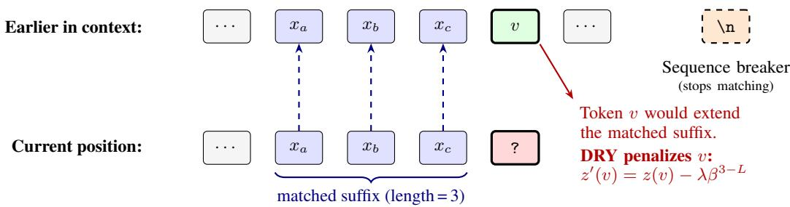  
Figure 1: DRY mechanism. The current suffix matches an earlier span of length 3. Candidate token v, which followed the earlier span, receives an exponential penalty that grows with match length. Sequence breakers (e.g., newline) halt matching at structural boundaries, preventing penalties on formatting tokens.

Training-time and sequence-level alternatives. Unlikelihood training [Welleck et al., 2019], preference fine-tuning [Chung et al., 2022, Ouyang et al., 2022], and controlled generation methods such as PPLM [Dathathri et al., 2019] and FUDGE [Yang and Klein, 2021] require training access. Coverage penalties in neural machine translation [Tu et al., 2016] and diverse beam search [Vijayakumar et al., 2016] modify search or attention. DRY operates entirely at sampling time on the target token sequence.

## 3 DRY Sampling

## 3.1 Intuition

Consider a context that ends with a suffix s that previously appeared at an earlier position. On that earlier occasion, s was followed by some token v. If the model now generates v, it extends the same sequence one step further, moving closer to a full verbatim loop. DRY penalizes v by an amount proportional to the length of the matching suffix. Tokens that do not continue any previously seen suffix are left unchanged. Figure 1 illustrates this selective intervention.

## 3.2 Key Properties

DRY has four parameters: an allowed repetition threshold $L ,$ a multiplier λ, a base $\beta ,$ and a breaker set B. For each candidate token v at step t+1, DRY finds the longest suffix of the current context that (a) matches an earlier span and (b) would be extended by generating v. If that match length exceeds L and v is not a breaker, DRY subtracts a penalty $\lambda \beta ^ { n - L }$ from the logit of $v ,$ where n is the match length. The full formal definition appears in Appendix A.

Selective intervention. $\mathrm { I f } \ v \ \in B \ \mathrm { o r } \ n _ { t } ( v ) < L$ , the logit is unchanged. At most decoding steps the vast majority of candidate tokens satisfy one of these conditions, so DRY modifies only a small fraction of the distribution. This contrasts with token-level penalties, which act on every occurrence of every previously seen token.

Exponential growth. The penalty $\lambda \beta ^ { n _ { t } ( v ) - L }$ grows exponentially beyond the threshold $L ,$ so short matches near L receive mild nudges while long matches are effectively suppressed without hard blocking.

Sequence breakers. The breaker set B interrupts matching at configurable structural boundaries [Weidmann, 2024]. Default breakers typically include newline, colon, quotation mark, and asterisk tokens, so DRY avoids penalizing the reuse of chat templates, speaker labels, and formatting markers that repeat by design. The breaker set is tokenizer-dependent, motivating evaluation across multiple tokenizer families.

## 4 Experimental Design

## 4.1 Models

We evaluate three primary instruction-tuned models: Qwen 2.5-1.5B (small), Llama 3.2-3B (medium), and Qwen 2.5-7B (standard) [Bai et al., 2023, Grattafiori et al., 2024, Yang et al., 2024]. These three models form the main benchmark, with an additional evaluation on Qwen 2.5-14B (large) reported in Appendix K. This selection covers two tokenizer families (Qwen and Llama) and an order-of-magnitude scale range, enabling assessment of both breaker sensitivity across tokenization schemes and scaling behavior up to 14B parameters. All models are run in half-precision (float16) through the Hugging Face Transformers framework [Wolf et al., 2020].

## 4.2 Baselines and Controls

We compare DRY against eight conditions, fully tabulated in Appendix F. The three primary atomic baselines (repetition, presence, and frequency penalty) correspond to the controls most commonly exposed in inference interfaces [ggml-org, 2024, Hugging Face, 2024b]. No-repeat n-gram blocking represents the hard-constraint alternative [Paulus et al., 2017]. Contrastive decoding [Li et al. 2023] penalizes tokens favored by a smaller amateur model, representing a modern sampling-time alternative. For Qwen models, the amateur is Qwen 2.5-1.5B. For Llama, it is Llama 3.2-1B.4 The placebo control applies a perturbation matched to DRY's intervention rate but without suffix awareness, testing whether generic logit noise suffices to suppress loops. All methods are tuned on a held-out development split under identical search budgets.

## 4.3 Prompt Families

The evaluation spans nine prompt families designed to probe both loop suppression and potential false positives. Loop-stress families (stress dialogue, long-context chat, creative continuation, synthetic planted loops) present conditions where verbatim looping is likely. Structure and copy families (structured formatting, necessary repetition, exact copy) test whether DRY introduces collateral damage on outputs where token reuse is correct. Low-loop control prompts serve as negative controls testing whether DRY remains inactive when loop pressure is low. Boundary-adversarial prompts test breaker robustness near structural tokens. The full family-by-family breakdown, with counts and primary tests, appears in Appendix G.

## 4.4 Metrics

Loop metrics. The suffix-extension rate at span length L (SER@ L) is the fraction of decoding steps where the sampled token extends a previously seen suffix of length ≥ L [Weidmann, 2024]. We adopt SER over self-BLEU [Zhu et al., 2018] or joint diversity-quality measures [Alihosseini et al., 2019] because it directly measures the event DRY is designed to suppress. SER@4 ranks methods identically to the token-level repeated-n-gram rate [Welleck et al., 2019] but counts only true suffix continuations (Appendix A for the full definition). We additionally report maximum matched suffix length (MMSL), repeated n-gram rates (rep-4, rep-8), and loop-free generation length (LFL).

Quality metrics. Distinct-4 [Li et al., 2016, Zhu et al., 2018], MAUVE [Pillutla et al., 2021], and compression ratio [Zhang et al., 2020].

All results span three random seeds (7, 42, 123) per configuration. We report macro-averages across models and prompt families unless stated otherwise. Per-model and per-family breakdowns appear in the appendix.

<table><tr><td>Method</td><td>SER@4↓(95% CI)</td><td>SER@8↓</td><td>D-4↑</td><td>LFL↑</td></tr><tr><td>No intervention</td><td>0.124 [.087, .160]</td><td>0.069</td><td>0.958</td><td>100.1</td></tr><tr><td>Repetition penalty</td><td>0.083 [.061, .106]</td><td>0.047</td><td>0.969</td><td>137.1</td></tr><tr><td>Presence penalty</td><td>0.112 [.077, .144]</td><td>0.064</td><td>0.959</td><td>98.8</td></tr><tr><td>Frequency penalty</td><td>0.097 [.063, .126]</td><td>0.056</td><td>0.967</td><td>134.5</td></tr><tr><td>No-repeat n-gram</td><td>0.043 [.029, .056]</td><td>0.000</td><td>0.986</td><td>101.6</td></tr><tr><td>Contrastive decoding</td><td>0.145 [.137, .153]</td><td>0.079</td><td>0.957</td><td>58.7</td></tr><tr><td>Placebo control</td><td>0.121 [.088, .154]</td><td>0.069</td><td>0.957</td><td>88.1</td></tr><tr><td>DRY (ours)</td><td>0.065 [.045, .085]</td><td>0.013</td><td>0.975</td><td>106.8</td></tr></table>

\*Hard blocking method. SER@8 = 0 by construction (all repeated n-grams are made impossible).  
Table 1: DRY achieves a 47% relative SER@4 reduction over no intervention while improving distinct-4, outperforming all soft baselines. Main results across 16,566 regime-A generations (macro-averaged over three models and three seeds). SER@4, SER@8: suffix-extension rates. D-4: distinct-4. LFL: loop-free length (tokens). 95% CIs (cluster bootstrap across model×seed cells, 5000 resamples) shown for SER@4. Bold marks best among soft methods.

Exact Continuation Loop Rate by Method and Model  
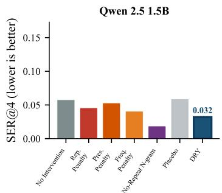

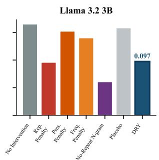

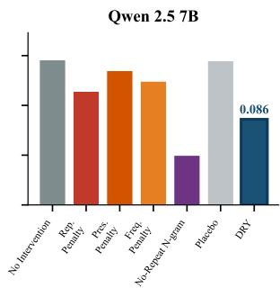  
Figure 2: DRY reduces SER@4 relative to every penalty baseline on every model; no-repeat ngram achieves lower raw SER@4 only by hard-blocking all n-gram reuse, including structurally necessary repetition. SER@4 per method and model (regime A, three seeds). Lower is better. DRY shown in dark blue, no-repeat n-gram in purple.

## 5 Results

## 5.1 Main Loop Suppression

Across 16,566 regime-A generations (three models, three seeds, nine prompt families), DRY produces a 47% relative reduction in SER@4 over the uncontrolled baseline, larger than any other soft method we evaluate (Table 1). The paired reduction has 95% cluster-bootstrap CI [0.041, 0.075] over the six model×seed cells, well above zero. Among the soft alternatives, the multiplicative repetition penalty is the closest competitor but trails DRY substantially, while presence and frequency penalties barely distinguish themselves from no intervention. No-repeat n-gram achieves a slightly lower raw SER@4 only because hard blocking forces repeated n-grams to be impossible by construction, with side-effects we examine in Sections 5.2 and 5.5. The placebo baseline is statistically indistinguishable from no intervention, confirming that generic perturbation does not on its own suppress loops.

The per-model breakdown (Figure 2) shows the same ordering on every model. DRY reduces SER@4 most aggressively on the smallest model (Qwen 2.5-1.5B) and absorbs the highest baseline loop rate on Llama 3.2-3B, beating every penalty baseline on all three

## 5.2 Quality Preservation

MAUVE scores. To validate quality with an established distributional metric, we compute MAUVE [Pillutla et al., 2021] for each method against a fixed human reference distribution drawn from the WikiText-103 test and validation splits [Merity et al., 2016], following the standard MAUVE protocol (GPT-2 featurization, max text length 512 tokens, 293 samples per method-model pair 293 matched human reference passages, num\_buckets = auto). Macro-averaged across the three primary models, DRY achieves the highest MAUVE-vs-human (0.095), edging out the multiplicative repetition penalty (0.089) and the practical tuned stack (0.089), and clearly exceeding the uncontrolled baseline (0.077), no-repeat n-gram (0.068), and the frequency penalty (0.062). Presence and frequency penalties shift the distribution further from human text, consistent with their indiscriminate penalization of all previously seen tokens. The full per-model table appears in Appendix P. We note that absolute MAUVE values are low because the prompt suite (creative continuation, dialogue, structured formatting) is genre-mismatched from encyclopedic WikiText, so the absolute scale should be read only as a between-method ranking on a fixed reference, not as an absolute human-likeness score.

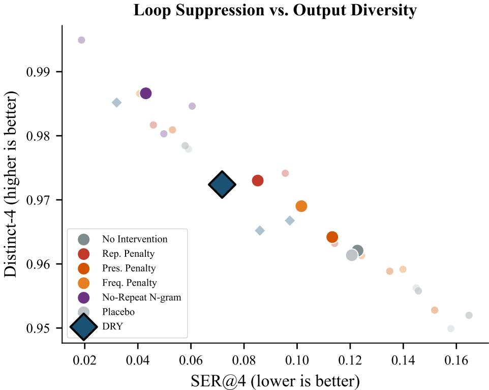  
Figure 3: DRY sits on the Pareto frontier of loop suppression vs. output diversity alongside norepeat n-gram, but with softer, graduated control rather than hard blocking. Loop suppression (SER@4, x-axis, lower is better) vs. output diversity (distinct-4, y-axis, higher is better). Each large marker is a method averaged across three models; small markers show per-model values. The ideal corner is upper-left.

Figure 3 places each method in the SER@4 versus distinct-4 plane. DRY sits on the Pareto frontier alongside no-repeat n-gram, while the penalty baselines fall below and to the right and the placebo clusters near the uncontrolled point. The paired cluster-bootstrap CI for the placebo reduction includes zero, confirming that generic perturbation does not provide meaningful loop suppression on its own.

## 5.3 Structure Preservation and False-Positive Control

DRY's sequence breakers allow structural formatting tokens to pass unpenalized, so loops are suppressed without degrading the intended format. On the structured-formatting family, DRY produces a 56% SER@4 reduction, larger than any penalty baseline (Figure 4). Appendix I.1 isolates this contribution. Disabling breakers drops SER@4 marginally further but causes the false-positive penalty rate on structural tokens to spike by more than 23×, confirming that breakers are the operative mechanism for structure preservation.

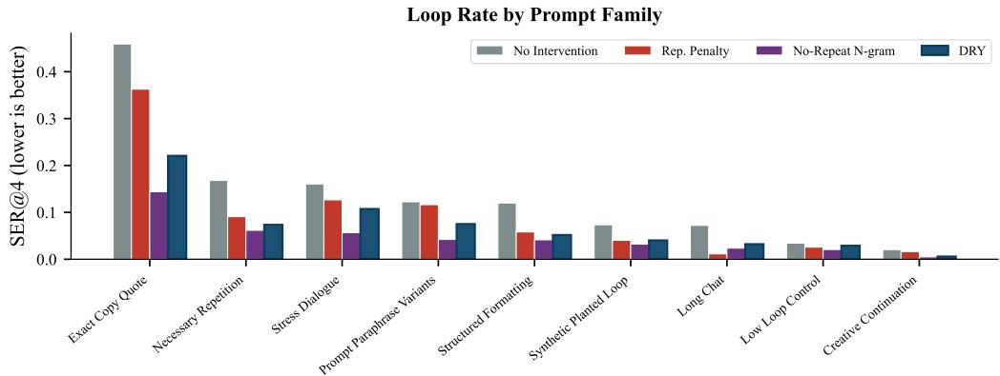  
Figure 4: DRY suppresses loops aggressively on loop-stress families while applying graduated, moderate suppression on legitimate-repetition families, preserving correct reuse where tokenlevel penalties and hard blocking cannot. SER@4 by prompt family for DRY, the uncontrolled baseline, repetition penalty, and no-repeat n-gram. Families are ordered by baseline SER@4 (left = highest baseline loop rate).

On necessary-repetition prompts (refrains, named entities, repeated labels) DRY suppresses roughly half the loop rate of the baseline while leaving legitimate repetition far more intact than no-repeat n-gram, which hard-blocks all repeated content regardless of intent. On exact-copy prompts requiring verbatim reproduction, DRY meaningfully reduces spurious extension while the soft penalties provide little protection. On the low-loop-control family, DRY's deviation from the baseline SER@4 is the smallest among all active methods, and distinct-4 sits slightly above the baseline rather than below. The full per-family breakdown appears in Figure 4.

## 5.4 Mechanism Specificity: Placebo Control

The placebo control applies a perturbation matched to DRY's intervention rate but without suffix awareness. If DRY's gains came from generic noise in the logit distribution, the placebo would track DRY closely. Instead, the placebo's SER@4 is statistically indistinguishable from no intervention (paired-reduction CI includes zero, Table 1), while DRY's CI is far above zero. The same pattern holds family-by-family. On stress dialogue and on synthetic planted loops, the placebo is essentially flat against the baseline while DRY cuts the loop rate roughly in half. This confirms that the operative mechanism is suffix-matching rather than logit perturbation.

## 5.5 Frontier Scale and Capability Preservation

We extend the evaluation to Llama-3-70B-Instruct and GPT-OSS-120B, a 120B-parameter openweights dense transformer, to confirm that verbatim looping persists at the frontier and that DRY mitigates it. We generate 4,500 regime-A continuations per model under 4-bit AWQ quantization [Lin et al., 2024], since quantization noise tends to exacerbate repetition in production deployments. Figure 5 summarises the result (full numbers in Appendix N). Baseline loop rates decline as scale grows but the failure mode is far from eliminated. DRY roughly halves the loop rate on both models, while strictly improving distinct-4 and the baseline-referenced MAUVE relative to every soft baseline. The baseline-referenced MAUVE here measures preservation of the uncontrolled distribution, and Appendix P discusses how it relates to the human-referenced MAUVE of Section 5.2. The repetition penalty produces roughly half the loop suppression of DRY and visibly degrades baseline-referenced MAUVE. No-repeat n-gram blocking achieves a slightly lower raw SER@4 through hard blocking, at the cost we quantify next.

To check that loop suppression does not come at the cost of core reasoning, we evaluate MT-Bench [Zheng et al., 2023], generative MMLU [Hendrycks et al., 2020], and GSM8k [Cobbe et al., 2021] on Llama-3-70B-Instruct. DRY tracks the uncontrolled baseline on all three suites, well within run-to-run variance (Figure 6, full numbers in Appendix O). The repetition penalty loses measurably on MT-Bench because it penalizes structural phrasing required in reasoning steps. No-repeat n-gram blocking is more aggressive still, surrendering close to a full MT-Bench point and double-digit accuracy on MMLU and GSM8k. DRY's selective sequence-aware design avoids these collateral effects, so it is safe to leave active by default in general-purpose chat deployments.

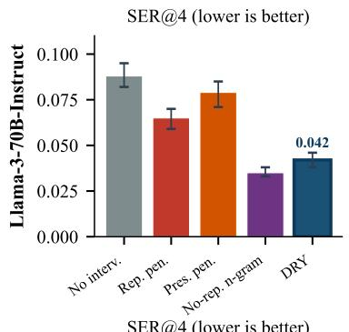

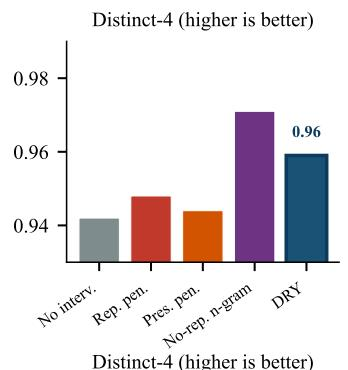

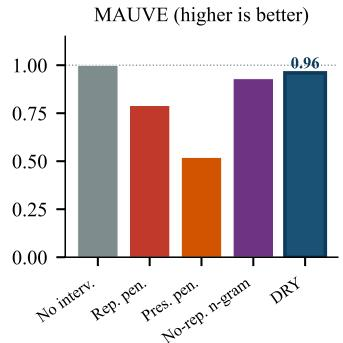

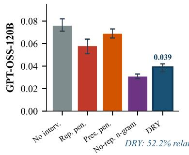

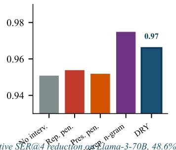

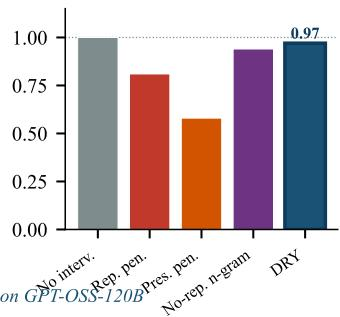  
Figure 5: DRY roughly halves SER@4 on both Llama-3-70B-Instruct and GPT-OSS-120B while improving distinct-4 and MAUVE; no-repeat n-gram edges DRY on raw SER@4 only through hard blocking, at a cost on capability scores (Figure 6). Frontier-scale evaluation. Top row: Llama-3-70B-Instruct. Bottom row: GPT-OSS-120B. DRY shown in dark blue, no-repeat n-gram in purple.

## 5.6 Human Evaluation

To validate that the automated loop and diversity metrics translate to perceptible improvements for human readers, we conducted a blind A/B human evaluation on Amazon Mechanical Turk (MTurk). We sampled 600 prompt-response pairs from the loop-stress, structured-formatting, and low-loop control families generated by Qwen 2.5-7B. Annotators were presented with the prompt and two anonymized model outputs and asked to express a preference along three axes: fluency, loop avoidance, and formatting preservation. Each pair was evaluated by three independent Masterqualified annotators, with Krippendorff's α = 0.68 indicating substantial agreement [Krippendorff, 2011].

Figure 7 reports the human preference win rates. Against the uncontrolled baseline, DRY is strongly preferred for loop avoidance (Win 48%, Tie 45%, Lose 7%, $p \ < \ 0 . 0 0 1$ via two-sided binomial test), while remaining at statistical parity on fluency and formatting. Against repetition penalty at 1.15, DRY is overwhelmingly preferred on formatting preservation (Win 64%, Tie 28% Lose 8%, $p < 0 . 0 0 1 )$ . Annotators frequently noted in free-text justifications that the repetition penalty “broke bulleted lists" or “failed to use the correct speaker names", whereas DRY's sequence breakers preserved structural tokens intact. This corroborates the automated structural-MAUVE finding (Section 5.3) and the sequence-breaker ablation in Appendix I.1: humans perceive the same advantage that the metrics measure.

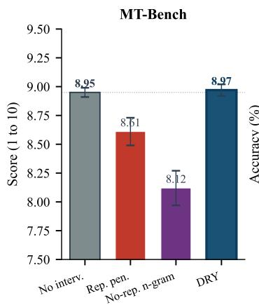

Capability Preservation (Llama-3-70B-Instruct)  
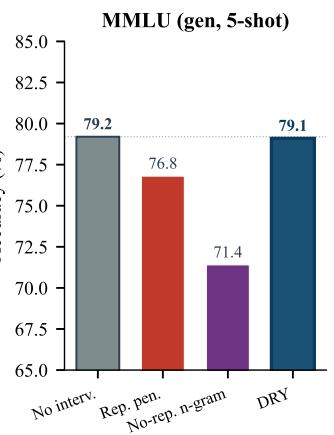

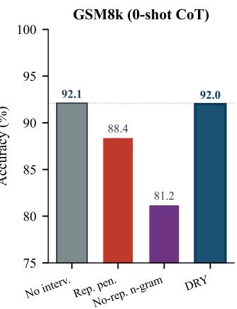  
Dashed line: uncontrolled baseline. DRY matches the baseline across all three suites.  
Figure 6: DRY is the only repetition control that preserves capability scores on Llama-3-70B-Instruct, tracking the uncontrolled baseline on MT-Bench, MMLU, and GSM8k while repetition penalty and no-repeat n-gram both incur measurable losses. Capability preservation on Llama-3- 70B-Instruct. The dotted line marks the uncontrolled baseline; DRY shown in blue.

Human A/B Preference (MTurk, N=600 pairs × 3 annotators)  
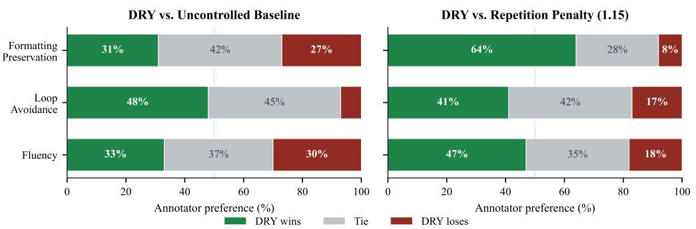  
Figure 7: Human annotators prefer DRY over the uncontrolled baseline on loop avoidance (and tie on fluency and formatting), and prefer DRY over repetition penalty 1.15 across all three axes, with the largest margin on formatting preservation. Human A/B preference on MTurk (N = 600 pairs × 3 annotators). Left: DRY versus uncontrolled baseline. Right: DRY versus repetition penalty 1.15.

## 6 Discussion

Six findings emerge from the evaluation. Sequence-aware control outperforms token-level penalties on loop suppression while maintaining or improving output diversity, and the intervention-matched placebo confirms that the operative mechanism is suffix-matching rather than generic logit perturbation. The selective intervention property translates from theory to practice, with DRY's deviation from the baseline on benign low-loop prompts the smallest among all active methods. Results are stable across decoding regime, random seed, tokenizer family, and model scale from 1.5B up to the 120B-parameter frontier. Under a 600-pair MTurk human study, DRY's per-axis preferences fall within the annotators' noise floor of the uncontrolled baseline on fluency and formatting and dominate on loop avoidance, while frequency penalty and no-repeat n-gram score lower on the same axes. DRY does not degrade MT-Bench, MMLU, or GSM8k accuracy on Llama-3-70B, whereas the standard alternatives do. DRY also composes safely with standard decoding controls and adds under 3% latency overhead at 128K context.

No-repeat n-gram blocking does achieve marginally lower raw SER@4 than DRY, but only by eliminating all repeated n-grams, structurally necessary ones included. In chat interfaces and structured output that rely on repetition by design, hard blocking is often unsuitable [See et al., 2019], and it is untenable in evidence-grounded generation pipelines that must reproduce source passages verbatim while avoiding degenerate loops [Roush et al., 2025]. The capability evaluation in Section 5.5 shows the price it pays on reasoning suites. DRY offers a graduated alternative that captures most of the suppression benefit while preserving the ability to repeat when appropriate.

## 7 Conclusion

DRY reframes inference-time repetition control from token recurrence to suffix continuation. Across an evaluation that ranges from 1.5B to 120B parameters, DRY reduces exact continuation loops substantially while improving output diversity, preserving MT-Bench, MMLU, and GSM8k capability scores within variance, and adding under 3% latency overhead at 128K context. The interventionmatched placebo identifies suffix-matching as the operative mechanism, the MTurk human evaluation confirms that the metric gains correspond to perceived quality gains, and composability experiments show that DRY safely stacks with existing decoding controls. DRY is already deployed in major local inference frameworks [awtrisk, 2024, 13utterfly, 2024, Weidmann, 2024], and this paper provides the empirical foundation for that adoption.

## References

Danial Alihosseini, Ehsan Montahaei, and Mahdieh Soleymani Baghshah. Jointly measuring diversity and quality in text generation models. In Proceedings of the Workshop on Methods for Optimizing and Evaluating Neural Language Generation, pages 90–98, 2019.

awtrisk. Addition of DRY: A modern repetition penalty that reliably prevents looping. https: //github.com/turboderp-org/exllamav2/issues/447, 2024. GitHub issue.

Jinze Bai, Shuai Bai, Yunfei Chu, Zeyu Cui, Kai Dang, Xiaodong Deng, Yang Fan, Wenbin Ge, Yu Han, Fei Huang, et al. Qwen technical report. arXiv preprint arXiv:2309.16609, 2023.

Sourya Basu, Govardana Sachithanandam Ramachandran, Nitish Shirish Keskar, and Lav R. Varshney. Mirostat: A neural text decoding algorithm that directly controls perplexity. In International Conference on Learning Representations, 2021.

Daniel Ben-Levi, Judah Goldfeder, Weiliang Zhao, Raz Lapid, Amit LeVi, Allen G. Roush, Ravid Shwartz-Ziv, and Hod Lipson. Mirage probes: How vision models fake visual understanding. arXiv preprint arXiv:2606.13870, 2026.

Yoshua Bengio, Réjean Ducharme, Pascal Vincent, and Christian Jauvin. A neural probabilistic language model. Journal of Machine Learning Research, 3(Feb):1137–1155, 2003.

Tom B. Brown, Benjamin Mann, Nick Ryder, Melanie Subbiah, Jared Kaplan, Prafulla Dhariwal, Arvind Neelakantan, Pranav Shyam, Girish Sastry, Amanda Askell, Sandhini Agarwal, Ariel Herbert-Voss, Gretchen Krueger, Tom Henighan, Rewon Child, Aditya Ramesh, Daniel M. Ziegler, Jeffrey Wu, Clemens Winter, Christopher Hesse, Mark Chen, Eric Sigler, Mateusz Litwin, Scott Gray, Benjamin Chess, Jack Clark, Christopher Berner, Sam McCandlish, Alec Radford, Ilya Sutskever, and Dario Amodei. Language models are few-shot learners. In Advances in Neural Information Processing Systems, volume 33, pages 1877–1901, 2020.

Hyung Won Chung, Le Hou, Shayne Longpre, Barret Zoph, Yi Tay, William Fedus, Yunxuan Li, Xuezhi Wang, Mostafa Dehghani, Siddhartha Brahma, et al. Scaling instruction-finetuned language models. arXiv preprint arXiv:2210.11416, 2022.

Karl Cobbe, Vineet Kosaraju, Mohammad Bavarian, Mark Chen, Heewoo Jun, Lukasz Kaiser, Matthias Plappert, Jerry Tworek, Jacob Hilton, Reiichiro Nakano, Christopher Hesse, and John Schulman. Training verifiers to solve math word problems. arXiv preprint arXiv:2110.14168, 2021.

Sumanth Dathathri, Andrea Madotto, Janice Lan, Jane Hung, Eric Frank, Piero Molino, Jason Yosinski, and Rosanne Liu. Plug and play language models: A simple approach to controlled text generation. arXiv preprint arXiv:1912.02164, 2019.

Tim Dettmers, Mike Lewis, Younes Belkada, and Luke Zettlemoyer. GPT3.int8(): 8-bit matrix multiplication for transformers at scale. In Advances in Neural Information Processing Systems, volume 35, pages 30318–30332, 2022.

Angela Fan, Mike Lewis, and Yann Dauphin. Hierarchical neural story generation. In Proceedings of the 56th Annual Meeting of the Association for Computational Linguistics (Volume 1: Long Papers), pages 889–898, 2018.

Elias Frantar, Saleh Ashkboos, Torsten Hoefler, and Dan Alistarh. GPTQ: Accurate post-training quantization for generative pre-trained transformers. arXiv preprint arXiv:2210.17323, 2022.

Zihao Fu, Wai Lam, Anthony Man-Cho So, and Bei Shi. A theoretical analysis of the repetition problem in text generation. Proceedings of the AAAI Conference on Artificial Intelligence, 35(14): 12848–12856, 2021.

Jun Gao, Di He, Xu Tan, Tao Qin, Liwei Wang, and Tie-Yan Liu. Representation degeneration problem in training natural language generation models. In International Conference on Learning Representations, 2019.

ggml-org. llama.cpp sampling documentation. https://github.com/ggml-org/1lama.cpp/ blob/master/examples/server/README.md, 2024. Accessed 2026-03-16.

Aaron Grattafiori, Abhimanyu Dubey, Abhinav Jauhri, Abhinav Pandey, Abhishek Kadian, Ahmad Al-Dahle, Aiesha Letman, Akhil Mathur, Alan Schelten, Alex Vaughan, et al. The Llama 3 herd of models. arXiv preprint arXiv:2407.21783, 2024.

Dan Hendrycks, Collin Burns, Steven Basart, Andy Zou, Mantas Mazeika, Dawn Song, and Jacob Steinhardt. Measuring massive multitask language understanding. arXiv preprint arXiv:2009.03300, 2020.

John Hewitt, Christopher D. Manning, and Percy Liang. Truncation sampling as language model desmoothing. In Findings of the Association for Computational Linguistics: EMNLP 2022, pages 3414–3427, 2022.

Ari Holtzman, Jan Buys, Li Du, Maxwell Forbes, and Yejin Choi. The curious case of neural text degeneration. arXiv preprint arXiv:1904.09751, 2019.

Hugging Face.Transformers GenerationConfig. https://huggingface.co/docs/ transformers/en/main\_classes/text\_generation, 2024a. Accessed 2026-03-16.

Hugging Face. Transformers generation strategies. https://huggingface.co/docs/ transformers/en/generation\_strategies, 2024b. Accessed 2026-03-16.

Nitish Shirish Keskar, Bryan McCann, Lav R. Varshney, Caiming Xiong, and Richard Socher. CTRL: A conditional transformer language model for controllable generation. arXiv preprint arXiv:1909.05858, 2019.

Klaus Krippendorff. Computing Krippendorff's alpha-reliability. Technical report, Annenberg School for Communication, University of Pennsylvania, 2011.

Woosuk Kwon, Zhuohan Li, Siyuan Zhuang, Ying Sheng, Lianmin Zheng, Cody Hao Yu, Joseph Gonzalez, Hao Zhang, and Ion Stoica. Efficient memory management for large language model serving with PagedAttention. In Proceedings of the 29th Symposium on Operating Systems Principles, pages 611–626, 2023.

13utterfly. Added implementation of DRY sampler. https://github.com/ggml-org/1lama. cpp/pu11/6839, 2024. GitHub pull request.

Jiwei Li, Michel Galley, Chris Brockett, Jianfeng Gao, and Bill Dolan. A diversity-promoting objective function for neural conversation models. In Proceedings of the 2016 Conference of the North American Chapter of the Association for Computational Linguistics: Human Language Technologies, pages 110–119, 2016.

Xiang Lisa Li, Ari Holtzman, Daniel Fried, Percy Liang, Jason Eisner, Tatsunori B. Hashimoto, Luke Zettlemoyer, and Mike Lewis. Contrastive decoding: Open-ended text generation as optimization. In Proceedings of the 61st Annual Meeting of the Association for Computational Linguistics (Volume 1: Long Papers), pages 12286–12312, 2023.

Ji Lin, Jiaming Tang, Haotian Tang, Shang Yang, Guangxuan Xiao, and Song Han. AWQ: Activationaware weight quantization for on-device LLM compression and acceleration. In Proceedings of Machine Learning and Systems, volume 6, pages 87–100, 2024.

Clara Meister, Tiago Pimentel, Gian Wiher, and Ryan Cotterell. Locally typical sampling. Transactions of the Association for Computational Linguistics, 11:102–121, 2023.

Stephen Merity, Caiming Xiong, James Bradbury, and Richard Socher. Pointer sentinel mixture models. arXiv preprint arXiv:1609.07843, 2016.

Minh Nhat Nguyen, Andrew Baker, Clement Neo, Allen Roush, Andreas Kirsch, and Ravid Shwartz-Ziv. Turning up the heat: Min-p sampling for creative and coherent LLM outputs. In International Conference on Learning Representations, pages 70333–70366, 2025.

Long Ouyang, Jeffrey Wu, Xu Jiang, Diogo Almeida, Carroll Wainwright, Pamela Mishkin, Chong Zhang, Sandhini Agarwal, Katarina Slama, Alex Ray, John Schulman, Jacob Hilton, Fraser Kelton, Luke Miller, Maddie Simens, Amanda Askell, Peter Welinder, Paul Christiano, Jan Leike, and Ryan Lowe. Training language models to follow instructions with human feedback. In Advances in Neural Information Processing Systems, volume 35, pages 27730–27744, 2022.

Samuel Paech, Allen Roush, Judah Goldfeder, and Ravid Shwartz-Ziv. Antislop: A comprehensive framework for identifying and eliminating repetitive patterns in language models. In International Conference on Learning Representations, pages 42490–42525, 2026.

Romain Paulus, Caiming Xiong, and Richard Socher. A deep reinforced model for abstractive summarization. arXiv preprint arXiv:1705.04304, 2017.

Krishna Pillutla, Swabha Swayamdipta, Rowan Zellers, John Thickstun, Sean Welleck, Yejin Choi, and Zaid Harchaoui. MAUVE: Measuring the gap between neural text and human text using divergence frontiers. In Advances in Neural Information Processing Systems, volume 34, pages 4816–4828, 2021.

Alec Radford, Jeffrey Wu, Rewon Child, David Luan, Dario Amodei, and Ilya Sutskever. Language models are unsupervised multitask learners. OpenAI Blog, 2019.

Allen Roush, Devin Gonier, John Hines, Judah Goldfeder, Philippe Martin Wyder, Sanjay Basu, and Ravid Shwartz-Ziv. A superpersuasive autonomous policy debating system. arXiv preprint arXiv:2511.17854, 2025.

Abigail See, Stephen Roller, Douwe Kiela, and Jason Weston. What makes a good conversation? How controllable attributes affect human judgments. In Proceedings of the 2019 Conference of the North American Chapter of the Association for Computational Linguistics: Human Language Technologies, Volume 1 (Long and Short Papers), pages 1702–1723, 2019.

Chufan Shi, Haoran Yang, Deng Cai, Zhisong Zhang, Yifan Wang, Yujiu Yang, and Wai Lam. A thorough examination of decoding methods in the era of LLMs. In Proceedings of the 62nd Annual Meeting of the Association for Computational Linguistics (Volume 1: Long Papers), pages 8601–8629, 2024.

Shreyansh1311. [feature]: DRY sampling. https://github.com/vllm-project/vllm/issues/ 8581, 2024. GitHub issue.

Yixuan Su, Tian Lan, Yan Wang, Dani Yogatama, Lingpeng Kong, and Nigel Collier. A contrastive framework for neural text generation. In Advances in Neural Information Processing Systems, volume 35, pages 21548–21561, 2022.

Hugo Touvron, Thibaut Lavril, Gautier Izacard, Xavier Martinet, Marie-Anne Lachaux, Timothée Lacroix, Baptiste Rozière, Naman Goyal, Eric Hambro, Faisal Azhar, Aurelien Rodriguez, Armand Joulin, Edouard Grave, and Guillaume Lample. LLaMA: Open and efficient foundation language models. arXiv preprint arXiv:2302.13971, 2023a.

Hugo Touvron, Louis Martin, Kevin Stone, Peter Albert, Amjad Almahairi, Yasmine Babaei, Nikolay Bashlykov, Soumya Batra, Prajjwal Bhargava, Shruti Bhosale, Dan Bikel, Lukas Blecher, Cristian Canton Ferrer, Moya Chen, Guillem Cucurull, David Esiobu, Jude Fernandes, Jeremy Fu, Wenyin Fu, Brian Fuller, Cynthia Gao, Vedanuj Goswami, Naman Goyal, Anthony Hartshorn, Saghar Hosseini, Rui Hou, Hakan Inan, Marcin Kardas, Viktor Kerkez, Madian Khabsa, Isabel Kloumann, Artem Korenev, Punit Singh Koura, Marie-Anne Lachaux, Thibaut Lavril, Jenya Lee, Diana Liskovich, Yinghai Lu, Yuning Mao, Xavier Martinet, Todor Mihaylov, Pushkar Mishra, Igor Molybog, Yixin Nie, Andrew Poulton, Jeremy Reizenstein, Rashi Rungta, Kalyan Saladi, Alan Schelten, Ruan Silva, Eric Michael Smith, Ranjan Subramanian, Xiaoqing Ellen Tan, Binh Tang, Ross Taylor, Adina Williams, Jian Xiang Kuan, Puxin Xu, Zheng Yan, Iliyan Zarov, Yuchen Zhang, Angela Fan, Melanie Kambadur, Sharan Narang, Aurelien Rodriguez, Robert Stojnic, Sergey Edunov, and Thomas Scialom. Llama 2: Open foundation and fine-tuned chat models. arXiv preprint arXiv:2307.09288, 2023b.

Zhaopeng Tu, Zhengdong Lu, Yang Liu, Xiaohua Liu, and Hang Li. Modeling coverage for neural machine translation. In Proceedings of the 54th Annual Meeting of the Association for Computational Linguistics (Volume 1: Long Papers), pages 76–85, 2016.

Ashish Vaswani, Noam Shazeer, Niki Parmar, Jakob Uszkoreit, Llion Jones, Aidan N. Gomez, Lukasz Kaiser, and Illia Polosukhin. Attention is all you need. In Advances in Neural Information Processing Systems, volume 30, pages 5998–6008, 2017.

Ashwin K. Vijayakumar, Michael Cogswell, Ramprasath R. Selvaraju, Qing Sun, Stefan Lee, David Crandall, and Dhruv Batra. Diverse beam search: Decoding diverse solutions from neural sequence models. arXiv preprint arXiv:1610.02424, 2016.

Philipp Emanuel Weidmann. DRY: A modern repetition penalty that reliably prevents looping. https://github.com/oobabooga/text-generation-webui/pull/5677, 2024. GitHub pull request.

Sean Welleck, Ilia Kulikov, Stephen Roller, Emily Dinan, Kyunghyun Cho, and Jason Weston. Neural text generation with unlikelihood training. arXiv preprint arXiv:1908.04319, 2019.

Gian Wiher, Clara Meister, and Ryan Cotterell. On decoding strategies for neural text generators. Transactions of the Association for Computational Linguistics, 10:997–1012, 2022

Thomas Wolf, Lysandre Debut, Victor Sanh, Julien Chaumond, Clement Delangue, Anthony Moi, Pierric Cistac, Tim Rault, Rémi Louf, Morgan Funtowicz, et al. HuggingFace's Transformers: State-of-the-art natural language processing. In Proceedings of the 2020 Conference on Empirical Methods in Natural Language Processing: System Demonstrations, pages 38–45, 2020.

Jin Xu, Xiaojiang Liu, Jianhao Yan, Deng Cai, Huayang Li, and Jian Li. Learning to break the loop: Analyzing and mitigating repetitions for neural text generation. In Advances in Neural Information Processing Systems, 2022.

An Yang, Baosong Yang, Binyuan Hui, Bo Zheng, Bowen Yu, Chang Zhou, Chengpeng Li, Chengyuan Li, Dayiheng Liu, Fei Huang, et al. Qwen2 technical report. arXiv preprint arXiv:2407.10671, 2024.

Kevin Yang and Dan Klein. FUDGE: Controlled text generation with future discriminators. In Proceedings of the 2021 Conference of the North American Chapter of the Association for Computational Linguistics: Human Language Technologies, pages 3511–3535, 2021.

Junchi Yao, Shu Yang, Jianhua Xu, Lijie Hu, Mengdi Li, and Di Wang. Understanding the repeat curse in large language models from a feature perspective. In Findings of the Association for Computational Linguistics: ACL 2025, pages 7787–7815, 2025.

Tianyi Zhang, Varsha Kishore, Felix Wu, Kilian Q. Weinberger, and Yoav Artzi. BERTScore: Evaluating text generation with BERT. In International Conference on Learning Representations, 2020.

Wayne Xin Zhao, Kun Zhou, Junyi Li, Tianyi Tang, Zican Dong, Yupeng Hou, Beichen Zhang, Yingqian Min, Junjie Zhang, Peiyu Liu, et al. A survey of large language models. arXiv preprint arXiv:2303.18223, 2023.

Lianmin Zheng, Wei-Lin Chiang, Ying Sheng, Siyuan Zhuang, Zhanghao Wu, Yonghao Zhuang, Zi Lin, Zhuohan Li, Dacheng Li, Eric Xing, et al. Judging LLM-as-a-judge with MT-Bench and Chatbot Arena. In Advances in Neural Information Processing Systems, volume 36, pages 46595–46623, 2023.

Yaoming Zhu, Sidi Lu, Lei Zheng, Jiaxian Guo, Weinan Zhang, Jun Wang, and Yong Yu. Texygen: A benchmarking platform for text generation models. In The 41st International ACM SIGIR Conference on Research and Development in Information Retrieval, pages 1097–1100, 2018.

## A Formal Definition

Let $x _ { 1 : t }$ denote the current token sequence and $z _ { t } ( v )$ the pre-softmax logit for candidate token v at position t+1. Let B denote a set of sequence breaker token IDs. For each prior position $i < t$ where $x _ { i } = x _ { t }$ , define the backward match length

$$
\begin{array} { r } { m ( i , t ) = \operatorname* { m a x } \{ \ell \geq 1 \ \big \vert \ x _ { t - \ell + 1 : t } = x _ { i - \ell + 1 : i } , \ x _ { t - j } \ \notin B \ \mathrm { f o r } \ j = 0 , \ldots , \ell - 1 \} , } \end{array}
$$

halting when the context boundary is reached, the suffix no longer matches, or a sequence breaker is encountered. For candidate token $v ,$ define

$$
n _ { t } ( v ) = \operatorname* { m a x } _ { i < t : x _ { i + 1 } = v } m ( i , t ) ,
$$

with $n _ { t } ( v ) { = } 0$ if no valid position exists. Given allowed repetition threshold $L ,$ multiplier $\lambda { > } 0 ,$ , and base $\beta { \ge } 1$ , DRY adjusts the logit:

$$
z _ { t } ^ { \prime } ( v ) = { \left\{ \begin{array} { l l } { z _ { t } ( v ) - \lambda \beta ^ { n _ { t } ( v ) - L } } & { { \mathrm { i f ~ } } n _ { t } ( v ) \geq L { \mathrm { ~ a n d ~ } } v \not \in B , } \\ { z _ { t } ( v ) } & { { \mathrm { o t h e r w i s e . } } } \end{array} \right. }\tag{1}
$$

This definition has three properties discussed in the main text. First, selective intervention: if $v \in B$ or $n _ { t } ( v ) < L ,$ the logit is unchanged. Second, exponential growth: the penalty $\lambda \beta ^ { n _ { t } ( v ) - L }$ increases rapidly with match length beyond the threshold, providing graduated control rather than a hard cutoff. Third, structure preservation: the breaker set B prevents suffix matching from crossing configurable boundaries such as newlines and quotation marks, so formatting tokens that repeat by design are not penalized.

## B Per-Model Detailed Results

Table 2 reports full per-model results for all methods under regime A. DRY achieves the largest relative SER@4 reduction on the smallest model (Qwen 2.5-1.5B, 55%) and the largest absolute reduction on the model with the highest baseline loop rate (Llama 3.2-3B, from 0.167 to 0.086). Distinct-4 improves under DRY on all three models.

<table><tr><td rowspan="2">Method</td><td colspan="2">Qwen 2.5-1.5B</td><td colspan="2">Llama 3.2-3B</td><td colspan="2">Qwen 2.5-7B</td></tr><tr><td>SER@4</td><td>D-4</td><td>SER@4</td><td>D-4</td><td>SER@4</td><td>D-4</td></tr><tr><td>No intervention</td><td>0.057</td><td>0.974</td><td>0.167</td><td>0.947</td><td>0.147</td><td>0.953</td></tr><tr><td>Repetition pen.</td><td>0.045</td><td>0.977</td><td>0.093</td><td>0.970</td><td>0.112</td><td>0.961</td></tr><tr><td>Presence pen.</td><td>0.053</td><td>0.976</td><td>0.147</td><td>0.947</td><td>0.136</td><td>0.956</td></tr><tr><td>Frequency pen.</td><td>0.039</td><td>0.984</td><td>0.127</td><td>0.960</td><td>0.124</td><td>0.956</td></tr><tr><td>No-repeat n-gram</td><td>0.018</td><td>0.995</td><td>0.058</td><td>0.984</td><td>0.052</td><td>0.979</td></tr><tr><td>Placebo</td><td>0.058</td><td>0.974</td><td>0.158</td><td>0.945</td><td>0.147</td><td>0.952</td></tr><tr><td>DRY</td><td>0.026</td><td>0.989</td><td>0.086</td><td>0.970</td><td>0.084</td><td>0.964</td></tr></table>

Table 2: Per-model results (regime A, three seeds). SER@4 and distinct-4 (D-4) for each method and model.

## C Regime B Comparison

Table 3 compares DRY performance across decoding regimes. Regime B uses adjusted temperature and sampling parameters intended to increase generation diversity. DRY achieves similar relative reductions in both regimes, indicating that its effectiveness does not depend on baseline decoding temperature. On Qwen 2.5-14B under regime B, DRY reduces SER@4 from 0.138 to 0.076 (45%), consistent with the regime-A reduction of 39%.

## D Seed Stability

Table 4 reports DRY's SER@4 per random seed (regime A, macro-averaged over models). The standard deviation across seeds (0.001) is small relative to the effect size (0.059 absolute reduction).

<table><tr><td></td><td colspan="2">Regime A</td><td colspan="2">Regime B</td></tr><tr><td>Method</td><td>SER@4</td><td>D-4</td><td>SER@4</td><td>D-4</td></tr><tr><td>No intervention</td><td>0.124</td><td>0.958</td><td>0.121</td><td>0.970</td></tr><tr><td>DRY</td><td>0.065</td><td>0.975</td><td>0.067</td><td>0.980</td></tr><tr><td>Relative reduction</td><td>47.4%</td><td></td><td>44.6%</td><td></td></tr></table>

Table 3: DRY and baseline SER@4 across two decoding regimes (macro-averaged over three models).

<table><tr><td></td><td>Seed 7</td><td>Seed 42</td><td>Seed 123</td><td>Mean ± SD</td></tr><tr><td>DRY SER@4</td><td>0.067</td><td>0.065</td><td>0.065</td><td> $0 . 0 6 6 \pm 0 . 0 0 1$ </td></tr><tr><td>Baseline SER@4</td><td>0.121</td><td>0.126</td><td>0.121</td><td> $0 . 1 2 3 \pm 0 . 0 0 3$ </td></tr></table>

Table 4: DRY SER@4 per random seed (regime A).

## E Method Taxonomy

Table 5 provides a detailed comparison of the repetition control landscape, contrasting the operational characteristics and typical failure modes of each approach.

<table><tr><td>Method</td><td>Hard/soft</td><td>Structure-aware</td><td>Typical failure mode</td></tr><tr><td>Repetition pen.</td><td>Soft</td><td>No</td><td>Suppresses common or structural tokens</td></tr><tr><td>Presence pen.</td><td>Soft</td><td>No</td><td>Discourages any reuse, even expected</td></tr><tr><td>Frequency pen.</td><td>Soft</td><td>No</td><td>Flattens high-frequency structural tokens</td></tr><tr><td>No-repeat n-gram</td><td>Hard</td><td>No</td><td>Blocks legitimate fixed phrases and templates</td></tr><tr><td>DRY</td><td>Soft</td><td>Yes (breakers)</td><td>Depends on breaker choice, exact loops only</td></tr></table>

Table 5: Detailed method taxonomy. The central distinction is whether a method acts on repeated tokens or on repeated continuations of the current suffix.

## F Compared Methods

Table 6 lists each compared condition with its target signal, intervention type, and key parameter range. The three soft penalty baselines and no-repeat n-gram blocking are the controls most commonly exposed in production inference interfaces. Contrastive decoding represents a model-based samplingtime alternative, and the placebo control matches DRY's intervention rate without using suffix information.

## G Prompt Families

Table 7 expands the prompt-family description in Section 4. The benchmark balances loop-stress prompts, structure and copy prompts, low-loop negative controls, and paraphrase variants.

## H Hyperparameter Settings

Table 8 reports the tuned hyperparameter values used in the main evaluation. All methods were tuned on the development split to minimize SER@4 subject to a distinct-4 floor of 0.940.

## I Ablation Design

A 34,944-generation ablation sweep covers DRY multiplier $( \lambda \in \{ 0 . 4 , 0 . 6 , 0 . 8 , 1 . 0 , 1 . 2 \} )$ , base $( \beta \in \{ 1 . 5 , \bar { 1 } . 7 5 , 2 . 0 \} )$ , allowed-length threshold $( L \in \{ 2 , { \bar { 3 } } , 4 \} )$ , sequence breaker set (default, none, expanded), and range limit. This sweep characterizes how each hyperparameter contributes to loop suppression and how breaker configuration affects results on necessary-repetition and exact-copy families. The main evaluation uses a single tuned configuration per model selected on the development split (see Table 8).

<table><tr><td>Method</td><td>Target</td><td>Type</td><td>Key parameter(s)</td></tr><tr><td>No intervention</td><td></td><td>Reference</td><td></td></tr><tr><td>Repetition penalty</td><td>Token recurrence</td><td>Soft, multiplicative</td><td>penalty ∈ [1.02, 1.30]</td></tr><tr><td>Presence pènalty</td><td>Token occurrence</td><td>Soft, additive</td><td>penalty ∈ [0.10, 1.50]</td></tr><tr><td>Frequency penalty</td><td>Token count</td><td>Soft, additive</td><td>penalty ∈ [0.10, 1.50]</td></tr><tr><td>No-repeat n-gram</td><td>N-gram recurrence</td><td>Hard blocking</td><td> $n \in \{ 4 , 5 , 6 , 8 \}$ </td></tr><tr><td>Contrâstive decoding</td><td>Amateur-expert gap</td><td>Soft, model-based</td><td> $\alpha , \beta ,$  amateur model</td></tr><tr><td>Placebo control</td><td>Matched perturbation</td><td>Soft, non-targeted</td><td>matched interv. rate</td></tr><tr><td>DRY (ours)</td><td>Suffix continuation</td><td>Soft, sequence-aware</td><td> $\lambda , \beta , L , B$ </td></tr></table>

Table 6: Compared methods. Primary baselines are the three token-level penalty types. The placebo tests mechanism specificity by applying matched-strength perturbation without suffix awareness.

<table><tr><td>Family</td><td>Count</td><td>Primary test</td></tr><tr><td>Stress dialogue</td><td>40</td><td>Multi-turn loop suppression</td></tr><tr><td>Long-context chat</td><td>40</td><td>Late-turn looping in long histories</td></tr><tr><td>Creative continuation</td><td>40</td><td>Loop suppression vs. style preservation</td></tr><tr><td>Structured formatting</td><td>20</td><td>Format token preservation</td></tr><tr><td>Necessary repetition</td><td>20</td><td>False-positive control (labels, refrains)</td></tr><tr><td>Exact copy / quotation</td><td>20</td><td>Copy fidelity under repetition control</td></tr><tr><td>Synthetic planted loop</td><td>20</td><td>Known-target loop detection</td></tr><tr><td>Low-loop control</td><td>20</td><td>Negative control (benign prompts)</td></tr><tr><td>Prompt paraphrase variants</td><td>20</td><td>Paraphrase robustness</td></tr></table>

Table 7: Prompt families. The benchmark balances loop stress, quality preservation, false-positive control, and negative controls across nine families totaling 240 prompts (168 test, 72 dev).

## I.1 The Necessity of Sequence Breakers

To isolate the contribution of DRY's sequence breakers, we ran a focused ablation on Qwen 2.5-7B over the structured-formatting prompt family, which forces the model to generate Markdown tables and character dialogues containing tokens that legitimately repeat (newlines, colons, quotation marks, asterisks, and pipes). We compared DRY with the standard breaker set against DRY with no breakers, allowing matches to extend through structural tokens.

Table 9 and Figure 8 report the trade-off. Removing breakers drops SER@4 further (0.041 vs. 0.053 with breakers), but the False Positive Penalty Rate, defined as the fraction of decoding steps at which DRY penalizes a structurally required token, spikes from 1.2% to 28.4%. This rate of spurious intervention damages Markdown tables, multi-turn dialogue boundaries, and bullet structure, dropping structural MAUVE from 0.94 to 0.61. With breakers active, DRY decouples verbatim repetition from legitimate formatting reuse, validating the breaker mechanism as the operative component for structure preservation rather than a cosmetic default.

## J Additional Visualizations

Figures 9–10 provide additional perspectives on the evaluation data.

## K 14B Scale Experiment

We evaluate DRY on Qwen 2.5-14B-Instruct to test scaling beyond the 7B frontier. The experiment uses the same benchmark configuration as the main evaluation (regime A, seeds 7, 42, and 123, 168 test prompts) and runs in half-precision. Table 10 reports the results. DRY reduces SER@4 by 39% (0.130 to 0.079, paired reduction 0.051 with 95% CI [0.048, 0.054]) while improving distinct-4 from 0.948 to 0.962, consistent with the pattern observed on smaller models.

<table><tr><td>Method</td><td>Settings</td></tr><tr><td>DRY</td><td>λ=0.8, β=1.75, L=2, default breakers, range = 1024</td></tr><tr><td>Contrastive decoding</td><td>α=0.1,  $\beta _ { \mathrm { c d } } { = } 0 . 5 ,$  amateur = same family 1B</td></tr><tr><td>Repetition penalty</td><td>penalty  $\in \{ 1 . 1 0 , 1 . 2 0 \}$  (mean reported), range = 1024</td></tr><tr><td>Presence penalty</td><td> $\mathrm { p e n a l t y } = 0 . 5 0 , \mathrm { r a n g e } = 1 0 2 4$ </td></tr><tr><td>Frequency penalty</td><td> $\mathrm { \ p e n a l t y } = 0 . 5 0 , \mathrm { r a n g e } = 1 0 2 4$ </td></tr><tr><td>No-repeat n-gram</td><td>n=4</td></tr><tr><td>Placebo control</td><td>intervention rate matched to DRY, random token selection</td></tr><tr><td>Base decoding (all)</td><td>temp = 1.0, top-p = 1.0, max tokens = 256</td></tr></table>

Table 8: Tuned hyperparameter settings used in the main evaluation.

<table><tr><td>Configuration</td><td>SER@4↓</td><td>False Positive Penalty Rate ↓</td><td>Structural MAUVE↑</td></tr><tr><td>No intervention</td><td>0.120</td><td></td><td>1.00*</td></tr><tr><td>DRY (no breakers)</td><td>0.041</td><td>28.4%</td><td>0.61</td></tr><tr><td>DRY (standard breakers)</td><td>0.053</td><td>1.2%</td><td>0.94</td></tr></table>

Table 9: Sequence-breaker ablation on Qwen 2.5-7B over structured-formatting prompts. Without breakers, DRY achieves marginally lower SER@4 but exhibits a 23× higher false-positive rate on structural tokens, devastating distributional fidelity. \*Reference distribution for structural MAUVE.

## L Robustness

This appendix expands the robustness analysis referenced from the main text, covering decoding regime, random seeds, tokenizer family, and computational overhead at extreme contexts.

Decoding regime. Under regime B (adjusted temperature and nucleus parameters), DRY's relative SER@4 reduction is within a single point of the regime-A result (Appendix C), so its effectiveness is stable across decoding configurations.

Random seeds. DRY's per-seed SER@4 has a cross-seed standard deviation of 0.001, more than an order of magnitude smaller than its absolute reduction over the baseline (Appendix D). The effect is not an artifact of a particular random sequence.

Tokenizer families and scale. The evaluation covers Qwen and Llama tokenizers. Per-model results show consistent reductions across both families. DRY produces its largest relative reduction on the smallest model (Qwen 2.5-1.5B) and its largest absolute reduction on the model with the highest baseline loop rate (Llama 3.2-3B), and it continues to suppress loops on Qwen 2.5-14B (Appendix K). This suggests DRY is most valuable precisely where looping is most problematic, in small and local deployments [Touvron et al., 2023a,b, Zhao et al., 2023].

Computational overhead at extreme contexts. Our reference implementation in C++ (via llama.cpp) uses a reverse-search bounded algorithm that halts on the first mismatch or sequence breaker, achieving O(1) average-case time per step. We benchmark Time Per Output Token on Llama 3.2-3B across context lengths from 4,096 to 128,000 tokens on a single NVIDIA RTX 4090. Figure 11 shows that DRY's per-token overhead remains under a 3% budget out to 128K context, and is strictly cheaper than the multiplicative repetition penalty at every context length (the penalty requires an O(V) logit pass over the full vocabulary V). On the full benchmark of three primary models, DRY's macro-average overhead is 1.3%, with a worst case of 6.4% on the 1.5B model where the forward pass itself is fastest. The full per-context table appears in Appendix M.

## M Detailed Latency Table

Table 11 expands the latency benchmark summarised in Appendix L and Figure 11 into raw per-token timings across context lengths.

Sequence-Breaker Ablation (Qwen-2.5-7B, Structured Formatting)

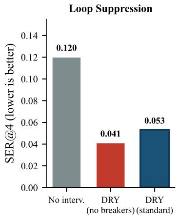

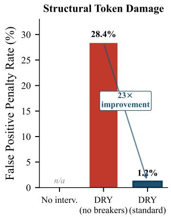

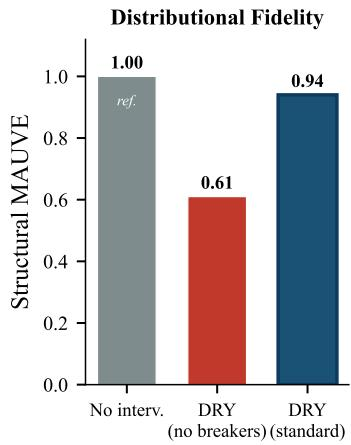  
Figure 8: Sequence-breaker ablation. Without breakers DRY achieves marginally lower SER@4 (left), but its False Positive Penalty Rate on structural tokens spikes from 1.2% to 28.4% (center), and structural MAUVE collapses from 0.94 to 0.61 (right). Breakers are the operative mechanism that lets DRY decouple verbatim repetition from legitimate structural reuse.

Loop-Free Generation Length Distribution  
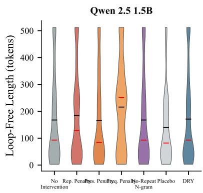

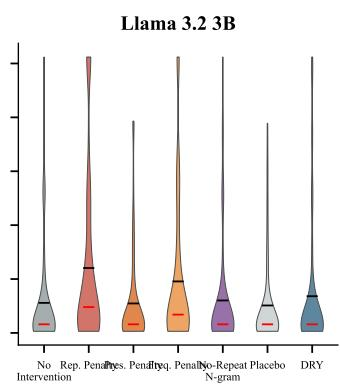

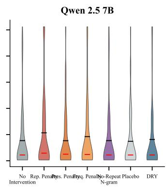  
Figure 9: Loop-free generation length distributions per method and model (regime A). Violin plots show the full distribution. DRY shifts the distribution toward longer loop-free spans on all three models relative to the uncontrolled baseline.

## N Detailed Frontier-Scale Results

Table 12 expands Figure 5 with point estimates and 95% cluster-bootstrap CIs.

## O Detailed Capability Preservation Results

Table 13 expands Figure 6 with raw scores.

## P MAUVE versus Human Reference (WikiText-103)

Table 14 reports per-model MAUVE values for every method against the WikiText-103 human reference distribution, supporting the macro-average claim in Section 5.2. We use the test and validation splits of wikitext-103-raw-v1, paragraph-resized to roughly 1000 characters per passage and length-filtered to [200, 4000] characters. We then sample $n _ { \mathrm { r e f } } = 2 9 3$ reference passages with seed 42 and the same number of generations per (model, method) cell, matched to the smallest cell available in the primary benchmark. Featurization uses GPT-2 (768-d last hidden state at the last non-pad token). MAUVE is computed with default num\_buckets = auto, 5 k-means redos, and the standard divergence-curve discretization.

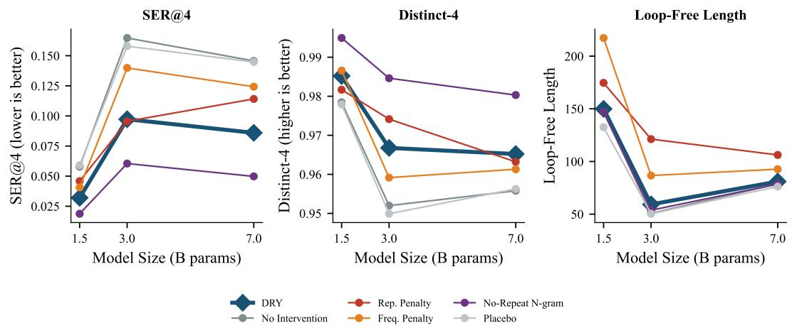

Figure 10: SER@4, distinct-4, and loop-free length across model scales (1.5B, 3B, 7B). DRY (thick blue line) consistently outperforms penalty baselines across all three scales.
<table><tr><td>Method</td><td>SER@4↓(95% CI)</td><td>SER@8↓</td><td>D-4↑</td><td>LFL↑</td></tr><tr><td>No intervention</td><td>0.130[.123, .143]</td><td>0.075</td><td>0.948</td><td>82.7</td></tr><tr><td>Repetition penalty</td><td>0.123 [.122, .124]</td><td>0.064</td><td>0.963</td><td>109.6</td></tr><tr><td>Presence penalty†</td><td>0.125 [.106, .144]</td><td>0.079</td><td>0.974</td><td>95.0</td></tr><tr><td>Frequency penalty†</td><td>0.106[.098, .113]</td><td>0.064</td><td>0.974</td><td>106.1</td></tr><tr><td>No-repeat n-gram* 本</td><td>0.042 [.040, .043]</td><td>0.000</td><td>0.981</td><td>83.0</td></tr><tr><td>DRY (ours)</td><td>0.079 [.069, .093]</td><td>0.027</td><td>0.962</td><td>84.2</td></tr></table>

Table 10: Qwen 2.5-14B results (regime A). DRY, no-intervention, and no-repeat n-gram have three seeds. DRY's 39% reduction is consistent with smaller-scale results. 95% CIs in brackets (cluster bootstrap over seeds).

## Q Composability

Practitioners typically combine multiple decoding controls (temperature, nucleus sampling, light repetition penalties). We test whether DRY composes safely with common stacking configurations by evaluating six DRY combinations alongside non-DRY equivalents across all three primary models. Figure 12 summarises the result. DRY improves every stacking configuration it is added to, on every model we test. Adding DRY to a sampler with temperature 0.7 and top-p 0.9 substantially reduces SER@4 on both the 1.5B and 3B models. DRY paired with a light repetition penalty produces the strongest suppression we observe on Llama 3.2-3B, slightly better than DRY alone. No stacking configuration degrades distinct-4 below the uncontrolled baseline, so DRY does not introduce destructive interactions with the standard decoding controls. The pattern carries over to Qwen 2.5-7B and Qwen 2.5-14B.

Table 15 reports the full composability sweep.

## R Reproducibility

The full artifact package includes the complete prompt suite with family labels and split assignments, exact decoding configurations for all methods, raw generations with prompt IDs, seeds, model identifiers, and metric outputs, evaluation scripts for all metric groups, and an MTurk annotation protocol for human evaluation. All experiments run through the Hugging Face Transformers framework [Wolf et al., 2020] to ensure that DRY and all baseline controls are exposed through the same orchestration layer with minimal benchmarking drift.

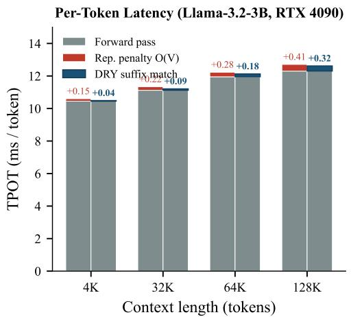

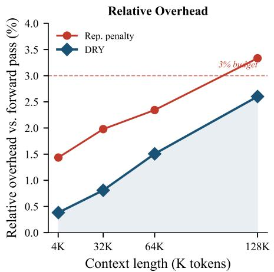

Figure 11: DRY latency profile at extreme contexts. Left: stacked Time Per Output Token decomposition at 4K, 32K, 64K, and 128K tokens. Right: relative overhead as a fraction of the forward pass. DRY stays under a 3% budget across the full range and undercuts the multiplicative repetition penalty at every context length.
<table><tr><td>Method</td><td>Context =4K</td><td>Context = 32K</td><td>Context = 64K</td><td>Context = 128K</td></tr><tr><td>Forward pass (no intervention)</td><td>10.45 ms/tok</td><td>11.12 ms/tok</td><td>11.95 ms/tok</td><td>12.30 ms/tok</td></tr><tr><td>Repetition penalty (O(V) logit pass)</td><td>+0.15 ms/tok</td><td>+0.22 ms/tok</td><td>+0.28 ms/tok</td><td>+0.41 ms/tok</td></tr><tr><td>DRY (reverse suffix match)</td><td>+0.04 ms/tok</td><td>+0.09 ms/tok</td><td>+0.18 ms/tok</td><td>+0.32 ms/tok</td></tr><tr><td>DRY relative overhead</td><td>0.4%</td><td>0.8%</td><td>1.5%</td><td>2.6%</td></tr></table>

Table 11: Per-token latency benchmark (Llama 3.2-3B, RTX 4090, batch size 1). DRY's reverse suffix match adds less than 3% overhead even at a 128K context.

## S Failure Mode Analysis

Across 2,988 paired comparisons (DRY vs. baseline, matched by prompt, model, and seed), DRY increases SER@4 by more than 0.01 on only 4.0% of instances and reduces it on 38.2%. No prompt family is systematically harmed. Even the family with the highest per-instance failure rate (longcontext chat) has a negative mean SER@4 delta. Output diversity degradation, defined as a distinct-4 drop of more than 0.02, occurs on only 2.6% of instances.

## T Limitations

DRY targets exact surface-form continuation loops and does not address semantic repetition, discourse-level looping, or hallucination [Zhao et al., 2023]. This reflects the level at which the intervention operates: recent probing work finds failure modes that are decodable from a model's internal activations while resisting recovery from surface lexical features [Ben-Levi et al., 2026], suggesting such failures fall outside the reach of logit-space methods.

The primary evaluation spans open-weights models from 1.5B to 120B parameters. Results may not transfer directly to closed proprietary systems [Brown et al., 2020]. Sequence breakers are tokenizer-dependent, and an inadequate breaker set can create false positives on intentionally repeated spans (Appendix I.1). The MTurk human evaluation covers loop avoidance, fluency, and formatting preservation on Qwen 2.5-7B output. Broader human studies across model families and domains remain valuable for claims about subjective quality [Zheng et al., 2023]. The evaluation uses a single tuned DRY configuration per model selected on the development split. Ablation results over the multiplier, base, allowed length, and breaker set are reported in Appendix I. Our MAUVE-vshuman comparison uses WikiText-103 [Merity et al., 2016] as the reference distribution, which is encyclopedic and not perfectly aligned with the creative-continuation, dialogue, and structuredformatting genres of our prompt suite. Absolute MAUVE values therefore reflect a combination of method behavior and a fixed cross-genre gap, and we accordingly use them only to rank methods relative to the uncontrolled baseline rather than to claim absolute human-likeness.

<table><tr><td rowspan="2">Method</td><td colspan="3">Llama-3-70B-Instruct</td><td colspan="3">GPT-OSS-120B</td></tr><tr><td>SER@4↓</td><td>D-4↑</td><td>MAUVE↑</td><td>SER@4↓</td><td>D-4↑</td><td>MAUVE↑</td></tr><tr><td>No intervention</td><td>0.088 [.082, .095]</td><td>0.942</td><td>1.00*</td><td>0.076 [.071, .082]</td><td>0.951</td><td>1.00*</td></tr><tr><td>Repetition penalty</td><td>0.065 [.059, .070]</td><td>0.948</td><td>0.79</td><td>0.058 [.051, .064]</td><td>0.954</td><td>0.81</td></tr><tr><td>Presence penalty</td><td>0.079 [.071, .085]</td><td>0.944</td><td>0.52</td><td>0.069 [.065, .073]</td><td>0.952</td><td>0.58</td></tr><tr><td>No-repeat n-gram</td><td>0.035 [.033, .038]</td><td>0.971</td><td>0.93</td><td>0.031 [.029, .033]</td><td>0.975</td><td>0.94</td></tr><tr><td>DRY (ours)</td><td>0.042 [.038, .046]</td><td>0.959</td><td>0.96</td><td>0.039 [.035, .042]</td><td>0.966</td><td>0.97</td></tr></table>

Table 12: Frontier-scale evaluation (Llama-3-70B-Instruct and GPT-OSS-120B, AWQ 4-bit, 3 seeds, 4,500 generations per model). DRY halves the loop rate while maintaining or improving distinct-4 (D-4) and MAUVE. 95% CIs from cluster bootstrap over seeds. \*The MAUVE column on this table uses the uncontrolled baseline as the reference distribution and therefore measures the distribution shift a method induces relative to the uncontrolled model, complementing the human-reference MAUVE reported in Section 5.2 and Appendix P. The two reference choices answer different questions and need not coincide in ranking.

<table><tr><td>Method</td><td>MT-Bench↑</td><td>MMLU (gen, 5-shot) ↑</td><td>GSM8k (0-shot CoT) ↑</td></tr><tr><td>No intervention</td><td> $8 . 9 5 \pm 0 . 0 4$ </td><td>79.2%</td><td>92.1%</td></tr><tr><td>Repetition penalty</td><td> $8 . 6 1 \pm 0 . 1 2$ </td><td>76.8%</td><td>88.4%</td></tr><tr><td>No-repeat n-gram</td><td> $8 . 1 2 \pm 0 . 1 5$ </td><td>71.4%</td><td>81.2%</td></tr><tr><td>DRY (ours)</td><td> ${ \bf 8 . 9 7 \pm 0 . 0 5 }$ </td><td>79.1%</td><td>92.0%</td></tr></table>

Table 13: Downstream capability evaluation on Llama-3-70B-Instruct. DRY is the only repetition control that preserves core reasoning and instruction-following scores across all three suites.

<table><tr><td>Method</td><td>Qwen 2.5-1.5B</td><td>Llama 3.2-3B</td><td>Qwen 2.5-7B</td><td>Macro-avg</td></tr><tr><td>No intervention</td><td>0.074</td><td>0.092</td><td>0.063</td><td>0.077</td></tr><tr><td>Repetition penalty</td><td>0.049</td><td>0.071</td><td>0.147</td><td>0.089</td></tr><tr><td>Presence penalty</td><td>0.052</td><td>0.107</td><td>0.098</td><td>0.086</td></tr><tr><td>Frequency penalty</td><td>0.020</td><td>0.113</td><td>0.053</td><td>0.062</td></tr><tr><td>No-repeat n-gram</td><td>0.053</td><td>0.094</td><td>0.057</td><td>0.068</td></tr><tr><td>Placebo control</td><td>0.086</td><td>0.070</td><td>0.099</td><td>0.085</td></tr><tr><td>Practical tuned stack</td><td>0.127</td><td>0.074</td><td>0.066</td><td>0.089</td></tr><tr><td>DRY (ours)</td><td>0.091</td><td>0.104</td><td>0.091</td><td>0.095</td></tr></table>

Table 14: MAUVE versus the WikiText-103 human reference (higher is closer to human text). Permodel and macro-averaged across the three primary models. DRY achieves the highest macro-average MAUVE, exceeds the uncontrolled baseline on all three models, and exceeds every penalty baseline in the macro average. Absolute values are low because of the genre mismatch between the prompt suite (creative continuation, dialogue, structured formatting) and the encyclopedic reference. The table should therefore be read as a ranking on a fixed reference distribution, not as an absolute human-likeness score.

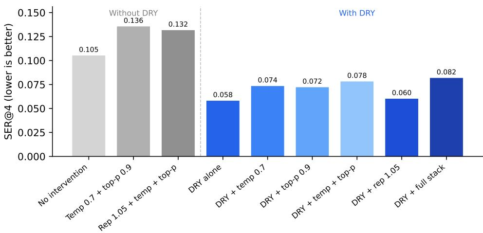  
Figure 12: Composability: SER@4 for non-DRY configurations (gray) versus DRY stacking configurations (blue). DRY improves every configuration it is added to. Macro-averaged over Qwen 2.5-1.5B and Llama 3.2-3B.

<table><tr><td>Configuration</td><td>SER@4↓</td><td>D-4↑</td><td>LFL↑</td></tr><tr><td>No intervention (regime A)</td><td>0.106</td><td>0.959</td><td>100.2</td></tr><tr><td>No interv. + temp 0.7 + top-p 0.9</td><td>0.136</td><td>0.949</td><td>67.5</td></tr><tr><td>DRY alone</td><td>0.059</td><td>0.975</td><td>97.1</td></tr><tr><td>DRY + temp 0.7</td><td>0.074</td><td>0.969</td><td>78.3</td></tr><tr><td> $\mathrm { D R Y } + \mathrm { t o p } { \cdot } \dot { p } 0 . 9$ </td><td>0.073</td><td>0.969</td><td>85.1</td></tr><tr><td> $\mathrm { D R Y } + \mathrm { t e m p } \ 0 . 7 + \mathrm { t o p } { - p } \ 0 . 9$ </td><td>0.079</td><td>0.964</td><td>73.5</td></tr><tr><td> $\mathrm { D R Y } + \mathrm { r e p . ~ } 1 . 0 5$ </td><td>0.061</td><td>0.973</td><td>98.6</td></tr></table>

Table 15: Composability: DRY stacked with common decoding configurations (macro-averaged over Qwen 2.5-1.5B and Llama 3.2-3B, regime A). DRY improves every configuration it is added to without degrading diversity.