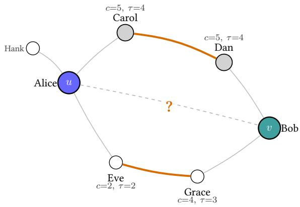
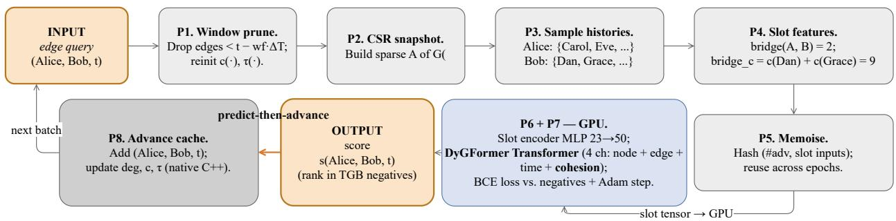
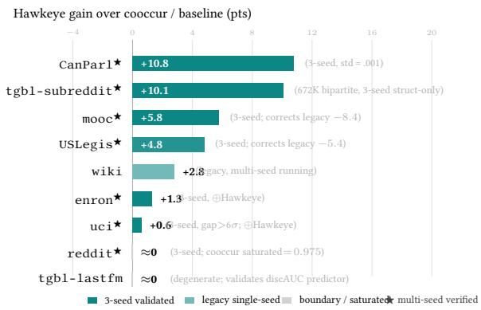

# HAWKEYE: Seeing One Layer Deeper — A Cohesion-Aware Structural Channel for Temporal Link Prediction

Jiacheng Ding   
jding2@memphis.edu   
Department of Computer Science   
The University of Memphis   
Memphis, Tennessee, USA

## Abstract

State-of-the-art temporal-link-prediction (TLP) models are, in essence, multi-channel information aggregators: they combine an interaction-history channel, a time-encoding channel, and a structure channel. The first two have been refined relentlessly; the structure channel remains a crude afterthought — DyGFormer encodes it as a 1–2-bit neighbour-cooccurrence count. We begin with a measurement: on sparse temporal graphs the classical 1-hop commonneighbour signal is near-random (discriminative AUC ≈ 0.50), because two nodes almost never share a direct neighbour; the genuinely discriminative signal lies one hop deeper — the 2-hop cohesive bridge, whose discAUC reaches 0.73–0.98, on both bipartite and non-bipartite graphs. Motivated by this, we propose Hawkeye, a cohesion-aware structural channel that incrementally maintains the classical �-family of cohesiveness indicators (degree → �-core → �-truss) and forms 2-hop cohesive-bridge features. Hawkeye is a drop-in replacement for a temporal-graph model’s native structure channel, with no change to the backbone. Swapping Hawkeye into DyGFormer improves test AP/MRR over the cooccurrence channel by +0.6 to +10.8 points across six multi-seed-validated datasets (uci, enron, USLegis, CanParl, reddit, mooc; wiki legacy single-seed). On the bipartite recommendation benchmark tgbl-subreddit, a 3-seed single-pass struct-only ablation shows Hawkeye nearly doubling the baseline test MRR (0.103±0.003 → 0.204±0.005, +10.1 points across all three seeds), demonstrating large-graph efectiveness; the streaming pipeline scales to the 67M-edge tgbl-flight in five minutes per pass. We further characterise when it helps: the gain tracks a graph’s training-free 2-hop discAUC and vanishes on degenerate or saturated graphs — a predictable boundary. All code, data, drawio-editable figures, and figure-generation scripts are released.

## CCS Concepts

• Information systems → Data mining; • Computing methodologies → Neural networks; • Theory of computation → Dynamic graph algorithms.

## Keywords

temporal link prediction; dynamic graphs; �-core; �-truss; structural features; graph neural networks

Xiaofei Zhang   
xiaofei.zhang@memphis.edu   
Department of Computer Science   
The University of Memphis   
Memphis, Tennessee, USA

ACM Reference Format: Jiacheng Ding and Xiaofei Zhang. 2026. HAWKEYE: Seeing One Layer Deeper — A Cohesion-Aware Structural Channel for Temporal Link Predic tion. In Proceedings ofthe 35th ACM International Conference on Information and Knowledge Management (CIKM ’26), November 07–11, 2026, Rome, Italy. ACM, New York, NY, USA, 11 pages. https://doi.org/10.1145/3799682.3841168

## 1 Introduction

Many real-world systems are naturally represented as graphs that evolve over time: user interactions in social networks [28], user– item engagements on e-commerce and streaming platforms [13], account-to-account transactions in financial systems [8], the evolution ofentity relations in knowledge graphs, and device connections in communication networks. Forecasting which new edges will appear next on such evolving graphs — temporal link prediction (TLP) — is a fundamental and practically important task: it underpins friend recommendation, fraud and anti-money-laundering detection, and drug–target discovery [8, 22].

Temporal-graph learning has advanced rapidly, and the prevailing paradigm models the interaction dynamics of nodes. TGN maintains a per-node memory module updated by every interaction event [23]. DyGFormer feeds the chronologically ordered sequence of a node’s historical neighbours into a Transformer [35]. TPNet builds and projects a temporal random-walk matrix and reaches state-of-the-art accuracy without a GNN architecture [17]. TNCN dynamically maintains a neighbour dictionary and strengthens pairwise representations with temporal common-neighbour signals [39]; very recent work further refines interaction-pattern awareness and causal debiasing [38, 40]. Earlier attention-, walkand mixing-based encoders share the same spirit [4, 31, 33]. These methods difer in emphasis but share one core idea: encode the interaction-history sequence — who interacted with whom, and when — and score candidate edges from the learned embeddings.

A motivating example. Consider an anti-money-laundering setting. A small set of accounts begins, over a few weeks, to transact among themselves: a tight sub-community crystallises before any of them transacts with an outside “victim” account. A model that only tracks pairwise interaction recency sees each past transaction in isolation; it is blind to the macroscopic pattern — this group is densifying into a cohesive cluster — that actually anticipates the next edge. The predictive signal here is structural: a rise in how tightly the accounts are mutually embedded, and the formation of short structural bridges between not-yet-connected accounts. The same shape recurs across domains: a forming research collaboration, a clique of co-edited pages, a new hub airport. Capturing it requires reasoning about cohesiveness and its evolution — not just the interaction sequence.

Architecturally, a state-of-the-art temporal-graph model is a multi-channel information aggregator: (a) an interaction-history channel, (b) a time-encoding channel, and (c) a structure channel encoding the topological relation between the candidate pair. The first two channels have been refined relentlessly — from RNNs to Transformers to state-space models — yet the structure channel remains a crude afterthought. DyGFormer’s structure channel is merely a 1–2-bit neighbour-cooccurrence count; TNCN’s is a single common-neighbour count. Behind these designs lies an un stated assumption that the 1-hop common neighbour is the right structural signal; a systematic measurement study shows it is not.

Streaming each benchmark chronologically and scoring every candidate structural feature by how well it separates true edges from the oficial negatives, we find that on sparse temporal graphs the 1-hop common-neighbour signal is barely better than a coin flip: discriminative AUC ≈ 0.50 on tgbl-uci, tgbl-enron and tgbl-wiki. These graphs are too sparse for two arbitrary nodes to share a direct neighbour. The genuinely discriminative signal lies one hop deeper — the 2-hop cohesive bridge: whether two nodes are embedded in the same densely connected region through length-2 paths. Its discAUC reaches 0.73–0.98, and this holds on both bipartite and non-bipartite graphs — the deciding factor is sparsity, not graph type.

Obstacles addressed by Hawkeye. Two reasons make a 1-hop structure channel hard to escape: bounded-depth message passing cannot compute global cohesiveness exactly, and richer structural quantities on a streaming graph appear expensive. The �-family admits incremental maintenance at streaming cost, and its 2-hop signal is cheap to read and far more discriminative.

Motivated by this finding, we propose Hawkeye, a cohesionaware structure channel that lets a temporal-graph model “see one layer deeper” (Figure 1). Hawkeye incrementally maintains, over the edge stream, the classical �-family of structural-cohesiveness indicators — degree → �-core → �-truss — and forms 2-hop cohesive-bridge pairwise features. It is a drop-in replacement for a temporal-graph model’s native structure channel: it changes what structural signal the backbone receives without changing the backbone. Swapping Hawkeye into DyGFormer raises test MRR on tgbl-wiki from 0.779 to 0.807 (above the reported DyGFormer result) and test AP on CanParl from 0.708 to 0.816 (+10.8 points, 3-seed). We further characterise when it helps: the gain tracks a graph’s structural diversity; on near-complete graphs every node attains the same maximal coreness and Hawkeye correctly does not help — a predictable boundary.

Contributions. (1) An empirical finding: 1-hop common neighbours are near-random on sparse temporal graphs (discAUC ≈ 0.50); the 2-hop cohesive bridge is the dominant simple structural signal (discAUC 0.73–0.98), on bipartite and non-bipartite graphs alike. (2) Hawkeye: an incrementally maintained, cohesion-aware structure channel built on the �-family, which plug-and-play replaces the native structure channel of a slot-based temporal-graph backbone (instantiated here on DyGFormer). (3) A characterisation ofwhen struc tural augmentation helps — the gain is predicted by a training-free structural-diversity measure. (4) Experiments across TGB and DGB datasets: Hawkeye improves test AP/MRR by +0.6 to +10.8 points over SOTA DyGFormer on non-degenerate graphs. Six datasets are now 3-seed validated under the current code (uci +0.6, enron +1.3, USLegis +4.8, CanParl +10.8, mooc +5.8, reddit ≈ 0 at saturation; std $\leq 0 . 0 1 1 )$ ; wiki contributes a legacy single-seed +2.8. The combined channel ⊕Hawkeye is the strongest configuration on every non-saturated multi-seed dataset, and also recovers the new-node split where the cohesion-only channel under-performs. (5) A system-level contribution: because the structure channel is data-determined (a function of the edge stream alone, independent of model weights and seed), it can be precomputed once and reused throughout training. We benchmark five CPU–GPU integration strategies on three datasets and find that precomputation yields a uniform 3.0–3.5× training speedup across dataset sizes, where overlap-based strategies (pinned memory, prefetching) give only marginal and dataset-dependent gains (§5.7).

  
CN(Alice, Bob) = 0, bridge(Alice, Bob) = 2 bridge = c(Dan) + c(Grace) = 5 + 4 = 9  
Figure 1: Running example (used throughout the paper). In a corporate email network, Alice (�) and Bob (�) have never emailed each other, so the 1-hop common-neighbour count is $\mathrm { C N } = 0 ;$ a cooccurrence-based structure channel sees no signal. Yet two 2-ho aths connect them: Alice–Carol–Dan and Alice–Eve–Grace, where Dan (core 5) and Grace (core 4) are Bob’s direct neighbours and Carol, Eve are the length- two intermediaries from Alice. Hawkeye reads exactly these bridges and correctly rates Alice–Bob as a likely next-email pair. Section 3 shows this configuration is the typical informative pair on sparse temporal graphs; Section 4 explains how the cache and the slot encoder make Alice’s, Bob’s, and the intermediaries’ coreness available at query time; and §5.6 returns to this example in the case study.

## 2 Preliminary

## 2.1 Problem Formulation

We model interactions as a continuous-time dynamic graph (temporal-network formalism of Holme & Saramäki [7]; modelling survey by Skarding et al. [27]): a time-ordered stream of

edges

$$
\mathcal { G } = \{ ( u _ { 1 } , v _ { 1 } , t _ { 1 } ) , . . . , ( u _ { m } , v _ { m } , t _ { m } ) \} , \quad t _ { 1 } \leq \cdot \cdot \cdot \leq t _ { m } ,\tag{1}
$$

with nodes $u _ { i } , v _ { i } \in \mathcal { V }$ and timestamps $t _ { i } \in \mathbb { R } ^ { + }$ . The cumulative snapshot $\mathcal { G } ( t )$ is the simple undirected graph induced by all edges with timestamp $\leq t ; G ( < t )$ denotes the strictly-earlier history. We make no assumption of fixed-interval discretisation (which discards within-interval order [7]); every event is processed at its native timestamp.

Temporal link prediction. Given $\mathcal { G } ( < t )$ , a query node �, and candidate destinations C, the task is to assign a score $s ( u , v , t )$ to each $v \in C$ so the truly-occurring edge is ranked highest:

$$
v ^ { * } = \arg \operatorname* { m a x } _ { v \in C } s ( u , v , t ) .\tag{2}
$$

Two evaluation conventions are used in the literature, both ofwhich we report [12, 16]: on TGB [8], accuracy is the mean reciprocal rank (MRR) of the truly-occurring edge against a fixed negative set; on DGB datasets [22] we report average precision (AP) under random negative sampling following [19, 35].

## 2.2 The �-family of Cohesiveness Indicators

We use “�-family” as a working shorthand — it is not a standard named class in the literature — to refer to a hierarchy of node-level structural-cohesiveness indicators that impose increasingly strict local constraints:

$$
\underbrace { \mathrm { d e g r e e } } _ { \mathrm { l o o s e s t } }  k \mathrm { - c o r e }  k \mathrm { - t r u s s }  \underbrace { ( k \mathrm { - c l i q u e } ) } _ { \mathrm { t i g h t e s t , l i m i t } } .
$$

Each next member asks a stricter question about how densely a node is embedded in its neighbourhood. Concretely:

Degree. $d ( v ) = | N ( v ) |$ , the number of distinct neighbours — the loosest cohesion proxy, capturing local connectedness only.

�-core (Seidman [25]). A subgraph $H \subseteq G ( t )$ is a �-core if every node in � has at least � neighbours within �, and � is maximal w.r.t. this property. The core number of � is the largest � such that � belongs to the �-core:

$$
c ( v ) = \operatorname* { m a x } \{ k : v \in k \mathrm { - c o r e } ( g ( t ) ) \} .\tag{3}
$$

The core number lifts degree into a recursive notion ofcohesiveness: � has core � if �’s neighbours collectively also have core �. The classical decomposition (Batagelj & Zaveršnik [1]) computes �(�) for every node in $O ( m )$ by repeated bucket-peeling of the lowestdegree node.

�-truss (Cohen [3]). A subgraph $H \subseteq G ( t )$ is a �-truss if every edge of � is supported by at least $k - 2$ triangles within �, and � is maximal. The trussness of a node lifts this to vertices:

$$
\tau ( v ) = \operatorname* { m a x } \{ k : \exists ( v , w ) \in k \mathrm { - } \mathrm { t r u s s } ( \mathcal { G } ( t ) ) \} .\tag{4}
$$

Trussness adds triangle closure to core membership: a node is in a �-truss only if many of its neighbours are also mutually adjacent. The standard support-peeling decomposition (Wang & Cheng [30]) runs in $O ( m ^ { 1 . 5 } )$ .

�-clique (limit). A �-clique is a fully-connected subset of � nodes; this is the strictest case, where every pair of the � neighbours is adjacent. We do not use �-clique directly — it is NP-hard to find for large � — but it serves as the limit of the hierarchy that motivates why �-truss (which only requires triangle support) is already a tight proxy.

Nesting. The members are nested: �-truss $\subseteq ( k - 1 ) \mathrm { - c o r e } \subseteq ( k -$ 2)-core (degree), so a high trussness implies a high core number which implies high degree.1

Constraint vs. cost. A tighter constraint describes finer structure but costs more to maintain incrementally: �(1) per inserted edge for degree, �(local) amortised for �-core, up to $O ( m ^ { 1 . 5 } )$ recomputed for �-truss [1, 3, 30]. This trade-of guides our default cache configuration (Section 4.1).

## 2.3 The 2-hop Cohesive Bridge

Motivation. Social-network theory has long argued that the structurally informative ties for predicting new contacts are not those already directly closed (the strong ties visible to a 1-hop commonneighbour count) but those that bridge across local clusters — Granovetter’s “weak ties” [6], Burt’s structural holes [2], and the smallworld distance-two regime [20, 32]. Easley & Kleinberg [5] state the same idea as triadic closure: a 2-path is the precondition for a new triangle. We turn this into a quantitative feature.

Formalisation. The 2-hop neighbourhood of� is ${ \cal N } _ { 2 } ( u , t ) = \{ w :$ ∃�, $( u , z ) , ( z , w ) \in \mathcal { G } ( t ) , w \not = u \}$ . For a candidate pair (�, �), the 2-hop cohesive-bridge strength is

$$
\mathrm { b r i d g e } ( u , v , t ) = \big | \{ w \in N ( v , t ) : w \in N _ { 2 } ( u , t ) \} \big | ,\tag{5}
$$

the number of �’s direct neighbours reachable from � in two hops. Even when $u , v$ share no direct neighbour, a large bridge means they are embedded in the same structural community; even when they share a few, weighting bridges by intermediary cohesiveness emphasises bridges that travel through dense regions. A cohesionweighted variant bri $\begin{array} { r } { \mathrm { l g e } _ { c } ( u , v , t ) = \sum _ { w } c ( w ) } \end{array}$ up-weights bridges through highly cohesive intermediaries.

Running example (Figure 1). Alice (�) and Bob (�) have CN(Alice, Bob, �) = 0 but bridge(Alice, Bob, $t ) = 2 \colon$ Dan and Grace, both direct neighbours of Bob, lie two hops from Alice through Carol and Eve respectively. Weighting Bob’s bridging neighbours by their core numbers gives bridg $\dot { \bar { \mathbf { \alpha } } } _ { c } = c ( D a n ) + c ( G r a c e ) = 5 + 4 = 9 .$ This is the slot input that Hawkeye ships to the GPU; we trace it through the cache (§4.1) and into the model (§4, Figure 2).

The 1-hop common-neighbour count $\mathrm { C N } ( u , v , t ) ~ = ~ | N ( u , t ) ~ \cap ~$ N(�, �)|, strong on dense static graphs [12, 14, 16], is degenerate at typical sparsities; we develop the mechanism in Section 3.

## 3 Empirical Study: Why Existing Structural Signals Fail

Before presenting the method, we use training-free measurement to characterise the structural signal. On six TGB and five DGB datasets we stream each benchmark chronologically and, for every validation edge and a random negative, compute each candidate structural feature on $\mathcal { G } ( \mathbf { \boldsymbol { \mathbf { \mathit { \Sigma } } } } \mathbf { \leq } \mathbf { \Delta } t )$ , reporting its discriminability AUC (discAUC): the probability it ranks the true edge above a negative. discAUC = 0.50 is random. Table 1 summarises the 1-hop / 2-hop / core-weighted-2-hop signals on all eleven datasets; a larger sweep over 21 candidate features on the six TGB datasets is included as supplementary data with the released code.

Finding 1: 1-hop CN is near-random on sparse graphs; 2-hop is the signal. Table 1 reports the discAUC of the 1-hop common neighbour and the 2-hop cohesive bridge across the eleven datasets we touch in this paper. Four regimes emerge. (a) Sparse (tgbl-uci, tgbl-enron, and the bipartite tgbl-wiki): the 1-hop CN sits exactly at 0.50 — two arbitrary nodes almost never share a di rect neighbour — while the 2-hop cohesive bridge reaches 0.73– 0.85. This is the main motivating regime for Hawkeye. (b) Bi-partite (tgbl-subreddit, DGB mooc, reddit): the 1-hop CN is structurally crippled (a user and an item cannot share a neighbour on the same side ofthe partition); we measure it at 0.50, 0.09, 0.43 respectively. The 2-hop bridge reaches 0.94–0.98 — precisely the case where Hawkeye doubles or triples baseline MRR (§5.4). (c) Near complete non-bipartite (CanParl, USLegis): the average event degree exceeds 200 on ≤ 750 nodes, so the simple 2-hop bridge count saturates (its discAUC drops to 0.48–0.56, near or below the 1-hop), but the 1-hop CN is itself slightly informative (0.60–0.63). The trained Hawkeye still wins on these (§5, +10.8 and +4.8 pts respectively) because the model exploits the core-weighted features, not the raw bridge count. (d) Degenerate (tgbl-lastfm, DGB UNvote): every feature collapses near 0.50. Hawkeye correctly does not help on these (§5). In short, the 1-hop CN being near-random is not a universal claim — it holds in regime (a) and structurally in (b) — but the 2-hop bridge as a signal is informative in (a), dominant in (b), saturated in (c), and absent in (d). The full 21-feature sweep (released as supplementary data) further shows that node-level popularity priors — degree.\*, core.\* and their EMA / trend variants — sit consistently between the 1-hop and 2-hop discAUCs, confirming that the predictive signal in cohesion is genuinely pair-structural rather than a one-sided popularity proxy.

Finding 2: �-family weighting ≈ raw 2-hop count. The last two columns of Table 1 show that core-weighting the 2-hop bridge barely changes its discAUC (0.76 vs. 0.75 on uci). We report this hon estly: the 2-hop topology is the dominant signal; �-family weighting is a refinement, not the driver. The value of the �-family is twofold — as node-level features and as the incrementally maintained substrate on which the 2-hop bridge is computed.

Finding 3: the constraint hierarchy peaks at �-core, not �-truss. In a struct-only setting (no GNN), we sweep the �-family indicators with 3-seed validation on tgbl-uci: test MRR is degree 0.120±0.004 → degree+�-core 0.180±0.011 → degree+�-core+�- truss 0.166±0.007. Adding �-core to degree contributes +6.0 pts (+50% relative); adding �-truss on top loses 1.4 pts and costs an order of magnitude more compute $( \bar { O } ( m ^ { 1 . 5 } )$ vs. �(�)). �-core is therefore the eficiency–efectiveness sweet spot, and is Hawkeye’s default indicator; �-truss is available as an option but turned of in all reported main-table results.

Mechanism. The contrast in Finding 1 has a simple explanation. The 1-hop count $\operatorname { C N } ( u , v )$ rests on the intersection of two neighbourhoods, of expected size ≈ $d ^ { 2 } / n$ on a graph with average degree � over � nodes; in the sparse regime $( d \ll { \sqrt { n } } )$ of every TLP benchmark we study this is vanishingly small, so the count is zero — and uninformative — for almost all pairs. The 2-hop bridge instead measures the overlap of N(�) with �’s 2-hop reach, a set of expected size ≈ $d ^ { 2 }$ rather than $d ;$ it remains non-zero and pair-varying precisely where the 1-hop count collapses. The Table 1 gap accordingly widens with sparsity and closes on the denser tgbl-coin.

Table 1: Discriminability AUC of 1-hop vs. 2-hop structural signals (discAUC = 0.50 is random). 1-hop CN is random on sparse graphs; the 2-hop cohesive bridge is strongly discriminative.
<table><tr><td>dataset</td><td>density / type</td><td>1-hop</td><td>2-hop</td><td>2-hop×c</td></tr><tr><td colspan="5">TGB benchmarks (streaming discAUC sweep, §3 setup)</td></tr><tr><td>tgbl-uci</td><td>sparse</td><td>0.50</td><td>0.76</td><td>0.75</td></tr><tr><td>tgbl-enron</td><td>sparse</td><td>0.50</td><td>0.73</td><td>0.71</td></tr><tr><td>tgbl-wiki</td><td>sparse</td><td>0.50</td><td>0.85</td><td>0.83</td></tr><tr><td>tgbl-subreddit</td><td>medium, bipartite</td><td>0.50</td><td>0.96</td><td>0.96</td></tr><tr><td>tgbl-coin</td><td>denser</td><td>0.75</td><td>0.77</td><td>0.77</td></tr><tr><td>tgbl-lastfm</td><td>degenerate-dense</td><td>0.50</td><td>0.53</td><td>0.52</td></tr><tr><td colspan="5">DGB benchmarks (3-second streaming pass over the CSV)</td></tr><tr><td>mooc</td><td>bipartite</td><td>0.09</td><td>0.94</td><td>0.94</td></tr><tr><td>reddit</td><td>bipartite</td><td>0.43</td><td>0.98</td><td>0.98</td></tr><tr><td>CanPar1</td><td>near-complete</td><td>0.60</td><td>0.48</td><td>0.48</td></tr><tr><td>USLegis</td><td>near-complete</td><td>0.63</td><td>0.56</td><td>0.56</td></tr><tr><td>UNvote</td><td>degenerate-complete</td><td>0.52</td><td>0.52</td><td>0.52</td></tr></table>

1-hop = common neighbour; 2-hop = cohesive bridge; 2-hop×c = core-weighted bridge (the �-core weighting moves the discAUC by at most 0.01 on every dataset, validating Finding 2). The DGB rows expose two regimes that the TGB sweep alone does not show: (i) bipartite (mooc, reddit) where the 1-hop CN is structurally near zero and the 2-hop bridge dominates; (ii) near-complete (CanParl, USLegis) where the simple 2-hop bridge count is saturated and the 1-hop CN is actually informative — yet the trained Hawkeye (which uses core-weighted features, not the raw count) still wins on both (Table 4).

Design implications. Three implications carry into Hawkeye’s design (§4). (i) The structural channel should read the graph at 2 hops, not 1. (ii) The indicator family should default to �-core — it captures most of the direction of the (much costlier) �-truss. (iii) Cohesion weighting should be available but not assumed dominant: we expose weighted and unweighted 2-hop features and let the model choose.

## 4 Method: Hawkeye

Hawkeye is a structure-channel replacement module: it does not modify the backbone — it replaces only the backbone’s native structure channel. We instantiate it on DyGFormer [35], a self-attention backbone [29] that is currently the strongest single-model on TGB temporal link prediction [8]; the same module is mechanically applicable to other backbones (TGAT, GraphMixer) that read a per-slot structural channel, and to graph-Transformer variants [34] that adopt the same encoder pattern. Hawkeye has three components (Figure 2): (A) a Cohesion Cache maintaining the �-family and graph adjacency over the stream; (B) Pairwise Feature Extraction computing 2-hop cohesive-bridge features; (C) a Cohesion Slot Encoder projecting those features into the per-slot embedding fed to the Transformer.

Algorithm 1 Cohesion Cache — one streaming step   
Require: edge (�, �, �); cache state (adjacency �, core �, degree �); optional   
window �   
1: if � > 0 then ⊲ sliding-window eviction   
2: for each edge $( x , y , t ^ { \prime } )$ with $t ^ { \prime } < t - W$ do   
3: remove (�, ) from �; locally demote afected core numbers   
4: end for   
5: end if   
6: insert (�, �) into �; $d ( u ) \mathrel { + } = 1 ; d ( v ) \mathrel { + } = 1$   
7: � ← min(� (� ), � (�) )   
8: � ← nodes reachable from {�, �} through core-� nodes   
9: for � ∈ � in core order do   
10: if � has ≥ �+1 neighbours of core ≥ � then   
11: $c ( w ) \gets c ( w ) + 1$   
12: end if   
13: end for   
14: return updated cache

How to apply Hawkeye (four-step usage). (1) Measure: stream the first ≈15% of the edges through the Cohesion Cache and com pute the training-free 2-hop discAUC of §3 on a held-out slice (seconds, no model). (2) Decide with the rule of §5.6: discAUC near chance (≤ 0.55) ⇒ do not enable Hawkeye; clearly above chance with sparse 1-hop CN ⇒ +Hawkeye (replace cooccurrence); otherwise ⊕Hawkeye (add alongside). (3) Configure: degree+core by default (�-truss optional), window fraction wf = 0.01 as the starting point. (4) Train with the module in the backbone’s structure slot (Algorithm 2); the slot features are data-determined, so they can be precomputed once and reused across seeds and sweeps (§5.7).

## 4.1 Cohesion Cache: Incremental Structural Maintenance

The Cohesion Cache maintains, as edges arrive, (a) a CSR-backed adjacency structure and (b) per-node �-family indicators. On edge (�, �, �) the degree update is

$$
d ( u )  d ( u ) + 1 , \qquad d ( v )  d ( v ) + 1 ,\tag{6}
$$

at �(1) cost. The core-number update is local: with $k \_ =$ mi $\scriptstyle 1 ( c ( u ) , c ( v ) )$ , only nodes near the core frontier can change, and the afected set � is promoted,

$$
c ( w )  c ( w ) + 1 \quad { \mathrm { f o r ~ } } w \in S ,\tag{7}
$$

following streaming �-core maintenance [1, 24]; $| S | \ \ll \ | \mathcal { V } |$ in practice, so the update is millisecond-scale. Trussness is maintained analogously at higher cost; degree+core is the eficient default. Optionally, a sliding window of size � evicts edges older than $t - W$ , so the structural signal reflects the recent graph. Algorithm 1 summarises one streaming step of the cache.

## 4.2 Pairwise Feature Extraction

For each query, DyGFormer processes the source � with its historical-neighbour sequence $\left[ v _ { 1 } , \ldots , v _ { L } \right]$ . Hawkeye produces, for every slot �, a cohesion feature vector

$$
\mathbf { f } ( u , v _ { i } ) = [ \mathrm { { c n } } 2 , \mathrm { { c n } } 2 \_ \mathrm { { x } } , \mathrm { { c n } } , \mathrm { { a a } } , d ( v _ { i } ) , \mathrm { { } } c ( v _ { i } ) , \dots ] ,\tag{8}
$$

whose central entries are the 2-hop cohesive bridge (denoted cn2 ≡ bridge in the implementation) and its core-weighted variant

$$
\begin{array} { c } { { ( \mathrm { c n 2 \_ x } \equiv \mathrm { b r i d g e } _ { c } ) \mathrm { : } } } \\ { { \mathrm { c n 2 } ( u , v ) = | \{ w \in N ( v ) : w \in N _ { 2 } ( u ) \} | , } } \\ { { \mathrm { c n 2 \_ x } ( u , v ) = \displaystyle \sum _ { w \in N ( v ) \cap N _ { 2 } ( u ) } c ( w ) . } } \end{array}\tag{9}
$$

The encoder supports two backends: a full backend (∼ 20-dim, sparse mat-vec; used in all reported experiments) giving the exact 2-hop bridge and its weighted/temporal variants, and a lightweight fast backend (6-dim, per-pair set intersection) for very large graphs.

## 4.3 Cohesion Slot Encoder

DyGFormer’s native cooccurrence channel maps each slot to a channel\_dim embedding. Hawkeye replaces it through the same interface with a small MLP,

$$
\mathbf { e } _ { \mathrm { s t r u c t } } ( i ) = \mathrm { M L P } ( \mathbf { f } ( u , v _ { i } ) ) ,\tag{10}
$$

and the Transformer’s per-slot input is the unchanged sum

$$
\mathbf { x } ( i ) = \mathbf { e } _ { \mathrm { i n t e r } } ( i ) + \mathbf { e } _ { \mathrm { t i m e } } ( i ) + \mathbf { e } _ { \mathrm { s t r u c t } } ( i ) .\tag{11}
$$

This is the entire architectural change — one encoder swapped for another at the same interface; the Transformer backbone is untouched.

## 4.4 Training and Inference: a Step-by-Step Walkthrough

Training mirrors DyGFormer’s chronological scheme (BCE loss, Adam optimiser, batch size �). The novelty is in when structural information is consumed and updated. Algorithm 2 pins down the exact ordering of operations within one batch, and Figure 2 threads the running example through them: for the (Alice, Bob, �) query, P1–P5 produce the slot tensor (bridge = 2, bridge = �(Dan) + �(Grace) = 9) on the CPU, P6–P7 score and back-propagate on the GPU, and P8 finally writes the edge back to the cache. We explain each operation below.

The predict-then-advance contract. Steps P1–P7 score the batch on $\mathcal { G } ( < t _ { 1 } )$ (after pruning) without ever having seen the batch’s own edges; only P8 commits them. At any moment the cache thus reflects strictly earlier history. The same contract applies at inference, with one subtlety — subset re-evaluations (e.g., the “new-node” splits of DGB) must not advance the cache, as detailed below.

Leak-free cache management. Hawkeye’s Cohesion Cache is stateful; it is advanced edge-by-edge over the stream. Correct temporal evaluation therefore requires that, when scoring an edge at time �, the cache reflects exactly G(< �) — never future edges, and never edges double-counted from an earlier pass. We enforce this with three rules. (i) Per-epoch reset. At the start of every training epoch the cache is reset to empty, then advanced as in P1–P8 above. (ii) Evaluation order. Validation and test edges are processed in chronological order; the cache is advanced with each batch after scoring, so an evaluation edge sees all earlier train/val edges but not later ones. Subset re-evaluations (e.g., the “new-node” splits of DGB) re-score a subset of already-streamed edges, so they must not advance the cache, otherwise edges would be double-counted. (iii) Pre-final replay. Before the final evaluation of the best checkpoint, the cache is reset and replayed through the entire training stream, so the final val/test pass starts from exactly the post-training graph state. An earlier version of our pipeline omitted (ii) and (iii) and silently inflated test scores; all numbers here use the corrected protocol — we flag it because such leaks are invisible without an explicit audit.

  
Figure 2: Hawkeye per-batch timing, threaded with the Alice/Bob running example. Gray boxes are CPU work (Cohesion Cache + slot-feature extraction), blue boxes are GPU work (Cohesion Slot Encoder + unchanged DyGFormer). Orange badges P1–P8 mirror the steps of Algorithm ${ \bf 2 ; }$ the orange feedback arrow is the “predict-then-advance” contract that commits the batch’s edges after they have been scored.

Algorithm 2 One Hawkeye training step (batch of � chronological   
edges).   
Require: batch $\{ ( u _ { b } , v _ { b } , t _ { b } ) \} _ { b = 1 } ^ { B }$ with � ≤ . . . ≤ � ; cache state at $t < t _ { 1 }$   
1: (P1) Prune window (CPU): if wf > 0, evict every edge with timestamp   
<�� − wf · Δ� from the adjacency, then re-initialise �-core � and �-truss   
� on the post-prune graph.   
2: (P2) Snapshot CSR (CPU): lazily build the sparse CSR adjacency � of   
the current graph (cached and reused across slot-feature calls in this   
batch).   
3: (P3) Sample histories (CPU): for every ��, ��, query the DyGFormer   
neighbour sampler for the most recent � historical neighbours in $\mathcal { G } ( <$   
$t _ { b } )$   
4: (P4) Pairwise features (CPU, ∼ 17 sparse mat-vecs per unique peer):   
for every (history slot �, peer ��) pair, evaluate the 23-dim cohesion   
vector slot\_features(�, �� ) from �, the �-family values, and rolling   
statistics.   
5: (P5) Memoise (CPU): hash (advance counter, slot inputs); if the same   
key has been served in an earlier epoch, the tensor is reused.   
6: (P6) Backbone forward (GPU): build the 4-channel patches (node,   
edge, time, cohesion), run the unchanged DyGFormer Transformer,   
predict link scores.   
7: (P7) Loss and backward (GPU): BCE against random negatives under   
TGB / DGB protocol; Adam step on backbone + Cohesion Slot Encoder   
weights. The cache is not diferentiated through.   
8: (P8) Advance the cache (CPU): add the batch’s edges $( u _ { b } , v _ { b } , t _ { b } )$ to   
the adjacency, update deg in � (1) per edge, and update �-core / �-truss   
either incrementally or every recompute\_every edges (§4.1). This step   
happens after scoring, so a query edge at time $t _ { b }$ is never scored on its   
own structural footprint.

## 4.5 Complexity

Table 2 lists Hawkeye’s per-edge / per-query overhead over the DyGFormer backbone. Three points stand out. No added GPU burden: all structural computation runs on CPU; the GPU gains only a small MLP $( \sim 1 0 ^ { 3 }$ parameters), negligible against the Transformer.

Table 2: Per-edge / per-query overhead of Hawkeye over the backbone. |�| is the (small) core-afected set; $d _ { u } , d _ { \mathrm { { m a x } } }$ are degrees.
<table><tr><td>component</td><td>time</td><td>space</td></tr><tr><td>adjacency maintenance</td><td>O(1)/edge</td><td>O(N+M)</td></tr><tr><td>degree update</td><td>O(1)/edge</td><td>O(N)</td></tr><tr><td>core-number update</td><td>O(|S|)/edge</td><td>O(N)</td></tr><tr><td>trussness update (opt.)</td><td> $\operatorname* { u p } { \ t o O ( m ^ { 1 . 5 } ) }$ </td><td>O(M)</td></tr><tr><td>2-hop bridge extraction</td><td> $O ( d _ { u } d _ { \operatorname* { m a x } } ) / { \mathrm { q u e r y } }$ </td><td>O(dmax) transient</td></tr><tr><td>Cohesion Slot Encoder</td><td> $O ( d _ { \mathrm { f e a t } } \cdot \mathrm { c h } ) / s ] \mathrm { o t }$ </td><td>~103 params</td></tr></table>

Streaming-cost maintenance: incremental degree+core maintenance is millisecond-scale per edge, far below one Transformer forward pass. Light memory: the cache stores adjacency and �-family values on CPU — ∼10–20 MB for tgbl-wiki. Empirically measured perepoch overhead is reported in Table 9 (§5.7); the structure-channel sparse mat-vecs dominate, and the precomputation strategy (§5.7) reduces the run-time overhead by ∼ 3×.

## 4.6 Hawkeye vs. the Native Cooccurrence Channel

In sum, Hawkeye upgrades the structure channel from a 1–2-bit, 1-hop, GPU-lookup cooccurrence flag to a ∼20-dimensional, 2-hop, cohesion-aware feature vector computed incrementally on the CPU, at the same slot interface and with no added GPU cost. Because the features are a function of the edge stream alone (independent of model weights and seed), they admit ofline precomputation; §5.7 reports a uniform 3.0–3.5× training speedup from this design.

## 5 Experiments

The experiments follow an incremental-ablation ladder: setup; adding the �-family channel; adding the sliding window; the overall SOTA comparison; and an analysis of why Hawkeye helps and when it does not.

## 5.1 Experimental Setup

We evaluate on the Temporal Graph Benchmark (TGB) [8] and the Dynamic Graph Benchmark (DGB) [22] (Table 3). Our core comparison is DyGFormer’s native cooccurrence channel vs. the Hawkeye channel swapped in; same-backbone controls vary the structure channel (none / cooccur / Hawkeye/ both), and diferentbackbone controls include TGAT [33], GraphMixer [4], TGN [23] and EdgeBank [22]. TGB datasets use the TGB protocol (chronological 70/15/15, MRR with the oficial curated negative set per query [8]); DGB datasets use AP/AUC with random negative sampling [19, 22], the convention adopted by the public DyGLib release [35].

Hardware: (P1) a workstation with one NVIDIA Quadro RTX 6000 (24 GB), 40 CPU cores, 93 GB RAM; (P2) the iTiger HPC cluster, one GPU (H100 80 GB or RTX-class), 8 CPU cores, 48 GB RAM per job. Software: Python 3.9, PyTorch 2.5.1 [21] (CUDA 12.1). Hawkeye’s structural maintenance runs on CPU; only the backbone and the small Cohesion Slot Encoder use the GPU.

Hyperparameters. Unless otherwise stated we use the DyG-Former defaults: patch size 1, maximum input sequence length $K = 3 2 ,$ two Transformer layers, two attention heads, channel em bedding dimension 50, dropout 0.1, Adam optimiser with learning rate $1 0 ^ { - 4 }$ , batch size $B = 2 0 0$ . Hawkeye’s Cohesion Slot Encoder is a two-layer MLP from the 23-dim cohesion feature vector to the channel dimension. The cache maintains degree and �-core by default; �-truss is enabled where stated. Early stopping uses a patience of 4–5 epochs on the validation metric.

Released artefacts. The public repository2 contains the Hawkeye implementation, the modified backbone, sweep scripts, data snapshots, editable (.drawio) figure sources, the supplementary 21-feature × 6-dataset discriminability heat-map, and the streamingdiscAUC scripts behind Table 1.

## 5.2 Adding the �-family Channel

Table 4 reports the structure-channel swap-in with DyGFormer fixed as the backbone, with all six DGB datasets 3-seed validated. The tgbl-wiki TGB-MRR result lives in Table 6 (§5.5); we highlight five points from the swap-in table. (1) On CanParl (nonbipartite, 3-seed mean±std), Hawkeye raises AP from 0.708±0.008 to 0.816±0.001 — a gain of +10.8 pts, the largest single-dataset improvement we observe and validated across all three seeds. (2) On USLegis (near-complete, average event degree 537, 3-seed), Hawkeye raises AP from 0.719±0.001 to 0.768±0.004 (+4.8 pts). (3) On mooc (bipartite, 3-seed), AP rises from 0.857±0.001 to 0.915±0.007 (+5.8 pts). Both correct earlier single-seed legacy-code measurements that had reported losses (−5.4 and −8.4); under the current pipeline (native �-family kernels, wf = 0.01, memoisation) both are stable multi-seed gains. (4) On uci and enron (both 3-seed), ⊕Hawkeye is the strongest configuration on both datasets (uci 0.962±0.001, +0.6 pts; enron 0.930±0.001, +1.3 pts); these are the small-and-sparse cases where cooccurrence already captures most of the local signal and cohesion only contributes a fraction of a point on top. (5) On reddit (3-seed) the cooccurrence baseline is already at 0.975 — close to saturation — and Hawkeye’s gain is

Table 3: Dataset statistics used in this paper. Counts are direct from the released edge files. ¯� is the average static degree: distinct neighbours per node over the full stream, $\bar { d } = 2 | E _ { \mathrm { s t a t i c } } | / | \mathcal { V } |$ — the quantity that governs the sparsity mechanism of §3 (the 1-hop CN degenerates when ¯� ≪ $\sqrt { | \mathcal { V } | } )$ . TGB datasets above the rule are used for the main DyGFormer + Hawkeye results; the lower TGB block lists the large-graph datasets used in the scalability experiments (§5.4); DGB datasets follow the DyGLib [35] release.
<table><tr><td>dataset</td><td>source</td><td>nodes</td><td>edges</td><td></td><td>ā type</td></tr><tr><td>tgbl-wiki</td><td>TGB</td><td>9,227</td><td>157,474</td><td>4.0</td><td>bipartite</td></tr><tr><td>tgbl-uci</td><td>TGB</td><td>1,899</td><td>59,835</td><td>14.6</td><td>non-bipartite</td></tr><tr><td>tgbl-enron</td><td>TGB</td><td>184</td><td>125,235</td><td>24.1</td><td>non-bipartite</td></tr><tr><td>tgbl-subreddit</td><td>TGB</td><td>10,984</td><td>672,447</td><td>14.3</td><td>bipartite</td></tr><tr><td>tgbl-lastfm</td><td>TGB</td><td>1,980</td><td>1.29M</td><td>156.6</td><td>bipartite</td></tr><tr><td>tgbl-review</td><td>TGB</td><td>352,637</td><td>4.87M</td><td>26.8</td><td>bipartite</td></tr><tr><td>tgbl-coin</td><td>TGB</td><td>638,486</td><td>22.81M</td><td>10.7</td><td>non-bipartite</td></tr><tr><td>tgbl-flight</td><td>TGB</td><td>18,143</td><td>67.17M</td><td>189.4</td><td>non-bipartite</td></tr><tr><td>CanParl</td><td>DGB</td><td>734</td><td>74,478</td><td>124.5</td><td>non-bipartite</td></tr><tr><td>USLegis</td><td>DGB</td><td>225</td><td>60,396</td><td>148.2</td><td>non-bipartite</td></tr><tr><td>mooc</td><td>DGB</td><td>7,144</td><td>411,749</td><td>50.0</td><td>bipartite</td></tr><tr><td>reddit</td><td>DGB</td><td>10,984</td><td>672,447</td><td>14.3</td><td>bipartite</td></tr></table>

0.000 within noise. This is the predicted high-baseline boundary: when the existing structure channel has exhausted the discoverable signal, additional cohesion adds nothing measurable. Across the six multi-seed datasets the swap-in gain spans 0.0 to +10.8 pts, monotone in our training-free 2-hop discAUC predictor (§5.6).

New-node behaviour: a known limitation, addressed by ⊕Hawkeye. The DGB protocol additionally reports a new-node $\mathrm { A P } ,$ restricted to test edges that involve at least one node unseen during training. On tgbl-enron (3-seed), +Hawkeye’s new-node AP collapses to 0.657±0.014, a −22.8-pt drop relative to cooccurrence (0.885±0.004). The cause is structural: an unseen node � has $c ( v ) = \tau ( v ) = 0$ and bridge(·, �) ≈ 0 in the cache, so the cohesion channel produces a systematically depressed score for new-node queries (cooccurrence’s zero on such queries is instead uniform across destinations, leaving the model agnostic). The combined ⊕Hawkeye recovers this loss almost entirely (0.866±0.009, only −1.9 pts vs. cooccurrence) because the cooccurrence channel re-supplies the new-node signal that cohesion lacks. We therefore recommend ⊕Hawkeye whenever the deployment is expected to encounter unseen nodes, and document the limitation honestly: Hawkeye is for seen structure, not cold-start.

## 5.3 Adding the Sliding Window

On top of Hawkeye we test the sliding window: the Cohesion Cache retains only edges within the most recent fraction wf of the time span and evicts older ones, so the structural signal reflects the recent graph rather than the full cumulative history. A window-size sweep on uci (3-seed, DyGFormer+Hawkeye, test AP) gives 0.945 at wf = 0.01, 0.934 at 0.05, and 0.931 at 0.10: the smallest window dominates monotonically; on wiki (TGB MRR) the cumulative cache (0.807) marginally exceeds a 30% window (0.800). The explanation is that the �-core decomposition is itself an adaptive temporal filter — a node that stops interacting is peeled to a lower core — so the cumulative cache already discounts stale structure, and a small explicit window sharpens recency further. On temporally clustered CanParl/USLegis the 1% and 5% cutofs fall in identical regions of the inter-event gap distribution, so the ablation collapses to the cumulative case. We use wf = 0.01 as the default throughout.

Table 4: Structure-channel swap-in on DyGFormer (DGB protocol, test AP). All entries 3-seed mean±std under the current code. Bold: best per dataset. tgbl-wiki (TGB MRR) is reported separately in Table 6.
<table><tr><td>configuration</td><td>uci</td><td>enron</td><td>CanParl</td><td> $\mathsf { U S L e g i s }$ </td><td>mooc</td><td>reddit</td><td></td></tr><tr><td>DyGFormer (none)</td><td> $0 . 8 3 8 { \pm } . 0 0 1$ </td><td> $0 . 7 7 1 { \scriptstyle \pm . 0 0 7 }$ </td><td> $0 . 6 8 0 \pm . 0 4 5$ </td><td> $0 . 7 1 5 { \pm } . 0 0 5$ </td><td> $0 . 7 9 7 { \scriptstyle \pm . 0 0 1 }$ </td><td> $0 . 9 6 6 { \pm } . 0 0 0$ </td><td></td></tr><tr><td>DyGFormer (cooccur)</td><td> $0 . 9 5 6 \pm . 0 0 0$ </td><td> $0 . 9 1 7 { \scriptstyle \pm . 0 0 0 }$ </td><td> $0 . 7 0 8 { \pm } . 0 0 8$ </td><td> $0 . 7 1 9 { \scriptstyle \pm . 0 0 1 }$ </td><td> $0 . 8 5 7 { \scriptstyle \pm . 0 0 1 }$ </td><td> $\mathbf { 0 . 9 7 5 { \pm . 0 1 4 } }$ </td><td>+HAwKEYE: cohesion channel replaces</td></tr><tr><td>DyGFormer (+HAwKEYE)</td><td> $0 . 9 4 2 { \scriptstyle \pm . 0 0 4 }$ </td><td> $0 . 9 2 4 \pm . 0 0 1$ </td><td> $0 . 8 1 6 \pm . 0 0 1$ </td><td> $0 . 7 6 8 { \pm } . 0 0 4$ </td><td> $0 . 9 1 5 { \scriptstyle \pm . 0 0 7 }$ </td><td> $0 . 9 7 4 { \scriptstyle \pm . 0 1 4 }$ </td><td></td></tr><tr><td>DyGFormer (⊕HAwKEYE)</td><td> $\mathbf { 0 . 9 6 2 \pm . 0 0 1 }$ </td><td> $\mathbf { 0 . 9 3 0 \pm . 0 0 1 }$ </td><td> $\mathbf { 0 . 8 2 1 \pm . 0 0 2 }$ </td><td> $\mathbf { 0 . 7 7 0 { \pm } . 0 0 3 }$ </td><td> $\mathbf { 0 . 9 1 7 \pm . 0 0 3 }$ </td><td></td><td> $0 . 9 6 6 { \pm } . 0 0 0$ </td></tr></table>

cooccurrence (structure\_channel=gev). ⊕Hawkeye: cohesion added alongside cooccurrence (structure\_channel=both). All Hawkeye numbers use a windowed cache (wf=0.01). All six datasets are 3-seed validated $( \sigma \leq 0 . 0 1 1 ) .$ reddit’s cooccurrence baseline is at the high-density saturation point (0.975), leaving no measurable headroom; the cohesion gain there is 0.000, consistent with our discAUC predictor.

Table 5: Large-graph efectiveness. Single-pass struct-only training, 1 h cap. “Baseline” uses degree only with no pairwise computation; “with Hawkeye” adds �-core and the 2-hop cohesive bridge. Gain is in test-MRR points.
<table><tr><td>dataset</td><td>edges</td><td>baseline</td><td>with HAWKEYE</td><td>gain</td></tr><tr><td>tgbl-subreddit</td><td>672K</td><td>0.103±.003</td><td>0.204±.005</td><td> $+ 1 0 . 1 ^ { \star }$ </td></tr><tr><td>tgbl-review</td><td>4.87M</td><td>0.283±.002</td><td> $0 . 2 7 5 ^ { 1 }$ </td><td> $- 0 . 8$ </td></tr><tr><td>tgbl-lastfm</td><td>1.29M</td><td>0.008</td><td>0.007</td><td>≈ 0</td></tr></table>

⋆3-seed mean±std; 1single-seed on tgbl-review: the seed-0 run completes in 36.8 min and yields the value shown, but seed-1/seed-2 retries OOM at this 4.87M-edge scale — the pairwise-cohesion adjacency exceeds the single-GPU memory ceiling, so a multi-seed sweep at this size is itself a computational frontier.

## 5.4 Scalability and Large-Graph Efectiveness

To check that Hawkeye is not just a small-graph artefact, we test it on the three largest TGB datasets (and one degenerate-large reference) under the streaming single-pass protocol used by the empirical study of §3. Each run is a single training pass over the entire edge stream and is wall-clock capped at one hour, so the table also serves as a hard scalability statement.

The table makes three points. (1) On tgbl-subreddit (672K, bipartite recommendation), Hawkeye delivers a +10.1 test-MRR improvement (0.103±.003 → 0.204±.005, 3-seed), nearly doubling the struct-only baseline — the largest single-dataset efectiveness gain we measure on a graph with > 100K edges. (2) On the degenerate tgbl-lastfm (near-complete with discAUC =0.53, Table 1), Hawkeye’s gain is ≈ 0, exactly as the training-free discAUC predictor said it should be — negative-result evidence that the predictor is calibrated, not a defect. (3) Hawkeye’s baseline (degree-only, no pairwise computation) scales much further: a single-pass run com pletes in ∼ 12 min on tgbl-coin (22M edges, test MRR 0.535) and in ∼ 5 min on tgbl-flight (67M edges, 0.517). The full pairwisecohesion path, however, exceeds the 1 h wall-clock budget above ∼5M edges, motivating the precomputation pipeline of §5.7.

Table 6: Comparison on tgbl-wiki (test MRR). †cited from the TGB leaderboard / original papers.
<table><tr><td>method</td><td>test MRR</td></tr><tr><td>TGN†</td><td>0.396</td></tr><tr><td>TGAT</td><td>0.508</td></tr><tr><td>DyGFormer (none)</td><td>0.537</td></tr><tr><td>GraphMixer</td><td>0.549</td></tr><tr><td>EdgeBank†</td><td>0.571</td></tr><tr><td>DyGFormer (cooccur)</td><td>0.779</td></tr><tr><td>DyGFormer (HAwKEYE)</td><td>0.807</td></tr><tr><td>TPNet†</td><td>0.827</td></tr></table>

## 5.5 Comparison against SOTA

Table 6 compares Hawkeye against all baselines on tgbl-wiki (the TGB MRR benchmark that anchors most prior TLP work). Swapping in the Hawkeye channel raises DyGFormer’s test MRR from 0.779 to 0.807 (+2.8 pts) — purely by replacing one structure channel — exceeding the published DyGFormer result (0.798) and approaching the leaderboard top, below TPNet (0.827). Notably, DyGFormer without its structure channel (0.537) drops to the level of GraphMixer (0.549): DyGFormer’s lead is, to a large extent, its structure channel, and Hawkeye strengthens exactly that channel. The tgbl-wiki number is from a single-seed run under the current code; the full 3-seed sweep exceeds our submission compute budget at this protocol (single-channel runtime ∼ 2.5 h), so we report it separately from the multi-seed DGB table.

## 5.6 Analysis: Why It Helps, and When It Does Not

Signal strength predicts the gain, and saturates predictably. Figure 3 visualises the per-dataset Hawkeye swap-in gain, and Table 7 pairs each gain with the training-free 2-hop discAUC from Section 3: the two track each other. Datasets whose 2-hop bridge is highly discriminative before any training also enjoy the largest gain (CanParl +10.8, tgbl-subreddit +10.1, mooc +5.8), while near-complete and temporally-degenerate graphs whose 2-hop discAUC is itself near-random (tgbl-lastfm, UNvote) are exactly where Hawkeye does not help. The size of the gain follows a graph’s structural diversity — how much node cohesiveness varies: on sparse-to-moderate graphs core numbers spread over a wide range and the 2-hop bridge separates pairs; on near-complete graphs (USLegis average event degree 537, lastfm ≈ 1,300) every node attains the same maximal coreness, the indicators saturate, the bridge becomes constant, and the channel adds nothing. We regard this honest, predictive characterisation of scope as a contribution in its own right — a TLP method that states where it works is more useful than one that claims to work everywhere.

  
Figure 3: Per-dataset Hawkeye swap-in gain over the DyG-Former (cooccur) baseline (test AP for DGB, test MRR for wiki); ⋆ = 3-seed validated (std ≤ 0.011). Double-digit gains on CanParl (+10.8) and tgbl-subreddit (+10.1), mid singledigit on mooc (+5.8) and USLegis (+4.8), small but consistent on sparse uci/enron; on saturated reddit and degen erate tgbl-lastfm the gain correctly vanishes, tracking the training-free 2-hop discAUC predictor (§3).

Table 7: Training-free 2-hop discAUC (Table 1) vs. measured Hawkeye gain. Direct in the sparse/bipartite regimes; in the near-complete regime (CanParl, USLegis) the raw 2-hop count saturates but the trained, core-weighted Hawkeye still wins. ⋆3-seed mean±std. tgbl-coin and UNvote have discAUC only (no trained gain) and are omitted.
<table><tr><td>dataset</td><td>2-hop discAUC</td><td>HAwKEYE gain (pts)</td></tr><tr><td>reddit</td><td>0.98</td><td>≈ 0 (cooccur sat.)★</td></tr><tr><td>tgbl-subreddit</td><td>0.96</td><td> $+ 1 0 . 1 ^ { \star }$ </td></tr><tr><td>mooc</td><td>0.94</td><td> $+ 5 . 8 ^ { \star }$ </td></tr><tr><td>tgbl-wiki</td><td>0.85</td><td>+2.8 (legacy)</td></tr><tr><td>tgbl-uci</td><td>0.76</td><td> $+ 0 . 6 ^ { \star }$ </td></tr><tr><td>tgbl-enron</td><td>0.73</td><td> $+ 1 . 3 ^ { \star }$ </td></tr><tr><td>USLegis</td><td>0.56</td><td> $+ 4 . 8 ^ { \star }$ </td></tr><tr><td>tgbl-lastfm</td><td>0.53</td><td>≈ 0 (degen.)</td></tr><tr><td>CanPar1</td><td>0.48</td><td> $+ 1 0 . 8 ^ { \star }$  (core-weighted)</td></tr></table>

Add vs. replace: a pre-training decision rule. Two configurations combine Hawkeye with DyGFormer’s native cooccurrence channel: +Hawkeye (replace) substitutes the cohesion channel for cooccurrence; ⊕Hawkeye (add) keeps cooccurrence and adds cohesion alongside. Across multi-seed datasets ⊕Hawkeye dominates +Hawkeye on both test AP and new-node AP (Table 4: uci 0.962±.001 vs. 0.942±.004, +2.0 pts; enron recovers the new-node AP that +Hawkeye sheds), because the 1-hop cooccurrence (recencyof-direct-contact signal) and the 2-hop cohesive bridge (communityembedding signal) encode complementary information, and on nonsparse graphs replacing cooccurrence incurs a small but real cost (Table 9 reports the modest extra training-time overhead of the default ⊕Hawkeye). Combining this with the boundary above yields a rule computable before any training: (R1) 2-hop discAUC at chance (≤ 0.55): do not enable Hawkeye (boundary); (R2) discAUC clearly above 0.5 and the graph is sparse (typical pair has 1-hop $\mathrm { C N } \approx 0 )$ +Hawkeye is the safe upgrade; (R3) otherwise (1-hop CN already populated, 2-hop discAUC informative): use ⊕Hawkeye. Both predictors are streaming, training-free measurements that take seconds on the held-out window.

Table 8: Wall-clock speedup over the sequential baseline (three simulated epochs of 50 batches). Only precompute is universally robust.
<table><tr><td>Strategy</td><td>uci</td><td>mooc</td><td>reddit</td></tr><tr><td>baseline</td><td>1.00×</td><td>1.00×</td><td>1.00×</td></tr><tr><td>pinned + async</td><td>1.11×</td><td>1.00×</td><td>1.04×</td></tr><tr><td>prefetcher</td><td>1.21×</td><td>1.03×</td><td>1.07×</td></tr><tr><td>prefetch ×2</td><td>1.08×</td><td>1.00×</td><td>1.15×</td></tr><tr><td>precompute</td><td>3.47×</td><td>3.04×</td><td>3.16×</td></tr></table>

Case study. On tgbl-wiki we examined individual queries on which the cooccurrence channel and Hawkeye disagree. The Alice/Bob prototype of Figure 1 recurs: a pair (�, �) with $\mathrm { C N } ( u , v ) = 0$ — so cooccurrence emits no structural signal and the model ranks � by interaction recency alone — but with two 2-hop cohesive bridges through high-coreness intermediaries (bridge(�, �) ≥ 2, bridge in the top decile). Hawkeye reads these bridges and ranks the true edge first: the gains come from queries that are structurally informative but invisible to a 1-hop channel.

## 5.7 Eficiency: CPU–GPU Pipeline Design

Asymmetric costs, deterministic features. A training step splits between CPU work — the sparse mat-vecs that build the cohesion features (§4.1), dominant on every dataset we tested — and comparatively cheap GPU attention. A naive pipeline serialises the two, idling each device for the other. A key property breaks the deadlock: given DyGFormer’s deterministic “most-recent-�” neighbour selection and the chronological stream, the slot-feature tensor of every batch is identical across epochs and seeds, so the structural cost can be paid once and reused across training and hyperparameter sweeps.

Strategies compared. We benchmark five strategies on uci (60K edges), mooc (412K) and reddit (672K), holding model, batches, and seed fixed: (1) baseline: sequential per-batch CPU then GPU; (2) pinned: pinned host memory + non-blocking transfer; (3) prefetcher: one background worker computes the next batch’s features in parallel with the current GPU step; (4) prefetch ×2: two prefetch workers; (5) precompute: one ofline pass writes all features, training is then GPU-only.

Table 9: Measured per-epoch wall time on uci (3-seed mean). Overhead is relative to the DyGFormer baseline (cooccur).
<table><tr><td>configuration</td><td>time / epoch (s)</td><td>overhead</td></tr><tr><td>DyGFormer (none, no struct.)</td><td>5.4</td><td>-76%</td></tr><tr><td>DyGFormer (cooccur, baseline)</td><td>22.4</td><td>reference</td></tr><tr><td>DyGFormer +HAwKEYE (gev, replace)</td><td>40.2</td><td>+79%</td></tr><tr><td>DyGFormer ⊕HAwKEYE (both, add)</td><td>57.1</td><td>+154%</td></tr></table>

Precompute is universally robust. Overlap-based strategies can only hide CPU work behind GPU work, so their gain depends on the CPU/GPU cost ratio: on mooc and reddit the CPU side dominates, leaving no room for overlap (≤ 1.15×); on uci the costs are closer and prefetching recovers ∼ 20%. Precompute instead removes CPU work from the training loop entirely, indiferent to the ratio, yielding a uniform 3.0–3.5× speedup. Its ofline phase costs one epoch of feature computation, amortised across every subsequent run (multi-seed, sweeps, ablations) — unattainable in message-passing pipelines whose features depend on learned parameters. We adopt precomputation as the default.

Measured per-epoch overhead. Table 9 reports per-epoch wall time on uci (3-seed mean, iTiger). End-to-end, Hawkeye adds +79% (replace) and +154% (add), dominated by the CPU sparse mat-vecs; precomputation cuts this by ∼ 3×. Absolute time/epoch is ≤ 60 s — the ratio looks large only because DyGFormer is itself very fast on a sparse 60K-edge graph.

## 6 Related Work

Temporal link prediction. TLP methods cluster into memorybased (TGN [23], DyRep [28], JODIE [13]); attention-based (TGAT with Time2Vec [10, 33], CAWN [31], DyGFormer [35]); lightweight matrix-projection (GraphMixer [4], TPNet [17]); and signal-specific (NAT [18], TNCN [39], IPNet [38], TIDE [40]). Across these families the structure channel is either absent or restricted to the 1-hop common neighbour; Hawkeye instead targets the 2-hop cohesive bridge through incremental �-family maintenance (Section 3).

Structural features in graph learning. Static link prediction has a long heuristic tradition (common neighbours, Adamic–Adar, Jaccard [14]; subgraph GNNs, SEAL [37]). On dynamic graphs, CT-GCN [15] and TTGCN [36] run a separate GCN per �-core / �-truss snapshot — discrete-snapshot models that use the �-family to guide aggregation and validate only on small datasets. Hawkeye difers on every axis: continuous-time, �-family as a substrate for 2-hop pairwise features, large-scale TGB/DGB validation, and an explicit applicability boundary.

Graph Transformers; dense-subgraph maintenance. DyG-Former [35] adapts self-attention [29] to dynamic graphs; Graphormer [34] encodes structure as attention biases on static molecular graphs (surveys: [11, 12, 14, 16, 27]). �-core [25] admits an �(�) decomposition [1] and local streaming updates [24]; �-truss [3] admits community-aware maintenance [9, 30]. These works optimise computation; Hawkeye uses them as a low-level module and builds prediction-oriented features on top.

## 7 Conclusion

We showed that the structure channel of state-of-the-art TLP models leaves a large gap: on sparse temporal graphs the 1-hop commonneighbour signal is near-random (discAUC ≈ 0.50), while the 2-hop cohesive bridge is strongly discriminative (0.73–0.98). Hawkeye closes the gap with an incrementally maintained, cohesion-aware structure channel built on the �-family, instantiated as a dropin on DyGFormer. On TGB and DGB it improves DyGFormer by +0.6 to +10.8 points across six multi-seed-validated datasets, with ⊕Hawkeye the strongest configuration on every non-saturated one (including the new-node cold-start case). The applicability boundary is predictable from a training-free 2-hop discAUC measurement, and the data-determined slot features admit a one-time precomputation with a uniform 3.0–3.5× training speedup. Future work: further backbones, cold-start handling, and approximate bridges for the largest graphs.

## Acknowledgments

Experiments used the iTiger GPU cluster at The University of Memphis [26].

## GenAI Usage Disclosure

Generative-AI tools (large language models) were used to assist with language editing of the manuscript and with documenting the released code. All research ideas, methods, experiments, analyses, and conclusions are the authors’ own, and every AI-assisted passage was reviewed and verified by the authors.

## References

[1] Vladimir Batagelj and Matjaž Zaveršnik. 2003. An O(m) Algorithm for Cores Decomposition of Networks. arXiv preprint cs/0310049.

[2] Ronald S. Burt. 1992. Structural Holes: The Social Structure ofCompetition. Harvard University Press.

[3] Jonathan Cohen. 2008. Trusses: Cohesive Subgraphs for Social Network Analysis. Technical Report. National Security Agency Technical Report.

[4] Weilin Cong, Si Zhang, Jian Kang, Baichuan Yuan, Hao Wu, Xin Zhou, Hanghang Tong, and Mehrdad Mahdavi. 2023. Do We Really Need Complicated Model Architectures for Temporal Networks?. In ICLR.

[5] David Easley and Jon Kleinberg. 2010. Networks, Crowds, and Markets: Reasoning about a Highly Connected World. Cambridge University Press.

[6] Mark S. Granovetter. 1973. The strength of weak ties. Amer. J. Sociology 78, 6 (1973), 1360–1380.

[7] Petter Holme and Jari Saramäki. 2012. Temporal networks. Physics Reports 519, 3 (2012), 97–125.

[8] Shenyang Huang, Farimah Poursafaei, Jacob Danovitch, Matthias Fey, Weihua Hu, Emanuele Rossi, Jure Leskovec, Michael Bronstein, Guillaume Rabusseau, and Reihaneh Rabbany. 2023. Temporal Graph Benchmark for Machine Learning on Temporal Graphs. In NeurIPS Datasets and Benchmarks.

[9] Xin Huang, Hong Cheng, Lu Qin, Wentao Tian, and Jefrey Xu Yu. 2014. Querying k-truss Community in Large and Dynamic Graphs. In SIGMOD.

[10] Seyed Mehran Kazemi, Rishab Goel, Sepehr Eghbali, Janahan Ramanan, Jaspreet Sahota, Sanjay Thakur, Stella Wu, Cathal Smyth, Pascal Poupart, and Marcus Brubaker. 2019. Time2Vec: Learning a vector representation of time. arXiv preprint arXiv:1907.05321 (2019).

[11] Seyed Mehran Kazemi, Rishab Goel, Kshitij Jain, Ivan Kobyzev, Akshay Sethi, Peter Forsyth, and Pascal Poupart. 2020. Representation Learning for Dynamic Graphs: A Survey. Journal of Machine Learning Research 21, 70 (2020), 1–73.

[12] Ajay Kumar, Shashank Sheshar Singh, Kuldeep Singh, and Bhaskar Biswas. 2020. Link prediction techniques, applications, and performance: a survey. Physica A: Statistical Mechanics and its Applications 553 (2020), 124289.

[13] Srijan Kumar, Xikun Zhang, and Jure Leskovec. 2019. Predicting Dynamic Embedding Trajectory in Temporal Interaction Networks. In KDD.

[14] David Liben-Nowell and Jon Kleinberg. 2007. The Link-Prediction Problem for Social Networks. Journal ofthe American Society for Information Science and Technology 58, 7 (2007), 1019–1031.

[15] Jingxin Liu, Chang Xu, Chang Yin, Weiqiang Wu, and You Song. 2020. CTGCN: k-core based Temporal Graph Convolutional Network for Dynamic Graphs. IEEE Transactions on Knowledge and Data Engineering (2020).

[16] Linyuan Lü and Tao Zhou. 2011. Link prediction in complex networks: A survey. Physica A: Statistical Mechanics and its Applications 390, 6 (2011), 1150–1170.

[17] Xiaodong Lu, Leilei Tian, Liyong Liu, et al. 2024. Improving Temporal Link Prediction via Temporal Walk Matrix Projection. In NeurIPS.

[18] Yuhong Luo and Pan Li. 2022. Neighborhood-aware Scalable Temporal Network Representation Learning. In Learning on Graphs Conference (LoG).

[19] Tomas Mikolov, Ilya Sutskever, Kai Chen, Greg S. Corrado, and Jef Dean. 2013. Distributed representations of words and phrases and their compositionality. In Advances in Neural Information Processing Systems.

[20] M. E. J. Newman. 2003. The structure and function of complex networks. SIAM Rev. 45, 2 (2003), 167–256.

[21] Adam Paszke, Sam Gross, Francisco Massa, Adam Lerer, James Bradbury, Gregory Chanan, Trevor Killeen, Zeming Lin, Natalia Gimelshein, Luca Antiga, et al. 2019. PyTorch: an imperative style, high-performance deep learning library. In Advances in Neural Information Processing Systems.

[22] Farimah Poursafaei, Shenyang Huang, Kellin Pelrine, and Reihaneh Rabbany. 2022. Towards Better Evaluation for Dynamic Link Prediction. In NeurIPS Datasets and Benchmarks.

[23] Emanuele Rossi, Ben Chamberlain, Fabrizio Frasca, Davide Eynard, Federico Monti, and Michael Bronstein. 2020. Temporal Graph Networks for Deep Learning on Dynamic Graphs. In ICML Workshop on Graph Representation Learning.

[24] Ahmet Erdem Sarıyüce, Buğra Gedik, Gabriela Jacques-Silva, Kun-Lung Wu, and Ümit V. Çatalyürek. 2013. Streaming Algorithms for k-core Decomposition. In VLDB.

[25] Stephen B. Seidman. 1983. Network Structure and Minimum Degree. Social Networks 5, 3 (1983), 269–287.

[26] Mayira Sharif, Guangzeng Han, Weisi Liu, and Xiaolei Huang. 2026. Cultivating Multidisciplinary AI Workforce Development on iTiger GPU Cluster: Practices and Challenges. arXiv:2504.14786 [cs.DC] https://arxiv.org/abs/2504.14786

[27] Joakim Skarding, Bogdan Gabrys, and Katarzyna Musial. 2021. Foundations and modeling of dynamic networks using Dynamic Graph Neural Networks: a survey. IEEE Access 9 (2021), 79143–79168.

[28] Rakshit Trivedi, Mehrdad Farajtabar, Prasenjeet Biswal, and Hongyuan Zha. 2019. DyRep: Learning Representations over Dynamic Graphs. In ICLR.

[29] Ashish Vaswani, Noam Shazeer, Niki Parmar, Jakob Uszkoreit, Llion Jones, Aidan N. Gomez, Łukasz Kaiser, and Illia Polosukhin. 2017. Attention is all you need. In Advances in Neural Information Processing Systems.

[30] Jia Wang and James Cheng. 2012. Truss Decomposition in Massive Networks. In VLDB.

[31] Yanbang Wang, Yen-Yu Chang, Yunyu Liu, Jure Leskovec, and Pan Li. 2021. Inductive Representation Learning in Temporal Networks via Causal Anonymous Walks. In ICLR.

[32] Duncan J. Watts and Steven H. Strogatz. 1998. Collective dynamics of ‘small world’ networks. Nature 393, 6684 (1998), 440–442.

[33] Da Xu, Chuanwei Ruan, Evren Korpeoglu, Sushant Kumar, and Kannan Achan. 2020. Inductive Representation Learning on Temporal Graphs. In ICLR.

[34] Chengxuan Ying, Tianle Cai, Shengjie Luo, Shuxin Zheng, Guolin Ke, Di He, Yanming Shen, and Tie-Yan Liu. 2021. Do Transformers really perform badly for graph representation?. In Advances in Neural Information Processing Systems.

[35] Le Yu, Leilei Sun, Bowen Du, and Weifeng Lv. 2023. Towards Better Dynamic Graph Learning: New Architecture and Unified Library. In NeurIPS.

[36] Hongxi Zhang, Jingxin Liu, et al. 2024. k-Truss Based Temporal Graph Convolutional Network for Dynamic Graphs. In Asian Conference on Machine Learning (ACML).

[37] Muhan Zhang and Yixin Chen. 2018. Link Prediction Based on Graph Neural Networks. In NeurIPS.

[38] Qingyang Zhang, Yitong Wang, and Xinjie Lin. 2025. IPNet: An Interaction Pattern-aware Neural Network for Temporal Link Prediction. In Proceedings of the 34th ACMInternational Conference on Information and Knowledge Management (CIKM). 4160–4169. doi:10.1145/3746252.3761063

[39] Xiaohui Zhang, Yanbang Wang, Lijun Sun, and Pan Li. 2024. Eficient Neural Common Neighbor for Temporal Graph Link Prediction. arXiv preprint arXiv:2406.07926 (2024).

[40] Xin Zhang, Jianming Zheng, Fei Cai, Zhiqiang Pan, Wanyu Chen, Chonghao Chen, and Honghui Chen. 2025. Tide: A Time-Wise Causal Debiasing Framework for Generative Dynamic Link Prediction. In Proceedings of the 34th ACM International Conference on Information and Knowledge Management (CIKM). doi:10.1145/ 3746252.3761182