# HIERARCHICAL EXPONENTIAL-GAUSSIAN MIXTURES FOR WATCH-TIME DISTRIBUTION PREDICTION∗

Sofia Gulevskaia   
AI VK & Lomonosov MSU Moscow, Russia   
s.gulevskaia@vkteam.ru

Mikhail Trapeznikov AI VK & Lomonosov MSU Moscow, Russia m.trapeznikov@vk.team

Aleksandr Poslavsky AI VK Moscow, Russia dr.slink@vk.com

Alexander D’yakonov B AI VK Moscow, Russia djakonov@mail.ru

## ABSTRACT

Accurate watch-time (WT) prediction is an important requirement for short-video recommendations. Yet WT distributions are near-zero-inflated, long-tailed and multimodal. The recent Exponential– Gaussian Mixture Network (EGMN) models the full conditional WT distribution rather than a single point estimate and achieves state-of-the-art performance. Our large-scale reproduction study reveals that EGMN is vulnerable to variance collapse, component redundancy, and inactive components. We propose a Hierarchical Exponential–Gaussian Mixture (HEGM) model that addresses these failure modes through a hierarchical skip–watch decomposition, KL-based variance regularization, structured initialization, removing the forced Gaussian shift and the entropy regularizer. Across public and large-scale industrial datasets, HEGM improves ranking accuracy and threshold-event prediction, while maintaining competitive point-estimation accuracy and substantially improving mixture stability and interpretability. A 1.5-month production A/B test confirms statistically significant engagement lifts. Our code and models are publicly released at https://github.com/rw404/HEGM.

Keywords: watch-time prediction, short-video recommendation, mixture density, variance collapse, distributional modeling, recommender systems, production deployment.

## 1 Introduction

## 1.1 Motivation and Problem Significance

Watch-time (WT) prediction is a production-critical component of modern short-video recommendation systems (e.g., TikTok, YouTube Shorts, Instagram Reels, and others), where full-screen, auto-playing feeds dominate content consumption [1]. Within these ecosystems, conventional click-through signals become less informative because videos begin playing automatically after exposure, making click-through rate a misleading proxy for user satisfaction [2, 3]. Unlike sparse explicit feedback (e.g., likes, comments, shares), WT – the duration y ∈ R that a user spends viewing a recommended video – provides a dense, continuous measure of engagement.

## 1.2 Key Challenges – Why Point Prediction Is Insufficient

WT, though observed as a scalar, exhibits a statistical structure that standard point-estimation objectives cannot capture. Empirically, WT distributions in short-video platforms have several challenging properties [3, 4, 5]: near-zero inflation and right skewness (many exposures result in very short WTs because users quickly scroll past content that does not capture immediate interest); long-tailed behavior (rare high-engagement events contribute disproportionately to the upper tail); multimodality (quick skips, partial views, completions, and replays correspond to distinct behaviora regimes). In addition, WT is subject to various data biases—such as duration bias: longer videos mechanically allow larger observed WTs and may therefore be over-favored by models trained directly on unadjusted labels [3]. Moreover, ranking consistency is more important than point calibration: the induced relative ordering of candidates matters more than absolute accuracy. If two videos have true WTs $y _ { i }$ and $y _ { j } , y _ { i } < y _ { j }$ , the model should produce scores satisfying $\hat { y } _ { i } < \hat { y } _ { j } [ 3 , 4 ]$

## 1.3 Distributional Watch-Time Modeling

The limitations of point regression and discretization-based approaches motivate a shift toward conditional distribution estimation. Rather than mapping a user–video–context instance x to a single scalar prediction $\hat { y } ,$ , a distributional model estimates the full density $p _ { \theta } ( y \mid \mathbf { x } )$ over the continuous WT variable. This perspective is valuable for industrial recommendation systems because the same predictive distribution can support multiple ranking signals, including expected WT, threshold-crossing probabilities, completion probabilities, and uncertainty-aware decisions.

## 1.4 EGMN

A recent representative method in this direction is the Exponential–Gaussian Mixture Network (EGMN) [5]. EGMN models WT using a mixture of an exponential component and several Gaussian components, reflecting the empirical structure of short-video consumption: a large mass of quick skips near zero and multiple engaged-watch regimes corresponding to partial views, completions, and replays. The framework is backbone-agnostic, integrates easily into multi-task production architectures, and provides various distributional statistics, making it an attractive candidate for industrial deployment.

## 1.5 Proposed Solution

Despite its expressive potential, our reproduction study shows that the original EGMN is fragile at industrial scale. In particular, maximum-likelihood training of unconstrained neural mixtures can lead to degenerate or poorly utilized components. These failures also weaken the ranking, watch-completion prediction, and interpretability properties required in production recommender systems. We propose HEGM (Hierarchical Exponential – Gaussian Mixture), a distributional WT prediction framework. We preserve the main advantages of EGMN, while improving stability through hierarchical skip–watch decomposition, structured initialization, KL-based variance regularization and removing the forced Gaussian shift and the entropy regularizer. Our main contributions are as follows:

• Empirical Diagnosis of Mixture Pathologies. We provide the first detailed empirical study of failure modes in EGMN, demonstrating how failures in mixture training can cause the model to underperform simpler regression baselines.

• HEGM proposal. We introduce several principled modifications to the EGMN framework that substantially improve its reliability and interpretability without sacrificing predictive power.

• Empirical Superiority on Benchmarks. Across public benchmarks (KuaiRec, VK-LSVD) and a 282Minteractions industrial dataset, HEGM outperforms EGMN and other baselines in ranking quality and thresholdevent prediction.

• Production Deployment and Online Validation. A live A/B test on a major short-video platform confirms statistically significant engagement lifts (e.g., +9.26% session depth), with acceptable computational overhead.

We release code, preprocessing scripts, dataset splits, configurations, and checkpoints for reproducing all KuaiRec and VK-LSVD experiments.

## 2 Problem Formulation and Evaluation Metrics

We formalize the short-video WT prediction problem, contrast point estimation with distributional modeling, and specify the evaluation metrics that reflect production ranking requirements.

## 2.1 Short-Video Watch-Time Prediction

In a short-video recommendation setting, each logged impression is represented as a tuple $\left( u _ { i } , v _ { i } , c _ { i } , d _ { v _ { i } } , y _ { i } \right)$ , where $u _ { i }$ is the user, $v _ { i }$ is the video, $c _ { i }$ is the exposure context, $\bar { d _ { v _ { i } } } \in \mathbb { R } _ { + }$ is the video duration, and $y _ { i } \in \mathbb { R } _ { + }$ is the observed WT. The model receives a feature vector $\mathbf { x } _ { i } = \phi ( u _ { i } , v _ { i } , c _ { i } , d _ { v _ { i } } )$ and predicts user engagement for the corresponding impression.

In full-screen interfaces, videos play automatically upon impression, so $y _ { i }$ is always defined. Depending on logging policies, $y _ { i }$ can either be strictly bounded by duration $\bar { ( y _ { i } \in [ 0 , d _ { v _ { i } } ] ) }$ ) or exceed it $( y _ { i } > d _ { v _ { i } } )$ when repeated playbacks or loop counts are recorded. In our work all models are trained on a globally normalized target $\widetilde { y } _ { i } = y _ { i } / s$ , where $s > 0$ is a dataset-level scaling constant, such as a high percentile of WT or the maximum permitted duration. Unlike per-user, per-item, or per-duration normalization, this global scaling preserves absolute ranking information.

## 2.2 Point and Distributional Prediction

Standard value-regression methods (VR) learn a scalar prediction ${ \widehat { y } } = f _ { \theta } ( \mathbf { x } )$ and optimize a point-estimation loss such as MAE:

$$
\mathrm { M A E } = \frac { 1 } { n } \sum | y _ { i } - \widehat { y } _ { i } | ,\tag{1}
$$

or MSE $\begin{array} { r } { ( \frac { 1 } { n } \sum ( y _ { i } - \widehat { y } _ { i } ) ^ { 2 } ) } \end{array}$ . Such objectives are efficient, but they reduce the conditional WT distribution to a single statistic and therefore discard information about skewness, multimodality, and uncertainty. In contrast, distributional prediction estimates a conditional density $p _ { \theta } ( y \mid \mathbf { x } )$ or its cumulative distribution function $\dot { F } _ { \theta } ( t \mid \mathbf { x } ) = \operatorname* { P r } _ { \theta } ( Y \leq t \mid \mathbf { x } )$ This single object can provide several signals useful for ranking and auxiliary tasks, including Expected WT (Point Estimate): ${ \widehat { y } } _ { \mathrm { m e a n } } ( \mathbf { x } ) { \stackrel { - } { = } } \mathbb { E } _ { p _ { \theta } } [ Y \mid \mathbf { x } ]$ , Absolute Threshold Probability: $\mathrm { P r } _ { \theta } ( \bar { Y } > \tau \mid \mathbf { x } ) = 1 \stackrel { - } - F _ { \theta } ( \bar { \tau } \mid \mathbf { x } )$ , Percentage Completion Probability: $\operatorname* { P r } _ { \boldsymbol { \theta } } ( Y > \rho d _ { v } \mid \mathbf { x } ) = 1 - F _ { \boldsymbol { \theta } } ( \rho d _ { v } \mid \mathbf { x } )$ , Predictive Uncertainty: $\operatorname { V a r } _ { p _ { \theta } } ( Y \mid \mathbf { x } ) = \mathbb { E } _ { p _ { \theta } } [ Y ^ { \tilde { 2 } } \mid$ $\mathbf { x } ] - ( \mathbb { E } _ { p _ { \theta } } [ Y \mid \mathbf { x } ] ) ^ { 2 }$

## 2.3 Evaluation Metrics

We evaluate performance across the following practical dimensions.

## 2.3.1 Ranking Quality

Recommender systems depend primarily on ordering consistency. We use XAUC [3], which estimates the probability that a predicted score $\widehat { y }$ correctly orders an interaction pair $( i , j )$ possessing different ground-truth WTs $( y _ { i } \neq y _ { j } )$

$$
\mathrm { X A U C } = \frac { 1 } { | \mathcal { P } | } \sum _ { ( i , j ) \in \mathcal { P } } \mathbf { 1 } \left[ ( \widehat { y } _ { i } - \widehat { y } _ { j } ) ( y _ { i } - y _ { j } ) > 0 \right] ,\tag{2}
$$

where $\mathcal { P }$ is a set of comparable pairs.

## 2.3.2 Point accuracy

For accuracy on the original WT scale, we report MAE and MSE using the predicted expectation $\widehat { y } _ { i } = \mathbb { E } _ { p _ { \theta } } [ Y \mid \mathbf { x } _ { i } ]$ for distributional models.

## 2.3.3 Distributional Quality

Negative log-likelihood (NLL)

$$
{ \mathrm { N L L } } = - { \frac { 1 } { n } } \sum \log p _ { \boldsymbol { \theta } } ( y _ { i } \mid \mathbf { x } _ { i } )\tag{3}
$$

is the canonical scoring rule for continuous density estimation. However, we do not rely on NLL for model selection or as a primary metric, due to the variance collapse pathology discussed in Section 5. This behavior is studied in this work.

## 2.3.4 Threshold-event prediction

Many production objectives are expressed through WT events, such as deep watch, or percentage completion. For thresholds of the form $Y > \tau \ \mathrm { o r } Y > \rho d _ { v }$ , we evaluate the corresponding binary predictions using ROC AUC [6].

## 3 Related Work

WT prediction for short-video recommendation has evolved from scalar point regression toward richer formulations that model the full conditional distribution of user engagement. We review the following relevant lines of work:

## 3.1 Standard Regression and Classification

It is natural to use dwell time for filtering or reweighting noisy click signals [7, 8]. VR directly predicts WT by optimizing MSE or MAE. While simple and computationally efficient, scalar regression compresses the heterogeneous, skewed, and multimodal conditional distribution p(y | x) into a single statistic. Under the common maximumlikelihood interpretation, MSE regression implicitly assumes Gaussian errors, an assumption clearly violated by real WT distributions. Log-transforming the target can mitigate heavy tails, but retransformation to the original scale may introduce bias unless explicitly corrected [9]. WLR [2] treats WT as a sample weight in a classification problem, but requires explicit positive and negative click labels, which are unavailable or unreliable in full-screen auto-playing scenarios.

## 3.2 Ordinal and Discretization-Based Methods

To capture ranking consistency, some works reformulate continuous WT prediction into classification tasks. TPM [10] and PTPM [11] decompose prediction into ordered binary decisions. CREAD [4] further improves this direction through Error-Adaptive Discretization (EAD) and restoration. Despite their effectiveness, discretization methods depend on bucket or tree design and lose part of the fine-grained continuous structure of WT.

## 3.3 Debiasing and Causal Approaches

WT is confounded by item popularity, noisy viewing behavior and duration bias. To address this, D2Q [3] predicts duration-dependent WT quantiles to isolate genuine user preference. DML [12] estimates the probability of exceeding WT quantiles conditional on membership in “homogeneous” groups – for example, videos of roughly similar length. Other approaches model the underlying components of WT explicitly: D2Co [13] uses a duration-wise Gaussian mixture model to separate meaningful interest from noise, while CWM [14] conceptualizes observed video WT as a truncation of an unobserved counterfactual watch-time (CWT) and introduces a correction function grounded in counterfactual analysis. Similarly, RAD [1] compares user behavior against contextual reference distributions. These approaches are complementary to our work, which focuses on the stability and expressiveness of the predictive distribution head.

Recent methods treat WT prediction as conditional distribution estimation, also providing uncertainty estimates and threshold probabilities.

## 3.4 Quantile and Uncertainty Modeling

CQE [15] predicts multiple conditional quantiles via a pinball loss. While flexible, it requires selecting a fixed set of quantile levels and does not provide a continuous density. EXUM [16] incorporates an adversarial confidence head for explicit uncertainty control, whereas SWaT [17] proposes a behavior-driven statistical approach that models continuation probabilities over progress-bar buckets. ProWTP [18] offers WT calibration through prototype learning and optimal transport.

## 3.5 Generative Modeling

GR [19] represents continuous values as sequences of discrete tokens in a positional numeral system and trains an autoregressive model. RQ-Reg [20] extends this via sequential prediction of coarse-to-fine residual codes. Although highly expressive, generative approaches add significant architectural complexity, introduce train-inference mismatch, and are less suited as drop-in ranking heads compared to lightweight parametric heads.

## 3.6 Exponential–Gaussian Mixtures

The closest precursor to our work is EGMN [5], which models WT as a mixture of one exponential component and several Gaussian components. Section 4 provides a detailed description.

Our method builds upon EGMN but reformulates its parameterization and optimization. HEGM preserves the low integration cost and analytic clarity of a lightweight distributional head while delivering a robust, non-degenerate, and reproducible solution for production ranking backbones.

## 4 Preliminaries: EGMN

We briefly review EGMN [5], the state-of-the-art distributional WT model which serves as the foundation for our work. EGMN treats WT as a conditional random variable rather than a scalar target to capture complex behavioral regimes, such as quick skips (mass near zero), partial views (multimodality), completions and replays (long tails).

## 4.1 Exponential–Gaussian Mixture Distribution

For the user-video-context feature vector x and observed WT $y ,$ let the conditional density $p ( \boldsymbol { y } \mid \mathbf { x } )$ be a mixture of one exponential component and K Gaussian components:

$$
\begin{array} { r } { p _ { \theta } ( y \mid \mathbf { x } ) = w _ { 0 } ( \mathbf { x } ) f _ { \exp } ( y \mid \lambda ( \mathbf { x } ) ) } \\ { + \displaystyle \sum _ { k = 1 } ^ { K } w _ { k } ( \mathbf { x } ) f _ { \mathrm { g a u s s } } ( y \mid \mu _ { k } ( \mathbf { x } ) , \sigma _ { k } ^ { 2 } ( \mathbf { x } ) ) , } \end{array}\tag{4}
$$

where $w _ { k } ( { \bf x } ) \ge 0$ and $\begin{array} { r } { \sum _ { k = 0 } ^ { K } w _ { k } ( { \bf x } ) = 1 } \end{array}$

$$
f _ { \exp } ( y \mid \lambda ) = \lambda e ^ { - \lambda y } , \quad y \geq 0 ,\tag{5}
$$

$$
f _ { \mathrm { g a u s s } } ( y \mid \mu , \sigma ^ { 2 } ) = \frac { 1 } { \sqrt { 2 \pi \sigma ^ { 2 } } } \exp \left( - \frac { ( y - \mu ) ^ { 2 } } { 2 \sigma ^ { 2 } } \right) .\tag{6}
$$

The exponential component models coarse-grained skewness and quick skips near zero, while the Gaussians capture fine-grained engaged-watch patterns. The corresponding expected WT ${ \widehat { y } } _ { \theta } ( \mathbf { x } )$ is available in closed form:

$$
\mathbb { E } _ { p _ { \theta } } [ Y \mid \mathbf { x } ] = w _ { 0 } ( \mathbf { x } ) \lambda ( \mathbf { x } ) ^ { - 1 } + \sum _ { k = 1 } ^ { K } w _ { k } ( \mathbf { x } ) \mu _ { k } ( \mathbf { x } ) .\tag{7}
$$

## 4.2 Network Architecture

EGMN operates as a backbone-agnostic prediction head. An underlying network $g _ { \mathrm { b a c k b o n e } }$ first maps the features x to a latent representation $\mathbf { h } = g _ { \mathrm { b a c k b o n e } } ( \mathbf { x } ) \in \mathbf { \bar { \mathbb { R } } } ^ { d }$ . Separate output heads then parameterize the mixture components:

$$
\lambda ( \mathbf { x } ) = \mathrm { s o f t p l u s } ( \mathbf { W } _ { \lambda } \mathbf { h } + \mathbf { b } _ { \lambda } ) ,\tag{8}
$$

$$
\sigma _ { k } ( \mathbf { x } ) = \mathrm { s o f t p l u s } ( \mathbf { W } _ { \sigma _ { k } } \mathbf { h } + \mathbf { b } _ { \sigma _ { k } } ) , \ k = 1 , \ldots , K ,\tag{9}
$$

$$
[ w _ { 0 } ( { \bf x } ) , \dots , w _ { K } ( { \bf x } ) ] = \mathrm { s o f t m a x } ( { \bf W } _ { w } { \bf h } + { \bf b } _ { w } ) .\tag{10}
$$

To separate Gaussian components from the near-zero skip region, EGMN shifts each Gaussian mean by the exponential mean:

$$
\mu _ { k } ( \mathbf { x } ) = 1 / \lambda ( \mathbf { x } ) + \mathrm { s o f t p l u s } ( \mathbf { W } _ { \mu _ { k } } \mathbf { h } + \mathbf { b } _ { \mu _ { k } } ) ,\tag{11}
$$

for $k = 1 , \ldots , K .$

## 4.3 Training Objective

Given a training set $\mathbf { \mathcal { D } } = \{ ( \mathbf { x } _ { i } , y _ { i } ) \} _ { i = 1 } ^ { n }$ , EGMN is optimized via a composite loss function:

$$
\begin{array} { r } { \mathcal { L } _ { \mathrm { E G M N } } ( \theta ) = \mathcal { L } _ { \mathrm { N L L } } ( \theta ) + \lambda _ { \mathrm { e n t } } \mathcal { L } _ { \mathrm { e n t } } ( \theta ) + \lambda _ { \mathrm { r e g } } \mathcal { L } _ { \mathrm { r e g } } ( \theta ) , } \end{array}\tag{12}
$$

where $\lambda _ { \mathrm { e n t } } , \lambda _ { \mathrm { r e g } } \geq 0$ are regularizing hyperparameters. Minimizing the NLL loss ${ \mathcal { L } } _ { \mathrm { N L L } } ( \theta )$ defined in (3) is equivalent to maximum likelihood estimation (MLE) and aims to maximize the density assigned to the observed targets. The entropy regularization term promotes component diversity by maximizing the entropy of the mixture weights:

$$
\mathcal { L } _ { \mathrm { e n t } } ( \theta ) = \frac { 1 } { n } \sum _ { i = 1 } ^ { n } \sum _ { k = 0 } ^ { K } w _ { k } ( \mathbf { x } _ { i } ) \log w _ { k } ( \mathbf { x } _ { i } ) .\tag{13}
$$

The regression term $\mathcal { L } _ { \mathrm { r e g } }$ is the standard MAE loss (1).

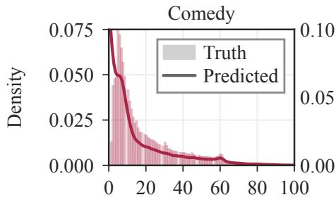  
Watch-time (s)

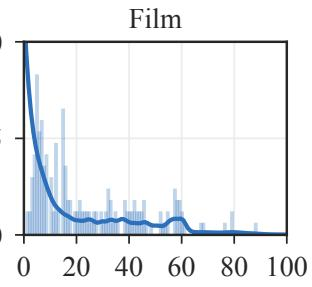  
Watch-time (s)

Figure 1: Watch-time distributions: histograms from real data and predicted densities (via HEGM). Histograms are shown for different video categories (comedy and film).  
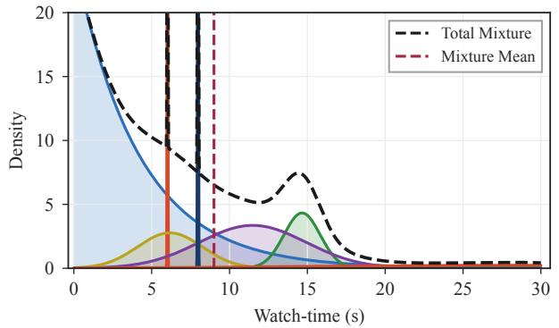

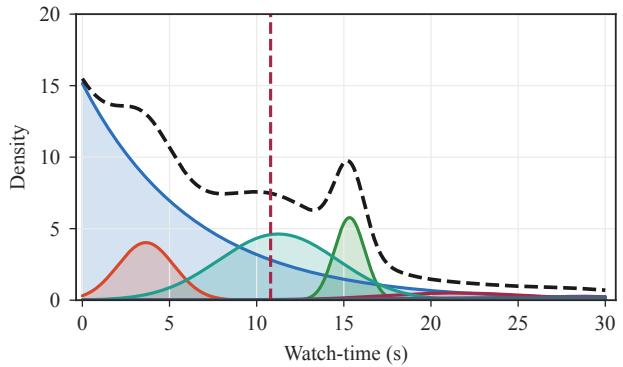  
Figure 2: Predicted densities from EGMN with collapsed components (left) and from HEGM after stabilization (right).

## 5 Limitations and Design Rationale

To confirm the motivation behind distributional modeling, we analyze WT patterns on our industrial data. As noted in prior papers, the conditional distribution of WT varies significantly across user cohorts and video categories. Fig. 1 illustrates this heterogeneity and the densities predicted by our HEGM. Because individual-level predicted densities are noisy and difficult to inspect, we report the average density within each group (e.g., per user cohort or per video category), which yields smoother, more interpretable visualizations.

Our large-scale reproduction and industrial evaluation expose several failure modes inherent to EGMN.

## 5.1 Gaussian Variance Collapse

Maximum-likelihood training of Gaussian mixtures can produce degenerate components with $\sigma _ { k } ( { \bf x } )  0$ , causing likelihood spikes around individual samples rather than robust density estimates [21, 22]. In EGMN, this pathology leads to example memorization, unstable uncertainty estimates and poor component interpretability. Fig. 2 illustrates the resulting delta-like “needle” densities. Our proposed modifications (Section 6) eliminate these artifacts (right panel).

## 5.2 Component Redundancy & Inactivity

EGMN often fails to use its Gaussian components effectively: several Gaussians may merge $( \mu _ { i } \approx \mu _ { j } , \sigma _ { i } \approx \sigma _ { j } )$ into a single component centered near the exponential mean $1 / \dot { \lambda }$ . As a result, the predicted distributions remain nearly identical regardless of the number of components K (see Fig. 3, left), and the effective modeling capacity does not increase with K. Moreover, the distribution sometimes degenerates to a pure exponential form $( w _ { 0 } ( \mathbf { x } ) \approx 1 )$ , losing multimodality entirely. Attempts to mitigate these issues inadvertently produce delta-like spikes as a side effect. Sometimes, despite the entropy regularization loss, the mixture weights for all but one or two Gaussians consistently collapse to near zero $( w _ { k } \approx 0 )$ . We sought a solution that maintains a clearer multimodal structure with well-separated components and without collapses; see Fig. 3 (right).

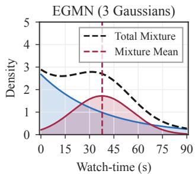

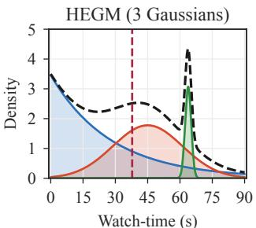

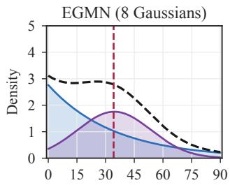  
Watch-time (s)

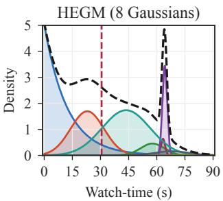  
Figure 3: Predicted mixtures from EGMN (left column) and HEGM (right column). EGMN underutilizes multiple components, while HEGM preserves a more interpretable multimodal structure. The rightmost peak aligns with video duration, capturing complete views.

## 5.3 Poor Production Performance & Initialization Sensitivity

With a basic EGMN implementation, we achieved only modest performance on our production data. The model underperforms simple scalar MSE regression (XAUC 0.6585 vs 0.7070, see section 7.2), and the results are sensitive to initialization.

These failure modes directly motivate our proposed HEGM framework.

## 6 Proposed Method: HEGM

We outline the key differences between HEGM and EGMN.

## 6.1 Hierarchical Skip–Watch Decomposition

Instead of placing the exponential and Gaussian components in a single “flat” softmax mixture, HEGM separates quick-skip behavior from engaged watching through an explicit two-stage behavioral hierarchy: a sigmoid gate estimates the skip probability $p _ { \mathrm { s k i p } } ( \mathbf { x } ) \bar { = } \sigma ( \mathbf { W } _ { \mathrm { s k i p } } \mathbf { h } + b _ { \mathrm { s k i p } } \bar { ) } \in ( 0 , \bar { 1 } )$ based on the hidden representation $\mathbf { h } \overset { \cdot } { = } g _ { \mathrm { b a c k b o n e } } ( \mathbf { x } ) \in \mathbb { R } ^ { d }$ The full predictive density is

$$
\begin{array} { r } { p _ { \theta } ( y \mid \mathbf { x } ) = p _ { \mathrm { s k i p } } ( \mathbf { x } ) \cdot f _ { \mathrm { e x p } } ( y \mid \lambda ( \mathbf { x } ) ) } \\ { \displaystyle + ( 1 - p _ { \mathrm { s k i p } } ( \mathbf { x } ) ) \cdot \sum _ { k = 1 } ^ { K } w _ { k } ( \mathbf { x } ) f _ { \mathrm { g a u s s } } ( y \mid \mu _ { k } ( \mathbf { x } ) , \sigma _ { k } ^ { 2 } ( \mathbf { x } ) ) , } \end{array}\tag{14}
$$

the weights $w _ { k } ( { \bf x } ) > 0$ satisfy $\begin{array} { r } { \sum _ { k = 1 } ^ { K } w _ { k } ( { \bf x } ) = 1 } \end{array}$ and are obtained via softmax. From an analytical perspective, this decomposition provides interpretable separation between lack of interest (quick skips) and active engagement (actual viewing). Fig. 4 demonstrates this for videos grouped by duration buckets. The clear separation of the exponential and Gaussian components enhances both model interpretability and downstream business analytics.

## 6.2 Global Normalization and Structured Initialization

From this point on, before modeling we use a global normalization: $y = y ^ { \mathrm { r a w } } / s , s > 0$ . To reduce component merging and stabilize the first epochs of training, Gaussian means are initialized uniformly across the normalized support:

$$
\mu _ { k } ^ { ( 0 ) } = \frac { k } { K + 1 } \mathrm { o r } \mu _ { k } \sim \mathrm { U n i f o r m } ( 0 . 1 , 0 . 9 ) ,\tag{15}
$$

$k = 1 , \ldots , K$ (in this work we use deterministic uniform initialization), and Gaussian standard deviations are initialized as $\sigma _ { k } ^ { ( 0 ) } = 1 . 5 / K$ (to a scale preserving early separation while avoiding spikes), the exponential component is initialized using a short-watch prior (0.05 ≈ 9s on industrial scale): $\lambda ^ { ( 0 ) } = 1 / 0 . 0 5$

## 6.3 Removal of Forced Shift and Entropy Regularization

Unlike EGMN, HEGM does not shift Gaussian means by the exponential mean (11). We instead parameterize them directly, allowing engaged-watch components to adapt freely to the empirical distribution. We also remove entropy regularization over mixture weights (13), as we found empirically that entropy regularization and forced shift did not improve model performance.

## 6.4 KL-Based Variance Regularization

For larger K, Gaussian components can still collapse $( \sigma _ { k } ( { \bf x } )  0 )$ . We therefore introduce an optional variance prior that penalizes degenerate components without constraining their means. The normalized video duration range is divided into equal-width buckets $\pmb { \cal B } = \{ B _ { 1 } , \dots , B _ { M } \}$ . For each bucket $b ,$ we compute a reference variance from the training data: $\bar { \sigma } _ { b } ^ { 2 } = \mathrm { V a r } ( y _ { i } : d _ { v _ { i } } \in B _ { b } )$ . Let $b ( i )$ denote the bucket containing video $v _ { i }$ . The KL penalty is

$$
\begin{array} { r l } & { \mathcal { L } _ { \mathrm { K L } } = \displaystyle \frac { 1 } { n K } \sum _ { i = 1 } ^ { n } \sum _ { k = 1 } ^ { K } D _ { \mathrm { K L } } \left( \mathcal { N } \left( \mu _ { k } , \sigma _ { k } ^ { 2 } ( \mathbf { x } _ { i } ) \right) \Big \| \mathcal { N } \left( \mu _ { k } , \bar { \sigma } _ { b ( i ) } ^ { 2 } \right) \right) } \\ & { \quad \quad = \displaystyle \frac { 1 } { 2 n K } \sum _ { i = 1 } ^ { n } \sum _ { k = 1 } ^ { K } \left[ \frac { \sigma _ { k , \theta } ^ { 2 } ( \mathbf { x } _ { i } ) } { \bar { \sigma } _ { b ( i ) } ^ { 2 } } - \log \frac { \sigma _ { k , \theta } ^ { 2 } ( \mathbf { x } _ { i } ) } { \bar { \sigma } _ { b ( i ) } ^ { 2 } } - 1 \right] . } \end{array}\tag{16}
$$

The penalty anchors component variances to duration-conditioned empirical scales, naturally accounting for the higher variance of longer clips while discouraging both degenerate spikes and excessively diffuse components. Critically, it is mean-agnostic: by penalizing only the variance, it preserves the ability of different components to model distinct engagement modes.

## 6.5 Training Objective

The final HEGM objective is

$$
{ \mathcal { L } } _ { \mathrm { H E G M } } = { \mathcal { L } } _ { \mathrm { N L L } } + \lambda _ { \mathrm { r e g } } { \mathcal { L } } _ { \mathrm { r e g } } + \lambda _ { \mathrm { K L } } { \mathcal { L } } _ { \mathrm { K L } } .\tag{17}
$$

## 7 Experiments

## 7.1 Experimental Setup

## 7.1.1 Datasets and Preprocessing

We use three short-video recommendation datasets (see Table 1):

• KuaiRec [23]: A dense, public benchmark, de facto standard in WT prediction [5, 20, 19, 17, 4]. https: //kuairec.com

• VK-LSVD [24]: A large-scale public VK video dataset; we use the up0.01\_ir0.01 subsample, which is similar to public benchmarks. https://huggingface.co/datasets/deepvk/VK-LSVD

• Industrial (Internal): Our primary testbed for ranking quality, compiled from a production short-video platform serving millions of active users. The dataset is proprietary, but the public VK-LSVD dataset was collected from the same platform.

## 7.1.2 Global normalization

Constants for global normalization are reported in Table 1 (180s is the maximum permitted video duration for the Industrial dataset and VK-LSVD). We do not apply per-user, per-item, or per-duration normalization.

## 7.1.3 Data splitting

Unlike many works that employ random splitting in WT prediction, all datasets are split chronologically to avoid look-ahead bias and mirror real production scenarios; the exact split proportions are reported in Table 1.

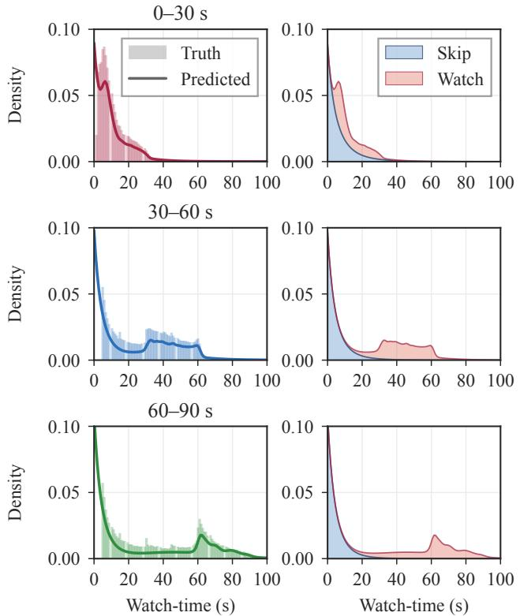  
Figure 4: Watch-time distribution decomposition. Histograms for different duration buckets (left column): 0 – 30s, 30 – 60s, 60 – 90s, and separation into exponential component vs. Gaussian mixture (right column).

Table 1: Dataset statistics.
<table><tr><td>Dataset</td><td>Users</td><td>Videos</td><td>Interactions</td><td>Normalization</td><td>train/val/test</td><td>Learning rate</td><td></td><td>Dropout</td><td>Batch size</td><td>Emb dim</td></tr><tr><td>KuaiRec</td><td>7,176</td><td>10,728</td><td>12,530,806</td><td>60s (99%-ile)</td><td>80/10/10 (%)</td><td>10-5</td><td></td><td>0.3</td><td>4096</td><td>8</td></tr><tr><td>VK-LSVD</td><td>100,000</td><td>171,106</td><td>38,404,921</td><td>157s (99%-ile)</td><td>5/1/1 (weeks)</td><td>10-4</td><td></td><td>0.1</td><td>4096</td><td>8</td></tr><tr><td>Industrial</td><td>6,390,738</td><td>2,484,528</td><td>282,443,525</td><td>180s (max)</td><td>5/1/1 (days)</td><td>10 -4</td><td></td><td>0.1</td><td>4096</td><td>8</td></tr></table>

## 7.1.4 Backbones and Features

We took special care to ensure that our comparison was not disadvantaged by implementation or tuning differences. To guarantee a fair evaluation, all heads share the same underlying backbones. For the public datasets, numerical features are encoded via Piecewise Linear Encoding (PLE) [25], categorical variables use embedding layers. The public network backbone consists of a DCNv2 [26] parallel stack with a residual block decoder; prediction heads are linear layers. The full implementation is provided in the accompanying code.

For VK-LSVD, count features are Laplace-smoothed. We train three iALS matrix factorization models on (i) any positive feedback, (ii) raw WT, and (iii) watching ≥ 15 s. The resulting user and item embeddings yield similarity features (dot product, cosine, and normalized variants), all constructed without target leakage.

KuaiRec preprocessing follows the feature setup of [5] (user–video interaction features were not used).

For the Industrial dataset, the production backbone is a multi-task architecture with wide logits, user embeddings, and task-specific towers for clicks, likes, shares, WT, etc.

## 7.1.5 Baselines

Our goal is not to compare all possible WT predictors under their native architectures, but to evaluate replacement heads under a fixed industrial ranking backbone. We compare HEGM against reproducible, backbone-agnostic baselines tha integrate into identical shared hidden states:

• MSE-VR: Direct value regression optimized via MSE.

Table 2: Experimental results on KuaiRec, VK-LSVD, and Industrial datasets. Best values for each metric and dataset are boldfaced.
<table><tr><td rowspan="2">Model</td><td colspan="4">XAUC ↑</td><td colspan="4">MAE (raw WT)</td><td colspan="4">MSE (raw WT)</td></tr><tr><td> $K = 3$ </td><td> $K = 6$ </td><td> $K = 9$ </td><td> $K = 1 2$ </td><td> $K = 3$ </td><td> $K = 6$ </td><td> $K = 9$ </td><td> $K = 1 2$ </td><td> $K = 3$ </td><td>K = 6</td><td> $K = 9$ </td><td> $K = 1 2$ </td></tr><tr><td colspan="9">KuaiRec</td><td colspan="4"></td></tr><tr><td>MSE-VR</td><td></td><td></td><td>0.5467</td><td></td><td></td><td></td><td>4.65</td><td></td><td></td><td colspan="3">59.17</td></tr><tr><td>CREAD</td><td></td><td></td><td>0.5616</td><td></td><td></td><td></td><td>4.54</td><td></td><td></td><td></td><td>58.84</td><td></td></tr><tr><td>EGMN</td><td>0.5504 0.5622</td><td>0.5541 0.5598</td><td>0.5584 0.5595</td><td>0.5587 0.5567</td><td>4.54 4.49</td><td>4.52 4.51</td><td>4.43 4.50</td><td>4.43 4.51</td><td>59.38 59.29</td><td>59.31</td><td>60.44</td><td>60.29 59.40</td></tr><tr><td colspan="9">HEGM</td><td colspan="4">59.34 59.29</td></tr><tr><td>VK-LSVD</td><td></td><td></td><td></td><td></td><td></td><td></td><td></td><td></td><td></td><td></td><td></td><td></td></tr><tr><td colspan="9">MSE-VR</td><td colspan="4">484.15</td></tr><tr><td>CREAD</td><td></td><td></td><td>0.6148 0.6193</td><td></td><td></td><td></td><td>15.89 15.56</td><td></td><td></td><td></td><td>480.61</td><td></td></tr><tr><td>EGMN</td><td>0.6173</td><td>0.6163</td><td>0.6151</td><td>0.6152</td><td>16.07</td><td>16.07</td><td>15.96</td><td>16.01</td><td>480.70</td><td>481.11</td><td>483.66</td><td>484.76</td></tr><tr><td>HEGM</td><td>0.6202</td><td>0.6206</td><td>0.6197</td><td>0.6202</td><td>15.70</td><td>15.74</td><td>15.77</td><td>15.77</td><td>480.05</td><td>478.92</td><td>479.87</td><td>479.68</td></tr><tr><td colspan="9">Industrial</td><td colspan="4"></td></tr><tr><td>MSE-VR</td><td></td><td></td><td>0.7070</td><td></td><td></td><td></td><td>13.12</td><td></td><td></td><td>569.99</td><td></td><td></td></tr><tr><td>MAE-VR</td><td></td><td></td><td>0.6557</td><td></td><td></td><td></td><td>14.34</td><td></td><td></td><td>764.08</td><td></td><td></td></tr><tr><td>CREAD</td><td></td><td></td><td>0.7146</td><td></td><td></td><td></td><td>24.14</td><td></td><td></td><td>1380.23</td><td></td><td></td></tr><tr><td>EGMN</td><td>0.6585</td><td>0.6501</td><td>0.6507</td><td>0.6558</td><td>13.51</td><td>13.92</td><td>13.75</td><td>14.04</td><td>730.74</td><td>726.88</td><td>744.05</td><td>731.01</td></tr><tr><td>HEGM</td><td>0.7188</td><td>0.7178</td><td>0.7176</td><td>0.7162</td><td>12.97</td><td>13.07</td><td>13.07</td><td>13.04</td><td>578.61</td><td>583.75</td><td>583.68</td><td>580.63</td></tr><tr><td>HEGM+KL</td><td>0.7179</td><td>0.7168</td><td>0.7168</td><td>0.7168</td><td>13.08</td><td>13.07</td><td>13.05</td><td>13.08</td><td>585.08</td><td>584.92</td><td>581.98</td><td>584.54</td></tr></table>

• MAE-VR: Direct value regression optimized via MAE.

• CREAD: It was used as a strong baseline in [5], where it ranked second in their comparisons; we took the implementation from the public repository: https://github.com/BestActionNow/EGMN/.

• EGMN: The original EGMN baseline [5]. https: $: / / \mathfrak { g } \mathrm { i }$ thub.com/BestActionNow/EGMN/

## 7.1.6 Hyperparameters and Training Details

All models are trained with Adam optimizer [27] for up to 30 epochs. Dataset-specific hyperparameters are listed in Table 1. We set the number of duration buckets in KL-based variance regularization to $M = \bar { 1 } 8$ . For mixture models, we tune the number of Gaussian components over $K \in \{ 3 , 6 , 9 , 1 2 \}$ . The KL regularization weight is tuned over $\lambda _ { \mathrm { K L } } \in \{ 0 . 0 5 , 0 . 1 , 0 . 5 , 1 . 0 \}$ , and the regression loss weight is tuned over $\lambda _ { \mathrm { r e g } } \in \{ 0 . 5 , 1 . 0 , 2 . 0 \}$

## 7.1.7 Model Selection

All offline models and hyperparameter values are selected exclusively on the validation split. The primary selection metric is validation XAUC because the production ranker is optimized for ordering quality. All reported metrics are computed on the test set only after selecting the checkpoint. No test-set feedback is used for hyperparameter selection.

Unless stated otherwise, results are averaged over three random seeds.

## 7.2 Main Results and Convergence Behavior

Table 2 reports the main offline results across all datasets. For HEGM $\lambda _ { \mathrm { K L } } = 0$ , for HEGM+KL $\lambda _ { \mathrm { K L } } = 0 . 1$ . MAE and MSE are reported for the raw target (before normalization). Because all datasets are split chronologically (eliminating temporal randomness) and the only source of randomness is neural network initialization, the results are highly stable Standard deviations of XAUC across seeds are below 0.0001, so we omit them from Table 2 for brevity. The key observations are as follows:

• HEGM achieves superior XAUC – our primary metric – across all datasets compared to all baselines. Notably, CREAD achieves better performance than EGMN.

• For MAE, different models (CREAD, EGMN, HEGM) achieve the best results on different datasets. Our model performs best on the industrial dataset, with a substantial margin over CREAD (12.97 vs 24.14).

• In terms of MSE, HEGM performs best on public datasets but, like all other models, underperforms compared to MSE-VR on the industrial dataset. We attribute this to the complex production backbone, the large data volume, and direct MSE optimization by MSE-VR. However, MSE regression is inferior in terms of XAUC (0.7070 → 0.7188).

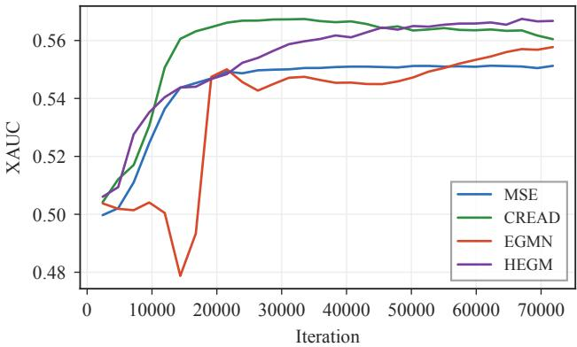  
Figure 5: Validation curves of the compared methods on KuaiRec.

• CREAD achieves strong XAUC on the Industrial dataset (0.7146), but its MAE and MSE are substantially worse than those of MSE-VR and HEGM, because CREAD optimizes a classification-restoration objective over discretized watch-time buckets. HEGM is more suitable when the same head must support ranking, threshold probabilities, and calibrated downstream analytics.

• HEGM also often outperforms EGMN in terms of NLL (e.g., −2.3768 vs. −1.8354 on the industrial dataset). However, NLL is excluded from Table 2 because variance collapse renders it unstable and unreliable for interpretation.

HEGM improves ranking while remaining competitive in point-estimation metrics. The best configuration on Industrial requires only a sparse allocation of K = 3 Gaussian components, showing that excess components are unneeded when the structural framework is regularized effectively.

Fig. 5 shows representative validation trajectories. CREAD may converge quickly, then overfits (XAUC drops from 0.5616 at epoch 10 to 0.5558 at epoch 30 on KuaiRec). Mixture-density heads require more epochs to stabilize component locations, weights, variances, and the induced point expectation. HEGM continues improving in later epochs, overtaking CREAD only after ≈ 20 epochs, suggesting that short early-stopping schedules may underestimate distributional architectures. On KuaiRec, HEGM (K = 3) improves from 0.5484 at epoch 10 to 0.5591 at epoch 20, peaking at 0.5622 at epoch 30.

## 7.3 Watch-Completion Analysis

Table 3 reports ROC AUC for predicting whether the observed WT exceeds a given threshold on the Industrial dataset. We evaluate ROC AUC against binary targets derived from two families of thresholds: absolute time thresholds (> T seconds) and duration-normalized thresholds (> P% of video duration). For point baselines, we use predicted WT as the score. No additional fine-tuning or head modification is performed; the same predictive distribution is reused directly for these auxiliary tasks.

Methods that model the full conditional distribution – rather than a single point estimate – demonstrate clear advantages on these metrics. This finding highlights the inherent benefit of distributional prediction for downstream threshold-based tasks, as a single predictive density supports multiple decision criteria without retraining. HEGM variants outperform all baselines, and the margins widen substantially for deep absolute engagement tasks: at the 60 seconds threshold, HEGM achieves 0.8903 ROC AUC compared to EGMN’s 0.8356

Notably, HEGM+KL performs well in this evaluation, more consistently outperforming the unregularized HEGM than in the point-prediction and ranking metrics. We attribute this to the KL-based variance regularizer, which stabilizes component variances and produces more reliable tail densities, directly benefiting threshold-based decisions at extreme quantiles.

## 7.4 Ablation Studies

We conduct ablations on the Industrial dataset to assess the contribution of the main design choices of HEGM. Starting from the basic model with $K = 3 ,$ specific structural elements are systematically stripped or reverted. Table 4 reports metrics for the HEGM model variants: replacing structured initialization with EGMN-style initialization (no structured init), replacing the hierarchical gate with flat softmax (no sigmoid), restoring the forced Gaussian shift from EGMN (lambda), adding entropy regularization (entropy loss), adding KL regularization with λ = 0.1 (KL regularization).

Table 3: ROC AUC ↑ for watch-completion (Industrial dataset).
<table><tr><td>Threshold MSE-VR MAE-VR CREAD EGMN HEGM HEGM+KL</td><td></td><td></td><td></td><td></td><td></td><td></td></tr><tr><td>10 s</td><td>0.7419</td><td>0.7139</td><td>0.7520</td><td>0.7502</td><td>0.7592</td><td>0.7593</td></tr><tr><td>30 s</td><td>0.8050</td><td>0.7130</td><td>0.8088</td><td>0.8063</td><td>0.8341</td><td>0.8344</td></tr><tr><td>60 s</td><td>0.8476</td><td>0.6862</td><td>0.8483</td><td>0.8356</td><td>0.8903</td><td>0.8907</td></tr><tr><td>10%</td><td>0.8182</td><td>0.8218</td><td>0.8107</td><td>0.8190</td><td>0.8511</td><td>0.8477</td></tr><tr><td>25%</td><td>0.6892</td><td>0.6951</td><td>0.6927</td><td>0.6954</td><td>0.7021</td><td>0.6998</td></tr><tr><td>50%</td><td>0.6564</td><td>0.6572</td><td>0.6702</td><td>0.6741</td><td>0.6758</td><td>0.6747</td></tr><tr><td>75%</td><td>0.6563</td><td>0.6592</td><td>0.6730</td><td>0.6868</td><td>0.6957</td><td>0.6969</td></tr><tr><td>90%</td><td>0.6573</td><td>0.6615</td><td>0.6737</td><td>0.6907</td><td>0.7076</td><td>0.7103</td></tr></table>

Table 4: Ablation study on the Industrial dataset $( K = 3 )$
<table><tr><td>Variant</td><td>XAUC ↑</td><td>MAE↓</td><td>MSE↓</td></tr><tr><td>HEGM</td><td>0.7188</td><td>12.97</td><td>578.60</td></tr><tr><td>— no structured init</td><td>0.6841</td><td>13.54</td><td>644.15</td></tr><tr><td>— no sigmoid (flat mixture)</td><td>0.7164</td><td>13.05</td><td>583.80</td></tr><tr><td>+ lambda (forced shift)</td><td>0.7171</td><td>13.08</td><td>585.42</td></tr><tr><td>+ entropy loss</td><td>0.7153</td><td>13.08</td><td>586.71</td></tr><tr><td>+ KL regularization</td><td>0.7179</td><td>13.08</td><td>585.08</td></tr><tr><td>EGMN</td><td>0.6585</td><td>13.51</td><td>730.74</td></tr></table>

Notably, structured initialization proves critical: removing it causes a sharp drop in XAUC from 0.7188 to 0.6841. Reintroducing the flat mixture variant, the forced Gaussian shift, or entropy regularization degrades all reported metrics, supporting our decision to remove them. KL regularization slightly reduces ranking accuracy at $K = { \bar { 3 } } ,$ , but remains useful for better watch-completion predictions (see Section 7.3) and preventing variance collapse in larger mixtures (see Section 7.5).

Varying Component Count K. On the Industrial dataset, HEGM and EGMN exhibit high stability when scaling K, as shown in Table 2. Fig. 6 shows predicted mixtures (from our HEGM approach) of WT distributions for different numbers of components. We show illustrative examples for $K = 2 , 4 , 1 2$ , which were not used for model selection and are chosen for visual clarity.

## 7.5 Collapse Prevention

We quantify Gaussian collapse by measuring the fraction of predicted components whose standard deviation satisfies $\sigma _ { k } ( { \mathbf { x } } ) < \epsilon .$ In Table 5 the offline statistics demonstrate several complementary structural effects:

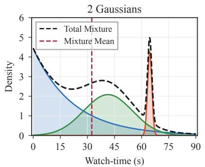

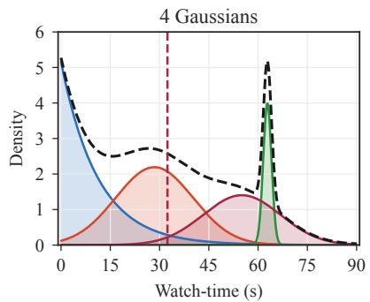

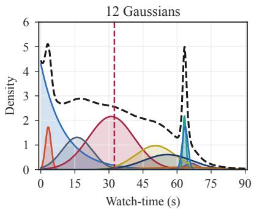  
Figure 6: Predicted mixtures produced by HEGM for varying component counts K.

Table 5: Percentage of collapsed Gaussians: $\sigma < \epsilon$ (Industrial dataset)
<table><tr><td>Method</td><td>€</td><td> $K = 3$ </td><td> $K = 6$ </td><td> $K = 9$ </td><td> $K = 1 2$ </td></tr><tr><td>EGMN</td><td> $1 0 ^ { - 4 }$   $1 0 ^ { - 3 }$ </td><td>5.10% 8.95%</td><td>6.10% 9.73%</td><td>7.55% 12.24%</td><td>8.18% 12.69%</td></tr><tr><td>HEGM</td><td> $1 0 ^ { - 4 }$   $1 0 ^ { - 3 }$ </td><td>0.00%</td><td>0.00%</td><td>1.07%</td><td>22.33%</td></tr><tr><td> $_ \mathrm { H E G M + K L }$ </td><td></td><td>0.00%</td><td>0.00%</td><td>11.07%</td><td>47.88%</td></tr><tr><td></td><td> $1 0 ^ { - 4 }$ </td><td>0.00%</td><td>0.00%</td><td>0.00%</td><td>0.00%</td></tr><tr><td> $\lambda _ { \mathrm { K L } } = 0 . 1$ </td><td> $1 0 ^ { - 3 }$ </td><td>0.00%</td><td>0.00%</td><td>0.00%</td><td>0.00%</td></tr></table>

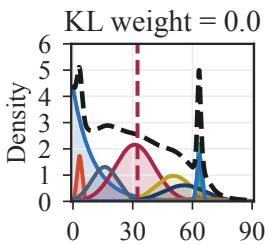  
Watch-time (s)

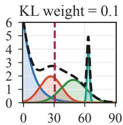  
Watch-time (s)

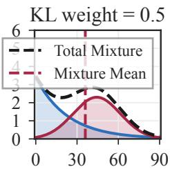  
Watch-time (s)  
Figure 7: Predicted watch-time densities for identical user-video contexts: from collapse when $\lambda _ { \mathrm { K L } } = 0$ to a smoother multimodal structure when $\lambda _ { \mathrm { K L } } > 0$

• For small mixtures $( K = 3 , 6 )$ , HEGM eliminates variance collapse $( 0 \% )$ , whereas EGMN defaults to spikes (5%–13%). This component memorization degrades generalization.

• When the number of components becomes large, unregularized HEGM can still collapse (collapse rate 47.88% at $K = 1 2$ under $\epsilon = 1 0 ^ { \frac { \cdot } { - 3 } } )$ .

• Adding KL variance regularization $\mathcal { L } _ { \mathrm { K L } } , \lambda _ { \mathrm { K L } } = 0 .$ 1 eliminates collapse, confirming that KL regularization is primarily needed for over-parameterized mixtures.

Fig. 7 provides a qualitative comparison: increasing λKL eliminates spikes and smooths the density.

Fig. 8 further shows that KL regularization improves training stability when many components are used. For $K = 3$ (left panel), both variants (HEGM and HEGM+KL) behave similarly; for larger mixtures $( K = 8 ,$ right panel), the unregularized model shows stronger XAUC fluctuations. We observed the same behavior for EGMN (see Fig. 5).

## 8 Online Deployment and A/B Testing

We deployed HEGM as a drop-in replacement for the proprietary multi-task WT prediction head in a production ranking system. The retrieval pipeline and feature generation were kept unchanged, isolating the effect of the proposed distributional head. The deployed configuration used $K = 3 , \lambda _ { \mathrm { r e g } } = 1 . 0$ , and $\lambda _ { \mathrm { K L } } = 0$ (since collapse was absent for $K = 3 )$ . All experiments were conducted on an HPC cluster equipped with 4× NVIDIA H100 GPUs (80 GB each). A single training run completes within approximately 8 hours; we did not track total GPU-hours across all experiments. The serving infrastructure for the online A/B test uses 48× NVIDIA RTX 6000 Pro GPUs (96 GB each). All models are implemented in PyTorch 2.9 with CUDA 12.3 and deployed in TensorRT format for production inference.

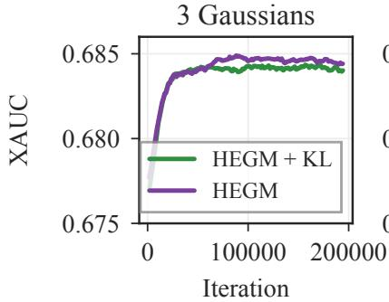

8 Gaussians  
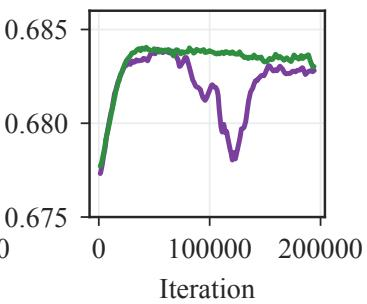  
Figure 8: Training dynamics of HEGM with and without KL regularization. Left: $K = 3$ components. Right: $K = 8$ components.

Table 6: 1.5-month online A/B test results for HEGM relative to the proprietary production WT head. Bold indicates metrics that are both statistically significant $( p < 0 . 0 5 )$ and exceed the pre-defined business significance threshold.
<table><tr><td>Primary Engagement Metrics</td><td>Relative Change</td><td>Thresholds</td></tr><tr><td>Non-short watch  $\left( Y \geq 3 \mathrm { s } \right)$ </td><td>+4.59%</td><td>3%</td></tr><tr><td>Deep watch  $( Y \ge 1 0 \mathrm { s } )$ </td><td>+5.75%</td><td>3%</td></tr><tr><td>Skips  $\left( Y < \mathrm { 3 s } \right)$ </td><td>-6.23%</td><td>4%</td></tr><tr><td>Session depth (videos/session)</td><td>+9.26%</td><td>5%</td></tr><tr><td>Platform Guardrail Metrics</td><td></td><td></td></tr><tr><td>Total view time (TVT)</td><td>-0.03%</td><td>1%</td></tr><tr><td>Likes</td><td>+0.10%</td><td>3%</td></tr><tr><td>Dislikes</td><td>-8.34%</td><td>5%</td></tr><tr><td>Shares</td><td>+14.59%</td><td>8%</td></tr></table>

## 8.1 Experimental Design and Methodology

The experiment was conducted as a user-level randomized A/B test over a period of 1.5 months. A total of 5% of live traffic was routed to the HEGM treatment group and 5% to the production baseline, with the remaining traffic unaffected. This allocation corresponds to approximately 11 million requests per day in each group. To isolate the causal effect of the model change from temporal confounds, we employed a forward–reverse testing protocol: a forward A/B test was run for the first month, followed by a two-week reverse test in which the treatment and control assignments were swapped. The sign and magnitude of the effects were consistent across both phases, which reduces the likelihood that the observed lifts are driven by temporal seasonality or novelty effects. We distinguish two complementary criteria for interpreting the results:

• Statistical significance was assessed via CUPED-adjusted t-tests applied to user-level aggregates. All reported metrics satisfy $p < 0 . 0 5$ after the CUPED variance reduction.

• Practical business significance was evaluated against operational thresholds that reflect mature platform scales and the minimum detectable effect considered actionable by the product team; the full list is provided in Table 6.

## 8.2 Online A/B Test Results

Table 6 reports the average relative changes of HEGM against the production baseline in forward A/B test. All primary engagement metrics improved, with most exceeding their practical significance thresholds. Session depth increased substantially (by +9.26% from 28.52 to 31.16 videos per session), dislikes decreased, and shares increased. Total view time remained largely unchanged. This pattern suggests that the gains are not driven by increasing total consumption time, but by reducing immediate skips and increasing the number of meaningful watch events per session. The improvements in threshold-based watch metrics did not translate into a comparable lift in likes, confirming that explicit feedback and consumption signals capture complementary aspects of user preference.

## 8.3 Computational Overhead

Resource metrics evaluated over 1B production requests (Table 7) confirm that HEGM adds 1.22 ms to median latency;   
p99 rises from 7.9 ms to 8.2 ms, still far below the 30 ms serving constraint.

## 9 Conclusion

This paper is motivated by a broader shift in WT modeling: recent methods increasingly move beyond scalar point prediction and fixed discretization toward distributional, uncertainty-aware, quantile-based, generative, and regime-

Table 7: Production inference cost.
<table><tr><td>Metric</td><td>Baseline</td><td>HEGM</td><td>Delta</td><td>Constraint</td></tr><tr><td>Latency (median)</td><td>1.83 ms</td><td>3.05 ms</td><td>+1.22 ms</td><td>30 ms</td></tr><tr><td>99th percentile latency</td><td>7.9 ms</td><td>8.2 ms</td><td>+ 0.3 ms</td><td>30 ms</td></tr><tr><td>Model parameters</td><td>1.3M</td><td>1.5M</td><td>+0.2M</td><td></td></tr><tr><td>Batch size</td><td>16,000</td><td>16,000</td><td>0</td><td></td></tr></table>

based formulations. Within this landscape, EGMN represents a principled step toward distributional WT modeling. Its Exponential–Gaussian mixture family naturally reflects the empirical structure of short-video engagement.

Our work goes beyond reproduction: it follows a full research cycle from empirical diagnosis of failure modes, through hypothesis-driven model redesign and rigorous ablation analysis, to offline validation and live production testing, with code and models publicly released.

Several limitations remain. First, HEGM is not an explicit causal debiasing method. Second, future work may explore alternative component families that better match the support of the WT distribution. Finally, future work should evaluate probabilistic quality more comprehensively [28].

Overall, this work shows that distributional WT modeling can be accurate, stable, interpretable, and deployable when the mixture structure is aligned with user behavior.

## References

[1] E. Liu, K. Han, M. Zhan, B. Zhao, G. Mu, and Y. Song, “Relative advantage debiasing for watch-time prediction in short-video recommendation,” in Proceedings ofthe AAAI Conference on Artificial Intelligence, vol. 40, no. 18, 2026, pp. 15 296–15 305.

[2] P. Covington, J. Adams, and E. Sargin, “Deep neural networks for youtube recommendations,” in Proceedings of the 10th ACM conference on recommender systems, 2016, pp. 191–198.

[3] R. Zhan, C. Pei, Q. Su, J. Wen, X. Wang, G. Mu, D. Zheng, P. Jiang, and K. Gai, “Deconfounding duration bias in watch-time prediction for video recommendation,” in Proceedings ofthe 28th ACM SIGKDD conference on knowledge discovery and data mining, 2022, pp. 4472–4481.

[4] J. Sun, Z. Ding, X. Chen, Q. Chen, Y. Wang, K. Zhan, and B. Wang, “Cread: A classification-restoration framework with error adaptive discretization for watch time prediction in video recommender systems,” in Proceedings ofthe AAAI Conference on Artificial Intelligence, vol. 38, no. 8, 2024, pp. 9027–9034.

[5] X. Zhao, R. Ma, J. Chen, W. Zhao, P. Yang, and Y. Hu, “Multi-granularity distribution modeling for video watch time prediction via exponential-gaussian mixture network,” in Proceedings ofthe Nineteenth ACM Conference on Recommender Systems, 2025, pp. 309–318.

[6] T. Fawcett, “An introduction to roc analysis,” Pattern recognition letters, vol. 27, no. 8, pp. 861–874, 2006.

[7] X. Yi, L. Hong, E. Zhong, N. N. Liu, and S. Rajan, “Beyond clicks: dwell time for personalization,” in Proceedings of the 8th ACM Conference on Recommender systems, 2014, pp. 113–120.

[8] R. Xie, L. Ma, S. Zhang, F. Xia, and L. Lin, “Reweighting clicks with dwell time in recommendation,” in Companion Proceedings of the ACM Web Conference 2023, 2023, pp. 341–345.

[9] J. Yu, H. Liu, Y. Yang, L. Chen, J. Wu, Y. Jiang, and B. Zheng, “Transun: A preemptive paradigm to eradicate retransformation bias intrinsically from regression models in recommender systems,” Advances in Neural Information Processing Systems, vol. 38, pp. 140 918–140 954, 2026.

[10] X. Lin, X. Chen, L. Song, J. Liu, B. Li, and P. Jiang, “Tree based progressive regression model for watch-time prediction in short-video recommendation,” in Proceedings ofthe 29th ACM SIGKDD Conference on Knowledge Discovery and Data Mining, 2023, pp. 4497–4506.

[11] X. Chen, X. Lin, C. Li, and P. Jiang, “Personalized tree-based progressive regression model for watch-time prediction in short video recommendation,” in Proceedings of the 34th ACM International Conference on Information and Knowledge Management, 2025, pp. 5609–5616.

[12] Y. Zhang, Y. Bai, J. Chang, X. Zang, S. Lu, J. Lu, F. Feng, Y. Niu, and Y. Song, “Leveraging watch-time feedback for short-video recommendations: A causal labeling framework,” in Proceedings of the 32nd ACM International Conference on Information and Knowledge Management, 2023, pp. 4952–4959.

[13] H. Zhao, L. Zhang, J. Xu, G. Cai, Z. Dong, and J.-R. Wen, “Uncovering user interest from biased and noised watch time in video recommendation,” in Proceedings ofthe 17th ACM Conference on Recommender Systems, 2023, pp. 528–539.

[14] H. Zhao, G. Cai, J. Zhu, Z. Dong, J. Xu, and J.-R. Wen, “Counteracting duration bias in video recommendation via counterfactual watch time,” in Proceedings ofthe 30th ACM SIGKDD Conference on Knowledge Discovery and Data Mining, 2024, pp. 4455–4466.

[15] C. Lin, S. Liu, C. Wang, and Y. Liu, “Conditional quantile estimation for uncertain watch time in short-video recommendation,” arXiv preprint arXiv:2407.12223, 2024.

[16] S. Wu, S. Liu, S. Zhang, X. Yang, X. Li, L. Hu, and H. Li, “Explicit uncertainty modeling for video watch time prediction,” arXiv preprint arXiv:2504.07575, 2025.

[17] S. Yang, H. Yang, L. Du, A. Ganesh, B. Peng, B. Liu, S. Li, and J. Liu, “Swat: Statistical modeling of video watch time through user behavior analysis,” in Proceedings ofthe 31st ACM SIGKDD Conference on Knowledge Discovery and Data Mining V. 1, 2025, pp. 2768–2778.

[18] C. Cui, S. Tang, F. Li, J. Gao, and H. Chen, “Calibrating video watch-time predictions with credible prototype alignment,” in Forty-second International Conference on Machine Learning, 2025.

[19] H. Ma, K. Tian, T. Zhang, X. Zhang, H. Zhou, C. Jin, C. Chen, H. Li, J. Guan, and S. Zhou, “Generative regression based watch time prediction for short-video recommendation,” in Proceedings ofthe ACM Web Conference 2026, 2026, pp. 6183–6193.

[20] R. Cui, Z. Sun, C. Lu, and P. Jiang, “Sequential regression for continuous value prediction using residual quantization,” arXiv preprint arXiv:2602.23012, 2026.

[21] C. M. Bishop and N. M. Nasrabadi, Pattern recognition and machine learning. Springer, 2006, vol. 4, no. 4.

[22] G. J. McLachlan and D. Peel, Finite mixture models. John Wiley & Sons, 2000.

[23] C. Gao, S. Li, W. Lei, J. Chen, B. Li, P. Jiang, X. He, J. Mao, and T.-S. Chua, “Kuairec: A fully-observed dataset and insights for evaluating recommender systems,” in Proceedings ofthe 31st ACM International Conference on Information & Knowledge Management, 2022, pp. 540–550.

[24] A. Poslavsky, A. D’yakonov, Y. Dorn, and A. Zimovnov, “Vk-lsvd: A large-scale industrial dataset for short-video recommendation,” in Proceedings ofthe ACM Web Conference 2026, 2026, pp. 8657–8660.

[25] Y. Gorishniy, I. Rubachev, and A. Babenko, “On embeddings for numerical features in tabular deep learning,” Advances in Neural Information Processing Systems, vol. 35, pp. 24 991–25 004, 2022.

[26] R. Wang, R. Shivanna, D. Cheng, S. Jain, D. Lin, L. Hong, and E. Chi, “Dcn v2: Improved deep & cross network and practical lessons for web-scale learning to rank systems,” in Proceedings of the web conference 2021, 2021, pp. 1785–1797.

[27] D. P. Kingma and J. Ba, “Adam: A method for stochastic optimization,” arXiv preprint arXiv:1412.6980, 2014.

[28] T. Gneiting, F. Balabdaoui, and A. E. Raftery, “Probabilistic forecasts, calibration and sharpness,” Journal ofthe Royal Statistical Society Series B: Statistical Methodology, vol. 69, no. 2, pp. 243–268, 2007.