# HOW TO TRAIN A CRITIC STABLY AND EFFICIENTLY

Penghui Qi¹, Xiangxin Zhou2, Wee Sun Lee1

1National University of Singapore 2Tencent Hunyuan

{penghuiq,leews}@comp.nus.edu.sg

## ABSTRACT

Group-based reinforcement learning methods such as GRPO for large language models avoid training a critic by sampling multiple responses for each prompt. A reliable critic could instead estimate token-level advantages from one response, but standard critic-based training recipes are often unstable. We study this instability and develop Best-Practice Critic Optimization (BPCO), a recipe that combines DPPO, value predictions bounded to the reward range, Monte Carlo value targets, unnormalized policy advantages, and length-adaptive generalized advantage estimation. Because the critic is used only during training, BPCO can also condition it on reward-defining information, such as a reference answer or grading rubric, that is hidden from the policy. Controlled experiments isolate the effect of each design choice. Across mathematical reasoning tasks with models ranging from 1.5B parameters to 30B-A3B mixtures of experts, BPCO improves a strong critic-based baseline consistently, and matches or exceeds a group-based baseline while sampling one response per prompt. The same recipe also improves learning with rubric-based rewards. These results show that a carefully designed critic provides a reliable alternative to group-relative advantage estimation. Code is available at https://github.com/QPHutu/golden\_critic.

## 1 INTRODUCTION

Reinforcement learning (RL) has become a standard approach for improving the reasoning and instruction-following abilities of large language models (LLMs) (Ouyang et al., 2022; Guo et al., 2025; Qi et al., 2026a). Effective RL depends on assigning credit to the sampled tokens (Sutton & Barto, 2018). Group-based methods such as GRPO estimate this signal by sampling several responses for each prompt and comparing their rewards (Shao et al., 2024; Liu et al., 2025). This approach avoids training a value function, but it uses multiple rollouts per prompt and assigns the same outcome-based advantage to every token in a response.

A learned critic offers a direct alternative (Schulman et al., 2017). By estimating the expected return of each response prefix, a critic can construct token-level advantages from one rollout (Schulman et al., 2015; Hou et al., 2026). In practice, however, critic-based LLM training remains fragile. PPO's ratio clipping treats low- and high-probability tokens unevenly (Qi et al., 2026b). Bootstrapped value targets can inherit critic error (Yuan et al., 2025), and a fixed GAE parameter gives the terminal reward very different weights in short and long responses (Yue et al., 2025). We identify two additional mismatches in common implementations. First, a linear value head can predict outside the known range of the return. Second, batch-wise advantage normalization forces every batch to have unit-scale advantages, even when the residual policy signal has become small. Our controlled study shows that both choices can destabilize training.

A critic also creates an opportunity that group-relative estimators do not directly exploit. Because the critic is discarded after training, it may receive reward-defining information that is unavailable to the policy. Examples include a reference answer or official solution in mathematical reasoning and a prompt-specific rubric in open-ended evaluation. Such information is determined by the prompt and therefore does not change the ideal value function. Presenting it explicitly can nevertheless make that function easier to approximate, without changing the policy's inputs or deployment requirements.

We combine these choices into Best-Practice Critic Optimization (BPCO), a single-rollout actorcritic recipe. BPCO uses DPPO to define clipping in terms of the sampled token's probability change. It bounds value predictions to the reward range and trains the critic directly on observed outcomes. For the policy update, it preserves the scale of the raw advantages and adapts the GAE parameter to response length. BPCO can additionally use reward-defining information as privileged critic input when such information is available. Together, these choices align the critic's output, target, and inputs with the policy signal it produces.

We develop the recipe incrementally in a controlled sanity test (Section 3), where failure to fit a small, solvable dataset reveals optimization problems. We then evaluate BPCO on a 40.3K-problem mathematical dataset (Section 4.1), two 30B-A3B mixture-of-experts models (Section 4.2), and a rubric-reward task (Section 4.3). The experiments support three findings. First, BPCO improves the critic-based baseline across model and dataset scales. Second, privileged information can accelerate critic learning, but its policy benefit depends on the task and the degree of overfitting. Third, BPCO matches or exceeds a group-based baseline while using one response per prompt. These results establish a practical recipe for single-rollout critic-based LLM RL.

## 2 BACKGROUND

## 2.1 PROXIMAL POLICY OPTIMIZATION

Given a prompt x, a language model with parameters θ generates a response $y ~ = ~ ( y _ { 1 } , \dots , y _ { T } )$ autoregressively. At step t, the state is the prefix $\boldsymbol { s } _ { t } = \left( x , y _ { < t } \right)$ , the action is the next token $y _ { t } .$ and the policy is $\pi _ { \theta } ( y _ { t } \mid s _ { t } )$ . We consider outcome rewards: a completed response receives a scalar reward $R ( x , y )$ , and all intermediate rewards are zero.

Proximal Policy Optimization (PPO) uses a clipped surrogate objective (Schulman et al., 2017). Let $\mu$ be the behavior policy that generated the rollouts, and define sampled-token probability ratio as

$$
\rho _ { t } ( \theta ) = { \frac { \pi _ { \theta } ( y _ { t } \mid s _ { t } ) } { \mu ( y _ { t } \mid s _ { t } ) } } .
$$

Given an advantage estimate $\widehat { A } _ { t } .$ PPO maximizes

$$
\mathcal { L } _ { \mathrm { P P O } } ( \theta ) = \mathbb { E } _ { t } \left[ \operatorname* { m i n } \left( \rho _ { t } ( \theta ) \widehat { A } _ { t } , \operatorname { c l i p } ( \rho _ { t } ( \theta ) , 1 - \epsilon , 1 + \epsilon ) \widehat { A } _ { t } \right) \right] .\tag{1}
$$

The clipped term removes the incentive to move the sampled-token ratio farther beyond the clipping boundary in the direction favored by $\widehat { A } _ { t } ,$ forming a trust region to stabilize training.

## 2.2 DIVERGENCE PROXIMAL POLICY OPTIMIZATION

PPO applies the same ratio threshold to every token. In a large vocabulary, this rule clips small absolute changes to low-probability tokens while allowing much larger absolute changes to highprobability tokens (Qi et al., 2026b). Divergence Proximal Policy Optimization (DPPO) instead defines the clipping boundary in terms of the sampled token's probability change. The binary totalvariation variant used in this work replaces ε in Equation (1) with $\epsilon / \mu ( y _ { t } \mid s _ { t } ) ;$

$$
\mathcal { L } _ { \mathrm { D P P O } } ( \theta ) = \mathbb { E } _ { t } \left[ \operatorname* { m i n } \left( \rho _ { t } ( \theta ) \widehat { A } _ { t } , \operatorname { c l i p } \left( \rho _ { t } ( \theta ) , 1 - \frac { \epsilon } { \mu ( y _ { t } \mid s _ { t } ) } , 1 + \frac { \epsilon } { \mu ( y _ { t } \mid s _ { t } ) } \right) \widehat { A } _ { t } \right) \right] .\tag{2}
$$

Equivalently, DPPO constrains the probability shift of the sampled token under the policy update, i.e., $| \pi _ { \theta } ( y _ { t } \mid s _ { t } ) - \mu ( y _ { t } \mid s _ { t } ) | \ \leq \ \epsilon .$ This gives sampled tokens a common absolute-probability threshold rather than a common ratio threshold.

## 2.3 CRITIC-BASED METHODS

Critic-based methods estimate the expected return of each prefix. For rollouts from $\mu ,$ the value function is

$$
V ^ { \mu } ( s _ { t } ) = \mathbb { E } _ { \mu } [ R ( x , y ) \mid s _ { t } ] ,
$$

and the critic $V _ { \phi } ( s _ { t } )$ approximates this quantity. Let $\phi _ { \mathrm { o l d } }$ denote the frozen critic parameters used to construct targets. Generalized advantage estimation (GAE) (Schulman et al., 2015) first computes

temporal-difference residuals and then forms an exponentially weighted sum:

$$
\delta _ { t } = r _ { t } + \gamma V _ { \phi _ { \mathrm { o l d } } } ( s _ { t + 1 } ) - V _ { \phi _ { \mathrm { o l d } } } ( s _ { t } ) ,\tag{3}
$$

$$
\widehat { A } _ { t } ^ { \mathrm { G A E } ( \lambda ) } = \sum _ { l = 0 } ^ { T - t } ( \gamma \lambda ) ^ { l } \delta _ { t + l } .\tag{4}
$$

Here $r _ { t } = 0$ for $t < T , r _ { T } = R ( x , y )$ , and $V _ { \phi _ { \mathrm { o l d } } } ( s _ { T + 1 } ) = 0$ . The discount factor is $\gamma ,$ and λ controls the degree of bootstrapping. Smaller λ can reduce variance but makes the estimate more sensitive to critic error. With $\gamma = 1$ and $\lambda = 1$ , the sum telescopes to $R ( x , y ) - V _ { \phi _ { \mathrm { o l d } } } ( s _ { t } )$ and contains no bootstrapped value target.

Many implementations construct the critic target as

$$
\widehat { V } _ { t } ( \lambda ) = \widehat { A } _ { t } ^ { \mathrm { G A E } ( \lambda ) } + V _ { \phi _ { \mathrm { o l d } } } ( s _ { t } )\tag{5}
$$

and minimize

$$
\mathcal { L } _ { \mathrm { V } } ( \phi ) = \mathbb { E } _ { t } \left[ \left( V _ { \phi } ( s _ { t } ) - \widehat { V } _ { t } ( \lambda ) \right) ^ { 2 } \right] .\tag{6}
$$

The policy update uses $\widehat { A } _ { t } ^ { \mathrm { G A E } ( \lambda ) }$ in Equation (1) or Equation (2). In outcome-reward LLM training, $\gamma = 1$ is commonly used.

## 2.4 GROUP-BASED METHODS

Group-based methods avoid a critic by sampling G responses $\{ y ^ { ( i ) } \} _ { i = 1 } ^ { G }$ for each prompt (Shao et al., 2024). Let $R _ { i } = R ( x , y ^ { ( i ) } )$ , and let $\mu _ { R }$ and $\sigma _ { R }$ be the mean and standard deviation of the G rewards. GRPO assigns every token in response i the advantage

$$
\widehat { A } _ { t , i } ^ { \mathrm { G R P O } } = \frac { R _ { i } - \mu _ { R } } { \sigma _ { R } } .\tag{7}
$$

Dr. GRPO removes the standard-deviation normalization, which can otherwise reweight prompts according to their within-group reward variance (Liu et al., 2025). Its advantage is

$$
\widehat { A } _ { t , i } ^ { \mathrm { D r . G R P O } } = R _ { i } - \mu _ { R } .\tag{8}
$$

## 3 BUILDING BPCO: A CONTROLLED STUDY

We begin from a verl commit from June 16, 2026 and study critic stability in a controlled sanity test (Qi et al., 2025; 2026b). We fine-tune DeepSeek-R1-Distill-Qwen-1.5B (Guo et al., 2025) on 1,460 mathematical problems that the initial model can solve. A suitable training recipe should fit this deliberately small dataset to nearly 100% reward. Failure to do so exposes an optimization problem rather than a lack of model capacity or reward signal.

Each iteration contains 1,024 trajectories. We use a minibatch size of 256 and one optimization epoch, giving four optimizer minibatches per iteration. Following the verl defaults (Sheng et al., 2025), the policy and critic learning rates are $1 0 ^ { - 6 }$ and $1 0 ^ { - 5 }$ , respectively. We observed no benefit from critic warm-up in this small-data setting and therefore update the policy and critic from the first iteration. Each run lasts 1,500 iterations. Because fitting this small dataset can harm generalization, we monitor AIME 2025 avg@32, the mean accuracy over 32 sampled responses per problem, as a held-out metric.

We modify the default recipe one component at a time. The starting point uses PPO (Section 2.1), standard GAE and critic targets (Section 2.3), and $\lambda = 1$ . Unless stated otherwise, each step retains all preceding changes.

## 3.1 STEP 1: REPLACING PPO WITH DPPO

With the PPO objective in Equation (1), the training reward collapses. Replacing it with the DPPO objective in Equation (2) yields stable optimization when $\lambda = 1$ , as shown in Figure 1.

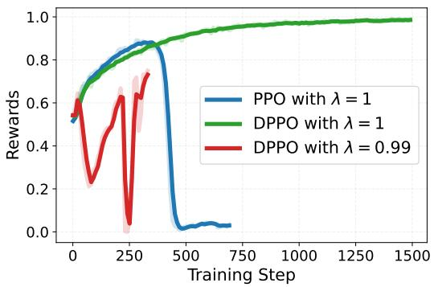

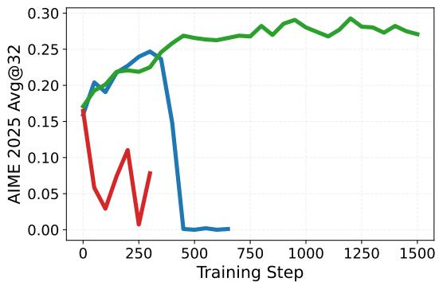  
Figure 1: PPO and DPPO in the sanity test. With $\lambda = 1$ , PPO's training reward collapses after an initial increase, whereas DPPO remains stable. Reducing the GAE parameter to $\lambda = 0 . 9 9$ makes DPPO unstable and exposes sensitivity to critic error.

Reducing the GAE parameter to $\lambda = 0 . 9 9$ makes DPPO unstable again. When $\lambda < 1$ , the policy advantage contains bootstrapped critic predictions. Unless $V _ { \phi } ( s _ { t } ) = \mathbf { \bar { \phi } } V ^ { \mu } ( s _ { t } )$ for every visited state, approximation error biases the advantage estimate relative to the Monte Carlo estimator obtained with $\lambda = 1$ . We therefore use $\lambda = 0 . 9 9$ as a stress test in the next steps: stabilizing this setting requires the recipe to control how critic error enters the policy update.

## 3.2 STEP 2: BOUNDING VALUES TO THE REWARD RANGE

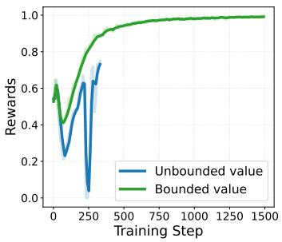

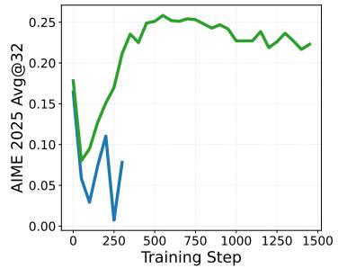

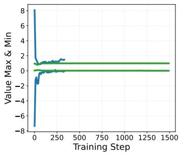  
Figure 2: Effect of bounding critic predictions to the reward range. The unbounded linear head predicts values outside the binary-reward range [0, 1] (right), leading to unstable training reward (left) and AIME 2025 avg@32 (middle). The bounded value keeps predictions within the reward range and yields stable training.

Most existing recipes use a linear head to predict the value directly, which is unbounded even when the return is known to lie in a finite interval. Let $[ R _ { \mathrm { m i n } } , R _ { \mathrm { m a x } } ]$ be the reward range and let $z _ { \phi } ( s _ { t } ) \in \mathbb { R }$ be the linear head output. Because the expectation of a bounded random variable lies in the same interval, a valid value prediction must satisfy $V _ { \phi } ( s _ { t } ) \in [ R _ { \operatorname* { m i n } } , R _ { \operatorname* { m a x } } ]$ . We enforce this property with a scaled arctangent:

$$
V _ { \phi } ( s _ { t } ) = R _ { \mathrm { m i n } } + \left( R _ { \mathrm { m a x } } - R _ { \mathrm { m i n } } \right) \left( \frac { 1 } { 2 } + \frac { 1 } { \pi } \arctan \bigl ( z _ { \phi } ( s _ { t } ) \bigr ) \right) .\tag{9}
$$

This parameterization maps every finite head output to the open interval $( R _ { \mathrm { m i n } } , R _ { \mathrm { m a x } } )$ and approaches either endpoint asymptotically. The sanity test uses binary rewards, so $R _ { \mathrm { m i n } } ~ = ~ 0$ and $R _ { \operatorname* { m a x } } = 1$ . Empirically, it removes the extreme values produced by the linear head and allows the training reward to approach one (Figure 2).

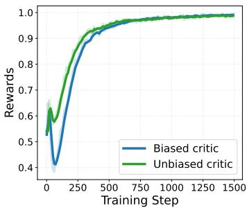

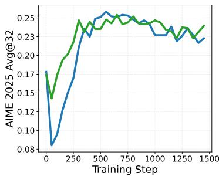

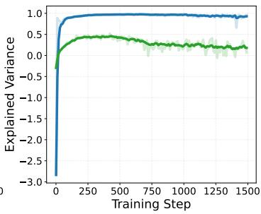  
Figure 3: Effect of the unbiased value target. Regressing to the final outcome gives more stable training reward (left) and AIME 2025 avg@32 (middle) than a target bootstrapped with $\lambda = 0 . 9 9$ Explained variance against the bootstrapped target rapidly approaches one (right) because that target is biased; this unexpectedly high value does not imply accurate prediction of the observed return.

## 3.3 STEP 3: USING UNBIASED MONTE CARLO VALUE TARGET

We track how much target variance the critic explains using

$$
\mathrm { E V } ( V _ { \phi } , \widehat { V } ) = 1 - \frac { \mathrm { V a r } \Big ( \widehat { V } _ { t } - V _ { \phi } ( s _ { t } ) \Big ) } { \mathrm { V a r } \Big ( \widehat { V } _ { t } \Big ) } .\tag{10}
$$

An explained variance near one normally indicates a close fit to the chosen target. For the standard target in Equation (5), however, $\widehat { V } _ { t } ( \lambda )$ contains $V _ { \phi _ { \mathrm { o l d } } }$ whenever $\lambda < 1$ . This self-referential target can be easy for the updated critic to predict even when it is inaccurate with respect to the observed return. In Figure 3, explained variance against the bootstrapped target rapidly approaches one while policy training remains unstable.

Following decoupled GAE in VC-PPO (Yuan et al., 2025), we use separate parameters for the policy advantage and the critic target. We retain $\lambda _ { \pi } = 0 . 9 9$ for the policy, but set $\lambda _ { V } = 1$ for critic training. With $\gamma = 1$ and outcome-only rewards, the target telescopes to

$$
\widehat { V } _ { t } = \widehat { A } _ { t } ^ { \mathrm { G A E ( 1 ) } } + V _ { \phi _ { \mathrm { o l d } } } ( s _ { t } ) = R ( x , y ) .\tag{11}
$$

For a continuation sampled from $\mu ,$ the final outcome is an unbiased Monte Carlo sample of $V ^ { \mu } ( s _ { t } )$ Decoupling the estimators retains the variance reduction of $\lambda _ { \pi } < 1$ for the policy while removing bootstrapping from the critic target. This change improves reward stability and convergence speed in Figure 3; the reported explained variance is now measured against the observed outcome, and becomes reasonable.

## 3.4 STEP 4: REMOVING ADVANTAGE NORMALIZATION

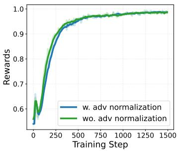

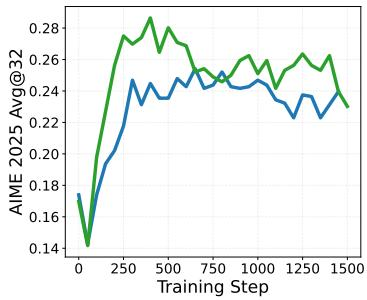

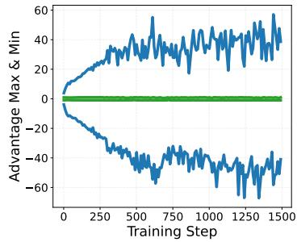  
Figure 4: Effect of removing batch-wise advantage normalization. Removing normalization achieves comparable reward (left) while mitigating the overfitting risk on AIME 2025 (middle). Normalization expands the range of the advantages when the policy approaches to optimal (right).

Many PPO implementations normalize advantages within each batch before the policy update. If Ā and $\sigma _ { A }$ denote the batch mean and standard deviation of the estimated advantages, respectively, this replaces $\widehat { A } _ { t }$ in Equation (1) and Equation (2) with

$$
\widetilde { A } _ { t } = \frac { \widehat { A } _ { t } - \bar { A } } { \sigma _ { A } } .\tag{12}
$$

We find this transformation fundamentally problematic. As the model approaches optimal policy, the advantages approach zero with a small variance. The policy update should then naturally diminish to maintain its optimality. However, dividing by $\sigma _ { A }$ removes this behavior. A small standard deviation rescales estimation noise into a large training signal, so the policy update will not shrink when the policy is already close to optimal. In addition, subtracting A may change the sign of examples whose positive advantage is smaller than the batch mean, thus hamper exploration.

We therefore remove this batch advantage normalization, using the raw GAE advantages to update policy. As shown in Figure 4, removing normalization keeps the advantage range small and stable, while using normalization causes an increasing advantage magnitude. Notably, removing advantage normalization also improves the validation performance, consistent with less aggressive updates after the training set has nearly been fit.

## 3.5 STEP 5: PROVIDING PRIVILEGED INFORMATION TO THE CRITIC

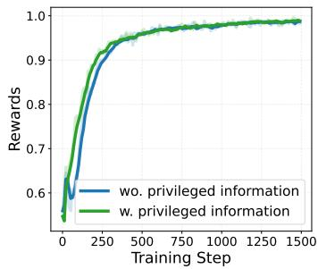

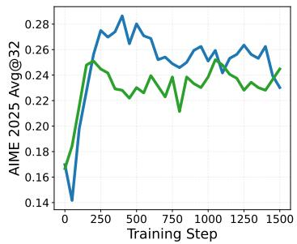

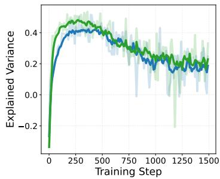  
Figure 5: Effect of giving the reference answer only to the critic. Privileged input accelerates training-reward improvement (left) and increases explained variance (right). Its AIME 2025 avg @32 rises faster but peaks earlier (middle), revealing a greater risk of overfitting in this small-data setting.

The critic is needed only during training, so its inputs need not be identical to the policy's inputs. This observation parallels centralized training with decentralized execution in multi-agent RL (Amato, 2024), including systems that expose hidden game state to a training-time critic (Vinyals et al., 2019; Wang et al., 2021). We apply the same principle to reward-defining information in LLM RL.

Let $q ( x )$ denote information used to evaluate responses to prompt x. For mathematical reasoning, $q ( x )$ can be the reference answer. A privileged critic estimates

$$
V _ { \phi } ^ { \mu } ( s _ { t } , q ( x ) ) \approx \mathbb { E } _ { \mu } [ R ( x , y ; q ( x ) ) \mid s _ { t } , q ( x ) ] .\tag{13}
$$

Because $q ( x )$ is fixed by x, exposing it explicitly does not change the optimal value associated with a prompt. It can nevertheless reduce the approximation burden on a finite model. The rollout policy still receives only x and the generated prefix.

In Figure 5, the reference answer improves critic fit and accelerates optimization. The validation curve also declines earlier after reaching its peak. Thus, a more informative critic can accelerate both learning and overfitting; privileged input is useful but not uniformly beneficial.

## 3.6 STEP 6: ADOPTING LENGTH-ADAPTIVE GAE

A fixed $\lambda _ { \pi } < 1$ gives the terminal reward exponentially less weight in longer responses. For a token at position $t ,$ the coefficient on the terminal TD residual is proportional to $\bar { \lambda } _ { \pi } ^ { T - t }$ . When $T - t$ is large, early-token advantages depend primarily on bootstrapped critic residuals, and systematic critic error can dominate the policy signal.

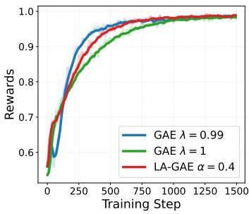

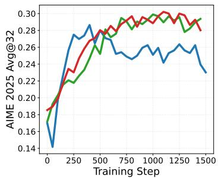

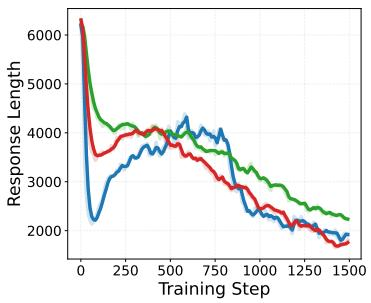  
Figure 6: Effect of length-adaptive GAE. A fixed $\lambda _ { \pi } ~ = ~ 0 . 9 9$ attains rapid reward improvement (left), but its AIME 2025 avg @32 declines after the initial peak (middle). LA-GAE with $\alpha = 0 . 4$ retains better training efficiency than λ = 1 while mitigating the overfitting risk.

Following VAPO and SAO (Yue et al., 2025; Hou et al., 2026), we use length-adaptive GAE. For a response of length $L = | y |$ , the policy parameter is

$$
\lambda _ { \pi } ( L ) = 1 - \frac { 1 } { \alpha L } ,\tag{14}
$$

$$
\alpha > 0
$$

$$
\begin{array} { r } { \left( 1 - \frac { 1 } { \alpha L } \right) ^ { L } } \end{array}
$$

$$
\exp ( - 1 / \alpha )
$$

$$
\lambda _ { V } = \mathrm { i }
$$

As shown in Figure $^ { 6 , }$ fixed $\lambda _ { \pi } = 0 . 9 9$ fits the training set fastest but exhibits a pronounced validation decline. Setting $\lambda _ { \pi } = 1$ avoids this decline at the cost of slower optimization. LA-GAE with $\alpha = 0 . 4$ provides the best trade-off in this study.

## 4 BROADER EVALUATION

We compare BPCO with two baselines. The group-based baseline uses Dr. GRPO (Liu et al., 2025) to estimate advantages, matching the total batch size with a group size of 16. The critic-based baseline adopts existing techniques including decoupled GAE (Yuan et al., 2025) for unbiased value target (Section 3.3) and length-adaptive GAE (Yue et al., 2025) for stable reward signal (Section 3.6), but retains an unbounded value head and batch-wise advantage normalization. All methods use DPPO (Qi et al., 2026b) for policy optimization, as defined in Sections 2.2 and 3.1. In all criticbased experiments, we adopt the single-rollout setting without a group for the same prompt.

For the experiments below, BPCO differs from the critic-based baseline only by bounding the value prediction and removing batch-wise advantage normalization. We explicitly denote variants with privileged input for critic by BPCO+Ans or BPCO+Sol, where the privileged input is respectively the ground-truth answer or the official solution. The policy has the same inputs as every baseline.

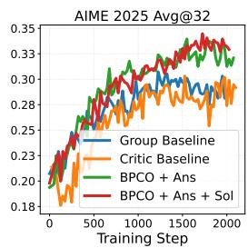

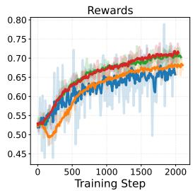

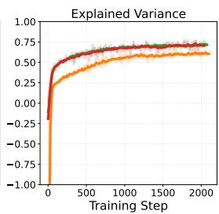

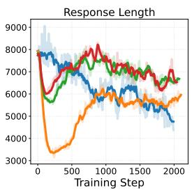  
Figure 7: Results with a larger DeepScaleR Dataset.

## 4.1 SCALING TO LARGER DATASET

We evaluate whether our BPCO recipe scales beyond the deliberately small sanity-test dataset. We fine-tune DeepSeek-R1-Distill-Qwen-1.5B (Guo et al., 2025) on DeepScaleR (Tan et al., 2026), which contains 40.3K math problem-answer pairs. Official solutions are available for approximately 7.3K of these problems. The maximum response length is limited at 24k.

Figure 7 shows that our BPCO recipe consistently outperforms both group-based and critic-based baselines, improving both training and validation performance clearly. Compared to critic-based baseline, it demonstrates a consistently higher explained variance during the training process, which is a strong evidence that our BPCO recipe learns a better critic. These results show that with our BPCO recipe, a single-rollout critic can remain effective at a large-scale dataset

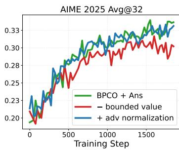

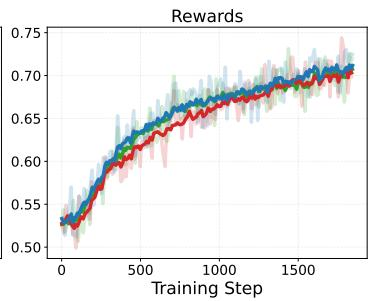

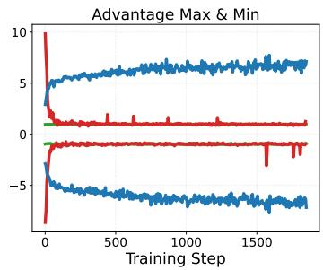  
Figure 8: Ablation of bounded value prediction and batch-wise advantage normalization.

We then ablate our proposed tricks based on a well-performed BPCO+Ans run, by removing the bounded value prediction and adding the batch-wise advantage normalization.

Bounded Value Prediction. As shown in Figure 8, removing the value bound slows down training efficiency in rewards, and lowers AIME 2025 performance. This gap indicates that matching the critic output range to the return target remains useful when the training dataset is substantially larger.

Removing Advantage Normalization. As shown in Figure 8, batch-wise advantage normalization produces a growing advantage magnitude, though it is not as obvious as in the sanity test. Removing advantage normalization brings only slight performance improvement in this setting because the training is not fully converged, however, we still recommend it as a universal solution.

Privileged Information. Figure 9 ablates the effects of privileged information based on our BPCO recipe. With ground-truth answer as the privileged information, it produces significantly faster training speed, higher explained variance, and better AIME 2025 performance. Using official solution also performs slightly better, even only 7.3k out of 40.3k problems include this information. These results show that the privileged information can greatly help the critic training, when the dataset is large enough and overfitting doesn't appear.

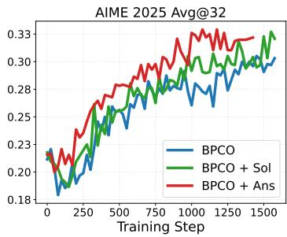

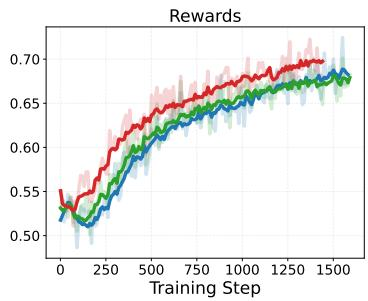

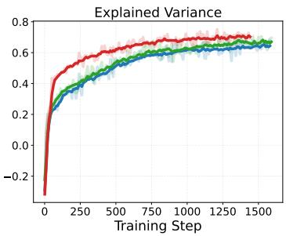  
Figure 9: Ablation of privileged information for critic training.

## 4.2 SCALING TO LARGER MODELS

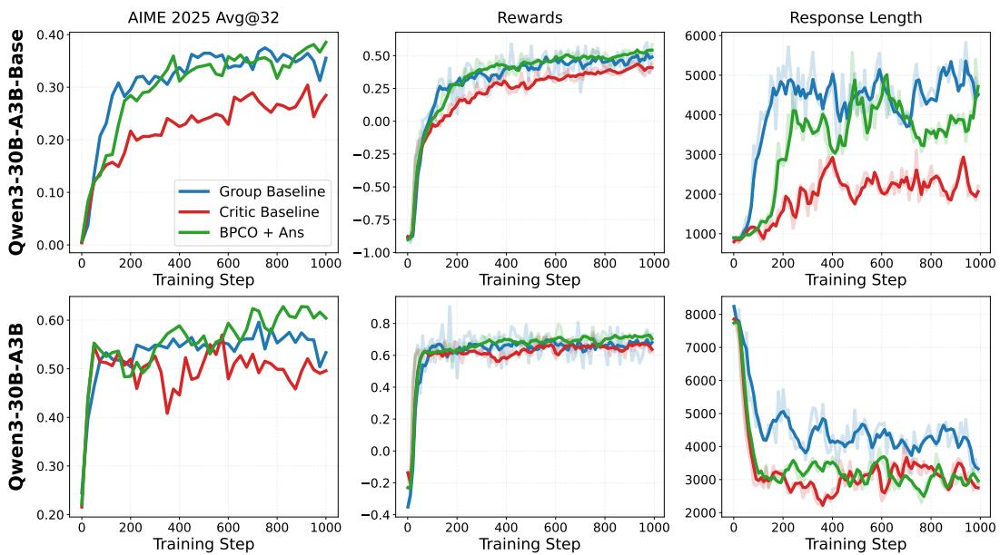  
Figure 10: Results with larger MoE models on DAPO-Math-17k dataset.

We further evaluate BPCO with two larger models: Qwen3-30B-A3B-Base and Qwen3-30B-A3B (Yang et al., 2025), using DAPO-Math-17k dataset (Yu et al., 2026) for training.

Figure 10 shows that our BPCO recipe continues to improve the critic baseline at this scale. On Qwen3-30B-A3B, the critic baseline failed to further improve AIME 2025 after the first 100 training steps, suffering from an unstable optimization. In both settings, BPCO achieves a substantially higher accuracy on AIME 2025, indicating it learns a much better critic than previous recipe.

Comparing to the group baseline, BPCO also performs better on Qwen3-30B-A3B, and comparable on Qwen3-30B-A3B-Base. This indicates that our BPCO is strong alternative to the widely adopted group-based method, without relying on a group sampling (Xu & Ding, 2026; Hou et al., 2026).

## 4.3 RUBRICS AS REWARDS

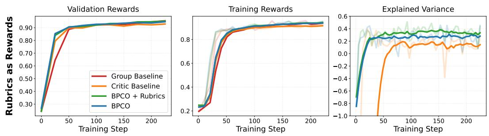  
Figure 11: Results under rubric-based rewards.

We finally consider a setting in which rewards are produced by a rubric-based judge (Gunjal et al., 2026). We train Qwen3-4B-Base (Yang et al., 2025) as both policy and critic on OpenRubrics (Liu et al., 2026), and use Qwen3-4B-Instruct-2507 as the judge. The judge assigns a reward from generated response and per-prompt golden rubrics. The golden rubrics are invisible to the policy, and we use these golden rubrics as privileged information for critic.

As shown in Figure 11, both BPCO variants improve faster than both group and critic baselines, while group baseline eventually converges to similar performance. The critic baseline converges to a slightly lower reward, due to its problematic recipe and low explained variance. The privileged information brings no benefit in performance despite its higher explained variance, likely because the task is relatively trivial. Nevertheless, the superior performance of BPCO without privileged information shows that bounded value prediction and unnormalized advantages remain useful when rewards come from a rubric-based judge.

## 5 CONCLUSION

We studied why critic-based RL for LLMs can become unstable and assembled the resulting fixes into Best-Practice Critic Optimization. BPCO combines DPPO with reward-range-bounded value predictions, unbiased Monte Carlo critic targets, unnormalized policy advantages, and lengthadaptive GAE. It can additionally provide the training-only critic with privileged information, such as a ground-truth answer, solution, or grading rubric, while leaving the policy's inputs unchanged.

Across controlled sanity tests, larger datasets, 1.5B and 30B-A3B models, and rubric-based rewards, BPCO consistently improves the standard critic-based recipe. It also matches or exceeds groupbased optimization while using a single response per prompt. Privileged information further improve critic learning when they provide useful reward context, but their gains are task dependent and can be offset by overfitting in small-data regimes. Overall, these results show that the critic itself is not an inherent weakness of LLM RL. When its output range, target, inputs, and induced policy signal are designed coherently, it provides a stable and efficient alternative to group-based estimation.

Limitations. Evidence is limited to mathematical and rubric rewards. BPCO assumes a known reward range, privileged variants require evaluator information, and critic training adds computation and memory not captured by trajectory-matched comparisons.

## REFERENCES

Christopher Amato. An introduction to centralized training for decentralized execution in cooperative multi-agent reinforcement learning. arXiv preprint arXiv:2409.03052, 2024.

Anisha Gunjal, Anthony Wang, Elaine Lau, Vaskar Nath, Yunzhong He, Bing Liu, and Sean Hendryx. Rubrics as rewards: Reinforcement learning beyond verifiable domains. In International Conference on Learning Representations, volume 2026, pp. 127924–127945, 2026.

Daya Guo, Dejian Yang, Haowei Zhang, Junxiao Song, Peiyi Wang, Qihao Zhu, Runxin Xu, Ruoyu Zhang, Shirong Ma, Xiao Bi, et al. Deepseek-r1: Incentivizing reasoning capability in llms via reinforcement learning. arXiv preprint arXiv:2501.12948, 2025.

Zhenyu Hou, Yujiang Li, Jie Tang, and Yuxiao Dong. Single-rollout asynchronous optimization for agentic reinforcement learning. arXiv preprint arXiv:2607.07508, 2026.

Tianci Liu, Ran Xu, Tony Yu, Ilgee Hong, Carl Yang, Tuo Zhao, and Haoyu Wang. Openrubrics: Towards scalable synthetic rubric generation for reward modeling and llm alignment. In Proceedings of the 64th Annual Meeting of the Association for Computational Linguistics (Volume 1: Long Papers), pp. 17417–17437, 2026.

Zichen Liu, Changyu Chen, Wenjun Li, Penghui Qi, Tianyu Pang, Chao Du, Wee Sun Lee, and Min Lin. Understanding r1-zero-like training: A critical perspective. arXiv preprint arXiv:2503.20783, 2025.

Long Ouyang, Jeffrey Wu, Xu Jiang, Diogo Almeida, Carroll Wainwright, Pamela Mishkin, Chong Zhang, Sandhini Agarwal, Katarina Slama, Alex Ray, et al. Training language models to follow instructions with human feedback. Advances in neural information processing systems, 35: 27730–27744, 2022.

Penghui Qi, Zichen Liu, Xiangxin Zhou, Tianyu Pang, Chao Du, Wee Sun Lee, and Min Lin. Defeating the training-inference mismatch via fp16. arXiv preprint arXiv:2510.26788, 2025.

Penghui Qi, Zichen Liu, Tianyu Pang, Chao Du, Wee Sun Lee, and Min Lin. Optimizing anytime reasoning via budget relative policy optimization. Advances in Neural Information Processing Systems, 38:23429–23451, 2026a.

Penghui Qi, Xiangxin Zhou, Zichen Liu, Tianyu Pang, Chao Du, Min Lin, and Wee Sun Lee. Rethinking the trust region in llm reinforcement learning. arXiv preprint arXiv:2602.04879, 2026b.

John Schulman, Philipp Moritz, Sergey Levine, Michael Jordan, and Pieter Abbeel. Highdimensional continuous control using generalized advantage estimation. arXiv preprint arXiv:1506.02438, 2015.

John Schulman, Filip Wolski, Prafulla Dhariwal, Alec Radford, and Oleg Klimov. Proximal policy optimization algorithms. arXiv preprint arXiv:1707.06347, 2017.

Zhihong Shao, Peiyi Wang, Qihao Zhu, Runxin Xu, Junxiao Song, Xiao Bi, Haowei Zhang, Mingchuan Zhang, YK Li, Yang Wu, et al. Deepseekmath: Pushing the limits of mathematical reasoning in open language models. arXiv preprint arXiv:2402.03300, 2024.

Guangming Sheng, Chi Zhang, Zilingfeng Ye, Xibin Wu, Wang Zhang, Ru Zhang, Yanghua Peng, Haibin Lin, and Chuan Wu. Hybridflow: A flexible and efficient rlhf framework. In Proceedings of the Twentieth European Conference on Computer Systems, pp. 1279–1297, 2025.

Richard S. Sutton and Andrew G. Barto. Reinforcement Learning: An Introduction. The MIT Press, second edition, 2018.

Sijun Tan, Michael Luo, Justin Wong, Colin Cai, Xiaoxiang Shi, William Yuan Tang, Manan Roongta, Tianjun Zhang, Li Erran Li, Raluca Ada Popa, and Ion Stoica. Deepscaler: Effective RL scaling of reasoning models via iterative context lengthening, 2026. URL https : //openreview.net/forum?id=I6GzDCne7U.

Oriol Vinyals, Igor Babuschkin, Wojciech M Czarnecki, Michaël Mathieu, Andrew Dudzik, Junyoung Chung, David H Choi, Richard Powell, Timo Ewalds, Petko Georgiev, et al. Grandmaster level in starcraft ii using multi-agent reinforcement learning. nature, 575(7782):350–354, 2019.

Xiangjun Wang, Junxiao Song, Penghui Qi, Peng Peng, Zhenkun Tang, Wei Zhang, Weimin Li, Xiongjun Pi, Jujie He, Chao Gao, et al. Scc: An efficient deep reinforcement learning agent mastering the game of starcraft ii. In International conference on machine learning, pp. 10905– 10915. PMLR, 2021.

Zhongwen Xu and Zihan Ding. Single-stream policy optimization. In International Conference on Learning Representations, volume 2026, pp. 140925–140944, 2026.

An Yang, Anfeng Li, Baosong Yang, Beichen Zhang, Binyuan Hui, Bo Zheng, Bowen Yu, Chang Gao, Chengen Huang, Chenxu Lv, et al. Qwen3 technical report. arXiv preprint arXiv:2505.09388, 2025.

Qiying Yu, Zheng Zhang, Ruofei Zhu, Yufeng Yuan, Xiaochen Zuo, Yu Yue, Weinan Dai, Tiantian Fan, Gaohong Liu, Lingjun Liu, et al. Dapo: An open-source llm reinforcement learning system at scale. Advances in Neural Information Processing Systems, 38:113222–113244, 2026.

Yufeng Yuan, Yu Yue, Ruofei Zhu, Tiantian Fan, and Lin Yan. What's behind ppo's collapse in long-cot? value optimization holds the secret. arXiv preprint arXiv:2503.01491, 2025.

Yu Yue, Yufeng Yuan, Qiying Yu, Xiaochen Zuo, Ruofei Zhu, Wenyuan Xu, Jiaze Chen, Chengyi Wang, TianTian Fan, Zhengyin Du, et al. Vapo: Efficient and reliable reinforcement learning for advanced reasoning tasks. arXiv preprint arXiv:2504.05118, 2025.