# Inertial Manifold Neural Operator for Dissipative Time-Dependent Partial Diferential Equations

Xiaoyang Xie∗ and Clarence W. Rowley†

August 25, 2026

## Abstract

In this paper, we introduce the Inertial Manifold Neural Operator (IMNO) for solving dissipative time-dependent partial diferential equations (PDEs). The long-time dynamics of such systems often exhibit an efective low-dimensional structure due to dissipation. Unlike standard neural operator architectures such as the Fourier Neural Operator (FNO), IMNO explicitly leverages the low-dimensiona structure to achieve better physical interpretability, accuracy, and stability in long-horizon autoregressive training and prediction for nonlinear dissipative PDEs. For shift-equivariant PDEs, we further introduce a shift-equivariant variant (IMNO-SE) of the proposed neural operator, ensuring that a spatial shift in the input induces the same spatial shift in the output. This symmetry-preserving inductive bias substantially improves its performance in shift-equivariant PDEs. Extensive benchmark experiments are presented to evaluate IMNO’s performance numerically.

## 1 Introduction

Dissipative partial diferential equations model the evolution of systems in which certain functionals of the state—such as energy or enstrophy—are dissipated by mechanisms like viscosity, difusion, or relaxation. This dissipative structure is central to models in many areas, such as fluid dynamics, chemistry, and biology [13, 32, 34]. Understanding their behavior is therefore important for modeling and predicting complex systems in nature and engineering.

Although these equations are typically infinite-dimensional and may generate intricate nonlinear dynamics, dissipation often suppresses transient degrees of freedom over time, leading to a simpler finite-dimensional description of the long-time dynamics [24].

Reduced-order modeling (ROM) is a practical way to exploit such low-dimensional structure by approximating the original system with a low-dimensional model. This can greatly reduce simulation cost while also improving understanding of the dominant mechanisms in the systems. A large body of work has been developed along this direction, ranging from classical approaches such as proper orthogonal decomposition (POD) [1, 27, 30] to later data-driven methods such as dynamic mode decomposition (DMD) [33, 36].

Inertial manifold theory provides a rigorous theoretical framework for understanding why the longtime behavior of many dissipative partial diferential equations can be described by finite-dimensiona dynamics [6, 11, 16, 25, 26]. Its central idea is that, although the dynamics of such PDEs are defined on an infinite-dimensional function space, their eventual behavior are governed by a finite-dimensiona invariant manifold that exponentially attracts all trajectories. So, the asymptotic dynamics can be reduced, at least in principle, to a finite-dimensional system evolving on that manifold. Some ROMs have also been developed based on ideas from inertial manifold theory, aiming to approximate the efective long-time dynamics of dissipative PDEs on a low-dimensional manifold [7, 20]. However, because a ROM is ultimately a low-dimensional model, it can only represent dynamics on a lowdimensional manifold itself. As a result, it inevitably neglects the transient behavior outside that manifold, even though such behavior may still be important for accurately recovering the full dynamics.

In recent years, neural operators have emerged as a powerful class of methods in scientific machine learning [2, 4, 9, 10, 18, 19, 21, 22]. Unlike conventional neural networks that operate on finitedimensional vectors, neural operators are designed to learn mappings between infinite-dimensional function spaces, and can be trained to approximate solution operators of partial diferential equations. Once trained on data, a neural operator can eficiently evaluate new input functions and can often be applied across diferent spatial discretizations. Because of these advantages, they have been successfully applied to many scientific problems, including fluid dynamics, materials science, and climate modeling [12, 35, 38].

Among neural-operator architectures, the Fourier Neural Operator (FNO) has emerged as one of the most influential and efective frameworks [18]. By parameterizing the operator in Fourier space, FNO can eficiently capture nonlocal interactions and exhibit good accuracy, while maintaining a relatively small computational complexity. These advantages make FNO an efective and widely used framework for operator learning across many PDE tasks. However, despite its success, FNO still has several limitations. First, like many purely data-driven neural operators, it lacks physical interpretability: the learned dynamics are represented in a largely black-box manner and do not explicitly reflect the underlying structure of the PDE. Second, although FNO often performs well in one-step prediction, its training process can become unstable in multi-step autoregressive rollout, especially over long time horizons.

The discussion above suggests a combination of the structural interpretability of reduced-order modeling with the expressive power of neural operators. Motivated by this perspective, we develop the Inertial Manifold Neural Operator (IMNO), a new neural-operator architecture that learns both the dominant long-time dynamics on a low-dimensional manifold and a function-valued residual correction for transient of-manifold behavior. Unlike traditional reduced-order models, which mainly describe the dynamics of the reduced system and often neglect the remaining components outside it, IMNO explicitly decomposes the solution into a manifold component and a residual component. This allows the model to retain the interpretability and compact structure of reduced-order modeling, while using neural operators to preserve the expressive power needed to reconstruct the full PDE dynamics. Moreover, this decomposition makes the learning problem more structured and better conditioned, which can improve training stability in long-horizon autoregressive rollout.

Extensive numerical experiments demonstrate the performance of the proposed neural operator. We observe that IMNO remains stable in long-horizon multistep rollout training, achieves good accuracy, and is able to efectively extract the underlying low-dimensional long-time dynamics.

The remainder of this paper is organized as follows. Section 2 reviews the necessary background on neural operators and inertial manifold theory. Section 3 provides a detailed description of the Inertial Manifold Neural Operator (IMNO). Section 4 introduces the shift-equivariant variant of the proposed neural operator. Section 5 presents numerical experiments on several dissipative PDE benchmarks. Section 6 concludes the paper, and the appendix gives a proof of the universal approximation theorem for our formulation.

## 2 Background

## 2.1 Problem Setting

We consider nonlinear dissipative time-dependent partial diferential equations posed on a spatial domain $\Omega \subset \mathbb { R } ^ { d }$ . Let H be a Banach or Hilbert space of functions on Ω, and let $u ( t ) \in H$ denote the state of the system at time t. The evolution is governed by a PDE that generates a solution semigroup

$$
S ( t ) : H \to H , \qquad u _ { 0 } \mapsto u ( t ; u _ { 0 } ) ,
$$

where $u ( t ; u _ { 0 } )$ is the solution at time t with initial condition $u _ { 0 }$

In operator-learning tasks, the objective is not merely to approximate a finite-dimensional map between discretized vectors, but rather to learn the infinite-dimensional solution operator associated with the PDE. In particular, given a time step $\Delta t > 0$ , we are interested in the one-step evolution

operator

$$
\boldsymbol { \mathcal { G } } : \boldsymbol { H }  \boldsymbol { H } , \qquad \boldsymbol { \mathcal { G } } ( \boldsymbol { u } ) = \boldsymbol { S } ( \Delta t ) \boldsymbol { u } ,
$$

repeated application of this operator then produces an autoregressive rollout of the full trajectory.

We assume access to N trajectories generated by the PDE,

$$
\mathcal { D } = \left\{ \left\{ u _ { n } ^ { ( j ) } \right\} _ { n = 0 } ^ { T } \right\} _ { j = 1 } ^ { N } , ~ u _ { n } ^ { ( j ) } : = u ( t _ { n } ; u _ { 0 } ^ { ( j ) } ) , ~ t _ { n } = n \Delta t ,
$$

where each initial condition $u _ { 0 } ^ { ( j ) }$ is sampled from an underlying probability distribution on $H$

Accordingly, our goal is to construct a parametric neural operator

$$
\begin{array} { r } { \mathcal { G } _ { \theta } : H  H , \qquad \mathcal { G } _ { \theta } ( u ) \approx S ( \Delta t ) u } \end{array}
$$

that approximates G. At inference time, for any given initial condition $u _ { 0 }$ , the learned operator is applied autoregressively to generate a multi-step forecast:

$$
u _ { n + 1 } = { \mathcal G } _ { \boldsymbol \theta } ( u _ { n } ) , \qquad n = 0 , 1 , \ldots , N _ { t } - 1 ,
$$

producing the predicted trajectory $\{ u _ { n } \} _ { n = 0 } ^ { N _ { t } }$

Diference between Operator Learning and Vector-to-Vector Function Learning Unlike standard vector-to-vector function learning, operator learning aims to approximate a function-tofunction map; therefore, the learned model should satisfy two key properties.

First, it should be resolution-independent. In practice, input functions and output functions are only available as samples on spatial grids, but these sampled vectors are discretizations of underlying functions in H. Hence, if the model is trained on one spatial resolution, it should remain valid when evaluated on diferent resolutions.

Second, the model class should be genuinely operator-valued rather than a fixed finite-dimensional surrogate. Concretely, for suitable parameters, the image $\{ \mathcal G _ { \theta } u : u \in H \}$ should not be contained in any finite-dimensional linear subspace of H.

## 2.2 Neural Operators

One of the most popular neural operator frameworks is the kernel-based operators introduced in [15], which provides the architectural foundation for the operator developed in this work.

These kernel-based operators can extend to the more general setting where the input and output belong to diferent function spaces. More specifically, let Ω denote a bounded domain in $\mathbb { R } ^ { d }$ , and let $\mathcal { X } ( \Omega ; \mathbb { R } ^ { k } )$ and $\mathcal { V } ( \Omega ; \mathbb { R } ^ { k ^ { \prime } } )$ denote Banach spaces of vector-valued functions over Ω. The neural operator aims to learn a mapping between infinite-dimensional function spaces,

$$
\mathcal { G } : \mathcal { X } ( \Omega ; \mathbb { R } ^ { k } ) \to \mathcal { Y } ( \Omega ; \mathbb { R } ^ { k ^ { \prime } } ) ,
$$

The neural operator is defined as a mapping $\mathcal G _ { \boldsymbol \theta } : \mathcal { X } ( \Omega ; \mathbb R ^ { k } ) \to \mathcal { Y } ( \Omega ; \mathbb R ^ { k ^ { \prime } } )$ which can be expressed as a composition $\mathcal { G } _ { \boldsymbol { \theta } } = \mathcal { Q } \circ \mathcal { L } _ { L } \circ \cdot \cdot \cdot \circ \mathcal { L } _ { 1 } \circ \mathcal { P }$ , where $\mathcal { P }$ is a lifting layer, $\mathcal { L } _ { \ell }$ are hidden layers, and $\mathcal { Q }$ is a projection layer.

The lifting layer P is given by a mapping

$$
\mathcal { P } : \mathcal { X } ( \Omega ; \mathbb { R } ^ { k } )  \mathcal { V } ( \Omega ; \mathbb { R } ^ { d _ { c } } ) , \quad u ( x ) \mapsto P ( u ( x ) , x ) ,
$$

where $\mathcal { V } \left( \Omega ; \mathbb { R } ^ { d _ { c } } \right)$ is an intermediate function space, $P : \mathbb { R } ^ { k } \times \Omega  \mathbb { R } ^ { d _ { c } }$ is a learnable neural network acting between finite dimensional Euclidean spaces.

Each hidden layer $\mathcal { L } _ { \ell }$ takes the form

$$
\begin{array} { r } { \mathcal { L } _ { \ell } ( v ) ( x ) = \sigma \big ( W _ { \ell } v ( x ) + b _ { \ell } + ( \mathcal { K } _ { \ell } v ) ( x ) \big ) , } \end{array}
$$

where $\displaystyle \mathcal { K } _ { \ell }$ is a nonlocal integral operator defined by a specific kernel $K _ { \ell } ( x , y ) \in \mathbb { R } ^ { d _ { c } \times d _ { c } }$ ，

$$
( \mathcal { K } _ { \ell } v ) ( x ) = \int _ { \Omega } K _ { \ell } ( x , y ) v ( y ) d y ,
$$

Each hidden layer defines a mapping $\mathcal { L } _ { \ell } : \mathcal { V } \left( \Omega ; \mathbb { R } ^ { d _ { c } } \right) \to \mathcal { V } \left( \Omega ; \mathbb { R } ^ { d _ { c } } \right)$ . For $\ell = 1 , \ldots , L$ the matrices $W _ { \ell } \in \mathbb { R } ^ { d _ { c } \times d _ { c } }$ , and bias $b _ { \ell } \in \mathbb { R } ^ { d _ { c } }$ are learnable parameters. The activation function $\sigma : \mathbb { R }  \mathbb { R }$ acts component-wise on inputs.

Finally, the projection layer Q is given by a mapping,

$$
\begin{array} { r } { \mathcal { Q } : \mathcal { V } ( \Omega ; \mathbb { R } ^ { d _ { c } } ) \to \mathcal { V } ( \Omega ; \mathbb { R } ^ { k ^ { \prime } } ) , \quad v ( x ) \mapsto Q ( v ( x ) ) , } \end{array}
$$

where $Q : \mathbb { R } ^ { d _ { c } }  \mathbb { R } ^ { k ^ { \prime } }$ is also a learnable neural network acting between finite dimensional Euclidean spaces.

Fourier Neural Operators Among the kernel-based neural operator architectures, the Fourier Neural Operator (FNO) has emerged as one of the most influential and efective frameworks[18]. FNO can be viewed as a special case of kernel-based neural operators in which the kernel is restricted to be convolutional and Fourier–parametrized. Specifically, FNO assumes a translation-invariant kernel $K _ { \ell } ( x , y ) = K _ { \ell } ( x - y )$ , which is represented by a truncated Fourier expansion

$$
K _ { \ell } ( x - y ) = \sum _ { | k | \leq k _ { \mathrm { m a x } } } R _ { \ell } ( k ) e ^ { i k ( x - y ) } ,
$$

where each coeficient $R _ { \ell } ( k ) \in \mathbb { C } ^ { d _ { c } \times d _ { c } }$ is a trainable matrix. This corresponds to learning the kernel directly in frequency space.

Recall that a general kernel operator takes the form

$$
( K _ { \ell } v ) ( x ) = \int _ { \Omega } K _ { \ell } ( x , y ) v ( y ) d y ,
$$

Substituting the Fourier representation of $K _ { \ell } ( x , y )$ into this expression shows that $\displaystyle \kappa _ { \ell }$ acts diagonally in Fourier space: each Fourier mode of v is multiplied by the learned response $R _ { \ell } ( k )$

$$
\widehat { ( \mathcal { K } _ { \ell } v ) } ( k ) = R _ { \ell } ( k ) \widehat { v } ( k ) , \qquad | k | \leq k _ { \operatorname* { m a x } } .
$$

Transforming back to physical space yields the spectral convolution:

$$
\begin{array} { r } { ( \mathcal { K } _ { \ell } v ) ( x ) = \mathcal { F } ^ { - 1 } ( R _ { \ell } ( k ) \widehat { v } ( k ) ) ( x ) . } \end{array}
$$

Thus each FNO hidden layer (Fourier block) takes the form

$$
\begin{array} { r } { \mathcal { L } _ { \ell } ( v ) ( x ) = \sigma \Big ( W _ { \ell } v ( x ) + b _ { \ell } + \mathcal { F } ^ { - 1 } ( R _ { \ell } \cdot \mathcal { F } ( v ) ) ( x ) \Big ) . } \end{array}
$$

The Fourier parameterization endowed by this construction gives FNO several practical advantages. First, the use of Fourier modes provides each layer with a global receptive field, allowing the architecture to capture nonlocal interactions that commonly arise in PDEs from fluid dynamics and other physical systems. Second, the spectral convolution $\mathcal { F } ^ { - 1 } ( R _ { \ell } ( k ) \mathcal { F } ( v ) ( k ) )$ can be implemented using FFTs, yielding an $\mathcal { O } ( N \log N )$ computational cost per layer and enabling FNO to scale eficiently to high-dimensional and high-resolution grids. Third, because only a fixed number of Fourier coeficients are learned, the representation of the operator is largely independent of the discretization of Ω; a model trained on one resolution can often be evaluated on finer or coarser meshes without retraining. This resolution-invariance property distinguishes FNO from traditional convolutional or multilayer perceptron (MLP)-based architectures whose parameters are tied directly to the grid. Finally, FNO has demonstrated strong empirical performance across a broad range of operator-learning benchmarks—including Darcy flow, Burgers equation, and moderate-Reynolds Navier–Stokes—where it often achieves state-of-the-art accuracy with fewer parameters than competing architectures. These properties together make FNO an eficient and widely adopted neural operator model for learning mappings between function spaces.

## 2.3 Autoregressive Training Stability and Dissipative Priors

Many operator-learning tasks of practical interest, such as forecasting solutions of time-dependent PDEs, require models that remain stable under long-horizon autoregressive rollout, so that they can faithfully capture the long-term dynamics of dissipative or even chaotic systems [19]. Although predictions are ultimately made autoregressively— each predicted state is fed back into the model to generate the next one—the training procedure itself may follow two distinct paradigms.

In the classical teacher-forcing approach, the model is trained to predict the next state using the ground-truth input at every step. In contrast, the autoregressive training paradigm recursively feeds the model’s own predictions back into the input window during training. As advocated in [37], the latter approach encourages the model to learn the intrinsic multi-step evolution law of the underlying PDE rather than merely fitting short transitions, and has been shown to improve long-term predictive accuracy in many PDE systems.

However, despite these conceptual advantages, training models such as FNO over long autoregressive horizons can become markedly unstable. Models that train reliably under short horizons become dificult to optimize when the autoregressive time window is extended, suggesting that the current structure of FNO may be insuficient to represent the intrinsic structure required for stable multi-step rollouts and may also hinder efective backpropagation during autoregressive training.

Long-horizon autoregressive prediction is particularly natural for PDE systems whose dynamics are dissipative, or at least non-expansive in a suitable sense. Without such stability, one-step prediction errors may grow substantially under repeated autoregressive iteration, which can severely limit the long-horizon accuracy of learning-based solvers. Thus, when discussing autoregressive training for long-time PDE prediction, dissipative systems form a central and practically important setting. This suggests that incorporating dissipative prior structure directly into neural-operator design is not only natural but potentially essential. For instance, [19] introduces additional dissipative regularization and dissipative constraints to encode such priors during training.

Our work adopts a stronger structural hypothesis: the underlying PDE admits an inertial manifold, namely, an invariant finite-dimensional manifold that exponentially attracts all trajectories. Many canonical dissipative PDEs are known to have this structure in appropriate settings. By explicitly incorporating inertial-manifold structure into the neural-operator architecture, we obtain a more stable, accurate, and physically interpretable model for long-horizon autoregressive learning.

## 2.4 Inertial Manifolds and Asymptotic Completeness

## 2.4.1 The Evolution Equation

We consider a general class of dissipative evolution equations posed on a separable Hilbert space $H _ { 0 }$

$$
\frac { d u } { d t } + A u = f ( u ) , \qquad u ( 0 ) = u _ { 0 } \in H _ { 0 } ,\tag{1}
$$

where $A : D ( A ) \subset H _ { 0 }  H _ { 0 }$ is a positive, self-adjoint, unbounded linear operator with compact inverse, and $f$ is a nonlinear term with some Lipschitz condition.

The operator A models the dominant dissipative mechanism of the system. Its positivity and compact inverse imply a discrete spectrum $0 < \lambda _ { 1 } \leq \lambda _ { 2 } \leq \cdot \cdot \cdot$ · with $\lambda _ { k } \to \infty . \mathrm { s o }$ , under the linear flow generated by $\textstyle { \frac { d u } { d t } } = - A u$ , the high-frequency modes decay rapidly. The nonlinearity f couples these modes and, under appropriate assumptions, preserves the dissipative structure imposed by A.

To describe regularity in a precise way, we introduce the fractional domains of A. For $\gamma \geq 0$ , the fractional domain of A is defined by

$$
D ( A ^ { \gamma } ) = u \in H _ { 0 } : A ^ { \gamma } u \in H _ { 0 } .
$$

Equipped with the inner product

$$
\langle u , v \rangle _ { D ( A ^ { \gamma } ) } = \langle A ^ { \gamma } u , A ^ { \gamma } v \rangle _ { H _ { 0 } } ,
$$

the space $D ( A ^ { \gamma } )$ is itself a Hilbert space. in concrete PDE settings, they can often be identified, up to equivalence of norms, with fractional Sobolev spaces.

We assume that the nonlinearity f is locally Lipschitz from $D ( A ^ { \alpha } )$ into $D ( A ^ { \beta } )$ for some $0 ~ <$ $\alpha - \beta < 1$ , reflecting the fact that nonlinear efects typically lower regularity, while the linear semigroup generated $\mathrm { b y } - A$ has a smoothing efect.

Under these assumptions, (1) generates a continuous semigroup $\{ S ( t ) \} _ { t \geq 0 }$ on $D ( A ^ { \alpha } )$ . Solutions depend continuously on initial data in appropriate fractional norms: on bounded sets, small diferences in initial conditions remain controlled over finite time intervals [25].

Here and below, we denote

$$
H : = D ( A ^ { \alpha } )
$$

as the Hilbert phase space. With this convention, the equation is understood as an evolution equation on H, and the semigroup is written as

$$
S ( t ) : H  H , \qquad t \geq 0 .
$$

In this work, we are interested in dissipative systems: there exists a bounded absorbing set $B \subset H$ such that every bounded subset of H is eventually mapped into B by the flow. If B is compact and positively invariant, standard results imply the existence of a global attractor $A \subset H$ . The global attractor is compact, positively invariant, and attracts all bounded sets as $t \to \infty$ . Although the phase space H is infinite-dimensional, under some additional assumptions, the attractor has finite dimension and captures all possible long-time behaviors of the system [24].

This abstract framework provides a natural setting for studying finite-dimensional descriptions of dissipative dynamics.

## 2.4.2 Inertial Manifold

Although the existence of a global attractor ensures that the long-time dynamics are confined to a compact set, this alone does not necessarily provide a convenient low-dimensional description of the dynamics.

A genuine dimensional reduction becomes possible when the attractor is embedded in a smooth finite-dimensional invariant manifold. On such a manifold, the long-time dynamics admit an intrinsic finite-dimensional representation and can be described by a closed system of ordinary diferential equations. In dissipative systems, inertial manifold theory provides a rigorous framework for this idea: an inertial manifold is a finite-dimensional, positively invariant, Lipschitz or smoother manifold that contains the global attractor and attracts all trajectories at an exponential rate. Thus, it provides a finite-dimensional structure of the long-time dynamics, with exponential attraction replacing the generally slower convergence toward the global attractor.

Definition 1 (Inertial manifold). A set $\mathcal { M } \subset H$ is called an inertial manifold $f o r \ ( 1 )$ if it satisfies the following:

1. M is a finite-dimensional Lipschitz manifold;

2. M is positively invariant under the flow, i.e.,

$$
S ( t ) { \mathcal { M } } \subset { \mathcal { M } } , \qquad \forall t \geq 0 ;
$$

3. M attracts all trajectories at an exponential rate: there exists a $\mu > 0$ such that for every $u _ { 0 } \in H$ there is a $C = C ( u _ { 0 } )$ satisfying

$$
\operatorname { d i s t } \bigl ( S ( t ) u _ { 0 } , \mathcal { M } \bigr ) \leq C e ^ { - \mu t } , \qquad \forall t \geq 0 .
$$

The exponential attraction property is stronger than the attraction property of a general global attractor. It implies that every bounded set of initial conditions approaches M at an exponential rate, so that the of-manifold part of the dynamics becomes negligible after a transient period. As a result, the long-time behavior of the system can be faithfully described by the finite-dimensional dynamics induced on M.

## 2.4.3 Spectral gap condition and existence of inertial manifolds

Almost all known existence results for inertial manifolds rely on the presence of a spectral gap in the linear operator A. This condition reflects a strong separation between low and high modes and provides a mechanism by which the fast-decaying components can be slaved to the slow dynamics.

Recall that A is a positive self-adjoint operator with compact inverse, with eigenvalues $0 < \lambda _ { 1 } \leq$ $\lambda _ { 2 } \leq \cdots$ · and corresponding spectral projections $P _ { n }$ and $Q _ { n } = I - P _ { n }$ . The nonlinearity f is globally Lipschitz from $D ( A ^ { \alpha } )$ into $D ( A ^ { \beta } )$ for some $\begin{array} { r } { 0 \leq \alpha - \beta \leq \frac { 1 } { 2 } } \end{array}$ , with Lipschitz constant $C _ { 1 }$ . A standard existence theorem then states that if, for some n,

$$
\begin{array} { r } { \lambda _ { n + 1 } - \lambda _ { n } > 2 C _ { 1 } \big ( \lambda _ { n } ^ { \alpha - \beta } + \lambda _ { n + 1 } ^ { \alpha - \beta } \big ) , } \end{array}\tag{2}
$$

there exists an inertial manifold M of dimension n [25]. Moreover, $\mathcal { M }$ can be realized as the graph of a Lipschitz function $\phi : P _ { n } H _ { 0 } \to Q _ { n } H _ { 0 } \cap D ( A ^ { \alpha } )$ and attracts all trajectories exponentially.

Under this condition, inertial manifolds can be rigorously constructed for several classes of dissipative PDEs, including some reaction–difusion systems, viscous Burgers equation, and Kuramoto–Sivashinsky equation.

## 2.4.4 Reduced dynamics on the manifold

Under the spectral-gap condition above, the inertial manifold has the graph form

$$
\mathcal { M } = \{ p + \phi ( p ) : p \in P _ { n } H _ { 0 } \} ,
$$

where $\phi : P _ { n } H  Q _ { n } H _ { 0 } \cap D ( A ^ { \alpha } )$ is Lipschitz. Therefore, for each $u \in \mathcal { M }$ , the decomposition

$$
u = p + \phi ( p ) , \qquad p = P _ { n } u ,
$$

is uniquely determined by the low-mode coordinate p. Applying $P _ { n }$ to the full equation $\partial _ { t } u + A u = f ( u )$ and substituting $u = p + \phi ( p )$ gives the closed reduced system on $P _ { n } H _ { 0 }$

$$
\frac { d p } { d t } + A p = P _ { n } f \big ( p + \phi ( p ) \big ) .\tag{3}
$$

Solutions of (3) parameterize trajectories on ${ \mathcal { M } } ,$ , thus, once a trajectory has been restricted to the inertial manifold, its evolution is governed by a closed finite-dimensional ODE.

## 2.4.5 Asymptotic completeness

The defining properties of an inertial manifold give a distance-to-set form of attraction: invariance and exponential attraction imply that every trajectory approaches the manifold at a uniform exponential rate. However, these properties alone do not specify how individual trajectories approach the manifold, nor whether their long-time behavior can be related to a single trajectory evolving on it.

Asymptotic completeness provides a refinement of exponential attraction by upgrading it from a setwise statement to an orbitwise one. Rather than asserting only that trajectories converge toward the manifold, it guarantees that each trajectory in the full phase space is exponentially tracked by a trajectory lying on the manifold [16, 25].

Definition 2 (Asymptotic completeness). Let ${ \mathcal { M } } \subset H$ be a positively invariant attracting set for the semigroup $\{ S ( t ) \} _ { t \geq 0 }$ . The set M is said to be asymptotically complete if for every initial condition $u \in H$ there exists a point $u ^ { M } \in \mathcal { M }$ such that

$$
\| S ( t ) u - S ( t ) u ^ { M } \| \leq C ( u ) e ^ { - \mu t } , \quad \forall t \geq 0 ,\tag{4}
$$

for some constant $\mu > 0$

For such a $u ^ { M }$ , the trajectory $S ( t ) u ^ { M }$ is referred to as the tracking trajectory associated with u. We will also refer to $u ^ { M }$ as the asymptotic phase of u. Asymptotic completeness implies that every trajectory is exponentially tracked by a corresponding tracking trajectory on M and hence shares the same asymptotic behavior. Figure 1 schematically illustrates this idea.

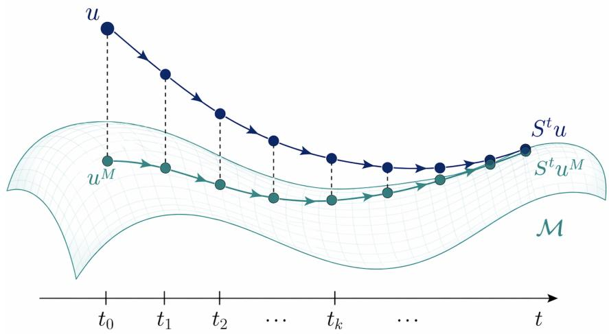  
Figure 1: Schematic of a trajectory in the full space and its tracking trajectory on the inertial manifold.

A suficient condition for asymptotic completeness is flow-normal hyperbolicity [25, 26].

Definition 3 (Flow-normal hyperbolicity). Let ${ \mathcal { M } } \subset H$ be a positively invariant attracting manifold for the semigroup $\{ S ( t ) \} _ { t \geq 0 }$ . Suppose that M attracts trajectories at an exponential rate $\mu > 0$ , namely

$$
\mathrm { d i s t } ( S ( t ) u , { \cal M } ) \leq C e ^ { - \mu t } , \quad \forall t \geq 0 .\tag{5}
$$

The manifold M is said to be flow-normally hyperbolic if there exist $\gamma < \mu$ such that

$$
\begin{array} { r } { \| u _ { 1 } ( t ) - u _ { 2 } ( t ) \| \le C e ^ { - \gamma t } \| u _ { 1 } ( 0 ) - u _ { 2 } ( 0 ) \| , \quad \forall t \le 0 . } \end{array}\tag{6}
$$

for two trajectories $u _ { 1 } ( t ) , u _ { 2 } ( t )$ lying on ${ \mathcal { M } } ,$

In other words, flow-normal hyperbolicity requires that the backward-in-time separation of trajectories on M is dominated by the exponential attraction toward M. Such a domination property is not automatic from the existence of an inertial manifold and must be verified under additional assumptions in specific settings.

Flow-normal hyperbolicity implies asymptotic completeness [25]. Moreover, it also implies the uniqueness of the asymptotic phase $u ^ { M }$ . Indeed, if $u _ { 1 } ^ { M } , u _ { 2 } ^ { M } \in \mathcal { M }$ both track the same trajectory $S ( t ) ^ { \prime }$ u at rate $\mu ,$ , then

$$
\| S ( t ) u _ { 1 } ^ { M } - S ( t ) u _ { 2 } ^ { M } \| \lesssim e ^ { - \mu t } .
$$

Applying the backward-time estimate on M gives

$$
\begin{array} { r } { \| u _ { 1 } ^ { M } - u _ { 2 } ^ { M } \| \lesssim e ^ { \gamma t } \| S ( t ) u _ { 1 } ^ { M } - S ( t ) u _ { 2 } ^ { M } \| \lesssim e ^ { - ( \mu - \gamma ) t } , } \end{array}
$$

and letting $t \to \infty$ yields $u _ { 1 } ^ { M } = u _ { 2 } ^ { M }$ . Thus the tracking trajectory associated with each initial condition is uniquely determined.

The uniqueness of the asymptotic phase naturally induces an asymptotic phase map

$$
\Pi : H  { \mathcal { M } } ,
$$

which assigns to each initial condition $( u \in H )$ its unique asymptotic phase $( \Pi ( u ) = u ^ { M } \in \mathcal { M } )$ . Under suitable additional spectral-gap and regularity assumptions, one can further obtain the continuity of this map [5, 26]. When this holds, Π may be viewed as a continuous asymptotic phase retraction from the full phase space onto the inertial manifold.

This naturally induces a decomposition of $u \in H$ into a manifold component and an of-manifold residual:

$$
u ^ { M } : = \Pi ( u ) , \qquad u ^ { R } : = u - \Pi ( u ) .
$$

Thus,

$$
u = u ^ { M } + u ^ { R } ,
$$

where $u ^ { M }$ represents the asymptotic-phase representative on $\mathcal { M }$ , while $u ^ { R }$ represents the deviation of u from manifold.

## 3 Inertial Manifold Neural Operators (IMNO)

The above inertial-manifold picture suggests an orbitwise reduction: each full trajectory admits an asymptotic phase on a finite-dimensional, positively invariant set, and the remaining degrees of freedom decay exponentially. Motivated by this, we introduce a neural operator architecture that explicitly decomposes the state into

(i) a low-dimensional manifold coordinate $h ( t )$

(ii) a function-valued residual $u ^ { R } ( t )$

with the goal of approximating both the reduced dynamics on the manifold and the of-manifold correction needed to recover the full state solution

The overall structure of the Inertial Manifold Neural Operator (IMNO) is summarized in the flowchart below. In the following subsections, we describe each part in detail.

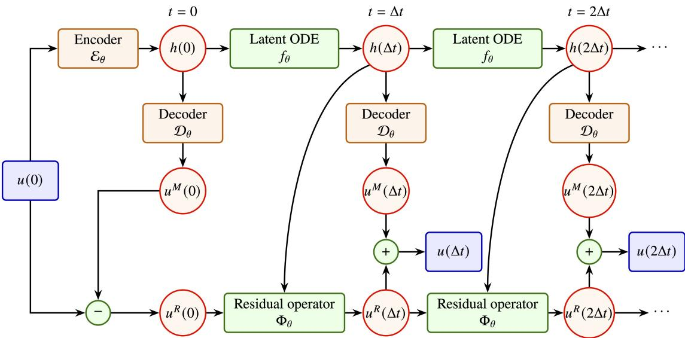  
Figure 2: Overall architecture of IMNO.

## 3.1 Manifold-Based Decomposition

Let $u ( t ) \in H$ denote the solution of the PDE at time t. IMNO is built on the assumption that the full state solution u admits a decomposition into a manifold component and a residual component,

$$
u ( 0 ) \ : = \ : u ^ { M } ( 0 ) + u ^ { R } ( 0 ) ,\tag{7}
$$

where $u ^ { M } ( t )$ lies on a learned manifold $\mathcal { M } _ { \theta } \subset H$ , and $u ^ { R } ( t ) \in H$ represents the remaining degrees of freedom.

Conceptually, $u ^ { M } ( t )$ serves as a representative of the asymptotic phase, while the full state $u ( t )$ is viewed as lying on the stable leaf associated with $u ^ { M } ( t )$ . This decomposition is consistent with the inertial-manifold and asymptotic-completeness perspective introduced in the previous section: the long-time behavior is governed by evolution along the manifold, while residual components decay rapidly.

To realize the decomposition (7) in practice, we parameterize the learned manifold $\mathcal { M } _ { \theta }$ through an encoder–decoder pair

$$
\mathcal { E } _ { \theta } : H  \mathbb { R } ^ { d _ { h } } , \qquad \mathcal { D } _ { \theta } : \mathbb { R } ^ { d _ { h } }  H ,
$$

and define

$$
\mathcal { M } _ { \theta } \ = \ \{ \mathcal { D } _ { \theta } ( h ) : h \in \mathbb { R } ^ { d _ { h } } \} .
$$

Both the encoder and decoder are designed to be resolution-independent, they act on functions rather than fixed-dimensional vectors and remain compatible with varying spatial resolutions.

Given an initial condition $u ( 0 ) \in H$ , IMNO begins by projecting $u ( 0 )$ onto the learned manifold. The encoder produces a latent coordinate

$$
h ( 0 ) = \mathcal { E } _ { \theta } ( u ( 0 ) ) ,
$$

which serves as the coordinate induced by an embedding of the learned manifold into $\mathbb { R } ^ { d } .$ . The corresponding manifold component is obtained by decoding,

$$
u ^ { M } ( 0 ) = \mathcal { D } _ { \boldsymbol { \theta } } ( h ( 0 ) ) \in \mathcal { M } _ { \boldsymbol { \theta } } ,
$$

and the residual is defined as

$$
u ^ { R } ( 0 ) = u ( 0 ) - u ^ { M } ( 0 ) .
$$

The state of the system $u ( 0 )$ is thus represented by the pair $( h ( 0 ) , u ^ { R } ( 0 ) )$ , where $h ( 0 )$ corresponding to the latent coordinate of u on the learned manifold and $u ^ { R } ( 0 )$ capturing its deviation from the manifold.

Starting from this representation, the latent variable $h ( t )$ and the residual $u ^ { R } ( t )$ are evolved forward in time according to separate learned dynamics, which are introduced in the following subsections. At each step, the full state is reconstructed as

$$
u ( t ) = \mathcal { D } _ { \theta } ( h ( t ) ) + u ^ { R } ( t ) .
$$

The encoder–decoder architecture is specified as follows.

## Encoder Architecture

The encoder ${ \mathcal { E } } _ { \theta }$ maps an input field $u \in H$ to a latent coordinate $\boldsymbol { h } \in \mathbb { R } ^ { d _ { h } }$ by extracting global, low-frequency features. The input field is first lifted to a higher-dimensional feature representation through a pointwise linear layer that uses both the field value and the spatial grid coordinate. The lifted feature field is then transformed to Fourier space, and only a fixed number of low modes are retained. The real and imaginary parts of these modes across all lifted channels are concatenated and projected into $\mathbb { R } ^ { d _ { h } }$ by a MLP, followed by a normalization layer.

## Decoder Architecture

The decoder $\mathcal { D } _ { \theta }$ maps a latent coordinate $\boldsymbol { h } \in \mathbb { R } ^ { d _ { h } }$ back to a field in H by generating low-frequency Fourier coeficients. A MLP first maps h to complex-valued coeficients corresponding to a fixed set of Fourier modes. These coeficients are then embedded into a Fourier spectrum and transformed back to physical space at a desired spatial resolution via an inverse Fourier transform.

## 3.2 Dynamics of the Manifold and Residual Components

## 3.2.1 Latent dynamics on the learned manifold

The inertial-manifold theory indicates that the latent dynamics on the manifold can be written in the closed form (3) , the latent coordinate evolves autonomously and independently of the residual $u ^ { R } ( t )$ . Therefore, we model this closed dynamics using a Neural ODE [3], where $f _ { \theta } : \mathbb { R } ^ { d _ { h } }  \mathbb { R } ^ { d _ { h } }$ is a learned vector field.

$$
\begin{array} { r } { \dot { h } ( t ) = f _ { \theta } ( h ( t ) ) , } \end{array}\tag{8}
$$

In practice, we adopt a forward Euler discretization, leading to the one-step update

$$
h _ { t + 1 } = h _ { t } + \Delta t f _ { \theta } ( h _ { t } ) ,\tag{9}
$$

we seek $h ( t )$ to capture the long-time dynamics of the system.

## 3.2.2 Of-manifold residual dynamics

The residual component $u ^ { R } ( t )$ represents of-manifold corrections and is not expected to possess an autonomous, closed dynamics. Instead, following the stable-foliation viewpoint from the inertial manifold theory, the evolution of $u ^ { R } ( t )$ also depends on the latent coordinate $h ( t )$

Specifically, we parameterize the dynamics of the residual component $u ^ { R } ( t )$ by a neural operator of the form

$$
u _ { t + 1 } ^ { R } = \mathcal { R } _ { \theta } \big ( u _ { t } ^ { R } , h _ { t + 1 } \big ) .\tag{10}
$$

The operator $\scriptstyle { \mathcal { R } } _ { \theta }$ is a neural-operator, mapping function-valued inputs to function-valued outputs, while being conditioned on the finite-dimensional latent coordinate $h .$

Building on the FNO-based neural-operator framework introduced in Section 2.2, we define $\scriptstyle { \mathcal { R } } _ { \theta }$ as a composition of lifting, hidden, and projection layers:

$$
\mathcal { R } _ { \theta } ( \cdot , h ) = \mathcal { Q } \circ \mathcal { L } _ { L } ^ { ( h ) } \circ \cdot \cdot \cdot \circ \mathcal { L } _ { 1 } ^ { ( h ) } \circ \mathcal { P } .
$$

Here $\mathcal { P }$ is a lifting operator from the residual channel space to an intermediate latent feature space, and $\mathcal { Q }$ is a projection operator that maps latent features back to the residual channel space. Following the notation in Section 2.2, these maps are written as

$$
\mathcal { P } : \mathcal { X } ( \Omega ; \mathbb { R } ^ { k } ) \to \mathcal { V } ( \Omega ; \mathbb { R } ^ { d _ { c } } ) , \qquad u ( x ) \mapsto P \big ( u ( x ) , x \big ) ,
$$

and

$$
\begin{array} { r } {  { \mathcal { Q } } : \mathcal { V } (  { \Omega } ; \mathbb { R } ^ { d _ { c } } ) \to \mathcal { X } (  { \Omega } ; \mathbb { R } ^ { k } ) , \qquad v ( x ) \mapsto Q ( v ( x ) ) , } \end{array}
$$

where $P$ is a pointwise MLP from $\mathbb { R } ^ { k + d } \mathrm { \ t o \ } \mathbb { R } ^ { d _ { c } } , Q$ is a pointwise MLP from $\mathbb { R } ^ { d _ { c } }$ to $\mathbb { R } ^ { k }$

For a standard FNO, the hidden-layer update takes the form

$$
\begin{array} { r } { \mathcal { L } _ { \ell } ( v ) ( x ) = \sigma \big ( W _ { \ell } v ( x ) + b _ { \ell } + ( \mathcal { K } _ { \ell } v ) ( x ) \big ) , } \end{array}
$$

where $W _ { \ell }$ is a pointwise linear transformation and $\kappa _ { \ell }$ is a spectral convolution operator. In our model, we take the kernel in $\displaystyle \kappa _ { \ell }$ to be the same as in FNO, namely

$$
\begin{array} { r } { ( \mathcal { K } _ { \ell } v ) ( x ) = \mathcal { F } ^ { - 1 } ( R _ { \ell } ( k ) \widehat { v } ( k ) ) ( x ) . } \end{array}
$$

Furthermore, we modify this basic layer by replacing the fixed bias term with a latent coordinatedependent. More precisely, at layer ℓ, the update in the layer is

$$
\begin{array} { r } { \mathcal { L } _ { \ell } ^ { ( h ) } ( v ) ( x ) = \sigma \big ( W _ { \ell } v ( x ) + \beta _ { \ell } ( h ) + ( \mathcal { K } _ { \ell } v ) ( x ) \big ) , } \end{array}
$$

Here $\beta _ { \ell }$ is a learnable afine map from $\mathbb { R } ^ { d _ { h } }$ to $\mathbb { R } ^ { d _ { c } }$ , so $\beta _ { \ell } ( h _ { t + 1 } )$ is a learned vector in the featurechannel dimension obtained from the latent state $h _ { t + 1 }$ and broadcast uniformly over the spatial domain. In this way, the residual dynamics are not modeled by a fixed operator acting on $u _ { t } ^ { R }$ alone; instead, the operator is conditioned on the current location on the learned manifold through an additive correction.

Therefore, $\scriptstyle { \mathcal { R } } _ { \theta }$ may be interpreted as a conditioned neural operator for the residual dynamics: it updates the residual field through an operator whose action depends on the current latent coordinate. This is consistent with the inertial-manifold viewpoint, where the residual degrees of freedom are not evolved independently but are coupled to the low-dimensional manifold dynamics.

Remark 1. One may wonder whether the latent-dependent term $\beta _ { \ell } ( h _ { t + 1 } )$ , being spatially constant, is too limited to inject suficiently rich information from the latent coordinate into the residual dynamics. From the viewpoint of expressive power, this limitation is not fundamental. Universal approximation results for the averaging neural operator (ANO) show that even remarkably simple nonlocal mechanisms can sufice for universal operator approximation $[ { \boldsymbol { 1 7 } } ]$

Although $\beta _ { \ell } ( h _ { t + 1 } )$ does not depend on the spatial coordinate, it enters every hidden layer and interacts with the pointwise nonlinearities and the nonlocal Fourier convolution operators. In this sense, it provides a global mechanism through which the latent coordinate can influence the residual evolution operator. At the level of approximation theory, this mechanism is suficient to establish a corresponding universal approximation theorem for the model considered here.

Theorem 1 (Universal approximation of IMNO on systems with inertial manifold structure). Let $H = H ^ { s } ( \mathbb { T } ^ { d } ; \mathbb { R } ^ { c } )$ for some $s \geq 0$ , and let

$$
\mathcal { G } = S ( \Delta t ) : H  H
$$

be the continuous one-step solution operator of a dissipative PDE. Let $K \subset H$ be compact. Assume that:

1. the PDE admits a finite-dimensional flow-normally hyperbolic inertial manifold ${ \mathcal { M } } \subset H$

2. the associated asymptotic phase map Π : $H  \mathcal { M }$ is continuous.

Then, for every $\varepsilon > 0$ , there exists an IMNO model $\mathcal { G } _ { \theta } : H  H$ such that for every $u \in K$ , if

$$
u = u ^ { M } + u ^ { R } , \qquad u ^ { M } : = \Pi ( u ) , \qquad u ^ { R } : = u - \Pi ( u ) ,
$$

and

$$
\begin{array} { r l r l r } { \mathcal { G } ( u ) = u _ { \mathrm { n e x t } } ^ { M , \mathrm { r e f } } + u _ { \mathrm { n e x t } } ^ { R , \mathrm { r e f } } , } & { } & { u _ { \mathrm { n e x t } } ^ { M , \mathrm { r e f } } : = \Pi ( \mathcal { G } ( u ) ) , } & { } & { u _ { \mathrm { n e x t } } ^ { R , \mathrm { r e f } } : = \mathcal { G } ( u ) - \Pi ( \mathcal { G } ( u ) ) , } \end{array}
$$

while the corresponding IMNO prediction is written as

$$
\mathcal { G } _ { \theta } ( u ) = u _ { \mathrm { n e x t } } ^ { M } + u _ { \mathrm { n e x t } } ^ { R } ,
$$

one has

$$
\operatorname* { s u p } _ { u \in K } \left( \lVert u _ { \mathrm { n e x t } } ^ { M } - u _ { \mathrm { n e x t } } ^ { M , \mathrm { r e f } } \rVert _ { H } + \lVert u _ { \mathrm { n e x t } } ^ { R } - u _ { \mathrm { n e x t } } ^ { R , \mathrm { r e f } } \rVert _ { H } \right) < \varepsilon .
$$

In particular,

$$
\underset { u \in K } { \operatorname* { s u p } } \Vert \mathcal G _ { \theta } ( u ) - \mathcal G ( u ) \Vert _ { H } < \varepsilon .
$$

The proof is deferred to Appendix A.

Remark 2. The universal approximation result above only requires the additive conditioning mechanism described in the main architecture. This shows that, at the level of expressive power, additional conditioning mechanism is not necessary. However, empirically, we find it beneficial to enrich the conditioning by adding a channel-wise multiplicative modulation. More precisely, let $\gamma _ { \ell }$ be another learnable MLP mapping $\mathbb { R } ^ { d _ { h } } \ t o \ \mathbb { R } ^ { d _ { c } }$ . We then define

$$
\mathcal { L } _ { \ell } ( v ) ( x ) = \sigma _ { \ell } \Big ( \big ( 1 + \operatorname { t a n h } ( \gamma _ { \ell } ( h _ { t + 1 } ) ) \big ) \odot \big ( W _ { \ell } v ( x ) + ( K _ { \ell } v ) ( x ) \big ) + \beta _ { \ell } ( h _ { t + 1 } ) \Big ) .
$$

Here $\odot$ denotes channel-wise multiplication, and both $\gamma _ { \ell } ( h _ { t + 1 } )$ and $\beta _ { \ell } ( h _ { t + 1 } )$ are broadcast uniformly over the spatial domain. In practice, this modification adds only a small number of parameters while improving prediction accuracy across many test settings. Therefore, we adopt this mechanism in all numerical experiments below.

## 3.3 Loss Design

Our loss is designed to encode the inertial-manifold tracking property discussed above. When the dynamics admit an inertial manifold and are asymptotically complete, each trajectory is exponentially tracked by a (unique) trajectory on the manifold, and the residual decays exponentially fast in time. In the notation of (7), this means that the residual $u ^ { R } ( t ) = u ( t ) - u ^ { M } \bar { ( t ) }$ should become smaller and smaller as t increases. Consequently, for suficiently large t, the manifold component $u ^ { M } ( t )$ is expected to be close to the reference solution $u ^ { r e f } ( t )$

To encourage this behavior during training, we augment the standard one-term prediction loss with an auxiliary term that penalizes the mismatch between the manifold component $u ^ { M } ( t )$ and the reference solution $u ^ { r e f } ( t )$ , and we assign this term an exponentially increasing weight over the rollout time. So the loss function $\mathcal { L }$ is defined as:

$$
\mathcal { L } = \sum _ { t = t _ { 0 } + 1 } ^ { t _ { \mathrm { t r a i n } } } \Vert u _ { t } ^ { r e f } - u _ { t } \Vert _ { 2 } ^ { 2 } ~ + ~ \alpha \sum _ { t = t _ { 0 } + 1 } ^ { t _ { \mathrm { t r a i n } } } w _ { t } \Vert u _ { t } ^ { r e f } - u _ { t } ^ { M } \Vert _ { 2 } ^ { 2 } ,\tag{11}
$$

with

$$
w _ { t } = \frac { \operatorname* { m i n } \{ \gamma ^ { t - ( t _ { 0 } + 1 ) } , w _ { \operatorname* { m a x } } \} } { w _ { \operatorname* { m a x } } } \in ( 0 , 1 ] .\tag{12}
$$

The weight $w _ { t }$ is chosen to increase exponentially over time, so as to place greater emphasis on the auxiliary term at later rollout steps and reflect the expected decrease of the mismatch $\parallel \bar { u } ^ { r e f } ( t ) -$ $u ^ { M } ( t ) \Vert _ { 2 } ;$ the cap $w _ { \mathrm { m a x } }$ prevents the weight from growing without bound.

## 4 Shift-Equivariant Inertial Manifold Neural Operator

## 4.1 Translational symmetry in PDEs

Many PDEs posed on homogeneous domains with periodic boundary conditions $( \mathrm { o r ~ o n ~ } \mathbb { R } ^ { d } )$ are equivariant under spatial translations, or shifts. In other words, if the initial condition is shifted in space, then the corresponding solution is shifted by exactly the same amount. We now formalize this symmetry structure rigorously:

Let $T _ { s }$ denote the translation operator acting on functions by

$$
( T _ { s } u ) ( x ) = u ( x + s ) , \qquad s \in \mathbb { R } .\tag{13}
$$

If the governing PDE is translation-invariant, its solution operator (flow map) $S ( t ) : H  H$ is defined by

$$
S ( t ) u _ { 0 } : = u ( t ; u _ { 0 } ) ,
$$

where $u ( t ; u _ { 0 } )$ is the solution at time t with initial data $u _ { 0 }$ . Then, it satisfies

$$
S ( t ) \circ T _ { s } = T _ { s } \circ S ( t ) ,\tag{14}
$$

for all admissible shifts s.

Consequently, the global attractor of the system contains entire group orbits under the action of translations. For any trajectory $u ( t )$ lying on the attractor, all of its translated versions $T _ { s } u ( t )$ also lie on the attractor.

From the perspective of reduced-order modeling, translation symmetry introduces a meaningfu prior structure of the system. States that difer only by a spatial shift are dynamically equivalent, yet they are represented as distinct points in the original function space. This redundancy complicates the learning of a low-dimensional parameterization. So, separating group motion from intrinsic dynamics can lead to more compact and physically meaningful reduced representations [23, 28, 29]. Motivated by this idea, we separate the spatial shift from the intrinsic dynamics to construct a more compact model.

Remark 3. Standard FNO can naturally preserve translation equivariance when no explicit coordinate embedding is used. This is because spectral convolutions and pointwise channel mixing commute with spatial translations. For PDEs with translation symmetry, an FNO without coordinate embedding naturally preserves translation equivariance and often achieves better accuracy. However, the original IMNO does not automatically preserve this symmetry, since the latent coordinate may entangle intrinsic shape information with spatial phase. This motivates the shift-equivariant IMNO developed below.

## 4.2 Symmetry reduction via phase alignment

To factor out translation symmetry, we fix the phase of a reference Fourier mode and use it to define a canonical representative for each solution $u \in H$

Let $u ( x , t )$ be a periodic solution on $[ 0 , L ]$ . Its canonical representative $\tilde { u } ( x , t )$ is defined by

$$
\tilde { u } ( x , t ) = T _ { - \frac { L \phi ( t ) } { 2 \pi } } u ( x , t ) ,\tag{15}
$$

where the phase $\phi ( t )$ is chosen so that a prescribed Fourier mode (e.g., the first mode) satisfies a fixed phase condition. This gives the decomposition

$$
\begin{array} { r } { \boldsymbol { u } ( \boldsymbol { x } , t ) = T _ { \frac { L \phi ( t ) } { 2 \pi } } \tilde { \boldsymbol { u } } ( \boldsymbol { x } , t ) , } \end{array}\tag{16}
$$

where:

$\tilde { u } ( x , t )$ represents the intrinsic shape dynamics in a canonical frame,

$\phi ( t )$ captures the spatial translation along the symmetry direction.

We can make the quotient–phase structure explicit. Denote $\mathcal { T } _ { \theta } = T _ { \frac { L \theta } { 2 \pi } }$ . The translation group is

$$
G = \{ \mathcal { T } _ { \theta } : \theta \in [ 0 , 2 \pi ) \} \cong { \mathbb { S } } ^ { 1 } ,
$$

acting on H. If

$$
u ( x ) = \sum _ { n \in \mathbb { Z } } \hat { u } _ { n } e ^ { i n \frac { 2 \pi x } { L } } ,
$$

then

$$
( \mathcal T _ { \theta } u ) ( x ) = \sum _ { n \in \mathbb { Z } } e ^ { i n \theta } \hat { u } _ { n } e ^ { i n \frac { 2 \pi x } { L } } , \qquad \theta \in [ 0 , 2 \pi ) .
$$

Therefore, if the first Fourier coeficient of the state is nonzero, after fixing a phase condition, the state can be represented by a translation phase together with a quotient representative, i.e.,

$$
H _ { * } \cong \mathbb { S } ^ { 1 } \times \Sigma , \qquad \Sigma \cong H _ { * } / G ,
$$

where $H _ { * } = \{ u \in H : \widehat { u } _ { 1 } \neq 0 \}$ and $\Sigma = \{ u \in H : \widehat { u } _ { 1 } \in \mathbb { R } ^ { + } \}$

Define the phase functional $\Theta : H _ { * } \to \mathbb { S } ^ { 1 }$ by

$$
\Theta ( u ) = \arg ( \hat { u } _ { 1 } ) = : \theta _ { 0 } .
$$

Then the canonical projection operator $\pi : H _ { * } \to H / G$ is

$$
\pi ( u ) = \tilde { u } = \mathcal { T } _ { - \Theta ( u ) } u .
$$

Then, the reduced dynamics of ˜u evolves on $H / G ,$ while the phase $\phi ( t ) = \Theta ( u ( x , t ) ) \in \mathbb { S } ^ { 1 }$ tracks the spatial translation phase.

In this quotient space, the inertial-manifold structure of the original dynamics is preserved under the symmetry reduction. If the governing equation is shift equivariant and a G-invariant inertial manifold $\mathcal { M } \subset H ^ { * }$ exists for the original dynamics, then an inertial manifold for the induced dynamics on $H / G$ is given by its projection

$$
\mathcal { M } _ { H / G } : = \pi ( \mathcal { M } ) \subset H / G .
$$

## 4.3 Inertial manifold decomposition

The classical IMNO formulation models the solution as

$$
u ( t ) = \mathcal { D } _ { \theta } ( h ( t ) ) + u ^ { R } ( t ) ,\tag{17}
$$

where $D _ { \theta }$ parameterizes an approximate inertial manifold $\mathcal { M } _ { \theta } , h ( t )$ denotes the latent coordinate, and $u ^ { R } ( t )$ represents the residual component.

To leverage translation symmetry, we use $D _ { \theta }$ to parameterize the inertial manifold $\mathcal { M } _ { H / G }$ in the quotient space, with h as the corresponding latent coordinate. We then extend this decomposition to an equivariant form:

$$
u ( t ) = \mathcal { T } _ { \phi ( t ) } \big ( \mathcal { D } _ { \theta } ( h ( t ) ) \big ) + u ^ { R } ( t ) ,\tag{18}
$$

where:

$h ( t ) \in \mathbb { R } ^ { d _ { h } }$ is the latent coordinate that parameterizes the manifold,

$\phi ( t ) \in \mathbb { R }$ is the spatial translation phase of $u ( t )$

$u ^ { R } ( t )$ represents the residual component.

So, given an initial condition $u ( 0 )$ , we first apply phase alignment to decompose it into a canonical representative and a phase,

$$
u ( 0 ) = T _ { \phi ( 0 ) } \tilde { u } ( 0 ) ,
$$

where $\tilde { u } ( 0 )$ represents the canonical representative, and $\phi ( 0 )$ records the spatial shift. The encoder is then applied to ˜u to obtain the initial latent coordinate,

$$
h ( 0 ) = \mathcal { E } _ { \boldsymbol { \theta } } ( \tilde { u } ( 0 ) ) .
$$

Then, the latent dynamics is modeled as

$$
{ \dot { h } } = f _ { \theta } ( h ) ,\tag{19}
$$

while the phase evolution is governed by

$$
\dot { \phi } = g _ { \theta } ( h ) ,\tag{20}
$$

where both $f _ { \theta }$ and $g _ { \theta }$ are parameterized by neural networks.

This construction can be viewed as learning an equivariant inertial manifold in the space $H / G$ . By explicitly separating the spatial translation, the model avoids representing entire group orbits within the latent coordinate and thus achieves a more compact representation.

## 4.4 Residual dynamics

The evolution of the residual component $u ^ { R }$ is challenging, as its update depends not only on the current residual component but also on the latent coordinateh and the translation phase $\phi .$ In our model, the residual dynamics are modeled by

$$
u ^ { R } ( t + \Delta t ) = \mathcal { R } _ { \theta } ( u ^ { R } ( t ) , h ( t + \Delta t ) , \phi ( t + \Delta t ) ) ,\tag{21}
$$

where $\scriptstyle { \mathcal { R } } _ { \theta }$ denotes a learned residual update operator.

To incorporate the phase information into the residual update while preserving shift equivariance, we modify the positional input embedding used in the lifting layer. This difers from the standard coordinate embedding $[ u ^ { R } ( x ) , x ]$ , where the absolute coordinate x is provided directly and may break translation equivariance. Instead, we replace the absolute coordinate by a phase-dependent spatia feature that transforms consistently with the solution under shifts. Specifically, for each grid point x, we define

$$
\Psi ( \phi ) ( x ) = \cos \biggl ( \phi + \frac { 2 \pi } { L } x \biggr ) ,\tag{22}
$$

and concatenate this feature pointwise with the residual field:

$$
[ u _ { t } ^ { R } ( x ) , \ \Psi ( \phi _ { t + 1 } ) ( x ) ] .\tag{23}
$$

This augmented field is then passed through the same conditional Fourier-layer residual operator introduced in Section 3.2.2, with the Fourier layers conditioned on the latent coordinate $h _ { t + 1 }$

The key point is that the phase feature transforms consistently with spatial shifts. Under a translation $\mathcal { T } _ { \delta }$ , the phase changes from $\phi$ to $\phi + \delta .$ , and the embedding satisfies

$$
\Psi ( \phi + \delta ) = { \mathcal T } _ { \delta } \Psi ( \phi ) .\tag{24}
$$

Since the remaining Fourier-layer operations commute with spatial translations, the residual operator preserves shift equivariance:

$$
\begin{array} { r } { \mathcal { R } _ { \theta } \big ( \mathcal { T } _ { \delta } u _ { t } ^ { R } , h _ { t + 1 } , \phi _ { t + 1 } + \delta \big ) = \mathcal { T } _ { \delta } \mathcal { R } _ { \theta } \big ( u _ { t } ^ { R } , h _ { t + 1 } , \phi _ { t + 1 } \big ) . } \end{array}\tag{25}
$$

Reconstruction. Once $u _ { t } ^ { R } , \phi _ { t }$ , and $h _ { t }$ have been obtained, the full solution is reconstructed as

$$
u _ { t } = u _ { t } ^ { R } + \mathcal { T } _ { \phi _ { t } } \mathcal { D } _ { \theta } ( h _ { t } ) .\tag{26}
$$

The decoder $\mathcal { D } _ { \theta }$ is parameterized by a neural network that maps the latent coordinate h to a set of low-frequency Fourier coeficients. Applying an inverse FFT then gives the corresponding field in physical space. To ensure that the decoded manifold component is represented in the canonical frame, we impose a gauge condition on the first Fourier mode: its imaginary part is set to zero and its real part is replaced by its absolute value so that it is nonnegative. So, the first Fourier coeficient of $\mathcal { D } _ { \theta } ( h )$ is real and nonnegative. Consequently, $\mathcal { D } _ { \theta } ( h _ { t } )$ lies in the chosen canonical frame, while the translation operator $\mathcal { T } _ { \phi _ { t } }$ restores the spatial phase of the full solution.

Overall, by construction, the overall architecture is strictly shift-equivariant. For any spatial shift applied to the input, the predicted output shifts accordingly. This shift-equivariant IMNO reduces redundancy in the latent representation and improves the compactness of the learned model.

## 5 Numerical Experiments

In this section, we demonstrate the performance of IMNO and its shift-equivariant variant (hereafter abbreviated as IMNO-SE) on the Burgers, nonlocal Burgers, Kuramoto–Sivashinsky, and Navier– Stokes equations, and compare them with FNO and RNO baselines.

For a fair comparison, we use the same Fourier modes and channel width across all Fourier layers. In particular, FNO uses four Fourier layers with GeLU activations, whereas RNO uses one layer in each block; both FNO and RNO retain $k _ { \operatorname* { m a x } } = 2 4$ Fourier modes and use channel width $d _ { c } = 6 4$ in 1D cases, $k _ { \operatorname* { m a x } } = 1 2$ and $d _ { c } = 2 0$ in 2D cases.

For IMNO, we adopt the same Fourier modes $k _ { \mathrm { m a x } }$ and width $d _ { c }$ in the Fourier layers. Unless otherwise specified, the latent dimension is $d _ { h } = 3 2$ . In one-dimensional experiments, the encoder retains the lowest $k _ { E } = 6$ Fourier modes to extract global features, while the decoder generates the manifold component using the lowest $k _ { D } = 8$ Fourier modes. In two-dimensional experiments, we use $k _ { E } = 3$ and $k _ { D } = 4$ . For the loss function, we set $\gamma = 1 . 1$ , and $w _ { \mathrm { m a x } } = 1 0$ in $( 1 1 ) ‐ ( 1 2 )$

To exploit the symmetry structure of the underlying PDEs, we use shift-equivariant versions of IMNO, FNO, and RNO whenever the governing equation is shift equivariant. For PDEs without translation symmetry, we instead use the original versions of these models.

For the parameter $\alpha ,$ we evaluate multiple values in our experiments. Intuitively, α controls how strongly the manifold component is encouraged to approximate the output function. When $\alpha = 0$ , the latent coordinate h only serves as a time-evolving variable that encodes the global information of the solution, and the reconstructed manifold component $u ^ { M }$ is not required to form an explicit part of the solution. As α increases, the model is increasingly encouraged to represent the reconstructed solution $u = u ^ { M } + u ^ { R }$ primarily through the manifold component $\hat { u ^ { M } }$

For the Burgers, 1D Navier–Stokes and 2D compressible Navier–Stokes equations, all training and testing data are taken from the publicly available PDEBench repository [31]. For other equations, we generate the dataset using our own simulation code, following the same discretization and data format as PDEBench to ensure a consistent training and evaluation pipeline. For all experiments, the dataset is split into training, validation, and test sets with a ratio of 8:1:1. The validation set is used for model selection during training. For each model and experimental configuration, we repeat the training with three fixed random seeds. For each seed, we select the model checkpoint that achieves the lowest validation error and record its error on the test set. The results reported below are the mean and standard deviation of the test errors over the three seeds. We train and evaluate the models under the autoregressive training setup. Starting from the initial condition $u _ { 0 }$ , the model predicts $u ( t _ { 1 } )$ , and then uses $u ( t _ { 1 } )$ to predict $u ( t _ { 2 } )$ . This procedure is iterated so that each future state $u ( t _ { n } )$ is generated solely from previous predictions, yielding a full autoregressive rollout up to a prescribed final time $t _ { \mathrm { e n d } }$ . During training, the predictions at all rollout steps are included in the loss function.

To quantitatively evaluate accuracy over the rollout interval $[ 1 , t _ { \mathrm { e n d } } ]$ , we employ a normalized relative $L ^ { 2 }$ error over the spatial domain:

$$
E r r o r = \sqrt { \frac { \sum _ { n = 1 } ^ { t _ { \mathrm { e n d } } } \sum _ { j = 1 } ^ { N _ { x } } \left( u ( x _ { j } , t _ { n } ) - u ^ { r e f } ( x _ { j } , t _ { n } ) \right) ^ { 2 } } { \sum _ { n = 1 } ^ { t _ { \mathrm { e n d } } } \sum _ { j = 1 } ^ { N _ { x } } u ^ { r e f } ( x _ { j } , t _ { n } ) ^ { 2 } } } .
$$

In practice, the error is computed for each sample and then averaged over the evaluation batch.

## 5.1 Burgers Equation

The one-dimensional Burgers equation is a classical nonlinear PDE occurring in many fields, such as fluid mechanics and trafic flow. It takes the form

$$
\begin{array} { c c } { \partial _ { t } u ( x , t ) + \partial _ { x } \left( u ^ { 2 } ( x , t ) / 2 \right) = \nu \partial _ { x x } u ( x , t ) , } & { x \in ( 0 , 1 ) } \\ { u ( x , 0 ) = u _ { 0 } ( x ) , } & { x \in ( 0 , 1 ) } \end{array}
$$

with periodic boundary conditions.

For the training procedure, we employ a dataset consisting of $N _ { \mathrm { d a t a } } = 1 0 0 0 0$ samples, each resolved on a spatial grid of $N _ { x } = 2 5 6$ points with spacing $\textstyle \Delta x = { \frac { 1 } { 2 5 6 } }$

In the temporal direction, the solution is sampled every $\Delta t = 0 . 0 5$ , yielding $N _ { t } = 4 1$ snapshots from $t = 0 \mathrm { ~ t o ~ } t = 2$ . During training and evaluation, the model is provided only the initial snapshot $u ( \cdot , 0 )$ and must autoregressively predict all subsequent time steps $u ( \cdot , t _ { 1 } ) , u ( \cdot , t _ { 2 } ) , \ldots , u ( \cdot , t _ { \mathrm { e n d } } )$ . We train and evaluate the models under two rollout horizons $( t _ { \mathrm { e n d } } = 0 . 5$ and $t _ { \mathrm { e n d } } = 2 )$ , and report the results in Table 1.

Table 1: Relative $L ^ { 2 }$ error of FNO, RNO and IMNO-SE for the Burgers Equation
<table><tr><td></td><td>FNO</td><td>RNO</td><td> $\mathrm { I M N O - S E } ( \alpha = 0 . 1 )$ </td><td> $\mathrm { I M N O - S E } ( \alpha = 0 )$ </td></tr><tr><td>Params</td><td>418433</td><td>623533</td><td>538314</td><td>538314</td></tr><tr><td colspan="5"> $t _ { \mathrm { e n d } } = 0 . 5$ </td></tr><tr><td> $\nu = 0 . 0 0 2$ </td><td> $2 . 9 1 \pm 0 . 0 7 \%$ </td><td> $3 . 5 5 \pm 0 . 0 5 \%$ </td><td> $2 . 2 5 \pm 0 . 0 3 \%$ </td><td> $1 . 9 4 \pm 0 . 0 4 \%$ </td></tr><tr><td> $\nu = 0 . 0 1$ </td><td> $1 . 3 5 \pm 0 . 0 8 \%$ </td><td> $1 . 7 9 \pm 0 . 0 3 \%$ </td><td> $1 . 1 6 \pm 0 . 0 3 \%$ </td><td> $0 . 7 8 \pm 0 . 0 3 \%$ </td></tr><tr><td colspan="5"> $t _ { \mathrm { e n d } } = 2$ </td></tr><tr><td> $\nu = 0 . 0 0 2$ </td><td> $5 3 . 3 \pm 4 3 . 8 \% ^ { * }$ </td><td> $4 . 1 2 \pm 0 . 9 2 \%$ </td><td> $2 . 4 5 \pm 0 . 1 2 \%$ </td><td> $1 . 9 5 \pm 0 . 1 2 \%$ </td></tr><tr><td> $\nu = 0 . 0 1$ </td><td> $6 7 . 4 \pm 2 5 . 8 \% ^ { * }$ </td><td> $1 . 8 0 \pm 0 . 1 1 \%$ </td><td> $1 . 4 6 \pm 0 . 1 0 \%$ </td><td> $0 . 8 5 \pm 0 . 0 2 \%$ </td></tr></table>

Note. “∗” indicates unstable training leading to degraded performance.

From Table 1, we observe that IMNO-SE achieves the best overall accuracy across both short- and long-horizon rollouts. It remains stable in the long-horizon setting, unlike FNO, and achieves better performance with fewer parameters than RNO.

Figure 3 shows representative IMNO-SE predictions of u and $u ^ { M }$ for two representative initial conditions, compared with the ground truth. We observe that $u ^ { M }$ can capture the long-term dynamics of the system.

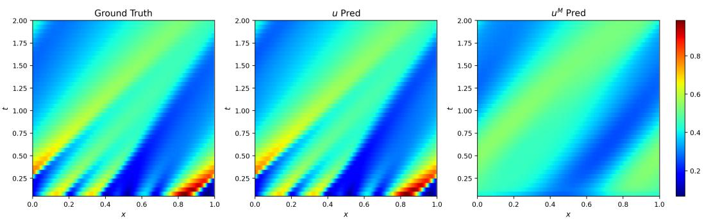

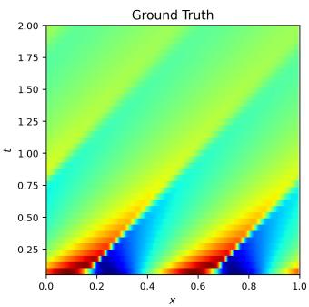

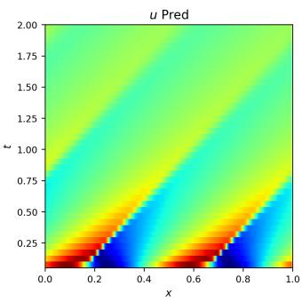

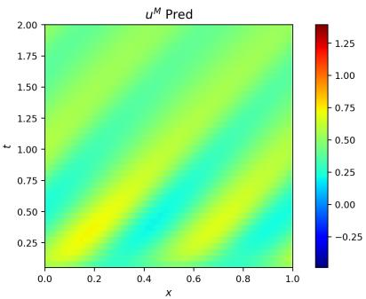  
(a) Example 1.

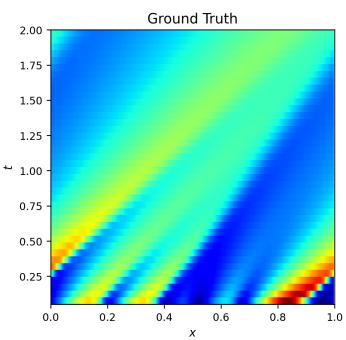

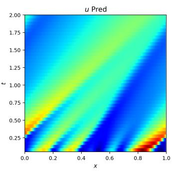  
(b) Example 2.

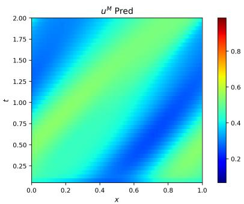  
Figure 3: IMNO-SE $( \alpha = 0 . 1 )$ predictions for 1D Burgers equation $( \nu = 0 . 0 1 )$ .

## 5.2 Nonlocal Burgers Equation

We next consider a variant of the Burgers equation, in which the advection speed at each point depends on the whole solution. The equation takes the form

$$
\begin{array} { r } { \partial _ { t } u ( x , t ) + a ( t ) \partial _ { x } u ( x , t ) = \nu \partial _ { x x } u ( x , t ) + f ( x ) , x \in ( 0 , 1 ) } \\ { u ( x , 0 ) = u _ { 0 } ( x ) , x \in ( 0 , 1 ) } \end{array}
$$

with periodic boundary conditions. Here, the transport velocity is nonlocal and is defined through the inner product

$$
a ( t ) = \langle \omega , u ( t ) \rangle = \int _ { 0 } ^ { 1 } \omega ( x ) u ( x , t ) d x ,
$$

where ω is a prescribed kernel. The right-hand side term $f ( x )$ represents external forcing. Unlike Burgers equation, the advection at each spatial location depends not only on the local value of u but also on global spatial information. According to [6], when the parameters satisfy suitable conditions, this equation admits an inertial manifold, providing a rigorous finite-dimensional structure for its long-time dynamics.

For the training procedure, we use the same dataset configuration as in the previous Burgers case. The dataset consists of $N _ { \mathrm { d a t a } } = 1 0 0 0 0$ samples, each discretized on a spatial grid with $N _ { x } = 2 5 6$ points and spacing $\textstyle \Delta x = { \frac { 1 } { 2 5 6 } }$ . The solution is also sampled with step size $\Delta t = 0 . 0 5$ , yielding $N _ { t } = 4 1$ snapshots from $t \ : = \ : 0$ to $t \ : = \ : 2$ . As before, the model is provided only with the initial condition $u ( \cdot , 0 )$ and must autoregressively predict all subsequent steps. We train and evaluate both short- and long-horizon rollouts $( t _ { \mathrm { e n d } } = 0 . 5$ and $t _ { \mathrm { e n d } } = 2 )$ .

Compared to the standard Burgers equation, this nonlocal system breaks translation equivariance due to the global coupling through $a ( t )$ , so we do not report IMNO-SE results here, and both FNO and RNO are evaluated using non-translation-equivariant versions.

In this experiment, we fix the parameters as

$$
\omega ( x ) = \cos ( 2 \pi x ) + 0 . 5 \cos ( 4 \pi x ) , \qquad \nu = 0 . 0 1 .
$$

For the forcing term $f ,$ we consider two representative cases. The first case is the unforced setting $f = 0 ,$ , which is relatively simple. In this case, although the equation contains the nonlocal transport term $\langle \omega , u ( t ) \rangle u _ { x } ,$ , the advection speed depends only on time through the scalar quantity $\langle \omega , u ( t ) \rangle$ Consequently, after a time-dependent spatial shift, the equation is equivalent to a heat equation, and the dynamics are essentially simple without nontrivial long-time structures.

The second case considers a nonzero forcing term. In particular, we take

$$
\begin{array} { r } { f ( x ) = - 2 \sin ( 2 \pi x ) - \sin ( 4 \pi x ) . } \end{array}
$$

For this choice, by examining the finite-dimensional reduced system associated with the leading Fourier modes, we can verify that the reduced dynamics admit an equilibrium with a two-dimensional unstable manifold [26]. Since the inertial manifold is also parameterized by the leading Fourier modes in this equation, the induced dynamics on the inertial manifold are already nontrivial. Therefore, the forced case provides a more challenging test setting to examine our model.

The quantitative results are reported in Table 2. Although FNO and IMNO achieve comparable performance at the short-horizon prediction time $t = 0 . 5$ , FNO exhibits training instability over the longer horizon $t = 2 ,$ which leads to noticeably worse results. By contrast, RNO is also stable over the longer horizon, but it has a larger number of parameters and still yields lower accuracy than IMNO.

Table 2: Relative $L ^ { 2 }$ error of FNO, RNO and IMNO for the nonlocal Burgers equation
<table><tr><td>一</td><td>FNO</td><td>RNO</td><td> $\mathrm { I M N O } ( \alpha = 0 . 1 )$ </td><td> $\mathrm { I M N O } ( \alpha = 0 )$ </td></tr><tr><td>Params</td><td>418497</td><td>623617</td><td>491377</td><td>491377</td></tr><tr><td colspan="5"> $t _ { \mathrm { e n d } } = 0 . 5$ </td></tr><tr><td> $f = 0$ </td><td> $0 . 5 9 \pm 0 . 0 9 \%$ </td><td> $0 . 8 9 \pm 0 . 0 5 \%$ </td><td> $0 . 5 1 \pm 0 . 0 0 4 \%$ </td><td> $0 . 4 3 \pm 0 . 0 2 \%$ </td></tr><tr><td> $f \neq 0$ </td><td> $0 . 7 7 \pm 0 . 0 6 \%$ </td><td> $1 . 1 0 \pm 0 . 0 3 \%$ </td><td> $0 . 5 4 \pm 0 . 0 0 4 \%$ </td><td> $0 . 4 8 \pm 0 . 0 3 \%$ </td></tr><tr><td colspan="5"> $t _ { \mathrm { e n d } } = 2$ </td></tr><tr><td> $f = 0$ </td><td> $1 6 . 6 0 \pm 2 0 . 3 4 \% ^ { * }$ </td><td> $1 . 1 4 \pm 0 . 0 3 \%$ </td><td> $0 . 5 8 \pm 0 . 0 0 0 3 \%$ </td><td> $0 . 4 1 \pm 0 . 0 0 6 \%$ </td></tr><tr><td> $f \neq 0$ </td><td> $2 6 . 7 1 \pm 1 2 . 8 9 \% ^ { * }$ </td><td> $2 . 3 6 \pm 0 . 0 8 \%$ </td><td> $1 . 1 6 \pm 0 . 0 3 \%$ </td><td> $1 . 0 0 \pm 0 . 0 6 \%$ </td></tr></table>

Figure 4 shows representative IMNO predictions for both u and $u ^ { M }$ , compared with the ground truth. We observe that $u ^ { M }$ captures the dominant long-time dynamics, while the residual correction $u ^ { R }$ refines the prediction so that the whole prediction u remains accurate even through the short-time transient regime.

To further demonstrate the structure of the learned latent dynamics, we project the trajectory of the latent coordinate h onto the first three principal components obtained from PCA. This provides a low-dimensional visualization of the learned latent coordinate’s evolution and helps illustrate whether it captures the reduced dynamics on the inertial manifold. Figure 5 shows projected latent trajectories of the two cases.

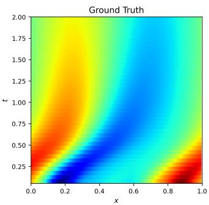

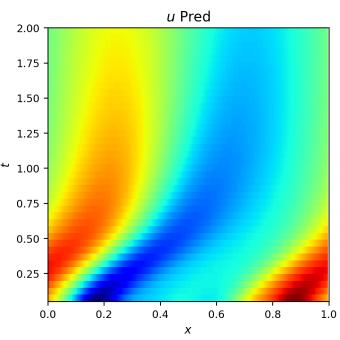  
(a) case 1.

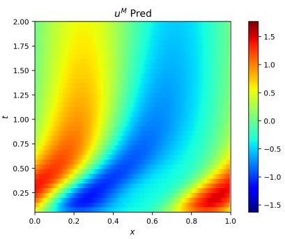

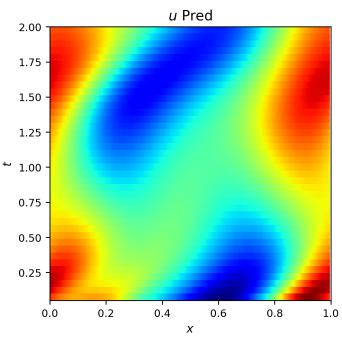  
(b) case 2.

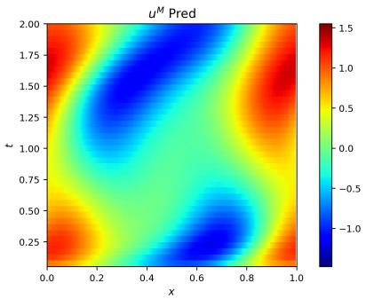  
Figure 4: IMNO (α = 0.1) predictions for the nonlocal Burgers equation.

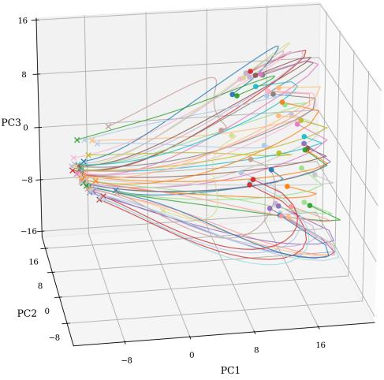  
(a) Case 1.

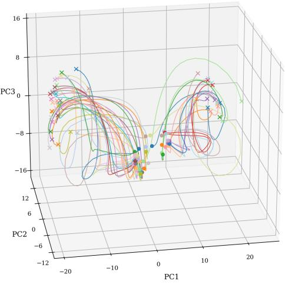  
(b) Case 2.  
Figure 5: Representative hidden-state trajectories projected onto the top three PCA modes for the nonlocal Burgers equation. (Dots indicate the initial states of diferent trajectories, while crosses mark their corresponding final states at t = 2.)

For case 1, where the forcing is zero, one can rigorously show that the reduced dynamics on the inertial manifold admits a unique stable fixed point. The projected latent trajectory is consistent with this picture: it evolves toward a single attractor, indicating that the learned latent dynamics correctly captures the simple asymptotic behavior of the system.

For case 2, where the forcing is nonzero, one can likewise show that the reduced dynamics on the inertial manifold admits one saddle point and two stable fixed points. The projected latent trajectories again agree well with this phase-space structure: they approach two diferent attractors, reflecting the nontrivial dynamics induced by the forcing.

## 5.3 Kuramoto–Sivashinsky equation

We consider the one-dimensional Kuramoto–Sivashinsky (KS) equation

$$
\begin{array} { r l r l } & { \partial _ { t } u ( x , t ) = - u ( x , t ) \partial _ { x } u ( x , t ) - \partial _ { x x } u ( x , t ) - \partial _ { x x x x } u ( x , t ) , } & & { x \in ( 0 , L ) } \\ & { \quad u ( x , 0 ) = u _ { 0 } ( x ) , } & & { x \in ( 0 , L ) } \end{array}\tag{27}
$$

with periodic boundary conditions on [0, L].

In this experiment, data are generated by numerically solving (27) using an exponential timediferencing fourth-order Runge–Kutta (ETDRK4) scheme. Initial conditions are sampled from a mean-zero Gaussian measure with covariance

$$
{ L ^ { - 2 } } \left( - \Delta + ( 4 9 / L ^ { 2 } ) I \right) ^ { - 2 } .
$$

(Equivalently, in Fourier space, the zero mode is set to zero, $\widehat { \boldsymbol { u } } _ { 0 } = 0$ . For each positive Fourier mode $k > 0 ,$ , the complex coeficient $\widehat { u } _ { k }$ is sampled as a mean-zero Gaussian random variable with variance

$$
\mathbb { E } | \widehat { u } _ { k } | ^ { 2 } = L ^ { 2 } \left( ( 2 \pi k ) ^ { 2 } + 4 9 \right) ^ { - 2 } ,
$$

and the negative modes are determined by

$$
\widehat { u } _ { - k } = \overline { { \widehat { u } _ { k } } } .
$$

Thus the initial condition is a real-valued, mean-zero Gaussian random field whose Fourier variance scales like $k ^ { - 4 }$ at high wavenumbers.)

For the training procedure, like the previous experiment, we still employ a dataset consisting of $N _ { \mathrm { d a t a } } = 1 0 0 0 0$ samples, each resolved on a spatial grid of $N _ { x } = 2 5 6$ points with spacing $\begin{array} { r } { \Delta x = \frac { L } { 2 5 6 } } \end{array}$

In the temporal direction, the solution is sampled every $\Delta t = 1$ , yielding $N _ { t } = 4 1$ snapshots from $t = 0 \mathrm { ~ t o ~ } t = 4 0$ . During training and evaluation, the model is provided only the initial condition $u ( \cdot , 0 )$ and autoregressively predicts all subsequent steps. We then train and evaluate the models under two horizons $( t _ { e n d } = 2 0$ and $t _ { e n d } = 4 0 )$ for both $L = 4 \pi$ and $L = 8 \pi$ . The Table 3 compares the autoregressive prediction performance of FNO, RNO and IMNO.

Table 3: Relative $L ^ { 2 }$ error of FNO, RNO and IMNO-SE for the KS equation
<table><tr><td></td><td>FNO</td><td>RNO</td><td>IMNO  $. \mathrm { S E } ( \alpha = 0 . 1 )$ </td><td> $\mathrm { I M N O - S E } ( \alpha = 0 )$ </td></tr><tr><td>Params</td><td>418433</td><td>623533</td><td>538314</td><td>538314</td></tr><tr><td colspan="5"> $t _ { \mathrm { e n d } } = 2 0$ </td></tr><tr><td> $L = 4 \pi$ </td><td> $1 . 0 4 \pm 0 . 2 0 \%$ </td><td> $0 . 4 2 \pm 0 . 0 1 \%$ </td><td> $0 . 5 2 \pm 0 . 0 2 \%$ </td><td> $0 . 4 6 \pm 0 . 0 0 3 \%$ </td></tr><tr><td> $L = 8 \pi$ </td><td> $1 . 7 4 \pm 0 . 0 5 \%$ </td><td> $1 . 1 9 \pm 0 . 0 1 \%$ </td><td> $4 . 2 5 \pm 0 . 1 7 \%$ </td><td> $2 . 9 9 \pm 0 . 4 2 \%$ </td></tr><tr><td colspan="5"> $t _ { \mathrm { e n d } } = 4 0$ </td></tr><tr><td> $L = 4 \pi$ </td><td> $8 7 . 6 7 \pm 1 1 . 8 5 \% ^ { * }$ </td><td> $2 . 1 9 \pm 0 . 2 3 \%$ </td><td> $0 . 8 9 \pm 0 . 0 5 \%$ </td><td> $0 . 8 4 \pm 0 . 0 2 \%$ </td></tr><tr><td> $L = 8 \pi$ </td><td> $9 4 . 1 7 \pm 2 . 7 2 \% ^ { * }$ </td><td> $1 3 . 9 9 \pm 0 . 7 1 \%$ </td><td> $4 1 . 2 1 \pm 5 . 6 3 \%$ </td><td> $3 5 . 5 8 \pm 3 . 6 3 \%$ </td></tr></table>

When $L = 4 \pi$ , the system is not chaotic, and the manifold prediction $u ^ { M }$ reconstructs most of the dominant features. Figure 6 shows IMNO-SE predictions for two representative initial conditions, compared with the ground truth. We observe that both the full prediction u and the manifold component $\hat { u } ^ { M }$ are highly accurate in this experiment, indicating that in this setting, solutions evolve towards the inertial manifold very quickly. IMNO-SE learned the dynamics on the inertial manifold accurately.

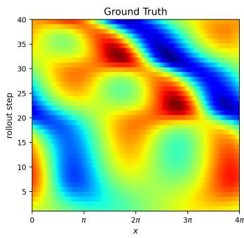

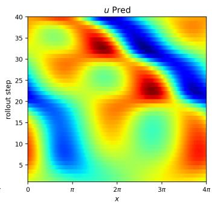  
(a) Example 1.

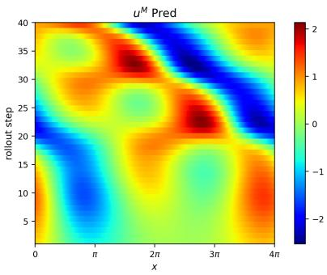

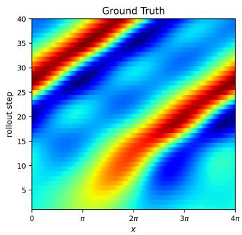

  
(b) Example 2.

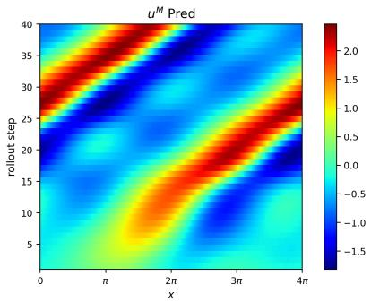  
Figure 6: IMNO-SE (α = 0.1) predictions for the KS equation at $L = 4 \pi$

Moreover, in this setting, the Kuramoto–Sivashinsky equation lies in the regime of a low-dimensional 1 : 2 interaction between the first two Fourier modes and admits two symmetry-related stable traveling waves. These waves are relative equilibria in the full state space, but become stable fixed points after quotienting out translation symmetry. Consistent with this picture, the PCA visualization of the trajectories in the learned latent coordinate h in Figure 7 clearly approach two diferent attractors, with oscillatory transients before convergence. This suggests that the latent trajectories have captured the underlying dynamics.

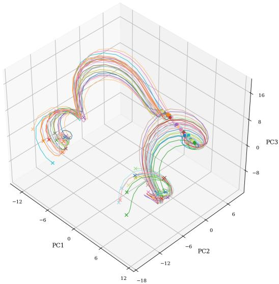  
Figure 7: Representative hidden-state trajectories projected onto the top three PCA modes for the KS equation at $L = 4 \pi$

However, when $L = 8 \pi$ , the dynamics become chaotic. IMNO-SE’s predictive accuracy is lower than that of FNO and RNO. In fact, we find that IMNO is less accurate for PDEs with strongly chaotic dynamics, although it still captures some low-dimensional structure efectively. This is consistent with the intrinsic dificulty of predicting chaotic systems: small errors grow rapidly, and the additional approximation error introduced by the reduced manifold dynamics can accumulate during long autoregressive rollout and degrade the overall prediction quality. We will look further into this issue into the experiment of Kolmogorov flow.

## 5.4 One-dimensional NS Equation

We consider the one-dimensional compressible Navier–Stokes equations on the torus $\Omega = ( 0 , 1 )$

$$
\begin{array} { r } { \partial _ { t } \rho + \partial _ { x } ( \rho v ) = 0 , } \end{array}\tag{28}
$$

$$
\rho ( \partial _ { t } v + v \partial _ { x } v ) + \partial _ { x } p = \left( \zeta + \frac { 4 \eta } { 3 } \right) \partial _ { x x } v ,\tag{29}
$$

$$
\partial _ { t } \bigg ( e + \frac { \rho v ^ { 2 } } { 2 } \bigg ) + \partial _ { x } \bigg [ \bigg ( e + p + \frac { \rho v ^ { 2 } } { 2 } \bigg ) v \bigg ] = \partial _ { x } \bigg [ v \bigg ( \zeta + \frac { 4 \eta } { 3 } \bigg ) \partial _ { x } v \bigg ] .\tag{30}
$$

where $\rho$ is the density, v is the velocity, $p$ is the pressure, and $e = p / ( \Gamma - 1 )$ is the internal energy density (Here we set $\Gamma = 5 / 3$ , corresponding to a monatomic ideal gas). The viscosities η and $\zeta$ denote shear and bulk viscosity, respectively, and are both set to 0.1 in our experiments.

For data generation and model training, we use a dataset from PDEBench [31] consisting of $N _ { \mathrm { d a t a } } =$ 10000 samples, each resolved on a spatial grid of $N _ { x } = 1 2 8$ points with spacing $\Delta x = \textstyle { \frac { 1 } { 1 2 8 } }$ . In the temporal direction, the solution is sampled every $\Delta t = 0 . 0 2$ , yielding $N _ { t } ~ = ~ 5 1$ snapshots. Before training, we normalize the data channel-wise via a linear transformation, so that the data distribution of diferent physical variables have the same means and variances.

In this experiment, we train and evaluate the models under two horizons $( t _ { \mathrm { e n d } } = 0 . 5 \mathrm { a n d } t _ { \mathrm { e n d } } = 1 . 0 )$ The results of FNO, RNO, and IMNO-SE are reported in Table 4.

Table 4: Relative $L ^ { 2 }$ error of FNO, RNO, and IMNO-SE for the 1D NS Equation
<table><tr><td>一</td><td>FNO</td><td>RNO</td><td> $\mathrm { I M N O - S E } ( \alpha = 1 )$ </td><td> $\mathrm { I M N O - S E } ( \alpha = 0 . 1 )$ </td><td> $\mathrm { I M N O - S E } ( \alpha = 0 )$ </td></tr><tr><td>Params</td><td>418819</td><td>623939</td><td>619340</td><td>619340</td><td>619340</td></tr><tr><td> $t _ { \mathrm { e n d } } = 0 . 5$ </td><td> $1 2 . 0 5 \pm 1 3 . 4 4 \% ^ { \ast }$ </td><td> $3 . 2 4 \pm 0 . 0 6 \%$ </td><td> $5 . 1 2 \pm 0 . 0 5 \%$ </td><td> $3 . 5 4 \pm 0 . 2 9 \%$ </td><td> $2 . 6 9 \pm 0 . 1 0 \%$ </td></tr><tr><td> $t _ { \mathrm { e n d } } = 1 . 0$ </td><td> $8 4 . 4 7 \pm 5 . 1 4 \% ^ { * }$ </td><td> $4 . 7 9 \pm 0 . 6 4 \%$ </td><td> $4 . 4 9 \pm 0 . 4 1 \%$ </td><td> $4 . 3 3 \pm 0 . 1 5 \%$ </td><td> $3 . 5 3 \pm 0 . 1 7 \%$ </td></tr></table>

Figure 8 shows the IMNO-SE predictions for both $\alpha = 0 . 1$ and $\alpha = 1$ . We observe a clear trade-of between these two choices of α: when $\alpha = 0 . 1$ the prediction of $u ^ { M }$ is not desirable, but for $\alpha = 1$ the prediction of $u ^ { M }$ becomes much better and captures the long-time dynamics. On the other hand, increasing α also leads to a degradation in the overall accuracy of the final prediction u. This highlights the importance of the choice of parameter α.

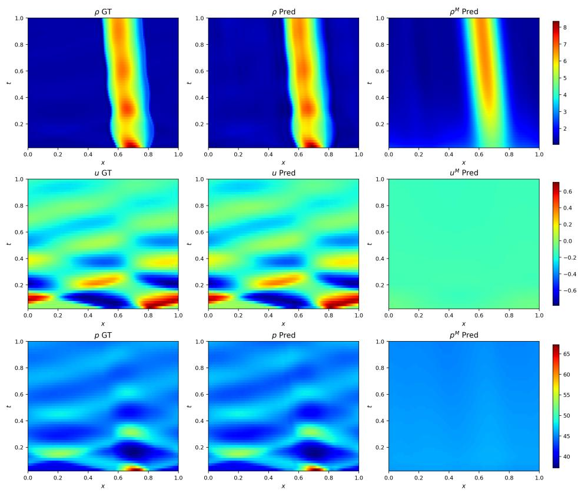  
(a) Model prediction(α = 0.1).

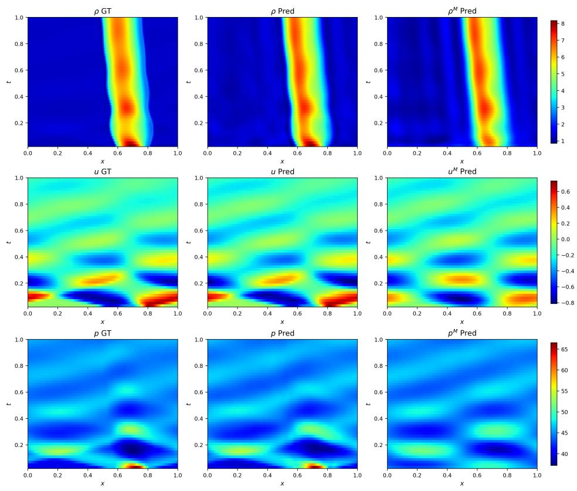  
(b) Model prediction (α = 1).  
Figure 8: IMNO-SE (α = 0.1, 1) predictions for the 1D NS equation.

## 5.5 Two-dimensional Compressible Navier–Stokes Equation

We consider the two-dimensional compressible Navier–Stokes equations on the torus $\Omega = ( 0 , 1 ) \times$ (0, 1):

$$
\begin{array} { r } { \partial _ { t } \rho + \nabla \cdot ( \rho \mathbf { v } ) = 0 , } \end{array}\tag{31}
$$

$$
\partial _ { t } ( \rho \mathbf { v } ) + \nabla \cdot ( \rho \mathbf { v } \otimes \mathbf { v } ) + \nabla p = \nabla \cdot \tau ,\tag{32}
$$

$$
\partial _ { t } \bigg ( e + \frac { 1 } { 2 } \rho | { \bf v } | ^ { 2 } \bigg ) + \nabla \cdot \bigg [ \bigg ( e + p + \frac { 1 } { 2 } \rho | { \bf v } | ^ { 2 } \bigg ) { \bf v } \bigg ] = \nabla \cdot ( \tau { \bf v } ) ,\tag{33}
$$

where $\rho$ is the density, $\mathbf { v } = ( v _ { 1 } , v _ { 2 } )$ is the velocity, $p$ is the pressure, and $e = p / ( \Gamma - 1 )$ is the internal energy density (Here we set $\Gamma = 5 / 3$ , corresponding to a monatomic ideal gas). The viscous stress tensor is given by

$$
\pmb { \tau } = \eta \bigl ( \nabla \mathbf { v } + \nabla \mathbf { v } ^ { \top } \bigr ) + \left( \zeta - \frac { 2 } { 3 } \eta \right) ( \nabla \cdot \mathbf { v } ) I ,
$$

where $\eta$ and ζ denote the shear and bulk viscosities, respectively. In this experiment, we set $\eta = \zeta =$ 0.01.

As in the 1D case, we use the PDEBench dataset [31], which contains $N _ { \mathrm { d a t a } } = 1 0 0 0$ samples, each resolved on a spatial grid of $N _ { x } = N _ { y } = 6 4$ points with spacing $\Delta x = \Delta y = { \textstyle { \frac { 1 } { 6 4 } } }$ . In the temporal direction, the solution is sampled every $\Delta t = 0 . 0 5$ , yielding $N _ { t } = 2 1$ snapshots. The initial velocity field is scaled so that the resulting initial characteristic Mach number is a prescribed value $M = 0 . 1$ Again, before training, we normalize the data channel-wise via a linear transformation, so that the data distribution of diferent physical variables have the same means and variances.

In this experiment, we train and evaluate the models under two horizons $( t _ { \mathrm { e n d } } = 0 . 5 , 1 . 0 )$ . The results of FNO, RNO, and IMNO-SE are reported in Table 5.

Table 5: Relative $L ^ { 2 }$ error of FNO, RNO and IMNO-SE for the 2D NS equation
<table><tr><td></td><td>FNO</td><td>RNO</td><td> $\mathrm { I M N O - S E } ( \alpha = 0 . 1 )$ </td><td> $\mathrm { I M N O - S E } ( \alpha = 0 )$ </td></tr><tr><td>Params</td><td>465784</td><td>697084</td><td>616294</td><td>616294</td></tr><tr><td> $t _ { \mathrm { e n d } } = 0 . 5$ </td><td> $2 5 . 6 4 \pm 1 . 2 2 \%$ </td><td> $2 0 . 7 1 \pm 0 . 1 2 \%$ </td><td> $1 0 . 4 6 \pm 0 . 6 7 \%$ </td><td> $1 0 . 4 8 \pm 0 . 3 9 \%$ </td></tr><tr><td> $t _ { \mathrm { e n d } } = 1 . 0$ </td><td> $5 2 . 4 6 \pm 0 . 9 9 \% ^ { }$ </td><td> $2 4 . 7 3 \pm 1 . 5 8 \%$ </td><td> $1 4 . 7 3 \pm 1 . 1 5 \%$ </td><td> $1 4 . 6 8 \pm 1 . 4 3 \%$ </td></tr></table>

To further compare the behavior of diferent models, we visualize the predicted solutions for the density $\rho$ and pressure $p$ at four representative times, $t = 0 . 0 5 , 0 . 2 5 , 0 . 5$ , and 1.0, using models trained with the rollout horizon $t _ { \mathrm { e n d } } = 1 . 0$ . The corresponding results are shown in Figure 9. We can clearly observe that IMNO-SE produces significantly more accurate predictions than both RNO and FNO across all displayed times. In particular, when $t _ { \mathrm { e n d } } = 1 . 0$ , the FNO baseline exhibits instability during training, which leads to substantially poorer rollout predictions in the final model.

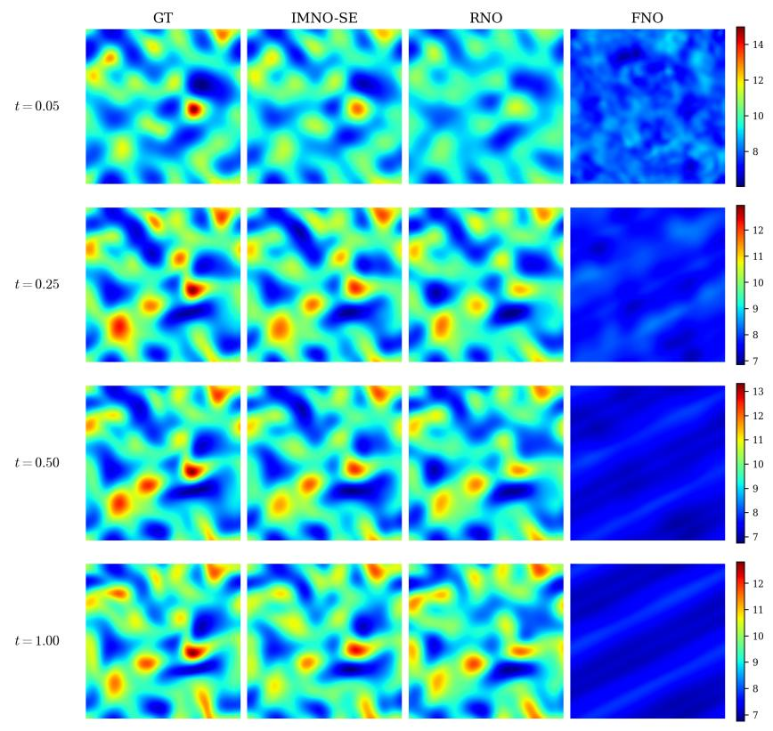

(a) density ρ  
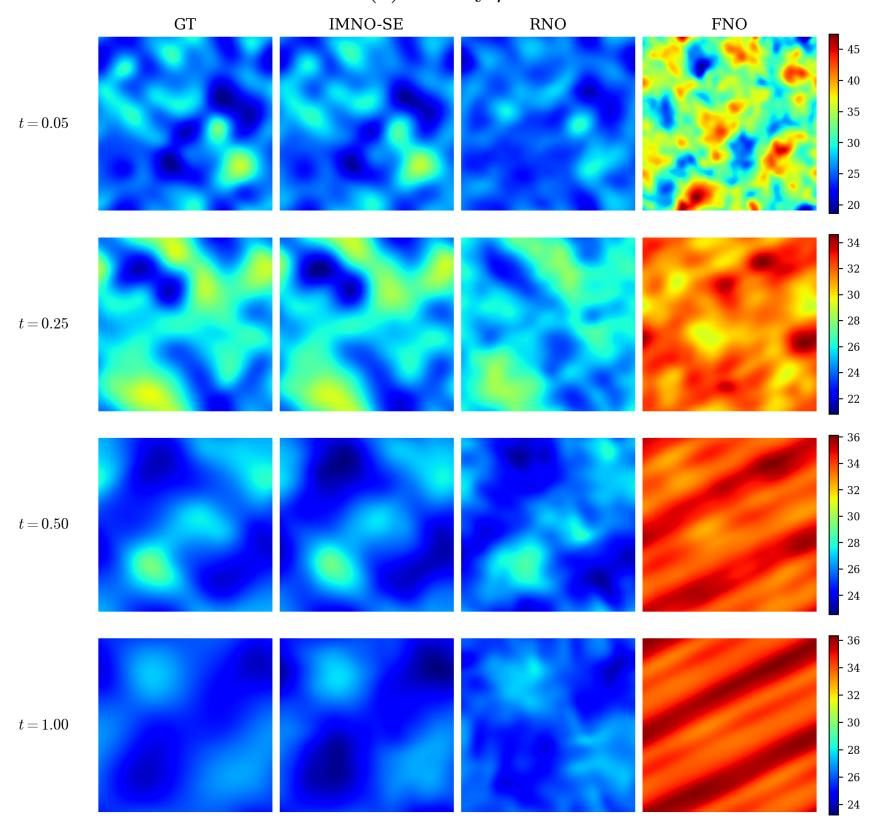  
(b) pressure p  
Figure 9: Comparison of FNO, RNO and IMNO-SE (α = 0.1) for the 2D compressible NS equation at t = 0.05, 0.25, 0.50, and 1.00.

Although IMNO-SE achieves better predictive accuracy in this example, the learned manifold component $u ^ { M }$ does not clearly capture the long-time solution structure by itself. One possible reason is that compressible Navier–Stokes dynamics involve several strongly coupled physical variables, including velocity, density, pressure, and energy. Density and pressure variations influence the velocity field, while the velocity field in turn transports and reshapes the density, pressure, and energy distributions. These degrees of freedom may prevent the dynamics from being well described by a simple, strongly attracting low-dimensional manifold. In fact, the existence of a finite-dimensional inertial manifold for the Navier–Stokes equations is still an open problem. Consequently, the learned manifold component $u ^ { M }$ is not expected to provide a clean standalone reduced-order description of the full solution.

Nevertheless, the prediction of IMNO-SE is still accurate. This suggests that, even when the learned manifold component cannot by itself serve as an accurate reduced-order model of the long-time dynamics, the latent representation can still provide useful global information for the residual neural operator. Therefore, in examples where a clear low-dimensional structure is not visually apparent, IMNO-SE can still function as an efective neural operator with good accuracy.

## 5.6 Kolmogorov Flow

We next consider the two-dimensional incompressible Navier–Stokes equation in vorticity on the torus $\Omega = ( 0 , 2 \pi ) \times ( 0 , 2 \pi )$

$$
\partial _ { t } w ( x , t ) + u ( x , t ) \cdot \nabla w ( x , t ) = \nu \Delta w ( x , t ) + f ( x ) ,\tag{34}
$$

$$
\nabla \cdot u ( x , t ) = 0 ,\tag{35}
$$

$$
w ( x , 0 ) = w _ { 0 } ( x ) ,\tag{36}
$$

where u is the velocity field, $w = \nabla \times u$ is the scalar vorticity, $\nu > 0$ is the viscosity, and $f$ is the forcing term. We formulate the learning problem in terms of vorticity rather than velocity. The vorticity formulation often provides a more informative and physically compact description of the flow dynamics. Given w, the velocity field u can be recovered through the Biot–Savart law.

In this example, we consider a two-dimensional Kolmogorov flow. Specifically, the initial vorticity field $w _ { 0 } ( x )$ is sampled from the Gaussian measure

$$
w _ { 0 } \sim \mu , ~ \mu = \mathcal { N } \big ( 0 , ( - \Delta + I ) ^ { - 2 . 5 } \big ) ,
$$

with periodic boundary conditions on the torus. We consider viscosity $\nu = 0 . 1$ , the external forcing is fixed as

$$
f ( x ) = - 0 . 1 \cos x _ { 2 } .
$$

For the training procedure, we employ a dataset consisting of $N _ { \mathrm { d a t a } } = 1 0 0 0$ samples, each resolved on a spatial grid of $N _ { x } = N _ { y } = 6 4$ points with spacing $\begin{array} { r } { \Delta x = \Delta y = \frac { \pi } { 3 2 } } \end{array}$ . In the temporal direction, the solution is sampled every $\Delta t = 1 . 0$ , yielding $N _ { t } = 2 1$ snapshots.

In the Kolmogorov flow setting considered here, the equation is shift-equivariant in the x-direction but not in the y-direction. Accordingly, IMNO-SE is implemented with shift equivariance imposed only along the x-direction, and the FNO and RNO baselines are also taken to be their x-shift-equivariant versions. We train and evaluate the models under two rollout horizons $( t _ { \mathrm { e n d } } = 1 0$ and $t _ { \mathrm { e n d } } = 2 0 )$ , and report the results in Table 6.

Table 6: Relative $L ^ { 2 }$ error of FNO, RNO and IMNO-SE for the 2D incompressible NS equation
<table><tr><td>—</td><td>FNO</td><td>RNO</td><td>IMNO  $. \mathrm { S E } ( \alpha = 0 . 1 )$ </td><td> $\mathrm { I M N O - S E } ( \alpha = 0 )$ </td></tr><tr><td>Params</td><td>465357</td><td>696657</td><td>578146</td><td>578146</td></tr><tr><td> $t _ { \mathrm { e n d } } = 1 0$ </td><td> $3 . 4 3 \pm 0 . 0 8 \%$ </td><td> $6 . 1 3 \pm 0 . 1 1 \%$ </td><td> $3 . 7 6 \pm 0 . 1 2 \%$ </td><td> $2 . 9 6 \pm 0 . 0 2 \%$ </td></tr><tr><td> $t _ { \mathrm { e n d } } = 2 0$ </td><td> $3 . 1 0 \pm 0 . 1 1 \%$ </td><td> $5 . 1 6 \pm 0 . 0 6 \%$ </td><td> $3 . 9 4 \pm 0 . 6 0 \%$ </td><td> $2 . 7 5 \pm 0 . 1 1 \%$ </td></tr></table>

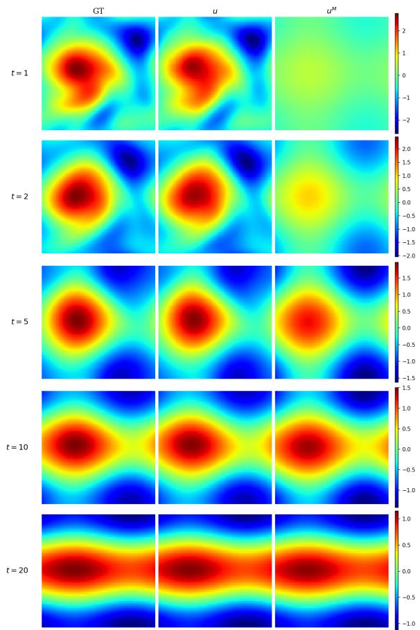  
(a) Example 1.

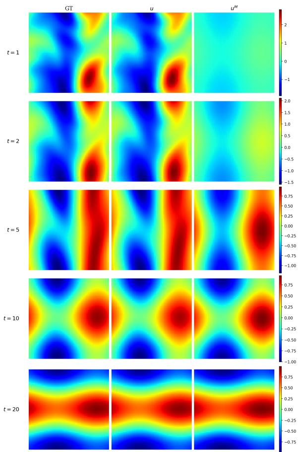  
(b) Example 2.  
Figure 10: IMNO-SE (α = 0.1) predictions for the incompressible 2D NS equation at $t = 1 , 2 , 5 , 1 0 , 2 0$

Figure 10 shows representative IMNO predictions. Consistent with the earlier examples, these results again show that IMNO captures a low-dimensional long-time structure consistent with the inertial-manifold picture. In particular, the manifold component $\hat { u } ^ { M }$ captures the dominant long-time dynamics, while the full field u remains accurate throughout the rollout interval. Taken together, these results indicate that IMNO remains efective in capturing the long-time dynamics in the twodimensional setting.

We finally examine a more challenging low-viscosity regime with $\nu = 1 0 ^ { - 3 }$ . As in the KS example, this case illustrates a limitation of IMNO for strongly chaotic dynamics. Figure 11 shows representative IMNO-SE predictions in this regime. At early times, the full prediction u still captures the large-scale patterns of the reference solution, although some small-scale vortical structures are already smoothed out. At later times, however, the prediction exhibits a substantial structural mismatch with the ground truth.

This degradation is consistent with the dificulty of learning reduced dynamics in chaotic systems. In such regimes, the inertial manifold, if it exists, may have a substantially larger intrinsic dimension than in the previous examples. Therefore, representing the dynamics with a low-dimensional latent coordinate may discard important information and limit the accuracy of the approximation. Moreover, the learned latent dynamics are highly sensitive to small approximation errors. These errors can accumulate during autoregressive rollout and cause the decoded manifold component $u ^ { M }$ to drift away from the reference trajectory. For example, in Figure 11, the early predictions still retain the correct large-scale flow pattern, but at later times the manifold component becomes increasingly dominant in the reconstructed solution while being misaligned with the true solution. This misalignment then contaminates the residual correction and leads to the overall distortion of the full prediction. However, although IMNO performs less well in strongly chaotic regimes, where an inertial manifold may be very high-dimensional or may not exist, this behavior is consistent with the theory behind the model: IMNO works best precisely when the dynamics admit a meaningful low-dimensional structure.

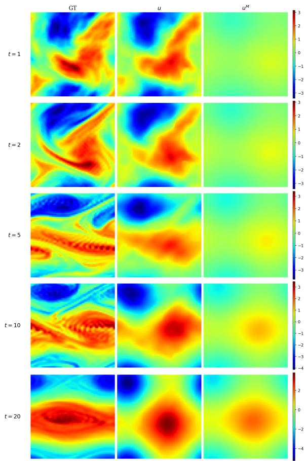  
(a) Example 1.

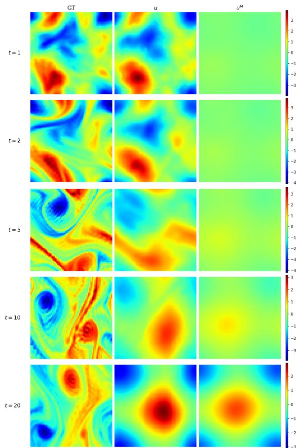  
(b) Example 2.  
Figure 11: IMNO-SE $( \alpha = 0 . 1 )$ predictions for the incompressible 2D Navier–Stokes equation at $t = 1 , 2 , 5 , 1 0 , 2 0$ in the turbulence regime $\nu = 1 0 ^ { - 3 }$

## 6 Conclusion

In this paper, we developed the Inertial Manifold Neural Operator (IMNO), a novel neural operator framework for dissipative time-dependent PDEs. Such PDEs’ long-time dynamics can often be described by some low-dimensional structure due to dissipation. Inertial manifold theory provides a natural framework for describing such dynamics, under which the solution can be decomposed into a low-dimensional manifold component governing the long-time evolution and a rapidly decaying residual. Guided by this theoretical picture, IMNO is developed to discover and exploit such latent low-dimensional structures in PDE dynamics, thereby learning a more physically interpretable representation while better preserving the intrinsic structure of the underlying PDE.

Various benchmark problems have been used to evaluate the performance of IMNO. The results show that IMNO can efectively capture the low-dimensional long-time dynamics of the underlying PDEs in many cases, while also exhibiting good training stability and accuracy. Moreover, for some more complex PDE systems, although such low-dimensional dynamics may be too dificult to capture accurately, IMNO still remains efective as a neural operator and achieves good accuracy.

An interesting observation from our experiments is that increasing α in the loss function, thus encouraging a larger portion of the solution to be represented by the manifold component, leads to worse overall predictive performance in many cases. One possible reason is that, when the manifold component becomes more dominant, the remaining residual may contain relatively more high-frequency content, which is empirically harder for FNO-type architectures to approximate accurately. Another possible reason is that the residual dynamics may become more tightly coupled with the latent manifold dynamics when α increases, while the current neural operator structure may not be expressive enough to capture this coupling eficiently. These observations suggest that future work should develop a deeper understanding of how the manifold and residual components are jointly trained and how they interact, thereby enabling the development of better architectures and loss functions that better exploi the manifold structure while maintaining accurate full-state prediction.

Beyond this issue, several other directions are also worth further investigation. For example, the performance of IMNO remains limited for systems with chaotic dynamics. In such cases, the manifold component $u ^ { M }$ may still capture some meaningful low-dimensional patterns, but errors grow rapidly due to the system’s chaotic behavior. Therefore, the manifold prediction may drift during long-time rollout, which in turn afects the residual prediction and degrades the overall performance. A possible remedy is to periodically reproject the current full predicted solution onto the learned manifold, thereby updating the latent coordinate and mitigating its drift during long-time rollout.

IMNO could also be further applied to larger-scale simulations, where computational eficiency becomes a more central concern. In this setting, the learned low-dimensional manifold may serve as a cheaper surrogate for long-time evolution. For example, once the residual part has decayed to a suficiently small level, one may continue the rollout mainly through the manifold dynamics rather than evaluating the full residual neural operator at every step. This could potentially lead to a significant speedup for large-scale autoregressive prediction.

In a broader context, we believe that this work, together with the questions it raises, highlights the potential connection between operator learning and reduced-order modeling. By bridging these two fields, it may help us better understand their respective advantages and limitations, with the potential to enrich both fields and to inspire further research in scientific machine learning.

## Data availability

Code and data for reproducing the results in this paper will be available at https://github.com/ Xiaoyang-Xie/IMNO. All numerical experiments were conducted using NVIDIA A100 and L40 GPUs.

## References

[1] G. Berkooz, P. Holmes, and J. L. Lumley. The proper orthogonal decomposition in the analysis of turbulent flows. Annual Review of Fluid Mechanics, 25(1):539–575, 1993.

[2] Z. Chang, Z. Wen, and X. Zhao. Unsupervised operator learning approach for dissipative equations via Onsager principle. SIAM Journal on Scientific Computing, 48(4):C1060–C1085, 2026.

[3] R. T. Chen, Y. Rubanova, J. Bettencourt, and D. K. Duvenaud. Neural ordinary diferential equations. Advances in Neural Information Processing Systems, 31, 2018.

[4] Z. Cheng, Z. Wang, L.-L. Wang, and M. Azaiez. Podno: Proper orthogonal decomposition neural operators. SIAM Journal on Scientific Computing, 48(3):C479–C504, 2026.

[5] S.-N. Chow, K. Lu, and G. R. Sell. Smoothness of inertial manifolds. Journal of Mathematical Analysis and Applications, 169(1):283–312, 1992.

[6] P. Constantin, C. Foias, B. Nicolaenko, and R. Temam. Integral manifolds and inertial manifolds for dissipative partial diferential equations, volume 70. Applied Mathematical Sciences, Springer, 1989.

[7] C. E. P. De Jes´us and M. D. Graham. Data-driven low-dimensional dynamic model of Kolmogorov flow. Physical Review Fluids, 8(4):044402, 2023.

[8] J. Dugundji. An extension of Tietze’s theorem. Pacific J. Math., 1(1):353–367, 1951.

[9] S. Dummer, D. Ye, and C. Brune. Ronom: Reduced-order neural operator modeling. SIAM Journal on Scientific Computing, 48(3):C604–C634, 2026.

[10] V. Duruisseaux, J. Kossaifi, and A. Anandkumar. Fourier neural operators explained: A practical perspective. arXiv preprint arXiv:2512.01421, 2025.

[11] C. Foias, G. R. Sell, and R. Temam. Inertial manifolds for nonlinear evolutionary equations. Journal of Diferential Equations, 73(2):309–353, 1988.

[12] P. Jiang, Z. Yang, J. Wang, C. Huang, P. Xue, T. Chakraborty, X. Chen, and Y. Qian. Eficient super-resolution of near-surface climate modeling using the Fourier neural operator. Journal of Advances in Modeling Earth Systems, 15(7):e2023MS003800, 2023.

[13] S. Kondo and T. Miura. Reaction-difusion model as a framework for understanding biological pattern formation. science, 329(5999):1616–1620, 2010.

[14] N. Kovachki, S. Lanthaler, and S. Mishra. On universal approximation and error bounds for Fourier neural operators. Journal of Machine Learning Research, 22(290):1–76, 2021.

[15] N. Kovachki, Z. Li, B. Liu, K. Azizzadenesheli, K. Bhattacharya, A. Stuart, and A. Anandkumar. Neural operator: Learning maps between function spaces with applications to PDEs. Journal of Machine Learning Research, 24(89):1–97, 2023.

[16] J. A. Langa and J. C. Robinson. Determining asymptotic behavior from the dynamics on attracting sets. Journal of Dynamics and Diferential Equations, 11(2):319–331, 1999.

[17] S. Lanthaler, Z. Li, and A. M. Stuart. Nonlocality and nonlinearity implies universality in operator learning. Constructive Approximation, 62(2):261–303, 2025.

[18] Z. Li, N. Kovachki, K. Azizzadenesheli, B. Liu, K. Bhattacharya, A. Stuart, and A. Anandkumar. Fourier neural operator for parametric partial diferential equations. arXiv preprint arXiv:2010.08895, 2020.

[19] Z. Li, M. Liu-Schiafini, N. Kovachki, B. Liu, K. Azizzadenesheli, K. Bhattacharya, A. Stuart, and A. Anandkumar. Learning dissipative dynamics in chaotic systems. arXiv preprint arXiv:2106.06898, 2021.

[20] A. J. Linot and M. D. Graham. Deep learning to discover and predict dynamics on an inertial manifold. Physical Review E, 101(6):062209, 2020.

[21] M. Liu-Schiafini, C. E. Singer, N. Kovachki, T. Schneider, K. Azizzadenesheli, and A. Anandkumar. Tipping point forecasting in non-stationary dynamics on function spaces. arXiv preprint arXiv:2308.08794, 2023.

[22] L. Lu, P. Jin, G. Pang, Z. Zhang, and G. E. Karniadakis. Learning nonlinear operators via deeponet based on the universal approximation theorem of operators. Nature machine intelligence, 3(3):218–229, 2021.

[23] A. Mendible, S. L. Brunton, A. Y. Aravkin, W. Lowrie, and J. N. Kutz. Dimensionality reduction and reduced-order modeling for traveling wave physics. Theoretical and Computational Fluid Dynamics, 34(4):385–400, 2020.

[24] J. Robinson. Finite-dimensional behavior in dissipative partial diferential equations. Chaos: An Interdisciplinary Journal of Nonlinear Science, 5(1):330–345, 1995.

[25] J. C. Robinson. The asymptotic completeness of inertial manifolds. Nonlinearity, 9(5):1325–1340, 1996.

[26] R. Rosa and R. Temam. Inertial manifolds and normal hyperbolicity. Acta Applicandae Mathematica, 45(1):1–50, 1996.

[27] C. W. Rowley, T. Colonius, and R. M. Murray. Model reduction for compressible flows using pod and galerkin projection. Physica D: Nonlinear Phenomena, 189(1-2):115–129, 2004.

[28] C. W. Rowley and J. E. Marsden. Reconstruction equations and the karhunen–lo\`eve expansion for systems with symmetry. Physica D: Nonlinear Phenomena, 142(1-2):1–19, 2000.

[29] Y. Shuai and C. W. Rowley. Symmetry-reduced model reduction of shift-equivariant systems via operator inference. arXiv preprint arXiv:2507.18780, 2025.

[30] L. Sirovich. Turbulence and the dynamics of coherent structures. I. coherent structures. Quarterly of applied mathematics, 45(3):561–571, 1987.

[31] M. Takamoto, T. Praditia, R. Leiteritz, D. MacKinlay, F. Alesiani, D. Pfl¨uger, and M. Niepert. Pdebench: An extensive benchmark for scientific machine learning. Advances in neural information processing systems, 35:1596–1611, 2022.

[32] R. Temam. Infinite-dimensional dynamical systems in mechanics and physics, volume 68. Applied Mathematical Sciences, Springer, 2012.

[33] J. H. Tu, C. W. Rowley, D. M. Luchtenburg, S. L. Brunton, and J. N. Kutz. On dynamic mode decomposition: Theory and applications. Journal of Computational Dynamics, 1(2):391–421, 2014.

[34] A. M. Turing. The chemical basis of morphogenesis. Bulletin of mathematical biology, 52(1):153– 197, 1990.

[35] Y. Wang, Z. Li, Z. Yuan, W. Peng, T. Liu, and J. Wang. Prediction of turbulent channel flow using Fourier neural operator-based machine-learning strategy. Physical Review Fluids, 9(8):084604, 2024.

[36] M. O. Williams, I. G. Kevrekidis, and C. W. Rowley. A data–driven approximation of the koopman operator: Extending dynamic mode decomposition. Journal of Nonlinear Science, 25(6):1307– 1346, 2015.

[37] Z. Ye, C.-S. Zhang, and W. Wang. Recurrent neural operators: Stable long-term PDE prediction. arXiv preprint arXiv:2505.20721, 2025.

[38] H. You, Q. Zhang, C. J. Ross, C.-H. Lee, and Y. Yu. Learning deep implicit Fourier neural operators (IFNOs) with applications to heterogeneous material modeling. Computer Methods in Applied Mechanics and Engineering, 398:115296, 2022.

## Appendix

## A. Proof of the Universal Approximation Theorem

This appendix proves Theorem 1. Section A.1 fixes notation and collects the preliminary properties used throughout the proof; Section A.2 establishes six preliminary lemmas; Section A.3 assembles the proof.

## A.1 Basic settings and properties

Throughout Appendix $\mathrm { A } .$ , we work under the assumptions of Theorem 1. We first fix the notation and collect several basic properties that will be used throughout the proof.

Recall that

$$
H = H ^ { s } ( \mathbb { T } ^ { d } ; \mathbb { R } ^ { c } )
$$

for some $s \geq 0$ . For each $N \in  { \mathbb { N } }$ , let $P _ { N } : H \to H$ denote the orthogonal projection onto the Fourier modes satisfying $| k | _ { \infty } \leq N$ , and set

$$
\begin{array} { r } { Q _ { N } : = I - P _ { N } . } \end{array}
$$

We also denote by $\mathcal { F } _ { N }$ the associated finite-dimensional Fourier feature map

$$
\mathcal { F } _ { N } : H \to \mathbb { R } ^ { D _ { N } } ,
$$

which collects the real and imaginary parts of the Fourier coeficients of u with $| k | _ { \infty } \leq N$ . Here, $D _ { N } = c ( 2 N + 1 ) ^ { d }$ denotes the total dimension of this truncated feature space. Conversely, let

$$
\mathcal { S } _ { N } : \mathbb { R } ^ { D _ { N } }  P _ { N } H
$$

denote the associated band-limited Fourier synthesis map. These maps are chosen so that

$$
\begin{array} { r } { S _ { N } ( \mathcal { F } _ { N } ( u ) ) = P _ { N } u , \qquad u \in H . } \end{array}
$$

The projections satisfy $\| P _ { N } \| \le 1$ for all $N ,$ and $P _ { N } u  u$ in H as $N  \infty$ for every $u \in H$ Moreover, this convergence is uniform on compact subsets of $H$ . Indeed, if $C \subset H$ is compact and $\eta > 0$ , choose a finite $\eta / 3$ -net $\{ u _ { j } \} _ { j = 1 } ^ { J }$ of C. Since $P _ { N } u _ { j }  u _ { j }$ for each fixed $j ,$ for all suficiently large N we have max $1 \leq j \leq J \| P _ { N } u _ { j } - u _ { j } \| _ { H } < \eta / 3$ . For any $u \in C .$ choosing j such that $\Vert u - u _ { j } \Vert _ { H } < \eta / 3$ gives

$$
\begin{array} { r } { \| P _ { N } u - u \| _ { H } \le \| P _ { N } ( u - u _ { j } ) \| _ { H } + \| P _ { N } u _ { j } - u _ { j } \| _ { H } + \| u _ { j } - u \| _ { H } < \eta , } \end{array}
$$

using $\| P _ { N } \| \leq 1$ . Hence

$$
\operatorname* { s u p } _ { u \in C } \lVert P _ { N } u - u \rVert _ { H } \to 0 .
$$

Let $\mathcal { G } = S ( \Delta t ) : H  H$ be the one-step solution operator. By assumption, $\mathcal { G }$ is continuous on $H .$ Let $\mathcal { M } \subset H$ be the finite-dimensional flow-normally hyperbolic inertial manifold in Theorem 1, and let $\Pi : H  { \mathcal { M } }$ be the associated continuous asymptotic phase map.

We next state two consequences of flow-normal hyperbolicity. First, the asymptotic phase is unique, which implies

$$
\Pi \circ \mathcal { G } = \mathcal { G } | _ { \mathcal { M } } \circ \Pi .
$$

Indeed, according to the definition of Π, $S ( t ) \Pi ( u )$ exponentially tracks $S ( t ) u$ , then

$$
S ( t ) \mathcal { G } \Pi ( u ) = S ( t + \Delta t ) \Pi ( u )
$$

exponentially tracks

$$
S ( t ) \mathcal { G } u = S ( t + \Delta t ) u .
$$

Thus $\mathcal { G } \Pi ( u )$ is an asymptotic phase of $\mathcal { G } u$ , and gives

$$
\Pi ( { \mathcal { G } } u ) = { \mathcal { G } } \Pi ( u ) .
$$

Second, the restricted one-step map $\mathcal { G } | _ { \mathcal { M } }$ is injective. Indeed, suppose that $u _ { 1 } ^ { M } , u _ { 2 } ^ { M } \in \mathcal { M }$ satisfy $\mathcal { G } u _ { 1 } ^ { M } = \mathcal { G } u _ { 2 } ^ { M }$ . Applying the backward separation estimate over a time interval of length ∆t gives

$$
\begin{array} { r } { \| u _ { 1 } ^ { M } - u _ { 2 } ^ { M } \| _ { H } \leq C e ^ { \gamma \Delta t } \| \mathcal { G } u _ { 1 } ^ { M } - \mathcal G u _ { 2 } ^ { M } \| _ { H } = 0 . } \end{array}
$$

Hence $u _ { 1 } ^ { M } = u _ { 2 } ^ { M }$ , and therefore $\mathcal { G } | _ { \mathcal { M } }$ is injective.

For the compact set $K \subset H$ appearing in Theorem 1, define

$$
\mathcal { M } _ { 0 } : = \Pi ( K ) , \qquad \mathcal { M } _ { 1 } : = \mathcal { M } _ { 0 } \cup \mathcal { G } ( \mathcal { M } _ { 0 } ) .
$$

Since K is compact and Π is continuous, $\mathcal { M } _ { 0 }$ is compact. Since G is continuous, $\mathcal { G } ( \mathcal { M } _ { 0 } )$ is also compact. Moreover, by the positive invariance of the inertial manifold, ${ \mathcal { G } } ( { \mathcal { M } } _ { 0 } ) \subset { \mathcal { M } }$ . Therefore $\mathcal { M } _ { 1 } \subset \mathcal { M }$ is compact. These compact sets collect the asymptotic phases of the inputs in K and their images after one time step on the manifold.

Since $\mathcal { M } _ { 1 }$ is a compact subset of the m-dimensional inertial manifold ${ \mathcal { M } } ,$ its topological dimension is at most m. By the Menger–N¨obeling embedding theorem, $\mathcal { M } _ { 1 }$ admits a topological embedding into $\mathbb { R } ^ { 2 m + 1 }$ . Therefore, if the latent dimension satisfies $d _ { h } \ge 2 m + 1$ , we can fix a continuous injective map

$$
E : { \mathcal { M } } _ { 1 } \to \mathbb { R } ^ { d _ { h } } .
$$

Since $\mathcal { M } _ { 1 }$ is compact and $\mathbb { R } ^ { d _ { h } }$ is Hausdorf, E is a homeomorphism from $\mathcal { M } _ { 1 }$ onto its image. Define

$$
\Lambda _ { 0 } : = E ( M _ { 0 } ) , \qquad \Lambda _ { 1 } : = E ( { \mathcal G } ( M _ { 0 } ) ) .
$$

Then

$$
E ( M _ { 1 } ) = \Lambda _ { 0 } \cup \Lambda _ { 1 } .
$$

We write

$$
D : = E ^ { - 1 } : \Lambda _ { 0 } \cup \Lambda _ { 1 }  M _ { 1 }
$$

for the inverse map, which is continuous.

For $u \in K$ , define

$$
h ( u ) : = E ( \Pi ( u ) ) , \qquad r ( u ) : = u - \Pi ( u ) .
$$

Since Π, E, and the identity map on H are continuous, both $h : K  \mathbb { R } ^ { d _ { h } }$ and $r : K  H$ are continuous. Therefore

$$
C _ { K } : = ( r ( u ) , h ( u ) ) : u \in K \subset H \times \mathbb { R } ^ { d _ { h } }
$$

is compact.

We next define the exact one-step map in latent coordinates:

$$
F : \Lambda _ { 0 } \to \Lambda _ { 1 } , \qquad F ( h ) : = E \bigl ( \mathcal { G } ( D ( h ) ) \bigr ) .
$$

Indeed, if $h \in \Lambda _ { 0 }$ , then $D ( h ) \in M _ { 0 }$ , and hence $\mathcal { G } ( D ( h ) ) \in \mathcal { G } ( M _ { 0 } )$ . Therefore $F ( h ) \in \Lambda _ { 1 }$

The map $F$ is continuous. Moreover, since D and E are injective and $\mathcal { G } | _ { \mathcal { M } }$ is injective, $F$ is injective on $\Lambda _ { 0 }$ . Hence $F$ is a continuous bijection from the compact set $\Lambda _ { 0 }$ onto the compact set $\Lambda _ { 1 }$ . Since $\Lambda _ { 1 } \subset \mathbb { R } ^ { d _ { h } }$ is Hausdorf, $F$ is a homeomorphism from $\Lambda _ { 0 }$ to $\Lambda _ { 1 }$

Next, define the exact one-step residual map $\mathcal { R } _ { 0 } : H \times \Lambda _ { 0 } \to H$ by

$$
\begin{array} { r } { \mathcal { R } _ { 0 } ( u ^ { R } , h ) : = \mathcal { G } ( D ( h ) + u ^ { R } ) - \Pi \big ( \mathcal { G } ( D ( h ) + u ^ { R } ) \big ) . } \end{array}
$$

Since $D , { \mathcal { G } } .$ , and Π are continuous, and addition is continuous on $H _ { ; }$ , the map $\mathcal { R } _ { 0 }$ is continuous.

For every $u \in K$ , we have

$$
D ( h ( u ) ) = D ( E ( \Pi ( u ) ) ) = \Pi ( u ) ,
$$

and hence

$$
\begin{array} { r } { \mathcal { R } _ { 0 } ( r ( u ) , h ( u ) ) = \mathcal { G } ( u ) - \Pi ( \mathcal { G } ( u ) ) . } \end{array}
$$

Thus $\mathcal { R } _ { 0 }$ gives the exact next-step residual when evaluated at the current residual and the current latent coordinate.

We now specify the IMNO architecture class used in the approximation theorem. In the proof below, when we refer to an IMNO model, we mean a model consisting of the following components:

• Encoder. The encoder has the form

$$
E _ { \theta } ( u ) = \varphi _ { \theta } ( \mathcal { F } _ { k _ { E } } ( u ) ) ,
$$

where $\mathcal { F } _ { k _ { E } } ( u ) \in \mathbb { R } ^ { D _ { k _ { E } } }$ collects the real and imaginary parts of the Fourier coeficients of u with $| k | _ { \infty } \leq k _ { E }$ , and $\varphi _ { \theta }$ is a MLP. The truncation level $k _ { E }$ is a free hyperparameter.

• Decoder. The decoder has the form

$$
D _ { \theta } ( h ) = S _ { k _ { D } } ( \psi _ { \theta } ( h ) ) ,
$$

where $\psi _ { \boldsymbol { \theta } }$ is an MLP producing the real and imaginary parts of the Fourier coeficients for modes $| k | _ { \infty } \leq k _ { D }$ , and $\boldsymbol { S } _ { k _ { D } }$ denotes the corresponding band-limited Fourier synthesis map. The truncation level $k _ { D }$ is also free.

• Latent dynamics. The latent dynamics are represented by an explicit one-step update

$$
h _ { t + 1 } = h _ { t } + \Delta t f _ { \theta } ( h _ { t } ) ,
$$

where $f _ { \theta } : \mathbb { R } ^ { d _ { h } }  \mathbb { R } ^ { d _ { h } }$ is an MLP.

• Residual operator. The residual dynamics are represented by a conditioned neural operator

$$
\mathcal { R } _ { \theta } ( \cdot , h ) = \mathcal { Q } \circ \mathcal { L } _ { L } ^ { ( h ) } \circ \cdot \cdot \cdot \circ \mathcal { L } _ { 1 } ^ { ( h ) } \circ \mathcal { P } ,
$$

where each hidden layer has the form

$$
\begin{array} { r } { \mathcal { L } _ { \ell } ^ { ( h ) } ( v ) ( x ) = \sigma \big ( W _ { \ell } v ( x ) + \beta _ { \ell } ( h ) + ( \mathcal { K } _ { \ell } v ) ( x ) \big ) . } \end{array}
$$

Here $\mathcal { P }$ and $\mathcal { Q }$ are pointwise lifting and projection maps, $W _ { \ell }$ is a pointwise linear transformation, $\kappa _ { \ell }$ is a Fourier integral operator, and $\beta _ { \ell }$ is a learnable afine map from the latent coordinate to the channel space. The width, depth, and number of retained Fourier modes are free parameters.

Throughout the proof, the activation function σ is chosen so that the standard finite-dimensiona universal approximation theorem for MLPs applies.

Remark 4 (Encoder used in the experiments). The theoretical encoder class in the proof applies a nonlinear MLP after Fourier truncation. This generality is needed for the universal approximation theorem, since the target phase-coordinate map $u \mapsto E ( \Pi ( u ) )$ is a continuous map on K and need not be linear.

In the implementation, we use a lighter encoder. The input is first lifted pointwise to a higherdimensional channel space, low Fourier modes are then extracted, and a final linear map produces the latent coordinate. The resulting encoder is therefore linear and is less expressive than the nonlinear MLP class used in the theorem. Nevertheless, in our experiments, this simpler variant often achieves accuracy comparable to, or even better than, variants with an additional nonlinear layer, while also improving training stability. It may be viewed as learning a data-adapted linear approximation to the target phase-coordinate map over the region sampled by the training data. However, this compact structure may still be limited in some regimes, and incorporating appropriate nonlinearity into the encoder is an interesting direction for future work.

## A.2 Preliminary lemmas

We first recall the universal approximation theorem of Fourier neural operators, which will be used later. The proof can be found in [14].

Lemma A.1 (Universal approximation by FNOs). Let $s , s ^ { \prime } \geq 0$ . Let

$$
\mathcal { G } : H ^ { s } ( \mathbb { T } ^ { d } ; \mathbb { R } ^ { d _ { a } } )  H ^ { s ^ { \prime } } ( \mathbb { T } ^ { d } ; \mathbb { R } ^ { d _ { u } } )
$$

be a continuous operator. Let $K \subset H ^ { s } ( \mathbb { T } ^ { d } ; \mathbb { R } ^ { d _ { a } } )$ be a compact subset. Then, for $a n y \varepsilon > 0$ , there exists a Fourier neural operator

$$
\mathcal { N } : H ^ { s } ( \mathbb { T } ^ { d } ; \mathbb { R } ^ { d _ { a } } ) \to H ^ { s ^ { \prime } } ( \mathbb { T } ^ { d } ; \mathbb { R } ^ { d _ { u } } ) ,
$$

of the standard FNO form, continuous as an operator from $H ^ { s } ( \mathbb { T } ^ { d } ; \mathbb { R } ^ { d _ { a } } )$ to $H ^ { s ^ { \prime } } ( \mathbb { T } ^ { d } ; \mathbb { R } ^ { d _ { u } } )$ , such that

$$
\operatorname* { s u p } _ { a \in K } \| \mathcal G ( a ) - \mathcal N ( a ) \| _ { H ^ { s ^ { \prime } } } \leq \varepsilon .
$$

In the main proof, we will use two elementary technical tools repeatedly. The first is a continuous extension result.

Lemma A.2 (Continuous extension). Let X be a metric space, let $A \subset X$ be closed, and let Y be a Banach space. $I f f : A \to Y$ is continuous, then there exists a continuous map ${ \bar { f } } : X \to Y$ such that

$$
{ \bar { f } } | _ { A } = f .
$$

This is the Dugundji extension theorem [8]. In what follows, we use Lemma A.2 to extend continuous maps originally defined only on compact subsets, such as K, Λ, or $C _ { K }$ , to continuous maps on the ambient spaces.

The second tool is a relative form of uniform continuity. In an infinite-dimensional space, a closed neighborhood of a compact set need not be compact. The following lemma allows us to control a continuous map near a compact set without requiring compactness of such neighborhoods.

Lemma A.3 (Uniform continuity relative to a compact set). Let $( X , d _ { X } )$ and $( Y , d _ { Y } )$ be metric spaces, let $T : X  Y$ be continuous, and let $C \subset X$ be compact. Then, for every $\eta > 0$ , there exists $\delta > 0$ such that, for all $x \in C$ and all $y \in X$ satisfying $d _ { X } ( x , y ) < \delta$ , one has

$$
d _ { Y } ( T x , T y ) < \eta .
$$

Proof. Suppose the claim fails. Then there exist $\eta > 0$ , sequences $x _ { n } \in C$ and $y _ { n } \in X$ , such that

$$
d _ { X } ( x _ { n } , y _ { n } ) < { \frac { 1 } { n } } , \qquad d _ { Y } ( T x _ { n } , T y _ { n } ) \geq \eta .
$$

Since C is compact, after passing to a subsequence we may assume that $x _ { n } \to x$ for some $x \in C$ . Since $d _ { X } ( x _ { n } , y _ { n } ) \to 0$ , we also have $y _ { n } \to x$ . By continuity of $T$ at $x ,$ both $T x _ { n }$ and $T y _ { n }$ converge to $T x ,$ and hence $d _ { Y } ( T x _ { n } , T y _ { n } ) \to 0 .$ , a contradiction. □

We next prove that the encoder class used in the theoretical IMNO architecture can approximate any continuous target map on the compact input set K. The key point is that Fourier truncation converges uniformly on compact subsets of H, so the infinite-dimensional approximation problem can be reduced to a finite-dimensional MLP approximation problem.

Lemma A.4 (Encoder approximation). Let $g : K  \mathbb { R } ^ { d _ { h } }$ be continuous on the compact set $K \subset H$ $T h e n , f o r$ every $\eta > 0$ , there exist $k _ { E } \in \mathbb { N }$ and an MLP $\varphi : \mathbb { R } ^ { D _ { k _ { E } } }  \mathbb { R } ^ { d _ { h } }$ such that

$$
\operatorname* { s u p } _ { u \in K } \| \varphi ( \mathcal { F } _ { k _ { E } } ( u ) ) - g ( u ) \| < \eta .
$$

Proof. By Lemma A.2, extend g to a continuous map

$$
\bar { g } : H \to \mathbb { R } ^ { d _ { h } } .
$$

We first choose a Fourier truncation level. Since $P _ { k } u $ u in H for each $u \in H$ , and this convergence is uniform on compact subsets of H, we have

$$
\operatorname* { s u p } _ { u \in K } \| P _ { k } u - u \| _ { H } \to 0 \qquad { \mathrm { a s ~ } } k \to \infty .
$$

Applying Lemma A.3 to the continuous map ¯g and the compact set K, we can choose $k _ { E }$ suficiently large so that

$$
\operatorname* { s u p } _ { u \in K } \Vert \bar { g } ( P _ { k _ { E } } u ) - \bar { g } ( u ) \Vert < \frac { \eta } { 2 } .
$$

It remains to approximate the finite-dimensional map induced by this truncation. Define

$$
A : = \mathcal { F } _ { k _ { E } } ( K ) \subset \mathbb { R } ^ { D _ { k _ { E } } } .
$$

Since K is compact and $\mathcal { F } _ { k _ { E } }$ is continuous, A is compact. Now define

$$
g _ { k _ { E } } : \mathbb { R } ^ { D _ { k _ { E } } }  \mathbb { R } ^ { d _ { h } } , \qquad g _ { k _ { E } } ( z ) : = \bar { g } ( S _ { k _ { E } } ( z ) ) .
$$

This map is continuous on the compact set A. By the finite-dimensional universal approximation theorem for MLPs, there exists an MLP $\varphi : \mathbb { R } ^ { D _ { k _ { E } } }  \mathbb { R } ^ { d _ { h } }$ such that

$$
\operatorname* { s u p } _ { z \in A } \lVert \varphi ( z ) - g _ { k _ { E } } ( z ) \rVert < \frac { \eta } { 2 } .
$$

For every $u \in K$ , we have

$$
g _ { k _ { E } } ( \mathcal { F } _ { k _ { E } } ( u ) ) = \bar { g } ( S _ { k _ { E } } ( \mathcal { F } _ { k _ { E } } ( u ) ) ) = \bar { g } ( P _ { k _ { E } } u ) .
$$

Therefore,

$$
\Vert \varphi ( \mathcal { F } _ { k _ { E } } ( u ) ) - g ( u ) \Vert \leq \Vert \varphi ( \mathcal { F } _ { k _ { E } } ( u ) ) - \bar { g } ( P _ { k _ { E } } u ) \Vert + \Vert \bar { g } ( P _ { k _ { E } } u ) - \bar { g } ( u ) \Vert < \eta .
$$

Taking the supremum over $u \in K$ proves the claim.

The next lemma establishes a decoder approximation result. It shows that a continuous map from the finite-dimensional latent space into the function space H can be approximated by first using an MLP to generate finitely many Fourier coeficients and then applying band-limited Fourier synthesis.

Lemma A.5 (Decoder approximation). Let $\Lambda \subset \mathbb { R } ^ { d _ { h } }$ be compact, and let $D : \Lambda  H$ be continuous. Then, for every $\eta > 0$ , there exist $k _ { D } \in \mathbb { N }$ and an MLP $\psi : \mathbb { R } ^ { d _ { h } }  \mathbb { R } ^ { D _ { k _ { D } } }$ such that $D _ { \theta } = S _ { k _ { D } } \circ \psi$ satisfies

$$
\operatorname* { s u p } _ { h \in \Lambda } \| D _ { \theta } ( h ) - D ( h ) \| _ { H } < \eta .
$$

Proof. Since D is continuous and Λ is compact, the image $D ( \Lambda )$ is compact in H. By the uniform convergence of Fourier truncations on compact subsets of $H ,$ , we have

$$
\operatorname* { s u p } _ { h \in \Lambda } \| P _ { N } D ( h ) - D ( h ) \| _ { H } = \operatorname* { s u p } _ { h \in \Lambda } \| Q _ { N } D ( h ) \| _ { H } \to 0 \qquad \mathrm { a s } \ N \to \infty .
$$

Choose $k _ { D }$ suficiently large so that

$$
\displaystyle \operatorname* { s u p } _ { h \in \Lambda } \| Q _ { k _ { D } } D ( h ) \| _ { H } < \frac { \eta } { 2 } .
$$

We now approximate the retained Fourier coeficients. Define the coeficient map

$$
a _ { k _ { D } } : \Lambda \to \mathbb { R } ^ { D _ { k _ { D } } } , \qquad a _ { k _ { D } } ( h ) : = \mathcal { F } _ { k _ { D } } ( D ( h ) ) .
$$

This map is continuous because D is continuous and $\mathcal { F } _ { k _ { D } }$ is a continuous finite-dimensional Fourier feature map. Since Λ is compact, the finite-dimensional universal approximation theorem for MLPs gives an MLP $\psi : \mathbb { R } ^ { d _ { h } }  \mathbb { R } ^ { D _ { k _ { D } } }$ such that

$$
\operatorname* { s u p } _ { h \in \Lambda } \lVert \psi ( h ) - a _ { k _ { D } } ( h ) \rVert < \frac { \eta } { 2 C _ { k _ { D } } } ,
$$

where

$$
C _ { k _ { D } } : = \| S _ { k _ { D } } \| _ { \mathcal { L } ( \mathbb { R } ^ { D _ { k _ { D } , H } } ) } < \infty .
$$

This norm is finite because $\mathcal { S } _ { k _ { D } }$ is a linear map defined on the finite-dimensional normed space $\mathbb { R } ^ { D _ { k _ { D } } }$ ;   
every such linear map into a normed space is bounded.

For any $h \in \Lambda$ , using $S _ { k _ { D } } ( \mathcal { F } _ { k _ { D } } ( D ( h ) ) ) = P _ { k _ { D } } D ( h )$ , we obtain

$$
\begin{array} { r l } & { \| D _ { \theta } ( h ) - D ( h ) \| _ { H } = \| S _ { k _ { D } } ( \psi ( h ) ) - D ( h ) \| _ { H } } \\ & { \qquad \le \| S _ { k _ { D } } ( \psi ( h ) - a _ { k _ { D } } ( h ) ) \| _ { H } + \| P _ { k _ { D } } D ( h ) - D ( h ) \| _ { H } } \\ & { \qquad \le C _ { k _ { D } } \| \psi ( h ) - a _ { k _ { D } } ( h ) \| + \| Q _ { k _ { D } } D ( h ) \| _ { H } } \\ & { \qquad < \eta . } \end{array}
$$

Taking the supremum over $h \in \Lambda$ proves the claim.

The next lemma establishes the universality property of the conditioned residual operator.

Lemma A.6 (Residual operator universality). Let $S \subset H \times \mathbb { R } ^ { d _ { h } }$ be compact, and let $\mathcal { R } : H \times \mathbb { R } ^ { d _ { h } }  H$ be continuous. Then, for every $\eta > 0$ , there exists a conditioned residual operator $\scriptstyle { \mathcal { R } } _ { \theta }$ such that

$$
\operatorname* { s u p } _ { ( v , h ) \in S } \Vert \mathcal { R } _ { \theta } ( v , h ) - \mathcal { R } ( v , h ) \Vert _ { H } < \eta .
$$

Proof. We split the proof into two steps. First, we encode the conditioning variable $h$ as a constant function and apply the standard FNO universal approximation theorem to obtain an FNO that approximates R on a compact set. Second, we show that one can directly construct a residual operator $\scriptstyle { \mathcal { R } } _ { \theta }$ that exactly reproduces this FNO on S.

## Step 1: Approximating R by a standard FNO on augmented inputs.

For each $h \in \mathbb { R } ^ { d _ { h } }$ , let ${ \textbf { 1 } } \otimes h$ denote the constant Rdh -valued function on $\mathbb { T } ^ { d }$ with value h. Define the augmentation map

$$
\begin{array} { r } { \mathbb { Z } : { H } \times \mathbb { R } ^ { d _ { h } } \longrightarrow { H } ^ { s } ( \mathbb { T } ^ { d } ; { \mathbb R } ^ { c + d _ { h } } ) , \qquad \mathbb { Z } ( v , h ) : = ( v , \mathbf { 1 } \otimes h ) . } \end{array}
$$

Since $\mathcal { T }$ is continuous, the set

$$
\widetilde { S } : = \mathbb { Z } ( S ) = \{ ( v , \mathbf { 1 } \otimes h ) : ( v , h ) \in S \}
$$

is compact. Moreover, I is injective on S. Since S is compact and $H ^ { s } ( \mathbb { T } ^ { d } ; \mathbb { R } ^ { c + d _ { h } } )$ is Hausdorf, I is a homeomorphism from $S$ onto $\widetilde { S } _ { \ell }$

Define

$$
\widetilde { \mathcal { R } } : \widetilde { S } \to H , \qquad \widetilde { \mathcal { R } } ( v , \mathbf { 1 } \otimes h ) : = \mathcal { R } ( v , h ) .
$$

This map is well-defined and continuous because ${ \cal Z } ^ { - 1 }$ is continuous on $\widetilde { S }$ and $\mathcal { R }$ is continuous on $H \times \mathbb { R } ^ { d _ { h } }$

By Lemma $\mathrm { A . 2 } , \ \widetilde { \mathcal { R } }$ admits a continuous extension, denoted by ${ \bar { \mathcal { R } } } ,$ from $H ^ { s } ( \mathbb { T } ^ { d } ; \mathbb { R } ^ { c + d _ { h } } )$ to $H . { \mathrm { ~ A p } } .$ plying the standard FNO universal approximation theorem to this extended map on the compact set ${ \bar { S } } ,$ we obtain a standard FNO N such that

$$
\operatorname* { s u p } _ { ( v , \mathbf { 1 } \otimes h ) \in \widetilde { S } } \left\| \mathcal { N } ( v , \mathbf { 1 } \otimes h ) - \bar { \mathcal { R } } ( v , \mathbf { 1 } \otimes h ) \right\| _ { H } = \operatorname* { s u p } _ { ( v , h ) \in S } \left\| \mathcal { N } ( v , \mathbf { 1 } \otimes h ) - \mathcal { R } ( v , h ) \right\| _ { H } < \eta .
$$

It remains to show that the conditioned residual-operator class can reproduce the map

$$
( v , h ) \mapsto \mathcal { N } ( v , \mathbf { 1 } \otimes h )
$$

on $S .$

## Step 2: Reproducing the augmented FNO with a residual operator.

In Step 1, we constructed a standard FNO N on the augmented input $( v , \mathbf { 1 } \otimes h )$ such that $\mathcal { N } ( v , \mathbf { 1 } \otimes h )$ approximates $\mathcal { R } ( v , h )$ uniformly on $S .$ . We now show that, with a suitable choice of parameters, the residual operator $\scriptstyle { \mathcal { R } } _ { \theta }$ can exactly reproduce this augmented-input FNO on S. The only diference is how the latent variable h enters the model. In ${ \mathcal { N } } , h$ is provided as a spatially constant input channel. In $\mathcal { R } _ { \theta } , h$ enters through the additive conditioning terms $\beta _ { \ell } ( h )$

To construct such a residual operator, we first write the standard FNO N explicitly. Since $\mathcal { N }$ acts on the augmented input

$$
w ( x ) = ( v ( x ) , h ) , \qquad w = ( v , 1 \otimes h ) ,
$$

we may write

$$
\mathcal { N } = Q ^ { \mathcal { N } } \circ \mathcal { L } _ { L } ^ { \mathcal { N } } \circ \cdots \circ \mathcal { L } _ { 1 } ^ { \mathcal { N } } \circ \mathcal { P } ^ { \mathcal { N } } .
$$

Here $\mathcal { P } ^ { \mathcal { N } }$ is a pointwise lifting layer implemented by an MLP,

$$
\mathcal { P } ^ { \mathcal { N } } ( w ) ( x ) = P ^ { \mathcal { N } } ( v ( x ) , h , x ) \in \mathbb { R } ^ { d _ { \mathcal { N } } } ,
$$

where $d _ { \mathcal { N } }$ is the hidden channel width of $\mathcal { N }$

Each hidden Fourier layer $\mathcal { L } _ { l } ^ { \mathcal { N } }$ has the form

$$
\begin{array} { r } { \mathcal { L } _ { \ell } ^ { \mathcal { N } } ( z ) ( x ) = \sigma \big ( W _ { \ell } ^ { \mathcal { N } } z ( x ) + b _ { \ell } ^ { \mathcal { N } } + ( K _ { \ell } ^ { \mathcal { N } } z ) ( x ) \big ) , \qquad z ( x ) \in \mathbb { R } ^ { d _ { \mathcal { N } } } , } \end{array}
$$

and $Q ^ { N }$ is the final pointwise projection layer.

We construct the conditioned residual operator $\scriptstyle { \mathcal { R } } _ { \theta }$ in the form

$$
\mathcal { R } _ { \theta } = \mathcal { Q } \circ \mathcal { L } _ { L } ^ { ( h ) } \circ \cdots \circ \mathcal { L } _ { 1 } ^ { ( h ) } \circ \mathcal { L } _ { 0 } ^ { ( h ) } \circ \mathcal { P } .
$$

Here, $\mathcal { P }$ is the lifting layer, and $\mathcal { L } _ { 0 } ^ { ( h ) }$ is a preparation block consisting of one or more conditioned residual layers. Its role is to transform the lifted input into the hidden representation required by the target FNO ${ \mathcal { N } } .$ . For each $\ell = 1 , \dots , L , \mathcal { L } _ { \ell } ^ { ( h ) }$ is a single conditioned Fourier layer chosen to reproduce the ℓth Fourier layer of ${ \mathcal { N } } .$ Finally, Q reproduces the projection layer of ${ \mathcal N }$

Choose the hidden width $d _ { R }$ of $\scriptstyle { \mathcal { R } } _ { \theta }$ so that its channel space admits the coordinate decomposition

$$
\mathbb { R } ^ { d _ { R } } = \boldsymbol { \mathcal { A } } \oplus \boldsymbol { \mathcal { B } } , \qquad \boldsymbol { \mathcal { A } } \simeq \mathbb { R } ^ { c + d } , \qquad \boldsymbol { \mathcal { B } } \simeq \mathbb { R } ^ { d _ { \mathcal { N } } } .
$$

Let $\pi _ { A }$ and $\pi _ { B }$ denote the corresponding coordinate projections. The auxiliary channels A store the local input features $( v ( x ) , x )$ , while the target channels $\boldsymbol { B }$ are used to reproduce the hidden features of the augmented FNO N.

Choose the lifting layer $\mathcal { P }$ so that

$$
\mathcal { P } ( v ) ( x ) = \left( v ( x ) , x , 0 _ { d _ { N } } \right) \in A \oplus \mathcal { B } .
$$

Thus,

$$
\pi _ { \boldsymbol { \mathcal { A } } } \mathcal { P } ( v ) ( \boldsymbol { x } ) = \big ( v ( \boldsymbol { x } ) , \boldsymbol { x } \big ) , \qquad \pi _ { \boldsymbol { \mathcal { B } } } \mathcal { P } ( v ) ( \boldsymbol { x } ) = 0 .
$$

Write the lifting MLP of $\mathcal { N }$ in the standard form

$$
y _ { 1 } ( x , h ) = ( v ( x ) , x , h ) ,
$$

$$
y _ { j + 1 } ( x , h ) = \sigma \bigl ( A _ { j } y _ { j } ( x , h ) + c _ { j } \bigr ) , \qquad j = 1 , \ldots J - 1 ,
$$

and

$$
P ^ { \cal N } ( v ( x ) , h , x ) = A _ { J } y _ { J } ( x , h ) + c _ { J } .
$$

By increasing the width and padding unused channels with zeros if necessary, we may assume that

$$
y _ { 2 } , \ldots , y _ { J } \in \mathbb { R } ^ { d _ { N } } \simeq \mathcal { B } .
$$

We now construct the preparation block $\mathcal { L } _ { 0 } ^ { ( h ) }$ . It consists of $J - 1$ conditioned layers with $K _ { \ell } = 0$ Writing

$$
z _ { 1 } ( x ) = { \mathcal { P } } ( v ) ( x ) ,
$$

the layers inside $\mathcal { L } _ { 0 } ^ { ( h ) }$ take the form

$$
z _ { j + 1 } ( x ) = \sigma ( W _ { 0 , j } z _ { j } ( x ) + \beta _ { 0 , j } ( h ) ) , \qquad j = 1 , \ldots , J - 1 .
$$

We choose these layers so that

$$
\pi _ { B } z _ { j } ( x ) = y _ { j } ( x , h ) , \qquad j = 2 , \ldots , J .
$$

To construct the first layer, decompose the first afine map of the lifting MLP according to its local and latent inputs:

$$
A _ { 1 } y _ { 1 } ( x , h ) + c _ { 1 } = A _ { 1 , \mathrm { l o c } } \big ( v ( x ) , x \big ) + A _ { 1 , h } h + c _ { 1 } .
$$

Choose the $A  B$ and $B  B$ blocks of $W _ { 0 , 1 }$ so that

$$
\pi _ { B } W _ { 0 , 1 } | _ { \cal A } = A _ { 1 , \mathrm { l o c } } , \qquad \pi _ { B } W _ { 0 , 1 } | _ { \cal B } = 0 ,
$$

and choose the conditioning term so that

$$
\pi _ { \mathit { B } } \beta _ { 0 , 1 } ( h ) = A _ { 1 , h } h + c _ { 1 } .
$$

It follows that

$$
\pi _ { \mathcal { B } } z _ { 2 } ( x ) = \sigma \big ( A _ { 1 , \mathrm { l o c } } \big ( v ( x ) , x \big ) + A _ { 1 , h } h + c _ { 1 } \big ) = y _ { 2 } ( x , h ) .
$$

For $j = 2 , \ldots , J - 1$ , suppose inductively that

$$
\pi _ { B } { z } _ { j } ( x ) = y _ { j } ( x , h ) .
$$

Choose the jth conditioned layer so that

$$
\pi _ { B } W _ { 0 , j } | _ { B } = A _ { j } , \qquad \pi _ { B } W _ { 0 , j } | _ { A } = 0 ,
$$

and

$$
\pi _ { B } \beta _ { 0 , j } ( h ) = c _ { j } .
$$

Then

$$
\begin{array} { r c l } { { \pi _ { B } z _ { j + 1 } ( x ) = \sigma ( A _ { j } \pi _ { B } z _ { j } ( x ) + c _ { j } ) } } \\ { { } } & { { } } \\ { { } } & { { } } & { { = \sigma ( A _ { j } y _ { j } ( x , h ) + c _ { j } ) } } \\ { { } } & { { } } & { { = y _ { j + 1 } ( x , h ) . } } \end{array}
$$

Therefore, by induction,

$$
\pi _ { B } z _ { J } ( x ) = y _ { J } ( x , h ) .
$$

After the preparation block, all subsequent couplings from $\mathcal { A }$ into $\boldsymbol { B }$ are set to zero. Hence the remaining computation in the B-channels depends only on the feature $y _ { J } ( x , h )$

The remaining afine output layer of the lifting MLP is

$$
P ^ { \cal N } ( x ) = P ^ { \cal N } \big ( v ( x ) , h , x \big ) = A _ { J } y _ { J } ( x , h ) + c _ { J } .
$$

Rather than implementing this map as an additional preparation layer, we absorb it into the first conditioned Fourier layer $\mathcal { L } _ { 1 } ^ { ( h ) }$

The pre-activation of the first Fourier layer of N is

$$
W _ { 1 } ^ { \cal N } P ^ { \cal N } ( x ) + \bigl ( K _ { 1 } ^ { \cal N } P ^ { \cal N } \bigr ) ( x ) + b _ { 1 } ^ { \cal N } .
$$

Substituting $P ^ { \cal N } ( x ) = A _ { J } y y _ { J } ( x , h ) + c _ { J }$ gives

$$
W _ { 1 } ^ { \mathcal { N } } A _ { J } y _ { J } ( x , h ) + \big ( K _ { 1 } ^ { \mathcal { N } } ( A _ { J } y _ { J } ) \big ) ( x ) + W _ { 1 } ^ { \mathcal { N } } c _ { J } + \big ( K _ { 1 } ^ { \mathcal { N } } c _ { J } \big ) ( x ) + b _ { 1 } ^ { \mathcal { N } } .
$$

On the other hand, the $B .$ component of the pre-activation of the first conditioned Fourier layer of $\scriptstyle { \mathcal { R } } _ { \theta }$ is

$$
\pi _ { \mathcal { B } } \left[ W _ { 1 } z _ { J } ( x ) + ( K _ { 1 } z _ { J } ) ( x ) + \beta _ { 1 } ( h ) \right] .
$$

Choose the relevant blocks of the pointwise and Fourier operators so that

$$
\pi _ { \boldsymbol { B } } W _ { 1 } | _ { \boldsymbol { B } } = W _ { 1 } ^ { \mathcal { N } } A _ { J } , \qquad \pi _ { \boldsymbol { B } } W _ { 1 } | _ { \boldsymbol { A } } = 0 ,
$$

and, for every retained Fourier mode $k ,$

$$
\pi _ { \boldsymbol { B } } R _ { 1 } ( \boldsymbol { k } ) | _ { \boldsymbol { B } } = R _ { 1 } ^ { N } ( \boldsymbol { k } ) \boldsymbol { A } _ { J } , \qquad \pi _ { \boldsymbol { B } } R _ { 1 } ( \boldsymbol { k } ) | _ { \boldsymbol { A } } = 0 .
$$

Finally, choose

$$
\pi _ { \boldsymbol { B } } \beta _ { 1 } ( h ) = W _ { 1 } ^ { \mathcal { N } } c _ { J } + \mathcal { K } _ { 1 } ^ { \mathcal { N } } c _ { J } + b _ { 1 } ^ { \mathcal { N } } .
$$

With these choices, the B-component of the first conditioned Fourier layer of $\scriptstyle { \mathcal { R } } _ { \theta }$ exactly reproduces the first Fourier layer of $\mathcal { N }$ applied to $P ^ { \mathcal { N } } ( x )$

We next reproduce the remaining Fourier layers of ${ \mathcal { N } } .$ . For each $\ell = 2 , \ldots , L$ , choose the corresponding conditioned layer of $\scriptstyle { \mathcal { R } } _ { \theta }$ so that

$$
\begin{array} { r l } { \pi _ { B } W _ { \ell } | _ { B } = W _ { \ell } ^ { \mathcal { N } } , } & { { } \quad \pi _ { B } W _ { \ell } | _ { A } = 0 , } \\ { \pi _ { B } \mathcal { K } _ { \ell } | _ { B } = \mathcal { K } _ { \ell } ^ { \mathcal { N } } , } & { { } \quad \pi _ { B } \mathcal { K } _ { \ell } | _ { A } = 0 , } \end{array}
$$

and

$$
\pi _ { B } \beta _ { \ell } ( h ) = b _ { \ell } ^ { N } .
$$

Since the first conditioned Fourier layer reproduces the output of $\mathcal { L } _ { 1 } ^ { \mathcal { N } }$ in the B-channels, and each subsequent conditioned layer reproduces the corresponding layer $\mathcal { L } _ { \ell } ^ { \mathcal { N } }$ , induction over ℓ shows that the hidden Fourier computation of $\scriptstyle { \mathcal { R } } _ { \theta }$ agrees exactly with that of $\mathcal { N }$ in the B-channels.

It remains to match the output projection. Choose Q to depend only on the $B .$ component and to apply the same pointwise projection as $\mathcal { Q } ^ { N }$ . Then, for every $( v , h ) \in S$

$$
\mathcal { R } _ { \theta } ( v , h ) = \mathcal { N } ( v , \mathbf { 1 } \otimes h ) .
$$

Combining this identity with the approximation estimate from Step 1 gives

$$
\operatorname* { s u p } _ { ( v , h ) \in S } \left\| \mathcal { R } _ { \theta } ( v , h ) - \mathcal { R } ( v , h ) \right\| _ { H } < \eta .
$$

This proves the lemma.

## A.3 Main Proof

Proof of Theorem 1. We now prove Theorem 1 by combining the approximation results above.

Step 0: Target maps and extensions. We first recall the notations introduced in Section A.1. For $u \in K$ , define

$$
h ( u ) = E ( \Pi ( u ) ) , \qquad r ( u ) = u - \Pi ( u ) ,
$$

and

$$
\Lambda _ { 0 } = h ( K ) , \qquad F ( h ) = E \bigl ( \mathcal { G } ( D ( h ) ) \bigr ) .
$$

We also write

$$
\begin{array} { r } { h _ { 1 } ( u ) : = F ( h ( u ) ) , \qquad \Lambda _ { 1 } : = F ( \Lambda _ { 0 } ) . } \end{array}
$$

By the discussion in Section A.1, $F : \Lambda _ { 0 } \to \Lambda _ { 1 }$ 1 is a homeomorphism. Moreover,

$$
D ( h _ { 1 } ( u ) ) = \Pi ( { \mathcal G } ( u ) ) .
$$

Because the residual operator in our architecture is conditioned on the next latent coordinate, we first introduce its target domain

$$
C _ { K } ^ { \prime } : = \{ ( r ( u ) , h _ { 1 } ( u ) ) : u \in K \} \subset H \times \mathbb { R } ^ { d _ { h } } .
$$

We then define the exact residual target $\mathcal { R } : C _ { K } ^ { \prime } \to H$ by

$$
\begin{array} { r } { \mathcal { R } ( v , h _ { 1 } ) : = \mathcal { R } _ { 0 } \big ( v , ( F ) ^ { - 1 } ( h _ { 1 } ) \big ) . } \end{array}
$$

Then R is continuous on $C _ { K } ^ { \prime }$ , and for every $u \in K$

$$
\begin{array} { r } { \mathcal { R } ( r ( u ) , h _ { 1 } ( u ) ) = \mathcal { G } ( u ) - \Pi ( \mathcal { G } ( u ) ) . } \end{array}
$$

Thus R gives the exact next-step residual when evaluated at the exact current residual and exact next-step latent coordinate.

Finally, by lemma A.2, choose continuous extensions

$$
\bar { D } : \mathbb { R } ^ { d _ { h } }  H , \bar { \mathcal { R } } : H \times \mathbb { R } ^ { d _ { h } }  H ,
$$

of D and $\mathcal { R } .$ , respectively. Also extend

$$
f ( h ) : = \frac { F ( h ) - h } { \Delta t } , \qquad h \in \Lambda _ { 0 } ,
$$

to a continuous map

$$
\bar { f } : \mathbb { R } ^ { d _ { h } }  \mathbb { R } ^ { d _ { h } } .
$$

Let

$$
\Lambda _ { * } : = \{ h \in \mathbb { R } ^ { d _ { h } } : \mathrm { d i s t } ( h , \Lambda _ { 0 } \cup \Lambda _ { 1 } ) \leq 1 \} .
$$

This set is compact. Let $\omega _ { D }$ and $\omega _ { f }$ be moduli of uniform continuity of $\bar { D }$ and $\bar { f }$ on $\Lambda _ { * }$ .

Step 1: Choosing the error budgets. We now choose the small constants used in the approximation of the encoder, latent dynamics, decoder, and residual operator.

Apply lemma A.3 to $\bar { \mathcal { R } }$ on the compact set $C _ { K } ^ { \prime }$ . With tolerance $\varepsilon / 4$ , there exists $\delta _ { T } \in ( 0 , 1 ]$ such that if $( v _ { 0 } , h _ { 0 } ) \in C _ { K } ^ { \prime }$ and

$$
\| v - v _ { 0 } \| _ { H } + \| h - h _ { 0 } \| < \delta _ { T } ,
$$

then

$$
\| \bar { \mathcal { R } } ( v , h ) - \bar { \mathcal { R } } ( v _ { 0 } , h _ { 0 } ) \| _ { H } < \frac { \varepsilon } { 4 } .
$$

Choose $\tau \in ( 0 , \frac { \delta _ { T } } { 2 } ]$ such that

$$
\omega _ { D } ( \tau ) \leq \operatorname* { m i n } \left\{ \frac { \varepsilon } { 4 } , \frac { \delta _ { T } } { 4 } \right\} .
$$

Then choose $\delta _ { 1 } \in ( 0 , \tau ]$ such that

$$
\delta _ { 1 } + \Delta t \omega _ { f } ( \delta _ { 1 } ) \leq \frac \tau 2 .
$$

Finally choose ${ \delta } _ { 2 } > 0$ such that

$$
\Delta t \delta _ { 2 } \leq { \frac { \tau } { 2 } } ,
$$

and set

$$
\delta _ { 4 } : = \operatorname* { m i n } \left\{ \frac { \varepsilon } { 4 } , \frac { \delta _ { T } } { 4 } \right\} .
$$

These choices ensure that small errors in the latent coordinate lead to small errors after decoding, and that the approximate residual input remains within the $\delta _ { T } .$ -neighborhood where $\bar { \mathcal { R } }$ is controlled.

Step 2: Encoder and latent dynamics. We first approximate the exact latent coordinate map $h : K  \mathbb { R } ^ { d _ { h } }$ . By lemma $\mathrm { { A . 4 } } .$ there exist a truncation level $k _ { E }$ and an encoder MLP such that

$$
\hat { h } _ { 0 } ( u ) : = E _ { \theta } ( u )
$$

satisfies

$$
\operatorname* { s u p } _ { u \in K } \left\| \hat { h } _ { 0 } ( u ) - h ( u ) \right\| < \delta _ { 1 } .
$$

Since $h ( u ) \in \Lambda _ { 0 }$ and $\delta _ { 1 } \leq 1$ , we have $\hat { h } _ { 0 } ( u ) \in \Lambda ,$ ∗ for every $u \in K$

Next, approximate the continuous latent vector field $\bar { f }$ on $\Lambda _ { * }$ . By MLP universality, choose $f _ { \theta }$ so that

$$
\operatorname* { s u p } _ { h \in \Lambda _ { * } } \| f _ { \theta } ( h ) - \bar { f } ( h ) \| < \delta _ { 2 } .
$$

The learned one-step latent update is

$$
\hat { h } _ { 1 } ( u ) : = \hat { h } _ { 0 } ( u ) + \Delta t f _ { \theta } ( \hat { h } _ { 0 } ( u ) ) .
$$

We compare it with the exact next latent coordinate

$$
h _ { 1 } ( u ) = F ( h ( u ) ) .
$$

Using the definition of $\bar { f }$ on $\Lambda _ { 0 }$

$$
h _ { 1 } ( u ) = h ( u ) + \Delta t \bar { f } ( h ( u ) ) .
$$

Therefore,

$$
\begin{array} { r l } & { \| \hat { h } _ { 1 } ( u ) - h _ { 1 } ( u ) \| \leq \| \hat { h } _ { 0 } ( u ) - h ( u ) \| } \\ & { \qquad + \Delta t \| f _ { \theta } ( \hat { h } _ { 0 } ( u ) ) - \bar { f } ( \hat { h } _ { 0 } ( u ) ) \| } \\ & { \qquad + \Delta t \| \bar { f } ( \hat { h } _ { 0 } ( u ) ) - \bar { f } ( h ( u ) ) \| } \\ & { \qquad \leq \delta _ { 1 } + \Delta t \delta _ { 2 } + \Delta t \omega _ { f } ( \delta _ { 1 } ) . } \end{array}
$$

Define

$$
\delta _ { 3 } : = \delta _ { 1 } + \Delta t \delta _ { 2 } + \Delta t \omega _ { f } ( \delta _ { 1 } ) .
$$

By the choices in Step 1, $\delta _ { 3 } \leq \tau$ . Hence

$$
\begin{array} { r } { \| \hat { h } _ { 1 } ( u ) - h _ { 1 } ( u ) \| \le \delta _ { 3 } \le \tau . } \end{array}
$$

Since $h _ { 1 } ( u ) \in \Lambda _ { 1 }$ and $\tau \leq 1$ , we also have $\hat { h } _ { 1 } ( u ) \in \Lambda _ { * }$

Step 3: Decoder and manifold prediction. We now apply Lemma A.5 to the continuous map

$$
\bar { D } | _ { \Lambda _ { * } } : \Lambda _ { * } \to H .
$$

Thus, we can choose a decoder $D _ { \theta }$ such that

$$
\operatorname* { s u p } _ { h \in \Lambda _ { * } } \| D _ { \theta } ( h ) - \bar { D } ( h ) \| _ { H } < \delta _ { 4 } .
$$

The learned and reference next-step manifold components are given by

$$
u _ { \mathrm { n e x t } } ^ { M } ( u ) : = D _ { \theta } ( \hat { h } _ { 1 } ( u ) ) , \qquad u _ { \mathrm { n e x t } } ^ { M , \mathrm { r e f } } ( u ) : = \Pi ( \mathcal { G } ( u ) ) = \bar { D } ( h _ { 1 } ( u ) ) .
$$

Therefore,

$$
\begin{array} { r l } & { \| u _ { \mathrm { n e x t } } ^ { M } ( u ) - u _ { \mathrm { n e x t } } ^ { M , \mathrm { r e f } } ( u ) \| _ { H } = \| D _ { \theta } ( \hat { h } _ { 1 } ( u ) ) - \bar { D } ( h _ { 1 } ( u ) ) \| _ { H } } \\ & { \qquad \leq \| D _ { \theta } ( \hat { h } _ { 1 } ( u ) ) - \bar { D } ( \hat { h } _ { 1 } ( u ) ) \| _ { H } } \\ & { \qquad + \| \bar { D } ( \hat { h } _ { 1 } ( u ) ) - \bar { D } ( h _ { 1 } ( u ) ) \| _ { H } } \\ & { \qquad < \delta _ { 4 } + \omega _ { D } ( \delta _ { 3 } ) } \\ & { \qquad \leq \frac { \varepsilon } { 4 } + \frac { \varepsilon } { 4 } = \frac { \varepsilon } { 2 } . } \end{array}
$$

Thus

$$
\operatorname* { s u p } _ { u \in K } \| u _ { \mathrm { n e x t } } ^ { M } ( u ) - u _ { \mathrm { n e x t } } ^ { M , \mathrm { r e f } } ( u ) \| _ { H } < \frac { \varepsilon } { 2 } .
$$

Using the decoder estimate above, we can also control the error in the residual input passed to the learned residual operator. The learned and reference initial residuals are given by

$$
\begin{array} { r } { \hat { u } ^ { R } ( u ) : = u - D _ { \theta } ( \hat { h } _ { 0 } ( u ) ) , \qquad r ( u ) = u - \Pi ( u ) = u - D ( h ( u ) ) = u - \bar { D } ( h ( u ) ) . } \end{array}
$$

Therefore,

$$
\begin{array} { r l } & { \| \hat { \boldsymbol u } ^ { R } ( { \boldsymbol u } ) - { \boldsymbol r } ( { \boldsymbol u } ) \| _ { H } = \| D _ { \boldsymbol \theta } ( \hat { h } _ { 0 } ( { \boldsymbol u } ) ) - \bar { D } ( h ( { \boldsymbol u } ) ) \| _ { H } } \\ & { \qquad \le \| D _ { \boldsymbol \theta } ( \hat { h } _ { 0 } ( { \boldsymbol u } ) ) - \bar { D } ( \hat { h } _ { 0 } ( { \boldsymbol u } ) ) \| _ { H } } \\ & { \qquad + \| \bar { D } ( \hat { h } _ { 0 } ( { \boldsymbol u } ) ) - \bar { D } ( h ( { \boldsymbol u } ) ) \| _ { H } } \\ & { \qquad < \delta _ { 4 } + \omega _ { D } ( \delta _ { 1 } ) } \\ & { \qquad \le \frac { \delta _ { T } } { 4 } + \frac { \delta _ { T } } { 4 } = \frac { \delta _ { T } } { 2 } . } \end{array}
$$

Step 4: Residual prediction. The encoder, latent dynamics, and decoder have now been fixed. Hence the map

$$
u \mapsto ( \hat { u } ^ { R } ( u ) , \hat { h } _ { 1 } ( u ) )
$$

is continuous on K. Since K is compact, the set

$$
S _ { \theta } : = \{ ( \hat { u } ^ { R } ( u ) , \hat { h } _ { 1 } ( u ) ) : u \in K \} \subset H \times \mathbb { R } ^ { d _ { h } }
$$

is compact.

By lemma A.6, there exists a conditioned residual operator $\scriptstyle { \mathcal { R } } _ { \theta }$ such that

$$
\operatorname* { s u p } _ { ( v , h ) \in S _ { \theta } } \| \mathcal { R } _ { \theta } ( v , h ) - \bar { \mathcal { R } } ( v , h ) \| _ { H } < \frac { \varepsilon } { 4 } .
$$

Moreover, by the estimates established in Steps 2 and 3,

$$
\begin{array} { r l r } & { \| \hat { \boldsymbol u } ^ { R } ( \boldsymbol { u } ) - \boldsymbol r ( \boldsymbol { u } ) \| _ { H } + \| \hat { h } _ { 1 } ( \boldsymbol { u } ) - h _ { 1 } ( \boldsymbol { u } ) \| < \displaystyle \frac { \delta _ { T } } { 2 } + \delta _ { 3 } } & \\ & { } & { ~ \leq \displaystyle \frac { \delta _ { T } } { 2 } + \displaystyle \frac { \delta _ { T } } { 2 } = \delta _ { T } . } \end{array}
$$

Hence, for every $u \in K .$ , the pair $( \hat { u } ^ { R } ( u ) , \hat { h } _ { 1 } ( u ) )$ lies within the $\delta _ { T }$ -neighborhood of $( r ( u ) , h _ { 1 } ( u ) ) \in C _ { K } ^ { \prime }$ Therefore, by the choice of $\delta _ { T }$

$$
\Vert \bar { \mathcal { R } } ( \hat { u } ^ { R } ( u ) , \hat { h } _ { 1 } ( u ) ) - \bar { \mathcal { R } } ( r ( u ) , h _ { 1 } ( u ) ) \Vert _ { H } < \frac { \varepsilon } { 4 } .
$$

The learned and reference next-step residuals are given by

$$
u _ { \mathrm { n e x t } } ^ { R } ( u ) : = \mathcal { R } _ { \boldsymbol { \theta } } \big ( \hat { u } ^ { R } ( u ) , \hat { h } _ { 1 } ( u ) \big ) , \qquad u _ { \mathrm { n e x t } } ^ { R , \mathrm { r e f } } ( u ) : = \bar { \mathcal { R } } \big ( r ( u ) , h _ { 1 } ( u ) \big ) .
$$

Using the estimate above, we obtain

$$
\begin{array} { r l } & { \| u _ { \mathrm { n e x t } } ^ { R } ( u ) - u _ { \mathrm { n e x t } } ^ { R , \mathrm { r e f } } ( u ) \| _ { H } = \| { \mathcal R } _ { \theta } ( \hat { u } ^ { R } ( u ) , \hat { h } _ { 1 } ( u ) ) - \bar { { \mathcal R } } ( r ( u ) , h _ { 1 } ( u ) ) \| _ { H } } \\ & { \qquad \leq \| { \mathcal R } _ { \theta } ( \hat { u } ^ { R } ( u ) , \hat { h } _ { 1 } ( u ) ) - \bar { { \mathcal R } } ( \hat { u } ^ { R } ( u ) , \hat { h } _ { 1 } ( u ) ) \| _ { H } } \\ & { \qquad + \| \bar { { \mathcal R } } ( \hat { u } ^ { R } ( u ) , \hat { h } _ { 1 } ( u ) ) - \bar { { \mathcal R } } ( r ( u ) , h _ { 1 } ( u ) ) \| _ { H } } \\ & { \qquad < \frac { \varepsilon } { 4 } + \frac { \varepsilon } { 4 } = \frac { \varepsilon } { 2 } . } \end{array}
$$

Thus

$$
\operatorname* { s u p } _ { u \in K } \| u _ { \mathrm { n e x t } } ^ { R } ( u ) - u _ { \mathrm { n e x t } } ^ { R , \mathrm { r e f } } ( u ) \| _ { H } < \frac { \varepsilon } { 2 } .
$$

Step 5: Combining the estimates. For every $u \in K$ , the IMNO prediction is

$$
\mathcal { G } _ { \theta } ( u ) = u _ { \mathrm { n e x t } } ^ { M } ( u ) + u _ { \mathrm { n e x t } } ^ { R } ( u ) ,
$$

while the exact one-step solution is

$$
\mathcal { G } ( u ) = u _ { \mathrm { n e x t } } ^ { M , \mathrm { r e f } } ( u ) + u _ { \mathrm { n e x t } } ^ { R , \mathrm { r e f } } ( u ) .
$$

From Steps 3 and 4,

$$
\begin{array} { l } { \displaystyle \| u _ { \mathrm { n e x t } } ^ { M } ( u ) - u _ { \mathrm { n e x t } } ^ { M , \mathrm { r e f } } ( u ) \| _ { H } + \| u _ { \mathrm { n e x t } } ^ { R } ( u ) - u _ { \mathrm { n e x t } } ^ { R , \mathrm { r e f } } ( u ) \| _ { H } } \\ { \displaystyle < \frac { \varepsilon } { 2 } + \frac { \varepsilon } { 2 } = \varepsilon . } \end{array}
$$

Taking the supremum over $u \in K$ gives the first claim.

Finally, by the triangle inequality,

$$
\begin{array} { r l } & { \Vert \mathcal { G } _ { \theta } ( u ) - \mathcal { G } ( u ) \Vert _ { H } = \Vert u _ { \mathrm { n e x t } } ^ { M } ( u ) + u _ { \mathrm { n e x t } } ^ { R } ( u ) - u _ { \mathrm { n e x t } } ^ { M , \mathrm { r e f } } ( u ) - u _ { \mathrm { n e x t } } ^ { R , \mathrm { r e f } } ( u ) \Vert _ { H } } \\ & { \qquad \leq \Vert u _ { \mathrm { n e x t } } ^ { M } ( u ) - u _ { \mathrm { n e x t } } ^ { M , \mathrm { r e f } } ( u ) \Vert _ { H } + \Vert u _ { \mathrm { n e x t } } ^ { R } ( u ) - u _ { \mathrm { n e x t } } ^ { R , \mathrm { r e f } } ( u ) \Vert _ { H } . } \end{array}
$$

Hence

$$
\underset { u \in K } { \operatorname* { s u p } } \Vert \mathcal G _ { \theta } ( u ) - \mathcal G ( u ) \Vert _ { H } < \varepsilon .
$$

This completes the proof.

## B. Recurrent Neural Operator (RNO)

The Recurrent Neural Operator (RNO) is a neural-operator architecture for learning the time evolution of PDEs. Unlike a standard autoregressive neural operator, which predicts the next state solely from the current solution field, RNO maintains a function-valued hidden state that carries information across time steps [21].

Let $u _ { t } ( x )$ denote the solution field at time step t. The input is first mapped to a latent feature field through a pointwise lifting layer,

$$
v _ { t } ( x ) = \mathcal { P } ( u _ { t } ) ( x ) .
$$

Here, $\mathcal { P }$ is a pointwise lifting layer implemented by an MLP.

The hidden state $h _ { t } ( x )$ is then updated using a gated recurrent mechanism. The update gate and reset gate are defined by

$$
z _ { t } ( x ) = \sigma ( \Phi _ { z } ( v _ { t } ) ( x ) + \Psi _ { z } ( h _ { t } ) ( x ) + b _ { z } ) ,
$$

and

$$
r _ { t } ( x ) = \sigma ( \Phi _ { r } ( v _ { t } ) ( x ) + \Psi _ { r } ( h _ { t } ) ( x ) + b _ { r } ) ,
$$

respectively. The candidate hidden state is

$$
\widetilde { h } _ { t } ( \boldsymbol { x } ) = \varphi \big ( \Phi _ { h } ( v _ { t } ) ( \boldsymbol { x } ) + \Psi _ { h } \big ( r _ { t } \odot h _ { t } \big ) ( \boldsymbol { x } ) + b _ { h } \big ) ,
$$

where $\sigma$ denotes the sigmoid function, $\varphi$ is the SELU activation function, and $\odot$ denotes pointwise multiplication.

The next hidden state is obtained by interpolating between the previous hidden state and the candidate state:

$$
h _ { t + 1 } ( x ) = \left( 1 - z _ { t } ( x ) \right) \odot h _ { t } ( x ) + z _ { t } ( x ) \odot \widetilde { h } _ { t } ( x ) .
$$

Thus, the update gate $z _ { t }$ controls how much of the previous hidden state is retained, while the reset gate $r _ { t }$ controls how the previous hidden state contributes to the candidate state.

The operators

$$
\Phi _ { z } , \ \Phi _ { r } , \ \Phi _ { h } , \qquad \Psi _ { z } , \ \Psi _ { r } , \ \Psi _ { h }
$$

are neural operators. In the implementation considered here, each of them is realized by a single FNO layer, allowing the recurrent update to incorporate nonlocal spatial interactions through spectral convolution.

Finally, the predicted solution at the next time step is obtained by projecting the updated hidden state back to the solution space:

$$
u _ { t + 1 } ( x ) = \mathscr { Q } ( h _ { t + 1 } ) ( x ) ,
$$

where $\mathcal { Q }$ is a pointwise projection layer.