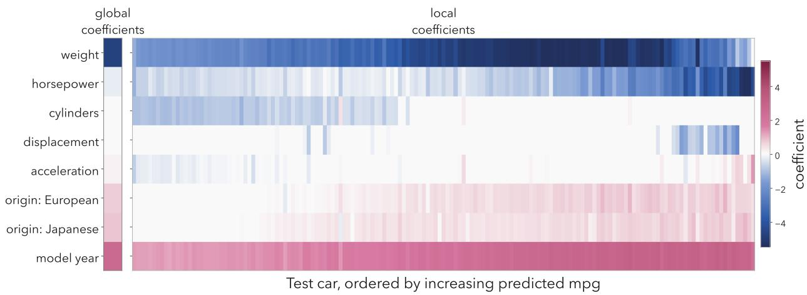
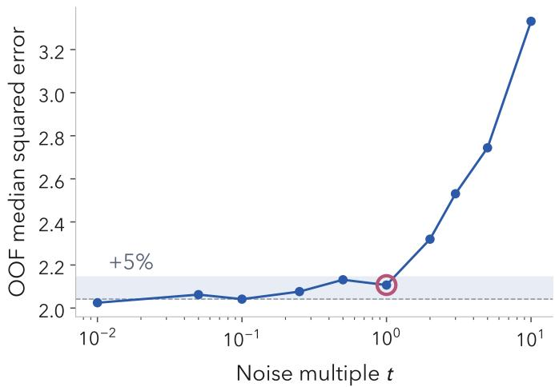
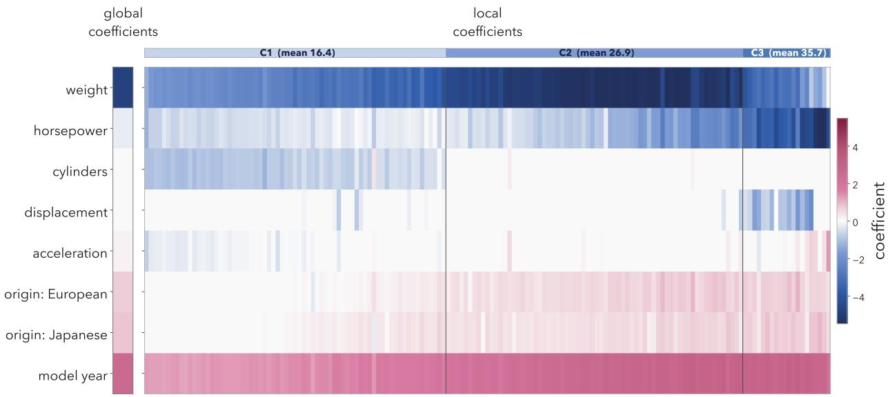
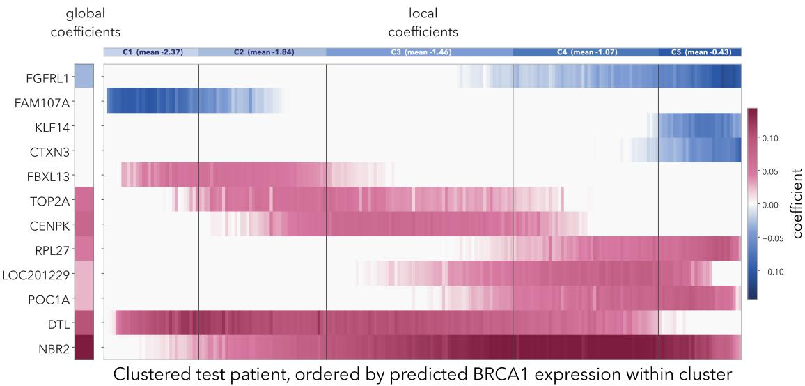
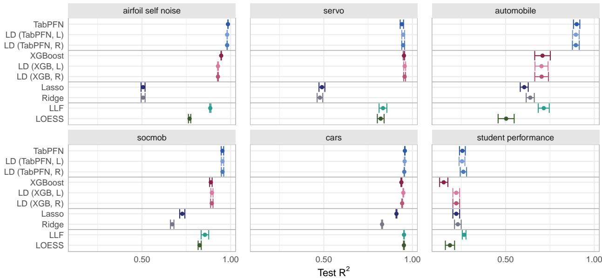
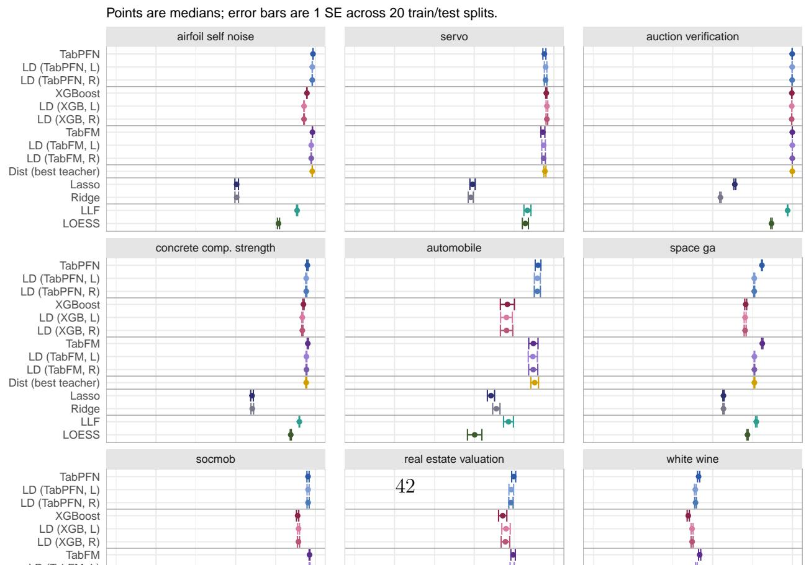
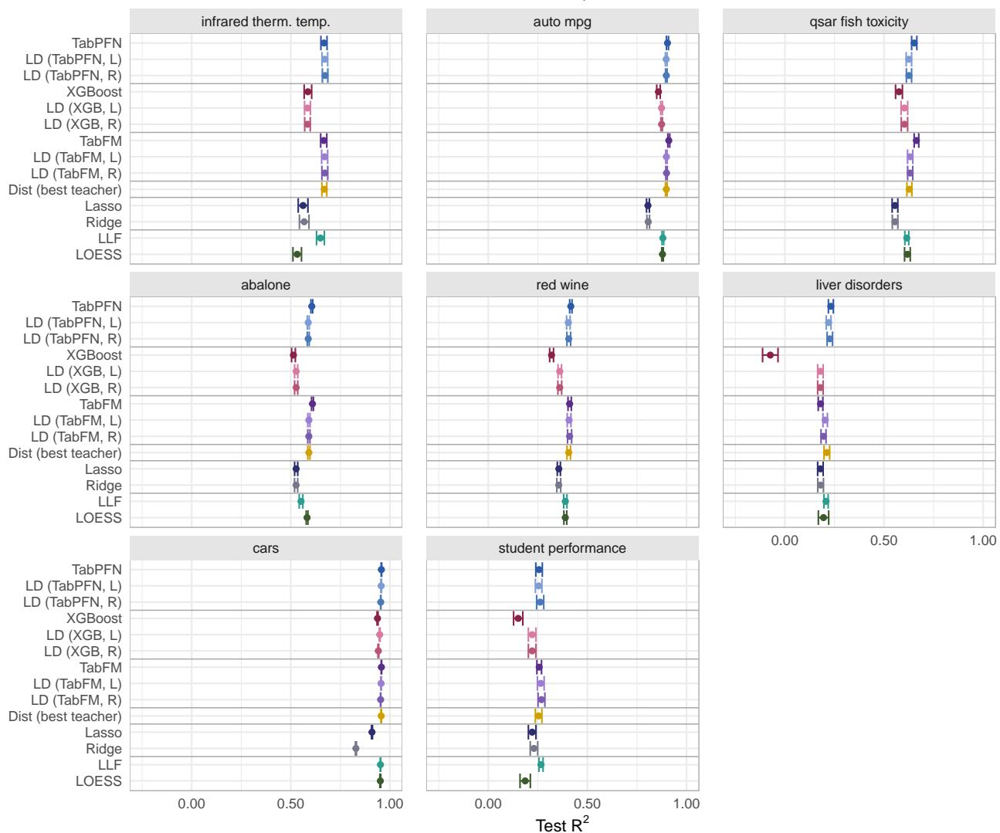
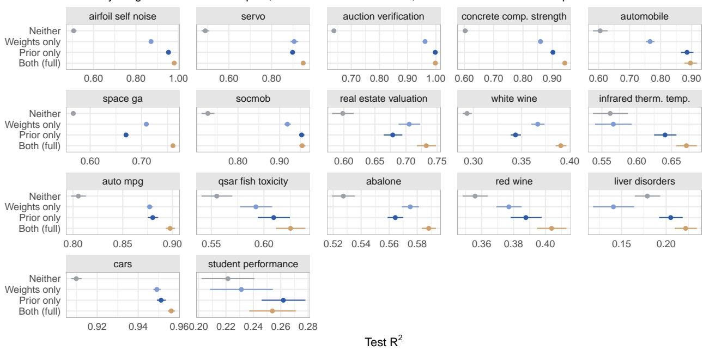

# Interpretable AI with Local Distillation

Erin Craig∗ Department of Biostatistics, University of Michigan and

Yiling Huang Department of Statistics, University of Michigan

Snigdha Panigrahi Department of Statistics, University of Michigan

August 25, 2026

## Abstract

Modern AI models such as tabular foundation models and gradient-boosted ensembles can outpredict classical methods, but provide little basis for reasoning about their predictions. High-stakes decisions call for models that are both accurate and interpretable as built. Local linear modeling ofers a path forward: a smooth regression function is locally well approximated by a linear one, allowing a linear fit near each query point to achieve high accuracy without sacrificing transparency. The challenges lie in learning what is “local” and developing statistical tools for interpretation.

Here, we propose local distillation, in which a black-box “teacher” guides a regularized linear “student” model at each query point. The teacher (1) defines locality by upweighting training observations with similar predicted outcomes, and (2) anchors the fit with its prediction at the query point, included as a pseudo-observation whose weight is estimated from the data. For interpretation, we add a small amount of Gaussian randomization to the local objective and use refits to assess stability: selection frequencies identify reliable features at a query point, and clustering the randomized fits identifies stable subgroups across the data. Under the lasso penalty, we prove that this randomization yields feature-selection probabilities that are stable under small perturbations of the training responses. Across 17 benchmark datasets, local distillation nearly matches its AI teacher’s accuracy while producing a sparse linear model at each test point. In a high-dimensional cancer gene expression example, the framework identifies patient subgroups whose local models use diferent genes; this heterogeneity is invisible to a global linear model, and dificult to surface in a black-box model.

Keywords: Local regression; Interpretable AI; Distillation; Randomization; Stability; Tabular foundation models

## 1 Introduction

Advances in artificial intelligence (AI) are rapidly changing what is predictable [1, 2]. Modern black-box models, such as foundation models and gradient-boosted ensembles, sometimes outpredict simpler classical models even in their traditional strongholds, such as small-sample tabular data [3, 4, 5, 6, 7]. Yet, acting on predictions requires more than accuracy alone: decision-makers must reason about the model’s predictions. Black-box models ofer little basis for such reasoning, which limits the value of their predictions for decision-making.

The standard response, when opting for a black box, is to explain its predictions post hoc. Popular tools such as LIME [8] and SHAP [9] fit per-observation attributions that quantify how much each feature contributes to a given prediction. However, because such explanations are constructed separately from the model, their fidelity to it is not guaranteed. Moreover, the attributions can be unstable, changing with choices external to the model and data, such as LIME’s perturbation scheme or SHAP’s reference distribution [10, 11, 12, 13].

By contrast, our work is guided by the view that transparency and reasoning should come from the predictive model itself, i.e., predictions should be interpretable as produced, rather than explained through post hoc tools [14]. To achieve this goal, we propose local distillation, a method in which a high-performing black-box “teacher” guides a local linear “student” fit at each observation or query point. Because a smooth regression function is locally well approximated by a linear function, a locally fit simple model can approach the accuracy of a flexible black box while remaining transparent at the query point. Figure 1 illustrates local distillation on the Auto MPG dataset [15], where we predict fuel economy (miles per gallon, MPG). In the test set, each car receives its own sparse linear model; together, they improve on the global lasso’s prediction squared error (PSE) by 48% while nearly matching their foundation model teacher (PSE 5.59 vs. TabPFN 5.25; global lasso 10.81). The local coeficients show that the number of cylinders predicts fuel economy among the least eficient cars but is not predictive among the most eficient, where engine displacement is more useful. A global linear model averages over this diference and assigns both a coeficient of zero. We include a high-dimensional gene expression example in Section 6 and benchmarks across 17 datasets in Section 7 and Appendix B.

  
Figure 1: Car-specific miles-per-gallon models from local distillation. Local coeficients for the Auto MPG data using local distillation with a tabular foundation model teacher, TabPFN, and a lasso student. Cars are ordered left to right by TabPFN’s predicted MPG; coeficients are per standard deviation of each feature. The column on the left shows the global lasso coeficients. On a held-out test set, local distillation improves over the global lasso’s PSE by 48% (global lasso regression PSE 10.81; TabPFN 5.25; local distillation 5.59).

The central question, then, is how to define “local”: which observations should inform the fit at a given query point? Classical local regression defines locality through unsupervised similarity in input space (LOESS [16]), which ignores the response variable and is known to be vulnerable to the curse of dimensionality. Recent work instead defines locality through supervised weights derived from random forests [17, 18, 19, 20]. Local distillation, as proposed in our work, takes this idea further, defining locality in a supervised and tuning-free way: the teacher plays two roles, (1) identifying which training observations are informative via similarity of its predictions, and (2) pulling the student’s prediction toward its own, with the strength of the teacher’s influence determined from the data by the cross-validated student-to-teacher loss ratio. If the teacher does not outperform the student, the method simply reverts to a global linear fit.

Using the teacher’s predicted response to define similarity collapses the p–dimensional feature space into a single interpretable axis along which the model is localized. We define locality this way for two reasons: (1) it is an axis along which the feature–outcome relationship often varies, and (2) it is an axis of scientific and clinical interest. This construction gives each local model a natural interpretation: in medicine, for example, a patient’s model describes the feature–outcome relationship among patients within a similar risk group. Moreover, when the teacher is a pretrained foundation model such as TabPFN [3], the student

inherits its prior knowledge.

For decision-makers, the ultimate goal is not only accurate and interpretable prediction, but also trustworthy conclusions drawn from those predictions. Trust is closely tied to the stability of such conclusions under small perturbations of the training data, as emphasized by the PCS framework [21, 22, 23]. Motivated by this perspective, we propose a simple modification to local distillation based on external randomization, treating a conclusion as interpretable to the extent that it can be shown to be stable. The resulting randomized distillation fits produce stable local conclusions—such as identifying which features are important for its prediction at a query point—without breaking the inherent dependence among features or requiring teacher predictions to be recomputed. Our choice of the randomization scheme is supported by stability guarantees for feature selection, and it preserves fidelity to the notion of locality learned from the training data. Beyond localized conclusions, the randomized fits also reveal how the local feature–outcome relationship varies across observations: we cluster observations using their randomized local coeficients to learn subgroups that are stable rather than artifacts of any single fit.

This work contributes (1) local distillation, a predictive method that uses a black-box teacher to construct accurate, sparse local linear fits (Sections 2 and 7), and (2) a randomized stability framework for interpreting these fits, both at individual query points and in aggregate, with theoretical guarantees (Sections 4 and 5). In two case studies, the framework reveals heterogeneity in the feature–outcome relationship that a global linear model cannot express (Sections 4.3 and 6), a central but elusive goal of prediction methods, particularly in personalized medicine.

## 2 Local distillation

Suppose we have training data $\ b { X } \in \mathbb { R } ^ { n \times p }$ (standardized), a continuous response $\ b { y } \in \mathbb { R } ^ { n }$ 2 and a test point $\pmb { x } ^ { * }$ . We also have a teacher $\hat { \phi } : \mathbb { R } ^ { p }  \mathbb { R }$ , a fitted model that predicts y from x. Our goal is to predict y at $\pmb { x } ^ { * }$ with a sparse linear model fit locally to the training data.

We describe local distillation using squared-error loss in Section 2.1 and illustrate it with an example in Section 2.2. The method is general, and Section 2.3 covers its extension to other loss functions and forms of regularization.

## 2.1 Model fitting and prediction

Our work is inspired in part by knowledge distillation [24], in which a simpler “student” model is trained under the guidance of a more complex “teacher” model. The student is usually a smaller neural network, and the goal is compression: a fast, lightweight model that approximates a costly one. Applying the same principle to regression with a linear student would yield

$$
\hat { \boldsymbol { \beta } } = \underset { \boldsymbol { \beta } } { \arg \operatorname* { m i n } } \ \frac { 1 } { 2 n } \left[ \sum _ { j = 1 } ^ { n } \left( y _ { j } - \boldsymbol { \mathbf { x } } _ { j } ^ { \top } \boldsymbol { \beta } \right) ^ { 2 } + \mu \sum _ { j = 1 } ^ { n } \left( \hat { \phi } ( \boldsymbol { \mathbf { x } } _ { j } ) - \boldsymbol { \mathbf { x } } _ { j } ^ { \top } \boldsymbol { \beta } \right) ^ { 2 } \right] ,\tag{1}
$$

where hyperparameter $\mu$ determines the influence of the teacher.

When E[y | x] is highly nonlinear, however, a single linear student cannot match a flexible teacher’s predictive performance. We therefore introduce local distillation, summarized in Algorithm 1, in which a separate student model is fit for each test observation. The teacher guides the definition of the local neighborhood around the query point and anchors the fit through its prediction at that point.

More precisely, our proposed method in Algorithm 1 modifies the standard knowledge distillation objective in (1) in three ways:

1. First, we fit a separate local model for each test observation $\pmb { x } ^ { * }$ , replacing the global distillation sum with a term that pulls the student’s prediction ${ \pmb x } ^ { * ^ { \top } } \beta$ toward the teacher’s prediction; see (4). This anchors the local fit to the teacher’s prediction at the query point.

2. Second, we replace uniform training weights with similarity weights $\{ \hat { S } _ { j } ( { \pmb x } ^ { * } ) : j \in \{ 1 , \dots , n \} \}$ that upweight training points whose teacher prediction is close to $\hat { \phi } ( { \pmb x } ^ { * } )$ ; see (3). These weights define locality around the query point by determining which training observations belong to its local neighborhood.

3. Third, we estimate $\hat { \mu }$ from the data as the cross-validated student-to-teacher loss ratio, rather than tuning it; see (2). We scale it further by $1 / \sqrt { \hat { n } _ { \mathrm { e f f } } }$ , where $\hat { n } _ { \mathrm { e f f } }$ is the efective sample size defined in (3). The teacher’s influence therefore grows both when the teacher outperforms the student globally (larger $\hat { \mu } )$ and when the local neighborhood is sparse (smaller $\hat { n } _ { \mathrm { e f f } } )$ , where the local fit most needs anchoring.

When $\hat { \mu } \leq 1$ , the teacher ofers no improvement and we instead return the global linear fit for all test observations.1

In an ablation study across our benchmark datasets (Appendix $\mathrm { C } )$ , we find that using both the similarity weights and the teacher prediction anchor yields better predictions than using either alone. In Algorithm 1 and throughout, we write $\hat { \phi } ^ { ( - j ) } ( \pmb { x } _ { j } )$ for the teacher’s prediction at training point j computed without access to $( { \pmb x } _ { j } , y _ { j } )$ : if the teacher is fit to the training data, or uses it as context at prediction time (as with the in-context learning of tabular foundation models), $\hat { \phi } ^ { ( - j ) }$ is the out-of-fold (OOF) prediction; if the teacher makes no use of the training data, $\hat { \phi } ^ { ( - j ) } = \hat { \phi }$ . We additionally include an unpenalized intercept, which we suppress in the notation for clarity.

Algorithm 1 Local distillation for regularized linear models   
Input: Training data $( X , y )$ with n observations; test observation ${ \pmb x } ^ { * } ;$ teacher $\hat { \phi } ;$ elastic-net   
parameter $\alpha \in [ 0 , 1 ]$   
Output: Prediction $\hat { \boldsymbol y } ^ { * }$ and local coeficients ${ \hat { \beta } } ^ { * }$ at $\underline { { \boldsymbol { x } ^ { * } } }$   
1. Estimate distillation strength as the cross-validated student-to-teacher loss ratio:   
$\hat { \mu } = \frac { \hat { L } ( f _ { \hat { \beta } } ) } { \hat { L } ( \hat { \phi } ) } , \qquad \hat { L } ( g ) = \frac { 1 } { n } \sum _ { j = 1 } ^ { n } \left( y _ { j } - g ^ { ( - j ) } ( { \pmb x } _ { j } ) \right) ^ { 2 } ,$ (2)   
where $f _ { \hat { \beta } }$ is the global elastic-net fit with shrinkage parameter $\hat { \lambda }$ chosen by cross  
validation, and $g ^ { ( - j ) }$ denotes prediction at $\boldsymbol { \mathscr { x } } _ { j }$ without access to $( { \pmb x } _ { j } , y _ { j } )$   
If $\hat { \mu } \leq 1$ , return $\hat { y } ^ { * } = f _ { \hat { \beta } } ( x ^ { * } )$ and $\hat { \beta } ^ { * } = \hat { \beta }$ , and stop.   
2. Compute similarity weights and efective sample size:   
$\hat { S } _ { j } = \hat { S } _ { j } ( \pmb { x } ^ { * } ) = \frac { \exp ( - d _ { j } ) } { \sum _ { k = 1 } ^ { n } \exp ( - d _ { k } ) } , \qquad d _ { j } = \frac { \left( \hat { \phi } ^ { ( - j ) } ( \pmb { x } _ { j } ) - \hat { \phi } ( \pmb { x } ^ { * } ) \right) ^ { 2 } } { \hat { \sigma } _ { \phi } ^ { 2 } } , \qquad \hat { n } _ { \mathrm { e f f } } = \left( \sum _ { j = 1 } ^ { n } \hat { S } _ { j } ^ { 2 } \right) ^ { - 1 }$   
(3)   
where $\hat { \sigma } _ { \phi } ^ { 2 }$ is the empirical variance of $\{ { \hat { \phi } } ^ { ( - j ) } ( { \pmb x } _ { j } ) \} _ { j = 1 } ^ { n }$   
3. Fit the local model and predict: $\hat { y } ^ { * } = { \pmb x } ^ { * \top } \hat { \beta } ^ { * }$ , where   
$\hat { \beta } ^ { * } = \arg \operatorname* { m i n } _ { \hat { \beta } } \ \frac { 1 } { 2 } \sum _ { j = 1 } ^ { n } \hat { S } _ { j } \big ( y _ { j } - \pmb { x } _ { j } ^ { \top } \beta \big ) ^ { 2 } + \frac { \hat { \mu } } { 2 \sqrt { \hat { n } _ { \mathrm { e f f } } } } \big ( \hat { \phi } ( \pmb { x } ^ { * } ) - \pmb { x } ^ { * \top } \beta \big ) ^ { 2 } + \hat { \lambda } \big [ \alpha \| \beta \| _ { 1 } + \frac { ( 1 - \alpha ) } { 2 } \| \beta \| _ { 2 } ^ { 2 } \big ]$   
(4)   
Note: For a set of test observations, run step 1 once and steps 2–3 independently (in parallel) for each ${ \pmb x } ^ { * } .$

## 2.1.1 The teacher as a Bayesian prior

Our approach has a natural Bayesian interpretation: the teacher’s prediction at the test observation acts as a Gaussian predictive prior on ${ \pmb x } ^ { * \top } \beta$ , centered at $\hat { \phi } ( { \pmb x } ^ { * } )$ with precision $\frac { \hat { \mu } } { \sqrt { \hat { n } _ { \mathrm { e f f } } } }$ . This connects to data augmentation priors [25, 26], in which prior beliefs are encoded via pseudo-observations rather than parameter distributions. These priors express beliefs about observable quantities $y \mid x$ , which are typically more interpretable than beliefs about regression coeficients, and yield posterior inference via weighted least squares on a modified dataset.

Our method difers in where the prior comes from and how it is deployed: rather than using a fixed set of elicited prior locations shared by one global fit, each test observation gets its own local model with a single pseudo-observation at the query point, centered at the teacher’s prediction. Additionally, we estimate the prior precision $\frac { \hat { \mu } } { \sqrt { \hat { n } _ { \mathrm { e f f } } } }$ from the data, in the spirit of empirical Bayes. This parallels the power prior of Ibrahim and Chen [27], where historical data enters the likelihood with a tunable weight; $\hat { \mu }$ plays the analogous role and is estimated directly from the student-to-teacher loss ratio.

## 2.2 A worked example of local distillation

We illustrate the three steps of Algorithm 1 using the Auto MPG data [15], a set of $n = 3 9 2$ vehicles from the 1983 American Statistical Association Exposition with $p = 8$ predictors after encoding, including engine characteristics, vehicle weight, model year, and region of manufacture. Our goal is to predict fuel economy in miles per gallon.

We use the lasso as our student model, and TabPFN as the teacher. Using a 60/40 train/test split, we proceed as follows:

1. Estimate distillation strength. The global lasso has CV PSE 12.81; the TabPFN teacher 6.31; therefore, $\hat { \mu } = \frac { 1 \bar { 2 } . 8 1 } { 6 . 3 1 } = 2 . 0 3$ . Since $\hat { \mu } > 1$ , the teacher improves on the global lasso and we proceed; had $\hat { \mu } \leq 1$ , we would have returned the global fit.

2. Compute similarity weights. For each test vehicle, we weight the training set by similarity of TabPFN’s predicted MPG as in (3). The efective sample sizes $\hat { n } _ { \mathrm { e f f } }$ range from 39 to 172 (median 141) out of $n _ { \mathrm { t r a i n } } = 2 3 5$

3. Fit and predict. We fit a locally distilled model for every test vehicle by solving (4). This produces one model and prediction per car. On this test set, the global lasso has

PSE 10.81, TabPFN 5.25, and local distillation 5.59: the student performance is close to that of its teacher. In Section 4, we visualize and interpret the models.

## 2.3 Computability, generalizations and further localization

Computability. For a single test observation $\pmb { x } ^ { * }$ , Equation (4) is a weighted elasticnet problem with fixed $\hat { \lambda }$ and α: append $\pmb { x } ^ { * }$ to X and $\hat { \phi } ( { \pmb x } ^ { * } )$ to $^ { \mathbf { \nabla } } \mathbf { \mathbf { \mathbf { 3 } } } ,$ and use weights $\{ \hat { S } _ { 1 } , . . . , \hat { S } _ { n } , \hat { \mu } / \sqrt { \hat { n } _ { \mathrm { e f f } } } \}$ . Any solver that supports observation weights (e.g. glmnet [28] or adelie [29]) can fit it directly. Fitting many models scales naturally: $\hat { \lambda }$ is estimated once on the training set, and the local fits are then independent single-λ problems, parallelizable across query points.

Other forms of regularization, and nonlinearities in the student. We have focused on the elastic-net penalty, which spans lasso through ridge, but the pseudo-observation construction above is agnostic to the penalty: any regularizer supported by the solver, such as the group or fused lasso, can be used in its place.

We have also chosen the student to be locally linear, but the feature map is a modeling choice: replacing x with a basis expansion $\Phi ( { \pmb x } )$ (e.g. pairwise interactions) yields a student that is linear in $\Phi ( { \pmb x } )$ and fit identically, at the cost of interpreting coeficients in the expanded basis. Natural choices here are glinternet [30], which selects pairwise interactions under a strong-hierarchy constraint, or reluctant interaction modeling [31], which adds interactions only where main efects leave residual signal; either keeps the local model sparse and interpretable while capturing interaction structure.

Generalization to other losses. We have illustrated our method with squared-error loss, but it extends to any loss $\ell ( y , \eta )$ convex in $\eta = \pmb { x } ^ { \top } \beta :$ the local objective of Algorithm 1 becomes

$$
\hat { \beta } ^ { * } = \operatorname * { a r g m i n } _ { \beta } \sum _ { j = 1 } ^ { n } \hat { S } _ { j } \ell ( y _ { j } ,  { \boldsymbol { { x } } } _ { j } ^ { \top } \beta ) + \frac { \hat { \mu } } { \sqrt { \hat { n } _ { \mathrm { e f f } } } } \ell ( \hat { \phi } (  { \boldsymbol { { x } } } ^ { * } ) ,  { \boldsymbol { { x } } } ^ { * \top } \beta ) + \hat { \lambda } [ \alpha \| \beta \| _ { 1 } + \frac { ( 1 - \alpha ) } { 2 } \| \beta \| _ { 2 } ^ { 2 } ] ,\tag{5}
$$

where $\hat { \mu }$ is the cross-validated student-to-teacher loss ratio with ℓ in place of squared error.   
Taking $\begin{array} { r } { \ell ( y , \eta ) = \frac { 1 } { 2 } ( y - \eta ) ^ { 2 } } \end{array}$ recovers Equation (4).

For logistic regression, the distillation term is the cross-entropy between the teacher’s and student’s predicted probabilities, matching the soft-target distillation of Hinton et al. [24]; similarity distances $d _ { j }$ are computed on the logit scale.

A survival response requires one change: the loss is the weighted Cox partial likelihood, and since the teacher has no natural place in its risk-set structure, it enters instead as a squared penalty $( \hat { \phi } ( \pmb { x } ^ { * } ) - \pmb { x } ^ { * \top } \pmb { \beta } ) ^ { 2 }$ on the log-relative-hazard scale.

Further localization. For each test observation, one could select λ by local cross-validation and estimate $\mu$ from locally weighted losses. We instead reuse the global $\hat { \lambda } \colon$ the local loss in (4) is a weighted mean on the same scale as the cross-validation loss used to select $\hat { \lambda } .$ so the same value is a sensible default, and refitting locally is expensive and in our experiments rarely improved prediction. Local estimates of $\mu$ were highly variable and did not reliably improve performance either.

Teacher selection. Given several candidate teachers, we propose selecting the one minimizing the cross-validated loss $\hat { L } ( \hat { \phi } )$ in (2); this adds little cost beyond Step 1 of Algorithm 1, and in our benchmarks, it worked well (Appendix B).

Cross-modal and cross-domain distillation. The teacher enters Algorithm 1 only through its predictions: out-of-fold predictions on the training data, and the prediction at $\pmb { x } ^ { * }$ . There is therefore no requirement that it use the same features as the student. A teacher built on a richer modality (e.g. images, text, or additional clinical measurements) can be distilled into a local linear model on the features we wish to interpret; conversely, the teacher may perform best with fewer features than the student, as in our gene expression example (Section 6), where the teacher screens to 500 genes while the student is fit over all 17,322. Nor is the teacher required to be trained on the data at hand. Most of our examples use TabPFN, a foundation model pretrained on synthetic data; a model fit to an external cohort is analogous. In either case, $\hat { \mu }$ guards against domain shift: if the teacher does not transfer well, $\hat { \mu } \leq 1$ and the method reverts to the global fit.

## 3 Related work

Local linear modeling. Local modeling methods fit a separate model for each test observation rather than a single global model. The classical example is LOESS [16], which at each test observation fits a linear or quadratic regression weighted by kernel proximity in input space. LOESS produces smooth, adaptive predictions without committing to a global functional form, and its local coeficients are interpretable. Its weighting is defined by a user-specified kernel with a bandwidth tuning parameter, and it does not use a teacher.

Closer to ours are methods that fit a local linear model with supervised weights derived from a forest. Generalized random forests [20] and local linear forests [19] use a forest’s leaf co-membership, and the attention lasso [32] similarly uses random forest proximity, then blends each local fit with a global baseline via a mixing parameter tuned by cross-validation. Local distillation instead defines locality through similarity of predicted response, which allows the use of any accurate regressor as teacher. The teacher’s influence is estimated from the cross-validated loss ratio rather than tuned, and the method reverts to the global fit when the teacher ofers no improvement. Moreover, the teacher enters as a pseudoobservation within a single fit, rather than blending with a second model: each local model is then an elastic-net fit on a weighted, augmented dataset with a single active set. When the local models use lasso regularization (elastic-net α = 1), the stability guarantees of Section 5 apply to their feature-selection probabilities.

Many recent local linear methods are designed to produce local explanations of black-box predictors; they difer in what they fit and in how the black box enters. The most widely used, LIME [8], fits to the black box: a sparse linear model at each test observation is fit to proximity-weighted perturbations of the input, with the teacher’s predictions as the response, so LIME approximates the teacher rather than the data; like SHAP [9], its explanations are sensitive to choices external to the model and data [10, 11, 12, 13]. MAPLE [33] is more flexible in its response: a random forest fit to y supplies global feature selection and a proximity kernel, which together weight a local regression at each test observation. This local model can regress on either the observed labels y or a black-box teacher’s predictions. As a predictor, MAPLE is closely related to local linear forests, which we include in our benchmarks as a representative of this family (Section 7).

Local distillation shares this per-test-point linear structure and fits the observed response y; the teacher defines locality and anchors the fit rather than serving as the target. It is a predictive method in its own right, and in contrast to the local methods above, it comes with stability guarantees for feature selection (Section 5).

Prediction-powered inference. Prediction-powered inference (PPI, PPI++) [34, 35] augments classical statistical analyses with predictions from a powerful machine learning (ML) model when labeled data are scarce. Given a small labeled dataset and a large unlabeled dataset, it imputes the missing labels and builds confidence intervals for populationlevel estimands that account for the model’s imputation error and recover the classical estimator when the ML model adds nothing. PPI and local distillation share a philosophy: both use a powerful ML model to strengthen a simpler statistical procedure, and revert to the simpler procedure—in our case, the well-understood global linear model—when the ML model is unreliable. They difer in target and mechanism. PPI targets population-level inference and corrects for prediction error in its confidence intervals; local distillation targets pointwise prediction and guards against an unhelpful teacher through the data-driven $\hat { \mu }$ and reversion to the global fit. The power-tuning parameter $\lambda _ { \mathrm { P P I } } \in \left[ 0 , 1 \right]$ of PPI++ (chosen from data to minimize variance) mirrors the role of $\hat { \mu } .$ though $\hat { \mu }$ enters as the precision of a pseudo-observation rather than a mixing weight.

## 4 Interpretability through stability

Local distillation, as described in Algorithm 1, predicts each query point through a sparse local linear fit anchored at that point. Building on the concerns raised in Section 1, conclusions drawn from predictions may inspire little trust unless they can be shown to be stable, motivating the development of a stability-based framework for interpretation. To this end, we propose randomized local distillation, a simple modification of Step 3 in Algorithm 1. The resulting framework assesses stability by examining how the local coeficients vary under random perturbations of the local distillation optimization, while holding the query point $\pmb { x } ^ { * }$ and features X fixed. The stability analysis yields interpretations of predictions at two levels, as demonstrated in this section: (i) individually, through the selected features in each sparse local model, and (ii) in aggregate, by characterizing heterogeneity across query points to identify similar and dissimilar regions of the dataset.

## 4.1 Randomized local distillation

Let $\pmb { w } = ( w _ { 1 } , \dots , w _ { n + 1 } )$ denote a vector of $( n + 1 )$ independent and identically distributed randomization variables, with $w _ { j } \sim \mathcal { N } ( 0 , \tau ^ { 2 } )$ for $j = 1 , \ldots , n + 1$ . Rather than relying on a single local fit, we generate repeated randomized local fits by solving

$$
\begin{array} { l } { { \displaystyle \hat { \boldsymbol { \beta } } ^ { w } = \arg \operatorname* { m i n } _ { \boldsymbol { \frac { 1 } { \beta } } } \frac { 1 } { 2 } \sum _ { j = 1 } ^ { n } \hat { S } _ { j } \big ( y _ { j } - \boldsymbol { x } _ { j } ^ { \top } \boldsymbol { \beta } \big ) ^ { 2 } + \frac { \hat { \mu } } { 2 ( \hat { n } _ { \mathrm { e f f } } ) ^ { 1 / 2 } } \big ( \hat { \phi } ( \boldsymbol { x } ^ { * } ) - \boldsymbol { x } ^ { * \top } \boldsymbol { \beta } \big ) ^ { 2 } + \hat { \lambda } \big [ \alpha \| \beta \| _ { 1 } + \frac { ( 1 - \alpha ) } { 2 } \| \beta \| _ { 2 } ^ { 2 } \big ] } }  \\ { { \displaystyle \qquad - \left( \sum _ { j = 1 } ^ { n } \hat { S } _ { j } ^ { 1 / 2 } w _ { j } \boldsymbol { x } _ { j } + \frac { \hat { \mu } ^ { 1 / 2 } } { n _ { \mathrm { e f f } } ^ { 1 / 4 } } w _ { n + 1 } \boldsymbol { x } ^ { * } \right) ^ { \top } \beta , } } \end{array}\tag{6}
$$

where ${ \hat { \beta } } ^ { w }$ denotes the coeficient vector obtained at $\pmb { x } ^ { * }$ for a given randomization draw w.

Randomized local distillation modifies (4) of Algorithm 1 by introducing a linear perturbation through normally distributed noise variables, while leaving the loss and penalty terms unchanged. Thus, as with local distillation, the randomized fit naturally extends to other loss functions and regularizers. Analogous to the weighting of the summands in the loss, each randomization variable $w _ { j }$ in the linear perturbation term is scaled by the square root of its corresponding weight, $\hat { S } _ { j }$ . Consequently, if $\hat { S } _ { j }$ is zero or close to zero, $w _ { j }$ has no or little efect on the optimization.

The amount of randomization in each randomized local fit is controlled by $\tau ^ { 2 }$ , the variance of the normal randomization variables in w. In practice, we set $\tau ^ { 2 } = t * \frac { { \hat { \sigma } } ^ { 2 } } { \hat { n } _ { \mathrm { e f f } } }$ , where $\hat { n } _ { \mathrm { e f f } } =$ $\frac { 1 } { \hat { S } _ { 1 } ^ { 2 } + \ldots + \hat { S } _ { n } ^ { 2 } }$ is the efective sample size (Equation (3)), $\hat { \sigma } ^ { 2 }$ is the variance of the teacher’s out-offold residuals, and t is a constant chosen by the analyst. Choosing the randomization variance as a fixed fraction of $\frac { \hat { \sigma } ^ { 2 } } { \hat { n } _ { \mathrm { e f f } } }$ ensures that the scale of the randomization is comparable to the scale of variability contributed by the data to the optimization objective. We recommend using data to guide the choice of t. The sensitivity bound established in Theorem 1, from which the stability bound in Corollary 1 follows, improves as the randomization sd τ increases, and thus as t increases. But too much randomization can reduce the predictive accuracy of the randomized fits. Therefore, we take the largest t whose out-of-fold median prediction error is within a small tolerance of that from the unperturbed fits (t = 0); the tolerance reflects how much prediction accuracy the analyst is willing to trade for stability, and we use 5% throughout. Figure 2 (left) shows the selection process for the Auto MPG data.

Remark 1. The randomization in (6) is similar in form to that used in the post-selection inference literature, where linear perturbation terms are added to penalized M-estimation problems to preserve information that can later be leveraged for valid inference in selected models. See, for example, the randomized inference methods developed in [36, 37, 38, 39, 40]. Here, however, the added randomization serves a diferent role: in Section 5, we prove that it provides stability guarantees for feature–selection probabilities under small perturbations of the training data.

## 4.2 Interpreting a single local model

At a given query point $\pmb { x } ^ { * }$ , the local model characterizes the feature–response relationship among observations with similar predicted outcomes. More specifically, a single local distillation fit yields a sparse set of features, $\{ j : \hat { \beta } _ { j } \neq 0 \}$ (for $\alpha > 0 )$ , providing an interpretation of its prediction at $\pmb { x } ^ { * }$ . But, as with the standard lasso, this selected set may be unstable: predictors near the selection boundary may enter or leave the model under even slight perturbations in the outcomes, ultimately yielding diferent local interpretations at $\pmb { x } ^ { * }$

To address this instability, we compute for each feature its empirical selection frequency

across the randomized local fits

$$
\hat { \pi } _ { j } = \frac { 1 } { B } \sum _ { b = 1 } ^ { B } \mathbb { I } \left\{ \hat { \beta } _ { j } ^ { w _ { b } } \neq 0 \right\} ,
$$

where B is the number of refits of (6) and ${ \pmb w } _ { b }$ denotes the randomization used in the b-th fit. That is, $\hat { \pi } _ { j }$ is the proportion of randomized local refits in which that feature is selected. In particular, a low selection frequency signals uncertainty about a feature’s contribution to the prediction at $\pmb { x } ^ { * }$

The table in Figure 2 shows one such model for a single test car. Alongside each coeficient we report its selection frequency, the fraction of randomized local refits retaining that feature. In this example, five of the seven selected features are retained in over 90% of refits; the least stable are cylinders and horsepower, retained in 75% and 70% respectively. Randomization flags these as uncertain.

<table><tr><td>Feature</td><td></td><td>Coef. Sel. prob.</td></tr><tr><td>weight</td><td>-5.11</td><td>100%</td></tr><tr><td>model year</td><td>2.28</td><td>100%</td></tr><tr><td>origin: European</td><td>0.40</td><td>99%</td></tr><tr><td>acceleration</td><td>0.52</td><td>99%</td></tr><tr><td>origin: Japanese</td><td>0.41</td><td>98%</td></tr><tr><td>cylinders</td><td>0.24</td><td>75%</td></tr><tr><td>horsepower</td><td>-0.17</td><td>70%</td></tr></table>

Figure 2: Left: choosing the randomization scale t. We take the largest t whose out-of-fold median squared error remains within 5% of the unperturbed fit (shaded); the selected value is circled. Right: a local model for a single test car with mid-range fuel economy (distillation predicted 23.7 mpg, observed 23.9 mpg), ordered by decreasing selection probability. The lasso penalty selected 7 of the 8 features in the unperturbed fit. Selection probability is the fraction of 100 randomized refits retaining the feature at the selected scale tˆ (circled at left), and features retained in under 90% are shown in bold. Region coeficients are contrasts against American manufacture.

Here, with only 8 features, most selections are stable across refits. This is not the case in higher dimensions: in the gene expression example of Section 6 $( p = 1 7 , 3 2 2 )$ , the median local fit selects 94 genes, of which typically only 15 are retained in over 90% of refits. In simulation (Appendix D), we find that the selection frequencies distinguish the true support while yielding a smaller, more interpretable set of features.

Using randomized refits to address the instability of lasso-selected features is not new; a prominent example is stability selection [41] based on subsampling. The randomization mechanism in our approach, however, is deliberately diferent from subsampling. This distinction has consequences for both the computational cost of local refitting and the interpretation of the resulting stability measures, which we discuss below.

Remark 2. Across randomized refits of local distillation, as proposed in (6), the similarity weights and teacher predictions are computed once from the training data and then held fixed. The added randomization perturbs only the optimization objective, while keeping the design fixed and using all n observations in each refit. From a computational perspective, this avoids the potentially substantial additional cost of subsampling-based refitting procedures such as stability selection. Under subsampling, Steps 1 and 2 of Algorithm 1 would need to be recomputed for each refit, as would the teacher predictions whenever they depend on the sampled training data; take, for example, predictions from tabular foundation models deploying in-context learning.

Remark 3. The choice of randomization determines the notion of stability being assessed and, consequently, the interpretation of the resulting predictions. Beyond its computational advantages, our randomization mechanism is designed to remain faithful to the locality learned from the training data: each refit preserves the same similarity weights and the teacher prediction anchor. By contrast, under subsampling-based refits, even small changes in sample composition can potentially alter the local structure in data, especially when the efective sample size $\hat { n } _ { e f f }$ is small, i.e., when the weights $\hat { S } _ { j }$ are concentrated on only a few observations, or when outcomes have heterogeneous noise levels. In such settings, variation across refits may reflect changes in the local structure rather than instability in the local feature–response relationship itself, making stability a less reliable characterization of that relationship.

## 4.3 Interpreting the local models in aggregate

Beyond individual models, we are also interested in understanding our sample and the heterogeneity within it. A natural approach would be to fit locally distilled models on a test set with $n _ { \mathrm { t e s t } }$ observations (or in a leave-one-out setting on the training data), and then cluster the fitted coeficient vectors into k clusters. However, our goal is to identify and interpret subgroups that are stable under small perturbations of the response y rather than artifacts of a single fit. We therefore aggregate the clustering obtained across the randomized refits from Section 4.1 using evidence accumulation clustering [42], allowing the same refits used to characterize local feature–response relationships to also inform stable subgroup structure in the data. We proceed as follows:

1. Fit unperturbed local models: run local distillation to obtain $n _ { \mathrm { t e s t } }$ fitted local models, with coeficient vectors in $\mathbb { R } ^ { p }$

2. Choose the number of clusters: cluster the $n _ { \mathrm { t e s t } }$ unperturbed coeficient vectors and select the appropriate k.

3. Cluster the randomized refits: draw B independent randomization vectors $\pmb { w } _ { 1 } , \dots , \pmb { w } _ { B }$ as described in Section 4.1. For each draw ${ \pmb w } _ { b } .$ , run randomized local distillation (solve (6)) to obtain $n _ { \mathrm { t e s t } }$ randomized coeficient vectors, and cluster these into k groups, yielding B cluster assignments of the test observations.

4. Cluster the co-occurrence matrix: define the similarity between two test observations as the fraction of the B clusterings in which they fall in the same group, and use this metric for a final clustering into k groups.

We illustrate this using the Auto MPG data. We (1) fit local models for the $n _ { \mathrm { t e s t } } = 1 5 7$ observations and (2) select the number of clusters k using k-means clustering of the unperturbed local coeficient vectors; the silhouette score selects $k = 3$ . We then (3) cluster the randomized refits: for each of $B = 1 0 0$ randomized local distillation runs, we cluster the refitted coeficient vectors using k-means with $k = 3$ . Finally, we (4) cluster the cooccurrence matrix: the similarity between two cars is the fraction of the 100 runs in which they are assigned to the same cluster, and clustering this matrix by average linkage yields the three groups shown in Figure 3. To visualize the result, we display the unperturbed coeficients in a heatmap, either ordered by cluster, or averaged within cluster. The three clusters use diferent features: cylinders is predictive among the least eficient cars, and displacement among the most eficient.

  
Test car, ordered by increasing predicted mpg within cluster  
Figure 3: Vehicle subgroups and their local miles per gallon models. Local coeficients for the Auto MPG data, with test cars grouped into three subgroups (C1–C3) by the stable clustering of Section 4.3. Subgroups are ordered left to right by mean MPG, and cars by predicted MPG within subgroup.

## 5 Theoretical analysis of stability

In this section, we establish stability guarantees for feature–selection probabilities under randomized local distillation (6), whose local coeficients enable interpretation of the distilled fits both individually and in aggregate. Throughout this section, we treat the similarity weights $\hat { S } _ { j }$ and the regularization parameters $\hat { \mu }$ and $\hat { \lambda }$ as fixed. To avoid confusion, we drop the hats and write these quantities as $S _ { j } , \mu ,$ and $\lambda ,$ respectively; similarly we write $n _ { \mathrm { e f f } }$ for the efective sample size. We slightly modify our notation for the teacher’s prediction at the query point, denoting it by $\hat { \phi } ( \pmb { x } ^ { * } ; \pmb { y } )$ , to make explicit that it may depend on the training response, as is the case in tabular foundation models, for example. We focus on the lasso penalty, i.e., α = 1, while deferring an extension to the elastic-net penalty for future work to keep the theoretical development streamlined.

Our main result, Theorem 1, characterizes how the feature–selection probabilities are sensitive to changes in the input responses, leading to the uniform stability guarantee in Corollary 1 under small perturbations of the training response. To prove this result, we first establish a stability guarantee for randomized lasso regression of a perturbed response on the design matrix; see Theorem 2 in Appendix A.2. To the best of our knowledge, this is the first such guarantee for Gaussian randomization introduced through linear perturbations of the optimization objective, providing a theoretical basis for the stability-based interpretation of feature–selection probabilities under the lasso penalty.

## 5.1 Notation and preliminaries

Before proceeding, we introduce notation used to develop the theory.

First, let

$$
\begin{array} { r } { \overline { { \pmb { y } } } = \left( \begin{array} { c } { y _ { 1 } } \\ { \vdots } \\ { y _ { n } } \\ { \hat { \phi } ( \pmb { x } ^ { * } ; \pmb { y } ) } \end{array} \right) \in \mathbb { R } ^ { n + 1 } , \qquad \overline { { \pmb { X } } } = \left( \begin{array} { c } { \pmb { x } _ { 1 } ^ { \top } } \\ { \vdots } \\ { \pmb { x } _ { n } ^ { \top } } \\ { ( \pmb { x } ^ { * } ) ^ { \top } } \end{array} \right) \in \mathbb { R } ^ { ( n + 1 ) \times p } , } \end{array}
$$

denote the augmented response vector and design matrix, obtained by appending the teacher’s prediction $\hat { \phi } ( \pmb { x } ^ { * } ; \pmb { y } )$ and the query point $\pmb { x } ^ { * }$ to the response vector and design matrix, respectively.

Let

$$
\begin{array} { r } { \Omega \ = \ \mathrm { d i a g } ( S _ { 1 } , \ldots , S _ { n } , S _ { n + 1 } ) \in \mathbb { R } ^ { ( n + 1 ) \times ( n + 1 ) } , } \end{array}
$$

denote the diagonal matrix of weights for the $n + 1$ observations in the augmented dataset, where $\begin{array} { r } { S _ { n + 1 } = \frac { \mu } { \sqrt { n _ { \mathrm { e f f } } } } } \end{array}$ is the weight assigned to the pseudo-response at the query point. We then define

$$
z = z ( y _ { 1 } , \dots , y _ { n } ) \ = \ \Omega ^ { 1 / 2 } \overline { { y } } \in \mathbb { R } ^ { n + 1 } , \qquad V \ = \ \Omega ^ { 1 / 2 } \overline { { X } } \in \mathbb { R } ^ { ( n + 1 ) \times p } ,\tag{7}
$$

to be the weight-adjusted response and design, respectively, i.e., coordinatewise, $Z _ { k } ~ =$ $\begin{array} { r l } { \sqrt { S _ { k } } y _ { k } } & { { } ( k \le n ) } \end{array}$ , and $\begin{array} { r } { Z _ { n + 1 } = \sqrt { S _ { n + 1 } } \hat { \phi } ( { \pmb x } ^ { * } ; { \pmb y } ) = \frac { \sqrt { \mu } } { n _ { e \mathrm { f } } ^ { 1 / 4 } } \hat { \phi } ( { \pmb x } ^ { * } ; { \pmb y } ) } \end{array}$

Under this notation, when $\alpha = 1$ and λ denotes the tuning parameter for the lasso penalty, the randomized local distillation problem (6) is equivalent to solving

$$
\widehat { \beta } ^ { \omega } \ = \ \underset { \beta \in \mathbb { R } ^ { p } } { \mathrm { a r g m i n } } \ \frac { 1 } { 2 } \| z + \omega - V \beta \| _ { 2 } ^ { 2 } \ + \ \lambda \| \beta \| _ { 1 } ,\tag{8}
$$

where $\omega \sim \mathcal N ( 0 , \tau ^ { 2 } I _ { n + 1 } )$ is drawn independently of the training response. The equivalent optimization problem, which follows from straightforward algebra, is used throughout this section. An advantage of this formulation is that it allows us to first establish guarantees for randomized lasso regression of a perturbed response on a design matrix. These results then yield the desired guarantees for local distillation, while also being of potential independent interest beyond the present setting.

Let ${ \widehat E } _ { V } ( z , \omega ) = \operatorname* { s u p p } \left( { \widehat \beta } ^ { \omega } ( z ) \right)$ denote the active set obtained by solving the randomized lasso in (8). The quantity of interest is the feature-selection probability for predictor $j$ , evaluated as a function of y and denoted by

$$
\pi _ { j } ( \pmb { y } ) = \mathbb { P } _ { \omega } \Big [ j \in \widehat { E } _ { V } ( \pmb { z } , \pmb { \omega } ) \Big ] , \mathrm { f o r } j \in [ p ] ,\tag{9}
$$

where the probability is over the randomization $\omega ,$ with y and hence $z \ : = \ : z ( y _ { 1 } , \ldots , y _ { n } )$ treated as fixed, and $[ p ] ~ = ~ \{ 1 , 2 , \ldots , p \}$ . The subscript $\omega$ on the probability, here and throughout, indicates that the probability is taken only with respect to the randomization.

## 5.2 Stability of randomized local distillation

Because the selection probabilities in (9) are obtained by convolving the discontinuous feature–selection indicator with the Gaussian density of $\pmb { w }$ , they are smooth provided that the teacher’s prediction is a smooth function of the input $\mathbf { \pmb { y } } .$ Lemma 1 formalizes this observation before we turn to the stability guarantee for randomized local distillation; the proof is provided in Appendix A.1.

Lemma 1 (Smoothness of feature–selection probabilities). Fix $k \in \mathbb { N } \cup \{ \infty \}$ and suppose that ${ \pmb y } \mapsto \hat { \phi } ( { \pmb x } ^ { * } ; { \pmb y } )$ belongs to $\mathcal { C } ^ { k } ( \mathbb { R } ^ { n } )$ . Then for every $j \in [ p ]$ , the selection probability $\pi _ { j } ( \pmb { y } )$ defined in (9), also belongs to ${ \mathcal { C } } ^ { k } ( \mathbb { R } ^ { n } )$ .

We now state Theorem 1, which bounds the sensitivity of the feature–selection probabilities to perturbations of the training response $^ { y , }$ leveraging the smoothness of these probabilities established in Lemma 1. We derive this result under the following assumptions on the design matrix X, the similarity weights $S _ { j }$ and the weight-adjusted design matrix V .

Assumption 1 (Weight-adjusted design in general position). The columns of $V$ are in general position [43].

Assumption 2 (Bounded weight concentration). We assume that there exists a constant $C _ { S } < \infty$ such that $n _ { \mathrm { e f f } } S _ { \mathrm { m a x } } \le C _ { S }$

Assumption 3 (Bounded design and local distillation weight). For some constants $B _ { X } , C _ { \mu } >$ 0, we assume that max $\left\{ \operatorname* { m a x } _ { i \in [ n ] } \| { \pmb x } _ { i } \| _ { \infty } , \| { \pmb x } ^ { * } \| _ { \infty } \right\} \leq B _ { X }$ , and $0 < \mu \leq C _ { \mu }$

Assumption 4 (Non-degeneracy of restricted design). For some constant $\kappa _ { X } > 0$ , we assume that, uniformly over $j \in [ p ]$ and $E \in \mathcal { E } _ { - j } ^ { V }$ , where $\mathcal { E } _ { - j } ^ { V }$ denotes the collection of essential active sets from lasso regression on $V _ { - j } \mathrm { ( i . e . }$ , active sets from the leave-j-covariate-out lasso fit whose corresponding selection regions have positive Lebesgue measure),

$$
\sigma _ { \operatorname* { m i n } } \left( \frac { 1 } { \sqrt { | \mathcal { T } _ { S } | } } X _ { \mathcal { T } _ { S } , \mathit { E } \cup \{ j \} } \right) \geq \kappa _ { X } ,
$$

where $\begin{array} { r } { \mathcal { T } _ { S } = \left\{ i \in [ n ] : S _ { i } \geq \frac { 1 } { 2 n _ { \mathrm { e f f } } } \right\} } \end{array}$ collects the training observations whose similarity weights are at least one half of the efective uniform weight.

Under Assumption 1, the randomized local distillation problem (8) admits a unique solution. Assumption 2 prevents the similarity weights from concentrating too heavily on a small number of observations. Assumption 3 requires both the design covariates and the distillation-weight parameter to be bounded. Assumption 4 imposes a lower singular-value condition on the design restricted to the efective similarity neighborhood $\mathcal { I } _ { S }$ , preventing the relevant design columns from becoming nearly linearly dependent among observations receiving non-negligible weights.

Theorem 1 (Sensitivity bound for selection probabilities). Suppose that ${ \pmb y } \mapsto \hat { \phi } ( { \pmb x } ^ { * } ; { \pmb y } )$ belongs to ${ \mathcal { C } } ^ { 1 } ( \mathbb { R } ^ { n } )$ with $L _ { \hat { \phi } } ( \pmb { x } ^ { * } ) = \operatorname* { s u p } _ { \pmb { y } \in \mathbb { R } ^ { n } } \| \nabla \hat { \phi } ( \pmb { x } ^ { * } ; \pmb { y } ) \| _ { \infty } < \infty$ , and that Assumptions $\mathit { 1 , ~ 2 , ~ 3 }$ and 4 hold. Then there exists a constant $C < \infty$ such that, for every $j \in [ p ]$ ，

$$
\operatorname* { s u p } _ { y \in \mathbb { R } ^ { n } } \| \nabla \pi _ { j } ( \pmb { y } ) \| _ { \infty } \leq \sqrt { \frac { 2 } { \pi } } \frac { C } { \tau } \left( \frac { 1 } { \sqrt { n _ { \mathrm { e f f } } } } + \frac { L _ { \hat { \phi } } ( \pmb { x } ^ { * } ) } { n _ { \mathrm { e f f } } ^ { 1 / 4 } } \right) .
$$

A proof of Theorem 1 is provided in Appendix A.1. The proof consists of two main components. First, we analyze the stability of the randomized lasso obtained by regressing a perturbed response on a p-dimensional feature matrix, as detailed in Appendix A.2. Second, we apply the chain rule to characterize the additional contribution from local distillation, as detailed in Appendix A.3.

We make a few observations on the above-stated result.

(i) It follows directly from the bound in Theorem 1 that the contribution of each training observation to the sensitivity of a feature’s selection probability has two components: the first is a direct contribution, excluding the efect of distillation, which is of order $n _ { \mathrm { e f f } } ^ { - 1 / 2 }$ and the second contribution arises through the teacher’s prediction, which is of order $n _ { \mathrm { e f f } } ^ { - 1 / 4 } L _ { \hat { \phi } } ( \pmb { x } ^ { * } )$

(ii) Although we make no assumption on $\boldsymbol { L } _ { \hat { \phi } } ( \pmb { x } ^ { * } )$ , which reflects how the sensitivity of the teacher’s prediction scales with the efective sample size, it may decrease as the efective sample size grows, leading to a sharper rate for the second contribution in the bound.

(iii) When the teacher is a fully pretrained model (i.e., the teacher’s prediction does not depend on the training samples), the bound in Theorem 1 simplifies to

$$
\operatorname* { s u p } _ { \pmb { y } \in \mathbb { R } ^ { n } } \| \nabla \pi _ { j } ( \pmb { y } ) \| _ { \infty } \le \sqrt { \frac { 2 } { \pi } } \frac { C } { \tau } n _ { \mathrm { e f f } } ^ { - 1 / 2 } ,
$$

since $L _ { \hat { \phi } } ( { \pmb x } ^ { * } ) = 0$ . As a further special case, for the global lasso fit without using the teacher as a Bayesian prior to shrink the linear predictor toward its predictions, and with uniform similarity weights $S _ { j } = 1 / n$ , the same bound holds with $n _ { \mathrm { e f f } } = n$

Theorem 1 immediately yields the following corollary, which quantifies the stability of the feature–selection probabilities in response to a perturbation of a single response value, paralleling notions of algorithmic stability under single-observation perturbations [44].

Corollary 1 (Stability guarantee). Under the assumptions of Theorem $^ { 1 , }$ there exists a constant $C < \infty$ such that, for every $j \in [ p ] , i \in [ n ]$ , and for any y, $\ b { y } ^ { \prime } \in \mathbb { R } ^ { n }$ satisfying $y _ { k } = y _ { k } ^ { \prime }$ for all $k \neq i$ (equivalently, difering only in the i-th coordinate),

$$
\big | \pi _ { j } ( y ) - \pi _ { j } ( y ^ { \prime } ) \big | \leq \sqrt { \frac { 2 } { \pi } } \frac { C } { \tau } \left( \frac { 1 } { \sqrt { n _ { \mathrm { e f f } } } } \ + \ \frac { L _ { \hat { \phi } } ( { \pmb x } ^ { * } ) } { n _ { \mathrm { e f f } } ^ { 1 / 4 } } \right) | y _ { i } - y _ { i } ^ { \prime } | .
$$

The proof of Corollary 1 follows directly from the sensitivity bound in Theorem 1 and is therefore omitted.

The stability bound presented in Corollary 1 improves with the randomization standard deviation τ . However, this does not imply that arbitrarily increasing the amount of randomization is desirable, since doing so can compromise predictive accuracy. Accordingly, as described in Section 4.1, we choose $\tau$ to balance stability against a user-specified tolerance for loss in predictive accuracy.

Extension to stability over a regularization-grid. Our stability-based approach could be extended to base decisions on a grid Λ of lasso regularization parameters $\lambda ,$ rather than on a single fixed value of λ. As proposed in the stability selection framework of [41], a natural quantity on which to base decisions is $\operatorname* { m a x } _ { \lambda \in \Lambda } \pi _ { j } ( { \pmb y } ; \lambda )$ , where $\pi _ { j } ( \pmb { y } ; \lambda )$ denotes the selection probability at λ (with the dependence on λ made explicit in the notation), and the maximum taken over the grid of regularization parameters. However, our proof techniques for controlling the sensitivity of this quantity to perturbations of the training input, and hence for establishing stability guarantees, may not extend directly to the maximum operation because it is not smooth.

Instead, one can consider a smooth approximation to $\operatorname* { m a x } _ { \lambda \in \Lambda } \pi _ { j } ( { \pmb y } ; \lambda )$ , namely $\Pi _ { \Lambda } ( { \pmb y } ) =$ $\begin{array} { r } { \frac { 1 } { \eta } \log \Big ( \frac { 1 } { | \Lambda | } \sum _ { \lambda \in \Lambda } \exp \big ( \eta \pi _ { j } ( \pmb { y } ; \lambda ) \big ) \Big ) } \end{array}$ , for fixed $\eta \in \mathbb { R } ^ { + }$ . Like the selection probability for any fixed λ, this quantity also takes values in [0, 1]. In practice, using its empirical counterpart $\widehat { \Pi } _ { \Lambda } ( \pmb { y } )$ , one can then determine the set of selected features as $\{ j : { \widehat { \Pi } } _ { \Lambda } ( { \pmb y } ) \geq p _ { \mathrm { t h r } } \}$ , for a chosen threshold $p _ { \mathrm { t h r } }$ . Furthermore, the gradient of $\Pi _ { \Lambda } ( y )$ can be written as

$$
\nabla \Pi _ { \boldsymbol { \Lambda } } ( \pmb { y } ) = \sum _ { \boldsymbol { \lambda } \in \boldsymbol { \Lambda } } w _ { \boldsymbol { \lambda } } ( \pmb { y } ) \nabla \pi _ { j } ( \pmb { y } ; \boldsymbol { \lambda } ) , \quad \mathrm { w i t h } w _ { \boldsymbol { \lambda } } ( \pmb { y } ) = \frac { \exp ( \eta \pi _ { j } ( \pmb { y } ; \boldsymbol { \lambda } ) ) } { \sum _ { \boldsymbol { \lambda } ^ { \prime } \in \boldsymbol { \Lambda } } \exp ( \eta \pi _ { j } ( \pmb { y } ; \boldsymbol { \lambda } ^ { \prime } ) ) } ,
$$

a convex combination of the derivatives of the selection probabilities. Consequently, a fairly straightforward extension of our results to establish a uniform stability bound over the grid Λ would yield a corresponding stability guarantee for $\Pi _ { \Lambda } ( y )$ under perturbations to a single coordinate of the input response, analogous to the bound in Corollary 1. We omit the details of this extension from the present work.

## 6 A high-dimensional example: predicting gene expression

Here, we turn to a breast cancer gene expression study from The Cancer Genome Atlas (TCGA) [45], distributed by Breheny and Huang [46]. Tumor samples from $n = 5 3 6$ patients were assayed on Agilent mRNA expression microarrays, and measurements are on the log scale. Following the example in Breheny and Huang [46], we treat BRCA1 expression as the response and the remaining $p = 1 7 { , } 3 2 2$ genes as predictors, excluding 491 genes with missing data. BRCA1 is the first gene identified whose mutations increase the risk of early onset breast cancer, and because it is likely to interact with many others, those whose expression is related to BRCA1 are candidates for further study.

We divide the data into a $6 0 / 4 0$ train/test split, with $n _ { \mathrm { t r a i n } } = 3 2 1$ and $n _ { \mathrm { t e s t } } ~ = ~ 2 1 5$ The student model is lasso regression. For the teacher, we considered two candidates and chose between them using cross-validated error as described in Section 2.3: TabPFN applied to all $^ \mathrm { 1 7 , 3 2 2 }$ genes, and TabPFN applied to the 500 genes most correlated with BRCA1 expression, screened within each training fold. The screened teacher performed far better and was selected. (The global lasso did not improve when restricted to the 500 gene subset.) Note that in this setting, the teacher and student have diferent feature representations, as in cross-modal distillation: the teacher uses 500 genes while the student uses all 17,322.

On this split, the global lasso had test PSE 0.189 $\left( R ^ { 2 } = 0 . 5 7 9 \right)$ , TabPFN 0.150 $( R ^ { 2 } =$ 0.666), and local distillation 0.148 $( R ^ { 2 } = 0 . 6 7 0 )$ : a 22% reduction relative to the global lasso, matching (here, slightly exceeding) its teacher, while retaining transparency. Additionally, the local fits were sparser than the global lasso fit: the global fit selected 123 genes, while the median local fit selected 94.2 Applying the stability screen of Section 4 $( \hat { \pi } _ { j } > 0 . 9 $ across 100 randomized refits) reduces this further: the local models retained a median of 15 stably selected genes (IQR 13–17).

We then clustered the local models using 100 randomized fits with randomization scale $t = 0 . 1$ and $k = 5$ clusters, with all parameters selected as described and exemplified in Section 4.3; the resulting clusters are visualized in Figure 4. The clusters reveal heterogeneity across patients: FAM107A is selected almost only in cluster one, KLF14 almost only in cluster five, both with negative coeficients, and both given a coeficient of zero by the global lasso. These are reported tumor suppressors down-regulated in cancer [47, 48]. This heterogeneity is not visible to a global linear model, and is dificult to surface in black-box models.

Figure 4: Local BRCA1-model coeficients across patient clusters. Columns are test patients $( n = 2 1 5 )$ ; rows are the genes whose local coeficients vary most across clusters, together with two of the largest-magnitude genes for reference. Patients are grouped into five clusters using 100 randomized fits (Section $4 . 3 )$ , and ordered within cluster by teacherpredicted BRCA1 expression $\hat { \phi } ( { \pmb x } ^ { * } )$ . The leftmost column is the global lasso $f i t$ on the same training data, for comparison. Color scale is clipped at the 99th percentile of $| \hat { \beta } |$ .

## 7 Benchmark comparisons

Here, we use common machine learning benchmark datasets to compare local distillation to (1) the student model (global lasso or ridge regression), (2) the teacher model (TabPFN or XGBoost [49]) and (3) two local linear models (LOESS and local linear forests). We evaluate on 17 regression datasets spanning sample sizes $n \in [ 1 5 9 , 4 1 7 7 ]$ and feature counts $p \in [ 5 , 5 1 ]$ The datasets are from the UCI Machine Learning Repository [50] (automobile, servo, liver disorders, auto MPG, real estate valuation, infrared thermography temperature, student performance) and the OpenML-CTR23 regression benchmark [51, 52] (cars, QSAR fish toxicity, concrete compressive strength, socmob, airfoil self-noise, red wine, auction verification, space ga, abalone, white wine).

For each dataset, we generate 20 random $8 0 / 2 0$ train/test splits. We use a complete-case design and perform one-hot encoding for categorical variables. Within each train/test split, we normalize features using the mean and standard deviation of the training set. Per-dataset sample size and feature counts are given in Appendix Table 1.

We compare methods using test $R ^ { 2 }$ , and we find that local distillation closely matches the predictive performance of its teacher across a wide range of datasets. See Figure 5 for representative examples, where local distillation is labeled as “LD (teacher, regularization)”. For teacher models, we use TabPFN and XGBoost, and student regularization comparators are lasso (L) and ridge (R). Appendix B shows complete results.

$$
{ \mathsf { R } } ^ { 2 }
$$

Datasets ordered by TabPFN's median R² improvement over the lasso.   
Error bars represent 1 SE across 20 train/test splits.

  
Figure 5: Predictive performance (test $R ^ { 2 }$ , median ± 1 standard error) for six datasets from the UCI ML and OpenML repositories. Local distillation is labeled as “LD (teacher, regularization)”, using “L” for lasso and $^ { \mathrm { * } } R ^ { \mathrm { * } \mathrm { * } }$ for ridge. When the teacher outperforms the global linear model, local distillation usually approaches the teacher’s performance. Plots for the remaining 11 datasets are included in Appendix B.

## 8 Discussion

Modern black-box models are presenting new opportunities for predictive modeling across domains and data types, often with performance that classical methods cannot easily match without significant feature engineering [14]. However, predictive models are only useful to the extent that decision-makers can draw trustworthy conclusions from them. We posit that well-constructed local linear models are in a “sweet spot” between interpretable modeling and modern AI: they retain the benefits of linear models (transparent, easy to understand, computationally simple) while rivaling the performance of black-box models. The statistical principle underlying this intuition is familiar: a smooth regression surface is locally well approximated by a linear model. But it is nontrivial to determine what constitutes local, how the local models should be fit, and how the resulting collection of fits should be interpreted.

Local distillation, as proposed in this work, relies on a black-box “teacher” for prediction and on randomized refits for interpretation. For prediction, the teacher plays two roles:

its predictions (1) define locality by determining which training observations inform the fit at each query point, and (2) provide anchoring pseudo-observations. Across 17 benchmark datasets and a high-dimensional gene expression example, and across a range of teacher models (TabPFN, TabFM, XGBoost), local distillation consistently matches or approaches the predictive accuracy of its teacher.

For interpretation, we apply a small amount of Gaussian randomization to the local distillation optimization, leaving both the loss and penalty unchanged. The randomized refits identify which interpretations are suficiently stable and therefore reliable, both at an individual test point (through selection frequencies) and across the test dataset as a whole (through clustering into stable subgroups). Under the lasso penalty, we established theoretical guarantees showing that this randomization yields stability under small perturbations of the training responses. These results are of independent interest and extend beyond local distillation, providing a general mechanism for stabilizing feature–selection probabilities under lasso penalization.

Extensions. Section 2.3 suggests several extensions of local distillation. For example, when a linear student fails to recover the teacher’s accuracy, using a richer student class (with interactions or transformations of the covariates) may narrow the gap. And, when there are many candidate teacher models, the teacher may be selected through cross-validation with the training data. Finally, local distillation can incorporate external datasets or other data modalities through cross-modal distillation, in which the teacher is built on a diferent feature set than the student. Our gene expression example provides one instance of this approach, and we view distillation across genuinely diferent modalities as a promising avenue.

The distillation strength $\hat { \mu }$ is estimated using a ratio of losses; this rule is intuitive and it performed well in our experiments, but we have not made any claims about optimality. We additionally use a hard cutof to decide when to revert to the global linear model (when $\hat { \mu } \leq 1$ , the estimated teacher error is worse than that of the student). We considered a continuous alternative, weighting the teacher by its excess performance $( \hat { \mu } - 1 ) _ { + }$ , but found that this reduced predictive performance: when the teacher is stronger than the student, the local fits benefit from a strong teacher weight. A similar observation was made in the distillation paper from Hinton et al. [24], where they found the best results placed most of the weight on the teacher’s soft targets rather than the true labels. Alternative approaches to estimating $\hat { \mu }$ and determining when to revert to a simpler model may nevertheless be worth exploring.

Local regression more generally. We view local linear modeling as a general and flexible framework that can compete with modern predictive methods, built from modular components that can be chosen to suit the problem: the weights, which define locality (kernels in LOESS, forest proximities, or, here, similarity of the teacher’s predictions); the penalty, which defines structure (e.g., lasso, elastic-net, group lasso); and pseudo-observations, which carry external information to anchor the fit (elicited priors, or, here, the teacher’s prediction at the query point). The choice of weights deserves particular care, because the definition of “local” determines which heterogeneity the local models can express. This is analogous to unsupervised clustering, where many clusterings may be equally valid though not all are equally informative; we expect diferent definitions of locality to likewise have diferent virtues. Interpretation methods for local regression also require careful consideration: conclusions drawn from the local fits are only reliable when they are stable, and the appropriate notion of stability depends on the choice of locality. The stability theory under Gaussian randomization is agnostic to the specific choice of weights in our approach, allowing the guarantees to extend beyond our construction of local linear models. Their specific form, however, may ofer additional structure that can be exploited for deriving diferent theoretical guarantees, which we leave for future investigation.

Local distillation is one instantiation of local linear modeling: a black-box teacher defines locality and anchors each fit, and randomization assesses stability. Our results suggest that this framework is a promising path toward predictive, interpretable, and trustworthy statistical modeling.

Acknowledgements. We would like to thank Robert Tibshirani, Trevor Hastie and Shihan Khan for helpful comments. The authors used Claude Opus 4.5 (model ID: claudeopus-4-5-20251101) and ChatGPT 5.0 for coding support and text editing. The gene expression example shown here is based upon data generated by the TCGA Research Network: https://www.cancer.gov/tcga.

Funding. S.P. was supported by NSF CAREER Award DMS-2337882.

Disclosure. The authors report there are no competing interests to declare.

Data availability. The data that support the findings of this study are public and cited throughout. The scripts to download data and run simulations are published on Github at https://github.com/erincr/local-distillation-benchmark. The breast cancer expression data are from The Cancer Genome Atlas (https://www.cancer.gov/tcga); we use the processed version distributed with the hdrm R package (https://github.com/ pbreheny/hdrm).

## References

[1] John Jumper, Richard Evans, Alexander Pritzel, Tim Green, Michael Figurnov, Olaf Ronneberger, Kathryn Tunyasuvunakool, Russ Bates, Augustin Z´ıdek, Anna ˇ Potapenko, et al. Highly accurate protein structure prediction with AlphaFold. Nature, 596(7873):583–589, 2021.

[2] Remi Lam, Alvaro Sanchez-Gonzalez, Matthew Willson, Peter Wirnsberger, Meire Fortunato, Ferran Alet, Suman Ravuri, Timo Ewalds, Zach Eaton-Rosen, Weihua Hu, et al. Learning skillful medium-range global weather forecasting. Science, 382(6677): 1416–1421, 2023.

[3] Noah Hollmann, Samuel M¨uller, Lennart Purucker, Arjun Krishnakumar, Max K¨orfer, Shi Bin Hoo, Robin Tibor Schirrmeister, and Frank Hutter. Accurate predictions on small data with a tabular foundation model. Nature, 637(8045):319–326, 2025.

[4] Christopher Kolberg, Jules Kreuer, Jonas Huurdeman, Sofiane Ouaari, Katharina Eggensperger, and Nico Pfeifer. TabPFN-wide: Continued pre-training for extreme feature counts. arXiv preprint arXiv:2510.06162, 2025.

[5] Junwei Ma, Valentin Thomas, Rasa Hosseinzadeh, Alex Labach, Jesse Cresswell, Keyvan Golestan, Guangwei Yu, Anthony L Caterini, and Maks Volkovs. TabDPT: Scaling tabular foundation models on real data. Advances in Neural Information Processing Systems, 38, 2026.

[6] Weihao Kong and Abhimanyu Das. Introducing TabFM: A zero-shot foundation model for tabular data. Google Research Blog, June 2026. URL https://research.google/ blog/introducing-tabfm-a-zero-shot-foundation-model-for-tabular-data/. Accessed July 7, 2026.

[7] Jingang Qu, David Holzm¨uller, Ga¨el Varoquaux, and Marine Le Morvan. TabICL: A tabular foundation model for in-context learning on large data. arXiv preprint arXiv:2502.05564, 2025.

[8] Marco Tulio Ribeiro, Sameer Singh, and Carlos Guestrin. “why should I trust you?”: Explaining the predictions of any classifier. In Proceedings of the 22nd ACM SIGKDD International Conference on Knowledge Discovery and Data Mining, pages 1135–1144, 2016.

[9] Scott M Lundberg and Su-In Lee. A unified approach to interpreting model predictions. Advances in Neural Information Processing Systems, 30, 2017.

[10] Damien Garreau and Ulrike von Luxburg. Explaining the explainer: A first theoretical analysis of LIME. In International Conference on Artificial Intelligence and Statistics, pages 1287–1296. PMLR, 2020.

[11] Dylan Slack, Sophie Hilgard, Emily Jia, Sameer Singh, and Himabindu Lakkaraju. Fooling LIME and SHAP: Adversarial attacks on post hoc explanation methods. In Proceedings of the AAAI/ACM Conference on AI, Ethics, and Society, pages 180–186, 2020.

[12] I Elizabeth Kumar, Suresh Venkatasubramanian, Carlos Scheidegger, and Sorelle Friedler. Problems with Shapley-value-based explanations as feature importance measures. In International Conference on Machine Learning, pages 5491–5500. PMLR, 2020.

[13] Kjersti Aas, Martin Jullum, and Anders Løland. Explaining individual predictions when features are dependent: More accurate approximations to Shapley values. Artificial Intelligence, 298:103502, 2021.

[14] Cynthia Rudin. Stop explaining black box machine learning models for high stakes decisions and use interpretable models instead. Nature Machine Intelligence, 1(5):206– 215, 2019.

[15] R. Quinlan. Auto mpg. UCI Machine Learning Repository, 1993. https://doi.org/ 10.24432/C5859H. Dataset from the 1983 American Statistical Association Data Exposition.

[16] William S Cleveland and Susan J Devlin. Locally weighted regression: an approach to regression analysis by local fitting. Journal of the American Statistical Association, 83 (403):596–610, 1988.

[17] Rui Qiu, Zhou Yu, and Ruoqing Zhu. Random forest weighted local Fr´echet regression with random objects. Journal of Machine Learning Research, 25(107):1–69, 2024.

[18] Adam Bloniarz, Ameet Talwalkar, Bin Yu, and Christopher Wu. Supervised neighborhoods for distributed nonparametric regression. In Artificial Intelligence and Statistics, pages 1450–1459. PMLR, 2016.

[19] Rina Friedberg, Julie Tibshirani, Susan Athey, and Stefan Wager. Local linear forests. Journal of Computational and Graphical Statistics, 30(2):503–517, 2020.

[20] Susan Athey, Julie Tibshirani, and Stefan Wager. Generalized random forests. The Annals of Statistics, 47(2):1148–1178, April 2019.

[21] Bin Yu. Stability. Bernoulli, 19(4):1484–1500, 2013.

[22] Bin Yu and Karl Kumbier. Veridical data science. Proceedings of the National Academy of Sciences, 117(8):3920–3929, 2020.

[23] Zachary T Rewolinski and Bin Yu. PCS workflow for veridical data science in the age of AI. arXiv preprint arXiv:2508.00835, 2025.

[24] Geofrey Hinton, Oriol Vinyals, and Jef Dean. Distilling the knowledge in a neural network. arXiv preprint arXiv:1503.02531, 2015.

[25] Joseph B Kadane, James M Dickey, Robert L Winkler, Wayne S Smith, and Stephen C Peters. Interactive elicitation of opinion for a normal linear model. Journal of the American Statistical Association, 75(372):845–854, 1980.

[26] Edward J Bedrick, Ronald Christensen, and Wesley Johnson. A new perspective on priors for generalized linear models. Journal of the American Statistical Association, 91 (436):1450–1460, 1996.

[27] Joseph G Ibrahim and Ming-Hui Chen. Power prior distributions for regression models. Statistical Science, 15(1):46–60, 2000.

[28] Jerome Friedman, Trevor Hastie, and Robert Tibshirani. Regularization paths for generalized linear models via coordinate descent. Journal of Statistical Software, 33(1): 1–22, 2010.

[29] James Yang and Trevor Hastie. A fast and scalable pathwise-solver for group lasso and elastic net penalized regression via block-coordinate descent. arXiv preprint arXiv:2405.08631, 2024.

[30] Michael Lim and Trevor Hastie. Learning interactions via hierarchical group-lasso regularization. Journal of Computational and Graphical Statistics, 24(3):627–654, 2015.

[31] Guo Yu, Jacob Bien, and Ryan Tibshirani. Reluctant interaction modeling. arXiv preprint arXiv:1907.08414, 2019.

[32] Erin Craig and Robert Tibshirani. Supervised learning pays attention. arXiv preprint arXiv:2512.09912, 2025.

[33] Gregory Plumb, Denali Molitor, and Ameet S Talwalkar. Model agnostic supervised local explanations. Advances in Neural Information Processing Systems, 31, 2018.

[34] Anastasios N. Angelopoulos, Stephen Bates, Clara Fannjiang, Michael I. Jordan, and Tijana Zrnic. Prediction-powered inference. Science, 382(6671), 2023. doi: 10.1126/ science.adi6000.

[35] Anastasios N Angelopoulos, John C Duchi, and Tijana Zrnic. PPI++: Eficient prediction-powered inference. arXiv preprint arXiv:2311.01453, 2023.

[36] Xiaoying Tian and Jonathan Taylor. Selective inference with a randomized response. The Annals of Statistics, 46(2):679–710, 2018.

[37] Snigdha Panigrahi, Junjie Zhu, and Chiara Sabatti. Selection-adjusted inference: an application to confidence intervals for cis-eqtl efect sizes. Biostatistics, 22(1):181–197, 2021.

[38] Soham Bakshi, Walter Dempsey, and Snigdha Panigrahi. Selective inference for timevarying efect moderation. arXiv preprint arXiv:2411.15908, 2024.

[39] Yiling Huang, Sarah Pirenne, Snigdha Panigrahi, and Gerda Claeskens. Selective inference using randomized group lasso estimators for general models. Electronic Journal of Statistics, 19(2):3489–3531, 2025.

[40] Ronan Perry, Snigdha Panigrahi, and Daniela Witten. Post-selection inference for penalized m-estimators via score thinning. arXiv preprint arXiv:2601.13514, 2026.

[41] Nicolai Meinshausen and Peter B¨uhlmann. Stability selection. Journal of the Royal Statistical Society: Series B (Statistical Methodology), 72(4):417–473, 2010.

[42] Ana LN Fred and Anil K Jain. Combining multiple clusterings using evidence accumulation. IEEE Transactions on Pattern Analysis and Machine Intelligence, 27(6):835–850, 2005.

[43] Ryan J. Tibshirani. The lasso problem and uniqueness. Electronic Journal of Statistics, 7:1456–1490, 2013.

[44] Olivier Bousquet and Andr´e Elisseef. Stability and generalization. Journal of Machine Learning Research, 2(Mar):499–526, 2002.

[45] The Cancer Genome Atlas Network. Comprehensive molecular portraits of human breast tumours. Nature, 490(7418):61–70, 2012. doi: 10.1038/nature11412.

[46] Patrick Breheny and Jian Huang. hdrm: High-dimensional regression modeling, 2025. URL https://github.com/pbreheny/hdrm. R package version 0.17.1.

[47] Dehua Ou, Zhiqin Zhang, Zesong Wu, Peilin Shen, Yichuan Huang, Sile She, Sifan She, and Ming-en Lin. Identification of the putative tumor suppressor characteristics of FAM107A via pan-cancer analysis. Frontiers in Oncology, 12:861281, 2022.

[48] Jian Chu, Xing-Chi Hu, Chang-Chun Li, Tang-Ya Li, Hui-Wen Fan, and Guo-Qin Jiang. KLF14 alleviated breast cancer invasion and m2 macrophages polarization through modulating SOCS3/RhoA/Rock/STAT3 signaling. Cellular Signalling, 92:110242, 2022.

[49] Tianqi Chen and Carlos Guestrin. XGBoost: A scalable tree boosting system. In Proceedings of the 22nd ACM SIGKDD International Conference on Knowledge Discovery and Data Mining, pages 785–794, 2016.

[50] Markelle Kelly, Rachel Longjohn, and Kolby Nottingham. The uci machine learning repository. https://archive.ics.uci.edu, 2025.

[51] Bernd Bischl, Giuseppe Casalicchio, Matthias Feurer, Pieter Gijsbers, Frank Hutter, Michel Lang, Rafael G Mantovani, Jan N van Rijn, and Joaquin Vanschoren. OpenML benchmarking suites. arXiv preprint arXiv:1708.03731, 2017.

[52] Sebastian Felix Fischer, Matthias Feurer, and Bernd Bischl. OpenML-CTR23–a curated tabular regression benchmarking suite. In AutoML Conference 2023 (Workshop), 2023.

## A Details of theoretical results

## A.1 Proof of main results

Proof of Lemma 1. Let $\pi _ { j } ^ { \circ } ( z ) = \mathbb { P } _ { \omega } [ j \in \widehat { E } _ { V } ( z , \omega ) ]$ denote the selection probability of predictor j under lasso regression of $z + \omega$ on V , evaluated as a function of the weight-adjusted

response z. Then, by definition,

$$
\pi _ { j } ( \pmb { y } ) = \pi _ { j } ^ { \circ } \big ( \pmb { z } ( \pmb { y } ) \big ) = \pi _ { j } ^ { \circ } \circ z ( \pmb { y } ) .
$$

The map ${ \pmb y } \mapsto { \pmb z } ( { \pmb y } )$ has entries $\sqrt { S _ { k } } y _ { k }$ for $k \leq n$ and $\sqrt { \mu } n _ { \mathrm { e f f } } ^ { - 1 / 4 } \hat { \phi } ( \pmb { x } ^ { * } ; \pmb { y } )$ for $k = n + 1$ ; the first n entries are linear in ${ \mathbf { \pmb { y } } } ,$ while the final entry is k times diferentiable by assumption, and hence, $z : \mathbb { R } ^ { n }  \mathbb { R } ^ { n + 1 }$ is k times diferentiable.

Observe that we can write

$$
\pi _ { j } ^ { \circ } ( z ) : = \mathbb { P } _ { \omega } \big [ j \in \widehat { E } _ { V } ( z , \omega ) \big ] = \int _ { \mathbb { R } ^ { n + 1 } } \chi _ { j } ( z + w ) \varphi _ { \tau } ( w ) d w = ( \chi _ { j } * \varphi _ { \tau } ) ( z ) ,
$$

where $\chi _ { j } ( t ) = 1 \big \{ j \in \widehat { E } ( t ) \big \}$ , and $\varphi _ { \tau } ( { \pmb u } )$ is the ${ \cal N } ( { \bf 0 } , \tau ^ { 2 } I _ { n + 1 } )$ density function at $\textbf { \em u }$

Since $\chi _ { j }$ is bounded and $\varphi _ { \tau }$ has integrable derivatives of all orders, diferentiation under the integral sign yields $\pi _ { j } ^ { \circ } \in C ^ { \infty } ( \mathbb { R } ^ { n + 1 } )$ , with $\partial ^ { \alpha } \pi _ { j } ^ { \circ } = \chi _ { j } \ast \partial ^ { \alpha } \varphi _ { \tau }$ for every multi-index α. Applying the chain rule to $\pi _ { j } = \pi _ { j } ^ { \circ } \circ z$ shows that, for each $r \leq k$ , every derivative of $\pi _ { j }$ of order r can be expressed in terms of derivatives of $\pi _ { j } ^ { \circ }$ and derivatives of $_ { z }$ of order at most r. Since all such derivatives exist, $\pi _ { j }$ is k times diferentiable on $\mathbb { R } ^ { n }$ □

Proof of Theorem 1. Combining Proposition 1 with Lemma 9 (both stated in Appendix A.3) yields, for any $y \in \mathbb { R } ^ { n }$ and $i \in [ n ]$ , that

$$
\begin{array} { r l } & { | \partial _ { i } \pi _ { j } ( \pmb { y } ) | \leq \sqrt { \frac { 2 } { \pi } } \frac { 1 } { \tau } \left\{ \sqrt { S _ { i } } \rho _ { i j } ^ { V } + \sqrt { S _ { n + 1 } } | \partial _ { i } \hat { \phi } ( \pmb { x } ^ { * } ; \pmb { y } ) | \rho _ { n + 1 , j } ^ { V } \right\} } \\ & { \qquad \leq \sqrt { \frac { 2 } { \pi } } \frac { C } { \tau } \left\{ \frac { 1 } { \sqrt { n _ { \mathrm { e f f } } } } + \frac { | \partial _ { i } \hat { \phi } ( \pmb { x } ^ { * } ; \pmb { y } ) | } { n _ { \mathrm { e f f } } ^ { 1 / 4 } } \right\} . } \end{array}
$$

Taking supremum over y and $i \in [ n ]$ proves our claim.

## A.2 Theoretical analysis of stability under randomized lasso

Throughout this section, we study the stability of the feature–selection probabilities

$$
\pi _ { j } ^ { \circ } ( z ) = \mathbb { P } _ { \omega } \Big [ j \in \widehat { E } _ { V } ( z , \omega ) \Big ] .
$$

with respect to perturbations in z. The main result of this section, Theorem 2, characterizes the sensitivity of feature-selection probabilities to perturbations in the response under randomized lasso regression.

## A.2.1 Leave-j-out score and lasso geometry

For a feature $j \in [ p ]$ , define the leave-j-out lasso

$$
\widehat { \beta } _ { V } ^ { ( - j ) } ( z ) = \underset { b \in \mathbb { R } ^ { p - 1 } } { \arg \operatorname* { m i n } } \left\{ \frac { 1 } { 2 } \| z - V _ { - j } b \| _ { 2 } ^ { 2 } + \lambda \| b \| _ { 1 } \right\} .\tag{10}
$$

Furthermore, let $\pmb { R } _ { - j } ^ { V } ( z ) = z - \pmb { V } _ { - j } \widehat { \pmb { \beta } } _ { V } ^ { ( - j ) } ( z )$ be the leave-j-out residual, and define

$$
T _ { j } ^ { V } ( z ) = V _ { j } ^ { \top } R _ { - j } ^ { V } ( z ) .\tag{11}
$$

Lemma 2 (KKT characterization). Under Assumption 1, it holds that

$$
j \notin \widehat { E } _ { V } ( z , \omega ) \quad \Longleftrightarrow \quad | T _ { j } ^ { V } ( z + \omega ) | \leq \lambda ,
$$

where $T _ { j } ^ { V } ( \cdot )$ is as defined in (11).

Proof. Set $\pmb { t } = \pmb { z } + \pmb { \omega }$ . By definition, $\widehat { E } _ { V } ( z , \omega )$ is the support of the full Lasso solution with response t. The KKT conditions for the full Lasso problem state that a vector $\beta \in \mathbb { R } ^ { p }$ is optimal if and only if there exists $\gamma \in \mathbb { R } ^ { p }$ such that

$$
V ^ { \top } ( { \pmb t } - V { \pmb \beta } ) = \lambda \gamma ,\tag{12}
$$

where, for every $k \in [ p ] , \gamma _ { k } = \left\{ { \begin{array} { l l } { \operatorname { s i g n } ( \beta _ { k } ) , } & { \beta _ { k } \not = 0 , } \\ { u _ { k } \in [ - 1 , 1 ] , } & { \beta _ { k } = 0 . } \end{array} } \right.$

Let $\widehat { \beta } _ { V } ^ { ( - j ) } ( t )$ be the solution of the leave-j-out Lasso, and define $\pmb { R } _ { - j } ^ { V } ( \pmb { t } ) = \pmb { t } - \pmb { V } _ { - j } \widehat { \pmb { \beta } } _ { V } ^ { ( - j ) } ( \pmb { t } )$ The KKT conditions for the restricted problem imply that there exists $\gamma _ { - j } \in \mathbb { R } ^ { p - 1 }$ such that

$$
V _ { - j } ^ { \top } R _ { - j } ^ { V } ( t ) = \lambda \gamma _ { - j } ,\tag{13}
$$

with

$$
( \gamma _ { - j } ) _ { k } = \left\{ \begin{array} { l l } { \mathrm { s i g n } \big ( \widehat { \beta } _ { V , k } ^ { ( - j ) } ( t ) \big ) , } & { \widehat { \beta } _ { V , k } ^ { ( - j ) } ( t ) \ : \neq 0 , } \\ { u _ { k } \in [ - 1 , 1 ] , } & { \widehat { \beta } _ { V , k } ^ { ( - j ) } ( t ) = 0 . } \end{array} \right.
$$

Now construct the p-dimensional candidate $\widetilde { \beta }$ with

$$
\widetilde { \beta } _ { j } = 0 , \qquad \widetilde { \beta } _ { - j } = \widehat { \beta } _ { V } ^ { ( - j ) } ( t ) .
$$

Its residual in the full Lasso problem is exactly $t - V \tilde { \beta } = R _ { - i } ^ { V } ( t )$ . Equation (13) verifies the full KKT conditions for every coordinate other than $j .$ . Since $\widetilde { \beta } _ { j } = 0$ , the remaining

KKT condition is $V _ { j } ^ { \top } R _ { - j } ^ { V } ( t ) \in \lambda [ - 1 , 1 ]$ . By definition, $T _ { j } ^ { V } ( t ) = V _ { j } ^ { \top } R _ { - j } ^ { V } ( t )$ , which gives $| T _ { j } ^ { V } ( t ) | \leq \lambda$ . Therefore,

$$
| T _ { j } ^ { V } ( t ) | \leq \lambda \quad \Longleftrightarrow \quad \widetilde { \beta } \mathrm { ~ i s ~ a ~ s o l u t i o n ~ o f ~ t h e ~ f u l l ~ L a s s o ~ p r o b l e m } .\tag{14}
$$

If $| T _ { j } ^ { V } ( t ) | \leq \lambda$ , then (14) shows that $\widetilde { \beta }$ is a full Lasso solution. By uniqueness of the full Lasso solution, guaranteed by Assumption 1, $\widehat { \beta } ( t ) = \widetilde { \beta }$ . Since $\widetilde { \beta } _ { j } = 0$ , it follows that $j \notin \widehat { E } _ { V } ( z , \omega )$

Conversely, suppose that $j \notin \widehat { E } _ { V } ( z , \omega )$ , so that $\widehat { \beta } _ { j } ( t ) = 0$ . The vector ${ \widehat \beta } _ { - j } ( t )$ must then solve the leave-j-out problem. Indeed, if some $b \in \mathbb { R } ^ { p - 1 }$ had a strictly smaller restricted objective, then the full vector $( b , 0 )$ would have a strictly smaller full Lasso objective than ${ \widehat { \beta } } ( t )$ , contradicting its optimality. By uniqueness of the restricted solution, implied by Assumption $1 , \widehat { \beta } _ { - j } ( t ) = \widehat { \beta } _ { V } ^ { ( - j ) } ( t )$ . The full KKT condition at the zero coeficient $\widehat { \beta } _ { j } ( t ) = 0$ therefore gives

$$
\left| { V } _ { j } ^ { \top } \left( t - { V } _ { - j } \widehat { \beta } _ { V } ^ { ( - j ) } ( t ) \right) \right| \leq \lambda .
$$

Equivalently, $| T _ { j } ^ { V } ( t ) | \leq \lambda$ . We have thus proved

$$
j \not \in \widehat { E } _ { V } ( z , \omega ) \quad \Longleftrightarrow \quad | T _ { j } ^ { V } ( \pmb { t } ) | \leq \lambda .
$$

Having characterized the lasso active set through the leave-j-out score, we now turn to the analysis of this score. To this end, we introduce some additional notation. For an active set $E \subseteq [ p ] \setminus \{ j \}$ and sign vector $s \in \{ - 1 , 1 \} ^ { | E | }$ , define the polyhedral selection region

$$
\mathcal { R } _ { E , s } ^ { V , - j } = \left\{ z \in \mathbb { R } ^ { n } : \operatorname { s u p p } \big ( \widehat { \beta } _ { V } ^ { ( - j ) } ( z ) \big ) = E , \ \operatorname { s i g n } \big ( \widehat { \beta } _ { V , E } ^ { ( - j ) } ( z ) \big ) = s \right\}
$$

and let $\mathcal { E } _ { - j } ^ { V } = \Big \{ E : \mathrm { L e b } _ { n } \big ( \mathcal { R } _ { E , s } ^ { V , - j } \big ) > 0$ for $\operatorname { s o m e } s \Biggr \}$ be the set of essential active sets from lasso regression on $V _ { - j }$ , i.e., whose corresponding selection regions have positive Lebesgue measure.

Lemma 3 (Almost-everywhere gradient of the score). For every $z \in \cup _ { E , s } \mathrm { i n t } ( \mathcal { R } _ { E , s } ^ { V , - j } )$ , let $E = \operatorname* { s u p p } \big ( \widehat { \beta } _ { V } ^ { ( - j ) } ( z ) \big )$ . Then

$$
\nabla T _ { j } ^ { V } ( z ) = { P } _ { V _ { E } } ^ { \perp } V _ { j } ,
$$

where $P _ { V _ { E } } = V _ { E } ( V _ { E } ^ { \top } V _ { E } ) ^ { - 1 } V _ { E } ^ { \top }$ , and $P _ { V _ { E } } ^ { \perp } = I - P _ { V _ { E } }$

Proof. Fix $z \in \cup _ { E , s } \mathrm { i n t } ( \mathcal { R } _ { E , s } ^ { V , - j } )$ , and let $( E , s )$ denote the support and sign of the leave-j-out lasso solution. Assumption 1 implies that $V _ { E }$ has full column rank, and therefore

$$
\widehat { \beta } _ { V , E } ^ { ( - j ) } ( z ) = ( \boldsymbol { V } _ { E } ^ { \top } \boldsymbol { V } _ { E } ) ^ { - 1 } ( \boldsymbol { V } _ { E } ^ { \top } z - \lambda s )
$$

throughout this neighborhood. It follows that

$$
\begin{array} { r } { \pmb { R } _ { - j } ^ { V } ( z ) = z - \pmb { V } _ { E } \widehat { \pmb { \beta } } _ { V , E } ^ { ( - j ) } ( z ) = \pmb { P } _ { V _ { E } } ^ { \bot } z + \lambda \pmb { V } _ { E } ( \pmb { V } _ { E } ^ { \top } \pmb { V } _ { E } ) ^ { - 1 } \pmb { s } , } \end{array}
$$

and therefore,

$$
\nabla T _ { j } ^ { V } ( z ) = \nabla \left( V _ { j } ^ { \top } R _ { - j } ^ { V } ( z ) \right) = P _ { V _ { E } } ^ { \bot } V _ { j } .
$$

Here, $z \in \cup _ { E , s } \mathrm { i n t } ( \mathcal { R } _ { E , s } ^ { V , - j } )$ guarantees that z is in the interior of $\mathcal { R } _ { E , s } ^ { V , - j }$ , and therefore $( E , s )$ stay constant in a local neighborhood of z during diferentiation. □

Lemma 4 (Sandwich-bound on leave-j-out score). Let $\begin{array} { r } { \pmb { v } _ { j } ^ { V } = \frac { { \pmb { V } } _ { j } } { \| { \pmb { V } } _ { j } \| _ { 2 } } } \end{array}$ and $r _ { j | E } ^ { V } = P _ { V _ { E } } ^ { \perp } V _ { j }$ . For every $z \in \mathbb { R } ^ { n + 1 }$ and $h > 0$

$$
T _ { j } ^ { V } ( z - \rho _ { i j } ^ { V } h { v } _ { j } ^ { V } ) \leq T _ { j } ^ { V } ( z + h e _ { i } ) \leq T _ { j } ^ { V } ( z + \rho _ { i j } ^ { V } h { v } _ { j } ^ { V } ) ,
$$

where, $f o r i \in [ n + 1 ]$ 2

$$
\rho _ { i j } ^ { V } = \underset { E \in \mathcal { E } _ { - j } ^ { V } , { r } _ { j | E } ^ { V } \neq 0 } { \operatorname* { s u p } } \frac { | ( \pmb { r } _ { j | E } ^ { V } ) _ { i } | \| \pmb { V } _ { j } \| _ { 2 } } { \| \pmb { r } _ { j | E } ^ { V } \| _ { 2 } ^ { 2 } } .
$$

Proof. By Lemma 3, for almost every z, if $E \in { \mathcal { E } } _ { - j } ^ { V }$ is the locally active leave-j-out model at z, then

$$
D _ { v _ { j } ^ { V } } T _ { j } ^ { V } ( z ) = \big ( r _ { j | E } ^ { V } \big ) ^ { \top } { \pmb v } _ { j } ^ { V } = \frac { \| { \pmb r } _ { j | E } ^ { V } \| _ { 2 } ^ { 2 } } { \| { \pmb V } _ { j } \| _ { 2 } } \geq 0 .
$$

When $r _ { j | E } ^ { V } \neq 0$ , the definition of $\rho _ { i j } ^ { V }$ gives

$$
\begin{array} { r l } & { | \partial _ { i } T _ { j } ^ { V } ( z ) | = | ( r _ { j | E } ^ { V } ) _ { i } | } \\ & { \qquad \le \rho _ { i j } ^ { V } \frac { \| r _ { j | E } ^ { V } \| _ { 2 } ^ { 2 } } { \| V _ { j } \| _ { 2 } } } \\ & { \qquad = \rho _ { i j } ^ { V } D _ { v _ { j } ^ { V } } T _ { j } ^ { V } ( z ) . } \end{array}
$$

When $r _ { j | E } ^ { V } = 0$ , both sides vanish. Hence,

$$
| \partial _ { i } T _ { j } ^ { V } | \leq \rho _ { i j } ^ { V } D _ { v _ { j } ^ { V } } T _ { j } ^ { V }
$$

Lebesgue-almost everywhere.

By linearity of directional derivatives in the direction of diferentiation, it follows almost everywhere that

$$
D _ { e _ { i } + \rho _ { i j } ^ { V } v _ { j } ^ { V } } T _ { j } ^ { V } = \partial _ { i } T _ { j } ^ { V } + \rho _ { i j } ^ { V } D _ { v _ { j } ^ { V } } T _ { j } ^ { V } \geq 0 ,
$$

$$
D _ { \rho _ { i j } ^ { V } { \pmb v } _ { j } ^ { V } - e _ { i } } T _ { j } ^ { V } = \rho _ { i j } ^ { V } D _ { { \pmb v } _ { j } ^ { V } } T _ { j } ^ { V } - \partial _ { i } T _ { j } ^ { V } \geq 0 .
$$

To apply Lemma 6, observe that

$$
\begin{array} { r } { ( z + h e _ { i } ) - ( z - \rho _ { i j } ^ { V } h { \pmb v } _ { j } ^ { V } ) = h ( \pmb { e } _ { i } + \rho _ { i j } ^ { V } \pmb { v } _ { j } ^ { V } ) , } \\ { ( z + \rho _ { i j } ^ { V } h { \pmb v } _ { j } ^ { V } ) - ( z + h e _ { i } ) = h ( \rho _ { i j } ^ { V } \pmb { v } _ { j } ^ { V } - \pmb { e } _ { i } ) . } \end{array}
$$

Thus, applying the lemma first from $z - \rho _ { i j } ^ { V } h v _ { j } ^ { V }$ in direction $\mathbf { } e _ { i } + \rho _ { i j } ^ { V } \mathbf { } v _ { j } ^ { V }$ , and then from $z + h e _ { i }$ in direction $\rho _ { i j } ^ { V } \pmb { v } _ { j } ^ { V } - \pmb { e } _ { i }$ , gives

$$
T _ { j } ^ { V } ( z - \rho _ { i j } ^ { V } h { v } _ { j } ^ { V } ) \leq T _ { j } ^ { V } ( z + h e _ { i } ) \leq T _ { j } ^ { V } ( z + \rho _ { i j } ^ { V } h { v } _ { j } ^ { V } ) .
$$

This proves the claim.

## A.2.2 Stability bound for feature–selection probabilities

Lemma 5 (Bounding probabilities under randomization). Let $A \subseteq \mathbb { R } ^ { n + 1 }$ be measurable and define

$$
p _ { A } ( z ) = \mathbb { P } _ { \omega } ( z + \omega \in A ) , \qquad \omega \sim N ( 0 , \tau ^ { 2 } I _ { n } ) .
$$

Then, for every unit vector v, $\begin{array} { r } { D _ { v } p _ { A } ( z ) = \frac { 1 } { \tau ^ { 2 } } \mathbb { E } _ { \omega } \left[ ( v ^ { \top } \omega ) \mathbb { 1 } \{ z + \omega \in A \} \right] } \end{array}$ , and $| D _ { v } p _ { A } ( z ) | \le$ $\frac { 1 } { \tau { \sqrt { 2 \pi } } }$

Proof. Diferentiation under the Gaussian convolution gives us

$$
D _ { v } p _ { A } ( { \boldsymbol { z } } ) = { \frac { 1 } { \tau ^ { 2 } } } \mathbb { E } _ { \omega } \left[ ( { \boldsymbol { v } } ^ { \top } { \boldsymbol { \omega } } ) \mathbb { 1 } \{ { \boldsymbol { z } } + { \boldsymbol { \omega } } \in A \} \right] .
$$

$\mathrm { I f } ~ G = v ^ { \top } \omega$ , then $G \sim N ( 0 , \tau ^ { 2 } )$ and

$$
\begin{array} { r } { - \mathbb { E } _ { \omega } [ ( - G ) _ { + } ] \leq \mathbb { E } _ { \omega } \left[ G { 1 } \{ z + \omega \in A \} \right] \leq \mathbb { E } _ { \omega } [ G _ { + } ] , \mathrm { ~ w h e r e ~ } G _ { + } = \operatorname* { m a x } \{ G , 0 \} . } \end{array}
$$

By symmetry, $\begin{array} { r } { \mathbb { E } _ { \omega } [ G _ { + } ] = \mathbb { E } _ { \omega } [ ( - G ) _ { + } ] = \frac { \tau } { \sqrt { 2 \pi } } } \end{array}$ , and the result follows.

Theorem 2 (Sensitivity bound for selection probabilities under randomized lasso). Under Assumption $^ { 1 , }$ for every $z \in \mathbb { R } ^ { n + 1 }$ and $i \in [ n + 1 ]$ 2

$$
| \partial _ { i } \pi _ { j } ^ { \circ } ( z ) | \leq \sqrt { \frac { 2 } { \pi } } \frac { \rho _ { i j } ^ { V } } { \tau } .\tag{15}
$$

Consequently, we have

$$
\operatorname* { s u p } _ { z \in \mathbb { R } ^ { n } } \Vert \nabla \pi _ { j } ^ { \circ } ( z ) \Vert _ { \infty } \leq \sqrt { \frac { 2 } { \pi } } \frac { a _ { j } ^ { V } } { \tau } ,\tag{16}
$$

where

$$
a _ { j } ^ { V } : = \operatorname* { m a x } _ { i \in [ n + 1 ] } \rho _ { i j } ^ { V } = \operatorname* { s u p } _ { E \in \mathcal { E } _ { - j } ^ { V } , r _ { j | E } ^ { V } \neq 0 } \frac { \| r _ { j | E } ^ { V } \| _ { \infty } \| V _ { j } \| _ { 2 } } { \| r _ { j | E } ^ { V } \| _ { 2 } ^ { 2 } } .
$$

Proof. By Lemma 2,

$$
\pi _ { j } ^ { \circ } ( z ) = p _ { j , + } ( z ) + p _ { j , - } ( z ) ,
$$

where

$$
p _ { j , + } ( z ) = { \mathbb P } _ { \omega } \{ T _ { j } ^ { V } ( z + \omega ) > \lambda \} , \qquad p _ { j , - } ( z ) = { \mathbb P } _ { \omega } \{ T _ { j } ^ { V } ( z + \omega ) < - \lambda \} .
$$

Then, applying Lemma 4 yields

$$
p _ { j , + } ( z - \rho _ { i j } ^ { V } h { \pmb v } _ { j } ^ { V } ) \leq p _ { j , + } ( z + h e _ { i } ) \leq p _ { j , + } ( z + \rho _ { i j } ^ { V } h { \pmb v } _ { j } ^ { V } ) .
$$

Letting $h \downarrow 0$ , we have

$$
| \partial _ { i } p _ { j , + } ( z ) | \leq \rho _ { i j } ^ { V } | D _ { v _ { j } ^ { V } } p _ { j , + } ( z ) | .
$$

Analogously, applying Lemma 4 to $p _ { j , - } ( z )$ yields

$$
| \partial _ { i } p _ { j , - } ( z ) | \leq \rho _ { i j } ^ { V } | D _ { v _ { j } ^ { V } } p _ { j , - } ( z ) |
$$

Finally, applying Lemma 5 to bound the directional derivatives on the right-hand side directional derivatives of the two above-stated inequalities, we have

$$
| \partial _ { i } p _ { j , + } ( z ) | \leq \frac { \rho _ { i j } ^ { V } } { \tau \sqrt { 2 \pi } } , \qquad | \partial _ { i } p _ { j , - } ( z ) | \leq \frac { \rho _ { i j } ^ { V } } { \tau \sqrt { 2 \pi } } .
$$

Therefore,

$$
| \partial _ { i } \pi _ { j } ^ { \circ } ( z ) | \leq \frac { 2 \rho _ { i j } ^ { V } } { \tau \sqrt { 2 \pi } } = \sqrt { \frac { 2 } { \pi } } \frac { \rho _ { i j } ^ { V } } { \tau } .
$$

Taking the maximum over i proves (16).

## A.3 Auxiliary results

For $E \in \mathcal { E } _ { - j } ^ { V }$ , recall from Lemma 3 and Lemma 4 that $P _ { V _ { E } }$ denotes the orthogonal projection onto the column space of $V _ { E }$ , and that

$$
\begin{array} { r } { r _ { j | E } ^ { V } = { P } _ { V _ { E } } ^ { \perp } V _ { j } , \quad \mathrm { w h e r e } , \quad { P } _ { V _ { E } } ^ { \perp } = I _ { n + 1 } - { P } _ { V _ { E } } , } \end{array}
$$

and that for $i \in [ n + 1 ]$

$$
\rho _ { i j } ^ { V } = \underset { E \in \mathscr { E } _ { - j } ^ { V } } { \operatorname* { s u p } } \frac { | ( \pmb { r } _ { j | E } ^ { V } ) _ { i } | \| \pmb { V } _ { j } \| _ { 2 } } { \| \pmb { r } _ { j | E } ^ { V } \| _ { 2 } ^ { 2 } } .
$$

Proposition 1 (Sensitivity bound under randomized local distillation). Suppose that ${ \mathbf { \mathscr { y } } } \longmapsto$ $\hat { \phi } ( \pmb { x } ^ { * } , \pmb { y } )$ belongs to $C ^ { 1 } ( \mathbb { R } ^ { n } )$ , and that Assumption 1 holds. Then, for every $\pmb { y } \in \mathbb { R } ^ { n } , \ i \in [ n ]$ and $j \in [ p ]$ 2

$$
| \partial _ { i } \pi _ { j } ( \pmb { y } ) | \leq \sqrt { \frac { 2 } { \pi } } \frac { 1 } { \tau } \left\{ \sqrt { S _ { i } } \rho _ { i j } ^ { V } + \sqrt { S _ { n + 1 } } \left| \partial _ { i } \hat { \phi } ( \pmb { x } ^ { * } , \pmb { y } ) \right| \rho _ { n + 1 , j } ^ { V } \right\} .
$$

Proof. By Lemma 1,

$$
\pi _ { j } ( \pmb { y } ) = \pi _ { j } ^ { \circ } \big ( \pmb { z } ( \pmb { y } ) \big )
$$

is continuously diferentiable.

The coordinates of $z ( y )$ satisfy

$$
z _ { k } ( \pmb { y } ) = \sqrt { S _ { k } } y _ { k } , \qquad k \in [ n ] , \qquad z _ { n + 1 } ( \pmb { y } ) = \sqrt { S _ { n + 1 } } \hat { \phi } ( \pmb { x } ^ { * } , \pmb { y } ) ,
$$

where $\textstyle S _ { n + 1 } = { \frac { \mu } { \sqrt { n _ { \mathrm { e f f } } } } }$ . Consequently, for $i \in [ n ]$ and $k \in [ n + 1 ]$

$$
\frac { \partial z _ { k } ( \pmb { y } ) } { \partial y _ { i } } = \sqrt { S _ { i } } \mathbb { 1 } \{ k = i \} + \sqrt { S _ { n + 1 } } \partial _ { i } \hat { \phi } ( \pmb { x } ^ { * } , \pmb { y } ) \mathbb { 1 } \{ k = n + 1 \} .
$$

The chain rule therefore gives

$$
\begin{array} { l } { { \displaystyle \partial _ { i } \pi _ { j } ( { \pmb y } ) = \sum _ { k = 1 } ^ { n + 1 } \partial _ { z _ { k } } \pi _ { j } ^ { \circ } \big ( { \pmb z } ( { \pmb y } ) \big ) \frac { \partial z _ { k } ( { \pmb y } ) } { \partial y _ { i } } } \ ~ } \\ { { \displaystyle ~ = \sqrt { S _ { i } } \partial _ { z _ { i } } \pi _ { j } ^ { \circ } \big ( { \pmb z } ( { \pmb y } ) \big ) + \sqrt { S _ { n + 1 } } \partial _ { i } \hat { \phi } ( { \pmb x } ^ { \ast } , { \pmb y } ) \partial _ { z _ { n + 1 } } \pi _ { j } ^ { \circ } \big ( { \pmb z } ( { \pmb y } ) \big ) } . } \end{array}\tag{17}
$$

Applying Theorem 2 gives, for every $z \in \mathbb { R } ^ { n + 1 }$ and $k \in [ n + 1 ]$ 2

$$
\bigl | \partial _ { z _ { k } } \pi _ { j } ^ { \circ } ( z ) \bigr | \leq \sqrt { \frac { 2 } { \pi } } \frac { \rho _ { k j } ^ { V } } { \tau } .
$$

Substituting these bounds into (17) and applying the triangle inequality proves the bound.

Lemma 6 (Directional monotonicity). Let $f : \mathbb { R } ^ { n }  \mathbb { R }$ be Lipschitz, and let $\ b { d } \in \mathbb { R } ^ { n }$ . If $D _ { d } f ( z ) \geq 0$ for Lebesgue-almost every $z ,$ then $f ( z + t d ) \geq f ( z )$ for every $z \in \mathbb { R } ^ { n }$ and $t \geq 0$

Proof. The result is immediate if $\mathbf { \nabla } d = 0$ . Otherwise, let $\widetilde { \pmb { d } } = \pmb { d } / \| \pmb { d } \| _ { 2 }$ and decompose $\mathbb { R } ^ { n } =$ $\widetilde { d } ^ { \perp } \oplus \mathrm { s p a n } ( \widetilde { d } )$ , and for $\pmb { u } \in \widetilde { \pmb { d } } ^ { \perp }$ , define $g _ { u } ( t ) = f ( { \pmb u } + t { \widetilde d } )$ . By Fubini’s theorem, for almost every u, the inequality

$$
D _ { \widetilde { d } } f ( \pmb { u } + t \widetilde { d } ) \geq 0
$$

holds for almost every $t \in \mathbb { R }$ . Since f is Lipschitz, $g _ { u }$ is absolutely continuous, and

$$
g _ { \pmb { u } } ^ { \prime } ( t ) = D _ { \widetilde { d } } f ( \pmb { u } + t \widetilde { \pmb { d } } ) \geq 0
$$

for almost every t. Hence $g _ { u }$ is nondecreasing.

Now fix an arbitrary $\pmb { u } \in \widetilde { \pmb { d } } ^ { \perp }$ . Choose a sequence ${ \pmb u } _ { m }  { \pmb u }$ such that $g _ { u _ { m } }$ is nondecreasing. For $t _ { 1 } < t _ { 2 }$ 2

$$
f ( \pmb { u } _ { m } + t _ { 1 } \widetilde { \pmb { d } } ) \leq f ( \pmb { u } _ { m } + t _ { 2 } \widetilde { \pmb { d } } ) .
$$

Passing to the limit and using continuity of $f$ yields $f ( \pmb { u } + t _ { 1 } \widetilde { \pmb { d } } ) \le f ( \pmb { u } + t _ { 2 } \widetilde { \pmb { d } } )$ . Thus $f$ is nondecreasing along every line parallel to d. □

Lemma 7 (Efective similarity neighborhood: size and weights). Let $\begin{array} { r } { \mathcal { T } _ { S } = \left\{ i \in [ n ] : S _ { i } \geq \frac { 1 } { 2 n _ { \mathrm { e f f } } } \right\} } \end{array}$ Under Assumption $\begin{array} { r } { \mathcal { Q } , | \mathcal { I } _ { S } | \ge \frac { n _ { \mathrm { e f f } } } { 2 C _ { S } ^ { 2 } } } \end{array}$ . Moreover, for every $\begin{array} { r } { i \in \mathcal { T } _ { S } , \ \frac { 1 } { 2 n _ { \mathrm { e f f } } } \leq S _ { i } \leq \frac { C _ { S } } { n _ { \mathrm { e f f } } } } \end{array}$

Proof. For every $i \notin \mathcal { T } _ { S }$ , the definition of $\mathcal { T } _ { S }$ gives $\begin{array} { r } { S _ { i } < \frac { 1 } { 2 n _ { \mathrm { e f f } } } } \end{array}$ , and therefore

$$
\sum _ { i \notin \mathbb { Z } _ { S } } S _ { i } ^ { 2 } \leq \frac { 1 } { 2 n _ { \mathrm { e f f } } } \sum _ { i \notin \mathbb { Z } _ { S } } S _ { i } \leq \frac { 1 } { 2 n _ { \mathrm { e f f } } } ,
$$

where the last inequality uses $\textstyle \sum _ { i = 1 } ^ { n } S _ { i } = 1$ . Since $\begin{array} { r } { \sum _ { i = 1 } ^ { n } S _ { i } ^ { 2 } = \frac { 1 } { n _ { \mathrm { e f f } } } } \end{array}$ , it follows that

$$
\sum _ { i \in \mathbb { Z } _ { S } } S _ { i } ^ { 2 } \geq \frac { 1 } { 2 n _ { \mathrm { e f f } } } .
$$

On the other hand, Assumption 2 implies $\begin{array} { r } { S _ { i } \le S _ { \mathrm { m a x } } \le \frac { C _ { S } } { n _ { \mathrm { e f f } } } } \end{array}$ , for $i \in [ n ]$ . Therefore,

$$
\sum _ { i \in \mathcal { I } _ { S } } S _ { i } ^ { 2 } \leq | \mathcal { I } _ { S } | \frac { C _ { S } ^ { 2 } } { n _ { \mathrm { e f f } } ^ { 2 } } .
$$

Combining the preceding two displays yields $\begin{array} { r } { | \mathcal { T } _ { S } | _ { n _ { \mathrm { e f f } } ^ { 2 } } ^ { C _ { S } ^ { 2 } } \geq \frac { 1 } { 2 n _ { \mathrm { e f f } } } } \end{array}$ , i.e.,

$$
| \mathcal { T } _ { S } | \geq \frac { n _ { \mathrm { e f f } } } { 2 C _ { S } ^ { 2 } } .
$$

Finally, for $i \in \mathcal { T } _ { S }$ , the lower bound on $S _ { i }$ follows from the definition of $\mathcal { I } _ { S }$ , while the upper bound follows from Assumption 2. □

Lemma 8 (Bounds on residual and design in augmented regression). Under Assumptions ${ \mathcal { Q } } -$ $\mathit { 4 } ,$ define $C _ { V } = B _ { X } \sqrt { 1 + C _ { \mu } }$ , and $\begin{array} { r } { c _ { R } = \frac { \kappa _ { X } } { 2 C _ { S } } } \end{array}$ . Then, uniformly over $j \in [ p ]$

$$
\| V _ { j } \| _ { 2 } \leq C _ { V } ,
$$

and, uniformly over $j \in [ p ]$ and $E \in \mathcal { E } _ { - j } ^ { V }$ 2

$$
\| r _ { j \mid E } ^ { V } \| _ { 2 } \geq c _ { R } .
$$

In particular, $r _ { j | E } ^ { V } \neq 0$ for every $j \in [ p ]$ and every $E \in \mathcal { E } _ { - j } ^ { V }$

Proof. First, because the training weights are nonnegative and sum to one,

$$
\sum _ { i = 1 } ^ { n } S _ { i } ^ { 2 } \leq \left( \sum _ { i = 1 } ^ { n } S _ { i } \right) ^ { 2 } = 1 .
$$

Therefore, $n _ { \mathrm { e f f } } \geq 1$ . Using $S _ { n + 1 } = \mu / \sqrt { n _ { \mathrm { e f f } } }$ and Assumption 3, we obtain

$$
\| \pmb { V } _ { j } \| _ { 2 } ^ { 2 } = \sum _ { i = 1 } ^ { n } S _ { i } x _ { i j } ^ { 2 } + S _ { n + 1 } ( x _ { j } ^ { * } ) ^ { 2 } \leq B _ { X } ^ { 2 } \sum _ { i = 1 } ^ { n } S _ { i } + \frac { \mu } { \sqrt { n _ { \mathrm { e f f } } } } B _ { X } ^ { 2 } \leq B _ { X } ^ { 2 } ( 1 + C _ { \mu } ) = C _ { V } ^ { 2 } .
$$

This proves the asserted upper bound on $\| V _ { j } \| _ { 2 }$

Next, fix arbitrary $j \in [ p ]$ and $E \in \mathcal { E } _ { - j } ^ { V }$ . By the definition of an orthogonal projection, $\begin{array} { r } { \| \pmb { r } _ { j | E } ^ { V } \| _ { 2 } ^ { 2 } = \operatorname* { i n f } _ { \pmb { \gamma } \in \mathbb { R } ^ { | E | } } \| \pmb { V } _ { j } - \pmb { V } _ { E } \pmb { \gamma } \| _ { 2 } ^ { 2 } } \end{array}$ . For every $\gamma \in \mathbb { R } ^ { | E | }$ 2

$$
\begin{array} { r l } & { \| \pmb { V } _ { j } - \pmb { V } _ { E } \pmb { \gamma } \| _ { 2 } ^ { 2 } = \displaystyle \sum _ { i = 1 } ^ { n } S _ { i } \big ( { x } _ { i j } - \pmb { x } _ { i , E } ^ { \top } \pmb { \gamma } \big ) ^ { 2 } + S _ { n + 1 } \big ( { x } _ { j } ^ { * } - \pmb { x } _ { E } ^ { * \top } \pmb { \gamma } \big ) ^ { 2 } } \\ & { \qquad \quad \geq \displaystyle \sum _ { i \in \mathbb { Z } _ { S } } S _ { i } \big ( { x } _ { i j } - \pmb { x } _ { i , E } ^ { \top } \pmb { \gamma } \big ) ^ { 2 } \geq \frac { 1 } { 2 n _ { \mathrm { e f f } } } \| \pmb { X } _ { \pmb { Z } _ { S } , j } - \pmb { X } _ { \pmb { Z } _ { S } , E } \pmb { \gamma } \| _ { 2 } ^ { 2 } , } \end{array}
$$

where the final inequality follows from the definition of $\mathcal { T } _ { S }$ .

After ordering the columns of $X _ { \mathit { T } _ { S } , \mathit { E } \cup \{ j \} }$ so that j is last, we write

$$
{ X } _ { { \mathcal { T } _ { S } , j } } - { X } _ { { \mathcal { T } _ { S } , E } } \gamma = { X } _ { { \mathcal { T } _ { S } , E \cup \left\{ j \right\} } } \left( { - \gamma \atop 1 } \right) .
$$

Assumption 4 therefore implies

$$
\Vert \mathbf { X } _ { \mathcal { T } _ { S } , j } - \mathbf { X } _ { \mathcal { T } _ { S } , E } \gamma \Vert _ { 2 } \geq \kappa _ { X } \sqrt { | \mathcal { T } _ { S } | } \left. \binom { - \gamma } { 1 } \right. _ { 2 } \geq \kappa _ { X } \sqrt { | \mathcal { T } _ { S } | } .
$$

It follows that

$$
\Vert V _ { j } - V _ { E } \gamma \Vert _ { 2 } ^ { 2 } \geq \frac { \kappa _ { X } ^ { 2 } | \mathcal { T } _ { S } | } { 2 n _ { \mathrm { e f f } } } .
$$

By Lemma 7, $\begin{array} { r } { | \mathcal { T } _ { S } | \geq \frac { n _ { \mathrm { e f f } } } { 2 C _ { S } ^ { 2 } } } \end{array}$ , and therefore,

$$
\| \boldsymbol { V } _ { j } - \boldsymbol { V } _ { E } \gamma \| _ { 2 } ^ { 2 } \geq \frac { \kappa _ { X } ^ { 2 } } { 4 C _ { S } ^ { 2 } } = c _ { R } ^ { 2 } .
$$

Taking the infimum over γ proves $\| r _ { j | E } ^ { V } \| _ { 2 } \ge c _ { R }$ , which completes the proof.

Lemma 9 (Bounds for weighted contributions from local distillation). Under Assumptions ${ \mathcal { Q } } - { \mathit { 4 } } .$ , there exists a constant $C _ { \rho } < \infty$ , such that, uniformly over $j \in [ p ]$ 2

$$
\operatorname* { m a x } _ { i \in [ n ] } \sqrt { S _ { i } } \rho _ { i j } ^ { V } \leq \frac { C _ { \rho } } { \sqrt { n _ { \mathrm { e f f } } } } , \quad \sqrt { S _ { n + 1 } } \rho _ { n + 1 , j } ^ { V } \leq \frac { C _ { \rho } } { n _ { \mathrm { e f f } } ^ { 1 / 4 } } .
$$

Proof. By Lemma 8, uniformly over $j \in [ p ]$ and $E \in \mathcal { E } _ { - j } ^ { V }$ , we have

$$
\| \mathbf { } V _ { j } \| _ { 2 } \leq C _ { V } , \qquad \| r _ { j | E } ^ { V } \| _ { 2 } \geq c _ { R } .
$$

Since $| ( \pmb { r } _ { j | E } ^ { V } ) _ { k } | \le \| \pmb { r } _ { j | E } ^ { V } \| _ { 2 }$ , we obtain, for every $k \in [ n + 1 ]$

$$
\rho _ { k j } ^ { V } \leq \frac { C _ { V } } { c _ { R } } = : \overline { { C } } _ { \rho } .
$$

For $i \in [ n ]$ , Assumption 2 gives $\begin{array} { r } { S _ { i } \le S _ { \mathrm { m a x } } \le \frac { C _ { S } } { n _ { \mathrm { e f f } } } } \end{array}$ , and therefore

$$
\sqrt { S _ { i } } \rho _ { i j } ^ { V } \leq \frac { \sqrt { C _ { S } } \overline { { C } } _ { \rho } } { \sqrt { n _ { \mathrm { e f f } } } } .
$$

Finally,

$$
\sqrt { S _ { n + 1 } } \rho _ { n + 1 , j } ^ { V } = \frac { \sqrt { \mu } } { n _ { \mathrm { e f f } } ^ { 1 / 4 } } \rho _ { n + 1 , j } ^ { V } \leq \frac { \sqrt { C _ { \mu } } \overline { { C } } _ { \rho } } { n _ { \mathrm { e f f } } ^ { 1 / 4 } } .
$$

Letting $C _ { \rho } = \sqrt { C _ { S } } \overline { { C } } _ { \rho } \vee \sqrt { C _ { \mu } } \overline { { C } } _ { \rho }$ proves both claims.

## B Performance on UCI ML and OpenML datasets

Here we report the complete results across all 17 benchmark datasets and methods, including a second tabular foundation-model teacher, TabFM [6], and the cross-validated teacherselection rule (Section 2.3) omitted from the main-text figure for legibility. Table 1 lists per-dataset sample sizes and feature counts; Figure 6 shows test $R ^ { 2 }$

<table><tr><td>Dataset</td><td>n</td><td>p</td><td>Source</td></tr><tr><td>Automobile</td><td>159</td><td>51</td><td>UCI</td></tr><tr><td>Servo</td><td>167</td><td>10</td><td>UCI</td></tr><tr><td>Liver Disorders</td><td>341</td><td>5</td><td>UCI</td></tr><tr><td>Auto MPG</td><td>392</td><td>8</td><td>UCI</td></tr><tr><td>Real Estate Valuation</td><td>414</td><td>6</td><td>UCI</td></tr><tr><td>Student Performance</td><td>649</td><td>39</td><td>UCI</td></tr><tr><td>Cars</td><td>804</td><td>17</td><td>OpenML</td></tr><tr><td>QSAR Fish Toxicity</td><td>907</td><td>6</td><td>OpenML</td></tr><tr><td>Concrete Compressive Strength</td><td>1005</td><td>8</td><td>OpenML</td></tr><tr><td>Infrared Thermography Temperature</td><td>1018</td><td>43</td><td>UCI</td></tr><tr><td>Socmob</td><td>1156</td><td>35</td><td>OpenML</td></tr><tr><td>Red Wine</td><td>1359</td><td>11</td><td>OpenML</td></tr><tr><td>Airfoil Self-Noise</td><td>1503</td><td>5</td><td>OpenML</td></tr><tr><td>Auction Verification</td><td>2043</td><td>7</td><td>OpenML</td></tr><tr><td>Space GA</td><td>3107</td><td>6</td><td>OpenML</td></tr><tr><td>White Wine</td><td>3961</td><td>11</td><td>OpenML</td></tr><tr><td>Abalone</td><td>4177</td><td>9</td><td>OpenML</td></tr></table>

Table 1: Benchmark datasets after complete-case filtering and de-duplication, sorted by sample size. p is the number of columns in the design matrix, i.e. after one-hot encoding of categorical variables.

R2 comparison across methods Points are medians; error bars are 1 SE across 20 train/test splits.  
  
Figure 6: (Continued.) Remaining datasets, same methods and axes as above.

## C Ablation study

Local distillation has two components: (1) the similarity weights and (2) the “prior” prediction from the teacher. Here, we find that both combined usually have the best predictive performance (Figure 7).

Ablation: both components are useful for prediction

  
Figure 7: Similarity weights and prediction prior are both useful for prediction. Ablation of local distillation’s two teacher-derived components: the similarity weights and the prediction prior. There are four comparators: Neither (a global lasso), Weights only, Prior only, and Both (the full method); each panel shows one dataset. Points show median test $R ^ { 2 }$ over 20 splits (±1 SE); the teacher is TabPFN, the student a lasso. Both components help, and using both is best or tied-best on nearly every dataset.

## D Performance with simulated data

Local distillation is intended to summarize the feature–outcome relationship linearly at each prediction point. Here we study its performance when the data generating process is known, and test how the method responds to changes in the amount of noise, and the sizes of n and $p .$ We simulate training data as follows:

$$
\begin{array} { r l } & { ~ x _ { i } \sim N _ { p } ( 0 , \Sigma ) , \qquad \Sigma _ { j k } = 0 . 3 ^ { \mid j - k \mid } , } \\ & { ~ y _ { i } = f ( x _ { i } ) + \varepsilon _ { i } , \qquad \varepsilon _ { i } \sim N ( 0 , \sigma ^ { 2 } ) , \quad \mathrm { w h e r e } } \\ & { f ( x ) = \left( 1 + x _ { 3 } \right) x _ { 1 } + \left( 1 - x _ { 3 } \right) x _ { 2 } + 2 x _ { 3 } } \\ & { ~ - x _ { 1 } + x _ { 2 } + \left( 2 + x _ { 1 } - x _ { 2 } \right) x _ { 3 } . } \end{array}\tag{18}
$$

The true local coeficients $\nabla f ( x ) = ( 1 + x _ { 3 } , ~ 1 - x _ { 3 } , ~ 2 + x _ { 1 } - x _ { 2 } , ~ 0 , \ldots , 0 )$ vary with respect to $x _ { 1 } , x _ { 2 }$ and $x _ { 3 }$ , but the global linear model cannot model this heterogeneity. Our testing data in all cases is 40 query points drawn from the same distribution.

<table><tr><td>n</td><td>p</td><td>σ</td><td> $\hat { \mu }$ </td><td>reverted</td><td> $\operatorname { c o r r } ( { \hat { \beta } } _ { 1 } )$ </td><td> $\operatorname { c o r r } ( \hat { \beta } _ { 2 } )$ </td><td> $\operatorname { c o r r } ( { \hat { \beta } } _ { 3 } )$ </td><td>TPR</td><td>FP</td></tr><tr><td>400</td><td>100</td><td>0.3</td><td>2.89 (0.49)</td><td>0/50</td><td>0.79 (0.06)</td><td>0.78 (0.06)</td><td>0.34 (0.13)</td><td>0.97 (0.02)</td><td>7.4 (3.7)</td></tr><tr><td>400</td><td>100</td><td>1</td><td>1.46 (0.15)</td><td>0/50</td><td>0.77 (0.07)</td><td>0.77 (0.07)</td><td>0.30 (0.13)</td><td>0.96 (0.02)</td><td>9.3 (5.6)</td></tr><tr><td>400</td><td>100</td><td>2</td><td>1.07 (0.06)</td><td>11/50</td><td>0.73 (0.08)</td><td>0.72 (0.08)</td><td>0.24 (0.16)</td><td>0.94 (0.04)</td><td>10.3 (5.9)</td></tr><tr><td>400</td><td>100</td><td>3</td><td>1.02 (0.02)</td><td>40/50</td><td>0.63 (0.09)</td><td>0.64 (0.06)</td><td>0.14 (0.14)</td><td>0.92 (0.05)</td><td>9.3 (5.3)</td></tr><tr><td>200</td><td>100</td><td>0.3</td><td>1.86 (0.37)</td><td>0/50</td><td>0.76 (0.07)</td><td>0.75 (0.07)</td><td>0.33 (0.17)</td><td>0.96 (0.02)</td><td>7.7 (4.6)</td></tr><tr><td>400</td><td>800</td><td>0.3</td><td>2.43 (0.33)</td><td>0/50</td><td>0.78 (0.06)</td><td>0.77 (0.07)</td><td>0.34 (0.15)</td><td>0.95 (0.02)</td><td>10.4 (7.6)</td></tr><tr><td>200</td><td>500</td><td>0.3</td><td>1.66 (0.36)</td><td>0/50</td><td>0.77 (0.06)</td><td>0.75 (0.08)</td><td>0.25 (0.17)</td><td>0.94 (0.03)</td><td>9.8 (7.8)</td></tr></table>

Table 2: Recovery of local structure using a gradient boosting teacher and lasso student. Means (standard deviations) reported over runs, with 50 replicates per row. “reverted” counts replicates with $\hat { \mu } \leq 1$ , in which the method reverted to the global fit. The correlation columns show the correlations between the fitted and true coeficients, for runs when $\hat { \mu } > 1$ $^ { 6 } T P R ^ { \prime \prime }$ is the true positive rate of the selected coeficients, $^ { 6 6 } F P ^ { \prime \prime }$ is the number of false positive selections.

We vary n, p and $\sigma ;$ for each combination, we run 50 iterations of local distillation with a gradient boosting teacher and lasso student. Table 2 reports (1) correlations across query points between the fitted local coeficients $\hat { \beta } _ { 1 } , \hat { \beta } _ { 2 }$ and ${ \hat { \beta } } _ { 3 }$ and the true local gradients; (2) support recovery described by feature selection true positive rate and the number of false positives (incorrectly selected features); (3) $\hat { \mu }$ and the fraction of runs in which $\hat { \mu } \leq 1$ and the method reverted to the global fit.

We find that local distillation is generally strong across $\sigma _ { \mathrm { { : } } }$ , n and $p$ (including $p > n )$ though it naturally degrades as the level of noise grows (and eventually reverts to the global linear model). In particular, the first two coeficients $\left( 1 + x _ { 3 } \right)$ and $( 1 - x _ { 3 } )$ are typically well fit, with correlation to the true values between 0.63 and 0.79. However, the third coeficient, $2 + x _ { 1 } - x _ { 2 } .$ , is harder to recover (correlation 0.14–0.34). This is a result of our definition of “similarity”: the diference $x _ { 1 } - x _ { 2 }$ afects the response only through its interaction with $x _ { 3 } ,$ so observations with very diferent values of $x _ { 1 } - x _ { 2 }$ can have similar teacher predictions, and each local fit returns roughly the average coeficient over its neighborhood.

We then repeated this experiment to test the efect of filtering by selection probabilities. For each configuration, we took the first 10 replicates, selected $\hat { t }$ using the rule of Section 4.1, and ran $B = 1 0 0$ randomized refits per query point to compute $\hat { \pi } _ { j }$ for every selected feature. Table 3 reports the results. We find that filtering reduces the false positive rate for feature selection, and retains most of the true positives.

<table><tr><td colspan="5"></td><td colspan="2">share with  $\hat { \pi } _ { j } > 0 . 9$ </td><td colspan="2">FP per query</td><td rowspan="2">TPR (filtered)</td></tr><tr><td>n</td><td>p</td><td>σ</td><td>reverted</td><td>t</td><td>active</td><td>spurious</td><td>unfiltered filtered</td><td></td></tr><tr><td>400</td><td>100</td><td>0.3</td><td> $0 / 1 0$ </td><td>1.14 (0.98)</td><td>0.98 (0.02)</td><td>0.12 (0.14)</td><td>8.3 (5.1)</td><td>0.9 (1.0)</td><td>0.95 (0.02)</td></tr><tr><td>400</td><td>100</td><td>1</td><td>0/10</td><td>0.67 (0.76)</td><td>0.98 (0.03)</td><td>0.21 (0.23)</td><td>10.4 (6.5)</td><td>2.0 (2.2)</td><td>0.93 (0.05)</td></tr><tr><td>400</td><td>100</td><td>2</td><td>0/10</td><td>0.89 (0.92)</td><td>0.95 (0.06)</td><td>0.12 (0.12)</td><td>12.4 (6.7)</td><td>1.8 (2.2)</td><td>0.87 (0.09)</td></tr><tr><td>400</td><td>100</td><td>3</td><td>8/10</td><td>0.62 (0.53)</td><td>0.93 (0.03)</td><td>0.05 (0.07)</td><td>9.1 (0.6)</td><td>0.5 (0.7)</td><td>0.86 (0.01)</td></tr><tr><td>200</td><td>100</td><td>0.3</td><td>0/10</td><td>0.39 (0.37)</td><td>0.98 (0.02)</td><td>0.21 (0.27)</td><td>7.3 (4.9)</td><td>1.6 (2.0)</td><td>0.94 (0.03)</td></tr><tr><td>400</td><td>800</td><td>0.3</td><td>0/10</td><td>0.66 (0.76)</td><td>0.98 (0.02)</td><td>0.15 (0.22)</td><td>10.1 (9.1)</td><td>1.7 (2.3)</td><td>0.93 (0.02)</td></tr><tr><td>200</td><td>500</td><td>0.3</td><td>0/10</td><td>0.42 (0.75)</td><td>0.98 (0.02)</td><td>0.27 (0.28)</td><td>9.0 (5.5)</td><td>2.4 (2.9)</td><td>0.94 (0.01)</td></tr></table>

Table 3: Validation of the selection probabilities against ground truth. Means (standard deviations) across replicates with $\hat { \mu } > 1$ ; maximum 10 per row, with $B = 1 0 0$ randomized refits per query point at the scale tˆ selected per replicate as described in Section 4.1. “Reverted” counts replicates with $\hat { \mu } \leq 1$ , which are excluded from the other columns. $^ { 6 } A c -$ tive” and “spurious” refer to selections of the 3 truly active and the $p - 3$ null features, respectively; “filtered” retains only selections with $\hat { \pi } _ { j } > 0 . 9$ . The selection probabilities iden-$t i f y$ the false selections: filtering at $\hat { \pi } _ { j } > 0 . 9$ reduces them from roughly 8–12 per query point to fewer than 2.5, and retains 86–95% of the truly active features.