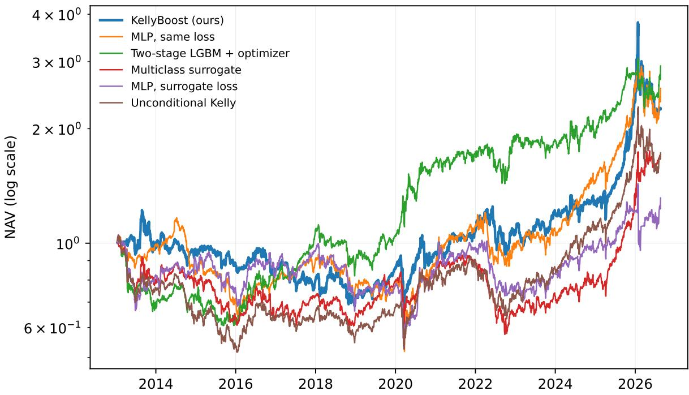
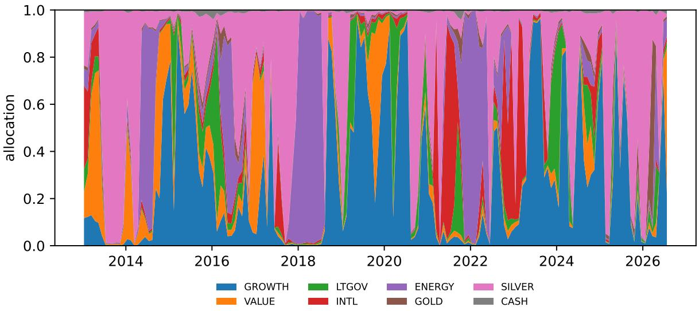

# KellyBoost: Growth-Optimal Portfolio Construction with Gradient-Boosted Trees

Jiayu Li lijiayu2027@outlook.com

August 2026

## Abstract

End-to-end portfolio learning — mapping features directly to portfolio weights under a financial objective, with no intermediate return forecast — has so far required backpropagation, shutting out gradient-boosted decision trees, the workhorse of tabular machine learning. We build the missing formulation. KellyBoost is a single multi-output XGBoost model whose softmax output is the portfolio: with y the vector of per-asset holding-period returns, the training loss is − log(1 + w⊤y) — the negative log growth rate, so the fitted model is the growth-optimal (Kelly) allocation conditioned on the features. The objective is exact rather than a surrogate: we derive the gradient, the analytic diagonal Hessian and the full Hessian in closed form, verify them by finite diferences, and ship a dependency-free reference engine. On a 23-year, eight-asset public-data testbed under a strictly separated selection/estimation protocol, we test the objective with a 2 × 2 design — {boosted tree, MLP} × {growth objective, classification surrogate} — and the growth objective improves deployed log growth over the surrogate within both learner classes, in both of two independently built feature pipelines: four of four cells — and, because the growth objective also trades less in every cell, transaction costs widen the gap rather than eroding it. We are equally explicit about the objective’s boundary, because the same testbed measures it: faithfully optimizing an estimated conditional full-Kelly allocation concentrates aggressively, and in this regime the end-to-end learners trail the classic two-stage predict-then-optimize pipeline, whose squarederror forecasts shrink toward zero and whose optimizer therefore holds mild portfolios. The exact Hessian beats its first-order substitutes on the selection protocol by a factor of three and loses to them deployed: the optimizer is not the problem; the estimated full-Kelly target is. Code, data and scripts regenerate every number from one committed CSV without an API key.

## 1 Introduction

Portfolio construction is a decision problem, but most machine-learning treatments of it are prediction problems with a decision bolted on: a model is trained to forecast returns under a statistical loss, and the forecasts are then handed to an optimizer, together with a separately estimated covariance matrix [20]. The mismatch is well documented. Small forecast errors are amplified by the optimizer in exactly the directions the optimizer cares about; expected returns are the quantity financial data identifies worst [22]; and the two stages optimize diferent objectives, so improving the first need not improve the second [9].

End-to-end (decision-focused) learning removes the seam: train the model directly on the decision objective. In portfolio management this line of work has been carried almost exclusively by neural networks [24–26], which directly optimize Sharpe-ratio or utility objectives by gradient descent — because gradient descent is what the formulation requires. Gradient-boosted decision trees (GBDTs), the workhorse of tabular machine learning and of quantitative practice [11, 12], have been shut out of this line of work entirely: a tree ensemble is not trained by backpropagation, so a practitioner who wants boosted trees on an allocation problem has had to route them through a surrogate — forecast returns, or classify the best asset — and accept the seam. What has been missing is the bridge: a tree-boosting formulation of the end-to-end allocation problem, so that the choice of learner class and the choice of training objective stop being one decision.

This paper builds that bridge, and it turns out to require nothing approximate. Whether the bridge is worth crossing — whether the decision objective beats the surrogates a practitioner would otherwise use — is an empirical question, and answering it cleanly, in both directions, is the paper’s second half. Our contributions:

1. An exact growth-optimal objective for boosted trees (Section 3). One multi-output XGBoost model [4] produces a logit vector per row; its softmax is a long-only, fully-invested portfolio on the simplex; the per-row loss is $- \log ( 1 + w ^ { \top } y )$ , whose sample mean is the negative log growth rate — the Kelly criterion [2, 16]. We derive the gradient and the analytic diagonal Hessian in closed form (verified by finite diferences in the accompanying test suite), so the model trains with true second-order boosting steps. The tuning metric is the training loss itself: nothing in the pipeline optimizes a proxy.

2. A deployment recipe for tree instability (Section 3.4). We show that two boosted fits whose training sets difer by a single dropped row can disagree materially in the allocation they produce — near-tied split points flip, and the perturbation saturates at one row. A single fit is a draw from a distribution, not its centre. We deploy a leave-one-out ensemble: K members, each fitted on the data minus one row, at unchanged hyperparameters — unlike bagging, the perturbation is too small to change efective capacity, so parameters tuned for a single fit remain valid.

3. A cleanly separated evaluation protocol (Section 3.6). Hyperparameters are selected on a development segment (ending 2012) with a purged single-row-block walk-forward whose score is treated strictly as a selection signal; performance is then measured once, on the untouched evaluation segment (2013–2026), by a deployment walk-forward with frozen parameters, expanding windows, and an end-anchored decision grid. The distinction between selection signals and performance estimates is enforced throughout.

4. A fully reproducible testbed (Section 4). Eight asset legs, a 7,871-column candidate feature set, and a joint (hyperparameter, feature list) search shared by every learned method (Section 3.5), over 2003–2026 — built exclusively from freely downloadable public market data (no API keys), with causality guaranteed by construction: every input is a same-day market close, every transform is backward-looking, and the raw snapshot is committed to the repository.

Out of sample, over 13.6 years, the comparisons that isolate the loss all land the same way. The study’s 2 × 2 design — {boosted tree, MLP} × {growth objective, classification surrogate} — holds the learner class fixed and swaps only the training loss, and the growth objective wins within both learner classes, in both feature pipelines: four of four cells, with a pooled paired efect of +0.18 per 20-day decision (×100) that rises to +0.25 under 20 bps of transaction costs, because the growth objective also trades less in every cell (Section 6). That is the paper’s claim, and it is the whole claim. Comparisons across learner classes (tree versus MLP at fixed loss) are confounded by capacity and optimization geometry, land within bootstrap noise, and we draw no conclusion from them. The comparisons against diferently-shaped pipelines mark the objective’s boundary rather than its value: the two-stage predict-then-optimize pipeline beats every end-to-end learner in this regime (no single pairwise gap clears its bootstrap interval — thirteen years of monthly decisions is a small sample, and we say so). The ablations give that boundary its mechanism: the exact Hessian wins the development-segment selection score by a factor of three over a constant-curvature substitute and then loses to it out of sample (Section 7). Optimization skill transfers; the estimated full-Kelly target does not. Every mechanism in the study that shrinks allocations toward diversification — the two-stage pipeline’s near-zero squarederror forecasts, the constant Hessian’s undersized steps — improves deployed performance, which locates the boundary squarely in the growth-optimal objective’s interaction with estimation error [7, 19], not in trees, boosting, or the derivations. Our code, data and scripts regenerate every table and figure from one committed CSV.

## 2 Related work

Growth-optimal investment. The criterion of maximizing the expected logarithm of wealth originates with Kelly [16] and was given its asymptotic optimality theory by Breiman [2]; see MacLean et al. [19] for a survey and Hakansson [13] for its relation to mean-variance analysis. Cover [5] constructs portfolios that are growth-optimal in hindsight without distributional assumptions. This literature conditions on no information or on price history alone; KellyBoost is the conditional version: a nonparametric estimate of the log-optimal portfolio as a function of an arbitrary feature vector.

End-to-end portfolio learning. Zhang et al. [26] train networks to maximize Sharpe ratio directly; Zhang et al. [25] generalize to several objectives while bypassing covariance estimation; Uysal et al. [24] do end-to-end risk budgeting. All are neural. The predict-then-optimize critique is formalized by Elmachtoub and Grigas [9]. Our contribution is orthogonal to architecture novelty: we bring the end-to-end objective to the model class that empirically dominates tabular problems of this size [11].

Boosting with custom objectives. Gradient boosting accepts any twice-diferentiable loss [4, 10]; XGBoost’s multi-output mode grows one tree per round with vector-valued leaves. We use this machinery unchanged — the novelty is the objective and the demonstration that its exact curvature, not a first-order substitute, is what makes it work (Section 7).

Evaluation discipline. Purging and embargoing overlapping labels follows L´opez de Prado [17]; the reasons to distrust selected backtest maxima are quantified by Bailey and L´opez de Prado [1]; sensitivity of backtest conclusions to the rebalance grid’s phase is documented by Hofstein et al. [14], which motivates our end-anchored decision grid.

## 3 Method

## 3.1 The objective and its exact derivatives

Let each training row consist of features $\boldsymbol { x } _ { t } \in \mathbb { R } ^ { d }$ and realized simple returns $\boldsymbol { y } _ { t } \in \mathbb { R } ^ { K }$ of K assets over the holding period $[ t , t + h ]$ . A multi-output boosted-tree model produces logits $z ( x _ { t } ) \in \mathbb { R } ^ { K }$ ; the portfolio is

$$
w _ { t } \ = \ \sigma ( z ( x _ { t } ) ) \in \Delta ^ { K - 1 } , \qquad \sigma _ { k } ( z ) = \frac { e ^ { z _ { k } } } { \sum _ { j } e ^ { z _ { j } } } ,
$$

i.e. long-only and fully invested by construction (a cash leg makes “fully invested” unrestrictive in practice). The portfolio’s holding-period return is $S _ { t } = w _ { t } ^ { \top } y _ { t }$ and the per-row loss is

$$
\ell _ { t } = - \log ( 1 + S _ { t } ) , \qquad \frac { 1 } { n } \sum _ { t } \ell _ { t } = - \widehat { \mathbb { E } } [ \log ( 1 + S ) ] ,\tag{1}
$$

the negative sample log growth rate: minimizing (1) maximizes the geometric growth of wealth, so the fitted model is the growth-optimal (Kelly) allocation conditioned on x. There is no forecasting step, no covariance matrix, and no separate optimizer; and because (1) is itself the economic objective, hyperparameter selection and evaluation can use the same quantity, eliminating every surrogate-metric seam in the pipeline.

The population version of this statement pins down what the model estimates:

Proposition 1 (conditional growth optimality). Let $( x , y )$ be jointly distributed with $\mathbb { E } | \log ( 1 +$ $w ^ { \top } y ) | < \infty$ for all $w \in \Delta ^ { K - 1 }$ . Among all measurable maps $z : \mathbb { R } ^ { d }  \mathbb { R } ^ { K }$ , any minimizer of $\mathbb { E } \left[ - \log ( 1 + \sigma ( z ( x ) ) ^ { \top } y ) \right]$ satisfies, for almost every x,

$$
\sigma ( z ( x ) ) \in \arg \operatorname* { m a x } _ { w \in \mathrm { i m } \sigma } \mathbb { E } \left[ \log ( 1 + w ^ { \top } y ) \Big | x \right] ,
$$

i.e. the fitted portfolio is the growth-optimal (Kelly) portfolio on the simplex, conditioned on the features.

Proof. The objective is an expectation of a per-x quantity, and $z ( x )$ can be chosen freely for each x; hence the minimization decouples pointwise: $z ^ { * } ( x )$ must maximize $\mathbb { E } [ \log ( 1 + \sigma ( z ) ^ { \top } y ) \mid x ]$ over $z \in \mathbb { R } ^ { K }$ , whose image under σ is dense in $\Delta ^ { K - 1 }$ □

KellyBoost is thus a nonparametric, tree-structured estimator of the conditional Kelly allocation — the conditional counterpart of the unconditional growth-optimal portfolios of the classical literature [2, 5, 16], with the boosting machinery supplying the conditioning.

XGBoost requires the gradient and Hessian of ℓ with respect to the raw scores z. Both are available in closed form. Using $\partial \sigma _ { k } / \partial z _ { k } = \sigma _ { k } ( 1 - \sigma _ { k } )$ and $\partial S / \partial z _ { k } = \sigma _ { k } ( y _ { k } - S )$ :

$$
g _ { k } \equiv { \frac { \partial \ell } { \partial z _ { k } } } = { \frac { \sigma _ { k } ( S - y _ { k } ) } { 1 + S } } , \qquad h _ { k } \equiv { \frac { \partial ^ { 2 } \ell } { \partial z _ { k } ^ { 2 } } } = g _ { k } ( 1 - 2 \sigma _ { k } ) + g _ { k } ^ { 2 } .\tag{2}
$$

The derivation is three lines (Appendix A); both expressions are verified against central finite diferences in the accompanying test suite. The gradient has a transparent reading: asset k’s logit is pushed up when it out-performs the portfolio it is competing against $( y _ { k } > S )$ , with force proportional to its current weight and inversely proportional to realized wealth growth — the compounding term $1 / ( 1 + S )$ that distinguishes log growth from mean return.

The loss (1) is not convex in z, so the true diagonal curvature $h _ { k }$ can be negative; XGBoost’s leaf weights divide by the aggregated Hessian, which must be positive, and we take $| h _ { k } |$ . The next subsection examines this safeguard — and the diagonal approximation itself — in detail, because neither is cosmetic.

A risk-aversion dial. Nothing above is specific to the logarithm. The accompanying implementation accepts the CRRA family $\phi _ { \gamma } ( S ) = \big ( ( 1 + S ) ^ { 1 - \gamma } - 1 \big ) / ( \gamma - 1 )$ , with $\gamma  1$ recovering $- \log ( 1 + S )$ : the gradient is $\phi _ { \gamma } ^ { \prime } ( S ) a _ { k }$ and the analytic diagonal Hessian $\phi _ { \gamma } ^ { \prime \prime } ( S ) a _ { k } ^ { 2 } + g _ { k } ( 1 - 2 \sigma _ { k } )$ where $a _ { k } = \sigma _ { k } ( y _ { k } - S )$ (Appendix A), both verified by finite diferences. Training with $\gamma > 1$ tempers the growth-optimal policy inside the objective, the utility-side analogue of fractional Kelly [18]. The hand-built pipeline fixes $\gamma = 1$ ; the joint search of Section 3.5 is ofered $\gamma \in [ 1 , 1 0 ]$ as a tunable and commits $\gamma = 1 . 1 4 - \mathrm { a n }$ essentially logarithmic setting: the selection protocol sees no in-sample reason to temper the objective, which is why Section 8 argues the risk dial must be set by preference rather than by search.

## 3.2 The curvature, examined

Three questions a second-order method on a non-convex loss owes its reader: does the rectified step still descend, how often does rectification actually fire, and what do the discarded of-diagonal terms cost? Each has a sharp answer here, and all measurements below are on the real training problem at the frozen parameters (experiments/curvature.py).

Descent survives rectification. A leaf’s value under any positive per-coordinate curvature $\tilde { H } _ { j k } > 0$ is $v _ { j k } = - G _ { j k } / ( \tilde { H } _ { j k } + \lambda )$ , so the first-order change of the round objective is $\begin{array} { r } { \sum _ { k } G _ { j k } v _ { j k } = } \end{array}$ $\begin{array} { r } { - \sum _ { k } G _ { j k } ^ { 2 } / ( \tilde { H } _ { j k } + \lambda ) < 0 \mathrm { : } } \end{array}$ every leaf update is a descent step on the current linearization regardless of how the curvature was made positive, with λ bounding the step. Rectification therefore afects step sizes, never step direction, and the learning rate η provides the usual damping on top.

Rectification is the working regime, not an edge case. Holding-period returns are small, so expanding (2) in $\| y \|$ gives $h _ { k } = g _ { k } ( 1 - 2 \sigma _ { k } ) + g _ { k } ^ { 2 }$ with the linear term dominant: the exact curvature’s sign follows the gradient’s whenever $\sigma _ { k } < \frac { 1 } { 2 }$ , i.e. negative curvature is expected on roughly the cells whose asset is currently outperforming the portfolio. Measured at the committed configuration: 50% of (row, asset) cells are rectified at the first round, declining to 27% by the last. The safeguard is central to the objective, which is why it deserves a name rather than an apology: $| h _ { k } |$ is precisely the diagonal case of saddle-free Newton, which preconditions by |H| in eigenvalue terms [6]. The ablation’s grad2 mode is the other principled positive surrogate — the diagonal Gauss–Newton curvature $\phi ^ { \prime \prime } a _ { k } ^ { 2 } \ [ 2 1 ]$ , which for the log loss equals $g _ { k } ^ { 2 }$ exactly — so Table 5 compares the exact rectified diagonal against both textbook alternatives, not against a straw man.

The of-diagonal terms are measurable — and priced in. The full per-row Hessian has the closed form

$$
H = \phi ^ { \prime \prime } ( S ) a a ^ { \top } + \phi ^ { \prime } ( S ) \left( \mathrm { d i a g } ( a ) - \sigma a ^ { \top } - a \sigma ^ { \top } \right) , \qquad a = \left( \mathrm { d i a g } ( \sigma ) - \sigma \sigma ^ { \top } \right) y ,\tag{3}
$$

symmetric by construction (Appendix A) and finite-diference-verified. Of-diagonal entries carry about half its Frobenius mass per row (0.50 at round 0, drifting to 0.62), so the diagonal approximation cannot be defended by sparsity. It is defended at the operating point instead: what a leaf applies is not the row Hessian but $\textstyle \sum _ { i \in I _ { j } } H _ { i }$ shrunk by the tuned λ, and there the diagonal step $- G / ( \Sigma | h | + \lambda )$ and the full eigenvalue-rectified Newton step $- ( | \Sigma H | + \lambda I ) ^ { - 1 } G$ are directionally indistinguishable — mean cosine $\geq 0 . 9 9$ on leaf-sized row sets at every stage of training. The end-to-end check agrees: the pure-numpy engine optionally solves every leaf against the aggregated full Hessians (leaf solver="full"; split search unchanged), and under the tuning protocol the two leaf solvers score within noise of each other (Section 7). The conclusion worth carrying forward: with (λ, min child weight) at their tuned values, the curvature’s real contribution is per-coordinate step scaling — which is exactly the margin the Hessian-mode ablation prices, and why the all-ones Hessian, whose scale is wrong by orders of magnitude, fails hardest there.

## 3.3 Second-order boosting with vector leaves

The model is the standard boosted additive ensemble, except that each tree is vector-valued. After M rounds,

$$
z ( x ) = \eta \sum _ { m = 1 } ^ { M } f _ { m } ( x ) , \qquad f _ { m } : \mathbb { R } ^ { d } \to \mathbb { R } ^ { K } ,
$$

where each $f _ { m }$ is a binary decision tree whose leaves hold K-vectors (XGBoost’s multi strategy = multi output tree): a row is routed by ordinary scalar feature splits to a single leaf $j$ , and the whole logit vector receives that leaf’s value $v _ { j } \in \mathbb { R } ^ { K }$

One round. Let Z be the current logit matrix and $g _ { i k } , h _ { i k }$ the per-row derivatives (2) evaluated at Z. Because the Hessian we supply is diagonal, the second-order expansion of the loss around $Z$ separates over outputs:

$$
\sum _ { i } \ell \big ( z _ { i } + f ( x _ { i } ) \big ) \approx \mathrm { c o n s t } + \sum _ { i } \sum _ { k } \Big [ g _ { i k } f _ { k } ( x _ { i } ) + \frac { 1 } { 2 } h _ { i k } f _ { k } ( x _ { i } ) ^ { 2 } \Big ] + \gamma T + \frac { \lambda } { 2 } \sum _ { j , k } v _ { j k } ^ { 2 } ,\tag{4}
$$

with $T$ the number of leaves. For a fixed tree structure with leaf row-sets $I _ { j }$ , writing $G _ { j k } =$ $\textstyle \sum _ { i \in I _ { i } } g _ { i k }$ and $\begin{array} { r } { H _ { j k } = \sum _ { i \in I _ { i } } h _ { i k } } \end{array}$ , the optimal leaf vector and its objective reduction are the coordinate-wise Newton step

$$
v _ { j k } ^ { * } = - \frac { G _ { j k } } { H _ { j k } + \lambda } , \qquad \mathrm { r e d u c t i o n } ( I _ { j } ) = \frac { 1 } { 2 } \sum _ { k = 1 } ^ { K } \frac { G _ { j k } ^ { 2 } } { H _ { j k } + \lambda } .\tag{5}
$$

Split search is the usual greedy scan, but scored jointly: splitting I into $( I _ { L } , I _ { R } )$ gains

$$
\mathrm { G a i n } = { \frac { 1 } { 2 } } \sum _ { k = 1 } ^ { K } \left[ { \frac { G _ { L k } ^ { 2 } } { H _ { L k } + \lambda } } + { \frac { G _ { R k } ^ { 2 } } { H _ { R k } + \lambda } } - { \frac { G _ { k } ^ { 2 } } { H _ { k } + \lambda } } \right] - \gamma .\tag{6}
$$

Equations (5)–(6) make the division of labour explicit: given the partition, the K outputs decouple into K independent scalar Newton problems; all coupling between assets flows through the shared split search, where a candidate split must pay for itself summed across every output. A vector-leaf tree is exactly K scalar boosting problems forced to agree on one partition of feature space. Algorithm 1 assembles the whole procedure; the per-round cost is that of a scalar tree plus a factor $K$ in the leaf statistics, and the node Hessian mass that (5) accumulates is also what the minimum-child-weight constraint meters, so the familiar regularizers carry over unchanged.

Algorithm 1 KellyBoost training (exact objective, vector leaves)   
Require: features $X \in \mathbb { R } ^ { n \times d } ;$ holding-period returns $Y \in \mathbb { R } ^ { n \times K }$ ; rounds M; learning rate η;   
regularizers $\lambda , \gamma$   
1: $Z \gets 0 _ { n \times K }$ ▷ logit matrix   
2: for $m = 1 , \ldots , M$ do   
3: $\sigma _ { i } \gets$ softmax $( Z _ { i \cdot } ) ; \quad S _ { i }  \sigma _ { i } ^ { \top } Y _ { i \cdot }$ for all i   
4: $g _ { i k }  \sigma _ { i k } ( S _ { i } - Y _ { i k } ) / ( 1 + S _ { i } )$ ▷ exact gradient, eq. (2)   
5: $h _ { i k } \gets | g _ { i k } ( 1 - 2 \sigma _ { i k } ) + g _ { i k } ^ { 2 } |$ ▷ analytic diagonal Hessian, abs safeguard   
6: grow one tree $f _ { m }$ greedily from the root:   
at each node, take the feature/threshold split maximizing Gain in eq. (6);   
stop when no split has Gain $> 0$ or a size/Hessian-mass constraint binds   
7: set each leaf j of $f _ { m }$ to the K-vector $v _ { j k } = - G _ { j k } / ( H _ { j k } + \lambda )$ ▷ Newton step, eq. (5)   
8: $Z \gets Z + \eta f _ { m } ( X )$   
9: end for   
10: return $\begin{array} { r } { z ( \cdot ) = \eta \sum _ { m } f _ { m } ( \cdot ) } \end{array}$ ; portfolio w(x) = softmax(z(x))

Why one tree per round fits allocation. The softmax couples the outputs — only diferences between logits matter — so allocation is inherently a joint decision (“growth stock versus gold”), and a shared partition of feature space is both a useful inductive bias and a K-fold parameter reduction: a regime variable that matters for the whole book (a curve inversion, a volatility spike) buys one split serving all K outputs, and the joint gain (6) prices exactly that. The alternative, K independent trees per round (one output per tree), can only rediscover the same split K times from K noisy scalar signals. The ablation (Table 5) quantifies the diference. A version note that matters for reproduction: xgboost ≥ 3.4 is required, as earlier versions silently ignore min child weight under vector-leaf training.

A dependency-free reference implementation. The accompanying code contains two interchangeable engines behind one interface: XGBoost’s C++ vector-leaf trees (used for every number in this paper), and a self-contained pure-numpy implementation of Algorithm 1 of about two hundred lines — quantile binning, leaf-wise growth, the joint gain (6) and vector Newton leaves (5) — with no compiled dependency. Its split selection and leaf values are tested exactly (to 10−10) against brute-force evaluations of (5)–(6), and the two engines agree out of sample on planted-signal problems. Building it surfaced a portability caveat worth recording: min child weight semantics under vector leaves are not standardized — our engine meters a child’s Hessian mass summed over outputs, XGBoost’s gate is stricter — so the value buys diferent efective capacity on diferent engines and should be re-tuned, not ported.

## 3.4 Deployment: fixed-parameter leave-one-out ensembling

Boosted trees are chaotically sensitive to the training set: when two candidate splits are near-tied, an infinitesimal perturbation flips the winner, and the divergence compounds through subsequent rounds. In our setting the efect is large enough to matter economically. Deleting a single row from a multi-thousand-row training set — roughly 0.02% of the data, and an interior row whose information is nearly duplicated by its neighbours, since adjacent rows share h − 1 days of their labels — moves the allocation the model produces for the live decision row by several percentage points on a leg (measured in Section 7). A single fit is therefore one draw from a distribution induced by irrelevant detail, not the centre of that distribution.

The deployment recipe: fit $K _ { \mathrm { e n s } }$ members, member s on the training set minus one row drawn deterministically from seed s, and average the members’ weight vectors (the mean of simplex points stays on the simplex). Crucially, every member runs the committed hyperparameters unchanged. Classic bagging [3] resamples aggressively and would change the efective capacity the hyperparameters were tuned for; the one-row perturbation is instead the smallest change that decorrelates the split-tie coin flips, so tuning remains valid and nothing needs re-searching. Averaging pulls the allocation toward the centre at the usual $1 / \sqrt { K _ { \mathrm { e n s } } }$ rate, and the efect saturates quickly (Section 7); we deploy $K _ { \mathrm { e n s } } = 4$ for every learned method in the comparison. Seeds are the member indices, so the deployed book is a deterministic function of the data.

## 3.5 Feature selection as part of selection

A tabular learner is only as good as its feature list, and in the monthly-horizon regime the list that helps is short. We therefore treat the feature list as a hyperparameter: the search layer proposes states (θ, F) — a hyperparameter vector and a feature list — and every learned method in the comparison is searched the same way with the same candidate set and budget.

Candidates. From the raw snapshot (Section 4) we build one large candidate set: for every price-like series, lookback return, drawdown, moving-average ratio, z-score, realized volatility, return skewness and kurtosis, a Hurst exponent and a percentile rank over 1-, 3-, 6-, 12- and 24-month windows; for every yield-like series, change, moving-average slope, z-score, change volatility, skewness, kurtosis and percentile rank over the same windows; and, for every series and window, the window-quantile features of Dempster et al. [8] — quantiles of the z-scored window, of its smoothed first diferences and of its second diferences, read over the whole window, its recent half and its recent quarter. Every column is a backward-looking transform of same-day closes; the hand-built 174-column set of the no-search pipeline is included unchanged. This gives 7,871 columns, finite everywhere from 2003-02.

Ranking. The search needs an add pool it can draw from. The root feature list is the 20 columns with the largest split gain when the committed configuration is fitted on the hand-built set (what the no-search pipeline already relied on most). Every other candidate is then fitted once, added to that root, and ranked by its share of the fit’s total gain — a marginal-gain ranking, one small fit per candidate (7,856 fits; minutes on 30 cores). The top 300 form the pool. Gain is a within-fit quantity and is not the selection score; it only orders the candidates the protocol will later judge.

Search. A stochastic local search over states, each scored once by the protocol of Section 3.6. Starting from the committed hyperparameters with the root feature list, each iteration proposes one local move — perturb the hyperparameters (within the spaces of Appendix B), add one pool column (rank-weighted), or drop one low-gain column — and re-scores the resulting state; columns whose split gain falls to zero are pruned, so no state carries dead weight. The search runs for a wall-clock budget (60 minutes on 30 cores for KellyBoost, 45 for each baseline) and commits the best-scoring state. The MLP has no split gain; it borrows KellyBoost’s root and pool and searches its own hyperparameters and list over them. The development segment is the only data any of this ever sees.

## 3.6 Selection versus estimation

We keep two questions — which configuration is better and how good is the result — in two separate instruments, and never read one as the other.

Selection. Hyperparameters and the feature list are chosen together on the development segment only (2003-02 to 2012-12), by the search of Section 3.5. Each configuration is scored by a purged walk-forward: test blocks are single rows every 11 rows; the h − 1 rows before a test row, whose labels overlap it, are purged from training, and 60 rows after it are embargoed [17]. Single-row test blocks are a fidelity choice: in deployment the predicted row always sits immediately after the training window, and wider test blocks would score rows at distances from the training edge that never occur live. Each block is scored by a single fit — the mean over blocks already averages away fit noise. This score ranks configurations; because each block’s training set contains data from after its test row, it is near-in-sample by construction and is never quoted as performance.

Estimation. Performance is measured once, on the evaluation segment (2013-01 to 2026-07), by a deployment walk-forward that only ever looks backward: decisions every 21 trading days; at each decision the model is refit (as the Section 3.4 ensemble) on an expanding window containing exactly the rows whose labels are fully realized by the decision date; parameters stay frozen at the development winners. The decision grid is anchored at the last decidable row and counted backwards, so the newest information is always used; a front-anchored grid can leave the final decision up to 20 rows stale, and grid phase alone is known to move backtest conclusions [14]. The evaluation segment was not consulted at any point during development of the method or the tuning.

## 4 Data

All inputs are daily series freely downloadable from Yahoo Finance without an API key; the raw snapshot (38 series, 1985–2026) is committed to the repository, and everything downstream is a deterministic function of that one file.

Asset legs. Eight legs: growth equity (VIGRX), value equity (VIVAX), long-term Treasuries (VUSTX), international equity (VGTSX), energy equity (VGENX), gold (GC=F), silver (SI=F), and cash. Index mutual funds are chosen over the equivalent ETFs for their longer history (VUSTX starts in 1986 versus 2002 for TLT); their adjusted closes include distributions, so all legs are total-return series. The cash leg pays the 13-week T-bill yield (ˆIRX): its 20-day accrual yield/100 × 20/252 is known at decision time.

Feature-only series. The S&P 500, VIX, three Treasury yields, copper, eight SPDR sectors, and fifteen cross-asset context series — the dollar index, Russell 2000, Nasdaq, emerging-market equity, REITs, investment-grade and high-yield credit, intermediate Treasuries, TIPS, natural gas, the CBOE SKEW index, corn, wheat, soybeans and the yen — again using mutual-fund share classes where the ETF is too young, so that every series reaches back to 2001 or earlier. None is ever a leg.

Features. Two feature sets appear in the paper. The hand-built set: 174 columns — momentum, volatility, moving-average ratio, drawdown and z-score over 21–252-day windows for each of 17 price series, level and 21/63-day changes for four Treasury yields and three curve slopes, and level, trend and one-year percentile for the VIX. The candidate set of Section 3.5: 7,871 columns, a superset of the hand-built set, from which the search selects each method’s deployed list. Both obey the same rules: there are no macro releases, hence no publication lags, no revisions, and no interpolation toward future values anywhere — what the model sees on date t was public at t’s close. Futures series are forward-filled onto the NYSE calendar (a causal fill). Each assembled panel is finite everywhere by construction — assembly fails otherwise — and spans 2003-02 (hand-built: 2001-08) to 2026-07 once all warm-up windows are full.

Labels. Per-leg forward 20-trading-day simple returns. Adjacent rows overlap h − 1 = 19 days of their labels; the purge in Section 3.6 exists precisely for this overlap.

## 5 Experiments

## 5.1 Methods compared

Every learned method draws from the identical candidate set and label frame, runs the identical search (Section 3.5) under the identical development protocol with the budgets of Appendix B, freezes its winner — hyperparameters and feature list — and deploys with the identical $K _ { \mathrm { e n s } } = 4$ leave-one-out ensemble and walk-forward.

• KellyBoost (ours): Section 3.

• Two-stage predict-then-optimize: one LightGBM regressor [15] per risky leg forecasts the 20-day return; the forecast vector µˆ and a trailing sample covariance Σb of the label vectors feed $\begin{array} { r } { \operatorname* { m a x } _ { w \in \Delta ^ { K - 1 } } \boldsymbol { w } ^ { \top } \hat { \boldsymbol { \mu } } - \frac { 1 } { 2 } w ^ { \top } \widehat { \boldsymbol { \Sigma } } \boldsymbol { w } - } \end{array}$ the second-order expansion of expected log growth [13], i.e. a plug-in Kelly portfolio. The covariance window is tuned alongside the regressor’s hyperparameters.

• Multiclass surrogate: LightGBM multiclass on the label “index of the best-performing leg”; the predicted class-probability vector is itself a softmax portfolio. This is the natural classification shortcut to the same output space.

• MLP, same loss: a feed-forward network (up to two hidden layers, Adam, weight decay) trained on exactly loss (1) with a softmax head — the neural end-to-end reference, sharing every convention including the ensemble.

• MLP, surrogate loss: the identical network trained with cross-entropy on the argmax label. With the two tree methods this completes a 2 × 2 design — {boosted tree, MLP} × {growth objective, classification surrogate} — so the efect of the loss can be read within each learner class, where nothing else difers.

• Unconditional Kelly: the constant simplex portfolio maximizing in-sample log growth, refit each decision date — what conditioning on features is worth is the gap to this baseline [5].

Table 1: Out-of-sample results on the evaluation segment (2013-01 to 2026-07, 163 monthly decisions, gross of costs). log G is the mean realized log growth per 20-day decision (×100). Sharpe is daily returns in excess of T-bills, annualized. The last column is the moving-block-bootstrap 95% interval for the diference in annualized daily log growth versus KellyBoost (negative = worse than KellyBoost).
<table><tr><td>Method</td><td>log G (×100, 20d)</td><td>Ann. return</td><td>Ann. vol.</td><td>Sharpe</td><td>Max DD</td><td>∆ ann. log growth vs. KellyBoost (%)</td></tr><tr><td>KellyBoost (ours)</td><td>0.47</td><td>6.2%</td><td>23.9%</td><td>0.30</td><td>-46.2%</td><td></td></tr><tr><td>MLP, same loss</td><td>0.56</td><td>7.1%</td><td>20.5%</td><td>0.35</td><td>-55.5%</td><td>-0.9 [-9.2, +8.9]</td></tr><tr><td>Two-stage LGBM + optimizer</td><td>0.82</td><td>8.2%</td><td>20.9%</td><td>0.40</td><td>-40.4%</td><td>-1.9 [-12.3, +10.0]</td></tr><tr><td>Multiclass surrogate</td><td>0.35</td><td>4.0%</td><td>19.2%</td><td>0.21</td><td>-42.7%</td><td>+2.0 [-5.6, +9.4]</td></tr><tr><td>MLP, surrogate loss</td><td>0.20</td><td>2.0%</td><td>21.8%</td><td>0.12</td><td>-47.4%</td><td>+4.0 [-5.1, +14.2]</td></tr><tr><td>Unconditional Kelly</td><td>0.42</td><td>4.1%</td><td>19.3%</td><td>0.22</td><td>-50.9%</td><td>+2.0 [-4.6, +9.3]</td></tr></table>

## 5.2 Metrics

The primary metric is the realized mean log growth per 20-day decision, log $\begin{array} { r } { \overline { { G } } = \frac { 1 } { T } \sum _ { t } \log ( 1 + } \end{array}$ $w _ { t } ^ { \top } y _ { t } )$ over the evaluation decisions — the deployed quantity the objective optimizes. We also report, from daily equity curves with holdings drifting between rebalances: annualized geometric return, annualized volatility, Sharpe ratio of daily returns in excess of the T-bill leg, and maximum drawdown. Pairwise diferences in daily log growth against KellyBoost get moving-block bootstrap 95% intervals (block 21 days, 5,000 draws) [23]. The 2 × 2 loss-efect pairs get their own paired test at the decision level: per-decision diferences in realized log growth, circular moving-block bootstrap (block 6 decisions, 10,000 draws), per cell and pooled across the four aligned cells (Table 2). Backtests are gross of costs; Table 6 prices costs back in via measured turnover.

## 6 Results

Table 1 and Figure 1 present the main comparison; Figure 2 shows the deployed allocation. One reading rule first: every pairwise bootstrap interval in Table 1 straddles zero. Monthly-horizon evidence over 13.6 years cannot separate any two of these methods at conventional significance, so the section argues from consistency — across methods, and across ablations that move the same lever from two directions — and reads the comparisons in two groups: first the $2 \times 2$ the paper’s claim rests on, where only the training loss moves; then the pipeline-shape comparisons that mark the objective’s boundary.

The loss efect: the 2 × 2. Four methods share one output space (softmax over legs) and pair up into two controlled comparisons of the training loss: boosted trees under the growth objective versus cross-entropy on the argmax label, and the identical MLP under the same two losses. The growth objective wins all four cells — trees 0.47 vs 0.35 searched and 0.39 vs 0.32 hand-built (where both methods see the identical 174 columns), MLPs 0.56 vs 0.20 searched and 0.67 vs 0.49 hand-built (identical everything but the loss; Tables 1 and 3). Table 2 puts the claim on its own statistical footing: the paired per-decision diference is positive in every cell (+0.07 to +0.37 per 20-day decision, ×100), and pooling the four aligned diference series — an average per decision date, which preserves the cross-cell correlation rather than pretending the cells are independent — gives +0.18 with bootstrap $\mathrm { P r } ( \Delta > 0 ) = 0 . 8 9$ , stable at 0.84–0.96 across bootstrap block lengths of 1 to 12 decisions. The pooled interval still includes zero — thirteen years of monthly decisions is a small sample — but the direction never flips, in any cell, under any block length. The mechanism is not mysterious: cross-entropy on the argmax label throws away the margin structure of returns — a month won by 20 basis points and a month won by 20 points are the same training example — and both learner classes pay for discarding it. The comparison also survives — indeed sharpens under — transaction costs, because the growth objective trades less than the surrogate in every cell (Section 7). (One residual confound in the tree pair: the surrogate runs on LightGBM rather than XGBoost, and in the searched rows each method deploys its own feature list; the MLP pair has neither.)

  
Figure 1: Out-of-sample equity curves (log scale), all methods, evaluation segment. Every learned method is deployed identically: frozen development-tuned parameters, expanding-window refits every 21 trading days, $K _ { \mathrm { e n s } } = 4$ leave-one-out ensemble.

Across learner classes: no conclusion. At fixed loss, the MLP edges the tree under the growth objective (0.56 vs 0.47) and the tree edges the MLP under the surrogate (0.35 vs 0.20). Both gaps sit well inside bootstrap noise and are confounded by everything a learner class is — capacity, optimization geometry, regularization style — so we read nothing into them, in either direction.

The objective’s boundary: what shrinks, wins the window. The remaining comparisons change the pipeline’s shape, not just its loss, and they mark where faithfulness to the objective stops paying. The two-stage pipeline shares KellyBoost’s learner class and its decision rule’s intent (growth optimality via the quadratic expansion) but learns squared-error forecasts first; a monthly-horizon return is barely predictable, so the fitted forecasts sit near zero, and an optimizer fed near-zero expected returns with a full covariance matrix holds a mild, diversified book. What the predict-then-optimize literature treats as the seam’s defect [9] functions here as implicit regularization, and the two-stage pipeline out-deploys every end-to-end learner. KellyBoost’s side of the boundary is symmetric: it does precisely what its objective asks, estimating the conditional growth-optimal portfolio — aggressive by construction, deployed committee mean maximum leg weight 0.70 — and it pays for the aggression in 2014–2018 and again in 2026, after banking the study’s largest single-year gain in 2025. The unconditional-Kelly row completes the picture: conditioning on features is worth something — the conditional model beats the best constant portfolio. Getting the decision loss right is necessary; this boundary is the measured distance between necessary and suficient.

  
Figure 2: KellyBoost’s deployed allocation over the evaluation segment (committee average). The model was never told what an asset class is — the rotation structure is learned from the features alone.

The feature search improved selection scores far more than deployment — except where shrinkage could use it. Table 3: the joint search roughly doubled every method’s development-segment selection score. Deployed, the gains sort by pipeline, not by score: the two-stage pipeline converts the searched features into a doubling of realized growth — better inputs make better forecasts, and its shrinkage keeps the resulting bets survivable — while the end-to-end methods convert the same kind of search into little more than reshufled concentration, and both MLPs’ searched lists actually deploy worse than their hand-built ones. The residual gap between selection movement and deployment movement is selection bias made visible, which is why no selection score in this paper is ever quoted as performance. For the record, KellyBoost’s deployed list is five columns (Table 4) — two-year window quantiles of international equity curvature, wheat and copper, a soybean drift quantile, and financial-sector return skewness — a list whose economic legibility we leave to the reader’s judgment, which is part of the point.

Table 2: The loss efect, cell by cell: paired per-decision diferences in realized log growth, growth objective minus argmax surrogate, holding the learner class and feature pipeline fixed within each cell $( K _ { \mathrm { e n s } } = 4$ , 163 decisions). Intervals: circular moving-block bootstrap, block 6 decisions, 10,000 draws. The pooled row averages the four aligned diference series at each decision date, preserving cross-cell correlation.
<table><tr><td>Cell (growth − surrogate) (×100, 20d)</td><td>∆log G</td><td>95% CI</td><td> $\mathrm { P r } ( \Delta > 0 )$ </td></tr><tr><td>Boosted tree, searched</td><td>+0.12</td><td> $[ - 0 . 5 2 , + 0 . 7 5 ]$ </td><td>0.65</td></tr><tr><td>Boosted tree, hand-built</td><td>+0.07</td><td> $[ - 0 . 3 4 , + 0 . 4 5 ]$ </td><td>0.63</td></tr><tr><td>MLP, searched</td><td>+0.37</td><td> $[ - 0 . 2 6 , + 0 . 9 9 ]$ </td><td>0.87</td></tr><tr><td>MLP, hand-built</td><td>+0.18</td><td> $[ - 0 . 3 2 , + 0 . 7 5 ]$ </td><td>0.77</td></tr><tr><td>Pooled (four cells)</td><td>+0.18</td><td> $[ - 0 . 1 1 , + 0 . 5 0 ]$ </td><td>0.89</td></tr></table>

Table 3: What the feature search bought. Hand-built: the 174-column set with random-search hyperparameters (the pipeline as first designed); searched: Section 3.5. Deployment metrics, $K _ { \mathrm { e n s } } = 4$
<table><tr><td>Method</td><td>Features</td><td>|F|</td><td>log G (×100)</td><td>Ann. return</td><td>Ann. vol.</td><td>Sharpe</td><td>Max DD</td></tr><tr><td>KellyBoost</td><td>hand-built</td><td>174</td><td>0.39</td><td>5.7%</td><td>22.9%</td><td>0.28</td><td>-48.3%</td></tr><tr><td>KellyBoost</td><td>searched</td><td>5</td><td>0.47</td><td>6.2%</td><td>23.9%</td><td>0.30</td><td>-46.2%</td></tr><tr><td>MLP, same loss</td><td>hand-built</td><td>174</td><td>0.67</td><td>8.5%</td><td>19.4%</td><td>0.43</td><td>-40.4%</td></tr><tr><td>MLP, same loss</td><td>searched</td><td>19</td><td>0.56</td><td>7.1%</td><td>20.5%</td><td>0.35</td><td>-55.5%</td></tr><tr><td>Two-stage LGBM + optimizer</td><td>hand-built</td><td>174</td><td>0.38</td><td>5.2%</td><td>23.8%</td><td>0.26</td><td>-36.2%</td></tr><tr><td>Two-stage LGBM + optimizer</td><td>searched</td><td>15</td><td>0.82</td><td>8.2%</td><td>20.9%</td><td>0.40</td><td>-40.4%</td></tr><tr><td>Multiclass surrogate</td><td>hand-built</td><td>174</td><td>0.32</td><td>4.5%</td><td>20.1%</td><td>0.23</td><td>-41.3%</td></tr><tr><td>Multiclass surrogate</td><td>searched</td><td>26</td><td>0.35</td><td>4.0%</td><td>19.2%</td><td>0.21</td><td>-42.7%</td></tr><tr><td>MLP, surrogate loss</td><td>hand-built</td><td>174</td><td>0.49</td><td>6.7%</td><td>19.5%</td><td>0.34</td><td>-33.1%</td></tr><tr><td>MLP, surrogate loss</td><td>searched</td><td>23</td><td>0.20</td><td>2.0%</td><td>21.8%</td><td>0.12</td><td>-47.4%</td></tr></table>

## 7 Ablations

The exact Hessian is a better optimizer and a worse deployer. Replacing $| h _ { k } |$ from (2) with a constant (gradient-only boosting) or with $g _ { k } ^ { 2 }$ changes nothing about the objective’s minimum and everything about the optimization path. On the development protocol at identical hyperparameters the exact curvature scores +4.19 against the constant’s +1.43 (×100; Table 5) — it is, as second-order theory promises, much the better optimizer of the training objective. Deployed, the ranking inverts: the constant-Hessian variant’s undersized steps leave its softmax closer to uniform, and that accidental shrinkage beats the faithfully optimized full-Kelly allocation out of sample. The same inversion, from the other side: the $g _ { k } ^ { 2 }$ surrogate is the worst selector and roughly matches the exact Hessian’s deployment. The exact curvature is not decorative it does exactly what it claims — but on this problem, what it claims is the wrong thing to want.

Vector leaves. Growing K independent trees per round (one output per tree) removes the shared partition and multiplies parameters by K. It selects worse and deploys better (Table 5) — the same shrinkage signature as the Hessian substitutions, since K uncoordinated trees move the softmax less coherently than one vector-leaf tree.

Table 4: KellyBoost’s searched feature list, with each column’s share of the committed fit’s total split gain.
<table><tr><td>Feature</td><td>Gain share</td></tr><tr><td>INTL_Q2Y_SH2P90</td><td>35.9%</td></tr><tr><td>WHEAT_Q2Y_RH2P25</td><td>27.7%</td></tr><tr><td>COPPER_Q2Y_SWP10</td><td>22.0%</td></tr><tr><td>SOYBEAN_Q2Y_RH2P50</td><td>7.7%</td></tr><tr><td>XLF_SKEW1Y</td><td>6.7%</td></tr></table>

Table 5: Ablations. Dev. score: mean log growth (×100) under the development tuning protocol at the frozen KellyBoost parameters. Deployment columns as in Table 1, all with $K _ { \mathrm { e n s } } = 4 $
<table><tr><td>Variant</td><td>Dev. score (×100)</td><td>log G (×100)</td><td>Ann. return</td><td>Sharpe</td><td>Max DD</td></tr><tr><td>analytic Hessian (model)</td><td>4.19</td><td>0.47</td><td>6.2%</td><td>0.30</td><td>-46.2%</td></tr><tr><td>constant Hessian</td><td>1.43</td><td>0.67</td><td>8.3%</td><td>0.63</td><td>-23.6%</td></tr><tr><td> $g ^ { 2 }$  Hessian</td><td>0.54</td><td>0.45</td><td>5.0%</td><td>0.26</td><td>-51.7%</td></tr><tr><td>one output per tree</td><td>3.50</td><td>0.65</td><td>8.8%</td><td>0.40</td><td>-45.7%</td></tr></table>

Ensembling stabilizes the weights and buys no growth. Prefix averages of the stored members (no refits) confirm the single-fit instability claimed in Section 3.4 — one-row perturbations move deployed legs by whole percentage points, and the committee’s gap to the K=16 book shrinks at roughly $1 / \sqrt { K }$ — while realized growth is flat in K to within noise. Averaging removes an operational fragility (the deployed book no longer depends on a split-tie coin flip), not a performance penalty; we keep $K _ { \mathrm { e n s } } = 4$ for determinism, and report this honestly rather than as an accuracy ingredient. Because members difer by one training row each, the same numbers are simultaneously the measurement of that instability.

Of-diagonal curvature: the end-to-end check. The pure-numpy engine’s full-Hessian leaf solver (leaf solver="full") solves every leaf against the aggregated $K \times K$ row Hessians of (3) (eigenvalue-rectified) instead of the coordinate-wise step, with the split search held fixed. Under the tuning protocol at the frozen parameters, on one identical coarsened block grid, the diagonal solver scores +0.0335 and the full solver +0.0339 (mean log growth per block) — within noise — consistent with the $\geq 0 . 9 9$ leaf-step cosines of Section 3.2: at the tuned regularization, the of-diagonal terms buy nothing that the diagonal step had lost.

Costs. Table 6 prices one-way proportional costs into every method through its measured turnover; at realistic ETF/fund cost levels the conclusions of Table 1 are unchanged. More important for the paper’s claim: in all four cells of the 2 × 2 the growth objective trades less than its argmax counterpart — 7.9× versus 13.1× annualized turnover for the searched trees, 4.8× versus 10.8× hand-built, 11.8× versus 16.8× and 15.4× versus 16.0× for the MLPs — so charging costs widens the loss efect: the pooled paired diference of Table 2 rises from +0.18 gross to +0.20, +0.22 and +0.25 per decision at 5, 10 and 20 bps, with $\mathrm { P r } ( \Delta > 0 )$ rising from 0.89 to 0.95. The reading we ofer: the argmax label is the more brittle target — a hair’s-breadth change in which leg wins the month flips the entire label, and the classifier’s book follows it — while the growth objective moves its weights only as far as estimated conditional growth moves.

Table 6: Transaction-cost sensitivity: annualized return / excess Sharpe under one-way proportional costs applied to each method’s measured turnover.
<table><tr><td>Method</td><td>Turnover</td><td></td><td>0 bps</td><td></td><td>5 bps</td><td>10 bps</td><td></td><td>20 bps</td></tr><tr><td>KellyBoost (ours)</td><td>7.9x</td><td></td><td>6.2% / 0.30</td><td>5.8% / 0.28</td><td></td><td>5.3% / 0.27</td><td></td><td>4.5% / 0.23</td></tr><tr><td>MLP, same loss</td><td>11.8x</td><td></td><td>7.1% / 0.35</td><td>6.5% / 0.32</td><td></td><td>5.9% /0.30</td><td>4.6%</td><td>/0.24</td></tr><tr><td>Two-stage LGBM + optimizer</td><td>16.5x</td><td></td><td>8.2% / 0.40</td><td>7.3% / 0.36</td><td></td><td>6.4% /0.32</td><td>4.7%</td><td>/ 0.24</td></tr><tr><td>Multiclass surrogate</td><td>13.1x</td><td></td><td>4.0% / 0.21</td><td>3.3% / 0.18</td><td></td><td>2.7% /0.14</td><td>1.3%</td><td>/0.07</td></tr><tr><td>MLP, surrogate loss</td><td>16.8x</td><td></td><td>2.0% / 0.12</td><td>1.2%</td><td>/ 0.09</td><td>0.3% / 0.05</td><td></td><td>-1.4% / -0.03</td></tr><tr><td>Unconditional Kelly</td><td>1.8x</td><td></td><td>4.1% / 0.22</td><td>4.0% / 0.21</td><td></td><td>3.9% /0.21</td><td></td><td>3.7% / 0.20</td></tr></table>

## 8 Limitations

The study is one universe, two feature pipelines, one 13.6-year evaluation window; the protocol prevents tuning-set leakage but cannot manufacture more independent history — monthly-horizon evidence is intrinsically scarce relative to daily-horizon studies. The formulation is long-only and fully invested (leverage and shorting would enter through an afine map of the softmax, which we have not evaluated). Labels overlap, which the purge handles in tuning but which still reduces the efective sample size of any metric computed on daily curves; our bootstrap blocks are sized to the overlap. Backtests are gross of costs in the main table, with sensitivity priced separately; taxes, market impact and capacity are out of scope.

One disclosure belongs here rather than in fine print. The evaluation segment was scored twice, not once. The pipeline as first designed — hand-built features, random-search hyperparameters — was evaluated, underperformed, and the feature-search layer of Section 3.5 was added in response. The search itself never touched the evaluation segment, but the decision to build it was informed by an evaluation-segment result, and a reader should discount the searched rows of Table 3 accordingly. Both pipelines are reported in full, the first look is the hand-built row, and no further design iteration followed the second look. The paper’s central negative finding is robust to this: it holds in both pipelines, and the disclosed peek could only have biased the study toward the positive result it failed to find.

Two further limitations deserve their own sentences. First, the growth-optimal criterion is the aggressive end of the risk spectrum, and estimation error pushes a deployed full-Kelly policy toward over-betting [19]; we treat this as a dial rather than a defect — a fractional-Kelly blend of the deployed weights, or the CRRA objective of Section 3.1, tempers it — but choosing the dial’s setting is a preference, not a statistical question this paper answers. Second, scale: the per-round cost is linear in K, but a cross-sectional problem with hundreds of assets is a diferent design point — there, weights of $O ( 1 / K )$ leave the softmax’s cells individually tiny, and the natural extensions (asset-symmetric shared features, grouped or hierarchical softmax over sectors, sparse top-m allocation) change the architecture around the objective while the objective, its derivatives and Proposition 1 carry over unchanged. We claim the asset-allocation regime, not the stock-selection one. Finally, nothing in this paper is investment advice.

## 9 Conclusion

End-to-end portfolio learning required backpropagation; boosted trees — the learner tabular practitioners actually reach for — could join it only through surrogates. KellyBoost closes that gap with nothing approximate: softmax leaves on the simplex, loss equal to negative log growth, gradient and curvature in closed form, a dependency-free reference engine, and finite-diference tests that pin every derivative. The claim the experiments then support is deliberately narrow and, within its bounds, clean: swapping the classification surrogate for the exact decision objective improves deployed growth within both learner classes we tried, in both feature pipelines — four cells, one direction. The same testbed prices the objective’s boundary with equal candor. An estimated conditional full-Kelly allocation concentrates beyond what monthly-horizon signals can support, so the end-to-end learners — whichever their architecture — trail a two-stage pipeline whose squared-error stage shrinks forecasts toward zero; the exact Hessian, demonstrably the better optimizer on the selection protocol, loses deployed to its own de-tuned substitutes. What the decision loss asks for dominates how well it is optimized. The constructive reading, which we leave to future work: keep the exact objective, and put the shrinkage into it on purpose — distributionally robust or explicitly regularized growth objectives, turnover-penalized variants (diferentiable in z), and a risk dial calibrated by criteria the development segment can actually price — rather than receiving it as a happy accident of a misspecified pipeline.

## References

[1] David H. Bailey and Marcos L´opez de Prado. The deflated sharpe ratio: Correcting for selection bias, backtest overfitting, and non-normality. The Journal of Portfolio Management, 40(5):94–107, 2014.

[2] Leo Breiman. Optimal gambling systems for favorable games. In Proceedings of the Fourth Berkeley Symposium on Mathematical Statistics and Probability, volume 1, pages 65–78. University of California Press, 1961.

[3] Leo Breiman. Bagging predictors. Machine Learning, 24(2):123–140, 1996.

[4] Tianqi Chen and Carlos Guestrin. XGBoost: A scalable tree boosting system. In Proceedings of the 22nd ACM SIGKDD International Conference on Knowledge Discovery and Data Mining, pages 785–794, 2016.

[5] Thomas M. Cover. Universal portfolios. Mathematical Finance, 1(1):1–29, 1991.

[6] Yann N. Dauphin, Razvan Pascanu, Caglar Gulcehre, Kyunghyun Cho, Surya Ganguli, and Yoshua Bengio. Identifying and attacking the saddle point problem in high-dimensional non-convex optimization. In Advances in Neural Information Processing Systems, volume 27, 2014.

[7] Victor DeMiguel, Lorenzo Garlappi, and Raman Uppal. Optimal versus naive diversification: How ineficient is the 1/N portfolio strategy? The Review of Financial Studies, 22(5): 1915–1953, 2009.

[8] Angus Dempster, Daniel F. Schmidt, and Geofrey I. Webb. Quant: A minimalist interval method for time series classification. arXiv preprint arXiv:2308.00928, 2023.

[9] Adam N. Elmachtoub and Paul Grigas. Smart “predict, then optimize”. Management Science, 68(1):9–26, 2022.

[10] Jerome H. Friedman. Greedy function approximation: A gradient boosting machine. The Annals of Statistics, 29(5):1189–1232, 2001.

[11] L´eo Grinsztajn, Edouard Oyallon, and Ga¨el Varoquaux. Why do tree-based models still outperform deep learning on typical tabular data? In Advances in Neural Information Processing Systems, Datasets and Benchmarks Track, volume 35, 2022.

[12] Shihao Gu, Bryan Kelly, and Dacheng Xiu. Empirical asset pricing via machine learning. The Review of Financial Studies, 33(5):2223–2273, 2020.

[13] Nils H. Hakansson. Capital growth and the mean-variance approach to portfolio selection. Journal of Financial and Quantitative Analysis, 6(1):517–557, 1971.

[14] Corey Hofstein, Nathan Faber, and Steven Braun. Rebalance timing luck: The (dumb) luck of smart beta. SSRN working paper 3673910, 2020.

[15] Guolin Ke, Qi Meng, Thomas Finley, Taifeng Wang, Wei Chen, Weidong Ma, Qiwei Ye, and Tie-Yan Liu. LightGBM: A highly eficient gradient boosting decision tree. In Advances in Neural Information Processing Systems, volume 30, 2017.

[16] John L. Kelly. A new interpretation of information rate. Bell System Technical Journal, 35 (4):917–926, 1956.

[17] Marcos L´opez de Prado. Advances in Financial Machine Learning. Wiley, 2018.

[18] Leonard C. MacLean, William T. Ziemba, and George Blazenko. Growth versus security in dynamic investment analysis. Management Science, 38(11):1562–1585, 1992.

[19] Leonard C. MacLean, Edward O. Thorp, and William T. Ziemba, editors. The Kelly Capital Growth Investment Criterion: Theory and Practice. World Scientific, 2011.

[20] Harry Markowitz. Portfolio selection. The Journal of Finance, 7(1):77–91, 1952.

[21] James Martens. Deep learning via Hessian-free optimization. In Proceedings of the 27th International Conference on Machine Learning, pages 735–742, 2010.

[22] Robert C. Merton. On estimating the expected return on the market: An exploratory investigation. Journal of Financial Economics, 8(4):323–361, 1980.

[23] Dimitris N. Politis and Joseph P. Romano. The stationary bootstrap. Journal of the American Statistical Association, 89(428):1303–1313, 1994.

[24] Ayse Sinem Uysal, Xiaoyue Li, and John M. Mulvey. End-to-end risk budgeting portfolio optimization with neural networks. Annals of Operations Research, 339:397–426, 2024.

[25] Chao Zhang, Zihao Zhang, Mihai Cucuringu, and Stefan Zohren. A universal end-to-end approach to portfolio optimization via deep learning. arXiv preprint arXiv:2111.09170, 2021.

[26] Zihao Zhang, Stefan Zohren, and Stephen Roberts. Deep learning for portfolio optimization. The Journal of Financial Data Science, 2(4):8–20, 2020.

## A Derivation of the gradient and Hessian

Fix one row and drop t. With σ = softmax(z), $\begin{array} { r } { S = \sum _ { j } \sigma _ { j } y _ { j } } \end{array}$ and $\ell = - \log ( 1 + S )$

$$
\frac { \partial \sigma _ { j } } { \partial z _ { k } } = \sigma _ { j } ( \delta _ { j k } - \sigma _ { k } ) \Longrightarrow \frac { \partial S } { \partial z _ { k } } = \sum _ { j } y _ { j } \sigma _ { j } ( \delta _ { j k } - \sigma _ { k } ) = \sigma _ { k } y _ { k } - \sigma _ { k } S = \sigma _ { k } ( y _ { k } - S ) .
$$

Hence

$$
g _ { k } = { \frac { \partial \ell } { \partial z _ { k } } } = - { \frac { 1 } { 1 + S } } { \frac { \partial S } { \partial z _ { k } } } = { \frac { \sigma _ { k } ( S - y _ { k } ) } { 1 + S } } .
$$

For the diagonal second derivative, diferentiate $g _ { k }$ once more:

$$
\frac { \partial g _ { k } } { \partial z _ { k } } = \underbrace { \frac { \sigma _ { k } ( 1 - \sigma _ { k } ) ( S - y _ { k } ) } { 1 + S } } _ { \mathrm { f r o m } \sigma _ { k } } + \underbrace { \frac { \sigma _ { k } \sigma _ { k } ( y _ { k } - S ) } { 1 + S } } _ { \mathrm { f r o m } S \mathrm { i n t h e \ n u m e r a t o r } } - \underbrace { \frac { \sigma _ { k } ( S - y _ { k } ) \sigma _ { k } ( y _ { k } - S ) } { ( 1 + S ) ^ { 2 } } } _ { \mathrm { f r o m } S \mathrm { i n t h e \ d e n o m i n a t o r } } .
$$

The first two terms combine to $\sigma _ { k } ( S - y _ { k } ) ( 1 - 2 \sigma _ { k } ) / ( 1 + S ) = g _ { k } ( 1 - 2 \sigma _ { k } )$ ; the third equals $+ \sigma _ { k } ^ { 2 } ( S - y _ { k } ) ^ { 2 } / ( 1 + S ) ^ { 2 } = g _ { k } ^ { 2 } .$ Therefore $h _ { k } = g _ { k } ( 1 - 2 \sigma _ { k } ) + g _ { k } ^ { 2 } ,$ as in (2). Both $g$ and $h$ are verified against central finite diferences (relative tolerance $1 0 ^ { - 5 }$ and $1 0 ^ { - 3 }$ respectively) in the accompanying tests.

The full Hessian. Write $a _ { k } = \sigma _ { k } ( y _ { k } - S ) = \partial S / \partial z _ { k }$ and $\ell = \phi ( S )$ for a general twicediferentiable $\phi$ (the log loss is $\phi ( S ) = - \log ( 1 + S ) )$ . Diferentiating $a _ { k } \colon$

$$
\frac { \partial a _ { k } } { \partial z _ { j } } = \sigma _ { k } ( \delta _ { j k } - \sigma _ { j } ) ( y _ { k } - S ) - \sigma _ { k } \frac { \partial S } { \partial z _ { j } } = \delta _ { j k } a _ { k } - \sigma _ { j } a _ { k } - \sigma _ { k } a _ { j } ,
$$

which is symmetric in $( j , k )$ ; in matrix form $\partial a / \partial z = \mathrm { d i a g } ( a ) - \sigma a ^ { \top } - a \sigma ^ { \top }$ . The chain rule then gives the per-row Hessian of (3):

$$
\frac { \partial ^ { 2 } \ell } { \partial z \partial z ^ { \top } } = \phi ^ { \prime \prime } ( S ) a a ^ { \top } + \phi ^ { \prime } ( S ) \left( \mathrm { d i a g } ( a ) - \sigma a ^ { \top } - a \sigma ^ { \top } \right) .
$$

Its diagonal recovers $h _ { k } = \phi ^ { \prime \prime } a _ { k } ^ { 2 } + \phi ^ { \prime } a _ { k } ( 1 - 2 \sigma _ { k } )$ , which for the log loss is $( 2 )$ . The identity is verified entry-by-entry against second-order central finite diferences in the accompanying tests, including its symmetry.

The CRRA family. For $\phi _ { \gamma } ( S ) = \big ( ( 1 + S ) ^ { 1 - \gamma } - 1 \big ) / ( \gamma - 1 ) , \gamma \neq 1 \colon$

$$
\phi _ { \gamma } ^ { \prime } ( S ) = - ( 1 + S ) ^ { - \gamma } , \qquad \phi _ { \gamma } ^ { \prime \prime } ( S ) = \gamma ( 1 + S ) ^ { - \gamma - 1 } ,
$$

so $g _ { k } = \phi _ { \gamma } ^ { \prime } a _ { k }$ and $h _ { k } = \phi _ { \gamma } ^ { \prime \prime } a _ { k } ^ { 2 } + g _ { k } \big ( 1 - 2 \sigma _ { k } \big )$ drop into every formula above unchanged; $\gamma  1$ recovers the log-loss derivatives continuously. The gradient and the $\gamma  1$ limit are covered by finite-diference tests as well.

## B Search spaces and budgets

Every method is searched by the procedure of Section 3.5 with a fixed seed, on the identical development protocol (single-row purged blocks every 11 rows; every 63 rows for the MLP, whose fit is an order of magnitude slower — selection scores are never compared across methods, only across a method’s own states). Wall-clock budgets on 30 cores: KellyBoost 60 minutes; the two LightGBM pipelines and the MLP 45 minutes each. Pool size 300, root 20 columns, at most 40 columns per state. Parameter moves multiply every tunable by a factor in [1/1.25, 1.25] and clamp to the following spaces: KellyBoost — rounds [60, 600], η [0.01, 0.5], L1 $[ 1 0 ^ { - 4 } , 1 0 ]$ , L2 $[ 0 . 0 1 , 2 0 ] , \gamma [ 1 0 ^ { - 4 } , 5 ]$ , min child weight [0.1, 100], leaves [7, 63] (loss-guided growth), CRRA risk aversion [1, 10] (Section 3.1). LightGBM — trees [40, 400], learning rate [0.01, 0.4], leaves [4, 63], min child samples [5, 120], L1 $[ 1 0 ^ { - 4 } , 5 ] , \mathrm { L 2 } [ 1 0 ^ { - 4 } , 3 0 ]$ , column subsample [0.3, 1.0], and for the two-stage pipeline a covariance window [500, 3000] rows. MLP — hidden (128, 64), learning rate $[ 1 0 ^ { - 4 } , 1 0 ^ { - 2 } ]$ , weight decay $[ 1 0 ^ { - 6 } , 0 . 1 ]$ , epochs [40, 240], batch 256. The root hyperparameters are the winners of the earlier random search over the hand-built set $( 4 0 \ / \ 1 2 \ / \ 1 6 \ /$ 16 trials; kept in the repository for the record). Winning configurations and feature lists are committed as JSON; the full search logs are kept under results/.

## C Reproduction

uv sync && uv run pytest && bash run all.sh regenerates every number, table and figure in this paper from the committed data snapshot (fixed seeds for every fit; the searches are wall-clock budgeted, so their exact trees are hardware-dependent — the committed winners under experiments/params/ are the record the tables regenerate from; roughly six hours on 30 CPU cores). Refreshing the snapshot itself is one further command and requires no API key.