# Learning to Control Coupled-Dynamics Environments with Joint Markov Decision Processes

Ege C. Kaya kayae@purdue.edu   
Elmore Family School of Electrical and Computer Engineering   
Purdue University   
Aliasghar Pourghani apourgha@purdue.edu   
Elmore Family School of Electrical and Computer Engineering   
Purdue University   
Mahsa Ghasemi   
Elmore Family School of Electrical and Computer Engineering   
Purdue University

Vijay Gupta

Elmore Family School of Electrical and Computer Engineering Purdue University

Abolfazl Hashemi

Elmore Family School of Electrical and Computer Engineering Purdue University

mahsa@purdue.edu

gupta869@purdue.edu

abolfazl@purdue.edu

## Abstract

Coupled-dynamics environments expose the one-step outcomes that would follow from several possible counterfactual actions under a common realization of exogenous randomness. The ordinary Markov decision process formalism allows one to reason about the marginal law of each action but discards dependence across these counterfactual outcomes. The Joint Markov decision process (JMDP) formalism preserves that dependence. Prior work established the formalism and solved the fixed-policy joint moment evaluation problem in JMDPs. This paper develops optimal-control methods. We define a nonparametric distributional Bellman optimality operator for JMDPs, and prove that when the induced marginal MDP has a unique optimal policy, its iterates converge in Wasserstein distance to the optimal joint return law. For the first two moments, we establish convergence under a weaker condition that permits several mean-optimal actions as long as their tie resolutions share a second-moment fixed point. We also derive sampled targets for neural approximation.

## 1 Introduction

In an ordinary Markov decision process (MDP), the agent observes a single sampled outcome at a time: the state transition and the reward produced by the action it executes. This abstraction is suficient for standard expected-return control. However, in so-called coupled-dynamics environments, where the one-step outcomes of diferent actions at the same state are generated by some shared randomness, such a model can discard rich structure. In a coupled-dynamics environment, the one-step outcomes of several counterfactual actions can be queried under the same realization of exogenous randomness through a joint sample transition model (Kaya et al., 2026), even though the agent still commits to only one action. The coordinate marginals of these outcomes define an ordinary MDP, but marginalization discards information relating the dependence among counterfactual rewards and transitions.

Kaya et al. (2026) proposed joint MDPs (JMDPs) as a formalism that can retain such information. A JMDP generates an ordinary MDP through marginalization. Thus, executed policies and their expected returns remain compatible with the ordinary MDP formulation. However, in addition, a JMDP also maintains a coupled one-step outcome table $( ( R ^ { a } , S ^ { \prime a } ) ) _ { a \in \mathcal { A } }$ specifying counterfactual rewards and successor states for every action permissible at a given state s. This makes comparative cross-action distributional quantities well-defined, including covariances, action-gap uncertainty, probabilities of superiority, and one can then derive the one-step coupling regime, fixed-policy joint return laws, and Bellman operators for joint moments. However, in spite of these modeling advantages provided by the JMDP formalism, the optimal control problem for JMDPs remains open. Extending the prior fixed-policy results to control requires accounting for a greedy selector that changes with the current mean estimates. Distinct mean-optimal policies can also induce diferent joint return laws even when they have the same value function.

We study control at the distributional and moment levels. In particular, we show that the nonparametric Bellman operator converges under a unique mean-optimal policy because ordinary value iteration eventually fixes the greedy selector, after which the updates follow a contractive fixed-policy operator. We then show that the first two moments converge under a weaker condition that permits optimal ties with a common second-moment fixed point. We also derive sampled moment targets for function approximation, with each cross-moment continuation evaluated at both successor state–action pairs. The experiments examine exact distributional recursion, finite-dimensional moment updates, covariance-dependent allocation, and neural estimation from coupled samples.

## Contributions.

• We define a nonparametric JMDP Bellman optimality operator for joint return laws.

• We prove convergence of its risk-neutral iterates under a unique optimal policy, and convergence of second moments under a weaker common fixed-point condition.

• We give sampled first- and second-moment targets whose cross term depends on both successor state– action pairs.

• We validate the distributional and moment recursions in exact tabular problems and show in a continuousstate experiment that coupled branch samples identify joint quantities lost by marginal or shufled samples.

## 2 Related work

Distributional reinforcement learning (DRL). Early return-distribution methods estimated parametric or nonparametric return laws from distributional Bellman equations (Morimura et al., 2010a;b). Modern deep distributional RL was revived by categorical value distributions (Bellemare et al., 2017), followed by quantile and implicit quantile representations (Dabney et al., 2018a;b; Yang et al., 2019). These methods are powerful marginal estimators of the return distribution for each action, and risk-aware policies can be obtained from the estimated marginal quantiles (Dabney et al., 2018a). They do not, however, by themselves identify the joint law of counterfactual action returns at a state. This joint law is of importance whenever the statistic of interest is comparative rather than marginal.

Joint return information. The JMDP framework of Kaya et al. (2026) is the starting point for the current work, which formalizes coupled-dynamics environments through joint sample transition models, defines joint return laws, and proves fixed-policy joint policy evaluation results for finite-order moments. We take JMDPs as established prior work and study the problem of optimal control. Closely related motivations also appear in work on action-gap random variables and probabilities of superiority (Wiltzer et al., 2024a), where the central object is the joint comparison of action returns rather than a collection of marginal distributions.

Risk-sensitive and risk-aware control. Working solely with expected returns suppresses variability that can matter in safety-critical and allocation problems. Classical alternatives include variance-sensitive criteria and mean–variance MDPs (Sobel, 1982; Mannor & Tsitsiklis, 2011; Tamar et al., 2013), coherent risk measures (Artzner et al., 1999), and CVaR optimization (Rockafellar et al., 2000; Chow & Ghavamzadeh, 2014). These objectives are usually functionals of the return from one executed action or policy and can therefore be evaluated from its marginal return law. However, joint information is needed for a diferent class of questions. Comparing two actions requires their joint return law, while evaluating the variance of an allocation across actions requires their cross-action covariances.

Multivariate returns and counterfactual reasoning. Multivariate DRL often refers to vector-valued rewards or multi-objective returns (Freirich et al., 2019; Zhang et al., 2021; Wiltzer et al., 2024b). In that literature, the components of the return vector are jointly generated by a single executed action. In a JMDP, they instead index the returns associated with mutually exclusive counterfactual actions. Counterfactua methods for sequential decisions instead condition a structural causal model on observed experience to infer outcomes under unexecuted actions, with applications to of-policy evaluation and policy search (Oberst & Sontag, 2019; Buesing et al., 2019). Such inferences require a causal mechanism that couples potential outcomes. However, the transition marginals of a regular MDP do not identify that mechanism. Gumbelmax SCMs select one coupling, whereas generalized Gumbel mechanisms learn couplings for specified query criteria and copula and robust approaches characterize or bound the range of compatible counterfactuals (Lorberbom et al., 2021; Haugh & Singal, 2023; Lally et al., 2025). Counterfactual realizability asks when a joint counterfactual distribution can instead be sampled through an admissible experiment (Raghavan & Bareinboim, 2025). JMDPs make an explicit access assumption of this kind: the coupled action-outcome table is part of the model or sampling interface. We therefore study prospective control under a given coupling and not retrospective inference from ordinary trajectories.

## 3 Preliminaries

## 3.1 MDPs and marginal distributional control

Definition 1. A finite discounted MDP is a tuple $\mathcal { M } = ( \mathcal { S } , \mathcal { A } , P , \gamma )$ where S and A are finite state and action spaces, $P : \mathcal { S } \times \mathcal { A }  \mathcal { P } ( [ 0 , 1 ] \times \mathcal { S } )$ is the joint reward-transition kernel, and $\gamma \in ( 0 , 1 )$ is the discount factor. For $( R , S ^ { \prime } ) \sim P ( \cdot \mid s , a )$ , we write the mean reward as $r ( s , a ) = \mathbb { E } [ R \mid s , a ]$ and write $\textstyle P _ { S } ( \cdot \mid s , a )$ for the state marginal of P.

For a stationary Markov policy π, the return starting from $( s , a )$ is

$$
Z ^ { \pi } ( s , a ) : = \sum _ { t = 0 } ^ { \infty } \gamma ^ { t } R _ { t } ,\tag{1}
$$

with $S _ { 0 } = s , A _ { 0 } = a , ( R _ { t } , S _ { t + 1 } ) \sim P ( \cdot \mid S _ { t } , A _ { t } )$ , and $A _ { t + 1 } \sim \pi ( \cdot \mid S _ { t + 1 } )$ for $t \geq 0$ . The mean return is the usual action-value function $Q ^ { \pi } ( s , a ) = \mathbb { E } [ Z ^ { \pi } ( s , a ) ]$ ]. The optimal value $Q ^ { * }$ is the fixed point of the expected Bellman optimality operator $T : \mathbb { R } ^ { \delta \times \mathcal { A } } \stackrel { \cdot } { \to } \mathbb { R } ^ { \delta \times \mathcal { A } }$

$$
( T Q ) ( s , a ) : = \mathbb { E } [ R \mid s , a ] + \gamma \mathbb { E } _ { S ^ { \prime } \sim P s ( \cdot \mid s , a ) } \left[ \operatorname* { m a x } _ { b \in \mathcal { A } } Q ( S ^ { \prime } , b ) \right] .\tag{2}
$$

DRL tracks the law $\eta ^ { \pi } ( s , a ) : = \mathrm { L a w } \big ( Z ^ { \pi } ( s , a ) \big ) \in \mathcal { P } ( \mathbb { R } )$ , which satisfies the distributional Bellman equation

$$
Z ^ { \pi } ( s , a ) \overset { D } { = } R ( s , a ) + \gamma Z ^ { \pi } ( S ^ { \prime } , A ^ { \prime } ) .\tag{3}
$$

Here, $( R , S ^ { \prime } )$ is sampled jointly from $\textstyle P ( \cdot \mid s , a )$ and $A ^ { \prime } \sim \pi ( \cdot \mid S ^ { \prime } )$ . The distributional Bellman optimality operator replaces $A ^ { \prime }$ by a greedy action chosen from the mean of the candidate return distribution. Unlike the expected Bellman optimality operator, the distributional Bellman optimality operator is not contractive. Classical distributional control nevertheless converges in the presence of a unique optimal policy because the greedy policy stabilizes after the value estimates are suficiently accurate (Bellemare et al., 2023, Chapter 7).

## 4 JMDPs and joint moment evaluation

Definition 2. A finite JMDP is a tuple $\mathcal { I } = ( \boldsymbol { S } , \boldsymbol { \mathcal { A } } , \boldsymbol { \gamma } , \boldsymbol { J } )$ , where $s , A$ and $\gamma$ are as in Definition 1 and J is a Markov kernel over full one-step counterfactual outcome tables:

$$
J ( \cdot \mid s ) \in { \mathcal { P } } { \Big ( } { \big ( } [ 0 , 1 ] \times { \mathcal { S } } { \big ) } ^ { | { \mathcal { A } } | } { \Big ) } .\tag{4}
$$

At state s, the environment draws $\big ( ( R ^ { a } , S ^ { \prime a } ) \big ) _ { a \in \mathcal { A } } \sim J ( \cdot \mid s )$ . We call the action-indexed coordinate $( R ^ { a } , S ^ { \prime a } )$ the one-step branch for action a. The agent executes one action A and observes the realized branch $( R ^ { A } , S ^ { \prime A } )$ The remaining branches remain counterfactual observations.

The induced marginal MDP $\mathcal { M } _ { \mathcal { I } }$ has joint reward-transition kernel $P _ { \mathcal { I } } ( \cdot \ | \ s , a )$ equal to the $( R ^ { a } , S ^ { \prime a } )$ coordinate marginal of $J ( \cdot \mid s )$ . For a fixed policy π, the JMDP joint return law is

$$
\eta ^ { \pi } ( s ) = \mathrm { L a w } \big ( ( Z ^ { \pi } ( s , a ) ) _ { a \in \mathcal { A } } \big ) \in \mathcal { P } ( \mathbb { R } ^ { | \mathcal { A } | } ) .\tag{5}
$$

We use the one-step coupling of Kaya et al. (2026). At each recursion depth, branches at the same current state query one shared fresh outcome table. Branches at distinct states query independent fresh tables. The successor branches are then advanced jointly.

The first moment is $\mu ^ { \pi } ( s , a ) : = Q ^ { \pi } ( s , a ) = \mathbb { E } [ Z ^ { \pi } ( s , a ) ]$ . The uncentered second moment for two state-action pairs is

$$
M ^ { \pi } ( \mathfrak { s } , a , \tilde { \mathfrak { s } } , \tilde { a } ) : = \mathbb { E } [ Z ^ { \pi } ( \mathfrak { s } , a ) Z ^ { \pi } ( \tilde { \mathfrak { s } } , \tilde { a } ) ] .\tag{6}
$$

For fixed $\pi ,$ the second moment Bellman equation is

$$
\begin{array} { r } { M ^ { \pi } ( s , a , \bar { s } , \bar { a } ) = \mathbb { E } \big [ R ^ { a } \bar { R } ^ { \bar { a } } + \gamma R ^ { a } \mu ^ { \pi } ( \bar { S } ^ { \bar { a } } , \bar { A } ^ { \prime } ) + \gamma \bar { R } ^ { \bar { a } } \mu ^ { \pi } ( S ^ { \prime \alpha } , A ^ { \prime } ) + \gamma ^ { 2 } M ^ { \pi } ( S ^ { \prime \alpha } , A ^ { \prime } , \bar { S } ^ { \bar { \pi } ^ { \alpha } } , \bar { A } ^ { \prime } ) \mid S = s , \bar { S } = \bar { s } \big ] , } \end{array}\tag{7}
$$

where, for distinct branches, $A ^ { \prime } \sim \pi ( \cdot \mid S ^ { \prime a } )$ and $\tilde { A } ^ { \prime } \sim \pi ( \cdot \mid \tilde { S } ^ { \prime \tilde { a } } )$ are drawn conditionally independently given the one-step outcomes and independently of the continuation returns, while for the same branch, $( s , a ) = ( \tilde { s } , \tilde { a } )$ , the outcome and action draws are shared, $\mathrm { i . e . , } \tilde { A } ^ { \prime } = A ^ { \prime }$ . The one-step outcomes are sampled according to the JMDP coupling when $s = \tilde { s }$ and independently from the corresponding coordinate marginals when $s \neq { \tilde { s } } .$ In particular, the diagonal entries satisfy $M ^ { \pi } ( s , a , s , a ) = \mathbb { E } \big [ Z ^ { \pi } ( s , a ) ^ { 2 } \big ]$

Under standard single-action execution, a stochastic policy samples its action independently of the unobserved outcome table. Its return law is therefore

$$
\operatorname { L a w } \big ( Z ^ { \pi } ( s , A ) \big ) = \sum _ { a \in \mathcal { A } } \pi ( a \mid s ) \operatorname { L a w } \big ( Z ^ { \pi } ( s , a ) \big ) .\tag{8}
$$

Future policy randomization is already included in each coordinate law. The coordinate marginals determine the realized return law under single-action execution. Cross-action dependence governs counterfactual comparisons and simultaneous allocations.

## 5 Risk-neutral JMDP optimality

The fixed-policy theory of Kaya et al. (2026) characterizes finite-order joint moments, and its nth-order Bellman operator is indexed by $( S \times A ) ^ { n }$ , which permits evaluation of each mixed continuation moment at the resulting tuple of successor state–action pairs. A distributional extension analogously requires a joint law for every such tuple. Let $d = | { \mathcal { A } } | \geq 2$ , fix an ordering of the actions, and set $\mathcal { H } _ { d } = ( \mathcal { S } \times \mathcal { A } ) ^ { d }$ . We call $h = ( ( s _ { i } , a _ { i } ) ) _ { i = 1 } ^ { d } \in \mathcal { H } _ { d }$ a configuration. This construct records the state and immediate action associated with each coordinate of a d-dimensional return vector. The individual pairs $( s _ { i } , a _ { i } )$ label scalar coordinates, while the law indexed by the full configuration is their joint distribution. The usual JMDP action-return vector at s corresponds to $h _ { s } = ( ( s , a ) ) _ { a \in \mathcal { A } }$ , where all coordinates begin at s and the actions enumerate $\mathcal { A }$ . Under a deterministic policy π, one backup maps $h _ { s }$ to the random successor configuration $h ^ { \prime } = ( ( S ^ { \prime a } , \pi ( S ^ { \prime a } ) ) ) _ { a \in \mathcal { A } }$ Since the states $S ^ { \prime a }$ may difer, $h ^ { \prime }$ need not equal $h _ { x }$ for any $x \in S$ . We therefore define the distributional operator on laws indexed by $\mathcal { H } _ { d } .$ , with the original state-indexed JMDP law recovered at $h _ { s }$

For a metric space $x ,$ let $\mathcal { P } _ { p } ( \mathcal { X } )$ denote the probability measures with finite pth moment. We consider families

$$
\eta \in \mathcal { P } _ { p } ( \mathbb { R } ^ { d } ) ^ { \mathcal { H } _ { d } }\tag{9}
$$

that assign a joint law to every configuration. The measure $\eta ( h )$ specifies the d scalar marginals and their dependence. The family is marginally consistent when the scalar law attached to a state–action pair is independent of the configuration in which that pair appears. Writing pr for the ith coordinate projection, this condition is equivalently stated as

$$
( \mathrm { p r } _ { i } ) _ { \# } \eta ( h ) = ( \mathrm { p r } _ { j } ) _ { \# } \eta ( \tilde { h } ) \quad \mathrm { w h e n e v e r } \quad h _ { i } = \tilde { h } _ { j } .\tag{10}
$$

Let $\mathcal { E } _ { p }$ be the set of marginally consistent families, i.e., families in which every occurrence of a given state– action pair $( s , a )$ has the same scalar marginal, denoted by $\eta _ { s , a }$ . We fix a deterministic policy π and a configuration $h = ( ( s _ { i } , a _ { i } ) ) _ { i = 1 } ^ { d } \in \mathcal { H } _ { d }$ . To define $\tau ^ { \pi } \eta ( h )$ , we sample one outcome table from $J ( \cdot \mid \bar { s } )$ for every distinct state s¯ among $s _ { 1 } , \ldots , s _ { d } .$ , using independent tables at distinct states. Let $( R _ { i } , S _ { i } ^ { \prime } )$ be the coordinate for action $a _ { i }$ in the table sampled at $s _ { i } ,$ , and set

$$
h ^ { \prime } = ( ( S _ { i } ^ { \prime } , \pi ( S _ { i } ^ { \prime } ) ) ) _ { i = 1 } ^ { d } , \quad \quad ( \mathcal T ^ { \pi } \eta ) ( h ) = \mathrm { L a w } \big ( ( R _ { i } + \gamma Z _ { i } ^ { \prime } ) _ { i = 1 } ^ { d } \big ) , \quad \quad Z ^ { \prime } \sim \eta ( h ^ { \prime } ) .\tag{11}
$$

If coordinates that currently occupy diferent states reach the same successor state $x ,$ their entries in $h ^ { \prime }$ both have state component x. The following backup therefore samples one table at x and both coordinates read their outcomes from that table. Coordinates whose successor states remain diferent continue with independent tables. Conditional on $h ^ { \prime } ,$ the vector $Z ^ { \prime }$ is independent of the sampled one-step tables and is drawn jointly from $\eta ( h ^ { \prime } )$ . The fixed-policy branch process from Section 4 induces a family $\eta _ { \mathcal { H } } ^ { \pi } \in \mathcal { E } _ { p }$ satisfying $\mathcal { T } ^ { \pi } \eta _ { \mathcal { H } } ^ { \pi } = \eta _ { \mathcal { H } } ^ { \pi }$ , with $\eta _ { \mathcal { H } } ^ { \pi } ( h _ { s } )$ equal to the JMDP joint return law $\eta ^ { \pi } ( s )$

For $\xi , v \in \mathcal { P } _ { p } ( \mathbb { R } ^ { d } )$ , let $\Pi ( \xi , \upsilon )$ be their set of couplings. The ordinary p-Wasserstein distance with ground metric $\left\| x - y \right\| _ { \infty } = \operatorname* { m a x } _ { i } \left| x _ { i } - y _ { i } \right|$ is

$$
W _ { p } ( \xi , \upsilon ) = \operatorname* { i n f } _ { \lambda \in \Pi ( \xi , \upsilon ) } \left( \mathbb { E } _ { ( X , Y ) \sim \lambda } \left[ \Vert X - Y \Vert _ { \infty } ^ { p } \right] \right) ^ { 1 / p } .\tag{12}
$$

On $\mathcal { E } _ { p }$ , take the largest Wasserstein distance across configurations:

$$
D _ { p } ( \eta , \zeta ) = \operatorname* { m a x } _ { h \in \mathcal { H } _ { d } } W _ { p } \bigl ( \eta ( h ) , \zeta ( h ) \bigr ) .\tag{13}
$$

Proposition 1. Every deterministic stationary policy π induces a map $\mathcal T ^ { \pi } : \mathcal E _ { p }  \mathcal E _ { p }$ . For all $\eta , \zeta \in \mathcal { E } _ { p }$

$$
D _ { p } ( T ^ { \pi } \eta , T ^ { \pi } \zeta ) \leq \gamma D _ { p } ( \eta , \zeta ) .\tag{14}
$$

Proof. Bounded rewards and the finite pth moments of the continuation laws imply that every output law has finite pth moment. Consider two coordinates with $h _ { i } = \tilde { h } _ { j } = ( s , a )$ . Under their respective updates, both coordinate marginals are the law of $R ^ { a } + \gamma Z$ , where $( ( R ^ { c } , S ^ { \prime c } ) ) _ { c \in { \mathcal { A } } } \sim J ( \cdot \mid s )$ and, conditional on $S ^ { \prime a }$ $Z \sim \eta _ { S ^ { \prime } { } ^ { a } , \pi \left( S ^ { \prime } { } ^ { a } \right) }$ . This law depends only on $( s , a )$ , so $\tau ^ { \pi } \eta$ satisfies equation 10.

Now fix $h \in \mathcal { H } _ { d }$ and couple the two updates using the same one-step tables in every current-state group. For each possible successor configuration $h ^ { \prime }$ , choose an optimal coupling (U, V) of $\eta ( h ^ { \prime } )$ and $\zeta ( h ^ { \prime } )$ . Such a coupling exists for the continuous cost $\| \cdot \| _ { \infty } ^ { p }$ on $\mathbb { R } ^ { d }$ . Since $\mathcal { H } _ { d }$ is finite, the couplings can be fixed for every possible $h ^ { \prime }$ and drawn independently of the rewards conditional on $h ^ { \prime }$ . The coupled outputs are $Y = R + \gamma U$ and ${ \widetilde { Y } } = R + \gamma V$ , hence

$$
\begin{array} { r } { W _ { p } \big ( ( T ^ { \pi } \eta ) ( h ) , ( T ^ { \pi } \zeta ) ( h ) \big ) ^ { p } \le \mathbb { E } \left[ \| Y - \widetilde { Y } \| _ { \infty } ^ { p } \right] = \gamma ^ { p } \mathbb { E } _ { h ^ { \prime } } \left[ W _ { p } \big ( \eta ( h ^ { \prime } ) , \zeta ( h ^ { \prime } ) \big ) ^ { p } \right] \le \gamma ^ { p } D _ { p } ( \eta , \zeta ) ^ { p } . } \end{array}\tag{15}
$$

The first inequality evaluates the Wasserstein infimum at this coupling. Taking pth roots and maximizing over h proves the result. □

□

Proposition 1 assumes a fixed continuation policy. Under greedy continuation, equal-mean actions may carry diferent return laws, so a tie can change the law selected in the next backup. Let us define

$$
Q _ { \eta } ( s , a ) = \mathbb { E } _ { Z \sim \eta _ { s , a } } [ Z ] .\tag{16}
$$

For the fixed-policy family, $Q _ { \eta _ { \varkappa } ^ { \pi } } ( s , a ) = Q ^ { \pi } ( s , a )$ . Fix a deterministic tie-breaking rule, let

$$
[ G ( \eta ) ] ( s ) \in \arg \operatorname* { m a x } _ { a \in \mathcal { A } } Q _ { \eta } ( s , a ) ,\tag{17}
$$

and define $\mathcal { T } _ { G } \eta : = \mathcal { T } ^ { G ( \eta ) } \eta$ . Under the next condition, the greedy policy eventually stops changing and stabilizes at a fixed policy.

Condition 1 (Unique risk-neutral optimal policy). The induced marginal MDP $\mathcal { M } _ { \mathcal { I } }$ has a unique optimal action $\pi ^ { * } ( s )$ at every state. Since S and A are finite, the action gap

$$
\Delta ^ { * } = \operatorname* { m i n } _ { s \in { \mathcal { S } } } \Bigl ( Q ^ { * } \bigl ( s , \pi ^ { * } ( s ) \bigr ) - \operatorname* { m a x } _ { a \neq \pi ^ { * } ( s ) } Q ^ { * } ( s , a ) \Bigr ) > 0 .\tag{18}
$$

Theorem 1. Under Condition 1, for any $p \geq 1$ and $\eta _ { 0 } \in \mathcal { E } _ { p }$ , the iterates $\eta _ { k + 1 } = \mathcal { T } _ { G } \eta _ { k }$ satisfy

$$
D _ { p } ( \eta _ { k } , \eta _ { \mathcal { H } } ^ { \pi ^ { * } } ) \to 0 .\tag{19}
$$

In particular, $W _ { p } ( \eta _ { k } ( h _ { s } ) , \eta _ { \mathcal { H } } ^ { \pi ^ { * } } ( h _ { s } ) ) \to 0$ for every s.

Proof. Let $q _ { k } = Q _ { \eta _ { k } }$ . Taking any coordinate marginal in equation 11 and using equation 10 gives

$$
q _ { k + 1 } ( s , a ) = \mathbb { E } _ { ( ( R ^ { c } , S ^ { \prime c } ) ) _ { c \in A } \sim J ( \cdot | s ) } \left[ R ^ { a } + \gamma q _ { k } \big ( S ^ { \prime a } , G ( \eta _ { k } ) ( S ^ { \prime a } ) \big ) \right] = ( T q _ { k } ) ( s , a ) .\tag{20}
$$

Hence $\| q _ { k } - Q ^ { * } \| _ { \infty } \leq \gamma ^ { k } \| q _ { 0 } - Q ^ { * } \| _ { \infty }$ . Choose K so that $\| q _ { k } - Q ^ { * } \| _ { \infty } < \Delta ^ { * } / 2$ for every $k \geq K$ . For any $a \neq \pi ^ { * } ( s )$

$$
q _ { k } \big ( s , \pi ^ { * } ( s ) \big ) - q _ { k } ( s , a ) \geq Q ^ { * } \big ( s , \pi ^ { * } ( s ) \big ) - Q ^ { * } ( s , a ) - 2 \| q _ { k } - Q ^ { * } \| _ { \infty } > 0 ,\tag{21}
$$

which shows that $G ( \eta _ { k } ) = \pi ^ { * }$ for all $k \geq K$ . The Wasserstein space $\mathcal { P } _ { p } ( \mathbb { R } ^ { d } )$ is complete. Since $\mathcal { H } _ { d }$ is finite and marginal consistency is preserved under limits, $( \mathcal { E } _ { p } , D _ { p } )$ is also complete. Proposition 1 then gives the unique fixed family $\eta _ { \mathcal { H } } ^ { \pi ^ { * } }$ . For every $n \geq 0$

$$
D _ { p } ( \eta _ { K + n } , \eta _ { \mathcal { H } } ^ { \pi ^ { * } } ) \leq \gamma ^ { n } D _ { p } ( \eta _ { K } , \eta _ { \mathcal { H } } ^ { \pi ^ { * } } ) \to 0 .\tag{22}
$$

Corollary 1.1. With $p = 2$ , the coordinate means and pairwise second moments $o f \eta _ { k } ( h _ { s } )$ converge uniformly in s to those of the optimal joint return law.

Proof. Fix $s \in S$ . Choose couplings $( Z _ { k } , Z )$ of $\eta _ { k } ( h _ { s } )$ and $\eta _ { \mathcal { H } } ^ { \pi ^ { * } } \left( h _ { s } \right)$ such that

$$
\mathbb { E } \left[ \lVert Z _ { k } - Z \rVert _ { \infty } ^ { 2 } \right] \to 0 .\tag{23}
$$

For each coordinate $^ { a , }$

$$
\begin{array} { r } { | \mathbb { E } [ Z _ { k , a } ] - \mathbb { E } [ Z _ { a } ] | \leq \mathbb { E } [ | Z _ { k , a } - Z _ { a } | ] \leq ( \mathbb { E } [  Z _ { k } - Z  _ { \infty } ^ { 2 } ] ) ^ { 1 / 2 }  0 . } \end{array}\tag{24}
$$

For pairwise second moments,

$$
\begin{array} { r } { | Z _ { k , a } Z _ { k , b } - Z _ { a } Z _ { b } | \le | Z _ { k , a } - Z _ { a } | | Z _ { k , b } | + | Z _ { a } | | Z _ { k , b } - Z _ { b } | . } \end{array}\tag{25}
$$

Finally, by Cauchy–Schwarz,

$$
\begin{array} { r } { \mathbb { E } \left[ \left| Z _ { k , a } Z _ { k , b } - Z _ { a } Z _ { b } \right| \right] \leq \left( \mathbb { E } \left[ \left\| Z _ { k } - Z \right\| _ { \infty } ^ { 2 } \right] \right) ^ { 1 / 2 } \cdot \left\{ \left( \mathbb { E } \left[ \left\| Z _ { k } \right\| _ { \infty } ^ { 2 } \right] \right) ^ { 1 / 2 } + \left( \mathbb { E } \left[ \left\| Z \right\| _ { \infty } ^ { 2 } \right] \right) ^ { 1 / 2 } \right\} . } \end{array}\tag{26}
$$

The factor in braces remains bounded because $W _ { 2 }$ convergence controls second moments. Taking maxima over the finite state and action sets proves the claim □

The same argument gives mixed moments up to any fixed integer degree n by applying Theorem 1 with $p = n$ . We state the result for order two as a representative and because that is the case used in the following section.

## 5.1 A weaker condition for moment control

Ordinary value iteration gives convergence of the means without Condition 1 because all optimal actions have the same value. Ties can still change the continuation variance and cross-action covariance, so convergence of second moments requires an additional condition. Let $\begin{array} { r } { \mathcal { A } ^ { * } ( s ) = \arg \operatorname* { m a x } _ { a \in \mathcal { A } } Q ^ { * } ( s , a ) } \end{array}$ . For any selector σ satisfying $\sigma ( s ) \in { \mathcal { A } } ^ { * } ( s )$ , define

$$
\begin{array} { r l } & { \bigl [ \mathcal { B } _ { \sigma } ^ { * } M \bigr ] ( s , a , \tilde { s } , \tilde { a } ) = \mathbb { E } \Bigl [ R ^ { a } \tilde { R } ^ { \tilde { a } } + \gamma R ^ { a } Q ^ { * } \bigl ( \tilde { S } ^ { \prime \tilde { a } } , \sigma ( \tilde { S } ^ { \prime \tilde { a } } ) \bigr ) + \gamma \tilde { R } ^ { \tilde { a } } Q ^ { * } \bigl ( S ^ { \prime \tilde { a } } , \sigma ( S ^ { \prime \tilde { a } } ) \bigr ) } \\ & { \qquad + \gamma ^ { 2 } M \bigl ( S ^ { \prime a } , \sigma ( S ^ { \prime a } ) , \tilde { S } ^ { \prime \tilde { a } } , \sigma ( \tilde { S } ^ { \prime \tilde { a } } ) \bigr ) \ \Bigr | \ S = s , \tilde { S } = \tilde { s } \Bigr ] . } \end{array}\tag{27}
$$

The expectation uses the one-step coupling from equation 7. Each $B _ { \sigma } ^ { * }$ is a $\gamma ^ { 2 } .$ -contraction in the sup norm, as shown in the proof of Proposition 2, and therefore has a unique fixed point $M ^ { \sigma }$

Condition 2 (Common second-moment fixed point across optimal selectors). For every pair of optimal selectors σ and $\sigma ^ { \prime } ,$ , the fixed points agree:

$$
M ^ { \sigma } = M ^ { \sigma ^ { \prime } } = : M ^ { * } .\tag{28}
$$

Proposition 2. Assume Condition 2. Start from any $q _ { 0 } \in \mathbb { R } ^ { S \times A }$ and $M _ { 0 } \in \mathbb { R } ^ { ( S \times A ) ^ { 2 } }$ . At each iteration, choose any greedy selector

$$
\sigma _ { k } ( s ) \in \arg \operatorname* { m a x } _ { c \in \mathcal { A } } q _ { k } ( s , c ) .\tag{29}
$$

Update the mean by ordinary value iteration,

$$
q _ { k + 1 } ( s , a ) = r ( s , a ) + \gamma \sum _ { s ^ { \prime } \in S } P _ { S } ( s ^ { \prime } \mid s , a ) \operatorname* { m a x } _ { c \in \mathcal { A } } q _ { k } ( s ^ { \prime } , c ) ,\tag{30}
$$

and update the second moment by

$$
\begin{array} { r } { M _ { k + 1 } ( s , a , \tilde { s } , \tilde { a } ) =  { \mathbb { E } } \Big [ R ^ { a } \tilde { R } ^ { \tilde { a } } + \gamma R ^ { a } q _ { k } \big ( \tilde { S } ^ { \prime \tilde { a } } , \sigma _ { k } ( \tilde { S } ^ { \prime \tilde { a } } ) \big ) + \gamma \tilde { R } ^ { \tilde { a } } q _ { k } \big ( S ^ { \prime a } , \sigma _ { k } ( S ^ { \prime a } ) \big ) } \\ { + \gamma ^ { 2 } M _ { k } \big ( S ^ { \prime a } , \sigma _ { k } ( S ^ { \prime a } ) , \tilde { S } ^ { \prime \tilde { a } } , \sigma _ { k } ( \tilde { S } ^ { \prime \tilde { a } } ) \big ) \ \Big | \ S = s , \tilde { S } = \tilde { s } \Big ] . } \end{array}\tag{31}
$$

The expectation again uses the coupling from equation 7. Then $q _ { k } \to Q ^ { * }$ and $M _ { k }  M ^ { * }$ as $k  \infty$ , where $M ^ { * }$ is the common fixed point in Condition 2.

Proof. The mean recursion is ordinary value iteration, so $\| q _ { k } - Q ^ { * } \| _ { \infty } \to 0$ . If a strictly suboptimal action exists, define

$$
\Delta _ { \mathrm { s u b } } : = \operatorname* { m i n } _ { s \in \mathcal { S } , a \notin \mathcal { A } ^ { \ast } ( s ) } \Bigl [ \operatorname* { m a x } _ { b \in \mathcal { A } } Q ^ { \ast } ( s , b ) - Q ^ { \ast } ( s , a ) \Bigr ] > 0 .\tag{32}
$$

Choose K so that $\| q _ { k } - Q ^ { * } \| _ { \infty } < \Delta _ { \mathrm { s u b } } / 2$ for $k \geq K$ . If every action is optimal, take $K = 0$ . Then $\sigma _ { k } ( s ) \in \mathcal { A } ^ { \ast } ( s )$ for all $k \ \geq \ K .$ . Write the update as ${ \cal M } _ { k + 1 } = B _ { \sigma _ { k } } ^ { * } { \cal M } _ { k } + \varepsilon _ { k }$ , where $\varepsilon _ { k }$ replaces the two occurrences of $Q ^ { * }$ in equation 27 by $q _ { k }$ . Since rewards lie in $[ 0 , 1 ]$

$$
\| \varepsilon _ { k } \| _ { \infty } \leq 2 \gamma \| q _ { k } - Q ^ { * } \| _ { \infty } \to 0 .\tag{33}
$$

For every optimal selector $\sigma ,$ , only the continuation term depends on M, giving

$$
\begin{array} { r } { \| \boldsymbol { B } _ { \sigma } ^ { * } \boldsymbol { M } - \boldsymbol { B } _ { \sigma } ^ { * } \boldsymbol { N } \| _ { \infty } \leq \gamma ^ { 2 } \| \boldsymbol { M } - \boldsymbol { N } \| _ { \infty } . } \end{array}\tag{34}
$$

The afine maps may difer, but Condition 2 gives the common fixed point $B _ { \sigma _ { k } } ^ { * } M ^ { * } = M ^ { * }$ . Hence

$$
\begin{array} { r } { \| M _ { k + 1 } - M ^ { * } \| _ { \infty } \leq \gamma ^ { 2 } \| M _ { k } - M ^ { * } \| _ { \infty } + \| \varepsilon _ { k } \| _ { \infty } . } \end{array}\tag{35}
$$

Iterating from step K gives

$$
\| M _ { K + n } - M ^ { * } \| _ { \infty } \leq \gamma ^ { 2 n } \| M _ { K } - M ^ { * } \| _ { \infty } + \sum _ { i = 0 } ^ { n - 1 } \gamma ^ { 2 ( n - 1 - i ) } \| \varepsilon _ { K + i } \| _ { \infty } .\tag{36}
$$

The first term vanishes geometrically. The sum vanishes because $\varepsilon _ { k } \ \to \ 0$ and $\textstyle \sum _ { j \geq 0 } \gamma ^ { 2 j } < \infty$ . Thus $M _ { k } \to M ^ { * }$ □

Condition 2 permits several optimal actions when every tie resolution yields the same second-moment fixed point. Diferences in the return variances, covariances, or pairwise second moments induced by alternative optimal continuation actions can cause the condition to fail.

## 6 Approximate joint moment control

For large state spaces, we may fit the first two moment equations from sampled branch tables. We reserve M for exact tabular moments and denote their parametric approximation by a mean head $\mu _ { \boldsymbol { \theta } } ( s , a )$ and an uncentered second-moment head

$$
\Sigma _ { \theta , \psi } ( s , a , \tilde { s } , \tilde { a } ) \approx \mathbb { E } [ Z ( s , a ) Z ( \tilde { s } , \tilde { a } ) ] .\tag{37}
$$

The θ subscript for the second-moment head indicates that the second moment may also depend on the mean parameters. For example, a positive-semidefinite covariance kernel is obtained from

$$
\Sigma _ { \theta , \psi } ( s , a , \tilde { s } , \tilde { a } ) = \mu _ { \theta } ( s , a ) \mu _ { \theta } ( \tilde { s } , \tilde { a } ) + \phi _ { \psi } ( s , a ) ^ { \top } \phi _ { \psi } ( \tilde { s } , \tilde { a } ) .\tag{38}
$$

Let $g _ { \bar { \theta } } ( s ^ { \prime } ) \in \arg \operatorname* { m a x } _ { c \in \mathcal { A } } \mu _ { \bar { \theta } } ( s ^ { \prime } , c )$ , where bars denote fixed target parameters. A mean sample consists of $( s , a )$ and one outcome $( r , s ^ { \prime } )$ from the corresponding coordinate marginal of $^ { J , }$ with its target being

$$
y _ { \mu } = r + \gamma \mu _ { \bar { \theta } } ( s ^ { \prime } , g _ { \bar { \theta } } ( s ^ { \prime } ) ) .\tag{39}
$$

Second moments require samples of pairs $( s , a , \tilde { s } , \tilde { a } )$ . When $s = \tilde { s }$ , we draw one table from $J ( \cdot \mid s )$ and use its a and a˜ coordinates. When $s \neq \tilde { s } ,$ , we draw independent tables at the two states and write the resulting outcomes as $( r , s ^ { \prime } )$ and $( \tilde { r } , \tilde { s } ^ { \prime } )$ . Then, the sampled uncentered second-moment target is

$$
y _ { \Sigma } = r \tilde { r } + \gamma r \mu _ { \bar { \theta } } ( \tilde { s } ^ { \prime } , g _ { \bar { \theta } } ( \tilde { s } ^ { \prime } ) ) + \gamma \tilde { r } \mu _ { \bar { \theta } } ( s ^ { \prime } , g _ { \bar { \theta } } ( s ^ { \prime } ) ) + \gamma ^ { 2 } \Sigma _ { \bar { \theta } , \bar { \psi } } \bigl ( s ^ { \prime } , g _ { \bar { \theta } } ( s ^ { \prime } ) , \tilde { s } ^ { \prime } , g _ { \bar { \theta } } ( \tilde { s } ^ { \prime } ) \bigr ) .\tag{40}
$$

Note that the final term depends on both successor states. When $s ^ { \prime } \neq \tilde { s } ^ { \prime } ,$ it evaluates the continuation moment between two diferent state–action pairs. A covariance block local to either successor would discard this dependence.

Let $\nu _ { 1 }$ be a sampling distribution over state–action pairs and let $\nu _ { 2 }$ be a sampling distribution over pairs of state–action pairs. Let $\mathsf { K } _ { J } ( \cdot  { | } s , a , \tilde { s } , \tilde { a } )$ denote the coupled pair-outcome kernel just described. The population objective is then

$$
\mathcal { L } ( \theta , \psi ) = \mathbb { E } _ { ( { s , a } ) \sim { \nu _ { 1 } } , \atop ( { r , s ^ { \prime } } ) \sim { P _ { \mathcal { I } } ( \cdot | s , a ) } } \left[ \left( \mu _ { \theta } ( s , a ) - y _ { \mu } \right) ^ { 2 } \right] + \lambda \mathbb { E } _ { ( { s , a } , \tilde { s } , \tilde { s } ) \sim { \nu _ { 2 } } , \atop ( { r , s ^ { \prime } } , \tilde { r } , \tilde { s } ^ { \prime } ) \sim \mathbb { K } _ { J } ( \cdot | s , a , \tilde { s } , \tilde { a } ) } \left[ \left( \Sigma _ { \theta , \psi } ( s , a , \tilde { s } , \tilde { a } ) - y _ { \Sigma } \right) ^ { 2 } \right] ,\tag{41}
$$

where the hyperparameter $\lambda \geq 0$ balances the first- and second-moment terms. Training minimizes a sampled minibatch average of this objective. A queried action set supplies same-state pairs from one table. Propagated branch pairs supply the distinct-state rows used by the continuation target. In the parameterization above, gradients from the second-moment term pass through both $\theta$ and $\psi _ { : }$ including the product $\mu _ { \boldsymbol { \theta } } ( s , a ) \mu _ { \boldsymbol { \theta } } ( \tilde { s } , \tilde { a } )$

## 7 Experiments

In this section, we first compare the distributional and moment control recursions with dynamic-programming and Monte Carlo references. We then study how cross-action covariance afects a risk-aware route choice and whether neural models can recover joint return information from sampled outcome tables.

## 7.1 Exact distributional control in a coupled-reward chain

We first use a simple environment in the form of a chain of states with a coupled reward structure. Two actions are available, and $\gamma = 0 . 9 5$ . The unique-policy chain has five nonterminal states $\{ 0 , \ldots , 4 \}$ followed by terminal state $5 ,$ actions $\{ 0 , 1 \}$ , and $\gamma = 0 . 9 5$ . Action 0 advances one state and action 1 advances two states, clipped at the terminal state. At each nonterminal state, a shared Bernoulli variable selects reward vector (1, 0) or (0.2, 0.8) with equal probability. Action 0 is uniquely optimal at every nonterminal state. We run seven exact backups and compare the iterates with ordinary value iteration, fixed-policy distributional evaluation of the optimal law, and exact second-moment evaluation. Figure 1 shows convergence of the law, means, and covariance blocks.

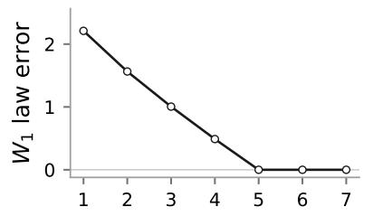

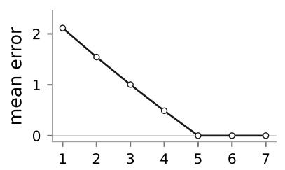

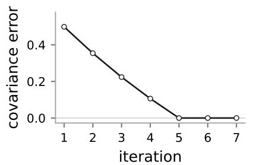

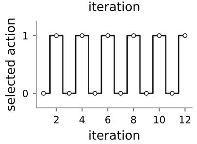

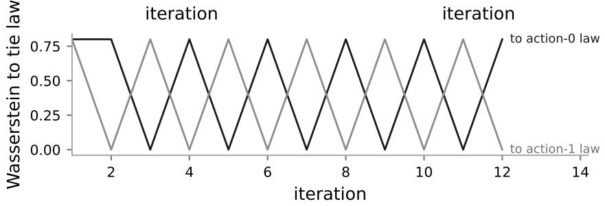  
Figure 1: Exact tabular distributional control. In the top row, the optimal action is unique at every nonterminal state, and the joint law, mean vector, and covariance blocks converge to their ground-truth values. The bottom panels use an alternating sequence of mean-greedy tie resolutions, which switches between two optimal return laws.

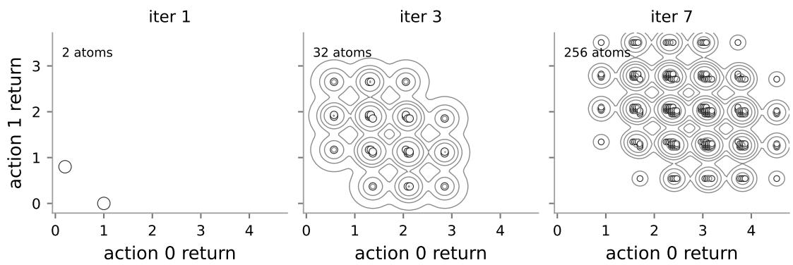  
Figure 2: Joint return law at the start state of the coupled reward chain. Dots are atoms, i.e., support points with positive probability. Contours smooth the same discrete mass for readability.

To contrast this convergent case with the behavior under optimal ties, we use a separate two-state JMDP. The zero-reward start state leads to a terminal choice state. At the choice state, two equiprobable outcome tables give action-0 rewards 0 and 2, while action 1 always gives reward 1. Both actions have mean one but diferent return laws. In the lower panels of Figure 1, we deliberately alternate between the two meangreedy tie resolutions over 12 backups, and the distributional iterates alternate between the two optimal laws. Figure 2 returns to the unique-policy chain and shows its joint law at the start state. The two shared reward outcomes shift the coordinates in opposite directions, while the diferent successor depths give the coordinates diferent continuation ranges. This produces the ofset bands in the figure.

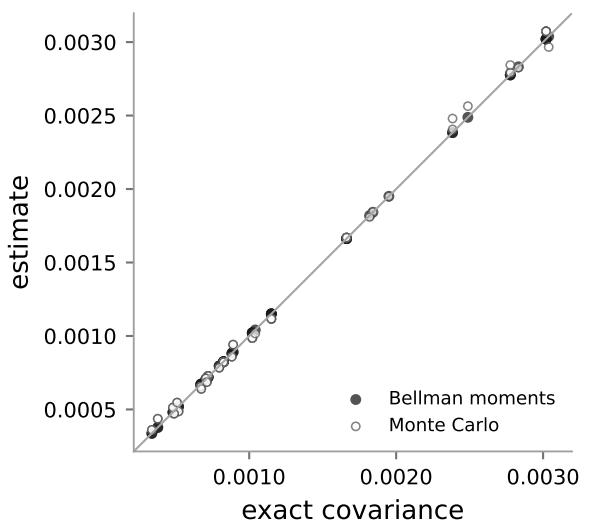

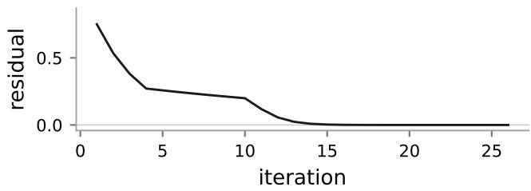

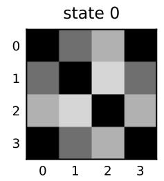

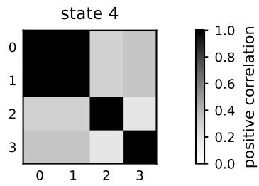  
Figure 3: Moment control in a stochastic windy gridworld. The residual decays to zero, the learned covariance blocks match a separate fixed-policy JMDP moment evaluation, and finite-horizon Monte Carlo rollouts give an independent rollout-based comparison. The grayscale matrices show action correlations at representative states.

## 7.2 Joint moment control in a windy gridworld

The next experiment is a $5 \times 5$ windy gridworld with four actions and $\gamma = 0 . 9 5$ . Each state has two outcome tables. With probability 0.75, every counterfactual action moves normally. With probability 0.25, a shared gust shifts every successor one column left. Boundary moves are clipped, and entering the lower-right goal gives reward one and terminates. Enumerating the full joint return law requires tracking a growing discrete support over four action-return coordinates. The Bellman equations for $\mu$ and M remain finite-dimensional, so we apply the greedy moment recursions directly. Several states have an exact tie between moving right and moving down. Ordinary value iteration and moment iteration use the same fixed lowest-index tie rule.

Moment iteration stops at residual $1 0 ^ { - 8 }$ . Means are checked against ordinary value iteration and covariance blocks against a separate fixed-policy JMDP moment evaluation under the resulting greedy policy. A second check uses 8000 jointly propagated Monte Carlo rollouts of horizon 96 at states 0, 4, 12, and 23. Figure 3 shows agreement with both references. The goal is the only source of reward, and the shared leftward gust can delay but never hasten reaching it. A gust therefore lowers several counterfactual returns together, while its absence leaves those returns higher, producing the nonnegative correlations shown.

## 7.3 The anti-correlated route choice environment

In this experiment, a one-decision route-choice JMDP shows how cross-action covariance afects trafic allocation. The available routes are one safe route and two risky ridge routes. The episode terminates after the route outcome, so each immediate reward Ra is also the complete return $Z _ { a }$ for that action. The coupled reward vector $( R ^ { \mathrm { s a f e } } , R ^ { \mathrm { l e f t } } , R ^ { \mathrm { r i g h t } } )$ equals $( 1 , 8 , - 4 )$ with probability $0 . 4 0 , \ ( 1 , - 4 , 8 )$ with probability 0.40, (1, 8, 8) with probability 0.10, and $( 1 , 0 , 0 )$ with probability 0.10. The safe route is deterministic, and the ridge routes have equal means and marginal variances. A shared wind makes one ridge fail when the other succeeds in most tables, giving the ridge returns negative covariance. The decision maker chooses an allocation $w \in \Delta ( \mathcal { A } )$ , where $w _ { a }$ is the fraction of trafic assigned to route a. The resulting random return is $w ^ { \top } Z$ We choose the allocation in spirit of the mean-risk portfolio optimization problem of Markowitz (1952) by maximizing

$$
\operatorname* { m a x } _ { \boldsymbol { w } \in \Delta ( \mathcal { A } ) } \quad \boldsymbol { w } ^ { \top } \boldsymbol { \mu } - \beta \sqrt { \boldsymbol { w } ^ { \top } C \boldsymbol { w } } ,\tag{42}
$$

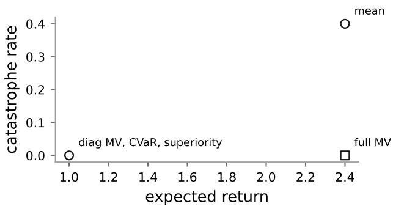

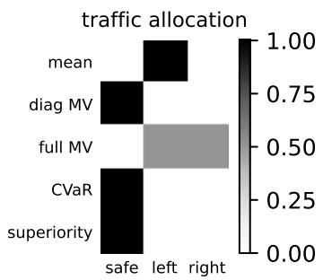  
Figure 4: Route choice with coupled failures. Circles denote single-route rules and the square denotes the solution of equation 42. “diag $\mathrm { M V } ^ { \dag }$ sets of-diagonal covariances to zero, and “full $\mathrm { M V } ^ { \dag }$ uses the full matrix. The right panel shows the resulting trafic allocation. “Superiority” uses arg max min $\mathfrak { l } _ { b } \ne a  \operatorname* { P r } ( Z _ { a } > Z _ { b } )$

where $\mu _ { a } = \mathbb { E } [ Z _ { a } ]$ and $C _ { a b } = \mathrm { C o v } ( Z _ { a } , Z _ { b } )$ . The variance term is

$$
w ^ { \top } C w = \sum _ { a } w _ { a } ^ { 2 } \mathrm { V a r } ( Z _ { a } ) + 2 \sum _ { a < b } w _ { a } w _ { b } \mathrm { C o v } ( Z _ { a } , Z _ { b } ) .\tag{43}
$$

We use $\beta = 0 . 5$ and solve equation 42 on a simplex grid of spacing 0.02. The negative cross term makes an equal allocation between the ridge routes free of catastrophic loss in this example, although its return remains variable. A diagonal baseline solves the same objective after setting $C _ { a b } = 0$ for $a \neq b .$ The trafic-allocation decision combines all route outcomes from the same wind realization in $w ^ { \top } Z . \mathrm { ~ B y ~ }$ contrast, a randomized single-route policy draws $A \sim w$ independently of the table and has catastrophe probability $\textstyle \sum _ { a } w _ { a } p _ { a }$ , where $p _ { a } = \mathrm { P r } ( Z _ { a } < 0 )$ . The variance is determined by the marginal laws and contains no of diagonal covariance. We also select a single route by lower-tail CVaR at level 0.1 and by the superiority matrix $H _ { a b } = \operatorname* { P r } ( Z _ { a } > Z _ { b } )$ , using arg max min H . Figure 4 separates these single-route rules from the covariance-sensitive allocation.

## 7.4 Neural approximation in a coupled inverted pendulum task

In this experiment, we test whether neural estimators trained from sampled outcome tables can recover joint moments and a particle approximation of the joint return law in a continuous-state JMDP. The task is a coupled inverted pendulum whose state is angle–velocity $( \vartheta , \omega )$ and whose action force is $a \in \{ - 1 , 0 , 1 \}$ Initial states use ϑ $\sim \mathrm { U n i f } [ - 1 . 2 5 , 1 . 2 5 ]$ and $\omega \sim \mathcal { N } ( 0 , 0 . 4 5 ^ { 2 } )$ . For $\epsilon \sim \mathcal { N } ( 0 , 1 )$ , the dynamics and reward are

$$
\begin{array} { r } { \omega ^ { \prime } = 0 . 7 2 \omega + 0 . 3 0 a + 0 . 1 8 \epsilon - 0 . 1 0 \vartheta , \qquad \vartheta ^ { \prime } = \vartheta + \omega ^ { \prime } , } \\ { r = 0 . 7 5 - 0 . 1 8 \vartheta ^ { 2 } - 0 . 0 6 \omega ^ { 2 } - 0 . 0 3 5 a ^ { 2 } + 0 . 7 5 a \epsilon - 0 . 1 0 \epsilon ^ { 2 } . } \end{array}\tag{44}
$$

The first disturbance is shared by all three action branches. Thereafter, each branch follows a fixed stabilizer that chooses −1 when $\vartheta + 0 . 6 5 \omega > 0 . 1 8 .$ , 1 when it is below −0.18, and 0 otherwise. Future disturbances are independent across distinct continuous states. Returns have horizon 10 and $\gamma = 0 . 9 2$ . Finite-horizon return regression tests whether a neural model can identify the coupling under this fixed continuation policy.

The moment model predicts means and a symmetric second-moment matrix. The diagonal baseline retains the predicted marginal variances but sets every of-diagonal covariance to zero. We also fit a fixed-size joint particle model. For both architectures, a shufled baseline independently permutes each action coordinate across tables. This preserves the conditional marginals and removes their coupling. The particle models use a sample estimate of the energy distance (Székely & Rizzo, 2013)

$$
\mathcal { E } ( P , Q ) = 2 \mathbb { E } \left[ \| X - Y \| _ { 2 } \right] - \mathbb { E } \left[ \| X - X ^ { \prime } \| _ { 2 } \right] - \mathbb { E } \left[ \| Y - Y ^ { \prime } \| _ { 2 } \right] ,\tag{45}
$$

where $X , X ^ { \prime } \sim P$ and $Y , Y ^ { \prime } \sim Q$ are independent. It is nonnegative and vanishes exactly when $P = Q$ , so smaller values indicate closer joint laws. For each of five seeds, models are trained for 20,000 minibatches of 128 states with eight return vectors per state. The moment networks have two 96-unit hidden layers and use mean MSE plus 0.2 times symmetric second-moment MSE. The particle networks output 32 vectors and use 0.08 times the energy loss. All networks use Adam (Kingma & Ba, 2017) with learning rate $3 \times 1 0 ^ { - 4 }$ Evaluation uses 512 held-out states and 256 Monte Carlo vectors per state, with energy distance evaluated on the first 96 states. Figure 5 shows that the joint moment model has lower covariance and correlation MAE than the diagonal and shufled baselines. The diagonal baseline cannot recover of-diagonal entries because it sets them to zero. The particle model trained on coupled tables improves on its shufled counterpart and attains lower covariance error than the moment model in this experiment.

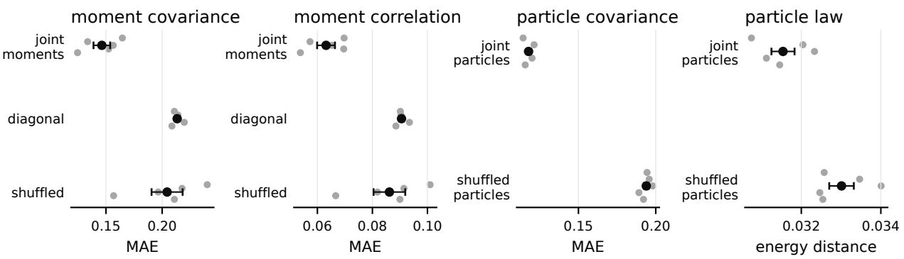  
Figure 5: Neural approximation in the coupled inverted-pendulum JMDP. All panels evaluate neural estimators. The first two show moment models and the last two show particle models. MAE denotes mean absolute error over of-diagonal entries. The covariance panels share a horizontal scale. Energy distance compares the learned and Monte Carlo joint laws, with lower values indicating better agreement. Dots are five seeds and bars show the standard error.

## 8 Conclusion

This work extends JMDPs from fixed-policy evaluation to control. The nonparametric distributional iterates converge when the mean-optimal policy is unique, and the first two moments converge under the weaker common-fixed-point condition for optimal ties. The sampled targets retain both successor state–action pairs in every cross moment. JMDP control preserves the mean-optimal policy of the induced MDP and also determines how its counterfactual action returns move together. The tabular and neural experiments support these recursions and show that their joint quantities can be recovered from coupled outcome tables.

## References

Philippe Artzner, Freddy Delbaen, Jean-Marc Eber, and David Heath. Coherent measures of risk. Mathematical finance, 9(3):203–228, 1999.

Marc G. Bellemare, Will Dabney, and Rémi Munos. A distributional perspective on reinforcement learning. In Doina Precup and Yee Whye Teh (eds.), Proceedings of the 34th International Conference on Machine Learning, volume 70 of Proceedings of Machine Learning Research, pp. 449–458. PMLR, 06–11 Aug 2017. URL https://proceedings.mlr.press/v70/bellemare17a.html.

Marc G. Bellemare, Will Dabney, and Mark Rowland. Distributional Reinforcement Learning. The MIT Press, 05 2023. ISBN 9780262374026. doi: 10.7551/mitpress/14207.001.0001. URL https://doi.org/ 10.7551/mitpress/14207.001.0001.

Lars Buesing, Theophane Weber, Yori Zwols, Nicolas Heess, Sébastien Racanière, Arthur Guez, and Jean-Baptiste Lespiau. Woulda, coulda, shoulda: Counterfactually-guided policy search. In 7th International Conference on Learning Representations, ICLR 2019, New Orleans, LA, USA, May 6-9, 2019. OpenRe view.net, 2019. URL https://openreview.net/forum?id=BJG0voC9YQ.

Yinlam Chow and Mohammad Ghavamzadeh. Algorithms for CVaR optimization in MDPs. In Proceedings of the 28th International Conference on Neural Information Processing Systems - Volume 2, NIPS’14, pp. 3509–3517, Cambridge, MA, USA, 2014. MIT Press.

Will Dabney, Georg Ostrovski, David Silver, and Remi Munos. Implicit quantile networks for distributional reinforcement learning. In Jennifer Dy and Andreas Krause (eds.), Proceedings of the 35th International Conference on Machine Learning, volume 80 of Proceedings of Machine Learning Research, pp. 1096–1105. PMLR, 10–15 Jul 2018a. URL https://proceedings.mlr.press/v80/dabney18a.html.

Will Dabney, Mark Rowland, Marc G. Bellemare, and Rémi Munos. Distributional reinforcement learning with quantile regression. In Proceedings of the Thirty-Second AAAI Conference on Artificial Intelligence and Thirtieth Innovative Applications of Artificial Intelligence Conference and Eighth AAAI Symposium on Educational Advances in Artificial Intelligence, AAAI’18/IAAI’18/EAAI’18. AAAI Press, 2018b. ISBN 978-1-57735-800-8.

Dror Freirich, Tzahi Shimkin, Ron Meir, and Aviv Tamar. Distributional multivariate policy evaluation and exploration with the Bellman GAN. In Kamalika Chaudhuri and Ruslan Salakhutdinov (eds.), Proceedings of the 36th International Conference on Machine Learning, volume 97 of Proceedings of Machine Learning Research, pp. 1983–1992. PMLR, 09–15 Jun 2019. URL https://proceedings.mlr.press/ v97/freirich19a.html.

Martin Haugh and Raghav Singal. Counterfactual analysis in dynamic latent state models, 2023. URL https://arxiv.org/abs/2205.13832.

Ege Can Kaya, Mahsa Ghasemi, and Abolfazl Hashemi. Joint MDPs and reinforcement learning in coupleddynamics environments. In Forty-Second Annual Conference on Uncertainty in Artificial Intelligence, 2026. URL https://openreview.net/forum?id=OgERnfBJyc.

Diederik P. Kingma and Jimmy Ba. Adam: A method for stochastic optimization, 2017. URL https: //arxiv.org/abs/1412.6980.

Jessica Lally, Milad Kazemi, and Nicola Paoletti. Robust counterfactual inference in Markov decision processes. arXiv preprint arXiv:2502.13731, 2025.

Guy Lorberbom, Daniel D Johnson, Chris J Maddison, Daniel Tarlow, and Tamir Hazan. Learning generalized Gumbel-max causal mechanisms. Advances in Neural Information Processing Systems, 34:26792– 26803, 2021.

Shie Mannor and John N. Tsitsiklis. Mean-variance optimization in Markov decision processes. In Proceedings of the 28th International Conference on International Conference on Machine Learning, ICML’11, pp. 177–184, Madison, WI, USA, 2011. Omnipress. ISBN 9781450306195.

Harry Markowitz. Portfolio selection. The Journal of Finance, 7(1):77–91, 1952. ISSN 00221082, 15406261. URL http://www.jstor.org/stable/2975974.

Tetsuro Morimura, Masashi Sugiyama, Hisashi Kashima, Hirotaka Hachiya, and Toshiyuki Tanaka. Nonparametric return distribution approximation for reinforcement learning. In Proceedings of the 27th International Conference on International Conference on Machine Learning, ICML’10, pp. 799–806, Madison, WI, USA, 2010a. Omnipress. ISBN 9781605589077.

Tetsuro Morimura, Masashi Sugiyama, Hisashi Kashima, Hirotaka Hachiya, and Toshiyuki Tanaka. Parametric return density estimation for reinforcement learning. In Proceedings of the Twenty-Sixth Conference on Uncertainty in Artificial Intelligence, UAI’10, pp. 368–375, Arlington, Virginia, USA, 2010b. AUAI Press. ISBN 9780974903965.

Michael Oberst and David Sontag. Counterfactual of-policy evaluation with Gumbel-max structural causal models. In Kamalika Chaudhuri and Ruslan Salakhutdinov (eds.), Proceedings of the 36th International Conference on Machine Learning, volume 97 of Proceedings of Machine Learning Research, pp. 4881–4890. PMLR, 09–15 Jun 2019. URL https://proceedings.mlr.press/v97/oberst19a.html.

Arvind Raghavan and Elias Bareinboim. Counterfactual realizability. In The Thirteenth International Conference on Learning Representations, 2025. URL https://openreview.net/forum?id=uuriavczkL.

R Tyrrell Rockafellar, Stanislav Uryasev, et al. Optimization of conditional value-at-risk. Journal of risk, 2: 21–42, 2000.

Matthew J. Sobel. The variance of discounted Markov decision processes. Journal of Applied Probability, 19 (4):794–802, 1982. ISSN 00219002. URL http://www.jstor.org/stable/3213832.

Gábor J. Székely and Maria L. Rizzo. Energy statistics: A class of statistics based on distances. Journal of Statistical Planning and Inference, 143(8):1249–1272, 2013.

Aviv Tamar, Dotan Di Castro, and Shie Mannor. Temporal diference methods for the variance of the reward to go. In Sanjoy Dasgupta and David McAllester (eds.), Proceedings of the 30th International Conference on Machine Learning, volume 28 of Proceedings of Machine Learning Research, pp. 495–503, Atlanta, Georgia, USA, 17–19 Jun 2013. PMLR. URL https://proceedings.mlr.press/v28/tamar13.html.

Harley Wiltzer, Marc Bellemare, David Meger, Patrick Shafto, and Yash Jhaveri. Action gaps and advantages in continuous-time distributional reinforcement learning. Advances in Neural Information Processing Systems, 37:47815–47848, 2024a.

Harley Wiltzer, Jesse Farebrother, Arthur Gretton, and Mark Rowland. Foundations of multivariate distributional reinforcement learning. Advances in Neural Information Processing Systems, 37:101297–101336, 2024b.

Derek Yang, Li Zhao, Zichuan Lin, Tao Qin, Jiang Bian, and Tie-Yan Liu. Fully parameterized quantile function for distributional reinforcement learning. Advances in neural information processing systems, 32, 2019.

Pushi Zhang, Xiaoyu Chen, Li Zhao, Wei Xiong, Tao Qin, and Tie-Yan Liu. Distributional reinforcement learning for multi-dimensional reward functions. In Proceedings of the 35th International Conference on Neural Information Processing Systems, NIPS ’21, Red Hook, NY, USA, 2021. Curran Associates Inc. ISBN 9781713845393.