# METACASTER: Meta-Harness-Optimized Agent for End-to-End Few-Shot Learning of Lightweight Time Series Forecasters

ChengAo Shen1, Wenchao Yu2, Fangyu Wu3, Dongjin Song4, Hanghang Tong5, Dongsheng Luo6, Wei Cheng2, Haifeng Chen2, Jingchao Ni1

1University of Houston, 2NEC Labs, 3University of Waterloo, 4University of Connecticut, 5University of Illinois at Urbana-Champaign, 6Singapore Management University 1{cshen9, jni7}@uh.edu, 2{wyu, weicheng, haifeng}@nec-labs.com, 3fangyu.wu@uwaterloo.ca, 4dongjin.song@uconn.edu, 5htong@illinois.edu, 6dsluo@smu.edu.sg

## Abstract

Time series forecasting (TSF) is evolving toward multimodal and agentic settings, yet using foundation models remains uneconomical in resource-constrained scenarios, where compact, specialized forecasters are more desirable. However, lightweight forecasters typically require substantial training data, limiting their use in domains with scarce, slowly accumulated, or privacy-sensitive time series. To address this dilemma, we investigate the challenging problem of few-shot learning for lightweight forecasters. We propose METACASTER, a metaharness-optimized multi-agent framework that uses agentic data generation to automatically train specialized lightweight forecasters from only a few examples and textual contexts. Our work highlights a new TSF paradigm in which agents act not as forecasters but as intermediary engineers that prepare efficient, task-specific forecasters for deployment. Experiments on 18 datasets, 23 state-of-the-art lightweight forecasters, and 14 baselines demonstrate that METACASTER achieves both data efficiency and computational efficiency while maintaining high-quality TSF performance.1

## 1 Introduction

Time series forecasting (TSF) underpins decisionmaking and intelligence across domains such as geoscience, healthcare, and energy (Koprinska et al., 2018; Morid et al., 2023; Ardid et al., 2025). Unlike traditional TSF, which focuses on numerical prediction at future timesteps, emergent TSF settings are multimodal, incorporating textual context describing domains, events, or external conditions (Jiang et al., 2025). This transition is driven by advances in large language models (LLMs) and AI agents. As Fig. 1 illustrates, recent LLM-based TSF methods have two main paradigms: (a) LLMas-Forecaster – where pre-trained LLMs serve as forecasting backbones with additional cross-modal adapters and TSF heads (e.g., TimeLLM (Jin et al., 2024), S2IPLLM (Pan et al., 2024), TimeVLM (Zhong et al., 2025), etc.); and (b) Agent-as-Forecaster – where LLM agents interpret time series in contextual prompts, reason about future trends, and generate forecasts conversationally or visually (e.g., LLMTime (Gruver et al., 2023), TimeOmni-1 (Guan et al., 2026a), Nexus (Das et al., 2026), etc.).

Despite the inspiring progress, using LLMs as the computational core for forecasting is largely obstructed by the modality gap between discrete language tokens and continuous time series values. Consequently, the effectiveness of the paradigms in Fig. 1(a) and (b), compared with specialized non-LLM forecasters, remains under debate (Tan et al., 2024; Merrill et al., 2024). Benchmark studies consistently show that dedicated numerical models, such as DLinear (Zeng et al., 2023) and PatchTST (Nie et al., 2023), can outperform LLM-based approaches (Shen et al., 2025a), motivating the rise of time series foundation models (TSFMs) such as Moirai (Woo et al., 2024), Chronos (Ansari et al., 2024), and Sundial (Liu et al., 2025c).

However, using large models – whether LLMs or TSFMs – as one-size-fits-all solutions raises concerns about sustainability and carbon footprint (Bolón-Canedo et al., 2024). The demand for rapid deployment in resource-constrained settings (e.g., edge devices and small organizations) has therefore sparked growing interest in lightweight forecasters (Ma et al., 2024), analogous to the rise of small language models (SLMs) (Belcak et al., 2025). Notably, recent studies show that lightweight forecasters can rival LLMs and TSFMs in individual TSF tasks (Shen et al., 2025b), Their main limitation is the need for sufficient downstream training data, as they lack large-scale pre-training.

In practice, collecting long-history time series for training can significantly delay deployment. In privacy-sensitive domains such as healthcare and finance, acquiring large training datasets may even be infeasible. This raises a challenging question: can lightweight forecasters be effectively trained with only a few samples? Although such models are highly prone to overfitting without large-scale pretraining, we demonstrate that a solution is possible in the era of agentic AI.

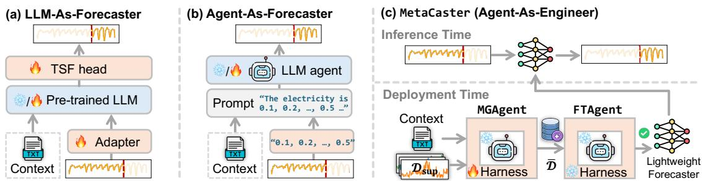  
Figure 1: Comparison of different paradigms of using LLMs for TSF. METACASTER is the proposed model.

To address this challenge, we propose META-CASTER, a Meta-harness-optimized agent for endto-end few-shot learning of lightweight forecasters. As Fig. 1(c) illustrates, rather than directly generating forecasts, METACASTER’s agents act as intermediaries that prepares a specialized forecaster for a target TSF task. At deployment time, given a few-shot support set $\mathcal { D } _ { \mathrm { s u p } }$ and contextual description C, METACASTER employs two agents: (1) MGAGENT refers to $\mathcal { D } _ { \mathrm { s u p } }$ and C, and generates a sufficient dataset D¯ that complies with domain constraints; and (2) FTAGENT trains and selects the best lightweight forecasters using D¯. To support FTAGENT, we compile 23 state-of-the-art (SOTA) lightweight forecasters (2022-2026) into LT-LIB library (§3.5) with a unified API. Similar to finetuning a foundation model, METACASTER performs task adaptation at deployment time, but more efficiently via the novel agents and LLM API calls. After deployment, only the selected lightweight forecaster is used for inference.

Unlike existing time series generation models that focus on data simulation (Huang et al., 2025b; Gu et al., 2025; Ge et al., 2025), METACASTER generates time series specifically to improve forecasting performance. To our knowledge, it is the first framework to align data generation with forecaster quality. Motivated by recent findings on the importance of agent Harnesses (Li et al., 2026a; Lee et al., 2026) – the infrastructure surrounding an LLM (e.g., system prompts, skills, tools) – we optimize MGAGENT’s Harness using a meta-harness HPAGENT (Fig. 2), which is more efficient than fine-tuning LLMs. The optimized Harness is also transferable across different LLMs, enabling flexible API switching in downstream deployment, as demonstrated in §4.2. In summary, our contributions are as follows.

• We investigate the challenging problem of fewshot learning for lightweight forecasters.

• We propose METACASTER, a novel metaharness-optimized multi-agent framework that achieves large-model-like performance with efficient inference for TSF tasks.

• We compile 20+ SOTA lightweight forecasters into LT-LIB, a unified library that will be released alongside METACASTER.

• We conduct comprehensive experiments on 18 datasets against 14 baselines, demonstrating the effectiveness of METACASTER.

## 2 Related Work

LLM-based TSF. As discussed in §1, many existing LLM-based TSF models adopt either LLM-As-Forecaster (Zhou et al., 2023; Jin et al., 2024; Pan et al., 2024; Liu et al., 2024, 2025a; Wang et al., 2025; Zhong et al., 2025) or Agent-As-Forecaster (Xue and Salim, 2023; Gruver et al., 2023; Das et al., 2026). Additionally, some multi-task time series QA agents can conduct TSF via LLM reasoning (Kong et al., 2025; Guan et al., 2026a; Yu et al., 2025; Wu et al., 2026; Guan et al., 2026b). In contrast, there are relatively fewer Agent-As-Engineer models that use Harness for TSF (Zhao et al., 2025; Garza and Rosillo Garcia, 2025; Zhang et al., 2025; Jalori et al., 2025). However, these models don’t generate times series (thus require large training data), and never automatically optimize their Harness for TSF, distinguishing them from METACASTER.

Time Series Generation. Our work is related to time series generation models, including data augmentation techniques (Luo et al., 2023; Yue et al., 2022; Iwana and Uchida, 2021; Wen et al., 2021), generative models that focus on data distributions (Yoon et al., 2019; Desai et al., 2021; Jeon et al., 2022; Yuan and Qiao, 2024), and language-based models that can encode contexts (Naiman et al., 2024; Huang et al., 2025b; Gu et al., 2025; Ge et al., 2025). However, these standalone generators aim to simulate certain data properties, rather than directly optimize TSF performance, leaving a significant gap as we will demonstrate in $\ S 4$

Agent Harness Optimization. AI agents are undergoing a paradigm shift. Recent findings challenge the assumption that better models alone produce more reliable agents (Li et al., 2026a; Ning et al., 2026). Rather, improving the infrastructure layer around an agent, i.e., the agent harness, can significantly enhance its performance (Li et al., 2026a), leading to growing attention to harness engineering (Lin et al., 2026), and emerging techniques for optimizing texts (Yuksekgonul et al., 2025) and harness (Lee et al., 2026) within agentic systems. Unlike time series agents that mostly rely on supervised fine-tuning or reinforcement learning (Guan et al., 2026a,b; Wu et al., 2026), the proposed METACASTER is, to our best knowledge, the first time series agent exposed to automatic harness optimization.

## 3 The Proposed Method

## 3.1 Problem Statement

Given a multivariate time series (MTS) ${ \textbf { X } } =$ $[ \mathbf { x } ^ { 1 } , . . . , \mathbf { x } ^ { D } ] ^ { \top } \in \mathbb { R } ^ { D \times T }$ within a look-back window of length $T$ , where $\mathbf { x } ^ { d } \in \mathbb { R } ^ { T } \left( 1 \leq d \leq D \right)$ is a univariate time series (UTS) of the d-th variate, the goal of TSF is to estimate the most likely values of the MTS at future H time steps, i.e., $\bar { \mathbf { Y } } \in \mathbb { R } ^ { D \times H }$ such that the difference between the estimation and the ground truth $\mathbf { Y } = \mathbf { X } _ { T + 1 : T + H } \in \mathbb { R } ^ { D \times H }$ is minimized in terms of a metric, such as mean squared error (MSE).

In this work, we integrate multiple lightweight forecasters $\mathcal { F } = \{ f _ { 1 } , . . . , f _ { L } \}$ , where $f _ { l } : \bar { \mathbb { R } ^ { D \times T } } \overset { \cdot } {  }$ $\mathbb { R } ^ { D \times H } \left( 1 \leq l \leq L \right)$ . We refer to $\mathcal { F }$ as LT-LIB (Lightweight TSF Library, §3.5). It is noteworthy that the forecasters in $\mathcal { F }$ are non-pre-trained due to their small capacities.

The Task. Given ${ \mathcal { F } } _ { : }$ , a K-shot support set $\mathcal { D } _ { \mathrm { s u p } } =$ $\{ ( \mathbf { X } _ { i } , \mathbf { Y } _ { i } ) \} _ { i = 1 } ^ { K }$ , and a textual context description $\mathsf { C }$ about the target domain $( e . g .$ , climatology, healthcare), the task is to train the forecasters in $\mathcal { F }$ with optimal forecasting errors on a test set. The task is challenging when K is small, $i . e .$ , in the few-shot setting, especially for the small forecasters in $\mathcal { F }$

## 3.2 Framework Overview

To address the task, we propose METACASTER, a multi-agent system that generates a sufficient dataset $\bar { \mathcal { D } } = \{ ( \mathbf { X } _ { i } , \mathbf { Y } _ { i } ) \} _ { i = 1 } ^ { N ^ { \prime } }$ with $N ^ { \prime } \gg K$ based on the limited data in $\{ \mathcal { D } _ { \mathrm { s u p } } , \mathsf { C } \}$ , and then splits $\bar { \mathcal D }$ into a training set ${ \mathcal { D } } _ { \mathrm { t r } }$ and a validation set $\bar { \mathcal { D } } _ { \mathrm { v a l } }$ for training the forecasters in $\mathcal { F }$

Unlike existing generative models that focus on data realism (Huang et al., 2025b; Gu et al., 2025; Ge et al., 2025), METACASTER generates $\bar { \mathcal D }$ to ensure that forecasters trained on $\bar { \mathcal { D } } _ { \mathrm { t r } }$ perform comparably to those trained on real data of the same size (as $| \bar { \mathcal { D } } _ { \mathrm { t r } } | )$ in the target domain. This objective difference is crucial: standard generators cannot guarantee faithful data reproduction, and the resulting mismatch may lead to biased forecasters. In contrast, METACASTER directly optimizes data generation for downstream forecasting performance, learning to produce training data that is better suited for building effective time series forecasters in the target domain.

To enable agent optimization, we adopt a metaharness strategy (Lee et al., 2026) given recent findings on harness’s significant impact on agent performance (Li et al., 2026a). Fig. 2 illustrates the optimization framework of METACASTER, consisting of three key components: (1) a Meta-Generator (MGAGENT, §3.4); (2) a Forecaster Trainer (FTAGENT, §3.5); and (3) a Harness Proposer (HPAGENT, §3.6). Among them, HPAGENT optimizes the Harness of MGAGENT during the agent optimization process, which will be dropped at deployment and inference time (§3.7).

## 3.3 The Harness Optimization Problem

To enable METACASTER to generate domainspecific training data, we construct a corpus of time series datasets $\mathcal { C } _ { \mathrm { h a r } } = \{ \mathcal { D } ^ { m } , \mathsf { C } _ { m } \} _ { m = 1 } ^ { M }$ for Harness optimization, where $\mathcal { D } ^ { m } = \{ ( \mathbf { X } _ { i } , \mathbf { Y } _ { i } ) \} _ { i = 1 } ^ { N _ { m } }$ denotes the time series from the m-th domain and ${ \mathsf { C } } _ { m }$ its associated context. The corpus spans $M$ diverse domains to improve METACASTER’s cross-domain generalizability.

As illustrated in Fig. 2, each dataset $\mathcal { D } ^ { m }$ is split into train/validation/test sets $\mathcal { D } _ { \mathrm { t r } } ^ { m } , \ D _ { \mathrm { v a l } } ^ { m }$ and $\mathcal { D } _ { \mathrm { t e } } ^ { m }$ , representing the authentic data from the m-th domain. To simulate practical few-shot settings, $K$ samples from $\mathcal { D } _ { \mathrm { t r } } ^ { m }$ are used to construct $\mathcal { D } _ { \mathrm { s u p } } ^ { m }$ METACASTER then leverages $\{ \mathcal { D } _ { \mathrm { s u p } } ^ { m } , \mathsf { C } _ { m } \}$ to generate $\{ \bar { \mathcal { D } } _ { \mathrm { t r } } ^ { m } , \bar { \mathcal { D } } _ { \mathrm { v a l } } ^ { m } \}$ . The objective is to minimize the performance gap between forecasters trained on $\{ \mathcal { D } _ { \mathrm { t r } } ^ { m } , \mathcal { D } _ { \mathrm { v a l } } ^ { m } \}$ and those trained on $\{ \bar { \mathcal { D } } _ { \mathrm { t r } } ^ { m } , \bar { \mathcal { D } } _ { \mathrm { v a l } } ^ { m } \}$ evaluated on the same test set $\mathcal { D } _ { \mathrm { t e } } ^ { m }$

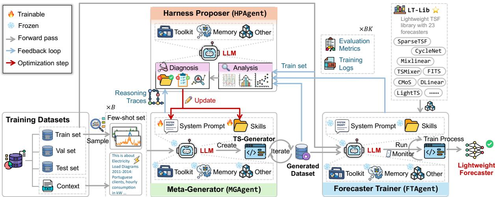  
Figure 2: An illustration of the harness optimization framework of the proposed METACASTER system.

Formally, let θ be the trainable Harness in METACASTER, $f _ { l } ^ { m } ( { \bar { f } } _ { l } ^ { m } )$ be the forecaster trained using $\left\{ \mathcal { D } _ { \mathrm { t r } } ^ { m } , \mathcal { D } _ { \mathrm { v a l } } ^ { m } \right\} ( \{ \bar { \mathcal { D } } _ { \mathrm { t r } } ^ { m } , \bar { \mathcal { D } } _ { \mathrm { v a l } } ^ { m } \} )$ , the Harness optimization problem is

$$
\operatorname* { m i n } _ { \theta } \mathbb { E } _ { 1 \leq m \leq M , 1 \leq l \leq L } \left( \delta ( \omega ( f _ { l } ^ { m } ) , \omega ( \bar { f } _ { l } ^ { m } ) ) \right)\tag{1}
$$

where $\omega ( \cdot )$ is a metric that evaluates forecasting errors on $\mathcal { D } _ { \mathrm { t e } } ^ { m }$ , and $\delta ( \cdot , \cdot )$ is a measure of difference between two metrics.

## 3.4 Meta-Generator (MGAGENT)

Given the few-shot set $\{ \mathcal { D } _ { \mathrm { s u p } } ^ { m } , \mathsf { C } _ { m } \}$ , MGAGENT seeks to generate $\bar { \mathcal { D } } ^ { m }$ , that is

$$
\bar { \mathcal { D } } ^ { m } = \mathsf { M G A G E N T } \big ( \mathcal { D } _ { \mathrm { s u p } } ^ { m } , \mathsf { C } _ { m } \big )\tag{2}
$$

which will be split into $\{ \bar { \mathcal { D } } _ { \mathrm { t r } } ^ { m } , \bar { \mathcal { D } } _ { \mathrm { v a l } } ^ { m } \}$ by FTAGENT (§3.5). Here, $\mathsf { C } _ { m }$ provides semantic cues that guide MGAGENT to generate domain-compliant signals using methods pertinent to the m-th domain.

As shown in Fig. 2, MGAGENT is centered on a (replaceable) LLM. Rather than generating MTS directly, the LLM uses its Harness to create a TS-Generator program that integrates domainspecific knowledge, rules, and models pertinent to the $m \cdot$ -th domain, circumventing LLM’s limited capability in direct time series inference (Merrill et al., 2024). Instead, MGAGENT exploits the LLM’s strengths in planning, reasoning, and coding to orchestrate more suitable tools for time series inference, hence the “Meta-” prefix.

Upon receiving $\{ \mathcal { D } _ { \mathrm { s u p } } ^ { m } , \mathsf { C } _ { m } \}$ , MGAGENT (1) analyzes the MTS in $\mathcal { D } _ { \mathrm { s u p } } ^ { m } , ( 2 )$ creates TS-Generator to generate $\mathcal { D } ^ { m }$ , and (3) performs quality checks.

It accepts $\mathcal { D } ^ { m }$ if all checks pass. Otherwise, it goes to step (2) to revise TS-Generator.

In this process, the Harness exposes several components to the LLM, including a system prompt, skills, a toolkit, long-term memory, and other execution middleware. The system prompt defines MGA-GENT’s behavior, goals, constraints, and tool-usage rules. Skills (Li et al., 2026b) are reusable modules containing instructions, metadata, and tool bindings for the time series generation task in Eq. (2). The toolkit provides APIs for tools such as Python and web search, while the long-term memory stores information about generated data to support iterative review and refinement in steps (2) and (3).

In the Harness, the system prompt and skills define key behavior of MGAGENT. Thus, we freeze the LLM and use them as the trainable parameters θ. Instead of Harness engineering (Li et al., 2026a), θ is edited by HPAGENT (§3.6) in an outer loop to automatically optimize Eq. (1).

## 3.5 Forecaster Trainer (FTAGENT)

FTAGENT splits $\bar { \mathcal { D } } ^ { m }$ into $\{ \bar { \mathcal { D } } _ { \mathrm { t r } } ^ { m } , \bar { \mathcal { D } } _ { \mathrm { v a l } } ^ { m } \}$ according to the partition sizes of $\{ \mathcal { D } _ { \mathrm { t r } } ^ { m } , \mathcal { D } _ { \mathrm { v a l } } ^ { m } \}$ , orchestrates computational resources to train the forecasters in ${ \mathcal F } ,$ and evaluates them on $\mathcal { D } _ { \mathrm { t e } } ^ { m }$ , producing trained forecasters, evaluation metrics, and training reports:

$$
\begin{array} { r l } & { \{ \{ f _ { l } ^ { m } , \bar { f } _ { l } ^ { m } , \omega ( f _ { l } ^ { m } ) , \omega ( \bar { f } _ { l } ^ { m } ) \} _ { l = 1 } ^ { L } , \mathsf { R } \} } \\ & { = \mathrm { F T A G E N T } \big ( \{ \mathcal { D } _ { \mathrm { t r } } ^ { m } , \mathcal { D } _ { \mathrm { v a l } } ^ { m } , \mathcal { D } _ { \mathrm { t e } } ^ { m } \} , \{ \bar { \mathcal { D } } _ { \mathrm { t r } } ^ { m } , \bar { \mathcal { D } } _ { \mathrm { v a l } } ^ { m } \} \big ) } \end{array}\tag{3}
$$

where $\omega ( \cdot )$ is the evaluation metric such as MSE and MAE, and R denotes the training reports.

Lightweight TSF Library (LT-LIB). To construct $\mathcal { F }$ , we collect 23 SOTA lightweight forecasters proposed from 2022 to 2026, including

Linear-Layer models (e.g., MixLinear (Ma et al., 2024)), MLP-based forecasters (e.g., TSMixer (Chen et al., 2023)), and Frequency-domain models $( e . g .$ , FITS (Xu et al., 2024)). Their sizes, as listed in Appendix C.1, are much smaller than SOTA Transformer-based forecasters $( e . g .$ PatchTST (Nie et al., 2023): ∼3.2M) and TSFMs (e.g., Chronos (Ansari et al., 2024): ∼700M). We compile them in LT-LIB with a unified interface to facilitate training calls in FTAGENT.

As shown in Fig. 2, FTAGENT composes programs to train each forecaster with a grid search of hyperparameters. It organizes training jobs – i.e., (forecaster, hyperparameter, dataset) triplets – into a queue and assigns available GPUs for maximally parallel execution. During training, it monitors processes, resolves errors when encountered, and recovers interrupted jobs without human intervention. This procedure ends when the queue is emptied.

FTAGENT’s Harness shares the same components as MGAGENT’s, with additional access to LT-LIB. Unlike MGAGENT, however, its Harness is not optimized, since the training process is relatively standard and has less impact on the resulting forecasters than the generated dataset $\bar { \mathcal { D } } ^ { m }$

## 3.6 Harness Proposer (HPAGENT)

HPAGENT is the meta-harness (Lee et al., 2026) that configures the Harness of MGAGENT to optimize Eq. (1). Upon receiving $\{ \omega ( f _ { l } ^ { m } ) , \omega ( \bar { f } _ { l } ^ { m } ) \} _ { l = 1 } ^ { \bar { L } }$ from FTAGENT, HPAGENT evaluates Eq. (1) using a hinge-loss based measure:

$$
\delta ( \omega ( f _ { l } ^ { m } ) , \omega ( \bar { f } _ { l } ^ { m } ) ) = \operatorname* { m a x } \Big \{ \frac { \omega ( \bar { f } _ { l } ^ { m } ) - \omega ( f _ { l } ^ { m } ) } { \omega ( f _ { l } ^ { m } ) } , 0 \Big \}\tag{4}
$$

which induces a penalty when the forecasting error $\omega ( { \bar { f } } _ { l } ^ { m } )$ of the forecaster trained on the generated ${ \mathcal { D } } _ { \mathrm { u } }$ is larger than $\omega ( f _ { l } ^ { m } )$ of the forecaster trained on the authentic dataset ${ \mathcal { D } } _ { \mathrm { t r } } .$ , suggesting $\bar { \mathcal { D } } _ { \mathrm { t r } }$ needs improvements. Otherwise, Eq. (4) won’t induce any penalty when $\bar { f } _ { l } ^ { m }$ performs better than $f _ { l } ^ { m }$

As in Fig. 2, HPAGENT oversees the entire pipeline through three stages: (1) Self-Planned Analysis, which collects evidence on MGAGENT and FTAGENT performance, including the loss in Eq. (1), statistical differences between ${ \mathcal { D } } _ { \mathrm { t r } }$ and $\bar { \mathcal { D } } _ { \mathrm { t r } }$ (e.g., MMD), and training issues from logs R; (2) Diagnosis, which identifies potential causes of performance degradation from MGAGENT’s reasoning traces, system prompt, and skills, then determines how to update the Harness θ of MGAGENT; and (3) Update, which edits θ. Effectively, HPAGENT serves as the optimizer of Eq. (1), as defined by its system prompt.

Accordingly, HPAGENT’s lifecycle is the entire optimization process with multiple epochs of updating θ, whereas MGAGENT and FTAGENT each functions within a single epoch. HPAGENT therefore relies more heavily on long-term memory, which stores dataset snapshots, evaluation metrics, training logs, analysis/diagnosis results, θ update logs, etc., across epochs. This memory enables rollback of harmful updates and allows HPAGENT to output the best θ at the end of optimization.

## 3.7 Training and Inference

Harness Training. We summarize the optimization process in Appendix A. In every epoch, we draw K ∼ Uniform([10, 50]). Notably, instead of feeding the K-shot support set $\{ \mathcal { D } _ { \mathrm { s u p } } ^ { m } , \mathsf { C } _ { m } \}$ to METACASTER individually, we sample a batch of B datasets from the corpus $\mathcal { C } _ { \mathrm { h a r } }$ to extract B support sets, and let METACASTER process them simultaneously. This extension allows HPAGENT to evaluate generalizability across datasets and mitigate overfitting to any specific dataset.

Inference. After optimization, HPAGENT outputs the best $\pmb { \theta } ^ { * }$ , and is discarded. The Harnesses of MGAGENT (including $\pmb { \theta } ^ { * } )$ and FTAGENT (including LT-LIB) are retained, while their LLMs are removed. For a new target domain g, these Harnesses are attached to user-selected LLM APIs to instantiate MGAGENT and FTAGENT. Given Kshot $\mathcal { D } _ { \mathrm { s u p } } ^ { g }$ and context $\mathsf { C } _ { g } ,$ , the agents execute the forward process in Fig. 2 to produce the trained forecaster $\bar { f } _ { * } ^ { g }$ . At TSF stage, only $\bar { f } _ { * } ^ { g }$ needs to be maintained, while MGAGENT and FTAGENT are dropped, as shown in Fig. 1(c).

Therefore, the entire downstream deployment and inference process can be accomplished using low-cost devices capable of running the Harnesses and the LT-LIB framework, making it more efficient than relying on GPU-intensive TSFMs.

## 4 Experiments

## 4.1 Experimental Setup

Datasets. To evaluate METACASTER, we employ the GIFT-Eval benchmark (Aksu et al., 2024), previsouly adopted for training TSFMs (Woo et al., 2024). We use 18 datasets across 9 domains (e.g., energy, weather, traffic), split into a train corpus of 8 datasets $( i . e . , \mathcal { C } _ { \mathrm { h a r } }$ in §3.3), an in-domain (IND)

<table><tr><td rowspan="2"></td><td rowspan="2">Dataset</td><td>Ours METACASTER</td><td></td><td colspan="3">Generation Models</td><td colspan="2"></td><td colspan="3">Augmentation Methods</td><td rowspan="2">References</td><td colspan="2">Dn</td></tr><tr><td></td><td>TimeDP</td><td>VerbalTS</td><td>T2S</td><td>DiffTS</td><td>TimeVAE</td><td>Repeat</td><td>Bootstrap</td><td>Jitter</td><td>MagWarp</td><td> $\mathcal { D } _ { \mathrm { s u p } } ^ { m }$ </td><td></td></tr><tr><td></td><td>ETTm1</td><td>0.376</td><td>1.049</td><td>1.004</td><td>0.922</td><td>1.154</td><td>0.749</td><td>0.781</td><td></td><td>0.748</td><td>0.746</td><td>1.919</td><td>0.687</td><td>0.316</td></tr><tr><td>10</td><td>Electricity</td><td>0.300</td><td>0.288</td><td>1.061</td><td>1.150</td><td>0.365</td><td>0.328</td><td>0.380</td><td></td><td>0.379</td><td>0.375</td><td>7.057</td><td>0.721</td><td>0.121</td></tr><tr><td></td><td>Seattle</td><td>1.522</td><td>1.420</td><td>1.800</td><td>1.792</td><td>1.643</td><td>1.759</td><td>1.955</td><td></td><td>1.849</td><td>1.925</td><td>43.24</td><td>2.341</td><td>1.024</td></tr><tr><td></td><td>SZTaxi</td><td>0.104</td><td>0.124</td><td>0.116</td><td>0.118</td><td>0.111</td><td>0.114</td><td>0.134</td><td></td><td>0.118</td><td>0.123</td><td>1.122</td><td>0.187</td><td>0.096</td></tr><tr><td> =  (((</td><td>Sales</td><td>2.616</td><td>2.587</td><td>2.419</td><td>2.758</td><td>4.323</td><td>2.795</td><td>4.175</td><td></td><td>2.949</td><td>2.946</td><td>4.321</td><td>3.004</td><td>2.927</td></tr><tr><td></td><td>Bitbrains</td><td>0.068</td><td>0.079</td><td>0.098</td><td>0.094</td><td>0.121</td><td>0.109</td><td>0.197</td><td></td><td>0.149</td><td>0.159</td><td>0.826</td><td>0.152</td><td>0.150 0.157</td></tr><tr><td></td><td>Solar</td><td>0.158</td><td>0.208</td><td>0.513</td><td>0.552</td><td>0.238</td><td>0.237</td><td>0.278</td><td></td><td>0.272</td><td>0.272</td><td>0.446</td><td>0.440</td><td></td></tr><tr><td>0OO</td><td>Saugeen</td><td>1.960</td><td>1.492</td><td>1.474</td><td>1.578</td><td>2.281</td><td>2.705</td><td>3.119</td><td></td><td>2.887</td><td>2.908</td><td>3.893</td><td>1.859</td><td>1.183</td></tr><tr><td></td><td>USbirths</td><td>0.702</td><td>2.690</td><td>1.501</td><td>1.540</td><td>1.775</td><td>0.607</td><td>0.752</td><td></td><td>0.715</td><td>0.714</td><td>12.08</td><td>1.204</td><td>0.250</td></tr><tr><td></td><td>M4†</td><td>2.093</td><td>2.178</td><td>2.331</td><td>2.444</td><td>2.688</td><td>2.993</td><td>3.250</td><td></td><td>3.101</td><td>3.057</td><td>8.654</td><td>2.628</td><td>2.330</td></tr><tr><td></td><td>ETTm1</td><td>0.345</td><td>1.049</td><td>1.027</td><td>0.910</td><td>1.211</td><td>0.684</td><td>0.714</td><td></td><td>0.664</td><td>0.662</td><td>0.943</td><td>0.602</td><td>0.316</td></tr><tr><td></td><td>Electricity</td><td>0.226</td><td>0.287</td><td>1.055</td><td>1.140</td><td>0.363</td><td>0.268</td><td>0.305</td><td></td><td>0.287</td><td>0.290</td><td>1.644</td><td>0.657</td><td>0.121</td></tr><tr><td></td><td>Seattle</td><td>1.177</td><td>1.414</td><td>1.806</td><td>1.777</td><td>1.673</td><td>2.158</td><td>1.738</td><td></td><td>1.656</td><td>1.622</td><td>21.15</td><td>1.785</td><td>1.024</td></tr><tr><td></td><td>SZTaxi</td><td>0.114</td><td>0.121</td><td>0.116</td><td>0.115</td><td>0.112</td><td>0.156</td><td>0.162</td><td></td><td>0.141</td><td>0.135</td><td>1.626</td><td>0.150</td><td>0.096</td></tr><tr><td>I( = ) ()</td><td>Sales</td><td>2.362</td><td>2.479</td><td>2.455</td><td>2.942</td><td>4.439</td><td>2.598</td><td>3.603</td><td></td><td>3.131</td><td>3.158</td><td>3.422</td><td>2.611</td><td>2.927</td></tr><tr><td></td><td>Bitbrains</td><td>0.125</td><td>0.084</td><td>0.097</td><td>0.095</td><td>0.130</td><td>0.114</td><td></td><td>0.463</td><td>0.469</td><td>0.489</td><td>0.777</td><td>0.137</td><td>0.150</td></tr><tr><td></td><td>Solar</td><td>0.152</td><td>0.220</td><td>0.515</td><td>0.576</td><td>0.240</td><td>0.234</td><td></td><td>0.254</td><td>0.252</td><td>0.248</td><td>0.356</td><td>0.379</td><td>0.157</td></tr><tr><td>DO0</td><td>Saugeen</td><td>1.464</td><td>1.495</td><td>1.480</td><td>1.593</td><td>2.286</td><td>2.019</td><td></td><td>2.419</td><td>2.266</td><td>2.277</td><td>2.620</td><td>1.547</td><td>1.183</td></tr><tr><td></td><td>USbirths</td><td>0.533</td><td>1.980</td><td>1.509</td><td>1.536</td><td>1.732</td><td>0.474</td><td>0.546</td><td></td><td>0.524</td><td>0.525</td><td>5.107</td><td>0.803</td><td>0.250</td></tr><tr><td></td><td>M4†</td><td>2.112</td><td>2.248</td><td>2.394</td><td>2.522</td><td>2.663</td><td>3.402</td><td>3.126</td><td></td><td>3.109</td><td>3.169</td><td>10.321</td><td>2.950</td><td>2.330</td></tr><tr><td></td><td>ETTm1</td><td>0.267</td><td>1.063</td><td>1.035</td><td>0.931</td><td>1.284</td><td>0.548</td><td>0.582</td><td></td><td>0.556</td><td>0.546</td><td>0.592</td><td>0.456</td><td>0.316</td></tr><tr><td></td><td>Electricity</td><td>0.191</td><td>0.279</td><td>1.053</td><td>1.197</td><td>0.352</td><td>0.227</td><td>0.244</td><td></td><td>0.234</td><td>0.233</td><td>1.287</td><td>0.472</td><td>0.121</td></tr><tr><td></td><td>Seattle</td><td>1.125</td><td>1.423</td><td>1.819</td><td>1.779</td><td>1.732</td><td>2.810</td><td>1.537</td><td></td><td>1.462</td><td>1.497</td><td>12.78</td><td>1.533</td><td>1.024</td></tr><tr><td></td><td>SZTaxi</td><td>0.110</td><td>0.120</td><td>0.114</td><td>0.113</td><td>0.113</td><td>0.318</td><td>0.230</td><td></td><td>0.222</td><td>0.216</td><td>0.352</td><td>0.143</td><td>0.096</td></tr><tr><td>I(N =  (()</td><td>Sales</td><td>2.835</td><td>2.605</td><td>2.474</td><td>2.852</td><td>4.459</td><td>2.683</td><td>2.778</td><td></td><td>2.590</td><td>2.560</td><td>3.039</td><td>2.501</td><td>2.927</td></tr><tr><td></td><td>Bitbrains</td><td>0.119</td><td>0.097</td><td>0.099</td><td>0.095</td><td>0.124</td><td>0.155</td><td>0.929</td><td></td><td>0.976</td><td>0.987</td><td>1.214</td><td>0.119</td><td>0.150 0.157</td></tr><tr><td>00D</td><td>Solar</td><td>0.149</td><td>0.234</td><td>0.520</td><td>0.553</td><td>0.250</td><td>0.547</td><td>0.234</td></table>

Table 1: TSF performance comparison on IND and OOD corpora for $K \in \{ 1 0 , 3 0 , 5 0 \}$ in terms of MSE. Lower MSE is better. Red (blue) values indicate the best (second-best) MSE per row. †M4 uses instance-normalized MSE to address large distribution shifts. MAE results are available in Appendix E.  
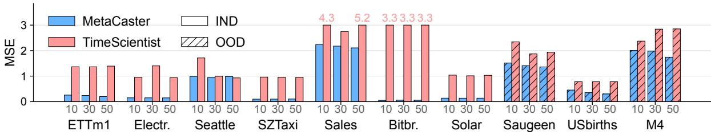  
Figure 3: Comparing the selected (trained) forecasters of agent pipelines METACASTER and TimeScientist.

test corpus (7 datasets), and an out-of-domain (OOD) test corpus (3 datasets). The IND corpus shares domains with ${ \mathcal { C } } _ { \mathrm { h a r } } .$ , while the OOD corpus covers unseen domains to evaluate generalization. All test datasets are disjoint from $\mathcal { C } _ { \mathrm { h a r } }$ . Each dataset $\mathcal { D } ^ { m }$ has a textual context $\mathsf { C } _ { m }$ . Time series are split chronologically into 80%/10%/10% train/validation/test sets. Following standard protocol (Nie et al., 2023), the look-back window T is set as 336, the prediction horizon H is 192. Full dataset details and approaches to avoid data leakage are deferred to Appendix B.1.

Baselines. We compare METACASTER with the most relevant SOTA methods, including time series generation models: (1) TimeVAE (Desai et al., 2021), (2) DiffTS (Yuan and Qiao, 2024), (3) T2S (Ge et al., 2025), (4) TimeDP (Huang et al., 2025b), (5) VerbalTS (Gu et al., 2025); time series augmentation techniques (Iwana and Uchida, 2021; Luo et al., 2023): (6) Repeat, (7) Bootstrap, (8) Jitter, (9) MagWarp; pre-trained TSFMs: (10) Chronos (Ansari et al., 2024), (11) Moirai (Woo et al., 2024), (12) VisionTS (Chen et al., 2024), (13) Time-LLM (Jin et al., 2024); and a SOTA agent pipeline: (14) TimeScientist (Zhao et al., 2025). Details about these methods are in Appendix B.2.

Settings. We draw $K \in \{ 1 0 , 3 0 , 5 0 \}$ samples from each test dataset to constitute $\mathcal { D } _ { \operatorname* { s u p } } ^ { m }$ , which is fed with $\mathsf { C } _ { m }$ to the compared methods. Generation models and augmentation methods use $\{ \mathcal { D } _ { \mathrm { s u p } } ^ { m } , \mathsf { C } _ { m } \}$ to produce $\bar { \mathcal { D } } ^ { \bar { m } }$ of size $N _ { m } ^ { \prime }$ , which is used to train the forecasters in our LT-LIB. TSFMs use $\mathcal { D } _ { \mathrm { s u p } } ^ { m }$ for fine-tuning. TimeScientist uses $\mathcal { D } _ { \mathrm { s u p } } ^ { m }$ to directly train forecasters as it cannot generate time series.

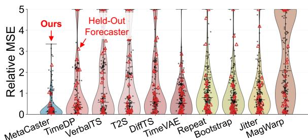  
Figure 4: Performance distribution. Each dot represents the performance of a forecaster $\bar { f } _ { l } ^ { m }$ on a test set $\mathcal { D } _ { \mathrm { t e } } ^ { m }$ covering all forecasters in LT-LIB and all datasets in both of IND and OOD corpora.

For our METACASTER, we set batch size $B = 8 ,$ and use GPT-5.4 (Lee et al., 2026) as the default LLM. We also test different LLMs in our ablation study (Table 2). For all methods that can generate $\bar { \mathcal { D } } ^ { m }$ , the size $N _ { m } ^ { \prime }$ is set to $| \mathcal { D } _ { \mathrm { t r } } ^ { m } | + | \mathcal { D } _ { \mathrm { v a l } } ^ { m } |$ |. Following (Nie et al., 2023; Tan et al., 2024), we use MSE and MAE to evaluate the TSF performance.

## 4.2 Experimental Results

Table 1 reports MSE results comparing generation models, augmentation methods, and META-CASTER. We randomly hold out 3 forecasters from LT-LIB and evaluate the average performance over the remaining 20; the held-out forecasters are used to assess METACASTER’s generalization to unseen forecasters (Fig. 4). MAE results are provided in Appendix E, and Appendix F reports the bestperforming forecaster among the 20 as trained by the compared methods.

Table 1 also reports results of training forecasters with K-shot $\mathcal { D } _ { \mathrm { s u p } } ^ { m }$ and full set $\mathcal { D } _ { \mathrm { t r } } ^ { m }$ , serving as lower and upper performance references, respectively. From Table 1, we highlight several observations: (1) METACASTER outperforms the generation/augmentation baselines in most cases, demonstrating the benefit of optimizing data generation for forecasting; (2) METACASTER’s performance improves with larger K, showing effective fewshot utilization; (3) When $K \geq 3 0$ , METACASTER approaches or even surpasses $\mathcal { D } _ { \mathrm { t r } } ^ { m }$ , suggesting that raw data may be noisy and optimized data can improve training; (4) In the extreme case when $K = 1 0$ , METACASTER remains competitive; and (5) Despite increased difficulty, METACASTER generalizes well to OOD datasets, where it generally outperforms baselines.

Fig. 4 shows the MSE distribution of individual forecasters trained by the models in Table 1, normalized by the upper reference $( \mathcal { D } _ { \mathrm { t r } } ^ { m } )$

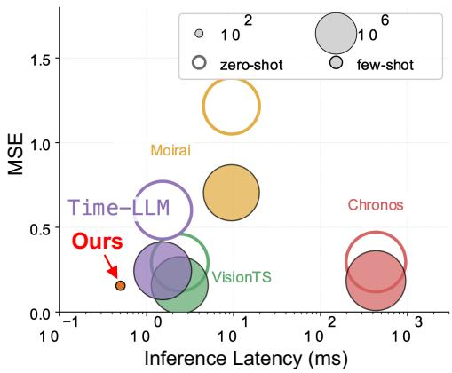  
Figure 5: Comparing METACASTER with TSFMs on Solar dataset. Full results are in Appendix E.

(i.e., Eq. (4)). METACASTER produces more highquality forecasters with lower variance. Moreover, it generalizes better to held-out forecasters than the baselines. Fig. 3 compares METACASTER with TimeScientist under $K \in { 1 0 , 3 0 , 5 0 }$ . Without data generation capability, TimeScientist struggles to train generalizable forecasters and its performance does not scale with K, indicating that a pure training pipeline is insufficient. Appendix E reports results when TimeScientist uses LT-LIB, yielding consistent conclusions.

Comparing with TSFMs. Fig. 5 compares Meta-Caster with TSFMs on the Solar dataset under $K = 3 0$ in terms of performance vs. cost. After deployment, METACASTER trains and selects a lightweight forecaster for inference and incurs no further agent overhead – here, MixLinear (243 parameters) is selected at runtime. In contrast, TSFMs remain expensive from fine-tuning through inference. At comparable performance, META-CASTER achieves up to $1 0 ^ { 3 } \times$ lower latency and $1 0 ^ { 5 } \times$ fewer parameters than TSFMs.

Ablation Study. Table 2 presents an ablation study using averaged MSE with $K = 3 0$ , with META-CASTER as our original model. In (a), we study the effect of forecasting-oriented optimization in Eq. (1) by replacing Eq. (1) with MMD and Wasserstein distances to directly align the generated set $\bar { \mathcal { D } } _ { \mathrm { t r } } ^ { m }$ with the authentic set $\mathcal { D } _ { \mathrm { t r } } ^ { m }$ . In (b), we remove contextual cues $\mathsf { C } _ { m }$ to evaluate their contribution. In (c), we examine the impact of different LLMs.

From Table 2(a), minimizing data distribution discrepancy generally degrades performance, as it is not directly aligned with the forecasting objective. Table 2(b) shows that contextual cues $\mathsf { C } _ { m }$ are crucial, as they guide MGAGENT in selecting domain-relevant knowledge for generating time series. Interestingly, Table 2(c) shows that different LLMs yield comparable results in many cases, suggesting the Harness – rather than the LLM backbone – is the key factor in METACASTER, consistent with prior findings (Li et al., 2026a). Although GPT-5.3-Codex wins in some cases, it is unstable on datasets such as ETTm1 and USbirths, leading to worse overall results; thus, we adopt GPT-5.4 as the default LLM for its consistent performance.

<table><tr><td rowspan="2">Dataset (→) Method (↓)</td><td colspan="6">IND Corpus</td><td colspan="4">OOD Corpus</td><td rowspan="2">Overall</td></tr><tr><td>ETTm1</td><td>Electricity</td><td>Seattle</td><td>SZTaxi</td><td>Sales</td><td>Bitbrains</td><td>Solar</td><td>Saugeen</td><td>USbirths</td><td>M4</td></tr><tr><td>METACASTER</td><td>0.345</td><td>0.226</td><td>1.177</td><td>0.114</td><td>2.362</td><td>0.125</td><td>0.152</td><td>1.464</td><td>0.533</td><td>2.112</td><td>0.267</td></tr><tr><td>(a) Loss→MMD</td><td>0.708</td><td>0.157</td><td>1.204</td><td>0.150</td><td>3.581</td><td>0.575</td><td>0.254</td><td>2.339</td><td>0.403</td><td>2.556</td><td>0.764</td></tr><tr><td>(a) Loss→Wasserstein</td><td>0.702</td><td>0.284</td><td>1.734</td><td>0.152</td><td>3.553</td><td>0.483</td><td>0.254</td><td>2.406</td><td>0.535</td><td>3.105</td><td>0.940</td></tr><tr><td>(b) Remove context  ${ \mathsf C } _ { m }$ </td><td>0.386</td><td>0.293</td><td>1.425</td><td>0.144</td><td>2.595</td><td>0.158</td><td>0.281</td><td>2.004</td><td>0.534</td><td>2.312</td><td>0.521</td></tr><tr><td>(c) LLM→Gemini-3.1-Pro</td><td>0.430</td><td>0.226</td><td>1.177</td><td>0.114</td><td>2.362</td><td>0.120</td><td>0.151</td><td>1.396</td><td>0.533</td><td>2.129</td><td>0.288</td></tr><tr><td>(c) LLM→Claude-Opus-4.7</td><td>0.494</td><td>0.226</td><td>1.189</td><td>0.114</td><td>2.362</td><td>0.151</td><td>0.150</td><td>1.491</td><td>0.541</td><td>2.129</td><td>0.321</td></tr><tr><td>(c) LLM→Qwen3.5-122B-A10B</td><td>0.494</td><td>0.223</td><td>1.177</td><td>0.114</td><td>2.362</td><td>0.199</td><td>0.152</td><td>1.729</td><td>0.533</td><td>2.129</td><td>0.366</td></tr><tr><td>(c) LLM→GPT-5.3-Codex</td><td>0.557</td><td>0.209</td><td>1.115</td><td>0.087</td><td>2.229</td><td>0.098</td><td>0.148</td><td>1.465</td><td>1.488</td><td>2.269</td><td>0.677</td></tr></table>

Table 2: Ablation analysis in terms of MSE. “Overall” assesses the normalized MSE (Eq. (4)) across datasets.  
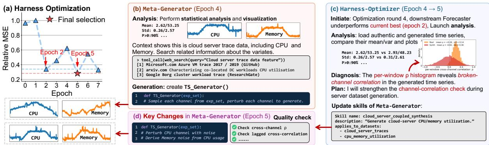  
Figure 6: An illustration of Harness optimization by METACASTER: (a) hinge loss (Eq. (4)) during optimization iterations. (b)-(d) key traces of MGAGENT and HPAGENT from Epoch 4 to 5 on alibaba\_cluster\_2018 dataset.

Further Analysis. We have evaluated computational efficiency, token usage, robustness of performance (using standard deviation), performance change w.r.t. K, performance of top-ranked forecasters, visualization of generated time series and data distribution, which are in Appendix C.3, F.

## 4.3 Case Study

Fig. 6(a) shows the evolution of hinge loss (Eq. (4)) over 8 Harness optimization epochs, where META-CASTER converges quickly and selects the final Harness from epoch 5. Fig 6(b)-(d) illustrates MGAGENT and HPAGENT traces from epoch 4 to 5 on the alibaba\_cluster\_2018 dataset in $\mathcal { C } _ { \mathrm { h a r } }$ . MGA-GENT (Fig 6(b)) analyzes the few-shot examples $\mathcal { D } _ { \mathrm { s u p } } ^ { m }$ , inspects statistics, retrieves domain knowledge about the two variates CPU and memory, and constructs a TS\_Generator. HPAGENT (Fig. 6(c)) detects performance degradation at epoch 4 via memory, then performs Analysis and Diagnosis. The Analysis uses analytical tools pertinent to the issue identified in the reasoning traces of MGA-GENT and the training logs of FTAGENT. The Diagnosis identifies broken inter-variate correlation as the root cause. It then updates MGAGENT’s skills, leading to an improved TS\_Generator that strengthens the CPU-memory correlation and and an addition of consistency checks. Consequently, epoch 5 produces correlated time series that are more compliant with the few-shot examples than epoch 4. This example illustrates a simple Harness update. In fact, METACASTER’s optimization is more complex and it deals with B = 8 datasets in $\mathcal { C } _ { \mathrm { h a r } }$ concurrently. The final output is a trained lightweight forecaster rather than the generated time series.

## 5 Conclusion

In this work, we study few-shot learning for lightweight forecasters via a novel meta-harnessoptimized multi-agent, METACASTER, which automates an end-to-end pipeline for time series generation, forecaster training, parameter tuning, and model selection. Experiments not only validate the effectiveness of METACASTER, but also set a groundwork for delving into the Agent-as-Engineer paradigm in agentic time series forecasting.

## Limitations

In this work, we study the challenging yet practical problem of improving lightweight time series forecasters in a few-shot setting for rapid deployment, avoiding delays from costly data acquisition and privacy constraints. This is enabled by leveraging the knowledge and reasoning capabilities of AI agent systems.

However, our current work does not address the extreme zero-shot setting, where no reference examples are available. Without reference time series, the agent lacks basic statistical grounding of the target domain, leading to unreliable data generation. This is a common limitation of time series generation-based models (Jeon et al., 2022; Yuan and Qiao, 2024; Naiman et al., 2024; Huang et al., 2025b; Gu et al., 2025; Ge et al., 2025) and highlights the advantage of TSFMs, which can transfer pre-trained knowledge in zero-shot settings. In contrast, by leveraging only a small number of examples – which is often feasible in practice – METACASTER achieves competitive performance with TSFMs while maintaining significantly lower computational cost.

Additionally, our experiments cover 18 time series datasets spanning a limited set of domains. We plan to extend this to the full pre-training corpora of modern TSFMs to further improve Harness optimization. Meanwhile, LT-LIB currently includes a set of SOTA lightweight forecasters we have collected so far. It may not be exhaustive as new lightweight forecasters continue to emerge. In future work, we will continuously update LT-LIB to strengthen the METACASTER system.

## Acknowledgments

This work was partially supported by a research gift from NEC Laboratories America and by the NVIDIA Academic Grant Program.

## References

Taha Aksu, Gerald Woo, Juncheng Liu, Xu Liu, Chenghao Liu, Silvio Savarese, Caiming Xiong, and Doyen Sahoo. 2024. Gift-eval: A benchmark for general time series forecasting model evaluation. arXiv preprint arXiv:2410.10393.

Alibaba Group. 2018. Alibaba cluster trace v2018. https://github.com/alibaba/clusterdata.

Abdul Fatir Ansari, Lorenzo Stella, Caner Turkmen, Xiyuan Zhang, Pedro Mercado, Huibin Shen, Oleksandr Shchur, Syama Sundar Rangapuram, Sebastian

Pineda Arango, Shubham Kapoor, Jasper Zschiegner, Danielle C. Maddix, Hao Wang, Michael W. Mahoney, Kari Torkkola, Andrew Gordon Wilson, Michael Bohlke-Schneider, and Yuyang Wang. 2024. Chronos: Learning the language of time series. TMLR.

Alberto Ardid, David Dempsey, Corentin Caudron, Shane Cronin, Ben Kennedy, Társilo Girona, Diana Roman, Craig Miller, Sally Potter, Oliver D Lamb, and 1 others. 2025. Ergodic seismic precursors and transfer learning for short term eruption forecasting at data scarce volcanoes. Nat. Commun.

Peter Belcak, Greg Heinrich, Shizhe Diao, Yonggan Fu, Xin Dong, Saurav Muralidharan, Yingyan Celine Lin, and Pavlo Molchanov. 2025. Small language models are the future of agentic ai. arXiv preprint arXiv:2506.02153.

Verónica Bolón-Canedo, Laura Morán-Fernández, Brais Cancela, and Amparo Alonso-Betanzos. 2024. A review of green artificial intelligence: Towards a more sustainable future. Neurocomputing.

Centers for Disease Control and Prevention. Flu-View: Outpatient illness surveillance (ILINet). https://gis.cdc.gov/grasp/fluview/ fluportaldashboard.html.

Centers for Disease Control and Prevention, NCHS. National vital statistics system: Births data. https: //www.cdc.gov/nchs/nvss/births.htm.

Mouxiang Chen, Lefei Shen, Zhuo Li, Xiaoyun Wang, Jianling Sun, and Chenghao Liu. 2024. Visionts: Visual masked autoencoders are free-lunch zero-shot time series forecasters. arXiv preprint arXiv:2408.17253.

Si-An Chen, Chun-Liang Li, Nate Yoder, Sercan O. Arik, and Tomas Pfister. 2023. Tsmixer: An all-mlp architecture for time series forecasting. TMLR.

Sarkar Snigdha Sarathi Das, Palash Goyal, Mihir Parmar, Nanyun Peng, Vishy Tirumalashetty, Chun-Liang Li, Rui Zhang, Jinsung Yoon, and Tomas Pfister. 2026. Nexus: An agentic framework for time series forecasting. arXiv preprint arXiv:2605.14389.

Abhyuday Desai, Cynthia Freeman, Zuhui Wang, and Ian Beaver. 2021. Timevae: A variational autoencoder for multivariate time series generation. arXiv preprint arXiv:2111.08095.

Vijay Ekambaram, Arindam Jati, Nam Nguyen, Phanwadee Sinthong, and Jayant Kalagnanam. 2023. TSMixer: Lightweight MLP-mixer model for multivariate time series forecasting. In KDD.

Jingru Fei, Kun Yi, Wei Fan, Qi Zhang, and Zhendong Niu. 2025. Amplifier: Bringing attention to neglected low-energy components in time series forecasting. In AAAI.

Azul Garza and Renée Rosillo Garcia. 2025. Timecopilot. In NeurIPS Workshop on Recent Advances in Time Series Foundation Models.

Yunfeng Ge, Jiawei Li, Yiji Zhao, Haomin Wen, Zhao Li, Meikang Qiu, Hongyan Li, Ming Jin, and Shirui Pan. 2025. T2s: High-resolution time series generation with text-to-series diffusion models. In IJCAI.

Rakshitha Godahewa, Christoph Bergmeir, Geoffrey I Webb, Rob J Hyndman, and Pablo Montero-Manso. 2021. Monash time series forecasting archive. In NeurIPS Datasets and Benchmarks.

Nate Gruver, Marc Finzi, Shikai Qiu, and Andrew Gordon Wilson. 2023. Large language models are zeroshot time series forecasters. In NeurIPS.

Shuqi Gu, Chuyue Li, Baoyu Jing, and Kan Ren. 2025. Verbalts: Generating time series from texts. In ICML.

Tong Guan, Zijie Meng, Dianqi Li, Shiyu Wang, Chao-Han Huck Yang, Qingsong Wen, Zuozhu Liu, Sabato Marco Siniscalchi, Ming Jin, and Shirui Pan. 2026a. Timeomni-1: Incentivizing complex reasoning with time series in large language models. In ICLR.

Tong Guan, Sheng Pan, Johan Barthelemy, Zhao Li, Yujun Cai, Cesare Alippi, Ming Jin, and Shirui Pan. 2026b. Timeomni-vl: Unified models for time series understanding and generation. arXiv preprint arXiv:2602.17149.

Keith W Hipel and A Ian McLeod. 1994. Time Series Modelling of Water Resources and Environmental Systems. Elsevier.

Qihe Huang, Zhengyang Zhou, Kuo Yang, Zhongchao Yi, Xu Wang, and Yang Wang. 2025a. TimeBase: The power of minimalism in efficient long-term time series forecasting. In ICML.

Yu-Hao Huang, Chang Xu, Yueying Wu, Wu-Jun Li, and Jiang Bian. 2025b. Timedp: Learning to generate multi-domain time series with domain prompts. In AAAI.

Brian Kenji Iwana and Seiichi Uchida. 2021. An empirical survey of data augmentation for time series classification with neural networks. PLOS ONE.

Gunjan Jalori, Preetika Verma, and Sercan Ö. Arık. 2025. Flairr-ts: Forecasting llm-agents with iterative refinement and retrieval for time series. In Findings ofEMNLP.

Jinsung Jeon, Jeonghak Kim, Haryong Song, Seunghyeon Cho, and Noseong Park. 2022. Gt-gan: General purpose time series synthesis with generative adversarial networks. In NeurIPS.

Yushan Jiang, Kanghui Ning, Zijie Pan, Xuyang Shen, Jingchao Ni, Wenchao Yu, Anderson Schneider, Haifeng Chen, Yuriy Nevmyvaka, and Dongjin Song. 2025. Multi-modal time series analysis: A tutorial and survey. In KDD.

Ming Jin, Shiyu Wang, Lintao Ma, Zhixuan Chu, James Y. Zhang, Xiaoming Shi, Pin-Yu Chen, Yuxuan Liang, Yuan-Fang Li, Shirui Pan, and Qingsong Wen. 2024. Time-llm: Time series forecasting by reprogramming large language models. In ICLR.

Yaxuan Kong, Yiyuan Yang, Yoontae Hwang, Wenjie Du, Stefan Zohren, Zhangyang Wang, Ming Jin, and Qingsong Wen. 2025. Time-mqa: Time series multitask question answering with context enhancement. In ACL.

Irena Koprinska, Dengsong Wu, and Zheng Wang. 2018. Convolutional neural networks for energy time series forecasting. In IJCNN.

Yoonho Lee, Roshen Nair, Qizheng Zhang, Kangwook Lee, Omar Khattab, and Chelsea Finn. 2026. Metaharness: End-to-end optimization of model harnesses. arXiv preprint arXiv:2603.28052.

Junjie Li, Xi Xiao, Yunbei Zhang, Chen Liu, Lin Zhao, Xiaoying Liao, Yingrui Ji, Janet Wang, Jianyang Gu, Yingqiang Ge, Weijie Xu, Xi Fang, Xiang Xu, Tianchen Zhao, Youngeun Kim, Tianyang Wang, Jihun Hamm, Smita Krishnaswamy, Jun Huan, and Chandan Reddy. 2026a. Agent harness engineering: A survey. https://openreview.net/pdf? id=eONq7FdiHa.

Xiangyi Li, Wenbo Chen, Yimin Liu, Shenghan Zheng, Xiaokun Chen, Yifeng He, Yubo Li, Bingran You, Haotian Shen, Jiankai Sun, and 1 others. 2026b. Skillsbench: Benchmarking how well agent skills work across diverse tasks. arXiv preprint arXiv:2602.12670.

Yaguang Li, Rose Yu, Cyrus Shahabi, and Yan Liu. 2018. Diffusion convolutional recurrent neural network: Data-driven traffic forecasting. In ICLR.

Zhe Li, Shiyi Qi, Yiduo Li, and Zenglin Xu. 2023. Revisiting long-term time series forecasting: An investigation on linear mapping. arXiv preprint arXiv:2305.10721.

Jiahang Lin, Shichun Liu, Chengjun Pan, Lizhi Lin, Shihan Dou, Zhiheng Xi, Xuanjing Huang, Hang Yan, Zhenhua Han, and Tao Gui. 2026. Agentic harness engineering: Observability-driven automatic evolution of coding-agent harnesses. arXiv preprint arXiv:2604.25850.

Shengsheng Lin, Weiwei Lin, Xinyi Hu, Wentai Wu, Ruichao Mo, and Haocheng Zhong. 2024a. Cyclenet: Enhancing time series forecasting through modeling periodic patterns. In NeurIPS.

Shengsheng Lin, Weiwei Lin, Wentai Wu, Haojun Chen, and Junjie Yang. 2024b. Sparsetsf: Modeling longterm time series forecasting with 1k parameters. In ICML.

Peiyuan Liu, Hang Guo, Tao Dai, Naiqi Li, Jigang Bao, Xudong Ren, Yong Jiang, and Shu-Tao Xia. 2025a. Calf: Aligning llms for time series forecasting via cross-modal fine-tuning. In AAAI.

Peiyuan Liu, Beiliang Wu, Yifan Hu, Naiqi Li, Tao Dai, Jigang Bao, and Shu-Tao Xia. 2025b. TimeBridge: Non-stationarity matters for long-term time series forecasting. In ICML.

Yong Liu, Guo Qin, Xiangdong Huang, Jianmin Wang, and Mingsheng Long. 2024. Autotimes: Autoregressive time series forecasters via large language models. In NeurIPS.

Yong Liu, Guo Qin, Zhiyuan Shi, Zhi Chen, Caiyin Yang, Xiangdong Huang, Jianmin Wang, and Mingsheng Long. 2025c. Sundial: A family of highly capable time series foundation models. In ICML.

Dongsheng Luo, Wei Cheng, Yingheng Wang, Dongkuan Xu, Jingchao Ni, Wenchao Yu, Xuchao Zhang, Yanchi Liu, Yuncong Chen, Haifeng Chen, and 1 others. 2023. Time series contrastive learning with information-aware augmentations. In AAAI.

Aitian Ma, Dongsheng Luo, and Mo Sha. 2024. MixLinear: Extreme low resource multivariate time series forecasting with 0.1K parameters. arXiv preprint arXiv:2410.02081.

Spyros Makridakis, Evangelos Spiliotis, and Vassilios Assimakopoulos. 2020. The M4 competition: 100,000 time series and 61 forecasting methods. Int. J. Forecast.

Spyros Makridakis, Evangelos Spiliotis, and Vassilios Assimakopoulos. 2022. The M5 competition: Background, organization, and implementation. Int. J. Forecast.

Mike A Merrill, Mingtian Tan, Vinayak Gupta, Thomas Hartvigsen, and Tim Althoff. 2024. Language models still struggle to zero-shot reason about time series. In Findings ofEMNLP.

Mohammad Amin Morid, Olivia R Liu Sheng, and Joseph Dunbar. 2023. Time series prediction using deep learning methods in healthcare. ACM TMIS.

Ilan Naiman, Nimrod Berman, Itai Pemper, Idan Arbiv, Gal Fadlon, and Omri Azencot. 2024. Utilizing image transforms and diffusion models for generative modeling of short and long time series. In NeurIPS.

National Renewable Energy Laboratory. 2006. Solar power data for integration studies. https://www. nrel.gov/grid/solar-power-data.html.

Yuqi Nie, Nam H. Nguyen, Phanwadee Sinthong, and Jayant Kalagnanam. 2023. A time series is worth 64 words: Long-term forecasting with transformers. In ICLR.

Xuying Ning, Katherine Tieu, Dongqi Fu, Tianxin Wei, Zihao Li, Yuanchen Bei, Jiaru Zou, Mengting Ai, Zhining Liu, Ting-Wei Li, and 1 others. 2026. Code as agent harness. arXiv preprint arXiv:2605.18747.

Zijie Pan, Yushan Jiang, Sahil Garg, Anderson Schneider, Yuriy Nevmyvaka, and Dongjin Song. 2024. S2ip-llm: Semantic space informed prompt learning with llm for time series forecasting. In ICML.

ChengAo Shen, Wenchao Yu, Ziming Zhao, Dongjin Song, Wei Cheng, Haifeng Chen, and Jingchao Ni. 2025a. Multi-modal view enhanced large vision models for long-term time series forecasting. In NeurIPS.

ChengAo Shen, Ziming Zhao, Hanghang Tong, Dongjin Song, Dongsheng Luo, Qingsong Wen, and Jingchao Ni. 2025b. Svtime: Small time series forecasting models informed by "physics" of large vision model forecasters. arXiv preprint arXiv:2510.09780.

Siqi Shen, Vincent van Beek, and Alexandru Iosup. 2015. Statistical characterization of business-critical workloads hosted in cloud datacenters. In CCGrid.

Haotian Si, Changhua Pei, Jianhui Li, Dan Pei, and Gaogang Xie. 2025. CMoS: Rethinking time series prediction through the lens of chunk-wise spatial correlations. In ICML.

Artyom Stitsyuk and Jaesik Choi. 2025. xPatch: Dual-stream time series forecasting with exponential seasonal-trend decomposition. In AAAI.

Mingtian Tan, Mike A Merrill, Vinayak Gupta, Tim Althoff, and Thomas Hartvigsen. 2024. Are language models actually useful for time series forecasting? NeurIPS.

Peiwang Tang and Weitai Zhang. 2025. Unlocking the power of patch: Patch-based MLP for long-term time series forecasting. In AAAI.

Artur Trindade. 2015. Electricity-LoadDiagrams20112014. https:// archive.ics.uci.edu/dataset/321/ electricityloaddiagrams20112014.

University of Washington STAR Lab. Seattle inductive loop detector dataset. https://github.com/ zhiyongc/Seattle-Loop-Data.

Chengsen Wang, Qi Qi, Jingyu Wang, Haifeng Sun, Zirui Zhuang, Jinming Wu, Lei Zhang, and Jianxin Liao. 2025. Chattime: A unified multimodal time series foundation model bridging numerical and textual data. In AAAI.

Shiyu Wang, Haixu Wu, Xiaoming Shi, Tengge Hu, Huakun Luo, Lintao Ma, James Y. Zhang, and Jun Zhou. 2024. Timemixer: Decomposable multiscale mixing for time series forecasting. In ICLR.

Qingsong Wen, Liang Sun, Fan Yang, Xiaomin Song, Jingkun Gao, Xue Wang, and Huan Xu. 2021. Time series data augmentation for deep learning: A survey. In IJCAI.

Gerald Woo, Chenghao Liu, Akshat Kumar, Caiming Xiong, Silvio Savarese, and Doyen Sahoo. 2024. Unified training of universal time series forecasting transformers. In ICML.

Xingjian Wu, Junkai Lu, Zhengyu Li, Xiangfei Qiu, Jilin Hu, Chenjuan Guo, Christian S. Jensen, and Bin Yang. 2026. Timeart: Towards agentic time series reasoning via tool-augmentation. arXiv preprint arXiv:2601.13653.

Mingyuan Xia, Chunxu Zhang, Zijian Zhang, Hao Miao, Qidong Liu, Yuanshao Zhu, and Bo Yang. 2025. TimeEmb: A lightweight static-dynamic disentanglement framework for time series forecasting. arXiv preprint arXiv:2510.00461.

Zhijian Xu, Ailing Zeng, and Qiang Xu. 2024. Fits: Modeling time series with 10k parameters. In ICLR.

Hao Xue and Flora D Salim. 2023. Promptcast: A new prompt-based learning paradigm for time series forecasting. IEEE TKDE.

Kun Yi, Jingru Fei, Qi Zhang, Hui He, Shufeng Hao, Defu Lian, and Wei Fan. 2024. FilterNet: Harnessing frequency filters for time series forecasting. In NeurIPS.

Jinsung Yoon, Daniel Jarrett, and Mihaela van der Schaar. 2019. Time-series generative adversarial networks. In NeurIPS.

Fangxu Yu, Hongyu Zhao, and Tianyi Zhou. 2025. Ts-reasoner: Aligning time series foundation models with llm reasoning. arXiv preprint arXiv:2510.03519.

Xinyu Yuan and Yan Qiao. 2024. Diffusion-ts: Interpretable diffusion for general time series generation. In ICLR.

Zhihan Yue, Yujing Wang, Juanyong Duan, Tianmeng Yang, Congrui Huang, Yunhai Tong, and Bixiong Xu. 2022. Ts2vec: Towards universal representation of time series. In AAAI.

Mert Yuksekgonul, Federico Bianchi, Joseph Boen, Sheng Liu, Pan Lu, Zhi Huang, Carlos Guestrin, and James Zou. 2025. Optimizing generative ai by backpropagating language model feedback. Nature.

Ailing Zeng, Muxi Chen, Lei Zhang, and Qiang Xu. 2023. Are transformers effective for time series forecasting? In AAAI.

Boya Zhang, Shuaijie Yin, Huiwen Zhu, and Xing He. 2026. FreqCycle: A multi-scale time-frequency analysis method for time series forecasting. arXiv preprint arXiv:2603.09661.

Tianping Zhang, Yizhuo Zhang, Wei Cao, Jiang Bian, Xiaohan Yi, Shun Zheng, and Jian Li. 2022. Less is more: Fast multivariate time series forecasting with light sampling-oriented mlp structures. arXiv preprint arXiv:2207.01186.

Xiaohan Zhang, Tian Gao, Mingyue Cheng, Bokai Pan, Ze Guo, Yaguo Liu, Xiaoyu Tao, and Qi Liu. 2025. Alphacast: A human wisdom-llm intelligence coreasoning framework for interactive time series forecasting. arXiv preprint arXiv:2511.08947.

Haokun Zhao, Xiang Zhang, Jiaqi Wei, Yiwei Xu, Yuting He, Siqi Sun, and Chenyu You. 2025. Timeseriesscientist: A general-purpose ai agent for time series analysis. arXiv preprint arXiv:2510.01538.

Ling Zhao, Yujiao Song, Chao Zhang, Yu Liu, Pu Wang, Tao Lin, Min Deng, and Haifeng Li. 2020. T-GCN: A temporal graph convolutional network for traffic prediction. IEEE TITS.

Siru Zhong, Weilin Ruan, Ming Jin, Huan Li, Qingsong Wen, and Yuxuan Liang. 2025. Time-vlm: Exploring multimodal vision-language models for augmented time series forecasting. In ICML.

Haoyi Zhou, Shanghang Zhang, Jieqi Peng, Shuai Zhang, Jianxin Li, Hui Xiong, and Wancai Zhang. 2021. Informer: Beyond efficient transformer for long sequence time-series forecasting. In AAAI.

Pengfei Zhou, Yunlong Liu, Junli Liang, Qi Song, and Xiangyang Li. 2025. CrossLinear: Plug-and-play cross-correlation embedding for time series forecasting with exogenous variables. In KDD.

Tian Zhou, Peisong Niu, Xue Wang, Liang Sun, and Rong Jin. 2023. One fits all: Power general time series analysis by pretrained lm. In NeurIPS.

## A Algorithm

The meta-harness optimization algorithm of METACASTER is summarized in Algorithm 1. The notations are consistent with §3.

Algorithm 1: Meta-harness optimization of METACASTER   
Input: (1) Corpurs $\mathcal { C } _ { \mathrm { h a r } } = \{ \mathcal { D } ^ { m } , \mathsf { C } _ { m } \} _ { m = 1 } ^ { M } ; ( 2 ) \operatorname { L T - L I B } \mathcal { F } = \{ f _ { 1 } , . . . , f _ { L } \} ;$ (3) number of epochs $E ;$   
(4) batch size B   
Output: Optimized harness $\pmb { \theta } ^ { * }$   
1 $\ell ^ { * } \gets + \infty$ $/ /$ Initialize loss function value   
2 $\pmb \theta \gets \pmb \theta ^ { 0 }$ $/ /$ Initialize harness   
3 for $i = 1 , . . . , E$ do   
/\* Optimization loop $\star /$   
4 K ∼ Uniform([10, 50])   
5 Draw a batch $\mathcal { C } _ { \boldsymbol { \mathsf { b } } } = \{ \bar { D } ^ { m } , \mathsf { C } _ { m } \} _ { m = 1 } ^ { B }$   
$/ \star$ Forward passes across datasets in a batch $\star /$   
6 for $\{ \mathcal { D } ^ { m } , \mathsf { C } _ { m } \} \in \mathcal { C } _ { b }$ do   
7 $\{ \mathcal { D } _ { \mathrm { t r } } ^ { m } , \mathcal { D } _ { \mathrm { v a l } } ^ { m } , \mathcal { D } _ { \mathrm { t e } } ^ { m } \} \gets \mathsf { S p l i t } ( \mathcal { D } ^ { m } )$ // train/validation/test split   
8 $\mathcal { D } _ { \mathrm { s u p } } ^ { m }  K$ samples from $\mathcal { D } _ { \mathrm { t r } } ^ { m }$ // K-shot support set   
$^ { \prime \star }$ Run MGagent $( \mathsf E \mathsf { q } . ( 2 ) ) \ \star /$   
9 $\bar { \mathcal { D } } ^ { m } \gets \mathrm { M G A G E N T } _ { \theta } ( \mathcal { D } _ { \mathrm { s u p } } ^ { m } , \mathsf { C } _ { m } )$   
10 $\{ \bar { D } _ { \mathrm { t r } } ^ { m } , \bar { D } _ { \mathrm { v a l } } ^ { m } \} \gets \mathsf { S p l i t } ( \bar { D } ^ { \bar { m } } )$   
$^ { \prime \star }$ Run FTagent $( \mathsf { E q } . ( 3 ) ) \star /$   
11 $\{ \{ f _ { l } ^ { m } , \bar { f } _ { l } ^ { m } , \omega ( f _ { l } ^ { m } ) , \omega ( \bar { f } _ { l } ^ { m } ) \} _ { l = 1 } ^ { L } , \mathrm { R } \} \gets \mathrm { F T A G E N T } ( \{ \mathcal { D } _ { \mathrm { t r } } ^ { m } , \mathcal { D } _ { \mathrm { v a l } } ^ { m } , \mathcal { D } _ { \mathrm { t e } } ^ { m } \} , \{ \bar { \mathcal { D } } _ { \mathrm { t r } } ^ { m } , \bar { \mathcal { D } } _ { \mathrm { v a l } } ^ { m } \} )$   
12 end   
13 $\ell \gets \frac { 1 } { B L } \sum _ { m = 1 } ^ { B } \sum _ { l = 1 } ^ { L } \delta \big ( \omega ( f _ { l } ^ { m } ) , \omega ( \bar { f } _ { l } ^ { m } ) \big )$ $/ /$ The optimization loss Eq. (1)   
$/ \star$ Run HPagent $\star /$   
14 $\pmb { \theta } \gets \mathrm { H P A G E N T } ( \pmb { \theta } , \ell , \ell ^ { \ast } , \mathsf { R } )$   
15 if $\ell < \ell ^ { * }$ then   
16 $\ell ^ { * } \gets \ell$   
17 ${ \pmb \theta } ^ { * }  { \pmb \theta }$   
18 end   
19 end

## B Datasets and Baselines

## B.1 Datasets

Pretraining-style train/test separation. Both the training and evaluation datasets are drawn from GIFT-Eval (Aksu et al., 2024), which is released under the Apache 2.0 license and permits research use. To prevent dataset leakage, we follow the data-isolation paradigm adopted by foundation-model pre-training and draw them from two disjoint GIFT-Eval collections, so that no source series ever appears in both phases.

Addressing Data Leakage. Three successive layers guard against test-source contamination. First, the training and evaluation datasets are drawn from two disjoint GIFT-Eval collections, Salesforce/GiftEvalPretrain for training and Salesforce/GIFT\_Eval for evaluation, so no source series ever appears in both phases. Second, the context $\mathsf { C } _ { m }$ delivered to MGAGENT is stripped of dataset identifiers, source URLs, and benchmark names before reaching the agent, leaving only the domain label and a short semantic description, so the agent cannot use a dataset name as a hook to retrieve or imitate the true test data from any pretraining corpus it may have memorised. Third, we manually audit the runtime traces of MGAGENT on held-out runs and confirm that no external web request is issued and no real test data is touched; synthesis is driven only by the few-shot support set $\mathcal { D } _ { \mathrm { s u p } } ^ { m }$ and the de-identified context.

Training collection. We take 8 datasets covering 6 domain categories (energy, traffic, weather, health, retail, cloud) from Salesforce/GiftEvalPretrain (Aksu et al., 2024); per-dataset frequency, channel count, length, domain label, and source are listed in Table 3. Two of them (cdc\_fluview\_ilinet, alibaba\_cluster\_trace\_2018) are multivariate (D = 5 and D = 2); the remaining six are sampled from populations of parallel univariate series $( D = 1 )$

<table><tr><td>Dataset</td><td>Freq.</td><td>D</td><td>N</td><td>T</td><td>Domain</td><td>Source</td></tr><tr><td>australian_electricity_demand</td><td>30min</td><td></td><td>5</td><td>231k</td><td>energy</td><td>(Godahewa et al., 2021)</td></tr><tr><td>solar_power</td><td>4s</td><td>1</td><td>1</td><td>7.4M</td><td>energy</td><td>(Godahewa et al., 2021)</td></tr><tr><td>PEMS_BAY</td><td>5min</td><td>1</td><td>325</td><td>52k</td><td>traffic</td><td>(Li et al., 2018)</td></tr><tr><td>traffic_hourly</td><td>1h</td><td>1</td><td>862</td><td>17.5k</td><td>traffic</td><td>(Godahewa et al., 2021)</td></tr><tr><td>weather</td><td>1d</td><td>1</td><td>3,010</td><td>var</td><td>weather</td><td>(Godahewa et al., 2021)</td></tr><tr><td>cdc_fluview_ilinet</td><td>1w</td><td>5</td><td>5</td><td>1.2k</td><td>health</td><td>(Centers for Disease Control and Prevention)</td></tr><tr><td>m5</td><td>1d</td><td>1</td><td>30,490</td><td>1.9k</td><td>retail</td><td>(Makridakis et al., 2022)</td></tr><tr><td>alibaba_cluster_trace_2018</td><td>1min</td><td>2</td><td>58k</td><td>2k+</td><td>cloud</td><td>(Alibaba Group, 2018)</td></tr></table>

Table 3: Overview of Training Dataset.

Test collection. We take 10 datasets from Salesforce/GIFT\_Eval (Aksu et al., 2024), split into 7 IND (big-domain label appears in the training collection) and 3 OOD (entirely absent from training); per-dataset frequency, channel count, length, domain label, and source are listed in Table 4. Among the OOD set, M4 is a mixed-domain daily subset; we include it to probe whether the model still works when domain information is ambiguous or absent.

<table><tr><td></td><td>Dataset</td><td>Freq.</td><td>D</td><td>N</td><td>T</td><td>Domain</td><td>Source</td></tr><tr><td rowspan="8">IND</td><td>ETTm1</td><td>15min</td><td>7</td><td>1</td><td>50k</td><td>energy</td><td>(Zhou et al., 2021)</td></tr><tr><td>Electricity</td><td>1h</td><td>1</td><td>370</td><td>35.1k</td><td>energy</td><td>(Trindade, 2015)</td></tr><tr><td>Seattle</td><td>1h</td><td>1</td><td>323</td><td>8.8k</td><td>traffic</td><td>(University of Washington STAR Lab)</td></tr><tr><td>SZTaxi</td><td>15min</td><td>1</td><td>156</td><td>3.0k</td><td>traffic</td><td>(Zhao et al., 2020)</td></tr><tr><td>Sales</td><td>1d</td><td>1</td><td>118</td><td>1.8k</td><td>retail</td><td>(Godahewa et al., 2021)</td></tr><tr><td>Bitbrains</td><td>5min</td><td>2</td><td>1,250</td><td>8.6k</td><td>cloud</td><td>(Shen et al., 2015)</td></tr><tr><td>Solar</td><td>1h</td><td>1</td><td>137</td><td>8.8k</td><td>energy</td><td>(National Renewable Energy Laboratory, 2006)</td></tr><tr><td>Saugeen</td><td>1d</td><td></td><td></td><td>23.7k</td><td>hydrology</td><td>(Hipel and McLeod, 1994)</td></tr><tr><td rowspan="2">AOO</td><td>USbirths</td><td>1d</td><td>1 1</td><td>1 1</td><td>7.3k</td><td>demographics</td><td>(Centers for Disease Control and Prevention, NCHS)</td></tr><tr><td>M4</td><td>1d</td><td>1</td><td>4,227</td><td>9.9k</td><td>mixed</td><td>(Makridakis et al., 2020)</td></tr></table>

Table 4: Overview of Test Dataset.

Coverage of the difficulty spectrum. The 18 datasets jointly span the axes that govern few-shot forecasting difficulty on GIFT-Eval. Sampling frequency ranges from 4-second photovoltaic telemetry on solar\_power to weekly health indicators on cdc\_fluview\_ilinet, covering six orders of magnitude. The number of variates D takes values in {1, 2, 5, 7}, exposing both univariate and small-multichannel regimes. Per-series length ranges from 1.2k steps on the shortest health series to 7.4M steps on the densest telemetry feed, a five-order-of-magnitude span that subjects the synthesis pipeline to highly heterogeneous regimes within a single benchmark.

Forecasting protocol on each dataset. On every dataset the raw series is split chronologically into train / validation / test partitions at an 80/10/10 ratio, z-score-normalised per channel using statistics estimated on the train partition, and sliced into (X, Y) pairs with a look-back of $T = 3 3 6$ steps and a horizon of H = 192 steps; this contract is shared by every method evaluated in this paper. The few-shot support set $\mathcal { D } _ { \mathrm { s u p } } ^ { m }$ fed to METACASTER and to every external baseline is obtained by drawing K windows from the train partition of dataset m, with $K \in \{ 1 0 , 3 0 , 5 0 \}$ in the main results (Table 1) and $K \in \{ 1 0 , 2 0 , 3 0 , 5 0 , 1 0 0 \}$ in the few-shot scaling study (Appendix F). Each dataset is paired with a textual context $\mathsf { C } _ { m }$ summarising its domain and semantic cues, bundled with the support set and passed to any method that consumes textual conditioning.

## B.2 Baselines

This subsection consolidates every baseline reported in the main table (Table 1), grouped into deep generative synthesisers and classical augmentation procedures, together with two reference levels that delineate the dynamic range of each row. The reference levels are $\mathcal { D } _ { \mathrm { s u p } } ^ { m }$ , which trains each forecaster directly on the few-shot support set with no augmentation and acts as the no-synthesis floor, and $\mathcal { D } _ { \mathrm { t r } } ^ { m }$ which trains on the full historical training split and acts as the data-rich oracle that any few-shot method aspires to match. For completeness we additionally describe the foundation forecasters compared in §4.2 and the closest agent-driven reference TimeScientist (Fig. 3), neither of which fits the few-shot synthesis cell of the main table but both of which appear in the rest of the experimental study.

## Deep generative baselines.

• TimeDP (Huang et al., 2025b): a diffusion model conditioned on domain prompts assembled from learned time-series prototype vectors, whose weights are inferred from few-shot samples of the target domain.

• VerbalTS (Gu et al., 2025): a diffusion model that maps unstructured textual descriptions to time series through a multi-focal alignment module bridging text tokens and temporal latents.

• T2S (Ge et al., 2025): a text-conditioned Diffusion Transformer trained with Flow Matching over a length-adaptive VAE latent space, enabling variable-length text-to-series synthesis.

• Diffusion-TS (Yuan and Qiao, 2024): a denoising diffusion model with an encoder-decoder Transformer that decomposes samples into trend and seasonal components and predicts the clean signal under a Fourier-domain loss.

• TimeVAE (Desai et al., 2021): a variational autoencoder whose decoder composes outputs from interpretable level, trend, and seasonality blocks sampled from a Gaussian latent prior.

## Classical augmentation baselines.

• Repeat: cycles deterministically through the few-shot pool until the target training-set size is reached.

• Bootstrap: resamples windows with replacement and adds small zero-mean Gaussian noise scaled per channel.

• Jitter (Iwana and Uchida, 2021): adds independent zero-mean Gaussian noise to every time step and channel of each resampled window.

• MagWarp (Iwana and Uchida, 2021; Wen et al., 2021): multiplies each channel by a smooth scaling curve obtained by cubic-spline interpolation through random knots.

## Foundation forecasters.

• VisionTS (Chen et al., 2024): recasts forecasting as image inpainting by arranging the look-back into a 2D grid and decoding the masked horizon with a frozen ImageNet-pretrained MAE.

• Chronos (Ansari et al., 2024): quantises scaled time-series values into a fixed vocabulary and trains a T5 encoder-decoder on tokenised sequences for autoregressive probabilistic forecasting.

• Moirai (Woo et al., 2024): a masked encoder Transformer with any-variate attention and multi-patch projections, pretrained on the LOTSA corpus to handle arbitrary frequencies and channel counts.

• Time-LLM (Jin et al., 2024): freezes a pretrained GPT-2 backbone and reprograms patch embeddings into text-prototype tokens, prepending dataset descriptions as a prompt prefix.

TimeScientist. TimeScientist (Zhao et al., 2025) is a multi-agent pipeline driven by a local Qwen2.5 backbone that diagnoses each series and ensembles classical forecasters (ARIMA, ETS, Random Forest) per query. We separate it from the foundation forecasters above because it does not ship a single pretrained weight matrix; instead, the LLM agent is invoked at every test window to compose and tune the classical predictors, making it the closest published reference to METACASTER’s agent-driven paradigm.

## C Implementation Details

## C.1 Forecaster Pool

Twenty-three lightweight forecasters across four families:

<table><tr><td>Family</td><td>Forecaster</td><td>Params</td><td>MACs (M)</td><td>Latency (ms)</td><td>Peak VRAM (MB)</td><td>Ref.</td></tr><tr><td>Linear</td><td>Vanilla Linear</td><td>65K</td><td>0.45</td><td>0.03</td><td>8.4</td><td>(Zeng et al., 2023)</td></tr><tr><td></td><td>DLinear</td><td>129K</td><td>0.90</td><td>0.10</td><td>8.7</td><td>(Zeng et al., 2023)</td></tr><tr><td></td><td>NLinear</td><td>65K</td><td>0.45</td><td>0.04</td><td>8.4</td><td>(Zeng et al., 2023)</td></tr><tr><td></td><td>RLinear</td><td>65K</td><td>0.45</td><td>0.17</td><td>8.4</td><td>(Li et al., 2023)</td></tr><tr><td></td><td>CrossLinear</td><td>2.5M</td><td>28.45</td><td>0.72</td><td>23.1</td><td>(Zhou et al., 2025)</td></tr><tr><td></td><td>MixLinear</td><td>243</td><td>0.08</td><td>0.43</td><td>8.3</td><td>(Ma et al., 2024)</td></tr><tr><td>MLP</td><td>TSMixer</td><td>153K</td><td>1.66</td><td>0.42</td><td>10.1</td><td>(Chen et al., 2023)</td></tr><tr><td></td><td>LightTS</td><td>74K</td><td>0.70</td><td>0.75</td><td>10.1</td><td>(Zhang et al., 2022)</td></tr><tr><td></td><td>PatchMLP</td><td>2.5M</td><td>18.12</td><td>1.21</td><td>20.1</td><td>(Tang and Zhang, 2025)</td></tr><tr><td></td><td>xPatch</td><td>770K</td><td>8.16</td><td>1.44</td><td>13.6</td><td>(Stitsyuk and Choi, 2025)</td></tr><tr><td></td><td>CMoS</td><td>13K</td><td>0.36</td><td>1.09</td><td>9.3</td><td>(Si et al., 2025)</td></tr><tr><td></td><td>PatchTSMixer</td><td>553K</td><td>20.83</td><td>1.12</td><td>14.4</td><td>(Ekambaram et al., 2023)</td></tr><tr><td>Freq/Filter</td><td>FITS</td><td>925</td><td>0.01</td><td>0.32</td><td>8.3</td><td>(Xu et al., 2024)</td></tr><tr><td></td><td>CycleNet</td><td>65K</td><td>0.45</td><td>0.32</td><td>8.5</td><td>(Lin et al., 2024a)</td></tr><tr><td></td><td>PaiFilter</td><td>136K</td><td>0.95</td><td>0.35</td><td>9.8</td><td>(Yi et al., 2024)</td></tr><tr><td></td><td>TexFilter</td><td>179K</td><td>0.94</td><td>1.62</td><td>9.9</td><td>(Yi et al., 2024)</td></tr><tr><td></td><td>FreqCycle</td><td>64K</td><td>0.43</td><td>0.78</td><td>9.5</td><td>(Zhang et al., 2026)</td></tr><tr><td>Mixing</td><td>TimeMixer</td><td>377K</td><td>50.08</td><td>0.80</td><td>65.0</td><td>(Wang et al., 2024)</td></tr><tr><td></td><td>TimeBase</td><td>146</td><td>0.02</td><td>0.29</td><td>9.2</td><td>(Huang et al., 2025a)</td></tr><tr><td></td><td>TimeBridge</td><td>36K</td><td>3.01</td><td>2.09</td><td>10.4</td><td>(Liu et al., 2025b)</td></tr><tr><td></td><td>TimeEmb</td><td>308K</td><td>1.89</td><td>0.47</td><td>10.5</td><td>(Xia et al., 2025)</td></tr><tr><td></td><td>Amplifier</td><td>327K</td><td>1.06</td><td>0.73</td><td>10.6</td><td>(Fei et al., 2025)</td></tr><tr><td></td><td>SparseTSF</td><td>137</td><td>0.08</td><td>0.20</td><td>8.2</td><td>(Lin et al., 2024b)</td></tr></table>

Table 5: The 23 forecasters in LT-LIB, grouped by family.

Per-architecture descriptions. For completeness we list the core architectural idea of each forecaster in LT-LIB, grouped by family; bibliographic references match Table 5. All 23 forecasters are wrapped by a uniform training interface in LT-LIB so that FTAGENT can launch any of them via the same (forecaster, dataset, hyperparameter) call signature.

• Vanilla Linear (Zeng et al., 2023): a single fully-connected temporal layer maps each variate’s look-back window directly to its horizon via a weighted sum, with weights shared across variates.

• DLinear (Zeng et al., 2023): series decomposition splits the input into trend and seasonal components, each forecast by a separate linear layer whose outputs are summed.

• NLinear (Zeng et al., 2023): the last look-back value is subtracted before a linear projection and added back after, providing simple distribution-shift compensation.

• RLinear (Li et al., 2023): a single linear projection wrapped by reversible instance normalisation (RevIN), with weights shared across variates.

• CrossLinear (Zhou et al., 2025): a plug-and-play cross-correlation embedding is fused with patch embeddings of the endogenous variable before a global linear forecasting head produces the horizon under parameter-free RevIN.

• MixLinear (Ma et al., 2024): segment-wise intra/inter linear mixing in the time domain is fused with low-pass-filtered complex-valued linear compression and reconstruction in the frequency domain, reducing parameters from $O ( n ^ { 2 } )$ to O(n) on the downsampled length.

## MLP family.

• TSMixer (Chen et al., 2023): stacks interleaved time-mixing and feature-mixing MLP blocks that alternately mix along the temporal axis and across covariates.

• LightTS (Zhang et al., 2022): applies MLP blocks on top of two downsampled views of the input (interval and continuous sampling) before recombining them.

• PatchMLP (Tang and Zhang, 2025): embeds channel-independent multi-scale patches, splits them via moving-average decomposition, and routes smooth and residual components through intra- and inter-variable MLPs.

• xPatch (Stitsyuk and Choi, 2025): decomposes the patched input via exponential moving average into trend and seasonal components processed by parallel MLP-linear and CNN-nonlinear streams.

• CMoS (Si et al., 2025): replaces shape embeddings with a Correlation Mixing layer that uses parametershared basis matrices combined via channel-specific weights to model relative positional correlations between input and output chunks.

• PatchTSMixer (Ekambaram et al., 2023): adapts the MLP-Mixer to patched series with successive inter-patch, intra-patch, and inter-channel mixing blocks, each augmented with a gated-attention module.

## Frequency / filter family.

• FITS (Xu et al., 2024): applies rFFT, low-pass truncation, and a single complex-valued linear layer for amplitude-and-phase interpolation in the frequency domain before inverse FFT.

• CycleNet (Lin et al., 2024a): subtracts a per-channel learnable recurrent cycle of user-specified length, then forecasts the residual with a linear or two-layer MLP head.

• PaiFilter (Yi et al., 2024): multiplies the input spectrum by a single universal learnable frequency kernel shared across all sequences, acting as a fixed shaping filter.

• TexFilter (Yi et al., 2024): generates the frequency-domain filter conditionally from each input’s spectrum, adapting the shaping kernel per sample for context-dependent dependency learning.

• FreqCycle (Zhang et al., 2026): couples a filter-enhanced cyclic component for low-frequency periodicity with a segmented frequency-domain branch that reweights mid- and high-frequency bands.

## Mixing family.

• TimeMixer (Wang et al., 2024): decomposes series at multiple sampling scales and mixes seasonal components fine-to-coarse and trend components coarse-to-fine before ensembling scale-specific predictors.

• TimeBase (Huang et al., 2025a): a sub-0.4k-parameter network that extracts orthogonal full-rank typical-period bases and reformulates point-level forecasting as segment-level prediction over learned cycles.

• TimeBridge (Liu et al., 2025b): a patch-based Transformer that applies Integrated Attention within each variate’s patches to mitigate short-term non-stationarity and Cointegrated Attention across variates to model long-term cointegration.

• TimeEmb (Xia et al., 2025): disentangles series into a time-invariant component handled by a learnable global embedding bank and a time-varying component processed via frequency-domain filtering.

• Amplifier (Fei et al., 2025): amplifies low-energy frequency components before seasonal-trend modelling and restores original energy afterward, paired with a semi-channel interaction block for cross-channel dependencies.

• SparseTSF (Lin et al., 2024b): a sub-1k-parameter design that downsamples the input by its period into subsequences and predicts each via cross-period sparse linear projection, reducing forecasting to cross-period trend extrapolation.

## C.2 Training Environment

Hardware. All experiments reported in this paper are executed on a single node equipped with 4×NVIDIA RTX 6000 Ada GPUs, each with 48 GB of memory.

Software stack. All code runs under Python 3.12.8 with PyTorch 2.5.1, CUDA 12.4, and cuDNN 9.1. Auxiliary libraries include NumPy 2.1.3, Pandas 2.2.3, SciPy 1.15.1, scikit-learn 1.6.1, Matplotlib 3.10.0, and torchvision 0.20.1. All three METACASTER agents (HPAGENT, MGAGENT, FTAGENT) are driven by an OpenAI GPT-5.4 model invoked through the OpenAI API.

## C.3 Compute Budget

METACASTER’s compute cost decomposes into three stages that operate on distinct natural units, and Table 6 summarises each on the 4×NVIDIA RTX 6000 Ada node described in Appendix C.2. LLM-token counts cover both prompt and completion against GPT-5.4 via the OpenAI API.

Stage 1: Harness Optimisation (per Phase A run). Phase A trains the Meta-Generator harness once. All three agents are active: HPAGENT proposes edits, MGAGENT generates synthetic data under each candidate harness, and FTAGENT trains a panel of forecasters that scores the candidate. The resulting H⋆ is reused for every subsequent deployment, so this stage is paid once per project rather than per query.

Stage 2: Generation and Forecaster Training (per dataset). At deployment time, MGAGENT produces the synthetic training tensor X′ from the few-shot input, and FTAGENT then trains the lightweight forecasters of LT-LIB on X′ and selects the one shipped to the user. The LLM is invoked only inside MGAGENT’s generation step; the downstream-forecaster training that follows runs without any LLM call.

Stage 3: Post-deployment Inference (per query). Once a forecaster has been selected and deployed, only its forward pass runs at user query time. The deployed forecaster is a lightweight architecture drawn from LT-LIB (Appendix C.1), so the forward pass takes a few milliseconds per look-back window and can run on either a GPU or a CPU; no LLM call sits on this path.

<table><tr><td></td><td>Pre-training</td><td>Deployment</td><td>Inference</td></tr><tr><td>Active agents</td><td>All</td><td>MGAGENT + FTAGENT</td><td>None</td></tr><tr><td>LLM-driven</td><td>Yes</td><td>Yes</td><td>No</td></tr><tr><td>GPU</td><td>Required</td><td>GPU or CPU</td><td>GPU or CPU</td></tr><tr><td>Time-Cost</td><td>5-7h</td><td>30–40 min</td><td>a few ms</td></tr><tr><td>LLM tokens</td><td>~46M</td><td>~150K</td><td>0</td></tr></table>

Table 6: Computational cost of different stages under METACASTER framework.

## C.4 Use of AI Assistants

During the paper writing process, we used LLMs to check and polish the grammar and typos. Beyond this, LLMs were not used extensively elsewhere.

## D System Prompts

This section reproduces the System Prompts that constitute the system-prompt slot of θ for MGAGENT and the hand-authored Harnesses of HPAGENT and FTAGENT. Each prompt is rendered in the notation of the main text; runtime tokens supplied by the driver appear as <placeholder>.

## D.1 Harness Proposer (HPAGENT)

HPAGENT optimises MGAGENT’s Harness θ over R epochs (§3.6); its System Prompt directs every epoch of the propose–evaluate–accept loop and is reproduced verbatim below.

You are HPagent of MetaCaster. Your job is to grow a library of validated synthesis skills θ∗ that   
MGagent will load at deployment time. You do NOT generate data yourself — you author the recipes   
that MGagent executes.   
You are currently executing epoch <round\_n> of <max\_rounds>.   
Workspace. The Harness you edit lives at <harness\_root>/:   
harness/   
|– core/router.md classification rules + skill manifest   
\– skills/<name>/SKILL.md one self-contained recipe per regime   
• You may edit ONLY files under <harness\_root>/.   
• The Harness starts EMPTY at epoch 0 — author every artefact from scratch.   
State digest (pre-loaded each epoch). The first user message contains:   
• Pinned 3-forecaster panel + the full 23-model held-out pool.   
• Per-dataset metadata for the <n\_train> training datasets in <train\_datasets>.   
• Current Harness body + skill-health report.   
• Diagnostic figures from the previous epoch.   
• Full history of prior epochs’ summary.json + current best.   
Per-epoch workflow.   
• Turns 1–2: read\_image on ≥ 2 diagnostic figures; identify gaps.   
• Turn 3: Brief proposal: which SKILL.md to add or edit, and why.   
• Turns 4–7: edit\_file / write\_file — author the change (each new skill ≥ 150 lines, with ≥ 1   
generation function and ≥ 1 validation function).   
Skill schema. Every SKILL.md must declare YAML frontmatter:   
name: <snake\_case\_id>   
description: <one-line summary>   
version: <int>   
Decision rule for is\_new\_best. Compare against the current best epoch (not epoch 0):   
• Median downstream hinge δ(·, ·) decreases (audit-only excluded): High.   
• 8-dim distribution-metric portfolio improves on the majority of datasets: High.   
• Visual evidence on diagnostic figures: Tie-break.   
• Catastrophic regression on any non-audit dataset (∆δ ≥ +2.0): Hard veto.   
Tools. read\_file, write\_file, edit\_file, bash, read\_image, run\_round\_evaluation, finalize\_round,   
etc.   
End of epoch <round\_n> spec. Begin work.

## D.2 Meta-Generator (MGAGENT)

MGAGENT produces the synthetic dataset D¯ from the few-shot input via Eq. (2) (§3.4); its System Prompt is the slot of θ that HPAGENT optimises during Harness training and is reproduced verbatim below.

You are MGagent of MetaCaster. Your single deliverable is <output\_dir>/dataset.npy: a float32 array of synthetic windows that, when used as training data for a lightweight forecaster, will yield the lowest possible test MSE.

You execute a frozen Harness θ∗ produced offline by HPagent, located at <harness\_root>/:

## harness/

You may NOT train any forecaster yourself — FTagent will do that on your output.   
Inputs you may read.

• <input\_dir>/few\_shot.npy — shape (N\_few\_shot, L+H, C) float32.

• <input\_dir>/meta.json — seq\_len=L, pred\_len=H, C\_eff=C, freq, domain.

• <input\_dir>/context.txt — optional natural-language context C.

## Three-stage pipeline.

1. Analyse: compute statistics (mean, std, quantiles), ACF at lag-1, 24, 48, 168, FFT peaks, channel correlation, zero\_frac, lower\_tail\_mass. Emit a Fingerprint JSON describing regime, priorities, and challenges.

2. Retrieve and Execute: read core/router.md; match the fingerprint to one or more SKILL.md; run\_python on the synthesis code inside that SKILL.md; write the candidate to <output\_dir>/dataset.npy.tmp.

3. Validate: run the gates declared inside the SKILL.md (shape, NaN, per-channel mean/std drift, ACF preservation, quantile match, range coverage, sample-mean diversity ratio ∈ [0.5, 2.0]). On PASS, move to dataset.npy; on FAIL, return to Stage 2 with a different recipe.

## Output contract (non-negotiable).

• Shape exactly (N, L+H, C) float32, all finite, N ≥ 100.

• L =meta["seq\_len"], H =meta["pred\_len"], C =meta["C\_eff"].

• Always preserve the trailing channel dim, even when C = 1.

• Save exactly once to <output\_dir>/dataset.npy.

Tools. read\_file, run\_python, read\_image, web\_search, etc.

## D.3 Forecaster Trainer (FTAGENT)

FTAGENT trains every f ∈ F on the synthetic data and returns the best forecaster to the user via Eq. (3) (§3.5); its System Prompt is hand-authored and not optimised by HPAGENT, and is reproduced verbatim below.

You are FTagent of MetaCaster. Your job is to supervise the training of every forecaster fl ∈ F from the lightweight library LT-Lib on the synthetic dataset D¯ produced by MGagent, and to return the single best forecaster (lowest validation MSE) as the deliverable for the user. Inputs.

• <synth\_dir>/dataset.npy — MGagent output, shape (N, L+H, C) float32.

• <input\_dir>/meta.json — shape and frequency metadata.

• <test\_dir>/test.npy — held-out evaluation windows.

• Model library at <model\_pool> — the 23 lightweight forecasters of LT-Lib.

Responsibilities.

1. Plan and dispatch. Enumerate (forecaster, hyperparameter, split) training jobs from <model\_pool> and queue them onto the available <gpu\_pool> for maximally parallel execution.

2. Supervise in real time. Monitor every running job’s loss curve and resource usage; reallocate GPUs as jobs finish, resolve errors as they arise, and recover interrupted jobs without human intervention.

3. Select and deliver. Rank the trained forecasters by validation MSE, evaluate the chosen Top-1 on <test\_dir>/test.npy, and ship it as the deliverable for the user.

Hard constraints.

• Never modify dataset.npy or test.npy.

• Use only the registered factory architectures from <model\_pool>.

• Every queued job MUST terminate (success or explicit failure); no silent skips.

Tools. bash, read\_file, write\_file, read\_json, etc.

## E Supplementary Results

MAE counterpart of the main table. Table 7 reports per-dataset MAE for the nine methods compared on MSE in Table 1.

Foundation models on all benchmarks. Foundation forecasters — VisionTS (Chen et al., 2024), Chronos (Ansari et al., 2024), Moirai (Woo et al., 2024), Time-LLM (Jin et al., 2024), and TimeScientist (Zhao et al., 2025) — replace the lightweight downstream forecaster with a 91 M–7 B-param backbone invoked at every test window. Figure 7 plots the METACASTER forecaster against each foundation method across all 10 evaluation datasets, with bubble area ∝ log10(params).

Comparison with TimeScientist under the shared forecaster pool. We substitute TimeScientist’s original candidates with forecasters drawn from LT-LIB, so that both methods select from the same pool. Fig. 8 contrasts the per-dataset MSE of the best forecaster selected by METACASTER against that by TimeScientist under this shared pool. METACASTER outperforms TimeScientist on 26 of 30 cells.

<table><tr><td rowspan="2"></td><td rowspan="2">Dataset</td><td rowspan="2">Agent METACASTER</td><td colspan="5">Generation</td><td colspan="4">Augmentation</td><td colspan="2">Ref</td></tr><tr><td>TimeDP</td><td>VerbalTS</td><td>T2S</td><td>DiffTS</td><td>TimeVAE</td><td>Repeat</td><td>Bootstrap</td><td>Jitter</td><td>MagWarp</td><td>Sample</td><td>Full</td></tr><tr><td></td><td>ETTm1</td><td>0.457</td><td>0.568</td><td>0.567</td><td>0.531</td><td>0.582</td><td>0.620</td><td>0.650</td><td>0.637</td><td>0.636</td><td>0.930</td><td>0.625</td><td>0.400</td></tr><tr><td>100</td><td>Electricity</td><td>0.413</td><td>0.415</td><td>0.860</td><td>0.866</td><td>0.474</td><td>0.436</td><td>0.468</td><td>0.466</td><td>0.464</td><td>1.652</td><td>0.652</td><td>0.243</td></tr><tr><td></td><td>Seattle</td><td>0.849</td><td>0.844</td><td>0.989</td><td>0.989</td><td>0.971</td><td>0.948</td><td>0.995</td><td>0.962</td><td>0.986</td><td>4.395</td><td>1.127</td><td>0.663</td></tr><tr><td></td><td>SZTaxi</td><td>0.255</td><td>0.277</td><td>0.274</td><td>0.276</td><td>0.260</td><td>0.261</td><td>0.285</td><td>0.266</td><td>0.272</td><td>0.814</td><td>0.339</td><td>0.246</td></tr><tr><td> =  ((I</td><td>Sales</td><td>0.661</td><td>0.795</td><td>0.771</td><td>1.027</td><td>1.510</td><td>0.830</td><td>0.945</td><td>0.766</td><td>0.763</td><td>1.169</td><td>0.866</td><td>0.868</td></tr><tr><td rowspan="3"></td><td>Bitbrains</td><td>0.102</td><td>0.085</td><td>0.114</td><td>0.110</td><td>0.135</td><td>0.149</td><td>0.172</td><td>0.150</td><td>0.156</td><td>0.408</td><td>0.208</td><td>0.148</td></tr><tr><td>Solar</td><td>0.253</td><td>0.351</td><td>0.633</td><td>0.661</td><td>0.378</td><td>0.349</td><td>0.381</td><td>0.375</td><td>0.376</td><td>0.454</td><td>0.514</td><td>0.255</td></tr><tr><td>Saugeen</td><td>0.802</td><td>0.666</td><td>0.675</td><td>0.743</td><td>1.003</td><td>1.042</td><td>1.108</td><td>1.044</td><td>1.053</td><td>1.184</td><td>0.816</td><td>0.548</td></tr><tr><td>OOD</td><td>USbirths</td><td>0.669</td><td>1.387</td><td>1.100</td><td>1.097</td><td>1.145</td><td>0.605</td><td>0.665</td><td>0.649</td><td>0.649</td><td>2.420</td><td>0.894</td><td>0.365</td></tr><tr><td></td><td>M4†</td><td>1.447</td><td>1.476</td><td>1.527</td><td>1.563</td><td>1.639</td><td>1.730</td><td>1.803</td><td>1.761</td><td>1.748</td><td>9.298</td><td>1.621</td><td>1.527</td></tr><tr><td rowspan="4"></td><td>ETTm1</td><td>0.424</td><td>0.570</td><td>0.572</td><td>0.531</td><td>0.592</td><td>0.565</td><td>0.606</td><td>0.583</td><td>0.583</td><td>0.675</td><td>0.565</td><td>0.400</td></tr><tr><td>Electricity</td><td>0.357</td><td>0.416</td><td>0.855</td><td>0.862</td><td>0.472</td><td>0.385</td><td>0.411</td><td>0.398</td><td>0.401</td><td>0.824</td><td>0.616</td><td>0.243</td></tr><tr><td>Seattle</td><td>0.740</td><td>0.842</td><td>0.980</td><td>0.980</td><td>0.983</td><td>1.085</td><td>0.933</td><td>0.903</td><td>0.891</td><td>3.241</td><td>0.974</td><td>0.663</td></tr><tr><td>SZTaxi</td><td>0.271</td><td>0.279</td><td>0.274</td><td>0.274</td><td>0.263</td><td>0.300</td><td>0.315</td><td>0.295</td><td>0.290</td><td>0.999</td><td>0.309</td><td>0.246</td></tr><tr><td>IN =  (()</td><td>Sales</td><td>0.637</td><td>0.737</td><td>0.793</td><td>1.093</td><td>1.528</td><td>0.769</td><td>0.933</td><td>0.820</td><td>0.832</td><td>0.999</td><td>0.769</td><td>0.868</td></tr><tr><td rowspan="4"></td><td>Bitbrains</td><td>0.119</td><td>0.087</td><td>0.116</td><td>0.113</td><td>0.143</td><td>0.159</td><td>0.214</td><td>0.190</td><td>0.186</td><td>0.327</td><td>0.197</td><td>0.148</td></tr><tr><td>Solar</td><td>0.243</td><td>0.363</td><td>0.636</td><td>0.675</td><td>0.380</td><td>0.340</td><td>0.356</td><td>0.353</td><td>0.349</td><td>0.405</td><td>0.478</td><td>0.255</td></tr><tr><td>Saugeen</td><td>0.647</td><td>0.654</td><td>0.677</td><td>0.748</td><td>1.005</td><td>0.886</td><td></td><td></td><td></td><td></td><td></td><td></td></tr><tr><td>USbirths</td><td>0.570</td><td>1.218</td><td>1.104</td><td>1.090</td><td>1.132</td><td>0.533</td><td>0.980 0.569</td><td>0.932 0.556</td><td>0.937 0.558</td><td>0.983 1.561</td><td>0.733 0.716</td><td>0.548 0.365</td></tr><tr><td></td><td>M4†</td><td>1.453</td><td>1.499</td><td>1.547</td><td>1.588</td><td>1.632</td><td>1.845</td><td>1.768</td><td>1.763</td><td>1.780</td><td>10.04</td><td>1.718</td><td>1.527</td></tr><tr><td rowspan="5">0 </td><td>ETTm1</td><td>0.378</td><td>0.572</td><td>0.574</td><td>0.533</td><td>0.615</td><td>0.533</td><td>0.557</td><td>0.535</td><td>0.532</td><td>0.558</td><td>0.496</td><td>0.400</td></tr><tr><td>Electricity</td><td>0.328</td><td>0.409</td><td>0.855</td><td>0.885</td><td>0.465</td><td>0.352</td><td>0.366</td><td>0.358</td><td>0.357</td><td>0.736</td><td>0.509</td><td></td></tr><tr><td>Seattle</td><td>0.730</td><td>0.845</td><td>0.984</td><td>0.979</td><td>1.003</td><td>1.206</td><td></td><td>0.836</td><td>0.848</td><td>2.455</td><td></td><td>0.243</td></tr><tr><td>SZTaxi</td><td>0.265</td><td>0.275</td><td>0.274</td><td>0.269</td><td>0.265</td><td></td><td>0.866</td><td></td><td></td><td></td><td>0.889</td><td>0.663</td></tr><tr><td>Sales</td><td>0.884</td><td>0.793</td><td>0.797</td><td>1.080</td><td>1.534</td><td>0.451</td><td>0.386</td><td>0.379</td><td>0.373</td><td>0.454</td><td>0.301</td><td>0.246</td></tr><tr><td rowspan="4">I (K OO</td><td></td><td></td><td></td><td></td><td></td><td></td><td>0.833</td><td>0.860</td><td>0.793</td><td>0.789</td><td>0.985</td><td>0.742</td><td>0.868</td></tr><tr><td>Bitbrains Solar</td><td>0.144 0.240</td><td>0.100</td><td>0.119</td><td>0.113</td><td>0.136</td><td>0.186</td><td>0.317</td><td>0.281</td><td>0.292</td><td>0.381</td><td>0.180</td><td>0.148</td></tr><tr><td></td><td></td><td>0.377</td><td>0.640</td><td>0.660</td><td>0.388</td><td>0.593</td><td>0.343</td><td>0.340</td><td>0.338</td><td>0.393</td><td>0.414</td><td>0.255</td></tr><tr><td>Saugeen USbirths</td><td>0.615 0.501</td><td>0.642 1.318</td><td>0.678 1.105</td><td>0.747 1.089</td><td>1.007 1.128</td><td>0.803 0.459</td><td>0.970 0.476</td><td>0.940 0.464</td><td>0.939</td><td>0.950</td><td>0.716 0.548</td></table>

Table 7: MAE counterpart of Table 1 on the same nine methods. †M4 uses instance-normalised MAE.

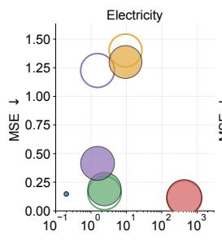

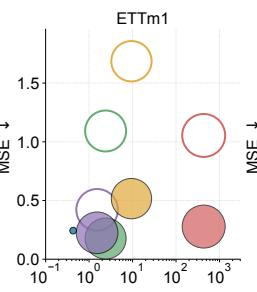

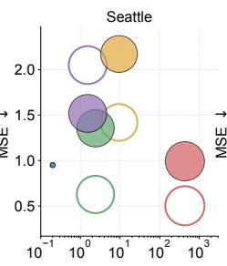

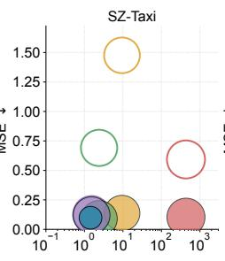

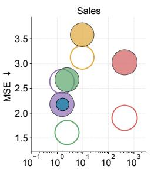

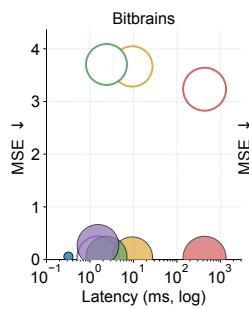

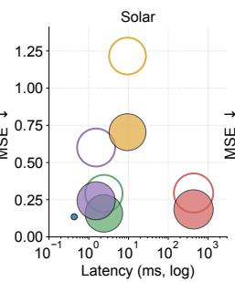

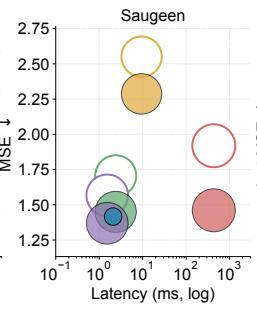

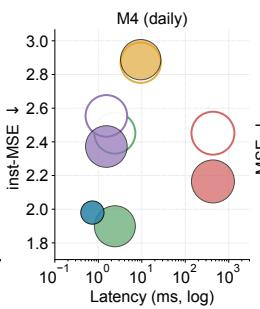  
Figure 7: Comparing METACASTER with TSFMs on all evaluation datasets.

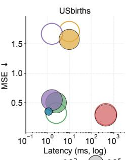

## F Further Study

Top-1 / Top-3 / Top-5 vs. baselines. At deployment, only a single forecaster is shipped per dataset, so we additionally compare each method using only its best-performing forecasters rather than the full pool. Table 8 reports, per dataset, the mean MSE of the K best forecasters trained under each method (for K = 1, 3, 5), evaluated within the 20 main-pool forecasters. METACASTER retains the lead across most cells.

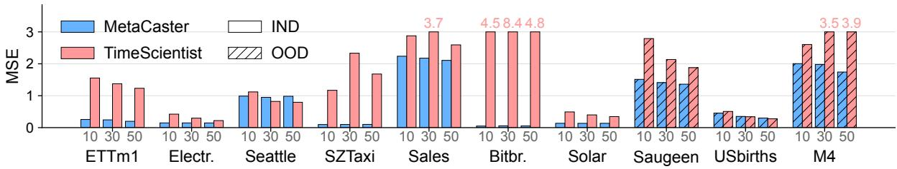  
Figure 8: METACASTER vs. TimeScientist under the shared LT-LIB forecaster pool.

<table><tr><td rowspan="2">Dataset</td><td rowspan="2">Ours METACASTER</td><td colspan="4">Generation Models</td><td rowspan="2"></td><td colspan="4">Augmentation Methods</td><td rowspan="2" colspan="2">References Dsup</td></tr><tr><td>TimeDP VerbalTS</td><td>T2S</td><td>DiffTS</td><td>TimeVAE</td><td>Repeat Bootstrap</td><td></td><td>Jitter</td><td>MagWarp</td></tr><tr><td colspan="10">Top-1</td><td></td><td></td><td></td><td>Dm</td></tr><tr><td>ETTm1 Electricity Seattle SZTaxi</td><td>0.243 0.148 0.949 0.099</td><td>0.967 0.209 1.271 0.091</td><td>0.982 0.947 1.658 0.103</td><td>0.886 1.017 1.674 0.105</td><td>0.921 0.237 1.288 0.091</td><td>0.437 0.128 1.678 0.095</td><td>0.382 0.125 1.097 0.092</td><td>0.382 0.125 1.097 0.092</td><td>0.385 0.125 1.114 0.091</td><td>0.358 0.125 1.647 0.088</td><td>0.489 0.274 1.295 0.090</td><td>0.300 0.107 0.953 0.075</td></tr><tr><td>Sales Bitbrains Solar</td><td>2.176 0.056 0.135</td><td>2.265 0.077 0.173</td><td>2.205 0.079 0.453</td><td>2.416 0.079 0.503</td><td>2.483 0.082 0.145</td><td>2.223 0.082 0.148</td><td>2.410 0.144 0.149</td><td>2.382 0.142 0.149</td><td>2.416 0.143 0.150</td><td>2.512 0.154 0.149</td><td>2.202 0.083 0.222</td><td>2.270 0.102 0.136</td></tr><tr><td>Saugeen USbirths M4†</td><td>1.416 0.351 1.980</td><td>1.444 1.376 1.932</td><td>1.429 1.425 2.299</td><td>1.512 1.412 2.164</td><td>1.658 1.364 2.190</td><td>1.489 0.266 2.204</td><td>1.372 0.250 2.121</td><td>1.371 0.249 2.086</td><td>1.380 0.255 2.089</td><td>1.359 0.502 13.182</td><td>1.292 0.487 2.139</td><td>1.089 0.106 1.853</td></tr><tr><td>Top-3 ETTm1</td><td>0.256</td><td>0.974</td><td>0.986</td><td>0.892</td><td>0.944</td><td>0.491</td><td>0.435</td><td>0.431</td><td>0.432</td><td>0.391</td><td>0.496</td><td>0.303</td></tr><tr><td>Electricity Seattle SZTaxi Sales</td><td>0.158 0.985 0.101 2.201</td><td>0.219 1.295 0.095 2.295</td><td>0.974 1.698 0.105</td><td>1.026 1.696 0.106</td><td>0.271 1.363 0.092</td><td>0.149 1.697 0.098</td><td>0.154 1.177 0.097</td><td>0.152 1.151 0.094</td><td>0.154 1.192 0.095 2.486</td><td>0.172 2.052 0.115</td><td>0.308 1.351 0.106 2.221</td><td>0.107 0.966 0.077</td></tr><tr><td>Bitbrains Solar</td><td>0.068 0.137</td><td>0.077 0.181</td><td>2.225 0.079 0.470</td><td>2.464 0.079 0.509</td><td>2.634 0.085 0.163</td><td>2.248 0.083 0.165</td><td>2.504 0.178 0.172</td><td>2.437 0.171 0.167</td><td>0.159 0.172</td><td>2.597 0.173 0.183</td><td>0.085 0.227</td><td>2.324 0.104 0.137</td></tr><tr><td>Saugeen USbirths</td><td>1.422 0.369</td><td>1.450 1.452</td><td>1.435 1.457</td><td>1.535 1.417</td><td>1.712 1.396</td><td>1.572</td><td>1.395</td><td>1.396</td><td>1.404 0.334</td><td>1.572 0.695</td><td>1.306 0.513</td><td>1.096 0.123</td></tr><tr><td>M4†</td><td>2.006</td><td>1.974</td><td>2.311</td><td>2.168</td><td>2.278</td><td>0.326 2.506</td><td>0.336 2.219</td><td>0.332</td><td></td><td></td><td></td><td></td></tr><tr><td></td><td></td><td></td><td></td><td></td><td></td><td></td><td></td><td>2.208</td><td>2.280</td><td>34.704</td><td></td><td></td></tr><tr><td></td><td></td><td></td><td></td><td></td><td></td><td></td><td></td><td></td><td></td><td></td><td>2.186</td><td>1.974</td></tr><tr><td>Top-5</td><td></td><td></td><td></td><td></td><td></td><td></td><td></td><td></td><td></td><td></td><td></td><td></td></tr><tr><td></td><td></td><td></td><td></td><td></td><td></td><td></td><td></td><td></td><td></td><td></td><td></td><td></td></tr><tr><td></td><td></td><td></td><td></td><td></td><td></td><td></td><td></td><td></td><td></td><td></td><td></td><td></td></tr><tr><td></td><td></td><td></td><td></td><td></td><td></td><td></td><td></td><td></td><td></td><td></td><td></td><td></td></tr><tr><td>ETTm1</td><td>0.282</td><td></td><td></td><td></td><td></td><td></td><td></td><td></td><td></td><td></td><td></td><td></td></tr><tr><td>Electricity</td><td></td><td>0.979</td><td>0.989</td><td>0.894</td><td></td><td></td><td></td><td></td><td></td><td></td><td></td><td></td></tr><tr><td></td><td>0.183</td><td></td><td></td><td></td><td>0.970</td><td>0.539</td><td>0.493</td><td>0.467</td><td>0.469</td><td>0.466</td><td>0.499</td><td>0.304</td></tr><tr><td>Seattle</td><td></td><td>0.229</td><td>0.998</td><td>1.040</td><td>0.293</td><td></td><td></td><td></td><td></td><td></td><td></td><td></td></tr><tr><td></td><td>1.046</td><td>1.314</td><td></td><td></td><td></td><td>0.192</td><td>0.200</td><td>0.194</td><td>0.196</td><td>0.263</td><td>0.337</td><td>0.107</td></tr><tr><td>SZTaxi</td><td></td><td></td><td>1.730</td><td>1.716</td><td>1.403</td><td>1.704</td><td></td><td>1.249</td><td>1.268</td><td>5.347</td><td></td><td></td></tr><tr><td></td><td>0.102</td><td>0.098</td><td>0.106</td><td></td><td></td><td></td><td>1.280</td><td></td><td></td><td></td><td>1.403</td><td>0.971</td></tr><tr><td>Sales</td><td>2.213</td><td></td><td></td><td>0.107</td><td>0.095</td><td>0.102</td><td>0.102</td><td>0.098</td><td>0.098</td><td>0.185</td><td>0.112</td><td>0.079</td></tr><tr><td></td><td></td><td>2.311</td><td>2.234</td><td>2.563</td><td>2.787</td><td></td><td></td><td></td><td></td><td></td><td></td><td></td></tr><tr><td>Bitbrains</td><td>0.074</td><td>0.077</td><td></td><td></td><td></td><td>2.273</td><td>2.537</td><td>2.481</td><td>2.518</td><td>2.721</td><td>2.241</td><td>2.381</td></tr><tr><td></td><td></td><td></td><td>0.079</td><td>0.082</td><td>0.090</td><td>0.085</td><td>0.195</td><td>0.188</td><td>0.181</td><td>0.211</td><td></td><td></td></tr><tr><td>Solar</td><td>0.141</td><td>0.185</td><td></td><td></td><td></td><td></td><td></td><td></td><td></td><td></td><td>0.089</td><td>0.118</td></tr><tr><td></td><td></td><td></td><td>0.477</td><td>0.517</td><td>0.187</td><td>0.183</td><td>0.190</td><td>0.186</td><td>0.190</td><td>0.226</td><td>0.234</td><td></td></tr><tr><td></td><td></td><td></td><td></td><td></td><td></td><td></td><td></td><td></td><td></td><td></td><td></td><td>0.138</td></tr><tr><td>Saugeen</td><td>1.425</td><td></td><td></td><td></td><td></td><td></td><td></td><td></td><td>1.619</td><td>1.839</td><td>1.320</td><td></td></tr><tr><td>USbirths M4†</td><td>0.394</td><td>1.455 1.478</td><td>1.438 1.467</td><td>1.543 1.429</td><td>1.767 1.429</td><td>1.595 0.358</td><td>1.623 0.372 2.273</td><td>1.598 0.359</td><td>0.368</td><td>1.051</td><td>0.537 52.066 2.253</td><td>1.104 0.133 2.021</td></tr><tr></table>

Table 8: Per-dataset top-K best-forecaster MSE at $n _ { \mathrm { f e w } } = 3 0$ . †M4 uses instance-normalised MSE.

Few-shot input scaling. Figure 9 reports the per-dataset Relative MSE of METACASTER at $n _ { \mathrm { f e w } } \in$ {10, 20, 30, 50, 100} on both IND and OOD subsets. On most datasets, METACASTER improves as $n _ { \mathrm { f e w } }$ grows.

Multi-seed sensitivity at $n _ { \mathbf { f e w } } = 3 0$ . Table 9 reports the per-dataset MSE of METACASTER across three independent LLM-sampling seeds at $n _ { \mathrm { f e w } } = 3 0$ . METACASTER is seed-insensitive on most datasets.

Per-forecaster MSE distribution: violin plots. Figure 10 renders the per-method Relative MSE distribution across the $2 0 \times \{ 7 , 3 \}$ (forecaster, dataset) cells, split IND / OOD. METACASTER sits below every non-Full baseline at every quartile in both subsets, with the narrowest non-trivial distribution.

Heatmap across forecasters and methods. Figure 11 renders the per-(forecaster, method) Relative MSE as a dual-panel heatmap, with the 20 main forecasters as rows and the 10 methods of Table 1 as columns. METACASTER is the lowest column on both panels.

Qualitative synthetic samples. Figure 12 compares one synthetic window per method on four representative datasets (ETTm1 ch. 0, Solar, Electricity, Saugeen), against a real window on the top row for reference. METACASTER’s window tracks both the dominant period and the local fluctuations of the real series across all four datasets, while the deep generative baselines either drift in amplitude, miss the period, or collapse to near-constant trajectories.

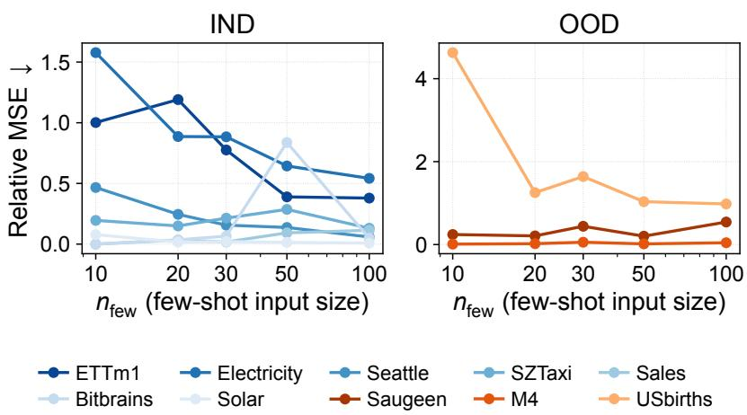  
Figure 9: Few-shot input scaling of METACASTER on IND and OOD.

<table><tr><td>Dataset</td><td>MSE (± std)</td></tr><tr><td>ETTm1</td><td> $0 . 3 4 5 \pm 0 . 0 2 3$ </td></tr><tr><td>Electricity</td><td> $0 . 2 2 6 \pm 0 . 0 0 0$ </td></tr><tr><td>Seattle</td><td> $1 . 1 7 7 \pm 0 . 0 4 1$ </td></tr><tr><td>SZTaxi</td><td> $0 . 1 1 4 \pm 0 . 0 0 3$ </td></tr><tr><td>Sales</td><td> $2 . 3 6 2 \pm 0 . 4 1 1$ </td></tr><tr><td>Bitbrains</td><td> $0 . 1 2 5 \pm 0 . 0 2 5$ </td></tr><tr><td>Solar</td><td> $0 . 1 5 2 \pm 0 . 0 0 0$ </td></tr><tr><td>Saugeen</td><td> $1 . 4 6 4 \pm 0 . 5 2 3$ </td></tr><tr><td>USbirths</td><td> $0 . 5 3 3 \pm 0 . 2 5 4$ </td></tr><tr><td>M4†</td><td> $2 . 1 1 2 \pm 0 . 0 4 4$ </td></tr></table>

Table 9: Per-dataset MSE of META-CASTER, mean ± std across three independent LLM-sampling seeds (†M4 in instance-normalised MSE).

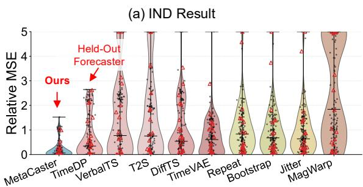

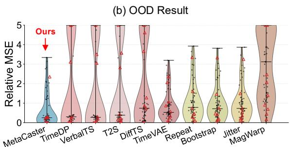  
Figure 10: Relative MSE distributions at $n _ { \mathrm { f e w } } = 3 0$ on IND (left) and OOD (right).

Distributional alignment via t-SNE. Figure 13 runs t-SNE separately on each of the 10 evaluation datasets. METACASTER-generated windows overlap the real manifold on most datasets, indicating that the synthetic distribution is well aligned with the real one.

OOD (3 datasets)  
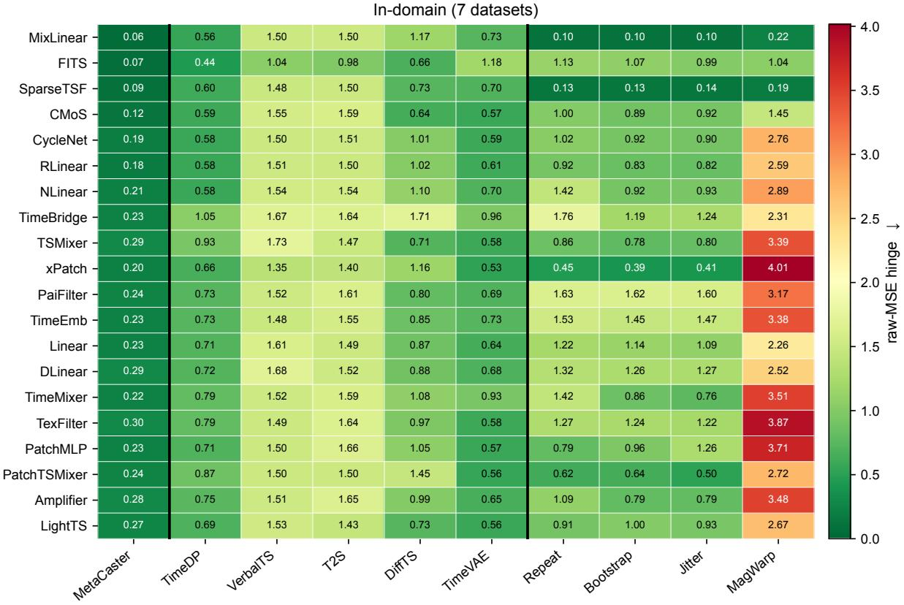

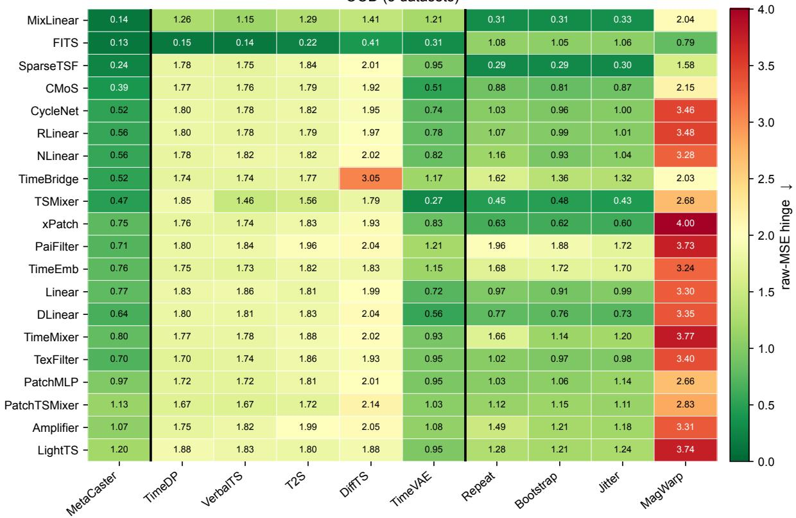  
Figure 11: Per-(forecaster, method) Relative MSE heatmap (top: IND; bottom: OOD).

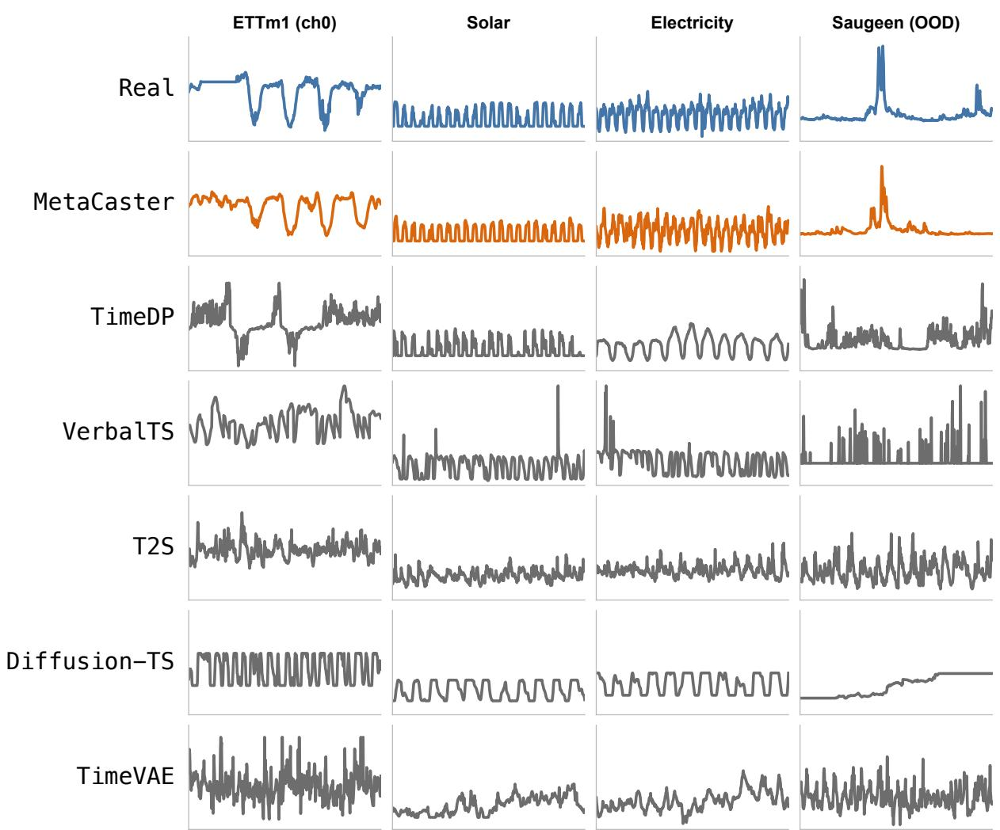  
Figure 12: Synthetic windows on four datasets (channel 0): real on top, METACASTER, and five generative baselines.

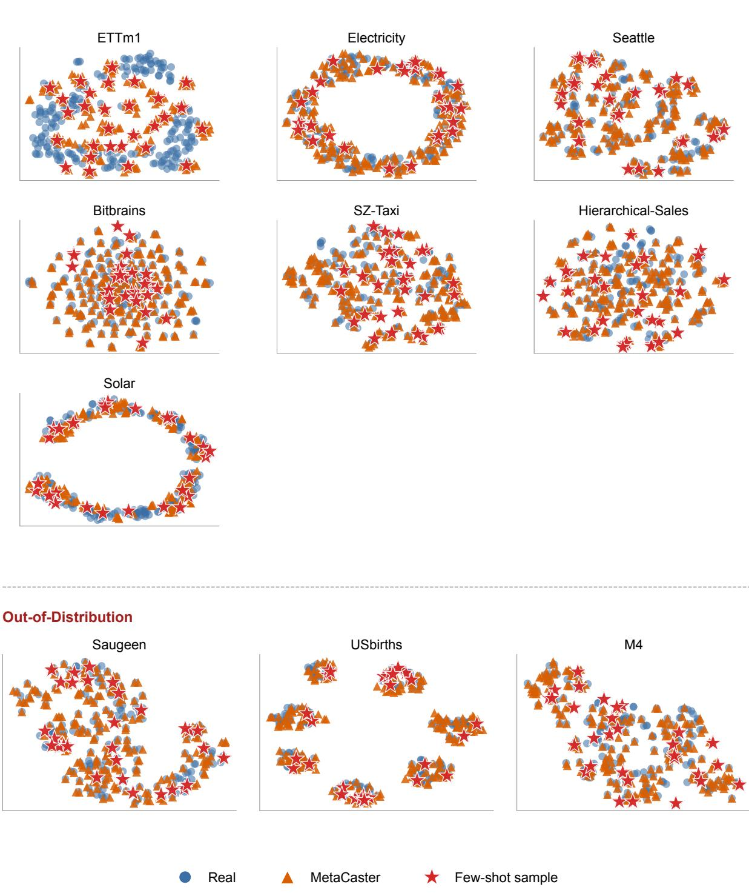  
Figure 13: Per-dataset t-SNE of real, METACASTER-generated, and few-shot windows (top: IND; bottom: OOD).