# MOSH-WM: Mask-Grounded Soft-Hamiltonian Dynamics for Object-Centric World Models

Zhekai Wang1\*, Haoxiang Huang2\*, Xiang Liu3, Zhikang Chen3, Yueqing Sun, Qi Gu, Shiji Zhou4, Miao Liu3, Sen Cui3 †

1Beijing Institute of Technology

2University of Science and Technology of China

3Tsinghua University

4Beihang University

\*Equal contribution. †Corresponding authors.

## Abstract

Object-centric world models forecast future videos by evolving a set of entity slots, but the variables receiving dynamics supervision are often unconstrained visual features. We intro- duce MOSH-WM, a mask-grounded soft-Hamiltonian world model that makes its position-like state explicitly depend on slot-owned image support. A frozen video-slot encoder produces slots and masks; spatial moments of mask-owned support form a canonical state Q, temporal diferences form P, and a learned energy supplies a soft directional bias to a bounded learned increment. Decoder-relevant appearance and identity are stored separately in a causal visual con- text. A gated composer and bounded residual then combine this context with the propagated phase state to reconstruct decoder-compatible slots. On OBJ3D, given six observed frames and evaluated over the following 30 frames, MOSH- WM reduces LPIPS by 25.0% and spatial MSE by 33.7% rel- ative to the strongest object-centric baseline. On CLEVRER, given six observed frames and evaluated over the following ten frames, the corresponding reductions are 14.5% and 18.7%. Horizon-resolved visual and object-state measurements show that the complete model accumulates error more slowly throughout the 30-frame closed-loop rollout. Project page: https://github.com/moshwm-anon/-moshwm-anon.github.io.

## 1 Introduction

The physical world evolves through regularities that govern object motion and interaction. A useful visual world model should maintain these regularities when its predictions are re- peatedly fed back. Object-centric learning provides a natural representation by decomposing a scene into entity slots (Locatello et al. 2020; Kipf et al. 2022). Existing slot-based predictors evolve these slots autoregressively and decode them into future frames (Wu et al. 2023; Sajjadi et al. 2022), yielding strong visual forecasts on many benchmarks.

Most object-centric world models optimize slots for grouping and reconstruction, then fit video trajectories with a tran-sition over these visual features. The slots can entangle ge- ometry, appearance, identity, and decoder-specific seman- tics, leaving long closed-loop rollouts weakly constrained. Figure 1 illustrates the resulting gap: a strong slot predictor matches the first future frame, but its object layout and ap-pearance drift over a 30-step rollout. A useful physical state

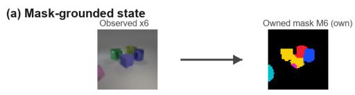

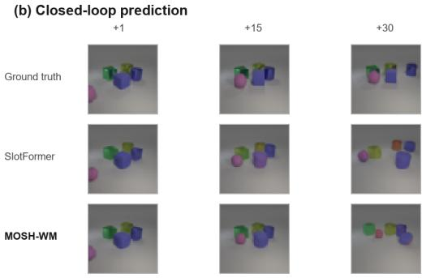  
Figure 1: Mask grounding and long-horizon prediction on OBJ3D. Owned masks expose object support. SlotFormer matches the immediate future but drifts over closed-loop roll- out; MOSH-WM better preserves object identity and scene layout.

Hamiltonian models organize dynamics through general- ized coordinates Q, generalized momenta P, and an energy function (Greydanus et al. 2019; Toth et al. 2020a; Li et al. 2025). Applying this structure directly to arbitrary visual slots remains problematic: the resulting coordinates may not describe object geometry, while a compact physical state may omit information needed by the decoder. The model must therefore extract a geometric phase state (Q, P) and preserve the visual factors needed for decoding. Hamilto- nian guidance acts on the former; appearance and identity follow a separate contextual pathway.

MOSH-WM implements this factorization with a frozen SAVi interface. It assigns each pixel to its owning slot and pools fixed spatial basis functions over that support to con- struct a position-like Q; raw finite diferences yield the momentum-like $P .$ The extractor uses owned masks and image-coordinate bases, excluding appearance-bearing slot vectors. A soft-Hamiltonian module propagates $( Q , P )$ by blending energy-gradient directions with a bounded learned field. The Hamiltonian term serves as a structural prior, with- out claiming exact system identification. In parallel, causal slot history retains appearance and identity. A gated com- poser with bounded residual correction then produces slots for the frozen decoder.

Contributions. Our contributions are threefold:

• A mask-grounded phase-state extractor computes $Q$ from per-slot owned masks and fixed spatial bases, with raw temporal diferences defining P. Appearance-bearing slot features are excluded from this dynamics input.

• A soft-Hamiltonian closed-loop dynamics module combines energy-gradient directions with a bounded learned field and directly propagates (Q, P).

• A decoder reconciliation interface uses causal context, gated slot composition, and bounded residual compensa- tion to recover decoder-compatible slots.

## 2 Related Work

Object-centric video world models. Object-centric learning decomposes a scene into exchangeable entities through sequential attention, iterative inference, structured genera- tive models, or slot attention (Eslami et al. 2016; Gref et al. 2019; Burgess et al. 2019; Lin et al. 2020b; Engelcke et al. 2020, 2021; Locatello et al. 2020). Earlier scene and control models also use entity abstraction or compositional rendering (Eslami et al. 2018; Veera aneni et al. 2020). Video models such as SCALOR and SAVi extend this interface with tem- poral correspondence and persistent object slots (Jiang et al. 2020; Kipf et al. 2022); G-SWM, Visual Interaction Net-works, Neural Physics Engines, interaction networks, and neural relational inference explicitly model object interactions (Lin et al. 2020a; Watters et al. 2017; Chang et al. 2017; Battaglia et al. 2016; Kipf et al. 2018). Recent predictors, including Object-Centric Video Prediction, SlotFormer, and slot-mixing architectures, autoregressively evolve visual slots to generate future frames (Sajjadi et al. 2022; Wu et al. 2023; Lippe et al. 2023). Related representation learners study structured world models, transformer-based slots, and real-world scaling (Kipf et al. 2020; Singh et al. 2022; Seitzer et al. 2023). These methods establish slots as an efective prediction interface, but their transitions generally act on holistic visual features; geometry, appearance, identity, and decoder semantics need not be separated. MOSH-WM instead uses video slots primarily for perception and contextual decoding, while deriving its canonical dynamics state from slot-owned mask support.

Hamiltonian and physics-informed dynamics. Hamilto-nian neural networks parameterize an energy function and obtain dynamics from phase-space gradients (Greydanus et al. 2019); Lagrangian, symplectic, continuous-time, and graph-based extensions strengthen geometric or interaction structure (Cranmer et al. 2020; Lutter et al. 2019; Zhong et al. 2020; Chen et al. 2018; Rubanova et al. 2019; Sanchez- Gonzalez et al. 2020; Battaglia et al. 2018). Hamiltonian

Generative Networks infer latent phase variables from im- age sequences (Toth et al. 2020a,b). At the object-centric level, SlotPi uses attention over slots to estimate general- ized coordinates and momenta before combining a physical module with spatiotemporal reasoning (Li et al. 2025); HaM-World factorizes planner latents into $( q , p , c )$ and applies a soft-Hamiltonian prior to the canonical subspace (Tang et al. 2026). In contrast, MOSH-WM grounds $Q$ in owned image support and obtains P by finite diferences, then uses the Hamiltonian field as a soft closed-loop bias while reserving visual context for decoder compatibility.

Latent and pixel-space world models. Latent world mod-els, from World Models and PlaNet to Dreamer and MuZero, learn compact rollouts for planning or behavior learning from pixels (Ha and Schmidhuber 2018; Hafner et al. 2019, 2020, 2021; Schrittwieser et al. 2020). Stochastic video models sep- arate motion uncertainty from visual content (Villegas et al. 2017; Denton and Fergus 2018), while pixel-space predictors such as PredRNN and SimVP directly optimize future- frame quality (Wang et al. 2017; Gao et al. 2022). These are useful visual controls, but they do not expose temporally aligned object states. Physical-reasoning benchmarks and relational predictors such as PHYRE, Physion, CLEVRER, and RPIN emphasize interactions, interventions, or counter- factual structure (Bakhtin et al. 2019; Bear et al. 2021; Yi et al. 2020; Xu et al. 2019). Our goal is complementary: to study whether a mask-grounded, softly Hamiltonian state can make closed-loop object-centric prediction more structurally interpretable while retaining a decoder-compatible visual pathway.

## 3 Method

## Overview

Given L observed frames $X _ { 1 : L }$ , the frozen SAVi inter- face (Kipf et al. 2022) returns visual slots $S _ { 1 : L }$ and soft masks $M _ { 1 : L }$ . MOSH-WM maintains a canonical phase state $( Q _ { t } , P _ { t } )$ and a causal visual context $C _ { t }$ . The phase state is used exclusively by the Soft-Hamiltonian transition, whereas $C _ { t }$ retains appearance and identity information for decod- ing. Attention-based exchange follows the general token- interaction pattern of Transformers and Perceiver-style mod- ules (Vaswani et al. 2017; Jaegle et al. 2021). Thus, the model does not require one visual slot to act simultaneously as a physical coordinate and a complete decoder input. Figure 2 summarizes the two closed loops: $( Q , P )$ are propagated directly, while predicted slots update the causal context.

## Mask-Grounded Phase-State Factorization

Slots are optimized for grouping and reconstruction and may therefore entangle geometry with appearance and semantics (Locatello et al. 2020; Kipf et al. 2022). We retain the sup- port owned by slot n through winner-take-all assignment, $\bar { M } _ { t , n } ^ { \mathrm { o w n } } ( u , v ) \stackrel { . } { = } M _ { t , n } ( u , v ) \mathbb { I } [ \bar { n } = \arg \operatorname* { m a x } _ { j } M _ { t , j } ( u , \bar { v } ) ]$ . Let b be a fixed spatial basis and let Pool be normalized mask-weighted pooling. The position-like coordinate is

$$
Q _ { t , n } = f _ { Q } \left( \operatorname { P o o l } ( M _ { t , n } ^ { \mathrm { o w n } } , b ) \right) .\tag{1}
$$

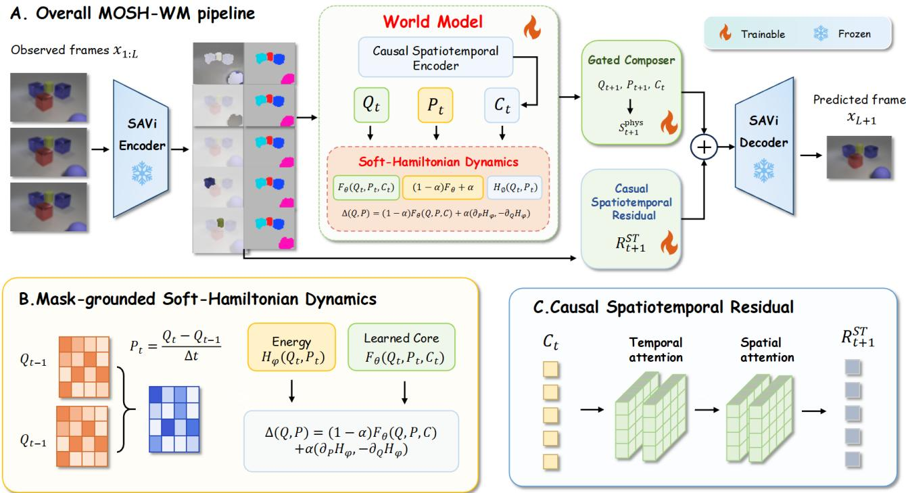  
Figure 2: MOSH-WM pipeline. A frozen SAVi interface supplies visual slots and decoded masks. Mask-owned pooling extracts $Q ,$ , raw temporal diferences provide $P ,$ , and causal slots provide C. The SoftHamiltonian update propagates $\ \bar { ( Q , P ) }$ ; a gated composer and bounded spatiotemporal residual return to decoder-compatible slot space. Dashed arrows denote direct state propagation and autoregressive context update.

The lightweight map $f _ { Q }$ contains a basis projector, a slot embedding, and one attention-MLP block. Its inputs are mask support and fixed spatial bases, which separate the canonical coordinate from direct slot appearance. Its momentum-like companion is the temporal finite diference,

$$
P _ { t } = \frac { Q _ { t } - Q _ { t - 1 } } { \Delta t } .\tag{2}
$$

In parallel, a causal spatiotemporal encoder reads slot his- tory and produces $\bar { C _ { t } } = \mathcal { F } _ { \mathrm { c t x } } \bar { ( } S _ { \leq t } )$ . Context never enters the phase-state extractor; it is reserved for the decoder- compatible pathway below.

## Soft-Hamiltonian Closed-Loop Dynamics

A fully learned transition can fit local visual correlations without a preferred physical direction, while a strict Hamil- tonian model can be too restrictive for imperfect visual ob- servations. We therefore use a soft physical bias. The energy head receives only the canonical pair,

$$
H _ { t } = H _ { \vartheta } ( Q _ { t } , P _ { t } ) .\tag{3}
$$

A learned core conditioned on $[ Q _ { t } , P _ { t } ]$ and $C _ { t }$ predicts in- crements $( D _ { t } ^ { Q } , D _ { t } ^ { P } )$ . We blend these increments with the energy-gradient directions:

$$
Q _ { t + 1 } = Q _ { t } + ( 1 - \alpha ) D _ { t } ^ { Q } + \alpha \mathrm { c l i p } _ { \gamma } ( \nabla _ { P _ { t } } H _ { t } ) .\tag{4}
$$

$$
P _ { t + 1 } = P _ { t } + ( 1 - \alpha ) D _ { t } ^ { P } - \alpha \mathrm { c l i p } _ { \gamma } ( \nabla _ { Q _ { t } } H _ { t } ) .\tag{5}
$$

The learned path captures residual dynamics, whereas the gradient path organizes phase evolution. These are forward- Euler Soft-Hamiltonian updates, not a symplectic solver or a claim that $H _ { t }$ is ground-truth mechanical energy. During rollout, the model directly sets $( Q _ { t } , P _ { t } ) \gets ( Q _ { t + 1 } , P _ { t + 1 } ) \overline { { : } }$ the update scale and gradient clipping are specified with the learning objective below.

## Physics–Appearance Reconciliation

The phase state intentionally omits decoder-relevant visual information. After the physical update, we use a gated com- poser to combine the normalized phase displacement with $C _ { t }$ , yielding a physical slot proposal $S _ { t + 1 } ^ { \mathrm { p h y s } }$ . A causal reason- ing module then provides a small decoder-space correction:

$$
\widehat { S } _ { t + 1 } = S _ { t + 1 } ^ { \mathrm { p h y s } } + \beta \left( \mathcal { R } ( S _ { t } , S _ { \leq t } ) - S _ { t } \right) .\tag{6}
$$

The composer applies learned projections to normalized phase displacement and $C _ { t } ,$ predicts a sigmoid gate, and blends the two projected features before mapping them to slot space. The frozen decoder produces $\widehat { X } _ { t + 1 } = \overline { { \mathcal { D } ( \widehat { S } _ { t + 1 } ) } }$ and $\widehat { S } _ { t + 1 }$ is appended to the history used for $C _ { t + 1 }$ . Hence, visual context can improve decoding without being fed back into the mask-grounded phase extractor.

## Learning Objective

We freeze the SAVi encoder and decoder, encode $L = 6$ frames, and unroll K future steps according to the training curriculum. The complete objective is

$$
\begin{array} { r l } & { \mathcal { L } = \lambda _ { s } \mathcal { L } _ { \mathrm { s l o t } } + \lambda _ { x } \mathcal { L } _ { \mathrm { i m g } } + \lambda _ { h } \mathcal { L } _ { \mathrm { h a m } } + \lambda _ { e } \mathcal { L } _ { \mathrm { e n e r g y } } } \\ & { ~ + \lambda _ { c } \mathcal { L } _ { \mathrm { c t r } } + \lambda _ { r } \mathcal { L } _ { \mathrm { r e s } } . } \end{array}\tag{7}
$$

$\mathcal { L } _ { \mathrm { s l o t } }$ keeps predicted slots compatible with the frozen ob- server and decoder, while ${ \mathcal { L } } _ { \mathrm { i m g } }$ supervises decoded ap- pearance using pixel, multiscale, and edge consistency. $\mathcal { L } _ { \mathrm { h a m } }$ aligns the learned phase increment with the Hamil- tonian gradient direction, and $\mathcal { L } _ { \mathrm { e n e r g y } }$ discourages abrupt local and rollout-level energy drift. ${ \mathcal L } _ { \mathrm { c t r } }$ directly super- vises mask-derived object trajectories. $\mathcal { L } _ { \mathrm { r e s } }$ bounds the vi- sual correction to the phase-composed slot. On OBJ3D, $( \lambda _ { s } , \lambda _ { x } , \lambda _ { h } , \lambda _ { e } , \lambda _ { c } , \lambda _ { r } ) \ \stackrel { \cdot } { = } \ ( 1 , 1 , \hat { 0 } . 0 5 , 0 . 0 1 , 0 . 5 , 0 . 5 )$ . The rollout component inside $\mathcal { L } _ { \mathrm { e n e r g y } }$ has weight 0.25; α = 0.5, Hamiltonian gradients are clipped at 5, and the residual gain increases to 0.04. Further definitions and schedules are given in the supplement.

## 4 Experiments

We organize the experiments around four questions: (1) does the mask-grounded phase interface preserve decoder- compatible appearance; (2) does MOSH-WM improve visual quality and object dynamics on the primary OBJ3D and CLEVRER benchmarks; (3) does the advantage persist under long-horizon feedback and component removal; and (4) does the factorization transfer to a diferent frozen observer on Physion? The section follows that order so the evidence builds from interface fidelit to benchmark erformance, sta- bility, ablation, and transfer.

## Experimental Setup

Datasets and protocols. OBJ3D (Lin et al. 2020a) contains controlled multi-object motion in 64 × 64 videos. The primary protocol observes six frames and evaluates the next 30 frames, with the MOSH-WM curriculum ending at the same horizon. CLEVRER (Yi et al. 2020), built on the com-positional CLEVR scene family (Johnson et al. 2017), contains smaller objects, collisions, occlusions, and multi-object interactions; six observations are followed by ten predictions. Physion (Bear et al. 2021) contains rendered physical interactions across Collide, Contain, Dominoes, Drape, Drop, Link, Roll, and Support scenarios. Following the SlotFormer pro- tocol, each 128×128 video is truncated to 150 source frames and sampled every three frames. STEVE produces six 192- dimensional slots; MOSH observes 15 sampled frames and predicts the remaining 35 without target feedback.

Implementation and evaluation protocol. Methods share the observation window, test partition, evaluator, and metrics within each protocol, while the MOSH-WM observer and de- coder remain frozen. On OBJ3D, the world model uses six 128-dimensional slots, four attention heads, one Q block, one energy block, two context blocks, two reasoning blocks, MLP expansion ratio 2, and composer width 256. We train with batch size 8, Adam at learning rate $1 0 ^ { - 5 }$ , 5% warm-up followed by cosine decay, zero weight decay, gradient clip- ping at 1, and 8,000 steps with a 10/15/20/24/30-frame roll- out curriculum; validation Slot@30 selects the checkpoint without using test data. CLEVRER uses seven slots, batch size 20, learning rate $8 \times 1 0 ^ { - 6 }$ , and 2,400 constrained-stage steps with a 6/8/10-frame curriculum. For Physion, STEVE is adapted on 250 videos per scenario and selected by valida- tion token reconstruction; MOSH is selected independently by validation slot MSE@30. All methods receive the same six observed frames and predict 30 future frames without target feedback on OBJ3D. LPIPS is averaged per predicted frame; PSNR and SSIM use images mapped from [−1, 1] to [0, 1]. Object-state metrics re-encode predictions and targets with the frozen observer: centroid error measures normalized foreground displacement, velocity error compares first difer- ences, pair-distance error compares foreground-object pairs, and Slot@30 excludes the largest-area background slot. Phy- sion reports horizon-resolved slot MSE on all 512 test videos and decoded metrics on a scenario-balanced 64-video sub- set. The transfer studies are single validation-selected runs, so we treat them as matched transfer evidence rather than multi-seed comparisons.

## Evaluation on Video Prediction

Baselines. The primary object-centric baselines are Slot-Former (Wu et al. 2023) and SAVi-dyn (Kipf et al. 2022). They share the frozen SAVi observer and decoder with MOSH-WM on OBJ3D and CLEVRER. PredRNN (Wang et al. 2017) provides a pixel-space visual baseline, while object-state metrics apply only to methods with aligned slots.

Evaluation metrics. We report LPIPS (Zhang et al. 2018), PSNR, SSIM (Wang et al. 2004), and spatial MSE for de-coded videos; CLEVRER additionally uses foreground MSE. OBJ3D dynamics use centroid ADE/FDE, velocity error, pairwise-distance error, and observer-slot MSE. Physion uses horizon-resolved slot MSE on all 512 test videos and STEVE- decoded PSNR, SSIM, and LPIPS on a scenario-balanced 64-video test subset.

Object-centric interface. Before comparing dynamics, we verify the interface from which MOSH-WM constructs (Q, P). Figure 4 follows the scene-decomposition visualization of SlotPi: each row is one observation time, and each sequence is arranged as the ground-truth frame, a mutually exclusive color mask, and six independently decoded RGB slots on white backgrounds. Slot columns are fixed over time. Foreground objects remain assigned to consistent slots across the observation window, while the background component is separated from the object slots. This owned support is pooled by Equation 1. The RGB slot paired with each mask supplies the appearance and identity features retained in the causal context.

Table 1 quantifies the same interface. Mapping the mask- grounded phase representation back to decoder-compatible slots changes LPIPS by only 0.0002 and PSNR by 0.24 dB relative to direct frozen-SAVi reconstruction. This is the first evidence that the phase-state factorization preserves decoder- compatible appearance before rollout begins.

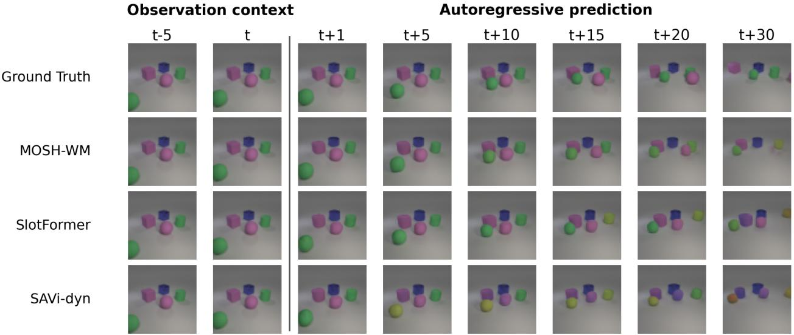  
Figure 3: Long-sequence prediction on OBJ3D. Two observation frames and six future frames are shown at a larger scale than a full-frame strip. All rows use the same six-frame context and independently exported 30-frame closed-loop predictions. Under repeated feedback, MOSH-WM better retains object identity, color, and relative layout.

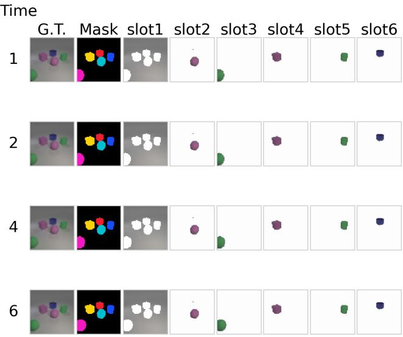  
Figure 4: SlotPi-style scene decomposition by the frozen SAVi observer on OBJ3D. Each row is one observation time. The mask uses a black background and mutually exclusive colors; slots 1–6 are independently decoded RGB compo- nents on near-white backgrounds. Fixed columns expose tem- poral slot consistency and the support used to construct Q.

## Visual prediction results.

OBJ3D visual prediction. Table 2(a) shows that the final 6-to-30 model improves perceptual, distortion, and structural metrics over both reported object-centric baselines. Relative to the strongest object-centric baseline, LPIPS and spatial MSE fall by 25.0% and 33.7%, PSNR improves by 2.43 dB, and SSIM reaches 0.8916. MOSH-WM also outperforms the reported pixel-space PredRNN baseline on all four visual metrics. Together with the reconstruction test above, this closes the chain from interface fidelity to end-to-end forecast quality.

<table><tr><td>Reconstruction</td><td>LPIPS ↓</td><td>PSNR↑</td><td>SSIM↑</td><td>MSE↓</td></tr><tr><td>Frozen SAVi</td><td>0.0286</td><td>41.05</td><td>0.9826</td><td>0.376</td></tr><tr><td>Phase composer</td><td>0.0288</td><td>40.81</td><td>0.9820</td><td>0.395</td></tr></table>

Table 1: OBJ3D reconstruction quality before rollout. The phase-to-slot composer remains close to the frozen-interface upper bound.

OBJ3D object dynamics. The common-observer measurements in Table 2(c) show corresponding object-level gains. MOSH-WM lowers centroid ADE by 15.4%, FDE by 9.5%, velocity error by 6.6%, pairwise-distance error by 14.9%, and slot MSE by 32.2% relative to the strongest baseline in each column. The lower pairwise-distance er- ror reflects better preservation of the scene configuration. Image-space and observer-space metrics thus agree on more accurate state evolution.

CLEVRER. Table 2(b) evaluates transfer to collisions and occlusion. Under the shared local protocol, MOSH-WM im- proves all five visual metrics over SlotFormer and SAVi- dyn. The time-boxed single-run comparison supports transfer within this matched setup.

Qualitative behavior. Figure 3 displays early and late prediction times jointly. The three methods remain close im-mediately after the observation window. At later steps, the baselines increasingly alter object color, shape, or relative position, while MOSH-WM stays closer to the target. The widening gap indicates slower closed-loop drift.

(a) OBJ3D visual prediction (6 observed → 30 predicted)
<table><tr><td>Method</td><td>LPIPS PSNR↑</td><td>SSIM↑ MSE↓</td></tr><tr><td>MOSH-WM</td><td>0.0858</td><td>31.02 0.8916 4.718</td></tr><tr><td>SLOTFORMER</td><td>0.1144</td><td>28.59 0.8503 7.119</td></tr><tr><td>SAVi-dyn</td><td>0.1197 28.35</td><td>0.8522 7.368</td></tr><tr><td>PredRNN</td><td>0.1657 30.98</td><td>0.8823 5.258</td></tr></table>

(b) CLEVRER visual prediction (6 observed → 10 predicted)
<table><tr><td>Method</td><td>LPIPS ↓ PSNR ↑</td><td>SSIM ↑ MSE↓ FG-MSE↓</td><td></td><td></td></tr><tr><td>MOSH-WM</td><td>0.3192</td><td>26.60</td><td>0.8375 10.068</td><td>0.00996</td></tr><tr><td>SLOTFORMER</td><td>0.3814</td><td>25.58</td><td>0.795312.379</td><td>0.01223</td></tr><tr><td> $\mathrm { S A V i \mathrm { - } d y n }$ </td><td>0.3736</td><td>25.51</td><td>0.794412.558</td><td>0.01240</td></tr></table>

(c) OBJ3D dynamics measured through the shared frozen observer
<table><tr><td>Method</td><td>ADE↓</td><td>FDE↓</td><td>Velocity ↓</td><td>Pair distance ↓</td><td>Slot MSE↓</td></tr><tr><td>MOSH-WM</td><td>.00473</td><td>.00957</td><td>.00127</td><td>.00592</td><td>.00795</td></tr><tr><td>SLOTFORMER</td><td>.00559</td><td>.01057</td><td>.00160</td><td>.00696</td><td>.01230</td></tr><tr><td>SAVi-dyn</td><td>.00597</td><td>.01098</td><td>.00136</td><td>.00717</td><td>.01173</td></tr></table>

Table 2: Primary results under shared protocols. Bold denotes the best result in each dataset block. OBJ3D uses 6-to-30 prediction and CLEVRER uses 6-to-10 prediction. Object-state metrics use the shared frozen observer.

<table><tr><td>Method</td><td>Mean@10</td><td>Mean@30</td><td>Final@30</td></tr><tr><td>MOSH-WM</td><td>.0381</td><td>.0858</td><td>.1744</td></tr><tr><td>SLOTFORMER</td><td>.0540</td><td>.1144</td><td>.2063</td></tr><tr><td>SAVi-dyn</td><td>.0559</td><td>.1197</td><td>.2065</td></tr></table>

Table 3: OBJ3D mean LPIPS up to increasing horizons and LPIPS at the final predicted frame.

Long-horizon error accumulation. Table 3 evaluates the same checkpoints in continuous rollouts. MOSH-WM leads over the first ten predicted frames, and its absolute gap to SlotFormer grows from 0.0159 at Mean@10 to 0.0286 at Mean@30. Final-frame LPIPS is also lower (0.1744 versus 0.2063), confirming that the advantage does not vanish at the rollout endpoint.

Figure 5 shows slower visual-error growth for MOSH- WM. Its centroid and pairwise-geometry curves also remain below the competing object-centric transitions throughout the rollout. The gain spans decoded frames, individual tra- jectories, and object relations. Direct propagation of a mask-grounded state keeps later predictions anchored to an explicit geometric path.

Distortion over time. The same trend holds in pixel space: MOSH-WM approximately halves mean spatial MSE over the first ten predictions and retains a 33.7% advantage at Mean@30 relative to SlotFormer. Table 3 and Figure 5 confirm the gain across metrics and rollout horizons, so the long-horizon claim is supported by both image and objectstate measurements.

(a) Visual degradation

## Ablation Study

OBJ3D components. Table 4 evaluates every variant with the same six observations and 30-step closed-loop rollout. The trained variants retain their respective optimization pro- tocols; the comparison here standardizes inference rather than imposing an identical training budget. The two addi- tional α settings are independently fine-tuned for 2,000 steps from the long-rollout model rather than applied only at in- ference time. This makes the ablation about component sen- sitivity rather than a pure post hoc switch of modules.

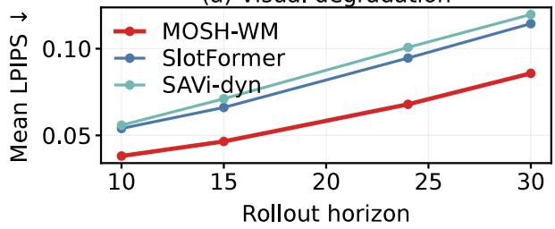

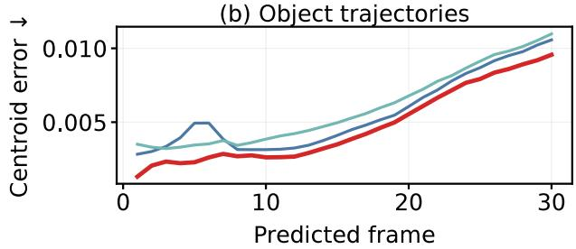

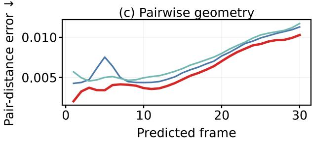  
Figure 5: OBJ3D closed-loop error accumulation. (a) Mean LPIPS over increasing horizons. (b) Per-frame centroid error. (c) Per-frame pairwise-distance error. All curves use the same six observations.

The complete model gives the best visual and slot-space re- sults. Removing physics nearly doubles LPIPS and more than triples Slot@30, while removing causal context also causes a large visual degradation. Physics-only prediction is sub- stantially stronger than residual-only prediction, but remains behind their learned combination. Re-encoding the propa- gated state also increases long-horizon slot error. Among the added mixing coeficients, $\alpha = 0 . 2$ is slightly better than $\alpha = 0 . 1$ , but neither improves over the default $\alpha = 0 . 5$ model. The ablation therefore supports both submodules and their coupling.

<table><tr><td>Variant</td><td>LPIPS↓</td><td>MSE↓</td><td>Slot@30↓</td></tr><tr><td>MOSH-WM (α = 0.5)</td><td>0.0858</td><td>4.718</td><td>0.02608</td></tr><tr><td>residual only</td><td>0.1665</td><td>8.468</td><td>0.08405</td></tr><tr><td>physics only</td><td>0.1037</td><td>5.840</td><td>0.04212</td></tr><tr><td>w/o context</td><td>0.1437</td><td>8.595</td><td>0.04799</td></tr><tr><td>re-encode state</td><td>0.1122</td><td>6.259</td><td>0.06985</td></tr><tr><td>α = 0.1</td><td>0.0964</td><td>5.154</td><td>0.02970</td></tr><tr><td>α = 0.2</td><td>0.0961</td><td>5.140</td><td>0.02939</td></tr></table>

Table 4: OBJ3D component and mixing-coeficient ablation. All entries use the same six-input, 30-prediction evaluator. Bold identifies each column minimum.

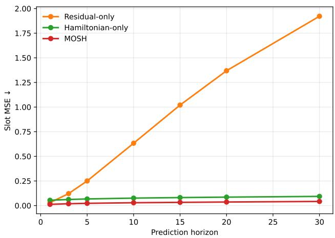  
Figure 6: Physion transfer through frozen STEVE. Slot MSE remains lowest for the complete model throughout the 35- step closed-loop rollout.

Additional capacity ablations clarify whether the gain depends on a narrowly tuned transition width. Under the shared short-budget protocol, two attention blocks achieve LPIPS/MSE/Slot@30 of 0.0873/4.789/0.02755, compared with 0.1863/9.945/0.06165 for one block and 0.1251/6.856/0.03984 for three blocks. The same pattern appears in the MLP sweep: the default expansion ratio of two gives 0.0873/4.789/0.02755, whereas ratios one and four degrade to 0.2662/12.266/0.07734 and 0.2193/10.887/0.06511. Thus, the reported improvement is not explained by simply increasing capacity; the two-block configuration provides the best balance between expressivity and rollout stability under the shared budget.

Physion transfer. Figure 6 evaluates a separately trained STEVE interface. Full MOSH is much more stable than residual-only prediction and improves over Hamiltonian- only prediction across the rollout, supporting the combined physics–appearance pathway across observers. Scenario re-sults and manifests are in the supplement, completing the transfer evidence after OBJ3D, CLEVRER, and the long- horizon OBJ3D ablations. The Physion result is primarily a representation-transfer test: STEVE difers from SAVi in slot dimension, resolution, and decoder behavior, so slot MSE is the meaningful cross-observer metric. The complete model remains below both reduced variants throughout the rollout, supporting the intended division of labor between phase dy- namics and contextual appearance. The scenario breakdown uses the same locked no-feedback protocol, so diferences reflect interaction dificulty rather than changes in training.

The horizon-resolved values further quantify this transfer. Full MOSH records slot MSE of 0.0126, 0.0187, 0.0230, 0.0290, 0.0362, and 0.0422 at horizons 1, 3, 5, 10, 20, and 30, respectively. Hamiltonian-only prediction remains bounded but is consistently higher, reaching 0.0932 at hori-zon 30, whereas residual-only prediction accumulates rapidly to 1.9220. The gap is already visible at horizon 3 and widens throughout the rollout, indicating that the contextual branch is not merely repairing the first predicted frame; it helps pre- serve a stable decoder-compatible trajectory over repeated feedback. Scenario-level results show the same pattern across diferent interactions. At horizon 30, the lowest slot error oc- curs on Support (0.0278) and Drop (0.0321), while Drape (0.0683) and Collide (0.0546) are more dificult. These differences are expected from the changing contact and occlu- sion patterns, but the common evaluator and frozen observer make the breakdown useful as a robustness check. Together with the aggregate curve, the scenario results support transfer of the phase/context factorization rather than performance on a single favorable physical setting.

## 5 Discussion and Limitations

On OBJ3D, the complete model leads in image and observer space, its margin grows under feedback, and each component removal increases error. The experimental story is therefore coherent: the interface is faithful, the benchmark gains are broad, the long-horizon drift is smaller, and the transfer result holds on a diferent frozen observer.

Limitations. Results are single validation-selected runs. The state inherits observer errors, and its energy is a soft bias rather than an identified conserved Hamiltonian. PredRNN lacks aligned slots, while CLEVRER and Physion are fixed- compute transfers with protocol-specific metrics. We study passive rollout rather than control or planning.

## 6 Conclusion

Summary. MOSH-WM separates mask-grounded phase state from decoder-oriented context. Slot support defines $Q ,$ temporal diferences define $P ,$ soft Hamiltonian guidance structures rollout, and a causal composer restores decoder- relevant appearance.

Evidence. On 6-to-30 OBJ3D, LPIPS falls by 25.0% and spatial MSE by 33.7% versus the strongest object-centric baseline; object-state metrics, horizon curves, and ablations agree. CLEVRER transfers favorably, while Physion con- firms the combined pathway under a distinct STEVE inter- face.

Future work. We will improve phase extraction under oc-clusion and add interaction, depth, and action variables.

Toth, P.; et al. 2020a. Hamiltonian Generative Networks. In ICLR.

Toth, P.; et al. 2020b. Hamiltonian Generative Networks with Non- separable Hamiltonians. In NeurIPS.

## References

Bakhtin, A.; et al. 2019. PHYRE: A New Benchmark for Physical Reasoning. In NeurIPS.

Battaglia, P. W.; et al. 2016. Interaction Networks for Learning about Objects, Relations and Physics. In NeurIPS.

Battaglia, P. W.; et al. 2018. Relational Inductive Biases, Deep Learning, and Graph Networks. arXiv preprint arXiv:1806.01261.

Bear, D. M.; et al. 2021. Physion: Evaluating Physical Prediction from Vision in Humans and Machines. In NeurIPS.

Burgess, C. P.; et al. 2019. MONet: Unsupervised Scene Decom- position and Representation. In ICML.

Chang, M. B.; et al. 2017. A Compositional Object-Based Approach to Learning Physical Dynamics. In ICLR.

Chen, R. T. Q.; et al. 2018. Neural Ordinary Diferential Equations. In NeurIPS.

Cranmer, M.; et al. 2020. Lagrangian Neural Networks. In ICLR.

Denton, E.; and Fergus, R. 2018. Stochastic Video Generation with a Learned Prior. In ICML.

Engelcke, M.; et al. 2020. GENESIS: Generative Scene Inference and Sampling with Object-Centric Latent Representations. In ICLR.

Engelcke, M.; et al. 2021. GENESIS-V2: Inferring Unordered Object-Centric Scene Representations without Iterative Refinement. In NeurIPS.

Eslami, S. M. A.; et al. 2016. Attend, Infer, Repeat: Fast Scene Understanding with Generative Models. In NeurIPS.

Eslami, S. M. A.; et al. 2018. Neural Scene Representation and Rendering. Science, 360(6394): 1204–1210.

Gao, Z.; et al. 2022. SimVP: Simpler Yet Better Video Prediction. In CVPR, 3170–3180.

Gref, K.; et al. 2019. Multi-Object Representation Learning with Iterative Variational Inference. In ICLR.

Greydanus, S.; et al. 2019. Hamiltonian Neural Networks. In NeurIPS.

Ha, D.; and Schmidhuber, J. 2018. World Models. In NeurIPS Workshop.

Hafner, D.; et al. 2019. Learning Latent Dynamics for Planning from Pixels. In ICML.

Hafner, D.; et al. 2020. Dream to Control: Learning Behaviors by Latent Imagination. In ICLR.

Hafner, D.; et al. 2021. Mastering Atari with Discrete World Mod els. In ICLR.

Jaegle, A.; et al. 2021. Perceiver: General Perception with Iterative Attention. In ICML.

Jiang, J.; et al. 2020. SCALOR: Generative World Models with Scalable Object-Oriented Representations. In ICLR.

Johnson, J.; et al. 2017. CLEVR: A Diagnostic Dataset for Com positional Language and Elementary Visual Reasoning. In CVPR.

Kipf, T.; et al. 2020. Contrastive Learning of Structured World Models. In ICLR.

Kipf, T.; et al. 2022. Conditional Object-Centric Learning from Video. In ICLR.

Kipf, T. N.; et al. 2018. Neural Relational Inference for Interacting Systems. In ICML.

Li, J.; et al. 2025. SlotPi: Physics-informed Object-centric Reasoning Models. In ACM Multimedia.

Lin, Z.; et al. 2020a. Improving Generative Imagination in Object-Centric World Models. In ICML, 6140–6149.

Lin, Z.; et al. 2020b. SPACE: Unsupervised Object-Oriented Scene Representation via Spatial Attention and Decomposition. In ICLR.

Lippe, P.; et al. 2023. Eficient Object-Centric Learning with Slot Mixing. In NeurIPS.

Locatello, F.; et al. 2020. Object-Centric Learning with Slot Attention. In NeurIPS.

Lutter, M.; et al. 2019. Deep Lagrangian Networks: Using Physics as Model Prior for Deep Learning. In ICLR.

Rubanova, Y.; et al. 2019. Latent Ordinary Diferential Equations for Irregularly-Sampled Time Series. In NeurIPS.

Sajjadi, M.; et al. 2022. Object-Centric Video Prediction. In NeurIPS.

Sanchez-Gonzalez, A.; et al. 2020. Learning to Simulate Complex Physics with Graph Networks. In ICML.

Schrittwieser, J.; et al. 2020. Mastering Atari, Go, Chess and Shogi by Planning with a Learned Model. Nature, 588: 604–609.

Seitzer, M.; et al. 2023. Bridging the Gap to Real-World Object-Centric Learning. In ICLR.

Singh, G.; et al. 2022. STEVE: Slot Transformer for Object-Centric Learning. In NeurIPS.

Tang, H.; et al. 2026. HaM-World: Soft-Hamiltonian World Models with Selective Memory for Planning. arXiv preprint arXiv:2605.05951.

Vaswani, A.; et al. 2017. Attention Is All You Need. In NeurIPS.

Veerapaneni, R.; et al. 2020. Entity Abstraction in Visual Model- Based Reinforcement Learning. In CoRL.

Villegas, R.; et al. 2017. Decomposing Motion and Content for Natural Video Sequence Prediction. In ICLR.

Wang, Y.; et al. 2017. PredRNN: A Recurrent Neural Network for Spatiotemporal Predictive Learning. In NeurIPS.

Wang, Z.; et al. 2004. Image Quality Assessment: From Error Visibility to Structural Similarity. IEEE TIP.

Watters, N.; et al. 2017. Visual Interaction Networks: Learning a Ph sics Simulator from Video in the Wild. In NeurIPS.

Wu, Z.; et al. 2023. SlotFormer: Unsupervised Visual Dynamics Simulation with Object-Centric Models. In ICLR.

Xu, Z.; et al. 2019. Unsupervised Discovery of Parts, Structure, and Dynamics. In ICLR.

Yi, K.; et al. 2020. CLEVRER: Collision Events for Video Repre- sentation and Reasoning. In ICLR.

Zhang, R.; et al. 2018. The Unreasonable Efectiveness of Deep Features as a Perceptual Metric. In CVPR.

Zhong, Y.; et al. 2020. Symplectic ODE-Net: Learning Hamiltonian Dynamics with Control. In ICLR.

## A Additional Method Details

## Additional Overview

Given L observed frames $X _ { 1 : L }$ , the frozen SAVi interface returns visual slots $S _ { 1 : L }$ and soft masks $M _ { 1 : L }$ . MOSH-WM maintains a canonical phase state $( Q _ { t } , P _ { t } )$ and a causal visual context $C _ { t }$ . The phase state is used exclusively by the Soft- Hamiltonian transition, whereas $C _ { t }$ retains appearance and identity information for decoding.

## Mask-Grounded Phase-State Factorization

Slots are optimized for grouping and reconstruction and may therefore entangle geometry with appearance and semantics (Locatello et al. 2020; Kipf et al. 2022). We retain the sup- port owned by slot n through winner-take-all assignment, $\bar { M } _ { t , n } ^ { \mathrm { o w n } } ( u , v ) \stackrel { . } { = } M _ { t , n } ( u , v ) \bar { \mathbb { I } } [ \bar { n } = \arg \operatorname* { m a x } _ { j } M _ { t , j } ( u , \bar { v } ) ]$ ]. Let b be a fixed spatial basis and let Pool be normalized mask-weighted pooling. The position-like coordinate is

$$
Q _ { t , n } = f _ { Q } \left( \operatorname { P o o l } ( M _ { t , n } ^ { \mathrm { o w n } } , b ) \right) .\tag{8}
$$

The lightweight map $f _ { Q }$ contains a basis projector, a slot embedding, and one attention-MLP block. Its inputs are mask support and fixed spatial bases, which separate the canonical coordinate from direct slot appearance. Its momentum-like companion is the temporal finite diference,

$$
P _ { t } = \frac { Q _ { t } - Q _ { t - 1 } } { \Delta t } .\tag{9}
$$

In parallel, a causal spatiotemporal encoder reads slot his- tory and produces $\bar { C _ { t } } = \mathcal { F } _ { \mathrm { c t x } } \bar { ( } S _ { < t } )$ . Context never enters the phase-state extractor; it is reserved for the decoder- compatible pathway below.

## Soft-Hamiltonian Closed-Loop Dynamics

A fully learned transition can fit local visual correlations without a preferred physical direction, while a strict Hamil- tonian model can be too restrictive for imperfect visual ob- servations. We therefore use a soft physical bias. The energy head receives only the canonical pair,

$$
H _ { t } = H _ { \vartheta } ( Q _ { t } , P _ { t } ) .\tag{10}
$$

A learned core conditioned on $[ Q _ { t } , P _ { t } ]$ and $C _ { t }$ predicts in- crements $( D _ { t } ^ { Q } , D _ { t } ^ { P } )$ . We blend these increments with the energy-gradient directions:

$$
Q _ { t + 1 } = Q _ { t } + ( 1 - \alpha ) D _ { t } ^ { Q } + \alpha \mathrm { c l i p } _ { \gamma } ( \nabla _ { P _ { t } } H _ { t } ) ,\tag{11}
$$

$$
P _ { t + 1 } = P _ { t } + ( 1 - \alpha ) D _ { t } ^ { P } - \alpha \mathrm { c l i p } _ { \gamma } ( \nabla _ { Q _ { t } } H _ { t } ) .\tag{12}
$$

The learned path captures residual dynamics, whereas the gradient path organizes phase evolution. These are forward- Euler Soft-Hamiltonian updates, not a symplectic solver or a claim that $H _ { t }$ is ground-truth mechanical energy. During rollout, the model directly sets $( Q _ { t } , P _ { t } ) \gets ( Q _ { t + 1 } , P _ { t + 1 } )$

## Physics–Appearance Reconciliation

The phase state intentionally omits decoder-relevant visual information. After the physical update, we use a gated com- poser to combine the normalized phase displacement with

$C _ { t } .$ , yielding a physical slot proposal $S _ { t + 1 } ^ { \mathrm { p h y s } }$ . A causal reason- ing module then provides a small decoder-space correction:

$$
\widehat { S } _ { t + 1 } = S _ { t + 1 } ^ { \mathrm { p h y s } } + \beta \big ( \mathcal { R } ( S _ { t } , S _ { \leq t } ) - S _ { t } \big ) .\tag{13}
$$

The composer applies learned projections to normalized phase displacement and $C _ { t } ,$ predicts a sigmoid gate, and blends the two projected features before mapping them to slot space. The frozen decoder produces $\widehat { X } _ { t + 1 } = \overline { { \mathcal { D } ( \widehat { S } _ { t + 1 } ) } }$ and $\widehat { S } _ { t + 1 }$ is appended to the history used for $C _ { t + 1 }$

## Learning Objective

We freeze the SAVi encoder and decoder, encode $L = 6$ frames, and unroll K future steps according to the training curriculum. The complete objective is

$$
\begin{array} { r l } & { \mathcal { L } = \mathcal { L } _ { \mathrm { s l o t } } + \mathcal { L } _ { \mathrm { i m g } } + \lambda _ { \mathrm { h a m } } \mathcal { L } _ { \mathrm { h a m } } + \lambda _ { \mathrm { e n e r g y } } \mathcal { L } _ { \mathrm { e n e r g y } } } \\ & { ~ + \lambda _ { \mathrm { c t r } } \mathcal { L } _ { \mathrm { c t r } } + \lambda _ { \mathrm { r e s } } \mathcal { L } _ { \mathrm { r e s } } . } \end{array}\tag{14}
$$

(15)

The image term combines pixel fidelity, pooled multiscale fidelity, and gradient matching. The Hamiltonian term aligns the learned increments with the energy gradient, the energy term encourages rollout consistency, the centroid term stabi- lizes geometry, and the residual term constrains the decoder- side correction. During the early phase of training, the physi- cal coeficients are linearly warmed up so appearance recon- struction stabilizes first.

## B Training Diagnostic

The main OBJ3D run uses the shared configuration reported in the experimental setup. The validation curve below doc- uments checkpoint selection without repeating the protocol details.

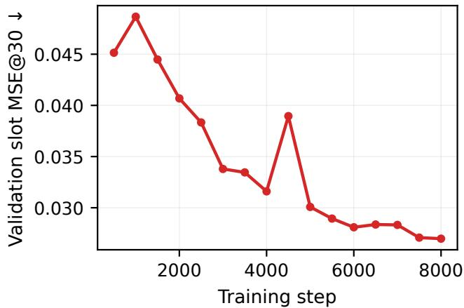  
Figure 7: Validation Slot@30 during the main OBJ3D train- ing run. The curve is used for checkpoint selection.

We vary one architectural or functional component at a time under a shared short-budget protocol. Shape-compatible tensors inherit the validation-selected full-model initializa- tion; changed shapes are reinitialized. These experiments measure directional sensitivity rather than multi-seed confi- dence intervals.

<table><tr><td>Attention blocks LPIPS ↓</td><td>MSE↓</td><td>Slot@30↓</td></tr><tr><td>1</td><td>0.1863 9.945</td><td>0.06165</td></tr><tr><td>2 (default) 3</td><td>0.0873 4.789</td><td>0.02755</td></tr><tr><td>0.1251</td><td>6.856</td><td>0.03984</td></tr><tr><td colspan="3"></td></tr><tr><td>MLP ratio LPIPS↓</td><td>MSE↓</td><td>Slot@30 ↓</td></tr><tr><td>1</td><td>0.2662 12.266</td><td>0.07734</td></tr><tr><td>2 (default)</td><td>0.0873 4.789</td><td>0.02755</td></tr><tr><td>4</td><td>0.2193 10.887</td><td>0.06511</td></tr></table>

Table 5: Capacity sensitivity under the shared short-budget protocol.

The complete model is preferred in both capacity sweeps. The two-block configuration balances expressivity and roll- out stability, while the default MLP ratio avoids the degra- dation observed at narrower and wider settings.

## C Additional OBJ3D Results

## Independent Long-Horizon Rollout

The following sequence is independent of the main-paper qualitative strip. All methods receive the same six observa- tions and generate the next 30 frames autoregressively. The visualization emphasizes identity retention, relative layout, and the growth of errors under repeated feedback.

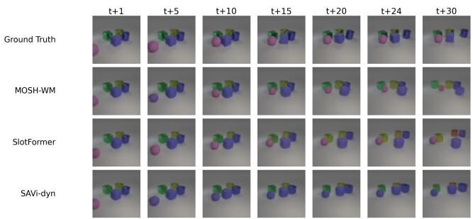  
Figure 8: Additional OBJ3D 6-to-30 rollout on test video 125. Columns show future horizons and rows compare ground truth with three predictors under the same closed-loop pro- tocol.

## Error and Transfer Summaries

The compact plots below are additional summaries rather than replacements for the main-paper curves. The OBJ3D plot reports relative degradation when functional path- ways are removed. The Physion plot evaluates the same phase/context factorization through a diferent frozen ob- server.

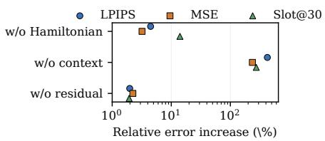  
Figure 9: Compact OBJ3D ablation summary. The plot shows relative error increases when the physical, context, or residual pathway is removed.

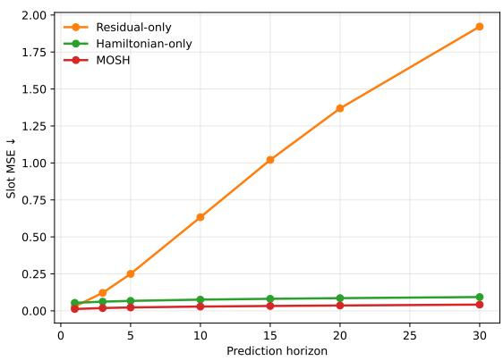  
Figure 10: Physion slot error over the prediction horizon. The complete model remains lowest throughout the rollout.

## D Inference Procedure

For completeness, one prediction step can be written as a fixed sequence of interface-preserving operations. First, the frozen observer encodes the current frame and re- turns slots and masks. Second, owned-mask pooling pro- duces the canonical coordinate for each slot, and the tempo- ral diference produces the momentum-like variable. Third, the learned core and the energy head jointly produce the phase update. Fourth, the composer combines the updated phase state with the causal context and applies the bounded decoder-space correction. Finally, the frozen decoder recon- structs the next frame and the predicted slots are appended to the context history.

$$
\begin{array} { r } { \left( S _ { t } , M _ { t } \right) = \mathcal { E } ( X _ { t } ) , ~ } \\ { Q _ { t } = f _ { Q } ( \mathrm { P o o l } ( M _ { t } ^ { \mathrm { o w n } } , b ) ) , ~ } \\ { P _ { t } = ( Q _ { t } - Q _ { t - 1 } ) / \Delta t , ~ } \\ { \left( Q _ { t + 1 } , P _ { t + 1 } \right) = \Phi _ { \vartheta } ( Q _ { t } , P _ { t } , C _ { t } ) , ~ } \\ { \widehat { S } _ { t + 1 } = \Psi ( Q _ { t + 1 } , P _ { t + 1 } , C _ { t } , S _ { t } ) , ~ } \\ { \widehat { X } _ { t + 1 } = \mathcal { D } ( \widehat { S } _ { t + 1 } ) . ~ } \end{array}\tag{16}
$$

The same chain is used during teacher-forced training and closed-loop evaluation, except that training may use the target interface slots in the loss computation. During evaluation, the predicted frame and predicted slots are fed back without target feedback. This distinction keeps the evaluator identical across methods while exposing accumulated rollout error.

## Temporal Weighting and Rollout Stability

Let $e _ { k }$ denote an observer-space error at future step k. The rollout objective aggregates errors across the prediction window using nondecreasing temporal weights $w _ { k } \mathrm { : }$

$$
\mathcal { L } _ { \mathrm { r o l l } } = \frac { 1 } { \sum _ { k = 1 } ^ { K } w _ { k } } \sum _ { k = 1 } ^ { K } w _ { k } e _ { k } , \qquad w _ { k + 1 } \geq w _ { k } > 0 .\tag{17}
$$

This weighting does not change the evaluator or the reported metrics. It only makes late rollout errors visible during op- timization. The energy and centroid terms provide comple- mentary constraints: the former discourages abrupt phase inconsistency, while the latter directly penalizes errors in the spatial support summarized by the masks.

A useful diagnostic is the ratio between the decoder cor- rection and the composed physical proposal,

$$
\rho _ { t } = \frac { \| r _ { t + 1 } \| _ { 2 } } { \epsilon + \| S _ { t + 1 } ^ { \mathrm { p h y s } } \| _ { 2 } } ,\tag{18}
$$

where ϵ is a numerical stabilizer. The residual regularizer acts on this ratio rather than allowing the correction to replace the phase-driven proposal. This is why the residual branch can restore decoder-relevant details while the phase branch remains responsible for the propagated state.

## Reproducibility Notes

All methods use the same observation window, frozen ob- server, decoder, image normalization, and closed-loop eval- uator for each benchmark. Model selection is performed on validation data using the specified horizon-resolved slot met- ric. Test frames are used only for the final reported evaluation and qualitative exports. The files in physion\_results/ provide the transfer tables and manifests used to produce the Physion results shown above.

The appendix figures are intentionally separated into three roles. The training curve documents optimization and check- point selection; the additional OBJ3D strip tests visual sta- bility on a sequence not used in the main qualitative figure; and the Physion visualization demonstrates transfer through a diferent frozen slot interface. This separation avoids count- ing the same visualization as independent evidence while making the evaluation protocol explicit.

## E Symbols and Tensor Shapes

For clarity, the main tensors used by the implementation are summarized below. The number of slots is denoted by $N _ { \ast }$ the slot dimension by $d _ { s } ,$ , the phase dimension by $d _ { q } ,$ and the number of observed frames by $L .$ . The observer returns $S _ { t } \in$ $\mathbb { R } ^ { N \times d _ { s } }$ and $M _ { t } \in \mathbb { R } ^ { N \times H \times \check { W } } ;$ ; the phase extractor returns $Q _ { t } , P _ { t } \in \mathbb { R } ^ { N \times d _ { q } } ;$ and the causal context retains a history of decoder-compatible slot tokens. The same slot ordering is used for mask ownership, phase extraction, composition, and observer-space evaluation.

<table><tr><td>Symbol Shape</td><td></td><td>Meaning</td></tr><tr><td> $X _ { t }$ </td><td> $H \times W \times 3$ </td><td>video frame</td></tr><tr><td> $S _ { t }$ </td><td> $N \times d _ { s }$ </td><td>observer slot tokens</td></tr><tr><td> $M _ { t }$ </td><td> $N \times H \times W$ </td><td>soft slot masks</td></tr><tr><td> $Q _ { t }$ </td><td> $N \times d _ { q }$ </td><td>mask-grounded coordinate</td></tr><tr><td> $P _ { t }$ </td><td> $N \times d _ { q }$ </td><td>temporal phase difference</td></tr><tr><td> $C _ { t }$ </td><td></td><td>context-dependent causal visual memory</td></tr><tr><td> $\widehat { S } _ { t }$ </td><td> $N \times d _ { s }$ </td><td>decoder-compatible prediction</td></tr></table>

Table 6: Notation and tensor roles used in the implementa- tion.

## Implementation-Level Update

The update is implemented slot-wise after the shared in- teraction blocks. Let $\boldsymbol { z } _ { t } = [ Q _ { t } , P _ { t } , C _ { t } ]$ denote the concate- nated state available to the learned core. The core produces a bounded proposal $D _ { t } = \mathcal { F } _ { \theta } ( z _ { t } )$ , while the energy head pro- duces the directional term $\dot { G } _ { t } = ( \nabla _ { P _ { t } } H _ { t } , - \nabla _ { Q _ { t } } H _ { t } )$ . The actual phase increment is therefore

$$
\Delta _ { t } = ( 1 - \alpha ) D _ { t } + \alpha \mathrm { c l i p } _ { \gamma } ( G _ { t } ) , \qquad [ Q _ { t + 1 } , P _ { t + 1 } ] = [ Q _ { t } , P _ { t } ] + \Delta _ { t } .\tag{19}
$$

The clipping operator is applied component-wise after the energy gradient is computed. It limits an occasional high- magnitude gradient without changing the direction of ordi- nary updates. The learned proposal remains available even when the energy signal is weak, which is the reason the method is described as soft-Hamiltonian rather than strictly Hamiltonian.

The decoder-side composer is evaluated after the phase up- date. Its gate is computed from both phase and context, so the model can use phase information to determine where motion is expected while using context to preserve details that are not encoded in the canonical state. This separation also explains why the same phase state can be evaluated through diferent frozen observers: the observer-specific decoder interface is handled after the shared transition logic.

## Closed-Loop Pseudocode

The following compact procedure describes the evaluation- time rollout without introducing an additional training as- sumption.

Closed-loop rollout. Encode the observed frames with the frozen observer. Initialize $Q _ { L }$ from the owned masks, $P _ { L }$ from the last temporal diference, and $C _ { L }$ from the observed slot history. For ${ \bar { k } } = 1 , \dots , K \colon$ : compute $H _ { L }$ and its gra- dients; blend the learned and gradient directions; update Q and $P ;$ compose the next decoder-compatible slots; decode the predicted frame; and append the predicted slots to the causal context. Return all predicted frames and observer- space states.

This procedure keeps the feedback path explicit. The tar- get future frames are used only to compute evaluation losses; they are never used to update $\left[ Q , P \right]$ , or C during closed-loop testing. Consequently, the horizon curves measure accumu- lated error rather than one-step reconstruction quality.

## F Physion Transfer

We follow the SlotFormer Physion protocol. Videos are trun- cated to 150 source frames and sampled every three frames; STEVE produces six 192-dimensional slots at 128×128 res-olution. MOSH observes 15 sampled frames, trains with a 10-step closed-loop rollout, and is evaluated for the remain- ing 35 sampled steps without target feedback.

<table><tr><td>Method</td><td>@1</td><td>@3</td><td>@5</td><td>@10</td><td>@20</td><td>@30</td></tr><tr><td>Residual-only</td><td>.0296</td><td>.1215</td><td>.2500</td><td>.6331</td><td>1.3689</td><td>1.9220</td></tr><tr><td>Hamiltonian-only</td><td>.0541</td><td>.0620</td><td>.0674</td><td>.0758</td><td>.0858</td><td>.0932</td></tr><tr><td>MOSH (full)</td><td>.0126.0187.0230</td><td></td><td></td><td>.0290</td><td>.0362</td><td>.0422</td></tr></table>

Table 7: Physion test slot MSE over the closed-loop rollout.

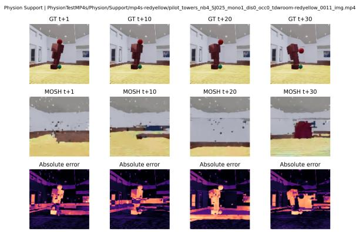  
Figure 11: Physion qualitative transfer. Ground truth, MOSH prediction, and absolute reconstruction error are shown at horizons 1, 10, 20, and 30. Pixel quality is limited by the frozen STEVE decoder; the experiment is primarily a slot- dynamics transfer test.

<table><tr><td>Scenario</td><td>MOSH @30</td></tr><tr><td>Collide</td><td>0.0546</td></tr><tr><td>Contain</td><td>0.0341</td></tr><tr><td>Dominoes</td><td>0.0403</td></tr><tr><td>Drape</td><td>0.0683</td></tr><tr><td>Drop</td><td>0.0321</td></tr><tr><td>Link</td><td>0.0362</td></tr><tr><td>Roll</td><td>0.0437</td></tr><tr><td>Support</td><td>0.0278</td></tr></table>

Table 8: Scenario-level Physion slot MSE at horizon 30.

<table><tr><td>Item</td><td>Setting</td></tr><tr><td>Observer</td><td>frozen SAVi / STEVE</td></tr><tr><td>OBJ3D horizon</td><td>6 observed, 30 predicted -5</td></tr><tr><td>Optimizer Seed</td><td>Adam, 10 42</td></tr><tr><td>Selection</td><td>validation Slot@30</td></tr><tr><td>Feedback</td><td>disabled</td></tr></table>

Table 9: Reproducibility checklist.

The local observer and world-model manifests, re- sult tables, and scenario breakdowns are included in physion\_results/. All reported runs use seed 42 and the same evaluator; no target feedback is used during test rollout.

## Interpretation of the Transfer Result

The Physion experiment is designed to test whether the phase/context factorization survives a change in the upstream observer. The STEVE interface difers from the SAVi inter- face in slot dimension, image resolution, and decoder be- havior, so the absolute pixel appearance is not directly com- parable to OBJ3D. The reported slot metric is therefore the primary transfer measurement. The full model remains be- low the two reduced variants throughout the listed horizons, which is consistent with the intended division of labor: the phase branch carries the evolving spatial state, while the con- textual branch preserves information required by the down- stream decoder.

The scenario table should be read as a breakdown of the same locked test protocol rather than as a new training set. Each scenario uses the same observation length, rollout rule, and no-feedback evaluation. Diferences between scenarios reflect the dificulty of the physical interaction, while the aggregate curve summarizes the common trend across the transfer suite. We avoid interpreting the absolute reconstruc- tion error as a standalone image-quality claim because the frozen STEVE decoder is not optimized for pixel-perfect reconstruction in this setting.