# Maximum-distance nonnegative matrix factorization for unmixing highly mixed grain-size distribution data: A generalization of AnalySize

Qianqian Qi Hangzhou Dianzi University, China q.qi@hdu.edu.cn

Zhongming Chen Hangzhou Dianzi University, China zmchen@hdu.edu.cn

Peter G. M. van der Heijden Utrecht University, the Netherlands and University of Southampton, UK p.g.m.vanderheijden@uu.nl

## Abstract

Nonnegative matrix factorization (NMF) decomposes a nonnegative matrix into the product of two nonnegative matrices. This property makes NMF well suited for unmixing grain-size distribution data, which are inherently nonnegative and have row sums equal to one. Previous studies have shown that AnalySize, an NMF-based method, performs well on poorly mixed grain-size distribution data but struggles when the data is highly mixed, where no observed samples are close to the true end members. To overcome this limitation, we introduce a maximum-distance NMF that encourages the estimated end members to be as distinct as possible and develop a hierarchical alternating least squares algorithm for optimization. The proposed formulation can be regarded as a generalization of AnalySize, where AnalySize minimizes the distance among end members while the proposed method maximizes it. Experimental results demonstrate that the method effectively decomposes highly mixed grain-size distribution data.

Keywords: Nonnegative matrix factorization, Highly mixed data, Maximum distance;   
Grain-size distribution data.

## 1 Introduction

Since the seminal work of Lee and Seung (1999) in Nature, nonnegative matrix factorization (NMF) has been widely applied in fields such as image processing, blind hyperspectral unmixing, and sedimentary geology (Gillis, 2020; Guo, Li, & Liang, 2024; Saberi-Movahed et al., 2025; Van Hateren, Prins, & Van Balen, 2018). Given a nonnegative observed matrix $\pmb { X } \in \mathbb { R } _ { + } ^ { m \times n }$ and a rank $K \leq \operatorname* { m i n } \{ m , n \}$ , NMF approximates X by the product of two nonnegative matrices $M \in \mathbb { R } _ { + } ^ { m \times K }$ and $\pmb { H } \in \mathbb { R } _ { + } ^ { K \times n } , \mathrm { i . e . }$

$$
\begin{array} { l l } { { } } & { { X \approx M H } } \\ { { \mathrm { s u b j e c t ~ t o ~ } } } & { { M \in \mathbb { R } _ { + } ^ { m \times K } , H \in \mathbb { R } _ { + } ^ { K \times n } . } } \end{array}\tag{1}
$$

In sedimentary geology, the observed matrix $\pmb { P } \in \Re _ { + } ^ { m \times n }$ typically represents grain-size distribution data, where each row corresponds to a specimen, is nonnegative, and adds up to one (Dietze, Schulte, & Dietze, 2022; Lin et al., 2025; Paterson & Heslop, 2015; Renner, 1993, 1995; Van Hateren et al., 2018; Weltje, 1997; Weltje & Prins, 2007). P is approximated by the product of A and S, where the rows of S represent the end-members and the rows of A represent the corresponding abundances of specimens. In addition to nonnegativity, both A and S satisfy row-sum-to-one constraints, reflecting the compositional nature of the data. Specifically, given $\pmb { P } \in \mathbb { R } _ { + } ^ { m \times n }$ with row-sum-to-one constraints and a rank $K \leq$ min $\{ m , n \}$ , the grain-size distribution data unmixing problem is formulated as

$$
\begin{array} { r l } & { P \approx A S } \\ & { \mathrm { s u b j e c t ~ t o } \quad A \in \mathbb { R } _ { + } ^ { m \times K } , S \in \mathbb { R } _ { + } ^ { K \times n } , A \mathbf { 1 } = \mathbf { 1 } , S \mathbf { 1 } = \mathbf { 1 } . } \end{array}\tag{2}
$$

NMF has been an appealing approach to solving grain-size distribution data unmixing problem because both M and H in (1) satisfy the end-member and abundance nonnegativity constraints in (2) (Heslop, Von Dobeneck, & Hocker ¨ , 2007; Paterson & Heslop, 2015; Qi, Chen, & Van der Heijden, 2026a). For example, Heslop et al. (2007) proposed DRS-unmixer, a multiplicative update NMF algorithm that minimizes the squared error between P and its approximation AS, with row-sum-to-one constraints on A and S enforced in the final stage of the iterations. Paterson and Heslop (2015) introduced AnalySize based on a hierarchical alternating least squares (HALS) algorithm. The objective function of AnalySize incorporates a minimum-distance constraint in addition to the squared error, while enforcing the row-sum-to-one constraints during the iterative procedure. Qi et al. (2026a) introduced MAV-NMF based on the alternating projected fast gradient method. The objective function of MAV-NMF incorporates a maximum-volume constraint in addition to the squared error, while enforcing the row-sum-to-one constraints on one factor during the iterative procedure. Note that MAV-NMF does not constrain the other factor to be row-sum-to-one, but the violations of this constraint are small due to other constraints (Paterson & Heslop, 2015).

In a comparative study, Van Hateren et al. (2018) evaluated several unmixing techniques for unmixing grain-size distribution data, including EMMA (Seidel & Hlawitschka, 2015; Weltje, 1997), DRS-unmixer (Heslop et al., 2007), EMMAgeo (Dietze et al., 2012), AnalySize (Paterson & Heslop, 2015), and BEMMA (Yu, Colman, & Li, 2016). The results showed that, when the number of end members was specified correctly, AnalySize outperformed the other methods for the synthetic coversand dataset and noisy coversand dataset; however, it was still unable to effectively recover the true end members from the synthetic highly mixed coversand dataset (Van Hateren et al., 2018). Here, highly mixed data refer to data for which no single observed specimen is close to a true end member. In such cases, the estimated end members may remain mixtures of the true ones, failing to recover the underlying structure, as also discussed in related studies (Bioucas-Dias et al., 2012; Heslop & Roberts, 2012; Paterson & Heslop, 2015).

To handle highly mixed data, some studies aim to identify end members as distinct as possible (Qi et al., 2026a; Qi, Chen, & Van der Heijden, 2026b; Van der Ark, Van der Heijden, & Sikkel, 1999; Zhang, Wang, Xu, & Yang, 2020). For example, Van der Ark et al. (1999) applied a simulated annealing algorithm to maximize the chi-squared distances between end members, while Zhang et al. (2020) employed a genetic algorithm to maximize the sum of Manhattan distances between end members and minimize the reconstruction error between P and AS. However, simulated annealing and genetic algorithms are heuristic. More recently, Qi et al. (2026a, 2026b) explored the use of volume-based measures to promote separation among end members. Overall, research in this direction remains limited.

This study introduces a maximum-distance NMF for highly mixed grain-size data, which can be viewed as a generalization of AnalySize, a widely used grain-size distribution data unmixing approach as introduced before. An estimation algorithm using the HALS is developed. The experimental results show that the proposed method effectively decomposes highly mixed data.

## 2 Maximum-distance nonnegative matrix factorization

The objective function of the proposed maximum-distance nonnegative matrix factorization (MAD-NMF) is formulated as:

$$
\begin{array} { r l } { \operatorname* { m i n } } & { | | P - { \cal A } { \cal S } | | _ { F } ^ { 2 } - \lambda | | C _ { K \times K } { \cal S } | | _ { F } ^ { 2 } } \\ { \mathrm { s u b j e c t ~ t o } } & { { \cal A } \in \mathfrak { R } _ { + } ^ { m \times K } , { \cal S } \in \mathfrak { R } _ { + } ^ { K \times n } , { \cal A } { \bf 1 } _ { K \times 1 } = { \bf 1 } _ { m \times 1 } , { \cal S } { \bf 1 } _ { n \times 1 } = { \bf 1 } _ { K \times 1 } , } \end{array}\tag{3}
$$

where $\lambda > 0$ and $\begin{array} { r } { { \cal C } _ { K \times K } = { \cal I } _ { K \times K } - \frac { 1 } { n } { \bf 1 } _ { K \times 1 } { \bf 1 } _ { K \times 1 } ^ { T } } \end{array}$ . Here, $\pmb { I } _ { K \times K } \in \Re ^ { K \times K }$ is an identity matrix and $\mathbf { 1 } _ { K \times 1 } \in \Re ^ { K \times 1 }$ is an all-one vector. For a given matrix $\begin{array} { r } { Y , \Vert Y \Vert _ { F } ^ { 2 } = \sum _ { i } \sum _ { j } Y ( i , j ) ^ { 2 } } \end{array}$

The square $| | P - A S | | _ { F } ^ { 2 }$ of the Frobenius norm is one of the most commonly used reconstruction errors between P and AS, motivated by the assumption of Gaussian noise (Gillis, 2020). Alternative error measures, such as the Kullback-Leibler divergence, can also be adopted. Following Nus, Miron, and Brie (2020); Paterson and Heslop (2015); Yu and Sun (2012), we use $| | C _ { K \times K } \pmb { S } | | _ { F } ^ { 2 }$ , which measures the difference between rows of $\pmb { S }$ and their centroid: $\begin{array} { r } { S ( k , : ) - \frac { 1 } { K } \sum _ { k ^ { \prime } = 1 } ^ { K } S ( k ^ { \prime } , : ) } \end{array}$ . Note that, in AnalySize, Paterson and Heslop (2015) use $| | C _ { K \times K } S C _ { n \times n } | | _ { F } ^ { 2 }$ instead of $| | C _ { K \times K }  { \cal S } | | _ { F } ^ { 2 }$ with $\begin{array} { r } { { \cal C } _ { n \times n } = { \cal I } _ { n \times n } - \frac { 1 } { n } { \bf 1 } _ { n \times 1 } { \bf 1 } _ { n \times 1 } ^ { T } , } \end{array}$ but $s \mathbf { 1 } _ { n \times 1 } = \mathbf { 1 } _ { K \times 1 }$ implies $C _ { K \times K } S C _ { n \times n } = C _ { K \times K } S$ . Therefore, we use $| | C _ { K \times K } \pmb { S } | | _ { F } ^ { 2 }$

MAD-NMF uses −λ, which promotes larger separation among the end members and drives them away from the observation specimens. This property is essential for decomposing highly mixed grain-size distribution data, where no observation specimens are close to the true end members. MAD-NMF is closely related to MDC-NMF (Yu & Sun, 2012) and AnalySize (Paterson & Heslop, 2015), and the main difference is that MDC-NMF and AnalySize uses +λ, causing the distance term to act as a penalty that pulls the end members toward their centroid, resulting in end members that lie close to the observation specimens (Paterson & Heslop, 2015; Yu & Sun, 2012).

## 3 Algorithm

The problem in (3) is non-convex. Following Chen and Guillaume (2012); Paterson and Heslop (2015), we employ the hierarchical alternating least squares (HALS) algorithm, and update one column of A or one row of S at a time.

Given A fixed, the subproblem for $_ { s }$ is

$$
\begin{array} { r l } { \operatorname* { m i n } } & { | | P - A S | | _ { F } ^ { 2 } - \lambda | | C _ { K \times K } S | | _ { F } ^ { 2 } } \\ { \mathrm { s u b j e c t ~ t o } } & { S \in \mathfrak { R } _ { + } ^ { K \times n } , S \mathbf { 1 } _ { n \times 1 } = \mathbf { 1 } _ { K \times 1 } . } \end{array}\tag{4}
$$

Using the HALS strategy, we update one row $S ( k , : )$ of S at a time. Let $P ^ { ( k ) } = P -$ $\begin{array} { r } { \sum _ { l \neq k } \pmb { A } ( : , l ) \pmb { S } ( l , : ) } \end{array}$ , where $A ( : , l )$ is the l-th column of A and $S ( l , : )$ is the l-th row of $S .$ Let $\begin{array} { r } { g ( { \boldsymbol { S } } ( { \boldsymbol { k } } , : ) ) = | | { \boldsymbol { P } } ^ { ( { \boldsymbol { k } } ) } - { \boldsymbol { A } } ( : , { \boldsymbol { k } } ) { \boldsymbol { S } } ( { \boldsymbol { k } } , : ) | | _ { F } ^ { 2 } - \lambda \sum _ { k = 1 } ^ { K } | | { \boldsymbol { S } } ( { \boldsymbol { k } } , : ) - { \frac { 1 } { K } } \left( { \boldsymbol { S } } ( { \boldsymbol { k } } , : ) + \sum _ { l \neq k } { \boldsymbol { S } } ( { \boldsymbol { l } } , : ) \right) | | _ { 2 } ^ { 2 } | | } \end{array}$ Then the subproblem of (4) becomes

$$
\begin{array} { r l } { \operatorname* { m i n } } & { { } g ( S ( k , : ) ) } \\ { \mathrm { s u b j e c t ~ t o } } & { { } S ( k , : ) \in \Re _ { + } ^ { 1 \times n } , S ( k , : ) \mathbf { 1 } _ { n \times 1 } = 1 . } \end{array}\tag{5}
$$

The Hessian matrix of $g ( S ( k , : ) )$ is $\begin{array} { r } { ( 2 \| A ( : , k ) \| _ { 2 } ^ { 2 } - 2 \lambda \left( 1 - \frac { 1 } { K } \right) ^ { 2 } ) { \cal I } _ { n \times n } , } \end{array}$ which is positive definite provided that $\lambda < \| A ( : , k ) \| _ { 2 } ^ { 2 } / \left( 1 - \frac { 1 } { K } \right) ^ { 2 }$ . The gradient of $g ( S ( k , : ) )$ with respect to $S ( k , : )$ is

$$
\begin{array} { l } { \displaystyle \frac { \partial g ( S ( k , : ) ) } { \partial S ( k , : ) } = 2 A ( : , k ) ^ { T } \left( A ( : , k ) S ( k , : ) - P ^ { ( k ) } \right) - 2 \lambda \left( 1 - \frac { 1 } { K } \right) \left( S ( k , : ) - \frac { 1 } { K } \left( S ( k , : ) + \sum _ { l \neq k } S ( l , : ) \right) \right) } \\ { \displaystyle } \\ { = 2 A ( : , k ) ^ { T } A ( : , k ) S ( k , : ) - 2 A ( : , k ) ^ { T } P ^ { ( k ) } - 2 \lambda \left( 1 - \frac { 1 } { K } \right) ^ { 2 } S ( k , : ) + 2 \lambda \frac { 1 } { K } \left( 1 - \frac { 1 } { K } \right) \sum _ { l \neq k } S ( l , : ) } \end{array}
$$

By setting $\frac { \partial g ( S ( k , : ) ) } { \partial S ( k , : ) }$ to 0, the HALS update can be obtained as

$$
S ( k , : ) = \mathrm { P r o j } _ { S ( k , : ) \geq 0 , S ( k , : ) 1 = 1 } \left( \frac { A ( : , k ) ^ { T } P ^ { ( k ) } - \frac { \lambda } { K } \left( 1 - \frac { 1 } { K } \right) \sum _ { l \neq k } S ( l , : ) } { | | A ( : , k ) | | _ { 2 } ^ { 2 } - \lambda \left( 1 - \frac { 1 } { K } \right) ^ { 2 } } \right) .\tag{6}
$$

Given a vector $\pmb { y } ^ { T } \in \mathbb { R } ^ { J } , \operatorname { \mathbb { P } r o j } _ { \pmb { y } \geq 0 , \pmb { y } \mathbf { 1 } = 1 } ( \pmb { y } )$ represents Euclidean projection of y on probability simplex $\{ \pmb { y } ^ { T } \in \Re ^ { J } | \pmb { y } \geq 0 , \pmb { y } \mathbf { 1 } = 1 \}$ , which has an unique solution. For detailed implementation, see Wang and Carreira-Perpin˜ an´ (2013).

Given S fixed, the subproblem for A is

$$
\begin{array} { r l } { \operatorname* { m i n } } & { | | P - { \pmb { A } } { \pmb { S } } | | _ { F } ^ { 2 } } \\ { \mathrm { s u b j e c t ~ t o } } & { { \pmb { A } } \in \Re _ { + } ^ { m \times K } , { \pmb { A } } { \pmb { 1 } } _ { K \times 1 } = { \pmb { 1 } } _ { m \times 1 } . } \end{array}
$$

Following Paterson and Heslop (2015), we enforce the row-sum-to-one constraint $\mathbf { A 1 } = \mathbf { 1 }$ via a regularized term, yielding:

$$
\begin{array} { r l } { \operatorname* { m i n } } & { | | P - { \cal A } { \cal S } | | _ { F } ^ { 2 } + \alpha | | { \cal A } { \bf 1 } _ { K \times 1 } - { \bf 1 } _ { m \times 1 } | | _ { 2 } ^ { 2 } } \\ & { \mathrm { s u b j e c t ~ t o } \quad { \cal A } \in \Re _ { + } ^ { m \times K } . } \end{array}\tag{7}
$$

This makes the Hessian matrix of the optimization problem positive definite as seen later. Using the HALS strategy, we update one column $A ( : , k )$ at a time. Let $f ( A ( : , k ) ) = | | P ^ { ( k ) } - $

$\begin{array} { r } { A ( : , k ) { \cal S } ( k , : ) | | _ { F } ^ { 2 } + \alpha | | A ( : , k ) + \sum _ { l \neq k } A ( : , l ) - \mathbf { 1 } _ { m \times 1 } | | _ { 2 } ^ { 2 } } \end{array}$ . Then, the subproblem of (7) becomes

$$
\begin{array} { r l } { \operatorname* { m i n } } & { f ( A ( : , k ) ) } \\ { \mathrm { s u b j e c t ~ t o ~ } } & { A ( : , k ) \in \Re _ { + } ^ { m \times 1 } . } \end{array}
$$

The Hessian matrix of $f ( A ( : , k ) )$ is $( 2 | | \boldsymbol { S } ( k , : ) | | ^ { 2 } + 2 \alpha ) \mathbf { I } _ { m \times m } ,$ which is positive definite provided that $\alpha > 0$ . The gradient of $f ( A ( : , k ) )$ with respect to $A ( : , k )$ is

$$
\frac { \partial f ( A ( : , k ) ) } { \partial A ( : , k ) } = 2 \left( A ( : , k ) S ( k , : ) - P ^ { ( k ) } \right) S ( k , : ) ^ { T } + 2 \alpha \left( A ( : , k ) + \sum _ { l \neq k } A ( : , l ) - { \bf 1 } _ { m \times 1 } \right) .
$$

By setting $\textstyle { \frac { \partial f ( A ( : , k ) ) } { \partial A ( : , k ) } }$ to 0, the HALS update can be obtained as

$$
A ( : , k ) = \operatorname* { m a x } \left\{ 0 , \frac { P ^ { ( k ) } S ( k , : ) ^ { T } + \alpha ( \mathbf { 1 } _ { m \times 1 } - \sum _ { l \neq k } { \cal A } ( : , l ) ) } { | | S ( k , : ) | | ^ { 2 } + \alpha } \right\} ,\tag{8}
$$

where the max operation is performed componentwise.

The HALS procedure is summarized in Algorithm 1. After HALS, a final fully constrained least squares refinement is applied to obtain abundance estimates A based on the estimated end-member matrix S and observed matrix P (Heinz & Chang, 2001). This algorithm is similar to that of AnalySize (Paterson & Heslop, 2015).

Algorithm 1: Hierarchical alternating least squares (HALS) for solving (3) (Chen   
& Guillaume, 2012; Paterson & Heslop, 2015)   
Input: Input matrix P, dimensionality K, number of iterations iter, λ, and α.   
Output: A and S.   
Generate initial matrix S using SISAL (Bioucas-Dias, 2009) and then initial A   
using fully constrained least squares based on the initial S and observed P   
(Heinz & Chang, 2001); See Paterson and Heslop (2015) for details.   
for t = 1, 2, . . . , iter do   
for k = 1, 2, . . . , K do   
Update $S ( k , : )$ using (6);   
Update A(:, k) using (8)

## 3.1 Convergence analysis

Assumption 1: There is a constant $c > 0 .$ , such that in the iteration process, $| | A ( : , k ) | | _ { 2 } ^ { 2 } \geq c$ for any $k = 1 , \cdots , K$

This assumption is reasonable because zero columns in A are not typically encountered in practice. In our experiments, the columns of A remain nonzero throughout the iterations.

HALS algorithm is a block coordinate descent method (Gillis, 2020). Following Gillis (2020), we adapt Proposition 2.7.1 from Bertsekas (1999a, 1999b) to obtain the following theoretical convergence analysis.

Theorem 1. Under Assumption 1, assume $\alpha > 0$ and $0 < \lambda \leq c / ( 1 - 1 / K ) ^ { 2 }$ , it follows that the limit point of the iterates of Algorithm 1 is a stationary point of the optimization problem:

$$
\begin{array} { r l } { m i n } & { { } \| P - A S \| _ { F } ^ { 2 } - \lambda \| C _ { K \times K } S \| _ { F } ^ { 2 } + \alpha \| A \mathbf { 1 } _ { K \times 1 } - \mathbf { 1 } _ { m \times 1 } \| _ { 2 } ^ { 2 } } \end{array}
$$

subject to $\pmb { A } \in \Re _ { + } ^ { m \times K } , \pmb { S } \in \Re _ { + } ^ { K \times n } , \pmb { S } \mathbf { 1 } _ { n \times 1 } = \mathbf { 1 } _ { K \times 1 } .$

(9)

Proof. Denote $F ( A , S ) = \| P - A S \| _ { F } ^ { 2 } - \lambda \| C _ { K \times K } S \| _ { F } ^ { 2 } + \alpha \| A \mathbf { 1 } _ { K \times 1 } - \mathbf { 1 } _ { m \times 1 } \| _ { 2 } ^ { 2 } .$

1. The objective function $F ( A , S )$ is continuously differentiable .

2. For updating $S ( k , : ) , \{ S ( k , : ) | S ( k , : ) \in \Re _ { + } ^ { 1 \times n } , S ( k , : ) \mathbf { 1 } _ { n \times 1 } = 1 \}$ is a closed convex set; for updating $A ( : , k ) , \{ A ( : , k ) | A ( : , k ) \in \Re _ { + } ^ { m \times 1 } \}$ is a closed convex set.

3. As analyzed above, the Hessian matrix of the k-th A-subproblem is $( 2 | | S ( k , : ) | | ^ { 2 } +$ $2 \alpha ) \pmb { I } _ { m \times m }$ , which is positive definite. Hence each $A ( : , k )$ subproblem is strictly convex and admits a unique minimizer. As analyzed above, the Hessian matrix of the k-th Ssubproblem is $\begin{array} { r } { ( 2 \| A ( : , k ) \| _ { 2 } ^ { 2 } - 2 \lambda \big ( 1 - \frac { 1 } { K } \big ) ^ { 2 } ) { \cal I } _ { n \times n } , } \end{array}$ which is positive definite. Hence each $S ( k , : )$ subproblem is strictly convex and admits a unique minimizer.

4. Since each HALS update exactly minimizes one block while keeping the remaining blocks fixed, the objective value is monotonically nonincreasing after each block update.

Therefore, all conditions of the block coordinate descent convergence theorem (Bertsekas, 1999a, 1999b; Gillis, 2020) are satisfied. □

Note that the convergence analysis is established for the penalized objective function in Problem (9), rather than the original constrained formulation in Problem (3). This is because the equality constraint on A is incorporated into the objective function through the quadratic penalty term during the optimization process (see (7)).

## 4 Experiments settings

This section describes the generation of the artificial datasets and the evaluation metrics used in the experiments.

## 4.1 Generation of artificial grain-size data

## 4.1.1 Highly mixed two-end-member dataset

Paterson and Heslop (2015) used a synthetic highly mixed dataset to demonstrate that AnalySize fails to recover the underlying end members. We use the same data generation procedure as in Qi et al. (2026b) to generate a highly mixed dataset, which is based on Paterson and Heslop (2015). This dataset is constructed from two end members, each defined by a lognormal distribution over 100 grain-size classes (Figure 1a). The abundances of the two end members for each of the 99 specimens are generated such that the abundance of one specimen is uniformly distributed between 0.13 and 0.87, with the other abundance equal to one minus the first. Consequently, no specimen is close to a pure end member. For convenience, we refer to this dataset as the highly mixed two-end-member dataset.

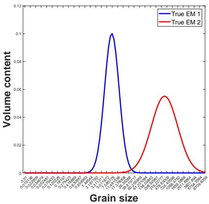

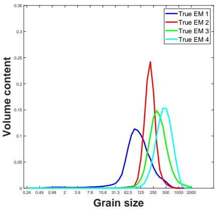  
(a) Two-end-member dataset (Pa- (b) Coversand dataset (Van terson & Heslop, 2015; Qi et al., Hateren et al., 2018; Zhang et al., 2026b) 2020)  
Figure 1: True end members

In addition, a noisy version of the highly mixed two-end-member dataset is generated by multiplying the original data element-wise by random numbers with mean 1 and standard deviation 0.01. Negative values are then set to zero, and each specimen is subsequently renormalized to sum to one.

## 4.1.2 Highly mixed coversand dataset

As introduced in Section 1, AnalySize cannot effectively recover the end members from the highly mixed coversand data (Van Hateren et al., 2018). Following a similar data generation procedure to Van Hateren et al. (2018), we generate a synthetic highly mixed coversand dataset consisting of 200 specimens by linearly mixing the four coversand end members reported by Zhang et al. (2020). For each specimen, the abundances are generated uniformly within the interval [0.08,0.49] and accepted only if they sum to one. Consequently, all abundances satisfy the constraints of being nonnegative, summing to one, and lying between 0.08 and 0.49.

Again, to generate a noisy version of the highly mixed coversand dataset, we multiply the original data element-wise by random numbers with mean 1 and standard deviation 0.01. Negative values are then set to zero, and each specimen is subsequently renormalized to sum to one.

## 4.2 Evaluation

Performance is evaluated using the mean angle between the estimated and true end members (MAEM), mean angle between the estimated and true abundances (MAAB) together with visual inspection (Paterson & Heslop, 2015; Qi et al., 2026b). The MAEM and MAAB are defined as (Qi et al., 2026b)

$$
\mathbf { M A E M } = \frac { 1 } { K } \sum _ { k } \left( \frac { 1 8 0 } { \Pi } \mathrm { a r c o s } \left( \frac { { \cal S } ( k , : ) \hat { \cal S } ( k , : ) ^ { T } } { | | { \cal S } ( k , : ) | | _ { 2 } | | \hat { \cal S } ( k , : ) | | _ { 2 } } \right) \right)
$$

and

$$
\mathrm { M A A B } = \frac { 1 } { m } \sum _ { i } \left( \frac { 1 8 0 } { \Pi } \mathrm { a r c o s } \left( \frac { { \cal A } ( i , : ) \hat { \cal A } ( i , : ) ^ { T } } { | | { \cal A } ( i , : ) | | _ { 2 } | | \hat { \cal A } ( i , : ) | | _ { 2 } } \right) \right)
$$

where $S ( k , : )$ and $\hat { \cal S } ( k , : )$ are the kth true and estimated end members, respectively, and $\mathbf { } A ( i , : )$ and $\hat { A } ( i , : )$ are the true and estimated abundances of the ith specimen, respectively. Smaller values of MAEM and MAAB indicate better performance.

Although the coefficient of determination $( R ^ { 2 } )$ is commonly used to evaluate grain-size distribution unmixing models, it measures the reconstruction accuracy of P rather than the accuracy of the estimated end members and abundances (Paterson & Heslop, 2015; Van Hateren et al., 2018; Zhang et al., 2020). Therefore, we do not use $R ^ { 2 }$ as an evaluation metric in this study.

## 5 Experimental results

In this section, we compare AnalySize with the proposed maximum-distance NMF (MAD-NMF) on highly mixed grain-size distribution datasets and demonstrate that MAD-NMF effectively recovers the underlying end members and abundances. The code for this paper is implemented in MATLAB R2024b and is available on the GitHub website https:// github.com/qianqianqi28/MAD-NMF.

## 5.1 Highly mixed two-end-member dataset

We apply AnalySize and MAD-NMF to the highly mixed two-end-member dataset P to estimate the abundance matrix A and end-member matrix S.

Figures 2a and 2b present the estimated end members and abundances obtained by AnalySize, respectively. The results show that AnalySize fails to recover the true end members and abundances, which is consistent with the findings in Paterson and Heslop (2015); Van Hateren et al. (2018). This failure occurs because AnalySize encourages the estimated end members to lie closer to one another and, consequently, closer to the observed specimens, whereas the true end members are located farther from the observed specimens.

Figures 2c and 2d present the estimated end members and abundances obtained by MAD-NMF, respectively. In contrast to AnalySize, MAD-NMF effectively recovers the end members and abundances. This is because MAD-NMF encourages greater separation among the end members, allowing them to be located farther from the observed specimens. Consequently, MAD-NMF is well-suited for highly mixed data.

Figure 3 shows the estimated end members and abundances obtained by AnalySize and MAD-NMF for the noisy highly mixed two-end-member dataset. The results are similar to those obtained for the noise-free dataset.

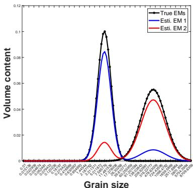  
(a) AnalySize: End Members

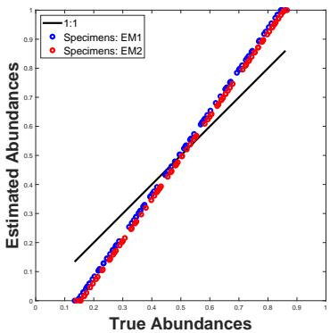  
(b) AnalySize: Abundances

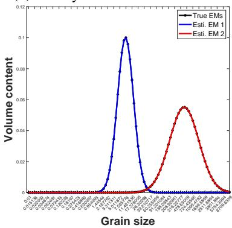  
(c) MAD-NMF: End Members

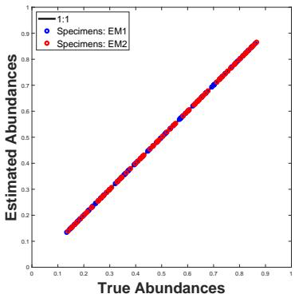  
(d) MAD-NMF: Abundances

Figure 2: Highly mixed two-end-member dataset: α = 5, λ = 1 (a and b) AnalySize; (c and d) MAD-NMF.  
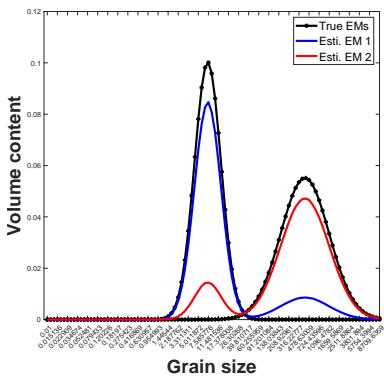

(a) AnalySize: End Members  
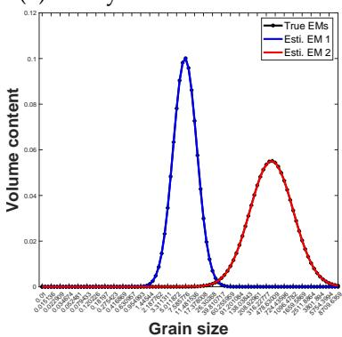  
(c) MAD-NMF: End Members

(b) AnalySize: Abundances  
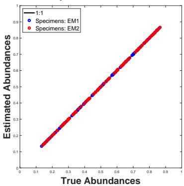  
(d) MAD-NMF: Abundances

Figure 3: Noisy highly mixed two-end-member dataset: $\alpha = 5 , \lambda = 1$ (a and b) AnalySize;   
(c and d) MAD-NMF.

Table 1: MAEM and MAAB for (noisy) highly mixed two-end-member dataset
<table><tr><td></td><td>Methods</td><td>AnalySize</td><td>MAD-NMF</td></tr><tr><td>Highly mixed two-end-member dataset</td><td></td><td></td><td></td></tr><tr><td></td><td>MAEM</td><td>10.2711</td><td>0.0206</td></tr><tr><td></td><td>MAAB</td><td>6.8464</td><td>0.0284</td></tr><tr><td>Noisy highly mixed two-end-member dataset</td><td></td><td></td><td></td></tr><tr><td></td><td>MAEM</td><td>10.2701</td><td>0.1361</td></tr><tr><td></td><td>MAAB</td><td>6.8387</td><td>0.0644</td></tr></table>

Table 1 reports the MAEM and MAAB. MAD-NMF achieves lower values than Analy-Size, demonstrating its superior ability to recover the end members and abundances, which is consistent with the visual results shown above.

Table 2 reports the distances among the estimated end members. The results show that MAD-NMF yields a larger distance among the estimated end members than AnalySize. This is consistent with their respective objectives, namely that MAD-NMF maximizes the distances among end members while AnalySize minimizes them.

Table 2: The distance among the estimated end members for (noisy) highly mixed twoend-member dataset: $| | C _ { K \times K } S | | _ { F } ^ { 2 }$
<table><tr><td>Methods</td><td>AnalySize</td><td>MAD-NMF</td></tr><tr><td>Highly mixed two-end-member dataset</td><td>0.0269</td><td>0.0549</td></tr><tr><td>Noisy highly mixed two-end-member dataset</td><td>0.0269</td><td>0.0547</td></tr></table>

## 5.2 Highly mixed coversand dataset

As in the highly mixed two-end-member dataset, we apply AnalySize and MAD-NMF to the highly mixed coversand dataset P to estimate the abundance matrix A and endmember matrix S. Figure 4 presents the estimated end members and abundances obtained by AnalySize and MAD-NMF. Once again, AnalySize fails to recover the true end members and abundances, which is consistent with the findings of Paterson and Heslop (2015); Van Hateren et al. (2018). In contrast, MAD-NMF effectively recovers the true end members and abundances. Similar results are obtained for the noisy higly mixed coversand dataset, as shown in Figure 5. However, the abundance results from MAD-NMF in the noisy case (see Figure 5d) are more scattered than in the noise-free case (See Figure 4d).

Table 3 reports the MAEM and MAAB. MAD-NMF achieves lower values than Analy-Size, demonstrating its superior ability to recover the end members and abundances, which is consistent with the visual results shown above. Table 4 reports the distances among the estimated end members. The results show that MAD-NMF produces larger distance among the estimated end members than AnalySize. This is consistent with their respective objectives, namely that MAD-NMF maximizes the distances among end members while AnalySize minimizes them.

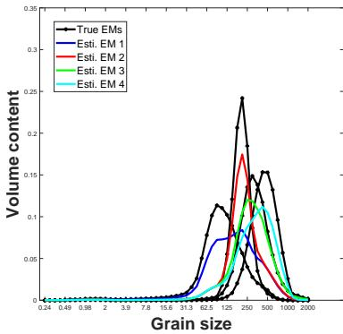  
(a) AnalySize: End Members

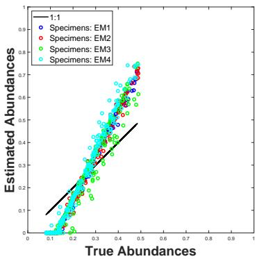  
(b) AnalySize: Abundances

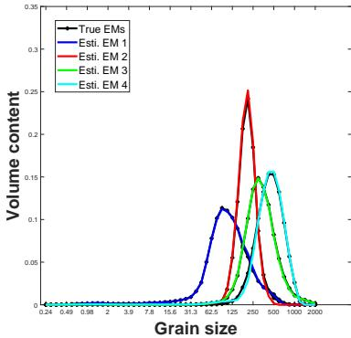  
(c) MAD-NMF: End Members

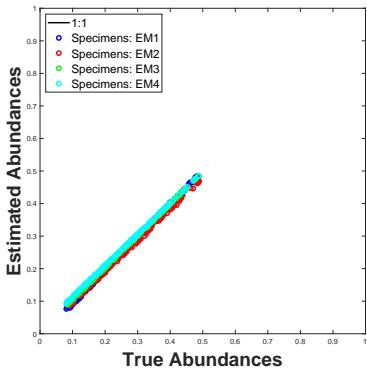  
(d) MAD-NMF: Abundances  
Figure 4: Highly mixed coversand dataset: α = 100, λ = 3.5 (a and b) AnalySize; (c and d) MAD-NMF.

Table 3: MAEM and MAAB for (noisy) highly mixed coversand dataset
<table><tr><td>Methods</td><td>AnalySize</td><td>MAD-NMF</td></tr><tr><td>Highly mixed coversand dataset</td><td></td><td></td></tr><tr><td>MAEM</td><td>16.9234</td><td>1.6120</td></tr><tr><td>MAAB</td><td>16.4869</td><td>1.4876</td></tr><tr><td>Noisy highly mixed coversand dataset</td><td></td><td></td></tr><tr><td>MAEM</td><td>16.5605</td><td>1.7555</td></tr><tr><td>MAAB</td><td>16.1119</td><td>3.0036</td></tr></table>

Table 4: The distance among the estimated end members for (noisy) highly mixed coversand dataset: $| | C _ { K \times K } \pmb { S } | | _ { F } ^ { 2 }$
<table><tr><td>Methods</td><td> $_ \mathrm { A n a l y S i z e }$ </td><td>MAD-NMF</td></tr><tr><td>Highly mixed coversand dataset</td><td>0.0405</td><td>0.1820</td></tr><tr><td>Noisy highly mixed coversand dataset</td><td>0.0424</td><td>0.1812</td></tr></table>

  
(a) AnalySize: End Members

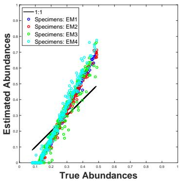  
(b) AnalySize: Abundances

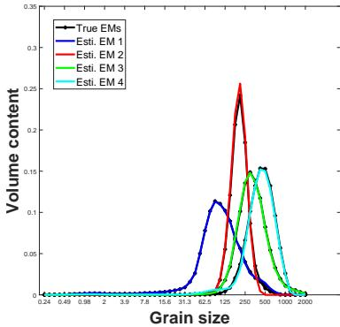  
(c) MAD-NMF: End Members

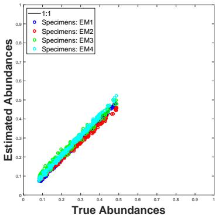  
(d) MAD-NMF: Abundances  
Figure 5: Noisy highly mixed coversand dataset: α = 100, λ = 3.3 (a and b) AnalySize; (c and d) MAD-NMF.

## 6 Conclusion and discussion

In this paper, we propose maximum-distance nonnegative matrix factorization (MAD-NMF) for highly mixed grain-size distribution datasets. The proposed method is optimized using a hierarchical alternating least squares (HALS) algorithm. MAD-NMF can be regarded as a variant of AnalySize with a negative distance regularization term that encourages greater separation among the end members, allowing them to be located farther from the observed specimens. This property makes MAD-NMF suitable for highly mixed datasets.

Following the experimental settings of Paterson and Heslop (2015); Qi et al. (2026b); Van Hateren et al. (2018); Zhang et al. (2020), we evaluated MAD-NMF on (noisy) highly mixed two-end-member dataset and (noisy) highly mixed coversand datasets. The results demonstrate that AnalySize fails to recover the true end members and abundances from highly mixed datasets, whereas MAD-NMF effectively recovers the true end members and abundances.

Several limitations remain. First, our experiments are limited to simulated datasets, and the performance of MAD-NMF on real grain-size distribution datasets requires further investigation. Second, only a relatively low noise level (Gaussian noise with standard deviation 0.01) is considered. Future work should evaluate the robustness of MAD-NMF under higher noise levels and different noise distributions. Third, the influences of the regularization parameters λ and α have not been systematically studied. Developing principled strategies for selecting λ and α and analyzing their effects on the performance are important directions for future research.

## Statements and Declarations

Competing Interests: Author Qianqian Qi, Author Zhongming Chen, and Author Peter G. M. van der Heijden declare none.

## References

Bertsekas, D. (1999a). Corrections for the book nonlinear programming: Second edition (1999). http://www.athenasc.com/nlperrata.pdf. (Accessed July 31, 2026)

Bertsekas, D. (1999b). Nonlinear programming (2nd ed.). Athena Scientific.

Bioucas-Dias, J. M. (2009). A variable splitting augmented Lagrangian approach to linear spectral unmixing. In 2009 First Workshop on Hyperspectral Image and Signal Processing: Evolution in Remote Sensing (p. 1-4). doi: 10.1109/WHISPERS.2009.5289072

Bioucas-Dias, J. M., Plaza, A., Dobigeon, N., Parente, M., Du, Q., Gader, P., & Chanussot, J. (2012). Hyperspectral unmixing overview: Geometrical, statistical, and sparse regression-based approaches. IEEE Journal of Selected Topics in Applied Earth Observations and Remote Sensing, 5(2), 354-379. doi: 10.1109/JSTARS.2012.2194696

Chen, W., & Guillaume, M. (2012). HALS-based NMF with flexible constraints for hyperspectral unmixing. EURASIP Journal on Advances in Signal Processing, 2012. doi: 10.1186/1687-6180-2012-54

Dietze, E., Hartmann, K., Diekmann, B., IJmker, J., Lehmkuhl, F., Opitz, S., . . . Borchers, A. (2012). An end-member algorithm for deciphering modern detrital processes from lake sediments of Lake Donggi Cona, NE Tibetan Plateau, China. Sedimentary Geology, 243-244, 169-180. doi: 10.1016/j.sedgeo.2011.09.014

Dietze, M., Schulte, P., & Dietze, E. (2022). Application of end-member modelling to grainsize data: Constraints and limitations. Sedimentology, 69(2), 845-863. doi: 10.1111/ sed.12929

Gillis, N. (2020). Nonnegative matrix factorization. Philadelphia, PA: Society for Industrial and Applied Mathematics. doi: 10.1137/1.9781611976410

Guo, Y.-T., Li, Q.-Q., & Liang, C.-S. (2024). The rise of nonnegative matrix factorization: Algorithms and applications. Information Systems, 123, 102379. doi: 10.1016/j.is.2024 .102379

Heinz, D. C., & Chang, C.-I. (2001). Fully constrained least squares linear spectral mixture analysis method for material quantification in hyperspectral imagery. IEEE Transactions on Geoscience and Remote Sensing, 39, 529–545. doi: 10.1109/36.911111

Heslop, D., & Roberts, A. P. (2012). A method for unmixing magnetic hysteresis loops. Journal of Geophysical Research: Solid Earth, 117(B3). doi: 10.1029/2011JB008859

Heslop, D., Von Dobeneck, T., & Hocker, M. (2007). Using non-negative matrix factoriza- ¨ tion in the “unmixing” of diffuse reflectance spectra. Marine Geology, 241(1), 63-78. doi: 10.1016/j.margeo.2007.03.004

Lee, D. D., & Seung, H. S. (1999). Learning the parts of objects by non-negative matrix factorization. Nature, 401, 788-791. doi: 10.1038/44565

Lin, Z., Wan, Q., Zhang, F., Zhong, J., Zhou, Z., & Bao, K. (2025). Using end-member model algorithm to infer sedimentary processes from mangrove sediment grain-size in Guangdong, South China. Regional Studies in Marine Science, 83, 104069. doi: 10.1016/j.rsma.2025.104069

Nus, L., Miron, S., & Brie, D. (2020). An ADMM-based algorithm with minimum dispersion regularization for on-line blind unmixing of hyperspectral images. Chemometrics and Intelligent Laboratory Systems, 204, 104090. doi: https://doi.org/10.1016/ j.chemolab.2020.104090

Paterson, G. A., & Heslop, D. (2015). New methods for unmixing sediment grain size data. Geochemistry, Geophysics, Geosystems, 16(12), 4494-4506. doi: 10.1002/2015GC006070

Qi, Q., Chen, Z., & Van der Heijden, P. G. M. (2026a). Identification of NMF by choosing maximum-volume basis vectors. IEEE Signal Processing Letters. doi: 10.1109/LSP .2026.3706072

Qi, Q., Chen, Z., & Van der Heijden, P. G. M. (2026b). Unmixing highly mixed grain size distribution data via maximum volume constrained end member analysis. doi: 10.48550/ arXiv.2601.00154

Renner, R. M. (1993). The resolution of a compositional data set into mixtures of fixed source compositions. Journal of the Royal Statistical Society Series C: Applied Statistics, 42(4), 615-631. doi: 10.2307/2986179

Renner, R. M. (1995). The construction of extreme compositions. Mathematical Geosciences, 27(4), 485-497. doi: 10.1007/BF02084423

Saberi-Movahed, F., Berahmand, K., Sheikhpour, R., Li, Y., Pan, S., & Jalili, M. (2025). Nonnegative matrix factorization in dimensionality reduction: A survey. ACM Computing Surveys, 58(5). doi: 10.1145/3767726

Seidel, M., & Hlawitschka, M. (2015). An R-based function for modeling of end member compositions. Mathematical Geosciences, 47(8), 995-1007. doi: 10.1007/s11004-015 -9609-7

Van Hateren, J., Prins, M., & Van Balen, R. (2018). On the genetically meaningful decomposition of grain-size distributions: A comparison of different end-member modelling algorithms. Sedimentary Geology, 375, 49-71. doi: 10.1016/j.sedgeo.2017.12.003

Van der Ark, L. A., Van der Heijden, P. G. M., & Sikkel, D. (1999). On the identifiability in the latent budget model. Journal of Classification, 16(1), 117-137. doi: 10.1007/ s003579900045

Wang, W., & Carreira-Perpin˜ an, M. ´ A. (2013). ´ Projection onto the probability simplex: An efficient algorithm with a simple proof, and an application. doi: 10.48550/arXiv:1309.1541

Weltje, G. J. (1997). End-member modeling of compositional data: Numerical-statistical

algorithms for solving the explicit mixing problem. Mathematical Geosciences, 29(4), 503-549. doi: 10.1007/BF02775085

Weltje, G. J., & Prins, M. A. (2007). Genetically meaningful decomposition of grain-size distributions. Sedimentary Geology, 202(3), 409-424. doi: 10.1016/j.sedgeo.2007.03 .007

Yu, S.-Y., Colman, S. M., & Li, L. (2016). BEMMA: A hierarchical Bayesian end-member modeling analysis of sediment grain-size distributions. Mathematical Geosciences, 48(6), 723-741. doi: 10.1007/s11004-015-9611-0

Yu, Y., & Sun, W. D. (2012). Minimum distance constrained nonnegative matrix factorization for hyperspectral data unmixing. High Technology Letters, 18(4), 333–342. doi: 10.3772/j.issn.1006-6748.2012.04.001

Zhang, X., Wang, H., Xu, S., & Yang, Z. (2020). A basic end-member model algorithm for grain-size data of marine sediments. Estuarine, Coastal and Shelf Science, 236, 106656. doi: 10.1016/j.ecss.2020.106656