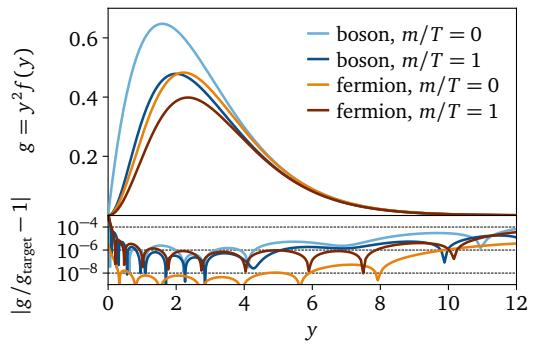
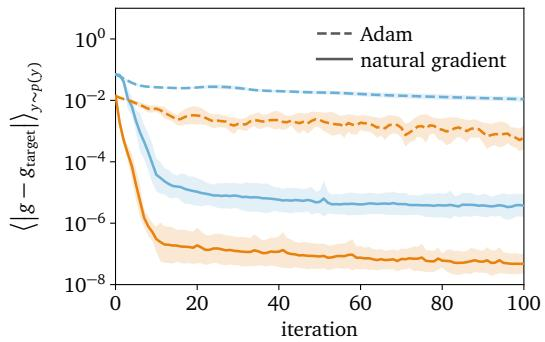
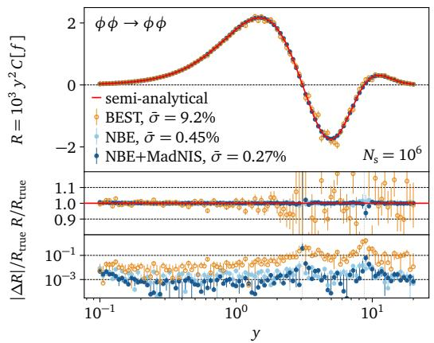
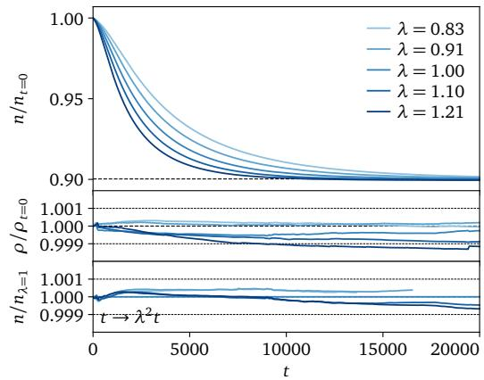
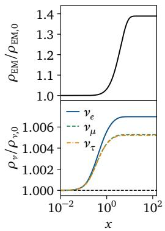
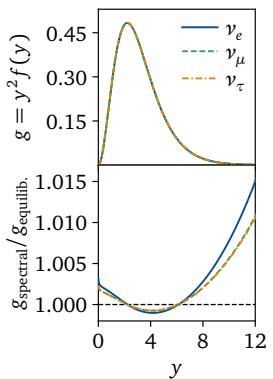
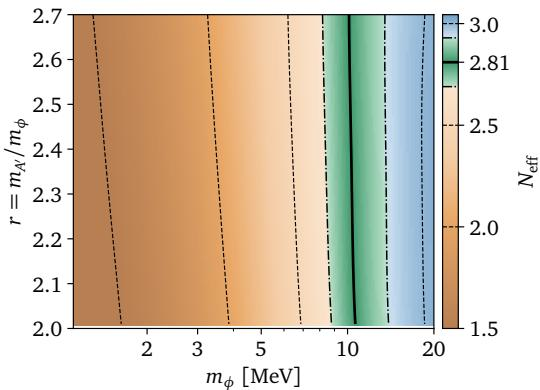
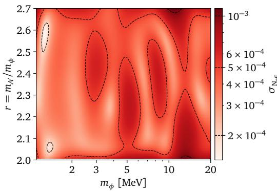

# NEURAL BOLTZMANN EQUATIONS

Jonas Spinner   
Institute for Particle Physics Phenomenology   
Durham University   
Durham, UK   
jonas.spinner@durham.ac.uk   
Jack D. Shergold   
Department of Mathematical Sciences   
University of Liverpool   
Liverpool, UK   
shergold@liverpool.ac.uk

## ABSTRACT

The dynamics of particles in the early universe are described by Boltzmann equations, which involve high-dimensional phase-space integrals. Classical approaches use quadrature integration and evolve the system on a fixed momentum grid, which scales poorly to complicated systems and parameter scans, severely limiting the complexity of processes that can be studied. We introduce Neural Boltzmann Equations (NBEs), which combine three coupled concepts to overcome these limitations. First, particle properties are encoded in physics-inspired neural distribution functions, with parameters that can be predicted using neural networks, enabling efficient parameter scans. Second, phase-space integrals are evaluated with Monte Carlo, using importance sampling tools from collider physics. Third, we use the natural gradient method to evolve the system. After demonstrating the individual benefits of NBEs, we use the framework to perform a precision calculation of the effective number of relativistic neutrino degrees of freedom in the early universe.

## 1 INTRODUCTION

Cosmology is entering a precision era, with ongoing and upcoming experiments pushing the limits on a range of precision observables, such as the Hubble constant, the dark energy equation of state, the tensor-to-scalar ratio imprinted on the cosmic microwave background, and the effective number of relativistic neutrino degrees of freedom. On the theory side, these processes are all described by Boltzmann equations, which describe the evolution of interacting particle distributions in an expanding universe. Existing Boltzmann solvers make the underlying equations tractable through combinations of momentum discretisation, assumptions about the form of phase-space distributions, and problem-specific reductions of microscopic interaction rates. Parameter scans with conventional solvers are also tedious, and often prohibitively expensive, as the full system must be re-solved for each parameter combination.

We introduce Neural Boltzmann Equations (NBEs), a framework for solving early-universe Boltzmann equations. Our approach focuses on flexibility without extensive process-specific assumptions, and scalability to complex and compute-intensive problems. NBEs combine three concepts:

• Neural distribution functions – a physics-inspired parameterisation that includes equilibrium solutions, works without discretisation, and can be sampled efficiently. The parameters can be predicted with a neural network based on arbitrary conditioning variables, enabling parameter scans with a single distribution function solve.

• Monte Carlo collision integrals – a high-dimensional phase-space integral, computed with importance sampling techniques developed for event generators at colliders.

• Natural gradient training – an efficient method of training neural distribution functions on the Boltzmann equation.

We discuss the three aspects in detail in Section 4. We then use toy problems to demonstrate the individual benefits of NBEs in Section 5. Finally, we use the framework to perform a precision calculation of the effective number of relativistic neutrino degrees of freedom in the Standard Model, and show that an NBE trained once can perform a full parameter scan for a new physics model.

## 2 BACKGROUND

Early universe dynamics. The Boltzmann equation governs the evolution of particle populations in spacetime, coupling microscopic interactions to propagation on a non-trivial background geometry,

$$
\mathcal { L } [ f _ { a } ] = \mathcal { C } _ { a } [ f ] \mathrm { ~ , ~ }\tag{1}
$$

irrespective of the geometry, where $f _ { a } \geq 0$ is the dimensionless distribution function of particle species $^ { a , }$ representing the occupation of its phase space. The permutation symmetry of identical particles isolates two particle types: bosons where $f _ { a } > 1$ is possible, and fermions which satisfy $f _ { a } \ \leq \ 1$ The Liouville operator of species $a , \mathcal { L } [ f _ { a } ]$ , describes the propagation of particles along geodesics, which generalise straight-line trajectories to curved spacetime, whilst the collision oper ator, $\mathcal { C } _ { a } [ f ]$ , encodes particle interactions involving all contributing species $\boldsymbol { f } = ( f _ { 1 } , f _ { 2 } , \dots )$

We specialise to FLRW spacetime (Friedman, 1922; Lemaˆıtre, 1927; Robertson, 1935; Walker, 1937), which captures the observed expansion, large-scale homogeneity, and isotropy of the Universe. Homogeneity and isotropy reduce the dependence of the distribution functions $f _ { i }$ from 3 spatial and 3 momentum variables to a single momentum variable which we denote $y .$ . The effects of expansion are characterised by the scale factor, $a ( t )$ , and are naturally absorbed by working in comoving variables. In terms of the comoving evolution variable $x = a m _ { 0 }$ , with $m _ { 0 }$ the characteristic energy scale of the problem, the Liouville operator is

$$
\mathcal { L } [ f _ { a } ] = H x \frac { \partial f _ { a } } { \partial x } , \qquad H = \frac { x } { m _ { 0 } } \frac { \dot { a } } { a } ,\tag{2}
$$

with H the comoving Hubble parameter (Hubble, 1929). More generally, any physical quantity $Q ^ { \mathrm { p h y s } }$ with mass dimension d has comoving counterpart $Q = ( x / \overline { { m } } _ { 0 } ) ^ { d } Q ^ { \mathrm { p h y s } }$ , and we fully work in comoving quantities from now on. We reserve the symbol $y$ for comoving momenta. This places all relevant evolution near $x = 1$ , irrespective of the physical problem.

The collision operator details all processes that populate or deplete the phase space of species $a .$ For each process with index $k ,$ we construct the statistical factor $\dot { \bf \Phi } _ { \bf k } [ f ]$ from the distribution functions of the incoming and outgoing particles, including factors $1 - f _ { b }$ for the Pauli blocking (fermions) and $1 + f _ { b }$ for the Bose enhancement (boson) of outgoing particles. We then weight the contribution with the squared matrix element $| \mathcal { M } _ { k } | ^ { 2 }$ that quantifies the probability of the process, and integrate over the available phase space with the measure $\mathrm { d } \Phi _ { k }$ defined in Eq. (4),

$$
{ \mathcal C } _ { a } [ f ] = \frac { 1 } { 2 E _ { a } } \sum _ { k } \int \mathrm { d } \Phi _ { k } | \mathcal M _ { k } | ^ { 2 } \Lambda _ { k } [ f ] \ : , \qquad \Lambda _ { k } [ f ] = \prod _ { b \in k _ { \mathrm { o u t } } } f _ { b } \prod _ { b \in k _ { \mathrm { i n } } } ( 1 \mp f _ { b } ) - ( \mathrm { i n }  \mathrm { o u t } )\tag{3}
$$

The weighting factor includes the energy $E _ { a } = ( m _ { a } ^ { 2 } + y ^ { 2 } ) ^ { 1 / 2 }$ , with $m _ { a }$ the particle mass. Thermal equilibrium is characterised by detailed balance: $\Lambda _ { k } [ f ] ~ = ~ 0$ for each process and phasespace point, implying $\mathcal { C } _ { a } [ f ] = \mathcal { L } [ \dot { f } _ { a } ] = 0$ . Solving $\Lambda _ { k } [ f ] \stackrel { \cdot } { = } 0$ yields the equilibrium solutions $\bar { f _ { \mathrm { e q } } } ( \bar { E ) } = [ \mathrm { e x p } ( \bar { ( } \bar { E } - \mu ) / \bar { T } ) \pm 1 ] ^ { - \bar { 1 } }$ , with the lower sign for the Bose-Einstein distribution (bosons) and the upper sign for the Fermi-Dirac distribution (fermions), characterised by the temperature $T$ and chemical potential $\mu .$

Macroscopic observables such as number density $n _ { a } ,$ , energy density $\rho _ { a }$ , and pressure density $P _ { a }$ are obtained from moments of the distribution function, $\begin{array} { r } { M _ { a } [ \stackrel {  } { \phi } ] = \int \mathrm { d } ^ { 3 } \dot { y } / ( 2 \pi ) ^ { 3 } \dot { \phi } ( E , y ) f _ { a } ( y ) } \end{array}$ , as $\scriptstyle n _ { a } =$ $M _ { a } [ 1 ] , \rho _ { a } = M _ { a } [ E ] , P _ { a } = M _ { a } [ y ^ { 2 } / ( 3 E ) ]$ . Moments of the Boltzmann equation yield continuity equations, known as fluid equations, that constrain the moments of the distribution function.

Phase-space integration. Predictions in high-energy physics, such as collision rates at the Large Hadron Collider, decay widths of unstable particles, and reaction rates in the early universe, require integration over the kinematics of all participating particles. The Lorentz-invariant phase-space measure is the central object

$$
\mathrm { d } \Phi _ { k } = \left( \prod _ { a \in k } \mathrm { d } \Pi _ { a } \right) ( 2 \pi ) ^ { 4 } \delta ^ { 4 } \left( \sum _ { a \in k _ { \mathrm { i n } } } y _ { a } - \sum _ { a \in k _ { \mathrm { o u t } } } y _ { a } \right) \ , \qquad \mathrm { d } \Pi _ { a } = \frac { \mathrm { d } ^ { 3 } y _ { a } } { ( 2 \pi ) ^ { 3 } 2 E _ { a } } \ .\tag{4}
$$

The one-particle Lorentz-invariant phase-space measure, $\mathrm { d } \Pi _ { a } .$ , is included for every particle that is integrated over, and the delta distribution, $\delta ^ { 4 } ( \cdot )$ enforces conservation of both energy, $E _ { a }$ , and spatial momentum, $\vec { y } _ { a }$ , via the four-momentum $y _ { a } = ( E _ { a } , \vec { y } _ { a } )$ . This leaves a $( 3 n - 4 )$ )-dimensional integral for n integrated particles. The integrand is typically expensive to evaluate and has sharp features, so beyond two or three final-state particles Monte Carlo integration is the only viable option. After mapping integration variables to the unit hypercube $u \in [ 0 , 1 ] ^ { 3 n - 4 }$ , integrals are evaluated as

$$
I = \int \mathrm { d } u h ( u ) = \mathbb { E } _ { u \sim p ( u ) } \left[ \frac { h ( u ) } { p ( u ) } \right] , \qquad \sigma _ { I } ^ { 2 } = \frac { 1 } { N } \mathrm { V a r } _ { u \sim p ( u ) } \left[ \frac { h ( u ) } { p ( u ) } \right] .\tag{5}
$$

The proposal distribution, $p ( u )$ , generates phase-space points, u, and the optimal choice is the normalised integrand, $p ( u ) \ : = \ : h ( u ) / I$ , for $h ( u ) \geq 0$ . The variance estimate, $\sigma _ { I } ^ { 2 }$ , provides a cheap estimator of the uncertainty.

High-energy physics event generators use several techniques to improve the quality of the proposal distribution, $p ( u )$ (Alwall et al., 2011; Bothmann et al., 2019). Most importantly, process-specific phase-space mappings transform from the unit hypercube to the space of momentum configurations, taking momentum conservation and the shape of the integrand into account. More recently, normalising flows and other generative networks have been used to further refine the proposal distribution (Heimel et al., 2023).

Natural gradient optimisation. The natural gradient method makes use of the function space geometry, and so is a more efficient optimisation technique than standard gradient descent. This method is becoming increasingly popular in Variational Monte Carlo (Stokes et al., 2020), physicsinformed neural networks (Muller & Zeinhofer, 2023), and partial differential equation solv-¨ ing (Bruna et al., 2024; Chen et al., 2024). Here we briefly review the method, which serves as the backbone for training NBEs. We consider fitting the function $g ( y , \theta )$ , parameterised by $\boldsymbol { \theta } \in \mathbb { R } ^ { N }$ to the target function $g _ { \mathrm { t a r g e t } } ( y )$ , with residuals weighted by the positive semi-definite weighting matrix $\dot { W _ { \cdot } }$

$$
\theta _ { * } = \operatorname * { a r g m i n } _ { \theta } L ( \theta ) , \qquad L ( \theta ) = \frac { 1 } { 2 } r ^ { \top } W r , \qquad r = g ( \theta ) - g _ { \mathrm { t a r g e t } } .\tag{6}
$$

We evaluate $g$ and $g _ { \mathrm { t a r g e t } }$ at $B$ values of $y ,$ and collect the results into vectors ${ \boldsymbol g } ( \boldsymbol { \theta } ) , { \boldsymbol g } _ { \mathrm { t a r g e t } } \in \mathbb { R } ^ { B }$ . To solve the problem, we linearise the system as $g ( \theta ) = g ( \theta _ { 0 } ) + J ( \theta - \theta _ { 0 } )$ with Jacobian $J = \partial g / \partial \theta$ The optimal parameter update is then given by

$$
\theta _ { * } = \theta _ { 0 } - F ^ { - 1 } J ^ { \top } W r _ { 0 } , \qquad F = J ^ { \top } W J .\tag{7}
$$

The Fisher matrix $F \in \mathbb { R } ^ { N \times N }$ captures the geometry of the optimisation problem. Conventional gradient descent is the special case that ignores the function space geometry, $\bar { F } \propto 1$ . For applications with small networks, $\begin{array} { r } { \bar { N } \lesssim B , } \end{array}$ , we invert $F$ directly, whereas for large networks, $N \gtrsim B _ { \mathrm { t } }$ , it is more efficient to follow Chen & Heyl (2024) and rewrite $( J ^ { \top } W J ) ^ { - 1 } J ^ { \top } W = J ^ { \top } ( J J ^ { \top } ) ^ { \top }$ , then invert the Gram matrix $J J ^ { \top } \in \mathbb { R } ^ { B \times \mathbf { \overline { { B } } } }$ instead. The overhead from matrix inversion is the main limitation in applications of the natural gradient method.

## 3 RELATED WORK

Boltzmann equation solvers. Existing Boltzmann equation solvers are typically tailored to a specific problem, with many specialised analytic reductions and numerical approximations required to make each system tractable. For neutrino decoupling, FortEPiaNO evolves neutrino density matrices to predict $N _ { \mathrm { e f f } }$ with high precision, after analytically reducing the collision integrals on a fixed Gauss-Laguerre momentum grid (Gariazzo et al., 2019). For the cosmic microwave background (CMB), CAMB and CLASS solve the Einstein-Boltzmann hierarchy for perturbations about fixed background distributions to predict CMB anisotropies and the matter power spectrum (Lewis et al., 2000; Blas et al., 2011). For dark matter, micrOMEGAs computes relic abundances for generic models by solving momentum-integrated Boltzmann equations for the particle number densities, using thermally averaged rates in place of the collision operator (Belanger et al., 2018; Alguero et al.,´ 2024). DRAKE extends this approach when kinetic equilibrium is no longer applicable and allows solving for the distribution function, assuming non-relativistic, dilute dark matter in an equilibrium background (Binder et al., 2021). ULYSSES specialises to leptogenesis, primarily solving for distribution function moments, assuming an equilibrium Standard Model bath and using analytically reduced collision integrals (Granelli et al., 2021; 2026).

Moment-based Boltzmann solvers discard phase-space information, whilst distribution function solvers on momentum grids become intractable rapidly as the number of particles, flavour components, or momentum points grows. In particular, collision integrals become prohibitively expensive to evaluate with standard quadrature methods beyond simple $\bar { 2 }  2$ scattering, as every additional particle introduces another three-dimensional momentum integral. Parameter dependence typically multiplies this cost, as varying a mass or coupling requires a complete solve of the system at each parameter point. Moreover, analytic reductions and quadrature grids are process specific, such that introduction of new particles or processes requires significant effort to re-derive the relevant equations. NBEs instead parameterise full distribution functions using physics-inspired neural distribution functions, and evaluate collision integrals using Monte Carlo methods developed for collider physics. This retains the complete phase-space information, without relying on fixed momentum grids or analytic reductions, instead requiring only the matrix elements for each new process. Conditioning on masses or couplings then allows a single model to learn a family of solutions across parameter space.

Neural quantum states use neural networks as variational ansatze for the state of a many-body¨ system, trained not on data but directly on the equations governing the system. In the original formulation for quantum lattice models, a network parameterises the many-body wave function $\psi _ { \boldsymbol \theta } ( s )$ over discrete lattice configurations s, and the parameters θ are optimised by minimising the energy expectation value of the Hamiltonian via the variational principle (Carleo $\dot { \& }$ Troyer, 2017). Neural wave functions (Pfau et al., 2020; Hermann et al., 2020) extend this idea to electrons in continuous space, solving the electronic Schrodinger equation of atoms and molecules from first principles,¨ while time-dependent formulations propagate the ansatz with the time-dependent variational principle (Schmitt & Heyl, 2020). The neural distribution functions in this paper extend this to kinetic theory: a neural network parameterises the phase-space distribution functions, and is trained on the residual of the Liouville and collision operators, which play the role of the Hamiltonian in the examples above.

## 4 METHODS

Neural Boltzmann Equations combine three ingredients. First, we construct a physics-inspired ansatz for the distribution function of bosons and fermions which reduces to the known asymptotic solution in thermal equilibrium. Second, we efficiently evaluate phase-space integrals with Monte Carlo integration using importance sampling. Third, we solve the Boltzmann equation sequentially using natural gradient steps for each time step.

## 4.1 NEURAL DISTRIBUTION FUNCTIONS

Thermodynamic distribution functions detail the mean occupation at each phase-space point. Motivated by this property, we factorise distribution functions into the scalar normalisation $\eta ,$ which sets the overall scale, and the normalised density, $p ( y )$ , encoding their momentum distribution:

$$
f ( y ) = \frac { 4 \pi ^ { 2 } E } { y ^ { 2 } } \eta p ( y ) , \qquad \eta = \int \mathrm { d } y \frac { y ^ { 2 } } { 4 \pi ^ { 2 } E } f ( y ) , \qquad \int \mathrm { d } y p ( y ) = 1 .\tag{8}
$$

The parameterisation uses the invariant moment $\eta$ instead of the number density, n, because it naturally appears in phase-space integrals, making p the optimal importance sampling distribution of the Lorentz-invariant phase space, see App. A.1. The deterministic prefactor $4 \bar { \pi } ^ { 2 } E \breve { / } y ^ { 2 }$ ensures that the second equation above holds. We parameterise the normalised density with a mixture of gamma distributions, $\gamma ( \varepsilon | \alpha , \lambda )$ , in terms of the rescaled kinetic energy $\varepsilon = ( \sqrt { y ^ { 2 } + m ^ { 2 } } - m ) / T$ as

$$
p ( y ) = \frac { y } { E T } \sum _ { m = 1 } ^ { M } w _ { m } \gamma \left( \frac { \sqrt { y ^ { 2 } + m ^ { 2 } } - m } { T } \Big | \alpha _ { m } , \lambda _ { m } \right) , \qquad \gamma ( \varepsilon | \alpha , \lambda ) = \frac { \lambda } { \Gamma ( \alpha ) } ( \lambda \varepsilon ) ^ { \alpha - 1 } e ^ { - \lambda \varepsilon } .\tag{9}
$$

This parameterisation can represent the Bose-Einstein distribution to arbitrary precision with sufficiently many mixture parameters, M, see App. A.1. To enforce the Pauli exclusion principle for fermions, $f ( y ) \leq 1$ , we construct fermionic distribution functions based on an unconstrained

Algorithm 1 Phase-space generation for a process with m incoming and $n - m$ outgoing particles.   
Require: observed momentum $y _ { 1 } ,$ , condition $\xi ,$ masses $m _ { 1 } , \ldots , m _ { n }$ , proposal densities $p _ { 2 } , \ldots , p _ { m }$   
1: $\vec { y } _ { 1 } \gets y _ { 1 } \hat { z }$ ▷ observed leg, pinned to a fixed axis zˆ   
2: $y _ { k } \sim p _ { k } ( { \cdot } \mid \xi ) , \hat { \Omega } _ { k } \sim \mathcal { U } ( S ^ { 2 } ) \operatorname { f o r } k = 2 , \ldots , m$ ▷ sample initial legs   
3: $u _ { \mathrm { o u t } } \sim \mathcal { U } \big ( [ 0 , 1 ] ^ { 3 ( n - m ) - 4 } \big )$   
4: if neural importance sampling then   
5: $u , J _ { \mathrm { e n c } } \gets \mathrm { T o U n i t C u b e } ( y _ { 2 } , \dots , y _ { m } , \hat { \Omega } _ { 2 } , \dots , \hat { \Omega } _ { m } , u _ { \mathrm { o u t } } )$   
6: $u , J _ { \mathrm { f l o w } }  \mathrm { F l o w } ( u \mid y _ { 1 } , \dot { \xi } )$ ▷ MadNIS refinement   
7: $( y _ { 2 } , \ldots , y _ { m } , \hat { \Omega } _ { 2 } , \ldots , \hat { \Omega } _ { m } , u _ { \mathrm { o u t } } ) , J _ { \mathrm { d e c } } \gets \mathrm { T o U n i t } \mathrm { C u b e } ^ { - 1 } ( u )$   
8: else   
9: $J _ { \mathrm { e n c } } , J _ { \mathrm { f l o w } } , J _ { \mathrm { d e c } } \gets 1$   
10: $\vec { y } _ { k } \gets y _ { k } \hat { \Omega } _ { k } \mathrm { f o r } k = 2 , \ldots , m$ ▷ build initial state   
11: $\begin{array} { r } { \sqrt { s } \gets \left[ ( \sum _ { k \leq m } E _ { k } ) ^ { 2 } - | \sum _ { k \leq m } \vec { y } _ { k } | ^ { 2 } \right] ^ { 1 / 2 } } \end{array}$ with $E _ { k } = ( y _ { k } ^ { 2 } + m _ { k } ^ { 2 } ) ^ { 1 / 2 }$   
12: $\vec { y } _ { m + 1 } , \dots , \vec { y } _ { n } , J _ { \mathrm { p s } } \gets \mathrm { M a d S p a c e } ( u _ { \mathrm { o u t } } ; \sqrt { s } , m _ { m + 1 } , \dots , m _ { n } )$ ▷ build final state   
13: $\begin{array} { r } { w _ { \mathrm { p s } }  J _ { \mathrm { e n c } } J _ { \mathrm { f l o w } } J _ { \mathrm { d e c } } J _ { \mathrm { p s } } \prod _ { k = 2 } ^ { m } \frac { \eta _ { k } } { f _ { k } ( y _ { k } | \xi ) } } \end{array}$ ▷ importance weight   
14: return $( { \vec { y } } _ { 1 } , \dots , { \vec { y } } _ { n } ; w _ { \mathrm { p s } } )$

bosonic distribution function $f _ { 0 } ( y )$ ，

$$
f ( y ) = \frac { f _ { 0 } ( y ) } { 1 + f _ { 0 } ( y ) } \in [ 0 , 1 ] , \qquad p ( y ) = \frac { 1 } { N } \frac { 1 } { 1 + f _ { 0 } ( y ) } p _ { 0 } ( y ) , \qquad N = \int \mathrm { d } y \frac { 1 } { 1 + f _ { 0 } ( y ) } p _ { 0 } ( y ) .\tag{10}
$$

The Fermi-Dirac distribution corresponds to $f _ { 0 } ( y ) = e ^ { - ( E - \mu ) / T }$ . We can sample from the normalised densities, $p ( y )$ , for both bosons and fermions, although the fermionic case requires a short rejection sampling step with typical acceptance rate 0.8, see Appendix A.1. Moments of $f ( y )$ such as number and energy density can be evaluated efficiently using Gauss-Laguerre or Gauss-Hermite quadrature. We discuss the properties of neural distribution functions in more detail in Appendix ${ \mathrm { A . 1 } }$

Together, the invariant density, $\eta ,$ and gamma mixture parameters, $( w _ { m } , \alpha _ { m } , \lambda _ { m } ) _ { m = 1 } ^ { M }$ , fully specify the parameterisation $\omega ,$ which has 3M independent parameters due to the redundancy in the normalisation of the mixture weights. Depending on the application, $\omega$ is either optimised directly or predicted from theory conditions, ξ, by a neural network with weights $\theta ,$

$$
\omega = \left\{ \eta , ( w _ { m } , \alpha _ { m } , \lambda _ { m } ) _ { m = 1 } ^ { M } \right\} = \mathrm { N N } ( \xi ; \theta ) .\tag{11}
$$

We write $f ( \boldsymbol { y } ; \boldsymbol { \omega } )$ and $p ( y | \omega )$ to highlight the dependence on the parameters $\omega ,$ and use $M = 5 0$ for all our experiments. If predicted with a neural network, the parameterisation can be cached and reused after the initial evaluation. The parameterisation can be used to describe both unconstrained distribution functions, and equilibrium distribution functions where the free parameters are the temperature and chemical potential.

## 4.2 COLLISION OPERATOR

The collision operator, $\mathcal { C } _ { a } [ f ]$ , quantifies the net change in particle occupations due to microscopic interactions. We give the explicit expression in Eq. (3), and Eq. (4) for the phase-space measure. Evaluating this integral typically is the compute bottleneck in the NBE framework.

We evaluate the collision operator using Monte Carlo integration. We start by sampling phase-space points following Algorithm 1. The initial state angles, $\hat { \Omega } _ { k }$ , are sampled uniformly on the sphere, and momenta $y _ { k }$ are sampled from the neural distribution function densities, $p _ { k }$ . For the final state, we sample $u _ { \mathrm { o u t } }$ uniformly from the unit hypercube and use MadSpace phase-space mappings (Heimel et al., 2026) to map $u _ { \mathrm { o u t } }$ onto valid events satisfying momentum conservation and on-shell conditions. The phase-space mappings are conditioned on the process center-of-mass energy, ${ \sqrt { s } } .$ . The Jacobians of the initial and final state mappings are constructed to cancel terms in the collision operator. Additionally, neural importance sampling can be used to refine the mapping for both the initial and final states. This uses a rational-quadratic spline normalising flow conditioned on the observed momentum, $y _ { 1 }$ , and the parameter ξ. We use the MadNIS implementation (Heimel et al., 2024; 2026) for the normalising flows, and train them jointly with the neural distribution functions, see Section 4.3. The ToUnitCube mapping uses a scaled exponential for comoving momenta, and a simple rescaling for angular variables. If required, this framework directly extends to advanced techniques in high-energy physics event generators such as topology-aware phase-space mappings, multi-channel Monte Carlo (Heimel et al., 2026), and higher-order corrections in perturbation theory.

Algorithm 2 Boltzmann solver step log $x _ { n } $ log $x _ { n + 1 }$ fixed-point iteration   
Require: condition prior $p _ { \mathrm { p r i o r } } ( \xi )$ , frozen previous solutions $\theta _ { n } , \theta _ { n - 1 } , . . .$   
1: $\theta _ { n + 1 }  \theta _ { n }$ ▷ warm-start from previous step   
2: repeat   
3: $\xi _ { i } \sim p _ { \mathrm { p r i o r } } ( \xi ) \mathrm { f o r } i = 1 , \dots , B$ ▷ sample conditions   
4: $\xi  ( \bar { \xi } _ { 1 } , \dots \xi _ { B } )$ ▷ batched evaluation   
5: $\omega _ { l } \gets \mathrm { N N } ( \xi ; \theta _ { l } )$ for $l = n + 1 , n , \ldots$ ▷ cache distribution function parameters   
6: for species $a = 1 , \ldots , N$ do ▷ update each species independently   
7: $y \sim p ( \cdot | \omega _ { n + 1 , a } )$ ▷ sample test momenta   
8: $s ( y ) , \kappa ( y ) \gets$ evaluate collision integral following Section 4.2   
9: $A ( y ) , \gamma $ evaluate scheme coefficients using Appendix ${ \mathrm { A } } . 3$   
10: $g _ { \mathrm { t a r g e t } } ( y ) \gets T ( g ( y ; \omega _ { n + 1 , a } ) , s ( y ) , \kappa ( y ) , A ( \bar { y } ) , \bar { \gamma } )$ ▷ fixed-point target Eq. (14)   
11: $r _ { i } \gets g ( y ; \omega _ { n + 1 , a } ) - g _ { \mathrm { t a r g e t } } ( y )$   
12: $w \gets \left[ p ( y | \omega _ { n + 1 , a } ) g ( y ; \omega _ { n + 1 , a } ) \right] ^ { - 1 }$   
13: $\begin{array} { r } { J \gets \frac { \partial g ( y ; \omega ( \theta ) ) } { \partial \theta } \bigg | _ { \theta = \theta _ { n + 1 . } } } \end{array}$ using autodiff   
a   
14: $W  \mathrm { d i a g } ( w ) , F  J ^ { \top } W J$   
15: $\theta _ { n + 1 , a } \gets \breve { \theta } _ { n + 1 , a } - F ^ { - 1 } J ^ { \top } W r$ ▷ natural-gradient step Eq. (7)   
16: until convergence criteria satisfied

The phase-space generation code returns the momentum configurations as well as the importance weight, $w _ { \mathrm { p s } }$ . The momenta are then used to evaluate the matrix element, $| { \mathcal { M } } | ^ { 2 }$ , as well as the gain-loss combination, $\Lambda [ f ]$ . Summing over processes, we obtain for the collision operator

$$
{ \mathcal { C } } _ { a } [ f ] ( y _ { 1 } ) = { \frac { 1 } { 2 E _ { a } } } \sum _ { k } \int \mathrm { d } \Phi _ { k } | { \mathcal { M } } _ { k } | ^ { 2 } \Lambda _ { k } [ f ] = { \frac { 1 } { 2 E _ { a } } } \sum _ { k } \mathbb { E } _ { { \vec { y } } _ { 2 } , \dots { \vec { y } } _ { n } } \left[ w _ { \mathrm { p s } } | { \mathcal { M } } _ { k } | ^ { 2 } \Lambda _ { k } [ f ] \right] ~ .\tag{12}
$$

The sample count in the expectation value directly controls the integral precision, but the typically large sample counts make this evaluation dominate the NBE compute cost. We parallelise the evaluation across particles and processes to mitigate the cost, and benefit from the optimised MadSpace library. Our training procedure in Section 4.3 does not require gradient propagation through the collision integral, enabling the use of other optimised event generation libraries beyond MadSpace if required.

## 4.3 BOLTZMANN EQUATION SOLVER

We now discuss how to train the neural distribution functions of Section 4.1 to satisfy the Boltzmann equation. First, we multiply the Boltzmann equation of Eq. (1) by $y ^ { 2 } / H$ . Then, introducing the shorthands $g = y ^ { 2 } f ( y , \theta )$ for the fit function, $s { \dot { = } } y ^ { 2 } \mathcal { C } / H$ for the residual, and dropping the explicit particle index allows us to rewrite the Boltzmann equation as

$$
s ( g ) = \frac { \partial g } { \partial \log x } = \frac { g _ { n + 1 } - A } { \gamma h } .\tag{13}
$$

In the last line we discretise the derivative using the step size $h \ = \ \Delta \log x$ , and introduce the shorthand $g _ { m } ( y ) \equiv g ( y , \theta _ { m } )$ for the fit function. We use a generic discretisation scheme $( A , \gamma )$ where $A = A ( g _ { n } , g _ { n - 1 } , . . . )$ depends on the previous solutions, and $\gamma$ is a weight that modifies the step size. The choice $( A , \gamma ) { \overset { } { = } } ( { \overset { } { g } } _ { n } , 1 )$ recovers the standard difference quotient. We use a multi-step scheme for $( A , \gamma )$ , see Appendix A.3.

To solve Eq. (13), we consider the implicit equation $0 = F ( g _ { n + 1 } ) = g _ { n + 1 } - A - \gamma h s ( g _ { n + 1 } )$ This equation is solved by iteratively updating $g _ { n + 1 } ^ { \prime } = T ( g _ { n + 1 } ) \stackrel {  } { = } g _ { n + 1 } - M ^ { - 1 } F ( g _ { n + 1 } )$ , with an arbitrary invertible function M. The choice $M = \partial { \cal F } / \partial g$ yields the fastest convergence, but is overly expensive in our case because it requires the derivative of the collision operator. We instead write $M = 1 + \gamma h \kappa$ , where κ is a cheap approximation of $- \partial s / \partial g$ that makes use of the specific form of the collision operator, see Appendix A.3. This yields the iterative equation

$$
g _ { n + 1 } ^ { \prime } = T ( g _ { n + 1 } ) = \frac { A + \gamma h ( s ( g _ { n + 1 } ) + \kappa g _ { n + 1 } ) } { 1 + \gamma h \kappa } .\tag{14}
$$

In contrast to the naive choice $M = 1$ , this update rule is invariant under small perturbations of $g _ { n + 1 }$ , making the formalism applicable to stiff regimes which commonly arise in early-universe Boltzmann equations whenever species are deep in thermal equilibrium.

The full training procedure for a single time step is outlined in Algorithm 2. For the time step log $x _ { n + 1 }$ , we start by warm-starting the neural distribution function parameters based on the last step, $\theta _ { n + 1 } = \theta _ { n }$ . We then iteratively update $\theta _ { n + 1 }$ until the precision reaches the tolerance, until the feedback is dominated by Monte Carlo noise, or until a specified maximum number of iterations is reached. For each fixed-point iteration, we first sample a list of conditions, $\xi ,$ and cache the neural distribution function parameters for the required time steps, $\omega _ { n + 1 } , \omega _ { n } , \ldots .$ . We then update the parameters, $\theta _ { n + 1 , a } .$ , of each species a independently. After sampling test momenta from the associated probability density of the distribution function, we evaluate the collision integral to determine $s ,$ the approximate derivative, $\kappa ,$ and the scheme coefficients A and $\gamma .$ . We then evaluate the iteration target $g _ { \mathrm { t a r g e t } } ( y )$ using Eq. (14). Finally, we perform a natural gradient step to update the neural distribution function parameters, $\theta _ { n + 1 , a } ,$ , to match the target. We typically use $\bar { 1 0 ^ { 2 } } – 1 0 ^ { 3 }$ test points for each particle, and evaluate the collision integral $1 0 ^ { 3 }$ times per test point. The procedure converges within 5-10 iterations for unconditional distribution functions, and 10-50 iterations for conditional distribution functions, depending on the physics sensitivity to the condition.

To enforce the initial condition $g ( y ; \theta _ { 0 } ) = g _ { \mathrm { i n i t } } ( y )$ , we use the same iterative algorithm with the target $g _ { \mathrm { t a r g e t } } ( y ) = g _ { \mathrm { i n i t } } ( y )$ . This deterministic target leads to fast convergence starting from random initial conditions, typically within 50 iterations.

For neural importance sampling, we train the normalising flow jointly with the neural distribution functions described above. In each iteration, we use one collision integral sample for each $( y _ { 1 } , \xi )$ pair to update the normalising flow density $q ( u | y _ { 1 } , \xi )$ . We use a variance loss as the objective:

$$
\mathcal { L } = \mathbb { E } _ { \xi \sim p _ { \mathrm { p r i o r } } ( \xi ) , y _ { 1 } \sim p ( y _ { 1 } | \xi ) , u \sim q ( u | y _ { 1 } , \xi ) } \left[ \left( \frac { s ( u ) } { p ( y _ { 1 } | \xi ) q ( u | y _ { 1 } , \xi ) } \right) ^ { 2 } \Big | _ { \mathfrak { n o s g n d } } \frac { q ( u | y _ { 1 } , \xi ) | _ { \mathfrak { n o s g n a d } } } { q ( u | y _ { 1 } , \xi ) } \right] .\tag{15}
$$

Here, $q ( u | y _ { 1 } , \xi ) | _ { \mathrm { n o - g r a d } }$ denotes terms that should not be included in the gradient calculation. We use the Adam optimiser here as we did not find significant gains from training the normalising flow with the natural gradient method. The normalising flow is pretrained on the initial distribution function weights $\theta _ { 0 }$ and then evolved jointly.

Computational cost is dominated by the collision operator evaluation, which typically requires $1 0 ^ { 3 }$ function evaluations for each test momentum. This motivates our neural distribution function parameterisation, which is predicted once, cached, and then reused for many different momentum values in the collision integral. The natural gradient and MadNIS update cost do not scale with the collision integral sample count, and are therefore subleading at the sample counts used in our experiments. The trainings in Section 5 take between 20 minutes and 4 hours on an NVIDIA A30 GPU, see Appendix C.

## 5 RESULTS

## 5.1 DETAILED BALANCE

As a first test of the NBE framework, we train neural distribution functions to match the equilibrium Bose-Einstein and Fermi-Dirac distributions, for both massless and massive particles, using the Section 4.3 workflow with a fixed target. The learned distribution functions are shown in the left panel of Figure 1. We find that they are learned to $1 0 ^ { - 6 }$ relative precision in the bulk. The Fermi-Dirac distribution for massless particles can be expressed exactly with a single mixture in our parameterisation, and therefore achieves even higher precision.

  
Figure 1: Natural gradient training for neural distribution functions. Left: Learned equilibrium distribution functions for bosons and fermions in both the massless and massive regimes, compared to the exact equilibrium solution. Right: Average residual over training time for massless boson and fermion distributions, comparing the natural gradient method with the Adam optimiser.

  
Figure 2: Efficient collision operator evaluation and coupling-conditioned training. Left: Collision operator for ϕϕ ↔ ϕϕ calculated semi-analytically and with Monte Carlo for BEST and our NBE method. We report the momentum-averaged relative Monte Carlo uncertainty, ${ \bar { \sigma } } ,$ as a precision metric for each approach. Right: Evolution of the number density, $n _ { t } .$ , and energy density, $\rho _ { t } .$ , for different couplings. The lower panel rescales the time as $t  \lambda ^ { 2 } t$ such that the curves with different couplings collapse. Corresponding figures for the BEST method can be found in Yoon (2026).

Second, we compare natural gradient training with gradient descent using the Adam optimiser in the right panel of Figure 1. We find that the natural gradient trainings converge to an average residual of $1 0 ^ { - 6 }$ , the expressivity floor, in just 10 iterations, far outperforming Adam at $1 0 ^ { - 2 }$ with the same iteration budget. The Adam residual continues to fall until plateauing at $1 0 ^ { - 4 }$ after around 10k iterations. Although natural gradient updates take around twice as long as Adam updates in our implementation, they are more than an order of magnitude more efficient overall, and reach a higher final precision. The efficiency of the natural gradient update steps stems from their inherent consideration of the curvature of the neural distribution function ansatz.

## 5.2 THERMALISATION

Second, we consider a single massive scalar particle without cosmic expansion, following Yoon (2026). The particle starts from a non-equilibrium initial distribution and then thermalises via the processes $\phi \phi  \phi \phi$ and $\phi \phi $ ϕϕϕ that share a common coupling strength λ. Whereas the collision operator for ϕϕ ↔ ϕϕ is a 2-dimensional integral, the $\phi \phi  \phi \phi \phi$ integral is 5-dimensional, motivating the use of Monte Carlo methods.

We show the collision operator as a function of the momenta, $y ,$ in the left panel of Figure 2, and compare our results to the Boltzmann Equation Solver for Thermalisation (BEST) (Yoon, 2026), which uses a different phase-space mapping and the VEGAS algorithm to refine the importance sampling map (Lepage, 2021). The average uncertainty of the NBE predictions over momenta, σ¯, is 20× smaller than the BEST value, corresponding to a 400× more sample-efficient estimate based on $\bar { \sigma } \propto 1 / \sqrt { N _ { s } }$ . This efficiency gain in NBE is due to the optimised importance sampling, stemming from distribution function sampling, MadSpace phase-space mappings, and further improved by the MadNIS refinement, to a $1 0 0 0 \times$ combined efficiency gain. We find the same hierarchy for the ϕϕ ↔ ϕϕϕ collision operator with $1 0 ^ { 6 }$ samples: $\bar { \sigma } = 6 . 8 \%$ for BEST, $\bar { \sigma } = 0 . 5 8 \%$ for NBE, and $\bar { \sigma } = 0 . 2 6 \%$ for NBE+MadNIS.

Table 1: Precision calculation for $\mathbf { N } _ { \mathrm { e f f } }$ . We compare NBE results to the literature at different levels of approximation, see Appendix C. The uncertainties quantify numerical solver effects. The asterisk denotes that results were constructed as a combination of reported effects in the original papers.
<table><tr><td>Description</td><td>NBE</td><td>Literature</td></tr><tr><td>Instantaneous decoupling</td><td></td><td>3 (exact)</td></tr><tr><td>Non-instantaneous</td><td> $3 . 0 3 4 0 \pm 0 . 0 0 0 1$ </td><td> $3 . 0 3 5 0 \pm 0 . 0 0 1 0$  (Escudero Abenza, 2020)</td></tr><tr><td>+ finite-temperature QED</td><td> $3 . 0 4 3 4 \pm 0 . 0 0 0 1$ </td><td> $3 . 0 4 4 3 \pm 0 . 0 0 1 0 ^ { \ast }$  (Escudero Abenza, 2020)</td></tr><tr><td>+ spectral distortions</td><td> $3 . 0 4 3 4 \pm 0 . 0 0 0 1$ </td><td> $3 . 0 4 3 4 \pm 0 . 0 0 0 1 ^ { \ast }$  (Bennett et al., 2021)</td></tr><tr><td>+ flavour oscillations</td><td> $3 . 0 4 3 9 \pm 0 . 0 0 0 1$ </td><td> $3 . 0 4 4 0 \pm 0 . 0 0 0 1$  (Bennett et al., 2021)</td></tr></table>

We next consider conditioning an NBE on the coupling strength, $\xi \ = \ \lambda ,$ , with uniform prior, $p _ { \mathrm { p r i o r } } ( \log _ { 1 0 } \lambda ^ { 2 } ) = \mathcal { U } ( - 0 . 2 5 , \bar { 0 . 2 5 } )$ , and evolve the system following Section 4.3. The energy density, $\rho ,$ is conserved during the evolution, whilst the number density changes due to the numberchanging processes, converging to $n _ { t = \infty } / n _ { t = 0 } \approx 0 . 9 0 0$ once the system reaches equilibrium. In the right panel of Figure 2, we see that the number density converges to the correct asymptotic value with a rate controlled by the coupling strength, whilst the energy density remains constant to within 0.1%. Larger couplings thermalise more quickly, and we test this by rescaling the time variable $t  \lambda ^ { 2 } t$ such that all couplings evolve at the same pace. We find that the number density evolution is consistent across coupling strengths to within 0.1%.

## 5.3 NEUTRINO DECOUPLING

In the early universe, weak interactions keep neutrinos in equilibrium with the electromagnetic plasma of photons $( \gamma ) .$ , electrons (e−), and positrons $( e ^ { + } )$ through scattering $( \nu e ^ { \pm }  \nu e ^ { \pm } )$ and annihilation $( \nu \bar { \nu }  e ^ { + } e ^ { - } )$ processes. At temperatures of $T = \overline { { { 1 } } } - 2 \mathrm { M e V }$ , or around 1 second after the big bang, neutrinos lose thermal contact to the electromagnetic plasma due to the increasing cosmic expansion, and evolve freely as the cosmic neutrino background. Shortly afterwards, at $\mathbf { \bar { \textit { T } } } \approx m _ { e } \approx \mathbf { \bar { 0 } } . 5 \mathbf { M e V }$ , electrons and positrons annihilate into photons $( e ^ { + } e ^ { - } \to \gamma \gamma )$ , increasing the photon temperature as a result. The overlap of these processes controls the relative heating of the neutrino and electromagnetic sectors, and therefore the precision observable $N _ { \mathrm { e f f } }$ , the effective number of relativistic neutrino degrees of freedom:

$$
N _ { \mathrm { e f f } } = \frac { 8 } { 7 } \left( \frac { 1 1 } { 4 } \right) ^ { 4 / 3 } \frac { \rho _ { \nu } } { \rho _ { \gamma } } \bigg | _ { T / m _ { e } \to 0 } .\tag{16}
$$

$N _ { \mathrm { e f f } }$ is constructed such that it exactly equals three for instantaneous decoupling, which neglects interactions in favour of entropy conservation. Including interactions raises this value to 3.0440, see Table 1 for the individual effects. We visualise the process in Figure 3: the photon energy density increases significantly due to the $e ^ { + } e ^ { - } \to \gamma \gamma$ annihilations, whereas the neutrino energy densities increase only slightly due to the overlap of neutrino decoupling and electron-positron annihilation, with a larger increase for electron neutrinos due to their additional interactions with the electromagnetic bath, see Appendix B. The interactions with the electromagnetic plasma also modify the neutrino distribution function from its equilibrium form, leaving a percent-level spectral distortion in the neutrino distributions that cannot be expressed with an equilibrium ansatz. The leading theory uncertainties on the $N _ { \mathrm { e f f } } = 3 . 0 4 4 0 \pm 0 . 0 0 0 \dot { 2 }$ come from the experimental uncertainty on the solar mixing angle and missing higher-order effects in the neutrino collision integrals (Bennett et al., 2021; Froustey et al., 2020; Akita & Yamaguchi, 2020).

  
Figure 3: Visualisation of neutrino decoupling and new physics impact. Left: Evolution of the photon and neutrino energy densities during neutrino decoupling, computed with NBEs. Middle: Neutrino spectral distortions after decoupling, comparing the solution assuming equilibrium distribution shape (equilib.) with the full solution including spectral distortions. Right: $N _ { \mathrm { e f f } }$ for the new physics model of Escudero et al. (2026), computed with a single NBE training.

We validate the NBE framework by repeating the calculation for the different levels of approximation in Table 1, see Appendix C for more information. We enforce equilibrium for the electromagnetic plasma in all cases, use an equilibrium ansatz for neutrinos in the first two rows, and use the adiabatic approximation of Froustey et al. (2020) for neutrino flavour oscillations. The leading literature approach (Bennett et al., 2021) parameterises distribution functions on a fixed momentum grid, leading to a $1 \dot { 0 } ^ { - 4 }$ estimated numerical uncertainty on $N _ { \mathrm { e f f } }$ . The NBE results are in excellent agreement with the literature.

On the experimental side, the most recent analysis reports $N _ { \mathrm { e f f } } = 2 . 8 1 \pm 0 . 1 2$ (Louis et al., 2025; Calabrese et al., 2025; Camphuis et al., 2026), and ongoing experiments are expected to further improve the precision (Ade et al., 2019). This 2σ tension with the theory prediction can be attributed either to missing systematic uncertainties in the analysis, or as a hint of new physics. For instance, Escudero et al. (2026) propose to extend the Standard Model to include a dark photon, $A ^ { \prime } ,$ that couples strongly to the Standard Model photon and decays into a complex scalar ϕ via $A ^ { \prime } \to \phi \phi$ that also serves as a dark matter candidate. These additional particles contribute to the electromagnetic plasma and increase the photon energy density through their decays in a specific mass window, whilst evading other cosmological constraints, see Escudero et al. (2026) for details.

To demonstrate the flexibility of NBEs, we implement the model of Escudero et al. (2026) as an extension of our precision calculation of Table 1, with the model parameters $\xi ~ = ~ ( m _ { \phi } , r )$ and $r = m _ { A ^ { \prime } } / m _ { \phi }$ as conditions, and a uniform prior. The results are visualised in the right panel of Figure 3. We find a band $m _ { \phi } \in [ 8 \mathrm { M e V } , 1 3 \mathrm { M e V } ]$ , with weak dependence on r, where the model prediction agrees with experimental data, $N _ { \mathrm { e f f } } = \overset { \cdot } { 2 } . 8 1 \pm 0 . 1 2$ . The numerical uncertainty varies between $1 0 ^ { - 3 }$ and $1 0 ^ { - 4 }$ depending on the parameter region, see Appendix D.

## 6 CONCLUSION

In this work, we have introduced Neural Boltzmann Equations (NBEs), a framework for solving Boltzmann equations in the early universe without momentum discretisation. Collision integrals are evaluated with Monte Carlo integration, allowing the framework to scale comfortably to complex processes. At the heart of NBEs are neural distribution functions: a physics-inspired parameterisation that can be optimised with neural networks conditioned on theory parameters, enabling efficient parameter scans. The natural gradient method allows the training of conditional and unconditional distribution functions to high precision.

We compared NBEs with a recently proposed Monte-Carlo based Boltzmann solver, and demonstrated that NBE importance sampling is 1000× more efficient. This efficiency enabled us to evolve a complex non-equilibrium system containing number-changing $2  3$ processes to per-mille precision. We then performed a precision calculation of the effective number of relativistic neutrino degrees of freedom, and found excellent agreement with the literature. Finally, we used a single conditioned NBE for a two-dimensional parameter scan of an extended $N _ { \mathrm { e f f } }$ scenario motivated by the current tension between experiment and the Standard Model.

Together, these results establish NBEs as a precise, flexible, and scalable framework for early universe calculations, bringing higher-multiplicity processes and high-dimensional parameter spaces within reach of precision early-universe calculations.

## ACKNOWLEDGMENTS

We thank Marco Drewes, Yuan-Zhen Li, and Sergio Pastor for valuable discussions about Boltzmann equations, and Theo Heimel and Ramon Winterhalder for help with MadSpace and MadNIS. JDS gratefully acknowledges support from the UK Research and Innovation Future Leader Fellowship MR/Y018656/1. JS gratefully acknowledges support from the Alexander von Humboldt foundation as a Feodor Lynen Fellow.

## REFERENCES

Peter Ade et al. The Simons Observatory: Science goals and forecasts. JCAP, 02:056, 2019. doi: 10.1088/1475-7516/2019/02/056.

Kensuke Akita and Masahide Yamaguchi. A precision calculation of relic neutrino decoupling. JCAP, 08:012, 2020. doi: 10.1088/1475-7516/2020/08/012.

G. Alguero, G. Belanger, F. Boudjema, S. Chakraborti, A. Goudelis, S. Kraml, A. Mjallal, and A. Pukhov. micrOMEGAs 6.0: N-component dark matter. Comput. Phys. Commun., 299:109133, 2024. doi: 10.1016/j.cpc.2024.109133.

Johan Alwall, Michel Herquet, Fabio Maltoni, Olivier Mattelaer, and Tim Stelzer. MadGraph 5 : Going Beyond. JHEP, 06:128, 2011. doi: 10.1007/JHEP06(2011)128.

Genevieve B \` elanger, Fawzi Boudjema, Andreas Goudelis, Alexander Pukhov, and Bryan Zaldivar.´ micrOMEGAs5.0 : Freeze-in. Comput. Phys. Commun., 231:173–186, 2018. doi: 10.1016/j.cpc. 2018.04.027.

Jack J. Bennett, Gilles Buldgen, Marco Drewes, and Yvonne Y. Y. Wong. Towards a precision calculation of the effective number of neutrinos $N _ { \mathrm { e f f } }$ in the Standard Model I: the QED equation of state. JCAP, 03:003, 2020. doi: 10.1088/1475-7516/2020/03/003. [Addendum: JCAP 03, A01 (2021)].

Jack J. Bennett, Gilles Buldgen, Pablo F. De Salas, Marco Drewes, Stefano Gariazzo, Sergio Pastor, and Yvonne Y. Y. Wong. Towards a precision calculation of $N _ { \mathrm { e f f } }$ in the Standard Model II: Neutrino decoupling in the presence of flavour oscillations and finite-temperature QED. JCAP, 04:073, 2021. doi: 10.1088/1475-7516/2021/04/073.

Tobias Binder, Torsten Bringmann, Michael Gustafsson, and Andrzej Hryczuk. Dark matter relic abundance beyond kinetic equilibrium. Eur. Phys. J. C, 81:577, 2021. doi: 10.1140/epjc/ s10052-021-09357-5.

Diego Blas, Julien Lesgourgues, and Thomas Tram. The Cosmic Linear Anisotropy Solving System (CLASS) II: Approximation schemes. JCAP, 07:034, 2011. doi: 10.1088/1475-7516/2011/07/ 034.

Enrico Bothmann et al. Event Generation with Sherpa 2.2. SciPost Phys., 7(3):034, 2019. doi: 10.21468/SciPostPhys.7.3.034.

Joan Bruna, Benjamin Peherstorfer, and Eric Vanden-Eijnden. Neural Galerkin schemes with active learning for high-dimensional evolution equations. J. Comput. Phys., 496:112588, 2024. doi: 10.1016/j.jcp.2023.112588.

Erminia Calabrese et al. The Atacama Cosmology Telescope: DR6 constraints on extended cosmological models. JCAP, 11:063, 2025. doi: 10.1088/1475-7516/2025/11/063.

E. Camphuis et al. SPT-3G D1: CMB temperature and polarization power spectra and cosmology from 2019 and 2020 observations of the SPT-3G main field. Phys. Rev. D, 113(8):083504, 2026. doi: 10.1103/7wt3-9v2y.

Giuseppe Carleo and Matthias Troyer. Solving the quantum many-body problem with artificial neural networks. Science, 355(6325):602–606, 2017. doi: 10.1126/science.aag2302.

Ao Chen and Markus Heyl. Empowering deep neural quantum states through efficient optimization. Nature Phys., 20(9):1476–1481, 2024. doi: 10.1038/s41567-024-02566-1.

Zhuo Chen, Jacob McCarran, Esteban Vizcaino, Marin Soljaciˇ c, and Di Luo. TENG: Time-Evolving´ Natural Gradient for Solving PDEs With Deep Neural Nets Toward Machine Precision. In Proceedings ofthe 41st International Conference on Machine Learning, volume 235 of Proceedings of Machine Learning Research. PMLR, 2024.

Pablo F. de Salas and Sergio Pastor. Relic neutrino decoupling with flavour oscillations revisited. JCAP, 07:051, 2016. doi: 10.1088/1475-7516/2016/07/051.

Miguel Escudero, Maksym Ovchynnikov, and Neal Weiner. What does it take to have $N _ { \mathrm { e f f } } < 3$ at CMB times? 3 2026.

Miguel Escudero Abenza. Precision early universe thermodynamics made simple: $N _ { \mathrm { e f f } }$ and neutrino decoupling in the Standard Model and beyond. JCAP, 05:048, 2020. doi: 10.1088/1475-7516/ 2020/05/048.

A. Friedman. Uber die kr ¨ ummung des raumes. ¨ Zeitschrift fur Physik ¨ , 10(1):377–386, Dec 1922. ISSN 0044-3328. doi: 10.1007/BF01332580. URL https://doi.org/10.1007/ BF01332580.

Julien Froustey, Cyril Pitrou, and Maria Cristina Volpe. Neutrino decoupling including flavour oscillations and primordial nucleosynthesis. JCAP, 12:015, 2020. doi: 10.1088/1475-7516/2020/ 12/015.

S. Gariazzo, P. F. de Salas, and S. Pastor. Thermalisation of sterile neutrinos in the early Universe in the 3+1 scheme with full mixing matrix. JCAP, 07:014, 2019. doi: 10.1088/1475-7516/2019/ 07/014.

Sheldon L. Glashow. Partial-symmetries of weak interactions. Nuclear Physics, 22(4):579–588, 1961. ISSN 0029-5582. doi: https://doi.org/10.1016/0029-5582(61)90469-2. URL https: //www.sciencedirect.com/science/article/pii/0029558261904692.

Alessandro Granelli, Kristian Moffat, Yuber F. Perez-Gonzalez, Holger Schulz, and Jessica Turner. ULYSSES: Universal LeptogeneSiS Equation Solver. Comput. Phys. Commun., 262:107813, 2021. doi: 10.1016/j.cpc.2020.107813.

Alessandro Granelli, Juraj Klaric, Dhruv Pasari, Yuber F. Perez-Gonzalez, and Jessica Turner.´ ULYSSES the Third: An Odyssey Towards a Unified Python Toolkit for Leptogenesis. 5 2026.

Theo Heimel, Ramon Winterhalder, Anja Butter, Joshua Isaacson, Claudius Krause, Fabio Mal toni, Olivier Mattelaer, and Tilman Plehn. MadNIS - Neural multi-channel importance sampling. SciPost Phys., 15(4):141, 2023. doi: 10.21468/SciPostPhys.15.4.141.

Theo Heimel, Nathan Huetsch, Fabio Maltoni, Olivier Mattelaer, Tilman Plehn, and Ramon Winterhalder. The MadNIS reloaded. SciPost Phys., 17(1):023, 2024. doi: 10.21468/SciPostPhys.17.1. 023.

Theo Heimel, Olivier Mattelaer, and Ramon Winterhalder. MadSpace – Event Generation for the Era of GPUs and ML. 2 2026.

Jan Hermann, Zeno Schatzle, and Frank No¨ e. Deep-neural-network solution of the electronic´ Schrodinger equation. ¨ Nature Chem., 12(10):891–897, 2020. doi: 10.1038/s41557-020-0544-y.

Edwin Hubble. A relation between distance and radial velocity among extra-galactic nebulae. Proc. Nat. Acad. Sci., 15:168–173, 1929. doi: 10.1073/pnas.15.3.168.

G. Lemaˆıtre. Un Univers homogene de masse constante et de rayon croissant rendant compte de la\` vitesse radiale des nebuleuses extra-galactiques. ´ Annales de la Societ´ e Scientifique de Bruxelles ´ , 47:49–59, January 1927.

G. Peter Lepage. Adaptive multidimensional integration: VEGAS enhanced. J. Comput. Phys., 439: 110386, 2021. doi: 10.1016/j.jcp.2021.110386.

Antony Lewis, Anthony Challinor, and Anthony Lasenby. Efficient computation of CMB anisotropies in closed FRW models. Astrophys. J., 538:473–476, 2000. doi: 10.1086/309179.

Thibaut Louis et al. The Atacama Cosmology Telescope: DR6 power spectra, likelihoods and ΛCDM parameters. JCAP, 11:062, 2025. doi: 10.1088/1475-7516/2025/11/062.

Ziro Maki, Masami Nakagawa, and Shoichi Sakata. Remarks on the unified model of elementary particles. Prog. Theor. Phys., 28:870–880, 1962. doi: 10.1143/PTP.28.870.

Gianpiero Mangano, Gennaro Miele, Sergio Pastor, Teguayco Pinto, Ofelia Pisanti, and Pasquale D. Serpico. Relic neutrino decoupling including flavor oscillations. Nucl. Phys. B, 729:221–234, 2005. doi: 10.1016/j.nuclphysb.2005.09.041.

Johannes Muller and Marius Zeinhofer. Achieving High Accuracy with PINNs via Energy Natural ¨ Gradient Descent. In Proceedings of the 40th International Conference on Machine Learning, volume 202 of Proceedings ofMachine Learning Research, pp. 25471–25485. PMLR, 2023.

David Pfau, James S. Spencer, Alexander G. D. G. Matthews, and W. M. C. Foulkes. Ab initio solution of the many-electron Schrodinger equation with deep neural networks.¨ Phys. Rev. Res., 2(3):033429, 2020. doi: 10.1103/PhysRevResearch.2.033429.

B. Pontecorvo. Inverse Beta Processes and Nonconservation of Lepton Charge. Sov. Phys. JETP, 7: 172–173, 1958.

H. P. Robertson. Kinematics and World-Structure. Astrophysical Journal, 82:284, November 1935. doi: 10.1086/143681.

Markus Schmitt and Markus Heyl. Quantum Many-Body Dynamics in Two Dimensions with Artificial Neural Networks. Phys. Rev. Lett., 125(10):100503, 2020. doi: 10.1103/PhysRevLett.125. 100503.

G. Sigl and G. Raffelt. General kinetic description of relativistic mixed neutrinos. Nucl. Phys. B, 406:423–451, 1993. doi: 10.1016/0550-3213(93)90175-O.

James Stokes, Josh Izaac, Nathan Killoran, and Giuseppe Carleo. Quantum Natural Gradient. Quantum, 4:269, 2020. doi: 10.22331/q-2020-05-25-269.

A. G. Walker. On milne’s theory of world-structure. Proceedings of the London Mathematical Society, s2-42(1):90–127, 1937. doi: https://doi.org/10.1112/plms/s2-42.1.90. URL https://londmathsoc.onlinelibrary.wiley.com/doi/abs/10.1112/ plms/s2-42.1.90.

Steven Weinberg. A Model of Leptons. Phys. Rev. Lett., 19:1264–1266, 1967. doi: 10.1103/ PhysRevLett.19.1264.

Jong-Hyun Yoon. Boltzmann equation solver for thermalization. Comput. Phys. Commun., 327: 110295, 2026. doi: 10.1016/j.cpc.2026.110295.

## A METHOD DETAILS

## A.1 NEURAL DISTRIBUTION FUNCTIONS

Equilibrium solutions. The ansatz of Eq. (9) using the kinetic energy $\varepsilon = ( E - m ) / T$ is chosen such that equilibrium distributions of arbitrary mass can be expressed in this form. Expanding the

Bose-Einstein and Fermi-Dirac distributions in a geometric series, we find

$$
f _ { \mathrm { e q } } ( y ) = \frac { 1 } { e ^ { ( E - \mu ) / T } \pm 1 } = \sum _ { k = 1 } ^ { \infty } ( \mp 1 ) ^ { k + 1 } e ^ { - k ( m - \mu ) / T } e ^ { - k \varepsilon } \ , \quad a = \frac { m } { T } \ , \quad \varepsilon = \frac { E - m } { T } \ .\tag{17}
$$

Inserting this into Eq. (8) with $y = T \sqrt { \varepsilon ( \varepsilon + 2 a ) } , y ^ { 2 } \mathrm { d } y / E = T$ ydε gives

$$
p _ { \mathrm { e q } } ( y ) \mathrm { d } y = \frac { T ^ { 2 } } { 4 \pi ^ { 2 } \eta _ { \mathrm { e q } } } \sum _ { k = 1 } ^ { \infty } ( \mp 1 ) ^ { k + 1 } e ^ { - k ( m - \mu ) / T } \sqrt { \varepsilon ( \varepsilon + 2 a ) } e ^ { - k \varepsilon } \mathrm { d } \varepsilon ,
$$

$$
\eta _ { \mathrm { e q } } = \frac { m T } { 4 \pi ^ { 2 } } \sum _ { k = 1 } ^ { \infty } ( \mp 1 ) ^ { k + 1 } \frac { e ^ { k \mu / T } } { k } K _ { 1 } ( k a ) .\tag{18}
$$

For a massless boson with $\mu = 0$ , we find

$$
p _ { \mathrm { e q } } ( y ) \mathrm { d } y = \frac { 6 } { \pi ^ { 2 } } \sum _ { k = 1 } ^ { \infty } \frac { 1 } { k ^ { 2 } } \gamma ( \varepsilon | 2 , k ) \mathrm { d } \varepsilon , \qquad \eta _ { \mathrm { e q } } = \frac { T ^ { 2 } } { 2 4 } .\tag{19}
$$

In the non-relativistic limit, only the $k = 1$ term survives and we obtain the Maxwell-Boltzmann distribution, which is a single gamma distribution, $p _ { \mathrm { e q } } ( y ) \mathrm { d } y = \gamma ( \varepsilon | 3 / 2 , 1 )$ ). For general masses, we interpolate between the two limits,

$$
\sqrt { \varepsilon ( \varepsilon + 2 a ) } = \left( \varepsilon + \sqrt { 2 a \varepsilon } \right) A ( \varepsilon ) , \qquad A ( \varepsilon ) = \frac { \sqrt { \varepsilon + 2 a } } { \sqrt { \varepsilon } + \sqrt { 2 a } } \in \left[ \frac { 1 } { \sqrt { 2 } } , 1 \right] .\tag{20}
$$

The exact equilibrium density is therefore a mixture of $\gamma ( \varepsilon | 2 , k )$ and $\gamma ( \varepsilon | 3 / 2 , k )$ components, with a bounded correction factor $A ( \varepsilon )$ . We use this form to sample exact equilibrium distributions by rejection. A learned distribution function instead absorbs the $A ( \varepsilon )$ prefactor into the mixture weights $\left( \alpha _ { m } , \lambda _ { m } \right)$ . Truncating the k-series at M terms leaves a relative error $\mathcal { O } ( e ^ { - M \varepsilon } )$ , so the Bose-Einstein distribution is reproduced to arbitrary precision as M grows and as long as one stays away from $y = 0$

For fermions, Eq. (10) maps the Fermi-Dirac distribution onto the Maxwell-Boltzmann distribution as $f _ { 0 } ( y ) = e ^ { - ( E - \mu ) / T }$ . The corresponding rejection step accepts a proposal $y \sim p _ { 0 } ( y )$ with probability $1 / ( 1 + f _ { 0 } ( y ) )$ and efficiency $\dot { N }$ . For the massless Fermi-Dirac distribution at $\mu = 0$ , this gives $N \stackrel { . } { = } \pi ^ { 2 } / 1 2 \stackrel { . } { \approx } 0 . 8 2$

Moments of neural distribution functions. With the factorisation of Eq. (8), any moment of f reduces to an expectation under the normalised density,

$$
\langle h \rangle _ { f } \equiv \int \frac { \mathrm { d } ^ { 3 } y } { ( 2 \pi ) ^ { 3 } } h ( y ) f ( y ) = \frac { 1 } { 2 \pi ^ { 2 } } \int \mathrm { d } y y ^ { 2 } h ( y ) \frac { 4 \pi ^ { 2 } E } { y ^ { 2 } } \eta p ( y ) = 2 \eta \mathbb { E } _ { y \sim p ( y ) } \big [ E h ( y ) \big ] \ .\tag{21}
$$

For fermions, Eq. (10) gives $p = { p _ { 0 } } / ( { N ( 1 + f _ { 0 } ) } )$ and $\eta = N \eta _ { 0 }$ , so the normalisation drops out, and we find

$$
\langle h \rangle _ { f } = 2 \eta _ { 0 } \mathbb { E } _ { y \sim p _ { 0 } ( y ) } [ E h / ( 1 + f _ { 0 } ) ] .\tag{22}
$$

The gamma mixture is a density in $\varepsilon ,$ , and $E = m + T \varepsilon , y ^ { 2 } = T ^ { 2 } \varepsilon ( \varepsilon + 2 a )$ are polynomial in ε, so every moment with polynomial h follows from

$$
\mathbb { E } _ { y \sim p ( y ) } \left[ \varepsilon ( y ) ^ { q } \right] = \sum _ { m = 1 } ^ { M } w _ { m } \int \mathrm { d } \varepsilon \varepsilon ^ { q } \gamma ( \varepsilon | \alpha _ { m } , \lambda _ { m } ) = \sum _ { m = 1 } ^ { M } w _ { m } \frac { 1 } { \lambda _ { m } ^ { q } } \frac { \Gamma ( \alpha _ { m } + q ) } { \Gamma ( \alpha _ { m } ) } .\tag{23}
$$

For general h, and for all fermion moments because of the factor $1 / ( 1 + f _ { 0 } )$ , we use Gauss-Laguerre quadrature with $N _ { \mathrm { q u a d } }$ nodes $t _ { i }$ and weights $\begin{array} { r } { v _ { i } , \int _ { 0 } ^ { \infty } \mathrm { d } t e ^ { - t } g ( t ) \approx \sum _ { i } v _ { i } g ( t _ { i } ) } \end{array}$ . Substituting $r = \lambda _ { m } \varepsilon$ in each component,

$$
\begin{array} { l } { { \displaystyle \mathbb { E } _ { y \sim p ( y ) } \left[ h ( y ) \right] = \sum _ { m = 1 } ^ { M } w _ { m } \frac { \lambda _ { m } ^ { \alpha _ { m } } } { \Gamma ( \alpha _ { m } ) } \int \mathrm { d } \varepsilon h ( \varepsilon ) \varepsilon ^ { \alpha _ { m } - 1 } e ^ { - \lambda _ { m } \varepsilon } \ , } } \\ { { \displaystyle ~ = \sum _ { m = 1 } ^ { M } \frac { w _ { m } } { \Gamma ( \alpha _ { m } ) } \int \mathrm { d } r h ( r / \lambda _ { m } ) r ^ { \alpha _ { m } - 1 } e ^ { - r } \ , } } \\ { { \displaystyle ~ = \sum _ { m = 1 } ^ { M } \frac { w _ { m } } { \Gamma ( \alpha _ { m } ) } \sum _ { i = 1 } ^ { N _ { \mathrm { q u a d } } } v _ { i } h ( t _ { i } / \lambda _ { m } ) t _ { i } ^ { \alpha _ { m } - 1 } \ . } } \end{array}\tag{24}
$$

For massive particles the kinematic factor $y = T { \sqrt { \varepsilon ( \varepsilon + 2 a ) } }$ has a $\sqrt { \varepsilon }$ branch point at $\varepsilon = 0$ that spoils the spectral convergence of the Laguerre rule. Substituting $t = u ^ { 2 }$ maps it to a Gaussian integral over the half line, $\begin{array} { r } { \int _ { 0 } ^ { \infty } \mathrm { \bar { d } } t e ^ { - t } g ( t ) = \int _ { 0 } ^ { \infty } } \end{array}$ 2u du $e ^ { - u ^ { 2 } } g ( u ^ { 2 } )$ , where $\sqrt { t } = u$ is polynomial. We evaluate it with the positive nodes $u _ { i }$ of a $2 N _ { \mathrm { q u a d } }$ -point Gauss-Hermite rule, i.e. we use the rule above with $t _ { i } = u _ { i } ^ { 2 }$ and $v _ { i } = 2 u _ { i } v _ { i } ^ { \mathrm { H } }$ . We switch from Laguerre to Hermite nodes for $a = m / T > 0 . 1$

Distribution function sampling. The factorisation of $f ( y )$ into the invariant density, $\eta ,$ and the normalised density, $p ( y )$ , in Eq. (8) is designed to enable efficient importance sampling for the collision integral initial states. Sampling the angles uniformly $\hat { \Omega } \sim \mathcal { U } ( S ^ { 2 } )$ ), and momenta as $y \sim$ $p ( y )$ , we obtain for the corresponding phase-space measure

$$
{ \frac { \mathrm { d } \Pi } { ( 4 \pi ) ^ { - 1 } p ( y ) } } = { \frac { \mathrm { d } \Omega } { ( 4 \pi ) ^ { - 1 } } } { \frac { y ^ { 2 } \mathrm { d } y } { ( 2 \pi ) ^ { 3 } 2 E } } { \frac { 1 } { p ( y ) } } = { \frac { \mathrm { d } \Omega } { ( 4 \pi ) ^ { - 1 } } } { \frac { y ^ { 2 } \mathrm { d } y } { ( 2 \pi ) ^ { 3 } 2 E } } { \frac { 4 \pi ^ { 2 } E } { y ^ { 2 } } } { \frac { \eta } { f ( y ) } } = \mathrm { d } \Omega \mathrm { d } y { \frac { \eta } { f ( y ) } }\tag{25}
$$

The factors in $p ( y )$ cancel with those in the Lorentz-invariant phase-space measure, dΠ, by construction, leaving a factor $\eta / f ( y )$ which naturally combines with the factors of $f ( y )$ or $1 \pm f ( y )$ in the statistical factor $\Lambda [ f ]$

## A.2 COLLISION INTEGRAL

Here we give additional information on the collision integral evaluation described in Section 4.2, and in particular, in Algorithm 1. We use the TPropagatorMapping of Heimel et al. (2026) with coefficient 0.7 as the phase-space mapping, denoted MadSpace in Algorithm 1.

Neyman allocation. When multiple processes contribute to a collision integral, using the same number of Monte Carlo samples $N _ { i }$ for each process is typically inefficient, because the total variance is dominated by the process with the largest per-sample variance. Instead, we dynamically set the sample count $N _ { i }$ based on the total process standard deviations, $\sigma _ { i } .$ , of the previous time step. For a given sample budget, $N _ { \mathrm { t o t } }$ , we use the so-called Neyman allocation

$$
N _ { i } = N _ { \mathrm { t o t } } { \frac { \sigma _ { i } } { \sum _ { j } \sigma _ { j } } } \ .\tag{26}
$$

## A.3 BOLTZMANN EQUATION TRAINING

Integrator schemes. We specify the discretisation used for the time evolution in terms of a generic scheme (A, γ) in Eq. (13). We implement three specific schemes:

$$
\begin{array} { r l } { \mathrm { E u l e r : ~ } } & { A = g _ { n } , \quad \gamma = 1 , } \\ { \mathrm { B D P 2 : ~ } } & { A = a g _ { n } + b g _ { n - 1 } , \quad \quad \gamma = \frac { 1 + r } { 1 + 2 r } , } \\ & { a = \displaystyle \frac { ( 1 + r ) ^ { 2 } } { 1 + 2 r } , \quad b = - \frac { r ^ { 2 } } { 1 + 2 r } , \quad r = \displaystyle \frac { \log x _ { n + 1 } - \log x _ { n } } { \log x _ { n } - \log x _ { n - 1 } } } \\ { \mathrm { C N : ~ } } & { A = g _ { n } + \frac { c _ { a } g _ { n } + c _ { b } g _ { n - 1 } + c _ { c } g _ { n - 2 } } { 2 } , \quad \quad \gamma = \displaystyle \frac { 1 } { 2 } , } \\ & { c _ { a } = \displaystyle \frac { r _ { 1 } ( 2 r _ { 2 } + 1 ) } { 1 + r _ { 2 } } , \quad \quad c _ { b } = - r _ { 1 } ( 1 + r _ { 2 } ) , \quad \quad c _ { c } = \displaystyle \frac { r _ { 1 } r _ { 2 } ^ { 2 } } { 1 + r _ { 2 } } , } \\ & { r _ { 1 } = \displaystyle \frac { \log x _ { n + 1 } - \log x _ { n } } { \log x _ { n } - 1 _ { 0 } { z } x _ { n - 1 } } , \quad r _ { 2 } = \displaystyle \frac { \log x _ { n } - \log x _ { n - 1 } } { \log x _ { n - 1 } - \log x _ { n - 2 } } . } \end{array}\tag{27}
$$

The Euler scheme is the standard single-step approach. The BDF2 scheme combines information from two previous time steps. Our most powerful and default choice, the CN scheme, starts from $A = g _ { n } + \gamma h s ( g _ { n } )$ , then improves the collision integral estimate with the trapezoid rule as $s ( g _ { n } ) $ $( s ( g _ { n } ) + s ( g _ { n + 1 } ) ) / 2$ , and then inserts an estimate for $s ( g _ { n } )$ based on the previous solutions. In each case, the coefficients above are obtained from solving a linear system of conditions that match derivatives at the previous solutions.

Collision operator derivative estimate. The iterative equation $g _ { n + 1 } ^ { \prime } ~ = ~ T ( g _ { n + 1 } ) ~ = ~ g _ { n + 1 } ~ -$ $M ^ { - 1 } F ( g _ { n + 1 } )$ of Section 4.3 requires a suitable choice of function M. The ideal choice $M =$ $\partial F / \partial g$ , following from the optimal update to leading order $\partial T / \partial g = 1 - M ^ { - 1 } \partial F / \partial g = 0$ , is impractical due to the large time and memory cost of differentiating the collision operator. On the other hand, the naive choice $M = 1 .$ , corresponding to $\partial s / \partial g = 0 .$ , suffers from unstable numerical behaviour. To find an optimal middle ground, we approximate the collision operator derivative:

$$
\begin{array} { l } { \displaystyle \frac { \partial s } { \partial g } = \frac { \partial } { \partial f } \frac { 1 } { 2 E H } \sum _ { k } \int \mathrm { d } \Phi _ { k } | \mathcal { M } _ { k } | ^ { 2 } \Lambda _ { k } [ f ] \ : , } \\ { = \displaystyle \frac { \partial } { \partial f _ { 1 } } \frac { 1 } { 2 E H } \sum _ { k } \int \mathrm { d } \Phi _ { k } | \mathcal { M } _ { k } | ^ { 2 } ( ( 1 \mp f _ { 1 } ) \prod _ { b \in k _ { \mathrm { o n t } } } f _ { b } \prod _ { b \in k _ { \mathrm { i n t } } } ( 1 \mp f _ { b } ) - f _ { 1 } ( \mathrm { i n }  \mathrm { o u t } ) ) \ : , } \\ { = \displaystyle - \frac { \partial } { \partial f _ { 1 } } \frac { 1 } { 2 E H } \sum _ { k } \int \mathrm { d } \Phi _ { k } | \mathcal { M } _ { k } | ^ { 2 } f _ { 1 } ( \pm \prod _ { b \in k _ { \mathrm { o n t } } } f _ { b } \prod _ { b \in k _ { \mathrm { i n t } } } ( 1 \mp f _ { b } ) + ( \mathrm { i n }  \mathrm { o u t } ) ) + \mathrm { c o n s t } \ : , } \\ { \displaystyle \approx - \frac { 1 } { 2 E H } \sum _ { k } \int \mathrm { d } \Phi _ { k } | \mathcal { M } _ { k } | ^ { 2 } ( \pm \prod _ { b \in k _ { \mathrm { o n t } } } f _ { b } \prod _ { b \in k _ { \mathrm { i n t } } } ( 1 \mp ( \mathrm { i n }  \mathrm { o u t } ) ) \equiv - \kappa \ : , \ : \ : \ : ( 2 8  \mathrm { o u t } ) \ : . } \end{array}
$$

In the last step, we have neglected $f _ { 1 }$ occurrences in the matrix element, and from other legs in the collision operator. The resulting approximation to $\partial s ( y ) / \partial g ( y ^ { \prime } )$ is exact on the diagonal, $y = y ^ { \prime }$

## B NEUTRINO DECOUPLING FORMALISM

Standard Model neutrino decoupling serves as a precision test of Boltzmann equation solvers. We use the fully momentum-dependent, three-flavour transport treatments introduced in several previous works (Mangano et al., 2005; de Salas & Pastor, 2016; Akita & Yamaguchi, 2020; Froustey et al., 2020; Bennett et al., 2021), and assume FLRW spacetime, no lepton asymmetry, no CP-violating phase in the lepton sector, massless neutrinos for the collision kinematics, and truncate weak collision rates at leading order in the Fermi constant, $G _ { F }$ . We include finite-temperature quantum electrodynamic (QED) corrections to the equation of state up to $\mathcal { O } ( e ^ { 3 } )$ (Bennett et al., 2020), and assume that photons and electrons remain in exact equilibrium at all times. The comoving variables introduced in Sec. 2 are used throughout.

Quantum kinetic equation. Accounting for the effects of neutrino mixing promotes the neutrino distribution functions, $f _ { \alpha } , \alpha \in [ e , \mu , \tau ]$ , to the Hermitian density matrix $F _ { \mathrm { { ; } } }$ , whose components are defined by the two-point correlation function

$$
\langle a _ { \beta } ^ { \dagger } ( \vec { y } ) a _ { \alpha } ( \vec { y } ^ { \prime } ) \rangle = ( 2 \pi ) ^ { 3 } 2 E _ { p } \delta ^ { ( 3 ) } ( \vec { y } - \vec { y } ^ { \prime } ) F _ { \alpha \beta } ( y ) .\tag{29}
$$

The diagonal elements of $F$ are the occupations of each flavour eigenstate, whilst the off-diagonal components encode coherence. The antiparticle density matrix, ${ \bar { F } } _ { : }$ , has components $\bar { F } _ { \alpha \beta } ( p ) \sim$ $\langle b _ { \alpha } ^ { \dagger } b _ { \beta } \rangle$ , and is related to the particle density matrix by $\bar { \boldsymbol { F } } = \boldsymbol { F } ^ { \intercal }$ in the absence of CP violation and lepton asymmetry.

The density matrix evolves according to the quantum kinetic equation (Sigl & Raffelt, 1993)

$$
H x \frac { \partial F } { \partial x } = - i [ \mathcal { H } _ { \mathrm { e f f } } , F ] + \mathcal { C } _ { \nu } [ F ] , \qquad \mathcal { H } _ { \mathrm { e f f } } = \frac { U \Delta M ^ { 2 } U ^ { \dagger } } { 2 y } - \frac { 4 G _ { F } y } { \sqrt { 2 } m _ { W } ^ { 2 } } ( \rho _ { e } + P _ { e } ) \Pi _ { e } - \frac { 8 \sqrt { 2 } G _ { F } y } { 3 m _ { Z } ^ { 2 } } \varrho _ { \nu } ,\tag{30}
$$

where U is the Pontecorvo–Maki–Nakagawa–Sakata neutrino mixing matrix (Pontecorvo, 1958; Maki et al., $1 9 6 2 ) , \Delta M ^ { 2 } = \mathrm { d i a g } ( 0 , \Delta \stackrel { \smile } { m } _ { 2 1 } ^ { 2 } , \Delta m _ { 3 1 } ^ { 2 } ) , \Pi _ { e } = \mathrm { d i a g } ( 1 , \stackrel { \smile } { 0 } , 0 )$ , and mW and $m _ { Z }$ are the weak gauge boson masses. The first term in $\mathcal { H } _ { \mathrm { e f f } }$ governs neutrino oscillations, transferring occupation between flavour eigenstates. The remaining terms describe coherent forward scattering in the early-universe plasma, which modify the oscillation frequencies. Neither term modifies the total occupation, captured by Tr[F].

The energy density, $\rho _ { a }$ , and pressure, $P _ { a }$ , of a species are moments of the distribution functions

$$
\rho _ { a } = g _ { a } \int { \frac { \mathrm { d } ^ { 3 } y } { ( 2 \pi ) ^ { 3 } } } E _ { a } f _ { a } , \qquad P _ { a } = g _ { a } \int { \frac { \mathrm { d } ^ { 3 } y } { ( 2 \pi ) ^ { 3 } } } { \frac { y ^ { 2 } } { 3 E _ { a } } } f _ { a } , \qquad \varrho _ { \nu } = 2 \int { \frac { \mathrm { d } ^ { 3 } y } { ( 2 \pi ) ^ { 3 } } } y \mathrm { R e } [ F ] .\tag{31}
$$

with $g _ { e } = 4$ for electrons, and $g _ { \gamma } \ = \ 2$ for photons. The full matrix $\varrho _ { \nu }$ contributes to coherent forward scattering, but only its trace, $\rho _ { \nu } = \operatorname { T r } [ \varrho _ { \nu } ]$ , proportional to the physical neutrino occupation numbers contributes to gravitational interactions. If we neglect neutrino mixing, $F$ is diagonal and the commutator $[ \mathcal { H } _ { \mathrm { e f f } } , \breve { F } ]$ vanishes, recovering the Boltzmann equation of Eq. (1).

Collision operator. For a process $r = a ( y _ { 1 } ) + b ( y _ { 2 } )  c ( y _ { 3 } ) + d ( y _ { 4 } )$ , the QKE collision operator is the matrix-valued expression

$$
\begin{array} { r } { \mathcal { C } _ { \nu } ^ { ( a ) } [ F ] = \displaystyle \frac { 1 } { 2 E _ { 1 } } \sum _ { r } S ^ { ( r ) } \int \left( \prod _ { i = 2 } ^ { 4 } \mathrm { d } \Pi _ { i } \right) ( 2 \pi ) ^ { 4 } \delta ^ { ( 4 ) } ( y _ { 1 } + y _ { 2 } - y _ { 3 } - y _ { 4 } ) } \\ { \times \left[ \frac { 1 } { 2 } \left\{ \mathcal { K } _ { \mathcal { G } } ^ { ( r ) } , \widetilde { F } _ { 1 } ^ { ( a ) } \right\} - \frac { 1 } { 2 } \left\{ \mathcal { K } _ { \mathcal { L } } ^ { ( r ) } , F _ { 1 } ^ { ( a ) } \right\} \right] , \qquad \widetilde { F } = \mathbb { I } - F , } \end{array}\tag{32}
$$

with $S ^ { ( r ) }$ the symmetry factor. The superscript (a) denotes the particle species, (r) the process, and the subscript the momentum label, e.g. $F _ { 1 } ^ { ( a ) } = F ^ { ( a ) } ( p _ { 1 } )$ . The gain and loss kernels sum over all spin and flavour interaction channels:

$$
\left( \boldsymbol { K } _ { \mathcal { G } } ^ { ( r ) } \right) _ { \alpha \beta } = \sum _ { \mathrm { s p i n s } } \sum _ { \mu , \mu ^ { \prime } } \sum _ { \nu , \nu ^ { \prime } } \sum _ { \rho , \rho ^ { \prime } } \mathcal { M } _ { \alpha \mu ; \nu \rho } ^ { ( a b ; c d ) * } \mathcal { M } _ { \beta \mu ^ { \prime } ; \nu ^ { \prime } \rho ^ { \prime } } ^ { ( a b ; c d ) } \left( \widetilde { \boldsymbol { F } } _ { 2 } ^ { ( b ) } \right) _ { \mu ^ { \prime } \mu } \left( \boldsymbol { F } _ { 3 } ^ { ( c ) } \right) _ { \nu \nu ^ { \prime } } \left( \boldsymbol { F } _ { 4 } ^ { ( d ) } \right) _ { \rho \rho ^ { \prime } } ,\tag{33}
$$

where $\displaystyle \mathcal { M } _ { \alpha \mu ; \nu \rho } ^ { ( a b ; c d ) }$ is the amplitude for $a _ { \alpha } b _ { \mu } \to c _ { \nu } d _ { \rho }$ with momenta assigned as above. The loss kernel follows from the replacements $F  { \widetilde { F } }$ , and $f  \hat { f }$ for scalar distributions.

There are five processes contributing to neutrino decoupling, with gain kernels (Froustey et al., 2020; Bennett et al., 2021)

$$
\mathcal { K } _ { \mathcal { G } } ^ { ( \nu e ; \nu e ) } = 3 2 G _ { F } ^ { 2 } \widetilde { f } _ { 2 } ^ { ( e ) } f _ { 4 } ^ { ( e ) } W _ { \nu e } \left[ F _ { 3 } ^ { ( \nu ) } \right] ,\tag{34}
$$

$$
\mathcal { K } _ { \mathcal { G } } ^ { ( \nu \bar { e } ; \nu \bar { e } ) } = 3 2 G _ { F } ^ { 2 } \widetilde { f } _ { 2 } ^ { ( e ) } f _ { 4 } ^ { ( e ) } W _ { \nu \bar { e } } \left[ F _ { 3 } ^ { ( \nu ) } \right] ,\tag{35}
$$

$$
\mathcal { K } _ { \mathcal { G } } ^ { ( \nu \bar { \nu } ; e \bar { e } ) } = 3 2 G _ { F } ^ { 2 } f _ { 3 } ^ { ( e ) } f _ { 4 } ^ { ( e ) } W _ { \nu \bar { \nu } } \left[ \left( \widetilde { F } _ { 2 } ^ { ( \nu ) } \right) ^ { \top } \right] ,\tag{36}
$$

$$
\mathcal { K } _ { \mathcal { G } } ^ { ( \nu \nu ; \nu \nu ) } = 8 G _ { F } ^ { 2 } s ^ { 2 } \left( F _ { 3 } ^ { ( \nu ) } \mathcal { T } \left[ \widetilde { F } _ { 2 } ^ { ( \nu ) } F _ { 4 } ^ { ( \nu ) } \right] + F _ { 4 } ^ { ( \nu ) } \mathcal { T } \left[ \widetilde { F } _ { 2 } ^ { ( \nu ) } F _ { 3 } ^ { ( \nu ) } \right] \right) ,\tag{37}
$$

$$
K _ { \mathcal { G } } ^ { \left( \nu \bar { \nu } ; \nu \bar { \nu } \right) } = 8 G _ { F } ^ { 2 } u ^ { 2 } \left( \mathcal { T } \left[ \left( \widetilde { F } _ { 2 } ^ { \left( \nu \right) } \right) ^ { \top } \left( F _ { 4 } ^ { \left( \nu \right) } \right) ^ { \top } \right] F _ { 3 } ^ { \left( \nu \right) } + \mathcal { T } \left[ F _ { 3 } ^ { \left( \nu \right) } \left( F _ { 4 } ^ { \left( \nu \right) } \right) ^ { \top } \right] \left( \widetilde { F } _ { 2 } ^ { \left( \nu \right) } \right) ^ { \top } \right) ,\tag{38}
$$

in terms of the Mandelstam variables $s = ( p _ { 1 } + p _ { 2 } ) ^ { 2 } , t = ( p _ { 1 } - p _ { 3 } ) ^ { 2 }$ , and $u = ( p _ { 1 } - p _ { 4 } ) ^ { 2 }$ , and matrix maps

$$
W _ { \nu e } [ Y ] = ( s - m _ { e } ^ { 2 } ) ^ { 2 } G _ { L } Y G _ { L } + ( u - m _ { e } ^ { 2 } ) ^ { 2 } G _ { R } Y G _ { R } + m _ { e } ^ { 2 } t ( G _ { L } Y G _ { R } + G _ { R } Y G _ { L } ) ,\tag{39}
$$

$$
W _ { \nu \bar { e } } [ Y ] = ( u - m _ { e } ^ { 2 } ) ^ { 2 } G _ { L } Y G _ { L } + ( s - m _ { e } ^ { 2 } ) ^ { 2 } G _ { R } Y G _ { R } + m _ { e } ^ { 2 } t ( G _ { L } Y G _ { R } + G _ { R } Y G _ { L } ) ,\tag{40}
$$

$$
W _ { \nu \bar { \nu } } [ Y ] = ( u - m _ { e } ^ { 2 } ) ^ { 2 } G _ { L } Y G _ { L } + ( t - m _ { e } ^ { 2 } ) ^ { 2 } G _ { R } Y G _ { R } + m _ { e } ^ { 2 } s ( G _ { L } Y G _ { R } + G _ { R } Y G _ { L } ) .\tag{41}
$$

The left and right coupling matrices are functions of the Weinberg angle (Weinberg, 1967; Glashow, 1961), $\theta _ { W }$ , and the remaining matrix map is

$$
{ \cal G } _ { L } = \left( - \frac { 1 } { 2 } + \sin ^ { 2 } \theta _ { W } \right) \mathbb { I } + \Pi _ { e } , \qquad { \cal G } _ { R } = \sin ^ { 2 } \theta _ { W } \mathbb { I } , \qquad T [ Y ] = Y + \mathrm { T r } [ Y ] \mathbb { I } .\tag{42}
$$

All processes have symmetry factor $S ^ { ( r ) } = 1$ , with the exception of $\begin{array} { r } { S ^ { ( \nu \nu ; \nu \nu ) } = \frac { 1 } { 2 } } \end{array}$ . The standard collision operator of Eq. (3) is recovered when all $F$ are diagonal.

Adiabatic transfer of averaged oscillations. Neutrino oscillations proceed over much shorter timescales than cosmic expansion or collisions, allowing several simplifications to the QKEs. Following Froustey et al. (2020), we rewrite the QKE in terms of the instantaneous (mass) eigenstates of the effective Hamiltonian as

$$
H x \frac { \partial F _ { m } } { \partial x } = - i [ \mathcal { H } _ { \mathrm { d i a g } } , F _ { m } ] - H x \left[ V ^ { \dagger } \frac { \partial V } { \partial x } , F _ { m } \right] + V ^ { \dagger } \mathcal { C } _ { \nu } [ F ] V ,\tag{43}
$$

where the diagonal Hamiltonian and mass-basis density matrices are

$$
\mathcal { H } _ { \mathrm { e f f } } = V \mathcal { H } _ { \mathrm { d i a g } } V ^ { \dagger } , \qquad F = V F _ { \mathrm { d i a g } } V ^ { \dagger } .\tag{44}
$$

Adiabaticity, the slow evolution of the background, and hence the eigenbasis, allows us to neglect the second commutator in Eq. (43). Additionally, as many oscillations occur between successive collisions, complex phases in the off-diagonal components of $F _ { m }$ average to zero. Consequently, we set

$$
F _ { m } \to F _ { \mathrm { d i a g } } = \mathrm { d i a g } ( f _ { 1 } , f _ { 2 } , f _ { 3 } ) ,\tag{45}
$$

in terms of the instantaneous mass eigenstates, $f _ { i } , i \in \{ 1 , 2 , 3 \}$ . The resulting QKE takes the form of a Boltzmann equation

$$
H x \frac { \partial f _ { i } } { \partial x } = ( \mathcal { C } _ { \nu , \mathrm { d i a g } } ) _ { i } [ f ] ,\tag{46}
$$

with the diagonal collision operator

$$
( \mathcal { C } _ { \nu , \mathrm { d i a g } } ) _ { i } [ f ] = \frac { 1 } { 2 E _ { 1 } } \sum _ { r } S ^ { ( r ) } \int \mathrm { d } \Phi _ { 2 \to 2 } \left[ G _ { i } ^ { ( r ) } ( 1 - f _ { i } ( p _ { 1 } ) ) - L _ { i } ^ { ( r ) } f _ { i } ( p _ { 1 } ) \right] ,\tag{47}
$$

$$
G _ { i } ^ { ( r ) } = ( V ^ { \dagger } { \mathcal K } _ { \mathcal { G } } ^ { ( r ) } V ) _ { i i } , \qquad L _ { i } ^ { ( r ) } = ( V ^ { \dagger } { \mathcal K } _ { \mathcal { L } } ^ { ( r ) } V ) _ { i i } ,\tag{48}
$$

where $\mathrm { d } \Phi _ { 2 }$ is the usual $2  2$ invariant phase-space measure.

Flavour-diagonal limit. Neutrino mixing is only expected to give a tiny correction to $N _ { \mathrm { e f f } }$ , as coherent evolution conserves $\operatorname { T r } [ F ]$ , and consequently $\rho _ { \nu }$ in the ultrarelativistic limit. Mixing does not therefore directly transfer energy to or from the neutrino sector, and so can only affect $N _ { \mathrm { e f f } }$ indirectly through redistributing interaction rates. Indeed, Bennett et al. (2021) find a correction $\Delta N _ { \mathrm { e f f } } ~ = ~ 0 . 0 0 0 5$ due to these effects. As such, the flavour-diagonal limit serves as a precision benchmark of NBEs.

In the flavour-diagonal limit, the neutrino density matrix and effective Hamiltonian satisfy

$$
F _ { \alpha \beta } = f _ { \nu _ { \alpha } } \delta _ { \alpha \beta } , \qquad [ { \mathcal { H } } _ { \mathrm { e f f } } , F ] = 0 .\tag{49}
$$

It follows that the QKE reduces to the Boltzmann equation

$$
H x \frac { \partial f _ { \nu _ { \alpha } } } { \partial x } = ( \mathcal { C } _ { \nu } [ F ] ) _ { \alpha \alpha } \equiv \mathcal { C } _ { \nu _ { \alpha } } [ f ] .\tag{50}
$$

Identical initial conditions for all three neutrino flavours, assumed here, additionally imply that $f _ { \nu _ { \mu } } = f _ { \nu _ { \tau } }$ . We therefore evolve two independent neutrino distributions, $f _ { \nu _ { e } }$ , and $f _ { \nu _ { \beta } }$ , with $\beta \in$ $\{ \mu , \tau \}$

Equilibrium electromagnetic bath. Electromagnetic interactions are far more efficient than weak interactions, keeping electrons and photons in equilibrium throughout neutrino decoupling. Consequently, the evolution of the combined electromagnetic system is completely described by it temperature, $T _ { \mathrm { E M } }$ , in the absence of chemical potentials.

The equation governing the evolution of $T _ { \mathrm { E M } }$ follows from the conservation of the stress-energy tensor, $\nabla _ { \mu } T ^ { \mu \nu } = 0$ , where $\nabla$ denotes the covariant derivative. Splitting the stress-energy tensor into its components for each sector, $T _ { A } ^ { \mu \nu } , A \in \{ \mathrm { E M } , \nu \}$ , the timelike component of each divergence satisfies

$$
\nabla _ { \mu } T _ { \mathrm { E M } } ^ { \mu 0 } = H x \left[ \frac { \partial \rho _ { \mathrm { E M } } } { \partial x } - \frac { \rho _ { \mathrm { E M } } - 3 P _ { \mathrm { E M } } } { x } \right] , \qquad \nabla _ { \mu } T _ { \nu } ^ { \mu 0 } = 2 \int \frac { { \mathrm d } ^ { 3 } y } { ( 2 \pi ) ^ { 3 } } y \mathrm { T r } \left[ \mathrm { R e } \left[ { \mathcal C } _ { \nu } [ F ] \right] \right] ,\tag{51}
$$

where the latter equation follows from $\rho _ { \nu } = 3 P _ { \nu }$ , and the combination of Eq. (30) and Eq. (31). The electromagnetic energy density therefore evolves according to

$$
\frac { \partial \rho _ { \mathrm { E M } } } { \partial x } = \frac { \rho _ { \mathrm { E M } } - 3 P _ { \mathrm { E M } } } { x } - \frac { 2 } { H x } \int \frac { \mathrm { d } ^ { 3 } p } { ( 2 \pi ) ^ { 3 } } p \mathrm { T r } \left[ \mathrm { R e } \left[ \mathcal { C } _ { \nu } [ F ] \right] \right] .\tag{52}
$$

The electromagnetic pressure and energy density decomposed into those of the photon, electron, and finite-temperature QED corrections

$$
\rho _ { \mathrm { E M } } = \rho _ { \gamma } + \rho _ { e } + \sum _ { n > 0 } \rho _ { \mathrm { Q E D } } ^ { ( e ^ { n } ) } , \qquad P _ { \mathrm { E M } } = P _ { \gamma } + P _ { e } + \sum _ { n > 0 } P _ { \mathrm { Q E D } } ^ { ( e ^ { n } ) } .\tag{53}
$$

We now define the generalised electron energy moment

$$
{ \mathcal E } _ { m , n } = \frac { 2 } { \pi ^ { 2 } } \int \mathrm { d } y y ^ { 2 } { E } _ { y } ^ { m } { \mathcal F } _ { e } ^ { ( n ) } , \qquad { \mathcal F } _ { e } ^ { ( 0 ) } = f _ { e } , \qquad { \mathcal F } _ { e } ^ { ( n + 1 ) } = f _ { e } ( 1 - f _ { e } ) \frac { \partial { \mathcal F } _ { e } ^ { ( n ) } } { \partial f _ { e } } ,\tag{54}
$$

where $E _ { y } = E _ { e } ( y )$ , such that e.g. $\mathcal { E } _ { 1 , 0 } = \rho _ { e }$ , the logarithmic moment

$$
\mathcal { L } _ { n } = \int _ { 0 } ^ { \infty } \mathrm { d } y \int _ { 0 } ^ { \infty } \mathrm { d } q \frac { y q } { E _ { y } E _ { q } } \ln \left| \frac { y + q } { y - q } \right| \sum _ { k = 0 } ^ { n } { \binom { n } { k } } E _ { y } ^ { k } E _ { q } ^ { n - k } \mathcal { F } _ { e } ^ { ( k ) } ( y ) \mathcal { F } _ { e } ^ { ( n - k ) } ( q ) ,\tag{55}
$$

and the stress-energy tensor trace, $\Theta _ { e } = \rho _ { e } - 3 P _ { e }$ . These satisfy the relations

$$
\frac { \partial \mathcal { E } _ { m , n } } { \partial T _ { \mathrm { E M } } } = \frac { \mathcal { E } _ { m + 1 , n + 1 } } { T _ { \mathrm { E M } } ^ { 2 } } , \qquad \frac { \partial \mathcal { L } _ { n } } { \partial T _ { \mathrm { E M } } } = \frac { \mathcal { L } _ { n + 1 } } { T _ { \mathrm { E M } } ^ { 2 } } , \qquad \frac { \partial \Theta _ { e } } { \partial T _ { \mathrm { E M } } } = \frac { m _ { e } ^ { 2 } } { T _ { \mathrm { E M } } ^ { 2 } } \mathcal { E } _ { 0 , 1 } .\tag{56}
$$

In terms of these moments, the finite-temperature QED corrections up to $\mathcal { O } ( e ^ { 3 } )$ are (Bennett et al., 2020)

$$
P _ { \mathrm { Q E D } } ^ { ( e ^ { 2 } ) } = - \frac { e ^ { 2 } T _ { \mathrm { E M } } ^ { 2 } } { 1 2 m _ { e } ^ { 2 } } \Theta _ { e } - \frac { e ^ { 2 } } { 8 m _ { e } ^ { 4 } } \Theta _ { e } ^ { 2 } + \frac { e ^ { 2 } m _ { e } ^ { 2 } } { 4 \pi ^ { 3 } } \mathcal { L } _ { 0 } ,\tag{57}
$$

$$
P _ { \mathrm { Q E D } } ^ { ( e ^ { 3 } ) } = \frac { e ^ { 3 } } { 1 2 \pi \sqrt { T _ { \mathrm { E M } } } } \mathcal { E } _ { 0 , 1 } ^ { \frac { 3 } { 2 } } ,\tag{58}
$$

$$
\rho _ { \mathrm { Q E D } } ^ { ( e ^ { n } ) } = T _ { \mathrm { E M } } \frac { \partial P _ { \mathrm { Q E D } } ^ { ( e ^ { n } ) } } { \partial T _ { \mathrm { E M } } } - P _ { \mathrm { Q E D } } ^ { ( e ^ { n } ) } .\tag{59}
$$

To solve $\operatorname { E q }$ . (52), the NBE outputs $T _ { \mathrm { E M } }$ , which we use to construct $\rho _ { \mathrm { E M } }$ and $P _ { \mathrm { E M } }$ . Network parameters are then updated by backpropagation through the energy conservation residual.

## C EXPERIMENT DETAILS

We use the same neural distribution function hyperparameters for all experiments. We use $M = 5 0$ gamma mixture components, and use $N _ { \mathrm { q u a d } } = 1 6$ quadrature nodes for the moment evaluation. The network that predicts the mixture parameters ω is a standard multilayer perceptron with 3 layers, 64 channels, and tanh activations.

The matrix inversion for the natural gradient update uses a Tikhonov damping of $1 0 ^ { - 8 }$ on the diagonal, and drops eigenvalues that are lower than a factor $1 0 ^ { - 1 2 }$ of the maximum eigenvalue. We increase the Tikhonov damping to $1 0 ^ { - 5 }$ when inverting the $B \times B$ Gram matrix in conditional trainings. To avoid overshooting in the natural gradient update, we introduce a learning rate $\gamma ,$ with default $\gamma = 1$ , which is decreased by a factor of 2 until the update decreases the objective $\dot { L } ( \theta )$ of Eq. (6).

We use the Crank-Nicolson (CN) integrator scheme of $\operatorname { E q . }$ (27) to refine the solver trajectory. The resulting uncertainty estimate is used in a standard PI step size controller to determine the size of the next step, with a specified minimum and maximum step size picked separately for each experiment. The error tolerance involves a Monte Carlo uncertainty floor term in addition to the standard absolute and relative tolerances.

The fixed-point iteration of Algorithm 2 typically converges within 10 iterations for unconditional trainings, and up to 50 iterations for conditional trainings. For conditional trainings, we specify a fixed iteration budget for each step to be conservative. For unconditional trainings, we specify a maximum budget of 30 iterations, but complete the fixed-point iteration earlier if either the residual plateaus below a certain target precision for a specified number of iterations, or if the residual is dominated by Monte Carlo noise for the same number of iterations.

We follow the MadNIS defaults of Heimel et al. (2026) for our normalising flow, using 10 bins, and an MLP with 3 layers and 32 channels per layer. We use the Adam optimiser with learning rate $\gamma = 1 0 ^ { - 3 }$ to train the normalising flow.

## C.1 DETAILED BALANCE

Hyperparameters. Neural distribution functions trained with the natural gradient method follow the description above, whereas Adam trainings use a learning rate of $\gamma = 0 . 0 2$ on the same meansquared-error objective. We use batch size $\bar { B = 1 0 0 0 }$ . Training for 100 iterations takes around five seconds on a GPU.

## C.2 THERMALISATION

Theory. The formalism of Yoon (2026) maps onto our expanding universe formalism with $H \to 1$ log $x \to t$ , allowing us to reuse our framework without major modifications,

$$
{ \frac { \partial f } { \partial \log x } } = { \frac { { \mathcal { C } } [ f ] } { H } } \quad \to \quad { \frac { \partial f } { \partial t } } = { \mathcal { C } } [ f ] .\tag{60}
$$

We focus on their most challenging case of a $m = 1$ massive particle with the processes $2  2$ and $2  3$ . Both processes share the same coupling λ, such that the collision operator is directly proportional to $\lambda ^ { 2 } , \mathcal { C } [ f ] = \lambda ^ { 2 } \mathcal { C } _ { 0 } [ f ]$ . This allows us to absorb the coupling into the time variable, $\bar { t }  \bar { t } ^ { \prime } \equiv \lambda ^ { 2 } t \colon$

$$
\frac { \partial f } { \partial t } = \lambda ^ { 2 } \mathcal { C } _ { 0 } [ f ] \qquad \qquad \mathcal { C } _ { 0 } [ f ] = \frac { \partial f } { \lambda ^ { 2 } \partial t } \equiv \frac { \partial f } { \partial t ^ { \prime } } \ : .\tag{61}
$$

The evolution in terms of $t ^ { \prime }$ is therefore independent of the coupling variable λ. We use this property of the model to test the precision of our coupling-conditional training in Figure 2.

Yoon (2026) specifies a non-thermal initial condition, $f _ { \mathrm { i n i t } } ( y ) = ( e ^ { ( y - 3 ) / 2 } + 1 ) ^ { - 1 }$ . While evolving the system via the Boltzmann equation, the coupling of different momentum modes in the collision operator pushes the species towards the Bose-Einstein distribution which is the equilibrium configuration. The energy density of the species is conserved in the process. However, the number density can be changed by the $2  3$ process. The known form of the distribution functions at $t = 0$ and $t \to \infty$ combined with energy conservation allows us to compute the asymptotic number density analytically. We find $n _ { t  \infty } \approx 0 . 9 0 0 2 7 2$ , and highlight this limit in Figure 2.

Baselines. The semi-analytical and BEST baselines in Figure 2 are evaluated using the public implementation of Yoon (2026). We found that the semi-analytical result is biased at $y  0$ and refined their quadrature integration to reduce the shift. The tilt towards larger deviations for the NBE results at $y = 1 0 ^ { - 1 }$ is caused by this suboptimal quadrature result.

Hyperparameters. We use batch size $B = 1 0 0 0$ for both pretraining and evolution, and use $N _ { s } =$ $1 \bar { 0 ^ { 4 } }$ Monte Carlo samples for the evolution in Figure 2. We use a fixed step size $\Delta t = 2 0$ and find that the code uses on average 4 fixed-point iterations per step. A full training takes 4 hours on a A30 GPU.

## C.3 NEUTRINO DECOUPLING

Theory. We follow the physics approximations of Froustey et al. (2020) to simulate neutrino decoupling to $1 0 ^ { - 4 }$ precision in $N _ { \mathrm { e f f } }$ . See Appendix B for a discussion of the formalism. We assume thermal equilibrium for the electromagnetic plasma, including photons, electrons, and positrons, and evolve their distribution functions following the differential equation for $\rho _ { \mathrm { E M } }$ , Eq. (52). For the three neutrino species, we instead allow a general distribution function, leading to the spectral distortions visualised in Figure 3. If no mixing is included, we evolve the muon and tau neutrinos jointly because they interact through the same processes. In the simplest approximation of Table 1, “Non-instantaneous”, we enforce equilibrium shape for the neutrinos. At the next level of approximation, we include the $\mathcal { O } ( e ^ { 3 } )$ finite-temperature corrections to the QED equation of state of Bennett et al. (2020). At the next level, we relax the equilibrium constraint on the neutrino distribution functions, and allow for a generic gamma mixture distribution function shape. Finally, we include oscillations of neutrino flavours following Froustey et al. (2020), see Appendix B. This significantly increases the compute cost due to the diagonalisations of the effective Hamiltonian.

Hyperparameters. We use a batch size $B = 1 0 0 0$ , and $N _ { s } = 3 0 0 0$ Monte Carlo samples for the collision integral. We evolve the system from $\log x = - 4 . 6 0 5$ to $\log x = 5 . 0$ , following Bennett et al. (2021). We use a minimum step size of $\Delta$ log $x = 0 . 0 2$ , and a maximum step size of $\Delta \log x =$

  
Figure 4: Standard deviation of predicted $N _ { \mathrm { e f f } }$ value of the new physics model of Escudero et al. (2026), using ten independent seeds.

0.05. The trainings take 20 minutes for the first two approximations that assume equilibrium, 50 minutes for the general distribution function ansatz but without flavour oscillations, and 90 minutes including flavour oscillations, all on a A30 GPU. The conditional training takes 3 hours on the same GPU, and do not include flavour oscillations.

Uncertainty. With our default settings, random seed variations modify the results at the $1 0 ^ { - 5 }$ level for unconstrained distribution functions, and at the $5 \cdot 1 0 ^ { - 5 } $ level for equilibrium distribution functions. We suspect that the uncertainty increase for equilibrium distribution functions is because the true target cannot be expressed with the ansatz. We did not perform a systematic uncertainty treatment at this point, and therefore report a conservative uncertainty of $1 0 ^ { - 4 }$ on our method.

## D ADDITIONAL RESULTS

## D.1 NEUTRINO DECOUPLING SCAN UNCERTAINTY

Here we study the method uncertainty of the parameter scan for the neutrino decoupling new physics model of Escudero et al. (2026). We perform the calculation using ten independent seeds, and report the resulting uncertainty on the mean prediction in Figure 4 over the full parameter space. The uncertainty varies between $1 0 ^ { - 4 }$ and $1 0 ^ { - 3 }$ , being significantly larger than the $\mathcal { O } ( 1 0 ^ { - 5 } )$ uncertainty of the unconditional solve. We observe that this uncertainty is correlated with the size of the probed parameter space and the additional number of iterations spent to fully cover the space.