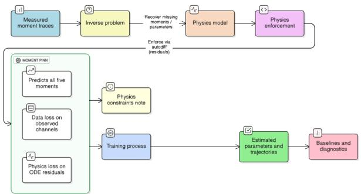
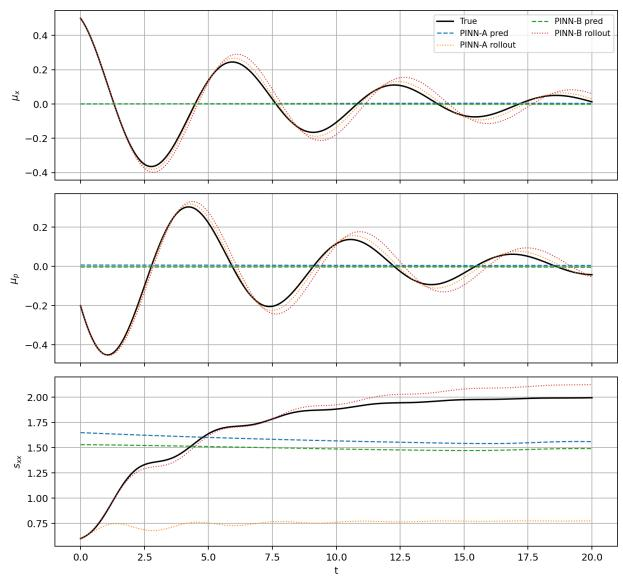

# Partial-Moment PINNs for Caldeira–Leggett Parameter Learning in Quantum Brownian Motion

Krishna Bhatia

QuantumAI Lab, Fractal Analytics, Mumbai, India

krishna.bhatia@fractal.ai

Abstract—We study parameter recovery in the Caldeira– Leggett (quantum Brownian) oscillator from partial moment traces. Our model is a moment-level PINN that predicts the five first/second moments and enforces the linear CL/HPZ ODEs by automatic differentiation. Physical structure is imposed through a PSD (Cholesky) covariance head, high-temperature CL assumptions with $D _ { x p } \approx 0 ,$ and fluctuation–dissipation ties between $D _ { p p }$ and $\gamma .$ . On synthetic CL data with channels $\{ \mu _ { x } , \sigma _ { x x } , \sigma _ { x p } \} ,$ , the constrained variant recovers $( \omega , \gamma )$ accurately, stabilizes $D _ { p p } ,$ and achieves low rollout error compared to finite differences and Kalman–EM (expectation–maximization) with exact Van Loan discretization. Fisher-style checks confirm that diffusion needs at least one variance observable, and sparse $\sigma _ { p p }$ “anchors” restore conditioning. We also show that the same PINN can learn timevarying HPZ coefficients.

Index Terms—Physics-informed neural networks, quantum Brownian motion, partial observability

## I. INTRODUCTION

Quantum Brownian motion (QBM) in the Caldeira–Leggett (CL) model describes a system harmonic oscillator linearly coupled to an Ohmic bath [2]. In the high-temperature, Markovian limit, the Wigner picture yields an Ornstein–Uhlenbeck (OU) Fokker–Planck equation whose first and second moments

$$
\{ \mu _ { x } ( t ) , \mu _ { p } ( t ) , \sigma _ { x x } ( t ) , \sigma _ { p p } ( t ) , \sigma _ { x p } ( t ) \}
$$

follow a closed linear ODE in which the drift encodes the damping rate $\gamma$ and frequency $\omega ,$ and the diffusion encodes $( D _ { x x } , D _ { x p } , D _ { p p } )$ [1], [3]. The textbook high-temperature fluctuation–dissipation theorem (FDT) further ties $D _ { p p } =$ $2 m \gamma k _ { B } T$ and usually takes $D _ { x p }  0 ~ [ 4 ]$ . A small position diffusion $D _ { x x } \geq 0$ is often added to restore complete positivity/Lindblad compatibility [5], [7].

In realistic experiments only a subset of these moments is observable (e.g. position mean and variance), which makes the diffusion sector weakly identifiable. Classical estimators (finite differences; Kalman filtering/EM) exist, but they are accurate only when the continuous-time dynamics are exactly discretized, e.g. via the Van Loan block exponential [8], [9]. Our goal is to show that a PINN that operates directly on the moments can incorporate the same physics, remain positive, and perform competitively—especially when channels are missing. In trapped-ion / cavity / levitated settings only position or position + cross-covariance is routinely accessible, while momentum energy readouts are sparse or calibrated. This is the regime our PINN is targeted at, not the fully observed toy CL case.

## II. PROBLEM FORMULATION

Consider the 2D phase-space state $( x , p )$ with mass $m ,$ frequency $\omega > 0$ , and damping $\gamma \geq 0$ . Define

$$
\begin{array} { r } { s ( t ) = \big ( \mu _ { x } ( t ) , \mu _ { p } ( t ) , \sigma _ { x x } ( t ) , \sigma _ { p p } ( t ) , \sigma _ { x p } ( t ) \big ) ^ { \top } . } \end{array}
$$

With

$$
A = \left[ \begin{array} { l l } { 0 } & { 1 / m } \\ { - m \omega ^ { 2 } } & { - \gamma } \end{array} \right] , \qquad D = \left[ \begin{array} { l l } { D _ { x x } } & { D _ { x p } } \\ { D _ { x p } } & { D _ { p p } } \end{array} \right] \succeq 0 ,
$$

the first and second moments obey

$$
\begin{array} { r } { \dot { \boldsymbol \mu } ( t ) = A \boldsymbol \mu ( t ) , \quad \boldsymbol \mu = ( \boldsymbol \mu _ { x } , \boldsymbol \mu _ { p } ) ^ { \top } , } \end{array}\tag{1}
$$

$$
\dot { \Sigma } ( t ) = A \Sigma ( t ) + \Sigma ( t ) A ^ { \top } + 2 D , \quad \Sigma = \left[ { \sigma } _ { x x } \quad { \sigma } _ { x p } \right] .\tag{2}
$$

Equivalently,

$$
\dot { \mu } _ { x } = \mu _ { p } / m ,\tag{3a}
$$

$$
\dot { \mu } _ { p } = - m \omega ^ { 2 } \mu _ { x } - \gamma \mu _ { p } ,\tag{3b}
$$

$$
\dot { \sigma } _ { x x } = 2 \sigma _ { x p } / m + 2 D _ { x x } ,
$$

$$
\dot { \sigma } _ { p p } = - 2 m \omega ^ { 2 } \sigma _ { x p } - 2 \gamma \sigma _ { p p } + 2 D _ { p p } ,\tag{3c}
$$

(3d)

$$
\dot { \sigma } _ { x p } = \sigma _ { p p } / m - m \omega ^ { 2 } \sigma _ { x x } - \gamma \sigma _ { x p } + D _ { x p } .\tag{3e}
$$

In the high-T CL limit one enforces $D _ { p p } = 2 m \gamma k _ { B } T$ and takes $D _ { x p } \approx 0 ;$ a small $D _ { x x } > 0$ maintains complete positivity [1], [7]. Observations are noisy and partial:

$$
y _ { i } = M s ( t _ { i } ) + \varepsilon _ { i } , \qquad \varepsilon _ { i } \sim \mathcal { N } ( 0 , \sigma _ { \mathrm { r e a d } } ^ { 2 } I ) ,\tag{4}
$$

where M selects, $\mathbf { e . g . } , \{ \mu _ { x } , \sigma _ { x x } , \sigma _ { x p } \}$

For baseline comparison, the exact discrete-time model with sampling step $\Delta t$ is

$$
\mu _ { k + 1 } = \Phi \mu _ { k } , \qquad \Sigma _ { k + 1 } = \Phi \Sigma _ { k } \Phi ^ { \top } + Q _ { d } ,
$$

where $( \Phi , Q _ { d } )$ are obtained in one pass from the Van Loan block exponential [8].

## III. METHOD: PARTIAL-MOMENT PINNS

We model the five moments as smooth functions of (normalized) time with a small MLP $f _ { \phi }$ with tanh activations and Fourier features [15] to help localize ω:

$$
\begin{array} { r } { ( \hat { \mu } _ { x } , \hat { \mu } _ { p } , \hat { \sigma } _ { x x } , \hat { \sigma } _ { p p } , \hat { \sigma } _ { x p } ) = f _ { \phi } ( t ) . } \end{array}
$$

To guarantee PSD we parameterize a Cholesky factor

$$
L ( t ) = \left[ \begin{array} { c c } { { a ( t ) } } & { { 0 } } \\ { { b ( t ) } } & { { c ( t ) } } \end{array} \right] , \qquad \hat { \sigma } _ { x x } = a ^ { 2 } + b ^ { 2 } , \quad \hat { \sigma } _ { p p } = c ^ { 2 } , \quad \hat { \sigma } _ { x p } = b c ,
$$

so that $\hat { \Sigma } ( t ) = L ( t ) L ( t ) ^ { \top } \succeq 0$ for all t. This was necessary because the planted $\omega = 1 . 0$ produces long, low-frequency transients on [0, 20].

## A. Physics residual

At collocation times C we form the scaled residuals of (3b)–(3e) using autodiff to obtain $\dot { f } _ { \phi } ( t )$ . Coefficients $( \gamma , \omega , D _ { x x } , D _ { p p } , D _ { x p } )$ are either global (LTI) or produced by a small 2-layer coefficient head in the Hu–Paz–Zhang (HPZ) time-varying setting.

## B. Loss

Let

$$
\mathcal { D } = \{ ( t _ { i } , y _ { i } ) \} _ { i = 1 } ^ { N _ { \mathrm { o b s } } }
$$

denote the observed data, and let

$$
\boldsymbol { \mathcal { A } } = \{ ( \tau _ { j } , \sigma _ { p p , j } ^ { \mathrm { a n c h o r } } ) \} _ { j = 1 } ^ { N _ { \mathrm { a n c h o r } } }
$$

denote the $\sigma _ { p p }$ anchor set. We optimize

$$
\begin{array} { r } { \mathcal { L } = \lambda _ { \mathrm { d a t a } } \mathcal { L } _ { \mathrm { d a t a } } + \lambda _ { \mathrm { p h y s } } \mathcal { L } _ { \mathrm { p h y s } } + \lambda _ { \mathrm { a n c h o r } } \mathcal { L } _ { \mathrm { a n c h o r } } } \\ { + \lambda _ { x x } \mathcal { L } _ { x x } + \lambda _ { \mathrm { F D T } } \mathcal { L } _ { \mathrm { F D T } } + \lambda _ { \mathrm { s s } } \mathcal { L } _ { \mathrm { s s } } . } \end{array}\tag{5}
$$

The observed-channel data term is

$$
\mathcal { L } _ { \mathrm { d a t a } } = \frac { 1 } { | \mathcal { D } | } \sum _ { i = 1 } ^ { N _ { \mathrm { o b s } } } \left\| { M f _ { \phi } ( t _ { i } ) - y _ { i } } \right\| _ { 2 } ^ { 2 } .\tag{6}
$$

The physics term is formed from the scaled residuals of the moment equations in (3), using autodiff to obtain $\dot { f } _ { \phi } ( t )$

$$
\mathcal { L } _ { \mathrm { p h y s } } = \frac { 1 } { | \mathcal { C } | } \sum _ { t \in \mathcal { C } } \sum _ { k = 1 } ^ { 5 } w _ { k } \tilde { r } _ { k } ( t ) ^ { 2 } ,\tag{7}
$$

where $w _ { k }$ are fixed per-equation weights; in the constrained setting we upweight the $\sigma _ { x x }$ equation. To reduce diffusion non-identifiability under partial observability, we additionally use sparse $\sigma _ { p p }$ anchors:

$$
\mathcal { L } _ { \mathrm { a n c h o r } } = \frac { 1 } { | \mathcal { A } | } \sum _ { j = 1 } ^ { N _ { \mathrm { a n c h o r } } } \left( \hat { \sigma } _ { p p } ( \tau _ { j } ) - \sigma _ { p p , j } ^ { \mathrm { a n c h o r } } \right) ^ { 2 } .\tag{8}
$$

We use a small prior on $D _ { x x }$ :

$$
\begin{array} { r } { \mathcal { L } _ { x x } = ( D _ { x x } - 1 0 ^ { - 3 } ) ^ { 2 } . } \end{array}\tag{9}
$$

For the main constrained LTI CL experiments we enforce the high-T relation

$$
D _ { p p } = 2 m \gamma k _ { B } T\tag{10}
$$

as a hard constraint with fixed $T = 1$ and set $D _ { x p } = 0$ Accordingly, $\mathcal { L } _ { \mathrm { F D T } } = ~ 0$ in the main constrained setting. If this tie is relaxed, we instead use the soft penalty

$$
\mathcal { L } _ { \mathrm { F D T } } = \big ( D _ { p p } - 2 m \gamma k _ { B } T \big ) ^ { 2 } .\tag{11}
$$

When enabled, we also use a weak end-of-window steady-state penalty

$$
\mathcal { L } _ { \mathrm { s s } } = \left( \hat { \sigma } _ { p p } ( t _ { 1 } ) - T \right) ^ { 2 } + \left( \hat { \sigma } _ { x x } ( t _ { 1 } ) - T / \omega ^ { 2 } \right) ^ { 2 } .\tag{12}
$$

In the reported constrained LTI results, the main setting uses hard-FDT with $D _ { x p } = 0$ , strong $\sigma _ { p p }$ anchors, and a small $D _ { x x }$ prior.

TABLE I  
TRAINING AND MODEL HYPERPARAMETERS USED IN THE MAIN CONSTRAINED LTI SETTING.  
```latex
Item Setting
Time normalization $t ^ { \prime } = ( t - t _ { 0 } ) / ( t _ { 1 } - t _ { 0 } )$
Fourier features $k _ { \mathrm { m a x } } = 3 ~ \mathrm { ( s i n / c o s ) }$
State MLP width / depth 256 × 4 layers (tanh)
Observed channels $\{ \mu _ { x } , \sigma _ { x x } , \sigma _ { x p } \}$
Synthetic horizon / grid $t \in [ 0 , 2 0 ] , N = 6 0 0$
Noise level $\sigma = \mathrm { 0 . 0 1 } $
Collocation size $\lvert \mathcal { C } \rvert \approx 3 N _ { \mathrm { t r a i n } }$
Optimizer Adam (6000 steps) + L-BFGS (500 iters)
Learning rate 10<sup>−3</sup> (Adam)
Gradient clip $\| \nabla \| _ { 2 } \leq 5$
Physics weight $\lambda _ { \mathrm { p h y s } } = 5 0$
Anchor count / weight $N _ { \mathrm { a n c h o r } } = 3 0 , \lambda _ { \mathrm { a n c h o r } } = 0 . 8$
$D _ { x x }$ prior target ${ \bf \bar { 1 0 } } ^ { - 3 } \mathrm { , }$ , weight $\lambda _ { x x } = 1 0 0 0$
Residual equation weights $( 1 , \mathsf { 1 } , 5 , 1 , 1 )$
FDT / $D _ { x p }$ hard-FDT, $\dot { D } _ { x p } = 0$
Seeds $( 4 2 , 1 2 3 , 9 9 9 ) ^ { * }$
```

  
Fig. 1. Workflow of the proposed Partial-Moment PINN for CL/HPZ parameter recovery from partial moment observations.

## C. Implementation details

We normalize time to $t ^ { \prime } = ( t - t _ { 0 } ) / ( t _ { 1 } - t _ { 0 } )$ and feed t<sup>′</sup> through Fourier features with $k _ { \operatorname* { m a x } } = 3 ,$ followed by a 4-layer MLP of width 256 with tanh activations. The network outputs $( \hat { \mu } _ { x } , \hat { \mu } _ { p } )$ and the Cholesky-head parameters used to construct $( \hat { \sigma } _ { x x } , \hat { \sigma } _ { p p } , \hat { \sigma } _ { x p } )$ . For LTI runs, $( \omega , \gamma , D _ { x x } , D _ { p p } , D _ { x p } )$ are global trainable scalars; for HPZ-style runs, a small two-layer coefficient head maps time to the time-varying coefficients. Residuals are evaluated on a collocation set $\lvert \mathcal { C } \rvert \approx 3 N _ { \mathrm { t r a i n } }$ sampled uniformly on the training window, with per-equation scaling to prevent covariance residuals from dominating the mean residuals. The main constrained LTI setting uses the hyperparameters listed in Table I.

## IV. EXPERIMENTS

We evaluate on two synthetic settings.

LTI CL. We use planted parameters

$$
( \gamma , \omega , D _ { p p } , D _ { x p } , D _ { x x } ) = ( 0 . 2 5 , 1 . 0 , 0 . 5 , 0 , 1 0 ^ { - 3 } ) ,\tag{13}
$$

and integrate the moment ODEs on $t \in [ 0 , 2 0 ]$ with $N = 6 0 0$ RK4 steps.

HPZ-like. We fix ω and use

$$
\gamma ( t ) = \gamma [ 1 + 0 . 2 5 \sin ( 0 . 3 5 t ) ] ,\tag{14}
$$

$$
D _ { x x } ( t ) = D _ { x x } [ 1 + 0 . 0 5 \cos ( 0 . 2 t ) ] ,\tag{15}
$$

with hard FDT

$$
D _ { p p } ( t ) = 2 \gamma ( t ) T , \qquad T = 1 , \qquad m = k _ { B } = 1 .\tag{16}
$$

In both settings, only $\{ \mu _ { x } , \sigma _ { x x } , \sigma _ { x p } \}$ are observed, with i.i.d. Gaussian readout noise $\sigma = 0 . 0 1$ . We use a 70%/30% train/validation split.

The 30 anchors were chosen so that at least one $\sigma _ { p p }$ value appears every ≈ 0.7 time units on [0, 20], which was the smallest density that removed diffusion degeneracy in our Fisher check.

## A. Baselines

(1) A finite-difference (FD) method estimates $( \gamma , \omega )$ from $\ddot { \mu } _ { x } + \gamma \dot { \mu } _ { x } + \omega ^ { 2 } \mu _ { x } = 0$ and infers the diffusion terms from the restricted covariance equations. (2) A Kalman–EM estimator on the latent $( x , p )$ state uses exact $( A , Q _ { c } ) \mapsto ( \Phi , Q _ { d } )$ via the Van Loan block exponential and maps back to continuoustime parameters via $\log ( \Phi ) / \Delta t$ and $Q _ { d } \approx Q _ { c } \Delta t$ [8]–[11]. This gives us a statistically efficient baseline against which to judge the benefit of PINN constraints.

## B. Metrics

For each seed we report parameter estimates and then aggregate (mean ± std). Predictive quality is measured by (i) network RMSE (direct $f _ { \phi } ( t )$ vs. ground truth) and (ii) rollout RMSE, where learned coefficients are integrated in the moment ODE on the same grid. We also monitor $\lambda _ { \operatorname* { m i n } } ( \hat { \Sigma } ( t ) )$ to ensure PSD.

## C. Additional diagnostics

Beyond the main method comparison, we report two lightweight diagnostics that are most relevant to partial observability: (i) Fisher-conditioning across different observed subsets, and (ii) bootstrap uncertainty for the constrained PINN. A full training-time ablation over all constraints and architectural components is left for future work.

## V. RESULTS

We report four aspects: parameter recovery, predictive fidelity, identifiability diagnostics, and UQ. All classical baselines use exact Van Loan transitions.

## A. Parameter estimates (LTI)

Table II compares planted parameters with FD, Kalman– EM, and two PINNs: (A) unconstrained and (B) constrained. PINN summaries are based on three random seeds.

## B. Predictive fidelity (RMSE)

Table III shows that the constrained variant pays a small price in direct (network) RMSE but produces far more accurate ODE rollouts.

TABLE II

$$
( \gamma , \omega , D _ { p p } , D _ { x x } ) = ( 0 . 2 5 , 1 . 0 , 0 . 5 0 , 1 0 ^ { - 3 } ) ) . \mathrm { P I N N \ v A L U E S \ A R E }
$$

AVERAGED OVER THREE SEEDS; STANDARD DEVIATIONS ARE REPORTED IN THE TEXT WHERE APPLICABLE.
<table><tr><td>Method</td><td>γ</td><td>ω</td><td> $D _ { p p }$ </td><td> $D _ { x x }$ </td></tr><tr><td>FD (partial)</td><td>0.1318</td><td>1.7434</td><td></td><td> $1 . 1 5 { \times } 1 0 ^ { - 3 }$ </td></tr><tr><td>Kalman-EM (exact)</td><td>0.4526</td><td>0.9879</td><td>0.4815</td><td> $1 . 2 1 \times 1 0 ^ { - 3 }$ </td></tr><tr><td>PINN-A (unconstr.)</td><td>0.2207</td><td>0.9935</td><td>0.1651</td><td> $2 . 5 { \times } 1 0 ^ { - 3 }$ </td></tr><tr><td>PINN–B (constr.+strong)</td><td>0.2058</td><td>1.0235</td><td>0.4115</td><td> $2 . 4 \times 1 0 ^ { - 3 }$ </td></tr></table>

TABLE III  
PREDICTION AND ROLLOUT RMSE (MEAN±STD).
<table><tr><td>Method</td><td>Network RMSE (train / test)</td><td>Rollout RMSE (train / test)</td></tr><tr><td>PINN-A (unconstr.)</td><td> $0 . 2 8 4 \pm 0 . 0 0 6 /$ </td><td> $0 . 6 0 0 \pm 0 . 0 5 3 /$ </td></tr><tr><td>PINN-B (constr.)</td><td> $0 . 2 8 3 \pm 0 . 0 1 0$   $0 . 3 2 7 \pm 0 . 0 7 0 /$ </td><td> $0 . 7 6 8 \pm 0 . 0 7 2$   $\mathbf { 0 . 0 9 9 \pm 0 . 0 6 8 } \mathrm { ~ / ~ }$ </td></tr><tr><td></td><td> $0 . 3 9 6 \pm 0 . 1 0 1$ </td><td></td></tr><tr><td></td><td></td><td> $\mathbf { 0 . 1 1 0 \pm 0 . 0 7 3 }$ </td></tr></table>

PINN predictions and rollouts vs ground truth (means & s\_xx  
  
Fig. 2. PINN predictions and ODE rollouts vs. ground truth for $\mu _ { x } , \mu _ { p } ,$ and $\sigma _ { x x }$ on the LTI dataset. Solid black: truth. Dashed: direct PINN prediction. Dotted: rollout using learned coefficients. The constrained PINN (green/dotted red) better respects dynamics, especially for $\sigma _ { x x }$

## C. Identifiability diagnostics

Finite-difference Fisher analyses show that mean-only observations are extremely ill-conditioned, while adding even one variance channel drastically improves conditioning (Table IV).

## D. Uncertainty quantification

A nonparametric bootstrap with B=10 resamples and a shortened training schedule yields the illustrative intervals in Table ${ \mathrm { V } } ;$ because this reduced protocol differs from the main setting used in Table II, the resulting intervals should not be interpreted as confidence intervals around the Table II point estimates. Coverage is good for $\gamma$ and $D _ { p p }$ but not for ω and $D _ { x x } ,$ consistent with partial channels and the positivity nudge on $D _ { x x }$

TABLE IV  
FISHER CONDITION NUMBER FOR DIFFERENT OBSERVED SUBSETS (LOWER IS BETTER).
<table><tr><td>Observed subset</td><td>cond(T)</td></tr><tr><td> $\{ \mu _ { x } , \mu _ { p } \}$ </td><td> $8 . 7 1 \times 1 0 ^ { 1 8 }$ </td></tr><tr><td> $\{ \mu _ { x } , \mu _ { p } , \sigma _ { x x } \}$ </td><td> $4 . 5 4 \times 1 0 ^ { 3 }$ </td></tr><tr><td> $\{ \mu _ { x } , \sigma _ { x x } , \sigma _ { x p } \}$  (paper subset)</td><td> $2 . 2 8 \times 1 0 ^ { 3 }$ </td></tr><tr><td>Full  $\{ \mu _ { x } , \mu _ { p } , \sigma _ { x x } , \sigma _ { p p } , \sigma _ { x p } \}$ </td><td> $9 . 4 9 \times 1 0 ^ { 2 }$ </td></tr></table>

TABLE V  
BOOTSTRAP 95% CIS AND COVERAGE (CONSTRAINED PINN).
<table><tr><td>Param</td><td>CI (95%)</td><td>Covers truth?</td></tr><tr><td>γ</td><td>[0.2286, 0.2676]</td><td>Yes</td></tr><tr><td>ω</td><td>[0.8237, 0.9322]</td><td>No</td></tr><tr><td> $D _ { p p }$ </td><td>[0.4572, 0.5351]</td><td>Yes</td></tr><tr><td> $D _ { x x }$ </td><td>[0.0024, 0.0025]</td><td>No</td></tr></table>

## E. HPZ (time-varying) summary

For the HPZ–hardFDT run the coefficient head learns smooth curves $t \mapsto \gamma ( t ) , D _ { x x } ( t )$ and, by construction, $D _ { p p } ( t ) = 2 \gamma ( t ) T$ ; the physics residual stays at $\approx 3 . 6 \times 1 0 ^ { - 3 }$ Rollout RMSE is within 5% of the LTI constrained case, i.e. the method remains stable when the CL coefficients are slowly time-varying, which is the regime targeted by Hu–Paz–Zhang [3].

## VI. CONCLUSION

We presented Partial-Moment PINNs for identifying CL parameters from partially observed moment trajectories. By enforcing PSD via a Cholesky covariance head, hard high-T fluctuation–dissipation structure, and sparse $\sigma _ { p p }$ anchors, the method remains stable even when only three of the five moments are observed. Relative to the unconstrained PINN, the constrained model substantially improves dynamical fidelity (rollout $\mathrm { R M S E } ~ \approx ~ 0 . 1 1 ~ \mathrm { { \ v s . } ~ \approx ~ 0 . 7 7 ) }$ while preserving positivity, and remains competitive with exact-discrete Kalman–EM on parameter recovery. Parameter recovery is competitive for $( \omega , D _ { p p } )$ , whereas $D _ { x x }$ remains statistically fragile, consistent with the Fisher identifiability analysis. The same design extends to HPZ-style time-varying coefficients. Limitations include that all results are on synthetic CL/HPZ moment traces and rely on known structural assumptions (e.g., the high-T regime and near-zero $D _ { x p } ) ;$ evaluating robustness to model mismatch is an important next step.

## CODE AVAILABILITY

Codes and scripts to reproduce the experiments are available at https://github.com/FraQTech/pmpinn4qbm.

## ACKNOWLEDGMENT

This project was funded by the QuantumAI Lab at Fractal Analytics, India. We acknowledge the use of AI model by OpenAI in assisting the manuscript preparation process of this paper

## REFERENCES

[1] H.-P. Breuer and F. Petruccione, The Theory of Open Quantum Systems. Oxford, U.K.: Oxford Univ. Press, 2002.

[2] A. O. Caldeira and A. J. Leggett, “Path integral approach to quantum Brownian motion,” Ann. Phys., vol. 149, no. 2, pp. 374–456, 1983.

[3] B. L. Hu, J. P. Paz, and Y. Zhang, “Quantum Brownian motion in a general environment: Exact master equation with nonlocal dissipation and colored noise,” Phys. Rev. D, vol. 45, pp. 2843–2861, 1992.

[4] R. Kubo, “The fluctuation–dissipation theorem,” Rep. Prog. Phys., vol. 29, no. 1, pp. 255–284, 1966.

[5] G. Lindblad, “On the generators of quantum dynamical semigroups,” Commun. Math. Phys., vol. 48, pp. 119–130, 1976.

[6] V. Gorini, A. Kossakowski, and E. C. G. Sudarshan, “Completely positive dynamical semigroups of N-level systems,” J. Math. Phys., vol. 17, no. 5, pp. 821–825, 1976.

[7] K. Jacobs, “Beyond the Brownian-motion master equation: Correcting a widely used model to ensure complete positivity,” arXiv:0807.4211, 2008.

[8] C. F. Van Loan, “Computing integrals involving the matrix exponential,” IEEE Trans. Autom. Control, vol. 23, no. 3, pp. 395–404, 1978.

[9] R. H. Shumway and D. S. Stoffer, “An approach to time series smoothing and forecasting using the EM algorithm,” J. Amer. Statist. Assoc., vol. 77, no. 377, pp. 159–169, 1982.

[10] Z. Ghahramani and G. E. Hinton, “Parameter estimation for linear dynamical systems,” Tech. Rep. CRG-TR-96-2, Univ. of Toronto, 1996.

[11] S. Sarkk ¨ a and A. Solin, ¨ Applied Stochastic Differential Equations. Cambridge, U.K.: Cambridge Univ. Press, 2019.

[12] M. Raissi, P. Perdikaris, and G. E. Karniadakis, “Physics-informed neural networks: A deep learning framework for solving forward and inverse problems involving nonlinear PDEs,” J. Comput. Phys., vol. 378, pp. 686–707, 2019.

[13] L. Lu, X. Meng, Z. Mao, and G. E. Karniadakis, “DeepXDE: A deep learning library for solving differential equations,” SIAM Rev., vol. 63, no. 1, pp. 208–228, 2021.

[14] A. D. Jagtap, K. Kawaguchi, and G. E. Karniadakis, “Conservative physics-informed neural networks on discrete domains for conservation laws,” Comput. Methods Appl. Mech. Eng., vol. 365, p. 113028, 2020.

[15] M. Tancik, B. Mildenhall, and J. T. Barron, “Fourier features let networks learn high frequency functions in low dimensional domains,” in Advances in Neural Information Processing Systems (NeurIPS), vol. 33, 2020.

[16] B. Efron, “Bootstrap methods: Another look at the jackknife,” Ann. Statist., vol. 7, no. 1, pp. 1–26, 1979.

[17] T. Kailath, A. H. Sayed, and B. Hassibi, Linear Estimation. Upper Saddle River, NJ, USA: Prentice Hall, 2000.