# Poisson Subspace Clustering: Focusing on the Essentials in Count Data

Collin Leiber<sup>1,2\*</sup>, Kai Puolam¨aki<sup>2</sup> and Heikki Mannila<sup>1</sup>

<sup>1\*</sup>Aalto University, Espoo, Finland. <sup>2</sup>University of Helsinki, Helsinki, Finland.

\*Corresponding author(s). E-mail(s): collin.leiber@aalto.fi; Contributing authors: kai.puolamaki@helsinki.fi; heikki.mannila@aalto.fi;

## Abstract

Count data represented as a matrix of non-negative integer values, such as contingency tables, are prevalent across diverse domains. When clustering such data sets, specific methods are required, as generic algorithms often fail to consider their unique distributional properties, leading to unreliable outputs. An efective strategy is to use well-established statistical models such as the Poisson and negative binomial distributions. We present 3CPO, a clustering algorithm based on statistically solid modeling of count data. In addition to the cluster labels, it identifies a subset of relevant columns, enhancing the interpretability of the results. We propose a simple iterative algorithm that maximizes the posterior probability to find good clustering solutions and discuss its properties. Extensive experiments demonstrate its ability to define high-quality clusters within associated subspaces for various data domains, ranging from gene expressions and texts to economics. Our findings suggest that 3CPO is a robust solution for clustering count data in a statistically sound and interpretable manner. Our code is available at https://github.com/collinleiber/3CPO.

Keywords: Common Subspace Clustering, Count Data, Expectation Maximization, Column Selection, Poisson Distribution

## 1 Introduction

Count data are a natural and commonly used type of data, e.g., in the form of contingency tables. The idea is that each entry in the data matrix represents the number of occurrences of some event. This type of data is used in a wide variety of research fields, such as biology (Snow et al. 2007), ecology (Farnsworth et al. 2005), mobility studies (Ceder 1984), environmental studies (Hargesheimer and Lewis 1998), publication studies (Waltman et al. 2012), or economics (Rouwendal and Boter 2009). Due to its definition, count data have some unique properties: (1) all values are non-negative natural numbers, (2) all rows share a common domain, and (3) all columns share a common domain. Property (3) contrasts typical tabular data sets, where each column usually describes a diferent trait. Consider a data set regarding personal information consisting of columns for year of birth, place of birth, height, and gender. These columns are hard to compare as they do not even share a common data type. In contrast, an exemplary count data set could comprise various options, where each entry in the data matrix counts how often a person has chosen a particular option. This information could be used to determine whether someone prefers option A or option B.

If one would like to explore certain groups within count data, clustering is a viable choice. Clustering algorithms try to group the rows of a data matrix, using some notion of similarity, so that all rows within a group share a natural relationship, while those in diferent groups are dissimilar (Dubes and Jain 1976). As an unsupervised machinelearning task, no prior knowledge of the data is required. In general, clustering has already been extensively studied (Xu and Wunsch II 2005), especially in the context of tabular data. However, it has been shown that due to the unique characteristics of count data, transformations often perform worse than sophisticated models, such as Poisson and negative binomial distributions (O’Hara and Kotze 2010). This limits the applicability of traditional clustering algorithms that often require pre-processed data to return satisfactory results. Therefore, we argue that specialized approaches are a valuable tool in the data mining toolbox.

As count data is often high-dimensional, e.g., gene expression data or bag-of-words representations of texts, it is beneficial to cluster relevant rows and automatically select columns relevant for the clustering task. In this way, a subsequent analysis of the identified structures can be simplified, reducing the manual work a domain expert has to invest. For tabular data sets, such subspace clustering algorithms have already been studied extensively (Sim et al. 2013). The selection of relevant columns can be carried out in two diferent ways: specifically for each cluster or globally for all clusters. In the first variant, individual columns are selected for each cluster so that their characteristics are best described. This is a well-studied field of research (Kriegel et al. 2012) and is used, e.g, in block-diagonal co-clustering (Battaglia et al. 2025). A disadvantage is that the comparability of individual clusters is more dificult as the clusters are located in diferent subspaces (Goebl et al. 2014). For this reason, so-called common subspace clustering has gained momentum in recent years (Ding and Li 2007; Goebl et al. 2014; Mautz et al. 2017; Bauer et al. 2023). Here, a single subspace is defined that contains all clusters.

In this paper, we propose 3CPO, Clustering and Column selection of Count Data using a Poisson-based Optimization. 3CPO uses concepts based on the Poisson distribution to cluster the rows of a data matrix and to simultaneously select the columns that are most relevant for this clustering result. Extensive experiments verify the good performance of 3CPO with respect to the created clusters. Furthermore, we show that our method can significantly reduce the number of relevant columns. This property simplifies a subsequent interpretation of the clustering results, which is beneficial in real-world unsupervised scenarios.

Our main contributions are as follows:

1. We propose a sophisticated and statistically sound model to describe the entries within a count data matrix using the Poisson distribution.

2. We introduce 3CPO, a common subspace clustering algorithm that iteratively maximizes the posterior probability with respect to our proposed model.

3. Extensive experiments using data sets from diverse domains verify that 3CPO outperforms its competitors in many scenarios and simplifies interpreting the results by automatically selecting the most informative columns.

## 2 Related Work

We see two research areas that are relevant for our proposal: clustering of count data and column selection for clustering.

## 2.1 Clustering of Count Data

Baselines. An easy way to take into account certain characteristics of count data is to pre-process the data. For example, to handle diferent magnitudes of row sums, one can consider the relative frequencies of the columns, i.e., divide each value by the row sum. Another option is to compute the revealed comparative advantage (RCA) (Balassa 1965), which is often used in economics. An issue with pre-processing count data is discussed by O’Hara and Kotze (2010), where transformations are shown to be often unsuitable for count data. Therefore, it would be beneficial if the clustering algorithm operated on the raw data. Here, an option is Spherical k-Means (Dhillon and Modha 2001) (SKM), a variant of k-Means (Lloyd 1982) that optimizes toward the cosine instead of the Euclidean distance. It follows that the length of a vector does not influence the result, making SKM more suitable for sparse data such as text representations. Our proposal follows a similar idea by implicitly incorporating pre-processing within the model and therefore simplifying the clustering process.

Poisson-based Clustering. Examples of Poisson-based clustering approaches are PoissonC and PoissonL (Cai et al. 2004), which model the expected values of the Poisson distribution as products of row- and column-specific factors, where each cluster receives its own column values (details in Appendix A.1). This formulation is optimized using an Expectation Maximization (EM) (Dempster et al. 1977) approach, where cluster assignments are updated by considering probabilities (PoissonL) or a Chi-squared test (PoissonC). Note that columns not following the clustering model can heavily influence the final result. To receive more appropriate distances, TransChisq (Kim et al. 2007) adds a feature transformation to this formulation by considering all pairs of features. In (Rau et al. 2011), a method based on a Poisson-Mixture-Model is proposed that considers replicates in gene expression data. Using a Poisson-based dissimilarity function, the proposal in (Witten 2011) applies complete linkage to perform hierarchical clustering.

Dirichlet-based Clustering. Another family of approaches is based on Dirichlet distributions, often used for topic modeling. Latent Dirichlet Allocation (Blei et al. 2003) adapts a three-level hierarchical Bayesian model that is optimized using an EM-based approach. EDCM (Elkan 2006), an approximation of the Dirichlet compound multinomial distribution, improves on traditional multinomial distributions by considering burstiness, i.e., the phenomenon that if an entry occurs once, it is likely that it occurs again. Often, multiple distributional families are combined to better capture the unique characteristics of the data. Examples are the Multinomial Generalized Dirichlet Distribution (Bouguila 2008), a composition of the generalized Dirichlet and multinomial distributions, and Multinomial Beta-Liouville Mixture (Bouguila 2011), a combination of the multinomial and the Beta-Liouville distributions. Exponential approximation to the Multinomial Beta-Liouville (Zamzami and Bouguila 2020) is another case that can simultaneously fit a model and select the optimal number of clusters by applying an extended EM procedure. In contrast to these methods, our approach only considers a simple Poisson distribution to yield a hard clustering solution.

## 2.2 Column Selection for Clustering

While some research has already been done that combines clustering of count data with column selection, to the best of our knowledge, this has been focused on coclustering, i.e., simultaneously clustering the rows and columns of a data matrix. This can, for example, be achieved by using information-theoretic approaches such as CROINFO (Govaert and Nadif 2018) which optimizes a loss function based on mutual information. Algorithms like CoclustMod (Ailem et al. 2015) and CoclustSpec-Mod (Labiod and Nadif 2011) interpret co-clustering as a graph modularity problem. Other methods, e.g., (Govaert and Nadif 2010; Ailem et al. 2017b,a), use the Poisson distribution in the form of Poisson Latent Block Models (Nadif and Govaert 2005). This idea has been generalized by ELBM and SELBM (Hoseinipour et al. 2025) to consider (sparse) block models from various distributions of the exponential family. TauCC (Battaglia et al. 2024) simplifies the complexity of choosing hyperparameters in co-clustering by automatically identifying an appropriate number of clusters. In our work, the goal is not to analyze multiple column sets containing diferent clustering characterizations but to filter out columns not helpful for the clustering task and, thus, identify a single set of columns that is relevant for all clusters. This allows not only the analysis of the intra-cluster but also the inter-cluster relationship (Goebl et al. 2014).

Common subspace algorithms pursue a similar goal, by defining a single relevant subspace, often by combining a feature transformation with column selection, e.g., by applying Singular Value or QR Decomposition (Ding et al. 2002), Linear Discriminant Analysis (Ding and Li 2007), Givens rotations (Goebl et al. 2014), specialized eigenvalue decompositions (Mautz et al. 2017) or modality-based projection pursuit (Bauer et al. 2023). The actual clustering is then performed in the resulting subspaces, often using variants of k-Means or the EM algorithm, and influences the feature transformation in an iterative manner. Yet, if one wants to receive a lower-dimensional and interpretable representation of count data, these approaches are less practical, as the applied rotations lead to mixtures of features that cannot be easily interpreted. Furthermore, we have no guarantee that the resulting features are integers, so statistical foundations based on count data like the Poisson distribution cannot be applied. A similar problem is described by Klein et al. (2023) for clustering mixed-type data in a common subspace setting. Their proposal identifies relevant features by comparing the cost function with respect to a so-called clustered space to a noise space that contains a single cluster. Zamzami and Bouguila (2023) identify the number of clusters and the most important features for count data by combining the generalized Dirichlet multinomial with the minimum message length criterion.

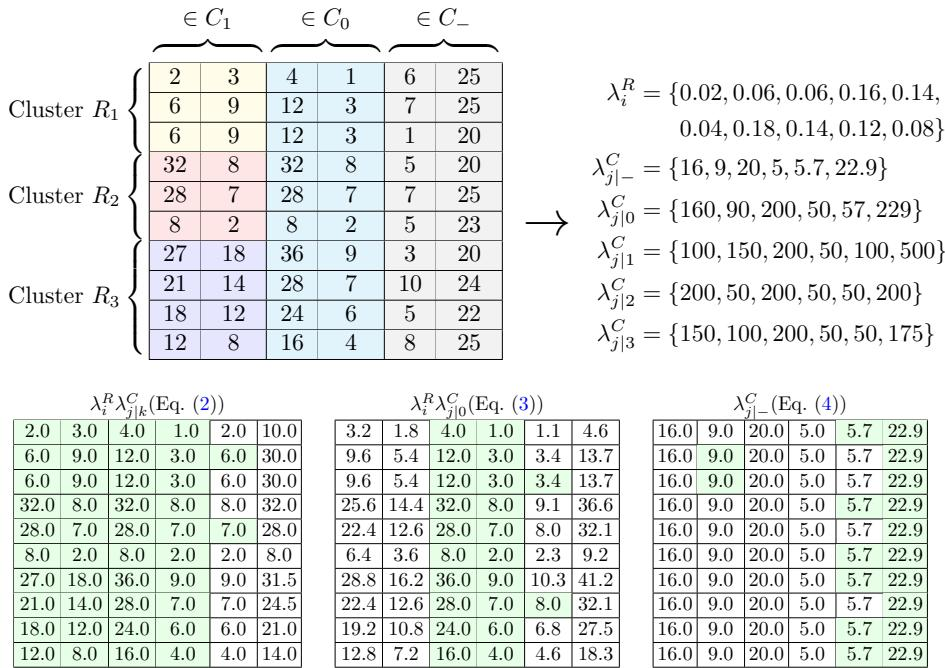  
Fig. 1: Motivation. The upper matrix shows a data set $\mathbf { X } \in \mathbb { N } ^ { n \times m }$ , where $n =$ $1 0 , m = 6 ,$ , containing three clusters. Only the first two columns are relevant for clustering (highlighted in yellow, red and dark blue) and therefore belong to $C _ { 1 }$ . Columns three and four (light blue) equally contribute to all clusters and belong to $C _ { 0 }$ . Columns five and six (gray) contain (uniformly distributed) noise and belong to $C _ { - }$ . The lower matrices show the expected values when using $\backslash \lambda _ { j | _ { - } } ^ { C } , \lambda _ { j | _ { 0 } } ^ { C }$ and $\lambda _ { j \vert k } ^ { C ^ { - } } ,$ where the green color highlights the closest expected value compared to X among those three matrices.

## 3 Definitions, Theory, and Algorithms

In this work, the main goal is to partition the n rows of a matrix $\mathbf { Y } \in \mathbb { N } _ { 0 } ^ { n \times m }$ consisting of non-negative integer counts, into $K \in \mathbb { N } _ { > 0 }$ clusters $R _ { k } \subseteq [ n ] = \{ 1 , \cdot \cdot \cdot , n \}$ , where $k \in [ K ]$ , such that $\cup _ { k = 1 } ^ { \bar { K } } R _ { k } = [ n ]$ and $R _ { k } \cap R _ { l } = \emptyset { \mathrm { ~ i f ~ } } k \neq l .$

More formally, we define the probability of $\mathbf { Y } _ { i j }$ by using the Poisson distribution as

$$
p ( \mathbf { Y } _ { i j } , \mu _ { i j } ) = \operatorname { P o i s } ( \mathbf { Y } _ { i j } \mid \mu _ { i j } ) \propto \mu _ { i j } ^ { \mathbf { Y } _ { i j } } e ^ { - \mu _ { i j } } .\tag{1}
$$

In our experiments, we use ${ \bf X } _ { i j } = { \bf Y } _ { i j } + 1 0 ^ { - 3 }$ for numerical stability in place of $\mathbf { Y } _ { i j }$ which can be interpreted as a weak Gamma prior.<sup>1</sup>

Following the proposal in, $\mathrm { e . g . }$ , (Cai et al. 2004), we model the expected number of occurrences $\mu _ { i j }$ as a product of row- and column-specific factors. This leads to two main assumptions for the data matrix $\mathbf { X } \colon ( \mathrm { i } )$ entries within row i are scaled by the rowspecific value $\lambda _ { i } ^ { R }$ and (ii) entries in cluster k follow the proportions as defined by the column and cluster-specific values $\lambda _ { j \vert k } ^ { C }$ that play a role similar to “cluster centroids” and are ideally diferent from those of other clusters.

These conditions are quite strict and are often not satisfied in practice. Let us consider a hypothetical matrix, where each row contains the word counts of a letter. In most cases, greeting phrases are only contained once, regardless of the length of the letter. This contradicts Assumption (i). In contrast, accompanying words such as ‘the’ usually occur more frequently in longer documents and fulfill Assumption (i). However, their number is probably less dependent on the content (i.e., cluster), which contradicts Assumption (ii).

To address these problems, we divide the m columns of the data matrix into three non-overlapping subsets $C _ { - } , C _ { 0 } .$ , and $C _ { 1 }$ , with $C _ { - } \cup C _ { 0 } \cup C _ { 1 } = [ m ]$ ; see Fig. 1. The subset $C _ { 1 }$ contains those columns that are important for clustering and for which the overall scale of the row matters. For columns $j \in C _ { 1 }$ the Poisson parameter reads

$$
\mu _ { i j } = \lambda _ { i } ^ { R } \lambda _ { j | k } ^ { C } , \quad \mathrm { i f } \quad j \in C _ { 1 } \ \mathrm { a n d } \ i \in R _ { k } ,\tag{2}
$$

where $\lambda _ { i } ^ { R } \in \mathbb { R } _ { > 0 }$ are the row-specific and $\lambda _ { j | k } ^ { C } \in \mathbb { R } _ { > 0 }$ for $k \in [ K ]$ the column-specific parameters. The subset $C _ { 0 }$ contains those columns where the overall scale does have an efect, but the clusters behave in a similar way (violating Assumption (ii)). For columns $j \in C _ { 0 }$ we have

$$
\mu _ { i j } = \lambda _ { i } ^ { R } \lambda _ { j | 0 } ^ { C } , \quad \mathrm { i f } \quad j \in { \cal C } _ { 0 } .\tag{3}
$$

Finally, the subset $C _ { - }$ contains those columns where neither the scale of the row nor the cluster is informative (violating Assumptions (i) and (ii)). The values in columns $j \in C _ { - }$ are modeled by a column-specific parameter:

$$
\mu _ { i j } = \lambda _ { j | - } ^ { C } , \quad \mathrm { i f } \quad j \in C _ { - } .\tag{4}
$$

Since we assume that all entries within a matrix X have been drawn independently, the log-loss of X is given by

$$
\mathcal { L } ( \mathbf { X } ) = - \sum _ { i = 1 } ^ { n } \sum _ { j = 1 } ^ { m } \log p ( \mathbf { X } _ { i j } , \mu _ { i j } ) + \sum _ { j \in C _ { 1 } } b ( \mathbf { X } _ { \cdot j } | K ) ,\tag{5}
$$

where $b ( \mathbf { X } _ { \cdot j } | K ) \in \mathbb { R } _ { \geq 0 }$ is a penalty term related to the column selection, defined in Sect. 3.3. This loss function is scale invariant if $b ( \mathbf { X } . _ { j } | K ) = 0 , { \mathrm { i . e } }$ ., for all $\alpha \in \mathbb { R } _ { > 0 }$ we have $\begin{array} { r } { \mathcal { L } ( \mathbf { X } ) = \mathcal { L } ( \alpha \mathbf { X } ) } \end{array}$ . For the details, see Appendix $\mathrm { { A . 3 } } .$

## Our main computational problem is as follows.

Problem 1 Given a n×m matrix of counts X, the number of clusters $K .$ and the definitions given in Eq. (2)-(4), find the parameters $\{ \lambda _ { i } ^ { R } , \lambda _ { j | \cdot } ^ { C } \}$ , the clustering $R _ { 1 } , \ldots , R _ { K }$ and the column partitions $C _ { - } , C _ { 0 } , C _ { 1 }$ that minimize the log-loss given by Eq. (5).

We solve Problem 1 using an Expectation Maximization (EM)-type algorithm, where we iterate finding (i) the optimal expected values $\mu _ { i j }$ (Sect. 3.1), (ii) the clustering $R _ { 1 } , \ldots , R _ { K }$ (Sect. 3.2), and (iii) the column partition $C _ { - } , C _ { 0 } , C _ { 1 }$ (Sect. 3.3), that at each step maximize the likelihood. This is repeated until convergence. We describe the initialization of $C _ { - } , C _ { 0 } , C _ { 1 }$ and $R _ { 1 } , \ldots , R _ { K }$ in Sect. 3.5. A pseudocode version of our method is given in Algorithm 1. Detailed derivations can be found in Appendix $\mathrm { A }$

## 3.1 Finding the Expected Values $\mu _ { i j }$

Following the definitions in $\mathrm { E q . ~ ( 2 ) { - } ( 4 ) }$ , we can find the expected values $\mu _ { i j }$ by determining the parameters $\lambda _ { i } ^ { R } , \lambda _ { j \mid - } ^ { C } , \lambda _ { j \mid 0 } ^ { C }$ and $\lambda _ { j \vert k } ^ { C }$ . The update rules are obtained by solving the equations $\partial \mathcal { L } ( \mathbf { X } ) / \partial \lambda _ { i } ^ { R } = \overset { \cdot } { 0 }$ and $\partial \mathcal { L } ( \mathbf { X } ) \bar { } / \partial \lambda _ { j \mid l } ^ { C } = 0$ for $l \in \{ - , 0 \} \cup [ K ]$ . Notice that for any constant $\kappa \in \mathbb { R } _ { > 0 } .$ , we can multiply all $\overrightarrow { \lambda } _ { i } ^ { R }  \kappa \lambda _ { i } ^ { R }$ and divide all $\lambda _ { j | l } ^ { C }  \lambda _ { j | l } ^ { C } / \kappa$ for $l \in \{ 0 \} \cup [ K ]$ without afecting the parameters $\mu _ { i j }$ . For this reason, we will set, without loss of generality, $\begin{array} { r } { \sum _ { i = 1 } ^ { n } \lambda _ { i } ^ { \check { R } } = 1 } \end{array}$ . Given a clustering $R _ { 1 } , \ldots , R _ { K }$ and a column partition $C _ { 1 } , C _ { 0 } , C _ { - }$ , the solutions for the row-specific parameters are

$$
\lambda _ { i } ^ { R } = \left\{ \begin{array} { l l } { \frac { ( \sum _ { j \in C _ { 0 } \cup C _ { 1 } } \mathbf { X } _ { i j } ) ( \sum _ { i \in R _ { k } } \sum _ { j \in C _ { 0 } } \mathbf { X } _ { i j } ) } { ( \sum _ { i = 1 } ^ { n } \sum _ { j \in C _ { 0 } } \mathbf { X } _ { i j } ) ( \sum _ { i \in R _ { k } } \sum _ { j \in C _ { 1 } \cup C _ { 0 } } \mathbf { X } _ { i j } ) } , } & { \quad \mathrm { i f } \quad i \in R _ { k } \mathrm { a n d } C _ { 0 } \neq \emptyset } \\ { \frac { \sum _ { j \in C _ { 1 } } \mathbf { X } _ { i j } } { \sum _ { i = 1 } ^ { n } \sum _ { j \in C _ { 1 } } \mathbf { X } _ { i j } } , } & { \quad \mathrm { i f } \quad i \in R _ { k } \mathrm { a n d } C _ { 0 } = \emptyset } \end{array} \right.\tag{6}
$$

(for details, see Appendix A.2). For the column parameters, we obtain:

$$
\lambda _ { j | - } ^ { C } = { \sum } _ { i = 1 } ^ { n } { \bf { X } } _ { i j } / n ,\tag{7}
$$

$$
\boldsymbol { \lambda } _ { j \vert 0 } ^ { C } = \sum _ { i = 1 } ^ { n } \mathbf { X } _ { i j } ,\tag{8}
$$

$$
\lambda _ { j | k } ^ { C } = \left\{ \begin{array} { l l } { \frac { ( \sum _ { i \in R _ { k } } \mathbf { X } _ { i j } ) ( \sum _ { i = 1 } ^ { n } \sum _ { j \in C _ { 0 } } \mathbf { X } _ { i j } ) } { \sum _ { i \in R _ { k } } \sum _ { j \in C _ { 0 } } \mathbf { X } _ { i j } } , } & { \quad \mathrm { i f } \quad C _ { 0 } \neq \emptyset } \\ { \frac { ( \sum _ { i \in R _ { k } } \mathbf { X } _ { i j } ) ( \sum _ { i = 1 } ^ { n } \sum _ { j \in C _ { 1 } } \mathbf { X } _ { i j } ) } { \sum _ { i \in R _ { k } } \sum _ { j \in C _ { 1 } } \mathbf { X } _ { i j } } , } & { \quad \mathrm { i f } \quad C _ { 0 } = \emptyset . } \end{array} \right.\tag{9}
$$

We will compute and store the column parameters for all columns to update the column partitions later in Sect. 3.3.

## 3.2 Finding the Clustering $R _ { 1 } , \ldots , R _ { K }$

Similarly, the update rule for the clustering $R _ { 1 } , \ldots , R _ { K }$ that maximizes the likelihood when all other parameters are kept fixed is given by computing the score

$$
S _ { i } ^ { k } = \sum _ { j \in C _ { 1 } } \big ( \mathbf { X } _ { i j } \log \hat { \mu } _ { i j } ^ { k } - \hat { \mu } _ { i j } ^ { k } \big ) ,\tag{10}
$$

where $\begin{array} { r } { \hat { \mu } _ { i j } ^ { k } = \frac { ( \sum _ { i \in \hat { R } _ { k } } \mathbf { X } _ { i j } ) ( \sum _ { j \in C _ { 1 } \cup C _ { 0 } } \mathbf { X } _ { i j } ) } { \sum _ { i \in \hat { R } _ { k } } \sum _ { j \in C _ { 1 } \cup C _ { 0 } } \mathbf { X } _ { i j } } } \end{array}$ and $\hat { R } _ { k }$ are the cluster assignments from the last iteration. Finally, we assign each row $i \in [ n ]$ to the cluster $k \in [ K ]$ with the highest score $S _ { i } ^ { k } , \mathrm { { i . e . , } } R _ { k } = \left\{ i \in [ n ] \ | \ k = \arg \operatorname* { m a x } _ { k ^ { \prime } \in [ K ] } S _ { i k ^ { \prime } } \right\}$

## 3.3 Finding the Column Partitions $C _ { - } , C _ { 0 } , C _ { 1 }$

To find the column partitions, we again maximize the likelihood, keeping all other parameters fixed. To this end, we compute the contributions to the log-likelihood $L _ { j } ( g )$ for each column $j \in [ m ]$ and partition $g \in \{ - , 0 , 1 \}$ . We obtain:

$$
\begin{array} { r } { L _ { j } ( - ) = \sum _ { i = 1 } ^ { n } \Big ( \mathbf { X } _ { i j } \log \lambda _ { j | - } ^ { C } - \lambda _ { j | - } ^ { C } \Big ) , } \end{array}\tag{11}
$$

$$
L _ { j } ( 0 ) = { \sum } _ { i = 1 } ^ { n } \Big ( \mathbf { X } _ { i j } \log \Big ( \lambda _ { i } ^ { R } \lambda _ { j | 0 } ^ { C } \Big ) - \lambda _ { i } ^ { R } \lambda _ { j | 0 } ^ { C } \Big ) ,\tag{12}
$$

$$
L _ { j } ( 1 ) = \sum _ { k = 1 } ^ { K } \sum _ { i \in R _ { k } } \left( \mathbf { X } _ { i j } \log \left( \lambda _ { i } ^ { R } \lambda _ { j | k } ^ { C } \right) - \lambda _ { i } ^ { R } \lambda _ { j | k } ^ { C } \right) - b ( \mathbf { X } _ { \cdot j } | K ) .\tag{13}
$$

Here, we added a penalty term motivated by the Minimum Description Length (MDL) (Rissanen 1978) (see Eq. (5)) defined by

$$
b ( \mathbf { x } | K ) = \operatorname* { m a x } \left( 0 , ( K - 1 ) \log \sum _ { i = 1 } ^ { n } \mathbf { x } _ { i } \right) .\tag{14}
$$

The intuition is that the additional information to describe parameters $\lambda _ { j | k } ^ { C }$ requires $K - 1$ cluster-specific column sums (knowing the total column sum gives the K-th sum), each of which can be described by log $\textstyle \sum _ { i = 1 } ^ { n } \mathbf { X } _ { i j }$ bits or less. Other options for the penalty term, such as the Bayesian Information Criterion (BIC) (Schwarz 1978), $\begin{array} { r } { \mathrm { i . e . , } b ( { \mathbf x } | K ) = \frac { K } { 2 } \log n } \end{array}$ , are also applicable. To solve Problem 1 we simply assign column j to group $C _ { g }$ such that $g = \arg \operatorname* { m a x } _ { g ^ { \prime } \in \{ - , 0 , 1 \} } L _ { j } ( g ^ { \prime } )$

## 3.4 Distance Between the Rows

In many practical applications, it may be helpful to have a distance measure between the rows. In particular, we use such a distance measure to obtain a better initialization of the clusters (see Sect. 3.5).

A natural way to define a distance between items $a , b \in [ n ]$ is to consider a $2 \times m$ submatrix containing only these two rows. The distance can then be computed as the diference in losses of Eq. (5) (assuming $C _ { 1 } = [ m ] , C _ { - } = C _ { 0 } = \emptyset$ between both rows being in the same cluster $( R _ { 1 } = \{ a , b \} )$ and in individual clusters $\left( R _ { 1 } \ : = \ : \{ a \} \right.$ , $R _ { 2 } = \left\{ b \right\} ,$ ). Doing the computations using Eqs. (6)–(9) results in the distance

$$
d ( a , b ) = \sum _ { i \in \{ a , b \} } \sum _ { j = 1 } ^ { m } \mathbf { X } _ { i j } \log { ( \mathbf { X } _ { i j } N _ { a b } / \left( r _ { i } c _ { j } \right) ) } ,\tag{15}
$$

where we used $\begin{array} { r } { r _ { i } = \sum _ { j = 1 } ^ { m } { \bf X } _ { i j } , c _ { j } = { \bf X } _ { a j } + { \bf X } _ { b j } } \end{array}$ , and $N _ { a b } = r _ { a } + r _ { b }$ (details are provided in Appendix $\mathrm { A . 4 } )$ . The distance is, to a constant factor, the classical likelihood–ratio test statistic for independence in $2 \times m$ contingency tables. It is always non-negative

```tcl
Algorithm 1: The 3CPO algorithm (without outlier detection)
Input: data set $\mathbf { X } ,$ number of clusters K
Output: cluster assignments $R _ { k } ,$ column values $\lambda _ { j | k } ^ { C }$ , column partitions $C _ { 1 } , C _ { 0 } , C _ { - }$
1 $/ /$ Initialization (Sect. 3.5)
2 $\lambda _ { j \vert - } ^ { C }  \sum _ { i = 1 } ^ { n } \mathbf { X } _ { i j } / n$ and $\begin{array} { r } { \lambda _ { j | 0 } ^ { C }  \sum _ { i = 1 } ^ { n } \mathbf { X } _ { i j } } \end{array}$
3 $\begin{array} { r } { \dot { L _ { j } } ( - )  \sum _ { i = 1 } ^ { n } ( \mathbf { X } _ { i j } \log \lambda _ { j | - } ^ { C } - \dot { \lambda } _ { j | - } ^ { C } ) } \end{array}$
4 $C _ { 1 }$ ← assign the $\lfloor { \frac { m } { 2 } } \rfloor$ columns with the hightest $h ( j )$ values (Eq. (16)) to $C _ { 1 }$
5 $C _ { - } \gets [ m ] \setminus C _ { 1 }$ and $C _ { 0 } \gets \emptyset$
6 $R _ { 1 } , \ldots , R _ { K } $ initial cluster assignments by k-Means $^ { + + }$ with $d ( a , b ) ( \mathrm { E q . ~ } ( 1 5 ) )$ in $C _ { 1 }$
7 while $\bar { C } _ { 1 } , \bar { C } _ { 0 }$ or any $R _ { k }$ changed in last iteration do
8 $\lambda _ { i } ^ { R } , \lambda _ { j | k } ^ { C }$ ← update lambdas (Sect. 3.1)
9 $/ /$ Update column partitions (Sect. 3.3)
10 for $j \in [ m ]$ do
11 $\begin{array} { r } { \mathbf { \ 1 } _ { j } ^ { \mathsf { ^ { * } } } ( 0 ) \gets \sum _ { i = 1 } ^ { n } ( \mathbf { X } _ { i j } \log ( \lambda _ { i } ^ { R } \lambda _ { j | 0 } ^ { C } ) - \lambda _ { i } ^ { R } \lambda _ { j | 0 } ^ { C } ) } \end{array}$
12 $\begin{array} { r } { L _ { j } ( 1 ) \xleftarrow { } \sum _ { k = 1 } ^ { K } \sum _ { i \in R _ { k } } ( { \mathbf { X } } _ { i j } \log ( \lambda _ { i } ^ { R } \lambda _ { j | k } ^ { C } ) - \lambda _ { i } ^ { R } \lambda _ { j | k } ^ { C } ) - b ( { \mathbf { X } } _ { \cdot j } | K ) } \end{array}$
13 $C _ { - } \gets \{ j | j \in [ m ] \wedge L _ { j } ( - ) \geq \operatorname* { m a x } ( L _ { j } ( 0 ) , L _ { j } ( 1 ) ) \}$
14 $C _ { 0 } \gets \{ j | j \in [ m ] \wedge j \ \tilde { \notin } \ C _ { - } \wedge L _ { j } ( 0 ) \ \tilde { \geq } L _ { j } ( 1 \bar { ) } \}$
15 $C _ { 1 } \gets [ m ] \setminus ( C _ { - } \cup C _ { 0 } )$
16 $/ / \mathrm { U p \dot { d a t e } }$ cluster assignments (Sect. 3.2)
17 $\mathbf { \dot { R } } _ { 1 } , \dots , R _ { K } \gets \emptyset$
18 for $i \in [ n ] \ \mathbf { d o }$
19 k ← argmax $\begin{array} { r } { \sum _ { j \in C _ { 1 } } \mathbf { X } _ { i j } \log ( \hat { \mu } _ { i j } ^ { k } ) - \hat { \mu } _ { i j } ^ { k } } \end{array}$ (Eq. (10))
$k ^ { \prime } \in [ K ]$
20 $R _ { k } \gets \bar { R _ { k } } \cup \{ i \}$
21 return $R _ { k } , \lambda _ { j | k } ^ { C } , C _ { 1 } , C _ { 0 } , C _ { - }$
```

and zero only if ${ \bf X } _ { i j } = r _ { i } c _ { j } / N _ { a b }$ for all $i \in \{ a , b \}$ and $j \in [ m ]$ ; in particular, the distance is zero if there exists $\kappa \in \mathbb { R } _ { > 0 }$ such that $\mathbf { X } _ { a j } = \kappa \mathbf { X } _ { b j }$ for all $j \in [ m ]$

## 3.5 Finding the Initial Values

Good initial values result in faster convergence to a better (local) optimum.

Initial $C _ { - } , C _ { 0 } , C _ { 1 } . \ \mathrm { A s }$ an initial guess, we set $C _ { 0 } = \varnothing$ . Next, we use the following heuristic, motivated by Eq. (15), to measure the potential clustering information $h ( j )$ within each column

$$
h ( j ) = \left( \sum _ { i = 1 } ^ { n } \mathbf { X } _ { i j } \log \left( \mathbf { X } _ { i j } N / \left( r _ { i } c _ { j } \right) \right) \right) / c _ { j } ,\tag{16}
$$

where $\begin{array} { r } { c _ { j } = \sum _ { i = 1 } ^ { n } \mathbf { X } _ { i j } } \end{array}$ and $\begin{array} { r } { N = \sum _ { i = 1 } ^ { m } { c _ { j } } ^ { 2 } . C _ { 1 } } \end{array}$ is then defined as the $\lfloor { \frac { m } { 2 } } \rfloor$ columns with the highest $h ( j )$ values. We divide by $c _ { j }$ to avoid placing disproportionate weight on columns containing high values. Lastly, we set $C _ { - } = [ m ] \setminus C _ { 1 }$ . Alternatively, one can randomly assign the columns in [m] to $C _ { - }$ and $C _ { 1 }$ , so that $C _ { - } \cap C _ { 1 } = \emptyset$

Initial $R _ { 1 } , \ldots , R _ { K }$ . Using the k-Means++ (Arthur and Vassilvitskii 2007) seeding mechanism within $C _ { 1 }$ with $d ( a , b )$ as defined by Eq. (15) in place of the Euclidean distance gives us the K rows $\mathbf { Z } \in \mathbb { R } _ { > 0 } { \mathbf { \mathrm { K } } } \times | { \mathbf { \mathrm { \mathit { C } } } } _ { 1 } |$ . Afterward, we receive the initial cluster assignments $R _ { 1 } , \ldots , R _ { K }$ by assigning each row in X to its best matching row within Z according to Eq. (10) with $\begin{array} { r } { \hat { R _ { k } } = \{ \mathbf { Z } _ { k } \} \Rightarrow \hat { \mu } _ { i j } ^ { k } = ( \sum _ { j \in C _ { 1 } } \mathbf { X } _ { i j } ) ( \mathbf { Z } _ { k j } / \sum _ { j \in C _ { 1 } } \mathbf { Z } _ { k j } ) } \end{array}$

## 3.6 Identifying Outliers

In many real-world applications, data sets contain rows that deviate from the clustering model assumptions, potentially degrading clustering quality. To address this, we propose an outlier detection mechanism integrated within the 3CPO framework that intends to demonstrate the expandability of our method. Other outlier detection approaches are also conceivable and can be easily integrated.

The core idea is to model outliers using a data set-wide (“background”) column parameter rather than cluster-specific values. Using such a noise distribution is a wellstudied strategy in clustering, e.g., in (Banfield and Raftery 1993). Specifically, rows assigned to the outlier set $O \subseteq [ n ]$ have their Poisson parameters defined by:

$$
\mu _ { i j } = \lambda _ { i } ^ { R } \lambda _ { j | 0 } ^ { C } , \quad \mathrm { i f } \quad i \in { \cal O } \mathrm { ~ \wedge ~ } j \in C _ { 0 } \cup C _ { 1 } ,\tag{17}
$$

where $\textstyle \bigcup _ { k \in K } R _ { k } \cup O = [ n ]$ and $\forall _ { k \in K } \ R _ { k } \ \cap O = \emptyset$ . At each iteration (or as a final step, after convergence), rows are assigned to clusters or to the outlier set based on likelihood comparison. For each row i, we compute the score for cluster assignment:

$$
S _ { i } ^ { k } = \sum _ { j \in C _ { 1 } } \left( X _ { i j } \log \hat { \mu } _ { i j } ^ { k } - \hat { \mu } _ { i j } ^ { k } \right) - \sum _ { j \in C _ { 1 } } \left( X _ { i j } \log \hat { \mu } _ { i j } ^ { 0 } - \hat { \mu } _ { i j } ^ { 0 } \right) ,\tag{18}
$$

where $\hat { \mu } _ { i j } ^ { k }$ is defined in Sect. 3.2 and $\begin{array} { r } { \hat { \mu } _ { i j } ^ { 0 } \ = \ \frac { ( \sum _ { i = 1 } ^ { n } \mathbf { X } _ { i j } ) ( \sum _ { j \in C _ { 1 } \cup C _ { 0 } } \mathbf { X } _ { i j } ) } { \sum _ { i = 1 } ^ { n } \sum _ { j \in C _ { 1 } \cup C _ { 0 } } \mathbf { X } _ { i j } } } \end{array}$ . The score $S _ { i } ^ { k }$ quantifies the log-likelihood diference between assigning row i to cluster k versus the background model. We then assign $i \ \in \ R _ { k }$ if $\operatorname* { m a x } _ { k } S _ { i } ^ { k } \geq 0$ , otherwise $i \in O$ This criterion ensures that rows fitting any cluster better than the background model remain within a cluster. See Appendix A.5 for detailed derivations and update rules.

## 3.7 Convergence and Complexity

Convergence. We see that the steps described in Sects. 3.1, 3.2, and 3.3 always lead to a local optimum. Since there is a finite number of possible clustering solutions and each step is guaranteed not to increase the loss function, 3CPO has to converge. To empirically verify this claim, Fig. 2 shows the loss after each iteration for three data sets. It is evident that the loss is steadily decreasing. The dashes on the bottom also show that it is beneficial to integrate the selection of columns into the optimization instead of performing a simpler pre-/post-processing, as changes can happen at any time due to updates in $R _ { k }$ which often lead to noticeable decreases in the loss.

Complexity. As for other clustering algorithms, except for simple methods such as k-Means, for which theoretical results exist (Arthur and Vassilvitskii 2007, 2006), it is challenging to prove approximability or runtime guarantees. However, we can derive the asymptotic computational complexity of our method. Calculating the column parameters $\lambda _ { j | - } ^ { C }$ and $\lambda _ { j \vert 0 } ^ { C }$ as well as the bias $b ( \mathbf { X } _ { \cdot j } | K )$ has to be done only once, and the complexity is $\mathcal { O } ( n m )$ . Updating the row parameters $\lambda _ { i } ^ { R }$ has a complexity of $\mathcal { O } ( n | C _ { 0 } \cup C _ { 1 } | )$ , and updating the cluster-specific column parameters $\lambda _ { j \vert k } ^ { C }$ has a complexity of $\mathcal { O } ( n m )$ . The complexity of updating the cluster assignments $R _ { k }$ is $\mathcal { O } ( n | C _ { 1 } | K )$ , and for the column partitions $C _ { - } , C _ { 0 }$ and $C _ { 1 }$ it is $\mathcal { O } ( n m )$ . Assuming I iterations until the process converges gives the worst-case complexity of O(InmK), indicating that the runtime grows linearly with $I , n , m$ , and $K$

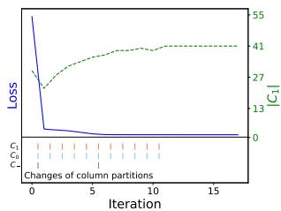  
(a) Data set: SportA.

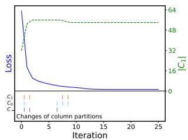  
(b) Data set: Optdigits.

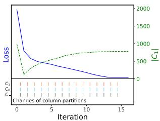  
(c) Data set: BBCSports.  
Fig. 2: Loss of 3CPO (blue line) and number of columns in $C _ { 1 }$ (green line) after each iteration. The dashes below indicate changes of $C _ { 1 }$ (red), $C _ { 0 }$ (blue) and $C _ { - } \ \mathrm { ( g r a y ) }$

## 4 Experiments

We show the applicability of our method by evaluating its performance in various scenarios. In addition, we validate essential design decisions through ablation studies.

## 4.1 Evaluation Setup

We compare 3CPO with various comparison algorithms using multiple evaluation metrics and data sets from diferent domains.

Comparisons. For comparison, we choose multiple clustering algorithms that return hard cluster labels, including the Poisson-based clustering algorithms PoissonL and PoissonC (using our proposed initialization strategy for $R _ { k } ~ \mathrm { ~ - ~ s e e ~ } \mathrm { S e c t . } ~ 3 . 5 )$ as well as SKM. Furthermore, we consider k-Means (KM) in combination with various transformation functions to account for diferent normalizations. These are row-wise z-normalization (STD, ${ \bf X } _ { i j } ^ { S T D } ~ = ~ ( { \bf X } _ { i j } - \mathrm { m e a n } ( { \bf X } _ { i \cdot } ) ) / \mathrm { s t d } ( { \bf X } _ { i \cdot } ) )$ , row-wise min-max normalization (MM, $\mathbf { X } _ { i j } ^ { M M ^ { ' } } = ( \mathbf { X } _ { i j } - \operatorname* { m i n } ( \mathbf { X } _ { i \cdot } ) ) / ( \operatorname* { m a x } ( \mathbf { X } _ { i \cdot } ) - \operatorname* { m i n } ( \mathbf { X } _ { i \cdot } ) ) )$ ), relative frequency (RF, $\mathbf { X } _ { i j } ^ { R F } = \dot { \mathbf { X } _ { i j } } / r _ { i } )$ , and revealed comparative advantage (RCA, ${ \bf X } _ { i j } ^ { R C A } =$ $\mathbf { X } _ { i j } N / ( r _ { i } c _ { j } ) )$ . Here, $\begin{array} { r } { r _ { i } = \sum _ { j = 1 } ^ { m } \mathbf { X } _ { i j } , c _ { j } = \sum _ { i = 1 } ^ { n } \mathbf { X } _ { i j } } \end{array}$ , and $\begin{array} { r } { N = \sum _ { j = 1 } ^ { m } c _ { j } } \end{array}$

In addition, we consider the co-clustering algorithms CROINFO, CoclustMod (CCMod), CoclustSpecMod (CCSMod), ELBM, SELBM, and TauCC. The number of row and column clusters is set according to the ground truth and ELBM and SELBM use a Poisson model. Other parameters follow the defaults in the implementations.

All algorithms except TauCC receive the number of ground truth clusters as input parameter. As the comparison algorithms are unable to detect outliers, we use 3CPO without outlier detection if not explicitly mentioned otherwise to ensure a fair comparison. Outlier detection is examined separately in the end of Sect. 4.2.

Information regarding the used implementations is given in Appendix C.

Data sets. We consider one synthetic and 11 real-world count data sets from various domains: synthetic (Synth), Wholesales (Kelly et al.), Sport Articles (SportA) (Kelly et al.), Optdigits (Kelly et al.), BBCSports (Greene and Cunningham 2006), BBC-News (Greene and Cunningham 2006), WebKB<sup>3</sup>, Reuters21578 (Reuters) (Kelly et al.), 20Newsgroups (20NewsG) (Kelly et al.), Mouse Cell Atlas (MouseAtlas) (Tran et al. 2020), Gene Expression (GeneExp) (Kelly et al.), and Human Dendritic Cells (HDendritic) (Tran et al. 2020). Detailed descriptions of these data sets, including potential pre-processing steps, are provided in Appendix B, and the specific characteristics, i.e., the number of clusters K, rows $n ,$ columns m, data ranges, sparsity information, and imbalance ratios, are summarized in Table B1.

Metrics. To evaluate our results, we consider the Unsupervised Clustering Accuracy (ACC) (Yang et al. 2010), Normalized Mutual Information (NMI) (Kvalseth 1987) and Adjusted Rand Index (ARI) (Hubert and Arabie 1985). These metrics compare the predicted clustering labels with ground truth labels, where 1 indicates a perfect match and values close to 0 a random assignment. All results are reported in %.

## 4.2 Evaluation of the Clustering Performance

Comparison to traditional Clustering Algorithms. The upper part of Table 1 shows the ARI results of 3CPO and the traditional clustering algorithms, i.e., those not performing a column selection (NMI and ACC results can be found in Appendix D.1). Each entry corresponds to the average and standard deviation (±) of ten executions. Note that each execution itself consists of ten runs, where only the result with the best internal score (e.g., Eq. (5) for 3CPO and inertia for k-Means) is considered.

We see that 3CPO is the top performer in eight out of twelve experiments. Considering Synth and BBCSport, it outperforms all competitors by more than 38% and by more than 6% in the case of WebKB. Furthermore, if 3CPO does not perform best, the gap to the best performer is often marginal with diferences below 1% in the case of SportA and Optdigits. An exception is Wholesales, where RCA+KM is by far the best algorithm, indicating why RCA is a common technique in economics. However, RCA+KM performs much worse than its competitors in all other scenarios. The only other case in which the gap to the best-performing algorithm exceeds 1% is HDendritic. Here, the diference between 3CPO (79.6 ± 5.8) and the best competitor, PoissonL (83.4 ± 5.2), lies within one standard deviation, indicating that 3CPO often attains results comparable to the top performer. Overall, the strongest competitor is PoissonL, which can be interpreted as a special version of 3CPO with $C _ { - } = C _ { 0 } = \emptyset$ Nevertheless, 3CPO yields superior results on most high-dimensional text and biology data sets, underscoring the benefit of explicit column selection. Considering the average across all tested data sets, 3CPO is a good choice in unsupervised scenarios. Comparison to Co-Clustering Algorithms. The lower part of Table 1 shows the ARI results of 3CPO and the co-clustering clustering algorithms (NMI and ACC results can be found in Appendix D.1). The setting is the same as for the traditional approaches. The only exception is TauCC, where each execution corresponds to a single run as the implementation does not include an internal scoring function.

<table><tr><td>Data set</td><td>3CPO</td><td> $\mathrm { P o i s s o n L }$ </td><td>PoissonC</td><td>SKM</td><td>KM</td><td> $\overline { { \mathrm { S T D } + \mathrm { K M } } }$ </td><td>MM+KM</td><td> $\mathrm { R F + K M }$ </td><td> $\overline { { \mathrm { R C A + K M } } }$ </td></tr><tr><td>Synth</td><td> ${ \bf 9 5 . 5 \pm 0 . 0 }$ </td><td> $3 3 . 3 \pm 0 . 1$ </td><td> $2 9 . 9 \pm 0 . 0$ </td><td> $4 2 . 7 \pm 0 . 0$ </td><td> $0 . 2 \pm 0 . 0$ </td><td> $4 2 . 1 \pm 0 . 0$ </td><td> $4 2 . 9 \pm 0 . 1$ </td><td> $4 2 . 5 \pm 0 . 0$ </td><td> $0 . 0 \pm 0 . 0$ </td></tr><tr><td>Wholesales</td><td> $3 0 . 1 \pm 0 . 0$ </td><td> $3 1 . 3 \pm 0 . 0$ </td><td> $3 2 . 8 \pm 0 . 0$ </td><td> $2 \bar { 6 . 5 } \pm 0 . 0$ </td><td> $- 3 . 1 \pm 0 . 0$ </td><td> $2 8 . 2 \pm 0 . 0$ </td><td> $2 7 . 9 \pm 0 . 2$ </td><td> $2 1 . 3 \pm 0 . 0$ </td><td> ${ \bf 4 7 . 0 \pm 0 . 3 }$ </td></tr><tr><td>SportA</td><td>32.3 ± 0.5</td><td> $\mathbf { 3 \bar { 2 } . 5 \bar { \pm } 0 . 2 }$ </td><td>21.9 ± 1.5</td><td>29.5 ± 0.0</td><td>21.3 ± 0.0</td><td>31.9 ± 0.0</td><td>25.9 ± 0.1</td><td> $7 . 5 \pm 0 . 0$ </td><td> $0 . 1 \pm 0 . 0$ </td></tr><tr><td>Optdigits</td><td> $6 6 . 7 \pm 2 . 2$ </td><td> $6 7 . 0 \pm 1 . 8$ </td><td> $4 5 . 0 \pm 3 . 1$ </td><td> $6 7 . 5 \pm 0 . 1$ </td><td> $6 7 . 1 \pm 0 . 2$ </td><td> ${ \bf 6 7 . 6 \pm 0 . 1 }$ </td><td> $6 7 . 3 \pm 0 . 3$ </td><td> $6 6 . 5 \pm 0 . 2$ </td><td> $0 . 0 \pm 0 . 0$ </td></tr><tr><td>BBCSports</td><td> ${ \bf 9 0 . 1 \pm 2 . 9 }$ </td><td> $5 1 . 6 \pm 8 . 1$ </td><td> $2 7 . 7 \pm 4 . 0$ </td><td> $\overline { { 1 0 . 4 \pm 1 . 7 } }$ </td><td> $0 . 3 \pm 0 . 2$ </td><td> $9 . 5 \pm 0 . 9$ </td><td> ${ \bar { 6 } } . 9 \pm 3 . 6 $ </td><td> $9 . 8 \pm 1 . 7$ </td><td> $3 . 7 \pm 2 . 6$ </td></tr><tr><td>BBCNews</td><td> ${ \bf 8 9 . 9 \pm 0 . 9 }$ </td><td> $\overline { { 8 9 . 2 \pm 0 . 8 } }$ </td><td> $6 3 . 4 \pm 6 . 7$ </td><td> $3 1 . 5 \pm 4 . 0$ </td><td> $6 . 0 \pm 0 . 3$ </td><td> $2 4 . 6 \pm 1 . 6$ </td><td> $1 6 . 4 \pm 1 . 5$ </td><td> $2 5 . 6 \pm 1 . 8$ </td><td> $1 5 . 4 \pm 1 2 . 0$ </td></tr><tr><td>WebKB</td><td> ${ \bf 3 1 . 5 \pm 3 . 2 }$ </td><td> $2 5 . 4 \pm 0 . 9$ </td><td> $2 0 . 2 \pm { \bar { 3 } } . { \bar { 8 } }$ </td><td> $1 1 . 4 \pm 0 . 2$ </td><td> $3 . 6 \pm 0 . 0$ </td><td> $1 2 . 0 \pm 0 . 2$ </td><td> $1 0 . 9 \pm 0 . 4$ </td><td> $1 1 . 0 \pm 2 . 7$ </td><td> $- 0 . 0 \pm 0 . 1$ </td></tr><tr><td>Reuters</td><td> ${ \bf 6 7 . 8 \pm 1 . 6 }$ </td><td> $\overline { { 6 5 . 2 \pm 5 . 0 } }$ </td><td> $4 4 . 1 \pm 4 . 0$ </td><td> $2 1 . 9 \pm 0 . 2$ </td><td> $1 5 . 2 \pm 0 . 6$ </td><td> $3 2 . 5 \pm 0 . 1$ </td><td> $3 1 . 9 \pm 0 . 0$ </td><td> $3 . 7 \pm 4 . 2$ </td><td> $0 . 3 \pm 0 . 3$ </td></tr><tr><td>20NewsG</td><td> ${ \bf 2 3 . 0 \pm 1 . 3 }$ </td><td> $2 2 . 2 \pm 1 . 9$ </td><td> $1 \bar { 4 . 6 } \pm 1 . \bar { 5 }$ </td><td> $2 . 0 \pm 0 . 2$ </td><td> $0 . 4 \pm 0 . 0$ </td><td> $2 . 1 \pm 0 . 1$ </td><td> $1 . 5 \pm 0 . 1$ </td><td> $1 . 1 \pm 0 . 2$ </td><td> $0 . 0 \pm 0 . 0$ </td></tr><tr><td>MouseAtlas</td><td>56.3 ± 6.2</td><td> $\overline { { 5 5 . 4 \pm 5 . 0 } }$   $\frac { \angle \angle \angle \cdot \angle \angle \cdot \angle \pm \frac { \angle \cdot \angle \angle \cdot \angle \mathcal { I } } { \vert \mathrm { ~ F ~ F ~ } , \vert \mathrm { ~ 1 ~ } \vert \mathrm { ~ F ~ } \mathrm { ~ } \mathrm { ~ 0 ~ } } } { \mathsf { F } \mathsf { F } \mathrm { ~ 0 ~ } }$ </td><td> $1 \mathrm { \bar { 8 . 5 } } \pm \mathrm { \bar { 9 . 5 } }$ </td><td> $3 9 . 3 \pm 2 . 6 $ </td><td> $1 . 6 \pm 0 . 1$ </td><td>38.4 ± 1.4</td><td> $3 6 . 3 \pm 2 . 0$ </td><td> $2 8 . 6 \pm 2 . 6$ </td><td> $0 . 1 \pm 0 . 0$ </td></tr><tr><td>GeneExp</td><td> ${ \bf 9 9 . 1 \pm 0 . 1 }$ </td><td> $\underline { { 9 8 . 7 \pm 0 . 1 } }$ </td><td>86.7 ± 11.0</td><td>98.5 ± 0.0</td><td>98.2 ± 0.1</td><td> ${ \bf 9 9 . 1 \pm 0 . 1 }$ </td><td> $9 8 . 3 \pm 0 . 0$ </td><td> $9 8 . 5 \pm 0 . 1 $ </td><td> $3 . 7 \pm 9 . 8$ </td></tr><tr><td>HDendritic</td><td> $7 9 . 6 \pm 5 . 8$ </td><td> ${ \bf 8 3 . 4 \pm 5 . 2 }$ </td><td> $7 4 . 8 \pm 6 . 1$ </td><td> $\bar { 7 9 . 9 } \bar { \pm } \bar { 0 . 2 }$ </td><td> $3 7 . 5 \pm 1 3 . 3$ </td><td> $8 0 . 2 \pm 0 . 4$ </td><td> $7 5 . 5 \pm 0 . 2$ </td><td> $3 \bar { 7 } . \bar { 5 } \pm \bar { 1 3 } . 3$ </td><td> $- 0 . 1 \pm 0 . 1$ </td></tr><tr><td>Data set</td><td>3CPO</td><td> $\mathrm { C R O I N F O }$ </td><td> $\mathrm { C C M o d }$ </td><td> $\mathrm { C C S M o d }$ </td><td> $\mathrm { E L B M }$ </td><td> $\mathrm { S E L B M }$ </td><td> $\mathrm { T a u C C }$ </td><td></td><td></td></tr><tr><td>Synth</td><td> ${ \bf 9 5 . 5 \pm 0 . 0 }$ </td><td> $3 2 . 8 \pm 0 . 3$ </td><td> $2 5 . 2 \pm 0 . 1$ </td><td> $1 7 . 8 \pm 2 0 . 8$ </td><td> $9 . 2 \pm 8 . 6$ </td><td> $3 . 5 \pm 1 . 6$ </td><td> $2 5 . 1 \pm 0 . 6$ </td><td></td><td></td></tr><tr><td>Wholesales</td><td> $3 0 . 1 \pm 0 . 0 $ </td><td> ${ \bf 3 3 . 6 \pm 0 . 5 }$ </td><td> $3 2 . 0 \pm 0 . 0$ </td><td> $3 . 2 \pm 9 . 1$ </td><td> $2 . 0 \pm 5 . 0$ </td><td> $1 . 9 \pm 0 . 6$ </td><td> $2 7 . 6 \pm 0 . 0$ </td><td></td><td></td></tr><tr><td>SportA</td><td> $\mathbf { 3 \bar { 2 } . 3 \bar { \pm } 0 . 5 }$ </td><td> $2 5 . 4 \pm 0 . 8$ </td><td> $3 0 . 3 \pm 0 . 0$ </td><td> $3 1 . 4 \pm 0 . 1$ </td><td> $7 . 1 \pm 0 . 0$ </td><td> $6 . 5 \pm 0 . 1$ </td><td> $1 5 . 8 \pm 1 5 . 1$ </td><td></td><td></td></tr><tr><td> $\mathrm { O p t d i g i t s }$ </td><td> ${ \bf 6 6 . 7 \pm 2 . 2 }$ </td><td> $\underline { { 4 9 . 7 \pm 2 . 1 } }$ </td><td> $2 \bar { 1 . 4 } \pm \bar { 1 . 5 }$ </td><td> $3 3 . 2 \pm 2 . 9$ </td><td> $4 5 . 3 \pm 3 . 0$ </td><td> $2 3 . 1 \pm 4 . 3$ </td><td> $1 0 . 6 \pm 7 . 5$ </td><td></td><td></td></tr><tr><td>BBCSports</td><td>90.1 ± 2.9</td><td> $\underline { { 4 8 . 3 \pm 5 . 2 } }$ </td><td>41.0 ± 4.3</td><td>38.1 ± 0.1</td><td>0.3± 0.1</td><td>0.3 ± 0.0</td><td> $2 6 . 2 \pm 6 . 3$ </td><td></td><td></td></tr><tr><td>BBCNews</td><td> ${ \bf 8 9 . 9 \pm 0 . 9 }$ </td><td> $\overline { { 6 2 . 1 \pm 2 . 3 } }$ </td><td> $7 \bar { 1 } . 9 \pm \bar { 1 } . \bar { 8 }$ </td><td> $6 2 . 3 \pm 0 . 3$ </td><td> $4 . 5 \pm 0 . 2$ </td><td> $2 . 9 \pm 0 . 6$ </td><td> $4 1 . 8 \pm 1 0 . 5$ </td><td></td><td></td></tr><tr><td>WebKB</td><td> ${ \bf 3 1 . 5 \pm 3 . 2 }$ </td><td> $2 0 . 1 \pm 1 . 4$ </td><td> $2 0 . 4 \pm 0 . 7$ </td><td> $2 5 . 8 \pm 0 . 1$ </td><td> $3 . 7 \pm 0 . 1$ </td><td> $0 . 0 \pm 0 . 0$ </td><td> $1 1 . 3 \pm 2 . 0$ </td><td></td><td></td></tr><tr><td>Reuters</td><td> ${ \bf 6 7 . 8 \pm 1 . 6 }$ </td><td> $5 9 . 9 \pm 1 . 2$ </td><td> $6 4 . 6 \pm 4 . 1$ </td><td> $\overline { { 4 6 . 1 \pm 0 . 0 } }$ </td><td> $3 4 . 6 \pm 0 . 3$ </td><td> $1 0 . 1 \pm 1 . 0$ </td><td> $4 3 . 2 \pm 0 . 5$ </td><td></td><td></td></tr><tr><td>20NewsG</td><td> ${ \bf 2 3 . 0 \pm 1 . 3 }$ </td><td> $\bar { 1 6 . 2 } \bar { \pm } \bar { 0 . 7 }$ </td><td> $6 . 9 \pm 0 . 6$ </td><td> $6 . 2 \pm 2 . 3$ </td><td> $0 . 5 \pm 0 . 1$ </td><td> $0 . 0 \pm 0 . 0$ </td><td> $2 . 1 \pm 1 . 5$ </td><td></td><td></td></tr><tr><td>MouseAtlas</td><td> ${ \bf 5 6 . 3 \pm 6 . 2 }$ </td><td> $\underline { { { \overline { { { 4 9 . 7 \pm 1 . 8 } } } } } }$ </td><td> $3 8 . 4 \pm 1 . 8$ </td><td> $2 7 . 4 \pm 0 . 1$ </td><td> $1 . 4 \pm 0 . 3$ </td><td> $0 . 5 \pm 0 . 1$ </td><td> $3 4 . 4 \pm 4 . 6$ </td><td></td><td></td></tr><tr><td>GeneExp</td><td> ${ \bf 9 9 . 1 \pm 0 . 1 }$ </td><td> $5 9 . 0 \pm 3 . 1$ </td><td> $7 2 . 4 \pm 2 . 9$ </td><td> $9 3 . 2 \pm 0 . 0 $ </td><td> $4 . 3 \pm 1 . 4$ </td><td> $0 . 0 \pm 0 . 0$ </td><td> $5 3 . 1 \pm 9 . 4$ </td><td></td><td></td></tr><tr><td>HDendritic</td><td> $\underline { { 7 9 . 6 \pm 5 . 8 } }$ </td><td> ${ \bf 8 1 . 9 \pm 1 . 3 }$ </td><td> $\bar { 7 2 . 2 } \bar { \pm } \bar { 5 . 0 }$ </td><td> $0 . 0 \pm 0 . 0$ </td><td> $4 5 . 1 \pm 4 . 3$ </td><td> $4 . 0 \pm 7 . 8$ </td><td> $4 2 . 3 \pm 2 3 . 0$ </td><td></td><td></td></tr></table>

Table 1: ARI results (in %) of traditional clustering (top) and co-clustering algorithms (bottom). Entries correspond to the mean of ten executions ± the standard deviation. The best result for each data set and group of algorithms (traditional/co-clustering) is marked in bold, the runner-up is underlined, and the third place is dashed-underlined.

<table><tr><td>Data set</td><td>3CPO</td><td> $\mathrm { T F - I D F + K M }$ </td><td> $\overline { { \mathrm { B M 2 5 + K M } } }$ </td><td> $\overline { { \mathrm { { T F - I D F + S K M } } } }$ </td><td> $\mathrm { B M 2 5 + S K M }$ </td></tr><tr><td>BBCSports</td><td> ${ \bf 9 0 . 1 \pm 2 . 9 }$ </td><td> $7 1 . 0 \pm 1 1 . 4$ </td><td> $4 3 . 7 \pm 1 7 . 0$ </td><td> $7 6 . 5 \pm 7 . 1$ </td><td> $8 1 . 1 \pm 6 . 8$ </td></tr><tr><td>BBCNews</td><td> $8 9 . 9 \pm 0 . 9$ </td><td> $8 4 . 2 \pm 2 . 8$ </td><td> $8 7 . 7 \pm 6 . 8$ </td><td> $8 6 . 4 \pm 0 . 8$ </td><td> ${ \bf 9 0 . 7 \pm 0 . 3 }$ </td></tr><tr><td>WebKB</td><td> ${ \bf 3 1 . 5 \pm 3 . 2 }$ </td><td> $1 8 . 8 \pm 1 . 0$ </td><td> $1 4 . 6 \pm 1 . 3$ </td><td> $2 2 . 4 \pm 1 . 1$ </td><td> $2 9 . 0 \pm 1 . 9$ </td></tr><tr><td>Reuters</td><td> ${ \bf 6 7 . 8 \pm 1 . 6 }$ </td><td> $1 9 . 3 \pm 0 . 2$ </td><td> $3 4 . 8 \pm 5 . 0$ </td><td> $3 4 . 0 \pm 0 . 2$ </td><td> $5 5 . 8 \pm 1 . 2$ </td></tr><tr><td>20NewsG</td><td> ${ \bf 2 3 . 0 \pm 1 . 3 }$ </td><td> $5 . 6 \pm 0 . 6$ </td><td> $5 . 5 \pm 0 . 5$ </td><td> $8 . 2 \pm 0 . 4$ </td><td> $2 1 . 1 \pm 1 . 2$ </td></tr></table>

Table 2: ARI results (in %) regarding text data sets pre-processed by TF-IDF and BM25. Entries correspond to the mean of ten executions $\pm$ the standard deviation. The best performance is highlighted in bold.

The results show that 3CPO ranks among the top three across all data sets. The strongest competitor is CROINFO, which outperforms 3CPO on Wholesales and HDendritic while maintaining a low standard deviation in almost all experiments. Considering that TauCC has to determine the number of clusters and only does a single run per execution, its performance is noteworthy as it is often in a similar region as CROINFO, CCMod, and CCSMod. In contrast, ELBM and SELBM appear to struggle with raw features, suggesting they may require additional pre-processing.

A detailed look at text data sets: Comparison to TF-IDF. To better assess the performance with respect to the text data sets, we compare 3CPO to k-Means and SKM in combination with term frequency–inverse document frequency (TF-IDF) and BM25 (Robertson and Zaragoza 2009) with its free parameters set to $k _ { \mathrm { b m 2 5 } } = 1 . 5$ and $b _ { \mathrm { b m 2 5 } } = 0 . 7 5$ . The remaining experimental setting corresponds to Table 1. The ARI results are shown in Table 2 (NMI and ACC results can be found in Appendix D.1).

Table 3: Clustering results (in %) and the number of outliers |O| when using the outlier detection feature. An asterisk ∗ indicates that only non-outliers are used for the evaluation. Entries correspond to the mean of ten executions ± the standard deviation. Improvements compared to results without outlier detection are marked in bold.
<table><tr><td>Data set</td><td>ACC*</td><td>NMI*</td><td>ARI*</td><td>|0|</td><td>Data set</td><td>ACC*</td><td>NMI*</td><td>ARI*</td><td>|0|</td></tr><tr><td>Synth</td><td> $9 1 . 9 \pm 0 . 0$ </td><td> $8 1 . 7 \pm 0 . 0$ </td><td> $8 5 . 4 \pm 0 . 0$ </td><td> $3 3 6 \pm 0$ </td><td>WebKB</td><td> $5 6 . 8 \pm 3 . 7$ </td><td> ${ \bf 3 9 . 3 \pm 1 . 1 }$ </td><td> ${ \bf 3 3 . 1 \pm 3 . 0 }$ </td><td> $4 3 1 \pm 3 8$ </td></tr><tr><td>Wholesales</td><td> ${ \bf 8 6 . 2 \pm 0 . 2 }$ </td><td> ${ \bf 4 7 . 4 \pm 0 . 5 }$ </td><td> ${ \bf 5 2 . 2 \pm 0 . 7 }$ </td><td> $1 4 4 \pm 1$ </td><td>Reuters</td><td> ${ \bf 8 5 . 3 \pm 7 . 3 }$ </td><td>75.3 ± 7.0</td><td> ${ \bf 7 3 . 9 \pm 8 . 2 }$ </td><td> $4 2 7 \pm 2 7 5$ </td></tr><tr><td>SportA</td><td> ${ \bf 8 5 . 3 \pm 0 . 1 }$ </td><td> ${ \bf 3 7 . 2 \pm 0 . 2 }$ </td><td> ${ \bf 4 9 . 4 \pm 0 . 2 }$ </td><td> $3 4 1 \pm 4$ </td><td>20NewsG</td><td> ${ \bf 3 9 . 8 \pm 2 . 6 }$ </td><td> ${ \bf 4 2 . 7 \pm 1 . 1 }$ </td><td> ${ \bf 2 5 . 4 \pm 1 . 3 }$ </td><td> $9 7 8 \pm 4 9$ </td></tr><tr><td>Optdigits</td><td> ${ \bf 8 2 . 1 \pm 2 . 0 }$ </td><td> ${ \bf 7 9 . 2 \pm 1 . 0 }$ </td><td> ${ \bf 7 2 . 6 \pm 2 . 4 }$ </td><td> $4 4 3 \pm 3$ </td><td>MouseAtlas</td><td> ${ \bf 7 2 . 4 \pm 7 . 7 }$ </td><td> ${ \bf 7 5 . 8 \pm 3 . 5 }$ </td><td> ${ \bf 6 4 . 5 \pm 8 . 2 }$ </td><td> $1 3 2 6 \pm 8 4$ </td></tr><tr><td>BBCSports</td><td> ${ \bf 9 8 . 4 \pm 1 . 1 }$ </td><td> ${ \bf 9 5 . 5 \pm 2 . 0 }$ </td><td> ${ \bf 9 5 . 9 \pm 2 . 7 }$ </td><td> $5 6 \pm 4$ </td><td>GeneExp</td><td> ${ \bf 1 0 0 . 0 \pm 0 . 0 }$ </td><td> ${ \bf 1 0 0 . 0 \pm 0 . 0 }$ </td><td> ${ \bf 1 0 0 . 0 \pm 0 . 0 }$ </td><td>14 ± 2</td></tr><tr><td> $\mathrm { B B C N e w s }$ </td><td>97.9 ± 0.4</td><td>93.3 ± 0.8</td><td> ${ \bf 9 4 . 9 \pm 0 . 9 }$ </td><td> $1 3 7 \pm 1 1$ </td><td>HDendritic</td><td> ${ \bf 8 7 . 7 \pm 7 . 3 }$ </td><td> ${ \bf 8 1 . 5 \pm 3 . 7 }$ </td><td>82.6 ± 5.5</td><td>22 ± 2</td></tr></table>

Table 4: Total (m) and cluster-relevant columns $\left( \left| C _ { 1 } \right| \right)$ as identified by 3CPO. Entries for $| C _ { 1 } |$ correspond to the mean of ten executions ± the standard deviation.
<table><tr><td></td><td>Synth</td><td>Wholesales</td><td>SportA</td><td> $\mathrm { O p t d i g i t s }$ </td><td> $\mathrm { B B C S p o r t s }$ </td><td> $\mathrm { B B C N e w s }$ </td><td>WebKB</td><td>Reuters</td><td>20NewsG</td><td> $\overline { { \mathrm { \ M o u s e A t l a s } } }$ </td><td>GeneExp</td><td>HDendritic</td></tr><tr><td>m</td><td>6</td><td>6</td><td>55</td><td>64</td><td>2000</td><td>2000</td><td>2000</td><td>2000</td><td>2000</td><td>15006</td><td>20531</td><td>26593</td></tr><tr><td>|C{|</td><td>2 ± 0</td><td>5 ± 0</td><td>41 ± 1</td><td>56 ± 1</td><td>799 ± 8</td><td>1379 ± 6</td><td>1315 ± 18</td><td>1322 ± 8</td><td>1454 ± 15</td><td> $1 4 5 6 6 \pm 5 9$ </td><td>6445 ± 3</td><td> $1 6 6 7 3 \pm 4 0 6$ </td></tr></table>

We see that 3CPO performs best in four out of five scenarios. It outperforms the runner-up, BM25+SKM, by a substantial margin on BBCSports and Reuters.

In general, the experiments indicate the applicability of 3CPO for text data. Furthermore, as it uses raw word counts and discovers a subset of relevant columns, its results are more interpretable than those of more sophisticated word embeddings like Word2Vec (Mikolov et al. 2013) or BERT (Devlin et al. 2019). This can benefit a subsequent analysis of the results, allowing domain experts to identify key terms driving cluster definitions. Our main experiments further demonstrate that 3CPO can be applied to data from various domains and is not restricted to texts.

Performance with Outlier Detection. We further evaluate 3CPO when incorporating the optional “background” component for outlier detection. Table 3 shows the results where metrics (denoted by ∗) are calculated only on non-outlier samples. Using the outlier detection method, 3CPO is able to improve the clustering scores for all data sets except Synth, indicating that it successfully identifies rows that are hard to assign to any specific cluster. This behavior is practically valuable since declaring uncertain samples as outliers can prevent wrong cluster assignments leading to false conclusions.

The proportion of identified outliers varies considerably across data sets, exceeding 10% for Synth, Wholesales, SportA, and MouseAtlas. While this reduces the clustering task’s complexity, it also reflects genuine data characteristics where many samples lack clear cluster membership. We want to highlight the result regarding GeneExp, where 3CPO achieves a perfect clustering result while only identifying ∼ 14 outliers.

Appendix D.4 provides visual examples of outliers identified within Optdigits.

## 4.3 Analysis of the Column Partitions

In addition to the clustering performance, we analyze the number of columns selected as relevant for the clustering task, i.e., the number of columns in $C _ { 1 }$ . These results are shown in Table 4. For many high-dimensional data sets such as BBCSports, BBCNews, WebKB, Reuters, 20NewsG, and GeneExp, 3CPO noticeable reduces the number of

(a) BBCSports data set.  
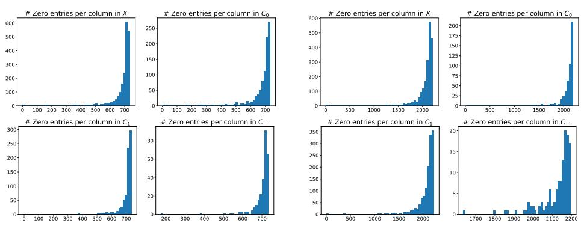  
(b) BBCNews data set.  
Fig. 3: Histograms showing the amount of zeros per column in each column partition.

Table 5: The ten most important words (based on the largest diference $\lambda _ { j | l } ^ { C } - \lambda _ { j | 0 } ^ { C }$ for $j \in C _ { 1 }$ and based on the largest $\lambda _ { j | l } ^ { C }$ for $j \in C _ { 0 } \cup C _ { - } )$ within the BBCSports and BBCNews data sets per column partition and cluster as identified by 3CPO.

<table><tr><td>Data set</td><td>Partition + Cluster</td><td>Most important words w.r.t.</td><td> $\overline { { { \lambda _ { j | l } ^ { C } } - { \lambda _ { j | 0 } ^ { C } } \mathrm { o r } { \lambda _ { j | l } ^ { C } } } }$  (stemmed) Ground Truth Fit</td></tr><tr><td>BBCSports BBCSports</td><td>C1 1 (⇒ l = 1) C1 2 (⇒ l = 2)</td><td>&#x27;half&#x27;, &#x27;six&#x27;, &#x27;their&#x27;, &#x27;franc&#x27;, &#x27;nation&#x27;, &#x27;the&#x27;, &#x27;rugbi&#x27;, &#x27;ireland&#x27;, &#x27;wale&#x27;, &#x27;england&#x27; &#x27;year&#x27;, &#x27;indoor&#x27;, &#x27;world&#x27;, &#x27;race&#x27;, &#x27;athlet&#x27;, &#x27;her&#x27;, &#x27;olymp&#x27;, &#x27;she&#x27;, &#x27;in&#x27;, &#x27;the&#x27;</td><td>Rugby Athletics</td></tr><tr><td>BBCSports BBCSports</td><td>C1 3 (⇒ l = 3) 4 (⇒ l = 4)</td><td>&#x27;four&#x27;, &#x27;day&#x27;, &#x27;by&#x27;, &#x27;run&#x27;, &#x27;his&#x27;, &#x27;test&#x27;, &#x27;wicket&#x27;, &#x27;over&#x27;, &#x27;off&#x27;, &#x27;ball&#x27; &#x27;the&#x27;, &#x27;australian&#x27;, &#x27;she&#x27;, &#x27;her&#x27;, &#x27;final&#x27;, &#x27;in&#x27;, &#x27;seed&#x27;, &#x27;roddick&#x27;, &#x27;set&#x27;, &#x27;open&#x27;</td><td>Cricket</td></tr><tr><td></td><td>C1</td><td></td><td>Tennis</td></tr><tr><td>BBCSports</td><td>C1</td><td>5 (⇒ l = 5) &#x27;unit&#x27;, &#x27;leagu&#x27;, &#x27;have&#x27;, &#x27;chelsea&#x27;, &#x27;club&#x27;, &#x27;that&#x27;, &#x27;he&#x27;, &#x27;is&#x27;, &#x27;we&#x27;, &#x27;it&#x27;</td><td>Football</td></tr><tr><td>BBCSports</td><td>C0</td><td>(⇒ l = 0) &#x27;as&#x27;, &#x27;at&#x27;, &#x27;with&#x27;, &#x27;but&#x27;, &#x27;was&#x27;, &#x27;on&#x27;, &#x27;for&#x27;, &#x27;of&#x27;, &#x27;and&#x27;, &#x27;to&#x27;</td><td></td></tr><tr><td>BBCSports</td><td>C_</td><td>(⇒ l = −)</td><td></td></tr><tr><td></td><td></td><td></td><td>&#x27;former&#x27;, &#x27;move&#x27;, &#x27;face&#x27;, &#x27;month&#x27;, &#x27;week&#x27;, &#x27;old&#x27;, &#x27;intern&#x27;, &#x27;injuri&#x27;, &#x27;last&#x27;, &#x27;said&#x27;</td></tr><tr><td>BBCNews</td><td>C1</td><td>1 (⇒ l = 1)</td><td>&#x27;tori&#x27;, &#x27;blair&#x27;, &#x27;would&#x27;, &#x27;govern&#x27;, &#x27;said&#x27;, &#x27;parti&#x27;, &#x27;elect&#x27;, &#x27;labour&#x27;, &#x27;he&#x27;, &#x27;mr&#x27;</td></tr><tr><td>BBCNews</td><td>C1</td><td>2 (⇒ l = 2)</td><td>&#x27;music&#x27;, &#x27;was&#x27;, &#x27;for&#x27;, &#x27;award&#x27;, &#x27;best&#x27;, &#x27;of&#x27;, &#x27;in&#x27;, &#x27;and&#x27;, &#x27;film&#x27;, &#x27;the&#x27;</td></tr><tr><td>BBCNews</td><td>C1</td><td>3 (⇒ l = 3)</td><td>&#x27;player&#x27;, &#x27;after&#x27;, &#x27;england&#x27;, &#x27;game&#x27;, &#x27;play&#x27;, &#x27;win&#x27;, &#x27;we&#x27;, &#x27;his&#x27;, &#x27;he&#x27;, &#x27;but&#x27;</td></tr><tr><td>BBCNews</td><td>C1</td><td>4 (⇒ l = 4)</td><td>&#x27;said&#x27;, &#x27;firm&#x27;, &#x27;bank&#x27;, &#x27;market&#x27;, &#x27;compani&#x27;, &#x27;us&#x27;, &#x27;of&#x27;, &#x27;it&#x27;, &#x27;in&#x27;, &#x27;the&#x27;</td></tr><tr><td>BBCNews</td><td>C1</td><td>5 (⇒ l = 5)</td><td>&#x27;can&#x27;, &#x27;user&#x27;, &#x27;phone&#x27;, &#x27;game&#x27;, &#x27;are&#x27;, &#x27;peopl&#x27;, &#x27;that&#x27;, &#x27;technolog&#x27;, &#x27;mobil&#x27;, &#x27;use&#x27;</td></tr><tr><td>BBCNews</td><td>C_0</td><td>(⇒ l = 0)</td><td>&#x27;about&#x27;, &#x27;new&#x27;, &#x27;up&#x27;, &#x27;their&#x27;, &#x27;an&#x27;, &#x27;this&#x27;, &#x27;will&#x27;, &#x27;as&#x27;, &#x27;is&#x27;, &#x27;to&#x27;</td></tr><tr><td>BBCNews</td><td>C_</td><td>(⇒ l = −)</td><td>&#x27;12&#x27;, &#x27;earlier&#x27;, &#x27;20&#x27;, &#x27;januari&#x27;, &#x27;charg&#x27;, &#x27;2003&#x27;, &#x27;third&#x27;, &#x27;dure&#x27;, &#x27;follow&#x27;, &#x27;week&#x27;</td></tr></table>

selected columns. Our main takeaway is that our approach fulfills its goal by outperforming PoissonL in most cases, while considering less columns for clustering, e.g., only ∼ 32% in the case of GeneExp. Noteworthy is also the result for BBCSports, where 3CPO outperforms all competitors while only using ∼ 40% of the columns.

As count matrices often contain many zero entries (see Table B1), we further investigate whether 3CPO simply filters out columns that contain mostly zeros. To disprove this hypothesis, we analyze the amount of zero entries per column in the whole data X as well as in $C _ { 1 } , C _ { 0 }$ and $C _ { - }$ . The histograms in Fig. 3 illustrate that the general distribution of the zero entries per column is similar across all column partitions. This applies to data sets where only ∼ 40% of the columns are put into $C _ { 1 }$ (see BBCSports) and to data sets where more than 65% of the columns are assigned to $C _ { 1 }$ (see BBCNews). This confirms that 3CPO’s performance is driven by structural patterns in the count data rather than a trivial filtering of zero-heavy columns.

Lastly, we provide a qualitative analysis of the column partitioning using the text data sets BBCSports and BBCNews. We identify the most discriminative words in $C _ { 1 }$ for each cluster by calculating the diference $\lambda _ { j | k } ^ { C } - \lambda _ { j | 0 } ^ { C } .$ Additionally, we report the most frequent words in $C _ { 0 }$ and $C _ { - }$ <sub>−</sub>, characterized by $\lambda _ { j \vert 0 } ^ { C }$ and $\lambda _ { j | - } ^ { C }$ , respectively. The results are shown in Tab. 5. 3CPO is able to capture essential cluster characteristics (e.g., ‘party’ and ‘govern’ for ‘Politics’ or ‘athlete’ and ‘olymp’ for ‘Athletics’) and also recognizes irrelevant words (e.g., stop words) by moving them into $C _ { 0 }$ and $C _ { - }$

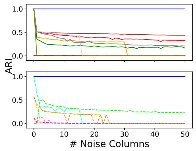

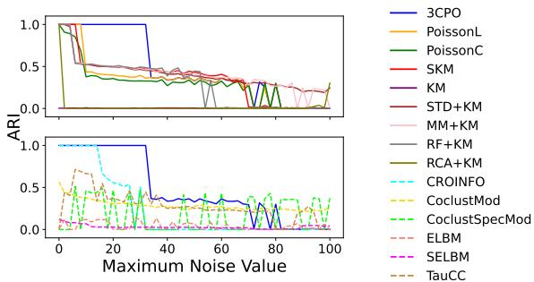  
(a) Increasing the amount of noise (b) Increasing the maximum value columns. within the noise column.  
Fig. 4: Robustness experiments investigating the impact of columns containing uniformly distributed noise on the clustering performance (measured by ARI). The upper plots show traditional clustering algorithms and the lower plots show co-clustering algorithms. In (a) we increase the amount noise columns with values within [0, 15] and in (b) we have a single noise column with values within [0, u] (u is given on the x-axis).

## 4.4 Robustness to Noise Columns

We investigate the robustness of 3CPO with respect to noise columns by conducting two experiments. The basis for these experiments is the Synth data set, where we only consider the first four columns $( C _ { 1 }$ and $C _ { 0 } )$ . In the first experiment (Fig. 4a), we add an increasing number of columns containing uniformly distributed values within [0, 15]. The results show that 3CPO is the only algorithm that is not afected by these noise columns, as the ARI is constantly 1.0, indicating that it successfully assigns all those columns into $C _ { - }$ . In the second experiment (Fig. 4b), we add a single column containing uniformly distributed values within [0, u], where $u \in [ 1 , 1 0 0 ]$ . Here, all traditional clustering algorithms except KM and RCA+KM perform well if $u \leq 7 .$ With respect to the co-clustering algorithms only CROINFO returns good results if $u \leq 1 8$ . However, with increasing $u ,$ 3CPO is the only method that still returns high-quality results until around $u = 3 2$

## 4.5 Ablation Studies

We conduct a series of experiments in which certain components of our method are ignored. Here, we fix $C _ { - } = \varnothing , C _ { 0 } = \varnothing$ , ignore the penalty for column selection by setting $b ( \mathbf { x } | K ) = 0$ , or use BIC as the penalty for column selection as described in Sect. 3.3. The results are summarized in Table 6. As our proposed version of 3CPO never performs significantly worse than a competitor, it is considered the most reliable across all experiments. In addition, it usually identifies a solution with fewer selected columns. We see that ignoring $b ( \mathbf { x } | K )$ and setting $C _ { 0 } = \varnothing$ leads to similar results, including a significant increase in the number of selected columns without positively influencing the clustering results. This confirms our hypothesis that a penalty term is needed to identify columns that behave similarly for all clusters. In many cases, removing such columns positively influences the clustering, as less noise is included in the final result. This is particularly evident with BBCSports and 20NewsG. Without the integration of C<sub>−</sub>, 3CPO also has trouble properly clustering WebKB. When using $b ( \mathbf { x } | K ) = B I C ( \mathbf { X } . _ { j } | K )$ instead of the MDL-based formulation, the results are very similar, indicating stability w.r.t. the choice of $b ( \mathbf { x } | K )$ . We want to emphasize that in situations where the proposed variant of 3CPO does not perform best (e.g., in the case of SportA), the diference is usually small and within the standard deviation.

Table 6: ARI results (in %) and the final number of columns included in $C _ { 1 }$ of various ablation studies. Entries correspond to the mean of ten executions ± the standard deviation. Colors indicate whether the average performance of 3CPO lies above (green), within (yellow) or below (red) the standard deviation band, where above is better for ARI and below is better for $| C _ { 1 } |$
<table><tr><td>Data set</td><td>| Metric |</td><td>3CPO</td><td>C_ = 0</td><td>C0 = 0</td><td> $\overline { { b ( \mathbf { X } _ { \cdot j } ) = 0 } }$ </td><td> $\overline { { b ( \mathbf { X } _ { \cdot j } ) = \operatorname { B I C } ( \mathbf { X } _ { \cdot j } ) } }$ </td></tr><tr><td rowspan="2">Synth</td><td>ARI</td><td> $\overline { { 9 5 . 5 \pm 0 . 0 } }$ </td><td>33.3 ± 0.1</td><td> $9 5 . 5 \pm 0 . 0$ </td><td> $\overline { { 9 5 . 5 \pm 0 . 0 } }$ </td><td>95.5 ± 0.0</td></tr><tr><td>|C1</td><td>2.0 ± 0.0</td><td>5.8 ± 0.6</td><td>4.0 ± 0.0</td><td> $4 . 0 \pm 0 . 0$ </td><td>2.0 ± 0.0</td></tr><tr><td rowspan="2">Wholesales</td><td>ARI</td><td>30.1 ± 0.0</td><td>31.3 ± 0.0</td><td> $\overline { { 3 0 . 1 \pm 0 . 0 } }$ </td><td>30.1 ± 0.0</td><td>30.1 ± 0.0</td></tr><tr><td>|C{1</td><td>5.0 ± 0.0</td><td>6.0 ± 0.0</td><td>5.0 ± 0.0</td><td> $5 . 0 \pm 0 . 0$ </td><td>5.0 ± 0.0</td></tr><tr><td rowspan="2">SportA</td><td>ARI</td><td>32.3 ± 0.5</td><td>32.3 ± 0.1</td><td>32.6 ± 0.2</td><td>32.6 ± 0.2</td><td>32.5 ± 0.3</td></tr><tr><td>|C1|</td><td>41.1 ± 1.4</td><td>42.5 ± 1.1</td><td>52.0 ± 0.0</td><td>52.0 ± 0.0</td><td>41.3 ± 0.9</td></tr><tr><td rowspan="2">Optdigits</td><td>ARI</td><td>66.7 ± 2.2</td><td>66.9 ± 1.8</td><td>66.8 ± 2.2</td><td>66.8 ± 2.2</td><td>66.8 ± 2.2</td></tr><tr><td>|C1|</td><td>55.8 ± 0.6</td><td>56.0 ± 0.0</td><td>56.0 ± 0.0</td><td>62.0 ± 0.0</td><td>56.0 ± 0.0</td></tr><tr><td rowspan="2">BBCSports</td><td>ARI</td><td>90.1 ± 2.9</td><td>78.0 ± 8.2</td><td>75.2 ± 8.5</td><td>63.3 ± 7.6</td><td>87.0 ± 6.3</td></tr><tr><td>|C{1</td><td>799.2 ± 7.6</td><td>860.6±28.1</td><td>1218.8±14.5</td><td>1953.7±5.9</td><td>720.8 ± 14.7</td></tr><tr><td rowspan="2">BBCNews</td><td>ARI</td><td>89.9 ± 0.9</td><td>90.1 ± 0.7</td><td>89.6 ± 0.7</td><td>89.5 ± 0.4</td><td>90.1 ± 0.7</td></tr><tr><td>|C{1</td><td>1379.0 ± 6.2</td><td>1437.4 ±4.5</td><td>1758.4±2.3</td><td>1984.8 ± 2.3</td><td>1367.4 ± 6.1</td></tr><tr><td rowspan="2">WebKB</td><td>ARI</td><td>31.5 ± 3.2</td><td>24.9 ± 1.1</td><td>33.8 ± 3.5</td><td>32.6 ± 2.7</td><td>30.9 ± 2.5</td></tr><tr><td>|C11</td><td>1314.9 ± 18.4</td><td>1407.9±42.5</td><td>1854.2 ±6.8</td><td>1936.2 ± 4.6</td><td>1282.7±19.2</td></tr><tr><td rowspan="2">Reuters</td><td>ARI</td><td> $6 7 . 8 \pm 1 . 6$ </td><td>65.7 ± 5.1</td><td> $6 7 . 2 \pm 3 . 3$ </td><td>65.4 ± 4.2</td><td>68.3 ± 1.3</td></tr><tr><td>|C1|</td><td> $1 3 2 1 . 9 \pm 7 . 9$ </td><td>1390.7 ± 29.1</td><td>1914.6 ± 2.1</td><td>1976.0 ± 1.7</td><td>1213.3 ± 11.7</td></tr><tr><td rowspan="2">20NewsG</td><td>ARI</td><td>23.0 ± 1.3</td><td>23.2 ± 1.7</td><td>22.4 ± 1.0</td><td>22.5 ± 0.9</td><td>22.8 ± 2.0</td></tr><tr><td>|C{1|</td><td>1453.7 ± 15.3</td><td>1456.7 ± 13.1</td><td>1990.5 ± 0.8</td><td>1999.0 ± 0.0</td><td>1564.4 ± 10.4</td></tr><tr><td rowspan="2">MouseAtlas</td><td></td><td></td><td></td><td></td><td></td><td></td></tr><tr><td>ARI |C1</td><td>56.3 ± 6.2 14566.0 ± 58.8</td><td>55.4 ± 5.0 14753.0±14.8</td><td>56.3 ± 6.2 14650.3± 26.2</td><td>56.3 ± 6.2 14736.9±21.3</td><td>56.2 ± 6.2 14550.3± 60.4</td></tr><tr><td rowspan="2">GeneExp</td><td></td><td></td><td></td><td></td><td></td><td></td></tr><tr><td>ARI</td><td>99.1 ± 0.1</td><td>98.7 ± 0.1</td><td>99.1 ± 0.1</td><td>98.8 ± 0.1</td><td>99.0 ± 0.2</td></tr><tr><td rowspan="2">HDendritic</td><td>|C1|</td><td>6445.1 ± 3.1</td><td>7652.8±3.0</td><td>7718.8±3.0</td><td>14135.0 ± 0.0</td><td>8065.6 ± 5.3</td></tr><tr><td>ARI |C1|</td><td>79.6 ± 5.8 16672.9 ± 406.2</td><td>83.4 ± 5.2 23694.0±388.1</td><td>79.6 ± 5.8 17599.1 ± 393.0</td><td>79.6±5.7 20094.5±274.9</td><td>79.6 ± 5.7 16574.9±343.4</td></tr></table>

## 4.6 Estimating the Number of Clusters

In many unsupervised scenarios, the number of clusters K is unknown to the user. Therefore, it is a significant advantage if an algorithm gives guidance on how to define this value. Similarly to our penalty term $b ( \mathbf { x } | K )$ , we define an MDL-based penalty term to describe diferent parameterizations for $K \colon v ( K ) = L ^ { 0 } ( K ) + n$ log K, where $L ^ { 0 } ( \cdot )$ is the universal prior for integers (Rissanen 1983). This term encodes the number of clusters by $L ^ { 0 } ( K )$ and the cluster assignments by n log K. Note that the clusterspecific column values are already encoded by $b ( \mathbf { x } | K )$ . The penalty $v ( K )$ is added to Eq. (5) to prevent the model from overfitting when increasing K.

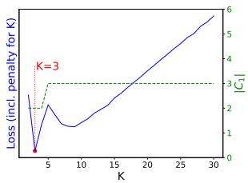  
(a) Synth $( K _ { g t } = 3 )$

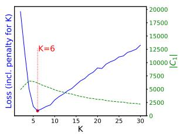  
(b) GeneExp $( K _ { g t } = 5 )$

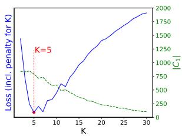  
(c) BBCSports $( K _ { g t } = 5 )$  
Fig. 5: Loss of 3CPO (incl. the penalty term $v ( K )$ – blue line) and number of columns in $C _ { 1 }$ (green line) for varying K. Each entry corresponds to the best loss after 20 runs. The red line marks the K for which the minimum loss occurs.

Fig. 5 shows the extended loss, i.e., $\mathcal { L } _ { K } ( \mathbf { X } ) = \mathcal { L } ( \mathbf { X } ) + v ( K )$ , and the number of columns in $C _ { 1 }$ of 3CPO for Synth, GeneExp, and BBCSports using $K \in \{ 2 , 3 , \ldots , 3 0 \}$ To receive more reliable results, each entry corresponds to the best result after 20 runs.

We notice that the number of columns in $C _ { 1 }$ decreases with increasing K as $b ( \mathbf { x } | K )$ depends on K. Yet, 3CPO identifies the ground truth K for Synth and BBCSports and is only of by one for GeneExp. When analyzing the identified clusters regarding GeneExp, we see that 3CPO splits the largest ground truth cluster with 300 samples into two clusters of size 65 and 235, leading to an ARI of 87.9. This behavior potentially ofers additional insights for domain experts. In the case of Synth, we can see a conspicuous bump in the loss at $K = 9$ due to the fifth column containing uniformly distributed noise. Here, 3CPO subdivides each ground truth cluster into three additional clusters, e.g., by dividing the noise into ranges [0, 5], [6, 10], and [11, 15].

Appendix E provides results (estimated K, ARI, Purity) for all data sets, discusses k-Means-based k-estimation techniques and states results regarding the number of clusters as identified by TauCC. In general, our experiments show that 3CPO can obtain high quality results without knowing the ground truth number of clusters when dealing with high-dimensional text data sets but struggles with certain tabular data.

## 5 Limitations

Despite its robust clustering performance and options for interpretability, 3CPO possesses certain limitations that provide avenues for future research. First, the model assumes a Poisson-based structure. While efective for many count data scenarios, this may be sub-optimal for data sets exhibiting significant overdispersion or zero-inflation beyond the Poisson mean-variance identity. Extending the methodologies to other distributions such as the negative binomial would enhance its versatility. Second, the current definition of the penalty term for column selection, b(x|K), and the encoding of outliers are subject to heuristic choices. As the number of clusters K currently influences feature selection, the model may converge to undesired local optima in specific high-dimensional settings. Finally, another issue is that 3CPO requires the number of clusters to be known apriori. While we propose a heuristic to estimate the number of clusters for 3CPO, a more cohesive integration – akin to the iterative splitting approach of X-Means (Pelleg and Moore 2000) – could further improve the quality and stability of the process, increasing the applicability in real-world scenarios where the number of clusters is often unknown.

## 6 Discussion and Conclusions

We introduced 3CPO, a principled approach for clustering count data with integrated column selection that combines theoretical rigor with practical eficiency. The method outputs a hard clustering of rows and simultaneously finds a subset of columns that are relevant for clustering. We found that 3CPO outperforms the compared methods in many scenarios. Notably, our approach often beats tailored bag-of-words text representations for text data, indicating its general applicability. Beyond competitive performance on standard benchmarks, 3CPO shows a superior performance in noisy settings. The integration of a Poisson-based noise model enables 3CPO to outperform clustering methods using normalized versions of the count matrix, e.g., by applying RCA. Our outlier detection feature further improves clustering quality by highlighting samples that do not fit the underlying clustering assumptions. This opens up interesting possibilities for future work, for example, by refining the outlier detection mechanism and integrating an automatic estimation of the number of clusters.

Acknowledgements. We thank the Research Council of Finland (decisions 364226, 368654) and the Technology Industries of Finland Centennial Foundation for funding. We thank the Finnish Computing Competence Infrastructure (FCCI) for computational and data storage resources.

## Declarations

The authors have no competing interests to declare.

## References

Ailem, M., Role, F., Nadif, M.: Co-clustering document-term matrices by direct maximization of graph modularity. In: CIKM, pp. 1807–1810 (2015). ACM

Ailem, M., Role, F., Nadif, M.: Model-based co-clustering for the efective handling of sparse data. Pattern Recognit. 72, 108–122 (2017)

Ailem, M., Role, F., Nadif, M.: Sparse poisson latent block model for document clustering. IEEE Trans. Knowl. Data Eng. 29(7), 1563–1576 (2017)

Arthur, D., Vassilvitskii, S.: How slow is the k-means method? In: ACM SCG, pp. 144–153 (2006)

Arthur, D., Vassilvitskii, S.: k-means++: the advantages of careful seeding. In: SIAM SODA, pp. 1027–1035 (2007)

Balassa, B.: Trade Liberalisation and “Revealed” Comparative Advantage. The Manchester School 33(2), 99–123 (1965)

Bauer, L.G.M., Leiber, C., B¨ohm, C., Plant, C.: Extension of the dip-test repertoire - eficient and diferentiable p-value calculation for clustering. In: SIAM SDM, pp. 109–117 (2023)

Blei, D.M., Ng, A.Y., Jordan, M.I.: Latent Dirichlet Allocation. J. Mach. Learn. Res. 3, 993–1022 (2003)

Bouguila, N.: Clustering of count data using generalized dirichlet multinomial distributions. IEEE Trans. Knowl. Data Eng. 20(4), 462–474 (2008)

Bouguila, N.: Count data modeling and classification using finite mixtures of distributions. IEEE Trans. Neural Networks 22(2), 186–198 (2011)

Battaglia, E., Peiretti, F., Pensa, R.G.: Fast parameterless prototype-based coclustering. Mach. Learn. 113(4), 2153–2181 (2024)

Battaglia, E., Peiretti, F., Pensa, R.G.: Co-clustering: A survey of the main methods, recent trends, and open problems. ACM Comput. Surv. 57(2), 48–14833 (2025)

Banfield, J.D., Raftery, A.E.: Model-based gaussian and non-gaussian clustering. Biometrics, 803–821 (1993)

Ceder, A.: Bus frequency determination using passenger count data. Transp. Res. A 18(5-6), 439–453 (1984)

Cai, L., Huang, H., Blackshaw, S., Liu, J.S., Cepko, C., Wong, W.H.: Clustering analysis of sage data using a poisson approach. Genome Biol. 5, 1–9 (2004)

Devlin, J., Chang, M., Lee, K., Toutanova, K.: BERT: pre-training of deep bidirectional transformers for language understanding. In: Association for Computational Linguistics NAACL-HLT (1), pp. 4171–4186 (2019)

Ding, C.H.Q., He, X., Zha, H., Simon, H.D.: Adaptive dimension reduction for clustering high dimensional data. In: Proc. IEEE ICDM 2002, pp. 147–154 (2002)

Dubes, R.C., Jain, A.K.: Clustering techniques: The user’s dilemma. Pattern Recognit. 8(4), 247–260 (1976)

Ding, C.H.Q., Li, T.: Adaptive dimension reduction using discriminant analysis and K-means clustering. In: ICML. ACM International Conference Proceeding Series, vol. 227, pp. 521–528 (2007)

Dempster, A.P., Laird, N.M., Rubin, D.B.: Maximum likelihood from incomplete data via the em algorithm. J. R. Stat. Soc. Ser. B 39(1), 1–22 (1977)

Dhillon, I.S., Modha, D.S.: Concept decompositions for large sparse text data using clustering. Mach. Learn. 42, 143–175 (2001)

Elkan, C.: Clustering documents with an exponential-family approximation of the dirichlet compound multinomial distribution. In: ICML, vol. 148, pp. 289–296 (2006)

Farnsworth, G.L., Nichols, J.D., Sauer, J.R., Fancy, S.G., Pollock, K.H., Shriner, S.A., Simons, T.R., Ralph, C., Rich, T.: Statistical approaches to the analysis of point count data: a little extra information can go a long way. In: Proc. 3rd Int. Partners Flight Conf., vol. 2, pp. 736–743 (2005)

Greene, D., Cunningham, P.: Practical solutions to the problem of diagonal dominance in kernel document clustering. In: ICML, vol. 148, pp. 377–384 (2006). ACM

Gopalan, P., Hofman, J.M., Blei, D.M.: Scalable recommendation with hierarchical poisson factorization. In: AUAI Press UAI, pp. 326–335 (2015)

Goebl, S., He, X., Plant, C., B¨ohm, C.: Finding the optimal subspace for clustering. In: Proc. IEEE ICDM 2014, pp. 130–139 (2014)

Govaert, G., Nadif, M.: Latent block model for contingency table. Communications in Statistics—Theory and Methods 39(3), 416–425 (2010)

Govaert, G., Nadif, M.: Mutual information, phi-squared and model-based coclustering for contingency tables. Adv. Data Anal. Classif. 12(3), 455–488 (2018)

Hubert, L., Arabie, P.: Comparing partitions. J. Classif. 2, 193–218 (1985)

Hoseinipour, S., Aminghafari, M., Mohammadpour, A., Nadif, M.: A sparse exponential family latent block model for co-clustering. Adv. Data Anal. Classif. 19(4), 951–987 (2025)

Hargesheimer, E.E., Lewis, C.M.: Particle counting: How, why, where, & what equipment. Alberta WW Oper. Assoc. (1998)

Kriegel, H.-P., Kr¨oger, P., Zimek, A.: Subspace clustering. Wiley Interdiscip. Rev. Data Min. Knowl. Discov. 2(4), 351–364 (2012)

Klein, M., Leiber, C., B¨ohm, C.: k-submix: Common subspace clustering on mixedtype data. In: ECML/PKDD (1). Springer Lecture Notes in Computer Science, vol. 14169, pp. 662–677 (2023)

Kelly, M., Longjohn, R., Nottingham, K.: The UCI Machine Learning Repository

Kvalseth, T.O.: Entropy and correlation: Some comments. IEEE Trans. Syst. Man Cybern. 17(3), 517–519 (1987)

Kim, K., Zhang, S., Jiang, K., Cai, L., Lee, I.-B., Feldman, L.J., Huang, H.: Measuring similarities between gene expression profiles through new data transformations. BMC Bioinform. 8, 1–14 (2007)

Lloyd, S.P.: Least squares quantization in PCM. IEEE Trans. Inf. Theory 28(2), 129– 136 (1982)

Labiod, L., Nadif, M.: Co-clustering for binary data with maximum modularity. In: ICONIP, pp. 700–708 (2011). Springer

Mikolov, T., Chen, K., Corrado, G., Dean, J.: Eficient estimation of word representations in vector space. arXiv:1301.3781 (2013)

Manning, C.D., Raghavan, P., Sch¨utze, H.: Introduction to Information Retrieval, (2008). Cambridge University Press

M¨ullner, D.: Modern hierarchical, agglomerative clustering algorithms. arXiv preprint arXiv:1109.2378 (2011)

Mautz, D., Ye, W., Plant, C., B¨ohm, C.: Towards an optimal subspace for k-means. In: Proc. ACM SIGKDD 2017, pp. 365–373 (2017)

Nadif, M., Govaert, G.: A comparison between block CEM and two-way CEM algorithms to cluster a contingency table. In: PKDD. Springer Lecture Notes in Computer Science, vol. 3721, pp. 609–616 (2005)

O’Hara, R., Kotze, J.: Do not log-transform count data. Nat. Precedings (2010)

Pelleg, D., Moore, A.W.: X-means: Extending k-means with eficient estimation of the number of clusters. In: ICML, pp. 727–734 (2000)

Rouwendal, J., Boter, J.: Assessing the value of museums with a combined discrete choice/count data model. Applied Economics 41(11), 1417–1436 (2009)

Rau, A., Celeux, G., Martin-Magniette, M.-L., Maugis-Rabusseau, C.: Clustering highthroughput sequencing data with poisson mixture models. Research Report RR-7786, INRIA (2011)

Rissanen, J.: Modeling by shortest data description. Automatica 14(5), 465–471 (1978)

Rissanen, J.: A universal prior for integers and estimation by minimum description length. Ann. Stat. 11(2), 416–431 (1983)

Role, F., Morbieu, S., Nadif, M.: Coclust: a python package for co-clustering. Journal of Statistical Software 88, 1–29 (2019)

Rousseeuw, P.J.: Silhouettes: a graphical aid to the interpretation and validation of

cluster analysis. Comput. Appl. Math. 20, 53–65 (1987)

Robertson, S.E., Zaragoza, H.: The probabilistic relevance framework: BM25 and beyond. Found. Trends Inf. Retr. 3(4), 333–389 (2009)

Satopaa, V., Albrecht, J.R., Irwin, D., Raghavan, B.: Finding a ”kneedle” in a haystack: Detecting knee points in system behavior. In: ICDCS Workshops, pp. 166–171 (2011). IEEE

Schwarz, G.: Estimating the dimension of a model. The annals of statistics, 461–464 (1978)

Snow, L., Davies, R., Christiansen, K., Carrique-Mas, J., Wales, A., O’connor, J., Cook, A., Evans, S.: Survey of the prevalence of salmonella species on commercial laying farms in the united kingdom. Vet. Rec. 161(14), 471–476 (2007)

Sim, K., Gopalkrishnan, V., Zimek, A., Cong, G.: A survey on enhanced subspace clustering. Data Min. Knowl. Discov. 26, 332–397 (2013)

Tran, H.T.N., Ang, K.S., Chevrier, M., Zhang, X., Lee, N.Y.S., Goh, M., Chen, J.: A benchmark of batch-efect correction methods for single-cell rna sequencing data. Genome biology 21(1), 12 (2020)

Thorndike, R.L.: Who belongs in the family? Psychometrika 18(4), 267–276 (1953)

Waltman, L., Calero-Medina, C., Kosten, J., Noyons, E.C., Tijssen, R.J., Eck, N.J., Leeuwen, T.N., Raan, A.F., Visser, M.S., Wouters, P.: The leiden ranking 2011/2012: Data collection, indicators, and interpretation. J. Am. Soc. Inf. Sci. Technol. 63(12), 2419–2432 (2012)

Witten, D.M.: Classification and clustering of sequencing data using a poisson model. Ann. Appl. Stat. 5(4), 2493–2518 (2011)

Xu, R., Wunsch II, D.C.: Survey of clustering algorithms. IEEE Trans. Neural Networks 16(3), 645–678 (2005)

Yang, Y., Xu, D., Nie, F., Yan, S., Zhuang, Y.: Image clustering using local discriminant models and global integration. IEEE Trans. Image Process. 19(10), 2761–2773 (2010)

Zamzami, N., Bouguila, N.: High-dimensional count data clustering based on an exponential approximation to the multinomial beta-liouville distribution. Information Sciences 524, 116–135 (2020)

Zamzami, N., Bouguila, N.: A novel minorization-maximization framework for simultaneous feature selection and clustering of high-dimensional count data. Pattern Anal. Appl. 26(1), 91–106 (2023)

## Appendix A A Poisson-based Clustering Model

The Poisson distribution is a natural foundation when working with count data. The probability mass function regarding a discrete random variable $\mathbf { X } _ { i j }$ is defined as

$$
p ( \mathbf { X } _ { i j } \mid \mu _ { i j } ) = \frac { \mu _ { i j } ^ { \mathbf { X } _ { i j } } } { ( \mathbf { X } _ { i j } ) ! } e ^ { - \mu _ { i j } } ,\tag{A1}
$$

where $\mu _ { i j }$ are the expected number of occurrences. Since we assume that all entries have been drawn independently, the likelihood of a given $n \times m$ data matrix X is given by

$$
p ( \mathbf { X } \mid \mu ) = \prod _ { i = 1 } ^ { n } \prod _ { j = 1 } ^ { m } p ( \mathbf { X } _ { i j } \mid \mu _ { i j } ) .\tag{A2}
$$

If we do not restrict the parameters $\mu _ { i j }$ , the solution is trivially to set the parameters equal to the observations or $\mu _ { i j } = \mathbf { X } _ { i j }$ . However, this will lead to overfitting because the number of parameters equals the number of observations. Therefore, we need some simplifying modeling assumptions. We follow the definition given, e.g., in (Cai et al. 2004; Kim et al. 2007), where the mean is a product of row- and column-specific factors

$$
\mu _ { i j } = \lambda _ { i } ^ { R } \lambda _ { j } ^ { C } ,\tag{A3}
$$

where $\lambda _ { i } ^ { R } \in \mathbb { R } _ { > 0 }$ and $\lambda _ { i } ^ { C } \in \mathbb { R } _ { > 0 }$ . This concept is closely related to Poisson Factorization (Gopalan et al. 2015). We can compute optimal values for the parameters $\lambda _ { i } ^ { R }$ and $\lambda _ { j } ^ { C }$ so that the likelihood of Eq. (A2) is maximized by applying Maximum Likelihood Estimation (MLE). Since argma $\mathrm { x } _ { \mu \in \mathbb { R } _ { > 0 } } p ( \mathbf { X } \mid \mu ) = { \mathrm { a r g m a x } } _ { \mu \in \mathbb { R } _ { > 0 } } \log ( p ( \mathbf { X } \mid \mu ) )$ our objective can be formulated as to maximizing the following function

$$
\begin{array} { l } { \log \left( \boldsymbol { p } ( \mathbf { X } \mid \boldsymbol { \mu } ) \right) = \log \left( \displaystyle \prod _ { i = 1 } ^ { n } \prod _ { j = 1 } ^ { m } \frac { ( \lambda _ { i } ^ { R } \lambda _ { j } ^ { C } ) ^ { \mathbf { X } _ { i j } } } { ( \mathbf { X } _ { i j } ) ! } e ^ { - ( \lambda _ { i } ^ { R } \lambda _ { j } ^ { C } ) } \right) } \\ { = \displaystyle \sum _ { i = 1 } ^ { n } \sum _ { j = 1 } ^ { m } \mathbf { X } _ { i j } \log ( \lambda _ { i } ^ { R } ) + \mathbf { X } _ { i j } \log ( \lambda _ { j } ^ { C } ) - ( \lambda _ { i } ^ { R } \lambda _ { j } ^ { C } ) - \log ( ( \mathbf { X } _ { i j } ) ! ) . } \end{array}\tag{A4}
$$

Setting the first derivative regarding $\lambda _ { i } ^ { R }$ to zero yields

$$
\begin{array} { c } { { \displaystyle 0 \overset { ! } { = } \frac \partial { \partial \lambda _ { i } ^ { R } } \log \big ( p ( { \bf X } \mid \mu ) \big ) = \sum _ { j = 1 } ^ { m } \frac { { \bf X } _ { i j } } { \lambda _ { i } ^ { R } } - \lambda _ { j } ^ { C } } } \\ { { \displaystyle \Leftrightarrow \lambda _ { i } ^ { R } = \frac 1 { \sum _ { j = 1 } ^ { m } \lambda _ { j } ^ { C } } \sum _ { j = 1 } ^ { m } { \bf X } _ { i j } } . } \end{array}\tag{A5}
$$

Analogously, when considering the derivative regarding $\lambda _ { j } ^ { C }$ , we obtain

$$
\lambda _ { j } ^ { C } = \frac { 1 } { \sum _ { \substack { i = 1 } } ^ { n } \lambda _ { i } ^ { R } } \sum _ { i = 1 } ^ { n } \mathbf { X } _ { i j } .\tag{A6}
$$

Note that for any constant $\kappa \in \mathbb { R } _ { > 0 }$ , we can divide $\lambda _ { i } ^ { R } \gets \lambda _ { i } ^ { R } / \kappa$ and multiply $\lambda _ { j } ^ { C } \gets$ $\kappa \lambda _ { i } ^ { C }$ without afecting the parameters $\mu _ { i j }$ . Therefore, w.l.o.g. we can set $\begin{array} { r } { \sum _ { j = 1 } ^ { m } \lambda _ { j } ^ { C } = 1 } \end{array}$ This yields

$$
\lambda _ { i } ^ { R } = \sum _ { j = 1 } ^ { m } \mathbf { X } _ { i j } = r _ { i } \qquad { \mathrm { a n d } } \qquad \lambda _ { j } ^ { C } = { \frac { 1 } { \sum _ { i = 1 } ^ { n } r _ { i } } } \sum _ { i = 1 } ^ { n } \mathbf { X } _ { i j } = { \frac { c _ { j } } { \sum _ { i = 1 } ^ { n } r _ { i } } } = { \frac { c _ { j } } { N } }\tag{A7}
$$

and finally

$$
\mu _ { i j } = \frac { r _ { i } c _ { j } } { \sum _ { i ^ { \prime } = 1 } ^ { n } r _ { i ^ { \prime } } } = \frac { r _ { i } c _ { j } } { \sum _ { j ^ { \prime } = 1 } ^ { m } c _ { j ^ { \prime } } } = \frac { r _ { i } c _ { j } } { N } .\tag{A8}
$$

Standardization using the Poisson Model. The described Poisson model can be used to apply a Poisson-based standardization (or z-normalization) to a data matrix X. We show how this relates to Chi-squared and the Revealed Comparative Advantage (RCA) (Balassa 1965).

The standard score of an entry $\mathbf { X } _ { i j }$ is calculated as

$$
\mathrm { S T D } ( { \bf X } _ { i j } ) = \frac { { \bf X } _ { i j } - \mu _ { i j } } { \sigma _ { i j } } .\tag{A9}
$$

Considering that in the case of the Poisson distribution $\mu = \sigma ^ { 2 }$ , the Poisson-based standard score can be formulated as

$$
\mathrm { P - S T D } ( \mathbf { X } _ { i j } ) = \frac { \mathbf { X } _ { i j } - \mu _ { i j } } { \sqrt { \mu _ { i j } } } .\tag{A10}
$$

Note that this formulation is equal to the square root of Pearson’s Chi-squared test, i. $\mathrm { e . , P \mathrm { - } S T D } ( \mathbf { X } _ { i j } ) = \sqrt { \mathcal { X } ^ { 2 } ( \mathbf { X } _ { i j } ) }$

Furthermore, we can consider a generalized version of P-STD with a weighting factor α for the denominator (which is set to 0.5 in Eq. (A10)).

$$
\mathrm { P - S T D } ( \mathbf { X } _ { i j } , \alpha ) = \frac { \mathbf { X } _ { i j } - \mu _ { i j } } { ( \mu _ { i j } ) ^ { \alpha } }\tag{A11}
$$

If $\alpha = 1$ , this formulation is equal to the RCA up to a constant of −1, i.e.,

$$
\mathrm { P - S T D } ( \mathbf { X } _ { i j } , 1 ) = \frac { \mathbf { X } _ { i j } - \mu _ { i j } } { ( \mu _ { i j } ) ^ { 1 } } = \frac { \mathbf { X } _ { i j } N } { r _ { i } c _ { j } } - 1 = \mathrm { R C A } ( \mathbf { X } _ { i j } ) - 1 .\tag{A12}
$$

As P-STD with $\alpha = 0 . 5$ builds on a solid statistical model that takes into account increasing variances for larger expected values, we argue that it is more robust with regard to noisy data than RCA.

## A.1 PoissonL/PoissonC: Poisson-based Clustering

The described Poisson model was used to propose the PoissonL and PoissonC algorithms (Cai et al. 2004) for clustering gene expression data. However, as shown in our experiments, they are not only applicable to gene expression data but also more generally to count data. The objective is to divide the data into $K \in \mathbb { N } _ { > 0 }$ sets of rows $R _ { k }$ that show a similar relationship between the columns and, therefore, can be modeled using the described Poisson model by representing each set of rows $R _ { k }$ using a specific $\lambda _ { j | k } ^ { C } \in \mathbb { R } _ { > 0 }$ . This can be formulated as minimizing the loss function

$$
\begin{array} { l } { { \displaystyle { \mathcal { L } } ( { \mathbf { X } } ) = - \sum _ { k = 1 } ^ { K } \sum _ { i \in R _ { k } } \sum _ { j = 1 } ^ { m } \log ( p ( { \mathbf { X } } _ { i j } \mid \lambda _ { i } ^ { R } \lambda _ { j | k } ^ { C } ) ) } \ ~ } \\ { { \displaystyle = - \sum _ { k = 1 } ^ { K } \sum _ { i \in R _ { k } } \sum _ { j = 1 } ^ { m } \mathbf { X } _ { i j } \log ( \lambda _ { i } ^ { R } ) + \mathbf { X } _ { i j } \log ( \lambda _ { j | k } ^ { C } ) - \lambda _ { i } ^ { R } \lambda _ { j | k } ^ { C } - \log ( ( \mathbf { X } _ { i j } ) ! ) } . } \end{array}\tag{A13}
$$

As we are only optimizing with respect to $\lambda _ { j | k } ^ { C }$ and $R _ { k }$ , this can be simplified to

$$
\mathcal { L } ( \mathbf { X } ) = - \sum _ { k = 1 } ^ { K } \sum _ { i \in R _ { k } } \sum _ { j = 1 } ^ { m } \mathbf { X } _ { i j } \log ( \lambda _ { j \vert k } ^ { C } ) - \lambda _ { i } ^ { R } \lambda _ { j \vert k } ^ { C } + \mathrm { c o n s t . }\tag{A14}
$$

Using this definition, we perform an iterative approach to update the cluster assignments $R _ { k }$ and cluster-specific $\lambda _ { j \vert k } ^ { C }$ values.

We start with initial cluster assignments, $\mathrm { e . g . }$ , by random initialization or by utilizing more sophisticated initialization strategies like the one proposed in Sect. 3.5, which builds on k-Means++ (Arthur and Vassilvitskii 2007). Afterward, we repeat two steps until convergence. First, we compute the cluster-specific column values

$$
\boldsymbol { \lambda } _ { j | k } ^ { C } = \frac { 1 } { \sum _ { i \in R _ { k } } { r _ { i } } } \sum _ { i \in R _ { k } } \mathbf { X } _ { i j } ,\tag{A15}
$$

where the column parameters are scaled such that $\begin{array} { r } { \forall _ { k \in [ K ] } \sum _ { j = 1 } ^ { m } \lambda _ { j | k } ^ { C } = 1 } \end{array}$ and $\lambda _ { i } ^ { R }$ is defined as in Eq. (A7). Second, we update the cluster assignments by choosing the cluster that gives the highest log-probability, considering the new column values

$$
{ R } _ { k } = \{ i \in [ n ] \ | \ k = \mathrm { a r g m a x } _ { k ^ { \prime } \in [ K ] } \sum _ { j = 1 } ^ { m } { \bf X } _ { i j } \log ( \lambda _ { j | k ^ { \prime } } ^ { C } ) - \lambda _ { i } ^ { R } \lambda _ { j | k ^ { \prime } } ^ { C } \} .\tag{A16}
$$

```latex
Algorithm 2: The PoissonL/PoissonC algorithms
Input: data set X, number of clusters K
Output: the cluster assignments $R _ { k } .$ , the cluster-specific column values $\lambda _ { j \vert k } ^ { C }$
1 $/ /$ Initialization
2 $\begin{array} { r } { \lambda _ { i } ^ { R }  \sum _ { j = 1 } ^ { m } { \bf X } _ { i j } } \end{array}$
3 $R _ { 1 } , \ldots , R _ { K } $ initialize cluster assignments (e.g., by k-Means++)
4 while any $R _ { k }$ changed in last iteration do
5 $/ /$ Update lambdas
6 for $k \in [ K ]$ do
7 for $j \in [ m ]$ do
8 $\begin{array} { r } { \big . \overset { \cdot } { \lambda } _ { j \mid k } ^ { C }  \frac { 1 } { \sum _ { i \in R _ { k } } r _ { i } } \sum _ { i \in R _ { k } } \mathbf { X } _ { i j } } \end{array}$
9 $/ /$ Update cluster assignments
10 $R _ { 1 } , \ldots , R _ { K }  \varnothing$
11 for $i \in [ n ]$ do
12 if Algorithm is PoissonL then
13 $\begin{array} { r } { \stackrel { \smile } { k }  \operatorname { a r g m a x } _ { k ^ { \prime } \in [ K ] } \sum _ { j = 1 } ^ { m } { \bf X } _ { i j } \log ( \lambda _ { j | k ^ { \prime } } ^ { C } ) - \lambda _ { i } ^ { R } \lambda _ { j | k ^ { \prime } } ^ { C } } \end{array}$
14 else if Algorithm is PoissonC then
15 $\begin{array} { r } { k \gets \mathrm { a r g m i n } _ { k ^ { \prime } \in [ K ] } \sum _ { j = 1 } ^ { m } \frac { ( \mathbf { X } _ { i j } - \lambda _ { i } ^ { R } \lambda _ { j | k ^ { \prime } } ^ { C } ) ^ { 2 } } { \lambda _ { i } ^ { R } \lambda _ { j | k ^ { \prime } } ^ { C } } } \end{array}$
16 $\dot { R } _ { k } \gets R _ { k } \cup \{ i \}$
17 return $R _ { k } , \lambda _ { j | k } ^ { C }$
```

PoissonC (Cai et al. 2004) uses an alternative strategy to update the cluster assignments by choosing the cluster that gives the minimum Chi-squared value. The complete process is given in Algorithm 2.

## A.2 3CPO: Poisson-based Subspace Clustering

The PoissonL and PoissonC algorithms have two main assumptions regarding the data matrix X:

1. All entries within row i are scaled by the row-specific value $\lambda _ { i } ^ { R }$

2. The values in cluster k all follow the proportions as defined in the column-specific values $\lambda _ { j | k } ^ { C }$ and are diferent to other clusters.

If one of these properties is violated, the quality of the clustering result can suffer greatly. Therefore, our proposed algorithm 3CPO automatically discovers noisy columns and defines a subspace that only contains columns that fulfill the mentioned assumptions. This also has the advantage that the resulting clustering solution is easier to interpret, as only a subset of the columns has to be analyzed. 3CPO identifies relevant columns by optimizing the following loss function

$$
\begin{array} { r l } {  { \mathcal { L } ( \mathbf { X } ) = - \sum _ { i = 1 } ^ { n } \sum _ { j = 1 } ^ { m } \log p ( \mathbf { X } _ { i j } , \mu _ { i j } ) + \sum _ { j \in \mathcal { L } _ { 1 } } b ( \mathbf { X } _ { \cdot j } | K ) } } \\ & { = - \sum _ { k = 1 } ^ { K } \sum _ { \ell \in \mathcal { R } _ { k } } ( \overbrace { \sum _ { j \in C _ { - } } \log ( p ( \mathbf { X } _ { i j } \mid \lambda _ { j - 1 } ^ { C } ) ) } ^ { \mathrm { c o l u m m s ~ v i o n ~ o r ~ t i o n ~ ( 1 ) } } + \overbrace { \sum _ { j \in C _ { 0 } } \log ( p ( \mathbf { X } _ { i j } \mid \lambda _ { i } ^ { C } \lambda _ { j | 0 } ^ { C } ) ) } ^ { \mathrm { c o l u m m s ~ v i o n ~ g a s s u m p t i o n ~ ( 2 ) } }  } \\ & { \qquad + \underbrace { \sum _ { j \in \mathcal { L } _ { 1 } } \log ( p ( \mathbf { X } _ { i j } \mid \lambda _ { i } ^ { R } \lambda _ { j | k } ^ { C } ) ) } _ { \mathrm { r e l o t e n o u t ~ c o u t u m n s ~ f o r ~ c l u s t e r i n g } } + + \underbrace { \sum _ { j \in C _ { 1 } } b ( \mathbf { X } _ { \cdot j } | K ) } _ { \mathrm { c o l u m n s ~ s e l o t e t i o n ~ p e n a l t y } \mathrm { t e r m } } , } \end{array}\tag{A17}
$$

where $C _ { - } , C _ { 0 }$ and $C _ { 1 }$ are non-overlapping partitions of the m columns so that $C _ { - } \cup$ $C _ { 0 } \cup C _ { 1 } = [ m ]$ and $b ( \mathbf { X } _ { \cdot j } | K )$ is a penalty term explained in Sect. 3.3. Note that columns that do not follow assumption (1) are contained in $C _ { - }$ and do not use the row-specific values $\lambda _ { i } ^ { R }$ to calculate the expected value.

Given an input matrix $\mathbf { Y } _ { \mathrm { ~ \scriptsize ~ ; ~ } }$ , we set $\mathbf { X } _ { i j } = \mathbf { Y } _ { i j } + \alpha - 1$ , as defined in the main paper. Considering constant terms that are not relevant for the optimization yields

$$
\begin{array} { l } { { \displaystyle { \mathcal L } ( { \bf X } ) = - \sum _ { k = 1 } ^ { K } \sum _ { i \in R _ { k } } \left( \sum _ { j \in C _ { - } } { \bf X } _ { i j } \log ( \lambda _ { j | - } ^ { C } ) - \lambda _ { j | - } ^ { C } + \sum _ { j \in C _ { 0 } } { \bf X } _ { i j } \log ( \lambda _ { j | 0 } ^ { C } ) - \lambda _ { i } ^ { R } \lambda _ { j | 0 } ^ { C } \right. } } \\ { { \displaystyle \qquad \left. + \sum _ { j \in C _ { 1 } } { \bf X } _ { i j } \log ( \lambda _ { j | k } ^ { C } ) - \lambda _ { i } ^ { R } \lambda _ { j | k } ^ { C } + \sum _ { j \in C _ { 0 } \cup C _ { 1 } } { \bf X } _ { i j } \log ( \lambda _ { i } ^ { R } ) \right) } } \\ { { \displaystyle \qquad + \sum _ { j \in C _ { 1 } } b ( { \bf X } _ { \cdot j } | K ) + \mathrm { c o n s t . } } } \end{array}\tag{A18}
$$

The lambda parameters can be optimized again by performing MLE. This gives us

$$
\boldsymbol { \lambda } _ { i } ^ { R } = \frac { 1 } { \sum _ { j \in C _ { 1 } } \lambda _ { j | k } ^ { C } + \sum _ { j \in C _ { 0 } } \lambda _ { j | 0 } ^ { C } } \sum _ { j \in C _ { 0 } \cup C _ { 1 } } { \bf X } _ { i j } , \qquad \mathrm { i f } \quad i \in R _ { k } ,\tag{A19}
$$

$$
\lambda _ { j | - } ^ { C } = \frac { 1 } { n } \sum _ { i = 1 } ^ { n } \mathbf { X } _ { i j } ,\tag{A20}
$$

$$
\boldsymbol { \lambda } _ { j \vert 0 } ^ { C } = \frac { 1 } { \sum _ { i = 1 } ^ { n } \lambda _ { i } ^ { R } } \sum _ { i = 1 } ^ { n } \mathbf { X } _ { i j } ,\tag{A21}
$$

$$
\lambda _ { j | k } ^ { C } = \frac { 1 } { \sum _ { \substack { i \in R _ { k } } } \lambda _ { i } ^ { R } } \sum _ { i \in R _ { k } } \mathbf { X } _ { i j } .\tag{A22}
$$

Since $\lambda _ { i } ^ { R }$ depends on $\lambda _ { j \vert 0 } ^ { C }$ and $\lambda _ { j \vert k } ^ { C } ,$ , we cannot follow the strategy proposed before and simply set the sum of the cluster-specific column values equal to one. Since $\lambda _ { j \vert 0 }$ is shared across all clusters, the factor κ used for scaling $\lambda _ { i } ^ { R }  \kappa \lambda _ { i } ^ { R }$ and $\lambda _ { j | l } ^ { C }  \textstyle { \frac { 1 } { \kappa } } \bar { \lambda } _ { j | l } ^ { C }$

has to be equal for all $l \in \{ 0 \} \cup [ K ]$ so that $\lambda _ { i } ^ { R } \lambda _ { j | l } ^ { C } = \mu _ { i j }$ is fulfilled. However, w.l.o.g., we can scale $\textstyle \sum _ { i = 1 } ^ { n } \lambda _ { i } ^ { R } = 1$ . It follows that

$$
\lambda _ { j | 0 } ^ { C } = \sum _ { i = 1 } ^ { n } \mathbf { X } _ { i j } \quad \Rightarrow \quad \sum _ { j \in C _ { 0 } } \lambda _ { j | 0 } ^ { C } = \sum _ { i = 1 } ^ { n } \sum _ { j \in C _ { 0 } } \mathbf { X } _ { i j } .\tag{A23}
$$

Furthermore, we consider the following formulations (based on Eq. (A19) and (A22)) regarding cluster k

$$
\sum _ { j \in C _ { 1 } } \lambda _ { j \mid k } ^ { C } = \frac { \sum _ { i \in R _ { k } } \sum _ { j \in C _ { 1 } } \mathbf { X } _ { i j } } { \sum _ { i \in R _ { k } } \lambda _ { i } ^ { R } }\tag{A24}
$$

and

$$
\begin{array} { r l } & { \quad \displaystyle \sum _ { i \in R _ { k } } \lambda _ { i } ^ { R } = \frac { \sum _ { i \in R _ { k } } \sum _ { j \in C _ { 0 } \cup C _ { 1 } } \mathbf { X } _ { i j } } { \sum _ { j \in C _ { 1 } } \lambda _ { j | k } ^ { C } + \sum _ { j \in C _ { 0 } } \lambda _ { j | 0 } ^ { C } } } \\ & { \Rightarrow \displaystyle \sum _ { j \in C _ { 1 } } \lambda _ { j | k } ^ { C } = \frac { \sum _ { i \in R _ { k } } \sum _ { j \in C _ { 0 } \cup C _ { 1 } } \mathbf { X } _ { i j } } { \sum _ { i \in R _ { k } } \lambda _ { i } ^ { R } } - \sum _ { j \in C _ { 0 } } \lambda _ { j | 0 } ^ { C } . } \end{array}\tag{A25}
$$

Inserting Eq. (A24) leads to

$$
\begin{array} { r l } & { \frac { \sum _ { i \in { \cal R } _ { k } } \sum _ { j \in C _ { 1 } } { \bf X } _ { i j } } { \sum _ { i \in { \cal R } _ { k } } \lambda _ { i } ^ { R } } = \frac { \sum _ { i \in { \cal R } _ { k } } \sum _ { j \in C _ { 0 } \cup C _ { 1 } } { \bf X } _ { i j } } { \sum _ { i \in { \cal R } _ { k } } \lambda _ { i } ^ { R } } - \displaystyle \sum _ { j \in C _ { 0 } } \lambda _ { j \vert 0 } ^ { C } } \\ & { \qquad \Rightarrow \displaystyle \sum _ { i \in { \cal R } _ { k } } \lambda _ { i } ^ { R } = \frac { \sum _ { i \in { \cal R } _ { k } } \sum _ { j \in C _ { 0 } \cup C _ { 1 } } { \bf X } _ { i j } - \sum _ { i \in { \cal R } _ { k } } \sum _ { j \in C _ { 1 } } { \bf X } _ { i j } } { \sum _ { j \in C _ { 0 } } \lambda _ { j \vert 0 } ^ { C } } } \\ & { \qquad \Rightarrow \displaystyle \sum _ { i \in { \cal R } _ { k } } \lambda _ { i } ^ { R } = \frac { \sum _ { i \in { \cal R } _ { k } } \sum _ { j \in C _ { 0 } } { \bf X } _ { i j } } { \sum _ { i = 1 } ^ { n } \sum _ { j \in C _ { 0 } } { \bf X } _ { i j } } . } \end{array}\tag{A26}
$$

This formulation can be used to compute $\lambda _ { j | k } ^ { C }$ as

$$
\lambda _ { j | k } ^ { C } = \frac { ( \sum _ { i \in R _ { k } } \mathbf { X } _ { i j } ) ( \sum _ { i = 1 } ^ { n } \sum _ { j \in C _ { 0 } } \mathbf { X } _ { i j } ) } { \sum _ { i \in R _ { k } } \sum _ { j \in C _ { 0 } } \mathbf { X } _ { i j } } .\tag{A27}
$$

Lastly, for $i \in R _ { k }$ this yields

$$
\begin{array} { r l } & { \lambda _ { i } ^ { R } = \frac { \sum _ { j \in C _ { 0 } \cup C _ { 1 } } \mathbf { X } _ { i j } } { \sum _ { j \in C _ { 1 } } \frac { ( \sum _ { i \in R _ { k } } \mathbf { X } _ { i j } ) ( \sum _ { i = 1 } ^ { n } \sum _ { j \in C _ { 0 } } \mathbf { X } _ { i j } ) } { \sum _ { i \in R _ { k } } \sum _ { j \in C _ { 0 } } \mathbf { X } _ { i j } } } + \sum _ { i = 1 } ^ { n } \sum _ { j \in C _ { 0 } } \mathbf { X } _ { i j } } \\ & { \quad = \frac { ( \sum _ { j \in C _ { 0 } \cup C _ { 1 } } \mathbf { X } _ { i j } ) \left( \sum _ { i \in R _ { k } } \sum _ { j \in C _ { 0 } } \mathbf { X } _ { i j } \right) } { ( \sum _ { i = 1 } ^ { n } \sum _ { j \in C _ { 0 } } \mathbf { X } _ { i j } ) \left( \sum _ { i \in R _ { k } } \sum _ { j \in C _ { 1 } } \mathbf { X } _ { i j } + \sum _ { i \in R _ { k } } \sum _ { j \in C _ { 0 } } \mathbf { X } _ { i j } \right) } } \\ & { \quad = \frac { ( \sum _ { j \in C _ { 0 } \cup C _ { 1 } } \mathbf { X } _ { i j } ) ( \sum _ { i \in R _ { k } } \sum _ { j \in C _ { 0 } } \mathbf { X } _ { i j } ) } { ( \sum _ { i = 1 } ^ { n } \sum _ { j \in C _ { 0 } } \mathbf { X } _ { i j } ) \left( \sum _ { i \in R _ { k } } \sum _ { j \in C _ { 1 } \cup C _ { 0 } } \mathbf { X } _ { i j } \right) } . } \end{array}\tag{A28}
$$

When using these definitions, we have to make sure that $C _ { 0 } \neq \emptyset$ , because the denominator in the formulation of $\lambda _ { i } ^ { R }$ and $\lambda _ { j | k } ^ { C }$ would be zero if $C _ { 0 } = \varnothing$ . In this case, we can set $\begin{array} { r } { \sum _ { i \in R _ { k } } \lambda _ { i } ^ { R } = \frac { \sum _ { i \in R _ { k } } \sum _ { j \in C _ { 1 } } \mathbf { X } _ { i j } } { \sum _ { i = 1 } ^ { n } \sum _ { j \in C _ { 1 } } \mathbf { X } _ { i j } } } \end{array}$ for all $k \in [ K ]$ as the $\lambda _ { j \vert k } ^ { C }$ parameters are independent. This fulfills the assumption $\textstyle \sum _ { i = 1 } ^ { n } \lambda _ { i } ^ { R } = 1$ and leads to

$$
\lambda _ { j | k } ^ { C } = \frac { \sum _ { i = 1 } ^ { n } \sum _ { j \in C _ { 1 } } \mathbf { X } _ { i j } } { \sum _ { i \in R _ { k } } \sum _ { j \in C _ { 1 } } \mathbf { X } _ { i j } } \sum _ { i \in R _ { k } } \mathbf { X } _ { i j } , \qquad \mathrm { i f } \quad C _ { 0 } = \emptyset\tag{A29}
$$

and

$$
\lambda _ { i } ^ { R } = \frac { 1 } { \sum _ { i = 1 } ^ { n } \sum _ { j \in C _ { 1 } } { \bf X } _ { i j } } \sum _ { j \in C _ { 1 } } { \bf X } _ { i j } , \quad \quad \mathrm { i f } \quad C _ { 0 } = \emptyset .\tag{A30}
$$

These results can be summarized as

$$
\lambda _ { j | - } ^ { C } = { \sum } _ { i = 1 } ^ { n } { \bf { X } } _ { i j } / n ,\tag{A31}
$$

$$
{ \lambda } _ { j \vert 0 } ^ { C } = { \sum } _ { i = 1 } ^ { n } \mathbf { X } _ { i j } ,\tag{A32}
$$

$$
\lambda _ { j | k } ^ { C } = \left\{ \begin{array} { l l } { \frac { ( \sum _ { i \in R _ { k } } \mathbf { X } _ { i j } ) ( \sum _ { i = 1 } ^ { n } \sum _ { j \in C _ { 0 } } \mathbf { X } _ { i j } ) } { \sum _ { i \in R _ { k } } \sum _ { j \in C _ { 0 } } \mathbf { X } _ { i j } } , } & { \quad \mathrm { i f } \quad C _ { 0 } \neq \emptyset } \\ { \frac { ( \sum _ { i \in R _ { k } } \mathbf { X } _ { i j } ) ( \sum _ { i = 1 } ^ { n } \sum _ { j \in C _ { 1 } } \mathbf { X } _ { i j } ) } { \sum _ { i \in R _ { k } } \sum _ { j \in C _ { 1 } } \mathbf { X } _ { i j } } , } & { \quad \mathrm { i f } \quad C _ { 0 } = \emptyset } \end{array} \right.\tag{A33}
$$

$$
\lambda _ { i } ^ { R } = \left\{ \begin{array} { l l } { \frac { ( \sum _ { j \in C _ { 0 } \cup C _ { 1 } } \mathbf { X } _ { i j } ) ( \sum _ { i \in R _ { k } } \sum _ { j \in C _ { 0 } } \mathbf { X } _ { i j } ) } { ( \sum _ { i = 1 } ^ { n } \sum _ { j \in C _ { 0 } } \mathbf { X } _ { i j } ) ( \sum _ { i \in R _ { k } } \sum _ { j \in C _ { 1 } \cup C _ { 0 } } \mathbf { X } _ { i j } ) } , } & { \quad \mathrm { i f } \quad i \in R _ { k } \mathrm { a n d } C _ { 0 } \neq \emptyset } \\ { \frac { \sum _ { j \in C _ { 1 } } \mathbf { X } _ { i j } } { \sum _ { i = 1 } ^ { n } \sum _ { j \in C _ { 1 } } \mathbf { X } _ { i j } } , } & { \quad \mathrm { i f } \quad i \in R _ { k } \mathrm { a n d } C _ { 0 } = \emptyset . } \end{array} \right.\tag{A34}
$$

## A.3 Scale Invariance

We observe that the scaling of the matrix X does not matter i $\mathrm { ~  ~ \xi ~ } [ \ - \forall _ { j \in C _ { 1 } } b ( \mathbf { X } . \ _ { j } | K ) = 0$

Theorem 1 If we fix $b ( { \bf X } _ { \cdot j } | K ) = 0$ the clustering $R _ { 1 } , \ldots , R _ { K }$ and the column partition is unchanged if we multiply $\mathbf { X } \to \alpha \mathbf { X }$ by a constant $\alpha \in \mathbb { R } _ { > 0 }$

Proof Assume the iterations described in Sects. 3.1, 3.2, and 3.3 have converged. If we transform $\mathbf { X }  \alpha \mathbf { X }$ and continue the iterations, $\lambda _ { i } ^ { R }$ defined by Eq. (6) remains unchanged. The parameters $\lambda _ { j | - } ^ { C }  \alpha \lambda _ { j | - } ^ { C } ( \mathrm { E q . } ( 7 ) ) , \lambda _ { j | 0 } ^ { C }  \alpha \lambda _ { j | 0 } ^ { C } ( \mathrm { E q . } ( 8 ) )$ , and $\lambda _ { j | k } ^ { C }  \alpha \lambda _ { j | k } ^ { C } \ : \ : \bar { ( \mathrm { E q . } }$ . (9)) are each multiplied by α. Then $S _ { i } ^ { k }$ of Eq. (10) becomes $\begin{array} { r } { S _ { i } ^ { k } \gets \alpha S _ { i } ^ { k } + \sum _ { i = 1 } ^ { m } \alpha \mathbf { X } _ { i j } } \end{array}$ log α. The clustering remains unchanged because the transformation does not change the ordering of $S _ { i } ^ { k }$ for a given i (the multiplication by α does not change the ordering and the term $\Sigma _ { j = 1 } ^ { m } \alpha \mathbf { \bar { X } } _ { i j }$ log α is constant with respect to k). Similarly, the terms for the column partition change as $\begin{array} { r } { L _ { j } ( - ) \xleftarrow { } \alpha L _ { j } ( - ) + \sum _ { i = 1 } ^ { n } \alpha \mathbf { X } _ { i j } \log \alpha \left( \mathrm { E q . } \left( 1 1 \right) \right) , L _ { j } ( 0 ) \xleftarrow { } \alpha L _ { j } ( 0 ) + \sum _ { i = 1 } ^ { n } \alpha \mathbf { X } _ { i j } } \end{array}$ log α (Eq. (12)), and $\begin{array} { r } { L _ { j } ( 1 ) \stackrel { - } {  } \alpha L _ { j } ( 1 ) \stackrel { - } + \sum _ { i = 1 } ^ { n } \alpha \mathbf { X } _ { i j } } \end{array}$ log α (Eq. (13)). Again, the column partition remains unchanged, since multiplication by α does not change ordering and because the term $\textstyle \sum _ { i = 1 } ^ { n } \alpha \mathbf { X } _ { i j }$ log α is the same for all $L _ { j } ( - ) , L _ { j } ( 0 )$ , and $L _ { j } ( 1 )$ . Therefore, if we are at the local optimum and multiply X by a constant, the iterative algorithm does not change clustering and the column partitions. □

If the bias term is non-zero, as in Eq. (14), we have the scaling $L _ { j } ( 1 ) \gets \alpha L _ { j } ( 1 ) +$ $\textstyle \sum _ { i = 1 } ^ { n } \alpha \mathbf { X } _ { i j }$ log $\alpha - ( K - 1 )$ log α, breaking the invariance, slightly favouring solutions with less columns in $C _ { 1 }$ for larger $\alpha > 1$

## A.4 Poisson-based Distance Function

In many situations, it is desirable to have a general-purpose distance function for count data that can, for example, be used for initialization purposes (compare Sect. 3.5) or when conducting agglomerative clustering (M¨ullner 2011). To define such a distance function, we ignore the partitions of the columns, i.e., $C _ { 1 } = [ m ]$ and $C _ { - } = C _ { 0 } = \emptyset$ We start with the log-loss of Eq. (A14).

$$
{ \cal L } _ { K } ( { \bf X } ) = - \sum _ { k = 1 } ^ { K } \sum _ { i \in { \cal R } _ { k } } \sum _ { j = 1 } ^ { m } { \bf X } _ { i j } \log ( \lambda _ { i } ^ { R } \lambda _ { j | k } ^ { C } ) - \lambda _ { i } ^ { R } \lambda _ { j | k } ^ { C } + \mathrm { c o n s t . }\tag{A35}
$$

$$
\ = - \sum _ { k = 1 } ^ { K } \sum _ { i \in R _ { k } } \sum _ { j = 1 } ^ { m } \mathbf { X } _ { i j } \log ( \frac { r _ { i } c _ { k j } } { N _ { k } } ) - \frac { r _ { i } c _ { k j } } { N _ { k } } + \mathrm { c o n s t . } ,\tag{A36}
$$

where $\begin{array} { r } { r _ { i } = \sum _ { j = 1 } ^ { m } { \bf X } _ { i j } , c _ { k j } = \sum _ { i \in R _ { k } } { \bf X } _ { i j } } \end{array}$ and $\begin{array} { r } { N _ { k } = \sum _ { i \in R _ { k } } r _ { i } } \end{array}$ . If each row defines its own cluster, this results in

$$
L _ { n } ( \mathbf { X } ) = - \sum _ { i = 1 } ^ { n } \sum _ { j = 1 } ^ { m } \mathbf { X } _ { i j } \log ( \mathbf { X } _ { i j } ) - \mathbf { X } _ { i j } + \mathrm { c o n s t . } .\tag{A37}
$$

The distance function is then based on the diference between those two losses.

$$
\begin{array} { l } { { \displaystyle \Delta L ( { \bf X } ) = L _ { K } ( { \bf X } ) - L _ { n } ( { \bf X } ) } \ ~ } \\ { { \displaystyle = \sum _ { k = 1 } ^ { K } \sum _ { i \in R _ { k } } \sum _ { j = 1 } ^ { m } - { \bf X } _ { i j } \log ( \frac { r _ { i } c _ { k j } } { N _ { k } } ) + \frac { r _ { i } c _ { k j } } { N _ { k } } + { \bf X } _ { i j } \log ( { \bf X } _ { i j } ) - { \bf X } _ { i j } } } \end{array}\tag{A38}
$$

(A39)

$$
= \sum _ { k = 1 } ^ { K } \sum _ { i \in R _ { k } } \sum _ { j = 1 } ^ { m } \mathbf { X } _ { i j } \log ( \frac { \mathbf { X } _ { i j } N _ { k } } { r _ { i } c _ { k j } } ) + \frac { r _ { i } c _ { k j } } { N _ { k } } - \mathbf { X } _ { i j }\tag{A40}
$$

$$
= \sum _ { k = 1 } ^ { K } \sum _ { i \in R _ { k } } { \frac { r _ { i } } { N _ { k } } } \left( \sum _ { j = 1 } ^ { m } c _ { k j } \right) - r _ { i } + \sum _ { j = 1 } ^ { m } { \mathbf { X } } _ { i j } \log ( { \frac { { \mathbf { X } } _ { i j } N _ { k } } { r _ { i } c _ { k j } } } )\tag{A41}
$$

$$
= \sum _ { k = 1 } ^ { K } \sum _ { i \in R _ { k } } r _ { i } - r _ { i } + \sum _ { j = 1 } ^ { m } { \bf X } _ { i j } \log ( \frac { { \bf X } _ { i j } N _ { k } } { r _ { i } c _ { k j } } )\tag{A42}
$$

Finally, the distance between rows a and b is the diference of the log-losses, considering that the rows originate from two clusters (containing only themselves) or a shared cluster.

$$
d ( a , b ) = \Delta L _ { a b } ( \mathbf { X } ) = \sum _ { i \in \{ a , b \} } \sum _ { j = 1 } ^ { m } \mathbf { X } _ { i j } \log ( \frac { \mathbf { X } _ { i j } N _ { a b } } { r _ { i } c _ { ( a b ) j } } ) ,\tag{A43}
$$

where, $c _ { ( a b ) j } = \mathbf { X } _ { a j } + \mathbf { X } _ { b j }$ and $N _ { a b } = r _ { a } + r _ { b }$

## A.5 Outlier Detection

When considering outliers during the optimization (as explained in Sect. 3.6), the clustering objective from Eq. (A18) becomes

$$
\begin{array} { l } { { \displaystyle { \mathcal { L } } ( { \bf X } ) = - \left( \sum _ { i = 1 } ^ { n } \sum _ { j \in C _ { - } } { \bf X } _ { i j } \log ( \lambda _ { j | - } ^ { C } ) - \lambda _ { j | - } ^ { C } + \sum _ { i = 1 } ^ { n } \sum _ { j \in C _ { 0 } } { \bf X } _ { i j } \log ( \lambda _ { j | 0 } ^ { C } ) - \lambda _ { i } ^ { R } \lambda _ { j | 0 } ^ { C } \right. } } \\ { { \displaystyle \quad \left. + \sum _ { k = 1 } ^ { K } \sum _ { i \in R _ { k } } \sum _ { j \in C _ { 1 } } { \bf X } _ { i j } \log ( \lambda _ { j | k } ^ { C } ) - \lambda _ { i } ^ { R } \lambda _ { j | k } ^ { C } + \sum _ { i = 1 } ^ { n } \sum _ { j \in C _ { 0 } \cup C _ { 1 } } { \bf X } _ { i j } \log ( \lambda _ { i } ^ { R } ) \right. } } \\ { { \displaystyle \quad \left. + \sum _ { i \in O } \sum _ { j \in C _ { 1 } } { \bf X } _ { i j } \log ( \lambda _ { j | 0 } ^ { C } ) - \lambda _ { i } ^ { R } \lambda _ { j | 0 } ^ { C } \right) + \sum _ { j \in C _ { 1 } } b ( { \bf X } _ { \cdot j } | K ) + \mathrm { c o n s t . } } , } \end{array}\tag{A44}
$$

where O contains the indices of the outlier rows. Performing MLE gives us the same update rules for $\lambda _ { j | - } ^ { C } , \lambda _ { j | k } ^ { C }$ as shown in Eq. (A19)-(A22). Only the updating mechanisms for $\lambda _ { i } ^ { R }$ and $\lambda _ { j \vert 0 } ^ { C }$ have to be adapted

$$
\begin{array} { r } { \lambda _ { i } ^ { R } = \left\{ \begin{array} { l l } { \frac { 1 } { \sum _ { j \in C _ { 1 } } \lambda _ { j \mid k } ^ { C } + \sum _ { j \in C _ { 0 } } \lambda _ { j \mid 0 } ^ { C } } \sum _ { j \in C _ { 0 } \cup C _ { 1 } } { \bf X } _ { i j } } & { \quad \mathrm { , i f ~ } i \in R _ { k } } \\ { \frac { 1 } { \sum _ { j \in C _ { 0 } \cup C _ { 1 } } \lambda _ { j \mid 0 } ^ { C } } \sum _ { j \in C _ { 0 } \cup C _ { 1 } } { \bf X } _ { i j } } & { \quad \mathrm { , i f ~ } i \in O . } \end{array} \right. } \end{array}\tag{A45}
$$

$$
\lambda _ { j | 0 } ^ { C } = \left\{ \begin{array} { l l } { \frac { 1 } { \sum _ { i = 1 } ^ { n } \lambda _ { i } ^ { R } } \sum _ { i = 1 } ^ { n } \mathbf { X } _ { i j } } & { \quad \mathrm { , ~ i f ~ } j \in C _ { 0 } } \\ { \frac { 1 } { \sum _ { i \in O } \lambda _ { i } ^ { R } } \sum _ { i \in O } \mathbf { X } _ { i j } } & { \quad \mathrm { , ~ i f ~ } j \in C _ { 1 } . } \end{array} \right.\tag{A46}
$$

Since we do not want to optimize $\lambda _ { j \vert 0 }$ for $j \in C _ { 1 }$ for outliers (else, we would just add another cluster with $\lambda _ { j | 0 } ^ { \bar { C } } { \widehat { = } } \lambda _ { j | K + 1 } ^ { C }$ for $j \in C _ { 1 } )$ , we force $\begin{array} { r } { \lambda _ { j | 0 } = \sum _ { i = 1 } ^ { n } \mathbf { X } _ { i j } } \end{array}$ for all $j \in C _ { 0 } \cup C _ { 1 }$ . It follows that

$$
\begin{array} { r } { \lambda _ { i } ^ { R } = \left\{ \begin{array} { l l } { \frac { ( \sum _ { j \in C _ { 0 } \cup C _ { 1 } } X _ { i j } ) ( \sum _ { i \in R _ { k } } \sum _ { j \in C _ { 0 } } X _ { i j } ) } { ( \sum _ { i = 1 } ^ { n } \sum _ { j \in C _ { 0 } } X _ { i j } ) ( \sum _ { i \in R _ { k } } \sum _ { j \in C _ { 1 } \cup C _ { 0 } } X _ { i j } ) } \qquad , \mathrm { i f ~ } i \in R _ { k } } \\ { \frac { 1 } { \sum _ { i = 1 } ^ { n } \sum _ { j \in C _ { 0 } \cup C _ { 1 } } \mathbf { X } _ { i j } } \sum _ { j \in C _ { 0 } \cup C _ { 1 } } \mathbf { X } _ { i j } \qquad , \mathrm { i f ~ } i \in O . } \end{array} \right. } \end{array}\tag{A47}
$$

Extending the summary from Eq. (A31) gives us

$$
\lambda _ { j | - } ^ { C } = et { } { ' } \sum _ { i = 1 } ^ { n } \mathbf { X } _ { i j } / n\tag{A48}
$$

$$
\lambda _ { j | 0 } ^ { C } = { \sum } _ { i = 1 } ^ { n } { \bf X } _ { i j }\tag{A49}
$$

$$
\lambda _ { j | k } ^ { C } = \left\{ \begin{array} { l l } { \frac { ( \sum _ { i \in R _ { k } } \mathbf { X } _ { i j } ) ( \sum _ { i = 1 } ^ { n } \sum _ { j \in C _ { 0 } } \mathbf { X } _ { i j } ) } { \sum _ { i \in R _ { k } } \sum _ { j \in C _ { 0 } } \mathbf { X } _ { i j } } , } & { \quad \mathrm { i f } \quad C _ { 0 } \neq \emptyset } \\ { \frac { ( \sum _ { i \in R _ { k } } \mathbf { X } _ { i j } ) ( \sum _ { i = 1 } ^ { n } \sum _ { j \in C _ { 1 } } \mathbf { X } _ { i j } ) } { \sum _ { i \in R _ { k } } \sum _ { j \in C _ { 1 } } \mathbf { X } _ { i j } } , } & { \quad \mathrm { i f } \quad C _ { 0 } = \emptyset } \end{array} \right.\tag{A50}
$$

$$
\lambda _ { i } ^ { R } = \left\{ \begin{array} { l l } { \frac { ( \sum _ { j \in C _ { 0 } \cup C _ { 1 } } \mathbf { X } _ { i j } ) ( \sum _ { i \in R _ { k } } \sum _ { j \in C _ { 0 } } \mathbf { X } _ { i j } ) } { ( \sum _ { i = 1 } ^ { n } \sum _ { j \in C _ { 0 } } \mathbf { X } _ { i j } ) ( \sum _ { i \in R _ { k } } \sum _ { j \in C _ { 1 } \cup C _ { 0 } } \mathbf { X } _ { i j } ) } , } & { \quad \mathrm { i f } \quad i \in R _ { k } \mathrm { a n d } C _ { 0 } \neq \emptyset } \\ { \frac { \sum _ { j \in C _ { 1 } } \mathbf { X } _ { i j } } { \sum _ { i = 1 } ^ { n } \sum _ { j \in C _ { 1 } } \mathbf { X } _ { i j } } , } & { \quad \mathrm { i f } \quad i \in R _ { k } \mathrm { a n d } C _ { 0 } = \emptyset } \\ { \frac { \sum _ { j \in C _ { 0 } \cup C _ { 1 } } \mathbf { X } _ { i j } } { \sum _ { i = 1 } ^ { n } \sum _ { j \in C _ { 0 } \cup C _ { 1 } } \mathbf { X } _ { i j } } , } & { \quad \mathrm { i f } \quad i \in O . } \end{array} \right.\tag{A51}
$$

## Appendix B Data sets

In our study, we consider one synthetic and 11 real-world data set from various domains such as economics, biology, images, and texts.

Wholesales<sup>4</sup> (Kelly et al.) counts the monetary units that were spent annually on six product groups in a horeca (hotel/restaurant/cafe) or a retail store. The image data set $O p t d i g i t s ^ { 4 }$ (Kelly et al.) summarizes 32 × 32 bitmaps showing handwritten digits (0–9) by counting the number of activated pixels within blocks of size $4 \times 4$ . Furthermore, we consider the text data sets $B B C S p o r t s ^ { 5 }$ (Greene and Cunningham 2006), $B B C N e w s ^ { 5 }$ (Greene and Cunningham 2006), WebKB<sup>6</sup>, Reuters21578 <sup>4</sup> (Reuters) (Kelly et al.) and 20Newsgroups<sup>4</sup> (20NewsG) (Kelly et al.). BBCSports consists of sports news articles regarding athletics, cricket, football, rugby, and tennis and BBCNews consists of news stories regarding business, entertainment, politics, sport, and tech. WebKB is a collection of university websites within six diferent categories. In the case of Reuters, we use articles from the categories ‘grain’, ‘money-fx’, ‘earn’, ‘acq’, and ‘crude’, and 20NewsG contains messages from 20 newsgroups. All text data sets are pre-processed by applying stemming<sup>7</sup> and using bag-of-words<sup>8</sup>. Afterward, we consider the most frequent 2000 terms. Another text data set used is Sport Articles<sup>4</sup> (SportA) (Kelly et al.), which does not count occurrences of words but the frequencies of 55 diferent word groups like ‘personal pronouns.’ The Gene $E x p r e s s i o n ^ { 4 }$ (Gene-Exp) data set (Kelly et al.) contains five clusters, each describing a diferent kind of tumor. The Human Dendritic $C e l l s ^ { 9 }$ (HDendritic) data set (Tran et al. 2020) consists of human blood dendritic cell single-cell RNA sequencing data regarding four cell types and the Mouse Cell $A t l a s ^ { 9 }$ (MouseAtlas) data (Tran et al. 2020) contains 11 cell types from diferent organ systems. As gene expression data often contains estimated counts, we round all values to the closest integer.

Table B1: Data set characteristics: the number of rows $n ,$ columns m and clusters K as well as the data range, the sparsity (ratio of zeros) and the imbalance (ratio between the smallest and largest ground truth cluster, $\mathrm { i . e . }$ min $\mathsf { \iota } _ { k \in [ K ] } | C _ { k } | / \mathrm { m a x } _ { k \in [ K ] } | C _ { k } | )$ . Furthermore, the table includes information about the data domain. A dagger † indicates that the original number of features has been modified.
<table><tr><td rowspan=1 colspan=1>Data set</td><td rowspan=1 colspan=1>n</td><td rowspan=1 colspan=1>m</td><td rowspan=1 colspan=1>K</td><td rowspan=1 colspan=2>Range</td><td rowspan=1 colspan=1>Sparsity</td><td rowspan=1 colspan=1>Imbalance</td><td rowspan=1 colspan=2>Domain</td></tr><tr><td rowspan=1 colspan=1>Synth</td><td rowspan=1 colspan=1>1000</td><td rowspan=1 colspan=1>6</td><td rowspan=1 colspan=1>3</td><td rowspan=1 colspan=1>[0,125]</td><td></td><td rowspan=1 colspan=1>1%</td><td rowspan=1 colspan=1>1.00</td><td rowspan=2 colspan=2>Tabular (synthetic)Tabular (economics)</td></tr><tr><td rowspan=1 colspan=1>Wholesales</td><td rowspan=1 colspan=1>440</td><td rowspan=1 colspan=1>6</td><td rowspan=1 colspan=1>2</td><td rowspan=1 colspan=1>[3, 112151]</td><td></td><td rowspan=1 colspan=1>0%</td><td rowspan=1 colspan=1>0.48</td></tr><tr><td rowspan=1 colspan=1>SportA</td><td rowspan=1 colspan=1>1000</td><td rowspan=1 colspan=1>55</td><td rowspan=1 colspan=1>2</td><td rowspan=1 colspan=1>[0,897]</td><td></td><td rowspan=1 colspan=1>31%</td><td rowspan=1 colspan=1>0.57</td><td rowspan=2 colspan=2>Tabular (text characteristics)Image (digits)</td></tr><tr><td rowspan=1 colspan=1>Optdigits</td><td rowspan=1 colspan=1>5620</td><td rowspan=1 colspan=1>64</td><td rowspan=1 colspan=1>10</td><td rowspan=1 colspan=1>[0, 16]</td><td></td><td rowspan=1 colspan=1>49%</td><td rowspan=1 colspan=1>0.97</td></tr><tr><td rowspan=1 colspan=1>BBCSports</td><td rowspan=1 colspan=1>737</td><td rowspan=1 colspan=1>2000†</td><td rowspan=1 colspan=1>5</td><td rowspan=1 colspan=1>[0, 145]</td><td></td><td rowspan=1 colspan=1>92%</td><td rowspan=1 colspan=1>0.38</td><td rowspan=1 colspan=2>Text (sport articles)</td></tr><tr><td rowspan=1 colspan=1>BBCNews</td><td rowspan=1 colspan=1>2225</td><td rowspan=1 colspan=1>2000†</td><td rowspan=1 colspan=1>5</td><td rowspan=1 colspan=1>[0, 245]</td><td></td><td rowspan=1 colspan=1>92%</td><td rowspan=1 colspan=1>0.76</td><td rowspan=1 colspan=2>Text (news articles)</td></tr><tr><td rowspan=1 colspan=1>WebKB</td><td rowspan=1 colspan=1>4518</td><td rowspan=1 colspan=1>2000†</td><td rowspan=1 colspan=1>6</td><td rowspan=1 colspan=1>[0, 3992]</td><td></td><td rowspan=1 colspan=1>95%</td><td rowspan=1 colspan=1>0.08</td><td rowspan=2 colspan=2>Text (university websites)Text (news articles)</td></tr><tr><td rowspan=1 colspan=1>Reuters</td><td rowspan=1 colspan=1>8367</td><td rowspan=1 colspan=1>2000†</td><td rowspan=1 colspan=1>5</td><td rowspan=1 colspan=1>[0, 245]</td><td></td><td rowspan=1 colspan=1>97%</td><td rowspan=1 colspan=1>0.15</td></tr><tr><td rowspan=1 colspan=1>20NewsG</td><td rowspan=1 colspan=1>18846</td><td rowspan=1 colspan=1>2000†</td><td rowspan=1 colspan=1>20</td><td rowspan=1 colspan=1>[0, 11151]</td><td></td><td rowspan=1 colspan=1>97%</td><td rowspan=1 colspan=1>0.63</td><td rowspan=1 colspan=2>Text (news articles)</td></tr><tr><td rowspan=1 colspan=1>MouseAtlas</td><td rowspan=1 colspan=1>6954</td><td rowspan=1 colspan=1>15006</td><td rowspan=1 colspan=1>11</td><td rowspan=1 colspan=1>[0, 274689]</td><td></td><td rowspan=1 colspan=1>91%</td><td rowspan=1 colspan=1>0.06</td><td rowspan=1 colspan=1>Tabular (biology)</td><td rowspan=1 colspan=1></td></tr><tr><td rowspan=1 colspan=1>GeneExp</td><td rowspan=1 colspan=1>801</td><td rowspan=1 colspan=1>20531</td><td rowspan=1 colspan=1>5</td><td rowspan=1 colspan=1>[0, 21]</td><td></td><td rowspan=1 colspan=1>16%</td><td rowspan=1 colspan=1>0.26</td><td rowspan=1 colspan=1>Tabular (biology)</td><td rowspan=1 colspan=1></td></tr><tr><td rowspan=1 colspan=1>HDendritic</td><td rowspan=1 colspan=1>576</td><td rowspan=1 colspan=1>26593</td><td rowspan=1 colspan=1>4</td><td rowspan=1 colspan=1>[0, 598415]</td><td></td><td rowspan=1 colspan=1>82%</td><td rowspan=1 colspan=1>0.50</td><td rowspan=1 colspan=2>Tabular (biology)</td></tr></table>

Lastly, we consider a synthetic data set (Synth) with three clusters. The distribution of the first four columns follows the logic shown in Fig. 1, where the cluster membership determines the ratio between column entries. For rows in the first cluster, the ratio between the first four columns is (2, 3, 4, 1), meaning $v _ { 1 } = 2 v _ { 4 } , v _ { 2 } = 3 v _ { 4 }$ and $v _ { 3 } = 4 v _ { 4 }$ . The second and third clusters follow ratios of $( 4 , 1 , 4 , 1 )$ and $( 3 , 2 , 4 , 1 )$ ， respectively. The base value $v _ { 4 }$ ranges within [1, 30], resulting in $\boldsymbol { v } _ { i } ~ \in ~ [ 1$ , 120] for $i \in [ 4 ]$ . The fifth column contains uniformly distributed values within [0, 15], and the last column is stable across all clusters with a constant value of 20. To simulate realworld variance, we add random noise within [1, 5] to 20% of the entries. The data set is designed such that only the first two columns are relevant for clustering and, thus, should be assigned to $C _ { 1 }$ . Since the third and fourth columns follow the same distribution for all rows but depend on the row scaling, they should be assigned to $C _ { 0 } .$ Finally, the fifth and sixth columns are independent of both row scaling and cluster distributions and should therefore be moved to $C . \mathrm { { A } }$ good clustering result for Synth suggests that the algorithm is able to ignore noise features and thus concentrate on cluster-relevant structures.

The characteristics of all benchmark data sets are given in Table B1.

## Appendix C Implementations

For the conducted experiments, we use our own implementations for 3CPO, PoissonL, PoissonC and Spherical k-Means (SKM). These can be found in our repository<sup>10</sup>. The k-Means-based approaches use the k-Means implementation from scikit-learn<sup>11</sup>. For CROINFO, CoclustMod and CoclustSpecMod we use the implementations provided by the coclust <sup>12</sup> package (Role et al. 2019). The implementations of EBML<sup>13</sup>, SEBML<sup>13</sup> and TauCC<sup>14</sup> are taken from the repositories as referenced in the respective publications.

## Appendix D Additional Results

In the following sections, we provide complementary experimental results that did not fit into the main paper.

## D.1 ACC and NMI Results

In addition to the ARI results presented in Table 1, Table 2 and Table 6, we also evaluate the clustering results using ACC and NMI. These extended evaluations are provided in Table D2 (traditional algorithms), Table D3 (co-clustering), and Table D4 (tf-idf/bm25-based text data analysis). Furthermore, Table D5 contains the additional results for the ablation study discussed in Sect. 4.5.

Generally, the diferent metrics show similar trends and rarely diverge. Striking diferences arise mainly with ACC when dealing with highly unbalanced cluster sizes, such as in the WebKB data set. Here, the smaller clusters have significantly less influence on the final score. Consequently, the ACC is often disproportionately higher than the corresponding NMI and ARI results, which more accurately reflect the dificulty of capturing smaller groups.

## D.2 Initialization Strategies for $\scriptstyle { R _ { k } }$

We conduct a series of experiments to evaluate the influence of our proposed initialization strategy for the cluster assignments $R _ { k }$ (Sect. 3.5) – named Poisson-k-Means++. We compare against random cluster assignments (random labels), picking random rows followed by the assignment method described in Sect 3.5 (random centers), the seeding mechanism of k-Means++ using the Euclidean distance, and a full execution of k-Means. For the k-Means++ version, the labels are received by determining for each row $\mathbf { X } _ { i } .$ the closest selected row based on the Euclidean distance. For k-Means++ and k-Means (full), we also test a version in which we first divide each row by the row-sum (named as RF+). The results are shown in Table D6.

We can see that all versions perform similarly for Synth, Wholesales, and Gene-Exp. Furthermore, it is evident that there is no clear winner in all other scenarios.

Table D2: Clustering results (in %) of traditional clustering algorithms. Entries correspond to the mean of ten executions ± the standard deviation. The best result for each data set and evaluation metric is marked in bold, the runner-up is underlined, and the third place is dashed-underlined.
<table><tr><td>Data set</td><td>Metric</td><td>3CPO</td><td>PoissonL</td><td>PoissonC</td><td>SKM</td><td>KM</td><td>STD+KM</td><td>MM+KM</td><td>RF+KM</td><td>RCA+KM</td></tr><tr><td>Synth</td><td>ACC</td><td>98.5 ± 0.0</td><td>58.0 ± 0.0</td><td>57.2 ± 0.0</td><td>61.3 ± 0.1</td><td>36.6 ± 0.2</td><td>61.0 ± 0.0</td><td>61.1 ± 0.0</td><td>61.0 ± 0.0</td><td>35.8 ± 0.0</td></tr><tr><td></td><td>NMI</td><td>92.5 ± 0.0</td><td>42.4 ± 0.1</td><td>39.9 ± 0.0</td><td>49.0 ± 0.1</td><td>0.3 ± 0.0</td><td>49.1 ± 0.0</td><td> $\bar { 4 } 9 . 5 \pm 0 . 1$ </td><td>48.3 ± 0.0</td><td>0.2 ± 0.0</td></tr><tr><td></td><td>ARI</td><td> ${ \bf 9 5 . 5 \pm 0 . 0 }$ </td><td>33.3 ± 0.1</td><td>29.9 ± 0.0</td><td>42.7 ± 0.0</td><td>0.2 ± 0.0</td><td>42.1 ± 0.0</td><td> $\underline { { 4 2 . 9 \pm 0 . 1 } }$ </td><td>42.5 ± 0.0</td><td> $0 . 0 \pm 0 . 0$ </td></tr><tr><td>Wholesales</td><td>ACC</td><td>77.5 ± 0.0</td><td>78.2 ± 0.0</td><td>78.9 ± 0.0</td><td>75.9 ± 0.0</td><td>59.3 ± 0.0</td><td> $7 6 . 8 \pm 0 . 0$ </td><td> $7 6 . 6 \pm 0 . 1$ </td><td>73.2 ± 0.0</td><td>84.4 ± 0.1</td></tr><tr><td></td><td>NMI</td><td>31.9 ± 0.0</td><td>23.1 ± 0.0</td><td>24.0 ± 0.0</td><td>19.5 ± 0.0</td><td>0.9 ± 0.0</td><td> $2 0 . 0 \pm 0 . 0$ </td><td> $2 0 . 3 \pm 0 . 2$ </td><td> $1 7 . 2 \pm 0 . 0$ </td><td>36.1 ± 0.2</td></tr><tr><td></td><td>ARI</td><td>30.1 ± 0.0</td><td>31.3 ± 0.0</td><td>32.8 ± 0.0</td><td>26.5 ± 0.0</td><td>−3.1 ± 0.0</td><td> $2 8 . 2 \pm 0 . 0$ </td><td> $2 7 . 9 \pm 0 . 2$ </td><td>21.3 ± 0.0</td><td>47.0 ± 0.3</td></tr><tr><td>SportA</td><td>ACC</td><td>78.5 ± 0.2</td><td>78.6 ± 0.1</td><td>73.4 ± 0.8</td><td>77.2 ± 0.0</td><td>73.3 ± 0.0</td><td> $7 8 . 3 \pm 0 . 0$ </td><td>75.6 ± 0.0</td><td>64.3 ± 0.0</td><td>63.6 ± 0.0</td></tr><tr><td></td><td>NMI</td><td>24.1 ± 0.5</td><td>24.2 ± 0.2</td><td>18.2 ± 0.2</td><td>23.0 ± 0.0</td><td>14.1 ± 0.0</td><td>24.4 ± 0.0</td><td>17.8 ± 0.1</td><td>13.3 ± 0.0</td><td>0.3 ± 0.0</td></tr><tr><td></td><td>ARI</td><td>32.3 ± 0.5</td><td>32.5 ± 0.2</td><td>21.9 ± 1.5</td><td>29.5 ± 0.0</td><td>21.3 ± 0.0</td><td>31.9 ± 0.0</td><td>25.9 ± 0.1</td><td>7.5 ± 0.0</td><td>0.1 ± 0.0</td></tr><tr><td>Optdigits</td><td>ACC</td><td>80.0 ± 2.0</td><td>80.1 ± 2.1</td><td>63.7 ± 3.5</td><td>80.0 ± 0.1</td><td>79.3 ± 0.2</td><td>80.1 ± 0.1</td><td>79.4 ± 0.4</td><td>79.1 ± 0.2</td><td>10.6 ± 0.1</td></tr><tr><td></td><td>NMI</td><td>75.1 ± 0.9</td><td>75.2 ± 1.0</td><td>63.4 ± 2.1</td><td>74.8 ± 0.1</td><td>75.6 ± 0.3</td><td>74.8 ± 0.1</td><td>75.5±0.4</td><td>75.1 ± 0.3</td><td>1.4 ± 0.2</td></tr><tr><td></td><td>ARI</td><td> $6 6 . 7 \pm 2 . 2$ </td><td>67.0±1.8</td><td>45.0 ± 3.1</td><td>67.5 ± 0.1</td><td>67.1 ± 0.2</td><td>67.6 ± 0.1</td><td>67.3 ± 0.3</td><td>66.5 ± 0.2</td><td>0.0 ± 0.0</td></tr><tr><td>BBCSports</td><td>ACC</td><td> ${ \bf 9 6 . 1 \pm 1 . 2 }$ </td><td>70.7 ± 6.6</td><td>54.1 ± 4.3</td><td>37.1 ± 1.7</td><td>28.7 ± 0.3</td><td>36.3 ± 1.5</td><td>35.9 ± 2.5</td><td>37.4 ± 1.5</td><td>40.6 ± 2.7</td></tr><tr><td></td><td>NMI</td><td> ${ \bf 8 9 . 4 \pm 2 . 0 }$ </td><td>58.6 ± 6.0</td><td>32.5±4.5</td><td>17.7 ± 2.4</td><td>2.7 ± 0.2</td><td>16.3 ± 1.7</td><td>15.2 ± 3.0</td><td>16.4 ± 2.3</td><td>11.8 ± 5.9</td></tr><tr><td></td><td>ARI</td><td>90.1 ± 2.9</td><td>51.6 ± 8.1</td><td>27.7±4.0</td><td>10.4 ± 1.7</td><td>0.3 ± 0.2</td><td>9.5 ± 0.9</td><td>6.9 ± 3.6</td><td>9.8 ± 1.7</td><td>3.7 ± 2.6</td></tr><tr><td>BBCNews</td><td>ACC</td><td>95.7 ± 0.4</td><td>95.4 ± 0.4</td><td>81.1 ± 5.0</td><td>63.2 ± 3.0</td><td>33.2 ± 0.7</td><td>56.8 ± 2.0</td><td>50.9 ± 1.7</td><td>55.5 ± 2.2</td><td>37.8 ± 9.5</td></tr><tr><td></td><td>NMI</td><td> ${ \bf 8 7 . 2 \pm 0 . 8 }$ </td><td>86.2 ± 0.8</td><td>66.5±4.3</td><td>38.3 ± 1.8</td><td>8.0 ± 0.3</td><td>34.1 ± 1.0</td><td>25.6 ± 0.6</td><td>32.2 ± 1.8</td><td>28.3 ± 15.2</td></tr><tr><td></td><td>ARI</td><td>89.9 ± 0.9</td><td>89.2 ± 0.8</td><td>63.4 ± 6.7</td><td>31.5 ± 4.0</td><td>6.0 ± 0.3</td><td>24.6 ± 1.6</td><td>16.4 ± 1.5</td><td>25.6 ± 1.8</td><td>15.4 ± 12.0</td></tr><tr><td>WebKB</td><td>ACC</td><td>57.4 ± 2.7</td><td>51.8 ± 2.0</td><td>44.5 ± 4.0</td><td>38.7 ± 0.3</td><td>39.2 ± 0.1</td><td>39.2 ± 0.4</td><td>38.8 ± 0.5</td><td>40.0 ± 3.1</td><td>36.3 ± 0.3</td></tr><tr><td></td><td>NMI</td><td>37.2 ± 1.2</td><td>34.1 ± 1.4</td><td>26.6 ± 2.3</td><td>18.2 ± 0.2</td><td>2.8 ± 0.0</td><td>18.0 ± 0.2</td><td>16.7 ± 0.4</td><td>15.6 ± 3.3</td><td>1.5 ± 0.4</td></tr><tr><td></td><td>ARI</td><td>31.5 ± 3.2</td><td>25.4 ± 0.9</td><td>20.2±3.8</td><td>11.4 ± 0.2</td><td>3.6 ± 0.0</td><td>12.0 ± 0.2</td><td>10.9 ± 0.4</td><td>11.0 ± 2.7</td><td>−0.0 ± 0.1</td></tr><tr><td>Reuters</td><td>ACC</td><td>80.9 ± 2.9</td><td>80.1 ± 3.4</td><td>65.7 ± 4.2</td><td>50.5 ± 0.2</td><td>44.5 ± 6.0</td><td>57.9 ± 0.0</td><td>57.2 ± 0.0</td><td>41.1 ± 1.2</td><td>47.3 ± 0.3</td></tr><tr><td></td><td>NMI</td><td>70.8 ± 2.9</td><td>68.1 ± 2.5</td><td>53.2 ± 3.2</td><td>35.9 ± 0.3</td><td>19.6 ± 1.6</td><td>37.2 ± 0.0</td><td>37.2 ± 0.0</td><td>29.7 ± 0.2</td><td>1.4 ± 0.6</td></tr><tr><td></td><td>ARI</td><td>67.8 ± 1.6</td><td>65.2 ± 5.0</td><td>44.1 ± 4.0</td><td>21.9 ± 0.2</td><td>15.2 ± 0.6</td><td>32.5 ± 0.1</td><td>31.9 ± 0.0</td><td>3.7 ± 4.2</td><td>0.3 ± 0.3</td></tr><tr><td>20NewsG</td><td>ACC</td><td>38.4 ± 2.5</td><td>37.2 ± 2.4</td><td>29.6 ± 1.9</td><td>12.2 ± 0.3</td><td>7.5 ± 0.1</td><td>11.8 ± 0.3</td><td>11.1 ± 0.2</td><td>9.8 ± 0.2</td><td>5.7 ± 0.4</td></tr><tr><td></td><td>NMI</td><td>39.9 ± 1.0</td><td>39.4 ± 0.9</td><td>32.2 ±1.3</td><td>5.8 ± 0.4</td><td>2.7 ± 0.0</td><td>5.8 ± 0.2</td><td>5.0 ± 0.2</td><td>3.7 ± 0.4</td><td>0.9 ± 0.5</td></tr><tr><td></td><td>ARI</td><td>23.0 ± 1.3</td><td>22.2 ± 1.9</td><td>14.6±1.5</td><td>2.0 ± 0.2</td><td>0.4 ± 0.0</td><td>2.1 ± 0.1</td><td>1.5 ± 0.1</td><td>1.1 ± 0.2</td><td>0.0 ± 0.0</td></tr><tr><td>MouseAtlas</td><td>ACC</td><td> ${ \bf 6 7 . 5 \pm 6 . 0 }$ </td><td>67.1 ± 3.9</td><td>46.6 ± 7.3</td><td>56.4 ± 2.9</td><td> $3 2 . 6 \pm 0 . 4$ </td><td> $5 4 . 6 \pm 1 . 7$ </td><td> $5 2 . 4 \pm 1 . 7$ </td><td> $5 0 . 9 \pm 2 . 1$ </td><td>20.7 ± 0.0</td></tr><tr><td></td><td>NMI</td><td> ${ \bf 6 7 . 6 \pm 2 . 3 }$ </td><td>65.7 ± 3.0</td><td>42.9 ± 7.1</td><td>57.2±1.6</td><td>21.8 ± 0.6</td><td> $5 6 . 7 \pm 0 . 9$ </td><td>51.3 ± 1.3</td><td> $4 9 . 4 \pm 1 . 9$ </td><td> $0 . 8 \pm 0 . 1$ </td></tr><tr><td></td><td>ARI</td><td>56.3 ± 6.2</td><td>55.4 ± 5.0</td><td>18.5 ± 9.5</td><td>39.3±2.6</td><td>1.6 ± 0.1</td><td> $3 8 . 4 \pm 1 . 4$ </td><td>36.3 ± 2.0</td><td>28.6 ± 2.6</td><td>0.1 ± 0.0</td></tr><tr><td>GeneExp</td><td>ACC</td><td>99.6 ± 0.1</td><td>99.4 ± 0.1</td><td>93.0 ± 6.8</td><td>99.4 ± 0.0</td><td>99.3 ± 0.1</td><td> ${ \bf 9 9 . 6 \pm 0 . 0 }$ </td><td>99.3 ± 0.0</td><td>99.3 ± 0.1</td><td>39.3 ± 4.2</td></tr><tr><td></td><td>NMI</td><td>98.4 ± 0.2</td><td>97.8 ± 0.2</td><td>90.3 ± 6.5</td><td>97.6 ± 0.0</td><td>97.3±0.2</td><td>98.5 ± 0.1</td><td> $\bar { 9 } \bar { 7 } . \bar { 1 } \bar { \pm } \bar { 0 . 0 } \bar $ </td><td>97.4±0.2</td><td>6.0 ± 13.5</td></tr><tr><td></td><td>ARI</td><td> ${ \bf 9 9 . 1 \pm 0 . 1 }$ </td><td> $9 8 . 7 \pm 0 . 1 $ </td><td>86.7 ± 11.0</td><td>98.5 ± 0.0</td><td>98.2 ± 0.1</td><td> ${ \bf 9 9 . 1 \pm 0 . 1 }$ </td><td>98.3 ± 0.0</td><td>98.5 ± 0.1</td><td> $3 . 7 \pm 9 . 8$ </td></tr><tr><td>HDendritic</td><td>ACC</td><td> $8 7 . 5 \pm 7 . 2$ </td><td> $9 1 . 2 \pm 6 . 1$ </td><td> $8 4 . 8 \pm 8 . 0$ </td><td>91.9 ± 0.1</td><td> $5 7 . 0 \pm 1 1 . 1$ </td><td> ${ \bf 9 2 . 1 \pm 0 . 2 }$ </td><td> $8 9 . 7 \pm 0 . 1$ </td><td>57.0 ± 11.1</td><td> $3 3 . 6 \pm 0 . 6$ </td></tr><tr><td></td><td>NMI</td><td> $\underline { { 7 7 . 8 \pm 3 . 8 } }$ </td><td>80.9 ± 4.0</td><td> $7 3 . 7 \pm 3 . 1$ </td><td> $7 7 . 2 \pm 0 . 2$ </td><td> $4 8 . 1 \pm 1 0 . 6$ </td><td>77.4 ± 0.2</td><td> $7 3 . 9 \pm 0 . 1$ </td><td> $4 8 . 1 \pm 1 0 . 6$ </td><td> $1 . 0 \pm 0 . 3$ </td></tr><tr><td></td><td>ARI</td><td> $7 9 . 6 \pm 5 . 8$ </td><td> ${ \bf 8 3 . 4 \pm 5 . 2 }$ </td><td> $7 4 . 8 \pm 6 . 1$ </td><td> $7 9 . 9 \pm 0 . 2$ </td><td> $3 7 . 5 \pm 1 3 . 3$ </td><td>80.2 ± 0.4</td><td> $7 5 . 5 \pm 0 . 2$ </td><td> $3 7 . 5 \pm 1 3 . 3$ </td><td> $- 0 . 1 \pm 0 . 1$ </td></tr></table>

Poisson-k-Means++, random labels, and random centers all provide good solutions across the benchmark. However, if one considers the better results for BBCSports and HDendritic, the version of 3CPO using Poisson-k-Means++ is a reasonable choice.

## D.3 Evaluation of the Runtime

We compare the runtime of the Poisson-based approaches 3CPO, PoissonL, and PoissonC and the co-clustering algorithms. Here, each entry corresponds to the sum of ten runs, except for TauCC, where the entries correspond to a single run. In the first experiment (Fig. D1a), we use the Synth data set as described above and increase the number of rows $n \in [ 1 0 0 0 , 5 0 0 0 0 ]$ . The runtime of 3CPO, PoissonL and PoissonC is very similar and shows a linear increase with n. 3CPO is slightly slower as it updates the column partitions in each iteration and needs to re-calculate $\lambda _ { i } ^ { R } ,$ while it is only computed once for PoissonL and PoissonC. CoclustMod and CROINFO also show a similar behavior while the runtime of CoclustSpecMod, ELBM, SELBM and TauCC increases exponentially.

Table D3: Clustering results (in %) of co-clustering algorithms. Entries correspond to the mean of ten executions ± the standard deviation. The best result for each data set and evaluation metric is marked in bold, the runner-up is underlined, and the third place is dashed-underlined.
<table><tr><td>Data set</td><td>Metric</td><td>3CPO</td><td>CROINFO</td><td>CCMod</td><td>CCSMod</td><td>ELBM</td><td>SELBM</td><td>TauCC</td></tr><tr><td rowspan="3">Synth</td><td>ACC</td><td>98.5 ± 0.0</td><td> $5 7 . 9 \pm 0 . 1$ </td><td> $6 0 . 0 \pm 0 . 2$ </td><td> $4 5 . 8 \pm 1 4 . 5$ </td><td> $4 5 . 4 \pm 7 . 7$ </td><td> $4 2 . 5 \pm 0 . 2$ </td><td> $5 9 . 8 \pm 0 . 0$ </td></tr><tr><td>NMI</td><td> ${ \bf 9 2 . 5 \pm 0 . 0 }$ </td><td> $4 2 . 0 \pm 0 . 2$ </td><td> $\overline { { 3 4 . 0 \pm 0 . 4 } }$ </td><td> $2 0 . 0 \pm 2 3 . 6$ </td><td> $1 4 . 7 \pm 1 4 . 1$ </td><td> $7 . 3 \pm 0 . 1$ </td><td> $3 3 . 7 \pm 0 . 5$ </td></tr><tr><td>ARI</td><td> ${ \bf 9 5 . 5 \pm 0 . 0 }$ </td><td> $\underline { { 3 2 . 8 \pm 0 . 3 } }$ </td><td> $2 5 . 2 \pm 0 . 1$ </td><td> $1 7 . 8 \pm 2 0 . 8$ </td><td> $9 . 2 \pm 8 . 6$ </td><td> $3 . 5 \pm 1 . 6$ </td><td> $2 5 . 1 \pm 0 . 6$ </td></tr><tr><td rowspan="3">Wholesales</td><td>ACC</td><td> $7 7 . 5 \pm 0 . 0$ </td><td> ${ \bf 7 9 . 2 \pm 0 . 2 }$ </td><td> $7 8 . 4 \pm 0 . 0$ </td><td> $6 8 . 8 \pm 3 . 1 $ </td><td> $6 4 . 7 \pm 4 . 3$ </td><td> $6 5 . 5 \pm 0 . 1$ </td><td> $7 5 . 7 \pm 0 . 0$ </td></tr><tr><td>NMI</td><td>31.9 ± 0.0</td><td> $2 5 . 1 \pm 0 . 5$ </td><td> $2 5 . 1 \pm 0 . 0$ </td><td> $2 . 3 \pm 6 . 7$ </td><td> $1 . 6 \pm 3 . 9$ </td><td> $0 . 3 \pm 0 . 1$ </td><td> $2 1 . 8 \pm 0 . 0$ </td></tr><tr><td>ARI</td><td> $3 0 . 1 \pm 0 . 0$ </td><td> ${ \bf 3 3 . 6 \pm 0 . 5 }$ </td><td> $3 2 . 0 \pm 0 . 0$ </td><td> $3 . 2 \pm 9 . 1$ </td><td> $2 . 0 \pm 5 . 0$ </td><td> $1 . 9 \pm 0 . 6$ </td><td> $2 7 . 6 \pm 0 . 0$ </td></tr><tr><td rowspan="3">SportA</td><td>ACC</td><td> ${ \bf 7 8 . 5 \pm 0 . 2 }$ </td><td> $7 5 . 2 \pm 0 . 4$ </td><td> $7 7 . 7 \pm 0 . 0$ </td><td> $7 8 . 1 \pm 0 . 0$ </td><td> $6 6 . 9 \pm 0 . 0$ </td><td> $6 6 . 6 \pm 0 . 1$ </td><td> $7 0 . 1 \pm 6 . 6$ </td></tr><tr><td>NMI</td><td> ${ \bf 2 4 . 1 \pm 0 . 5 }$ </td><td> $1 9 . 4 \pm 0 . 7$ </td><td> $\stackrel { \mathrm { \scriptsize ~ 2 1 . 2 } } { \scriptscriptstyle = } \stackrel { \mathrm { \scriptsize ~ 2 \pm } } { \scriptscriptstyle = } \stackrel { \mathrm { \scriptsize ~ 0 . 0 } } { \scriptscriptstyle = }$ </td><td> $2 3 . 1 \pm 0 . 0$ </td><td> $4 . 3 \pm 0 . 0$ </td><td> $4 . 0 \pm 0 . 1$ </td><td> $1 0 . 9 \pm 1 0 . 5$ </td></tr><tr><td>ARI</td><td> ${ \bf 3 2 . 3 \pm 0 . 5 }$ </td><td> $2 5 . 4 \pm 0 . 8$ </td><td> ${ } _ { - } 3 0 . 3 \pm 0 . 0 $ </td><td> $3 1 . 4 \pm 0 . 1$ </td><td> $7 . 1 \pm 0 . 0$ </td><td> $6 . 5 \pm 0 . 1$ </td><td> $1 5 . 8 \pm 1 5 . 1$ </td></tr><tr><td rowspan="3">Optdigits</td><td>ACC</td><td> ${ \bf 8 0 . 0 \pm 2 . 0 }$ </td><td> $6 5 . 7 \pm 1 . 7$ </td><td> $3 3 . 6 \pm 1 . 9$ </td><td> $4 5 . 8 \pm 3 . 8$ </td><td> $6 1 . 5 \pm 5 . 0$ </td><td> $4 0 . 3 \pm 2 . 8$ </td><td> $2 0 . 3 \pm 7 . 2$ </td></tr><tr><td>NMI</td><td> ${ \bf 7 5 . 1 \pm 0 . 9 }$ </td><td> $\overline { { 6 0 . 7 \pm 2 . 2 } }$ </td><td> $3 4 . 4 \pm 1 . 5$ </td><td> $5 0 . 9 \pm 2 . 5$ </td><td> $5 7 . 0 \pm 2 . 0$ </td><td> $3 9 . 4 \pm 3 . 7$ </td><td> $1 9 . 6 \pm 1 3 . 1$ </td></tr><tr><td>ARI</td><td> ${ \bf 6 6 . 7 \pm 2 . 2 }$ </td><td> $\underline { { 4 9 . 7 \pm 2 . 1 } }$ </td><td> $2 1 . 4 \pm 1 . 5$ </td><td> $3 3 . 2 \pm 2 . 9$ </td><td> $\underline { { 4 5 . 3 \pm 3 . 0 } }$ </td><td> $2 3 . 1 \pm 4 . 3$ </td><td> $1 0 . 6 \pm 7 . 5$ </td></tr><tr><td rowspan="3">BBCSports</td><td>ACC</td><td> ${ \bf 9 6 . 1 \pm 1 . 2 }$ </td><td> $6 2 . 3 \pm 3 . 7$ </td><td> $\underline { { 6 4 . 2 \pm 2 . 3 } }$ </td><td> $6 0 . 8 \pm 1 . 1$ </td><td> $2 8 . 4 \pm 0 . 2$ </td><td> $3 1 . 6 \pm 0 . 0$ </td><td> $5 1 . 6 \pm 5 . 7$ </td></tr><tr><td>NMI</td><td> ${ \bf 8 9 . 4 \pm 2 . 0 }$ </td><td> $5 \bar { 8 } . \bar { 3 } \pm \bar { 3 } . \bar { 9 }$ </td><td> $\overline { { 4 7 . 6 \pm 5 . 7 } }$ </td><td> $5 1 . 7 \pm 1 . 0$ </td><td> $1 . 7 \pm 0 . 1$ </td><td> $0 . 6 \pm 0 . 0$ </td><td> $2 8 . 0 \pm 7 . 5$ </td></tr><tr><td>ARI</td><td> ${ \bf 9 0 . 1 \pm 2 . 9 }$ </td><td> $4 8 . 3 \pm 5 . 2$ </td><td> $\operatorname { \underline { { 4 1 . 0 \pm 4 . 3 } } } _ { -- }$ </td><td> $3 \mathrm { \bar { 8 } . 1 \pm 0 . \bar { 1 } }$ </td><td> $0 . 3 \pm 0 . 1$ </td><td> $0 . 3 \pm 0 . 0$ </td><td> $2 6 . 2 \pm 6 . 3$ </td></tr><tr><td rowspan="3">BBCNews</td><td>ACC</td><td> ${ \bf 9 5 . 7 \pm 0 . 4 }$ </td><td> $7 9 . 9 \pm 1 . 4$ </td><td> $8 7 . 3 \pm 0 . 9$ </td><td> $7 6 . 6 \pm 0 . 3$ </td><td> $3 1 . 0 \pm 0 . 6$ </td><td> $2 7 . 6 \pm 0 . 4$ </td><td> $6 0 . 5 \pm 9 . 6$ </td></tr><tr><td>NMI</td><td> ${ \bf 8 7 . 2 \pm 0 . 8 }$ </td><td> $6 3 . 2 \pm 1 . 7$ </td><td> $\underline { { 6 7 . 8 \pm 1 . 7 } }$ </td><td> $6 6 . 1 \pm 0 . 3$ </td><td> $5 . 7 \pm 0 . 2$ </td><td> $5 . 2 \pm 0 . 2$ </td><td> $4 5 . 6 \pm 9 . 2$ </td></tr><tr><td>ARI</td><td> ${ \bf 8 9 . 9 \pm 0 . 9 }$ </td><td> $6 2 . 1 \pm 2 . 3$ </td><td> $\underline { { 7 1 . 9 \pm 1 . 8 } }$ </td><td> $6 2 . 3 \pm 0 . 3$ </td><td> $4 . 5 \pm 0 . 2$ </td><td> $2 . 9 \pm 0 . 6$ </td><td> $4 1 . 8 \pm 1 0 . 5$ </td></tr><tr><td rowspan="3">WebKB</td><td>ACC</td><td> ${ \bf 5 7 . 4 \pm 2 . 7 }$ </td><td> $4 6 . 6 \pm 1 . 7$ </td><td> $5 3 . 7 \pm 0 . 7$ </td><td> $5 6 . 8 \pm 0 . 1$ </td><td> $3 5 . 6 \pm 0 . 1$ </td><td> $3 6 . 3 \pm 0 . 0$ </td><td> $4 8 . 3 \pm 2 . 7$ </td></tr><tr><td>NMI</td><td> ${ \bf 3 7 . 2 \pm 1 . 2 }$ </td><td> $2 6 . 1 \pm 1 . 0 $ </td><td> $2 5 . 8 \pm 0 . 7$ </td><td> $3 2 . 0 \pm 0 . 0$ </td><td> $2 . 4 \pm 0 . 0$ </td><td> $0 . 0 \pm 0 . 0$ </td><td> $1 3 . 1 \pm 2 . 3$ </td></tr><tr><td>ARI</td><td> ${ \bf 3 1 . 5 \pm 3 . 2 }$ </td><td> $2 0 . 1 \pm 1 . 4$ </td><td> $2 0 . 4 \pm 0 . 7$ </td><td> $2 5 . 8 \pm 0 . 1$ </td><td> $3 . 7 \pm 0 . 1$ </td><td> $0 . 0 \pm 0 . 0$ </td><td> $1 1 . 3 \pm 2 . 0$ </td></tr><tr><td rowspan="3">Reuters</td><td>ACC</td><td> ${ \bf 8 0 . 9 \pm 2 . 9 }$ </td><td>70.8 ± 0.7</td><td> $\underline { { 7 7 . 9 \pm 2 . 8 } }$ </td><td> $6 7 . 4 \pm 0 . 0$ </td><td> $5 9 . 2 \pm 0 . 1$ </td><td> $4 8 . 0 \pm 1 . 1$ </td><td> $6 8 . 8 \pm 0 . 4$ </td></tr><tr><td>NMI</td><td> ${ \bf 7 0 . 8 \pm 2 . 9 }$ </td><td> $5 5 . 6 \pm 1 . 5$ </td><td> $5 9 . 1 \pm 3 . 1 $ </td><td> $5 6 . 1 \pm 0 . 0$ </td><td> $1 9 . 8 \pm 0 . 1$ </td><td> $6 . 9 \pm 0 . 6$ </td><td> $3 5 . 2 \pm 0 . 9$ </td></tr><tr><td>ARI</td><td> ${ \bf 6 7 . 8 \pm 1 . 6 }$ </td><td> $\underline { { 5 9 . 9 \pm 1 . 2 } }$ </td><td> $6 4 . 6 \pm 4 . 1$ </td><td> $4 \mathrm { { \bar { 6 } } . 1 \pm 0 . 0 }$ </td><td> $3 4 . 6 \pm 0 . 3$ </td><td> $1 0 . 1 \pm 1 . 0$ </td><td> $4 3 . 2 \pm 0 . 5$ </td></tr><tr><td rowspan="3">20NewsG</td><td>ACC</td><td> ${ \bf 3 8 . 4 \pm 2 . 5 }$ </td><td>28.4 ± 1.0</td><td> $1 5 . 5 \pm 0 . 5$ </td><td> $1 9 . 1 \pm 0 . 9$ </td><td>7.9 ± 0.3</td><td>5.4 ± 0.1</td><td>8.7 ± 1.9</td></tr><tr><td>NMI</td><td> ${ \bf 3 9 . 9 \pm 1 . 0 }$ </td><td> $\overline { { 3 0 . 4 \pm 0 . 7 } }$ </td><td> $1 7 . 3 \pm 0 . 5$ </td><td> $2 4 . 8 \pm 2 . 5$ </td><td> $2 . 8 \pm 0 . 1$ </td><td> $0 . 3 \pm 0 . 1$ </td><td>6.9 ± 4.4</td></tr><tr><td>ARI</td><td> ${ \bf 2 3 . 0 \pm 1 . 3 }$ </td><td> $\underline { { 1 6 . 2 \pm 0 . 7 } }$ </td><td> $\underline { { 6 . 9 \pm 0 . 6 } }$ </td><td> $6 . 2 \pm 2 . 3$ </td><td> $0 . 5 \pm 0 . 1$ </td><td> $0 . 0 \pm 0 . 0$ </td><td> $2 . 1 \pm 1 . 5$ </td></tr><tr><td rowspan="3">MouseAtlas</td><td>ACC</td><td> ${ \bf 6 7 . 5 \pm 6 . 0 }$ </td><td> $\underline { { 6 1 . 1 \pm 2 . 1 } }$ </td><td> $5 8 . 2 \pm 2 . 6 $ </td><td> $5 4 . 8 \pm 0 . 0$ </td><td> $3 1 . 3 \pm 0 . 9$ </td><td> $2 5 . 8 \pm 1 . 1$ </td><td> $5 0 . 4 \pm 6 . 1$ </td></tr><tr><td>NMI</td><td> ${ \bf 6 7 . 6 \pm 2 . 3 }$ </td><td> $\underline { { 6 2 . 6 \pm 1 . 3 } }$ </td><td>57.2±2.5</td><td> $5 2 . 2 \pm 0 . 0$ </td><td> $2 2 . 3 \pm 1 . 0$ </td><td> $8 . 5 \pm 1 . 9$ </td><td> $5 1 . 3 \pm 4 . 6$ </td></tr><tr><td>ARI</td><td> ${ \bf 5 6 . 3 \pm 6 . 2 }$ </td><td> $4 9 . 7 \pm 1 . 8$ </td><td> $\bar { 3 } \bar { 8 } . \bar { 4 } \bar { \pm } \bar { 1 } . \bar { 8 }$ </td><td> $2 7 . 4 \pm 0 . 1$ </td><td> $1 . 4 \pm 0 . 3$ </td><td> $0 . 5 \pm 0 . 1$ </td><td> $3 4 . 4 \pm 4 . 6$ </td></tr><tr><td rowspan="3">GeneExp</td><td>ACC</td><td> ${ \bf 9 9 . 6 \pm 0 . 1 }$ </td><td> $7 7 . 3 \pm 2 . 0$ </td><td> $8 4 . 4 \pm 2 . 3$ </td><td> $9 7 . 6 \pm 0 . 0 $ </td><td> $3 2 . 3 \pm 1 . 7$ </td><td> $3 7 . 5 \pm 0 . 0$ </td><td> $6 7 . 2 \pm 7 . 5$ </td></tr><tr><td>NMI</td><td> ${ \bf 9 8 . 4 \pm 0 . 2 }$ </td><td> $7 3 . 9 \pm 3 . 1$ </td><td>80.2 ± 1.6</td><td> $9 3 . 8 \pm 0 . 0$ </td><td> $9 . 1 \pm 1 . 9$ </td><td> $0 . 0 \pm 0 . 0$ </td><td> $6 1 . 3 \pm 8 . 5$ </td></tr><tr><td>ARI</td><td> ${ \bf 9 9 . 1 \pm 0 . 1 }$ </td><td> $5 9 . 0 \pm 3 . 1$ </td><td> ${ \underline { { 7 } } } 2 . 4 \pm 2 . 9 $ </td><td> $9 3 . 2 \pm 0 . 0$ </td><td> $4 . 3 \pm 1 . 4$ </td><td> $0 . 0 \pm 0 . 0$ </td><td> $5 3 . 1 \pm 9 . 4$ </td></tr><tr><td rowspan="3">HDendritic</td><td>ACC</td><td> $8 7 . 5 \pm 7 . 2$ </td><td> ${ \bf 9 2 . 3 \pm 0 . 5 }$ </td><td> $8 0 . 7 \pm 4 . 5$ </td><td> $3 3 . 7 \pm 0 . 0$ </td><td> $7 2 . 8 \pm 3 . 8$ </td><td> $3 6 . 2 \pm 4 . 8$ </td><td> $6 4 . 3 \pm 1 6 . 2$ </td></tr><tr><td>NMI ARI</td><td> $7 7 . 8 \pm 3 . 8$ </td><td> ${ \bf 7 7 . 9 \pm 1 . 5 }$ </td><td> $7 2 . 6 \pm 3 . 2$ </td><td> $1 . 0 \pm 0 . 0$ </td><td> $4 5 . 9 \pm 2 . 6$ </td><td> $6 . 5 \pm 1 0 . 9$ </td><td> $4 6 . 2 \pm 2 0 . 3$ </td></tr><tr><td></td><td> $7 9 . 6 \pm 5 . 8$ </td><td> ${ \bf 8 1 . 9 \pm 1 . 3 }$ </td><td> $\underline { { 7 2 . 2 \pm 5 . 0 } }$ </td><td> $0 . 0 \pm 0 . 0$ </td><td> $4 5 . 1 \pm 4 . 3$ </td><td> $4 . 0 \pm 7 . 8$ </td><td> $4 2 . 3 \pm 2 3 . 0$ </td></tr></table>

If we increase the number of columns in $C _ { 0 }$ for Synth as done in the second experiment (Fig. D1b), we can see that 3CPO is slightly slower than PoissonL and PoissonC in the beginning. However, it is faster for large m as 3CPO assigns the additional columns to $C _ { 0 }$ and, thus, needs to consider fewer columns when updating the cluster assignments $R _ { k }$ . The co-clustering approaches CoclustMod, CROINFO, ELBM, and TauCC show an exponential increase of the runtime with increasing m. CoclustSpec-Mod often terminated immediately after initialization and appears to have problems with the structure of the data.

In summary, the experiments confirm the linear complexity of 3CPO with respect to n and m as described in Sect. 3.7.

Table D4: Clustering results (in %) regarding text data sets pre-processed by TF-IDF and BM25. Entries correspond to the mean of ten executions ± the standard deviation. The best performance is highlighted in bold.
<table><tr><td>Data set</td><td>Metric |</td><td>3CPO</td><td>TF-IDF+KM</td><td> $\mathrm { B M 2 5 { + } K M }$ </td><td> $\overline { { \mathrm { T F - I D F + S K M } } }$ </td><td> $\overline { { \mathrm { B M 2 5 + S K M } } }$ </td></tr><tr><td>BBCSports</td><td>ACC</td><td> ${ \bf 9 6 . 1 \pm 1 . 2 }$ </td><td> $\overline { { 8 6 . 9 \pm 6 . 3 } }$ </td><td> $6 4 . 1 \pm 8 . 0$ </td><td> $8 9 . 2 \pm 5 . 0$ </td><td> $9 2 . 4 \pm 2 . 9$ </td></tr><tr><td></td><td>NMI</td><td> ${ \bf 8 9 . 4 \pm 2 . 0 }$ </td><td> $7 4 . 7 \pm 6 . 3$ </td><td> $5 8 . 9 \pm 1 0 . 5$ </td><td> $7 7 . 8 \pm 4 . 7$ </td><td> $8 2 . 0 \pm 4 . 6$ </td></tr><tr><td></td><td>ARI</td><td> ${ \bf 9 0 . 1 \pm 2 . 9 }$ </td><td> $7 1 . 0 \pm 1 1 . 4$ </td><td> $4 3 . 7 \pm 1 7 . 0$ </td><td> $7 6 . 5 \pm 7 . 1$ </td><td> $8 1 . 1 \pm 6 . 8$ </td></tr><tr><td>BBCNews</td><td>ACC</td><td> $9 5 . 7 \pm 0 . 4$ </td><td> $9 3 . 2 \pm 1 . 2$ </td><td> $9 4 . 0 \pm 5 . 3 $ </td><td> $9 4 . 1 \pm 0 . 4$ </td><td> ${ \bf 9 6 . 0 \pm 0 . 2 }$ </td></tr><tr><td></td><td>NMI</td><td> $8 7 . 2 \pm 0 . 8$ </td><td> $8 1 . 6 \pm 1 . 8$ </td><td> $8 5 . 9 \pm 3 . 9$ </td><td> $8 3 . 3 \pm 0 . 8$ </td><td> ${ \bf 8 7 . 9 \pm 0 . 4 }$ </td></tr><tr><td></td><td>ARI</td><td> $8 9 . 9 \pm 0 . 9$ </td><td> $8 4 . 2 \pm 2 . 8$ </td><td> $8 7 . 7 \pm 6 . 8$ </td><td> $8 6 . 4 \pm 0 . 8$ </td><td> ${ \bf 9 0 . 7 \pm 0 . 3 }$ </td></tr><tr><td>WebKB</td><td>ACC</td><td> ${ \bf 5 7 . 4 \pm 2 . 7 }$ </td><td> $4 5 . 3 \pm 0 . 7$ </td><td> $4 4 . 8 \pm 2 . 7$ </td><td> $4 9 . 2 \pm 1 . 2$ </td><td> $5 1 . 9 \pm 2 . 6$ </td></tr><tr><td></td><td>NMI</td><td> ${ \bf 3 7 . 2 \pm 1 . 2 }$ </td><td> $2 6 . 7 \pm 0 . 9$ </td><td> $2 6 . 0 \pm 1 . 1$ </td><td> $3 0 . 4 \pm 1 . 3$ </td><td> $3 6 . 0 \pm 2 . 1$ </td></tr><tr><td></td><td>ARI</td><td> ${ \bf 3 1 . 5 \pm 3 . 2 }$ </td><td> $1 8 . 8 \pm 1 . 0$ </td><td> $1 4 . 6 \pm 1 . 3$ </td><td> $2 2 . 4 \pm 1 . 1$ </td><td> $2 9 . 0 \pm 1 . 9$ </td></tr><tr><td>Reuters</td><td>ACC</td><td> ${ \bf 8 0 . 9 \pm 2 . 9 }$ </td><td> $5 0 . 0 \pm 0 . 2$ </td><td> $6 0 . 4 \pm 5 . 9$ </td><td> $5 6 . 1 \pm 0 . 1$ </td><td> $7 3 . 1 \pm 0 . 6$ </td></tr><tr><td></td><td>NMI</td><td> ${ \bf 7 0 . 8 \pm 2 . 9 }$ </td><td>33.6 ± 0.2</td><td>42.9 ± 4.5</td><td>49.0 ± 0.3</td><td> $6 4 . 0 \pm 2 . 3$ </td></tr><tr><td></td><td>ARI</td><td> ${ \bf 6 7 . 8 \pm 1 . 6 }$ </td><td> $1 9 . 3 \pm 0 . 2$ </td><td> $3 4 . 8 \pm 5 . 0$ </td><td> $3 4 . 0 \pm 0 . 2$ </td><td> $5 5 . 8 \pm 1 . 2$ </td></tr><tr><td>20NewsG</td><td>ACC</td><td> $3 8 . 4 \pm 2 . 5$ </td><td> $2 1 . 3 \pm 1 . 2$ </td><td> $2 1 . 9 \pm 1 . 6$ </td><td> $2 4 . 3 \pm 0 . 9$ </td><td> ${ \bf 3 9 . 6 \pm 1 . 5 }$ </td></tr><tr><td></td><td>NMI</td><td> ${ \bf 3 9 . 9 \pm 1 . 0 }$ </td><td> $2 0 . 1 \pm 1 . 2$ </td><td> $2 6 . 9 \pm 1 . 4$ </td><td> $2 3 . 0 \pm 1 . 3$ </td><td> $3 8 . 0 \pm 1 . 2$ </td></tr><tr><td></td><td>ARI</td><td> ${ \bf 2 3 . 0 \pm 1 . 3 }$ </td><td> $5 . 6 \pm 0 . 6$ </td><td> $5 . 5 \pm 0 . 5$ </td><td> $8 . 2 \pm 0 . 4$ </td><td> $2 1 . 1 \pm 1 . 2$ </td></tr></table>

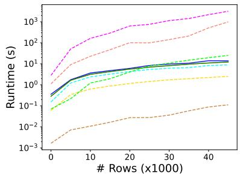

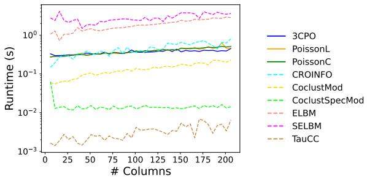  
(a) Runtime with an increasing n $( m = 6 ,$ logarithmic scale).  
(b) Runtime with an increasing m $( n = 1 0 0 0 ;$ , logarithmic scale).  
Fig. D1: Runtime experiments investigating the impact of the number of rows n and columns m. Both experiments build on the Synth data set, where the number of clusters $K = 3 .$ . The experiments are run on an Apple M3 Pro with 16GB memory.

## D.4 Detected Outliers for Optdigits

Inspecting the outliers identified by 3CPO within the Optdigits data set, it is noticeable that more than half of those belong to cluster eight according to the ground truth. Considering that our outlier detection uses a distribution shared across all clusters and considering the row-scaling due to $\lambda _ { i } ^ { R }$ , the outlier definition is prone to rows that use similar values for all pixels. As the digit eight requires the most “active” pixels, it is the most likely to fall into the outlier category if it deviates too much from an average writing style.

To validate this, we visually examine a random set of inliers and outliers and find that the majority of outliers exhibit genuinely unusual characteristics despite the class imbalance in the outlier set. A common trait is, for example, a gap within the structure

Table D5: Clustering results (in %) and the final number of columns included in $C _ { 1 }$ of various ablation studies. Entries correspond to the mean of ten executions ± the standard deviation. Colors indicate whether the average performance of 3CPO lies above (green), within (yellow) or below (red) the standard deviation band, where above is better for ACC, NMI and ARI and below is better for $| C _ { 1 } | .$
<table><tr><td>Data set</td><td>| Metric |</td><td>3CPO</td><td>C_ = 0</td><td>C0 = 0</td><td> $b ( \mathbf { X } _ { \cdot j } ) = 0$ </td><td> $\overline { { b ( \mathbf { X } . \mathbf { \mu } _ { j } ) = \operatorname { B I C } ( \mathbf { X } . \mathbf { \mu } _ { j } ) } }$ </td></tr><tr><td>Synth</td><td>ACC</td><td> $\overline { { 9 8 . 5 \pm 0 . 0 } }$ </td><td>58.0 ± 0.0</td><td> $9 8 . 5 \pm 0 . 0$ </td><td> $\overline { { 9 8 . 5 \pm 0 . 0 } }$ </td><td>98.5 ± 0.0</td></tr><tr><td></td><td>NMI</td><td> $9 2 . 5 \pm 0 . 0$ </td><td> $4 2 . 4 \pm 0 . 1$ </td><td> $9 2 . 5 \pm 0 . 0$ </td><td>92.5 ± 0.0</td><td>92.5 ± 0.0</td></tr><tr><td></td><td>ARI</td><td> $9 5 . 5 \pm 0 . 0$ </td><td>33.3 ± 0.1</td><td> $9 5 . 5 \pm 0 . 0$ </td><td> $9 5 . 5 \pm 0 . 0$ </td><td>95.5 ± 0.0</td></tr><tr><td></td><td>|C1</td><td> $2 . 0 \pm 0 . 0$ </td><td> $5 . 8 \pm 0 . 6$ </td><td> $4 . 0 \pm 0 . 0$ </td><td> $4 . 0 \pm 0 . 0$ </td><td>2.0 ± 0.0</td></tr><tr><td>Wholesales</td><td>ACC</td><td> $7 7 . 5 \pm 0 . 0$ </td><td>78.2 ± 0.0</td><td> $7 7 . 5 \pm 0 . 0$ </td><td> $7 7 . 5 \pm 0 . 0$ </td><td>77.5 ± 0.0</td></tr><tr><td></td><td>NMI ARI</td><td> $3 1 . 9 \pm 0 . 0$ </td><td>23.1 ± 0.0</td><td> $3 1 . 9 \pm 0 . 0$ </td><td> $3 1 . 9 \pm 0 . 0$ </td><td>31.9 ± 0.0</td></tr><tr><td></td><td>|C1|</td><td> $3 0 . 1 \pm 0 . 0$ </td><td>31.3 ± 0.0</td><td> $3 0 . 1 \pm 0 . 0$ </td><td> $3 0 . 1 \pm 0 . 0$ </td><td>30.1 ± 0.0</td></tr><tr><td></td><td></td><td> $5 . 0 \pm 0 . 0$ </td><td> $6 . 0 \pm 0 . 0$ </td><td> $5 . 0 \pm 0 . 0$ </td><td> $5 . 0 \pm 0 . 0$ </td><td>5.0 ± 0.0</td></tr><tr><td>SportA</td><td>ACC</td><td> $7 8 . 5 \pm 0 . 2$ </td><td> $7 8 . 5 \pm 0 . 0$ </td><td> $7 8 . 6 \pm 0 . 1$ </td><td> $7 8 . 6 \pm 0 . 1$ </td><td>78.6 ± 0.1</td></tr><tr><td></td><td>NMI ARI</td><td> $2 4 . 1 \pm 0 . 5$ </td><td> $2 4 . 0 \pm 0 . 2$ </td><td> $2 4 . 2 \pm 0 . 2$ </td><td> $2 4 . 2 \pm 0 . 2$ </td><td>24.4 ± 0.3</td></tr><tr><td></td><td>|C1</td><td>32.3 ± 0.5</td><td>32.3 ± 0.1</td><td>32.6 ± 0.2</td><td>32.6 ± 0.2</td><td>32.5 ± 0.3</td></tr><tr><td>Optdigits</td><td></td><td> $4 1 . 1 \pm 1 . 4$ </td><td>42.5 ± 1.1</td><td> $5 2 . 0 \pm 0 . 0$ </td><td> $5 2 . 0 \pm 0 . 0$ </td><td>41.3 ± 0.9</td></tr><tr><td></td><td>ACC NMI</td><td> $8 0 . 0 \pm 2 . 0$ </td><td> $8 0 . 1 \pm 2 . 1$ </td><td> $8 0 . 1 \pm 2 . 0 $ </td><td> $8 0 . 1 \pm 2 . 0$ </td><td>80.1 ± 2.0</td></tr><tr><td></td><td>ARI</td><td> $7 5 . 1 \pm 0 . 9$ </td><td> $7 5 . 1 \pm 1 . 0$ </td><td> $7 5 . 2 \pm 1 . 0$ </td><td> $7 5 . 2 \pm 1 . 0$ </td><td>75.2 ± 1.0 66.8 ± 2.2</td></tr><tr><td></td><td>|C1|</td><td>66.7 ± 2.2  $5 5 . 8 \pm 0 . 6$ </td><td> $6 6 . 9 \pm 1 . 8$  56.0 ± 0.0</td><td> $6 6 . 8 \pm 2 . 2$   $5 6 . 0 \pm 0 . 0$ </td><td>66.8 ± 2.2  $6 2 . 0 \pm 0 . 0$ </td><td>56.0 ± 0.0</td></tr><tr><td>BBCSports</td><td>ACC</td><td></td><td></td><td></td><td></td><td></td></tr><tr><td></td><td>NMI</td><td> $9 6 . 1 \pm 1 . 2$ </td><td> $8 7 . 3 \pm 6 . 4$ </td><td> $8 9 . 1 \pm 4 . 0$ </td><td> $8 0 . 3 \pm 8 . 3$ </td><td>93.7 ± 5.5 87.1 ± 4.2</td></tr><tr><td></td><td>ARI</td><td> $8 9 . 4 \pm 2 . 0$   $9 0 . 1 \pm 2 . 9$ </td><td> $7 9 . 4 \pm 5 . 7$ </td><td> $7 8 . 0 \pm 5 . 3$ </td><td> $6 8 . 8 \pm 5 . 2$   $6 3 . 3 \pm 7 . 6$ </td><td>87.0 ± 6.3</td></tr><tr><td></td><td>|c1</td><td> $7 9 9 . 2 \pm 7 . 6$ </td><td> $7 8 . 0 \pm 8 . 2$  860.6 ± 28.1</td><td> $7 5 . 2 \pm 8 . 5$   $1 2 1 8 . 8 \pm 1 4 . 5$ </td><td>1953.7±5.9</td><td>720.8 ± 14.7</td></tr><tr><td>BBCNews</td><td>ACC</td><td></td><td></td><td></td><td></td><td></td></tr><tr><td></td><td>NMI</td><td> $9 5 . 7 \pm 0 . 4$ </td><td> $9 5 . 8 \pm 0 . 3$ </td><td> $9 5 . 6 \pm 0 . 3$   $8 6 . 6 \pm 0 . 7$ </td><td> $9 5 . 5 \pm 0 . 2$   $8 6 . 7 \pm 0 . 4$ </td><td>95.8 ± 0.3</td></tr><tr><td></td><td>ARI</td><td> $8 7 . 2 \pm 0 . 8$   $8 9 . 9 \pm 0 . 9$ </td><td> $8 7 . 2 \pm 0 . 8$   $9 0 . 1 \pm 0 . 7 $ </td><td> $8 9 . 6 \pm 0 . 7$ </td><td> $8 9 . 5 \pm 0 . 4$ </td><td>87.3 ± 0.6 90.1 ± 0.7</td></tr><tr><td></td><td>|a1|</td><td> $1 3 7 9 . 0 \pm 6 . 2$ </td><td> $1 4 3 7 . 4 \pm 4 . 5$ </td><td>1758.4 ± 2.3</td><td> $1 9 8 4 . 8 \pm 2 . 3$ </td><td>1367.4 ± 6.1</td></tr><tr><td>WebKB</td><td>ACC</td><td> $5 7 . 4 \pm 2 . 7$ </td><td>50.7 ± 2.3</td><td>58.2 ± 3.0</td><td> $5 7 . 4 \pm 2 . 6$ </td><td>56.6 ± 1.9</td></tr><tr><td></td><td>NMI</td><td> $3 7 . 2 \pm 1 . 2$ </td><td>34.5 ± 0.6</td><td> $3 6 . 7 \pm 1 . 2$ </td><td> $3 7 . 0 \pm 1 . 5$ </td><td>37.1 ± 0.8</td></tr><tr><td></td><td>ARI</td><td> $3 1 . 5 \pm 3 . 2$ </td><td>24.9 ± 1.1</td><td> $3 3 . 8 \pm 3 . 5$ </td><td> $3 2 . 6 \pm 2 . 7$ </td><td>30.9 ± 2.5</td></tr><tr><td></td><td>|C1|</td><td> $1 3 1 4 . 9 \pm 1 8 . 4$ </td><td> $1 4 0 7 . 9 \pm 4 2 . 5$ </td><td>1854.2 ± 6.8</td><td> $1 9 3 6 . 2 \pm 4 . 6$ </td><td>1282.7 ± 19.2</td></tr><tr><td>Reuters</td><td>ACC</td><td></td><td> $8 0 . 2 \pm 3 . 7$ </td><td> $8 0 . 1 \pm 3 . 2 $ </td><td>78.1 ± 4.2</td><td></td></tr><tr><td></td><td>NMI</td><td> $8 0 . 9 \pm 2 . 9$   $7 0 . 8 \pm 2 . 9$ </td><td>68.9 ±2.7</td><td>70.5 ± 3.0</td><td> $6 8 . 7 \pm 3 . 7 $ </td><td> $8 0 . 8 \pm 2 . 7$  71.7 ± 2.3</td></tr><tr><td></td><td>ARI</td><td> $6 7 . 8 \pm 1 . 6$ </td><td> $6 5 . 7 \pm 5 . 1$ </td><td> $6 7 . 2 \pm 3 . 3$ </td><td> $6 5 . 4 \pm 4 . 2$ </td><td>68.3 ±1.3</td></tr><tr><td></td><td>|C1|</td><td> $1 3 2 1 . 9 \pm 7 . 9$ </td><td> $1 3 9 0 . 7 \pm 2 9 . 1 $ </td><td> $1 9 1 4 . 6 \pm 2 . 1$ </td><td> $1 9 7 6 . 0 \pm 1 . 7$ </td><td>1213.3 ± 11.7</td></tr><tr><td>20NewsG</td><td>ACC</td><td></td><td> $3 7 . 9 \pm 1 . 3$ </td><td> $3 8 . 1 \pm 1 . 9$ </td><td> $3 7 . 9 \pm 1 . 8$ </td><td>37.3 ± 2.0</td></tr><tr><td></td><td>NMI</td><td> $3 8 . 4 \pm 2 . 5$   $3 9 . 9 \pm 1 . 0$ </td><td>39.4 ± 1.2</td><td>39.8 ± 0.8</td><td>39.8±0.8</td><td>39.5 ± 1.2</td></tr><tr><td></td><td>ARI</td><td> $2 3 . 0 \pm 1 . 3$ </td><td> $2 3 . 2 \pm 1 . 7$ </td><td> $2 2 . 4 \pm 1 . 0$ </td><td> $2 2 . 5 \pm 0 . 9$ </td><td>22.8 ± 2.0</td></tr><tr><td></td><td>|C1|</td><td> $1 4 5 3 . 7 \pm 1 5 . 3$ </td><td> $1 4 5 6 . 7 \pm 1 3 . 1$ </td><td> $1 9 9 0 . 5 \pm 0 . 8 $ </td><td> $1 9 9 9 . 0 \pm 0 . 0$ </td><td> $1 5 6 4 . 4 \pm 1 0 . 4$ </td></tr><tr><td>MouseAtlas</td><td></td><td></td><td></td><td></td><td></td><td></td></tr><tr><td></td><td>ACC NMI</td><td> $6 7 . 5 \pm 6 . 0$ </td><td> $6 7 . 1 \pm 3 . 9$  65.7 ± 3.0</td><td> $6 7 . 5 \pm 6 . 0$ </td><td> $6 7 . 5 \pm 6 . 0$  67.6 ± 2.3</td><td>67.5 ± 6.1 67.5 ± 2.3</td></tr><tr><td></td><td>ARI</td><td> $6 7 . 6 \pm 2 . 3$   $5 6 . 3 \pm 6 . 2$ </td><td> $5 5 . 4 \pm 5 . 0$ </td><td> $6 7 . 6 \pm 2 . 3$   $5 6 . 3 \pm 6 . 2$ </td><td> $5 6 . 3 \pm 6 . 2$ </td><td>56.2 ± 6.2</td></tr><tr><td></td><td>|C1|</td><td> $1 4 5 6 6 . 0 \pm 5 8 . 8$ </td><td> $1 4 7 5 3 . 0 \pm 1 4 . 8$ </td><td> $1 4 6 5 0 . 3 \pm 2 6 . 2$ </td><td> $1 4 7 3 6 . 9 \pm 2 1 . 3$ </td><td> $1 4 5 5 0 . 3 \pm 6 0 . 4$ </td></tr><tr><td>GeneExp</td><td>ACC</td><td></td><td></td><td></td><td></td><td></td></tr><tr><td></td><td>NMI</td><td> $9 9 . 6 \pm 0 . 1$ </td><td> $9 9 . 4 \pm 0 . 1 $   $9 7 . 7 \pm 0 . 2 $ </td><td> $9 9 . 6 \pm 0 . 1$   $9 8 . 3 \pm 0 . 2 $ </td><td> $9 9 . 5 \pm 0 . 1 $   $9 7 . 9 \pm 0 . 2 $ </td><td> $9 9 . 5 \pm 0 . 1 $  98.2 ± 0.3</td></tr><tr><td></td><td>ARI</td><td> $9 8 . 4 \pm 0 . 2 $   $9 9 . 1 \pm 0 . 1$ </td><td>98.7 ± 0.1</td><td> $9 9 . 1 \pm 0 . 1$ </td><td> $9 8 . 8 \pm 0 . 1$ </td><td>99.0 ± 0.2</td></tr><tr><td></td><td>|C1|</td><td> $6 4 4 5 . 1 \pm 3 . 1$ </td><td> $7 6 5 2 . 8 \pm 3 . 0$ </td><td> $7 7 1 8 . 8 \pm 3 . 0$ </td><td> $1 4 1 3 5 . 0 \pm 0 . 0$ </td><td>8065.6 ± 5.3</td></tr><tr><td>HDendritic</td><td></td><td></td><td></td><td></td><td></td><td></td></tr><tr><td></td><td>ACC NMI</td><td> $8 7 . 5 \pm 7 . 2$   $7 7 . 8 \pm 3 . 8$ </td><td> $9 1 . 2 \pm 6 . 1$   $8 0 . 9 \pm 4 . 0$ </td><td> $8 7 . 5 \pm 7 . 2$   $7 7 . 8 \pm 3 . 8$ </td><td> $8 7 . 5 \pm 7 . 2$ </td><td> $8 7 . 5 \pm 7 . 2$   $7 7 . 8 \pm 3 . 8$ </td></tr><tr><td></td><td>ARI</td><td></td><td></td><td></td><td> $7 7 . 8 \pm 3 . 8$ </td><td> $7 9 . 6 \pm 5 . 7$ </td></tr><tr><td></td><td></td><td> $7 9 . 6 \pm 5 . 8$ </td><td> $8 3 . 4 \pm 5 . 2$ </td><td> $7 9 . 6 \pm 5 . 8$ </td><td> $7 9 . 6 \pm 5 . 7$ </td><td></td></tr><tr><td></td><td>|C1|</td><td> $1 6 6 7 2 . 9 \pm 4 0 6 . 2$ </td><td>23694.0 ± 388.1 17599.1 ± 393.0 20094.5 ± 274.9</td><td></td><td></td><td> $1 6 5 7 4 . 9 \pm 3 4 3 . 4$ </td></tr></table>

of the eight. Fig. D2 shows a random selection of inliers and outliers which showcase usual and unusual characteristics.

## Appendix E Estimating the Number of Clusters for k-Means-based Approaches

In the following, we evaluate whether the K-estimation strategy used by 3CPO outperforms established strategies for k-Means. We utilize three criteria to estimate K for k-Means: (1) elbows in the inertia curve (Thorndike 1953) detected by the Needle algorithm (Satopaa et al. 2011), (2) the Silhouette score (Rousseeuw 1987), and (3) the BIC score as defined for X-Means (Pelleg and Moore 2000). For visualization, inertia and BIC are min–max normalized for each algorithm; the Silhouette score is bound within [−1, 1]. The remaining setting is equal to the one described in Sect. 4.6. We vary the number of clusters $K \in \{ 2 , 3 , \ldots , 3 0 \}$ and, for each $K ,$ , run each clustering method 20 times. In the end, we only evaluate the run with the best inertia. The results for Synth, GeneExp and BBCSports are illustrated in Fig. E3.

We observe that all standard K-estimation techniques struggle to identify the ground-truth number of clusters for the Synth data set. Specifically, the elbow method suggests $K \approx 7 ,$ , while the Silhouette score recommends $K = 2$ and the BIC score suggests $K = 3 0$ . For the GeneExp data set, the K-estimation is more consistent; the elbow method and Silhouette score both indicate K ≈ 6 for most algorithms (excluding RCA+KM), while the BIC score recommends K = 12 or $K = 1 3$

Table D6: Clustering results (in %) and the final number of columns included in $C _ { 1 }$ for diferent initialization strategies for $R _ { k }$ . Poisson-k-Means++ corresponds to the strategy of $3 \mathrm { C P O } ,$ proposed in Sect. 3.5. Representation corresponds to Tab. 1.
<table><tr><td>Data set</td><td></td><td>| Metric | Poisson-k-Means++</td><td>random labels</td><td>random centers</td><td>k-Means++</td><td>k-Means (full)</td><td>RF+k-Means++</td><td>RF+k-Means (full)</td></tr><tr><td>Synth</td><td>ACC</td><td> ${ \bf 9 8 . 5 \pm 0 . 0 }$ </td><td> $\mathbf { 9 8 . 5 \pm 0 . 0 }$ </td><td> ${ \bf 9 8 . 5 \pm 0 . 0 }$ </td><td> $\mathbf { 9 8 . 5 \pm 0 . 0 }$ </td><td> ${ \bf 9 8 . 5 \pm 0 . 0 }$ </td><td> ${ \bf 9 8 . 5 \pm 0 . 0 }$ </td><td>60.0 ± 0.0</td></tr><tr><td></td><td>NMI</td><td>92.5 ± 0.0  ${ \bf 9 5 . 5 \pm 0 . 0 }$ </td><td>92.5 ± 0.0</td><td>92.5 ± 0.0</td><td>92.5 ± 0.0</td><td>92.5 ± 0.0  ${ \bf 9 5 . 5 \pm 0 . 0 }$ </td><td>92.5 ± 0.0</td><td>44.6 ± 0.0</td></tr><tr><td></td><td>ARI</td><td> ${ \bf 2 . 0 \pm 0 . 0 }$ </td><td> ${ \bf 9 5 . 5 \pm 0 . 0 }$ </td><td> ${ \bf 9 5 . 5 \pm 0 . 0 }$ </td><td> ${ \bf 9 5 . 5 \bar { \pm } 0 . 0 }$ </td><td></td><td> ${ \bf 9 5 . 5 \pm 0 . 0 }$ </td><td>37.1 ± 0.0</td></tr><tr><td></td><td>|C1|</td><td></td><td> ${ \bf 2 . 0 \pm 0 . 0 }$ </td><td> ${ \bf 2 . 0 \pm 0 . 0 }$ </td><td> ${ \bf 2 . 0 \pm 0 . 0 }$ </td><td> ${ \bf 2 . 0 \pm 0 . 0 }$ </td><td> ${ \bf 2 . 0 \pm 0 . 0 }$ </td><td>3.0 ± 0.0</td></tr><tr><td>Wholesales</td><td>ACC</td><td> $\underline { { 7 7 . 5 \pm 0 . 0 } }$ </td><td> $7 7 . 5 \pm 0 . 0$ </td><td> $7 7 . 5 \pm 0 . 0$ </td><td> ${ \bf 7 7 . 7 \pm 0 . 3 }$ </td><td> $7 7 . 5 \pm 0 . 0$ </td><td> $7 7 . 5 \pm 0 . 0$ </td><td>77.5 ± 0.0</td></tr><tr><td></td><td>NMI ARI</td><td> $\mathbf { 3 1 . 9 \pm 0 . 0 }$ </td><td> $\mathbf { 3 1 . 9 \pm 0 . 0 }$ </td><td> $\mathbf { 3 1 . 9 \pm 0 . 0 }$ </td><td> $2 9 . 2 \pm 3 . 9$ </td><td> $\mathbf { 3 1 . 9 \pm 0 . 0 }$ </td><td> $\mathbf { 3 1 . 9 \pm 0 . 0 }$ </td><td> $\mathbf { 3 1 . 9 \pm 0 . 0 }$ </td></tr><tr><td></td><td></td><td>30.1 ± 0.0</td><td> $\underline { { 3 0 . 1 \pm 0 . 0 } }$ </td><td>30.1 ± 0.0</td><td>30.5 ± 0.5</td><td>30.1 ± 0.0</td><td>30.1 ± 0.0</td><td>30.1 ± 0.0</td></tr><tr><td>SportA</td><td>|C1|</td><td> $\mathbf { \overline { { 5 . 0 \pm 0 . 0 } } }$ </td><td> $\mathbf { \overline { { 5 . 0 \pm 0 . 0 } } }$ </td><td> $\mathbf { \overline { { 5 . 0 \pm 0 . 0 } } }$ </td><td> $5 . 3 \pm 0 . 4$ </td><td> $\overline { { { \bf 5 . 0 \pm 0 . 0 } } }$ </td><td> $\overline { { { \bf 5 . 0 \pm 0 . 0 } } }$ </td><td> ${ \bf 5 . 0 \pm 0 . 0 }$ </td></tr><tr><td></td><td>ACC</td><td> $\underline { { 7 8 . 5 \pm 0 . 2 } }$ </td><td> $\underline { { 7 8 . 5 \pm 0 . 1 } }$ </td><td> $7 8 . 5 \pm 0 . 2$ </td><td> $7 8 . 5 \pm 0 . 2$ </td><td> $7 8 . 2 \pm 0 . 0$ </td><td> $\overline { { 7 8 . 6 \pm 0 . 2 } }$ </td><td> $7 6 . 5 \pm 0 . 0$ </td></tr><tr><td></td><td>NMI</td><td> $2 4 . 1 \pm 0 . 5$ </td><td> $2 4 . 0 \pm 0 . 1$   $\bar { 3 2 . 3 \bar { \pm } 0 . \bar { 1 } }$ </td><td>24.0 ± 0.5</td><td> $2 4 . 0 \pm 0 . 4$ </td><td> $2 3 . 8 \pm 0 . 0$ </td><td> ${ \bf 2 4 . 2 \pm 0 . 5 }$ </td><td> $2 0 . 5 \pm 0 . 0$ </td></tr><tr><td></td><td>ARI |C1|</td><td>32.3 ± 0.5</td><td></td><td> $\bar { 3 2 . 3 } \bar { \pm } \bar { 0 . 5 }$ </td><td>32.3 ± 0.3</td><td> $3 1 . 7 \pm 0 . 0$ </td><td>32.5 ± 0.4</td><td>27.9 ± 0.0</td></tr><tr><td></td><td></td><td> $\underline { { 4 1 . 1 } } \pm 1 . 4$ </td><td> $\overline { { 4 0 . 6 \pm 0 . 5 } }$ </td><td> $4 1 . 1 \pm 1 . 4$ </td><td> $4 1 . 1 \pm 0 . 7$ </td><td> $\mathbf { 3 9 . 0 } \pm \mathbf { 0 . 0 }$ </td><td> $4 1 . 9 \pm 1 . 1$ </td><td> $4 6 . 0 \pm 0 . 0$ </td></tr><tr><td>Optdigits</td><td>ACC</td><td> $8 0 . 0 \pm 2 . 0 $ </td><td> $8 0 . 1 \pm 2 . 0 $ </td><td> ${ \bf 8 0 . 9 \pm 0 . 3 }$   ${ \bf 7 5 . 5 \pm 0 . 2 }$ </td><td> $7 8 . 6 \pm 3 . 1$ </td><td> $7 6 . 0 \pm 3 . 1$   $7 3 . 2 \pm 1 . 5$ </td><td> $7 9 . 3 \pm 2 . 8$ </td><td> $7 7 . 1 \pm 0 . 1$ </td></tr><tr><td></td><td>NMI ARI</td><td> $7 5 . 1 \pm 0 . 9$  66.7 ± 2.2</td><td> $\overline { { 7 5 . 1 \pm 1 . 0 } }$   $\overline { { 6 6 . 8 \pm 2 . 3 } }$ </td><td>67.6 ± 0.4</td><td> $7 4 . 4 \pm 1 . 5$  65.3 ± 3.2</td><td>62.0 ± 3.6</td><td> $\begin{array} { r } { 7 4 . 8 \pm 1 . 3 } \\ { \bar { z } \bar { . } \bar { . } \bar { . } - \bar { . } \bar { . } - \bar { . } \bar { . } - \bar { . } } \end{array}$  65.9 ± 3.0</td><td> $7 4 . 0 \pm 0 . 1$  64.6 ± 0.1</td></tr><tr><td></td><td>|C1|</td><td> $\bar { 5 } \bar { 5 } . \bar { 8 } \bar { \pm } \bar { 0 . 6 }$ </td><td> $\mathbf { 5 4 . 0 \pm 0 . 0 }$ </td><td> $5 5 . 4 \pm 0 . 9$ </td><td></td><td> ${ \underline { { 5 4 . 2 \pm 0 . 6 } } }$ </td><td></td><td> $5 5 . 6 \pm 0 . 8$ </td></tr><tr><td>BBCSports</td><td></td><td></td><td></td><td></td><td> $\underline { { 5 ^ { 5 . 0 } } } _ { -- } ^ { \pm 1 . 0 }$ </td><td></td><td> $\underline { { 5 ^ { 5 } } } . 0 \pm \underline { { 1 . 0 } }$ </td><td></td></tr><tr><td></td><td>ACC NMI</td><td> $\overline { { \mathbf { 9 6 . 1 \pm 1 . 2 } } }$   ${ \bf 8 9 . 4 \pm 2 . 0 }$ </td><td> $8 9 . 9 \pm 9 . 1$   $8 3 . 5 \pm 7 . 7$ </td><td> $9 1 . 2 \pm 5 . 0$ </td><td> $9 1 . 5 \pm 6 . 7$ </td><td> $8 8 . 1 \pm 8 . 0$ </td><td> $9 2 . 0 \pm 5 . 3$   $\bar { 8 3 . 9 } \pm \bar { 5 . 7 }$ </td><td> $\overline { { 9 3 . 2 \pm 5 . 6 } }$  87.0 ± 5.0</td></tr><tr><td></td><td>ARI</td><td>90.1 ± 2.9</td><td> $8 2 . 8 \pm 1 0 . 6$ </td><td> $8 4 . 2 \pm 3 . 2 $  84.4 ± 3.5</td><td> $8 5 . 8 \pm 5 . 0$  84.7±7.2</td><td> $8 4 . 2 \pm { 3 . 8 }$   $8 2 . 7 \pm 5 . 8$ </td><td> $8 3 . 7 \pm 6 . 5$ </td><td> $\frac { \mathrm { ~ o ~ } . 0 \pm \mathrm { ~ o ~ } . 0 } { 8 6 . 9 \pm 5 . 8 }$ </td></tr><tr><td></td><td>|C1|</td><td> $7 9 9 . 2 \pm 7 . 6$ </td><td> $7 9 6 . 8 \pm 7 . 9$ </td><td> $7 9 8 . 0 \pm 1 9 . 1 $ </td><td> $7 9 2 . 8 \pm 2 1 . 1$ </td><td>782.3 ± 22.7</td><td>785.3 ± 17.1</td><td> $7 9 1 . 8 \pm 1 3 . 2 $ </td></tr><tr><td>BBCNews</td><td>ACC</td><td></td><td> ${ \bf 9 6 . 0 \pm 0 . 5 }$ </td><td></td><td></td><td></td><td></td><td></td></tr><tr><td></td><td>NMI</td><td>95.7 ± 0.4 87.2 ± 0.8</td><td> ${ \bf 8 7 . 7 \pm 1 . 1 }$ </td><td>95.7 ± 0.6 87.1 ± 1.5</td><td> $9 5 . 5 \pm 0 . 8$   $8 6 . 7 \pm 1 . 7$ </td><td> $9 5 . 5 \pm 0 . 7$   $8 6 . 8 \pm 1 . 6$ </td><td> $9 5 . 4 \pm 0 . 5$   $8 6 . 6 \pm 1 . 0$ </td><td> $9 5 . 6 \pm 0 . 5$   $\bar { 8 6 . 9 } \pm \bar { 1 . 0 }$ </td></tr><tr><td></td><td>ARI</td><td>89.9 ± 0.9</td><td> ${ \bf 9 0 . 5 \pm 1 . 2 }$ </td><td>89.9±1.5</td><td> $8 9 . 4 \pm 1 . 9$ </td><td> $8 9 . 4 \pm 1 . 8$ </td><td> $8 9 . 3 \pm 1 . 2$ </td><td>89.5 ± 1.0</td></tr><tr><td></td><td>|C1|</td><td>1379.0 ± 6.2</td><td> $1 3 7 8 . 4 \pm 5 . 5$ </td><td>1380.4 ± 5.5</td><td>1376.2 ± 6.3</td><td>1376.8 ± 6.7</td><td>1376.3 ± 4.2</td><td> $1 3 7 8 . 2 \pm 4 . 7$ </td></tr><tr><td>WebKB</td><td>ACC</td><td>57.4 ± 2.7</td><td> ${ \bf 5 8 . 8 \pm 2 . 3 }$ </td><td></td><td></td><td></td><td></td><td></td></tr><tr><td></td><td>NMI</td><td> $\overline { { 3 7 . 2 \pm 1 . 2 } }$ </td><td> ${ \bf 3 7 . 9 \pm 0 . 4 }$ </td><td>57.1 ± 1.9 37.3 ± 0.8</td><td> $5 6 . 0 \pm 3 . 8$   $3 6 . 4 \pm 1 . 5$ </td><td> $5 6 . 3 \pm 3 . 4$   $3 6 . 7 \pm 1 . 1$ </td><td> $5 5 . 4 \pm 2 . 7$   $3 6 . 1 \pm 1 . 5$ </td><td>55.0 ± 3.7  $3 6 . 6 \pm 1 . 3$ </td></tr><tr><td></td><td>ARI</td><td> $3 \bar { 1 } . \bar { 5 } \pm 3 . \bar { 2 }$ </td><td> ${ \bf 3 2 . 6 \pm 2 . 7 }$ </td><td>31.4 ± 2.3</td><td> $3 0 . 0 \pm 4 . 0$ </td><td> $3 0 . 8 \pm 3 . 3$ </td><td> $3 0 . 2 \pm 2 . 5$ </td><td> $3 0 . 9 \pm 2 . 8$ </td></tr><tr><td></td><td>|C1|</td><td>1314.9 ± 18.4</td><td> $1 3 2 6 . 4 \pm 1 7 . 5$ </td><td> $1 3 1 7 . 2 \pm 8 . 2$ </td><td>1312.9 ± 31.8</td><td>1313.1 ± 26.1</td><td>1309.0 ± 9.9</td><td>1307.6 ± 25.5</td></tr><tr><td>Reuters</td><td>ACC</td><td></td><td> $8 1 . 3 \pm 2 . 6 $ </td><td></td><td> $8 1 . 1 \pm 6 . 5$ </td><td></td><td></td><td></td></tr><tr><td></td><td>NMI</td><td> $8 0 . 9 \pm 2 . 9$ </td><td> $\frac { \phantom { 0 . 0 } } { 7 0 . 5 \pm 1 . 7 }$ </td><td> $7 9 . 6 \pm 3 . 8$   $6 9 . 7 \pm 2 . 1 $ </td><td> $\underline { { \tilde { 7 } \tilde { 1 } . 5 \tilde { \pm 3 . 1 } } }$ </td><td> ${ \bf 8 4 . 9 \pm 4 . 6 }$   ${ \bf 7 2 . 1 \pm 1 . 9 }$ </td><td> $7 8 . 9 \pm 2 . 4$   $6 9 . 0 \pm 2 . 5$ </td><td> $7 7 . 6 \pm 4 . 9$   $6 7 . 7 \pm 2 . 5$ </td></tr><tr><td></td><td>ARI</td><td> $\ : \underline { { { 7 0 . 8 } } } \pm 2 . 9 \ :$  67.8 ±1.6</td><td> $6 7 . 6 \pm 0 . 7$ </td><td> $6 5 . 8 \pm 2 . 9$ </td><td> $\overline { { 6 5 . 9 \pm 4 . 3 } }$ </td><td> $6 6 . 6 \pm 2 . 8$ </td><td> $6 5 . 0 \pm 3 . 7$ </td><td> $6 2 . 9 \pm 5 . 1$ </td></tr><tr><td></td><td>|C1|</td><td>1321.9 ± 7.9</td><td>1321.0 ± 9.7</td><td> $1 3 1 8 . 9 \pm 1 1 . 7$ </td><td>1316.3 ± 15.2</td><td>1306.5 ± 17.1</td><td>1311.5 ± 28.7</td><td>1301.8 ± 32.8</td></tr><tr><td>20NewsG</td><td></td><td></td><td></td><td></td><td></td><td></td><td></td><td></td></tr><tr><td></td><td>ACC</td><td>38.4 ± 2.5</td><td> $3 7 . 0 \pm 1 . 4$   $3 9 . 1 \pm 0 . 8$ </td><td>38.4 ± 2.4 0.7</td><td> $2 5 . 9 \pm 1 . 3$   $3 2 . 9 \pm 1 . 6$ </td><td> $2 5 . 8 \pm 1 . 5$   $3 2 . 8 \pm 2 . 0$ </td><td> $3 7 . 9 \pm 2 . 0 $ </td><td> ${ \bf 3 9 . 5 \pm 1 . 5 }$ </td></tr><tr><td></td><td>NMI ARI</td><td> $\frac { 3 9 . 9 \pm 1 . 0 } { . 0 \ A \ 1 \ 1 \ A }$ </td><td> $2 2 . 3 \pm 1 . 3$ </td><td> $\frac { 3 9 . 9 \pm 0 . 7 } { 9 2 \mathrm { ~ o ~ a ~ } \pm \mathrm { ~ n ~ e ~ } }$ </td><td></td><td></td><td> $3 9 . 7 \pm 0 . 7$ </td><td> ${ \bf 4 0 . 6 \pm 0 . 7 }$ </td></tr><tr><td></td><td></td><td>23.0 ± 1.3  $1 4 5 3 . 7 \pm 1 5 . 3$ </td><td>1405.2 ± 8.9</td><td>23.0 ± 0.8  $1 4 \bar { 3 } \bar { 9 } . \bar { 8 } \pm \bar { 1 1 } . 8$ </td><td> $1 6 . 2 \pm 1 . 2$  1144.3 ± 25.3</td><td> $1 6 . 1 \pm 1 . 5$  1135.0 ± 21.9</td><td> $2 3 . 2 \pm 1 . 4$  1444.9 ± 14.8</td><td>23.7 ± 1.0</td></tr><tr><td>MouseAtlas</td><td>|C1|</td><td></td><td></td><td></td><td></td><td></td><td></td><td> $1 4 5 8 . 0 \pm 1 1 . 4$ </td></tr><tr><td></td><td>ACC</td><td> $6 7 . 5 \pm 6 . 0$ </td><td> $6 5 . 9 \pm 2 . 5$ </td><td> $\overline { { 6 7 . 7 \pm 2 . 6 } }$ </td><td> $6 4 . 2 \pm 3 . 2$ </td><td> $6 3 . 2 \pm 2 . 0$ </td><td> $6 8 . 1 \pm 1 2 . 5$ </td><td> $\overline { { 7 4 . 5 \pm 3 . 0 } }$ </td></tr><tr><td></td><td>NMI</td><td> $6 7 . 6 \pm 2 . 3$ </td><td> $6 7 . 6 \pm 2 . 1$ </td><td> $6 8 . 1 \pm 1 . 4$ </td><td> $6 6 . 5 \pm 3 . 3$ </td><td> $6 8 . 0 \pm 0 . 5$   $5 4 . 3 \pm 0 . 9$ </td><td> $\overline { { 6 4 . 2 \pm 1 0 . 9 } }$ </td><td> ${ \bf 7 0 . 6 \pm 1 . 6 }$ </td></tr><tr><td></td><td>ARI</td><td> $5 6 . 3 \pm 6 . 2 $ </td><td> $5 5 . 4 \pm 3 . 5$   $1 4 6 6 2 . 8 \pm 7 . 2$ </td><td> $5 6 . 5 \pm 3 . 4$ </td><td> $5 2 . 6 \pm 5 . 3$ </td><td></td><td> $5 1 . 2 \pm 2 1 . 8$ </td><td> ${ \bf 6 3 . 2 \pm 2 . 9 }$ </td></tr><tr><td>GeneExp</td><td>|C1</td><td> $1 4 5 6 6 . 0 \pm 5 8 . 8$ </td><td></td><td> $1 4 5 7 6 . 3 \pm 7 1 . 2$ </td><td>14524.3 ± 35.0</td><td> $\mathbf { 1 4 5 0 8 . 8 \pm 1 7 . 1 }$ </td><td> $1 4 6 1 6 . 6 \pm 6 4 . 7$ </td><td> $1 4 6 0 5 . 5 \pm 5 9 . 3$ </td></tr><tr><td></td><td>ACC</td><td>99.6 ± 0.1</td><td>99.6 ± 0.1</td><td>92.8 ± 7.2</td><td> $\overline { { { \bf 9 9 . 6 \pm 0 . 0 } } }$ </td><td>99.6 ± 0.0</td><td>99.6 ± 0.1</td><td>99.6 ± 0.0</td></tr><tr><td></td><td>NMI</td><td> $9 8 . 4 \pm 0 . 2 $ </td><td> $9 8 . 3 \pm 0 . 2$ </td><td> $\overline { { 9 3 . 6 \pm 4 . 7 } }$ </td><td> $9 8 . 4 \pm 0 . 1 $ </td><td> ${ \bf 9 8 . 5 \pm 0 . 0 }$ </td><td> $9 8 . 3 \pm 0 . 2 $ </td><td> ${ \bf 9 8 . 5 \pm 0 . 0 }$ </td></tr><tr><td></td><td>ARI</td><td> $\underline { { 9 9 . 1 \pm 0 . 1 } }$ </td><td> $\bar { 9 9 . 1 \pm 0 . 2 }$ </td><td> $9 1 . 0 \pm 8 . 3 $ </td><td> $\underline { { 9 9 . 1 \pm 0 . 1 } }$ </td><td> ${ \bf 9 9 . 2 \pm 0 . 0 }$ </td><td> $\bar { 9 9 . 0 } \bar { \pm } \bar { 0 . 1 } \bar { }$ </td><td> ${ \bf 9 9 . 2 \pm 0 . 0 }$ </td></tr><tr><td></td><td>|C1|</td><td> $6 \overline { { 4 4 5 . 1 \pm 3 . 1 } }$ </td><td> $6 \overline { { 4 4 6 . 0 \pm 2 . 8 } }$ </td><td> $\mathbf { 6 2 7 2 . 2 \pm 2 3 9 . 6 }$ </td><td> $\smash { \begin{array} { r l } { 6 4 4 4 . 4 \pm 2 . 7 } & { { } } \\ { 3 \ q \ m \ m } \end{array} }$ </td><td> $6 4 4 3 . 0 \pm 0 . 0$ </td><td> $6 \bar { 4 } \bar { 4 } \bar { 7 } . 3 \bar { \pm } \bar { 3 } . \bar { 2 }$ </td><td>6443.0 ± 0.0</td></tr><tr><td>HDendritic</td><td>ACC NMI</td></table>

For BBCSports, both the elbow method and Silhouette score provide poor recommendations, whereas BIC yields K within [3, 8] for all algorithms except standard k-Means (KM). Overall, we do not have a clear winner that is performing well in

# 957

(a) Inliers.

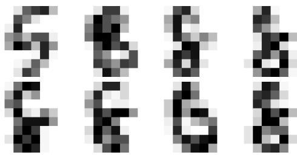  
(b) Outliers.

Fig. D2: Visual examples of eight inliers and eight outliers identified by 3CPO in the Optdigits data set.

all scenarios. Our proposed method 3CPO, on the other hand, was able to provide a reasonable number of clusters in all three cases.

In addition to the visual examples presented in Fig. E3, we report results for all data sets in Tab. E7, stating the estimated number of clusters K together with the corresponding ARI and Purity (Manning et al. 2008) values. We include Purity to assess how pure clusters are when K is overestimated. Since Purity increases mechanically with larger K, it should be interpreted alongside the K-estimation error.

Across data sets, the Silhouette score tends to underestimate K as 56 of 62 outcomes are K = 2. This leads to good results for Wholesales and SportA. In contrast, the BIC score often overestimates K, returning the upper bound $K \in \{ 2 9 , 3 0 \}$ in 44 cases (note that the maximum K is 30 in our experiments). This often leads to high Purity values but significantly lower ARI results. It should be noted that to some degree these weaknesses may be related to the data transformations that have been conducted (STD, MM, RF, RCA).

For Optdigits, elbow and Silhouette lead to very good results, providing estimates of K = 9 or K = 10 for all k-Means-based algorithms except RCA+KM. In this case, the results for 3CPO and TauCC are far worse. In general, 3CPO struggles to match the ground truth K on most tabular data sets. However, it performs notably better than the competitors on high-dimensional text data, achieving higher ARI and Purity values in most experiments. Concretely, it estimates the correct K for Synth and BBCSports, is only of by one for BBCNews and GeneExp, and is close for 20NewsG and WebKB. Based on the results for Synth and 20NewsG, 3CPO appears capable of accurately estimating both low and high cluster counts.

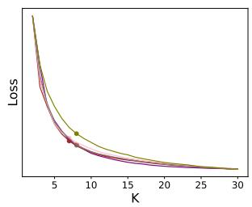

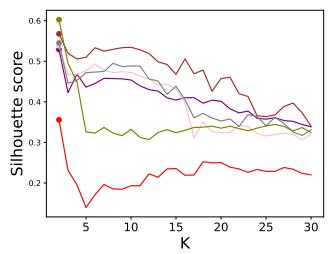

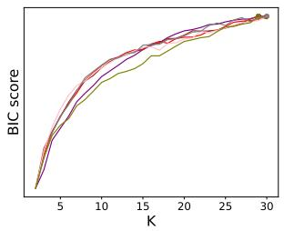

(a) Loss (inertia), Silhouette score, and BIC score for the Synth data set $( K _ { g t } = 3 )$  
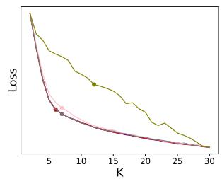

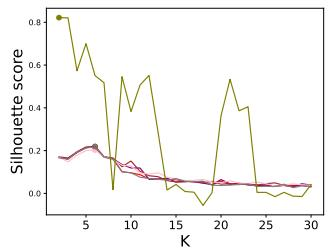

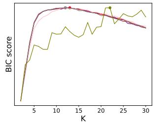

(b) Loss (inertia), Silhouette score, and BIC score for the GeneExp data set $( K _ { g t } = 5 )$  
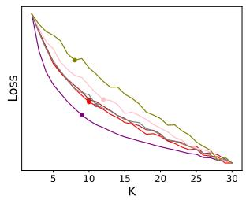

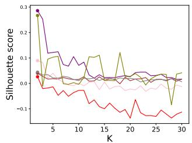

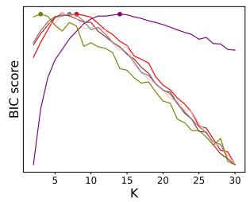  
(c) Loss (inertia), Silhouette score, and BIC score for the BBCSports data set $( K _ { g t } = 5 )$

$$
\_ { \_ { \mathsf { N M } } } \_ { \mathsf { R } \_ { \mathsf { M } } } \quad \_ { \mathsf { R } \_ { \mathsf { M } } } \quad \_ { \mathsf { N } \_ { \mathsf { D } } + \mathsf { K M } } \quad \_ { \mathsf { N M } + \mathsf { K M } } \quad \_ { \_ { \mathsf { R } } \_ { \mathsf { F } } + \mathsf { K M } } \quad \_ { \mathsf { R } \_ { \mathsf { G } } + \mathsf { K M } }
$$

Fig. E3: Loss (inertia), Silhouette score, and BIC score of the k-Means-based comparison algorithms for an increasing number of clusters K. The colored dots indicate the suggested number of clusters for each algorithm and evaluation method.

Regarding the co-clustering algorithm TauCC, which determines K intrinsically, we find that it correctly identifies $K = 3 . 0$ (averaged across runs) for Synth. However, it tends to underestimate the number of clusters for GeneExp and BBCSports, returning an average of $K = 3 . 0$ for both. This trend of underestimation is consistent across other data sets, with averages of $K = 2 . 1 , K = 9 . 5$ , and $K = 3 . 6$ for Optdigits, 20NewsG, and MouseAtlas, respectively.

Table E7: The estimated number of clusters K and the corresponding ARI and Purity values obtained by diferent K-estimation strategies. TauCC intrinsically estimates $K ,$ 3CPO uses the method described in Sect. 4.6, and the k-Means-based approaches use the elbow method, Silhouette score (SIL) and BIC score. The result that best matches the ground truth is highlighted in bold.
<table><tr><td rowspan="2">Data set</td><td rowspan="2">Metric</td><td rowspan="2">3CPO</td><td rowspan="2">TauCC (mean)</td><td colspan="2">SKM Elbow</td><td rowspan="2">BIC</td><td colspan="2">KM Elbow</td><td rowspan="2"></td><td colspan="2">STD+KM Elbow</td><td rowspan="2">BIC</td><td colspan="2">MM+KM Elbow</td><td rowspan="2">BIC</td><td rowspan="2">RF+KM Elbow</td><td rowspan="2">BIC</td><td rowspan="2">Elbow</td><td rowspan="2">RCA+KM</td><td rowspan="2"></td><td rowspan="2">SIL BIC</td></tr><tr><td></td><td>SIL</td><td></td><td>SIL</td><td>BIC</td><td>SIL</td><td>SIL</td><td>SIL</td></tr><tr><td rowspan="2">Synth (Kgt = 3)</td><td rowspan="2">K ARI</td><td rowspan="2">3 95.5</td><td rowspan="2">3.0 25.1</td><td>8 53.1</td><td>2 -0.1</td><td>30</td><td>7 16.7</td><td>2 0.4</td><td>29 10.2</td><td>7 60.4</td><td>2</td><td>29</td><td></td><td>30</td><td>8</td><td>2</td><td>30</td><td>8</td><td>2</td><td>29</td></tr><tr><td></td><td></td><td>25.2</td><td></td><td></td><td></td><td>0.0</td><td>31.7</td><td>7 63.3</td><td>2 -0.1</td><td>22.0</td><td>50.6</td><td>0.0</td><td>23.1</td><td>21.7</td><td>0.0</td><td>17.7</td></tr><tr><td rowspan="2">Wholesales</td><td rowspan="2">Purity K</td><td rowspan="2">98.5 30</td><td rowspan="2">59.8 3.0</td><td>86.0</td><td>34.1</td><td>95.1</td><td>64.8</td><td>36.7</td><td>88.3</td><td>89.0</td><td>34.2 94.6</td><td>88.1</td><td>34.1</td><td>94.3</td><td>85.3</td><td>34.1</td><td>95.3</td><td>57.4</td><td>34.3</td><td>83.1</td></tr><tr><td>8</td><td>2</td><td>29</td><td></td><td>30</td><td></td><td>2</td><td>30</td><td>9</td><td>2</td><td>30</td><td>8</td><td>2</td><td></td><td></td><td></td><td>30</td></tr><tr><td rowspan="2">(Kgt = 2)</td><td rowspan="2">ARI Purity</td><td rowspan="2">3.9 88.6</td><td rowspan="2">27.6 75.7</td><td>12.7 82.3</td><td>26.5 75.9</td><td>5.1</td><td>8 23.2</td><td>2 -3.1</td><td>7.3</td><td>8 13.4</td><td>28.2</td><td>5.6</td><td>13.3</td><td>27.8 7.9</td><td>8.8</td><td>21.3</td><td>30 2.8</td><td>7 15.3</td><td>4</td><td></td><td>3.9</td></tr><tr><td></td><td></td><td>86.6</td><td>86.4</td><td>67.7</td><td>90.7</td><td>80.7</td><td>76.8</td><td>84.5</td><td>81.8</td><td>76.6 87.3</td><td>80.9</td><td>73.2</td><td>83.6</td><td>85.5</td><td>18.8 84.3</td><td>87.0</td></tr><tr><td rowspan="2">SportA (Kgt = 2)</td><td rowspan="2">K ARI</td><td rowspan="2">19 3.2</td><td rowspan="2">1.7 15.8</td><td>8</td><td>2</td><td>23</td><td>6</td><td>3</td><td>30</td><td>9</td><td>2</td><td>22</td><td>9</td><td>2</td><td></td><td></td><td></td><td></td><td></td><td></td><td>29</td></tr><tr><td>8.0</td><td>29.5</td><td>2.7</td><td>14.5</td><td>19.6</td><td>6.3</td><td>7.0</td><td>31.9</td><td></td><td></td><td>29 2.6</td><td>9</td><td>2</td><td>26 2.5</td><td>8</td><td>2</td><td>6.0</td></tr><tr><td rowspan="2">Optdigits</td><td rowspan="2">Purity K</td><td rowspan="2">79.3 30</td><td rowspan="2">70.1 2.1</td><td>80.1</td><td>77.2</td><td>78.7</td><td>74.3</td><td>72.1</td><td>80.9</td><td>78.3</td><td>78.3</td><td>3.1 78.8</td><td>8.0 80.1</td><td>25.9 75.6</td><td>79.2</td><td>6.2 78.2</td><td>7.5</td><td>4.8 0.66</td><td></td><td>0.1 63.6</td><td>75.9</td></tr><tr><td>9</td><td>9</td><td>30</td><td>10</td><td>10</td><td>30</td><td>9</td><td></td><td></td><td></td><td></td><td></td><td>64.3</td><td>78.9</td><td></td><td></td><td></td></tr><tr><td rowspan="2">(Kgt = 10)</td><td rowspan="2">ARI Purity</td><td rowspan="2">48.0 91.4 5</td><td rowspan="2">10.6 20.3</td><td>60.1 73.4</td><td>60.1 73.4</td><td>43.6</td><td>67.1</td><td>67.1</td><td>43.9</td><td>60.3</td><td>9 60.3</td><td>30 43.1</td><td>10 67.0</td><td>10 67.0</td><td>30 50.8</td><td>9 59.6</td><td>9 30</td><td></td><td>8 0.0</td><td>2</td><td>30 11.8</td></tr><tr><td></td><td></td><td>91.7</td><td>80.3</td><td>80.3</td><td>94.0</td><td>73.4</td><td>73.4</td><td>92.2</td><td>80.3</td><td>80.3 94.3</td><td>73.2</td><td>59.6 73.2</td><td>44.8 92.0</td><td>10.7</td><td>0.0 10.2</td><td>30.9</td></tr><tr><td rowspan="2">BBCSports (Kgt = 5)</td><td rowspan="2">K ARI Purity</td><td rowspan="2">92.0 97.2</td><td rowspan="2">3.0 26.2 51.6</td><td>10 17.3</td><td>2</td><td>8</td><td>9</td><td>2</td><td>14</td><td>10</td><td>2</td><td>6</td><td>12</td><td>2</td><td>6</td><td>11</td><td></td><td></td><td></td><td>2</td><td>3</td></tr><tr><td></td><td>5.8</td><td>22.4</td><td>0.3</td><td>0.0</td><td>0.7</td><td>14.1</td><td>4.2</td><td>11.3</td><td>8.9</td><td>1.6 7.1</td><td>11.1</td><td>2 5.6</td><td>7 15.3</td><td>8 0.8</td><td>0.3</td><td>1.2</td></tr><tr><td rowspan="2">BBCNews (Kgt = 5)</td><td rowspan="2">K ARI Purity</td><td rowspan="2">6 82.3 96.0</td><td rowspan="2">3.4 41.8 60.5</td><td>14</td><td>64.2 2 20.4 4.6</td><td>36.0 66.8 18 17.9</td><td>37.7 6</td><td>36.0 2</td><td>41.2 29</td><td>60.0 12</td><td>36.0</td><td>47.2</td><td>50.2</td><td>36.0</td><td>47.1</td><td>54.5</td><td>36.0 57.8</td></table>