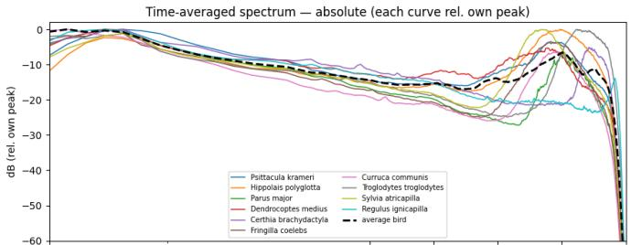
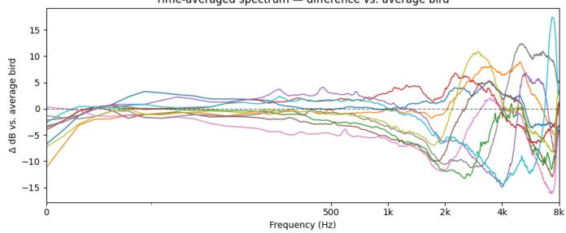
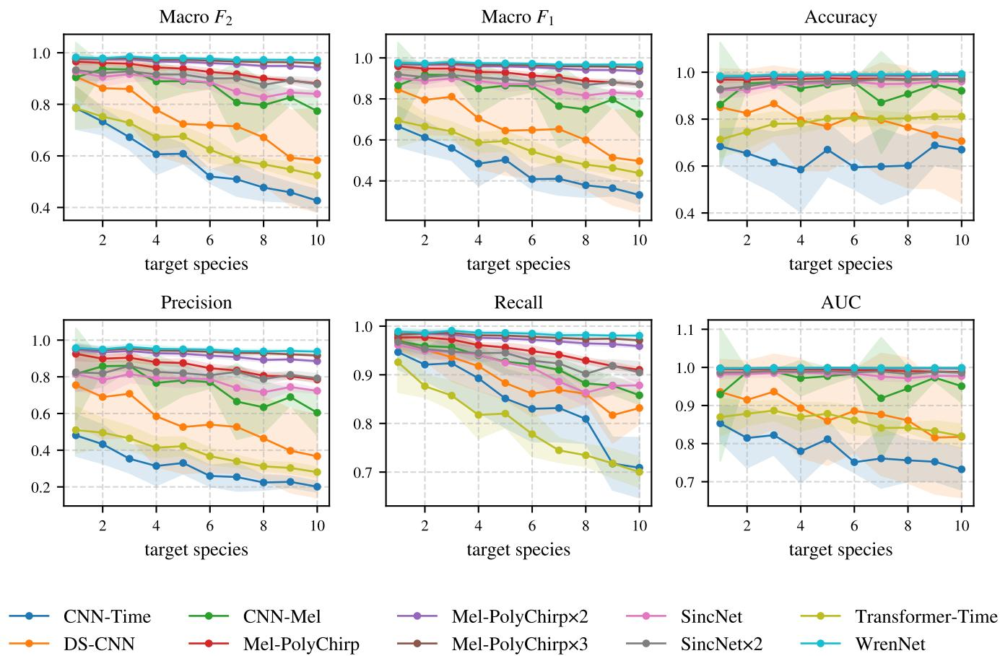
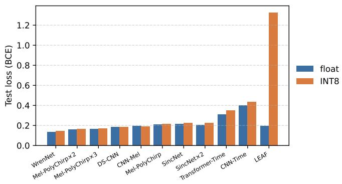
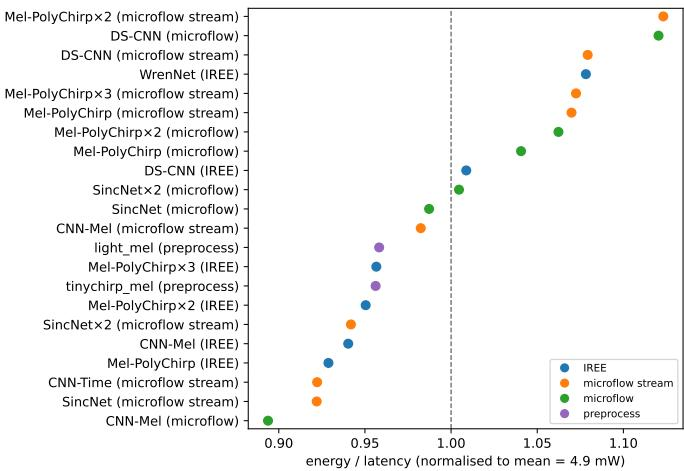
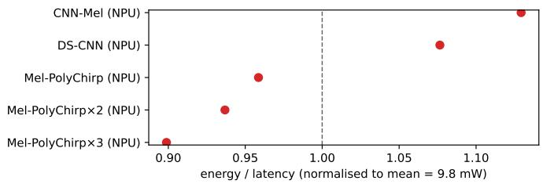

# PolyChirp: Multi-Species Birdsong Classification Using TinyML on Low-Power Acoustic Sensors

Nathan Duboisset Ecole Polytechnique ´ , Palaiseau, France Freie Universitat Berlin ¨ , Berlin, Germany nathan.duboisset@polytechnique.edu

Roudy Dagher School of Engineering, HES-SO Valais-Wallis Sion, Switzerland roudy.dagher@hevs.ch

Zhaolan Huang   
Freie Universitat Berlin¨   
Berlin, Germany   
zhaolan.huang@fu-berlin.de   
Antoine Lavandier   
Inria   
France   
antoine.lavandier@inria.fr

Felix Bießmann Berlin University of Applied Sciences (BHT) Berlin, Germany felix.biessmann@bht-berlin.de

Emmanuel Baccelli Inria, France Freie Universitat Berlin¨ , Germany emmanuel.baccelli@inria.fr

Abstract—Recent progress in the field of TinyML has demonstrated that low-power hardware based on microcontrollers can achieve bird species monitoring in real time based on acoustic sensor data for an entire breeding period on a single battery charge. However, the state of the art on low-power microcontrollers was so far limited to binary classification of a single species. In contrast, real fauna monitoring deployments often target multiple species simultaneously. To address this challenge we develop PolyChirp, an approach combining biological domain expertise, automated dataset curation, neural architecture optimization and novel hardware to achieve multiclass bird species detection in the wild. PolyChirp is based on newly designed tiny multiclass models that leverage recent microcontrollers and hardware acceleration with a neural processing unit (NPU). We evaluate the predictive performance of these models, and we measure their computational performance – memory footprint, latency, energy consumption – on common microcontroller hardware. Our results demonstrate that PolyChirp not only outperforms state-of-the-art on single species binary classification, but also achieves robust classification of up to 10 species simultaneously, while still fitting with the resource envelope of a sensor that must remain operational in the field for a full season on a single battery charge.

Index Terms—TinyML, Edge AI, Acoustic, Sensor, Low-power,Bird, Classification

## I. INTRODUCTION

Passive acoustic monitoring of birds usually incurs fielddeploying battery-powered sensors as audio recording units (ARU) for a full breeding season, recording continuously. Months later, the devices and their filled memory cards are collected for analysis. In fact, however, only a small fraction of these recordings is of interest. While a campaign targets one or more bird species, recordings end up also including in vast amounts sounds of wind, traffic, other animals etc. Crucially, storing spurious audio depletes the two budgets that constrain an ARU: memory and battery capacities.

One approach to circumvent these bottlenecks is to use TinyML to decide quickly directly on the sensor whether the current acoustic signal is relevant or not. The difficulty is that the sensor is a low-power microcontroller with a few hundred kilobytes of RAM [1]. Hence, whatever makes that classification has to be very small, and in particular, a big model such as BirdNET [2] does not fit in memory. In contrast, prior work such as TinyChirp [3] demonstrate how microcontroller-based hardware can detect a single target bird species in the field, accurately enough to discard most spurious audio and significantly improve these bottlenecks.

However, such prior work still suffers from limitations in practice. The first is the number of species: a deployment usually follows several species at once, and a single-output detector can neither separate them nor report which one it heard. The second is portability across sites: the species that matter differ from one location to the next, so a model and a dataset built for one species in one place does not carry over, and redoing that data work by hand for every new site is exactly the cost one wants to avoid.

This paper thus introduces PolyChirp, a new multi-species on-device classification mechanism that can run on diverse microcontroller hardware. PolyChirp also provides an automated dataset generation scheme which facilitates re-training for different geographical locations and, accordingly, for different species subsets. In more details, our main contributions are as follows.

• We provide a geographical site-driven dataset builder that turns a location, a radius, and a target species count into a deployment-specific multi-class dataset.

• We design and implement a family of multi-class TinyML models with one sigmoid output per species, such that a single network handles both bird-sound detection and species classification. We publish the open source code of our implementations.

• We provide a comparative performance evaluation of pre dictive performance of PolyChirp using different multiclass TinyML models, as well as measurements of Flash, RAM, inference latency, and energy consumption on common microcontroller hardware with and without neural network hardware acceleration (Nordic nRF54LM20 and the Raspberry Pi Pico 2).

• Compared to prior work, we show that PolyChirp not only performs better than TinyChirp in the single-species case, but also that PolyChirp can handle up to 10 species classification with accuracy above 0.98, using a tiny fraction of the memory budget necessary for BirdNet. We also measure the impact of neural network hardware acceleration (NPU) in practice on microcontrollers.

## II. DATASETS

Most bird-audio benchmarks use a fixed, global species list. Instead, we automate dataset building based on the place where the device will be deployed.

Dataset Creation Automation – To generate the dataset, we query Xeno-Canto [4] for every recording inside a bounding box, defined by coordinate, radius, and a target speicies count N. We run BirdNET [2] on a random subsample of those recordings to catch species the metadata misses, and rank species by occurrence. By default, the first N species become the target classes. The remaining species are pooled into a single non\_target class together with AudioSet [5] clips (speech, traffic, weather, machinery, indoor noise, etc.) and no-bird windows mined from recordings from the same area. A second primary source, the Macaulay Library [6], is queried in parallel to grow the target counts, using the same query system, to add more diverse recordings, instruments, and locations.

As an example, we run the procedure once for Paris with a 50 km radius and $N = 1 0$ . The ten target classes range from 4870 to 10 000 clips. The non\_target class holds 18 800 clips, split roughly evenly between 8400 other birds, 8400 AudioSet clips and 2000 no-bird clips. Recordings from Xeno-Canto and Macaulay are MP3 formats at mixed sample rates (32k to 48 kHz) and bit-rates (96k to 320 kbps); AudioSet clips are 10 s YouTube segments. We split each class 70/15/15 into train/val/test, stratified at the recording level so clips from the same source recording stay in the same split, to avoid data leakage.

Feature Selection and Pre-processing – Every recording is decoded and resampled to 16 kHz mono; levels are left as recorded. BirdNET then labels it: detections at confidence $\ge ~ 0 . 9 2$ produce 3 s clips around the detection, and recordings with no detection at all contribute a single random 3 s window to the no-bird pool. Labelling with BirdNET instead of the metadata tag lets us use the whole length of an XC or Macaulay recording while keeping the per-clip class confidence high, which matters because community recordings often spend most of their runtime on background.

For the mel-spectrogram models we use two front-ends, tinychirp\_mel and $\mathtt { l i g h t \_ m e l }$ . The first, following TinyChirp [3], is a 1024-point Hann window with a 256- sample hop (16 ms) and 80 mel bins over 80–8000 Hz, producing a $1 8 4 \times 8 0$ log-mel spectrogram per 3 s clip. The lighter light\_mel front-end shrinks every axis at once: a 512-point window with a 480-sample hop and 40 mel bins over 2500– 8000 Hz, producing $9 9 \times 4 0 $ . The narrower band comes directly from the data: averaging the spectrum of each target species and comparing it to the pooled “average bird” (Fig. 1), the per-species separation below 1–2 kHz is negligible and almost all of the discriminating energy sits between 2 kHz and 8 kHz, so halving the bin count and dropping the bottom 2.5 kHz costs almost no useful signal. The shorter window and larger hop then cuts the frame count and the FFT size; together with the bin reduction this leaves an input nearly 4× smaller, a real saving on MCU memory and on the front-end cost (Section V). All log-mels use a log max $( x , 1 0 ^ { - 6 } )$ compression. The timedomain baselines skip this step and read the 16 kHz waveform directly, following end-to-end audio models that classify from raw waveforms and so avoid the spectrogram entirely [7], [8].

Time-averaged spectrum — difference vs. average bird  
  
Fig. 1. Time-averaged spectrum of each paris\_10 target species (each curve normalised to its own peak) against the pooled non-target “average bird”. Top: absolute; bottom: difference vs. the average bird. Per-species separation is concentrated above $2 \mathrm { k H z } ,$ motivating the $1 \mathrm { i } \mathrm { g h t . }$ \_mel 2500–8000 Hz variant.

## III. TINYML MODELS & TRAINING

Every model in this paper has one sigmoid output per target species and is trained with binary cross-entropy. The nontarget bucket from Section II is not an extra output channel: a non-target clip is presented to the loss as the all-zeros target vector, and the network has to push every output below threshold. This keeps the head width at exactly N regardless of how the non-target pool is built, and a single model serves both bird-sound detection (any output above threshold) and species classification (argmax over the active outputs, or many birds detected). The width of every convolutional and dense layer in the architectures below scales with a single multiplier m, so the same code defines a one-parameter family of operating points.

## A. Mel Frontend

The first TinyChirp [3] architecture used a $1 8 4 \times 8 0$ log-mel with a 1024-point Hann window, a 256-sample hop (16 ms at 16 kHz) and 80 mel bins spanning 80–8000 Hz; we keep it as tinychirp\_mel. Our light\_mel front-end shrinks every axis at once – a 512-point window, a 480-sample hop (30 ms) and 40 mel bins restricted to 2500–8000 Hz – yielding a $9 9 \times$ 40 spectrogram: about 3.7× fewer values and, on-device, 4 to 5× cheaper to compute (Section VI-A).

## B. Baseline

The starting point are the three TinyChirp [3] architectures that fit the MCU resource envelope. We leave out its two SqueezeNet variants, which the TinyChirp evaluation reported as out-of-memory on the target microcontroller, and re-implement the rest with two changes from the reference code: the final Softmax becomes a per-class sigmoid, and the channel multiplier m is wired through every channel count and dense width.

CNN-Mel – Two 3×3 Conv2D blocks with ReLU and $2 \times 2$ MaxPooling on the tinychirp\_mel input, flattened into an FC + ReLU head before the N-way sigmoid output. 25 600 parameters at m=1.

CNN-Time – Two 1D Conv + ReLU blocks on the 48 000- sample waveform, with 2 × 1 MaxPooling and SpatialDropout between them, an AveragePooling that collapses the time axis to one, and an FC + ReLU head. 748 parameters at m=1.

Transformer-Time – One 1D Conv + ReLU + MaxPooling stem, a global-average pool that emits a single 16mdimensional token, and one pre-norm single-head transformer block (FFN width 32m), followed by an FC head. 2306 parameters at m=1 – slightly above the figure reported in the TinyChirp paper because we match the reference implementation rather than the table in the paper.

## C. PolyChirp Birdsong Classification Models

Mel-PolyChirp uses light\_mel, DS-CNN and WrenNet reads tinychirp\_mel with depthwise-separable blocks, and reads the same kind of spectrogram with markedly richer operators; SincNet and LEAF drop the mel frontend and learn the front-end from the waveform. All five use the same width multiplier m as the baselines.

Mel-PolyChirp – Three 3×3 Conv2D + ReLU blocks (20m channels) with a global average pool and a 32m-wide dense head, run on light\_mel. The goal is to have a model as fast as possible, especially in the case of having the NPU.

DS-CNN [9] – The MLPerf Tiny keyword-spotting reference (Zhang et al.): a stride-2 10×4 Conv2D stem (8 channels) and four depthwise-separable blocks (3 × 3 depthwise + 1 × 1 pointwise, batch-norm and ReLU throughout), a global average pool, and the N-way sigmoid. It reads tinychirp\_mel. Unlike the channel-only architectures it scales compound: depth grows with m and width with ${ \sqrt { m } } ,$ so parameters still track $m ^ { 2 }$

WrenNet [10] – A recent model for multi-species bird classification on low-power loggers. It reads the tinychirp\_mel with the mel bins as channels and is built from PhiNet-style blocks: each block applies a pointwise convolution, a dilated causal depthwise convolution, a squeezeand-excitation gate, and a pointwise projection, with batchnorm and hard-swish throughout. An initial stage feeds three such blocks and two closing stages, residual connections link the blocks, and a GRU plus a temporal-attention head pool the time axis before the sigmoid output. We keep it to test the limits of the edge path rather than for its footprint. The GRU does not convert to int8 TFLite, where it becomes a custom recurrent op, so the model cannot be baked for microflow or the Axon NPU, and the dilated depthwise convolutions and SE gates lie outside the NPU’s supported CNN operators (Section V). We run it with the GRU replaced by the attention pool, the rest being INT8-compatible.

TABLE I  
BASELINE ARCHITECTURES. SHAPES ARE REPORTED WITH THE CHANNEL MULTIPLIER m EXPLICIT; N IS THE TARGET SPECIES COUNT.
<table><tr><td>Layer</td><td>Input Shape</td><td>Output Shape</td></tr><tr><td colspan="3">CNN-Mel (25 600 params)</td></tr><tr><td> $3 \times 3 ~ \mathrm { C o n v 2 D + R e L U }$ </td><td> $1 8 4 \times 8 0 \times 1$ </td><td> $1 8 2 \times 7 8 \times 4 m$ </td></tr><tr><td> $\mathbf { M a x P o o l i n g }$ </td><td> $1 8 2 \times 7 8 \times 4 m$ </td><td> $9 1 \times 3 9 \times 4 m$ </td></tr><tr><td> $3 \times 3 ~ \mathrm { C o n v 2 D + R e L U }$ </td><td> $9 1 \times 3 9 \times 4 m$ </td><td> $8 9 \times 3 7 \times 4 m$ </td></tr><tr><td>MaxPooling</td><td> $8 9 \times 3 7 \times 4 m$ </td><td> $4 4 \times 1 8 \times 4 m$ </td></tr><tr><td>Flatten</td><td> $4 4 \times 1 8 \times 4 m$ </td><td> $3 1 6 8 m \times 1$ </td></tr><tr><td> $\mathrm { F C } + \mathrm { R e L U }$ </td><td> $3 1 6 8 m \times 1$ </td><td> $8 m \times 1$ </td></tr><tr><td> $\mathrm { F C } + \mathrm { S i g m o i d }$ </td><td> $8 m \times 1$ </td><td> $N \times 1$ </td></tr><tr><td colspan="3">CNN-Time (748 params)</td></tr><tr><td> $3 \times 1 \mathrm { C o n v 1 D + R e L U }$ </td><td> $1 \times 4 8 0 0 0$ </td><td>4m × 48 000</td></tr><tr><td>MaxPooling</td><td> $4 m \times 4 8 0 0 0$ </td><td> $4 m \times 2 4 0 0 0$ </td></tr><tr><td>SpatialDropout 0.1</td><td> $4 m \times 2 4 0 0 0$ </td><td> $4 m \times 2 4 0 0 0$ </td></tr><tr><td> $\mathrm { \hat { 3 ^ { \circ } } \times 1 } \mathrm { C o n v 1 D + R e L U }$ </td><td> $4 m \times 2 4 0 0 0$ </td><td> $8 m \times 2 4 0 0 0$ </td></tr><tr><td>MaxPooling</td><td> $8 m \times 2 4 0 0 0$ </td><td> $8 m \times 1 2 0 0 0$ </td></tr><tr><td>SpatialDropout 0.1</td><td> $8 m \times 1 2 0 0 0$ </td><td> $8 m \times 1 2 0 0 0$ </td></tr><tr><td> $\mathrm { A v e r a g e ~ P o o l i n g }$ </td><td> $8 m \times 1 2 0 0 0$ </td><td> $8 m \times 1$ </td></tr><tr><td> $\mathrm { F C } + \mathrm { \bar { R e } L U }$ </td><td> $8 m \times 1$ </td><td> $6 4 m \times 1$ </td></tr><tr><td> $\mathrm { F C } + \mathrm { S i g m o i d }$ </td><td> $6 4 m \times 1$ </td><td> $N \times 1$ </td></tr><tr><td colspan="3">Transformer-Time (2306 params)</td></tr><tr><td> $\mathrm { C o n v 1 D + R e L U }$ </td><td> $1 \times 4 8 0 0 0$ </td><td> $1 6 m \times 4 8 0 0 0$ </td></tr><tr><td> $\mathbf { M a x P o o l i n g }$ </td><td> $1 6 m \times 4 8 0 0 0$ </td><td> $1 6 m \times 2 4 0 0 0$ </td></tr><tr><td> $\mathrm { D r o p o u t } \ 0 . \dot { 2 } 5$ </td><td> $1 6 m \times 2 4 0 0 0$ </td><td> $1 6 m \times 2 4 0 0 0$ </td></tr><tr><td>Global Average Pooling</td><td> $1 6 m \times 2 4 0 0 0$ </td><td> $1 6 m \times 1$ </td></tr><tr><td>SingleHeadTransformer</td><td> $1 6 m \times 1$ </td><td> $1 6 m \times 1$ </td></tr><tr><td> $\mathrm { F C } + \mathrm { S i g m o i d }$ </td><td> $1 6 m \times 1$ </td><td> $N \times 1$ </td></tr></table>

SincNet [11] – Forty trainable band-pass sinc filters (melinitialised over 2–8 kHz) replace the mel front-end, feeding two strided Conv2D blocks (24m channels) and a flatten + 16m-dense head; a pairwise band-overlap penalty keeps the filters from collapsing during training. The sinc frontend is hard to quantize, so we add BatchNormalization after every convolution and use ReLU6 in place of ReLU, keeping the per-tensor dynamic range tight enough for the int8 PTQ calibration [12] of Section V.

LEAF [13] – Learnable Gabor filterbank, Gaussian pooling, and PCEN [14] compression on the raw waveform, feeding two Conv1D + BN + ReLU + MaxPool blocks (16m channels), a global average pool, and a 16m-wide dense head.

Table II lists the layer-by-layer shapes with m explicit; WrenNet and DS-CNN are omitted, as WrenNet’s repeated multi-branch blocks and DS-CNN’s compound depth scaling do not fit the flat per-layer format.

TABLE II  
POLYCHIRP CLASSIFICATION ARCHITECTURES. m: CHANNEL MULTIPLIER; N: TARGET SPECIES COUNT.
<table><tr><td>Layer</td><td>Input Shape</td><td>Output Shape</td></tr><tr><td colspan="3">Mel-PolyChirp</td></tr><tr><td> $3 \times 3 ~ \mathrm { C o n v 2 D + R e L U }$ </td><td> $9 9 \times 4 0 \times 1$ </td><td> $9 7 \times 3 8 \times 2 0 m$ </td></tr><tr><td>Average Pooling</td><td> $9 7 \times 3 8 \times 2 0 m$ </td><td> $4 8 \times 1 9 \times 2 0 m$ </td></tr><tr><td> $3 \times 3 ~ \mathrm { C o n v 2 D + R e L U }$ </td><td> $4 8 \times 1 9 \times 2 0 m$ </td><td> $4 6 \times 1 7 \times 2 0 m$ </td></tr><tr><td>MaxPooling</td><td> $4 6 \times 1 7 \times 2 0 m$ </td><td> $2 3 \times 8 \times 2 0 m$ </td></tr><tr><td> $3 \times 3 ~ \mathrm { C o n v 2 D + R e L U }$ </td><td> $2 3 \times 8 \times 2 0 m$ </td><td> $2 1 \times 6 \times 2 0 m$ </td></tr><tr><td>Global Average Pooling</td><td> $2 1 \times 6 \times 2 0 m$ </td><td> $2 0 m \times 1$ </td></tr><tr><td> $\mathrm { F C } + \mathrm { R e L U }$ </td><td> $2 0 m \times 1$ </td><td> $3 2 m \times 1$ </td></tr><tr><td>FC + Sigmoid</td><td> $3 2 m \times 1$ </td><td> $N \times 1$ </td></tr><tr><td colspan="3">SincNet</td></tr><tr><td>Sinc Conv (40 filt.)</td><td> $1 \times 4 8 0 0 0$ </td><td> $4 0 \times 2 9 9 6$ </td></tr><tr><td> $\mathrm { B N } + \mathrm { R e L U } 6$ </td><td> $4 0 \times 2 9 9 6$ </td><td> $4 0 \times 2 9 9 6$ </td></tr><tr><td>Average Pooling</td><td> $4 0 \times 2 9 9 6$ </td><td> $4 0 \times 7 4 9$ </td></tr><tr><td> $8 \times \bar { 1 ^ { - } } \mathrm { C o n v 2 D \bar { + } B N + R e L U 6 }$ </td><td> $4 0 \times 7 4 9$ </td><td> $2 4 m \times 3 7 5$ </td></tr><tr><td>Average Pooling</td><td> $2 4 m \times 3 7 5$ </td><td> $2 4 m \times 9 3$ </td></tr><tr><td> $8 \times 1 ~ \mathrm { C o n v 2 D } + \mathrm { B N } + \mathrm { R e L U 6 }$ </td><td> $2 4 m \times 9 3$ </td><td> $2 4 m \times 4 7$ </td></tr><tr><td>Flatten</td><td> $2 4 m \times 4 7$ </td><td> $1 1 2 8 m \times 1$ </td></tr><tr><td>FC + BN + ReLU6</td><td> $1 1 2 8 m \times 1$ </td><td> $1 6 m \times 1$ </td></tr><tr><td>FC + Sigmoid</td><td> $1 6 m \times 1$ </td><td> $N \times 1$ </td></tr><tr><td colspan="3">LEAF</td></tr><tr><td>Gabor Conv1D (40 filt.)</td><td> $1 \times 4 8 0 0 0$ </td><td> $4 0 \times 3 0 0 0$ </td></tr><tr><td>Gaussian Pool</td><td> $4 0 \times 3 0 0 0$ </td><td> $4 0 \times 7 5 0$ </td></tr><tr><td> $\mathrm { P C E N } + \mathbf { B N }$ </td><td> $4 0 \times 7 5 0$ </td><td> $4 0 \times 7 5 0$ </td></tr><tr><td> $\mathrm { C o n v 1 D + B N + R e L U }$ </td><td> $4 0 \times 7 5 0$ </td><td> $1 6 m \times 7 5 0$ </td></tr><tr><td>MaxPooling</td><td> $1 6 m \times 7 5 0$ </td><td> $1 6 m \times 3 7 5$ </td></tr><tr><td> $\mathrm { C o n v 1 D + \bar { B } N + R e L U }$ </td><td> $1 6 m \times 3 7 5$ </td><td> $1 6 m \times 3 7 5$ </td></tr><tr><td> $\mathbf { M a x P o o l i n g }$ </td><td> $1 6 m \times 3 7 5$ </td><td> $1 6 m \times 1 8 7$ </td></tr><tr><td>Global Average Pooling</td><td> $1 6 m \times 1 8 7$ </td><td> $1 6 m \times 1$ </td></tr><tr><td> $\mathrm { F C } + \mathrm { B N } + \mathrm { R e } \mathrm { L U }$ </td><td> $1 6 m \times 1$ </td><td> $1 6 m \times 1$ </td></tr><tr><td> $\mathrm { F C } + \mathrm { S i g m o i d }$ </td><td> $1 6 m \times 1$ </td><td> $N \times 1$ </td></tr></table>

## D. Training with Augmentation

All models are trained with Adam and binary cross-entropy on the 70/15/15 split described in Section II, sampled at natural class proportions. Sample weights are set so that the non-target bucket carries half of the total weight mass and the other half is split between the target classes at inverse frequency; pure inverse-frequency collapses the non-target weight when that bucket outnumbers any single target, which in real life is most of the recorded time.

Audio augmentation is applied to the training stream only and runs on the raw waveform before any mel computation, so every front-end sees the same perturbations:

• Shift – circular shift, up $1 0 \pm 1 0 \%$ of clip length, $p = 0 . 5$

• Gain – uniform gain in $\pm 2 0 \mathrm { d } \mathrm { B } , p = 0 . 5 .$

• Polarity inversion – sign flip, $p = 0 . 5 .$

• Noise – with $p = 0 . 5 ,$ , one or two of {Gaussian noise at amplitude $1 0 ^ { - 4 } { \mathrm { ~ t o ~ } } 3 \times 1 0 ^ { - 3 }$ ; AudioSet background mixed at 8–25 dB SNR}.

• Time masking – zero a single $2 \mathrm { - } 8 \%$ band of the clip, $p = 0 . 2 5$

• Clipping distortion – soft clip between the 0th and 5th amplitude percentiles, $p = 0 . 1 0$

## IV. TINYML DEPLOYMENT PIPELINE

Sections II and III contribute two reusable parts: a builder that turns a deployment site into a labelled multi-class dataset, and a family of models that read either a log-mel spectrogram or the raw 16 kHz waveform. What a sensor runs in the field is a particular composition of the two, and the same parts compose in more than one way. This section fixes the two single-stage pipelines we deploy and states the questions the evaluation (Section VI) answers about them.

Classification Pipeline – The default pipeline is site-driven and species-aware. A campaign is specified once, off-device, by a coordinate, a radius and a target count N – the species of interest. The builder of Section II pulls and labels that site’s audio into N target classes and one pooled non-target bucket, a model from Section III is trained on it, and the quantized network is flashed to the sensor. In the field the network slides over the stream and emits N sigmoid scores per 3 s window. Because the non-target pool was trained as the all-zeros target (Section III), those scores answer both questions a campaign asks at once: the window is worth storing when any score clears the threshold, and the highest active output names the species. Detection and classification are the same forward pass.

Detection Pipeline – Some campaigns only need to know that a bird was heard, not which one (leaving that to biologists); presence alone decides whether a window is worth keeping. For these the labelling collapses to bird-versus-nobird and reuses the very same site-specific dataset: every bird clip becomes a positive – the N target species and the pooled non-target birds alike – and only the non-bird material, the AudioSet noise and the no-bird windows, stays negative. Within that positive class a few abundant species would otherwise dominate, so before pooling we cap every species at the same maximum number of clips – up to 250 from each source, 500 in all – which balances the bird set across species rather than letting the most-recorded birds swamp it. The result is a oneoutput bird-presence detector, the multi-species counterpart of the single-species screen of TinyChirp [3], and the cheapest model we deploy: a smaller head, a single threshold, no perspecies calibration. This is a strictly broader question than the classification pipeline answers – a non-target bird is a positive here but the all-zeros target there – so the two are distinct models, not two readings of one. The detector stands alone when species identity is not needed.

## V. IMPLEMENTATION OVERVIEW

We target two off-the-shelf low-power boards representative of hardware with/without NPU acceleration: respectively the Nordic nRF54LM20 and the Raspberry Pi Pico 2. Both run the models on their Cortex-M core. The nRF54LM20 additionally provides an Axon NPU. The same trained network thus alternatively use two categories of execution paths: portable CPU paths that runs on either board, or an accelerated NPU path (only on the nRF54LM20).

CPU Paths – On all the hardware, we use a Rust firmware built on Ariel OS [15]. For transpiling models, we use two approaches. On the one hand, inference handled by microflowrs [16], which turns a quantized TFLite file into a model at build time. The network is generated directly from the .tflite, so the width-multiplier family of Section III compiles into firmware without any hand-written kernels, and the mel front-end (FFT and filterbank) runs in the same Rust path. On the other hand, for comparison, we also implement an alternative CPU path based on Ariel-ML and the IREE transpiler [17]. We chose IREE as comparison point as prior work [18] measured improvements compared to TinyChirp [3]. Thereafter, such CPU paths are simply marked as ”IREE”.

NPU Path – On the nRF54LM20, we can leverage the Axon NPU using its Edge AI add-on [19]. The add-on’s compiler turns the int8 model (Section V) into a C header that the Axon driver executes, while the mel spectrogram is still computed on the Cortex-M core and only the resulting feature map is handed to the NPU. Note that not every model can take this path. The Axon compiler caps each tensor dimension at 1024 and restricts convolutions to small kernels (filter width up to 32, stride up to 31), and its operator set covers standard CNN blocks – convolution, pooling, fully connected, and the ReLU family – but none of the learnable audio front-ends. The melspectrogram models fit this envelope naturally: the spectrogram is a compact image (184 × 80 for tinychirp\_mel models, 99×40 for light\_mel used in Mel\_PolyChirp), well inside the size limit, and its convolutional blocks map directly onto the NPU. The time-domain models do not. A 48 000-sample waveform already exceeds the 1024-long input limit, and the band-pass filters of SincNet and the Gabor/PCEN front-end of LEAF are long kernels with no counterpart in the supported operators. These models therefore stay on the CPU. In effect the NPU accelerates the spectrogram branch of the pipeline, while the waveform branch – which exists precisely to skip the mel computation – remains a CPUonly option.

Optimization Techniques – After training in float, we apply post-training quantization (PTQ) [12], [20], mapping weights and activations to int8 with per-tensor scales and zero-points calibrated on a sample of the training set. The Axon NPU executes int8 only, and on the Cortex-M core quantizing to int8 arithmetic keeps weights and activation arena inside the RAM budget. As the network infers on a 3 s sliding window over the audio stream, consecutive windows overlap. Exploiting this fact, we can use partial convolution as described in TinyDej´ aVu [21] to limit peak RAM usage. Note\` that the time-domain models cannot be executed on the NPU (Section V), hence they only have a CPU path.

Mel Front-end – The mel-spectrogram models rest on a log-mel front-end that, on a microcontroller, is a bottleneck in its own right: Nordby measured mel feature extraction at 60 ms against the 38–81 ms taken by the networks it feeds [22], and TinyChirp cites this very cost when it argues for skipping the spectrogram and reading the waveform directly [3]. We keep the front-end on-device but make it cheap enough not to dominate the inference budget, by precomputing everything that does not depend on the incoming audio and reusing it across every frame and every sliding window. The Hann window is tabulated once at start-up instead of being reevaluated for each frame, and the triangular mel filterbank is built once from its band edges and stored sparsely, as a flat list of (FFT bin, mel bin, weight) triples that records only the non-zero filter overlaps. Because each FFT bin falls under at most two adjacent triangles, applying the filterbank then becomes a single pass of about two multiply-accumulates per bin, rather than the dense matrix product across all FFT bins and mel channels that a literal filterbank would run. The FFT is the one step we cannot precompute (a 512-point transform for Mel-Polychirp, 1024 for the heavier CNN-Mel): on the nRF54LM20 it is offloaded to the Axon NPU, leaving the Cortex-M core only the windowing, magnitude, filterbank, and log, while a CMSIS FFT keeps the same pipeline running on boards without the accelerator.

## VI. EXPERIMENTAL PERFORMANCE EVALUATION

Across all pipelines and models, our evaluation is organised to tackle four axes defined as follows.

• Accuracy – Can a single multi-class network both detect a bird and identify which of up to N = 10 target species it is, and how much of that accuracy survives the int8 posttraining quantization the hardware forces (Section V)?

• Front-end - Does reading the raw waveform, and so skipping the mel computation entirely, trade accuracy for a cheaper pipeline against the mel-spectrogram front-end?

• Budget and hardware – Does the multi-class setup fit the flash, RAM, latency and energy envelope of a sensor meant to run for a full season, and what does the on-chip NPU buy across the two boards?

• Pipeline shape – When only presence matters, does the species-agnostic detector lower the average on-device cost against always running the full classifier?

We report below on measurements we performed on two low-power boards: the Nordic nRF54LM20 and the Raspberry Pi Pico 2. Note that on-device timings are rounded to the nearest millisecond, since the variation between runs is already larger than that.

## A. Front-end Preprocessing Cost

We time the mel front-end per 3 s window on both boards, by step, averaged over ten windows (Table III).

Precomputing everything but the FFT (Section V) makes the front-end 7 to 11× faster than TinyChirp’s literal perframe version [3]; the gain is in framing, where tabulating the Hann window once removes a per-sample cosine that is costly on an MCU. light\_mel is a further 4 to 5× cheaper than tinychirp\_mel, the FFT and magnitude dominating throughout. The Axon NPU runs the 512-point FFT no faster than the Cortex-M (60 vs 58 ms) and cannot take the 1024- point one (Section V), so the front-end stays on the CPU. That the front-end is a real cost, not just inference, matches earlier keyword-spotting work, which reports roughly one second to compute a much smaller (30 × 40) spectrogram on a more powerful STM32F7 [23].

TABLE III  
MEL FRONT-END COST PER 3 S WINDOW, BY STEP (MS); ROWS WITH +NPU: FFT OFFLOADED TO AXON NPU. COLUMN Energy: TOTAL PER-WINDOW FRONT-END COST (MJ), MEASURED ON THE NRF54.
<table><tr><td>Front-end</td><td>Target</td><td>Frame</td><td>FFT</td><td>Mag</td><td>Mel</td><td>Log</td><td>Total</td><td>Energy</td></tr><tr><td> $\mathtt { t i n y c h i r p \_ m e l }$ </td><td>Pico 2</td><td>93</td><td>119</td><td>76</td><td>60</td><td>13</td><td>366</td><td>27.6</td></tr><tr><td>tinychirp_mel</td><td>nRF54LM20</td><td>51</td><td>202</td><td>118</td><td>67</td><td>34</td><td>484</td><td>2.25</td></tr><tr><td> $\mathtt { l i g h t \_ m e l }$ </td><td>Pico 2</td><td>16</td><td>29</td><td>21</td><td>9</td><td>3</td><td>80</td><td>5.31</td></tr><tr><td> $\mathtt { l i g h t \_ m e l }$ </td><td>nRF54LM20</td><td>13</td><td>54</td><td>33</td><td>14</td><td>9</td><td>126</td><td>0.587</td></tr><tr><td> $\mathtt { l i g h t \_ m e l }$ </td><td>+NPU</td><td>6</td><td>30</td><td>5</td><td>5</td><td>6</td><td>53</td><td>0.515</td></tr></table>

TABLE IV  
DETECTION PREDICTIVE PERFORMANCE (INT8, $F _ { 2 } \cdot$ -TUNED THRESHOLD).
<table><tr><td>Model</td><td>Acc.</td><td>Prec.</td><td>Rec.</td><td> $F _ { 1 }$ </td><td> $F _ { 2 }$ </td><td>AUC</td></tr><tr><td>CNN-Time</td><td>0.79</td><td>0.72</td><td>0.97</td><td>0.83</td><td>0.91</td><td>0.90</td></tr><tr><td>Transformer-Time</td><td>0.81</td><td>0.74</td><td>0.97</td><td>0.84</td><td>0.92</td><td>0.93</td></tr><tr><td>CNN-Mel</td><td>0.91</td><td>0.85</td><td>1.00</td><td>0.92</td><td>0.96</td><td>0.97</td></tr><tr><td> $\mathtt { M e l - P o l y C h i r p }$ </td><td>0.91</td><td>0.86</td><td>0.99</td><td>0.92</td><td>0.96</td><td>0.97</td></tr><tr><td> $\mathtt { M e l - P o l y C h i r p } { \times } 2$ </td><td>0.92</td><td>0.88</td><td>0.99</td><td>0.93</td><td>0.97</td><td>0.98</td></tr><tr><td> $\mathtt { M e l - P o l y C h i r p } { \times } 3$ </td><td>0.93</td><td>0.89</td><td>0.99</td><td>0.94</td><td>0.96</td><td>0.98</td></tr><tr><td>SincNet</td><td>0.88</td><td>0.81</td><td>1.00</td><td>0.90</td><td>0.95</td><td>0.97</td></tr><tr><td>SincNet×2</td><td>0.88</td><td>0.82</td><td>0.99</td><td>0.90</td><td>0.95</td><td>0.97</td></tr><tr><td>WrenNet</td><td>0.93</td><td>0.89</td><td>0.99</td><td>0.94</td><td>0.97</td><td>0.99</td></tr><tr><td>DS-CNN</td><td>0.92</td><td>0.87</td><td>0.99</td><td>0.93</td><td>0.96</td><td>0.97</td></tr></table>

## B. Predictive Performance

Per-class thresholds are tuned on train+val, separately for $F _ { 1 }$ and $F _ { 2 } ,$ , and reported on the held-out test split; classification metrics are macro-averaged over the target species, detection metrics are read on the single bird-presence class. Everything is INT8 unless stated, at the $F _ { 2 }$ operating point, where recall is favoured over precision.

1) Classification pipeline: The site-driven classifier grows with the number of target species $k ,$ so we report it as a scaling curve. Figure 2 tracks the six TinyChirp [3] metrics – macro $F _ { 2 } , F _ { 1 }$ , accuracy, precision, recall, AUC – from k=1 to k=10, each point a mean over resampled species draws.

Quality falls off gradually with k and the models spread apart. The spectrogram models hold up best – wrennet drops only from 0.98 to 0.97 macro $F _ { 2 }$ , mel\_polychirp\_x2 stays above 0.94 – while the time-domain baselines fare worst, CNN-Time and Transformer-Time halving to 0.43 and 0.52. AUC and accuracy stay nearly flat throughout, so the loss is a threshold effect, not lost separability: at the $F _ { 2 }$ point precision falls first while recall is held high. The run-to-run spread splits the models the same way: mel\_polychirp\_x3 and mel\_polychirp\_x2 hold their macro $F _ { 2 }$ standard deviation between 0.001 and 0.006 across k=1 to 10, while ds\_cnn and mel\_cnn vary from 0.013 to 0.200, over 8 resampled species draws per point.

2) Detection pipeline: Bird-presence detection is a single binary task, not a scaling one, so we report it once per model (Table IV, INT8 at the $F _ { 2 }$ point). Every model clears $F _ { 2 } \geq$ 0.91 at recall $\ge ~ 0 . 9 7 $ almost no bird window is dropped. wrennet, the mel\_polychirp family and ds\_cnn lead, and even the 1–3 KB time-domain baselines reach $F _ { 2 } = 0 . 9 1 -$ 0.92. LEAF is excluded (Fig. 3).

TABLE V  
CROSS-PLATFORM LATENCY CALIBRATION, CLOCKS: PICO 2 150 MHZ, NRF54 128 MHZ. MF = MICROFLOW TRANSPILER.
<table><tr><td rowspan="2">Model</td><td colspan="2">Latency (ms)</td></tr><tr><td>MF Pico2</td><td>MF nRF54</td></tr><tr><td>CNN-Time</td><td>680</td><td>2654</td></tr><tr><td>CNN-Me1</td><td>51</td><td>113</td></tr><tr><td> $\mathtt { M e l - P o l y C h i r p }$ </td><td>343</td><td>846</td></tr><tr><td> $\mathtt { M e l - P o l y C h i r p } { \times } 2$ </td><td>1581</td><td>3098</td></tr><tr><td> $\mathtt { M e l - P o l y C h i r p } { \times } 3$ </td><td>2115</td><td>4948</td></tr><tr><td>SincNet</td><td>1002</td><td>2521</td></tr><tr><td> $\mathtt { S i n c N e t } \times 2$ </td><td>1710</td><td>3235</td></tr><tr><td>DS-CNN</td><td>599</td><td>1566</td></tr></table>

Quantization to INT8 is important for every model but particularly for the time models : LEAF, CNN-Time, Transformer-Time, and even SincNet even though it is designed to try and counter this. (Fig. 3): float and INT8 test loss differ by under 0.4 everywhere except LEAF, whose loss jumps from 0.19 to 1.33 as the learned PCEN gains do not survive a single activation scale, so it is excluded from the quantized comparisons, since its collapsed network is not useful anymore.

## C. Inference Cost and Latency

We deploy every model on the nRF54LM20 and report its inference cost there (Table VI) under each runtime it can target: the microflow INT8 transpiler, with and without its streaming kernel functionnality; the IREE ahead-of-time compiler; and the on-chip neural accelerator (NPU). To place those numbers in context we time a handful of models on the RP2350 (Pico 2) as well, giving the cross-platform factors we use to reason about the rest (Table V).

On the models that fit both runtimes, microflow runs about 2.5× faster on the Pico 2 (150 MHz) than on the nRF54 (128 MHz); the 1.17× clock ratio explains only part of this, the rest being a consistent platform factor – memory-access latency, as both boards carry 512 KiB of RAM – that we fold into the calibration.

On the nRF54 itself (Table VI) the NPU dominates – mel\_cnn in 2 ms and $\mathtt { m e l \_ p o l y c h i r p \_ x 3 }$ in 39 ms – whereas the transpiler runs from hundreds of milliseconds up to several seconds, and its non-streaming path runs out of memory at the widest width (“OOM”) where streaming, which never materialises the full feature maps, still fits. Note that time-domain models have neither a compiled nor an NPU path (IREE provides no streaming kernel, so the raw 48 000-sample input overflows memory, while the NPU does not take a raw waveform). The LEAF and Transfomrer-Time models could not be run on any backend : the PCEN mechanism is not runnable on int8 models, while for Transformer time, the first layer $( 1 6 \times 4 8 0 0 0 )$ is unable to exist without streaming, but microflow currently doesn’t include the attention mechanism. The only time models measured (CNN-Time, SincNet) therefore run under microflow alone – SincNet in both modes, while CNN-Time fits only with streaming. Energy per inference (right half of each table) closely tracks latency, along two lines rather than one (Fig. 4): the three runtimes draw comparable power (4.9 mW), so their energy is roughly latency times a shared constant, whereas the NPU sits in a separate regime, drawing about twice that power (9.8 mW) but, finishes inference one to two orders of magnitude faster, thus spends far less energy per inference.

Fig. 2. Classification predictive performance vs. number of target species k (INT8). Precision and recall are read at the $F _ { 2 } \cdot$ -tuned threshold; each curve is a mean over resampled species draws. LEAF collapses under INT8 (Fig. 3) and is excluded.  
  
Fig. 3. Float vs. INT8 test loss per model on detection.

A four-point spot-check on the Pico 2, spanning 74 ms to 1.6 s across inference and preprocessing, finds the effective power (energy over latency) constant at 70 mW to within 14%, so its board-level energy follows a single $E = P \times$ latency law and needs no per-model table. Measured on the full 3.3 V rail, for the recorded operations the Pico takes 1.3 to 2.2× less time than the nRF54 but draws 6.5 to 12× more energy, making it suitable only where energy is not constrained.

Flash follows the same runtime ordering (Table VI, right): the microflow transpiler yields the smallest binaries, while IREE’s ahead-of-time kernels and runtime add roughly 100 kB. All three land above comparable RIOT-OS deployments such as TinyChirp [3], as the footprint is set less by the model than by the Rust-based Ariel OS base firmware, which is heavier than RIOT’s.

## VII. DISCUSSION & PERSPECTIVES

Hardware Accelerator (NPU) Considerations – Using an NPU remains somewhat challenging. At the time of writing, this requires using a separate C firmware on the nRF Connect SDK (Zephyr) combined with Nordic’s closed-source Edge AI add-on [19]. The add-on is easy to use, but we experienced downsides. First, this path departs from the single-language

## TABLE VI

ON-DEVICE INFERENCE COST ON THE NRF54LM20. ALL MODELS QUANTIZED TO INT8 PRECISION. TIME-DOMAIN MODELS RUN UNDER MICROFLOW ONLY; CNN-TIME FITS ONLY WITH STREAMING. FLASH IS THE BINARY SIZE OF THE DEPLOYABLE FIRMWARE. OOM: MODEL CAN FIT FLASH BUT EXCEEDS AVAILABLE RAM AT RUN TIME; NA: MODEL NOT SUPPORTED BY RUNTIME DUE TO INSUFFICIENT OPERATOR COVERAGE.  
Mel-spectrogram models
<table><tr><td></td><td colspan="4">Inference Latency (ms)</td><td colspan="4">Energy (mJ)</td><td colspan="4">Flash (kB)</td></tr><tr><td>Model</td><td>IREE</td><td>microflow</td><td>microflow w/ streaming</td><td>NPU</td><td></td><td>IREE microflow</td><td>microflow w/ streaming</td><td>NPU</td><td></td><td>IREE microflow</td><td>microflow w/ streaming</td><td>NPU</td></tr><tr><td>CNN-Me1</td><td>245</td><td>113</td><td>536</td><td>2</td><td>1.12</td><td>0.491</td><td>2.56</td><td>0.0221</td><td>187.1</td><td>86.9</td><td>94.3</td><td>182.7</td></tr><tr><td> $\mathtt { M e l - P o l y C h i r p }$ </td><td>671</td><td>846</td><td>1092</td><td>5</td><td>3.03</td><td>4.28</td><td>5.68</td><td>0.0469</td><td>161.2</td><td>55.8</td><td>71.4</td><td>167.8</td></tr><tr><td> $\mathtt { M e l - P o l y C h i r p } { \times } 2$ </td><td>2597</td><td>3098</td><td>3388</td><td>18</td><td>12</td><td>16</td><td>18.5</td><td>0.165</td><td>183.6</td><td>81.8</td><td>100.4</td><td>198.9</td></tr><tr><td> $\mathtt { M e l - P o l y C h i r p } { \times } 3$ </td><td>5483</td><td>O0M</td><td>4948</td><td>39</td><td>25.5</td><td>00M</td><td>25.8</td><td>0.343</td><td>226.1</td><td>126.0</td><td>142.9</td><td>245.5</td></tr><tr><td>WrenNet</td><td>475</td><td>NA</td><td>NA</td><td>NA</td><td>2.49</td><td>NA</td><td>NA</td><td>NA</td><td>298.3</td><td>NA</td><td>NA</td><td>NA</td></tr><tr><td>DS-CNN</td><td>628</td><td>1566</td><td>1963</td><td>6</td><td>3.08</td><td>8.53</td><td>10.3</td><td>0.0632</td><td>182.7</td><td>70.6</td><td>74.9</td><td>157.3</td></tr></table>

Time-domain models (microflow)
<table><tr><td></td><td colspan="2">Inference Latency (ms)</td><td colspan="2">Energy (mJ)</td><td colspan="2">Flash (kB)</td></tr><tr><td>Model</td><td>microflow</td><td>microflow w/ streaming</td><td>microflow</td><td>microflow w/ streaming</td><td>microflow</td><td>microflow w/ streaming</td></tr><tr><td>CNN-Time</td><td>OOM</td><td>2654</td><td>O0M</td><td>11.9</td><td>O0M</td><td>44.9</td></tr><tr><td>SincNet</td><td>2521</td><td>4484</td><td>12.1</td><td>20.1</td><td>64.5</td><td>73.9</td></tr><tr><td> $\mathtt { S i n c N e t } \times 2$ </td><td>3235</td><td>5132</td><td>15.8</td><td>23.5</td><td>140.4</td><td>151.9</td></tr></table>

  
Fig. 4. Effective power (energy over latency) measured on nRF54LM20. Top: on MCU. Bottom: on NPU. Normalised to group mean (dashed line).  
TABLE VII

(Rust and Ariel OS) stack described in Section V. Second, it ties the deployment to a specific vendor’s hardware. However, the Axon NPU does execute much faster the convolutional part of mel models compared to Cortex-M cores. Inference latency decreases 2 orders of magnitude (from about a second to a few milliseconds, recall Table VI), and inference energy consumption drops proportionally, which is a strong motivation.

ON-DEVICE INFERENCE LATENCY (MS) ON THE RP2350 (PICO 2). ALL MODELS QUANTIZED TO INT8 PRECISION. OOM: MODEL CAN FIT FLASH BUT EXCEEDS AVAILABLE RAM AT RUN TIME; NA: MODEL SUPPORTED BY RUNTIME DUE TO INSUFFICIENT OPERATOR COVERAGE.

Mel-spectrogram models
<table><tr><td>Model</td><td>IREE</td><td>microflow</td><td>microflow w/ streaming</td></tr><tr><td>CNN-Mel</td><td>107</td><td>51</td><td>219</td></tr><tr><td> $\mathtt { M e l - P o l y C h i r p }$ </td><td>275</td><td>343</td><td>453</td></tr><tr><td> $\mathtt { M e l - P o l y C h i r p } { \times } 2$ </td><td>883</td><td>1581</td><td>1392</td></tr><tr><td> $\mathtt { M e l - P o l y C h i r p } { \times } 3$ </td><td>3831</td><td>OOM</td><td>2115</td></tr><tr><td> $\mathtt { W r e n N e t }$ </td><td>188</td><td>NA</td><td>NA</td></tr><tr><td>DS-CNN</td><td>245</td><td>599</td><td>779</td></tr></table>

Time-domain models (microflow)
<table><tr><td rowspan="2">Model</td><td rowspan="2">microflow</td><td rowspan="2">microflow</td></tr><tr><td>w/ streaming</td></tr><tr><td> ${ \mathrm { C N N - T i m e } }$ </td><td>OOM</td><td>680</td></tr><tr><td>SincNet</td><td>1002</td><td>1909</td></tr><tr><td> $\mathtt { S i n c N e t } \times 2$ </td><td>1710</td><td>2161</td></tr></table>

We observe furthermore how the front-end benefits from the NPU. The accelerator supports ML layers, but also direct calls to operations like FFT. With the network offloaded, the mel computation takes most of the time spent on each window. Waveform models would gain the most from NPU, since they are almost all convolution. However, the NPU cannot run these models, as a 48 000-sample input is over the 1024 limit on tensor dimensions,and the Gabor front-end is not supported. Hence, NPU hardware limitations would have to be lifted in next-generation NPUs.

Model Transpilers – The choice of model transpiler (we studied microflow and IREE) is a system-level engineering decision involving trade-offs among inference latency, memory usage, operator coverage, power efficiency, etc. For instance, compared with microflow, we measured IREE incurs a substantially (> 2×) larger Flash runtime footprint and less memory-safety guarantees, but uses less RAM, achieves less latency and provides support for a broader range of model operators. Orthogonally, given the significant acceleration capability and power efficiency of NPUs we measured, future work should further explore adding NPU support to both IREE and microflow. Future work should also develop further operator support for microflow. Overall, the benchmarks presented in this work may provide useful reference points for practitioners aiming to select a suitable transpiler strategy.

Dataset Limitations – A clip becomes a target only when BirdNET is at least 0.92 confident, which is an arbitrary threshold set from previous work [3]. The models therefore learn to copy BirdNET – labelling mistakes included. The high threshold keeps the labels clean but narrows the data. The clips that pass are the loud, clear ones, not the faint or overlapping calls that fill much of a real-life recording. Distilling from BirdNET’s confidence scores, as WrenNet does [10] would keep some of that information and let us reuse the audio we currently drop. Moreover, on the data side, some target species are under-represented due to lack of available data. Thus, the rarer classes were trained on less data than the common ones. More sound sources, and testing on audio records from the target sensor itself in the field, would help close the gap between this curated set and what the device hears.

Recall versus Precision Trade-offs – A false negative drops a window for good and loses a real detection. A false positive only keeps a spurious clip, and we can filter it out later when the SD card is read. Hence we favour recall over precision, and tune per-class thresholds for $F _ { 2 }$ as well as $F _ { 1 }$ (see Section VI-B). Quantization complicates this. PTQ to int8 shifts the scores, so a threshold set on the float model must be ”retuned” per backend (see Section V). There is no single right threshold, since it depends on how fast the SD card fills and how badly a campaign can afford to miss a species. The detection pipeline uses the cheapest case, with one threshold set for recall and the species left to the offline pass. The harder problem comes earlier. We weight the training set so the loss does not collapse onto the large non-target class (Section III-D), but the field distribution is not the one we trained on, so a threshold that looks right on the test set can behave differently in deployment.

Batching Inference Under a Larger RAM Budget – The limiting factor is often RAM, and the streaming scheme of Section V is there to keep it low. If a board has more RAM to spare, we could instead run several 3 s windows through the network at once. Reusing each weight across a batch, while in cache, would lower the per-call overhead and the energy spent per window. This seems like a low-hanging fruit on larger boards where RAM is not the limiting factor (as this costs extra activation memory).

## VIII. RELATED WORK

Birdsong recognition on edge & server hardware –

The main reference for automatic bird-sound recognition is BirdNET [2], a residual network that identifies several thousand species from continuous soundscape audio. Other work on on bird audio detection include [24] or [25] using fully convolutional networks trained for multi-species recognition. BirdNET-Pi [26] runs a quantized BirdNET continuously on a Raspberry Pi to log detections in real time, and Bird@Edge [27] streams audio from wireless microphones to a local edge node where a convolutional model performs the recognition. More recent work such as Perch [28] sharpens the underlying representation with general-purpose birdsong embeddings that transfer well across tasks. On the other hand, AudioMoth [29] autonomous recording units records to an SD card, but offloads species recognition to an offline step. Across this domain, the classification runs onnly on microprocessoror GPU-class hardware.

Birdsong recognition on microcontrollers – Early ondevice detectors pair a mel front-end with a compact CNN: Disabato et al. [30] detect birdsong at the edge on a Cortex-M, TinyBird-ML [31] runs vocalization analysis and syllable classification on an animal-borne ultra-low-power node, and Miquel et al. [32] study the energy cost of edge audio for biologging. WrenNet [10] distills BirdNET into a small recurrent network. TinyChirp [3] uses a Cortex-M to screen a single target species in the field while TinyDej´ aVu [21] lowers\` the RAM of streaming inference for such sensors.

TinyML pipelines – TensorFlow Lite Micro [33] is the common C++ interpreter, usually paired on Arm Cortex-M with the CMSIS-NN kernel library [34]. A second approach compiles the model ahead of time: transpilers such as µTVM [35] or IREE [17] lower a network from the major training frameworks to low-level code for a wide range of microcontrollers. MCUNet [36] combines such an engine with neural architecture search to fit the model and runtime to a given memory budget. Building on these transpilers, U-TOE [37], RIOT-ML [38] or Ariel-ML [18] add embedded operating-system integration, so that arbitrary models can be flashed, benchmarked, and updated over low-power links on commodity boards. Vendor pipelines also include STM32Cube.AI and Edge Impulse. More recent proposals include microflow-rs [16] which compiles a quantized model into memory-safe Rust at build time. Orthogonally, techniques are developed to lower peak RAM usage, for instance msf-CNN [39] which leverages patch-based layer-fusion.

Microcontroller hardware & neural accelerators – The cost and the performance of an ARU depends on the silicon it uses. Popular microcontrollers are based on 32-bit instruction set architectures such as Arm Cortex-M, RISC-V 32 or Xtensa. Alongside such architectures, a class of microcontroller-scale neural accelerators (µNPUs) has appeared: Arm’s Ethos-U55 [40], the Maxim MAX78000 [41], ST’s STM32N6 with its Neural-ART engine [42], and the Nordic Axon we use on the nRF54LM20 [19]. These NPUs cut inference time and energy by large factors, but run int8 only, cover a restricted set of CNN operators, and so far depend on vendor toolchains, which limits both model coverage and portability across boards. Standardized TinyML benchmark suites such as MLPerf Tiny [9] target plain MCU cores, while Millar et al. [43] recently provided cross-vendor benchmarks of several µNPUs and find measured performance often departs from the data sheets.

## IX. CONCLUSION

Bio-acoustic monitoring leveraging TinyML pipelines is an approach that is appealing and which has recently become practical. In this paper, we have designed, implemented and evaluated PolyChirp, a low-power embedded software framework which enables training and baking different TinyML models in the firmware of various microcontrollerbased hardware, with or without NPU hardware acceleration. Compared to prior work which either required microprocessorclass resources or performed only single-species detection, PolyChirp can classify with high accuracy up to 10 species simultaneously on common microcontroller hardware. We also measure how available NPU hardware acceleration is best leveraged on such hardware. Combined with the portable open source code implementations we published, PolyChirp provides a solid base for both practical deployments and further research in this field.

Code Availability – The pipeline for model benchmarking on Ariel OS is published at github.com/ariel-os/ ariel-microflow-ml. The reproducible benchmark code is published at github.com/NathanDuboisset/polychirp.

## REFERENCES

[1] C. Bormann, M. Ersue, and A. Keranen, “Terminology for Constrained-¨ Node Networks,” RFC 7228, 2014.

[2] S. Kahl et al., “BirdNET: A deep learning solution for avian diversity monitoring,” Ecological Informatics, vol. 61, p. 101236, Mar. 2021.

[3] Z. Huang et al., “TinyChirp: Bird song recognition using TinyML models on low-power wireless acoustic sensors,” in Proc. IEEE 5th International Symposium on the Internet of Sounds (IS2), 2024.

[4] Xeno-canto Foundation, “xeno-canto: Sharing wildlife sounds from around the world,” https://xeno-canto.org, accessed: 2026-06-22.

[5] J. F. Gemmeke et al., “Audio set: An ontology and human-labeled dataset for audio events,” in Proc. IEEE International Conference on Acoustics, Speech and Signal Processing (ICASSP), 2017, pp. 776–780.

[6] Cornell Lab of Ornithology, “Macaulay library,” https://www. macaulaylibrary.org, accessed: 2026-06-22.

[7] S. Abdoli, P. Cardinal, and A. Lameiras Koerich, “End-to-end environmental sound classification using a 1D convolutional neural network,” Expert Systems with Applications, vol. 136, pp. 252–263, 2019.

[8] J. Sang et al., “Convolutional recurrent neural networks for urban sound classification using raw waveforms,” in Proc. EUSIPCO, 2018.

[9] C. Banbury et al., “MLPerf tiny benchmark,” 2021, arXiv:2106.07597.

[10] S. Ciapponi et al., “Enabling multi-species bird classification on lowpower bioacoustic loggers,” 2025, arXiv:2509.20103.

[11] M. Ravanelli and Y. Bengio, “Speaker recognition from raw waveform with SincNet,” in Proc. IEEE Spoken Language Technology Workshop (SLT), 2018, pp. 1021–1028.

[12] B. Jacob et al., “Quantization and training of neural networks for efficient integer-arithmetic-only inference,” in Proc. IEEE CVPR, 2018.

[13] N. Zeghidour et al., “LEAF: A learnable frontend for audio classification,” in Proc. ICLR, 2021.

[14] Y. Wang et al., “Trainable frontend for robust and far-field keyword spotting,” in Proc. IEEE ICASSP, 2017, pp. 5670–5674.

[15] E. Frank et al., “Ariel OS: An embedded Rust operating system for networked sensors & multi-core microcontrollers,” in Proc. IEEE DCOSS-IoT, Jun. 2025, arXiv:2504.19662.

[16] M. Carnelos et al., “MicroFlow: An efficient Rust-based inference engine for TinyML,” Internet of Things, vol. 30, p. 101498, 2025.

[17] IREE, “Intermediate Representation Execution Environment,” https:// github.com/iree-org/iree, accessed: 2026-06-22.

[18] Z. Huang et al., “Ariel-ML: Computing parallelization with embedded Rust for neural networks on heterogeneous multi-core microcontrollers,” in Proc. 8th International Workshop on Intelligent Systems for the Internet of Things (ISIoT), 2026.

[19] Nordic Semiconductor, “Edge AI add-on for nRF connect SDK,” https: //docs.nordicsemi.com/bundle/addon-edge-ai latest/page/index.html, accessed: 2026-06-22.

[20] M. Nagel et al., “A white paper on neural network quantization,” arXiv preprint arXiv:2106.08295, 2021.

[21] Z. Huang and E. Baccelli, “TinyDej´ aVu: Smaller RAM and faster\` inference with neural networks on MCUs for sensor data streams,” in Proc. 8th International Workshop on Intelligent Systems for the Internet of Things (ISIoT), 2026.

[22] J. Nordby, “Environmental sound classification on microcontrollers using convolutional neural networks,” Master’s thesis, NMBU, 2019, http://hdl.handle.net/11250/2611624.

[23] J. Wang and S. Li, “Keyword spotting system and evaluation of pruning and quantization methods on low-power edge microcontrollers,” 2022, arXiv:2208.02765.

[24] D. Stowell et al., “Automatic acoustic detection of birds through deep learning: The first Bird Audio Detection challenge,” Methods in Ecology and Evolution, 2019.

[25] Garc´ıa-Ordas´ et al., “Multispecies bird sound recognition using a fully convolutional neural network,” Applied Intelligence, 2023.

[26] P. McGuire, “BirdNET-Pi,” https://github.com/mcguirepr89/BirdNET-Pi, 2021, accessed: 2026-06-22.

[27] J. Hochst¨ et al., “Bird@Edge: Bird species recognition at the edge,” in Proc. International Conference on Networked Systems (NETYS), ser. LNCS, vol. 13464. Springer, 2022, pp. 69–86.

[28] B. Ghani, T. Denton, S. Kahl, and H. Klinck, “Global birdsong embeddings enable superior transfer learning for bioacoustic classification,” Scientific Reports, vol. 13, p. 22876, 2023.

[29] A. P. Hill et al., “AudioMoth: Evaluation of a smart open acoustic device for monitoring biodiversity and the environment,” Methods in Ecology and Evolution, vol. 9, no. 5, pp. 1199–1211, 2018.

[30] S. Disabato et al., “Birdsong detection at the edge with deep learning,” in Proc. IEEE SMARTCOMP, 2021.

[31] L. Schulthess et al., “TinyBird-ML: An ultra-low power smart sensor node for bird vocalization analysis and syllable classification,” in Proc. IEEE ISCAS, 2023.

[32] J. Miquel, L. Latorre, and S. Chamaille-Jammes, “Energy-efficient audio´ processing at the edge for biologging applications,” Journal of Low Power Electronics and Applications, vol. 13, no. 2, p. 30, 2023.

[33] R. David et al., “TensorFlow Lite Micro: Embedded machine learning for TinyML systems,” in Proc. Machine Learning and Systems (MLSys), vol. 3, 2021, pp. 800–811.

[34] L. Lai et al., “CMSIS-NN: Efficient neural network kernels for Arm Cortex-M cpus,” arXiv preprint arXiv:1801.06601, 2018.

[35] T. Chen et al., “TVM: An automated end-to-end optimizing compiler for deep learning,” in Proc. USENIX OSDI, 2018.

[36] J. Lin et al., “MCUNet: Tiny deep learning on IoT devices,” in NeurIPS, 2020.

[37] Z. Huang et al., “U-TOE: Universal TinyML on-board evaluation toolkit for low-power IoT,” in Proc. IFIP/IEEE PEMWN, 2023.

[38] Z. Huang, K. Zandberg, K. Schleiser, and E. Baccelli, “RIOT-ML: Toolkit for over-the-air secure updates and performance evaluation of TinyML models,” Annals of Telecommunications, 2025.

[39] Z. Huang and E. Baccelli, “msf-CNN: Patch-based multi-stage fusion with convolutional neural networks for TinyML,” in Advances in Neural Information Processing Systems (NeurIPS), 2025, arXiv:2505.11483.

[40] Arm, “Arm Ethos-U55: microNPU for embedded machine learning,” https://www.arm.com/products/silicon-ip-cpu/ethos/ethos-u55, accessed: 2026-06-22.

[41] Analog Devices, “MAX78000,” https://www.analog.com/en/products/ max78000.html, accessed: 2026-06-22.

[42] STMicroelectronics, “STM32N6 series,” https://www.st.com/en/ microcontrollers-microprocessors/stm32n6-series.html, accessed: 2026-06-22.

[43] J. Millar et al., “Benchmarking ultra-low-power µNPUs,” 2025, arXiv:2503.22567.