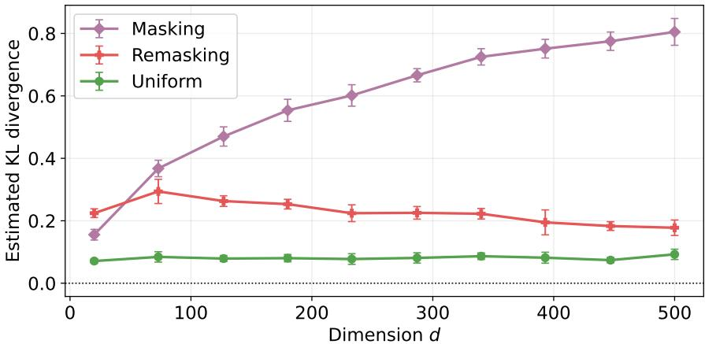
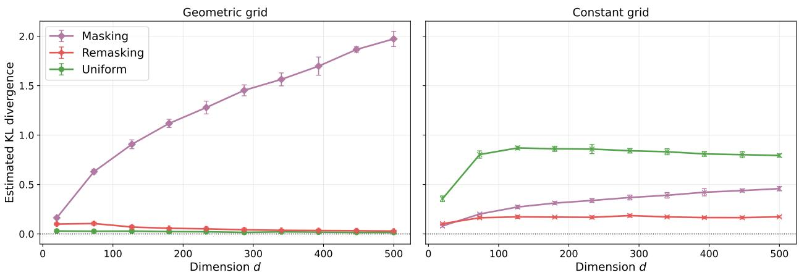
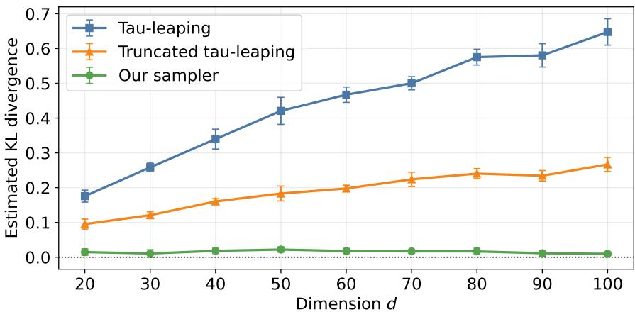
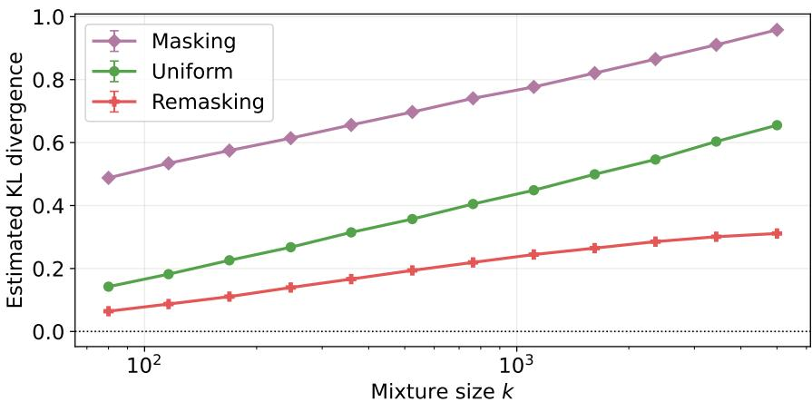

# Provably adaptive sampling with uniform and remasking discrete difusion models

Daniil Dmitriev∗, Zhihan Huang˚, Yuting Wei˚

August 25, 2026

## Abstract

Discrete difusion models ofer a promising alternative to autoregressive generation by enabling parallel updates, but their sampling eficiency can depend strongly on the choice of the forward process and the sampler. For the uniform forward process, existing lower bounds for the standard τ-leaping sampler scale linearly with the ambient dimension $d ,$ raising the question of whether this dependence is intrinsic to the forward process. We answer this question in the negative. We consider a first-order sampler based on the leave-one-out denoiser for uniform and remasking processes whose coordinate updates can be performed in parallel. In both cases, the sampler can correct denoising mistakes during the sampling process, which becomes necessary when many coordinates are updated together. Our main result establishes an adaptive sampling guarantee: up to logarithmic factors,

$$
N = O \left( { \frac { \mathrm { D T C } ( X _ { 0 } ) } { \varepsilon } } \right)
$$

discretization steps sufice to achieve sampling error $O ( \varepsilon _ { \mathrm { s c o r e } } + \varepsilon )$ , where $\varepsilon _ { \mathrm { s c o r e } }$ is the error in score estimation. Thus, the sampling complexity is governed by the intrinsic dependence structure of the target distribution, as measured by its dual total correlation $\mathrm { D T C } ( X _ { 0 } )$ , rather than directly by the ambient dimension d. In particular, this shows that the unfavorable dimension dependence of τ-leaping for uniform difusion is a consequence of the sampler rather than the forward process itself. Our analysis proceeds through a Bayes-optimal auxiliary sampler that separates discretization error from score-estimation error. We also derive an exact information-theoretic representation of the discretization error in terms of the mutual information between diferent coordinates of the forward process at diferent times. This representation applies to general forward processes and, in the uniform and remasking cases, can be controlled by $\mathrm { D T C } ( X _ { 0 } )$ . Numerical experiments on structured synthetic distributions illustrate the predicted dimension-adaptive behavior.

## Contents

## 1 Introduction

## 2 Problem setup

3 Discrete difusion sampling with leave-one-out sampler 9   
3.1 Leave-one-out sampler 9   
3.2 Bayes-optimal sampler 10   
4 Main results 12   
5 Numerical examples 14   
6 Discussion 16   
A Details on the remasking process 17   
B Technical preparations 19   
C Proof of our main results 20   
C.1 Proof of Theorem 1 . 20   
C.2 Proof of Proposition 1 22   
C.3 Proof of Proposition 2 22   
C.4 Discretization error control 23   
C.5 Approximation error control 26   
D Proofs of results in Appendix B 31   
D.1 Proof of Proposition 5 31   
D.2 Proof of Lemma 1 33   
D.3 Proof of Lemma 5 34   
D.4 Proof of Lemma 7 34   
E Connection to the efective total correlation 35

## 1 Introduction

Difusion models have achieved remarkable success across a wide range of generative modeling tasks and have recently emerged as a compelling alternative to autoregressive (AR) modeling for discrete sequence generation, such as natural language and protein sequences (Austin et al. (2021); Campbell et al. (2022); Lou et al. (2024)). Unlike AR models, which generate tokens sequentially according to a rigid left-to-right factorization, discrete difusion models enable parallel generation and iterative refinement, making them an increasingly important component of the modern generative modeling toolbox.

Among existing approaches, masking difusion has been particularly successful: by progressively replacing data tokens with a dedicated mask token and learning to recover them, masking difusion has demonstrated strong empirical performance at scale (Ou et al. (2025); Sahoo et al. (2024); Shi et al. (2024)). Nevertheless, the vanilla masking difusion sampling process has an inherent limitation: unmasking is typically monotone, so once a position is assigned a token, it cannot be revisited in subsequent denoising steps. Therefore, incorrect early predictions may persist and become part of the context used to generate other tokens, po tentially leading to error propagation (Huang et al. (2026); Kim et al. (2025); Xu et al. (2025)). Recent remasking and iterative-refinement methods try to overcome this limitation by explicitly allowing uncertain predictions to be remasked and regenerated, suggesting that the ability to revise intermediate decisions is an important property of discrete generative models (Wang et al. (2026); Zhao et al. (2026)). Uniform diffusion naturally provides this capability. Since corruption and denoising operate entirely within the original vocabulary, a token can transition between diferent valid states throughout the sampling trajectory, supporting error correction without relying on a special mask state. Importantly, uniform difusion is not merely of theoretical interest; recent large-scale systems, including Google DeepMind’s DifusionGemma (Google Deep-Mind (2026)) and the 7B Sumi model (Ye et al. (2026)), adopt uniform-state difusion, while other recent frameworks, such as GIDD (Von Rütte et al. (2025)) and XDLM (Liu et al. (2026)), have explored hybrid uniform-masking processes. These developments motivate a systematic reconsideration of discrete difusion beyond masking difusion as a practical and complementary foundation for large-scale discrete generative modeling.

## 1.1 Sampling eficiency and algorithm design

A central question for discrete difusion models is their sampling eficiency, namely, how many discretization steps or model evaluations are needed to generate a sample to a prescribed accuracy. This question is closely tied to the particular choice of the sampler, as diferent samplers may yield diferent results. Many samplers were proposed recently, including the τ-leaping sampler (Campbell et al. (2022)) and its variants (Liang et al. (2025c)), uniformization sampler (Chen and Ying (2025)), DMPM sampler (Pham et al. (2025)), and others. Importantly, certain samplers (e.g., uniformization) only allow one transition at a time. Although theoretically interesting, such a restriction diminishes the main advantage of discrete difusion models, parallel generation. In what follows, we consider the class of samplers that by design may perform several updates per discretization step, which includes the τ-leaping sampler.

Recent work by Dmitriev et al. (2026) reveals a striking adaptivity property of masking difusion: the sampling complexity can automatically adapt to the intrinsic dimensionality or structural complexity of the target distribution, leading to substantially better eficiency than worst-case guarantees when the target distribution exhibits favorable structure. This echoes a growing literature on continuous difusion models that establishes analogous forms of adaptation to low-dimensional or structured target distributions; see, e.g., Huang et al. (2024); Li et al. (2025); Li and Yan (2024); Liang et al. (2025a). For uniform discrete difusion, however, the picture appears less optimistic. Beyond a few special cases, Dmitriev et al. (2026) show that the sampling complexity of the widely adopted τ-leaping algorithm scales linearly with the ambient dimension d of the target distribution. Such linear dependence on the ambient dimension essentially precludes fast parallel generation, as AR models also require a number of model evaluations linear in d. This contrast between the adaptive guarantee for masking difusion and the lower bound for uniform difusion raises a fundamental question:

Is this unfavorable dimension dependence an intrinsic limitation of uniform discrete difusion,

## or merely a consequence of the τ-leaping sampler?

In this work, we show that the latter is true and propose a sampler that yields adaptive guarantees for the uniform discrete difusion. Resolving this question is important both for understanding the statistical and computational limits of uniform difusion and for guiding the design of more eficient sampling algorithms. We focus on first-order sampling methods, where each denoising step requires only a single evaluation of the learned model, and investigate the fundamental limits of their sampling eficiency, in contrast to higher-order samplers that use multiple model evaluations per step $( \mathrm { e . g . }$ , Ren et al. (2026)).

A related open problem concerns remasking discrete difusion models, which have become widely adopted mechanisms for revising previously generated tokens but currently lack a comparable theoretical understanding of their sampling eficiency. Our goal is therefore to characterize when uniform and remasking difusion can exploit low-dimensional or structured target distributions, and to determine how their sampling complexity can adapt to intrinsic structure in a manner analogous to masking difusion.

## 1.2 An information-theoretic perspective on adaptive sampling

To understand the adaptive sampling behavior described above, we turn to information-theoretic quantities that capture the intrinsic structure of discrete distributions. As a simple example, consider a d-dimensional binary distribution that is uniform over the two strings $0 ^ { d }$ and $1 ^ { d } .$ . While the ambient dimension can be arbitrarily large, the distribution contains only one bit of uncertainty. Moreover, this global structure remains detectable after corruption. Under masking difusion, observing a single unmasked coordinate determines the original string, whereas under uniform difusion, the imbalance between the numbers of zeros and ones in the corrupted sequence provides information about the initial state. Thus, the efective dificulty of recovering the underlying sample can remain small even in high dimensions.

This intuition can be formalized using information-theoretic measures of dependence. One such quantity, which has appeared in recent analyses of adaptive sampling (Chen et al. (2025); Dmitriev et al. (2026); Zhao

  
Figure 1: $N = 2 0$ discretization steps. Target distribution is a Markov chain, see Section 5. Remasking process uses $p _ { M } \ = \ 0 . 5$ . We use early stopping $\delta \ : = \ : 1 \mathrm { e } { - 5 }$ and time horizon $T = 8$ . Diferent types of discretization schedules are adopted for diferent noising processes to optimize their performance: the masking process uses constant discretization $t _ { k + 1 } - t _ { k } = ( T - \delta ) / N$ ; the remasking and uniform processes use geometric discretization $t _ { k + 1 } - t _ { k } = \kappa \operatorname* { m i n } ( 1 , T - t _ { k + 1 } )$ with $\kappa \approx 1 . 3$ . Results are averaged over $7$ runs.

and Cai (2026)), is the dual total correlation:

$$
\operatorname { D T C } ( X ) = { \mathcal { H } } ( X ) - \sum _ { i = 1 } ^ { d } { \mathcal { H } } ( X ^ { i } \mid X ^ { - i } ) ,\tag{1}
$$

where $X = ( X ^ { 1 } , \ldots , X ^ { d } )$ . The DTC measures the dependence among the coordinates that remains after conditioning each coordinate on all the others. Importantly, $\operatorname { D T C } ( X ) \leqslant H ( X ) \leqslant d \log S$ , and there exist high-dimensional distributions whose DTC remains bounded independently of $d .$ Hence, guarantees expressed in terms of DTC can be substantially sharper than worst-case bounds that scale directly with the ambient dimension.

More broadly, our analysis is based on an information-theoretic characterization of the sampling error rather than on DTC alone. We show that the discretization error can be expressed through mutual information between diferent coordinates of the forward process at diferent times. For the uniform and remasking processes, we shall see that this general characterization can then be controlled in terms of the DTC of the target distribution.

## 1.3 Our main contributions

Our main contributions are as follows:

• An eficient leave-one-out sampler for uniform and remasking difusion. We study a firstorder sampler based on leave-one-out conditional probabilities. On each discretization interval, the resulting approximate reverse process decomposes into independent one-dimensional CTMCs and can be executed for all coordinates in parallel. For the uniform process, our sampler recovers the recently proposed leave-one-out bridge plug-in and cavity ancestral samplers (Gourevitch et al. (2026); Noguerales et al. (2026)), while our CTMC formulation provides a unified construction that also applies to the remasking process, with the masking process as a special case.

• Adaptive sampling guarantees beyond ambient dimension. Our main result, Theorem 1, establishes for both the uniform and remasking processes the bound

$$
\mathsf { K L } ( q _ { T - t _ { N } } \| p _ { \mathrm { o u t p u t } } ) \lesssim \mathsf { K L } ( q _ { T } \| q _ { \mathrm { n o i s e } } ) + \varepsilon _ { \mathrm { s c o r e } } + \kappa \mathrm { D T C } ( X _ { 0 } ) .
$$

Consequently, it sufices to take $N = \widetilde { O } \left( \mathrm { D T C } ( X _ { 0 } ) / \varepsilon \right)$ , discretization steps to achieve sampling error $O ( \varepsilon _ { \mathrm { s c o r e } } + \varepsilon )$ . Thus, the sampling complexity adapts to the intrinsic dependence structure of the target distribution. For the uniform process, this shows that the unfavorable dimension dependence of the standard τ-leaping sampler is not due to the forward process itself, circumventing the lower bound of Dmitriev et al. (2026). Our result also provides an adaptive sampling guarantee for the remasking process, for which theoretical guarantees were previously lacking.

• A Bayes-optimal decomposition of sampling error. To disentangle errors arising from discretization and score estimation, we introduce a Bayes-optimal auxiliary sampler that uses the exact leave-one-out conditional probabilities available at each discretization point. The discretization error measures the discrepancy between the true reverse process and the Bayes-optimal sampler, whereas the approximation error measures the additional discrepancy introduced by the learned sampler. The former depends only on the target distribution, forward process, and time discretization, whereas the latter is controlled by the standard score entropy loss and can also be characterized directly through errors in the leave-one-out denoiser. Moreover, in Theorem 2, we give an exact information-theoretic representation of the discretization error in terms of mutual information between diferent coordinates of the forward process at diferent times. This characterization contains no explicit dependence on ambient parameters such as the dimension or vocabulary size, and may be of independent interest.

## 1.4 Notation

For a positive integer n, we denote $[ n ] = \{ 1 , \dots , n \}$ . We use $d , S ,$ and $T$ to denote the ambient dimension, the vocabulary size, and the time horizon, respectively. Let $\gamma = [ S ] \cup \operatorname { A u x }$ , where Aux is the set of auxiliary states. We have $\operatorname { A u x } = \varnothing$ or $\mathrm { A u x } = \mathrm { \{ M A S K } $ , REMASKu. Let $q _ { \mathrm { d a t a } }$ denote a distribution on $[ S ] ^ { d }$ . For $x \ = \ ( x ^ { 1 } , \ldots , x ^ { d } ) \in \ \mathcal { V } ^ { d }$ and $i \in [ d ]$ , we denote $x ^ { - i } : = ( \stackrel { \triangledown } { x ^ { 1 } } , \dotsc , \stackrel { \triangledown } { x ^ { i - 1 } } , x ^ { i + 1 } , \dotsc , x ^ { d } ) \in \mathcal { V } ^ { d - 1 }$ . For $\bar { \boldsymbol { x } } \in \mathcal { V } ^ { d }$ $i \in \lceil d \rceil$ , and $b \in \mathcal V$ , we denote $x \odot _ { i } b \in \mathcal { V } ^ { d }$ as follows: $( x \odot _ { i } b ) ^ { j } = x ^ { j }$ for $j \neq i ,$ , and $( x \odot _ { i } b ) ^ { i } = b .$ We use $\mathsf { K L } , \mathcal { H } ,$ and I to denote the KL divergence, the entropy, and the mutual information, respectively. We adopt standard asymptotic notation: $O ( \cdot ) , o ( \cdot ) , \Omega ( \cdot )$ , and $\lesssim ;$ notation ${ \widetilde O } ( \cdot )$ hides logarithmic factors in $d , S ,$ and $1 / \varepsilon$ . We let $D _ { \phi } ( x , y ) = \phi ( x ) - \phi ( y ) - ( x - y ) ^ { \top } \nabla \phi ( y )$ be the Bregman divergence for $\phi : \mathbb { R } ^ { n } \to \mathbb { R }$ , and denote $\begin{array} { r } { D ( a , b ) = \frac { a } { b } - 1 - \log \frac { a } { b } } \end{array}$ as the Bregman divergence for the scalar function $\phi ( x ) = - \log x .$

## 1.5 Other related works

Sampling guarantees for discrete difusion. A central question in the theory of discrete difusion models is how many sampling steps are required to generate an accurate sample. Early work by Chen and Ying (2025) studies an exact uniformization-based sampler and establishes guarantees in both KL divergence and total variation, which eliminates discretization error but requires a number of sampling steps that scales linearly with d. Subsequent works analyze a broader range of discretized samplers, including τ-leaping, Euler, and Tweedie τ-leaping (Liang et al., 2025c), as well as higher-order schemes (Ren et al., 2026). Related convergence guarantees have also been developed for discrete Markov probabilistic models (Pham et al., 2025), absorbing or masking processes (Liang et al., 2025b, 2026), and more general masked and random-walk dynamics (Conforti et al., 2025). For the uniform process, Dmitriev et al. (2026) establish a sharp $\widetilde { \cal O } ( d / \epsilon )$ complexity for the standard τ-leaping sampler, together with a matching algorithmic lower bound.

Adaptive guarantees. More recent work has sought sampling guarantees that depend on the intrinsic structure of the target distribution rather than directly on the ambient dimension. Li and Cai (2025) establish a sampling complexity bound in terms of mutual information, while Chen et al. (2025); Zhao and Cai (2026) sharpen this dependence to information-theoretic quantities such as total correlation and dua total correlation. Cai and Li (2026) further show that confidence-based unmasking schedules for difusion language models can achieve sublinear sampling complexity. An interesting recent work by Wainwright (2026) develops an information-theoretic measure of data geometry for masking difusion, yielding datadependent sampling guarantees and optimized sampling schedules. Using a CTMC framework, Dmitriev et al. (2026) establish a guarantee in terms of efective total correlation, which is upper bounded by both total correlation and dual total correlation. These adaptive guarantees, however, are specific to masking difusion, either in the difusion-language-model formulation or in the CTMC framework. In contrast, our results establish adaptive guarantees for the uniform and remasking processes.

Leave-one-out denoisers. Score estimation is a central component of discrete difusion models, particularly following the score entropy objective introduced by Lou et al. (2024). More recently, Gourevitch et al. (2026) and Noguerales et al. (2026) observe that training the leave-one-out denoiser, or a cavity estimator, is equivalent to score estimation and yields better empirical performance. Our work also adopts the leave-one-out denoiser as a central object, but from a complementary perspective: we show that it arises naturally from the CTMC formulation of the reverse process and use it to construct the sampler and analyze its approximation and discretization errors.

## 2 Problem setup

## 2.1 Continuous-time Markov chain

Let us begin by introducing the framework of discrete difusion models, which are used to approximate a target distribution $q _ { \mathrm { d a t a } }$ on a discrete domain $[ S ] ^ { d }$ . Analogous to their continuous counterparts, discrete difusion models consist of a forward process and a reverse process evolving over the discrete state space. Both processes can be formulated in terms of continuous-time Markov chains (CTMCs), which we introduce next, following Campbell et al. (2022).

Definition 1. A stochastic process $( X _ { t } ) _ { t \in [ 0 , T ] }$ on $\mathcal { V } ^ { d }$ with rate matrices $( Q _ { t } ) _ { t \in [ 0 , T ] }$ and initial distribution $q _ { 0 }$ is a continuous-time Markov chain (CTMC) if $X _ { 0 } \sim q _ { 0 }$ and

1. $( X _ { t } ) _ { t \in [ 0 , T ] }$ satisfies the Markov property: for any $0 \leqslant u < v \leqslant T , X _ { v }$ is conditionally independent of $( X _ { t } ) _ { t < u }$ given $X _ { u } ,$

2. As $\Delta t \downarrow 0 ,$ for any $x , y \in \mathcal { V } ^ { d } , \operatorname* { P r } ( X _ { t + \Delta t } = y \mid X _ { t } = x ) = \mathbb { I } \{ y = x \} + Q _ { t } ( x , y ) \Delta t + o ( \Delta t ) .$

Here, for any $t \in [ 0 , T ]$ , the rate matrix $Q _ { t } \in \mathbb R ^ { \mathcal { V } ^ { d } \times \mathcal { V } ^ { d } }$ satisfies:

1. $Q _ { t } ( x , y ) \geqslant 0$ for any $x \neq y \in \mathcal { V } ^ { d }$

$$
\begin{array} { r } { \mathcal { Q } . \ Q _ { t } ( x , x ) = - \sum _ { y \neq x } Q _ { t } ( x , y ) . } \end{array}
$$

For any fixed initial distribution $q _ { 0 }$ , the marginals $( q _ { t } ) _ { t \in [ 0 , T ] }$ of $X _ { t }$ are the solutions to the Kolmogorov forward equation:

$$
{ \mathrm { ~ f o r ~ a l l ~ } } x \in \mathcal { V } ^ { d } , \qquad { \mathrm { ~ } } { \frac { \mathrm { ~ d ~ } } { \mathrm { ~ d } t } } \operatorname* { P r } ( X _ { t } = x ) = \sum _ { y \in \mathcal { V } ^ { d } } Q _ { t } ( y , x ) \operatorname* { P r } ( X _ { t } = y ) .
$$

We refer the reader to Feinberg et al. (2014); Feller (1940) for a rigorous treatment of CTMCs.

Forward process. We define a forward process as a CTMC $( X _ { t } ) _ { t \in [ 0 , T ] }$ corresponding to the particular choice of rate matrices $( Q _ { t } ) _ { t \in [ 0 , T ] }$ and we assume that there exist $( \mathcal { Q } _ { t } ) _ { t \in [ 0 , T ] }$ , with each $\mathcal { Q } _ { t } \in \mathbb { R } ^ { \mathcal { V } \times \mathcal { V } }$ , such that

$$
1 . ~ Q _ { t } ( x , y ) = 0 ~ \mathrm { i f ~ d _ H } ( x , y ) \geqslant 2 ,
$$

$$
2 . \ Q _ { t } ( x , y ) = \mathcal Q _ { t } ( x ^ { i } , y ^ { i } ) , \mathrm { i f \ d _ { H } } ( x , y ) = 1 \mathrm { \ a n d \ } x ^ { i } \neq y ^ { i } .
$$

This requirement states that the forward process acts on each coordinate independently. In this work, we focus on the following time-homogeneous $( \mathcal { Q } _ { t } \equiv \mathcal { Q } )$ forward processes:

1. Uniform process: when $\boldsymbol { \nu } _ { } ^ { } = \left\lceil \boldsymbol { S } \right\rceil$ and $\mathcal { Q } ( a , b ) = 1 / S$ for all $a , b \in [ S ]$

2. Remasking process: when V “ rSs Y tMASK, REMASKu, and for $a \in [ S ] , b \in \mathcal { V }$ , and $0 < p _ { M } \leqslant 1$ , we have

$$
\mathcal { Q } ( a , b ) = p _ { M } \mathbb { 1 } \{ b = \mathrm { M A S K } \} + ( 1 - p _ { M } ) \mathbb { 1 } \{ b = \mathrm { R E M A S K } \} \quad \mathrm { a n d } \quad \mathcal { Q } ( \mathrm { R E M A S K } , a ) = \mathbf { 1 } / S .
$$

Here, MASK is an absorbing state and the masking process corresponds to $p _ { M } = 1$

For the remasking process, choosing $p _ { M } < 1$ allows the reverse process to correct unmasked elements, as the coordinates in the forward process will transition through the REMASK state one or several times with positive probability. As discussed, this is crucial to mitigate a well-known disadvantage of the masking process, where once a coordinate is unmasked, it cannot be changed later during the sampling process; see Wang et al. (2026); Zhao et al. (2026).

Self-loops. A convenient way to model how the uniform process acts on a single coordinate is as follows: the process makes a transition from state $a \in [ S ]$ with rate 1 to a new state $b \sim \operatorname { U n i f } ( [ S ] )$ q, with a KK b. For technical convenience, we define diagonal elements in the uniform case to be $\mathcal { Q } ( a , a ) = 1 / S$ for $a \in [ S ]$ , which makes Q the transition matrix of a discrete-time Markov chain, rather than the rate matrix of a CTMC. As the only diference is in the diagonal elements, we explicitly write $\textstyle : - \sum _ { b \neq a } { \mathcal { Q } } ( a , b )$ whenever the diagonal entry of the rate matrix is used in the analysis. Similarly, for the remasking process, we set QpMASK, MASKq “ 1.

Reverse process. For the forward process $( X _ { t } ) _ { t \in [ 0 , T ] }$ with its marginal distribution $( q _ { t } ) _ { t \in [ 0 , T ] }$ , there exists a time-reversed CTMC $( \stackrel {  } { X } _ { t } ) _ { t \in [ 0 , T ] }$ with an initial distribution $q _ { T }$ and rate matrices $( \overline { { Q } } _ { t } ) _ { t \in [ 0 , T ] }$

$$
\overleftarrow { Q } _ { t } ( x , y ) = Q _ { T - t } ( y , x ) \frac { \mathrm { P r } ( X _ { T - t } = y ) } { \mathrm { P r } ( X _ { T - t } = x ) } , \quad \mathrm { f o r ~ a l l ~ } x \neq y \in \mathcal { V } ^ { d } ,
$$

such that its marginals coincide with the forward process: $X _ { t } \ { \stackrel { d } { = } } \ { \stackrel {  } { X } } _ { T - t }$ for all $t \in [ 0 , T ]$ . We refer to this CTMC as the reverse process (Campbell et al. (2022)). Analogous to the continuous case, where the Stein score function ∇ log $p _ { t } ( x )$ determines the reverse process, we define the (concrete) score function as the ratio of the probability mass functions

$$
s _ { t } ( y , x ) : = { \frac { \operatorname* { P r } ( X _ { t } = y ) } { \operatorname* { P r } ( X _ { t } = x ) } } .\tag{2}
$$

As by our construction, $Q _ { t } ( y , x ) > 0$ only if $\mathrm { d } _ { \mathrm { H } } ( x , y ) = 1$ , we often denote $y = x \odot _ { i } b$ for some $i \in [ d ]$ and $b \in \mathcal V$ . To construct the reverse process, it is therefore suficient to know the score functions (2), for every $t \in [ 0 , T ] , x \in \mathcal { V } ^ { d }$ and $y = x \odot _ { i } b .$

## 2.2 Learning the reverse process

Computing rate matrices of the reverse process $( \stackrel {  } { Q } _ { t } ) _ { t \in [ 0 , T ] }$ requires access to score functions at every $t \in [ 0 , T ]$ which is not tractable in general. Instead, they are replaced in practice by a data-driven estimator $\widehat { s } _ { t } ( y , x )$ at discrete time points $0 < T - t _ { N - 1 } < . . . < T - t _ { 0 } = T$ such that $\widehat s _ { t } ( y , x ) \approx s _ { t } ( y , x ) = \operatorname* { P r } ( X _ { t } = y ) / \operatorname* { P r } ( X _ { t } = x )$ The estimated rate matrices are defined as $\widehat { Q } _ { t } ( x , y ) = Q _ { T - t } ( y , x ) \widehat { s } _ { T - t } ( y , x )$

To measure the accuracy of the estimated score, we use the score entropy loss introduced by Lou et al. (2024), which has become a standard objective for training discrete difusion models. This loss quantifies the discrepancy between the estimated score $\widehat { s } _ { t } ( y , x )$ and the true score $s _ { t } ( y , x )$ associated with the forward process:

$$
\mathcal { L } _ { \mathrm { S E } } ( t , \widehat { s } , s ) : = \mathbb { E } _ { x _ { t } \sim q _ { t } } \left[ \sum _ { y \neq x _ { t } } Q _ { t } ( y , x _ { t } ) s ( y , x _ { t } ) D ( \widehat { s } ( y , x _ { t } ) , s ( y , x _ { t } ) ) \right] .\tag{3}
$$

Here $t \geqslant 0$ and $\widehat { s } , s \in \mathcal { V } ^ { d } \times \mathcal { V } ^ { d } \to \mathbb { R } _ { \geq 0 }$ . To disentangle the efect of score estimation from the discretization or optimization errors that govern the eficiency of the sampling algorithms being considered, we isolate the score estimation error and make the following assumption.

Assumption 1. Let $0 = t _ { 0 } < t _ { 1 } < . . . < t _ { N }$ ď T be the time discretization. We assume that

$$
\sum _ { k = 0 } ^ { N - 1 } ( t _ { k + 1 } - t _ { k } ) \mathcal { L } _ { \mathrm { S E } } ( T - t _ { k } , \widehat { s } _ { T - t _ { k } } , s _ { T - t _ { k } } ) \leqslant \varepsilon _ { \mathrm { s c o r e } } .\tag{4}
$$

This assumption on the score entropy loss is a standard way to control the approximation error of discrete difusion models and has appeared in several prior works, including Conforti et al. (2025); Dmitriev et al. (2026); Liang et al. (2025c); Lou et al. (2024).

A leave-one-out formulation. We state a leave-one-out denoiser formulation that plays an important role in our analysis and has appeared previously in the context of both remasking (Zhao et al., 2026) and uniform difusion (Gourevitch et al., 2026). The key idea is that the estimator must approximate the leaveone-out conditional probabilities $\operatorname* { P r } ( X _ { 0 } ^ { i } \mid = b \mid X _ { t } ^ { - i } = x ^ { - i } )$ instead of $\operatorname* { P r } ( X _ { 0 } ^ { i } \mid X \mid X _ { t } = x )$ . This can be achieved either by imposing the leave-one-out structure directly through the design of the estimator or by modifying the cross-entropy objective used to train the denoiser. We refer to Gourevitch et al. (2026) for a more detailed discussion. In our setting, the leave-one-out formulation leads to a cleaner characterization of the reverse dynamics and, more importantly, facilitates the control of the resulting sampling errors. This role is diferent from its use in prior work, where the emphasis is more closely tied to the practical construction and training of the denoiser.

Formally, recall the definition of the score function $s _ { t } ( x \odot _ { i } b , x ) = \operatorname* { P r } ( X _ { t } = x \odot _ { i } b ) / \operatorname* { P r } ( X _ { t } = x )$ . Dividing numerator and denominator by $\operatorname* { P r } ( X _ { t } ^ { - i } = x ^ { - i } )$ , we obtain

$$
s _ { t } ( x \odot _ { i } b , x ) = { \frac { \operatorname* { P r } ( X _ { t } = x \odot _ { i } b ) } { \operatorname* { P r } ( X _ { t } = x ) } } = { \frac { \operatorname* { P r } ( X _ { t } ^ { i } = b \mid X _ { t } ^ { - i } = x ^ { - i } ) } { \operatorname* { P r } ( X _ { t } ^ { i } = x ^ { i } \mid X _ { t } ^ { - i } = x ^ { - i } ) } } .\tag{5}
$$

There exists a simple bijection between the sets $\{ s _ { t } ( x \odot _ { i } b , x ) \} _ { b \in \mathcal { V } }$ and $\left\{ \operatorname* { P r } ( X _ { t } ^ { i } = b \mid X _ { t } ^ { - i } = x ^ { - i } ) \right\} _ { b \in \mathcal { V } } ,$ as

$$
\sum _ { b \neq x ^ { i } } s _ { t } ( x \odot _ { i } b , x ) = { \frac { \sum _ { b \neq x ^ { i } } \operatorname* { P r } ( X _ { t } ^ { i } = b \mid X _ { t } ^ { - i } = x ^ { - i } ) } { \operatorname* { P r } ( X _ { t } ^ { i } = x ^ { i } \mid X _ { t } ^ { - i } = x ^ { - i } ) } } = { \frac { 1 } { \operatorname* { P r } ( X _ { t } ^ { i } = x ^ { i } \mid X _ { t } ^ { - i } = x ^ { - i } ) } } - 1 .
$$

Indeed, we can use this equality together with the convention $s _ { t } ( x , x ) = 1$ to compute for all $b \in \mathcal { V } .$

$$
\operatorname* { P r } ( X _ { t } ^ { i } = b \mid X _ { t } ^ { - i } = x ^ { - i } ) = { \frac { s _ { t } ( x \odot _ { i } b , x ) } { \sum _ { c } s _ { t } ( x \odot _ { i } c , x ) } } .
$$

Therefore, computing the score is equivalent to computing the leave-one-out denoiser probabilities. In the following, in light of this bijection, we refer to both quantities interchangeably. For both uniform and remasking processes, we find it instrumental to introduce the notation

$$
\nu ( t , b ) : = \operatorname* { P r } ( X _ { t } ^ { i } = b \mid \exists { \mathrm { ~ a ~ j u m p ~ a t ~ t h e ~ } } i { \mathrm { - t h ~ c o o r d i n a t e ~ o n ~ } } [ 0 , t ] ) .\tag{6}
$$

For both uniform and remasking processes, $\operatorname* { P r } ( X _ { t } ^ { i } = b \mid X _ { t } ^ { - i } = x ^ { - i } )$ can be expressed in terms of $\nu ( t , b )$ and $\operatorname* { P r } ( X _ { 0 } ^ { i } = b \mid X _ { t } ^ { - i } = x ^ { - i } )$ :

$$
\operatorname* { P r } ( X _ { t } ^ { i } = b \mid X _ { t } ^ { - i } = x ^ { - i } ) = \operatorname* { P r } ( X _ { 0 } ^ { i } = b \mid X _ { t } ^ { - i } = x ^ { - i } ) e ^ { - t } + \nu ( t , b ) ( 1 - e ^ { - t } ) .\tag{7}
$$

Indeed, in both cases, for any fixed $i \in [ d ]$ and time $t \geqslant 0 ,$ , either there was a jump at the i-th coordinate on $[ 0 , t ]$ , and thus $X _ { t } ^ { i } \perp \perp X _ { t } ^ { - i } .$ , or there was no jump and $X _ { t } ^ { i } = X _ { 0 } ^ { i }$ , which happens with probability $e ^ { - t }$

• For the uniform process, $\nu ( t , b ) = 1 / s$ and we obtain

$$
\operatorname* { P r } ( X _ { t } ^ { i } = b \mid X _ { t } ^ { - i } = x ^ { - i } ) = \operatorname* { P r } ( X _ { 0 } ^ { i } = b \mid X _ { t } ^ { - i } = x ^ { - i } ) e ^ { - t } + { \frac { 1 } { S } } ( 1 - e ^ { - t } ) .\tag{8}
$$

• For the remasking process, Lemma 2 gives the explicit expression for $\nu ( t , b )$

Observe that the only unknown data-dependent quantities are $\{ \mathrm { P r } ( X _ { 0 } ^ { i } \ = \ b \ | \ X _ { t } ^ { - i } \ = \ x ^ { - i } ) \} _ { b \in [ S ] }$ . As a consequence, assuming access to score estimators $\{ \widehat { s } _ { t } ( x \odot _ { i } b , x ) \}$ is equivalent to assuming access to $\left\{ \widehat { \mathrm { P r } } ( X _ { 0 } ^ { i } = b \vert X _ { t } ^ { - i } = x ^ { - i } ) \right\} _ { b \in [ S ] }$ at the discretization points $t \in \{ T - t _ { 0 } , \ldots T - t _ { N - 1 } \}$

## 3 Discrete difusion sampling with leave-one-out sampler

With the score estimator $\widehat { s } _ { t }$ that satisfies Assumption 1, the remaining task is to construct a tractable approximation to the reverse-time process. Since $\widehat { s } _ { t }$ is only evaluated at the time discretization $0 < T -$ $t _ { N - 1 } < . . . < T - t _ { 0 } = T$ , we extend these estimates over r0, Ts and use the resulting approximation to simulate the reverse dynamics. The standard choice, both in theoretical analyses and in practice, is the τ-leaping sampler (Campbell et al. (2022)) and its variants (Liang et al. (2025c)). However, recent work by Dmitriev et al. (2026) shows that, for the uniform process, the τ-leaping sampler can lead to suboptimal sampling complexity. In this section, we study the following leave-one-out sampler which leads to improved sampling eficiency and overcomes the theoretical barrier of τ -leaping.

## 3.1 Leave-one-out sampler

Consider the k-th discretization interval and let $u = T - t _ { k + 1 }$ and $\ell = T - t _ { k }$ . As discussed above, we assume that the sampling algorithm has access to $\{ \widehat { \operatorname* { P r } } ( X _ { 0 } ^ { i } = b \mid X _ { \ell } ^ { - i } = x _ { \ell } ^ { - i } ) \}$ for $b \in [ S ]$ and $i \in [ d ]$ , and our goal is to sample $x _ { u }$ given $x _ { \ell }$ and $\{ { \widehat { \operatorname* { P r } } } ( X _ { 0 } ^ { i } = b \mid X _ { \ell } ^ { - i } = x _ { \ell } ^ { - i } ) \} _ { b \in [ S ] , i \in [ d ] }$ . Following Eqn. (7), we define ${ \widehat { \operatorname* { P r } } } ( X _ { t } ^ { i } = b \mid X _ { \ell } ^ { - i } = x _ { \ell } ^ { - i } )$ as follows:

$$
{ \widehat { \operatorname* { P r } } } ( X _ { t } ^ { i } = b \mid X _ { \ell } ^ { - i } = x _ { \ell } ^ { - i } ) = { \widehat { \operatorname* { P r } } } ( X _ { 0 } ^ { i } = b \mid X _ { \ell } ^ { - i } = x _ { \ell } ^ { - i } ) e ^ { - t } + \nu ( t , b ) ( 1 - e ^ { - t } ) .\tag{9}
$$

Together with Eqn. (2), we define our score estimator $\widehat { s } _ { t }$ for $t \in [ u , \ell ]$

$$
\widehat { s } _ { t } ( x \odot _ { i } b , x ) : = \widehat { \operatorname* { P r } } ( X _ { t } ^ { i } = b \mid X _ { \ell } ^ { - i } = x _ { \ell } ^ { - i } ) \ : = \ : \frac { \widehat { \operatorname* { P r } } ( X _ { 0 } ^ { i } = b \mid X _ { \ell } ^ { - i } = x _ { \ell } ^ { - i } ) e ^ { - t } + \nu ( t , b ) ( 1 - e ^ { - t } ) } { \widehat { \operatorname* { P r } } ( X _ { 0 } ^ { i } = x ^ { i } \mid X _ { \ell } ^ { - i } = x _ { \ell } ^ { - i } ) } = \ : \widehat { \operatorname* { P r } } ( X _ { 0 } ^ { i } = x ^ { i } \mid X _ { \ell } ^ { - i } = x _ { \ell } ^ { - i } ) e ^ { - t } + \nu ( t , x ^ { i } ) ( 1 - e ^ { - t } ) ,\tag{10}
$$

and the corresponding rate matrix $\widehat { Q } _ { t } ( x , y ) = Q _ { T - t } ( y , x ) \widehat { s } _ { T - t } ( y , x )$ . Note that both $\widehat { s } _ { t } ( x { \odot } _ { i } b , x )$ and $\widehat { Q } _ { t } ( x , x \odot _ { i }$ bq do not depend on $x ^ { - i }$ . This means that efectively on the discretization interval $[ u , \ell ]$ , the approximate CTMC can be decomposed into d independent one-dimensional CTMCs, allowing us to simulate the dynamics of the CTMC in parallel for each fixed discretization interval, as is done in Algorithm 1, see Proposition 1.

In view of the Bayes formula, we can write

$$
\operatorname* { P r } ( X _ { u } ^ { i } = b \mid X _ { \ell } = x _ { \ell } ) = { \frac { \operatorname* { P r } ( X _ { \ell } ^ { i } = x _ { \ell } ^ { i } \mid X _ { u } ^ { i } = b ) \operatorname* { P r } ( X _ { u } ^ { i } = b \mid X _ { \ell } ^ { - i } = x _ { \ell } ^ { - i } ) } { \operatorname* { P r } ( X _ { \ell } ^ { i } = x _ { \ell } ^ { i } \mid X _ { \ell } ^ { - i } = x _ { \ell } ^ { - i } ) } }
$$

Here, $\operatorname* { P r } ( X _ { \ell } ^ { i } = x _ { \ell } ^ { i } \mid X _ { u } ^ { i } = b )$ does not depend on $q _ { \mathrm { d a t a } }$ and can be computed from the properties of $\mathcal { Q } .$ , and

$$
\operatorname* { P r } ( X _ { u } ^ { i } = b \mid X _ { \ell } ^ { - i } = x _ { \ell } ^ { - i } ) = \underbrace { \operatorname* { P r } ( X _ { 0 } ^ { i } = b \mid X _ { \ell } ^ { - i } = x _ { \ell } ^ { - i } ) e ^ { - u } } _ { \mathrm { n o ~ j u m p ~ o n ~ } [ 0 , u ] } + \underbrace { \nu ( u , b ) ( 1 - e ^ { - u } ) } _ { \mathrm { j u m p ~ o n ~ } [ 0 , u ] } ,
$$

where $\nu ( u , b )$ is defined in $\mathrm { E q n . ~ ( 6 ) }$ . Therefore, the sampling algorithm applies the following in parallel over $i \in [ d ]$ : Given $x _ { \ell } .$ , sample $x _ { u } ^ { i }$ from $\widehat { \mu } _ { i }$

$$
{ \widehat { \mu } } _ { i } ( b ) \propto \operatorname* { P r } ( X _ { \ell } ^ { i } = x _ { \ell } ^ { i } \mid X _ { u } ^ { i } = b ) \left( \widehat { \operatorname* { P r } } ( X _ { 0 } ^ { i } = b \mid X _ { \ell } ^ { - i } = x _ { \ell } ^ { - i } ) e ^ { - u } + \nu ( u , b ) ( 1 - e ^ { - u } ) \right) .\tag{11}
$$

Finally, we remark that as $\operatorname* { P r } ( X _ { \ell } ^ { i } = a \mid X _ { u } ^ { i } = b )$ depends only on the matrix $\mathcal { Q } ,$ , it can be explicitly computed. Thus, we set

$$
{ \widehat { \operatorname* { P r } } } ( X _ { \ell } ^ { i } = a \mid X _ { u } ^ { i } = b ) = \operatorname* { P r } ( X _ { \ell } ^ { i } = a \mid X _ { u } ^ { i } = b ) ,\tag{12}
$$

for all $0 \leqslant u \leqslant \ell$ and $a , b \in \mathcal { V }$

Putting things together and instantiating the above to the processes that we consider gives:

• For the uniform process,

$$
\widehat { \mu } _ { i } ( b ) = \frac { \left( \mathbb { I } \{ b = x _ { \ell } ^ { i } \} e ^ { - ( \ell - u ) } + \frac { 1 - e ^ { - ( \ell - u ) } } { S } \right) \left( \widehat { \operatorname* { P r } } ( X _ { 0 } ^ { i } = b \mid X _ { \ell } ^ { - i } = x _ { \ell } ^ { - i } ) e ^ { - u } + \frac { 1 - e ^ { - u } } { S } \right) } { \widehat { \operatorname* { P r } } ( X _ { 0 } ^ { i } = x _ { \ell } ^ { i } \mid X _ { \ell } ^ { - i } = x _ { \ell } ^ { - i } ) e ^ { - \ell } + \frac { 1 - e ^ { - \ell } } { S } } .
$$

Algorithm 1: Our sampling algorithm   
Input:   
Initial distribution: $p _ { 0 }$   
Discretization steps: $0 = { t _ { 0 } } < t _ { 1 } < . . . < t _ { N } \leqslant T ,$   
Leave-one-out denoiser: ${ \hat { \operatorname* { P r } } } ( X _ { 0 } ^ { i } = b \mid X _ { T - t } ^ { - i } = \cdot \ )$ for $t \in \{ t _ { 0 } , \ldots , t _ { N - 1 } \} , b \in [ S ]$ , and $i \in [ d ]$   
Output: Sample $\widehat { \boldsymbol { x } } \in \mathcal { V } ^ { d } ,$   
1 Sample xT from p0   
2 for $k = 0 , \ldots , N - 1$ do   
3 $u \gets T - t _ { k + 1 }$   
4 $\ell \gets T - t _ { k }$   
5 for i P $[ d ]$ in parallel do   
6 Let $\widehat { \mu } _ { i }$ be a probability distribution over V with   
$\widehat { \mu } _ { i } ( b ) \propto \operatorname* { P r } ( X _ { \ell } ^ { i } = x _ { \ell } ^ { i } \mid X _ { u } ^ { i } = b ) \left( \widehat { \operatorname* { P r } } ( X _ { 0 } ^ { i } = b \mid X _ { \ell } ^ { - i } = x _ { \ell } ^ { - i } ) e ^ { - u } + \nu ( u , b ) ( 1 - e ^ { - u } ) \right) .$   
7 Sample $x _ { u } ^ { i }$ from $\widehat { \mu } _ { i }$   
8 end   
9 end   
10 return ${ \boldsymbol { x } } _ { T - t _ { N } }$

• For the masking process, for $i \in [ d ]$ with $x _ { \ell } ^ { i } = \mathrm { M A S K }$

$$
\widehat { \mu } _ { i } ( b ) = \frac { e ^ { - u } - e ^ { - \ell } } { 1 - e ^ { - \ell } } \widehat { \mathrm { P r } } ( X _ { 0 } ^ { i } = b \mid X _ { \ell } ^ { - i } = x _ { \ell } ^ { - i } ) \quad \mathrm { f o r ~ } b \in [ S ] , \qquad \mathrm { a n d } \qquad \widehat { \mu } _ { i } ( \mathrm { M A S K } ) = \frac { 1 - e ^ { - u } } { 1 - e ^ { - \ell } } ,
$$

recovering Algorithm 1 from Dmitriev et al. (2026).

• For the general remasking process, Lemma 4 gives explicit expressions.

The next proposition provides a simple algorithm to simulate this CTMC for both uniform and remasking processes. The proof of this result is deferred to Section C.2.

Proposition 1. Fix $k \in \left\{ 0 , \ldots , N - 1 \right\}$ and let $u = T - t _ { k + 1 } , \ell = T - t _ { k }$ . Let $x _ { \ell }$ and $x _ { u }$ be as in Algorithm 1. Let $y _ { u }$ be the distribution of a CTMC initialized at $x _ { \ell }$ with the rate matrices $\widehat { Q } _ { t }$ defined in Eqn. (10). Then,

$$
x _ { u } \overset { d } { = } y _ { u } .
$$

Consequently, Algorithm 1 simulates the full dynamics of the CTMC with initial distribution $p _ { 0 }$ and rate matrices $( \widehat { Q } _ { t } ) _ { t \in [ 0 , t _ { N } ] }$

For the uniform process, our sampler coincides with prior work, e.g., the leave-one-out bridge plug-in sampler of Gourevitch et al. (2026) after identifying their noise schedule with $\alpha _ { t } = e ^ { - t }$ . The two approaches, however, arise from diferent perspectives. Gourevitch et al. (2026) derive the leave-one-out predictor as the optimal target for the bridge plug-in parameterization and study its implications for training and inference. In contrast, we derive the same sampling transition directly from the CTMC formulation: on each discretization interval, we condition the leave-one-out denoiser on the state available at the beginning of the interval and construct an approximate reverse-time CTMC, which decomposes into independent onedimensional processes that can be simulated in parallel. This viewpoint provides a natural Bayes-optimal intermediate process for separating approximation and discretization errors and, moreover, extends within a unified framework to both the uniform and remasking processes.

## 3.2 Bayes-optimal sampler

To separate the error due to score estimation from the error due to time discretization, we introduce an oracle counterpart of our sampler. On each discretization interval ru, ℓs, this oracle has access to the exact leave-one-out conditional probabilities at the beginning of the interval, but, like our practical sampler, it

<table><tr><td></td><td>True reverse process</td><td>Bayes-optimal samplerOur approximation</td><td></td></tr><tr><td rowspan="2">Score function</td><td> $\operatorname* { P r } ( X _ { t } ^ { i } = b \mid X _ { t } ^ { - i } = x _ { t } ^ { - i } )$ </td><td> $\operatorname* { P r } ( X _ { t } ^ { i } = b \mid X _ { \ell } ^ { - i } = x _ { \ell } ^ { - i } )$ </td><td> ${ \widehat { \operatorname* { P r } } } ( X _ { t } ^ { i } = b \mid X _ { \ell } ^ { - i } = x _ { \ell } ^ { - i } )$ </td></tr><tr><td> $\overline { { \operatorname* { P r } ( X _ { t } ^ { i } = x _ { t } ^ { i } \mid X _ { t } ^ { - i } = x _ { t } ^ { - i } ) } }$ </td><td> ${ \overline { { \operatorname* { P r } ( X _ { t } ^ { i } = x _ { t } ^ { i } \mid X _ { \ell } ^ { - i } = x _ { \ell } ^ { - i } ) } } }$ </td><td> ${ \widehat { \operatorname* { P r } } } ( X _ { t } ^ { i } = x _ { t } ^ { i } \mid X _ { \ell } ^ { - i } = x _ { \ell } ^ { - i } )$ </td></tr><tr><td>LOO denoiser</td><td> $\operatorname* { P r } ( X _ { 0 } ^ { i } = b \mid X _ { t } ^ { - i } = x _ { t } ^ { - i } )$ </td><td> $\operatorname* { P r } ( X _ { 0 } ^ { i } = b \mid X _ { \ell } ^ { - i } = x _ { \ell } ^ { - i } )$ </td><td> ${ \widehat { \operatorname* { P r } } } ( X _ { 0 } ^ { i } = b \mid X _ { \ell } ^ { - i } = x _ { \ell } ^ { - i } )$ </td></tr></table>

Table 1: Here, $\ell = T - t _ { k }$ is the end point of the k-th discretization interval and $T - t _ { k + 1 } \leqslant t \leqslant \ell .$ The score function row compares the true value $s _ { t } ( x _ { t } \odot _ { i } b , x _ { t } )$ , the Bayes-optimal $\widetilde { s } _ { t } ( x _ { t } \odot _ { i } b , x _ { t } )$ , and ours $\widehat { s } _ { t } \big ( x _ { t } \odot _ { i } b , x _ { t } \big )$ The reverse process conditions on the correct context at time t. The Bayes-optimal estimator conditions on all information available at the start of the discretization step, i.e., at time $\ell .$ Our approximation is based on the Bayes optimal one, but instead of the true probabilities $\operatorname* { P r } ( \cdot )$ it uses the estimate ${ \widehat { \operatorname* { P r } } } ( \cdot )$ , similarly for the leave-one-out denoiser. To compute the probability of $X _ { t } ^ { i } = b$ used in the score function, all three approaches use the same formula (see Eqns. (7) and (9)) but with diferent leave-one-out denoisers.

does not observe the evolving context $X _ { t } ^ { - i }$ for $t \in [ u , \ell ]$ . Thus, it provides a natural intermediate process between the true reverse process and our approximation. More precisely, we define the following.

Definition 2. Fix $k \in \left\{ 0 , \ldots , N - 1 \right\}$ and let $u = T - t _ { k + 1 } , \ \ell = T - t _ { k }$ . For $t \in [ u , \ell ]$ , define

$$
\widetilde s _ { t } ( x \odot _ { i } b , x ) = \frac { \operatorname* { P r } ( X _ { t } ^ { i } = b \mid X _ { \ell } ^ { - i } = x _ { \ell } ^ { - i } ) } { \operatorname* { P r } ( X _ { t } ^ { i } = x ^ { i } \mid X _ { \ell } ^ { - i } = x _ { \ell } ^ { - i } ) } ,\tag{13}
$$

and the corresponding rate matrix by: $\widetilde { Q } _ { t } ( x , y ) = Q _ { T - t } ( y , x ) \widetilde { s } _ { T - t } ( y , x )$

Equivalently, $\widetilde { s } _ { t }$ is obtained from our score estimator $\widehat { s } _ { t }$ by replacing the estimated leave-one-out probabilities at the discretization point with their population counterparts.

The following lemma justifies that this term is indeed Bayes optimal: among estimators restricted to the information available at the beginning of the discretization interval, $\widetilde { Q } _ { t }$ is the conditional expectation of the true reverse rate.

Lemma 1. Fix $k \in \left\{ 0 , \ldots , N - 1 \right\}$ . Let $t \leqslant \ell : = T - t _ { k }$ . For any $x _ { \ell } ^ { - i } \in \mathcal { V } ^ { d - 1 }$ and $x _ { t } ^ { i } , b \in \mathcal { V }$ , it holds that

$$
\begin{array} { r } { \tilde { Q } _ { T - t } \big ( x \odot _ { i } x _ { t } ^ { i } , x \odot _ { i } b \big ) = \mathbb { E } _ { x _ { t } ^ { - i } \sim q _ { t } ^ { - i } } \Big [ \overleftarrow { Q } _ { T - t } \big ( x _ { t } , x _ { t } \odot _ { i } b \big ) \ \Big | \ X _ { \ell } ^ { - i } = x _ { \ell } ^ { - i } , X _ { t } ^ { i } = x _ { t } ^ { i } \Big ] . } \end{array}
$$

We refer to Table 1 for the comparison of the true score function $s _ { t } ,$ Bayes-optimal $\widetilde { s } _ { t } ,$ and the approximation $\widehat { s } _ { t }$ that we use. We emphasize that, for the time $t \leqslant \ell = T - t _ { k }$ and coordinate $i \in [ d ]$ , the true reverse process evaluates the score function using the full current context $X _ { t } ^ { - i }$ , while the Bayes-optimal sampler and our sampler can only access the context $X _ { \ell } ^ { - i }$ available at the beginning of the interval. Our practical sampler introduces one additional approximation by replacing the exact conditional probabilities with their learned estimates compared to the Bayes-optimal sampler.

In contrast, the score function used by the standard τ -leaping sampler (Campbell et al. (2022)) is given by:

$$
s _ { t } ^ { \tau } ( x _ { t } \odot _ { i } b , x _ { t } ) = { \frac { \widehat { \operatorname* { P r } } ( X _ { \ell } ^ { i } = x _ { \ell } ^ { i } + ( b - x _ { t } ^ { i } ) \mid X _ { \ell } ^ { - i } = x _ { \ell } ^ { - i } ) } { \widehat { \operatorname* { P r } } ( X _ { \ell } ^ { i } = x _ { \ell } ^ { i } \mid X _ { \ell } ^ { - i } = x _ { \ell } ^ { - i } ) } } .
$$

To evaluate the likelihood of transition $x _ { t } ^ { i }  b ,$ the τ-leaping sampler uses transition $x _ { \ell } ^ { i } \to x _ { \ell } ^ { i } + ( b - x _ { t } ^ { i } )$ at the beginning of the discretization interval. This construction implicitly relies on an ordinal structure of the state space, an issue already noted in Campbell et al. (2022), where truncation was proposed for non-ordered vocabularies. Moreover, τ-leaping ignores the time index $t ,$ and computes probabilities with respect to the beginning of the discretization interval ℓ. Both our sampler and the Bayes-optimal sampler mitigate these drawbacks.

## 4 Main results

We now present our main sampling guarantees for the uniform and remasking difusion models. Our result shows that, under suitable choices of discretization, the sampling complexity is governed by the intrinsic dependence structure of the target distribution, as measured by its dual total correlation. All proofs for the results in this section are given in Appendix C.

Theorem 1. Let $0 = t _ { 0 } < t _ { 1 } < . . . < t _ { N } < T$ and suppose that for some $\kappa \in ( 0 , 1 )$ , $t _ { k + 1 } - t _ { k } \leqslant$ κ min $( 1 , T -$ $t _ { k + 1 } )$ for all $k \in \left\{ 0 , \ldots , N - 1 \right\}$ . Consider either of the following two processes:

1. Uniform: $( q _ { t } ) _ { t \in [ 0 , T ] }$ are the marginals of the uniform process,

2. Remasking: $( q _ { t } ) _ { t \in [ 0 , T ] }$ are the marginals of the remasking process.

Under Assumption 1, Algorithm 1 initialized from $p _ { 0 } = q _ { \mathrm { n o i s e } }$ outputs a sample $x _ { T - t _ { N } } \sim p _ { \mathrm { o u t p u t } }$ such that

$$
\mathsf { K L } ( q _ { T - t _ { N } } \| p _ { \mathrm { o u t p u t } } ) \lesssim \mathsf { K L } ( q _ { T } \| q _ { \mathrm { n o i s e } } ) + \varepsilon _ { \mathrm { s c o r e } } + \kappa \mathrm { D T C } ( X _ { 0 } ) .\tag{14}
$$

In particular, for $T = O \left( \log ( \varepsilon ^ { - 1 } d \log S ) \right)$ , and corresponding choice of ${ } q _ { \mathrm { n o i s e } } { } ^ { 1 }$ , it sufices to take

$$
N = \widetilde { O } \left( \frac { \mathrm { D T C } ( X _ { 0 } ) } { \varepsilon } \right) ,
$$

discretization steps to guarantee $\mathsf { K L } ( q _ { T - t _ { N } } \| p _ { \mathrm { o u t p u t } } ) \lesssim \varepsilon _ { \mathrm { s c o r e } } + \varepsilon .$

This result separates the sampling error into three sources: initialization error, score-estimation error, and an intrinsic discretization error controlled by the dependence structure of the target distribution. In particular, the resulting step complexity scales with $\mathrm { D T C } ( X _ { 0 } )$ rather than explicitly with the ambient dimension d. For structured high-dimensional distributions with $\begin{array} { r } { \mathrm { D T C } ( X _ { 0 } ) \ll d _ { \colon } } \end{array}$ , this can yield a substantially sharper guarantee than dimension-dependent worst-case bounds; see concrete examples in Dmitriev et al. (2026).

For the uniform process, this result shows that the unfavorable dimension dependence previously established (Dmitriev et al. (2026)) for the standard τ-leaping sampler is not intrinsic to the forward process itself, but can instead arise from the choice of sampling algorithm. The same analysis also yields an adaptive sampling guarantee for the remasking process, for which, to the best of our knowledge, no comparable theoretical guarantee was previously available.

Proof sketch. Using the Bayes-optimal sampler introduced in Section 3, we decompose the KL divergence between two path measures into approximation and discretization errors, see Proposition 2. To upper bound the discretization error, we express it as the integral of the second partial derivative of the mutual information (Theorem 2) and then upper bound it for both considered forward processes (Proposition 3). The proof of the latter result is based on Grönwall’s inequality. □

The following proposition formalizes the specific error decomposition underlying this argument. It is developed for general forward processes by comparing them with auxiliary CTMCs, and therefore separates the general information-theoretic part of our analysis from the process-specific bounds developed later. The proof of this result is included in Section C.3.

Proposition 2. Let $0 = t _ { 0 } < t _ { 1 } < . . . < t _ { N } \leqslant T$ be the time discretization. Recall $s _ { t } , \ \widehat { s } _ { t }$ from Eqns. (5) and (10), and $\widetilde { s } _ { t }$ from Definition 2. Then,

$$
\mathsf { K L } \big ( q _ { T - t _ { N } } \| p _ { \mathrm { o u t p u t } } \big ) \leqslant \mathsf { K L } \big ( q _ { T } \| q _ { \mathrm { n o i s e } } \big ) + \sum _ { k = 0 } ^ { N - 1 } \mathcal L _ { \mathrm { a p p r o x } } ^ { ( k ) } + \sum _ { k = 0 } ^ { N - 1 } \mathcal L _ { \mathrm { d i s c r } } ^ { ( k ) } ,
$$

where, for $k \in \{ 0 , \ldots , N - 1 \} , u = T - t _ { k + 1 }$ , and $\ell = T - t _ { k }$

$$
\mathcal { L } _ { \mathrm { a p p r o x } } ^ { ( k ) } : = \int _ { u } ^ { \ell } \mathbb { E } _ { x _ { t } , x _ { \ell } \sim q _ { t } , \ell } \left[ \sum _ { y \neq x _ { t } } Q _ { t } ( y , x _ { t } ) \widetilde { s } _ { t } ( y , x _ { t } ) D ( \widehat { s } _ { t } ( y , x _ { t } ) , \widetilde { s } _ { t } ( y , x _ { t } ) ) \right] \mathrm { d } t\tag{15}
$$

and

$$
\mathcal { L } _ { \mathrm { d i s c r } } ^ { ( k ) } : = \int _ { u } ^ { \ell } \mathbb { E } _ { x _ { t } , x _ { \ell } \sim q _ { t } , \ell } \left[ \sum _ { y \neq x _ { t } } Q _ { t } ( y , x _ { t } ) s _ { t } ( y , x _ { t } ) D ( \widetilde { s } _ { t } ( y , x _ { t } ) , s _ { t } ( y , x _ { t } ) ) \right] \mathrm { d } t .\tag{16}
$$

Proposition 2 provides a general and interpretable decomposition of the sampling error. A key feature of this decomposition is that the discretization error is independent of the particular sampler: it measures the discrepancy between the true reverse process and the Bayes-optimal sampler, and therefore depends only on the target distribution, the forward process, and the chosen time discretization. In contrast, the approximation error measures the discrepancy between a particular sampler and its Bayes-optimal counterpart, thereby isolating the error arising from approximating the reverse dynamics. This separation allows the discretization error to be studied independently of sampler-specific approximations, and the resulting analysis applies beyond Algorithm 1, including the τ-leaping sampler and its variants.

Discretization error. We first characterize the discretization error independently of the particular forward process. The following theorem provides an exact information-theoretic representation in terms of the mutual information between one coordinate and the remaining coordinates at diferent times. The proof is deferred to Appendix C.4.

Theorem 2. Fix $k \in \{ 0 , \ldots , N - 1 \}$ , let $u = T - t _ { k + 1 }$ and $\ell = T - t _ { k }$ , and recall $\mathcal { L } _ { \mathrm { d i s c } 1 } ^ { ( k ) }$ from Eqn. (16). Then,

$$
\mathcal { L } _ { \mathrm { d i s c r } } ^ { ( k ) } = \sum _ { i \in [ d ] } \int _ { u } ^ { \ell } \int _ { t } ^ { \ell } \frac { \partial ^ { 2 } } { \partial t \partial v } \mathrm { I } ( X _ { t } ^ { i } \ ; X _ { v } ^ { - i } ) \mathrm { d } v \mathrm { d } t .\tag{17}
$$

We emphasize that Theorem 2 holds $f o r$ any forward process and shows that the discretization error does not explicitly depend on the problem parameters, such as ambient dimension d and vocabulary size $S ,$ but instead on the information-theoretic properties of both the data distribution and the forward process. We next specialize this characterization to the uniform and remasking processes, and leave potential applications for other cases, e.g., discrete Gaussian, or semantic-dependent (see, e.g., Austin et al. (2021)), for future work.

Proposition 3. Fix $k \in \{ 0 , \ldots , N - 1 \}$ and let $( X _ { t } ) _ { t \in [ 0 , T ] }$ be the uniform or remasking process. For $u =$ $T - t _ { k + 1 }$ and $\ell = T - t _ { k }$ with $\ell - u \leqslant$ κ minp1, uq, we have

$$
\begin{array} { r } { \mathcal { L } _ { \mathrm { d i s c r } } ^ { ( k ) } \lesssim \kappa \left( \mathrm { D T C } ( X _ { u } ) - \mathrm { D T C } ( X _ { \ell } ) \right) . } \end{array}
$$

Using a telescoping sum, Proposition 3 immediately leads to $\begin{array} { r } { \sum _ { k = 0 } ^ { N - 1 } \mathcal { L } _ { \mathrm { d i s c r } } ^ { ( k ) } \leqslant \kappa \mathrm { D T C } ( X _ { 0 } ) } \end{array}$ . We remark that while the statement requires $\ell - u \leqslant \kappa \operatorname* { m i n } ( 1 , u )$ , and thus imposes a geometric discretization grid $t _ { k + 1 } - t _ { k } \leqslant \kappa \operatorname* { m i n } ( 1 , T - t _ { k + 1 } )$ , the discretization error on the interval r0, δs can also be made small, for δ small enough. Therefore, the early stopping requirement in Theorem 1 arises from the control of the approximation error rather than the discretization error, which we shall discuss next.

Approximation error. We next study the approximation error $\mathcal { L } _ { \mathrm { a p p r o x } }$ defined in Eqn. (15), which measures the discrepancy between a practical sampler and its Bayes-optimal counterpart. We first show that it is directly controlled by the score entropy loss appearing in Assumption 1. The proofs for the following two results are deferred to Appendix C.5.

Proposition 4. Consider the k-th interval of the time discretization $0 = t _ { 0 } < t _ { 1 } < . . . < t _ { N } < T$ and let $u = T - t _ { k + 1 } , \ell = T - t _ { k }$ . Recall the true score $s _ { t }$ from Eqn. (2) and our score estimator $\widehat { s } _ { t }$ from Eqn. (10). $H \ell - u \leqslant$ κ minp1, uq with $0 < \kappa < 1$ , then

$$
\mathcal { L } _ { \mathrm { a p p r o x } } ^ { ( k ) } \lesssim ( \ell - u ) \mathcal { L } _ { \mathrm { S E } } ( \ell , \widehat { s } _ { \ell } , s _ { \ell } ) .\tag{18}
$$

  
Figure 2: $N = 3 0$ discretization steps. Target distribution is the Markov chain with $d p _ { \mathrm { f i i p } } = 2$ . The left plot shows the performance on the geometric grid $t _ { k + 1 } - t _ { k } = \kappa \operatorname* { m i n } ( 1 , T - t _ { k + 1 } )$ and the right plot shows the result for the constant grid $t _ { k + 1 } - t _ { k } = ( T - \delta ) / N$ . We use early stopping at $\delta = 1 \mathrm { { e } - 5 }$ and $T = 8$ . Results are averaged over 7 runs. Given the same number of discretization steps $N _ { ; }$ the masking process works better with the constant grid, which agrees with the finding in Dmitriev et al. (2026) for distributions with small DTC. Uniform process, in contrast, works better with the geometric grid, consistent with the finding of this work. Remasking process performs robustly on both grids.

Let us next give an alternative characterization directly in terms of the leave-one-out denoiser. This formulation makes explicit how errors in estimating the conditional distribution of $X _ { 0 } ^ { i }$ from the context $X _ { t } ^ { - i }$ contribute to the sampling error. Importantly, the coordinate $X _ { t } ^ { i }$ itself is excluded from the conditioning context.

Theorem 3. Let $( X _ { t } ) _ { t \in [ 0 , T ] }$ be the CTMC corresponding to the uniform or remasking process. $I f t _ { k + 1 } - t _ { k } \leqslant$ κ minp1, $T - t _ { k + 1 } )$ for $k \in \{ 0 , \ldots , N - 1 \}$ , then

$$
\sum _ { k = 0 } ^ { N - 1 } \mathcal { L } _ { \mathrm { a p p r o x } } ^ { ( k ) } \lesssim \kappa \sum _ { k = 0 } ^ { N - 1 } \sum _ { i \in [ d ] } e ^ { - ( T - t _ { k + 1 } ) } \mathsf { K L } \left( \mu _ { X _ { 0 } ^ { i } } \parallel \widehat { \mu } _ { X _ { 0 } ^ { i } } \Bigm | X _ { T - t _ { k } } ^ { - i } \right) .
$$

Here, for fixed $i \in [ d ]$ , KL $( \mu _ { X _ { 0 } ^ { i } } \parallel \widehat { \mu } _ { X _ { 0 } ^ { i } } | X _ { T - t _ { k } } ^ { - i } )$ is the conditional KL divergence between $\operatorname* { P r } ( X _ { 0 } ^ { i } = { \bf \nabla } \cdot \mid X _ { T - t _ { k } } ^ { - i } )$ and ${ \widehat { \operatorname* { P r } } } ( X _ { 0 } ^ { i } = \cdot \mid X _ { T - t _ { k } } ^ { - i } )$

Theorem 3 gives a quantitative bound for the approximation error with respect to the cross-entropy loss (Austin et al. (2021); Sahoo et al. (2024)). The cross-entropy loss is widely used in practice for training discrete difusion models (e.g., DifusionGemma Team et al. (2026)), although not in the leave-one-out formulation. This result may be of future interest, e.g., for proving bounds on the sample complexity of score estimation.

## 5 Numerical examples

In this section, we conduct experiments on two synthetic target distributions to illustrate the adaptive sampling behavior predicted by our theory. In particular, we examine how the sampling error depends on the ambient dimension $d ,$ the choice of time discretization, and the structural complexity of the target distribution.

For both target distributions considered, a binary Markov chain and a mixture of binary strings, the leaveone-out probabilities and thus the Bayes-optimal score function can be computed eficiently. We therefore use the exact values for our sampler, so that the approximation error vanishes and the remaining sampling error is solely due to discretization.

  
Figure 3: $N = 4 0$ discretization steps. Target distribution is the binary Markov chain with $d p _ { \mathrm { f l i p } } = 2 \quad$ . We use early stopping at $\delta = 1 \mathrm { e } { - 5 }$ and $T = 8$ . Results are averaged over 7 runs. We compare three diferent samplers for the uniform process: τ-leaping, truncated τ-leaping, and ours.

A binary Markov chain. We consider a Markov chain $\{ a _ { k } \} _ { k = 1 } ^ { d } \mathrm { o n } \{ 0 , 1 \}$ of length d, where $a _ { 1 } \sim \mathrm { B e r n } ( 1 / 2 )$ and for $k = 1 , \ldots , d - 1 , a _ { k + 1 } = a _ { k }$ with probability $1 - p ,$ , and $a _ { k + 1 } = 1 - a _ { k }$ otherwise. We choos $p = 2 d ^ { - 1 }$ so that a typical sample consists of several (three on average) consecutive blocks of the same digit. Let $q _ { \mathrm { d a t a } }$ be the distribution of this Markov chain. A simple computation shows

$$
\mathrm { D T C } ( q _ { \mathrm { d a t a } } ) \leqslant \mathcal { H } ( q _ { \mathrm { d a t a } } ) = O ( \log d ) .
$$

Figure 1 compares three processes for the discrete difusion models: (i) masking process, (ii) remasking process with $p _ { M } = 1 / 2$ , and (iii) uniform process. While all three processes benignly depend on the dimension (given only N “ 20 of discretization steps), uniform and remasking processes consistently outperform the standard masking process. This can be attributed to the fact that both uniform and remasking processes allow the sampler to correct early mistakes, thus can perform well under extremely coarse discretization grids. We leave the theoretical justifications of this observation for future work.

Figure 2 shows two choices of discretization scheme for all three processes. We observe that the masking process performs much better on the constant grid, while uniform, in contrast, takes advantage of the geometric grid. Remasking also performs better on the geometric grid, but also performs well on the constant grid.

Figure 3 compares three diferent samplers for the uniform process: τ -leaping, its truncated version, where only one jump per coordinate is allowed per discretization step, and our sampler. We observe that our sampler shows the best performance out of the three samplers. The additional errors of the τ-leaping and truncated τ -leaping samplers arise from the non-zero approximation error of these samplers, as they inaccurately follow the Bayes-optimal sampler.

In these binary Markov chain experiments, we estimate the KL divergence by fitting an autoregressive model to the output samples. We use 1500 samples to fit the model parameters and 2500 samples for the KL estimation. Exact computations in small dimensions show good empirical agreement with this estimation.

Mixture of binary strings. We independently sample k binary strings $s _ { 1 } , \ldots , s _ { k }$ uniformly from $\{ 0 , 1 \} ^ { d }$ and define the empirical distribution

$$
\widetilde { q } _ { \mathrm { d a t a } } = \frac { 1 } { k } \sum _ { i = 1 } ^ { k } \delta _ { s _ { i } } ,
$$

where $\delta _ { x }$ denotes the Dirac delta distribution at point $x \in \{ 0 , 1 \} ^ { d }$ . To ensure full support on $\{ 0 , 1 \} ^ { d }$ , we consider the smoothed distribution

$$
q _ { \mathrm { d a t a } } = ( 1 - \varepsilon ) \widetilde { q } _ { \mathrm { d a t a } } + \varepsilon \mathrm { U n i f } ( \{ 0 , 1 \} ^ { d } ) , \qquad \varepsilon = 1 0 ^ { - 1 0 } .
$$

  
Figure 4: N “ 20 discretization steps. Dimension d “ 2000. Target distribution is a sparse mixture with k components. We use early stopping at $\delta = 1 \mathrm { { e } } \mathrm { { - } } 5$ and $T = 8$ . Results are averaged over $7$ runs. Masking uses constant grid; uniform and remasking use geometric grid.

In the regime of log $k \ll d ,$ we have that

$$
\operatorname { D T C } ( q _ { \mathrm { d a t a } } ) = O ( \log k ) .
$$

Figure 4 shows how the estimated KL divergence scales with increasing k from k “ 80 to k “ 5000. As the X-axis is plotted in logarithmic scale, we see that, for a fixed number of discretization steps $N = 2 0$ , the KL divergence grows logarithmically with $k ,$ consistent with Theorem 1. For this setting, we also observe that the uniform and remasking processes incur smaller sampling errors than the widely used masking process. Providing a rigorous explanation for this phenomenon is an interesting direction for future work.

In the mixture experiments, to estimate the KL divergence, we collect all the generated samples that do not match any of the k binary strings into a single bin and compute the KL divergence between this restricted distribution over k \` 1 elements. While this only provides a lower bound on the true KL divergence, we find that this approximation is accurate in low dimensions and can scale to higher dimensions.

## 6 Discussion

This paper establishes adaptive sampling guarantees for the uniform and remasking processes. Our results show that the linear dependence on the ambient dimension d exhibited by existing results for uniform discrete difusion is not intrinsic to the forward process. Instead, the leave-one-out sampler studied here admits guarantees controlled by an information-theoretic measure of the target distribution. Thus, sampling eficiency depends not only on the choice of forward process, but also critically on how the reverse dynamics are approximated and discretized. To the best of our knowledge, this is the first work to establish such adaptive guarantees for both the uniform and remasking processes. Our analysis also reveals a common structure underlying the two processes and suggests that the techniques developed here extend naturally to other discrete difusion models used in practice. A key property required by our arguments is that the forward process is unstructured: after a coordinate undergoes a jump, its new value is independent of its initial value.

Our work suggests several directions for future investigation.

• In our numerical experiments, the uniform and remasking processes consistently outperform the widely used masking process. Providing a theoretical explanation for this empirical observation is an interesting direction for future work.

• Extending the present techniques to other forward processes, such as discrete Gaussian or semantically dependent processes, may help clarify the connections between discrete and continuous difusion models.

• It would also be interesting to determine whether higher-order samplers can further improve the dependence on accuracy or intrinsic complexity.

• Finally, characterizing the sample complexity required for accurate score estimation would be an important step toward a more unified theory of sampling with discrete difusion models.

## Acknowledgements

This work is supported in part by Wharton Dean’s Research Fund, the $\mathrm { N S F }$ grants CCF-2106778, CCF-2418156 and CAREER award DMS-2143215. This work is also supported by the NSF under Cooperative Agreement No. 2433450.

## A Details on the remasking process

In this section, we provide explicit expressions for the probabilities used in the construction of the remasking process. We emphasize that the exact form of these expressions is not used in the proofs (with the exception of $\nu ( t , c )$ , for $c \in [ S ] \cup$ tREMASKu, used in the proofs of Lemma 6 and Proposition 4), and are given here for completeness.

Lemma 2. Consider the remasking process with parameter $p _ { M }$ and let $\rho ~ = ~ { \sqrt { 1 - p _ { M } } }$ . Recall $\nu ( t , c )$ from Eqn. (6). We have

$$
\nu ( t , b ) = \frac { 1 } { 1 - e ^ { - t } } \times \left\{ \begin{array} { l l } { \frac { e ^ { - t } } { S } ( \cosh ( t \rho ) - 1 ) , \quad } & { f o r \ b \in [ S ] , } \\ { e ^ { - t } \rho \sinh ( t \rho ) , \quad } & { f o r \ b = \mathrm { R E M A S K } , } \\ { 1 - e ^ { - t } \left( \cosh ( t \rho ) + \rho \sinh ( t \rho ) \right) , \quad } & { f o r \ b = \mathrm { M A S K } . } \end{array} \right.
$$

Proof. We assume $0 < p _ { M } < 1$ with the case $p _ { M } = 1$ interpreted by continuity from $p _ { M } \to 1$ . To compute $\nu ( t , b )$ , observe that it is enough to study a CTMC where all rSs states are represented by a single state, and the rate matrix is as follows:

$$
\begin{array} { r } { \mathcal { R } = \left( \begin{array} { c c c } { - 1 } & { 1 - p _ { M } } & { p _ { M } } \\ { 1 } & { - 1 } & { 0 } \\ { 0 } & { 0 } & { 0 } \end{array} \right) . } \end{array}
$$

The order of the three states is rSs, REMASK, MASK. Let $B = \left( \begin{array} { c c } { { - 1 } } & { { 1 - p _ { M } } } \\ { { 1 } } & { { - 1 } } \end{array} \right)$ be the top-left submatrix of R and observe that the corresponding part of $\mathcal { R } ^ { k }$ equals $B ^ { k }$ . Next, we have

$$
\begin{array} { l } { { \displaystyle e ^ { t } \exp ( t B ) = \sum _ { k = 0 } ^ { \infty } \frac { t ^ { k } } { k ! } \left( \begin{array} { c c } { { 0 } } & { { 1 - p _ { M } } } \\ { { 1 } } & { { 0 } } \end{array} \right) ^ { k } } } \\ { { \displaystyle ~ = \sum _ { m = 0 } ^ { \infty } \frac { t ^ { 2 m } } { ( 2 m ) ! } ( 1 - p _ { M } ) ^ { m } I + \sum _ { m = 0 } ^ { \infty } \frac { t ^ { 2 m + 1 } } { ( 2 m + 1 ) ! } ( 1 - p _ { M } ) ^ { m } \left( \begin{array} { c c } { { 0 } } & { { 1 - p _ { M } } } \\ { { 1 } } & { { 0 } } \end{array} \right) } } \\ { { \displaystyle ~ = \cosh ( t \sqrt { 1 - p _ { M } } ) I + \frac { 1 } { \sqrt { 1 - p _ { M } } } \sinh ( t \sqrt { 1 - p _ { M } } ) \left( \begin{array} { c c } { { 0 } } & { { 1 - p _ { M } } } \\ { { 1 } } & { { 0 } } \end{array} \right) } , } \end{array}\tag{19}
$$

and we compute for $b \in [ S ]$ (recall that $\rho = { \sqrt { 1 - p _ { M } } } )$ ,

$$
\begin{array} { l } { \displaystyle \nu ( t , b ) = \frac { 1 } { S } \operatorname* { P r } ( X _ { t } ^ { i } \in [ S ] \mid \mathrm { ~ j u m p ~ o n ~ } [ 0 , t ] ) } \\ { \displaystyle = \frac { 1 } { ( 1 - e ^ { - t } ) S } \left( \operatorname* { P r } ( X _ { t } ^ { i } \in [ S ] ) - \operatorname* { P r } ( X _ { t } ^ { i } \in [ S ] \mathrm { ~ a n d ~ n o ~ j u m p ~ o n ~ } [ 0 , t ] \right) } \\ { \displaystyle = \frac { 1 } { ( 1 - e ^ { - t } ) S } \left( ( \exp { ( t B ) } ) _ { 1 1 } - e ^ { - t } \right) } \\ { \displaystyle = \frac { e ^ { - t } } { ( 1 - e ^ { - t } ) S } \left( \cosh ( t \rho ) - 1 \right) . } \end{array}
$$

Similarly,

$$
\nu ( t , { \mathrm { R E M A S K } } ) = { \mathrm { P r } } ( X _ { t } ^ { i } = { \mathrm { R E M A S K } } \mid { \mathrm { ~ j u m p ~ o n ~ } } [ 0 , t ] ) = { \frac { \exp ( t B ) _ { 1 2 } } { 1 - e ^ { - t } } } = { \frac { e ^ { - t } \rho \sinh ( t \rho ) } { 1 - e ^ { - t } } } .
$$

Finally, νpt, MASKq follows from

$$
\nu ( t , \mathrm { M A S K } ) + \nu ( t , \mathrm { R E M A S K } ) + \sum _ { b \in [ S ] } \nu ( t , b ) = 1 .
$$

Lemma 3. Consider the remasking process with parameter $p _ { M }$ and let $\rho = { \sqrt { 1 - p _ { M } } }$ . Let $0 \leqslant u < \ell$ with $\Delta = \ell - u > 0$ and $a , b \in \mathcal { V }$ . Then,

$$
\operatorname* { P r } ( X _ { \ell } ^ { i } = b \mid X _ { u } ^ { i } = a ) = { \left\{ \begin{array} { l l } { e ^ { - \Delta } { \mathfrak { I } } \{ a = b \} + { \frac { e ^ { - \Delta } } { S } } ( \cosh ( \Delta \rho ) - 1 ) } & { i f a , b \in [ S ] } \\ { e ^ { - \Delta } \rho \sinh ( \Delta \rho ) } & { i f a \in [ S ] , b = \operatorname { R E M A S K } } \\ { 1 - e ^ { - \Delta } ( \cosh ( \Delta \rho ) + \rho \sinh ( \Delta \rho ) ) } & { i f a \in [ S ] , b = \operatorname { M A S K } , } \\ { { \frac { e ^ { - \Delta } } { S } } { \frac { \sinh ( \Delta \rho ) } { \Delta \rho } } } & { i f a = \operatorname { R E M A S K } , b \in [ S ] , } \\ { e ^ { - \Delta } \cosh ( \Delta \rho ) } & { i f a = b = \operatorname { R E M A S K } , } \\ { 1 - e ^ { - \Delta } \left( \cosh ( \Delta \rho ) + { \frac { \sinh ( \Delta \rho ) } { \rho } } \right) } & { i f a = \operatorname { R E M A S K } , b = \operatorname { M A S K } } \\ { 1 } & { i f a = b = \operatorname { \bar { b } } = \operatorname { M A S K } } \\ { 0 } & { o t h e r w i s e . } \end{array} \right. }
$$

Proof. The proof follows from Eqn. (19).

Lemma 4. Consider the remasking process with parameter $p _ { M }$ and let $\rho = { \sqrt { 1 - p _ { M } } }$ . Recall $\widehat { \mu } _ { i } ( \boldsymbol { b } )$ defined in Eqn. (11):

$$
\begin{array} { r } { \widehat { \mu } _ { i } ( b ) \propto \operatorname* { P r } ( X _ { \ell } ^ { i } = x _ { \ell } ^ { i } \mid X _ { u } ^ { i } = b ) \left( \widehat { \operatorname* { P r } } ( X _ { 0 } ^ { i } = b \mid X _ { \ell } ^ { - i } = x _ { \ell } ^ { - i } ) e ^ { - u } + \nu ( u , b ) ( 1 - e ^ { - u } ) \right) . } \end{array}
$$

Then, for $x _ { \ell } ^ { i } \in [ S ]$

$$
\begin{array} { r } { { \hat { \mu } } _ { i } ( b ) \propto \left\{ \begin{array} { l l } { \left( \widehat { \mathrm { P r } } ( X _ { 0 } ^ { i } = b \mid X _ { \ell } ^ { - i } = x _ { \ell } ^ { - i } ) + \frac { \cosh ( u \rho ) - 1 } { S } \right) \left( \mathbb { 1 } \{ b = x _ { \ell } ^ { i } \} + \frac { \cosh ( \Delta \rho ) - 1 } { S } \right) , \quad } & { i f b \in [ S ] , } \\ { \frac { 1 } { S } \sinh ( u \rho ) \sinh ( \Delta \rho ) , \quad } & { i f b = \mathrm { R E M A S K } , } \\ { 0 , \quad } & { i f b = \mathrm { M A S K } . } \end{array} \right. } \end{array}
$$

For $x _ { \ell } ^ { i } = \mathrm { R E M A S K } ,$

$$
\begin{array} { r } { \widehat { \mu } _ { i } ( b ) \propto \left\{ \begin{array} { l l } { \left( \widehat { \operatorname* { P r } } ( X _ { 0 } ^ { i } = b \mid X _ { \ell } ^ { - i } = x _ { \ell } ^ { - i } ) + \frac { \cosh ( u \rho ) - 1 } { S } \right) \rho \sinh ( \Delta \rho ) , \quad } & { i f b \in [ S ] , } \\ { \rho \sinh ( u \rho ) \cosh ( \Delta \rho ) , \quad } & { i f b = \mathrm { R E M A S K } , } \\ { 0 , \quad } & { i f b = \mathrm { M A S K } . } \end{array} \right. } \end{array}
$$

For $x _ { \ell } ^ { i } = \mathrm { M A S K }$

$$
\hat { \mu } _ { i } ( b ) \propto \{ e ^ { - u } ( \widehat { \mathbf { P r } } ( X _ { 0 } ^ { i } = b \mid X _ { \varepsilon } ^ { - i } = x _ { \varepsilon } ^ { - i } ) + \frac { \cosh ( u \theta ) - 1 } { S } ) ( 1 - e ^ { - \Delta } ( \cosh ( \Delta \rho ) + \rho \sinh ( \Delta \rho ) ) ) , \quad \quad i f b \in [ S ] ,  \times 
$$

Normalization factor should be computed separately for each of the three cases: $x _ { \ell } ^ { i } \in [ S ] , x _ { \ell } ^ { i } = \mathrm { R E M A S K } .$ and $x _ { \ell } ^ { i } = \mathrm { M A S K }$

Proof. The proof follows from Lemmas 2 and 3.

## B Technical preparations

This section contains results that are used in the proofs. Importantly, all results here concern only the forward process, and not the reverse process. Recall the definitions of the total correlation and the dual total correlation: for a random vector $X = ( X ^ { 1 } , \ldots , X ^ { d } )$ ,

$$
\operatorname { T C } ( X ) : = \sum _ { i \in [ d ] } { \mathcal { H } } ( X ^ { i } ) - { \mathcal { H } } ( X ) \quad { \mathrm { a n d } } \quad \operatorname { D T C } ( X ) : = { \mathcal { H } } ( X ) - \sum _ { i \in [ d ] } { \mathcal { H } } ( X ^ { i } \mid X ^ { - i } ) .
$$

The following proposition is the basis of our main results, as it provides explicit expressions for the first and second partial derivatives of the mutual information.

Proposition 5. Let $( X _ { t } ) _ { t \in [ 0 , T ] }$ be a CTMC with rate matrices $( Q _ { t } ) _ { t \in [ 0 , T ] }$ as in Definition 1. Then,

$$
\operatorname { D T C } ( X _ { t } ) + \operatorname { T C } ( X _ { t } ) = \sum _ { i \in [ d ] } \operatorname { I } ( X _ { t } ^ { i } \ ; X _ { t } ^ { - i } ) ;\tag{i}
$$

(ii) for $i \in [ d ]$ , it satisfies

$$
\frac { \hat { \sigma } } { \hat { \sigma } v } \mathrm { I } ( X _ { t } ^ { i } \ ; \ X _ { v } ^ { - i } ) = \mathbb { E } _ { x _ { t } ^ { i } , x _ { v } ^ { - i } } \left[ \left( Q _ { v } ^ { - i } \log \operatorname* { P r } ( X _ { t } ^ { i } = x _ { t } ^ { i } \ | \ \cdot \ ) \right) ( x _ { v } ^ { - i } ) \right] ;
$$

(iii) for $i \in [ d ]$ , we have

$$
{ \frac { \hat { \sigma } } { \hat { c } t } } \mathbf { I } ( X _ { t } ^ { i } \ ; \ X _ { v } ^ { - i } ) = { \frac { \hat { \sigma } } { \hat { \sigma } t } } { \mathcal { H } } ( X _ { t } ^ { i } ) + \mathbb { E } _ { x _ { t } ^ { i } , x _ { v } ^ { - i } } \left[ \left( Q _ { t } ^ { i } \log \operatorname* { P r } ( \cdot \mid X _ { v } ^ { - i } = x _ { v } ^ { - i } ) \right) ( x _ { t } ^ { i } ) \right] ;
$$

(iv)

$$
\sum _ { i \in [ d ] } \frac { \partial } { \partial \boldsymbol { v } } \boldsymbol { \mathrm { I } } ( \boldsymbol { X } _ { t } ^ { i } \ ; \ \boldsymbol { X } _ { \boldsymbol { v } } ^ { - i } ) \bigg | _ { t = \boldsymbol { v } } = \frac { \mathrm { d } } { \mathrm { d } \boldsymbol { v } } \mathrm { D T C } ( \boldsymbol { X } _ { \boldsymbol { v } } ) , \qquad a n d \qquad \sum _ { i \in [ d ] } \frac { \partial } { \partial t } \boldsymbol { \mathrm { I } } ( \boldsymbol { X } _ { t } ^ { i } \ ; \ \boldsymbol { X } _ { \boldsymbol { v } } ^ { - i } ) \bigg | _ { \boldsymbol { v } = t } = \frac { \mathrm { d } } { \mathrm { d } t } \mathrm { T C } ( \boldsymbol { X } _ { t } ) ;
$$

(v) for fixed $x _ { v } ^ { - i } , j ,$ and b, let us define

$$
r ( a ) = \frac { \operatorname* { P r } ( X _ { t } ^ { i } = a \mid X _ { v } ^ { - i } = x _ { v } ^ { - i } ) } { \operatorname* { P r } ( X _ { t } ^ { i } = a \mid X _ { v } ^ { - i } = x _ { v } ^ { - i } \odot _ { j } b ) } .
$$

It then obeys

$$
\frac { \hat { \sigma } ^ { 2 } } { \hat { \sigma } t \hat { \sigma } } \mathrm { I } ( X _ { t } ^ { i } ; X _ { v } ^ { - i } ) = \mathbb { E } _ { x _ { v } ^ { - i } } \sum _ { i \neq i } \sum _ { a , b , c } Q _ { v } ( x _ { v } ^ { j } , b ) Q _ { t } ( a , c ) \operatorname* { P r } ( X _ { t } ^ { i } = a \mid x _ { v } ^ { - i } \odot _ { j } b ) \times \left[ r ( a ) \log \frac { r ( a ) } { r ( c ) } + r ( c ) - r ( a ) \right] \cdot \hat { \sigma }
$$

We use the following lemma to upper bound Bregman (Itakura-Saito) divergence by the KL divergence. Lemma 5. Let $p , q \in [ \alpha , 1 ]$ for some $\alpha > 0$ . Then,

$$
\frac { \frac { p } { q } - 1 - \log \frac { p } { q } } { q \left( \frac { p } { q } \log \frac { p } { q } - \frac { p } { q } + 1 \right) } \leqslant \frac { 1 } { \operatorname* { m i n } ( p , q ) } \leqslant \frac { 1 } { \alpha } .
$$

The case $p = q$ is interpreted by continuity.

The next definition introduces $\mathcal { F } ( t , b )$ , which informally quantifies the probability mass that is moved to the state b at time $t ,$ given that a jump to the state b appeared. We recall that, in the uniform process case, this includes a possible self-loop jump $b \to b$

Definition 3. Let $t \geqslant 0$ and $b \in \mathcal V$ . Define $\mathcal { F } : \mathbb { R } _ { \geqslant 0 } \times \mathcal { V }  [ 0 , 1 ]$ as follows:

$$
{ \mathcal { F } } ( t , b ) : = { \frac { \mathrm { d } } { \mathrm { d } t } } \operatorname* { P r } ( X _ { t } ^ { i } = b ) + \operatorname* { P r } ( X _ { t } ^ { i } = b ) = \sum _ { a \in \mathcal { V } } { Q ( a , b ) \operatorname* { P r } ( X _ { t } ^ { i } = a ) } .
$$

Lemma 6. Let $0 < t \leqslant T$ and $b \in [ S ]$ . Recall $\nu ( t , b ) : = \operatorname* { P r } ( X _ { t } ^ { i } = b \mid \exists ~ a$ jump at the i-th coordinate on $[ 0 , t ] )$ Then,

1. for the uniform process, $\mathcal { F } ( t , b ) = { } ^ { 1 / } s$

2. for the remasking process,

$$
\mathcal { F } ( t , b ) = \frac { e ^ { - t } } { S } \sqrt { 1 - p _ { M } } \sinh ( t \sqrt { 1 - p _ { M } } ) .
$$

Consequently, for both processes, $\nu ( t , b ) \gtrsim \mathcal { F } ( t , b )$

Proof. For the uniform process, the result is immedia ${ \mathrm { { , e , } } }$ as $\begin{array} { l l l } { \mathcal { Q } ( a , b ) } & { = } & { 1 / s } \end{array}$ for all $a , b \in [ S ]$ which implies $\mathcal { F } ( t , b ) = \mathbb { 1 } / s$ for all $b \in [ S ]$ . For the remasking process, for $b \in [ S ]$ , the only non-zero element is $\mathcal { Q } ( \mathrm { R E M A S K } , b ) = 1 / s$ , which gives

$$
\mathscr { F } ( t , b ) = \frac { \mathrm { P r } ( X _ { t } ^ { i } = \mathrm { R E M A S K } ) } { S } .\tag{20}
$$

Using Lemma $^ { 2 , }$ we compute

$$
\operatorname* { P r } ( X _ { t } ^ { i } = \mathrm { R E M A S K } ) = \nu ( t , \mathrm { R E M A S K } ) ( 1 - e ^ { - t } ) = e ^ { - t } \sqrt { 1 - p _ { M } } \sinh ( t \sqrt { 1 - p _ { M } } ) ,
$$

and thus

$$
\frac { \nu ( t , b ) } { \mathcal { F } ( t , b ) } = \frac { \cosh ( t \sqrt { 1 - p _ { M } } ) - 1 } { \sqrt { 1 - p _ { M } } ( 1 - e ^ { - t } ) \sinh ( t \sqrt { 1 - p _ { M } } ) } = : f ( t ) .
$$

Observe that $f ( t )$ is a strictly increasing function and li $_ { 1 { t  } 0 } f ( t ) = 1 / 2$ . This shows that $\nu ( t , b ) / \mathcal { F } ( t , b ) \geqslant 1 / 2$ and concludes the proof. □

Importantly, for both uniform and remasking processes, $\mathcal { F } ( t , b )$ quantifies not only the marginal probability mass (averaged over the initial state $X _ { 0 } ^ { i } )$ moved to the state b, but also when conditioning on a specific value $X _ { 0 } ^ { i } = c$ or on the context $X _ { u } ^ { - i } = x ^ { - i }$ at any time u, as the following lemma shows.

Lemma 7. Consider the uniform or remasking process. For $i \in [ d ] , b \in \mathcal { V } ;$ , c in the support of $X _ { 0 } ^ { i }$ , and $t \geqslant 0$ we have

$$
\sum _ { a \in \mathcal { V } } \mathcal { Q } ( a , b ) \operatorname* { P r } ( X _ { t } ^ { i } = a \mid X _ { 0 } ^ { i } = c ) = \mathcal { F } ( t , b ) .\tag{21}
$$

Consequently, for $i \in [ d ] , b \in \mathcal { V } , x \in \mathcal { V } ^ { d }$ , and $t , u \geqslant 0$ , we have

$$
\sum _ { a \in \mathcal { V } } \mathcal { Q } ( a , b ) \operatorname* { P r } ( X _ { t } ^ { i } = a \mid X _ { u } ^ { - i } = x ^ { - i } ) = \mathcal { F } ( t , b ) ,\tag{22}
$$

as long as $\operatorname* { P r } ( X _ { u } ^ { - i } = x ^ { - i } ) > 0$ . Furthermore, the same holds for ${ \widehat { \operatorname* { P r } } } ( \cdot )$

$$
{ \mathcal { F } } ( t , b ) = \sum _ { a \in { \mathcal { V } } } Q ( a , b ) { \widehat { \operatorname* { P r } } } ( X _ { t } ^ { i } = a \mid X _ { 0 } ^ { i } = c ) = \sum _ { a \in { \mathcal { V } } } Q ( a , b ) { \widehat { \operatorname* { P r } } } ( X _ { t } ^ { i } = a \mid X _ { u } ^ { - i } = x ^ { - i } ) .
$$

## C Proof of our main results

## C.1 Proof of Theorem 1

Proposition 1 shows that a sample obtained from Algorithm 1 has the same distribution as the one obtained using a CTMC $\widehat { Q } _ { t }$ defined by Eqn. (10). In the following we analyze this CTMC. Using Proposition 2, we have

$$
\mathsf { K L } \big ( q _ { T - t _ { N } } \| p _ { \mathrm { o u t p u t } } \big ) \leqslant \mathsf { K L } \big ( q _ { T } \| q _ { \mathrm { n o i s e } } \big ) + \sum _ { k = 0 } ^ { N - 1 } \mathcal L _ { \mathrm { a p p r o x } } ^ { ( k ) } + \sum _ { k = 0 } ^ { N - 1 } \mathcal L _ { \mathrm { d i s c r } } ^ { ( k ) } .\tag{23}
$$

In view of Proposition 3, the discretization error satisfies

$$
\begin{array} { r l } & { \displaystyle \sum _ { k = 0 } ^ { N - 1 } \mathcal { L } _ { \mathrm { d i s c r } } ^ { ( k ) } \lesssim \sum _ { k = 0 } ^ { N - 1 } \frac { t _ { k + 1 } - t _ { k } } { \operatorname* { m i n } ( 1 , T - t _ { k + 1 } ) } ( \mathrm { D T C } ( X _ { T - t _ { k + 1 } } ) - \mathrm { D T C } ( X _ { T - t _ { k } } ) ) } \\ & { \qquad \leqslant \kappa \displaystyle \sum _ { k = 0 } ^ { N - 1 } ( \mathrm { D T C } ( X _ { T - t _ { k + 1 } } ) - \mathrm { D T C } ( X _ { T - t _ { k } } ) ) } \\ & { \qquad \leqslant \kappa \mathrm { D T C } ( X _ { T - t _ { N } } ) } \\ & { \qquad \leqslant \kappa \mathrm { D T C } ( X _ { 0 } ) . } \end{array}\tag{24}
$$

Next, Proposition 4 gives

$$
\sum _ { k = 0 } ^ { N - 1 } \mathcal { L } _ { \mathrm { a p p r o x } } ^ { ( k ) } \leqslant \sum _ { k = 0 } ^ { N - 1 } ( t _ { k + 1 } - t _ { k } ) \mathcal { L } _ { \mathrm { S E } } ( T - t _ { k } , \widehat { s } _ { T - t _ { k } } , s _ { T - t _ { k } } ) \leqslant \varepsilon _ { \mathrm { s c o r e } } ,\tag{25}
$$

where the last inequality follows from Assumption 1. Collecting Eqns. (23), (24) and (25) concludes the proof of Eqn. (14).

Next, observe that under our condition on the step size, we can pick $\begin{array} { r } { \kappa = O \left( \frac { T + \log { \delta ^ { - 1 } } } { N } \right) } \end{array}$ , where $\delta = T - t _ { N }$ is the early stopping parameter. Let $q _ { \mathrm { n o i s e } } = \mu ^ { \otimes d }$ , where:

$$
\mu ( b ) = \mathbb { I } \{ b \in [ S ] \} \frac { e ^ { - T } } { S } + \nu ( T , b ) ( 1 - e ^ { - T } ) .
$$

We have

$$
{ \mathsf { K L } } ( q _ { T } \| q _ { \mathrm { n o i s e } } ) = { \mathsf { K L } } \left( q _ { T } \bigg \| \bigotimes _ { i \in [ d ] } q _ { T } ^ { i } \right) + \sum _ { i \in [ d ] } { \mathsf { K L } } ( q _ { T } ^ { i } \| \mu ) ,\tag{26}
$$

where $q _ { T } ^ { i }$ is the i-th marginal of $q _ { T }$ . Let $X , Y \sim q _ { 0 , T }$ . By the convexity of the KL divergence,

$$
\mathsf { K L } ( q _ { T } ^ { i } \| \mu ) \leqslant e ^ { - T } \mathsf { K L } \left( q _ { 0 } ^ { i } \| \mathrm { U n i f } ( [ S ] ) \right) = e ^ { - T } \left( \log S - \mathcal { H } ( X _ { i } ) \right) .\tag{27}
$$

We also have

$$
\begin{array} { r l } {  { \mathsf { K L } ( q _ { T } \bigg \| \bigotimes _ { i \in [ d ] } q _ { T } ^ { i } ) = \mathrm { T C } ( Y ) } } \\ & { = \displaystyle \sum _ { i \in [ d ] } \mathcal { H } ( Y _ { i } ) - \mathcal { H } ( Y ) } \\ & { \leqslant \sum _ { i \in [ d ] } \mathcal { H } ( Y _ { i } ) - \mathcal { H } ( Y \mid X ) } \\ & { = \displaystyle \sum _ { i \in [ d ] } ( \mathcal { H } ( Y _ { i } ) - \mathcal { H } ( Y _ { i } \mid X _ { i } ) ) , } \end{array}\tag{28}
$$

where the last line follows as the coordinates of Y are conditionally independent given X. For fixed $i \in [ d ]$

$$
{ \mathcal { H } } ( Y _ { i } ) - { \mathcal { H } } ( Y _ { i } \mid X _ { i } ) = \operatorname { I } ( X _ { i } ; Y _ { i } ) \leqslant \operatorname { I } ( X _ { i } ; Y _ { i } , B _ { i } ) ,\tag{29}
$$

for $B _ { i } = \mathbb { I } \{ \mathrm { j u m p }$ at the i-th coordinate on $[ 0 , \mathrm { T } ] \}$ with $\begin{array} { r } { B _ { i } \sim \mathrm { B e r n } ( 1 - e ^ { - T } ) } \end{array}$ . As $B _ { i } \perp \perp X _ { i }$ , we obtain

$$
\operatorname { I } ( X _ { i } ; Y _ { i } , B _ { i } ) = \operatorname { I } ( X _ { i } ; Y _ { i } \mid B _ { i } ) = e ^ { - T } { \mathcal { H } } ( X _ { i } ) .\tag{30}
$$

Collecting Eqns. (26) to (30) gives

$$
\mathsf { K L } ( q _ { T } \| q _ { \mathrm { n o i s e } } ) \leqslant e ^ { - T } \sum _ { i \in [ d ] } \mathcal { H } ( X _ { i } ) + e ^ { - T } \sum _ { i \in [ d ] } \left( \log S - \mathcal { H } ( X _ { i } ) \right) = e ^ { - T } d \log S .
$$

Choosing $T = O \left( \log ( \varepsilon ^ { - 1 } d \log S ) \right)$ concludes the proof.

## C.2 Proof of Proposition 1

Fix a discretization interval $[ u , \ell ]$ and condition on the current state $x _ { \ell } .$ By Eqn. (10), for a transition that changes only coordinate $i ,$ the rate

$$
\widehat { Q } _ { t } ( x , x \odot _ { i } b )
$$

depends on the frozen context $x _ { \ell } ^ { - i }$ , but not on the evolving coordinates $x ^ { - i }$ . Consequently, on the interval $[ u , \ell ]$ , the approximate CTMC decomposes into d independent one-dimensional CTMCs. It therefore sufices to verify that, for each $i \in [ d ]$ , the update in Algorithm 1 coincides with the transition of the corresponding one-dimensional CTMC.

Fix $i \in [ d ]$ and $x _ { \ell } ^ { - i } \in V ^ { d - 1 }$ . To make the argument explicit, introduce an auxiliary one-dimensional forward process $( Z _ { t } ^ { i } ) _ { t \in [ 0 , \ell ] }$ with rate matrix $Q$ and initial distribution

$$
\operatorname* { P r } ( Z _ { 0 } ^ { i } = b ) = \widehat { \operatorname* { P r } } \big ( X _ { 0 } ^ { i } = b \ | \ X _ { \ell } ^ { - i } = x _ { \ell } ^ { - i } \big ) .
$$

By construction and Eqn. (9), its marginal at time t is

$$
\operatorname* { P r } ( Z _ { t } ^ { i } = b ) = \widehat { \operatorname* { P r } } \big ( X _ { t } ^ { i } = b \ | \ X _ { \ell } ^ { - i } = x _ { \ell } ^ { - i } \big ) .
$$

Hence, the score in Eqn. (10) is precisely the score of this auxiliary one-dimensional process:

$$
\widehat { s } _ { t } ( x \odot _ { i } b , x ) = \frac { \operatorname* { P r } ( Z _ { t } ^ { i } = b ) } { \operatorname* { P r } ( Z _ { t } ^ { i } = x ^ { i } ) } .
$$

It follows from the standard time-reversal formula for CTMCs that the restriction of $\widehat { Q } _ { t }$ to coordinate i is exactly the reverse generator of $\left( Z _ { t } ^ { i } \right)$

We initialize this reverse process at the observed endpoint $Z _ { \ell } ^ { i } = x _ { \ell } ^ { i }$ . Therefore, its distribution at time u is $\operatorname* { P r } ( Z _ { u } ^ { i } = b \mid Z _ { \ell } ^ { i } = x _ { \ell } ^ { i } )$ . By Bayes’ rule,

$$
\begin{array} { r l } & { \operatorname* { P r } ( Z _ { u } ^ { i } = b \mid Z _ { \ell } ^ { i } = x _ { \ell } ^ { i } ) \propto \operatorname* { P r } ( Z _ { \ell } ^ { i } = x _ { \ell } ^ { i } \mid Z _ { u } ^ { i } = b ) \operatorname* { P r } ( Z _ { u } ^ { i } = b ) } \\ & { \qquad = \operatorname* { P r } ( X _ { \ell } ^ { i } = x _ { \ell } ^ { i } \mid X _ { u } ^ { i } = b ) \left\{ \widehat { \operatorname* { P r } } ( X _ { 0 } ^ { i } = b \mid X _ { \ell } ^ { - i } = x _ { \ell } ^ { - i } ) e ^ { - u } + \nu ( u , b ) ( 1 - e ^ { - u } ) \right\} , } \end{array}
$$

where the last equality follows from Eqn. (9). The right-hand side is exactly $\mu _ { i } ( b )$ in Eqn. (11). Thus, the update of coordinate i in Algorithm 1 has the same law as the corresponding coordinate of the CTMC generated by $\widehat { Q } _ { t }$

Since the coordinate processes are independent on each discretization interval conditional on $x _ { \ell } ,$ Algorithm 1, which samples all coordinates independently in parallel, has the same transition kernel from $x _ { \ell }$ to $x _ { u }$ as the CTMC with rate matrices $\widehat { Q } _ { t }$ . Applying this argument successively over all discretization intervals proves the claim.

## C.3 Proof of Proposition 2

For the divergence $\begin{array} { r } { D ( \alpha , \gamma ) = \frac { \alpha } { \gamma } - 1 - \log \frac { \alpha } { \gamma } } \end{array}$ , a straightforward calculation shows, for any $\alpha , \beta , \gamma > 0$

$$
\gamma D ( \alpha , \gamma ) = \beta D ( \alpha , \beta ) + \gamma D ( \beta , \gamma ) + ( \beta - \gamma ) \log { \frac { \alpha } { \beta } } .
$$

Fix $x _ { t } \in \mathcal { V } ^ { d }$ and let $y \ = \ x \odot _ { i }$ b for $i \in [ d ] , b \in \mathcal { V }$ , such that $Q _ { t } ( y , x _ { t } ) > 0$ . We pick $\alpha = \widehat { Q } _ { T - t } ( x _ { t } , y )$ $\beta = \tilde { Q } _ { T - t } ( x _ { t } , y )$ , and $\gamma = Q _ { T - t } ( x _ { t } , y )$ Ð and note that both $\widehat { Q } _ { T - t } ( x _ { t } , y )$ and $\widetilde { Q } _ { T - t } ( x _ { t } , y )$ are functions of $x _ { \ell }$ and $\ v { x } _ { t } ^ { i }$ but not of $x _ { t } ^ { - i }$ . The law of total expectation gives

$$
\begin{array} { r l } & { \mathbb { E } _ { x _ { \ell } , x _ { t } } \Bigg [ \bigg ( \widetilde { Q } _ { T - t } ( x _ { t } , y ) - \overleftarrow { Q } _ { T - t } ( x _ { t } , y ) \bigg ) \log \frac { \widehat { Q } _ { T - t } ( x _ { t } , y ) } { \widetilde { Q } _ { T - t } ( x _ { t } , y ) } \Bigg ] } \\ & { \qquad = \mathbb { E } _ { x _ { \ell } , x _ { t } ^ { \ast } } \Bigg [ \bigg ( \widetilde { Q } _ { T - t } ( x _ { t } , y ) - \mathbb { E } _ { x _ { t } ^ { - i } } \Big [ \overleftarrow { Q } _ { T - t } ( x _ { t } , y ) \big \vert X _ { \ell } = x _ { \ell } , X _ { t } ^ { i } = x _ { t } ^ { i } \Big ] \bigg ) \log \frac { \widehat { Q } _ { T - t } ( x _ { t } , y ) } { \widetilde { Q } _ { T - t } ( x _ { t } , y ) } \Bigg ] = 0 , } \end{array}
$$

as by Lemma $\begin{array} { r } { { \mathrm { . } } , \widetilde Q _ { T - t } ( x _ { t } , y ) = \mathbb { E } _ { x _ { t } ^ { - i } } [ \stackrel {  } Q _ { T - t } ( x _ { t } , y ) \mid X _ { \ell } = x ^ { \ell } , X _ { t } ^ { i } = x _ { t } ^ { i } ] { \mathrm { 2 } } . } \end{array}$

Putting these together, we have obtained the following decomposition:

$$
\begin{array} { r l } & { \mathbb E _ { x _ { \ell } , x _ { t } } \left[ \overleftarrow { Q } _ { T - t } ( x _ { t } , y ) D \Big ( \widehat { Q } _ { T - t } ( x _ { t } , y ) , \overleftarrow { Q } _ { T - t } ( x _ { t } , y ) \Big ) \right] } \\ & { \quad = \mathbb E _ { x _ { \ell } , x _ { t } } \left[ \overleftarrow { Q } _ { T - t } ( x _ { t } , y ) D \Big ( \widehat { Q } _ { T - t } ( x _ { t } , y ) , \widetilde { Q } _ { T - t } ( x _ { t } , y ) \Big ) \right] + \mathbb E _ { x _ { \ell } , x _ { t } } \Big [ \overleftarrow { Q } _ { T - t } ( x _ { t } , y ) D \Big ( \widetilde { Q } _ { T - t } ( x _ { t } , y ) , \overleftarrow { Q } _ { T - t } ( x _ { t } , y ) \Big ) \Big ] . } \end{array}
$$

Using Girsanov’s change-of-measure theorem (Campbell et al. (2022)), we arrive at

$$
\begin{array} { r l } { \displaystyle \mathsf { K L } ( q _ { T - t \nu } \| p _ { \mathrm { o u t p u t } } ) \leqslant \mathsf { K L } ( q _ { T } \| q _ { \mathrm { n o i s e } } ) + \displaystyle \int _ { t _ { N } } ^ { T } \mathbb { E } \sum _ { y \neq x _ { t } } \overset {  } { Q } _ { T - t } ( x _ { t } , y ) D \Big ( \widehat { Q } _ { T - t } ( x _ { t } , y ) , \overset {  } { Q } _ { T - t } ( x _ { t } , y ) \Big ) \mathrm { d } t } & { } \\ { = \mathsf { K L } ( q _ { T } \| q _ { \mathrm { n o i s e } } ) + \displaystyle \sum _ { k = 0 } ^ { N - 1 } \int _ { T - t _ { k + 1 } } ^ { T - t _ { k } } \mathbb { E } \sum _ { y \neq x _ { t } } \widetilde { Q } _ { T - t } ( x _ { t } , y ) D \Big ( \widehat { Q } _ { T - t } ( x _ { t } , y ) , \widetilde { Q } _ { T - t } ( x _ { t } , y ) \Big ) \mathrm { d } t } & { } \\ { \displaystyle + \sum _ { k = 0 } ^ { N - 1 } \int _ { T - t _ { k + 1 } } ^ { T - t _ { k } } \mathbb { E } \sum _ { y \neq x _ { t } } \overset {  } { Q } _ { T - t } ( x _ { t } , y ) D \Big ( \widetilde { Q } _ { T - t } ( x _ { t } , y ) , \overset {  } { Q } _ { T - t } ( x _ { t } , y ) \Big ) \mathrm { d } t } & { } \\ { = \mathsf { K L } ( q _ { T } \| q _ { \mathrm { n o i s e } } ) + \displaystyle \sum _ { k = 0 } ^ { N - 1 } \mathcal { L } _ { \mathrm { u p p r o x } } ^ { ( k ) } + \displaystyle \sum _ { k = 0 } ^ { N - 1 } \mathcal { L } _ { \mathrm { d i s e } } ^ { ( k ) } , } \end{array}
$$

which concludes the proof.

## C.4 Discretization error control

## C.4.1 Proof of Theorem 2

Fix $t \in [ u , \ell ]$ . Using Lemma 1, we arrive at

$$
\begin{array} { r l } & { \mathbb { E } _ { x _ { t } , x _ { t } } \sum _ { y ^ { \prime } = t } \overset { \overbrace { Q } } { \overbrace { Q } } _ { T - i } ( x _ { t } , y ) D \Big ( \tilde { Q } _ { T - i } ( x _ { t } , y ) , \overleftarrow { Q } _ { T - i } ( x _ { t } , y ) \Big ) } \\ & { \quad = \mathbb { E } _ { x _ { t } , x _ { t } } \sum _ { y ^ { \prime } = t } \left[ \underbrace { \overbrace { Q } } _ { \overbrace { Q } } } \\ & { \qquad \mathrm { ~ i ~ n ~ g ~ a r a t ~  { \overbrace { Q } } ~ } \overbrace { Q } _ { T - i } ( x _ { t } , y ) - \overbrace { Q } _ { T - i } ( x _ { t } , y ) - \overbrace { Q } _ { T - i } ( x _ { t } , y ) \log \left( \underbrace { \tilde { Q } _ { T - i } ( x _ { t } , y ) } _ { \overbrace { Q } } \right) \right] } \\ & { \quad = \mathbb { E } _ { x _ { t } , x _ { t } } \sum _ { y ^ { \prime } = t } \overset { \overbrace { Q } } { \overbrace { Q } } _ { T - i } ( x _ { t } , y ) \log \frac { \overbrace { Q } } { \overbrace { Q } } _ { T - i } ( x _ { t } , y ) } \\ & { \quad = \mathbb { E } _ { x _ { t } , x _ { t } } \sum _ { y ^ { \prime } = t } Q _ { t } ( y , x _ { t } ) s _ { t } ( y , x _ { t } ) \log \frac { s _ { t } ( y , x _ { t } ) } { s _ { t } ^ { \prime } ( y , x _ { t } ) } } \\ & { \quad = \mathbb { E } _ { x _ { t } , x _ { t } } \sum _ { y ^ { \prime } = t } \sum _ { z } Q _ { t } ( y , x _ { t } ^ { s } ) s _ { t } ( x _ { t } , \overbrace { Q } ^ { \overbrace { s } , x _ { t } } ) \log \frac { s _ { t } ( x _ { t } , y ) } { s _ { t } ^ { \prime } ( x _ { t } , y , x _ { t } ) } . } \end{array}
$$

In the last line, we add the term corresponding to $b = x _ { t } ^ { i } ,$ as both $s _ { t } ( x _ { t } , x _ { t } )$ and $\widetilde { s } _ { t } ( \boldsymbol { x } _ { t } , \boldsymbol { x } _ { t } )$ equal to 1, and therefore this term equals to 0. Furthermore, note that the overall expression does not depend on $x _ { \ell } ^ { i } ,$ as

$$
\widetilde s _ { t } ( x _ { t } \odot _ { i } b , x _ { t } ) = \frac { \operatorname* { P r } ( X _ { t } ^ { i } = b \mid X _ { \ell } ^ { - i } = x _ { \ell } ^ { - i } ) } { \operatorname* { P r } ( X _ { t } ^ { i } = x _ { t } ^ { i } \mid X _ { \ell } ^ { - i } = x _ { \ell } ^ { - i } ) } .
$$

We obtain

$$
\mathbb { E } _ { x _ { t } , x _ { \xi } } \sum _ { i \in [ d ] } \sum _ { b \in \mathcal { Y } } Q _ { t } ( b , x _ { t } ^ { i } ) s _ { t } ( x _ { t } \odot _ { i } b , x _ { t } ) \log \frac { s _ { t } ( x _ { t } \odot _ { i } b , x _ { t } ) } { \tilde { s } _ { t } ( x _ { t } \odot _ { i } b , x _ { t } ) } = \sum _ { i \in [ d ] } \sum _ { b \in \mathcal { Y } } \mathbb { E } _ { x _ { t } , x _ { t } ^ { - i } } Q _ { t } ( b , x _ { t } ^ { i } ) \frac { \operatorname* { P r } ( x _ { t } \odot _ { i } b ) } { \operatorname* { P r } ( x _ { t } ) } \log \frac { s _ { t } ( x _ { t } \odot _ { i } b , x _ { t } ) } { \tilde { s } _ { t } ( x _ { t } \odot _ { i } b , x _ { t } ) } ,
$$

which, after relabeling $x _ { t } ^ { i }  b$ and using that $X _ { \ell } ^ { - i } \perp \perp X _ { t } ^ { i } \mid X _ { t } ^ { - i }$ , gives

$$
\sum _ { i \in [ d ] } \sum _ { b \in \mathcal { V } } \mathbb { E } _ { x _ { t } , x _ { t } ^ { - i } } Q _ { t } ( b , x _ { t } ^ { i } ) \frac { \operatorname* { P r } ( x _ { t } \odot _ { i } b ) } { \operatorname* { P r } ( x _ { t } ) } \log \frac { s _ { t } ( x _ { t } \odot _ { i } b , x _ { t } ) } { \tilde { s } _ { t } ( x _ { t } \odot _ { i } b , x _ { t } ) } = \sum _ { i \in [ d ] } \sum _ { b \in \mathcal { V } } \mathbb { E } _ { x _ { t } , x _ { t } ^ { - i } } Q _ { t } ( x _ { t } ^ { i } , b ) \log \frac { s _ { t } ( x _ { t } , x _ { t } \odot _ { i } b ) } { \tilde { s } _ { t } ( x _ { t } , x _ { t } \odot _ { i } b ) } .
$$

We continue as follows:

$$
\begin{array} { r l } & { \mathbb { E } _ { x _ { t } , x _ { \ell } ^ { - i } } \displaystyle \sum _ { i \in [ d ] } \sum _ { b \in \mathcal { V } } \mathcal { Q } _ { \ell } ( x _ { t } ^ { i } , b ) \log \frac { s _ { \ell } ( x _ { \ell } , x _ { \ell } \odot _ { i } b ) } { \tilde { s } _ { \ell } \left( x _ { \ell } , x _ { \ell } \odot _ { i } b \right) } } \\ & { = \mathbb { E } _ { x _ { t } , x _ { t } ^ { - i } } \displaystyle \sum _ { i \in [ d ] } \sum _ { b \in \mathcal { V } } \mathcal { Q } _ { \ell } ( x _ { t } ^ { i } , b ) \left[ \log \frac { \operatorname* { P r } ( X _ { t } ^ { i } = x _ { t } ^ { i } \mid X _ { t } ^ { - i } = x _ { t } ^ { - i } ) } { \operatorname* { P r } ( X _ { t } ^ { i } = b \mid X _ { t } ^ { - i } = x _ { t } ^ { i } ) } - \log \frac { \operatorname* { P r } ( X _ { t } ^ { i } = x _ { t } ^ { i } \mid X _ { \ell } ^ { - i } = x _ { \ell } ^ { - i } ) } { \operatorname* { P r } ( X _ { t } ^ { i } = b \mid X _ { \ell } ^ { - i } = x _ { \ell } ^ { i } ) } \right] } \\ & { = \displaystyle \sum _ { i \in [ d ] } \left( \left( \frac { \hat { \partial } } { \hat { \partial } t } { [ X _ { t } ^ { i } \ ; \ X _ { v } ^ { - i } ) } \right) \displaystyle \sum _ { | \alpha = \ell } - \left( \frac { \hat { \partial } } { \hat { \partial } t } { [ X _ { t } ^ { i } ; \ X _ { v } ^ { - i } ) } \right) \displaystyle \sum _ { | \alpha = t } \right) } \\ &  = \displaystyle \sum _ { i \in [ d ] } \int _ { t } ^ { \ell } \frac { \hat { \partial } ^ { 2 } } { \hat { \partial } v \partial t } { \mathbf 1 } ( X _ { t } ^ { i } ; { X _ { v } ^ { - i } } ) \mathrm { d } v \end{array}
$$

where we used Proposition 5 (iii) in the third line. This proves Eqn. (17), as

$$
\mathcal { L } _ { \mathrm { d i s c r } } ^ { ( k ) } = \int _ { u } ^ { \ell } \mathbb { E } _ { x _ { \ell } , x _ { t } } \sum _ { y \neq x _ { t } } \breve { Q } _ { T - t } ( x _ { t } , y ) D \Big ( \widetilde { Q } _ { T - t } ( x _ { t } , y ) , \overleftarrow { Q } _ { T - t } ( x _ { t } , y ) \Big ) \mathrm { d } t = \sum _ { i \in [ d ] } \int _ { u } ^ { \ell } \int _ { t } ^ { \ell } \frac { \hat { \sigma } ^ { 2 } } { \hat { \sigma } t \hat { \sigma } v } \mathrm { I } ( X _ { t } ^ { i } ; X _ { v } ^ { - i } ) \mathrm { d } v \mathrm { d } t .
$$

## C.4.2 Proof of Proposition 3

Theorem 2 together with Fubini’s theorem imply:

$$
\begin{array} { r l r } {  { \mathcal { L } _ { \mathrm { d i s c r } } ^ { ( k ) } = \sum _ { i \in [ d ] } \int _ { u } ^ { \ell } \int _ { t } ^ { \ell } \frac { \hat { \sigma } ^ { 2 } } { \hat { \sigma } t \hat { \sigma } v } \mathrm { I } ( X _ { t } ^ { i } ~ ; X _ { v } ^ { - i } ) \mathrm { d } v \mathrm { d } t } } \\ & { } & { = \sum _ { i \in [ d ] } \int _ { u } ^ { \ell } \int _ { u } ^ { v } \frac { \hat { \sigma } ^ { 2 } } { \hat { \sigma } t \hat { \sigma } v } \mathrm { I } ( X _ { t } ^ { i } ~ ; X _ { v } ^ { - i } ) \mathrm { d } t \mathrm { d } v } \\ & { } & { = \sum _ { i \in [ d ] } \int _ { u } ^ { \ell } \frac { \hat { \sigma } } { \hat { \sigma } v } \mathrm { I } ( X _ { t } ^ { i } ~ ; { X _ { v } ^ { - i } } ) \bigg | _ { t = v } - \frac { \hat { \sigma } } { \hat { \sigma } v } \mathrm { I } ( X _ { t } ^ { i } ~ ; { X _ { v } ^ { - i } } ) \bigg | _ { t = u } \mathrm { d } v . } \end{array}\tag{31}
$$

Next, Proposition 6 gives

$$
- \frac { \hat { \sigma } } { \hat { \sigma } v } \mathrm { I } ( X _ { t } ^ { i } \ ; \ X _ { v } ^ { - i } ) \bigg | _ { t = u } = - \left( 1 + { \cal O } ( \kappa ) \right) \frac { \hat { \sigma } } { \hat { \sigma } v } \mathrm { I } ( X _ { t } ^ { i } \ ; \ X _ { v } ^ { - i } ) \bigg | _ { t = v } ,
$$

which implies using Eqn. (31),

$$
\mathcal { L } _ { \mathrm { d i s c r } } ^ { ( k ) } \lesssim - \kappa \int _ { u } ^ { \ell } \sum _ { i \in [ d ] } \frac { \partial } { \partial v } \mathrm { I } ( X _ { t } ^ { i } \ ; X _ { v } ^ { - i } ) \bigg | _ { t = v } \mathrm { d } v .
$$

From Proposition 5 (iv) we have $\begin{array} { r } { \frac { \partial } { \partial \boldsymbol { v } } \mathrm { I } ( \boldsymbol { X } _ { t } ^ { i } ; \boldsymbol { X } _ { \boldsymbol { v } } ^ { - i } ) \Big | _ { t = \boldsymbol { v } } = \frac { \mathrm { d } } { \mathrm { d } \boldsymbol { v } } \mathrm { D T C } ( \boldsymbol { X } _ { \boldsymbol { v } } ) } \end{array}$ , therefore

$$
\mathcal { L } _ { \mathrm { d i s c r } } ^ { ( k ) } \lesssim - \kappa \int _ { u } ^ { \ell } \frac { \mathrm { d } } { \mathrm { d } v } \mathrm { D T C } ( X _ { v } ) \mathrm { d } v = \kappa ( \mathrm { D T C } ( X _ { u } ) - \mathrm { D T C } ( X _ { \ell } ) ) .
$$

This concludes the proof.

## C.4.3 Statement and proof of Proposition 6

Proposition 6. Let $( X _ { t } ) _ { t \in [ 0 , T ] }$ be the uniform or remasking process. Then, $f o r \ i \in [ d ]$ and $t , v > 0$

$$
\frac {  { \partial } ^ { 2 } } {  { \partial } t  { \partial } v } \mathrm { I } ( X _ { t } ^ { i } \ ; \ X _ { v } ^ { - i } ) \lesssim - \left( 1 + \frac { 1 } { 1 - e ^ { - t } } \right) \frac  { \partial } {  { \partial } v } \mathrm { I } ( X _ { t } ^ { i } \ ; \ X _ { v } ^ { - i } ) .\tag{32}
$$

Furthermore, $i f v \geqslant u$ with $v - u \leqslant$ κ minp1, uq,

$$
- \frac { \hat { \sigma } } { \hat { \sigma } v } \mathrm { I } ( X _ { t } ^ { i } \ ; \ X _ { v } ^ { - i } ) \bigg | _ { t = u } = - \left( 1 + { \cal O } ( \kappa ) \right) \frac { \hat { \sigma } } { \hat { \sigma } v } \mathrm { I } ( X _ { t } ^ { i } \ ; \ X _ { v } ^ { - i } ) \bigg | _ { t = v } .
$$

Proof. Recall Proposition 5 (ii) and (v):

$$
\frac { \hat { \sigma } } { \hat { \sigma } v } \mathrm { I } ( X _ { t } ^ { i } ; X _ { v } ^ { - i } ) = - \mathbb { E } _ { x _ { v } ^ { - i } } \sum _ { j \neq i } \sum _ { a , b \in \mathcal { V } } \mathcal { Q } ( x _ { v } ^ { j } , b ) \operatorname* { P r } ( X _ { t } ^ { i } = a \mid x _ { v } ^ { - i } \odot _ { j } b ) \left[ r ( a ) \log r ( a ) - r ( a ) + 1 \right] ,
$$

$$
\frac { \hat { \mathcal { Q } } ^ { 2 } } { \hat { \sigma } t \hat { \sigma } v } \mathrm { I } ( X _ { t } ^ { i } ; X _ { v } ^ { - i } ) = \mathbb { E } _ { x _ { v } ^ { - i } } \sum _ { j \neq i } \sum _ { a , b , c \in \mathcal { V } } \mathcal { Q } ( x _ { v } ^ { j } , b ) \mathcal { Q } ( a , c ) \operatorname* { P r } ( X _ { t } ^ { i } = a \mid x _ { v } ^ { - i } \odot _ { j } b ) \left[ r ( a ) \log \frac { r ( a ) } { r ( c ) } + r ( c ) - r ( a ) \right] ,
$$

where, for fixed $x _ { v } ^ { - i } , j$ , and $b ,$ we recall $r ( a ) = \operatorname* { P r } ( X _ { t } ^ { i } = a \mid X _ { v } = x _ { v } ^ { - i } ) / \operatorname* { P r } ( X _ { t } ^ { i } = a \mid X _ { v } = x _ { v } ^ { - i } \odot _ { j } b )$ . We decompose

$$
r ( a ) \log { \frac { r ( a ) } { r ( c ) } } + r ( c ) - r ( a ) = { \Big ( } r ( a ) \log r ( a ) - r ( a ) + 1 { \Big ) } + { \Big ( } r ( c ) - 1 - r ( a ) \log r ( c ) { \Big ) } ,
$$

which, together with Lemma 7, immediately shows (relabeling $a  c$ in the second line)

$$
\begin{array} { r l } & { \frac { \displaystyle \hat { \mathcal { Q } } ^ { 2 } } { \partial t \hat { \mathcal { Q } } \boldsymbol { v } } \mathrm { I } ( X _ { t } ^ { i } ~ ; ~ \boldsymbol { X } _ { v } ^ { - i } ) + \frac { \hat { \mathcal { Q } } } { \hat { \mathcal { Q } } \boldsymbol { v } } \mathrm { I } ( X _ { t } ^ { i } ~ ; ~ \boldsymbol { X } _ { v } ^ { - i } ) } \\ & { \quad = \mathbb { E } _ { { \boldsymbol { x } } _ { v } ^ { - i } } \displaystyle \sum _ { j \neq i } \sum _ { a , b , c \in \mathcal { V } } \mathcal { Q } ( { \boldsymbol x } _ { v } ^ { j } , b ) \mathcal { Q } ( a , c ) \operatorname* { P r } ( { \boldsymbol X } _ { t } ^ { i } = a ~ | ~ { \boldsymbol x } _ { v } ^ { - i } \odot _ { j } b ) \left[ r ( c ) - 1 - r ( a ) \log r ( c ) \right] } \\ & { \quad = \mathbb { E } _ { { \boldsymbol { x } } _ { v } ^ { - i } } \displaystyle \sum _ { j \neq i } \sum _ { a , b \in \mathcal { V } } \mathcal { Q } ( { \boldsymbol x } _ { v } ^ { j } , b ) \mathcal { F } ( t , a ) \left[ r ( a ) - 1 - \log r ( a ) \right] . } \end{array}
$$

Next, we apply Lemmas 5 and 6, and obtain

$$
\begin{array} { r l } & { \frac { \hat { \mathcal { Q } } ^ { 2 } } { \partial t \hat { \omega } } \mathrm { I } ( X _ { t } ^ { i } \mid \mathcal { X } _ { v } ^ { - i } ) = - \frac { \hat { \mathcal { O } } } { \partial v } \mathrm { I } ( X _ { t } ^ { i } \mid \mathcal { X } _ { v } ^ { - i } ) + \mathbb { E } _ { x _ { v } ^ { - i } } \displaystyle \sum _ { j \neq i } \sum _ { a , b \in \mathcal { V } } \mathcal { Q } ( x _ { v } ^ { j } , b ) \mathcal { F } ( t , a ) \left[ r ( a ) - 1 - \log r ( a ) \right] } \\ & { \qquad \quad \lesssim - \frac { \hat { \mathcal { O } } } { \hat { \omega } v } \mathrm { I } ( X _ { t } ^ { i } \mid \mathcal { X } _ { v } ^ { - i } ) } \\ & { \qquad + \displaystyle \frac { 1 } { 1 - e ^ { - t } } \mathbb { E } _ { x _ { v } ^ { - i } } \displaystyle \sum _ { j \neq i } \sum _ { a , b \in \mathcal { V } } \mathcal { Q } ( x _ { v } ^ { j } , b ) \operatorname* { P r } ( X _ { t } ^ { i } = a \mid x _ { v } ^ { - i } \odot _ { j } b ) \left[ r ( a ) \log r ( a ) - r ( a ) + 1 \right] } \\ & { \qquad = - \left( 1 + \displaystyle \frac { 1 } { 1 - e ^ { - t } } \right) \frac { \hat { \mathcal { O } } } { \hat { \omega } v } \mathrm { I } ( X _ { t } ^ { i } \mid \mathcal { X } _ { v } ^ { - i } ) . } \end{array}
$$

This finishes the proof of Eqn. (32). Next, we use this bound in the following variation of Grönwall’s inequality:

$$
\frac {  { \hat { \sigma } } } {  { \hat { \sigma } }  { \mathbf { v } } } \mathbf { I } ( X _ { t } ^ { i } ; X _ { v } ^ { - i } ) \bigg | _ { t = v } \leqslant \exp \left( - C \int _ { u } ^ { v } \left( 1 + \frac { 1 } { 1 - e ^ { - t } } \right) \mathrm { d } t \right) \frac {  { \hat { \sigma } } } {  { \hat { \sigma } }  { v } } \mathbf { I } ( X _ { t } ^ { i } ; X _ { v } ^ { - i } ) \bigg | _ { t = u } ,
$$

for some universal constant $C > 0$ . This gives

$$
- \frac { \hat { \mathcal { O } } } { \hat { \mathcal { O } } v } \mathrm { I } ( X _ { t } ^ { i } \ ; \ X _ { v } ^ { - i } ) \bigg | _ { t = u } \leqslant - e ^ { C ( v - u ) } \left( \frac { e ^ { v } - 1 } { e ^ { u } - 1 } \right) ^ { C } \frac { \hat { \mathcal { O } } } { \hat { \mathcal { O } } v } \mathrm { I } ( X _ { t } ^ { i } \ ; \ X _ { v } ^ { - i } ) \bigg | _ { t = v } .
$$

Under the condition that $v - u \leqslant$ κ minp1, uq, we have that

$$
\begin{array} { r } { \displaystyle e ^ { C ( v - u ) } \cdot \left( \frac { e ^ { v } - 1 } { e ^ { u } - 1 } \right) ^ { C } = \left( e ^ { v - u } \left( e ^ { v - u } + \frac { e ^ { v - u } - 1 } { e ^ { u } - 1 } \right) \right) ^ { C } = ( 1 + O ( \kappa ) ) \left( 1 + O \left( \kappa + \frac { \kappa u e ^ { \kappa } } { u } \right) \right) = 1 + O ( \kappa ) , } \end{array}
$$

which leads to

$$
- \frac { \hat { \sigma } } { \hat { \sigma } v } \mathrm { I } ( X _ { t } ^ { i } \ ; \ X _ { v } ^ { - i } ) \bigg | _ { t = u } = - \left( 1 + { \cal O } ( \kappa ) \right) \frac { \hat { \sigma } } { \hat { \sigma } v } \mathrm { I } ( X _ { t } ^ { i } \ ; \ X _ { v } ^ { - i } ) \bigg | _ { t = v } .
$$

This concludes the proof.

□

## C.5 Approximation error control

## C.5.1 Proof of Theorem 3

To facilitate the proof of Theorem 3, let us introduce the following proposition.

Proposition 7. Fix $k \in \left\{ 0 , \ldots , N - 1 \right\}$ in the time discretization $0 = t _ { 0 } < t _ { 1 } < . . . < t _ { N } < T$ . Consider the uniform or remasking process and recall $\mathcal { F } ( t , b )$ from Definition 3. Letting $u = T - t _ { k + 1 }$ and $\ell = T - t _ { k }$ , we have

$$
\begin{array} { r l } & { \mathcal { L } _ { \mathrm { a p p r o x } } ^ { ( k ) } = \displaystyle \sum _ { i \in [ d ] } \sum _ { b \in \mathcal { V } } \int _ { u } ^ { \ell } \mathbb { E } _ { x _ { \ell } ^ { - i } } \Bigg [ \operatorname* { P r } ( X _ { t } ^ { i } = b \mid x _ { \ell } ^ { - i } ) \log \frac { \operatorname* { P r } ( X _ { t } ^ { i } = b \mid x _ { \ell } ^ { - i } ) } { \widehat { \operatorname* { P r } } ( X _ { t } ^ { i } = b \mid x _ { \ell } ^ { - i } ) } } \\ & { \qquad + \mathcal { F } ( t , b ) \left( \frac { \operatorname* { P r } ( X _ { t } ^ { i } = b \mid x _ { \ell } ^ { - i } ) } { \widehat { \operatorname* { P r } } ( X _ { t } ^ { i } = b \mid x _ { \ell } ^ { - i } ) } - 1 - \log \frac { \operatorname* { P r } ( X _ { t } ^ { i } = b \mid x _ { \ell } ^ { - i } ) } { \widehat { \operatorname* { P r } } ( X _ { t } ^ { i } = b \mid x _ { \ell } ^ { - i } ) } \right) \Bigg ] \mathrm { d } t . } \end{array}
$$

Proposition 7 leads to the following control of the approximation error. The proofs of these two results are deferred to later in the section.

Corollary 1. Fix $k \in \{ 0 , \ldots , N - 1 \}$ in the time discretization $0 = t _ { 0 } < t _ { 1 } < . . . < t _ { N } < T$ . Consider the uniform or remasking process and let $u = T - t _ { k + 1 } , \ell = T - t _ { k }$ . We have

$$
\mathcal { L } _ { \mathrm { a p p r o x } } ^ { ( k ) } \lesssim \frac { \ell - u } { \operatorname* { m i n } ( 1 , u ) } \sum _ { i \in [ d ] } e ^ { - u } { \sf K L } \left( \mu _ { X _ { 0 } ^ { i } } \parallel \widehat { \mu } _ { X _ { 0 } ^ { i } } \ \bigg | \ X _ { \ell } ^ { - i } \right) .
$$

In view of Corollary 1, we arrive at

$$
\begin{array} { r l } & { \displaystyle \sum _ { k = 0 } ^ { N - 1 } \mathcal { L } _ { \mathrm { a p p r o x } } ^ { ( k ) } \lesssim \sum _ { k = 0 } ^ { N - 1 } \frac { t _ { k + 1 } - t _ { k } } { \operatorname* { m i n } ( 1 , T - t _ { k + 1 } ) } \sum _ { i \in [ d ] } e ^ { - ( T - t _ { k + 1 } ) } \mathsf { K L } \left( \mu _ { X _ { 0 } ^ { i } } \parallel \widehat { \mu } _ { X _ { 0 } ^ { i } } \Bigm | X _ { T - t _ { k } } ^ { - i } \right) } \\ & { \leqslant \kappa \sum _ { k = 0 } ^ { N - 1 } \displaystyle \sum _ { i \in [ d ] } e ^ { - ( T - t _ { k + 1 } ) } \mathsf { K L } \left( \mu _ { X _ { 0 } ^ { i } } \parallel \widehat { \mu } _ { X _ { 0 } ^ { i } } \Bigm | X _ { T - t _ { k } } ^ { - i } \right) , } \end{array}
$$

which concludes the proof of Theorem 3.

Proof of Proposition 7. Recall that for $t \in [ u , \ell ]$ , we have

$$
\widetilde { s } _ { t } ( x \odot _ { i } b , x ) = \frac { \operatorname* { P r } ( X _ { t } ^ { i } = b \mid X _ { \ell } ^ { - i } = x ^ { - i } ) } { \operatorname* { P r } ( X _ { t } ^ { i } = x ^ { i } \mid X _ { \ell } ^ { - i } = x ^ { - i } ) } \qquad \mathrm { a n d } \qquad \widehat { s } _ { t } ( x \odot _ { i } b , x ) = \frac { \widehat { \operatorname* { P r } } ( X _ { t } ^ { i } = b \mid X _ { \ell } ^ { - i } = x ^ { - i } ) } { \widehat { \operatorname* { P r } } ( X _ { t } ^ { i } = x ^ { i } \mid X _ { \ell } ^ { - i } = x ^ { - i } ) } .
$$

Here and below, for clarity of the exposition, we omit stochastic process notation $X _ { t } ^ { i } = \cdot , X _ { v } ^ { i } = \cdot$ , etc., when time and dimension indices are clear from the context. Thus, e.g., $\operatorname* { P r } ( x _ { \ell } ^ { i } \mid x _ { \ell } ^ { - i } )$ stands for $\operatorname* { P r } ( X _ { \ell } ^ { i } = x _ { \ell } ^ { i } \ |$

$X _ { \ell } ^ { - i } = x _ { \ell } ^ { - i } )$ . Using Eqn. (15), we write

$$
\begin{array} { r l } {  { \mathcal { L } _ { \mathrm { a p p r o x } } ^ { ( k ) } = \int _ { u } ^ { \ell } \mathbb { E } _ { x _ { t } , x _ { \ell } } \sum _ { y \neq x _ { t } } \tilde { Q } _ { T - t } ( x _ { t } , y ) D ( \widehat { Q } _ { T - t } ( x _ { t } , y ) , \widetilde { Q } _ { T - t } ( x _ { t } , y ) ) \mathrm { d } t } } \\ & { = \displaystyle \int _ { u } ^ { \ell } \mathbb { E } _ { x _ { t } , x _ { \ell } } \sum _ { y \neq x _ { t } } Q _ { t } ( y , x _ { t } ) \widetilde { s } _ { t } ( y , x _ { t } ) D ( \widehat { s } _ { t } ( y , x _ { t } ) , \widetilde { s } _ { t } ( y , x _ { t } ) ) \mathrm { d } t } \\ & { = \displaystyle \int _ { u } ^ { \ell } \sum _ { i \in [ d ] } \mathbb { E } _ { x _ { t } ^ { i } } \sum _ { x _ { t } ^ { i } , x _ { t } ^ { i } \in V } \operatorname* { P r } ( x _ { \ell } ^ { i } \mid x _ { \ell } ^ { - i } ) \operatorname* { P r } ( x _ { t } ^ { i } \mid x _ { \ell } ) } \\ & { \qquad \times \displaystyle \sum _ { b \in \mathcal { V } } Q ( b , x _ { t } ^ { i } ) \widetilde { s } _ { t } ( x _ { t } \odot _ { i } b , x _ { t } ) D ( \widehat { s } _ { t } ( x _ { t } \odot _ { i } b , x _ { t } ) , \widetilde { s } _ { t } ( x _ { t } \odot _ { i } b , x _ { t } ) ) \mathrm { d } t . } \end{array}\tag{33}
$$

The terms corresponding to $b = x _ { t } ^ { i }$ are added as their contribution is 0 by $D ( \widehat s _ { t } ( x _ { t } , x _ { t } ) , \widetilde s _ { t } ( x _ { t } , x _ { t } ) ) = D ( 1 , 1 ) =$ 0. We also recall that we define diagonal elements of $\mathcal { Q }$ such that $\begin{array} { r } { \sum _ { b \in \mathcal { V } } \mathcal { Q } ( a , b ) = 1 } \end{array}$ , for all $a \in \nu$ . Using the equality

$$
\frac { \operatorname* { P r } ( x _ { t } ^ { i } \mid x _ { \ell } ) } { \operatorname* { P r } ( x _ { t } ^ { i } \mid x _ { \ell } ^ { - i } ) } = \frac { \operatorname* { P r } ( x _ { t } ^ { i } , x _ { \ell } ) } { \operatorname* { P r } ( x _ { t } ^ { i } , x _ { \ell } ^ { - i } ) } \cdot \frac { \operatorname* { P r } ( x _ { \ell } ^ { - i } ) } { \operatorname* { P r } ( x _ { \ell } ) } = \frac { \operatorname* { P r } ( x _ { \ell } \mid x _ { t } ^ { i } ) } { \operatorname* { P r } ( x _ { \ell } ^ { - i } \mid x _ { t } ^ { i } ) } \cdot \frac { 1 } { \operatorname* { P r } ( x _ { \ell } ^ { i } \mid x _ { \ell } ^ { - i } ) } = \frac { \operatorname* { P r } ( x _ { \ell } ^ { i } \mid x _ { t } ^ { i } ) } { \operatorname* { P r } ( x _ { \ell } ^ { i } \mid x _ { \ell } ^ { - i } ) } ,
$$

we can rewrite

$$
\operatorname* { P r } ( x _ { \ell } ^ { i } \mid x _ { \ell } ^ { - i } ) \operatorname* { P r } ( x _ { t } ^ { i } \mid x _ { \ell } ) \widetilde { s } _ { t } ( x _ { \ell } \odot _ { i } b , x _ { t } ) = \operatorname* { P r } ( x _ { \ell } ^ { i } \mid x _ { \ell } ^ { - i } ) \operatorname* { P r } ( x _ { t } ^ { i } \mid x _ { \ell } ) \frac { \operatorname* { P r } ( X _ { t } ^ { i } = b \mid x _ { \ell } ^ { - i } ) } { \operatorname* { P r } ( x _ { t } ^ { i } \mid x _ { \ell } ^ { - i } ) } = \operatorname* { P r } ( X _ { t } ^ { i } = b \mid x _ { \ell } ^ { - i } ) \operatorname* { P r } ( x _ { \ell } ^ { i } \mid x _ { t } ^ { i } ) .
$$

Plugging this into Eqn. (33), we continue:

$$
\begin{array} { l } { \displaystyle \mathcal { L } _ { \mathrm { a p p r o x } } ^ { ( k ) } = \int _ { u } ^ { \ell } \sum _ { i \in [ d ] } \mathbb { E } _ { x _ { \ell } ^ { - i } } \sum _ { x _ { \ell } ^ { i } , x _ { \ell } ^ { i } , b \in \mathcal { V } } Q ( b , x _ { \ell } ^ { i } ) \operatorname* { P r } ( b \mid x _ { \ell } ^ { - i } ) \operatorname* { P r } ( x _ { \ell } ^ { i } \mid x _ { t } ^ { i } ) D \left( \widehat s _ { t } ( x _ { t } \odot _ { i } b , x _ { t } ) , \widetilde s _ { t } ( x _ { t } \odot _ { i } b , x _ { t } ) \right) \mathrm { d } t } \\ { \displaystyle \quad \quad = \int _ { u } ^ { \ell } \sum _ { i \in [ d ] } \mathbb { E } _ { x _ { \ell } ^ { - i } } \sum _ { x _ { i } ^ { i } , b \in \mathcal { V } } Q ( b , x _ { t } ^ { i } ) \operatorname* { P r } ( b \mid x _ { \ell } ^ { - i } ) D \left( \widehat s _ { t } ( x _ { t } \odot _ { i } b , x _ { t } ) , \widetilde s _ { t } ( x _ { t } \odot _ { i } b , x _ { t } ) \right) \mathrm { d } t } \end{array}
$$

Next, we use:

$$
D \left( \widehat { s } _ { t } ( x _ { t } \odot _ { t } b , x _ { t } ) , \widetilde { s } _ { t } ( x _ { t } \odot _ { i } b , x _ { t } ) \right) = \frac { \widehat { \operatorname* { P r } } ( X _ { t } ^ { i } = b \mid x _ { \xi } ^ { - i } ) \operatorname* { P r } ( x _ { t } ^ { i } \mid x _ { \xi } ^ { - i } ) } { \widehat { \operatorname* { P r } } ( x _ { t } ^ { i } \mid x _ { \xi } ^ { - i } ) \operatorname* { P r } ( X _ { t } ^ { i } = b \mid x _ { \xi } ^ { - i } ) } - 1 - \log \frac { \widehat { \operatorname* { P r } } ( X _ { t } ^ { i } = b \mid x _ { \xi } ^ { - i } ) } { \operatorname* { P r } ( X _ { t } ^ { i } = b \mid x _ { \xi } ^ { - i } ) } + \log \frac { \widehat { \operatorname* { P r } } ( x _ { t } ^ { i } \mid x _ { \xi } ^ { - i } ) } { \operatorname* { P r } ( x _ { t } ^ { i } \mid x _ { \xi } ^ { - i } ) } .\tag{34}
$$

Splitting Eqn. (34) into four parts, we write $\begin{array} { r } { \mathcal { L } _ { \mathrm { a p p r o x } } ^ { ( k ) } = \int _ { u } ^ { \ell } \sum _ { i \in [ d ] } \left[ I _ { 1 } + I _ { 2 } + I _ { 3 } + I _ { 4 } \right] \mathrm { d } t } \end{array}$ , where, for fixed $t \in [ u , \ell ]$ and $i \in [ d ]$

$$
\begin{array} { r l } & { I _ { 1 } = \mathbf { E } _ { \pi _ { \mathcal { F } } ^ { - } } \underset { x _ { t } ^ { 1 } \times \kappa ^ { \prime } } { \sum } \quad \underset { \sigma ( b , \pi _ { b } ^ { 1 } ) } { \sum } \mathbf { \mathcal { P } } ( b , x _ { t } ^ { 1 } ) \mathbf { P } \mathbf { r } ( X _ { t } ^ { i } = b \mid x _ { t } ^ { 2 } ) \frac { \mathbf { P } _ { \Gamma } ^ { \mathrm { T } } ( X _ { t } ^ { i } = b \mid x _ { t } ^ { - 1 } ) \mathbf { P } _ { \Gamma } ( X _ { t } ^ { i } = \mathbf { r } ^ { i } ) \mathbf { P } _ { \Gamma } ( x _ { t } ^ { i } \mid x _ { t } ^ { - 1 } ) } { \mathbf { P } _ { \Gamma } ^ { \mathrm { T } } ( x _ { t } ^ { i } \mid x _ { t } ^ { - 1 } ) \mathbf { P } _ { \Gamma } ( X _ { t } ^ { i } = b \mid x _ { t } ^ { - 1 } ) } } \\ & { \quad = \mathbf { E } _ { \pi _ { \mathcal { F } } ^ { - } } \underset { x _ { t } ^ { 1 } \times \kappa ^ { \prime } } { \sum } \underset { \rho \in \mathcal { V } } { \sum } Q ( b , x _ { t } ^ { i } ) \frac { \mathbf { P } _ { \Gamma } ^ { \mathrm { T } } ( X _ { t } ^ { i } = b \mid x _ { t } ^ { i } ) } { \mathbf { P } _ { \Gamma } ^ { \mathrm { T } } ( x _ { t } ^ { i } \mid x _ { t } ^ { - 1 } ) } \mathrm { P r } ( \pi _ { b } ^ { 1 } \mid x _ { t } ^ { - i } ) } \\ &  \quad \quad = \mathbf { E } _ { \pi _ { \mathcal { F } } ^ { - } } \underset { x _ { t } ^ { 1 } \times \tau ^ { \prime } \nu } { \sum } \frac { \mathbf { P } \mathbf { r } ( x _ { t } ^ { i } ) \mathbf { \mathcal { F } } _ { \pi } ^ { - j } }  \mathbf { P } _ { \Gamma } ^ { \mathrm { T } } ( x _ { t } ^ \end{array}
$$

$$
I _ { 4 } = - \mathbb { E } _ { x _ { \ell } ^ { - i } } \sum _ { x _ { \ell } ^ { i } \in \mathcal { V } } \log \frac { \operatorname* { P r } ( x _ { t } ^ { i } \mid x _ { \ell } ^ { - i } ) } { \widehat { \operatorname* { P r } } ( x _ { t } ^ { i } \mid x _ { \ell } ^ { - i } ) } \left( \sum _ { b \in \mathcal { V } } \mathcal { Q } ( b , x _ { t } ^ { i } ) \operatorname* { P r } ( X _ { t } ^ { i } = b \mid x _ { \ell } ^ { - i } ) \right) .
$$

Collecting $I _ { 1 } + I _ { 2 } + I _ { 4 }$ gives:

$$
\begin{array} { r l } & { I _ { 1 } + I _ { 2 } + I _ { 4 } = \mathbb { E } _ { x _ { \varepsilon } ^ { - i } } \displaystyle \sum _ { b \in \mathcal { V } } \left[ \left( \displaystyle \sum _ { a \in \mathcal { V } } Q ( a , b ) \widehat { \operatorname* { P r } } ( X _ { t } ^ { i } = a \mid x _ { \varepsilon } ^ { - i } ) \right) \left( \displaystyle \frac { \operatorname* { P r } ( X _ { t } ^ { i } = b \mid x _ { \varepsilon } ^ { - i } ) } { \widehat { \operatorname* { P r } } ( X _ { t } ^ { i } = b \mid x _ { \varepsilon } ^ { - i } ) } \right) \right. } \\ & { \qquad \left. - \left( \displaystyle \sum _ { a \in \mathcal { V } } Q ( a , b ) \operatorname* { P r } ( X _ { t } ^ { i } = a \mid x _ { \varepsilon } ^ { - i } ) \right) \left( 1 + \log \displaystyle \frac { \operatorname* { P r } ( X _ { t } ^ { i } = b \mid x _ { \varepsilon } ^ { - i } ) } { \widehat { \operatorname* { P r } } ( X _ { t } ^ { i } = b \mid x _ { \varepsilon } ^ { - i } ) } \right) \right] } \\ & { = \mathbb { E } _ { x _ { \varepsilon } ^ { - i } } \displaystyle \sum _ { b \in \mathcal { V } } \mathcal { F } ( t , b ) \left( \displaystyle \frac { \operatorname* { P r } ( X _ { t } ^ { i } = b \mid x _ { \varepsilon } ^ { - i } ) } { \widehat { \operatorname* { P r } } ( X _ { t } ^ { i } = b \mid x _ { \varepsilon } ^ { - i } ) } - 1 - \log \displaystyle \frac { \operatorname* { P r } ( X _ { t } ^ { i } = b \mid x _ { \varepsilon } ^ { - i } ) } { \widehat { \operatorname* { P r } } ( X _ { t } ^ { i } = b \mid x _ { \varepsilon } ^ { - i } ) } \right) , } \end{array}
$$

where we used Lemma 7 in the last line. This proves that

$$
\mathcal { L } _ { \mathrm { a p p r o x } } ^ { ( k ) } = \int _ { u } ^ { \ell } \sum _ { i \in [ d ] } \left[ I _ { 3 } + \mathbb { E } _ { x _ { \ell } ^ { - i } } \sum _ { b \in \mathcal { V } } \mathcal { F } ( t , b ) \left( \frac { \operatorname* { P r } ( X _ { t } ^ { i } = b \mid x _ { \ell } ^ { - i } ) } { \widehat { \operatorname* { P r } } ( X _ { t } ^ { i } = b \mid x _ { \ell } ^ { - i } ) } - 1 - \log \frac { \operatorname* { P r } ( X _ { t } ^ { i } = b \mid x _ { \ell } ^ { - i } ) } { \widehat { \operatorname* { P r } } ( X _ { t } ^ { i } = b \mid x _ { \ell } ^ { - i } ) } \right) \right] \mathrm { d } t .
$$

Observe that by our definition of the diagonal elements of $\mathcal { Q } ,$ we have $\begin{array} { r } { \sum _ { x _ { t } ^ { i } } \mathcal { Q } ( b , x _ { t } ^ { i } ) = 1 } \end{array}$ , and therefore,

$$
\begin{array} { r l } & { I _ { 3 } = \mathbb { E } _ { x _ { \ell } ^ { - i } } \displaystyle \sum _ { b \in \mathcal { V } } \left( \displaystyle \sum _ { x _ { t } ^ { i } \in \mathcal { V } } \mathcal { Q } ( b , x _ { t } ^ { i } ) \right) \operatorname* { P r } ( X _ { t } ^ { i } = b \mid x _ { \ell } ^ { - i } ) \log \frac { \operatorname* { P r } ( X _ { t } ^ { i } = b \mid x _ { \ell } ^ { - i } ) } { \widehat { \operatorname* { P r } } ( X _ { t } ^ { i } = b \mid x _ { \ell } ^ { - i } ) } } \\ & { \quad = \mathbb { E } _ { x _ { \ell } ^ { - i } } \displaystyle \sum _ { b \in \mathcal { V } } \operatorname* { P r } ( X _ { t } ^ { i } = b \mid x _ { \ell } ^ { - i } ) \log \frac { \operatorname* { P r } ( X _ { t } ^ { i } = b \mid x _ { \ell } ^ { - i } ) } { \widehat { \operatorname* { P r } } ( X _ { t } ^ { i } = b \mid x _ { \ell } ^ { - i } ) } . } \end{array}
$$

We obtain

$$
\begin{array} { r l } & { \mathcal { L } _ { \mathrm { a p p r o x } } ^ { ( k ) } = \displaystyle \sum _ { i \neq [ d ] } \sum _ { b \in \mathcal { V } } \int _ { a } ^ { \ell } \mathbb { E } _ { x _ { \ell } ^ { - i } } \Bigg [ \operatorname* { P r } ( X _ { t } ^ { i } = b \mid x _ { \ell } ^ { - i } ) \log \frac { \operatorname* { P r } ( X _ { t } ^ { i } = b \mid x _ { \ell } ^ { - i } ) } { \widehat { \operatorname* { P r } } ( X _ { t } ^ { i } = b \mid x _ { \ell } ^ { - i } ) } } \\ & { \qquad + \mathcal { F } ( t , b ) \left( \frac { \operatorname* { P r } ( X _ { t } ^ { i } = b \mid x _ { \ell } ^ { - i } ) } { \widehat { \operatorname* { P r } } ( X _ { t } ^ { i } = b \mid x _ { \ell } ^ { - i } ) } - 1 - \log \frac { \operatorname* { P r } ( X _ { t } ^ { i } = b \mid x _ { \ell } ^ { - i } ) } { \widehat { \operatorname* { P r } } ( X _ { t } ^ { i } = b \mid x _ { \ell } ^ { - i } ) } \right) \Bigg ] \mathrm { d } t , } \end{array}
$$

which concludes the proof.

Proof of Corollary 1. Proposition 7 shows:

$$
\begin{array} { r l } & { \mathcal { L } _ { \mathrm { a p p r o x } } ^ { ( k ) } = \displaystyle \sum _ { i \neq [ d ] } \sum _ { b \in \mathcal { V } } \int _ { a } ^ { \ell } \mathbb { E } _ { x _ { \ell } ^ { - i } } \Bigg [ \operatorname* { P r } ( X _ { t } ^ { i } = b \mid x _ { \ell } ^ { - i } ) \log \frac { \operatorname* { P r } ( X _ { t } ^ { i } = b \mid x _ { \ell } ^ { - i } ) } { \widehat { \operatorname* { P r } } ( X _ { t } ^ { i } = b \mid x _ { \ell } ^ { - i } ) } } \\ & { \qquad + \mathcal { F } ( t , b ) \left( \frac { \operatorname* { P r } ( X _ { t } ^ { i } = b \mid x _ { \ell } ^ { - i } ) } { \widehat { \operatorname* { P r } } ( X _ { t } ^ { i } = b \mid x _ { \ell } ^ { - i } ) } - 1 - \log \frac { \operatorname* { P r } ( X _ { t } ^ { i } = b \mid x _ { \ell } ^ { - i } ) } { \widehat { \operatorname* { P r } } ( X _ { t } ^ { i } = b \mid x _ { \ell } ^ { - i } ) } \right) \Bigg ] \mathrm { d } t . } \end{array}
$$

Without loss of generality, we assume $b \in [ S ]$ . Indeed, in the uniform process, $\boldsymbol { \nu } _ { } = [ S ]$ , and in the remasking process, as the target distribution is not supported on tMASK, REMASKu, we have that $\mathrm { P r } ( X _ { t } ^ { i } = \mathrm { M A S K } \mid$ $x _ { \ell } ^ { - i } ) = \nu ( t , \mathrm { M A S K } ) = \widehat { \mathrm { P r } } ( X _ { t } ^ { i } = \mathrm { M A S K } \mid x _ { \ell } ^ { - i } )$ . The same holds for $b = { \mathrm { R E M A S K } }$ . Thus, terms in the sum corresponding to $b \in \{ \mathrm { M A S K } , \mathrm { R E M A S K } \}$ do not contribute to $\mathcal { L } _ { \mathrm { a p p r o x } } ^ { ( k ) }$ and we may assume $b \in [ S ]$ Using Eqns. (7) and (9) together with Lemma 6 we have

$$
\operatorname* { m i n } \left( \operatorname* { P r } ( X _ { t } ^ { i } = b \mid x _ { \ell } ^ { - i } ) , \widehat { \operatorname* { P r } } ( X _ { t } ^ { i } = b \mid x _ { \ell } ^ { - i } ) \right) \geqslant \nu ( t , b ) ( 1 - e ^ { - t } ) \gtrsim \mathcal { F } ( t , b ) ( 1 - e ^ { - t } ) ,
$$

and proceed with Lemma 5 as follows:

$$
\begin{array} { r l } & { \displaystyle \sum _ { b \in \mathcal { V } } \mathcal { F } ( t , b ) \left( \frac { \mathrm { P r } ( X _ { t } ^ { i } = b \mid x _ { \ell } ^ { - i } ) } { \widehat { \mathrm { P r } } ( X _ { t } ^ { i } = b \mid x _ { \ell } ^ { - i } ) } - 1 - \log \frac { \mathrm { P r } ( X _ { t } ^ { i } = b \mid x _ { \ell } ^ { - i } ) } { \widehat { \mathrm { P r } } ( X _ { t } ^ { i } = b \mid x _ { \ell } ^ { - i } ) } \right) } \\ & { \displaystyle \lesssim \sum _ { b \in \mathcal { V } } \frac { 1 } { 1 - e ^ { - t } } \left( \mathrm { P r } ( X _ { t } ^ { i } = b \mid x _ { \ell } ^ { - i } ) \log \frac { \mathrm { P r } ( X _ { t } ^ { i } = b \mid x _ { \ell } ^ { - i } ) } { \widehat { \mathrm { P r } } ( X _ { t } ^ { i } = b \mid x _ { \ell } ^ { - i } ) } - \mathrm { P r } ( X _ { t } ^ { i } = b \mid x _ { \ell } ^ { - i } ) + \widehat { \mathrm { P r } } ( X _ { t } ^ { i } = b \mid x _ { \ell } ^ { - i } ) \right) } \\ & { \displaystyle = \sum _ { b \in \mathcal { V } } \frac { 1 } { 1 - e ^ { - t } } \left( \mathrm { P r } ( X _ { t } ^ { i } = b \mid x _ { \ell } ^ { - i } ) \log \frac { \mathrm { P r } ( X _ { t } ^ { i } = b \mid x _ { \ell } ^ { - i } ) } { \widehat { \mathrm { P r } } ( X _ { t } ^ { i } = b \mid x _ { \ell } ^ { - i } ) } \right) . } \end{array}
$$

This implies that

$$
\mathcal { L } _ { \mathrm { a p p r o x } } ^ { ( k ) } \lesssim \int _ { u } ^ { \ell } \sum _ { i \in [ d ] } \mathbb { E } _ { x _ { \ell } ^ { - i } } \sum _ { b \in \mathcal { V } } \frac { 1 } { 1 - e ^ { - t } } \operatorname* { P r } ( X _ { t } ^ { i } = b \mid x _ { \ell } ^ { - i } ) \log \frac { \operatorname* { P r } ( X _ { t } ^ { i } = b \mid x _ { \ell } ^ { - i } ) } { \widehat { \operatorname* { P r } } ( X _ { t } ^ { i } = b \mid x _ { \ell } ^ { - i } ) } .
$$

Using again Eqns. (7) and (9) and the convexity of the KL divergence gives

$$
\sum _ { b \in \mathcal { V } } \operatorname* { P r } ( X _ { t } ^ { i } = b \mid x _ { \ell } ^ { - i } ) \log \frac { \operatorname* { P r } ( X _ { t } ^ { i } = b \mid x _ { \ell } ^ { - i } ) } { \widehat { \operatorname* { P r } } ( X _ { t } ^ { i } = b \mid x _ { \ell } ^ { - i } ) } \leqslant e ^ { - t } \sum _ { b \in \mathcal { V } } \operatorname* { P r } ( X _ { 0 } ^ { i } = b \mid x _ { \ell } ^ { - i } ) \log \frac { \operatorname* { P r } ( X _ { 0 } ^ { i } = b \mid x _ { \ell } ^ { - i } ) } { \widehat { \operatorname* { P r } } ( X _ { 0 } ^ { i } = b \mid x _ { \ell } ^ { - i } ) } ,
$$

which shows

$$
\mathcal { L } _ { \mathrm { a p p r o x } } ^ { ( k ) } \lesssim \left( \int _ { u } ^ { \ell } \frac { 1 } { e ^ { t } - 1 } \mathrm { d } t \right) \sum _ { i \in [ d ] } \mathsf { K L } \left( \mu _ { X _ { 0 } ^ { i } } \left. \widehat { \mu } _ { X _ { 0 } ^ { i } } \right. X _ { \ell } ^ { - i } \right) \lesssim \frac { \ell - u } { e ^ { u } - 1 } \sum _ { i \in [ d ] } \mathsf { K L } \left( \mu _ { X _ { 0 } ^ { i } } \left. \widehat { \mu } _ { X _ { 0 } ^ { i } } \right. X _ { \ell } ^ { - i } \right) .
$$

This concludes the proof.

## C.5.2 Proof of Proposition 4

Proposition 7 gives:

$$
\begin{array} { r l } & { \mathcal { L } _ { \mathrm { a p p r o x } } ^ { ( k ) } = \mathbb { E } _ { x _ { \ell } \sim q _ { \ell } } \displaystyle \sum _ { i \in [ d ] } \int _ { u } ^ { \ell } \sum _ { b \in \mathcal { V } } \left[ \operatorname* { P r } ( X _ { t } ^ { i } = b \mid x _ { \ell } ^ { - i } ) \log \frac { \operatorname* { P r } ( X _ { t } ^ { i } = b \mid x _ { \ell } ^ { - i } ) } { \widehat { \operatorname* { P r } } ( X _ { t } ^ { i } = b \mid x _ { \ell } ^ { - i } ) } \right. } \\ & { \qquad + \left. \mathcal { F } ( t , b ) \left( \frac { \operatorname* { P r } ( X _ { t } ^ { i } = b \mid x _ { \ell } ^ { - i } ) } { \widehat { \operatorname* { P r } } ( X _ { t } ^ { i } = b \mid x _ { \ell } ^ { - i } ) } - 1 - \log \frac { \operatorname* { P r } ( X _ { t } ^ { i } = b \mid x _ { \ell } ^ { - i } ) } { \widehat { \operatorname* { P r } } ( X _ { t } ^ { i } = b \mid x _ { \ell } ^ { - i } ) } \right) \right] \mathrm { d } t . } \end{array}
$$

Uniform process. We first prove the result for the uniform process, where $\mathcal { F } ( t , b ) = { 1 } / { { s } }$ . The first term is the KL divergence, which is the Bregman divergence for $\begin{array} { r } { \phi ( \mu ) = \sum _ { b \in \mathcal { V } } \mu ( b ) } \end{array}$ log $\mu ( b )$ , and the second term is the Bregman divergence for $\begin{array} { r } { \phi ( \mu ) = - \sum _ { b \in \mathcal { V } } \log \mu ( b ) } \end{array}$ . Here, µ is a probability distribution over V. Let $t \in [ u , \ell ]$ . For a general Bregman divergence $D _ { \phi }$ with $\phi : \mathbb { R } ^ { n } \to \mathbb { R }$ , using Hadamard’s lemma, we have

$$
D _ { \phi } ( x , y ) : = \phi ( x ) - \phi ( y ) - ( x - y ) ^ { \top } \nabla \phi ( y ) = ( x - y ) ^ { \top } \left( \int _ { 0 } ^ { 1 } ( 1 - r ) \nabla ^ { 2 } \phi ( y + r ( x - y ) ) \mathrm { d } r \right) ( x - y ) .
$$

For fixed $t \in [ u , \ell ]$ and $i \in [ d ]$ this gives, using $( x \log x ) ^ { \prime \prime } = 1 / x .$

$$
\begin{array} { r l } & { f ( t ) : = \displaystyle \sum _ { b \in \mathcal { V } } \operatorname* { P r } ( X _ { t } ^ { i } = b \mid x _ { \ell } ^ { - i } ) \log \frac { \operatorname* { P r } ( X _ { t } ^ { i } = b \mid x _ { \ell } ^ { - i } ) } { \widehat { \operatorname* { P r } } ( X _ { t } ^ { i } = b \mid x _ { \ell } ^ { - i } ) } } \\ & { \quad \quad = \displaystyle \sum _ { b \in \mathcal { V } } \left( \operatorname* { P r } ( X _ { t } ^ { i } = b \mid x _ { \ell } ^ { - i } ) - \widehat { \operatorname* { P r } } ( X _ { t } ^ { i } = b \mid x _ { \ell } ^ { - i } ) \right) ^ { 2 } \displaystyle \int _ { 0 } ^ { 1 } \frac { 1 - r } { r \operatorname* { P r } ( X _ { t } ^ { i } = b \mid x _ { \ell } ^ { - i } ) + ( 1 - r ) \widehat { \operatorname* { P r } } ( X _ { t } ^ { i } = b \mid x _ { \ell } ^ { - i } ) } { \operatorname* { d } r } \mathrm { d } r , } \end{array}
$$

and using $( - \log x ) ^ { \prime \prime } = 1 / x ^ { 2 }$

$$
\begin{array} { r l } & { g ( t ) : = \displaystyle \sum _ { b \in \mathcal { V } } \left( \frac { \operatorname* { P r } ( X _ { t } ^ { i } = b \mid x _ { \varepsilon } ^ { - i } ) } { \widehat { \operatorname* { P r } } ( X _ { t } ^ { i } = b \mid x _ { \varepsilon } ^ { - i } ) } - 1 - \log \frac { \operatorname* { P r } ( X _ { t } ^ { i } = b \mid x _ { \varepsilon } ^ { - i } ) } { \widehat { \operatorname* { P r } } ( X _ { t } ^ { i } = b \mid x _ { \varepsilon } ^ { - i } ) } \right) } \\ & { \quad \quad = \displaystyle \sum _ { b \in \mathcal { V } } \left( \operatorname* { P r } ( X _ { t } ^ { i } = b \mid x _ { \varepsilon } ^ { - i } ) - \widehat { \operatorname* { P r } } ( X _ { t } ^ { i } = b \mid x _ { \varepsilon } ^ { - i } ) \right) ^ { 2 } \int _ { 0 } ^ { 1 } \frac { 1 - r } { \left( r \operatorname* { P r } ( X _ { t } ^ { i } = b \mid x _ { \varepsilon } ^ { - i } ) + ( 1 - r ) \widehat { \operatorname* { P r } } ( X _ { t } ^ { i } = b \mid x _ { \varepsilon } ^ { - i } ) \right) ^ { 2 } } \mathrm { d } r . } \end{array}
$$

To upper bound fptq with fpℓq, we need to upper bound, for fixed $r \in [ 0 , 1 ]$

$$
\frac { 1 } { r \operatorname* { P r } ( X _ { t } ^ { i } = b \mid x _ { \ell } ^ { - i } ) + ( 1 - r ) \widehat { \operatorname* { P r } } ( X _ { t } ^ { i } = b \mid x _ { \ell } ^ { - i } ) } \quad \mathrm { w i t h } \quad \frac { 1 } { r \operatorname* { P r } ( X _ { \ell } ^ { i } = b \mid x _ { \ell } ^ { - i } ) + ( 1 - r ) \widehat { \operatorname* { P r } } ( X _ { \ell } ^ { i } = b \mid x _ { \ell } ^ { - i } ) } .
$$

Recall that $\operatorname* { P r } ( X _ { \ell } ^ { i } = b \mid x _ { \ell } ^ { - i } ) = e ^ { - ( \ell - t ) } \operatorname* { P r } ( X _ { t } ^ { i } = b \mid x _ { \ell } ^ { - i } ) + { \textstyle { \frac { 1 } { S } } } ( 1 - e ^ { - ( \ell - t ) } )$ , similarly for ${ \widehat { \operatorname* { P r } } } ( X _ { \ell } ^ { i } = b \mid x _ { \ell } ^ { - i } )$ Letting $\alpha = \operatorname* { P r } ( X _ { t } ^ { i } = b \mid x _ { \ell } ^ { - i } )$ and $\beta = \widehat { \mathrm { P r } } ( X _ { t } ^ { i } = b \mid x _ { \ell } ^ { - i } )$ , we obtain:

$$
\begin{array} { r l } & { \frac { r \operatorname* { P r } ( X _ { \ell } ^ { i } = b \mid x _ { \ell } ^ { - i } ) + ( 1 - r ) \widehat { \operatorname* { P r } } ( X _ { \ell } ^ { i } = b \mid x _ { \ell } ^ { - i } ) } { r \operatorname* { P r } ( X _ { t } ^ { i } = b \mid x _ { \ell } ^ { - i } ) + ( 1 - r ) \widehat { \operatorname* { P r } } ( X _ { t } ^ { i } = b \mid x _ { \ell } ^ { - i } ) } = \frac { e ^ { - ( \ell - t ) } \left( r \alpha + ( 1 - r ) \beta \right) + ( 1 - e ^ { - ( \ell - t ) } ) / s } { r \alpha + ( 1 - r ) \beta } } \\ & { \qquad = e ^ { - ( \ell - t ) } + \frac { ( 1 - e ^ { - ( \ell - t ) } ) / s } { r \alpha + ( 1 - r ) \beta } } \\ & { \qquad \leqslant e ^ { - ( \ell - t ) } + \frac { ( 1 - e ^ { - ( \ell - t ) } ) / s } { ( 1 - e ^ { - \ell } ) / s } } \\ & { \qquad = \frac { 1 - e ^ { - \ell } } { 1 - e ^ { - t } } , } \end{array}\tag{35}
$$

where the inequality follows as $\alpha , \beta \geqslant ( 1 - e ^ { - t } ) \big / S$ . Since

$$
\left( \operatorname* { P r } ( X _ { t } ^ { i } = b \mid x _ { \ell } ^ { - i } ) - \widehat { \operatorname* { P r } } ( X _ { t } ^ { i } = b \mid x _ { \ell } ^ { - i } ) \right) ^ { 2 } = e ^ { 2 ( \ell - t ) } \left( \operatorname* { P r } ( X _ { \ell } ^ { i } = b \mid x _ { \ell } ^ { - i } ) - \widehat { \operatorname* { P r } } ( X _ { \ell } ^ { i } = b \mid x _ { \ell } ^ { - i } ) \right) ^ { 2 } ,
$$

we obtain

$$
\sum _ { b \in \mathcal { V } } \operatorname* { P r } ( X _ { t } ^ { i } = b \mid x _ { \ell } ^ { - i } ) \log \frac { \operatorname* { P r } ( X _ { t } ^ { i } = b \mid x _ { \ell } ^ { - i } ) } { \widehat { \operatorname* { P r } } ( X _ { t } ^ { i } = b \mid x _ { \ell } ^ { - i } ) } \leqslant e ^ { \ell - t } \frac { e ^ { \ell } - 1 } { e ^ { t } - 1 } \sum _ { b \in \mathcal { V } } \operatorname* { P r } ( X _ { \ell } ^ { i } = b \mid x _ { \ell } ^ { - i } ) \log \frac { \operatorname* { P r } ( X _ { \ell } ^ { i } = b \mid x _ { \ell } ^ { - i } ) } { \widehat { \operatorname* { P r } } ( X _ { \ell } ^ { i } = b \mid x _ { \ell } ^ { - i } ) } .
$$

Squaring Eqn. (35), we can also upper bound $g ( t )$ with $g ( \ell )$ :

$$
\begin{array} { r l r } {  { \sum _ { b \in \mathcal { V } } ( \frac { \operatorname* { P r } ( X _ { t } ^ { i } = b \mid x _ { \ell } ^ { - i } ) } { \widehat { \operatorname* { P r } } ( X _ { t } ^ { i } = b \mid x _ { \ell } ^ { - i } ) } - 1 - \log \frac { \operatorname* { P r } ( X _ { t } ^ { i } = b \mid x _ { \ell } ^ { - i } ) } { \widehat { \operatorname* { P r } } ( X _ { t } ^ { i } = b \mid x _ { \ell } ^ { - i } ) } ) } } \\ & { } & { \leqslant ( \frac { e ^ { \ell } - 1 } { e ^ { \ell } - 1 } ) ^ { 2 } \sum _ { b \in \mathcal { V } } ( \frac { \operatorname* { P r } ( X _ { \ell } ^ { i } = b \mid x _ { \ell } ^ { - i } ) } { \widehat { \operatorname* { P r } } ( X _ { \ell } ^ { i } = b \mid x _ { \ell } ^ { - i } ) } - 1 - \log \frac { \operatorname* { P r } ( X _ { \ell } ^ { i } = b \mid x _ { \ell } ^ { - i } ) } { \widehat { \operatorname* { P r } } ( X _ { \ell } ^ { i } = b \mid x _ { \ell } ^ { - i } ) } ) . } \end{array}
$$

Together with the bound $\ell - u \leqslant \kappa \operatorname* { m i n } ( 1 , u )$ this proves that for the uniform process, $\mathcal { L } _ { \mathrm { S E } } ( t , \widehat { s } _ { t } , \widetilde { s } _ { t } ) \ \lesssim$ $\mathcal { L } _ { \mathrm { S E } } ( \ell , \widehat { s } _ { \ell } , \widetilde { s } _ { \ell } )$ , and as $\widetilde { s } _ { \ell } = s _ { \ell } ,$ , gives

$$
\mathcal { L } _ { \mathrm { a p p r o x } } ^ { ( k ) } : = \mathbb { E } _ { x _ { \ell } \sim q _ { \ell } } \int _ { u } ^ { \ell } \mathcal { L } _ { \mathrm { S E } } ( t , \widehat { s } _ { t } , \widetilde { s } _ { t } ) \mathrm { d } t \lesssim ( \ell - u ) \mathcal { L } _ { \mathrm { S E } } ( \ell , \widehat { s } _ { \ell } , s _ { \ell } ) .
$$

Remasking process. Now, we focus on the remasking process, where by Lemma 2 for $b \in [ S ]$

$$
\nu ( t , b ) = \frac { e ^ { - t } } { ( 1 - e ^ { - t } ) S } \left( \cosh ( t \sqrt { 1 - p _ { M } } ) - 1 \right) .
$$

Using that for all $v > 0$ we have $\operatorname* { P r } ( X _ { v } ^ { i } = b \mid x _ { \ell } ^ { - i } ) = e ^ { - v } \operatorname* { P r } ( X _ { 0 } ^ { i } = b \mid x _ { \ell } ^ { - i } ) + ( 1 - e ^ { - v } ) \nu ( v , b )$ , we express

$$
\operatorname* { P r } ( X _ { \ell } ^ { i } = b \mid x _ { \ell } ^ { - i } ) = e ^ { - ( \ell - t ) } \operatorname* { P r } ( X _ { t } ^ { i } = b \mid x _ { \ell } ^ { - i } ) + ( 1 - e ^ { - \ell } ) \nu ( \ell , b ) - ( 1 - e ^ { - t } ) e ^ { - ( \ell - t ) } \nu ( t , b ) ,
$$

and analogously for ${ \widehat { \operatorname* { P r } } } ( X _ { \ell } ^ { i } = b \mid x _ { \ell } ^ { - i } )$ . Repeating the steps from Eqn. (35), we $\mathrm { g e t }$ (recall the notation $\alpha = \operatorname* { P r } ( X _ { t } ^ { i } = b \mid x _ { \ell } ^ { - i } )$ and $\beta = \widehat { \mathrm { P r } } ( X _ { t } ^ { i } = b \mid x _ { \ell } ^ { - i } ) )$

$$
\begin{array} { r l } & { \frac { r \operatorname* { P r } ( X _ { \ell } ^ { i } = b \mid x _ { \ell } ^ { - i } ) + ( 1 - r ) \widehat { \operatorname* { P r } } ( X _ { \ell } ^ { i } = b \mid x _ { \ell } ^ { - i } ) } { r \operatorname* { P r } ( X _ { t } ^ { i } = b \mid x _ { \ell } ^ { - i } ) + ( 1 - r ) \widehat { \operatorname* { P r } } ( X _ { t } ^ { i } = b \mid x _ { \ell } ^ { - i } ) } } \\ & { \quad = \frac { e ^ { - ( \ell - t ) } \left( r \alpha + ( 1 - r ) \beta \right) + ( 1 - e ^ { - \ell } ) \nu ( \ell , b ) - ( 1 - e ^ { - t } ) e ^ { - ( \ell - t ) } \nu ( t , b ) } { r \alpha + ( 1 - r ) \beta } } \\ & { \quad = e ^ { - ( \ell - t ) } + \frac { \left( 1 - e ^ { - \ell } \right) \nu \left( \ell , b \right) - ( 1 - e ^ { - t } ) e ^ { - ( \ell - t ) } \nu \left( t , b \right) } { r \alpha + ( 1 - r ) \beta } . } \end{array}\tag{36}
$$

If $p _ { M } = 1$ , we have that $\nu ( t , b ) = 0$ for $b \in [ S ]$ and all $t \geqslant 0$ , thus the latter expression equals $e ^ { - ( \ell - t ) } \leqslant 1$ When $p _ { M } < 1$ , we continue Eqn. (36) as follows:

$$
\begin{array} { r l } & { \frac { r \operatorname* { P r } ( X _ { \ell } ^ { i } = b \mid x _ { \ell } ^ { - i } ) + ( 1 - r ) \widehat { \operatorname* { P r } } ( X _ { \ell } ^ { i } = b \mid x _ { \ell } ^ { - i } ) } { r \operatorname* { P r } ( X _ { t } ^ { i } = b \mid x _ { \ell } ^ { - i } ) + ( 1 - r ) \widehat { \operatorname* { P r } } ( X _ { t } ^ { i } = b \mid x _ { \ell } ^ { - i } ) } } \\ & { \leqslant e ^ { - ( \ell - t ) } + \frac { ( 1 - e ^ { - \ell } ) \nu ( \ell , b ) - ( 1 - e ^ { - t } ) e ^ { - ( \ell - t ) } \nu ( t , b ) } { ( 1 - e ^ { - t } ) \nu ( t , b ) } } \\ & { = \frac { \left( 1 - e ^ { - \ell } \right) \nu ( \ell , b ) } { \left( 1 - e ^ { - t } \right) \nu ( t , b ) } , } \end{array}\tag{37}
$$

Using the expression for $\nu ( t , b )$ for the remasking process, we obtain

$$
\frac { ( 1 - e ^ { - \ell } ) \nu ( \ell , b ) } { ( 1 - e ^ { - t } ) \nu ( t , b ) } = \frac { e ^ { - \ell } ( \cosh ( \ell \sqrt { 1 - p _ { M } } ) - 1 ) } { e ^ { - t } ( \cosh ( t \sqrt { 1 - p _ { M } } ) - 1 ) } .
$$

As the ratio is strictly decreasing with respect to $p _ { M }$ , we consider the case $p _ { M } = 0$ , which gives

$$
{ \frac { ( 1 - e ^ { - \ell } ) \nu ( \ell , b ) } { ( 1 - e ^ { - t } ) \nu ( t , b ) } } = \left( { \frac { 1 - e ^ { - \ell } } { 1 - e ^ { - t } } } \right) ^ { 2 } \leqslant ( 1 + \kappa ) ^ { 2 } \lesssim 1 .
$$

The rest of the proof follows closely the argument for the uniform process. This concludes the proof.

## D Proofs of results in Appendix B

## D.1 Proof of Proposition 5

The first property follows immediately from the definition of the mutual information, the total correlation, and the dual total correlation. The second and third properties follow as:

$$
\begin{array} { r l } & { \frac { \partial } { \partial \boldsymbol { v } } \mathcal { H } ( \boldsymbol { X } _ { t } ^ { i } \mid \boldsymbol { X } _ { v } ^ { - i } ) = - \mathbb { E } _ { \boldsymbol { x } _ { t } ^ { i } , \boldsymbol { x } _ { v } ^ { - i } } \left[ \left( Q _ { v } ^ { - i } \log \operatorname* { P r } ( \boldsymbol { x } _ { t } ^ { i } \mid \cdot \boldsymbol { \cdot } ) \right) ( x _ { v } ^ { - i } ) \right] , } \\ & { \frac { \partial } { \partial t } \mathcal { H } ( \boldsymbol { X } _ { t } ^ { i } \mid \boldsymbol { X } _ { v } ^ { - i } ) = - \mathbb { E } _ { \boldsymbol { x } _ { t } ^ { i } , \boldsymbol { x } _ { v } ^ { - i } } \left[ \left( Q _ { t } ^ { i } \log \operatorname* { P r } ( \cdot \mid \boldsymbol { x } _ { v } ^ { - i } ) \right) ( x _ { t } ^ { i } ) \right] , \quad \mathrm { a n d } } \\ & { \qquad \mathrm { I } ( \boldsymbol { X } _ { t } ^ { i } \mid \boldsymbol { X } _ { v } ^ { - i } ) = \mathcal { H } ( \boldsymbol { X } _ { t } ^ { i } ) - \mathcal { H } ( \boldsymbol { X } _ { t } ^ { i } \mid \boldsymbol { X } _ { v } ^ { - i } ) . } \end{array}\tag{38}
$$

For the fourth property, we proceed as follows:

$$
\begin{array} { r l } & { \frac { \mathrm { d } } { \mathrm { d } v } \mathcal { H } ( X _ { v } ) = \displaystyle \frac { \mathrm { d } } { \mathrm { d } v } \left( \mathbb { E } _ { x _ { v } } \log \frac { 1 } { \operatorname* { P r } ( X _ { v } = x _ { v } ) } \right) } \\ & { \phantom { \frac { \mathrm { d } } { \mathrm { d } v } \mathcal { H } ( X _ { v } = x _ { v } ) } = \displaystyle \sum _ { x _ { v } \in \mathcal { V } ^ { d } } \left( \frac { \widehat { \mathcal { O } } } { \widehat { \partial } v } \operatorname* { P r } ( X _ { v } = x _ { v } ) \right) \log \frac { 1 } { \operatorname* { P r } ( X _ { v } = x _ { v } ) } } \\ & { \phantom { \frac { \mathrm { d } } { \mathrm { d } v } \mathcal { H } ( X _ { v } = x _ { v } ) } = \mathbb { E } _ { x _ { v } } \displaystyle \sum _ { i \in [ d ] } \sum _ { b \in \mathcal { V } } Q _ { v } ( x _ { v } ^ { i } , b ) \log \frac { \operatorname* { P r } ( X _ { v } = x _ { v } ) } { \operatorname* { P r } ( X _ { v } = x _ { v } \odot i , b ) } } \\ & { \phantom { \frac { \mathrm { d } } { \mathrm { d } v } \mathcal { H } ( X _ { v } = x _ { v } ) } = \mathbb { E } _ { x _ { v } } \displaystyle \sum _ { i \in [ d ] } \sum _ { b \in \mathcal { V } } Q _ { v } ( x _ { v } ^ { i } , b ) \log \frac { \operatorname* { P r } ( X _ { v } ^ { i } = x _ { v } ^ { i } \mid X _ { v } ^ { - i } = x _ { v } ^ { - i } ) } { \operatorname* { P r } ( X _ { v } ^ { i } = b \mid X _ { v } ^ { - i } = x _ { v } ^ { - i } ) } . } \end{array}\tag{39}
$$

Similarly, it can be easily calculated that

$$
\begin{array} { r l } & { \frac { \mathrm d } { \mathrm { d } v } \mathcal { H } ( X _ { v } ^ { i } \mid X _ { v } ^ { - i } ) } \\ & { \phantom { \frac { \mathrm d } { \mathrm { d } v } \mathcal { H } ( X _ { v } ^ { i } \mid X _ { v } ^ { - i } ) } = \mathbb { E } _ { x _ { v } } \sum _ { j \in I ( j ) b \in \mathcal { V } } \ Q _ { v } ( x _ { v } ^ { j } , b ) \log \frac { \operatorname* { P r } ( X _ { v } ^ { i } = x _ { v } ^ { i } \mid X _ { v } ^ { - i } = x _ { v } ^ { - i } ) } { \operatorname* { P r } ( X _ { v } ^ { i } = ( x _ { v } \odot j ) ^ { k } \mid X _ { v } ^ { - i } = ( x _ { v } \odot j _ { v } b ) ^ { - i } ) } } \\ & { \phantom { \frac { \mathrm d } { \mathrm { d } v } \mathcal { H } ( X _ { v } ^ { i } \mid x _ { v } ^ { i } ) \log } \frac { \operatorname* { P r } ( X _ { v } ^ { i } = x _ { v } ^ { i } \mid X _ { v } ^ { - i } = x _ { v } ^ { - i } ) } { \operatorname* { P r } ( X _ { v } ^ { i } = b \mid X _ { v } ^ { - i } = x _ { v } ^ { - i } ) } + \mathbb { E } _ { x _ { v } } \sum _ { j \in i \in \mathcal { V } } \mathcal { Q } _ { v } ( x _ { v } ^ { j } , b ) \log \frac { \operatorname* { P r } ( X _ { v } ^ { i } = x _ { v } ^ { i } \mid X _ { v } ^ { - i } = x _ { v } ^ { - i } ) } { \operatorname* { P r } ( X _ { v } ^ { i } = x _ { v } ^ { i } \mid X _ { v } ^ { - i } = x _ { v } ^ { - i } \mid \ C _ { j } b ) } . } \end{array}\tag{40}
$$

Taking these collectively yields

$$
\begin{array} { r l } { \displaystyle \frac { \mathrm { d } } { \mathrm { d } v } \mathrm { D } \mathsf { T C } ( X _ { v } ) = \frac { \mathrm { d } } { \mathrm { d } v } \left( \mathcal { H } ( X _ { v } ) - \displaystyle \sum _ { i \in [ d ] } \mathcal { H } ( X _ { v } ^ { i } \mid X _ { v } ^ { - i } ) \right) } & { } \\ { = - \mathbb { E } _ { x _ { v } } \displaystyle \sum _ { i \in [ d ] } \displaystyle \sum _ { j \neq i \in \mathbb { V } } \displaystyle \sum _ { \theta \mid v ^ { i } \mid b \in \mathbb { V } } \mathbb { E } _ { v } \left( X _ { v } ^ { i } = x _ { v } ^ { i } \mid X _ { v } ^ { - i } = x _ { v } ^ { - i } \right) } & { } \\ { = \mathbb { E } _ { x _ { v } } \displaystyle \sum _ { i \in [ d ] } \left[ \left( Q _ { v } ^ { - i } \log \mathrm { P r } ( x _ { v } ^ { i } \mid \cdot ) \right) ( x _ { v } ^ { - i } ) \right] } & { } \\ { = \displaystyle \sum _ { i \in [ d ] } \frac { \partial } { \partial v } \mathbf { I } ( X _ { t } ^ { i } ; X _ { v } ^ { - i } ) \displaystyle \Bigg \vert _ { t = v } , } & { } \end{array}
$$

which, together with (i), proves (iv). For the last property, we continue from (ii):

$$
\begin{array} { r l } & { \frac { \hat { \sigma } ^ { 2 } } { \hat { \sigma } t \hat { \sigma } v } \mathrm { I } ( X _ { t } ^ { i } ; X _ { v } ^ { - i } ) } \\ & { = \mathbb { E } _ { x _ { v } ^ { - i } } \frac { \hat { \sigma } } { \hat { \sigma } t } ( \mathbb { E } _ { x _ { t } ^ { i } | x _ { v } ^ { - i } } \displaystyle \sum _ { j \neq i } \sum _ { b \in \mathcal { V } } Q _ { v } ( x _ { v } ^ { j } , b ) \log \frac { \operatorname* { P r } ( x _ { t } ^ { i } \mid x _ { v } ^ { - i } \odot _ { j } b ) } { \operatorname* { P r } ( x _ { t } ^ { i } \mid x _ { v } ^ { - i } ) } ) } \\ & { = \mathbb { E } _ { x _ { t } ^ { i } , x _ { v } ^ { - i } } \displaystyle \sum _ { j \neq i } \sum _ { b , c \in \mathcal { V } } Q _ { v } ( x _ { v } ^ { j } , b ) Q _ { t } ( x _ { t } ^ { i } , c ) ( \log \frac { \operatorname* { P r } ( X _ { t } ^ { i } = c \mid x _ { v } ^ { - i } \odot _ { j } b ) } { \operatorname* { P r } ( X _ { t } ^ { i } = c \mid x _ { v } ^ { - i } ) } - \log \frac { \operatorname* { P r } ( x _ { t } ^ { i } \mid x _ { v } ^ { - i } \odot _ { j } b ) } { \operatorname* { P r } ( x _ { t } ^ { i } \mid x _ { v } ^ { - i } ) } ) } \\ &  \quad + \mathbb { E } _ { x _ { t } ^ { i } , x _ { v } ^ { - i } } \displaystyle \sum _ { j \neq i } \sum _ { b \in \mathcal { V } } Q _ { v } ( x _ { v } ^ { j } , b ) Q _ { t } ( c , x _ { t } ^ { i } ) ( \frac { \operatorname* { P r } ( X _ { t } ^ { i } = c \mid x _ { v } ^ { - i } \odot _ { j } b ) } { \operatorname* { P r } ( x _ { t } ^ { i } \mid x _ { v } ^ { - i } \odot _ { j } b ) }  \end{array}\tag{41}
$$

For fixed $x _ { v } ^ { - i } , j , b ,$ recall $\begin{array} { r } { r ( a ) = \frac { \mathrm { P r } ( X _ { t } ^ { i } = a | X _ { v } = x _ { v } ^ { - i } ) } { \mathrm { P r } ( X _ { t } ^ { i } = a | X _ { v } = x _ { v } ^ { - i } \odot _ { j } b ) } } \end{array}$ . Then, we have

$$
\mathbb { E } _ { x _ { t } ^ { i } , x _ { v } ^ { - i } } \left[ \log \frac { \operatorname* { P r } ( X _ { t } ^ { i } = c \mid x _ { v } ^ { - i } \odot _ { j } b ) } { \operatorname* { P r } ( X _ { t } ^ { i } = c \mid x _ { v } ^ { - i } ) } - \log \frac { \operatorname* { P r } ( x _ { t } ^ { i } \mid x _ { v } ^ { - i } \odot _ { j } b ) } { \operatorname* { P r } ( x _ { t } ^ { i } \mid x _ { v } ^ { - i } ) } \right] = \mathbb { E } _ { x _ { v } ^ { - i } } \sum _ { x ^ { - i } = \mathcal { V } } \operatorname* { P r } ( x _ { t } ^ { i } \mid x _ { v } ^ { - i } \odot _ { j } b ) r ( x _ { t } ^ { i } ) \log \frac { r ( x _ { t } ^ { i } ) } { r ( c ) } ,\tag{42}
$$

and

$$
\begin{array} { r l } & { \mathbb { E } _ { \pi _ { \hat { r } } ^ { i } , \pi _ { \hat { r } } ^ { i } } \sum _ { \ell \in \mathcal { V } } Q _ { \ell } ( c , x _ { t } ^ { i } ) \left( \frac { \mathrm { P r } ( X _ { t } ^ { i } - c \mid X _ { \pi ^ { i } } ^ { - i } Q _ { j } b ) } { \mathrm { P r } ( x _ { t } ^ { i } \mid x _ { \pi ^ { i } } ^ { - i } Q _ { j } b ) } - \frac { \mathrm { P r } ( X _ { t } ^ { i } - c \mid X _ { \pi ^ { i } } ^ { - i } Q _ { j } b ) } { \mathrm { P r } ( x _ { t } ^ { i } \mid x _ { \pi ^ { i } } ^ { - i } Q _ { j } b ) } \right) } \\ & { \quad = \mathbb { E } _ { \pi _ { \hat { r } } ^ { i } } \sum _ { \pi _ { \hat { r } } ^ { i } \in \mathcal { V } } Q _ { \ell } ( c , x _ { t } ^ { i } ) \mathrm { P r } ( x _ { t } ^ { i } \mid x _ { \pi ^ { i } } ^ { - i } Q _ { j } b ) } \\ & { \quad = \mathbb { E } _ { \pi _ { \hat { r } } ^ { i } \sim \mathbb { E } ^ { \nu } } Q _ { \ell } ( c _ { t } ^ { i } , c \nu ) \mathrm { P r } ( X _ { t } ^ { i } \mid x _ { \pi ^ { i } } ^ { - i } Q _ { j } b ) \left( \frac { \mathrm { P r } ( X _ { t } ^ { i } = c \mid x _ { \pi ^ { i } } ^ { - i } \tilde { Q } _ { j } b ) } { \mathrm { P r } ( x _ { t } ^ { i } \mid x _ { \pi ^ { i } } ^ { - i } Q _ { j } b ) } - \frac { \mathrm { P r } ( X _ { t } ^ { i } = c \mid x _ { \pi ^ { i } } ^ { - i } ) } { \mathrm { P r } ( x _ { t } ^ { i } \mid x _ { \pi ^ { i } } ^ { - i } Q _ { j } ^ { - i } ) } \right) } \\ &  \quad = \mathbb { E } _  \pi _ { \hat { r } } \end{array}\tag{43}
$$

where we relabeled $x _ { t } ^ { i }  c$ in the third line. Plugging Eqns. (42) and (43) into Eqn. (41) and setting $a = x _ { t } ^ { i } .$ we obtain

$$
\frac { \hat { \sigma } ^ { 2 } } { \hat { \sigma } t \hat { \sigma } v } \mathbb { I } ( X _ { t } ^ { i } ; X _ { v } ^ { - i } ) = \mathbb { R } _ { x _ { v } ^ { - i } } \sum _ { j \neq i _ { \alpha , b , c } } Q _ { v } ( x _ { v } ^ { j } , b ) \mathcal { Q } _ { t } ( a , c ) \operatorname* { P r } ( X _ { t } ^ { i } = a \mid x _ { v } ^ { - i } \odot _ { j } b ) r ( c ) \left[ \frac { r ( a ) } { r ( c ) } \log \frac { r ( a ) } { r ( c ) } + 1 - \frac { r ( a ) } { r ( c ) } \right] \gtrsim 0 ,\tag{44}
$$

as x log $x + 1 - x \geqslant 0$ for all $x \geqslant 0$

## D.2 Proof of Lemma 1

As QrT´tpx di xit, x di bq “ Qtpb, xitqsrtpx di b, x di xitq and QT tpxt, xt di bq “ Qtpb, xitqstpxt di b, xtq, we proceed by showing

$$
\widetilde { s } _ { t } ( x \odot _ { i } b , x \odot _ { i } x _ { t } ^ { i } ) = \mathbb { E } _ { x _ { t } ^ { - i } } \Big [ s _ { t } ( x _ { t } \odot _ { i } b , x _ { t } ) \Big | X _ { \ell } ^ { - i } = x _ { \ell } ^ { - i } , X _ { t } ^ { i } = x _ { t } ^ { i } \Big ] .
$$

Here and below we omit stochastic process notation, such as $X _ { t } = \cdot , X _ { \ell } ^ { - i } = \cdot , \mathrm { e t c } .$ ., when the time and dimension indices are clear from the context. We have

$$
\begin{array} { r l } { \mathbb { E } _ { x _ { t } ^ { - i } } \bigg [ s _ { t } \big ( x _ { t } \odot _ { i } b , x _ { t } \big ) \bigg | X _ { \ell } ^ { - i } = x _ { \ell } ^ { - i } , X _ { t } ^ { i } = x _ { t } ^ { i } \bigg ] = \mathbb { E } \bigg [ \frac { \operatorname* { P r } \big ( x _ { t } \odot _ { i } b \big ) } { \operatorname* { P r } \big ( x _ { t } \big ) } \mid x _ { \ell } ^ { - i } , x _ { t } ^ { i } \bigg ] } & { } \\ { = \underset { x _ { t } ^ { - i } \in \mathcal { V } ^ { d - 1 } } { \sum } \frac { \operatorname* { P r } \big ( x _ { t } \odot _ { i } b \big ) } { \operatorname* { P r } \big ( x _ { t } \big ) } \operatorname* { P r } \big ( x _ { t } ^ { - i } \mid x _ { \ell } ^ { - i } , x _ { t } ^ { i } \big ) } & { } \\ { = \underset { x _ { t } ^ { - i } \in \mathcal { V } ^ { d - 1 } } { \sum } \frac { \operatorname* { P r } \big ( x _ { t } \odot _ { i } b \big ) } { \operatorname* { P r } \big ( x _ { t } \big ) } \cdot \frac { \operatorname* { P r } \big ( x _ { \ell } ^ { - i } \mid x _ { t } ^ { - i } \big ) \operatorname* { P r } \big ( x _ { t } ^ { - i } \mid x _ { t } ^ { i } \big ) } { \operatorname* { P r } \big ( x _ { \ell } ^ { - i } \mid x _ { t } ^ { i } \big ) } } & { } \\  = \underset { x _ { t } ^ { - i } \in \mathcal { V } ^ { d - 1 } } { \sum } \frac { \operatorname* { P r } \big ( x _ { t } \odot _ { i } b \big ) } { \operatorname* { P r } \big ( x _ { t } ^ { i } \big ) \operatorname* { P r } \big ( x _ { t } ^ { - i } \mid x _ { t } ^ { i } \big ) } \cdot \frac  \operatorname* { P r } \big ( x _ { \ell } ^ { - i } \mid x _ { t } ^ { - i } \big ) \operatorname*  P r  \end{array}
$$

Observe that in the denominator we have $\textstyle \operatorname* { P r } ( x _ { t } ^ { i } ) \operatorname* { P r } ( x _ { \ell } ^ { - i } \mid x _ { t } ^ { i } ) = \operatorname* { P r } ( x _ { \ell } ^ { - i } , x _ { t } ^ { i } ) = \sum _ { x _ { t } ^ { - i } \in \mathcal { V } ^ { d - 1 } } \operatorname* { P r } ( x _ { t } ) \operatorname* { P r } ( x _ { \ell } ^ { - i } \mid x _ { t } ^ { - i } )$ We continue:

$$
\begin{array} { r l } & { \mathbb { E } _ { x _ { t } ^ { - i } } \bigg [ s _ { t } \big ( x _ { t } \odot _ { i } b , x _ { t } \big ) \bigg | X _ { \ell } ^ { - i } = x _ { \ell } ^ { - i } , X _ { t } ^ { i } = x _ { t } ^ { i } \bigg ] = \frac { \sum _ { x _ { t } ^ { - i } } \operatorname* { P r } \big ( x _ { t } \odot _ { i } b \big ) \operatorname* { P r } \big ( x _ { \ell } ^ { - i } \mid x _ { t } ^ { - i } \big ) } { \sum _ { x _ { t } ^ { - i } } \operatorname* { P r } \big ( x _ { t } \big ) \operatorname* { P r } \big ( x _ { \ell } ^ { - i } \mid x _ { t } ^ { - i } \big ) } } \\ & { \qquad = \frac { \sum _ { x _ { t } ^ { - i } } \operatorname* { P r } \big ( x _ { t } \odot _ { i } b \big ) \operatorname* { P r } \big ( x _ { \ell } ^ { - i } \mid x _ { t } ^ { - i } \big ) / \operatorname* { P r } \big ( x _ { \ell } ^ { - i } \big ) } { \sum _ { x _ { t } ^ { - i } } \operatorname* { P r } \big ( x _ { t } \big ) \operatorname* { P r } \big ( x _ { \ell } ^ { - i } \mid x _ { t } ^ { - i } \big ) / \operatorname* { P r } \big ( x _ { \ell } ^ { - i } \big ) } } \end{array}
$$

$$
\begin{array} { r l } & { = \frac { \sum _ { x _ { t } ^ { - i } } \operatorname* { P r } ( x _ { t } \odot _ { i } b \mid x _ { \ell } ^ { - i } ) } { \sum _ { x _ { t } ^ { - i } } \operatorname* { P r } ( x _ { t } \mid x _ { \ell } ^ { - i } ) } } \\ & { = \frac { \operatorname* { P r } ( X _ { t } ^ { i } = b \mid x _ { \ell } ^ { - i } ) } { \operatorname* { P r } ( X _ { t } ^ { i } = x _ { t } ^ { i } \mid x _ { \ell } ^ { - i } ) } . } \end{array}
$$

Recalling that by Definition 2, $\widetilde s _ { t } ( x \odot _ { i } b , x \odot _ { i } x _ { t } ^ { i } ) = \operatorname* { P r } ( X _ { t } ^ { i } = b \mid x _ { \ell } ^ { - i } ) / \operatorname* { P r } ( X _ { t } ^ { i } = x _ { t } ^ { i } \mid x _ { \ell } ^ { - i } )$ finishes the proof.

## D.3 Proof of Lemma 5

First, assume that $q < p .$ . In this case, as

$$
x - 1 - \log x \leqslant x \log x - x + 1 \qquad { \mathrm { f o r } } \quad x \geqslant 1 ,
$$

we have

$$
\frac { \frac { p } { q } - 1 - \log \frac { p } { q } } { q \left( \frac { p } { q } \log \frac { p } { q } - \frac { p } { q } + 1 \right) } \leqslant \frac { 1 } { q } = \frac { 1 } { \operatorname* { m i n } ( p , q ) } \leqslant \frac { 1 } { \alpha } .
$$

The case $p < q$ follows similarly as

$$
x ( x - 1 - \log x ) \leqslant x \log x - x + 1 \qquad { \mathrm { f o r } } \quad x \leqslant 1 .
$$

Finally, as lim $x \to 1 \ { \frac { x - 1 - \log x } { x \log x - x + 1 } } = 1$ , the case $p = q$ follows by continuity.

## D.4 Proof of Lemma 7

Recall the definition of $\nu ( t , a )$ from Eqn. (6). We have

$$
\begin{array} { r l } & { \operatorname* { P r } ( X _ { t } ^ { i } = a ) = \operatorname* { P r } ( X _ { 0 } ^ { i } = a ) e ^ { - t } + \nu ( t , a ) ( 1 - e ^ { - t } ) , \mathrm { ~ a n d ~ } } \\ & { \operatorname* { P r } ( X _ { t } ^ { i } = a \mid X _ { 0 } ^ { i } = c ) = \mathbb { I } \{ a = c \} e ^ { - t } + \nu ( t , a ) ( 1 - e ^ { - t } ) . } \end{array}
$$

Taking the diference and summing over all $a \in \mathcal V ,$ , we get

$$
\begin{array} { r l r } {  { \sum _ { a \in \mathcal { V } } Q ( a , b ) ( \operatorname* { P r } ( X _ { t } ^ { i } = a \mid X _ { 0 } ^ { i } = c ) - \operatorname* { P r } ( X _ { t } ^ { i } = a ) ) = ( \sum _ { a \in \mathcal { V } } Q ( a , b ) \mathbb { I } \{ a = c \} - \sum _ { a \in \mathcal { V } } Q ( a , b ) \operatorname* { P r } ( X _ { 0 } ^ { i } = a ) ) e ^ { - t } } } \\ & { } & { = ( \mathcal { Q } ( c , b ) - \sum _ { a \in \mathcal { V } } Q ( a , b ) \operatorname* { P r } ( X _ { 0 } ^ { i } = a ) ) e ^ { - t } . } \end{array}
$$

For the uniform process, the term in the bracket equals zero as al $\mathcal { Q } ( a , b ) = { 1 } / { { s } }$ . For the remasking process, as $c \in [ S ]$ we consider three cases: $( \mathrm { i } ) \ b \in [ S ] , \ ( \mathrm { i i } ) \ b = \mathrm { R E M A S K } .$ , and (iii) $b = \mathrm { M A S K }$ . In the first case, we have $\mathcal { Q } ( c , b ) = 0$ and the only $a \in \mathcal V$ such that $\mathcal { Q } ( a , b ) \neq 0 \mathrm { ~ i s ~ } a = \mathrm { R E M A S K }$ , for which $\operatorname* { P r } ( X _ { 0 } ^ { i } = a ) = 0$ In the second case, $\begin{array} { r } { \mathcal { Q } ( c , b ) = 1 - p _ { M } = \sum _ { a \in \mathcal { V } } \mathcal { Q } ( a , b ) \operatorname* { P r } ( X _ { 0 } ^ { i } = a ) } \end{array}$ . The third case follows equivalently. This proves Eqn. (21). Next, we have

$$
\begin{array} { r l } {  { \sum _ { a \in \mathcal { V } } \mathcal { Q } ( a , b ) \operatorname* { P r } ( X _ { t } ^ { i } = a \mid X _ { u } ^ { - i } = x ^ { - i } ) } } \\ & { = \ \sum _ { x _ { 0 } ^ { i } \in \mathcal { V } } \operatorname* { P r } ( X _ { 0 } ^ { i } = x _ { 0 } ^ { i } \mid X _ { u } ^ { - i } = x ^ { - i } ) ( \sum _ { a \in \mathcal { V } } \mathcal { Q } ( a , b ) \operatorname* { P r } ( X _ { t } ^ { i } = a \mid X _ { 0 } ^ { i } = x _ { 0 } ^ { i } ) ) } \\ & { = \mathcal { F } ( t , b ) \sum _ { x _ { 0 } ^ { i } \in \mathcal { V } } \operatorname* { P r } ( X _ { 0 } ^ { i } = x _ { 0 } ^ { i } \mid X _ { u } ^ { - i } = x ^ { - i } ) } \\ & { = \mathcal { F } ( t , b ) , } \end{array}
$$

which proves Eqn. (22). Finally, using Eqn. (12), we can replace $\operatorname* { P r } ( \cdot \mid \cdot )$ with ${ \widehat { \operatorname { P r } } } ( \cdot \mid \cdot )$ in Eqns. (21) and (22), which concludes the proof.

## E Connection to the efective total correlation

In Dmitriev et al. (2026), for the masking noising process, the efective total correlation is studied:

$$
\mathcal { D } ( q _ { \mathrm { d a t a } } ) : = \int _ { 0 } ^ { \infty } \operatorname* { m i n } ( 1 , t ) \sum _ { i \neq j } \mathrm { I } ( X _ { t } ^ { i } \ ; \ X _ { t } ^ { j } \ | \ X _ { t } ^ { - i , j } ) \mathrm { d } t .
$$

The next proposition connects this quantity with the presented results.

Proposition 8. For the masking noising process,

$$
\int _ { 0 } ^ { 1 } \mathrm { D T C } ( X _ { t } ) \mathrm { d } t = { \mathcal { D } } ( q _ { \mathrm { d a t a } } ) .
$$

Proof. We show that both expressions are equal to

$$
- \int _ { 0 } ^ { \infty } \operatorname* { m i n } ( 1 , t ) \frac { \mathrm { d } } { \mathrm { d } t } \mathrm { D T C } ( X _ { t } ) \mathrm { d } t .
$$

Indeed,

$$
\begin{array} { l } { \displaystyle - \int _ { 0 } ^ { \infty } \operatorname* { m i n } ( 1 , t ) \frac { \mathrm { d } } { \mathrm { d } t } \mathrm { D T C } ( X _ { t } ) \mathrm { d } t = - \displaystyle \int _ { 0 } ^ { 1 } t \frac { \mathrm { d } } { \mathrm { d } t } \mathrm { D T C } ( X _ { t } ) \mathrm { d } t - \displaystyle \int _ { 1 } ^ { \infty } \frac { \mathrm { d } } { \mathrm { d } t } \mathrm { D T C } ( X _ { t } ) \mathrm { d } t } \\ { \displaystyle \qquad = t \mathrm { D T C } ( X _ { t } ) \displaystyle \left| _ { t = 1 } ^ { t = 0 } + \displaystyle \int _ { 0 } ^ { 1 } \mathrm { D T C } ( X _ { t } ) \mathrm { d } t - \mathrm { D T C } ( X _ { t } ) \right| _ { t = \infty } ^ { t = 1 } } \\ { \displaystyle \qquad = \displaystyle \int _ { 0 } ^ { 1 } \mathrm { D T C } ( X _ { t } ) \mathrm { d } t . } \end{array}
$$

Furthermore, observe that as $\operatorname { I } ( X _ { t } ^ { i } \ ; \ X _ { v } ^ { - i } ) = \operatorname { I } ( X _ { t } ^ { i } \ ; \ X _ { v } ^ { - ( i , j ) } ) + \operatorname { I } ( X _ { t } ^ { i } \ ; \ X _ { v } ^ { j } \ \mid X _ { v } ^ { - i , j } )$ for any $j \neq i ,$ we have

$$
{ \frac { \hat { \sigma } } { \partial v } } \mathrm { I } ( X _ { t } ^ { i } ~ ; ~ X _ { v } ^ { - i } ) = \sum _ { j \neq i } { \frac { \hat { \sigma } } { \hat { \sigma } v _ { j } } } \mathrm { I } ( X _ { t } ^ { i } ~ ; ~ X _ { v } ^ { - i } ) = \sum _ { j \neq i } { \frac { \hat { \sigma } } { \hat { \sigma } v _ { j } } } \mathrm { I } ( X _ { t } ^ { i } ~ ; ~ X _ { v } ^ { j } ~ \vert ~ X _ { v } ^ { - i , j } ) ,
$$

where $\frac { \partial } { \partial v _ { j } }$ denotes taking the derivative only with respect to the j-th coordinate of $X _ { v } ^ { - i }$ . Next, for the masking noising process,

$$
{ \frac { \hat { \sigma } } { \hat { \sigma } v _ { j } } } \mathrm { I } ( X _ { t } ^ { i } ; X _ { v } ^ { j } \mid X _ { v } ^ { - i , j } ) = \mathrm { I } ( X _ { t } ^ { i } ; { \mathrm { M A S K ~ } } \mid X _ { v } ^ { - i , j } ) - \mathrm { I } ( X _ { t } ^ { i } ; X _ { v } ^ { j } \mid X _ { v } ^ { - i , j } ) = - \mathrm { I } ( X _ { t } ^ { i } ; X _ { v } ^ { j } \mid X _ { v } ^ { - i , j } ) .
$$

Using that $\begin{array} { r } { \sum _ { i } \frac { \partial } { \partial v } \mathrm { I } ( X _ { t } ^ { i } ; X _ { v } ^ { - i } ) \bigg | _ { t = v } = \frac { \mathrm { d } } { \mathrm { d } v } \mathrm { D T C } ( X _ { v } ) } \end{array}$ , as shown in Proposition 5 (iv), we obtain

$$
\int _ { 0 } ^ { \infty } \operatorname* { m i n } ( 1 , t ) \sum _ { i \neq j } \mathrm { I } ( X _ { t } ^ { i } ~ ; ~ X _ { t } ^ { j } ~ \vert ~ X _ { t } ^ { - i , j } ) \mathrm { d } t = - \int _ { 0 } ^ { \infty } \operatorname* { m i n } ( 1 , t ) \frac { \mathrm { d } } { \mathrm { d } t } \mathrm { D } \mathrm { T C } ( X _ { t } ) \mathrm { d } t ,
$$

which finishes the proof.

For the masking process, as $\mathcal { F } ( t , b ) = 0$ for $b \in [ S ]$ , one can show a stronger version of Proposition 6:

$$
{ \frac { \partial ^ { 2 } } { \partial t \partial v } } \mathrm { I } ( X _ { t } ^ { i } ; X _ { v } ^ { - i } ) = - { \frac { \partial } { \partial v } } \mathrm { I } ( X _ { t } ^ { i } ; X _ { v } ^ { - i } ) ,\tag{45}
$$

which implies that the discretization error can be written as

$$
\sum _ { k = 0 } ^ { N - 1 } \mathcal { L } _ { \mathrm { d i s c r } } ^ { ( k ) } \lesssim - \kappa \int _ { 0 } ^ { \infty } \operatorname* { m i n } ( 1 , t ) \frac { \mathrm { d } } { \mathrm { d } t } \mathrm { D T C } ( X _ { t } ) \mathrm { d } t = \kappa \mathcal { D } ( q _ { \mathrm { d a t a } } ) .\tag{46}
$$

Therefore, our results recover exactly the best previously known bound for the masking noising process and obtain the first adaptive bound for the uniform and remasking noising processes.

## References

Austin, J., Johnson, D. D., Ho, J., Tarlow, D., and van den Berg, R. (2021). Structured denoising difusion models in discrete state-spaces. Advances in Neural Information Processing Systems, 34:17981–17993.

Cai, C. and Li, G. (2026). Confidence-based decoding is provably eficient for difusion language models. arXiv preprint arXiv:2603.22248.

Campbell, A., Benton, J., De Bortoli, V., Rainforth, T., Deligiannidis, G., and Doucet, A. (2022). A continuous time framework for discrete denoising models. Advances in Neural Information Processing Systems, 35:28266–28279.

Chen, H. and Ying, L. (2025). Convergence analysis of discrete difusion model: exact implementation through uniformization. Journal of Machine Learning, 4(2):108–127.

Chen, S., Cong, K., and Li, J. (2025). Optimal inference schedules for masked difusion models. arXiv preprint arXiv:2511.04647.

Conforti, G., Durmus, A., and Pham, L.-T.-N. (2025). Non-asymptotic convergence of discrete difusion models: Masked and random walk dynamics. arXiv preprint arXiv:2512.00580.

DifusionGemma Team, Taïga, A. A., Assiene, J., Calandriello, D., Chaabouni, R., Gante, J., von Glehn, T., Keating, N., Knutsen, C., Kukla, M., et al. (2026). Difusiongemma technical report. arXiv preprint arXiv:2608.00146.

Dmitriev, D., Huang, Z., and Wei, Y. (2026). Eficient sampling with discrete difusion models: Sharp and adaptive guarantees. In Hanneke, S. and Lattimore, T., editors, Proceedings of Thirty Ninth Conference on Learning Theory, volume 336 of Proceedings of Machine Learning Research, pages 2038–2104. PMLR.

Feinberg, E. A., Mandava, M., and Shiryaev, A. N. (2014). On solutions of kolmogorov’s equations for nonhomogeneous jump markov processes. Journal of Mathematical Analysis and Applications, 411(1):261– 270.

Feller, W. (1940). On the integro-diferential equations of purely discontinuous markof processes. Transactions of the American Mathematical Society, 48(3):488–515.

Google DeepMind (2026). Difusiongemma. Google DeepMind. An experimental open text difusion model based on Gemma 4.

Gourevitch, S., Janati, Y., Shariatian, D., Simsekli, U., Moulines, E., Xing, E. P., and Durmus, A. (2026). Uniform difusion models revisited: Leave-one-out denoiser and absorbing state reformulation. arXiv preprint arXiv:2605.22765.

Huang, Z., Wang, Y., Chen, Z., and Qi, G.-J. (2026). Don’t settle too early: Self-reflective remasking for difusion language models. In International Conference on Learning Representations, volume 2026, pages 56998–57026.

Huang, Z., Wei, Y., and Chen, Y. (2024). Denoising difusion probabilistic models are optimally adaptive to unknown low dimensionality. arXiv preprint arXiv:2410.18784.

Kim, J., Kim, S., Lee, T., Pan, D. Z., Kim, H., Kakade, S., and Chen, S. (2025). Fine-tuning masked difusion for provable self-correction. arXiv preprint arXiv:2510.01384.

Li, G. and Cai, C. (2025). Breaking AR’s sampling bottleneck: Provable acceleration via difusion language models. Advances in Neural Information Processing Systems, 38.

Li, G., Cai, C., and Wei, Y. (2025). Dimension-free convergence of difusion models for approximate gaussian mixtures. arXiv preprint arXiv:2504.05300.

Li, G. and Yan, Y. (2024). Adapting to unknown low-dimensional structures in score-based difusion models. Advances in Neural Information Processing Systems, 37:126297–126331.

Liang, J., Huang, Z., and Chen, Y. (2025a). Low-dimensional adaptation of difusion models: Convergence in total variation. arXiv preprint arXiv:2501.12982.

Liang, Y., Huang, R., Lai, L., Shrof, N., and Liang, Y. (2025b). Absorb and converge: Provable convergence guarantee for absorbing discrete difusion models. Advances in Neural Information Processing Systems, 39.

Liang, Y., Liang, Y., Lai, L., and Shrof, N. (2025c). Discrete difusion models: Novel analysis and new sampler guarantees. Advances in Neural Information Processing Systems, 39.

Liang, Y., Tan, Z., Shrof, N., and Liang, Y. (2026). Sharp convergence rates for masked difusion models. arXiv preprint arXiv:2602.22505.

Liu, Y., Zhao, Y., Xie, Z., Ye, Q., Jiao, J., Hu, Y., Cao, S., and Liu, Y. (2026). Balancing understanding and generation in discrete difusion models. In Proceedings of the 43rd International Conference on Machine Learning. Spotlight.

Lou, A., Meng, C., and Ermon, S. (2024). Discrete difusion modeling by estimating the ratios of the data distribution. In International Conference on Machine Learning, pages 4735–4763. PMLR.

Noguerales, R. C., Schölkopf, B., Hofmann, T., and Raoufi, A. (2026). What does a discrete difusion model learn? arXiv preprint arXiv:2607.05381.

Ou, J., Nie, S., Xue, K., Zhu, F., Sun, J., Li, Z., and Li, C. (2025). Your absorbing discrete difusion secretly models the conditional distributions of clean data. In The Thirteenth International Conference on Learning Representations.

Pham, L.-T.-N., Shariatian, D., Ocello, A., Conforti, G., and Durmus, A. O. (2025). Discrete markov probabilistic models: An improved discrete score-based framework with sharp convergence bounds under minimal assumptions. In International Conference on Machine Learning.

Ren, Y., Chen, H., Zhu, Y., Guo, W., Chen, Y., Rotskof, G., Tao, M., and Ying, L. (2026). Fast solvers for discrete difusion models: Theory and applications of high-order algorithms. Advances in Neural Information Processing Systems, 38:167228–167282.

Sahoo, S., Arriola, M., Schif, Y., Gokaslan, A., Marroquin, E., Chiu, J., Rush, A., and Kuleshov, V. (2024). Simple and efective masked difusion language models. Advances in Neural Information Processing Systems, 37:130136–130184.

Shi, J., Han, K., Wang, Z., Doucet, A., and Titsias, M. (2024). Simplified and generalized masked difusion for discrete data. Advances in neural information processing systems, 37:103131–103167.

Von Rütte, D., Fluri, J., Ding, Y., Orvieto, A., Schölkopf, B., and Hofmann, T. (2025). Generalized interpolating discrete difusion. arXiv preprint arXiv:2503.04482.

Wainwright, M. J. (2026). The data geometry of masking difusion: Certified-optimal schedules via unmasking growth complexity. arXiv preprint arXiv:2608.13520.

Wang, G., Schif, Y., Sahoo, S., and Kuleshov, V. (2026). Remasking discrete difusion models with inferencetime scaling. Advances in Neural Information Processing Systems, 38:147282–147339.

Xu, M., Gefner, T., Kreis, K., Nie, W., Xu, Y., Leskovec, J., Ermon, S., and Vahdat, A. (2025). Energy-based difusion language models for text generation. In International Conference on Learning Representations, volume 2025, pages 33769–33789.

Ye, M., Kudo, K., Ikeda, W., Matsuda, R., Sakaguchi, K., and Suzuki, J. (2026). Sumi: Open uniform difusion language model from scratch.

Zhao, Y. and Cai, C. (2026). Adaptation to intrinsic dependence in difusion language models. arXiv preprint arXiv:2602.20126.

Zhao, Y., Shi, J., Chen, F., Druckmann, S., Mackey, L., and Linderman, S. (2026). Informed correctors for discrete difusion models. Advances in Neural Information Processing Systems, 38:125510–125538.