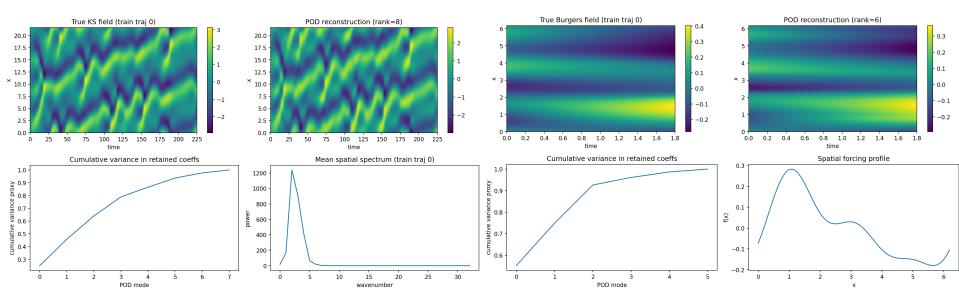
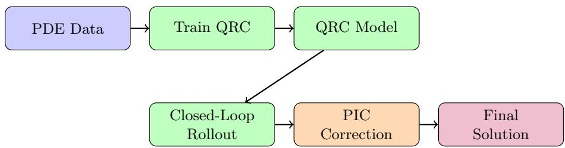
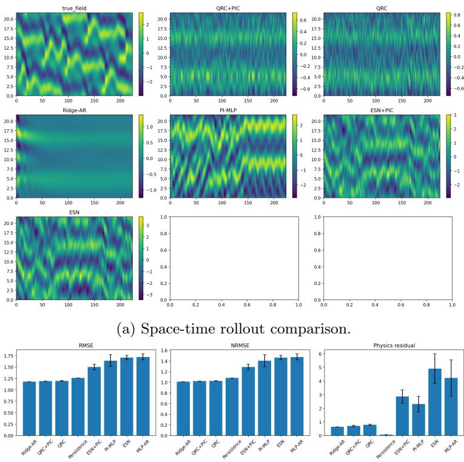
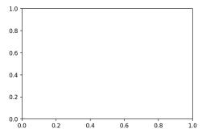
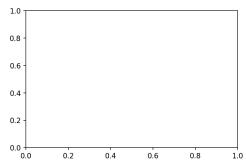
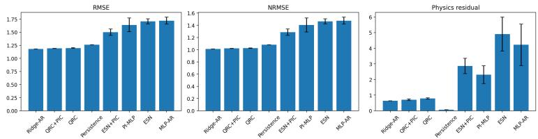
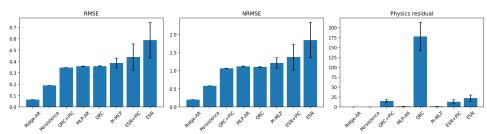
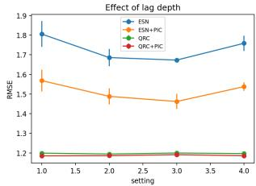
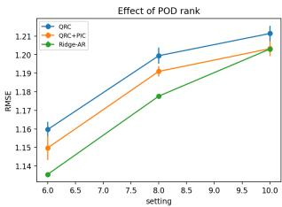
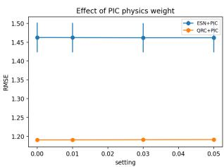

# Quantum Reservoir Computing with Physics-Informed Correction for Reduced-Order PDE Forecasting

Krishna Bhatia[0009−0008−2436−9853]1, Harsh2 and Shalini Devendrababu1

1 QuantumAI Lab, Fractal Analytics, Mumbai, India

Department of Physics, Indian Institute of Technology, Jodhpur, India

Abstract. We study a hybrid proposal–correction architecture for reducedorder PDE forecasting in which a pure-state quantum reservoir computer (QRC) predicts latent coeficient dynamics and a PINN-based physicsinformed corrector (PIC) refines local rollout windows. The method is evaluated on Burgers and Kuramoto–Sivashinsky (KS), with KS as the primary chaotic benchmark. On KS, QRC+PIC consistently improves over QRC alone in RMSE, NRMSE, and PDE residual, while Burgers highlights a regime in which simple baselines remain strong. These results suggest that QRC proposals with local physics-informed correction are a viable benchmark-dependent reduced-order forecasting strategy.

Keywords: quantum reservoir computing · physics-informed neural networks · reduced-order modeling · Kuramoto–Sivashinsky · Burgers equation · scientific machine learning

## 1 Introduction

Reduced-order forecasting of nonlinear and chaotic PDEs sits at the intersection of dynamical systems, numerical simulation, and machine learning. Canonical examples such as the viscous Burgers equation and the Kuramoto–Sivashinsky (KS) equation expose complementary dificulties: Burgers combines nonlinear advection and difusion with steep gradients, whereas KS adds spatiotemporal chaos and strong sensitivity to rollout error [1,6,4]. This combination makes them useful testbeds for hybrid scientific machine learning methods.

Reservoir computing (RC) is attractive in this setting because it shifts most optimization efort to a linear readout while retaining nonlinear state evolution in the reservoir [5,6]. Physics-informed neural networks (PINNs), by contrast, incorporate governing equations as soft constraints and can reduce nonphysical drift, but their optimization can become fragile for convection-dominated or chaotic systems [1,2,3]. Recent physics-informed RC variants, including PI-ESN and API-ESN, show that modest physical regularization can extend predictability in chaotic settings without abandoning eficient sequence models [7,8]. In parallel, the QRC literature has argued that compact quantum reservoirs can be useful nonlinear feature maps for forecasting chaotic dynamics and reduced-order fluid systems [9,12,13,14,15].

This paper investigates a conservative hybridization of these threads. Rather than replacing the entire forecasting stack with a quantum or physics-informed model, we study a two-stage architecture: a QRC provides a fast proposal rollout in a reduced-order latent space, and a PINN-based physics-informed corrector (PIC) locally projects the proposal toward lower-residual trajectories. KS is treated as the primary benchmark because it better reflects the chaotic forecasting objective than Burgers.

Our contributions are threefold:

1. We formulate a reduced-order QRC + PIC pipeline for PDE forecasting in which the QRC predicts proper-orthogonal-decomposition (POD) coeficients and the PIC acts as a local physics-informed residual corrector in reconstructed field space.

2. We provide an honest two-benchmark evaluation: Burgers as an auxiliary smooth-PDE benchmark and KS as the main chaotic-PDE benchmark.

3. We show that the physics-informed corrector consistently improves the QRC proposal on the main benchmark, while Burgers highlights an important limitation—in easier reduced-order regimes, simple autoregressive baselines can remain highly competitive.

## 2 Related Work

## 2.1 Physics-informed neural networks and their limitations

PINNs introduced the now-standard recipe of combining supervised or weakly supervised losses with PDE residual penalties computed by automatic diferentiation [1]. The broader scientific machine learning perspective emphasizes that such models can exploit scarce observations and governing equations simultaneously [2]. However, benchmark and failure-mode studies have repeatedly shown that naive PINNs become dificult to optimize on convection-dominated, multiscale, or chaotic problems, especially when long horizons or stif operators are involved [3,4]. These observations motivate using a PINN-like model as a local corrector rather than as the sole global forecaster.

## 2.2 Reservoir computing for chaotic and spatiotemporal dynamics

Echo state networks and related RC models are appealing because only the readout is trained, making them eficient for sequence forecasting [5]. Pathak et al. demonstrated that RC can forecast large spatiotemporally chaotic systems, including KS, using parallelized reduced representations [6]. Physics-informed ESN variants later showed that adding residual-based penalties can improve predictability and hidden-state reconstruction in chaotic systems [7,8]. This literature is important here because it suggests that hybridizing data-driven rollout models with lightweight physics constraints is a productive design pattern.

## 2.3 Quantum reservoir computing

QRC began as a proposal to use natural or engineered quantum dynamics as nonlinear reservoirs [9]. Subsequent studies explored alternative physical realizations and mechanisms for QRC, including single-oscillator implementations and dissipation-assisted reservoirs [10,11]. Recent work has made the connection to chaotic forecasting more explicit. Ahmed et al. introduced recurrence-free QRC architectures for chaotic dynamics and extreme-event prediction and later analyzed robustness and generalized synchronization properties in quantum reservoirs [12,13]. Other works showed that quantum or hybrid quantum-classical reservoirs can model reduced-order convection and turbulence statistics in fluid systems [14,15]. These studies support QRC as a plausible proposal generator for reduced-order PDE states, even if decisive superiority over well-tuned classical baselines remains unproven. Related hybrid quantum–physics-informed models have also been studied for fluid and high-speed-flow settings, although with a diferent objective from the local-corrector design considered here [16,17].

## 2.4 Physics-informed correction and projection

A growing line of work studies output-projection or physics-consistent correction mechanisms that take a preliminary forecast and move it toward a physically admissible manifold [18]. This is conceptually close to our PIC stage. We do not solve the full PDE from scratch with a PINN; rather, we use the proposal as a strong prior and train a residual corrector whose role is to improve physical consistency without discarding the fast proposal trajectory.

## 3 Problem Setup and Benchmarks

## 3.1 Burgers equation

The auxiliary benchmark is the one-dimensional viscous Burgers equation

$$
u _ { t } + u u _ { x } = \nu u _ { x x } ,\tag{1}
$$

with periodic boundary conditions and problem-specific initial/forcing choices defined in our data-generation setup. Burgers is a classic PINN benchmark because it combines nonlinear transport and difusion and can exhibit steep gradients [1]. In our study, however, it is not the main headline benchmark; instead it functions as a numerically stable, lower-dificulty PDE sanity check.

## 3.2 Kuramoto–Sivashinsky equation

The main benchmark is the KS equation,

$$
u _ { t } + u u _ { x } + u _ { x x } + u _ { x x x x } = 0 ,\tag{2}
$$

which is a canonical testbed for spatiotemporal chaos and machine-learningbased forecasting [6,20]. KS is the more appropriate benchmark when the story is chaotic reduced-order forecasting rather than physics-informed PDE solving in isolation. Accordingly, the paper is organized with KS as the primary benchmark and Burgers as auxiliary.

## 3.3 Reduced-order state representation

For both PDEs we operate in a reduced-order latent space obtained by proper orthogonal decomposition (POD):

$$
u ( x , t ) \approx \bar { u } ( x ) + \sum _ { i = 1 } ^ { r } a _ { i } ( t ) \phi _ { i } ( x ) ,\tag{3}
$$

where u¯ is the training-set mean field, $\phi _ { i }$ are POD modes learned on the training trajectories only, and $a _ { i } ( t )$ are modal coeficients. The QRC, ESN, and classical autoregressive baselines all forecast the same coeficient representation, ensuring a fair state-space comparison across models.

## 4 Method

## 4.1 Stage I: Quantum reservoir proposal

Let $\mathbf { a } _ { t } \in \mathbb { R } ^ { r }$ denote the reduced-order coeficient vector at time t. We construct an input-encoded pure-state QRC with $n _ { q }$ qubits and V virtual nodes. Each normalized input is mapped to phase angles via a fixed random afine map, propagated through a fixed random unitary, and read out through expectationlike features such as $Z _ { i } , ~ X _ { i } ,$ , and nearest-neighbor $Z _ { i } Z _ { i + 1 }$ . Concatenating the virtual-node features produces a reservoir state $\mathbf { r } _ { t } ,$ and the next-step proposal is generated by a ridge-regression readout

$$
\hat { \mathbf { a } } _ { t + 1 } = W _ { \mathrm { o u t } } \mathbf { r } _ { t } .\tag{4}
$$

The QRC is trained with teacher forcing, but validation and test metrics are computed under closed-loop rollout.

## 4.2 Stage II: PINN-based physics-informed correction

Given a local proposal window $\hat { \mathbf { a } } _ { t : t + H - 1 }$ and its reconstructed field window $\boldsymbol { \hat { u } } ( \boldsymbol { x } , t )$ , the corrector predicts a residual-corrected trajectory

$$
\boldsymbol { \tilde { u } } ( \boldsymbol { x } , t ) = \boldsymbol { \hat { u } } ( \boldsymbol { x } , t ) + \boldsymbol { \varDelta _ { \theta } } ( \boldsymbol { x } , t ; \boldsymbol { \hat { u } } ) ,\tag{5}
$$

where $\varDelta _ { \theta }$ is a small neural correction. In practice we use a PINN-style corrector and train it on short windows with a composite loss

$$
\mathcal { L } = \lambda _ { \mathrm { d a t a } } \| \tilde { \boldsymbol { u } } - \boldsymbol { u } \| _ { 2 } ^ { 2 } + \lambda _ { \mathrm { p r i o r } } \| \tilde { \boldsymbol { u } } - \boldsymbol { \hat { u } } \| _ { 2 } ^ { 2 } + \lambda _ { \mathrm { p h y s } } \| \mathcal { F } ( \tilde { \boldsymbol { u } } ) \| _ { 2 } ^ { 2 } ,\tag{6}
$$

where u is the true field on training/validation windows only, uˆ is the proposal, and F is the PDE residual operator corresponding to Eq. (1) or Eq. (2). At test time the corrector sees only the proposal windows. In other words, the correction is autonomous and does not rely on hidden test-time truth anchoring.

## 4.3 Why proposal–correction rather than PINN-only?

Global PINN-only training can be brittle for chaotic long-horizon PDE forecasting, while eficient proposal models such as RC are often more stable in practice [6,7,3,4]. We therefore adopt a proposal–correction split so the PINN stage focuses on local physics-consistency refinement rather than full trajectory generation.

## 5 Experimental Protocol

## 5.1 Splits, seeds, and model selection

All reported experiments follow the same protocol:

– trajectory-level train/validation/test split;

– training-set-only POD basis and normalization statistics;

– five random seeds for stochastic models;

– hyperparameter selection on validation rollout only;

– final reporting on held-out test trajectories only.

This design follows a strict evaluation discipline: fixed rollout conditions, validationonly tuning, and comparison of proposal-only against proposal+correction models under the same reduced-order representation.

## 5.2 Baselines

We compare against a compact but informative baseline set:

– Persistence,

– Ridge autoregression (Ridge-AR),

– MLP autoregression (MLP-AR),

– PI-MLP (a PINN-like autoregressive baseline),

– ESN,

– ESN+PIC,

– QRC,

– QRC+PIC.

The PI-MLP baseline is conceptually related to physics-constrained autoregressive models for PDE dynamics forecasting [19]. The resulting comparison isolates three questions: (i) whether QRC is competitive as a proposal generator, (ii) whether a physics-informed corrector improves proposal quality, and (iii) whether any quantum benefit survives comparison with strong classical reducedorder baselines.

  
(a) Kuramoto–Sivashinsky (primary).  
(b) Burgers (auxiliary).  
Fig. 1: Dataset overview figures

## 5.3 Metrics

For each benchmark we report mean ± standard deviation across seeds for fieldlevel RMSE, NRMSE, and PDE residual. Where available, we also report valid prediction time (VPT), medium-horizon and long-horizon RMSE, and a spectral mismatch score. We emphasize two complementary axes: predictive accuracy and physical consistency.

Figure 1 shows dataset-level diagnostics for the KS and Burgers benchmarks.

## 5.4 QRC+PIC Pipeline

  
Fig. 2: Workflow of the proposed QRC+PIC framework. A quantum reservoir generates rollout predictions that are then refined by a physics-informed corrector.

## 6 Results

## 6.1 Primary benchmark: Kuramoto–Sivashinsky

Table 1 summarizes the main KS results. Two observations matter most. First, the physics-informed correction consistently improves the QRC proposal: QRC+PIC improves QRC in RMSE, NRMSE, and physics residual. Second, the margins against strong simple baselines are small.

Table 1: Main KS results (five seeds, test trajectories only)
<table><tr><td>Model</td><td>RMSE↓ NRMSE↓</td><td>Physics residual ↓</td></tr><tr><td>Ridge-AR</td><td> $1 . 1 7 7 7 \pm 0 . 0 0 0 0 1 . 0 1 0 0 \pm 0 . 0 0 0 0$ </td><td> $0 . 6 3 3 1 \pm 0 . 0 0 0 0$ </td></tr><tr><td>QRC+PIC</td><td> $1 . 1 8 9 7 \pm 0 . 0 0 2 7 1 . 0 2 0 4 \pm 0 . 0 0 2 4$ </td><td> $0 . 7 0 3 5 \pm 0 . 0 4 9 8$ </td></tr><tr><td>QRC</td><td> $1 . 1 9 7 1 \pm 0 . 0 0 4 4 1 . 0 2 6 8 \pm 0 . 0 0 3 9$ </td><td> $0 . 7 8 3 0 \pm 0 . 0 3 6 7$ </td></tr><tr><td>Persistence</td><td> $1 . 2 6 0 6 \pm 0 . 0 0 0 0 1 . 0 8 0 7 \pm 0 . 0 0 0 0$ </td><td> $0 . 0 7 1 5 \pm 0 . 0 0 0 0$ </td></tr><tr><td> $\mathrm { E S N + P I C }$ </td><td> $1 . 5 0 0 9 \pm 0 . 0 6 0 4 1 . 2 8 7 1 \pm 0 . 0 5 1 6$ </td><td> $2 . 8 6 0 6 \pm 0 . 4 8 9 1$ </td></tr><tr><td>PI-MLP</td><td> $1 . 6 3 9 0 \pm 0 . 1 3 2 6 1 . 4 0 5 7 \pm 0 . 1 1 4 3$ </td><td> $2 . 3 1 1 0 \pm 0 . 5 6 8 5$ </td></tr><tr><td>ESN</td><td> $1 . 7 0 7 0 \pm 0 . 0 4 8 4 1 . 4 6 3 9 \pm 0 . 0 4 1 1$ </td><td> $4 . 9 0 6 3 \pm 1 . 0 8 2 6$ </td></tr><tr><td>MLP-AR</td><td> $1 . 7 1 9 2 \pm 0 . 0 6 7 1 1 . 4 7 4 8 \pm 0 . 0 5 7 6$ </td><td> $4 . 2 1 8 0 \pm 1 . 3 2 8 8$ </td></tr></table>

In our view, the correct interpretation is not that the quantum model has established superiority, but that the hybrid proposal–correction design is functioning as intended on a genuinely chaotic PDE. QRC+PIC improves QRC, and it substantially outperforms the ESN-family baselines in this configuration. The fact that Ridge-AR remains slightly stronger is scientifically important rather than embarrassing: it shows that reduced-order chaotic forecasting can remain surprisingly linear in some regimes and that hybrid quantum models must be benchmarked conservatively.

Figure 3 shows representative KS rollout comparisons and aggregate metric bars.

## 6.2 Auxiliary benchmark: Burgers

Table 2 summarizes the auxiliary Burgers results. In this smoother reducedorder regime, persistence and simple autoregressive baselines remain strong. QRC+PIC improves over QRC alone, but Burgers does not provide the clearest setting for arguing that the reservoir is essential. We therefore use Burgers as an auxiliary sanity-check benchmark rather than the main result.

This benchmark therefore plays an auxiliary role in the paper. It verifies that the Burgers data generator, reduced-order representation, and physics-informed correction machinery are operational, but it also highlights a limitation: in benign reduced-order regimes, a hybrid quantum proposal is not automatically competitive with simple local baselines.

Figure 4 shows representative Burgers rollout comparisons and aggregate metric bars.

## 6.3 Ablation and sensitivity analysis

The most practically important ablations are (i) QRC versus QRC+PIC, (ii) ESN versus ESN+PIC, (iii) lag depth, (iv) POD rank, (v) rollout horizon, and

  
(b) Aggregate test metrics with seed-wise error bars.  
Fig. 3: Primary KS figures.

(vi) PIC physics-loss weight. Figure 5 summarizes these sweeps. The trends confirm that correction quality is sensitive to configuration and loss balancing, which aligns with the failure-mode literature on PINNs [3,4].

## 7 Discussion

Several conclusions emerge.

1. The proposal–correction idea is viable but benchmark-dependent. The main KS result supports the central architectural claim: a QRC proposal can be improved by a local physics-informed corrector, and the defensible novelty is the proposal– projection hybrid rather than a “quantum PINN” monolith.

2. Burgers should remain auxiliary. Burgers is best treated as an auxiliary benchmark rather than the flagship result. It remains useful for debugging, visualization, and sanity checks, but the main chaotic forecasting story belongs to KS.

Table 2: Auxiliary Burgers results (five seeds, test trajectories only).
<table><tr><td>Model</td><td>RMSE↓</td><td>NRMSE↓</td><td>Physics residual ↓</td></tr><tr><td>Ridge-AR</td><td> $0 . 0 6 4 4 \pm 0 . 0 0 0 0 0 . 2 0 2 5 \pm 0 . 0 0 0 0$ </td><td></td><td> $0 . 0 2 9 8 \pm 0 . 0 0 0 0$ </td></tr><tr><td>Persistence</td><td> $0 . 1 8 8 7 \pm 0 . 0 0 0 0 0 . 5 8 3 6 \pm 0 . 0 0 0 0$ </td><td></td><td> $0 . 0 7 8 2 \pm 0 . 0 0 0 0$ </td></tr><tr><td>QRC+PIC</td><td> $0 . 3 4 5 8 \pm 0 . 0 0 1 0 1 . 0 6 4 7 \pm 0 . 0 0 3 1$ </td><td></td><td> $1 5 . 0 1 2 8 \pm 3 . 4 1 3 2$ </td></tr><tr><td>MLP-AR</td><td> $0 . 3 5 7 3 \pm 0 . 0 0 3 0 1 . 1 1 6 4 \pm 0 . 0 0 8 9$ </td><td></td><td> $1 . 2 0 2 9 \pm 0 . 0 4 1 1$ </td></tr><tr><td>QRC</td><td> $0 . 3 5 7 8 \pm 0 . 0 0 4 0 1 . 1 0 2 5 \pm 0 . 0 1 3 0$ </td><td></td><td> $1 7 7 . 5 8 6 9 \pm 3 5 . 5 5 7 0$ </td></tr><tr><td>PI-MLP</td><td> $0 . 3 8 6 1 \pm 0 . 0 4 3 6 1 . 2 1 1 4 \pm 0 . 1 4 2 9$ </td><td></td><td> $1 . 3 3 3 4 \pm 0 . 1 4 4 5$ </td></tr><tr><td> $\mathrm { E S N + P I C }$ </td><td> $0 . 4 3 9 7 \pm 0 . 1 1 4 8 1 . 3 7 5 4 \pm 0 . 3 5 7 2$ </td><td></td><td> $1 2 . 7 7 5 4 \pm 4 . 9 0 1 7$ </td></tr><tr><td>ESN</td><td> $0 . 5 8 8 2 \pm 0 . 1 5 6 8 1 . 8 4 3 6 \pm 0 . 4 9 0 6$ </td><td></td><td> $2 2 . 0 8 7 1 \pm 7 . 7 8 3 6$ </td></tr></table>

  
Fig. 4: Aggregate test metrics with seed-wise error bars for Burgers

3. Strong classical baselines must remain in the paper. Ridge-AR is a particularly important baseline because it demonstrates that low-dimensional reducedorder dynamics can remain surprisingly linear. Omitting it would weaken the credibility of the study. The right narrative is not that QRC+PIC dominates all baselines; it is that QRC+PIC is a competitive hybrid with a favorable accuracy– physics tradeof and a clear improvement over QRC alone on the main benchmark.

4. The PIC is better viewed as a local physics-informed corrector than as a full PINN solver. The architecture is best described as QRC + PINN-based physicsinformed correction or $Q R C + P I C ,$ rather than as a PINN that directly solves the full PDE from scratch. The latter would overstate the role of the second stage.

## 8 Limitations and Threats to Validity

The study has several limitations. First, the best overall KS result remains close to a simple linear baseline. Second, the auxiliary Burgers benchmark does not showcase a strong quantum advantage and instead confirms that some smooth reduced-order regimes are well served by persistence or linear AR models. Third, the QRC used here is a pure-state simulated reservoir rather than a hardware execution or noisy quantum device.

  
Fig. 5: KS ablation overview, including lag depth, POD rank, horizon, and physics-loss sensitivity.

## 9 Conclusion

We presented a reduced-order PDE forecasting pipeline in which a pure-state quantum reservoir computer generates a closed-loop proposal rollout and a PINNbased physics-informed corrector refines the proposal locally in field space. The main result is on the Kuramoto–Sivashinsky equation, where the corrector consistently improves the QRC proposal and yields a competitive accuracy–physics tradeof under multi-seed, validation-only evaluation. The Burgers equation serves as an auxiliary benchmark that verifies the robustness of the pipeline while showing that easy reduced-order regimes can still favor trivial local baselines. Overall, the evidence supports a cautious but positive conclusion: QRC proposals with local physics-informed correction are a viable reduced-order SciML architecture for nonlinear PDE forecasting, especially when the goal is not headline quantum advantage but physically consistent competitive forecasting under tight computational budgets.

## References

1. Raissi, M., Perdikaris, P., Karniadakis, G.E.: Physics-informed neural networks: A deep learning framework for solving forward and inverse problems involving nonlinear partial diferential equations. J. Comput. Phys. 378, 686–707 (2019)

2. Karniadakis, G.E., Kevrekidis, I.G., Lu, L., Perdikaris, P., Wang, S., Yang, L.: Physics-informed machine learning. Nat. Rev. Phys. 3(6), 422–440 (2021)

3. Krishnapriyan, A.S., Gholami, A., Zhe, S., Kirby, R.M., Mahoney, M.W.: Characterizing possible failure modes in physics-informed neural networks. In: NeurIPS, pp. 26548–26560 (2021)

4. Hao, Z., Yao, J., Su, C., Su, H., Wang, Z., et al.: Pinnacle: A comprehensive benchmark of physics-informed neural networks for solving PDEs. In: NeurIPS Datasets and Benchmarks Track (2024)

5. Jaeger, H.: The “echo state” approach to analysing and training recurrent neural networks. GMD Report 148, German National Research Center for Information Technology (2001)

6. Pathak, J., Hunt, B., Girvan, M., Lu, Z., Ott, E.: Model-free prediction of large spatiotemporally chaotic systems from data: A reservoir computing approach. Phys. Rev. Lett. 120, 024102 (2018)

7. Doan, N.A.K., Polifke, W., Magri, L.: Physics-informed echo state networks. J. Comput. Sci. 47, 101237 (2020)

8. Racca, A., Magri, L.: Automatic-diferentiated physics-informed echo state network (API-ESN). In: Computational Science – ICCS 2021, pp. 202–215. Springer (2021)

9. Fujii, K., Nakajima, K.: Harnessing disordered-ensemble quantum dynamics for machine learning. Phys. Rev. Applied 8, 024030 (2017)

10. Govia, L.C.G., Ribeill, G.J., Rowlands, G.E., Krovi, H.K., Ohki, T.A.: Quantum reservoir computing with a single nonlinear oscillator. Phys. Rev. Res. 3, 013077 (2021)

11. Sannia, A., Martínez-Peña, R., Soriano, M.C., Giorgi, G.L., Zambrini, R.: Dissipation as a resource for quantum reservoir computing. Quantum 8, 1291 (2024)

12. Ahmed, O., Tennie, F., Magri, L.: Prediction of chaotic dynamics and extreme events: A recurrence-free quantum reservoir computing approach. Phys. Rev. Res. 6, 043082 (2024)

13. Ahmed, O., Tennie, F., Magri, L.: Robust quantum reservoir computers for forecasting chaotic dynamics: generalized synchronization and stability. Proc. R. Soc. A 481(2324), 20250550 (2025)

14. Pfefer, P., Heyder, F., Schumacher, J.: Hybrid quantum-classical reservoir computing of thermal convection flow. Phys. Rev. Res. 4, 033176 (2022)

15. Pfefer, P., Heyder, F., Schumacher, J.: Reduced-order modeling of two-dimensional turbulent Rayleigh–Bénard flow by hybrid quantum-classical reservoir computing. Phys. Rev. Res. 5, 043242 (2023)

16. Sedykh, A., Podapaka, M., Sagingalieva, A., Pinto, K., Pflitsch, M., Melnikov, A.: Hybrid quantum physics-informed neural networks for simulating computational fluid dynamics in complex shapes. arXiv:2304.11247 (2023)

17. Leong, F.Y., Ewe, W.-B., Quang, T.S.B., Zhang, Z., Khoo, J.Y.: Hybrid quantum physics-informed neural network: Towards eficient learning of high-speed flows. Comput. Methods Appl. Mech. Eng. (2025, online first)

18. Valente, M., Dias, T.C., Guerra, V., Ventura, R.: Physics-consistent machine learning with output projection onto physical manifolds. Commun. Phys. 8 (2025)

19. Geneva, N., Zabaras, N.: Modeling the dynamics of PDE systems with physicsconstrained deep auto-regressive networks. J. Comput. Phys. 403, 109056 (2020)

20. Wyder, P.M., et al.: Common task framework for a critical evaluation of methods for forecasting nonlinear dynamics. OpenReview / arXiv preprint (2025)