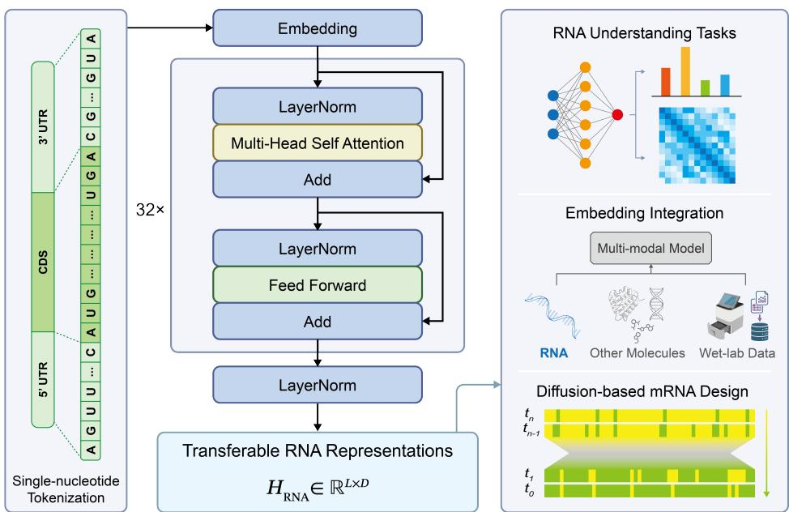
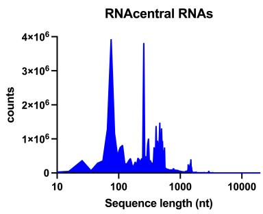
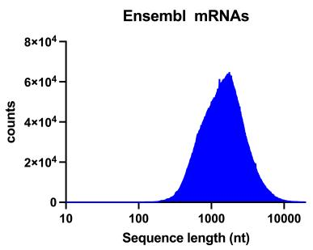
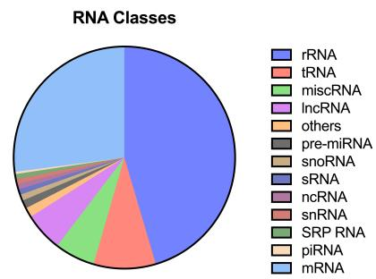
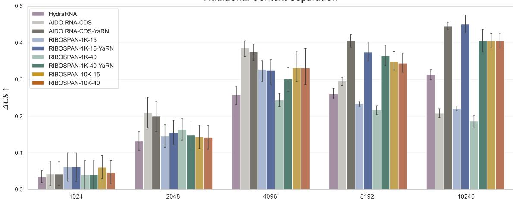
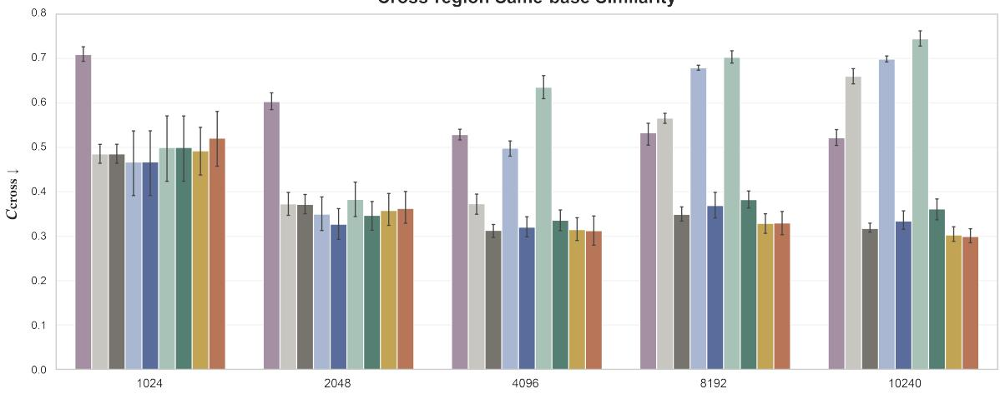
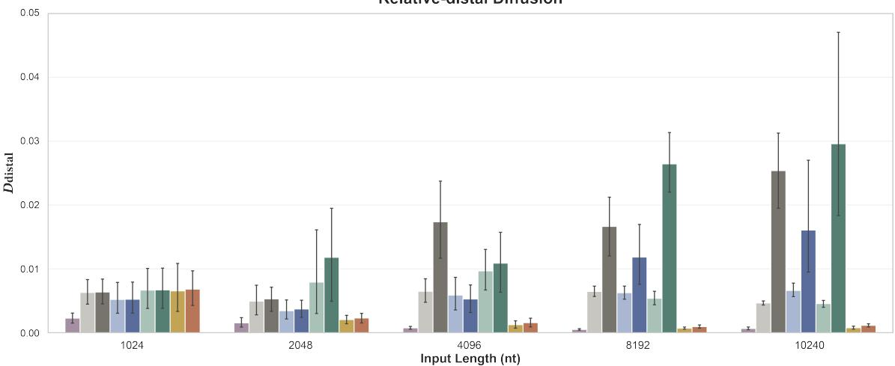
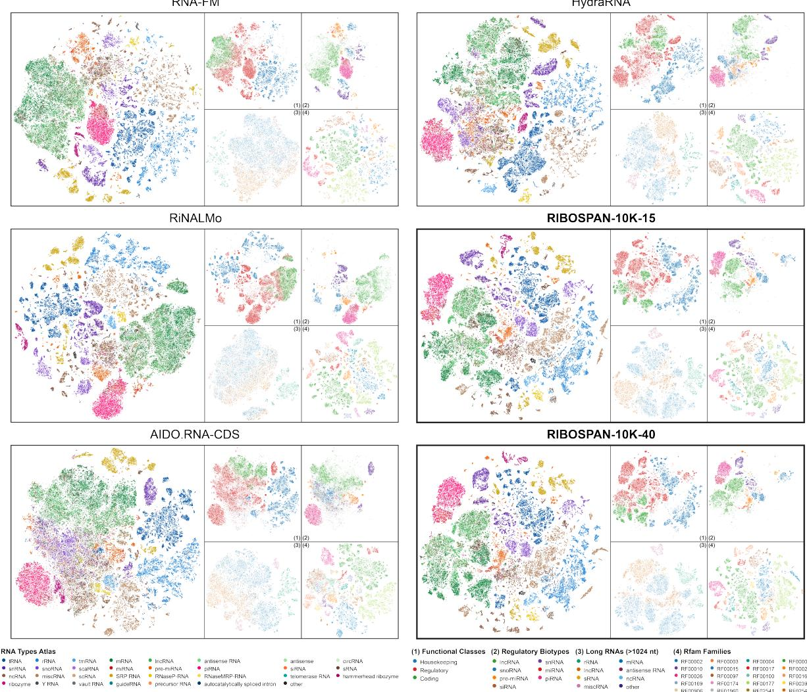
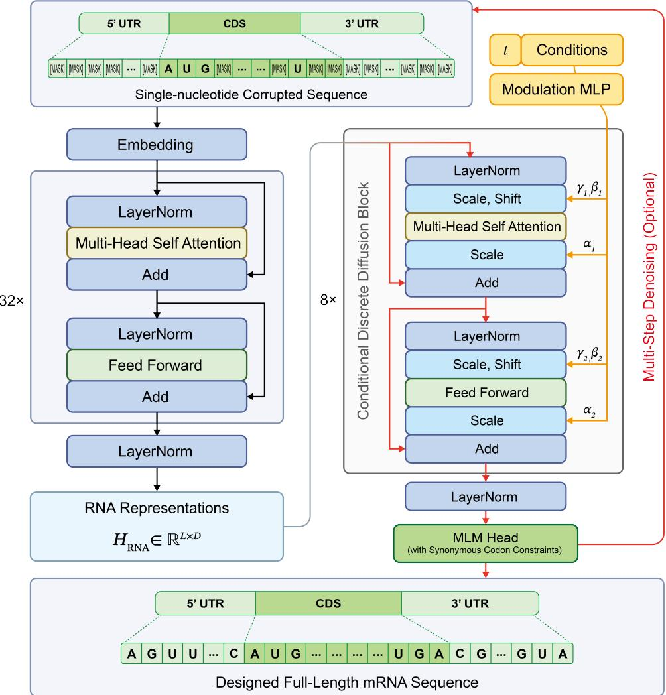

# RIBOSPAN: A Long-Context RNA Foundation Model for Versatile RNA Modeling

Ziyuan Wang†1,2,4,5 Bohao Tang†1,3,5 Fei Zhang1,3,5 Shuo Han\*2,4 Pengfei Liu\*1,3,5

1Shanghai Innovation Institute 2Center for Excellence in Molecular Cell Science, CAS 3Shanghai Jiao Tong University 4University of Chinese Academy of Sciences 5Generative Artificial Intelligence Research Lab

§ GitHub Hugging Face

†Equal contribution. \*Co-corresponding authors.

## Abstract

Full-length RNAs, particularly messenger RNAs, often exceed the context lengths used to pretrain existing RNA foundation models, limiting complete-transcript modeling at single-nucleotide resolution. We present RIBOSPAN, a 1.61-billion-parameter bidirectional RNA foundation model natively pretrained with context lengths up to 10,240 nt. RIBOSPAN combines dense bidirectional self-attention, singlenucleotide tokenization, and attention-isolated sequence packing to enable high-resolution modeling of complete long RNAs. We evaluate the model through nucleotide reconstruction, a controlled long-context representation benchmark, and frozen RNA-type representation analysis. Native 10K pretraining preserves strong reconstruction at 10,240 tokens, while continued pretraining with 40% masking improves recovery under heavy corruption while preserving representation quality. The long-context benchmark further shows that native 10K models maintain strong contextual responsiveness and context-specific representation separation while keeping perturbation-induced representation changes highly localized. Inference-time YaRN scaling recovers much of the contextual organization lost by direct extrapolation of short-context models, but induces substantially greater distal representation diffusion. Frozen-representation evaluations further demonstrate state-of-the-art RNA representation quality, with RIBOSPAN achieving the strongest overall performance across diverse RNA types and retaining a clear advantage on long RNAs. Building on the same backbone, we develop a multidimensionally conditioned discrete-diffusion framework for full-length mRNA generation and redesign, including synonymous-codon diffusion for protein-preserving CDS optimization. Together, RIBOSPAN establishes a powerful long-context foundation for transferable RNA representation learning and full-transcript mRNA design.

## 1 Introduction

Messenger RNA (mRNA) is a biomolecule with a modularly annotated architecture but highly coupled functions across its constituent regions. The 5′ untranslated region (5′ UTR), coding sequence (CDS), and 3′ untranslated region (3′ UTR) jointly influence multiple aspects of translation initiation and elongation, RNA folding, molecular stability, subcellular localization, and interactions with RNA-binding proteins and other cellular components. Consequently, a sequence alteration within one region may affect molecular phenotypes typically attributed to another region through structural rearrangements or changes in the broader regulatory context. Such coupling is particularly important for therapeutic and synthetic mRNAs, for which a candidate sequence must not only encode the correct protein but also satisfy multiple constraints related to translational efficiency, stability, and manufacturability (Mauger et al., 2019; Leppek et al., 2022; Metkar et al., 2024).

Existing computational methods generally make this high-dimensional design problem tractable by constraining the sequence region or optimization objective. Substantial progress has been made in 5′ UTR activity prediction and optimization (Sample et al., 2019), joint optimization of synonymous codon usage and RNA structure (Zhang et al., 2023), and generative mRNA design (Zhang et al., 2025; Patel et al., 2026). These approaches nevertheless address different parts of the broader modeling problem. Region-specific methods optimize selected regulatory elements or functional readouts, while synonymous-CDS optimization preserves the encoded protein and searches within a restricted sequence space. GEMORNA extends generative design across CDS and UTRs but models these transcript regions separately, whereas mRNAutilus performs joint full-transcript generation through a masked discrete-diffusion objective oriented toward sequence denoising and property-guided optimization rather than transferable representation learning. Together, these advances substantially expand the scope of computational mRNA design, while leaving complete-transcript representation learning less systematically explored.

RNA foundation models offer a promising route toward this broader objective. Bidirectional encoders such as RNA-FM (Chen et al., 2022), RiNALMo (Penic et al.´ , 2025), and AIDO.RNA (Zou et al., 2024) have shown that large-scale masked nucleotide modeling can learn transferable representations associated with RNA structure and function. Bidirectional self-attention (Vaswani et al., 2017; Devlin et al., 2019) allows each nucleotide to integrate both upstream and downstream context, making this architecture naturally suited to full-sequence understanding tasks such as structure prediction, functional prediction, and per-nucleotide representation learning. However, representative large-scale dense bidirectional RNA encoders are typically pretrained with context lengths of only approximately 1,024 tokens; sequences exceeding this length must therefore be truncated or cropped, making it difficult to preserve the complete context of many mature mRNAs.

The need to model complete transcripts has driven the development of long-sequence RNA foundation models along two main directions: generation and representation. The first comprises decoder-only models exemplified by EVA (Huang et al., 2026). The causal attention mechanism is well suited to autoregressive generation and has extended sequence scoring, de novo generation, and targeted regional redesign to the transcript scale. Under causal attention, however, each position can access only its upstream sequence, preventing per-nucleotide representations from simultaneously integrating the complete context on both sides of a given position. RNA structure formation, molecular binding, and regulatory activity often involve relationships among both local and distal sequence elements. Unidirectional information flow is therefore not fully aligned with the representation of complete RNA structure and function. For this reason, many representative foundation models for sequence understanding and downstream prediction across proteins, DNA, and RNA adopt bidirectional masked language modeling to learn contextual representations (Hayes et al., 2025; Chen et al., 2022; Dalla-Torre et al., 2025).

The second direction comprises encoder-only models designed for bidirectional representation of long RNAs. These models preserve the joint use of upstream and downstream information while expanding sequence coverage by reducing computational complexity or input tokens. HydraRNA primarily uses bidirectional state-space modules while retaining multi-head attention in selected layers; RNAret adopts a linear-complexity bidirectional retention mechanism; and BiRNA-BERT applies byte-pair encoding to long inputs, compressing multiple consecutive nucleotides into fewer tokens (Li et al., 2025; Shen et al., 2026; Tahmid et al., 2025). These designs substantially reduce the computational cost of long-sequence modeling but introduce corresponding representational trade-offs: efficient sequence-mixing architectures do not retain dense all-to-all nucleotide interactions in every layer, whereas token compression sacrifices fixed single-nucleotide resolution for long inputs.

Together, these two lines of work have advanced transcript-scale generation and bidirectional representation of long RNAs. Nevertheless, a key capability gap remains in complete mRNA modeling: existing models have not yet simultaneously achieved single-nucleotide tokenization, dense bidirectional self-attention throughout all layers, and billion-scale model capacity at a context length representative of full-length transcripts (Chen et al., 2022; Zou et al., 2024; Penic et al.´ , 2025; Li et al., 2025; Tahmid et al., 2025; Shen et al., 2026; Huang et al., 2026). For complete transcripts, these three properties jointly preserve per-nucleotide positional resolution, support comprehensive integration of upstream, downstream, and distal sequence information, and place the 5′ UTR, CDS, 3′ UTR, and their cross-region dependencies within a unified high-resolution representation space. RoPE-based context-extension methods such as Position Interpolation and YaRN can enlarge the usable positional range of pretrained models (Su et al., 2024; Chen et al., 2023; Peng et al., 2024). However, positional extension alone does not expose the backbone during pretraining to sequence interactions at full-transcript lengths. It therefore cannot replace native long-context pretraining when the goal is to learn representations from complete RNA sequences.

To address this capability gap, our main contributions are as follows:

• First, we trained RIBOSPAN, the first billion-scale dense bidirectional Transformer RNA foundation model with single-nucleotide tokenization and native pretraining up to 10,240 nt. It learns transferable representations across diverse RNA types while extending high-resolution RNA modeling to full-length transcripts.

• Second, we introduced the first benchmark for systematically evaluating long-context representations in RNA foundation models. It evaluates long-range information integration and contextual representation quality as sequence length extends beyond the pretrained context.

• Third, we developed the first full-stack mRNA design framework built on a long-context RNA foundation model, enabling joint full-length generation and transcript-wide redesign. Using RIBOSPAN as the generative backbone, the framework jointly models the 5′ UTR, CDS, and 3′ UTR under transcript context, with multidimensional conditioning and synonymous-codon diffusion for cross-region and protein-preserving optimization.

## 2 Native Long-Context Pretraining

RIBOSPAN uses a 1.61B-parameter bidirectional Transformer encoder with single-nucleotide tokenization. The pretraining corpus combines diverse RNA sequences from RNAcentral with annotated protein-coding transcripts from Ensembl. Models are pretrained with a native context length of 10,240 tokens, and an initial 15% masking stage is followed by continued pretraining with 40% masking, providing long-context foundation models for nucleotide-level RNA representation learning and generative modeling.

## 2.1 Model Architecture and Tokenization

RIBOSPAN uses a 32-layer pre-norm Transformer encoder with a dimension of 2,048 (Figure 1). Each transformer block consists of bidirectional multi-head self-attention followed by a SwiGLU feed-forward network. RoPE (Su et al., 2024) is applied over the full attention-head dimension. Table 1 summarizes the configuration.

Table 1: Backbone configuration of RIBOSPAN.
<table><tr><td>Setting</td><td>Configuration</td><td>Setting</td><td>Configuration</td></tr><tr><td>Transformer Layers</td><td>32</td><td>Model Dimension</td><td>2,048</td></tr><tr><td>FFN Intermediate size</td><td>5,440</td><td>Attention Heads</td><td>32</td></tr><tr><td>Activation</td><td>SwiGLU</td><td>Normalization</td><td>LayerNorm</td></tr><tr><td>Position Encoding</td><td>RoPE (rotary dim = 64)</td><td>Head Dimension</td><td>64</td></tr><tr><td>Vocabulary Size</td><td>16</td><td>Token Unit</td><td>nucleotide</td></tr><tr><td>Native Context Length</td><td>10,240 tokens</td><td>Parameters</td><td>1.61B</td></tr></table>

RIBOSPAN uses single-nucleotide tokenization, with each nucleotide occupying one token position. Vocabulary construction, sequence normalization, and boundary-token handling are detailed in Appendix A.

  
Figure 1: Architecture and downstream use of RIBOSPAN. Single-nucleotide RNA sequences are encoded by 32 bidirectional Transformer layers into transferable nucleotide-level representations for downstream RNA modeling.

## 2.2 Pretraining Corpus

We construct the pretraining corpus from RNAcentral v26.0 (RNAcentral Consortium, 2026), Ensembl release 115, and Ensembl Genomes release 62 (Dyer et al., 2025). After source-specific filtering, normalization, and exact deduplication, the final training corpus contains 67.6M RNA sequences and 85.7B nucleotide tokens in total.

RNAcentral provides broad coverage across RNA classes, while Ensembl datasets contribute quality-controlled protein-coding transcripts with complete CDS and UTR annotations across vertebrates, plants, fungi, metazoans, and protists. Source-specific filtering, normalization, deduplication, and held-out set construction are described in Appendix A.1. The resulting sequence-length and RNA-class distributions are shown in Figure 2.

  
Figure 2: Sequence-length distributions and RNA-class composition of the pretraining corpus.

The validation and test sets were constructed using class-specific sampling quotas to provide broad representation across RNA classes while reducing the influence of the highly imbalanced training distribution. For protein-coding transcripts, the sampling was further stratified by species. The RNA-class composition of the training corpus and held-out sets is summarized in Table 2.

Table 2: RNA-class composition of the pretraining corpus and held-out sets.
<table><tr><td>RNA Class</td><td>Training</td><td>Validation</td><td>Test</td></tr><tr><td>rRNA</td><td>30,748,160</td><td>10,000</td><td>10,000</td></tr><tr><td>mRNA</td><td>18,316,110</td><td>10,000</td><td>10,000</td></tr><tr><td>tRNA</td><td>6,135,163</td><td>10,000</td><td>10,000</td></tr><tr><td>miscRNA</td><td>3,966,721</td><td>10,000</td><td>10,000</td></tr><tr><td>lncRNA</td><td>3,818,804</td><td>10,000</td><td>10,000</td></tr><tr><td>others</td><td>940,161</td><td>5,000</td><td>5,000</td></tr><tr><td>pre-miRNA snoRNA</td><td>804,307</td><td>5,000</td><td>5,000</td></tr><tr><td></td><td>598,283</td><td>5,000</td><td>5,000</td></tr><tr><td>sRNA</td><td>541,829</td><td>5,000</td><td>5,000</td></tr><tr><td>ncRNA</td><td>510,635</td><td>5,000</td><td>5,000</td></tr><tr><td>snRNA</td><td>493,584</td><td>5,000</td><td>5,000</td></tr><tr><td>SRP-RNA</td><td>483,594</td><td>5,000</td><td>5,000</td></tr><tr><td>piRNA</td><td>209,734</td><td>5,000</td><td>5,000</td></tr><tr><td>Total</td><td>67,567,085</td><td>90,000</td><td>90,000</td></tr></table>

## 2.3 Long-Context Pretraining Schedule

RIBOSPAN is pretrained with masked language modeling (MLM) at a native context length of 10,240 tokens. We first pretrain the model with a 15% masking rate and then continue pretraining from the resulting checkpoint with a higher 40% masking rate for reconstruction-oriented adaptation.

To evaluate the effect of native context length, we additionally train 1,024-token baseline models using the same corpus, architecture, and masking schedule. Four model variants are summarized in Table 3.

Table 3: RIBOSPAN pretraining variants.
<table><tr><td>Model Variant</td><td>Native Context Length</td><td>Masking Rate</td><td>Training Stage</td></tr><tr><td>RIBOSPAN-10K-15</td><td>10,240</td><td>15%</td><td>Pretraining</td></tr><tr><td>RIBOSPAN-10K-40</td><td>10,240</td><td>40%</td><td>Continued pretraining from 10K-15</td></tr><tr><td>RIBOSPAN-1K-15</td><td>1,024</td><td>15%</td><td>Pretraining</td></tr><tr><td>RIBOSPAN-1K-40</td><td>1,024</td><td>40%</td><td>Continued pretraining from 1K-15</td></tr></table>

Pretraining is implemented with Megatron-LM (Shoeybi et al., 2019), with customization to its BERT pretraining pipeline for variable-length sequence packing. Multiple RNAs are packed into a common training sequence while retaining independent sequence boundaries; attention is restricted within each RNA, and positional indices are reset at sequence boundaries, preventing information leakage across packed sequences. Padding tokens are excluded from the training objective. Details on masking, packing, and optimization are provided in Appendix A.

## 3 Experiments

## 3.1 mRNA Reconstruction Evaluation

We evaluate nucleotide reconstruction on the mRNA subset of the pretraining test split with maximum input lengths of 1,024 and 10,240 tokens under masking rates of 15% and 40%. The four RIBOSPAN variants defined in Table 3 are evaluated together with AIDO.RNA-CDS, a coding-sequence-adapted variant of the AIDO.RNA foundation model (Zou et al., 2024), as a reference. At 10,240 tokens, AIDO.RNA-CDS and the RIBOSPAN-1K variants are evaluated through direct RoPE extrapolation, whereas the RIBOSPAN-10K variants remain within their native context. The 15% and 40% masking rates represent standard and heavy corruption settings, respectively.

Masked-Language-Modeling Loss. For an original sequence $\boldsymbol { x } = ( x _ { 1 } , \dots , x _ { L } )$ and its corrupted input xe, let M denote the nucleotide positions selected for prediction. The masked language modeling loss is

$$
\mathcal { L } _ { \mathrm { M L M } } = - \frac { 1 } { \vert M \vert } \sum _ { i \in M } \log p _ { \theta } ( x _ { i } \mid \widetilde { x } ) ,\tag{1}
$$

where $p _ { \theta } ( x _ { i } \mid \widetilde { x } )$ is the probability assigned to the original nucleotide at position i, and M contains 15% or 40% of the valid nucleotide positions according to the evaluation setting.

Table 4: Masked language modeling loss on the mRNA subset of the pretraining test split. Bold and underlined values in result tables indicate the best and second-best performance, respectively.
<table><tr><td rowspan="2">Model</td><td colspan="2">15% Masking</td><td colspan="2">40% Masking</td></tr><tr><td>1,024 tokens</td><td>10,240 tokens</td><td>1,024 tokens</td><td>10,240 tokens</td></tr><tr><td>AIDO.RNA-CDS (Zou et al., 2024)</td><td>1.08489</td><td>1.15072</td><td>1.13499</td><td>1.19024</td></tr><tr><td>RIBOSPAN-1K-15</td><td>0.67434</td><td>0.98153</td><td>0.93860</td><td>1.27385</td></tr><tr><td>RIBOSPAN-1K-40</td><td>0.68036</td><td>1.02138</td><td>0.77438</td><td>1.06730</td></tr><tr><td>RIBOSPAN-10K-15</td><td>0.76147</td><td>0.72417</td><td>0.99496</td><td>0.91122</td></tr><tr><td>RIBOSPAN-10K-40</td><td>0.75660</td><td>0.72519</td><td>0.88394</td><td>0.80033</td></tr></table>

Reconstruction loss reveals a clear context-length effect. Direct extrapolation of short-context models degrades substantially at 10,240 tokens, whereas the native 10K variants retain strong reconstruction performance. The 40% masking continuation further improves recovery under heavy corruption with little change under 15% masking.

Global Reconstruction Accuracy. MLM loss is computed only at masked positions and therefore does not characterize sequence-wide discrete predictions. We additionally report global reconstruction accuracy, defined as sequence-wide argmax recovery over all valid nucleotide positions:

$$
\operatorname { A c c } _ { \mathrm { g l o b a l } } = \frac { 1 } { L } \sum _ { i = 1 } ^ { L } \mathbf { 1 } [ \hat { x } _ { i } = x _ { i } ] , \qquad \hat { x } _ { i } = \underset { x \in \mathrm { V o c a b } } { \arg \operatorname* { m a x } } p _ { \theta } ( x \mid \widetilde { x } , i ) .\tag{2}
$$

Table 5: Global nucleotide reconstruction accuracy on the mRNA subset of the pretraining test split. Bold and underlined values in result tables indicate the best and second-best performance, respectively.
<table><tr><td rowspan="2">Model</td><td colspan="2">15% Masking</td><td colspan="2">40% Masking</td></tr><tr><td>1,024 tokens</td><td>10,240 tokens</td><td>1,024 tokens</td><td>10,240 tokens</td></tr><tr><td>AIDO.RNA-CDS (Zou et al., 2024)</td><td>0.91953</td><td>0.91576</td><td>0.79203</td><td>0.77791</td></tr><tr><td>RIBOSPAN-1K-15</td><td>0.94973</td><td>0.93083</td><td>0.83343</td><td>0.77168</td></tr><tr><td>RIBOSPAN-1K-40</td><td>0.94602</td><td>0.92589</td><td>0.86076</td><td>0.80264</td></tr><tr><td>RIBOSPAN-10K-15</td><td>0.94349</td><td>0.94763</td><td>0.82015</td><td>0.83769</td></tr><tr><td>RIBOSPAN-10K-40</td><td>0.94163</td><td>0.94517</td><td>0.84094</td><td>0.85887</td></tr></table>

Global reconstruction accuracy confirms the same pattern. The native 10K variants retain high recovery accuracy at 10,240 tokens, while the reconstruction-oriented 40% continuation improves recovery under heavy masking at both context lengths. In particular, RIBOSPAN-10K-40 combines the long-context capability established by native 10K pretraining with substantially stronger robustness to severe corruption, while remaining closely matched to 10K-15 under 15% masking at both input lengths.

## 3.2 Long-Context Representation Benchmark

To systematically evaluate the representation capability of RNA foundation models on long sequences, we construct a long-context benchmark based on complete mRNA transcripts. The benchmark characterizes long-range modeling behavior through contextual responsiveness, region-specific representation organization, and the spatial extent of perturbation-induced representation changes.

Specifically, we examine how models respond to a localized composition-preserving sequence rearrangement, how distinctly they represent the modified and surrounding sequence contexts, and whether the resulting representation changes remain localized or propagate into distant unchanged regions. Together, these measurements enable direct comparison among short-context models, inference-time position-extended models, efficient long-sequence architectures, and models natively pretrained with long contexts across increasing sequence lengths.

## 3.2.1 Benchmark Design

The benchmark comprises complete mRNAs spanning five length groups of 1,024, 2,048, 4,096, 8,192, and 10,240 nt, with 10 transcripts per group. For a transcript of length L, a centered interval of width $W = \mathrm { r o u n d } ( \mathrm { L } / 3 2 )$ is used to construct a native-structured pair. The structured sequence reorders nucleotides only within this interval while preserving its nucleotide composition and leaving all positions outside the interval unchanged.

We evaluate the four RIBOSPAN variants defined in Table 3 together with HydraRNA (Li et al., 2025) and AIDO.RNA-CDS as external references. HydraRNA uses a hybrid state-space/attention architecture and is evaluated directly at each requested sequence length. For AIDO.RNA-CDS and the two RIBOSPAN-1K variants, we additionally evaluate dynamic YaRN positional scaling (Peng et al., 2024) at inference using the same model weights without additional training. Model-specific long-sequence evaluation settings are detailed in Appendix B.1.

## 3.2.2 Evaluation Measures

Context Separation. Context Separation measures how strongly the same nucleotide is represented differently between the intervention interval and the surrounding background. To isolate contextual effects from nucleotide identity, the score is computed separately for each nucleotide type.

For each sequence in a pair, let I and B denote the sets of positions in the intervention interval and surrounding background, respectively, with the 8-nt buffer excluded from B. Let $\mathcal { V } = \{ \mathrm { A } , \mathrm { C } , \mathrm { G } , \mathrm { T } \}$ denote the nucleotide alphabet. For each $b \in \mathcal V .$ , define ${ \mathcal { T } } _ { b } = \{ i \in { \mathcal { T } } : x _ { i } = b \}$ and $B _ { b } = \{ i \in B : x _ { i } = b \}$ , where $\mathbf { h } _ { i } ^ { ( \ell ) }$ denotes the representation of position i at layer ℓ.

At each layer, we average the cosine similarity over three types of position pairs: pairs within the intervention interval, pairs within the background, and pairs spanning the two regions:

$$
C _ { \mathcal { T } } ^ { ( b , \ell ) } = \mathbb { E } _ { i , j \in \mathcal { T } _ { b } } \left[ \cos \left( \mathbf { h } _ { i } ^ { ( \ell ) } , \mathbf { h } _ { j } ^ { ( \ell ) } \right) \right] ,\tag{3}
$$

$$
C _ { B } ^ { ( b , \ell ) } = \mathbb { E } _ { i , j \in \mathcal { B } _ { b } } \left[ \cos \left( \mathbf { h } _ { i } ^ { ( \ell ) } , \mathbf { h } _ { j } ^ { ( \ell ) } \right) \right] ,\tag{4}
$$

$$
C _ { \mathcal { T B } } ^ { ( b , \ell ) } = \mathbb { E } _ { i \in \mathcal { T } _ { b } } \left[ \cos \left( \mathbf { h } _ { i } ^ { ( \ell ) } , \mathbf { h } _ { j } ^ { ( \ell ) } \right) \right] .\tag{5}
$$

The two within-region similarities are combined into a pair-count-weighted same-region baseline:

$$
C _ { \mathrm { s a m e } } ^ { ( b , \ell ) } = \frac { n _ { \mathcal { T } } ^ { ( b ) } C _ { \mathcal { T } } ^ { ( b , \ell ) } + n _ { B } ^ { ( b ) } C _ { B } ^ { ( b , \ell ) } } { n _ { \mathcal { T } } ^ { ( b ) } + n _ { B } ^ { ( b ) } } ,\tag{6}
$$

where $n _ { \mathcal { T } } ^ { ( b ) }$ and $n _ { B } ^ { ( b ) }$ denote the corresponding numbers of within-region pairs.

Context Separation for nucleotide b is then defined as the difference between the same-region baseline and the corresponding cross-region similarity:

$$
C S ^ { ( b , \ell ) } = C _ { \mathrm { s a m e } } ^ { ( b , \ell ) } - C _ { \bar { T } B } ^ { ( b , \ell ) } .\tag{7}
$$

At the final layer, Additional Context Separation (∆CS) measures the increase in regional separation induced by the composition-preserving rearrangement:

$$
\Delta C S = \frac { 1 } { | \mathcal { V } | } \sum _ { b \in \mathcal { V } } \left( C S _ { \mathrm { s t r u c t u r e d } } ^ { ( b , \mathrm { f n a l } ) } - C S _ { \mathrm { n a t i v e } } ^ { ( b , \mathrm { f n a l } ) } \right) .\tag{8}
$$

Larger positive values indicate a greater increase in regional separation after rearrangement.

Cross-region Same-base Similarity. Cross-region Same-base Similarity $\left( C _ { \mathrm { c r o s s } } \right)$ measures the similarity of same-nucleotide representations between the intervention interval and the background in the structured sequence:

$$
C _ { \mathrm { c r o s s } } = \frac { 1 } { | \mathcal { V } | } \sum _ { b \in \mathcal { V } } C _ { \mathcal { T B } } ^ { ( b , \mathrm { f n a l } ) } .\tag{9}
$$

Lower values indicate stronger regional separation of same-nucleotide representations.

Distal Representation Diffusion. Distal Representation Diffusion measures how a local rearrangement affects representations at unchanged positions outside the intervention interval. For each position i $\notin { \mathcal { T } } ,$ , let $d _ { i }$ denote its shortest distance to I. The representation change and normalized distance are defined as

$$
\begin{array} { r } { D _ { i } ^ { ( \ell ) } = 1 - \cos \left( \mathbf { h } _ { i , \mathrm { s t r u c t u r e d } } ^ { ( \ell ) } , \mathbf { h } _ { i , \mathrm { n a t i v e } } ^ { ( \ell ) } \right) , } \end{array}\tag{10}
$$

$$
r _ { i } = \frac { d _ { i } } { d _ { \operatorname* { m a x } } } , \qquad d _ { \operatorname* { m a x } } = \operatorname* { m a x } _ { j \notin \mathbb { Z } } d _ { j } .\tag{11}
$$

Larger $D _ { i } ^ { ( \ell ) }$ indicates greater context-induced representation change at position $i ,$ while $r _ { i }$ provides a normalized positional distance for comparison across transcripts of different lengths.

Relative-distal Diffusion $( D _ { \mathrm { d i s t a l } } )$ averages the final-layer representation change over positions with $r _ { i } \geq 0 . 7 5 \colon$

$$
D _ { \mathrm { d i s t a l } } = \mathbb { E } \left[ D _ { i } ^ { ( \mathrm { f i n a l } ) } \mid r _ { i } \geq 0 . 7 5 \right] .\tag{12}
$$

The threshold $r _ { i } \geq 0$ .75 focuses on the most distal 25% of positions. Lower values indicate weaker propagation into distant unchanged regions and are interpreted jointly with $\Delta C S$ and $C _ { \mathrm { c r o s s } }$

All measures are first aggregated at the transcript-pair level and reported as means across 10 transcript pairs. Confidence intervals are estimated by bootstrap, and paired model comparisons report Cohen’s $d _ { z }$ and Benjamini-Hochberg-adjusted q-values (Appendix B.4).

## 3.2.3 Long-Context Representation Analysis

Among dense Transformers, long-context behavior diverges beyond the pretrained 1K range. Direct extrapolation of AIDO.RNA-CDS and the RIBOSPAN-1K variants begins to degrade at approximately four times the pretrained context length, while YaRN partially restores representation organization (Figure 3). Native 10K pretraining avoids this extrapolation failure, while HydraRNA serves as a hybrid state-space/attention reference to assess whether native dense attention provides an advantage in long-context representation modeling.

Table 6: Final-layer long-context representation metrics at 10,240 nt. Bold and underlined values in result tables indicate the best and second-best performance, respectively.
<table><tr><td>Model</td><td>Setting</td><td>∆CS ↑</td><td> $C _ { \mathrm { c r o s s } }$  ↓</td><td> $D _ { \mathrm { d i s t a l } }$ </td></tr><tr><td>HydraRNA (Li et al., 2025)</td><td>Direct</td><td>0.313846</td><td>0.521605</td><td>0.000667</td></tr><tr><td>AIDO.RNA-CDS (Zou et al., 2024)</td><td>Base YaRN</td><td>0.208178 0.446120</td><td>0.660208 0.317370</td><td>0.004666 0.025390</td></tr><tr><td>RIBOSPAN-1K-15</td><td>Base YaRN</td><td>0.221320 0.451068</td><td>0.698757 0.334152</td><td>0.006626 0.016084</td></tr><tr><td>RIBOSPAN-1K-40</td><td>Base</td><td>0.186200</td><td>0.744354</td><td>0.004569</td></tr><tr><td></td><td>YaRN</td><td>0.406227</td><td>0.361375</td><td>0.029597</td></tr><tr><td>RIBOSPAN-10K-15 RIBOSPAN-10K-40</td><td>Native 10K</td><td>0.405962</td><td>0.302668</td><td>0.000785</td></tr><tr><td></td><td>Native 10K</td><td>0.405777</td><td>0.299277</td><td>0.001164</td></tr></table>

Under direct extrapolation, short-context dense Transformers progressively lose contextual organization beyond their pretrained range, with reduced $\Delta C S$ and increased $C _ { \mathrm { c r o s s } }$ . YaRN largely restores both quantities without changing the model weights, indicating that positional mismatch contributes substantially to this degradation. However, the recovery is accompanied by markedly increased $D _ { \mathrm { d i s t a l } }$ , suggesting that positional extension can restore context-dependent interactions without calibrating their propagation over transcript-scale distances.

HydraRNA provides an architectural contrast. Its backbone is dominated by bidirectional state-space layers, with multi-head attention used in only two of twelve layers. Despite very small $D _ { \mathrm { d i s t a l } }$ , HydraRNA shows substantially lower ∆CS and higher $C _ { \mathrm { c r o s s } }$ than the native 10K RIBOSPAN models, suggesting that its constrained propagation suppresses non-selective distal diffusion but may also limit flexible long-range contextual integration.

Together, YaRN and HydraRNA reveal complementary limitations: YaRN restores contextual differentiation but permits overly broad propagation, whereas HydraRNA tightly restricts propagation but shows weaker contextual differentiation. Native dense long-context pretraining combines interaction flexibility with long-range calibration, enabling selective contextual reorganization without excessive distal diffusion.

Additional Context Separation  

Cross-region Same-base Similarity  

Relative-distal Diffusion  
  
Figure 3: Length sweep of final-layer long-context representation metrics. $\Delta C S , C _ { \mathrm { c r o s s } } ,$ and $D _ { \mathrm { d i s t a l } }$ are shown across input lengths; error bars denote 95% bootstrap confidence intervals.

These differences are most pronounced at 10,240 nt, while the qualitative behavior of $D _ { \mathrm { d i s t a l } }$ remains robust to alternative distance thresholds (Appendix B.6). The 10K-15 and 10K-40 checkpoints remain closely aligned in $\Delta C S$ and $C _ { \mathrm { c r o s s } }$ and both maintain very low $D _ { \mathrm { d i s t a l } }$ , indicating that the 40% masking continuation largely preserves the representation profile established by native 10K pretraining.

## 3.3 RNA Type Representation Benchmark

For bidirectional encoder models, downstream performance is typically evaluated by attaching a task-specific prediction head and optimizing it with labeled data. Such evaluation is essential for measuring task performance, but the resulting accuracy reflects both the quality of the pretrained representation and the effectiveness of downstream adaptation. Differences in head architecture, parameterization, and optimization can further complicate direct comparison across foundation models.

We therefore evaluate RNA-type organization directly in the frozen representation space. By removing trainable downstream components, this benchmark provides a more direct and stringent assessment of the representations learned by the pretrained backbone itself. A strong pretrained encoder should therefore produce a representation space in which biologically related RNAs are already organized into locally coherent regions, allowing RNA identity to be recovered directly from the backbone representations without learned downstream adaptation.

## 3.3.1 Benchmark Design

For each RNA sequence, final-layer hidden states over valid nucleotide positions are mean-pooled into a single sequence representation. For a sequence containing L valid nucleotide tokens, the sequence representation is

$$
\bar { h } = \frac { 1 } { L } \sum _ { i = 1 } ^ { L } h _ { \mathrm { f i n a l } } ( i ) ,\tag{13}
$$

where $h _ { \mathrm { f i n a l } } ( i )$ denotes the final-layer hidden state at nucleotide position i. All pretrained weights remain frozen, with no classifier, projection head, or downstream fine-tuning.

The Overall Biotype evaluation contains 89,955 sequences spanning 25 RNA biotypes with at least 20 examples per class. All sequences used in these evaluations are drawn exclusively from the held-out RIBOSPAN pretraining test set and were not used for RIBOSPAN pretraining optimization. Four focused label spaces further examine representation organization at different biological levels: Functional classes contain 60,892 sequences grouped into housekeeping, regulatory, and coding RNAs; Regulatory biotypes contain 29,895 sequences from seven regulatory RNA types; Long RNAs contain 17,130 sequences from eight biotypes with original sequence length greater than 1,024 nt; and the Rfam analysis contains 33,000 sequences from the 20 most frequent mapped Rfam families (Ontiveros-Palacios et al., 2025), providing an evaluation of conserved sequence and structural homology.

The evaluation includes the two RIBOSPAN-10K variants, with RNA-FM, RiNALMo, AIDO.RNA-CDS, and HydraRNA serving as external references. Inputs exceeding a model’s effective context window are truncated to the supported length, while HydraRNA and RIBOSPAN are evaluated on sequences up to 10,240 nt.

## 3.3.2 Evaluation Measures

Representation quality is evaluated using leave-one-out cosine k-nearest-neighbor label recovery with $k = 1 0$ . For each sequence representation $\bar { h } _ { i }$ , the 10 nearest neighbors are identified by cosine distance while excluding the query itself, and the predicted label $\hat { y } _ { i }$ is assigned by majority vote. Voting ties are resolved deterministically by choosing the lexicographically smallest label. Label-recovery accuracy is

$$
\operatorname { A c c } = { \frac { 1 } { n } } \sum _ { i = 1 } ^ { n } \mathbf { 1 } [ { \hat { y } } _ { i } = y _ { i } ] .\tag{14}
$$

Higher accuracy indicates that RNA identity can be more reliably recovered from the local geometric organization of the frozen representation space.

We additionally report Neighborhood Purity. For each sequence, the local purity $p _ { i }$ is defined as the fraction of its k nearest neighbors sharing the same label, and the reported purity is averaged over all sequences:

$$
p _ { i } = \frac { 1 } { k } \sum _ { j \in \mathcal { N } _ { k } ( i ) } \mathbf { 1 } [ y _ { j } = y _ { i } ] , \qquad \mathrm { P u r i t y } = \frac { 1 } { n } \sum _ { i = 1 } ^ { n } p _ { i } .\tag{15}
$$

Higher purity indicates stronger local concentration of same-type RNAs within the learned representation space and reduced mixing between different RNA classes.

## 3.3.3 RNA Type Separability

The frozen RIBOSPAN representations show strong RNA-type organization across the evaluated label spaces. In the Overall Biotype evaluation, RIBOSPAN-10K-15 achieves the highest accuracy and neighborhood purity among the models shown, with RIBOSPAN-10K-40 remaining closely matched (Table 7). This close agreement indicates that the reconstruction-oriented 40% masking continuation preserves the overall RNA-type representation quality of the 10K pretrained checkpoint.

Table 7: RNA-type representation quality measured by leave-one-out 10-NN accuracy and neighborhood purity. Bold and underlined values in result tables indicate the best and second-best performance, respectively.
<table><tr><td>Model</td><td>Metric</td><td>Overall Biotype</td><td>Functional</td><td>Regulatory</td><td>Long RNA</td><td>Rfam</td></tr><tr><td rowspan="2">RNA-FM (Chen et al., 2022)</td><td>Acc.</td><td>0.865033</td><td>0.954608</td><td>0.953270</td><td>0.809924</td><td>0.990485</td></tr><tr><td>Purity</td><td>0.819314</td><td>0.939623</td><td>0.941489</td><td>0.727898</td><td>0.986791</td></tr><tr><td>RiNALMo (Penić et al., 2025)</td><td>Acc. Purity</td><td>0.857395 0.810520</td><td>0.944081 0.927728</td><td>0.952534</td><td>0.755867</td><td>0.985000</td></tr><tr><td rowspan="2">AIDO.RNA-CDS (Zou et al., 2024)</td><td>Acc.</td><td></td><td></td><td>0.936635</td><td>0.673561</td><td>0.978312</td></tr><tr><td>Purity</td><td>0.805125 0.735243</td><td>0.954296 0.935233</td><td>0.870781 0.813092</td><td>0.841973 0.770362</td><td>0.952242 0.936439</td></tr><tr><td>HydraRNA (Li et al., 2025)</td><td>Acc.</td><td>0.861264</td><td>0.976237</td><td>0.925640</td><td>0.883771</td><td>0.987606</td></tr><tr><td rowspan="2">RIBOSPAN-10K-15</td><td>Purity</td><td>0.811502</td><td>0.968406</td><td>0.894370</td><td>0.828219</td><td>0.984218</td></tr><tr><td>Acc.</td><td>0.898861</td><td>0.980621</td><td>0.959391</td><td>0.889375</td><td>0.983818</td></tr><tr><td rowspan="2"></td><td>Purity</td><td>0.859254</td><td>0.971592</td><td>0.945871</td><td>0.836246</td><td>0.974148</td></tr><tr><td>Acc.</td><td>0.898616</td><td>0.980933</td><td></td><td></td><td></td></tr><tr><td rowspan="2">RIBOSPAN-10K-40</td><td>Purity</td><td></td><td></td><td>0.958087</td><td>0.891010</td><td>0.983970</td></tr><tr><td></td><td>0.858702</td><td>0.971944</td><td>0.944456</td><td>0.836643</td><td>0.975118</td></tr></table>

  
Figure 4: t-SNE visualization of frozen RNA sequence representations across Overall Biotype, Functional, Regulatory, Long RNA (> 1,024 nt), and Rfam label spaces.

At the coarse functional level, the two 10K checkpoints also achieve the highest accuracy and neighborhood purity among the models shown. Class-level analysis further shows strong organization across coding, housekeeping, and regulatory RNAs, together with reduced overall coding-regulatory confusion (Appendix C.5). Both checkpoints also maintain strong separability across Regulatory biotypes.

A clear advantage of the RIBOSPAN-10K representations appears in the Long RNA evaluation. Both checkpoints achieve the highest accuracy and neighborhood purity among the models shown on sequences longer than 1,024 nt. Class-level analysis further shows that the RIBOSPAN-10K checkpoints achieve the strongest neighborhood purity in six of the eight long-RNA classes, including mRNA, lncRNA, miscRNA, and sRNA (Appendix C.6), supporting strong representation organization across diverse long-RNA types.

In the Rfam evaluation, RNA-FM achieves the strongest performance, while the RIBOSPAN checkpoints remain highly competitive, suggesting that RIBOSPAN captures distinct family-associated sequence and structural homology patterns across Rfam families.

The t-SNE (van der Maaten and Hinton, 2008) visualizations further illustrate the organization of the frozen representation space (Figure 4). Applied directly to the raw mean-pooled sequence representations without additional projection learning or downstream adaptation, t-SNE reveals clear and coherent RNA-type organization across all evaluated label spaces. Combined with the consistently strong accuracy and neighborhood purity across these evaluations, the results demonstrate that RIBOSPAN learns broadly transferable RNA representations and provides the strongest overall frozen representation quality among the evaluated models.

## 4 Full-Length mRNA Generation Framework

Building on the pretrained RIBOSPAN backbone, we develop a conditional discrete-diffusion framework for full-length mRNA generation and sequence redesign, extending the bidirectional reconstruction capabilities learned during pretraining to generation. Unlike autoregressive models that decode nucleotides sequentially, the diffusion process jointly updates multiple positions along the denoising trajectory, allowing each step to integrate bidirectional context across the complete transcript. This formulation is well suited to full-length mRNA design, where the $5 ^ { \prime }$ UTR, CDS, and $3 ^ { \prime }$ UTR may jointly determine sequence properties. Dense bidirectional attention further allows each denoising step to integrate information across arbitrary transcript positions, while native 10K pretraining enables coordinated changes across distant regions.

At each diffusion step, the corrupted single-nucleotide sequence is first encoded by the pretrained RIBOSPAN backbone to obtain contextualized RNA representations. The diffusion timestep t and multidimensional design conditions c are then combined through a modulation MLP and injected into each conditional diffusion block through AdaLN-Zero conditioning (Peebles and Xie, 2023) (Figure 5). The modulation network produces layer specific scale, shift, and residual-gating parameters, allowing the design conditions to continuously modulate the hidden representations throughout the denoising trajectory. After the conditional diffusion blocks, an MLM head predicts nucleotide distributions for reconstruction of the clean sequence.

The generation module is trained using a conditional masked-diffusion objective inspired by MDLM (Sahoo et al., 2024). For a clean sequence x containing L valid nucleotide positions and a design condition c, a diffusion timestep t determines the corruption level, and a corresponding set of positions $M _ { t }$ is replaced by mask tokens to form the corrupted sequence $z _ { t }$ . Under the linear masking schedule used here, the continuous-time masked-diffusion objective gives

$$
\mathcal { L } _ { \mathrm { d i f f } } = \mathbb { E } _ { t } \left[ \frac { 1 } { t L } \sum _ { i \in M _ { t } } - \log p _ { \theta } ( x _ { i } \mid z _ { t } , c , t ) \right] .\tag{16}
$$

During training, stratified timestep sampling distributes corrupted examples across the diffusion horizon, allowing the model to learn sequence recovery from different levels of corruption.

The framework supports flexible full-length mRNA design while preserving joint modeling of sequence context across the $5 ^ { \prime }$ UTR, CDS, and $3 ^ { \prime }$ UTR. Because all designable positions are updated within the same bidirectional long-context representation, nucleotide changes in one region are generated in the context of the entire transcript, allowing the model to account for long-range dependencies and coordinated sequence patterns across distant mRNA regions. CDS design is implemented through synonymous-codon diffusion, which restricts codon substitutions to synonymous alternatives to preserve the encoded amino-acid sequence while allowing coding and noncoding regions to be jointly optimized under full-transcript context. These capabilities enable de novo generation, full-length sequence redesign, and cross-region constrained optimization within a unified generative framework.

Beyond the conditional diffusion framework described here, the broader RIBOSPAN design system integrates RNA property prediction with reinforcement-learning post-training to enable closed-loop sequence optimization. Task-specific predictors provide quantitative feedback on generated sequences, which can be incorporated into the reinforcement-learning objective together with biological constraints to steer generation toward desired multidimensional functional profiles. The complete mRNA design and reinforcement-learning post-training framework, including the corresponding model checkpoints, will be presented in a forthcoming journal publication together with experimental evaluation of the biological performance and downstream applications of the designed sequences.

  
Figure 5: Overview of the RIBOSPAN-based conditional discrete-diffusion framework for full-length mRNA generation and redesign. Diffusion timesteps and design conditions are incorporated through AdaLN-Zero-conditioned blocks to guide nucleotide denoising, with synonymous-codon constraints for CDS-preserving optimization.

## 5 Conclusion

We introduced RIBOSPAN, a 1.61B-parameter bidirectional RNA foundation model with single-nucleotide tokeniza tion, dense self-attention, and native pretraining at context lengths up to 10,240 nt. Trained on 67.6 million RNA sequences comprising 85.7 billion nucleotide tokens, RIBOSPAN extends high-resolution bidirectional representation learning to long RNAs and full-length mRNAs while learning transferable representations across diverse RNA types. Across reconstruction and long-context evaluations, native 10K pretraining provides clear advantages over extending short-context models beyond their pretrained range. The native 10K variants retain strong reconstruction at 10,240 tokens, while the reconstruction-oriented 40% masking continuation improves recovery under heavy corruption and preserves representation quality. Our long-context benchmark shows that native 10K pretraining achieves a stronger balance between contextual differentiation and controlled distal propagation than direct extrapo lation, inference-time positional scaling, and the hybrid state-space/attention architecture. Frozen-representation evaluations demonstrate state-of-the-art RNA representation quality, with the strongest overall performance among the evaluated models and a clear advantage on long RNAs while maintaining strong organization across diverse RNA types and functional label spaces. Building on the same backbone, we developed a conditional discretediffusion framework for full-length mRNA generation and redesign, jointly modeling the 5′ UTR, CDS, and 3′ UTR under complete-transcript context and enabling protein-preserving CDS optimization through synonymous-codon diffusion. RIBOSPAN further integrates RNA property prediction and reinforcement-learning post-training toward closed-loop multidimensional sequence optimization. Together, RIBOSPAN unifies high-resolution long-context RNA representation learning with full-transcript generative modeling, establishing a versatile foundation for RNA understanding and cross-region, multi-objective mRNA design.

## A Pretraining Details

## A.1 Data Curation and Splits

RNAcentral v26.0, Ensembl release 115, and Ensembl Genomes release 62 were curated independently before merging. All sequences were normalized to uppercase, with U mapped to T and unsupported symbols mapped to N. For RNAcentral, the active and inactive sequence sets were combined and exact-deduplicated by sequence using SeqKit (Shen et al., 2016). Ensembl cDNA sequences from vertebrates, plants, fungi, metazoans, and protists were paired with the corresponding release-matched non-ab-initio GTF annotations and filtered to retain complete, high-quality protein-coding transcripts according to Table 9, followed by sequence-level exact deduplication using SeqKit. Table 8 summarizes the resulting source-level sequence and nucleotide-token counts.

Table 8: Pretraining corpus statistics by split and source.
<table><tr><td>Split</td><td>Source</td><td>Sequences</td><td>Nucleotide Tokens</td></tr><tr><td>Training</td><td>RNAcentral v26.0</td><td>49,250,975</td><td>34,111,085,735</td></tr><tr><td>Training</td><td>Ensembl 115 &amp; Ensembl Genomes 62</td><td>18,316,110</td><td>51,603,244,706</td></tr><tr><td>Validation</td><td>Combined</td><td>90,000</td><td>77,781,035</td></tr><tr><td>Test</td><td>Combined</td><td>90,000</td><td>76,893,030</td></tr></table>

Table 9: Filtering criteria for Ensembl protein-coding transcripts.
<table><tr><td>Criterion</td><td>Requirement</td></tr><tr><td>Annotation</td><td>Protein-coding transcript annotation and, when available, protein-coding gene annotation;</td></tr><tr><td>Completeness</td><td>neither is annotated as a pseudogene. CDS, start codon, stop codon, 5&#x27; UTR, and 3&#x27; UTR annotations are present.</td></tr><tr><td>Coding consistency</td><td>CDS length is positive and divisible by 3, with consistent start- and stop-codon annotations.</td></tr><tr><td>Sequence quality</td><td> $\geq 2 0 \mathrm { n t } , \leq 5 \% \mathrm { N } ,$  and no homopolymer &gt; 50 nt.</td></tr></table>

## A.2 Tokenization and Training Sample Construction

Pretraining uses single-nucleotide tokenization over the normalized A/C/G/T/N sequences. Each RNA is retained as an independent sequence document. During sample construction, a [CLS] token and a [SEP] token are added to the beginning and end of each sequence, respectively, and both count toward the model context length. RNAs exceeding the native context length are truncated to fit the corresponding context window.

For masked language modeling, 80% of selected positions are replaced by [MASK], 10% by a random token, and 10% remain unchanged. Selected positions may form spans of up to three nucleotides. The same corruption procedure is used for the 15% pretraining stage and the 40% continuation.

To reduce padding overhead, sequences within each microbatch are ordered by valid length and greedily packed into bins bounded by the native context length. Transformer Engine packed attention preserves independent attention boundaries for each RNA, with positional indices reset to zero at sequence boundaries.

## A.3 Optimization Schedule

For both context-length branches, the 40% continuation resumes from the corresponding 15% checkpoint with a newly initialized optimizer. Table 10 summarizes the training hyperparameters for both stages.

Table 10: Hyperparameters for RIBOSPAN pretraining.
<table><tr><td>Setting</td><td>15% MLM</td><td>40% MLM Continuation</td></tr><tr><td>Epochs</td><td>6</td><td>2</td></tr><tr><td>Global Batch Size</td><td>2,048 sequences</td><td>2,048 sequences</td></tr><tr><td>Optimizer</td><td>AdamW</td><td>AdamW</td></tr><tr><td>Peak LR</td><td> $5 \times 1 0 ^ { - 5 }$ </td><td> $1 \times 1 0 ^ { - 5 }$ </td></tr><tr><td>Min LR</td><td> $1 \times 1 0 ^ { - 5 }$ </td><td> $1 \times 1 0 ^ { - 6 }$ </td></tr><tr><td>LR Scheduler</td><td>cosine</td><td>cosine</td></tr><tr><td>Warmup</td><td>2,000 steps</td><td>2,000 steps</td></tr><tr><td>Weight Decay</td><td>0.01</td><td>0.01</td></tr><tr><td>Clip Norm</td><td>1.0</td><td>1.0</td></tr><tr><td>Dropout (hidden / attn.)</td><td>0.0 / 0.1</td><td>0.0 / 0.1</td></tr><tr><td>Precision</td><td>BF16</td><td>BF16</td></tr></table>

## B Long-Context Representation Benchmark Details

## B.1 Long-Sequence Evaluation Settings

Model abbreviations follow the main text. HydraRNA is evaluated directly at each requested sequence length. The suffix -YaRN denotes inference-time YaRN scaling, which extends the usable context range of short-context RoPE through frequency-dependent rotary interpolation and attention-score rescaling, without additional training.

Let L denote the input sequence length and $L _ { 0 } = 1 0 2 4$ the pretrained context length of the short-context models. Following YaRN (Peng et al., 2024), the dynamic context-extension factor is

$$
s ( L ) = \operatorname* { m a x } \left( 1 , { \frac { L } { L _ { 0 } } } \right) .\tag{17}
$$

For RoPE dimension d with angular frequency $\theta _ { d }$ and wavelength $\lambda _ { d } = 2 \pi / \theta _ { d }$ , define the number of rotations within the pretrained context as

$$
r _ { d } = \frac { L _ { 0 } } { \lambda _ { d } } .\tag{18}
$$

YaRN applies NTK-by-parts interpolation using

$$
\gamma ( r ) = \left\{ \begin{array} { l l } { 0 , } & { r < \alpha , } \\ { 1 , } & { r > \beta , } \\ { \displaystyle \frac { r - \alpha } { \beta - \alpha } , } & { \mathrm { o t h e r w i s e } , } \end{array} \right.\tag{19}
$$

and modifies each rotary frequency as

$$
\widetilde { \theta } _ { d } = \left( 1 - \gamma ( r _ { d } ) \right) \frac { \theta _ { d } } { s } + \gamma ( r _ { d } ) \theta _ { d } .\tag{20}
$$

We use rotation-count thresholds $\alpha = 1$ and $\beta = 4$ to determine the transition between interpolated and unmodified rotary frequencies. YaRN additionally rescales the attention logits using the temperature

$$
t ( s ) = { \frac { 1 } { \left( 0 . 1 \ln { s } + 1 \right) ^ { 2 } } } .\tag{21}
$$

Direct RoPE extrapolation uses the original rotary frequencies without positional rescaling, whereas the YaRN configurations apply the frequency interpolation and attention scaling above with unchanged model weights.

## B.2 Benchmark Construction and Paired Intervention

Candidate mRNAs are restricted to unambiguous A/C/G/T/U sequences and normalized from U to T before sampling. For each target length $L _ { t } \in \{ 1 0 2 4 , 2 0 4 8 .$ , 4096, 8192, 10240}, transcripts satisfying

$$
| L - L _ { t } | \leq 0 . 0 1 L _ { t }\tag{22}
$$

are eligible. 10 complete transcripts are deterministically sampled without replacement from each length group, yielding 50 transcripts in total. All model configurations are evaluated on the same transcript panel, without cropping, padding, or concatenation.

For each transcript $\boldsymbol { x } = ( x _ { 1 } , \dots , x _ { L } )$ , the paired intervention uses the centered interval I of width W = round $\left( L / 3 2 \right)$ defined in Section 3.2.1. Let $i _ { 1 } < \cdots < i _ { W }$ denote the positions in I. For each nucleotide $b \in \mathcal { V } .$ where $\mathcal { V } = \{ \mathrm { A } , \mathrm { C } , \mathrm { G } , \mathrm { T } \}$ as in the main text, its count within the native interval is

$$
n _ { b } = \sum _ { j = 1 } ^ { W } { \bf 1 } \big [ x _ { i _ { j } } = b \big ] .\tag{23}
$$

The candidate set C is constructed by permuting the nonempty nucleotide blocks $b ^ { n _ { b } }$ , yielding at most $4 ! = 2 4$ candidates, each with exactly the same nucleotide composition as the native interval.

For a candidate $z = ( z _ { 1 } , \dots , z _ { W } ) \in \mathcal { C } .$ define the adjacent transition counts

$$
c _ { a b } ( z ) = \sum _ { j = 1 } ^ { W - 1 } { \bf 1 } [ z _ { j } = a , \ z _ { j + 1 } = b ] , \qquad c _ { a } ( z ) = \sum _ { b \in \mathcal { V } } c _ { a b } ( z ) .\tag{24}
$$

The first-order transition conditional entropy, measured in bits, is

$$
H _ { \mathrm { t r } } ( z ) = - \sum _ { \stackrel { a \in \mathcal { V } } { c _ { a } ( z ) > 0 } } \frac { c _ { a } ( z ) } { W - 1 } \sum _ { \stackrel { b \in \mathcal { V } } { c _ { a b } ( z ) > 0 } } \frac { c _ { a b } ( z ) } { c _ { a } ( z ) } \log _ { 2 } \frac { c _ { a b } ( z ) } { c _ { a } ( z ) } .\tag{25}
$$

The Hamming distance from the native interval is

$$
d _ { \mathrm { H } } ( \boldsymbol { z } ) = \sum _ { j = 1 } ^ { W } \mathbf { 1 } \left[ z _ { j } \neq x _ { i _ { j } } \right] .\tag{26}
$$

To quantify short-period repetition, the identity at lag ℓ is

$$
r _ { \ell } ( z ) = \frac { 1 } { W - \ell } \sum _ { j = 1 } ^ { W - \ell } { \bf 1 } [ z _ { j } = z _ { j + \ell } ] ,\tag{27}
$$

and the corresponding short-period score is

$$
R _ { \mathrm { s h o r t } } ( z ) = \operatorname* { m a x } _ { 1 \leq \ell \leq \operatorname* { m i n } ( 1 2 , \lfloor W / 2 \rfloor ) } r _ { \ell } ( z ) .\tag{28}
$$

Excluding the native arrangement whenever a distinct candidate exists, the structured interval is selected by lexicographically minimizing

$$
z ^ { \star } = \arg \operatorname* { m i n } _ { z \in \mathcal { C } } \left( H _ { \mathrm { t r } } ( z ) , - d _ { \mathrm { H } } ( z ) , - R _ { \mathrm { s h o r t } } ( z ) \right) .\tag{29}
$$

Exact ties are resolved by a deterministic, pair-specific permutation of candidate order. The structured sequence is obtained by replacing $x _ { i _ { j } }$ with $z _ { j } ^ { \star }$ for $j = 1 , \dots , W$ , leaving all positions outside I unchanged. This construction preserves transcript length, interval nucleotide composition, and the surrounding sequence context.

## B.3 Endpoint Sampling and Aggregation

The three primary representation endpoints defined in the main text are computed from final-layer hidden states, with boundary-token positions excluded. For Additional Context Separation and Cross-region Same-base Similarity, at most 512 positions are sampled for each nucleotide type and region, and each within-interval, within-background, and cross-region similarity estimate uses at most 512 position pairs. Sampling coordinates are determined independently of the model configuration and reused across all models. The pair-count weighting of within-region similarities follows the definition in the main text, and nucleotide types with valid estimates are averaged equally.

For Distal Representation Diffusion, positions whose input nucleotide differs between the native and structured sequences are excluded, so representation change is evaluated only at unchanged coordinates. Unchanged positions are sampled over the absolute-distance ranges [0, 8), [8, 32), [32, 128), [128, 512), [512, 1024), [1024, 2048), [2048, 4096), and [4096, 10240), with at most 1,024 positions retained per range. The same sampled coordinates are used across model configurations. Relative-distal Diffusion is computed from the retained positions satisfying $r _ { i } \ge 0 . 7 5$ , using the normalized-distance and representation-change definitions in the main text.

## B.4 Statistical Analysis

For the transcript-pair-level endpoint values described in the main text, 95% confidence intervals are estimated using 2,000 bootstrap resamples within each length group.

For a given endpoint, let $y _ { A , k }$ and $y _ { B , k }$ denote the values obtained by models A and $B ,$ respectively, on the kth matched transcript pair. The paired difference is

$$
\delta _ { k } = y _ { B , k } - y _ { A , k } , \qquad k = 1 , \ldots , 1 0 .\tag{30}
$$

Paired Cohen’s $d _ { z }$ is defined as

$$
d _ { z } = \frac { \bar { \delta } } { s _ { \delta } } ,\tag{31}
$$

where $\bar { \delta }$ and $s _ { \delta }$ are the mean and standard deviation of the ten paired differences.

Two-sided bootstrap sign p-values are computed from the bootstrap distribution of $\bar { \delta }$ with finite-resampling correction. Multiple comparisons are controlled using the Benjamini-Hochberg procedure across the comparison family. Adjusted q-values below 0.002 are reported as $q < 0 . 0 0 2$

## B.5 Cross-Length Representation Results

Table 11 summarizes the three representation metrics across input lengths from 1,024 to 8,192 nt, providing a cross-length view of how contextual differentiation and distal propagation evolve with increasing sequence length. The corresponding 10,240-nt results are reported separately in Table 6.

Table 11: Long-context representation metrics at 1,024-8,192 nt.
<table><tr><td>Model</td><td>1,024</td><td>2,048</td><td>4,096</td><td>8,192</td></tr><tr><td colspan="5">Panel A. Additional Context Separation (∆ CS ↑)</td></tr><tr><td>HydraRNA</td><td>0.034261</td><td>0.132366</td><td>0.258054</td><td>0.260502</td></tr><tr><td>AIDO-CDS</td><td>0.042053</td><td>0.209758</td><td>0.385709</td><td>0.295581</td></tr><tr><td>AIDO-CDS-YaRN</td><td>0.041869</td><td>0.200108</td><td>0.375539</td><td>0.406480</td></tr><tr><td>1K-15</td><td>0.061452</td><td>0.145217</td><td>0.327177</td><td>0.234125</td></tr><tr><td>1K-15-YaRN</td><td>0.061353</td><td>0.155104</td><td>0.325023</td><td>0.374779</td></tr><tr><td>1K-40</td><td>0.039375</td><td>0.164191</td><td>0.244088</td><td>0.217073</td></tr><tr><td>1K-40-YaRN</td><td>0.039466</td><td>0.148706</td><td>0.301319</td><td>0.365205</td></tr><tr><td>10K-15</td><td>0.060465</td><td>0.143069</td><td>0.332512</td><td>0.349363</td></tr><tr><td>10K-40</td><td>0.045734</td><td>0.142012</td><td>0.331983</td><td>0.343966</td></tr><tr><td colspan="5">Panel B. Cross-region Same-base Similarity (Ccross↓)</td></tr><tr><td>HydraRNA</td><td>0.709078</td><td>0.603054</td><td>0.528817</td><td>0.532895</td></tr><tr><td>AIDO-CDS</td><td>0.485169</td><td>0.372824</td><td>0.373184</td><td>0.565919</td></tr><tr><td>AIDO-CDS-YaRN</td><td>0.485266</td><td>0.371601</td><td>0.313101</td><td>0.349170</td></tr><tr><td>1K-15</td><td>0.467053</td><td>0.349655</td><td>0.498187</td><td>0.679041</td></tr><tr><td>1K-15-YaRN</td><td>0.467240</td><td>0.326959</td><td>0.320326</td><td>0.369014</td></tr><tr><td>1K-40</td><td>0.499650</td><td>0.382734</td><td>0.635389</td><td>0.702894</td></tr><tr><td>1K-40-YaRN</td><td>0.499737</td><td>0.346924</td><td>0.335873</td><td>0.382344</td></tr><tr><td>10K-15</td><td>0.492230</td><td>0.357921</td><td>0.314809</td><td>0.328785</td></tr><tr><td>10K-40</td><td>0.520815</td><td>0.362487</td><td>0.312377</td><td>0.329731</td></tr><tr><td colspan="5">Panel C. Relative-distal Diffusion  $( D _ { \mathrm { d i s t a l } } )$ </td></tr><tr><td>HydraRNA AIDO-CDS</td><td>0.002292</td><td>0.001554</td><td>0.000762</td><td>0.000518</td></tr><tr><td></td><td>0.006310</td><td>0.004948</td><td>0.006495</td><td>0.006473</td></tr><tr><td>AIDO-CDS-YaRN</td><td>0.006373</td><td>0.005309</td><td>0.017378</td><td>0.016653</td></tr><tr><td>1K-15</td><td>0.005218</td><td>0.003451</td><td>0.005900</td><td>0.006270</td></tr><tr><td>1K-15-YaRN</td><td>0.005247</td><td>0.003720</td><td>0.005285</td><td>0.011854</td></tr><tr><td>1K-40</td><td>0.006681</td><td>0.007931</td><td>0.009690</td><td>0.005400</td></tr><tr><td>1K-40-YaRN</td><td>0.006713</td><td>0.011811</td><td>0.010901</td><td>0.026445</td></tr><tr><td>10K-15</td><td>0.006556</td><td>0.002062</td><td>0.001261</td><td>0.000719</td></tr><tr><td>10K-40</td><td>0.006828</td><td>0.002311</td><td>0.001580</td><td>0.000960</td></tr><tr><td></td><td></td><td></td><td></td><td></td></tr></table>

## B.6 Relative-distal Diffusion Threshold Sensitivity

The primary Relative-distal Diffusion endpoint uses $r _ { i } \ge 0 . 7 5$ to characterize representation change in the most distal 25% of the normalized distance range. We additionally evaluate thresholds of $r _ { i } \geq 0 . 2 5$ and $r _ { i } \geq 0 . 5 0 $ . The same qualitative patterns persist across thresholds: YaRN produces substantially broader distal changes, whereas HydraRNA and the native 10K models remain strongly localized.

Table 12: Sensitivity of Relative-distal Diffusion to the normalized-distance threshold at 10,240 nt.
<table><tr><td>Model</td><td> $r _ { i } \ge 0 . 2 5$ </td><td> $r _ { i } \geq 0 . 5 0$ </td><td> $r _ { i } \ge 0 . 7 5$ </td></tr><tr><td>HydraRNA</td><td>0.000636</td><td>0.000632</td><td>0.000667</td></tr><tr><td>AÍDO-CDS</td><td>0.004527</td><td>0.004939</td><td>0.004666</td></tr><tr><td>AIDO-CDS-YaRN</td><td>0.030155</td><td>0.027632</td><td>0.025390</td></tr><tr><td>1K-15</td><td>0.006011</td><td>0.006095</td><td>0.006626</td></tr><tr><td>1K-15-YaRN</td><td>0.018542</td><td>0.016600</td><td>0.016084</td></tr><tr><td>1K-40</td><td>0.004245</td><td>0.004344</td><td>0.004569</td></tr><tr><td>1K-40-YaRN</td><td>0.029908</td><td>0.030132</td><td>0.029597</td></tr><tr><td>10K-15</td><td>0.000867</td><td>0.000770</td><td>0.000785</td></tr><tr><td>10K-40</td><td>0.001356</td><td>0.001234</td><td>0.001164</td></tr></table>

## B.7 Paired Model Comparisons at 10,240 nt

Table 13 reports paired comparisons at 10,240 nt for the three primary representation endpoints. For each comparison, ∆ is defined as the value for Model B minus that for Model A.

Table 13: Paired model comparisons at 10,240 nt.
<table><tr><td>Model A</td><td>Model B</td><td>∆(B-A)</td><td>95% CI</td><td>dz</td><td>BH q</td></tr><tr><td colspan="6">Panel A. Additional Context Separation (∆ CS ↑)</td></tr><tr><td>AIDO-CDS</td><td>AIDO-CDS-YaRN</td><td>0.237942</td><td>[0.221491, 0.252612]</td><td>9.011</td><td>&lt; 0.002</td></tr><tr><td>AIDO-CDS-YaRN</td><td>10K-15</td><td>-0.040159</td><td>[-0.055810, -0.025636]</td><td>-1.472</td><td>&lt; 0.002</td></tr><tr><td>AIDO-CDS-YaRN</td><td>HydraRNA</td><td>-0.132275</td><td>[-0.149472, -0.115740]</td><td>-4.645</td><td>&lt; 0.002</td></tr><tr><td>HydraRNA</td><td>10K-15</td><td>0.092116</td><td>[0.067625, 0.116443]</td><td>2.199</td><td>&lt; 0.002</td></tr><tr><td>1K-15</td><td>1K-15-YaRN</td><td>0.229748</td><td>[0.202010, 0.257162</td><td>4.966</td><td>&lt; 0.002</td></tr><tr><td>1K-15</td><td>10K-15</td><td>0.184642</td><td>[0.163811, 0.205887</td><td>4.921</td><td>&lt; 0.002</td></tr><tr><td>1K-40</td><td>1K-40-YaRN</td><td>0.220027</td><td>[0.183794, 0.254391]</td><td>3.687</td><td>&lt; 0.002</td></tr><tr><td>1K-40</td><td>10K-40</td><td>0.219577</td><td>[0.195356, 0.241661]</td><td>5.545</td><td>&lt; 0.002</td></tr><tr><td>10K-15</td><td>10K-40</td><td>-0.000185</td><td>[-0.005916, 0.005430]</td><td>-0.019</td><td>0.978511</td></tr><tr><td colspan="6">Panel B. Cross-region Same-base Similarity (Ccross ↓)</td></tr><tr><td>AIDO-CDS</td><td>AIDO-CDS-YaRN</td><td>-0.342838</td><td>[-0.358532, -0.327441]</td><td>-12.989</td><td>&lt; 0.002</td></tr><tr><td>AIDO-CDS-YaRN</td><td>10K-15</td><td>-0.014702</td><td>[-0.023135, -0.006012]</td><td>-1.012</td><td>0.004498</td></tr><tr><td>AIDO-CDS-YaRN</td><td>HydraRNA</td><td>0.204234</td><td>[0.190832, 0.217230]</td><td>8.758</td><td>&lt; 0.002</td></tr><tr><td>HydraRNA</td><td>10K-15</td><td>-0.218937</td><td>[-0.233805, -0.206184]</td><td>-9.143</td><td>&lt; 0.002</td></tr><tr><td>1K-15</td><td>1K-15-YaRN</td><td>-0.364605</td><td>-0.388774, -0.339794]</td><td>-8.812</td><td>&lt; 0.002</td></tr><tr><td>1K-15</td><td>10K-15</td><td>-0.396089</td><td>-0.414216, -0.374089]</td><td>-11.695</td><td>&lt; 0.002</td></tr><tr><td>1K-40</td><td>1K-40-YaRN</td><td>-0.382979</td><td>-0.414124, -0.349273</td><td>-6.856</td><td>&lt; 0.002</td></tr><tr><td>1K-40</td><td>10K-40</td><td>-0.445077</td><td>[-0.469319, -0.416948]</td><td>-9.617</td><td>&lt; 0.002</td></tr><tr><td>10K-15</td><td>10K-40</td><td>-0.003391</td><td>[-0.007663, 0.000965]</td><td>-0.462</td><td>0.145727</td></tr><tr><td colspan="6">Panel C. Relative-distal Diffusion (Ddistal)</td></tr><tr><td>AIDO-CDS</td><td>AIDO-CDS-YaRN</td><td>0.020724</td><td>[0.014819, 0.026604]</td><td>2.021</td><td>&lt; 0.002</td></tr><tr><td>AIDO-CDS-YaRN</td><td>10K-15</td><td>-0.024604</td><td>-0.030965, -0.018691]</td><td>-2.420</td><td>&lt; 0.002</td></tr><tr><td>AIDO-CDS-YaRN</td><td>HydraRNA</td><td>-0.024723</td><td>-0.030633, -0.018874]</td><td>-2.411</td><td>&lt; 0.002</td></tr><tr><td>HydraRNA</td><td>10K-15</td><td>0.000118</td><td>[-0.000209, 0.000403]</td><td>0.224</td><td>0.482643</td></tr><tr><td>1K-15</td><td>1K-15-YaRN</td><td>0.009458</td><td>[0.002670, 0.020825]</td><td>0.550</td><td>&lt; 0.002</td></tr><tr><td>1K-15</td><td>10K-15</td><td>-0.005841</td><td>[-0.007072, -0.004767]</td><td>-3.039</td><td>&lt; 0.002</td></tr><tr><td>1K-40</td><td>1K-40-YaRN</td><td>0.025028</td><td>[0.013725, 0.043319]</td><td>0.926</td><td>&lt; 0.002</td></tr><tr><td>1K-40</td><td>10K-40</td><td>-0.003405</td><td>[-0.004077, -0.002617]</td><td>-2.749</td><td>&lt; 0.002</td></tr><tr><td>10K-15</td><td>10K-40</td><td>0.000379</td><td>[0.000256, 0.000496]</td><td>1.865</td><td>&lt; 0.002</td></tr></table>

## C RNA Type Representation Benchmark Details

## C.1 Evaluation Set and Model Inputs

The representation benchmark uses the 90,000 sequences from the held-out RIBOSPAN pretraining test set. Sequences are normalized to the A/C/G/T/N alphabet and capped at 10,240 nt before model-specific processing; 417 sequences exceeding this limit are represented by their first 10,240 nucleotides. Models with shorter supported input lengths receive the corresponding prefix, and sequence order is fixed across all models. Table 14 summarizes the model configurations used in the benchmark.

Table 14: Model configurations used in the RNA-type representation benchmark.
<table><tr><td>Model</td><td>Layers</td><td>Hidden Dim.</td><td>Context Length (tokens)</td></tr><tr><td>RNA-FM (Chen et al., 2022)</td><td>12</td><td>640</td><td>1,024</td></tr><tr><td>RiNALMo (Penić et al., 2025)</td><td>33</td><td>1,280</td><td>1,024</td></tr><tr><td>AIDO.RNA-CDS (Zou et al., 2024)</td><td>32</td><td>2,048</td><td>1,024</td></tr><tr><td>HydraRNA (Li et al., 2025)</td><td>12</td><td>1,024</td><td>10,240</td></tr><tr><td>RIBOSPAN-10K-15 / 10K-40</td><td>32</td><td>2,048</td><td>10,240</td></tr></table>

## C.2 Frozen Sequence Representations

For each sequence, final-layer hidden states over valid nucleotide positions are mean-pooled following the definition in the main text, with boundary and padding tokens excluded. The resulting sequence representations are evaluated in FP32 without feature standardization, PCA, or any learned projection.

## C.3 Evaluation Label Spaces

The RNA-type evaluations are constructed from the 90,000-sequence held-out test split of the pretraining corpus.   
Table 15 summarizes RNA-type composition, Functional mapping, and class sizes in the Long RNA evaluation.   
Overall Biotype retains the 25 RNA types represented by at least 20 sequences, yielding 89,955 sequences.

The Functional evaluation groups rRNA, tRNA, and tmRNA as housekeeping RNAs; lncRNA, snoRNA, miRNA, pre-miRNA, siRNA, snRNA, and piRNA as regulatory RNAs; and mRNA as coding RNA. These groups contain 20,997, 29,895, and 10,000 sequences, respectively. The Regulatory evaluation uses the seven regulatory RNA types directly as separate labels.

The Long RNA evaluation first selects sequences by original length greater than 1,024 nt and then retains RNA types represented by at least 20 sequences within this subset. This yields 17,130 sequences across antisense RNA, lncRNA, mRNA, miscRNA, ncRNA, rRNA, sRNA, and others.

For the Rfam evaluation, each mapped sequence is assigned to the Rfam family with the lowest E-value, using bit score to resolve ties. The 20 most frequent families are retained, yielding 33,000 sequences. Nearest-neighbor retrieval is performed independently within each label space, with the query sequence itself excluded.

Table 15: RNA-type composition across Overall, Functional, and Long RNA evaluations.
<table><tr><td>RNA Type</td><td>Test-set n</td><td>Long RNA n</td><td>Functional Class</td></tr><tr><td>lncRNA</td><td>10,000</td><td>4,191</td><td>Regulatory</td></tr><tr><td>mRNA</td><td>10,000</td><td>8,771</td><td>Coding</td></tr><tr><td>miscRNA</td><td>10,000</td><td>1,113</td><td></td></tr><tr><td>rRNA</td><td>10,000</td><td>2,031</td><td>Housekeeping</td></tr><tr><td>tRNA</td><td>10,000</td><td></td><td>Housekeeping</td></tr><tr><td>SRP RNA</td><td>5,000</td><td></td><td>一</td></tr><tr><td>ncRNA</td><td>5,000</td><td>83</td><td>一</td></tr><tr><td>piRNA</td><td>5,000</td><td></td><td>Regulatory</td></tr><tr><td>sRNA</td><td>5,000</td><td>834</td><td></td></tr><tr><td>snRNA</td><td>5,000</td><td></td><td>Regulatory</td></tr><tr><td>snoRNA</td><td>5,000</td><td></td><td>Regulatory</td></tr><tr><td>pre-miRNA</td><td>3,887</td><td></td><td>Regulatory</td></tr><tr><td>hammerhead ribozyme</td><td>1,273</td><td></td><td></td></tr><tr><td>tmRNA</td><td>997</td><td></td><td>Housekeeping</td></tr><tr><td>RNaseP RNA</td><td>816</td><td></td><td></td></tr><tr><td>miRNA</td><td>767</td><td></td><td>Regulatory</td></tr><tr><td>antisense RNA</td><td>405</td><td>56</td><td></td></tr><tr><td>precursor RNA</td><td>346</td><td></td><td></td></tr><tr><td>ribozyme</td><td>271</td><td></td><td></td></tr><tr><td>siRNA</td><td>241</td><td></td><td>Regulatory</td></tr><tr><td>YRNA</td><td>129</td><td></td><td></td></tr><tr><td>scaRNA</td><td>51</td><td></td><td>一</td></tr><tr><td>vault RNA</td><td>29</td><td></td><td>一</td></tr><tr><td>RNaseMRP RNA</td><td>26</td><td>一</td><td>一</td></tr><tr><td>other</td><td>717</td><td>51</td><td></td></tr></table>

## C.4 t-SNE Protocol

For each model, the full atlas is fitted on all 90,000 held-out sequences using t-SNE with two output dimensions, perplexity 30, Euclidean distance, and random seed 42, without feature standardization or PCA. Functional and Regulatory panels reuse the corresponding subsets of the full-atlas coordinates, whereas Long RNA and Rfam are fitted independently on their respective 17,130- and 33,000-sequence evaluation sets using the same settings.

## C.5 Functional Class-Level Analysis

The class-level breakdown in Table 16 shows strong organization across all three functional classes. The RIBOSPAN-10K checkpoints achieve the highest neighborhood purity for regulatory RNAs, while HydraRNA attains the highest coding-RNA purity; housekeeping purity remains closely matched across the strongest models.

Table 16: Class-level neighborhood purity in the Functional evaluation. Bold and underlined values in result tables indicate the best and second-best performance, respectively.
<table><tr><td>Class</td><td>n</td><td>RNA-FM</td><td>RiNALMo</td><td>AIDO-CDS</td><td>HydraRNA</td><td>10K-15</td><td>10K-40</td></tr><tr><td>Coding</td><td>10,000</td><td>0.870860</td><td>0.832980</td><td>0.872060</td><td>0.939680</td><td>0.930560</td><td>0.932130</td></tr><tr><td>Housekeeping</td><td>20,997</td><td>0.988627</td><td>0.989289</td><td>0.963104</td><td>0.987146</td><td>0.989822</td><td>0.990008</td></tr><tr><td>Regulatory</td><td>29,895</td><td>0.928205</td><td>0.916183</td><td>0.936789</td><td>0.964854</td><td>0.972514</td><td>0.972574</td></tr></table>

Most remaining cross-class errors occur between coding and regulatory RNAs. As shown in Table 17, both RIBOSPAN-10K checkpoints yield the lowest total coding-regulatory confusion among the models evaluated.

Table 17: Major confusion counts in the Functional evaluation. Bold and underlined values in result tables indicate the best and second-best performance, respectively.
<table><tr><td>Model</td><td>Regulatory → Coding</td><td>Coding → Regulatory</td><td>Total</td></tr><tr><td>RNA-FM</td><td>1,770</td><td>732</td><td>2,502</td></tr><tr><td>RiNALMo</td><td>2,241</td><td>880</td><td>3,121</td></tr><tr><td>AIDO-CDS</td><td>1,019</td><td>871</td><td>1,890</td></tr><tr><td>HydraRNA</td><td>771</td><td>352</td><td>1,123</td></tr><tr><td>10K-15</td><td>516</td><td>427</td><td>943</td></tr><tr><td>10K-40</td><td>519</td><td>415</td><td>934</td></tr></table>

## C.6 Long RNA Class-Level Analysis

The complete class-level results in Table 18 show that the RIBOSPAN-10K checkpoints achieve the highest neighborhood purity in six of the eight long-RNA classes, including lncRNA, mRNA, miscRNA, and sRNA.

Table 18: Class-level neighborhood purity in the Long RNA evaluation. Bold and underlined values in result tables indicate the best and second-best performance, respectively.
<table><tr><td>RNA Type</td><td>n</td><td>RNA-FM</td><td>RiNALMo</td><td>AIDO-CDS</td><td>HydraRNA</td><td>10K-15</td><td>10K-40</td></tr><tr><td>Antisense RNA</td><td>56</td><td>0.033929</td><td>0.008929</td><td>0.028571</td><td>0.039286</td><td>0.057143</td><td>0.051786</td></tr><tr><td>lncRNA</td><td>4,191</td><td>0.622429</td><td>0.489167</td><td>0.685898</td><td>0.763803</td><td>0.782582</td><td>0.784586</td></tr><tr><td>mRNA</td><td>8,771</td><td>0.838627</td><td>0.802679</td><td>0.862171</td><td>0.916133</td><td>0.917649</td><td>0.918915</td></tr><tr><td>miscRNA</td><td>1,113</td><td>0.352022</td><td>0.336208</td><td>0.584097</td><td>0.681491</td><td>0.727853</td><td>0.723270</td></tr><tr><td>ncRNA</td><td>83</td><td>0.375904</td><td>0.295181</td><td>0.271084</td><td>0.309639</td><td>0.292771</td><td>0.302410</td></tr><tr><td>rRNA</td><td>2,031</td><td>0.941310</td><td>0.949926</td><td>0.948104</td><td>0.966420</td><td>0.947070</td><td>0.945987</td></tr><tr><td>sRNA</td><td>834</td><td>0.200600</td><td>0.141847</td><td>0.190288</td><td>0.238729</td><td>0.272182</td><td>0.269424</td></tr><tr><td>Other</td><td>51</td><td>0.013725</td><td>0.017647</td><td>0.021569</td><td>0.050980</td><td>0.162745</td><td>0.092157</td></tr></table>

The confusion counts in Table 19 further characterize the major error patterns among long-RNA classes. Both RIBOSPAN-10K checkpoints yield the lowest total confusion across the four reported directions, while HydraRNA also performs strongly in two individual directions. Together, these results support the value of extended-context RNA modeling, with RIBOSPAN showing the strongest aggregate separation.

Table 19: Major confusion counts in the Long RNA evaluation. Bold and underlined values in result tables indicate the best and second-best performance, respectively.
<table><tr><td>Model</td><td>mRNA → lncRNA</td><td>lncRNA → mRNA</td><td>miscRNA → mRNA</td><td>miscRNA → lncRNA</td><td>Total</td></tr><tr><td>RNA-FM</td><td>619</td><td>766</td><td>619</td><td>129</td><td>2,133</td></tr><tr><td>RiNALMo</td><td>784</td><td>1,495</td><td>630</td><td>124</td><td>3,033</td></tr><tr><td>AIDO-CDS</td><td>686</td><td>452</td><td>264</td><td>156</td><td>1,558</td></tr><tr><td>HydraRNA</td><td>289</td><td>291</td><td>243</td><td>72</td><td>895</td></tr><tr><td>10K-15</td><td>345</td><td>210</td><td>199</td><td>83</td><td>837</td></tr><tr><td>10K-40</td><td>330</td><td>203</td><td>204</td><td>79</td><td>816</td></tr></table>

## References

Jiayang Chen, Zhihang Hu, Siqi Sun, Qingxiong Tan, Yixuan Wang, Qinze Yu, Licheng Zong, Liang Hong, Jin Xiao, Tao Shen, Irwin King, and Yu Li. 2022. Interpretable RNA foundation model from unannotated data for highly accurate RNA structure and function predictions. bioRxiv.

Shouyuan Chen, Sherman Wong, Liangjian Chen, and Yuandong Tian. 2023. Extending context window of large language models via positional interpolation. arXiv preprint arXiv:2306.15595.

Hugo Dalla-Torre, Liam Gonzalez, Javier Mendoza-Revilla, Nicolas Lopez Carranza, Adam Henryk Grzywaczewski, Francesco Oteri, Christian Dallago, Evan Trop, Bernardo P. de Almeida, Hassan Sirelkhatim, Guillaume Richard, Marcin Skwark, Karim Beguir, Marie Lopez, and Thomas Pierrot. 2025. Nucleotide Transformer: Building and evaluating robust foundation models for human genomics. Nature Methods, 22(2):287–297.

Jacob Devlin, Ming-Wei Chang, Kenton Lee, and Kristina Toutanova. 2019. BERT: Pre-training of deep bidirectional transformers for language understanding. In NAACL-HLT, pages 4171–4186.

Sarah C. Dyer, Olanrewaju Austine-Orimoloye, Andrey G. Azov, et al. 2025. Ensembl 2025. Nucleic Acids Research, 53(D1):D948–D957.

Thomas Hayes, Roshan Rao, Halil Akin, Nicholas J. Sofroniew, Deniz Oktay, Zeming Lin, Robert Verkuil, Vincent Q. Tran, Jonathan Deaton, Marius Wiggert, Rohil Badkundri, Irhum Shafkat, Jun Gong, Alexander Derry, Raul S. Molina, Neil Thomas, Yousuf A. Khan, Chetan Mishra, Carolyn Kim, Liam J. Bartie, Matthew Nemeth, Patrick D. Hsu, Tom Sercu, Salvatore Candido, and Alexander Rives. 2025. Simulating 500 million years of evolution with a language model. Science, 387(6736):850–858.

Yanjie Huang, Guangye Lv, Anyue Cheng, Wei Xie, Mengyan Chen, Xinyi Ma, Yijun Huang, Yueyang Tang, Qingya Shi, Zining Wang, Junxi Wang, Yunpeng Xia, Lu Zhao, Yifang Cai, Jack X. Chen, and Shuangjia Zheng. 2026. A long-context generative foundation model deciphers RNA design principles. bioRxiv.

Kathrin Leppek, Gun Woo Byeon, Wipapat Kladwang, Hannah K. Wayment-Steele, Craig H. Kerr, Adele F. Xu, Do Soon Kim, Ved V. Topkar, Christian Choe, Daphna Rothschild, Gerald C. Tiu, Roger Wellington-Oguri, Kotaro Fujii, Eesha Sharma, Andrew M. Watkins, John J. Nicol, Jonathan Romano, Bojan Tunguz, Fernando Diaz, Hui Cai, Pengbo Guo, Jiewei Wu, Fanyu Meng, Shuai Shi, Eterna Participants, Philip R. Dormitzer, Alicia Solorzano, Maria Barna, and Rhiju Das. 2022.´ Combinatorial optimization of mRNA structure, stability, and translation for RNA-based therapeutics. Nature Communications, 13:1536.

Guipeng Li, Feifei Jiang, Junhao Zhu, Huanhuan Cui, Zefeng Wang, and Wei Chen. 2025. HydraRNA: A hybrid architecture based full-length RNA language model. Genome Biology, 26:383.

Laurens van der Maaten and Geoffrey Hinton. 2008. Visualizing data using t-SNE. Journal ofMachine Learning Research, 9:2579–2605.

David M. Mauger, B. Joseph Cabral, Vladimir Presnyak, Stephen V. Su, David W. Reid, Brooke Goodman, Kristian Link, Nikhil Khatwani, John Reynders, Melissa J. Moore, and Iain J. McFadyen. 2019. mRNA structure regulates protein expression through changes in functional half-life. Proceedings ofthe National Academy ofSciences, 116(48):24075–24083.

Mihir Metkar, Christopher S. Pepin, and Melissa J. Moore. 2024. Tailor made: The art of therapeutic mRNA design. Nature Reviews Drug Discovery, 23(1):67–83.

Nancy Ontiveros-Palacios, Emma Cooke, Eric P. Nawrocki, Sandra Triebel, Manja Marz, Elena Rivas, Sam Griffiths-Jones, Anton I. Petrov, Alex Bateman, and Blake Sweeney. 2025. Rfam 15: Rna families database in 2025. Nucleic Acids Research, 53(D1):D258–D267.

Sawan Patel, Sophia Tang, Yesol Kim, Yinuo Zhang, Divya Srijay, Ping-Jung Lin, Shambhavi Shubham, Fengmei Pi, Cedric Wu, Sherwood Yao, and Pranam Chatterjee. 2026. mRNAutilus: Multi-objective-guided discrete generation of mRNA with optimized therapeutic properties. arXiv preprint arXiv:2605.31296.

William Peebles and Saining Xie. 2023. Scalable diffusion models with transformers. In ICCV, pages 4195–4205.

Bowen Peng, Jeffrey Quesnelle, Honglu Fan, and Enrico Shippole. 2024. YaRN: Efficient context window extension of large language models. In ICLR.

Rafael Josip Penic, Tin Vla ´ siˇ c, Roland G. Huber, Yue Wan, and Mile ´ Siki ˇ c. 2025. ´ RiNALMo: General-purpose RNA language models can generalize well on structure prediction tasks. Nature Communications, 16:5671.

RNAcentral Consortium. 2026. RNAcentral in 2026: Genes and literature integration. Nucleic Acids Research, 54(D1):D303–D313.

Subham Sekhar Sahoo, Marianne Arriola, Yair Schiff, Aaron Gokaslan, Edgar Marroquin, Justin T. Chiu, Alexander Rush, and Volodymyr Kuleshov. 2024. Simple and effective masked diffusion language models. In NeurIPS, volume 37, pages 130136–130184.

Paul J. Sample, Ban Wang, David W. Reid, Vlad Presnyak, Iain J. McFadyen, David R. Morris, and Georg Seelig. 2019. Human 5’ UTR design and variant effect prediction from a massively parallel translation assay. Nature Biotechnology, 37(7):803–809.

Wei Shen, Shuai Le, Yan Li, and Fuquan Hu. 2016. SeqKit: A cross-platform and ultrafast toolkit for FASTA/Q file manipulation. PLOS ONE, 11(10):e0163962.

Yi Shen, Guangshuo Cao, Yueming Hu, Shilong Zhang, Jianghong Wu, Dijun Chen, and Ming Chen. 2026. Retentive network promotes efficient RNA language modeling of long sequences. Communications Biology, 9:575.

Mohammad Shoeybi, Mostofa Patwary, Raul Puri, Patrick LeGresley, Jared Casper, and Bryan Catanzaro. 2019. Megatron-LM: Training multi-billion parameter language models using model parallelism. arXiv preprint arXiv:1909.08053.

Jianlin Su, Murtadha H. M. Ahmed, Yu Lu, Shengfeng Pan, Bo Wen, and Yunfeng Liu. 2024. RoFormer: Enhanced transformer with rotary position embedding. Neurocomputing, 568:127063.

Md Toki Tahmid, Haz Sameen Shahgir, Sazan Mahbub, Yue Dong, and Md Shamsuzzoha Bayzid. 2025. BiRNA-BERT allows efficient RNA language modeling with adaptive tokenization. Communications Biology, 8:1621.

Ashish Vaswani, Noam Shazeer, Niki Parmar, Jakob Uszkoreit, Llion Jones, Aidan N. Gomez, Lukasz Kaiser, and Illia Polosukhin. 2017. Attention is all you need. In NeurIPS, volume 30, pages 5998–6008.

He Zhang, Hailong Liu, Yushan Xu, Haoran Huang, Yiming Liu, Jia Wang, Yan Qin, Haiyan Wang, Lili Ma, Zhiyuan Xun, Xuzhuang Hou, Timothy K. Lu, and Jicong Cao. 2025. Deep generative models design mRNA sequences with enhanced translational capacity and stability. Science, 390(6773):eadr8470.

He Zhang, Liang Zhang, Ang Lin, Congcong Xu, Ziyu Li, Kaibo Liu, Boxiang Liu, Xiaopin Ma, Fanfan Zhao, Huiling Jiang, Chunxiu Chen, Haifa Shen, Hangwen Li, David H. Mathews, Yujian Zhang, and Liang Huang. 2023. Algorithm for optimized mRNA design improves stability and immunogenicity. Nature, 621(7978):396– 403.

Shuxian Zou, Tianhua Tao, Sazan Mahbub, Caleb Ellington, Robin Jonathan Algayres, Dian Li, Yonghao Zhuang, Hongyi Wang, Le Song, and Eric P. Xing. 2024. A large-scale foundation model for RNA function and structure prediction. In NeurIPS 2024 AIDrugX Workshop.