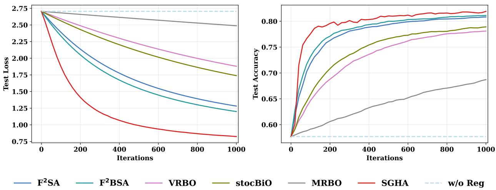
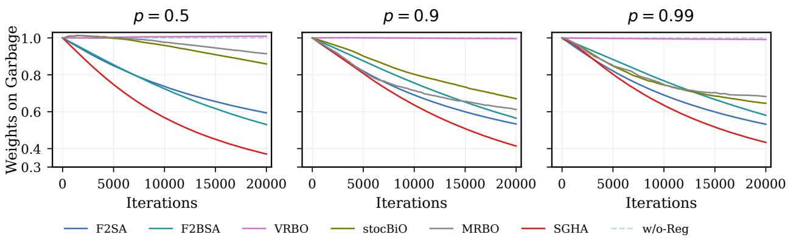

# SGHA: A Single–Loop Fully First-Order Algorithm for Nonconvex–Strongly-Convex Bilevel Optimization

Zhihao Gu1\* Qilong Wu2\* Junchi Yang2†

1Department of Industrial and Manufacturing Engineering The Pennsylvania State University 2School of Data Science The Chinese University of Hong Kong, Shenzhen

zbg5155@psu.edu qilongwu@link.cuhk.edu.cn yangjunchi@cuhk.edu.cn

August 25, 2026

## Abstract

In this work, we study the oracle complexity of finding an ϵ-stationary point for nonconvex– strongly-convex (NC–SC) bilevel optimization using only first-order oracles. Existing methods achieving the best-known complexity guarantees typically rely on double-loop, penalty-based procedures. We propose a novel single-loop algorithm based on a constrained reformulation in which lower-level stationarity is imposed as a constraint. Specifically, we construct a regularized Lagrangian by introducing a quadratic regularizer and restricting the dual variable to a bounded domain, and then apply Smoothed Gradient Descent Ascent [Zhang et al., 2020], with Hessian-vector products approximated via finite diferences of gradients. We refer to the resulting deterministic and stochastic algorithms as SGHA and Stoc–SGHA, respectively. In the deterministic setting, SGHA achieves an oracle complexity of $\mathcal { O } ( \bar { \kappa } _ { y } ^ { 5 } \epsilon ^ { - 2 } )$ , where $\bar { \kappa } _ { y }$ denotes the relevant condition number. In the stochastic setting, Stoc–SGHA achieves an oracle complexity of $\mathcal { O } \left( \bar { \kappa } _ { y } ^ { 1 7 } \epsilon ^ { - 6 } \rho ^ { - 3 } \right)$ with probability at least $1 - \rho$ for any $\rho \in ( 0 , 1 )$ , and an oracle complexity of $\mathcal { O } \left( \bar { \kappa } _ { y } ^ { 1 \dagger } \epsilon ^ { - 6 } \right)$ in expectation under an additional bounded-iterate assumption. Moreover, under an additional stochastic smoothness assumption imposed only on the lower-level objective, the stochastic oracle complexity of Stoc–SGHA improves to $\mathcal { O } \left( \bar { \kappa } _ { y } ^ { 1 1 } \epsilon ^ { - 4 } \rho ^ { - 2 } \right)$ with high probability and $\mathcal { O } \left( \bar { \kappa } _ { y } ^ { 1 1 } \epsilon ^ { - 4 } \right)$ in expectation, matching the ϵ-dependence of the lower bounds.

Keywords: Bilevel optimization; fully first-order methods; finite-diference approximation; oracle complexity

## 1 Introduction

Bilevel optimization [Colson et al., 2007] is a fundamental framework for modeling hierarchical decision-making problems with two nested levels. It originates from the two-player general-sum

Stackelberg game [Von Stackelberg, 2010], and reflects the sequential nature of the decision process of two players. Recently, it has found broad applications in machine learning and related areas, including meta-learning [Rajeswaran et al., 2019], hyperparameter optimization [Franceschi et al., 2018, Bao et al., 2021], model selection [Giovannelli et al., 2021, Kunapuli, 2008], adversarial learning [Goodfellow et al., 2020], and reinforcement learning [Hong et al., 2023, Konda and Tsitsiklis, 1999, Zeng et al., 2024]. In its canonical form, bilevel optimization can be written as the following problem:

$$
\operatorname* { m i n } _ { x \in \mathbb { R } ^ { d _ { x } } } F ( x ) = f ( x , y ^ { * } ( x ) ) , \quad \mathrm { s . t . } \quad y ^ { * } ( x ) \in \arg \operatorname* { m i n } _ { y \in \mathbb { R } ^ { d _ { y } } } g ( x , y ) .\tag{P}
$$

The hyper-objective F depends on the upper-level variable x both directly through f and indirectly through the lower-level solution $y ^ { * } ( x )$

We consider the smooth nonconvex–strongly-convex (NC–SC) setting [Ghadimi and Wang, 2018, Hong et al., 2023, Ji et al., 2021], in which the lower-level objective $g ( x , y )$ is strongly convex in $y ,$ while the upper-level objective $f ( x , y )$ may be nonconvex. Under this assumption, the lower-level solution $y ^ { \star } ( x )$ is unique, and the resulting hyperobjective F is well defined and smooth. By the implicit function theorem [Krantz and Parks, 2002], the gradient of the hyperobjective can be characterized as follows:

$$
\begin{array} { r } { \nabla F ( x ) = \nabla _ { x } f ( x , y ^ { * } ( x ) ) - \nabla _ { x y } ^ { 2 } g ( x , y ^ { * } ( x ) ) \left[ \nabla _ { y y } ^ { 2 } g ( x , y ^ { * } ( x ) ) \right] ^ { - 1 } \nabla _ { y } f ( x , y ^ { * } ( x ) ) . } \end{array}\tag{1}
$$

This motivates methods that estimate $\nabla \boldsymbol { y } ^ { * } ( \boldsymbol { x } )$ and substitute it into the gradient expression [Gould et al., 2016, Domke, 2012, Ghadimi and Wang, 2018, Dagréou et al., 2022]. However, they typically rely on the Hessian of $g .$

To avoid costly Hessian–vector products (HVPs), fully first-order methods have recently received increasing attention in bilevel optimization [Kwon et al., 2023b, Liu et al., 2022]. A prominent line of work adopts the penalty formulation

$$
F _ { \lambda } ( x , y ) = f ( x , y ) + \lambda { \big [ } g ( x , y ) - g ^ { \star } ( x ) { \big ] } , \quad { \mathrm { w i t h ~ } } g ^ { \star } ( x ) = \operatorname* { m i n } _ { y } g ( x , y ) = g { \big ( } x , y ^ { \star } ( x ) { \big ) } ,
$$

where $\lambda > 0$ is the penalty parameter and $g ( x , y ) - g ^ { \star } ( x )$ measures lower-level suboptimality. Chen et al. [2025b] and Chen et al. [2025a] analyze this penalty-based approach with the choice $\lambda = \Theta ( \epsilon ^ { - 1 } )$ In particular, $\mathrm { F ^ { 2 } B A }$ and $\mathrm { F ^ { 2 } B A ^ { + } }$ achieve a nearly optimal fully first-order oracle complexity of $\widetilde { \mathcal { O } } ( \epsilon ^ { - 2 } )$ in the deterministic NC–SC setting, while $\mathrm { F ^ { 2 } B S A }$ and $\mathrm { F ^ { 3 } B S A }$ attain the best-known complexity of $\widetilde { \mathcal { O } } ( \epsilon ^ { - 6 } )$ in the stochastic NC–SC setting.

However, these complexity guarantees rely crucially on double-loop procedures. Specifically, the algorithms introduce two auxiliary variables, z and $y ,$ and solve the corresponding inner subproblems to prescribed accuracies in order to approximate $g ^ { \star } ( x )$ and arg miny $F _ { \lambda } ( x , y )$ . A key observation in Chen et al. [2025b] is that, when the inner iterates remain suficiently close to their exact minimizers, the outer update in x can use a relatively large stepsize because the value function $\begin{array} { r } { F _ { \lambda } ^ { \star } ( x ) : = \operatorname* { m i n } _ { y } F _ { \lambda } ( x , y ) } \end{array}$ has a smoothness constant of order $\Theta ( 1 )$ , independent of the large penalty parameter λ. In contrast, if the inner loops are removed directly, the tracking errors in y and z evolve simultaneously with the upper-level variable x, while the large penalty parameter deteriorates the conditioning of the penalized problem. As a result, algorithms and analyses that cannot exploit the λ-independent smoothness of $F _ { \lambda } ^ { \star }$ typically yield worse complexity guarantees [Liu et al., 2022, Shen and Chen, 2023, Kwon et al., 2023b]. Therefore, a direct single-loop implementation of the penalty-based approach does not retain the best-known dependence on ϵ.

Can a single-loop, fully first-order algorithm match the best ϵ-dependence achieved by double-loop penalty methods?

We answer this question by proposing a novel single-loop algorithm, SGHA (Smoothed GDA with Hessian Approximation), together with its stochastic counterpart, Stoc-SGHA. Our approach builds on the Smoothed Gradient Descent Ascent (GDA) framework [Zhang et al., 2020] and adapts it to NC–SC bilevel optimization through a regularized Lagrangian reformulation, combining a first-order approximation for Hessian–vector products.

The starting point of our approach is to reformulate Problem (P) as an equality-constrained problem. Since the lower-level objective $g ( x , \cdot )$ is strongly convex, the lower-level solution is uniquely characterized by the first-order optimality condition $\nabla _ { y } g ( x , y ^ { * } ( x ) ) = 0$ . Therefore, Problem (P) can be equivalently written as

$$
\operatorname* { m i n } _ { \substack { \boldsymbol { x } \in \mathbb { R } ^ { d _ { \boldsymbol { x } } } , \boldsymbol { y } \in \mathbb { R } ^ { d _ { \boldsymbol { y } } } } } f ( \boldsymbol { x } , \boldsymbol { y } ) , \quad \mathrm { s . t . } \quad \nabla _ { \boldsymbol { y } } g ( \boldsymbol { x } , \boldsymbol { y } ) = 0 .\tag{R}
$$

We then introduce the associated Lagrangian function

$$
\begin{array} { r } { \mathcal { L } ( x , y , \lambda ) : = f ( x , y ) + { \lambda } ^ { \top } \nabla _ { y } g ( x , y ) , } \end{array}\tag{L}
$$

where $\lambda \in \mathbb { R } ^ { d _ { y } }$ is the multiplier.

The Lagrangian (L) is generally nonconvex in the primal variables $( x , y )$ and afine in the dual multiplier λ. Although the equality-constrained problem can be formally expressed as $\begin{array} { r } { \operatorname* { m i n } _ { x , y } \operatorname* { m a x } _ { \lambda } \mathcal { L } ( x , y , \lambda ) } \end{array}$ , the inner maximization is unbounded whenever $\nabla _ { y } g ( x , y ) \neq 0$ , since λ is unconstrained. Consequently, the resulting formulation is not a finite-valued smooth minimax problem, and many standard minimax algorithm analyses cannot be applied directly. Moreover, our goal is to exploit the particular structure of this Lagrangian to obtain sharper complexity guarantees.

To this end, we apply Smoothed GDA with three key modifications. First, we restrict the multiplier λ to a suficiently large bounded domain. Second, we introduce a small concave quadratic regularizer in λ, which renders the inner maximization strongly concave with well-controlled conditioning. Third, because the primal gradients of $\mathcal { L }$ involve Hessian–vector products of $g ,$ , we approximate these terms using finite diferences of first-order gradients. These modifications yield a well-conditioned minimax surrogate amenable to Smoothed GDA analysis while preserving the fully first-order nature of SGHA.

Our main complexity results are summarized in Table 1. Here, $\kappa _ { y }$ and $\bar { \kappa } _ { y }$ denote the condition numbers defined in Definition 1. In the deterministic setting, Theorem 4 shows that SGHA (Algorithm 1) finds an ϵ-stationary point of the NC–SC bilevel problem with oracle complexity $\mathcal { O } ( \bar { \kappa } _ { y } ^ { 5 } \epsilon ^ { - 2 } )$ . In the stochastic setting, Theorems 8 and 9 show that Stoc-SGHA (Algorithm 2) achieves oracle complexity $\mathcal { O } \left( \bar { \kappa } _ { y } ^ { 1 7 } \epsilon ^ { - 6 } \rho ^ { - 3 } \right)$ with probability at least $1 - \rho$ for any $\rho \in ( 0 , 1 )$ , and $\mathcal { O } \left( \bar { \kappa } _ { y } ^ { 1 7 } \epsilon ^ { - 6 } \right)$ in expectation under an additional bounded-iterate assumption. These bounds remove the logarithmic factors appearing in the best-known complexities of Chen et al. [2025b]. Moreover, when the lower-level objective $g$ satisfies the stochastic smoothness condition in Assumption 3, Theorems 10 and 11 improve these bounds to $\mathcal { O } \left( \bar { \kappa } _ { y } ^ { 1 1 } \epsilon ^ { - 4 } \rho ^ { - 2 } \right)$ with probability at least $1 - \rho ,$ and $\mathcal { O } \left( \bar { \kappa } _ { y } ^ { 1 1 } \epsilon ^ { - 4 } \right)$ in expectation. They match the lower bound in [Arjevani et al., 2023] in the dependence on ϵ.

Table 1: Oracle complexity for finding an ϵ-stationary point in deterministic and stochastic NC–SC bilevel optimization. Shaded cells denote our methods.
<table><tr><td>Problem Class</td><td>Algorithm</td><td>Oracle</td><td># Loops</td><td>Oracle Complexity</td></tr><tr><td rowspan="7">Det. NC–SC BiO</td><td>F2SA [Kwon et al., 2023b]</td><td>FO</td><td>single-loop</td><td> $\tilde { \mathcal { O } } ( \bar { \kappa } _ { y } ^ { 7 } \epsilon ^ { - 3 } )$ </td></tr><tr><td>MEHA [Liu et al., 2024]</td><td>FO</td><td>single-loop</td><td> $\mathcal { O } ( \mathrm { p o l y } ( \bar { \kappa } _ { y } ) \epsilon ^ { - 4 } )$ </td></tr><tr><td>V-PBGD [Shen and Chen, 2023]</td><td>FO</td><td>double-loop</td><td> $\mathcal { O } ( \mathrm { p o l y } ( \bar { \kappa } _ { y } ) \epsilon ^ { - 3 } )$ </td></tr><tr><td> $\mathrm { F ^ { 2 } B A }$  [Chen et al., 2025b]</td><td>FO</td><td>double-loop</td><td> $\mathcal { \tilde { O } } ( \bar { \kappa } _ { u } ^ { 4 } \epsilon ^ { - 2 } )$ </td></tr><tr><td> $\mathrm { F ^ { 2 } B A ^ { + } }$  [Chen et al., 2025a]</td><td>FO</td><td>double-loop</td><td> $\tilde { \mathcal { O } } ( \bar { \kappa } _ { y } ^ { 3 . 5 } \epsilon ^ { - 2 } )$ </td></tr><tr><td>SGHA (Theorem 4)</td><td>FO</td><td>single-loop</td><td> $\mathcal { O } ( \bar { \kappa } _ { y } ^ { 5 } \epsilon ^ { - 2 } )$ </td></tr><tr><td>Lower Bound [Chen et al., 2025a]</td><td>FO</td><td></td><td> $\Omega ( \kappa _ { y } ^ { 2 . 5 } \epsilon ^ { - 2 } )$ </td></tr><tr><td rowspan="6">Stoc. NC–SC BiO</td><td>F2SA [Kwon et al., 2023b]</td><td>SFO</td><td>double-loop</td><td> $\tilde { \mathcal { O } } ( \mathrm { p o l y } ( \bar { \kappa } _ { y } ) \epsilon ^ { - 7 } )$ </td></tr><tr><td>F2BSA [Chen et al., 2025b]</td><td>SFO</td><td>double-loop</td><td> $\mathcal { \widetilde { O } } ( \bar { \kappa } _ { u } ^ { 1 2 } \epsilon ^ { - 6 } )$ </td></tr><tr><td>F3BSA [Chen et al., 2025b]</td><td>SFO</td><td>double-loop</td><td> $\tilde { \mathcal { O } } ( \bar { \kappa } _ { y } ^ { 1 1 } \epsilon ^ { - 6 } )$ </td></tr><tr><td>Stoc-SGHA (Theorem 8/Theorem 9)</td><td>SFO</td><td>single-loop</td><td> $\mathcal { O } \left( \bar { \kappa } _ { y } ^ { 1 7 } \epsilon ^ { - 6 } \rho ^ { - 3 } \right) / \mathcal { O } \left( \bar { \kappa } _ { y } ^ { 1 7 } \epsilon ^ { - 6 } \right)$ </td></tr><tr><td>Stoc-SGHA (Theorem 10/Theorem 11)</td><td>SFO + Assumption 3</td><td>single-loop</td><td> $\mathcal { O } \left( \bar { \kappa } _ { y } ^ { 1 1 } \epsilon ^ { - 4 } \rho ^ { - 2 } \right) / \mathcal { O } \left( \bar { \kappa } _ { y } ^ { 1 1 } \epsilon ^ { - 4 } \right)$ </td></tr><tr><td>Lower Bound [Chen et al., 2025a]</td><td> $\mathcal { F O } \mathrm { ~ f o r ~ } f + \mathcal { S F O } \mathrm { ~ f o r ~ } g$ </td><td></td><td> $\Omega ( \kappa _ { y } ^ { 4 . 5 } \epsilon ^ { - 4 } )$ </td></tr></table>

Table Notes. Det. and Stoc. stand for “deterministic" and “stochastic", respectively. NC–SC BiO stands for nonconvex–strongly-convex bilevel optimization. FO denotes an exact first-order oracle. SFO denotes a stochastic first-order oracle. The analysis of $\mathrm { F ^ { 2 } S A }$ covers both single-loop and nested-loop variants with the same complexity rate. The $\Omega ( \kappa _ { y } ^ { 4 . 5 } \epsilon ^ { - 4 } )$ lower bound is proved for zero-respecting $\boldsymbol { s } \boldsymbol { \mathcal { F } } \boldsymbol { \mathcal { O } }$ algorithms on a bounded constrained nonconvex–quadratic problem. The displayed condition-number rates treat the initial Lyapunov gap ∆V and the remaining problem-dependent variance and bounded-gradient constants as fixed; the theorem statements retain their explicit dependence on these quantities.

## 2 Related Work

We organize the related work around two themes: bilevel optimization and minimax optimization. For bilevel optimization, we review the best-known deterministic and stochastic first-order oracle complexities for NC–SC problems. We then discuss minimax optimization, motivated by the nonconvex–concave (linear) Lagrangian formulation (L).

Bilevel Optimization with Hessian The implicit-diferentiation formula in (1) shows that computing the hypergradient requires estimating the sensitivity $\nabla \boldsymbol { y } ^ { * } ( \boldsymbol { x } )$ , or equivalently applying the inverse lower-level Hessian to $\nabla _ { y } f .$ One line of work uses Iterative Diferentiation (ITD) [Gould et al., 2016, Franceschi et al., 2017, Shaban et al., 2019, Bolte et al., 2021], which approximates $y ^ { * } ( x )$ by a finite lower-level trajectory and diferentiates through its iterations. Another line, known as Approximate Implicit Diferentiation (AID) [Domke, 2012, Ghadimi and Wang, 2018, Pedregosa, 2016, Franceschi et al., 2018, Grazzi et al., 2020, Ji et al., 2021, Dagréou et al., 2022, Arbel and Mairal, 2021], approximates the inverse-Hessian action by solving the associated linear system.

These ideas also underlie several single-loop stochastic NC–SC bilevel algorithms. TTSA [Hong et al., 2023], SUSTAIN [Khanduri et al., 2021], and STABLE [Chen et al., 2022] construct implicit-diferentiation-based hypergradient estimators using Hessian-vector products, Jacobianvector products, or related second-order information. SOBA/SABA [Dagréou et al., 2022] and MA-SOBA [Chen et al., 2024] avoid explicit Hessian inversion by recursively tracking the solution of the linear system, but still require second-order oracle information and an auxiliary linear-system variable. Consequently, these methods fall outside the fully first-order oracle model considered in this paper.

Fully First-order Bilevel Optimization. Methods based on the hypergradient typically require Hessian information, which has motivated the development of fully first-order approaches [Liu et al., 2022, Shen and Chen, 2023, Kwon et al., 2023b]. Most of these methods are double-loop and penalty-based: they incorporate lower-level optimality into a penalized upper-level objective whose gradients can be evaluated using only first-order information. In particular, Kwon et al. [2023b] proposed $\mathrm { F ^ { 2 } S A }$ , which achieves a deterministic oracle complexity of $\mathcal { \tilde { O } } ( \bar { \kappa } _ { y } ^ { 7 } \epsilon ^ { - 3 } )$ and a stochastic oracle complexity of $\widetilde { \mathcal { O } } ( \mathrm { p o l y } ( \bar { \kappa } _ { y } ) \epsilon ^ { - 7 } )$ for NC–SC bilevel optimization using an increasing penalty parameter. By instead fixing the penalty parameter at $\lambda = \Theta ( \epsilon ^ { - 1 } )$ , Chen et al. [2025a] improved the deterministic complexity to $\mathcal { O } ( \bar { \kappa } _ { y } ^ { 3 . 5 } \epsilon ^ { - 2 } )$ , while the stochastic complexity was improved to $\widetilde { \mathcal { O } } ( \mathrm { p o l y } ( \bar { \kappa } _ { y } ) \epsilon ^ { - 6 } )$ [Kwon et al., 2024, Chen et al., 2025b]. Without additional assumptions, no known fully first-order method improves these dependencies on ϵ.

On the lower-bound side, Chen et al. [2025a] establish $\Omega ( \kappa _ { y } ^ { 2 . 5 } \epsilon ^ { - 2 } )$ in the deterministic setting and $\Omega ( \kappa _ { y } ^ { 4 . 5 } \epsilon ^ { - 4 } )$ in the stochastic setting for fully first-order methods. These results show that the deterministic complexity of $\mathrm { F ^ { 2 } B A / F ^ { 2 } B A ^ { + } }$ is nearly optimal in its dependence on ϵ. In contrast, the best-known stochastic upper bound still exhibits an extra factor of $\epsilon ^ { - 2 }$ relative to the $\Omega ( \epsilon ^ { - 4 } )$ lower bounds. We note that Kwon et al. [2024] also establish an $\Omega ( \epsilon ^ { - 4 } )$ lower bound under the stochastic smoothness assumption on the lower-level objective, using a y⋆-aware oracle, which additionally returns an estimate yˆ satisfying a prescribed accuracy guarantee relative to the exact lower-level solution $y ^ { \star } ( x )$

Most of the methods discussed above are double-loop. While the analysis of Kwon et al. [2023b] permits a single-loop variant by setting the inner-loop length to one, it has strictly worse complexity guarantees. The best-known bounds of Chen et al. [2025b], by contrast, rely essentially on inner-loop updates, as discussed in Section 1. A closely related single-loop method is FdeHBO [Yang et al., 2023], which avoids iteratively solving linear-systems and uses finite-diference approximations for Hessian–vector products. However, its guarantees require variance reduction and stronger assumptions, including stochastic smoothness in the upper-level function, stochastic Hessian, and higher-order smoothness. Other methods, such as $\mathrm { F ^ { 3 } S A }$ [Kwon et al., 2023b], also operate under similar stronger assumptions. We therefore omit these methods from Table 1.

Minimax optimization. Minimax optimization problems take the form

$$
\operatorname* { m i n } _ { \omega \in \mathcal { W } } \operatorname* { m a x } _ { \lambda \in \Lambda } f ( \omega , \lambda ) ,
$$

where $\mathcal { W } \subseteq \mathbb { R } ^ { d _ { \omega } }$ and $\Lambda \subseteq \mathbb { R } ^ { d _ { \lambda } }$ are nonempty closed convex sets. Motivated by the structure of (L), we focus on the nonconvex–concave (NC–C) setting, where $f : \mathbb { R } ^ { d _ { \omega } } \times \mathbb { R } ^ { d _ { \lambda } }  \mathbb { R }$ is nonconvex in ω and concave in λ.

There is a vast literature on nonconvex–concave (NC–C) minimax optimization [Rafique et al., 2022, Nouiehed et al., 2019, Kong and Monteiro, 2021, Boţ and Böhm, 2023]. In the deterministic setting, the best-known gradient complexity is $\mathcal { \widetilde { O } } ( \epsilon ^ { - 2 . 5 } )$ under the f-stationarity measure [Lin et al., 2020], and $\widetilde { \mathcal { O } } ( \epsilon ^ { - 3 } )$ under stationarity of the Moreau envelope of the value function [Yang et al., 2020]. In the stochastic setting, SAPD+ achieves the best-known stochastic oracle complexity of $\mathcal { O } ( \epsilon ^ { - 6 } )$ [Zhang et al., 2022]. However, most of these results assume a compact dual domain $\Lambda .$ , and thus do not apply directly to our original unbounded Lagrangian formulation. Moreover, by exploiting the special structure of the bilevel problem, our method achieves sharper complexity guarantees than those available for generic NC–C minimax optimization.

In contrast, existing single-loop algorithms generally have worse complexity than the best-known rates discussed above [Lin et al., 2025, Xu et al., 2023, Boţ and Böhm, 2023]. Our algorithm builds on Smoothed GDA [Zhang et al., 2020, Yang et al., 2022], which introduces a Moreau-envelope-type smoothing mechanism via an auxiliary primal sequence. In the deterministic setting, Zhang et al. [2020] establish a complexity of $\mathcal { O } ( \epsilon ^ { - 4 } )$ for general NC-C minimax problems, which improves to $\mathcal { O } ( \epsilon ^ { - 2 } )$ when the objective is linear in λ and additional regularity conditions hold, including strict complementarity and bounded level sets of $\operatorname* { m a x } _ { \lambda \in \Lambda } f ( \cdot , \lambda )$ . Their analysis does not directly apply to our setting, as we seek an $\mathcal { O } ( \epsilon ^ { - 2 } )$ complexity without these additional assumptions. In both deterministic and stochastic settings, Yang et al. [2022] obtain complexities of $\mathcal { O } ( \kappa \epsilon ^ { - 2 } )$ and $\mathcal { O } ( \kappa ^ { 2 } \epsilon ^ { - 4 } )$ respectively, under a Polyak–Łojasiewicz condition, where κ denotes the condition number. These results do not directly apply to our setting: imposing strong concavity via a quadratic regularizer of order $\Theta ( \epsilon \| \lambda \| ^ { 2 } )$ will lead to a worse ϵ-dependence than ours. Moreover, the gradients of (L) requires HVPs, which must be approximated in our first-order framework.

## 3 Preliminaries and Technical Background

Notations. For a vector v and a matrix A, we use $\lVert v \rVert$ and $\| A \|$ to denote the Euclidean norm of v and the spectral norm of A, respectively. For a closed convex set C, we denote by $\mathcal { P } _ { \mathcal { C } }$ its Euclidean projection. For a diferentiable function h, we write ∇h for its gradient, and use $\nabla _ { x } h$ and $\nabla _ { y } h$ to denote the partial gradients with respect to x and y. Similarly, $\nabla _ { x y } ^ { 2 } h$ and $\nabla _ { y y } ^ { 2 } h$ denote the corresponding Hessian blocks. Throughout the paper, E[·] denotes expectation with respect to all randomness in the stochastic oracle and the algorithm, and $\mathbb { E } _ { k } [ \cdot ]$ denotes conditional expectation given the history up to iteration k. $a \asymp b$ means that $a / b$ is bounded above and below by positive constants. The notation $\mathcal { O } ( \cdot ) , \Omega ( \cdot )$ , and $\Theta ( \cdot )$ hides absolute constants independent of the target accuracy, condition number, and failure probability, while $\tilde { \mathcal { O } } ( \cdot ) , \tilde { \Omega } ( \cdot )$ , and $\tilde { \Theta } ( \cdot )$ additionally hide logarithmic factors.

## 3.1 Basic Assumptions and Definitions

We consider the nonconvex–strongly–convex (NC–SC) bilevel optimization problem

$$
\operatorname* { m i n } _ { x \in \mathbb { R } ^ { d _ { x } } } F ( x ) = f ( x , y ^ { * } ( x ) ) , \quad \mathrm { s . t . } \quad y ^ { * } ( x ) \in \arg \operatorname* { m i n } _ { y \in \mathbb { R } ^ { d _ { y } } } g ( x , y ) .\tag{P}
$$

We first state the basic assumptions used throughout the paper. These assumptions are standard in the literature and, to the best of our knowledge, are among the weakest commonly imposed for smooth NC–SC bilevel optimization [Chen et al., $2 0 2 5 \mathrm { a } , \mathrm { b }$ , Kwon et al., 2023a,b].

Assumption 1. We have the following assumptions:

1. $\| \nabla _ { y } f ( x , y ) \| \leq l _ { f , 0 }$ for all x and y.

2. $g ( x , y )$ is $\mu _ { g }$ -strongly convex w.r.t. y for every x.

3. f and g are $l _ { f , 1 }$ and $l _ { g , 1 } - s m o o t h .$ , respectively.

4. The Hessians of f and g are $l _ { f , 2 ^ { - } }$ and $l _ { g , 2 } - L i p s c h i t z ,$ respectively.

5. For all x and $y , f ( x , y )$ is bounded from below by some finite constant $\underline { { f } } > - \infty$

Next, we introduce the condition-number notation and the stationarity measure used throughout the paper.

Definition 1. Under Assumption 1, we define the lower-level condition number $\kappa _ { y } : = l _ { g , 1 } / \mu _ { g }$ , and the global condition number $\bar { \kappa } _ { y } : = \bar { L } / \mu _ { g }$ with $\bar { L } : = \operatorname* { m a x } \{ l _ { f , 0 } , l _ { f , 1 } , l _ { g , 1 } , l _ { f , 2 } , l _ { g , 2 } \}$

Since $l _ { g , 1 } \geq \mu _ { g }$ , these definitions imply $\bar { \kappa } _ { y } \geq \kappa _ { y } \geq 1$

Definition 2. Given a diferentiable function $\varphi ( \boldsymbol { x } ) : \mathbb { R } ^ { d }  \mathbb { R }$ , we call x an ϵ–first–order stationary point $o f \varphi ( x ) \ i f \ \| \nabla \varphi ( x ) \| \leq \epsilon$

## 3.2 Equality–constrained Reformulation

Since $g ( x , \cdot )$ is diferentiable and strongly convex for every fixed x, the lower-level minimizer $y ^ { * } ( x )$ is unique. Moreover, the first-order optimality condition is both necessary and suficient, and hence

$$
\nabla _ { y } g ( x , y ^ { \star } ( x ) ) = 0 .
$$

Therefore, the graph of the lower-level solution map $x \mapsto y ^ { \star } ( x )$ is exactly the feasible set described by the equality constraint $\nabla _ { y } g ( x , y ^ { \star } ( x ) ) = 0$ . Equivalently, any feasible pair $( x , y )$ of this reformulated problem satisfies $y = y ^ { \star } ( x )$ , and hence $f ( x , y ) = F ( x )$ . Thus, it preserves the objective values and minimizers of the original bilevel formulation. Consequently, the NC–SC bilevel problem can be equivalently written as

$$
\operatorname* { m i n } _ { \substack { x \in \mathbb { R } ^ { d _ { x } } , y \in \mathbb { R } ^ { d _ { y } } } } f ( x , y ) , \qquad \mathrm { s . t . } \quad \nabla _ { y } g ( x , y ) = 0 .\tag{R}
$$

The Lagrangian associated with this equality-constrained bilevel problem is

$$
\mathcal { L } ( x , y , \lambda ) : = f ( x , y ) + \lambda ^ { \top } \nabla _ { y } g ( x , y ) , \qquad \lambda \in \mathbb { R } ^ { d _ { y } } .\tag{L}
$$

The next lemma shows that the equality constraint in the equality-constrained bilevel problem is regular. In other words, lower-level strong convexity implies the LICQ condition for $\nabla _ { y } g ( x , y ) = 0$ This regularity ensures that local solutions of the (R) admit KKT multipliers, and hence justifies the Lagrangian stationarity system introduced below.

Lemma 1 (LICQ for the lower-level optimality constraint). Suppose $g ( x , \cdot )$ is $\mu _ { g }$ -strongly convex for every x. Then, the Jacobian of the constraint mapping $\nabla _ { y } g ( x , y )$ has full row rank at every $( x , y )$ . In particular, LICQ holds at every feasible point of the equality-constrained reformulation.

We note that several works also impose the lower-level first-order optimality condition as a constraint, either designing algorithms based on the KKT system of the resulting constrained problem [Liu et al., 2023] or applying penalty methods [Kim et al., 2020, Mehra and Hamm, 2021]. Our approach difers in that we construct a regularized Lagrangian reformulation and develop a specific single-loop, fully first-order method for finding an approximate stationary point of $\mathcal { L }$

## 3.3 From Lagrangian Stationarity to Bilevel Stationarity

The following theorem shows that the equality-constrained reformulation allows us to reduce the analysis of stationarity for the hyperobjective F to that of the Lagrangian L.

Theorem 2. Suppose Assumption 1 holds. Then

$$
\| \nabla F ( x ) \| \le \| \nabla _ { x } \mathcal { L } ( x , y , \lambda ) \| + \kappa _ { y } \| \nabla _ { y } \mathcal { L } ( x , y , \lambda ) \| + \frac { L _ { { \bar { F } } , y } } { \mu _ { g } } \| \nabla _ { \lambda } \mathcal { L } ( x , y , \lambda ) \| .
$$

with

$$
L _ { \bar { F } , y } = l _ { f , 1 } ( 1 + \kappa _ { y } ) + l _ { f , 0 } l _ { g , 2 } \left( \frac { 1 } { \mu _ { g } } + \frac { l _ { g , 1 } } { \mu _ { g } ^ { 2 } } \right) .
$$

The following theorem shows that for any pairs of $( x ^ { * } , y ^ { * } , \lambda ^ { * } )$ satisfying the KKT conditions of the equality-constrained bilevel problem, $\lambda ^ { * }$ is always bounded by a constant determined by the problem itself. This provides one motivation for studying stationarity of the Lagrangian associated with the lower-level first-order optimality constraint, rather than penalizing the lower-level value gap as in [Kwon et al., 2023b].

Theorem 3 (Boundedness of $\lambda ^ { * } )$ . Under Assumption 1, the optimal Lagrangian multiplier $\lambda ^ { * }$ satisfying the KKT conditions is bounded with

$$
\| \lambda ^ { * } \| \leq \frac { l _ { f , 0 } } { \mu _ { g } } .
$$

## 4 Deterministic NC–SC Bilevel Optimization

In this section, we aim to solve deterministic nonconvex-strongly-convex (NC–SC) bilevel optimization problems. We first introduce SGHA and establish its main complexity guarantees, and then present the key analytical tools together with a proof sketch. The algorithm-specific notation used in the analysis of SGHA is summarized in Table 2.

## 4.1 Algorithm

We first note that $\mathcal { L }$ is generally nonconvex in the primal variables x and $y ,$ and afine in the multiplier λ. Because the maximization over an unconstrained multiplier is unbounded whenever the constraint is violated, (L) does not define a standard finite-valued minimax problem. Instead, we use it as a Lagrangian stationarity model for the equality-constrained reformulation.

However, Theorem 3 shows that every KKT multiplier of Problem (R) is bounded by a problemdependent constant. Therefore, we restrict the dual variable to $\Lambda = \{ \lambda : \| \lambda \| \leq C _ { \lambda } \}$ , where $C _ { \lambda }$ is chosen suficiently large to contain all KKT multipliers of Problem (R). This bounded domain provides uniform smoothness control of $\mathcal { L }$ along the algorithmic trajectory. We further add a small quadratic regularization term to λ with a suficiently small regularization parameter $p _ { \lambda } > 0$ . This term turns the projected afine dual maximization into a strongly concave one, avoiding boundarysaturating or nonunique multiplier responses, while only introducing a controllable perturbation to the original Lagrangian stationarity. This leads to the regularized surrogate

$$
\operatorname* { m i n } _ { \substack { x \in \mathbb { R } ^ { d _ { x } } , y \in \mathbb { R } ^ { d _ { y } } } } \operatorname* { m a x } _ { \lambda \in \Lambda } \ f ( x , y ) + \lambda ^ { \top } \nabla _ { y } g ( x , y ) - \frac { p _ { \lambda } } { 2 } \| \lambda \| ^ { 2 } .\tag{2}
$$

We then apply Smoothed Gradient Descent Ascent (GDA) [Zhang et al., 2020]. Specifically, we introduce auxiliary smoothing variables xˆ and ${ \hat { y } } .$ , together with quadratic proximal terms on the primal variables using a regularization parameter $p _ { w } > 0$ . With an appropriate choice of $p _ { w }$ , the

resulting surrogate is strongly convex in $w = ( x , y )$ and strongly concave in λ. We then perform gradient descent on the primal variables $w ,$ , and projected gradient ascent on the dual variable λ, for the problem

$$
\operatorname* { m i n } _ { \substack { x \in \mathbb { R } ^ { d _ { x } } , y \in \mathbb { R } ^ { d _ { y } } } } \operatorname* { m a x } _ { \lambda \in \Lambda } \ f ( x , y ) + \lambda ^ { \top } \nabla _ { y } g ( x , y ) + \frac { p _ { w } } { 2 } \| x - \hat { x } \| ^ { 2 } + \frac { p _ { w } } { 2 } \| y - \hat { y } \| ^ { 2 } - \frac { p _ { \lambda } } { 2 } \| \lambda \| ^ { 2 } .\tag{3}
$$

Furthermore, we note that the gradients induced by (3) involve Hessian-vector product terms associated with $^ { g , }$ namely $\nabla _ { x y } ^ { 2 } g ( x , y ) \lambda$ and $\nabla _ { y y } ^ { 2 } g ( x , y ) \lambda$ . To retain a fully first-order method, we approximate these Hessian-vector products by central finite diferences. Specifically, we use

$$
\tilde { \nabla } _ { x y } ^ { 2 } g _ { \lambda } ( x , y ) : = \frac { \nabla _ { x } g ( x , y + \tau \lambda ) - \nabla _ { x } g ( x , y - \tau \lambda ) } { 2 \tau } \approx \nabla _ { x y } ^ { 2 } g ( x , y ) \lambda ,
$$

and

$$
\tilde { \nabla } _ { y y } ^ { 2 } g _ { \lambda } ( x , y ) : = \frac { \nabla _ { y } g ( x , y + \tau \lambda ) - \nabla _ { y } g ( x , y - \tau \lambda ) } { 2 \tau } \approx \nabla _ { y y } ^ { 2 } g ( x , y ) \lambda ,
$$

where $\tau > 0$ is the finite-diference radius, whose value will be specified later.

The complete procedure is summarized in Algorithm 1, which we call SGHA (Smoothed GDA with Hessian Approximation). In the convergence analysis, we use a common stepsize for the primal updates, namely $\gamma _ { x , k } = \gamma _ { y , k } = : \gamma _ { w , k }$ , while the dual stepsize $\gamma _ { \lambda , k }$ is chosen separately and may scale diferently. After each primal–dual update, the auxiliary variables xˆ and $\hat { y }$ are updated by an averaging step with parameter $\beta \in ( 0 , 1 )$ .

Algorithm 1 SGHA (Smoothed GDA with Hessian Approximation)   
Input: Total iterations K, step sizes $\left\{ \gamma _ { x , k } \right\} _ { k } , \left\{ \gamma _ { y , k } \right\} _ { k } , \left\{ \gamma _ { \lambda , k } \right\} _ { k } ,$ initialization points $x ^ { 0 } , { \hat { x } } ^ { 0 } \in$   
$\mathbb { R } ^ { d _ { x } } , y ^ { 0 } , \hat { y } ^ { 0 } \in \mathbb { R } ^ { d _ { y } } , \lambda ^ { 0 } \in \Lambda . \ \tau > 0 , p _ { w } , p _ { \lambda } > 0 , 0 < \beta < \bar { 1 } , \Lambda : = \{ \lambda : \| \lambda \| \leq C _ { \lambda } \}$ with $C _ { \lambda } > 0$   
1: for $k = 0 , \ldots , K - 1$ do   
2: $\boldsymbol { x } ^ { k + 1 } \gets \boldsymbol { x } ^ { k } - \gamma _ { x , k } \left( \nabla _ { x } f ( \boldsymbol { x } ^ { k } , \boldsymbol { y } ^ { k } ) + \tilde { \nabla } _ { x y } ^ { 2 } g _ { \lambda ^ { k } } ( x ^ { k } , \boldsymbol { y } ^ { k } ) + p _ { w } ( x ^ { k } - \hat { x } ^ { k } ) \right)$   
3: $\boldsymbol { y } ^ { k + 1 } \gets \boldsymbol { y } ^ { k } - \gamma _ { \boldsymbol { y } , k } \left( \nabla _ { \boldsymbol { y } } f ( \boldsymbol { x } ^ { k } , \boldsymbol { y } ^ { k } ) + \tilde { \nabla } _ { \boldsymbol { y } \boldsymbol { y } } ^ { 2 } g _ { \lambda ^ { k } } ( \boldsymbol { x } ^ { k } , \boldsymbol { y } ^ { k } ) + p _ { w } ( \boldsymbol { y } ^ { k } - \boldsymbol { \hat { y } } ^ { k } ) \right)$   
4: $\hat { x } ^ { k + 1 } = \hat { x } ^ { k } + \beta ( x ^ { k + 1 } - \hat { x } ^ { k } )$   
5: $\hat { y } ^ { k + 1 } = \hat { y } ^ { k } + \beta ( y ^ { k + 1 } - \hat { y } ^ { k } )$   
6: $\lambda ^ { k + 1 } = { \mathcal { P } } _ { \Lambda } \left( \lambda ^ { k } + \gamma _ { \lambda , k } \left( \nabla _ { y } g ( x ^ { k } , y ^ { k } ) - p _ { \lambda } \lambda ^ { k } \right) \right)$   
7: end for

## 4.2 Complexity Guarantees

We are now ready to state the oracle complexity of Algorithm 1 for solving deterministic nonconvexstrongly-convex bilevel optimization problems.

Theorem 4. Suppose that Assumption 1 holds. Fix any target accuracy $0 < \epsilon \leq 1$ . Let $\Lambda : =$ $\{ \lambda : \| \lambda \| \leq C _ { \lambda } \}$ with $C _ { \lambda } : = 2 \bar { \kappa } _ { y }$ . Choose $p _ { w } = 1 6 \bar { L } \bar { \kappa } _ { y }$ and $\begin{array} { r } { p _ { \lambda } = \frac { 1 } { 8 } \operatorname* { m i n } \left\{ \mu _ { g } , \frac { \epsilon } { 2 ^ { 1 1 } ( 1 + \bar { L } ) \bar { \kappa } _ { y } ^ { 4 } } \right\} } \end{array}$ . For every $k \geq 0$ , use the constant stepsizes

$$
\gamma _ { x , k } = \gamma _ { y , k } = \frac { 1 } { 2 ^ { 8 } \bar { L } \bar { \kappa } _ { y } } , \quad \gamma _ { \lambda , k } = \frac { \bar { \kappa } _ { y } } { 2 ^ { 8 } \bar { L } } .
$$

Table 2: Notations in algorithms and analysis
<table><tr><td>Notation Definition</td><td></td></tr><tr><td> $w$ </td><td> $( x , y )$ </td></tr><tr><td> $\hat { w }$ </td><td> $( \hat { x } , \hat { y } )$ </td></tr><tr><td> $\mathcal { L } ( w , \lambda )$ </td><td> $f ( w ) + \lambda ^ { \top } \nabla _ { y } g ( w )$ </td></tr><tr><td> $\gamma _ { w }$ </td><td>Common stepsize for the update of x and  $y$ </td></tr><tr><td> $\gamma _ { \lambda }$ </td><td>Stepsize for the update of  $\lambda$ </td></tr><tr><td> $K ( w , \hat { w } , \lambda )$ </td><td> $\begin{array} { r } { \mathcal { L } ( w , \lambda ) + \frac { p _ { w } } { 2 } \| w - \hat { w } \| ^ { 2 } - \frac { p _ { \lambda } } { 2 } \| \lambda \| ^ { 2 } } \end{array}$ </td></tr><tr><td> $\Psi ( \hat { w } , \lambda )$ </td><td> $\begin{array} { r } { \operatorname* { m i n } _ { w } K ( w , \hat { w } , \lambda ) } \end{array}$ </td></tr><tr><td> $\Phi ( w , \hat { w } )$ </td><td> $\mathrm { m a x } _ { \lambda \in \Lambda } K ( w , \hat { w } , \lambda )$ </td></tr><tr><td> $P ( \hat { w } )$ </td><td> $\begin{array} { r } { \operatorname* { m i n } _ { w } \operatorname* { m a x } _ { \lambda \in \Lambda } K ( w , \hat { w } , \lambda ) } \end{array}$ </td></tr><tr><td> $V _ { t }$ </td><td> $K ( w ^ { t } , \hat { w } ^ { t } , \lambda ^ { t } ) - 2 \Psi ( \hat { w } ^ { t } , \lambda ^ { t } ) + 2 P ( \hat { w } ^ { t } )$ </td></tr><tr><td> $w ^ { * } ( \hat { w } , \lambda )$ </td><td> $\begin{array} { r } { \arg \operatorname* { m i n } _ { w } K ( w , \hat { w } , \lambda ) } \end{array}$ </td></tr><tr><td> $w ^ { * } ( \hat { w } )$ </td><td> $\arg \operatorname* { m i n } _ { w } \Phi ( w , \hat { w } )$ </td></tr><tr><td> $\hat { \lambda } ^ { * } ( \hat { w } )$ </td><td> $\arg \operatorname* { m a x } _ { \lambda \in \Lambda } \Psi \big ( \hat { w } , \lambda \big )$ </td></tr><tr><td> $w ^ { + } ( \hat { w } , \lambda )$ </td><td> $\boldsymbol { w } - \gamma _ { w } \nabla K ( \boldsymbol { w } , \hat { w } , \lambda )$ </td></tr><tr><td> $\lambda ^ { + } ( \hat { w } )$ </td><td> $\mathcal { P } _ { \Lambda } \left( \lambda + \gamma _ { \lambda } \left( \nabla _ { y } g ( w ^ { * } ( \hat { w } , \lambda ) \right) - p _ { \lambda } \lambda \right) )$ </td></tr><tr><td> $\epsilon _ { \mathcal { L } }$ </td><td>Target accuracy for L</td></tr><tr><td>€</td><td>Target stationarity accuracy for  $F$ </td></tr></table>

Choose the averaging parameter and finite-diference radius as

$$
\beta = \frac { 1 } { 2 ^ { 3 0 } \bar { \kappa } _ { y } ^ { 2 } } , \qquad \tau = \frac { \epsilon } { 2 ^ { 2 4 } ( 1 + \bar { L } ) \bar { \kappa } _ { y } ^ { 4 } } .
$$

Let $\Delta _ { V } : = V _ { 0 } - f$ , where $V _ { 0 }$ is the initial Lyapunov value defined below, and run Algorithm 1 for

$$
K : = \operatorname* { m a x } \left\{ 1 , \left\lceil \frac { 2 ^ { 5 2 } ( 1 + \bar { L } ) ^ { 2 } \Delta _ { V } } { \bar { L } } \bar { \kappa } _ { y } ^ { 5 } \epsilon ^ { - 2 } \right\rceil \right\} .
$$

Then there exists an index $k _ { \star } \in \{ 0 , \ldots , K - 1 \}$ such that $\left\| \nabla F ( x ^ { k \star } ) \right\| \leq \epsilon$

The resulting dependence on ϵ matches the lower bound $\Omega ( \kappa _ { y } ^ { 2 . 5 } \epsilon ^ { - 2 } )$ established in Chen et al. [2025a]. To the best of our knowledge, SGHA is the first single-loop method for deterministic NC–SC bilevel optimization to achieve the optimal $\epsilon ^ { - 2 }$ dependence. Compared with the best-known double-loop upper bound $\mathcal { \tilde { O } } \left( \bar { \kappa } _ { y } ^ { 3 . 5 } { \epsilon } ^ { - 2 } \right)$ [Chen et al., 2025a], our result also removes the logarithmic factor. We note, however, that the dependence on $\bar { \kappa } _ { y }$ remains worse than that of existing double-loop methods; improving the condition-number dependence of single-loop methods is left for future work.

## 4.3 Analysis and Proof Sketch

We now provide a proof sketch of Theorem 4. The same analysis framework will later be extended to the stochastic settings. We use the notation summarized in Table 2. Following Zhang et al.

[2020], we introduce the following Lyapunov function:

$$
V _ { t } = K ( w ^ { t } , \hat { w } ^ { t } , \lambda ^ { t } ) - 2 \Psi ( \hat { w } ^ { t } , \lambda ^ { t } ) + 2 P ( \hat { w } ^ { t } ) .
$$

The following lemma shows that the Lyapunov function is lower bounded.

Lemma 5. Under Assumption 1, the Lyapunov function satisfies

$$
V _ { t } \geq \underline { { f } }
$$

By analyzing the one-step progress bounds for $K ( w , \hat { w } , \lambda ) , \Psi ( \hat { w } , \lambda )$ and $P ( \hat { w } )$ , we obtain the following one-step descent inequality for the Lyapunov function:

Proposition 6. Suppose that Assumption 1 holds, and let $\Lambda : = \{ \lambda : \| \lambda \| \leq C _ { \lambda } \}$ with $C _ { \lambda } > \frac { l _ { f , 0 } } { \mu _ { g } }$ . Let $l _ { \mathcal { L } , 1 }$ be any constant satisfying $l _ { \mathcal { L } , 1 } \geq \sqrt { 2 } ( l _ { f , 1 } + C _ { \lambda } l _ { g , 2 } )$ and let the primal regularization parameter $p _ { w } = 2 l _ { \mathcal { L } , 1 }$ . Introduce the auxiliary constants

$$
\gamma _ { 1 } : = \frac { p _ { w } } { p _ { w } - l _ { \mathcal { L } , 1 } } = 2 , \quad \gamma _ { 2 } : = \frac { l _ { g , 1 } } { p _ { w } - l _ { \mathcal { L } , 1 } } = \frac { l _ { g , 1 } } { l _ { \mathcal { L } , 1 } } ,
$$

$$
l _ { \Psi , 1 } : = p _ { \lambda } + l _ { g , 1 } \gamma _ { 2 } , \quad \gamma _ { 3 } : = \frac { l _ { \Psi , 1 } + \gamma _ { \lambda , k } ^ { - 1 } } { \sqrt { 2 ( p _ { w } - l _ { \mathcal { L } , 1 } ) p _ { \lambda } + \frac { ( p _ { w } - l _ { \mathcal { L } , 1 } ) ^ { 2 } \mu _ { g } ^ { 2 } } { ( p _ { w } + l _ { \mathcal { L } , 1 } ) ^ { 2 } } } } .
$$

Choose positive stepsizes $\gamma _ { w , k }$ and ${ \gamma } _ { \lambda , k }$ such that

$$
\left. \begin{array} { l } { \gamma _ { w , k } \leq \operatorname* { m i n } \left. \frac { 1 } { 8 p _ { w } \beta } , \frac { 1 } { 8 ( p _ { w } + l _ { \mathcal { L } , 1 } ) } \right. , } \\ { \gamma _ { \lambda , k } \leq \operatorname* { m i n } \left. \frac { 1 } { 2 \left( 2 l _ { \Psi , 1 } + p _ { \lambda } + \frac { l _ { \mathcal { L } , 1 } ^ { 2 } } { p _ { w } + l _ { \mathcal { L } , 1 } } \right) } , \frac { l _ { \mathcal { L } , 1 } ^ { 2 } } { 1 6 l _ { g , 1 } ^ { 2 } } \gamma _ { w , k } , \frac { 1 } { 1 5 3 6 p _ { w } \beta \gamma _ { 2 } ^ { 2 } } , \right. . } \end{array} \right\}
$$

Suppose that parameter $\beta \in ( 0 , 1 )$ satisfies

$$
\beta \leq \operatorname* { m i n } \left\{ \frac { \sqrt { 5 } - 1 } { 4 8 \gamma _ { 1 } } , \frac { 1 } { 3 0 7 2 p _ { w } \gamma _ { \lambda , k } \gamma _ { 3 } ^ { 2 } } \right\} .
$$

Then, we have

$$
\begin{array} { r l } & { { { V } _ { k } } - { { V } _ { k + 1 } } \geq \displaystyle \frac { 1 } { 3 2 \gamma _ { w , k } } \left\| { { w } ^ { k } } - { { w } ^ { + } } ( { \hat { w } } ^ { k } , \lambda ^ { k } ) \right\| ^ { 2 } + \displaystyle \frac { 1 } { 6 4 \gamma _ { \lambda , k } } \left\| { \lambda } ^ { + } ( { \hat { w } } ^ { k } ) - { \lambda } ^ { k } \right\| ^ { 2 } } \\ & { \quad \quad \quad \quad + \displaystyle \frac { { { p } _ { w } } \beta } { 8 } \left\| { { w } ^ { k } } - { { \hat { w } } ^ { k } } \right\| ^ { 2 } - { { C } _ { \tau , k } } { \tau } ^ { 2 } , } \end{array}\tag{4}
$$

where $\begin{array} { r } { C _ { \tau , k } : = \left( \frac { \gamma _ { w , k } } { 4 } + ( p _ { w } + l \mathcal { L } _ { , 1 } ) \gamma _ { w , k } ^ { 2 } + \frac { p _ { w } \beta \gamma _ { w , k } ^ { 2 } } { 4 } \right) l _ { g , 2 } ^ { 2 } C _ { \lambda } ^ { 4 } . } \end{array}$

The proposition also remains valid if $l _ { \mathcal { L } , 1 }$ is replaced consistently by any deterministic upper bound on the smoothness of $\mathcal { L } ( \cdot , \lambda )$ over $\lambda \in \Lambda$ . This is the form used in Theorem $^ { 4 , }$ with ${ \cal L } _ { 0 } = 8 \bar { L } \bar { \kappa } _ { y }$

It follows from (4) that the one-step Lyapunov decrease controls three nonnegative stationarity and tracking residuals, up to the finite-diference error $C _ { \tau , k } \tau ^ { 2 }$ . For a target Lagrangian stationarity accuracy $\epsilon _ { \mathcal { L } } ,$ , choosing constant stepsizes and a finite-diference radius $\tau = \Theta ( \bar { \kappa } _ { y } ^ { - 1 } \epsilon _ { \mathcal { L } } )$ , and telescoping (4) over $K = \Theta ( \bar { \kappa } _ { y } ^ { - 1 } \epsilon _ { \mathcal { L } } ^ { - 2 } )$ iterations yields residuals of order $\epsilon _ { \mathcal { L } } ^ { 2 }$ . The full proof is deferred to the appendix. A key ingredient is the special structure of the regularized surrogate (2), which allows us to retain the coupled primal–dual coercivity in Lemma 24 rather than bounding the dual error first.

Then, the following lemma shows that three residual terms controlled by the one-step Lyapunov inequality are suficient to guarantee $\epsilon _ { \mathcal { L } ^ { - } }$ -stationarity of the original Lagrangian.

Lemma 7. Under the same assumption and hyperparameter setting as Proposition $\delta ,$ suppose further that $\epsilon _ { \mathcal { L } }$ is suficiently small such that

$$
\left( \gamma _ { w , k } ^ { - 1 } + \bar { \kappa } _ { y } p _ { w } \right) \epsilon _ { \mathcal { L } } \leq \frac { \mu _ { g } } { 4 } \left( C _ { \lambda } - \frac { l _ { f , 0 } } { \mu _ { g } } \right) , \quad \bar { \kappa } _ { y } \epsilon _ { \mathcal { L } } \leq \frac { 1 } { 4 } \left( C _ { \lambda } - \frac { l _ { f , 0 } } { \mu _ { g } } \right) .
$$

Then, if

$$
\lVert \boldsymbol { w } ^ { k } - \boldsymbol { w } ^ { + } ( \hat { w } ^ { k } , \lambda ^ { k } ) \rVert \le \epsilon _ { \mathcal { L } } , \quad \lVert \lambda ^ { + } ( \hat { w } ^ { k } ) - \lambda ^ { k } \rVert \le \bar { \kappa } _ { y } \epsilon _ { \mathcal { L } } , \quad \lVert \boldsymbol { w } ^ { k } - \hat { \boldsymbol { w } } ^ { k } \rVert \le \bar { \kappa } _ { y } \epsilon _ { \mathcal { L } } ,
$$

we have

$$
\begin{array} { r } { \| \nabla _ { w } \mathcal { L } ( w ^ { k } , \lambda ^ { k } ) \| \le \left( \gamma _ { w , k } ^ { - 1 } + \bar { \kappa } _ { y } p _ { w } \right) \epsilon _ { \mathcal { L } } , } \end{array}
$$

$$
\| \nabla _ { \lambda } \mathcal { L } ( w ^ { k } , \lambda ^ { k } ) \| \leq \left( \frac { l _ { g , 1 } } { ( p _ { w } - l _ { \mathcal { L } , 1 } ) \gamma _ { w , k } } + \bar { \kappa } _ { y } \gamma _ { \lambda , k } ^ { - 1 } \right) \epsilon _ { \mathcal { L } } + p _ { \lambda } C _ { \lambda } .
$$

Lemma 7 establishes the bridge between the residual terms in the one-step Lyapunov inequality (4) and the stationarity of the Lagrangian function. Finally, by Theorem 2, the convergence of $\nabla \mathcal { L }$ can be further translated into the convergence of the hypergradient in the original bilevel problem (P).

## 5 Stochastic NC–SC Bilevel Optimization

We now extend SGHA to the stochastic setting, where exact gradients of f and g are not directly available. We first specify the stochastic first-order oracle (SFO) used throughout this paper.

Assumption 2. We access the gradients of f and g via unbiased estimators $\nabla f ( x , y ; \xi )$ and $\nabla g ( x , y ; \zeta )$ such that

$$
\mathbb { E } _ { \xi } [ \nabla f ( x , y ; \xi ) ] = \nabla f ( x , y ) , \quad \mathbb { E } _ { \zeta } [ \nabla g ( x , y ; \zeta ) ] = \nabla g ( x , y ) .
$$

Moreover, the variance of stochastic gradients is bounded:

$$
\begin{array} { r } { \mathbb { E } _ { \xi } \Big [ \| \nabla f ( x , y ; \xi ) - \nabla f ( x , y ) \| ^ { 2 } \Big ] \leq \sigma _ { f } ^ { 2 } , \quad \mathbb { E } _ { \zeta } \Big [ \| \nabla g ( x , y ; \zeta ) - \nabla g ( x , y ) \| ^ { 2 } \Big ] \leq \sigma _ { g } ^ { 2 } . } \end{array}
$$

We propose Stoc-SGHA, stated in Algorithm 2, for solving NC-SC bilevel optimization. Algorithm 2 has the same single–loop structure as Algorithm 1. The only change is that the exact gradients used in SGHA are replaced by mini-batch stochastic estimators. In particular, the gradients of $f$ are estimated using a mini-batch $B _ { f }$ , while the finite-diference approximations of the Hessian-vector products of g are computed using a mini-batch $B _ { g }$ . For simplicity, we take

$| B _ { f } | = | B _ { g } | = B$ . With $B _ { f } = \{ \xi _ { 1 } , \ldots , \xi _ { B } \}$ , we use

$$
\nabla _ { x } f ( x ^ { k } , y ^ { k } ; \mathcal { B } _ { f } ^ { k } ) = \frac { 1 } { B } \sum _ { i = 1 } ^ { B } \nabla _ { x } f ( x ^ { k } , y ^ { k } ; \xi _ { i } ) , \quad \nabla _ { y } f ( x ^ { k } , y ^ { k } ; \mathcal { B } _ { f } ^ { k } ) = \frac { 1 } { B } \sum _ { i = 1 } ^ { B } \nabla _ { y } f ( x ^ { k } , y ^ { k } ; \xi _ { i } ) .
$$

With $\boldsymbol { B _ { g } } = \left\{ \zeta _ { 1 } , \ldots , \zeta _ { B } \right\}$ , we use

$$
\tilde { \nabla } _ { x y } ^ { 2 } g _ { \lambda } ( x , y ; \mathcal { B } _ { g } ) : = \frac { 1 } { B } \sum _ { i = 1 } ^ { B } \frac { \nabla _ { x } g ( x , y + \tau \lambda ; \zeta _ { i } ) - \nabla _ { x } g ( x , y - \tau \lambda ; \zeta _ { i } ) } { 2 \tau } \approx \nabla _ { x y } ^ { 2 } g ( x , y ) \lambda ,
$$

and

$$
\tilde { \nabla } _ { y y } ^ { 2 } g _ { \lambda } ( x , y ; \mathcal { B } _ { g } ) : = \frac { 1 } { B } \sum _ { i = 1 } ^ { B } \frac { \nabla _ { y } g ( x , y + \tau \lambda ; \zeta _ { i } ) - \nabla _ { y } g ( x , y - \tau \lambda ; \zeta _ { i } ) } { 2 \tau } \approx \nabla _ { y y } ^ { 2 } g ( x , y ) \lambda .
$$

The same sample $\zeta _ { i }$ is used for the two gradient evaluations in each central diference. This coupling is essential for the sharper variance bound under Assumption 3. Under the bounded-variance oracle in Assumption 2, the stochastic finite-diference approximation introduces an additional variance term of order $\sigma _ { g } ^ { 2 } / ( B \tau ^ { 2 } )$ relative to the deterministic setting. With $\tau \asymp \bar { \kappa } _ { y } ^ { - 1 } \epsilon _ { \mathcal { L } }$ , controlling this term requires $B \asymp \epsilon _ { \mathcal { L } } ^ { - 4 }$ . Combined with $K \asymp \bar { \kappa } _ { y } ^ { - 1 } \epsilon _ { \mathcal { L } } ^ { - 2 }$ , this yields an overall sample complexity of order $\bar { \kappa } _ { y } ^ { - 1 } \epsilon _ { \mathcal { L } } ^ { - 6 }$ . This additional variance also prevents a direct combination of existing minimax analyses with finite-diference approximations, as such an approach would generally lead to worse complexity guarantees.

Algorithm 2 Stoc-SGHA (Stochastic Smoothed GDA with Hessian Approximation)   
Input: Total iterations K, mini-batch set $\mathcal { B } _ { f } ^ { k } \ = \ \{ \xi _ { 1 } ^ { k } , \dots , \xi _ { B } ^ { k } \} , \ \mathcal { B } _ { g } ^ { k } \ = \ \{ \zeta _ { 1 } ^ { k } , \dots , \zeta _ { B } ^ { k } \}$ , stepsizes   
$\{ \gamma _ { x , k } \} _ { k } , \{ \gamma _ { y , k } \} _ { k } , \{ \gamma _ { \lambda , k } \} _ { k } .$ , initialization points $x ^ { 0 } , \overset { \cdot } { x } { } ^ { 0 } \in \mathbb { R } ^ { d _ { x } } , y ^ { 0 } , \hat { y } ^ { 0 } \in \mathbb { R } ^ { \bar { d } _ { y } } , \lambda ^ { 0 } \in \Lambda . \ \tau > 0 , p _ { w } , p _ { \lambda } > 0$   
$0 < \beta < 1 , \Lambda : = \{ \lambda : \| \lambda \| \le C _ { \lambda } \}$ with $C _ { \lambda } > 0$   
1: for $k = 0 , \ldots , K - 1$ do   
2: $x ^ { k + 1 } \xleftarrow { } x ^ { k } - \gamma _ { x , k } \left( \nabla _ { x } f ( x ^ { k } , y ^ { k } ; \mathcal { B } _ { f } ^ { k } ) + \tilde { \nabla } _ { x y } ^ { 2 } g _ { \lambda ^ { k } } ( x ^ { k } , y ^ { k } ; \mathcal { B } _ { g } ^ { k } ) + p _ { w } ( x ^ { k } - \hat { x } ^ { k } ) \right)$   
3: $y ^ { k + 1 } \xleftarrow { } y ^ { k } - \gamma _ { y , k } \left( \nabla _ { y } f ( x ^ { k } , y ^ { k } ; \mathcal { B } _ { f } ^ { k } ) + \tilde { \nabla } _ { y y } ^ { 2 } g _ { \lambda ^ { k } } ( x ^ { k } , y ^ { k } ; \mathcal { B } _ { g } ^ { k } ) + p _ { w } ( y ^ { k } - \hat { y } ^ { k } ) \right)$   
4: $\hat { x } ^ { k + 1 } = \hat { x } ^ { k } + \beta ( x ^ { k + 1 } - \hat { x } ^ { k } )$   
5: $\hat { y } ^ { k + 1 } = \hat { y } ^ { k } + \beta ( y ^ { k + 1 } - \hat { y } ^ { k } )$   
6: $\lambda ^ { k + 1 } = \mathcal { P } _ { \Lambda } ( \lambda ^ { k } + \gamma _ { \lambda , k } \left( \nabla _ { y } g ( x ^ { k } , y ^ { k } ; \mathcal { B } _ { g } ^ { k } ) - p _ { \lambda } \lambda ^ { k } \right) )$   
7: end for

The stochastic analysis follows the same general framework as the deterministic case, with Proposition 30 establishing a one-step Lyapunov descent bound in expectation. A subtle diference, however, arises in translating the residual bounds into Lagrangian stationarity. In the deterministic setting, Lemma 7 applies pathwise: if the three residuals in (4) are suficiently small at an iterate, then that iterate is approximately stationary for $\mathcal { L } .$ In the stochastic setting, the telescoping argument only controls these residuals in expectation, which does not directly imply expected stationarity of ${ \mathcal { L } } .$ We therefore use Markov’s inequality to convert the expected residual bound into a high-probability bound, and then apply Lemma 7 pathwise on this event. This yields the following high-probability oracle complexity guarantee for Algorithm 2.

Theorem 8. Suppose that Assumptions 1 and 2 hold. Fix any target accuracy $0 < \epsilon \leq 1$ and failure probability $\rho \in ( 0 , 1 )$ , and define $\bar { \sigma } ^ { 2 } : = 1 + \sigma _ { f } ^ { 2 } + \sigma _ { g } ^ { 2 }$ . Let $\Lambda : = \{ \lambda : \| \lambda \| \leq C _ { \lambda } \}$ with $C _ { \lambda } : = 2 \bar { \kappa } _ { y }$

Choose $p _ { w } = 1 6 L \bar { \kappa } _ { y }$ and $\begin{array} { r } { p _ { \lambda } = \frac { 1 } { 8 } \operatorname* { m i n } \left\{ \mu _ { g } , \frac { \epsilon \sqrt { \rho } } { 2 ^ { 1 2 } ( 1 + \bar { L } ) \bar { \kappa } _ { y } ^ { 4 } } \right\} } \end{array}$ . For every $k \geq 0$ , use the constant stepsizes

$$
\gamma _ { x , k } = \gamma _ { y , k } = \frac { 1 } { 2 ^ { 8 } \bar { L } \bar { \kappa } _ { y } } , \qquad \gamma _ { \lambda , k } = \frac { \bar { \kappa } _ { y } } { 2 ^ { 8 } \bar { L } } .
$$

Choose the averaging parameter, finite-diference radius, and batch size as

$$
\beta = \frac { 1 } { 2 ^ { 3 0 } \bar { \kappa } _ { y } ^ { 2 } } , \qquad \tau = \frac { \epsilon \sqrt { \rho } } { 2 ^ { 2 5 } ( 1 + \bar { L } ) \bar { \kappa } _ { y } ^ { 4 } } , \qquad B = \left\lceil \frac { 2 ^ { 9 8 } \bar { \sigma } ^ { 2 } ( 1 + \bar { L } ) ^ { 4 } } { \bar { L } ^ { 2 } } \bar { \kappa } _ { y } ^ { 1 2 } \epsilon ^ { - 4 } \rho ^ { - 2 } \right\rceil .
$$

Let $\Delta _ { V } : = \mathbb { E } [ V _ { 0 } ] - \underline { { f } } .$ , and run Algorithm 2 for

$$
K : = \operatorname* { m a x } \left\{ 1 , \left\lceil \frac { 5 \cdot 2 ^ { 5 3 } ( 1 + \bar { L } ) ^ { 2 } \Delta _ { V } } { \bar { L } } \bar { \kappa } _ { y } ^ { 5 } \epsilon ^ { - 2 } \rho ^ { - 1 } \right\rceil \right\} .
$$

Then there exists $k _ { \star } \in \{ 0 , \ldots , K - 1 \}$ such that P $\left( \| \nabla F ( x ^ { k \star } ) \| \leq \epsilon \right) \geq 1 - \rho$ . Therefore, the stochastic first-order oracle complexity is

$$
\mathcal { O } \left( \bar { \kappa } _ { y } ^ { 1 7 } \epsilon ^ { - 6 } \rho ^ { - 3 } \right) .
$$

We can also establish an in-expectation guarantee under the additional assumption that the iterates are almost surely bounded, i.e., $\| w ^ { k } \| \le D _ { w }$ almost surely for all k. This condition is weaker than that typically imposed in analyses of Smoothed–GDA–type methods [Zhang et al., 2020], which require both the primal and dual iterates to remain bounded. We use a good-event decomposition directly at the level of the bilevel hypergradient. On the event where the residuals are small, Lemma 7 and Theorem 2 give a small hypergradient. On the complementary event, boundedness of $w ^ { k }$ , lower-level strong convexity, and global smoothness provide a uniform bound on $\| \nabla F ( x ^ { k } ) \|$ . This sharper treatment avoids an unnecessary condition-number loss from separately bounding the Lagrangian-gradient components on the bad event. It leads to the following stochastic first-order oracle complexity guarantee in expectation for Algorithm 2.

Theorem 9. Suppose that Assumptions 1 and 2 hold. Further assume that there exists $D _ { w } > 0$ such that the iterates generated by Algorithm 2 satisfy $\| \boldsymbol { w } ^ { k } \| \le D _ { w }$ almost surely for all $k \geq 0$ . Fix any target accuracy $0 < \epsilon \leq 1$ , and let $\Lambda : = \{ \lambda : \| \lambda \| \leq C _ { \lambda } \}$ with $C _ { \lambda } : = 2 \bar { \kappa } _ { y }$ . Let G be a problem-dependent constant, and denote $\bar { \sigma } ^ { 2 } : = \operatorname* { m a x } \{ 1 , \sigma _ { f } ^ { 2 } , \sigma _ { g } ^ { 2 } \}$ . Choose $p _ { w } = 1 6 L \bar { \kappa } _ { y }$ and $\begin{array} { r } { p _ { \lambda } = \frac { 1 } { 8 } } \end{array}$ min $\begin{array} { r } { \left\{ \mu _ { g } , \frac { \epsilon } { 2 ^ { 1 3 } \left( 1 + \bar { L } \right) \mathcal { G } \bar { \kappa } _ { y } ^ { 4 } } \right\} } \end{array}$ For every $k \geq 0$ , use the constant stepsizes

$$
\gamma _ { x , k } = \gamma _ { y , k } = \frac { 1 } { 2 ^ { 8 } \bar { L } \bar { \kappa } _ { y } } , \qquad \gamma _ { \lambda , k } = \frac { \bar { \kappa } _ { y } } { 2 ^ { 8 } \bar { L } } .
$$

Choose the averaging parameter, finite-diference radius, and batch size as

$$
\beta = \frac { 1 } { 2 ^ { 3 0 } \bar { \kappa } _ { y } ^ { 2 } } , \qquad \tau = \frac { \epsilon } { 2 ^ { 2 6 } ( 1 + \bar { L } ) \mathcal { G } \bar { \kappa } _ { y } ^ { 4 } } , \qquad B : = \left\lceil \frac { 2 ^ { 1 0 2 } \bar { \sigma } ^ { 2 } ( 1 + \bar { L } ) ^ { 4 } \mathcal { G } ^ { 4 } } { \bar { L } ^ { 2 } } \bar { \kappa } _ { y } ^ { 1 2 } \epsilon ^ { - 4 } \right\rceil .
$$

Let $\Delta _ { V } : = \mathbb { E } [ V _ { 0 } ] - \underline { { f } }$ and run Algorithm 2 for

$$
K : = \operatorname* { m a x } \{ 1 ,  [ \frac { 5 \cdot 2 ^ { 5 5 } ( 1 + \bar { L } ) ^ { 2 } \mathcal { G } ^ { 2 } \Delta _ { V } } { \bar { L } } \bar { \kappa } _ { y } ^ { 5 } \epsilon ^ { - 2 } ] \} .
$$

Then there exists $k _ { \star } \in \{ 0 , \ldots , K - 1 \}$ such that E $\left[ \| \nabla F ( x ^ { k \star } ) \| \right] \leq \epsilon$ . Consequently, the stochastic first-order oracle complexity is

$$
{ \mathcal O } \left( \bar { \kappa } _ { y } ^ { 1 7 } \epsilon ^ { - 6 } \right) .
$$

The resulting ϵ-dependence matches the best-known fully first-order stochastic upper bound, $\widetilde { \mathcal { O } } ( \bar { \kappa } _ { y } ^ { 1 1 } \epsilon ^ { - 6 } )$ , achieved by $\mathrm { F ^ { 3 } B S A }$ [Chen et al., 2025b], while removing the logarithmic factor. To the best of our knowledge, this is the first single-loop fully first-order method to attain the same $\epsilon ^ { - 6 }$ dependence. However, compared with the stochastic lower bound $\Omega ( \kappa _ { y } ^ { 4 . 5 } \epsilon ^ { - 4 } )$ in [Chen et al., 2025a], an additional $\epsilon ^ { - 2 }$ gap remains, together with a substantial gap in the condition-number dependence. Closing the gap between the best-known upper and lower bounds for stochastic NC–SC bilevel optimization remains an open problem.

## 6 Improved Complexities with Lower-Level Stochastic Smoothness

In this section, we show that the stochastic complexity of Stoc-SGHA can be improved under an additional stochastic smoothness condition on the lower-level objective $g .$ . This condition is stronger than the standard bounded-variance oracle model by controlling the mean-square variation of stochastic gradients across diferent points.

Assumption 3. There exists $\tilde { l } _ { g , 1 } > 0$ such that, for all $( x _ { 1 } , y _ { 1 } ) , ( x _ { 2 } , y _ { 2 } )$ 2

$$
\begin{array} { r } { \mathbb { E } _ { \zeta } \left[ \| \nabla g ( x _ { 1 } , y _ { 1 } ; \zeta ) - \nabla g ( x _ { 2 } , y _ { 2 } ; \zeta ) \| ^ { 2 } \right] \leq \tilde { l } _ { g , 1 } \left( \| x _ { 1 } - x _ { 2 } \| ^ { 2 } + \| y _ { 1 } - y _ { 2 } \| ^ { 2 } \right) . } \end{array}
$$

Assumption 3 yields sharper variance control for the stochastic finite-diference approximation of the Hessian–vector products of $g .$ . The key is that the two gradient evaluations in each central diference use the same sample in the mini-batch $B _ { g }$ . Under the standard bounded-variance oracle in Assumption 2, the finite-diference error contains a variance term of order $\sigma _ { g } ^ { 2 } / ( B \tau ^ { 2 } )$ . Under Assumption 3, this improves to $\tilde { l } _ { g , 1 } C _ { \lambda } ^ { 2 } / B _ { \ i }$ , where $C _ { \lambda }$ is the radius of the multiplier domain Λ. Thus, the variance is no longer amplified by the small finite-diference radius $\tau _ { \mathrm { { i } } }$ and it sufices to choose $B \asymp \epsilon _ { \mathcal { L } } ^ { - 2 }$ . Combined with $K \asymp \bar { \kappa } _ { y } ^ { - 1 } \epsilon _ { \mathcal { L } } ^ { - 2 }$ iterations from the refined Lyapunov argument, this yields an internal stochastic first-order oracle complexity of order $\bar { \kappa } _ { y } ^ { - 1 } \epsilon _ { \mathcal { L } } ^ { - 4 }$ . We first state the corresponding high-probability guarantee.

Theorem 10. Suppose that Assumptions $\mathit { 1 , 2 , }$ and 3 hold. Fix any target accuracy $0 < \epsilon \leq 1$ and failure probability $\rho \in ( 0 , 1 )$ , and define $\bar { M } _ { g } : =$ max $\left\{ 1 , \widetilde { l } _ { g , 1 } , \sigma _ { f } ^ { 2 } , \sigma _ { g } ^ { 2 } \right\}$ . Let $\Lambda : = \{ \lambda : \| \lambda \| \leq C _ { \lambda } \}$ with $C _ { \lambda } : = 2 \bar { \kappa } _ { y }$ . Choose $p _ { w } = 1 6 \bar { L } \bar { \kappa } _ { y }$ and $\begin{array} { r } { p _ { \lambda } = \frac { 1 } { 8 } } \end{array}$ min $\left\{ \mu _ { g } , \frac { \epsilon \sqrt { \rho } } { 2 ^ { 1 2 } ( 1 + \bar { L } ) \bar { \kappa } _ { y } ^ { 4 } } \right\}$ . For every $k \geq 0$ , use the constant stepsizes

$$
\gamma _ { x , k } = \gamma _ { y , k } = \frac { 1 } { 2 ^ { 8 } \bar { L } \bar { \kappa } _ { y } } , \qquad \gamma _ { \lambda , k } = \frac { \bar { \kappa } _ { y } } { 2 ^ { 8 } \bar { L } } .
$$

Choose the averaging parameter, finite-diference radius and batch size as

$$
\beta = \frac { 1 } { 2 ^ { 3 0 } \bar { \kappa } _ { y } ^ { 2 } } , \qquad \tau = \frac { \epsilon \sqrt { \rho } } { 2 ^ { 2 5 } ( 1 + \bar { L } ) \bar { \kappa } _ { y } ^ { 4 } } , \qquad B = \left\lceil \frac { 2 ^ { 5 0 } \bar { M } _ { g } ( 1 + \bar { L } ) ^ { 2 } } { \bar { L } ^ { 2 } } \bar { \kappa } _ { y } ^ { 6 } \epsilon ^ { - 2 } \rho ^ { - 1 } \right\rceil .
$$

Let $\Delta _ { V } : = \mathbb { E } [ V _ { 0 } ] - \underline { { f } } ;$ , and run Algorithm 2 for

$$
K : = \operatorname* { m a x } \left\{ 1 , \left\lceil \frac { 5 \cdot 2 ^ { 5 3 } ( 1 + \bar { L } ) ^ { 2 } \Delta _ { V } } { \bar { L } } \bar { \kappa } _ { y } ^ { 5 } \epsilon ^ { - 2 } \rho ^ { - 1 } \right\rceil \right\} .
$$

Then there exists $k _ { \star } \in \{ 0 , \ldots , K - 1 \}$ such that P $\left( \| \nabla F ( x ^ { k _ { \star } } ) \| \leq \epsilon \right) \geq 1 - \rho$ . Therefore, the stochastic first-order oracle complexity is

$$
\mathcal { O } \left( \bar { \kappa } _ { y } ^ { 1 1 } \epsilon ^ { - 4 } \rho ^ { - 2 } \right) .
$$

Finally, with the additional bounded-iterate condition, we obtain the following stochastic first-order oracle complexity guarantee in expectation for Algorithm 2.

Theorem 11. Suppose that Assumptions 1, 2, and 3 hold. Further assume that there exists $D _ { w } \ > \ 0$ such that the iterates generated by Algorithm 2 satisfy $\| w ^ { k } \| \le D _ { w }$ almost surely for all $k \geq 0$ . Let G be a problem-dependent constant, and let $\bar { M } _ { g } : = \operatorname* { m a x } \left. 1 , \widetilde { l } _ { g , 1 } , \sigma _ { f } ^ { 2 } , \sigma _ { g } ^ { 2 } \right.$ . Fix any target accuracy $0 < \epsilon \leq 1$ . Let $\Lambda : = \{ \lambda : \| \lambda \| \leq C _ { \lambda } \}$ with $C _ { \lambda } : = 2 \bar { \kappa } _ { y }$ . Choose $p _ { w } = 1 6 \bar { L } \bar { \kappa } _ { y }$ and $\begin{array} { r } { p _ { \lambda } = \frac { 1 } { 8 } \operatorname* { m i n } \bigg \{ \mu _ { g } , \frac { \epsilon } { 2 ^ { 1 3 } ( 1 + \bar { L } ) \mathcal { G } \bar { \kappa } _ { y } ^ { 4 } } \bigg \} } \end{array}$ . For every $k \geq 0$ , use the constant stepsizes

$$
\gamma _ { x , k } = \gamma _ { y , k } = \frac { 1 } { 2 ^ { 8 } \bar { L } \bar { \kappa } _ { y } } , \qquad \gamma _ { \lambda , k } = \frac { \bar { \kappa } _ { y } } { 2 ^ { 8 } \bar { L } } .
$$

Choose the averaging parameter, finite-diference radius, and batch size as

$$
\beta = \frac { 1 } { 2 ^ { 3 0 } \bar { \kappa } _ { y } ^ { 2 } } , \qquad \tau = \frac { \epsilon } { 2 ^ { 2 6 } ( 1 + \bar { L } ) \mathcal { G } \bar { \kappa } _ { y } ^ { 4 } } , \qquad B = \left\lceil \frac { 2 ^ { 5 2 } \bar { M } _ { g } ( 1 + \bar { L } ) ^ { 2 } \mathcal { G } ^ { 2 } } { \bar { L } ^ { 2 } } \bar { \kappa } _ { y } ^ { 6 } \epsilon ^ { - 2 } \right\rceil .
$$

Let $\Delta _ { V } : = \mathbb { E } [ V _ { 0 } ] - f .$ , and run Algorithm 2 for

$$
K : = \operatorname* { m a x } \{ 1 ,  [ \frac { 5 \cdot 2 ^ { 5 5 } ( 1 + \bar { L } ) ^ { 2 } \mathcal { G } ^ { 2 } \Delta _ { V } } { \bar { L } } \bar { \kappa } _ { y } ^ { 5 } \epsilon ^ { - 2 } ] \} .
$$

Then there exists $k _ { \star } \in \{ 0 , \ldots , K - 1 \}$ such that E $\left[ \| \nabla F ( x ^ { k \star } ) \| \right] \leq \epsilon$ . Therefore, the stochastic first-order oracle complexity is

$$
\mathcal { O } \left( \bar { \kappa } _ { y } ^ { 1 1 } \epsilon ^ { - 4 } \right)
$$

The theorems show that imposing stochastic smoothness only on the lower-level objective is suficient to achieve an $\epsilon ^ { - 4 }$ oracle complexity. This ϵ-dependence is optimal, matching the rate for smooth nonconvex single-level optimization [Arjevani et al., 2023]. Previously, such a rate was achieved only when the lower-level gradient is noise-free [Chen et al., 2025b], a special case in which Assumption 3 holds trivially. Nevertheless, the $\bar { \kappa } _ { y } .$ -dependence of Algorithm 2 remains worse than the lower bound, and closing this condition-number gap for single-loop fully first-order methods remains an open problem.

## 7 Numerical Experiments

We conduct two sets of experiments: learn-to-regularize logistic regression and data hyper-cleaning. For each experiment, we tune the stepsizes and method-specific parameters of all baselines under a

common evaluation protocol and report the best stable performance achieved by each method.

## 7.1 Learn-to-Regularize Logistic Regression

We consider the learnable regularization problem for multiclass logistic regression, which has been widely used in bilevel hyperparameter optimization. Let ${ \mathcal { D } } _ { \mathrm { t r } }$ and $\mathcal { D } _ { \mathrm { v a l } }$ denote the training and validation sets. For a feature vector $a _ { i } \in \mathbb { R } ^ { d }$ and label $b _ { i } .$ , let $\ell ( W ; a _ { i } , b _ { i } )$ be the cross-entropy loss of a linear classifier $W \in \mathbb { R } ^ { d \times C }$ . We learn one regularization parameter per feature by solving

$$
\begin{array} { r l } & { \displaystyle \underset { x \in \mathbb { R } ^ { d } } { \operatorname* { m i n } } f ( x , W ^ { * } ( x ) ) : = \frac { 1 } { | \mathcal { D } _ { \mathrm { v a l } } | } \displaystyle \sum _ { ( a _ { i } , b _ { i } ) \in \mathcal { D } _ { \mathrm { v a l } } } \ell ( W ^ { * } ( x ) ; a _ { i } , b _ { i } ) , } \\ & { \mathrm { s . t . } \quad W ^ { * } ( x ) = \arg \underset { W \in \mathbb { R } ^ { d \times C } } { \operatorname* { m i n } } \frac { 1 } { | \mathcal { D } _ { \mathrm { t r } } | } \displaystyle \sum _ { ( a _ { i } , b _ { i } ) \in \mathcal { D } _ { \mathrm { t r } } } \ell ( W ; a _ { i } , b _ { i } ) + \frac { 1 } { 2 d C } \displaystyle \sum _ { j = 1 } ^ { d } \exp ( x _ { j } ) \| W _ { j , \cdot } \| _ { 2 } ^ { 2 } . } \end{array}\tag{5}
$$

Here $W _ { j , \cdot } \in \mathbb { R } ^ { C }$ denotes the j-th row of $W ,$ , i.e., the vector of classifier weights associated with the j-th TF-IDF feature across all classes. The lower-level objective is strongly convex in W due to the positive feature-wise ridge regularization, while the upper-level objective is nonconvex in x through both the exponential parameterization and the solution map $W ^ { * } ( x )$

We conduct the experiment on the 20 Newsgroups dataset, which has been commonly used in bilevel hyperparameter optimization [Grazzi et al., 2020, Ji et al., 2021]. The dataset contains approximately 18,000 documents from 20 classes. Each document is represented by a TF–IDF vector with d = 101,631 features. We split the original training set into 7,354 training samples and 3,960 validation samples, and use the 7,532 documents in the by-date test set for evaluation.

We compare SGHA (Algorithm 1) with penalty-based methods $\mathrm { F ^ { 2 } B S A }$ [Chen et al., 2025b] and $\mathrm { F ^ { 2 } S A }$ [Kwon et al., 2023b], the HVP-based methods stocBiO [Ji et al., 2021] and MRBO [Yang et al., 2021], the variance-reduced bilevel method VRBO [Yang et al., 2021], and a baseline without hyperparameter optimization. We use 5 or 10 inner loops for the stochastic bilevel baselines with inner updates, and tune the stepsizes of all methods from preliminary logarithmic grids. The hyperparameters of SGHA are selected as $\beta = 0 . 2 , p _ { w } = 0 . 0 1 , p _ { \lambda } = 1 0 ^ { - 5 }$ , and $\tau = 1 0 ^ { - 4 }$ . We run all methods for 1000 outer iterations.

Figure 1 summarizes the results, where the dashed line labeled $^ { 6 6 } \mathrm { W / o }$ Reg” denotes performance without hyperparameter tuning. SGHA consistently outperforms all baselines in terms of both test loss and test accuracy. Among the compared methods, $\mathrm { F ^ { 2 } B S A }$ is the strongest baseline, improving over $\mathrm { F ^ { 2 } S A }$ and the other stochastic bilevel methods, while SGHA still achieves the best overal performance.

## 7.2 Data Hyper-Cleaning on MNIST

We further evaluate whether SGHA can identify corrupted training examples in a data hypercleaning problem. This experiment follows the “weights on garbage” diagnostic used in data-cleaning bilevel optimization: when a portion of the training labels is corrupted, an efective hyperparameter optimizer should assign small weights to corrupted examples while retaining useful information from the clean validation set. This experiment is inspired by the data hyper-cleaning formulation [Kwon et al., 2023b, Chen et al., 2025b], where data-source weights are learned by minimizing validation loss and the performance is evaluated by the weights assigned to garbage data. We adapt this idea to a stochastic nonconvex–strongly–convex MNIST hyper-cleaning problem with per-example weights and a strongly convex ridge-regularized lower-level logistic regression model.

  
Figure 1: Learn-to-regularize logistic regression on the 20 Newsgroups dataset with all 20 classes and 101, 631 TF-IDF features. SGHA obtains the lowest test loss and the highest test accuracy among all compared methods.

Let $\widetilde { \mathcal { D } } _ { \mathrm { t r } } = \{ ( a _ { i } , \widetilde { b } _ { i } ) \} _ { i = 1 } ^ { n }$ denote a training set whose labels are independently corrupted with probability p, and let $\mathcal { D } _ { \mathrm { v a l } }$ be a clean validation set. We associate each training example with a learnable weight $\alpha _ { i } ( x _ { i } ) = 2 \sigma ( x _ { i } )$ with $\begin{array} { r } { \sigma ( t ) = \frac { 1 } { 1 + \exp ( - t ) } } \end{array}$ . With a multiclass linear classifier $W \in \mathbb { R } ^ { d \times C }$ and cross-entropy loss $\ell ,$ the bilevel problem is

$$
\begin{array} { r l } & { \underset { x \in \mathbb { R } ^ { n } } { \operatorname* { m i n } } f ( x , W ^ { * } ( x ) ) : = \frac { 1 } { | \mathcal { D } _ { \mathrm { v a l } } | } \underset { ( a _ { i } , b _ { i } ) \in \mathcal { D } _ { \mathrm { v a l } } } { \sum } \ell ( W ^ { * } ( x ) ; a _ { i } , b _ { i } ) + \frac { \gamma } { 2 n } \underset { i = 1 } { \overset { n } { \sum } } ( \alpha _ { i } ( x _ { i } ) - 1 ) ^ { 2 } , } \\ & { \mathrm { s . t . } W ^ { * } ( x ) = \arg \underset { W \in \mathbb { R } ^ { d \times C } } { \operatorname* { m i n } } \frac { 1 } { n } \underset { ( a _ { i } , \tilde { b } _ { i } ) \in \widetilde { \mathcal { D } } _ { \mathrm { t r } } } { \sum } \alpha _ { i } ( x _ { i } ) \ell ( W ; a _ { i } , \tilde { b } _ { i } ) + \frac { \mu } { 2 } \| W \| _ { F } ^ { 2 } . } \end{array}\tag{6}
$$

The lower-level problem is strongly convex in W due to the ridge term, while the upper-level problem is nonconvex in x because of the nonlinear sample-weight map and the solution mapping $W ^ { * } ( x )$

We use the full MNIST dataset [LeCun et al., 1998], obtained from OpenML [Vanschoren et al., 2014], consisting of 70, 000 images with 784 features and 10 classes. The data are split into 38, 500 training examples, 15, 750 validation examples, and 15, 750 test examples. The validation and test labels are kept clean, while the training labels are randomly corrupted with $p \in \{ 0 . 5 , 0 . 9 , 0 . 9 9 \}$ We compare SGHA with penalty-based methods $\mathrm { F ^ { 2 } B S A }$ [Chen et al., 2025b] and $\mathrm { F ^ { 2 } S A }$ [Kwon et al., 2023b], the HVP-based methods stocBiO [Ji et al., 2021] and MRBO [Yang et al., 2021], the variance-reduced bilevel method VRBO [Yang et al., 2021], and a baseline without learned data weights. All methods are run for 20, 000 iterations using stochastic mini-batches. For SGHA, we use diferent hyperparameter settings for diferent corruption ratios. Specifically, for $p = 0 . 5 , 0 . 9$ and 0.99, we set $( \beta , p _ { w } ) = ( 0 . 1 6 , 0 . 0 2 )$ , (0.24, 0.005), (0.32, 0.005), respectively, while fixing $p _ { \lambda } = 1 0 ^ { - 4 }$ and $\tau = 1 0 ^ { - 3 }$

  
Figure 2: Data hyper-cleaning on the full MNIST dataset under corruption ratios $p \in \{ 0 . 5 , 0 . 9 , 0 . 9 9 \}$ The vertical axis is the average weight assigned to corrupted training examples; lower is better.

To quantify whether an algorithm suppresses corrupted examples, we report

$$
{ \mathrm { G a r b a g e W e i g h t } } ( x ) : = { \frac { 1 } { | \mathcal { G } | } } \sum _ { i \in \mathcal { G } } 2 \sigma ( x _ { i } ) ,
$$

where $\mathcal { G }$ is the set of corrupted training examples. Lower values are better.

Figure 2 reports the data hyper-cleaning results, where the dashed line labeled “w/o Reg” denotes performance without learning data weights. Across all corruption ratios, SGHA assigns substantially smaller weights to corrupted examples than the competing methods, with the advantage becoming more pronounced as the corruption level increases. Among the baselines, $\mathrm { F ^ { 2 } B S A }$ performs best overall, but still assigns noticeably larger weights to corrupted samples than SGHA.

## 8 Conclusions and Future Directions

This paper proposes SGHA and Stoc–SGHA, the first single-loop, fully first-order algorithms for NC–SC bilevel optimization that achieve the optimal ϵ-dependence in the deterministic setting and match the best-known ϵ-dependence of existing nested-loop methods in the stochastic setting. Our approach starts from a Lagrangian formulation of the equality-constrained problem induced by the lower-level first-order optimality condition. We then apply Smoothed GDA to a regularized minimax surrogate and replace the resulting Hessian–vector products with finite-diference approximations of first-order gradients. The analysis is tailored to this specific structure, which is key to obtaining the stated complexity guarantees.

Several questions remain open. First, although our algorithms match the best-known ϵ- dependence in the corresponding settings, their dependence on $\kappa _ { y }$ and $\bar { \kappa } _ { y }$ remains worse than existing lower bounds and double-loop penalty methods. Improving the condition-number dependence while preserving the single-loop, fully first-order structure is an important direction. Second, the optimal ϵ-dependence for stochastic NC–SC bilevel optimization under the standard boundedvariance oracle is still unknown. Existing $\Omega ( \kappa _ { y } ^ { 4 . 5 } \epsilon ^ { - 4 } )$ [Chen et al., 2025a] lower bound constructs a hard instance with a deterministic upper–level objective and a quadratic lower-level objective, and therefore does not fully capture the dificulty of upper-level stochasticity and applies to a restricted problem class. We conjecture that, without these special structures, the tight complexity is $\Omega ( \mathrm { p o l y } ( \kappa _ { y } ) \epsilon ^ { - 6 } )$ . Finally, it remains interesting to determine whether the SGHA framework can be extended beyond strongly convex lower-level problems.

## References

M. Arbel and J. Mairal. Amortized implicit diferentiation for stochastic bilevel optimization. arXiv preprint arXiv:2111.14580, 2021.

Y. Arjevani, Y. Carmon, J. C. Duchi, D. J. Foster, N. Srebro, and B. Woodworth. Lower bounds for non-convex stochastic optimization. Mathematical Programming, 199(1–2):165–214, 2023. doi: 10.1007/s10107-022-01822-7.

F. Bao, G. Wu, C. Li, J. Zhu, and B. Zhang. Stability and generalization of bilevel programming in hyperparameter optimization. Advances in neural information processing systems, 34:4529–4541, 2021.

J. Bolte, T. Le, E. Pauwels, and T. Silveti-Falls. Nonsmooth implicit diferentiation for machine-learning and optimization. Advances in neural information processing systems, 34: 13537–13549, 2021.

R. I. Boţ and A. Böhm. Alternating proximal-gradient steps for (stochastic) nonconvex-concave minimax problems. SIAM Journal on Optimization, 33(3):1884–1913, 2023. doi: 10.1137/21M1465470.

L. Chen, K. Ji, and J. Zhang. On the condition number dependency in bilevel optimization. arXiv preprint arXiv:2511.22331, 2025a.

L. Chen, Y. Ma, and J. Zhang. Near-optimal nonconvex-strongly-convex bilevel optimization with fully first-order oracles. Journal of Machine Learning Research, 26(109):1–56, 2025b.

T. Chen, Y. Sun, Q. Xiao, and W. Yin. A single-timescale method for stochastic bilevel optimization. In International Conference on Artificial Intelligence and Statistics, pages 2466–2488. PMLR, 2022.

X. Chen, T. Xiao, and K. Balasubramanian. Optimal algorithms for stochastic bilevel optimization under relaxed smoothness conditions. Journal of Machine Learning Research, 25(151):1–51, 2024.

B. Colson, P. Marcotte, and G. Savard. An overview of bilevel optimization. Annals of operations research, 153(1):235–256, 2007.

M. Dagréou, P. Ablin, S. Vaiter, and T. Moreau. A framework for bilevel optimization that enables stochastic and global variance reduction algorithms. Advances in Neural Information Processing Systems, 35:26698–26710, 2022.

J. Domke. Generic methods for optimization-based modeling. In Artificial Intelligence and Statistics, pages 318–326. PMLR, 2012.

L. Franceschi, M. Donini, P. Frasconi, and M. Pontil. Forward and reverse gradient-based hyperparameter optimization. In International conference on machine learning, pages 1165–1173. PMLR, 2017.

L. Franceschi, P. Frasconi, S. Salzo, R. Grazzi, and M. Pontil. Bilevel programming for hyperparameter optimization and meta-learning. In International conference on machine learning, pages 1568–1577. PMLR, 2018.

S. Ghadimi and M. Wang. Approximation methods for bilevel programming. arXiv preprint arXiv:1802.02246, 2018.

T. Giovannelli, G. Kent, and L. N. Vicente. Bilevel stochastic methods for optimization and machine learning: Bilevel stochastic descent and darts. arXiv preprint arXiv:2110.00604, 2021.

I. Goodfellow, J. Pouget-Abadie, M. Mirza, B. Xu, D. Warde-Farley, S. Ozair, A. Courville, and Y. Bengio. Generative adversarial networks. Communications of the ACM, 63(11):139–144, 2020.

S. Gould, B. Fernando, A. Cherian, P. Anderson, R. S. Cruz, and E. Guo. On diferentiating parameterized argmin and argmax problems with application to bi-level optimization. arXiv preprint arXiv:1607.05447, 2016.

R. Grazzi, L. Franceschi, M. Pontil, and S. Salzo. On the iteration complexity of hypergradient computation. In International Conference on Machine Learning, pages 3748–3758. PMLR, 2020.

M. Hong, H.-T. Wai, Z. Wang, and Z. Yang. A two-timescale stochastic algorithm framework for bilevel optimization: Complexity analysis and application to actor-critic. SIAM Journal on Optimization, 33(1):147–180, 2023.

K. Ji, J. Yang, and Y. Liang. Bilevel optimization: Convergence analysis and enhanced design. In International conference on machine learning, pages 4882–4892. PMLR, 2021.

P. Khanduri, S. Zeng, M. Hong, H.-T. Wai, Z. Wang, and Z. Yang. A near-optimal algorithm for stochastic bilevel optimization via double-momentum. Advances in neural information processing systems, 34:30271–30283, 2021.

Y. Kim, S. Leyfer, and T. Munson. Mpec methods for bilevel optimization problems. In Bilevel optimization: advances and next challenges, pages 335–360. Springer, 2020.

V. Konda and J. Tsitsiklis. Actor-critic algorithms. Advances in neural information processing systems, 12, 1999.

W. Kong and R. D. C. Monteiro. An accelerated inexact proximal point method for solving nonconvex-concave min-max problems. SIAM Journal on Optimization, 31(4):2558–2585, 2021. doi: 10.1137/20M1313222.

S. G. Krantz and H. R. Parks. The implicit function theorem: history, theory, and applications. Springer Science & Business Media, 2002.

G. Kunapuli. Bilevel model selection for support vector machines gautam kunapuli, kristin p. bennett, jing hu, and jong-shi pang. Data mining and mathematical programming, 45:129, 2008.

J. Kwon, D. Kwon, S. Wright, and R. Nowak. On penalty methods for nonconvex bilevel optimization and first-order stochastic approximation. arXiv preprint arXiv:2309.01753, 2023a.

J. Kwon, D. Kwon, S. Wright, and R. D. Nowak. A fully first-order method for stochastic bilevel optimization. In International Conference on Machine Learning, pages 18083–18113. PMLR, 2023b.

J. Kwon, D. Kwon, and H. Lyu. On the complexity of first-order methods in stochastic bilevel optimization. In International Conference on Machine Learning, pages 25784–25811. PMLR, 2024.

Y. LeCun, L. Bottou, Y. Bengio, and P. Hafner. Gradient-based learning applied to document recognition. Proceedings of the IEEE, 86(11):2278–2324, 1998.

T. Lin, C. Jin, and M. I. Jordan. Near-optimal algorithms for minimax optimization. In J. Abernethy and S. Agarwal, editors, Proceedings of Thirty Third Conference on Learning Theory, volume 125 of Proceedings of Machine Learning Research, pages 2738–2779. PMLR, 2020.

T. Lin, C. Jin, and M. I. Jordan. Two-timescale gradient descent ascent algorithms for nonconvex minimax optimization. Journal of Machine Learning Research, 26:1–45, 2025.

B. Liu, M. Ye, S. Wright, P. Stone, and Q. Liu. Bome! bilevel optimization made easy: A simple first-order approach. Advances in neural information processing systems, 35:17248–17262, 2022.

R. Liu, Y. Liu, W. Yao, S. Zeng, and J. Zhang. Averaged method of multipliers for bi-level optimization without lower-level strong convexity. In International Conference on Machine Learning, pages 21839–21866. PMLR, 2023.

R. Liu, Z. Liu, W. Yao, S. Zeng, and J. Zhang. Moreau envelope for nonconvex bi-level optimization: A single-loop and hessian-free solution strategy. arXiv preprint arXiv:2405.09927, 2024.

A. Mehra and J. Hamm. Penalty method for inversion-free deep bilevel optimization. In Asian conference on machine learning, pages 347–362. PMLR, 2021.

M. Nouiehed, M. Sanjabi, T. Huang, J. D. Lee, and M. Razaviyayn. Solving a class of non-convex min-max games using iterative first order methods. In Advances in Neural Information Processing Systems, volume 32, 2019.

F. Pedregosa. Hyperparameter optimization with approximate gradient. In International conference on machine learning, pages 737–746. PMLR, 2016.

H. Rafique, M. Liu, Q. Lin, and T. Yang. Weakly-convex–concave min–max optimization: Provable algorithms and applications in machine learning. Optimization Methods and Software, 37(3): 1087–1121, 2022. doi: 10.1080/10556788.2021.1895152.

A. Rajeswaran, C. Finn, S. M. Kakade, and S. Levine. Meta-learning with implicit gradients. Advances in neural information processing systems, 32, 2019.

A. Shaban, C.-A. Cheng, N. Hatch, and B. Boots. Truncated back-propagation for bilevel optimization. In The 22nd international conference on artificial intelligence and statistics, pages 1723–1732. PMLR, 2019.

H. Shen and T. Chen. On penalty-based bilevel gradient descent method. In International conference on machine learning, pages 30992–31015. PMLR, 2023.

J. Vanschoren, J. N. van Rijn, B. Bischl, and L. Torgo. Openml: Networked science in machine learning. ACM SIGKDD Explorations Newsletter, 15(2):49–60, 2014.

H. Von Stackelberg. Market structure and equilibrium. Springer Science & Business Media, 2010.

Z. Xu, H. Zhang, Y. Xu, and G. Lan. A unified single-loop alternating gradient projection algorithm for nonconvex-concave and convex-nonconcave minimax problems. Mathematical Programming, 201:635–706, 2023.

J. Yang, S. Zhang, N. Kiyavash, and N. He. A catalyst framework for minimax optimization. Advances in Neural Information Processing Systems, 33:5667–5678, 2020.

J. Yang, K. Ji, and Y. Liang. Provably faster algorithms for bilevel optimization. Advances in Neural Information Processing Systems, 34:13670–13682, 2021.

J. Yang, A. Orvieto, A. Lucchi, and N. He. Faster single-loop algorithms for minimax optimization without strong concavity. In G. Camps-Valls, F. J. R. Ruiz, and I. Valera, editors, Proceedings of The 25th International Conference on Artificial Intelligence and Statistics, volume 151 of Proceedings of Machine Learning Research, pages 5485–5517. PMLR, 2022.

Y. Yang, P. Xiao, and K. Ji. Achieving $\mathcal { O } ( \epsilon ^ { - 1 . 5 } )$ complexity in hessian/jacobian-free stochastic bilevel optimization. Advances in Neural Information Processing Systems, 36:39491–39503, 2023.

S. Zeng, T. T. Doan, and J. Romberg. A two-time-scale stochastic optimization framework with applications in control and reinforcement learning. SIAM Journal on Optimization, 34(1): 946–976, 2024.

J. Zhang, P. Xiao, R. Sun, and Z. Luo. A single-loop smoothed gradient descent-ascent algorithm for nonconvex-concave min-max problems. Advances in neural information processing systems, 33:7377–7389, 2020.

X. Zhang, N. S. Aybat, and M. Gürbüzbalaban. SAPD+: An accelerated stochastic method for nonconvex-concave minimax problems. In Advances in Neural Information Processing Systems, volume 35, pages 21668–21681, 2022.

## A Properties of Reformulated NC–SC Bilevel Optimization

## A.1 LICQ of NC-SC Bilevel Optimization

Proof of Lemma 1 Since $g ( x , \cdot )$ is $\mu _ { g } .$ -strongly convex, the Jacobian of the constraint mapping with respect to $y$ is $\nabla _ { y y } g ( x , y )$ , which satisfies

$$
\nabla _ { y y } ^ { 2 } g ( x , y ) \succeq \mu _ { g } I .
$$

Hence, $\nabla _ { y y } ^ { 2 } g ( x , y )$ is nonsingular, and the gradients of the equality constraints are linearly independent. Therefore, the full Jacobian of $\nabla _ { y } g$ has full row rank, which implies LICQ at every feasible point.

## A.2 Approximation of Hypergradient

Proof of Theorem 2 First, we justify the stated value of ${ \cal L } _ { \bar { F } , y }$ . We let

$$
\bar { \nabla } F ( x , y ) = \nabla _ { x } f ( x , y ) - \nabla _ { x y } g ( x , y ) \nabla _ { y y } ^ { 2 } g ( x , y ) ^ { - 1 } \nabla _ { y } f ( x , y ) .
$$

For any $y _ { 1 } , y _ { 2 }$ , by the $l _ { f , 1 }$ -smoothness of $f ,$

$$
\begin{array} { r } { \| \nabla _ { x } f ( x , y _ { 1 } ) - \nabla _ { x } f ( x , y _ { 2 } ) \| \leq l _ { f , 1 } \| y _ { 1 } - y _ { 2 } \| . } \end{array}
$$

Moreover,

$$
\| \nabla _ { x y } g ( x , y ) \nabla _ { y y } ^ { 2 } g ( x , y ) ^ { - 1 } \| \leq \frac { l _ { g , 1 } } { \mu _ { g } } = \kappa _ { y } ,
$$

and hence

$$
\begin{array} { r } { \| \nabla _ { x y } g ( x , y _ { 1 } ) \nabla _ { y y } g ( x , y _ { 1 } ) ^ { - 1 } ( \nabla _ { y } f ( x , y _ { 1 } ) - \nabla _ { y } f ( x , y _ { 2 } ) ) \| \le \kappa _ { y } l _ { f , 1 } \| y _ { 1 } - y _ { 2 } \| . } \end{array}
$$

Also, by $A ^ { - 1 } - B ^ { - 1 } = A ^ { - 1 } ( B - A ) B ^ { - 1 }$

$$
\begin{array} { r l } & { \| \nabla _ { x y } g ( x , y _ { 1 } ) \nabla _ { y y } g ( x , y _ { 1 } ) ^ { - 1 } - \nabla _ { x y } g ( x , y _ { 2 } ) \nabla _ { y y } g ( x , y _ { 2 } ) ^ { - 1 } \| } \\ & { \leq \| \nabla _ { x y } g ( x , y _ { 1 } ) - \nabla _ { x y } g ( x , y _ { 2 } ) \| \| \nabla _ { y y } g ( x , y _ { 1 } ) ^ { - 1 } \| + \| \nabla _ { x y } g ( x , y _ { 2 } ) \| \| \nabla _ { y y } g ( x , y _ { 1 } ) ^ { - 1 } - \nabla _ { y y } g ( x , y _ { 2 } ) ^ { - 1 } \| } \\ & { \leq \frac { l _ { g , 2 } } { \mu _ { g } } \| y _ { 1 } - y _ { 2 } \| + \frac { l _ { g , 1 } } { \mu _ { g } ^ { 2 } } \| \nabla _ { y y } g ( x , y _ { 1 } ) - \nabla _ { y y } g ( x , y _ { 2 } ) \| } \\ & { \leq l _ { g , 2 } \left( \frac { 1 } { \mu _ { g } } + \frac { l _ { g , 1 } } { \mu _ { g } ^ { 2 } } \right) \| y _ { 1 } - y _ { 2 } \| . } \end{array}
$$

Using $\| \nabla _ { y } f ( x , y ) \| \leq l _ { f , 0 }$ , we get

$$
\begin{array} { r l } & { \| \nabla _ { x y } g ( x , y _ { 1 } ) \nabla _ { y y } g ( x , y _ { 1 } ) ^ { - 1 } \nabla _ { y } f ( x , y _ { 1 } ) - \nabla _ { x y } g ( x , y _ { 2 } ) \nabla _ { y y } g ( x , y _ { 2 } ) ^ { - 1 } \nabla _ { y } f ( x , y _ { 2 } ) \| } \\ & { \leq \kappa _ { y } l _ { f , 1 } \| y _ { 1 } - y _ { 2 } \| + l _ { f , 0 } l _ { g , 2 } \left( \cfrac { 1 } { \mu _ { g } } + \cfrac { l _ { g , 1 } } { \mu _ { g } ^ { 2 } } \right) \| y _ { 1 } - y _ { 2 } \| . } \end{array}
$$

Combining the above inequalities yields

$$
\| \bar { \nabla } F ( x , y _ { 1 } ) - \bar { \nabla } F ( x , y _ { 2 } ) \| \leq L _ { \bar { F } , y } \| y _ { 1 } - y _ { 2 } \| ,
$$

with

$$
L _ { \bar { F } , y } = l _ { f , 1 } ( 1 + \kappa _ { y } ) + l _ { f , 0 } l _ { g , 2 } \left( \frac { 1 } { \mu _ { g } } + \frac { l _ { g , 1 } } { \mu _ { g } ^ { 2 } } \right) .
$$

Moreover,

$$
\lambda + \nabla _ { y y } ^ { 2 } g ( x , y ) ^ { - 1 } \nabla _ { y } f ( x , y ) = \nabla _ { y y } ^ { 2 } g ( x , y ) ^ { - 1 } \left( \nabla _ { y } f ( x , y ) + \nabla _ { y y } ^ { 2 } g ( x , y ) \lambda \right) ,
$$

Since $g ( x , \cdot )$ is $\mu _ { g } .$ -strongly convex, we have

$$
\Big \| \lambda + \nabla _ { y y } ^ { 2 } g ( x , y ) ^ { - 1 } \nabla _ { y } f ( x , y ) \Big \| \leq \frac { 1 } { \mu _ { g } } \| \nabla _ { y } f ( x , y ) + \nabla _ { y y } ^ { 2 } g ( x , y ) \lambda \| .
$$

Then, we obtain

$$
\begin{array} { r l } & { \bar { \nabla } F ( x , y ) = \nabla _ { x } f ( x , y ) - \nabla _ { x y } g ( x , y ) \nabla _ { y y } ^ { 2 } g ( x , y ) ^ { - 1 } \nabla _ { y } f ( x , y ) } \\ & { \qquad = \nabla _ { x } f ( x , y ) + \nabla _ { x y } g ( x , y ) \lambda - \nabla _ { x y } g ( x , y ) \left( \lambda + \nabla _ { y y } ^ { 2 } g ( x , y ) ^ { - 1 } \nabla _ { y } f ( x , y ) \right) . } \end{array}
$$

Thus,

$$
\begin{array} { r l } & { \| \bar { \nabla } F ( x , y ) \| \leq \| \nabla _ { x } f ( x , y ) + \nabla _ { x y } g ( x , y ) \lambda \| + \| \nabla _ { x y } g ( x , y ) \| \left\| \lambda + \nabla _ { y y } ^ { 2 } g ( x , y ) ^ { - 1 } \nabla _ { y } f ( x , y ) \right\| } \\ & { \qquad \leq \| \nabla _ { x } f ( x , y ) + \nabla _ { x y } g ( x , y ) \lambda \| + \frac { l _ { g , 1 } } { \mu _ { g } } \| \nabla _ { y } f ( x , y ) + \nabla _ { y y } ^ { 2 } g ( x , y ) \lambda \| } \\ & { \qquad = \| \nabla _ { x } f ( x , y ) + \nabla _ { x y } g ( x , y ) \lambda \| + \kappa _ { y } \| \nabla _ { y } f ( x , y ) + \nabla _ { y y } ^ { 2 } g ( x , y ) \lambda \| . } \end{array}
$$

Next, we transfer the bound from the current y to the lower-level solution $y ^ { \star } ( x )$ . Since $g ( x , \cdot )$ is $\mu _ { g } .$ -strongly convex,

$$
\nabla _ { y } g ( x , y ^ { \star } ( x ) ) = 0
$$

and

$$
\| y - y ^ { \star } ( x ) \| \leq \frac { 1 } { \mu _ { g } } \| \nabla _ { y } g ( x , y ) - \nabla _ { y } g ( x , y ^ { \star } ( x ) ) \| = \frac { 1 } { \mu _ { g } } \| \nabla _ { y } g ( x , y ) \| .
$$

Moreover,

$$
\nabla F ( x ) = \bar { \nabla } F ( x , y ^ { \star } ( x ) ) .
$$

Hence, by the Lipschitz continuity of $\bar { \nabla } F ( \boldsymbol { x } , \cdot )$ with respect to y,

$$
\begin{array} { r l } & { \| \nabla F ( x ) \| = \| \bar { \nabla } F ( x , y ^ { \star } ( x ) ) \| } \\ & { \qquad \leq \| \bar { \nabla } F ( x , y ) \| + \| \bar { \nabla } F ( x , y ^ { \star } ( x ) ) - \bar { \nabla } F ( x , y ) \| } \\ & { \qquad \leq \| \nabla _ { x } f ( x , y ) + \nabla _ { x y } g ( x , y ) \lambda \| + \kappa _ { y } \| \nabla _ { y } f ( x , y ) + \nabla _ { y y } ^ { 2 } g ( x , y ) \lambda \| + L _ { \bar { F } , y } \| y - y ^ { \star } ( x ) \| } \\ & { \qquad \leq \| \nabla _ { x } f ( x , y ) + \nabla _ { x y } g ( x , y ) \lambda \| + \kappa _ { y } \| \nabla _ { y } f ( x , y ) + \nabla _ { y y } ^ { 2 } g ( x , y ) \lambda \| + \frac { L _ { \bar { F } , y } } { \mu _ { g } } \| \nabla _ { y } g ( x , y ) \| . } \end{array}
$$

## A.3 Boundedness of $\lambda ^ { * }$

Proof of Theorem 3 At a KKT point $( x ^ { * } , y ^ { * } , \lambda ^ { * } )$ , we have the stationarity condition:

$$
\nabla _ { y } \mathcal { L } ( x ^ { * } , y ^ { * } , \lambda ^ { * } ) = \nabla _ { y } f ( x ^ { * } , y ^ { * } ) + ( \lambda ^ { * } ) ^ { \top } \nabla _ { y y } ^ { 2 } g ( x ^ { * } , y ^ { * } ) = 0 ,
$$

which implies

$$
( \lambda ^ { * } ) ^ { \top } \nabla _ { y y } ^ { 2 } g ( x ^ { * } , y ^ { * } ) = - \nabla _ { y } f ( x ^ { * } , y ^ { * } ) .
$$

By the strong convexity of $g ( x , y )$ with respect to $y , \nabla _ { y y } ^ { 2 } g ( x ^ { * } , y ^ { * } )$ is positive definite and invertible with $\begin{array} { r } { \| [ \nabla _ { y y } ^ { 2 } g ( x ^ { * } , y ^ { * } ) ] ^ { - 1 } \| \le \frac { 1 } { \mu _ { q } } } \end{array}$ . Thus, we have

$$
\begin{array} { r } { \| \lambda ^ { * } \| = \| [ \nabla _ { y y } ^ { 2 } g ( x ^ { * } , y ^ { * } ) ] ^ { - 1 } \nabla _ { y } f ( x ^ { * } , y ^ { * } ) \| \leq \| [ \nabla _ { y y } ^ { 2 } g ( x ^ { * } , y ^ { * } ) ] ^ { - 1 } \| \cdot \| \nabla _ { y } f ( x ^ { * } , y ^ { * } ) \| \leq \frac { l _ { f , 0 } } { \mu _ { g } } . } \end{array}
$$

Thus, $\lambda ^ { * }$ is bounded by a constant independent of the specific KKT point.

## B Deterministic NC-SC Bilevel Optimization

## B.1 Lower Bound of the Lyapunov Function

Proof of Lemma 5. Since $K ( \cdot , \hat { w } , \lambda )$ is strongly convex and coercive in w for each $\lambda \in \Lambda$ , while $K ( w , \hat { w } , \cdot )$ is continuous and strongly concave on the compact convex set Λ, by Sion’s minimax theorem,

$$
P ( \hat { w } ) = \operatorname* { m i n } _ { w } \operatorname* { m a x } _ { \lambda \in \Lambda } K ( w , \hat { w } , \lambda ) = \operatorname* { m a x } _ { \lambda \in \Lambda } \operatorname* { m i n } _ { w } K ( w , \hat { w } , \lambda ) = \operatorname* { m a x } _ { \lambda \in \Lambda } \Psi ( \hat { w } , \lambda ) .
$$

Then, it is easy to obtain

$$
\begin{array} { r l } & { V = V ( w , \hat { w } , \lambda ) = K ( w , \hat { w } , \lambda ) - 2 \Psi ( \hat { w } , \lambda ) + 2 P ( \hat { w } ) } \\ & { \quad \quad \quad = P ( \hat { w } ) + ( K ( w , \hat { w } , \lambda ) - \Psi ( \hat { w } , \lambda ) ) + ( P ( \hat { w } ) - \Psi ( \hat { w } , \lambda ) ) } \\ & { \quad \quad \quad \geq P ( \hat { w } ) , } \end{array}
$$

Next, by the definition of $P ,$ we have

$$
P ( \hat { w } ) = \operatorname* { m i n } _ { w } \operatorname* { m a x } _ { \lambda \in \Lambda } \left\{ f ( w ) + \lambda ^ { \top } \nabla _ { y } g ( w ) + \frac { p _ { w } } { 2 } \| w - \hat { w } \| ^ { 2 } - \frac { p _ { \lambda } } { 2 } \| \lambda \| ^ { 2 } . \right\}
$$

Since $\Lambda = \{ \lambda : \| \lambda \| \leq C _ { \lambda } \}$ with $C _ { \lambda } > 0$ , we have $0 \in \Lambda$ . Therefore, for any fixed $w .$

$$
\begin{array} { l l } { \displaystyle \operatorname* { m a x } _ { \lambda \in \Lambda } \bigg \{ \lambda ^ { \top } \nabla _ { y } g ( w ) - \frac { p _ { \lambda } } { 2 } \| \lambda \| ^ { 2 } \bigg \} \geq 0 ^ { \top } \nabla _ { y } g ( w ) - \frac { p _ { \lambda } } { 2 } \| 0 \| ^ { 2 } } \\ { \displaystyle = 0 . } \end{array}
$$

Consequently,

$$
P ( \hat { w } ) \geq \operatorname* { m i n } _ { w } \left\{ f ( w ) + \frac { p _ { w } } { 2 } \| w - \hat { w } \| ^ { 2 } \right\} .
$$

Since $\begin{array} { r } { \frac { p _ { w } } { 2 } \lVert w - \hat { w } \rVert ^ { 2 } \geq 0 } \end{array}$ , Assumption 1 implies

$$
P ( \hat { w } ) \geq \underline { { f } } , \qquad \forall \hat { w } .
$$

Together with $V ( w , \hat { w } , \lambda ) \geq P ( \hat { w } )$ , this gives

$$
V _ { t } \geq \underline { { f } } .
$$

This completes the proof.

## B.2 Properties of Deterministic Finite Diference Approximation

Lemma 12. Define the deterministic finite-diference approximation of $\nabla _ { x y } ^ { 2 } g ( x , y ) \lambda$ and $\nabla _ { y y } ^ { 2 } g ( x , y ) \lambda$

$$
\tilde { \nabla } _ { x y } ^ { 2 } g _ { \lambda } ( x , y ) : = \frac { \nabla _ { x } g ( x , y + \tau \lambda ) - \nabla _ { x } g ( x , y - \tau \lambda ) } { 2 \tau } ,
$$

and

$$
\tilde { \nabla } _ { y y } ^ { 2 } g _ { \lambda } ( x , y ) : = \frac { \nabla _ { y } g ( x , y + \tau \lambda ) - \nabla _ { y } g ( x , y - \tau \lambda ) } { 2 \tau } .
$$

Under Assumption 1 and

$$
\lambda \in \Lambda = \{ \lambda : \| \lambda \| \leq C _ { \lambda } \} ,
$$

we have

$$
\left\| \nabla _ { x y } ^ { 2 } g ( x , y ) \lambda - \tilde { \nabla } _ { x y } ^ { 2 } g _ { \lambda } ( x , y ) \right\| \leq \frac { l _ { g , 2 } C _ { \lambda } ^ { 2 } } { 2 } \tau ,\tag{7}
$$

and

$$
\left\| \nabla _ { y y } ^ { 2 } g ( x , y ) \lambda - \tilde { \nabla } _ { y y } ^ { 2 } g _ { \lambda } ( x , y ) \right\| \leq \frac { l _ { g , 2 } C _ { \lambda } ^ { 2 } } { 2 } \tau .\tag{8}
$$

Proof. We first prove (7). Define

$$
G _ { x } ( s ) : = \nabla _ { x } g ( x , y + s \lambda ) .
$$

Then

$$
G _ { x } ^ { \prime } ( s ) = \nabla _ { x y } ^ { 2 } g ( x , y + s \lambda ) \lambda .
$$

Hence,

$$
\tilde { \nabla } _ { x y } ^ { 2 } g _ { \lambda } ( x , y ) = \frac { G _ { x } ( \tau ) - G _ { x } ( - \tau ) } { 2 \tau } = \frac { 1 } { 2 \tau } \int _ { - \tau } ^ { \tau } G _ { x } ^ { \prime } ( s ) d s .
$$

Therefore,

$$
\begin{array} { r l } { \Big \| \tilde { \nabla } _ { x y } ^ { 2 } g _ { \lambda } ( x , y ) - \nabla _ { x y } ^ { 2 } g ( x , y ) \lambda \Big \| = \Big \| \frac { 1 } { 2 \tau } \int _ { - \tau } ^ { \tau } \big [ G _ { x } ^ { \prime } ( s ) - G _ { x } ^ { \prime } ( 0 ) \big ] d s \Big \| } & { } \\ & { \leq \displaystyle \frac { 1 } { 2 \tau } \int _ { - \tau } ^ { \tau } \Big \| \Big ( \nabla _ { x y } ^ { 2 } g ( x , y + s \lambda ) - \nabla _ { x y } ^ { 2 } g ( x , y ) \Big ) \lambda \Big \| d s } \\ & { \leq \displaystyle \frac { 1 } { 2 \tau } \int _ { - \tau } ^ { \tau } l _ { g , 2 } | s | \| \lambda \| ^ { 2 } d s } \\ & { = \displaystyle \frac { l _ { g , 2 } } { 2 } \tau \| \lambda \| ^ { 2 } } \\ & { \leq \frac { l _ { g , 2 } C _ { \lambda } ^ { 2 } } { 2 } \tau . } \end{array}
$$

This proves (7). The proof of (8) is identical to that of (7).

## B.3 Preliminary Lemmas

Lemma 13. Under Assumption 1, and

$$
\lambda \in \Lambda = \{ \lambda : \| \lambda \| \leq C _ { \lambda } \} ,
$$

let $l _ { \mathcal { L } , 1 }$ be any constant satisfying

$$
l _ { \mathcal { L } , 1 } \geq \sqrt { 2 } ( l _ { f , 1 } + C _ { \lambda } l _ { g , 2 } ) .
$$

Then $\nabla _ { w } \mathcal { L } ( w , \lambda )$ satisfies

$$
\| \nabla _ { w } \mathcal { L } ( w , \lambda ) - \nabla _ { w } \mathcal { L } ( w ^ { \prime } , \lambda ) \| \leq l _ { \mathcal { L } , 1 } \| w - w ^ { \prime } \| .
$$

$$
\| \nabla _ { w } \mathcal { L } ( w , \lambda ) - \nabla _ { w } \mathcal { L } ( w , \lambda ^ { \prime } ) \| \le l _ { g , 1 } \| \lambda - \lambda ^ { \prime } \| .
$$

Proof. By the definition of $\mathcal { L } ( x , y , \lambda )$ , we have

$$
\begin{array} { r l } & { \| \nabla _ { w } \mathcal { L } ( w , \lambda ) - \nabla _ { w } \mathcal { L } ( w ^ { \prime } , \lambda ) \| = \bigg \| \bigg ( \nabla _ { x } f ( x , y ) - \nabla _ { x } f ( x ^ { \prime } , y ^ { \prime } ) \bigg ) + \bigg ( \nabla _ { x y } ^ { 2 } g ( x , y ) - \nabla _ { x y } ^ { 2 } g ( x ^ { \prime } , y ^ { \prime } ) \bigg ) \lambda \bigg \| } \\ & { \qquad \leq ( l _ { f , 1 } + C _ { \lambda } l _ { g , 2 } ) \big ( \| x - x ^ { \prime } \| + \| y - y ^ { \prime } \| \big ) } \\ & { \qquad \leq \sqrt { 2 } ( l _ { f , 1 } + C _ { \lambda } l _ { g , 2 } ) \sqrt { \| x - x ^ { \prime } \| ^ { 2 } + \| y - y ^ { \prime } \| ^ { 2 } } } \\ & { \qquad = \sqrt { 2 } ( l _ { f , 1 } + C _ { \lambda } l _ { g , 2 } ) \| w - w ^ { \prime } \| . } \end{array}
$$

Similarly,

$$
\| \nabla _ { w } \mathcal { L } ( w , \lambda ) - \nabla _ { w } \mathcal { L } ( w , \lambda ^ { \prime } ) \| = \left\| \left( \nabla _ { x y } ^ { 2 } g ( x , y ) ( \lambda - \lambda ^ { \prime } ) \right) \right\| \leq l _ { g , 1 } \| \lambda - \lambda ^ { \prime } \| .
$$

The first bound remains valid for every larger deterministic upper bound $l _ { \mathcal { L } , 1 }$ , which proves the stated form. □

Lemma 14. When $p _ { w } > l _ { \mathcal { L } , 1 } , K ( w , \hat { w } , \lambda )$ is $( p _ { w } - l _ { \mathcal { L } , 1 } )$ -strongly convex w.r.t. w, and $p _ { \lambda }$ -strongly concave w.r.t. λ. Moreover, we have

$$
\| w ^ { \prime } - w ^ { \prime \prime } \| \leq \frac { 1 } { p _ { w } - l _ { \mathcal { L } , 1 } } \| \nabla _ { w } K ( w ^ { \prime } , \hat { w } , \lambda ) - \nabla _ { w } K ( w ^ { \prime \prime } , \hat { w } , \lambda ) \| .
$$

Proof. Since $K ( w , \hat { w } , \lambda )$ is $( p _ { w } - l _ { \mathcal { L } , 1 } )$ -strongly convex with respect to $w ,$ its gradient satisfies the strong monotonicity property

$$
\langle \nabla _ { w } K ( w ^ { \prime } , \hat { w } , \lambda ) - \nabla _ { w } K ( w ^ { \prime \prime } , \hat { w } , \lambda ) , w ^ { \prime } - w ^ { \prime \prime } \rangle \ge ( p _ { w } - l _ { \mathcal { L } , 1 } ) \| w ^ { \prime } - w ^ { \prime \prime } \| ^ { 2 } .\tag{9}
$$

On the other hand, by the Cauchy–Schwarz inequality, we have

$$
\begin{array} { r } { \langle \nabla _ { w } K ( w ^ { \prime } , \hat { w } , \lambda ) - \nabla _ { w } K ( w ^ { \prime \prime } , \hat { w } , \lambda ) , w ^ { \prime } - w ^ { \prime \prime } \rangle \leq \| \nabla _ { w } K ( w ^ { \prime } , \hat { w } , \lambda ) - \nabla _ { w } K ( w ^ { \prime \prime } , \hat { w } , \lambda ) \| \cdot \| w ^ { \prime } - w ^ { \prime \prime } \| . } \end{array}\tag{10}
$$

Combining (9) and (10), we have

$$
\begin{array} { r } { ( p _ { w } - l _ { \mathcal { L } , 1 } ) \| w ^ { \prime } - w ^ { \prime \prime } \| ^ { 2 } \leq \| \nabla _ { w } K ( w ^ { \prime } , \hat { w } , \lambda ) - \nabla _ { w } K ( w ^ { \prime \prime } , \hat { w } , \lambda ) \| \cdot \| w ^ { \prime } - w ^ { \prime \prime } \| . } \end{array}
$$

Dividing both sides by $\| w ^ { \prime } - w ^ { \prime \prime } \|$ completes the proof.

Lemma 15. When $p _ { w } > l _ { \mathcal { L } , 1 }$ , we have

$$
\begin{array} { r l } & { \| w ^ { * } ( \hat { w } , \lambda ) - w ^ { * } ( \hat { w } ^ { \prime } , \lambda ) \| \leq \gamma _ { 1 } \| \hat { w } - \hat { w } ^ { \prime } \| , } \\ & { \| w ^ { * } ( \hat { w } ) - w ^ { * } ( \hat { w } ^ { \prime } ) \| \leq \gamma _ { 1 } \| \hat { w } - \hat { w } ^ { \prime } \| , } \\ & { \| w ^ { * } ( \hat { w } , \lambda ) - w ^ { * } ( \hat { w } , \lambda ^ { \prime } ) \| \leq \gamma _ { 2 } \| \lambda - \lambda ^ { \prime } \| , } \end{array}
$$

where $\begin{array} { r } { \gamma _ { 1 } = \frac { p _ { w } } { p _ { w } - l _ { \mathcal { L } , 1 } } , \gamma _ { 2 } = \frac { l _ { g , 1 } } { p _ { w } - l _ { \mathcal { L } , 1 } } } \end{array}$

Proof. By Lemma 14, we have

$$
\begin{array} { r } { ( p _ { w } - l _ { \mathcal { L } , 1 } ) \| w ^ { * } ( \hat { w } , \lambda ) - w ^ { * } ( \hat { w } ^ { \prime } , \lambda ) \| \leq \| \nabla _ { w } K ( w ^ { * } ( \hat { w } , \lambda ) , \hat { w } , \lambda ) - \nabla _ { w } K ( w ^ { * } ( \hat { w } ^ { \prime } , \lambda ) , \hat { w } , \lambda ) \| . } \end{array}\tag{11}
$$

Using the first-order optimality condition

$$
\nabla _ { \boldsymbol { w } } K \big ( \boldsymbol { w } ^ { * } ( \hat { \boldsymbol { w } } , \lambda ) , \hat { \boldsymbol { w } } , \lambda \big ) = 0 , \quad \nabla _ { \boldsymbol { w } } K \big ( \boldsymbol { w } ^ { * } ( \hat { \boldsymbol { w } } ^ { \prime } , \lambda ) , \hat { \boldsymbol { w } } ^ { \prime } , \lambda \big ) = 0 ,
$$

we have

$$
\begin{array} { r l } { \nabla _ { w } K ( w ^ { * } ( \hat { w } , \lambda ) , \hat { w } , \lambda ) - \nabla _ { w } K ( w ^ { * } ( \hat { w } ^ { \prime } , \lambda ) , \hat { w } , \lambda ) = \nabla _ { w } K ( w ^ { * } ( \hat { w } , \lambda ) , \hat { w } , \lambda ) - \nabla _ { w } K ( w ^ { * } ( \hat { w } ^ { \prime } , \lambda ) , \hat { w } ^ { \prime } , \lambda ) } & { } \\ { + \nabla _ { w } K ( w ^ { * } ( \hat { w } ^ { \prime } , \lambda ) , \hat { w } ^ { \prime } , \lambda ) - \nabla _ { w } K ( w ^ { * } ( \hat { w } ^ { \prime } , \lambda ) , \hat { w } , \lambda ) } & { } \\ { = \nabla _ { w } K ( w ^ { * } ( \hat { w } ^ { \prime } , \lambda ) , \hat { w } ^ { \prime } , \lambda ) - \nabla _ { w } K ( w ^ { * } ( \hat { w } ^ { \prime } , \lambda ) , \hat { w } , \lambda ) . } & { } \end{array}
$$

Then, (11) reduces to

$$
\begin{array} { r } { ( p _ { w } - l _ { \mathcal { L } , 1 } ) \| w ^ { * } ( \hat { w } , \lambda ) - w ^ { * } ( \hat { w } ^ { \prime } , \lambda ) \| \leq \| \nabla _ { w } K ( w ^ { * } ( \hat { w } ^ { \prime } , \lambda ) , \hat { w } ^ { \prime } , \lambda ) - \nabla _ { w } K ( w ^ { * } ( \hat { w } ^ { \prime } , \lambda ) , \hat { w } , \lambda ) \| . } \end{array}\tag{12}
$$

Using

$$
\nabla _ { w } K ( w , \hat { w } , \lambda ) = \nabla _ { w } \mathcal { L } ( w , \lambda ) + p _ { w } ( w - \hat { w } ) ,
$$

(12) reduces to

$$
\begin{array} { r } { ( p _ { w } - l _ { \mathcal { L } , 1 } ) \| w ^ { * } ( \hat { w } , \lambda ) - w ^ { * } ( \hat { w } ^ { \prime } , \lambda ) \| \leq p _ { w } \| \hat { w } - \hat { w } ^ { \prime } \| , } \end{array}
$$

which implies

$$
\| w ^ { * } ( \hat { w } , \lambda ) - w ^ { * } ( \hat { w } ^ { \prime } , \lambda ) \| \leq \frac { p _ { w } } { p _ { w } - l _ { \mathcal { L } , 1 } } \| \hat { w } - \hat { w } ^ { \prime } \| = \gamma _ { 1 } \| \hat { w } - \hat { w } ^ { \prime } \| .
$$

This proves the first claim.

Similarly, since $\Phi ( w , \hat { w } )$ is still $( p _ { w } - l _ { \mathcal { L } , 1 } )$ -strongly convex with respect to $w ,$ , we have

$$
\begin{array} { r } { ( p _ { w } - l _ { \mathcal { L } , 1 } ) \| w ^ { * } ( \hat { w } ) - w ^ { * } ( \hat { w } ^ { \prime } ) \| \leq \| \nabla _ { w } \Phi ( w ^ { * } ( \hat { w } ) , \hat { w } ) - \nabla _ { w } \Phi ( w ^ { * } ( \hat { w } ^ { \prime } ) , \hat { w } ) \| . } \end{array}\tag{13}
$$

Using the first-order optimality conditions

$$
\begin{array} { r } { \nabla _ { w } \Phi ( w ^ { * } ( \hat { w } ) , \hat { w } ) = 0 , \quad \nabla _ { w } \Phi ( w ^ { * } ( \hat { w } ^ { \prime } ) , \hat { w } ^ { \prime } ) = 0 , } \end{array}
$$

we have

$$
\begin{array} { r l } { \nabla _ { w } \Phi ( w ^ { * } ( \hat { w } ) , \hat { w } ) - \nabla _ { w } \Phi ( w ^ { * } ( \hat { w } ^ { \prime } ) , \hat { w } ) = \nabla _ { w } \Phi ( w ^ { * } ( \hat { w } ) , \hat { w } ) - \nabla _ { w } \Phi ( w ^ { * } ( \hat { w } ^ { \prime } ) , \hat { w } ^ { \prime } ) } & { } \\ { + \nabla _ { w } \Phi ( w ^ { * } ( \hat { w } ^ { \prime } ) , \hat { w } ^ { \prime } ) - \nabla _ { w } \Phi ( w ^ { * } ( \hat { w } ^ { \prime } ) , \hat { w } ) } & { } \\ { = \nabla _ { w } \Phi ( w ^ { * } ( \hat { w } ^ { \prime } ) , \hat { w } ^ { \prime } ) - \nabla _ { w } \Phi ( w ^ { * } ( \hat { w } ^ { \prime } ) , \hat { w } ) . } & { } \end{array}
$$

Then, (13) reduces to

$$
\begin{array} { r } { ( p _ { w } - l _ { \mathcal { L } , 1 } ) \| w ^ { * } ( \hat { w } ) - w ^ { * } ( \hat { w } ^ { \prime } ) \| \leq \| \nabla _ { w } \Phi ( w ^ { * } ( \hat { w } ^ { \prime } ) , \hat { w } ^ { \prime } ) - \nabla _ { w } \Phi ( w ^ { * } ( \hat { w } ^ { \prime } ) , \hat { w } ) \| . } \end{array}\tag{14}
$$

Using

$$
\nabla _ { w } \Phi ( w ^ { * } ( \hat { w } ^ { \prime } ) , \hat { w } ^ { \prime } ) - \nabla _ { w } \Phi ( w ^ { * } ( \hat { w } ^ { \prime } ) , \hat { w } ) = p _ { w } ( \hat { w } - \hat { w } ^ { \prime } ) ,
$$

(14) reduces to

$$
\begin{array} { r } { \left( p _ { w } - l _ { \mathcal { L } , 1 } \right) \| w ^ { * } ( \hat { w } ) - w ^ { * } ( \hat { w } ^ { \prime } ) \| \leq p _ { w } \| \hat { w } - \hat { w } ^ { \prime } \| , } \end{array}
$$

which implies

$$
\| w ^ { * } ( \hat { w } ) - w ^ { * } ( \hat { w } ^ { \prime } ) \| \leq \frac { p _ { w } } { p _ { w } - l _ { \mathcal { L } , 1 } } \| \hat { w } - \hat { w } ^ { \prime } \| = \gamma _ { 1 } \| \hat { w } - \hat { w } ^ { \prime } \| .
$$

This proves the second claim.

Similarly, since

$$
\nabla _ { \boldsymbol { w } } K \big ( \boldsymbol { w } ^ { * } ( \hat { \boldsymbol { w } } , \lambda ) , \hat { \boldsymbol { w } } , \lambda \big ) = 0 , \quad \nabla _ { \boldsymbol { w } } K \big ( \boldsymbol { w } ^ { * } ( \hat { \boldsymbol { w } } , \lambda ^ { \prime } ) , \hat { \boldsymbol { w } } , \lambda ^ { \prime } \big ) = 0 .
$$

we have

$$
\nabla _ { w } K ( w ^ { * } ( \hat { w } , \lambda ) , \hat { w } , \lambda ) - \nabla _ { w } K ( w ^ { * } ( \hat { w } , \lambda ^ { \prime } ) , \hat { w } , \lambda ) = - \left( \nabla _ { w } K ( w ^ { * } ( \hat { w } , \lambda ^ { \prime } ) , \hat { w } , \lambda ) - \nabla _ { w } K ( w ^ { * } ( \hat { w } , \lambda ^ { \prime } ) , \hat { w } , \lambda ^ { \prime } ) \right) .\tag{15}
$$

By taking norms over both sides of (15), we have

$$
\| \nabla _ { w } K ( w ^ { * } ( \hat { w } , \lambda ) , \hat { w } , \lambda ) - \nabla _ { w } K ( w ^ { * } ( \hat { w } , \lambda ^ { \prime } ) , \hat { w } , \lambda ) \| = \| \nabla _ { w } K ( w ^ { * } ( \hat { w } , \lambda ^ { \prime } ) , \hat { w } , \lambda ) - \nabla _ { w } K ( w ^ { * } ( \hat { w } , \lambda ^ { \prime } ) , \hat { w } , \lambda ^ { \prime } ) \| .\tag{16}
$$

By strong convexity of $K ( w , \hat { w } , \lambda )$ w.r.t. w, we have

$$
\begin{array} { r } { ( p _ { w } - l _ { \mathcal { L } , 1 } ) \| w ^ { * } ( \hat { w } , \lambda ) - w ^ { * } ( \hat { w } , \lambda ^ { \prime } ) \| \leq \| \nabla _ { w } K ( w ^ { * } ( \hat { w } , \lambda ) , \hat { w } , \lambda ) - \nabla _ { w } K ( w ^ { * } ( \hat { w } , \lambda ^ { \prime } ) , \hat { w } , \lambda ) \| } \end{array}\tag{17}
$$

Recall Lemma 13, we have

$$
\| \nabla _ { w } K ( w ^ { * } ( \hat { w } , \lambda ^ { \prime } ) , \hat { w } , \lambda ) - \nabla _ { w } K ( w ^ { * } ( \hat { w } , \lambda ^ { \prime } ) , \hat { w } , \lambda ^ { \prime } ) \| \leq l _ { g , 1 } \| \lambda - \lambda ^ { \prime } \| .\tag{18}
$$

Plugging (17) and (18) into (16), we have

$$
\begin{array} { r } { ( p _ { w } - l _ { \mathcal { L } , 1 } ) \| w ^ { * } ( \hat { w } , \lambda ) - w ^ { * } ( \hat { w } , \lambda ^ { \prime } ) \| \leq l _ { g , 1 } \| \lambda - \lambda ^ { \prime } \| , } \end{array}
$$

which implies

$$
\| w ^ { * } ( \hat { w } , \lambda ) - w ^ { * } ( \hat { w } , \lambda ^ { \prime } ) \| \leq \frac { l _ { g , 1 } } { p _ { w } - l _ { \mathcal { L } , 1 } } \| \lambda - \lambda ^ { \prime } \| = \gamma _ { 2 } \| \lambda - \lambda ^ { \prime } \| .
$$

This proves the third claim.

Lemma 16. Under Assumption 1 and the update rule of Algorithm 1, we have

$$
\left\| x ^ { k + 1 } - x ^ { k } \right\| ^ { 2 } \leq 2 \gamma _ { x , k } ^ { 2 } \left\| \nabla _ { x } K ( w ^ { k } , \hat { w } ^ { k } , \lambda ^ { k } ) \right\| ^ { 2 } + \frac { \gamma _ { x , k } ^ { 2 } l _ { g , 2 } ^ { 2 } C _ { \lambda } ^ { 4 } \tau ^ { 2 } } { 2 } ,
$$

$$
\left\| y ^ { k + 1 } - y ^ { k } \right\| ^ { 2 } \leq 2 \gamma _ { y , k } ^ { 2 } \left\| \nabla _ { y } K ( w ^ { k } , \hat { w } ^ { k } , \lambda ^ { k } ) \right\| ^ { 2 } + \frac { \gamma _ { y , k } ^ { 2 } l _ { g , 2 } ^ { 2 } C _ { \lambda } ^ { 4 } \tau ^ { 2 } } { 2 } ,
$$

$$
\begin{array} { r } { \left\| { \boldsymbol { \lambda } } ^ { k + 1 } - { \boldsymbol { \lambda } } ^ { k } \right\| ^ { 2 } \leq 2 \gamma _ { \lambda , k } ^ { 2 } \| \nabla _ { y } g ( { \boldsymbol { x } } ^ { k } , { \boldsymbol { y } } ^ { k } ) \| ^ { 2 } + 2 \gamma _ { \lambda , k } ^ { 2 } p _ { \lambda } ^ { 2 } C _ { \lambda } ^ { 2 } . } \end{array}
$$

Proof. According to the update rule of $x ^ { k }$ in Algorithm 1 and by (7) in Lemma 12, we have

$$
\begin{array} { r l } & { \| x ^ { k + 1 } - x ^ { k } \| ^ { 2 } } \\ & { = \gamma _ { x , k } ^ { 2 } \left\| \nabla _ { x } f ( x ^ { k } , y ^ { k } ) + \tilde { \nabla } _ { x y } ^ { 2 } g _ { \lambda ^ { k } } ( x ^ { k } , y ^ { k } ) + p _ { w } ( x ^ { k } - \hat { x } ^ { k } ) \right\| ^ { 2 } } \\ & { \leq 2 \gamma _ { x , k } ^ { 2 } \left\| \nabla _ { x } f ( x ^ { k } , y ^ { k } ) + \nabla _ { x y } ^ { 2 } g ( x ^ { k } , y ^ { k } ) \lambda ^ { k } + p _ { w } ( x ^ { k } - \hat { x } ^ { k } ) \right\| ^ { 2 } + 2 \gamma _ { x , k } ^ { 2 } \left\| \nabla _ { x y } ^ { 2 } g ( x ^ { k } , y ^ { k } ) \lambda ^ { k } - \tilde { \nabla } _ { x y } ^ { 2 } g _ { \lambda ^ { k } } ( x ^ { k } , y ^ { k } ) \right\| ^ { 2 } } \end{array}
$$

$$
\leq 2 \gamma _ { x , k } ^ { 2 } \left. \nabla _ { x } K ( w ^ { k } , \hat { w } ^ { k } , \lambda ^ { k } ) \right. ^ { 2 } + \frac { \gamma _ { x , k } ^ { 2 } l _ { g , 2 } ^ { 2 } C _ { \lambda } ^ { 4 } \tau ^ { 2 } } { 2 } .
$$

Similarly, for $y ^ { k }$

$$
\| y ^ { k + 1 } - y ^ { k } \| ^ { 2 } \leq 2 \gamma _ { y , k } ^ { 2 } \left\| \nabla _ { y } K ( w ^ { k } , \hat { w } ^ { k } , \lambda ^ { k } ) \right\| ^ { 2 } + \frac { \gamma _ { y , k } ^ { 2 } l _ { g , 2 } ^ { 2 } C _ { \lambda } ^ { 4 } \tau ^ { 2 } } { 2 } .
$$

For $\lambda ^ { k }$ , by nonexpansiveness of projection operator and $\| \lambda ^ { k } \| \le C _ { \lambda }$

$$
\begin{array} { r } { \| \boldsymbol { \lambda } ^ { k + 1 } - \boldsymbol { \lambda } ^ { k } \| ^ { 2 } \leq \gamma _ { \lambda , k } ^ { 2 } \| \nabla _ { y } g ( \boldsymbol { x } ^ { k } , \boldsymbol { y } ^ { k } ) - p _ { \lambda } \boldsymbol { \lambda } ^ { k } \| ^ { 2 } \leq 2 \gamma _ { \lambda , k } ^ { 2 } \| \nabla _ { y } g ( \boldsymbol { x } ^ { k } , \boldsymbol { y } ^ { k } ) \| ^ { 2 } + 2 \gamma _ { \lambda , k } ^ { 2 } p _ { \lambda } ^ { 2 } C _ { \lambda } ^ { 2 } . } \end{array}
$$

## B.4 Intermediate Lemmas for Lyapunov Function

Lemma 17. Under Assumption 1, suppose $\begin{array} { r } { \gamma _ { w , k } \leq \frac { 1 } { 8 ( p _ { w } + l _ { \mathcal { L } , 1 } ) } } \end{array}$ . Then, we have

$$
\begin{array} { r l } & { K ( w ^ { k } , \hat { w } ^ { k } , \lambda ^ { k } ) - K ( w ^ { k + 1 } , \hat { w } ^ { k } , \lambda ^ { k + 1 } ) } \\ & { \geq \frac { \gamma _ { w , k } } { 4 } \left\| \nabla _ { w } K ( w ^ { k } , \hat { w } ^ { k } , \lambda ^ { k } ) \right\| ^ { 2 } - \left( \frac { \gamma _ { w , k } } { 4 } + ( p _ { w } + l _ { \mathcal { L } , 1 } ) \gamma _ { w , k } ^ { 2 } \right) l _ { g , 2 } ^ { 2 } C _ { \lambda } ^ { 4 } \tau ^ { 2 } } \\ & { \mathrm { ~ \ ~ \ } + \langle \nabla _ { y } g ( x ^ { k } , y ^ { k } ) - p _ { \lambda } \lambda ^ { k } , \lambda ^ { k } - \lambda ^ { k + 1 } \rangle - \left( \frac { p _ { \lambda } } { 2 } + \frac { l _ { g , 1 } ^ { 2 } } { 2 ( p _ { w } + l _ { \mathcal { L } , 1 } ) } \right) \| \lambda ^ { k + 1 } - \lambda ^ { k } \| ^ { 2 } . } \end{array}
$$

Proof. Since $K ( w , \hat { w } , \lambda )$ is $( p _ { w } + l _ { \mathcal { L } , 1 } )$ -smooth w.r.t. w, and pλ-smooth w.r.t. λ, we have

$$
\begin{array} { r l } & { K ( w ^ { k } , \hat { w } ^ { k } , \lambda ^ { k } ) - K ( w ^ { k + 1 } , \hat { w } ^ { k } , \lambda ^ { k + 1 } ) } \\ & { \geq K ( w ^ { k } , \hat { w } ^ { k } , \lambda ^ { k } ) - K ( w ^ { k + 1 } , \hat { w } ^ { k } , \lambda ^ { k } ) + K ( w ^ { k + 1 } , \hat { w } ^ { k } , \lambda ^ { k } ) - K ( w ^ { k + 1 } , \hat { w } ^ { k } , \lambda ^ { k + 1 } ) } \\ & { \geq \langle \nabla _ { w } K ( w ^ { k } , \hat { w } ^ { k } , \lambda ^ { k } ) , w ^ { k } - w ^ { k + 1 } \rangle + \langle \nabla _ { y } g ( x ^ { k } , y ^ { k } ) - p _ { \lambda } \lambda ^ { k } , \lambda ^ { k } - \lambda ^ { k + 1 } \rangle } \\ & { \quad + \langle \nabla _ { y } g ( x ^ { k + 1 } , y ^ { k + 1 } ) - \nabla _ { y } g ( x ^ { k } , y ^ { k } ) , \lambda ^ { k } - \lambda ^ { k + 1 } \rangle - \frac { p _ { w } + l _ { \mathcal { L } , 1 } } { 2 } \| w ^ { k + 1 } - w ^ { k } \| ^ { 2 } - \frac { p _ { \lambda } } { 2 } \| \lambda ^ { k + 1 } - \lambda ^ { k } \| ^ { 2 } . } \end{array}
$$

By Young’s inequality,

$$
\begin{array} { r l } & { \langle \nabla _ { y } g ( x ^ { k + 1 } , y ^ { k + 1 } ) - \nabla _ { y } g ( x ^ { k } , y ^ { k } ) , \lambda ^ { k } - \lambda ^ { k + 1 } \rangle } \\ & { \geq - \frac { p _ { w } + l _ { \mathcal { L } , 1 } } { 2 } \| w ^ { k + 1 } - w ^ { k } \| ^ { 2 } - \frac { l _ { g , 1 } ^ { 2 } } { 2 ( p _ { w } + l _ { \mathcal { L } , 1 } ) } \| \lambda ^ { k + 1 } - \lambda ^ { k } \| ^ { 2 } . } \end{array}
$$

Then, according to the update rules of $x ^ { k }$ and $y ^ { k }$ , we have

$$
\begin{array} { r l } & { K ( w ^ { k } , \hat { w } ^ { k } , \lambda ^ { k } ) - K ( w ^ { k + 1 } , \hat { w } ^ { k } , \lambda ^ { k + 1 } ) } \\ & { \geq \gamma _ { x , k } \left. \nabla _ { x } K ( w ^ { k } , \hat { w } ^ { k } , \lambda ^ { k } ) , \nabla _ { x } f ( x ^ { k } , y ^ { k } ) + \tilde { \nabla } _ { x y } ^ { 2 } g _ { \lambda ^ { k } } ( x ^ { k } , y ^ { k } ) + p _ { w } ( x ^ { k } - \hat { x } ^ { k } ) \right. } \\ & { \quad + \gamma _ { y , k } \left. \nabla _ { y } K ( w ^ { k } , \hat { w } ^ { k } , \lambda ^ { k } ) , \nabla _ { y } f ( x ^ { k } , y ^ { k } ) + \tilde { \nabla } _ { y y } ^ { 2 } g _ { \lambda ^ { k } } ( x ^ { k } , y ^ { k } ) + p _ { w } ( y ^ { k } - \hat { y } ^ { k } ) \right. } \\ & { \quad + \left. \nabla _ { y } g ( x ^ { k } , y ^ { k } ) - p _ { \lambda } \lambda ^ { k } , \lambda ^ { k } - \lambda ^ { k + 1 } \right. - \frac { p _ { w } + l _ { \mathcal { L } , 1 } } { 2 } \| w ^ { k + 1 } - w ^ { k } \| ^ { 2 } - \frac { l _ { g , 1 } ^ { 2 } } { 2 \left( p _ { w } + l _ { \mathcal { L } , 1 } \right) } \| \lambda ^ { k + 1 } - \lambda ^ { k } \| ^ { 2 } } \end{array}
$$

$$
\begin{array} { r l } & { \quad - \frac { p _ { w } + l _ { \mathcal { L } , 1 } } { 2 } \| w ^ { k + 1 } - w ^ { k } \| ^ { 2 } - \frac { p _ { \lambda } } { 2 } \| \lambda ^ { k + 1 } - \lambda ^ { k } \| ^ { 2 } } \\ & { = \gamma _ { x , k } \left\| \nabla _ { x } K ( w ^ { k } , \hat { w } ^ { k } , \lambda ^ { k } ) \right\| ^ { 2 } + \gamma _ { y , k } \left\| \nabla _ { y } K ( w ^ { k } , \hat { w } ^ { k } , \lambda ^ { k } ) \right\| ^ { 2 } } \\ & { \quad - \gamma _ { x , k } \left. \nabla _ { x } K ( w ^ { k } , \hat { w } ^ { k } , \lambda ^ { k } ) , \nabla _ { x y } ^ { 2 } g ( x ^ { k } , y ^ { k } ) \lambda ^ { k } - \nabla _ { x y } ^ { 2 } g _ { \lambda ^ { k } } ( x ^ { k } , y ^ { k } ) \right. } \\ & { \quad - \gamma _ { y , k } \left. \nabla _ { y } K ( w ^ { k } , \hat { w } ^ { k } , \lambda ^ { k } ) , \nabla _ { y y } ^ { 2 } g ( x ^ { k } , y ^ { k } ) \lambda ^ { k } - \nabla _ { y y } ^ { 2 } g _ { \lambda ^ { k } } ( x ^ { k } , y ^ { k } ) \right. } \\ & { \quad + \left. \nabla _ { y } g ( x ^ { k } , y ^ { k } ) - p _ { \lambda } \lambda ^ { k } , \lambda ^ { k } - \lambda ^ { k + 1 } \right. - ( p _ { w } + l _ { \mathcal { L } , 1 } ) \| w ^ { k + 1 } - w ^ { k } \| ^ { 2 } - \left( \frac { p _ { \lambda } } { 2 } + \frac { l _ { g , 1 } ^ { 2 } } { 2 \left( p _ { w } + l _ { \mathcal { L } , 1 } \right) } \right) \| \lambda ^ { k + 1 } - \lambda ^ { k } \| ^ { 2 } . } \end{array}
$$

By using that fact that $\begin{array} { r } { \langle x , y \rangle \leq \frac { 1 } { 2 } \| x \| ^ { 2 } + \frac { 1 } { 2 } \| y \| ^ { 2 } } \end{array}$ , we have

$$
\begin{array} { r l } & { K ( w ^ { k } , \hat { w } ^ { k } , \lambda ^ { k } ) - K ( w ^ { k + 1 } , \hat { w } ^ { k } , \lambda ^ { k + 1 } ) } \\ & { \geq \frac { \gamma _ { x , k } } { 2 } \left\| \nabla _ { x } K ( w ^ { k } , \hat { w } ^ { k } , \lambda ^ { k } ) \right\| ^ { 2 } + \frac { \gamma _ { y , k } } { 2 } \left\| \nabla _ { y } K ( w ^ { k } , \hat { w } ^ { k } , \lambda ^ { k } ) \right\| ^ { 2 } } \\ & { \quad - \frac { \gamma _ { x , k } } { 2 } \left\| \nabla _ { x y } ^ { 2 } g ( x ^ { k } , y ^ { k } ) \lambda ^ { k } - \widehat { \nabla } _ { x y } ^ { 2 } g _ { \lambda ^ { k } } ( x ^ { k } , y ^ { k } ) \right\| ^ { 2 } - \frac { \gamma _ { y , k } } { 2 } \left\| \nabla _ { y y } ^ { 2 } g ( x ^ { k } , y ^ { k } ) \lambda ^ { k } - \widehat { \nabla } _ { y y } ^ { 2 } g _ { \lambda ^ { k } } ( x ^ { k } , y ^ { k } ) \right\| ^ { 2 } } \\ & { \quad + \left. \nabla _ { y } g ( x ^ { k } , y ^ { k } ) - p _ { \lambda } \lambda ^ { k } , \lambda ^ { k } - \lambda ^ { k + 1 } \right. - ( p _ { w } + l _ { \mathcal { L } , 1 } ) \| w ^ { k + 1 } - w ^ { k } \| ^ { 2 } - \left( \frac { p _ { \lambda } } { 2 } + \frac { l _ { \mathcal { L } , 1 } ^ { 2 } } { 2 \left( p _ { w } + l _ { \mathcal { L } , 1 } \right) } \right) \| \lambda ^ { k + 1 } - \lambda ^ { k } \| ^ { 2 } . } \end{array}
$$

By Lemma 16, and choosing $\begin{array} { r } { \gamma _ { w , k } = \gamma _ { x , k } = \gamma _ { y , k } \leq \frac { 1 } { 8 \left( p _ { w } + l _ { \mathcal { L } , 1 } \right) } } \end{array}$ , we have

$$
\begin{array} { r l } & { K ( w ^ { k } , \tilde { w } ^ { k } , \lambda ^ { k } ) - K ( w ^ { k + 1 } , \tilde { w } ^ { k } , \lambda ^ { k + 1 } ) } \\ & { \geq ( \frac { \gamma _ { k } \lambda } { 2 } - 2 ( p _ { w } + t _ { \xi , 1 } \gamma _ { 2 , k } ^ { k } ) \| \nabla _ { x } K ( w ^ { k } , \hat { w } ^ { k } , \lambda ^ { k } ) \| ^ { 2 } + ( \frac { \gamma _ { y , k } } { 2 } - 2 ( p _ { w } + t _ { \xi , 1 } ) \gamma _ { y , k } ^ { 2 } ) \| \nabla _ { y } K ( w ^ { k } , \hat { w } ^ { k } , \lambda ^ { k } ) \| ^ { 2 } } \\ & { \quad - ( \frac { \gamma _ { x , k } } { 2 } + \frac { \gamma _ { y , k } } { 2 } ) \frac { l _ { y , 2 } ^ { 2 } C _ { \lambda } ^ { 4 } } { 4 } \tau ^ { 2 } - \frac { ( p _ { w } + t _ { \xi , 1 } ) ( \gamma _ { x , k } ^ { 2 } + \gamma _ { y , k } ^ { 2 } ) l _ { y , 2 } ^ { 2 } C _ { \lambda } ^ { 4 } \tau ^ { 2 } } { 2 } } \\ & { \quad + ( \nabla _ { y } g ( x ^ { k } , y ^ { k } ) - p _ { \lambda } \lambda ^ { k } , \lambda ^ { k } - \lambda ^ { k + 1 } ) - ( \frac { p _ { \lambda } } { 2 } + \frac { l _ { y , 1 } ^ { 2 } } { 2 ( p _ { w } + t _ { \xi , 1 } ) } ) \| \lambda ^ { k + 1 } - \lambda ^ { k } \| ^ { 2 } } \\ &  \geq \frac { \gamma _ { w , k } } { 4 } \| \nabla _ { w } K ( w ^ { k } , \hat { w } ^ { k } , \lambda ^ { k } ) \| ^ { 2 } - ( \frac { \gamma _ { w , k } } { 4 } + ( p _ { w } + l _ { \xi , 1 } ) \frac  \gamma _ { x , k } ^  \end{array}
$$

Lemma 18. The update of wˆ in Algorithm 1 yields

$$
K ( w ^ { k + 1 } , \hat { w } ^ { k } , \lambda ^ { k + 1 } ) - K ( w ^ { k + 1 } , \hat { w } ^ { k + 1 } , \lambda ^ { k + 1 } ) \geq \frac { p _ { w } } { 2 \beta } \| \hat { w } ^ { k + 1 } - \hat { w } ^ { k } \| ^ { 2 } .
$$

Proof. By the definition of $K ( w , \hat { w } , \lambda )$ and the update of wˆ, as $0 < \beta < 1$ , we have

$$
\begin{array} { l } { { \displaystyle K ( w ^ { k + 1 } , \hat { w } ^ { k } , \lambda ^ { k + 1 } ) - K ( w ^ { k + 1 } , \hat { w } ^ { k + 1 } , \lambda ^ { k + 1 } ) = \frac { p _ { w } } { 2 } \left[ \| w ^ { k + 1 } - \hat { w } ^ { k } \| ^ { 2 } - \| w ^ { k + 1 } - \hat { w } ^ { k + 1 } \| ^ { 2 } \right] } } \\ { ~ } \\ { { \displaystyle \qquad = \frac { p _ { w } } { 2 } \left[ \frac { 1 } { \beta ^ { 2 } } \| \hat { w } ^ { k + 1 } - \hat { w } ^ { k } \| ^ { 2 } - \frac { \big ( 1 - \beta \big ) ^ { 2 } } { \beta ^ { 2 } } \| \hat { w } ^ { k + 1 } - \hat { w } ^ { k } \| ^ { 2 } \right] } } \end{array}
$$

$$
\geq \frac { p _ { w } } { 2 \beta } \| \hat { w } ^ { k + 1 } - \hat { w } ^ { k } \| ^ { 2 } .
$$

Lemma 19. With $l _ { \Psi , 1 } = p _ { \lambda } + l _ { g , 1 } \gamma _ { 2 }$ , we have

$$
\Psi ( \hat { w } ^ { k } , \lambda ^ { k + 1 } ) - \Psi ( \hat { w } ^ { k } , \lambda ^ { k } ) \geq \left. \nabla _ { \lambda } \Psi ( \hat { w } ^ { k } , \lambda ^ { k } ) , \lambda ^ { k + 1 } - \lambda ^ { k } \right. - \frac { l _ { \Psi , 1 } } { 2 } \| \lambda ^ { k + 1 } - \lambda ^ { k } \| ^ { 2 } ,
$$

$$
\Psi ( \hat { w } ^ { k + 1 } , \lambda ^ { k + 1 } ) - \Psi ( \hat { w } ^ { k } , \lambda ^ { k + 1 } ) \geq \frac { p _ { w } } { 2 } ( \hat { w } ^ { k + 1 } - \hat { w } ^ { k } ) ^ { \top } \left[ \hat { w } ^ { k + 1 } + \hat { w } ^ { k } - 2 w ^ { * } ( \hat { w } ^ { k + 1 } , \lambda ^ { k + 1 } ) \right] .
$$

Proof. By Danskin’s theorem, we have

$$
\nabla _ { \lambda } \Psi ( \hat { w } , \lambda ) = \nabla _ { \lambda } K ( w ^ { * } ( \hat { w } , \lambda ) , \hat { w } , \lambda ) .
$$

Thus, by Lemma 15, we have

$$
\begin{array} { r l } { \| \nabla _ { \lambda } \Psi ( \hat { w } , \lambda ^ { \prime } ) - \nabla _ { \lambda } \Psi ( \hat { w } , \lambda ^ { \prime \prime } ) \| = \| \nabla _ { \lambda } K ( w ^ { * } ( \hat { w } , \lambda ^ { \prime } ) , \hat { w } , \lambda ^ { \prime } ) - \nabla _ { \lambda } K ( w ^ { * } ( \hat { w } , \lambda ^ { \prime \prime } ) , \hat { w } , \lambda ^ { \prime \prime } \| } & { } \\ { \leq \| \nabla _ { \lambda } K ( w ^ { * } ( \hat { w } , \lambda ^ { \prime } ) , \hat { w } , \lambda ^ { \prime } ) - \nabla _ { \lambda } K ( w ^ { * } ( \hat { w } , \lambda ^ { \prime } ) , \hat { w } , \lambda ^ { \prime \prime } \| } & { } \\ { + \| \nabla _ { \lambda } K ( w ^ { * } ( \hat { w } , \lambda ^ { \prime } ) , \hat { w } , \lambda ^ { \prime \prime } ) - \nabla _ { \lambda } K ( w ^ { * } ( \hat { w } , \lambda ^ { \prime \prime } ) , \hat { w } , \lambda ^ { \prime \prime } ) \| } & { } \\ { \leq p _ { \lambda } \| \lambda ^ { \prime } - \lambda ^ { \prime \prime } \| + \| \nabla _ { y } g ( w ^ { * } ( \hat { w } , \lambda ^ { \prime } ) ) - \nabla _ { y } g ( w ^ { * } ( \hat { w } , \lambda ^ { \prime \prime } ) ) \| } & { } \\ { \leq p _ { \lambda } \| \lambda ^ { \prime } - \lambda ^ { \prime \prime } \| + l _ { g , 1 } \| w ^ { * } ( \hat { w } , \lambda ^ { \prime } ) - w ^ { * } ( \hat { w } , \lambda ^ { \prime \prime } ) \| } & { } \\ { \leq ( p _ { \lambda } + l _ { g , 1 } \gamma _ { 2 } ) \| \lambda ^ { \prime } - \lambda ^ { \prime \prime } \| , } & { } \end{array}
$$

which implies $\Psi ( \hat { w } , \lambda ^ { \prime } )$ is $l _ { \Psi , 1 }$ -smooth w.r.t. λ.

On the other hand, by the definition of $w ^ { \ast } ( \hat { w } ^ { k } , \lambda ^ { k + 1 } )$ , we have

$$
\begin{array} { r l } & { \Psi ( \hat { w } ^ { k + 1 } , \lambda ^ { k + 1 } ) - \Psi ( \hat { w } ^ { k } , \lambda ^ { k + 1 } ) = K ( w ^ { * } ( \hat { w } ^ { k + 1 } , \lambda ^ { k + 1 } ) , \hat { w } ^ { k + 1 } , \lambda ^ { k + 1 } ) - K ( w ^ { * } ( \hat { w } ^ { k } , \lambda ^ { k + 1 } ) , \hat { w } ^ { k } , \lambda ^ { k + 1 } ) } \\ & { \qquad \geq K ( w ^ { * } ( \hat { w } ^ { k + 1 } , \lambda ^ { k + 1 } ) , \hat { w } ^ { k + 1 } , \lambda ^ { k + 1 } ) - K ( w ^ { * } ( \hat { w } ^ { k + 1 } , \lambda ^ { k + 1 } ) , \hat { w } ^ { k } , \lambda ^ { k + 1 } ) } \\ & { \qquad = \frac { p _ { w } } { 2 } \left[ \| \hat { w } ^ { k + 1 } - w ^ { * } ( \hat { w } ^ { k + 1 } , \lambda ^ { k + 1 } ) \| ^ { 2 } - \| \hat { w } ^ { k } - w ^ { * } ( \hat { w } ^ { k + 1 } , \lambda ^ { k + 1 } ) \| ^ { 2 } \right] } \\ & { \qquad = \frac { p _ { w } } { 2 } ( \hat { w } ^ { k + 1 } - \hat { w } ^ { k } ) ^ { \top } [ \hat { w } ^ { k + 1 } + \hat { w } ^ { k } - 2 w ^ { * } ( \hat { w } ^ { k + 1 } , \lambda ^ { k + 1 } ) ] . } \end{array}
$$

Lemma 20. The proximal descent satisfies

$$
P ( \hat { w } ^ { k + 1 } ) - P ( \hat { w } ^ { k } ) \leq \frac { p _ { w } } { 2 } ( \hat { w } ^ { k + 1 } - \hat { w } ^ { k } ) ^ { \top } \left[ \hat { w } ^ { k + 1 } + \hat { w } ^ { k } - 2 w ^ { * } ( \hat { w } ^ { k } , \hat { \lambda } ^ { * } ( \hat { w } ^ { k + 1 } ) ) \right] .
$$

Proof. By the definition of $\hat { \lambda } ^ { * } ( \hat { w } ^ { k } )$ , we have

$$
\begin{array} { r l } { P ( \hat { w } ^ { k + 1 } ) - P ( \hat { w } ^ { k } ) = \Psi ( \hat { w } ^ { k + 1 } , \hat { \lambda } ^ { * } ( \hat { w } ^ { k + 1 } ) ) - \Psi ( \hat { w } ^ { k } , \hat { \lambda } ^ { * } ( \hat { w } ^ { k } ) ) } & { } \\ & { \leq \Psi ( \hat { w } ^ { k + 1 } , \hat { \lambda } ^ { * } ( \hat { w } ^ { k + 1 } ) ) - \Psi ( \hat { w } ^ { k } , \hat { \lambda } ^ { * } ( \hat { w } ^ { k + 1 } ) ) } \\ & { = K ( w ^ { * } ( \hat { w } ^ { k + 1 } , \hat { \lambda } ^ { * } ( \hat { w } ^ { k + 1 } ) ) , \hat { w } ^ { k + 1 } , \hat { \lambda } ^ { * } ( \hat { w } ^ { k + 1 } ) ) - K ( w ^ { * } ( \hat { w } ^ { k } , \hat { \lambda } ^ { * } ( \hat { w } ^ { k + 1 } ) ) , \hat { w } ^ { k } , \hat { \lambda } ^ { * } ( \hat { w } ^ { k + 1 } ) ) } \\ & { \leq K ( w ^ { * } ( \hat { w } ^ { k } , \hat { \lambda } ^ { * } ( \hat { w } ^ { k + 1 } ) ) , \hat { w } ^ { k + 1 } , \hat { \lambda } ^ { * } ( \hat { w } ^ { k + 1 } ) ) - K ( w ^ { * } ( \hat { w } ^ { k } , \hat { \lambda } ^ { * } ( \hat { w } ^ { k + 1 } ) ) , \hat { w } ^ { k } , \hat { \lambda } ^ { * } ( \hat { w } ^ { k + 1 } ) ) } \end{array}
$$

$$
\begin{array} { l } { \displaystyle = \frac { p _ { w } } { 2 } \left[ \left\| w ^ { * } ( \hat { w } ^ { k } , \hat { \lambda } ^ { * } ( \hat { w } ^ { k + 1 } ) ) - \hat { w } ^ { k + 1 } \right\| ^ { 2 } - \left\| w ^ { * } ( \hat { w } ^ { k } , \hat { \lambda } ^ { * } ( \hat { w } ^ { k + 1 } ) ) - \hat { w } ^ { k } \right\| ^ { 2 } \right] } \\ { \displaystyle = \frac { p _ { w } } { 2 } ( \hat { w } ^ { k + 1 } - \hat { w } ^ { k } ) ^ { \top } \left[ \hat { w } ^ { k + 1 } + \hat { w } ^ { k } - 2 w ^ { * } ( \hat { w } ^ { k } , \hat { \lambda } ^ { * } ( \hat { w } ^ { k + 1 } ) ) \right] . } \end{array}
$$

Lemma 21. The following inequality holds:

$$
\begin{array} { r l } & { 2 \Psi ( \hat { w } ^ { k + 1 } , \lambda ^ { k + 1 } ) - 2 \Psi ( \hat { w } ^ { k } , \lambda ^ { k + 1 } ) - 2 P ( \hat { w } ^ { k + 1 } ) + 2 P ( \hat { w } ^ { k } ) } \\ & { \geq - \bigg ( 2 p _ { w } \gamma _ { 1 } + \frac { p _ { w } } { 6 \beta } + 4 8 p _ { w } \beta \gamma _ { 1 } ^ { 2 } \bigg ) \| \hat { w } ^ { k + 1 } - \hat { w } ^ { k } \| ^ { 2 } - 2 4 p _ { w } \beta \| w ^ { * } ( \hat { w } ^ { k } ) - w ^ { * } ( \hat { w } ^ { k } , \lambda ^ { k } ) \| ^ { 2 } - 2 4 p _ { w } \beta \gamma _ { 2 } ^ { 2 } \| \lambda ^ { k + 1 } - \lambda ^ { k } \| ^ { 2 } . } \end{array}
$$

Proof. Combining Lemma 19 and Lemma 20, and by Lemma 15, we have

$$
\begin{array} { r l } & { 2 \mathbb { P } \{ ( \tilde { \mathbf { s } } ^ { t + 1 } , \lambda ^ { k - 1 } ) - 2 \mathbb { P } ( \tilde { \mathbf { s } } ^ { t } , \lambda ^ { k + 1 } ) - 2 \mathbb { P } ( \tilde { \mathbf { s } } ^ { t + 1 } ) + 2 \mathbb { P } ( \tilde { \mathbf { s } } ^ { t + 1 } ) + 2 \mathbb { P } ( \tilde { \mathbf { s } } ^ { t } ) } \\ & { \leq 2 \mu _ { \alpha } \Big ( \tilde { \mathbf { s } } ^ { t + 1 } - \tilde { \mathbf { s } } ^ { t } \Big ) \Big [ \ln ^ { \alpha } ( \tilde { \mathbf { s } } ^ { t } ) ^ { \lambda } \cdot \hat { \mathbf { s } } ^ { \star } ( \tilde { \mathbf { s } } ^ { t + 1 } ) ) - \omega ^ { \star } ( \tilde { \mathbf { s } } ^ { t } ) ^ { \lambda } \cdot \mathbf { s } ^ { t + 1 } ] \Big \} } \\ & { = 2 \rho _ { \alpha } ( \tilde { \mathbf { s } } ^ { t + 1 } - \tilde { \mathbf { s } } ^ { t } ) ^ { \frac { 1 } { \alpha } } \Big [ \ln ^ { \alpha } ( \hat { \mathbf { s } } ^ { t } ) \cdot \hat { \mathbf { s } } ^ { \star } ( \tilde { \mathbf { s } } ^ { t + 1 } ) ) - \omega ^ { \star } ( \hat { \mathbf { s } } ^ { t + 1 } , \hat { \lambda } ^ { \star } ( \tilde { \mathbf { u } } ^ { t + 1 } ) ) \Big ] } \\ &  \quad + 2 \rho _ { \alpha } ( \tilde { \mathbf { s } } ^ { t - 1 } - \tilde { \mathbf { s } } ^ { t } ) ^ { \frac { 1 } { \alpha } } \Big [ \Big [ \mathbf { s } ^ { \alpha } ( \tilde { \mathbf { s } } ^ { t } ) ^ { \lambda } \cdot \hat { \mathbf { s } } ^ { \star } ( \tilde { \mathbf { s } } ^ { t + 1 } ) ) - \mathbf { s } ^ { \prime } ( \tilde { \mathbf { s } } ^ { t + 1 } , \hat { \lambda } ^ { \star } ( \tilde { \mathbf { s } } ^ { t + 1 } ) ) \end{array}
$$

Lemma 22. Set $p _ { w } = 2 l _ { \mathcal { L } , 1 }$ . Suppose

$$
\gamma _ { w , k } \leq \frac { 1 } { 8 ( p _ { w } + l _ { \mathcal { L } , 1 } ) } , \quad \gamma _ { \lambda , k } \leq \operatorname* { m i n } \left\{ \frac { 1 } { 2 \left( 2 l _ { \Psi , 1 } + p _ { \lambda } + \frac { l _ { g , 1 } ^ { 2 } } { p _ { w } + l _ { \mathcal { L } , 1 } } \right) } , \frac { l _ { \mathcal { L } , 1 } ^ { 2 } } { 1 6 l _ { g , 1 } ^ { 2 } } \gamma _ { w , k } \right\} .
$$

Then, we have

$$
\begin{array} { r l } & { K ( w ^ { k } , \hat { w } ^ { k } , \lambda ^ { k } ) - K ( w ^ { k + 1 } , \hat { w } ^ { k } , \lambda ^ { k + 1 } ) + 2 \Psi ( \hat { w } ^ { k } , \lambda ^ { k + 1 } ) - 2 \Psi ( \hat { w } ^ { k } , \lambda ^ { k } ) } \\ & { \geq \displaystyle \frac { \gamma _ { w , k } } { 8 } \left\| \nabla _ { w } K ( w ^ { k } , \hat { w } ^ { k } , \lambda ^ { k } ) \right\| ^ { 2 } + \frac { 1 } { 4 \gamma _ { \lambda , k } } \left\| \lambda ^ { k + 1 } - \lambda ^ { k } \right\| ^ { 2 } - C _ { V , k } \tau ^ { 2 } , } \end{array}
$$

where

$$
C _ { V , k } = \left( \frac { \gamma _ { w , k } } { 4 } + ( p _ { w } + l _ { \mathcal { L } , 1 } ) \gamma _ { w , k } ^ { 2 } \right) l _ { g , 2 } ^ { 2 } C _ { \lambda } ^ { 4 } .
$$

Proof. Combining Lemma 17 and Lemma 19 gives

$$
\begin{array} { r l } & { K ( w ^ { k } , \hat { w } ^ { k } , \lambda ^ { k } ) - K ( w ^ { k + 1 } , \hat { w } ^ { k } , \lambda ^ { k + 1 } ) + 2 \Psi ( \hat { w } ^ { k } , \lambda ^ { k + 1 } ) - 2 \Psi ( \hat { w } ^ { k } , \lambda ^ { k } ) } \\ & { \geq \frac { \gamma _ { w , k } } { 4 } \left\| \nabla _ { w } K ( w ^ { k } , \hat { w } ^ { k } , \lambda ^ { k } ) \right\| ^ { 2 } - \left( \frac { \gamma _ { w , k } } { 4 } + ( p _ { w } + l _ { \mathcal { L } , 1 } ) \gamma _ { w , k } ^ { 2 } \right) l _ { g , 2 } ^ { 2 } { C _ { \lambda } ^ { 4 } } { \tau ^ { 2 } } } \\ & { \quad + \left. \nabla _ { y } g ( x ^ { k } , y ^ { k } ) - p _ { \lambda } \lambda ^ { k } , \lambda ^ { k + 1 } - \lambda ^ { k } \right. } \\ & { \quad + 2 \left. \nabla _ { \lambda } \Psi ( \hat { w } ^ { k } , \lambda ^ { k } ) - \left( \nabla _ { y } g ( x ^ { k } , y ^ { k } ) - p _ { \lambda } \lambda ^ { k } \right) , \lambda ^ { k + 1 } - \lambda ^ { k } \right. } \\ & { \quad - \left( l _ { \Psi , 1 } + \frac { p _ { \lambda } } { 2 } + \frac { l _ { g , 1 } ^ { 2 } } { 2 ( p _ { w } + l _ { \mathcal { L } , 1 } ) } \right) \left\| \lambda ^ { k + 1 } - \lambda ^ { k } \right\| ^ { 2 } . } \end{array}
$$

Since

$$
\lambda ^ { k + 1 } = { \mathcal { P } } _ { \Lambda } \left( \lambda ^ { k } + \gamma _ { \lambda , k } \left( \nabla _ { y } g ( x ^ { k } , y ^ { k } ) - p _ { \lambda } \lambda ^ { k } \right) \right) ,
$$

the first-order optimality condition of the projection gives

$$
\left. \nabla _ { y } g ( x ^ { k } , y ^ { k } ) - p _ { \lambda } \lambda ^ { k } , \lambda ^ { k + 1 } - \lambda ^ { k } \right. \geq { \frac { 1 } { \gamma _ { \lambda , k } } } \left\| \lambda ^ { k + 1 } - \lambda ^ { k } \right\| ^ { 2 } .
$$

Therefore,

$$
\begin{array} { l } { \displaystyle \left. \nabla _ { y } g ( x ^ { k } , y ^ { k } ) - p _ { \lambda } \lambda ^ { k } , \lambda ^ { k + 1 } - \lambda ^ { k } \right. - \left( l _ { \Psi , 1 } + \frac { p _ { \lambda } } { 2 } \right) \left\| \lambda ^ { k + 1 } - \lambda ^ { k } \right\| ^ { 2 } } \\ { \displaystyle \geq \left( \frac { 1 } { \gamma _ { \lambda , k } } - l _ { \Psi , 1 } - \frac { p _ { \lambda } } { 2 } \right) \left\| \lambda ^ { k + 1 } - \lambda ^ { k } \right\| ^ { 2 } . } \end{array}
$$

Next, by Danskin’s theorem,

$$
\nabla _ { \lambda } \Psi ( \hat { w } ^ { k } , \lambda ^ { k } ) = \nabla _ { y } g ( w ^ { \star } ( \hat { w } ^ { k } , \lambda ^ { k } ) ) - p _ { \lambda } \lambda ^ { k } .
$$

Hence, by the Lipschitz continuity of $\nabla _ { y } g$ and Lemma 14,

$$
\begin{array} { r l } { \left\| { \nabla _ { \lambda } } \Psi ( \hat { w } ^ { k } , \lambda ^ { k } ) - \left( { \nabla _ { y } } g ( x ^ { k } , y ^ { k } ) - p _ { \lambda } \lambda ^ { k } \right) \right\| = \left\| { \nabla _ { y } } g ( w ^ { \star } ( \hat { w } ^ { k } , \lambda ^ { k } ) ) - { \nabla _ { y } } g ( w ^ { k } ) \right\| } & { } \\ { \leq l _ { g , 1 } \left\| w ^ { \star } ( \hat { w } ^ { k } , \lambda ^ { k } ) - w ^ { k } \right\| } & { } \\ { \leq \frac { l _ { g , 1 } } { p _ { w } - l _ { \angle , 1 } } \left\| { \nabla _ { w } } K ( w ^ { k } , \hat { w } ^ { k } , \lambda ^ { k } ) \right\| . } \end{array}
$$

Using Young’s inequality, we obtain

$$
\begin{array} { r l } & { 2 \left. \nabla _ { \lambda } \Psi ( \hat { w } ^ { k } , \lambda ^ { k } ) - \left( \nabla _ { y } g ( x ^ { k } , y ^ { k } ) - p _ { \lambda } \lambda ^ { k } \right) , \lambda ^ { k + 1 } - \lambda ^ { k } \right. } \\ & { \geq - \frac { 1 } { 2 \gamma _ { \lambda , k } } \left\| \lambda ^ { k + 1 } - \lambda ^ { k } \right\| ^ { 2 } - 2 \gamma _ { \lambda , k } \left\| \nabla _ { \lambda } \Psi ( \hat { w } ^ { k } , \lambda ^ { k } ) - \left( \nabla _ { y } g ( x ^ { k } , y ^ { k } ) - p _ { \lambda } \lambda ^ { k } \right) \right\| ^ { 2 } } \\ & { \geq - \frac { 1 } { 2 \gamma _ { \lambda , k } } \left\| \lambda ^ { k + 1 } - \lambda ^ { k } \right\| ^ { 2 } - \frac { 2 \gamma _ { \lambda , k } l _ { g , 1 } ^ { 2 } } { ( p _ { w } - l _ { \mathcal { L } , 1 } ) ^ { 2 } } \left\| \nabla _ { w } K ( w ^ { k } , \hat { w } ^ { k } , \lambda ^ { k } ) \right\| ^ { 2 } . } \end{array}
$$

Since

$$
\gamma _ { \lambda , k } \le \frac { 1 } { 2 \left( 2 l _ { \Psi , 1 } + p _ { \lambda } + \frac { l _ { g , 1 } ^ { 2 } } { p _ { w } + l _ { \mathcal { L } , 1 } } \right) } ,
$$

we have

$$
\frac { 1 } { \gamma _ { \lambda , k } } - l _ { \Psi , 1 } - \frac { p _ { \lambda } } { 2 } - \frac { l _ { g , 1 } ^ { 2 } } { 2 ( p _ { w } + l _ { \mathcal { L } , 1 } ) } - \frac { 1 } { 2 \gamma _ { \lambda , k } } \geq \frac { 1 } { 4 \gamma _ { \lambda , k } } .
$$

Therefore,

$$
\begin{array} { r l } & { K ( w ^ { k } , \hat { w } ^ { k } , \lambda ^ { k } ) - K ( w ^ { k + 1 } , \hat { w } ^ { k } , \lambda ^ { k + 1 } ) + 2 \Psi ( \hat { w } ^ { k } , \lambda ^ { k + 1 } ) - 2 \Psi ( \hat { w } ^ { k } , \lambda ^ { k } ) } \\ & { \geq \frac { \gamma _ { w , k } } { 4 } \left\| \nabla _ { w } K ( w ^ { k } , \hat { w } ^ { k } , \lambda ^ { k } ) \right\| ^ { 2 } - \frac { 2 \gamma _ { \lambda , k } l _ { g , 1 } ^ { 2 } } { ( p _ { w } - l _ { \mathcal { L } , 1 } ) ^ { 2 } } \left\| \nabla _ { w } K ( w ^ { k } , \hat { w } ^ { k } , \lambda ^ { k } ) \right\| ^ { 2 } + \frac { 1 } { 4 \gamma _ { \lambda , k } } \left\| \lambda ^ { k + 1 } - \lambda ^ { k } \right\| ^ { 2 } } \\ & { \quad - \left( \frac { \gamma _ { w , k } } { 4 } + ( p _ { w } + l _ { \mathcal { L } , 1 } ) \gamma _ { w , k } ^ { 2 } \right) l _ { g , 2 } ^ { 2 } C _ { \lambda } ^ { 4 } \tau ^ { 2 } . } \end{array}
$$

Finally, since $p _ { w } = 2 l _ { \mathcal { L } , 1 }$ and

$$
\gamma _ { \lambda , k } \leq \frac { ( p _ { w } - l _ { \mathcal { L } , 1 } ) ^ { 2 } } { 1 6 l _ { g , 1 } ^ { 2 } } \gamma _ { w , k } = \frac { l _ { \mathcal { L } , 1 } ^ { 2 } } { 1 6 l _ { g , 1 } ^ { 2 } } \gamma _ { w , k } ,
$$

we have

$$
\frac { 2 \gamma _ { \lambda , k } l _ { g , 1 } ^ { 2 } } { ( p _ { w } - l _ { \mathcal { L } , 1 } ) ^ { 2 } } \leq \frac { \gamma _ { w , k } } { 8 } .
$$

Thus,

$$
\begin{array} { r l } & { K ( w ^ { k } , \hat { w } ^ { k } , \lambda ^ { k } ) - K ( w ^ { k + 1 } , \hat { w } ^ { k } , \lambda ^ { k + 1 } ) + 2 \Psi ( \hat { w } ^ { k } , \lambda ^ { k + 1 } ) - 2 \Psi ( \hat { w } ^ { k } , \lambda ^ { k } ) } \\ & { \geq \frac { \gamma _ { w , k } } { 8 } \left\| \nabla _ { w } K ( w ^ { k } , \hat { w } ^ { k } , \lambda ^ { k } ) \right\| ^ { 2 } + \frac { 1 } { 4 \gamma _ { \lambda , k } } \left\| \lambda ^ { k + 1 } - \lambda ^ { k } \right\| ^ { 2 } - \left( \frac { \gamma _ { w , k } } { 4 } + ( p _ { w } + l _ { \mathcal { L } , 1 } ) \gamma _ { w , k } ^ { 2 } \right) l _ { g , 2 } ^ { 2 } C _ { \lambda } ^ { 4 } \tau ^ { 2 } . } \end{array}
$$

This completes the proof.

Proposition 23. Define the Lyapunov function

$$
V _ { k } = K ( w ^ { k } , \hat { w } ^ { k } , \lambda ^ { k } ) - 2 \Psi ( \hat { w } ^ { k } , \lambda ^ { k } ) + 2 P ( \hat { w } ^ { k } ) .
$$

Set $p _ { w } = 2 l _ { \mathcal { L } , 1 }$ . Suppose

$$
\gamma _ { w , k } \leq \operatorname* { m i n } \left\{ \frac { 1 } { 8 p _ { w } \beta } , \frac { 1 } { 8 ( p _ { w } + l _ { \mathcal { L } , 1 } ) } \right\} , \quad \gamma _ { \lambda , k } \leq \operatorname* { m i n } \left\{ \frac { 1 } { 2 ( 2 l _ { \Psi , 1 } + p _ { \lambda } + \frac { l _ { \mathcal { A } , 1 } ^ { 2 } } { p _ { w } + l _ { \mathcal { L } , 1 } } ) } , \frac { l _ { \mathcal { L } , 1 } ^ { 2 } } { 1 6 l _ { \mathcal { L } , 1 } ^ { 2 } } \gamma _ { w , k } , \frac { 1 } { 1 5 3 6 p _ { w } \beta \gamma _ { 2 } ^ { 2 } } \right\} ,
$$

and

$$
\beta \leq \frac { \sqrt { 5 } - 1 } { 4 8 \gamma _ { 1 } } .
$$

Then, we have

$$
\begin{array} { c } { { V _ { k } - V _ { k + 1 } \displaystyle \geq \displaystyle \frac { 1 } { 3 2 \gamma _ { w , k } } \left\| w ^ { k } - w ^ { + } ( \hat { w } ^ { k } , \lambda ^ { k } ) \right\| ^ { 2 } + \displaystyle \frac { 1 } { 3 2 \gamma _ { \lambda , k } } \left\| \lambda ^ { + } ( \hat { w } ^ { k } ) - \lambda ^ { k } \right\| ^ { 2 } + \displaystyle \frac { p _ { w } \beta } { 8 } \left\| w ^ { k } - \hat { w } ^ { k } \right\| ^ { 2 } } }  \\ { { - \displaystyle 4 8 p _ { w } \beta \left\| w ^ { \star } ( \hat { w } ^ { k } ) - w ^ { \star } ( \hat { w } ^ { k } , \lambda ^ { + } ( \hat { w } ^ { k } ) ) \right\| ^ { 2 } - C _ { \tau , k } \tau ^ { 2 } , } } \end{array}
$$

where

$$
C _ { \tau , k } : = \left( \frac { \gamma _ { w , k } } { 4 } + ( p _ { w } + l _ { \mathcal { L } , 1 } ) \gamma _ { w , k } ^ { 2 } \right) l _ { g , 2 } ^ { 2 } C _ { \lambda } ^ { 4 } + \frac { p _ { w } \beta \gamma _ { w , k } ^ { 2 } l _ { g , 2 } ^ { 2 } C _ { \lambda } ^ { 4 } } { 4 } .
$$

Proof. Combining Lemma 18, Lemma 21 and Lemma 22, and using Lemma 16, we have

$$
\begin{array} { r l } & { V _ { k } - V _ { k + 1 } = K ( w ^ { k + 1 } , \hat { w } ^ { k } , \lambda ^ { k + 1 } ) - K ( w ^ { k + 1 } , \hat { w } ^ { k + 1 } , \lambda ^ { k + 1 } ) } \\ & { \qquad + 2 \big ( \Psi ( \hat { w } ^ { k + 1 } , \lambda ^ { k + 1 } ) - \Psi ( \hat { w } ^ { k } , \lambda ^ { k + 1 } ) \big ) - 2 \big ( P ( \hat { w } ^ { k + 1 } ) - P ( \hat { w } ^ { k } ) \big ) } \\ & { \qquad + K ( w ^ { k } , \hat { w } ^ { k } , \lambda ^ { k } ) - K ( w ^ { k + 1 } , \hat { w } ^ { k } , \lambda ^ { k + 1 } ) + 2 \Big ( \Psi ( \hat { w } ^ { k } , \lambda ^ { k + 1 } ) - \Psi ( \hat { w } ^ { k } , \lambda ^ { k } ) \Big ) } \\ & { \geq \left( \displaystyle \frac { p _ { w } } { 2 \beta } - 2 p _ { w } \gamma _ { 1 } - \frac { p _ { w } } { 6 \beta } - 4 8 p _ { w } \beta \gamma _ { 1 } ^ { 2 } \right) \left\| \hat { w } ^ { k + 1 } - \hat { w } ^ { k } \right\| ^ { 2 } + \left( \displaystyle \frac { 1 } { 4 \gamma _ { \lambda , k } } - 2 4 p _ { w } \beta \gamma _ { 2 } ^ { 2 } \right) \left\| \lambda ^ { k + 1 } - \lambda ^ { k } \right\| ^ { 2 } } \\ & { \qquad - 2 4 p _ { w } \beta \left\| w ^ { \star } ( \hat { w } ^ { k } ) - w ^ { \star } ( \hat { w } ^ { k } , \lambda ^ { k } ) \right\| ^ { 2 } + \displaystyle \frac { \gamma _ { w , k } } { 8 } \left\| \nabla _ { w } K ( w ^ { k } , \hat { w } ^ { k } , \lambda ^ { k } ) \right\| ^ { 2 } - C _ { V , k } \tau ^ { 2 } . } \end{array}
$$

By

$$
\beta \leq \frac { \sqrt { 5 } - 1 } { 4 8 \gamma _ { 1 } } ,
$$

we have

$$
\frac { p _ { w } } { 2 \beta } - 2 p _ { w } \gamma _ { 1 } - \frac { p _ { w } } { 6 \beta } - 4 8 p _ { w } \beta \gamma _ { 1 } ^ { 2 } \geq \frac { p _ { w } } { 4 \beta } .
$$

Moreover, by

$$
\gamma _ { \lambda , k } \leq \frac { 1 } { 1 9 2 p _ { w } \beta \gamma _ { 2 } ^ { 2 } } ,
$$

we have

$$
\frac { 1 } { 4 \gamma _ { \lambda , k } } - 2 4 p _ { w } \beta \gamma _ { 2 } ^ { 2 } \geq \frac { 1 } { 8 \gamma _ { \lambda , k } } .
$$

Therefore,

$$
\begin{array} { l } { { \displaystyle V _ { k } - V _ { k + 1 } \geq \frac { \gamma _ { w , k } } { 8 } \left\| \nabla _ { w } K ( w ^ { k } , \hat { w } ^ { k } , \lambda ^ { k } ) \right\| ^ { 2 } + \frac { p _ { w } } { 4 \beta } \left\| \hat { w } ^ { k + 1 } - \hat { w } ^ { k } \right\| ^ { 2 } + \frac { 1 } { 8 \gamma _ { \lambda , k } } \left\| \lambda ^ { k + 1 } - \lambda ^ { k } \right\| ^ { 2 } } } \\ { { \displaystyle \qquad - 2 4 p _ { w } \beta \left\| w ^ { \star } ( \hat { w } ^ { k } ) - w ^ { \star } ( \hat { w } ^ { k } , \lambda ^ { k } ) \right\| ^ { 2 } - C _ { V , k } \tau ^ { 2 } } . } \end{array}
$$

By the update rule of $\hat { w } ^ { k }$

$$
\hat { w } ^ { k + 1 } - \hat { w } ^ { k } = \beta ( w ^ { k + 1 } - \hat { w } ^ { k } ) .
$$

Using $\| a \| ^ { 2 } \geq \frac { 1 } { 2 } \| a - b \| ^ { 2 } - \| b \| ^ { 2 }$ , we obtain

$$
\begin{array} { r l } & { \displaystyle \frac { p _ { w } } { 4 \beta } \left\| \hat { w } ^ { k + 1 } - \hat { w } ^ { k } \right\| ^ { 2 } = \frac { p _ { w } \beta } { 4 } \left\| w ^ { k + 1 } - \hat { w } ^ { k } \right\| ^ { 2 } } \\ & { \quad \quad \quad \geq \displaystyle \frac { p _ { w } \beta } { 8 } \left\| w ^ { k } - \hat { w } ^ { k } \right\| ^ { 2 } - \frac { p _ { w } \beta } { 4 } \left\| w ^ { k + 1 } - w ^ { k } \right\| ^ { 2 } . } \end{array}
$$

By Lemma 16 and $\gamma _ { x , k } = \gamma _ { y , k } = \gamma _ { w , k }$

$$
\left\| w ^ { k + 1 } - w ^ { k } \right\| ^ { 2 } \leq 2 \gamma _ { w , k } ^ { 2 } \left\| \nabla _ { w } K ( w ^ { k } , \hat { w } ^ { k } , \lambda ^ { k } ) \right\| ^ { 2 } + \gamma _ { w , k } ^ { 2 } l _ { g , 2 } ^ { 2 } C _ { \lambda } ^ { 4 } \tau ^ { 2 } .
$$

Denote $\begin{array} { r } { C _ { w , k } = \frac { p _ { w } \beta \gamma _ { w , k } ^ { 2 } l _ { g , 2 } ^ { 2 } C _ { \lambda } ^ { 4 } } { 4 } } \end{array}$ , and $C _ { \tau , k } = C _ { V , k } + C _ { w , k }$ . Thus,

$$
\begin{array} { l } { { \displaystyle V _ { k } - V _ { k + 1 } \geq \left( \frac { \gamma _ { w , k } } { 8 } - \frac { p _ { w } \beta \gamma _ { w , k } ^ { 2 } } { 2 } \right) \left\| \nabla _ { w } K ( w ^ { k } , \hat { w } ^ { k } , \lambda ^ { k } ) \right\| ^ { 2 } + \frac { 1 } { 8 \gamma _ { \lambda , k } } \left\| \lambda ^ { k + 1 } - \lambda ^ { k } \right\| ^ { 2 } + \frac { p _ { w } \beta } { 8 } \left\| w ^ { k } - \hat { w } ^ { k } \right\| ^ { 2 } } } \\ { { \displaystyle \quad - 2 4 p _ { w } \beta \left\| w ^ { \star } ( \hat { w } ^ { k } ) - w ^ { \star } ( \hat { w } ^ { k } , \lambda ^ { k } ) \right\| ^ { 2 } - C _ { \tau , k } \tau ^ { 2 } } . } \end{array}
$$

Since

$$
\gamma _ { w , k } \leq \frac { 1 } { 8 p _ { w } \beta } ,
$$

we have

$$
\frac { \gamma _ { w , k } } { 8 } - \frac { p _ { w } \beta \gamma _ { w , k } ^ { 2 } } { 2 } \geq \frac { \gamma _ { w , k } } { 1 6 } .
$$

Therefore,

$$
\begin{array} { l } { { \displaystyle V _ { k } - V _ { k + 1 } \geq \frac { \gamma _ { w , k } } { 1 6 } \left\| \nabla _ { w } K ( w ^ { k } , \hat { w } ^ { k } , \lambda ^ { k } ) \right\| ^ { 2 } + \frac { 1 } { 8 \gamma _ { \lambda , k } } \left\| \lambda ^ { k + 1 } - \lambda ^ { k } \right\| ^ { 2 } + \frac { p _ { w } \beta } { 8 } \left\| w ^ { k } - \hat { w } ^ { k } \right\| ^ { 2 } } } \\ { { \displaystyle \phantom { \frac { 1 } { 1 6 } } - 2 4 p _ { w } \beta \left\| w ^ { \star } ( \hat { w } ^ { k } ) - w ^ { \star } ( \hat { w } ^ { k } , \lambda ^ { k } ) \right\| ^ { 2 } - C _ { \tau , k } \tau ^ { 2 } } . } \end{array}
$$

Next, we convert the actual projected dual step $( \lambda ^ { k + 1 } - \lambda ^ { k } )$ into the ghost projected dual step $( \lambda ^ { + } ( \hat { w } ^ { k } ) - \lambda ^ { k } )$ . By non-expansiveness of $\mathcal { P } _ { \Lambda }$

$$
\begin{array} { r l } & { \left\| \lambda ^ { k + 1 } - \lambda ^ { + } ( \hat { w } ^ { k } ) \right\| } \\ & { = \left\| \mathcal { P } _ { \Lambda } \left( \lambda ^ { k } + \gamma _ { \lambda , k } \left( \nabla _ { y } g ( w ^ { k } ) - p _ { \lambda } \lambda ^ { k } \right) \right) - \mathcal { P } _ { \Lambda } \left( \lambda ^ { k } + \gamma _ { \lambda , k } \left( \nabla _ { y } g ( w ^ { \star } ( \hat { w } ^ { k } , \lambda ^ { k } ) ) - p _ { \lambda } \lambda ^ { k } \right) \right) \right\| } \\ & { \leq \gamma _ { \lambda , k } \left\| \nabla _ { y } g ( w ^ { k } ) - \nabla _ { y } g ( w ^ { \star } ( \hat { w } ^ { k } , \lambda ^ { k } ) ) \right\| } \\ & { \leq \gamma _ { \lambda , k } l _ { g , 1 } \left\| w ^ { k } - w ^ { \star } ( \hat { w } ^ { k } , \lambda ^ { k } ) \right\| } \\ & { \leq \frac { \gamma _ { \lambda , k } l _ { g , 1 } } { p _ { w } - l _ { \mathcal { L } , 1 } } \left\| \nabla _ { w } K ( w ^ { k } , \hat { w } ^ { k } , \lambda ^ { k } ) \right\| . } \end{array}
$$

Hence, using $\| a - b \| ^ { 2 } \geq \frac { 1 } { 2 } \| a \| ^ { 2 } - \| b \| ^ { 2 }$

$$
\begin{array} { r l } & { \left\| { \boldsymbol \lambda } ^ { k + 1 } - { \boldsymbol \lambda } ^ { k } \right\| ^ { 2 } \geq \frac { 1 } { 2 } \left\| { \boldsymbol \lambda } ^ { + } ( \hat { w } ^ { k } ) - { \boldsymbol \lambda } ^ { k } \right\| ^ { 2 } - \left\| { \boldsymbol \lambda } ^ { k + 1 } - { \boldsymbol \lambda } ^ { + } ( \hat { w } ^ { k } ) \right\| ^ { 2 } } \\ & { \qquad \geq \displaystyle \frac { 1 } { 2 } \left\| { \boldsymbol \lambda } ^ { + } ( \hat { w } ^ { k } ) - { \boldsymbol \lambda } ^ { k } \right\| ^ { 2 } - \frac { \gamma _ { \lambda , k } ^ { 2 } l _ { g , 1 } ^ { 2 } } { ( p _ { w } - l _ { \cal \ell , 1 } ) ^ { 2 } } \left\| \nabla _ { w } K ( w ^ { k } , \hat { w } ^ { k } , { \boldsymbol \lambda } ^ { k } ) \right\| ^ { 2 } . } \end{array}
$$

Therefore,

$$
\begin{array} { l } { { \displaystyle V _ { k } - V _ { k + 1 } \geq \left( \frac { \gamma _ { w , k } } { 1 6 } - \frac { \gamma _ { \lambda , k } l _ { g , 1 } ^ { 2 } } { 8 ( p _ { w } - l _ { \zeta , 1 } ) ^ { 2 } } \right) \left\| \nabla _ { w } K ( w ^ { k } , \hat { w } ^ { k } , \lambda ^ { k } ) \right\| ^ { 2 } + \frac { 1 } { 1 6 \gamma _ { \lambda , k } } \left\| \lambda ^ { + } ( \hat { w } ^ { k } ) - \lambda ^ { k } \right\| ^ { 2 } + \frac { p _ { w } \beta } { 8 } \left\| w ^ { k } - \hat { w } ^ { k } \right\| ^ { 2 } } } \\ { { \displaystyle \quad - 2 4 p _ { w } \beta \left\| w ^ { \star } ( \hat { w } ^ { k } ) - w ^ { \star } ( \hat { w } ^ { k } , \lambda ^ { k } ) \right\| ^ { 2 } - C _ { \tau , k } \tau ^ { 2 } } . } \end{array}
$$

Since

$$
p _ { w } = 2 l _ { \mathcal { L } , 1 } , \quad \gamma _ { \lambda , k } \leq \frac { l _ { \mathcal { L } , 1 } ^ { 2 } } { 1 6 l _ { g , 1 } ^ { 2 } } \gamma _ { w , k } \leq \frac { l _ { \mathcal { L } , 1 } ^ { 2 } } { 4 l _ { g , 1 } ^ { 2 } } \gamma _ { w , k } = \frac { ( p _ { w } - l _ { \mathcal { L } , 1 } ) ^ { 2 } } { 4 l _ { g , 1 } ^ { 2 } } \gamma _ { w , k } ,
$$

we have

$$
\frac { \gamma _ { w , k } } { 1 6 } - \frac { \gamma _ { \lambda , k } l _ { g , 1 } ^ { 2 } } { 8 ( p _ { w } - l _ { \mathcal { L } , 1 } ) ^ { 2 } } \geq \frac { \gamma _ { w , k } } { 3 2 } .
$$

Thus,

$$
\begin{array} { l } { { \displaystyle V _ { k } - V _ { k + 1 } \geq \frac { \gamma _ { w , k } } { 3 2 } \left\| \nabla _ { w } K ( w ^ { k } , \hat { w } ^ { k } , \lambda ^ { k } ) \right\| ^ { 2 } + \frac { 1 } { 1 6 \gamma _ { \lambda , k } } \left\| \lambda ^ { + } ( \hat { w } ^ { k } ) - \lambda ^ { k } \right\| ^ { 2 } + \frac { p _ { w } \beta } { 8 } \left\| w ^ { k } - \hat { w } ^ { k } \right\| ^ { 2 } } } \\ { { \displaystyle \phantom { \frac { 1 } { 1 6 } } - 2 4 p _ { w } \beta \left\| w ^ { \star } ( \hat { w } ^ { k } ) - w ^ { \star } ( \hat { w } ^ { k } , \lambda ^ { k } ) \right\| ^ { 2 } - C _ { \tau , k } \tau ^ { 2 } } . } \end{array}
$$

Finally, by Lemma 15,

$$
\begin{array} { r l } & { \left\| w ^ { \star } ( \hat { w } ^ { k } ) - w ^ { \star } ( \hat { w } ^ { k } , \lambda ^ { k } ) \right\| ^ { 2 } } \\ & { \leq 2 \left\| w ^ { \star } ( \hat { w } ^ { k } ) - w ^ { \star } ( \hat { w } ^ { k } , \lambda ^ { + } ( \hat { w } ^ { k } ) ) \right\| ^ { 2 } + 2 \left\| w ^ { \star } ( \hat { w } ^ { k } , \lambda ^ { + } ( \hat { w } ^ { k } ) ) - w ^ { \star } ( \hat { w } ^ { k } , \lambda ^ { k } ) \right\| ^ { 2 } } \\ & { \leq 2 \left\| w ^ { \star } ( \hat { w } ^ { k } ) - w ^ { \star } ( \hat { w } ^ { k } , \lambda ^ { + } ( \hat { w } ^ { k } ) ) \right\| ^ { 2 } + 2 \gamma _ { 2 } ^ { 2 } \left\| \lambda ^ { + } ( \hat { w } ^ { k } ) - \lambda ^ { k } \right\| ^ { 2 } . } \end{array}
$$

Hence,

$$
\begin{array} { r } { V _ { k } - V _ { k + 1 } \geq \displaystyle \frac { \gamma _ { w , k } } { 3 2 } \left\| \nabla _ { w } K ( w ^ { k } , \hat { w } ^ { k } , \lambda ^ { k } ) \right\| ^ { 2 } + \left( \displaystyle \frac { 1 } { 1 6 \gamma _ { \lambda , k } } - 4 8 p _ { w } \beta \gamma _ { 2 } ^ { 2 } \right) \left\| \lambda ^ { + } ( \hat { w } ^ { k } ) - \lambda ^ { k } \right\| ^ { 2 } } \\ { + \displaystyle \frac { p _ { w } \beta } { 8 } \left\| w ^ { k } - \hat { w } ^ { k } \right\| ^ { 2 } - 4 8 p _ { w } \beta \left\| w ^ { \star } ( \hat { w } ^ { k } ) - w ^ { \star } ( \hat { w } ^ { k } , \lambda ^ { + } ( \hat { w } ^ { k } ) ) \right\| ^ { 2 } - C _ { \tau , k } \tau ^ { 2 } . } \end{array}
$$

By

$$
\gamma _ { \lambda , k } \le \frac { 1 } { 1 5 3 6 p _ { w } \beta \gamma _ { 2 } ^ { 2 } } ,
$$

we have

$$
\frac { 1 } { 1 6 \gamma _ { \lambda , k } } - 4 8 p _ { w } \beta \gamma _ { 2 } ^ { 2 } \geq \frac { 1 } { 3 2 \gamma _ { \lambda , k } } .
$$

Moreover, by the definition

$$
\boldsymbol { w } ^ { + } ( \hat { w } ^ { k } , \lambda ^ { k } ) = \boldsymbol { w } ^ { k } - \gamma _ { w , k } \nabla _ { w } K ( \boldsymbol { w } ^ { k } , \hat { w } ^ { k } , \lambda ^ { k } ) ,
$$

we have

$$
\frac { \gamma _ { w , k } } { 3 2 } \left\| \nabla _ { w } K ( w ^ { k } , \hat { w } ^ { k } , \lambda ^ { k } ) \right\| ^ { 2 } = \frac { 1 } { 3 2 \gamma _ { w , k } } \left\| w ^ { k } - w ^ { + } ( \hat { w } ^ { k } , \lambda ^ { k } ) \right\| ^ { 2 } .
$$

Therefore,

$$
\begin{array} { c } { { V _ { k } - V _ { k + 1 } \geq \displaystyle \frac { 1 } { 3 2 \gamma _ { w , k } } \| w ^ { k } - w ^ { + } ( \hat { w } ^ { k } , \lambda ^ { k } ) \| ^ { 2 } + \displaystyle \frac { 1 } { 3 2 \gamma _ { \lambda , k } } \| \lambda ^ { + } ( \hat { w } ^ { k } ) - \lambda ^ { k } \| ^ { 2 } + \displaystyle \frac { p _ { w } \beta } { 8 } \| w ^ { k } - \hat { w } ^ { k } \| ^ { 2 } } } \\ { { -  4 8 p _ { w } \beta \| w ^ { \star } ( \hat { w } ^ { k } ) - w ^ { \star } ( \hat { w } ^ { k } , \lambda ^ { + } ( \hat { w } ^ { k } ) ) \| ^ { 2 } - C _ { \tau , k } \tau ^ { 2 } . } } \end{array}
$$

This completes the proof.

## B.5 Oracle Complexity under Deterministic Setting

Lemma 24. Under Assumption 1, suppose that

$$
\Lambda = \{ \lambda : \| \lambda \| \leq C _ { \lambda } \} ,
$$

and let $p _ { w } > l _ { \mathcal { L } , 1 }$ and $\gamma _ { \lambda , k } > 0$ . Define

$$
\lambda ^ { + } ( \hat { w } ^ { k } ) = \mathcal { P } _ { \Lambda } \left( \lambda ^ { k } + \gamma _ { \lambda , k } \nabla _ { \lambda } \Psi ( \hat { w } ^ { k } , \lambda ^ { k } ) \right) .
$$

Then

$$
\left\| w ^ { \star } ( \hat { w } ^ { k } ) - w ^ { \star } ( \hat { w } ^ { k } , \lambda ^ { + } ( \hat { w } ^ { k } ) ) \right\| \leq \gamma _ { 3 } \left\| \lambda ^ { + } ( \hat { w } ^ { k } ) - \lambda ^ { k } \right\| ,
$$

where

$$
\gamma _ { 3 } : = \frac { l _ { \Psi , 1 } + \gamma _ { \lambda , k } ^ { - 1 } } { \sqrt { 2 ( p _ { w } - l _ { \mathcal { L } , 1 } ) p _ { \lambda } + \frac { ( p _ { w } - l _ { \mathcal { L } , 1 } ) ^ { 2 } \mu _ { g } ^ { 2 } } { ( p _ { w } + l _ { \mathcal { L } , 1 } ) ^ { 2 } } } } .
$$

Proof. By Danskin’s theorem,

$$
\begin{array} { r } { \nabla _ { \lambda } \Psi ( \hat { w } ^ { k } , \lambda ) = \nabla _ { y } g ( w ^ { \star } ( \hat { w } ^ { k } , \lambda ) ) - p _ { \lambda } \lambda . } \end{array}
$$

We first show that $- \nabla _ { \lambda } \Psi ( \hat { w } ^ { k } , \lambda )$ is $\begin{array} { r } { \left( p _ { \lambda } + \frac { ( p _ { w } - l _ { \mathcal { L } , 1 } ) \mu _ { g } ^ { 2 } } { ( p _ { w } + l _ { \mathcal { L } , 1 } ) ^ { 2 } } \right) } \end{array}$ -strongly monotone on Λ. Since $K ( \cdot , \hat { w } ^ { k } , \lambda )$ is $\left( p _ { w } - l _ { \mathcal { L } , 1 } \right)$ -strongly convex and $( p _ { w } + l _ { \mathcal { L } , 1 } ) \mathrm { - s m o o t h }$ with respect to w, we have

$$
K ( w ^ { * } ( \hat { w } ^ { k } , \lambda _ { 2 } ) , \hat { w } ^ { k } , \lambda _ { 1 } ) - K ( w ^ { * } ( \hat { w } ^ { k } , \lambda _ { 1 } ) , \hat { w } ^ { k } , \lambda _ { 1 } ) \ge \frac { p _ { w } - l _ { \mathcal { L } , 1 } } { 2 } \| w ^ { * } ( \hat { w } ^ { k } , \lambda _ { 1 } ) - w ^ { * } ( \hat { w } ^ { k } , \lambda _ { 2 } ) \| ^ { 2 } ,
$$

and

$$
K ( w ^ { * } ( \hat { w } ^ { k } , \lambda _ { 1 } ) , \hat { w } ^ { k } , \lambda _ { 2 } ) - K ( w ^ { * } ( \hat { w } ^ { k } , \lambda _ { 2 } ) , \hat { w } ^ { k } , \lambda _ { 2 } ) \ge \frac { p _ { w } - l _ { \mathcal { L } , 1 } } { 2 } \| w ^ { * } ( \hat { w } ^ { k } , \lambda _ { 1 } ) - w ^ { * } ( \hat { w } ^ { k } , \lambda _ { 2 } ) \| ^ { 2 } .
$$

Adding the two inequalities, and for any fixed w, we have

$$
K ( w , \hat { w } ^ { k } , \lambda _ { 1 } ) - K ( w , \hat { w } ^ { k } , \lambda _ { 2 } ) = ( \lambda _ { 1 } - \lambda _ { 2 } ) ^ { \top } \nabla _ { y } g ( w ) - \frac { p _ { \lambda } } { 2 } \left( \| \lambda _ { 1 } \| ^ { 2 } - \| \lambda _ { 2 } \| ^ { 2 } \right) .
$$

Then, we obtain

$$
- \left. \nabla _ { y } g ( w ^ { * } ( \hat { w } ^ { k } , \lambda _ { 1 } ) ) - \nabla _ { y } g ( w ^ { * } ( \hat { w } ^ { k } , \lambda _ { 2 } ) ) , \lambda _ { 1 } - \lambda _ { 2 } \right. \geq ( p _ { w } - l _ { \mathcal { L } , 1 } ) \Vert w ^ { * } ( \hat { w } ^ { k } , \lambda _ { 1 } ) - w ^ { * } ( \hat { w } ^ { k } , \lambda _ { 2 } ) \Vert ^ { 2 } .
$$

Hence,

$$
\begin{array} { r l } & { \left. - \nabla _ { \lambda } \Psi ( \hat { w } ^ { k } , \lambda _ { 1 } ) - ( - \nabla _ { \lambda } \Psi ( \hat { w } ^ { k } , \lambda _ { 2 } ) ) , \lambda _ { 1 } - \lambda _ { 2 } \right. } \\ & { = p _ { \lambda } \| \lambda _ { 1 } - \lambda _ { 2 } \| ^ { 2 } - \left. \nabla _ { y } g ( w ^ { * } ( \hat { w } ^ { k } , \lambda _ { 1 } ) ) - \nabla _ { y } g ( w ^ { * } ( \hat { w } ^ { k } , \lambda _ { 2 } ) ) , \lambda _ { 1 } - \lambda _ { 2 } \right. } \\ & { \geq p _ { \lambda } \| \lambda _ { 1 } - \lambda _ { 2 } \| ^ { 2 } + ( p _ { w } - l _ { \mathcal { L } , 1 } ) \| w ^ { * } ( \hat { w } ^ { k } , \lambda _ { 1 } ) - w ^ { * } ( \hat { w } ^ { k } , \lambda _ { 2 } ) \| ^ { 2 } . } \end{array}
$$

By the first-order optimality of $w ^ { * } ( \hat { w } ^ { k } , \lambda _ { 1 } )$ and $w ^ { * } ( \hat { w } ^ { k } , \lambda _ { 2 } )$ 2

$$
\begin{array} { r } { \nabla _ { w } K ( w ^ { * } ( \hat { w } ^ { k } , \lambda _ { 1 } ) , \hat { w } ^ { k } , \lambda _ { 1 } ) = 0 , \quad \nabla _ { w } K ( w ^ { * } ( \hat { w } ^ { k } , \lambda _ { 2 } ) , \hat { w } ^ { k } , \lambda _ { 2 } ) = 0 . } \end{array}
$$

Moreover,

$$
\nabla _ { \boldsymbol { w } } K ( \boldsymbol { w } , \hat { \boldsymbol { w } } ^ { k } , \lambda _ { 1 } ) - \nabla _ { \boldsymbol { w } } K ( \boldsymbol { w } , \hat { \boldsymbol { w } } ^ { k } , \lambda _ { 2 } ) = J ( \boldsymbol { w } ) ^ { \top } ( \lambda _ { 1 } - \lambda _ { 2 } ) ,
$$

where

$$
J ( w ) : = \nabla _ { w } \big ( \nabla _ { y } g ( w ) \big ) .
$$

Thus,

$$
\nabla _ { \boldsymbol { w } } K \big ( \boldsymbol { w } ^ { * } ( \hat { w } ^ { k } , \lambda _ { 2 } ) , \hat { w } ^ { k } , \lambda _ { 1 } \big ) = J \big ( \boldsymbol { w } ^ { * } ( \hat { w } ^ { k } , \lambda _ { 2 } ) \big ) ^ { \top } ( \lambda _ { 1 } - \lambda _ { 2 } ) .
$$

Since $K ( \cdot , \hat { w } ^ { k } , \lambda _ { 1 } )$ is $( p _ { w } + l _ { \mathcal { L } , 1 } )$ -smooth and

$$
\begin{array} { r } { \nabla _ { w } K ( w ^ { * } ( \hat { w } ^ { k } , \lambda _ { 1 } ) , \hat { w } ^ { k } , \lambda _ { 1 } ) = 0 , } \end{array}
$$

we have

$$
\begin{array} { r l } & { \| J ( w ^ { * } ( \hat { w } ^ { k } , \lambda _ { 2 } ) ) ^ { \top } ( \lambda _ { 1 } - \lambda _ { 2 } ) \| = \| \nabla _ { w } K ( w ^ { * } ( \hat { w } ^ { k } , \lambda _ { 2 } ) , \hat { w } ^ { k } , \lambda _ { 1 } ) - \nabla _ { w } K ( w ^ { * } ( \hat { w } ^ { k } , \lambda _ { 1 } ) , \hat { w } ^ { k } , \lambda _ { 1 } ) \| } \\ & { \qquad \leq ( p _ { w } + l _ { \cal { L , 1 } } ) \| w ^ { * } ( \hat { w } ^ { k } , \lambda _ { 1 } ) - w ^ { * } ( \hat { w } ^ { k } , \lambda _ { 2 } ) \| . } \end{array}
$$

On the other hand, by the strong convexity of $g ( x , \cdot )$

$$
J ( w ) J ( w ) ^ { \top } \succeq \mu _ { g } ^ { 2 } I .
$$

Indeed, for any $v \in \mathbb { R } ^ { d _ { y } }$

$$
\begin{array} { r } { \| J ( w ) ^ { \top } v \| ^ { 2 } = \| \nabla _ { x y } ^ { 2 } g ( w ) v \| ^ { 2 } + \| \nabla _ { y y } ^ { 2 } g ( w ) v \| ^ { 2 } \geq \mu _ { g } ^ { 2 } \| v \| ^ { 2 } . } \end{array}
$$

Therefore,

$$
\begin{array} { r } { \| J ( w ^ { * } ( \hat { w } ^ { k } , \lambda _ { 2 } ) ) ^ { \top } ( \lambda _ { 1 } - \lambda _ { 2 } ) \| \ge \mu _ { g } \| \lambda _ { 1 } - \lambda _ { 2 } \| . } \end{array}
$$

Combining the last two displays gives

$$
\Vert w ^ { * } ( \hat { w } ^ { k } , \lambda _ { 1 } ) - w ^ { * } ( \hat { w } ^ { k } , \lambda _ { 2 } ) \Vert \geq \frac { \mu _ { g } } { p _ { w } + l _ { \mathcal { L } , 1 } } \Vert \lambda _ { 1 } - \lambda _ { 2 } \Vert .
$$

Consequently,

$$
\left. - \nabla _ { \lambda } \Psi ( \hat { w } ^ { k } , \lambda _ { 1 } ) - ( - \nabla _ { \lambda } \Psi ( \hat { w } ^ { k } , \lambda _ { 2 } ) ) , \lambda _ { 1 } - \lambda _ { 2 } \right. \geq \left( p _ { \lambda } + \frac { ( p _ { w } - l _ { \mathcal { L } , 1 } ) \mu _ { g } ^ { 2 } } { ( p _ { w } + l _ { \mathcal { L } , 1 } ) ^ { 2 } } \right) \| \lambda _ { 1 } - \lambda _ { 2 } \| ^ { 2 } .
$$

Thus, $- \nabla _ { \lambda } \Psi ( \hat { w } , \lambda )$ is $\begin{array} { r } { \left( p _ { \lambda } + \frac { ( p _ { w } - l _ { \mathcal { L } , 1 } ) \mu _ { g } ^ { 2 } } { ( p _ { w } + l _ { \mathcal { L } , 1 } ) ^ { 2 } } \right) } \end{array}$ -strongly monotone on Λ.

Next, let

$$
\hat { \lambda } ^ { \star } ( \hat { w } ^ { k } ) = \arg \operatorname* { m a x } _ { \lambda \in \Lambda } \Psi ( \hat { w } ^ { k } , \lambda ) .
$$

Equivalently,

$$
0 \in - \nabla _ { \lambda } \Psi ( \hat { w } ^ { k } , \hat { \lambda } ^ { \star } ( \hat { w } ^ { k } ) ) + N _ { \Lambda } ( \hat { \lambda } ^ { \star } ( \hat { w } ^ { k } ) ) .
$$

Since $- \nabla _ { \lambda } \Psi ( \hat { w } , \lambda )$ is $\begin{array} { r } { \left( p _ { \lambda } + \frac { ( p _ { w } - l _ { \mathcal { L } , 1 } ) \mu _ { g } ^ { 2 } } { ( p _ { w } + l _ { \mathcal { L } , 1 } ) ^ { 2 } } \right) } \end{array}$ -strongly monotone, the error bound for strongly monotone

variational inequalities of $- \nabla _ { \lambda } \Psi ( \hat { w } , \lambda )$ gives, for any $\lambda \in \Lambda$

$$
\| \lambda - \hat { \lambda } ^ { \star } ( \hat { w } ^ { k } ) \| \leq \frac { 1 } { p _ { \lambda } + \frac { ( p _ { w } - l _ { \mathcal { L } , 1 } ) \mu _ { g } ^ { 2 } } { ( p _ { w } + l _ { \mathcal { L } , 1 } ) ^ { 2 } } } \mathrm { d i s t } \left( 0 , - \nabla _ { \lambda } \Psi ( \hat { w } ^ { k } , \lambda ) + N _ { \Lambda } ( \lambda ) \right) .
$$

We apply this variational inequality at $\lambda = \lambda ^ { + } ( \hat { w } ^ { k } )$ . By the projection optimality condition for

$$
\lambda ^ { + } ( \hat { w } ^ { k } ) = \mathcal { P } _ { \Lambda } \left( \lambda ^ { k } + \gamma _ { \lambda , k } \nabla _ { \lambda } \Psi ( \hat { w } ^ { k } , \lambda ^ { k } ) \right) ,
$$

we have

$$
\frac { 1 } { \gamma _ { \lambda , k } } \big ( \lambda ^ { k } - \lambda ^ { + } ( \hat { w } ^ { k } ) \big ) + \nabla _ { \lambda } \Psi ( \hat { w } ^ { k } , \lambda ^ { k } ) \in N _ { \Lambda } ( \lambda ^ { + } ( \hat { w } ^ { k } ) ) .
$$

Therefore,

$$
\nabla _ { \lambda } \Psi \big ( \hat { w } ^ { k } , \lambda ^ { + } ( \hat { w } ^ { k } ) \big ) + \frac { 1 } { \gamma _ { \lambda , k } } \big ( \lambda ^ { k } - \lambda ^ { + } ( \hat { w } ^ { k } ) \big ) + \nabla _ { \lambda } \Psi \big ( \hat { w } ^ { k } , \lambda ^ { k } \big ) \in - \nabla _ { \lambda } \Psi \big ( \hat { w } ^ { k } , \lambda ^ { + } ( \hat { w } ^ { k } ) \big ) + N _ { \Lambda } \big ( \lambda ^ { + } ( \hat { w } ^ { k } ) \big ) .
$$

Hence,

$$
\begin{array} { r l } & { \mathrm { d i s t } \left( 0 , - \nabla _ { \lambda } \Psi ( \hat { w } ^ { k } , \lambda ^ { + } ( \hat { w } ^ { k } ) ) + N _ { \Lambda } ( \lambda ^ { + } ( \hat { w } ^ { k } ) ) \right) } \\ & { \leq \left\| - \nabla _ { \lambda } \Psi ( \hat { w } ^ { k } , \lambda ^ { + } ( \hat { w } ^ { k } ) ) - ( - \nabla _ { \lambda } \Psi ( \hat { w } ^ { k } , \lambda ^ { k } ) ) + \frac { 1 } { \gamma _ { \lambda , k } } ( \lambda ^ { k } - \lambda ^ { + } ( \hat { w } ^ { k } ) ) \right\| } \\ & { \leq \left( l _ { \Psi , 1 } + \gamma _ { \lambda , k } ^ { - 1 } \right) \| \lambda ^ { + } ( \hat { w } ^ { k } ) - \lambda ^ { k } \| . } \end{array}
$$

We now use the joint primal–dual coercivity retained in the preceding calculation. The optimality conditions give

$$
\nabla _ { \lambda } \Psi ( \hat { w } ^ { k } , \hat { \lambda } ^ { \star } ( \hat { w } ^ { k } ) ) \in N _ { \Lambda } ( \hat { \lambda } ^ { \star } ( \hat { w } ^ { k } ) ) , \quad \frac { \lambda ^ { k } - \lambda ^ { + } ( \hat { w } ^ { k } ) } { \gamma _ { \lambda , k } } + \nabla _ { \lambda } \Psi ( \hat { w } ^ { k } , \lambda ^ { k } ) \in N _ { \Lambda } ( \lambda ^ { + } ( \hat { w } ^ { k } ) ) .
$$

By monotonicity of $N _ { \Lambda }$ and the joint monotonicity inequality proved above,

$$
\begin{array} { r l } & { p _ { \lambda } \left\| \lambda ^ { + } ( \hat { w } ^ { k } ) - \hat { \lambda } ^ { \star } ( \hat { w } ^ { k } ) \right\| ^ { 2 } + ( p _ { w } - l _ { \mathcal { L } , 1 } ) \left\| w ^ { \star } ( \hat { w } ^ { k } , \lambda ^ { + } ( \hat { w } ^ { k } ) ) - w ^ { \star } ( \hat { w } ^ { k } , \hat { \lambda } ^ { \star } ( \hat { w } ^ { k } ) ) \right\| ^ { 2 } } \\ & { \leq \left. - \nabla _ { \lambda } \Psi ( \hat { w } ^ { k } , \lambda ^ { + } ( \hat { w } ^ { k } ) ) + \frac { \lambda ^ { k } - \lambda ^ { + } ( \hat { w } ^ { k } ) } { \gamma _ { \lambda , k } } + \nabla _ { \lambda } \Psi ( \hat { w } ^ { k } , \lambda ^ { k } ) , \lambda ^ { + } ( \hat { w } ^ { k } ) - \hat { \lambda } ^ { \star } ( \hat { w } ^ { k } ) \right. } \\ & { \leq \left( l _ { \Psi , 1 } + \gamma _ { \lambda , k } ^ { - 1 } \right) \left\| \lambda ^ { + } ( \hat { w } ^ { k } ) - \lambda ^ { k } \right\| \left\| \lambda ^ { + } ( \hat { w } ^ { k } ) - \hat { \lambda } ^ { \star } ( \hat { w } ^ { k } ) \right\| . } \end{array}
$$

Furthermore, the lower response bound proved above implies

$$
\left\| w ^ { \star } ( \hat { w } ^ { k } , \lambda ^ { + } ( \hat { w } ^ { k } ) ) - w ^ { \star } ( \hat { w } ^ { k } , \hat { \lambda } ^ { \star } ( \hat { w } ^ { k } ) ) \right\| \geq \frac { \mu _ { g } } { p _ { w } + l _ { \mathcal { L } , 1 } } \left\| \lambda ^ { + } ( \hat { w } ^ { k } ) - \hat { \lambda } ^ { \star } ( \hat { w } ^ { k } ) \right\| .
$$

Then, we have

$$
\begin{array} { r l } & { \left( p _ { \lambda } \left\| \lambda ^ { + } ( \hat { w } ^ { k } ) - \hat { \lambda } ^ { \star } ( \hat { w } ^ { k } ) \right\| ^ { 2 } + ( p _ { w } - l _ { \mathcal { L } , 1 } ) \left\| w ^ { \star } ( \hat { w } ^ { k } , \lambda ^ { + } ( \hat { w } ^ { k } ) ) - w ^ { \star } ( \hat { w } ^ { k } , \hat { \lambda } ^ { \star } ( \hat { w } ^ { k } ) ) \right\| ^ { 2 } \right) ^ { 2 } } \\ & { \geq \left( 2 ( p _ { w } - l _ { \mathcal { L } , 1 } ) p _ { \lambda } + \frac { ( p _ { w } - l _ { \mathcal { L } , 1 } ) ^ { 2 } \mu _ { g } ^ { 2 } } { ( p _ { w } + l _ { \mathcal { L } , 1 } ) ^ { 2 } } \right) \left\| \lambda ^ { + } ( \hat { w } ^ { k } ) - \hat { \lambda } ^ { \star } ( \hat { w } ^ { k } ) \right\| ^ { 2 } \left\| w ^ { \star } ( \hat { w } ^ { k } , \lambda ^ { + } ( \hat { w } ^ { k } ) ) - w ^ { \star } ( \hat { w } ^ { k } , \hat { \lambda } ^ { \star } ( \hat { w } ^ { k } ) ) \right\| ^ { 2 } . } \end{array}
$$

Combining two inequalities and dividing by $\lVert \lambda ^ { + } ( \hat { w } ^ { k } ) - \hat { \lambda } ^ { \star } ( \hat { w } ^ { k } ) \rVert$ when it is nonzero gives

$$
\left\| w ^ { \star } ( \hat { w } ^ { k } ) - w ^ { \star } ( \hat { w } ^ { k } , \lambda ^ { + } ( \hat { w } ^ { k } ) ) \right\| \leq \frac { l _ { \Psi , 1 } + \gamma _ { \lambda , k } ^ { - 1 } } { \sqrt { 2 ( p _ { w } - l _ { \mathcal { L } , 1 } ) p _ { \lambda } + \frac { ( p _ { w } - l _ { \mathcal { L } , 1 } ) ^ { 2 } \mu _ { g } ^ { 2 } } { ( p _ { w } + l _ { \mathcal { L } , 1 } ) ^ { 2 } } } } \left\| \lambda ^ { + } ( \hat { w } ^ { k } ) - \lambda ^ { k } \right\| .
$$

This proves the claim.

Proof of Proposition 6. By Proposition 23, we know that

$$
\begin{array} { c } { { V _ { k } - V _ { k + 1 } \ge \displaystyle \frac { 1 } { 3 2 \gamma _ { w , k } } \| w ^ { k } - w ^ { + } ( \hat { w } ^ { k } , \lambda ^ { k } ) \| ^ { 2 } + \displaystyle \frac { 1 } { 3 2 \gamma _ { \lambda , k } } \| \lambda ^ { + } ( \hat { w } ^ { k } ) - \lambda ^ { k } \| ^ { 2 } + \displaystyle \frac { p _ { w } \beta } { 8 } \| w ^ { k } - \hat { w } ^ { k } \| ^ { 2 } } } \\ { { - 4 8 p _ { w } \beta \| w ^ { * } ( \hat { w } ^ { k } ) - w ^ { * } ( \hat { w } ^ { k } , \lambda ^ { + } ( \hat { w } ^ { k } ) ) \| ^ { 2 } - C _ { \tau , k } \tau ^ { 2 } . } } \end{array}
$$

By Lemma 24, and choosing $\beta \leq \frac { 1 } { 3 0 7 2 p _ { w } \gamma _ { \lambda , k } \gamma _ { 3 } ^ { 2 } }$ , we have

$$
4 8 p _ { w } \beta | | w ^ { * } ( \hat { w } ^ { k } ) - w ^ { * } ( \hat { w } ^ { k } , \lambda ^ { + } ( \hat { w } ^ { k } ) ) | | ^ { 2 } \leq 4 8 p _ { w } \beta \gamma _ { 3 } ^ { 2 } | | \lambda ^ { + } ( \hat { w } ^ { k } ) - \lambda ^ { k } | | ^ { 2 } \leq \frac { 1 } { 6 4 \gamma _ { \lambda , k } } | | \lambda ^ { + } ( \hat { w } ^ { k } ) - \lambda ^ { k } | | ^ { 2 } ,
$$

which implies the conclusion.

Proof of Lemma 7. By the definition of $w ^ { + } ( \hat { w } ^ { k } , \lambda ^ { k } )$

$$
\boldsymbol { w } ^ { + } ( \hat { w } ^ { k } , \lambda ^ { k } ) = \boldsymbol { w } ^ { k } - \gamma _ { w , k } \nabla _ { w } K ( \boldsymbol { w } ^ { k } , \hat { w } ^ { k } , \lambda ^ { k } ) .
$$

Hence

$$
\begin{array} { r } { \| \nabla _ { w } K ( w ^ { k } , \hat { w } ^ { k } , \lambda ^ { k } ) \| \leq \gamma _ { w , k } ^ { - 1 } \| w ^ { k } - w ^ { + } ( \hat { w } ^ { k } , \lambda ^ { k } ) \| \leq \gamma _ { w , k } ^ { - 1 } \epsilon _ { \mathcal L } . } \end{array}
$$

Since

$$
\nabla _ { w } K ( w ^ { k } , \hat { w } ^ { k } , \lambda ^ { k } ) = \nabla _ { w } \mathcal { L } ( w ^ { k } , \lambda ^ { k } ) + p _ { w } ( w ^ { k } - \hat { w } ^ { k } ) ,
$$

we have

$$
\begin{array} { r } { \| \nabla _ { w } \mathcal { L } ( w ^ { k } , \lambda ^ { k } ) \| \leq \| \nabla _ { w } K ( w ^ { k } , \hat { w } ^ { k } , \lambda ^ { k } ) \| + p _ { w } \| w ^ { k } - \hat { w } ^ { k } \| \leq \left( \gamma _ { w , k } ^ { - 1 } + \bar { \kappa } _ { y } p _ { w } \right) \epsilon _ { \mathcal { L } } . } \end{array}
$$

Next, we prove that the projected dual step is inactive. From the bound on $\nabla _ { y } \mathcal { L } ( x ^ { k } , y ^ { k } , \lambda ^ { k } )$ , we have

$$
\begin{array} { r } { \left\| \nabla _ { y } f ( x ^ { k } , y ^ { k } ) + \nabla _ { y y } ^ { 2 } g ( x ^ { k } , y ^ { k } ) \lambda ^ { k } \right\| \leq \left( \gamma _ { w , k } ^ { - 1 } + \bar { \kappa } _ { y } p _ { w } \right) \epsilon _ { \mathcal { L } } . } \end{array}
$$

Using $\nabla _ { y y } ^ { 2 } g ( x ^ { k } , y ^ { k } ) \succeq \mu _ { g } I$ and $\| \nabla _ { y } f ( x ^ { k } , y ^ { k } ) \| \leq l _ { f , 0 }$ , we obtain

$$
\mu _ { g } \| \lambda ^ { k } \| \leq \| \nabla _ { y y } ^ { 2 } g ( x ^ { k } , y ^ { k } ) \lambda ^ { k } \| \leq l _ { f , 0 } + \left( \gamma _ { w , k } ^ { - 1 } + \bar { \kappa } _ { y } p _ { w } \right) \epsilon _ { \mathcal { L } } .
$$

By the choice of $\epsilon _ { \mathcal { L } } .$

$$
\| \boldsymbol { \lambda } ^ { k } \| \leq \frac { l _ { f , 0 } } { \mu _ { g } } + \frac { 1 } { 4 } \left( C _ { \lambda } - \frac { l _ { f , 0 } } { \mu _ { g } } \right) = C _ { \lambda } - \frac { 3 } { 4 } \left( C _ { \lambda } - \frac { l _ { f , 0 } } { \mu _ { g } } \right) .
$$

Thus $\lambda ^ { k }$ lies in the interior of Λ with distance at least $\begin{array} { r } { \frac { 3 } { 4 } \left( C _ { \lambda } - \frac { l _ { f , 0 } } { \mu _ { g } } \right) } \end{array}$ from the boundary. Since

$$
\| \lambda ^ { + } ( \hat { w } ^ { k } ) \| - \| \lambda ^ { k } \| \leq \| \lambda ^ { + } ( \hat { w } ^ { k } ) - \lambda ^ { k } \| \leq \bar { \kappa } _ { y } \epsilon _ { \mathcal { L } } \leq \frac { 1 } { 4 } \left( C _ { \lambda } - \frac { l _ { f , 0 } } { \mu _ { g } } \right) ,
$$

we have

$$
\| \lambda ^ { + } ( \hat { w } ^ { k } ) \| \leq C _ { \lambda } - \frac { 1 } { 2 } \left( C _ { \lambda } - \frac { l _ { f , 0 } } { \mu _ { g } } \right) < C _ { \lambda } ,
$$

which implies the projection in the definition of $\lambda ^ { + } ( \hat { w } ^ { k } )$ is inactive. Therefore,

$$
\lambda ^ { + } ( \hat { w } ^ { k } ) = \lambda ^ { k } + \gamma _ { \lambda , k } \nabla _ { \lambda } \Psi ( \hat { w } ^ { k } , \lambda ^ { k } ) .
$$

By Danskin’s theorem,

$$
\nabla _ { \lambda } \Psi ( \hat { w } ^ { k } , \lambda ^ { k } ) = \nabla _ { y } g ( w ^ { \star } ( \hat { w } ^ { k } , \lambda ^ { k } ) ) - p _ { \lambda } \lambda ^ { k } .
$$

Hence

$$
\begin{array} { r } { \left\| \nabla _ { y } g ( w ^ { \star } ( \hat { w } ^ { k } , \lambda ^ { k } ) ) - p _ { \lambda } \lambda ^ { k } \right\| = \gamma _ { \lambda , k } ^ { - 1 } \| \lambda ^ { + } ( \hat { w } ^ { k } ) - \lambda ^ { k } \| \leq \bar { \kappa } _ { y } \gamma _ { \lambda , k } ^ { - 1 } \epsilon _ { \mathcal L } . } \end{array}
$$

It remains to transfer this bound from $w ^ { \star } ( \hat { w } ^ { k } , \lambda ^ { k } )$ to $w ^ { k }$ . By Lemma 14 and the optimality condition

$$
\nabla _ { w } K ( w ^ { \star } ( \hat { w } ^ { k } , \lambda ^ { k } ) , \hat { w } ^ { k } , \lambda ^ { k } ) = 0 ,
$$

we have

$$
\begin{array} { r l } & { \| w ^ { k } - w ^ { \star } ( \hat { w } ^ { k } , \lambda ^ { k } ) \| \leq \displaystyle \frac { 1 } { p _ { w } - l _ { \mathcal { L } , 1 } } \| \nabla _ { w } K ( w ^ { k } , \hat { w } ^ { k } , \lambda ^ { k } ) \| } \\ & { \qquad \leq \displaystyle \frac { 1 } { ( p _ { w } - l _ { \mathcal { L } , 1 } ) \gamma _ { w , k } } \epsilon _ { \mathcal { L } } . } \end{array}
$$

Therefore,

$$
\begin{array} { r l } & { \| \nabla _ { y } g ( w ^ { k } ) - p _ { \lambda } \lambda ^ { k } \| \leq \| \nabla _ { y } g ( w ^ { k } ) - \nabla _ { y } g ( w ^ { \star } ( \hat { w } ^ { k } , \lambda ^ { k } ) ) \| + \| \nabla _ { y } g ( w ^ { \star } ( \hat { w } ^ { k } , \lambda ^ { k } ) ) - p _ { \lambda } \lambda ^ { k } \| } \\ & { \qquad \leq \frac { l _ { g , 1 } } { ( p _ { w } - l _ { \mathcal { L } , 1 } ) \gamma _ { w , k } } \epsilon _ { \mathcal L } + \bar { \kappa } _ { y } \gamma _ { \lambda , k } ^ { - 1 } \epsilon _ { \mathcal L } . } \end{array}
$$

Since $\| \lambda ^ { k } \| \le C _ { \lambda }$ , we get

$$
\begin{array} { r l } { \| \nabla _ { \lambda } \mathcal { L } ( x ^ { k } , y ^ { k } , \lambda ^ { k } ) \| = \| \nabla _ { y } g ( x ^ { k } , y ^ { k } ) \| } & { } \\ & { \leq \| \nabla _ { y } g ( w ^ { k } ) - p _ { \lambda } \lambda ^ { k } \| + p _ { \lambda } \| \lambda ^ { k } \| } \\ & { \leq \left( \frac { l _ { g , 1 } } { ( p _ { w } - l _ { \mathcal { L } , 1 } ) \gamma _ { w , k } } + \bar { \kappa } _ { y } \gamma _ { \lambda , k } ^ { - 1 } \right) \epsilon _ { \mathcal { L } } + p _ { \lambda } C _ { \lambda } . } \end{array}
$$

This completes the proof.

Proof of Theorem 4. We first verify that the explicit parameters in the theorem satisfy the conditions of Proposition 23 and Lemma 24. Under $C _ { \lambda } = 2 \bar { \kappa } _ { y }$ , the basic smoothness bound is

$$
\sqrt { 2 } \big ( l _ { f , 1 } + 2 \bar { \kappa } _ { y } l _ { g , 2 } \big ) \leq \sqrt { 2 } \bar { L } ( 1 + 2 \bar { \kappa } _ { y } ) \leq 3 \sqrt { 2 } \bar { L } \bar { \kappa } _ { y } < 8 \bar { L } \bar { \kappa } _ { y } = : L _ { 0 } .
$$

Thus, in the generic results above we choose the admissible smoothness upper bound $l _ { \mathcal { L } , 1 } : = L _ { 0 }$ . In particular, the theorem’s choice

$$
p _ { w } = 1 6 \bar { L } \bar { \kappa } _ { y } = 2 L _ { 0 }
$$

has the required form.

Define $\begin{array} { r } { \epsilon _ { \mathcal { L } } = \frac { \epsilon } { 2 ^ { 1 1 } ( 1 + \bar { L } ) \bar { \kappa } _ { y } ^ { 3 } } } \end{array}$ . The choice $\begin{array} { r } { p _ { \lambda } = \frac { 1 } { 8 } } \end{array}$ min $\left\{ \mu _ { g } , \frac { \epsilon _ { \mathcal { L } } } { \bar { \kappa } _ { y } } \right\}$ satisfies

$$
p _ { \lambda } \le \frac { \mu _ { g } } { 8 } = \frac { L } { 8 \bar { \kappa } _ { y } } , \qquad p _ { \lambda } C _ { \lambda } \le \frac { \epsilon _ { \mathcal { L } } } { 4 } .
$$

Moreover, the auxiliary constants used in the appendix satisfy

$$
\gamma _ { 1 } = \frac { p _ { w } } { p _ { w } - L _ { 0 } } = 2 , \quad \gamma _ { 2 } = \frac { l _ { g , 1 } } { p _ { w } - L _ { 0 } } = \frac { l _ { g , 1 } } { L _ { 0 } } \le \frac { 1 } { 8 \bar { \kappa } _ { y } } .
$$

Also,

$$
l _ { \Psi , 1 } = p _ { \lambda } + l _ { g , 1 } \gamma _ { 2 } = p _ { \lambda } + \frac { l _ { g , 1 } ^ { 2 } } { L _ { 0 } } \leq \frac { \bar { L } } { 8 \bar { \kappa } _ { y } } + \frac { \bar { L } } { 8 \bar { \kappa } _ { y } } = \frac { \bar { L } } { 4 \bar { \kappa } _ { y } } .
$$

For the constant $\gamma _ { 3 }$ in Lemma 24, its denominator satisfies

$$
\sqrt { 2 ( p _ { w } - L _ { 0 } ) p _ { \lambda } + \frac { ( p _ { w } - L _ { 0 } ) ^ { 2 } \mu _ { g } ^ { 2 } } { ( p _ { w } + L _ { 0 } ) ^ { 2 } } } \ge \frac { ( p _ { w } - L _ { 0 } ) \mu _ { g } } { p _ { w } + L _ { 0 } } = \frac { \mu _ { g } } { 3 } = \frac { \bar { L } } { 3 \bar { \kappa } _ { y } } .
$$

Since $\begin{array} { r } { \gamma _ { \lambda } ^ { - 1 } = \frac { 2 ^ { 8 } \bar { L } } { \bar { \kappa } y } } \end{array}$ , we obtain

$$
\gamma _ { 3 } = \frac { l _ { \Psi , 1 } + \gamma _ { \lambda } ^ { - 1 } } { \sqrt { 2 ( p _ { w } - L _ { 0 } ) p _ { \lambda } + \frac { ( p _ { w } - L _ { 0 } ) ^ { 2 } \mu _ { g } ^ { 2 } } { ( p _ { w } + L _ { 0 } ) ^ { 2 } } } } \le \frac { \frac { \bar { L } } { 4 \bar { \kappa } _ { y } } + \frac { 2 ^ { 8 } \bar { L } } { \bar { \kappa } _ { y } } } { \bar { L } / ( 3 \bar { \kappa } _ { y } ) } = \frac { 3 0 7 5 } { 4 } .
$$

We next verify the stepsize conditions in Proposition 23. The primal stepsize satisfies

$$
\gamma _ { w } = \frac { 1 } { 2 ^ { 8 } \bar { L } \bar { \kappa } _ { y } } \leq \frac { 1 } { 8 ( p _ { w } + L _ { 0 } ) } = \frac { 1 } { 1 9 2 \bar { L } \bar { \kappa } _ { y } } .
$$

Since $\beta \leq 1$ , it also satisfies $\begin{array} { r } { \gamma _ { w } \leq \frac { 1 } { 8 p _ { w } \beta } } \end{array}$

For the first multiplier-stepsize condition,

$$
2 \left( 2 l _ { \Psi , 1 } + p _ { \lambda } + \frac { l _ { g , 1 } ^ { 2 } } { p _ { w } + L _ { 0 } } \right) \le 2 \left( \frac { \bar { L } } { 2 \bar { \kappa } _ { y } } + \frac { \bar { L } } { 8 \bar { \kappa } _ { y } } + \frac { \bar { L } } { 2 4 \bar { \kappa } _ { y } } \right) = \frac { 4 \bar { L } } { 3 \bar { \kappa } _ { y } } .
$$

Hence,

$$
\gamma _ { \lambda } \le \frac { 3 \bar { \kappa } _ { y } } { 4 \bar { L } } \le \frac { 1 } { 2 \left( 2 l _ { \Psi , 1 } + p _ { \lambda } + l _ { g , 1 } ^ { 2 } / ( p _ { w } + L _ { 0 } ) \right) } .
$$

For the second condition,

$$
\frac { L _ { 0 } ^ { 2 } } { 1 6 l _ { g , 1 } ^ { 2 } } \gamma _ { w } \ge \frac { \bar { \kappa } _ { y } } { 6 4 \bar { L } } \ge \frac { \bar { \kappa } _ { y } } { 2 ^ { 8 } \bar { L } } = \gamma _ { \lambda } .
$$

For the third condition, as $\beta \leq 2 / 3$

$$
\frac { 1 } { 1 5 3 6 p _ { w } \beta \gamma _ { 2 } ^ { 2 } } \geq \frac { \bar { \kappa } _ { y } } { 3 8 4 \bar { L } \beta } \geq \frac { \bar { \kappa } _ { y } } { 2 ^ { 8 } \bar { L } } = \gamma _ { \lambda } .
$$

The parameter $\beta$ satisfies

$$
\beta = \frac { 1 } { 2 ^ { 3 0 } \bar { \kappa } _ { y } ^ { 2 } } \leq \frac { \sqrt { 5 } - 1 } { 9 6 } = \frac { \sqrt { 5 } - 1 } { 4 8 \gamma _ { 1 } } .
$$

Furthermore,

$$
3 0 7 2 p _ { w } \gamma _ { \lambda } \gamma _ { 3 } ^ { 2 } \leq 3 0 7 2 \left( 1 6 { \bar { L } } \bar { \kappa } _ { y } \right) \left( \frac { \bar { \kappa } _ { y } } { 2 ^ { 8 } { \bar { L } } } \right) \left( \frac { 3 0 7 5 } { 4 } \right) ^ { 2 } = 1 2 ( 3 0 7 5 ) ^ { 2 } \bar { \kappa } _ { y } ^ { 2 } < 2 ^ { 3 0 } \bar { \kappa } _ { y } ^ { 2 } = \beta ^ { - 1 } .
$$

Thus, $\beta \leq \frac { 1 } { 3 0 7 2 p _ { w } \gamma _ { \lambda } \gamma _ { 3 } ^ { 2 } }$ . Therefore, all the conditions of Proposition 23, Lemma 24 and Proposition 6 are satisfied.

Because the stepsizes are constant, $C _ { \tau , k } \equiv C _ { \tau }$ in Proposition 23 is a constant. Proposition 23 and Lemma 24 give

$$
V _ { k } - V _ { k + 1 } \geq \ \frac { 1 } { 3 2 \gamma _ { w } } \left. w ^ { k } - w ^ { + } ( \hat { w } ^ { k } , \lambda ^ { k } ) \right. ^ { 2 } + \frac { 1 } { 6 4 \gamma _ { \lambda } } \left. \lambda ^ { + } ( \hat { w } ^ { k } ) - \lambda ^ { k } \right. ^ { 2 } + \frac { p _ { w } \beta } { 8 } \left. w ^ { k } - \hat { w } ^ { k } \right. ^ { 2 } - C _ { \tau } \tau ^ { 2 } .\tag{19}
$$

Define

$$
a : = \operatorname* { m i n } \left\{ \frac { 1 } { 3 2 \gamma _ { w } } , \frac { \bar { \kappa } _ { y } ^ { 2 } } { 6 4 \gamma _ { \lambda } } , \frac { \bar { \kappa } _ { y } ^ { 2 } p _ { w } \beta } { 8 } \right\} .
$$

Under the explicit parameter choices,

$$
\frac { 1 } { 3 2 \gamma _ { w } } = 8 \bar { L } \bar { \kappa } _ { y } , \quad \frac { \bar { \kappa } _ { y } ^ { 2 } } { 6 4 \gamma _ { \lambda } } = 4 \bar { L } \bar { \kappa } _ { y } , \quad \frac { \bar { \kappa } _ { y } ^ { 2 } p _ { w } \beta } { 8 } = \frac { \bar { L } \bar { \kappa } _ { y } } { 2 ^ { 2 9 } } .
$$

Since $\bar { \kappa } _ { y } \geq 1$ , it follows that

$$
a = \frac { \bar { L } \bar { \kappa } _ { y } } { 2 ^ { 2 9 } } .
$$

Then (19) implies

$$
V _ { k } - V _ { k + 1 } \geq a \operatorname* { m a x } \left\{ \| w ^ { k } - w ^ { + } ( \hat { w } ^ { k } , \lambda ^ { k } ) \| ^ { 2 } , \bar { \kappa } _ { y } ^ { - 2 } \| \lambda ^ { + } ( \hat { w } ^ { k } ) - \lambda ^ { k } \| ^ { 2 } , \bar { \kappa } _ { y } ^ { - 2 } \| w ^ { k } - \hat { w } ^ { k } \| ^ { 2 } \right\} - C _ { \tau } \tau ^ { 2 } .
$$

We next bound $C _ { \tau }$ . Using $l _ { g , 2 } \leq \bar { L } , C _ { \lambda } = 2 \bar { \kappa } _ { y }$ , and $\beta \leq 1$ , we obtain

$$
C _ { \tau } \le \left( \frac { 1 } { 2 ^ { 1 0 } \bar { L } \bar { \kappa } _ { y } } + \frac { 3 } { 2 ^ { 1 3 } \bar { L } \bar { \kappa } _ { y } } + \frac { 1 } { 2 ^ { 1 4 } \bar { L } \bar { \kappa } _ { y } } \right) \bar { L } ^ { 2 } ( 2 \bar { \kappa } _ { y } ) ^ { 4 } = \frac { 2 3 } { 2 ^ { 1 0 } } \bar { L } \bar { \kappa } _ { y } ^ { 3 } .
$$

Summing the descent inequality from $k = 0$ to $K - 1$ and using $V _ { K } \geq f$ gives

$$
a \sum _ { k = 0 } ^ { K - 1 } \operatorname* { m a x } \Big \{ \| w ^ { k } - w ^ { + } ( \hat { w } ^ { k } , \lambda ^ { k } ) \| ^ { 2 } , \bar { \kappa } _ { y } ^ { - 2 } \| \lambda ^ { + } ( \hat { w } ^ { k } ) - \lambda ^ { k } \| ^ { 2 } , \bar { \kappa } _ { y } ^ { - 2 } \| w ^ { k } - \hat { w } ^ { k } \| ^ { 2 } \Big \} \leq V _ { 0 } - \underline { { f } } + K C _ { \tau } \tau ^ { 2 } .
$$

Consequently, there exists an index $k _ { \star } \in \{ 0 , \ldots , K - 1 \}$ such that

$$
\operatorname* { m a x } \Big \{ \| w ^ { k _ { \star } } - w ^ { + } ( \hat { w } ^ { k _ { \star } } , \lambda ^ { k _ { \star } } ) \| ^ { 2 } , \bar { \kappa } _ { y } ^ { - 2 } \| \lambda ^ { + } ( \hat { w } ^ { k _ { \star } } ) - \lambda ^ { k _ { \star } } \| ^ { 2 } , \bar { \kappa } _ { y } ^ { - 2 } \| w ^ { k _ { \star } } - \hat { w } ^ { k _ { \star } } \| ^ { 2 } \Big \} \leq \frac { V _ { 0 } - f } { a K } + \frac { C _ { \tau } } { a } \tau ^ { 2 } .
$$

Denote $\Delta _ { V } : = V _ { 0 } - f$ . With

$$
K \ge \frac { 2 ^ { 3 0 } \Delta _ { V } } { \bar { L } \bar { \kappa } _ { y } \epsilon _ { \mathcal { L } } ^ { 2 } } ,
$$

we have $\begin{array} { r } { \frac { \Delta _ { V } } { a K } \le \frac { 1 } { 2 } \epsilon _ { \mathcal { L } } ^ { 2 } } \end{array}$ . Moreover, because $\begin{array} { r } { \tau = \frac { \epsilon _ { \mathcal { L } } } { 2 ^ { 1 3 } \bar { \kappa } _ { y } } } \end{array}$ , we have

$$
\frac { C _ { \tau } } { a } \tau ^ { 2 } \leq \frac { ( 2 3 / 2 ^ { 1 0 } ) \bar { L } \bar { \kappa } _ { y } ^ { 3 } } { \bar { L } \bar { \kappa } _ { y } / 2 ^ { 2 9 } } \frac { \epsilon _ { \mathcal { L } } ^ { 2 } } { 2 ^ { 2 6 } \bar { \kappa } _ { y } ^ { 2 } } = \frac { 2 3 } { 1 2 8 } \epsilon _ { \mathcal { L } } ^ { 2 } .
$$

Therefore,

$$
\begin{array} { r l r } & { } & { \operatorname* { m a x } \biggr \{ \| w ^ { k _ { * } } - w ^ { + } ( \hat { w } ^ { k _ { * } } , \lambda ^ { k _ { * } } ) \| ^ { 2 } , \bar { \kappa } _ { y } ^ { - 2 } \| \lambda ^ { + } ( \hat { w } ^ { k _ { * } } ) - \lambda ^ { k _ { * } } \| ^ { 2 } , \bar { \kappa } _ { y } ^ { - 2 } \| w ^ { k _ { * } } - \hat { w } ^ { k _ { * } } \| ^ { 2 } \biggr \} \leq \biggl ( \frac { 1 } { 2 } + \frac { 2 3 } { 1 2 8 } \biggr ) \epsilon _ { C } ^ { 2 } } \\ & { } & { = \frac { 8 7 } { 1 2 8 } \epsilon _ { C } ^ { 2 } } \\ & { } & { < \epsilon _ { C } ^ { 2 } . } \end{array}
$$

It follows that

$$
\begin{array} { r } { \| w ^ { k _ { \star } } - w ^ { + } ( \hat { w } ^ { k _ { \star } } , \lambda ^ { k _ { \star } } ) \| \leq \epsilon _ { \mathcal { L } } , \quad \| \lambda ^ { + } ( \hat { w } ^ { k _ { \star } } ) - \lambda ^ { k _ { \star } } \| \leq \bar { \kappa } _ { y } \epsilon _ { \mathcal { L } } , \quad \| w ^ { k _ { \star } } - \hat { w } ^ { k _ { \star } } \| \leq \bar { \kappa } _ { y } \epsilon _ { \mathcal { L } } . } \end{array}
$$

We now verify the interiority conditions in Lemma 7. Since $l _ { f , 0 } \leq \bar { L }$

$$
C _ { \lambda } - \frac { l _ { f , 0 } } { \mu _ { g } } = 2 \bar { \kappa } _ { y } - \frac { l _ { f , 0 } } { \mu _ { g } } \geq \bar { \kappa } _ { y } .
$$

Furthermore,

$$
\gamma _ { w } ^ { - 1 } + \bar { \kappa } _ { y } p _ { w } = 2 ^ { 8 } \bar { L } \bar { \kappa } _ { y } + 1 6 \bar { L } \bar { \kappa } _ { y } ^ { 2 } \leq 2 7 2 \bar { L } \bar { \kappa } _ { y } ^ { 2 } .
$$

Using $\begin{array} { r } { \epsilon _ { \mathcal { L } } = \frac { \epsilon } { 2 ^ { 1 1 } ( 1 + \bar { L } ) \bar { \kappa } _ { y } ^ { 3 } } } \end{array}$ and $0 < \epsilon \leq 1$ , we obtain

$$
\left( \gamma _ { w } ^ { - 1 } + \bar { \kappa } _ { y } p _ { w } \right) \epsilon _ { \mathcal { L } } \leq \frac { 1 7 } { 1 2 8 } \frac { \bar { L } } { 1 + \bar { L } } \frac { \epsilon } { \bar { \kappa } _ { y } } < \frac { \bar { L } } { 4 } = \frac { \mu _ { g } \bar { \kappa } _ { y } } { 4 } \leq \frac { \mu _ { g } } { 4 } \left( C _ { \lambda } - \frac { l _ { f , 0 } } { \mu _ { g } } \right) .
$$

Similarly,

$$
\bar { \kappa } _ { y } \epsilon _ { \mathcal { L } } = \frac { \epsilon } { 2 ^ { 1 1 } ( 1 + \bar { L } ) \bar { \kappa } _ { y } ^ { 2 } } < \frac { 1 } { 4 } \left( C _ { \lambda } - \frac { l _ { f , 0 } } { \mu _ { g } } \right) .
$$

Hence, Lemma $7$ applies at $k _ { \star }$ .

For the primal component, it gives

$$
\begin{array} { r } { \| \nabla _ { w } \mathcal { L } ( w ^ { k _ { \star } } , \lambda ^ { k _ { \star } } ) \| \leq \left( \gamma _ { w } ^ { - 1 } + \bar { \kappa } _ { y } p _ { w } \right) \epsilon _ { \mathcal { L } } \leq 2 7 2 \bar { L } \bar { \kappa } _ { y } ^ { 2 } \epsilon _ { \mathcal { L } } . } \end{array}
$$

For the multiplier component,

$$
\frac { l _ { g , 1 } } { ( p _ { w } - L _ { 0 } ) \gamma _ { w } } + \bar { \kappa } _ { y } \gamma _ { \lambda } ^ { - 1 } = 3 2 l _ { g , 1 } + 2 ^ { 8 } \bar { L } \leq 2 8 8 \bar { L } .
$$

Since $p _ { \lambda } C _ { \lambda } \le \epsilon _ { \mathcal { L } } / 4$ , Lemma 7 yields

$$
\lVert \nabla _ { \lambda } \mathcal { L } ( w ^ { k _ { \star } } , \lambda ^ { k _ { \star } } ) \rVert \leq \left( 2 8 8 \bar { L } + \frac { 1 } { 4 } \right) \epsilon _ { \mathcal { L } } .
$$

It remains to translate these bounds to stationarity of the bilevel hyper-objective. The constant in Theorem 2 satisfies

$$
L _ { \bar { F } , y } = l _ { f , 1 } ( 1 + \kappa _ { y } ) + l _ { f , 0 } l _ { g , 2 } \left( \frac { 1 } { \mu _ { g } } + \frac { l _ { g , 1 } } { \mu _ { g } ^ { 2 } } \right) \le \bar { L } ( 1 + \bar { \kappa } _ { y } ) ^ { 2 } \le 4 \bar { L } \bar { \kappa } _ { y } ^ { 2 } .
$$

Consequently, $\frac { L _ { \bar { F } , y } } { \mu _ { g } } \leq 4 \bar { \kappa } _ { y } ^ { 3 }$ . Using Theorem 2, we obtain

$$
\begin{array} { l } { \displaystyle \| \nabla F ( { \boldsymbol x } ^ { k _ { \star } } ) \| \leq \| \nabla _ { \boldsymbol { x } } \mathcal { L } ( { \boldsymbol w } ^ { k _ { \star } } , \lambda ^ { k _ { \star } } ) \| + \kappa _ { y } \| \nabla _ { y } \mathcal { L } ( { \boldsymbol w } ^ { k _ { \star } } , \lambda ^ { k _ { \star } } ) \| + \frac { L _ { \bar { F } , y } } { \mu _ { g } } \| \nabla _ { \lambda } \mathcal { L } ( { \boldsymbol w } ^ { k _ { \star } } , \lambda ^ { k _ { \star } } ) \| } \\ { \displaystyle \leq ( 1 + \bar { \kappa } _ { y } ) 2 7 2 \bar { L } \bar { \kappa } _ { y } ^ { 2 } \epsilon _ { \mathcal { L } } + 4 \bar { \kappa } _ { y } ^ { 3 } \left( 2 8 8 \bar { L } + \frac 1 4 \right) \epsilon _ { \mathcal { L } } } \\ { \displaystyle \leq ( 1 6 9 6 \bar { L } + 1 ) \bar { \kappa } _ { y } ^ { 3 } \epsilon _ { \mathcal { L } } \leq 2 ^ { 1 1 } ( 1 + \bar { L } ) \bar { \kappa } _ { y } ^ { 3 } \epsilon _ { \mathcal { L } } = \epsilon . } \end{array}
$$

Thus, $\boldsymbol { x } ^ { k _ { \star } }$ is an ϵ-stationary point of $F .$ . Finally, substituting $\begin{array} { r } { \epsilon _ { \mathcal { L } } = \frac { \epsilon } { 2 ^ { 1 1 } ( 1 + \bar { L } ) \bar { \kappa } _ { \mathcal { Y } } ^ { 3 } } } \end{array}$ into the iteration bound gives

$$
K \leq 1 + \frac { 2 ^ { 5 2 } ( 1 + \bar { L } ) ^ { 2 } \Delta _ { V } } { \bar { L } } \bar { \kappa } _ { y } ^ { 5 } \epsilon ^ { - 2 } .
$$

This completes the proof.

## C Stochastic NC-SC Bilevel Optimization

## C.1 Filtration

For the stochastic analysis, define the pre-sampling filtration

$$
\mathcal { F } _ { k } ^ { - } : = \sigma \left( w ^ { 0 } , \hat { w } ^ { 0 } , \lambda ^ { 0 } , \{ \mathcal { B } _ { f } ^ { t } , \mathcal { B } _ { g } ^ { t } \} _ { t = 0 } ^ { k - 1 } \right) .
$$

Thus, $w ^ { k } , \hat { w } ^ { k } , \lambda ^ { k }$ and the stepsizes are $\mathcal { F } _ { k } ^ { - }$ -measurable. The fresh mini-batches $B _ { f } ^ { k }$ and $B _ { g } ^ { k }$ are independent of $\mathcal { F } _ { k } ^ { - }$ . After sampling and performing the k-th update, define

$$
\mathcal { F } _ { k } ^ { + } : = \sigma ( \mathcal { F } _ { k } ^ { - } , \mathcal { B } _ { f } ^ { k } , \mathcal { B } _ { g } ^ { k } ) , \quad \mathcal { F } _ { k + 1 } ^ { - } = \mathcal { F } _ { k } ^ { + } .
$$

Then, $w ^ { k + 1 } , \hat { w } ^ { k + 1 } , \lambda ^ { k + 1 }$ are $\mathcal { F } _ { k } ^ { + }$ -measurable. Moreover,

$$
\mathbb { E } \Big [ \nabla f ( x ^ { k } , y ^ { k } ; \mathcal { B } _ { f } ^ { k } ) \mid \mathcal { F } _ { k } ^ { - } \Big ] = \nabla f ( x ^ { k } , y ^ { k } ) , \quad \mathbb { E } \Big [ \nabla g ( x ^ { k } , y ^ { k } ; \mathcal { B } _ { g } ^ { k } ) \mid \mathcal { F } _ { k } ^ { - } \Big ] = \nabla g ( x ^ { k } , y ^ { k } ) .
$$

## C.2 Properties of Stochastic Finite Diference Approximation

Lemma 25. Define the stochastic finite-diference approximation of $\nabla _ { x y } ^ { 2 } g ( x , y ) \lambda$ and $\nabla _ { y y } ^ { 2 } g ( x , y ) \lambda$

$$
\tilde { \nabla } _ { x y } ^ { 2 } g _ { \lambda } ( x , y ; \mathcal { B } _ { g } ) : = \frac { 1 } { B } \sum _ { i = 1 } ^ { B } \frac { \nabla _ { x } g ( x , y + \tau \lambda ; \zeta _ { i } ) - \nabla _ { x } g ( x , y - \tau \lambda ; \zeta _ { i } ) } { 2 \tau } ,
$$

and

$$
\tilde { \nabla } _ { y y } ^ { 2 } g _ { \lambda } ( x , y ; \mathcal { B } _ { g } ) : = \frac { 1 } { B } \sum _ { i = 1 } ^ { B } \frac { \nabla _ { y } g ( x , y + \tau \lambda ; \zeta _ { i } ) - \nabla _ { y } g ( x , y - \tau \lambda ; \zeta _ { i } ) } { 2 \tau } ,
$$

where $\boldsymbol { \mathcal { B } } _ { f } = \{ \xi _ { 1 } , \ldots , \xi _ { B } \} , \boldsymbol { \mathcal { B } } _ { g } = \{ \zeta _ { 1 } , \ldots , \zeta _ { B } \}$ are mini-batches with the same cardinality B.

Under Assumptions 1 and 2, with

$$
\lambda \in \Lambda = \{ \lambda : \| \lambda \| \leq C _ { \lambda } \} ,
$$

we have

$$
\mathbb { E } \left[ \left. \nabla _ { x y } ^ { 2 } g ( x , y ) \lambda - \tilde { \nabla } _ { x y } ^ { 2 } g _ { \lambda } ( x , y ; \mathcal { B } _ { g } ) \right. ^ { 2 } \right] \leq \frac { l _ { g , 2 } ^ { 2 } C _ { \lambda } ^ { 4 } } { 4 } \tau ^ { 2 } + \frac { \sigma _ { g } ^ { 2 } } { B \tau ^ { 2 } } ,\tag{20}
$$

and

$$
\mathbb { E } \left[ \left. \nabla _ { y y } ^ { 2 } g ( x , y ) \lambda - \tilde { \nabla } _ { y y } ^ { 2 } g _ { \lambda } ( x , y ; \mathcal { B } _ { g } ) \right. ^ { 2 } \right] \leq \frac { l _ { g , 2 } ^ { 2 } C _ { \lambda } ^ { 4 } } { 4 } \tau ^ { 2 } + \frac { \sigma _ { g } ^ { 2 } } { B \tau ^ { 2 } } .\tag{21}
$$

Proof. We first prove (20). By the definition of $\tilde { \nabla } _ { x y } ^ { 2 } g _ { \lambda } ( x , y ; B _ { g } )$ and the unbiasedness of the stochastic gradient oracle,

$$
\begin{array} { r l r } & { } & { {  { \mathbb E } } \left[ \left\| \nabla _ { x y } ^ { 2 } g ( x , y ) \lambda - \tilde { \nabla } _ { x y } ^ { 2 } g _ { \lambda } ( x , y ; \mathcal { B } _ { g } ) \right\| ^ { 2 } \right] = \left\| \nabla _ { x y } ^ { 2 } g ( x , y ) \lambda - {  { \mathbb E } } \left[ \tilde { \nabla } _ { x y } ^ { 2 } g _ { \lambda } ( x , y ; \mathcal { B } _ { g } ) \right] \right\| ^ { 2 } } \\ & { } & { + {  { \mathbb E } } \left[ \left\| \tilde { \nabla } _ { x y } ^ { 2 } g _ { \lambda } ( x , y ; \mathcal { B } _ { g } ) - {  { \mathbb E } } \left[ \tilde { \nabla } _ { x y } ^ { 2 } g _ { \lambda } ( x , y ; \mathcal { B } _ { g } ) \right] \right\| ^ { 2 } \right] . } \end{array}
$$

For the bias term, we have

$$
\frac { \nabla _ { x } g ( x , y + \tau \lambda ) - \nabla _ { x } g ( x , y - \tau \lambda ) } { 2 \tau } = \frac { 1 } { 2 \tau } \int _ { - \tau } ^ { \tau } \nabla _ { x y } ^ { 2 } g ( x , y + s \lambda ) \lambda d s .
$$

Therefore,

$$
\begin{array} { r l } & { \left\| \nabla _ { x y } ^ { 2 } g ( x , y ) \lambda - \mathbb { E } \left[ \tilde { \nabla } _ { x y } ^ { 2 } g _ { \lambda } ( x , y ; \mathcal { B } _ { g } ) \right] \right\| = \left\| \displaystyle \frac { 1 } { 2 \tau } \int _ { - \tau } ^ { \tau } \left( \nabla _ { x y } ^ { 2 } g ( x , y ) - \nabla _ { x y } ^ { 2 } g ( x , y + s \lambda ) \right) \lambda d s \right\| } \\ & { \quad \quad \quad \quad \quad \leq \displaystyle \frac { 1 } { 2 \tau } \int _ { - \tau } ^ { \tau } l _ { g , 2 } | s | \| \lambda \| ^ { 2 } d s } \\ & { \quad \quad \quad \quad = \displaystyle \frac { l _ { g , 2 } } { 2 } \tau \| \lambda \| ^ { 2 } } \\ & { \quad \quad \quad \quad \leq \displaystyle \frac { l _ { g , 2 } C _ { \lambda } ^ { 2 } } { 2 } \tau . } \end{array}
$$

Thus,

$$
\left\| \nabla _ { x y } ^ { 2 } g ( x , y ) \lambda - \mathbb { E } \left[ \tilde { \nabla } _ { x y } ^ { 2 } g _ { \lambda } ( x , y ; \mathcal { B } _ { g } ) \right] \right\| ^ { 2 } \leq \frac { l _ { g , 2 } ^ { 2 } C _ { \lambda } ^ { 4 } } { 4 } \tau ^ { 2 } .
$$

For the variance term, by the independence of samples in $B _ { g } ,$

$$
\begin{array} { r l } & { \mathbb { E } \left[ \left\| \tilde { \nabla } _ { x y } ^ { 2 } g _ { \lambda } ( x , y ; \mathcal { B } _ { g } ) - \mathbb { E } \left[ \tilde { \nabla } _ { x y } ^ { 2 } g _ { \lambda } ( x , y ; \mathcal { B } _ { g } ) \right] \right\| ^ { 2 } \right] } \\ & { = \frac { 1 } { B } \mathbb { E } \left[ \left\| \frac { \left( \nabla _ { x } g ( x , y + \tau \lambda ; \zeta ) - \nabla _ { x } g ( x , y + \tau \lambda ) \right) - \left( \nabla _ { x } g ( x , y - \tau \lambda ; \zeta ) - \nabla _ { x } g ( x , y - \tau \lambda ) \right) } { 2 \tau } \right\| ^ { 2 } \right] } \\ & { \leq \frac { 1 } { B } \cdot \frac { 1 } { 4 \tau ^ { 2 } } \cdot \Big ( 2 \mathbb { E } \left[ \| \nabla _ { x } g ( x , y + \tau \lambda ; \zeta ) - \nabla _ { x } g ( x , y + \tau \lambda ) \| ^ { 2 } \right] + 2 \mathbb { E } \left[ \| \nabla _ { x } g ( x , y - \tau \lambda ; \zeta ) - \nabla _ { x } g ( x , y - \tau \lambda ) \| ^ { 2 } \right] \Big ) } \\ & { \leq \frac { \sigma _ { g } ^ { 2 } } { B \tau ^ { 2 } } . } \end{array}
$$

Combining the bias and variance bounds gives

$$
\mathbb { E } \left[ \left. \nabla _ { x y } ^ { 2 } g ( x , y ) \lambda - \tilde { \nabla } _ { x y } ^ { 2 } g _ { \lambda } ( x , y ; \mathcal { B } _ { g } ) \right. ^ { 2 } \right] \leq \frac { l _ { g , 2 } ^ { 2 } C _ { \lambda } ^ { 4 } } { 4 } \tau ^ { 2 } + \frac { \sigma _ { g } ^ { 2 } } { B \tau ^ { 2 } } .
$$

The proof of (21) is similar. Indeed, by unbiasedness,

$$
\mathbb { E } \left[ \tilde { \nabla } _ { y y } ^ { 2 } g _ { \lambda } ( x , y ; \mathcal { B } _ { g } ) \right] = \frac { \nabla _ { y } g ( x , y + \tau \lambda ) - \nabla _ { y } g ( x , y - \tau \lambda ) } { 2 \tau } .
$$

Using the same integral argument and the Hessian Lipschitz continuity of $g ,$

$$
\left\| \nabla _ { y y } ^ { 2 } g ( x , y ) \lambda - \mathbb { E } \left[ \tilde { \nabla } _ { y y } ^ { 2 } g _ { \lambda } ( x , y ; \mathcal { B } _ { g } ) \right] \right\| ^ { 2 } \leq \frac { l _ { g , 2 } ^ { 2 } C _ { \lambda } ^ { 4 } } { 4 } \tau ^ { 2 } .
$$

Moreover, by the independence of samples in $B _ { g }$ and the variance bound in Assumption 2,

$$
\mathbb { E } \left[ \left. \tilde { \nabla } _ { y y } ^ { 2 } g _ { \lambda } ( x , y ; \mathcal { B } _ { g } ) - \mathbb { E } \left[ \tilde { \nabla } _ { y y } ^ { 2 } g _ { \lambda } ( x , y ; \mathcal { B } _ { g } ) \right] \right. ^ { 2 } \right] \leq \frac { \sigma _ { g } ^ { 2 } } { B \tau ^ { 2 } } .
$$

Therefore,

$$
\mathbb { E } \left[ \left. \nabla _ { y y } ^ { 2 } g ( x , y ) \lambda - \tilde { \nabla } _ { y y } ^ { 2 } g _ { \lambda } ( x , y ; \mathcal { B } _ { g } ) \right. ^ { 2 } \right] \leq \frac { l _ { g , 2 } ^ { 2 } C _ { \lambda } ^ { 4 } } { 4 } \tau ^ { 2 } + \frac { \sigma _ { g } ^ { 2 } } { B \tau ^ { 2 } } .
$$

This completes the proof.

Lemma 26. Under Assumptions 1 and 2, with the update rule of Algorithm 2, we have

$$
\mathbb { E } [ \| x ^ { k + 1 } - x ^ { k } \| ^ { 2 } ] \leq 2 \gamma _ { x , k } ^ { 2 } \mathbb { E } \left[ \left\| \nabla _ { x } K ( w ^ { k } , \hat { w } ^ { k } , \lambda ^ { k } ) \right\| ^ { 2 } \right] + \frac { 2 \gamma _ { x , k } ^ { 2 } \sigma _ { f } ^ { 2 } } { B } + 2 \gamma _ { x , k } ^ { 2 } \left( \frac { l _ { g , 2 } ^ { 2 } C _ { \lambda } ^ { 4 } } { 4 } \tau ^ { 2 } + \frac { \sigma _ { g } ^ { 2 } } { B \tau ^ { 2 } } \right) ,
$$

$$
\mathbb { E } [ \| y ^ { k + 1 } - y ^ { k } \| ^ { 2 } ] \leq 2 \gamma _ { y , k } ^ { 2 } \mathbb { E } \left[ \left\| \nabla _ { y } K ( w ^ { k } , \hat { w } ^ { k } , \lambda ^ { k } ) \right\| ^ { 2 } \right] + \frac { 2 \gamma _ { y , k } ^ { 2 } \sigma _ { f } ^ { 2 } } { B } + 2 \gamma _ { y , k } ^ { 2 } \left( \frac { l _ { g , 2 } ^ { 2 } C _ { \lambda } ^ { 4 } } { 4 } \tau ^ { 2 } + \frac { \sigma _ { g } ^ { 2 } } { B \tau ^ { 2 } } \right) ,
$$

$$
\mathbb { E } [ \| \lambda ^ { k + 1 } - \lambda ^ { k } \| ^ { 2 } ] \le \gamma _ { \lambda , k } ^ { 2 } \mathbb { E } \left[ \left\| \nabla _ { y } g ( x ^ { k } , y ^ { k } ) - p _ { \lambda } \lambda ^ { k } \right\| ^ { 2 } \right] + \frac { \gamma _ { \lambda , k } ^ { 2 } \sigma _ { g } ^ { 2 } } { B } .
$$

In particular, since $\| \lambda ^ { k } \| \le C _ { \lambda }$ , we also have

$$
\mathbb { E } [ \| \lambda ^ { k + 1 } - \lambda ^ { k } \| ^ { 2 } ] \leq 2 \gamma _ { \lambda , k } ^ { 2 } \mathbb { E } \left[ \left\| \nabla _ { y } g ( x ^ { k } , y ^ { k } ) \right\| ^ { 2 } \right] + 2 \gamma _ { \lambda , k } ^ { 2 } p _ { \lambda } ^ { 2 } C _ { \lambda } ^ { 2 } + \frac { \gamma _ { \lambda , k } ^ { 2 } \sigma _ { g } ^ { 2 } } { B } .
$$

Proof. We first prove the bound for $x ^ { k + 1 } - x ^ { k }$ . By the update rule of Algorithm $2 ,$

$$
x ^ { k + 1 } - x ^ { k } = - \gamma _ { x , k } \left( \nabla _ { x } f ( x ^ { k } , y ^ { k } ; \mathcal { B } _ { f } ^ { k } ) + \tilde { \nabla } _ { x y } ^ { 2 } g _ { \lambda ^ { k } } ( x ^ { k } , y ^ { k } ; \mathcal { B } _ { g } ^ { k } ) + p _ { w } ( x ^ { k } - \hat { x } ^ { k } ) \right) .
$$

Hence,

$$
\begin{array} { r l } & { \mathbb { E } \left[ \| x ^ { k + 1 } - x ^ { k } \| ^ { 2 } | \mathcal { F } _ { k } ^ { - } \right] = \gamma _ { x , k } ^ { 2 } \mathbb { E } \left[ \left\| \nabla _ { x } f ( x ^ { k } , y ^ { k } ; \mathcal { B } _ { f } ^ { k } ) + \tilde { \nabla } _ { x y } ^ { 2 } g _ { \lambda ^ { k } } ( x ^ { k } , y ^ { k } ; \mathcal { B } _ { g } ^ { k } ) + p _ { w } ( x ^ { k } - \hat { x } ^ { k } ) \right\| ^ { 2 } | \mathcal { F } _ { k } ^ { - } \right] } \\ & { \qquad \leq 2 \gamma _ { x , k } ^ { 2 } \mathbb { E } \left[ \left\| \nabla _ { x } f ( x ^ { k } , y ^ { k } ; \mathcal { B } _ { f } ^ { k } ) + \nabla _ { x y } ^ { 2 } g ( x ^ { k } , y ^ { k } ) \lambda ^ { k } + p _ { w } ( x ^ { k } - \hat { x } ^ { k } ) \right\| ^ { 2 } | \mathcal { F } _ { k } ^ { - } \right] } \\ & { \qquad + 2 \gamma _ { x , k } ^ { 2 } \mathbb { E } \left[ \left\| \tilde { \nabla } _ { x y } ^ { 2 } g _ { \lambda ^ { k } } ( x ^ { k } , y ^ { k } ; \mathcal { B } _ { g } ^ { k } ) - \nabla _ { x y } ^ { 2 } g ( x ^ { k } , y ^ { k } ) \lambda ^ { k } \right\| ^ { 2 } | \mathcal { F } _ { k } ^ { - } \right] . } \end{array}
$$

For the first term, by the variance bound of the stochastic gradient of $f ,$

$$
\begin{array} { r l } & { \mathbb { E } \left[ \left\| \nabla _ { x } f ( x ^ { k } , y ^ { k } ; \mathcal { B } _ { f } ^ { k } ) + \nabla _ { x y } ^ { 2 } g ( x ^ { k } , y ^ { k } ) \lambda ^ { k } + p _ { w } ( x ^ { k } - \hat { x } ^ { k } ) \right\| ^ { 2 } | \mathcal { F } _ { k } ^ { - } \right] } \\ & { \leq \left\| \nabla _ { x } f ( x ^ { k } , y ^ { k } ) + \nabla _ { x y } ^ { 2 } g ( x ^ { k } , y ^ { k } ) \lambda ^ { k } + p _ { w } ( x ^ { k } - \hat { x } ^ { k } ) \right\| ^ { 2 } + \frac { \sigma _ { f } ^ { 2 } } { B } } \\ & { = \left\| \nabla _ { x } K ( w ^ { k } , \hat { w } ^ { k } , \lambda ^ { k } ) \right\| ^ { 2 } + \frac { \sigma _ { f } ^ { 2 } } { B } . } \end{array}
$$

For the second term, by Lemma 25,

$$
\mathbb { E } \left[ \left\| \tilde { \nabla } _ { x y } ^ { 2 } g _ { \lambda ^ { k } } ( x ^ { k } , y ^ { k } ; \mathcal { B } _ { g } ^ { k } ) - \nabla _ { x y } ^ { 2 } g ( x ^ { k } , y ^ { k } ) \lambda ^ { k } \right\| ^ { 2 } | \mathcal { F } _ { k } ^ { - } \right] \leq \frac { l _ { g , 2 } ^ { 2 } C _ { \lambda } ^ { 4 } } { 4 } \tau ^ { 2 } + \frac { \sigma _ { g } ^ { 2 } } { B \tau ^ { 2 } } .
$$

Combining the above inequalities gives

$$
\mathbb { E } \left[ \| x ^ { k + 1 } - x ^ { k } \| ^ { 2 } | \mathcal { F } _ { k } ^ { - } \right] \le 2 \gamma _ { x , k } ^ { 2 } \left\| \nabla _ { x } K ( w ^ { k } , \hat { w } ^ { k } , \lambda ^ { k } ) \right\| ^ { 2 } + \frac { 2 \gamma _ { x , k } ^ { 2 } \sigma _ { f } ^ { 2 } } { B } + 2 \gamma _ { x , k } ^ { 2 } \left( \frac { l _ { g , 2 } ^ { 2 } C _ { \lambda } ^ { 4 } } { 4 } \tau ^ { 2 } + \frac { \sigma _ { g } ^ { 2 } } { B \tau ^ { 2 } } \right) .
$$

Taking total expectation over both sides yields

$$
\begin{array} { r } { \mathbb { E } [ \| x ^ { k + 1 } - x ^ { k } \| ^ { 2 } ] \leq 2 \gamma _ { x , k } ^ { 2 } \mathbb { E } \left[ \left\| \nabla _ { x } K ( w ^ { k } , \hat { w } ^ { k } , \lambda ^ { k } ) \right\| ^ { 2 } \right] + \frac { 2 \gamma _ { x , k } ^ { 2 } \sigma _ { f } ^ { 2 } } { B } + 2 \gamma _ { x , k } ^ { 2 } \left( \frac { l _ { g , 2 } ^ { 2 } C _ { \lambda } ^ { 4 } } { 4 } \tau ^ { 2 } + \frac { \sigma _ { g } ^ { 2 } } { B \tau ^ { 2 } } \right) . } \end{array}
$$

Similarly,

$$
\begin{array} { r } { \mathbb { E } [ \| y ^ { k + 1 } - y ^ { k } \| ^ { 2 } ] \leq 2 \gamma _ { y , k } ^ { 2 } \mathbb { E } \left[ \left\| \nabla _ { y } K ( w ^ { k } , \hat { w } ^ { k } , \lambda ^ { k } ) \right\| ^ { 2 } \right] + \frac { 2 \gamma _ { y , k } ^ { 2 } \sigma _ { f } ^ { 2 } } { B } + 2 \gamma _ { y , k } ^ { 2 } \left( \frac { l _ { g , 2 } ^ { 2 } C _ { \lambda } ^ { 4 } } { 4 } \tau ^ { 2 } + \frac { \sigma _ { g } ^ { 2 } } { B \tau ^ { 2 } } \right) . } \end{array}
$$

Finally, for $\lambda ^ { k }$ , by the update rule,

$$
\lambda ^ { k + 1 } = { \mathcal { P } } _ { \Lambda } \left( \lambda ^ { k } + \gamma _ { \lambda , k } \left( { \nabla } _ { y } g ( x ^ { k } , y ^ { k } ; { \mathcal { B } } _ { g } ^ { k } ) - p _ { \lambda } \lambda ^ { k } \right) \right) .
$$

Since $\lambda ^ { k } \in \Lambda$ , we have $\mathcal { P } _ { \Lambda } ( \lambda ^ { k } ) = \lambda ^ { k }$ . By the non-expansiveness of the projection operator,

$$
\begin{array} { r l } & { \mathbb { E } [ \| \lambda ^ { k + 1 } - \lambda ^ { k } \| ^ { 2 } | \mathcal { F } _ { k } ^ { - } ] = \mathbb { E } \left[ \left\| \mathcal { P } _ { \Lambda } \left( \lambda ^ { k } + \gamma _ { \lambda , k } \left( \nabla _ { y } g ( x ^ { k } , y ^ { k } ; \mathcal { B } _ { g } ^ { k } ) - p _ { \lambda } \lambda ^ { k } \right) \right) - \mathcal { P } _ { \Lambda } ( \lambda ^ { k } ) \right\| ^ { 2 } | \mathcal { F } _ { k } ^ { - } \right] } \\ & { \phantom { \frac { 1 } { 2 } } \leq \gamma _ { \lambda , k } ^ { 2 } \mathbb { E } \left[ \left\| \nabla _ { y } g ( x ^ { k } , y ^ { k } ; \mathcal { B } _ { g } ^ { k } ) - p _ { \lambda } \lambda ^ { k } \right\| ^ { 2 } | \mathcal { F } _ { k } ^ { - } \right] . } \end{array}
$$

By the unbiasedness and variance bound of the stochastic gradient of $g _ { ; }$

$$
\mathbb { E } \left[ \left\| \nabla _ { y } g ( x ^ { k } , y ^ { k } ; \mathcal { B } _ { g } ^ { k } ) - p _ { \lambda } \lambda ^ { k } \right\| ^ { 2 } | \mathcal { F } _ { k } ^ { - } \right] \leq \left\| \nabla _ { y } g ( x ^ { k } , y ^ { k } ) - p _ { \lambda } \lambda ^ { k } \right\| ^ { 2 } + \frac { \sigma _ { g } ^ { 2 } } { B } .
$$

Therefore, taking total expectation yields

$$
\mathbb { E } [ \| \lambda ^ { k + 1 } - \lambda ^ { k } \| ^ { 2 } ] \le \gamma _ { \lambda , k } ^ { 2 } \mathbb { E } \left[ \left\| \nabla _ { y } g ( x ^ { k } , y ^ { k } ) - p _ { \lambda } \lambda ^ { k } \right\| ^ { 2 } \right] + \frac { \gamma _ { \lambda , k } ^ { 2 } \sigma _ { g } ^ { 2 } } { B } .
$$

Furthermore, since $\| \lambda ^ { k } \| \le C _ { \lambda }$

$$
\begin{array} { r } { \left\| \nabla _ { y } g ( x ^ { k } , y ^ { k } ) - p _ { \lambda } \lambda ^ { k } \right\| ^ { 2 } \leq 2 \left\| \nabla _ { y } g ( x ^ { k } , y ^ { k } ) \right\| ^ { 2 } + 2 p _ { \lambda } ^ { 2 } C _ { \lambda } ^ { 2 } . } \end{array}
$$

Thus,

$$
\mathbb { E } [ \| \lambda ^ { k + 1 } - \lambda ^ { k } \| ^ { 2 } ] \leq 2 \gamma _ { \lambda , k } ^ { 2 } \mathbb { E } \left[ \left\| \nabla _ { y } g ( x ^ { k } , y ^ { k } ) \right\| ^ { 2 } \right] + 2 \gamma _ { \lambda , k } ^ { 2 } p _ { \lambda } ^ { 2 } C _ { \lambda } ^ { 2 } + \frac { \gamma _ { \lambda , k } ^ { 2 } \sigma _ { g } ^ { 2 } } { B } .
$$

This completes the proof.

## C.3 Intermediate Lemmas for Lyapunov Function under Stochastic Setting

Lemma 27. Under Assumptions 1 and 2, suppose γw, $k \leq \frac { 1 } { 8 ( p _ { w } + l _ { \mathcal { L } , 1 } ) }$ . Then, we have

$$
\begin{array} { r l } & { \mathbb { E } \left[ K ( w ^ { k } , \hat { w } ^ { k } , \lambda ^ { k } ) \right] - \mathbb { E } \left[ K ( w ^ { k + 1 } , \hat { w } ^ { k } , \lambda ^ { k + 1 } ) \right] } \\ & { \geq \frac { \gamma _ { w , k } } { 4 } \mathbb { E } \left[ \left\| \nabla _ { w } K ( w ^ { k } , \hat { w } ^ { k } , \lambda ^ { k } ) \right\| ^ { 2 } \right] } \\ & { \quad - \left( \gamma _ { w , k } + 4 ( p _ { w } + l _ { \mathcal { L } , 1 } ) \gamma _ { w , k } ^ { 2 } \right) \left( \frac { l _ { g , 2 } ^ { 2 } C _ { \lambda } ^ { 4 } } { 4 } \tau ^ { 2 } + \frac { \sigma _ { g } ^ { 2 } } { B \tau ^ { 2 } } \right) - \frac { 4 ( p _ { w } + l _ { \mathcal { L } , 1 } ) \gamma _ { w , k } ^ { 2 } } { B } \sigma _ { f } ^ { 2 } } \\ & { \quad + \mathbb { E } \left[ \left. \nabla _ { y } g ( x ^ { k } , y ^ { k } ) - p _ { \lambda } \lambda ^ { k } , \lambda ^ { k } - \lambda ^ { k + 1 } \right. \right] - \left( \frac { p _ { \lambda } } { 2 } + \frac { l _ { g , 1 } ^ { 2 } } { 2 ( p _ { w } + l _ { \mathcal { L } , 1 } ) } \right) \mathbb { E } \left[ \| \lambda ^ { k + 1 } - \lambda ^ { k } \| ^ { 2 } \right] . } \end{array}
$$

Proof. Since $K ( w , \hat { w } , \lambda )$ is $( p _ { w } + l _ { \mathcal { L } , 1 } )$ -smooth with respect to w and $p _ { \lambda }$ -smooth with respect to $\lambda ,$ using the same descent decomposition as in Lemma $^ { 1 7 , }$ we have

$$
\begin{array} { r l } & { K ( w ^ { k } , \hat { w } ^ { k } , \lambda ^ { k } ) - K ( w ^ { k + 1 } , \hat { w } ^ { k } , \lambda ^ { k + 1 } ) } \\ & { \ge \left. \nabla _ { w } K ( w ^ { k } , \hat { w } ^ { k } , \lambda ^ { k } ) , w ^ { k } - w ^ { k + 1 } \right. + \left. \nabla _ { y } g ( x ^ { k } , y ^ { k } ) - p _ { \lambda } \lambda ^ { k } , \lambda ^ { k } - \lambda ^ { k + 1 } \right. } \\ & { \quad + \left. \nabla _ { y } g ( x ^ { k + 1 } , y ^ { k + 1 } ) - \nabla _ { y } g ( x ^ { k } , y ^ { k } ) , \lambda ^ { k } - \lambda ^ { k + 1 } \right. } \\ & { \quad - \frac { p _ { w } + l _ { \mathcal { L } , 1 } } { 2 } \lVert w ^ { k + 1 } - w ^ { k } \rVert ^ { 2 } - \frac { p _ { \lambda } } { 2 } \lVert \lambda ^ { k + 1 } - \lambda ^ { k } \rVert ^ { 2 } . } \end{array}\tag{22}
$$

Taking conditional expectation with respect to $\mathcal { F } _ { k } ^ { - }$ and using the unbiasedness of $\nabla f ( x ^ { k } , y ^ { k } ; B _ { f } ^ { k } )$ , we get

$$
\begin{array} { r l } & { \mathbb { E } \left[ \left. \nabla _ { w } K ( w ^ { k } , \hat { w } ^ { k } , \lambda ^ { k } ) , w ^ { k } - w ^ { k + 1 } \right. \mid \mathcal { F } _ { k } ^ { - } \right] } \\ & { = \gamma _ { x , k } \left\| \nabla _ { x } K ( w ^ { k } , \hat { w } ^ { k } , \lambda ^ { k } ) \right\| ^ { 2 } + \gamma _ { y , k } \left\| \nabla _ { y } K ( w ^ { k } , \hat { w } ^ { k } , \lambda ^ { k } ) \right\| ^ { 2 } } \\ & { \quad + \gamma _ { x , k } \left. \nabla _ { x } K ( w ^ { k } , \hat { w } ^ { k } , \lambda ^ { k } ) , \mathbb { E } \left[ \tilde { \nabla } _ { x y } ^ { 2 } g _ { \lambda ^ { k } } ( x ^ { k } , y ^ { k } ; \mathcal { B } _ { g } ^ { k } ) - \nabla _ { x y } ^ { 2 } g ( x ^ { k } , y ^ { k } ) \lambda ^ { k } \mid \mathcal { F } _ { k } ^ { - } \right] \right. } \\ & { \quad + \gamma _ { y , k } \left. \nabla _ { y } K ( w ^ { k } , \hat { w } ^ { k } , \lambda ^ { k } ) , \mathbb { E } \left[ \tilde { \nabla } _ { y y } ^ { 2 } g _ { \lambda ^ { k } } ( x ^ { k } , y ^ { k } ; \mathcal { B } _ { g } ^ { k } ) - \nabla _ { y y } ^ { 2 } g ( x ^ { k } , y ^ { k } ) \lambda ^ { k } \mid \mathcal { F } _ { k } ^ { - } \right] \right. . } \end{array}
$$

Using Young’s inequality, we have

$$
\begin{array} { r l } { \mathbb { E } \left[ \left. \nabla _ { w } K ( w ^ { k } , \hat { w } ^ { k } , \lambda ^ { k } ) , w ^ { k } - w ^ { k + 1 } \right. \bigm | \mathcal { F } _ { k } ^ { - } \right] \geq \frac { \gamma _ { x , k } } { 2 } \left\| \nabla _ { x } K ( w ^ { k } , \hat { w } ^ { k } , \lambda ^ { k } ) \right\| ^ { 2 } + \frac { \gamma _ { y , k } } { 2 } \left\| \nabla _ { y } K ( w ^ { k } , \hat { w } ^ { k } , \lambda ^ { k } ) \right\| ^ { 2 } } & { } \\ { - \frac { \gamma _ { x , k } } { 2 } \left\| \mathbb { E } \left[ \tilde { \nabla } _ { x y } ^ { 2 } g _ { \lambda ^ { k } } ( x ^ { k } , y ^ { k } ; \mathcal { B } _ { g } ^ { k } ) - \nabla _ { x y } ^ { 2 } g ( x ^ { k } , y ^ { k } ) \lambda ^ { k } \bigm | \mathcal { F } _ { k } ^ { - } \right] \right\| ^ { 2 } } & { } \\ { - \frac { \gamma _ { y , k } } { 2 } \left\| \mathbb { E } \left[ \tilde { \nabla } _ { y y } ^ { 2 } g _ { \lambda ^ { k } } ( x ^ { k } , y ^ { k } ; \mathcal { B } _ { g } ^ { k } ) - \nabla _ { y y } ^ { 2 } g ( x ^ { k } , y ^ { k } ) \lambda ^ { k } \bigm | \mathcal { F } _ { k } ^ { - } \right] \right\| ^ { 2 } , } \end{array}
$$

and

$$
\begin{array} { r l } & { \langle \nabla _ { y } g ( x ^ { k + 1 } , y ^ { k + 1 } ) - \nabla _ { y } g ( x ^ { k } , y ^ { k } ) , \lambda ^ { k } - \lambda ^ { k + 1 } \rangle } \\ & { \geq - \frac { p _ { w } + l _ { \mathcal { L } , 1 } } { 2 } \| w ^ { k + 1 } - w ^ { k } \| ^ { 2 } - \frac { l _ { g , 1 } ^ { 2 } } { 2 ( p _ { w } + l _ { \mathcal { L } , 1 } ) } \| \lambda ^ { k + 1 } - \lambda ^ { k } \| ^ { 2 } . } \end{array}\tag{23}
$$

By Jensen’s inequality and Lemma 25,

$$
\small \begin{array} { r l r } { \mathbb { E } \left[ \left. \nabla _ { w } K ( w ^ { k } , \hat { w } ^ { k } , \lambda ^ { k } ) , w ^ { k } - w ^ { k + 1 } \right. \bigm | \mathcal { F } _ { k } ^ { - } \right] \geq \frac { \gamma _ { x , k } } { 2 } \left\| \nabla _ { x } K ( w ^ { k } , \hat { w } ^ { k } , \lambda ^ { k } ) \right\| ^ { 2 } + \frac { \gamma _ { y , k } } { 2 } \left\| \nabla _ { y } K ( w ^ { k } , \hat { w } ^ { k } , \lambda ^ { k } ) \right\| ^ { 2 } } & { } & \\ { \quad \quad \quad \quad \quad - \frac { \gamma _ { x , k } + \gamma _ { y , k } } { 2 } \left( \frac { l _ { g , 2 } ^ { 2 } C _ { \lambda } ^ { 4 } } { 4 } \tau ^ { 2 } + \frac { \sigma _ { g } ^ { 2 } } { B \tau ^ { 2 } } \right) . } & { \quad \quad \quad ( 2 4 ) } \end{array}
$$

Moreover, by Lemma 26,

$$
\begin{array} { r l } & { \mathbb { E } \left[ \| w ^ { k + 1 } - w ^ { k } \| ^ { 2 } \mid \mathcal { F } _ { k } ^ { - } \right] \le 2 \gamma _ { x , k } ^ { 2 } \left\| \nabla _ { x } K ( w ^ { k } , \hat { w } ^ { k } , \lambda ^ { k } ) \right\| ^ { 2 } + 2 \gamma _ { y , k } ^ { 2 } \left\| \nabla _ { y } K ( w ^ { k } , \hat { w } ^ { k } , \lambda ^ { k } ) \right\| ^ { 2 } } \\ & { \qquad + \frac { 2 \left( \gamma _ { x , k } ^ { 2 } + \gamma _ { y , k } ^ { 2 } \right) \sigma _ { f } ^ { 2 } } { B } + 2 ( \gamma _ { x , k } ^ { 2 } + \gamma _ { y , k } ^ { 2 } ) \left( \frac { l _ { g , 2 } ^ { 2 } C _ { \lambda } ^ { 4 } } { 4 } \tau ^ { 2 } + \frac { \sigma _ { g } ^ { 2 } } { B \tau ^ { 2 } } \right) . } \end{array}\tag{25}
$$

Substituting (23), (24) and (25) into (22), and then taking total expectation yields

$$
\begin{array} { r l } & { \mathbb E \left[ K ( w ^ { k } , \hat { w } ^ { k } , \lambda ^ { k } ) \right] - \mathbb E \left[ K ( w ^ { k + 1 } , \hat { w } ^ { k } , \lambda ^ { k + 1 } ) \right] } \\ & { \geq \left( \frac { \gamma _ { x , k } } { 2 } - 2 ( p _ { w } + l _ { \mathcal { L } , 1 } ) \gamma _ { x , k } ^ { 2 } \right) \mathbb E \left[ \left\| \nabla _ { x } K ( w ^ { k } , \hat { w } ^ { k } , \lambda ^ { k } ) \right\| ^ { 2 } \right] } \\ & { \quad + \left( \frac { \gamma _ { y , k } } { 2 } - 2 ( p _ { w } + l _ { \mathcal { L } , 1 } ) \gamma _ { y , k } ^ { 2 } \right) \mathbb E \left[ \left\| \nabla _ { y } K ( w ^ { k } , \hat { w } ^ { k } , \lambda ^ { k } ) \right\| ^ { 2 } \right] } \\ & { \quad - \left( \gamma _ { w , k } + 4 ( p _ { w } + l _ { \mathcal { L } , 1 } ) \gamma _ { w , k } ^ { 2 } \right) \left( \frac { l _ { g , 2 } ^ { 2 } C _ { \lambda } ^ { 4 } } { 4 } \tau ^ { 2 } + \frac { \sigma _ { g } ^ { 2 } } { B \tau ^ { 2 } } \right) - \frac { 2 \left( p _ { w } + l _ { \mathcal { L } , 1 } \right) \left( \gamma _ { x , k } ^ { 2 } + \gamma _ { y , k } ^ { 2 } \right) } { B } \sigma _ { f } ^ { 2 } } \end{array}
$$

$$
+ \mathbb { E } \left[ \left. \nabla _ { y } g ( x ^ { k } , y ^ { k } ) - p _ { \lambda } \lambda ^ { k } , \lambda ^ { k } - \lambda ^ { k + 1 } \right. \right] - \left( \frac { p _ { \lambda } } { 2 } + \frac { l _ { g , 1 } ^ { 2 } } { 2 ( p _ { w } + l _ { \mathcal { L } , 1 } ) } \right) \mathbb { E } \left[ \| \lambda ^ { k + 1 } - \lambda ^ { k } \| ^ { 2 } \right] .
$$

By choosing $\begin{array} { r } { \gamma _ { w , k } = \gamma _ { x , k } = \gamma _ { y , k } \leq \frac { 1 } { 8 \left( p _ { w } + l _ { \mathcal { L } , 1 } \right) } } \end{array}$ , we have we have

$$
\begin{array} { r l } & { \mathbb { E } \left[ K ( w ^ { k } , \hat { w } ^ { k } , \lambda ^ { k } ) \right] - \mathbb { E } \left[ K ( w ^ { k + 1 } , \hat { w } ^ { k } , \lambda ^ { k + 1 } ) \right] } \\ & { \geq \frac { \gamma _ { w , k } } { 4 } \mathbb { E } \left[ \left\| \nabla _ { w } K ( w ^ { k } , \hat { w } ^ { k } , \lambda ^ { k } ) \right\| ^ { 2 } \right] } \\ & { \quad - \left( \gamma _ { w , k } + 4 ( p _ { w } + l _ { \mathcal { L } , 1 } ) \gamma _ { w , k } ^ { 2 } \right) \left( \frac { l _ { g , 2 } ^ { 2 } C _ { \lambda } ^ { 4 } } { 4 } \tau ^ { 2 } + \frac { \sigma _ { g } ^ { 2 } } { B \tau ^ { 2 } } \right) - \frac { 4 ( p _ { w } + l _ { \mathcal { L } , 1 } ) \gamma _ { w , k } ^ { 2 } } { B } \sigma _ { f } ^ { 2 } } \\ & { \quad + \mathbb { E } \left[ \left. \nabla _ { y } g ( x ^ { k } , y ^ { k } ) - p _ { \lambda } \lambda ^ { k } , \lambda ^ { k } - \lambda ^ { k + 1 } \right. \right] - \left( \frac { p _ { \lambda } } { 2 } + \frac { l _ { g , 1 } ^ { 2 } } { 2 ( p _ { w } + l _ { \mathcal { L } , 1 } ) } \right) \mathbb { E } \left[ \| \lambda ^ { k + 1 } - \lambda ^ { k } \| ^ { 2 } \right] . } \end{array}
$$

This completes the proof.

Lemma 28. Suppose the conditions in Lemma 27 hold. Set $p _ { w } = 2 l _ { \mathcal { L } , 1 }$ . Suppose further that

$$
\gamma _ { \lambda , k } \leq \operatorname* { m i n } \left. \frac { 1 } { 2 \left( 2 l _ { \Psi , 1 } + p _ { \lambda } + \frac { l _ { g , 1 } ^ { 2 } } { p _ { w } + l _ { \mathcal { L } , 1 } } \right) } , \frac { l _ { \mathcal { L } , 1 } ^ { 2 } } { 1 6 l _ { g , 1 } ^ { 2 } } \gamma _ { w , k } \right. .
$$

Then, we have

$$
\begin{array} { r l } & { \mathbb { E } \left[ K ( w ^ { k } , \hat { w } ^ { k } , \lambda ^ { k } ) \right] - \mathbb { E } \left[ K ( w ^ { k + 1 } , \hat { w } ^ { k } , \lambda ^ { k + 1 } ) \right] + 2 \mathbb { E } \left[ \Psi ( \hat { w } ^ { k } , \lambda ^ { k + 1 } ) - \Psi ( \hat { w } ^ { k } , \lambda ^ { k } ) \right] } \\ & { \geq \frac { \gamma _ { w , k } } { 8 } \mathbb { E } \left[ \left\| \nabla _ { w } K ( w ^ { k } , \hat { w } ^ { k } , \lambda ^ { k } ) \right\| ^ { 2 } \right] + \frac { 1 } { 4 \gamma _ { \lambda , k } } \mathbb { E } \left[ \left\| \lambda ^ { k + 1 } - \lambda ^ { k } \right\| ^ { 2 } \right] } \\ & { \quad - \frac { 4 ( p _ { w } + l _ { \mathcal { L } , 1 } ) \gamma _ { w , k } ^ { 2 } } { B } \sigma _ { f } ^ { 2 } - \Big ( \gamma _ { w , k } + 4 ( p _ { w } + l _ { \mathcal { L } , 1 } ) \gamma _ { w , k } ^ { 2 } \Big ) \left( \frac { l _ { g , 2 } ^ { 2 } C _ { \lambda } ^ { 4 } } { 4 } \tau ^ { 2 } + \frac { \sigma _ { g } ^ { 2 } } { B \tau ^ { 2 } } \right) - \frac { \gamma _ { \lambda , k } \sigma _ { g } ^ { 2 } } { B } . } \end{array}
$$

Proof. Combining Lemma 27 and Lemma 19, we have

$$
\begin{array} { r l } & { \mathbb { E } \left[ K ( w ^ { k } , \hat { w } ^ { k } , \lambda ^ { k } ) \right] - \mathbb { E } \left[ K ( w ^ { k + 1 } , \hat { w } ^ { k } , \lambda ^ { k + 1 } ) \right] + 2 \mathbb { E } \left[ \Psi ( \hat { w } ^ { k } , \lambda ^ { k + 1 } ) - \Psi ( \hat { w } ^ { k } , \lambda ^ { k } ) \right] } \\ & { \geq \frac { \gamma _ { w , k } } { 4 } \mathbb { E } \left[ \left\| \nabla _ { w } K ( w ^ { k } , \hat { w } ^ { k } , \lambda ^ { k } ) \right\| ^ { 2 } \right] - \left( l _ { \Psi , 1 } + \frac { p _ { \lambda } } { 2 } + \frac { l _ { g , 1 } ^ { 2 } } { 2 ( p _ { w } + l _ { \mathcal { L } , 1 } ) } \right) \mathbb { E } \left[ \left\| \lambda ^ { k + 1 } - \lambda ^ { k } \right\| ^ { 2 } \right] } \\ & { \quad + \mathbb { E } \left[ \left. \nabla _ { y } g ( x ^ { k } , y ^ { k } ) - p _ { \lambda } \lambda ^ { k } , \lambda ^ { k + 1 } - \lambda ^ { k } \right. \right] + 2 \mathbb { E } \left[ \left. \nabla _ { \lambda } \Psi ( \hat { w } ^ { k } , \lambda ^ { k } ) - \left( \nabla _ { y } g ( x ^ { k } , y ^ { k } ) - p _ { \lambda } \lambda ^ { k } \right) , \lambda ^ { k + 1 } - \lambda ^ { k } \right. \right] } \\ & { \quad - \frac { 4 ( p _ { w } + l _ { \mathcal { L } , 1 } ) \gamma _ { w , k } ^ { 2 } } { B } \sigma _ { f } ^ { 2 } - \left( \gamma _ { w , k } + 4 ( p _ { w } + l _ { \mathcal { L } , 1 } ) \gamma _ { w , k } ^ { 2 } \right) \left( \frac { l _ { g , 2 } ^ { 2 } C _ { \lambda } ^ { 4 } } { 4 } \tau ^ { 2 } + \frac { \sigma _ { g } ^ { 2 } } { B \tau ^ { 2 } } \right) . } \end{array}
$$

By the update rule,

$$
\begin{array} { r } { \lambda ^ { k + 1 } = \mathcal { P } _ { \Lambda } \left( \lambda ^ { k } + \gamma _ { \lambda , k } \left( \nabla _ { y } g ( x ^ { k } , y ^ { k } ; \mathcal { B } _ { g } ^ { k } ) - p _ { \lambda } \lambda ^ { k } \right) \right) . } \end{array}
$$

The optimality condition of the projection gives

$$
\left. \nabla _ { y } g ( x ^ { k } , y ^ { k } ; \mathcal { B } _ { g } ^ { k } ) - p _ { \lambda } \lambda ^ { k } , \lambda ^ { k + 1 } - \lambda ^ { k } \right. \geq \frac { 1 } { \gamma _ { \lambda , k } } \left\| \lambda ^ { k + 1 } - \lambda ^ { k } \right\| ^ { 2 } .
$$

Therefore,

$$
\begin{array} { r l } & { \left. \nabla _ { y } g ( x ^ { k } , y ^ { k } ) - p _ { \lambda } \lambda ^ { k } , \lambda ^ { k + 1 } - \lambda ^ { k } \right. = \left. \nabla _ { y } g ( x ^ { k } , y ^ { k } ; \mathcal { B } _ { g } ^ { k } ) - p _ { \lambda } \lambda ^ { k } , \lambda ^ { k + 1 } - \lambda ^ { k } \right. } \\ & { \qquad - \left. \nabla _ { y } g ( x ^ { k } , y ^ { k } ; \mathcal { B } _ { g } ^ { k } ) - \nabla _ { y } g ( x ^ { k } , y ^ { k } ) , \lambda ^ { k + 1 } - \lambda ^ { k } \right. } \\ & { \qquad \geq \frac { 1 } { \gamma _ { \lambda , k } } \left. \lambda ^ { k + 1 } - \lambda ^ { k } \right. ^ { 2 } - \left. \nabla _ { y } g ( x ^ { k } , y ^ { k } ; \mathcal { B } _ { g } ^ { k } ) - \nabla _ { y } g ( x ^ { k } , y ^ { k } ) , \lambda ^ { k + 1 } - \lambda ^ { k } \right. . } \end{array}
$$

Define

$$
\hat { \lambda } ^ { k + 1 } = \mathcal { P } _ { \Lambda } ( \lambda ^ { k } + \gamma _ { \lambda , k } ( \nabla _ { y } g ( x ^ { k } , y ^ { k } ) - p _ { \lambda } \lambda ^ { k } ) ) .
$$

Taking conditional expectation with respect to $\mathcal { F } _ { k } ^ { - }$ , and using the non-expansiveness of $\mathcal { P } _ { \Lambda }$ , we have

$$
\begin{array} { r l } & { \mathbb { E } \left[ \left. \nabla _ { y } g ( x ^ { k } , y ^ { k } ; \mathcal { B } _ { g } ^ { k } ) - \nabla _ { y } g ( x ^ { k } , y ^ { k } ) , \lambda ^ { k + 1 } - \lambda ^ { k } \right. | \mathcal { F } _ { k } ^ { - } \right] } \\ & { = \mathbb { E } \left[ \left. \nabla _ { y } g ( x ^ { k } , y ^ { k } ; \mathcal { B } _ { g } ^ { k } ) - \nabla _ { y } g ( x ^ { k } , y ^ { k } ) , \lambda ^ { k + 1 } - \bar { \lambda } ^ { k + 1 } \right. | \mathcal { F } _ { k } ^ { - } \right] } \\ & { \quad + \mathbb { E } \left[ \left. \nabla _ { y } g ( x ^ { k } , y ^ { k } ; \mathcal { B } _ { g } ^ { k } ) - \nabla _ { y } g ( x ^ { k } , y ^ { k } ) , \bar { \lambda } ^ { k + 1 } - \lambda ^ { k } \right. | \mathcal { F } _ { k } ^ { - } \right] } \\ & { \quad \le \gamma _ { \lambda , k } \mathbb { E } \left[ \left\| \nabla _ { y } g ( x ^ { k } , y ^ { k } ; \mathcal { B } _ { g } ^ { k } ) - \nabla _ { y } g ( x ^ { k } , y ^ { k } ) \right\| ^ { 2 } | \mathcal { F } _ { k } ^ { - } \right] + 0 } \\ & { \quad \le \frac { \gamma _ { \lambda , k } \sigma _ { g } ^ { 2 } } { B } . } \end{array}
$$

Thus,

$$
\mathbb { E } \left[ \left. \nabla _ { y } g ( x ^ { k } , y ^ { k } ) - p _ { \lambda } \lambda ^ { k } , \lambda ^ { k + 1 } - \lambda ^ { k } \right. \right] \geq \frac { 1 } { \gamma _ { \lambda , k } } \mathbb { E } \left[ \left\| \lambda ^ { k + 1 } - \lambda ^ { k } \right\| ^ { 2 } \right] - \frac { \gamma _ { \lambda , k } \sigma _ { g } ^ { 2 } } { B } .
$$

Next, by Young’s inequality,

$$
\begin{array} { r l } & { 2 \mathbb { E } \left[ \left. \nabla _ { \lambda } \Psi ( \hat { w } ^ { k } , \lambda ^ { k } ) - \left( \nabla _ { y } g ( x ^ { k } , y ^ { k } ) - p _ { \lambda } \lambda ^ { k } \right) , \lambda ^ { k + 1 } - \lambda ^ { k } \right. \right] } \\ & { \geq - \frac { 1 } { 2 \gamma _ { \lambda , k } } \mathbb { E } \left[ \left\| \lambda ^ { k + 1 } - \lambda ^ { k } \right\| ^ { 2 } \right] - 2 \gamma _ { \lambda , k } \mathbb { E } \left[ \left\| \nabla _ { \lambda } \Psi ( \hat { w } ^ { k } , \lambda ^ { k } ) - \left( \nabla _ { y } g ( x ^ { k } , y ^ { k } ) - p _ { \lambda } \lambda ^ { k } \right) \right\| ^ { 2 } \right] . } \end{array}
$$

By Danskin’s theorem,

$$
\nabla _ { \lambda } \Psi ( \hat { w } ^ { k } , \lambda ^ { k } ) = \nabla _ { y } g ( w ^ { \star } ( \hat { w } ^ { k } , \lambda ^ { k } ) ) - p _ { \lambda } \lambda ^ { k } .
$$

Hence,

$$
\begin{array} { r l } { \left\| { \nabla _ { \lambda } } \Psi ( \hat { w } ^ { k } , \lambda ^ { k } ) - \left( { \nabla _ { y } } g ( x ^ { k } , y ^ { k } ) - p _ { \lambda } \lambda ^ { k } \right) \right\| = \left\| { \nabla _ { y } } g ( w ^ { \star } ( \hat { w } ^ { k } , \lambda ^ { k } ) ) - { \nabla _ { y } } g ( w ^ { k } ) \right\| } & { } \\ { \leq l _ { g , 1 } \left\| w ^ { \star } ( \hat { w } ^ { k } , \lambda ^ { k } ) - w ^ { k } \right\| } & { } \\ { \leq \frac { l _ { g , 1 } } { p _ { w } - l _ { \angle , 1 } } \left\| { \nabla _ { w } } K ( w ^ { k } , \hat { w } ^ { k } , \lambda ^ { k } ) \right\| . } \end{array}
$$

Since

$$
\gamma _ { \lambda , k } \le \frac { 1 } { 2 \left( 2 l _ { \Psi , 1 } + p _ { \lambda } + \frac { l _ { g , 1 } ^ { 2 } } { p _ { w } + l _ { \mathcal { L } , 1 } } \right) } ,
$$

we have

$$
\frac { 1 } { \gamma _ { \lambda , k } } - l _ { \Psi , 1 } - \frac { p _ { \lambda } } { 2 } - \frac { l _ { g , 1 } ^ { 2 } } { 2 ( p _ { w } + l _ { \mathcal { L } , 1 } ) } - \frac { 1 } { 2 \gamma _ { \lambda , k } } \geq \frac { 1 } { 4 \gamma _ { \lambda , k } } .
$$

Therefore, we get

$$
\begin{array} { r l } & { \mathbb { E } \left[ K ( w ^ { k } , \hat { w } ^ { k } , \lambda ^ { k } ) \right] - \mathbb { E } \left[ K ( w ^ { k + 1 } , \hat { w } ^ { k } , \lambda ^ { k + 1 } ) \right] + 2 \mathbb { E } \left[ \Psi ( \hat { w } ^ { k } , \lambda ^ { k + 1 } ) - \Psi ( \hat { w } ^ { k } , \lambda ^ { k } ) \right] } \\ & { \geq \left( \frac { \gamma _ { w , k } } { 4 } - \frac { 2 \gamma _ { \lambda , k } l _ { g , 1 } ^ { 2 } } { ( p _ { w } - l _ { \mathcal { L } , 1 } ) ^ { 2 } } \right) \mathbb { E } \left[ \left\| \nabla _ { w } K ( w ^ { k } , \hat { w } ^ { k } , \lambda ^ { k } ) \right\| ^ { 2 } \right] + \frac { 1 } { 4 \gamma _ { \lambda , k } } \mathbb { E } \left[ \left\| \lambda ^ { k + 1 } - \lambda ^ { k } \right\| ^ { 2 } \right] } \\ & { \quad - \frac { 4 ( p _ { w } + l _ { \mathcal { L } , 1 } ) \gamma _ { w , k } ^ { 2 } } { B } \sigma _ { f } ^ { 2 } - \left( \gamma _ { w , k } + 4 ( p _ { w } + l _ { \mathcal { L } , 1 } ) \gamma _ { w , k } ^ { 2 } \right) \left( \frac { l _ { g , 2 } ^ { 2 } C _ { \lambda } ^ { 4 } } { 4 } \tau ^ { 2 } + \frac { \sigma _ { g } ^ { 2 } } { B \tau ^ { 2 } } \right) - \frac { \gamma _ { \lambda , k } \sigma _ { g } ^ { 2 } } { B } . } \end{array}
$$

Finally, since

$$
p _ { w } = 2 l _ { \mathcal { L } , 1 } ,
$$

we have

$$
\begin{array} { r } { ( p _ { w } - l _ { \mathcal { L } , 1 } ) ^ { 2 } = l _ { \mathcal { L } , 1 } ^ { 2 } . } \end{array}
$$

By

$$
\gamma _ { \lambda , k } \leq \frac { ( p _ { w } - l _ { \mathcal { L } , 1 } ) ^ { 2 } } { 1 6 l _ { g , 1 } ^ { 2 } } \gamma _ { w , k } = \frac { l _ { \mathcal { L } , 1 } ^ { 2 } } { 1 6 l _ { g , 1 } ^ { 2 } } \gamma _ { w , k } ,
$$

we have

$$
\frac { 2 \gamma _ { \lambda , k } l _ { g , 1 } ^ { 2 } } { ( p _ { w } - l _ { \mathcal { L } , 1 } ) ^ { 2 } } \leq \frac { \gamma _ { w , k } } { 8 } .
$$

Thus,

$$
\begin{array} { r l } & { \mathbb { E } \left[ K ( w ^ { k } , \hat { w } ^ { k } , \lambda ^ { k } ) \right] - \mathbb { E } \left[ K ( w ^ { k + 1 } , \hat { w } ^ { k } , \lambda ^ { k + 1 } ) \right] + 2 \mathbb { E } \left[ \Psi ( \hat { w } ^ { k } , \lambda ^ { k + 1 } ) - \Psi ( \hat { w } ^ { k } , \lambda ^ { k } ) \right] } \\ & { \geq \frac { \gamma _ { w , k } } { 8 } \mathbb { E } \left[ \left\| \nabla _ { w } K ( w ^ { k } , \hat { w } ^ { k } , \lambda ^ { k } ) \right\| ^ { 2 } \right] + \frac { 1 } { 4 \gamma _ { \lambda , k } } \mathbb { E } \left[ \left\| \lambda ^ { k + 1 } - \lambda ^ { k } \right\| ^ { 2 } \right] } \\ & { \quad - \frac { 4 ( p _ { w } + l _ { \mathcal { L } , 1 } ) \gamma _ { w , k } ^ { 2 } } { B } \sigma _ { f } ^ { 2 } - \Big ( \gamma _ { w , k } + 4 ( p _ { w } + l _ { \mathcal { L } , 1 } ) \gamma _ { w , k } ^ { 2 } \Big ) \left( \frac { l _ { g , 2 } ^ { 2 } C _ { \lambda } ^ { 4 } } { 4 } \tau ^ { 2 } + \frac { \sigma _ { g } ^ { 2 } } { B \tau ^ { 2 } } \right) - \frac { \gamma _ { \lambda , k } \sigma _ { g } ^ { 2 } } { B } . } \end{array}
$$

This completes the proof.

Proposition 29. Define the Lyapunov function

$$
V _ { k } = K ( w ^ { k } , \hat { w } ^ { k } , \lambda ^ { k } ) - 2 \Psi ( \hat { w } ^ { k } , \lambda ^ { k } ) + 2 P ( \hat { w } ^ { k } ) .
$$

Suppose

$$
\gamma _ { w , k } \leq \operatorname* { m i n } \left\{ \frac { 1 } { 8 p _ { w } \beta } , \frac { 1 } { 8 ( p _ { w } + l _ { \mathcal { L } , 1 } ) } \right\} , \quad \gamma _ { \lambda , k } \leq \operatorname* { m i n } \left\{ \frac { 1 } { 2 \left( 2 l _ { \Psi , 1 } + p _ { \lambda } + \frac { l _ { \mathcal { L } , 1 } ^ { 2 } } { p _ { w } + l _ { \mathcal { L } , 1 } } \right) } , \frac { l _ { \mathcal { L } , 1 } ^ { 2 } } { 1 6 l _ { g , 1 } ^ { 2 } } \gamma _ { w , k } , \frac { 1 } { 1 5 3 6 p _ { w } \beta \gamma _ { 2 } ^ { 2 } } \right\} ,
$$

and

$$
\beta \leq \frac { \sqrt { 5 } - 1 } { 4 8 \gamma _ { 1 } } .
$$

Then, we have

$$
\begin{array} { r l } & { \mathbb { E } [ V _ { k } ] - \mathbb { E } [ V _ { k + 1 } ] } \\ & { \geq \frac { 1 } { 3 2 \gamma _ { w , k } } \mathbb { E } \left[ \left\| w ^ { k } - w ^ { + } ( \hat { w } ^ { k } , \lambda ^ { k } ) \right\| ^ { 2 } \right] + \frac { 1 } { 3 2 \gamma _ { \lambda , k } } \mathbb { E } \left[ \left\| \lambda ^ { + } ( \hat { w } ^ { k } ) - \lambda ^ { k } \right\| ^ { 2 } \right] } \\ & { \quad + \frac { p _ { w } \beta } { 8 } \mathbb { E } \left[ \left\| w ^ { k } - \hat { w } ^ { k } \right\| ^ { 2 } \right] - 4 8 p _ { w } \beta \mathbb { E } \left[ \left\| w ^ { \star } ( \hat { w } ^ { k } ) - w ^ { \star } ( \hat { w } ^ { k } , \lambda ^ { + } ( \hat { w } ^ { k } ) ) \right\| ^ { 2 } \right] } \\ & { \quad - \left( \gamma _ { w , k } + 4 ( p _ { w } + l _ { \mathcal { L } , 1 } ) \gamma _ { w , k } ^ { 2 } + p _ { w } \beta \gamma _ { w , k } ^ { 2 } \right) \left( \frac { l _ { g , 2 } ^ { 2 } C _ { \lambda } ^ { 4 } } { 4 } \tau ^ { 2 } + \frac { \sigma _ { g } ^ { 2 } } { B \tau ^ { 2 } } \right) } \\ & { \quad - \frac { 4 ( p _ { w } + l _ { \mathcal { L } , 1 } ) \gamma _ { w , k } ^ { 2 } \sigma _ { f } ^ { 2 } } { B } - \frac { p _ { w } \beta \gamma _ { w , k } ^ { 2 } \sigma _ { f } ^ { 2 } } { B } - \frac { 9 \gamma _ { \lambda , k } \sigma _ { g } ^ { 2 } } { 8 B } . } \end{array}
$$

Proof. Combining the stochastic versions of Lemma 18 and Lemma 21, and Lemma 28, we have

$$
\begin{array} { r l } & { \mathbb { E } [ V _ { k } ] - \mathbb { E } [ V _ { k + 1 } ] } \\ & { = \mathbb { E } [ K ( w ^ { k + 1 } , \tilde { w } ^ { k } , \lambda ^ { k + 1 } ) ] - \mathbb { E } [ K ( w ^ { k + 1 } , \tilde { w } ^ { k + 1 } , \lambda ^ { k + 1 } ) ] } \\ & { \quad + 2 \mathbb { E } [ \Psi ( \hat { w } ^ { k + 1 } , \lambda ^ { k + 1 } ) - \Psi ( \hat { w } ^ { k } , \lambda ^ { k + 1 } ) ] - 2 \mathbb { E } [ P ( \hat { w } ^ { k + 1 } ) - P ( \hat { w } ^ { k } ) ] } \\ & { \quad + \mathbb { E } [ K ( w ^ { k } , \hat { w } ^ { k } , \lambda ^ { k } ) ] - \mathbb { E } [ K ( w ^ { k + 1 } , \hat { w } ^ { k } , \lambda ^ { k + 1 } ) ] + 2 \mathbb { E } [ \Psi ( \hat { w } ^ { k } , \lambda ^ { k + 1 } ) - \Psi ( \hat { w } ^ { k } , \lambda ^ { k } ) ] } \\ & { \geq ( \frac { p _ { w } } { 2 \beta } - 2 p _ { w } \gamma _ { 1 } - \frac { p _ { w } } { 6 \beta } - 4 8 p _ { w } \beta \gamma _ { 1 } ^ { 2 } ) \mathbb { E } [ \| \hat { w } ^ { k + 1 } - \hat { w } ^ { k } \| ^ { 2 } ] + ( \frac { 1 } { \mathcal { T } _ { \lambda , k } } - 2 4 p _ { w } \beta \gamma _ { 2 } ^ { 2 } ) \mathbb { E } [ \| \lambda ^ { k + 1 } - \lambda ^ { k } \| ^ { 2 } ] } \\ &  \quad - 2 4 p _ { w } \beta \mathbb { E } [ \| w ^ { \star } ( \hat { w } ^ { k } ) - w ^ { \star } ( \hat { w } ^ { k } , \lambda ^ { k } ) \| ^ { 2 } ] + \frac { 7 \sigma _ { w } k } { 8 } \mathbb { E } [ \| \nabla _ { w } K ( w ^ { k } , \hat  w  \end{array}
$$

By

$$
\beta \leq \frac { \sqrt { 5 } - 1 } { 4 8 \gamma _ { 1 } } ,
$$

we have

$$
\frac { p _ { w } } { 2 \beta } - 2 p _ { w } \gamma _ { 1 } - \frac { p _ { w } } { 6 \beta } - 4 8 p _ { w } \beta \gamma _ { 1 } ^ { 2 } \geq \frac { p _ { w } } { 4 \beta } .
$$

Moreover, by

$$
\gamma _ { \lambda , k } \leq \frac { 1 } { 1 9 2 p _ { w } \beta \gamma _ { 2 } ^ { 2 } } ,
$$

we have

$$
\frac { 1 } { 4 \gamma _ { \lambda , k } } - 2 4 p _ { w } \beta \gamma _ { 2 } ^ { 2 } \geq \frac { 1 } { 8 \gamma _ { \lambda , k } } .
$$

Therefore,

$$
\begin{array} { r l } & { \mathbb { E } [ V _ { k } ] - \mathbb { E } [ V _ { k + 1 } ] } \\ & { \geq \frac { \gamma _ { w , k } } { 8 } \mathbb { E } \left[ \left\| \nabla _ { w } K ( w ^ { k } , \hat { w } ^ { k } , \lambda ^ { k } ) \right\| ^ { 2 } \right] + \frac { p _ { w } } { 4 \beta } \mathbb { E } \left[ \| \hat { w } ^ { k + 1 } - \hat { w } ^ { k } \| ^ { 2 } \right] + \frac { 1 } { 8 \gamma _ { \lambda , k } } \mathbb { E } \left[ \| \lambda ^ { k + 1 } - \lambda ^ { k } \| ^ { 2 } \right] } \\ & { \quad - 2 4 p _ { w } \beta \mathbb { E } \left[ \left\| w ^ { \star } ( \hat { w } ^ { k } ) - w ^ { \star } ( \hat { w } ^ { k } , \lambda ^ { k } ) \right\| ^ { 2 } \right] } \end{array}
$$

$$
- \left( \gamma _ { w , k } + 4 ( p _ { w } + l _ { \mathcal { L } , 1 } ) \gamma _ { w , k } ^ { 2 } \right) \left( \frac { l _ { g , 2 } ^ { 2 } C _ { \lambda } ^ { 4 } } { 4 } \tau ^ { 2 } + \frac { \sigma _ { g } ^ { 2 } } { B \tau ^ { 2 } } \right) - \frac { 4 ( p _ { w } + l _ { \mathcal { L } , 1 } ) \gamma _ { w , k } ^ { 2 } \sigma _ { f } ^ { 2 } } { B } - \frac { \gamma _ { \lambda , k } \sigma _ { g } ^ { 2 } } { B } .\tag{26}
$$

By the update rule of $\hat { w } ^ { k }$ ,

$$
\hat { w } ^ { k + 1 } - \hat { w } ^ { k } = \beta ( w ^ { k + 1 } - \hat { w } ^ { k } ) .
$$

Using $\| a \| ^ { 2 } \geq \frac { 1 } { 2 } \| a - b \| ^ { 2 } - \| b \| ^ { 2 }$ , we obtain

$$
\begin{array} { r l r } {  { \frac { p _ { w } } { 4 \beta } \| \hat { w } ^ { k + 1 } - \hat { w } ^ { k } \| ^ { 2 } = \frac { p _ { w } \beta } { 4 } \| w ^ { k + 1 } - \hat { w } ^ { k } \| ^ { 2 } } } \\ & { } & { \geq \frac { p _ { w } \beta } { 8 } \| w ^ { k } - \hat { w } ^ { k } \| ^ { 2 } - \frac { p _ { w } \beta } { 4 } \| w ^ { k + 1 } - w ^ { k } \| ^ { 2 } . } \end{array}
$$

By Lemma 26,

$$
\mathbb { E } \left[ \Vert w ^ { k + 1 } - w ^ { k } \Vert ^ { 2 } \right] \leq 2 \gamma _ { w , k } ^ { 2 } \mathbb { E } \left[ \Vert \nabla _ { w } K ( w ^ { k } , \hat { w } ^ { k } , \lambda ^ { k } ) \Vert ^ { 2 } \right] + \frac { 4 \gamma _ { w , k } ^ { 2 } \sigma _ { f } ^ { 2 } } { B } + 4 \gamma _ { w , k } ^ { 2 } \left( \frac { l _ { g , 2 } ^ { 2 } C _ { \lambda } ^ { 4 } } { 4 } \tau ^ { 2 } + \frac { \sigma _ { g } ^ { 2 } } { B \tau ^ { 2 } } \right) .
$$

Substituting this estimate into (26), we get

$$
\begin{array} { r l } & { \mathbb { E } [ V _ { k } ] - \mathbb { E } [ V _ { k + 1 } ] } \\ & { \geq \left( \frac { \gamma _ { w , k } } { 8 } - \frac { p _ { w } \beta \gamma _ { w , k } ^ { 2 } } { 2 } \right) \mathbb { E } \left[ \| \nabla _ { w } K ( w ^ { k } , \hat { w } ^ { k } , \lambda ^ { k } ) \| ^ { 2 } \right] + \frac { 1 } { 8 \gamma _ { \lambda , k } } \mathbb { E } \left[ \| \lambda ^ { k + 1 } - \lambda ^ { k } \| ^ { 2 } \right] } \\ & { \quad + \frac { p _ { w } \beta } { 8 } \mathbb { E } \left[ \| w ^ { k } - \hat { w } ^ { k } \| ^ { 2 } \right] - 2 4 p _ { w } \beta \mathbb { E } \left[ \left\| w ^ { \star } ( \hat { w } ^ { k } ) - w ^ { \star } ( \hat { w } ^ { k } , \lambda ^ { k } ) \right\| ^ { 2 } \right] } \\ & { \quad - \left( \gamma _ { w , k } + 4 ( p _ { w } + l _ { \angle , 1 } ) \gamma _ { w , k } ^ { 2 } + p _ { w } \beta \gamma _ { w , k } ^ { 2 } \right) \left( \frac { l _ { \ell , 2 } ^ { 2 } C _ { \lambda } ^ { d } } { 4 } \tau ^ { 2 } + \frac { \sigma _ { g } ^ { 2 } } { B \tau ^ { 2 } } \right) } \\ & { \quad - \frac { 4 ( p _ { w } + l _ { \angle , 1 } ) \gamma _ { w , k } ^ { 2 } \sigma _ { f } ^ { 2 } } { B } - \frac { p _ { w } \beta \gamma _ { w , k } ^ { 2 } \sigma _ { f } ^ { 2 } } { B } - \frac { \gamma _ { \lambda , k } \sigma _ { g } ^ { 2 } } { B } . } \end{array}\tag{27}
$$

Since

$$
\gamma _ { w , k } \leq \frac { 1 } { 8 p _ { w } \beta } ,
$$

we have

$$
\frac { \gamma _ { w , k } } { 8 } - \frac { p _ { w } \beta \gamma _ { w , k } ^ { 2 } } { 2 } \geq \frac { \gamma _ { w , k } } { 1 6 } .
$$

Thus,

$$
\begin{array} { l } { { \mathbb { E } [ V _ { k } ] - \mathbb { E } [ V _ { k + 1 } ] } } \\ { { \geq \frac { \gamma _ { w , k } } { 1 6 } \mathbb { E } \left[ \| \nabla _ { w } K ( w ^ { k } , \hat { w } ^ { k } , \lambda ^ { k } ) \| ^ { 2 } \right] + \frac { 1 } { 8 \gamma _ { \lambda , k } } \mathbb { E } \left[ \| \lambda ^ { k + 1 } - \lambda ^ { k } \| ^ { 2 } \right] } } \\ { { + \frac { p _ { w } \beta } { 8 } \mathbb { E } \left[ \| w ^ { k } - \hat { w } ^ { k } \| ^ { 2 } \right] - 2 4 p _ { w } \beta \mathbb { E } \left[ \left\| w ^ { \star } ( \hat { w } ^ { k } ) - w ^ { \star } ( \hat { w } ^ { k } , \lambda ^ { k } ) \right\| ^ { 2 } \right] } } \\ { { - \left( \gamma _ { w , k } + 4 ( p _ { w } + l _ { \mathcal { L } , 1 } ) \gamma _ { w , k } ^ { 2 } + p _ { w } \beta \gamma _ { w , k } ^ { 2 } \right) \left( \frac { l _ { g , 2 } ^ { 2 } C _ { \lambda } ^ { 4 } } { 4 } \tau ^ { 2 } + \frac { \sigma _ { g } ^ { 2 } } { B \tau ^ { 2 } } \right) } } \\ { { - \frac { 4 ( p _ { w } + l _ { \mathcal { L } , 1 } ) \gamma _ { w , k } ^ { 2 } \sigma _ { f } ^ { 2 } } { B } - \frac { p _ { w } \beta \gamma _ { w , k } ^ { 2 } \sigma _ { f } ^ { 2 } } { B } - \frac { \gamma _ { \lambda , k } \sigma _ { g } ^ { 2 } } { B } . } } \end{array}\tag{28}
$$

Next, we convert the actual projected dual step into the ghost projected dual step. By the non-expansiveness of $\mathcal { P } _ { \Lambda }$

$$
\begin{array} { r l r } & { } & { \mathbb { E } \left[ \| \lambda ^ { k + 1 } - \lambda ^ { + } ( \hat { w } ^ { k } ) \| ^ { 2 } | \mathcal { F } _ { k } ^ { - } \right] \leq \gamma _ { \lambda , k } ^ { 2 } \mathbb { E } \left[ \| \nabla _ { y } g ( w ^ { k } ) - \nabla _ { y } g ( w ^ { \star } ( \hat { w } ^ { k } , \lambda ^ { k } ) ) \| ^ { 2 } | \mathcal { F } _ { k } ^ { - } \right] + \frac { \gamma _ { \lambda , k } ^ { 2 } \sigma _ { g } ^ { 2 } } { B } } \\ & { } & { \leq \frac { \gamma _ { \lambda , k } ^ { 2 } l _ { g , 1 } ^ { 2 } } { ( p _ { w } - l _ { \mathcal { L } , 1 } ) ^ { 2 } } \mathbb { E } \left[ \| \nabla _ { w } K ( w ^ { k } , \hat { w } ^ { k } , \lambda ^ { k } ) \| ^ { 2 } | \mathcal { F } _ { k } ^ { - } \right] + \frac { \gamma _ { \lambda , k } ^ { 2 } \sigma _ { g } ^ { 2 } } { B } . } \end{array}
$$

Taking total expectation yields

$$
\mathbb { E } \left[ \| \lambda ^ { k + 1 } - \lambda ^ { + } ( \hat { w } ^ { k } ) \| ^ { 2 } \right] \leq \frac { \gamma _ { \lambda , k } ^ { 2 } l _ { g , 1 } ^ { 2 } } { \left( p _ { w } - l _ { \mathcal { L } , 1 } \right) ^ { 2 } } \mathbb { E } \left[ \| \nabla _ { w } K ( w ^ { k } , \hat { w } ^ { k } , \lambda ^ { k } ) \| ^ { 2 } \right] + \frac { \gamma _ { \lambda , k } ^ { 2 } \sigma _ { g } ^ { 2 } } { B } .
$$

Therefore,

$$
\begin{array} { r l } & { \mathbb { E } \left[ \| \lambda ^ { k + 1 } - \lambda ^ { k } \| ^ { 2 } \right] \geq \frac { 1 } { 2 } \mathbb { E } \left[ \| \lambda ^ { + } ( \hat { w } ^ { k } ) - \lambda ^ { k } \| ^ { 2 } \right] - \mathbb { E } \left[ \| \lambda ^ { k + 1 } - \lambda ^ { + } ( \hat { w } ^ { k } ) \| ^ { 2 } \right] } \\ & { \qquad \geq \frac { 1 } { 2 } \mathbb { E } \left[ \| \lambda ^ { + } ( \hat { w } ^ { k } ) - \lambda ^ { k } \| ^ { 2 } \right] - \frac { \gamma _ { \lambda , k } ^ { 2 } l _ { g , 1 } ^ { 2 } } { ( p _ { w } - l _ { \mathcal { L } , 1 } ) ^ { 2 } } \mathbb { E } \left[ \| \nabla _ { w } K ( w ^ { k } , \hat { w } ^ { k } , \lambda ^ { k } ) \| ^ { 2 } \right] - \frac { \gamma _ { \lambda , k } ^ { 2 } \sigma _ { g } ^ { 2 } } { B } . } \end{array}
$$

Substituting the above inequality into (28), we get

$$
\begin{array} { r l } & { \mathbb { E } [ V _ { k } ] - \mathbb { E } [ V _ { k + 1 } ] } \\ & { \geq \left( \frac { \gamma _ { w , k } } { 1 6 } - \frac { \gamma _ { \lambda , k } l _ { g , 1 } ^ { 2 } } { 8 ( p _ { w } - l _ { \mathcal { L } , 1 } ) ^ { 2 } } \right) \mathbb { E } \left[ \| \nabla _ { w } K ( w ^ { k } , \hat { w } ^ { k } , \lambda ^ { k } ) \| ^ { 2 } \right] + \frac { 1 } { 1 6 \gamma _ { \lambda , k } } \mathbb { E } \left[ \| \lambda ^ { + } ( \hat { w } ^ { k } ) - \lambda ^ { k } \| ^ { 2 } \right] } \\ & { \quad + \frac { p _ { w } \beta } { 8 } \mathbb { E } \left[ \| w ^ { k } - \hat { w } ^ { k } \| ^ { 2 } \right] - 2 4 p _ { w } \beta \mathbb { E } \left[ \left\| w ^ { \star } ( \hat { w } ^ { k } ) - w ^ { \star } ( \hat { w } ^ { k } , \lambda ^ { k } ) \right\| ^ { 2 } \right] } \\ & { \quad - \left( \gamma _ { w , k } + 4 ( p _ { w } + l _ { \mathcal { L } , 1 } ) \gamma _ { w , k } ^ { 2 } + p _ { w } \beta \gamma _ { w , k } ^ { 2 } \right) \left( \frac { l _ { g , 2 } ^ { 2 } C _ { \lambda } ^ { 4 } } { 4 } \tau ^ { 2 } + \frac { \sigma _ { g } ^ { 2 } } { B \tau ^ { 2 } } \right) } \\ & { \quad - \frac { 4 ( p _ { w } + l _ { \mathcal { L } , 1 } ) \gamma _ { w , k } ^ { 2 } \sigma _ { f } ^ { 2 } } { B } - \frac { p _ { w } \beta \gamma _ { w , k } ^ { 2 } \sigma _ { f } ^ { 2 } } { B } - \frac { 9 \gamma _ { \lambda , k } \sigma _ { g } ^ { 2 } } { 8 B } . } \end{array}\tag{29}
$$

Since

$$
\gamma _ { \lambda , k } \leq \frac { ( p _ { w } - l _ { \mathcal { L } , 1 } ) ^ { 2 } } { 1 6 l _ { g , 1 } ^ { 2 } } \gamma _ { w , k } \leq \frac { ( p _ { w } - l _ { \mathcal { L } , 1 } ) ^ { 2 } } { 4 l _ { g , 1 } ^ { 2 } } \gamma _ { w , k } ,
$$

we have

$$
\frac { \gamma _ { w , k } } { 1 6 } - \frac { \gamma _ { \lambda , k } l _ { g , 1 } ^ { 2 } } { 8 ( p _ { w } - l _ { \mathcal { L } , 1 } ) ^ { 2 } } \geq \frac { \gamma _ { w , k } } { 3 2 } .
$$

Thus,

$$
\begin{array} { r l } & { \mathbb { E } [ V _ { k } ] - \mathbb { E } [ V _ { k + 1 } ] } \\ & { \geq \frac { \gamma _ { w , k } } { 3 2 } \mathbb { E } \left[ \| \nabla _ { w } K ( w ^ { k } , \hat { w } ^ { k } , \lambda ^ { k } ) \| ^ { 2 } \right] + \frac { 1 } { 1 6 \gamma _ { \lambda , k } } \mathbb { E } \left[ \| \lambda ^ { + } ( \hat { w } ^ { k } ) - \lambda ^ { k } \| ^ { 2 } \right] + \frac { p _ { w } \beta } { 8 } \mathbb { E } \left[ \| w ^ { k } - \hat { w } ^ { k } \| ^ { 2 } \right] } \\ & { \quad - 2 4 p _ { w } \beta \mathbb { E } \left[ \left\| w ^ { \star } ( \hat { w } ^ { k } ) - w ^ { \star } ( \hat { w } ^ { k } , \lambda ^ { k } ) \right\| ^ { 2 } \right] } \end{array}
$$

$$
\begin{array} { r l } & { - \left( \gamma _ { w , k } + 4 ( p _ { w } + l _ { \mathcal { L } , 1 } ) \gamma _ { w , k } ^ { 2 } + p _ { w } \beta \gamma _ { w , k } ^ { 2 } \right) \left( \frac { l _ { g , 2 } ^ { 2 } C _ { \lambda } ^ { 4 } } { 4 } \tau ^ { 2 } + \frac { \sigma _ { g } ^ { 2 } } { B \tau ^ { 2 } } \right) } \\ & { - \frac { 4 ( p _ { w } + l _ { \mathcal { L } , 1 } ) \gamma _ { w , k } ^ { 2 } \sigma _ { f } ^ { 2 } } { B } - \frac { p _ { w } \beta \gamma _ { w , k } ^ { 2 } \sigma _ { f } ^ { 2 } } { B } - \frac { 9 \gamma _ { \lambda , k } \sigma _ { g } ^ { 2 } } { 8 B } . } \end{array}
$$

Moreover,

$$
\begin{array} { r } { \mathbb { E } \left[ \left\| w ^ { \star } ( \hat { w } ^ { k } ) - w ^ { \star } ( \hat { w } ^ { k } , \lambda ^ { k } ) \right\| ^ { 2 } \right] \leq 2 \mathbb { E } \left[ \left\| w ^ { \star } ( \hat { w } ^ { k } ) - w ^ { \star } ( \hat { w } ^ { k } , \lambda ^ { + } ( \hat { w } ^ { k } ) ) \right\| ^ { 2 } \right] + 2 \gamma _ { 2 } ^ { 2 } \mathbb { E } \left[ \left\| \lambda ^ { + } ( \hat { w } ^ { k } ) - \lambda ^ { k } \right\| ^ { 2 } \right] . } \end{array}
$$

Finally, we obtain

$$
\begin{array} { r l } & { \mathbb { E } [ V _ { k } ] - \mathbb { E } [ V _ { k + 1 } ] } \\ & { \geq \frac { \gamma _ { w , k } } { 3 2 } \mathbb { E } \left[ \| \nabla _ { w } K ( w ^ { k } , \hat { w } ^ { k } , \lambda ^ { k } ) \| ^ { 2 } \right] + \left( \frac { 1 } { 1 6 \gamma _ { \lambda , k } } - 4 8 p _ { w } \beta \gamma _ { 2 } ^ { 2 } \right) \mathbb { E } \left[ \| \lambda ^ { + } ( \hat { w } ^ { k } ) - \lambda ^ { k } \| ^ { 2 } \right] } \\ & { \quad + \frac { p _ { w } \beta } { 8 } \mathbb { E } \left[ \| w ^ { k } - \hat { w } ^ { k } \| ^ { 2 } \right] - 4 8 p _ { w } \beta \mathbb { E } \left[ \left\| w ^ { \star } ( \hat { w } ^ { k } ) - w ^ { \star } ( \hat { w } ^ { k } , \lambda ^ { + } ( \hat { w } ^ { k } ) ) \right\| ^ { 2 } \right] } \\ & { \quad - \left( \gamma _ { w , k } + 4 ( p _ { w } + l _ { \mathcal { L } , 1 } ) \gamma _ { w , k } ^ { 2 } + p _ { w } \beta \gamma _ { w , k } ^ { 2 } \right) \left( \frac { l _ { g , 2 } ^ { 2 } C _ { \lambda } ^ { 4 } } { 4 } \tau ^ { 2 } + \frac { \sigma _ { g } ^ { 2 } } { B \tau ^ { 2 } } \right) } \\ & { \quad - \frac { 4 ( p _ { w } + l _ { \mathcal { L } , 1 } ) \gamma _ { w , k } ^ { 2 } \sigma _ { f } ^ { 2 } } { B } - \frac { p _ { w } \beta \gamma _ { w , k } ^ { 2 } \sigma _ { f } ^ { 2 } } { B } - \frac { 9 \gamma _ { \lambda , k } \sigma _ { g } ^ { 2 } } { B B } . } \end{array}
$$

By

$$
\gamma _ { \lambda , k } \le \frac { 1 } { 1 5 3 6 p _ { w } \beta \gamma _ { 2 } ^ { 2 } } ,
$$

we have

$$
\frac { 1 } { 1 6 \gamma _ { \lambda , k } } - 4 8 p _ { w } \beta \gamma _ { 2 } ^ { 2 } \geq \frac { 1 } { 3 2 \gamma _ { \lambda , k } } .
$$

Moreover, by the definition

$$
\boldsymbol { w } ^ { + } ( \hat { w } ^ { k } , \lambda ^ { k } ) = \boldsymbol { w } ^ { k } - \gamma _ { w , k } \nabla _ { w } K ( \boldsymbol { w } ^ { k } , \hat { w } ^ { k } , \lambda ^ { k } ) ,
$$

we have

$$
\frac { \gamma _ { w , k } } { 3 2 } \left\| \nabla _ { w } K ( w ^ { k } , \hat { w } ^ { k } , \lambda ^ { k } ) \right\| ^ { 2 } = \frac { 1 } { 3 2 \gamma _ { w , k } } \left\| w ^ { k } - w ^ { + } ( \hat { w } ^ { k } , \lambda ^ { k } ) \right\| ^ { 2 } .
$$

Therefore,

$$
\begin{array} { r l } & { \mathbb { E } [ V _ { k } ] - \mathbb { E } [ V _ { k + 1 } ] } \\ & { \geq \frac { 1 } { 3 2 \gamma _ { w , k } } \mathbb { E } \left[ \left\| w ^ { k } - w ^ { + } ( \hat { w } ^ { k } , \lambda ^ { k } ) \right\| ^ { 2 } \right] + \frac { 1 } { 3 2 \gamma _ { \lambda , k } } \mathbb { E } \left[ \left\| \lambda ^ { + } ( \hat { w } ^ { k } ) - \lambda ^ { k } \right\| ^ { 2 } \right] } \\ & { \quad + \frac { p _ { w } \beta } { 8 } \mathbb { E } \left[ \left\| w ^ { k } - \hat { w } ^ { k } \right\| ^ { 2 } \right] - 4 8 p _ { w } \beta \mathbb { E } \left[ \left\| w ^ { \star } ( \hat { w } ^ { k } ) - w ^ { \star } ( \hat { w } ^ { k } , \lambda ^ { + } ( \hat { w } ^ { k } ) ) \right\| ^ { 2 } \right] } \\ & { \quad - \left( \gamma _ { w , k } + 4 ( p _ { w } + l _ { \ell , 1 } ) \gamma _ { w , k } ^ { 2 } + p _ { w } \beta \gamma _ { w , k } ^ { 2 } \right) \left( \frac { l _ { g , 2 } ^ { 2 } C _ { \lambda } ^ { 4 } } { 4 } \tau ^ { 2 } + \frac { \sigma _ { g } ^ { 2 } } { B \tau ^ { 2 } } \right) } \\ & { \quad - \frac { 4 ( p _ { w } + l _ { \ell , 1 } ) \gamma _ { w , k } ^ { 2 } \sigma _ { f } ^ { 2 } } { B } - \frac { p _ { w } \beta \gamma _ { w , k } ^ { 2 } \sigma _ { f } ^ { 2 } } { B } - \frac { 9 \gamma _ { \lambda , k } \sigma _ { g } ^ { 2 } } { 8 B } . } \end{array}
$$

This completes the proof.

## C.4 Oracle Complexity under Stochastic Setting

Proposition 30. Suppose the conditions in Proposition 29 hold. Suppose further that

$$
\beta \leq \frac { 1 } { 3 0 7 2 p _ { w } \gamma _ { \lambda , k } \gamma _ { 3 } ^ { 2 } } ,
$$

where

$$
\gamma _ { 3 } : = \frac { l _ { \Psi , 1 } + \gamma _ { \lambda , k } ^ { - 1 } } { \sqrt { 2 ( p _ { w } - l _ { \mathcal { L } , 1 } ) p _ { \lambda } + \frac { ( p _ { w } - l _ { \mathcal { L } , 1 } ) ^ { 2 } \mu _ { g } ^ { 2 } } { ( p _ { w } + l _ { \mathcal { L } , 1 } ) ^ { 2 } } } } .
$$

Then, we have

$$
\begin{array} { r l } & { \mathbb { E } [ V _ { k } ] - \mathbb { E } [ V _ { k + 1 } ] } \\ & { \geq \frac { 1 } { 3 2 \gamma _ { w , k } } \mathbb { E } \left[ \left\| w ^ { k } - w ^ { + } ( \hat { w } ^ { k } , \lambda ^ { k } ) \right\| ^ { 2 } \right] + \frac { 1 } { 6 4 \gamma _ { \lambda , k } } \mathbb { E } \left[ \left\| \lambda ^ { + } ( \hat { w } ^ { k } ) - \lambda ^ { k } \right\| ^ { 2 } \right] + \frac { p _ { w } \beta } { 8 } \mathbb { E } \left[ \left\| w ^ { k } - \hat { w } ^ { k } \right\| ^ { 2 } \right] } \\ & { \quad - \left( \gamma _ { w , k } + 4 ( p _ { w } + l _ { \mathcal { L } , 1 } ) \gamma _ { w , k } ^ { 2 } + p _ { w } \beta \gamma _ { w , k } ^ { 2 } \right) \left( \frac { l _ { g , 2 } ^ { 2 } C _ { \lambda } ^ { 4 } } { 4 } \tau ^ { 2 } + \frac { \sigma _ { g } ^ { 2 } } { B \tau ^ { 2 } } \right) } \\ & { \quad - \frac { 4 ( p _ { w } + l _ { \mathcal { L } , 1 } ) \gamma _ { w , k } ^ { 2 } \sigma _ { f } ^ { 2 } } { B } - \frac { p _ { w } \beta \gamma _ { w , k } ^ { 2 } \sigma _ { f } ^ { 2 } } { B } - \frac { 9 \gamma _ { \lambda , k } \sigma _ { g } ^ { 2 } } { 8 B } . } \end{array}
$$

Proof. By Proposition 29, we have

$$
\begin{array} { r l } & { \mathbb { E } [ V _ { k } ] - \mathbb { E } [ V _ { k + 1 } ] } \\ & { \geq \frac { 1 } { 3 2 \gamma _ { w , k } } \mathbb { E } \left[ \left\| w ^ { k } - w ^ { + } ( \hat { w } ^ { k } , \lambda ^ { k } ) \right\| ^ { 2 } \right] + \frac { 1 } { 3 2 \gamma _ { \lambda , k } } \mathbb { E } \left[ \left\| \lambda ^ { + } ( \hat { w } ^ { k } ) - \lambda ^ { k } \right\| ^ { 2 } \right] } \\ & { \quad + \frac { p _ { w } \beta } { 8 } \mathbb { E } \left[ \left\| w ^ { k } - \hat { w } ^ { k } \right\| ^ { 2 } \right] - 4 8 p _ { w } \beta \mathbb { E } \left[ \left\| w ^ { \star } ( \hat { w } ^ { k } ) - w ^ { \star } ( \hat { w } ^ { k } , \lambda ^ { + } ( \hat { w } ^ { k } ) ) \right\| ^ { 2 } \right] } \\ & { \quad - \left( \gamma _ { w , k } + 4 ( p _ { w } + l _ { \ell , 1 } ) \gamma _ { w , k } ^ { 2 } + p _ { w } \beta \gamma _ { w , k } ^ { 2 } \right) \left( \frac { l _ { g , 2 } ^ { 2 } C _ { \lambda } ^ { 4 } } { 4 } \tau ^ { 2 } + \frac { \sigma _ { g } ^ { 2 } } { B \tau ^ { 2 } } \right) } \\ & { \quad - \frac { 4 ( p _ { w } + l _ { \ell , 1 } ) \gamma _ { w , k } ^ { 2 } \sigma _ { f } ^ { 2 } } { B } - \frac { p _ { w } \beta \gamma _ { w , k } ^ { 2 } \sigma _ { f } ^ { 2 } } { B } - \frac { 9 \gamma _ { \lambda , k } \sigma _ { g } ^ { 2 } } { 8 B } . } \end{array}
$$

Since Lemma 24 is deterministic conditional on $( \hat { w } ^ { k } , \lambda ^ { k } )$ , it holds pathwise. Hence,

$$
\left\| w ^ { \star } ( \hat { w } ^ { k } ) - w ^ { \star } ( \hat { w } ^ { k } , \lambda ^ { + } ( \hat { w } ^ { k } ) ) \right\| \leq \gamma _ { 3 } \left\| \lambda ^ { + } ( \hat { w } ^ { k } ) - \lambda ^ { k } \right\| .
$$

Squaring both sides and taking expectation gives

$$
{  { \mathbb E } } \left[ \left\| w ^ { \star } ( \hat { w } ^ { k } ) - w ^ { \star } ( \hat { w } ^ { k } , \lambda ^ { + } ( \hat { w } ^ { k } ) ) \right\| ^ { 2 } \right] \leq \gamma _ { 3 } ^ { 2 } {  { \mathbb E } } \left[ \left\| \lambda ^ { + } ( \hat { w } ^ { k } ) - \lambda ^ { k } \right\| ^ { 2 } \right] .
$$

Therefore, by the choice

$$
\beta \leq \frac { 1 } { 3 0 7 2 p _ { w } \gamma _ { \lambda , k } \gamma _ { 3 } ^ { 2 } } ,
$$

we have

$$
4 8 p _ { w } \beta \mathbb { E } \left[ \left\| w ^ { \star } ( \hat { w } ^ { k } ) - w ^ { \star } ( \hat { w } ^ { k } , \lambda ^ { + } ( \hat { w } ^ { k } ) ) \right\| ^ { 2 } \right] \leq 4 8 p _ { w } \beta \gamma _ { 3 } ^ { 2 } \mathbb { E } \left[ \left\| \lambda ^ { + } ( \hat { w } ^ { k } ) - \lambda ^ { k } \right\| ^ { 2 } \right] \leq \frac { 1 } { 6 4 \gamma _ { \lambda , k } } \mathbb { E } \left[ \left\| \lambda ^ { + } ( \hat { w } ^ { k } ) - \lambda ^ { k } \right\| ^ { 2 } \right] .
$$

Substituting this estimate into the previous descent inequality gives

$$
\begin{array} { r l } & { \mathbb { E } [ V _ { k } ] - \mathbb { E } [ V _ { k + 1 } ] } \\ & { \geq \frac { 1 } { 3 2 \gamma _ { w , k } } \mathbb { E } \left[ \left\| w ^ { k } - w ^ { + } ( \hat { w } ^ { k } , \lambda ^ { k } ) \right\| ^ { 2 } \right] + \frac { 1 } { 6 4 \gamma _ { \lambda , k } } \mathbb { E } \left[ \left\| \lambda ^ { + } ( \hat { w } ^ { k } ) - \lambda ^ { k } \right\| ^ { 2 } \right] + \frac { p _ { w } \beta } { 8 } \mathbb { E } \left[ \left\| w ^ { k } - \hat { w } ^ { k } \right\| ^ { 2 } \right] } \\ & { \quad - \left( \gamma _ { w , k } + 4 ( p _ { w } + l _ { \mathcal { L } , 1 } ) \gamma _ { w , k } ^ { 2 } + p _ { w } \beta \gamma _ { w , k } ^ { 2 } \right) \left( \frac { l _ { g , 2 } ^ { 2 } C _ { \lambda } ^ { 4 } } { 4 } \tau ^ { 2 } + \frac { \sigma _ { g } ^ { 2 } } { B \tau ^ { 2 } } \right) } \\ & { \quad - \frac { 4 ( p _ { w } + l _ { \mathcal { L } , 1 } ) \gamma _ { w , k } ^ { 2 } \sigma _ { f } ^ { 2 } } { B } - \frac { p _ { w } \beta \gamma _ { w , k } ^ { 2 } \sigma _ { f } ^ { 2 } } { B } - \frac { 9 \gamma _ { \lambda , k } \sigma _ { g } ^ { 2 } } { 8 B } . } \end{array}
$$

Lemma 31. Under Assumptions 1 and ${ \mathcal { Q } } ,$ suppose that $\Lambda = \{ \lambda : \| \lambda \| \leq C _ { \lambda } \}$ with $C _ { \lambda } > { \frac { l _ { f , 0 } } { \mu _ { g } } }$ . Set $p _ { w } = 2 l _ { \mathcal { L } , 1 }$ . Further choose constant stepsizes

$$
\gamma _ { w , k } \leq \operatorname* { m i n } \left\{ \frac { 1 } { 8 p _ { w } \beta } , \frac { 1 } { 8 ( p _ { w } + l _ { \mathcal { L } , 1 } ) } \right\} , \quad \gamma _ { \lambda , k } \leq \operatorname* { m i n } \left\{ \frac { 1 } { 2 \left( 2 l _ { \Psi , 1 } + p _ { \lambda } + \frac { l _ { \mathcal { L } , 1 } ^ { 2 } } { p _ { w } + l _ { \mathcal { L } , 1 } } \right) } , \frac { l _ { \mathcal { L } , 1 } ^ { 2 } } { 1 6 l _ { g , 1 } ^ { 2 } } \gamma _ { w , k } , \frac { 1 } { 1 5 3 6 p _ { w } \beta \gamma _ { 2 } ^ { 2 } } \right\} .
$$

Moreover, choose the averaging parameter

$$
\beta \leq \operatorname* { m i n } \left\{ \frac { \sqrt { 5 } - 1 } { 4 8 \gamma _ { 1 } } , \frac { 1 } { 3 0 7 2 p _ { w } \gamma _ { \lambda , k } \gamma _ { 3 } ^ { 2 } } \right\} .
$$

Define

$$
a : = \operatorname* { m i n } \left\{ \frac { 1 } { 3 2 \gamma _ { w , k } } , \frac { \bar { \kappa } _ { y } ^ { 2 } } { 6 4 \gamma _ { \lambda , k } } , \frac { \bar { \kappa } _ { y } ^ { 2 } p _ { w } \beta } { 8 } \right\} .
$$

Also define

$$
\begin{array} { r } { C _ { g } : = \gamma _ { w , k } + 4 ( p _ { w } + l _ { \mathcal { L } , 1 } ) \gamma _ { w , k } ^ { 2 } + p _ { w } \beta \gamma _ { w , k } ^ { 2 } , } \end{array}
$$

and

$$
C _ { f } : = 4 ( p _ { w } + l _ { \mathcal { L } , 1 } ) \gamma _ { w , k } ^ { 2 } + p _ { w } \beta \gamma _ { w , k } ^ { 2 } .
$$

Without loss of generality, take the declared Hessian–Lipschitz upper bound $l _ { g , 2 } > 0$ (it may always be enlarged). Choose

$$
\tau ^ { 2 } = \frac { 4 a } { 5 C _ { g } l _ { g , 2 } ^ { 2 } C _ { \lambda } ^ { 4 } } \epsilon _ { \mathcal { L } } ^ { 2 }
$$

and the positive integer batch size

$$
B = \operatorname* { m a x } \left\{ 1 , \left\lceil \operatorname* { m a x } \left\{ \frac { 5 C _ { g } \sigma _ { g } ^ { 2 } } { a \tau ^ { 2 } \epsilon _ { \scriptscriptstyle C } ^ { 2 } } , \frac { 5 C _ { f } \sigma _ { f } ^ { 2 } } { a \epsilon _ { \scriptscriptstyle C } ^ { 2 } } , \frac { 4 5 \gamma _ { \lambda , k } \sigma _ { g } ^ { 2 } } { 8 a \epsilon _ { \scriptscriptstyle C } ^ { 2 } } \right\} \right\rceil \right\} ,
$$

and run Algorithm 2 for

$$
K = \operatorname* { m a x } \left\{ 1 , \left\lceil \frac { 5 \left( \mathbb { E } [ V _ { 0 } ] - \underline { { f } } \right) } { a \epsilon _ { \mathcal { L } } ^ { 2 } } \right\rceil \right\}
$$

iterations. More generally, the same conclusion holds if $\tau ^ { 2 }$ is chosen no larger than its displayed value and B and K are chosen as positive integers no smaller than their displayed values, with the right-hand side for B evaluated at the selected τ. Then there exists an index $k \in \{ 0 , \ldots , K - 1 \}$ such that

$$
\operatorname* { m a x } \left\{ \mathbb { E } \left[ \| w ^ { k } - w ^ { + } ( \hat { w } ^ { k } , \lambda ^ { k } ) \| ^ { 2 } \right] , \bar { \kappa } _ { y } ^ { - 2 } \mathbb { E } \left[ \| \lambda ^ { + } ( \hat { w } ^ { k } ) - \lambda ^ { k } \| ^ { 2 } \right] , \bar { \kappa } _ { y } ^ { - 2 } \mathbb { E } \left[ \| w ^ { k } - \hat { w } ^ { k } \| ^ { 2 } \right] \right\} \leq \epsilon _ { \mathcal { L } } ^ { 2 } .
$$

Proof. By Proposition 30, we have

$$
\begin{array} { r l } & { \mathbb { E } [ V _ { k } ] - \mathbb { E } [ V _ { k + 1 } ] \ge \frac { 1 } { 3 2 \gamma _ { w , k } } \mathbb { E } \left[ \| w ^ { k } - w ^ { + } ( \hat { w } ^ { k } , \lambda ^ { k } ) \| ^ { 2 } \right] + \frac { 1 } { 6 4 \gamma _ { \lambda , k } } \mathbb { E } \left[ \| \lambda ^ { + } ( \hat { w } ^ { k } ) - \lambda ^ { k } \| ^ { 2 } \right] + \frac { p _ { w } \beta } { 8 } \mathbb { E } \left[ \| w ^ { k } - \hat { w } ^ { k } \| ^ { 2 } \right] } \\ & { \qquad - C _ { g } \left( \frac { l _ { g , 2 } ^ { 2 } C _ { \lambda } ^ { 4 } } { 4 } \tau ^ { 2 } + \frac { \sigma _ { g } ^ { 2 } } { B \tau ^ { 2 } } \right) - \frac { C _ { f } \sigma _ { f } ^ { 2 } } { B } - \frac { 9 \gamma _ { \lambda , k } \sigma _ { g } ^ { 2 } } { 8 B } . } \end{array}
$$

By the definition of $a ,$

$$
a = \operatorname* { m i n } \left\{ \frac { 1 } { 3 2 \gamma _ { w , k } } , \frac { \bar { \kappa } _ { y } ^ { 2 } } { 6 4 \gamma _ { \lambda , k } } , \frac { \bar { \kappa } _ { y } ^ { 2 } p _ { w } \beta } { 8 } \right\} ,
$$

we obtain

$$
\begin{array} { r l } & { \mathbb { E } [ V _ { k } ] - \mathbb { E } [ V _ { k + 1 } ] \geq a \operatorname* { m a x } \left\{ \mathbb { E } \left[ \| w ^ { k } - w ^ { + } ( \hat { w } ^ { k } , \lambda ^ { k } ) \| ^ { 2 } \right] , \bar { \kappa } _ { y } ^ { - 2 } \mathbb { E } \left[ \| \lambda ^ { + } ( \hat { w } ^ { k } ) - \lambda ^ { k } \| ^ { 2 } \right] , \bar { \kappa } _ { y } ^ { - 2 } \mathbb { E } \left[ \| w ^ { k } - \hat { w } ^ { k } \| ^ { 2 } \right] \right\} } \\ & { \quad \quad \quad \quad \quad - C _ { g } \left( \frac { l _ { g , 2 } ^ { 2 } C _ { \lambda } ^ { 4 } } { 4 } \tau ^ { 2 } + \frac { \sigma _ { g } ^ { 2 } } { B \tau ^ { 2 } } \right) - \frac { C _ { f } \sigma _ { f } ^ { 2 } } { B } - \frac { 9 \gamma _ { \lambda , k } \sigma _ { g } ^ { 2 } } { 8 B } . } \end{array}
$$

Summing from $k = 0$ to $K - 1$ gives

$$
\begin{array} { r l } & { \mathbb { E } [ V _ { 0 } ] - \underline { { f } } \geq a \displaystyle \sum _ { k = 0 } ^ { K - 1 } \operatorname* { m a x } \left\{ \mathbb { E } \left[ \| w ^ { k } - w ^ { + } ( \hat { w } ^ { k } , \lambda ^ { k } ) \| ^ { 2 } \right] , \bar { \kappa } _ { y } ^ { - 2 } \mathbb { E } \left[ \| \lambda ^ { + } ( \hat { w } ^ { k } ) - \lambda ^ { k } \| ^ { 2 } \right] , \bar { \kappa } _ { y } ^ { - 2 } \mathbb { E } \left[ \| w ^ { k } - \hat { w } ^ { k } \| ^ { 2 } \right] \right\} } \\ & { \quad \quad \quad - K C _ { g } \left( \frac { l _ { g , 2 } ^ { 2 } C _ { \lambda } ^ { 4 } } { 4 } \tau ^ { 2 } + \frac { \sigma _ { g } ^ { 2 } } { B \tau ^ { 2 } } \right) - K \frac { C _ { f } \sigma _ { f } ^ { 2 } } { B } - K \frac { 9 \gamma _ { \lambda , k } \sigma _ { g } ^ { 2 } } { 8 B } . } \end{array}
$$

Therefore, there exists $k \in \{ 0 , \ldots , K - 1 \}$ such that

$$
\begin{array} { r l } & { \operatorname* { m a x } \left\{ \mathbb { E } \left[ \| w ^ { k } - w ^ { + } ( \hat { w } ^ { k } , \lambda ^ { k } ) \| ^ { 2 } \right] , \bar { \kappa } _ { y } ^ { - 2 } \mathbb { E } \left[ \| \lambda ^ { + } ( \hat { w } ^ { k } ) - \lambda ^ { k } \| ^ { 2 } \right] , \bar { \kappa } _ { y } ^ { - 2 } \mathbb { E } \left[ \| w ^ { k } - \hat { w } ^ { k } \| ^ { 2 } \right] \right\} } \\ & { \leq \frac { \mathbb { E } \left[ V _ { 0 } \right] - \underline { { f } } } { a K } + \frac { C _ { g } } { a } \left( \frac { l _ { g , 2 } ^ { 2 } C _ { \lambda } ^ { 4 } } { 4 } \tau ^ { 2 } + \frac { \sigma _ { g } ^ { 2 } } { B \tau ^ { 2 } } \right) + \frac { C _ { f } \sigma _ { f } ^ { 2 } } { a B } + \frac { 9 \gamma _ { \lambda , k } \sigma _ { g } ^ { 2 } } { 8 a B } . } \end{array}
$$

By choosing

$$
K \geq \left\lceil \frac { 5 \left( \mathbb { E } [ V _ { 0 } ] - \underline { { f } } \right) } { a \epsilon _ { \mathcal { L } } ^ { 2 } } \right\rceil ,
$$

we have

$$
\frac { \mathbb { E } [ V _ { 0 } ] - \underline { { f } } } { a K } \leq \frac { 1 } { 5 } \epsilon _ { \mathcal { L } } ^ { 2 } .
$$

By the choice of $\tau .$

$$
\tau ^ { 2 } \leq \frac { 4 a } { 5 C _ { g } l _ { g , 2 } ^ { 2 } C _ { \lambda } ^ { 4 } } \epsilon _ { \mathcal { L } } ^ { 2 } ,
$$

we have

$$
\frac { C _ { g } } { a } \frac { l _ { g , 2 } ^ { 2 } C _ { \lambda } ^ { 4 } } { 4 } \tau ^ { 2 } \leq \frac { 1 } { 5 } \epsilon _ { \mathcal { L } } ^ { 2 } .
$$

By the choice of $B { \mathrm { , } }$

$$
B \geq \operatorname* { m a x } \left\{ \frac { 5 C _ { g } \sigma _ { g } ^ { 2 } } { a \tau ^ { 2 } \epsilon _ { \mathcal { L } } ^ { 2 } } , \frac { 5 C _ { f } \sigma _ { f } ^ { 2 } } { a \epsilon _ { \mathcal { L } } ^ { 2 } } , \frac { 4 5 \gamma _ { \lambda , k } \sigma _ { g } ^ { 2 } } { 8 a \epsilon _ { \mathcal { L } } ^ { 2 } } \right\} ,
$$

we have

$$
\frac { C _ { g } \sigma _ { g } ^ { 2 } } { a B \tau ^ { 2 } } \leq \frac { 1 } { 5 } \epsilon _ { \mathcal { L } } ^ { 2 } , \quad \frac { C _ { f } \sigma _ { f } ^ { 2 } } { a B } \leq \frac { 1 } { 5 } \epsilon _ { \mathcal { L } } ^ { 2 } , \quad \frac { 9 \gamma _ { \lambda , k } \sigma _ { g } ^ { 2 } } { 8 a B } \leq \frac { 1 } { 5 } \epsilon _ { \mathcal { L } } ^ { 2 } .
$$

Combining these estimates yields

$$
\operatorname* { m a x } \left\{ \mathbb { E } \left[ \| w ^ { k } - w ^ { + } ( \hat { w } ^ { k } , \lambda ^ { k } ) \| ^ { 2 } \right] , \bar { \kappa } _ { y } ^ { - 2 } \mathbb { E } \left[ \| \lambda ^ { + } ( \hat { w } ^ { k } ) - \lambda ^ { k } \| ^ { 2 } \right] , \bar { \kappa } _ { y } ^ { - 2 } \mathbb { E } \left[ \| w ^ { k } - \hat { w } ^ { k } \| ^ { 2 } \right] \right\} \leq \epsilon _ { \mathcal { L } } ^ { 2 } .
$$

This completes the proof.

## C.5 Oracle Complexity of Stoc-SGHA in High Probability

Proof of Theorem 8. Define $\begin{array} { r } { \epsilon _ { \mathcal { L } } : = \frac { \epsilon \sqrt { \rho } } { 2 ^ { 1 2 } ( 1 + \bar { L } ) \bar { \kappa } _ { y } ^ { 3 } } } \end{array}$ and $L _ { 0 } : = 8 \bar { L } \bar { \kappa } _ { y } .$ . Then

$$
p _ { \lambda } = \frac { 1 } { 8 } \operatorname* { m i n } \left\{ \mu _ { g } , \frac { \epsilon _ { \scriptscriptstyle \mathscr { L } } } { \bar { \kappa } _ { y } } \right\} , \qquad p _ { \lambda } C _ { \lambda } \leq \frac { 1 } { 4 } \epsilon _ { \mathscr { L } } , \qquad \tau = \frac { \epsilon _ { \mathscr { L } } } { 2 ^ { 1 3 } \bar { \kappa } _ { y } } .
$$

The verification of the common stepsize and averaging conditions is identical to that in the proof of Theorem 4. In particular, with $L _ { 0 }$ in place of $l _ { \mathcal { L } , 1 }$

$$
p _ { w } = 2 L _ { 0 } , \qquad \gamma _ { 1 } = 2 , \qquad \gamma _ { 2 } \le \frac { 1 } { 8 \bar { \kappa } _ { y } } , \qquad l _ { \Psi , 1 } \le \frac { \bar { L } } { 4 \bar { \kappa } _ { y } } , \qquad \gamma _ { 3 } \le \frac { 3 0 7 5 } { 4 } .
$$

Hence, the parameters satisfy all the deterministic conditions required in Lemma 31.

Define

$$
a : = \operatorname* { m i n } \left\{ \frac { 1 } { 3 2 \gamma _ { w } } , \frac { \bar { \kappa } _ { y } ^ { 2 } } { 6 4 \gamma _ { \lambda } } , \frac { \bar { \kappa } _ { y } ^ { 2 } p _ { w } \beta } { 8 } \right\} = \frac { \bar { L } \bar { \kappa } _ { y } } { 2 ^ { 2 9 } } ,
$$

and

$$
C _ { g } : = \gamma _ { w } + 4 ( p _ { w } + L _ { 0 } ) \gamma _ { w } ^ { 2 } + p _ { w } \beta \gamma _ { w } ^ { 2 } , \qquad C _ { f } : = 4 ( p _ { w } + L _ { 0 } ) \gamma _ { w } ^ { 2 } + p _ { w } \beta \gamma _ { w } ^ { 2 } .
$$

Direct calculation gives

$$
C _ { g } = \frac { 2 2 + \beta } { 2 ^ { 1 2 } \bar { L } \bar { \kappa } _ { y } } \leq \frac { 2 3 } { 2 ^ { 1 2 } \bar { L } \bar { \kappa } _ { y } } , \qquad C _ { f } = \frac { 6 + \beta } { 2 ^ { 1 2 } \bar { L } \bar { \kappa } _ { y } } \leq \frac { 7 } { 2 ^ { 1 2 } \bar { L } \bar { \kappa } _ { y } } .
$$

Using $l _ { g , 2 } \leq \bar { L }$ and $C _ { \lambda } = 2 \bar { \kappa } _ { y } ,$ , our choice of τ satisfies the condition in Lemma 31:

$$
\frac { C _ { g } l _ { g , 2 } ^ { 2 } C _ { \lambda } ^ { 4 } } { 4 a } \tau ^ { 2 } \leq \frac { 2 3 } { 1 2 8 } \epsilon _ { \mathcal { L } } ^ { 2 } < \frac { 1 } { 5 } \epsilon _ { \mathcal { L } } ^ { 2 } .
$$

Moreover, the batch size in the theorem satisfies $\begin{array} { r } { B \ge \frac { 2 ^ { 5 0 } \bar { \sigma } ^ { 2 } } { \bar { L } ^ { 2 } \epsilon _ { \mathcal { L } } ^ { 4 } } } \end{array}$ . Using the bounds on $a , C _ { g }$ , and $C _ { f }$ we obtain

$$
\frac { 5 C _ { g } \sigma _ { g } ^ { 2 } } { a \tau ^ { 2 } \epsilon _ { \mathscr L } ^ { 2 } } \leq \frac { 1 1 5 \cdot 2 ^ { 4 3 } \sigma _ { g } ^ { 2 } } { \bar { L } ^ { 2 } \epsilon _ { \mathscr L } ^ { 4 } } \leq B ,
$$

as well as

$$
\frac { 5 C _ { f } \sigma _ { f } ^ { 2 } } { a \epsilon _ { \mathcal { L } } ^ { 2 } } \leq \frac { 3 5 \cdot 2 ^ { 1 7 } \sigma _ { f } ^ { 2 } } { \bar { L } ^ { 2 } \bar { \kappa } _ { y } ^ { 2 } \epsilon _ { \mathcal { L } } ^ { 2 } } \leq B , \qquad \frac { 4 5 \gamma _ { \lambda } \sigma _ { g } ^ { 2 } } { 8 a \epsilon _ { \mathcal { L } } ^ { 2 } } \leq \frac { 4 5 \cdot 2 ^ { 1 8 } \sigma _ { g } ^ { 2 } } { \bar { L } ^ { 2 } \epsilon _ { \mathcal { L } } ^ { 2 } } \leq B ,
$$

where we used $\bar { \kappa } _ { y } \geq 1 , \epsilon _ { \mathcal { L } } \leq 1$ , and $\bar { \sigma } ^ { 2 } \geq \sigma _ { f } ^ { 2 } , \sigma _ { g } ^ { 2 } .$

By Lemma 31, the integer K specified in the theorem satisfies

$$
K \ge \left\lceil \frac { 5 \Delta _ { V } } { a \epsilon _ { \mathcal { L } } ^ { 2 } } \right\rceil = \left\lceil \frac { 5 \cdot 2 ^ { 5 3 } ( 1 + \bar { L } ) ^ { 2 } \Delta _ { V } } { \bar { L } } \bar { \kappa } _ { y } ^ { 5 } \epsilon ^ { - 2 } \rho ^ { - 1 } \right\rceil .
$$

Consequently, there exists $k _ { \star } \in \{ 0 , \ldots , K - 1 \}$ such that

$$
\operatorname* { m a x } \biggl \{ \mathbb { E } \left[ \| w ^ { k _ { k } } - w ^ { + } ( \hat { w } ^ { k _ { k } } , \lambda ^ { k _ { \star } } ) \| ^ { 2 } \right] , \bar { \kappa } _ { y } ^ { - 2 } \mathbb { E } \left[ \| \lambda ^ { + } ( \hat { w } ^ { k _ { k } } ) - \lambda ^ { k _ { \star } } \| ^ { 2 } \right] , \bar { \kappa } _ { y } ^ { - 2 } \mathbb { E } \left[ \| w ^ { k _ { k } } - \hat { w } ^ { k _ { \star } } \| ^ { 2 } \right] \biggr \} \leq \epsilon _ { \mathcal { D } } ^ { 2 } .
$$

Set $\begin{array} { r } { \delta : = \frac { \sqrt { 3 } \epsilon _ { \mathcal { L } } } { \sqrt { \rho } } } \end{array}$ . By Markov’s inequality and a union bound, with probability at least $1 - \rho ,$ , we have

$$
\begin{array} { r } { \| w ^ { k _ { \star } } - w ^ { + } ( \hat { w } ^ { k _ { \star } } , \lambda ^ { k _ { \star } } ) \| \leq \delta , \qquad \| \lambda ^ { + } ( \hat { w } ^ { k _ { \star } } ) - \lambda ^ { k _ { \star } } \| \leq \bar { \kappa } _ { y } \delta , \qquad \| w ^ { k _ { \star } } - \hat { w } ^ { k _ { \star } } \| \leq \bar { \kappa } _ { y } \delta . } \end{array}
$$

Since

$$
\delta = \frac { \sqrt { 3 } \epsilon } { 2 ^ { 1 2 } ( 1 + \bar { L } ) \bar { \kappa } _ { y } ^ { 3 } } \leq \frac { \epsilon } { 2 ^ { 1 1 } ( 1 + \bar { L } ) \bar { \kappa } _ { y } ^ { 3 } } ,
$$

the conditions of Lemma 7 that are verified in the proof of Theorem 4 hold with δ in place of $\epsilon _ { \mathcal { L } }$ Also,

$$
\displaystyle p _ { \lambda } C _ { \lambda } \leq \frac 1 4 \epsilon _ { \mathcal { L } } \leq \frac 1 4 \delta .
$$

Thus, Lemma 7 applies pathwise and gives

$$
\begin{array} { r } { \| \nabla _ { w } \mathcal { L } ( w ^ { k _ { \star } } , \lambda ^ { k _ { \star } } ) \| \leq 2 7 2 \bar { L } \bar { \kappa } _ { y } ^ { 2 } \delta . } \end{array}
$$

Furthermore,

$$
\frac { l _ { g , 1 } } { ( p _ { w } - L _ { 0 } ) \gamma _ { w } } + \bar { \kappa } _ { y } \gamma _ { \lambda } ^ { - 1 } = 3 2 l _ { g , 1 } + 2 ^ { 8 } \bar { L } \leq 2 8 8 \bar { L } ,
$$

and hence

$$
\lVert \nabla _ { \lambda } \mathcal { L } ( w ^ { k _ { \star } } , \lambda ^ { k _ { \star } } ) \rVert \leq \left( 2 8 8 \bar { L } + \frac 1 4 \right) \delta .
$$

As shown in the proof of Theorem 4, we have $\frac { L _ { \bar { F } , y } } { \mu _ { g } } \leq 4 \bar { \kappa } _ { y } ^ { 3 }$ . Therefore, Theorem 2 implies, on the

same event,

$$
\| \nabla F ( x ^ { k _ { \star } } ) \| \leq ( 1 + \bar { \kappa } _ { y } ) 2 7 2 \bar { L } \bar { \kappa } _ { y } ^ { 2 } \delta + 4 \bar { \kappa } _ { y } ^ { 3 } \left( 2 8 8 \bar { L } + \frac { 1 } { 4 } \right) \delta
$$

$$
\leq 2 ^ { 1 1 } ( 1 + \bar { L } ) \bar { \kappa } _ { y } ^ { 3 } \delta = \frac { \sqrt { 3 } } { 2 } \epsilon < \epsilon .
$$

Thus,

$$
\begin{array} { r } { \mathbb { P } \left( \| \nabla F ( x ^ { k \star } ) \| \le \epsilon \right) \ge 1 - \rho . } \end{array}
$$

Finally, the total oracle complexity is

$$
K B = { \cal O } \left( \frac { ( 1 + \Delta _ { V } ) { \bar { \sigma } } ^ { 2 } ( 1 + { \bar { L } } ) ^ { 6 } } { { \bar { L } } ^ { 3 } } \bar { \kappa } _ { y } ^ { 1 7 } \epsilon ^ { - 6 } \rho ^ { - 3 } \right) = { \cal O } \left( \bar { \kappa } _ { y } ^ { 1 7 } \epsilon ^ { - 6 } \rho ^ { - 3 } \right) .
$$

This completes the proof.

## C.6 Oracle Complexity of Stoc-SGHA in Expectation

Lemma 32 (Bounded Lagrangian and Bilevel Gradients on Bounded Iterates). Under Assumption 1, suppose that $\Lambda = \{ \lambda : \| \lambda \| \leq C _ { \lambda } \}$ with $C _ { \lambda } > \frac { l _ { f , 0 } } { \mu _ { g } }$ . Suppose further that there exists a constant $D _ { w } > 0$ such that

$$
\| w ^ { k } \| \le D _ { w } , \quad a l m o s t ~ s u r e l y .
$$

Define

$$
G _ { f } ( D _ { w } ) : = \operatorname* { s u p } _ { \| w \| \leq D _ { w } } \| \nabla f ( w ) \| , \quad G _ { g } ( D _ { w } ) : = \operatorname* { s u p } _ { \| w \| \leq D _ { w } } \| \nabla _ { y } g ( w ) \| ,
$$

and define

$$
G _ { J } ( D _ { w } ) : = \operatorname* { s u p } _ { \| w \| \leq D _ { w } } \| \nabla _ { w } \big ( \nabla _ { y } g ( w ) \big ) \| .
$$

Then these constants are finite. Moreover, with

$$
G _ { w } : = G _ { f } ( D _ { w } ) + G _ { J } ( D _ { w } ) C _ { \lambda } , \qquad G _ { \lambda } : = G _ { g } ( D _ { w } ) ,
$$

we have

$$
\| \nabla _ { w } \mathcal { L } ( w ^ { k } , \lambda ^ { k } ) \| \le G _ { w } , \quad \| \nabla _ { \lambda } \mathcal { L } ( w ^ { k } , \lambda ^ { k } ) \| \le G _ { \lambda } , \qquad \forall k \ge 0
$$

almost surely. In addition, the true bilevel hypergradient satisfies

$$
\| \nabla F ( x ^ { k } ) \| \le G _ { F } : = G _ { f } ( D _ { w } ) + \frac { l _ { f , 1 } } { \mu _ { g } } G _ { g } ( D _ { w } ) + \frac { l _ { g , 1 } } { \mu _ { g } } l _ { f , 0 }
$$

almost surely.

Proof. Recall that

$$
\mathcal { L } ( w , \lambda ) = f ( w ) + \lambda ^ { \top } \nabla _ { y } g ( w ) .
$$

Thus,

$$
\nabla _ { w } \mathcal { L } ( w , \lambda ) = \nabla f ( w ) + J ( w ) ^ { \top } \lambda , \quad J ( w ) : = \nabla _ { w } ( \nabla _ { y } g ( w ) ) , \quad \nabla _ { \lambda } \mathcal { L } ( w , \lambda ) = \nabla _ { y } g ( w ) .
$$

Recall the definitions of $G _ { f } ( D _ { w } ) , G _ { g } ( D _ { w } )$ , and $G _ { J } ( D _ { w } )$ from the statement. Since f and g are smooth, the mappings

$$
w \mapsto \nabla f ( w ) , \quad w \mapsto \nabla _ { y } g ( w ) , \quad w \mapsto J ( w )
$$

are continuous. Since the set

$$
\{ w : \| w \| \leq D _ { w } \}
$$

is compact, the constants $G _ { f } ( D _ { w } ) , G _ { g } ( D _ { w } )$ , and $G _ { J } ( D _ { w } )$ are finite.

Therefore, for every $k \geq 0$

$$
\| \nabla _ { w } \mathcal { L } ( w ^ { k } , \lambda ^ { k } ) \| \leq G _ { f } ( D _ { w } ) + G _ { J } ( D _ { w } ) C _ { \lambda } , \quad \| \nabla _ { \lambda } \mathcal { L } ( w ^ { k } , \lambda ^ { k } ) \| \leq G _ { g } ( D _ { w } ) .
$$

Taking

$$
G _ { w } : = G _ { f } ( D _ { w } ) + G _ { J } ( D _ { w } ) C _ { \lambda } , \quad G _ { \lambda } : = G _ { g } ( D _ { w } ) ,
$$

we obtain

$$
\| \nabla _ { w } \mathcal { L } ( w ^ { k } , \lambda ^ { k } ) \| \leq G _ { w } , \quad \| \nabla _ { \lambda } \mathcal { L } ( w ^ { k } , \lambda ^ { k } ) \| \leq G _ { \lambda } .
$$

Let $y _ { k } ^ { \star } : = y ^ { \star } ( x ^ { k } )$ . By lower-level strong convexity,

$$
\| y ^ { k } - y _ { k } ^ { \star } \| \leq \frac { 1 } { \mu _ { g } } \| \nabla _ { y } g ( x ^ { k } , y ^ { k } ) \| \leq \frac { G _ { g } ( D _ { w } ) } { \mu _ { g } } .
$$

Using the implicit hypergradient formula, the smoothness of $f$ and g, and $\| \nabla _ { y } f ( x , y ) \| \leq l _ { f , 0 }$ , we obtain

$$
\begin{array} { l } { \| \nabla F ( { x } ^ { k } ) \| \le \| \nabla _ { x } f ( { x } ^ { k } , { y } _ { k } ^ { \star } ) \| + \displaystyle \frac { l _ { g , 1 } } { \mu _ { g } } l _ { f , 0 } } \\ { \le \| \nabla _ { x } f ( { x } ^ { k } , { y } ^ { k } ) \| + l _ { f , 1 } \| { y } ^ { k } - { y } _ { k } ^ { \star } \| + \displaystyle \frac { l _ { g , 1 } } { \mu _ { g } } l _ { f , 0 } } \\ { \le G _ { f } ( D _ { w } ) + \displaystyle \frac { l _ { f , 1 } } { \mu _ { g } } G _ { g } ( D _ { w } ) + \displaystyle \frac { l _ { g , 1 } } { \mu _ { g } } l _ { f , 0 } = G _ { F } . } \end{array}
$$

This completes the proof.

□

Lemma 33 (Expected stationary point bridge). Under Assumptions 1 and ${ \mathcal { Q } } ,$ suppose that $\Lambda = \{ \lambda$ $\| \lambda \| \leq C _ { \lambda } \}$ with $C _ { \lambda } > l _ { f , 0 } / \mu _ { g }$ . Set $p _ { w } = 2 l _ { \mathcal { L } , 1 }$ . Assume further that there exists a constant $D _ { w } > 0$ such that

$$
\| \boldsymbol { w } ^ { k } \| \le D _ { w }
$$

almost surely. Let $G _ { w } , G _ { \lambda }$ , and $G _ { F }$ be the constants in Lemma 32. Define

$$
A _ { w } : = \gamma _ { w , k } ^ { - 1 } + \bar { \kappa } _ { y } p _ { w } , \quad A _ { \lambda } : = \frac { l _ { g , 1 } } { ( p _ { w } - l _ { \mathcal { L } , 1 } ) \gamma _ { w , k } } + \bar { \kappa } _ { y } \gamma _ { \lambda , k } ^ { - 1 } .
$$

Also define

$$
r _ { 0 } : = \operatorname* { m i n } \left\{ \frac { \mu _ { g } } { 4 A _ { w } } \left( C _ { \lambda } - \frac { l _ { f , 0 } } { \mu _ { g } } \right) , \frac { 1 } { 4 \bar { \kappa } _ { y } } \left( C _ { \lambda } - \frac { l _ { f , 0 } } { \mu _ { g } } \right) \right\} .
$$

If

$$
\begin{array} { r } { \mathbb { E } \left[ \| w ^ { k } - w ^ { + } ( \hat { w } ^ { k } , \lambda ^ { k } ) \| ^ { 2 } \right] \leq \epsilon _ { \mathcal { L } } ^ { 2 } , \quad \mathbb { E } \left[ \| \lambda ^ { + } ( \hat { w } ^ { k } ) - \lambda ^ { k } \| ^ { 2 } \right] \leq \bar { \kappa } _ { y } ^ { 2 } \epsilon _ { \mathcal { L } } ^ { 2 } , \quad \mathbb { E } \left[ \| w ^ { k } - \hat { w } ^ { k } \| ^ { 2 } \right] \leq \bar { \kappa } _ { y } ^ { 2 } \epsilon _ { \mathcal { L } } ^ { 2 } , } \end{array}
$$

then, we have

$$
\mathbb { E } \left[ \Vert \nabla _ { w } \mathcal { L } ( w ^ { k } , \lambda ^ { k } ) \Vert \right] \leq A _ { w } \epsilon _ { \mathcal { L } } + \frac { 3 G _ { w } } { r _ { 0 } ^ { 2 } } \epsilon _ { \mathcal { L } } ^ { 2 } , \quad \mathbb { E } \left[ \Vert \nabla _ { \lambda } \mathcal { L } ( w ^ { k } , \lambda ^ { k } ) \Vert \right] \leq A _ { \lambda } \epsilon _ { \mathcal { L } } + p _ { \lambda } C _ { \lambda } + \frac { 3 G _ { \lambda } } { r _ { 0 } ^ { 2 } } \epsilon _ { \mathcal { L } } ^ { 2 } .
$$

Furthermore,

$$
\begin{array} { r l } & { \mathbb { E } \left[ \| \nabla F ( x ^ { k } ) \| \right] \leq ( 1 + \kappa _ { y } ) A _ { w } \epsilon _ { \mathcal { L } } } \\ & { \qquad + \frac { L _ { \bar { F } , y } } { \mu _ { g } } ( A _ { \lambda } \epsilon _ { \mathcal { L } } + p _ { \lambda } C _ { \lambda } ) + \frac { 3 G _ { F } } { r _ { 0 } ^ { 2 } } \epsilon _ { \mathcal { L } } ^ { 2 } . } \end{array}
$$

Proof. Define the good event

$$
\mathcal { G } _ { k } : = \left\{ \begin{array} { l l } { \| w ^ { k } - w ^ { + } ( \hat { w } ^ { k } , \lambda ^ { k } ) \| \leq r _ { 0 } , } \\ { \| \lambda ^ { + } ( \hat { w } ^ { k } ) - \lambda ^ { k } \| \leq \bar { \kappa } _ { y } r _ { 0 } , } \\ { \| w ^ { k } - \hat { w } ^ { k } \| \leq \bar { \kappa } _ { y } r _ { 0 } } \end{array} \right\} .
$$

By the definition of $r _ { 0 }$ , the interiority conditions in Lemma 7 hold on $\mathcal { G } _ { k }$ . Therefore, the proof of Lemma 7 gives

$$
\begin{array} { r } { \| \nabla _ { w } \mathcal { L } ( w ^ { k } , \lambda ^ { k } ) \| \leq \gamma _ { w , k } ^ { - 1 } \| w ^ { k } - w ^ { + } ( \hat { w } ^ { k } , \lambda ^ { k } ) \| + p _ { w } \| w ^ { k } - \hat { w } ^ { k } \| , } \end{array}
$$

and

$$
\| \nabla _ { \lambda } \mathcal { L } ( w ^ { k } , \lambda ^ { k } ) \| \leq \frac { l _ { g , 1 } } { ( p _ { w } - l _ { \mathcal { L } , 1 } ) \gamma _ { w , k } } \| w ^ { k } - w ^ { + } ( \hat { w } ^ { k } , \lambda ^ { k } ) \| + \gamma _ { \lambda , k } ^ { - 1 } \| \lambda ^ { + } ( \hat { w } ^ { k } ) - \lambda ^ { k } \| + p _ { \lambda } C _ { \lambda } .
$$

It follows that

$$
\begin{array} { r } { \mathbb { E } \left[ \| \nabla _ { w } \mathcal { L } ( w ^ { k } , \lambda ^ { k } ) \| \mathbf { 1 } _ { \mathcal { G } _ { k } } \right] \leq A _ { w } \epsilon _ { \mathcal { L } } , \quad \mathbb { E } \left[ \| \nabla _ { \lambda } \mathcal { L } ( w ^ { k } , \lambda ^ { k } ) \| \mathbf { 1 } _ { \mathcal { G } _ { k } } \right] \leq A _ { \lambda } \epsilon _ { \mathcal { L } } + p _ { \lambda } C _ { \lambda } . } \end{array}
$$

On the complement $\mathcal { G } _ { k } ^ { c }$ , Lemma 32 bounds the primal and multiplier gradients by $G _ { w }$ and $G _ { \lambda }$ respectively. Moreover, Markov’s inequality gives

$$
\begin{array} { l } { \displaystyle \mathbb { P } ( \mathcal { G } _ { k } ^ { c } ) \leq \frac { 1 } { r _ { 0 } ^ { 2 } } \mathbb { E } \left[ \| w ^ { k } - w ^ { + } ( \hat { w } ^ { k } , \lambda ^ { k } ) \| ^ { 2 } \right] + \frac { 1 } { \bar { \kappa } _ { y } ^ { 2 } r _ { 0 } ^ { 2 } } \mathbb { E } \left[ \| \lambda ^ { + } ( \hat { w } ^ { k } ) - \lambda ^ { k } \| ^ { 2 } \right] + \frac { 1 } { \bar { \kappa } _ { y } ^ { 2 } r _ { 0 } ^ { 2 } } \mathbb { E } \left[ \| w ^ { k } - \hat { w } ^ { k } \| ^ { 2 } \right] } \\ { \displaystyle \quad \leq \frac { 3 \epsilon _ { C } ^ { 2 } } { r _ { 0 } ^ { 2 } } . } \end{array}
$$

Consequently, the primal and multiplier components contribute at most $3 G _ { w } \epsilon _ { \mathcal { L } } ^ { 2 } / r _ { 0 } ^ { 2 }$ and $3 G _ { \lambda } \epsilon _ { \mathcal { L } } ^ { 2 } / r _ { 0 } ^ { 2 }$ 2 respectively, on $\mathcal { G } _ { k } ^ { c }$ . Combining the estimates on $\mathcal { G } _ { k }$ and $\mathcal { G } _ { k } ^ { c }$ separately for the primal and multiplier components gives

$$
\mathbb { E } \left[ \lVert \nabla _ { w } \mathcal { L } ( w ^ { k } , \lambda ^ { k } ) \rVert \right] \leq A _ { w } \epsilon _ { \mathcal { L } } + \frac { 3 G _ { w } } { r _ { 0 } ^ { 2 } } \epsilon _ { \mathcal { L } } ^ { 2 } .
$$

Likewise,

$$
\begin{array} { r } { \mathbb { E } \left[ \| \nabla _ { \lambda } \mathcal { L } ( w ^ { k } , \lambda ^ { k } ) \| \right] \leq A _ { \lambda } \epsilon _ { \mathcal { L } } + p _ { \lambda } C _ { \lambda } + \frac { 3 G _ { \lambda } } { r _ { 0 } ^ { 2 } } \epsilon _ { \mathcal { L } } ^ { 2 } . } \end{array}
$$

On the good event $\mathcal { G } _ { k }$ , Theorem 2 and the two pathwise bounds above imply

$$
\mathbb { E } \left[ \| \nabla F ( x ^ { k } ) \| \mathbf { 1 } _ { \mathcal { G } _ { k } } \right] \leq ( 1 + \kappa _ { y } ) A _ { w } \epsilon _ { \mathcal { L } } + \frac { L _ { \bar { F } , y } } { \mu _ { g } } \left( A _ { \lambda } \epsilon _ { \mathcal { L } } + p _ { \lambda } C _ { \lambda } \right) .
$$

On $\mathcal { G } _ { k } ^ { c }$ , Lemma 32 gives $\| \nabla F ( x ^ { k } ) \| \leq G _ { F }$ . Combining this with $\mathbb { P } ( \mathcal { G } _ { k } ^ { c } ) \le 3 \epsilon _ { \mathcal { L } } ^ { 2 } / r _ { 0 } ^ { 2 }$ proves the stated hypergradient bound. This completes the proof. □

Proof of Theorem 9. By Lemma 32 and ${ C } _ { \lambda } = 2 \bar { \kappa } _ { y }$ , choose the problem-dependent constant G in the theorem large enough that $\mathcal { G } \geq \operatorname* { m a x } \{ 1 , G _ { w } / \bar { \kappa } _ { y } , G _ { \lambda } \}$ . Define $\epsilon _ { \mathcal { L } } : = \frac { \epsilon } { 2 ^ { 1 3 } ( 1 + \bar { L } ) \mathcal { G } \bar { \kappa } _ { y } ^ { 3 } }$ and $L _ { 0 } : = 8 L \bar { \kappa } _ { y }$ Then the parameters in the theorem satisfy

$$
p _ { \lambda } = \frac { 1 } { 8 } \operatorname* { m i n } \left\{ \mu _ { g } , \frac { \epsilon _ { \scriptscriptstyle \mathscr { L } } } { \bar { \kappa } _ { y } } \right\} , \qquad p _ { \lambda } C _ { \lambda } \leq \frac { 1 } { 4 } \epsilon _ { \mathscr { L } } , \qquad \tau = \frac { \epsilon _ { \mathscr { L } } } { 2 ^ { 1 3 } \bar { \kappa } _ { y } } .
$$

Define

$$
a : = \operatorname* { m i n } \left\{ \frac { 1 } { 3 2 \gamma _ { w } } , \frac { \bar { \kappa } _ { y } ^ { 2 } } { 6 4 \gamma _ { \lambda } } , \frac { \bar { \kappa } _ { y } ^ { 2 } p _ { w } \beta } { 8 } \right\} = \frac { \bar { L } \bar { \kappa } _ { y } } { 2 ^ { 2 9 } } .
$$

The verification of the required conditions of Lemma 31 is identical to that in the proof of Theorem 8. In particular, with $L _ { 0 }$ in place of $l _ { \mathcal { L } , 1 }$

$$
p _ { w } = 2 L _ { 0 } , \qquad \gamma _ { 1 } = 2 , \qquad \gamma _ { 2 } \le \frac { 1 } { 8 \bar { \kappa } _ { y } } , \qquad l _ { \Psi , 1 } \le \frac { \bar { L } } { 4 \bar { \kappa } _ { y } } , \qquad \gamma _ { 3 } \le \frac { 3 0 7 5 } { 4 } .
$$

By Lemma 31, the integer K specified in the theorem satisfies

$$
K \ge \left\lceil \frac { 5 \Delta _ { V } } { a \epsilon _ { \mathcal { L } } ^ { 2 } } \right\rceil = \left\lceil \frac { 5 \cdot 2 ^ { 5 5 } ( 1 + \bar { L } ) ^ { 2 } \mathcal { G } ^ { 2 } \Delta _ { V } } { \bar { L } } \bar { \kappa } _ { y } ^ { 5 } \epsilon ^ { - 2 } \right\rceil .
$$

Consequently, there exists an index $k _ { \star } \in \{ 0 , \ldots , K - 1 \}$ such that

$$
\operatorname* { m a x } \biggl \{ \mathbb { E } \left[ \| w ^ { k _ { \star } } - w ^ { + } ( \hat { w } ^ { k _ { \star } } , \lambda ^ { k _ { \star } } ) \| ^ { 2 } \right] , \bar { \kappa } _ { y } ^ { - 2 } \mathbb { E } \left[ \| \lambda ^ { + } ( \hat { w } ^ { k _ { \star } } ) - \lambda ^ { k _ { \star } } \| ^ { 2 } \right] , \bar { \kappa } _ { y } ^ { - 2 } \mathbb { E } \left[ \| w ^ { k _ { \star } } - \hat { w } ^ { k _ { \star } } \| ^ { 2 } \right] \biggr \} \leq \epsilon _ { \hat { \mathcal { L } } } ^ { 2 } .\tag{30}
$$

We now apply Lemma 33. Its constants satisfy

$$
A _ { w } = \gamma _ { w } ^ { - 1 } + \bar { \kappa } _ { y } p _ { w } \leq 2 7 2 \bar { L } \bar { \kappa } _ { y } ^ { 2 } , \qquad A _ { \lambda } = \frac { l _ { g , 1 } } { ( p _ { w } - L _ { 0 } ) \gamma _ { w } } + \bar { \kappa } _ { y } \gamma _ { \lambda } ^ { - 1 } \leq 2 8 8 \bar { L } .
$$

Furthermore, since $C _ { \lambda } - \frac { l _ { f , 0 } } { \mu _ { g } } \ge \bar { \kappa } _ { y }$ and $\begin{array} { r } { \mu _ { g } = \frac { \hat { L } } { \hat { \kappa } _ { y } } } \end{array}$ , the radius in Lemma 33 satisfies

$$
r _ { 0 } = \operatorname* { m i n } \left\{ \frac { \mu _ { g } } { 4 A _ { w } } \left( { C _ { \lambda } } - \frac { l _ { f , 0 } } { \mu _ { g } } \right) , \frac { 1 } { 4 \bar { \kappa } _ { y } } \left( { C _ { \lambda } } - \frac { l _ { f , 0 } } { \mu _ { g } } \right) \right\} \geq \operatorname* { m i n } \left\{ \frac { 1 } { 1 0 8 8 \bar { \kappa } _ { y } ^ { 2 } } , \frac { 1 } { 4 } \right\} = \frac { 1 } { 1 0 8 8 \bar { \kappa } _ { y } ^ { 2 } } .
$$

Consequently,

$$
\frac { 3 } { r _ { 0 } ^ { 2 } } \leq 3 ( 1 0 8 8 ) ^ { 2 } \bar { \kappa } _ { y } ^ { 4 } < 2 ^ { 2 2 } \bar { \kappa } _ { y } ^ { 4 } .
$$

The bounded-hypergradient constant in Lemma 32 satisfies

$$
\begin{array} { l } { \displaystyle { G _ { F } = G _ { f } ( D _ { w } ) + \frac { l _ { f , 1 } } { \mu _ { g } } G _ { g } ( D _ { w } ) + \frac { l _ { g , 1 } } { \mu _ { g } } l _ { f , 0 } } } \\ { \displaystyle { \le 2 ( 1 + \bar { L } ) \mathcal { G } \bar { \kappa } _ { y } } . } \end{array}
$$

Indeed, the preceding choice of $\mathcal { G }$ gives $G _ { f } ( D _ { w } ) \leq \mathcal { G } \bar { \kappa } _ { y }$ and $G _ { g } ( D _ { w } ) \leq \mathcal { G }$ , while $l _ { f , 1 } / \mu _ { g } \le \bar { \kappa } _ { y }$ $l _ { g , 1 } / \mu _ { g } \le \bar { \kappa } _ { y }$ , and $l _ { f , 0 } \leq \bar { L }$

As shown in the proof of Theorem 4, $L _ { \bar { F } , y } / \mu _ { g } \leq 4 \bar { \kappa } _ { y } ^ { 3 }$ . Using $p _ { \lambda } C _ { \lambda } \le \epsilon _ { \mathcal { L } } / 4$ and applying the hypergradient conclusion of Lemma 33, we obtain

$$
\begin{array} { r l } & { \mathbb { E } \left[ \| \nabla F ( x ^ { k _ { \star } } ) \| \right] \leq 2 ^ { 1 1 } ( 1 + \bar { L } ) \bar { \kappa } _ { y } ^ { 3 } \epsilon _ { \mathcal { L } } + 2 ^ { 2 3 } ( 1 + \bar { L } ) \mathcal { G } \bar { \kappa } _ { y } ^ { 5 } \epsilon _ { \mathcal { L } } ^ { 2 } } \\ & { \quad \quad \quad = \frac { \epsilon } { 4 \mathcal { G } } + \frac { \epsilon ^ { 2 } } { 8 ( 1 + \bar { L } ) \mathcal { G } \bar { \kappa } _ { y } } } \\ & { \quad \quad \leq \frac { 3 } { 8 } \epsilon < \epsilon , } \end{array}
$$

where the last inequality uses $0 < \epsilon \leq 1 , \mathcal { G } \geq 1$ , and $\bar { \kappa } _ { y } \geq 1$ . Finally, the total oracle complexity is

$$
K B = \mathcal { O } \left( \frac { ( 1 + \Delta _ { V } ) \bar { \sigma } ^ { 2 } ( 1 + \bar { L } ) ^ { 6 } \mathcal { G } ^ { 6 } } { \bar { L } ^ { 3 } } \bar { \kappa } _ { y } ^ { 1 7 } \epsilon ^ { - 6 } \right) = \mathcal { O } \left( \bar { \kappa } _ { y } ^ { 1 7 } \epsilon ^ { - 6 } \right) ,
$$

where the last expression treats the remaining problem-dependent constants as fixed. This completes the proof.

## D Improved Complexities with Lower-Level Stochastic Smoothness

## D.1 Properties of Stochastic Finite Diference Approximation with Stochastic Smoothness of g

Lemma 34. Under Assumptions 1, 2 and 3, suppose that

$$
\lambda \in \Lambda = \{ \lambda : \| \lambda \| \leq C _ { \lambda } \} ,
$$

we have

$$
\mathbb { E } \left[ \left. \nabla _ { x y } ^ { 2 } g ( x , y ) \lambda - \tilde { \nabla } _ { x y } ^ { 2 } g _ { \lambda } ( x , y ; \mathcal { B } _ { g } ) \right. ^ { 2 } \right] \leq \frac { l _ { g , 2 } ^ { 2 } C _ { \lambda } ^ { 4 } } { 4 } \tau ^ { 2 } + \frac { \tilde { l } _ { g , 1 } C _ { \lambda } ^ { 2 } } { B } ,\tag{31}
$$

and

$$
\mathbb { E } \left[ \left\| \nabla _ { y y } ^ { 2 } g ( x , y ) \lambda - \tilde { \nabla } _ { y y } ^ { 2 } g _ { \lambda } ( x , y ; \mathcal { B } _ { g } ) \right\| ^ { 2 } \right] \leq \frac { l _ { g , 2 } ^ { 2 } C _ { \lambda } ^ { 4 } } { 4 } \tau ^ { 2 } + \frac { \tilde { l } _ { g , 1 } C _ { \lambda } ^ { 2 } } { B } .\tag{32}
$$

Proof. We prove the first bound; the second is identical. The same sample $\zeta _ { i }$ is used at the two perturbed points. Define

$$
D _ { i } : = \frac { \nabla _ { x } g ( x , y + \tau \lambda ; \zeta _ { i } ) - \nabla _ { x } g ( x , y - \tau \lambda ; \zeta _ { i } ) } { 2 \tau } .
$$

The samples are independent across $i ,$ and $\mathbb { E } [ D _ { i } ]$ is the deterministic central finite diference. Hence,

$$
\begin{array} { r l r } {  { \mathbb { E } \| \frac { 1 } { B } \sum _ { i = 1 } ^ { B } ( D _ { i } - \mathbb { E } [ D _ { i } ] ) \| ^ { 2 } = \frac { 1 } { B } \mathbb { E } \| D _ { 1 } - \mathbb { E } [ D _ { 1 } ] \| ^ { 2 } } } \\ & { } & { \leq \frac { 1 } { B } \mathbb { E } \| D _ { 1 } \| ^ { 2 } } \\ & { } & { \leq \frac { \tilde { I } _ { g , 1 } } { 4 B \tau ^ { 2 } } \| ( x , y + \tau \lambda ) - ( x , y - \tau \lambda ) \| ^ { 2 } } \\ & { } & { = \frac { \tilde { I } _ { g , 1 } \| \lambda \| ^ { 2 } } { B } \leq \frac { \tilde { I } _ { g , 1 } C _ { \lambda } ^ { 2 } } { B } . } \end{array}
$$

The deterministic central-diference bias is bounded by $l _ { g , 2 } C _ { \lambda } ^ { 2 } \tau / 2$ in Lemma 12. Since the sampling error is centered, the squared bias and variance add. This yields (31); applying the same calculation to the y-component yields (32). □

## D.2 Preliminary Lemmas

Lemma 35. Under Assumptions $1 , \ 2$ and 3, and the update rule of Algorithm ${ \mathcal { Q } } ,$ we have

$$
\mathbb { E } [ \| x ^ { k + 1 } - x ^ { k } \| ^ { 2 } ] \leq 2 \gamma _ { x , k } ^ { 2 } \mathbb { E } \left[ \left\| \nabla _ { x } K ( w ^ { k } , \hat { w } ^ { k } , \lambda ^ { k } ) \right\| ^ { 2 } \right] + \frac { 2 \gamma _ { x , k } ^ { 2 } \sigma _ { f } ^ { 2 } } { B } + 2 \gamma _ { x , k } ^ { 2 } \left( \frac { l _ { g , 2 } ^ { 2 } C _ { \lambda } ^ { 4 } } { 4 } \tau ^ { 2 } + \frac { \tilde { l } _ { g , 1 } C _ { \lambda } ^ { 2 } } { B } \right) ,
$$

$$
\mathbb { E } [ \| y ^ { k + 1 } - y ^ { k } \| ^ { 2 } ] \leq 2 \gamma _ { y , k } ^ { 2 } \mathbb { E } \left[ \left\| \nabla _ { y } K ( w ^ { k } , \hat { w } ^ { k } , \lambda ^ { k } ) \right\| ^ { 2 } \right] + \frac { 2 \gamma _ { y , k } ^ { 2 } \sigma _ { f } ^ { 2 } } { B } + 2 \gamma _ { y , k } ^ { 2 } \left( \frac { l _ { g , 2 } ^ { 2 } C _ { \lambda } ^ { 4 } } { 4 } \tau ^ { 2 } + \frac { \tilde { l } _ { g , 1 } C _ { \lambda } ^ { 2 } } { B } \right) ,
$$

$$
\mathbb { E } [ \| \lambda ^ { k + 1 } - \lambda ^ { k } \| ^ { 2 } ] \le \gamma _ { \lambda , k } ^ { 2 } \mathbb { E } \left[ \left\| \nabla _ { y } g ( x ^ { k } , y ^ { k } ) - p _ { \lambda } \lambda ^ { k } \right\| ^ { 2 } \right] + \frac { \gamma _ { \lambda , k } ^ { 2 } \sigma _ { g } ^ { 2 } } { B } .
$$

In particular, since $\| \lambda ^ { k } \| \le C _ { \lambda }$ , we also have

$$
\mathbb { E } [ \| \lambda ^ { k + 1 } - \lambda ^ { k } \| ^ { 2 } ] \leq 2 \gamma _ { \lambda , k } ^ { 2 } \mathbb { E } \left[ \left\| \nabla _ { y } g ( x ^ { k } , y ^ { k } ) \right\| ^ { 2 } \right] + 2 \gamma _ { \lambda , k } ^ { 2 } p _ { \lambda } ^ { 2 } C _ { \lambda } ^ { 2 } + \frac { \gamma _ { \lambda , k } ^ { 2 } \sigma _ { g } ^ { 2 } } { B } .
$$

Proof. The proof is identical to that of Lemma 26, with $\frac { \sigma _ { g } ^ { 2 } } { B \tau ^ { 2 } }$ replaced by $\frac { \tilde { l } _ { g , 1 } C _ { \lambda } ^ { 2 } } { B }$ throughout. □

## D.3 Intermediate Lemmas for Lyapunov Function

Lemma 36. Under Assumptions 1, 2 and 3, suppose γw,k ${ \mathcal { B } } ,$ $: \leq \frac { 1 } { 8 ( p _ { w } + l _ { \mathcal { L } , 1 } ) }$ . Then, we have

$$
\begin{array} { r l } & { \mathbb { E } \left[ K ( w ^ { k } , \hat { w } ^ { k } , \lambda ^ { k } ) \right] - \mathbb { E } \left[ K ( w ^ { k + 1 } , \hat { w } ^ { k } , \lambda ^ { k + 1 } ) \right] } \\ & { \geq \frac { \gamma _ { w , k } } { 4 } \mathbb { E } \left[ \left\| \nabla _ { w } K ( w ^ { k } , \hat { w } ^ { k } , \lambda ^ { k } ) \right\| ^ { 2 } \right] } \\ & { \quad - \left( \gamma _ { w , k } + 4 ( p _ { w } + l _ { \mathcal { L } , 1 } ) \gamma _ { w , k } ^ { 2 } \right) \left( \frac { l _ { g , 2 } ^ { 2 } C _ { \lambda } ^ { 4 } } { 4 } \tau ^ { 2 } + \frac { \tilde { l } _ { g , 1 } C _ { \lambda } ^ { 2 } } { B } \right) - \frac { 4 ( p _ { w } + l _ { \mathcal { L } , 1 } ) \gamma _ { w , k } ^ { 2 } } { B } \sigma _ { f } ^ { 2 } } \\ & { \quad + \mathbb { E } \left[ \left. \nabla _ { y } g ( x ^ { k } , y ^ { k } ) - p _ { \lambda } \lambda ^ { k } , \lambda ^ { k } - \lambda ^ { k + 1 } \right. \right] - \left( \frac { p _ { \lambda } } { 2 } + \frac { l _ { g , 1 } ^ { 2 } } { 2 ( p _ { w } + l _ { \mathcal { L } , 1 } ) } \right) \mathbb { E } \left[ \| \lambda ^ { k + 1 } - \lambda ^ { k } \| ^ { 2 } \right] . } \end{array}
$$

Proof. The proof is identical to that of Lemma 27, with $\frac { \sigma _ { g } ^ { 2 } } { B \tau ^ { 2 } }$ replaced by $\frac { \tilde { l } _ { g , 1 } C _ { \lambda } ^ { 2 } } { B }$ throughout. □

Lemma 37. Suppose the conditions in Lemma 36 hold. Set $p _ { w } = 2 l _ { \mathcal { L } , 1 }$ . Suppose further that

$$
\gamma _ { \lambda , k } \leq \operatorname* { m i n } \left. \frac { 1 } { 2 \left( 2 l _ { \Psi , 1 } + p _ { \lambda } + \frac { l _ { g , 1 } ^ { 2 } } { p _ { w } + l _ { \mathcal { L } , 1 } } \right) } , \frac { l _ { \mathcal { L } , 1 } ^ { 2 } } { 1 6 l _ { g , 1 } ^ { 2 } } \gamma _ { w , k } \right. .
$$

Then, we have

$$
\begin{array} { r l } & { \mathbb { E } \left[ K ( w ^ { k } , \hat { w } ^ { k } , \lambda ^ { k } ) \right] - \mathbb { E } \left[ K ( w ^ { k + 1 } , \hat { w } ^ { k } , \lambda ^ { k + 1 } ) \right] + 2 \mathbb { E } \left[ \Psi ( \hat { w } ^ { k } , \lambda ^ { k + 1 } ) - \Psi ( \hat { w } ^ { k } , \lambda ^ { k } ) \right] } \\ & { \geq \frac { \gamma _ { w , k } } { 8 } \mathbb { E } \left[ \left\| \nabla _ { w } K ( w ^ { k } , \hat { w } ^ { k } , \lambda ^ { k } ) \right\| ^ { 2 } \right] + \frac { 1 } { 4 \gamma _ { \lambda , k } } \mathbb { E } \left[ \left\| \lambda ^ { k + 1 } - \lambda ^ { k } \right\| ^ { 2 } \right] } \\ & { \quad - \frac { 4 ( p _ { w } + l _ { L , 1 } ) \gamma _ { w , k } ^ { 2 } } { B } \sigma _ { f } ^ { 2 } - \Big ( \gamma _ { w , k } + 4 ( p _ { w } + l _ { \mathcal { L } , 1 } ) \gamma _ { w , k } ^ { 2 } \Big ) \left( \frac { l _ { g , 2 } ^ { 2 } C _ { \lambda } ^ { 4 } } { 4 } \tau ^ { 2 } + \frac { \tilde { l } _ { g , 1 } C _ { \lambda } ^ { 2 } } { B } \right) - \frac { \gamma _ { \lambda , k } \sigma _ { g } ^ { 2 } } { B } . } \end{array}
$$

Proof. The proof is identical to that of Lemma 28, with $\frac { \sigma _ { g } ^ { 2 } } { B \tau ^ { 2 } }$ replaced by $\frac { \tilde { l } _ { g , 1 } C _ { \lambda } ^ { 2 } } { B }$ throughout. □

Proposition 38. Define the Lyapunov function

$$
V _ { k } = K ( w ^ { k } , \hat { w } ^ { k } , \lambda ^ { k } ) - 2 \Psi ( \hat { w } ^ { k } , \lambda ^ { k } ) + 2 P ( \hat { w } ^ { k } ) .
$$

Suppose

$$
\gamma _ { w , k } \leq \operatorname* { m i n } \left\{ \frac { 1 } { 8 p _ { w } \beta } , \frac { 1 } { 8 ( p _ { w } + l _ { \mathcal { L } , 1 } ) } \right\} , \quad \gamma _ { \lambda , k } \leq \operatorname* { m i n } \left\{ \frac { 1 } { 2 \left( 2 l _ { \Psi , 1 } + p _ { \lambda } + \frac { l _ { \mathcal { L } , 1 } ^ { 2 } } { p _ { w } + l _ { \mathcal { L } , 1 } } \right) } , \frac { l _ { \mathcal { L } , 1 } ^ { 2 } } { 1 6 l _ { g , 1 } ^ { 2 } } \gamma _ { w , k } , \frac { 1 } { 1 5 3 6 p _ { w } \beta \gamma _ { 2 } ^ { 2 } } \right\} ,
$$

and

$$
\beta \leq \frac { \sqrt { 5 } - 1 } { 4 8 \gamma _ { 1 } } .
$$

Then, we have

$$
\begin{array} { r l } & { \mathbb { E } [ V _ { k } ] - \mathbb { E } [ V _ { k + 1 } ] } \\ & { \geq \frac { 1 } { 3 2 \gamma _ { w , k } } \mathbb { E } \left[ \left\| w ^ { k } - w ^ { + } ( \hat { w } ^ { k } , \lambda ^ { k } ) \right\| ^ { 2 } \right] + \frac { 1 } { 3 2 \gamma _ { \lambda , k } } \mathbb { E } \left[ \left\| \lambda ^ { + } ( \hat { w } ^ { k } ) - \lambda ^ { k } \right\| ^ { 2 } \right] } \\ & { \quad + \frac { p _ { w } \beta } { 8 } \mathbb { E } \left[ \left\| w ^ { k } - \hat { w } ^ { k } \right\| ^ { 2 } \right] - 4 8 p _ { w } \beta \mathbb { E } \left[ \left\| w ^ { \star } ( \hat { w } ^ { k } ) - w ^ { \star } ( \hat { w } ^ { k } , \lambda ^ { + } ( \hat { w } ^ { k } ) ) \right\| ^ { 2 } \right] } \\ & { \quad - \left( \gamma _ { w , k } + 4 ( p _ { w } + l _ { \mathcal { L } , 1 } ) \gamma _ { w , k } ^ { 2 } + p _ { w } \beta \gamma _ { w , k } ^ { 2 } \right) \left( \frac { l _ { g , 2 } ^ { 2 } C _ { \lambda } ^ { 4 } } { 4 } \tau ^ { 2 } + \frac { \tilde { l } _ { g , 1 } C _ { \lambda } ^ { 2 } } { B } \right) } \\ & { \quad - \frac { 4 ( p _ { w } + l _ { \mathcal { L } , 1 } ) \gamma _ { w , k } ^ { 2 } \sigma _ { f } ^ { 2 } } { B } - \frac { p _ { w } \beta \gamma _ { w , k } ^ { 2 } \sigma _ { f } ^ { 2 } } { B } - \frac { 9 \gamma _ { \lambda , k } \sigma _ { g } ^ { 2 } } { 8 B } . } \end{array}
$$

Proof. The proof is identical to that of Proposition 29, with $\frac { \sigma _ { g } ^ { 2 } } { B \tau ^ { 2 } }$ replaced by $\frac { \tilde { l } _ { g , 1 } C _ { \lambda } ^ { 2 } } { B }$ throughout.

## D.4 Oracle Complexity under Stochastic Setting with Stochastic Smoothness of g

Proposition 39. Suppose the conditions in Proposition 38 hold. Suppose further that

$$
\beta \leq \frac { 1 } { 3 0 7 2 p _ { w } \gamma _ { \lambda , k } \gamma _ { 3 } ^ { 2 } } ,
$$

where

$$
\gamma _ { 3 } : = \frac { l _ { \Psi , 1 } + \gamma _ { \lambda , k } ^ { - 1 } } { \sqrt { 2 ( p _ { w } - l _ { \mathcal { L } , 1 } ) p _ { \lambda } + \frac { ( p _ { w } - l _ { \mathcal { L } , 1 } ) ^ { 2 } \mu _ { g } ^ { 2 } } { ( p _ { w } + l _ { \mathcal { L } , 1 } ) ^ { 2 } } } } .
$$

Then, we have

$$
\begin{array} { r l } & { \mathbb { E } [ V _ { k } ] - \mathbb { E } [ V _ { k + 1 } ] } \\ & { \geq \frac { 1 } { 3 2 \gamma _ { w , k } } \mathbb { E } \left[ \left\| w ^ { k } - w ^ { + } ( \hat { w } ^ { k } , \lambda ^ { k } ) \right\| ^ { 2 } \right] + \frac { 1 } { 6 4 \gamma _ { \lambda , k } } \mathbb { E } \left[ \left\| \lambda ^ { + } ( \hat { w } ^ { k } ) - \lambda ^ { k } \right\| ^ { 2 } \right] + \frac { p _ { w } \beta } { 8 } \mathbb { E } \left[ \left\| w ^ { k } - \hat { w } ^ { k } \right\| ^ { 2 } \right] } \\ & { \quad - \left( \gamma _ { w , k } + 4 ( p _ { w } + l _ { \mathcal { L } , 1 } ) \gamma _ { w , k } ^ { 2 } + p _ { w } \beta \gamma _ { w , k } ^ { 2 } \right) \left( \frac { l _ { g , 2 } ^ { 2 } C _ { \lambda } ^ { 4 } } { 4 } \tau ^ { 2 } + \frac { \tilde { l } _ { g , 1 } C _ { \lambda } ^ { 2 } } { B } \right) } \\ & { \quad - \frac { 4 ( p _ { w } + l _ { \mathcal { L } , 1 } ) \gamma _ { w , k } ^ { 2 } \sigma _ { f } ^ { 2 } } { B } - \frac { p _ { w } \beta \gamma _ { w , k } ^ { 2 } \sigma _ { f } ^ { 2 } } { B } - \frac { 9 \gamma _ { \lambda , k } \sigma _ { g } ^ { 2 } } { 8 B } . } \end{array}
$$

Proof. The proof is identical to that of Proposition 30, with $\frac { \sigma _ { g } ^ { 2 } } { B \tau ^ { 2 } }$ replaced by $\frac { \tilde { l } _ { g , 1 } C _ { \lambda } ^ { 2 } } { B }$ throughout.

Lemma 40. Under Assumptions 1, 2 and 3, suppose that $\Lambda = \{ \lambda : \| \lambda \| \leq C _ { \lambda } \}$ with $C _ { \lambda } > \frac { l _ { f , 0 } } { \mu _ { g } }$ . Set $p _ { w } = 2 l _ { \mathcal { L } , 1 }$ . Further choose constant stepsizes

$$
\gamma _ { w , k } \leq \operatorname* { m i n } \left\{ \frac { 1 } { 8 p _ { w } \beta } , \frac { 1 } { 8 ( p _ { w } + l _ { \mathcal { L } , 1 } ) } \right\} , \quad \gamma _ { \lambda , k } \leq \operatorname* { m i n } \left\{ \frac { 1 } { 2 \left( 2 l _ { \Psi , 1 } + p _ { \lambda } + \frac { l _ { \mathcal { L } , 1 } ^ { 2 } } { p _ { w } + l _ { \mathcal { L } , 1 } } \right) } , \frac { l _ { \mathcal { L } , 1 } ^ { 2 } } { 1 6 l _ { g , 1 } ^ { 2 } } \gamma _ { w , k } , \frac { 1 } { 1 5 3 6 p _ { w } \beta \gamma _ { 2 } ^ { 2 } } \right\} .
$$

Moreover, choose the averaging parameter

$$
\beta \leq \operatorname* { m i n } \left\{ \frac { \sqrt { 5 } - 1 } { 4 8 \gamma _ { 1 } } , \frac { 1 } { 3 0 7 2 p _ { w } \gamma _ { \lambda , k } \gamma _ { 3 } ^ { 2 } } \right\} .
$$

Define

$$
a : = \operatorname* { m i n } \left\{ \frac { 1 } { 3 2 \gamma _ { w , k } } , \frac { \bar { \kappa } _ { y } ^ { 2 } } { 6 4 \gamma _ { \lambda , k } } , \frac { \bar { \kappa } _ { y } ^ { 2 } p _ { w } \beta } { 8 } \right\} .
$$

Also define

$$
\begin{array} { r } { C _ { g } : = \gamma _ { w , k } + 4 ( p _ { w } + l \mathcal { L } , 1 ) \gamma _ { w , k } ^ { 2 } + p _ { w } \beta \gamma _ { w , k } ^ { 2 } , } \end{array}
$$

and

$$
C _ { f } : = 4 ( p _ { w } + l _ { \mathcal { L } , 1 } ) \gamma _ { w , k } ^ { 2 } + p _ { w } \beta \gamma _ { w , k } ^ { 2 } .
$$

Without loss of generality, take the declared Hessian–Lipschitz upper bound $l _ { g , 2 } > 0$ (it may always

be enlarged). Choose

$$
\tau ^ { 2 } = \frac { 4 a } { 5 C _ { g } l _ { g , 2 } ^ { 2 } C _ { \lambda } ^ { 4 } } \epsilon _ { \mathcal { L } } ^ { 2 }
$$

and the positive integer batch size

$$
B = \operatorname* { m a x } \left\{ 1 , \left\lceil \operatorname* { m a x } \left\{ \frac { 5 \tilde { l } _ { g , 1 } C _ { g } C _ { \lambda } ^ { 2 } } { a \epsilon _ { \mathcal { L } } ^ { 2 } } , \frac { 5 C _ { f } \sigma _ { f } ^ { 2 } } { a \epsilon _ { \mathcal { L } } ^ { 2 } } , \frac { 4 5 \gamma _ { \lambda , k } \sigma _ { g } ^ { 2 } } { 8 a \epsilon _ { \mathcal { L } } ^ { 2 } } \right\} \right\rceil \right\} ,
$$

and run Algorithm $\textit { 2 f o r }$

$$
K = \operatorname* { m a x } \left\{ 1 , \left\lceil \frac { 5 \left( \mathbb { E } [ V _ { 0 } ] - \underline { { f } } \right) } { a \epsilon _ { \mathcal { L } } ^ { 2 } } \right\rceil \right\}
$$

iterations. More generally, the same conclusion holds $i f \tau ^ { 2 }$ is chosen no larger than its displayed value and B and K are chosen as positive integers no smaller than their displayed values. Then there exists an index $k \in \{ 0 , \ldots , K - 1 \}$ such that

$$
\operatorname* { m a x } \left\{ \mathbb { E } \left[ \| w ^ { k } - w ^ { + } ( \hat { w } ^ { k } , \lambda ^ { k } ) \| ^ { 2 } \right] , \bar { \kappa } _ { y } ^ { - 2 } \mathbb { E } \left[ \| \lambda ^ { + } ( \hat { w } ^ { k } ) - \lambda ^ { k } \| ^ { 2 } \right] , \bar { \kappa } _ { y } ^ { - 2 } \mathbb { E } \left[ \| w ^ { k } - \hat { w } ^ { k } \| ^ { 2 } \right] \right\} \leq \epsilon _ { \mathcal { L } } ^ { 2 } .
$$

Proof. By Proposition 39, we have

$$
\begin{array} { r l } & { \mathbb { E } [ V _ { k } ] - \mathbb { E } [ V _ { k + 1 } ] \geq \frac { 1 } { 3 2 \gamma _ { w , k } } \mathbb { E } \left[ \| w ^ { k } - w ^ { + } ( \hat { w } ^ { k } , \lambda ^ { k } ) \| ^ { 2 } \right] + \frac { 1 } { 6 4 \gamma _ { \lambda , k } } \mathbb { E } \left[ \| \lambda ^ { + } ( \hat { w } ^ { k } ) - \lambda ^ { k } \| ^ { 2 } \right] + \frac { p _ { w } \beta } { 8 } \mathbb { E } \left[ \| w ^ { k } - \hat { w } ^ { k } \| ^ { 2 } \right] } \\ & { \qquad - C _ { g } \left( \frac { l _ { g , 2 } ^ { 2 } C _ { \lambda } ^ { 4 } } { 4 } \tau ^ { 2 } + \frac { \hat { l } _ { g , 1 } C _ { \lambda } ^ { 2 } } { B } \right) - \frac { C _ { f } \sigma _ { f } ^ { 2 } } { B } - \frac { 9 \gamma _ { \lambda , k } \sigma _ { g } ^ { 2 } } { 8 B } . } \end{array}
$$

By the definition of $a ,$

$$
a = \operatorname* { m i n } \left\{ \frac { 1 } { 3 2 \gamma _ { w , k } } , \frac { \bar { \kappa } _ { y } ^ { 2 } } { 6 4 \gamma _ { \lambda , k } } , \frac { \bar { \kappa } _ { y } ^ { 2 } p _ { w } \beta } { 8 } \right\} ,
$$

we obtain

$$
\begin{array} { r l } & { \mathbb { E } [ V _ { k } ] - \mathbb { E } [ V _ { k + 1 } ] \geq a \operatorname* { m a x } \left\{ \mathbb { E } \left[ \| w ^ { k } - w ^ { + } ( \hat { w } ^ { k } , \lambda ^ { k } ) \| ^ { 2 } \right] , \bar { \kappa } _ { \bar { y } } ^ { - 2 } \mathbb { E } \left[ \| \lambda ^ { + } ( \hat { w } ^ { k } ) - \lambda ^ { k } \| ^ { 2 } \right] , \bar { \kappa } _ { \bar { y } } ^ { - 2 } \mathbb { E } \left[ \| w ^ { k } - \hat { w } ^ { k } \| ^ { 2 } \right] \right\} } \\ & { \quad \quad \quad \quad \quad - C _ { \mathcal { G } } \left( \frac { l _ { \mathcal { G } , 2 } ^ { 2 } C _ { \lambda } ^ { 4 } } { 4 } \tau ^ { 2 } + \frac { \tilde { l } _ { \mathcal { G } , 1 } C _ { \lambda } ^ { 2 } } { B } \right) - \frac { C _ { f } \sigma _ { f } ^ { 2 } } { B } - \frac { 9 \gamma _ { \lambda , k } \sigma _ { g } ^ { 2 } } { 8 B } . } \end{array}
$$

Summing from $k = 0$ to $K - 1$ gives

$$
\begin{array} { r l } & { \mathbb { E } [ V _ { 0 } ] - \underline { { f } } \geq a \displaystyle \sum _ { k = 0 } ^ { K - 1 } \operatorname* { m a x } \left\{ \mathbb { E } \left[ \| w ^ { k } - w ^ { + } ( \hat { w } ^ { k } , \lambda ^ { k } ) \| ^ { 2 } \right] , \bar { \kappa } _ { y } ^ { - 2 } \mathbb { E } \left[ \| \lambda ^ { + } ( \hat { w } ^ { k } ) - \lambda ^ { k } \| ^ { 2 } \right] , \bar { \kappa } _ { y } ^ { - 2 } \mathbb { E } \left[ \| w ^ { k } - \hat { w } ^ { k } \| ^ { 2 } \right] \right\} } \\ & { \quad \quad \quad - K C _ { g } \left( \frac { l _ { g , 2 } ^ { 2 } C _ { \lambda } ^ { 4 } } { 4 } \tau ^ { 2 } + \frac { \bar { l } _ { g , 1 } C _ { \lambda } ^ { 2 } } { B } \right) - K \frac { C _ { f } \sigma _ { f } ^ { 2 } } { B } - K \frac { 9 \gamma _ { \lambda , k } \sigma _ { g } ^ { 2 } } { 8 B } . } \end{array}
$$

Therefore, there exists $k \in \{ 0 , \ldots , K - 1 \}$ such that

$$
\begin{array} { r l } & { \operatorname* { m a x } \left\{ \mathbb E \left[ \| w ^ { k } - w ^ { + } ( \hat { w } ^ { k } , \lambda ^ { k } ) \| ^ { 2 } \right] , \bar { \kappa } _ { y } ^ { - 2 } \mathbb E \left[ \| \lambda ^ { + } ( \hat { w } ^ { k } ) - \lambda ^ { k } \| ^ { 2 } \right] , \bar { \kappa } _ { y } ^ { - 2 } \mathbb E \left[ \| w ^ { k } - \hat { w } ^ { k } \| ^ { 2 } \right] \right\} } \\ & { \leq \frac { \mathbb E [ V _ { 0 } ] - \underline { f } } { a K } + \frac { C _ { g } } { a } \left( \frac { l _ { g , 2 } ^ { 2 } C _ { \lambda } ^ { 4 } } { 4 } \tau ^ { 2 } + \frac { \tilde { l } _ { g , 1 } C _ { \lambda } ^ { 2 } } { B } \right) + \frac { C _ { f } \sigma _ { f } ^ { 2 } } { a B } + \frac { 9 \gamma _ { \lambda , k } \sigma _ { g } ^ { 2 } } { 8 a B } . } \end{array}
$$

By choosing

$$
K \geq \left\lceil \frac { 5 \left( \mathbb { E } [ V _ { 0 } ] - \underline { { f } } \right) } { a \epsilon _ { \mathcal { L } } ^ { 2 } } \right\rceil ,
$$

we have

$$
\frac { \mathbb { E } [ V _ { 0 } ] - \underline { { f } } } { a K } \leq \frac { 1 } { 5 } \epsilon _ { \mathcal { L } } ^ { 2 } .
$$

By the choice of $\tau _ { : }$

$$
\tau ^ { 2 } \leq \frac { 4 a } { 5 C _ { g } l _ { g , 2 } ^ { 2 } C _ { \lambda } ^ { 4 } } \epsilon _ { \mathcal { L } } ^ { 2 } ,
$$

we have

$$
\frac { C _ { g } } { a } \frac { l _ { g , 2 } ^ { 2 } C _ { \lambda } ^ { 4 } } { 4 } \tau ^ { 2 } \leq \frac { 1 } { 5 } \epsilon _ { \mathcal { L } } ^ { 2 } .
$$

By the choice of $B .$

$$
B \geq \left\lceil \operatorname* { m a x } \left\{ \frac { 5 \tilde { l } _ { g , 1 } C _ { g } C _ { \lambda } ^ { 2 } } { a \epsilon _ { \mathcal { L } } ^ { 2 } } , \frac { 5 C _ { f } \sigma _ { f } ^ { 2 } } { a \epsilon _ { \mathcal { L } } ^ { 2 } } , \frac { 4 5 \gamma _ { \lambda , k } \sigma _ { g } ^ { 2 } } { 8 a \epsilon _ { \mathcal { L } } ^ { 2 } } \right\} \right\rceil ,
$$

we have

$$
\frac { \tilde { l } _ { g , 1 } C _ { g } C _ { \lambda } ^ { 2 } } { a B } \leq \frac { 1 } { 5 } \epsilon _ { \mathcal { L } } ^ { 2 } , \quad \frac { C _ { f } \sigma _ { f } ^ { 2 } } { a B } \leq \frac { 1 } { 5 } \epsilon _ { \mathcal { L } } ^ { 2 } , \quad \frac { 9 \gamma _ { \lambda , k } \sigma _ { g } ^ { 2 } } { 8 a B } \leq \frac { 1 } { 5 } \epsilon _ { \mathcal { L } } ^ { 2 } .
$$

Combining these estimates yields

$$
\operatorname* { m a x } \left\{ \mathbb { E } \left[ \| w ^ { k } - w ^ { + } ( \hat { w } ^ { k } , \lambda ^ { k } ) \| ^ { 2 } \right] , \bar { \kappa } _ { y } ^ { - 2 } \mathbb { E } \left[ \| \lambda ^ { + } ( \hat { w } ^ { k } ) - \lambda ^ { k } \| ^ { 2 } \right] , \bar { \kappa } _ { y } ^ { - 2 } \mathbb { E } \left[ \| w ^ { k } - \hat { w } ^ { k } \| ^ { 2 } \right] \right\} \leq \epsilon _ { \mathcal { L } } ^ { 2 } .
$$

This completes the proof.

## D.5 Oracle Complexity of Stoc-SGHA in High Probability with Stochastic Smoothness of $g$

Proof of Theorem 10. Define $\begin{array} { r } { \epsilon _ { \mathcal { L } } : = \frac { \epsilon \sqrt { \rho } } { 2 ^ { 1 2 } ( 1 + \bar { L } ) \bar { \kappa } _ { y } ^ { 3 } } } \end{array}$ and $\begin{array} { r } { L _ { 0 } : = 8 \bar { L } \bar { \kappa } _ { y } } \end{array}$ . Then

$$
p _ { \lambda } = \frac { 1 } { 8 } \operatorname* { m i n } \left\{ \mu _ { g } , \frac { \epsilon _ { \scriptscriptstyle \mathscr { L } } } { \bar { \kappa } _ { y } } \right\} , \qquad p _ { \lambda } C _ { \lambda } \leq \frac { 1 } { 4 } \epsilon _ { \mathscr { L } } , \qquad \tau = \frac { \epsilon _ { \mathscr { L } } } { 2 ^ { 1 3 } \bar { \kappa } _ { y } } .
$$

The verification of the stepsize and averaging conditions is identical to that in the proof of Theorem 8. Indeed, with $L _ { 0 }$ in place of $l _ { \mathcal { L } , 1 }$

$$
p _ { w } = 2 L _ { 0 } , \qquad \gamma _ { 1 } = 2 , \qquad \gamma _ { 2 } \le \frac { 1 } { 8 \bar { \kappa } _ { y } } , \qquad l _ { \Psi , 1 } \le \frac { \bar { L } } { 4 \bar { \kappa } _ { y } } , \qquad \gamma _ { 3 } \le \frac { 3 0 7 5 } { 4 } .
$$

Thus, the parameters satisfy the common conditions required in Lemma 40.

Define

$$
a : = \operatorname* { m i n } \left\{ \frac { 1 } { 3 2 \gamma _ { w } } , \frac { \bar { \kappa } _ { y } ^ { 2 } } { 6 4 \gamma _ { \lambda } } , \frac { \bar { \kappa } _ { y } ^ { 2 } p _ { w } \beta } { 8 } \right\} = \frac { \bar { L } \bar { \kappa } _ { y } } { 2 ^ { 2 9 } } ,
$$

and

$$
C _ { g } : = \gamma _ { w } + 4 ( p _ { w } + L _ { 0 } ) \gamma _ { w } ^ { 2 } + p _ { w } \beta \gamma _ { w } ^ { 2 } , \qquad C _ { f } : = 4 ( p _ { w } + L _ { 0 } ) \gamma _ { w } ^ { 2 } + p _ { w } \beta \gamma _ { w } ^ { 2 } .
$$

The explicit parameter choices give

$$
C _ { g } = \frac { 2 2 + \beta } { 2 ^ { 1 2 } \bar { L } \bar { \kappa } _ { y } } \leq \frac { 2 3 } { 2 ^ { 1 2 } \bar { L } \bar { \kappa } _ { y } } , \qquad C _ { f } = \frac { 6 + \beta } { 2 ^ { 1 2 } \bar { L } \bar { \kappa } _ { y } } \leq \frac { 7 } { 2 ^ { 1 2 } \bar { L } \bar { \kappa } _ { y } } .
$$

Using $l _ { g , 2 } \leq \bar { L }$ and ${ C } _ { \lambda } = 2 \bar { \kappa } _ { y }$

$$
\frac { C _ { g } l _ { g , 2 } ^ { 2 } C _ { \lambda } ^ { 4 } } { 4 a } \tau ^ { 2 } \leq \frac { 2 3 } { 1 2 8 } \epsilon _ { \mathcal { L } } ^ { 2 } < \frac { 1 } { 5 } \epsilon _ { \mathcal { L } } ^ { 2 } .
$$

Moreover, the batch size in the theorem satisfies $B \ge \frac { 2 ^ { 2 6 } \bar { M } _ { g } } { \bar { L } ^ { 2 } \epsilon _ { \angle } ^ { 2 } }$ . Consequently,

$$
\frac { 5 \widetilde { l } _ { g , 1 } C _ { g } C _ { \lambda } ^ { 2 } } { a \epsilon _ { \mathcal { L } } ^ { 2 } } \leq \frac { 1 1 5 \cdot 2 ^ { 1 9 } \widetilde { l } _ { g , 1 } } { \bar { L } ^ { 2 } \epsilon _ { \mathcal { L } } ^ { 2 } } \leq B ,
$$

$$
\frac { 5 C _ { f } \sigma _ { f } ^ { 2 } } { a \epsilon _ { \mathcal { L } } ^ { 2 } } \leq \frac { 3 5 \cdot 2 ^ { 1 7 } \sigma _ { f } ^ { 2 } } { \bar { L } ^ { 2 } \bar { \kappa } _ { y } ^ { 2 } \epsilon _ { \mathcal { L } } ^ { 2 } } \leq B ,
$$

$$
\frac { 4 5 \gamma _ { \lambda } \sigma _ { g } ^ { 2 } } { 8 a \epsilon _ { \mathcal L } ^ { 2 } } = \frac { 4 5 \cdot 2 ^ { 1 8 } \sigma _ { g } ^ { 2 } } { \bar { L } ^ { 2 } \epsilon _ { \mathcal L } ^ { 2 } } \leq B ,
$$

where we used $\bar { \kappa } _ { y } \geq 1$ and the definition of $\bar { M } _ { g }$

By Lemma 40, the integer K specified in the theorem satisfies

$$
K \ge \left\lceil \frac { 5 \Delta _ { V } } { a \epsilon _ { \mathcal { L } } ^ { 2 } } \right\rceil = \left\lceil \frac { 5 \cdot 2 ^ { 5 3 } ( 1 + \bar { L } ) ^ { 2 } \Delta _ { V } } { \bar { L } } \bar { \kappa } _ { y } ^ { 5 } \epsilon ^ { - 2 } \rho ^ { - 1 } \right\rceil .
$$

Consequently, there exists an index $k _ { \star } \in \{ 0 , \ldots , K - 1 \}$ such that

$$
\operatorname* { m a x } \biggl \{ \mathbb { E } \left[ \| w ^ { k _ { k } } - w ^ { + } ( \hat { w } ^ { k _ { k } } , \lambda ^ { k _ { \star } } ) \| ^ { 2 } \right] , \bar { \kappa } _ { y } ^ { - 2 } \mathbb { E } \left[ \| \lambda ^ { + } ( \hat { w } ^ { k _ { k } } ) - \lambda ^ { k _ { \star } } \| ^ { 2 } \right] , \bar { \kappa } _ { y } ^ { - 2 } \mathbb { E } \left[ \| w ^ { k _ { k } } - \hat { w } ^ { k _ { \star } } \| ^ { 2 } \right] \biggr \} \leq \epsilon _ { \mathcal { L } } ^ { 2 } .\tag{33}
$$

Set $\begin{array} { r } { \delta : = \frac { \sqrt { 3 } \epsilon _ { \mathcal { L } } } { \sqrt { \rho } } } \end{array}$ . By Markov’s inequality and a union bound, with probability at least $1 - \rho ,$

$$
\begin{array} { r } { \| w ^ { k _ { \star } } - w ^ { + } ( \hat { w } ^ { k _ { \star } } , \lambda ^ { k _ { \star } } ) \| \leq \delta , \qquad \| \lambda ^ { + } ( \hat { w } ^ { k _ { \star } } ) - \lambda ^ { k _ { \star } } \| \leq \bar { \kappa } _ { y } \delta , \qquad \| w ^ { k _ { \star } } - \hat { w } ^ { k _ { \star } } \| \leq \bar { \kappa } _ { y } \delta . } \end{array}
$$

We next verify the conditions of Lemma 7. Since

$$
\delta = \frac { \sqrt { 3 } \epsilon } { 2 ^ { 1 2 } ( 1 + \bar { L } ) \bar { \kappa } _ { y } ^ { 3 } } \leq \frac { \epsilon } { 2 ^ { 1 1 } ( 1 + \bar { L } ) \bar { \kappa } _ { y } ^ { 3 } } ,
$$

the calculations in the deterministic proof give

$$
\left( \gamma _ { w } ^ { - 1 } + \bar { \kappa } _ { y } p _ { w } \right) \delta \leq \frac { \mu _ { g } } { 4 } \left( C _ { \lambda } - \frac { l _ { f , 0 } } { \mu _ { g } } \right) , \qquad \bar { \kappa } _ { y } \delta \leq \frac { 1 } { 4 } \left( C _ { \lambda } - \frac { l _ { f , 0 } } { \mu _ { g } } \right) .
$$

Furthermore,

$$
\displaystyle p _ { \lambda } C _ { \lambda } \leq \frac 1 4 \epsilon _ { \mathcal { L } } \leq \frac 1 4 \delta .
$$

Thus, Lemma 7 applies pathwise. Using

$$
\gamma _ { w } ^ { - 1 } + \bar { \kappa } _ { y } p _ { w } \leq 2 7 2 \bar { L } \bar { \kappa } _ { y } ^ { 2 }
$$

and

$$
\frac { l _ { g , 1 } } { ( p _ { w } - L _ { 0 } ) \gamma _ { w } } + \bar { \kappa } _ { y } \gamma _ { \lambda } ^ { - 1 } \leq 2 8 8 \bar { L } ,
$$

we obtain, on the same event,

$$
\| \nabla _ { w } \mathcal { L } ( w ^ { k _ { \star } } , \lambda ^ { k _ { \star } } ) \| \leq 2 7 2 \bar { L } \bar { \kappa } _ { y } ^ { 2 } \delta , \qquad \| \nabla _ { \lambda } \mathcal { L } ( w ^ { k _ { \star } } , \lambda ^ { k _ { \star } } ) \| \leq \left( 2 8 8 \bar { L } + \frac { 1 } { 4 } \right) \delta .
$$

As shown in the proof of Theorem 4, we have $\frac { L _ { \bar { F } , y } } { \mu _ { g } } \leq 4 \bar { \kappa } _ { y } ^ { 3 }$ . Therefore, Theorem 2 implies

$$
\begin{array} { r l r } & { \| \nabla F ( x ^ { k _ { \star } } ) \| \le ( 1 + \bar { \kappa } _ { y } ) 2 7 2 \bar { L } \bar { \kappa } _ { y } ^ { 2 } \delta + 4 \bar { \kappa } _ { y } ^ { 3 } \left( 2 8 8 \bar { L } + \displaystyle \frac { 1 } { 4 } \right) \delta } & \\ & { \qquad \le 2 ^ { 1 1 } ( 1 + \bar { L } ) \bar { \kappa } _ { y } ^ { 3 } \delta = \displaystyle \frac { \sqrt { 3 } } { 2 } \epsilon < \epsilon . } & \end{array}
$$

Hence, $\begin{array} { r } { \mathbb { P } \left( \| \nabla F ( x ^ { k _ { \star } } ) \| \le \epsilon \right) \ge 1 - \rho , } \end{array}$ . Finally, the total oracle complexity is

$$
K B = \mathcal { O } \left( \frac { ( 1 + \Delta _ { V } ) \bar { M } _ { g } ( 1 + \bar { L } ) ^ { 4 } } { \bar { L } ^ { 3 } } \bar { \kappa } _ { y } ^ { 1 1 } \epsilon ^ { - 4 } \rho ^ { - 2 } \right) = \mathcal { O } \left( \bar { \kappa } _ { y } ^ { 1 1 } \epsilon ^ { - 4 } \rho ^ { - 2 } \right) .
$$

This completes the proof.

## D.6 Oracle Complexity of Stoc-SGHA in Expectation with Stochastic Smoothness of g

Proof of Theorem 11. By Lemma 32 and $C _ { \lambda } = 2 \bar { \kappa } _ { y } ,$ choose the problem-dependent constant G in the theorem large enough that $\mathcal { G } \geq \operatorname* { m a x } \{ 1 , G _ { w } / \bar { \kappa } _ { y } , G _ { \lambda } \}$ . Define $\epsilon _ { \mathcal { L } } : = \frac { \epsilon } { 2 ^ { 1 3 } ( 1 + \bar { L } ) \mathcal { G } \bar { \kappa } _ { y } ^ { 3 } }$ and $\begin{array} { r } { L _ { 0 } : = 8 \bar { L } \bar { \kappa } _ { y } } \end{array}$ Then

$$
p _ { \lambda } = \frac { 1 } { 8 } \operatorname* { m i n } \left\{ \mu _ { g } , \frac { \epsilon _ { \scriptscriptstyle \mathscr { L } } } { \bar { \kappa } _ { y } } \right\} , \qquad p _ { \lambda } C _ { \lambda } \leq \frac { 1 } { 4 } \epsilon _ { \mathscr { L } } , \qquad \tau = \frac { \epsilon _ { \mathscr { L } } } { 2 ^ { 1 3 } \bar { \kappa } _ { y } } .
$$

Define

$$
a : = \operatorname* { m i n } \left\{ \frac { 1 } { 3 2 \gamma _ { w } } , \frac { \bar { \kappa } _ { y } ^ { 2 } } { 6 4 \gamma _ { \lambda } } , \frac { \bar { \kappa } _ { y } ^ { 2 } p _ { w } \beta } { 8 } \right\} = \frac { \bar { L } \bar { \kappa } _ { y } } { 2 ^ { 2 9 } } .
$$

The verification of the required conditions of Lemma 40 is identical to that in the proof of

Theorem 10. Indeed, with $L _ { 0 }$ in place of $l _ { \mathcal { L } , 1 }$

$$
p _ { w } = 2 L _ { 0 } , \qquad \gamma _ { 1 } = 2 , \qquad \gamma _ { 2 } \le \frac { 1 } { 8 \bar { \kappa } _ { y } } , \qquad l _ { \Psi , 1 } \le \frac { \bar { L } } { 4 \bar { \kappa } _ { y } } , \qquad \gamma _ { 3 } \le \frac { 3 0 7 5 } { 4 } .
$$

By Lemma 40, the integer K specified in the theorem satisfies

$$
K \ge \left\lceil \frac { 5 \Delta _ { V } } { a \epsilon _ { \mathcal { L } } ^ { 2 } } \right\rceil = \left\lceil \frac { 5 \cdot 2 ^ { 5 5 } ( 1 + \bar { L } ) ^ { 2 } \mathcal { G } ^ { 2 } \Delta _ { V } } { \bar { L } } \bar { \kappa } _ { y } ^ { 5 } \epsilon ^ { - 2 } \right\rceil .
$$

Consequently, there exists $k _ { \star } \in \{ 0 , \ldots , K - 1 \}$ such that

$$
\operatorname* { m a x } \biggl \{ \mathbb { E } \left[ \| w ^ { k _ { \star } } - w ^ { + } ( \hat { w } ^ { k _ { \star } } , \lambda ^ { k _ { \star } } ) \| ^ { 2 } \right] , \bar { \kappa } _ { y } ^ { - 2 } \mathbb { E } \left[ \| \lambda ^ { + } ( \hat { w } ^ { k _ { \star } } ) - \lambda ^ { k _ { \star } } \| ^ { 2 } \right] , \bar { \kappa } _ { y } ^ { - 2 } \mathbb { E } \left[ \| w ^ { k _ { \star } } - \hat { w } ^ { k _ { \star } } \| ^ { 2 } \right] \biggr \} \leq \epsilon _ { \mathcal { L } } ^ { 2 } .\tag{34}
$$

We next apply Lemma 33. Its constants satisfy

$$
A _ { w } = \gamma _ { w } ^ { - 1 } + \bar { \kappa } _ { y } p _ { w } \leq 2 7 2 \bar { L } \bar { \kappa } _ { y } ^ { 2 } , \qquad A _ { \lambda } = \frac { l _ { g , 1 } } { ( p _ { w } - L _ { 0 } ) \gamma _ { w } } + \bar { \kappa } _ { y } \gamma _ { \lambda } ^ { - 1 } \leq 2 8 8 \bar { L } .
$$

Since $C _ { \lambda } - \frac { l _ { f , 0 } } { \mu _ { g } } \ge \bar { \kappa } _ { y }$ and $\begin{array} { r } { \mu _ { g } = \frac { L } { \bar { \kappa } _ { y } } } \end{array}$ , the radius in Lemma 33 satisfies

$$
r _ { 0 } \geq \operatorname* { m i n } \left\{ \frac { 1 } { 1 0 8 8 \bar { \kappa } _ { y } ^ { 2 } } , \frac { 1 } { 4 } \right\} = \frac { 1 } { 1 0 8 8 \bar { \kappa } _ { y } ^ { 2 } } , \qquad \frac { 3 } { r _ { 0 } ^ { 2 } } < 2 ^ { 2 2 } \bar { \kappa } _ { y } ^ { 4 } .
$$

The bounded-hypergradient constant in Lemma 32 satisfies

$$
G _ { F } \leq 2 ( 1 + \bar { L } ) \mathcal { G } \bar { \kappa } _ { y } .
$$

As shown in the deterministic proof, $L _ { \bar { F } , y } / \mu _ { g } \leq 4 \bar { \kappa } _ { y } ^ { 3 }$ . Using $p _ { \lambda } C _ { \lambda } \ \le \ \epsilon _ { \mathcal { L } } / 4$ and applying the hypergradient conclusion of Lemma 33, we obtain

$$
\begin{array} { r l } & { \mathbb { E } \left[ \| \nabla F ( x ^ { k _ { \star } } ) \| \right] \leq 2 ^ { 1 1 } ( 1 + \bar { L } ) \bar { \kappa } _ { y } ^ { 3 } \epsilon _ { \mathcal { L } } + 2 ^ { 2 3 } ( 1 + \bar { L } ) \mathcal { G } \bar { \kappa } _ { y } ^ { 5 } \epsilon _ { \mathcal { L } } ^ { 2 } } \\ & { \quad \quad \quad = \frac { \epsilon } { 4 \mathcal { G } } + \frac { \epsilon ^ { 2 } } { 8 ( 1 + \bar { L } ) \mathcal { G } \bar { \kappa } _ { y } } } \\ & { \quad \quad \leq \frac { 3 } { 8 } \epsilon < \epsilon , } \end{array}
$$

where the last inequality uses $0 < \epsilon \leq 1 , \mathcal { G } \geq 1$ , and $\bar { \kappa } _ { y } \geq 1$

Finally, the total stochastic first-order oracle complexity is

$$
K B = \mathcal { O } \left( \frac { ( 1 + \Delta _ { V } ) \bar { M } _ { g } ( 1 + \bar { L } ) ^ { 4 } \mathcal { G } ^ { 4 } } { \bar { L } ^ { 3 } } \bar { \kappa } _ { y } ^ { 1 1 } \epsilon ^ { - 4 } \right) = \mathcal { O } \left( \bar { \kappa } _ { y } ^ { 1 1 } \epsilon ^ { - 4 } \right) .
$$

This completes the proof.