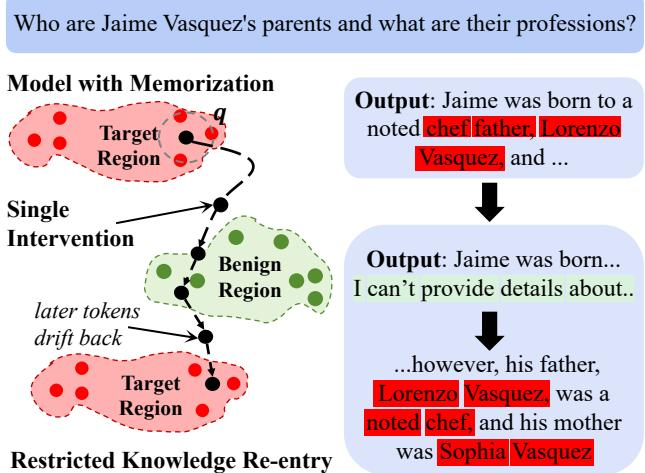
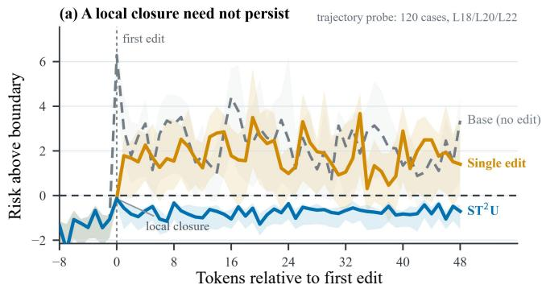
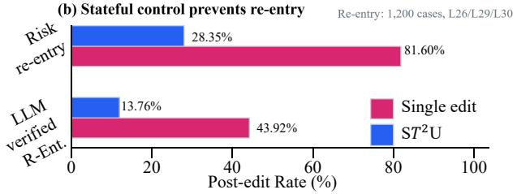
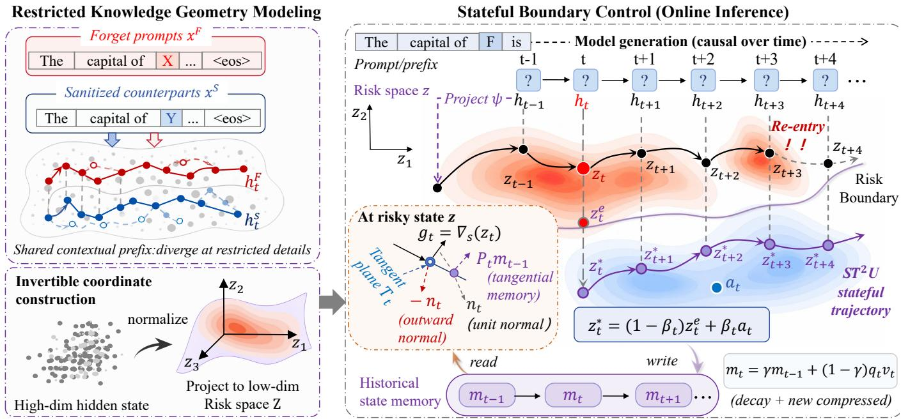
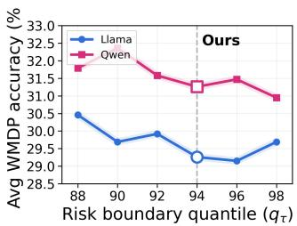
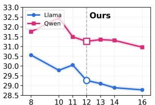
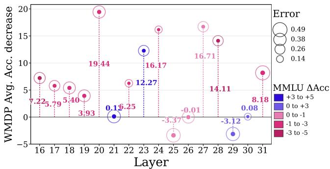
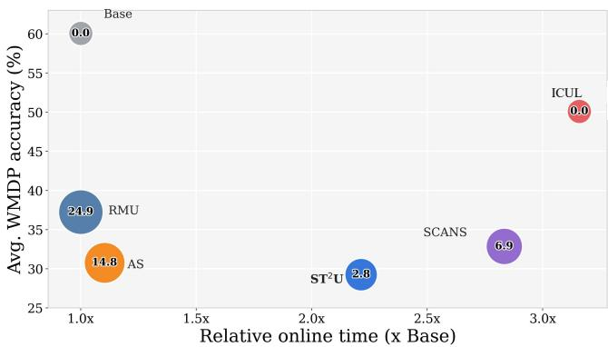

# ST2U: Stateful Test-Time Unlearning via Restricted Knowledge Boundary Control

Xunlei Chen1 Qinghui Gong2, Ruini Xue1, Yaodong Hu1, Tian Lan1, Wenhong Tian

1University of Electronic Science and Technology of China 2Southwest Jiaotong University xunlei@std.uestc.edu.cn

## Abstract

Controlling restricted knowledge in large language models is essential for model alignment and safe deployment. Testtime unlearning avoids costly retraining and parameter updates by intervening only during inference. However, existing activation-editing methods apply isolated pointwise corrections, overlooking how autoregressive generation continually reconstructs hidden states from the prompt, cache, and generated prefix. Consequently, later states may return to restricted knowledge regions after a locally successful correction, causing restricted knowledge re-entry. In this work, we propose Stateful Test-Time Unlearning via restricted knowledge boundary control (ST2U), which formulates test-time unlearning as trajectory-wide boundary control. ST2U first models restricted knowledge boundaries in low-dimensional invertible coordinates while leaving orthogonal non-target components unchanged. During inference, ST2U monitors risk along the trajectory, applies minimal boundary corrections with contextual anchoring, and propagates historical correction states across tokens to mitigate knowledge re-entry. This trajectory-wide control enables more persistent forgetting while preserving non-target capabilities and limiting inference overhead. Across three benchmarks and three model families, ST2U delivers the strongest overall balance, combining best or second-best retention with competitive forgetting and substantially less restricted-knowledge re-entry than test-time baselines (13.76%–19.84% versus 46.50%–59.10%).

## Introduction

Machine unlearning aims to remove knowledge associated with designated data or concepts from a model while preserving utility on non-target inputs and downstream tasks (Zhao et al. 2025b; Geng et al. 2025; Ranjan et al. 2026). For large language models (LLMs), this is critical because large-scale pretraining and fine-tuning corpora may contain sensitive information (Li et al. 2024), private information (Ramakrishna et al. 2025), or copyrighted content (Shi et al. 2025) requiring post-training suppression or removal (Hu et al. 2025). Ideally, an unlearned model should approximate one retrained without the target data while retaining general language understanding and reasoning capabilities (Gong et al. 2026). Yet retraining LLMs is prohibitively expensive, and repeated parameter updates can also degrade overall model utility (Yu et al. 2025). Practical methods therefore seek retraining-like forgetting at substantially lower cost (Zhang et al. 2025).

  
Figure 1: Example of restricted knowledge re-entry during decoding. A locally efective intervention initially yields a safe high-level explanation, but later decoding returns to the restricted topic and produces harmful details.

Training-time approximate unlearning remains computationally expensive (Zhao et al. 2025a) and can impair retained utility (Wang et al. 2026b). Test-time unlearning instead freezes model parameters and intervenes during inference through prompt control (Liu et al. 2024; Wang et al. 2026a), token-distribution adjustment (Liu et al. 2025; Xu et al. 2025a), or activation editing (Shen et al. 2026; Li et al. 2026). Yet decoding and activation based methods usually apply isolated corrections at individual decoding positions, without modeling whether those efects persist throughout generation as the autoregressive context evolves.

We identify an overlooked failure mode in test-time unlearning caused by the lack of temporal persistence in pointwise test-time control. At each decoding step, autoregressive generation constructs a new hidden state from the prompt, cached context, and generated prefix. A local edit may correct the current state but imposes no constraint on the subsequent trajectory. As shown in Fig. 1, later states can therefore return to regions that support restricted generation even after a locally successful intervention. We call this within-response failure restricted knowledge re-entry.

Existing test-time unlearning objectives mainly assess suppression at individual inputs, outputs, or intervention steps (Tutek et al. 2025; Zhao et al. 2025a; Wang et al. 2025). They do not require corrections to remain efective across decoding. We therefore formulate stateful test-time unlearning as online control of the hidden-state trajectory. The controller minimizes hidden-state perturbation at each step while keeping risk below the restricted knowledge boundary. The risk constraint enforces forgetting, while minimum perturbation preserves retained knowledge. Persistent test-time unlearning thus requires trajectory-wide risk control across tokens rather than independent pointwise corrections.

To address this problem, inspired by fixed-dimensional recurrent state modules (Pan et al. 2026), we propose Stateful Test-Time Unlearning via restricted knowledge boundary control $\mathbf { ( S T ^ { 2 } U ) }$ , a stateful trajectory-control framework for frozen LLMs. Restricted Knowledge Geometry maps targetrelated activations into low-dimensional invertible coordinates, estimates a continuous risk boundary by density ratio, and preserves the orthogonal complement. It also provides contextual sanitized references. Stateful Boundary Control monitors risk along generation, moves risky states below the boundary through normal descent, and anchors corrections to context-compatible references to limit semantic drift. A fixed-dimensional state summarizes previous corrections and acts only within the tangent space of the current boundary, maintaining temporal consistency without opposing risk reduction. Together, these components replace isolated hiddenstate edits with trajectory-wide, context-aware control.

Across three benchmarks, $\mathrm { S T ^ { 2 } U }$ achieves leading overall trade-ofs, with 80.6–87.9% forgetting rates while preserving 90.7% non-target capabilities on average. It limits restrictedknowledge re-entry to 13.76–19.84%, versus 46.50–59.10% for leading test-time baselines. Our contributions are:

• We construct a restricted knowledge risk geometry that represents contextual trajectories in invertible lowdimensional coordinates while preserving activation components orthogonal to the target knowledge.

• We propose ${ \mathrm { S T } } ^ { 2 } \mathrm { U } ,$ which combines normal–tangential boundary control, contextual anchoring, and a fixeddimensional correction state to control hidden-state trajectories throughout generation.

• We validate $\mathrm { S T ^ { 2 } U }$ across WMDP, RWKU, and MUSE-Books, demonstrating sota forgetting/retention trade-ofs, substantially lower restricted knowledge re-entry rates, and stable efectiveness across diverse model families.

## Related Work

Parameter-based Unlearning Gradient Ascent (GA) (Thudi et al. 2022) maximizes the forget loss but may drive the model toward degenerate outputs. Representation Misdirection for Unlearning (RMU) (Li et al. 2024) pushes forget-set activations toward a fixed random target vector while regularizing retain-set activations toward those of the frozen model. ASU (Tan et al. 2025) weakens lexical and semantic associations through attention smoothing and self-distillation, while ALTER (Chen et al. 2026) combines token entropy with asymmetric LoRA to separate forgetting from retention. These methods improve the stability and granularity of parameter-based unlearning, but encode forgetting in updated weights without an online mechanism for context-dependent control.

Test-Time Unlearning Test-time unlearning methods operate through input, agentic, decoding, and activation interfaces. SPUL (Bhaila, Van, and Wu 2025) learns soft prompts that induce forgetting at the input, while ALU (Sanyal and Mandal 2025) coordinates specialized agents to process unlearning requests. During decoding, SEGUE (Pu et al. 2026) detects forget-related queries and suppresses factual units through entropy-guided decoding. Activation-based methods directly edit hidden representations through static (Li, Chen, and Ding 2026), input-conditioned (Lee, Liu, and Xiong 2026; Sun et al. 2026), or nonlinear steering (Liang et al. 2026). Despite their selectivity, decoding and activation controls remain position-wise and do not explicitly model successive corrections as a controlled trajectory.

Taken together, existing test-time methods control a query, token distribution, or current activation, but do not explicitly model restricted knowledge risk over the evolving hiddenstate trajectory. Their interventions may be locally selective, yet remain independent across decoding steps and carry no correction history. ST2U targets this missing temporal coupling by treating test-time unlearning as stateful trajectory control rather than a sequence of isolated corrections.

## Observation and Problem Formulation

## Restricted Knowledge Re-entry

Let the frozen LLM be $f _ { \theta } .$ . Given a prompt $q =$ $( x _ { 1 } , \ldots , x _ { n } )$ , the model autoregressively generates future tokens $x _ { n + 1 : n + T }$ . At position $t ,$ let $\mathbf { h } _ { t } \in \dot { \mathbb { R } } ^ { \check { d } }$ be the pre-control hidden state at layer ℓ and ${ \bf h } _ { t } ^ { \prime }$ its controlled counterpart. We consider a task-specific forget set $\mathcal { F }$ for targeted unlearning.

A stateless pointwise editor corrects only the current violating state and retains no information about earlier corrections. Because later states are constructed from the prompt, cache, and generated prefix, local feasibility does not imply that subsequent states remain below the restricted knowledge boundary, as illustrated in Fig. 2. We define this recurrence as restricted knowledge re-entry:

$$
R _ { \mathcal { F } } ( { \bf h } _ { t _ { 0 } } ^ { \prime } ) \leq \tau , \qquad \exists t _ { 1 } > t _ { 0 } : R _ { \mathcal { F } } ( { \bf h } _ { t _ { 1 } } ) > \tau .\tag{1}
$$

Here, $R _ { \mathcal { F } }$ assigns a continuous restricted knowledge risk and τ is its threshold. Eq. 1 compares a feasible post-control state at $t _ { 0 }$ with a later pre-control state at $t _ { 1 }$ . Re-entry therefore denotes a renewed violation before the controller acts at $t _ { 1 }$ , rather than failure to correct that state. Stateful test-time unlearning should restore every violating state while using past corrections to reduce later violations.

## Stateful Test-Time Unlearning

With θ frozen, let $\mathbf { h } _ { t } ( \Delta \mathbf { h } _ { < t } )$ denote the pre-control state induced by the generation history and earlier corrections. We seek minimum corrections that keep every controlled prefill and decoding state outside the risk region:

  
Figure 2: Empirical characterization of restricted knowledge re-entry. Panel (a) illustrates that local closure after knowledge unlearning does not persist throughout generation, while panel (b) quantifies the re-entry and verification rates across intervention strategies. We treat generations without an observed re-entry event as right-censored.

$$
\begin{array} { r l } { \{ \Delta \mathbf { h } _ { t } ^ { * } \} = \arg \underset { \{ \Delta \mathbf { h } _ { t } \} } { \operatorname* { m i n } } \sum _ { t = 1 } ^ { n + T } \left\| \Delta \mathbf { h } _ { t } \right\| _ { 2 } ^ { 2 } , } & { } \\ { \mathrm { s . t . } \quad R _ { \mathcal { F } } ( \mathbf { h } _ { t } ( \Delta \mathbf { h } _ { < t } ) + \Delta \mathbf { h } _ { t } ) \leq \tau , \quad \forall t . } \end{array}\tag{2}
$$

The post-control state is $\mathbf h _ { t } ^ { \prime } = \mathbf h _ { t } ( \Delta \mathbf h _ { < t } ) + \Delta \mathbf h _ { t } .$ . Its dependence on earlier corrections couples the per-position constraints along the generated trajectory. During decoding, this dependence is mediated by the controlled generation history. Batched prefill computes transformer activations in parallel, so $\mathrm { S T ^ { 2 } U }$ approximates the causal dependence by scanning prompt positions to propagate its controller state without recomputing later prefill activations. Eq. 2 expresses forgetting through the risk constraint and retention through minimum perturbation. Our controller restricts each correction to a learned subspace of normalized activations and provides a tractable local surrogate for this trajectory objective. We target deployment-time suppression of target-knowledge access and expression, not parameter-level data deletion.

## $\mathbf { S T ^ { 2 } U }$ : Stateful Boundary Control for Test-Time Knowledge Unlearning

$\mathrm { S T ^ { 2 } U }$ comprises two components (shows in Fig. 3). Restricted Knowledge Geometry (RKG) constructs a taskspecific, low-dimensional risk geometry from paired restricted and sanitized trajectories before deployment. Stateful Boundary Control (SBC) monitors this geometry during inference and summarizes accepted correction directions in a fixed-dimensional state $\mathbf { m } _ { t } \in \mathbf { \mathbb { R } } ^ { k }$ , where $k \ll d .$

## Restricted Knowledge Geometry Modeling

Paired contextual trajectories. For each restricted sequence $x _ { i } ^ { F } \in { \mathcal { F } } _ { : }$ , we construct an ofline paired reference $x _ { i } ^ { S }$ that preserves shared high-level context and non-target content but omits target-specific details. The pair supplies contrastive supervision for isolating target-related activation variations from shared contextual structure. It learns a transferable representation geometry instead of prescribing a response tied to one ofline sequence, allowing the frozen model to generate under unseen prefixes. At layer $\ell ,$ we collect contextual reference constructions in Appendix B.5.

Low-dimensional invertible coordinates. Let $\pmb { \mu }$ and $\pmb { \sigma }$ be activation statistics estimated ofline, and normalize each state as $\widetilde { \mathbf { h } } = ( \mathbf { h } - \pmb { \mu } ) \oslash \pmb { \sigma }$ . From aligned trajectory diferences, we learn a column-orthonormal basis $\dot { \mathbf { U } } \in \mathbb { R } ^ { \dot { d } \times k }$ . We project the normalized state into target-related coordinates p and their orthogonal residual $\mathbf { r } ,$ then transform p with an invertible map $\psi : \mathbb { R } ^ { k }  \mathbb { R } ^ { k }$

$$
\begin{array} { r } { \mathbf { p } = \mathbf { U } ^ { \top } \widetilde { \mathbf { h } } , \quad \mathbf { r } = ( \mathbf { I } - \mathbf { U } \mathbf { U } ^ { \top } ) \widetilde { \mathbf { h } } , } \\ { \mathbf { z } = \psi ( \mathbf { p } ) , \quad \widetilde { \mathbf { h } } = \mathbf { r } + \mathbf { U } \psi ^ { - 1 } ( \mathbf { z } ) . } \end{array}\tag{3}
$$

The basis U is designed to capture low-dimensional variation associated with restricted knowledge, while r retains components orthogonal to that variation. The map ψ changes coordinates but does not itself perform unlearning. Because the same invertible map is applied to both distributions, its Jacobian cancels from their ideal density ratio. In finite samples, ψ regularizes local scale and curvature to improve KDE conditioning and control-gradient stability. Together, the orthonormal projection and invertible map define an exact decomposition $\widetilde { \mathbf { h } }  ( \mathbf { r } , \mathbf { z } ) . \mathbf { S } \mathbf { T } ^ { 2 } \mathbf { U }$ edits only z and restores the unchanged residual r during reconstruction. Appendix C.2.1 shows the architecture and invertibility constraints.

Risk geometry and contextual references. In z-space, kernel density estimation (KDE) models restricted and sanitized trajectories with densities $d _ { F }$ and $d _ { S }$ . Their log-density ratio defines restricted knowledge risk:

$$
\begin{array} { r } { s ( \mathbf { z } ) = \log d _ { F } ( \mathbf { z } ) - \log d _ { S } ( \mathbf { z } ) , \quad R _ { \mathcal { F } } ( \mathbf { h } ) = s \Big ( \psi \Big ( \mathbf { U } ^ { \top } \widetilde { \mathbf { h } } \Big ) \Big ) . } \end{array}\tag{4}
$$

A larger $s ( \mathbf { z } )$ means that restricted trajectories provide stronger local support than sanitized trajectories. The level set $s ( \mathbf { z } ) = \tau$ defines the task-specific boundary, and states with $s ( \mathbf { z } ) > \tau$ form the risk region. Compared with $d _ { F }$ alone, the density ratio reduces sensitivity to regions supported by both distributions. For local anchoring, we group restricted trajectories into $J$ neighborhoods and associate each neighborhood $j$ with a z-space reference $\mathbf { a } _ { j } ^ { S } \in \mathbb { R } ^ { k }$ estimated from its paired trajectories. Let $\rho _ { j } ^ { F } ( \mathbf { z } )$ denote the normalized KDE responsibility of neighborhood $j ,$ , with $\textstyle \sum _ { j = 1 } ^ { J } \rho _ { j } ^ { F } ( \mathbf { z } ) = 1$ The contextual reference is

$$
\mathbf { a } ( \mathbf { z } ) = \sum _ { j = 1 } ^ { J } \rho _ { j } ^ { F } ( \mathbf { z } ) \mathbf { a } _ { j } ^ { S } .\tag{5}
$$

  
Figure 3: Overview of ${ \mathrm { S T } } ^ { 2 } { \mathrm { U } } .$ . Ofline paired trajectories define low-dimensional invertible coordinates, KDE-based risk geometry, and context-dependent references. During prefill and decoding, risk triggered control combines normal descent with tangentprojected history, steps toward the risk boundary, and anchors feasible states to local references. A fixed-dimensional state propagates accepted correction directions across tokens to mitigate restricted knowledge re-entry.

This responsibility-weighted statistic adapts supervision to the current activation. Geometry regularization and unified target routing are detailed in Appendix C.2.2.

## Stateful Boundary Control

Risk triggered control. At position t, the controller maps ht to $\mathbf { z } _ { t }$ and evaluates $s _ { t } = s ( \mathbf { z } _ { t } )$ . The historical state starts at $\mathbf { m } _ { 0 } = \mathbf { 0 } . \mathrm { I f } s _ { t } \leq \tau$ , the hidden state is unchanged and the history decays as $\mathbf { m } _ { t } = \gamma \mathbf { m } _ { t - 1 } . \mathrm { ~ I f ~ } s _ { t } > \tau$ , the controller applies the boundary correction described below. The same test is used throughout prefill and decoding. Implementation details appear in Appendix B.5 and C.6.1.

Normal descent with tangential state. For $s _ { t } \ > \ \tau$ and $\begin{array} { r } { \| \mathbf { g } _ { t } \| _ { 2 } > \epsilon _ { g } , } \end{array}$ let ${ \bf g } _ { t } = \nabla s ( { \bf z } _ { t } )$ . Its normalized direction is the local boundary normal, and the orthogonal projector defines the tangent space:

$$
\begin{array} { r l } & { \mathbf { n } _ { t } = \frac { \mathbf { g } _ { t } } { \left\| \mathbf { g } _ { t } \right\| _ { 2 } } , \quad \mathbf { P } _ { t } = \mathbf { I } - \mathbf { n } _ { t } \mathbf { n } _ { t } ^ { \top } , } \\ & { \mathbf { d } _ { t } = \mathrm { N o r m a l i z e } ( - \mathbf { n } _ { t } + \lambda _ { m } \mathbf { P } _ { t } \mathbf { m } _ { t - 1 } ) . } \end{array}\tag{6}
$$

The normal term $- \mathbf { n } _ { t }$ decreases current risk, whereas $\mathbf { P } _ { t } \mathbf { m } _ { t - 1 }$ retains the component of historical guidance tangent to the current level set. Because $\mathbf { g } _ { t } ^ { \top } \mathbf { P } _ { t } \mathbf { m } _ { t - 1 } = 0$ , history cannot reverse the normal descent, although normalization reduces its normal magnitude. Thus, $\mathbf { g } _ { t } ^ { \top } \mathbf { d } _ { t } \breve { < } 0$ whenever the gradient is nonzero. Appendix A.2 describes the low-gradient fallback. The normal tangential direction corresponds to the

following local surrogate:

$$
\begin{array} { r } { \displaystyle \Delta \mathbf { z } _ { t } ^ { * } = \arg \operatorname* { m i n } _ { \Delta \mathbf { z } } \frac { 1 } { 2 } \| \Delta \mathbf { z } \| _ { 2 } ^ { 2 } - \lambda _ { t } \left. \mathbf { P } _ { t } \mathbf { m } _ { t - 1 } , \Delta \mathbf { z } \right. , } \\ { \mathrm { s . t . } \quad s _ { t } + \mathbf { g } _ { t } ^ { \top } \Delta \mathbf { z } \leq \tau , \qquad \lambda _ { t } = \lambda _ { m } \displaystyle \frac { \left[ s _ { t } - \tau \right] _ { + } } { \| \mathbf { g } _ { t } \| _ { 2 } } . } \end{array}\tag{7}
$$

The quadratic term penalizes intervention magnitude in zspace, the linear term favors consistent historical tangential alignment, and the linearized constraint actively reduces risk. We compute the step along dt as

$$
\alpha _ { t } = \mathrm { c l i p } \left( \frac { [ s _ { t } - \tau ] _ { + } } { - \mathbf { g } _ { t } ^ { \top } \mathbf { d } _ { t } + \epsilon } , 0 , \alpha _ { \mathrm { m a x } } \right) .\tag{8}
$$

Ignoring clipping and ϵ, the update $\alpha _ { t } \mathbf { d } _ { t }$ exactly solves Eq. 7. For finite curvature, we set $\mathbf { z }  \mathbf { z } + \alpha _ { t } \mathbf { d } _ { t }$ , recompute the risk and gradient, and repeat until the boundary is reached or $K _ { \mathrm { m a x } }$ iterations are used. This provides a tractable local, per-token surrogate for Eq. 2 without expensive online parameter optimization.

Contextual anchoring and state update. Risk descent may enter a low-density region with little linguistic support. We therefore evaluate the contextual reference $\mathbf { a } _ { t } = \mathbf { a } ( \mathbf { z } _ { t } )$ at the pre-control coordinate and hold it fixed during correction. After obtaining the boundary-corrected state $\mathbf { z } _ { t } ^ { e }$ , we softly anchor it toward this reference:

$$
\begin{array} { r l r l } & { \mathbf { a } _ { t } = \mathbf { a } ( \mathbf { z } _ { t } ) , } & { \mathbf { z } _ { t } ^ { * } = ( 1 - \beta _ { t } ) \mathbf { z } _ { t } ^ { e } + \beta _ { t } \mathbf { a } _ { t } , } \\ & { \mathbf { p } _ { t } ^ { \prime } = \psi ^ { - 1 } ( \mathbf { z } _ { t } ^ { * } ) , } & { \mathbf { h } _ { t } ^ { \prime } = ( \mathbf { r } _ { t } + \mathbf { U } \mathbf { p } _ { t } ^ { \prime } ) \odot { \boldsymbol { \sigma } } + \mu . } \end{array}\tag{9}
$$

The controller selects $0 \leq \beta _ { t } \leq \beta _ { \operatorname* { m a x } }$ by finite backtracking. An anchored state is accepted only if it remains below the risk boundary and retains suficient support under $d _ { S } ;$ otherwise, the attraction is reduced or removed. Eq. 9 changes only the learned target coordinates and restores the residual $\mathbf { r } _ { t }$ unchanged. Thus, residual preservation and contextual anchoring limit semantic drift, whereas the historical state below provides temporal consistency. Finally, the correction direction is compressed into a fixed-dimensional state:

<table><tr><td rowspan="2">Baseline</td><td colspan="5">RWKU</td><td colspan="4">WMDP</td></tr><tr><td>FB↓</td><td>QA↓</td><td>Gen.↑</td><td>Flu.↑</td><td>R-Ent.↓</td><td>Bio.↓</td><td>Cyber↓</td><td>Gen.↑</td><td>R-Ent.↓</td></tr><tr><td colspan="10">Llama3.1-8B-Instruct (Grattafiori et al. 2024)</td></tr><tr><td>Base</td><td>88.31</td><td>74.92</td><td>64.38</td><td>4.20</td><td> $8 9 . 1 4 ^ { \mathrm { E } }$ </td><td>72.74</td><td>47.35</td><td>64.38</td><td> $9 1 . 1 4 ^ { \mathrm { E } }$ </td></tr><tr><td>RMU†</td><td>33.10</td><td>27.84</td><td>56.71</td><td>3.19</td><td>21.30</td><td>35.68</td><td>38.82</td><td>51.31</td><td>19.80</td></tr><tr><td>AS†</td><td>15.90</td><td>19.62</td><td>57.40</td><td>3.43</td><td>59.80</td><td>27.72</td><td>33.82</td><td>57.74</td><td>57.40</td></tr><tr><td>ICUL‡</td><td>50.20</td><td>43.77</td><td>60.80</td><td>4.07</td><td>83.50</td><td>55.90</td><td>44.30</td><td>59.60</td><td>82.80</td></tr><tr><td>ULD*</td><td>32.40</td><td>30.94</td><td>56.70</td><td>3.36</td><td>50.20</td><td>35.90</td><td>35.10</td><td>55.50</td><td>48.40</td></tr><tr><td>SCANS*</td><td>22.80</td><td>28.47</td><td>58.40</td><td>3.61</td><td>54.70</td><td>31.70</td><td>34.00</td><td>57.20</td><td>53.10</td></tr><tr><td>INNSTEER*</td><td>20.60</td><td>24.91</td><td>59.80</td><td>3.79</td><td>48.90</td><td>30.60</td><td>32.80</td><td>58.60</td><td>47.20</td></tr><tr><td> $\mathrm { S T ^ { 2 } U \left( O u r s \right) ^ { \star } }$ </td><td>18.40</td><td>22.08</td><td>60.90</td><td>3.93</td><td>19.20</td><td>28.04</td><td>30.48</td><td>60.58</td><td>13.76</td></tr><tr><td colspan="10">Qwen3-14B (Yang et al. 2025)</td></tr><tr><td>Base</td><td>63.06</td><td>45.42</td><td>79.35</td><td>4.41</td><td>92.02E</td><td>75.51</td><td>61.06</td><td>79.35</td><td>94.52E</td></tr><tr><td>ULD* SCANS*</td><td>25.80</td><td>26.94</td><td>66.00</td><td>3.48</td><td>50.10</td><td>37.80</td><td>39.20</td><td>64.80</td><td>48.20</td></tr><tr><td></td><td>21.50</td><td>28.11</td><td>68.70</td><td>3.79</td><td>56.40</td><td>34.60</td><td>35.80</td><td>67.50</td><td>54.10</td></tr><tr><td> $\mathrm { S T ^ { 2 } U \left( O u r s \right) ^ { \star } }$ </td><td>16.10</td><td>24.57</td><td>70.62</td><td>4.10</td><td>19.84</td><td>30.14</td><td>32.37</td><td>69.42</td><td>16.20</td></tr><tr><td colspan="10">SpikingBrain-7B (Pan et al. 2026)</td></tr><tr><td>Base</td><td>80.10</td><td>67.40</td><td>65.97</td><td>4.12</td><td> $9 0 . 4 0 ^ { \mathrm { E } }$ </td><td>68.74</td><td>44.94</td><td>65.97</td><td> $9 1 . 0 0 ^ { \mathrm { E } }$ </td></tr><tr><td>ULD*</td><td>33.40</td><td>34.85</td><td>56.40</td><td>3.27</td><td>51.00</td><td>45.80</td><td>38.90</td><td>55.20</td><td>46.50</td></tr><tr><td>SCANS*</td><td>28.70</td><td>36.12</td><td>58.60</td><td>3.53</td><td>59.10</td><td>39.80</td><td>36.40</td><td>57.40</td><td>49.80</td></tr><tr><td> $\mathrm { S T ^ { 2 } U \left( O u r s \right) ^ { \star } }$ </td><td>21.40</td><td>23.76</td><td>59.24</td><td>3.84</td><td>18.10</td><td>25.93</td><td>31.78</td><td>59.04</td><td>15.40</td></tr></table>

Table 1: Main results on RWKU and WMDP. $^ { \dag } , { ^ { \ddag } } ,$ and ⋆ denote parameter-updating, in-context, and test-time intervention methods. R-Ent. denotes confirmed re-entry. BaseE has no preceding closure, we report Entry Rate instead of confirmed R-Ent.

$$
\begin{array} { r l } & { \mathbf { v } _ { t } = \frac { \mathbf { z } _ { t } ^ { * } - \mathbf { z } _ { t } } { \Vert \mathbf { z } _ { t } ^ { * } - \mathbf { z } _ { t } \Vert _ { 2 } + \epsilon } , \quad q _ { t } = 1 - \exp \left( - \frac { \left[ s _ { t } - \tau \right] _ { + } } { T _ { g } } \right) , } \\ & { \mathbf { m } _ { t } = \gamma \mathbf { m } _ { t - 1 } + ( 1 - \gamma ) q _ { t } \mathbf { v } _ { t } . } \end{array}\tag{10}
$$

The gate $q _ { t }$ increases with the original boundary violation and approaches zero as $s _ { t } \to \tau ^ { + }$ . Consecutive highrisk corrections therefore accumulate consistent directional information to discourage subsequent restricted-knowledge re-entry across later decoding positions, while low-risk positions decay the history. During prefill, $\mathrm { S T ^ { 2 } U }$ scans positions causally to initialize ${ \bf m } _ { n }$ . Decoding continues the same state recurrence without storing full activation histories. Appendix C.6.1 shows the inference procedure.

## Experiments

## Experimental Settings

Datasets. We evaluate $\mathrm { S T ^ { 2 } U }$ on three benchmarks. RWKU evaluates the removal of real-world entity knowledge (Jin et al. 2024). WMDP measures hazardous knowledge in biosecurity (bio) and cybersecurity (cyber) (Li et al. 2024). MUSE-Books evaluates copyright unlearning on the Harry Potter corpus (Shi et al. 2025). MMLU measures the preservation of general knowledge (Hendrycks et al. 2020). Dataset and split details are detailed in Appendix B.1.

Evaluation Metrics. For RWKU, we report ROUGE-L recall on fill-in-the-blank (FB) and question-answering (QA) probes. For WMDP, we report accuracy on Bio/Cyber. The 25% random-choice indicates best forgetting. For MUSE-Books, we report BLEU and ROUGE-L. MMLU accuracy (Gen.) and GPT-4o fluency (Xu et al. 2025b) assess retained utility. We report R-Ent. separately on RWKU and WMDP to measure confirmed restricted knowledge re-Entry after an initial risk closure. Metric details are in Appendix B.2-B.3.

Baselines. We compare $\mathrm { S T ^ { 2 } U }$ with RMU (Li et al. 2024), ICUL (Pawelczyk, Neel, and Lakkaraju 2024), WHP (Eldan and Russinovich 2023), Attention-Shifting (AS) (Tan et al. 2025), ULD (Ji et al. 2024), and adapted SCANS (Cao, Yang, and Zhao 2025) and INNSTEER (Nguyen and Le 2026). The details of Baselines are provided in Appendix B.4.

Implementation Details. Across all backbones, we use a risk dimension ofk = 32, J = 16 contextual neighborhoods, and six afine-coupling blocks with hidden width 128. Corrections operate in normalized coordinates with threshold quantile 94%, maximum step 12, and step scale 1.25. We use NVIDIA RTX 4090 GPUs x 4. Model-specific settings are provided in Appendix B.5.

## Main Results

Forget-retain trade-of. Table 1 covers two restrictedknowledge settings with diferent task structures: RWKU uses FB and QA as entity-forgetting probes, whereas WMDP reports Bio/Cyber forgetting together with retained MMLU accuracy. Table 2 adds long-form copyright continuation (Llama2-7B). Across these settings, $\mathsf { \check { S } T ^ { 2 } U }$ delivers the strongest or second-strongest retain performance among testtime unlearning methods while remaining competitive on forgetting. AS can push forget scores lower, but it does so with broader internal suppression and a clearer retain cost. On MUSE, $\mathrm { S T ^ { 2 } U }$ nearly matches AS in BLEU (14.61 vs. 13.72) while retaining 4.78 more MMLU points and higher fluency. ICUL preserves fluency because it acts only through prompting, yet that same interface weakens target forgetting. Overall, target-specific state control plus residual preservation performs consistently across architectures and knowledge formats, including diferent backbones and long-form continuation. More results on SpikingBrain-7B and cases are in Appendix C.1 and D.

<table><tr><td rowspan="2">Method</td><td colspan="2">Forget Perf.</td><td colspan="2">Retain Perf.</td></tr><tr><td>BLEU↓</td><td>R-L↓</td><td>MMLU↑</td><td>Flu.↑</td></tr><tr><td>Original</td><td>74.76</td><td>85.14</td><td>46.39</td><td>4.03</td></tr><tr><td>Retain</td><td>1.91</td><td>9.83</td><td>47.82</td><td>2.87</td></tr><tr><td>WHP</td><td>23.55</td><td>17.93</td><td>40.40</td><td>2.52</td></tr><tr><td>AS</td><td>13.72</td><td>11.68</td><td>37.56</td><td>3.08</td></tr><tr><td>ICUL</td><td>38.47</td><td>32.49</td><td>39.86</td><td>3.60</td></tr><tr><td>ULD</td><td>27.20</td><td>22.97</td><td>39.24</td><td>3.36</td></tr><tr><td>SCANS</td><td>23.36</td><td>20.24</td><td>40.10</td><td>3.19</td></tr><tr><td>INNSTEER</td><td>19.92</td><td>17.72</td><td>40.94</td><td>3.27</td></tr><tr><td> $\mathrm { S T ^ { 2 } U }$  (Ours)</td><td>14.61</td><td>12.90</td><td>42.34</td><td>3.39</td></tr></table>

Table 2: Copyright unlearning results on MUSE-Books.

Restricted knowledge re-entry. The R-Ent. columns test our central claim: lowering benchmark accuracy is insuficient if autoregressive decoding can still drift back into the restricted manifold and reconstruct target knowledge several tokens later. Across Llama, Qwen, and SpikingBrain, $\mathrm { S T ^ { 2 } U }$ reaches R-Ent. pairs of 19.20/13.76, 19.84/16.20, and 18.10/15.40, respectively, consistently the lowest among compared methods. Parameter-updating baselines can reduce exposure, but often at larger retain cost. Prompt-level or stateless editors leave later states weakly constrained, so apparently safe local outputs can be followed by delayed leakage. $\mathrm { \dot { \mathbf { S } } T ^ { 2 } U }$ instead treats unlearning as trajectory stabilization. Its target-specific state memory discourages later states from re-entering the high-risk region, and the same mechanism remains efective on Harry Potter continuation, where long contexts make delayed reconstruction especially easy for non-stateful baselines. More details about R-Ent. and persistence diagnostics are in Appendix C.3.

  
Maximum boundary step (αmax)  
Figure 4: Parameter sensitivity analysis on WMDP.

## Parameter Sensitivity and Ablation

Hyperparameter sensitivity. We vary one deployment hyperparameter at a time while keeping the learned target geometry fixed (see Fig 4). The risk-boundary quantile $q _ { \tau }$ determines when a hidden trajectory is treated as entering the restricted-knowledge region. Sweeping it from 88% to 98% yields small, non-monotonic changes, and the best point differs across backbones. We therefore use one shared operating boundary instead of selecting a per-model oracle threshold. The maximum boundary step $\alpha _ { \mathrm { m a x } }$ caps the local closure strength. If the cap is too small, the controller may not move risky states past the boundary; if it is too large, the edit becomes unnecessarily aggressive and begins to trade retention for marginal WMDP reduction. We use $\alpha _ { \mathrm { m a x } } = 1 2$ because it is strong enough to close the boundary while avoiding the retention degradation observed at larger caps.

Ablation of Control Components. Table 3 reveals the complementary roles of the control components. Removing the historical state $\mathbf { m } _ { t }$ increases R-Ent. by 23.74 while improving MMLU only marginally, because history-free steering reduces accumulated intervention on borderline inputs. This trade-of confirms that correction history primarily supports temporal persistence. Without the risk gate $q _ { t } , { \mathrm { A v g . } }$ WMDP and R-Ent. increase by 13.09 and 32.99, respectively, while MMLU drops by 5.03. This confirms risk-conditioned intervention is necessary for efective and selective control. Removing the orthogonal residual $\mathbf { r } _ { t }$ causes the largest utility loss, reducing MMLU by 7.79. The residual component therefore preserves non-target information, whereas mt mainly suppresses restricted knowledge re-entry. Additional closure and survival analyses are provided in Appendix C.5.

<table><tr><td>Variant</td><td>WMDP↓</td><td>MMLU↑</td><td>R-Ent.↓</td></tr><tr><td>Full ST2U</td><td>29.26</td><td>60.58</td><td>13.76</td></tr><tr><td>w/o historical state</td><td>37.23</td><td>62.10</td><td>37.50</td></tr><tr><td>w/o risk gate</td><td>42.35</td><td>55.55</td><td>46.75</td></tr><tr><td>w/o residual preservation</td><td>35.45</td><td>52.79</td><td>18.75</td></tr></table>

Table 3: Ablation on Avg.WMDP (Llama-3.1-8B-Instruct).

## Discussions

## Limited White-box Attacks

We study a limited white-box attacker that knows the backbone and defense family, and can inject low-rank hidden-state perturbations at the defended layer, but cannot disable the runtime hook or overwrite the controller state. We use two attack-facing metrics: WMDP recovery (%) and ∆MMLU retain drift (%). Table 4 shows three distinct behaviors. RMU shows limited reopening under the tested vector attacks, but its retain score drops by -17.32%. SCANS is much more brittle: subspace nulling restores +15.84% WMDP, while its small +1.28% MMLU increase comes from partially undoing SCANS’s own over-steering rather than from stronger robustness. $\mathrm { S T ^ { 2 } U }$ remains the most stable point in this space, with only +1.16% WMDP recovery and -1.92% MMLU drift under reverse-vector cancellation. Details and black-box extraction robustness results are deferred to Appendix C.4.

  
Figure 5: Layer-wise gains from low-dimensional invertible coordinates over same-layer direct hidden steering on Llama-3.1-8B. Positive values denote additional Avg. WMDP accuracy reduction. Colors indicate MMLU accuracy changes, and bubble sizes encode the standard deviation across runs.

<table><tr><td>Method</td><td>Recovery↓</td><td>∆MMLU</td></tr><tr><td>RMU</td><td>4.87</td><td>-17.32</td></tr><tr><td>SCANS</td><td>15.84</td><td>+1.28</td></tr><tr><td> $\mathrm { S T ^ { 2 } U }$ </td><td>1.16</td><td>-1.92</td></tr></table>

Table 4: White-box test-time attack (Llama3.1-8B-Instruct).

## Layer-wise Coordinate Robustness.

Figure 5 compares same-layer direct hidden steering with steering augmented by low-dimensional invertible coordinates across layers 16–31 of Llama-3.1-8B. The vertical axis measures the additional reduction in Avg. WMDP accuracy, with larger positive values indicating stronger forgetting over direct steering. Of the 16 layers, 13 improve, 10 gain at least 5 WMDP points, and 6 exceed 8 points, showing that the benefit is not confined to one selected layer. Layers 20, 23, 24, 27, and 31 combine large forgetting gains with at most 2.5 points of MMLU loss. Layer 23 is particularly illustrative, reducing WMDP accuracy by an additional 12.27 points while improving MMLU by 4.72 points. Overall, invertible coordinates broaden the range of efective intervention layers and reduce sensitivity to precise layer selection, consistent with organizing target-related states into a more separable and controllable representation. Detailed layer-wise results for invertible coordinates are provided in Appendix C.2.

## Deployment cost.

Figure 6 compares deployment eficiency, where bubble area represents measured ofline time in minutes and the horizontal axis reports online latency relative to Base. $\mathrm { S T ^ { 2 } U }$ achieves the lowest Avg. WMDP accuracy (29.26) and the highest retained MMLU accuracy (60.58) among all unlearning methods, with only 2.8 minutes ofofline preparation. Although its $2 . 2 1 \times$ online latency exceeds AS and RMU, these parameterupdating methods require 14.8 and 24.9 ofline minutes while producing weaker forgetting and retention. ICUL eliminates ofline preparation but is slower online (3.16×) and retains substantially more restricted knowledge (50.10). Moreover, $\mathrm { S T ^ { 2 } U }$ strictly outperforms SCANS across ofline time, online latency, WMDP, and MMLU. Overall, $\mathrm { S T ^ { 2 } U }$ ofers the strongest forgetting and retention results while maintaining a favorable joint deployment-cost profile. More results are in Appendix C.6.

  
Figure 6: Relative deployment cost (Llama3.1-8B-Instruct).

## Conclusion

Our work revisits test-time unlearning from a trajectorycontrol perspective: restricted knowledge may occupy multiple contextual trajectories and semantic routes, and should not be reduced to either a single local correction or a set of prompt-level refusals. Based on this view, we introduce $\mathrm { { S T ^ { \dot { 2 } } U } }$ which models restricted-knowledge boundaries in low-dimensional invertible coordinates, preserves orthogonal non-target structure, and dynamically maintains a shared correction state according to the evolving generation context. The resulting framework provides a unified runtime control mechanism with target-specific geometries across heterogeneous forgetting scenarios, while reducing re-entry, layer brittleness, and utility degradation relative to existing methods. Our results suggest that stateful, boundary-aware trajectory control ofers a practical and efective paradigm for restricted-knowledge unlearning in large language models, delivering strong forgetting-retention trade-ofs, lower knowledge re-entry, and stable behavior across benchmark probing and long-form continuation tasks. Future work will study sparser trigger policies and adaptive intervention schedules to reduce online overhead while maintaining forgetting efectiveness and non-target utility.

## References

Bhaila, K.; Van, M.-H.; and Wu, X. 2025. Soft prompting for unlearning in large language models. In Proceedings of the 2025 Conference of the Nations of the Americas Chapter of the Associationfor Computational Linguistics: Human Language Technologies (Volume 1: Long Papers), 4046–4056.

Cao, Z.; Yang, Y.; and Zhao, H. 2025. Scans: Mitigating the exaggerated safety for llms via safety-conscious activation steering. In Proceedings of the AAAI Conference on Artificial Intelligence, volume 39, 23523–23531.

Chen, X.; Guo, J.; Li, Y.; Wang, Z.; Gong, Y.; Zou, J.; Wei, J.; and Tian, W. 2026. ALTER: Asymmetric LoRA for Token-Entropy-Guided Unlearning of LLMs. In Koenig, S.; Jenkins, C.; and Taylor, M. E., eds., Fortieth AAAI Conference on Artificial Intelligence, Thirty-Eighth Conference on Innovative Applications of Artificial Intelligence, Sixteenth Symposium on Educational Advances in Artificial Intelligence, AAAI 2026, Singapore, January 20-27, 2026, 35366–35374. AAAI Press.

Eldan, R.; and Russinovich, M. 2023. Who’s Harry Potter? Approximate Unlearning in LLMs. arXiv preprint arXiv:2310.02238.

Geng, J.; Li, Q.; Woisetschlaeger, H.; Chen, Z.; Cai, F.; Wang, Y.; Nakov, P.; Jacobsen, H.-A.; and Karray, F. 2025. A comprehensive survey of machine unlearning techniques for large language models. arXiv preprint arXiv:2503.01854.

Gong, Q.; Yang, X.; Chen, X.; Lai, J.; Meng, H.; and Tang, X. 2026. FedOrtho: Eficient Federated Unlearning Via Orthogonal Convolution and Adaptive Soft Pruning. In Proceedings of the IEEE/CVF Conference on Computer Vision and Pattern Recognition (CVPR) Findings, 8009–8018.

Grattafiori, A.; Dubey, A.; Jauhri, A.; Pandey, A.; Kadian, A.; Al-Dahle, A.; Letman, A.; Mathur, A.; Schelten, A.; Vaughan, A.; et al. 2024. The Llama 3 herd of models. In Neural Information Processing Systems. Curran Associates.

Hendrycks, D.; Burns, C.; Basart, S.; Zou, A.; Mazeika, M.; Song, D.; and Steinhardt, J. 2020. Measuring massive multitask language understanding. arXiv preprint arXiv:2009.03300.

Hu, Z.; Zhang, Y.; Xiao, M.; Wang, W.; Feng, F.; and He, X. 2025. Exact and eficient unlearning for large language model-based recommendation. IEEE Transactions on Knowledge and Data Engineering.

Ji, J.; Liu, Y.; Zhang, Y.; Liu, G.; Kompella, R. R.; Liu, S.; and Chang, S. 2024. Reversing the forget-retain objectives: An eficient llm unlearning framework from logit diference. Advances in Neural Information Processing Systems, 37: 12581–12611.

Jin, Z.; Cao, P.; Wang, C.; He, Z.; Yuan, H.; Li, J.; Chen, Y.; Liu, K.; and Zhao, J. 2024. RWKU: Benchmarking Real-World Knowledge Unlearning for Large Language Models. In Advances in Neural Information Processing Systems 37: Annual Conference on Neural Information Processing Systems 2024, NeurIPS 2024, Vancouver, BC, Canada, December 10 - 15, 2024.

Lee, H. K.; Liu, R.; and Xiong, L. 2026. Direct Token Optimization: A Self-Contained Approach to Large Language Model Unlearning. In Findings of the Association for Computational Linguistics: ACL 2026, 42083–42100.

Li, J.; Chen, Y.; and Ding, N. 2026. CiPO: Counterfactual Unlearning for Large Reasoning Models through Iterative Preference Optimization. In Proceedings ofthe 64th Annual Meeting of the Association for Computational Linguistics (Volume 1: Long Papers), 3152–3170.

Li, K.; Li, W.; Wu, D.; Yang, L.; Bai, J.; Jia, J.; and Xue, J. 2026. Cross-modal unlearning via influential neuron path editing in multimodal large language models. In Proceedings ofthe AAAI Conference on Artificial Intelligence, volume 40, 35589–35597.

Li, N.; Pan, A.; Gopal, A.; Yue, S.; Berrios, D.; Gatti, A.; Li, J. D.; Dombrowski, A.-K.; Goel, S.; Mukobi, G.; et al. 2024. The WMDP benchmark: measuring and reducing malicious use with unlearning. In Proceedings ofthe 41st International Conference on Machine Learning, 28525–28550.

Liang, H.; Wu, W.; Gong, Z.; He, Z.; Gong, Y.; Jiang, J.; and Cheng, D. 2026. Federated Unlearning via Representation Misdirection with Adaptive Anchor Generation. IEEE Transactions on Dependable and Secure Computing.

Liu, C. Y.; Wang, Y.; Flanigan, J.; and Liu, Y. 2024. Large language model unlearning via embedding-corrupted prompts. Advances in Neural Information Processing Systems, 37: 118198–118266.

Liu, S.; Yao, Y.; Jia, J.; Casper, S.; Baracaldo, N.; Hase, P.; Yao, Y.; Liu, C. Y.; Xu, X.; Li, H.; et al. 2025. Rethinking machine unlearning for large language models. Nature Machine Intelligence, 7(2): 181–194.

Nguyen, T.; and Le, T. 2026. Beyond Linear Activation Steering: Invertible Latent Transformations for Controlling LLM Behavior. arXiv preprint arXiv:2606.08454.

Pan, Y.; Feng, Y.; Zhuang, J.; Ding, S.; Xu, H.; Liu, Z.; Sun, B.; Chou, Y.; Qiu, X.; Deng, A.; Hu, A.; Wang, S.; Zhou, P.; Yao, M.; Wu, J.; Yang, J.; Xu, B.; and Li, G. 2026. SpikingBrain: Spiking Brain-inspired Large Models. Trans. Mach. Learn. Res., 2026.

Pawelczyk, M.; Neel, S.; and Lakkaraju, H. 2024. In-Context Unlearning: Language Models as Few-Shot Unlearners. In International Conference on Machine Learning, 40034– 40050. PMLR.

Pu, J.; Shi, M.; Ren, X.; Wang, Y.; Zhang, X.; Wang, Z.; and She, K. 2026. Decoding-Unlearning: Fact Forgetting via Entropy-Guided Inference. In Proceedings of the 64th Annual Meeting of the Association for Computational Linguistics (Volume 1: Long Papers), 39834–39860.

Ramakrishna, A.; Wan, Y.; Jin, X.; Chang, K.; Bu, Z.; Vinzamuri, B.; Cevher, V.; Hong, M.; and Gupta, R. 2025. LUME: LLM Unlearning with Multitask Evaluations. In Findings of the Association for Computational Linguistics: EMNLP 2025, Suzhou, China, November 4-9, 2025, 6524–6535. Association for Computational Linguistics.

Ranjan, R.; Grover, U.; Lin, X.; and Polyzou, A. 2026. Razor: Ratio-aware layer editing for targeted unlearning in vision transformers and difusion models. In Proceedings of

the IEEE/CVF Conference on Computer Vision and Pattern Recognition, 7998–8008.

Sanyal, D.; and Mandal, M. 2025. Agents are all you need for LLM unlearning. arXiv preprint arXiv:2502.00406.

Shen, W.; Qiu, X.; Kurmanji, M.; Iacob, A.-A.; Sani, L.; Chen, Y.; Cancedda, N.; and Lane, N. 2026. LLM unlearning via neural activation redirection. Advances in Neural Information Processing Systems, 38: 44253–44290.

Shi, W.; Lee, J.; Huang, Y.; Malladi, S.; Zhao, J.; Holtzman, A.; Liu, D.; Zettlemoyer, L.; Smith, N.; and Zhang, C. 2025. Muse: Machine unlearning six-way evaluation for language models. In International Conference on Learning Representations, volume 2025, 27797–27818.

Sun, S.; Canziani, A.; LeCun, Y.; and Zhu, J. 2026. Anatomy of Massive Activations and Attention Sinks. In Forty-third International Conference on Machine Learning.

Tan, C.; Qu, Y.; Li, X.; Zhang, H.; Cui, S.; Chen, C.; and Gao, L. 2025. Wisdom is Knowing What not to Say: Hallucination-Free LLMs Unlearning via Attention Shifting. NeurIPS 2025.

Thudi, A.; Deza, G.; Chandrasekaran, V.; and Papernot, N. 2022. Unrolling sgd: Understanding factors influencing machine unlearning. In EuroS&P 2022, 303–319. IEEE.

Tutek, M.; Chaleshtori, F. H.; Marasović, A.; and Belinkov, Y. 2025. Measuring chain of thought faithfulness by unlearning reasoning steps. In Proceedings of the 2025 Conference on Empirical Methods in Natural Language Processing, 9946– 9971.

Wang, C.-L.; Li, Q.; Xiang, Z.; Cao, Y.; and Wang, D. 2025. Towards lifecycle unlearning commitment management: Measuring sample-level unlearning completeness. In 34th USENIX Security Symposium (USENIX Security 25), 6481–6500.

Wang, Z.; Guo, J.; Pu, J.; Pu, H.; Yang, M.; Chen, X.; Ou, J.; Li, W.; Luo, G.; and Tian, W. 2026a. CAP: Controllable Alignment Prompting for Unlearning in LLMs. In Proceedings of the 64th Annual Meeting of the Association for Computational Linguistics (Volume 1: Long Papers).

Wang, Z.; Liu, Z.; Cai, Y.; Li, C.; Tang, X.; Chen, J.; Pan, Z.; and Qiu, J. 2026b. FUPareto: Bridging the Forgetting-Utility Gap in Federated Unlearning via Pareto Augmented Optimization. arXiv preprint arXiv:2602.01852.

Xu, H.; Zhao, N.; Yang, L.; Zhao, S.; Deng, S.; Wang, M.; Hooi, B.; Oo, N.; Chen, H.; and Zhang, N. 2025a. Relearn: Unlearning via learning for large language models. In Proceedings of the 63rd Annual Meeting of the Association for Computational Linguistics (Volume 1: Long Papers), 5967– 5987.

Xu, X.; Du, M.; Ye, Q.; and Hu, H. 2025b. OBLIVIATE: Robust and Practical Machine Unlearning for Large Language Models. In Proceedings ofthe 2025 Conference on Empirical Methods in Natural Language Processing, 3696–3715.

Yang, A.; Li, A.; Yang, B.; Zhang, B.; Hui, B.; Zheng, B.; Yu, B.; Gao, C.; Huang, C.; Lv, C.; et al. 2025. Qwen3 technical report. arXiv preprint arXiv:2505.09388.

Yu, M.; Lin, L.; Zhang, G.; Li, X.; Fang, J.; Zhang, N.; Wang, K.; and Wang, Y. 2025. UniErase: Unlearning Token as a Universal Erasure Primitive for Language Models. arXiv preprint arXiv:2505.15674.

Zhang, L.; Zhu, T.; Xiong, P.; and Zhou, W. 2025. The price of unlearning: identifying unlearning risk in edge computing. ACM Transactions on Multimedia Computing, Communications and Applications, 21(8): 1–23.

Zhao, H.; Yuan, C.; Huang, F.; Hu, X.; Zhang, Y.; Yang, A.; Yu, B.; Liu, D.; Zhou, J.; Lin, J.; et al. 2025a. Qwen3guard technical report. arXiv preprint arXiv:2510.14276.

Zhao, S.; Wu, X.; Nguyen, C. T.; Jia, Y.; Jia, M.; Feng, Y.; and Luu, A. T. 2025b. Unlearning Backdoor Attacks for LLMs with Weak-to-Strong Knowledge Distillation. In Findings of the Association for Computational Linguistics, ACL 2025, Vienna, Austria, July 27 - August 1, 2025, volume ACL 2025 of Findings ofACL, 4937–4952. Association for Computational Linguistics.