# Safety Hacking in Constrained Best-of-N Inference-time Scaling

Akifumi Wachi1 Takumi Tanabe1 Youhei Akimoto2,3

1LY Corporation 2University of Tsukuba 3RIKEN AIP Correspondence: akifumi.wachi@lycorp.co.jp

## Abstract

Inference-time pipelines often sample multiple outputs, filter them with a learned safety model, and return the proxy-feasible output with the highest learned reward. We show that this composition creates a two-stage failure: an imperfect safety proxy first contaminates the feasible set with unsafe outputs, and reward maximization can then amplify this residual contamination. We define safety hacking as selecting an output that passes the learned constraint but violates the true safety criterion. For constrained Best-of-N sampling, we derive finite-N bounds governed by the joint upper reward tails of safe and unsafe outputs within the proxy-feasible set. If unsafe-but-feasible outputs have the heavier tail, safety hacking becomes asymptotically certain as N grows, even when false-positive mass and average safety- and reward-proxy errors are arbitrarily small. We also show that policies within a bounded χ2 divergence from the proxy-feasible reference distribution admit an N-independent safety-hacking bound, and instantiate this general coverage-control principle with constrained pessimistic sampling. Coverage control limits amplification but cannot repair a contaminated feasible set: admitted unsafe outputs may still be favored, and regularized selection is not necessarily safer than constrained Best-of-N for every reward proxy. Toy and language-model experiments characterize both contamination and its reward-tail amplification, which exposes an inherent dificulty in inference-time scaling with learned safety models.

## 1. Introduction

Foundation-model inference increasingly relies on learned models both to enforce safety and to assess response quality [Snell et al., 2024; Amodei et al., 2016; Hendrycks et al., 2021]. A typical pipeline samples candidate responses, rejects those deemed unsafe by a safety model, and ranks the remainder with a reward model [Wang et al., 2025; Ji et al., 2025; Inan et al., 2023; Zeng et al., 2024b]. As a representative instance, constrained Best-of-N (CBoN) sampling follows this pattern: it draws N responses and returns the proxy-feasible response with the largest learned reward.

Filtering and ranking errors can interact. The safety model may admit a response that violates the true safety criterion, thereby contaminating the proxy-feasible set; the reward model may then assign that response a high score. We call the resulting selection event safety hacking: the returned response satisfies the learned safety constraint but violates the true one. Such unsafe-but-feasible responses remain inside the feasible set and are therefore exposed to downstream reward optimization, which can amplify a small amount of contamination into a large selection probability.

Existing work on reward overoptimization shows that excessive optimization against an imperfect reward proxy can eventually reduce the true reward [Skalse et al., 2022; Gao et al., 2023]. Our setting adds a distinct source of misspecification: the optimization domain is itself defined by an imperfect safety proxy. The resulting failure is governed by the interaction between 1) contamination that determines which unsafe outputs enter the proxy-feasible set, and 2) amplification that determines how strongly reward optimization favors them. Our main result shows that amplification depends not only on how often the filter admits unsafe responses, but also on the relative upper tails of learned rewards among safe and unsafe proxy-feasible responses. When the unsafe group has the heavier upper tail, its maximum eventually dominates under CBoN, and the probability of selecting an unsafe response tends to 1 as $N \to \infty$ . This can occur even as the mass of unsafe false acceptances and average safetyand reward-proxy errors vanish. Average filter accuracy is therefore insuficient to predict safety under inference-time scaling; the joint tail behavior of the two proxies also matters.

Safety hacking is related to reward overoptimization and BoN jailbreaking [Gao et al., 2023; Hughes et al., 2024], but it is not ordinary reward hacking restricted to a benign feasible set. A main reason for safety hacking is that reward optimization operates on a set that may already contain false acceptances from the safety filter and can favor those errors over other candidates. The cleanest example is Corollary 4.3: an unsafe-but-feasible reference mass can coexist with safety- and reward-proxy errors of order $\sqrt { \varepsilon } ,$ , yet a budget $N = O ( { 1 } / { \varepsilon } )$ sufices to produce high-probability safety hacking.

Pessimistic inference can provide scaling-monotonic guarantees for reward overoptimization under suitable conditions [Huang et al., 2025], but it cannot determine which responses were wrongly admitted by a safety proxy. We show that any policy close to the proxy-feasible reference distribution in $\chi ^ { 2 }$ divergence admits an N-independent safety-hacking bound. Our concrete example is constrained pessimistic sampling $( \mathsf { c P e s } )$ , a $\chi ^ { 2 }$ -regularized reweighting of the proxy-feasible reference distribution. The guarantee limits concentration on residual errors but cannot eliminate them. Depending on the reward proxy, regularized selection may still exhibit substantial safety hacking.

## Our contributions are:

1. We formalize safety hacking as selection of a response that satisfies a learned safety constraint while violating the true safety criterion.

2. We characterize how safety-filter contamination is amplified by reward maximization. We derive finite-N bounds for CBoN in terms of the joint reward tails of safe and unsafe proxy-feasible outputs, and give conditions under which safety hacking becomes asymptotically certain even as unsafe false acceptances and average proxy errors vanish.

3. We derive N-independent safety-hacking bounds under coverage control and study cPes as a concrete instance. These bounds limit amplification but cannot repair contamination introduced by an imperfect safety constraint.

4. Controlled and language-model experiments measure both stages of the mechanism. An exact finite-N decomposition separates exposure to unsafe-but-feasible responses from the probability that they outrank every safe candidate. The latter increases with scale and drives the increase in safety hacking. Reward-model ablations isolate the role of reward ranking in amplification, and we observe the same decomposition pattern with an alternative safety filter.

## 2. Related Work

Reward overoptimization. Optimizing an imperfect proxy can produce unintended behavior, a concern studied through reward hacking or Goodhart’s law [Amodei et al., 2016; Manheim and Garrabrant, 2018]. In language-model alignment, learned reward models are used both during training [Ouyang et al., 2022; Bai et al., 2022] and to rank responses at inference time [Stiennon et al., 2020]. Prior work shows that excessive optimization of an imperfect reward proxy, through reinforcement learning or inference-time scaling, can eventually reduce true reward [Gao et al., 2023; Khalaf et al., 2025]. Our setting includes misspecification in both the reward and the safety constraint (i.e., optimization domain). A learned safety proxy defines a feasible set that can contain unsafe false acceptances, which reward maximization may then amplify through upper-tail selection. We analyze the interaction between these two sources of error.

Safety-constrained inference-time alignment. Chittepu et al. [2026] formulate inference-time alignment with learned reward and safety cost models, using a calibrated Lagrangian reward for sequence-level BoN under an expected-cost constraint. While Chittepu et al. [2026] optimize against the learned cost signal, we instead study a misspecified hard safety filter. In our settings, false acceptances contaminate the feasible set, and subsequent reward maximization can amplify them.

Inference-time pessimism and coverage control. Huang et al. [2025] study coverage and scaling in inference-time alignment and propose pessimistic alternatives to naïve BoN. Also, regularized BoN has been studied under a minimum-Bayes-risk objective [Jinnai et al., 2025]. We condition the reference distribution on proxy feasibility and apply coverage control to the resulting distribution. The bound limits downstream amplification of safety-filter errors but leaves any contamination already present in the conditioned reference. The distinction from prior work lies in separating contamination from amplification. Coverage control limits amplification after conditioning on proxy feasibility.

Learned safety filters and evaluator errors. LLM systems often use learned filters, moderation models, or guardrails to classify prompts and responses. Llama Guard casts safeguarding as safety-risk classification [Inan et al., 2023], while ShieldGemma provides open models for detecting risks in model inputs and outputs [Zeng et al., 2024b]. These systems make safety constraints operational but remain imperfect proxies for the true criterion [Zheng et al., 2023]. We study how errors in the two proxies interact: unsafe false acceptances determine which responses enter the feasible set, and reward-proxy errors determine which response is selected.

Jailbreaks and red teaming. HarmBench [Mazeika et al., 2024], JailbreakBench [Chao et al., 2024], and StrongREJECT [Souly et al., 2024] provide benchmarks for harmful behavior, jailbreak, and refusal robustness. BoN jailbreaking shows that repeated randomized attempts can substantially increase attack success rates [Hughes et al., 2024], demonstrating that search can expose rare safety failures. We instead hold the prompt fixed and search over sampled model outputs. The filter may admit unsafe outputs, and reranking can make them increasingly likely to be selected.

## 3. Problem Statement

We consider safety-constrained reward maximization at inference time. For clarity, we write the theory for a fixed prompt $x \in \mathcal { X }$ whenever possible; hence, all probabilities and expectations are conditional on this prompt. We take Y to be finite or countable, and the measurable-space extension is obtained by replacing sums with integrals. We suppose that there are an unknown reward function $r ^ { \star } : \mathcal { X } \times \mathcal { Y }  \mathbb { R } _ { + }$ and an unknown binary safety function $g ^ { \star } : \mathcal { X } \times \mathcal { Y }  \{ 0 , 1 \}$ . For a prompt x, an output y is truly safe if $g ^ { \star } ( x , y ) = 1$ . Define the following truly safe and unsafe sets of outputs:

$$
\begin{array} { r } { {  { \mathcal { S } } } _ { + } ^ { \star } ( x ) : = \{ y \in {  { \mathcal { V } } } : g ^ { \star } ( x , y ) = 1 \} , \qquad {  { \mathcal { S } } } _ { - } ^ { \star } ( x ) : = {  { \mathcal { V } } } \setminus {  { \mathcal { S } } } _ { + } ^ { \star } ( x ) . } \end{array}\tag{1}
$$

Thus, the ideal constrained inference problem is

$$
\operatorname* { m a x } _ { y \in \mathcal { Y } } r ^ { \star } ( x , y ) \qquad \mathrm { s u b j e c t ~ t o } \qquad g ^ { \star } ( x , y ) = 1 .\tag{2}
$$

The agent cannot evaluate $r ^ { \star }$ or $g ^ { \star }$ directly, but instead has a reference policy $\pi _ { \mathrm { r e f } } ( \cdot \mid x )$ , a learned reward proxy $\widehat { r } : \mathcal { X } \times \mathcal { Y }  \mathbb { R }$ , and a learned safety proxy ${ \widehat { g } } : { \mathcal { X } } \times { \mathcal { Y } }  [ 0 , 1 ]$ . For a safety threshold

$b \in ( 0 , 1 ]$ , define the proxy-feasible set

$$
{ \widehat { S } } _ { + } ( x , b ) : = \{ y \in \mathcal { Y } : { \widehat { g } } ( x , y ) \geq b \} .\tag{3}
$$

The proxy-feasible set decomposes into true positives and false positives:

$$
A ( x , b ) : = \mathcal { S } _ { + } ^ { \star } ( x ) \cap \widehat { \mathcal { S } } _ { + } ( x , b ) , \qquad B ( x , b ) : = \mathcal { S } _ { - } ^ { \star } ( x ) \cap \widehat { \mathcal { S } } _ { + } ( x , b ) .\tag{4}
$$

Both sets contain outputs accepted by the safety proxy: $A ( x , b )$ contains the truly safe ones, whereas $B ( { \boldsymbol { x } } , { \boldsymbol { b } } )$ contains the unsafe ones.

Definition 3.1 (Safety hacking). Fix $x \in \mathcal { X }$ and $b \in \mathsf { \Gamma } ( 0 , 1 ]$ . If an inference-time procedure outputs $\widehat { y } \in \widehat { S } _ { + } ( x , b )$ , we say that safety hacking occurs when

$$
{ \widehat { y } } \in B ( x , b ) .\tag{5}
$$

Equivalently, the output passes the learned safety proxy but violates the true safety constraint. Note that $i f$ the procedure abstains $( e . g .$ , when $\widehat { S } _ { + } ( x , b ) \dot { = } \mathrm { \widehat { \otimes } } )$ , this is not considered safety hacking.

The following joint upper-tail quantities are the central objects in the CBoN analysis. For $\diamond \in \{ A , B \}$ and $t \in \mathbb { R }$ , define the learned-score tail

$$
\widehat { \Psi } _ { \diamondsuit } ( t ; x , b ) : = \mathbb { P } _ { y \sim \pi _ { \mathrm { r e f } } ( \cdot | x ) } \left[ y \in \diamondsuit ( x , b ) , \widehat { r } ( x , y ) > t \right] .\tag{6}
$$

These tails combine 1) the probability that the reference policy $\pi _ { \mathrm { r e f } }$ reaches a class of outputs $\diamondsuit$ and 2) the upper-tail behavior of the learned reward score inside that class.

Although we use a contextual bandit setting for simplicity, the formulation also covers open-loop trajectory selection. Let τ denote a trajectory. Set $y = \tau$ and let $\pi _ { \mathrm { r e f } } ( \tau \mid x )$ be the trajectory distribution induced by a fixed reference policy and the environment dynamics, with reward and safety defined at the trajectory level. The results require N i.i.d. trajectories from this distribution and therefore exclude beam search, Monte Carlo tree search, and other non-i.i.d. or stepwise procedures.

## 4. Safety-Filter Contamination and Reward-Tail Amplification

A natural baseline to solve (2) is CBoN. Given N i.i.d. candidates $y _ { 1 } , \dots , y _ { N } \sim \pi _ { \mathrm { r e f } } ( \cdot \mid x )$ , define a proxy-feasible index set $\mathcal { Z } _ { N } ( x , b ) : = \{ i \in [ N ] : y _ { i } \in \widehat { \mathcal { S } } _ { + } ( x , b ) \} . \mathrm { I f } \mathcal { Z } _ { N } ( x , b ) \neq \emptyset , \mathrm { C B o } N$ returns

$$
\widehat { y } _ { N } ^ { \mathrm { B o N } } ( x ) \in \mathop { \mathrm { a r g m a x } } _ { i \in \mathcal { T } _ { N } ( x , b ) } \widehat { r } ( x , y _ { i } )\tag{7}
$$

with arbitrary tie-breaking. In the case of $\mathcal { I } _ { N } ( x , b ) = \mathcal { O }$ , the procedure simply abstains.

The failure of CBoN has two stages. First, false positives from the safety proxy contaminate the proxyfeasible set with outputs in $B ( x , b )$ . Second, maximizing $\widehat { r }$ over that set can amplify the contamination by searching the extreme upper tail of the learned reward score. Increasing N therefore does more than increase exposure to unsafe-but-feasible outputs: it also intensifies their reward-based competition with safe proxy-feasible outputs. The following theorem identifies the joint score tails in (6) as the finite-N quantities governing this competition.

Theorem 4.1 (Finite-N safety-hacking probability bounds). Fix a prompt $x \in \mathcal { X }$ and a threshold $b \in ( 0 , 1 ]$ . Let $y _ { 1 } , \dots , y _ { N } \overset { \underset { \mathrm { u d } } { } } { \sim } \pi _ { \mathrm { r e f } } ( \cdot \mid x )$ , and let $\widehat { y } _ { N } ^ { \mathrm { B o N } } ( x )$ be defined by (7). For any $t , s \in \mathbb { R } ,$ , define

$$
\widehat { L } _ { N } \big ( t ; x , b \big ) : = \big ( 1 - \widehat { \Psi } _ { A } \big ( t ; x , b \big ) \big ) ^ { N } - \big ( 1 - \widehat { \Psi } _ { A } \big ( t ; x , b \big ) - \widehat { \Psi } _ { B } \big ( t ; x , b \big ) \big ) ^ { N } ,\tag{8}
$$

$$
\widehat { U } _ { N } ( s ; x , b ) : = 1 - \left( 1 - \widehat { \Psi } _ { B } ( s ; x , b ) \right) ^ { N } + \left( 1 - \widehat { \Psi } _ { B } ( s ; x , b ) - \widehat { \Psi } _ { A } ( s ; x , b ) \right) ^ { N } .\tag{9}
$$

Then, for every $t , s \in \mathbb { R } ,$

$$
\widehat { L } _ { N } ( t ; x , b ) \leq \mathbb { P } \left[ \widehat { y } _ { N } ^ { \mathrm { B o N } } ( x ) \in B ( x , b ) \right] \leq \widehat { U } _ { N } ( s ; x , b ) .\tag{10}
$$

Taking the supremum over t and the infimum over s gives the tightest bounds in this family.

The lower bound is the probability that no sample from $A ( x , b )$ has learned reward above t and at least one sample from $B ( x , b )$ does. CBoN selects from $B ( x , b )$ on this event. The upper bound follows because CBoN cannot select from $B ( x , b )$ when some sample from $A ( x , b )$ scores above s and none from $B ( { \boldsymbol { x } } , { \boldsymbol { b } } )$ does. Corollary A.1 states the corresponding guarantees in terms of the efective tail masses $N \hat { \Psi } _ { A }$ and $N \widehat \Psi _ { B }$ . Let $\bar { t } : = \mathrm { e s s } \mathrm { s u p } _ { y \in A ( x , b ) } \widehat { r } ( x , y )$ , so that $\widehat \Psi _ { A } ( \bar { t } ; x , b ) = 0$ . Theorem 4.1 then gives $\mathbb { P } [ \widehat { y } _ { N } ^ { \mathrm { B o N } } ( x ) \in B ( x , b ) ] \ge 1 - ( 1 - \widehat { \Psi } _ { B } ( \bar { t } ; x , b ) ) ^ { N } . \mathrm { I f } \widehat { \Psi } _ { B } ( \bar { t } ; x , b ) = 0 . 0 1$ , the lower bound in Theorem 4.1 is approximately 0.63 at $N = 1 0 0$ and 0.99 at $N = 5 0 0$

Contamination determines the mass of $B ( x , b )$ . The relative joint tails determine whether CBoN selects from it. The next result gives the following tail-separation condition under which the safety-hacking probability converges to one.

Theorem 4.2 (Asymptotic safety hacking). Fix $x \in \mathcal { X }$ and $b \in ( 0 , 1 ]$ . If there exists a sequence $t _ { N } \in \mathbb { R }$ such that $\begin{array} { r } { N \widehat { \Psi } _ { A } \big ( t _ { N } ; x , b \big )  0 _ { * } } \end{array}$ , and $\begin{array} { r } { N \widehat { \Psi } _ { B } \big ( t _ { N } ; x , b \big )  \infty , } \end{array}$ , then

$$
\operatorname* { l i m } _ { N  \infty } \mathbb { P } [ \widehat { y } _ { N } ^ { \mathrm { B o N } } ( x ) \in B ( x , b ) ] = 1 .\tag{11}
$$

In the boundary case discussed above, $\widehat \Psi _ { A } ( \bar { t } ; x , b ) = 0$ and $\widehat { \Psi } _ { B } \big ( \bar { t } ; x , b \big ) > 0$ . Setting $t _ { N } = \bar { t } ,$ the theorem shows that the safety-hacking probability converges to one. More generally, even an arbitrarily small contaminated region can dominate BoN search when the reward tails separate. The fixed-prompt result extends directly to prompt distributions: if the tail-separation condition holds on a set of prompts with probability mass at least $\rho ,$ the aggregate hacking probability has liminf at least $\rho ;$ see Corollary A.2.

Corollary 4.3 (Vanishing proxy error still allows amplification). Fix x and $b \in ( 0 , 1 ]$ . For every $ { \varepsilon } \in ( 0 , 1 )$ and $\xi > 0$ , there exists a two-output instance whose unsafe-but-feasible reference mass is $\varepsilon ,$ whose safetyand reward-proxy RMSEs are respectively $b \sqrt \varepsilon$ and $\xi \sqrt { \varepsilon } ,$ andfor which

$$
\mathbb { P } \left[ \hat { y } _ { N } ^ { \mathrm { B o N } } ( x ) \in B ( x , b ) \right] = 1 - ( 1 - \varepsilon ) ^ { N } \geq 1 - e ^ { - N \varepsilon } .\tag{12}
$$

Consequently, any $N \ge \varepsilon ^ { - 1 } \log ( 1 / \delta )$ yields safety hacking with probability at least $1 - \delta .$ . Thus, even as the false-positive mass and both average proxy errors vanish, a budget $N = \Theta ( 1 / \varepsilon )$ can amplify the residual error to high probability.

When the true-reward range over proxy-feasible outputs is bounded, tail separation also follows if reward overestimation has a heavier Gaussian upper tail on unsafe-but-feasible outputs than on safe-feasible outputs. The relevant threshold scales as ${ \sqrt { \log N } } ;$ see Proposition A.6.

## 5. Coverage Control Limits Amplification, Not Contamination

The preceding analysis separates two sources of risk. Contamination is the unsafe mass admitted by the safety proxy; amplification is the additional concentration on that mass induced by downstream reward optimization. This distinction suggests a general mitigation principle: bounded deviation from the proxy-feasible reference distribution limits amplification as N grows, although it cannot remove the underlying contamination.

Let $q ( x , b ) : = \mathbb { P } _ { y \sim \pi _ { \mathrm { r e f } } ( \cdot | x ) } [ y \in \widehat { S } _ { + } ( x , b ) ]$ denote the reference probability that a sampled output passes the learned safety filter. Throughout this section, we assume $q ( x , b ) > 0$ . Conditioning the reference policy on this event gives the proxy-feasible reference distribution

$$
\pi _ { \mathrm { r e f } } ^ { \sharp } ( y \mid x ) : = \frac { \pi _ { \mathrm { r e f } } ( y \mid x ) \cdot \mathbb { I } \{ y \in \widehat { S } _ { + } ( x , b ) \} } { q ( x , b ) } .\tag{13}
$$

This distribution is the baseline against which we measure how strongly an inference procedure concentrates on feasible outputs. We write $\pi ( \cdot \mid x ) \ll \pi _ { \mathrm { r e f } } ^ { \sharp } ( \cdot \mid x )$ when $\pi ( y \mid x ) > 0$ implies $\pi _ { \mathrm { r e f } } ^ { \sharp } ( y \mid x ) > 0$ for every $y \in \mathcal { V }$ . For any such policy, define the following coverage coeficient by

$$
C _ { \pi } ^ { \sharp } ( x ) : = \sum _ { y \in \mathcal { Y } } \frac { \pi ( y \mid x ) ^ { 2 } } { \pi _ { \mathrm { r e f } } ^ { \sharp } ( y \mid x ) } = 1 + \chi ^ { 2 } ( \pi ( \cdot  { | } x ) \| \pi _ { \mathrm { r e f } } ^ { \sharp } ( \cdot  { | } x ) ) .\tag{14}
$$

Small $C _ { \pi } ^ { \sharp } ( x )$ means that the final policy retains broad coverage of the proxy-feasible reference distribution, whereas a large value indicates strong concentration.

Theorem 5.1 (Coverage-controlled contamination amplification). Define the residual unsafe mass under $\pi _ { \mathrm { r e f } } ^ { \sharp } a s \kappa ( x , b ) : = \mathbb { P } _ { y \sim \pi _ { \mathrm { r e f } } ^ { \sharp } ( \cdot | x ) } [ y \in B ( x , b ) ]$ . Any proxy-feasible policy $\pi ( \cdot \mid x ) \ll \pi _ { \mathrm { r e f } } ^ { \sharp } ( \cdot \mid x )$ satisfies

$$
\begin{array} { r } { \left| \mathbb { P } _ { y \sim \pi ( \cdot | x ) } [ y \in B ( x , b ) ] - \kappa ( x , b ) \right| \leq \sqrt { \left( C _ { \pi } ^ { \sharp } ( x ) - 1 \right) \kappa ( x , b ) \big ( 1 - \kappa ( x , b ) \big ) } . } \end{array}\tag{15}
$$

Define $\bar { \varepsilon } _ { g } ( x ) : = \sqrt { \mathbb { E } _ { y \sim \pi _ { \mathrm { r e f } } ( \cdot | x ) } \left[ ( \widehat { g } ( x , y ) - g ^ { \star } ( x , y ) ) ^ { 2 } \right] }$ . Then,

$$
\kappa ( x , b ) \leq \operatorname* { m i n } \left\{ 1 , { \frac { { \bar { \varepsilon } } _ { g } ( x ) ^ { 2 } } { b ^ { 2 } q ( x , b ) } } \right\} .\tag{16}
$$

The theorem applies to any inference procedure with bounded proxy-feasible coverage, regardless of how its final policy is constructed. Thus coverage control limits how much downstream selection can amplify the baseline contamination of the proxy-feasible set, but it cannot remove that contamination itself. In particular, $C _ { \pi } ^ { \sharp } ( x ) = 1$ implies $\pi = \pi _ { \mathrm { r e f } } ^ { \sharp }$ and the safety-hacking probability equals $\kappa ( \boldsymbol { x } , \boldsymbol { b } )$ .

## 5.1. A Regularized Instantiation

To prevent arbitrarily large learned reward scores from inducing extreme concentration, fix clipping levels $- \infty < \widehat { R } _ { \operatorname* { m i n } } < \widehat { R } _ { \operatorname* { m a x } } < \infty$ and set $\widehat { R } _ { \mathrm { s p a n } } : = \widehat { R } _ { \mathrm { m a x } } - \widehat { R } _ { \mathrm { m i n } }$ . Then, define

$$
\widetilde { r } ( x , y ) : = \mathrm { c l i p } \left( \widehat { r } ( x , y ) , \widehat { R } _ { \mathrm { m i n } } , \widehat { R } _ { \mathrm { m a x } } \right) .\tag{17}
$$

We use $\widetilde { r }$ only for the coverage-controlled policy below; the CBoN analysis in Section 4 continues to use the original learned score ̂︀r.

For $\beta > 0$ , consider the regularized proxy-feasible policy

$$
\hat { \pi } \in \underset { \pi \ll \pi _ { \mathrm { r e f } } ^ { \sharp } } { \arg \operatorname* { m a x } } \left\{ \mathbb { E } _ { \pi } [ \widetilde { r } ( x , y ) ] - \frac { \beta } { 2 } \big ( C _ { \pi } ^ { \sharp } ( x ) - 1 \big ) \right\} .\tag{18}
$$

Proposition 5.2 (Regularized reweighting). There is a unique $\lambda ( x ) \in [ \widehat { R } _ { \operatorname* { m i n } } - \beta , \widehat { R } _ { \operatorname* { m a x } } )$ satisfying $\begin{array} { r } { \mathbb { E } _ { y \sim \pi _ { \mathrm { r e f } } ^ { \sharp } ( \cdot | x ) } \left[ \mathrm { R e L U } \left( \frac { \widetilde { r } ( x , y ) - \lambda ( x ) } { \beta } \right) \right] = 1 } \end{array}$ , and the unique optimizer of (18) is

$$
\hat { \pi } ( y \mid x ) = \pi _ { \mathrm { r e f } } ^ { \sharp } ( y \mid x ) \mathrm { R e L U } \left( \frac { \widetilde { r } ( x , y ) - \lambda ( x ) } { \beta } \right) .\tag{19}
$$

Moreover, its concentration relative to the proxy-feasible reference is bounded as

$$
C _ { \hat { \pi } } ^ { \sharp } ( x ) \leq 1 + \widehat { R } _ { \operatorname { s p a n } } / \beta .\tag{20}
$$

Hereinafter, we call the resulting algorithm constrained pessimistic sampling (cPes). A finite-sample implementation replaces the expectations above by their empirical analogues over the proxy-feasible candidates and samples according to the resulting reweighting. Full pseudocode and consistency are given in Algorithm 1 and proposition A.8. Let $m _ { N } = \vert \mathcal { T } _ { N } ( x , b ) \vert$ be the number of proxy-feasible candidates, and let $\widehat { y } _ { \mathrm { c P e s } , N } ( x )$ denote the output of finite-sample cPes.

Corollary 5.3 (Safety of cPes). Conditional on $m _ { N } > 0 ,$ , the sample implementation satisfies

$$
\mathbb { P } \big [ \widehat { y } _ { \mathtt { c P e s } , N } ( x ) \in B ( x , b ) \mid m _ { N } > 0 \big ] \leq \operatorname* { m i n } \left\{ 1 , \frac { \bar { \varepsilon } _ { g } ( x ) ^ { 2 } } { b ^ { 2 } q ( x , b ) } + \frac { \bar { \varepsilon } _ { g } ( x ) } { b } \sqrt { \frac { \widehat { R } _ { \mathtt { s p a n } } } { \beta q ( x , b ) } } \right\} .\tag{21}
$$

The same bounds hold for the population policy (19). With an abstaining fallback, the sample bounds hold unconditionallyfor every N.

## 6. Experiments

## 6.1. Toy Problem

We illustrate tail separation with a three-class toy problem. Each candidate belongs to a latent class A, B, or C with probabilities (0.39, 0.01, 0.60). Class A is truly safe and proxy-feasible, class B is unsafe but proxy-feasible, and class C is correctly rejected by the safety proxy. We set

$$
g ^ { \star } = ( 1 , 0 , 0 ) , \qquad { \widehat { g } } = ( 0 . 9 5 , 0 . 9 0 , 0 . 0 5 ) , \qquad b = 0 . 8 ,
$$

and use true rewards $r ^ { \star } = ( 0 . 8 , 0 . 2 , 0 . 5 )$ . The learned reward is

$$
\hat { r } = r ^ { \star } + \sigma _ { k } Z , \qquad Z \sim { \mathcal { N } } ( 0 , 1 ) ,
$$

with $( \sigma _ { A } , \sigma _ { B } , \sigma _ { C } ) = ( 0 . 2 , 1 . 0 , 0 . 2 )$ . Thus the unsafe false-positive class B is rare, but has a substantially heavier upper tail of reward-proxy overestimation than the safe class A. We compare random feasible selection, CBoN, and cPes over increasing candidate budgets. Random feasible selection chooses uniformly among the candidates accepted by the safety proxy, without using the learned reward. CBoN uses the unclipped learned score ${ \hat { r } } ,$ whereas cPes applies the clipping with $[ \widehat { R } _ { \mathrm { m i n } } , \widehat { R } _ { \mathrm { m a x } } ] = [ 0 , 4 ]$

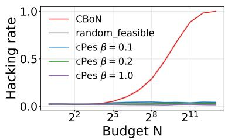

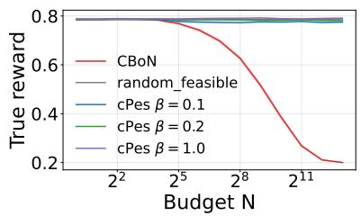

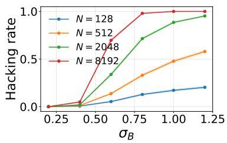  
(a) Conditional safety-hacking rate. (b) Conditional mean true reward. (c) False-positive tail scale.

Figure 1: Toy results. As the search budget grows, CBoN increasingly selects the rare unsafe-but feasible class $B ,$ whose reward-proxy upper tail dominates that of the safe class A. Random feasible selection does not exhibit this amplification, while cPes limits the resulting concentration. Panel (c) varies the false-positive reward-noise scale $\sigma _ { B }$

Figure 1 shows the predicted amplification. As N grows, CBoN shifts from selecting the safe class A to the unsafe-but-feasible class B. The conditional safety hacking rate rises from 0.023 at $N = 1$ to 0.9996 at $N = 8 1 9 2$ , while the mean true reward falls from about 0.786 to 0.200. Random feasible selection remains near the baseline false-positive rate, showing that exposure to class B alone does not explain the failure. cPes substantially limits this amplification in the toy problem. Controls varying the reward-error tails and removing false positives confirm that the efect requires an unsafe proxy-feasible class with a suficiently advantageous learned-reward tail; see Appendix A.15.

## 6.2. LLM Experiments

We next evaluate safety hacking in a more practical setting using LLMs.

Experimental settings. Our evaluation uses 714 test and 179 validation prompts from Jail breakBench [Chao et al., 2024], HarmBench [Mazeika et al., 2024], and AdvBench [Chen et al., 2022], after removing duplicates. For each prompt, we sample 256 responses from Qwen/Qwen2.5-7B-Instruct [Team, 2024] (temperature 1.0, top-p 0.95, 512 new tokens), giving 228,608 candidates. We evaluate all selection methods on the same candidates.

We filter candidates with meta-llama/Llama-Guard-3-8B [Llama Team, 2024] and rank them with PKU-Alignment/beaver-7b-v1.0-reward [Dai et al., 2024]. We report the primary safety threshold $\begin{array} { r l r } { b } & { { } = } & { 0 . 9 5 } \end{array}$ and compare random feasible selection, CBoN, and cPes for $N \in \{ 1 , 2 , 4 , 8 , 1 6 , 3 2 , 6 4 , 1 2 8 , 2 5 6 \}$ . Random feasible selection controls for exposure to filter false positives without reward maximization; cPes uses calibration-fixed clipping levels and $\beta = 1 . 0 $ . Point estimates are averaged over 100 random candidate-order permutations. For each prompt, we first average the metric over permutations and then compute standard errors across prompts; shaded bands show ±1.96 standard errors.

Because latent safety and reward are unobservable for open-ended responses, we use the HarmBench classifier as the operational safety criterion and define a safety-hacking event as selecting a response that passes Llama Guard but is classified as unsafe by HarmBench. Reported safety-hacking rates condition on non-abstention. Separately, we use gpt-5-mini [Singh et al., 2025] to evaluate safetyaware reward under the safety\_aware\_v1 rubric. These evaluators operationalize $g ^ { \star }$ and $r ^ { \star }$ for the experiments; neither is treated as ground truth. Evaluator and scoring details are given in Appendix B.1.

Safety-hacking amplification and finite-N decomposition. For a fixed prompt, candidate ordering, and budget N, let $K _ { A }$ and $K _ { B }$ be the numbers of proxy-feasible candidates labeled safe and unsafe by HarmBench. When the corresponding class is nonempty, let $M _ { A }$ and $M _ { B }$ denote its largest proxy reward. Because the proxy scores have no ties, CBoN selects an unsafe response in one of two cases: no safe feasible candidate is available, or the best unsafe candidate outscores the best safe candidate. Conditional on non-abstention, this gives

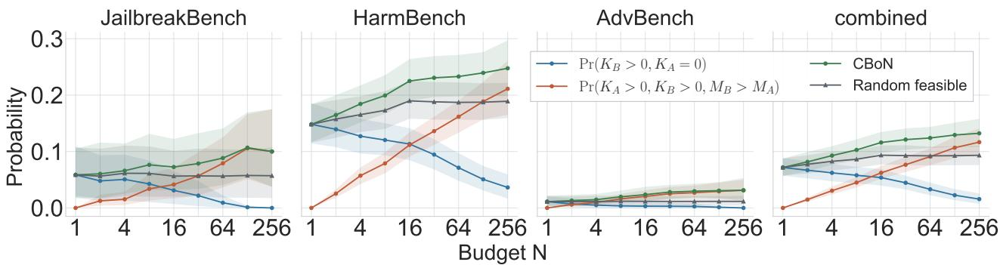  
Figure 2: Finite-N decomposition of conditional CBoN safety hacking on adversarial prompts under the HarmBench operational safety criterion. The total (green) is the sum of unsafe-only exposure (blue) and competitive unsafe wins (orange); random feasible selection is shown in gray. The competitive term corresponds to the joint-tail mechanism in Theorem 4.1. Points are averaged over 100 candidate-order permutations; bands show ±1.96 standard errors across prompts after permutation averaging.

$$
\begin{array} { r l } & { \operatorname* { P r } \left[ \widehat { y } _ { N } ^ { \mathrm { B o N } } \in B ( x , b ) \mid K _ { A } + K _ { B } > 0 \right] } \\ & { = \operatorname* { P r } \left[ K _ { B } > 0 , K _ { A } = 0 \mid K _ { A } + K _ { B } > 0 \right] + \operatorname* { P r } \left[ K _ { A } > 0 , K _ { B } > 0 , M _ { B } > M _ { A } \mid K _ { A } + K _ { B } > 0 \right] . } \end{array}\tag{22}
$$

The first term measures unsafe-only exposure, where no safe feasible candidate is available. The second measures reward-based competition when both classes are present, and is the empirical finite-N counterpart of the joint-tail competition in Theorem 4.1.

The decomposition in Figure 2 attributes the increase in safety hacking primarily to competitive selection. For the HarmBench subset and the combined evaluation, the unsafe-only term decreases with N, indicating that increased exposure to unsafe proxy-feasible responses does not account for the observed scaling behavior. By contrast, the competitive-selection term increases: conditional on both classes being present, the unsafe class more frequently attains the larger maximum proxy reward. This trend is consistent with the finite-N behavior implied by the relative joint tails in Theorem 4.1. Accordingly, the CBoN hacking rate increasingly exceeds the random-feasible contamination baseline, whereas cPes remains closer to the baseline (Figure 3a). Repeating the analysis with a calibrationmatched google/shieldgemma-2b [Zeng et al., 2024a] filter gives the same pattern, but a smaller overall increase in safety hacking: unsafe-only exposure falls with $N ,$ , while competitive unsafe wins become more common (Appendix B.2).

Proxy reward versus safety-aware reward. Larger budgets improve the objective optimized by CBoN: its proxy reward increases well above the random-feasible reference (Figure 3c). Yet its gpt-5-minijudged safety-aware reward, which penalizes unsafe and non-responsive outputs, deteriorates with N (Figure 3b). cPes produces smaller departures on both measures. Thus aggressive proxy optimization exploits proxy errors rather than improving the intended objective.

Reward-proxy ablation. To isolate the efect of the reward proxy, we replace PKU-Alignment/ beaver-7b-v1.0-reward with Skywork/Skywork-Reward-V2-Llama-3.1-8B [Liu et al., 2025], while keeping the candidate pools, safety filter, and HarmBench labels fixed. With Beaver, CBoN safety hacking increases from 9.1% at N = 1 to 13.4% at N = 256; with Skywork, it decreases to 6.8%. At N = 256, the unsafe-only term is 1.6% under both proxies, whereas the competitive unsafe-win term decreases from 11.7% with Beaver to 5.3% with Skywork (Figure 4). The reversal is therefore attributable to how the two reward proxies rank the same safe and unsafe proxy-feasible candidates, rather than to filtering or exposure. The corresponding conditional reward-tail survival curves are reported in Figure 5.

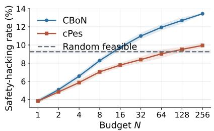  
(a) Safety-hacking rate.

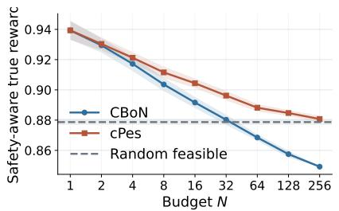  
(b) Safety-aware true reward.

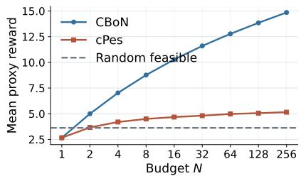  
(c) Mean proxy reward.

Figure 3: Safety and reward under constrained inference-time scaling on adversarial prompts. Harm-Bench evaluates safety, and gpt-5-mini evaluates safety-aware reward. As N grows, CBoN improves proxy reward but worsens both safety measures, while cPes limits these efects. Points are averaged over 100 candidate-order permutations; bands show ±1.96 standard errors across prompts after permutation averaging.  
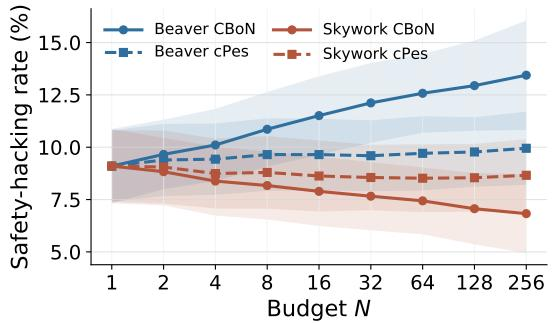  
(a) Safety-hacking rate.

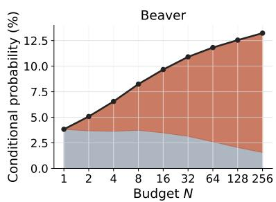

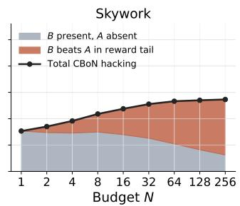  
(b) Finite-N decomposition for CBoN.  
Figure 4: Reward-proxy ablation with fixed candidate pools, safety-filter decisions, and HarmBench labels. Replacing Beaver with Skywork reverses the scaling trend in CBoN safety hacking (left). The unsafe-only component is unchanged, whereas the competitive component decreases under Skywork (right), indicating that amplification depends on reward-based competition within the contaminated proxy-feasible set.

This ablation is the empirical counterpart of the finite-N bounds in Theorem 4.1 and corollary A.1, which depend on the joint tails $\widehat { \Psi } _ { A }$ and $\widehat { \Psi } _ { B }$ rather than false-positive mass alone. A favorable safe tail can prevent amplification over the evaluated budgets without providing an asymptotic guarantee. At N = 256, Skywork CBoN has a lower safety-hacking rate than Skywork cPes (6.8% versus 8.7%). The guarantee for cPes is therefore not pointwise dominance over CBoN, but an N-independent bound under adverse tail configurations (Corollary 5.3 and Theorem 5.1).

## 7. Discussion and Limitations

Coverage control limits amplification, not contamination or misranking. The proxy-feasible reference already assigns mass $\kappa ( \boldsymbol { x } , \boldsymbol { b } )$ to unsafe false positives. cPes limits further concentration on this residual mass but cannot identify it, and may still favor unsafe outputs with high learned rewards. Its N-independent bound therefore implies neither absolute safety nor pointwise dominance over CBoN, as illustrated by the Skywork ablation.

Robust inference requires intervention at multiple points. Our analysis points to three complementary interventions: improving the safety filter, limiting downstream concentration, and choosing reward proxies with favorable safe-versus-unsafe tail behavior. The Skywork ablation shows that reward-tail ordering can substantially change risk over the observed budget range. These interventions address diferent parts of the failure: filtering controls contamination, while reward-tail behavior and coverage control govern selection within the resulting feasible set.

Limitations. We analyze a fixed, non-adaptive pipeline in which independently sampled candidates are filtered once and then ranked. Our theory therefore does not cover adaptive search, self-refinement, tree search, or agentic planning, whose candidate distributions can depend on previous proxy evaluations. By repeatedly steering generation toward high proxy scores, such procedures may amplify residual safety-filter errors more strongly than i.i.d. scaling, but our results do not establish or quantify this behavior. Extending the contamination–amplification analysis to such feedback-driven procedures is an important direction for future work.

## 8. Conclusion

We studied safety hacking in constrained inference-time scaling, where reward maximization can amplify residual errors in a learned safety filter. The filter may admit unsafe responses, and downstream selection may favor them more strongly as inference compute grows. Our finite-N analysis shows that this behavior is governed by the joint reward tails of safe and unsafe proxy-feasible responses, and our asymptotic result establishes that a heavier unsafe tail can make safety hacking nearly certain even when average proxy errors are small. Coverage control yields an N-independent bound, instantiated by cPes, but cannot remove unsafe responses already admitted by the filter. Toy and language-model experiments provide finite-budget evidence for this amplification mechanism, while the reward-proxy ablation shows that ranking within the contaminated feasible set is central to the observed outcome. The analysis therefore separates two requirements for safe inference-time scaling: controlling entry into the feasible set and controlling downstream concentration. Extending this characterization to adaptive and agentic search remains an important direction for future work.

## References

Dario Amodei, Chris Olah, Jacob Steinhardt, Paul Christiano, John Schulman, and Dan Mané. Concrete problems in AI safety. arXiv preprint arXiv:1606.06565, 2016.

Yuntao Bai, Saurav Kadavath, Sandipan Kundu, Amanda Askell, Jackson Kernion, Andy Jones, Anna Chen, Anna Goldie, Azalia Mirhoseini, Cameron McKinnon, et al. Constitutional ai: Harmlessness from ai feedback. arXiv preprint arXiv:2212.08073, 2022.

Patrick Chao, Edoardo Debenedetti, Alexander Robey, Maksym Andriushchenko, Francesco Croce, Vikash Sehwag, Edgar Dobriban, Nicolas Flammarion, George J Pappas, Florian Tramer, et al. Jailbreakbench: An open robustness benchmark for jailbreaking large language models. Advances in Neural Information Processing Systems, 37:55005–55029, 2024.

Yangyi Chen, Hongcheng Gao, Ganqu Cui, Fanchao Qi, Longtao Huang, Zhiyuan Liu, and Maosong Sun. Why should adversarial perturbations be imperceptible? rethink the research paradigm in adversarial nlp. In Proceedings of the 2022 Conference on Empirical Methods in Natural Language Processing, pages 11222–11237, 2022.

Yaswanth Chittepu, Ativ Joshi, Sohini Chintala, and Scott Niekum. Safe inference-time alignment via lagrangian reward augmentation. arXiv preprint arXiv:2607.02781, 2026.

Juntao Dai, Xuehai Pan, Ruiyang Sun, Jiaming Ji, Xinbo Xu, Mickel Liu, Yizhou Wang, and Yaodong Yang. Safe rlhf: Safe reinforcement learning from human feedback. In International Conference on Learning Representations, volume 2024, pages 50750–50777, 2024.

Leo Gao, John Schulman, and Jacob Hilton. Scaling laws for reward model overoptimization. In International Conference on Machine Learning, pages 10835–10866. PMLR, 2023.

Dan Hendrycks, Nicholas Carlini, John Schulman, and Jacob Steinhardt. Unsolved problems in ML safety. arXiv preprint arXiv:2109.13916, 2021.

Audrey Huang, Adam Block, Qinghua Liu, Nan Jiang, Akshay Krishnamurthy, and Dylan J Foster. Is best-of-n the best of them? coverage, scaling, and optimality in inference-time alignment. In International Conference on Machine Learning, pages 25075–25126. PMLR, 2025.

John Hughes, Sara Price, Aengus Lynch, Rylan Schaefer, Fazl Barez, Sanmi Koyejo, Henry Sleight, Erik Jones, Ethan Perez, and Mrinank Sharma. Bestof-n jailbreaking. arXiv preprint arXiv:2412.03556, 2024.

Hakan Inan, Kartikeya Upasani, Jianfeng Chi, Rashi Rungta, Krithika Iyer, Yuning Mao, Michael Tontchev, Qing Hu, Brian Fuller, Davide Testuggine, et al. Llama guard: Llm-based input-output safeguard for human-ai conversations. arXiv preprint arXiv:2312.06674, 2023.

Xiaotong Ji, Shyam Sundhar Ramesh, Matthieu Zimmer, Ilija Bogunovic, Jun Wang, and Haitham Bou Ammar. On almost surely safe alignment of large language models at inference-time. arXiv preprint arXiv:2502.01208, 2025.

Yuu Jinnai, Tetsuro Morimura, Kaito Ariu, and Kenshi Abe. Regularized best-of-n sampling with minimum bayes risk objective for language model alignment. In Proceedings of the 2025 Conference of the Nations of the Americas Chapter of the Association for Computational Linguistics: Human Language Technologies (Volume 1: Long Papers), pages 9321–9347, 2025.

Hadi Khalaf, Claudio Mayrink Verdun, Alex Oesterling, Himabindu Lakkaraju, and Flavio Calmon.

Inference-time reward hacking in large language models. In The Thirty-ninth Annual Conference on Neural Information Processing Systems, 2025. URL https://openreview.net/forum?id= hSX7Dd8dxy.

Chris Yuhao Liu, Liang Zeng, Yuzhen Xiao, Jujie He, Jiacai Liu, Chaojie Wang, Rui Yan, Wei Shen, Fuxiang Zhang, Jiacheng Xu, Yang Liu, and Yahui Zhou. Skywork-reward-v2: Scaling preference data curation via human-ai synergy. arXiv preprint arXiv:2507.01352, 2025.

AI @ Meta Llama Team. The llama 3 herd of models, 2024. URL https://arxiv.org/abs/2407. 21783.

David Manheim and Scott Garrabrant. Categorizing variants of goodhart’s law. arXiv preprint arXiv:1803.04585, 2018.

Mantas Mazeika, Long Phan, Xuwang Yin, Andy Zou, Zifan Wang, Norman Mu, Elham Sakhaee, Nathaniel Li, Steven Basart, Bo Li, et al. Harmbench: A standardized evaluation framework for automated red teaming and robust refusal. arXiv preprint arXiv:2402.04249, 2024.

Long Ouyang, Jefrey Wu, Xu Jiang, Diogo Almeida, Carroll Wainwright, Pamela Mishkin, Chong Zhang, Sandhini Agarwal, Katarina Slama, Alex Ray, et al. Training language models to follow instructions with human feedback. Advances in neural information processing systems, 35:27730–27744, 2022.

Aaditya Singh, Adam Fry, Adam Perelman, Adam Tart, Adi Ganesh, Ahmed El-Kishky, Aidan McLaughlin, Aiden Low, AJ Ostrow, Akhila Ananthram, et al. Openai gpt-5 system card. arXiv preprint arXiv:2601.03267, 2025.

Joar Skalse, Nikolaus Howe, Dmitrii Krasheninnikov, and David Krueger. Defining and characterizing reward gaming. Advances in neural information processing systems, 35:9460–9471, 2022.

Charlie Snell, Jaehoon Lee, Kelvin Xu, and Aviral Kumar. Scaling llm test-time compute optimally can be more efective than scaling model parameters. arXiv preprint arXiv:2408.03314, 2024.

Alexandra Souly, Qingyuan Lu, Dillon Bowen, Tu Trinh, Elvis Hsieh, Sana Pandey, Pieter Abbeel, Justin Svegliato, Scott Emmons, Olivia Watkins, et al. A strongreject for empty jailbreaks. Advances in Neural Information Processing Systems, 37:125416–125440, 2024.

Nisan Stiennon, Long Ouyang, Jefrey Wu, Daniel Ziegler, Ryan Lowe, Chelsea Voss, Alec Radford, Dario Amodei, and Paul F Christiano. Learning to summarize with human feedback. Advances in neural information processing systems, 33:3008–3021, 2020.

Qwen Team. Qwen2.5: A party of foundation models, September 2024. URL https://qwenlm. github.io/blog/qwen2.5/.

Haoyu Wang, Zeyu Qin, Li Shen, Xueqian Wang, Dacheng Tao, and Minhao Cheng. Safety reasoning with guidelines. In Forty-second International Conference on Machine Learning, 2025.

Wenjun Zeng, Yuchi Liu, Ryan Mullins, Ludovic Peran, Joe Fernandez, Hamza Harkous, Karthik Narasimhan, Drew Proud, Piyush Kumar, Bhaktipriya Radharapu, Olivia Sturman, and Oscar Wahltinez. Shieldgemma: Generative ai content moderation based on gemma, 2024a. URL https://arxiv.org/abs/2407.21772.

Wenjun Zeng, Yuchi Liu, Ryan Mullins, Ludovic Peran, Joe Fernandez, Hamza Harkous, Karthik Narasimhan, Drew Proud, Piyush Kumar, Bhaktipriya Radharapu, et al. Shieldgemma: Generative ai content moderation based on gemma. arXiv preprint arXiv:2407.21772, 2024b.

Lianmin Zheng, Wei-Lin Chiang, Ying Sheng, Siyuan Zhuang, Zhanghao Wu, Yonghao Zhuang, Zi Lin, Zhuohan Li, Dacheng Li, Eric Xing, et al. Judging llm-as-a-judge with mt-bench and chatbot arena. Advances in neural information processing systems, 36:46595–46623, 2023.

## A. Appendix

## A.1. Operational Finite-N Safety-hacking Criteria

Corollary A.1. Under the conditions of Theorem 4.1, the following hold.

1. If there exist $t \in \mathbb { R } , \alpha _ { A } \in [ 0 , 1 )$ , and $\gamma _ { B } > 0$ such that $N \widehat { \Psi } _ { A } ( t ; x , b ) \leq \alpha _ { A }$ and $\begin{array} { r } { N \widehat { \Psi } _ { B } ( t ; x , b ) \geq \gamma _ { B } } \end{array}$ then

$$
\begin{array} { r } { \mathbb { P } \left[ \hat { y } _ { N } ^ { \mathrm { B o N } } ( x ) \in B ( x , b ) \right] \geq ( 1 - \alpha _ { A } ) \big ( 1 - e ^ { - \gamma _ { B } } \big ) . } \end{array}\tag{23}
$$

2. If there exist $s \in \mathbb { R } , \alpha _ { B } \geq 0 ,$ , and $\gamma _ { A } > 0$ such that $N \widehat \Psi _ { B } ( s ; x , b ) \le \alpha _ { B }$ , and $\begin{array} { r } { N \widehat { \Psi } _ { A } ( s ; x , b ) \geq \gamma _ { A } , } \end{array}$ then

$$
\begin{array} { r } { \mathbb { P } \left[ \widehat { y } _ { N } ^ { \mathrm { B o N } } ( x ) \in B ( x , b ) \right] \leq \alpha _ { B } + e ^ { - \gamma _ { A } } . } \end{array}\tag{24}
$$

Proof. Let $\psi _ { A } = \widehat { \Psi } _ { A } ( t ; x , b )$ and $\psi _ { B } = \widehat { \Psi } _ { B } ( t ; x , b )$ . From Theorem 4.1,

$$
\widehat { L } _ { N } ( t ; x , b ) = ( 1 - \psi _ { A } ) ^ { N } \left[ 1 - \left( 1 - \frac { \psi _ { B } } { 1 - \psi _ { A } } \right) ^ { N } \right] .\tag{25}
$$

If $N \psi _ { A } \leq \alpha _ { A } < 1$ , then $( 1 - \psi _ { A } ) ^ { N } \ge 1 - N \psi _ { A } \ge 1 - \alpha _ { A }$ . Since $\psi _ { B } / ( 1 - \psi _ { A } ) \geq \psi _ { B }$ and $N \psi _ { B } \geq \gamma _ { B }$

$$
1 - \left( 1 - \frac { \psi _ { B } } { 1 - \psi _ { A } } \right) ^ { N } \geq 1 - e ^ { - N \psi _ { B } } \geq 1 - e ^ { - \gamma _ { B } } .\tag{26}
$$

This proves the first claim. For the second claim, let $\psi _ { A } = \widehat { \Psi } _ { A } ( s ; x , b )$ and $\psi _ { B } = \widehat { \Psi } _ { B } ( s ; x , b )$ . The upper bound gives

$$
\widehat { U } _ { N } ( s ; x , b ) \leq \left[ 1 - ( 1 - \psi _ { B } ) ^ { N } \right] + ( 1 - \psi _ { A } ) ^ { N } \leq N \psi _ { B } + e ^ { - N \psi _ { A } } \leq \alpha _ { B } + e ^ { - \gamma _ { A } } .\tag{27}
$$

This completes the proof.

Corollary A.1 gives an experimentally testable diagnostic: as N increases, estimate whether the efective unsafe-but-feasible score-tail mass $N \widehat \Psi _ { B } ( \cdot )$ crosses a constant before the true-positive score-tail mass $N \widehat \Psi _ { A } ( \cdot )$ does. If so, CBoN should display compute-amplified safety hacking.

## A.2. Prompt-distribution Amplification

Corollary A.2 (Prompt-distribution amplification). Let $X \sim { \mathcal { D } }$ be a prompt drawn from a prompt distribution, andfix $b \in ( 0 , 1 ]$ . For each prompt x, define the conditional CBoN hacking probability, where the probability is over the N candidate samples drawn from $\pi _ { \mathrm { r e f } } ( \cdot \mid x )$ , by

$$
p _ { N } ( x ) : = \mathbb { P } _ { y _ { 1 : N } \sim \pi _ { \mathrm { r e f } } ( \cdot | x ) } \left[ \widehat { y } _ { N } ^ { \mathrm { B o N } } ( x ) \in B ( x , b ) \right] .\tag{28}
$$

Suppose there exist a measurable set of prompts ${ \mathcal { E } } \subseteq { \mathcal { X } }$ and $\rho \in [ 0 , 1 ]$ such that

$$
\begin{array} { r } { \mathbb { P } _ { X \sim \mathcal { D } } [ X \in \mathcal { E } ] \geq \rho , } \end{array}
$$

and, for every $x \in \mathcal { E } ,$ , there exists a sequence $t _ { N } ( x ) \ \in \ \mathbb { R }$ satisfying $N \widehat { \Psi } _ { A } ( t _ { N } ( x ) ; x , b ) ~ \to ~ 0$ and $N \widehat \Psi _ { B } \big ( t _ { N } ( x ) ; x , b \big ) \to \infty$ . Then the aggregate safety-hacking probability satisfies

$$
\operatorname* { l i m } _ { N  \infty } \operatorname* { i n f } \mathbb { P } [ \widehat { y } _ { N } ^ { \mathrm { B o N } } ( X ) \in B ( X , b ) ] \geq \rho ,\tag{29}
$$

where the probability is over $X \sim { \mathcal { D } }$ and the candidate samples drawn conditionally from $\pi _ { \mathrm { r e f } } ( \cdot \mid X )$

Proof. By Theorem 4.2, for every $x \in { \mathcal { E } }$ we have $p _ { N } ( x )  1$ . Moreover, $0 \le p _ { N } ( x ) \le 1$ for all x and N. Therefore

$$
\begin{array} { r } { \mathbb { P } \left[ \widehat { y } _ { N } ^ { \mathrm { B o N } } ( X ) \in B ( X , b ) \right] = \mathbb { E } _ { X \sim \mathcal { D } } [ p _ { N } ( X ) ] \geq \mathbb { E } _ { X \sim \mathcal { D } } [ p _ { N } ( X ) \mathbb { I } \{ X \in \mathcal { E } \} ] . } \end{array}\tag{30}
$$

Fatou’s lemma gives

$$
\operatorname* { l i m i n f } _ { N \to \infty } \mathbb { E } [ p _ { N } ( X ) \mathbb { I } \{ X \in { \mathcal E } \} ] \ge \mathbb { E } \left[ \operatorname* { l i m i n f } _ { N \to \infty } p _ { N } ( X ) \mathbb { I } \{ X \in { \mathcal E } \} \right]\tag{31}
$$

$$
= \mathbb { P } _ { X \sim { \mathcal { D } } } [ X \in { \mathcal { E } } ] \geq \rho .\tag{32}
$$

This proves the claim.

Corollary A.2 lifts the fixed-prompt tail condition to distribution-level evaluations: if a positive-measure subset of prompts is tail-amplifiable, then the average safety-hacking rate cannot vanish as the search budget grows.

## A.3. Direct score dominance

Remark A.3 (Direct score dominance). If there exists a threshold $t \in \mathbb { R }$ such that $\widehat { \Psi } _ { A } ( t ; x , b ) = 0$ and $\widehat { \Psi } _ { B } ( t ; x , b ) > 0 ,$ , then Theorem 4.2 applies with the constant sequence $t _ { N } = t _ { s }$ and

$$
\mathbb { P } [ \widehat { y } _ { N } ^ { \mathrm { B o N } } ( x ) \in B ( x , b ) ]  1 .\tag{33}
$$

This holds, for example, when a positive-reference-mass subset of $B ( { \boldsymbol { x } } , { \boldsymbol { b } } )$ receives learned scores above the essential upper endpoint on $A ( x , b )$ .

## A.4. Gaussian error-tail separation

Definition A.4 (Proxy-feasible reward range). Fix $x \in \mathcal { X }$ and $b \in ( 0 , 1 ]$ with $\widehat { S } _ { + } ( x , b ) \neq \emptyset$ . Define

$$
\Delta ( x , b ) : = \operatorname* { s u p } _ { y \in \widehat { S } _ { + } ( x , b ) } r ^ { \star } ( x , y ) - \operatorname* { i n f } _ { y \in \widehat { S } _ { + } ( x , b ) } r ^ { \star } ( x , y ) .\tag{34}
$$

Assumption A.5 (Local bounded reward range). For the prompt $x \in \mathcal { X }$ and threshold $b \in ( 0 , 1 ]$ under consideration, $\widehat { S } _ { + } ( x , b ) \neq \emptyset$ and $\Delta ( x , b ) < \infty$

Proposition A.6 (Gaussian error-tail separation). We define the pointwise proxy errors

$$
\varepsilon _ { r } ( x , y ) : = { \widehat { r } } ( x , y ) - r ^ { \star } ( x , y ) ,\tag{35}
$$

$$
\varepsilon _ { g } ( x , y ) : = { \widehat { g } } ( x , y ) - g ^ { \star } ( x , y ) .\tag{36}
$$

Also, for $\diamond \in \{ A , B \}$ , define

$$
\eta _ { \diamondsuit } ( x , b ) : = \mathbb { P } _ { y \sim \pi _ { \operatorname { r e f } } ( \cdot | x ) } [ y \in \diamondsuit ( x , b ) ] .\tag{37}
$$

Fix $x \in \mathcal { X }$ and $b \in ( 0 , 1 ]$ , and suppose Assumption A.5 holds. Assume that $\eta _ { A } ( x , b ) > 0$ and $\eta _ { B } ( x , b ) > 0$ Suppose further that there exist constants $0 < \sigma _ { A } ( x ) < \sigma _ { B } ( x )$ such that the conditional upper tails of the reward-proxy error satisfy, as $u  \infty ,$

$$
\log \mathbb { P } \left[ \varepsilon _ { r } ( x , y ) > u \mid y \in A ( x , b ) \right] = - \frac { u ^ { 2 } } { 2 \sigma _ { A } ^ { 2 } ( x ) } + o ( u ^ { 2 } ) ,\tag{38}
$$

$$
\log \mathbb { P } \left[ \varepsilon _ { r } ( x , y ) > u \mid y \in B ( x , b ) \right] = - \frac { u ^ { 2 } } { 2 \sigma _ { B } ^ { 2 } ( x ) } + o ( u ^ { 2 } ) .\tag{39}
$$

Let

$$
R _ { A } ^ { \star } ( x , b ) : = \operatorname* { s u p } _ { y \in A ( x , b ) } r ^ { \star } ( x , y ) .\tag{40}
$$

Then, for any constant $c \in \left( \sqrt { 2 } \sigma _ { A } ( x ) , \sqrt { 2 } \sigma _ { B } ( x ) \right)$ , the sequence

$$
\tau _ { N } : = R _ { A } ^ { \star } ( x , b ) + c \sqrt { \log N }\tag{41}
$$

satisfies the score-tail separation condition in Theorem $4 . 2 ;$ that is,

$$
N \widehat { \Psi } _ { A } ( \tau _ { N } ; x , b )  0 , \qquad N \widehat { \Psi } _ { B } ( \tau _ { N } ; x , b )  \infty .\tag{42}
$$

Consequently,

$$
\operatorname* { l i m } _ { N \to \infty } \mathbb { P } \left[ \widehat { y } _ { N } ^ { \mathrm { B o N } } ( x ) \in B ( x , b ) \right] = 1 .\tag{43}
$$

Thefixed shift $\Delta ( x , b )$ only enters when converting reward-error tails into learned-score tails, and it does not change the Gaussian large-deviation exponent.

Proof. For $\diamond \in \{ A , B \}$ and $t \in \mathbb { R }$ , define the joint reward-error tail

$$
\Psi _ { \diamondsuit } ( t ; x , b ) : = \mathbb { P } _ { y \sim \pi _ { \operatorname { r e f } } ( \cdot | x ) } \left[ y \in \diamondsuit ( x , b ) , \varepsilon _ { r } ( x , y ) > t \right] .\tag{44}
$$

These tails combine the reference probability of a class with the upper-tail behavior of reward-proxy overestimation inside that class.

For $\diamond \in \{ A , B \}$ , we can write

$$
\Psi _ { \diamondsuit } ( u ; x , b ) = \eta _ { \diamondsuit } ( x , b ) \mathbb { P } \left[ \varepsilon _ { r } ( x , y ) > u \mid y \in \diamondsuit ( x , b ) \right] .
$$

Let

$$
t _ { N } = c \sqrt { \log N } , \qquad c \in ( \sqrt { 2 } \sigma _ { A } ( x ) , \sqrt { 2 } \sigma _ { B } ( x ) ) ,
$$

and set

$$
\tau _ { N } = R _ { A } ^ { \star } ( x , b ) + t _ { N } .
$$

Using the assumed tail exponent on $A ( x , b )$

$$
\log \left( N \Psi _ { A } ( t _ { N } ; x , b ) \right) = \log N + \log \eta _ { A } ( x , b ) - \frac { t _ { N } ^ { 2 } } { 2 \sigma _ { A } ^ { 2 } ( x ) } + o ( t _ { N } ^ { 2 } )\tag{45}
$$

$$
= \left( 1 - \frac { c ^ { 2 } } { 2 \sigma _ { A } ^ { 2 } ( x ) } + o ( 1 ) \right) \log N + O ( 1 ) .\tag{46}
$$

Since $c > \sqrt { 2 } \sigma _ { A } ( x )$ , the coeficient of log N is negative, and therefore

$$
N \Psi _ { A } ( t _ { N } ; x , b )  0 .\tag{47}
$$

Moreover, for $y \in A ( x , b ) , r ^ { \star } ( x , y ) \leq R _ { A } ^ { \star } ( x , b )$ . Hence

$$
\{ y \in A ( x , b ) , \widehat { r } ( x , y ) > \tau _ { N } \} \subseteq \{ y \in A ( x , b ) , \varepsilon _ { r } ( x , y ) > t _ { N } \} ,\tag{48}
$$

and so

$$
N \widehat \Psi _ { A } ( \tau _ { N } ; x , b ) \leq N \Psi _ { A } ( t _ { N } ; x , b )  0 .\tag{49}
$$

For the B tail, since $\Delta ( x , b ) < \infty$ by assumption,

$$
( t _ { N } + \Delta ( x , b ) ) ^ { 2 } = c ^ { 2 } \log N + o ( \log N ) .\tag{50}
$$

Using the assumed tail exponent on $B ( x , b )$

$$
\log \left( N \Psi _ { B } ( t _ { N } + \Delta ( x , b ) ; x , b ) \right) = \log N + \log \eta _ { B } ( x , b ) - \frac { ( t _ { N } + \Delta ( x , b ) ) ^ { 2 } } { 2 \sigma _ { B } ^ { 2 } ( x ) } + o \left( ( t _ { N } + \Delta ( x , b ) ) ^ { 2 } \right)\tag{51}
$$

$$
= \left( 1 - \frac { c ^ { 2 } } { 2 \sigma _ { B } ^ { 2 } ( x ) } + o ( 1 ) \right) \log N + O ( 1 ) .\tag{52}
$$

Since $c < \sqrt { 2 } \sigma _ { B } ( x )$ , the coeficient of log N is positive, and therefore

$$
N \Psi _ { B } ( t _ { N } + \Delta ( x , b ) ; x , b )  \infty .\tag{53}
$$

For every $y \in B ( x , b )$ , we have $y ~ \in ~ \widehat { S } _ { + } ( x , b )$ and $A ( x , b ) \subseteq \widehat { S } _ { + } ( x , b )$ . Hence $R _ { A } ^ { \star } ( x , b ) ~ \leq$ $\begin{array} { r } { \mathbf { s u p } _ { z \in \widehat { \mathcal { S } } _ { + } ( x , b ) } r ^ { \star } ( x , z ) } \end{array}$ and $\begin{array} { r } { r ^ { \star } ( x , y ) \geq \operatorname* { i n f } _ { z \in \widehat { S } _ { + } ( x , b ) } r ^ { \star } ( x , z ) } \end{array}$ , so

$$
R _ { A } ^ { \star } ( x , b ) - r ^ { \star } ( x , y ) \leq \Delta ( x , b ) .\tag{54}
$$

Thus

$$
\{ y \in B ( x , b ) , \ \varepsilon _ { r } ( x , y ) > t _ { N } + \Delta ( x , b ) \} \subseteq \{ y \in B ( x , b ) , \ { \widehat { r } } ( x , y ) > \tau _ { N } \} ,\tag{55}
$$

and hence

$$
N \widehat { \Psi } _ { B } ( \tau _ { N } ; x , b ) \geq N \Psi _ { B } ( t _ { N } + \Delta ( x , b ) ; x , b )  \infty .\tag{56}
$$

Therefore the score-tail separation conditions in Theorem 4.2 hold with threshold $\tau _ { N }$ . The final claim follows from Theorem 4.2. □

Remark A.7 (Boundary behavior). When $\widehat { \Psi } _ { A }$ and $\widehat { \Psi } _ { B }$ are asymptotically comparable on the relevant score scale, finer tail constants and class masses determine the limit. In error-tail conditions such as Proposition $A . 6 ,$ the finite reward range $\Delta ( x , b )$ can afect boundary constants without changing the Gaussian exponent away from the boundary.

Algorithm 1 Constrained Pessimistic Inference $( \mathsf { c P e s } )$ , sample implementation   
Require: Prompt $x ,$ reference policy $\pi _ { \mathrm { r e f } } ( \cdot \mid x )$ , proxies ${ \widehat { r } } , { \widehat { g } } ,$ threshold $b ,$ parameter $\beta ,$ clipping levels   
$\widehat { R } _ { \operatorname* { m i n } } < \widehat { R } _ { \operatorname* { m a x } } ,$ budget N   
1: Sample $y _ { 1 } , \dots , y _ { N } \overset { \mathrm { i i d } } { \sim } \pi _ { \mathrm { r e f } } ( \cdot ~ | ~ x )$   
2: Set $\mathcal { T } _ { N } ( \dot { x } , b ) = \left\{ i \in [ N ] : \widehat { g } ( x , y _ { i } ) \geq b \right\}$ and $m _ { N } = \vert \mathcal { I } _ { N } ( x , b ) \vert$   
3: if $m _ { N } = 0$ then   
4: Return a predefined fallback, e.g., abstention   
5: end if   
6: Set $\widetilde { r } _ { i } = \mathrm { c l i p } ( \widehat { r } ( x , y _ { i } ) , \widehat { R } _ { \operatorname* { m i n } } , \widehat { R } _ { \operatorname* { m a x } } )$ for each $i \in \mathcal { T } _ { N } ( x , b )$   
7: Find $\hat { \lambda } _ { N } ( x ) \in [ \widehat { R } _ { \operatorname* { m i n } } - \beta , \widehat { R } _ { \operatorname* { m a x } } )$ such that   
$\frac { 1 } { m _ { N } } \sum _ { i \in \mathcal { T } _ { N } ( x , b ) } \mathrm { { R e L U } } \left( \frac { \widetilde { r } _ { i } - \hat { \lambda } _ { N } ( x ) } { \beta } \right) = 1$   
8: Set $\begin{array} { r } { \hat { p } _ { i } = \frac { 1 } { m _ { N } } } \end{array}$ ReLU $\left( \frac { \widetilde { r } _ { i } - \hat { \lambda } _ { N } ( x ) } { \beta } \right)$ for each $i \in \mathcal { T } _ { N } ( x , b )$   
9: Sample $I \in \mathcal { T } _ { N } ( x , b )$ with probability $\hat { p } _ { i }$ and return yI

## A.5. Sample implementation and consistency of cPes

Proposition A.8 (Consistency of sample cPes). Fix $x \in \mathcal { X }$ and $b \in ( 0 , 1 ]$ with $q ( x , b ) > 0 .$ . Let $\hat { \pi } _ { N } ( \cdot \mid x )$ be the random output distribution induced by Algorithm 1 on $m _ { N } > 0$ . Then $m _ { N } $ ∞ almost surely, $\hat { \lambda } _ { N } ( x )  \lambda ( x )$ almost surely, and for every bounded $f : \mathcal { V } \to \mathbb { R } ,$

$$
\mathbb { E } _ { y \sim \hat { \pi } _ { N } ( \cdot | x ) } [ f ( y ) ]  \mathbb { E } _ { y \sim \hat { \pi } ( \cdot | x ) } [ f ( y ) ] \qquad a l m o s t s u r e l y .\tag{57}
$$

Proof. Let $\begin{array} { r } { m _ { N } = \sum _ { i = 1 } ^ { N } \mathbb { I } \{ y _ { i } \in \widehat { S } _ { + } ( x , b ) \} } \end{array}$ . Since $m _ { N } / N \to q ( x , b ) > 0$ almost surely, $m _ { N }  \infty$ almost surely and $m _ { N } > 0$ eventually.

Conditional on belonging to $\widehat { \cal S } _ { + } ( x , b )$ , the feasible samples are i.i.d. from $\pi _ { \mathrm { r e f } } ^ { \sharp } ( \cdot \mid x )$ . Define

$$
h _ { N } ( \lambda ) : = \frac { 1 } { m _ { N } } \sum _ { i \in \mathcal { T } _ { N } ( x , b ) } \mathrm { R e L U } \left( \frac { \widetilde { r } ( x , y _ { i } ) - \lambda } { \beta } \right) ,\tag{58}
$$

$$
h ( \lambda ) : = \mathbb { E } _ { \pi _ { \mathrm { r e f } } ^ { \sharp } } \mathrm { R e L U } \left( \frac { \widetilde { r } ( x , y ) - \lambda } { \beta } \right) .\tag{59}
$$

The functions indexed by $\lambda \in \left[ \widehat { R } _ { \operatorname* { m i n } } - \beta , \widehat { R } _ { \operatorname* { m a x } } \right]$ are uniformly bounded and $1 / \beta \cdot$ Lipschitz in λ. A finite-grid argument combined with the strong law of large numbers yields

$$
\operatorname* { s u p } _ { \lambda \in [ \widehat { R } _ { \operatorname* { m i n } } - \beta , \widehat { R } _ { \operatorname* { m a x } } ] } | h _ { N } ( \lambda ) - h ( \lambda ) |  0 \qquad \mathrm { a l m o s t ~ s u r e l y } .\tag{60}
$$

By Proposition 5.2, the equation $h ( \lambda ) = 1$ has a unique solution $\lambda ( x )$ . Uniform convergence and monotonicity imply that any empirical solution $\hat { \lambda } _ { N } ( x ) \overset { - } { \mathrm { t o } } h _ { N } ( \lambda ) = 1$ converges almost surely to $\lambda ( x )$

For any bounded $f ,$ write

$$
\mathbb { E } _ { \hat { \pi } _ { N } } [ f ] = \frac { 1 } { m _ { N } } \sum _ { i \in { \mathcal { T } _ { N } ( x , b ) } } f ( y _ { i } ) \operatorname { R e L U } \left( \frac { \widetilde { r } ( x , y _ { i } ) - \hat { \lambda } _ { N } ( x ) } { \beta } \right) .\tag{61}
$$

The summands are uniformly bounded, and the weights converge uniformly in the multiplier because of the Lipschitz property. Applying the strong law again and using $\hat { \lambda } _ { N } ( x )  \lambda ( x )$ gives

$$
\mathbb { E } _ { \hat { \pi } _ { N } } [ f ]  \mathbb { E } _ { \pi _ { \mathrm { r e f } } ^ { \sharp } } [ f ( y ) \mathrm { R e L U } ( \frac { \widetilde { r } ( x , y ) - \lambda ( x ) } { \beta } ) ] = \mathbb { E } _ { \hat { \pi } } [ f ] .\tag{62}
$$

## A.6. Utility tradeof of cPes

Bounded coverage alone can be achieved by avoiding reward optimization altogether. We therefore quantify the utility cost of coverage control. For a policy $\pi ,$ let

$$
J ( \pi ; x ) : = \mathbb { E } _ { y \sim \pi ( \cdot | x ) } [ r ^ { \star } ( x , y ) ] .\tag{63}
$$

Define the clipped-score RMSE under the proxy-feasible reference by

$$
\bar { \varepsilon } _ { r , \mathrm { c l i p } } ^ { \sharp } ( x ) : = \sqrt { \mathbb { E } _ { y \sim \pi _ { \mathrm { r e f } } ^ { \sharp } ( \cdot | x ) } \left[ \left( \widetilde { r } ( x , y ) - r ^ { \star } ( x , y ) \right) ^ { 2 } \right] } .\tag{64}
$$

This quantity includes both reward-proxy error and any distortion introduced by clipping.

Proposition A.9 (Utility tradeof within the proxy-feasible set). Suppose $\bar { \varepsilon } _ { r , \mathrm { c l i p } } ^ { \sharp } ( x ) < \infty$ . For any comparator policy $\rho ( \cdot \mid x ) \ll \pi _ { \mathrm { r e f } } ^ { \sharp } ( \cdot \mid x )$ , the population cPes policy satisfies

$$
J ( \rho ; x ) - J ( \hat { \pi } ; x ) \leq \frac { \beta } { 2 } \big ( C _ { \rho } ^ { \sharp } ( x ) - 1 \big ) + \bar { \varepsilon } _ { r , \mathrm { c l i p } } ^ { \sharp } ( x ) \left( \sqrt { C _ { \rho } ^ { \sharp } ( x ) } + \sqrt { 1 + \frac { \widehat { R } _ { \mathrm { s p a n } } } { \beta } } \right) .\tag{65}
$$

The bound makes explicit the role of $\beta .$ . Smaller $\beta$ permits more aggressive reward optimization but allows greater concentration relative to $\pi _ { \mathrm { r e f } } ^ { \sharp } ,$ while larger $\beta$ keeps the policy closer to the proxy-feasible reference distribution.

## A.7. Oracle regret decomposition

For the oracle comparison below, define the ambient coverage coeficient

$$
C _ { \pi } ( x ) : = \sum _ { y \in \mathcal { y } } \frac { \pi ( y \mid x ) ^ { 2 } } { \pi _ { \mathrm { r e f } } ( y \mid x ) } .\tag{66}
$$

For a comparator $\pi ^ { \star }$ , let $\alpha ^ { \star } ( x , b ) : = \pi ^ { \star } ( \widehat { S } _ { + } ( x , b ) \mid x )$ and, when $\alpha ^ { \star } ( x , b ) > 0$ , define

$$
\pi ^ { \star , \sharp } ( y \mid x ) : = \frac { \pi ^ { \star } ( y \mid x ) \mathbb { I } \{ y \in \widehat { S } _ { + } ( x , b ) \} } { \alpha ^ { \star } ( x , b ) } .\tag{67}
$$

Theorem A.10 (Oracle regret decomposition). Fix $b \in ( 0 , 1 )$ and suppose $0 \le r ^ { \star } ( x , y ) \le R _ { \mathrm { m a x } }$ . Let $\pi ^ { \star } \ll \pi _ { \mathrm { r e f } }$ satisfy supp $( \pi ^ { \star } ) \subseteq S _ { + } ^ { \star } ( x ) ; i f \alpha ^ { \star } ( x , b ) > 0 ,$ , assume also $\pi ^ { \star , \sharp } \ll \pi _ { \mathrm { r e f } } ^ { \sharp } . \ I f \alpha ^ { \star } ( x , b ) > 0 ,$ , then

$$
\begin{array} { r l } & { J ( \pi ^ { \star } ; x ) - J ( \hat { \pi } ; x ) \le \left[ \displaystyle \frac { \beta } { 2 } \big ( C _ { \pi ^ { \star , \sharp } } ^ { \sharp } ( x ) - 1 \big ) + \bar { \varepsilon } _ { r , \mathrm { c l i p } } ^ { \sharp } ( x ) \left( \sqrt { C _ { \pi ^ { \star , \sharp } } ^ { \sharp } ( x ) } + \sqrt { 1 + \frac { \widehat R _ { \mathrm { s p a n } } } { \beta } } \right) \right] } \\ & { \quad \quad + \displaystyle \frac { R _ { \operatorname* { m a x } } \sqrt { C _ { \pi ^ { \star } } ( x ) } \bar { \varepsilon } _ { g } ( x ) } { 1 - b } . } \end{array}\tag{68}
$$

If $\dot { \cdot } \alpha ^ { \star } ( x , b ) = 0 .$ , then

$$
J ( \pi ^ { \star } ; x ) - J ( \hat { \pi } ; x ) \leq \frac { R _ { \operatorname* { m a x } } \sqrt { C _ { \pi ^ { \star } } ( x ) } \bar { \varepsilon } _ { g } ( x ) } { 1 - b } ,\tag{69}
$$

that $i s ,$ the bracketed proxy-feasible comparison term is omitted.

Proof. Decompose the regret of the truly safe comparator $\pi ^ { \star }$ :

$$
J ( \pi ^ { \star } ; x ) - J ( \hat { \pi } ; x ) = \mathbb { E } _ { \pi ^ { \star } } [ r ^ { \star } ( x , y ) \mathbb { I } \{ y \in \widehat { S } _ { + } ( x , b ) \} ] - J ( \hat { \pi } ; x )\tag{70}
$$

$$
+ \mathbb { E } _ { \pi ^ { \star } } [ r ^ { \star } ( x , y ) \mathbb { I } \{ y \notin \widehat { { \cal S } } _ { + } ( x , b ) \} ] .\tag{71}
$$

If $\alpha ^ { \star } ( x , b ) > 0$ , then the first term is at most $J ( \pi ^ { \star , \sharp } ; x ) - J ( \hat { \pi } ; x )$ because $\alpha ^ { \star } ( x , b ) \leq 1$ and rewards are nonnegative. Applying Proposition $\mathsf { A } . 9$ with $\rho = \pi ^ { \star , \sharp }$ gives the bracketed term in (68). If $\alpha ^ { \star } ( x , b ) = 0 .$ the first term is $- J ( \hat { \pi } ; x ) \le 0 .$ , so the bracketed term is omitted.

It remains to control the second term. Since supp $( \pi ^ { \star } ) \subseteq S _ { + } ^ { \star } ( x )$ , the event $\{ y \not \in \widehat { S } _ { + } ( x , b ) \}$ under $\pi ^ { \star }$ is a false negative of the safety proxy. On this event, $g ^ { \star } ( x , y ) = 1$ and $\widehat { g } ( x , y ) < b , s 0 \left| \varepsilon _ { g } ( x , y ) \right| > 1 - b$ Hence

$$
\mathbb { P } _ { \pi _ { \mathrm { r e f } } } [ y \in \mathcal { S } _ { + } ^ { \star } ( x ) , y \notin \widehat { \mathcal { S } } _ { + } ( x , b ) ] \leq \frac { \bar { \varepsilon } _ { g } ( x ) ^ { 2 } } { ( 1 - b ) ^ { 2 } } .\tag{72}
$$

By Cauchy–Schwarz and absolute continuity,

$$
\mathbb { P } _ { \pi ^ { \star } } [ y \notin \widehat { { \mathcal S } } _ { + } ( x , b ) ] = \mathbb { E } _ { \pi _ { \mathrm { r e f } } } \left[ \frac { \pi ^ { \star } ( y \mid x ) } { \pi _ { \mathrm { r e f } } ( y \mid x ) } \mathbb { I } \{ y \in { \mathcal S } _ { + } ^ { \star } ( x ) , y \notin \widehat { { \mathcal S } } _ { + } ( x , b ) \} \right]\tag{73}
$$

$$
\begin{array} { r l } & { \leq \sqrt { C _ { \pi ^ { \star } } ( x ) } \sqrt { { \mathbb P } _ { \pi _ { \mathrm { r e f } } } [ y \in S _ { + } ^ { \star } ( x ) , y \notin \widehat S _ { + } ( x , b ) ] } } \end{array}\tag{74}
$$

$$
\leq \frac { \sqrt { C _ { \pi ^ { \star } } ( x ) } \bar { \varepsilon } _ { g } ( x ) } { 1 - b } .\tag{75}
$$

Using $r ^ { \star } ( x , y ) \leq R _ { \operatorname* { m a x } }$ proves

$$
\mathbb { E } _ { \pi ^ { \star } } [ r ^ { \star } ( x , y ) \mathbb { I } \{ y \notin \widehat { \mathcal { S } } _ { + } ( x , b ) \} ] \leq \frac { R _ { \operatorname* { m a x } } \sqrt { C _ { \pi ^ { \star } } ( x ) } \bar { \varepsilon } _ { g } ( x ) } { 1 - b } .\tag{76}
$$

Combining the bounds proves the theorem.

## A.8. Proof of Theorem 4.1

Proof. Suppress $( x , b )$ in the notation. For a single sample $y ,$ define

$$
\widehat { E } _ { A } ( t ) : = \{ y \in A , \widehat { r } ( x , y ) > t \} ,\tag{77}
$$

$$
\widehat { E } _ { B } ( t ) : = \{ y \in B , \widehat { r } ( x , y ) > t \} .\tag{78}
$$

The sets A and B are disjoint, so these two one-sample events are disjoint. If among N samples no event $\widehat { E } _ { A } ( t )$ occurs and at least one event $\widehat { E } _ { B } ( t )$ occurs, then every true-positive proxy-feasible sample has learned score at most $t ,$ while some unsafe-but-feasible sample has learned score strictly larger

than t. Therefore the CBoN maximizer over the proxy-feasible samples lies in B. The probability of this suficient event is

$$
\bigl ( 1 - \widehat { \Psi } _ { A } ( t ) \bigr ) ^ { N } - \bigl ( 1 - \widehat { \Psi } _ { A } ( t ) - \widehat { \Psi } _ { B } ( t ) \bigr ) ^ { N } ,\tag{79}
$$

which proves the lower bound.

For the upper bound, consider the event that no unsafe-but-feasible sample satisfies ${ \widehat { r } } ( x , y ) > s$ and at least one true-positive proxy-feasible sample satisfies ${ \widehat { r } } ( x , y ) > s$ . On this event, some sample in $A$ strictly beats every sample in $B ,$ so CBoN cannot hack. The probability of this non-hacking certificate is

$$
\left( 1 - \widehat { \Psi } _ { B } ( s ) \right) ^ { N } - \left( 1 - \widehat { \Psi } _ { B } ( s ) - \widehat { \Psi } _ { A } ( s ) \right) ^ { N } .\tag{80}
$$

Hence the hacking probability is at most its complement,

$$
1 - \bigl ( 1 - \widehat { \Psi } _ { B } ( s ) \bigr ) ^ { N } + \bigl ( 1 - \widehat { \Psi } _ { B } ( s ) - \widehat { \Psi } _ { A } ( s ) \bigr ) ^ { N } ,\tag{81}
$$

which is (9).

## A.9. Proof of Theorem 4.2

Proof. Let $a _ { N } = \widehat { \Psi } _ { A } ( t _ { N } ; x , b )$ and $d _ { N } = \widehat { \Psi } _ { B } ( t _ { N } ; x , b )$ . The assumptions imply $N a _ { N }  0$ and $N d _ { N }  \infty$ Therefore $( 1 - a _ { N } ) ^ { N } \to 1$ and $( 1 - a _ { N } - d _ { N } ) ^ { N } \leq \exp [ - N ( a _ { N } + d _ { N } ) ] \to 0$ . The lower bound in Theorem 4.1 converges to one, proving the claim. □

## A.10. Proof of Corollary 4.3

Proof. Fix x and suppress the dependence on x in the notation. Let the output space contain two outputs,

$$
\mathcal { V } = \{ y _ { A } , y _ { B } \} ,
$$

with reference probabilities

$$
\pi _ { \mathrm { r e f } } ( y _ { A } \mid x ) = 1 - \varepsilon , \qquad \pi _ { \mathrm { r e f } } ( y _ { B } \mid x ) = \varepsilon .
$$

Define the true and learned safety functions by

$$
g ^ { \star } ( x , y _ { A } ) = 1 , \qquad \widehat g ( x , y _ { A } ) = 1 ,
$$

and

$$
g ^ { \star } ( x , y _ { B } ) = 0 , \qquad \widehat g ( x , y _ { B } ) = b .
$$

Then both outputs are proxy-feasible, since ${ \widehat { g } } ( x , y _ { A } ) \geq b$ and ${ \widehat { g } } ( x , y _ { B } ) \geq b$ . Moreover,

$$
A ( x , b ) = \{ y _ { A } \} , \qquad B ( x , b ) = \{ y _ { B } \} ,
$$

and therefore

$$
\mathbb { P } _ { y \sim \pi _ { \mathrm { r e f } } ( \cdot | x ) } [ y \in B ( x , b ) ] = \varepsilon .
$$

The safety-proxy RMSE is

$$
\sqrt { \mathbb { E } _ { \pi _ { \mathrm { r e f } } } \left[ \left( \widehat { g } ( x , y ) - g ^ { \star } ( x , y ) \right) ^ { 2 } \right] } = \sqrt { \varepsilon b ^ { 2 } } = b \sqrt { \varepsilon } .
$$

Now define the true and learned reward functions by

$$
r ^ { \star } ( x , y _ { A } ) = 0 , \qquad \widehat { r } ( x , y _ { A } ) = 0 ,
$$

and

$$
r ^ { \star } ( x , y _ { B } ) = 0 , \qquad \widehat { r } ( x , y _ { B } ) = \xi .
$$

Thus the reward-proxy RMSE is

$$
\sqrt { \mathbb { E } _ { \pi _ { \mathrm { r e f } } } \left[ \left( \widehat { r } ( x , y ) - r ^ { \star } ( x , y ) \right) ^ { 2 } \right] } = \sqrt { \varepsilon \xi ^ { 2 } } = \xi \sqrt { \varepsilon } .
$$

Since ${ \widehat { r } } ( x , y _ { B } ) > { \widehat { r } } ( x , y _ { A } )$ , constrained Best-of-N returns $y _ { B }$ if and only if at least one of the N sampled candidates equals $y _ { B }$ . All sampled candidates are proxy-feasible, so there is no abstention event. Hence

$$
\mathbb { P } \left[ \widehat { y } _ { N } ^ { \mathrm { B o N } } ( x ) \in B ( x , b ) \right] = 1 - ( 1 - \varepsilon ) ^ { N } .
$$

Using $( 1 - \varepsilon ) ^ { N } \leq \exp ( - N \varepsilon )$ gives

$$
\begin{array} { r } { \mathbb { P } \left[ \widehat { y } _ { N } ^ { \mathrm { B o N } } ( x ) \in B ( x , b ) \right] \geq 1 - \exp ( - N \varepsilon ) . } \end{array}
$$

Therefore, if

$$
N \geq \varepsilon ^ { - 1 } \log ( 1 / \delta ) ,
$$

then the safety-hacking probability is at least 1 − δ. This proves the claim.

## A.11. Proof of Theorem 5.1

Proof. Let

$$
w ( y ) : = \frac { \pi ( y \mid x ) } { \pi _ { \mathrm { r e f } } ^ { \sharp } ( y \mid x ) } , \qquad \kappa : = \pi _ { \mathrm { r e f } } ^ { \sharp } ( B ( x , b ) \mid x ) .
$$

Since E $\pi _ { \mathrm { r e f } } ^ { \sharp } \left[ \boldsymbol { w } \right] = 1$ and $\mathbb { E } _ { \pi _ { \mathrm { r e f } } ^ { \sharp } } [ w ^ { 2 } ] = C _ { \pi } ^ { \sharp } ( x )$

$$
\mathbb { E } _ { \pi _ { \mathrm { r e f } } ^ { \sharp } } [ ( w - 1 ) ^ { 2 } ] = C _ { \pi } ^ { \sharp } ( x ) - 1 .\tag{82}
$$

Moreover,

$$
\mathbb { P } _ { y \sim \pi ( \cdot | x ) } [ y \in B ( x , b ) ] - \kappa = \mathbb { E } _ { \pi _ { \mathrm { r e f } } ^ { \sharp } } [ ( w ( y ) - 1 ) \mathbb { I } \{ y \in B ( x , b ) \} ]\tag{83}
$$

$$
= \mathbb { E } _ { \pi _ { \mathrm { r e f } } ^ { \sharp } } \left[ \big ( w ( y ) - 1 \big ) \big ( \mathbb { I } \{ y \in B ( x , b ) \} - \kappa \big ) \right] ,\tag{84}
$$

where the second equality uses $\mathbb { E } _ { \pi _ { \mathrm { r e f } } ^ { \sharp } } [ w - 1 ] = 0$ . By Cauchy–Schwarz,

$$
\left| \mathbb { P } _ { y \sim \pi ( \cdot | x ) } [ y \in B ( x , b ) ] - \kappa \right| \leq \sqrt { C _ { \pi } ^ { \sharp } ( x ) - 1 } \sqrt { \kappa ( 1 - \kappa ) } .\tag{85}
$$

This proves the bound.

By the definition of $\pi _ { \mathrm { r e f } } ^ { \sharp } ,$ we have

$$
\mathbb { P } _ { y \sim \pi _ { \mathrm { r e f } } ^ { \sharp } ( \cdot | x ) } [ y \in B ( x , b ) ] = \mathbb { E } _ { y \sim \pi _ { \mathrm { r e f } } ^ { \sharp } ( \cdot | x ) } \left[ \mathbb { I } \{ y \in B ( x , b ) \} \right]\tag{86}
$$

$$
= \mathbb { E } _ { y \sim \pi _ { \mathrm { r e f } } ( { \cdot } | x ) } \left\lceil \frac { \mathbb { I } \{ y \in B ( x , b ) \} \mathbb { I } \{ y \in \widehat { { S } } _ { + } ( x , b ) \} } { q ( x , b ) } \right\rceil\tag{87}
$$

$$
= \frac { \mathbb { E } _ { y \sim \pi _ { \mathrm { r e f } } ( \cdot | x ) } \left[ \mathbb { I } \{ y \in B ( x , b ) \} \right] } { q ( x , b ) } .\tag{88}
$$

If $y \in B ( x , b )$ , then $g ^ { \star } ( x , y ) = 0$ and ${ \widehat { g } } ( x , y ) \geq b , \mathbf { s o } | \varepsilon _ { g } ( x , y ) | \geq b$ . Hence

$$
\mathbb { I } \{ y \in B ( x , b ) \} \leq \frac { \varepsilon _ { g } ( x , y ) ^ { 2 } } { b ^ { 2 } } .\tag{89}
$$

Taking expectation under $\pi _ { \mathrm { r e f } } ( \cdot \mid x )$ gives

$$
\pi _ { \mathrm { r e f } } ( B ( x , b ) \mid x ) \leq \frac { \bar { \varepsilon } _ { g } ( x ) ^ { 2 } } { b ^ { 2 } } .\tag{90}
$$

Combining this inequality with $\kappa ( x , b ) = \pi _ { \mathrm { r e f } } ( B ( x , b ) \mid x ) / q ( x , b )$ gives

$$
\kappa ( x , b ) \leq \frac { \bar { \varepsilon } _ { g } ( x ) ^ { 2 } } { b ^ { 2 } q ( x , b ) } ,\tag{91}
$$

which proves (16).

## A.12. Proof of Proposition 5.2

Proof. Let $\mu ( y ) = \pi _ { \mathrm { r e f } } ^ { \sharp } ( y \mid x )$ and write $w ( y ) = \pi ( y \mid x ) / \mu ( y )$ . Then $\pi \ll \mu$ and $\textstyle \sum _ { y } \pi ( y \mid x ) = 1$ are equivalent to $w ( y ) \geq 0$ and $\mathbb { E } _ { \mu } [ w ] = 1$ . The objective in (18) becomes

$$
\operatorname* { m a x } _ { \substack { w \geq 0 , \mathbb { E } _ { \mu } [ w ] = 1 } } \mathbb { E } _ { y \sim \mu } \left[ w ( y ) \widetilde { r } ( x , y ) - \frac { \beta } { 2 } w ( y ) ^ { 2 } \right] .\tag{92}
$$

This is strictly concave in w, so the optimizer is unique.

Introduce a Lagrange multiplier λ for $\mathbb { E } _ { \boldsymbol { \mu } } [ \boldsymbol { w } ] = 1$ . Pointwise maximization of the Lagrangian over $w ( y ) \geq 0$ gives

$$
w _ { \lambda } ( y ) = \left( \frac { \widetilde { r } ( x , y ) - \lambda } { \beta } \right) _ { + } = \mathrm { R e L U } \left( \frac { \widetilde { r } ( x , y ) - \lambda } { \beta } \right) .\tag{93}
$$

The multiplier must satisfy $\mathbb { E } _ { \mu } [ w _ { \lambda } ] = 1$

It remains to show existence and uniqueness of λ. Define

$$
h ( \lambda ) : = \mathbb { E } _ { \mu } \left[ \operatorname { R e L U } \left( \frac { \widetilde { r } ( x , y ) - \lambda } { \beta } \right) \right] .\tag{94}
$$

The function h is continuous and nonincreasing. By construction, $h ( \widehat { R } _ { \mathrm { m a x } } ) = 0$ , while

$$
h ( \widehat { R } _ { \mathrm { m i n } } - \beta ) = \mathbb { E } _ { \mu } \left[ \frac { \widetilde { r } ( x , y ) - \widehat { R } _ { \mathrm { m i n } } + \beta } { \beta } \right] \ge 1 .\tag{95}
$$

Thus a solution exists in $\big [ \widehat { R } _ { \operatorname* { m i n } } - \beta , \widehat { R } _ { \operatorname* { m a x } } \big )$ . It is unique because whenever $h ( \lambda ) > 0$ , the event $\{ \widetilde { r } ( x , y ) >$ $\lambda \}$ has positive µ-probability, so h is strictly decreasing on the relevant level set.

Finally, let $w ( y ) = w _ { \lambda ( x ) } ( y )$ . Since $\mathbb { E } _ { \mu } [ w ] = 1$ and $\lambda ( x ) \geq \widehat { R } _ { \operatorname* { m i n } } - \beta ,$

$$
0 \leq w ( y ) \leq \frac { \widehat { R } _ { \operatorname* { m a x } } - \lambda ( x ) } { \beta } \leq 1 + \frac { \widehat { R } _ { \operatorname { s p a n } } } { \beta } .\tag{96}
$$

Therefore

$$
C _ { \widehat { \pi } } ^ { \sharp } ( x ) = \mathbb { E } _ { \mu } [ w ( y ) ^ { 2 } ] \leq ( \operatorname* { s u p } _ { y } w ( y ) ) \mathbb { E } _ { \mu } [ w ( y ) ] \leq 1 + \frac { \widehat { R } _ { \operatorname { s p a n } } } { \beta } .\tag{97}
$$

## A.13. Proof of Proposition A.9

Proof. Let $\mu = \pi _ { \mathrm { r e f } } ^ { \sharp } ( \cdot | \ x )$ . By optimality of πˆ in (18), for any $\rho ( \cdot \mid x ) \ll \mu$

$$
\mathbb { E } _ { \rho } [ \widetilde { r } ( x , y ) ] - \mathbb { E } _ { \hat { \pi } } [ \widetilde { r } ( x , y ) ] \le \frac { \beta } { 2 } \big ( C _ { \rho } ^ { \sharp } ( x ) - 1 \big ) ,\tag{98}
$$

where we dropped the nonpositive term $- \frac { \beta } { 2 } \mathopen { } \mathclose \bgroup \left( C _ { \hat { \pi } } ^ { \sharp } ( x ) - 1 \aftergroup \egroup \right)$ . Therefore

$$
J ( \rho ; x ) - J ( \hat { \pi } ; x ) \le \frac { \beta } { 2 } \big ( C _ { \rho } ^ { \sharp } ( x ) - 1 \big ) + \big | \mathbb { E } _ { \rho } \big [ \widetilde { r } ( x , y ) - r ^ { \star } ( x , y ) \big ] \big | + | \mathbb { E } _ { \hat { \pi } } \big [ \widetilde { r } ( x , y ) - r ^ { \star } ( x , y ) \big ] \big | .\tag{99}
$$

Cauchy–Schwarz under $\mu$ gives

$$
\left| \mathbb { E } _ { \rho } \big [ \widetilde { r } ( x , y ) - r ^ { \star } ( x , y ) \big ] \right| \leq \bar { \varepsilon } _ { r , \mathrm { c l i p } } ^ { \sharp } ( x ) \sqrt { C _ { \rho } ^ { \sharp } ( x ) } ,\tag{100}
$$

$$
\vert \mathbb { E } _ { \widehat { \pi } } [ \widetilde { r } ( x , y ) - r ^ { \star } ( x , y ) ] \vert \leq \bar { \varepsilon } _ { r , \mathrm { c l i p } } ^ { \sharp } ( x ) \sqrt { C _ { \widehat { \pi } } ^ { \sharp } ( x ) } \leq \bar { \varepsilon } _ { r , \mathrm { c l i p } } ^ { \sharp } ( x ) \sqrt { 1 + \frac { \widehat { R } _ { \mathrm { s p a n } } } { \beta } } ,\tag{101}
$$

where the last inequality follows from (20). Combining these bounds proves (65).

## A.14. Proof of Corollary 5.3

Finite-sample claim.

Proof. Condition on the event $m _ { N } > 0$ and on the sampled candidates. Let

$$
w _ { i } = \mathrm { R e L U } \left( \frac { \widetilde r ( x , y _ { i } ) - \hat { \lambda } _ { N } ( x ) } { \beta } \right) , \qquad i \in \mathcal { T } _ { N } ( x , b ) .\tag{102}
$$

By construction, $\begin{array} { r } { m _ { N } ^ { - 1 } \sum _ { i \in \mathcal { T } _ { N } } w _ { i } = 1 } \end{array}$ . The conditional probability that cPes returns an unsafe-but-feasible sample is

$$
{ \frac { 1 } { m _ { N } } } \sum _ { i \in { \mathcal { T } } _ { N } } w _ { i } \mathbb { I } \{ y _ { i } \in B ( x , b ) \} .\tag{103}
$$

Let

$$
K _ { N } ^ { B } : = \sum _ { i = 1 } ^ { N } \mathbb { I } \{ y _ { i } \in B ( x , b ) \} ,\tag{104}
$$

$$
\widehat { \kappa } _ { N } : = \frac { K _ { N } ^ { B } } { m _ { N } } .\tag{105}
$$

Since $\begin{array} { r } { m _ { N } ^ { - 1 } \sum _ { i \in \mathcal { T } _ { N } } ( w _ { i } - 1 ) = 0 } \end{array}$ , we have

$$
\frac { 1 } { m _ { N } } \sum _ { i \in \mathcal { I } _ { N } } w _ { i } \mathbb { I } \big \{ y _ { i } \in B ( x , b ) \big \} - \widehat { \kappa } _ { N } = \frac { 1 } { m _ { N } } \sum _ { i \in \mathcal { I } _ { N } } ( w _ { i } - 1 ) \left( \mathbb { I } \big \{ y _ { i } \in B ( x , b ) \big \} - \widehat { \kappa } _ { N } \right) .\tag{106}
$$

By Cauchy–Schwarz,

$$
\left| \frac { 1 } { m _ { N } } \sum _ { i \in \mathcal { Z } _ { N } } w _ { i } \mathbb { I } \{ y _ { i } \in B ( x , b ) \} - \widehat { \kappa } _ { N } \right| \leq \left( \frac { 1 } { m _ { N } } \sum _ { i \in \mathcal { Z } _ { N } } ( w _ { i } - 1 ) ^ { 2 } \right) ^ { 1 / 2 } \sqrt { \widehat { \kappa } _ { N } ( 1 - \widehat { \kappa } _ { N } ) } .\tag{107}
$$

The empirical analogue of (20) gives

$$
\frac { 1 } { m _ { N } } \sum _ { i \in \mathcal { T } _ { N } } ( w _ { i } - 1 ) ^ { 2 } = \frac { 1 } { m _ { N } } \sum _ { i \in \mathcal { T } _ { N } } w _ { i } ^ { 2 } - 1 \leq \frac { \widehat { R } _ { \mathrm { s p a n } } } { \beta } .\tag{108}
$$

Consequently, conditional on the sampled candidates,

$$
\mathbb { P } [ \widehat { y } _ { \mathrm { c P e s } , N } ( x ) \in B ( x , b ) \mid y _ { 1 } , \ldots , y _ { N } ] \leq \widehat { \kappa } _ { N } + \sqrt { \frac { \widehat { R } _ { \mathrm { s p a n } } } { \beta } \widehat { \kappa } _ { N } ( 1 - \widehat { \kappa } _ { N } ) } .\tag{109}
$$

Given $m _ { N } = m > 0$ , the feasible samples are i.i.d. from $\pi _ { \mathrm { r e f } } ^ { \sharp } ,$ and hence

$$
K _ { N } ^ { B } \mid m _ { N } = m \sim \mathrm { B i n o m i a l } \big ( m , \kappa ( x , b ) \big ) .\tag{110}
$$

Therefore,

$$
\mathbb { E } \big [ \widehat \kappa _ { N } \ | \ m _ { N } = m \big ] = \kappa ( x , b ) .\tag{111}
$$

Since $z \mapsto { \sqrt { z ( 1 - z ) } }$ is concave on [0, 1], Jensen’s inequality gives

$$
\mathbb { E } \left[ \sqrt { \widehat { \kappa } _ { N } ( 1 - \widehat { \kappa } _ { N } ) } \middle | m _ { N } = m \right] \leq \sqrt { \kappa ( x , b ) ( 1 - \kappa ( x , b ) ) } .\tag{112}
$$

It follows, for every $m > 0$ , that

$$
\mathbb { P } \big [ \widehat { y } _ { \mathrm { c P e s } , N } ( x ) \in B ( x , b ) \mid m _ { N } = m \big ] \leq \kappa ( x , b ) + \sqrt { \frac { \widehat { R } _ { \mathrm { s p a n } } } { \beta } \kappa ( x , b ) ( 1 - \kappa ( x , b ) ) } .\tag{113}
$$

Averaging over m gives the same bound conditional on $m _ { N } > 0$

Finally, Theorem 5.1 gives

$$
\kappa ( x , b ) \leq \frac { \bar { \varepsilon } _ { g } ( x ) ^ { 2 } } { b ^ { 2 } q ( x , b ) } .\tag{114}
$$

Using $1 - \kappa ( \boldsymbol { x } , \boldsymbol { b } ) \leq 1$ , we obtain

$$
\mathbb { P } \big [ \widehat { y } _ { \mathtt { c P e s } , N } ( x ) \in B ( x , b ) \mid m _ { N } > 0 \big ] \leq \operatorname* { m i n } \left\{ 1 , \frac { \bar { \varepsilon } _ { g } ( x ) ^ { 2 } } { b ^ { 2 } q ( x , b ) } + \frac { \bar { \varepsilon } _ { g } ( x ) } { b } \sqrt { \frac { \widehat { R } _ { \mathtt { s p a n } } } { \beta q ( x , b ) } } \right\} ,\tag{115}
$$

which proves (21). The unconditional statement follows because abstention is not an unsafe output.

Population claim.

Proof. By Proposition 5.2, the population pessimistic policy satisfies π $\dot { \tau } ( \cdot \mid x ) \ll \pi _ { \mathrm { r e f } } ^ { \sharp } ( \cdot \mid x )$ and

$$
C _ { \hat { \pi } } ^ { \sharp } ( x ) \leq 1 + \frac { \widehat { R } _ { \mathrm { s p a n } } } { \beta } .\tag{116}
$$

Applying Theorem 5.1 and using (20) gives

$$
\mathbb { P } _ { y \sim \hat { \pi } ( \cdot | x ) } [ y \in B ( x , b ) ] \leq \kappa ( x , b ) + \sqrt { \frac { \widehat { R } _ { \mathrm { s p a n } } } { \beta } \kappa ( x , b ) \big ( 1 - \kappa ( x , b ) \big ) } .\tag{117}
$$

Since

$$
\kappa ( x , b ) \leq \frac { \bar { \varepsilon } _ { g } ( x ) ^ { 2 } } { b ^ { 2 } q ( x , b ) } ,\tag{118}
$$

and $1 - \kappa ( \boldsymbol { x } , \boldsymbol { b } ) \leq 1$ , it follows that

$$
\mathbb { P } _ { y \sim \hat { \pi } ( \cdot | x ) } [ y \in B ( x , b ) ] \leq \operatorname* { m i n } \left\{ 1 , \frac { \bar { \varepsilon } _ { g } ( x ) ^ { 2 } } { b ^ { 2 } q ( x , b ) } + \frac { \bar { \varepsilon } _ { g } ( x ) } { b } \sqrt { \frac { \widehat { R } _ { \mathrm { s p a n } } } { \beta q ( x , b ) } } \right\} .\tag{119}
$$

## A.15. Additional Toy Experimental Details and Ablations

Experimental details. The toy problem in Section 6.1 uses class probabilities (0.39, 0.01, 0.60) for A, B, and C, respectively. We evaluate random feasible selection, CBoN, and cPes over budgets

$$
N \in \{ 1 , 2 , 4 , \dots , 8 1 9 2 \} ,\tag{120}
$$

using 5000 Monte Carlo trials per budget. Unless otherwise stated, metrics are reported conditional on non-abstention, since at small N all sampled candidates may belong to the proxy-rejected class C.

The true reward gap between the safe and unsafe proxy-feasible classes is

$$
\Delta = r _ { A } ^ { \star } - r _ { B } ^ { \star } = 0 . 6 ,\tag{121}
$$

which matches the local reward-range shift used when translating reward-error tails into learned-score tails in Proposition A.6.

cPes regularization. The cPes results in Figure 1 are consistent with the budget-uniform control predicted by Corollary 5.3. With $\beta = 1 . 0$ , the conditional hacking rate remains between 0.015 and 0.024 over the entire budget grid, while the mean true reward stays near 0.79. Even with $\beta = 0 . 2$ , the hacking rate remains around 0.024–0.031 at large budgets.

A separate sweep over $\beta$ illustrates the concentration tradeof. $\mathsf { A t } \ N = 8 1 9 2$ , the hacking rate is 0.1518 for $\beta = 0 . 0 2 , 0 . 0 4 1 8$ for $\beta = 0 . 1$ , and 0.0152 for $\beta = 1 . 0 $ , with the highest true reward observed around $\beta \in \left[ 0 . 5 , 1 . 0 \right]$ . Thus, as cPes approaches aggressive max-selection, it increasingly recovers the same amplification mechanism as CBoN.

Equal-tail control. To verify that large candidate budgets alone do not cause safety hacking, we set

$$
\sigma _ { B } = \sigma _ { A } = 0 . 2
$$

while keeping the remainder of the environment unchanged. In this setting, the unsafe class B no longer has a heavier reward-error upper tail than the safe class A. The CBoN hacking rate falls to zero by $N = 3 2$ , and the selected true reward converges to 0.8, the reward of class A.

No-false-positive control. We also remove class B entirely. In this case the proxy-feasible set contains no unsafe outputs, and the safety-hacking rate is identically zero for all methods and all candidate budgets.

False-positive tail-scale sweep. Finally, Figure 1c varies the reward-proxy noise scale $\sigma _ { B }$ of the unsafe-but-feasible class. $\Delta { \sf t } \ N = 8 1 9 2$ , the CBoN hacking rate increases from 0.0 at $\sigma _ { B } = 0 . 2$ to 0.697 at $\sigma _ { B } = 0 . 6 , 0 . 9 9 9 6$ at $\sigma _ { B } = 1 . 0 $ , and 0.9998 at $\sigma _ { B } = 1 . 2$

Together, these controls support the mechanism characterized by Theorem 4.2: increasing N is not suficient by itself. Amplification occurs when residual unsafe outputs remain proxy-feasible and have a suficiently favorable upper tail under the learned reward.

## B. Additional LLM Analysis

## B.1. Evaluator and scoring details

Safety proxy and operational safety criterion. The safety proxy is Llama-Guard-3-8B. We use $1 - p _ { \mathrm { u n s a f e } }$ as its safe score and accept candidates whose score is at least $b = 0 . 9 5$ . Primary safety labels are produced by the HarmBench classifier HarmBench-Llama-2-13b-cls. Thus A contains proxyfeasible candidates classified as safe by HarmBench, B contains proxy-feasible candidates classified as unsafe, and C contains proxy-rejected candidates. The reported safety-hacking rate is the probability of selecting from B, conditional on non-abstention.

Safety-aware reward evaluator. We score safety-aware reward with the OpenAI Responses API using the gpt-5-mini API model alias and the safety\_aware\_v1 rubric. The rubric assigns 1.0 to responses that are safe and fully satisfy a legitimate request, 0.0 to responses that are unsafe, enable harmful behavior, or are useless/nonresponsive, and intermediate values to partially helpful, vague, incomplete, or weakly useful responses.

Reward proxies and aggregation. The primary reward proxy is PKU-Alignment/beaver-7b-v1. 0-reward. For the reward-proxy ablation, we use Skywork-Reward-V2-Llama-3.1-8B with Hugging Face Transformers. Its input is formatted as User: {prompt\_text}\nAssistant: {response\_text}, and the scalar sequence-classification logit is used as the raw proxy reward. Downstream normalization uses the calibration median and interquartile range; clipping is applied only where required by cPes.

## B.2. Alternative safety-filter sensitivity analysis

We repeat the CBoN analysis using google/shieldgemma-2b as an alternative safety filter, while holding the candidate pool, generator, Beaver reward proxy, HarmBench labels, and candidate permutations fixed. We select the ShieldGemma threshold using only the 179 calibration prompts by matching the Llama Guard calibration feasible rate. The resulting threshold is 0.8176, giving a feasible rate of 0.8242, compared with 0.8295 for Llama Guard at its primary threshold.
<table><tr><td>N</td><td>Hacking</td><td>Abstention</td><td>Unsafe-only</td><td>Competitive</td><td>Tail win</td></tr><tr><td>1</td><td>12.10 (0.98)</td><td>14.24 (1.04)</td><td>12.10</td><td>0.00</td><td></td></tr><tr><td>256</td><td>14.75 (1.34)</td><td>1.26 (0.42)</td><td>0.99</td><td>13.76</td><td>35.02</td></tr></table>

Table 1: ShieldGemma-2B alternative-filter sensitivity analysis. All entries are percentages; standard errors across prompts are shown in parentheses for hacking and abstention. Unsafe-only and Competitive are the two disjoint terms in (22) and sum to the total hacking rate. Tail win denotes $\operatorname* { P r } ( M _ { B } > M _ { A } \mid K _ { A } > 0 , K _ { B } > 0 )$ and is reported separately because it uses a diferent conditioning event.

Conditional CBoN safety hacking increases from 12.1% at N = 1 to 14.8% at $N = 2 5 6$ . Over the same range, the unsafe-only term decreases from 12.1% to 1.0%, while the competitive unsafe-win term increases from zero to 13.8%. Thus the observed increase is driven by reward-based competition rather than unsafe-only exposure. The increase is smaller than in the primary analysis, so we treat this result as qualitatively consistent sensitivity evidence rather than as a replacement for the primary Llama Guard analysis.

## B.3. Reward-tail survival curves

Figure 5 visualizes the conditional learned-score survival curves within the safe feasible class $A ( x , b )$ and the unsafe feasible class $B ( x , b )$ . These curves are the score-distribution component of the joint tails $\widehat { \Psi } _ { A }$ and $\widehat { \Psi } _ { B }$ in (6); the class masses are held fixed across the Beaver and Skywork ablations. With Beaver, unsafe feasible responses retain more mass at high reward thresholds than safe feasible responses. With Skywork, the safe feasible curve instead extends farther into the upper tail. This reversal is consistent with the lower competitive unsafe-win term in Figure 4b and with the finite-N behavior in Figure 4a. Because the figure estimates conditional survival curves from a finite candidate pool, it is diagnostic evidence for the tail mechanism rather than a verification of the asymptotic conditions in Theorem 4.2.

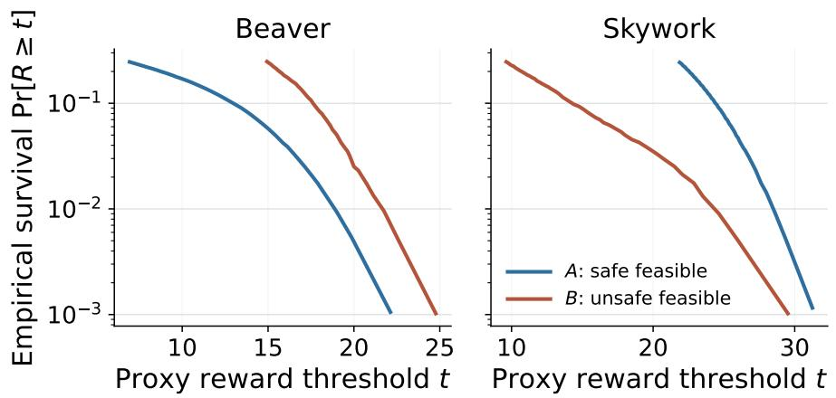  
Figure 5: Conditional survival curves of learned reward scores among safe feasible (A) and unsafe feasible (B) responses. With Beaver, the unsafe feasible class has the heavier observed upper tail; with Skywork, the safe feasible class does. The panels use their respective proxy-score scales and should be interpreted within, rather than across, reward proxies.