# Sigmoid Attention as a Better Substrate for Learned KV Cache Eviction

Isaac (Rucheng) Li 1

## Abstract

Learned KV-cache eviction often faces a softto-hard mismatch: during training, differentiable gates typically attenuate token contributions, whereas inference saves memory only when KV entries are physically removed. We ask whether the attention substrate affects this soft-tohard transition. Using GPT-2-scale Transformers trained on OpenWebText, we run a controlled $2 \times 2 \times 2$ comparison over attention type, learned gating, and positional encoding. Although sigmoid attention is worse as a dense language model, learned hard eviction changes the useful operating points: sigmoid-gated models delete KV entries with negligible PPL change relative to their own no-eviction references. Under a matched live-cache protocol on the same dense backbones, learned sigmoid gates obtain lower PPL than our $_ \mathrm { H _ { 2 } O }$ and KeyDiff implementations, whereas softmax gates do not uniformly beat these post-hoc methods. The results suggest that attention normalization can substantially affect whether a training-time soft gate transfers cleanly to hard KV deletion.

## 1. Introduction

Learned KV-cache eviction has a soft-to-hard mismatch. During training, a model can only learn a differentiable proxy for deletion: a token is attenuated by a soft gate, but its key and value remain in memory. During inference, however, memory is freed only when the corresponding KV entry is physically removed. A useful learned eviction policy must therefore be threshold-stable: replacing soft attenuation by hard deletion at some threshold τ should introduce little or no loss in next-token prediction quality.

Most KV-cache compression work does not directly ask which attention substrate makes this soft-to-hard transition easier to learn. Online post-hoc methods operate on a frozen model and select which cache entries to retain using signals available at inference time. $_ \mathrm { H _ { 2 } O }$ maintains accumulated attention-based heavy-hitter scores and retains high-score tokens together with recent tokens (Zhang et al., 2023). Key-Diff is an attention-free, key-similarity-based method that ranks cached keys by their similarity to a key-space anchor and retains distinctive keys (Park et al., 2025). Learned compression methods, including Dynamic Context Pruning and Dynamic Memory Compression, show that retention policies can be trained (Anagnostidis et al., 2023; Nawrot et al., 2024). Our question is complementary: holding the learned eviction mechanism fixed, does the attention normalization itself affect how learnable hard KV deletion is?

We test this question with a controlled $2 \times 2 \times 2$ experiment: softmax versus sigmoid attention, dense versus learned eviction, and RoPE versus NoPE. NoPE denotes the removal of rotary embeddings from queries and keys. All models share the same GPT-2-scale setup. Gated models use the same soft-to-hard rule: token gates attenuate logits and values during training, then delete KV entries with $g < \tau \mathrm { a t }$ inference.

The results separate dense modeling quality from eviction learnability. Without eviction, softmax remains stronger: sigmoid attention is worse by ∼ 0.36 PPL with RoPE and ∼ 1.21 PPL without RoPE. With learned hard eviction, however, the useful operating points come from sigmoid attention. Against their own dense no-eviction references, Sig+G RoPE deletes 19.8% of KV entries with no measurable PPL penalty (22.424 vs. 22.440), while Sig+G NoPE deletes 32.2% with only a small increase (24.637 vs. 24.603). Under the same matched live-cache protocol, both learned sigmoid gates obtain lower PPL than our $_ \mathrm { H _ { 2 } O }$ and KeyDiff implementations. By contrast, softmax-gated models lose to $_ \mathrm { H _ { 2 } O }$ at matched compression.

Further analysis clarifies why this pattern is substratespecific. A random support-removal probe shows that sigmoid attention is not generically more robust to arbitrary K/V deletion: when random K/V positions are removed in dense RoPE models, sigmoid attention outputs are more perturbed than softmax at larger removal rates. Thus the advantage does not come from sigmoid tolerating deletion indiscriminately. It appears when the deletion pattern is learned, where non-row-normalized attention gives soft gates a cleaner local attenuation channel.

Code and notebooks for reproducing the eight experimental cells are available at https://github.com/ IsaacLi74/sigmoid-kv-eviction.

## 2. Method

## 2.1. Factorial model family

We evaluate eight models in a $2 \times 2 \times 2$ design over attention (softmax / sigmoid), gate (dense / learned), and rotary position treatment (RoPE (Su et al., 2021) / NoPE). In this paper, NoPE denotes the no-RoPE condition used in our implementation: the RoPE rotation is removed from queries and keys. It does not use GPT-2-style learned absolute position embeddings; the input representation is the tied token embedding only,

$$
x _ { i } ^ { ( 0 ) } = W _ { E } [ t _ { i } ] ,
$$

with no added learned position vector. All cells share a GPT-2–style decoder-only Transformer (Vaswani et al., 2017; Radford et al., 2019) with $n _ { \mathrm { l a y e r } } = 1 2 , n _ { \mathrm { h e a d } } = 1 2 , d _ { \mathrm { m o d e l } } = 7 6 8 .$ $d _ { h } { = } 6 4 , d _ { \mathrm { f f } } { = } 3 0 7 2$ , and sequence length 512. Training uses AdamW (Loshchilov & Hutter, 2019) for three epochs on a 1B-token OpenWebText training split (Gokaslan & Cohen, 2019), corresponding to roughly 3B token exposures. We use held-out splits of 100K tokens for validation and 1M tokens for test.

## 2.2. Attention variants

All variants apply per-head QK-RMSNorm (Zhang & Sennrich, 2019) before computing attention scores:

$$
\begin{array} { r } { \tilde { q } _ { i } = \mathrm { R M S N o r m } ( q _ { i } ) , \qquad \tilde { k } _ { j } = \mathrm { R M S N o r m } ( k _ { j } ) . } \end{array}
$$

In RoPE cells, we then rotate queries and keys with RoPE; in NoPE cells, this rotation is omitted:

$$
( \bar { q } _ { i } , \bar { k } _ { j } ) = \left\{ \begin{array} { l l } { ( \mathrm { R o P E } ( \tilde { q } _ { i } , i ) , \mathrm { R o P E } ( \tilde { k } _ { j } , j ) ) , } & { \mathrm { R o P E } , } \\ { ( \tilde { q } _ { i } , \tilde { k } _ { j } ) , } & { \mathrm { N o P E } . } \end{array} \right.
$$

Softmax.

$$
A _ { i j } = \mathrm { s o f t m a x } _ { j } \left( \bar { q } _ { i } ^ { \top } \bar { k } _ { j } / \sqrt { d _ { h } } \right) .
$$

Sigmoid attention.

$$
A _ { i j } = \sigma \Big ( \bar { q } _ { i } ^ { \top } \bar { k } _ { j } / \sqrt { d _ { h } } + b ( i ) \Big ) , \quad b ( i ) = - \log ( i + 1 ) .
$$

Following Ramapuram et al. (2025), we include a negative bias term to stabilize sigmoid attention norms. One practical choice discussed by Ramapuram et al. (2025) is a negative scalar bias on the order of − log n, where n is the maximum training sequence length. Since a causal query at position i attends to only $i + 1$ keys, we use the per-query bias $b ( i ) = - \log ( i + 1 )$ to stabilize the expected row mass at each position. This row-wise bias would be a mathematical no-op under softmax, since adding the same constant to all logits in a row leaves the softmax distribution unchanged.

## 2.3. Learned gate

For gated models, each layer $\ell < L - 1$ produces a tokenwise gate

$$
g _ { j } ^ { ( \ell ) } = \sigma \Bigl ( w _ { \ell } ^ { \top } x _ { j } ^ { ( \ell ) } + b _ { \ell } \Bigr ) \in ( 0 , 1 )
$$

which controls how the next layer sees token $j .$ Let $z _ { i j } ^ { ( \ell + 1 ) }$ denote the pre-attention logit in layer $\ell + 1$ . We inject the gate through both the attention logits and the values:

$$
z _ { i j } ^ { ( \ell + 1 ) } \gets z _ { i j } ^ { ( \ell + 1 ) } { + } \mathrm { l o g } \Big ( g _ { j } ^ { ( \ell ) } + \varepsilon \Big ) , \qquad v _ { j } ^ { ( \ell + 1 ) } \gets g _ { j } ^ { ( \ell ) } v _ { j } ^ { ( \ell + 1 ) } .
$$

where $\varepsilon = 1 0 ^ { - 8 }$ avoids log 0. This is the same injection for both attention types; the last layer carries no gate (no subsequent KV cache to evict). Gates are initialized with $w _ { \ell } = 0$ and $b _ { \ell } = 5 ,$ , so $g _ { j } ^ { ( \ell ) } = \sigma ( 5 ) \approx 0 . 9 9 3$ at step 0 and early training behaves like the no-gate model.

The two-channel injection (log g on logits, g on values) is a differentiable simulation of dropping: as $g \  \ 0 ,$ , both channels drive token j’s contribution to zero, matching the limiting behavior of hard deletion. In inference, we convert this soft retention signal into physical cache removal by dropping entries with $g _ { j } \ < \ \tau$ . Entries removed after prefill are unavailable to all subsequent decode steps; during decode, the same threshold rule is applied to each newly written entry. Entries with $g _ { j } \geq \tau$ remain in the cache and continue to use the same learned logit and value scaling.

## 2.4. Objective

We use a simple training objective: cross-entropy plus a mean budget term that pulls gates toward small values,

$$
\mathcal { L } = \mathcal { L } _ { \mathrm { C E } } + \lambda \overline { { g } } , \qquad \overline { { g } } = \frac { 1 } { ( L - 1 ) T } \sum _ { \ell = 0 } ^ { L - 2 } \sum _ { j = 1 } ^ { T } g _ { j } ^ { ( \ell ) } ,
$$

with $\lambda = 0 . 0 3$ . We do not tune λ per cell; the same budget coefficient is used for all gated variants.

## 2.5. Evaluation

Test protocol. On the OpenWebText test split, each sequence is split into a prefix of 384 tokens for prefill and a window of 128 tokens for single-token decode; PPL is computed on the decode window.

Threshold selection. For each gated model we sweep a threshold grid from 0 to 0.9 on 100 sequences from the held-out validation split and select the highest-compression $\tau ^ { \star }$ satisfying $\Delta \mathrm { { P P L } < 0 . 1 }$ versus that gated model’s noeviction reference. The selected $\tau ^ { \star }$ is then frozen for test.

Physical eviction. Learned-gate evaluation performs thresholded physical eviction: after prefill we remove every cached entry with $g _ { j } < \tau ^ { \star }$ , and during decode the same rule is applied to each newly written entry. Entries that remain in the cache still use the learned logit and value scaling from Section 2. Reported compression rates count only physically removed KV entries, not the additional soft attenuation applied to retained entries.

Matched live-cache size. For a sequence, the live-cache size is the number of KV entries that remain after hard eviction. Compression is measured relative to the corresponding no-eviction cache. When comparing learned gates with posthoc baselines, we first measure the learned gate’s realized final live-cache size, then run post-hoc methods with the same final live-cache size on the paired dense no-gate backbone. Thus the baselines need not delete the same tokens, but they operate at the same cache size.

Online post-hoc baselines. On each dense backbone we run two online post-hoc KV-cache eviction baselines at the matched final live-cache size. $_ \mathrm { H _ { 2 } O }$ is an attention-scorebased heavy-hitter method: it maintains layer-wise, per-head cumulative attention scores and retains a mixture of highscore historical tokens and recent tokens (Zhang et al., 2023). For $\mathrm { H _ { 2 } O } ,$ we split the matched cache size equally between heavy-hitter and recent tokens and do not tune this ratio on validation. KeyDiff is an attention-free baseline: for each layer and head, it computes an unnormalized cached-key anchor $\mu ( K )$ , ranks cached entries by cosine similarity to this anchor, and retains the least similar keys (Park et al., 2025). Both baselines are run on the corresponding dense backbone, not on the gated checkpoint. This comparison isolates learned soft-to-hard eviction against post-hoc eviction under the same attention–RoPE substrate.

## 3. Results

We report results in three steps. First, dense no-eviction PPL separates language-modeling quality from eviction behavior (Section 3.1). Second, validation threshold sweeps select one frozen hard-deletion operating point per gated model (Section 3.2). Third, matched final live-cache size test comparisons evaluate whether learned gates improve over post-hoc eviction on the corresponding dense backbones. Threshold selection uses each gated checkpoint at $\tau = 0$ as the no-eviction reference. In the matched livecache comparison, post-hoc baselines are run on the paired dense no-gate backbone, so we also report the learned gate’s change relative to that dense backbone.

## 3.1. Dense baselines: softmax has lower no-eviction PPL

Table 1 reports dense no-eviction decode-window PPL for the four attention–RoPE backbones under the same prefill– decode protocol.

Table 1. Dense no-eviction test PPL.
<table><tr><td>Backbone</td><td>Dense PPL</td></tr><tr><td>SM RoPE</td><td>22.079</td></tr><tr><td> $\mathrm { S i g }$  RoPE</td><td>22.440</td></tr><tr><td>SM NoPE</td><td>23.398</td></tr><tr><td> $\mathrm { S i g }$  NoPE</td><td>24.603</td></tr></table>

Sigmoid attention is not a stronger dense language model in this setup: softmax is better by 0.361 PPL with RoPE and 1.205 PPL without RoPE.

## 3.2. Validation threshold selection

For each gated model we sweep the hard-deletion threshold over a 15-point validation grid and select the highestcompression threshold satisfying $\Delta \mathrm { P P L } < 0 . 1$ against that model’s $\tau = 0$ reference. The selected threshold is frozen before test evaluation. Figure 1 shows how validation PPL changes as compression increases under the threshold sweep, and Table 2 summarizes the selected operating points. The full numerical sweep is reported in Table 5.

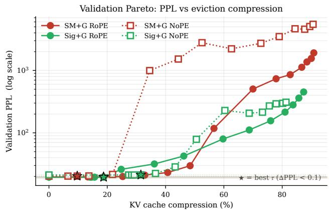  
Figure 1. Validation threshold sweep. Each point shows the validation PPL and realized hard-KV compression rate for one threshold τ . Stars mark the selected $\tau ^ { \star }$ for each gated model.

The threshold curves already separate the substrates. Both softmax models select $\tau ^ { \star } ~ = ~ 0 . 0 1$ , while both sigmoid models select $\tau ^ { \star } = 0 . 0 5$ . With RoPE, softmax and sigmoid reach nearly matched compression, but Sig+G has essentially no validation PPL increase. Without RoPE,

Sig+G reaches 31.5% compression, compared with 9.7% for SM+G.

Table 2. Validation-selected operating points. Compression is hard KV-entry deletion during prefill and decode.
<table><tr><td>Model</td><td> $\tau ^ { \star }$ </td><td>∆PPL</td><td>Compression</td></tr><tr><td>SM+G RoPE</td><td>0.010</td><td>+0.077</td><td>18.7%</td></tr><tr><td>Sig+G RoPE</td><td>0.050</td><td>-0.001</td><td>18.8%</td></tr><tr><td>SM+G NoPE</td><td>0.010</td><td>+0.016</td><td>9.7%</td></tr><tr><td>Sig+G NoPE</td><td>0.050</td><td>+0.033</td><td>31.5%</td></tr></table>

## 3.3. Matched live-cache size results

On test, we freeze the validation-selected $\tau ^ { \star }$ and compare each learned gate to post-hoc $_ \mathrm { H _ { 2 } O }$ and KeyDiff run on the corresponding dense backbone at the matched final livecache size.

Table 3. Frozen-threshold test operating points. $_ \mathrm { H _ { 2 } O }$ and KeyDiff are run on the corresponding dense backbone at the same final live-cache size as the learned gate.
<table><tr><td>Model</td><td> $\tau ^ { \star }$ </td><td>Comp.</td><td>Learned PPL</td><td> $_ \mathrm { H _ { 2 } O }$ </td><td>KeyDiff</td></tr><tr><td>SM+G RoPE</td><td>0.010</td><td>19.2%</td><td>22.514</td><td>22.145</td><td>22.984</td></tr><tr><td>Sig+G RoPE</td><td>0.050</td><td>19.8%</td><td>22.424</td><td>22.480</td><td>22.474</td></tr><tr><td>SM+G NoPE</td><td>0.010</td><td>10.2%</td><td>23.576</td><td>23.423</td><td>23.588</td></tr><tr><td>Sig+G NoPE</td><td>0.050</td><td>32.2%</td><td>24.637</td><td>25.107</td><td>25.786</td></tr></table>

The test results show that learned gates are not uniformly better than post-hoc eviction. On softmax backbones, $_ \mathrm { H _ { 2 } O }$ is stronger than the learned gate at the matched final live-cache size. On sigmoid backbones, the pattern reverses under the same matched-cache protocol. Sig+G RoPE deletes 19.8% of KV entries and slightly improves the measured PPL relative to its dense no-eviction reference (22.424 vs. 22.440), while obtaining lower PPL than both post-hoc baselines at the same final live-cache size. Sig+G NoPE deletes 32.2% with only a small increase over its dense reference (24.637 vs. 24.603) and again obtains lower PPL than the matched $_ \mathrm { H _ { 2 } O }$ and KeyDiff runs.

Thus the main result is substrate-specific. The same simple learned soft-to-hard rule is weak under softmax, but becomes useful under sigmoid attention. The RoPE and NoPE regimes show different forms of this effect: with RoPE, sigmoid mainly improves quality at nearly matched compression; without RoPE, it mainly expands the safe compression range.

## 4. Mechanism Analysis

The matched live-cache results suggest that the advantage is not a generic property of sigmoid attention, but a property of learned deletion under sigmoid attention. We use three diagnostics to support this interpretation: random support removal, row-sum and gate statistics, and token-level selectivity.

## 4.1. Not arbitrary-deletion robustness

A possible alternative explanation is that sigmoid attention simply tolerates arbitrary K/V removal better than softmax. We test this with a random support-removal probe on the two dense RoPE backbones, with no learned gates involved. For each sampled test sequence and each layer, we first record the normal attention output

$$
O _ { s , \ell } ^ { \mathrm { f u l l } } = A _ { s , \ell } ^ { \mathrm { f u l l } } V _ { s , \ell } ^ { \mathrm { f u l l } } .
$$

We then run a second pass in which a random fraction p of K/V positions is removed from the attention support at every layer. The first four positions are excluded to avoid confounding from attention-sink artifacts (Xiao et al., 2024; Gu et al., 2025). Removed positions are masked out of the attention logits and their value vectors are zeroed, so they cannot receive attention mass or contribute content.

We measure the resulting layerwise perturbation by

$$
\rho _ { s , \ell } ( p ) = \frac { \left\| O _ { s , \ell } ^ { \mathrm { d r o p } } ( p ) - O _ { s , \ell } ^ { \mathrm { f u l l } } \right\| _ { F } } { \left\| O _ { s , \ell } ^ { \mathrm { f u l l } } \right\| _ { F } } .
$$

For each model and drop rate, we sample one random mask per sequence and per layer. Figure 2 plots the resulting perturbation for each layer after averaging over 50 test sequences. This probe is a representation-level sensitivity test, not a random-eviction PPL baseline.

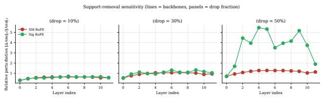  
Figure 2. Random support-removal sensitivity on dense RoPE models. For each drop rate p, we randomly remove K/V support and measure the relative perturbation of each layer’s attention output.

The probe does not support generic deletion robustness. To summarize the curves, we average the sequence-averaged perturbations over all 12 layers. At $p { = } 0 . 1$ , softmax and sigmoid are nearly tied (0.574 vs. 0.579). At larger removal rates, sigmoid is more perturbed: 0.943 vs. 1.051 at $p { = } 0 . 3 ,$ , and 1.131 vs. 3.666 at $p { = } 0 . 5$ . Thus the sigmoid operating-point advantage is unlikely to come from tolerating arbitrary K/V removal. It appears when the deletion pattern is learned.

## 4.2. Row-sum freedom and gate stability

The next diagnostic asks why learned soft gates may transfer more cleanly to hard deletion under sigmoid attention. The key structural difference is row normalization. In softmax attention, each row sums to one, so suppressing one token redistributes attention mass to the other tokens in the same row. Thus a gate changes not only the gated token’s contribution, but also the relative weights of the remaining tokens.

Sigmoid attention does not impose this constraint. Its row mass $\textstyle \sum _ { j } a _ { i j }$ can vary with the query, layer, and sequence. A small gate can therefore mainly attenuate the selected token’s own contribution without forcing the rest of the row to compensate. This can make the training-time soft operation a closer approximation to hard deletion for the gated token, because the remaining row is not forced to renormalize.

We measure this row-sum freedom using the coefficient of variation

$$
\mathrm { C V } = \frac { { \mathrm { s t d } } _ { i } \left( \sum _ { j } a _ { i j } \right) } { { \mathrm { m e a n } } _ { i } \left( \sum _ { j } a _ { i j } \right) } ,
$$

computed across query positions on 1953 test sequences of length 512. For softmax, this value is zero by construction because every row sums to one. For sigmoid, a nonzero value means that different query positions can carry different total attention mass. We also track gate binarization, defined as the fraction of gates with $g < 0 . 0 5 \mathrm { o r } g > 0 . 9 5 ,$ , as a measure of whether training forms a thresholdable keep/delete structure.

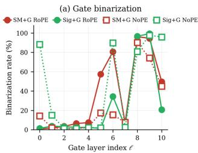

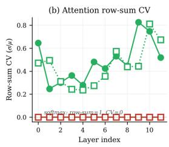  
Figure 3. Per-layer mechanism evidence. Left: gate binarization. Right: coefficient of variation of attention row sums.

Figure 3 shows these two ingredients separately. The right panel confirms the structural difference: softmax has zero row-sum variation by construction, while sigmoid retains nonzero row-sum variation across layers. Averaged over layers, the row-sum CV is 0.484 for Sig+G RoPE and 0.444 for Sig+G NoPE, compared with 0 for both softmax models. The left panel shows that learned gates can also form nearbinary structure, especially in the high-compression Sig+G NoPE model.

Averaged across gate layers and test token positions, Sig+G

NoPE has the strongest aggregate binarization (43.3%), while SM+G RoPE is also substantially binarized (36.8%). However, binarization alone does not explain the result: Sig+G RoPE has lower aggregate binarization than SM+G RoPE (24.4% vs. 36.8%), yet transfers more cleanly to hard deletion. The useful regime therefore appears to require both pieces: the gates must learn a thresholdable structure, and the attention substrate must let soft attenuation approximate hard deletion locally.

## 4.3. Token selectivity

The final diagnostic asks what the learned gates choose to suppress. If the gates were merely uniform cache shrinkers, then all token types would receive similar gate values. Instead, the gates are token-selective.

We bucket GPT-2 surface tokens into coarse categories: content words, stopwords, punctuation, newline, whitespace, and digits. For each bucket, Table 4 reports the mean learned gate value on the test split. Lower values mean the model is more willing to remove that kind of token under hard thresholding; higher values mean the model tends to preserve it.

Table 4. Mean gate value by token type on the test split. Buckets are assigned from the GPT-2 decoded surface form.
<table><tr><td>Model</td><td>content</td><td>stopword</td><td></td><td>punct. newline</td><td>whitesp.</td><td>digit</td></tr><tr><td>SM+G RoPE</td><td>0.213</td><td>0.144</td><td>0.224</td><td>0.170</td><td>0.274</td><td>0.196</td></tr><tr><td>Sig+G RoPE</td><td>0.272</td><td>0.184</td><td>0.270</td><td>0.176</td><td>0.328</td><td>0.235</td></tr><tr><td>SM+G NoPE</td><td>0.223</td><td>0.144</td><td>0.195</td><td>0.135</td><td>0.334</td><td>0.224</td></tr><tr><td>Sig+G NoPE</td><td>0.281</td><td>0.178</td><td>0.254</td><td>0.273</td><td>0.455</td><td>0.263</td></tr></table>

The pattern is consistent across all four gated models. Across models, stopwords and newlines tend to receive the lowest gates, while whitespace tokens consistently receive the highest gates. Digit tokens are generally assigned higher gates than stopwords, but are not always among the highest-retention categories. For example, Sig+G NoPE assigns stopwords a mean gate of 0.178, compared with 0.281 for content tokens and 0.455 for whitespace tokens. The token-level rankings show the same qualitative pattern. Soft-gate rankings frequently place common function words such as the, a, an, The, and It among low-gate tokens, while the actual hard-threshold eviction rankings include frequent function words such as the, a, an, of, in, on, for, to, and be. This means the learned policy is not deleting a fixed fraction of the cache uniformly; it assigns different retention values to different token classes.

This also rules out a simple “smaller gates are better” explanation. Sigmoid models assign higher mean gates than softmax models in every bucket, so the sigmoid advantage does not come from more aggressive soft suppression during training. The advantage appears when those gates are hardthresholded: under the sigmoid substrate, the learned gate values form a more useful keep/delete partition. Qualitative gate heatmaps on five short prompts are shown in Section B; they illustrate the same non-uniform structure across layers, token positions, and substrates.

Taken together, these diagnostics support a substrate-level finding. Sigmoid attention is not generically robust to arbitrary K/V removal: random support removal perturbs it more at larger removal rates. Its advantage appears when deletion is learned. Because sigmoid attention is not rownormalized, soft attenuation of a token can be closer to hard deletion of that token than under a row-normalized softmax substrate. The learned gates then select token classes non-uniformly rather than shrinking the cache by a fixed ratio.

## 5. Discussion

## 5.1. Interpretation

The main implication of our results is not that sigmoid attention is a strictly better language-modeling substrate. In the dense no-eviction setting, softmax remains stronger. Rather, sigmoid attention appears to be a better substrate for a specific systems objective: training a soft retention signal that can later be converted into hard physical KV deletion. This distinction is important. Post-hoc eviction methods test how well a frozen model tolerates externally imposed cache removal. Our experiment instead asks whether the attention substrate makes a learned eviction policy easier to train in the first place.

This view also changes how to interpret the strongest operating point. Sig+G RoPE physically deletes 19.8% of KV entries while achieving slightly lower measured PPL than its dense no-eviction backbone (22.424 vs. 22.440). We do not interpret this small negative ∆PPL as a reliable language-modeling gain. Its significance is more operational: learned eviction can remove a nontrivial fraction of the cache without measurable quality loss, and may sometimes act as selective cache denoising rather than merely lossy compression.

## 5.2. Implications

If this substrate effect persists at larger scale and longer context length, it would motivate joint design of attention mechanisms and KV-retention policies. Rather than treating KV eviction only as an inference-time heuristic, our results frame it as an architectural co-design problem.

## 5.3. Limitations

Our study has several limitations. First, we pick a single τ⋆ per gated model from a discrete validation grid by maximizing compression subject to $\Delta \mathrm { P P L } { < } 0 . 1$ . This rule is simple and frozen before test evaluation, but the cutoff is still a design choice. Finer threshold grids, per-layer thresholds, or alternative operating criteria could select different cache sizes. We also compare post-hoc baselines against learned gates at matched final live-cache size rather than matched PPL. This directly controls memory use, which is often the deployment constraint of interest, but it does not answer every deployment question; sigmoid threshold sweeps can have sharp cliffs, making matched-PPL comparison less stable.

Second, experiments use one 123M GPT-2–scale model family trained for three epochs on a 1B-token OpenWebText split, with a single seed per cell and context length 512. This is sufficient for a controlled substrate study, but not sufficient to establish deployment-scale behavior. Whether the effect persists at larger model scales, longer contexts, multiple seeds, other text distributions, or downstream long-context tasks remains open.

Third, we use one gate design: token-wise gates with both logit attenuation and value scaling, trained with $\lambda = 0 . 0 3$ We do not ablate logits-only versus values-only injection, alternative λ values, per-head gates, or per-layer thresholds. These ablations are needed to separate the contribution of the sigmoid substrate from the contribution of the particular gate parameterization.

Finally, $_ \mathrm { H _ { 2 } O }$ and KeyDiff cover two complementary posthoc signals: accumulated attention importance and attentionfree key similarity. We use a fixed $_ \mathrm { H _ { 2 } O }$ heavy-hitter/recent split and do not tune post-hoc baseline hyperparameters, so these comparisons should be interpreted as matchedcache reference points rather than fully optimized SOTA benchmarking (Bui et al., 2025; Zeng et al., 2024; Chari et al., 2025; Kim et al., 2026; Xiao et al., 2025; Wan et al., 2025).

We also report PPL and compression rates, not wall-clock speed. We did not implement a production fused kernel for the specific gated sigmoid attention path studied here, despite existing work on fused attention kernels for softmax and sigmoid attention (Dao et al., 2022; Ramapuram et al., 2025). Thus the current results should be read as evidence about cache quality and learnability, not as an end-to-end inference-speed claim.

## References

Anagnostidis, S., Pavllo, D., Biggio, L., Noci, L., Lucchi, A., and Hofmann, T. Dynamic context pruning for

efficient and interpretable autoregressive transformers. In Advances in Neural Information Processing Systems, 2023.

Bui, N., Sharma, S., Lamba, S., Mishra, S., and Ying, R. Cache what lasts: Token retention for memory-bounded KV cache in LLMs. arXiv preprint arXiv:2512.03324, 2025.

Chari, V., Qin, G., and Van Durme, B. KV-distill: Nearly lossless learnable context compression for LLMs. arXiv preprint arXiv:2503.10337, 2025.

Dao, T., Fu, D. Y., Ermon, S., Rudra, A., and Re, C. FlashAt-´ tention: Fast and memory-efficient exact attention with IO-awareness. In Advances in Neural Information Processing Systems, 2022.

Gokaslan, A. and Cohen, V. OpenWebText corpus, 2019.

Gu, X., Pang, T., Du, C., Liu, Q., Zhang, F., Du, C., Wang, Y., and Lin, M. When attention sink emerges in language models: An empirical view. In International Conference on Learning Representations, 2025.

Kim, J.-H., Han, D., and Yun, S. Fast KVzip: Efficient and accurate LLM inference with gated KV eviction. arXiv preprint arXiv:2601.17668, 2026.

Loshchilov, I. and Hutter, F. Decoupled weight decay regularization. In International Conference on Learning Representations, 2019.

Nawrot, P., Łancucki, A., Chochowski, M., Tarjan, D., and´ Ponti, E. M. Dynamic memory compression: Retrofitting LLMs for accelerated inference. In International Conference on Machine Learning, 2024.

Park, J., Jones, D., Morse, M. J., Goel, R., Lee, M., and Lott, C. KeyDiff: Key similarity-based KV cache eviction for long-context LLM inference in resource-constrained environments. In Advances in Neural Information Processing Systems, 2025.

Radford, A., Wu, J., Child, R., Luan, D., Amodei, D., and Sutskever, I. Language models are unsupervised multitask learners. OpenAI Technical Report, 2019.

Ramapuram, J., Danieli, F., Dhekane, E. G., Weers, F., Busbridge, D., Ablin, P., Likhomanenko, T., Digani, J., Gu, Z., Shidani, A., and Webb, R. Theory, analysis, and best practices for Sigmoid self-attention. In International Conference on Learning Representations, 2025.

Su, J., Lu, Y., Pan, S., Murtadha, A., Wen, B., and Liu, Y. RoFormer: Enhanced transformer with rotary position embedding. arXiv preprint arXiv:2104.09864, 2021.

Vaswani, A., Shazeer, N., Parmar, N., Uszkoreit, J., Jones, L., Gomez, A. N., Kaiser, Ł., and Polosukhin, I. Attention is all you need. In Advances in Neural Information Processing Systems, 2017.

Wan, Z., Wu, X., Zhang, Y., Xin, Y., Tao, C., Zhu, Z., Wang, X., Luo, S., Xiong, J., Wang, L., and Zhang, M. D2O: Dynamic discriminative operations for efficient long-context inference of large language models. In International Conference on Learning Representations, 2025.

Xiao, G., Tian, Y., Chen, B., Han, S., and Lewis, M. Efficient streaming language models with attention sinks. In International Conference on Learning Representations, 2024.

Xiao, G., Tang, J., Zuo, J., Guo, J., Yang, S., Tang, H., Fu, Y., and Han, S. DuoAttention: Efficient long-context LLM inference with retrieval and streaming heads. In International Conference on Learning Representations, 2025.

Zeng, Z., Lin, B., Hou, T., Zhang, H., and Deng, Z. Incontext KV-cache eviction for LLMs via attention-gate. arXiv preprint arXiv:2410.12876, 2024.

Zhang, B. and Sennrich, R. Root mean square layer normalization. In Advances in Neural Information Processing Systems, 2019.

Zhang, Z., Sheng, Y., Zhou, T., Chen, T., Zheng, L., Cai, R., Song, Z., Tian, Y., Re, C., Barrett, C., Wang, Z., and´ Chen, B. H2O: Heavy-hitter oracle for efficient generative inference of large language models. In Advances in Neural Information Processing Systems, 2023.

## A. Additional Validation Sweep Results

Table 5 reports the full validation threshold grid. Each entry gives decode-window PPL and realized hard-KV compression at that threshold on the 100-sequence validation set. Bold entries are the selected operating points under the ∆PPL < 0.1 rule.

Table 5. Full validation threshold sweep.
<table><tr><td>T</td><td>SM+G RoPE</td><td>Sig+G RoPE</td><td>SM+G NoPE</td><td>Sig+G NoPE</td></tr><tr><td>0.000</td><td>19.62 / 0.0%</td><td>19.48 / 0.0%</td><td>20.24 / 0.0%</td><td>21.12 / 0.0%</td></tr><tr><td>0.005</td><td>19.63 / 13.4%</td><td>19.48 / 14.2%</td><td>20.24 / 6.5%</td><td>21.11 / 27.3%</td></tr><tr><td>0.010</td><td>19.69 / 18.7%</td><td>19.48 / 14.6%</td><td>20.26 / 9.7%</td><td>21.11 / 28.4%</td></tr><tr><td>0.020</td><td>19.96 / 25.3%</td><td>19.48 / 15.6%</td><td>20.36 / 13.7%</td><td>21.11 / 29.3%</td></tr><tr><td>0.050</td><td>21.03 / 32.9%</td><td>19.48 / 18.8%</td><td>21.57 / 21.8%</td><td>21.16 /31.5%</td></tr><tr><td>0.100</td><td>23.13 / 40.7%</td><td>26.02 / 24.8%</td><td>995.48 / 34.6%</td><td>22.35 / 36.6%</td></tr><tr><td>0.150</td><td>29.71 / 48.4%</td><td>31.73 / 36.2%</td><td>1524.68 / 44.4%</td><td>28.46 / 43.3%</td></tr><tr><td>0.200</td><td>117.85 / 56.6%</td><td>42.51 / 46.2%</td><td>2786.99 / 52.5%</td><td>78.84 / 50.6%</td></tr><tr><td>0.300</td><td>504.08 / 70.0%</td><td>79.86 / 59.7%</td><td>2224.26 / 62.6%</td><td>228.40 / 60.3%</td></tr><tr><td>0.400</td><td>736.59 / 77.9%</td><td>111.25 / 68.7%</td><td>2727.09 / 72.7%</td><td>206.53 / 68.7%</td></tr><tr><td>0.500</td><td>856.37 / 82.7%</td><td>156.11 / 76.0%</td><td>3489.68 / 79.0%</td><td>214.38 / 73.2%</td></tr><tr><td>0.600</td><td>1125.44 / 86.7%</td><td>215.09 / 81.0%</td><td>4659.00 / 84.4%</td><td>270.07 / 75.6%</td></tr><tr><td>0.700</td><td>1368.69 / 88.5%</td><td>280.60 / 83.7%</td><td>4585.06 / 87.7%</td><td>292.23 / 77.9%</td></tr><tr><td>0.800</td><td>1557.72 / 90.0%</td><td>361.24 / 85.7%</td><td>5063.09 / 89.5%</td><td>297.74 / 80.2%</td></tr><tr><td>0.900</td><td>1913.99 / 90.8%</td><td>451.68 / 87.4%</td><td>5493.55 / 90.6%</td><td>309.61 / 81.3%</td></tr></table>

## B. Qualitative Gate Heatmaps

This appendix shows qualitative gate heatmaps on five short prompts: narrative, technical, dialogue, factual, and question answering. Rows correspond to gate layers and columns correspond to token positions. Green indicates larger gate values and red indicates smaller gate values. These figures are not used as quantitative metrics, but they illustrate that learned gates vary substantially across layers, token positions, and substrates rather than acting as uniform cache shrinkers.

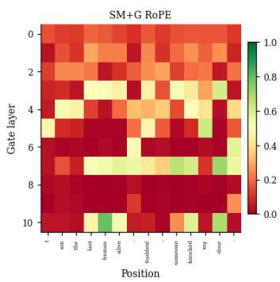

[narrative] I am the last human alive. Suddenly, someone knocked my door  
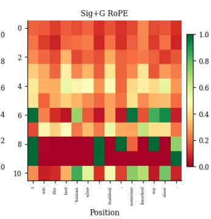

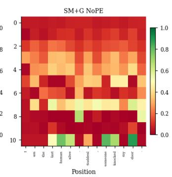  
Figure 4. Gate heatmap on a narrative prompt.

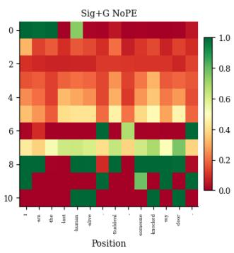

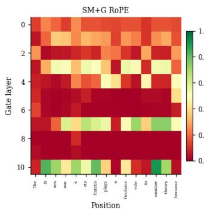

[technical] The Riemann zeta function plays a fundamental role in number  
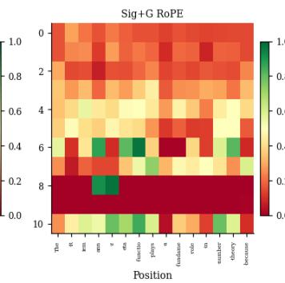

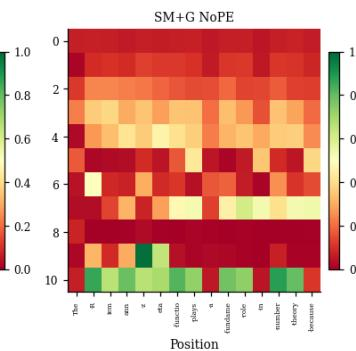  
Figure 5. Gate heatmap on a technical prompt.

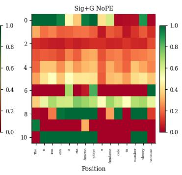  
[dialogue] "Hello," she said, smiling. "I didn't expect to see you here

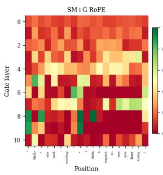

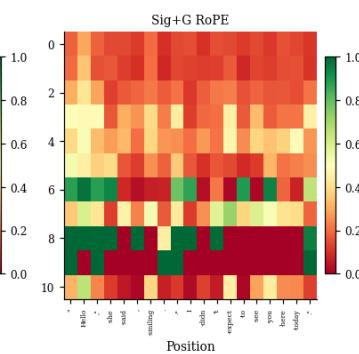

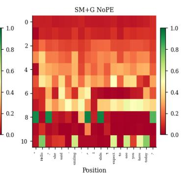  
Figure 6. Gate heatmap on a dialogue prompt.

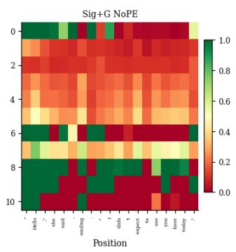

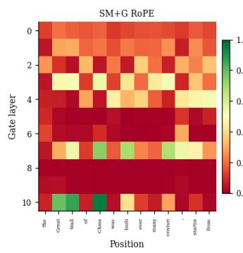

[factual] The Great Wall of China was built over many centuries, start  
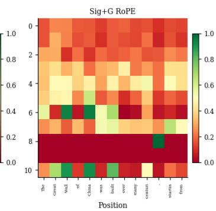

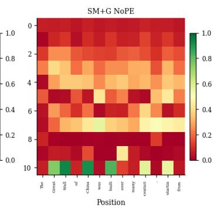  
Figure 7. Gate heatmap on a factual prompt.

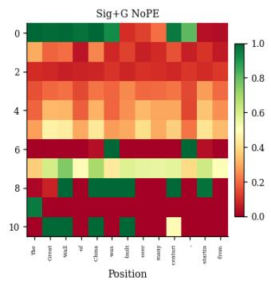

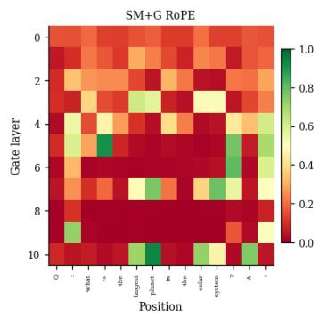

[qa] Q: What is the largest planet in the solar system? A:  
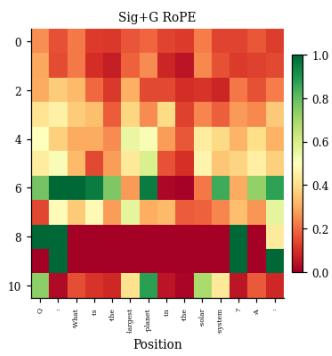

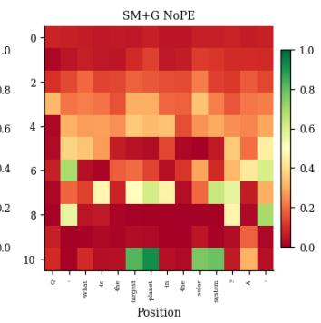  
Figure 8. Gate heatmap on a question-answering prompt.

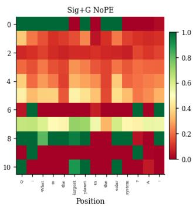