# Spicing up Genetic Netlist Generation with LLMs

Stefan Uhlich<sup>1</sup>, Yağız Gençer<sup>1,2</sup>, Andrea Bonetti<sup>1</sup>,

Arun Venkitaraman<sup>1</sup>, Chia-Yu Hsieh<sup>1</sup>, Eisaku Ohbuchi<sup>3</sup>, Lorenzo Servadei<sup>1,4</sup>

<sup>1</sup>Sony AI, Switzerland <sup>2</sup>EPFL, Switzerland <sup>3</sup>Sony Semiconductor Solutions, Japan <sup>4</sup>TU Munich, Germany

## Abstract

Analog circuit topology synthesis remains challenging because useful designs occupy a tiny fraction of a combinatorial search space, and small structural changes can induce highly nonlinear changes in behavior. Evolutionary algorithms are attractive because they can optimize over discrete circuit topologies using only blackbox evaluations, but they often require many SPICE simulations and may converge prematurely. We introduce LLM-SPICEMixer, a hybrid synthesis framework that augments genetic netlist generation with IGEL (Inspiration-Guided Evolution with LLMs), an LLM-based proposal operator. During search, IGEL prompts an LLM with high-performing circuits from the elite set and instructs it to generate a new SPICE netlist, which is then evaluated by SPICE and selected using the same reward mechanism as conventional genetic operators. Thus, the LLM contributes structured topology proposals while simulation remains the source oftruth. We evaluate LLM-SPICEMixer on a challenging benchmark task: synthesizing transistor-level circuits that implement a discriminant function for Iris classification. Compared with the genetic framework without LLM guidance, LLM-SPICEMixer improves the median final training reward by 8.4% and the median validation-selected test reward by 8.8%. The best validation-selected circuit achieves 93.3% test accuracy at the nominal tt corner and 85.9% average test accuracy across 17 process, voltage, and temperature corners.

## CCS Concepts

• Hardware → Electronic design automation.

## Keywords

Analog circuit synthesis, Genetic algorithms, Large language models, SPICE netlists, Analog discriminant-function synthesis

## ACM Reference Format:

Stefan Uhlich, Yağız Gençer, Andrea Bonetti, Arun Venkitaraman, Chia-Yu Hsieh, Eisaku Ohbuchi, and Lorenzo Servadei. 2026. Spicing up Genetic Netlist Generation with LLMs. In 2026 ACM/IEEE International Symposium on Machine Learning for CAD (MLCAD ’26), September 07–09, 2026, Jeju Island, Republic ofKorea. ACM, New York, NY, USA, 16 pages. https://doi. org/10.1145/3831599.3840324

## 1 Introduction

Analog circuit design remains challenging because small structural modifications can lead to highly nonlinear and non-smooth changes in behavior [1]. Circuit synthesis requires both topology selection, which determines devices and interconnections, and sizing, which sets parameters such as transistor widths and lengths. For fixed topologies, substantial progress has been made using Bayesian optimization [2, 3], reinforcement learning [4–7], and large language models (LLMs) [8–10]. Topology synthesis remains harder because it involves discrete structural choices and is strongly coupled with sizing. Consequently, many successful approaches focus on well-studied circuit families such as operational amplifiers [11– 15], filters [16–18], power converters [19–21], or other common circuit classes [22–25]. This leaves open how to synthesize useful circuits for less standardized tasks, where no canonical topology or family-specific search space is available.


Evolutionary algorithms are attractive for open-ended topology synthesis because they optimize candidate circuits directly through SPICE simulation. However, purely genetic search can require many evaluations and may converge prematurely. LLMs ofer a complementary capability: they can generate structured text and may capture useful regularities from circuit descriptions and netlists. Yet asking an LLM to design a complete circuit from scratch is unreliable, especially for non-standard tasks where memorized templates are unlikely to apply. This suggests a hybrid strategy: use the LLM not as a standalone circuit designer, but as a proposal mechanism inside a simulation-driven evolutionary loop.

Motivated by this idea, we introduce LLM-SPICEMixer, a circuit synthesis method that extends SPICEMixer [26] with IGEL, an LLM-based proposal operator for Inspiration-Guided Evolution with LLMs. During search, IGEL samples high-quality circuits from the elite set and provides them to the LLM as inspirations. The LLM then proposes a new candidate netlist, which is evaluated by SPICE and selected using the same reward mechanism as conventional genetic operators such as mutation, crossover, and pruning. Thus, the LLM injects structured topology variations, while SPICE simulation provides the performance evaluation. The goal is not to replace genetic search, but to make it less prone to premature convergence by adding informed and diverse proposals.

We evaluate LLM-SPICEMixer on an analog discriminant-function synthesis task based on Iris classification. The goal is to synthesize a transistor-level circuit whose input voltages encode the four Iris features and whose output voltages represent the three class scores. This task is useful as a benchmark because it is specified by data-dependent classification behavior rather than standard analog design targets, and suitable topologies are not known a priori. Thus, the method must discover compact transistor-level structures rather than tune a known circuit template.

In summary, the contributions of this paper are as follows:

• We introduce LLM-SPICEMixer, a hybrid synthesis method that augments genetic netlist generation with IGEL, an LLM-based proposal operator that generates candidate circuits from elite netlists within a SPICE-driven evolutionary loop.

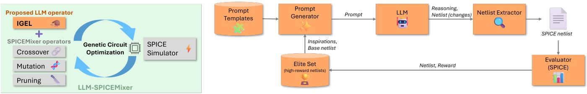  
(a) LLM-guided optimization for analog circuit synthesis  
(b) Workflow for “IGEL", our inspiration-guided circuit evolution with LLMs  
Figure 1: Overview of LLM-SPICEMixer: (a) LLM-augmented genetic circuit optimization loop. (b) IGEL prompts the LLM with inspiration circuits, then evaluates the proposed netlist with SPICE; it is added to the elite set if good enough.

• We propose an analog discriminant-function synthesis benchmark based on the Iris dataset and use it to evaluate open-ended transistor-level topology synthesis.

• We present an empirical study of prompting strategies, decoding settings, model choices, and operator mixtures, showing that IGEL improves search performance when used as a complement to conventional genetic operators.

The paper is organized as follows. Sec. 2 reviews related work. Sec. 3 introduces LLM-SPICEMixer and IGEL. Sec. 4 describes the analog discriminant-function synthesis task and evaluation setup. Sec. 5 presents results, including baseline comparisons and ablations. Finally, Sec. 6 concludes and outlines future work.

## 2 Related Work

Analog design automation has seen strong progress for sizing fixed topologies using Bayesian optimization, reinforcement learning, and, more recently, LLM-based optimization [2–10]. Topology syn thesis is more challenging: early work relied on evolutionary search and genetic programming for joint topology-and-sizing optimization [16–18], while recent methods often focus on specific circuit families, particularly operational amplifiers and power converters [11–15, 19, 21]. Other approaches address more general circuit generation using graph-based, generative, or LLM-based methods [20, 22–25, 27]. Agentic LLM frameworks such as AnalogAgent [28] have also introduced multi-agent workflows for iterative analog circuit generation. These methods typically use learned models or LLMs as primary generators or design agents, whereas our approach uses the LLM only as one proposal operator inside a genetic search.

A separate line ofwork integrates LLMs into evolutionary search. FunSearch and related systems use an LLM to propose candidates that are evaluated and selected within an iterative search loop [29– 35]. Our method follows this paradigm, but transfers it to transistorlevel analog synthesis: it builds on SPICEMixer [26], which evolves SPICE netlists directly, and extends it with IGEL, an LLM-based proposal operator that generates candidates from elite netlists. In contrast to general program-search systems, our candidates are physical circuits whose quality must be determined by SPICE simulation under task-specific testbenches and process corners. Related uses of LLM-generated SPICE netlists also appear in SpiceFuzz [36], but there the goal is simulator fuzzing rather than reward-driven functional synthesis. To the best of our knowledge, LLM-SPICEMixer is the first method to embed LLM-generated netlist proposals into an evolutionary loop for analog circuit synthesis.

## 3 LLM-SPICEMixer

We first briefly review SPICEMixer [26]. We then introduce IGEL, our LLM-based proposal operator, which enriches the elite set during genetic search. The overall system is illustrated in Fig. 1.

## 3.1 Recap of SPICEMixer

SPICEMixer is a circuit synthesis method based on a genetic algorithm that evolves SPICE netlists directly. Rather than relying on an abstract graph representation or a hand-crafted chromosome encoding, it treats the netlist itself as the genome. This makes the method naturally compatible with arbitrary components and subcircuits, and therefore easy to adapt to diferent circuit libraries and process design kits.

SPICEMixer repeatedly applies one of three proposal operators to generate new candidate circuits. The first operator is crossover, which combines two elite netlists line by line. The second operator is mutation, which combines one elite netlist with a randomly sampled netlist to introduce new structural variations while preserving useful parts of a strong parent. The third operator is pruning, which merges compatible component definitions so that the resulting circuit can become smaller and more compact.

Each newly generated netlist is then evaluated by SPICE simulation under a task-specific testbench, and its performance is mapped to a scalar reward that serves as the fitness value. SPICEMixer maintains an elite set containing the best circuits found so far, and parent circuits are sampled from this set using a rank-based roulette-wheel strategy. This biases the search toward high-quality solutions while still preserving diversity.

## 3.2 Inspiration-Guided Evolution with LLMs

Because circuits can be represented as netlists, LLMs are a natural choice for circuit synthesis. However, their efectiveness depends strongly on how they are used. One option is to ask the LLM to generate a complete circuit directly, as in AnalogCoder [23] and AnalogCoder-Pro [24]. In our setting, however, this strategy is often inefective. Our goal is to discover novel circuit topologies from uncommon circuit families, and in such cases the model often reproduces the same canonical solution [37, 38], even across multiple interaction rounds and even when given feedback on circuit performance as we will show in Sec. 5.6. Although some methods can mitigate this behavior [39], it remains a general limitation. Another possibility would be to use the LLM as a verification tool, either as a pre-check before SPICE simulation or as a surrogate model for estimating circuit quality. We expect this to be unreliable as well, because the model would need to assess novel circuits for novel tasks solely from their netlists.

We therefore use the LLM as a proposal operator within a genetic search process, which we call IGEL. In this sense, the LLM is used in a manner conceptually similar to coding-agent systems such as AlphaEvolve [34]. Since LLMs are strong at code generation, we expect them to be well suited for proposing new candidate netlists, especially when diverse prompt formulations are used. To reduce generation collapse, we do not rely on IGEL alone. Instead, we combine it with the original SPICEMixer operators—crossover, mutation, and pruning—as shown in Fig. 1a. In this way, the diferent operators can complement one another, since each of them can further refine a solution that was produced by another operator in an earlier step.

General Approach. Fig. 1b illustrates our use of the LLM. From the current elite set, which contains the best solutions found so far, we sample � = 3 netlists using rank-based roulette-wheel sampling. We populate a prompt template with these netlists and their reward scores, and pass the resulting prompt to the LLM. The model then analyzes the given circuits and, when requested by the prompt, first produces a short plan describing how they should be modified. It subsequently outputs a new candidate netlist. We extract this netlist from the LLM response and evaluate it in a SPICE testbench.

Netlist Preprocessing. We apply two preprocessing steps to improve the efectiveness of the method. First, we identify and remove circuits that share the same topology and difer only in parameter values. By ensuring that the LLM only sees structurally distinct inspirations, we encourage it to propose topological modifications rather than merely adjust transistor sizes. In preliminary experiments, we observed that without this step, the genetic algorithm often converged prematurely to an elite set containing only a single topology with minor sizing variations, many of which were produced by IGEL. Once this occurred, the search rarely recovered from the resulting collapse and often failed to discover better circuits.

Second, rather than providing the original netlists directly, we convert PDK-specific transistor instances, in our case from the SkyWater PDK [40], into a simplified MOS representation. In this process, we remove the explicit bulk connection and rename nets to more descriptive names, for example net\_supply\_0 to net\_vdd and 0 to net\_gnd. For example, the line

```diff
X6 net_internal_1 net_internal_0 net_supply_0 net_supply_0
+ sky130_fd_pr__pfet_01v8 w=20 l=1
```

is rewritten as

M6 net\_internal\_1 net\_internal\_0 net\_vdd PMOS w=20 l=1

This preprocessing reduces potential confusion caused by uncommon component and net names that may have been underrepresented during LLM training. It also removes ambiguities, for example when 0 could refer either to ground or to a parameter value.

Prompt Templates. To analyze the efect of prompting on synthesis performance, we compare prompt templates that vary along two dimensions:

• “raw” vs. “dif”. In the “raw” setting, the LLM generates a complete candidate netlist. In the “dif” setting, the LLM specifies only the lines that should be changed relative to a given base netlist.

• “with reasoning” vs. “without reasoning”. In the “with reasoning” setting, the prompt asks the LLM to first analyze the given inspirations and describe a modification strategy before generating the output. In the “without reasoning” setting, the LLM is instructed to produce the output directly, without an explicit planning step. These two design choices result in four prompt templates. In Appx. A, Fig. 4 and Fig. 5 show example prompts together with the corresponding LLM outputs.

We expect both explicit reasoning and edit-based generation to improve performance. Asking the LLM to analyze the inspiration circuits before proposing a new netlist may help it identify useful structural patterns. Likewise, the “dif” format is well suited to genetic search because it encourages smaller, more local modifications of high-quality circuits. Based on this intuition, prompt templates with reasoning and structured edits appear to be strong candidates, although the best design remains an empirical question. As shown in Sec. 5.3, explicit reasoning is particularly beneficial, whereas the diference between “raw” and “dif” is comparatively small. Overall, the best performance is obtained by an alternating scheme that cycles between the reasoning-based “raw” and “dif” formats, suggesting that the additional diversity introduced by using two prompt styles is advantageous.

## 4 Analog Discriminant-Function Synthesis

We evaluate LLM-SPICEMixer on the synthesis of an analog circuit that implements a discriminant function for the Iris classification task [41]. This is an interesting non-standard synthesis problem, because the objective is not to reproduce a known circuit class, but to realize a classifier directly as an analog circuit. Hence, IGEL cannot rely on memorized solutions from the LLM, but must instead infer useful patterns from the inspirations.

## 4.1 Task Setup

To implement the discriminant function for the Iris dataset, the circuit has four input nets corresponding to the four Iris features (sepal length (cm), sepal width (cm), petal length (cm), and petal width (cm)), and three output nets corresponding to the three classes (setosa, versicolor, and virginica). All four features are normalized by min-max scaling computed on the training set. During circuit evaluation, the normalized feature values are mapped to input voltages in the range [0� , 1.8� ]. For a given input sample, the predicted class is determined by the output node with the highest voltage.

We use the standard Iris dataset, which contains 150 samples. The data are split into training, validation, and test sets using a stratified 60/20/20 split, yielding 90 training samples, 30 validation samples, and 30 test samples. This split is used such that the search optimizes the training reward, the validation set is used to select the best circuits found during the search, and the test set is reserved exclusively for final evaluation. To evaluate a candidate circuit eficiently, we present all samples from the training and validation splits within a single transient simulation. Each feature is applied through a piecewise-linear voltage source. Each sample is presented for 8 ns, and the circuit outputs are read at the end of this time window. To reduce artifacts caused by a fixed sample order, we shufle each split three times with diferent random seeds and concatenate the resulting sequences. This produces longer input streams while preserving the class distribution. The same shufling and-concatenation procedure is applied to the held-out test split during final evaluation.

The synthesized circuits are built entirely from SkyWater transistors [40]. In addition to the topology, that is, the transistor interconnection pattern, the search space also includes transistor width and length as continuous parameters for each device. We attach a small output load capacitance of 10 fF to each output node to model the input capacitance of a subsequent stage.

## 4.2 Reward and Multi-Corner Evaluation

Each candidate netlist is evaluated with Ngspice [42] under multiple process, voltage, and temperature conditions. We consider one nominal corner, tt at 1.8 V and $2 5 ^ { \circ } C ,$ , and 16 extreme corners formed by all combinations of process corners ff, ss, sf, and fs, supply voltages 1.62 V and 1.98 V, and temperatures $0 ^ { \circ } \mathrm { C }$ and $8 5 ^ { \circ } \mathrm { C } .$ In total, each circuit is evaluated on 17 corners, and the results are averaged. This encourages the search to find solutions that are robust across operating conditions and reduces the risk that a circuit performs well only because of artifacts of the idealized SPICE compact models.

For each sample, the ideal output is a one-hot voltage vector: the correct class should be close to 1.8 V, while the two incorrect classes should be close to 0 V. Let $\mathbf { y } _ { i } \in \mathbb { R } ^ { 3 }$ denote the simulated output voltages for sample �, and let $\mathbf { t } _ { i } \in \{ 0 \mathrm { V } , 1 . 8 \mathrm { V } \} ^ { 3 }$ denote the corresponding one-hot target. For one data split and one corner, we define the reward as $\begin{array} { r } { R = \bar { \frac 1 2 } ( A + M ) } \end{array}$ , where � is the classification accuracy,

$$
A = \frac { 1 } { N } \sum _ { i = 1 } ^ { N } \mathbb { 1 } \left[ \arg \operatorname* { m a x } _ { j } y _ { i , j } = \arg \operatorname* { m a x } _ { j } t _ { i , j } \right] ,\tag{1}
$$

and � is the target-voltage score,

$$
M = 1 - \frac { 1 } { 3 N } \sum _ { i = 1 } ^ { N } \left\| \mathbf { y } _ { i } - \mathbf { t } _ { i } \right\| _ { 1 } .\tag{2}
$$

Here, � is the number ofsamples in the split, including the repeated shufled sequences described above, and ∥.∥ denotes the 1-norm. The maximum possible reward is therefore $R = 1 ,$ while in practice � is smaller. The first term, � in (1), rewards correct predictions. The second term, � in (2), rewards large voltage separation by encouraging the correct output to move toward the supply voltage and the incorrect outputs toward ground. This is important because two circuits can achieve the same accuracy while exhibiting very diferent output confidence. To obtain a robust classifier, we therefore seek a large output separation score �.

Furthermore, we apply two additional reward penalties to guide the search toward compact circuits that are not only functional but also physically plausible:

• Validity penalty. A penalty of 0.05 is applied for each violated structural validity check and may therefore be incurred multiple times by the same netlist. These checks require that all three output nets are present, transistor bulk terminals are connected correctly, input nets are connected only to transistor gates, no floating nets exist, output nets are connected only to transistor drain or source terminals, and supply or ground nets are not connected to transistor gates.

• Size penalty. A penalty of $0 . 0 0 2 5 \times N _ { \mathrm { t r a n s i s t o r s } }$ is subtracted to favor smaller circuits, where $N _ { \mathrm { t r a n s i s t o r s } }$ denotes the number of transistors in the netlist, that is, the number of netlist lines.

All reward values reported in this paper are penalized rewards, including both the validity and size penalties described above.

For every candidate, we compute training and validation rewards for each corner and then average them over all 17 corners. The genetic search uses the averaged training reward as the fitness value, while the averaged validation metric is recorded and later used to select the circuit with the highest validation reward. This follows standard machine learning practice and helps reduce overfitting to the training split. If a simulation fails or the output traces cannot be parsed correctly, the candidate receives a reward of −1, which discourages invalid circuits.

## 5 Results

In the experiments below, IGEL denotes the concrete instantiation of our LLM-based proposal operator within LLM-SPICEMixer. At each IGEL step, we sample � = 3 high-quality circuits from the current elite set using rank-based roulette-wheel sampling, preprocess them into a simplified MOS representation, and provide them to the LLM as inspirations. The model then proposes one new candidate netlist, which is converted back to the SkyWater PDK representation, evaluated by SPICE, and inserted into the evolutionary search. Unless stated otherwise in the ablation studies, we use the following IGEL configuration: reasoning-enabled prompts with an alternating “raw”/“dif” format (cf., Sec. 5.3), balanced decoding (cf., Sec. 5.4), and Qwen3.5 27B as the proposal model (cf., Sec. 5.5). Each synthesis run is executed for 131,072 proposal steps, where each step generates and evaluates one candidate circuit. The four proposal operators are sampled with relative weights 1 : 1 : 1 : 0.5 for crossover, mutation, pruning, and IGEL, respectively. Thus, IGEL is invoked only half as often as each conventional operator, reducing the computational cost of LLM inference.

For all experiments, we use vLLM [43] to serve the LLMs on GPU servers. Models with up to 12B parameters (Gemma3 270M, 1B, 4B, and 12B, as well as Qwen3.5 9B) are run on Ada6000 GPUs, whereas larger models (Gemma3 27B and Qwen3.5 27B) are run on H200 GPUs. To reduce statistical noise, each method or configuration is evaluated over nine independent runs.

We first compare LLM-SPICEMixer with the baseline that does not use IGEL, namely SPICEMixer, and show that IGEL substantially improves performance. We then compare the best synthesized circuits with standard machine learning baselines, specifically logistic regression and a single-hidden-layer MLP. Finally, we perform ablation studies to isolate the efect of the main design choices in LLM-SPICEMixer, including the prompt template, decoding settings, and model family and size.

## 5.1 Comparison with Evolutionary Baselines

We first compare LLM-SPICEMixer against two evolutionary baselines. The first is GraCo ES [27], which uses a graph neural network (GNN) to sequentially construct a graph representation of the synthesized circuit, while an evolutionary strategy (ES) [44] is used to optimize the GNN parameters. The second baseline is SPICE Mixer [26], which was reviewed in Sec. 3.1.

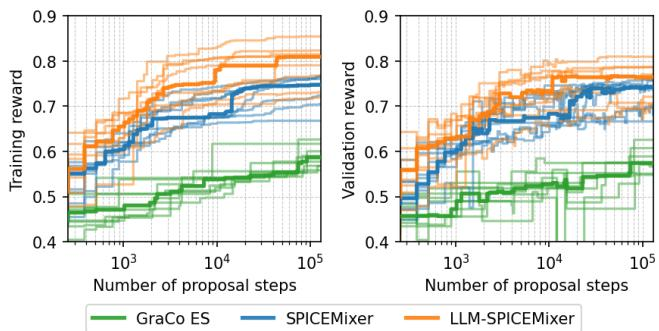  
Figure 2: Training and validation rewards of the best-so-far circuit in each run. Circuits are selected by training reward and then evaluated on validation. Each run uses 131,072 proposal steps; thicker lines indicate medians over nine runs.

The evolution of the reward on the training and validation splits is shown in Fig. 2, and the final training rewards are summarized in Tab. 1. GraCo ES performs worst: the search quickly stalls, and we observe that it produces circuits with highly similar topologies, leading to generation collapse and a median reward of only 0.587. SPICEMixer performs substantially better, achieving a median reward of 0.747. LLM-SPICEMixer yields the strongest overall performance. It improves the median reward to 0.810 (+0.063 over SPICEMixer) and also discovers the best overall circuit, with a reward of 0.855 (+0.087 over the best circuit found by SPICEMixer).

To assess whether this improvement is statistically significant, we perform a one-sided unpaired permutation test on the results of the nine independent runs. The test shows that the median improvement of 0.063 is statistically significant, with a �-value of 0.0052. These results indicate that adding the LLM-based proposal operator substantially improves the search and leads to better final solutions.

Fig. 2 also shows the evolution of the reward curves on the training and validation splits. Each plot reports the reward of the best circuit found so far according to the training set and evaluates that same circuit on the validation set. We observe that LLM-SPICEMixer consistently outperforms SPICEMixer, demonstrating that IGEL benefits the synthesis process. We also observe a train–validation gap: the final median reward reaches 0.81 on the training set, compared to approximately 0.77 on the validation set. Nevertheless, the overall ranking remains unchanged, and LLM-SPICEMixer also produces the best circuits on the validation split.

Using the validation reward, we select the best circuit from each run and evaluate it on the test split. Tab. 2 summarizes these results. Again, LLM-SPICEMixer performs best, with a median test reward of 0.807, which is +0.065 higher than SPICEMixer.

Finally, Fig. 3 shows the schematic of the best circuit on the validation set found by LLM-SPICEMixer. The complete netlist, including transistor sizes, is shown in Fig. 6 in Appx. B. Because of the size penalty in our reward, the resulting circuit is compact while still performing well on the classification task. Interestingly, the best solution in Fig. 3 uses only two of the four available inputs, namely petal length and petal width. This is consistent with prior feature-contribution analyses on the Iris dataset, which identify these two attributes as the dominant contributors to the classification decision [45]. It is notable that the synthesized circuit discovers this input subset implicitly and achieves a train accuracy of 93.4%, a validation accuracy of 88.4%, and a test accuracy of 85.9%, as discussed in more detail in the next section. To better understand the circuit behavior, Fig. 8 in Appx. C shows the output waveforms for the tt corner, with the transients for the three shufled versions of the test split overlaid. The circuit behaves relatively “statically,” which is advantageous because its response does not depend strongly on the cycle at which the samples are presented. In addition, the outputs are clearly separated, indicating a large output separation and thus robustness to noise. For completeness, Fig. 9 in Appx. C shows the corresponding waveforms overlaid across all corners and all shufles.

Table 1: Final best training reward for diferent methods. Values are computed over nine independent runs.
<table><tr><td></td><td>GraCo ES [27]</td><td>SPICEMixer [26] LLM-SPICEMixer</td><td></td></tr><tr><td>Average ± Std. Dev.</td><td>0.588 ± 0.022</td><td>0.737 ± 0.031</td><td>0.799 ± 0.039</td></tr><tr><td>Minimum</td><td>0.558</td><td>0.668</td><td>0.719</td></tr><tr><td>Median</td><td>0.587</td><td>0.747</td><td>0.810</td></tr><tr><td>Maximum</td><td>0.626</td><td>0.768</td><td>0.855</td></tr></table>

Table 2: Test rewards obtained by selecting the checkpoints with the highest validation reward. Values are computed over nine independent runs.
<table><tr><td rowspan=1 colspan=4>GraCo ES [27] SPICEMixer [26] LLM-SPICEMixer</td></tr><tr><td rowspan=1 colspan=1>Average ± Std. Dev.</td><td rowspan=1 colspan=1>0.627 ± 0.025</td><td rowspan=1 colspan=1>0.730 ± 0.031</td><td rowspan=1 colspan=1>0.782 ± 0.041</td></tr><tr><td rowspan=2 colspan=1>MinimumMedian</td><td rowspan=1 colspan=1>0.580</td><td rowspan=1 colspan=1>0.667</td><td rowspan=1 colspan=1>0.715</td></tr><tr><td rowspan=1 colspan=1>0.622</td><td rowspan=1 colspan=1>0.742</td><td rowspan=1 colspan=1>0.807</td></tr><tr><td rowspan=1 colspan=1>Maximum</td><td rowspan=1 colspan=1>0.670</td><td rowspan=1 colspan=1>0.773</td><td rowspan=1 colspan=1>0.824</td></tr></table>

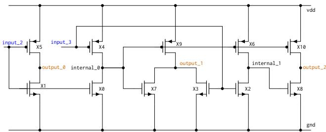  
Figure 3: Schematic of the best validation circuit found by LLM-SPICEMixer. The circuit uses only input\_2 and input\_3, corresponding to petal length and petal width, respectively. The output nets output\_0, output\_1, and output\_2 correspond to setosa, versicolor, and virginica.

Fig. 7 in Appx. B presents three additional strong circuits found by LLM-SPICEMixer. Comparing them shows that our method discovers diverse solutions with substantially diferent topologies while maintaining good performance. Since this is a non-standard synthesis task for which memorized circuit templates are unlikely to exist, the strong performance of LLM-SPICEMixer suggests that the approach can generalize to novel tasks, which is important for practical analog design.

## 5.2 Accuracy and Robustness

To place the performance of the synthesized circuits into context, we compare them with two standard machine learning baselines implemented in scikit-learn [46]:

• a regularized logistic regression classifier, implemented with LogisticRegression, and

• a single-hidden-layer neural network with four hidden units and a batch size of eight implemented with MLPClassifier.

The best models are selected on the validation set and then evaluated once on the held-out test set.

For evaluation, we study robustness to perturbations of the input voltages. Specifically, we add Gaussian noise ${ \cal N } ( 0 , \sigma _ { \mathrm { n o i s e } } ^ { 2 } { \bf I } )$ to each input sample $\mathbf { x } _ { i } \in \mathbb { R } ^ { 4 }$ with $\sigma _ { \mathrm { n o i s e } } \in \{ 0 \mathrm { V } , 0 . 1 \mathrm { V } , 0 . 2 \mathrm { V } , 0 . 3 \mathrm { V } , 0 . 4 \mathrm { V } , 0 . 5 \mathrm { V } \}$ For each noise level, we report results averaged over 16 independent noise realizations. This setup models practical input distortions, such as sensor noise, which can lead to slightly perturbed voltage levels. A practically useful circuit should therefore be robust to such variations.

The results are shown as boxplots in Fig. 10 in Appx. D for both the nominal tt corner and the multi-corner setting. In addition, Tab. 3 in Appx. D reports the corresponding test accuracies. Overall, the synthesized circuits show a degradation trend comparable to the ML baselines. In the nominal tt setting, the two best circuits are competitive with the baselines and achieve higher median accuracy at several larger noise levels. We hypothesize that this is related to optimizing the reward across multiple corners during synthesis.

## 5.3 Ablation: Prompting Strategy

We explored the prompt templates introduced in Sec. 3.2 to understand how the LLM query afects synthesis. In addition to fixed templates, we evaluated an alternating scheme that switches be tween the “raw”-style and “dif”-style prompts.

The results over nine runs using Gemma3 12B are shown in Tab. 4 in Appx. E. Overall, prompt design measurably afects the final reward. Variants with explicit reasoning tend to achieve higher median reward than those without reasoning. Comparing the two output formats, the “dif”-style prompt is slightly more robust than the “raw”-style prompt, especially without reasoning. This is consistent with edit-based outputs encouraging local modifications of elite circuits, which is advantageous for genetic algorithms. Among the evaluated settings, the alternating scheme with reasoning achieves the highest median reward. These results suggest that IGEL is sensitive to how the generation task is framed, and that better prompt design may further improve search performance.

## 5.4 Ablation: Decoding Settings

We also explored several LLM decoding settings instead of fixing a single choice a priori. In particular, we varied the softmax temperature � and the top-� probability $\scriptstyle { \frac { p _ { \mathrm { t o p } } } { P _ { \mathrm { t o p } } } }$ [47] to cover a range from nearly deterministic decoding to more diverse sampling. These settings control the trade-of between output stability and diversity and may therefore afect proposal quality.

The results over nine runs using Gemma3 12B are shown in Tab. 5 in Appx. E. We observe some variation across settings, but less than for the prompt templates. The balanced setting with � = 0.7 and $p _ { \mathrm { t o p } } = 0 . 9$ yields the highest median reward, while the other settings remain in a similar range. Overall, IGEL does not require highly specialized decoding settings. Moderate stochasticity appears to be a reasonable default for this task.

## 5.5 Ablation: Model Choice and Size

Finally, we explored model family and size using Gemma3 [48] and Qwen3.5 [49]. The results are reported in Tab. 6 in Appx. E.

Overall, performance depends on both model family and size. Within Gemma3, larger models generally perform better, although not strictly monotonically for every statistic. Across all models, Qwen3.5 27B performs best, reaching the highest median and maximum reward. Compared with Gemma3 27B, it improves the median reward by +0.05. We attribute this to overall model quality, reflecting the advantages of a newer model with stronger benchmark performance. We therefore use Qwen3.5 27B as the IGEL model in the main comparison.

To better understand model diferences, we also analyzed response lengths in Tab. 8 in Appx. F. Gemma3 produces relatively short outputs, whereas Qwen generates substantially longer responses, partly due to explicit thinking tokens. In particular, Qwen3.5 27B generates much longer responses than the other models. This may indicate that additional test-time reasoning is useful, although our results show only correlation, not causation.

## 5.6 Ablation: Operator Mixture

We further ablate whether IGEL should replace the conventional SPICEMixer operators or complement them. We compare the default operator mixture against an IGEL-only variant without crossover, mutation, or pruning. The IGEL-only variant runs for 18,816 proposal steps, matching the LLM-call budget of one full LLM-SPICE-Mixer run. Both settings use the same reasoning-enabled alternating “raw”/“dif” prompts with � = 3 inspirations.

The results are reported in Tab. 7 in Appx. E. IGEL alone performs substantially worse than the operator mixture. At the same proposal budget of 18,816 steps, the median reward decreases from 0.689 to 0.619. The gap is even larger relative to the longer 131,072- step operator-mixture run with the same LLM-call budget, whose median reward is 0.763. Notably, the best IGEL-only run (0.656) remains below the worst operator-mixture run at the same proposal budget (0.665). These results show that IGEL is most efective as a complementary proposal operator: it injects useful structured variations, while conventional genetic operators remain important for local refinement, recombination, and search dynamics.

## 6 Conclusions and Outlook

We introduced LLM-SPICEMixer, a hybrid analog circuit synthesis method that augments SPICEMixer with IGEL, an LLM-based proposal operator. Rather than asking the LLM to generate circuits from scratch, we use it to propose new candidate netlists from elite solutions within a genetic search loop. This enables the LLM to contribute structured variations, while SPICE simulation remains the source of truth for evaluating circuit quality.

We evaluated the method on analog discriminant-function synthesis for the Iris classification task. The results show that IGEL improves search performance over SPICEMixer, reduces premature convergence, and yields compact transistor-level circuits with strong performance. Ablations show that prompt design and model choice are important in this setting, while the decoding configuration has a comparatively smaller efect.

Several directions remain for future work. First, the gap between training and validation/test reward suggests that improved reward design or explicit regularization could further enhance generalization. Second, robustness could be strengthened by incorporating noisy or perturbed inputs directly during synthesis rather than only during post-training evaluation. Third, it would be interesting to explore richer LLM-based proposal strategies, such as verbalized sampling [39], self-reflective refinement [32, 50], or multi-stage proposal-and-repair schemes [24, 51].

Overall, our results suggest that for non-standard analog synthesis tasks, LLMs are most efective not as standalone designers, but as proposal generators embedded within a simulation-driven evolutionary search loop.

## References

[1] B. Razavi, Design ofAnalog CMOS Integrated Circuits, 2nd ed. McGraw-Hil Education, 2017.

[2] W. Lyu, P. Xue, F. Yang, C. Yan, Z. Hong, X. Zeng, and D. Zhou, “An eficient bayesian optimization approach for automated optimization of analog circuits,” IEEE Transactions on Circuits and Systems I: Regular Papers, vol. 65, no. 6, pp. 1954–1967, 2017.

[3] T. Gu, J. Wang, Z. Bi, C. Yan, F. Yang, Y. Qin, T. Cui, and X. Zeng, “tss-bo: Scalable bayesian optimization for analog circuit sizing via truncated subspace sampling,” in 2024 Design, Automation & Test in Europe Conference & Exhibition (DATE). IEEE, 2024, pp. 1–6.

[4] K. Settaluri, A. Haj-Ali, Q. Huang, K. Hakhamaneshi, and B. Nikolic, “Autockt: deep reinforcement learning of analog circuit designs,” in Proceedings ofthe 23rd Conference on Design, Automation and Test in Europe, 2020, pp. 490–495.

[5] H. Wang, K. Wang, J. Yang, L. Shen, N. Sun, H.-S. Lee, and S. Han, “Gcn-rl circuit designer: Transferable transistor sizing with graph neural networks and reinforcement learning,” in 2020 57th ACM/IEEE Design Automation Conference (DAC). IEEE, 2020, pp. 1–6.

[6] A. F. Budak, P. Bhansali, B. Liu, N. Sun, D. Z. Pan, and C. V. Kashyap, “Dnn-opt: An rl inspired optimization for analog circuit sizing using deep neural networks,” in Proceedings of the 58th Annual ACM/IEEE Design Automation Conference, 2021, pp. 1219–1224.

[7] S. Kim, Z. Wang, S. Lee, Y. Oh, H. Zhu, D. Kim, and D. Z. Pan, “Ppaas: Pvt and pareto aware analog sizing via goal-conditioned reinforcement learning,” in 2025 IEEE/ACM International Conference On Computer Aided Design (ICCAD). IEEE, 2025, pp. 1–9.

[8] N. K. Somayaji and P. Li, “Llm-uso: Large language model-based universal sizing optimizer,” IEEE Transactions on Computer-Aided Design ofIntegrated Circuits and Systems, 2025.

[9] C. Liu and D. Chitnis, “Eesizer: Llm-based ai agent for sizing of analog and mixed signal circuit,” IEEE Transactions on Circuits and Systems I: Regular Papers, 2025.

[10] M. Ahmadzadeh, K. Chen, and G. Gielen, “Anaflow: Agentic llm-based workflow for reasoning-driven explainable and sample-eficient analog circuit sizing,” in 2025 IEEE/ACM International Conference On Computer Aided Design (ICCAD). IEEE, 2025, pp. 1–7.

[11] J. Lu, L. Lei, F. Yang, L. Shang, and X. Zeng, “Topology optimization of operational amplifier in continuous space via graph embedding,” in 2022 Design, Automation & Test in Europe Conference & Exhibition (DATE). IEEE, 2022, pp. 142–147.

[12] Z. Zhao and L. Zhang, “Analog integrated circuit topology synthesis with deep reinforcement learning,” IEEE Transactions on Computer-Aided Design ofIntegrated Circuits and Systems, vol. 41, no. 12, pp. 5138–5151, 2022.

[13] Z. Chen, S. Meng, F. Yang, L. Shang, and X. Zeng, “Total: Topology optimization of operational amplifier via reinforcement learning,” in 2023 24th International Symposium on Quality Electronic Design (ISQED). IEEE, 2023, pp. 1–8.

[14] S. Poddar, A. Budak, L. Zhao, C.-H. Hsu, S. Maji, K. Zhu, Y. Jia, and D. Z. Pan, “A data-driven analog circuit synthesizer with automatic topology selection and sizing,” in 2024 Design, Automation & Test in Europe Conference & Exhibition (DATE). IEEE, 2024, pp. 1–6.

[15] J. Shen, F. Yang, L. Shang, Z. Bi, C. Yan, D. Zhou, and X. Zeng, “Into-oa: Interpretable topology optimization for operational amplifiers,” in 2025 Design, Automation & Test in Europe Conference (DATE). IEEE, 2025, pp. 1–7.

[16] J. R. Koza, F. H. Bennett III, D. Andre, and M. A. Keane, “Automated design of both the topology and sizing of analog electrical circuits using genetic programming,” in Artificial intelligence in design’96. Springer, 1996, pp. 151–170.

[17] J. Hu, X. Zhong, and E. D. Goodman, “Open-ended robust design of analog filters using genetic programming,” in Proceedings ofthe 7th annual conference on Genetic and evolutionary computation, 2005, pp. 1619–1626.

[18] Ž. Rojec, J. Olenšek, and I. Fajfar, “Analog circuit topology representation for automated synthesis and optimization,” Informacije MIDEM, vol. 48, no. 1, pp. 29–40, 2018.

[19] S. Fan, N. Cao, S. Zhang, J. Li, X. Guo, and X. Zhang, “From specification to topology: Automatic power converter design via reinforcement learning,” in 2021 IEEE/ACM International Conference On Computer Aided Design (ICCAD). IEEE, 2021, pp. 1–9.

[20] P. Vijayaraghavan, L. Shi, E. Degan, V. Mukherjee, and X. Zhang, “Autocircuit-rl: Reinforcement learning-driven llm for automated circuit topology generation,” in International Conference on Machine Learning. PMLR, 2025, pp. 61 498–61 512.

[21] J. Gao, Y. Zou, A. Pradhan, W. Huang, Y. Su, K. Yang, and X. Zhang, “Powergenie: Analytically-guided evolutionary discovery of superior reconfigurable power converters,” arXiv preprint arXiv:2601.21984, 2026.

[22] J. Gao, W. Cao, J. Yang, and X. Zhang, “Analoggenie: A generative engine for automatic discovery of analog circuit topologies,” arXiv preprint arXiv:2503.00205, 2025.

[23] Y. Lai, S. Lee, G. Chen, S. Poddar, M. Hu, D. Z. Pan, and P. Luo, “Analogcoder: Analog circuit design via training-free code generation,” in Proceedings of the AAAI Conference on Artificial Intelligence, vol. 39, no. 1, 2025, pp. 379–387.

[24] Y. Lai, S. Poddar, S. Lee, G. Chen, M. Hu, B. Yu, P. Luo, and D. Z. Pan, “Analogcoderpro: Unifying analog circuit generation and optimization via multi-modal llms,” IEEE Transactions on Computer-Aided Design ofIntegrated Circuits and Systems, 2026.

[25] S. Kim, M. Kim, Y. Lee, and Y. Kim, “Analogtobi: Device-level analog circuit topology generation via bipartite graph and grammar guided decoding,” arXiv preprint arXiv:2603.08720, 2026.

[26] S. Uhlich, A. Bonetti, A. Venkitaraman, C.-Y. Hsieh, Y. Gençer, M. E. Gürsoy, R. Matsuo, and L. Servadei, “Spicemixer-netlist-level circuit evolution,” arXiv preprint arXiv:2506.01497, 2025.

[27] S. Uhlich, A. Bonetti, A. Venkitaraman, A. Momeni, R. Matsuo, C.-Y. Hsieh, E. Ohbuchi, and L. Servadei, “Graco–a graph composer for integrated circuits,” arXiv preprint arXiv:2411.13890, 2024.

[28] Z. Bao, Z. Lin, J. Wang, J. Hu, Y. Gao, Y. Wu, X. Li, and X. Xu, “Analogagent: Self-improving analog circuit design automation with llm agents,” arXiv preprint arXiv:2603.23910, 2026.

[29] B. Romera-Paredes, M. Barekatain, A. Novikov, M. Balog, M. P. Kumar, E. Dupont, F. J. R. Ruiz, J. S. Ellenberg, P. Wang, O. Fawzi, P. Kohli, and A. Fawzi, “Mathematical discoveries from program search with large language models,” Nature, vol. 625, pp. 468–475, 2024.

[30] F. Liu, X. Tong, M. Yuan, and Q. Zhang, “Algorithm evolution using large language model,” 2023.

[31] F. Liu, X. Tong, M. Yuan, X. Lin, F. Luo, Z. Wang, Z. Lu, and Q. Zhang, “Evolution of heuristics: Towards eficient automatic algorithm design using large language model,” 2024.

[32] H. Ye, J. Wang, Z. Cao, F. Berto, C. Hua, H. Kim, J. Park, and G. Song, “Reevo: Large language models as hyper-heuristics with reflective evolution,” 2024.

[33] N. van Stein and T. Bäck, “Llamea: A large language model evolutionary algorithm for automatically generating metaheuristics,” 2024.

[34] A. Novikov, N. Vu, M. Eisenberger, E. Dupont, P.-S. Huang, A. Z. Wagner, S. Shirobokov, B. Kozlovskii, F. J. R. Ruiz, A. Mehrabian, M. P. Kumar, A. See, S. Chaud huri, G. Holland, A. Davies, S. Nowozin, P. Kohli, and M. Balog, “Alphaevolve: A coding agent for scientific and algorithmic discovery,” 2025.

[35] X. Zhang, X. Chen, F. Portet, and M. Peyrard, “What makes an llm a good optimizer? a trajectory analysis of llm-guided evolutionary search,” 2026.

[36] Z. Ren, H. Liu, S. Guo, Y. Guo, X. Li, and H. Jiang, “Spicefuzz: Llm-based fuzzing for spice circuit simulator tools bug detection,” ACM Transactions on Design Automation ofElectronic Systems, 2026.

[37] D. Wright, S. Masud, J. Moore, S. Yadav, M. Antoniak, P. E. Christensen, C. Y. Park, and I. Augenstein, “Epistemic diversity and knowledge collapse in large language models,” arXiv preprint arXiv:2510.04226, 2025.

[38] L. Yun, C. An, Z. Wang, L. Peng, and J. Shang, “The price of format: Diversity collapse in llms,” arXiv preprint arXiv:2505.18949, 2025.

[39] J. Zhang, S. Yu, D. Chong, A. Sicilia, M. R. Tomz, C. D. Manning, and W. Shi, “Verbalized sampling: How to mitigate mode collapse and unlock llm diversity,” arXiv preprint arXiv:2510.01171, 2025.

[40] Google and SkyWater Technology Foundry, “Skywater 130nm PDK,” 2020. [Online]. Available: https://github.com/google/skywater-pdk

[41] R. A. Fisher, “The use of multiple measurements in taxonomic problems,” Annals ofeugenics, vol. 7, no. 2, pp. 179–188, 1936.

[42] Ngspice Contributors, Ngspice User’s Manual, version 46 ed., Ngspice Project, 2026, accessed: 2026-05-08. [Online]. Available: https://ngspice.sourceforge.io/ docs/ngspice-manual.pdf

[43] W. Kwon, Z. Li, S. Zhuang, Y. Sheng, L. Zheng, C. H. Yu, J. Gonzalez, H. Zhang, and I. Stoica, “Eficient memory management for large language model serving

with pagedattention,” in Proceedings of the 29th symposium on operating systems principles, 2023, pp. 611–626.

[44] T. Salimans, J. Ho, X. Chen, S. Sidor, and I. Sutskever, “Evolution strategies as a scalable alternative to reinforcement learning,” arXiv preprint arXiv:1703.03864, 2017.

[45] A. Palczewska, J. Palczewski, R. Marchese Robinson, and D. Neagu, “Interpreting random forest classification models using a feature contribution method,” in Integration of reusable systems. Springer, 2014, pp. 193–218.

[46] F. Pedregosa, G. Varoquaux, A. Gramfort, V. Michel, B. Thirion, O. Grisel, M. Blondel, P. Prettenhofer, R. Weiss, V. Dubourg et al., “Scikit-learn: Machine learning in python,” Journal ofMachine Learning Research, vol. 12, pp. 2825–2830, 2011.

[47] A. Holtzman, J. Buys, L. Du, M. Forbes, and Y. Choi, “The curious case of neural text degeneration,” in 8th International Conference on Learning Representations, ICLR 2020, Addis Ababa, Ethiopia, April 26-30, 2020. OpenReview.net, 2020. [Online]. Available: https://openreview.net/forum?id=rygGQyrFvH

[48] Gemma Team, “Gemma 3 technical report,” 2025. [Online]. Available: https://arxiv.org/abs/2503.19786

[49] Qwen Team, “Qwen3.5: Towards native multimodal agents,” Feb. 2026. [Online]. Available: https://qwen.ai/blog?id=qwen3.5

[50] A. Madaan, N. Tandon, P. Gupta, S. Hallinan, L. Gao, S. Wiegrefe, U. Alon, N. Dziri, S. Prabhumoye, Y. Yang et al., “Self-refine: Iterative refinement with self-feedback,” Advances in neural information processing systems, vol. 36, pp. 46 534–46 594, 2023.

[51] H. Zhang, S. Sun, Y. Lin, R. Wang, and J. Bian, “Analogxpert: Automating analog topology synthesis by incorporating circuit design expertise into large language models,” in 2025 International Symposium of Electronics Design Automation (ISEDA). IEEE, 2025, pp. 772–777.

## A Examples of LLM Prompts and Outputs

Fig. 4 and Fig. 5 on the following pages show example prompts used for IGEL together with the corresponding LLM outputs. These examples illustrate how the diferent prompt styles are formulated and what kinds of netlist modifications the model proposes.

## B Netlists of the Best Validation Circuits

Fig. 6 shows the transistor-level netlist of the circuit with the highest validation reward. Averaged over all 17 process, voltage, and temperature corners, this circuit achieves train/validation/test rewards of 0.855/0.811/0.780. The per-corner accuracies listed above the netlist provide additional detail on its robustness across operating conditions. In addition, Fig. 7 shows three more circuits with strong validation performance. Comparing them further illustrates the diversity of solutions discovered by LLM-SPICEMixer.

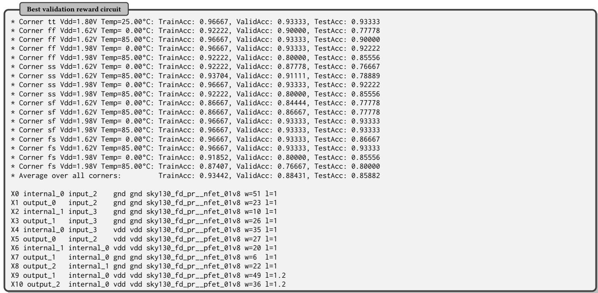  
Figure 6: Netlist of the circuit with the best validation reward found by LLM-SPICEMixer.

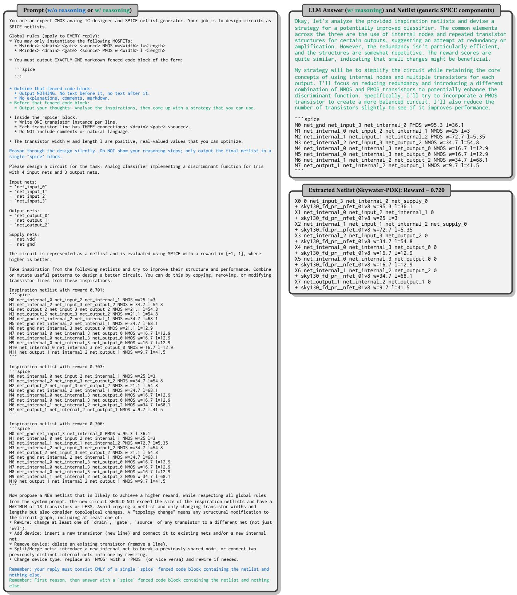  
Figure 4: LLM prompt and answer for the “raw”-style template version.

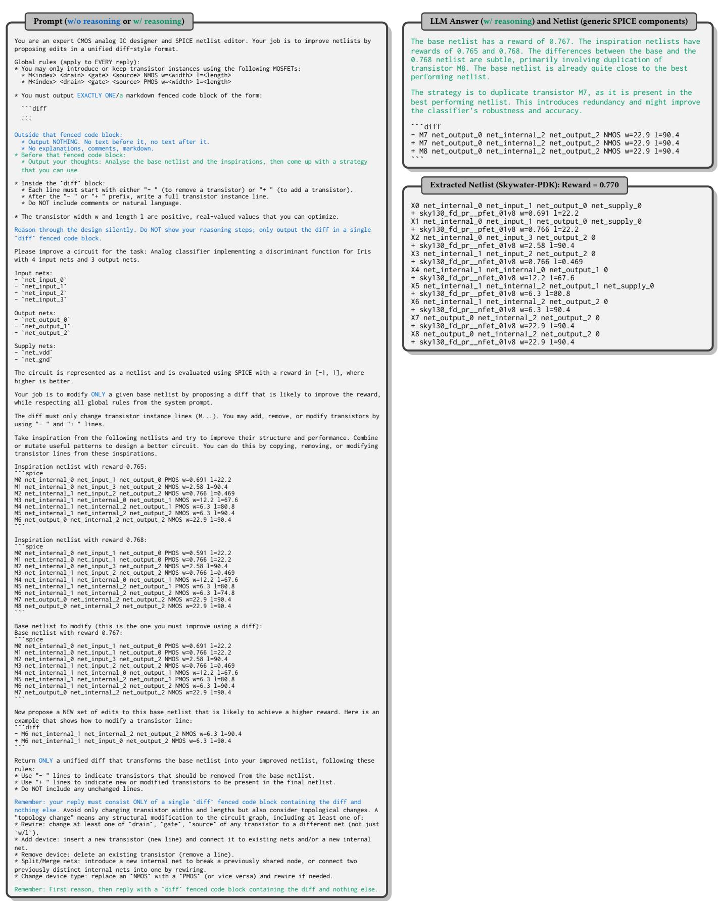  
Figure 5: LLM prompt and answer for the “dif”-style template

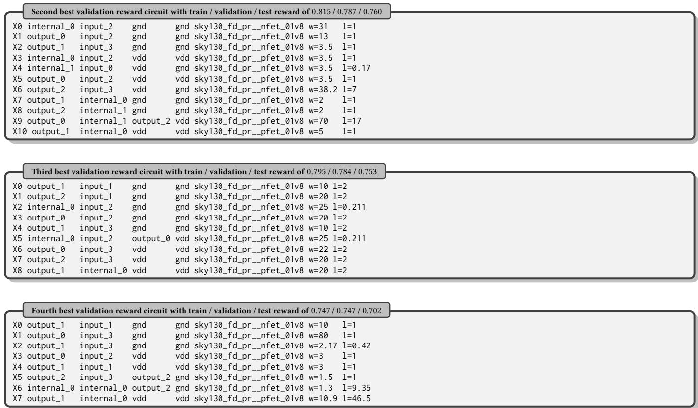  
Figure 7: Netlists of additional circuits with strong validation performance.

## C Output Waveforms Across Shufles and Corners

Fig. 9 shows the input and output waveforms for the two circuits with the best validation performance. The figure includes results for al considered corners and for all three shufled versions of the test split. This provides additional insight into how the circuit behavior varies across operating conditions.

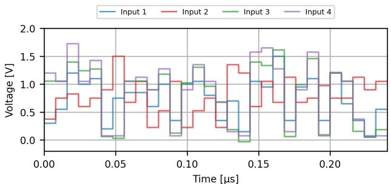  
(a) Input waveforms

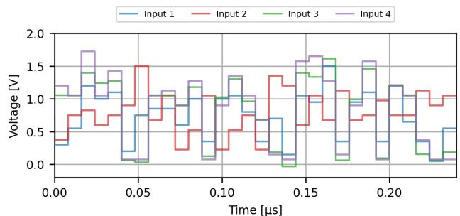  
(a) Input waveforms

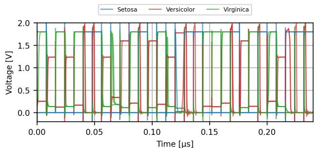  
(b) Output waveforms (best validation circuit)

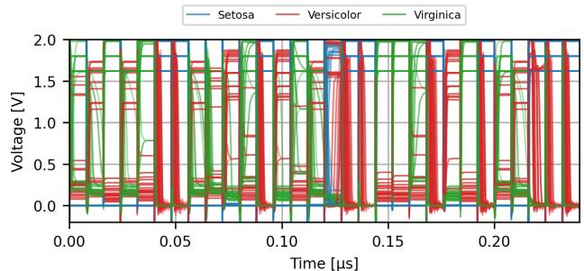  
(b) Output waveforms (best validation circuit)

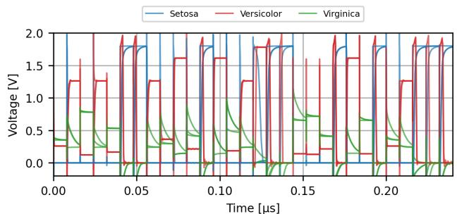  
(c) Output waveforms (second-best validation circuit)

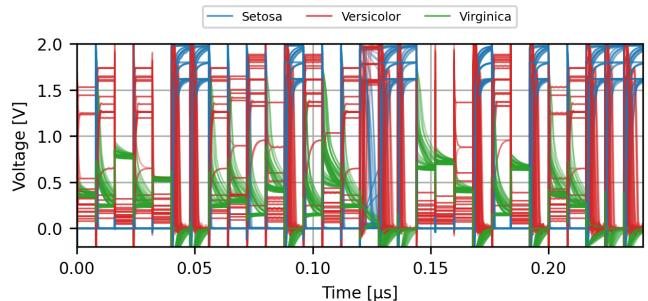  
(c) Output waveforms (second-best validation circuit)  
Figure 8: Voltage transients evaluated on the test split. The plots overlay the waveforms obtained from the three shuffled versions of the test split.  
Figure 9: Voltage transients evaluated on the test split. The plots overlay the waveforms obtained for all corners and all three shufled versions of the test split.

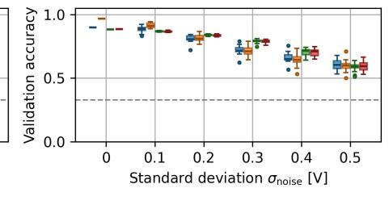

## D Robustness to Input-Voltage Perturbations

Fig. 10 and Tab. 3 provide the detailed robustness results for the ML baselines and for the two best validation circuits found by LLM-SPICEMixer. We evaluate the classifiers both without input noise and under Gaussian perturbations of the input voltages, with $\sigma _ { \mathrm { n o i s e } } ~ \in$ $\{ 0 , 0 . 1 , 0 . 2 , 0 . 3 , 0 . 4 , 0 . 5 \}$ . For each noisy setting, results are aggregated over 16 independent noise realizations.

The boxplots in Fig. 10 show that the synthesized circuits are competitive with the ML baselines in the noiseless setting and exhibit a similar degradation trend as the input perturbation increases. Tab. 3 reports the corresponding numerical test accuracies, including mean, standard deviation, and median values. For LLM-SPICEMixer, we report both the nominal tt-corner performance and the average performance across all process, voltage, and temperature corners.

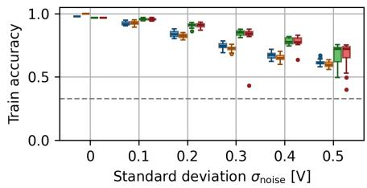

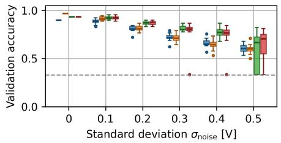

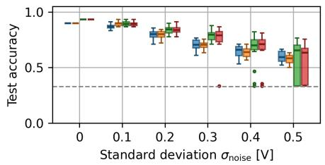  
(a) Evaluation over the tt corner

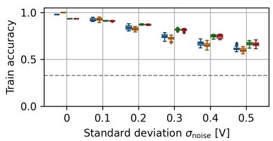

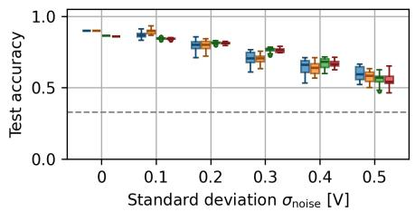  
(b) Evaluation over all corners

Figure 10: Robustness of LLM-SPICEMixer compared with ML baselines under input-voltage perturbations. The synthesized circuits are competitive with the baselines in the noiseless setting and degrade similarly as Gaussian noise $\sigma _ { \mathbf { n o i s e } }$ is added to the inputs, indicating that the analog solutions retain useful classification margins under imperfect sensor readings. Dashed lines represent chance accuracy.  
Table 3: Test-set accuracy across noise levels. For LLM-SPICEMixer, both tt-only and all-corner results are shown. Each cell reports mean ± standard deviation / median, in percent (%).
<table><tr><td>Method</td><td>Corners</td><td> $\sigma _ { \mathrm { n o i s e } } = 0$ </td><td> $\sigma _ { \mathrm { n o i s e } } = 0 . 1$ </td><td> $\sigma _ { \mathrm { n o i s e } } = 0 . 2$ </td><td> $\sigma _ { \mathrm { n o i s e } } = 0 . 3$ </td><td> $\sigma _ { \mathrm { n o i s e } } = 0 . 4$ </td><td> $\sigma _ { \mathrm { n o i s e } } = 0 . 5$ </td></tr><tr><td>Logistic regression</td><td>N/A</td><td> $9 0 . 0 \pm 0 . 0 \mathrm { ~ / ~ } 9 0 . 0$ </td><td> $8 7 . 0 \pm 2 . 1 / 8 6 . 7$ </td><td> $7 9 . 5 \pm 3 . 7 / 8 0 . 0$ </td><td> $7 0 . 8 \pm 4 . 6 \mathrm { ~ / ~ } 7 0 . 6$ </td><td> $6 4 . 3 \pm 5 . 2 / 6 6 . 1$ </td><td> $5 9 . 8 \pm 5 . 1 / 5 9 . 4$ </td></tr><tr><td>Single-hidden-layer network</td><td>N/A</td><td> $9 0 . 0 \pm 0 . 0 \mathrm { ~ / ~ } 9 0 . 0$ </td><td> $8 9 . 6 \pm 1 . 9 \textrm { / } 9 0 . 0$ </td><td> $7 9 . 7 \pm 3 . 2 / 8 0 . 0$ </td><td> $6 9 . 8 \pm 3 . 5 / 7 0 . 6$ </td><td> $6 3 . 7 \pm 4 . 2 / 6 3 . 9$ </td><td> $5 7 . 8 \pm 4 . 0 \mathrm { ~ / ~ } 5 8 . 3$ </td></tr><tr><td>LLM-SPICEMixer (best validation)</td><td>tt</td><td> $9 3 . 3 \pm 0 . 0 \mathrm { ~ / ~ } 9 3 . 3$ </td><td> $8 9 . 2 \pm 1 . 9 \textrm { / } 8 9 . 4$ </td><td> $8 4 . 1 \pm 3 . 7 / 8 3 . 9$ </td><td> $7 6 . 0 \pm 1 2 . 0 \mathrm { ~ / ~ } 7 8 . 9$ </td><td> $6 5 . 6 \pm 1 5 . 7 / 7 1 . 1$ </td><td> $5 5 . 0 \pm 1 5 . 9 / 6 3 . 3$ </td></tr><tr><td></td><td>all</td><td> $8 5 . 9 \pm 0 . 0 \textrm { / } 8 5 . 9$ </td><td> $8 4 . 2 \pm 1 . 3 / 8 4 . 2$ </td><td> $8 1 . 0 \pm 2 . 6 \mathrm { ~ / ~ } 8 1 . 1$ </td><td> $7 4 . 8 \pm 3 . 9 / 7 4 . 4$ </td><td> $6 3 . 4 \pm 8 . 5 / 6 3 . 4$ </td><td> $5 2 . 1 \pm 9 . 6 \mathrm { ~ / ~ } 5 3 . 9$ </td></tr><tr><td>LLM-SPICEMixer (2nd best validation)</td><td>tt</td><td> $9 3 . 3 \pm 0 . 0 \mathrm { ~ / ~ } 9 3 . 3$ </td><td> $9 0 . 0 \pm 2 . 5 / 9 0 . 0$ </td><td> $8 3 . 5 \pm 4 . 1 / 8 5 . 0$ </td><td> $7 8 . 2 \pm 4 . 5 / 7 7 . 8$ </td><td> $7 2 . 9 \pm 4 . 3 / 7 3 . 3$ </td><td> $6 0 . 3 \pm 1 3 . 9 / 6 4 . 4$ </td></tr><tr><td></td><td>all</td><td> $8 7 . 5 \pm 0 . 0 \textrm { / } 8 7 . 5$ </td><td> $8 6 . 1 \pm 1 . 8 \mathrm { ~ / ~ } 8 6 . 3 $ </td><td> $8 2 . 0 \pm 2 . 8 \mathrm { ~ / ~ } 8 2 . 4$ </td><td> $7 6 . 0 \pm 4 . 5 / 7 6 . 5$ </td><td> $6 7 . 5 \pm 7 . 0 / 6 9 . 7$ </td><td> $5 7 . 0 \pm 9 . 0 / 5 9 . 4$ </td></tr></table>

## E Results of Ablation Studies

Tabs. 4–7 provide the detailed results of the ablation studies for prompting strategy, decoding settings, model choice, and the role of the operator mixture. For each setting, the tables report the final best training reward over nine runs in terms of average, standard deviation, minimum, median, and maximum. In each ablation, we varied only one factor while keeping all other settings identical to the default IGEL configuration. For Tab. 4, Tab. 5, and Tab. 7, we used Gemma3 12B because of GPU resource constraints.

Tab. 7 compares IGEL-only search with the full operator mixture. To separate proposal budget from LLM-call budget, we report the ful operator mixture both at the reduced proposal budget of 18,816 steps and at the full budget of 131,072 steps. The IGEL-only run uses 18,816 proposal steps, corresponding approximately to the number of LLM calls made in one full LLM-SPICEMixer run.

Table 4: Ablation: final best reward for diferent prompting strategies on the training split. Values are computed over nine independent runs.
<table><tr><td rowspan="2"></td><td colspan="3">without reasoning</td><td colspan="3">with reasoning</td></tr><tr><td> $\mathrm { \ddot { \ r a w } \mathrm { \ddot { \Omega } - s t y l e } }$ </td><td> $\mathrm { \ddot { \omega } d i f f \mathrm { \ddot { \omega } - } s t y l e }$ </td><td>alternating</td><td> $\mathrm { \ddot { \Delta } r a w { \mathrm { ' - } s t y l e } }$ </td><td> $\mathrm { \ddot { \omega } d i f f { \vec { \mu } } ^ { \mathrm { , * } } }$ </td><td>alternating</td></tr><tr><td>Average ± Std. Dev.</td><td> $0 . 7 3 1 \pm 0 . 0 3 1$ </td><td> $0 . 7 3 6 \pm 0 . 0 2 0$ </td><td> $0 . 7 3 3 \pm 0 . 0 3 6$ </td><td> $0 . 7 3 1 \pm 0 . 0 3 8$ </td><td> $0 . 7 4 5 \pm 0 . 0 4 5$ </td><td> $0 . 7 4 5 \pm 0 . 0 4 2$ </td></tr><tr><td>Minimum</td><td>0.697</td><td>0.704</td><td>0.681</td><td>0.672</td><td>0.658</td><td>0.677</td></tr><tr><td>Median</td><td>0.713</td><td>0.745</td><td>0.729</td><td>0.750</td><td>0.754</td><td>0.763</td></tr><tr><td>Maximum</td><td>0.788</td><td>0.757</td><td>0.779</td><td>0.800</td><td>0.802</td><td>0.808</td></tr></table>

Table 5: Ablation: final best reward for diferent decoding settings on the training split. Values are computed over nine independent runs.
<table><tr><td rowspan=1 colspan=6>Deterministic  Conservative     Balanced       Entropy      Entropy++ $T = 0 , p _ { \mathrm { t o p } } = 1 . 0$     $T = 0 . 3 , p _ { \mathrm { t o p } } = 0 . 9$    $T = 0 . 7 , p _ { \mathrm { t o p } } = 0 . 9$    $T = 1 . 0 , p _ { \mathrm { t o p } } = 0 . 9 5$    $T = 1 . 3 , p _ { \mathrm { t o p } } = 0 . 9 8$ </td></tr><tr><td rowspan=1 colspan=2>Average ± Std. Dev.    $0 . 7 4 0 \pm 0 . 0 2 8$ </td><td rowspan=1 colspan=1> $0 . 7 3 4 \pm 0 . 0 3 7$ </td><td rowspan=1 colspan=1> $0 . 7 4 5 \pm 0 . 0 4 2$ </td><td rowspan=1 colspan=1> $0 . 7 2 6 \pm 0 . 0 4 0$ </td><td rowspan=1 colspan=1> $0 . 7 4 4 \pm 0 . 0 4 0$ </td></tr><tr><td rowspan=3 colspan=1>MinimumMedianMaximum</td><td rowspan=1 colspan=1>0.699</td><td rowspan=1 colspan=1>0.650</td><td rowspan=1 colspan=1>0.677</td><td rowspan=1 colspan=1>0.658</td><td rowspan=1 colspan=1>0.679</td></tr><tr><td rowspan=1 colspan=1>0.741</td><td rowspan=1 colspan=1>0.756</td><td rowspan=1 colspan=1>0.763</td><td rowspan=1 colspan=1>0.748</td><td rowspan=1 colspan=1>0.755</td></tr><tr><td rowspan=1 colspan=1>0.798</td><td rowspan=1 colspan=1>0.772</td><td rowspan=1 colspan=1>0.808</td><td rowspan=1 colspan=1>0.771</td><td rowspan=1 colspan=1>0.798</td></tr></table>

Table 6: Ablation: final best reward for diferent models on the training split. Values are computed over nine independent runs.
<table><tr><td></td><td>Gemma3 270M</td><td>Gemma3 1B</td><td>Gemma3 4B</td><td>Gemma3 12B</td><td>Gemma3 27B</td><td>Qwen3.5 9B</td><td>Qwen3.5 27B</td></tr><tr><td>Average ± Std. Dev.</td><td>0.737 ± 0.034</td><td>0.740 ± 0.039</td><td>0.746 ± 0.028</td><td>0.745 ± 0.042</td><td> $0 . 7 5 0 \pm 0 . 0 1 9$ </td><td> $0 . 7 4 3 \pm 0 . 0 4 0$ </td><td> $0 . 7 9 9 \pm 0 . 0 4 0$ </td></tr><tr><td>Minimum</td><td>0.686</td><td>0.671</td><td>0.701</td><td>0.677</td><td>0.709</td><td>0.671</td><td>0.719</td></tr><tr><td>Median</td><td>0.737</td><td>0.749</td><td>0.744</td><td>0.763</td><td>0.760</td><td>0.750</td><td>0.810</td></tr><tr><td>Maximum</td><td>0.801</td><td>0.790</td><td>0.793</td><td>0.808</td><td>0.777</td><td>0.812</td><td>0.855</td></tr></table>

Table 7: Ablation: final best reward for Gemma3 12B when using the full operator mixture (= LLM-SPICEMixer) versus using only IGEL. The first two columns compare both settings at the same number of proposal steps. The last column reports the full all-operator run for reference; the IGEL-only setting uses approximately the same number of LLM calls as this full run.
<table><tr><td></td><td>All operators 18,816 steps  $( 1 6 , 1 2 8 \mathrm { { S P I C E M i x e r } + 2 , 6 8 8 \mathrm { { I G E L } ) } }$ </td><td>Only IGEL 18,816 steps  $( 0 \mathrm { S P I C E M i x e r } + 1 8 , 8 1 6 \mathrm { I G E L } )$ </td><td>All operators 131,072 steps  $( 1 1 2 , 3 4 7 \mathrm { S P I C E M i x e r } + 1 8 , 7 2 5 \mathrm { I G E L } )$ </td></tr><tr><td>Average ± Std. Dev.</td><td> $0 . 7 0 5 \pm 0 . 0 3 1$ </td><td> $0 . 6 0 7 \pm 0 . 0 3 5$ </td><td>0.745 ± 0.042</td></tr><tr><td>Minimum</td><td>0.665</td><td>0.538</td><td>0.677</td></tr><tr><td>Median</td><td>0.689</td><td>0.619</td><td>0.763</td></tr><tr><td>Maximum</td><td>0.744</td><td>0.656</td><td>0.808</td></tr></table>

## F LLM Response Length Statistics

Tab. 8 summarizes the response lengths of the evaluated LLMs in terms of both characters and words. For the Qwen3.5 models, we report thinking tokens and final output separately. These results provide additional context for the model comparison discussed in the main paper.

<table><tr><td></td><td>Gemma3 12B</td><td>Gemma3 27B</td><td>Qwen3.5 9B</td><td>Qwen3.5 27B</td></tr><tr><td colspan="5">Number of characters</td></tr><tr><td>Average ± Std. Dev.</td><td> $1 , 5 7 6 . 7 \pm 3 8 9 . 2$ </td><td> $1 , 2 1 5 . 9 \pm 3 3 6 . 0$ </td><td> $5 , 4 0 1 . 5 \pm 4 , 2 1 7 . 8$   $+ ~ 1 , 0 2 9 . 4 \pm 6 2 5 . 6$ </td><td> $2 1 , 8 2 5 . 9 \pm 8 , 6 9 0 . 7$   $+ 1 , 3 2 2 . 9 \pm 7 2 5 . 3$ </td></tr><tr><td>Minimum</td><td>430</td><td>263</td><td> $^ { 1 , 1 7 3 + 6 1 }$ </td><td> $1 , 2 1 6 + 6 2$ </td></tr><tr><td>Median</td><td>1,532</td><td>1,176</td><td> $3 , 9 6 1 + 8 9 4$ </td><td> $2 3 , 8 7 1 + 1 , 3 3 6$ </td></tr><tr><td>Maximum</td><td>3,780</td><td>16,977</td><td> $5 9 , 6 5 3 + 2 3 , 7 5 0$ </td><td> $6 9 , 5 3 5 + 2 3 , 0 8 8$ </td></tr><tr><td colspan="5">Number of words</td></tr><tr><td>Average ± Std. Dev.</td><td> $2 2 6 . 2 \pm 5 4 . 1$ </td><td> $1 7 7 . 1 \pm 4 6 . 8$ </td><td> $7 9 3 . 1 \pm 6 2 7 . 2$   $+ 1 4 1 . 1 \pm 8 9 . 8$ </td><td> $3 , 3 6 8 . 5 \pm 1 , 3 6 4 . 4$ </td></tr><tr><td>Minimum</td><td>65</td><td>42</td><td> $1 3 7 + 1 0$ </td><td> $+ \ 1 8 6 . 4 \pm 1 0 2 . 9$   $1 7 0 + 1 0$ </td></tr><tr><td>Median</td><td>221</td><td>172</td><td> $5 7 6 + 1 2 1$ </td><td> $3 , 6 7 5 + 1 8 9$ </td></tr><tr><td>Maximum</td><td>498</td><td>2,333</td><td> $9 , 1 2 1 + 3 , 0 9 4$ </td><td> $7 , 2 0 5 + 3 , 1 7 0$ </td></tr></table>

Table 8: Response-length statistics across the four models. For the Qwen3.5 models, values are reported as <think> + final output, because these models produce explicit thinking tokens.