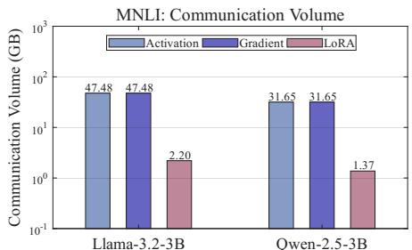
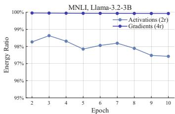
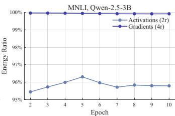
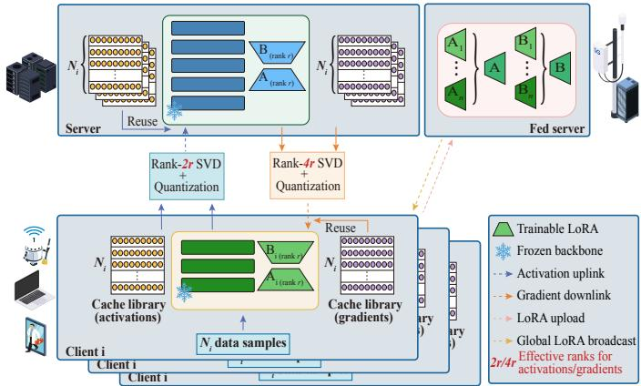
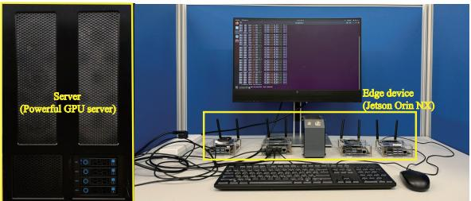
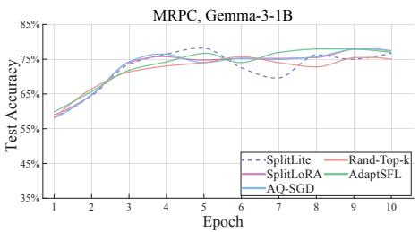
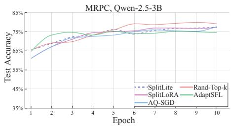
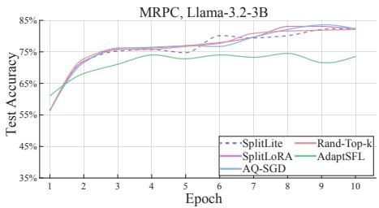

# SplitLite: Low-Rank Residual Compression for Split Learning

Tao Li, Yulin Tang, Qi Guo, and Xianhao Chen, Member, IEEE

Abstract—Federated fine-tuning of on-device large language models (LLMs) faces a significant computing burden. To overcome this limitation, split learning (SL) has emerged as a promising solution, which offloads the primary training workload to a powerful server. However, SL requires exchanging highdimensional activations and gradients between clients and the server, resulting in prohibitive communication costs. To overcome this challenge, we propose SplitLite, a communication-efficient split federated LoRA fine-tuning method that exploits the low effective rank structure of consecutive-epoch activation and gradient residuals. Our key finding is that, when LoRA uses rank r updates in parameter space, the activation and gradient residuals of the same data sample between adjacent epochs also exhibit effective rank-2r and rank-4r structures, respectively. By revealing this property, SplitLite transmits only quantized truncated singular value decomposition (SVD) residual factors, thereby significantly reducing both activation uplink and gradient downlink traffic. Extensive experiments on the GLUE benchmark across a series of advanced on-device LLMs demonstrate that our method reduces activation uplink communication costs by up to 93.5% and total communication costs by up to 83.7%, without performance degradation.

Index Terms—Federated Learning, Split Federated Learning, Large Language Models, Parameter-Efficient Fine-Tuning.

## I. INTRODUCTION

Various downstream applications of large language models (LLMs) [1], such as personal assistants, healthcare, and home robotics, rely on data distributed across organizations or individual users, which cannot be centralized due to privacy and regulatory constraints [2], [3]. Federated learning (FL) offers a privacy-preserving paradigm that keeps raw data local and shares only model updates [4]–[6]. However, conventional FL requires each participating device to train the entire model locally, which is impractical for LLMs given the limited memory and compute budgets of edge devices [7], [8]. Even with parameter-efficient fine-tuning (PEFT) methods such as lowrank adaptation (LoRA) [9], which trains lightweight low-rank adapters only while keeping the pre-trained backbone frozen, this challenge still persists. For example, fine-tuning Llama-3.2-3B with LoRA rank 24 and batch size 8 consumes over 16 GB of GPU memory, which still exceeds the capacity of many edge devices. Against this backdrop, split learning (SL) [10] has emerged as a promising alternative by partitioning the model into client-side and server-side sub-models, thereby offloading the primary training workload to a powerful server. This makes the integration of LoRA and SL a natural paradigm for resource-efficient LLM fine-tuning on edge devices [11].

  
Fig. 1. Total communication overhead of LoRA aggregation, activation uploading, and gradient downloading until model convergence for Llama-3.2-3B and Qwen-2.5-3B under split federated LoRA fine-tuning on the MNLI dataset with 6 clients over 10 epochs.

However, applying SL to fine-tune LLMs still faces a major bottleneck, i.e., high-dimensional activation and gradient communications at the model cut layer [12], [13]. Specifically, the frequent exchanges of high-dimensional activations and gradients at the cut layer lead to significant communication overhead (shown in Fig. 1). While forward and backward passes both involve communication costs at the cut layer between clients and the server, uplink communication puts an even heavier burden on wireless/mobile devices due to asymmetric data rates1 and limited on-device energy. An intuitive approach to mitigate this communication overhead is activation quantization. Nevertheless, since Transformer architectures can generate activations with an extremely wide value range [16]–[18], naively quantizing activations can catastrophically degrade the fine-tuning performance for LLMs [12], [19]. As a result, prior activation-quantization methods designed for traditional SL [20] may not work effectively for LLMs. Thus, a fundamental research question remains open in split learning: Is it possible to significantly compress activations and gradients at the cut layer ofLLMs without degrading the fine-tuning performance?

At first glance, the question seems to be paradoxical, as there is generally no free lunch. However, focusing on LoRA fine-tuning, we can leverage two key insights to answer the question affirmatively. First, given the same data sample, the activation/gradient residuals at the cut layer across consecutive epochs are very small during fine-tuning, because they are solely induced by subtle parameter changes. Second, LoRA fine-tuning of the parameter space also leads to low-rank structure for such residuals at the cut layer. Given that LoRA with rank r is adopted and parameter change is sufficiently small, we show that the effective rank of the activation residual between adjacent training epochs is upper-bounded by 2r, while that of the gradient residual is upper-bounded by 4r. This phenomenon is also empirically validated in Fig. 2, where the majority of energy in activation/gradient residuals can be captured by low-rank approximation.

  
(a) Llama-3.2-3B  
(b) Qwen-2.5-3B  
Fig. 2. Residual energy ratios of LoRA-induced low-rank temporal residuals on MNLI for (a) Llama-3.2-3B and (b) Qwen-2.5-3B. Rank-2r activation and rank-4r gradient residuals retain most of the adjacent-epoch residual energy, confirming their low effective ranks.

Motivated by these insights, we propose SplitLite, a communication-efficient split federated LoRA fine-tuning framework for LLMs that exploits the LoRA-induced low-rank property of activation and gradient residuals across consecutive training epochs. Specifically, we exploit the LoRA-induced low-rank structure of temporal residuals and transmit only rank-2r activation residuals and rank-4r gradient residuals. To achieve this, we encode the activation and gradient residuals using rank-2r and rank-4r truncated singular value decomposition (SVD), respectively. We further compress the resulting factors using an unbiased stochastic uniform quantizer, thereby reducing both the number of transmitted elements and the number of bits per element. Our key contributions are summarized as follows.

• We uncover the LoRA-induced low-effective-rank structure of temporal residuals at the cut layer. Specifically, for parameter updates with LoRA rank r, the effective ranks of the activation and gradient residuals between adjacent epochs are upper-bounded by 2r and 4r, respectively.

• We leverage quantized rank-2r activation and rank-4r gradient residual factors to substantially reduce communication overhead.

• We establish a theoretical convergence analysis that explicitly captures the impact of SVD truncation and stochastic quantization on model convergence.

• Extensive experiments on the GLUE benchmark with ondevice LLMs demonstrate that our method reduces activation uplink communication by up to 93.5% and total communication cost by up to 83.7%, without sacrificing model performance.

## II. RELATED WORK

Split fine-tuning on resource-constrained devices. Finetuning billion-parameter LLMs through conventional FL remains impractical for resource-limited edge devices [7], [21]. SL mitigates this burden by partitioning the model between clients and a server [10], [22]. Among SL approaches, SFL is a predominant framework that integrates SL with FL. Lin et al. [23] studied the convergence of SFL and optimized cut-layer placement for heterogeneous, resource-constrained clients. Recent work further combines SFL with PEFT to support on-device LLM adaptation [11], [24], [25]. For example, SplitLoRA [11] partitions the model into client-side and server-side sub-models and updates only LoRA adapters to alleviate client-side computation overhead. However, these methods overlook SFL’s key bottleneck for LLMs: excessive communication overhead caused by repeated activation uploads and gradient downloads. This limitation has motivated communication compression techniques for intermediate activations and gradients in SL.

Communication compression in split learning. Prior SL studies reduce cut-layer traffic by compressing intermediate tensors through quantization [26] or sparsification [27]. FedLite [28] clusters and vector-quantizes cut-layer activations and introduces gradient correction to mitigate compression errors. Rand-Top-k [29] sparsifies cut-layer representations through randomized top-k selection, improving convergence and generalization over deterministic top-k [30]. However, these methods process each training round independently and do not exploit the cross-epoch redundancy arising in parameter-efficient LLM fine-tuning, where the activations and gradients tend to change gradually as only lightweight adapters are updated. AQ-SGD [19] partially exploits this redundancy by quantizing inter-epoch activation changes, but directly quantizes the backward gradients without leveraging their temporal structure. SplitCom [12] instead reduces transmission frequency by skipping sufficiently similar activations and gradients. Distinct from these approaches, SplitLite reduces the traffic of every bidirectional exchange by compressing rank-2r activation and rank-4r gradient residuals via truncated SVD [31] and stochastic uniform quantization [26].

## III. SYSTEM MODEL

As shown in Fig. 3, our method is based on a standard SFL framework [10]. In SFL, clients and the central server exchange intermediate activations and gradients at the cut layer during each training step. Formally, let $W ~ = ~ [ W _ { c , i } ; W _ { s , i } ]$ denote the weights of a pre-trained LLM, partitioned into a client-side sub-model $W _ { c , i }$ and a server-side sub-model $W _ { s , i }$ . The set of participating edge devices is denoted by $\mathcal { N } = \{ 1 , 2 , \dots , N \}$ , where N is the number of edge devices. Each edge device i has its local dataset $\mathcal { D } _ { i } = \{ x _ { i , k } , y _ { i , k } \} _ { k = 1 } ^ { n _ { i } }$ with $n _ { i }$ data samples, where $x _ { i , k }$ and $y _ { i , k }$ are the k-th input data and its corresponding label.

We introduce trainable LoRA adapters to fine-tune both parts of $W \colon \mathcal { R } _ { c , i }$ for the client-side sub-model and $\mathcal { R } _ { s , i }$ for the server-side sub-model of each client i. During training, only these lightweight LoRA adapters are updated while W remains frozen, which substantially reduces the number of trainable parameters. At every training step, the central server locally aggregates the server-side LoRA adapters $\{ \mathcal { R } _ { s , i } \} _ { i = 1 } ^ { N } ,$ and every I steps, the clients upload their client-side LoRA adapters $\{ \mathcal { R } _ { c , i } \} _ { i = 1 } ^ { N }$ to the federated server for aggregation2, after which the averaged client-side adapter is broadcast back to the clients to continue training.

  
Fig. 3. System overview of SplitLite. Clients and the server maintain synchronized activation and gradient caches, and communicate only adjacent-round quantized rank-2r activation residuals and rank-4r gradient residuals, while periodically aggregating the trainable LoRA adapters.

The global LoRA adapter is denoted by $\mathcal { R } \ = \ [ \mathcal { R } _ { c } ; \mathcal { R } _ { s } ]$ where $\mathcal { R } _ { c }$ and $\mathcal { R } _ { s }$ are the aggregated client-side and serverside LoRA adapters across all clients, respectively. The objective of split federated LoRA fine-tuning is to find the adapter configuration $\mathcal { R } ^ { \ast }$ that minimizes the following non-convex finite-sum global loss over all participating devices:

$$
\operatorname* { m i n } _ { \mathcal { R } } \frac { 1 } { N } \sum _ { i = 1 } ^ { N } f _ { i } ( W \mid \mathcal { R } ) ,\tag{1}
$$

where $f _ { i } ( W \ \mid \ { \mathcal { R } } )$ is the local loss function evaluated on the data of client i using the frozen global backbone W together with the global LoRA adapter $\mathcal { R }$ , i.e., $f _ { i } ( W \mid { \mathcal { R } } ) \triangleq$ $\mathbb { E } _ { \xi _ { i } \sim \mathcal { D } _ { i } } [ F _ { i } ( W ~ \mid ~ \mathcal { R } ; \xi _ { i } ) ]$ , where $\xi _ { i }$ captures the training randomness induced by mini-batch sampling from $\mathcal { D } _ { i }$ . Following the standard stochastic optimization setting [23], [32], the stochastic gradient is assumed to be an unbiased estimator of the true gradient, i.e., $\begin{array} { r } { \mathbb { E } _ { \xi _ { i } ^ { t } \sim \mathcal { D } _ { i } } [ \nabla _ { \mathcal { R } } F _ { i } ( W \mid \mathcal { R } _ { i } ^ { t } ; \xi _ { i } ^ { t } ) \mid \xi ^ { [ t - 1 ] } ] = } \end{array}$ $\nabla _ { \mathcal { R } } f _ { i } ( W \ \mid \ \mathcal { R } _ { i } ^ { t } )$ , where $\pmb { \xi } ^ { [ t - 1 ] } \ \triangleq \ [ \pmb { \xi } _ { i } ^ { \tau } ] _ { i \in \{ 1 , \dots , N \} , \tau \in \{ 0 , \dots , t - 1 \} }$ denotes all mini-batch sampling randomness up to training step t − 1.

To solve problem (1), conventional SFL frameworks for LLM fine-tuning require transmitting high-dimensional cutlayer activations and gradients at every iteration, leading to substantial bidirectional communication overhead. To address this bottleneck, we propose SplitLite, which exploits the lowrank structure of activation and gradient residuals for efficient communication.

## IV. DESIGN OF SPLITLITE

To address the communication bottleneck in SFL, this section presents our low-rank residual compression framework named SplitLite. We first provide an overview of our method in Sec. IV-A. We then analyze the LoRA-induced low effective rank structure of the adjacent-epoch activation and gradient residuals in Sec. IV-B, which motivates the residual compression scheme detailed in Sec. IV-C. Finally, the system implementation and optimizations are described in Sec. IV-D.

## A. Overview

Fig. 3 provides an overview of our SplitLite framework, a compression scheme for activations/gradients at the cut layer in SFL. Its design is based on a structural property of LoRA fine-tuning: given the same data sample, since the adjacentepoch change in intermediate representations is driven solely by the rank-r adapter updates, we can show that activation and gradient residuals of each sample have low effective ranks of $2 r$ and 4r, respectively. This allows the compression rank of activations/gradients to be set to 2r and 4r without compromising learning performance.

The communication procedure at the cut layer operates as follows. Each client and the server maintain synchronized caches of the cut-layer activations and gradients, initialized by exchanging the full tensors in the first epoch. In subsequent epochs, each side transmits only the residual against its latest cached versions. Prior to transmissions, the activation and gradient residuals undergo a truncated SVD to rank-2r and rank-4r, respectively. This decomposition is then factored into two low-rank matrices by absorbing the singular values into the left factor. To further improve the compression ratio, these low-rank matrices are compressed by an unbiased stochastic quantizer. Finally, the receiver reconstructs the residuals from the quantized factors and updates its local cache, repeating this process until the model converges.

## B. Insights: Low Effective Rank Residuals

We next show the rationale behind our design: if the model is fine-tuned via LoRA adapters, the residual of activations and gradients across epochs also exhibits a low-rank structure. Consider a fixed sample $x _ { i , b }$ of client i, and let $Y _ { i , b } ^ { e , \ell } \in \mathbb { R } ^ { S \times E }$ denote its activations at cut layer ℓ in epoch e. Similarly, let $G _ { i , b } ^ { e , \ell } \in \mathbb { R } ^ { S \times E }$ denote the gradient of the loss with respect to the cut-layer activation. We define the adjacent-epoch activation and gradient residuals as $\Delta Y _ { i , b } ^ { e , \ell } \triangleq \mathsf { \bar { Y } } _ { i , b } ^ { e , \ell } - \mathsf { \bar { Y } } _ { i , b } ^ { e - 1 , \ell }$ , and $\Delta G _ { i , b } ^ { e , \ell } \triangleq G _ { i , b } ^ { e , \ell } - G _ { i , b } ^ { e - 1 , \ell }$ , respectively. Clearly, these residuals are induced entirely by updates to the client-side and serverside LoRA adapters.

Activation residual. To characterize the activation residual, let $\Phi _ { c } ^ { \ell } ( x ; \mathcal { R } _ { c } )$ denote the client-side activation mapping from input x to cut layer ℓ, implemented by the frozen clientside backbone together with its LoRA adapters. Accordingly, $Y _ { i , b } ^ { e , \ell } ~ = ~ \Phi _ { c } ^ { \ell } \left( x _ { i , b } ; \mathcal { R } _ { c , i } ^ { e } \right)$ . Assuming that the adjacent-epoch LoRA parameter variation $\Delta \mathcal { R } _ { c , i } ^ { e }$ is sufficiently small and that $\Phi _ { c } ^ { \ell }$ is Frechet differentiable with respect to´ $\mathcal { R } _ { c } ,$ the adjacent-epoch change in $\Phi _ { c } ^ { \ell }$ admits the following first-order approximation:

$$
\Delta Y _ { i , b } ^ { e , \ell } \approx D _ { \mathcal { R } _ { c } } \Phi _ { c } ^ { \ell } \left( x _ { i , b } ; \mathcal { R } _ { c , i } ^ { e - 1 } \right) \left[ \Delta \mathcal { R } _ { c , i } ^ { e } \right] ,\tag{2}
$$

where $D _ { \mathcal { R } _ { c } } \Phi _ { c } ^ { \ell }$ denotes the Frechet derivative of ´ $\Phi _ { c } ^ { \ell }$ with respect to $\mathcal { R } _ { c } ,$ evaluated at $\mathcal { R } _ { c , i } ^ { e - 1 }$ , and $\Delta \mathcal { R } _ { c , i } ^ { e } \triangleq \mathscr { R } _ { c , i } ^ { e } - \mathscr { R } _ { c , i } ^ { e - 1 }$ denotes the adjacent-epoch variation of the client-side LoRA parameters. Hence, the activation change is primarily characterized by the local linear response of the client-side activation mapping to the LoRA parameter update.

For a LoRA-augmented projection, the effective LoRA weight update at epoch e is given by $\mathcal { R } _ { c , i } ^ { e } = B _ { c , i } ^ { e } A _ { c , i } ^ { e } ,$ , where r denotes the LoRA rank. Its variation between two consecutive epochs can be expressed as

$$
\mathcal { R } _ { c , i } ^ { e } - \mathcal { R } _ { c , i } ^ { e - 1 } = B _ { c , i } ^ { e } A _ { c , i } ^ { e } - B _ { c , i } ^ { e - 1 } A _ { c , i } ^ { e - 1 } .\tag{3}
$$

Since each matrix product on the right-hand side has rank at most r, the subadditivity of matrix rank yields rank $\left( \mathcal { R } _ { c , i } ^ { e } - \mathcal { R } _ { c , i } ^ { e - 1 } \right) \leq 2 r$ . Through the first-order linearization of the client-side mapping, this low-rank parameter variation is propagated to the activation residual. Consequently, the dominant component of $\Delta Y _ { i , b } ^ { e , \ell }$ inherits the low-rank structure of $\Delta \mathcal { R } _ { c , i } ^ { e }$ , yielding

$$
\mathrm { r a n k } \Big ( \Delta Y _ { i , b } ^ { e , \ell } \Big ) \leq 2 r .\tag{4}
$$

Therefore, although nonlinear Transformer operations may introduce additional higher-order components, the dominant activation residual is driven by LoRA-constrained update directions and is thus expected to exhibit an effective rank of approximately 2r.

Gradient residual. To characterize the gradient residual, define the server-side backward mapping as $B ^ { \ell } ( Y , \mathcal { R } _ { s } ) \ \triangleq$ $\nabla _ { Y } F _ { s } ( Y ; W _ { s } , \mathcal { R } _ { s } )$ . Accordingly, the cut-layer gradient can be expressed as $G _ { i , b } ^ { e , \ell } = B ^ { \ell } \left( Y _ { i , b } ^ { e , \ell } , \mathcal { R } _ { s , i } ^ { e } \right)$ . A first-order Frechet´ expansion around $\left( Y _ { i , b } ^ { e - 1 , \dot { \ell } } , \mathcal { R } _ { s , i } ^ { e - 1 } \right)$ gives

$$
\Delta G _ { i , b } ^ { e , \ell } \approx D _ { Y } \mathcal { B } _ { e - 1 } ^ { \ell } \left[ \Delta Y _ { i , b } ^ { e , \ell } \right] + D _ { \mathcal { R } _ { s } } \mathcal { B } _ { e - 1 } ^ { \ell } \left[ \Delta \mathcal { R } _ { s , i } ^ { e } \right] ,\tag{5}
$$

where $D _ { Y } B _ { e - 1 } ^ { \ell }$ and $D _ { \mathcal { R } _ { s } } B _ { e - 1 } ^ { \ell }$ denote the Frechet derivatives´ of $B ^ { \ell }$ with respect to Y and $\mathcal { R } _ { s } .$ , respectively, evaluated at $\left( Y _ { i , b } ^ { e - 1 , \ell } , \mathcal { R } _ { s , i } ^ { e - 1 } \right)$ , and $\Delta \mathcal { R } _ { s , i } ^ { e } \ \triangleq \ \mathcal { R } _ { s , i } ^ { e } - \ \mathcal { R } _ { s , i } ^ { e - 1 }$ denotes the adjacent-epoch variation of the server-side LoRA parameters.

Thus, the gradient residual is jointly induced by the clientside activation shift and the server-side LoRA update. Since both sources are driven by LoRA weight variations with effective ranks of approximately 2r, the dominant gradient variation is expected to concentrate in a subspace of dimension approximately 4r, yielding

$$
\mathrm { r a n k } \Big ( \Delta G _ { i , b } ^ { e , \ell } \Big ) \leq 4 r .\tag{6}
$$

We emphasize that the above low-rank characterization relies on first-order linearization and should be interpreted as an effective, rather than exact algebraic, rank property for the nonlinear Transformer. Specifically, for a matrix $Z$ with singular values $s _ { j } ( Z )$ , define its top-k energy ratio as $\begin{array} { r } { \Gamma _ { k } ( Z ) \stackrel {  } { = } \sum _ { j = 1 } ^ { k } s _ { j } ^ { 2 } ( Z ) \dot { / } \sum _ { j } s _ { j } ^ { 2 } ( Z ) } \end{array}$ and its effective rank under an energy threshold θ as ${ \dot { r } } _ { \mathrm { e f f } } ( Z ; \theta ) \triangleq$ min $k : \Gamma _ { k } ( Z ) \geq \theta .$ . As shown in Fig. 2, both $\Gamma _ { 2 r } ( \Delta Y _ { i , b } ^ { e , \ell } )$ and $\Gamma _ { 4 r } ( \Delta G _ { i , b } ^ { e , \ell } )$ remain close to 1, indicating that the activation and gradient residuals between adjacent epochs have effective ranks of 2r and 4r, respectively. This motivates their rank-2r and rank-4r truncated SVD compression.

Algorithm 1 SplitLite Algorithm   
Require: Client set ${ \mathcal { N } } ,$ local datasets $\{ \mathcal { D } _ { i } \} _ { i = 1 } ^ { N }$ , total itera  
tions T, LoRA rank $r ,$ client-side aggregation interval I,   
bitwidths $q _ { y } , q _ { g } ,$ and learning rate η   
1: Initialize the frozen backbone $W = [ W _ { c , i } ; W _ { s , i } ] .$ , client  
side adapters $\{ \mathcal { R } _ { c , i } ^ { 0 } \} _ { i = 1 } ^ { N }$ , server-side adapters $\{ \mathcal { \bar { R } } _ { s , i } ^ { 0 } \} _ { i = 1 } ^ { N } ,$   
and empty activation and gradient caches   
2: for $t = 0 , 1 , \dots , T - 1$ do   
3: for $i \in \mathcal N$ in parallel do   
4: Sample a mini-batch $B _ { i } ^ { t } \subseteq { \mathcal { D } } _ { i }$   
5: for $b \in B _ { i } ^ { t }$ do   
6: Compute $Y _ { i , b } ^ { t , \ell } = \Phi _ { c } ^ { \ell } ( x _ { i , b } ; \mathcal { R } _ { c , i } ^ { t } )$   
7: $\check { Y } _ { i , b } ^ { t , \ell } \gets \mathbf { A }$ lgorithm $\pmb { 2 } ( Y _ { i , b } ^ { t , \ell } , y , r , q _ { y } )$   
8: Perform server-side forward and backward   
propagation using $\check { Y } _ { i , b } ^ { t , \ell }$ to obtain $G _ { i , b } ^ { t , \ell }$   
9: $\check { G } _ { i , b } ^ { t , \ell } \gets \mathbf { A }$ lgorithm $\pmb { 2 } ( G _ { i , b } ^ { t , \ell } , g , r , q _ { g } )$   
10: Perform client-side backpropagation using $\check { G } _ { i , b } ^ { t , \ell }$   
11: end for   
12: Form the mini-batch gradients $\widetilde { g } _ { c , i } ^ { t }$ and $\widetilde { g } _ { s , i } ^ { t }$   
13: Update both LoRA adapters:   
$\mathcal { R } _ { d , i } ^ { t + 1 }  \mathcal { R } _ { d , i } ^ { t } - \eta \widetilde { g } _ { d , i } ^ { t } , \qquad d \in \{ c , s \}$   
14: end for   
15: Server-side local aggregation:   
$\mathcal { R } _ { s } ^ { t + 1 } \gets \frac { 1 } { N } \sum _ { i = 1 } ^ { N } \mathcal { R } _ { s , i } ^ { t + 1 } , \qquad \mathcal { R } _ { s , i } ^ { t + 1 } \gets \mathcal { R } _ { s } ^ { t + 1 } , \ \forall i$   
16: if (t + 1) mod $I = 0$ then   
17: Clients upload $\{ \mathcal { R } _ { c , i } ^ { t + 1 } \} _ { i = 1 } ^ { N }$ to the federated server   
18: Federated aggregation and broadcast:   
$\mathcal { R } _ { c } ^ { t + 1 } \gets \frac { 1 } { N } \sum _ { i = 1 } ^ { N } \mathcal { R } _ { c , i } ^ { t + 1 } , \qquad \mathcal { R } _ { c , i } ^ { t + 1 } \gets \mathcal { R } _ { c } ^ { t + 1 } , \ : \forall i$   
19: end if   
20: end for   
21: return $\mathcal { R } ^ { T } = [ \mathcal { R } _ { c } ^ { T } ; \mathcal { R } _ { s } ^ { T } ]$

## C. Algorithm: Low-Rank Bidirectional Residual Compression

We now present the proposed low-rank bidirectional residual compression mechanism for reducing both activation uplink and gradient downlink communication at the cut layer. The key idea is to maintain synchronized sample-wise caches at the sender and receiver and transmit only the low-rank temporal residual relative to the most recently reconstructed tensor of the same sample.

Algorithm 2 Low-Rank Residual Compression $( Z _ { i , b } ^ { t , \ell } , d , r , q _ { d } )$   
Require: Tensor $Z _ { i , b } ^ { t , \ell } ,$ , direction d $\in \ \{ y , g \}$ , LoRA rank r,   
bitwidth $q _ { d }$   
Ensure: Reconstructed tensor $\check { Z } _ { i , b } ^ { t , \ell }$   
1: Set $\kappa _ { y } = 2 r$ and $\kappa _ { g } = 4 r$   
2: if the synchronized sender–receiver cache is empty then   
3: Transmit $Z _ { i , b } ^ { t , \ell }$ in full and set $\check { Z } _ { i , b } ^ { t , \ell } \gets Z _ { i , b } ^ { t , \ell }$   
4: else   
5: $\begin{array} { r } { \overline { { \Delta \tilde { Z } _ { i , b } ^ { t , \ell } } } \gets Z _ { i , b } ^ { t , \ell } - \check { Z } _ { i , b } ^ { \pi _ { i , b } ( t ) , \ell } } \end{array}$   
6: $U \Sigma V ^ { \top } \gets \mathrm { S V D } _ { \kappa _ { d } } ( \Delta \widetilde { Z } _ { i , b } ^ { t , \ell } )$   
7: Independently quantize and transmit   
$\widehat { P } \gets \mathcal { Q } _ { q _ { d } } ( U \Sigma ) , \qquad \widehat { Q } \gets \mathcal { Q } _ { q _ { d } } ( V ^ { \top } )$   
8: Identically update the sender and receiver caches:   
$\check { Z } _ { i , b } ^ { t , \ell } \gets \check { Z } _ { i , b } ^ { \pi _ { i , b } ( t ) , \ell } + \widehat { P } \widehat { Q }$   
9: end if   
10: return $\check { Z } _ { i , b } ^ { t , \ell }$

Low-rank temporal residual compression. For each sample b, the client and the server maintain synchronized reconstructed activation and gradient caches. When sample b is processed again, the activation and gradient residuals relative to their most recently reconstructed caches are computed as $\Delta \widetilde { Y } _ { i , b } ^ { t , \ell } = Y _ { i , b } ^ { t , \ell } - \check { Y } _ { i , b } ^ { \pi _ { i , b } ^ { \check { \imath } } ( t ) , \ell } , \Delta \widetilde { G } _ { i , b } ^ { t , \ell } = G _ { i , b } ^ { t , \ell } - \check { G } _ { i , b } ^ { \pi _ { i , b } ( t ) , \hat { \ell } }$ , where $\pi _ { i , b } ( t )$ denotes the most recent iteration before t at which sample b was processed.

Motivated by the low effective rank of the activation and gradient residuals revealed in Sec. IV-B, we approximate $\overline { { \Delta \tilde { Y } } } _ { i , b } ^ { t , \ell }$ and $\Delta \widetilde { G } _ { i , b } ^ { t , \ell }$ using rank-2r and rank-4r truncated SVD, respectively:

$$
\begin{array} { r } { \Delta \widetilde { Y } _ { i , b } ^ { t , \ell } \approx U _ { y , i , b } ^ { t , \ell } { \Sigma _ { y , i , b } ^ { t , \ell } } \left( V _ { y , i , b } ^ { t , \ell } \right) ^ { \top } , } \end{array}\tag{7}
$$

$$
\begin{array} { r } { \Delta \widetilde { G } _ { i , b } ^ { t , \ell } \approx U _ { g , i , b } ^ { t , \ell } { \Sigma } _ { g , i , b } ^ { t , \ell } \left( V _ { g , i , b } ^ { t , \ell } \right) ^ { \top } . } \end{array}\tag{8}
$$

Here, $U _ { y , i , b } ^ { t , \ell } \ \in \ \mathbb { R } ^ { S \times 2 r } , \ \Sigma _ { y , i , b } ^ { t , \ell } \ \in \ \mathbb { R } ^ { 2 r \times 2 r }$ , and $\left( V _ { y , i , b } ^ { t , \ell } \right) ^ { \top } \in$ $\mathbb { R } ^ { 2 r \times E }$ , whereas $U _ { g , i , b } ^ { t , \ell } \in \mathbb { R } ^ { S \times 4 r } , \Sigma _ { g , i , b } ^ { t , \ell } \in \mathring { \mathbb { R } } ^ { 4 r \times 4 r }$ , and $\left( V _ { g , i , b } ^ { t , \ell } \right) ^ { \top } \in \mathbb { R } ^ { 4 r \times E }$

To further reduce the communication payload, we absorb the singular-value matrix into the corresponding left singularvector matrix, thereby avoiding its separate transmission:

$$
\begin{array} { r l } { P _ { y , i , b } ^ { t , \ell } \triangleq U _ { y , i , b } ^ { t , \ell } \Sigma _ { y , i , b } ^ { t , \ell } , \quad } & { Q _ { y , i , b } ^ { t , \ell } \triangleq ( V _ { y , i , b } ^ { t , \ell } ) ^ { \top } , } \\ { P _ { g , i , b } ^ { t , \ell } \triangleq U _ { g , i , b } ^ { t , \ell } \Sigma _ { g , i , b } ^ { t , \ell } , \quad } & { Q _ { g , i , b } ^ { t , \ell } \triangleq ( V _ { g , i , b } ^ { t , \ell } ) ^ { \top } . } \end{array}\tag{9}
$$

Thus, $\Delta \widetilde { Y } _ { i , b } ^ { t , \ell } \approx P _ { y , i , b } ^ { t , \ell } Q _ { y , i , b } ^ { t , \ell }$ and $\Delta \widetilde { G } _ { i , b } ^ { t , \ell } \approx P _ { g , i , b } ^ { t , \ell } Q _ { g , i , b } ^ { t , \ell } .$

Overall, the proposed low-rank factorization reduces the per-sample transmission from 2SE to $6 r ( S { + } E )$ elements, corresponding to a relative communication cost of $3 r \left( { \frac { 1 } { S } } + { \frac { 1 } { E } } \right)$

With $S = 1 2 8 , E = 3 0 7 2$ , and $r = 8$ , it requires only approximately 19.5% of the uncompressed bidirectional communication. The gain becomes greater for longer sequences and larger hidden dimensions. We further quantize the low-rank residual factors using unbiased stochastic uniform quantization to reduce the per-element bit width.

Stochastic uniform quantization. Low-rank factorization compresses the transmitted tensor along the element-count dimension but leaves the precision of each retained element untouched. We therefore apply stochastic uniform quantization to low-rank factors, an orthogonal mechanism that lowers the per-element bit width without degrading model performance. Unlike deterministic rounding, which pushes small factor entries consistently in the same direction and lets systematic errors accumulate over iterations, the stochastic quantizer [26] is unbiased, $\mathrm { i . e . , ~ } \mathbb { E } _ { \mathcal { Q } } [ \mathcal { Q } ( x ) ] = x$ for any factor matrix x.

Accordingly, the sender quantizes the low-rank factors as

$$
\hat { P } _ { y , i , b } ^ { t , \ell } = \mathcal { Q } \Bigl ( P _ { y , i , b } ^ { t , \ell } \Bigr ) , \qquad \hat { Q } _ { y , i , b } ^ { t , \ell } = \mathcal { Q } \Bigl ( Q _ { y , i , b } ^ { t , \ell } \Bigr ) ,\tag{10}
$$

$$
\hat { P } _ { g , i , b } ^ { t , \ell } = \mathcal { Q } \Bigl ( P _ { g , i , b } ^ { t , \ell } \Bigr ) , \qquad \hat { Q } _ { g , i , b } ^ { t , \ell } = \mathcal { Q } \Bigl ( Q _ { g , i , b } ^ { t , \ell } \Bigr ) ,\tag{11}
$$

and transmits only the quantized factors together with the corresponding quantization parameters. Upon reception, the activation and gradient residuals are reconstructed as

$$
\Delta \widehat { Y } _ { i , b } ^ { t , \ell } = \hat { P } _ { y , i , b } ^ { t , \ell } \hat { Q } _ { y , i , b } ^ { t , \ell } ,
$$

$$
\Delta \widehat { G } _ { i , b } ^ { t , \ell } = \hat { P } _ { g , i , b } ^ { t , \ell } \hat { Q } _ { g , i , b } ^ { t , \ell } .\tag{12}
$$

(13)

These reconstructed residuals are then added to the corresponding cached values to recover the activations and gradients used for forward and backward propagation:

$$
\check { Y } _ { i , b } ^ { t , \ell } = \check { Y } _ { i , b } ^ { \pi _ { i , b } ( t ) , \ell } + \Delta \widehat { Y } _ { i , b } ^ { t , \ell } ,
$$

$$
\check { G } _ { i , b } ^ { t , \ell } = \check { G } _ { i , b } ^ { \pi _ { i , b } ( t ) , \ell } + \Delta \widehat { G } _ { i , b } ^ { t , \ell } .\tag{14}
$$

(15)

The recovered activations and gradients then update the cache entries for sample b at both the sender and the receiver, keeping the two caches synchronized for the next residual computation. In this manner, low-rank factorization reduces the number of communicated elements and stochastic quantization reduces the bits per element, yielding a multiplicative reduction in communication costs while preserving model performance.

Communication analysis. Instead of transmitting the full $S \times E$ tensor, our method communicates only $\kappa _ { d } ( S + E )$ elements, where the bottleneck dimension $\kappa _ { d }$ is determined by the LoRA rank r. For each communication direction, this low-rank factorization reduces the communication complexity from $O ( S E )$ to $O ( \kappa _ { d } ( S + E ) )$ . Moreover, since the relative communication cost scales as $\kappa _ { d } \left( \frac { 1 } { S } + \frac { 1 } { E } \right)$ , the resulting communication gain becomes more pronounced as the sequence length or hidden dimension increases, making our method particularly attractive for long-context fine-tuning [33] and large models. Furthermore, the unbiased stochastic quantizer decreases the bitwidth of each transmitted element. Consequently, our framework jointly reduces both the number of communicated elements and the bits per element, substantially lowering bidirectional communication overhead without compromising fine-tuning performance.

The SplitLite training procedure is outlined in Algorithms 1 and 2

## D. Implementation Considerations

Computation costs. A potential concern is the SVD computation cost. While a full SVD of an $S \times E$ residual costs $O ( S E \operatorname* { m i n } ( S , E ) )$ , our scheme requires only the leading $\kappa _ { d } ~ \in ~ \{ 2 r , 4 r \}$ singular triplets and thus costs $O ( S E \kappa _ { d } )$ using truncated randomized SVD [31]. Moreover, SVD and quantization are independent across samples, enabling batched and pipelined execution that overlaps with communication. As shown in Table II, despite the additional compression computation, SplitLite consistently achieves the lowest endto-end fine-tuning latency among all evaluated methods across three GLUE tasks, reducing the latency of Llama-3.2-3B by 65.5%–73.6% relative to SplitLoRA.

Storage costs. The second implementation consideration is storage cost. SplitLite maintains per-sample caches of the reconstructed activation $\check { Y } _ { i , b } ^ { t , \ell }$ and gradient $\mathcal { \bar { G } } _ { i , b } ^ { t , \ell }$ on both sides of the cut layer. Since the caches are overwritten in place, they require at most $2 n _ { i } S E$ entries on client i. For Llama-3.2-3B fine-tuning, this amounts to about 1 GB per client on MRPC and 100 GB on MNLI due to its larger local dataset. As only the current mini-batch $\boldsymbol { B } _ { i } ^ { t }$ is accessed per iteration, the caches can be offloaded to CPU memory or SSD [34], stored in low precision with synchronized rounding [12]. Following activation-caching systems [19], cache loading and updates can be overlapped with forward and backward computation or scheduled during training idle periods.

## V. CONVERGENCE ANALYSIS

We establish the convergence guarantee under residual compression, rank-2r/4r truncated SVD, and stochastic uniform quantization. Recall $\begin{array} { r } { \mathcal { R } _ { i } ^ { t } = [ \mathcal { R } _ { c , i } ^ { t } ; \mathcal { R } _ { s , i } ^ { t } ] , \mathcal { R } ^ { t } = \frac { 1 } { N } \sum _ { i } \mathcal { R } _ { i } ^ { t } } \end{array}$ , and the applied gradient $\tilde { g } _ { i } ^ { t } = g _ { i } ^ { t } + \delta _ { i } ^ { t }$ with perturbation $\delta _ { i } ^ { t } ,$ , so the averaged update is $\mathcal { R } ^ { t + 1 } \ = \ ^ { \circ } \mathcal { R } ^ { t } \ - \ \dot { \eta } ( \bar { g } ^ { t } \ + \ \bar { \delta } ^ { t } )$ , where $\begin{array} { r } { \bar { g } ^ { t } = \frac { 1 } { N } \sum _ { i } g _ { i } ^ { t } } \end{array}$ and $\begin{array} { r } { \bar { \delta } ^ { t } = \frac { 1 } { N } \sum _ { i } \delta _ { i } ^ { t } } \end{array}$

Assumption 1 (Lipschitz regularity). $\nabla f _ { i } , \nabla _ { \mathcal { R } _ { s } } F _ { i } ( \mathcal { R } _ { i } ; \cdot )$ , and $\nabla _ { \mathcal { R } _ { c } } F _ { i } ( \mathcal { R } _ { i } ; \cdot )$ are ${ \bar { \beta } } \mathbf { - } , \ L _ { Y } ^ { ( \ell ) } \mathbf { - } ,$ , and $\bar { L _ { G } ^ { ( \ell ) } }$ -Lipschitz: for any $\mathcal { R } , \mathcal { R } ^ { \prime }$ and $Y _ { 1 } , Y _ { 2 } , G _ { 1 } , G _ { 2 } \in \mathbb { R } ^ { \bar { S } \times E }$

$$
\begin{array} { r } { \| \nabla f _ { i } ( \mathcal { R } ) - \nabla f _ { i } ( \mathcal { R } ^ { \prime } ) \| \leq \beta \| \mathcal { R } - \mathcal { R } ^ { \prime } \| , } \end{array}\tag{16}
$$

$$
\begin{array} { r } { \| \nabla _ { \mathcal { R } _ { s } } F _ { i } ( \mathcal { R } _ { i } ; Y _ { 1 } ) - \nabla _ { \mathcal { R } _ { s } } F _ { i } ( \mathcal { R } _ { i } ; Y _ { 2 } ) \| \le L _ { Y } ^ { ( \ell ) } \| Y _ { 1 } - Y _ { 2 } \| _ { F } , } \end{array}\tag{17}
$$

$$
\begin{array} { r } { \| \nabla _ { \mathcal { R } _ { c } } F _ { i } ( \mathcal { R } _ { i } ; G _ { 1 } ) - \nabla _ { \mathcal { R } _ { c } } F _ { i } ( \mathcal { R } _ { i } ; G _ { 2 } ) \| \le L _ { G } ^ { ( \ell ) } \| G _ { 1 } - G _ { 2 } \| _ { F } , } \end{array}\tag{18}
$$

with ℓ the cut layer.

Assumption 2 (Bounded variance and second moment). The stochastic gradient is unbiased, and its per-layer variance and second moment are bounded:

$$
\begin{array} { r } { \mathbb { E } _ { \xi _ { i } \sim \mathcal { D } _ { i } } \| \nabla F _ { i } ( \mathcal { R } ; \xi _ { i } ) - \nabla f _ { i } ( \mathcal { R } ) \| ^ { 2 } \le \sum _ { j = 1 } ^ { L } \sigma _ { j } ^ { 2 } , \forall \mathcal { R } , \forall i , } \end{array}\tag{19}
$$

$$
\begin{array} { r } { \mathbb { E } _ { \xi _ { i } \sim \mathcal { D } _ { i } } \| \nabla F _ { i } ( \mathcal { R } ; \xi _ { i } ) \| ^ { 2 } \le \displaystyle \sum _ { j = 1 } ^ { L } G _ { j } ^ { 2 } , \forall \mathcal { R } , \forall i , } \end{array}\tag{20}
$$

where L is the number of layers, and $\sigma _ { j } ^ { 2 } , \ G _ { j } ^ { 2 }$ bound the variance and second moment for the j-th layer of model W.

Assumption 3 (Unbiased bounded quantization). The quantizer $\mathcal { Q } ( \cdot )$ is unbiased and variance-bounded, and its quantization error variance is bounded by $\begin{array} { r } { c _ { q } < \frac { 1 } { \sqrt { 2 ( 1 + 8 r ) } } , } \end{array}$

$$
\begin{array} { r } { \mathbb { E } _ { \mathcal { Q } } [ \mathcal { Q } ( { x } ) ] = { x } , \qquad \mathbb { E } _ { \mathcal { Q } } \| \mathcal { Q } ( { x } ) - { x } \| ^ { 2 } \leq c _ { q } ^ { 2 } \| { x } \| ^ { 2 } , } \end{array}\tag{21}
$$

Lemma 1 (Recursive stability of activation cache error). Under Assumption 3, Algorithms 1 and 2 ensure

$$
\mathbb { E } \Vert \varepsilon _ { y , i , b } ^ { t , \ell } \Vert _ { F } ^ { 2 } \leq \sum _ { \operatorname* { m i n } \mathcal { T } _ { i , b } } \rho _ { y } ^ { m _ { i , b } ( t ) - m _ { i , b } ( \tau ) } A _ { y , i , b } ^ { \tau , \ell } ,\tag{22}
$$

where $\begin{array} { r } { A _ { y , i , b } ^ { \tau , \ell } = \sum _ { k > 2 r } ( \sigma _ { y , i , b , k } ^ { \tau , \ell } ) ^ { 2 } + 2 \bar { c } _ { y } ^ { 2 } \mathbb { E } \| \Delta Y _ { i , b } ^ { \tau , \ell } \| _ { F } ^ { 2 } . } \end{array}$

Proof. Decompose $\varepsilon _ { y , i , b } ^ { t , \ell } = \varepsilon _ { \mathrm { s v d } } + \varepsilon _ { q }$ with $\varepsilon _ { \mathrm { s v d } } = P Q - R _ { y , i , b } ^ { t , \ell } ,$ where $P = P _ { y , i , b } ^ { t , \ell } , \stackrel { \triangledown } { Q } = Q _ { y , i , b } ^ { t , \ell } , \ \hat { P } = P + \Delta P , \hat { Q } = \stackrel { \triangledown } { Q } +$ $\Delta Q$ , and $\varepsilon _ { q } = \hat { P } \hat { Q } - P Q = \Delta P Q + P \Delta Q + \Delta P \Delta Q$ . By Assumption $3 , \mathbb { E } [ \Delta P \mid P ] = \mathbb { E } [ \Delta Q \mid Q ] = 0$ with $\Delta P , \Delta Q$ conditionally independent, so $\mathbb { E } [ \varepsilon _ { q } \mid P , Q ] = 0$ and the cross term vanishes; with Eckart–Young–Mirsky [35], [36],

$$
\mathbb { E } \| \varepsilon _ { y , i , b } ^ { t , \ell } \| _ { F } ^ { 2 } = \sum _ { k > 2 r } ( \sigma _ { y , i , b , k } ^ { t , \ell } ) ^ { 2 } + \mathbb { E } \| \varepsilon _ { q } \| _ { F } ^ { 2 } .\tag{23}
$$

Submultiplicativity, conditional independence, and Assump tion 3, with $\| Q \| _ { 2 } = 1 , \| Q \| _ { F } ^ { 2 } = 2 r , \| P \| _ { 2 } ^ { 2 } \leq \| P \| _ { F } ^ { 2 } =$ $\| P Q \| _ { F } ^ { 2 }$ , bound the quantization term,

$$
\begin{array} { r } { \mathbb { E } \| \varepsilon _ { q } \| _ { F } ^ { 2 } \leq c _ { q } ^ { 2 } \| Q \| _ { 2 } ^ { 2 } \| P \| _ { F } ^ { 2 } + c _ { q } ^ { 2 } \| P \| _ { 2 } ^ { 2 } \| Q \| _ { F } ^ { 2 } + c _ { q } ^ { 4 } \| P \| _ { F } ^ { 2 } \| Q \| _ { F } ^ { 2 } } \\ { \leq \left( c _ { q } ^ { 2 } ( 1 + 2 r ) + 2 r c _ { q } ^ { 4 } \right) \| P Q \| _ { F } ^ { 2 } = \bar { c } _ { y } ^ { 2 } \| P Q \| _ { F } ^ { 2 } , ( 2 4 ) } \end{array}
$$

which yields the one-step bound

$$
\begin{array} { r } { \mathbb { E } \| \varepsilon _ { y , i , b } ^ { t , \ell } \| _ { F } ^ { 2 } \leq \sum _ { k > 2 r } ( \sigma _ { y , i , b , k } ^ { t , \ell } ) ^ { 2 } + \bar { c } _ { y } ^ { 2 } \| P _ { y , i , b } ^ { t , \ell } Q _ { y , i , b } ^ { t , \ell } \| _ { F } ^ { 2 } . } \end{array}\tag{25}
$$

Since $R _ { y , i , b } ^ { t , \ell } ~ = ~ \Delta Y _ { i , b } ^ { t , \ell } - \varepsilon _ { y , i , b } ^ { \pi _ { i , b } ( t ) , \ell }$ and $\| P _ { y , i , b } ^ { t , \ell } Q _ { y , i , b } ^ { t , \ell } \| _ { F } ^ { 2 } \leq$ $\| \boldsymbol { R } _ { \boldsymbol { y } , i , \boldsymbol { b } } ^ { t , \ell } \| _ { F } ^ { 2 }$ , applying $\| x - y \| ^ { 2 } \leq 2 \| x \| ^ { 2 } + 2 \| y \| ^ { 2 }$ to (25) gives

$$
\begin{array} { r } { \mathbb { E } \| \varepsilon _ { y , i , b } ^ { t , \ell } \| _ { F } ^ { 2 } \leq A _ { y , i , b } ^ { t , \ell } + \rho _ { y } \mathbb { E } \| \varepsilon _ { y , i , b } ^ { \pi _ { i , b } ( t ) , \ell } \| _ { F } ^ { 2 } . } \end{array}\tag{26}
$$

Indexing the appearances of sample b as $\tau _ { 1 } < \cdot \cdot \cdot < \tau _ { M } = t$ $( M = m _ { i , b } ( t ) , \pi _ { i , b } ( \tau _ { m } ) = \tau _ { m - 1 } )$ and unrolling from $\varepsilon _ { y , i , b } ^ { \tau _ { 1 } , \ell } =$ 0 with $\rho _ { y } = 2 \bar { c } _ { y } ^ { 2 } < 1$ yields the claim. □

Lemma 2 (Recursive stability of gradient cache error). Under Assumption 3, Algorithms 1 and 2 ensure

$$
\mathbb { E } \Vert \varepsilon _ { g , i , b } ^ { t , \ell } \Vert _ { F } ^ { 2 } \leq \sum _ { \tau \in \mathcal { T } _ { i , b } } \rho _ { g } ^ { m _ { i , b } ( t ) - m _ { i , b } ( \tau ) } A _ { g , i , b } ^ { \tau , \ell } ,\tag{27}
$$

where $\begin{array} { r } { A _ { g , i , b } ^ { \tau , \ell } = \sum _ { k > 4 r } ( \sigma _ { g , i , b , k } ^ { \tau , \ell } ) ^ { 2 } + 2 \bar { c } _ { g } ^ { 2 } \mathbb { E } \| \Delta G _ { i , b } ^ { \tau , \ell } \| _ { F } ^ { 2 } . } \end{array}$

Proof. The argument mirrors Lemma 1 with rank 4r. With $P \stackrel {  } { = } P _ { g , i , b } ^ { t , \ell } , \stackrel {  } { Q } = Q _ { g , i , b } ^ { t , \ell }$ , the factor noises are unbiased and

conditionally independent, so the cross term vanishes and, by Eckart–Young–Mirsky,

$$
\mathbb { E } \| \varepsilon _ { g , i , b } ^ { t , \ell } \| _ { F } ^ { 2 } = \sum _ { k > 4 r } ( \sigma _ { g , i , b , k } ^ { t , \ell } ) ^ { 2 } + \mathbb { E } \| \varepsilon _ { q } \| _ { F } ^ { 2 } .\tag{28}
$$

Using $\| Q \| _ { 2 } = 1 , \| Q \| _ { F } ^ { 2 } = 4 r , \| P \| _ { 2 } ^ { 2 } \leq \| P \| _ { F } ^ { 2 } = \| P Q \| _ { F } ^ { 2 }$ , and Assumption 3,

$$
\begin{array} { r } { \mathbb { E } \| \varepsilon _ { q } \| _ { F } ^ { 2 } \leq \big ( c _ { q } ^ { 2 } ( 1 + 4 r ) + 4 r c _ { q } ^ { 4 } \big ) \| P Q \| _ { F } ^ { 2 } = \bar { c } _ { g } ^ { 2 } \| P Q \| _ { F } ^ { 2 } , } \end{array}\tag{29}
$$

giving the one-step bound $\begin{array} { r } { \mathbb { E } \| \varepsilon _ { g , i , b } ^ { t , \ell } \| _ { F } ^ { 2 } \leq \sum _ { k > 4 r } ( \sigma _ { g , i , b , k } ^ { t , \ell } ) ^ { 2 } + } \end{array}$ $\bar { c } _ { g } ^ { 2 } \lVert P _ { g , i , b } ^ { t , \ell } Q _ { g , i , b } ^ { t , \ell } \rVert _ { F } ^ { 2 }$ . With $R _ { g , i , b } ^ { t , \ell } = \Delta G _ { i , b } ^ { t , \ell } - \varepsilon _ { g , i , b } ^ { \pi _ { i , b } ( t ) , \ell } , \| P Q \| _ { F } ^ { 2 } \leq$ $\| R _ { g , i , b } ^ { t , \ell } \| _ { F } ^ { 2 }$ , and $\| x - y \| ^ { 2 } \leq 2 \| x \| ^ { 2 } + 2 \| y \| ^ { 2 } .$

$$
\begin{array} { r } { \mathbb { E } \| \varepsilon _ { g , i , b } ^ { t , \ell } \| _ { F } ^ { 2 } \leq A _ { g , i , b } ^ { t , \ell } + \rho _ { g } \mathbb { E } \| \varepsilon _ { g , i , b } ^ { \pi _ { i , b } ( t ) , \ell } \| _ { F } ^ { 2 } . } \end{array}\tag{30}
$$

Unrolling from $\varepsilon _ { g , i , b } ^ { \tau _ { 1 } , \ell } = 0$ with $\rho _ { g } \ = \ 2 \bar { c } _ { g } ^ { 2 } \ < \ 1$ yields the claim. □

By Assumption 1, for each sample b, $\begin{array} { r l } { \mathbb { E } \| \delta _ { i , b } ^ { t } \| ^ { 2 } } & { { } \leq } \end{array}$ $( L _ { Y } ^ { ( \ell ) } ) ^ { 2 } \mathbb { E } \Vert \varepsilon _ { y , i , b } ^ { t , \ell } \Vert _ { F } ^ { 2 } + ( L _ { G } ^ { ( \ell ) } ) ^ { 2 } \mathbb { E } \Vert \varepsilon _ { g , i , b } ^ { t , \ell } \Vert _ { F } ^ { 2 }$ . Averaging over the mini-batch and clients, the average perturbation obeys $\mathbb { E } \Vert \bar { \delta } ^ { t } \Vert ^ { 2 } \leq \epsilon _ { \mathrm { c o m p } } ^ { t } ,$ where

$$
\epsilon _ { \mathrm { c o m p } , i } ^ { t } = \frac { 1 } { B } \sum _ { b \in \mathcal { B } _ { i } ^ { t } } \Big [ ( L _ { Y } ^ { ( \ell ) } ) ^ { 2 } \mathbb { E } \| \varepsilon _ { y , i , b } ^ { t , \ell } \| _ { F } ^ { 2 } + ( L _ { G } ^ { ( \ell ) } ) ^ { 2 } \mathbb { E } \| \varepsilon _ { g , i , b } ^ { t , \ell } \| _ { F } ^ { 2 } \Big ] ,\tag{31}
$$

where $\begin{array} { r } { \epsilon _ { \mathrm { c o m p } } ^ { t } = \frac { 1 } { N } \sum _ { i = 1 } ^ { N } \epsilon _ { \mathrm { c o m p } , i } ^ { t } . } \end{array}$

Lemma 3 (Client-side LoRA model drift). Under Assumption 2, Algorithms 1 and 2 ensure

$$
\begin{array} { r l } & { \mathbb { E } \| \mathcal { R } _ { c , i } ^ { t } - \mathcal { R } _ { c } ^ { t } \| ^ { 2 } \leq { { \bf 1 } } _ { \{ I > 1 \} } 8 \eta ^ { 2 } I ^ { 2 } \sum _ { j = 1 } ^ { L _ { c } } G _ { j } ^ { 2 } } \\ & { \qquad + { { \bf 1 } } _ { \{ I > 1 \} } 4 \eta ^ { 2 } I \sum _ { \tau = t _ { 0 } } ^ { t - 1 } \big ( \epsilon _ { \mathrm { c o m p } , i } ^ { \tau } + \epsilon _ { \mathrm { c o m p } } ^ { \tau } \big ) , } \end{array}\tag{32}
$$

with I the client-side aggregation interval.

Proof. Since server-side adapters aggregate every iteration, $\mathcal { R } _ { s , i } ^ { t } \bar { } = \mathcal { R } _ { s } ^ { t } , \mathrm { s o } \ \Vert \mathcal { R } _ { i } ^ { t } - \mathcal { R } ^ { t } \Vert ^ { 2 } = \Vert \mathcal { R } _ { c , i } ^ { t } - \mathcal { R } _ { c } ^ { t } \Vert ^ { 2 }$ . Let $t _ { 0 } \leq t$ be the latest client-side aggregation $( t _ { 0 }$ mod $I = 0 , t - t _ { 0 } \leq I )$ , at which $\mathcal { R } _ { c , i } ^ { t _ { 0 } } = \mathcal { R } _ { c } ^ { t _ { 0 } }$ . Accumulating the applied gradients over $[ t _ { 0 } , t )$

$$
\mathcal { R } _ { c } ^ { t } - \mathcal { R } _ { c , i } ^ { t } = \eta \sum _ { \tau = t _ { 0 } } ^ { t - 1 } \tilde { g } _ { c , i } ^ { \tau } - \eta \sum _ { \tau = t _ { 0 } } ^ { t - 1 } \frac { 1 } { N } \sum _ { k = 1 } ^ { N } \tilde { g } _ { c , k } ^ { \tau } .\tag{33}
$$

By $\| x + y \| ^ { 2 } \leq 2 \| x \| ^ { 2 } + 2 \| y \| ^ { 2 }$ (with the indicator since $t = t _ { 0 }$ when $I = 1 )$ $\begin{array} { r } { \| \sum _ { \tau } z ^ { \tau } \| ^ { 2 } \leq ( t - t _ { 0 } ) \sum _ { \tau } \| z ^ { \tau } \| ^ { 2 } } \end{array}$ , and Jensen’s inequality,

$$
\begin{array} { r l r } {  { \stackrel {  } { \mathbb { E } } \| \mathcal { R } _ { c } ^ { \dot { t } } - \mathcal { R } _ { c , i } ^ { t } \| ^ { 2 } \leq \mathbf { 1 } _ { \{ I > 1 \} } 2 \eta ^ { 2 } ( t - t _ { 0 } ) \sum _ { \tau = t _ { 0 } } ^ { t - 1 } \Big ( \mathbb { E } \| \tilde { g } _ { c , i } ^ { \tau } \| ^ { 2 } } } \\ & { } & { \quad \quad + \displaystyle \frac { 1 } { N } \sum _ { k = 1 } ^ { N } \mathbb { E } \| \tilde { g } _ { c , k } ^ { \tau } \| ^ { 2 } \Big ) . \qquad ( \mathbb { E } \| \tilde { g } _ { c , k } ^ { \tau } \| ^ { 2 } \Big ) } \end{array}\tag{34}
$$

The applied second moment satisfies E $\begin{array} { r } { \| \tilde { g } _ { c , i } ^ { \tau } \| ^ { 2 } \leq 2 \sum _ { j = 1 } ^ { L _ { c } } G _ { j } ^ { 2 } + } \end{array}$ $2 \epsilon _ { \mathrm { c o m p } , i } ^ { \tau } ,$ by the bounded second moment and $\mathbb { E } \| \check { \delta } _ { c , i } ^ { \tau } \| ^ { 2 } \leq$ $\begin{array} { r l r } { \mathbb { E } \| \delta _ { i } ^ { \tau } \| ^ { 2 } } & { \leq } & { \epsilon _ { \mathrm { c o m p } , i } ^ { \tau } . } \end{array}$ . Substituting this with its client average, using $t \mathrm { ~ - ~ } \bar { t _ { 0 } } \mathrm { ~ \le ~ } I$ , and averaging over clients with $\begin{array} { r } { \frac { 1 } { N } \sum _ { i } \epsilon _ { \mathrm { c o m p } , i } ^ { \tau } = \epsilon _ { \mathrm { c o m p } } ^ { \tau } } \end{array}$ yields the claim. □

Theorem 1 (Main convergence result). Let Assumptions 1–3 hold. $\begin{array} { r } { I f 0 < \eta \le \frac { 1 } { 2 \beta } } \end{array}$ and $\begin{array} { r } { c _ { q } < \frac { 1 } { \sqrt { 2 ( 1 + 8 r ) } } } \end{array}$ , then

$$
\begin{array} { r l } & { \displaystyle \frac { 1 } { T } \sum _ { t = 0 } ^ { T - 1 } \mathbb { E } \big \| \nabla f ( \mathcal { R } ^ { t } ) \big \| ^ { 2 } \leq \frac { 4 \big ( f ( \mathcal { R } ^ { 0 } ) - f ^ { \star } \big ) } { \eta T } } \\ & { \qquad + \mathbf { 1 } _ { \{ I > 1 \} } 1 6 \beta ^ { 2 } \eta ^ { 2 } I ^ { 2 } \sum _ { j = 1 } ^ { L _ { c } } G _ { j } ^ { 2 } + \frac { 4 \beta \eta } { N } \sum _ { j = 1 } ^ { L } \sigma _ { j } ^ { 2 } } \\ & { \qquad + 4 \Big ( 1 + \beta \eta + \mathbf { 1 } _ { \{ I > 1 \} } 4 \beta ^ { 2 } \eta ^ { 2 } I ^ { 2 } \Big ) \frac { 1 } { T } \sum _ { t = 0 } ^ { T - 1 } \epsilon _ { \mathrm { c o m p } } ^ { t } . } \end{array}\tag{35}
$$

where L and f⋆ denote the total number ofglobal model layers and the minimum value of problem (1).

Proof. By β-smoothness of f and $\mathcal { R } ^ { t + 1 } = \mathcal { R } ^ { t } - \eta ( \bar { g } ^ { t } + \bar { \delta } ^ { t } )$

$$
\begin{array} { r l } & { f ( \mathcal { R } ^ { t + 1 } ) \leq f ( \mathcal { R } ^ { t } ) - \eta \langle \nabla f ( \mathcal { R } ^ { t } ) , \bar { g } ^ { t } \rangle } \\ & { \quad \quad \quad - \eta \langle \nabla f ( \mathcal { R } ^ { t } ) , \bar { \delta } ^ { t } \rangle + \displaystyle \frac { \beta \eta ^ { 2 } } { 2 } \| \bar { g } ^ { t } + \bar { \delta } ^ { t } \| ^ { 2 } . } \end{array}\tag{36}
$$

We bound the three terms in expectation with $\begin{array} { r l } { h ^ { t } } & { { } = } \end{array}$ $\begin{array} { r } { \frac { 1 } { N } \sum _ { i } \nabla f _ { i } ( \mathcal { R } _ { i } ^ { t } ) } \end{array}$ and $\mathbb { E } [ \bar { g } ^ { t } ] ~ = ~ h ^ { t }$ . The polarization identity, Jensen’s inequality, and Assumption $( \operatorname { s o } \mathbf { \bar { E } } \| \nabla f ( \mathbf { \mathcal { R } } ^ { t } ) - h ^ { t } \| ^ { 2 } \leq$ $\beta ^ { 2 } D ^ { t } )$ give

$$
\begin{array} { r l } & { \mathbb { E } [ - \eta \langle \nabla f ( \mathcal { R } ^ { t } ) , \bar { g } ^ { t } \rangle ] \leq - \displaystyle \frac { \eta } { 2 } \mathbb { E } \| \nabla f ( \mathcal { R } ^ { t } ) \| ^ { 2 } - \frac { \eta } { 2 } \mathbb { E } \| h ^ { t } \| ^ { 2 } } \\ & { \quad \quad \quad \quad \quad \quad \quad \quad \quad + \frac { \eta \beta ^ { 2 } } { 2 } D ^ { t } , } \end{array}\tag{37}
$$

where $\begin{array} { r } { D ^ { t } \triangleq \frac { 1 } { N } \sum _ { i = 1 } ^ { N } \mathbb { E } \| \mathcal { R } _ { i } ^ { t } - \mathcal { R } ^ { t } \| ^ { 2 } . } \end{array}$

As truncated SVD biases $\bar { \delta } ^ { t }$ , Young’s inequality and the perturbation bound $\mathbb { E } \lVert \bar { \delta } ^ { t } \rVert ^ { 2 } \leq \epsilon _ { \mathrm { c o m p } } ^ { t }$ give

$$
\mathbb { E } [ - \eta \langle \nabla f ( \mathcal { R } ^ { t } ) , { \bar { \delta } } ^ { t } \rangle ] \leq \frac { \eta } { 4 } \mathbb { E } \| \nabla f ( \mathcal { R } ^ { t } ) \| ^ { 2 } + \eta \epsilon _ { \mathrm { c o m p } } ^ { t } ,\tag{38}
$$

while $\| x + y \| ^ { 2 } \leq 2 \| x \| ^ { 2 } + 2 \| y \| ^ { 2 }$ with Assumption 2 bounds the quadratic term,

$$
\begin{array} { r l } & { \mathbb { E } \Big [ \displaystyle \frac { \beta \eta ^ { 2 } } { 2 } \| \bar { g } ^ { t } + \bar { \delta } ^ { t } \| ^ { 2 } \Big ] \leq \beta \eta ^ { 2 } \mathbb { E } \| h ^ { t } \| ^ { 2 } + \displaystyle \frac { \beta \eta ^ { 2 } } { N } \sum _ { j = 1 } ^ { L } \sigma _ { j } ^ { 2 } } \\ & { \quad \quad \quad \quad \quad + \beta \eta ^ { 2 } \epsilon _ { \mathrm { c o m p } } ^ { t } . } \end{array}\tag{39}
$$

Summing the three, the $\mathbb { E } \Vert h ^ { t } \Vert ^ { 2 }$ coefficient $- \big ( \frac { \eta } { 2 } - \beta \eta ^ { 2 } \big )$ is nonpositive for $\eta \leq 1 / ( 2 \beta )$ and is dropped; substituting Lemma 3 for $D ^ { t }$ then yields

$$
\begin{array} { r l } & { \frac { \eta } { 4 } \mathbb { E } \big \| \nabla f ( \mathcal { R } ^ { t } ) \big \| ^ { 2 } \leq \mathbb { E } \big [ f ( \mathcal { R } ^ { t } ) \big ] - \mathbb { E } \big [ f ( \mathcal { R } ^ { t + 1 } ) \big ] } \\ & { \quad + \frac { \beta \eta ^ { 2 } } { N } \sum _ { j = 1 } ^ { L } \sigma _ { j } ^ { 2 } + ( \eta + \beta \eta ^ { 2 } ) \epsilon _ { \mathrm { c o m p } } ^ { t } } \\ & { \quad + { \bf 1 } _ { \{ I > 1 \} } 4 \beta ^ { 2 } \eta ^ { 3 } \left( I ^ { 2 } \sum _ { j = 1 } ^ { L _ { c } } G _ { j } ^ { 2 } + I \sum _ { \tau = t _ { 0 } ( t ) } ^ { t - 1 } \epsilon _ { \mathrm { c o m p } } ^ { \tau } \right) . } \end{array}\tag{40}
$$

Summing over $t = 0 , \ldots , T - 1$ , the function values telescope to $f ( \mathcal { R } ^ { 0 } ) { - } \mathbb { E } [ f ( \mathcal { R } ^ { T } ) ] \leq f ( \mathcal { R } ^ { 0 } ) - f ^ { \star }$ , and the drift double sum counts each $\epsilon _ { \mathrm { c o m p } } ^ { \tau }$ at most I times, $\begin{array} { r } { \sum _ { t = 0 } ^ { T - 1 } \sum _ { \tau = t _ { 0 } ( t ) } ^ { t - 1 } \epsilon _ { \mathrm { c o m p } } ^ { \tau } \leq } \end{array}$ $\begin{array} { r } { I \sum _ { \tau = 0 } ^ { T - 1 } \epsilon _ { \mathrm { c o m p } } ^ { \tau } } \end{array}$ . Dividing by $\eta T / 4$ yields the stated bound.

Insights. The four terms in Theorem 1 respectively capture the $\mathcal { O } ( 1 / T )$ optimization gap, client-side model drift, stochastic gradient noise, and compression error. In the fourth term, the factor $1 + \beta \eta$ captures the direct effect of compressioninduced gradient perturbation, whereas the $I ^ { 2 } .$ -dependent factor captures its indirect effect through client drift. By Lemmas 1 and 2, increasing r reduces the SVD tails $\textstyle \sum _ { k > 2 r } \sigma _ { y , k } ^ { 2 }$ and $\begin{array} { r } { \sum _ { k > 4 r } \sigma _ { g , k } ^ { 2 } , } \end{array}$ but increases quantization error and communication. A higher bitwidth lowers $c _ { q }$ and tightens the stable cache recursion with $\rho _ { y } , \rho _ { g } < 1$ . Thus, the bitwidth should be selected to balance model performance and communication overhead. At the same time, a smaller I reduces both the second term and the drift-induced part of the fourth term at the cost of more frequent LoRA synchronization.

TABLE I. LLM fine-tuning accuracy (%) on GLUE tasks and communication cost relative to SplitLoRA (%). Each cell is reported as “accuracy/uplink-only communication cost/total communication cost”, where SplitLoRA is normalized to 100%. Boldface denotes the highest accuracy and the lowest traffic for each task.
<table><tr><td>Model</td><td>Task</td><td>SplitLoRA</td><td>SplitLite</td><td>AQ-SGD</td><td>Rand-Top-k</td><td>AdaptSFL</td></tr><tr><td rowspan="3">Qwen-2.5 (1.5B)</td><td>MNLI</td><td>83.8/100/100</td><td>85.1/6.8/16.9</td><td>84.5/25.0/37.5</td><td>84.9/50.5/40.2</td><td>83.7/100/100</td></tr><tr><td>MRPC</td><td>78.7/100/100</td><td>81.4/6.8/16.9</td><td>78.2/25.0/37.5</td><td>80.8/50.5/40.2</td><td>77.7/100/100</td></tr><tr><td>RTE</td><td>81.2/100/100</td><td>82.0/6.8/16.9</td><td>82.0/25.0/37.5</td><td>82.0/50.5/40.2</td><td>73.3/100/100</td></tr><tr><td rowspan="3">Qwen-2.5 (3B)</td><td>MNLI</td><td>86.9/100/100</td><td>87.4/6.6/16.6</td><td>86.6/25.0/37.5</td><td>87.4/50.6/40.3</td><td>86.9/100/100</td></tr><tr><td>MRPC</td><td>77.2/100/100</td><td>77.5/6.6/16.6</td><td>77.7/25.0/37.5</td><td>79.2/50.6/40.3</td><td>75.3/100/100</td></tr><tr><td>RTE</td><td>83.8/100/100</td><td>85.9/6.6/16.6</td><td>87.4/25.0/37.5</td><td>86.3/50.6/40.3</td><td>80.1/100/100</td></tr><tr><td rowspan="3">Gemma-3 (1B)</td><td>MNLI</td><td>82.7/100/100</td><td>83.8/6.9/17.4</td><td>82.7/25.0/37.5</td><td>83.7/50.5/40.2</td><td>81.9/100/100</td></tr><tr><td>MRPC</td><td>77.5/100/100</td><td>78.2/6.9/17.4</td><td>77.9/25.0/37.5</td><td>75.7/50.5/40.2</td><td>77.9/100/100</td></tr><tr><td>RTE</td><td>76.9/100/100</td><td>80.1/6.9/17.4</td><td>79.4/25.0/37.5</td><td>78.7/50.5/40.2</td><td>73.7/100/100</td></tr><tr><td rowspan="3">Llama-3.2 (3B)</td><td>MNLI</td><td>87.2/100/100</td><td>87.1/6.5/16.3</td><td>87.4/25.0/37.5</td><td>87.6/52.5/41.2</td><td>87.1/100/100</td></tr><tr><td>MRPC</td><td>82.4/100/100</td><td>82.4/6.5/16.3</td><td>82.4/25.0/37.5</td><td>82.1/52.5/41.2</td><td>74.5/100/100</td></tr><tr><td>RTE</td><td>88.8/100/100</td><td>88.8/6.5/16.3</td><td>88.5/25.0/37.5</td><td>87.7/52.5/41.2</td><td>66.8/100/100</td></tr></table>

  
Fig. 4. The testbed composed of an RTX 4090 server and multiple Jetson Orin NX clients.

## VI. EVALUATION

## A. Experimental Setup

Datasets and models. We evaluate SplitLite on a subset of the GLUE benchmark [37], covering three representative tasks: MNLI (three-way natural-language inference), MRPC (paraphrase detection), and RTE (binary natural-language inference). We partition each dataset across clients under a Non-IID setting, where Non-IID partitions are generated using a Dirichlet distribution with α = 0.5 [38]. We adopt four pretrained causal language models of different scales: Qwen-2.5- 1.5B, Qwen-2.5-3B [39], Gemma-3-1B [40], and Llama-3.2- 3B [41]. All SFL experiments are conducted with N = 6 clients.

Baselines. We benchmark SplitLite against four representative methods: SplitLoRA [11], which partitions the model into client-side and server-side sub-models and updates only LoRA adapters without compressing cut-layer communication; AdaptSFL [23], which adaptively selects the cut layer and local update frequency to balance computation and communication under resource constraints; AQ-SGD [19], which quantizes cut-layer activations based on their temporal variation across training epochs; and Rand-Top-k [29], which sparsifies activations and gradients by randomly retaining the top-k coordinates.

System settings. For all LoRA-based methods, the rank is set to 16. The model is split at layer 3 for homogeneous methods, while AdaptSFL [23] adopts heterogeneous local depths of [3, 3, 2, 2, 3, 3] across six clients. For SplitLite, activation and gradient residuals are compressed to ranks of 32 and 64, respectively, followed by 4-bit and 8-bit quantization. For AQ-SGD [19], 4-bit and 8-bit fixed-point quantization are applied to activation residuals and gradients, respectively. For Rand-Top-k [29], the sparsification ratio is set to 0.3. Extensive simulations and realistic laboratory experiments were conducted on the testbed system shown in Fig. 4, where the server is equipped with four NVIDIA RTX 4090 GPUs and the client nodes consist of multiple NVIDIA Jetson Orin NX devices [42]. To emulate realistic wireless communication between clients and the server, gRPC [43] is adopted as the communication framework.

## B. Experimental Results

1) Fine-Tuning Model Performance: Table I reports the fine-tuning accuracy and communication overhead on GLUE tasks. SplitLite achieves accuracy comparable to or higher than SplitLoRA across nearly all model–task combinations; for example, on MNLI, it improves Gemma-3-1B from 82.7% to 83.8% and Qwen-2.5-3B from 86.9% to 87.4%. Meanwhile, SplitLite reduces the activation uplink and total communication to 6.5%–6.9% and 16.3%–17.4% of those of SplitLoRA, corresponding to maximum reductions of 93.5% and 83.7%, respectively. These results verify that the LoRA-induced temporal residuals can be represented by extremely compact low-rank factors without sacrificing model performance. The MRPC training curves in Fig. 5 further show stable convergence, while comparisons with AQ-SGD and Rand-Topk confirm the favorable communication–accuracy trade-off of SplitLite.

  
(a) Gemma-3-1B

  
(b) Qwen-2.5-3B

  
(c) Llama-3.2-3B  
Fig. 5. Training curves of compared methods on MRPC for (a) Gemma-3-1B, (b) Qwen-2.5-3B, and (c) Llama-3.2-3B.

TABLE II. LLM fine-tuning latency (in hours) on GLUE tasks. Boldface denotes the lowest latency for each task.
<table><tr><td>Model</td><td>Task</td><td>SplitLoRA</td><td>SplitLite</td><td>AQ-SGD</td><td>Rand-Top-k</td></tr><tr><td rowspan="3">Qwen-2.5 (1.5B)</td><td>MNLI</td><td>6.93</td><td>2.02</td><td>2.74</td><td>3.82</td></tr><tr><td>MRPC</td><td>1.30</td><td>0.38</td><td>0.51</td><td>0.71</td></tr><tr><td>RTE</td><td>0.88</td><td>0.25</td><td>0.34</td><td>0.48</td></tr><tr><td rowspan="3">Qwen-2.5 (3B)</td><td>MNLI</td><td>9.40</td><td>2.73</td><td>3.83</td><td>5.26</td></tr><tr><td>MRPC</td><td>1.76</td><td>0.51</td><td>0.71</td><td>0.98</td></tr><tr><td>RTE</td><td>1.19</td><td>0.34</td><td>0.48</td><td>0.66</td></tr><tr><td rowspan="3">Gemma-3 (1B)</td><td>MNLI</td><td>5.27</td><td>1.71</td><td>2.13</td><td>2.95</td></tr><tr><td>MRPC</td><td>0.98</td><td>0.31</td><td>0.39</td><td>0.54</td></tr><tr><td>RTE</td><td>0.67</td><td>0.22</td><td>0.27</td><td>0.37</td></tr><tr><td rowspan="3">Llama-3.2 (3B)</td><td>MNLI</td><td>6.90</td><td>2.38</td><td>3.19</td><td>4.22</td></tr><tr><td>MRPC</td><td>2.58</td><td>0.68</td><td>1.01</td><td>1.45</td></tr><tr><td>RTE</td><td>1.22</td><td>0.37</td><td>0.52</td><td>0.71</td></tr></table>

As reported in Table II, SplitLite also achieves the lowest end-to-end fine-tuning latency across all evaluated settings, reducing training time by up to 74% over SplitLoRA. On MNLI, for example, the latency decreases from 9.40 to 2.73 hours for Qwen-2.5-3B and from 6.90 to 2.38 hours for Llama-3.2-3B.

2) Communication Compression: Table I reports the communication cost of all methods relative to SplitLoRA. Following the steady-state communication accounting adopted by AQ-SGD [19], we report the communication costs of all methods from the second epoch onward. Our method consistently achieves the lowest communication overhead across all evaluated models and tasks.

Specifically, SplitLite reduces the activation uplink and total communication to 6.5%–6.9% and 16.3%–17.4% of those of SplitLoRA, corresponding to maximum reductions of 93.5% and 83.7%, respectively. The larger uplink savings are particularly beneficial for wireless edge devices, whose uplink rates are typically lower than downlink rates. For example, on MNLI with Gemma-3-1B, SplitLite reduces the uplink and total communication to 6.9% and 17.4%, respectively, while improving accuracy from 82.7% to 83.8%. It also substantially outperforms AQ-SGD and Rand-Top-k, which retain 25.0% and 50.5%–52.5% of the uplink cost, and 37.5% and 40.2%– 41.2% of the total communication cost, respectively.

These results demonstrate that exploiting the LoRA-induced low effective rank of temporal residuals effectively eliminates redundant cut-layer traffic on both uplink and downlink.

TABLE III. Impact of heterogeneous cut layers on SplitLite.
<table><tr><td>Model</td><td>Task</td><td>Homogeneous</td><td>Heterogeneous</td></tr><tr><td rowspan="3">Qwen-2.5 (1.5B)</td><td>MNLI</td><td>85.1/6.8/16.9</td><td>84.7/6.8/16.9</td></tr><tr><td>MRPC</td><td>81.4/6.8/16.9</td><td>80.6/6.8/16.9</td></tr><tr><td>RTE</td><td>82.0/6.8/16.9</td><td>76.2/6.8/16.9</td></tr><tr><td rowspan="3">Qwen-2.5 (3B)</td><td>MNLI</td><td>87.4/6.6/16.6</td><td>87.1/6.6/16.6</td></tr><tr><td>MRPC</td><td>77.5/6.6/16.6</td><td>75.5/6.6/16.6</td></tr><tr><td>RTE</td><td>85.9/6.6/16.6</td><td>80.1/6.6/16.6</td></tr><tr><td rowspan="3">Gemma-3 (1B)</td><td>MNLI</td><td>83.8/6.9/17.4</td><td>83.0/6.9/17.4</td></tr><tr><td>MRPC</td><td>78.2/6.9/17.4</td><td>77.9/6.9/17.4</td></tr><tr><td>RTE</td><td>80.1/6.9/17.4</td><td>73.7/6.9/17.4</td></tr><tr><td rowspan="3">Llama-3.2 (3B)</td><td>MNLI</td><td>87.1/6.5/16.3</td><td>86.6/6.5/16.3</td></tr><tr><td>MRPC</td><td>82.4/6.5/16.3</td><td>75.5/6.5/16.3</td></tr><tr><td>RTE</td><td>88.8/6.5/16.3</td><td>66.8/6.5/16.3</td></tr></table>

3) Ablation Study: To assess the impact of cut-layer heterogeneity, we compare SplitLite under homogeneous and heterogeneous cut-layer configurations, as reported in Table III. The heterogeneous configuration follows the cut-layer assignment adopted in AdaptSFL [23]. Unlike SplitLoRA [11], where all clients share the same cut layer, AdaptSFL adopts clientspecific split depths according to different device capabilities. As shown in Tables I and III, while cut-layer heterogeneity introduces additional aggregation inconsistency and leads to accuracy degradation relative to the homogeneous configuration, SplitLite under heterogeneous cut layers consistently matches or surpasses AdaptSFL in accuracy at only 6.5%–6.9% uplink and 16.3%–17.4% total communication cost. For instance, on MNLI with Qwen-2.5-3B, SplitLite achieves 87.1% accuracy under the heterogeneous configuration against AdaptSFL’s 86.9%, while reducing total communication cost by 83.4%. Notably, the communication overhead under heterogeneous cut layers stays identical to that of the homogeneous case, confirming that the uplink and total communication savings are preserved regardless of cut-layer configuration. These observations indicate that our low-rank residual compression framework is robust to cut-layer heterogeneity.

## VII. CONCLUSION

This paper proposed SplitLite, a communication-efficient split federated LoRA fine-tuning framework for on-device LLMs that exploits the LoRA-induced low effective rank of cut-layer activation and gradient residuals across adjacent epochs. SplitLite transmits only quantized truncated-SVD factors of rank-2r activation and rank-4r gradient residuals, reducing bidirectional cut-layer traffic without auxiliary learning. We theoretically characterize this low-rank structure and incorporate both SVD truncation and quantization errors into the convergence analysis. Experiments on GLUE with advanced on-device LLMs demonstrate reductions of up to 93.5% in activation uplink communication and 83.7% in total communication cost, without degrading the fine-tuning performance. Beyond edge learning, SplitLite holds strong potential for model-parallel cloud training, which we leave as future work.

## REFERENCES

[1] O. Friha, M. A. Ferrag, B. Kantarci, B. Cakmak, A. Ozgun, and N. Ghoualmi-Zine, “Llm-based edge intelligence: A comprehensive survey on architectures, applications, security and trustworthiness,” IEEE Open Journal of the Communications Society, vol. 5, pp. 5799–5856, 2024.

[2] Q. Li, Y. Diao, Q. Chen, and B. He, “Federated learning on non-iid data silos: An experimental study,” in 2022 IEEE 38th international conference on data engineering (ICDE). IEEE, 2022, pp. 965–978.

[3] P. Voigt and A. Von dem Bussche, “The EU general data protection regulation (GDPR),” A practical guide, 1st ed., Cham: Springer International Publishing, vol. 10, no. 3152676, pp. 10–5555, 2017.

[4] B. McMahan, E. Moore, D. Ramage, S. Hampson, and B. A. y Arcas, “Communication-efficient learning of deep networks from decentralized data,” in Artificial intelligence and statistics. Pmlr, 2017, pp. 1273– 1282.

[5] Z. Tang, J. Huang, R. Yan, Y. Wang, Z. Tang, S. Shi, A. C. Zhou, and X. Chu, “Bandwidth-aware and overlap-weighted compression for communication-efficient federated learning,” in Proceedings of the 53rd International Conference on Parallel Processing, 2024, pp. 866–875.

[6] G. Qu, Q. Chen, W. Wei, Z. Lin, X. Chen, and K. Huang, “Mobile edge intelligence for large language models: A contemporary survey,” IEEE Communications Surveys & Tutorials, 2025.

[7] M. Xu, D. Cai, Y. Wu, X. Li, and S. Wang, “{FwdLLM}: Efficient federated finetuning of large language models with perturbed inferences,” in 2024 USENIX Annual Technical Conference (USENIX ATC 24), 2024, pp. 579–596.

[8] L. Cao, Y. Zhu, and W. Gong, “Sfprompt: Communication-efficient split federated fine-tuning for large pre-trained models over resource-limited devices,” arXiv preprint arXiv:2407.17533, 2024.

[9] E. J. Hu, Y. Shen, P. Wallis, Z. Allen-Zhu, Y. Li, S. Wang, L. Wang, W. Chen et al., “Lora: Low-rank adaptation of large language models.” ICLR, vol. 1, no. 2, p. 3, 2022.

[10] C. Thapa, P. C. M. Arachchige, S. Camtepe, and L. Sun, “Splitfed: When federated learning meets split learning,” in Proceedings of the AAAI conference on artificial intelligence, vol. 36, no. 8, 2022, pp. 8485– 8493.

[11] Z. Lin, X. Hu, Y. Zhang, Z. Chen, Z. Fang, X. Chen, A. Li, P. Vepakomma, and Y. Gao, “Splitlora: A split parameter-efficient fine-tuning framework for large language models,” arXiv preprint arXiv:2407.00952, 2024.

[12] T. Li, Y. Tang, Y. Song, C. Wu, X. Liu, P. Li, and X. Chen, “Splitcom: Communication-efficient split federated fine-tuning of llms via temporal compression,” arXiv preprint arXiv:2602.10564, 2026.

[13] S. Zhang, G. Cheng, W. Wu, X. Huang, L. Song, and X. Shen, “Split fine-tuning for large language models in wireless networks,” IEEE Journal of Selected Topics in Signal Processing, 2025.

[14] H. Lim, J. Lee, J. Lee, S. D. Sathyanarayana, J. Kim, A. Nguyen, K. T. Kim, Y. Im, M. Chiang, D. Grunwald et al., “An empirical study of 5g: Effect of edge on transport protocol and application performance,” IEEE Transactions on Mobile Computing, vol. 23, no. 4, pp. 3172–3186, 2023.

[15] R. Wyrzykowski, “Mobile network experience report: Hong kong,” May 2024. [Online]. Available: https://www.opensignal.com/reports/2024/05/hongkong/mobilenetwork-experience

[16] T. Dettmers, M. Lewis, Y. Belkada, and L. Zettlemoyer, “Gpt3. int8 (): 8-bit matrix multiplication for transformers at scale,” Advances in neural information processing systems, vol. 35, pp. 30 318–30 332, 2022.

[17] M. Sun, X. Chen, J. Z. Kolter, and Z. Liu, “Massive activations in large language models,” arXiv preprint arXiv:2402.17762, 2024.

[18] Y. Bondarenko, M. Nagel, and T. Blankevoort, “Understanding and overcoming the challenges of efficient transformer quantization,” in Proceedings of the 2021 Conference on Empirical Methods in Natural Language Processing, 2021, pp. 7947–7969.

[19] J. Wang, B. Yuan, L. Rimanic, Y. He, T. Dao, B. Chen, C. Re, and´ C. Zhang, “Fine-tuning language models over slow networks using activation quantization with guarantees,” Advances in Neural Information Processing Systems, vol. 35, pp. 19 215–19 230, 2022.

[20] P. Vepakomma, O. Gupta, T. Swedish, and R. Raskar, “Split Learning for Health: Distributed Deep Learning without Sharing Raw Patient Data,” arXiv preprint arXiv:1812.00564, Dec. 2018.

[21] D. Cai, Y. Wu, S. Wang, F. X. Lin, and M. Xu, “Efficient federated learning for modern nlp,” in Proceedings of the 29th annual international conference on mobile computing and networking, 2023, pp. 1–16.

[22] O. Gupta and R. Raskar, “Distributed learning of deep neural network over multiple agents,” Journal of Network and Computer Applications, vol. 116, pp. 1–8, 2018.

[23] Z. Lin, G. Qu, W. Wei, X. Chen, and K. K. Leung, “AdaptSFL: Adaptive Split Federated Learning in Resource-constrained Edge Networks,” arXiv preprint arXiv:2403.13101, Mar. 2024.

[24] K. Zhao, C. Zhu, M. Chen, C. Huang, Z. Yang, and Z. Zhang, “Sflllm: Efficient split federated learning for large language model over wireless networks,” in GLOBECOM 2025-2025 IEEE Global Communications Conference. IEEE, 2025, pp. 1835–1840.

[25] Z. Wang, Y. Zhou, Y. Shi, and K. B. Letaief, “Federated fine-tuning for pre-trained foundation models over wireless networks,” IEEE Transactions on Wireless Communications, vol. 24, no. 4, pp. 3450–3464, 2025.

[26] D. Alistarh, D. Grubic, J. Li, R. Tomioka, and M. Vojnovic, “Qsgd: Communication-efficient sgd via gradient quantization and encoding,” Advances in neural information processing systems, vol. 30, 2017.

[27] Y. Lin, S. Han, H. Mao, Y. Wang, and B. Dally, “Deep gradient compression: Reducing the communication bandwidth for distributed training,” in International conference on learning representations, 2018.

[28] J. Wang, H. Qi, A. S. Rawat, S. Reddi, S. Waghmare, F. X. Yu, and G. Joshi, “Fedlite: A scalable approach for federated learning on resource-constrained clients,” arXiv preprint arXiv:2201.11865, 2022.

[29] F. Zheng, C. Chen, L. Lyu, and B. Yao, “Reducing communication for split learning by randomized top-k sparsification,” arXiv preprint arXiv:2305.18469, 2023.

[30] S. U. Stich, J.-B. Cordonnier, and M. Jaggi, “Sparsified sgd with memory,” Advances in neural information processing systems, vol. 31, 2018.

[31] N. Halko, P.-G. Martinsson, and J. A. Tropp, “Finding structure with randomness: Probabilistic algorithms for constructing approximate matrix decompositions,” arXiv preprint arXiv:0909.4061, 2009.

[32] H. Yu, R. Jin, and S. Yang, “On the linear speedup analysis of communication efficient momentum sgd for distributed non-convex optimization,” in International Conference on Machine Learning. PMLR, 2019, pp. 7184–7193.

[33] Y. Chen, S. Qian, H. Tang, X. Lai, Z. Liu, S. Han, and J. Jia, “Longlora: Efficient fine-tuning of long-context large language models,” arXiv preprint arXiv:2309.12307, 2023.

[34] S. Rajbhandari, O. Ruwase, J. Rasley, S. Smith, and Y. He, “Zeroinfinity: Breaking the gpu memory wall for extreme scale deep learning,” in Proceedings of the international conference for high performance computing, networking, storage and analysis, 2021, pp. 1–14.

[35] C. Eckart and G. Young, “The approximation of one matrix by another of lower rank,” Psychometrika, vol. 1, no. 3, pp. 211–218, 1936.

[36] L. Mirsky, “Symmetric gauge functions and unitarily invariant norms,” The quarterly journal of mathematics, vol. 11, no. 1, pp. 50–59, 1960.

[37] A. Wang, A. Singh, J. Michael, F. Hill, O. Levy, and S. Bowman, “Glue: A multi-task benchmark and analysis platform for natural language understanding,” in Proceedings of the 2018 EMNLP workshop BlackboxNLP: Analyzing and interpreting neural networks for NLP, 2018, pp. 353–355.

[38] T.-M. H. Hsu, H. Qi, and M. Brown, “Measuring the effects of nonidentical data distribution for federated visual classification,” arXiv preprint arXiv:1909.06335, 2019.

[39] A. Yang, B. Yang, B. Zhang et al., “Qwen2.5 technical report,” arXiv preprint arXiv:2412.15115, 2024.

[40] Gemma Team, “Gemma 3 technical report,” arXiv preprint arXiv:2503.19786, 2025.

[41] A. Grattafiori, A. Dubey, A. Jauhri, A. Pandey, A. Kadian, A. Al-Dahle, A. Letman, A. Mathur, A. Schelten, A. Vaughan et al., “The llama 3 herd of models,” arXiv preprint arXiv:2407.21783, 2024.

[42] NVIDIA Corporation, “NVIDIA Jetson Orin for next-generation robotics and edge ai,” https://www.nvidia.com/en-us/autonomousmachines/embedded-systems/jetson-orin/.

[43] Google and CNCF, “gRPC: A high performance, open-source universal RPC framework,” https://grpc.io/, 2015.