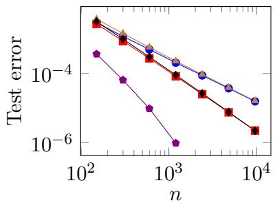
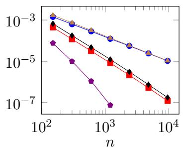
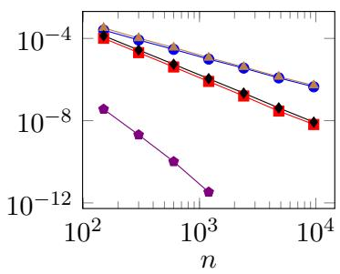
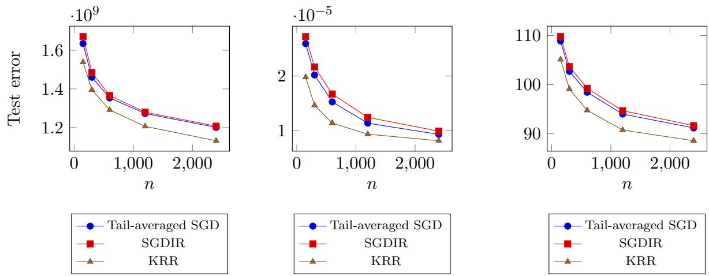
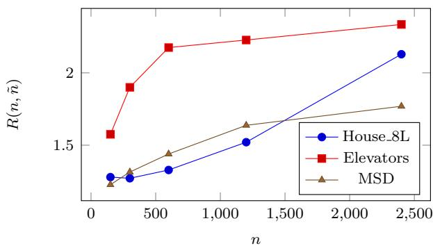

# Stochastic gradient descent with initial regularization

Nabil Kahal´e ∗

## Abstract

We analyze a variant of stochastic gradient descent with initial regularization (SGDIR) and derive dimension-free upper bounds on its expected excess risk for the squared loss. In the noiseless case, we obtain new bounds for both averaged and non-averaged SGDIR under moment, source, and capacity assumptions. For a particular value of the source parameter, these bounds are of order $m ^ { - 2 } \log ^ { 2 } m$ , where the number of training samples is of order m. For another value of the source parameter, we obtain, for any $\epsilon > 0 .$ , bounds of order $m ^ { - 3 + \epsilon }$ , provided that the capacity parameter exceeds ϵ−1. We also establish a lower bound that matches our upper bounds in certain regimes up to a polylogarithmic factor. In the noisy case, we provide an instance-based comparison between SGDIR and ridge regression. Under general assumptions and a mild lower bound on the regularization parameter, we show that the expected excess risk of SGDIR is no larger than that of ridge regression, up to a polylogarithmic factor. Numerical experiments on synthetic and real data are consistent with our theoretical findings.

Keywords: stochastic gradient descent, noiseless model, ridge regression, least-squares

## 1 Introduction

A central question in machine learning is how to fit a model from copies of a feature-response pair $( x , y )$ so that it generalizes well to unseen data. Beyond generalization performance, the running time, space complexity, and degree of parallelism of the learning algorithm are also important considerations in practice. In this paper, we assume that $( x , y )$ is a square-integrable random vector in $\mathcal { H } \times \mathbb { R }$ , where H is a separable Hilbert space over R, equipped with the inner product $\langle \cdot , \cdot \rangle$ . Define the loss function $L ( \theta ) : = \textstyle { \frac { 1 } { 2 } } E [ ( y - \langle x , \theta \rangle ) ^ { 2 } ]$ for any $\theta \in \mathcal { H }$ , and let $( x _ { t } , y _ { t } ) _ { t \geq 0 }$ be independent copies of $( x , y )$ . Our objective is to approximately minimize L using the training sequence $( x _ { i } , y _ { i } ) , 0 \leq i \leq n - 1$ , where n is the sample size. This problem has been extensively studied using two main approaches: stochastic gradient descent (SGD) and ridge (or least-squares) regression.

The asymptotic properties of averaged SGD with constant step size were first studied by Ruppert (1988) and Polyak and Juditsky (1992). In the non-strongly convex setting, Bach and Moulines (2013) show that the expected excess risk of averaged SGD is $O ( 1 / n )$ . Under strong convexity of L, Jain, Kakade, Kidambi, Netrapalli and Sidford (2018b) analyze tail-averaged and mini-batch SGD in Euclidean spaces and derive asymptotically optimal bounds. More recently, Kahal´e (2026) introduces an unbiased SGD-like estimator of the minimizer of L and derives convergence bounds that match those of Bach and Moulines (2013) up to a polylogarithmic factor.

The aforementioned studies concern finite-dimensional settings. In practice, the number of features can be very large, or even infinite, as in reproducing kernel Hilbert spaces (RKHSs). We next review work establishing dimension-independent bounds on the expected excess risk. In the RKHS framework, Caponnetto and De Vito (2007) and Dieuleveut and Bach (2016) derive convergence bounds for kernel ridge regression (KRR) and averaged SGD, respectively, that are asymptotically optimal under suitable assumptions. Dieuleveut, Flammarion and Bach (2017) derive similar bounds for regularized averaged SGD in Hilbert spaces. Improved bounds on the expected excess risk in hard learning problems have been established by Pillaud-Vivien, Rudi and Bach (2018) using SGD with multiple passes and by Jun, Cutkosky and Orabona (2019) using a variant of KRR. Likewise, M¨ucke, Neu and Rosasco (2019) derive improved bounds for tail-averaged SGD in Hilbert spaces under certain regularity assumptions and also study minibatching. Finally, under suitable moment assumptions, Zou, Wu, Braverman, Gu and Kakade (2023) derive sharp excess risk bounds for constant-step-size SGD with iterate averaging or tail averaging in terms of the full eigenspectrum of the covariance operator.

Motivated by the double-descent phenomenon and the near-zero training loss achieved by over-parameterized neural networks, a growing literature has analyzed SGD, linear regression, and ridge regression in over-parameterized settings. In particular, the last iterate of constantstep-size SGD has received considerable attention in this context, given the success of SGD in training over-parameterized models. For instance, Bartlett, Long, Lugosi and Tsigler (2020) and Hastie, Montanari, Rosset and Tibshirani (2022) analyze the prediction accuracy of the minimum-norm interpolator in over-parameterized linear regression, while Tsigler and Bartlett (2023) provide analogous results for ridge regression. Zdeborova (2022) analyze the performance of KRR under a low-noise Gaussian design. Ma, Bassily and Belkin (2018) establish exponential convergence bounds for the last iterate of SGD under noiselessness and strong convexity. In a noiseless Hilbert space setting, Berthier, Bach and Gaillard (2020) and Varre, Pillaud-Vivien and Flammarion (2021) derive tight convergence bounds for non-averaged SGD. Lin, Wu, Kakade, Bartlett and Lee (2024) provide sharp convergence bounds for the test error of SGD in terms of the number of parameters and training samples in an infinite dimensional linear regression setup. In zero- or low-noise settings, Attia, Schliserman, Sherman and Koren (2026) establish bounds on the expected excess risk of the last iterate of constant-step-size SGD for smooth convex objectives.

## 1.1 Contributions

Dimension-free convergence rates for ridge regression and SGD are often established under capacity and source conditions, which are formally defined in Section 4.1. In this paper, we study SGDIR, an SGD method with initial regularization. Specifically, given a regularization parameter $\Lambda > 0$ , a constant step size $\gamma > 0$ , and an integer $m \geq 3$ , we generate the sequence $( \theta _ { t } ) _ { t \geq 0 }$ by the recursion

$$
\theta _ { t + 1 } = ( 1 - \gamma \lambda _ { t } ) \theta _ { t } - \gamma \big ( \langle x _ { t } , \theta _ { t } \rangle - y _ { t } \big ) x _ { t } ,\tag{1}
$$

where $\lambda _ { t } = \mathbf { 1 } ( t < m ) \Lambda$ and the initial vector is $\theta _ { 0 } = 0$ . We use the tail-averaged estimator $\bar { \theta } _ { 2 m , 3 m }$ to approximately minimize $L ,$ where $\begin{array} { r } { \bar { u } _ { i : j } : = ( j - i ) ^ { - 1 } \sum _ { t = i } ^ { j - 1 } u _ { t } } \end{array}$ for $0 \leq i < j$ and any sequence $( u _ { t } ) _ { t \geq 0 }$ in H. In the particular case where $\sigma = 0$ , we will also use $\theta _ { N }$ to approximately minimize L, where N is drawn uniformly at random in $\{ 2 m , \ldots , 3 m - 1 \}$

Our main contributions are as follows. Let λ denote the regularization parameter in ridge regression.

1. In the noiseless case, under appropriate capacity and source conditions, we establish dimension-free upper bounds on the expected excess risk of $\bar { \theta } _ { 2 m , 3 m }$ and $\theta _ { Q }$ that, up to $\mathrm { ~ a ~ } \log ^ { 2 } m$ factor, are no worse than existing bounds and are strictly sharper in certain regimes. In particular, for a certain value of the source parameter, we obtain bounds of order m $^ { - 2 } \log ^ { 2 } m$ . Moreover, for any $\epsilon > 0$ , we obtain bounds of order $m ^ { - 3 + \epsilon }$ for another value of the source parameter, provided that the capacity parameter is of order $\epsilon ^ { - 1 }$ or larger. To the best of our knowledge, no previous algorithm has been shown to achieve such a tradeof between sample size and accuracy under comparable assumptions.

2. Under general assumptions, we show that, for every problem instance with n training samples and every regularization parameter λ of order $1 / n$ or larger, explicit choices of $\gamma$ and Λ ensure that the expected excess risk of SGDIR is at most a factor of $\log ^ { 2 } n$ larger than that of ridge regression. This factor improves to log n when λ is of order ${ \sqrt { \log n } } / n$ or larger, and to a constant in the noiseless case when $\lambda$ is of order $( \log n ) / n$ or larger. Such choices of λ are common in the analysis of ridge regression $( \mathrm { e . g . }$ , Caponnetto and De Vito (2007) and Bach (2024, Section 7.6.6)). Our proof technique also yields a lower bound on the expected excess risk of ridge regression that is of independent interest.

3. In the noiseless case, we derive a minimax lower bound on the expected excess risk of any estimator of a minimizer of L based on n training samples. Our lower bound is new, to the best of our knowledge. For a range of values of the source parameter, it matches our upper bound up to a polylogarithmic factor, and its exponent depends only on the source parameter.

## 1.2 Other related work

In an RKHS, assuming that each kernel evaluation takes constant time, SGD based on n samples can be implemented using $O ( n ^ { 2 } )$ time and $O ( n )$ space (Bach 2024, Section 7.4.5), and a straightforward adaptation of the same approach yields the same complexities for SGDIR. In contrast, the standard algorithm for kernel ridge regression requires $O ( n ^ { 3 } )$ time and $O ( n ^ { 2 } )$ space (Bach 2024, Eq. 7.7). More eficient random-feature implementations of KRR and SGD are analyzed for a class of kernels by Rudi and Rosasco (2017) and Carratino, Rudi and Rosasco (2018), respectively, and alternative implementations of KRR can be found in Bach (2024, Section 7.4).

Recent work has compared the performance of ridge regression, SGD, and gradient descent. For example, Zou, Wu, Braverman, Gu, Foster and Kakade (2021) provide an instance-based comparison of the generalization error of tail-averaged SGD and ridge regression in several settings, including one-hot and Gaussian distributions. In these settings, they show that tailaveraged SGD generalizes no worse than ridge regression, up to a logarithmic factor. In contrast, our comparison between SGD and ridge regression does not make distributional assumptions on x beyond standard moment conditions, but requires a lower bound on the regularization parameter. Wu, Bartlett, Kakade, Lee and Yu (2025) establish conditions under which gradient descent dominates ridge regression and is incomparable with SGD. Beyond machine learning, kernel methods have a range of applications, including optimization (Bertsimas and Koduri 2022) and numerical integration (Chatalic, Schreuder, De Vito and Rosasco 2025). Our lower bounds for ridge regression are inspired from the financial engineering literature on model-free bounds, which has been the subject of numerous studies $( \mathrm { e . g . }$ , (Bertsimas and Popescu 2002, Kahal´e 2017)).

The rest of the paper is organized as follows. Section 2 introduces our notation and main assumptions. Section 3 derives upper bounds on the expected excess risk of SGDIR. Section 4 establishes convergence bounds under source and capacity assumptions and provides a more technical comparison with the prior literature. Section 5 compares SGDIR with ridge regression. Section 6 derives a lower bound on the expected excess risk of any algorithm. Section 7 presents numerical experiments, and Section 8 concludes. Omitted proofs are provided in the appendix.

## 2 Notation and main Assumptions

For $u , v \in { \mathcal { H } }$ , denote by $u \otimes v$ the linear operator on H defined by $( u \otimes v ) w = \langle v , w \rangle u$ , for $w \in \mathcal { H }$ . Thus, when H is equal to $\mathbb { R } ^ { d }$ equipped with the usual scalar product $\langle u , v \rangle = u ^ { T } v$ , the matrix of $u \otimes v$ is $u v ^ { T }$ . If A and B are self-adjoint operators on H, we say that $A \preccurlyeq B$ (resp. $A \succcurlyeq B )$ if the operator $B - A$ (resp. A − B) is positive semidefinite. For any operator M on $\mathcal { H } .$ we use the shorthand $M + \lambda$ to denote $M + \lambda I$ . Given a self-adjoint positive semidefinite operator M on H, let $\vert \vert v \vert \vert _ { M } : = \sqrt { \langle v , M v \rangle }$ for $v \in \mathcal { H }$ . If $\psi$ is a square-integrable random vector in H, set Var $\dot { \mathbf { \rho } } _ { M } ( \psi ) = E [ | | \psi | | _ { M } ^ { 2 } ] - | | E [ \psi ] | | _ { M } ^ { 2 }$ . Standard results show that the noncentered covariance operator $\Sigma : = E [ x \otimes x ]$ is positive semidefinite, self-adjoint, and trace-class, with $\mathrm { t r } ( \Sigma ) = E [ | | x | | ^ { 2 } ]$ . Consequently, there exists an orthonormal basis $( e _ { i } ) _ { i \in J }$ of H consisting of eigenvectors of Σ, where $J = \{ 1 , \ldots , d \}$ if H is d-dimensional and $J = \mathbb { N } - \{ 0 \}$ otherwise. Thus $\Sigma e _ { i } = \mu _ { i } e _ { i }$ for $i \in J$ , where $\mu _ { i } \geq 0$ , and $\begin{array} { r } { \sum _ { i \in J } \mu _ { i } = \operatorname { t r } ( \Sigma ) } \end{array}$ . We suppose that the $\mu _ { i } \mathrm { ^ { * } s }$ are sorted in nonincreasing order.

For the remainder of this section and throughout Sections 3 and 4, we assume the following.

Assumption A1. The function L attains its minimum at a vector $\theta ^ { \ast } ~ \in ~ \mathcal { H }$ , and there are constants $R > 0$ and $\sigma \geq 0$ such that

$$
E \left[ \Vert x \Vert ^ { 2 } x \otimes x \right] \preccurlyeq R ^ { 2 } \Sigma ,\tag{2}
$$

$$
E [ ( y - \langle x , \theta ^ { * } \rangle ) ^ { 2 } x \otimes x ] \precsim \sigma ^ { 2 } \Sigma .\tag{3}
$$

Because L attains its minimum at $\theta ^ { * }$ , a standard calculation shows the normal equation

$$
\Sigma \theta ^ { * } = E [ y x ] .\tag{4}
$$

Conditions (2) and (3) are taken from Bach and Moulines (2013). It is easy to verify (2) if

$\| x \| \leq R$ with probability 1. It follows from (2) that $\operatorname { t r } \left[ \Sigma \right] \leq R ^ { 2 }$ (Dieuleveut, Flammarion and Bach 2017). Hence

$$
0 \prec \Sigma \preccurlyeq R ^ { 2 } I .\tag{5}
$$

Condition (3) holds i $\dot { \left| y - \left. x , \theta ^ { * } \right. \right|}  \leq \sigma$ with probability 1. Moreover, if the error term $y - \left. x , \theta ^ { * } \right.$ is independent of $x ,$ then (3) holds with $\sigma ^ { 2 } = E [ ( y - \langle x , \theta ^ { * } \rangle ) ^ { 2 } ]$

We further assume that $\gamma$ and Λ satisfy the bound

$$
\gamma ( R ^ { 2 } + \Lambda ) \leq 1 .\tag{6}
$$

Condition (6) is approximately a factor of 2 weaker than a corresponding condition in Dieuleveut, Flammarion and Bach (2017, Theorem 2) for regularized SGD. Since $\gamma \Lambda  0$ as $m  \infty$ in our main results, (6) essentially requires $\gamma$ to be of order $1 / R ^ { 2 }$ or smaller. Similar step-size conditions are commonly imposed in the analysis of SGD algorithms for least-squares regression (Bach and Moulines 2013, Dieuleveut and Bach 2016, Kahal´e 2026).

For $\theta \in \mathcal { H }$ , let $\mathcal { R } ( \theta ) : = L ( \theta ) - L ( \theta ^ { * } )$ denote the excess risk of θ. Using (4), a standard calculation shows that $\begin{array} { r } { \mathcal { R } ( \theta ) = \frac { 1 } { 2 } | | \theta - \theta ^ { * } | | _ { \Sigma } ^ { 2 } } \end{array}$ and that the regularized loss function $L _ { \lambda } ( \theta ) : = L ( \theta )$ $+ \lambda | | \theta | | ^ { 2 } / 2$ minimized at $\theta _ { \lambda } : = ( \Sigma + \lambda ) ^ { - 1 } \Sigma \theta ^ { * }$ . When $t < m \ ( \mathrm { r e s p . } t \geq m )$ , the recursion (1) corresponds to the standard SGD applied to $L _ { \Lambda }$ (resp. L). This observation provides intuition behind our approach. Assume for simplicity that $\sigma = 0$ . The smallest eigenvalue of the Hessian matrix $\Sigma + \Lambda$ of $L _ { \Lambda }$ is at least Λ. By (Jain, Kakade, Kidambi, Netrapalli and Sidford 2018b, Theorem 1)) and (Kahal´e 2026, Proposition SM.1), this suggests that $E [ | | \theta _ { m } - \theta _ { \Lambda } | | ^ { 2 } ]$ is upper bounded by an exponentially decreasing function of $m ,$ with a rate proportional to Λ. Thus, if Λ is suficiently large, the last 2m steps of our algorithm correspond to an unregularized SGD with an initial state “close” to $\theta _ { \Lambda }$ . Moreover, if Λ is suficiently small, $\theta ^ { * }$ is intuitively “closer” to $\theta _ { \Lambda }$ than to $0 .$ This suggests that, for a suitable choice of $\Lambda _ { i }$ , our algorithm forgets initial conditions faster than an unregularized SGD with initial state 0 and 2m steps. We stress that the above argument is informal and will not be used in our formal derivations.

Let $\psi$ be a (possibly biased) square-integrable estimator of $\theta ^ { * }$ , and, for $m ^ { \prime } > 0$ , let $\psi ^ { ( m ^ { \prime } ) }$ be the average of $m ^ { \prime }$ independent copies of $\psi$ . We can bound the expected excess risk of $\psi$ by bounding separately each term of the standard bias-variance decomposition $2 { \cal E } [ { \mathcal { R } } ( \psi ) ] =$ $| | E [ \psi ] - \theta ^ { * } | | _ { \Sigma } ^ { 2 } + \operatorname { V a r } _ { \Sigma } ( \psi )$ . We refer to the first term as the squared bias of $\psi$ and to the second as its variance. Since

$$
2 E [ \mathcal { R } ( \psi ^ { ( m ^ { \prime } ) } ) ] = | | E [ \psi ] - \theta ^ { * } | | _ { \Sigma } ^ { 2 } + \frac { \mathrm { V a r } _ { \Sigma } ( \psi ) } { m ^ { \prime } } ,\tag{7}
$$

this approach also provides a bound on the expected excess risk of $\psi ^ { ( m ^ { \prime } ) }$

## 2.1 Reproducing kernel Hilbert space

We assume in this subsection that H is a separable RKHS on R. Thus, the elements of H are functions from a set X to R, and there is a positive definite function $K : \mathcal { X } \times \mathcal { X } $ R such that $K ( a , . ) \in { \mathcal { H } }$ and $f ( a ) = \left. f , K ( a , . ) \right.$ for $f \in \mathcal H$ and $a \in { \mathcal { X } }$ . Assume that $K ( a , a ) \leq R ^ { 2 }$ for $a \in { \mathcal { X } }$ where $R > 0$ is a constant, and that X is endowed with a σ-algebra such that $z \mapsto K ( z , z )$ is a measurable function on $\mathcal { X } .$ . Let $( X , y )$ be a random pair taking values in $\mathcal { X } \times \mathbb { R }$ such that $y$ is square-integrable. Assume there is $f _ { * } \in \mathcal { H }$ with $E [ y | X ] = f _ { * } ( X )$ and

$$
E [ ( y - f _ { * } ( X ) ) ^ { 2 } | X ] \leq \sigma ^ { 2 } ,\tag{8}
$$

where $\sigma \geq 0$ is a constant. Finally, let $x \ = \ K ( X , . )$ be the random function induced by X. A standard calculation shows that $( x , y )$ satisfies Assumption A1, with $\theta ^ { * } = f _ { * }$ , and that $L ( f ) \ = \ { \frac { 1 } { 2 } } E [ ( y - f ( X ) ) ^ { 2 } ]$ for $\textit { f } \in \mathcal { H }$ . Thus approximately minimizing L amounts to approximating y by the random variable $f ( X )$ , where $f \in \mathcal { H } .$ . The assumption that $\theta ^ { \ast } \in \mathcal { H }$ was made to avoid additional technicalities. Modeling frameworks that do not require $\theta ^ { * } \in \mathcal { H }$ are common in the RKHS literature (e.g., Dieuleveut and Bach (2016)). The terms involving $\theta ^ { * }$ in the bounds of Lemma 1, Theorem 1, Proposition 1, Theorem 2 and Theorem 4 are upper bounded by $\mathcal { R } ( 0 )$ , up to an absolute constant factor. These results, as well as Theorem 3, can be extended to the case where $\theta ^ { \ast } \notin \mathcal { H }$ by adapting the approach of Dieuleveut and Bach (2016).

## 3 Bounding the expected excess risk

In this section, we first define a noiseless version $w _ { t }$ of $\theta _ { t } , t \geq 0$ , and establish three alternative bounds on the expected excess risk of $w _ { N }$ . We then provide a bound on the expected excess risk of $\bar { \theta } _ { 2 m : 3 m }$

## 3.1 The noiseless process

Define the sequence $w _ { t } , t \geq 0$ , by the recursion

$$
w _ { t + 1 } = ( 1 - \gamma \lambda _ { t } ) w _ { t } - \gamma \langle x _ { t } , w _ { t } - \theta ^ { * } \rangle x _ { t } ,\tag{9}
$$

with initial condition $w _ { 0 } = 0$ . This recursion is obtained by replacing $y _ { t }$ with $\left. x _ { t } , \theta ^ { * } \right.$ in (1). Hence $w _ { t } = \theta _ { t }$ almost surely for $t \geq 0$ when $\sigma = 0$ . Lemma 1 provides a simple bound on the expected excess risk of $w _ { N }$

Lemma 1. Suppose $m \geq 3$ , Assumption A1 and (6) hold, and $\Lambda \geq \log ( m ) / ( \gamma m )$ . Then

$$
\begin{array} { r } { E [ \mathcal { R } ( w _ { N } ) ] \leq 8 \Lambda ^ { 2 } | | ( \Sigma + \Lambda ) ^ { - 1 } \theta ^ { * } | | _ { \Sigma } ^ { 2 } . } \end{array}\tag{10}
$$

Replacing $\theta _ { \Lambda }$ by its value shows that $\Lambda ^ { 2 } | | ( \Sigma + \Lambda ) ^ { - 1 } \theta ^ { * } | | _ { \Sigma } ^ { 2 } = 2 \mathcal { R } ( \theta _ { \Lambda } )$ . Thus, (10) implies that $E [ \mathcal { R } ( w _ { N } ) ] \leq 1 6 \mathcal { R } ( \theta _ { \Lambda } )$ . This is consistent with our informal argument in Section 2 that suggests that $w _ { m }$ is “close” to $\theta _ { \Lambda }$ . Indeed, we expect in this case that the excess risk at subsequent time steps not to be much larger than that of $\theta _ { \Lambda }$

Set

$$
\tilde { \Lambda } = \frac { 1 } { \gamma m } \mathrm { t r } \left[ \Sigma ^ { 2 } \left( \Sigma + \frac { 1 } { 4 \gamma m } \right) ^ { - 2 } \right] .
$$

Because $\Sigma ^ { 2 } \left( \Sigma + ( 4 \gamma m ) ^ { - 1 } \right) ^ { - 2 } \leq I ,$ we have $\tilde { \Lambda } \le d / ( \gamma m )$ if H has finite dimension d. More generally, as shown in Section 4, Λ tends to be˜ $^ { 6 } \mathrm { { s m a l l } ^ { 9 } }$ when $\mu _ { i }$ decays “rapidly” as i increases. Quantities related to $\tilde { \Lambda }$ such as the efective dimension often appear in the analysis of SGD

(e.g., Zou, Wu, Braverman, Gu and Kakade (2023)). Lemma 2 provides an alternative bound on $E [ \mathcal { R } ( w _ { N } ) ]$ that depends on $\tilde { \Lambda }$

Lemma 2. Under the assumptions of Lemma 1, we have

$$
\begin{array} { r } { E [ \mathcal { R } ( w _ { N } ) ] \leq 4 | | ( I - \gamma \Sigma ) ^ { m } \theta ^ { * } | | _ { \Sigma } ^ { 2 } + 8 \gamma R ^ { 2 } \Lambda ^ { 2 } \tilde { \Lambda } | | ( \Sigma + \Lambda ) ^ { - 1 } \theta ^ { * } | | ^ { 2 } . } \end{array}\tag{11}
$$

Up to a constant factor, the first term in the righthand side of (11) is equal to the excess risk of gradient descent at time step $m _ { : }$ , with initial state 0 (Bach 2024, Section 5.2.1). The bounds (10) and (11) are in general not directly comparable. Theorem 1 provides a third bound on $E [ \mathcal { R } ( w _ { N } ) ]$ that essentially combines (10) and (11).

Theorem 1. Under the assumptions of Lemma 1, we have

$$
\begin{array} { r } { E [ \mathcal { R } ( w _ { N } ) ] \leq 4 | | ( I - \gamma \Sigma ) ^ { m } \theta ^ { * } | | _ { \Sigma } ^ { 2 } + 1 6 \gamma R ^ { 2 } \Lambda ^ { 2 } \tilde { \Lambda } | | ( \Sigma + \Lambda ) ^ { - 1 } ( \Sigma + \tilde { \Lambda } ) ^ { - 1 / 2 } \theta ^ { * } | | _ { \Sigma } ^ { 2 } . } \end{array}\tag{12}
$$

Using (6) and the inequality $m z ( 1 - z ) ^ { m } \leq 1$ for $0 \leq z \leq 1$ , a standard diagonalization argument shows that, up to a constant factor, the righthand side of (12) is no larger than those of (10) and (11). On the other hand, by convexity of the excess risk,

$$
E [ \mathcal { R } ( { \bar { w } } _ { 2 m : 3 m } ) ] \leq E [ \mathcal { R } ( w _ { N } ) ] .\tag{13}
$$

Thus, under the assumptions of Lemma 1, $E [ \mathcal { R } ( \bar { w } _ { 2 m : 3 m } ) ]$ is bounded above by each of the righthand sides of (10), (11), and (12).

## 3.2 Incorporating noise

To account for noise, set $\delta _ { t } : = \theta _ { t } - w _ { t }$ and $v _ { t } : = \gamma ( y _ { t } - \langle x _ { t } , \theta ^ { * } \rangle ) x _ { t }$ for $t \geq 0$ . By (4), we have $E [ v _ { t } ] = 0$ and, by (1) and (9),

$$
\delta _ { t + 1 } = ( I - \gamma ( x _ { t } \otimes x _ { t } + \lambda _ { t } I ) ) \delta _ { t } + v _ { t } .\tag{14}
$$

As $x _ { t }$ and $\delta _ { t }$ are independent, it follows by induction that $E [ \delta _ { t } ] = 0$ for $t \geq 0$ . Lemma 3 provides a bound on $\mathrm { V a r } _ { \Sigma } ( \bar { \delta } _ { 2 m : 3 m } )$

Lemma 3. Suppose $m \geq 3$ , Assumption A1 and (6) hold. Then $\mathrm { V a r } _ { \Sigma } ( \bar { \delta } _ { 2 m : 3 m } ) \leq 8 \gamma \sigma ^ { 2 } \tilde { \Lambda }$

When the dimension of H is finite and equal to $d ,$ the bound is of order $\sigma ^ { 2 } d / m$ , that frequently appears in the analysis of SGD for least-squares problems (Bach and Moulines 2013, Jain, Kakade, Kidambi, Netrapalli and Sidford 2018b).

The preceding results lead to the following simple bound on $E \left[ \mathcal { R } ( \bar { \theta } _ { 2 m : 3 m } ) \right]$

Proposition 1. Under the assumptions of Lemma 1, we have

$$
\begin{array} { r } { E \left[ \mathcal { R } ( \bar { \theta } _ { 2 m : 3 m } ) \right] \leq 1 6 \Lambda ^ { 2 } | | ( \Sigma + \Lambda ) ^ { - 1 } \theta ^ { * } | | _ { \Sigma } ^ { 2 } + 8 \gamma \sigma ^ { 2 } \tilde { \Lambda } . } \end{array}
$$

Proof. As $| | u + v | | _ { \Sigma } ^ { 2 } \leq 2 | | u | | _ { \Sigma } ^ { 2 } + 2 | | v | | _ { \Sigma } ^ { 2 }$ for $u , v \in { \mathcal { H } }$ , we have

$$
\begin{array} { r l r } { E [ | | \bar { \theta } _ { 2 m ; 3 m } - \theta ^ { * } | | _ { \Sigma } ^ { 2 } ] } & { \leq } & { 2 E [ | | \bar { w } _ { 2 m ; 3 m } - \theta ^ { * } | | _ { \Sigma } ^ { 2 } ] + 2 E [ | | \bar { \delta } _ { 2 m ; 3 m } | | _ { \Sigma } ^ { 2 } ] } \\ & { \leq } & { 3 2 \Lambda ^ { 2 } | | ( \Sigma + \Lambda ) ^ { - 1 } \theta ^ { * } | | _ { \Sigma } ^ { 2 } + 1 6 \gamma \sigma ^ { 2 } \tilde { \Lambda } , ~ } \end{array}
$$

where the second inequality follows from (10), (13), and Lemma 3.

Building on the proofs of Theorem 1 and Lemma 3, Theorem 2 yields bounds on the squared bias and variance of $\bar { \theta } _ { 2 m : 3 m }$ , and consequently on the expected excess risk of $\bar { \theta } _ { 2 m : 3 m }$ and of averages of its independent copies.

Theorem 2. Under the assumptions of Lemma 1, we have

$$
\begin{array} { r } { \mathopen { } \mathclose \bgroup | \lvert E [ \bar { \theta } _ { 2 m : 3 m } ] - \theta ^ { * } \rvert \rvert _ { \Sigma } ^ { 2 } \leq 4 \aftergroup \egroup | \mathopen { } \mathclose \bgroup | ( I - \gamma \Sigma ) ^ { m } \theta ^ { * } \aftergroup \egroup | \mathopen { } \mathclose \bgroup | _ { \Sigma } ^ { 2 } , } \end{array}\tag{15}
$$

and

$$
\mathrm { V a r } _ { \Sigma } ( \bar { \theta } _ { 2 m : 3 m } ) \leq 1 2 8 \gamma R ^ { 2 } \Lambda ^ { 2 } \tilde { \Lambda } | | ( \Sigma + \Lambda ) ^ { - 1 } ( \Sigma + \tilde { \Lambda } ) ^ { - 1 / 2 } \theta ^ { * } | | _ { \Sigma } ^ { 2 } + 1 6 \gamma \sigma ^ { 2 } \tilde { \Lambda } .\tag{16}
$$

Moreover, for $m ^ { \prime } \geq 1$

$$
E \left[ \mathcal { R } ( \bar { \theta } _ { 2 m : 3 m } ^ { ( m ^ { \prime } ) } ) \right] = \frac { 1 } { 2 } | | E [ \bar { \theta } _ { 2 m : 3 m } ] - \theta ^ { * } | | _ { \Sigma } ^ { 2 } + \frac { 1 } { 2 m ^ { \prime } } \mathrm { V a r } _ { \Sigma } ( \bar { \theta } _ { 2 m : 3 m } ) .\tag{17}
$$

The relation (17) is a special case of (7) and yields a bound on $E [ \mathcal { R } ( \bar { \theta } _ { 2 m : 3 m } ) ]$ when $m ^ { \prime } =$ 1. Here again, a diagonalization argument shows that this bound is no worse than that of Proposition 1, up to a constant factor. When $\sigma = 0$ , this bound coincides with the righthand side of (12), up to a constant factor.

Remark 1. For any constant $a > 2 ,$ , replacing $\bar { \theta } _ { 2 m : 3 m }$ by $\bar { \theta } _ { 2 m : a m }$ preserves (15), while (16) continues to hold up to a constant factor that depends on a. Likewise, (10), (11), and (12) still hold, up to a constant factor that depends on a, if N is uniformly chosen in $\{ 2 m , \ldots , a m - 1 \}$

## 4 Convergence results

To establish convergence rates for the expected excess risk of SGDIR and compare them with the existing literature, we state capacity and source assumptions in Section 4.1. These assumptions, and related variants, are commonly used in the analysis of SGD and ridge or kernel regression for least-squares problems (Caponnetto and De Vito 2007, Dieuleveut and Bach 2016, Rudi and Rosasco 2017, Dieuleveut, Flammarion and Bach 2017, M¨ucke, Neu and Rosasco 2019, Berthier, Bach and Gaillard 2020, Varre, Pillaud-Vivien and Flammarion 2021). In Section 4.2, we use Theorems 1 and 2 to derive convergence results under these assumptions. In Section 4.3, we compare our results with previously established bounds. Throughout this section, we focus on the noiseless case. Convergence results can also be derived for $\bar { \theta } _ { 2 m , 3 m }$ in the general setting but, up to a polylogarithmic factor, they match those of Dieuleveut and Bach (2016, Theorem 2) for $r \leq 0$ and those of M¨ucke, Neu and Rosasco (2019, Corollary 1) for $r \geq 0$

## 4.1 Capacity and Source assumptions

For $r \geq 0$ , we can define Σr as the unique linear operator such that $\Sigma ^ { r } e _ { i } = \mu _ { i } ^ { r } e _ { i }$ for $i \in J$ . By convention, for $r < 0$ and $v \in \mathcal H$ , the equality $\theta ^ { * } = \Sigma ^ { r }$ v means that $v = \Sigma ^ { - r } \theta ^ { * }$

Assumption Ac. We have $\mu _ { i } \leq c i ^ { - \alpha }$ for $i \in J ,$ where $\alpha \geq 1$ and $c \geq 0$ are constants.

The parameter α quantifies the strength of Assumption Ac. The larger α is, the stronger the assumption. $\mathrm { A s ~ t r } ( \Sigma ) \geq i \mu _ { i }$ for any $i \in J$ , Assumption Ac always holds with $\alpha = 1$ and $c = \operatorname { t r } ( \Sigma )$ . When H has a finite dimension $d ,$ Assumption Ac holds for any $\alpha > 1$ and $c = \mu _ { 0 } d ^ { \alpha }$ . Intuitively, large values of α correspond to data distributions with low efective dimension, leading to faster convergence rates for SGD-like algorithms. The slightly stronger capacity condition $\mathrm { t r } ( \Sigma ^ { 1 / \alpha } ) < \infty$ is often used in the literature (Dieuleveut, Flammarion and Bach 2017, Jun, Cutkosky and Orabona 2019).

Assumption As. There is $v ^ { \ast } \in \mathcal { H }$ and a real number $\rho ^ { * }$ such that ${ \theta } ^ { * } = \Sigma ^ { r } { v } ^ { * }$ , with $r \geq - 1 / 2$ and $| | \boldsymbol { v } ^ { * } | | ^ { 2 } \le \rho ^ { * }$

Assumption As always holds for $r = - 1 / 2$ and $\rho ^ { * } = 2 \mathcal { R } ( 0 )$ . The parameter r measures the strength of Assumption As: the larger r is, the stronger the assumption. Indeed, suppose that ${ \theta } ^ { * } = \Sigma ^ { r } { v } ^ { * }$ , with $r \geq - 1 / 2$ and $| | \boldsymbol { v } ^ { * } | | ^ { 2 } \le \rho ^ { * }$ , and let $r ^ { \prime } \in [ - 1 / 2 , r ]$ . Then $\theta ^ { * } = \Sigma ^ { r ^ { \prime } } ( \Sigma ^ { r - r ^ { \prime } } v ^ { * } )$ , and $| | \Sigma ^ { r - r ^ { \prime } } v ^ { * } | | \leq R ^ { 2 r - 2 r ^ { \prime } } | | v ^ { * } | |$ by (5). Thus, Assumption As holds for $( r ^ { \prime } , R ^ { 4 r - 4 r ^ { \prime } } \rho ^ { * } )$ . Intuitively, a large value of r indicates strong alignment of $\theta ^ { * }$ with the important directions of $\Sigma .$ making the distribution of $( x , y )$ easier to fit. Assumptions Ac and As are also linked to the growth rate of the coordinates of $\theta ^ { * }$ in the basis $( e _ { i } ) _ { i \in J }$ . Indeed, assume that $J = \mathbb { N } - \{ 0 \}$ , and there are constants $\alpha \geq 1 , \ c > \ c ^ { \prime } > 0 , \ r \geq - 1 / 2 , \ \delta > 1 +$ 2αr, and $W \ > \ 0$ such that $c ^ { \prime } i ^ { - \alpha } \leq \mu _ { i } \leq c i ^ { - \alpha }$ and $\langle \theta ^ { * } , e _ { i } \rangle i ^ { \delta / 2 } \leq W$ for $i ~ \geq ~ 1$ Then Assumption As holds for r and a suitable choice of $\rho ^ { * }$ (Dieuleveut and Bach 2016, Section 2.7). Further discussion of the capacity and source assumptions, as well as their connections to Sobolev spaces, can be found in (Bach 2024, Berthier, Bach and Gaillard 2020, Chatalic, Schreuder, De Vito and Rosasco 2025). Lemmas 4 and 5 provide bounds on the quantities appearing in Theorems 1 and 2 under Assumptions Ac and ${ \mathrm { A s } } ,$ respectively.

Lemma 4. Under Assumption Ac, we have γm $\tilde { \Lambda } \le ( 4 c \gamma m ) ^ { 1 / \alpha }$

Proof. Let $\lambda > 0$ . As $\lambda \Sigma ^ { 2 } \left( \Sigma + \lambda \right) ^ { - 2 } \preccurlyeq \Sigma$ , we have λtr $\left[ \Sigma ^ { 2 } \left( \Sigma + \lambda \right) ^ { - 2 } \right] \leq \mathrm { t r } [ \Sigma ] \leq R ^ { 2 }$ . Moreover, under Assumption Ac,

$$
\operatorname { t r } \left[ \Sigma ^ { 2 } ( \Sigma + \lambda ) ^ { - 2 } \right] \leq \sum _ { i = 1 } ^ { \infty } \left( \frac { c i ^ { - \alpha } } { c i ^ { - \alpha } + \lambda } \right) ^ { 2 } \leq \int _ { 0 } ^ { \infty } \left( \frac { c } { c + \lambda v ^ { \alpha } } \right) ^ { 2 } d v = \frac { 1 } { \alpha } \left( \frac { c } { \lambda } \right) ^ { 1 / \alpha } \int _ { 0 } ^ { \infty } \frac { u ^ { 1 / \alpha - 1 } } { ( 1 + u ) ^ { 2 } } d u .
$$

We have

$$
\int _ { 0 } ^ { \infty } \frac { u ^ { 1 / \alpha - 1 } } { ( 1 + u ) ^ { 2 } } d u = 2 \alpha \int _ { 0 } ^ { \infty } \frac { u ^ { 1 / \alpha } } { ( 1 + u ) ^ { 3 } } d u = 2 \alpha \int _ { 0 } ^ { 1 } \frac { u ^ { 1 / \alpha } + u ^ { 1 - 1 / \alpha } } { ( 1 + u ) ^ { 3 } } d u \leq \alpha ,
$$

where the first equation follows by integration by parts, the second by a change of variables, and the third from the inequality $u ^ { 1 / \alpha } + u ^ { 1 - 1 / \alpha } \leq 1 + u$ for $0 < u \leq 1$ . This yields tr $\left[ \Sigma ^ { 2 } ( \Sigma + \lambda ) ^ { - 2 } \right] \leq$ $( c / \lambda ) ^ { 1 / \alpha }$ . Replacing λ with $( 4 \gamma m ) ^ { - 1 }$ concludes the proof. □

Lemma 5 and its proof are inspired by Dieuleveut, Flammarion and Bach (2017, Lemma 14).

Lemma 5. Suppose that Assumption As holds, and $\Lambda = ( \log m ) / ( \gamma m )$ . Then

$$
| | ( I - \gamma \Sigma ) ^ { m } \theta ^ { * } | | _ { \Sigma } ^ { 2 } \leq \left( \frac { 2 r + 1 } { 2 \gamma m } \right) ^ { 2 r + 1 } \rho ^ { * } .\tag{18}
$$

$I f - 1 / 2 \leq r \leq 1 / 2$ then

$$
\Lambda ^ { 2 } \tilde { \Lambda } | | ( \Sigma + \Lambda ) ^ { - 1 } ( \Sigma + \tilde { \Lambda } ) ^ { - 1 / 2 } \theta ^ { * } | | _ { \Sigma } ^ { 2 } \leq \rho ^ { * } \left( \frac { \log m } { \gamma m } \right) ^ { 2 r + 1 } .\tag{19}
$$

$I f 1 / 2 \le r \le 1$ then

$$
\Lambda ^ { 2 } \tilde { \Lambda } | | ( \Sigma + \Lambda ) ^ { - 1 } ( \Sigma + \tilde { \Lambda } ) ^ { - 1 / 2 } \theta ^ { * } | | _ { \Sigma } ^ { 2 } \leq \rho ^ { * } \left( \frac { \log m } { \gamma m } \right) ^ { 2 } \tilde { \Lambda } ^ { 2 r - 1 } .\tag{20}
$$

Proof. We have $| | ( I - \gamma \Sigma ) ^ { m } \theta ^ { * } | | _ { \Sigma } ^ { 2 } = \langle v ^ { * } , B v ^ { * } \rangle$ , where $B = ( I - \gamma \Sigma ) ^ { 2 m } \Sigma ^ { 2 r + 1 }$ . As $e _ { i }$ is an eigenvalue of B with corresponding eigenvalue $( 1 - \gamma \mu _ { i } ) ^ { 2 m } \mu _ { i } ^ { 2 r + 1 }$ , and $\gamma \mu _ { i } \leq \gamma R ^ { 2 } \leq 1$ for $i \in J$ by (5) and (6), and since $( 1 - z ) ^ { 2 m } z ^ { 2 r + 1 } \leq ( ( 2 r + 1 ) / ( 2 m ) ) ^ { 2 r + 1 }$ for $0 \leq z \leq 1$ , we have

$$
B \preccurlyeq \left( \frac { 2 r + 1 } { 2 \gamma m } \right) ^ { 2 r + 1 } I .
$$

This implies (18). Moreover,

$$
\begin{array} { r l } & { | | ( \Sigma + \Lambda ) ^ { - 1 } ( \Sigma + \tilde { \Lambda } ) ^ { - 1 / 2 } \theta ^ { * } | | _ { \Sigma } ^ { 2 } = \langle v ^ { * } , \Sigma ^ { 2 r + 1 } ( \Sigma + \Lambda ) ^ { - 2 } ( \Sigma + \tilde { \Lambda } ) ^ { - 1 } v ^ { * } \rangle . } \end{array}
$$

If $- 1 / 2 \le r \le 1 / 2$ then

$$
\Sigma ^ { 2 r + 1 } ( \Sigma + \Lambda ) ^ { - 2 } ( \Sigma + \tilde { \Lambda } ) ^ { - 1 } \preccurlyeq ( \Sigma + \Lambda ) ^ { 2 r - 1 } ( \Sigma + \tilde { \Lambda } ) ^ { - 1 } \preccurlyeq \frac { \Lambda ^ { 2 r - 1 } } { \tilde { \Lambda } } I ,
$$

where each inequality follows by a standard diagonalization argument. This implies (19). If $1 / 2 \le r \le 1$ then

$$
\Sigma ^ { 2 r + 1 } ( \Sigma + \Lambda ) ^ { - 2 } ( \Sigma + \tilde { \Lambda } ) ^ { - 1 } \preccurlyeq ( \Sigma + \tilde { \Lambda } ) ^ { 2 r - 2 } \preccurlyeq \tilde { \Lambda } ^ { 2 r - 2 } I ,
$$

which yields (20).

## 4.2 Implications on Convergence

Theorem 3 provides convergence bounds on $E [ \mathcal { R } ( w _ { N } ) ]$ under suitable assumptions.

Theorem 3. Suppose that $m \geq 3$ , Assumptions A1, As and (6) hold, and $\Lambda = \log ( m ) / ( \gamma m )$ $I f - 1 / 2 \leq r \leq 1 / 2$ then

$$
E [ \mathcal { R } ( w _ { N } ) ] \leq \frac { 1 6 } { ( \gamma m ) ^ { 2 r + 1 } } \rho ^ { * } \left( 1 + \gamma R ^ { 2 } ( \log m ) ^ { 2 r + 1 } \right) .\tag{21}
$$

If Assumption Ac holds and $1 / 2 \le r \le 1$ then

$$
E [ \mathcal { R } ( w _ { N } ) ] \leq \frac { 1 6 } { ( \gamma m ) ^ { 2 r + 1 } } \rho ^ { * } \left( 1 + \gamma R ^ { 2 } ( \log m ) ^ { 2 } ( 4 c \gamma m ) ^ { \frac { 2 r - 1 } { \alpha } } \right) .\tag{22}
$$

Proof. $\mathrm { I f } \ - 1 / 2 \le r \le 1 / 2$ then applying Theorem 1 together with (18) and (19) implies (21). Likewise, if Assumption Ac holds and $1 / 2 ~ \le ~ r ~ \le ~ 1$ then using Theorem 1, (18), (20) and Lemma 4 implies (22). □

Theorem 3 implies immediately the following. Note that (6) holds under the conditions stated in Corollary 1 because $2 \log ( m ) \leq m$ for $m \geq 3$

Corollary 1. Suppose that Assumptions A1 and As hold, and $\gamma$ is a constant with $0 < 2 \gamma R ^ { 2 } \leq$ 1. Set $\Lambda = \log ( m ) / ( \gamma m )$

1. $I f - 1 / 2 \leq r \leq 1 / 2$ , then there exists a constant $\kappa _ { 1 }$ , depending only on $\rho ^ { * }$ and $\gamma _ { ; }$ , such that $f o r m \ge 3$

$$
E [ \mathcal { R } ( w _ { N } ) ] \leq \kappa _ { 1 } \left( \frac { \log m } { m } \right) ^ { 2 r + 1 } .\tag{23}
$$

2. If $1 / 2 \le r \le 1$ and Assumption Ac holds, then there exists a constant $\kappa _ { 2 }$ , depending only on $c , \rho ^ { * }$ and $\gamma$ , such that for $m \geq 3$

$$
E [ \mathcal { R } ( w _ { N } ) ] \leq \kappa _ { 2 } ( \log m ) ^ { 2 } m ^ { \frac { 2 r - 1 } { \alpha } - 2 r - 1 } .\tag{24}
$$

An immediate consequence of Corollary 1 is that $E [ \mathcal { R } ( w _ { N } ) ] = O \left( m ^ { - 2 } \log ^ { 2 } m \right)$ when $r = 1 / 2$ while $E [ \mathcal { R } ( w _ { N } ) ]$ converges strictly faster than $m ^ { - 2 }$ when $r > 1 / 2$ and $\alpha > 1$ . Moreover, $E [ \mathcal { R } ( w _ { N } ) ] = O ( m ^ { - 3 + \epsilon } )$ for any $\epsilon > \alpha ^ { - 1 }$ when $r = 1$ . However, values of $r > 1$ do not lead to improved bounds in Corollary 1. Such saturation in the source parameter is common in the SGD literature (Dieuleveut and Bach 2016, Dieuleveut, Flammarion and Bach 2017).

## 4.3 Relation with previous work

We assume throughout this subsection that $\sigma = 0$ . Under assumptions similar to ours, Dieuleveut and Bach (2016, Theorem 2) implies a bound on the expected excess risk of averaged SGD with m time steps of order $m ^ { - 2 r - 1 }$ for $- 1 / 2 \ \leq \ r \ \leq \ 0$ and $m ^ { - 2 r - 1 + 2 r / \alpha }$ for $0 \le r \le 1 / 2$ , with a saturation efect for $r \geq 1 / 2$ . The bounds on $E [ \mathcal { R } ( \bar { w } _ { 2 m : 3 m } ) ]$ implied by Corollary 1 match their bounds, up to a log2 m factor, when $- 1 / 2 \le r \le 0$ , and are strictly sharper when $r > 0$ Likewise, for $0 \le r \le 1 / 2$ , Dieuleveut, Flammarion and Bach (2017, Theorem 2 and Lemma 14) together with the bound $t \mathrm { r } [ \Sigma ( \Sigma + \lambda ) ^ { - 1 } ] = O ( \lambda ^ { - 1 / \alpha } )$ for $\alpha > 1$ (Bach 2024, Section 7.6.6), imply that the expected excess risk of regularized averaged SGD with a constant step size is $O ( \lambda ^ { 2 r + 1 } + \lambda ^ { 2 r - 1 } m ^ { - 2 } ( 1 + \lambda ^ { - 1 / \alpha } ) )$ , where λ is the regularization parameter and m is the number of time steps. Up to a constant factor, this bound is minimized for $\lambda = m ^ { - 2 \alpha / ( 2 \alpha + 1 ) }$ , yielding a rate of order $m ^ { - 2 \alpha ( 2 r + 1 ) / ( 2 \alpha + 1 ) }$ which is strictly higher than the bound on $E [ \mathcal { R } ( \bar { w } _ { 2 m : 3 m } ) ]$ implied by (23). Finally, Jun, Cutkosky and Orabona (2019) study a variant of KRR in an RKHS setting, under capacity and source assumptions similar to ours and a boundedness assumption on the kernel and y. When $2 \alpha r < - 1$ , their bounds on the expected excess risk strictly improve upon the preceding ones and ours, and are of order $n ^ { - \alpha ( 2 r + 1 ) / ( 1 + 2 r \alpha + \alpha ) }$ , where n is the number of training samples. Unlike Jun, Cutkosky and Orabona (2019), we do not assume that $y$ is bounded.

Although we have focused above on their results for the noiseless case, the aforementioned papers mostly address the noisy case. In contrast, Berthier, Bach and Gaillard (2020) specifically study the noiseless setting. They assume that Assumption As holds with $r \geq 0$ and impose an additional regularity condition on x. They provide a tight bound of the form

$$
\operatorname* { m i n } _ { t \in [ 0 , m ] } E [ \mathcal { R } ( w _ { t } ) ] \leq \hat { \kappa } m ^ { - 2 r - 1 } ,\tag{25}
$$

where $\hat { \kappa } > 0$ is a constant (recall that $( w _ { t } ) _ { 0 \leq t \leq m }$ is a standard SGD sequence in a noiseless setting). Their regularity condition implies that $\Sigma ^ { 1 - 2 r }$ is trace-class, and thus $2 r < 1$ when H is infinite-dimensional. Therefore, for suitable choices of $\gamma$ and $\Lambda _ { ; }$ our bound (23) holds under their assumptions and matches the righthand side of (25) up to a $\log ^ { 2 }$ m factor. However, since $2 r < 1$ , the rate in (25) decays strictly more slowly than $m ^ { - 2 }$ . Under related conditions, Varre, Pillaud-Vivien and Flammarion (2021) provide a bound of order $m ^ { - 2 r - 1 }$ on $E [ \mathcal { R } ( w _ { m } ) ]$ for $- 1 / 2 < r < 1 / 2$

In summary, when $0 < r < 1 / 2$ , our bounds for both averaged and non-averaged SGDIR are either strictly sharper than existing ones or hold under weaker assumptions. Moreover, whereas the preceding bounds saturate for $r \geq 1 / 2$ , ours saturate only for $r \geq 1$ . However, we do not establish convergence properties for the last iterate of SGDIR; this is left for future work.

## 5 Comparison with ridge regression

In this section, we assume that (2) and the following conditional moments assumption hold.

Assumption Acm. There is a vector $\theta ^ { * } \in \mathcal { H }$ and a constant $\underline { { \sigma } } \geq 0$ with $E [ y - \langle x , \theta ^ { * } \rangle | x ] = 0$ and $E [ ( y - \langle x , \theta ^ { * } \rangle ) ^ { 2 } | x ] \geq \underline { { \sigma } } ^ { 2 }$

Note that Assumption Acm implies (4), and hence $\theta ^ { * }$ minimizes L. Conversely, if there exists $\theta ^ { * } \in \mathcal { H }$ such that $y - \left. x , \theta ^ { * } \right.$ is mean-zero and independent of $x ,$ then Assumption Acm and (3) hold with $\sigma ^ { 2 } = \underline { { \sigma } } ^ { 2 } = E [ ( y - \langle x , \theta ^ { * } \rangle ) ^ { 2 } ]$ . If both Assumption Acm and (3) hold and Σ is non-zero, then $\underline { { \sigma } } \leq \sigma$

Let $\widehat { \theta } _ { \lambda } = \widehat { \theta } _ { \lambda , n }$ be the estimator of $\theta ^ { * }$ obtained from a ridge regression using regularization parameter $\lambda > 0$ and n independent copies $( x _ { i } , y _ { i } )$ of $( x , y ) , 1 \leq i \leq n$ . Thus,

$$
\hat { \theta } _ { \lambda } = \arg \operatorname* { m i n } _ { \theta \in \mathcal { H } } \sum _ { i = 1 } ^ { n } ( y _ { i } - \langle x _ { i } , \theta \rangle ) ^ { 2 } + \lambda | | \theta | | ^ { 2 } .
$$

Let $\begin{array} { r } { \hat { \Sigma } : = n ^ { - 1 } \sum _ { i = 1 } ^ { n } x _ { i } \otimes x _ { i } } \end{array}$ be the empirical covariance operator. As $E [ x \otimes x ] = \Sigma$ , we have $E [ \hat { \Sigma } ] = \Sigma$ . Moreover,

$$
E [ ( x \otimes x - \Sigma ) ^ { 2 } ] = E [ | | x | | ^ { 2 } x \otimes x ] - \Sigma ^ { 2 } \preceq R ^ { 2 } \Sigma .
$$

By a standard calculation, it follows that $E [ ( \hat { \Sigma } - \Sigma ) ^ { 2 } ] \preccurlyeq ( R ^ { 2 } / n ) \Sigma$ . Hence

$$
E [ \hat { \Sigma } ] = \Sigma \ \mathrm { a n d } \ E [ \hat { \Sigma } ^ { 2 } ] \prec \Sigma ^ { 2 } + \frac { R ^ { 2 } } { n } \Sigma .\tag{26}
$$

Furthermore, a straightforward adaptation of Bach (2024, Section 7.6.2) yields

$$
2 E \left[ \mathcal { R } ( \hat { \theta } _ { \lambda } ) \right] \geq \lambda ^ { 2 } E \left[ | | ( \hat { \Sigma } + \lambda ) ^ { - 1 } \theta ^ { * } | | _ { \Sigma } ^ { 2 } \right] + \frac { \underline { { \sigma } } ^ { 2 } } { n } E \left[ \mathrm { t r } \left[ ( \hat { \Sigma } + \lambda ) ^ { - 2 } \hat { \Sigma } \Sigma \right] \right] .\tag{27}
$$

We now derive lower bounds on each term on the righthand side of (27).

## 5.1 First term

We apply the equality $E [ \hat { \Sigma } ] = \Sigma$ to derive a lower bound on the first term. When H is onedimensional, such a lower bound follows immediately from Jensen’s inequality together with the convexity of $z \mapsto ( z + \lambda ) ^ { - 2 }$ on $\mathbb { R } _ { + }$ . In contrast, convexity on $\mathbb { R } _ { + }$ does not, in general, imply the corresponding operator inequality (Bhatia 2013, Example V.1.4). Lemma 6 circumvents this issue by establishing a Jensen-type inequality for the function $z \mapsto ( z + 1 ) ^ { - 2 }$ in the operator setting.

Lemma 6. Let U be a self-adjoint, positive semidefinite, square-integrable operator on ${ \mathcal { H } } ,$ , and let $V = E [ U ]$ . Then $V ( V + I ) ^ { - 2 } \prec 4 E [ ( U + I ) ^ { - 1 } V ( U + I ) ^ { - 1 } ]$

Applying Lemma 6 with $U = \lambda ^ { - 1 } \hat { \Sigma }$ and noting that $V = \lambda ^ { - 1 } \Sigma$ yields

$$
\Sigma ( \Sigma + \lambda ) ^ { - 2 } \preccurlyeq 4 E \left[ ( \hat { \Sigma } + \lambda ) ^ { - 1 } \Sigma ( \hat { \Sigma } + \lambda ) ^ { - 1 } \right] .
$$

Consequently,

$$
\begin{array} { r } { \vert \vert ( \Sigma + \lambda ) ^ { - 1 } \theta ^ { * } \vert \vert _ { \Sigma } ^ { 2 } \leq 4 E \left[ \vert \vert ( \hat { \Sigma } + \lambda ) ^ { - 1 } \theta ^ { * } \vert \vert _ { \Sigma } ^ { 2 } \right] . } \end{array}\tag{28}
$$

## 5.2 Second term

We now obtain a lower bound on the second term by exploiting (26). Consider first the case where $\mathcal { H }$ is one-dimensional, and assume for simplicity that $\lambda = 1$ . The second term is proportional to $E [ f ( \hat { \Sigma } ) ]$ , where $f ( z ) = z ( z + 1 ) ^ { - 2 } { \mathrm { ~ f o r ~ } } z \geq 0$ . Inspired by Bertsimas and Popescu (2002), we first bound $f$ from below on $[ 0 , \infty )$ by a quadratic function that matches $f$ at the origin and is tangent to f at a second point. Specifically, for $a , s \geq 0$ , the equality

$$
( s + 1 ) ^ { 3 } - ( a + 1 ) ^ { 2 } ( 3 s + 1 - 2 a ) = ( a - s ) ^ { 2 } ( 2 a + s + 3 )
$$

implies that

$$
f ( a ) \geq ( s + 1 ) ^ { - 3 } [ ( 3 s + 1 ) a - 2 a ^ { 2 } ] .\tag{29}
$$

Note that $f$ coincides at 0 with the quadratic function of a defined by the righthand side, and is tangent to it at s. Replacing a by $\hat { \Sigma } ,$ taking expectations and using (26) yields

$$
E [ f ( \hat { \Sigma } ) ] \ge ( s + 1 ) ^ { - 3 } \Sigma \left[ ( 3 s + 1 ) - 2 \left( \Sigma + \frac { R ^ { 2 } } { n } \right) \right] .\tag{30}
$$

The righthand side is maximized when $s = \Sigma + R ^ { 2 } / n$ , implying that

$$
E [ f ( \hat { \Sigma } ) ] \ge \left( \Sigma + \frac { R ^ { 2 } } { n } + 1 \right) ^ { - 2 } \Sigma .
$$

To generalize this approach to arbitrary dimensions, we seek an operator analogue of (29) in which a is replaced by $\hat { \Sigma }$ and s by $\Sigma + R ^ { 2 } / n$ , up to an appropriate scaling by λ. This is achieved via Lemma 7 below, which lifts certain scalar inequalities to trace inequalities for operators under suitable conditions. Let A be a self-adjoint positive semidefinite operator on H that is diagonalizable in an orthonormal eigenbasis $( u _ { i } ) _ { i \in J }$ of $\mathcal { H }$ . Let $a _ { i }$ denote the eigenvalue of A associated with $u _ { i } ,$ so that $A u _ { i } = a _ { i } u _ { i }$ for $i \in J$ . As $0 \preccurlyeq A$ , we have $0 \leq a _ { i } \leq | | A | |$ for $i \in J$ . We say that a rational function $\phi$ is well defined on $[ 0 , | | A | | ]$ if it admits a representation $\phi = P / Q$ where P and $Q$ are real polynomials and $Q ( z ) > 0$ for $z \in [ 0 , | | A | | ]$ . In this case, we define the operator $\phi ( A ) : = P ( A ) Q ( A ) ^ { - 1 }$ on H. As $\phi ( A ) u _ { i } = \phi ( a _ { i } ) u _ { i }$ for $i \in J$ , the operator $\phi ( A )$ does not depend on the choice of P and $Q$

Lemma 7. Let A and B be self-adjoint positive semidefinite operators on ${ \mathcal { H } } ,$ each diagonalizable in an orthonormal eigenbasis. Let k be a positive integer, and for $1 \leq j \leq k$ , let $\phi _ { j }$ and $\nu _ { j }$ be rational functions that are well defined on $[ 0 , \| A \| ]$ and $[ 0 , \| B \| ]$ , respectively. Assume that $g ( a , b ) \geq 0$ for $a \in [ 0 , | | A | | ]$ and $b \in [ 0 , | | B | | ]$ , where $\begin{array} { r } { g ( a , b ) : = \sum _ { i = 1 } ^ { k } \phi _ { j } ( a ) \nu _ { j } ( b ) } \end{array}$ , and that the operator $\textstyle g ( A , B ) : = \sum _ { j = 1 } ^ { k } \phi _ { j } ( A ) \nu _ { j } ( B )$ is trace-class. Then t $\cdot [ g ( A , B ) ] \ge 0$

Proof. Define $u _ { i }$ and $a _ { i }$ for $i \in J$ as above, and let v be an eigenvector of B with eigenvalue b. Thus $\phi _ { j } ( A ) u _ { i } = \phi _ { j } ( a _ { i } ) u _ { i }$ and $\nu _ { j } ( B ) v = \nu _ { j } ( b )$ v for $i \in J$ and $1 \leq j \leq k$ . Moreover,

$$
\langle v , g ( A , B ) v \rangle = \langle v , \sum _ { j = 1 } ^ { k } \phi _ { j } ( A ) \nu _ { j } ( B ) v \rangle = \sum _ { j = 1 } ^ { k } \nu _ { j } ( b ) \langle v , \phi _ { j } ( A ) v \rangle = \langle v , g ( A , b ) v \rangle ,
$$

where $\begin{array} { r } { g ( A , b ) : = \sum _ { j = 1 } ^ { k } \nu _ { j } ( b ) \phi _ { j } ( A ) } \end{array}$ by convention. Because $g ( A , b ) u _ { i } = g ( a _ { i } , b ) u _ { i }$ for $i \in J$ and $g ( a _ { i } , b ) \geq 0$ , the operator $g ( A , b )$ is self-adjoint and positive semidefinite. Thus, $\langle v , g ( A , B ) v \rangle \geq$ 0. As $g ( A , B )$ is trace-class, we have $\begin{array} { r } { \mathrm { t r } [ g ( A , B ) ] = \sum _ { i \in J } \langle v _ { i } , g ( A , B ) v _ { i } \rangle } \end{array}$ , where $( v _ { i } ) _ { i \in J }$ is an orthonormal eigenbasis of H for B, which yields $\mathrm { t r } [ g ( A , B ) ] \ge 0$ □

Lemma 8. For $\lambda > 0$

$$
E \left[ \mathrm { t r } \left( \left( \hat { \Sigma } + \lambda \right) ^ { - 2 } \hat { \Sigma } \Sigma \right) \right] \geq \mathrm { t r } \left[ \Sigma ^ { 2 } \left( \Sigma + \frac { R ^ { 2 } } { n } + \lambda \right) ^ { - 2 } \right] .\tag{31}
$$

Proof. As $x \otimes x$ is a trace-class self-adjoint positive semidefinite operator, so is $\hat { \Sigma }$ . Hence, $\hat { \Sigma }$ is diagonalizable in an orthonormal eigenbasis. For $a , b \geq 0$ , replacing a with $\lambda ^ { - 1 } a$ and s with $\lambda ^ { - 1 } ( b + R ^ { 2 } / n )$ in (29) yields

$$
\frac { a b } { ( a + \lambda ) ^ { 2 } } \geq \frac { ( 3 a ( b + R ^ { 2 } / n ) + \lambda a - 2 a ^ { 2 } ) b } { ( b + R ^ { 2 } / n + \lambda ) ^ { 3 } } .
$$

Applying Lemma 7 with $A = { \hat { \Sigma } }$ and $B = \Sigma$ then shows that

$$
\mathrm { t r } \left[ ( \hat { \Sigma } + \lambda ) ^ { - 2 } \hat { \Sigma } \Sigma \right] \geq \mathrm { t r } \left[ \left( 3 \hat { \Sigma } \left( \Sigma + \frac { R ^ { 2 } } { n } \right) + \lambda \hat { \Sigma } - 2 \hat { \Sigma } ^ { 2 } \right) \Sigma \left( \Sigma + \frac { R ^ { 2 } } { n } + \lambda \right) ^ { - 3 } \right] .
$$

Taking expectations and using (26) implies (31) after simplifications.

## 5.3 Combining bounds

Combining (27), (28) and Lemma 8 yields the following.

Theorem 4. If (2) and Assumption Acm hold, then

$$
E \left[ \mathcal { R } ( \hat { \theta } _ { \lambda } ) \right] \geq \frac { \lambda ^ { 2 } } { 8 } \| ( \Sigma + \lambda ) ^ { - 1 } \theta ^ { * } | \| _ { \Sigma } ^ { 2 } + \frac { \underline { { \sigma } } ^ { 2 } } { 2 n } \mathrm { t r } \left[ \Sigma ^ { 2 } \left( \Sigma + \frac { R ^ { 2 } } { n } + \lambda \right) ^ { - 2 } \right] .
$$

Proposition 2 compares $E [ \mathcal { R } ( \widehat { \theta } _ { \lambda } ) ]$ and $E [ \mathcal { R } ( \bar { \theta } _ { 2 m : 3 m } ) ]$ , taking $m = n / 3$ so that both estimators use roughly the same number of samples of $( x , y )$

Proposition 2. Suppose that Assumptions A1 and Acm hold, and $n \geq 9$ . Set $m = n / 3$ and let $\lambda > 0$

1. If σ = σ = 0, set γ = (2R2)−1 and Λ = (log m)/(γm). Then

$$
E \left[ \mathcal { R } ( \bar { \theta } _ { 2 m : 3 m } ) \right] \leq c _ { 1 } \left( \frac { R ^ { 4 } \log ^ { 2 } n } { \lambda ^ { 2 } n ^ { 2 } } + 1 \right) E \left[ \mathcal { R } ( \hat { \theta } _ { \lambda } ) \right] ,\tag{32}
$$

where $c _ { 1 }$ is an absolute constant.

$$
2 . ~ H f \underline { { { \sigma } } } > 0 , ~ s e t \gamma = ( 2 R ^ { 2 } + \lambda m / \sqrt { \log m } ) ^ { - 1 } ~ a n d ~ \Lambda = ( \log m ) / ( \gamma m ) . ~ T h e n
$$

$$
E \left[ \mathcal { R } ( \bar { \theta } _ { 2 m : 3 m } ) \right] \leq c _ { 2 } \log n \left( \frac { R ^ { 4 } \log n } { \lambda ^ { 2 } n ^ { 2 } } + \frac { \sigma ^ { 2 } } { \underline { { \sigma } } ^ { 2 } } \right) E \left[ \mathcal { R } ( \hat { \theta } _ { \lambda } ) \right] ,\tag{33}
$$

where $c _ { 2 }$ is an absolute constant.

Proof. A standard diagonalization argument shows that, for $\Lambda > 0$ ，

$$
\lvert | ( \Sigma + \Lambda ) ^ { - 1 } \theta ^ { * } \rvert | _ { \Sigma } ^ { 2 } \leq \left( 1 + \frac { \lambda ^ { 2 } } { \Lambda ^ { 2 } } \right) \lvert | ( \Sigma + \lambda ) ^ { - 1 } \theta ^ { * } \rvert | _ { \Sigma } ,\tag{34}
$$

and, for $\lambda ^ { \prime } , \lambda ^ { \prime \prime } > 0$

$$
\mathrm { t r } \left[ \Sigma ^ { 2 } \left( \Sigma + \lambda ^ { \prime } \right) ^ { - 2 } \right] \leq \left( 1 + \frac { \lambda ^ { \prime \prime 2 } } { \lambda ^ { \prime 2 } } \right) \mathrm { t r } \left[ \Sigma ^ { 2 } \left( \Sigma + \lambda ^ { \prime \prime } \right) ^ { - 2 } \right] .\tag{35}
$$

If $\sigma = \underline { { \sigma } } = 0 .$ , then (32) follows from Proposition 1, Theorem 4, and (34). Now suppose that $\underline { { \sigma } } > 0$ . Combining Proposition 1, Theorem 4, and (34) with (35) applied with $\lambda ^ { \prime } = ( 4 \gamma m ) ^ { - 1 }$ and $\lambda ^ { \prime \prime } = \lambda + R ^ { 2 } / n$ , yields (33) after some calculations. □

Proposition 2 implies that, if λ is of order $1 / n$ or larger, then $E [ \mathcal { R } ( \bar { \theta } _ { 2 m : 3 m } ) ]$ is bounded above by $E [ \mathcal { R } ( \widehat { \theta } _ { \lambda } ) ]$ up to a $\log ^ { 2 }$ n factor, both when $\sigma = \underline { { \sigma } } = 0$ and when $\underline { { \sigma } } > 0 .$ , for a suitable choice of $\gamma$ . In the former case, the gap reduces to a constant factor when λ is of order $( \log n ) / n$ or larger. In the latter case, it reduces to a log n factor when λ is of order ${ \sqrt { \log n } } / n$ or larger.

## 6 Lower bound

Let H be an infinite-dimensional separable Hilbert space over $\mathbb { R } ,$ and let Σ be a positive semidefinite trace-class operator on $\mathcal { H } ,$ with eigenvalues $\mu _ { i } , i \geq 1$ , sorted in nonincreasing order. Assume that there exists $\rho \in ( 0 , 1 )$ such that $\rho \mu _ { i } \leq \mu _ { i + 1 }$ for $i \geq 1$ . Let $\theta ^ { * } \in \mathcal { H }$ and let $( x , y )$ be a squareintegrable random vector in $\mathcal { H } \times \mathbb { R }$ that satisfy Assumptions A1 and ${ \mathrm { A s } } ,$ , with $E [ x \otimes x ] = \Sigma$ and $\sigma = 0 . { \mathrm { ~ F i x ~ } } r \geq - 1 / 2$ , and let $n \geq 2$ be an integer such that $n \mu _ { 1 } > \mathrm { t r } [ \Sigma ]$

We consider the problem of finding an estimator $\hat { \theta } = \hat { \theta } ( ( x _ { 1 } , y _ { 1 } ) , \dots , ( x _ { n } , y _ { n } ) )$ that approximately minimizes L based on n copies $( x _ { 1 } , y _ { 1 } ) , \dotsc , ( x _ { n } , y _ { n } )$ of $( x , y )$ . Theorem 5 below provides a minimax lower bound on the expected excess risk of ˆθ. The intuition behind our approach is to construct two pairs $( x , y ^ { ( 0 ) } )$ and $( x , y ^ { ( 1 ) } )$ that satisfy the above assumptions and generate identical training samples of size n with constant probability. This makes it dificult for any learning algorithm to distinguish between the two distributions. Minimax lower bounds are often established in a noisy setting (e.g., Bach (2024, Section 15.1)).

We use a one-hot distribution for x. Such distributions have previously been considered in the SGD literature (Jain, Kakade, Kidambi, Netrapalli and Sidford 2018a, Zou, Wu, Braverman, Gu, Foster and Kakade 2021), and our lower bound approach is inspired by Jain, Kakade, Kidambi, Netrapalli and Sidford (2018a).

Theorem 5. For any measurable function $\hat { \theta } : ( \mathcal { H } \times \mathbb { R } ) ^ { n } \to \mathcal { H }$ , there is $\theta ^ { \ast } ~ \in ~ \mathcal { H }$ satisfying Assumption As with parameter r and $\rho ^ { * } = 1$ , and a random pair $( x , y )$ with $E [ x \otimes x ] = \Sigma$ satisfying Assumption A1, with $R ^ { 2 } = \mathrm { t r } [ \Sigma ]$ and $\sigma = 0$ , such that

$$
\frac { 1 } { 4 } \left( \frac { \mathrm { t r } [ \Sigma ] \rho } { n } \right) ^ { 2 r + 1 } \leq E \left[ | | \hat { \theta } ( ( x _ { 1 } , y _ { 1 } ) , \dots , ( x _ { n } , y _ { n } ) ) - \theta ^ { * } | | _ { \Sigma } ^ { 2 } \right] ,\tag{36}
$$

where $( x _ { t } , y _ { t } ) , 1 \leq t \leq n$ , are independent copies $o f \left( x , y \right)$

Proof. We first build two noiseless pairs $( x , y ^ { ( 0 ) } )$ and $( x , y ^ { ( 1 ) } )$ that satisfy Assumptions A1 and As, with $E [ x \otimes x ] = \Sigma$ . Consider an orthonormal eigenbasis $( e _ { i } ) _ { i \geq 1 }$ of H with $\Sigma e _ { i } = \mu _ { i } e _ { i }$ for $i \geq 1$ . Let x be a random vector such that $\operatorname* { P r } \left[ { \overline { { x } } } = { \sqrt { \operatorname { t r } [ \Sigma ] } } e _ { i } \right] = p _ { i } \operatorname { f o r } i \geq 1$ , where $p _ { i } = \mu _ { i } / \mathrm { t r } [ \Sigma ]$ Thus

$$
E [ x \otimes x ] = \sum _ { i = 1 } ^ { \infty } p _ { i } \mathrm { t r } [ \Sigma ] e _ { i } \otimes e _ { i } = \sum _ { i = 1 } ^ { \infty } \mu _ { i } e _ { i } \otimes e _ { i } = \Sigma .
$$

Let $j = \operatorname* { m i n } \{ i \geq 1 : n p _ { i } \leq 1 \}$ . Since $n \mu _ { 1 } > \mathrm { t r } [ \Sigma ]$ , we have $j > 1$ . We choose $\theta ^ { * }$ among two possible values, $\theta ^ { * ( 0 ) }$ and $\theta ^ { * ( 1 ) }$ , where $\theta ^ { * ( l ) } = ( - 1 ) ^ { l } \mu _ { j } ^ { r } e _ { j }$ for $l \in \{ 0 , 1 \}$ , and set $y ^ { ( l ) } = \langle \theta ^ { * ( l ) } , x \rangle$ . As $| | x | | ^ { 2 } = \operatorname { t r } [ \Sigma ]$ almost surely, Assumption A1 holds for both $( x , y ^ { ( 0 ) } )$ and $( x , y ^ { ( 1 ) } )$ , with $R ^ { 2 } = \mathrm { t r } [ \Sigma ]$ and $\sigma = 0$ . Moreover, for $l \in \{ 0 , 1 \}$ , Assumption As holds for $\theta ^ { * ( l ) }$ with $v ^ { * ( l ) } = ( - 1 ) ^ { l } e _ { j }$ and $\rho ^ { * } = 1$

For $l \in \{ 0 , 1 \}$ , let $( x _ { t } , y _ { t } ^ { ( l ) } ) , 0 \leq t \leq n - 1$ , be n independent copies of $( x , y ^ { ( l ) } )$ , and let $\hat { \theta } ^ { ( l ) } = \hat { \theta } ( ( x _ { 1 } , y _ { 1 } ^ { ( l ) } ) , \dots , ( x _ { n } , y _ { n } ^ { ( l ) } ) )$ . Consider the event

$$
\begin{array} { r } { A = \{ \langle x _ { t } , e _ { j } \rangle = 0 \mathrm { ~ f o r ~ } 0 \leq t \leq n - 1 \} . } \end{array}
$$

Since $y _ { t } ^ { ( l ) } = \langle \theta ^ { * ( l ) } , x _ { t } \rangle$ , on the event ${ \mathcal { A } } ,$ we have $y _ { t } ^ { ( l ) } = 0$ for $0 \leq t \leq n - 1$ and $l \in \{ 0 , 1 \}$ , which implies that $\hat { \theta } ^ { ( 0 ) } = \hat { \theta } ^ { ( 1 ) }$ . Since $| | \theta | | _ { \Sigma } ^ { 2 } \geq \mu _ { j } \langle \theta , e _ { j } \rangle ^ { 2 }$ for $\theta \in \mathcal { H }$ , it follows that, on the event $\mathcal { A } ,$

$$
\sum _ { l = 0 } ^ { 1 } | | \hat { \theta } ^ { ( l ) } - \theta ^ { * ( l ) } | | _ { \Sigma } ^ { 2 } \geq \mu _ { j } \sum _ { l = 0 } ^ { 1 } \langle \hat { \theta } ^ { ( l ) } - \theta ^ { * ( l ) } , e _ { j } \rangle ^ { 2 } \geq 2 \mu _ { j } ^ { 2 r + 1 } ,
$$

where the second equation follows from the inequality $( z ^ { \prime } - z ) ^ { 2 } + ( z ^ { \prime } + z ) ^ { 2 } \geq 2 z ^ { 2 }$ applied with $z ^ { \prime } = \langle \hat { \theta } ^ { ( 0 ) } , e _ { j } \rangle$ and $z = \mu _ { j } ^ { r }$ . Moreover, it follows from the definition of $j$ that $\rho \le \rho n p _ { j - 1 } \le n p _ { j }$ where the second equation follows from the inequality $\rho \mu _ { j - 1 } \leq \mu _ { j }$ . Moreover, as $n p _ { j } \leq 1$

$$
\operatorname* { P r } [ A ] = ( 1 - p _ { j } ) ^ { n } \geq ( 1 - { \frac { 1 } { n } } ) ^ { n } \geq { \frac { 1 } { 4 } } ,
$$

where the last equation is valid for all $n \geq 2$ . Hence,

$$
\sum _ { l = 0 } ^ { 1 } E [ | | \hat { \theta } ^ { ( l ) } - \theta ^ { * } { } ^ { ( l ) } | | _ { \Sigma } ^ { 2 } ] \geq \frac { 1 } { 2 } \mu _ { j } ^ { 2 r + 1 } \geq \frac { 1 } { 2 } \left( \frac { \mathrm { t r } [ \Sigma ] \rho } { n } \right) ^ { 2 r + 1 } ,
$$

where the last equation follows from the inequality $\rho \le n p _ { j }$ . Thus, (36) is satisfied either for $\theta ^ { * } = \theta ^ { * ( 0 ) }$ and $( x , y ) = ( x , y ^ { ( 0 ) } )$ , or for $\theta ^ { * } = \theta ^ { * ( 1 ) }$ and $( x , y ) = ( x , y ^ { ( 1 ) } )$ . □

In a noisy setting, for $\alpha \geq 1$ and $r > - 1 / 2$ , the expected excess risk of any algorithm based on n training samples admits an information-theoretic lower bound of order $n ^ { - \alpha ( 2 r + 1 ) / ( 1 + 2 \alpha r + \alpha ) }$ (e.g., Caponnetto and De Vito (2007) and (Bach 2024, Section 15.1.5)). When $2 \alpha r < - 1$ , this lower bound is asymptotically smaller than the lower bound in Theorem 5.

Note that $y ^ { ( 0 ) }$ and $y ^ { ( 1 ) }$ are not bounded in the proof of Theorem 5 when $r < 0$ . Therefore, in settings where a boundedness condition on y is imposed, the lower bound in Theorem 5 may not apply. In particular, for $\alpha \geq 1$ and $- 1 / 2 < r \leq 0$ , Jun, Cutkosky and Orabona (2019) obtain, in a noisy setting, an upper bound of order $n ^ { - \alpha ( 2 r + 1 ) / ( 1 + 2 r \alpha + \alpha ) }$ on the expected excess risk. When $2 \alpha r < - 1$ , this upper bound is asymptotically smaller than the lower bound in Theorem 5. A similar observation applies to Pillaud-Vivien, Rudi and Bach (2018). Finally, the lower bound in Theorem 5 matches the upper bound of order $n ^ { - 2 r - 1 }$ shown in a noisy setting by Dieuleveut and Bach (2016, Corollary 2) when $2 \alpha r < - 1$ , and, up to a polylogarithmic factor, the upper bound in (23) when $- 1 / 2 \le r \le 1 / 2$

## 7 Numerical experiments

The numerical experiments were conducted on a laptop with a 1 GHz Intel processor and 8 GB of RAM. The code was written in Python. We implemented the following estimators, each evaluated over $5 \times 1 0 ^ { 5 } / n$ independent runs, with each run using n random training samples.

  
(a) µi = i−1.25, θ∗i = i−1

  
(b) $\mu _ { i } = i ^ { - 1 . 2 5 } , \theta _ { i } ^ { * } = i ^ { - 2 }$

  
(c) µi = i−2, θ∗ = i−2  
Figure 1: Test error versus n for in a noiseless setting.

Standard tail-averaged SGD averages the last $n / 2$ iterates of standard SGD, while tail-averaged SGDIR computes $\bar { \theta } _ { n / 2 : n + 1 }$ with $m = n / 4$ . In the noiseless setting of Section 7.1, we additionally implemented last-iterate SGD, last-iterate SGDIR given by $\theta _ { n + 1 }$ with $m = n / 2$ , and ridge regression. For all SGDIR estimators, we set $\Lambda = \log ( m ) / ( 2 \gamma m )$ . In Section 7.2, we also implemented KRR. For both ridge regression and KRR, the regularization parameter was selected by 5-fold cross-validation using the n training samples. The test error of a model is defined as $E [ ( \hat { y } - y ) ^ { 2 } ]$ , where $\hat { y }$ is the response value predicted by the model on input x.

## 7.1 Synthetic experiments

We assume that $d = 2 0 0 0$ , that x is a centered d-dimensional Gaussian vector with covariance matrix Σ = diag(i−α), $1 \leq i \leq d$ where $\alpha > 0$ , and that $y = x ^ { T } \theta ^ { * }$ , where $\theta ^ { * } \in \mathbb { R } ^ { d }$ is deterministic. Similar distributions have been used in both noiseless (Varre, Pillaud-Vivien and Flammarion 2021) and noisy settings (Dieuleveut, Flammarion and Bach 2017, Jain, Kakade, Kidambi, Netrapalli and Sidford 2018b, Zou, Wu, Braverman, Gu and Kakade 2023). A standard calculation shows that (2) holds with $R ^ { 2 } = 2 \mu _ { 1 } + \mathrm { t r } ( \Sigma )$ . We use the step size $\gamma = 1 / R ^ { 2 }$ for both SGD and SGDIR. Fig. 1 reports the average test errors of several estimators as functions of n. The ridge regression test error is not reported for $n \geq d ,$ since it is essentially 0 when $\lambda = 0$ . For $n \leq d ,$ ridge regression outperforms SGDIR and the optimal λ is of order $1 0 ^ { - 6 }$ or smaller, consistent with the fact that the bound (32) becomes loose for such small values of λ. The slopes obtained by regressing the logarithm of the test error of tail-averaged SGDIR on log(n) in panels a), b) and c) in Fig. 1 are respectively −1.75, −1.98 and −2.33. The corresponding slopes implied by Corollary 1 and the discussion at the beginning of Section 4.1 are −1.8, −2.28 and −2.25.

## 7.2 Real data

We use the datasets “house 8L”, “elevators” and “year prediction msd” (MSD) downloaded from OpenML. Each dataset is divided into a training and a testing dataset, and the training dataset is normalized. We apply the exponential kernel, with bandwidth selected by the median heuristic based on $1 0 ^ { 4 }$ randomly chosen training pairs. We implemented both SGD and SGDIR using an adaptation of the algorithm described in (Bach 2024, Section 7.4.5), with step size $\gamma = 1$ . For KRR, we used the standard algorithm described in (Bach 2024, Eq. 7.7). For each run of each algorithm, the test error is estimated by averaging the squared diference between $y$ and its fitted value over $1 0 ^ { 3 }$ randomly chosen test samples. Table 1 reports the running times of tail-averaged SGD and Ridge regression, together with the quantity λn, where λ is the average regularization parameter for KRR. The running time of SGDIR difers from that of tailaveraged SGD by at most 20% and is therefore omitted for readability. Because of vectorization, the running times of SGD and KRR increase little with the number of attributes $d ^ { \prime } .$ Moreover, KRR is faster than SGD for small values of $n ,$ but slower for large values. However, for the MSD dataset with $n = 3 \times 1 0 ^ { 4 }$ , tail-averaged SGDIR achieves an average test error of 84.07 over 100 independent runs and takes 260 seconds per run, whereas KRR results in a memory overflow due to its $O ( n ^ { 2 } )$ space requirement. Fig. 2 provides the average test error in terms of

<table><tr><td rowspan="2">n</td><td colspan="3">house_8L  $\overline { { ( d ^ { \prime } = 8 ) } }$ </td><td colspan="3">elevators  $\overline { { ( d ^ { \prime } = 1 8 ) } }$ </td><td colspan="3">MSD  $\overline { { ( d ^ { \prime } = 9 0 ) } }$ </td></tr><tr><td>SGD</td><td>KRR</td><td> $\lambda n$ </td><td>SGD</td><td>KRR</td><td>λn</td><td>SGD</td><td>KRR</td><td>λn</td></tr><tr><td>150</td><td>0.0016</td><td>0.00086</td><td>0.09</td><td>0.0014</td><td>0.00079</td><td> $\overline { { 3 . 5 \times 1 0 ^ { - 5 } } }$ </td><td>0.0019</td><td>0.00081</td><td>2.1</td></tr><tr><td>300</td><td>0.0039</td><td>0.0042</td><td>0.12</td><td>0.0034</td><td>0.0034</td><td> $1 \times 1 0 ^ { - 6 }$ </td><td>0.0044</td><td>0.0034</td><td>0.12</td></tr><tr><td>600</td><td>0.015</td><td>0.019</td><td>0.16</td><td>0.014</td><td>0.018</td><td> $1 \times 1 0 ^ { - 6 }$ </td><td>0.016</td><td>0.019</td><td>0.11</td></tr><tr><td>1200</td><td>0.048</td><td>0.084</td><td>0.19</td><td>0.046</td><td>0.092</td><td> $1 \times 1 0 ^ { - 6 }$ </td><td>0.053</td><td>0.083</td><td>0.17</td></tr><tr><td>2400</td><td>0.19</td><td>0.42</td><td>0.23</td><td>0.20</td><td>0.42</td><td> $1 \times 1 0 ^ { - 6 }$ </td><td>0.17</td><td>0.41</td><td>0.23</td></tr></table>

Table 1: Running time (in seconds) of a single run of tail-averaged SGD (representative of both SGD-like methods) and KRR, together with the corresponding values of λn. The reported running times exclude cross-validation and test error evaluation.

## n. Fig. 3 provides an estimate of

  
Figure 2: Average test error versus n for the house 8L, elevators and MSD datasets, from left to right.

$$
R ( n , \tilde { n } ) : = \frac { E [ L ( \bar { \theta } _ { n / 2 : n + 1 } ) ] - E [ L ( \theta _ { \mathrm { S G D } , \tilde { n } } ) ] } { E [ L ( \hat { \theta } _ { \lambda ^ { * } , n } ) ] - E [ L ( \theta _ { \mathrm { S G D } , \tilde { n } } ) ] } ,
$$

where n ranges over the values used in Fig. 2, $\lambda ^ { * }$ is an optimal regularization parameter for KRR, and $\theta _ { \mathrm { S G D } , \tilde { n } }$ is the tail-averaged estimator based on $\tilde { n } \ = \ 1 4 0 0 0$ training samples. We estimate $E [ L ( \theta _ { \mathrm { S G D } , \tilde { n } } ) ]$ using 100 independent runs. Since $E [ L ( \theta _ { \mathrm { S G D } , \tilde { n } } ) ] \geq L ( \theta ^ { * } )$ and provided that $R ( n , \tilde { n } ) \geq 1$ and the denominator in the definition of $R ( n , { \tilde { n } } )$ is positive, conditions that we verify numerically, a simple calculation shows that $E [ \mathcal { R } ( \bar { \theta } _ { n / 2 : n + 1 } ) ] \leq R ( n , \tilde { n } ) E [ \mathcal { R } ( \hat { \theta } _ { \lambda ^ { * } , n } ) ]$ . All values of $R ( n , { \tilde { n } } )$ reported in Fig. 3 are at most 3, consistent with the $O ( \log ^ { 2 } n )$ upper bound implied by Proposition 2 under suitable conditions. However, Table 1 suggests that, for the elevators dataset, the requirement in the discussion following Proposition 2 that $\lambda ^ { * }$ be of order $1 / n$ or larger is not satisfied in practice.

  
Figure 3: Upper bound on $E [ \mathcal { R } ( \bar { \theta } _ { n / 2 : n + 1 } ) ] / E [ \mathcal { R } ( \hat { \theta } _ { \lambda , n } ) ]$ , with $\tilde { n } = 1 4 0 0 0$

## 8 Conclusion

We have derived upper bounds on the expected excess risk of SGDIR. We first summarize our results in the noiseless case. When $0 < r < 1 / 2$ , our bounds for both averaged and nonaveraged SGDIR are either strictly sharper than existing ones or hold under weaker assumptions. Moreover, whereas previous bounds saturate for $r \geq 1 / 2$ , ours saturate only for $r \geq 1$ . In particular, when $r = 1 / 2$ , we obtain bounds of order $m ^ { - 2 } \log ^ { 2 } m$ , while, when $r = 1$ , we obtain bounds of order $m ^ { - 3 + \epsilon }$ for any $\epsilon > \alpha ^ { - 1 }$ . To the best of our knowledge, no existing algorithm has been shown to achieve such convergence rates under comparable assumptions. We also derive a lower bound of order $m ^ { - 2 r - 1 }$ on the expected excess risk of any algorithm based on m training samples, which matches our upper bound, up to a $\log ^ { 2 }$ m factor, when − ${ \cdot } 1 / 2 \le r \le 1 / 2$ Closing the gap between the upper and lower bounds for $r > 1 / 2$ , using SGD-like algorithms or other algorithms such as ridge regression, is an open question. Noiseless SGD also arises in areas beyond machine learning, such as the averaging process on a graph (Berthier, Bach and Gaillard 2020). Exploring applications of SGDIR to such areas is a question that deserves further research.

We also provide an instance-based comparison of SGDIR and ridge regression in the noisy case under general assumptions. When the regularization parameter is of order $1 / n$ or larger, we show that the expected excess risk of SGDIR is no larger than that of ridge regression, up to a $\log ^ { 2 }$ n factor, where n is the number of training samples. Whether a similar comparison holds for SGD is an open question. Numerical experiments on synthetic and real data are consistent with our theoretical findings. Extending our analysis beyond the squared loss is an interesting direction for future research.

## A Preliminary inequalities

This section gives preliminary results for use in subsequent proofs. Our analysis often uses the fact that if $A , A ^ { \prime } .$ , B and $B ^ { \prime }$ are self-adjoint operators and have a common orthonormal eigenbasis, with $0 \ \preccurlyeq \ A \ \preccurlyeq \ A ^ { \prime }$ and $0 \ \preccurlyeq \ B \ \preccurlyeq \ B ^ { \prime }$ , then AB and $A ^ { \prime } B ^ { \prime }$ are self-adjoint with $0 \preccurlyeq A B \preccurlyeq A ^ { \prime } B ^ { \prime }$

The recursion (9) can be equivalently written as

$$
w _ { t + 1 } - \theta ^ { * } = P _ { t } ( w _ { t } - \theta ^ { * } ) - \gamma \lambda _ { t } \theta ^ { * } ,\tag{37}
$$

where $P _ { t } : = I - \gamma ( x _ { t } \otimes x _ { t } + \lambda _ { t } I )$ . For $t \geq 0$ , we have $E [ P _ { t } ] = A _ { t }$ , where $A _ { t } : = I - \gamma ( \Sigma + \lambda _ { t } )$ Lemma 9 provides operator inequalities involving $P _ { t }$ and $A _ { t }$

Lemma 9. For $t \geq 0$ , we have $A _ { t } \succcurlyeq 0$ and

$$
E [ P _ { t } ^ { 2 } ] \prec ( 1 - \gamma \lambda _ { t } ) A _ { t } \preccurlyeq { ( 1 - \gamma \lambda _ { t } ) ^ { 2 } } I .\tag{38}
$$

Moreover, for any self-adjoint operator M on H satisfying $M \preccurlyeq \xi I$ and $M \preccurlyeq \xi ^ { \prime } \Sigma$ , where $\xi$ and $\xi ^ { \prime }$ are nonnegative constants, we have, for $t \geq 0$

$$
E [ P _ { t } M P _ { t } ] \preceq ( 1 - \gamma \lambda _ { t } ) ( ( 1 - \gamma \lambda _ { t } ) \xi ^ { \prime } + \gamma \xi ) \Sigma .\tag{39}
$$

Proof. The second inequality in (38) holds because $\gamma \lambda _ { t } \leq 1$ by (6). For $t \geq 0$

$$
\begin{array} { l l l } { E [ P _ { t } ^ { 2 } ] } & { = } & { E [ P _ { t } ] ^ { 2 } + E [ ( P _ { t } - E [ P _ { t } ] ) ^ { 2 } ] } \\ & { = } & { A _ { t } ^ { 2 } + \gamma ^ { 2 } ( E [ | | x | | ^ { 2 } x \otimes x ] - \Sigma ^ { 2 } ) } \\ & { \preceq } & { A _ { t } ^ { 2 } + \gamma A _ { t } \Sigma } \\ & { = } & { ( 1 - \gamma \lambda _ { t } ) A _ { t } , } \end{array}
$$

where the second equation follows from the equality

$$
E [ ( x \otimes x - \Sigma ) ^ { 2 } ] = E [ | | x | | ^ { 2 } x \otimes x ] - \Sigma ^ { 2 } ,\tag{40}
$$

and the third from (2) and (6). This implies the first inequality in (38), which yields $A _ { t } \succcurlyeq 0$ Consider now an operator M satisfying the conditions in the lemma. For $t \geq 0$

$$
\begin{array} { l c l } { { E [ P _ { t } M P _ { t } ] } } & { { = } } & { { E [ P _ { t } ] M E [ P _ { t } ] + E [ ( P _ { t } - E [ P _ { t } ] ) M ( P _ { t } - E [ P _ { t } ] ) ] } } \\ { { } } & { { \prec } } & { { \xi ^ { \prime } \Sigma A _ { t } ^ { 2 } + \xi E [ ( P _ { t } - E [ P _ { t } ] ) ^ { 2 } ] } } \\ { { } } & { { \prec } } & { { \xi ^ { \prime } ( 1 - \gamma \lambda _ { t } ) ^ { 2 } \Sigma + \gamma ^ { 2 } \xi ( E [ | | x | | ^ { 2 } x \otimes x ] - \Sigma ^ { 2 } ) } } \\ { { } } & { { \prec } } & { { ( 1 - \gamma \lambda _ { t } ) ( ( 1 - \gamma \lambda _ { t } ) \xi ^ { \prime } + \gamma \xi ) \Sigma , } } \end{array}
$$

where the third equation follows from $0 \preccurlyeq A _ { t } \preccurlyeq ( 1 - \gamma \lambda _ { t } ) I$ , and the last from (2) and (6).

Lemma 10 provides a bound on the sum of $| | w _ { t } - \theta ^ { * } | | _ { \Sigma } ^ { 2 }$ over intervals starting at $j \geq m$

Lemma 10. For $k \geq 0$ and $j \ge m \ge 3$

$$
\gamma E \left[ \sum _ { t = j } ^ { j + k - 1 } | | w _ { t } - \theta ^ { * } | | _ { \Sigma } ^ { 2 } \right] \leq E [ | | w _ { j } - \theta ^ { * } | | _ { I - A _ { m } ^ { 2 k } } ^ { 2 } ] ,\tag{41}
$$

where, by convention, the left-hand side is zero when $k = 0$

Proof. We prove by induction on $k \geq 0$ that (41) holds for all $j \geq m$ . The base case $k = 0$ is immediate. Assume now that (41) holds for k and any $j \geq m$ . Replacing j by $j + 1$ shows that, for $j \geq m$

$$
\gamma E \left[ \sum _ { t = j + 1 } ^ { j + k } | | w _ { t } - \theta ^ { * } | | _ { \Sigma } ^ { 2 } \right] ^ { 2 } \leq E [ | | w _ { j + 1 } - \theta ^ { * } | | _ { I - A _ { m } ^ { 2 k } } ^ { 2 } ] .
$$

Since $w _ { j + 1 } - \theta ^ { * } = P _ { j } ( w _ { j } - \theta ^ { * } )$ by (37) and $P _ { j }$ is independent of $w _ { j }$

$$
\begin{array} { r } { E [ | | w _ { j + 1 } - \theta ^ { * } | | _ { I - A _ { m } ^ { 2 k } } ^ { 2 } ] = E [ \langle w _ { j } - \theta ^ { * } , E [ P _ { j } ( I - A _ { m } ^ { 2 k } ) P _ { j } ] ( w _ { j } - \theta ^ { * } ) \rangle ] . } \end{array}
$$

Moreover, as $E [ U ] V E [ U ] \prec E [ U V U ]$ for any deterministic self-adjoint operator V with $0 \preccurlyeq V$ and any square-integrable self-adjoint operator $U$

$$
A _ { m } ^ { 2 k + 2 } = E [ P _ { j } ] A _ { m } ^ { 2 k } E [ P _ { j } ] \prec E [ P _ { j } A _ { m } ^ { 2 k } P _ { j } ] .
$$

Using (38), it follows that $E [ P _ { j } ( I - A _ { m } ^ { 2 k } ) P _ { j } ] \preccurlyeq A _ { m } - A _ { m } ^ { 2 k + 2 }$ . Consequently,

$$
\begin{array} { r c l } { \gamma E \left[ \displaystyle \sum _ { t = j + 1 } ^ { j + k } \| w _ { t } - \theta ^ { * } \| _ { \Sigma } ^ { 2 } \right] ^ { 2 } } & { \leq } & { E \left[ \langle w _ { j } - \theta ^ { * } , ( A _ { m } - A _ { m } ^ { 2 k + 2 } ) ( w _ { j } - \theta ^ { * } ) \rangle \right] } \\ & & { = } & { E \left[ \| w _ { j } - \theta ^ { * } \| _ { I - A _ { m } ^ { 2 k + 2 } } ^ { 2 } \right] - \gamma E \left[ \| w _ { j } - \theta ^ { * } \| _ { \Sigma } ^ { 2 } \right] , } \end{array}
$$

where the second equation follows from $A _ { m } = I - \gamma \Sigma$ . Thus (41) holds for $k + 1$ and j. □

Lemma 11 provides general operator inequalities.

Lemma 11. For $n \geq 1$ and any self-adjoint operator M satisfying $0 \preccurlyeq M \preccurlyeq I$ and diagonalizable in an orthonormal basis, we have

$$
I - ( I - M ) ^ { n } \prec 2 M \left( M + { \frac { 1 } { n } } \right) ^ { - 1 } ,\tag{42}
$$

and

$$
I - ( I - M ) ^ { n } \preccurlyeq n M .\tag{43}
$$

Proof. As $z \mapsto ( 1 - z ) ^ { n }$ is convex on the interval $[ 0 , 1 ]$ , we have $1 - n z \leq ( 1 - z ) ^ { n }$ for $0 \leq z \leq 1$ Thus, when $n z \leq 1$

$$
1 - ( 1 - z ) ^ { n } \leq { \frac { 2 n z } { 1 + n z } } .\tag{44}
$$

When $n z \geq 1$ , (44) remains valid because the righthand side is lower bounded by 1. Consider now an orthonormal eigenbasis $( u _ { i } ) _ { i \in J }$ of H for the operator M, and let $a _ { i }$ be the eigenvalue of

M associated with $u _ { i }$ , i.e., $M u _ { i } = a _ { i } u _ { i }$ for $i \in J$ . Let B be the diference between the righthand side and lefthand side of (42). For $i \in J ,$

$$
B u _ { i } = \left( \frac { 2 n a _ { i } } { 1 + n a _ { i } } - ( 1 - ( 1 - a _ { i } ) ^ { n } ) \right) u _ { i } .
$$

By (44), the eigenvalues of B are nonnegative, which implies (42). A similar diagonalization argument implies (43). □

Lemma 12 shows how to combine two upper bounds on an operator into a single bound.

Lemma 12. Let $B , C$ and D be self-adjoint operators on H such that $0 \preccurlyeq B \preccurlyeq C$ and $0 \preccurlyeq$ $B \preccurlyeq D$ . Assume further that $C + D$ is invertible that C and D commute. Then $C D ( C + D ) ^ { - 1 }$ is self-adjoint and $B \preccurlyeq 2 C D ( C + D ) ^ { - 1 }$

Proof. As C and D commute, $( C + D ) ^ { - 1 }$ commutes with both C and D, which implies that $C D ( C + D ) ^ { - 1 }$ is self-adjoint. Assume first that B is invertible. Then C is invertible and $C ^ { - 1 } \preccurlyeq$ $B ^ { - 1 }$ , since $0 \preccurlyeq B \prec C$ . Similarly, D is invertible and $D ^ { - 1 } \preccurlyeq B ^ { - 1 }$ . Thus, $C ^ { - 1 } + D ^ { - 1 } \preccurlyeq 2 B ^ { - 1 }$ Inverting both sides yields

$$
B \prec 2 ( C ^ { - 1 } + D ^ { - 1 } ) ^ { - 1 } = 2 C D ( C + D ) ^ { - 1 } .
$$

where the last equation follows from the fact that $C$ and D. In the general case, applying the preceding inequality to $B + \epsilon I , C + \epsilon I$ and $D + \epsilon I$ for $\epsilon > 0$ , and letting $\epsilon \ { \mathrm { g o } }$ to 0, yields the desired bound. □

## B Proof of Lemma 1

We first analyze the bias of $w _ { t }$ using Lemma 13 and its variance using Lemma 14. Both lemmas suppose that the assumptions of Lemma 1 hold.

Lemma 13. For $t \geq 0 _ { i }$ , we have

$$
E [ w _ { t + 1 } ] - \theta ^ { * } = A _ { t } ( E [ w _ { t } ] - \theta ^ { * } ) - \gamma \lambda _ { t } \theta ^ { * } ,\tag{45}
$$

and

$$
\begin{array} { r } { \vert \vert E [ w _ { t } ] - \theta ^ { * } \vert \vert ^ { 2 } \leq 2 \vert \vert \theta _ { \Lambda } - \theta ^ { * } \vert \vert ^ { 2 } + 2 ( 1 - \gamma \Lambda ) ^ { 2 \operatorname* { m i n } ( m , t ) } \vert \vert \theta _ { \Lambda } \vert \vert ^ { 2 } . } \end{array}\tag{46}
$$

For $t \geq m$ , we have

$$
\begin{array} { r } { \| E [ w _ { t } ] - \theta ^ { * } \| _ { \Sigma } \leq 2 \Lambda \| A _ { m } ^ { t - m } ( \Sigma + \Lambda ) ^ { - 1 } \theta ^ { * } \| _ { \Sigma } . } \end{array}\tag{47}
$$

Proof. Taking expectations in (37) and using the independence of $P _ { t }$ and $w _ { t }$ implies (45). Because $\theta _ { \Lambda } = \Sigma ( \Sigma + \Lambda ) ^ { - 1 } \theta ^ { * }$ , it follows by induction that, for $0 \leq t \leq m$

$$
E [ w _ { t } ] = \theta _ { \Lambda } - A _ { 0 } ^ { t } \theta _ { \Lambda } .\tag{48}
$$

As $0 \prec A _ { 0 } \prec ( 1 - \gamma \Lambda ) I$ by Lemma 9, this yields $| | E [ w _ { t } ] - \theta _ { \Lambda } | | \leq ( 1 - \gamma \Lambda ) ^ { t } | | \theta _ { \Lambda } | |$ for $0 \leq t \leq m$ Using the inequality $| | u + v | | ^ { 2 } \leq 2 | | u | | ^ { 2 } + 2 | | v | | ^ { 2 }$ for $u , v \in { \mathcal { H } }$ , this shows that (46) holds for

$0 \leq t \leq m$ . Moreover, as $0 \preccurlyeq A _ { m } \preccurlyeq I$ by Lemma 9, it follows from (45) and an induction argument that $\left| \left| E [ w _ { t } ] - \theta ^ { * } \right| \right| \leq \left| \left| E [ w _ { m } ] - \theta ^ { * } \right| \right|$ for $t \geq m$ . Hence (46) holds for $t \geq m$ as well.

Replacing $\theta _ { \Lambda }$ by $\Sigma ( \Sigma + \Lambda ) ^ { - 1 } \theta ^ { * }$ in (48) shows that

$$
E [ w _ { m } ] = \theta ^ { * } - \Lambda ( I + \Lambda ^ { - 1 } A _ { 0 } ^ { m } \Sigma ) ( \Sigma + \Lambda ) ^ { - 1 } \theta ^ { * } .
$$

Using (45) and an induction argument, it follows that, for $t \geq m$

$$
E [ w _ { t } ] = \theta ^ { * } - \Lambda ( I + \Lambda ^ { - 1 } A _ { 0 } ^ { m } \Sigma ) A _ { m } ^ { t - m } ( \Sigma + \Lambda ) ^ { - 1 } \theta ^ { * } .\tag{49}
$$

As $0 \preccurlyeq A _ { 0 } \preccurlyeq ( 1 - \gamma \Lambda ) I$ by Lemma 9 and $A _ { 0 }$ and Σ have a common orthonormal eigenbasis, we have

$$
0 \precsim \Lambda ^ { - 1 } A _ { 0 } ^ { m } \Sigma \prec \Lambda ^ { - 1 } R ^ { 2 } ( I - \gamma \Lambda ) ^ { m } I \prec \gamma R ^ { 2 } I ,
$$

where the second inequality follows from (5), and the third from $1 + z \le e ^ { z }$ for $z \in \mathbb { R }$ together with $\Lambda \geq \log ( m ) / ( \gamma m )$ . Using (6), it follows that $0 \preccurlywedge ^ { - 1 } A _ { 0 } ^ { m } \Sigma \preccurlyeq I$ which, combined with (49), yields (47). □

Set $\epsilon _ { t } = w _ { t } - E [ w _ { t } ]$ for $t \geq 0$ . Combining (37) and (45) shows that, for $t \geq 0$

$$
\epsilon _ { t + 1 } = P _ { t } \epsilon _ { t } + ( P _ { t } - A _ { t } ) ( E [ w _ { t } ] - \theta ^ { * } ) .\tag{50}
$$

Lemma 14. For $t \geq m$ , we have $\begin{array} { r } { E [ | | \epsilon _ { t } | | ^ { 2 } ] \leq 4 \gamma ^ { 2 } R ^ { 2 } \Lambda ^ { 2 } | | ( \Sigma + \Lambda ) ^ { - 1 } \theta ^ { * } | | _ { \Sigma } ^ { 2 } t } \end{array}$

Proof. Because $E [ \epsilon _ { t } ] = 0$ and $\epsilon _ { t }$ is independent of $P _ { t }$ for $t \geq 0$

$$
\begin{array} { r c l } { { E [ | | \epsilon _ { t + 1 } | | ^ { 2 } ] } } & { { = } } & { { E [ | | P _ { t } \epsilon _ { t } | | ^ { 2 } + E [ | | ( P _ { t } - A _ { t } ) ( E [ w _ { t } ] - \theta ^ { * } ) | | ^ { 2 } ] } } \\ { { } } & { { = } } & { { E [ \langle P _ { t } ^ { 2 } \epsilon _ { t } , \epsilon _ { t } \rangle ] + \gamma ^ { 2 } E [ | | ( x \otimes x - \Sigma ) ( E [ w _ { t } ] - \theta ^ { * } ) | | ^ { 2 } ] } } \\ { { } } & { { \leq } } & { { ( 1 - \gamma \lambda _ { t } ) ^ { 2 } E [ | | \epsilon _ { t } | | ^ { 2 } ] + \gamma ^ { 2 } R ^ { 2 } | | E [ w _ { t } ] - \theta ^ { * } | | _ { \Sigma } ^ { 2 } , } } \end{array}
$$

where the first equation follows from (50) and the equality $E [ | | U + V | | ^ { 2 } ] = E [ | | U | | ^ { 2 } ] + E [ | | V | | ^ { 2 } ]$ for square-integrable random vectors U and V with $E [ \langle U , V \rangle ] = 0$ , the second from the definition of $P _ { t }$ and $A _ { t } ,$ , and the last from (38), (2), and (40). Using (46), it follows that, for $t \geq 0$

$$
\begin{array} { r } { E [ | | \epsilon _ { t + 1 } | | ^ { 2 } ] \leq ( 1 - \gamma \lambda _ { t } ) ^ { 2 } E [ | | \epsilon _ { t } | | ^ { 2 } ] + \eta _ { t } , } \end{array}\tag{51}
$$

where

$$
\eta _ { t } = 2 \gamma ^ { 2 } R ^ { 2 } ( | | \theta _ { \Lambda } - \theta ^ { * } | | _ { \Sigma } ^ { 2 } + ( 1 - \gamma \Lambda ) ^ { 2 \operatorname* { m i n } ( m - 1 , t ) } | | \theta _ { \Lambda } | | _ { \Sigma } ^ { 2 } ) .
$$

Because $( 1 - \gamma \lambda _ { t + 1 } ) ^ { 2 } \eta _ { t } \leq \eta _ { t + 1 }$ for $t \geq 0$ , it follows by induction that $\begin{array} { r } { ( 1 - \gamma \lambda _ { t } ) ^ { 2 } E [ | | \epsilon _ { t } | | ^ { 2 } ] \le \eta _ { t } t } \end{array}$ for $t \geq 0$ . Moreover,

$$
\begin{array} { r } { | | \theta _ { \Lambda } | | _ { \Sigma } = | | \Sigma ( \Sigma + \Lambda ) ^ { - 1 } \theta ^ { * } | | _ { \Sigma } \leq R ^ { 2 } | | ( \Sigma + \Lambda ) ^ { - 1 } \theta ^ { * } | | _ { \Sigma } \leq \Lambda ( 1 - \gamma \Lambda ) m | | ( \Sigma + \Lambda ) ^ { - 1 } \theta ^ { * } | | _ { \Sigma } , } \end{array}
$$

where the second equation follows from (5), and the last from (6) and the inequality $\Lambda \geq$ $\log ( m ) / ( \gamma m )$ . Furthermore, because $1 + z \le e ^ { z }$ for $z \in \mathbb { R }$ , we have $( 1 - \gamma \Lambda ) ^ { m } \leq m ^ { - 1 }$ . As

$\theta ^ { * } - \theta _ { \Lambda } = \Lambda ( \Sigma + \Lambda ) ^ { - 1 } \theta ^ { * }$ , we conclude that

$$
\eta _ { m } \leq 4 \gamma ^ { 2 } R ^ { 2 } \Lambda ^ { 2 } | | ( \Sigma + \Lambda ) ^ { - 1 } \theta ^ { * } | | _ { \Sigma } ^ { 2 } .\tag{52}
$$

This completes the proof.

We now prove Lemma 1. By Lemma 10,

$$
\begin{array} { r c l } { \gamma m E \left[ | | w _ { N } - \theta ^ { * } | | _ { \Sigma } ^ { 2 } \right] } & { \leq } & { E \left[ | | w _ { 2 m } - \theta ^ { * } | | _ { I - A _ { m } ^ { 2 m } } ^ { 2 } \right] } \\ & { = } & { | | E [ w _ { 2 m } ] - \theta ^ { * } | | _ { I - A _ { m } ^ { 2 m } } ^ { 2 } + E \left[ | | \epsilon _ { 2 m } | | _ { I - A _ { m } ^ { 2 m } } ^ { 2 } \right] } \\ & { \leq } & { 8 \gamma \Lambda ^ { 2 } m | | A _ { m } ^ { m } ( \Sigma + \Lambda ) ^ { - 1 } \theta ^ { * } | | _ { \Sigma } ^ { 2 } + E \left[ | | \epsilon _ { 2 m } | | _ { I - A _ { m } ^ { 2 m } } ^ { 2 } \right] . } \end{array}\tag{53}
$$

The second equation is a standard bias–variance decomposition, while the third follows from (47) together with the inequality $I - A _ { m } ^ { 2 m } \preccurlyeq 2 \gamma m \Sigma$ , which is a special case of (43). We have $| | A _ { m } ^ { m } ( \Sigma + \Lambda ) ^ { - 1 } \theta ^ { * } | | _ { \Sigma } \leq | | ( \Sigma + \Lambda ) ^ { - 1 } \theta ^ { * } | | _ { \Sigma }$ since $0 \preccurlyeq A _ { m } \preccurlyeq I$ . Moreover, Lemma 14 together with (6) yields

$$
\begin{array} { r } { E [ | | \epsilon _ { 2 m } | | ^ { 2 } ] \leq 8 \gamma \Lambda ^ { 2 } m | | ( \Sigma + \Lambda ) ^ { - 1 } \theta ^ { * } | | _ { \Sigma } ^ { 2 } . } \end{array}
$$

Combining the preceding inequalities implies (10).

## C Proof of Lemma 2

We first prove the following bound on the covariance of $\epsilon _ { t }$

Lemma 15. For $t \geq m$

$$
E [ \epsilon _ { t } \otimes \epsilon _ { t } ] \preccurlyeq 8 \gamma R ^ { 2 } \Lambda ^ { 2 } | | ( \Sigma + \Lambda ) ^ { - 1 } \theta ^ { * } | | ^ { 2 } \Sigma \left( \Sigma + \frac { 1 } { 2 \gamma t } \right) ^ { - 1 } .
$$

Proof. For $t \geq 0$ , define $C _ { t } = E [ \epsilon _ { t } \otimes \epsilon _ { t } ]$ , and let $U _ { t } = P _ { t } \epsilon _ { t }$ and $V _ { t } = ( P _ { t } - A _ { t } ) ( E [ w _ { t } ] - \theta ^ { * } )$ be the components of the righthand side of (50). Because $E [ \epsilon _ { t } ] = 0$ and $\epsilon _ { t }$ and $P _ { t }$ are independent for $t \geq 0$ , we have $E [ U _ { t } \otimes V _ { t } ] = 0$ . Consequently, $E [ ( U _ { t } + V _ { t } ) \otimes ( U _ { t } + V _ { t } ) ] = E [ U _ { t } \otimes U _ { t } + V _ { t } \otimes V _ { t } ]$ Thus, for $t \geq 0$ 2

$$
\begin{array} { r c l } { C _ { t + 1 } } & { = } & { E [ ( P _ { t } \epsilon _ { t } ) \otimes ( P _ { t } \epsilon _ { t } ) ] + E [ V _ { t } \otimes V _ { t } ] } \\ & { \prec } & { E [ P _ { t } ( \epsilon _ { t } \otimes \epsilon _ { t } ) P _ { t } ] + | | E [ w _ { t } ] - \theta ^ { * } | | ^ { 2 } E [ ( P _ { t } - A _ { t } ) ^ { 2 } ] } \\ & { = } & { E [ P _ { t } C _ { t } P _ { t } ] + \gamma ^ { 2 } | | E [ w _ { t } ] - \theta ^ { * } | | ^ { 2 } E [ ( x \otimes x - \Sigma ) ^ { 2 } ] } \\ & { \prec } & { E [ P _ { t } C _ { t } P _ { t } ] + \gamma ^ { 2 } | | E [ w _ { t } ] - \theta ^ { * } | | ^ { 2 } R ^ { 2 } \Sigma , } \end{array}
$$

where the second equation follows from the relations $( M u ) \otimes ( M u ) = M ( u \otimes u ) N$ M for $u \in \mathcal H$ and self-adjoint operator M, and $\left( E [ w _ { t } ] - \theta ^ { * } \right) \otimes \left( E [ w _ { t } ] - \theta ^ { * } \right) \preccurlyeq | | E [ w _ { t } ] - \theta ^ { * } | | ^ { 2 } I$ , the third from the independence of $\epsilon _ { t }$ and $P _ { t } ,$ and the last from (2) and (40). Using (46), it follows that

$$
C _ { t + 1 } \prec E [ P _ { t } C _ { t } P _ { t } ] + \gamma \xi _ { t } \Sigma ,\tag{54}
$$

where

$$
\xi _ { t } = 2 \gamma R ^ { 2 } ( | | \theta _ { \Lambda } - \theta ^ { * } | | ^ { 2 } + ( 1 - \gamma \Lambda ) ^ { 2 \operatorname* { m i n } ( m - 1 , t ) } | | \theta _ { \Lambda } | | ^ { 2 } ) .
$$

We now prove by induction that $C _ { t } \preccurlyeq \xi _ { t } ( 1 - \gamma \lambda _ { t } ) ^ { - 1 } I$ and $C _ { t } \preccurlyeq 2 \gamma \xi _ { t } t ( 1 - \gamma \lambda _ { t } ) ^ { - 2 } \Sigma$ for $t \geq 0$ The base case $t = 0$ clearly holds. Assume the induction hypothesis holds for t. Then

$$
\begin{array} { r c l } { { C _ { t + 1 } } } & { { \prec } } & { { \displaystyle \frac { \xi _ { t } } { 1 - \gamma \lambda _ { t } } E [ P _ { t } ^ { 2 } ] + \gamma \xi _ { t } \Sigma } } \\ { { } } & { { \prec } } & { { \xi _ { t } A _ { t } + \gamma \xi _ { t } \Sigma } } \\ { { } } & { { = } } & { { ( 1 - \gamma \lambda _ { t } ) \xi _ { t } I \prec \displaystyle \frac { \xi _ { t + 1 } } { 1 - \gamma \lambda _ { t + 1 } } I , } } \end{array}
$$

where the first equation follows from (54) and the induction hypothesis, the second from (38), and the last from the inequality $( 1 - \gamma \lambda _ { t } ) ( 1 - \gamma \lambda _ { t + 1 } ) \xi _ { t } \leq \xi _ { t + 1 }$ for $t \geq 0$ . Similarly, it follows from the induction hypothesis, (54), and (39) applied to $C _ { t }$ with $\xi = \xi _ { t } ( 1 - \gamma \lambda _ { t } ) ^ { - 1 }$ and $\xi ^ { \prime } =$ $2 \gamma \xi _ { t } t ( 1 - \gamma \lambda _ { t } ) ^ { - 2 }$ , that

$$
C _ { t + 1 } \preccurlyeq 2 \gamma \xi _ { t } ( t + 1 ) \Sigma \preccurlyeq \frac { 2 \gamma \xi _ { t + 1 } ( t + 1 ) } { ( 1 - \gamma \lambda _ { t + 1 } ) ^ { 2 } } \Sigma ,
$$

where the second equation follows from the inequality $( 1 - \gamma \lambda _ { t + 1 } ) ^ { 2 } \xi _ { t } \leq \xi _ { t + 1 }$ for $t \geq 0$ . Thus, the induction hypothesis holds for $t + 1$ . By Lemma 12, it follows that $C _ { t } \prec 2 \xi _ { m } \Sigma ( \Sigma + ( 2 \gamma t ) ^ { - 1 } ) ^ { - 1 }$ for $t \geq m$ . Moreover, a calculation similar to that leading to (52) shows that $\xi _ { m } \leq 4 \gamma R ^ { 2 } \Lambda ^ { 2 } | | ( \Sigma +$ $\Lambda ) ^ { - 1 } \theta ^ { \ast } | | ^ { 2 }$ , thereby completing the proof. □

Lemma 16 provides a uniform bound on $E \left[ | | \epsilon _ { k } | | _ { I - A _ { m } ^ { 2 m } } ^ { 2 } \right]$ over a range of values of k. Lemma 16. For m $\leq k \leq$ 3m, we have

$$
\begin{array} { r } { E \left[ | | \epsilon _ { k } | | _ { I - A _ { m } ^ { 2 m } } ^ { 2 } \right] \leq 1 6 \gamma ^ { 2 } R ^ { 2 } \Lambda ^ { 2 } \tilde { \Lambda } | | ( \Sigma + \Lambda ) ^ { - 1 } \theta ^ { * } | | ^ { 2 } m . } \end{array}
$$

Proof. Using the identity $\mathrm { t r } [ u \otimes v ] = \langle u , v \rangle$ for $u , v \in { \mathcal { H } }$ and Lemma 15, we have

$$
\begin{array} { r c l } { E \left[ | | \epsilon _ { k } | | _ { I - A _ { m } ^ { 2 m } } ^ { 2 } \right] } & { = } & { E \left[ \mathrm { t r } \left[ ( I - A _ { m } ^ { 2 m } ) \epsilon _ { k } \otimes \epsilon _ { k } \right] \right] } \\ & & { \leq } & { 8 \gamma R ^ { 2 } \Lambda ^ { 2 } | | ( \Sigma + \Lambda ) ^ { - 1 } \theta ^ { * } | | ^ { 2 } \mathrm { t r } \left[ ( I - A _ { m } ^ { 2 m } ) \Sigma \left( \Sigma + \frac { 1 } { 6 \gamma m } \right) ^ { - 1 } \right] } \\ & & { \leq } & { 1 6 \gamma R ^ { 2 } \Lambda ^ { 2 } | | ( \Sigma + \Lambda ) ^ { - 1 } \theta ^ { * } | | ^ { 2 } \mathrm { t r } \left[ \Sigma ^ { 2 } \left( \Sigma + \frac { 1 } { 2 \gamma m } \right) ^ { - 1 } \left( \Sigma + \frac { 1 } { 6 \gamma m } \right) ^ { - 1 } \right] , } \end{array}
$$

where the last inequality holds because, by (42),

$$
I - A _ { m } ^ { 2 m } \preccurlyeq 2 \Sigma \left( \Sigma + \frac { 1 } { 2 \gamma m } \right) ^ { - 1 } .
$$

As $( z + 1 / 2 ) ( z + 1 / 6 ) \geq ( z + 1 / 4 ) ^ { 2 }$ for $z \geq 0$ , we conclude by diagonalization that

$$
E \left[ | | \epsilon _ { k } | | _ { I - A _ { m } ^ { 2 m } } ^ { 2 } \right] \leq 1 6 \gamma R ^ { 2 } \Lambda ^ { 2 } | | ( \Sigma + \Lambda ) ^ { - 1 } \theta ^ { * } | | ^ { 2 } \mathrm { t r } \left[ \Sigma ^ { 2 } \left( \Sigma + \frac { 1 } { 4 \gamma m } \right) ^ { - 2 } \right] .
$$

Combining (53) with the inequality $| | A _ { m } ^ { m } ( \Sigma + \Lambda ) ^ { - 1 } \theta ^ { * } | | _ { \Sigma } \le \Lambda ^ { - 1 } | | A _ { m } ^ { m } \theta ^ { * } | | _ { \Sigma }$ and Lemma 16 yields (11).

## D Proof of Theorem 1

Lemmas 14 and 16 provide two alternative bound on $E \left\lceil | | \epsilon _ { 2 m } | | _ { I - A _ { m } ^ { 2 m } } ^ { 2 } \right\rceil$ . We combine these bounds using Lemma 12. Using (9), it can be shown by induction that, for $t \geq 0$ , there is a random operator $M _ { t }$ on H that does not depend on $\theta ^ { * }$ such that the operator $E [ M _ { t } \otimes M _ { t } ]$ is well-defined and $w _ { t } = M _ { t } \theta ^ { * }$ . Fix now $t \in [ 2 m , 3 m - 1 ]$ . As $\epsilon _ { t } = ( M _ { t } - E [ M _ { t } ] ) \theta ^ { * }$ , we have $E \left\lceil | | \epsilon _ { t } | | _ { I - A _ { m } ^ { 2 m } } ^ { 2 } \right\rceil =$ $\langle \theta ^ { * } , B \theta ^ { * } \rangle$ , where B is a positive semidefinite self-adjoint operator that does not depend on $\theta ^ { * }$ It follows from Lemma 14 that $\langle \theta ^ { * } , B \theta ^ { * } \rangle \leq \langle \theta ^ { * } , C \theta ^ { * } \rangle$ , where $C = 1 6 \gamma ^ { 2 } R ^ { 2 } \Lambda ^ { 2 } m ( \Sigma + \Lambda ) ^ { - 2 } \Sigma$ . Since this inequality holds for any $\theta ^ { \ast } \in \mathcal { H }$ , we conclude that $B \preccurlyeq C$ . Similarly, Lemma 16 implies that $B \preccurlyeq D .$ , where $D = 1 6 \gamma ^ { 2 } R ^ { 2 } \Lambda ^ { 2 } \tilde { \Lambda } m ( \Sigma + \Lambda ) ^ { - 2 }$ . By Lemma 12, it follows that

$$
\begin{array} { l c l } { { E \left[ | | \epsilon _ { t } | | _ { { \cal I } - A _ { m } ^ { 2 m } } ^ { 2 } \right] } } & { { \le } } & { { 2 \langle \theta ^ { * } , C D ( C + D ) ^ { - 1 } \theta ^ { * } \rangle } } \\ { { } } & { { } } & { { } } \\ { { } } & { { = } } & { { 3 2 \gamma ^ { 2 } R ^ { 2 } \Lambda ^ { 2 } \tilde { \Lambda } m | | ( \Sigma + \Lambda ) ^ { - 1 } ( \Sigma + \tilde { \Lambda } ) ^ { - 1 / 2 } \theta ^ { * } | | _ { \Sigma } ^ { 2 } . } } \end{array}\tag{55}
$$

Together with (53) and the inequality $| | A _ { m } ^ { m } ( \Sigma + \Lambda ) ^ { - 1 } \theta ^ { * } | | _ { \Sigma } \leq \Lambda ^ { - 1 } | | A _ { m } ^ { m } \theta ^ { * } | | _ { \Sigma }$ , this concludes the proof.

## E Proof of Lemma 3

The proof of Lemma 3 builds on ideas developed in (Zou, Wu, Braverman, Gu and Kakade 2023), who provide tight bounds on SGD in a context without regularization. In particular, Lemma 17 provides a bound on $E [ \delta _ { t } \otimes \delta _ { t } ]$ similar in spirit to (Zou, Wu, Braverman, Gu and Kakade 2023, Lemma B.5), and some calculations in the proof of Lemma 18 resemble those in (Zou, Wu, Braverman, Gu and Kakade 2023, Lemma B.6). However, the proof of Lemma 17 is based on Lemmas 9 and 12, whereas the proof of their Lemma B.5 relies on operators acting on symmetric matrices.

Lemma 17. For $0 \leq t \leq 3 m$ , we have

$$
E [ \delta _ { t } \otimes \delta _ { t } ] \preccurlyeq 2 \gamma \sigma ^ { 2 } \Sigma \left( \Sigma + \frac { 1 } { 6 \gamma m } \right) ^ { - 1 } .
$$

Proof. We show by induction on $t \geq 0$ that $C _ { t } \preccurlyeq \gamma \sigma ^ { 2 } I$ and $C _ { t } \preccurlyeq 2 \gamma ^ { 2 } \sigma ^ { 2 } t \Sigma$ , where $C _ { t } = E [ \delta _ { t } \otimes \delta _ { t } ]$ The base case $t = 0$ is trivial. Assume the induction hypothesis holds for t. Equation (14) can be rewritten as

$$
\delta _ { t + 1 } = P _ { t } \delta _ { t } + v _ { t } .\tag{56}
$$

As $\delta _ { t }$ is independent of $( P _ { t } , v _ { t } )$ and $E [ \delta _ { t } ] = 0$ , we have $E [ ( P _ { t } \delta _ { t } ) \otimes v _ { t } ] = 0$ . Consequently,

$$
\begin{array} { l l l } { { C _ { t + 1 } } } & { { = } } & { { E [ ( P _ { t } \delta _ { t } ) \otimes ( P _ { t } \delta _ { t } ) ] + E [ v _ { t } \otimes v _ { t } ] } } \\ { { } } & { { \preceq } } & { { E [ P _ { t } ( \delta _ { t } \otimes \delta _ { t } ) P _ { t } ] + \gamma ^ { 2 } \sigma ^ { 2 } \Sigma } } \\ { { } } & { { \preceq } } & { { E [ P _ { t } C _ { t } P _ { t } ] + \gamma ^ { 2 } \sigma ^ { 2 } \Sigma , } } \end{array}
$$

where the second equation follows from (3), and the third the independence of $P _ { t }$ and $\delta _ { t }$ . As $C _ { t } \preccurlyeq \gamma \sigma ^ { 2 } I$ by the induction hypothesis, it follows that

$$
\begin{array} { l c l } { { C _ { t + 1 } } } & { { \prec } } & { { \gamma \sigma ^ { 2 } E [ P _ { t } ^ { 2 } ] + \gamma ^ { 2 } \sigma ^ { 2 } \Sigma } } \\ { { } } & { { } } & { { } } \\ { { } } & { { \prec } } & { { \gamma \sigma ^ { 2 } ( I - \gamma \Sigma ) + \gamma ^ { 2 } \sigma ^ { 2 } \Sigma = \gamma \sigma ^ { 2 } I , } } \end{array}
$$

where the second equation follows from (38). Similarly, using the induction hypothesis and applying (39) to $C _ { t }$ with $\xi = \gamma \sigma ^ { 2 }$ and $\xi ^ { \prime } = 2 \gamma ^ { 2 } \sigma ^ { 2 } t$ , we obtain

$$
C _ { t + 1 } \preccurlyeq ( 2 \gamma ^ { 2 } \sigma ^ { 2 } t + \gamma ^ { 2 } \sigma ^ { 2 } ) \Sigma + \gamma ^ { 2 } \sigma ^ { 2 } \Sigma = 2 \gamma ^ { 2 } \sigma ^ { 2 } ( t + 1 ) \Sigma .
$$

Thus, the induction hypothesis holds for $t + 1$ . We conclude that $C _ { t } \preccurlyeq \gamma \sigma ^ { 2 } I$ and $C _ { t } \preccurlyeq 6 \gamma ^ { 2 } \sigma ^ { 2 } m \Sigma$ for $0 \leq t \leq 3 m$ . Using Lemma 12 concludes the proof. □

Lemma 18. We have

$$
E \left[ \left. \sum _ { j = 2 m } ^ { 3 m - 1 } \delta _ { j } \right. _ { \Sigma } ^ { 2 } \right] \leq 2 \gamma ^ { - 1 } \sum _ { j = 2 m } ^ { 3 m - 1 } E [ | | \delta _ { j } | | _ { I - A _ { m } ^ { m } } ^ { 2 } ] .
$$

Proof. We have

$$
\begin{array} { r c l } { { E \left[ \left\| \displaystyle \sum _ { j = 2 m } ^ { 3 m - 1 } \delta _ { j } \right\| _ { \Sigma } ^ { 2 } \right] } } & { { = } } & { { E \left[ \displaystyle \sum _ { j = 2 m } ^ { 3 m - 1 } | | \delta _ { j } | | _ { \Sigma } ^ { 2 } + 2 \displaystyle \sum _ { j = 2 m } ^ { 3 m - 1 } \sum _ { t = j + 1 } ^ { 3 m - 1 } \langle \delta _ { j } , \Sigma \delta _ { t } \rangle \right] } } \\ { { } } & { { \le } & { { 2 \displaystyle \sum _ { j = 2 m } ^ { 3 m - 1 } \displaystyle \sum _ { t = j } ^ { 3 m - 1 } E [ \langle \delta _ { j } , \Sigma \delta _ { t } \rangle ] } . } } \end{array}
$$

On the other hand, by (56), for $2 m \leq j \leq t$

$$
\begin{array} { r } { E [ \delta _ { t + 1 } | \delta _ { j } ] = E [ P _ { t } \delta _ { t } | \delta _ { j } ] + E [ v _ { t } | \delta _ { j } ] = E [ P _ { t } | \delta _ { j } ] E [ \delta _ { t } | \delta _ { j } ] , } \end{array}
$$

where the second equality follows from the facts $P _ { t }$ and $\delta _ { t }$ are independent, conditional on $\delta _ { j }$ , and $v _ { t }$ is independent of $\delta _ { j }$ and has zero mean. Because $P _ { t }$ and $\delta _ { j }$ are independent, we have $E [ P _ { t } | \delta _ { j } ] = E [ P _ { t } ] = A _ { m }$ . Thus, $\begin{array} { r } { E [ \delta _ { t + 1 } | \delta _ { j } ] = A _ { m } E [ \delta _ { t } | \delta _ { j } ] } \end{array}$ . It follows by induction that $E [ \delta _ { t } | \delta _ { j } ] = A _ { m } ^ { t - j } \delta _ { j }$ for 2m $\leq j \leq t .$ , which implies that

$$
\begin{array} { r } { E [ \langle \delta _ { j } , \Sigma \delta _ { t } \rangle | \delta _ { j } ] = \langle \delta _ { j } , \Sigma E [ \delta _ { t } | \delta _ { j } ] \rangle = \langle \delta _ { j } , \Sigma A _ { m } ^ { t - j } \delta _ { j } \rangle . } \end{array}
$$

Taking expectations yields

$$
E [ \langle \delta _ { j } , \Sigma \delta _ { t } \rangle ] = E [ \langle \delta _ { j } , \Sigma A _ { m } ^ { t - j } \delta _ { j } \rangle ] .
$$

Summing over t implies that, for $j \geq 2 m$ ，

$$
\sum _ { t = j } ^ { 3 m - 1 } E [ \langle \delta _ { j } , \Sigma \delta _ { t } \rangle ] = \gamma ^ { - 1 } E [ \langle \delta _ { j } , ( I - A _ { m } ^ { 3 m - j } ) \delta _ { j } \rangle ] \leq \gamma ^ { - 1 } E [ | | \delta _ { j } | | _ { I - A _ { m } ^ { m } } ^ { 2 } ] ,
$$

where the first equation follows from the identity $\begin{array} { r } { \sum _ { t = j } ^ { 3 m - 1 } \Sigma A _ { m } ^ { t - j } = \gamma ^ { - 1 } ( I - A _ { m } ^ { 3 m - j } ) } \end{array}$ , and the second from the inequality $A _ { m } ^ { m } \prec A _ { m } ^ { 3 m - j }$ , which is a consequence of (38). □

We now prove Lemma 3. Let $j \in [ 2 m , 3 m - 1 ]$ . Because t $\boldsymbol { \mathrm { r } } [ u \otimes v ] = \langle u , v \rangle$ for $u , v \in { \mathcal { H } }$

$$
\begin{array} { r } { E [ | | \delta _ { j } | | _ { I - A _ { m } ^ { m } } ^ { 2 } ] \leq E \left[ \mathrm { t r } \left[ ( I - A _ { m } ^ { m } ) \delta _ { j } \otimes \delta _ { j } \right] \right] . } \end{array}
$$

On the other hand, by (42),

$$
I - A _ { m } ^ { m } \preccurlyeq 2 \Sigma \left( \Sigma + \frac { 1 } { \gamma m } \right) ^ { - 1 } .
$$

Together with Lemma 17, we conclude that

$$
E [ | | \delta _ { j } | | _ { I - A _ { m } ^ { m } } ^ { 2 } ] \leq 4 \gamma \sigma ^ { 2 } \mathrm { t r } \left[ \Sigma ^ { 2 } \left( \Sigma + \frac { 1 } { \gamma m } \right) ^ { - 1 } \left( \Sigma + \frac { 1 } { 6 \gamma m } \right) ^ { - 1 } \right] \leq 4 \gamma \sigma ^ { 2 } \mathrm { t r } \left[ \Sigma ^ { 2 } \left( \Sigma + \frac { 1 } { 4 \gamma m } \right) ^ { - 2 } \right] ,
$$

where the second equation follows from the inequality $( z + 1 ) ( z + 1 / 6 ) \ge ( z + 1 / 4 ) ^ { 2 }$ for $z \geq 0$ Using Lemma 18 completes the proof.

## F Proof of Theorem 2

Using (47) and $( \Sigma + \Lambda ) ^ { - 1 } \preccurlyeq \Lambda ^ { - 1 } I$ implies that $| | E [ w _ { t } ] - \theta ^ { * } | | _ { \Sigma } \leq 2 | | A _ { m } ^ { t - m } \theta ^ { * } | | _ { \Sigma }$ for $t \geq m$ . As $0 \preccurlyeq A _ { m } \preccurlyeq I$ , it follows that $| | E [ w _ { t } ] - \theta ^ { * } | | _ { \Sigma } \leq 2 | | A _ { m } ^ { m } \theta ^ { * } | | _ { \Sigma }$ for $t \ge 2 m$ . By the convexity of the function ||.||2 , this implies (15). Moreover, a calculation similar to that in the proof of Lemma 18, using (50) in place of (56), shows that

$$
E \left[ \left\| \sum _ { j = 2 m } ^ { 3 m - 1 } \epsilon _ { j } \right\| _ { \Sigma } ^ { 2 } \right] \leq 2 \gamma ^ { - 1 } \sum _ { j = 2 m } ^ { 3 m - 1 } E [ | | \epsilon _ { j } | | _ { I - A _ { m } ^ { m } } ^ { 2 } ] .
$$

Together with (55) and the inequality $A _ { m } ^ { 2 m } \prec A _ { m } ^ { m }$ , this yields

$$
\begin{array} { r } { E \left[ \big \| \bar { \epsilon } _ { 2 m ; 3 m } \big \| _ { \Sigma } ^ { 2 } \right] \leq 6 4 \gamma R ^ { 2 } \Lambda ^ { 2 } \tilde { \Lambda } | | ( \Sigma + \Lambda ) ^ { - 1 } ( \Sigma + \tilde { \Lambda } ) ^ { - 1 / 2 } \theta ^ { * } | | _ { \Sigma } ^ { 2 } . } \end{array}
$$

Equation (16) now follows by combining this bound with Lemma 3 and the relation

$$
\begin{array} { r } { \mathrm { V a r } _ { \Sigma } ( \bar { \theta } _ { 2 m : 3 m } ) = E \left[ \left\| \bar { \epsilon } _ { 2 m : 3 m } + \bar { \delta } _ { 2 m : 3 m } \right\| _ { \Sigma } ^ { 2 } \right] \leq 2 E \left[ \left\| \bar { \epsilon } _ { 2 m : 3 m } \right\| _ { \Sigma } ^ { 2 } \right] + 2 E \left[ \left\| \bar { \delta } _ { 2 m : 3 m } \right\| _ { \Sigma } ^ { 2 } \right] . } \end{array}
$$

## G Proof of Lemma 6

We first prove the following.

Lemma 19. Let A and B be self-adjoint operators on H such that $0 \preccurlyeq B$ and $0 \preccurlyeq I { - } B \preccurlyeq A \preccurlyeq I$ Then $A B A \preccurlyeq 4 B$

Proof. Since $0 \preccurlyeq B$ , we have $0 \prec ( 2 I - A ) B ( 2 I - A )$ . As

$$
2 B + 2 ( I - A ) B ( I - A ) - A B A = ( 2 I - A ) B ( 2 I - A ) ,
$$

this yields

$$
A B A \prec 2 B + 2 ( I - A ) B ( I - A ) .
$$

Moreover,

$$
( I - A ) B ( I - A ) \preccurlyeq ( I - A ) ^ { 2 } \preccurlyeq I - A \preccurlyeq B ,
$$

where the first inequality follows from $B \preccurlyeq I$ and the second from $0 \preccurlyeq A \preccurlyeq I .$ . This completes the proof. □

We now prove Lemma 6. Set $P = E [ ( U + I ) ^ { - 1 } ]$ . Since the map $X \mapsto ( X + I ) ^ { - 1 }$ is operator convex on self-adjoint positive semidefinite operators (see, e.g. (Mourtada and Rosasco 2022, Lemma 8)), by Jensen’s operator inequality,

$$
( V + I ) ^ { - 1 } = ( E [ U + I ] ) ^ { - 1 } \preccurlyeq E [ ( U + I ) ^ { - 1 } ] = P .
$$

Since $0 \precsim U$ , we have $0 \preccurlyeq ( U + I ) ^ { - 1 } \preccurlyeq I$ and therefore $( V + I ) ^ { - 1 } \preccurlyeq P \preccurlyeq I$ . This implies that $0 \preccurlyeq B$ and $0 \preccurlyeq I - B \preccurlyeq A \preccurlyeq I$ , where $B = I - ( V + I ) ^ { - 1 }$ and $A = ( V + I ) ^ { - 1 / 2 } P ^ { - 1 } ( V + I ) ^ { - 1 / 2 }$ By Lemma 19, it follows that $B \preccurlyeq 4 A ^ { - 1 } B A ^ { - 1 }$ . After some simplifications, we conclude that $V ( V + I ) ^ { - 2 } \preccurlyeq 4 P V P$ . Moreover, because $0 \preccurlyeq V$

$$
0 \preccurlyeq ( ( U + I ) ^ { - 1 } - P ) V ( ( U + I ) ^ { - 1 } - P ) .
$$

Taking expectations implies that

$$
P V P \preccurlyeq E [ ( U + I ) ^ { - 1 } V ( U + I ) ^ { - 1 } ] ,
$$

which completes the proof.

## References

Attia, A., Schliserman, M., Sherman, U. and Koren, T. (2026). Fast last-iterate convergence of SGD in the smooth interpolation regime, Advances in Neural Information Processing Systems 38: 104951–104987.

Bach, F. (2024). Learning theory from first principles, MIT press.

Bach, F. and Moulines, E. (2013). Non-strongly-convex smooth stochastic approximation with convergence rate O(1/n), Advances in Neural Information Processing Systems, pp. 773–781.

Bartlett, P. L., Long, P. M., Lugosi, G. and Tsigler, A. (2020). Benign overfitting in linear regression, Proceedings of the National Academy of Sciences 117(48): 30063–30070.

Berthier, R., Bach, F. and Gaillard, P. (2020). Tight nonparametric convergence rates for stochastic gradient descent under the noiseless linear model, Advances in Neural Information Processing Systems 33: 2576–2586.

Bertsimas, D. and Koduri, N. (2022). Data-driven optimization: A reproducing kernel Hilbert space approach, Operations Research 70(1): 454–471.

Bertsimas, D. and Popescu, I. (2002). On the relation between option and stock prices: a convex optimization approach, Operations Research 50(2): 358–374.

Bhatia, R. (2013). Matrix analysis, Springer Science & Business Media.

Caponnetto, A. and De Vito, E. (2007). Optimal rates for the regularized least-squares algorithm, Foundations of Computational Mathematics 7(3): 331–368.

Carratino, L., Rudi, A. and Rosasco, L. (2018). Learning with SGD and random features, Advances in neural information processing systems 31.

Chatalic, A., Schreuder, N., De Vito, E. and Rosasco, L. (2025). Eficient numerical integration in reproducing kernel Hilbert spaces via leverage scores sampling, Journal of Machine Learning Research 26(101): 1–55.

Dieuleveut, A. and Bach, F. (2016). Nonparametric stochastic approximation with large stepsizes, The Annals of Statistics 44(4): 1363–1399.

Dieuleveut, A., Flammarion, N. and Bach, F. (2017). Harder, better, faster, stronger convergence rates for least-squares regression, The Journal of Machine Learning Research 18(101): 1–51.

Hastie, T., Montanari, A., Rosset, S. and Tibshirani, R. J. (2022). Surprises in high-dimensional ridgeless least squares interpolation, Annals of statistics 50(2): 949.

Jain, P., Kakade, S. M., Kidambi, R., Netrapalli, P. and Sidford, A. (2018a). Accelerating stochastic gradient descent for least squares regression, Conference On Learning Theory, PMLR, pp. 545–604.

Jain, P., Kakade, S. M., Kidambi, R., Netrapalli, P. and Sidford, A. (2018b). Parallelizing stochastic gradient descent for least squares regression: Mini-batching, averaging, and model misspecification, Journal of Machine Learning Research 18(223): 1–42.

Jun, K.-S., Cutkosky, A. and Orabona, F. (2019). Kernel truncated randomized ridge regression: Optimal rates and low noise acceleration, Advances in neural information processing systems 32.

Kahal´e, N. (2017). Superreplication of financial derivatives via convex programming, Management Science 63(7): 2323–2339.

Kahal´e, N. (2026). Unbiased least squares regression via averaged stochastic gradient descent, Mathematics of Operations Research 51(3): 2619–2642.

Lin, L., Wu, J., Kakade, S. M., Bartlett, P. L. and Lee, J. D. (2024). Scaling laws in linear regression: Compute, parameters, and data, Advances in Neural Information Processing Systems 37: 60556–60606.

Ma, S., Bassily, R. and Belkin, M. (2018). The power of interpolation: Understanding the efectiveness of SGD in modern over-parametrized learning, International Conference on Machine Learning, PMLR, pp. 3325–3334.

Mourtada, J. and Rosasco, L. (2022). An elementary analysis of ridge regression with random design, Comptes Rendus. Math´ematique 360(G9): 1055–1063.

M¨ucke, N., Neu, G. and Rosasco, L. (2019). Beating SGD saturation with tail-averaging and minibatching, Advances in Neural Information Processing Systems 32.

Pillaud-Vivien, L., Rudi, A. and Bach, F. (2018). Statistical optimality of stochastic gradient descent on hard learning problems through multiple passes, Advances in Neural Information Processing Systems, pp. 8114–8124.

Polyak, B. T. and Juditsky, A. B. (1992). Acceleration of stochastic approximation by averaging, SIAM journal on control and optimization 30(4): 838–855.

Rudi, A. and Rosasco, L. (2017). Generalization properties of learning with random features, Advances in neural information processing systems 30.

Ruppert, D. (1988). Eficient estimations from a slowly convergent Robbins-Monro process, Technical report, Cornell University Operations Research and Industrial Engineering.

Tsigler, A. and Bartlett, P. L. (2023). Benign overfitting in ridge regression, Journal of Machine Learning Research 24(123): 1–76.

Varre, A. V., Pillaud-Vivien, L. and Flammarion, N. (2021). Last iterate convergence of SGD for least-squares in the interpolation regime., Advances in Neural Information Processing Systems 34: 21581–21591.

Wu, J., Bartlett, P. L., Kakade, S. M., Lee, J. D. and Yu, B. (2025). Risk comparisons in linear regression: Implicit regularization dominates explicit regularization, arXiv preprint arXiv:2509.17251 .

Zdeborova, L. (2022). Generalization error rates in kernel regression: the crossover from the noiseless to noisy regime.

Zou, D., Wu, J., Braverman, V., Gu, Q., Foster, D. P. and Kakade, S. (2021). The benefits of implicit regularization from SGD in least squares problems, Advances in neural information processing systems 34: 5456–5468.

Zou, D., Wu, J., Braverman, V., Gu, Q. and Kakade, S. M. (2023). Benign overfitting of constant-stepsize SGD for linear regression, Journal of Machine Learning Research 24(326): 1–58.