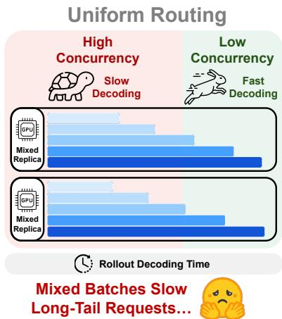

# TailSieve: Partial-Rollout-Guided Tail Routing for LLM Rollouts

Tianqi Xu∗1,2, Lu Lv∗1, Haoyang Huang∗1,3, Wenjie Huang∗1,3, Zhanming Shen3, Yuhao Shen3, Baolin Zhang1, Xinyi Hu†1, Shuang Ge1, Jun Dai1, Tianyu Liu4, Suorong Yang5, Zhikai Li6, Ye Bai1, Jun Zhang†1, Lei Chen1, Yue Li1 and Mingchen Wan1

1Qwen Business Unit of Alibaba, 2Carnegie Mellon University, 3Zhejiang University, 4University of Science and Technology of China, 5National University of Singapore, 6Institute of Automation, Chinese Academy of Sciences

Equal contribution. †Corresponding author.

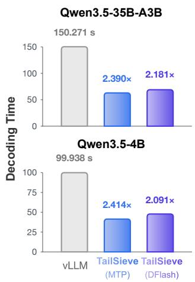  
Figure 1 | Overview of TailSieve (left) and routing-with-speculation speedups on two Qwen3.5 models (right).

Large-scale rollouts have become a core component of modern LLM systems, spanning reinforcement learning (RL) post-training, on-policy distillation (OPD), and sampling-heavy evaluation pipelines. Unlike online serving, which is typically optimized for request-level latency and throughput, a small number of long-tail generations can dominate the end-to-end makespan of an entire rollout step. In practice, rollout requests are often routed uniformly across replicas, which can place extremely long generations inside high-concurrency decoding batches.

To address this, we present TailSieve, a partial-rollout-guided framework that jointly controls tail routing and replica allocation for LLM rollouts. In an idealized setting with known completion lengths, we show that makespan-optimal routing in the long-tail regime combines tail isolation with load balancing, and that a simple top-� policy closely approximates this ofline optimum. Leveraging the observation that long-tail prompts tend to remain long-tailed across policy updates, TailSieve uses partial rollouts as a training-free signal for identifying candidate tail groups. A hierarchical controller then jointly adapts the number of isolated groups and the replica split between the tail and bulk pools using collected response-work history and a measured concurrency–throughput model. TailSieve achieves up to 1.67× routing-only speedup over uniform group routing. The resulting low-concurrency tail pool further enables route-specialized speculative decoding with MTP or DFlash, achieving up to 2.59× speedup over uniform routing. Selected prompts are regenerated under the current policy, preserving on-policy generation and avoiding additional routing-induced length bias in steady state.

## 1. Introduction

Large-scale rollouts have become a fundamental component of modern large language model (LLM) pipelines. Reinforcement learning with verifiable rewards (RLVR) relies on repeatedly sampling responses and evaluating them with objective reward signals (Guo et al., 2025), while on-policy distillation (OPD) trains a student model on trajectories sampled from its own policy and supervised by a teacher model (Agarwal et al., 2024). Largescale rollout generation is also widely used for synthetic data generation and sampling-intensive evaluation, such as pass@� and best-of-� evaluation (Wang et al., 2023; Chen et al., 2021). Across these settings, hundreds or thousands of responses may be generated in each optimization step, making rollout generation a dominant component of end-to-end training cost.

Unlike online serving systems, where the primary objectives are request-level latency, throughput, and cost eficiency (Qiu et al., 2024; Liu et al., 2026c; Yuan et al., 2026; Hu et al., 2026), synchronous rollout pipelines are governed by a diferent performance objective: step-level makespan. The optimization process cannot proceed until a required set of generations is completed. Therefore, the completion time of a rollout step is determined by the slowest unfinished requests. Since LLM response lengths exhibit strong skewness, a small number of extremely long generations can dominate the overall execution time and stall the entire rollout process.

The long-tail rollout problem has recently attracted increasing attention. Existing approaches mainly improve rollout eficiency from three perspectives. First, asynchronous or partial-rollout systems (Fu et al., 2025; Zhou et al., 2025; Qu et al., 2025; Kimi Team, 2025) reduce synchronization stalls by decoupling generation from optimization or carrying unfinished trajectories across steps; these designs must manage policy lag or cross-policy trajectory reuse. Second, tail-aware scheduling methods, including RollPacker (Gao et al., 2026) and StreamRL (Zhong et al., 2026), exploit output-length skewness to rebalance generation workloads. RollPacker improves eficiency through workload reorganization, while StreamRL relies on output-length prediction for skewness-aware dispatching. Third, speculative rollout methods (Qin et al., 2026; Shao et al., 2026; He et al., 2026; Xu et al., 2026; Liu et al., 2025a) accelerate decoding through prediction and verification, improving per-request generation eficiency.

Yet even with perfect knowledge of response lengths, the optimal routing strategy remains unclear: How should requests be distributed across replicas to minimize step-level makespan?

To answer this question, we begin by studying the ofline optimal assignment, assuming that all response lengths are known in advance. Our analysis shows that, in the long-tail regime, the optimum exhibits a tail-isolation-with-balancing structure. It assigns a small number of extreme-tail requests to one replica, which we call the tail replica, while routing most requests to the other, or bulk replica. A small amount of additional trafic is assigned to the tail replica to balance the completion times of the two replicas. Thus, the optimum balances replica completion times rather than request counts. Moreover, a simple top-� isolation policy recovers most of the oracle gain without solving the full assignment problem (Sections 2.1 and 2.2; Figure 3).

This oracle result reveals the desired routing structure, but not how to realize it online. Response lengths are unknown before generation, and the best routing configuration varies with both the response-work distribution and concurrency-dependent decoding throughput. Consequently, neither a fixed isolation size nor a fixed replica split is optimal across workloads. The key opportunity is that this evolution is gradual: prompts that produce relatively long responses in one rollout round tend to remain relatively long in the next. Meanwhile, the overall response-length distribution also evolves progressively as the policy is updated, allowing the routing configuration to be tracked and adjusted online. We therefore use partial rollout to identify likely tail prompts for the next round. Prompt groups that remain unfinished at the cutof form a training-free, high-recall candidate set (Section 2.3, Appendix B; Figure 4). An online hierarchical controller therefore jointly adjusts the isolation size and replica split. Its inner loop balances pool completion times, while its outer loop balances marginal-capacity pressure using response-work history and the measured concurrency–throughput model (Section 2.4; Figure 5). Together, these mechanisms lead to TailSieve, a two-pool routing framework that identifies likely tail prompts through partial rollout and adapts tail workload and replica capacity as the rollout workload evolves.

Figure 1 illustrates the core design and headline results of TailSieve. Unlike predictor-based skewnessaware dispatch, TailSieve requires no auxiliary length model; unlike asynchronous or partial-rollout systems, it does not reuse unfinished trajectories across policy updates. Instead, it derives a training-free tail signal directly from partial rollout: groups unfinished at the cutof become candidates for the next round and are regenerated on low-concurrency tail replicas. An online controller jointly adapts tail workload and replica capacity as the rollout workload evolves.

Unlike methods that drop long responses or accumulate them into separate tail-heavy rounds, TailSieve only changes where long-tail prompts are executed. In steady state, regenerated tail responses and fresh bulk responses remain interleaved within every update batch, and all consumed responses are sampled from scratch under the current policy. Therefore, TailSieve preserves on-policy generation and introduces no additional routing-induced length bias.

Our contributions are summarized as follows:

• We formulate long-tail-aware rollout routing as a step-level makespan minimization problem and characterize the ofline optimum in the long-tail regime. The optimum follows tail isolation with load balancing, and a simple top-� policy closely approximates the exact oracle.

• We develop TailSieve, a partial-rollout-guided framework for joint workload and replica allocation. Partial rollout provides a training-free prompt-level tail signal, while a hierarchical controller adjusts the isolated workload and replica split using pool completion times, response-work history, and measured decoding throughput. Regenerating selected prompts under the current policy preserves on-policy generation without introducing additional routing-induced length bias in steady state.

• We co-design tail routing with route-specialized speculative decoding and evaluate the resulting system across five Qwen models and two rollout workloads. TailSieve achieves up to 1.67× routing-only speedup and up to 2.59× speedup with MTP or DFlash; end-to-end GRPO experiments further show that these gains persist as the policy and rollout distribution evolve.

## 2. Motivating Observations

We begin with a simple question: if we knew which generations were going to be long, how should they be routed across replicas?

## 2.1. Optimal Routing in Long-Tailed Rollouts: Tail Isolation with Load Balancing

To separate the routing problem from the uncertainty of length prediction, we first study an idealized long-tail regime where a small fraction of generations is substantially longer than the bulk and the completion lengths of all rollout requests are known. In this regime, uniform request-count balancing can place an extreme-tail generation inside a high-concurrency batch, allowing it to dominate rollout makespan. We focus on the decode phase and adopt an all-admit execution model.

Figure 2 summarizes the measured decode-throughput model and its implication for rollout time. The per-request decoding throughput �(�) generally decreases as the active batch size � increases, although the aggregate throughput ��(�) may still improve. Since rollout makespan is measured in time, we convert throughput into per-token decoding time:

$$
\tau ( b ) = { \frac { 1 } { \nu ( b ) } } .
$$

For a replica assigned � requests, let their completion lengths be sorted in descending order:

$$
L _ { 1 } \geq L _ { 2 } \geq \cdot \cdot \cdot \geq L _ { n } .
$$

During the interval from $L _ { j + 1 }$ to $L _ { j }$ , there are � active requests on the replica. Therefore, the total completion time can be formulated as

$$
T _ { \mathrm { t o t a l } } = \sum _ { j = 1 } ^ { n } \tau ( j ) \left( { \cal L } _ { j } - { \cal L } _ { j + 1 } \right) , \qquad L _ { n + 1 } = 0 .
$$

Equivalently, the completion time can be rewritten as

$$
T _ { \mathrm { t o t a l } } = \sum _ { j = 1 } ^ { n } L _ { j } \left( \tau ( j ) - \tau ( j - 1 ) \right) , \qquad \tau ( 0 ) = 0 .
$$

(a) Batch-Dependent Decoding Efficiency  
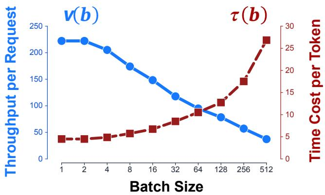

(b) Completion Time Decomposition  
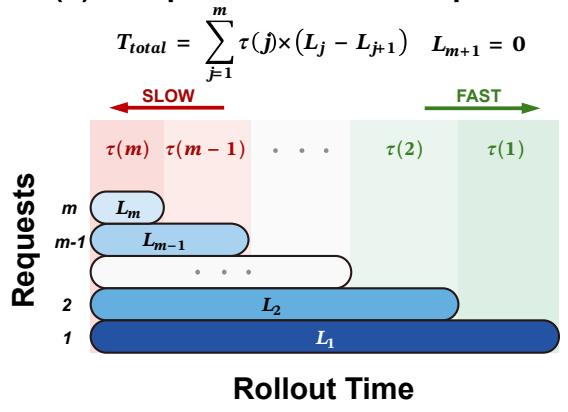  
Figure 2 | Measured decode throughput versus active batch size (a) and the resulting replica-time decomposition (b).

For the �-th longest request, the additional cost can be formulated as its length $L _ { j } ,$ , multiplied by the additional per-token decoding time caused by increasing the active batch size from � − 1 to �. Thus, if a request of length � is assigned to a replica that already contains � longer requests, its marginal routing cost is

$$
\Delta T ( L , c ) = L \left( \tau ( c + 1 ) - \tau ( c ) \right) .
$$

We evaluate the optimal routing on sampled rollout groups with $N = 1 0 0$ requests from real rollout traces and solve this problem under our measured-throughput model exactly using a Bellman-style dynamic program with Pareto pruning (Ehrgott, 2005), which reduces the efective search space from the naive 2100 states to roughly $1 0 ^ { 6 } – 1 0 ^ { 7 }$ retained states in our workloads. This makes it practical to compute the exact ofline optimum, but it is still too expensive to use directly as an online routing algorithm.

The exact optimal solution in Figure 3(a) is highly imbalanced in terms of request count, but balanced in terms of completion time. In our example, the tail lane contains only 4 responses while the bulk lane contains 96 responses, yet both replicas finish at nearly the same time. This matches the balancing condition of the min-max objective: if one active replica finishes much earlier than another, then shifting a small amount of workload from the slower replica to the faster one can reduce the maximum completion time. We provide a formal proof of this balancing property in Appendix C.

This explains why the oracle is neither uniform routing nor pure tail-only routing. Uniform routing balances request count but can place extreme long-tail generations inside high-concurrency batches. Pure tail-only routing isolates the tail but can underutilize the tail replica. In the long-tail regime, the optimal strategy is instead tail isolation with load balancing: isolate only the extreme long-tail generations, and use a small amount of balancing trafic to keep replica completion times aligned.

## 2.2. Top-k Tail Isolation Closely Approximates the Long-Tail Optimum

Pareto pruning makes the exact oracle tractable but still far too expensive to place in the rollout critical path.   
We therefore ask whether a much simpler online policy can recover most of the oracle benefit.

We consider a top-� tail-isolation policy. Given known completion lengths, the policy routes the � longest requests to a low-concurrency tail replica and routes all remaining requests to the bulk replica. It only uses a single control variable, �, which determines how many tail requests are isolated.

Figure 3(b) compares this simple top-� policy against the optimal policy. When � is too small, the bulk replica remains slower because some extreme tail requests are still mixed into the high-concurrency bulk batch. When � is too large, the tail replica becomes slower because too many long-tailed requests are moved into the low-concurrency lane. The best point appears near the load-balancing point, where the two replicas have similar completion times.

(a) Optimal Routing  
(b) Tail-Isolation Routing  
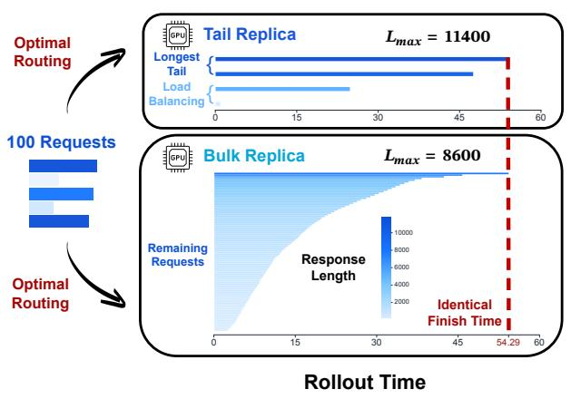

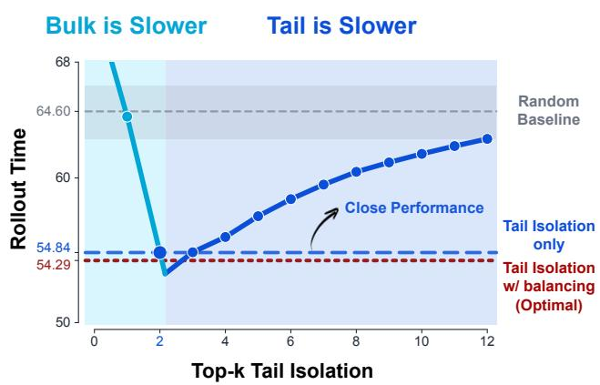  
Figure 3 | Oracle routing and top-� tail isolation for a representative 100-request rollout group.

Notably, in Figure 3(b), top-� tail isolation achieves 54.84 s, recovering most of the improvement without solving the full assignment problem. This result generalizes across 100 rollout groups of 100 trajectories each: the best-� isolation policy stays within 4% of the exact ofline optimum (Appendix A.4).

This establishes tail isolation with load balancing as the optimal routing structure in the long-tail regime. The practical problem is therefore to determine how many candidate groups to isolate and how much replica capacity to assign to them. Rather than attempting to reproduce the exact oracle online, TailSieve focuses on identifying likely long-tail requests and jointly choosing the isolation size and replica allocation. The next subsection shows that partial rollout provides an efective training-free signal, while Section 2.4 explains why isolation size and replica capacity must be controlled jointly.

## 2.3. Partial Rollout Acts as a Training-Free Tail Filter

Partial rollout has recently emerged as an efective mechanism for improving rollout eficiency in LLM posttraining (Kimi Team, 2025; Zhou et al., 2025).

The original goal of partial rollout is to reduce synchronization stalls by allowing unfinished long generations to be carried over and reused. Like RollPacker (Gao et al., 2026), we use unfinished generations as a signal for identifying requests that are likely to fall into the long tail. However, TailSieve does not consolidate these requests into separate tail-heavy rounds; it uses the signal to maintain a mixed tail–bulk pipeline at every steady-state step. Figure 4 evaluates the quality of this signal.

Our cross-round use of this signal is motivated by a simple observation: long-tail prompts tend to remain long-tailed across policy updates. Sampling randomness and policy evolution can change the exact response length and shift the overall response-length distribution. Nevertheless, prompt identity remains a stable but noisy cross-round signal: tail-ranking AUC stays above 0.95 across diferent policies, and prompt identity explains 64.8% of response-length variation (Appendix B).

This observation does not assume that two generations of the same prompt have equal lengths, or that the marginal response-length distribution remains stationary during training. It requires only that a prompt’s relative tendency to appear in the long tail remains informative across adjacent policy updates. TailSieve therefore transfers the prompt-level tail signal, rather than a previous trajectory or an absolute length estimate.

We quantify this efect by measuring the capture rate of ground-truth long-tail groups. Here, � denotes the cutof percentage, or equivalently the fraction of excess candidates launched beyond the required rollout count. At � = 5%, 10%, and 25%, the partial-rollout filter captures 85%, 93%, and 95% of these groups, respectively. The capture rate further increases for more extreme tail subsets, approaching 100% for the longest responses.

This makes partial rollout a natural training-free front-end for TailSieve: it provides the candidate tail set, while TailSieve jointly determines how many candidates to isolate and how many replicas should serve the

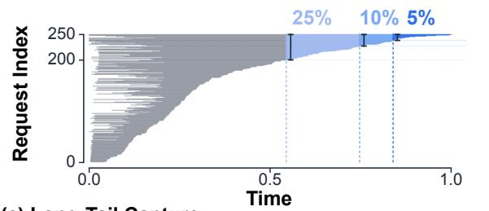

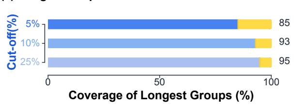

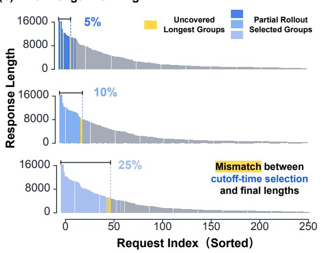  
Figure 4 | Partial-rollout candidate selection, final-length ranking, and long-tail capture at three cutof percentages.

tail route.

## 2.4. Workload-Dependent Optima Motivate Hierarchical Control

Consider a tail-routing configuration $( q , m )$ , where � routing units are isolated in a tail pool served by � of the � replicas. The remaining $N - q$ units and $R - m$ replicas form the bulk pool. Its step makespan is

$$
T ( q , m ) = \mathrm { m a x } \{ T _ { \mathrm { t a i l } } ( q , m ) , T _ { \mathrm { b u l k } } ( N - q , R - m ) \} .
$$

The two control variables act diferently: � changes the workload assigned to each pool, whereas � changes both replica capacity and per-replica decoding concurrency. Their efects are therefore coupled.

Figure 5 evaluates this joint objective under weak-tail, measured, and strong-tail workloads, whose construction is detailed in Appendix A.5. Each slice fixes a replica split and varies �. For every split, the marked optimum $q ^ { * } ( m )$ changes with the workload. Comparing the best point across slices further shows that the preferred replica split $m ^ { * }$ also changes. Thus, no fixed $( q , m )$ is optimal across workloads; uniform routing appears as the 4:0 boundary.

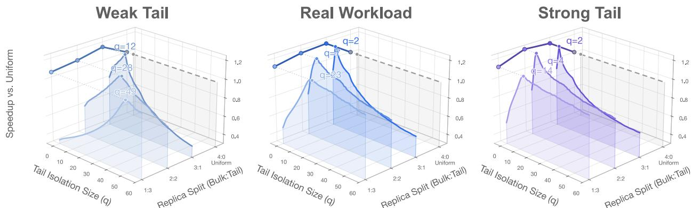  
Figure 5 | Joint-control landscapes showing that the optimal isolation size and replica split vary with tail strength.

The tail-side decomposition explains why these optima move. For an isolated request $i ,$ let $b _ { i } ^ { \mathrm { b a s e } } ( x )$ be its active batch size at token � under uniform routing and $b _ { i } ^ { \mathrm { t a i l } } ( x ; q , m )$ the corresponding batch size under configuration $( q , m )$ . With �(�) denoting per-token decoding time, we use the aggregate proxy

$$
\widetilde { \Delta T } _ { \mathrm { t a i l } } ( q , m ) = \sum _ { i \in { \mathcal T } _ { q } } \sum _ { x = 1 } ^ { L _ { i } } \Big [ \tau \Big ( b _ { i } ^ { \mathrm { b a s e } } ( x ) \Big ) - \tau \Big ( b _ { i } ^ { \mathrm { t a i l } } ( x ; q , m ) \Big ) \Big ] .
$$

With $[ z ] _ { + } = \operatorname* { m a x } ( z , 0 )$ , it decomposes into an early low-concurrency advantage and a late tail-concentration penalty:

$$
\widetilde { \Delta T } _ { \mathrm { t a i l } } ( q , m ) = \underbrace { \sum _ { i \in { \mathcal { T } _ { q } } } \sum _ { x = 1 } ^ { L _ { i } } \left[ \tau \Bigl ( b _ { i } ^ { \mathrm { b a s e } } ( x ) \Bigr ) - \tau \Bigl ( b _ { i } ^ { \mathrm { t a i l } } ( x ; q , m ) \Bigr ) \right] _ { + } } _ { \mathrm { e a r i y l o w - c o n c u r e n c e u r e n c y a d v a r a g e } } - \underbrace { \sum _ { i \in { \mathcal { T } _ { q } } } \sum _ { x = 1 } ^ { L _ { i } } \left[ \tau \Bigl ( b _ { i } ^ { \mathrm { t a i l } } ( x ; q , m ) \Bigr ) - \tau \Bigl ( b _ { i } ^ { \mathrm { b a s e } } ( x ) \Bigr ) \right] _ { + } } _ { \mathrm { l a t e ~ t a i l - c o n c e n t r a t i o n ~ p e n a l t y } } .
$$

Together with the amount of isolated tail work $\begin{array} { r } { W _ { \mathrm { t a i l } } ( q ) = \sum _ { i \in \mathcal { T } _ { q } } L _ { i } , } \end{array}$ this exposes three components: tail workload, early low-concurrency advantage, and late concentration penalty. A workload change afects these components diferently, shifting both the marginal benefit of isolating another unit and that of assigning another tail replica. Consequently, neither $q ^ { * }$ nor $m ^ { * }$ needs to vary monotonically with tail strength. The proxy explains this movement rather than the exact makespan; Appendix D gives the replica-level formulation, and Figure D.1 provides a detailed decomposition of the gain regimes.

Although the optimizer moves with the workload, we find that two simple conditions characterize the relaxed joint optimum. First, for a fixed replica split $m ,$ the isolation size $q$ is optimal when the two pools finish at approximately the same time. Second, after balancing $q ,$ the replica split � is optimal when the two pools have comparable marginal-capacity pressure, so moving replica capacity in either direction no longer reduces the predicted makespan. These conditions respectively yield the inner �-adjustment and outer �-adjustment; uniform routing is the boundary solution $( q , m ) = ( 0 , 0 )$ . Section 3.2 describes how the controller estimates and applies these conditions, while Appendices C.1 and C.2 provide their detailed derivations.

## 3. TailSieve Design

## 3.1. System Overview

Figure 6 illustrates the workflow of TailSieve. During warm-up, groups unfinished at the partial-rollout cutof become tail candidates for the next step. Joint execution regenerates these groups in the tail pool, while the bulk pool processes fresh groups. Both are logical pools that may contain multiple replicas, and requests are dispatched round-robin within each pool.

Each update combines all regenerated tail groups with the earliest completed bulk groups until the required batch size is reached. Partial rollout transfers only prompt identities: no generated tokens, KV-cache state, sampling state, or log-probabilities are reused. Every consumed response is regenerated from scratch under the current policy.

For GRPO, one routing unit is a complete prompt group, so all responses associated with the same prompt remain together. The hierarchical controller jointly chooses how many groups to isolate and how many replicas to assign to the tail pool.

## 3.2. Hierarchical Tail-Pool Control

For a step requiring � routing units on � replicas, we represent the routing configuration at step � by $\left( q _ { t } , m _ { t } \right)$ where $q _ { t }$ is the number of long-tail routing units regenerated in the tail pool and $m _ { t }$ is the number of replicas assigned to that pool. Uniform routing is the boundary configuration $( q , m ) = ( 0 , 0 )$ . For a candidate configuration, the controller predicts the joint-execution makespan

$$
\widehat T _ { t } ( q , m ) = \operatorname * { m a x } \left\{ \widehat T _ { t } ^ { \mathrm { t a i l } } ( q , m ) , \widehat T _ { t } ^ { \mathrm { b u l k } } ( N - q , R - m ) \right\} .
$$

The tail term covers the � regenerated tail groups, whereas the bulk term covers the first $N - q$ completions from the fresh groups. TailSieve optimizes this discrete objective with a fast inner loop over � and a slower outer loop over �. Detailed proofs and implementation details for the inner completion-time balance and the outer marginal-capacity controller are deferred to Appendices C.1 and C.2, respectively.

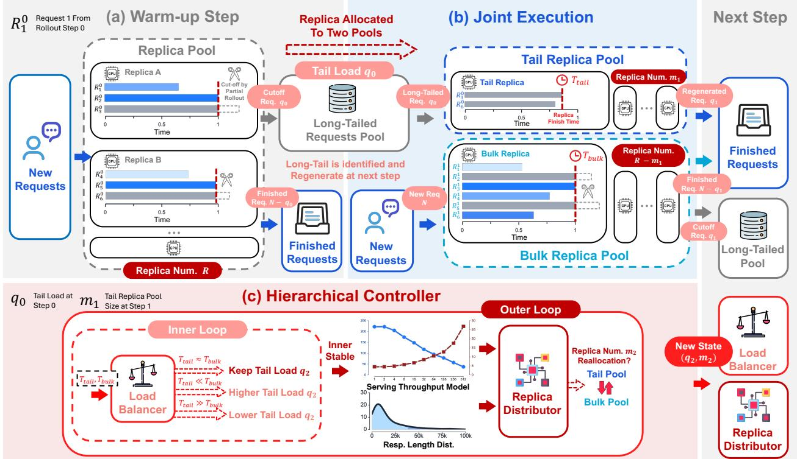  
Figure 6 | TailSieve workflow: warm-up tail identification, joint two-pool execution, and hierarchical control.

Inner loop: completion-time balance. For a fixed replica split $m _ { t } ,$ the inner loop adjusts $q _ { t }$ toward equal tailand bulk-pool makespans. It increases $q _ { t }$ when the bulk pool is slower and decreases $q _ { t }$ when the tail pool is slower. After each settled step, TailSieve estimates the two processing rates as

$$
r _ { t } ^ { \mathrm { b u l k } } = \frac { N - q _ { t } } { T _ { t } ^ { \mathrm { b u l k } } } , \qquad r _ { t } ^ { \mathrm { t a i l } } = \frac { q _ { t } } { T _ { t } ^ { \mathrm { t a i l } } } .
$$

The measured rates are smoothed using exponential moving averages. Based on the smoothed rates, the estimated load-balancing point is

$$
q _ { t + 1 } ^ { * } = N \frac { \bar { r } _ { t } ^ { \mathrm { t a i l } } } { \bar { r } _ { t } ^ { \mathrm { b u l k } } + \bar { r } _ { t } ^ { \mathrm { t a i l } } } ,
$$

at which the two routes are expected to finish at approximately the same time.

Outer loop: marginal-capacity balance. After the inner loop settles, the outer loop decides whether more replicas should be assigned to the tail pool or returned to the bulk pool. It uses the observed group-level response-work distribution together with the measured concurrency–throughput curve to estimate the marginal capacity of each pool, i.e., how much additional workload a pool can absorb when given more replica capacity while keeping its completion time unchanged.

Specifically, the cutof sensitivity $\lambda _ { j }$ measures how sensitive pool � is to moving additional groups across the tail cutof, while the throughput elasticity $\gamma _ { j }$ measures how much its completion time benefits from a change in concurrency. Let

$$
\alpha = \frac { m } { R }
$$

denote the fraction of replicas assigned to the tail pool. We define

$$
M _ { \mathrm { t a i l } } = \frac { \gamma _ { \mathrm { t a i l } } } { \alpha \lambda _ { \mathrm { t a i l } } } , \qquad M _ { \mathrm { b u l k } } = \frac { \gamma _ { \mathrm { b u l k } } } { ( 1 - \alpha ) \lambda _ { \mathrm { b u l k } } } .
$$

Intuitively, $M _ { j }$ measures how much extra workload pool � can accommodate per unit of additional replica capacity. If

$$
M _ { \mathrm { t a i l } } > M _ { \mathrm { b u l k } } ,
$$

allocating more capacity to the tail pool is more beneficial, and the controller proposes increasing �. Conversely, if

$$
M _ { \mathrm { t a i l } } < M _ { \mathrm { b u l k } } ,
$$

the controller proposes decreasing � and returning capacity to the bulk pool.

This marginal-capacity comparison determines the local direction of replica adjustment. Since the predicted makespan can be non-unimodal in �, the controller additionally evaluates candidate replica splits within a radius of two using the complete distribution–throughput model and selects the split with the lowest predicted makespan. A transition is executed only when a feasible cutof exists and the predicted gain exceeds the switching threshold, with at most one physical replica moved per decision.

## 3.3. Avoiding Routing-Induced Length Bias

Unlike tail-batching methods that accumulate long requests into separate tail-heavy rounds, TailSieve continuously interleaves tail and bulk responses. It neither discards long-tail prompts nor moves them into separate policy-update rounds. At every steady-state step, the update batch combines long-tail prompts retained from the preceding prompt pool with the complementary bulk prompts from the current pool, preserving their expected proportion in the update batch. All retained prompts are regenerated from scratch under the current policy.

Consequently, TailSieve changes where prompts are executed without systematically changing the prompt composition consumed by training. The overall response-length distribution may still evolve as the policy changes, but this policy-induced drift is distinct from routing-induced selection bias. Relative to uniform routing under the same current policy and prompt stream, TailSieve preserves on-policy generation and does not introduce additional systematic bias toward shorter or longer responses in steady state.

The warm-up step has no preceding tail contribution, and changing �� introduces a short composition transition. Changing � alone only changes execution placement and does not alter the update batch. The controller allows request-allocation transitions to settle before applying another adjustment. Appendix E formalizes the idealized stationary case and characterizes deviations caused by policy and selector drift.

## 3.4. Route-Specialized Speculative Decoding

The tail replica naturally isolates requests that are likely to produce long responses, creating a low-concurrency stream with a long decoding horizon. This workload is well suited to speculative decoding, while route isolation prevents speculative verification from delaying high-concurrency requests on the bulk replica. More importantly, the two replicas need not share the same speculative policy. The high-concurrency bulk replica can use a conservative policy with a short draft depth, whereas the low-concurrency tail replica can use a more aggressive policy with deeper drafts to amortize drafting and verification over long responses. TailSieve therefore supports independently enabling and configuring speculation on the bulk and tail replicas, including the backend and draft depth. We instantiate this design with two state-of-the-art speculative decoding backends: the model’s native multi-token prediction (MTP) head (Qwen Team, 2026) and DFlash, which uses a lightweight block-difusion drafter to propose multiple tokens in parallel (Chen et al., 2026).

We also explored SufixDecoding (Oliaro et al., 2025), as partial rollout naturally provides draft sequences from the previous step. However, we observed two practical limitations. First, the average accepted length remains modest without additional draft pre-generation, consistent with the observations in BubbleSpec (Xu et al., 2026). Second, sufix retrieval does not always provide usable draft tokens for every query, resulting in a mixture of single-token decode queries and variable-length verification queries. Such ragged query lengths prevent full-batch CUDA-graph replay; supporting them requires capturing multiple token-count-specific graphs and consuming additional GPU memory. This system’s overhead outweighed the limited acceptance gain and we therefore do not enable sufix decoding by default.

Following the lossless speculative decoding formulation (Leviathan et al., 2023), both backends verify draft tokens with the target model and preserve its output distribution.

## 4. Evaluation

## 4.1. Experimental Overview

We evaluate TailSieve on five dense and mixture-of-experts model configurations. These include Qwen3.5- 35B-A3B, Qwen3.5-4B, and Qwen3.5-2B (Qwen Team, 2026), together with Qwen3-30B-A3B-Instruct-2507 and Qwen3-4B-Instruct-2507 (Yang et al., 2025).

All experiments run on the same eight-GPU server and use vLLM as the rollout backend (Kwon et al., 2023). Paired baseline and TailSieve runs use the same sampling configuration and required routing-unit count �. The large-model configurations use four TP2 replicas, while the 4B and 2B configurations use eight TP1 replicas. The total replica budget remains fixed, while TailSieve jointly adjusts the routing-unit allocation and the number of replicas assigned to the tail and bulk pools. The step-wise experiments draw mathematical reasoning prompts from DeepScaleR (Agentica Team, 2025) and coding prompts from the KodCode-Light-RL-10K dataset on Hugging Face (Xu et al., 2025); the end-to-end RL experiment uses only the mathematical prompts. We use GRPO as the RL algorithm (Shao et al., 2024). In our GRPO experiments, one routing unit is a complete prompt group containing eight responses. We use a maximum output length of 16K tokens. Approximately 3% of responses are truncated on the math workload, compared with only 0.1% on the coding workload. The shared hardware, sampling configuration, and prompt templates are given in Appendix A.1; the step-wise and end-to-end protocols are detailed in Appendices A.2 and A.3, respectively.

## 4.2. Main Results

We evaluate TailSieve after the joint allocation (�, �) has converged and the system has entered steady-state cross-round execution. We report its average step time over the next three consecutive rollout rounds. In each round, the tail candidates selected in the preceding round are routed to the tail pool, while the current round produces the candidate set for the next round. The baseline uses the same prompts and sampling seeds, and its latency is averaged over three repeated runs.

All selected requests are regenerated from scratch: no partial responses or prefix tokens are reused, and all KV-cache state is flushed between rounds. We use a rollout batch size of 64 groups, corresponding to � = 64 routing units and 512 requests across all replicas.

We first disable speculative decoding and compare TailSieve with representative routing and scheduling strategies under the same requests, model configuration, and total replica budget. Table 1 summarizes both routing-only workloads.

Table 1 | Routing-only speedup over uniform group routing.
<table><tr><td colspan="6">DeepScaleR</td></tr><tr><td>Routing policy</td><td>Qwen3.5-35B-A3B</td><td>Qwen3.5-4B</td><td>Qwen3.5-2B</td><td>Qwen3-30B-A3B</td><td>Qwen3-4B</td></tr><tr><td>Uniform</td><td>1.000×</td><td>1.000×</td><td>1.000×</td><td>1.000×</td><td>1.000×</td></tr><tr><td>Uniform Oracle*</td><td>1.123×</td><td>1.151×</td><td>1.154×</td><td>1.085×</td><td>1.225×</td></tr><tr><td>StreamRL-style Oracle*</td><td>1.030×</td><td>1.113×</td><td>1.136×</td><td>0.928×</td><td>1.174×</td></tr><tr><td>Seer-style Oracle</td><td>1.189×</td><td>1.162x</td><td>1.169×</td><td>1.082×</td><td>1.358×</td></tr><tr><td>TAILSIEVE (Fixed Replica Allocation)</td><td>1.219×</td><td>1.199×</td><td>1.144×</td><td>1.112×</td><td>1.186×</td></tr><tr><td>TAILSIEVE</td><td>1.346×</td><td>1.233×</td><td>1.180×</td><td>1.112×</td><td>1.254×</td></tr></table>

<table><tr><td colspan="6">KodCode-10K</td></tr><tr><td>Routing policy</td><td>Qwen3.5-35B-A3B</td><td>Qwen3.5-4B</td><td>Qwen3.5-2B</td><td>Qwen3-30B-A3B</td><td>Qwen3-4B</td></tr><tr><td>Uniform</td><td>1.000×</td><td>1.000×</td><td>1.000×</td><td>1.000×</td><td>1.000×</td></tr><tr><td>Uniform Oracle*</td><td>1.033×</td><td>1.001×</td><td>1.106×</td><td>1.083×</td><td>1.107×</td></tr><tr><td>StreamRL-style Oracle*</td><td>1.167×</td><td>1.033×</td><td>1.100×</td><td>1.094×</td><td>0.992×</td></tr><tr><td>Seer-style Oracle*</td><td>1.282×</td><td>0.971×</td><td>1.150×</td><td>1.062×</td><td>1.406×</td></tr><tr><td>TAILSIEVE (Fixed Replica Allocation)</td><td>1.560×</td><td>1.310×</td><td>1.143×</td><td>1.166×</td><td>1.179×</td></tr><tr><td>TAILSIEVE</td><td>1.670×</td><td>1.403×</td><td>1.214×</td><td>1.342×</td><td>1.442×</td></tr></table>

\*Methods marked assume that realized generation lengths are known before routing.

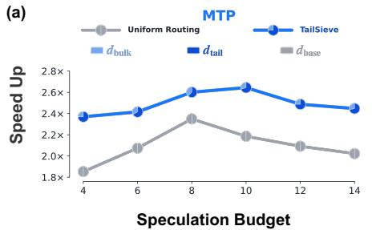

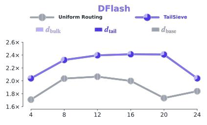

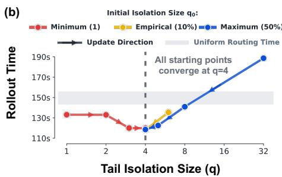

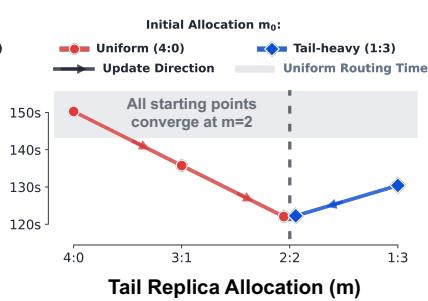  
Figure 7 | Route-specialized speculative decoding (a) and hierarchical-controller convergence (b) on Qwen3.5- 35B-A3B.

Table 2 | Step-wise speedup over uniform routing with fixed replica allocation using routing alone, MTP, or DFlash.
<table><tr><td>Model</td><td colspan="3">DeepScaleR</td><td colspan="3">KodCode-10K</td></tr><tr><td></td><td>Routing</td><td>+MTP</td><td>+DFlash</td><td>Routing</td><td>+MTP</td><td>+DFlash</td></tr><tr><td>Qwen3.5-35B-A3B</td><td>1.219×</td><td>2.390×</td><td>2.181×</td><td>1.560×</td><td>2.586×</td><td>2.378×</td></tr><tr><td>Qwen3.5-4B</td><td>1.199×</td><td>2.414×</td><td>2.091×</td><td>1.310×</td><td>1.921×</td><td>1.774×</td></tr><tr><td>Qwen3.5-2B</td><td>1.144×</td><td>2.161×</td><td></td><td>1.143×</td><td>2.349×</td><td></td></tr></table>

− indicates that no oficial DFlash implementation is available for Qwen3.5-2B.

Uniform routing keeps each rollout group atomic, while Uniform Oracle uses known lengths to balance the same complete groups across replicas. The StreamRL-style and Seer-style Oracle baselines also assume that realized generation lengths are known before dispatch; Seer-style Oracle further distributes work at request granularity to equalize the known length load across replicas. The fixed-allocation variant ablates TailSieve’s outer replica loop. Appendix A.2 specifies the implementation of each routing policy.

We next combine TailSieve routing with speculative decoding. MTP uses 3 speculative tokens, while DFlash uses a block size of 4. The routing-with-speculation results form the second part of our main comparison; Section 4.3 further isolates the efect of route-specific speculation, and Section 4.6 examines decoding concurrency.

## 4.3. Route-Specialized Speculative Decoding

We further study how route specialization afects speculative decoding on Qwen3.5-35B-A3B, as shown in Figure 7(a). For both MTP and DFlash, we compare the two systems under the same total speculation budget. Let $d _ { \mathrm { b a s e } }$ denote the method-specific proposal depth used on each baseline replica. The baseline uses the symmetric configuration $( d _ { \mathrm { b a s e } } , d _ { \mathrm { b a s e } } )$ , whereas TailSieve may choose route-specific depths satisfying

$$
d _ { \mathrm { b u l k } } + d _ { \mathrm { t a i l } } = 2 d _ { \mathrm { b a s e } } .
$$

For example, a baseline configuration of MTP-4/MTP-4 is compared with MTP-3 on the high-concurrency bulk route and MTP-5 on the low-concurrency tail route. This matched-budget comparison allows TailSieve to shift proposal depth from the less favorable bulk workload to the tail workload, where more aggressive speculation remains beneficial. The two methods use the same requests and sampling seeds.

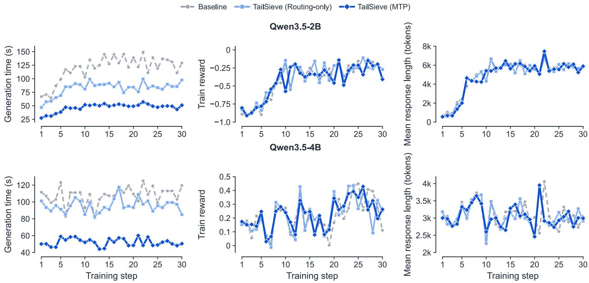  
Figure 8 | Thirty-step GRPO results for Qwen3.5-2B (top) and Qwen3.5-4B (bottom): generation time, reward, and mean response length.

Across the evaluated budgets, route-specialized speculation consistently outperforms uniform routing. Tail isolation also shifts the best speculation budget upward: the uniform baseline stops benefiting from additional speculation earlier, whereas the isolated tail route remains efective with a more aggressive budget. Thus, tail isolation both increases the gain from speculative decoding and extends its useful budget range.

## 4.4. Convergence from Diferent Initial Allocations

We evaluate both levels of the hierarchical controller while holding the request stream and all other parameters fixed. For the inner loop, we hold the replica split fixed and initialize the isolation size from the minimum $( q _ { 0 } = 1 )$ , our empirical default, and the maximum $\left( q _ { 0 } = 0 . 5 N \right)$ . Figure 7(b) shows that all three trajectories converge to $q \ : = \ : 4$ , whether they approach it from above or below. For the outer loop, we initialize the replica allocation from uniform $( m _ { 0 } = 0 )$ and a tail-heavy split $\left( m _ { 0 } = 3 \right)$ ; both trajectories converge to $m = 2$ corresponding to a 2:2 bulk–tail split. Thus, both controller levels converge to the same allocation from substantially diferent initial states.

## 4.5. End-to-End Rollout Generation during RL Training

Step-wise acceleration is useful only if it persists as the policy evolves. We therefore integrate TailSieve into GRPO training and compare it with uniform routing under the same initialization, prompt order, number of policy updates, and sampling configuration. Our end-to-end metric is the wall-clock time of the complete rollout generation stage at each training step, including routing and controller execution. We exclude the unchanged optimizer phase, which is outside the scope of rollout routing. Appendix A.3 provides the batch construction, optimizer settings, and random seed.

Figure 8 shows that the generation-time improvement persists as the policy evolves on both models. On Qwen3.5-2B, averaged over steps 1–30, routing-only TailSieve reduces generation time from 119.34 s to 82.49 s, a 30.9% reduction and 1.45× speedup. Combining routing with MTP reduces it further to 46.61 s, a 60.9% reduction and 2.56× speedup. Qwen3.5-4B exhibits substantial step-to-step variation in mean response length as the prompt batch changes. TailSieve tracks these workload shifts and continues to reduce generation time, while MTP provides a larger and more consistent reduction. Despite the natural evolution of response length during training, the reward and mean-response-length curves remain comparable across the three runs on both models. Thus, the observed acceleration does not come with a systematic shift in either training reward

Table 3 | Downstream accuracy of base and RL-trained checkpoints; parentheses report percentage-point changes from the corresponding base model.
<table><tr><td>Model Method</td><td></td><td>GSM8K pass@1</td><td>MATH-500 pass@1</td><td>AIME24 pass@10</td><td>AIME25 pass@10</td></tr><tr><td rowspan="4">Qwen3.5-2B</td><td>Base model</td><td>9.40%</td><td>13.40%</td><td>30.00%</td><td>30.00%</td></tr><tr><td>Baseline</td><td>75.97% (+66.57)</td><td>76.20% (+62.80)</td><td>50.00% (+20.00)</td><td>43.33% (+13.33)</td></tr><tr><td>TAILSIEVE (Routing-only)</td><td>76.57% (+67.17)</td><td>74.60% (+61.20)</td><td>53.33% (+23.33)</td><td>36.67% (+6.67)</td></tr><tr><td>TAILSIEVE (MTP)</td><td>76.42% (+67.02)</td><td>74.40% (+61.00)</td><td>53.33% (+23.33)</td><td>53.33% (+23.33)</td></tr><tr><td rowspan="4">Qwen3.5-4B</td><td>Base model</td><td>89.61%</td><td>84.40%</td><td>90.00%</td><td>80.00%</td></tr><tr><td>Baseline</td><td>89.16% (-0.45)</td><td>88.80% (+4.40)</td><td>90.00% (+0.00)</td><td>86.67% (+6.67)</td></tr><tr><td>TAILSIEVE (Routing-only)</td><td>89.46% (-0.15)</td><td>87.40% (+3.00)</td><td>93.33% (+3.33)</td><td>80.00% (+0.00)</td></tr><tr><td>TAILSIEVE (MTP)</td><td>89.61% (+0.00)</td><td>86.60% (+2.20)</td><td>90.00% (+0.00)</td><td>83.33% (+3.33)</td></tr></table>

Table 4 | Routing-only speedup over uniform routing as rollout concurrency increases.
<table><tr><td>Model</td><td colspan="3">DeepScaleR</td><td colspan="3">KodCode-10K</td></tr><tr><td></td><td>N=64</td><td>N=128</td><td>N=256</td><td>N=64</td><td>N=128</td><td>N=256</td></tr><tr><td>Qwen3.5-35B-A3B</td><td>1.346×</td><td>1.199×</td><td>1.122×</td><td>1.670×</td><td>1.214×</td><td>1.142×</td></tr><tr><td>Qwen3.5-4B</td><td>1.233×</td><td>1.225×</td><td>1.191×</td><td>1.403×</td><td>1.453×</td><td>1.240×</td></tr><tr><td>Qwen3.5-2B</td><td>1.180×</td><td>1.129×</td><td>1.177×</td><td>1.214×</td><td>1.108×</td><td>1.101×</td></tr><tr><td>Qwen3-30B-A3B-Instruct-2507</td><td>1.112×</td><td>1.023×</td><td>1.121×</td><td>1.342×</td><td>1.163×</td><td>1.091×</td></tr><tr><td>Qwen3-4B-Instruct-2507</td><td>1.254×</td><td>1.215×</td><td>1.306×</td><td>1.442×</td><td>1.367×</td><td>1.248×</td></tr></table>

or average response length.

Table 3 shows that the final checkpoints from both TailSieve variants retain broadly comparable downstream accuracy to the baseline across all four benchmarks. We evaluate checkpoint quality on GSM8K and MATH-500 (Cobbe et al., 2021; Lightman et al., 2024), and the 2024 and 2025 AIME problem sets (Mathematical Association of America, 2026), reporting pass@1 for the former and pass@10 for the latter.

## 4.6. Scaling with Concurrency

To isolate the efect of decoding concurrency from speculative decoding, we disable speculation and vary the number of rollout groups. At each concurrency level, the baseline and routing configurations use the same randomly sampled requests, sampling seeds, and generation settings. Table 4 shows the resulting wall-clock speedups. Here, � denotes the number of GRPO prompt groups, with eight responses per group.

## 5. Related Work

## 5.1. Long-Tail RL Rollouts and Partial Rollout

Long responses create synchronization bubbles in LLM RL. AReaL relaxes this barrier by decoupling rollout generation from training (Fu et al., 2025). Kimi k1.5 reuses segments of previous trajectories (Kimi Team, 2025), while APRIL and CoPRIS overprovision rollouts and carry unfinished trajectories into later steps, with CoPRIS correcting cross-policy reuse through importance sampling (Zhou et al., 2025; Qu et al., 2025). RollPacker instead consolidates tail prompts into a small number of long rounds (Gao et al., 2026).

TailSieve uses unfinished requests diferently. Their cutof-time status serves only as a training-free tail signal: generated prefixes are not reused, and every consumed response is regenerated from the original prompt under the current policy. Rather than moving tails into separate tail-heavy rounds, TailSieve preserves a mixed tail–bulk update stream and targets replica-level makespan within synchronous rollout.

## 5.2. Length-Aware Scheduling and Routing

Serving schedulers use proxy models, uncertainty-aware distributions, or entropy-guided representations to predict response lengths (Qiu et al., 2024; Zheng et al., 2026; Xie et al., 2026). In RL systems, StreamRL uses a learned output-length ranker for skewness-aware dispatching (Zhong et al., 2026), while Seer exploits similarities among responses to the same prompt through online context learning and divided rollout (Qin et al., 2026).

TailSieve does not estimate exact completion lengths. It uses partial rollout as a high-recall tail filter, keeps each policy-update group atomic, and jointly adjusts how many candidates to isolate and how many replicas to assign to the tail pool. Its hierarchical controller uses measured tail–bulk completion times, response-work history, and batch-dependent decoding throughput, removing the need for an auxiliary length predictor while adapting both workload placement and replica capacity.

## 5.3. Speculative Rollout Decoding

Speculative rollout methods reduce generation cost using adaptive drafts, history from nearby rollouts, idlecompute pre-generation, or improved multi-token prediction (Shao et al., 2026; He et al., 2026; Liu et al., 2025a; Xu et al., 2026; Li et al., 2026). These techniques accelerate token generation, whereas TailSieve shapes the concurrency at which generation runs. The two dimensions are complementary: tail isolation creates a low-concurrency, long-horizon route on which deeper MTP or DFlash speculation can be applied without imposing the same policy on the high-concurrency bulk route.

## 6. Conclusion

We presented TailSieve, a partial-rollout-guided framework that jointly allocates tail workload and replica capacity to reduce long-tail stalls in synchronous LLM rollouts. Starting from an ofline makespan formulation, we showed that optimal routing in the long-tail regime combines tail isolation with load balancing, and that a simple top-� policy closely approximates the oracle. TailSieve turns cutof-time partial rollouts into a trainingfree tail signal, while a hierarchical controller adjusts both the isolated workload and replica split using pool completion times, response-work history, and measured decoding throughput. It keeps policy-update groups intact and regenerates every consumed response under the current policy, preserving on-policy generation without introducing additional routing-induced length bias in steady state.

Across the evaluated models and workloads, TailSieve achieves up to 1.67× routing-only speedup over uniform group routing and up to 2.59× speedup when combined with route-specialized MTP or DFlash. Endto-end GRPO experiments further show that the controller can track an evolving rollout distribution while maintaining comparable training quality. The gains are strongest when long-tail requests determine the baseline makespan and isolation provides a decoding concurrency advantage. These results establish joint tail-workload and replica allocation as a practical complement to speculative decoding for synchronous LLM rollouts.

## References

Rishabh Agarwal, Nino Vieillard, Yongchao Zhou, Piotr Stanczyk, Sabela Ramos Garea, Matthieu Geist, and Olivier Bachem. On-policy distillation of language models: Learning from self-generated mistakes. In The Twelfth International Conference on Learning Representations, 2024. URL https://openreview.net/ forum?id=3zKtaqxLhW.

Agentica Team. DeepScaleR-Preview-Dataset. Hugging Face Dataset, 2025. URL https://huggingface. co/datasets/agentica-org/DeepScaleR-Preview-Dataset.

Ganesh Ananthanarayanan, Ali Ghodsi, Scott Shenker, and Ion Stoica. Efective straggler mitigation: Attack of the clones. In 10th USENIX Symposium on Networked Systems Design and Implementation (NSDI 13), pp. 185–198, Lombard, IL, 2013. USENIX Association. URL https://www.usenix.org/conference/ nsdi13/technical-sessions/presentation/ananthanarayanan.

Oscar Brown, Zhengjie Wang, Andrea Do, Nikhil Mathew, and Cheng Yu. Dynamic depth decoding: Faster speculative decoding for LLMs. arXiv preprint arXiv:2409.00142, 2024.

Tianle Cai, Yuhong Li, Zhengyang Geng, Hongwu Peng, Jason D. Lee, Deming Chen, and Tri Dao. Medusa: Simple LLM inference acceleration framework with multiple decoding heads. In Proceedings of the 41st International Conference on Machine Learning, volume 235 of Proceedings of Machine Learning Research, pp. 5209–5235. PMLR, 2024. URL https://proceedings.mlr.press/v235/cai24b.html.

Charlie Chen, Sebastian Borgeaud, Geofrey Irving, Jean-Baptiste Lespiau, Laurent Sifre, and John Jumper. Accelerating large language model decoding with speculative sampling. arXiv preprint arXiv:2302.01318, 2023.

Jian Chen, Yesheng Liang, and Zhijian Liu. DFlash: Block difusion for flash speculative decoding. In Proceedings of the 43rd International Conference on Machine Learning, 2026.

Mark Chen, Jerry Tworek, Heewoo Jun, Qiming Yuan, Henrique Ponde de Oliveira Pinto, Jared Kaplan, Harri Edwards, Yuri Burda, Nicholas Joseph, Greg Brockman, et al. Evaluating large language models trained on code. arXiv preprint arXiv:2107.03374, 2021.

Karl Cobbe, Vineet Kosaraju, Mohammad Bavarian, Mark Chen, Heewoo Jun, Lukasz Kaiser, Matthias Plappert, Jerry Tworek, Jacob Hilton, Reiichiro Nakano, Christopher Hesse, and John Schulman. Training verifiers to solve math word problems. arXiv preprint arXiv:2110.14168, 2021.

Jefrey Dean and Luiz André Barroso. The tail at scale. Communications of the ACM, 56(2):74–80, 2013. doi: 10.1145/2408776.2408794.

Matthias Ehrgott. Multicriteria Optimization. Springer, Berlin, Heidelberg, 2 edition, 2005. ISBN 978-3-540- 21398-7. doi: 10.1007/3-540-27659-9.

Wei Fu, Jiaxuan Gao, Xujie Shen, Chen Zhu, Zhiyu Mei, Chuyi He, Shusheng Xu, Guo Wei, Jun Mei, Jiashu Wang, Tongkai Yang, Binhang Yuan, and Yi Wu. AReaL: A large-scale asynchronous reinforcement learning system for language reasoning. In Advances in Neural Information Processing Systems, volume 38. Curran Associates, Inc., 2025. doi: 10.52202/085713-1218.

Yichao Fu, Peter Bailis, Ion Stoica, and Hao Zhang. Break the sequential dependency of LLM inference using lookahead decoding. In Proceedings of the 41st International Conference on Machine Learning, volume 235 of Proceedings of Machine Learning Research, pp. 14060–14079. PMLR, 2024. URL https://proceedings. mlr.press/v235/fu24a.html.

Wei Gao, Yuheng Zhao, Dakai An, Tianyuan Wu, Lunxi Cao, Shaopan Xiong, Ju Huang, Weixun Wang, Siran Yang, Wenbo Su, Jiamang Wang, Lin Qu, Bo Zheng, and Wei Wang. RollPacker: Taming longtail rollouts for RL post-training with tail batching. In 23rd USENIX Symposium on Networked Systems Design and Implementation (NSDI 26), pp. 849–866, Renton, WA, May 2026. USENIX Association. URL https://www.usenix.org/conference/nsdi26/presentation/gao-wei.

Daya Guo, Dejian Yang, Haowei Zhang, et al. DeepSeek-R1 incentivizes reasoning in LLMs through reinforcement learning. Nature, 645:633–638, 2025. doi: 10.1038/s41586-025-09422-z.

Jingkai He, Tianjian Li, Erhu Feng, Dong Du, Qian Liu, Tao Liu, Yubin Xia, and Haibo Chen. History doesn’t repeat itself but rollouts rhyme: Accelerating reinforcement learning with RhymeRL. In Proceedings of the 31st ACM International Conference on Architectural Supportfor Programming Languages and Operating Systems, Volume 2, ASPLOS ’26, pp. 929–945, New York, NY, USA, 2026. Association for Computing Machinery. doi: 10.1145/3779212.3790172.

Zhenyu He, Zexuan Zhong, Tianle Cai, Jason D. Lee, and Di He. REST: Retrieval-based speculative decoding. In Proceedings of the 2024 Conference of the North American Chapter of the Association for Computational Linguistics: Human Language Technologies (Volume 1: Long Papers), pp. 1582–1595, Mexico City, Mexico, June 2024. Association for Computational Linguistics. doi: 10.18653/v1/2024.naacl-long.88.

Xinyi Hu, Yuhao Shen, Baolin Zhang, Hengxin Zhang, Jun Dai, Shuang Ge, Lei Chen, Yue Li, and Mingcheng Wan. ECHO: Elastic speculative decoding with sparse gating for high-concurrency scenarios. In Proceedings of the 43rd International Conference on Machine Learning, 2026.

Yuxuan Hu, Ke Wang, Xiaokang Zhang, Fanjin Zhang, Cuiping Li, Hong Chen, and Jing Zhang. SAM decoding: Speculative decoding via sufix automaton. In Proceedings of the 63rd Annual Meeting of the Associationfor Computational Linguistics (Volume 1: Long Papers), pp. 12187–12204, Vienna, Austria, July 2025. Association for Computational Linguistics. doi: 10.18653/v1/2025.acl-long.595.

Yicheng Ji, Jun Zhang, Heming Xia, Jinpeng Chen, Lidan Shou, Gang Chen, and Huan Li. SpecVLM: Enhancing speculative decoding of video LLMs via verifier-guided token pruning. In Proceedings of the 2025 Conference on Empirical Methods in Natural Language Processing, pp. 7205–7219, Suzhou, China, November 2025. Association for Computational Linguistics. doi: 10.18653/v1/2025.emnlp-main.366.

Yicheng Ji, Jun Zhang, Jinpeng Chen, Cong Wang, Lidan Shou, Gang Chen, and Huan Li. See the forest for the trees: Loosely speculative decoding via visual-semantic guidance for eficient inference of video LLMs. In Proceedings of the 64th Annual Meeting of the Associationfor Computational Linguistics (Volume 1: Long Papers), pp. 23707–23726, San Diego, California, United States, July 2026. Association for Computational Linguistics. doi: 10.18653/v1/2026.acl-long.1087.

Kimi Team. Kimi k1.5: Scaling reinforcement learning with LLMs. arXiv preprint arXiv:2501.12599, 2025.

Quan Kong, Yuhao Shen, Yicheng Ji, Huan Li, and Cong Wang. Parallelvlm: Lossless video-llm acceleration with visual alignment aware parallel speculative decoding. arXiv preprint arXiv:2603.19610, 2026.

Woosuk Kwon, Zhuohan Li, Siyuan Zhuang, Ying Sheng, Lianmin Zheng, Cody Hao Yu, Joseph E. Gonzalez, Hao Zhang, and Ion Stoica. Eficient memory management for large language model serving with PagedAttention. In Proceedings of the 29th Symposium on Operating Systems Principles, SOSP ’23, pp. 611–626, New York, NY, USA, 2023. Association for Computing Machinery. doi: 10.1145/3600006.3613165.

Yaniv Leviathan, Matan Kalman, and Yossi Matias. Fast inference from transformers via speculative decoding. In Proceedings of the 40th International Conference on Machine Learning, volume 202 of Proceedings ofMachine Learning Research, pp. 19274–19286. PMLR, 2023. URL https://proceedings.mlr.press/v202/ leviathan23a.html.

Yucheng Li, Huiqiang Jiang, Yang Xu, Jianxin Yang, Yi Zhang, Yizhong Cao, Yuhao Shen, Fan Zhou, Rui Men, Jianwei Zhang, An Yang, Bowen Yu, Bo Zheng, Fei Huang, Junyang Lin, Dayiheng Liu, and Jingren Zhou. Breaking entropy bounds: Accelerating RL training via MTP with rejection sampling. arXiv preprint arXiv:2606.12370, 2026.

Yuhui Li, Fangyun Wei, Chao Zhang, and Hongyang Zhang. EAGLE: Speculative sampling requires rethinking feature uncertainty. In Proceedings of the 41st International Conference on Machine Learning, volume 235 of Proceedings of Machine Learning Research, pp. 28935–28948. PMLR, 2024a. URL https://proceedings. mlr.press/v235/li24bt.html.

Yuhui Li, Fangyun Wei, Chao Zhang, and Hongyang Zhang. EAGLE-2: Faster inference of language models with dynamic draft trees. In Proceedings of the 2024 Conference on Empirical Methods in Natural Language Processing, pp. 7421–7432, Miami, Florida, USA, November 2024b. Association for Computational Linguistics. doi: 10.18653/v1/2024.emnlp-main.422.

Yuhui Li, Fangyun Wei, Chao Zhang, and Hongyang Zhang. EAGLE-3: Scaling up inference acceleration of large language models via training-time test. In Advances in Neural Information Processing Systems, volume 38. Curran Associates, Inc., 2025. doi: 10.52202/085713-4562.

Hunter Lightman, Vineet Kosaraju, Yura Burda, Harri Edwards, Bowen Baker, Teddy Lee, Jan Leike, John Schulman, Ilya Sutskever, and Karl Cobbe. Let’s verify step by step. In The Twelfth International Conference on Learning Representations, 2024. URL https://openreview.net/forum?id=v8L0pN6EOi.

Bingshuai Liu, Ante Wang, Zijun Min, Liang Yao, Haibo Zhang, Yang Liu, Xu Han, Peng Li, Anxiang Zeng, and Jinsong Su. SPEC-RL: Accelerating on-policy reinforcement learning with speculative rollouts. arXiv preprint arXiv:2509.23232, 2025a.

Tianyu Liu, Yun Li, Qitan Lv, Kai Liu, Jianchen Zhu, Winston Hu, and Xiao Sun. PEARL: Parallel speculative decoding with adaptive draft length. In The Thirteenth International Conference on Learning Representations, 2025b. URL https://proceedings.iclr.cc/paper\_files/paper/2025/hash/ 03b1043052700b1a471996b0baf309d4-Abstract-Conference.html.

Tianyu Liu, Qitan Lv, Hao Li, Xing Gao, Xiao Sun, and Xiaoyan Sun. LogitSpec: Accelerating retrieval-based speculative decoding via next next token speculation. In Findings of the Association for Computational Linguistics: ACL 2026, pp. 33070–33092, San Diego, California, United States, July 2026a. Association for Computational Linguistics. doi: 10.18653/v1/2026.findings-acl.1655.

Tianyu Liu, Yuhao Shen, Xinyi Hu, Baolin Zhang, Hengxin Zhang, Jun Dai, Jun Zhang, Shuang Ge, Lei Chen, Yue Li, and Mingcheng Wan. When hidden states drift: Can KV caches rescue long-range speculative decoding? arXiv preprint arXiv:2604.26412, 2026b.

Xunzhuo Liu, Bowei He, Xue Liu, Andy Luo, Haichen Zhang, and Huamin Chen. Dual-Pool token-budget routing for cost-eficient and reliable LLM serving. arXiv preprint arXiv:2604.08075, 2026c.

Zichen Liu, Changyu Chen, Wenjun Li, Penghui Qi, Tianyu Pang, Chao Du, Wee Sun Lee, and Min Lin. Understanding R1-Zero-like training: A critical perspective. In Conference on Language Modeling, 2025c. URL https://openreview.net/forum?id=5PAF7PAY2Y.

Xianzhen Luo, Yixuan Wang, Qingfu Zhu, Zhiming Zhang, Xuanyu Zhang, Qing Yang, and Dongliang Xu. Turning trash into treasure: Accelerating inference of large language models with token recycling. In Proceedings of the 63rd Annual Meeting of the Association for Computational Linguistics (Volume 1: Long Papers), pp. 6816–6831, Vienna, Austria, July 2025. Association for Computational Linguistics. doi: 10. 18653/v1/2025.acl-long.338.

Jonathan Mamou, Oren Pereg, Daniel Korat, Moshe Berchansky, Nadav Timor, Moshe Wasserblat, and Roy Schwartz. Dynamic speculation lookahead accelerates speculative decoding of large language models. In Proceedings of the 4th NeurIPS Eficient Natural Language and Speech Processing Workshop, volume 262 of Proceedings of Machine Learning Research, pp. 456–467. PMLR, 2024. URL https://proceedings.mlr. press/v262/mamou24a.html.

Mathematical Association of America. MAA invitational competitions: American invitational mathematics examination. Mathematical Association of America, 2026. URL https://maa.org/ maa-invitational-competitions/. Accessed 2026-08-10.

Xupeng Miao, Gabriele Oliaro, Zhihao Zhang, Xinhao Cheng, Zeyu Wang, Zhengxin Zhang, Rae Ying Yee Wong, Alan Zhu, Lijie Yang, Xiaoxiang Shi, Chunan Shi, Zhuoming Chen, Daiyaan Arfeen, Reyna Abhyankar, and Zhihao Jia. SpecInfer: Accelerating large language model serving with tree-based speculative inference and verification. In Proceedings of the 29th ACM International Conference on Architectural Support for Programming Languages and Operating Systems, Volume 3, pp. 932–949. Association for Computing Machinery, 2024. doi: 10.1145/3620666.3651335.

Gabriele Oliaro, Zhihao Jia, Daniel Campos, and Aurick Qiao. SufixDecoding: Extreme speculative decoding for emerging AI applications. In Advances in Neural Information Processing Systems, volume 38. Curran Associates, Inc., 2025. URL https://proceedings.neurips.cc/paper\_files/paper/2025/hash/ b7aea253ab34a773967f1e4cdea9e4fb-Abstract-Conference.html.

Ruoyu Qin, Weiran He, Weixiao Huang, Yangkun Zhang, Yikai Zhao, Bo Pang, Xinran Xu, Yingdi Shan, Yongwei Wu, and Mingxing Zhang. Seer: Online context learning for fast synchronous LLM reinforcement learning. In 20th USENIX Symposium on Operating Systems Design and Implementation (OSDI 26), pp. 883–901, Seattle, WA, July 2026. USENIX Association. URL https://www.usenix.org/conference/osdi26/ presentation/qin.

Haoran Qiu, Weichao Mao, Archit Patke, Shengkun Cui, Saurabh Jha, Chen Wang, Hubertus Franke, Zbigniew T. Kalbarczyk, Tamer Başar, and Ravishankar K. Iyer. Eficient interactive LLM serving with proxy model-based sequence length prediction. In The 5th International Workshop on Cloud Intelligence / AIOps at ASPLOS 2024, volume 5, pp. 1–7, San Diego, CA, USA, April 2024. Association for Computing Machinery. URL https://cloudintelligenceworkshop.org/2024/accepted-papers.html.

Zekai Qu, Yinxu Pan, Ao Sun, Chaojun Xiao, and Xu Han. CoPRIS: Eficient and stable reinforcement learning via concurrency-controlled partial rollout with importance sampling. arXiv preprint arXiv:2511.05589, 2025.

Qwen Team. Qwen3.5: Towards native multimodal agents. Qwen Technical Blog, February 2026. URL https://qwen.ai/blog?id=qwen3.5.

Apoorv Saxena. Prompt lookup decoding. GitHub repository, November 2023. URL https://github.com/ apoorvumang/prompt-lookup-decoding/.

Zelei Shao, Vikranth Srivatsa, Sanjana Srivastava, Qingyang Wu, Alpay Ariyak, Xiaoxia Wu, Ameen Patel, Jue Wang, Percy Liang, Tri Dao, Ce Zhang, Yiying Zhang, Ben Athiwaratkun, Chenfeng Xu, and Junxiong Wang. Beat the long tail: Distribution-aware speculative decoding for RL training. In Proceedings ofMachine Learning and Systems, volume 8, 2026. URL https://proceedings.mlsys.org/paper\_files/paper/2026/ hash/cbc4ab80cd77aa0eb87da062fbcddb46-Abstract-Conference.html.

Zhihong Shao, Peiyi Wang, Qihao Zhu, Runxin Xu, Junxiao Song, Xiao Bi, Haowei Zhang, Mingchuan Zhang, Y. K. Li, Y. Wu, and Daya Guo. DeepSeekMath: Pushing the limits of mathematical reasoning in open language models. arXiv preprint arXiv:2402.03300, 2024.

Yuhao Shen, Tianyu Liu, Xinyi Hu, Quan Kong, Baolin Zhang, Jun Dai, Jun Zhang, Shuang Ge, Lei Chen, Yue Li, Mingcheng Wan, and Cong Wang. Draft less, retrieve more: Hybrid tree construction for speculative decoding, 2026a. URL https://arxiv.org/abs/2605.20104.

Yuhao Shen, Tianyu Liu, Junyi Shen, Jinyang Wu, Quan Kong, Huan Li, and Cong Wang. Double: Breaking the acceleration limit via double retrieval speculative parallelism. In Proceedings of the 64th Annual Meeting of the Association for Computational Linguistics (Volume 1: Long Papers), pp. 19242–19263, San Diego, California, United States, July 2026b. Association for Computational Linguistics. doi: 10.18653/v1/2026.acl-long.879.

Yuhao Shen, Junyi Shen, Quan Kong, Tianyu Liu, Yao Lu, and Cong Wang. SpecBranch: Speculative decoding via hybrid drafting and rollback-aware branch parallelism. In The Fourteenth International Conference on Learning Representations, 2026c. URL https://openreview.net/forum?id=BrnlCSqO6n.

Mingbo Song, Heming Xia, Jun Zhang, Chak Tou Leong, Qiancheng Xu, Wenjie Li, and Sujian Li. KNN-SSD: Enabling dynamic self-speculative decoding via nearest neighbor layer set optimization. In Findings of the Associationfor Computational Linguistics: EACL 2026, pp. 641–655, Rabat, Morocco, March 2026. Association for Computational Linguistics. doi: 10.18653/v1/2026.findings-eacl.31.

Mitchell Stern, Noam Shazeer, and Jakob Uszkoreit. Blockwise parallel decoding for deep autoregressive models. In Advances in Neural Information Processing Systems, volume 31, 2018. URL https://proceedings. neurips.cc/paper/2018/hash/c4127b9194fe8562c64dc0f5bf2c93bc-Abstract.html.

Zhendong Tan, Xingjun Zhang, Chaoyi Hu, Junjie Peng, and Kun Xia. Specpv: Improving self-speculative decoding for long-context generation via partial verification. arXiv preprint arXiv:2512.02337, 2025.

Yizhong Wang, Yeganeh Kordi, Swaroop Mishra, Alisa Liu, Noah A. Smith, Daniel Khashabi, and Hannaneh Hajishirzi. Self-Instruct: Aligning language models with self-generated instructions. In Proceedings of the 61st Annual Meeting of the Associationfor Computational Linguistics (Volume 1: Long Papers), pp. 13484–13508, Toronto, Canada, July 2023. Association for Computational Linguistics. doi: 10.18653/v1/2023.acl-long.754.

Heming Xia, Yongqi Li, Jun Zhang, Cunxiao Du, and Wenjie Li. SWIFT: On-the-fly self-speculative decoding for LLM inference acceleration. In The Thirteenth International Conference on Learning Representations, 2025. URL https://proceedings.iclr.cc/paper\_files/paper/2025/hash/ d74d002a9154b4cc433a234feb27c5f4-Abstract-Conference.html.

Huanyi Xie, Yubin Chen, Liangyu Wang, Lijie Hu, and Di Wang. Predicting LLM output length via entropyguided representations. In The Fourteenth International Conference on Learning Representations, 2026. URL https://openreview.net/forum?id=3loQDtveWI.

Yuhang Xu, Kaibin Tian, Yang Tian, Zhice Yang, Yifeng Yu, Yan Li, Shengzhong Liu, Fan Wu, and Guihai Chen. BubbleSpec: Turning long-tail bubbles into speculative rollout drafts for synchronous reinforcement learning. In Proceedings of the 43rd International Conference on Machine Learning, 2026.

Zhangchen Xu, Yang Liu, Yueqin Yin, Mingyuan Zhou, and Radha Poovendran. KodCode: A diverse, challenging, and verifiable synthetic dataset for coding. In Findings of the Association for Computational Linguistics: ACL 2025, pp. 6980–7008, Vienna, Austria, July 2025. Association for Computational Linguistics. doi: 10.18653/v1/2025.findings-acl.365.

An Yang, Anfeng Li, Baosong Yang, Beichen Zhang, Binyuan Hui, Bo Zheng, Bowen Yu, Chang Gao, Chengen Huang, Chenxu Lv, Chujie Zheng, Dayiheng Liu, Fan Zhou, Fei Huang, Feng Hu, Hao Ge, Haoran Wei, Huan Lin, Jialong Tang, Jian Yang, Jianhong Tu, Jianwei Zhang, Jianxin Yang, Jiaxi Yang, Jing Zhou, Jingren

Zhou, Junyang Lin, Kai Dang, Keqin Bao, Kexin Yang, Le Yu, Lianghao Deng, Mei Li, Mingfeng Xue, Mingze Li, Pei Zhang, Peng Wang, Qin Zhu, Rui Men, Ruize Gao, Shixuan Liu, Shuang Luo, Tianhao Li, Tianyi Tang, Wenbiao Yin, Xingzhang Ren, Xinyu Wang, Xinyu Zhang, Xuancheng Ren, Yang Fan, Yang Su, Yichang Zhang, Yinger Zhang, Yu Wan, Yuqiong Liu, Zekun Wang, Zeyu Cui, Zhenru Zhang, Zhipeng Zhou, and Zihan Qiu. Qwen3 technical report. arXiv preprint arXiv:2505.09388, 2025.

Penghui Yang, Cunxiao Du, Fengzhuo Zhang, Haonan Wang, Tianyu Pang, Chao Du, and Bo An. LongSpec: Long-context lossless speculative decoding with eficient drafting and verification. In Proceedings of the 64th Annual Meeting of the Association for Computational Linguistics (Volume 1: Long Papers), pp. 1826– 1844, San Diego, California, United States, July 2026. Association for Computational Linguistics. doi: 10.18653/v1/2026.acl-long.83.

Qiying Yu, Zheng Zhang, Ruofei Zhu, Yufeng Yuan, Xiaochen Zuo, Yu Yue, Weinan Dai, Tiantian Fan, Gaohong Liu, Juncai Liu, Lingjun Liu, Xin Liu, Haibin Lin, Zhiqi Lin, Bole Ma, Guangming Sheng, Yuxuan Tong, Chi Zhang, Mofan Zhang, Ru Zhang, Wang Zhang, Hang Zhu, Jinhua Zhu, Jiaze Chen, Jiangjie Chen, Chengyi Wang, Hongli Yu, Yuxuan Song, Xiangpeng Wei, Hao Zhou, Jingjing Liu, Wei-Ying Ma, Ya-Qin Zhang, Lin Yan, Yonghui Wu, and Mingxuan Wang. DAPO: An open-source LLM reinforcement learning system at scale. In Advances in Neural Information Processing Systems, volume 38. Curran Associates, Inc., 2025. URL https://proceedings.neurips.cc/paper\_files/paper/2025/hash/ a4277440d50f1f15d2cb4c14f7e0c0d2-Abstract-Conference.html.

Ying Yuan, Pengfei Zuo, Bo Wang, Zhangyu Chen, Zhipeng Tan, and Zhou Yu. DualMap: Enabling both cache afinity and load balancing for distributed LLM serving. In The Fourteenth International Conference on Learning Representations, 2026. URL https://openreview.net/forum?id=zCadrJ32Xn.

Jun Zhang, Jue Wang, Huan Li, Lidan Shou, Ke Chen, Gang Chen, and Sharad Mehrotra. Draft& verify: Lossless large language model acceleration via self-speculative decoding. In Proceedings of the 62nd Annual Meeting of the Associationfor Computational Linguistics (Volume 1: Long Papers), pp. 11263–11282. Association for Computational Linguistics, 2024a. doi: 10.18653/v1/2024.acl-long.607.

Jun Zhang, Yicheng Ji, Feiyang Ren, Yihang Li, Bowen Zeng, Zonghao Chen, Ke Chen, Lidan Shou, Gang Chen, and Huan Li. Eficient inference for large vision-language models: Bottlenecks, techniques, and prospects. In Findings of the Association for Computational Linguistics: ACL 2026, pp. 21036–21066, San Diego, California, United States, July 2026. Association for Computational Linguistics. doi: 10.18653/v1/2026.findings-acl. 1057.

Situo Zhang, Hankun Wang, Da Ma, Zichen Zhu, Lu Chen, Kunyao Lan, and Kai Yu. Adaeagle: Optimizing speculative decoding via explicit modeling of adaptive draft structures. arXiv preprint arXiv:2412.18910, 2024b.

Weilin Zhao, Yuxiang Huang, Xu Han, Wang Xu, Chaojun Xiao, Xinrong Zhang, Yewei Fang, Kaihuo Zhang, Zhiyuan Liu, and Maosong Sun. Ouroboros: Generating longer drafts phrase by phrase for faster speculative decoding. In Proceedings of the 2024 Conference on Empirical Methods in Natural Language Processing, pp. 13378–13393, Miami, Florida, USA, November 2024a. Association for Computational Linguistics. doi: 10.18653/v1/2024.emnlp-main.742.

Yao Zhao, Zhitian Xie, Chen Liang, Chenyi Zhuang, and Jinjie Gu. Lookahead: An inference acceleration framework for large language model with lossless generation accuracy. In Proceedings of the 30th ACM SIGKDD Conference on Knowledge Discovery and Data Mining, pp. 6344–6355. Association for Computing Machinery, 2024b. doi: 10.1145/3637528.3671614.

Haoyu Zheng, Yongqiang Zhang, Fangcheng Fu, Xiaokai Zhou, Hao Luo, Hongchao Zhu, Yuanyuan Zhu, Hao Wang, Xiao Yan, and Jiawei Jiang. Scheduling LLM inference with uncertainty-aware output length predictions. In Proceedings of the 43rd International Conference on Machine Learning, 2026.

Yinmin Zhong, Zili Zhang, Xiaoniu Song, Hanpeng Hu, Chao Jin, Bingyang Wu, Nuo Chen, Yukun Chen, Yu Zhou, Changyi Wan, Hongyu Zhou, Yimin Jiang, Yibo Zhu, and Daxin Jiang. StreamRL: Scalable, heterogeneous, and elastic RL for LLMs with disaggregated stream generation. In The Fourteenth International Conference on Learning Representations, 2026. URL https://openreview.net/forum?id=aa14rlfR6k.

Yuzhen Zhou, Jiajun Li, Yusheng Su, Gowtham Ramesh, Zilin Zhu, Xiang Long, Chenyang Zhao, Jin Pan, Xiaodong Yu, Ze Wang, Kangrui Du, Jialian Wu, Ximeng Sun, Jiang Liu, Qiaolin Yu, Hao Chen, Zicheng Liu, and Emad Barsoum. APRIL: Active partial rollouts in reinforcement learning to tame long-tail generation. arXiv preprint arXiv:2509.18521, 2025.

## Appendix

## A. Additional Evaluation Details

## A.1. Common Experimental Setup

All experiments run on one node with eight NVIDIA H100 GPUs, and rollout generation uses vLLM as the backend (Kwon et al., 2023). Our vLLM checkout is based on the Model Runner V2 (MRV2) DFlash implementation in PR #44586, which provides full CUDA-graph support for DFlash. The evaluated configurations use four TP2 replicas for the two large models and eight TP1 replicas for the 4B and 2B models. The total replica budget is fixed; TailSieve’s outer loop may reassign replicas between the tail and bulk pools at step boundaries. The step-wise routing and MTP experiments use mathematical prompts from DeepScaleR (Agentica Team, 2025) and bounded-reasoning coding prompts from KodCode/KodCode-Light-RL-10K (Xu et al., 2025). The end-to-end RL experiment uses only the mathematical prompts. Paired baseline and TailSieve runs use the same ordered prompt stream and sampling seeds.

Both the step-wise and end-to-end RL experiments use the shared rollout sampling configuration in Table A.1.

Table A.1 | Rollout sampling configuration shared by the step-wise and end-to-end RL experiments.
<table><tr><td>Parameter</td><td>Setting</td></tr><tr><td>Maximum prompt length</td><td>512 tokens</td></tr><tr><td>Maximum response length</td><td>16,384 tokens</td></tr><tr><td>Temperature</td><td>0.7</td></tr><tr><td>Top-p</td><td>0.8</td></tr><tr><td>Top-k</td><td>20</td></tr><tr><td>Presence penalty</td><td>1.5</td></tr><tr><td>Thinking mode</td><td>Disabled</td></tr><tr><td>Stop sequence</td><td>&lt;END&gt;</td></tr></table>

Prompt templates. The mathematical workload has no explicit system message. Its single user message is:

Mathematics — User   
\boxed{...}<END>   
After <END>, stop immediately. Do not write any words, punctuation, newline, or   
explanation after <END>.

The bounded-reasoning code workload is used only in the step-wise routing and MTP experiments. Its messages are:

Code — System   
You are an expert Python programmer.   
Code — User   
Solve the coding problem below. Provide your reasoning and explanation, including   
the key algorithm, its correctness, important edge cases, and its time and space   
complexity. Then provide exactly one complete Python function. After the function,   
write <END> and stop immediately. Do not repeat or revise the answer.   
Problem:   
{question}   
Required function:   
{function\_declaration}   
Specification:   
{docstring}

## A.2. Step-Wise Rollout Experiments

Routing-policy implementations. Uniform group routing keeps each prompt group atomic and distributes groups evenly by count across homogeneous replicas. All policies labeled Oracle are supplied with the realized generation length of every request before routing. Uniform Oracle keeps prompt groups atomic and distributes complete groups across homogeneous replicas so that the total known generation length is as even as possible, providing a group-level upper bound for uniform routing. StreamRL-style Oracle marks the longest 20% of requests and sends them to dedicated low-concurrency replicas, modeling its skewness-aware dispatch (Zhong et al., 2026). Seer-style Oracle removes prompt-group atomicity and balances known generation lengths across individual requests, following its request-level divided-rollout design (Qin et al., 2026).

The fixed-allocation TailSieve variant uses the same partial-rollout selector and inner request-allocation loop as the full system, but holds the replica split at 2:2 for four-TP2-replica configurations and 4:4 for eight-TP1-replica configurations. Full TailSieve additionally enables the outer replica-allocation loop.

For the step-wise comparison, the baseline latency is averaged over three repeated runs. For the controllerbased method, we first allow the allocation � to converge and then average the wall-clock time over the next three consecutive rounds. The unfinished-request partition identified in one round is used to initialize the following round, but generation itself always starts from the original prompt: no generated prefix is reused, all cross-round KV state is flushed, and the reported speedup therefore does not rely on hidden prefix computation. Unless an experiment explicitly changes the workload, both systems receive the same requests and are compared using these respective three-measurement averages.

The initialization study uses paired traces across all starting allocations. For the output-length and concurrency ablations, we vary one workload property at a time while holding the request trace and total token workload fixed. Component ablations use the same measurement protocol as the main step-wise comparison.

## A.3. End-to-End Mixed-Routing RL Training

The end-to-end experiment trains Qwen3.5-2B. To maintain training stability, we follow Dr. GRPO (Liu et al., 2025c) for advantage normalization: advantages are mean-centered within each eight-response prompt group but are not divided by the within-group reward standard deviation. The RL warm-up runs for one step with the same batch size as training, and its responses are routed across all replicas. Its batch is reserved from the end of the dataloader and excluded from training, so warm-up does not alter the data consumed by either the baseline or routing run. The reward includes a DAPO-style linear overlength penalty (Yu et al., 2025). It is zero up to 8,192 tokens and, for a response of length � > 8,192, reduces the reward by (� − 8,192)/8,192. This corresponds to a reduction of 0.125 per additional 1,024 tokens and reaches 1.0 at the 16,384-token limit. Table A.2 reports the batch construction, optimizer settings, and random seed.

Table A.2 | Batch and optimizer configuration for the end-to-end mixed-routing RL experiment.
<table><tr><td>Parameter</td><td>Setting</td></tr><tr><td>Batch size</td><td>64 groups × 8 responses = 512 trajectories</td></tr><tr><td>Training TP</td><td>1</td></tr><tr><td>Training micro-batch size</td><td>8</td></tr><tr><td>PPO clip ratio</td><td>0.2</td></tr><tr><td>Dual-clip coefficient</td><td>3.0</td></tr><tr><td>KL loss/reward</td><td>Disabled</td></tr><tr><td>Entropy coefficient</td><td>0</td></tr><tr><td>Learning rate</td><td>2 × 10−7</td></tr><tr><td>Learning-rate schedule</td><td>Constant</td></tr><tr><td>Adam betas</td><td>(0.9,0.999)</td></tr><tr><td>Weight decay</td><td>0.01</td></tr><tr><td>Gradient clipping</td><td>1.0</td></tr><tr><td>Random seed</td><td>42</td></tr></table>

## A.4. Ofline Routing Simulation Across Rollout Groups

We repeat the ofline routing comparison on 100 sampled rollout groups. Each group contains 100 trajectories whose lengths are sampled from real rollout traces. The simulator’s GPU decoding characteristics are calibrated using direct measurements from Qwen3.5-35B-A3B. For a routing policy with makespan $T _ { \mathrm { p o l i c y } }$ , we measure its relative optimality gap as

$$
\frac { T _ { \mathrm { p o l i c y } } - T _ { \mathrm { o p t } } } { T _ { \mathrm { o p t } } } ,
$$

where $T _ { \mathrm { o p t } }$ is the exact ofline optimum computed by the dynamic program. The per-group best-� isolation policy is within 4% of the exact optimum for all 100 groups and within 1% for 72% of them. In comparison, fixed 10% isolation and random uniform routing produce broader, right-shifted gap distributions, as shown in Figure A.1.

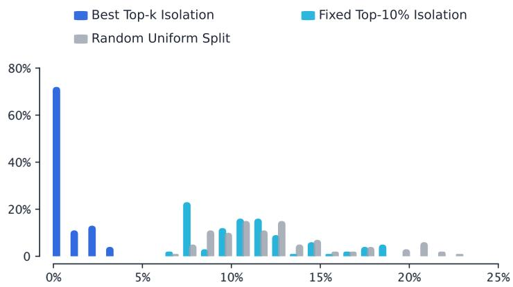  
Figure A.1 | Optimality-gap distributions across 100 rollout groups.

## A.5. Tail-Strength Workload Construction

To vary tail strength without changing request identity or ordering, we derive the weak- and strong-tail workloads from the same measured response-length trace used by the real workload. Let � and $P _ { 9 0 }$ denote the median and 90th-percentile length of the real trace, respectively. For a target ratio �, we transform only lengths above the median:

$$
L _ { i } ^ { \prime } ( r ) = \left\{ \begin{array} { l l } { { L _ { i } , } } & { { L _ { i } \leq M , } } \\ { { M + s _ { r } ( L _ { i } - M ) , } } & { { L _ { i } > M , } } \end{array} \right. \qquad s _ { r } = \frac { r M - M } { P _ { 9 0 } - M } .
$$

The weak- and strong-tail workloads use $r = 1 . 5$ and $r = 6$ , respectively, while the real workload directly uses the original lengths. Because $s _ { r } > 0 _ { : }$ , the transformation preserves the ordering of requests. It also leaves the lower half and median unchanged and maps the original $P _ { 9 0 }$ to $r M$ , making $P _ { 9 0 } / P _ { 5 0 } = r .$ . Thus, the three workloads difer only in the scale of the upper tail. Table A.3 summarizes their resulting length statistics.

Table A.3 | Construction and length statistics of the weak-, real-, and strong-tail workloads.
<table><tr><td>Scene</td><td>Length construction</td><td> $P _ { 5 0 }$ </td><td> $P _ { 9 0 }$ </td><td> $P _ { 9 0 } / P _ { 5 0 }$ </td><td>Maximum</td></tr><tr><td>Weak Tail</td><td>Compress the upper half</td><td>1,160</td><td>1,740</td><td>1.5</td><td>3,206</td></tr><tr><td>Real Workload</td><td>Original lengths</td><td>1,160</td><td>4,115</td><td>3.547</td><td>11,800</td></tr><tr><td>Strong Tail</td><td>Stretch the upper half</td><td>1,160</td><td>6,960</td><td>6.0</td><td>22,094</td></tr></table>

## B. Long-Tail Prompts across Policy Updates

We analyze whether long-tail behavior is driven primarily by sampling randomness, policy changes, or the prompt. We do not assume that absolute response lengths or the marginal length distribution remain fixed during training. Instead, we ask whether prompt identity remains the dominant source of cross-request length heterogeneity. Let $L _ { i , s , r }$ denote the raw response length for prompt $i ,$ checkpoint $s ,$ and sampling repeat �. We use $I = 6 4$ prompts, � checkpoints, and $R = 8$ samples per prompt and checkpoint, without normalizing the lengths.

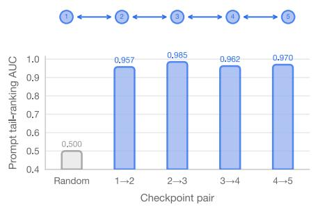

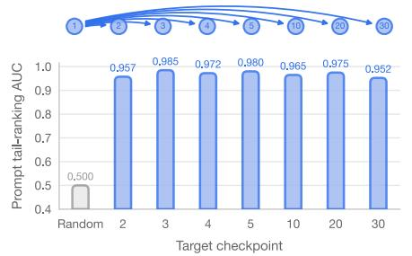

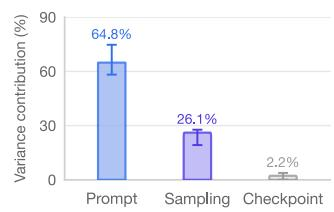  
Figure B.1 | Prompt-tail ranking stability across checkpoints and response-length variance decomposition.

Cross-checkpoint tail ranking. For each prompt and checkpoint, we first average its eight sampled lengths,

$$
\bar { L } _ { i , s } = \frac { 1 } { R } \sum _ { r = 1 } ^ { R } L _ { i , s , r } .
$$

For a source checkpoint $s ,$ we define its tail set $\mathcal { T } _ { s }$ as the $\left\lceil 0 . 1 I \right\rceil = 7$ prompts with the largest $\bar { L _ { i , s } }$ . At a target checkpoint �, we use $\bar { L _ { i , t } }$ as the ranking score and compute

$$
\mathrm { A U C } ( s , t ) = \mathrm { P r } \big ( \bar { L } _ { i , t } > \bar { L } _ { j , t } \mid i \in \mathcal { T } _ { s } , \ j \notin \mathcal { T } _ { s } \big ) .
$$

Figure B.1 reports 0.957–0.985 for adjacent checkpoints and 0.952–0.985 when checkpoint 1 ranks checkpoints through 30, well above the random baseline of 0.5.

Variance contribution. We further apply a two-factor decomposition directly to $L _ { i , s , r }$ :

$$
S S _ { \mathrm { t o t a l } } = S S _ { \mathrm { p r o m p t } } + S S _ { \mathrm { c h e c k p o i n t } } + S S _ { \mathrm { i n t e r a c t i o n } } + S S _ { \mathrm { s a m p l i n g } } .
$$

Using dots to denote averages over the corresponding indices, the main terms are

$$
S S _ { \mathrm { p r o m p t } } = S R \sum _ { i } ( \bar { L } _ { i . . } - \bar { L } _ { . . . } ) ^ { 2 } , \qquad S S _ { \mathrm { c h e c k p o i n t } } = I R \sum _ { s } ( \bar { L } _ { . . s . } - \bar { L } _ { . . . } ) ^ { 2 } ,
$$

and

$$
S S _ { \mathrm { s a m p l i n g } } = \sum _ { i , s , r } ( L _ { i , s , r } - \bar { L _ { i s . } } ) ^ { 2 } ,
$$

with the interaction given by the remaining between-cell variation. Each contribution is normalized as

$$
p _ { f } = \frac { S S _ { f } } { S S _ { \mathrm { t o t a l } } } \times 1 0 0 \% .
$$

Across tracks, prompt identity contributes 64.8% on average, compared with 26.1% from sampling and 2.2% from checkpoints; the remaining 6.9% is prompt–checkpoint interaction.

These results do not imply that sampling randomness has no efect, that the overall response-length distribution is stationary, or that an individual prompt can never move into or out of the tail. Instead, they support the simpler intuition used by TailSieve: long-tail prompts tend to remain long-tailed across adjacent policy updates because diferences between prompts dominate the variation introduced by sampling and the evaluated policy changes. Consequently, TailSieve can use an unfinished prompt group as a noisy cross-round tail signal without requiring the regenerated trajectory to reproduce its previous response length.

## C. Optimality Conditions for Hierarchical Allocation

## C.1. Inner-Loop Completion-Time Balance

We first show the balancing property under a continuous relaxation of the routing problem, where an infinitesimal amount of workload can be shifted between replicas.

Consider two active replicas � and �, with completion times $T _ { a }$ and $T _ { b } .$ . Suppose, for contradiction, that an optimal solution satisfies

$$
T _ { a } > T _ { b } .
$$

Let $\delta = T _ { a } - T _ { b } > 0$ . Under the continuous relaxation, we can shift an infinitesimal amount � of workload from the slower replica � to the faster replica �. Let $c _ { a } > 0$ denote the marginal decrease in $T _ { a } ,$ and let $c _ { b } > 0$ denote the marginal increase in $T _ { b }$ . For suficiently small �, the updated completion times satisfy

$$
T _ { a } ^ { \prime } = T _ { a } - c _ { a } \epsilon + o ( \epsilon ) ,
$$

and

$$
T _ { b } ^ { \prime } = T _ { b } + c _ { b } \epsilon + o ( \epsilon ) .
$$

Since $T _ { b } < T _ { a . }$ , we can choose � small enough such that

$$
T _ { b } ^ { \prime } < T _ { a } .
$$

At the same time,

$$
T _ { a } ^ { \prime } < T _ { a } .
$$

Therefore,

$$
\mathrm { m a x } \{ T _ { a } ^ { \prime } , T _ { b } ^ { \prime } \} < T _ { a } = \mathrm { m a x } \{ T _ { a } , T _ { b } \} ,
$$

which contradicts the optimality of the original solution. Thus, in the continuous relaxation, an optimal min-max routing solution equalizes the completion times of all active replicas.

In the discrete routing problem, requests are indivisible, so exact equality of replica completion times is not always guaranteed. Instead, the optimal solution is balanced up to the granularity of movable requests. Let � denote the set of requests assigned to replica �, and let

$$
M = \operatorname* { m a x } _ { r } T _ { r } ( S _ { r } )
$$

be the makespan of a discrete assignment. For any bottleneck replica � with $T _ { a } ( S _ { a } ) = M$ , if there exists a request $q \in S _ { a }$ and another replica � such that moving � from � to � yields

$$
{ \cal T } _ { a } ( S _ { a } \setminus \{ q \} ) < M
$$

and

$$
T _ { b } ( S _ { b } \cup \{ q \} ) < M ,
$$

while all other replicas remain below �, then the new assignment has a strictly smaller makespan. This contradicts the optimality of the original assignment. Therefore, a discrete optimal assignment may not make all replicas finish exactly at the same time, but it admits no workload reassignment that can further reduce the maximum completion time.

Discrete update. To avoid reacting aggressively to noisy step-time measurements, TailSieve adjusts $q _ { t }$ using a damped momentum update toward $q _ { t + 1 } ^ { * }$ . The maximum change in each adjustment is bounded, and an update is applied only when the predicted makespan improvement is suficiently large. After $q _ { t }$ changes, TailSieve holds the new value until the cross-round transition has settled—one step after an increase and two steps after a decrease—before making another decision. This prevents overlapping transitions and frequent oscillation.

The balancing condition also explains the responses observed in the oracle routing result. The oracle does not balance the number of requests across replicas; instead, it assigns a small amount of additional workload to the faster tail replica whenever doing so reduces the bottleneck completion time without making the tail replica the new bottleneck.

## C.2. Outer-Loop Marginal-Capacity Balance

Continuous condition. Let $p$ be the fraction of routing units assigned to the tail pool and � the fraction of replicas serving it. Define

$$
A ( p , \alpha ) = T ^ { \mathrm { t a i l } } ( p , \alpha ) , \qquad B ( p , \alpha ) = T ^ { \mathrm { b u l k } } ( p , \alpha ) .
$$

Locally, moving more trafic to the tail pool makes it slower and the bulk pool faster, whereas moving more replicas to the tail pool has the opposite efect:

$$
A _ { p } > 0 , \qquad B _ { p } < 0 , \qquad A _ { \alpha } < 0 , \qquad B _ { \alpha } > 0 .
$$

For a fixed $\alpha ,$ the inner-loop equilibrium $p ^ { * } ( \alpha )$ satisfies

$$
A ( p ^ { * } ( \alpha ) , \alpha ) - B ( p ^ { * } ( \alpha ) , \alpha ) = 0 .
$$

Implicit diferentiation gives

$$
\frac { d p ^ { * } } { d \alpha } = - \frac { A _ { \alpha } - B _ { \alpha } } { A _ { p } - B _ { p } } .
$$

The balanced completion time seen by the outer loop is

$$
\Phi ( \alpha ) = A ( p ^ { * } ( \alpha ) , \alpha ) = B ( p ^ { * } ( \alpha ) , \alpha ) .
$$

Therefore,

$$
\frac { d \Phi } { d \alpha } = A _ { \alpha } + A _ { p } \frac { d p ^ { * } } { d \alpha } = \frac { A _ { p } B _ { \alpha } - A _ { \alpha } B _ { p } } { A _ { p } - B _ { p } } .
$$

At an interior stationary point, �Φ $/ d \alpha = 0 ;$ and hence

$$
A _ { p } B _ { \alpha } = A _ { \alpha } B _ { p } , \qquad \mathrm { o r ~ e q u i v a l e n t l y } \qquad { \frac { - A _ { \alpha } } { A _ { p } } } = { \frac { B _ { \alpha } } { - B _ { p } } } .
$$

The left ratio is the additional tail trafic that can be absorbed per incremental increase in tail capacity without changing the tail completion time. The right ratio is the trafic that must leave the bulk pool under the corresponding capacity loss. Their equality is the marginal-capacity balance condition.

To express the condition as a replica fraction, define the per-replica concurrencies

$$
b _ { \mathrm { t a i l } } = { \frac { N p } { R \alpha } } , \qquad b _ { \mathrm { b u l k } } = { \frac { N ( 1 - p ) } { R ( 1 - \alpha ) } } ,
$$

the local completion-time elasticities

$$
\gamma _ { \mathrm { t a i l } } = \frac { \partial \ln { A } } { \partial \ln { b _ { \mathrm { t a i l } } } } , \qquad \gamma _ { \mathrm { b u l k } } = \frac { \partial \ln { B } } { \partial \ln { b _ { \mathrm { b u l k } } } } ,
$$

and the marginal cutof pressures

$$
\lambda _ { \mathrm { t a i l } } = { \frac { \partial \ln A } { \partial p } } , \qquad \lambda _ { \mathrm { b u l k } } = - { \frac { \partial \ln B } { \partial p } } .
$$

At the inner-loop equilibrium, where $A = B ,$ , these definitions imply

$$
A _ { p } = A \lambda _ { \mathrm { t a i l } } , \qquad B _ { p } = - B \lambda _ { \mathrm { b u l k } } ,
$$

and

$$
A _ { \alpha } = - \frac { A \gamma _ { \mathrm { t a i l } } } { \alpha } , \qquad B _ { \alpha } = \frac { B \gamma _ { \mathrm { b u l k } } } { 1 - \alpha } .
$$

Substitution into the marginal-capacity condition yields

$$
\alpha \lambda _ { \mathrm { t a i l } } \gamma _ { \mathrm { b u l k } } = ( 1 - \alpha ) \gamma _ { \mathrm { t a i l } } \lambda _ { \mathrm { b u l k } } ,
$$

and therefore

$$
\alpha ^ { * } = \frac { \gamma _ { \mathrm { t a i l } } \lambda _ { \mathrm { b u l k } } } { \gamma _ { \mathrm { t a i l } } \lambda _ { \mathrm { b u l k } } + \gamma _ { \mathrm { b u l k } } \lambda _ { \mathrm { t a i l } } } .
$$

For a homogeneous workload, the two pools have the same local elasticity and difer only through their per-replica routing-unit counts. In that limit, $\lambda _ { \mathrm { t a i l } } \simeq \gamma / p$ and $\lambda _ { \mathrm { b u l k } } \simeq \gamma / ( 1 - p )$ , so the expression reduces to $\alpha ^ { * } = p .$ . The two pools then have equal per-replica loads and are operationally equivalent to uniform routing.

Discrete controller. The outer loop runs only after the inner loop has settled at $q _ { t } .$ . For each candidate replica count �, the predicted group-work distribution and the measured concurrency–throughput curve determine

$$
\widehat { T } _ { t } ( q _ { t } , m ) = \operatorname * { m a x } \left\{ \widehat { T } _ { t } ^ { \mathrm { t a i l } } ( q _ { t } , m ) , \widehat { T } _ { t } ^ { \mathrm { b u l k } } \big ( N - q _ { t } , R - m \big ) \right\} .
$$

The prediction is evaluated directly on integral group and replica counts. This matters because batching thresholds and the measured serving curve can make the objective non-unimodal, so a derivative or a closedform replica ratio need not identify the best nearby allocation.

The controller searches all valid splits within radius two of the current allocation,

$$
\mathcal { M } _ { t } = \left\{ m : 1 \leq m < R , \ \left| m - m _ { t } \right| \leq 2 \right\} ,
$$

and separately includes the uniform boundary configuration $( 0 , 0 )$ . Let $\mathcal { F } _ { t } \subseteq { M } _ { t }$ be the subset that passes the local feasibility test described below, and define

$$
C _ { t } = \{ ( q _ { t } , m ) : m \in \mathcal { F } _ { t } \} \cup \{ ( 0 , 0 ) \} .
$$

The model-predictive target is

$$
( \widetilde { q } _ { t } , m _ { t } ^ { \star } ) \in \arg \operatorname* { m i n } _ { ( q , m ) \in C _ { t } } \widehat { T } _ { t } ( q , m ) .
$$

Only the first unit move toward this target is applied:

$$
m _ { t + 1 } = m _ { t } + \mathrm { c l i p } ( m _ { t } ^ { \star } - m _ { t } , - 1 , 1 ) .
$$

The inner loop then rebalances $q$ under the new split before the outer loop is invoked again. This recedinghorizon update explores nearby non-monotone allocations while limiting each decision to one physical replica.

Deadline feasibility. Consider increasing the tail allocation from $m _ { t }$ to a candidate $m > m _ { t }$ . At the current predicted barrier deadline, let $G _ { \mathrm { t a i l } } ( m )$ be the additional number of groups that the enlarged tail pool can finish, and let $D _ { \mathrm { b u l k } } ( m )$ be the number of groups that the reduced bulk pool can no longer finish. The candidate is locally feasible only if

$$
G _ { \mathrm { t a i l } } ( m ) \geq D _ { \mathrm { b u l k } } ( m ) .
$$

For $m < m _ { t } ,$ the same test is applied with the two pools exchanged. This condition excludes replica transfers whose gained capacity cannot absorb the work displaced from the pool that loses a replica.

Feasibility guarantee. Under the predicted serving model, the test above is suficient to preserve the current barrier deadline. The pool that loses a replica retains every group it can still complete by the deadline and releases the remaining $D _ { \mathrm { b u l k } }$ groups. The enlarged tail pool has $G _ { \mathrm { t a i l } }$ additional group slots by the same deadline. Because $G _ { \mathrm { t a i l } } \geq D _ { \mathrm { b u l k } }$ , all released groups can be reassigned without extending the barrier. The reverse transfer follows by exchanging the pool labels.

The current split remains a candidate, so the outer loop can leave the allocation unchanged. The uniform boundary is selected when its predicted makespan is no larger than that of any feasible split; hence $( q , m ) = ( 0 , 0 )$ follows from the same joint allocation objective.

## D. Exact Makespan and Tail-Side Proxy

For a routing policy $p \in$ {base, tail}, let $S _ { r } ^ { p }$ denote the set of requests assigned to replica $r .$ The active batch size at decoding position � is

$$
b _ { r } ^ { p } ( x ) = \sum _ { i \in S _ { r } ^ { p } } { \mathbf { 1 } } \{ L _ { i } \geq x \} .
$$

Under the all-admit decoding model, the completion time of replica $r$ is

$$
T _ { r } ^ { p } = \sum _ { x = 1 } ^ { L _ { r , \mathrm { m a x } } ^ { p } } \tau \bigl ( b _ { r } ^ { p } ( x ) \bigr ) , \qquad L _ { r , \mathrm { m a x } } ^ { p } = \operatorname* { m a x } _ { i \in S _ { r } ^ { p } } L _ { i } .
$$

Equivalently, the same wall-clock time can be distributed evenly among the requests active at each decoding position:

$$
T _ { r } ^ { p } = \sum _ { i \in S _ { r } ^ { p } } \sum _ { x = 1 } ^ { L _ { i } } \frac { \tau \big ( b _ { r } ^ { p } ( x ) \big ) } { b _ { r } ^ { p } ( x ) } .
$$

To see the equivalence, note that exactly $b _ { r } ^ { p } ( x )$ requests are active at position �. Therefore,

$$
\sum _ { i \in S _ { r } ^ { p } } \mathbf { 1 } \{ L _ { i } \geq x \} \frac { \tau \big ( b _ { r } ^ { p } ( x ) \big ) } { b _ { r } ^ { p } ( x ) } = \tau \big ( b _ { r } ^ { p } ( x ) \big ) .
$$

Thus, the factor $1 / b _ { r } ^ { p } ( x )$ prevents the same concurrent wall-clock interval from being counted once for every active request.

The exact rollout-step makespan is determined by the slowest replica:

$$
T _ { \mathrm { s t e p } } ^ { p } = \operatorname* { m a x } _ { r } T _ { r } ^ { p } ,
$$

and the exact gain of tail routing is

$$
\Delta T _ { \mathrm { s t e p } } ( q , m ) = T _ { \mathrm { s t e p } } ^ { \mathrm { b a s e } } - T _ { \mathrm { s t e p } } ^ { \mathrm { t a i l } } ( q , m ) .
$$

For request $i ,$ let $b _ { i } ^ { p } ( x )$ denote the active batch size of the replica serving it under policy �; under tail routing, this batch size depends on $( q , m )$ . In the main text, we use the tail-side proxy

$$
\widetilde { \Delta T } _ { \mathrm { t a i l } } ( q , m ) = \sum _ { i \in { \mathcal T } _ { q } } \sum _ { x = 1 } ^ { L _ { i } } \Big [ \tau \Big ( b _ { i } ^ { \mathrm { b a s e } } ( x ) \Big ) - \tau \Big ( b _ { i } ^ { \mathrm { t a i l } } ( x ; q , m ) \Big ) \Big ] .
$$

Unlike the exact per-request decomposition above, this proxy does not divide each shared decoding interval by the number of active requests. It therefore measures aggregate concurrency exposure over the isolated tail set rather than exact wall-clock time. Moreover, the exact rollout-step objective takes the maximum completion time across all replicas, whereas the proxy only describes the isolated tail requests.

We use this proxy only to interpret the early low-concurrency advantage and the late tail-concentration penalty. All oracle values and reported speedups are computed using the exact replica-level makespan or measured end-to-end execution time.

Figure D.1 illustrates four representative regimes. Routing gains weaken when the tail workload is too small, the tail route becomes overloaded, or isolation loses its low-concurrency advantage.

## D.1. Transition to Uniform Routing during RL Training

In the Qwen3.5-2B run, the joint controller selects the uniform-routing boundary after step 8 and keeps MTP enabled. To isolate the contribution of routing before this transition, we compare TailSieve with MTP against an All-MTP baseline that uses MTP under uniform routing over steps 1–8.

## E. Analysis of Routing-Induced Length Bias

We distinguish natural policy-induced distribution drift from bias introduced by routing. The marginal responselength distribution may change as the policy evolves; our question is whether the cross-round routing pipeline shifts the distribution relative to generation under the same current policy and prompt stream. We first analyze an idealized stationary setting with a fixed policy, which isolates the efect of request composition. Let

$$
X _ { t } = \{ X _ { t , 1 } , \ldots , X _ { t , N } \}
$$

be a fresh pool of � requests with prompt distribution $P _ { X }$ . We require consecutive pools to have the same marginal law, $\chi _ { t } \overset { d } { = } \chi _ { t ^ { \prime } }$ , but do not require them to be independent across steps. Thus, the result also covers, for

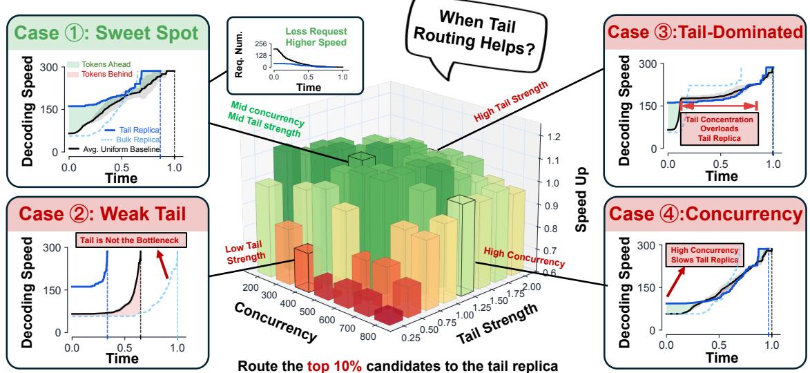  
Figure D.1 | Gain regimes for fixed top-10% isolation under a fixed replica split.

example, a stationary ordered or without-replacement prompt stream. For a fixed policy �, let $Y ( X ; \pi , \xi )$ denote the response generated from request � with fresh sampling randomness $\xi ,$ and let $L ( Y )$ denote its length. For any measurable length interval �, define the prompt-conditional probability

$$
p _ { A } ( X ) = \operatorname* { P r } _ { \xi } [ L ( Y ( X ; \pi , \xi ) ) \in A \mid X ]
$$

and the population response-length distribution

$$
P _ { \pi } ( A ) = \mathbb { E } _ { X \sim P _ { X } } [ p _ { A } ( X ) ] .
$$

For a stable allocation, let $n ^ { \mathrm { t a i l } } + n ^ { \mathrm { b u l k } } = N$ . We idealize the tail selector as prompt-conditioned: applying the same selection rule to each pool partitions it into

$$
X _ { t } = { \mathcal { T } } _ { n ^ { \operatorname { t a i l } } } ( X _ { t } ) \uplus { \mathcal { F } } _ { n ^ { \operatorname { b u l k } } } ( X _ { t } ) ,
$$

where the two sets contain $n ^ { \mathrm { t a i l } }$ and $n ^ { \mathrm { b u l k } }$ requests, respectively. The selector need not identify the true longest requests; it only needs to depend on the prompt associated with each request and remain unchanged across identically distributed pools. This idealization captures the intuition that long-tail prompts tend to remain long-tailed, while separating that prompt-level signal from trajectory-level sampling noise.

Let $\mathcal { G } _ { \pi } ( S )$ denote independent generation under � for every request in S. For a request set S, define its expected number of responses in � as

$$
C _ { A } ( S ) = \sum _ { X \in S } p _ { A } ( X ) .
$$

For a generated update batch $\mathcal { B } _ { t }$ , define

$$
\widehat { P } _ { \mathcal { B } _ { t } } ( A ) = \frac { 1 } { N } \sum _ { Y \in \mathcal { B } _ { t } } \mathbf { 1 } \{ L ( Y ) \in A \} .
$$

Unless stated otherwise, expectations below are joint over the request pool, fresh generation randomness, and any prompt-conditioned randomness used by the selector. The equality is therefore a population statement: a realized finite batch can deviate from it through sampling variance.

For a fixed-size prompt group, the same result follows by applying this argument to each response in the group and averaging over the group. TailSieve always routes and regenerates the complete group together.

Stable allocation. When the two allocations remain fixed, the tail route regenerates the selected requests from the preceding pool, while the bulk route generates the complementary requests from the current pool. The update batch is therefore

$$
\begin{array} { r } { \mathcal { B } _ { t } = \mathcal { G } _ { \pi } \left( \mathcal { T } _ { n ^ { \mathrm { t a i l } } } ( X _ { t - 1 } ) \right) \uplus \mathcal { G } _ { \pi } \left( \mathcal { F } _ { n ^ { \mathrm { b u l k } } } ( X _ { t } ) \right) . } \end{array}
$$

Since $\chi _ { t - 1 }$ and $X _ { t }$ are identically distributed and use the same prompt-conditioned selector,

$$
\begin{array} { r l } { \displaystyle \mathbb E \left[ \widehat { P } _ { \mathcal B _ { t } } ( A ) \right] = \frac 1 N \mathbb E \left[ C _ { A } \big ( \mathcal T _ { n ^ { \mathrm { t a l } } } ( \mathcal X _ { t - 1 } ) \big ) + C _ { A } \big ( \mathcal F _ { n ^ { \mathrm { b u l k } } } ( \boldsymbol X _ { t } ) \big ) \right] } & { } \\ { = \frac 1 N \mathbb E \left[ C _ { A } \big ( \mathcal T _ { n ^ { \mathrm { t a l } } } ( \boldsymbol X _ { t } ) \big ) + C _ { A } \big ( \mathcal F _ { n ^ { \mathrm { b u l k } } } ( \boldsymbol X _ { t } ) \big ) \right] } & { } \\ { = \frac 1 N \mathbb E \left[ C _ { A } ( \boldsymbol X _ { t } ) \right] = P _ { \boldsymbol \pi } ( A ) . } \end{array}
$$

Thus, repeated generations of the same prompt or prompt group need not have identical lengths. Under the stated fixed-policy idealization, fresh regeneration and cross-round recombination do not introduce routinginduced length bias: $\widehat { P } _ { \mathcal { B } _ { t } } ( A )$ is an unbiased estimator of the same-policy population $P _ { \pi } ( A )$ for every measurable interval $A .$ This comparison is against generation under the same policy; it does not assert that the population distribution remains unchanged across policy updates.

Increasing the tail allocation. Suppose the load balancer increases the tail allocation by $\Delta > 0 \mathrm { : }$

$$
n ^ { \mathrm { t a i l } , + } = n ^ { \mathrm { t a i l } } + \Delta , \qquad n ^ { \mathrm { b u l k , + } } = N - n ^ { \mathrm { t a i l } , + } .
$$

The new allocations are applied when partitioning $X _ { t } .$ . After one pipeline step, the update batch takes the canonical request-composition form

$$
\begin{array} { r } { \mathcal { B } _ { t + 1 } = \mathcal { G } _ { \pi } \left( \mathcal { T } _ { n ^ { \mathrm { t a i l } , + } } ( \boldsymbol { \chi } _ { t } ) \right) \uplus \mathcal { G } _ { \pi } \left( \mathcal { F } _ { n ^ { \mathrm { b u l k } , + } } ( \boldsymbol { \chi } _ { t + 1 } ) \right) . } \end{array}
$$

Applying the stable-allocation argument gives

$$
\boxed { \mathbb { E } \left[ \widehat { P } _ { \mathcal { B } _ { t + 1 } } ( A ) \right] = P _ { \pi } ( A ) } .
$$

Provided that no new allocation change is applied during settlement, the canonical prompt composition is restored one step after increasing the tail allocation, eliminating the routing-induced deviation in this idealized setting.

Decreasing the tail allocation. Suppose the load balancer decreases the tail allocation by $\Delta > 0 \mathrm { : }$

$$
n ^ { \mathrm { t a i l } , - } = n ^ { \mathrm { t a i l } } - \Delta , \qquad n ^ { \mathrm { b u l k , - } } = N - n ^ { \mathrm { t a i l } , - } .
$$

At the time of this decision, the existing tail-request pool was constructed using the previous tail allocation $n ^ { \mathrm { t a i l } }$ and therefore contains Δ more requests than the new tail replica requires. Assuming a nested selector, the old tail set can be decomposed as

$$
\mathcal { T } _ { n ^ { \mathrm { t a i l } } } ( X _ { t } ) = \mathcal { T } _ { n ^ { \mathrm { t a i l } , - } } ( X _ { t } ) \uplus \mathcal { E } _ { \Delta } ( X _ { t } ) ,
$$

where $\mathcal { E } _ { \Delta }$ contains the Δ residual requests.

Since TailSieve does not drop requests, these residual requests must first be drained or reassigned to the bulk replica. Consequently, the first transition batch after the allocation reduction does not yet have the canonical new-allocation request composition

$$
{ \mathcal { T } } _ { n ^ { \operatorname { t a i l } , - } } ( X ) \not  { \mathcal { F } } _ { n ^ { \operatorname { b u l k } , - } } ( X ^ { \prime } ) .
$$

During this transition step, however, the next fresh pool $\chi _ { t + 1 }$ is partitioned using the new allocations, producing

$$
\mathcal { T } _ { n ^ { \mathrm { t a i l } , - } } ( X _ { t + 1 } ) .
$$

After the residual requests have been drained, the following update batch is

$$
\begin{array} { r } { \mathcal { B } _ { t + 2 } = \mathcal { G } _ { \pi } \left( \mathcal { T } _ { n ^ { \mathrm { t a i l } , - } } \left( \boldsymbol { X } _ { t + 1 } \right) \right) \uplus \mathcal { G } _ { \pi } \left( \mathcal { F } _ { n ^ { \mathrm { b u l k } , - } } \left( \boldsymbol { X } _ { t + 2 } \right) \right) . } \end{array}
$$

Applying the same argument gives

$$
\boxed { \mathbb { E } \left[ \widehat { P } _ { \mathcal { B } _ { t + 2 } } ( A ) \right] = P _ { \pi } ( A ) } \mathrm { . }
$$

Provided that no new allocation change is applied during settlement, the canonical prompt composition is restored two steps after decreasing the tail allocation, eliminating the routing-induced deviation in this idealized setting.

Fresh sampling and evolving policies. The exact result above uses a stationary policy and a selector that is a function of the prompt. In practice, the marginal target $P _ { \pi _ { t } }$ may change from one policy snapshot to the next, and the partial-rollout selector also depends on a sampled trajectory. The relevant quantity is therefore the deviation of the routed batch from the current-policy target $P _ { \pi _ { t } } ,$ , rather than its diference from the preceding step’s distribution. Write $Y _ { t } = Y ( X ; \pi _ { t } , \xi _ { t } )$ for the response generated from request � under $\pi _ { t } .$ . Let $Z _ { t } \in \{ 0 , 1 \}$ indicate whether request � is selected as a tail candidate at step �, and define

$$
s _ { t } ( X ) = \mathbb { E } [ Z _ { t } \mid X ] , \qquad p _ { t , A } ( X ) = \operatorname* { P r } [ L ( Y _ { t } ) \in A \mid X ] .
$$

Two quantities characterize the deviation from the ideal model:

$$
\epsilon _ { t } = \mathbb { E } _ { X } [ | s _ { t } ( X ) - s _ { t - 1 } ( X ) | ]
$$

measures cross-policy selector drift, while

$$
\eta _ { t } ( A ) = \mathbb { E } _ { X } [ | \mathbf { C o v } ( Z _ { t } , \mathbf { 1 } \{ L ( Y _ { t } ) \in A \} \mid X ) | ]
$$

measures residual trajectory dependence after conditioning on the prompt. For a stable allocation, conditional independence between the regenerated tail response and the preceding selection gives

$$
\begin{array} { r l } & { \mathbb { E } \big [ \widehat { P } _ { \mathcal { B } _ { t } } ( A ) \big ] - P _ { \pi _ { t } } ( A ) = \mathbb { E } _ { X } \big [ p _ { t , A } ( X ) \big ( s _ { t - 1 } ( X ) - s _ { t } ( X ) \big ) \big ] } \\ & { \qquad - \mathbb { E } _ { X } [ \mathrm { C o v } ( Z _ { t } , { \mathbf 1 } \{ L ( Y _ { t } ) \in A \} \mid X ) ] . } \end{array}
$$

The triangle inequality then yields

$$
\left| \mathbb { E } \left[ \widehat { P } _ { \mathcal { B } _ { t } } ( A ) \right] - P _ { \pi _ { t } } ( A ) \right| \leq \epsilon _ { t } + \eta _ { t } ( A ) .
$$

The measurements in Appendix B support the prompt-dominance assumption underlying this approximation: changing the prompt produces substantially more length variation than moving between adjacent policy snapshots, while within-prompt variation remains similar across those snapshots. We evaluate the resulting routing-induced length shift relative to uniform routing under matched policies and prompt streams.

Summary. The analysis distinguishes three regimes. A stationary policy with a prompt-conditioned selector introduces no routing-induced bias in expectation. A stable allocation with policy or selector drift gives the approximation bound above relative to the current-policy target. An allocation change creates a finite composition transition, during which neither equality is claimed. For every measurable length interval �, the exact fixed-policy special case is

$$
\left\{ \begin{array} { l l } { \mathbb { E } [ \widehat { P } _ { \mathcal { B } _ { t } } ( A ) ] = P _ { \pi } ( A ) , } & { \mathrm { u n d e r ~ s t a b l e ~ a l l o c a t i o n s } , } \\ { \mathbb { E } [ \widehat { P } _ { \mathcal { B } _ { t + 1 } } ( A ) ] = P _ { \pi } ( A ) , } & { \mathrm { o n e ~ s t e p ~ a f t e r ~ i n c r e a s i n g ~ t h e ~ t a i l ~ a l l o c a t i o n } , } \\ { \mathbb { E } [ \widehat { P } _ { \mathcal { B } _ { t + 2 } } ( A ) ] = P _ { \pi } ( A ) , } & { \mathrm { t w o ~ s t e p s ~ a f t e r ~ d e c r e a s i n g ~ t h e ~ t a i l ~ a l l o c a t i o n } . } \end{array} \right.
$$

These equalities compare each routed batch with generation under the same fixed policy and do not require $P _ { \pi _ { t } } = P _ { \pi _ { t + 1 } }$ . The overall response-length distribution may therefore evolve during training. Allocation adjustment may create a short composition transition, but once the allocation stabilizes, tail and bulk prompts are again interleaved in every update batch rather than being dropped or accumulated into separate long rounds. The practical claim is consequently the absence of an additional systematic routing-induced length bias, not temporal invariance of the marginal response-length distribution.

## F. Detailed Related Work

Tail latency and straggler mitigation. Tail latency is a longstanding concern in distributed systems because a small number of slow tasks can determine end-to-end completion time (Dean & Barroso, 2013). Classical mitigations use hedged execution or task cloning to mask stragglers with redundant work (Ananthanarayanan et al., 2013). Long generations in synchronous LLM RL are instead workload-level stragglers: their useful responses must eventually be collected rather than raced against identical copies. TailSieve therefore reshapes request placement and replica capacity instead of relying on full-rollout duplication.

Long-tail rollout execution in LLM RL. Existing RL systems address rollout imbalance by relaxing or reorganizing synchronization. AReaL decouples rollout generation from training (Fu et al., 2025); Kimi k1.5 reuses trajectory segments (Kimi Team, 2025); and APRIL and CoPRIS overprovision rollouts and carry unfinished work across steps (Zhou et al., 2025; Qu et al., 2025). RollPacker preserves synchronous training but consolidates predicted tails into tail-heavy rounds (Gao et al., 2026). In contrast, TailSieve uses cutof status only as a tail signal, regenerates every consumed response under the current policy, and preserves mixed tail–bulk updates while reducing each rollout barrier.

Length-aware routing and adaptive capacity allocation. Length-aware serving schedulers estimate completion lengths using proxy models, predictive distributions, or entropy-guided representations (Qiu et al., 2024; Zheng et al., 2026; Xie et al., 2026). For RL rollouts, StreamRL learns a length ranker for skew-aware dispatch (Zhong et al., 2026), while Seer exploits within-prompt response similarity through online context learning and divided rollout (Qin et al., 2026). These systems focus on request ordering, assignment, or divided execution. TailSieve instead treats the isolated workload � and tail-pool replica count � as a joint control problem, using partial-rollout observations, response-work history, and measured concurrency–throughput behavior without requiring exact length predictions.

Speculative decoding and draft models. Speculative decoding accelerates autoregressive generation by using a cheap proposal mechanism and then verifying the proposed tokens with the target model (Leviathan et al., 2023; Chen et al., 2023). Early formulations use an independent smaller draft model, while later work improves candidate quality through blockwise prediction, tree verification, and feature-level drafting (Stern et al., 2018; Miao et al., 2024; Li et al., 2024a,b, 2025). Self-speculative decoding, where the target model reuses its own intermediate layers for drafting and verification, eliminating the need for a separate draft model; this direction was initiated by Draft & Verify and later extended to on-the-fly and dynamically optimized variants such as SWIFT and KNN-SSD (Zhang et al., 2024a; Xia et al., 2025; Song et al., 2026). Medusa-style methods attach auxiliary decoding heads to the target model and generate multiple future-token proposals in parallel (Cai et al., 2024). EAGLE-style methods instead reuse target hidden features and construct a draft tree, ofering a strong practical baseline for lossless LLM acceleration (Li et al., 2024a,b, 2025).

Dynamic tree construction and adaptive speculation. Tree-based speculative decoding increases the chance of accepting multiple tokens by verifying multiple candidate paths in one target forward (Miao et al., 2024). Static tree methods are easy to deploy but may waste budget on low-confidence branches. Adaptive speculation methods adjust the draft length or tree topology based on confidence, acceptance history, or token probabilities (Mamou et al., 2024; Zhang et al., 2024b; Brown et al., 2024; Hu et al., 2026; Shen et al., 2026a). These methods expose a central trade-of: pruning or early stopping can reduce draft-side overhead, but it may also remove valid continuations and lower MAT. ECHO further studies this issue in high-concurrency settings and formulates elastic budget scheduling across requests (Hu et al., 2026).

Retrieval-based speculative decoding. Retrieval is an attractive proposal source because repeated local patterns can be reused with little draft-model computation. Lookahead decoding, PLD, REST, Token Recycling, LogitSpec, SAMD, and Ouroboros explore diferent retrieval or matching mechanisms for candidate generation (Fu et al., 2024; Saxena, 2023; He et al., 2024; Luo et al., 2025; Liu et al., 2026a; Hu et al., 2025; Zhao et al., 2024a). However, retrieval-only methods often depend on prompt-local overlap, CPU-side structures, sufix automata, or phrase-level matching, which can limit their speedup and make integration with high-throughput tree verification nontrivial.

Parallel and system-level speculative decoding. A separate line of work studies how to overlap or pipeline drafting and verification. Parallel speculative decoding reduces mutual waiting between the draft and target model by adapting draft length or running draft and verification work concurrently (Liu et al., 2025b; Shen et al., 2026c,b). Lookahead-style frameworks also try to break strict next-token dependency by constructing multiple candidate branches without an external draft model (Fu et al., 2024; Zhao et al., 2024b). These methods emphasize pipeline utilization and rollback reduction, while high-concurrency systems focus on the interaction between speculation and batched execution.

Speculative decoding for long context. Long-context generation shifts the bottleneck toward KV-cache trafic and attention memory bandwidth. LongSpec improves long-context lossless speculative decoding through eficient drafting and verification (Yang et al., 2026), while SpecPV studies partial verification for long-context self-speculative decoding (Tan et al., 2025). Other long-context systems explore sparse KV, partial KV, hierarchical speculation, or cache compression to reduce memory pressure.

Block and difusion drafters. Recent work also studies non-autoregressive or block-level drafters that reduce the serial cost of proposal generation. KVShot provides the first systematic study of long-range decay in hidden-state-based speculative drafters, explores KV-cache reuse to improve long-horizon acceptance, and suggests block-wise paradigms as a promising direction (Liu et al., 2026b). DFlash uses a block difusion drafter to generate an entire token block in parallel and achieves strong speedups over autoregressive tree drafting on several tasks (Chen et al., 2026). Nevertheless, block proposals can still sufer from mismatch with target-model autoregressive verification, especially on harder chat or instruction-following data. Retrieval grafting is a natural complement in this setting: confidence can be used to prune unreliable block tokens, and retrieved continuations can fill the released budget with candidates supported by local history.

Multimodal speculative decoding. Speculative decoding for multimodal and vision-language models introduces additional challenges beyond text-only LLMs. The visual prefix can be long, heterogeneous, and expensive to encode, while the acceptance behavior depends on both visual alignment and text continuation quality. Recent surveys and systems identify eficient inference for large vision-language models as an emerging bottleneck (Zhang et al., 2026). SpecVLM (Ji et al., 2025) is the first to explore training-free speculative decoding for Video-LLMs through vision-aware token pruning on the draft side. LVSpec (Ji et al., 2026) further extends this line of work by introducing vision-aware loose verification for Video-LLMs. ParallelVLM extends lossless acceleration to video-LLMs by considering visual-alignment-aware parallel speculative decoding (Kong et al., 2026). These works suggest that future speculative decoding methods must account for modality-specific proposal quality, visual-token compression, and cross-modal cache reuse.