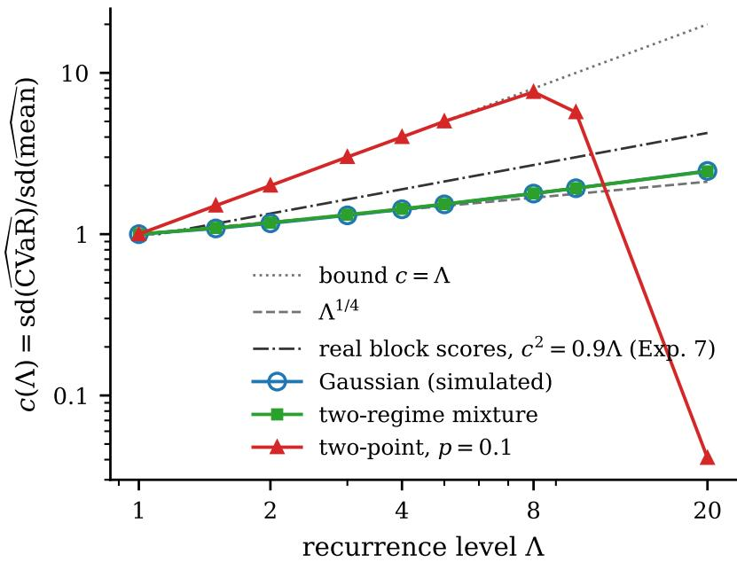
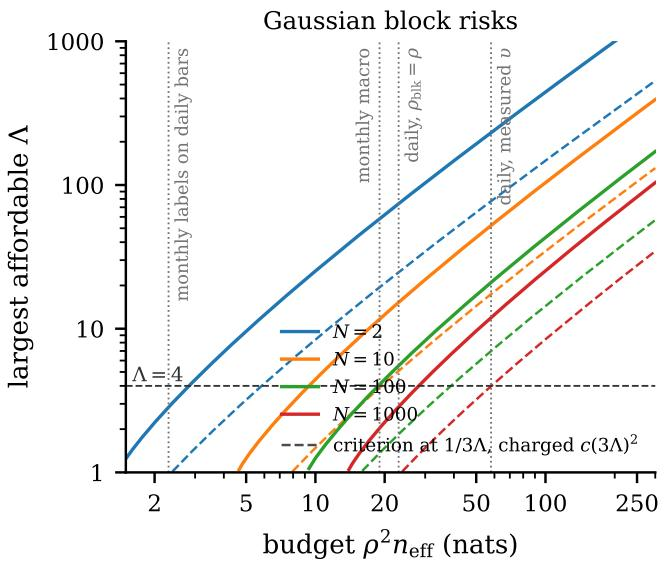
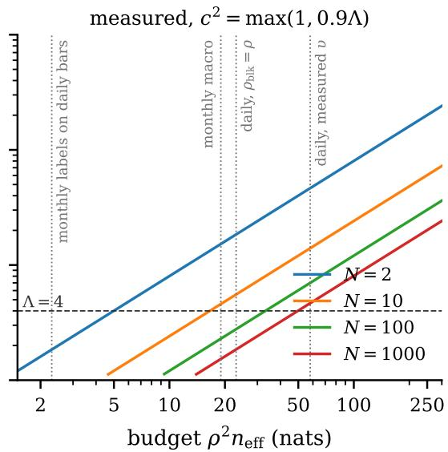
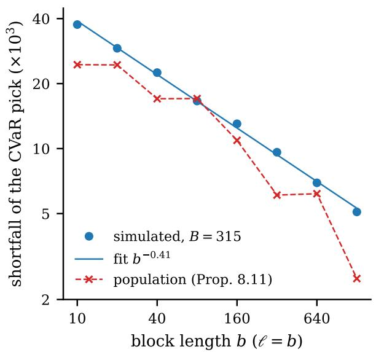
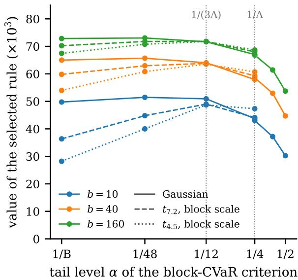
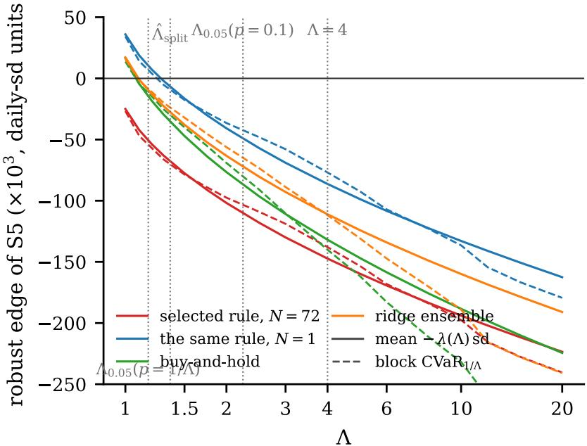

# The Axiomatic Trader: Latent Regularity, Information Budgets, and the Canonical Form of a Quantitative Investment System

Jiayu Li lijiayu2027@outlook.com

August 2026

## Abstract

Systematic trading rests on one article of faith: that regularities found in the past persist. We state it as a time-invariant mechanism driven by an unobserved latent state, and show that it leaves a researcher five constants to declare — the recurrence bound Λ at a block length �, the invariance defect $\varepsilon _ { 0 }$ of the representation it is declared of, the coherence times $\ell _ { i }$ of the state’s coordinates, the signal ceiling � and the fraction � of it contingent on the regime — after which the architecture of a correct quantitative investment system is nearly forced. Without the recurrence bound, every estimator insensitive to one replaced period is driven to the worst rule in its class, and Λ is not estimable from the past. With it, worstcase deployed risk is the conditional value-at-risk at level 1/Λ of regime-conditional risk, so ranking candidates by their backtest mean is correct if and only if Λ = 1 — only when the future is assumed to revisit every stretch of history exactly as often as it occurred; any allowance for regime change replaces the mean by a tail. Capacity and search draw on one budget of $\rho ^ { 2 } n _ { \mathrm { e f f } }$ nats, $n _ { \mathrm { e f f } }$ the efective sample size of a backtest mean; ranking on the tail divides that budget by a computable $c ( \Lambda ) ^ { 2 } ;$ and the Kelly fraction is capped by the share of the budget already spent. A five-stage canonical form — declared representation, capacity-bounded shrunk ensemble, contiguous purged block evaluation aggregated by $\mathrm { C V a R } _ { 1 / \Lambda } .$ , budgeted deflated search, robust fractional sizing — is proved necessary stage by stage. Experiments on a process implementing the axioms and on real series check the constants, and run the one test that can contradict a declaration outright; read at its own level — which the paper prices as a coherence-time ratio and measures — it contradicts no declaration of a live market’s state. Five falsifiable predictions and a list of what the paper does not establish close the argument.

Keywords: systematic trading, latent state, distributional robustness, conditional value-at-risk, backtest overfitting, efective sample size, minimum description length, Kelly criterion, invariance.

## Contents

1 Introduction .   
1.1 The question   
1.2 The core faith and its precise form .   
1.3 Five declared constants . .   
1.4 Contributions   
2 Related work   
3 The objects .   
3.1 Past and future   
4 The axioms of latent regularity   
4.1 The five axioms   
4.2 Reading them 10   
4.3 Independence and minimality 17   
5 Why the axioms are necessary: an impossibility theorem 18   
6 The selection objective is derived, not chosen 20   
6.1 From block risks to block scores . 21   
6.2 Invariance is priced, not preferred . 23   
6.3 The same belief at another scale . 24   
6.4 The tail on a declared representation 24   
6.5 The declaration at confidence 25   
7 The information budget . . . 26   
7.1 The efective sample . 26   
7.2 Capacity 27   
7.3 Search . . 28   
7.4 One budget . . . 29   
7.5 Cross-section versus timing . 32   
7.6 The representation is inside the account . . 33   
8 The price of robustness . 34   
8.1 The deployed-risk bound 34   
8.2 What the tail costs . . 35   
8.3 Robust training is a block re-weighting . 37   
8.4 The third cost: reading regimes through noisy blocks . . 39   
Sizing: robust Kelly and the half-Kelly fixed point 42   
9.1 Deploy an ensemble, not a fit . 43   
9.2 When the procedure can return a position at all 44   
10 The canonical form . 45   
10.1 The three lemmas that were missing 47   
A Proofs . 52   
11 What the theory is worth against practice . 67   
11.1 What the accumulated practice looks like from here 67   
11.2 Computing the budget: a worksheet . 67   
11.3 What the experiments check . 72   
12 Falsifiability and an empirical programme . 72   
13 Limitations and open problems . . 80   
13.1 Worst-case bounds, and results proved for one chain 80   
13.2 The tail read through noisy blocks . . 81   
13.3 The status of the axiomatisation 82   
13.4 The market side 83   
14 Conclusion . 84   
Bibliography . 85   
B Experiments 90   
B.1 Experiment 1: the selection objective 92   
B.2 Experiment 6: the price of the tail . 93   
B.3 Experiment 5: robust training versus robust selection 96   
B.4 Experiments 2–3: the arithmetic 97   
B.5 Experiment 7: the constants on one real daily series 98   
B.6 Experiment 8: taking the measurement apart . 100   
B.7 Experiment 9: twenty assets, seven block lengths 101   
B.8 Experiment 10: the efective sample, measured . 103   
B.9 Experiment 11: the five stages walked once . 103   
B.10 Experiment 12: what out-of-sample degradation scales with . . 106   
B.11 Experiment 13: the cross-sectional library . 107   
B.12 Experiment 14: the same five stages, where the answer is known . . 108   
B.13 The five predictions: power, and what happened . . 110   
C Notation, and the symbols that are used twice . . 113

## 1 Introduction

## 1.1 The question

Strip a trading system of its engineering and what remains is:

Summarise a regularity from past data; apply it to new data; act on the result.

Every systematic strategy ever run is an instance of that sentence. The discipline around it is a body of accumulated practice — purge the folds, weight by uniqueness, deflate the Sharpe ratio, size the bets, distrust the walk-forward — each well argued, but arriving as a list justified by experience. A practitioner who has implemented them all is entitled to ask: is the list complete, and is it forced?

This paper argues that the answer is largely yes. The claim is not that we can derive the alpha, but that the architecture of a correct system — what the feature map must do, how much capacity is admissible, what selection must optimise, how the backtest must be partitioned, how large a search is permissible, how much robustness is afordable, how big the bets may be — is determined, up to constants, by a short list of numbers describing how badly behaved the unobserved world is allowed to be — a recurrence bound Λ and the scale � it is declared at, an invariance defect $\varepsilon _ { 0 }$ of the representation it is declared of, the coherence times of the state’s coordinates, a signal ceiling �, and the fraction � of that ceiling which is contingent on the regime.

## 1.2 The core faith and its precise form

That sentence presupposes the regularity persists, and the presupposition cannot be proved: it is Hume’s problem, and B. Russell [1] gave it the form every trader eventually meets in person. Russell’s chicken is fed every morning for a hundred days and infers a law of nature; on the hundred and first, the farmer wrings its neck. N. N. Taleb [2] made the image famous in finance.

The usual reading — induction is unreliable, so be humble — is not actionable. Ours is diferent: the chicken’s inference was not wrong, its state space was. Conditional on the latent state “ordinary day”, feeding at dawn is a genuine and stable regularity, and the data supported it. What killed the chicken is that the state “day before Thanksgiving” had positive probability in the future and probability zero in its entire recorded past. The failure is not of induction but of coverage.

That diagnosis is the seed of the paper. Write $Z _ { t }$ for the latent state, $X _ { t }$ for observable features, $Y _ { t }$ for the forward return, and suppose the mechanism $Q ( \mathrm { d } x , \mathrm { d } y \mid z )$ is time-invariant. Then a strategy fitted on the past fails in the future for exactly one reason: the mixture over latent states moved. Bound that movement — the future’s latent mixture has density at most Λ times the past’s — and the design of the system falls out of Λ and two further constants.

## 1.3 Five declared constants

$\Lambda \geq 1$ at a declared scale �, the recurrence bound. How much more often can the deployment period re-run a �-period stretch of history than history ran it? The bound and the scale are one declaration in two parts: the same belief is a diferent number at a diferent �, and Proposition 6.8 is the exchange rate. Λ = 1 is strict stationarity. Λ = 4 says “a regime that occupied 10% of my sample may occupy 40% of the next decade”. $\Lambda = \infty$ is the chicken.

$\varepsilon _ { 0 } \geq 0 .$ , the invariance defect. How far may the mechanism drift within one of the states the representation declares? It is the other half of the same declaration: coarsening a representation lowers Λ and raises $\varepsilon _ { 0 } .$ refining does the reverse, and the two together are what “the same situation as before” means. A defect costs $2 M \varepsilon _ { 0 }$ on every bound (Proposition 4.3), it is not estimable at the level of the state — and it is the one declaration in this list that a researcher’s own sample can contradict outright (Remark 12.2). The test has been run on the three coordinates Experiment 7 declares; read at its own level — priced by Proposition  12.4 as a coherence-time ratio, then measured — it contradicts no declaration of a live market’s state (Experiments 7 and 9), and it leaves a rule the axioms do not supply: a representation may not be chosen for the verdict it returns.

$\ell \geq 1$ , the latent mixing time. How long does a regime persist? It sets the block length on which regimes can be seen at all, and it is paid for by every statistic in proportion to how much of that statistic depends on the regime (Lemma 7.1); overlapping labels enter the same account at full weight. It is declared twice over — as a coherence time in the efective sample, and as a rate at which the observable process decouples — and only the second is a strong assumption; the first is not implied by it, because a regime that is rare and long is invisible to a mixing rate and its duration is what the coherence time is (Example 4.11).

$\rho \in ( 0 , 1 )$ , the signal ceiling. The largest per-period Sharpe ratio any rule can attain against these features; equivalently $\sqrt { R ^ { 2 } }$ of the best conditional-mean forecast. Empirically 0.01 to 0.1 at daily frequency.

$\kappa > 0 _ { ; }$ , the invariance ratio. What fraction of that ceiling the researcher says is contingent on the regime, $\rho _ { \mathrm { b l k } } = \kappa \rho .$ . It is a declaration of stage S1 and not a clause of any axiom (Axiom A5), it is refutable from block-score autocorrelation where Λ is not, and at the declared value it decides whether the procedure can take a position at all (Corollary 9.6). Proposition 4.10 caps what may be declared.

Everything else is a consequence. One further quantity appears in the axioms, the volatility ratio $\chi _ { \sigma } = \bar { \sigma } / \underline { { \sigma } }$ across regimes (Axiom A5); it is estimable and governs only the price of reading regimes through noisy blocks (§8), so we do not count it among the constants a researcher must declare. The following table is the punchline; every entry is proved below.
<table><tr><td rowspan=1 colspan=1>Design question</td><td rowspan=1 colspan=1>Answer</td><td rowspan=1 colspan=1>Source</td></tr><tr><td rowspan=1 colspan=1>What do I optimise in selection?</td><td rowspan=1 colspan=1> $\mathrm { C V a R } _ { 1 / \Lambda }$ of block risks</td><td rowspan=1 colspan=1>Thm. 6.2</td></tr><tr><td rowspan=1 colspan=1>How do I split the backtest?</td><td rowspan=1 colspan=1>contiguous blocks of length  $\geq \ell ,$ purged</td><td rowspan=1 colspan=1>Cor. 6.5, Prop. 6.6</td></tr><tr><td rowspan=1 colspan=1>How complex may my model be?</td><td rowspan=1 colspan=1> $d _ { \mathrm { e f f } } \lesssim \rho ^ { 2 } n / H ,$ H the label overlap</td><td rowspan=1 colspan=1>Thm. 7.2</td></tr><tr><td rowspan=1 colspan=1>How many strategies may I test?</td><td rowspan=1 colspan=1>log $\begin{array} { r } { N \lesssim \frac { 1 } { 2 } \rho ^ { 2 } n _ { \mathrm { e f f } } . } \end{array}$      $n _ { \mathrm { e f f } } = n / ( H +$  $\rho _ { \mathrm { b l k } } ^ { 2 } ( 2 \ell - 1 ) )$ </td><td rowspan=1 colspan=1>Lem. 7.1, Thm. 7.4</td></tr><tr><td rowspan=1 colspan=1>How much invariance do I demand?</td><td rowspan=1 colspan=1>penalty $\lambda ( \Lambda )$ on cross-regime disper-sion</td><td rowspan=1 colspan=1>Thm. 6.7</td></tr><tr><td rowspan=1 colspan=1>What does that robustness cost?</td><td rowspan=1 colspan=1>a factor $c ( \Lambda ^ { \prime } ) ^ { 2 }$ of the search budget,Λ&#x27; the level the criterion is run at</td><td rowspan=1 colspan=1>Prop. 8.3, Rem. 8.12</td></tr><tr><td rowspan=1 colspan=1>How big may my bets be?</td><td rowspan=1 colspan=1>at most the fraction  $1 / ( 1 + \varkappa )$  of $\mathrm { K e l l y , }$ n the budget spent</td><td rowspan=1 colspan=1>Prop. 9.1</td></tr><tr><td rowspan=1 colspan=1>Can I estimate Λ?</td><td rowspan=1 colspan=1>No. It is a premise.</td><td rowspan=1 colspan=1>Thm. 5.1</td></tr></table>

## 1.4 Contributions

1. An axiom system and a representation principle (§3–§4). Read as an existential, invariance is a normalisation — $Z _ { t } = t$ always satisfies it — which is why the axiom is stated of a declared representation and carries a declared defect $\varepsilon _ { 0 } \colon$ the modeller’s task is to draw the boundary between mechanism and state, and the future-risk bound depends on that choice only through $( \Lambda , \varepsilon _ { 0 } , \ell )$

2. An impossibility theorem (Thm. 5.1). Without a recurrence bound, every estimator insensitive to a single replaced period can be driven, with probability at least $1 / | \mathcal { H } | - O ( 1 / n )$ , to the worst rule in its class; with a bound Λ the adversary must hand a visible $1 / \Lambda$ of the past to the opposing mechanism, and the estimators that keep a guarantee are exactly those that notice it. Λ itself is a functional of the future path, not identifiable from the past (Cor. 5.2).

3. A derivation of the selection objective (Thm. 6.2). Worst-case future risk equals the CVaR at level $1 / \Lambda$ of regime-conditional risk, exactly; ranking by average backtest performance is correct if and only if one believes $\Lambda = 1$ , and the two rankings can difer in sign.

4. An information budget unifying capacity and search (Thms. 7.2–7.5): everything the researcher did must fit in $\rho ^ { 2 } n _ { \mathrm { e f f } }$ nats, with the efective sample derived rather than asserted (Lemma 7.1) — the state’s persistence is charged only in proportion to the regime dispersion of what is averaged, the label overlap at full weight — and the budget proved as a PAC-Bayes bound under the axioms, with that charge inside the exponential inequality (Thm. 7.5). The account closes over the last free choice: selecting among a menu of declared representations is itself charged search, at log|Ψ beside log � (Prop. 7.8).

5. The price of robustness (§8). One deployed-risk inequality (Thm.  8.1) combines the CVaR identity, the search term and the mixing residual, one term per stage. Its selection term carries a constant $c ( \Lambda )$ whose asymptotics are the standard limit theory of the empirical expected shortfall [3], [4]; ours is the reading of it as a divisor on the sample available to search (Prop. 8.3). Where � sits inside $c \leq \Lambda$ is a property of the block-risk law — $\Lambda ^ { 1 / 4 }$ for smooth risks, Λ when a rare regime dominates, $c ^ { 2 } \approx 0 . 9 \Lambda$ on real block scores that carry the market (Experiments 7–9 on daily series, Experiment 13 on a long-only cross-section), the last because reading a regime through a noisy block is a convex-order penalty (Prop. 8.11). A budget therefore caps the Λ one can act on (Cor. 8.7), and the cap is not the criterion’s to dodge: a matching information lower bound puts the factor Λ − 1 beneath every selection rule, state-observing ones included (Prop. 10.7).

6. A canonical form (Thm. 10.2): five stages, each proved necessary on a law satisfying the axioms (Props. 10.3, 10.4, 10.5). It fixes two rules practitioners set by taste — the embargo (Prop. 6.6) and the invariance penalty (Thm. 6.7) — bounds fractional Kelly by $f ^ { \star } \leq 1 / ( 1 + \varkappa )$ in the fraction � of the budget spent, so that half Kelly is a saturation ceiling rather than a constant (Cor. 9.2), and adds one rule the field’s practice does not contain: deploy an average over training perturbations, not a single fit (Prop. 9.4). Walked end to end where the answer is known, the five stages open no position in any of 1200 draws on a world with no edge, open one where the edge is large enough and the blocks long enough, and never once open one on a candidate whose edge is exactly zero (Experiment 14). That every good procedure decomposes into these five steps we do not claim (Rem. 10.6).

Section 11.3 indexes the experiments and §12 states five falsifiable predictions, one test that can contradict an axiom rather than a prediction built on the axioms, and a distribution-free instrument for the search term (Prop. 12.1). This is not an empirical asset-pricing paper: we prove statements about procedures, not about markets, and not that the canonical form produces profit — the axioms are premises about the world. Nor, §8 aside, is it a claim of originality for the tools: the CVaR duality is classical [5], [6], the density-ratio bound is Tan’s marginal sensitivity model [7] moved from confounding to time, the mixing machinery is standard [8]. The contribution is the assembly: that these, applied to a latent-state model of markets, determine the architecture.

## 2 Related work

Backtest overfitting. D. H. Bailey and M. López de Prado [9], D. H. Bailey, J. M. Borwein, M. López de Prado, and Q. J. Zhu [10] and C. R. Harvey, Y. Liu, and H. Zhu [11] quantify how easily backtests are overfitted — the deflated Sharpe ratio, the probability of backtest overfitting, the $t > 3$ hurdle — with H. White [12] and P. R. Hansen [13] supplying the data-snooping machinery, and M. López de Prado [14] collects the corresponding practices into the field’s most complete catalogue (§11.1). Theorem 7.4 (i) recovers the scale of those corrections from the axioms and places search efort and model capacity on one budget line — a sentence Experiment 13 makes a measurement: run as prescribed beside the axioms’ haircut on its two libraries, the deflated Sharpe ratio’s deflation and the haircut agree within a factor 0.5–1.3 and every verdict agrees in direction, and what stands between them is the clock the corrections count in months and the tail layer none of them prices (Appendix B). That literature takes the set of trials as fixed; the adaptive case is the subject of adaptive data analysis [15], and Theorem 7.4 (ii) is the bound of D. Russo and J. Zou [16] — selection bias at most the mutual information between the choice and the statistics, extended to generalisation error by [17] — with the paper’s efective sample as its sub-Gaussian scale, charging an adaptive search the information it used in the same nats as the rest of the budget. Ranking candidates on a tail functional has a bandit literature of its own: risk-averse best-arm identification selects among finitely many arms by $\mathrm { C V a R } _ { \alpha }$ [18], with �-correct algorithms and matching sample-complexity lower bounds [19]. Those bounds are stated for independent draws from each arm; §8 charges the same object under the axioms — on the block clock of Lemma 7.1, at the constant $c ( \Lambda )$ paid by the plug-in the selection actually runs (Prop. 8.3), and Proposition 10.7 closes the loop from below: inside the axioms the factor is $\Lambda - 1$ whatever the rule, the state handed to it included.

Complexity in return prediction. S. Gu, B. Kelly, and D. Xiu [20] and S. Giglio, B. Kelly, and D. Xiu [21] document that machine learning helps in the cross-section under heavy regularisation, R. Israel, B. T. Kelly, and T. J. Moskowitz [22] give the sceptical reading that $\ S 7$ makes quantitative, and B. Kelly, S. Malamud, and K. Zhou [23] argue for a virtue of complexity in the manner of [24] and [25]. There is no contradiction: the ceiling (7.3) binds on efective degrees of freedom, not on parameter count, and in a heavily shrunk ridge regression $d _ { \mathrm { e f f } } ( \lambda )$ stays small as the feature count grows.

Robustness and invariance. Selecting a predictor for stability across environments rather than average fit runs through invariant causal prediction [26], invariant risk minimisation [27] and group DRO [28], with distributionally robust optimisation supplying the machinery [29], [30]. Theorem 6.2 says that in a latent-regime market this is not a preference for stability but the exact worst-case future risk. Axiom A3 is the marginal sensitivity model of Z. Tan [7], a descendant of Rosenbaum’s Γ [31]. The stance behind all five declared constants — what cannot be estimated is declared, varied, and reported as a curve rather than a point — is the partial-identification programme of C. F. Manski [32] $\Lambda , \varepsilon _ { 0 }$ and � are its sensitivity parameters here, and the Λ-curve of Remark 12.2 is its report format. Choosing a density-ratio ball over a Wasserstein neighbourhood [33] is structural: a Wasserstein ball moves mass to points no regime generates and its radius is denominated in feature distance, which nobody can elicit, whereas under Axiom A2 only the frequencies with which recognisable situations recur are unknown — a re-weighting of an existing mixture, the one family whose radius is a statement about regimes and whose dual has a closed form; it is the $L ^ { \infty }$ member of �-divergence DRO, the only one whose dual is CVaR, which is why Theorem 6.2 is an identity rather than a bound. It difers from covariate shift [34] in that the shift is in the latent $Z$ and the ratio is unobservable (Corollary 5.2), and from weighted conformal prediction [35], which assumes the same axiom but delivers coverage rather than a ranking or a budget.

Dependent data and the latent state. B. Yu [8] and M. Mohri and A. Rostamizadeh [36] give generalisation bounds under mixing, and V. Kuznetsov and M. Mohri [37] extend them via a discrepancy of which Λ is a structured special case; adversarial online learning [38] is the $\Lambda = \infty$ regime where only relative regret survives, as Theorem 5.1 predicts; between the two sits nonstationary learning under a variation budget [39], an aggregate bound on how much the world may change where Axiom A3 bounds how much of the past it may re-run — a path-length constraint against a density-ratio one, with no latent state to declare. The concentration side of the same programme — exponential bounds for Markov chains [40], [41], [42], [43] and PAC-Bayes under dependence [44], [45], [46], [47] — is where Theorem 7.5 lives, and $\ S 7$ says what it adds: the charge lands on the declared state’s clock, not on the observable series’ memory. On the economics, J. D. Hamilton [48] is the canonical regime-switching model; the filtering tradition built on it estimates the state and then trusts the fitted transition law out of sample, which in the terms used here declares $\Lambda =$ 1 of the fitted chain — the declaration Corollary 5.2 says no fit can license; S. J. Grossman and J. E. Stiglitz [49] explains why $\rho > 0 ; \mathtt { R }$ . D. McLean and J. Pontif [50] document edge decay, the empirical content of Definition 4.7; A. Y. Chen and T. Zimmermann [51] document the factor zoo, the visible consequence of a violated budget. Proposition 7.6 is the fundamental law of active management R. C. Grinold [52] reached from an information constraint, its efective breadth playing the part of the transfer coeficient of [53] and the correlation-adjusted breadth of [54]. Maximising the worst case over a set of priors is I. Gilboa and D. Schmeidler [55], and Theorem 6.2 identifies the prior set a trading researcher is implicitly using.

## 3 The objects

This section fixes what the axioms of $\ S 4$ are about, and asserts nothing: the observable pair, the latent state a modeller declares, and the two occupation measures that carry the whole argument.

Time is discrete, $t \in \mathbb { Z } . \mathrm { O n } \left( \Omega , \mathcal { F } , \mathbb { P } \right)$ we are given an observable feature $X _ { t } \in { \mathcal { X } } ,$ a measurable function of the information available strictly before the decision at �; a label $Y _ { t } \in \mathcal { V } \subseteq \mathbb { R }$ , the realised forward return over the holding period beginning at �; and a latent state $Z _ { t } \in { \mathcal { Z } }$ , never observed, on a standard Borel space. Write $\mathcal { F } _ { t } ^ { \mathrm { { o b s } } } = \sigma ( X _ { s } , Y _ { s - H } : s \leq t )$ for the information a trader actually has at �, where � is the label horizon.

Definition 3.1 (Strategy). A strategy is a measurable map $h : \mathcal { X }  \mathcal { A } \subseteq \mathbb { R }$ , where $h ( x )$ is the signed position taken when the observed feature is �. A loss is a measurable $L : \mathcal { A } \times \mathcal { y }  \mathbb { R }$ . Two families matter: the predictive loss $L ( a , y ) = ( y - a ) ^ { 2 }$ and the economic loss $L ( a , y ) = - \log ( 1 + a y )$ or its mean–variance approximation $\textstyle - a y + { \frac { \gamma } { 2 } } a ^ { 2 } y ^ { 2 }$ . All results below hold for any � bounded on the relevant range, and we write $M : = \parallel L \parallel$ ; boundedness is a real restriction and we return to it in §13. ∞

## 3.1 Past and future

Fix an estimation window $\{ 1 , . . . , n \}$ (“the backtest”) and a deployment window $\{ n + 1 , . . . , n + m \}$ $( ^ { 6 6 } \mathrm { l i v e } ^ { 3 3 } )$ , and define the occupation measures

$$
\bar { \pi } _ { n } : = \frac { 1 } { n } \sum _ { t \leq n } \delta _ { Z _ { t } } , \qquad \bar { \pi } ^ { + } : = \frac { 1 } { m } \sum _ { t > n } \delta _ { Z _ { t } } ,\tag{3.1}
$$

the fraction of each window that the latent path actually spent in each state. They are random — functions of the path — and every statement below is made conditionally on the path.

Remark 3.2 (Occupation, not marginal). One could define $\bar { \pi } _ { n }$ and $\bar { \pi } ^ { + }$ as window averages of the marginal laws $\mathcal { L } ( Z _ { t } )$ . That object makes the recurrence axiom of §4 empty: for a stationary latent chain every marginal is the same, so $\bar { \pi } ^ { + } = \bar { \pi } _ { n }$ and $\Lambda = 1$ identically, whatever the realised decade looks like. What a trader lives through — and what Remark 4.5 asks about — is the realised frequency of each state in one window, which for a chain with persistence ℓ fluctuates around its marginal with only $m / \ell$ efective visits. So $\Lambda$ is a statement about the path, not its law, and a stationary world does not license $\Lambda = 1$ over any finite deployment (Proposition 12.3 computes how far a window can drift).

## 4 The axioms of latent regularity

Five axioms, stated together and in full before any of them is read. Each is an assertion and nothing more; what each one means, what it costs and what it buys is §4.2, and the account of which theorem needs which is $\ S 4 . 3 .$ Four of the five carry a constant the modeller declares — a defect, a bound at a scale, coherence times, a ceiling — and those constants are the whole of the freedom the rest of the paper has.

## 4.1 The five axioms

Axiom A1 (Adaptedness / no anticipation). $X _ { t }$ is $\mathcal { F } _ { t } ^ { \mathrm { { o b s } } }$ -measurable and $Y _ { t }$ is realised after the decision at �. Any estimator is a measurable function of $\{ ( X _ { s } , Y _ { s } ) \} _ { s \leq n }$ and of auxiliary randomness independent of them, and of nothing else.

Axiom A2 (Invariant mechanism, to a declared defect). The modeller declares a latent state — a representation $Z _ { t } \in { \mathcal { Z } }$ of whatever drives the market — and a defect $\varepsilon _ { 0 } \geq 0$ . There is a Markov kernel $Q$ from $\mathcal { Z }$ to $\mathcal { X } \times \mathcal { V } _ { : }$ , not depending on $t ,$ such that, conditionally on the whole declared path $Z : = \left\{ Z _ { s } \right\} _ { s \in \mathbb { Z } } ,$

$$
\operatorname* { s u p } _ { t } \| \mathcal { L } ( ( X _ { t } , Y _ { t } ) \mid Z ) - Q ( \cdot \mid Z _ { t } ) \| _ { \mathrm { T V } } \leq \varepsilon _ { 0 } .
$$

Axiom A3 (Λ-recurrence at the evaluation scale). Fix an evaluation scale $b \geq 1$ and partition the estimation window into $B = \lfloor n / b \rfloor$ contiguous blocks, writing $\bar { \pi } _ { n , 1 } , . . . , \bar { \pi } _ { n , B }$ for their occupation measures ((3.1) applied to each). The deployment window’s occupation is a mixture of them in which no block counts for more than $\Lambda$ times its share:

$$
\bar { \pi } ^ { + } = \sum _ { j \leq B } w _ { j } \bar { \pi } _ { n , j } , \qquad w _ { j } \geq 0 , \quad \sum _ { j } w _ { j } = 1 , \quad \operatorname* { m a x } _ { j } w _ { j } \leq \Lambda / B , \quad \Lambda < \infty .
$$

Axiom A4 (ℓ-persistence, and decoupling). The declared latent state is $\boldsymbol { Z _ { t } } = ( Z _ { t } ^ { 1 } , . . . , Z _ { t } ^ { K } )$ , with declared coherence times $1 \le \ell _ { 1 } \le \dots \le \ell _ { K }$ and $\ell : = \ell _ { K }$ , the coherence time of the slowest coordinate the modeller keeps. Two clauses, because two diferent things are asked of persistence and they are not of the same strength.

(i) Coherence times. For each coordinate � and every bounded $f ,$ , the integrated autocorrelation time of $f ( Z _ { t } ^ { i } )$ is at most $2 \ell _ { i } - 1$

(ii) Decoupling. The joint observable-and-latent process $\{ ( Z _ { t } , X _ { t } , Y _ { t } ) \}$ is absolutely regular, at a declared decay: $\beta ( k ) \leq \beta _ { 0 } \zeta ( k )$ for $k \geq \ell ^ { * } : = \operatorname* { m a x } ( \ell , H , L _ { x } )$ , with $\beta _ { 0 } < \infty$ and $\zeta : \mathbb { N } \to ( 0 , 1 ]$ nonincreasing with $\zeta ( k ) \to 0 ; \ell ^ { * }$ is the contiguity scale, � the label horizon, over which labels overlap and are dependent whatever $\beta$ does, and $L _ { x }$ the memory of the declared feature map, over which the feature carries earlier labels forward. Every computation in this paper takes the exponential instance $\zeta ( k ) = e ^ { - k / \ell ^ { * } }$ , and a result that holds only there says so.

Axiom  A5 (�-weak signal). For every latent state $z$ the history occupies, writing $\mu _ { z } : = \mathbb { E } [ Y \mid$ $\mathcal { F } ^ { \mathrm { o b s } } , Z = z ]$ for the conditional mean of the label given the whole observable past and the state: $\operatorname { V a r } ( Y \mid Z = z ) \ge \underline { { \sigma } } ^ { 2 } > 0$ and $\mathbb { E } [ \mu _ { z } ^ { 2 } \mid Z = z ] \le \rho ^ { 2 } \operatorname { V a r } ( Y \mid Z = z )$ with $\rho \ll 1$ ; by Axiom A2 neither side depends on �. Write $\sigma ^ { 2 } : = \operatorname { V a r } _ { \bar { \pi } _ { n } } ( Y )$ for the variance under the historical occupation, $\bar { \sigma } ^ { 2 }$ for the supremum of $\operatorname { V a r } _ { \pi } ( Y )$ over the state-scale ball of Axiom A3 — finite without a further assumption, since the ratio bound gives $\operatorname { V a r } _ { \pi } ( Y ) \leq \Lambda \mathbb { E } _ { \bar { \pi } _ { n } } [ Y ^ { 2 } ]$ whatever is declared — and $\chi _ { \sigma } : =$ $\bar { \sigma } / \underline { { \sigma } } \geq 1$ for the volatility ratio $\chi _ { \sigma } = 1$ is the homoskedastic case. Only the lower end is an assumption, and what it forbids is a regime whose conditional variance vanishes, without which $\chi _ { \sigma }$ is infinite and Lemma 4.6 has no units to read $\rho$ in. We drop the subscript when the mixture is clear.

## 4.2 Reading them

Axiom  A1. What is forbidden is information from after �, not randomisation — Definition  10.1 carries the same pair, and Proposition 9.4 and Theorem 5.1 (iii) both use the second half of it. This is the axiom that survivorship bias, restated indices, point-in-time errors and leaky feature engineering violate; it is listed first because every theorem below is vacuous without it, and we say no more about it except for one failure mode that is usually missed.

Remark 4.1 (Adaptedness is two-sided). Axiom A1 forbids $X _ { t }$ from containing information from after �. It does not require $X _ { t }$ to contain the information from at � — and a feature whose value at � is a carried-forward or extrapolated stand-in for an observation that has not arrived satisfies the axiom while misrepresenting the state. No coverage or missing-value check detects it: the column is present, finite, and stale. In the language below it is an invariance defect — the model conditions on the wrong state — charged at $2 M \varepsilon ( \psi )$ by Proposition 4.3 with no compensating reduction in $\Lambda ;$ operationally it calls for a freshness monitor distinct from the missing-data checks, because filling is precisely what hides it.

Axiom A2. This is the formal version of “past regularities persist”: the machinery of the market is fixed, and what moves is the state it is in. The one-period identity is exactly what the mixture formula and (4.3) use, and it is all the axiom asserts. It also fixes where a persistent feature lives: one whose value carries over between periods is a coordinate of $Z _ { t }$ that happens to be observed, and the axiom asks of it only that its one-period law given the state be free of � (§7). The observable law at � is then the mixture

$$
\mathscr { L } ( X _ { t } , Y _ { t } ) = \int _ { \mathcal { Z } } Q ( \cdot  { | \mathbf { \nabla } z \bigr ) \pi _ { t } ( \mathrm { d } z ) , } \qquad \pi _ { t } : = \mathscr { L } ( Z _ { t } ) ,\tag{4.1}
$$

and the regime-conditional risk

$$
r _ { h } ( z ) { : = } \int L ( h ( x ) , y ) Q ( \mathrm { d } x , \mathrm { d } y \mid z )\tag{4.2}
$$

is a fixed function of � that does not depend on �. All time variation in the performance of a fixed strategy is variation in $\pi _ { t }$ . This is the single structural fact the paper exploits.

By Axiom A2 and (4.2), the conditional expectation given $Z$ of the average loss over each window is linear in the corresponding occupation measure:

$$
\bar { R } _ { n } ( h ) : = \mathbb { E } \big [ \frac { 1 } { n } \sum _ { t \leq n } L ( h ( X _ { t } ) , Y _ { t } ) \mid Z \big ] = \int r _ { h } \mathrm { d } \bar { \pi } _ { n } , \qquad R ^ { + } ( h ) : = \mathbb { E } \big [ \frac { 1 } { m } \sum _ { t \leq n } L ( h ( X _ { t } ) , Y _ { t } ) \mid Z \big ] = \sqrt { \underline { { h } } } \mathcal { B } _ { h } \mathrm { d } \bar { \pi } ^ { + } .
$$

The entire problem is now visible: we can noisily learn about the first integral and must control the second, and the only thing between them is how far $\bar { \pi } ^ { + }$ may sit from ${ \bar { \pi } } _ { n }$

That is the whole axiom: it fixes the one-period law of the observable given the state, to within $\varepsilon _ { \boldsymbol { 0 } } ;$ dependence across periods is Axiom A4 (ii)‘s, stated of the observable process, and conditional independence given $Z$ is deliberately not asserted — a feature built from past prices is a function of earlier labels, so that clause would force $Y _ { t - 1 }$ to be $Z { \mathrm { - m e a s u r a b l e } } ,$ the empty representation of Remark 4.2, and it would make a return’s autocorrelation the regime’s, hence non-negative, where sixteen of Experiment 10′s twenty daily series have a negative one — under the axiom as stated an edge the ceiling of Axiom A5 budgets for, not a violation. Every theorem below is stated at $\varepsilon _ { 0 } = 0 ;$ Proposition 4.3 is the exchange rate, a positive defect adding $2 M \varepsilon _ { 0 }$ to every bound on deployed risk and nothing else, and stage S1 declares both constants of the trade — coarsening lowers Λ and raises $\varepsilon _ { 0 }$ . What stopping at one period costs is one exact equality: a backtest mean’s variance is no longer floored at its i.i.d. value — the floor is the lower end of Remark 11.3′s box, and the 0.86 measured on twenty real daily series sits inside it (§13, Experiment 10).

Remark 4.2 (Why the representation is declared, and not chosen afterwards). Read as an existential — there is some state on which the mechanism is invariant — the axiom would have no content at all: take $Z _ { t } : = ( t , \omega )$ , the date together with the entire realisation, so that given $Z$ every pair is a point mass and $Q ( \cdot \mid ( t , \omega ) ) = \delta _ { ( X _ { t } ( \omega ) , Y _ { t } ( \omega ) ) }$ is trivially �-free at $\varepsilon _ { 0 } = 0$ (when the observable pairs are already independent across time, $Z _ { t } : = t$ alone will do), and no theorem could follow. That is not how it is stated. The state is declared, at stage S1, before the data are read, and it is the same declared object Axiom A3 is about — so the two constants bound the same representation from opposite sides, and each can fail while the other holds. $\varepsilon _ { 0 }$ bounds how far the mechanism drifts within a declared state; Λ bounds how far the occupation moves across them. The trivial representation is the extreme case of the trade: $\varepsilon _ { 0 } = 0$ and $\Lambda = \infty ,$ , no state ever recurs, and a model with a free parameter for every date explains everything and predicts nothing.

Remark 4.2 identifies what modelling actually is in this framework.

Proposition 4.3 (Representation principle). Let $\psi : \mathcal { Z } \to \mathcal { Z } ^ { \prime }$ be a measurable coarsening of the latent space, and define the invariance defect

$$
\varepsilon ( \psi ) : = \operatorname* { s u p } _ { t } \parallel { \mathcal { L } } \left( \left( X _ { t } , Y _ { t } \right) \mid \psi ( Z ) \right) - Q _ { \psi } ( { \boldsymbol { \cdot } } \mid \psi ( Z _ { t } ) ) \parallel _ { \mathrm { T V } } , \qquad Q _ { \psi } ( { \boldsymbol { \cdot } } \mid z ^ { \prime } ) : = { \mathcal { L } } \left( \left( X , Y \right) \mid \psi ( Z ) = z ^ { \prime } \right)
$$

under the time-averaged law. Then for any ℎ with $M < \infty$ and any future window, the deployed risk conditional on the coarsened path, $R _ { \psi } ^ { + } ( h ) : = \mathbb { E } [ R ^ { + } ( h ) \mid \psi ( Z ) ]$ — that of (4.3) averaged over what � forgets, and the object a modeller who declared � can condition on — satisfies

$R _ { \psi } ^ { + } ( h ) \leq [ $ the bound of Theorem 6.2 computed in the coarsened space $\mathcal { Z } ^ { \prime }$ with constant $\Lambda ( \psi ) \big ] + 2 M \varepsilon ( \psi )$

where $\Lambda ( \psi ) \leq \Lambda$ is the constant of Axiom A3 for the coarsened path.

Three readings. The defect is the same functional Axiom A2 declares a level for, applied to a coarsening — one constant measured at two places, adding in total variation, conditioned on the whole coarsened path, the object Corollary 6.5 uses — and it is a worst case over �, not a probability: a representation exact except in one decade is charged for that decade at every date. Coarsening lowers Λ (states recur more often when you stop distinguishing them; on a continuous $\mathcal { Z }$ it is what makes Λ finite at all) and raises $\varepsilon ;$ refining does the reverse, with the date itself as the extreme. Deciding what counts $a s ^ { \ \prime \prime } t h e$ same situation as $b e f o r e ^ { , 9 }$ is the entire modelling act, and it has a cost function; every dispute about whether “this time is diferent” is a dispute about $\psi .$

Example 4.4 (The chicken, formally). Take $\mathcal { Z } = .$ {��������, ���������}, $X _ { t } \equiv 1$ , and $Y _ { t } \mid Z _ { t } =$ �������� concentrated on $+ 1 , \ Y _ { t } \mid Z _ { t } = { \mathsf { s l a u g h t e r } }$ on a very negative number. The chicken’s estimator is correct: $\hat { h }$ maximises expected reward on all 100 observations, and $r _ { \hat { h } } ( \mathsf { o r d i n a r y } )$ is genuinely optimal. The mechanism was invariant throughout. What failed was $\bar { \pi } _ { n } ( { \mathsf { s l a u g h t e r } } ) = 0$ while $\bar { \pi } ^ { + } ( \mathsf { s l a u g h t e r } ) > 0 , \mathsf { i . e . } \Lambda = \infty$ . The chicken did not have a statistics problem. It had a coverage problem.

Axiom A3. At � = 1 the blocks are the periods and this is exactly $\bar { \pi } ^ { + } \ll \bar { \pi } _ { n }$ with $\| \ \mathrm { d } \bar { \pi } ^ { + } / \mathrm { d } \bar { \pi } _ { n } \| _ { \infty } \leq \Lambda$ — the mixtures � satisfying that bound form the state-scale ball, the set the mixture form of Axiom A5 and Proposition 4.10 quantify over; we write Λ for $\Lambda ( b )$ when the scale is fixed, and Proposition 6.8 converts an assertion made at one scale into the assertion it makes at another.

In words: no �-period stretch of the past is re-run by the future more than Λ times as often as it occurred — at $b = 1$ , state by state. It is a hypothesis on the realised latent path; every theorem below holds on the event that it does, and a researcher may declare that event’s probability too (Definition 6.10, the pair $( \Lambda , \varepsilon )$ — the form, unlike the ratio, that the history’s own windows can answer). $\Lambda = \infty$ is Example 4.4, and the whole is Tan’s marginal sensitivity model [7] with “treated versus control” replaced by “future versus past”: a statement about frequencies of recognisable situations, which a domain expert can argue about.

Three consequences. The scale is part of the representation: declaring � declares what counts as one repetition — a coarsening in the sense of Proposition 4.3 — and the direction is the one the natural reading gets backwards: ${ \bar { \pi } } _ { n }$ averages the � block occupations, so the assertion at a block implies the assertion at the period and not conversely — a longer block is a weaker promise and a stronger premise, priced by Proposition 6.8 and not sellable as caution. The state must be atomic: occupation measures of finite paths are atomic, so a finite Λ forces the representation to coarsen a continuous state into finitely many recurring cells — modelling is choosing a partition, and a scale to read it at. And there must be more blocks than states: at $b > 1$ the mixture condition confines $\bar { \pi } ^ { + }$ to the convex hull of the � block occupations, so $K$ occupied cells need $B \geq K$ , that is $n \geq K b ,$ at every Λ — binding exactly where Remark 8.12′s side condition binds: the $b = 6 9 3$ days Corollary 9.5 asks for on Experiment 11′s series leaves ten blocks, too few for the ten- and twentycell representations Experiment 7′s panel G reads the tail on.

Remark 4.5 (Elicitation). The scale makes the question concrete. Pick the worst �-period stretch your sample contains — say the quarter of 2008Q4–2009Q1 — and ask: over the next decade, what is the largest number of times I am willing to bet that a quarter resembling that one will recur, as a multiple of the rate at which it occurred? “I would not be shocked by four times” asserts $\Lambda ( b ) \geq$ 4 at quarterly blocks — and, asked stretch by stretch, it is a budget declared state by state, of which the axiom’s single number is the uniform case. The question is about the ratio, not the level, and about stretches the questioner has lived through — the $b = 1$ form asks the same question about latent states nobody observes. One warning, from measuring it: the regime a researcher can name is not always the one her strategy loses in — on thirty years of one index the top decile of realised volatility is a long position’s best decile, not its worst (Remark 12.2). Naming the regime makes the question answerable; it does not make the answer aim.

Axiom A4. On (i). The clause the efective sample charges (Lemma 7.1), each coordinate only in proportion to the regime dispersion the statistic owes to it (Remark 11.1). What it adds to (ii) is a number, not the finiteness: (ii) gives every bounded $f$ a finite integrated autocorrelation time only through a factor $\| f \| _ { \infty } ^ { 2 } / \operatorname { V a r } ( f )$ that is unbounded over bounded $f - \mathrm { a n }$ indicator of a rare set sends it to infinity — so it gives no common time, and (i) asserts that the declared $\ell _ { i }$ are the right constants uniformly in $f .$ Example 4.11 settles what the factor is worth: reducible to a logarithm and no further, so (i) follows from (ii) on a reversible chain in the exponential instance, with $\ell _ { i } = \ell ^ { * } + 1$ , and is independent of it in general (Remark 4.9).

On (ii). The clause every coupling argument below uses — the block scores of Corollary 6.5, the embargo of Proposition 6.6, term (iii) of Theorem 8.1 — stated on the joint observable-and-latent process because that is what those arguments couple; the block length and the purge-plus-embargo gap scale with $\ell ^ { * }$ , which carries the feature memory $L _ { x }$ because a feature of memory $L _ { x }$ carries the training era forward whatever the state does. The efective sample of (i) does not scale with $\ell ^ { * }$

The two clauses have diferent standing. (i) is what the budget rests on, and it is robust: an integrated autocorrelation time is finite far beyond exponential mixing. (ii) is the strong one, stated with a declared decay $\zeta$ because the exponential instance, which every computation below takes, is the shape the data contest. Experiment $7 ^ { \prime } s$ panel J finds the clauses separated, in the direction opposite to the ladder’s: each declared coordinate’s $\beta \mathrm { \cdot }$ coeficient decays as a power of the lag, then plateaus above the independence floor, so the exponential instance at the declared rate is contradicted on every coordinate and survives only at an $\ell ^ { * }$ of two to four years, while the coherence times of (i), read of the cells’ indicators, come out of the order declared (Appendix B). A non-increasing $\zeta$ through those points exist $^ { \cdot \mathbf { s } , }$ and gives nothing back: the embargo of Proposition $6 . 6$ (i) and the block length of Remark 8.2 are then attained at no lag the sample holds. What carries the embargo on data is Proposition 6.6 (ii)‘s predictability coeficient, a declaration the sample bounds from below — panel J leaves Experiment 11’s gap standing and contradicts the $\mathrm { A R } ( 1 )$ chain $s -$ and what carries the budget is clause (i); §13 records the exponential instance as chosen for tractability. At the criterion’s own scale the decoupling holds where it is used: consecutive block scores are uncorrelated on Experiment $7 ^ { \prime } s$ libra $\mathrm { y , - 0 . 0 1 }$ against a permutation null of ±0.08, although the features run back 200 days — the position is correlated across the block boundary and the score is not, because the PnL multiplies that position by a fresh return.

Axiom A5. The quantifier runs over states and the conditioning is on the observable past and the state: no executable rule has more edge than $\rho$ even if it knew the regime. Three consequences are used below. The mixture form: for every mixture in the state-scale ball, whatever $\Lambda ,$ conditional Jensen and the law of total variance give $\mathbb { E } _ { \pi } [ \mu _ { \pi } ^ { 2 } ] \le \rho ^ { 2 } \mathrm { V a r } _ { \pi } ( Y )$ and $\operatorname { V a r } _ { \pi } ( Y ) \geq \underline { { \sigma } } ^ { 2 } ;$ ; the converse fails — a bound over one ball says nothing about a state it weights lightly — which is why Theorem 5.1 and Lemma 7.1′s predictability bound need the axiom as stated. The feature form, $\mu _ { \pi } ( x ) = \mathbb { E } _ { \pi } [ Y \mid$ $X = x ]$ , follows by conditioning and is the one Theorem 7.2 uses. And the constant has two ends: the historical occupation alone obeys the bound with some $\rho _ { 1 } \leq \rho ,$ the end a track record measures; the state-wise $\rho$ is the $\Lambda  \infty$ end, and the one declared. What the experiments in $\ S 1 1 . 3$ run is the axiom as stated: a mechanism whose conditional mean is at most $\rho \sigma$ in every state.

Three constants live around this axiom, and only one of them is in it. The ceiling: calibrated at its lower end — every budget computed on the history needs $\rho _ { 1 }$ only, and the extra state-wise strength is spent in exactly two places, Lemma $4 . 6 \mathit { ^ { \prime } s }$ mixture form and the bound on $\kappa$ below (§13.3). The invariance ratio: a declaration, not a clause — the efective sample and the dispersion penalty need a value for $\rho _ { \mathrm { b l k } }$ , which stage S1 declares and the data can afterwards refute (Experiment $^ { 7 , }$ panel $\mathrm { B , }$ rejects $\kappa = 1$ on its library; Experiment 14 measures $\kappa \approx 0 . 0 7$ where the truth is known), and no theorem needs it tied to $\rho ;$ what a declared � buys is Corollary 9.6, and what caps it is Proposition 4.10 at the end of this section. The volatility ratio $\chi _ { \sigma }$ : estimable, from within-block standard deviations (Experiment 8), hence not among the declared constants. Requiring every regime’s conditional variance to be the same would instead rule out the mechanism the experiments find to matter most on real data — block-score noise whose scale moves with the regime, which Proposition 8.11 (iii)

prices. It enters in three places only: Lemma 4.6 mixture by mixture in that mixture’s own units, the noise term of Lemma 7.1 as an occupation average, and the third cost of the tail (§8).

Axiom A5 is what makes finance diferent in kind, not merely in degree, from the domains where machine learning made its reputation, and it has a clean economic reading.

Lemma  4.6 (Signal ceiling equals Sharpe ceiling). Let $h ^ { \star } ( x ) = \mu ( x ) / ( \gamma \sigma ^ { 2 } )$ be the mean– variance-optimal timing rule, with $\mu ( x ) : = \mathbb { E } [ Y \mid X = x ]$ and $\sigma ^ { 2 } = \operatorname { V a r } ( Y )$ , and suppose the conditional variance $\operatorname { V a r } ( Y \mid X = x )$ does not depend on �: the feature forecasts the mean, not the variance. Then, to first order in $\rho ,$ its per-period Sharpe ratio is $\begin{array} { r } { \mathrm { S R } ( h ^ { \star } ) = \sqrt { \mathbb { E } [ \mu ( X ) ^ { 2 } ] } / \sigma = } \end{array}$ $\sqrt { R _ { \mathrm { m a x } } ^ { 2 } } \le \rho$ , independently of $\langle \gamma _ { : }$ where $R _ { \operatorname* { m a x } } ^ { 2 } : = \mathbb { E } [ \mu ( X ) ^ { 2 } ] / \mathrm { V a r } ( Y )$ is the population $R ^ { 2 }$ of the best conditional-mean forecast, with equality when the ceiling of Axiom A5 is attained; the remainder is at most $k _ { \mu } \rho ^ { 3 } / ( 2 ( 1 - \rho ^ { 2 } ) ^ { 3 / 2 } )$ , where $k _ { \mu } : = \mathbb { E } [ \mu ( X ) ^ { 4 } ] / ( \mathbb { E } [ \mu ( X ) ^ { 2 } ] ) ^ { 2 }$ is the forecast’s kurtosis ratio, 3 for a centred Gaussian forecast. Under a mixture � with $\chi _ { \sigma } > 1$ the same holds with $\sigma _ { \pi }$ in place of �: the ceiling $\rho$ is on the Sharpe ratio measured in each regime’s own volatility. We write $\rho$ for the attained value throughout; every budget below is therefore an upper bound.

So “what out-of-sample $R ^ { 2 }$ should I expect?” and “what Sharpe is realistic?” are the same question, related by a square root — the conversion J. Y. Campbell and S. B. Thompson [56] use to argue that an out-of-sample $R ^ { 2 }$ too small to impress a statistician is economically large. A daily $R ^ { 2 }$ of 1% is a daily Sharpe of 0.1, annualised $0 . 1 \sqrt { 2 5 2 }$ ≈ 1.6: a very good fund. $\mathtt { A }$ daily $R ^ { 2 }$ of 10% would be an annualised Sharpe of ${ \mathfrak { H } } ,$ which does not exist at capacity. This calibration, $\rho ^ { 2 } \in [ 1 0 ^ { - 4 } , 1 0 ^ { - 2 } ]$ per day, is used throughout.

## What is not an axiom.

Definition 4.7 (Deployment, decay and cost). Deployment enlarges the state. Say that a market is $( \delta , c ) – r e f l e x i \nu e$ for ℎ if there is a kernel $Q ^ { \dagger }$ on ${ \mathcal { Z } } \times [ 0 , \infty )$ with $Q ^ { \dagger } ( \cdot \mid z , 0 ) = Q ( \cdot \mid z )$ such that, when $C$ units of capital are allocated to $h ,$ the latent state during deployment is $( Z _ { t } , C )$ and the conditional mean under it is $\mu ^ { + } ( x ) = \delta \mu ( x ) - c ( C , h )$ , with $\delta \in ( 0 , 1 ]$ a decay factor and $c \geq 0$ a convex cost (impact plus fees), $c ( 0 , h ) = 0$ . Axiom A2 is required to hold on the enlarged space: deployment changes the state, not the mechanism.

This is not an axiom, and the diference is the point of Proposition 4.8 below: the axioms of this section describe the world the history sampled, and deployment is an intervention on it that the history did not sample. Definition 4.7 is the parametric form a researcher must assume in order to say anything at all about the deployed rule, and the proposition is the dichotomy that leaves no third option. It is the formal residue of S. J. Grossman and J. E. Stiglitz [49]: the edge exists because someone pays for $\operatorname { i t } ,$ and using it consumes it. R. D. McLean and J. Pontif [50] measure � directly — portfolio returns are 26% lower out-of-sample and 58% lower after publication, i.e. $\delta \approx 0 . 7 4$ and $\delta \approx 0 . 4 2$ respectively — and R. Novy-Marx and M. Velikov [57] measure $c ;$ Experiment 13 measures both on a public library. Both are large enough that a strategy passing every test in this paper can still be worthless.

Proposition 4.8 (Discovery creates a new latent state: a dichotomy). Let $C _ { t }$ be the capital run in ℎ at time $t ,$ with $C _ { t } = 0$ for $t \leq n -$ nobody was running ℎ at scale before it was discovered — and $C _ { t } = C > 0$ for $t > n$ . Whatever the deployed mechanism, the latent state is $( Z _ { t } , C _ { t } )$ , so $\bar { \pi } _ { n }$ is supported on ${ \mathcal { Z } } \times \{ 0 \}$ and $\bar { \pi } ^ { + }$ on $\mathcal { Z } \times \{ C \} \colon \bar { \pi } ^ { + }$ is singular with respect to ${ \bar { \pi } } _ { n }$ and Axiom A3 fails on the enlarged space for every finite Λ and at every scale �. The deployed risk $\begin{array} { r } { \int r _ { h } ^ { \dagger } ( z , C ) \bar { \pi } ^ { + } ( \mathrm { d } z ) } \end{array}$ is a functional of $Q ^ { \dagger } ( \cdot \mid \cdot , C )$ , a kernel the history never sampled. Hence exactly two positions are available. (i) If nothing is assumed about $Q ^ { \dagger }$ beyond Axiom A2 on the enlarged space, the construction of Theorem 5.1 applies with $z ^ { \dag } = ( z , C )$ and no replacement of the past at all $( k = 0 , s o \epsilon _ { n } ( 0 ) =$ 0): on an event of probability $p ^ { \star }$ the deployed rule is the worst in its class, and no estimator built from the history has a guarantee about it — not a weak guarantee, none. (ii) If the market is $( \delta , c ) \cdot$ reflexive for ℎ in the sense of Definition 4.7, the unvisited coordinate is a two-parameter shift of the visited one, the history’s estimate of $r _ { h }$ transfers to it as $\delta \hat { \mu } - c ( C , h )$ , and that shift is all that stage S5 of Theorem 10.2 uses. There is no third position: a researcher who deploys without declaring $( \delta , c )$ has taken (i) and is entitled to nothing.

The reading is constructive: re-coarsen the representation by modelling the deployed strategy’s returns net of an explicit crowding term, so that crowding becomes a covariate rather than an unvisited latent state — evaluate at $\delta \hat { \mu } - c ( C , h )$ , with $\delta \approx 0 . 7$ for private research and ≈ 0.4 for anything published, before comparing against alternatives. Because Definition 4.7 is a convention and not an axiom, dropping it costs the paper nothing except Proposition 4.8 (ii): every other result below is a statement about the world the history sampled, and stands whether or not deployment is modelled this way.

<table><tr><td rowspan=1 colspan=1>Constant</td><td rowspan=1 colspan=1>Meaning</td><td rowspan=1 colspan=1>Estimable?</td><td rowspan=1 colspan=1>Controls</td></tr><tr><td rowspan=1 colspan=1>Λ(b)</td><td rowspan=1 colspan=1>recurrence bound at thedeclared scale</td><td rowspan=1 colspan=1>No (Cor. 5.2)</td><td rowspan=1 colspan=1>selection objective, invari-ance penalty</td></tr><tr><td rowspan=1 colspan=1> $b$ </td><td rowspan=1 colspan=1>the evaluation scale thebound is declared at</td><td rowspan=1 colspan=1>Chosen, not estimated; $b \geq$  $\ell ^ { * }$ </td><td rowspan=1 colspan=1>what counts as one repeti-tion; converts by Prop. 6.8</td></tr><tr><td rowspan=1 colspan=1> $\varepsilon _ { 0 }$ </td><td rowspan=1 colspan=1>invariance defect of the de-clared representation (A2)</td><td rowspan=1 colspan=1>No at the level of the stateas for Λ — but its observ-able shadow is refutable(Rem. 12.2)</td><td rowspan=1 colspan=1> $2 M \varepsilon _ { 0 }$ on every deployedbound (Prop. 4.3); with Λit brackets the representa-tion from both sides</td></tr><tr><td rowspan=1 colspan=1> $\ell _ { i } , \ell ^ { * }$ </td><td rowspan=1 colspan=1>coherence time per coor-dinate (A4 (i)); contiguityscale max $( \ell , H , L _ { x } )$ , fea-ture memory included (A4(ii))</td><td rowspan=1 colspan=1>Per coordinate of a de-clared state, yes (§12) —and, like κ, declared firstand refuted afterwards (A4(i) fixes the constants, A4(ii) their existence); whichcoordinates, no</td><td rowspan=1 colspan=1>block length, embargolength; the regime termof the effective sample(Lem. 7.1)</td></tr><tr><td rowspan=1 colspan=1> $\rho$ </td><td rowspan=1 colspan=1>signal ceiling, over everymixture A3 admits $( \rho _ { 1 }$ atthe history alone)</td><td rowspan=1 colspan=1>Yes, but only from honestOOS, and only $\rho _ { 1 }$ </td><td rowspan=1 colspan=1>capacity, search budget,bet size</td></tr><tr><td rowspan=1 colspan=1>κ</td><td rowspan=1 colspan=1>invariance ratio $\rho _ { \mathrm { b l k } } / \rho \mathrm { ~ - ~ }$ declared, not an axiom</td><td rowspan=1 colspan=1>Yes, from block-score au-tocorrelation (Exp. 7) —and it is refutable, which Λis not</td><td rowspan=1 colspan=1>the regime term ofLem. 7.1, the dispersionpenalty of Prop. 9.1, and,at the declared value,whether S5 can return aposition (Cor. 9.6)</td></tr><tr><td rowspan=1 colspan=1> $\chi _ { \sigma }$ </td><td rowspan=1 colspan=1>volatility  ratio  acrossregimes</td><td rowspan=1 colspan=1>Yes, from within-block sd(Exp. 8)</td><td rowspan=1 colspan=1>the third cost of the tail(Prop. 8.11 (iii)); the noiseterm of Lem. 7.1 as an oc-cupation average</td></tr><tr><td rowspan=1 colspan=1> $\tau _ { \mu }$ </td><td rowspan=1 colspan=1>coherence, in periods, ofthe loss&#x27;s own predictablecomponent — what the ob-servable past says beyondthe state (Lem. 7.1); de-clared, like κ, not an axiom</td><td rowspan=1 colspan=1>Yes, from the long-runvariance of a rule&#x27;s ownPnL (Exp. 10, panel A2;Exp. 11, S1) - andrefutable: a measured v be-low $H - 2 \rho \tau _ { \mu }$ contradictsit</td><td rowspan=1 colspan=1>the lower end of the boxof Rem. 11.3; every bud-get computed at $\pi _ { \mu } = 0$ isoverstated by what it mea-sures</td></tr><tr><td rowspan=1 colspan=1> $\delta , c$ </td><td rowspan=1 colspan=1>decay and cost (Def. 4.7,not an axiom)</td><td rowspan=1 colspan=1>Yes, ex post (Exp. 13)</td><td rowspan=1 colspan=1>deployability</td></tr></table>

Table 2: Where the axioms bind. The first three rows are one declaration in three parts: a representation, a bound on how far its occupation may move across states, and the scale that bound is made $\mathrm { \ a t - p l u s \ } \varepsilon _ { 0 } .$ the bound on how far the mechanism may drift within one.

## 4.3 Independence and minimality

Remark 4.9 (Independence and minimality). A system calling itself axiomatic owes three things: which result each axiom carries, a model for each axiom that satisfies all the others and violates it, and an account of what was not made an axiom. The first two are the table; the third is the paragraph after it.
<table><tr><td rowspan=1 colspan=1></td><td rowspan=1 colspan=1>carries</td><td rowspan=1 colspan=1>dropped, what fails</td><td rowspan=1 colspan=1>all others hold, this fails</td></tr><tr><td rowspan=1 colspan=1>A1</td><td rowspan=1 colspan=1>every statement</td><td rowspan=1 colspan=1>in-sample risk can be made arbitrar-ily small with no implication for $R ^ { + } ;$ nothing survives</td><td rowspan=1 colspan=1>a feature that includes $Y _ { t }$ </td></tr><tr><td rowspan=1 colspan=1>A2</td><td rowspan=1 colspan=1>(4.3), Thm. 6.2, Prop. 8.11, term(i) of Thm. 8.1</td><td rowspan=1 colspan=1> $r _ { h }$ is undefined and no block is a sam-ple of anything; and with no $\varepsilon _ { 0 }$ thereis nothing for Prop. 4.3 to charge</td><td rowspan=1 colspan=1>a declared $\psi$ whose cells mergeregimes with different Q: Λ(ψ) staysfinite and A3 holds, while $\varepsilon ( \psi ) > \varepsilon _ { 0 }$ (Rem. 4.2)</td></tr><tr><td rowspan=1 colspan=1>A3</td><td rowspan=1 colspan=1>Thm. 6.2 and everythingthat prices a tail: Thm.  $6 . 7 ,$ Props. 8.3, 8.8, 8.9, Cors. $8 . 6 ,$ 8.7, the robust term of Prop. 9.1</td><td rowspan=1 colspan=1>Thm. 5.1: no guarantee at all; $\mathrm { C V a R } _ { 1 / \Lambda } \to \mathrm { e s s s u p }$ </td><td rowspan=1 colspan=1>Example 4.4</td></tr><tr><td rowspan=1 colspan=1>A4(i)</td><td rowspan=1 colspan=1>the regime term of  $n _ { \mathrm { e f f } }$ (Lem. 7.1), hence Thm. 7.4 andthe limit in Thm. 6.7</td><td rowspan=1 colspan=1> $n _ { \mathrm { e f f } }$ is undefined and the budget iszero</td><td rowspan=1 colspan=1>the rare ladder of Example 4.11: expo-nentially β-mixing at a fixed $( \beta _ { 0 } , \ell ^ { \ast } )$ while the indicator of its rare regimehas coherence time T, for any $T ;$ on a reversible chain in the exponen-tial instance the cell is empty (Exam-ple 4.11)</td></tr><tr><td rowspan=1 colspan=1>A4(ii)</td><td rowspan=1 colspan=1>Cor. 6.5, Prop. 6.6, term (iii) ofThm. 8.1</td><td rowspan=1 colspan=1>blocks are not a sample of anythingand no coupling is available; (i) alonedoes not restore it</td><td rowspan=1 colspan=1>a state whose autocorrelations aresummable but whose β(k) decayspolynomially: (i) holds, (ii) fails</td></tr><tr><td rowspan=1 colspan=1>A5</td><td rowspan=1 colspan=1>Lemma 4.6, the right-hand sideof every budget: Thms. 7.2, 7.4,Prop. 6.6, Cors. 8.7, 9.2</td><td rowspan=1 colspan=1>no ceiling: capacity and search are un-bounded and the sizing identity losesn</td><td rowspan=1 colspan=1> $Y _ { t } = X _ { t } , \rho = 1$ </td></tr></table>

Two cells deserve comment. Axiom  A2: read as an existential it can always be satisfied; what fills the cell is that the representation is declared and the declaration carries a level $- \varepsilon _ { 0 }$ is to the mechanism what Λ is to the occupation, priced by Proposition 4.3. The axiom is not a normalisation; the existential form nobody uses is. Axiom A4 (i): the cell needs an exponentially �-mixing chain with no common autocorrelation time over bounded �, and Example 4.11 answers both ways — on a reversible chain the cell is empty because it must be, (i) following from (ii); in general the rare ladder, a regime entered at rate $e ^ { - T / \ell ^ { * } } / T$ and then lasting �, mixes at a rate free of $T$ while its indicator’s coherence time is $T .$ The system has five axioms, and clause (i) is the one that says how long the regimes a rule loses in last.

Two things the table does not establish: that Axiom A2 is of minimal strength ((4.3) is all the theorems use of it), and that the independence models are exhaustive. What it does record is a test — an axiom whose deletion breaks nothing is not an axiom — together with its corollary, a strength no theorem uses is not one either. Three objects this paper declines to make axioms fail the first test: the bound on latent leverage, a constant computed inside Theorem 5.1 $( \Delta = 2 \rho \bar { \sigma }$ , no more than the signal ceiling itself); the reflexivity of Definition $4 . 7 ,$ an assumption about an intervention rather than a premise of the inference, whose removal costs nothing but Proposition 4.8 (ii); and the invariance ratio $\kappa ,$ a stage-S1 declaration whose result holds for a pipeline priced at it rather than for every procedure the axioms admit (Corollary 9.6). One clause fails the second and was relocated rather than weakened:

the conditional independence across periods of $\ S 3 .$ , moved to the axiom that is about dependence and to the process the arguments actually couple; the two rows above are what it split into.

Proposition 4.10 (The ceiling on a declared �). Under Axioms A3 and $\mathsf { A } 5 ,$ and in the Gaussian range of Theorem 6.7, every rule satisfies $\lambda ( \Lambda ) \rho _ { \mathrm { b l k } } \le \left( 1 + \sqrt { \Lambda } \chi _ { \sigma } \right) \rho$ . Hence a declaration $\rho _ { \mathrm { b l k } } =$ $\kappa \rho$ is consistent with the signal ceiling only for

$$
\kappa \leq ( 1 + \sqrt { \Lambda } \chi _ { \sigma } ) / \lambda ( \Lambda ) ,
$$

which is 2.36 at $\Lambda = 4$ with $\chi _ { \sigma } = 1$ . The bound is loose against what is measured, by an order of magnitude on real and on simulated libraries alike (Appendix B, Experiments 7 and 14), and its content is only that � is not a free parameter.

Example 4.11 (The rare ladder: decoupling does not fix a coherence time). Fix $\ell ^ { * } \geq 1$ and an integer $T \geq \ell ^ { * } + 2$ , and let the declared state be the chain on $T + 1$ states that leaves a home state at rate $e ^ { - T / \ell ^ { * } } / T$ into a ladder walked deterministically for $T$ steps and back. It is exponentially $\beta$ -mixing at the declared rate, $\beta ( k ) \leq 2 e ^ { - k / \ell ^ { * } }$ for every $k \geq 1$ , while the indicator of the ladder has integrated autocorrelation time at least $T - 2 ( T + 1 ) e ^ { - T / \ell ^ { * } }$ : Axiom A4 (ii) holds at a fixed $( \beta _ { 0 } , \ell ^ { \ast } )$ for every $T ,$ , and clause (i) fails at every declared $\ell _ { i } < T / 2$ . So no common coherence time is a function of $( \beta _ { 0 } , \ell ^ { \ast } )$ , and the two clauses are independent. What (ii) does give is a time for each bounded � separately: finite exactly when the declared decay is summable, in the exponential instance at most $3 + 2 \ell ^ { * } ( \operatorname* { m a x } \{ 1 , \log R _ { f } \} + 4 \beta _ { 0 } )$ with $R _ { f } : = \| f \| _ { \infty } ^ { 2 } / \operatorname { V a r } ( f ) - \mathsf { a }$ logarithm the ladder shows cannot be removed — and, on a reversible chain, the function-free $2 \ell ^ { * } + 1$ , so that there (i) follows from (ii) with $\ell _ { i } = \ell ^ { * } + 1$ . Experiment 3, panel C, computes the ladder exactly; the proofs are available from the author.

The witness is worth reading as a market. $\mathrm { A t } \ell ^ { \ast } = 6 0$ trading days and $T = 2 4 0$ the rare state arrives about once in fifty years and stays for one — a fair description of 2008. The mixing coeficient weighs it by its stationary mass and does not see it; the coherence time of the question am I in it is its duration, which is what Lemma 7.1 charges a rule whose regime risk lives there. So the $\ell _ { i }$ of clause (i) are the durations of the regimes a rule’s risk depends on, not the rate at which the market mixes — the two can difer by any factor, and the coordinates Experiment 7 measures are such a pair — and, a market’s regime sequence having a direction, the chains Axiom A3 asks for are not reversible in general: (i) is an axiom of this system, not a consequence of (ii) with a declared constant.

## 5 Why the axioms are necessary: an impossibility theorem

Theorem 5.1 (No guarantee without recurrence, and which estimators recurrence protects). Fix $n , m \geq 1$ , a finite strategy class ℋ︀ with at least two strategies and a common position scale $( \ \mathbb { E } _ { P ^ { 0 } } | h ( X ) |$ the same for every $h \in \mathcal H$ ; without it (iii) weakens to “no better than the class supremum” ), the PnL loss $L ( a , y ) = - a y .$ , constants $\ell \geq 1$ and $\rho > 0$ , and any estimator $\hat { h } _ { n }$ mapping $\{ ( X _ { t } , Y _ { t } ) \} _ { t \leq n }$ measurably into ℋ︀. Let $P ^ { 0 }$ be any law for the observable past that admits a latent representation satisfying Axioms A2, A4 and A5 with these constants (any �-mixing law has a representation with Axioms A2 and A4, $Z _ { t } : = ( X _ { t } , Y _ { t } )$ as in Remark 4.2, but that one fails Axiom A5 — a state that is an observation carries no noise — and the construction below needs $P ^ { 0 } { } ^ { , } { } _ { s }$ states to be weak one by one, which is what the axiom asserts), and let $p ^ { \star } : = \mathrm { m a x } _ { h \in \mathcal { H } } P ^ { 0 } ( \hat { h } _ { n } = h ) \geq 1 / | \mathcal { H } |$ be the probability of the estimator’s modal output. For $k \in \{ 1 , . . . , n \}$ call a law $P ^ { \prime }$ for the observable past a �-replacement of $P ^ { 0 }$ if it is obtained from $P ^ { 0 }$ by replacing, on � contiguous periods, the conditional law of $( X _ { t } , Y _ { t } )$ given the latent path by one fixed kernel satisfying Axiom A5 with the stated constants, the other $n - k$ periods untouched, and write

$$
\epsilon _ { n } ( k ) : = \operatorname* { s u p } _ { \substack { P ^ { \prime } \mathrm { ~ a ~ } k \mathrm { - r e p l a c e m e n t ~ o f ~ } P ^ { 0 } } } d _ { \mathrm { T V } } \left( \ \mathcal { L } _ { P ^ { 0 } } \Big ( \hat { h } _ { n } \Big ) , \mathcal { L } _ { P ^ { \prime } } \Big ( \hat { h } _ { n } \Big ) \ \right) \in [ 0 , 1 ]\tag{5.1}
$$

for the estimator’s replace-� sensitivity: how far the law of its output moves when a fraction $k / n$ of its sample is handed to another mechanism. Then for every $\Lambda \geq 1$ , with $k : = \lceil n / \Lambda \rceil$ , there is a joint law $P _ { \Lambda }$ for $\{ ( X _ { t } , Y _ { t } , Z _ { t } ) \} _ { t \leq n + m }$ such that

1. the observable past under $P _ { \Lambda }$ is a �-replacement of $P ^ { 0 }$ : it coincides with $P ^ { 0 }$ on $n - k$ of the � periods, and the law of $\hat { h } _ { n }$ moves by at most $\epsilon _ { n } ( k )$ ;

2. $P _ { \Lambda }$ satisfies Axioms A1, A2, A4 and A5 with the stated constants, and Axiom A3 with constant $n / k \le \Lambda$ at the scale $b = 1$ , hence at every scale � dividing $k ;$ the construction moves the conditional mean by at most $\Delta = 2 \rho \bar { \sigma }$ in root mean square over the feature, no more latent leverage than Axiom $_ { \mathrm { A } 5 ^ { \prime } s }$ own ceiling;

3. on an event of $P _ { \Lambda }$ -probability at least $\begin{array} { r } { p ^ { \star } - \epsilon _ { n } ( k ) , R ^ { + } ( \hat { h } _ { n } ) = \operatorname* { s u p } _ { h \in \mathcal { H } } R ^ { + } ( h ) } \end{array}$

That is: an estimator that does not react to the replacement of a $1 / \Lambda$ fraction of its sample is driven, with probability bounded below by its own determinism, to the worst rule in its class. The constants are uniform in the estimator. Axiom A3 forces the adversarial state to have occupied a visible $\lceil n / \Lambda \rceil$ periods of the past — the replacement cannot be made smaller than that, and at $\Lambda \geq n$ it is a single period — so a guarantee at finite Λ exists exactly for the estimators whose $\epsilon _ { n } ( \lceil n / \Lambda \rceil )$ is large: those that notice one adversarial visit of that length.

Proof idea; full proof in Appendix A. Adjoin to the latent space one fresh state $z _ { h } ^ { \dagger }$ per strategy, whose kernel is built to oppose exactly $h ;$ let $h ^ { \star }$ be the estimator’s modal output under $P ^ { 0 }$ . Run the latent chain in $\mathcal { Z } _ { 0 }$ for $t \leq n$ except for one contiguous visit to $z _ { h } ^ { \dagger } ,$ of length $k = \lceil n / \Lambda \rceil$ , and in $z _ { h } ^ { \dagger } ,$ ⋆ for $t >$ �. The kernel is a fixed, �-free object and the latent path is chosen without looking at the data, so Axiom A2 holds; the past is a �-replacement of $P ^ { 0 }$ by construction; the density ratio of future to past occupation is exactly $n / k ;$ and on the event $\left\{ \hat { h } _ { n } = h ^ { \star } \right\}$ , whose $P _ { \Lambda }$ -probability is within $\epsilon _ { n } ( k )$ of $p ^ { \star }$ by the definition of the sensitivity, the estimator has deployed the one strategy the future is built to oppose. ◻

The two selection statistics of $\ S 6$ sit on opposite sides of (iii), and this is the theorem’s point. A ranking by the sample mean moves each candidate’s statistic by at most $2 M / \Lambda$ when � periods are replaced — its share of the visit; whenever the margin of its modal choice exceeds that share, $\epsilon _ { n } ( k )$ is small and the ambush succeeds. A ranking by the block $\mathrm { C V a R } _ { 1 / \Lambda }$ with block length $b \leq$ � is the opposite case: the adversarial visit covers all but at most one of the blocks that statistic averages, so it moves by the whole adversarial margin less $O ( \Lambda / B )$ — it is the estimator built to notice a $1 / \Lambda$ fraction, for exactly the reason Theorem 6.2 gives. We leave this as a reading of (iii) rather than a fourth item, because turning it into a bound needs a margin condition on ℋ︀ that this theorem deliberately does not assume.

Two features of the construction are worth noting. The adversary may not look at the data: a latent path that jumped at $t = n + 1$ to oppose whatever the estimator actually returned would violate Axioms A4 and $\mathsf { A 2 }$ , and the factor $p ^ { \star }$ in (iii) is the price of repairing both — the right price, since an estimator that spreads its output over a large class is harder to ambush. And the visit cannot be hidden: $\bar { \pi } ^ { + } \ll \bar { \pi } _ { n }$ requires the adversarial state to have been occupied at least once, so the construction bottoms out at $k = 1$ , and what shrinks as $\Lambda$ grows is not the disturbance but the length of the visit an estimator must notice to be protected — an estimator with replace-one sensitivity $O ( 1 / n )$ , which is every smooth functional of the sample, is ambushed with probability $p ^ { \star } - O ( 1 / n )$ Read against robust statistics, (iii) is a breakdown argument run in reverse: $\epsilon _ { n } ( k )$ is a finite-sample sensitivity to contamination in the sense of P. J. Huber [58], evaluated at the fraction $1 / \Lambda$ rather than infinitesimally, and the breakdown point of D. L. Donoho and P. J. Huber [59] is the largest such fraction an estimator withstands. Robust estimation prizes the estimators that do not move under contamination; here those are exactly the unprotected ones, because under Axiom A2 the replaced stretch is not corruption to be resisted but the visit of a state the future may re-run — the one warning the estimator was going to get.

Corollary 5.2 (Λ is not estimable). Under Axioms A1–A4, $\Lambda _ { n , m } : = \left. \mathrm { d } \bar { \pi } ^ { + } / \mathrm { d } \bar { \pi } _ { n } \right. _ { \infty }$ is a functional of the future path, and the observable past does not determine it. For the redraw chain of Proposition  12.3 with a state of stationary mass $p \in ( 0 , 1 )$ : (a) conditionally on the past, $\Lambda _ { n , m }$ has a non-degenerate law for every �, with a limit as $n \to \infty$ at fixed � that is also non-degenerate, so no past-measurable $\hat { \Lambda } _ { n }$ converges to $\Lambda _ { n , m }$ in probability; (b) at every finite $n , \Lambda _ { n , m } = \infty$ with positive probability, on the event that the state is visited in the window and not in the history. The observable past therefore bounds Λ from below (Proposition 12.3) and never from above.

Corollary 5.2 is the honest statement of what a quantitative researcher does for a living. The statistics can be automated; the choice of Λ cannot, because it is a claim about states of the world that have not been sampled (a finance-shaped cousin of [60]) — that a currency peg can break, that a clearing house can change margin rules, that a central bank can buy corporate bonds. This is the only place domain judgement enters the system. A researcher who declines to choose Λ has not avoided the choice; she has chosen $\Lambda = 1$

## 6 The selection objective is derived, not chosen

For a random variable � on a probability space $( \Omega , P )$ and $\alpha \in ( 0 , 1 ]$ , write $\operatorname { C V a R } _ { \alpha } ( W ) : =$ $\begin{array} { r } { \alpha ^ { - 1 } \int _ { 1 - \alpha } ^ { 1 } F _ { W } ^ { - 1 } ( u ) } \end{array}$ d� for the mean of the worst �-fraction of � (upper tail, since � will be a loss). The following is classical [5], [6], [61].

Lemma  6.1 (Robust representation). For $\alpha \in ( 0 , 1 ]$ $\operatorname { C V a R } _ { \alpha } ( W ) = \operatorname* { s u p } \{ \mathbb { E } _ { Q } [ W ] : Q \ll $ $P , \mathrm { d } Q / \mathrm { d } P \leq 1 / \alpha \}$ , and the supremum is attained. When � is uniform on � atoms the constraint set is $\{ w \in \Delta _ { B - 1 }$ : max� $w _ { j } \leq 1 / ( \alpha B ) \}$ and the supremum is the mean of the worst ⌈��⌉ atoms, up to the fractional weight on the boundary atom.

Theorem 6.2 (Λ-robustness identity). Under Axioms A2 and A3 at the declared scale $b ,$ conditionally on the latent path and for every ℎ with $r _ { h } \in L ^ { 1 } ( \bar { \pi } _ { n } )$ , write $\begin{array} { r } { R _ { j } ( h ) : = \int r _ { h } \mathrm { d } \bar { \pi } _ { n , j } } \end{array}$ for the regime risk averaged over the �-th historical block and let the CVaR below be computed under the empirical law of $R _ { 1 } ( h ) , . . . , R _ { B } ( h )$ . Then

$$
\begin{array} { r } { \boxed { R ^ { + } ( h ) \le \mathrm { C V a R } _ { 1 / \Lambda }  { ( } R ( h )  { ) = } \operatorname* { m a x } _ { w : \operatorname* { m a x } _ { j } w _ { j } \le \Lambda / B } \sum _ { j \le R } w _ { j } R _ { j } ( h ) } } \end{array}\tag{6.1}
$$

where $R ^ { + }$ is the conditional expected deployment loss of (4.3). The bound is tight, attained by an admissible future occupation. Moreover $\Lambda \mapsto \mathrm { C V a R } _ { 1 / \Lambda }$ is nondecreasing, equals ${ \bar { R } } _ { n } ( h )$ at $\Lambda = 1$ and increases to max� $R _ { j } ( h )$ as $\Lambda \to \infty . \mathrm { A t } \ b = 1$ the blocks are the periods, the empirical law is that of $r _ { h } ( Z )$ under $\bar { \pi } _ { n }$ and the last limit is ess sup $r _ { h } \colon$ that is the form the identity had before the scale was made explicit, and Proposition 6.8 relates the two.

Proof. By (4.3), $\begin{array} { r } { R ^ { + } ( h ) = \int r _ { h } \mathrm { d } \bar { \pi } ^ { + } } \end{array}$ , and by Axiom $\begin{array} { r } { \mathrm { A } 3 \bar { \pi } ^ { + } = \sum _ { j } w _ { j } \bar { \pi } _ { n , j } } \end{array}$ with max� $w _ { j } \leq \Lambda / B _ { : }$ so $\begin{array} { r } { R ^ { + } ( h ) = \sum _ { i } w _ { j } R _ { j } ( h ) } \end{array}$ by linearity. Lemma 6.1 with � uniform on the � blocks and $\alpha = 1 / \Lambda$ maximises that over the admissible �. ◻

Theorem  6.2 is the centre of the paper, and its interest is not that it is hard — it is a one-line consequence of a classical duality — but that it closes a gap in practice. Researchers choose a modelselection criterion by taste: mean cross-validated Sharpe, median fold return, worst fold, mean minus a multiple of the fold standard deviation. Theorem 6.2 says there is nothing to choose: given a belief about Λ, which one must hold by Corollary 5.2, the criterion is determined.

Corollary 6.3 (The average backtest score is a corner case). Ranking candidates by average backtest performance is the optimal ranking if and only if the researcher believes $\Lambda = 1$

The two rankings do not merely difer in conservatism. They can difer in sign.

Example  6.4 (Ranking reversal). Two regimes, $\bar { \pi } _ { n } = ( 0 . 9 , 0 . 1 )$ . Strategy � earns 1 in both. Strategy � earns 1.5 in the common regime and −4 in the rare one. Backtest means: $\bar { R } _ { n } ( A ) = 1$ $\bar { R } _ { n } ( B ) = 0 . 9 5 -$ close, and a little luck reverses it in $B ^ { \prime } s$ favour. At $\Lambda = 4 .$ however, $R ^ { + } ( A ) = 1$ while $R ^ { + } ( B ) = 0 . 6 ( 1 . 5 ) + 0 . 4 ( - 4 ) = - 0 . 7 $ : the mean has selected a strategy that loses money, and $\mathrm { C V a R _ { 1 / 4 } }$ selects �. Experiment 1 reproduces this with estimation noise.

## 6.1 From block risks to block scores

Theorem 6.2 is stated in terms of the block risks $R _ { j } ( h )$ , which are the objects Axiom A3 is about but are still not observed: what a backtest reports is the block’s realised average loss, the risk plus estimation noise. Axiom A4 and Axiom A2 are what bound the diference.

Corollary 6.5 (The block score is the block risk plus noise). Partition $\{ 1 , . . . , n \}$ into $B = \lfloor n / b \rfloor$ contiguous blocks of length $b \geq \ell ^ { * }$ , let $\bar { \pi } _ { n , j }$ be the occupation measure of block $j$ and $\hat { r } _ { j } ( h )$ the average loss of ℎ on it. By Axiom A2, conditionally on the path,

$$
\hat { r } _ { j } ( h ) = \int r _ { h } \mathrm { d } \bar { \pi } _ { n , j } + \xi _ { j } ( h ) ,\tag{6.2}
$$

where, once the first � periods of each block are purged (Proposition $6 . 6 ) ,$ , the $\xi _ { j }$ have conditional mean zero and conditional variance $H / b$ times the block average of $\sigma ^ { 2 } ( Z _ { t } )$ , up to the predictability term of Lemma 7.1 (applied at $n = b )$ , hence of order $b ^ { - 1 / 2 }$ ; and they are independent across blocks up to the coupling of (a) below, which is Axiom A4 (ii) and no longer Axiom A2. Two separate statements carry the scores to the block risks Theorem 6.2 bounds. (a) Coupling. Within each parity class of blocks the block-averaged regime risks $\left\{ \int r _ { h } \mathrm { d } \bar { \pi } _ { n , j } \right\}$ can be coupled with independent copies, each distributed as the block-averaged regime risk of a stationary block, so that every copy agrees with its original except on an event of probability at most $\left\lceil B / 2 \right\rceil \beta ( b )$ ; any statistic of the � scores bounded by � is therefore within $2 M B \beta ( b )$ of its value on an independent sample. (b) Noise. The $1 / \Lambda$ -tail mean of the scores is not that of the block risks: by Proposition 8.11 it exceeds it, by $\lambda ( \Lambda ) ( \sqrt { s ^ { 2 } + \sigma _ { \xi } ^ { 2 } } - s )$ when both are Gaussian, and the excess does not vanish as � grows — §8 shows it is not negligible at realistic �. Hence

$$
\widehat { \mathrm { C V a R } } _ { 1 / \Lambda } ( h ) { : = } \frac { 1 } { \lceil B / \Lambda \rceil } \sum _ { j \in \mathrm { w o r s t } \ \lceil B / \Lambda \rceil } \hat { r } _ { j } ( h )
$$

is the natural plug-in for the right-hand side of (6.1). Random �-fold cross-validation, which shufles observations across folds, estimates instead the CVaR of a distribution whose dispersion has been destroyed — by the factor $v ( b , \ell )$ of (7.1), which is $2 \ell - 1$ for long blocks (Proposition 10.4) — and is consistent for (6.1) only when $\Lambda = 1$

This derives, rather than recommends, block-structured evaluation: purged $k { \mathrm { - f o l d } } .$ , combinatorial purged cross-validation and walk-forward are all attempts to construct blocks whose scores stand in for the $R _ { j } ( h )$ , and Axiom A3 is what makes the resulting tail mean an object with a deployment interpretation — aggregated by the 1/Λ-tail mean, not by the mean and the distribution of backtest paths, and never stronger than the scale it was declared at (Proposition 6.8).

Proposition 6.6 (Embargo length). (i) Let training and test blocks be separated by a gap of � observations. Under Axiom A4 (ii), the bias of the test-block score caused by dependence on the training data is at most $2 M \beta ( g ) \le 2 M \beta _ { 0 } \zeta ( g )$ , so that requiring it to be at most a fraction � of the attainable signal $\rho ^ { 2 } \sigma ^ { 2 }$ asks for the first lag at which $\beta _ { 0 } \zeta$ falls to $\kappa \rho ^ { 2 } \sigma ^ { 2 } / ( 2 M )$ ; in the exponential instance, $\zeta ( g ) = e ^ { - g / \ell ^ { * } }$ , that is, at $\ell ^ { * } = \ell _ { * }$

$$
\boxed { g \ge \underbrace { H } _ { \mathrm { p u r g e } } + \underbrace { \ell { 1 } \oint \displaylimits _ { \mathbb { R } \rho } ^ { 2 M \beta _ { 0 } } { \sigma ^ { 2 } \sigma ^ { 2 } } } _ { \mathrm { e m h a r g o } } }
$$

(ii) The dependence of the loss alone. Let the test block have length �, begin $g \geq H$ periods after the training era ends at time $n ,$ and have its first � periods purged; write $\mathcal { F } _ { n }$ for the training �-algebra, $\bar { r } _ { h }$ for the stationary mean of the regime risk, and, for $k \geq 1$

$$
\mathrm { p r e d } _ { h } ( k ) { : = } \| \mathbb { E } [ r _ { h } ( Z _ { k } ) \mid { \mathcal { F } } _ { 0 } ] - { \bar { r } } _ { h } \| _ { 2 } / \mathrm { s d } _ { \nu } ( r _ { h } )
$$

for the predictability of the regime risk at lag �: the largest correlation any function of the observable history to time 0 has with $r _ { h } ( Z _ { k } )$ , so that $\rho _ { \mathrm { b l k } } \sigma \mathrm { p r e d } _ { h } ( k )$ is the most of the regime risk � periods on that the history still sees. Then, for any stationary state, the conditional bias of the testblock score is $\begin{array} { r } { b ^ { - 1 } \sum _ { i = 1 } ^ { b } ( \mathbb { E } [ r _ { h } ( Z _ { n + g + i } ) \mid \mathcal { F } _ { n } ] - \bar { r } _ { h } ) } \end{array}$ , whose root mean square over training histories is at most

$$
\rho _ { \mathrm { b l k } } \sigma \cdot b ^ { - 1 } \sum _ { i = 1 } ^ { b } { \mathrm { p r e d } _ { h } ( g + i ) }
$$

in the units of Lemma 7.1, and requiring it to be a fraction � of the attainable edge $\rho \sigma$ of Lemma 4.6 asks of the declared predictability that its mean over the block’s lags be at most $\kappa \rho / \rho _ { \mathrm { b l k } }$ . The coeficient is bounded on both sides: from below by the correlation of $r _ { h } ( Z _ { k } )$ with any predictor built from the history — for a rule whose regime risk is a function $f$ of an observed coordinate, the lag-� autocorrelation of � is such a bound, and a number a sample reads — and from above, through Axiom A4 (ii), by pred $_ { h } ( k ) ^ { 2 } \leq 4 R \beta ( k )$ with $R : = \left\| r _ { h } \right\| _ { \infty } ^ { 2 } / \mathrm { V a r } _ { \nu } ( r _ { h } )$ , which is the route of part (i) again. On the redraw chain of Proposition 12.3 with coherence time $\ell , \rho _ { \ell } : = 1 - 1 / \ell .$ , writing $D _ { n } : =$ $\mathbb { E } [ r _ { h } ( Z _ { n } ) \mid { \mathcal { F } } _ { n } ] - { \bar { r } } _ { h }$ for what the training data know about the regime risk at their last period, the coeficient is $\mathrm { p r e d } _ { h } ( k ) = \rho _ { \ell } ^ { k } \left\| D _ { 0 } \right\| _ { 2 } / \mathrm { s d } _ { \nu } ( r _ { h } ) \leq \rho _ { \ell } ^ { k }$ , with equality when the data determine the state, and the conditional bias is

$$
\mathbb { E } [ \hat { r } _ { j } ( h ) \mid \mathcal { F } _ { n } ] - \mathbb { E } [ \hat { r } _ { j } ( h ) ] = \rho _ { \ell } ^ { g } \frac { \ell ( 1 - \rho _ { \ell } ^ { b } ) } { b } D _ { n } ,
$$

with equality for the redraw chain and $^ { * } \leq$ in $L ^ { 2 } ( \nu )$ norm” for any stationary reversible chain with relaxation time ℓ, on which pred $\mathsf { I } _ { h } ( k ) \leq \rho _ { \ell } ^ { k }$ , and $\mathbb { E } [ D _ { n } ^ { 2 } ] \leq \operatorname { V a r } _ { \nu } ( r _ { h } ) = \rho _ { \mathrm { b l k } } ^ { 2 } \sigma ^ { 2 }$ . The block mean of $\rho _ { \ell } ^ { g + i }$ is $\rho _ { \ell } ^ { g } \ell ( 1 - \rho _ { \ell } ^ { b } ) / b$ , and the requirement reads

$$
g \ge H + \ell \log \frac { \rho _ { \mathrm { b l k } } \ell ( 1 - \rho _ { \ell } ^ { b } ) } { \kappa \rho b } \Bigg ) ,
$$

which at $\rho _ { \mathrm { b l k } } = \rho$ and $b = \ell$ is $H + \ell \log ( 0 . 6 3 / \kappa )$ . The mechanism noise contributes to either side only through the same $\beta ( g )$ , by Axiom A4 (ii), and the purge is over max $( H , L _ { x } )$ periods rather than � because the feature carries the training era forward too.

The purge term is mechanical; the embargo term is usually a round fraction of the sample, and the formula says it should scale with the mixing time, not sample length. Part (i), a worst-case coupling of the whole �-algebra, gives $6 0 \log ( 2 0 0 0 ) \approx 4 5 6$ days at $\ell = 6 0 , \rho ^ { 2 } = 1 0 ^ { - 2 } , \kappa = 0 . 1 -$ an order of magnitude above the 1%-of-sample convention. Part (ii) is what the gap is actually for: all the test block can inherit is the regime, which enters through $r _ { h } .$ , and what the training data know about $r _ { h }$ is of size $\rho _ { \mathrm { b l k } } \sigma$ , not � — at $b = \ell$ and $\rho _ { \mathrm { b l k } } = \rho$ the embargo is 60 log $6 . 4 \approx 1 1 0$ trading days, 180 for an edge that swings by $3 \rho \sigma$ across regimes: two to four times the convention, not ten. Of the chain the logarithm goes and the object stays: the gap is the lag by which the history’s predictability of the regime risk, averaged over the block, has fallen to $\kappa \rho / \rho _ { \mathrm { b l k } } - \mathbf { a }$ declaration the sample bounds from below. Experiment $7 ^ { \prime } s$ panel J reads the bound on the declared coordinates: contradicted at the 112 days the chain computes (0.32–0.80), at the tolerance at Experiment 11′s 523 days (0.09–0.13), first admissible gap 390–550 days; on the block scores themselves the chain form is conservative, and what panel B rejects is the pair $( \rho _ { \mathrm { b l k } } , \ell )$ , not either alone (Appendix B). What the proposition establishes against the convention is its scaling: ℓ and $\rho _ { \mathrm { b l k } } / \rho$ rather than �.

## 6.2 Invariance is priced, not preferred

Practitioners prefer a strategy that works “consistently across regimes” to one with the same average and higher dispersion, and call it prudence. Theorem 6.2 shows it is arithmetic, with an exchange rate.

Theorem 6.7 (The invariance penalty). Let the block-risk distribution of ℎ under $\bar { \pi } _ { n }$ have mean $\bar { r } _ { h }$ and standard deviation $\operatorname { s d } _ { \mathrm { b l k } } ( \boldsymbol { r } _ { h } )$ . Then

$$
\mathrm { C V a R } _ { 1 / \Lambda } ( r _ { h } ) = \bar { r } _ { h } + \lambda ( \Lambda ) \operatorname { s d } _ { \mathrm { b l k } } ( r _ { h } ) + o \big ( \operatorname { s d } _ { \mathrm { b l k } } ( r _ { h } ) \big ) , \qquad \lambda ( \Lambda ) = \Lambda ( \varphi \Phi ^ { - 1 } ( 1 - 1 / \Lambda ) ) ,
$$

exactly when the block-risk law is Gaussian, and in general in the limit $b / \ell \to \infty ,$ in which the block-averaged risk of (6.2) is a mean of $b / \ell$ efectively independent terms and the Berry–Esseen error is $O ( ( \ell / b ) ^ { 1 / 2 } )$ relative to $\mathrm { s d } _ { \mathrm { b l k } }$ . Away from that limit the coeficient depends on the shape of the block-risk law, not only on $\Lambda _ { ; }$ , and Experiment 7 measures a real block-score law at $b = 6 0$ that is not yet Gaussian. Hence the model-selection score is

$$
S _ { \Lambda } ( h ) { = } \bar { r } _ { h } { + } \lambda ( \Lambda ) \operatorname { s d } _ { \mathrm { b l k } } ( r _ { h } ) ,\tag{6.3}
$$

a mean–dispersion criterion whose trade-of coeficient is a function of the recurrence bound alone.

<table><tr><td rowspan=1 colspan=1>Λ</td><td rowspan=1 colspan=1>1</td><td rowspan=1 colspan=1>1.5</td><td rowspan=1 colspan=1>2</td><td rowspan=1 colspan=1>3</td><td rowspan=1 colspan=1>4</td><td rowspan=1 colspan=1>5</td><td rowspan=1 colspan=1>10</td><td rowspan=1 colspan=1>20</td></tr><tr><td rowspan=1 colspan=1>tail level $1 / \Lambda$ </td><td rowspan=1 colspan=1>1.000</td><td rowspan=1 colspan=1>0.667</td><td rowspan=1 colspan=1>0.500</td><td rowspan=1 colspan=1>0.333</td><td rowspan=1 colspan=1>0.250</td><td rowspan=1 colspan=1>0.200</td><td rowspan=1 colspan=1>0.100</td><td rowspan=1 colspan=1>0.050</td></tr><tr><td rowspan=1 colspan=1>penalty $\lambda ( \Lambda )$ </td><td rowspan=1 colspan=1>0.000</td><td rowspan=1 colspan=1>0.545</td><td rowspan=1 colspan=1>0.798</td><td rowspan=1 colspan=1>1.091</td><td rowspan=1 colspan=1>1.271</td><td rowspan=1 colspan=1>1.400</td><td rowspan=1 colspan=1>1.755</td><td rowspan=1 colspan=1>2.063</td></tr></table>

Table 3: The exchange rate between average backtest performance and cross-regime stability, as a function of the asserted recurrence bound.

Three consequences. The folk heuristic is calibrated: ranking by “mean fold score minus one standard deviation” is correct for $\Lambda \approx 3 ,$ , one and a half asserts $\Lambda \approx 6 ,$ and on real block scores the two readings come out close to the Gaussian ones (Appendix B, Experiment 7, panel A) — the choice is now a statement about the world rather than about temperament. The invariance literature is recovered: penalising cross-environment dispersion is risk extrapolation [62], the maximum over environments is group DRO [28] $( \Lambda = B )$ , and anchor regression [63] interpolates with a coeficient playing the role of $\lambda ( \Lambda )$ . It disciplines feature engineering: a feature whose loading flips sign in stress is admitted only if its average advantage exceeds $\lambda ( \Lambda )$ times the dispersion it creates. The search for invariant structure is a term in the objective, not an aesthetic.

## 6.3 The same belief at another scale

Axiom A3 is declared at a scale, so two researchers who both say $^ { * } \Lambda = 4 ^ { * }$ have made the same assertion only if they read it at the same �. The dictionary is Theorem 6.7 applied twice.

Proposition 6.8 (The scale dictionary). Let the block-averaged regime risk at scale � have standard deviation $\mathrm { s d } _ { \mathrm { b l k } } ( b ) = \rho _ { \mathrm { b l k } } \sigma \sqrt { v ( b , \ell ) / b }$ , with � the kernel of (7.1) (Proposition 10.4 (i)). In the Gaussian range of Theorem $6 . 7 ,$ asserting Λ at scale � imposes the penalty $\lambda ( \Lambda ) \mathrm { s d } _ { \mathrm { b l k } } ( b )$ on the selection score, so the assertions $( \Lambda , b )$ and $( \Lambda ^ { \prime } , b ^ { \prime } )$ impose the same penalty — are the same belief — exactly when

$$
\lambda ( \Lambda ) \sqrt { v ( b , \ell ) / b } { = } \lambda ( \Lambda ^ { \prime } ) \sqrt { v ( b ^ { \prime } , \ell ) / b ^ { \prime } } .
$$

Write $\vartheta : = \lambda ( \Lambda ) \sqrt { v ( b , \ell ) / b }$ for the scale-free protection of the assertion, in units of $\rho _ { \mathrm { b l k } } \sigma _ { : }$ , and $\Lambda _ { 1 } : =$ $\lambda ^ { - 1 } ( \vartheta )$ for its state-scale reading, the $b ^ { \prime } = 1$ member, at which � $( 1 , \ell ) = 1$ . Then $v ( b , \ell ) \leq b$ for every � and every ℓ, so $\Lambda _ { 1 } \leq \Lambda$ with equality only at $b = 1$ , and $\Lambda _ { 1 }$ is decreasing in �: at a fixed nominal Λ, a longer block delivers less protection — while, by §4, admitting fewer futures. It is the weaker promise and the stronger premise. Two consequences. (i) Stage S3 requires $b \geq \ell ^ { * }$ , and $\sqrt { v ( \ell , \ell ) / \ell } \le$ $\sqrt { 2 / e } = 0 . 8 5 8$ for every $\ell \geq 3 -$ the value is 0.851 at $\ell = 5$ and rises to the limit ${ \sqrt { 2 / e } } ,$ and only the two degenerate cases $\ell = 1 , 2$ sit above it, at 1 and $0 . 8 6 6 - s 0$ no assertion made at an admissible scale, on a state whose coherence time is three periods or more, reads at more than $\lambda ^ { - 1 } ( 0 . 8 5 8 \lambda ( \Lambda ) )$ at state scale. (ii) The block length is therefore not a free implementation choice. Lengthening it to make the criterion afordable — which is what Corollary 9.5′s floor asks for — weakens the assertion the criterion implements, by exactly this factor.

At $\ell = 6 0$ a nominal $\Lambda = 4$ reads, at state scale, as 2.99 at the shortest admissible block $b = 6 0 ;$ ; as 1.44 at the 693 days Corollary 9.5 asks for on real data; and as 1.26 at the 1452 of the narrowed level. The shortest admissible block already costs a quarter of the assertion and those two cost three quarters.

Two readings, one comfortable and one not. The comfortable one: this is a dictionary, and it runs both ways — to deliver $\lambda ( \Lambda )$ at state scale from a criterion computed at $b ,$ run it at the level $1 / \Lambda ^ { \prime }$ with $\lambda ( \Lambda ^ { \prime } ) = \lambda ( \Lambda ) / \sqrt { v ( b , \ell ) / b } \colon$ at $\ell = 6 0$ a state-scale $\Lambda = 4$ is delivered by $\Lambda ^ { \prime } = 5 . 8$ at $b = 6 0$ charged a quarter more search budget, by $\Lambda ^ { \prime } = 2 2 . 5$ at $b = 2 5 2 .$ , and by $\Lambda ^ { \prime } = 5 7 0$ at $b = 6 9 3$ , which no block count can supply — past a year the buy-back does not exist, because � grows like $\sqrt { 2 \log \Lambda ^ { \prime } }$ while $\sqrt { v ( b , \ell ) / b }$ falls like $b ^ { - 1 / 2 }$ . The uncomfortable one: the two levers pull against each other — Corollary 9.5 wants a long block so that the dispersion penalty is afordable, and this proposition says a long block is a weaker promise — and §9.2 is where they meet.

## 6.4 The tail on a declared representation

Corollary 6.5 reads the tail on blocks and Proposition 6.8 prices the block length. Neither uses the representation that stage S1 of $\mathfrak { s } 1 0$ asked the researcher to declare. Taking the tail on that instead is Theorem 6.2 read literally, on the coordinates that were named.

Proposition 6.9 (The tail on a declared representation). Let $\psi$ be a representation declared at S1: a map, measurable with respect to the observable past, assigning each period � to one of � cells, with sample occupancies $\hat { w } _ { k } = n _ { k } / n$ . Write ${ \hat { r } } _ { h } ( k )$ for the average loss of ℎ over the $n _ { k }$ periods in cell $k ,$ and

$$
\widehat { \mathrm { C V a R } } _ { 1 / \Lambda } ^ { \psi } ( h ) { : = } \mathrm { m a x } \Bigg \{ \sum _ { k } q _ { k } \widehat { r } _ { h } ( k ) : 0 \leq q _ { k } \leq \Lambda \hat { w } _ { k } , \sum _ { k } q _ { k } = 1 \Bigg \}
$$

for Theorem $6 . 2 { ' } s$ programme on the �-point lattice � induces, in place of the �-point lattice the blocks induce. Four statements.

(i) The programme is a sort. Its solution fills the cells in decreasing order of ${ \hat { r } } _ { h } ( k )$ , each to its ceiling $\Lambda \hat { w } _ { k } ,$ until the mass is used; the value is the $1 / \Lambda \mathrm { - } \mathrm { t a i l }$ mean of the �̂-weighted cell law. Nothing in Lemma 6.1 or Theorem 6.2 required the reference measure to be the empirical one.

(ii) Noise. Under the conditions of Corollary $\begin{array} { r } { 6 . 5 , \hat { r } _ { h } ( k ) = \int r _ { h } \mathrm { d } \hat { \pi } _ { k } + \xi _ { k } } \end{array}$ with conditional mean zero and conditional variance at most $H \sigma ^ { 2 } / n _ { k } -$ equal to it when the cell is one interval, and as low as $\sigma ^ { 2 } / n _ { k }$ when its periods are $H$ or more apart: the overlap charge of Lemma 7.1 is paid only by labels that share noise, and a cell that scatters its periods shares less than a block of the same size. The noise the criterion contributes to the dispersion of its own lattice is therefore at most $\begin{array} { r } { \sum _ { k } \hat { w } _ { k } H \sigma ^ { 2 } / n _ { k } = } \end{array}$ $K H \sigma ^ { 2 } / n$ at equal occupancies, against $H \sigma ^ { 2 } / b$ for the block criterion — a ratio of at most $K / B$ , and this is the whole of the case for taking the tail on �.

(iii) Coarsening, and why it does not order the two. Both $\sigma ( \psi )$ and the block partition are coarsenings of the state, and $\mathbb { E } [ r _ { h } ( Z ) \mid \mathcal { G } ] \prec _ { \mathrm { c x } } r _ { h } ( Z )$ for every sub-�-field $\mathcal { G } ; \mathrm { C V a R } _ { 1 / \Lambda }$ is law-invariant and convex, hence monotone for the convex order, so both criteria lie below Theorem 6.2′s value in population, and neither lies below the other unless one partition refines the other. In the Gaussian range of Theorem 6.7 the shortfall of a criterion below the ideal one is $\lambda ( \Lambda ) ( { \mathrm { s d } } ( r _ { h } ( Z ) ) - { \mathrm { s d } } _ { { \mathrm { r e t } } } )$ , with $\mathrm { s d } _ { \mathrm { r e t } }$ the standard deviation of its own cell or block risks: what a representation retains of the state’s dispersion is what it is able to charge for.

(iv) A side condition. If $1 / \Lambda \le \mathrm { m i n } _ { k } \hat { w } _ { k }$ the ceiling never binds and the fill of (i) puts the whole mass on the worst cell, so $\widehat { \mathrm { C V a R } } _ { 1 / \Lambda } ^ { \psi } = \operatorname* { m a x } _ { k } \widehat { r } _ { h } ( k )$ for every such Λ: a �-cell partition with equal occupancies cannot express a level narrower than $1 / K$ , and a declaration of $\Lambda > K$ is read by the criterion as $\Lambda = K$ . This is the lattice analogue of Remark 8.12′s $B \geq k \Lambda ^ { \prime }$

Both halves are measured, and they disagree (Appendix B, Experiment 6, panel D2; Experiment 7, panel G). Where the declared representation can be made to be the latent state, the lattice criterion recovers most of what the block criterion loses — the block criterion’s whole deficit there is its representation, not its sample — and stops doing so once the cells of a noisily observed coordinate are no longer mostly pure. On the real series the noise ratio of (ii) is bought at the price of (iii): the cell means are far less noisy, but the dispersion a two- or three-cell partition retains is not measurably positive for most candidates, so the two criteria’s values are not comparable at all, only their rankings — and as selectors they are separated by less than the sampling error of the comparison. Which side wins is a property of the series and of the coordinate, not of the theory; §13.3 records it, and the choice of � with it, as open.

## 6.5 The declaration at confidence

Axiom  A3 is a hypothesis on the realised latent path; its event is never given a probability — Corollary 5.2 says why it cannot be estimated — but it has one under the law Axiom A4 is about, and a researcher may declare that too. This section records what the declaration buys, and the one respect in which it is more answerable than Λ alone.

Definition 6.10 (A declaration at confidence). Write $E _ { \Lambda }$ for the event of Axiom A3 at the declared scale �: that $\bar { \pi } ^ { + }$ is a mixture of the � block occupations with max� $w _ { j } \leq \Lambda / B$ . A representation is declared at $( \Lambda , \varepsilon )$ , or at Λ with confidence $1 - \varepsilon , \mathrm { i f } \mathbb { P } ( E _ { \Lambda } ) \ge 1 - \varepsilon$ under the law of the latent path. Axiom A3 as stated is the case $\varepsilon = 0$ , and a researcher who declares no � has declared that. Proposition  12.3 computes, for one chain, the smallest Λ at which a given � is attainable in a stationary world.

Corollary 6.11 (Theorems 6.2 and 8.1 at confidence, and what the pair can be checked against). Assume Axioms A1, A2, A4 and A5, and a declaration at $( \Lambda , \varepsilon )$ in place of Axiom A3.

(i) With probability at least $1 - \varepsilon$ , simultaneously for every ℎ, $R ^ { + } ( h ) \leq \mathrm { C V a R } _ { 1 / \Lambda } ( R ( h ) )$ ; and for a loss bounded by $M .$

$$
\mathbb { E } [ R ^ { + } ( h ) ] \le \mathbb { E } [ \mathrm { C V a R } _ { 1 / \Lambda } ( R ( h ) ) ] + 2 M \varepsilon ,
$$

the price Proposition 4.3 charges a defect $\varepsilon _ { 0 } .$ , now charged to the confidence.

(ii) The inequality of Theorem 8.1 holds with probability at least $1 - \delta - \varepsilon ,$ , its three terms unchanged.

(iii) (The pair is answerable; the ratio is not.) Under Axiom A4 the future window has the law of a historical window of the same length. Let $q _ { m } ( \Lambda )$ be the probability that a stationary window of � periods occupies every declared cell at most Λ times its stationary share. Then the fraction of the history’s disjoint windows of � periods whose occupation of some cell exceeds Λ times its occupation over the rest of the history — the state-scale reading, which the declaration at � implies — converges, as $n / m  \infty .$ , to $1 - q _ { m } ( \Lambda )$ , and $1 - q _ { m } ( \Lambda ) \leq 1 - \mathbb { P } ( E _ { \Lambda } )$ in the same limit. A declaration $( \Lambda , \varepsilon )$ with � below that fraction is therefore contradicted by the researcher’s own sample, at resolution $m / n$ . What stays beyond the sample is Corollary $5 . 2 ^ { \prime } s$ object, the realised ratio on the one window that will matter, and any future whose law is not the history’s.

Three readings. Nothing in the proofs changes: the theorems are path-wise, the declaration attaches a probability to their conditioning event, and a defect $\varepsilon _ { 0 }$ and a confidence � cost the same $2 M \varepsilon -$ one trade, made along with Λ (Proposition 4.3). The floor joins the declaration: over � cells at once the union bound replaces $z _ { 1 - \varepsilon } \log z _ { 1 - \varepsilon / K }$ , so on ten equal cells with quarterly persistence over five years the 95% floor on Λ rises from 2.5 to 3.4 (Proposition 12.3); a declaration below the joint floor is not a belief about drift but a denial of sampling error. And the pair is the form a sample can answer: (iii) is Remark 12.2′s comparison made $n / m$ times and read as a frequency, and Experiment $7 ^ { \prime } s$ panel I runs it on the three declared coordinates — the volatility coordinates carry a five-year declaration at $\Lambda = 4 ;$ the term spread fails it in most windows, the stationary floor at its own coherence time already putting the failure frequency at one. The resolution is the weakness: thirty years hold five disjoint five-year windows, so the smallest � such a sample can distinguish from zero is a fifth, and the floor is the instrument below that.

## 7 The information budget

Axioms A4 and A5 interact to produce a hard ceiling on how much the researcher is allowed to do.   
Before stating it we have to say what sample the ceiling is measured against.

## 7.1 The efective sample

Every statistic a backtest produces is an average over � periods, and the question is how many of them count. Two things make consecutive periods redundant: a label of horizon � shares its mechanism noise with the $H - 1$ labels on either side, at the scale of $\sigma ;$ and the latent state persists, so the regime-dependent part of what is averaged is sampled once per sojourn, at the scale of $\rho \sigma$ because Axiom A5 caps what the state can contribute to a conditional mean.

Lemma 7.1 (The efective sample of a backtest mean). Let the latent chain be the redraw chain of Proposition  12.3 with coherence time ℓ and stationary law $\nu ,$ let $h$ have regime risk $r _ { h }$ with dispersion $\rho _ { \mathrm { b l k } } ^ { 2 } : = \mathrm { V a r } _ { \nu } ( r _ { h } ) / \sigma ^ { 2 }$ , and let the label’s mechanism noise have the equal-weight overlap of an �-period return. Write $\xi _ { t } : = L ( h ( X _ { t } ) , Y _ { t } ) - r _ { h } ( Z _ { t } )$ for that noise and

$$
\pi _ { \mu } : = \sum _ { k \ge H } \mathrm { C o v } ( \xi _ { 0 } , \xi _ { k } ) / \sigma ^ { 2 }
$$

for the predictability term: what the observable past says about the loss that the state does not. Axiom A2 does not set it to zero (§3), and Axiom A5 bounds it, $| \pi _ { \mu } | \leq \rho \tau _ { \mu }$ with $\tau _ { \mu }$ the coherence time of that predictable component, since no conditional mean given the observable past and the state exceeds $\rho \sigma$ in mean square. Then the backtest mean $\begin{array} { r } { \hat { R } _ { n } ( h ) = n ^ { - 1 } \sum _ { t < n } L ( h ( X _ { t } ) , Y _ { t } ) } \end{array}$ has

$$
\mathrm { V a r } \left( \hat { R } _ { n } ( h ) \right) = \frac { \sigma ^ { 2 } } { n } \left( H + \rho _ { \mathrm { b i k } } ^ { 2 } v ( n , \ell ) + 2 \pi _ { \mu } \right) , \qquad v ( b , \ell ) : = \sum _ { | j | < b } \left( 1 - | j | \frac { 1 } { b } \right) \rho ^ { | j | } = ( 2 \ell - 1 ) - \frac { 2 \rho \binom { 1 } { \ell - 1 } } { \ell - 1 } \frac { \rho ^ { b } | \ell ^ { 2 } } { b } ,
$$

$\rho = 1 - 1 / \ell .$ exactly in the regime term and up to edge terms of relative order $H / n$ and $\tau _ { \mu } / n$ in the other two, with $v ( n , \ell ) \to 2 \ell - 1 { \mathrm { a s } } n / \ell \to \infty$ . For any stationary reversible chain whose transition operator has absolute spectral gap $1 / \ell - \ell$ its relaxation time, which for the redraw chain is the ℓ above — the equality becomes the inequality $\leq ,$ for every $r _ { h }$ and with $v ( n , \ell )$ unchanged; the redraw chain is the extremal case. For a general chain under Axiom $\mathrm { A } 4 , 2 \ell - 1$ is replaced by the integrated autocorrelation time of $r _ { h } ( Z )$ , which (i) of that axiom declares and (ii) alone bounds only by $3 +$ $2 \ell ^ { \ast } ( \operatorname* { m a x } \bigl \{ 1 , \log ( \| r _ { h } \| _ { \infty } ^ { 2 } / \mathrm { V a r } _ { \nu } ( r _ { h } ) ) \bigr \} + 4 \beta _ { 0 } )$ in its exponential instance, a logarithm that is sharp, and by nothing at all when the declared decay is not summable (Example 4.11). When the declared state has several coordinates the regime term is a sum over them, $\begin{array} { r } { \sum _ { i } \rho _ { \mathrm { b l k } , i } ^ { 2 } ( 2 \ell _ { i } - 1 ) } \end{array}$ with $\rho _ { \mathrm { b l k } , i } ^ { 2 } : =$ $\operatorname { V a r } _ { \nu } ( \mathbb { E } [ r _ { h } \mid Z ^ { i } ] ) / \sigma ^ { 2 }$ the dispersion the risk owes to coordinate �: exactly, for a risk additive across independent coordinates; in general the Hoefding decomposition of $r _ { h }$ contributes one term per subset $S$ of coordinates, and on independent redraw coordinates the term for � decays at the product of its members’ autocorrelations, $\begin{array} { r } { 1 - 1 / \ell _ { S } = \prod _ { i \in S } ( 1 - 1 / \ell _ { i } ) } \end{array}$ — faster than any member, since the coincidence of two regimes ends when either does — so the single-ℓ form with $\ell = \ell _ { K }$ is an upper bound and the sum over subsets, each at its own $\ell _ { S }$ , is the honest charge (Axiom A4, Remark 11.1; Experiment 3, panel D). We write

$$
\upsilon : = H + \rho _ { \mathrm { b l k } } ^ { 2 } \left( 2 \ell - 1 \right) + 2 \pi _ { \mu } , \qquad n _ { \mathrm { e f f } } : = \frac { n } { \upsilon } ,\tag{7.2}
$$

and call $n _ { \mathrm { e f f } }$ the efective sample: the standard error of a backtest mean in Sharpe units is $1 / \sqrt { n _ { \mathrm { e f f } } } .$ When the mechanism noise is heteroskedastic across regimes $( \chi _ { \sigma } > 1$ in Axiom  A5), $\sigma ^ { 2 }$ in the noise term is the occupation average $\mathbb { E } _ { \nu } [ \sigma ^ { 2 } ( Z ) ]$ and nothing else changes; read in units of the unconditional $\operatorname { V a r } ( Y )$ instead, that term is $H ( 1 - \rho _ { \mathrm { b l k } } ^ { 2 } )$ rather than �, which matters only where $v ( n , \ell ) < H$

Three readings. The persistence of the state enters multiplied by $\rho _ { \mathrm { b l k } } ^ { 2 } { : }$ a candidate whose edge does not depend on the regime pays nothing for $\ell ,$ and one whose edge swings by $\rho \sigma$ across regimes pays $\rho ^ { 2 } ( 2 \ell - 1 ) - \mathrm { a t } \ \rho ^ { 2 } = 1 0 ^ { - 2 }$ and $\ell = 6 0$ , 1.2: comparable to the noise term, not sixty times it. The overlap enters additively at full weight: monthly labels on daily bars cost a factor 21 whatever the regime does. And neither efect is $\ell ^ { * } = \operatorname* { m a x } ( \ell , H )$ : the block count $n / \ell ^ { * }$ is the right sample for a statistic of blocks (§6), not for one that averages periods. Experiment 3 checks (7.1) by simulation; Experiment 10 measures � on twenty real daily series, median 0.86 across timing rules — below $H = 1$ , which only the predictability term can deliver, and Remark 11.3 reads it against the box the axioms put � in.

## 7.2 Capacity

Theorem 7.2 (Capacity ceiling). Let ℋ︀ have efective dimension � (pseudo- or Rademacher dimension; for ridge regression with penalty �, the efective degrees of freedom $\begin{array} { r } { d _ { \mathrm { e f f } } ( \lambda ) = \sum _ { i } \nu _ { i } / ( \nu _ { i } + } \end{array}$

�) over the eigenvalues $\nu _ { i }$ of the feature second-moment matrix). Under Axioms A2, A4 and A5, empirical risk minimisation over ℋ︀ satisfies, for the squared loss in the well-specified case and features persistent at the label scale,

$$
\mathbb { E } [  \bar { R } _ { n } ( \hat { h } ) ] - \operatorname* { i n f } _ { h \in \mathcal { H } } \bar { R } _ { n } ( h ) { \lesssim } \frac { \sigma ^ { 2 } d } { n _ { \mathrm { f i t } } } , \qquad n _ { \mathrm { f i t } } = \frac { n } { H } ,
$$

up to a regime-sampling term of relative size $O ( \rho ^ { 2 } )$ , and this rate is attained by the least-squares estimator in a �-dimensional linear class. We state an upper bound; Proposition 10.3 supplies the matching lower bound, in the model with $n _ { \mathrm { f i t } }$ independent observations and on the full sample of � overlapping labels when the features persist at the label scale, which makes the budget a ceiling no estimator can beat in those models. Since the entire attainable risk reduction is $\mathbb { E } [ \mu ( X ) ^ { 2 } ] \le \rho ^ { 2 } \sigma ^ { 2 }$ by Axiom A5, a strategy class can improve on $h \equiv 0$ only if

$$
\begin{array} { r } { \boxed { d \lesssim \rho ^ { 2 } n _ { \mathrm { f i t } } = \frac { \rho ^ { 2 } n } { H } } } \end{array}\tag{7.3}
$$

The persistence of the state does not appear, and that is the content of the theorem: the noise decouples at the rate of Axiom A4 (ii) and the regime-dependent loadings are bounded at the $\rho \sigma$ scale, so the excess risk moves by a relative $O ( \rho ^ { 2 } )$ . A feature that itself persists is, in the language of Axiom $\mathsf { A 2 } ,$ an observed coordinate of the state: its memory enters the contiguity scale $\ell ^ { * } { } _ { : }$ , its persistence enters $\rho _ { \mathrm { b l k } }$ in Lemma 7.1, and nothing else changes — that is how Experiment 2 builds it and how Proposition 10.3′s lower-bound model should be read. Charging the capacity term the efective sample is conservative by $\upsilon / H$ when $v \geq H ;$ a measured $\hat { v } < H$ reverses the inequality, and an account that means to stay conservative then charges max $( H , \hat { v } )$ — exactly what Experiment 10 finds on real daily series.

Remark  7.3 (Constants and rates). Equation (7.3) fixes the scaling, not the constant, which depends on the objective and the feature spectrum; Experiment 2 computes it for the Sharpe objective and a $1 / j$ spectrum and finds the optimum interior, at a budget utilisation $\varkappa : = d / ( \rho ^ { 2 } n _ { \mathrm { f i t } } )$ strictly below one at every budget tried (Appendix B). Corollary 9.2 is stated in terms of � for that reason; nothing else depends on the constant. Equation (7.3) also uses the fast rate $\sigma ^ { 2 } d / n _ { \mathrm { f i t } }$ , valid for wellspecified squared loss; in the agnostic regime the rate is $\sigma ^ { 2 } \sqrt { d / n _ { \mathrm { f i t } } }$ and the ceiling becomes $d \lesssim$ $\rho ^ { 4 } n _ { \mathrm { f i t } } -$ quartic in the signal, hence dramatically tighter. We use the fast rate throughout, which makes every number below an optimistic upper bound.

## 7.3 Search

The same budget is consumed by looking.

Theorem 7.4 (Search budget). (i) Fixed list. Suppose � candidates are evaluated on � periods, of which at most one has true per-period Sharpe ratio $\rho$ and the rest have none. Model the in-sample Sharpe ratios as $\rho _ { j } + \epsilon _ { j }$ with $( \epsilon _ { j } )$ jointly Gaussian of variance $1 / n _ { \mathrm { e f f } }$ — the variance Lemma 7.1 gives a backtest mean — and arbitrary correlation. Then the expected in-sample maximum under the null is at most $\sqrt { 2 \log N / n _ { \mathrm { e f f } } }$ , and the genuine candidate can win with probability bounded away from zero only if

$$
\left[ \log N { \lesssim } \frac { 1 } { 2 } \rho ^ { 2 } n _ { \mathrm { e f f } } \right]\tag{7.4}
$$

(ii) Adaptive search. Drop the requirement that the candidates were listed in advance. Let the candidates be indexed by a countable set, let the in-sample statistics be $\varphi _ { i } = \rho _ { i } + \epsilon _ { i }$ with $\rho _ { i } =$ $\mathbb { E } \varphi _ { i }$ and each $\epsilon _ { i }$ centred sub-Gaussian of variance proxy $\sigma ^ { 2 }$ and arbitrary dependence across � (so that for a biased statistic, such as the tail plug-in, the bias of Theorem 8.1 and Proposition 8.11 is charged separately, not here), and let $T$ be any selection rule — a measurable function of $\varphi$ and of independent randomisation, including one that chooses each candidate in the light of the evaluations before it. Then

$$
| \mathbb { E } [ \varphi _ { T } - \rho _ { T } ] | { \leq } \sigma { \sqrt { 2 I ( T ; \varphi ) } } ,
$$

where $I ( T ; \varphi )$ is the mutual information, in nats, between the choice and the statistics it was chosen from. A rule that returns one of � candidates listed in advance has $I ( T ; \varphi ) \leq \log N$ , and with $\sigma ^ { 2 } = $ $1 / n _ { \mathrm { e f f } }$ the bound is that of (i), constant included; for the block-CVaR plug-in of Theorem 8.1, on the coupled blocks of Corollary $6 . 5 ( \mathrm { a } ) , \sigma = \Lambda M / \sqrt { B }$ . The search condition therefore reads $I ( T ; \varphi ) \lesssim$ ${ \scriptstyle { \frac { 1 } { 2 } } } \rho ^ { 2 } n _ { \mathrm { e f f } } ,$ of which (7.4) is the case of a fixed list.

Proof. � $\mathrm { , m a x } _ { j \le N } \epsilon _ { j } \le \sqrt { 2 \log N / n _ { \mathrm { e f f } } }$ is the Gaussian maximal inequality, which holds for any correlation structure (it is a union bound over tails), so the upper direction needs no independence; the exact finite-� expression in the independent case is the deflated-Sharpe formula of [9]. If $\rho \ll$ $\sqrt { 2 \log N / n _ { \mathrm { e f f } } }$ the genuine candidate’s margin is small against the null maximum’s typical size and its winning probability vanishes as $N \to \infty$ in the independent case; with correlated nulls the maximum is smaller and the bound is conservative. The Gaussian model of the ranking statistic is an approximation, not a consequence of the axioms; it is what makes this a calculation with a scale rather than a theorem with a constant, which Theorem 7.5 supplies. Part (ii) is Proposition 3.1 of [16], and its proof is three lines. For a �-sub-Gaussian � under � and any $Q \ll P ,$ , the Donsker–Varadhan inequality gives $\mathbb { E } _ { Q } X - \mathbb { E } _ { P } X \le \sigma \sqrt { 2 D ( Q \parallel P ) }$ . Apply it to $X = \varphi _ { i } - \rho _ { i }$ with � the law of $\varphi _ { i }$ given $\begin{array} { r } { T = i \colon \mathbb { E } [ \varphi _ { T } ^ { \cdot } - \rho _ { T } ] = \sum _ { i } \mathbb { P } ( T = i ) \mathbb { E } [ \varphi _ { i } - \rho _ { i } \mid T = i ] \leq \sigma \sum _ { i } \mathbb { P } ( T = i ) \sqrt { 2 D _ { i } } , } \end{array}$ where $D _ { i }$ is the divergence of the conditional law of $\varphi _ { i }$ from its marginal. Jensen moves the sum inside the root, and $\begin{array} { r } { \sum _ { i } \mathbb { P } ( T = i ) D _ { i } \le \sum _ { i } \mathbb { P } ( T = i ) D ( P _ { \varphi | T = i } \parallel P _ { \varphi } ) = I ( T ; \varphi ) } \end{array}$ by data processing, since $\varphi _ { i }$ is a coordinate of $\dot { \varphi } .$ . The lower bound is the same argument applied to −�. The sub-Gaussian parameter of the block plug-in is the one the bounded-diference step of Theorem 8.1 produces: diferences of $2 \Lambda M / B$ over � independent blocks give a variance proxy of $B ( 2 \Lambda M / B ) ^ { 2 } / 4 = \Lambda ^ { 2 } M ^ { 2 } / B$ , by the Azuma–Hoefding step inside McDiarmid’s inequality. ◻

Part (ii) is the form in which the rest of the paper should be read, because the search a researcher actually runs is adaptive: each candidate is chosen in the light of the last one’s backtest, the union bound behind (i) does not apply, and “the number of trials” is not a quantity that exists. What replaces it is the information the search used, $I ( T ; \varphi ) \leq \log \lvert \mathrm { r a n g e } T \rvert - \log N$ when the search is recorded as a choice among � proposals. It is not observable, any more than � was; what is observable is the left-hand side of (ii), the bias of the selection actually run, which Proposition 12.1 measures. One conservatism in (i): a null candidate has no regime term, so the null maximum is $\sqrt { 2 H \log N / n }$ rather than $\sqrt { 2 v \log N / n } ; ( 7 . 4 )$ remains an upper bound, loose by $\sqrt { v / H }$ on the null side, and the deflation of S4 inherits the slack.

## 7.4 One budget

Theorems  7.2 and 7.4 are the same statement, and the statement is a theorem. A model with � efective parameters and a search over � configurations together specify a strategy requiring roughly � + 2 log � nats to describe given the data — or $d + 2 I ( T ; \varphi )$ when the search was adaptive, Theorem 7.4 (ii) — and what a PAC-Bayes bound [64], [65] charges against the sample is exactly a description length: the divergence of the researcher’s final choice, read as a law � on the class, from a prior $\pi _ { 0 }$ written down before the data. Theorem 7.5 proves that bound under the axioms, with Lemma 7.1′s charge — persistence paid in proportion to regime dispersion — inside the exponential inequality rather than in a variance, and says where the variance stops being the whole story.

<table><tr><td colspan="4">The information budget.</td></tr><tr><td></td><td></td><td>deff + 2log N + 2 KL(posterior ∥ prior)</td><td> $\lesssim ~ \rho ^ { 2 } n _ { \mathrm { e f f } }$  nats.</td></tr><tr><td>model capacity</td><td>search effort</td><td></td><td>everything else you did</td></tr></table>

Theorem 7.5 (The budget is a theorem: a PAC-Bayes bound under the axioms). Let the declared state follow the redraw chain of Lemma 7.1, with coherence time $\ell \geq 2$ , stationary law � and $\rho _ { \ell } : = 1 - 1 / \ell .$

(i) The regime cumulant. Let the chain start from $\nu ,$ let � be �-centred with $\mathrm { V a r } _ { \nu } ( f ) = v { \mathrm { ~ a n d ~ } } | f | \leq$ $m ,$ and let $\lambda \geq 0$ satisfy $( \ell - 1 ) \bigl ( e ^ { \lambda m } - 1 \bigr ) < 1$ . Then

$$
\mathbb { E } _ { \nu } \exp \big ( \lambda \sum _ { t \leq n } f ( Z _ { t } ) \big ) \leq 2 e ^ { \lambda m } e ^ { n \omega ( \lambda ) } ,
$$

where $\omega ( \lambda ) \in [ 0 , \lambda m ]$ is the root of $\mathbb { E } _ { \nu } \big [ \big ( e ^ { \lambda f - \omega } - 1 \big ) / \big ( 1 - \rho _ { \ell } e ^ { \lambda f - \omega } \big ) \big ] = 0$ . It satisfies $\omega ( \lambda ) \leq$ $\left( \lambda ^ { 2 } v + \omega ( \lambda ) ^ { 2 } \right) C _ { \ell } ( \lambda m )$ with $C _ { \ell } ( a ) : = a ^ { - 2 } \big \lceil e ^ { a } - 1 - a + ( \ell - 1 ) ( e ^ { a } - 1 ) ^ { 2 } / ( 1 - ( \ell - 1 ) ( e ^ { a } - 1 ) ) \big \rceil$ $C _ { \ell } ( 0 + ) = \ell - 1 / 2 ;$ and when $\lambda m \ell \leq 1 / 4$ and $v \leq m ^ { 2 } / 4$

$$
\omega ( \lambda ) \leq \frac { \left( 2 \ell - 1 \right) \lambda ^ { 2 } v } { 2 \left( 1 - 4 \lambda m \ell / 3 \right) } .\tag{7.5}
$$

(ii) The bound. Let Axiom A2 hold at defect zero. For a candidate ℎ write $r _ { h }$ for its regime risk, $R ( h ) : = \mathbb { E } _ { \nu } r _ { h }$ for its stationary risk, ${ \hat { R } } _ { n } ( h )$ for its backtest mean and $\xi _ { t } ( h ) : = L ( h ( X _ { t } ) , Y _ { t } ) -$ $r _ { h } ( Z _ { t } )$ for the mechanism noise, and suppose that for every candidate in the class ${ \bf \Pi } ( { \bf a } ) r _ { h }$ takes values in an interval of length $m - s _ { 0 } \left| r _ { h } - R ( h ) \right| \leq m$ and $\mathrm { V a r } _ { \nu } ( r _ { h } ) \leq m ^ { 2 } / 4 -$ and $\mathrm { V a r } _ { \nu } ( r _ { h } ) \leq \rho _ { \mathrm { b l k } } ^ { 2 } \sigma ^ { 2 }$ for the PnL of a rule with $| h | \leq 1$ , Axiom A5 gives $m = 2 \rho \bar { \sigma }$ , and the second is the declaration of �; (b) conditionally on the path, the noise is centred, $s _ { \xi } ^ { 2 } .$ -sub-Gaussian and �-dependent: $\left( \xi _ { s } \right) _ { s \leq t }$ and $\left( \xi _ { s } \right) _ { s \geq t + H }$ are independent for every �, as the equal-weight overlap of Lemma 7.1 is. Fix a prior $\pi _ { 0 }$ on the class that does not depend on the sample, $\delta \in ( 0 , 1 )$ and $\lambda > 0$ with $\lambda m \ell \leq 1 / 4$ . Then with probability at least $1 - \delta ,$ simultaneously for every law � on the class — every randomised choice of a candidate, however it was arrived at from the sample —

$$
\mathbb { E } _ { \pi } [ R ( h ) ] \le \mathbb { E } _ { \pi } \left[ \hat { R } _ { n } ( h ) \right] + \frac { \mathrm { K L } ( \pi \parallel \pi _ { 0 } ) + \log ( 2 / \delta ) + \lambda m } { \lambda n } + \frac { \lambda } { 2 } V _ { \lambda } ,\tag{7.6}
$$

where $V _ { \lambda } : = H s _ { \xi } ^ { 2 } ( 1 + H / n ) + \rho _ { \mathrm { b l k } } ^ { 2 } \sigma ^ { 2 } ( 2 \ell - 1 ) / ( 1 - 4 \lambda m \ell / 3 )$ ; and the same holds with $2 \omega ( \lambda ) / \lambda ^ { 2 }$ in place of the second term of $V _ { \lambda }$ for any � with $( \ell - 1 ) \bigl ( e ^ { \lambda m } - 1 \bigr ) < 1$ , � the largest cumulant of $- ( r _ { h } - R ( h ) )$ ) over the class.

(iii) Blocks. On the coupled independent blocks of Corollary  6.5 (a), the block-CVaR plug-in of Theorem 8.1 is a function of � block scores with bounded diferences $2 \Lambda M / B ,$ and the same change of measure gives, with probability $1 - \delta$ and for every � with KL(� $\left. \pi _ { 0 } \right) \leq \bar { K }$ fixed in advance, $\begin{array} { r } { \mathbb { E } _ { \pi } \mathrm { C V a R } _ { 1 / \Lambda } \Big ( r _ { h } ^ { ( b ) } \Big ) \leq \mathbb { E } _ { \pi } \widehat { \mathrm { C V a R } } _ { 1 / \Lambda } ( h ) + \Lambda M \sqrt { 2 \big ( \bar { K } + \log ( 1 / \delta ) \big ) / B } + } \end{array}$ bias: the fluctuation term of (8.1) with log 2� replaced by a divergence.

Four readings. The constant: read at $s _ { \xi } = \sigma , V _ { \lambda }$ is $\sigma ^ { 2 } \upsilon$ of (7.2) (at $\pi _ { \mu } = 0 )$ up to two correction factors, and at the balancing � the selected candidate’s stationary risk exceeds its backtest by at most $\sigma \sqrt { 2 \left( \log N + \log ( 2 / \delta ) \right) / n _ { \mathrm { e f f } } } -$ Theorem 7.4 (i) with its Gaussian model replaced by the axioms and its constant kept (a list of � candidates is the uniform prior, the selected one a posterior with $\mathrm { K L = }$ log �). The budget: no stationary edge exceeds $\rho \sigma$ , so the bound resolves a genuine candidate only where $2 [ \mathrm { K L } ( \pi \parallel \pi _ { 0 } ) + \log ( 2 / \delta ) ] \lesssim \rho ^ { 2 } n _ { \mathrm { e f f } } \ -$ the box, with search and KL read as one divergence. What the variance does not see: the Bernstein denominator of (7.5) is the sojourn $- m \ell = 2 \rho \bar { \sigma } \ell$ is what the regime term can move in one stay — and on the worksheet’s numbers the balancing � sits outside (7.5), so the bound must be run with the root itself: 1.11 times the Gaussian value on the extremal two-point regime law, 1.26 at ℓ = 250, 1.39 at $\chi _ { \sigma } = 2$ (Experiment 3, panel F) — the deviation a search asks for sits at the regime term’s Bernstein crossover, and costs a tenth more. Units: the account is kept in nats, at the rate $\sqrt { \mathrm { K L } / n _ { \mathrm { e f f } } }$ a backtest mean can certify; the capacity term is the one entry not charged at its divergence (KL ≈ ${ \scriptstyle { \frac { 1 } { 2 } } d \log n _ { \mathrm { e f f } } } ,$ the MDL code length [66]), because a well-specified fit is a fast-rate problem and Proposition 10.3 says no estimator does better — a discount unavailable to a search, which pays its KL like everything else.

Where the theorem sits. Exponential inequalities for Markov chains are a mature literature: Chernof–Hoefding bounds at the spectral gap [40], [41], Bernstein inequalities whose variance proxy carries the (pseudo-)spectral gap [42], and Talagrand-type inequalities for suprema over a class, through the chain’s regeneration structure [43]. On the redraw chain — reversible, with relaxation time $\ell - \mathrm { a n y }$ of them delivers $( \mathrm { i } ) ^ { \flat } s$ scaling; what (i) adds is not generality but the exact object: the cumulant as the computable root of a renewal equation (the regeneration structure taken literally, the redraws being the regeneration times), a variance constant that is Lemma 7.1’s 2ℓ − 1 itself rather than an absolute constant times it, and the Bernstein scale identified as the sojourn �ℓ — which matters because the worksheet’s numbers sit at that crossover (Experiment 3, panel F), where a bound loose by a constant cannot say which side of the budget a declared search lands on. Likewise (ii) joins the PAC-Bayes bounds for dependent data — chromatic bounds that pay an efective sample � over a dependence number [44], martingale bounds that pay a variance process [45], weak-dependence bounds that pay a mixing coeficient in the rate [46], the family P. Alquier [47] surveys — and difers in where the dependence is charged: those bounds deflate the whole sample by the memory of the observable series, while (ii) splits the loss at the declared state and charges each part its own clock, � for the mechanism noise and $\rho _ { \mathrm { b l k } } ^ { 2 } ( 2 \ell - 1 )$ for the regime part, inside the exponential moment. A candidate whose edge does not load on the regime pays �, not the chain’s relaxation time; on the worksheet’s numbers below, that is the diference between the twenty-three nats the budget keeps and the $\rho ^ { 2 } n / \ell \approx 0 . 8$ a mixing-rate charge would leave.

It is small where it matters. A single instrument, daily bars and daily labels, twenty years $( n =$ 5000), $\ell = 6 0$ , a generous daily $R ^ { 2 }$ of $1 \%$ and $\rho _ { \mathrm { b l k } } = \rho \ \mathrm { g i v e } \ v = 1 + 0 . 0 1 \times 1 1 9 = 2 . 2 , n _ { \mathrm { e f f } } \approx 2 2 8 0$ and $\rho ^ { 2 } n _ { \mathrm { e f f } } \approx 2 3$ nats: about twenty parameters, or $e ^ { 1 1 } \approx 9 \times 1 0 ^ { 4 }$ configurations tested on the mean. Monthly labels $( H = 2 1 )$ give $v = 2 2$ and 2.3 nats — two parameters, three configurations. So the arithmetic reason that most single-asset daily backtests are noise is not capacity. It is §8: selecting on the $1 / \Lambda$ tail divides $n _ { \mathrm { e f f } }$ by $c ( \Lambda ) ^ { 2 } - \mathtt { a }$ factor two on Gaussian block risks at $\Lambda = 4$ , and near Λ itself on the block scores real series carry — so the twenty-three nats buy a few dozen configurations on the quarter-tail, fewer at the narrower level Remark 8.12 prescribes, and all of that gross of the decay Definition 4.7 charges, which Remark 11.4 enters as $\delta ^ { 2 }$ . The worksheet of §11.2 carries the arithmetic at measured values. A researcher who has tried five hundred variants of a moving-average crossover has spent 2 log 500 ≈ 12 nats — half her budget on the mean, twice it on the quarter-tail — before fitting anything. This is consistent with the replication rates of K. Hou, C. Xue, and L. Zhang [67] and A. Y. Chen and T. Zimmermann [51], and it locates the scarcity: not in the periods available to fit, but in the periods available to see a regime.

It says what to do about it. Three ways to buy budget: (a) raise � — more history, more instruments, higher frequency, with the caveat of §7.5; (b) lower � — shorter labels cut $H ,$ and signals whose validity does not depend on the slow macro regime cut $\rho _ { \mathrm { b l k } }$ , the only way ℓ is ever paid for (strictly its low-frequency part: an edge that alternates with the regime rather than trending with it is charged little), the capacity-theoretic argument for microstructure and event-driven strategies, and for invariant features generally; (c) raise � — better labels, universes, instruments, worth four times the same efort on model class, since the ceiling is quadratic in $\rho .$ There is no fourth way: a better optimiser, a deeper network, more features spend budget, they do not create it. The budget, not the algorithm, is the moat.

## 7.5 Cross-section versus timing

The caveat in (a) is worth stating separately, because here the theory delivers a result that is folk wisdom without a derivation.

Proposition 7.6 (Breadth buys down the noise term, not the common regime term). Let there be $N _ { a }$ instruments with $\mu _ { i , t } = \alpha _ { t } + \beta _ { i , t }$ , where $\alpha _ { t }$ is a common (timing) component driven by the latent state and $\beta _ { i , t }$ is cross-sectional with $\begin{array} { r } { \sum _ { i } \beta _ { i , t } = 0 } \end{array}$ and instrument-specific noise. Let $\Sigma _ { e }$ be the cross-sectional covariance of the instrument-specific noise, $\sigma ^ { 2 }$ its average diagonal entry, and define the efective breadth $N _ { a } ^ { \mathrm { e f f } } : = N _ { a } ^ { 2 } \sigma ^ { 2 } / ( { \bf 1 } ^ { \top } \Sigma _ { e } { \bf 1 } )$ , the number of independent instruments whose equalweighted average would have the noise variance of the actual one; when the residual correlations average $\bar { r }$ this is $N _ { a } / ( 1 + ( N _ { a } - 1 ) \bar { r } ) \leq 1 / \bar { r }$ . Then, for the equal-weighted cross-sectional statistic,

$$
n _ { \mathrm { e f f } } ( \alpha ) = \frac { n } { H + \rho _ { \mathrm { b l k } } ^ { 2 } ( 2 \ell - 1 ) } , \qquad n _ { \mathrm { e f f } } ( \beta ) { \asymp } \frac { n } { H / N _ { a } ^ { \mathrm { e f f } } + \rho _ { \mathrm { b l k } , \beta } ^ { 2 } ( 2 \ell - 1 ) } ,
$$

where $\rho _ { \mathrm { b l k } , \beta }$ is the regime dispersion, in Sharpe units, of the cross-sectional average $N _ { a } ^ { - 1 } \sum _ { i } \beta _ { i } ( Z )$ which for a signal whose validity does not depend on the macro regime is near zero. The capacity ceiling for a cross-sectional model therefore exceeds that for a timing model by the factor

$$
\frac { n _ { \mathrm { e f f } } ( \beta ) } { n _ { \mathrm { e f f } } ( \alpha ) } { = } N _ { a } ^ { \mathrm { e f f } } \cdot \frac { 1 + \rho _ { \mathrm { b l k } } ^ { 2 } ( 2 \ell - 1 ) / H } { 1 + N _ { a } ^ { \mathrm { e f f } } \rho _ { \mathrm { b l k , } \beta } ^ { 2 } ( 2 \ell - 1 ) / H } ,
$$

which is $N _ { a } ^ { \mathrm { e f f } }$ when both regime terms are negligible against $H ,$ more than $N _ { a } ^ { \mathrm { e f f } }$ when the timing signal’s regime dispersion exceeds $N _ { a } ^ { \mathrm { e f f } }$ times the cross-sectional average’s, and less otherwise: the breadth is paid out on the noise term and on the regime term alike, and a timing signal that carries a large regime term loses to the cross-section by more than the count of its instruments.

Adding instruments does nothing for the coherence of the regime term, because every instrument sees the same latent path: a thousand assets over twenty years still contain $n / ( 2 \ell - 1 )$ independent draws of the macro state. What it does for the regime dispersion depends on how much of it the instruments share, and the next statement says exactly how much breadth can and cannot buy.

Corollary 7.7 (What breadth cannot buy). In the setting of Proposition 7.6 let the cross-sectional statistic be $\begin{array} { r } { x _ { t } = \sum _ { i } w _ { i } ( Y _ { i , t } - \alpha _ { t } ) } \end{array}$ with fixed weights, $\mathbf { 1 } ^ { \top } w = 1$ , and write $\Sigma _ { \beta }$ for the covariance across latent states of the regime risks $\beta _ { i } ( Z )$ . Then

$$
n _ { \mathrm { e f f } } ( \beta ; w ) { \asymp } \frac { n } { w ^ { \top } A w } , \qquad A : = \frac { H \Sigma _ { e } + ( 2 \ell - 1 ) \Sigma _ { \beta } } { \sigma ^ { 2 } } ,
$$

so the largest efective sample any fixed weighting delivers is � � $^ \top A ^ { - 1 } \mathbf { 1 }$ , at � $\propto A ^ { - 1 } \mathbf { 1 }$ , and equal weights deliver it if and only if � is an eigenvector of �. Writing $\begin{array} { r } { \boldsymbol { v } _ { c } : = \operatorname* { m i n } _ { \mathbf { 1 } ^ { \top } \boldsymbol { w } = 1 } \boldsymbol { w } ^ { \top } \Sigma _ { \beta } \boldsymbol { w } } \end{array}$ for the common regime variance of the library — the part of its regime dispersion that no weighting summing to one removes —

$$
n _ { \mathrm { e f f } } \left( \beta ; w \right) \le \frac { n \sigma ^ { 2 } } { \left( 2 \ell - 1 \right) v _ { c } } \qquad \mathrm { f o r ~ e v e r y ~ s u c h } w ,
$$

whatever $N _ { a }$ : breadth buys down the noise term and the regime dispersion above $v _ { c }$ alike, and neither the coherence $2 \ell - 1$ nor the common part at all.

This is why the factor literature is a cross-sectional literature, why market-timing results replicate so much worse, and why a practitioner’s first strategic decision should be to work in the dimension where breadth is available — and it says what the cross-section cannot do: a library whose signals all lose in the same regime has a $v _ { c }$ that no amount of breadth, and no weighting, takes below.

Experiment 13 measures both (Appendix B). On a library of published long-short signals the efective breadth is an order of magnitude above that of long-only portfolios over the same window — the spread holds the market on both sides, the portfolio holds it once — and most of it is collected: the ceiling ratio is 16 against a breadth of 21 (11 by a model-free ratio of block variances), because averaging the library cut its regime dispersion tenfold where it cut the noise twenty-onefold. The regime term of the average is then the size of its noise term, and the published cross-section’s comovement in stress shows as a regime share of the average’s variance (44%) above a single signal’s (27%), not as a regime term that breadth failed to reduce; the common part is at most a twentieth of a single signal’s regime variance. And the equal weighting is not the best use of the breadth: inversevariance weights double the ceiling again. Breadth is available in the cross-section, and so, on this library, is most of the exemption.

## 7.6 The representation is inside the account

One declaration has so far stood outside it. Stage S1 declares the representation; Remark 4.2 is why it cannot be recovered from the axiom it makes true, and the only rule ofered since is a prohibition — it may not be chosen for the verdict the invariance test returns (§12). The budget’s own machinery supplies the middle course between one declaration made by taste and a free choice made vacuous: declare several, and pay for the choice.

Proposition  7.8 (Representation selection is charged search). Let Ψ be a finite menu of representations, each declared with its constants $( \Lambda ( \psi ) , \varepsilon ( \psi ) )$ before the sample is read and each satisfying the axioms at those constants. For a rule ℎ and $\psi \in \Psi$ write $C _ { \psi } ( h )$ for the certificate of Proposition 4.3: the bound of Theorem 6.2 computed in $\psi ^ { \prime } s$ coarsened space at $\Lambda ( \psi )$ , plus $2 M \varepsilon ( \psi )$

(i) One yardstick. $\mathbb { E } [ R ^ { + } ( h ) \mid \psi ( Z ) ] \le C _ { \psi } ( h )$ path by path (Proposition 4.3), so $\mathbb { E } R ^ { + } ( h ) \le \mathbb { E } C _ { \psi } ( h )$ for every $\psi \in \Psi$ at once: in expectation over the path, certificates issued by diferent declarations bound the same deployed risk, and the smallest of them is still a bound.

(ii) The charge. Let each certificate be estimated by a statistic $\hat { C } _ { \psi } ( h )$ with $\mathbb { E } \hat { C } _ { \psi } ( h ) = \mathbb { E } C _ { \psi } ( h ) - { \mathrm { a } }$ biased estimator, such as the tail plug-in on noisy scores (Proposition 8.11), is charged for its bias separately, as in Theorem 7.4 (ii) — and let the estimation gaps $C _ { \psi } ( h ) - \hat { C } _ { \psi } ( h )$ and the certificate residuals $R ^ { + } ( h ) - C _ { \psi } ( h )$ be sub-Gaussian with proxies $\sigma _ { \psi } ^ { 2 }$ and $\sigma _ { \psi } ^ { \prime 2 }$ : for the block plug-in $\sigma _ { \psi } =$ $\Lambda ( \psi ) M / \sqrt { B }$ by the bounded-diference step of Theorem 7.4 (ii), and $\sigma _ { \psi } ^ { \prime } \le 2 M + M \varepsilon ( \psi )$ always for a bounded loss, the defect widening the residual’s own range. Let the researcher deploy the pair $( \hat { \psi } , \hat { h } )$ minimising $\hat { C }$ over the menu and a pre-listed set of � candidates. Then, with $\sigma _ { \Psi } : =$ $\operatorname* { m a x } _ { \psi \in \Psi } \sigma _ { \psi }$ and $\sigma _ { \Psi } ^ { \prime } : = \operatorname* { m a x } _ { \psi \in \Psi } \sigma _ { \psi } ^ { \prime }$

$$
\mathbb { E } R ^ { + } ( \hat { h } ) { \le _ { \psi \in \Psi , h } } \mathbb { E } C _ { \psi } ( h ) + ( \sigma _ { \Psi } + \sigma _ { \Psi } ^ { \prime } ) \sqrt { 2 ( \log | \Psi | + \log N ) } ,\tag{7.7}
$$

each maximum at its selection-weighted form $\sqrt { \mathbb { E } \sigma _ { \hat { \psi } } ^ { 2 } }$ in the proof, so the menu enters the search account of (7.4) at log|Ψ| beside log � — paid twice over: once for reading the certificates, once for what the reading reveals about the path the certificates average over.

Three readings. The last free choice is priced. §13 records the choice of representation as unresolved in principle; what (7.7) resolves is the selection within a declared menu — Proposition 6.9′s unordered pair, the blocks S3 ranks on against the coordinates S1 declares, is passed not by resolving the order but by paying log 2 for the right to try both — and what stays unresolved is the menu itself, which no charge buys. The currency is the dearest member’s, and it is paid against two proxies of one origin. $\sigma _ { \psi }$ is the plug-in about the path’s tilted tail; $\sigma _ { \psi } ^ { \prime }$ is the deployed risk about the certificate across paths — the charge for what the sample reveals about the coordinates the member’s cells average over, at most $2 M + M \varepsilon ( \psi )$ outright, and of the order of $\sigma _ { \psi }$ itself when the pair depends on the path only through occupations the chain concentrates (Theorem 7.5 (i)), so that under the axioms the leakage doubles the constant, not the rate. Each proxy is charged in proportion to how often the selection visits its member, so a menu carrying one $\Lambda = 2 0$ declaration prices the contest near that member’s � whenever it is a live contender; two members whose certificates difer by less than $\sigma _ { \Psi } \sqrt { 2 \log | \Psi | }$ are not separated by this sample at all, which is the unordered pair made quantitative; and the estimation charge is of the right size, attained at independence by the Gaussian minimum, in the sense of Theorem 7.4 (i). Theorem 7.5′s change of measure replaces log|Ψ| by the divergence from a prior on the menu, so a researcher may make the pair cheap and the exotic member dear. What the charge cannot buy is a declaration. $C _ { \psi }$ carries the declared $\varepsilon ( \psi )$ : a member can win the contest with an optimistically small defect, and no term of (7.7) notices — that audit belongs to the splitsample test of §12, run member by member, which can strike a declaration and never certify one. This is the exact content of the rule that a representation may not be chosen for the verdict it returns: the verdict refutes and prices nothing; the certificate prices, and is paid for, at log|Ψ|. Experiment 6′s panel D4 walks the two-member menu where the truth is known: with honest cells the charged selection lands on the better member at zero measured price, and where the members’ claims are biased — the block plug-in’s errors-in-variables understatement, the diluted cells’ overstatement — the contest follows the claims, at a price an order larger than the charge: the premises, not the log 2, carry the verdict (App. B).

## 8 The price of robustness

Sections 6 and 7 pull in diferent directions: the first says the tail is the right criterion, the second that every comparison is paid for out of one budget, and neither says what a comparison on the tail costs. This section assembles the pieces into one inequality and computes what the tail costs — and finds that this, not fitting, is where the budget binds.

## 8.1 The deployed-risk bound

Theorem  8.1 (Deployed risk). Assume Axioms A1–A5. Fix the block length $b \geq \ell ^ { * }$ at which Axiom A3 was declared (necessary but not suficient, Remark 8.2), let $B = \lfloor n / b \rfloor$ , and let $\mathcal { H } _ { N }$ be a candidate set of size � that does not depend on the sample (for a sample-dependent search the selection term holds in expectation with log $2 N + \log ( 1 / \delta )$ replaced by $I ( T ; \varphi )$ , Theorem 7.4 (ii)). Let $\hat { h } \in \arg$ $\begin{array} { r } { \operatorname* { m i n } _ { h \in \mathcal { H } _ { N } } \widehat { \mathrm { C V a R } } _ { 1 / \Lambda } ( h ) } \end{array}$ . Write $\check { r } _ { h } ^ { ( b ) }$ for a block score of ℎ — the block-averaged regime risk plus the conditionally independent noise of (6.2) — and $\mathrm { C V a R } _ { 1 / \Lambda } ( r _ { h } ^ { ( b ) } )$ for the tail mean of its law. Then, conditionally on the path,

$$
\begin{array}{c} \begin{array} { r } { \boxed { R ^ { + } ( \hat { h } ) \le \underbrace { \operatorname* { m i n } _ { h \in \mathcal { H } _ { N } } \mathrm { C V a R } _ { 1 / \Lambda } ( r _ { h } ^ { ( b ) } ) } _ { ( \mathrm { i } ) \mathrm { ~ t h e ~ h e s t ~ t h e ~ c l o s s ~ c a n ~ d o ~ r e a d ~ t h r o u g h ~ b l o c k s ~ \Lambda ~ ( i i ) ~ s e l e c t i o n ~ e r r o r ~ \Lambda ~ ( i i i ) ~ m i x i n g ~ r e s i d u a l } } } } \end{array} + \underbrace { 2 \Delta _ { N } } _ { \mathrm { ( i i ) ~ s e l e c t i o n ~ e r r o r ~ \Lambda ~ ( i i i ) ~ m i x i n g ~ r e s i d u a l } }  \end{array}\tag{8.1}
$$

where $\Delta _ { N } : = \operatorname* { s u p } _ { h \in \mathcal { H } _ { N } } \lvert \widehat { \mathrm { C V a R } } _ { 1 / \Lambda } ( h ) - \mathrm { C V a R } _ { 1 / \Lambda } ( r _ { h } ^ { ( b ) } ) \rvert$ . Term (i) is an upper bound on the class optimum at this scale, mi $\mathfrak { 1 } _ { h } \mathrm { C V a R } _ { 1 / \Lambda } ( R ( h ) )$ : CVaR is convex and law-invariant, so adding conditionally mean-zero noise can only raise it, and the excess — the price of reading a block through its own noisy score — is governed by � and does not shrink with � (§13). Nothing in the chain reads a state-scale assertion of a block statistic: the axiom is declared at � and the criterion is computed at �. What that alignment costs is Proposition 6.8 — the assertion is a weaker one than the same number at $b = 1 -$ and it is charged there rather than as a term here. Moreover, with probability at least $1 - \delta .$

$$
\Delta _ { N } \leq \underbrace { \Lambda M \sqrt { \frac { 2 \left( \log 2 N + \log ( 1 / \delta ) \right) } { B } } } _ { \mathrm { f i u c t u a t i o n } } + \underbrace { \operatorname* { s u p } _ { k \in \mathcal { H } _ { N } } \big | \mathbb { E } \widehat { \mathrm { C V a R } } _ { 1 / \Lambda } ( h ) - \mathrm { C V a R } _ { 1 / \Lambda } ( r _ { h } ^ { ( b ) } ) \big | } _ { \mathrm { b i s s } } , \qquad \mathrm { b i a s } \leq C _ { 0 } \frac { \Lambda M } { \sqrt { B } } ,
$$

with $C _ { 0 }$ an absolute constant. The first term is the deviation of each plug-in from its expectation; the second is its bias, downward by Jensen and of the same order, so it changes no rate below. If the block risks are square-integrable the leading term is $\Delta _ { N } \approx c ( \Lambda ) \mathrm { s d } _ { \mathrm { b l k } } ( r ) \sqrt { 2 \log N / B }$ with $c ( \Lambda )$ the constant of Proposition 8.3.

Remark 8.2 (The block length carries a logarithm). Term (iii) is $4 M B \beta ( b ) \le 4 M ( n / b ) \beta _ { 0 } \zeta ( b )$ which in the exponential instance of Axiom A4 (ii) is $4 M ( n / b ) \beta _ { 0 } e ^ { - b / \ell }$ , so holding it below � forces $b \gtrsim \ell \log { M n \beta _ { 0 } } / ( \epsilon b ) )$ — the logarithm Proposition 6.6 derives for the embargo gap, for the same reason; at a general decay the block must be long enough that $( n / b ) \beta _ { 0 } \zeta ( b ) \le \epsilon / ( 4 M )$ , which at the decays Experiment 7′s panel J measures is not met below � ≈ � at any lag the sample reaches $( b \leq$ 2000, $n / b \geq 3 . 7 , \beta \geq 0 . 0 7 )$ . The bare $b \geq \ell ^ { * }$ does not sufice: at $n = 1 2 , 6 0 0 , \ell ^ { * } = 4 0 , \beta _ { 0 } = 1$ and $b = \ell ^ { * }$ term (iii) is ≈ 464�, so (8.1) is vacuous at the block length Experiment 1 uses. We regard this as a defect of the bound rather than of the procedure — �-mixing coupling is worst-case over the whole �-algebra — but two things follow. Stage S3 of §10 should read “blocks of length $\ell ^ { * } \log ( \cdot ) ^ { * }$ , and the afordability arithmetic below, which takes � at face value, is optimistic in � by that logarithm. The numerics hold at the longer block (Experiments 1, 5 and 6, panel H; Appendix B): at $b = 3 0 0$ $B = 4 2$ , the block-CVaR criterion still selects what it selected at $b = 4 0$ , and its shortfall against the ex-post optimum grows by a third of itself while the mean’s, several times larger, does not move. What the longer block costs is dispersion, $\sqrt { v ( b , \ell ) / b } ,$ not the result (Proposition 10.4) — and, by Proposition 6.8, the strength of the assertion the criterion is implementing: at $\ell = 6 0$ the move from � = 40 to � = 300 takes a declared Λ = 4 from a state-scale reading of 3.0 to one of 1.8. Stage S3′s block length is therefore not free in two directions at once, and §9.2 is where the two meet.

Inequality (8.1) is the statement the paper is organised around, and its three terms are three of the five stages of §10: (i) is lowered by a representation with small Λ (S1) and a class rich enough to contain a good rule (S2); (ii) is the price of having looked, growing with � and with the tail level (S4); (iii) is the price of contiguity, forcing blocks of length $\geq \ell ^ { * }$ and a purge-plus-embargo gap (S3), and is what random �-fold cross-validation cannot control. Nothing else appears: that is the sense in which the architecture is forced.

The theorem also says where robustness is charged. Increasing Λ raises (i) pointwise and raises (ii); what it buys is that (i) becomes a bound on a future the researcher actually believes possible. Raising Λ beyond what one believes is a pure loss: “more robustness is safer” is wrong here in both directions.

## 8.2 What the tail costs

The remaining question is the size of the constant in term (ii). The asymptotic law is the standard limit theory of the empirical expected shortfall [3], [4], [61], and we claim no novelty for it; what

we have not found stated is its reading — that $\varsigma _ { \Lambda } / s$ is the divisor on the efective sample available to search, that the constant is far below its Lipschitz bound for smooth laws, and that it is not monotone in Λ.

Proposition  8.3 (The price of the tail). Let $r _ { 1 } , . . . , r _ { B }$ be the block risks, i.i.d.  under ${ \bar { \pi } } _ { n }$ with variance $s ^ { 2 } -$ losses, so that CVaR is the upper tail as in $\ S 6 -$ and let � be their $( 1 - 1 / \Lambda )$ -quantile. Then

$$
\sqrt { B } \Big ( \widehat { \mathrm { C V a R } } _ { 1 / \Lambda } - \mathrm { C V a R } _ { 1 / \Lambda } \Big ) \Rightarrow N \big ( 0 , \varsigma _ { \Lambda } ^ { 2 } \big ) , \qquad \varsigma _ { \Lambda } ^ { 2 } = \Lambda ^ { 2 } \mathrm { V a r } \big ( \operatorname* { m a x } ( r , u ) \big ) ,
$$

so writing $c ( \Lambda ) : = \varsigma _ { \Lambda } / s$ for the inflation of the ranking statistic’s standard error relative to the block mean, the efective sample available to the selection stage is $n _ { \mathrm { e f f } } / c ( \Lambda ) ^ { 2 }$ and (7.4) becomes

$$
\log N { \lesssim } \frac { \rho ^ { 2 } n _ { \mathrm { e f f } } } { 2 c ( \Lambda ) ^ { 2 } } .\tag{8.2}
$$

Furthermore $c ( 1 ) = 1$ and $c ( \Lambda ) \leq \Lambda$ for every Λ and every block-risk law, because $x \mapsto$ max $( x , u )$ is 1-Lipschitz.

The step from $\varsigma _ { \Lambda } / \sqrt { B }$ to $^ { \mathrm { e } } n _ { \mathrm { e f f } } / c ( \Lambda ) ^ { 2 } { } ^ { \mathrm { , } }$ is Lemma 7.1 at block length $b ;$ charging the tail statistic the same $n _ { \mathrm { e f f } }$ as the mean is conservative by $v / v _ { b } ,$ which is 1 once $b \gg \ell .$ Two cross-references. The limit does not need the block independence term (iii) pays for: under Axiom A4 (ii) it holds with $\varsigma _ { \Lambda } ^ { 2 } \tau _ { \psi }$ in its place, $\tau _ { \psi }$ the block scores’ own coherence time across blocks — a quantity a sample reads directly, and one where it has been measured: 1.05 at $\Lambda = 4$ and 1.00 at the level $1 / 1 2$ on Experiment $7 ^ { \prime } s$ seventy-one rules, inside the permutation null of its own estimator (Appendix B). And $s ^ { 2 }$ is the variance of the observed block scores, not of the latent risks — the subject of Proposition 8.11.

Remark 8.4 (Orientation). Losses and rewards give the same $c ( \Lambda )$ : for the mirrored reward $- r ,$ max $( r , u ) = - \operatorname* { m i n } ( - r , - u )$ and the variance is unchanged. The prose works in losses to match $\ S 6 ;$ the experiments and Proposition 8.8 work in rewards, computing $\Lambda ^ { 2 } \mathrm { \ V a r } ( \operatorname* { m i n } ( r , q ) ) / s ^ { 2 }$ with � the 1/Λ-quantile. Check which convention is in force before reading a quantile level.

Remark 8.5 (What (8.2) assumes). Substituting $c ( \Lambda ) / \sqrt { n _ { \mathrm { e f f } } }$ for $1 / \sqrt { n _ { \mathrm { e f f } } }$ in (7.4) prices the ranking statistic’s noise while holding its signal fixed. That is exact when the candidates’ block-risk laws difer by a location shift, so that $\mathrm { C V a R } _ { 1 / \Lambda }$ separates them by the same margin the mean does — which is the setting of Experiment $6 \mathrm { ^ { \prime } s }$ panel $\mathrm { B , }$ where the genuine candidate is invariant across regimes by construction. In general the correct statement is log $N \lesssim \Delta _ { \mathrm { C V a R } } ^ { 2 } n _ { \mathrm { e f f } } / ( 2 \varsigma _ { \Lambda } ^ { 2 } )$ with $\Delta _ { \mathrm { C V a R } }$ the tailmean separation between the genuine candidate and the nulls, of which (8.2) is the location-family special case. Where robustness genuinely buys something, $\Delta _ { \mathrm { C V a R } }$ exceeds the mean separation and (8.2) is conservative: Experiment 1 measures $\hat { \Delta } _ { \mathrm { C V a R } } / \hat { \Delta } _ { \mathrm { m e a n } }$ well above one on its block scores and an order of magnitude above one on the noiseless block risks (the score noise flattens the separation as it flattens the penalty in Remark 8.12), so there (8.2) understates the afordable log � severalfold (Appendix B). Panel B validates the special case, which is the one the budget arithmetic uses, not the general claim.

The bound $c ( \Lambda ) \leq \Lambda$ is attained, and where a problem sits inside it is a property of the shape of the block-risk law rather than of Λ. Two cases bracket the range.

Smooth block risks: the tail is cheap. For Gaussian block risks, with $u = \Phi ^ { - 1 } ( 1 - 1 / \Lambda )$

$$
c ( \Lambda ) ^ { 2 } { = } \Lambda ^ { 2 } \Big [ u ^ { 2 } \big ( 1 - \frac { 1 } { \Lambda } \big ) + \frac { 1 } { \Lambda } + u \varphi ( u ) { - } \big ( u ( 1 - \frac { 1 } { \Lambda } ) + \varphi ( u ) \big ) ^ { 2 } \Big ] ,
$$

which is small: $c ( 2 ) = 1 . 1 7 , c ( 4 ) = 1 . 4 3 , c ( 8 ) = 1 . 7 8 , c ( 2 0 ) = 2 . 4 7$ . Over the practical range $c ( \Lambda )$ ≈ $\Lambda ^ { 1 / 4 } -$ within 3% up to $\Lambda = 5$ and 8% by $\Lambda = 1 0$ , drifting above it thereafter — so the tail costs about a factor $\sqrt { \Lambda }$ of efective sample, far less than the factor Λ one would guess from the fact that $\widehat { \mathrm { C V a R } } _ { 1 / \Lambda }$ averages only $B / \Lambda$ blocks. The reason is that the estimator locates its own tail using all � blocks: its influence function $\Lambda ( \operatorname* { m a x } ( r , u ) - \mathbb { E } \operatorname* { m a x } ( r , u ) )$ is non-zero everywhere, not only on the tail.

A rare discrete regime: the tail is dear. Now let the block-risk law put mass � on a bad regime and the rest on a good one. For $1 / \Lambda > p$ the tail mean is a count of bad blocks rescaled by Λ, and $c ( \Lambda ) =$ Λ exactly: the bound is saturated, and robust selection costs as much efective sample as robust training. For $1 / \Lambda < p$ the tail sits strictly inside the bad regime, the count is no longer random, and $c ( \Lambda )$ collapses towards zero. The price of the tail is therefore not monotone in Λ: it peaks where the tail level straddles a regime boundary and falls away on either side. Section 11.3 measures both cases and the transition; §11.2 draws both, against the level real block scores are measured at.

Which branch a real library sits on is a measurement and not a consequence of the axioms: the dichotomy is what the theory settles, and no more than that. §11.2 reports what the libraries of Experiments 7, 9 and 13 read, and solves the two corollaries below at that reading.

Corollary 8.6 (The budget, with robustness priced in). Combining (7.3), (8.2) and Proposition 8.9:

train on the mean, select on the tail: $d _ { \mathrm { e f f } } + 2 c ( \Lambda ) ^ { 2 } \log N \lesssim \rho ^ { 2 } n _ { \mathrm { e f f } } ,$

train on the tail as well:

$$
\Lambda _ { \mathrm { f i t } } d _ { \mathrm { e f f } } { + } 2 c ( \Lambda ) ^ { 2 } \log N { \lesssim } \rho ^ { 2 } n _ { \mathrm { e f f } } .
$$

Corollary  8.7 (A budget caps the robustness it can buy). Selecting among � candidates at recurrence level Λ, with the criterion run at that level (at another level $\Lambda ^ { \prime }$ , read $c ( \Lambda ^ { \prime } )$ throughout, as Remark 8.12 and stage S4 do), requires $2 c ( \Lambda ) ^ { 2 }$ log $N \leq \rho ^ { 2 } n _ { \mathrm { e f f } }$ . Wherever the tail statistic is at least as noisy as the mean, $c ( \Lambda ) \geq 1 - \operatorname { e v e r y }$ Gaussian entry of the table in §11.2 is such a level — and the constraint is then infeasible once $\rho ^ { 2 } n _ { \mathrm { e f f } } < 2$ log �: a researcher below her budget cannot buy robustness, because she cannot aford the comparison that would use it.

The two failures are distinct. When $\rho ^ { 2 } n _ { \mathrm { e f f } } < 2 \log N$ the binding constraint is the search, already at Λ = 1: robustness is then not expensive but unreachable. When $\rho ^ { 2 } n _ { \mathrm { e f f } } \ge 2$ log � the constraint is a price, and Corollary 8.7 says how much Λ it buys.

The arithmetic is uncomfortable and, we think, correct: robustness and search compete for the same budget. The instinct to hedge a selection criterion against a worse future is right, and at realistic budgets it must be traded against the number of ideas one can test. Nor is the price the plug-in’s to avoid: on a law the axioms admit, every selection rule pays at least the factor $\Lambda - 1$ of it, the latent state handed to it included (Proposition 10.7).

## 8.3 Robust training is a block re-weighting

A stronger option than robust selection is to fit against the robust criterion directly. Because Theorem 6.2 has a closed-form dual this is a two-line change in any gradient-boosting framework: for a linear rule the program is the pessimistic portfolio allocation of [68] — a linear program in the Rockafellar–Uryasev variables, and the form Experiment 5 solves — and what is new here is only its reading for a general fitted class, where the same dual becomes a per-row weight rather than a constraint matrix. Let a model emit logits $z _ { i } \in { \mathbb { R } } ^ { K }$ per row, let $\sigma _ { i } = \mathrm { s o f t m a x } ( z _ { i } )$ be portfolio weights on the simplex, and let $\begin{array} { r } { w _ { i } = \log ( 1 + \sum _ { k } \sigma _ { i k } y _ { i k } ) } \end{array}$ be the row’s log growth; plain Kelly training maximises $\textstyle { \frac { 1 } { n } } \sum _ { i } w _ { i }$

Proposition 8.8 (Robust Kelly training is a re-weighting). Let $w _ { b }$ be the mean log growth over block $b , b = 1 , . . . , B$ , with blocks of length $\geq \ell ^ { * }$ . Then by Lemma 6.1,

$$
\operatorname* { i n f } _ { Q : \mathrm { d } Q / \mathrm { d } P \le \Lambda } \mathbb { E } _ { Q } [ w ] = \operatorname* { m a x } _ { \eta } \Big \{ \eta - \Lambda \frac { 1 } { B } \sum _ { b } ( \eta - w _ { b } ) ^ { + } \Big \} ,
$$

with optimal $\eta$ the $1 / \Lambda \mathrm { { \mathrm { - q u a n t i l e } } }$ of $\{ w _ { b } \}$ . Consequently the gradient and Hessian of the robust objective are those of the plain Kelly objective multiplied by the per-row weight $\omega _ { i } = \Lambda \cdot { \bf 1 } \{ b ( i ) \in$ the worst $\lceil B / \Lambda \rceil$ blocks}, recomputed each boosting round. No new derivatives are required.

The content is the word blocks. Taking the quantile over rows robustifies against arbitrary perobservation reweighting, which is not the uncertainty set Axiom A3 describes: under Axiom A4 the worst rows are draws from the noise, not visits to a bad regime, and Experiment 5 finds row-level CVaR training consistently worse than plain ERM.

Proposition  8.9 (Robustness–capacity trade-of). Let the block losses $L _ { 1 } ( \theta ) , . . . , L _ { B } ( \theta )$ be i.i.d. copies of $L ( \theta )$ , twice diferentiable in $\theta$ over a �-dimensional chart with $\nabla L$ square-integrable; let the law of $L ( \theta )$ have a continuous density $f ,$ positive at its $( 1 - 1 / \Lambda )$ -quantile $\eta ^ { \star } ;$ and let $\theta _ { \Lambda } ^ { \star }$ be an interior minimiser of $\theta \mapsto \mathrm { C V a R } _ { 1 / \Lambda } ( L ( \theta ) )$ , with ${ \hat { \theta } } _ { \Lambda }$ the minimiser of the plug-in. Then $\widehat { \theta } _ { \Lambda }$ is $\sqrt { B }$ -consistent with sandwich variance ${ \dot { A } } _ { \Lambda } ^ { - 1 } V _ { \Lambda } A _ { \Lambda } ^ { - 1 } / B .$ , where, writing $m : = \mathbb { E } [ \nabla L \mid L = \eta ^ { \star } ]$

$$
A _ { \Lambda } = \mathbb { E } [ \nabla ^ { 2 } L \mid L \geq \eta ^ { \star } ] + \Lambda f ( \eta ^ { \star } ) \operatorname { C o v } ( \nabla L \mid L = \eta ^ { \star } ) , \qquad V _ { \Lambda } = \Lambda \mathbb { E } [ \nabla L \nabla L ^ { \top } \mid L \geq \eta ^ { \star } ] + ( \Lambda - 1 ) m m ^ { \top } .
$$

Consequently the fitted rule falls short of the class optimum in its own objective by $\mathrm { t r } ( A _ { \Lambda } ^ { - 1 } V _ { \Lambda } ) / ( 2 B ) + o ( 1 / B )$ in expectation. Write

$$
\Lambda _ { \mathrm { f i t } } { : = } \frac { \mathrm { t r } ( A _ { \Lambda } ^ { - 1 } V _ { \Lambda } ) } { \mathrm { t r } ( A _ { 1 } ^ { - 1 } V _ { 1 } ) } , \qquad \Lambda _ { \mathrm { f i t } } = 1 \mathrm { a t } \Lambda = 1 .
$$

Then (7.3) tightens to $d _ { \mathrm { e f f } } \lesssim \rho ^ { 2 } n _ { \mathrm { e f f } } / \Lambda _ { \mathrm { f i t } }$ and the future-risk bound of the fitted rule is $\mathrm { C V a R } _ { 1 / \Lambda } ( r _ { h ^ { \star } } ) + c \sigma ^ { 2 } \Lambda _ { \mathrm { f i t } } d / n _ { \mathrm { e f f } } .$ : robustness improves the first term and worsens the second, and asserting a larger Λ than the data can support strictly worsens the bound. Finally, $\Lambda _ { \mathrm { f i t } } = \Lambda$ exactly in the scale-free isotropic case $- \ : L ( \theta ) = - \theta ^ { \top } g$ with $\theta$ on the unit sphere and $g$ isotropic about its mean $\mu -$ because there $A _ { \Lambda }$ is $\| \mu \|$ times the identity on the tangent space for every Λ, the level-set term being cancelled by the CVaR value that the chart's Hessian carries, while $V _ { \Lambda } = \Lambda \operatorname { C o v } ( g )$ on that space.

Corollary  8.10 (Select by the tail, train on the mean — with a caveat). Training against $\mathrm { C V a R } _ { 1 / \Lambda }$ costs a factor $\Lambda _ { \mathrm { f i t } }$ of efective sample, = Λ in the scale-free isotropic case; selecting against it costs a factor $c ( \Lambda ) ^ { 2 }$ . Whenever $c ( \Lambda ) ^ { 2 } < \Lambda _ { \mathrm { f i t } }$ the correct procedure is to train on the mean and select on the tail — but what one saves is the ratio, and for a Gaussian block-risk law that ratio is about two, not about $\Lambda \colon c ( \Lambda ) ^ { 2 } / \Lambda$ is $0 . 6 8 , 0 . 5 1 , 0 . 4 0 , 0 . 3 0$ at $\Lambda = 2 , 4 , 8 , 2 0$ . Whenever the blockrisk law is dominated by a rare discrete regime, $c ( \Lambda ) \to \Lambda$ and the two costs converge: the advice is then empty, and what one can aford must be computed from the observed block risks rather than assumed. On the real block scores below, selecting on the tail costs about what training on it costs, and the advice is empty for a reason the dichotomy did not anticipate — not a rare regime in the risk law, but the volatility clustering of the score noise, which makes the block-score law heavy-tailed where the risk law need not be (Experiment 8).

The tail belongs in selection, where it is cheap when block risks are smooth; in training only once the budget is large enough to divide by $\Lambda _ { \mathrm { f i t } }$ and still have room; and which case one is in is a computation, not a hope. Experiment 1 operates in the smooth regime, Experiment 6 prices it, Experiment 5 locates the crossover in the rare-regime case, and Experiments 7 and 8 find real block scores on the dear side of both, for the reason the next subsection names.

What $\pmb { \Lambda } _ { \mathbf { f i t } }$ is not. It is not what the natural argument gives — that the empirical $\mathrm { C V a R } _ { 1 / \Lambda }$ weights only $\lceil B / \Lambda \rceil$ blocks, so the estimation sample is $n _ { \mathrm { e f f } } / \Lambda ; \mathsf { a }$ gradient’s support is not an M-estimator’s efective sample (quantile regression uses only the sign of each residual and is still ${ \sqrt { n } } { \mathrm { - c o n s i s t e n t } }$ and the Rockafellar–Uryasev objective locates its own � from all � blocks). The factor Λ does hold in the case that argument was aimed at, and Experiment 5′s panel C confirms the constant as well as the exponent, but as a coincidence of that geometry rather than as a general truth. Two departures are visible in $A _ { \Lambda }$ and $V _ { \Lambda }$ themselves: a surviving level-set term lowers $\Lambda _ { \mathrm { f i t } }$ below $\Lambda ,$ and tail blocks that carry more gradient than the average block raise it (panel C’s rare-regime law reads $\Lambda _ { \mathrm { f i t } }$ above Λ). Neither is estimable without a model of the fitted class, which is why $\Lambda _ { \mathrm { f i t } }$ enters the budget as a declared quantity with Λ as its reference value, and not as a measurement.

## 8.4 The third cost: reading regimes through noisy blocks

Propositions 8.3 and 8.9 price the variance of the tail statistic. There is a bias as well, with a sign and, in the Gaussian case, a closed form: the ranking statistic is the tail of block scores, and a block score is the block’s regime risk plus estimation noise that no amount of history removes. The block length is the obvious lever against it and a weak one: the decay in (ii) below runs out at $b \approx \ell ,$ and past that point lengthening the block destroys the dispersion the criterion exists to read faster than it removes the noise. Experiment 6′s panel D3 measures both halves with the truth known: the noiseto-signal ratio falls by an order of magnitude and stops at the closed-form floor, and the criterion’s value peaks at $b = 2 \ell ( { \mathrm { A p p e n d i x ~ B } } ) ;$ the $b ^ { - 0 . 4 1 }$ decay quoted in §13 is panel $\mathrm { D } ^ { \prime } s$ sweep, which holds the block-risk law fixed and cannot see either efect.

Proposition  8.11 (The block-noise bias is a dilation penalty). Let � be the block-averaged regime risk of a candidate and $r ^ { ( b ) } = r + \xi$ its block score, with $\mathbb { E } [ \xi \mid r ] = 0$ and $\mathrm { V a r } ( \xi \mid r ) = \sigma _ { \xi } ^ { 2 } ( r )$ allowed to depend on �. Then:

1. $\mathrm { C V a R } _ { \alpha } ( r ^ { ( b ) } ) \geq \mathrm { C V a R } _ { \alpha } ( r )$ for every $\alpha \in ( 0 , 1 ]$ and every law of $( r , \xi )$

2. If $r \sim N ( \bar { r } , s ^ { 2 } )$ and $\xi \sim N ( 0 , \sigma _ { \xi } ^ { 2 } )$ independent, then

$$
\mathrm { C V a R } _ { 1 / \Lambda } ( r ^ { ( b ) } ) - \mathrm { C V a R } _ { 1 / \Lambda } ( r ) { = } \lambda ( \Lambda ) \big ( \ \sqrt { s ^ { 2 } + \sigma _ { \xi } ^ { 2 } } - s \ \big ) ,
$$

which is $\approx \lambda ( \Lambda ) \sigma _ { \xi } ^ { 2 } / ( 2 s )$ when $\sigma _ { \xi } \ll s$ and ≈ $\lambda ( \Lambda ) \sigma _ { \xi }$ when $\sigma _ { \xi } \gg s$ . The two regimes are separated by the coherence time, not by the size of the noise. Writing $\sigma _ { \xi } ^ { 2 } = \sigma ^ { 2 } H / b$ for the block-mean noise and $s ^ { 2 } = \rho _ { \mathrm { b l k } } ^ { 2 } \sigma ^ { 2 } v ( b , \ell ) / b$ for the block-signal variance (Lemma $7 . 1 )$ : for $b \lesssim \ell , v \approx b$ holds � fixed and the bias decays as $b ^ { - 1 }$ ; for $b \gg \ell ,$ , � saturates at $2 \ell - 1$ , so � falls as $b ^ { - 1 / 2 }$ and the bias falls with it, while the ratio that governs the whole phenomenon does not fall at all:

$$
\sigma _ { \xi } ^ { 2 } / s ^ { 2 } = H / ( \rho _ { \mathrm { b l k } } ^ { 2 } v ( b , \ell ) ) \  \ H / ( \rho _ { \mathrm { b l k } } ^ { 2 } ( 2 \ell - 1 ) ) = H / \big ( 2 \kappa ^ { 2 } \mathrm { S R } _ { \mathrm { a n n } } ^ { 2 } \tau _ { \mathrm { y r } } \big ) ,
$$

free of � and, like the box of Remark  11.3, free of the sampling frequency. A longer block is therefore not a remedy for (ii) beyond $b \approx \ell .$

3. The bias does not depend on $B ;$ at fixed � the plug-in $\widehat { \mathrm { C V a R } } _ { 1 / \Lambda }$ is not a consistent estimator of $\mathrm { C V a R } _ { 1 / \Lambda } ( r )$ . And for two candidates with the same law of $r$ and noise variances $\sigma _ { 1 } ^ { 2 } < \sigma _ { 2 } ^ { 2 }$ , it penalises the noisier one by $\lambda ( \Lambda ) ( \sqrt { s ^ { 2 } + \sigma _ { 2 } ^ { 2 } } - \sqrt { s ^ { 2 } + \sigma _ { 1 } ^ { 2 } } )$ in expectation: heteroskedastic noise across candidates is a ranking bias, in the direction of the candidate whose bad blocks are also its noisy blocks.

This is the cost Experiment $6 \mathrm { ^ { \prime } s }$ panel D measured, and until Proposition  8.13 below it was the framework’s most concrete open problem; §13 keeps what remains of it. The proposition contains its sign, scale and �-dependence: the measured decay of the ranking deficit, $b ^ { - 0 . 4 1 }$ , sits between the two regimes of (ii), and the population bias of (ii) accounts for between half and all of the deficit depending on $b .$ Part (iii) is what Experiment 8 found on the real series: the blocks that form the tail are the blocks with the largest within-block variance, so the plug-in’s excess over the Gaussian value was this bias, not a property of the risk law. By way of remedy the proposition mainly lists what cannot work, and Experiment 6 has tried each with the truth known (panels D–F): shrinkage and deconvolution help only once $\sigma _ { \xi } ^ { 2 } < s ^ { 2 }$ , and daily data at $b = 6 0$ sit at $\sigma _ { \xi } ^ { 2 } / s ^ { 2 } \geq 6 . 6$ (Experiment 8); the studentised score discounts exactly the blocks the tail exists to read; correlation of the noise across candidates cannot touch (ii), a functional of each candidate’s marginal law; and empirical Bayes across blocks reads a bad block that is also a noisy block as noise (Experiment $^ { 8 , }$ panels D–E, archived). What does move the bias is the level itself, in the direction opposite to the obvious one.

Remark  8.12 (The noise-corrected level). Under (ii) the noisy criterion at level $1 / \Lambda ^ { \prime }$ ranks candidates by $\bar { r } - \lambda ( \Lambda ^ { \prime } ) \sqrt { s ^ { 2 } + \sigma _ { \xi } ^ { 2 } }$ , whose sensitivity to the block-signal dispersion � is flattened by the factor $1 / \sqrt { 1 + \sigma _ { \xi } ^ { 2 } / s ^ { 2 } }$ : that is why the ranking drifts toward the mean’s, and widening the tail beyond $1 / \Lambda$ flattens it further. Restoring the penalty Theorem 6.2 intends means taking the narrower level $\Lambda ^ { \prime } > \Lambda$ with $\lambda ( \Lambda ^ { \prime } ) = \lambda ( \Lambda ) \sqrt { 1 + \sigma _ { \xi } ^ { 2 } / s ^ { 2 } }$ . On paper the correction is bounded twice over — $\lambda ( \Lambda ^ { \prime } )$ grows only like $\sqrt { 2 \log \Lambda ^ { \prime } }$ , and the contrast-to-noise ratio $\lambda ( \Lambda ^ { \prime } ) / c ( \Lambda ^ { \prime } )$ falls from 0.9 at $\Lambda ^ { \prime } =$ 12 to 0.4 at $\Lambda ^ { \prime } = 3 1 5 -$ but Experiment $6 ^ { \prime } s$ panel F finds that under Gaussian noise narrowing helps monotonically down to a handful of blocks, and collapses only when the noise is fully common. Panel G puts Student-� score noise under it, at the excess kurtosis real block scores show: the noise’s own tail mean then grows polynomially in $\Lambda ^ { \prime }$ , and because the heavy tail lives in the block the worst few blocks are the same for every candidate, so the collapse arrives at the measured correlation. The level $1 / 1 2$ holds in every cell. The prescription is therefore narrower than $1 / \Lambda$ by a factor of about three, not $\mathrm { { \ f t y } ; }$ the level is one more declared constant (Remark 11.1), and the only lever against the bias of (ii) there is — the block length, the obvious alternative, stops working at $b \approx \ell$ and turns against the criterion beyond about 2ℓ (§8.4). It is paid for in the budget’s own unit: a search whose criterion is the $1 / \Lambda ^ { \prime }$ tail is charged $2 c ( \Lambda ^ { \prime } ) ^ { 2 }$ log $N - \mathrm { o n }$ Gaussian blocks $c ( 1 2 ) ^ { 2 } / c ( 4 ) ^ { 2 } = 2 . 0 7 -$ and the afordability table of Corollary 8.7 carries the level as its third group. Experiment 11 meets both prices on one index, and its comparison is within budget at the nominal level and over it at the narrowed one (§11.2). One side condition the prescription needs and does not state: a tail mean at level $1 / \Lambda ^ { \prime }$ is an average of $B / \Lambda ^ { \prime }$ blocks, so reading � of them requires $B \geq k \Lambda ^ { \prime }$ , that is $n \geq k \Lambda ^ { \prime } b -$ forty-eight blocks at $\Lambda ^ { \prime } = 1 2$ and $k = 4$ . Below that the statistic is a minimum and not a tail mean, and $\Lambda ^ { \prime }$ should be replaced by min $( \Lambda ^ { \prime } , B / k )$ . On the real libraries of Experiments 7 and 9, with yearly re-selection and one-year held-out windows, the levels $1 / 8$ and $1 / 1 2$ are indistinguishable from $1 / 4$ and from the mean at the 0.1–0.3 standard error those windows allow (Experiment 9, panel $\mathrm { C } ) -$ on windows holding about four blocks in all, so those tails read one apiece; on the wider libraries of Experiment $^ { 1 3 , }$ also at one block, they are worse than the mean, and the deficit shrinks when � moves in either direction — the signature of the block count rather than of the criterion. The remedy is a simulation result whose real-data record is a power statement where the side condition holds and a loss where it does not.

The remark’s prescription has a range, and the range is a theorem. What decides it is the criterion’s sensitivity to the dispersion it exists to read — how fast the tail statistic moves when a candidate’s block-signal dispersion � moves — and for a tail mean that sensitivity is an exact, computable object.

Proposition 8.13 (The level’s ceiling). Let a candidate’s block score be $r ^ { ( b ) } = \bar { r } + s G + \xi$ with $G \sim N ( 0 , 1 ) , s > 0$ , and � independent of � with $\mathbb { E } \xi = 0$ and $\mathbb { E } | \xi | < \infty - \mathtt { n o }$ other assumption on its law. Write $X : = s G + \xi , f$ for its density (which exists, is smooth and everywhere positive), $q _ { u }$ for its upper-� quantile, and $S ( \Lambda ^ { \prime } ) : = \partial _ { s } \mathrm { C V a R } _ { 1 / \Lambda ^ { \prime } } ( r ^ { ( b ) } )$ for the dispersion sensitivity of the criterion at level $1 / \Lambda ^ { \prime }$ . Then:

1. For every $\Lambda ^ { \prime } > 1$

$$
S ( \Lambda ^ { \prime } ) { = } \Lambda ^ { \prime } s f ( q _ { 1 / \Lambda ^ { \prime } } ) .
$$

2. If $\xi \sim N ( 0 , \sigma _ { \xi } ^ { 2 } )$ , then $S ( \Lambda ^ { \prime } ) = \lambda ( \Lambda ^ { \prime } ) s / \sqrt { s ^ { 2 } + \sigma _ { \xi } ^ { 2 } } \ -$ Remark $8 . 1 2 ^ { \prime } s$ flattening factor exactly — which increases without bound in $\Lambda ^ { \prime } { : }$ the corrected level, the solution of $S ( \Lambda ^ { \prime } ) = \lambda ( \Lambda )$ , exists for every target Λ.

3. If the upper tail of $\zeta ? \down$ density is regularly varying with index $- ( \nu + 1 )$ for some $\nu > 2$ — Student-� with � degrees of freedom included — then $f ( x ) \sim f _ { \xi } ( x )$ as $x \to \infty$ and

$$
S ( \Lambda ^ { \prime } ) { = } \frac { ( \nu + o ( 1 ) ) s } { q _ { 1 / \Lambda ^ { \prime } } } { = } \Lambda ^ { \prime - 1 / \nu + o ( 1 ) } \  \ 0 .
$$

� is continuous on $( 1 , \infty )$ and vanishes at both ends, so it attains a finite maximum $\bar { \lambda } : =$ $\operatorname* { m a x } _ { \Lambda ^ { \prime } > 1 } S ( \Lambda ^ { \prime } )$ , invariant to scaling $( s , \xi )$ jointly and hence a functional of the law of $\xi / s$ alone — in the Student-� family, a function $\bar { \lambda } ( \nu , \sigma _ { \xi } / s )$ of the tail index and the noise-to-signal ratio. The corrected level exists if and only if $\lambda ( \Lambda ) \leq { \bar { \lambda } } ;$ suficiently narrow levels implement arbitrarily weak penalties; and, to first order in the candidates’ dispersion about a reference �, the ranking the noisy tail at any level $\Lambda ^ { \prime }$ induces is the noiseless ranking at the level $\Lambda _ { \mathrm { e f f } }$ solving $\lambda ( \Lambda _ { \mathrm { e f f } } ) =$ $S ( \Lambda ^ { \prime } )$ — which no declaration can push past $\lambda ^ { - 1 } ( \bar { \lambda } )$

Experiment $6 \mathrm { ^ { \prime } s }$ panel J computes the curve exactly (a normal variance-mixture quadrature, no sampling) and checks (i) against finite diferences to six decimals. Under Gaussian noise the corrected level always exists and the only brake is the block count — but the arithmetic is absurd at the measured ratio already there: restoring �(4) at $\sigma _ { \xi } ^ { 2 } / s ^ { 2 } = 6 . 6$ takes $\Lambda ^ { \prime } = 1 6 5 6$ . Under the � noise real block scores show, the ceiling closes at the measured calibration: $\bar { \lambda } = 0 . 6 7 4$ at $\nu = 7 . 2$ (0.627 at 4.5), below $\lambda ( 2 ) = 0 . 7 9 8$ , so on this noise no declared level implements even $\Lambda = 2 ^ { \circ } s$ intended penalty — the nominal $1 / 4$ tail implements $\Lambda _ { \mathrm { e f f } } \approx 1 . 4$ , the best any level implements is $1 . 6 { - } 1 . 7 $ and the level $1 / 1 2$ already collects 93–100% of everything the lever can collect. Where the target is reachable at all — noise-to-signal 1, the same boundary at which Experiment 8 found deconvolution identifiable — the $\lambda ( 4 )$ window opens at $\Lambda ^ { \prime } = 1 2$ in both noise families: Remark $8 . 1 2 ^ { \prime } s$ “narrower by about three, not $\mathrm { { f i f t y } ^ { \mathrm { { * } } } }$ is this curve’s arithmetic, and the collapse panel G measures beyond a few blocks is the finite-� shadow of its far slope. The reading of §13 changes accordingly: past the ceiling the shortfall is a population fact of the tail-mean criterion class, not an estimation error awaiting a better estimator, and what stays open is a criterion outside that class, not a patch inside it.

## 9 Sizing: robust Kelly and the half-Kelly fixed point

Proposition 9.1 (Robust fractional Kelly). Let the edge estimate satisfy $\hat { \mu } = \mu + \tau \sigma \xi$ with $\xi \sim$ $N ( 0 , 1 )$ independent of $\mu ,$ and let the prior over edges induced by the strategy universe be $\mu \sim$ $N ( 0 , s ^ { 2 } \sigma ^ { 2 } )$ ). A bettor taking $h = f \hat { \mu } / \sigma ^ { 2 }$ attains expected log growth $g ( f ) = f s ^ { 2 } - { \textstyle \frac { 1 } { 2 } } f ^ { 2 } ( s ^ { 2 } + \tau ^ { 2 } ) +$ $O ( f ^ { 2 } s ^ { 4 } + f ^ { 3 } ( s ^ { 2 } + \tau ^ { 2 } ) ^ { 3 / 2 } )$ , maximised at the growth-optimal fraction of the J. L. Kelly [69] solution,

$$
f ^ { \star } { = } \frac { s ^ { 2 } } { s ^ { 2 } + \tau ^ { 2 } } .\tag{9.1}
$$

Adding Axiom A3 replaces $\hat { \mu }$ by $\hat { \mu } - \lambda ( \Lambda ) \operatorname { s d } _ { \mathrm { b l k } } ( \hat { \mu } )$ , where the dispersion charged is the larger of the one observed and the one the researcher has declared,

$$
\operatorname { s d } _ { \mathrm { b l k } } ( \hat { \mu } ) { : = } \operatorname* { m a x } ( \operatorname { s d } _ { \mathrm { b l k } } ^ { \mathrm { o b s } } ( \hat { \mu } ) , \ \kappa \rho \sqrt { v ( b , \ell ) / b } )
$$

adding Definition 4.7 replaces it by $\delta \hat { \mu } - c ^ { \prime }$

Equation (9.1) is a Bayesian shrinkage statement and is not new; the connection to the budget is. On the penalty term the paper commits to one of three readings: $\operatorname { s d } _ { \mathrm { b l k } } ( \hat { \mu } )$ is the dispersion of the block scores as observed — $\sqrt { s ^ { 2 } + \sigma _ { \xi } ^ { 2 } }$ in the notation of Proposition 8.11, charging the score noise as if it were regime dispersion, in the safe direction. The maximum with the declared floor is what makes it a reading of this proposition rather than of a measurement: having declared $\rho _ { \mathrm { b l k } } = \kappa \rho$ in stage S1, the researcher has committed to that much regime dispersion whether or not the sample shows it. The floor binds rarely and is not free to declare — on Experiment 11′s ledger the observed dispersions clear it by about an eighth — and the dispersion net of a within-block noise floor, the latent $s ,$ is indistinguishable from the observed one on daily single-asset series (Experiments 7–9). Experiment 11 prints all three readings; the first and the third agree, and only the second ever trades.

Corollary 9.2 (The Kelly fraction is at most one over one plus budget utilisation). In Sharpe units, a strategy with � efective degrees of freedom estimated on � periods has estimation variance $\tau ^ { 2 } \geq d / n _ { \mathrm { f i t } } , n _ { \mathrm { f i t } } = n / H$ the capacity sample of Theorem 7.2, with equality for an eficient estimator, while the prior variance of the edge across the pool is $s ^ { 2 } \le \rho ^ { 2 }$ by Axiom $\mathsf { A } 5 ,$ with equality only if the pool sits at the ceiling. Writing

$$
\varkappa { : = } \frac { d } { \rho ^ { 2 } n _ { \mathrm { f i t } } }
$$

for the fraction of the capacity budget the researcher has spent, we have $\tau ^ { 2 } / s ^ { 2 }$ ≥ � and (9.1) becomes

$$
f ^ { \star } { \leq } \frac { 1 } { 1 + \varkappa } ,\tag{9.2}
$$

with equality in the eficient, at-the-ceiling case. A researcher who spends her budget in full, $\varkappa = 1$ bets at most half Kelly; and at that point $g ( 1 ) = { \textstyle \frac { 1 } { 2 } } ( s ^ { 2 } - \tau ^ { 2 } ) \le 0$ , so betting full Kelly on one’s own estimate has non-positive expected log growth, zero only in the equality case (Proposition 10.5).

Remark  9.3 (Saturation is a ceiling, not an optimum). Theorem  7.2 does not say $\varkappa = 1$ is optimal: (7.3) is the point at which the class stops improving on $h \equiv 0 ,$ , and the optimal � is interior — Experiment 2 finds it so at every budget it tries, at a utilisation falling as the budget grows, so that the cap on $f ^ { \star }$ there sits between one half and three quarters (Appendix B). The derived object is the bound (9.2), not the number $\frac { 1 } { 2 }$ : half Kelly is the most a researcher who has spent her whole budget should bet. That the industry’s revealed fraction is near one half is evidence about how close competent pipelines run to saturation, prediction P5 of §12.

One more boundary, because stages S2 and S5 of §10 would otherwise charge for it twice. The fraction $f ^ { \star } = s ^ { 2 } / ( s ^ { 2 } + \tau ^ { 2 } )$ is exactly the factor by which the posterior mean shrinks the estimate, so betting �⋆ Kelly on the unshrunk estimate is betting full Kelly on its Bayes shrinkage: the shrinkage of S2 and the fraction of S5 are one decision. If S2 already outputs $\tilde { \mu } = \kappa \hat { \mu } _ { : }$ , the growth-optimal fraction of �̃ is $s ^ { 2 } / ( \kappa ( s ^ { 2 } + \tau ^ { 2 } ) )$ , which is 1 at $\kappa = f ^ { \star }$ ; applying (9.2) to $\tilde { \mu }$ as well shrinks twice, in the safe direction but slack. “Half Kelly” is half Kelly on an unshrunk, OLS-type estimate, equivalently full Kelly on the posterior; Proposition 10.5 (ii) and prediction P5 are about that estimate. Experiment 11′s panel F checks the identity by compounding: the OLS optimum sits within a grid step of $1 / ( 1 +$ �) across �, the ridge at the Bayes penalty is bet at very nearly one, and shrinking it again by $1 / ( 1 +$ �) gives up growth, a little at small � and nearly half of it at $\varkappa = 2$ (Appendix B).

The half-Kelly convention [70] is usually defended by drawdown tolerance or parameter uncertainty in the abstract. Corollary 9.2 converts it into a measurement, because � is computable from the worksheet of §11.2: a researcher who bets full Kelly is asserting $\varkappa \approx 0$ , that she has spent almost none of her budget — checkable, and usually false.

## 9.1 Deploy an ensemble, not a fit

Corollary 9.2′s equality case assumes $\tau ^ { 2 } = d / n _ { \mathrm { f i t } }$ , the estimation variance of an eficient estimator.   
Practical learners are not eficient, and one of them is conspicuously not.

Proposition 9.4 (Averaging over training perturbations spends no budget). Let $\hat { h } ^ { ( 1 ) } , . . . , \hat { h } ^ { ( m ) }$ be fits of the same hypothesis class, under the same hyperparameters, to � perturbations of the training set (leave-one-out, subsample, or seed) in the manner of L. Breiman [71], and let $\bar { h } =$ $\begin{array} { r } { \frac { 1 } { m } \sum _ { j } \hat { h } ^ { ( j ) } } \end{array}$ . Then $\bar { h }$ has the same log � as any single member — no data-dependent comparison was added — and the same $d _ { \mathrm { e f f } }$ in the sense of the covariance trace of §11.2, which is the quantity (7.3) constrains (this is not a claim that the convex hull of the class is no richer than the class; for trees it is strictly richer), while its estimation variance is $\tau _ { \mathrm { e n s } } ^ { 2 } = \tau _ { \infty } ^ { 2 } + ( \tau ^ { 2 } - \tau _ { \infty } ^ { 2 } ) / m$ , where $\tau _ { \infty } ^ { 2 }$ is the variance that survives averaging. Ensembling therefore raises $f ^ { \star }$ of (9.1) without consuming any budget; and it cannot push $\tau ^ { 2 }$ below the minimax estimation variance of the class, which for a �-dimensional well-specified linear class is $d / n _ { \mathrm { f i t } }$ , so it moves an ineficient learner towards the floor and never past it.

The consequence is sharpest for boosted trees, which are chaotically sensitive to any perturbation of the training set — expected behaviour under Axiom A5: with a signal ceiling of a few per cent the fitted structure is mostly noise, so a single fit is a draw from a distribution rather than its centre. What is deployed and what is backtested should both be the ensemble — not a way of buying capacity but of not wasting capacity already paid for. Experiment 11 measures the trace: twenty ridge refits on random halves of the training blocks average to the dimension of a single member, against one and three quarters of that for one fit to all the blocks at the same penalty (§11.2) — a ledger that charges the ensemble the full fit’s dimension overcharges it. This is the one implementation rule in the paper that the accumulated practice of the field does not contain.

## 9.2 When the procedure can return a position at all

Stages S1–S4 decide what may be compared and at what price. Whether anything survives the comparison is a separate question with a closed-form answer, and it is the one Experiment 11 answers in the negative.

Corollary 9.5 (Non-emptiness of S5). Let the ledger select a candidate from � proposals with backtest mean $\hat { \mu } ,$ decay � and cost $c ^ { \prime }$ (Def. 4.7), and let its block scores at block length � have dispersion $\mathrm { s d } _ { \mathrm { b l k } }$ . Stage S5 returns a non-zero position if and only if

$$
\delta \hat { \mu } - c ^ { \prime } - \sqrt { 2 \log N / n _ { \mathrm { e f f } } } > \lambda ( \Lambda ) \mathrm { s d } _ { \mathrm { b l k } } .\tag{9.3}
$$

Write $E _ { N }$ for the left-hand side. Two bounds follow before � is chosen. (i) A search ceiling. $E _ { N } >$ 0 requires

$$
N { < } \mathrm { e x p } \big ( \mathrm { ~ \frac { n _ { \mathrm { e f f } } ( \delta \hat { \mu } - c ^ { \prime } ) ^ { 2 } } { 2 } ~ } \big ) ,
$$

whatever the block length and whatever Λ: past that many proposals the haircut alone exhausts the edge. (ii) A block-length and sample floor. The block score of a block of � periods carries the mechanism noise of its own periods, so sd $\mathrm { l _ { b l k } ^ { 2 } } \ge \mathrm { s d _ { w i t h i n } ^ { 2 } } / b$ with $\mathbf { s d } _ { \mathrm { w i t h i n } }$ the within-block noise sd of the score; hence (9.3) requires

$$
b > \bigl ( \mathrm { ~ \frac { \lambda ( \Lambda ) \ s d _ { w i t h i n } } { { \cal E } _ { N } } \bigr ) ^ 2 , \qquad n \geq \Lambda b , }
$$

the second because the $1 / \Lambda$ tail must contain at least one block (Remark 8.12). Both are necessary, not suficient: they bound the noise floor of the penalty, not the latent dispersion the penalty is for.

The corollary is the sister of Corollary 8.7. That one asks whether a search of size � can aford a tail of depth Λ; this one asks whether, having aforded it, anything is left to trade. Experiment 11′s ledger fails at the first bound and by a wide margin: at its selected rule’s edge, cost and efective sample the ceiling is a library of four, against the seventy-two actually compared, so the edge net of the haircut is negative, no block length whatever produces a position, and the negative result of §13.4 is not a property of that index but of the arithmetic. Declared alone, the same rule would need, by (ii), blocks of nearly three years and, with $B \geq \Lambda$ , about eleven years of data; at the level Remark 8.12 prescribes for the selection, about seventy. The inputs and the block lengths are in §11.2 and Appendix B.

That last comparison is a place to be careful, because the two levels are not the same object. S3′s narrowing to $1 / \Lambda ^ { \prime } \approx 1 / ( 3 \Lambda )$ corrects a bias in ranking under score noise (Remark 8.12); S5′s �(Λ) prices the deployment window the researcher has actually declared, and narrowing it would be a diferent, and unasserted, claim about Λ. Experiment 11 keeps them apart for that reason. The size of the asymmetry is worth recording: at $\Lambda ^ { \prime } = 3 \Lambda$ the penalty is 45% larger and the block floor 2.1 times longer.

What the two bounds say together is that the emptiness of a daily single-asset ledger is predictable from the configuration alone, and that the way out is width, not length: seventy years of one index is not a research programme, and Proposition 7.6 says what the same � buys spread across instruments.

This is the quantitative form of the argument of $\ S 7 . 5$ , and the reason Experiment 13 is on a crosssection.

Corollary 9.6 (The invariance budget). Write $E _ { N } : = \delta \hat { \mu } - c ^ { \prime } - \sqrt { 2 \log N / n _ { \mathrm { e f f } } }$ for the edge stage S5 is left with after the search haircut, in units of the rule’s own per-period standard deviation. Since sd $\begin{array} { r } { \mathrm { l _ { b l k } } \ge \rho _ { \mathrm { b l k } } \sqrt { v ( b , \ell ) / b } } \end{array}$ in those units, (9.3) forces

$$
\vartheta { \le } E _ { N } / \rho _ { \mathrm { b l k } }
$$

with � the scale-free protection of Proposition $6 . 8 - { \mathrm a }$ statement about the dispersion the deployment window will actually show, which is not known when the position is opened. What is known is the one declared: Proposition 9.1 charges the penalty at $\begin{array} { r } { \mathrm { s d } _ { \mathrm { b l k } } \geq \kappa \rho \sqrt { v ( b , \ell ) / b } , } \end{array}$ , so the same step gives

$$
\vartheta { \leq } E _ { N } / ( \kappa \rho ) ,
$$

an identity between declared prices: it holds on every path on which S5 opens a position, whatever the block length, the sample size and the declared Λ. If in addition the realised edge respects the ceiling it was declared under, $\hat { \mu } \leq \rho ,$ then

$$
\begin{array} { r } { \vartheta { \le } \delta / \kappa , \qquad \mathrm { t h a t ~ i s } \quad \Lambda _ { 1 } { \le } \lambda ^ { - 1 } ( \delta / \kappa ) , } \end{array}
$$

and at the conservative declaration $\kappa = 1$ and no decay this is $\Lambda _ { 1 } < 2 . 6 2 \colon$ a procedure that opens a position has, read at state scale, asserted less than that. The invariance ratio, not Λ, is what decides how much robustness a procedure can both aford and deliver.

This is the sharpest form of the arithmetic §8 began: Corollary 8.7 caps the robustness a budget can buy, Corollary 9.5 says whether anything survives the purchase, and this corollary says the purchase, if it goes through, was smaller than advertised, by a factor fixed by the declaration before any data are seen. The bite is bought, not observed: an axiom bounding $\rho _ { \mathrm { b l k } }$ above cannot bound $E _ { N } / \rho _ { \mathrm { b l k } }$ above — the floor is supplied by the declaration itself, charged by Proposition 9.1 — and read after the fact with the ratio a library measures, $\kappa _ { h } \approx 0 . 3$ on Experiment ${ 1 1 ^ { \prime } s } ,$ it is no constraint at all. It also relocates the declaration that matters: $\kappa = 1$ costs a factor of two in $\boldsymbol { v }$ (Remark 11.1), and here the diference between a procedure that can deliver the $\Lambda = 4$ it declares and one that, at its own declared prices, cannot, at any � and any �. Experiment 11′s ledger is the case $\kappa = 1 \colon$ no candidate has a position at $\Lambda = 4$ , and the block length that would give the selected rule one, 693 days, reads at $\Lambda _ { 1 } = 1 . 4 4$ . Experiment 14 is the case where the truth is known: a rule whose edge does not move with the regime has � ≈ 0.07, and there S5 opens positions.

## 10 The canonical form

Sections 6–9 each forced one stage of a procedure. This section states what they force together. We do not claim that any procedure attaining the bound of Theorem 8.1 “factors through five stages” — any hypothesis under which that holds is nearly circular. We claim, and prove, that each stage is necessary: for each there is a world satisfying the axioms in which a procedure that omits it does strictly, and quantifiably, worse.

Definition 10.1 (Procedures and observational equivalence). A procedure is a measurable map �︀ from the observable past $\left\{ ( X _ { t } , Y _ { t } ) \right\} _ { t < n }$ , together with auxiliary randomness independent of the data, to a deployed rule $\hat { h } : \mathcal { X } \to \mathbb { R }$ and a fraction $\hat { f } \geq 0 ;$ its deployed position at $t > n$ is $a _ { t } =$ $\hat { f } \hat { h } ( X _ { t } )$ , and Axiom A1 is the requirement that $\mathcal { P }$ be measurable in the past alone. Two procedures are observationally equivalent if under every law satisfying Axioms $_ { \mathrm { A } 1 - \mathrm { A } 5 }$ the joint laws of their deployed positions $\left\{ a _ { t } \right\} _ { t > n }$ coincide, and asymptotically equivalent if the total-variation distance between those laws tends to zero as � → ∞. A stage is a property of procedures; Theorem 10.2 says, stage by stage, what omitting it means.

Theorem 10.2 (Canonical form: each stage is necessary). Assume Axioms $_ { \mathrm { A } 1 - \mathrm { A } 5 }$ . For each of the five stages S1–S5 listed below there is a law satisfying the axioms, with the constants shown, under which a procedure omitting the stage does strictly worse than one including it — in risk for S1–S4, in expected log growth for $\mathsf { S 5 - b y }$ the following margins.

1. (S1: no recurrence-improving representation, i.e.  no finite Λ is asserted.) For every estimator, with probability at least $p ^ { \star } - \epsilon _ { n } ( 1 )$ the deployed risk is the worst in its class, the observable past coinciding with any law one likes on all periods but one (Theorem 5.1 with $\Lambda \geq n )$ ; for every estimator with replace-one sensitivity $O ( 1 / n )$ that probability is $p ^ { \star } - O ( 1 / n )$

2. (S2: an unshrunk class of dimension $d > 4 \rho ^ { 2 } n _ { \mathrm { f i t } } . )$ In the model in which the rate of Theorem 7.2 is attained $- n _ { \mathrm { f i t } } = n / H$ independent observations — no estimator over the class, shrunk or not, has worst-case excess risk below one half of that of $h \equiv 0 ;$ within budget, $d = \varkappa \rho ^ { 2 } n _ { \mathrm { f i t } }$ , empirical risk minimisation attains $\lesssim \varkappa \rho ^ { 2 } \sigma ^ { 2 }$ , and that rate is minimax (Proposition 10.3).

3. (S3: evaluation units exchangeable under permutation of time — random �-fold, leave-one-out, the i.i.d. bootstrap — at any asserted Λ; or aggregation by the mean.) The selection statistic is consistent for ${ \bar { R } } _ { n }$ and for nothing else, so the procedure is asymptotically equivalent to the $\Lambda =$ 1 procedure of Corollary 6.3 whatever Λ it asserts; under a two-state law its realised future loss exceeds its own statistic by $( u + v ) ( \Lambda - 1 ) p$ , so the guarantee of Theorem 6.2 fails, while the contiguous-block statistic at $b \asymp \ell$ keeps it (Proposition 10.4).

4. (S4: an unbudgeted search, log $N \gg \rho ^ { 2 } n _ { \mathrm { e f f } } / 2 . )$ Under the Gaussian model of the ranking statistic, the genuine candidate’s probability of winning vanishes (Theorem 7.4).

5. (S5: full Kelly on the point estimate.) Expected log growth falls short of the optimum by ${ \scriptstyle { \frac { 1 } { 2 } } } \tau ^ { 4 } / ( s ^ { 2 } + \tau ^ { 2 } ) > 0$ , and is negative whenever $d > \rho ^ { 2 } n _ { \mathrm { f i t } }$ (Proposition 10.5).

Conversely the five stages together attain the bound: Theorem 8.1 for S1–S4 and Proposition 9.1 for S5.

Proof. S1 is Theorem 5.1 and S4 is Theorem 7.4; S2, S3 and S5 are Propositions 10.3–10.5 below, proved in Appendix A. ◻

The five stages are these.

1. An adapted, recurrence-improving feature map, with its constants declared. $x _ { t } =$ $\varphi ( \mathcal { F } _ { t } ^ { \mathrm { o b s } } )$ , chosen by domain judgement — no data can choose it (Corollary 5.2) — and declared together with five numbers: the Λ it asserts, the scale � at which that assertion is made (Axiom A3; the same number at a longer block is a weaker claim, Proposition 6.8), the defect $\varepsilon _ { 0 }$ to which the mechanism is invariant within one of its states (Axiom A2; the constant Proposition 4.3 charges 2� for, and the one the trade against Λ is made in), the coherence times $\ell _ { 1 } \le \dots \le \ell _ { K }$ of the coordinates it keeps in the state, and the invariance ratio � it exposes the candidates to — a declaration like the first two, and the floor at which Proposition 9.1 then charges the dispersion. The trade among Λ, � and the coherence times is priced in Remark 11.1 and the trade between Λ and $\varepsilon _ { 0 }$ in Proposition 4.3; � is priced in Corollary 9.6. Two of the five can afterwards be refuted by the sample: � by block-score autocorrelation, and $\varepsilon _ { 0 }$ by the split of Remark 12.2. This is what stationarising transformations are: fractional diferencing, spreads and ratios rather than levels, cross-sectional ranks, volatility normalisation, each mapping a feature whose latent states do not recur into one whose law repeats. Omitting this stage sets $\Lambda = \infty$ . Adaptedness is two-sided (Remark 4.1): free of lookahead and of staleness. Forced by: Prop. 4.3, term (i).

2. A capacity-bounded, shrunk predictor, deployed as an ensemble. Any hypothesis class is admissible provided $d _ { \mathrm { e f f } } \lesssim \rho ^ { 2 } n / H$ , the label’s overlap and nothing else (Theorem  7.2); the natural way to achieve that with a rich class is heavy explicit shrinkage rather than selection, and what is deployed and backtested is an average over training perturbations. Forced by: Thm. 7.2, Prop. 10.3, Prop. 9.4.

3. Block-structured, purged and embargoed evaluation, aggregated by $\mathbf { C V a R _ { 1 / \Lambda } }$ . Contiguous blocks at the scale � declared in S1, of length $\gtrsim \ell ^ { * } \log ( \cdot ) - \ell ^ { * }$ is necessary and not suficient, see Remark  8.2, and lengthening � past what S1 declared silently weakens the assertion by Proposition $6 . 8 ;$ gap $H + \ell \log ( 2 M \beta _ { 0 } / \kappa \rho ^ { 2 } \sigma ^ { 2 } )$ on the worst-case coupling, $H + \ell \log ( \rho _ { \mathrm { b l k } } \ell ( 1 -$ $\rho _ { \ell } ^ { b } ) / \kappa \rho b )$ on the dependence of the loss itself (Proposition 6.6 (ii)); rank on the tail mean, not the mean. The tail is taken on the blocks, not on the representation S1 declared; Proposition 6.9 prices both sides of that choice — a factor $K / B$ in the criterion’s own sampling error against whatever dispersion of $r _ { h }$ a �-cell partition still retains — and neither side dominates, so the blocks are the fallback for coordinates that were not declared rather than the better object. Forced by: Thm. 6.2, Cor. 6.5, Prop. 6.6, Prop. 10.4, term (iii).

4. A pre-committed, budgeted search with an explicit deflation. $2 c ( \Lambda ^ { \prime } ) ^ { 2 }$ log � enters the same budget as $d _ { \mathrm { e f f } } , \Lambda ^ { \prime }$ the level the criterion of S3 is actually run at — Λ nominally, about 3Λ under Remark 8.12 — and the reported statistic must be deflated by the selection bias [9], [11]. Pre-committing to a small candidate set is a way of buying capacity and, by Corollary  8.7, a precondition for asserting any $\Lambda > 1$ at all. Forced by: Thm. 7.4, Prop. 8.3, term (ii).

5. Robust fractional-Kelly sizing net of decay and cost. $f ^ { \star } \leq 1 / ( 1 + \varkappa )$ , with equality for an eficient estimator on a pool at the ceiling, applied to $\delta \hat { \mu } - \lambda ( \Lambda ) { \bf s d } _ { \mathrm { b l k } } - c ^ { \prime }$ with $\hat { \mu }$ the unshrunk estimate — the shrinkage of S2 and this fraction are the same operation (Remark  9.3), and a predictor S2 has already shrunk to its posterior mean is bet in full; at most $\frac { 1 } { 2 }$ at budget saturation, � = 1. Passing S4 does not imply a position: the search condition is that a candidate at the ceiling $\rho$ can be told from the null maximum, while the haircut $\sqrt { 2 \log N / n _ { \mathrm { e f f } } }$ is taken from the estimate of the candidate actually selected. Experiment 11 has both: its seventy-two-way comparison is within budget at the nominal price, and its selected rule, at forty per cent of the declared ceiling, is smaller than the haircut, so S5 returns zero (§13.4). Corollary 9.5 states when this cannot happen: a search of more than e $\mathrm { c p } ( n _ { \mathrm { e f f } } ( \delta \hat { \mu } - c ^ { \prime } ) ^ { 2 } / 2 )$ proposals leaves nothing to size at any block length. Experiment 14 walks all five stages where the constants are set by hand: on a world with no edge S5 returns nothing in every draw at every $N ,$ and on a world with one it opens a position whose robust value the deployment then covers. Forced by: Prop. 9.1, Cor. 9.2, Prop. 10.5, Prop. 4.8.

Theorem 10.2 is a necessity statement about stages, not a uniqueness statement about implementations: within S2 the choice between ridge, heavily regularised boosting and a shrunk factor model is not determined by the axioms, only the budget is. That residual freedom is where practitioners legitimately difer, and it is much smaller than the space in which they currently do. Experiment 11 walks the five stages once on a real series; Appendix B.9 is its ledger.

## 10.1 The three lemmas that were missing

Theorems 5.1 and 7.4 were already necessity statements for S1 and S4. The other three stages needed one each.

Proposition  10.3 (The capacity ceiling is minimax). Let $N \geq 1 , d \geq 1 , \sigma > 0$ and $r > 0$ and consider � independent observations $( X _ { i } , Y _ { i } )$ with $\mathbb { E } [ X _ { i } X _ { i } ^ { \top } ] = I _ { d }$ and $Y _ { i } = \theta ^ { \top } X _ { i } + \epsilon _ { i } , \epsilon _ { i } \sim$ $N ( 0 , \sigma ^ { 2 } )$ independent of $X _ { i }$ , the model in which Theorem 7.2′s rate is attained with $N = n _ { \mathrm { f i t } } =$ $n / H$ Axiom $_ { \textrm A 5 }$ restricts $\theta$ to the ball $\| \theta \| \leq r = \rho \sigma$ . Then every estimator $\hat { \theta }$ — any measurable function of the sample, shrunk or not — satisfies

$$
\underset { \| \theta \| \leq r } { \operatorname* { s u p } } \mathbb { E } _ { \theta } \Big \| \hat { \theta } - \theta \Big \| ^ { 2 } \geq \operatorname* { m i n } \{ \frac { \sigma ^ { 2 } d } { 8 N } , \frac { r ^ { 2 } } { 2 } \} ,\tag{10.1}
$$

the left side being the excess prediction risk $\mathbb { E } \left\lceil \left( \hat { h } ( X ) - \mu ( X ) \right) ^ { 2 } \right\rceil$ of Theorem  7.2 and $r ^ { 2 } = $ $\operatorname* { s u p } _ { \theta } \mathbb { E } [ \mu ( X ) ^ { 2 } ]$ the worst-case excess risk of $h \equiv 0$ . The second branch is the active one exactly when $d \geq 4 \rho ^ { 2 } N$

(ii) The same holds on the full sample of overlapping labels. Let $Y _ { t } = \theta ^ { \top } x _ { t } + \xi _ { t }$ for $t \leq n$ , with $\xi _ { t } =$ $\begin{array} { r } { H ^ { - 1 / 2 } \sum _ { s = 1 } ^ { H } \eta _ { t + s } } \end{array}$ the equal-weight overlap of Lemma 7.1, � i.i.d. $N ( 0 , \sigma ^ { 2 } )$ , and let each feature be an �-period moving sum of $\mathbf { a } \pm 1$ sequence constant on blocks of length �, scaled to unit mean square — a feature persistent at the label scale. Then every estimator that uses all � labels satisfies

$$
\operatorname* { s u p } _ { \| \theta \| \leq r } \mathbb { E } _ { \theta } \Big \| \hat { \theta } - \theta \Big \| ^ { 2 } \geq \operatorname* { m i n } \left\{ \frac { \sigma ^ { 2 } d } { 2 4 n _ { \mathrm { f i t } } } , \frac { r ^ { 2 } } { 2 } \right\} , \qquad n _ { \mathrm { f i t } } = n / H ,\tag{10.2}
$$

the second branch active when $d \geq 1 2 \rho ^ { 2 } n _ { \mathrm { f i t } }$ ; the left side is the excess prediction risk under the design up to the extreme eigenvalues of its second-moment matrix.

Two readings. Below the budget, no estimator improves on the $\sigma ^ { 2 } d / N$ rate of Theorem 7.2 by more than a constant — in the independent-observation model by (i), and on the full sample of overlapping labels by (ii), where the labels beyond the first $n _ { \mathrm { f i t } }$ are worth at most a constant factor; (ii) needs the features to persist at the label scale (for a white design the overlap can be undone by generalised least squares, but then the label-scale ceiling $\rho$ is not attained either — the �-charge is the price of a signal that lives at the label scale). Above the budget, a class of dimension $d \geq 4 \rho ^ { 2 } N$ cannot be learned to better than half the risk of doing nothing, whatever the estimator: the only escape is a smaller efective class. The value of � is $n / H$ , the overlap and nothing else; the block count $n / \ell ^ { * }$ cannot be it, because Axiom A5 caps what the state contributes to a conditional mean (§7.1).

Proposition 10.4 (Shufling destroys the dispersion the tail is computed from). Let the latent chain be the redraw chain of Proposition 12.3 with coherence time ℓ, $\rho = 1 - 1 / \ell$ , and stationary law $\nu ;$ let $r : \mathcal { Z } \to [ - M , M ]$ be a regime risk and $r _ { t } : = r ( Z _ { t } )$

1. (Dispersion.) For contiguous blocks of length �, the block-averaged regime risk $b ^ { - 1 } \sum _ { t \in \mathrm { b l o c k } } r _ { t }$ has variance $\mathrm { V a r } _ { \nu } ( r ) v ( b , \ell ) / b$ with � the kernel of (7.1), increasing from $v ( 1 , \ell ) = 1$ to $2 \ell - 1$ as $b / \ell \to \infty$ . For � folds drawn uniformly without replacement from $\{ 1 , . . . , n \}$ , the fold-averaged regime risk has, conditionally on the path, variance $s _ { n } ^ { 2 } ( r ) ( k - 1 ) / ( n - 1 )$ , where $s _ { n } ^ { 2 } ( r )$ is the empirical variance of $r _ { t }$ along the path, with $\mathbb { E } s _ { n } ^ { 2 } ( r ) = \mathrm { V a r } _ { \nu } ( r ) ( 1 - v ( n , \ell ) / n )$ . With $k = B =$ $n / b$ units in each case, the ratio of the two variances is $v ( b , \ell ) ( 1 + O ( b / n ) )$ : about 0.7 ℓ at $b = \ell _ { : }$ and $2 \ell - 1$ for $b \gg \ell .$

2. (Collapse.) Let fold scores be $\begin{array} { r } { \hat { r } _ { F } ( h ) = | F | ^ { - 1 } \sum _ { t \in F } ( r _ { h } ( Z _ { t } ) + \xi _ { t } ( h ) ) } \end{array}$ with the $\xi _ { t }$ conditionally independent, mean zero and bounded by �; let ℋ︀ be finite, $\Lambda \geq 1$ , and $k = k _ { n }$ with � log $k / n $ 0. Then, conditionally on the path, max $\bar { \mathsf { \Phi } } _ { h \in \mathcal { H } } \vert \widehat { \mathrm { C V a R } } _ { 1 / \Lambda } ^ { \mathrm { s h u f } } ( h ) - \bar { R } _ { n } ( h ) \vert \to 0$ in probability, $\widehat { \mathrm { C V a R } } ^ { \mathrm { s } }$ huf being the mean of the worst $\lceil k / \Lambda \rceil$ fold scores. Hence, when ${ \bar { R } } _ { n }$ has a unique minimiser, the procedure that selects by the shufled-fold $\widehat { \mathrm { C V a R } } _ { 1 / \Lambda }$ is asymptotically equivalent to the one that selects by the mean — the $\Lambda = 1$ procedure of Corollary 6.3 — whatever Λ it asserts.

3. (Failure.) Let $\nu = ( 1 - p , p )$ on two states with $\Lambda p \leq 1$ , and let ${ \mathcal { H } } = \{ A , B \}$ with $r _ { A } \equiv a$ and $r _ { B } = a - u$ on the common state, $a + v$ on the rare one (losses), where � ${ \mathrm { \Pi } } _ { \langle 1 - p ) } > v p$ and $u ( 1 -$ $\Lambda p ) < v \Lambda p ;$ the mean prefers �, the Λ-tilted future prefers �. Then with probability tending to one the shufled procedure selects �, its statistic converges to $\bar { R } _ { n } ( B ) = a - u ( 1 - p ) + v p$ , and under the worst admissible future of Theorem 6.2 its deployed loss is $R ^ { + } ( B ) = a - u ( 1 - \Lambda p ) +$ �Λ�: the guarantee $R ^ { + } \left( \hat { h } \right) \leq \widehat { \mathrm { C V a R } } _ { 1 / \Lambda } \left( \hat { h } \right)$ fails by $( u + v ) ( \Lambda - 1 ) p ,$ and the selected rule is worse than the class optimum � by $v \Lambda p - u ( 1 - \Lambda p ) > 0$ . The contiguous-block statistic, in the limit $B \to \infty$ with � fixed, selects � whenever

$$
\begin{array} { r } { ( u + v ) \Lambda p ( 1 - 1 / \ell ) ^ { b - 1 } - u > \sqrt { \Lambda } \sigma _ { \xi } / \sqrt { b } , } \end{array}\tag{10.3}
$$

$\sigma _ { \xi } ^ { 2 }$ the per-period noise variance — satisfied at $b = \ell$ for, e.g., $p = 0 . 1$ , Λ = 4, � = 0.6, � = $5 , \ell = 4 0$ and $\sigma _ { \xi } \le 0 . 7$ . The condition is suficient only: it credits the tail with blocks lying entirely inside the rare state. In the Gaussian range $b \gg \ell$ the tail penalty of � over � is (� + $v ) \lambda ( \Lambda ) \sqrt { p ( 1 - p ) v ( b , \ell ) / b }$ against the noise $\sqrt { \Lambda } \sigma _ { \xi } / \sqrt { b } -$ both of order $b ^ { - 1 / 2 } -$ and the block statistic keeps selecting � as long as that penalty exceeds the �-free mean advantage $u - ( u +$ �)� of �: at $b = 3 0 0$ it is 1.02 against 0.04 $( \lambda ( 4 ) = 1 . 2 7 , v ( 3 0 0 , 4 0 ) = 6 8 . 6 )$ , and the collapse to the mean is reached at these numbers only near $b \approx 2 \times 1 0 ^ { 5 }$

Part (i) is the arithmetic behind Corollary 6.5′s phrase “a distribution whose dispersion has been destroyed”: shufling keeps $1 / v ( b , \ell )$ of the regime variance that contiguous blocks keep. Part (ii) is why it matters — a tail computed on units that all look alike is a mean, so random �-fold at any asserted Λ is the $\Lambda = 1$ procedure in disguise — and (iii) prices it on the simplest law where the rankings disagree. Experiment 1 carries both: the block-CVaR rule on randomly permuted periods selects what the mean selects at every $\Lambda ,$ and the measured ratio of contiguous to shufled dispersion matches $v ( 4 0 , 4 0 )$ to three figures (Appendix B). Condition (10.3) is Remark 8.2 seen from the other side: blocks long enough to average over many sojourns lose dispersion at the rate $\sqrt { v ( b , \ell ) / b }$ which is the rate at which they lose noise too, so lengthening the block softens the nominal Λ without changing which rule the tail prefers (Experiment 6, panel H: about half the dispersion at $b = 3 0 0$ the same rule selected).

Proposition 10.5 (Full Kelly is never optimal, and is negative over budget). In the model of Proposition 9.1, within its quadratic approximation:

1. for every fraction $\begin{array} { r } { f , g ( f ^ { \star } ) - g ( f ) = \frac 1 2 \big ( s ^ { 2 } + \tau ^ { 2 } \big ) \big ( f - f ^ { \star } \big ) ^ { 2 } } \end{array}$ ; in particular $\begin{array} { r } { g ( 1 ) = \frac { 1 } { 2 } \big ( s ^ { 2 } - \tau ^ { 2 } \big ) } \end{array}$ and $g ( f ^ { \star } ) - g ( 1 ) = { \textstyle { \frac { 1 } { 2 } } } \tau ^ { 4 } / \big ( s ^ { 2 } + \tau ^ { 2 } \big ) > 0$ whenever $\tau > 0$

2. Axiom A5 applied to every candidate in the pool gives $s ^ { 2 } \le \rho ^ { 2 }$ , and the Cramér–Rao bound gives $\tau ^ { 2 } \geq d / n _ { \mathrm { f i t } }$ for the unbiased estimate the fraction multiplies, in the model of Proposition 10.3 (this is the floor of Proposition 9.4). Hence $\tau ^ { 2 } / s ^ { 2 } \geq \varkappa = d / ( \rho ^ { 2 } n _ { \mathrm { f i t } } ) , f ^ { \star } \leq 1 / ( 1 + \varkappa )$ , and $g ( 1 ) \leq$ $\textstyle { \frac { 1 } { 2 } } s ^ { 2 } ( 1 - \varkappa ) < 0$ whenever $d > \rho ^ { 2 } n _ { \mathrm { f i t } } ;$ a researcher who has overspent the budget and bets full Kelly on her estimate has negative expected log growth, for every prior on the pool and every estimator.

Remark 10.6 (What Theorem 10.2 does and does not say). Three boundaries. Necessity, not factorisation. That a good procedure “factors through” five stages would be a uniqueness claim, and we have neither a proof of it nor a use for it; Definition 10.1′s equivalence is used only to say that two implementations of a stage are interchangeable. Five margins, four currencies. S1 and S3 are about the deployed risk $R ^ { + }$ ; S2 is about excess prediction risk in squared loss for a well-specified linear class on $n _ { \mathrm { f i t } }$ independent observations, the model Theorem 7.2 is attained in; S4 retains the Gaussian model of Theorem 7.4; S5 is about log growth within the quadratic approximation of Proposition 9.1. Stages, not their implementations. S3 is proved against evaluation units exchangeable under permutation of time; walk-forward and combinatorial purged cross-validation are implementations of S3, not omissions of it, and an implementation with $b \gg \ell$ is one whose tail has been softened by the factor $\sqrt { v ( b , \ell ) / b }$ of Proposition 10.4 (i) — a milder statistic of the same kind, not the mean in disguise.

Proposition 10.3 is stage S2′s lower bound; the selection stages have one too. Corollary 8.7 charges a search run on the $1 / \Lambda$ tail the factor $c ( \Lambda ) ^ { 2 }$ , and that charge could in principle have been the plugin’s clumsiness. It is not: on a law the axioms admit, resolving a gap in the tail costs a factor $\Lambda - 1$ more data than resolving the same gap in the mean, whatever the selection rule — the latent path handed to it included.

Proposition 10.7 (The tail’s charge is necessary: a lower bound for the selection stages). Fix $\Lambda \geq 2 , \rho \in ( 0 , 1 ) , \sigma > 0 , N \geq 5$ and $0 < \delta \leq \rho \sigma / 2$ . There is a family $P _ { 1 } , . . . , P _ { N }$ of laws for $\{ ( X _ { t } , Y _ { t } , Z _ { t } ) \}$ and � fixed candidate rules of common position scale, each $P _ { i }$ satisfying Axioms A1, A2, A4 and A5 with the same constants — a two-state latent chain with stress mass $1 / \Lambda$ redrawn independently each period $( \ell = 1 )$ , invariance defect zero, conditional noise $\sigma ^ { 2 }$ in every state, $\chi _ { \sigma } ^ { 2 } \leq$ $1 + \rho ^ { 2 }$ , the feature law common to the whole family — and Axiom A3 declared at Λ, the worst case below running over the futures it admits, such that under each $P _ { i }$

1. every candidate’s stationary mean PnL is zero: there is no gap in means for a mean ranking to find;

2. candidate �’s worst-case deployed risk — the $\mathrm { C V a R } _ { 1 / \Lambda }$ of Theorem 6.2 at $b = 1 - \mathrm { i } s 0$ and every other candidate’s is $\delta ,$ the trapped candidates’ stress atom filling the level-1/Λ tail exactly;

3. any selection rule $\hat { T } -$ adaptive, randomised, and permitted to observe the latent path — that returns the tail-optimal candidate with probability at least $1 / 2$ under every $P _ { i }$ requires

$$
n \geq { \frac { ( \Lambda - 1 ) \sigma ^ { 2 } \log ( N / 4 ) } { 2 \delta ^ { 2 } } } ,\tag{10.4}
$$

by Fano’s inequality on the family;

4. carried by the mean instead — the family altered only in that candidate �’s edge � is the same in both states — the same gap is resolved by the backtest-mean ranking once $n \geq C \sigma ^ { 2 } \log N / \delta ^ { 2 }$ with an absolute constant $C ,$ and no rule resolves it at a smaller order: the floor is (10.4) without the factor $\Lambda - 1$ ;

5. a rule that observes the state attains (10.4) up to $\Lambda / ( \Lambda - 1 )$ and an absolute constant, by comparing the candidates’ stress-state means — the cell criterion of Proposition $6 . 9$ run on the true representation: $n \leq C \Lambda \sigma ^ { 2 } \log N / \delta ^ { 2 }$ sufices.

Three readings. Where the burden sits. The bound survives handing the rule the latent path, so the factor is not the price of latency: it is the scarcity Proposition  12.3 counts $- \ n / \Lambda$ periods carry the whole ${ \mathrm { g a p } } ,$ and nothing read of the other $n ( 1 - 1 / \Lambda )$ substitutes for them. The cost of not seeing the state — reading the tail through noisy blocks — is charged on top, and $\ S 8 . 4$ prices it: the two layers are diferent objects, and only the first is irreducible. What it says about the budget. Corollary 8.7 divides the search budget by $c ( \Lambda ) ^ { 2 }$ , a constant of the plug-in that sits between $\Lambda ^ { 1 / 2 }$ and $\Lambda ^ { 2 }$ (Proposition 8.3); the floor puts $\Lambda - 1$ beneath every rule, the order of the branch the real libraries measure $( c ^ { 2 } \approx 0 . 9 \Lambda , \ S 8 )$ — what stands between $\Lambda - 1$ and the saturated $\Lambda ^ { 2 }$ is estimation, not information. And clause (i) is Theorem $6 . 2 { ' } s$ dichotomy made quantitative: on this family the mean ranking is blind at every sample size, so a researcher who declares $\Lambda > 1$ and ranks by the mean has not taken a cheaper route to the same place; there is no route. Beside the bandit literature. In risk-averse best-arm identification the $1 / \alpha$ factor in the sample complexity of a $\mathrm { C V a R } _ { \alpha }$ selection is known for independent arms [19]; what the proposition adds is that the family realising it lives inside the axioms — invariant mechanism, recurrent declared state, the ceiling of Axiom A5 — that the constant is read against Corollary $8 . 7 ^ { \prime } s$ charge, and clause $\mathrm { ( i ) } .$ the mean-blind family, which is the form Theorem 6.2 needs.

## A Proofs

Lemma  4.6. With $s ^ { 2 } : = \mathbb { E } [ \mu ( X ) ^ { 2 } ] / \sigma ^ { 2 }$ and $\sigma _ { c } ^ { 2 }$ the common value of $\operatorname { V a r } ( Y \mid X )$ , conditioning the PnL $W = \mu ( X ) Y / ( \gamma \sigma ^ { 2 } )$ of $h ^ { \star }$ on � gives $\mathbb { E } W = \mathbb { E } \big [ \mu ^ { 2 } \big ] / \big ( \gamma \sigma ^ { 2 } \big )$ and $\operatorname { V a r } ( W ) =$ $\left( \sigma _ { c } ^ { 2 } \mathbb { E } [ \mu ^ { 2 } ] + \mathrm { V a r } ( \mu ^ { 2 } ) \right) / { \left( \gamma \sigma ^ { 2 } \right) ^ { 2 } }$ , so $\mathrm { S R } ( h ^ { \star } ) = s ( 1 + \delta ) ^ { - 1 / 2 }$ with $\delta : = - \mathrm {  ~ V a r } ( \mu ) / \sigma ^ { 2 } + \bigl ( k _ { \mu } - 1 \bigr ) s ^ { 2 }$ $k _ { \mu } : = \mathbb { E } \left[ \mu ^ { 4 } \right] / \left( \mathbb { E } \left[ \mu ^ { 2 } \right] \right) ^ { 2 } -$ an identity, � cancelling. Since $0 \leq \mathrm { V a r } ( \mu ) \leq s ^ { 2 } \sigma ^ { 2 }$ and $s \leq \rho \ ( \mu ( X ) =$ $\mathbb { E } [ \mu _ { \pi } \mid X ]$ , Jensen, Axiom A5), $\vert \delta \vert \leqslant k _ { u } s ^ { 2 }$ , and the mean value theorem on $u \mapsto ( 1 + u ) ^ { - 1 / 2 }$ gives the remainder $k _ { \mu } \rho ^ { 3 } / \Big ( 2 \big ( 1 - \rho ^ { 2 } \big ) ^ { 3 / 2 } \Big ) ; \bar { k _ { \mu } } = 3$ for a Gaussian forecast, so at $\rho ^ { 2 } = 1 0 ^ { - 2 }$ the remainder is $1 . 5 \times 1 0 ^ { - 3 }$ against $s = 0 . 1$ . The same lines hold under any mixture in the state-scale ball, with $\mu _ { \pi } , \sigma _ { \pi }$ and the mixture form of the axiom (§4.2). The hypothesis on $\operatorname { V a r } ( Y \mid X )$ is what the identity needs, not a convenience: if $\sigma ^ { 2 } ( x ) : = \mathrm { V a r } ( Y \mid X = x )$ varies, the mean–variance optimum is $\textstyle \mu ( x ) / ( \gamma \sigma ^ { 2 } ( x ) )$ ), of Sharpe ratio $\sqrt { \mathbb { E } [ \mu ^ { 2 } / \sigma ^ { 2 } ( X ) ] }$ to the same order, and Axiom A5 bounds $\mathbb { E } [ \mu ^ { 2 } ] / \sigma ^ { 2 }$ not that — a feature that forecasts the variance buys a Sharpe ratio the ceiling does not price, and a track record that did so reads a $\rho _ { 1 }$ above the one this lemma converts. ◻

Proposition 4.8. The two occupation measures live on the disjoint sets ${ \mathcal { Z } } \times \{ 0 \}$ and ${ \mathcal { Z } } \times \{ C \}$ of the enlarged path $( Z _ { t } , C _ { t } )$ , so no finite Λ bounds their density ratio. With the assertion of Definition 4.7 dropped, the construction of Theorem 5.1 applies with $z ^ { \dag } = ( z , C )$ and $k = 0$ replaced periods — the past untouched, $\epsilon _ { n } ( 0 ) = 0 - \mathrm { s o }$ (iii) of that theorem holds on the event $\hat { h } _ { n } = h ^ { \star }$ , of probability $p ^ { \star }$ , and what fails is (ii), Axiom A3: which is the point. Under the axiom, $r _ { h } ^ { \dag } ( z , C )$ is determined by $r _ { h } ( z )$ , � and $c ( C , h )$ , and the estimate of stage S5 is the history’s estimate of $r _ { h }$ shifted by them. ◻

Theorem 5.1. Set $\mathcal { Z } = \mathcal { Z } _ { 0 } \sqcup \left\{ z _ { h } ^ { \dag } \right\} _ { h \in \mathcal { H } }$ with $\mathcal { Z } _ { 0 }$ carrying the assumed latent representation of $P ^ { 0 }$ Define

$$
Q ( \mathrm { d } x , \mathrm { d } y \mid z _ { h } ^ { \dag } ) = P _ { X } ^ { 0 } ( \mathrm { d } x ) \mathcal { L } \textbf { ( } Y \mid \mathbb { E } [ Y ] = - \rho \sigma \operatorname { s g n } h ( x ) , \operatorname { V a r } ( Y ) = \sigma ^ { 2 } \textbf { ) } ,
$$

with $\sigma ^ { 2 } : = \operatorname { V a r } _ { P ^ { 0 } } ( Y )$ . Two things about this kernel. It satisfies Axiom A5 with the stated constants: its conditional mean $\mu ^ { \dagger } ( x ) = - \rho \sigma$ sgn $h ( x )$ has � $\lceil \mu ^ { \dagger } ( X ) ^ { 2 } \rceil \leq \rho ^ { 2 } \sigma ^ { 2 } \leq \rho ^ { 2 } \mathrm { ~ V a r } ( Y )$ , the variance of � under it being $\sigma ^ { 2 } + \mathrm { V a r } \big ( \mu ^ { \dagger } ( X ) \big ) \geq \sigma ^ { 2 } \geq \underline { { \sigma } } ^ { 2 }$ . (Given $z _ { h } ^ { \dagger }$ the draw is independent of the past by construction, so its conditional mean given the past and the state is $\mu ^ { \dagger } ( X ) .$ Since $P _ { \Lambda } { ^ { \circ } s }$ states are those of $P ^ { 0 }$ together with this one, Axiom A5 holds for $P _ { \Lambda }$ state by state, hence in its mixture form on every state-scale ball (§4.2), in particular on the ball of radius $n / k$ that Axiom A3 will declare. (This is where the axiom has to be stated state by state: a mixture of the new ball that puts weight � on $z _ { h } ^ { \dagger }$ restricts to $\mathcal { Z } _ { 0 }$ with density up to $( n / k - 1 ) / ( 1 - w )$ against $\bar { \pi } _ { n } ^ { 0 }$ , outside the ball of radius $n / k$ as soon as $w > k / n$ , so a bound asserted over $P ^ { 0 } { } ^ { , } { } _ { s }$ own mixtures would not reach it.) And it moves the conditional mean by at most $\Delta = 2 \rho \bar { \sigma }$ in root mean square: with $\mu ^ { 0 } ( x ) : = \mathbb { E } _ { P ^ { 0 } } [ Y \mid$ $X = x ]$ , Minkowski and Axiom A5 under $P ^ { 0 }$ give $\left\| \mu ^ { \dagger } - \mu ^ { 0 } \right\| _ { L ^ { 2 } ( P _ { \mathbf { x } } ^ { 0 } ) } \leq \left\| \mu ^ { \dagger } \right\| _ { L ^ { 2 } } + \left\| \mu ^ { 0 } \right\| _ { L ^ { 2 } } \leq \rho \sigma +$ $\rho \sigma \leq 2 \rho \bar { \sigma } - \mathrm { n o }$ more than the ceiling’s own size, which is the sense in which the ambush needs no unusual leverage. (A pointwise bound would need $| \mu ^ { 0 } ( x ) | \leq \rho \bar { \sigma }$ at every $x ,$ which Axiom A5 does not assert; nothing below needs $\operatorname { i t } ,$ and truncating $\mu ^ { \dagger }$ to obtain one would spoil the equality in (iii).) Each $Q ( \cdot \mid z _ { h } ^ { \dagger } )$ is a fixed kernel indexed by ℎ and does not depend on �. Let $h ^ { \star }$ attain $p ^ { \star }$ Build the latent path as follows, without reference to the data: for $t \leq n$ follow the $\mathcal { Z } _ { 0 }$ -representation except on a single contiguous visit to $z _ { h ^ { \star } } ^ { \dagger }$ of length $k = \lceil n / \Lambda \rceil$ , placed at the start of the window; for $t > n$ sit in $z _ { h ^ { \star } } ^ { \dagger }$ . Conditionally on this path let the observations be independent draws from $Q ( \cdot$ $\mid Z _ { t } )$ ; this is Axiom A2 by construction. The insertions are deterministic and the observations are conditionally independent draws given the path, so the joint observable-and-latent process has the $\beta$ -coeficients of the $\mathcal { Z } _ { 0 }$ -representation and Axiom A4 holds in both clauses. Occupations: $z _ { h } ^ { \dagger } ,$ ⋆ is fresh, so $\bar { \pi } _ { n } ( z _ { h ^ { \star } } ^ { \dagger } ) = k / n$ exactly and $\bar { \pi } ^ { + } = \delta _ { z _ { h ^ { \star } } ^ { \dagger } }$ , whence $\mathrm { d } \bar { \pi } ^ { + } / \mathrm { d } \bar { \pi } _ { n } = n / k \leq \Lambda$ and Axiom A3 holds with constant $n / k ,$ , giving (ii). The observable past difers from $P ^ { 0 }$ only on the � periods of the visit, where the conditional law given the path is the fixed kernel $Q ( \cdot \mid z _ { h ^ { \star } } ^ { \dagger } )$ , which satisfies Axiom A5 with the stated constants and moves the conditional mean by at most $\Delta { \mathrm { ; } }$ so it is a �-replacement of $P ^ { 0 }$ in the sense of (5.1), and by the definition of $\epsilon _ { n } ( k )$ the law of $\hat { h } _ { n }$ under $P _ { \Lambda }$ is within total variation $\epsilon _ { n } ( k )$ of its law under $P ^ { 0 }$ , giving (i); in particular $P _ { \Lambda } ( \hat { h } _ { n } = h ^ { \star } ) \geq p ^ { \star } - \epsilon _ { n } ( k )$ . (A bound on the total variation between the two laws of the past would not do: the � replaced coordinates sit at a fixed distance, so that quantity does not shrink with $\Lambda ,$ and only the data-processing step through $\hat { h } _ { n }$ can make it small.) For (iii), on that event, conditionally on the path, $R ^ { + } ( \hat { h } _ { n } ) = R ^ { + } ( h ^ { \star } ) = \rho \sigma \mathbb { E } | h ^ { \star } ( X ) |$ , while for every $h ^ { \prime \prime } \in \mathcal { H } , R ^ { + } ( h ^ { \prime \prime } ) = - \mathbb { E } [ h ^ { \prime \prime } ( X ) Y \mid z _ { h ^ { \star } } ^ { \dagger } ] = \rho \sigma \mathbb { E } [ h ^ { \prime \prime } ( X ) \mathrm { s g n } h ^ { \star } ( X ) ] \le \rho \sigma \mathbb { E } | h ^ { \prime \prime } ( X ) |$ , which the common position scale makes equal to $\rho \sigma \mathbb { E } | h ^ { \star } ( X ) |$ . So $R ^ { + } ( h ^ { \star } ) = \operatorname* { s u p } _ { h ^ { \prime \prime } } R ^ { + } ( h ^ { \prime \prime } )$ ◻

Corollary 5.2. (a) Write � for the distinguished state, $p = \nu ( k ) , O ^ { + } : = \bar { \pi } ^ { + } ( k ) , O _ { n } : = \bar { \pi } _ { n } ( k )$ . By the Markov property and the redraw structure the past influences the future only through the current sojourn, a term of order $\ell / m$ in $O ^ { + }$ ; so conditionally on the past, $O ^ { + }$ has the non-degenerate law of Proposition  12.3 up to that term, with conditional variance $p ( 1 - p ) ( 2 \ell - 1 ) / m + O \big ( \ell ^ { 2 } / m ^ { 2 } \big )$ not depending on �. Since $O ^ { + } / O _ { n } \leq \Lambda _ { n , m } \leq \operatorname* { m a x } _ { z } \bar { \pi } ^ { + } ( z ) / \bar { \pi } _ { n } ( z )$ and $O _ { n } \to p$ almost surely, the conditional law of $\Lambda _ { n , m }$ given the past has a non-degenerate limit, to which a past-measurable $\hat { \Lambda } _ { n } -$ a constant given the past — cannot converge in probability. (b) The event $\{ O _ { n } = 0 \}$ has probability at least $( 1 - p ) ^ { n + 1 }$ , and on it $\{ O ^ { + } > 0 \}$ has conditional probability at least $1 - ( 1 - p / \ell ) ^ { m }$ , each period of the window being a redraw landing on � with probability $p / \ell ;$ on the intersection $\bar { \pi } ^ { + }$ charges a state ${ \bar { \pi } } _ { n }$ does not, and $\Lambda _ { n , m } = \infty$ ◻

Lemma 6.1 and Theorem 6.2. The lemma is the robust representation of average value at risk; see H. Föllmer and A. Schied [6, Theorem 4.52] or R. T. Rockafellar and S. Uryasev [61]. For the theorem, fix the path and let � divide � (otherwise the $\leq b - 1$ periods outside every block are dropped from $\bar { \pi } _ { n } )$ . Axiom A2 and (4.2) make $\begin{array} { r } { R ^ { + } ( h ) = \int r _ { h } } \end{array}$ d�̄+ linear in the occupation measure, and Axiom A3 writes $\begin{array} { r } { \bar { \pi } ^ { + } = \sum _ { j } w _ { j } \bar { \pi } _ { n , j } } \end{array}$ with max� $w _ { j } \leq \Lambda / B _ { : }$ so $\begin{array} { r } { R ^ { + } ( h ) = \sum _ { j } w _ { j } R _ { j } ( h ) } \end{array}$ for an admissible $w ;$ the admissible set is exactly the lemma’s for $P$ uniform on � atoms and $\alpha = 1 / \Lambda$ , whose supremum is the mean of the worst $\lceil B / \Lambda \rceil$ atoms with the boundary atom at fractional weight. The supremum is attained by a deployment path that re-runs each of the worst blocks $\Lambda m / ( B b )$ times when that is an integer, and approached as � grows otherwise, the realisable � having entries in $( b / m ) \mathbb { N }$ Monotonicity in Λ is the growth of the constraint set; at $\Lambda = 1$ the only admissible � is uniform and the value is ${ \bar { R } } _ { n } ( h )$ ; at $\Lambda \geq B$ all weight may sit on one block. ◻

Proposition  4.3. With $\begin{array} { r } { \| P - P ^ { \prime } \| _ { \mathrm { T V } } : = \operatorname* { s u p } _ { A } | P ( A ) - P ^ { \prime } ( A ) | , \quad | \int f \mathrm { d } P - \int f \mathrm { d } P ^ { \prime } | \le } \end{array}$ $2 \| f \| _ { \infty } \| P - P ^ { \prime } \| _ { \mathrm { T V } }$ for bounded � (Jordan decomposition). Write $\mathcal { G } : = \sigma ( \boldsymbol { \psi } ( Z ) ) , r _ { h } ^ { \boldsymbol { \psi } } ( z ^ { \prime } ) : =$ $\begin{array} { r } { \int L ( h ( x ) , y ) Q _ { \psi } ( \bar { \mathrm { d } x } , \mathrm { d } y \mid z ^ { \prime } ) } \end{array}$ , and $\bar { \pi } ^ { + , \psi } , \bar { \pi } _ { n , j } ^ { \psi }$ for the images under $\psi$ of the occupation measures of (3.1). Three steps. The definition of $\varepsilon ( \psi )$ and the display above give $\left| \mathbb { E } [ L ( h ( X _ { t } ) , Y _ { t } ) \mid { \mathcal { G } } ] - \right.$ $r _ { h } ^ { \psi } ( \psi ( Z _ { t } ) ) | \le 2 M \varepsilon ( \psi )$ almost surely for every $t ,$ so $\begin{array} { r } { R _ { \psi } ^ { + } ( h ) = \mathbb { E } [ R ^ { + } ( h ) \mid \mathcal { G } ] = \int r _ { h } ^ { \psi } \mathrm { d } \bar { \pi } ^ { + , \psi } + E } \end{array}$ with $| E | \le 2 M \varepsilon ( \psi )$ (tower property), and likewise for each historical block, which is what Corollary 6.5 becomes at a positive defect. Taking images under $\psi$ is linear, so the coarsened path satisfies Axiom A3 at the same scale with the same weights, and its own constant $\Lambda ( \psi )$ is at most Λ: every � admissible for the fine path is admissible for the coarse one. Theorem 6.2 used only that linearity and that mixture condition, so it holds in $\mathcal { Z } ^ { \prime }$ with constant $\Lambda ( \psi )$ , and adding $E$ gives the proposition; nothing used any property of the kernel $Q _ { \psi }$ , and tightness is not claimed $- 2 M \varepsilon ( \psi )$ is a worst case over the sign of the defect at every date. With $\psi$ the identity and $Q _ { \psi } = Q , \varepsilon ( \psi ) \leq \varepsilon _ { 0 }$ and $\Lambda ( \psi ) \leq$ $\Lambda { : }$ Theorem 6.2 at a positive defect, the exchange rate §4.2 quotes. ◻

Lemma 7.1. Write $L _ { t } : = L ( h ( X _ { t } ) , Y _ { t } ) = r _ { h } ( Z _ { t } ) + \xi _ { t }$ with $\xi _ { t }$ the mechanism noise, conditionally mean zero given the path. The two parts are uncorrelated, so $\begin{array} { r } { \mathrm { V a r } \Big ( \hat { R } _ { n } \Big ) = \mathrm { V a r } \Big ( n ^ { - 1 } \sum _ { t } r _ { h } ( Z _ { t } ) \Big ) + } \end{array}$ $\begin{array} { r } { \mathrm { V a r } \big ( n ^ { - 1 } \sum _ { t } \xi _ { t } \big ) } \end{array}$ . This split gives both ends of (11.1). The first term is the variance of an average, hence non-negative for every chain and every $^ { n , }$ and it survives a mis-declared state: if the modeller omits a coordinate of $Z ,$ the regime risk carried by that coordinate moves into $\xi ,$ whose variance is then the sum of its own non-negative regime term and the noise below. The second term is $\sigma ^ { 2 } H / n$ from the overlap, by the computation below, plus $2 \sigma ^ { 2 } \pi _ { \mu } / n$ from the covariances at distance $\geq H .$ which Axiom  A2 does not set to zero (§3). For those: for $t \geq s +$ � the variable $\xi _ { s }$ is $\mathcal { F } _ { t } ^ { \mathrm { o b s } } \vee \sigma ( Z )$ -measurable $( Y _ { s }$ is known at $s + H )$ , so $\operatorname { C o v } ( \xi _ { s } , \xi _ { t } ) = \mathbb { E } [ \xi _ { s } p _ { t } ]$ with $p _ { t } : = \mathbb { E } \big [ \xi _ { t } \mid \mathcal { F } _ { t } ^ { \mathrm { o b s } } , Z \big ] = \mathbb { E } \big [ L _ { t } \mid \mathcal { F } _ { t } ^ { \mathrm { o b s } } , Z \big ] - r _ { h } ( Z _ { t } )$ the part of the loss the observable past predicts beyond the state. Cauchy–Schwarz gives $| \mathrm { C o v } ( \xi _ { s } , \xi _ { t } ) | \leq \left\| \xi _ { s } \right\| _ { 2 } \left\| p _ { t } \right\| _ { 2 } = \sigma \| p _ { t } \| _ { 2 }$ , and $\left\| p _ { t } \right\| _ { 2 } \leq$ �� is Axiom  A5: for the PnL loss with $| h | \leq 1 , p _ { t }$ is the within-state centring of $\bar { - } h ( X _ { t } ) \mathbb { E } [ \bar { Y } _ { t } \mid$ $\mathcal { F } _ { t } ^ { \mathrm { o b s } } , Z ]$ , so its mean square is at most ${  { \mathbb E } } \left[ \bigl ( {  { \mathbb E } } \bigl [ Y _ { t } \mid \mathcal F _ { t } ^ { \mathrm { o b s } } , Z \bigr ] \bigr ) ^ { 2 } \right] \le \rho ^ { 2 } {  { \mathbb E } } [ \mathrm { V a r } ( Y \mid Z ) ] \le \rho ^ { 2 } \sigma ^ { 2 }$ . This is where the axiom has to be stated state by state: its mixture form bounds the conditional mean given the past alone, a trader who must infer the state, while $p _ { t }$ describes one who knows it, and under the mixture form alone the only bound is the trivial $\left. p _ { t } \right. _ { 2 } \leq \sigma$ . So $| \mathrm { C o v } ( \xi _ { s } , \xi _ { t } ) | \le \rho \sigma ^ { 2 }$ at every $\log \geq H$ , and $| \pi _ { \mu } | \leq \rho \tau _ { \mu }$ with $\begin{array} { r } { \tau _ { \mu } : = \sum _ { k > H } \vert \mathrm { C o v } ( \xi _ { 0 } , \xi _ { k } ) \vert \bar { / } ( \rho \sigma ^ { 2 } ) } \end{array}$ the coherence of that component in periods; at finite � the term is $2 \textstyle { \sum _ { H < k < n } } ( 1 - k / n ) \operatorname { C o v } ( \xi _ { 0 } , \xi _ { k } ) / \sigma ^ { 2 }$ , the infinite sum up to a relative $\tau _ { \mu } / n$ . Hence $v \ge H - 2 \rho \tau _ { \mu }$ at every � and for every chain: the lower end of the box is Axiom ${ \mathrm { A } } 5 ^ { \prime } { \mathrm { s } } { \mathrm { . } }$ , not Axiom ${ \sf A } 2 ^ { \prime } { \sf s } .$ . Read in units of the unconditional $\mathrm { V a r } ( Y )$ rather than of the occupation-average conditional variance, the overlap term is $H ( 1 - \rho _ { \mathrm { b l k } } ^ { 2 } )$ and the floor falls by a further $\rho _ { \mathrm { b l k } } ^ { 2 } H$ , below $1 0 ^ { - 3 }$ at any $\rho _ { \mathrm { b l k } }$ this paper measures. For the first, $\operatorname { C o v } ( r _ { h } ( Z _ { s } ) , r _ { h } ( Z _ { t } ) ) = \rho ^ { | s - t | } \operatorname { V a r } _ { \nu } ( r _ { h } )$ under the redraw chain (proof of Proposition  12.3), and summing over $s , t \leq n$ gives $\begin{array} { r } { \operatorname { V a r } _ { \nu } ( r _ { h } ) n ^ { - 1 } \sum _ { \vert j \vert < n } ( 1 - \vert j \vert / n ) \rho ^ { \vert j \vert } = \operatorname { V a r } _ { \nu } ( r _ { h } ) v ( n , \ell ) / n , } \end{array}$ the | | closed form of � being the geometric sums $( 1 + \rho ) / ( 1 - \rho ) = 2 \ell - 1$ and $( 1 - \rho ) ^ { - 2 } = \ell ^ { 2 }$ . For the second, the equal-weight overlap of an �-period return makes $\xi _ { t } = H ^ { - 1 / 2 } \sum _ { s - 1 } ^ { H }$ 1 ��+� with the � conditionally independent of variance $\sigma ^ { 2 }$ , so $\begin{array} { r } { \mathrm { C o v } ( \xi _ { s } , \xi _ { t } ) = \sigma ^ { 2 } ( 1 - | s - t | / \bar { H } ) ^ { + } } \end{array}$ and $\begin{array} { r } { \mathrm { V a r } \Big ( n ^ { - 1 } \sum _ { t } \xi _ { t } \Big ) = \sigma ^ { 2 } n ^ { - 1 } \sum _ { | i | < H } ( 1 - | j | / H ) ( 1 - | j | / n ) = \big ( \sigma ^ { 2 } / n \big ) \big ( H - \big ( H ^ { 2 } - 1 \big ) / ( 3 n ) \big ) } \end{array}$ , since $\textstyle \sum _ { | j | < H } ( 1 - | j | / H ) = H$ and $\begin{array} { r } { \sum _ { | j | < H } | j | \ ( 1 - | j | / H ) = ( H ^ { 2 } - 1 ) / 3 ; } \end{array}$ the edge term is the relative $O ( H / n )$ the statement allows. For a general chain under Axiom  A4 the first sum is $n ^ { - 1 }$ times the integrated autocorrelation time $\begin{array} { r l } { \sum _ { i \in \mathbb { Z } } \mathrm { C o r r } \big ( r _ { h } ( Z _ { 0 } ) , r _ { h } ( Z _ { j } ) \big ) } & { { } } \end{array}$ , and $| \mathrm { C o v } \big ( f ( Z _ { 0 } ) , g \big ( Z _ { i } \big ) \big ) | \leq$ $4 \| f \| _ { \infty } \| g \| _ { \infty } \beta ( j )$ for bounded $f , g$ bounds it by $2 \ell ^ { \ast } - 1 + 8 \Big ( \| r _ { h } \| _ { \infty } ^ { 2 } / \mathrm { V a r } _ { \nu } ( r _ { h } ) \Big ) \beta _ { 0 } \sum _ { j > \ell ^ { \ast } } \zeta ( j )$ , the lags below $\ell ^ { * }$ , where the axiom’s rate is silent, counted at one each — finite only for a summable decay, and in the exponential instance at most $2 \ell ^ { * } - 1 + 8 \beta _ { 0 } \ell ^ { * } \left\| r _ { h } \right\| _ { \infty } ^ { 2 } / \mathrm { V a r } _ { \nu } ( r _ { h } )$ since $\begin{array} { r } { \sum _ { j \geq \ell ^ { * } } e ^ { - j / \ell ^ { * } } \leq } \end{array}$ $e ^ { - 1 } ( \ell ^ { * } + 1 ) \leq \ell ^ { * }$ ; the factor can be brought down to its logarithm and no further (Example 4.11; the argument is available from the author). For several coordinates that are independent redraw chains, expand $r _ { h }$ in its Hoefding decomposition $\textstyle \sum _ { S } r _ { S } $ , each $r _ { S }$ having zero conditional mean given any proper sub-collection of its coordinates; the terms are orthogonal at every pair of lags, because a redraw of one coordinate in � between the two times kills the conditional mean, and Cov $\begin{array} { r } { ( r _ { S } ( Z _ { 0 } ) , r _ { S } ( Z _ { j } ) ) = \operatorname { V a r } ( r _ { S } ) \prod _ { i \in S } \rho _ { i } ^ { | j | } } \end{array}$ since the term survives only if no coordinate of $S$ was redrawn. So each subset is charged $v ( n , \ell _ { S } )$ with $\textstyle 1 - 1 / \ell _ { S } = \prod _ { i \in S } ( 1 - 1 / \ell _ { i } )$ , and the singletons give the sum in the statement. For a reversible chain the bound is function-free. Let $P$ be the transition operator on $L ^ { 2 } ( \nu )$ , self-adjoint by reversibility, with eigenvalues $1 = \lambda _ { 0 } > | \lambda _ { i } |$ and orthonormal eigenfunctions $\varphi _ { i } ;$ expand $\begin{array} { r } { r _ { h } - \nu ( r _ { h } ) = \sum _ { i > 1 } a _ { i } \varphi _ { i } } \end{array}$ . Then Cov $\left( r _ { h } ( Z _ { 0 } ) , r _ { h } ( Z _ { j } ) \right) =$ $\begin{array} { r } { \left. r _ { h } , P ^ { | j | } r _ { h } \right. _ { \ast } = \sum _ { i } a _ { i } ^ { 2 } \lambda _ { i } ^ { | j | } } \end{array}$ , so the regime part of the variance is $n ^ { - 1 } \textstyle \sum _ { i } a _ { i } ^ { 2 } v _ { \lambda _ { i } } ( n )$ with $v _ { \lambda } ( n ) : =$ $\textstyle \sum _ { | j | < n } ( 1 - | j | / n ) { \dot { \lambda } } ^ { | j | }$ , and $v _ { \lambda } ( n ) \leq v _ { | \lambda | } ( n ) \leq v _ { \lambda ^ { * } } ( n )$ term by term for $| \lambda | \leq \lambda ^ { \ast } : = \operatorname* { m a x } _ { i \geq 1 } | \lambda _ { i } |$

Writing $\ell : = 1 / ( 1 - \lambda ^ { * } )$ for the relaxation time, $v _ { \lambda ^ { * } } ( n )$ is exactly the $v ( n , \ell )$ of (7.1), so the regime part is at most $\mathrm { V a r } _ { \nu } ( r _ { h } ) v ( n , \ell ) / n$ , with equality if and only if $r _ { h } - \nu ( r _ { h } )$ lies in the eigenspace of $\lambda ^ { * }$ . The redraw chain has $P = ( 1 - 1 / \ell ) I + ( 1 / \ell ) \mathbf { 1 } \nu ^ { \top }$ , whose non-trivial spectrum is the single value $1 - 1 / \ell ;$ every $r _ { h }$ lies in that eigenspace, which is why the lemma is exact there and why no reversible chain with the same relaxation time does worse. The relaxation time is bounded by the worst-case mixing time [72, Thm. 12.5], of which the �-coeficients of Axiom A4 are the stationarystart average. ◻

Theorem  7.2. Take the linear class and the loss $\left( y - \theta ^ { \top } x \right) ^ { 2 }$ , let $\theta _ { z }$ be the loading in state � and ${ \bar { \theta } } _ { n } : = n ^ { - 1 } \sum _ { t } \theta _ { Z _ { \tau } }$ the occupation-weighted loading, which minimises ${ \bar { R } } _ { n }$ over the class; the excess risk of �̂ is $\left. \tilde { \hat { \theta } } - \bar { \hat { \theta } } _ { n } \right. ^ { 2 }$ for $\mathbb { E } [ X X ^ { \top } ] = I .$ . Least squares gives ${ \hat { \theta } } - { \bar { \theta } } _ { n } = { \left( X ^ { \top } X \right) } ^ { - 1 } X ^ { \top } ( \xi + \delta )$ with � the mechanism noise and $\bar { \delta _ { t } } : = \left( \bar { \theta } _ { Z _ { t } } - \bar { \theta } _ { n } \right) ^ { \mid } X _ { t }$ . Conditionally on the path and the design, $\mathrm { C o v } ( \xi ) = \Sigma _ { \xi }$ is the banded Toeplitz matrix of the �-overlap, whose operator norm is at most $\begin{array} { r } { \sum _ { | j | < H } | \gamma _ { j } | = \sigma ^ { 2 } H } \end{array}$ (Lemma 7.1), so $\begin{array} { r } { \mathbb { E } \Big \| \big ( X ^ { \top } X \big ) ^ { - 1 } X ^ { \top } \xi \Big \| ^ { 2 } \leq \sigma ^ { 2 } H \operatorname { t r } \big ( X ^ { \top } X \big ) ^ { - 1 } } \end{array}$ , and � $\operatorname { t r } ( X ^ { \top } X ) ^ { - 1 } =$ $d / n \left( 1 + o ( 1 ) \right)$ when the design has $n / \ell _ { x } \gg$ � distinct rows; this is $\sigma ^ { 2 } d / n _ { \mathrm { f i t } }$ , and it is attained when the features persist over the label window, since then $X ^ { \top } \Sigma _ { \varepsilon } X \approx \sigma ^ { 2 } H X ^ { \top } X$ . For the regime term, $\begin{array} { r } { \sum _ { t } X _ { t } \delta _ { t } = \sum _ { t } X _ { t } X _ { t } ^ { \top } \big ( \theta _ { Z _ { t } } - \bar { \theta } _ { n } \big ) } \end{array}$ has conditional mean $\begin{array} { r } { \dot { \sum _ { t } } \big ( \theta _ { Z _ { t } } - \bar { \theta } _ { n } \big ) = 0 } \end{array}$ and, for i.i.d. standard Gaussian features, conditional variance $\begin{array} { r } { ( \boldsymbol { d } + 1 ) \sum _ { t } \left\| \boldsymbol { \theta } _ { Z _ { t } } - \bar { \boldsymbol { \theta } } _ { n } \right\| ^ { 2 } - } \end{array}$ for a fixed vector $a , \mathbb { E } \big \| X X ^ { \top } a \big \| ^ { 2 } = \mathbb { E } \Big [ \big ( X ^ { \top } \hat { a } \big ) ^ { 4 } \Big ] \| a \| ^ { 2 } + \mathbb { E } \| X _ { \bot } \| ^ { 2 } \mathbb { E } \Big [ \big ( X ^ { \top } \hat { a } \big ) ^ { 2 } \Big ] \| a \| ^ { 2 } = ( 3 + d - 1 ) \| a \| ^ { 2 }$ along and across the direction $\hat { a } : = \bar { a / \| a \| }$ , less $\left\| \mathbb { E } [ X X ^ { \top } a ] \right\| ^ { 2 } = \| a \| ^ { 2 } \ - $ — so its contribution to the excess risk is at most $( d + 1 )$ max $\phantom { } _ { ; } \left\| \theta _ { z } - \bar { \theta } _ { n } \right\| ^ { 2 } \rangle n$ . Axiom A5 gives $\| { \theta } _ { z } \| ^ { 2 } = \mathbb { E } [ \mu _ { z } ( X ) ^ { 2 } ] \le \rho ^ { 2 } \bar { \sigma } ^ { 2 }$ at every state, hence $\| \theta _ { z } - \bar { \theta } _ { n } \| \leq 2 \rho \bar { \sigma } = 2 \rho \chi _ { \sigma } \sigma .$ , and the term is at most $4 \rho ^ { 2 } \chi _ { \sigma } ^ { 2 } ( d + 1 ) \sigma ^ { 2 } / n \colon$ relative to the noise term $\sigma ^ { 2 } H d / n$ it is $O ( \rho ^ { 2 } \chi _ { \sigma } ^ { 2 } / H )$ . Features persistent over $\ell _ { x }$ periods raise the variance of the sum by at most the factor $\ell _ { x } ,$ so for features persistent at the label scale the relative size is the $O ( \rho ^ { 2 } )$ of the statement. Comparing $\sigma ^ { 2 } d / n _ { \mathrm { f i t } }$ to $\mathbb { E } [ \mu ( X ) ^ { 2 } ] \le \rho ^ { 2 } \sigma ^ { 2 }$ yields (7.3). The blocking technique of B. Yu [8] with blocks of length ℓ∗ gives $n / \ell ^ { * }$ instead; that is a valid upper bound and a loose one, since it discards the conditional independence Axiom A2 supplies. ◻

Proposition 6.6. (i) By Berbee’s coupling lemma there is a copy $B ^ { \prime }$ of the test block independent of the training �-algebra �︀ with $\mathbb { P } ( B ^ { \prime } \neq B ) \le \beta ( g )$ ; for a loss bounded by $M , \mathbb { E } | \mathbb { E } [ L \mid { \mathcal { A } } ] - \mathbb { E } [ L ] | \leq$ $2 M \beta ( g )$ , the bias in expectation over the training data. $\mathsf { S e t } \le \kappa \rho ^ { 2 } \sigma ^ { 2 }$ , solve for $g ,$ and add � for label overlap.

(ii) With the purge, the test block’s noise drops out of the conditional bias up to the coupling of (i), so $\begin{array} { r } { \mathbb { E } \left[ \hat { r } _ { j } \mid \mathcal { F } _ { n } \right] - \mathbb { E } \left[ \hat { r } _ { j } \right] = b ^ { - 1 } \sum _ { t \in J } ( \mathbb { E } [ r _ { h } ( Z _ { t } ) \mid \mathcal { F } _ { n } ] - \bar { r } _ { h } ) } \end{array}$ for any stationary state, and by stationarity and Minkowski the root-mean-square bias is at most sd $\mathsf { l } _ { \nu } ( \boldsymbol { r } _ { h } )$ times the block mean of $\mathrm { p r e d } _ { h } ( t -$ �). The coeficient is the maximal correlation with the ℱ︀ -past — Cauchy–Schwarz, with equality at $W \propto \mathbb { E } [ r _ { h } ( Z _ { k } ) \mid \mathcal { F } _ { 0 } ] - \bar { r } _ { h } - \ s _ { 0 }$ every observable lag-� predictor bounds it from below; and $\mathrm { V a r } ( \mathbb { E } [ r _ { h } ( Z _ { k } ) \mid \mathcal { F } _ { 0 } ] ) \le 4 \big \| r _ { h } \big \| _ { \infty } ^ { 2 } \beta ( k )$ by the covariance inequality in the proof of Lemma 7.1. On a chain, $\mathbb { E } [ r _ { h } ( Z _ { t } ) \mid { \mathcal { F } } _ { n } ] = \mathbb { E } [ ( P ^ { t - n } r _ { h } ) ( Z _ { n } ) \mid { \mathcal { F } } _ { n } ]$ with � the transition operator. For the redraw chain $P ^ { k } r _ { h } = \bar { r } _ { h } + \rho _ { \ell } ^ { k } ( r _ { h } - \bar { r } _ { h } )$ exactly, so pr $\mathrm { \partial } \mathrm { \cdot } \mathrm { d } _ { h } ( t - n ) \le \rho _ { \ell } ^ { t - n }$ by Jensen and the block mean is $\rho _ { \ell } ^ { g } \ell ( 1 -$ $\rho _ { \ell } ^ { b } ) / b ;$ for a reversible chain with absolute spectral gap $1 / \ell , \left\| P ^ { k } ( r _ { h } - \bar { r } _ { h } ) \right\| _ { L ^ { 2 } ( \nu ) } \le \rho _ { \ell } ^ { k } \| r _ { h } - \bar { r } _ { h } \| _ { L ^ { 2 } ( \nu ) }$ gives the same expression as an upper bound. Set the root-mean-square bias $\le \kappa \rho \sigma$ and solve for �. ◻

Corollary 6.5. The decomposition (6.2) is Axiom A2 averaged over the block: conditionally on the path the loss $L _ { t }$ has mean $r _ { h } ( Z _ { t } )$ , so $\begin{array} { r } { \xi _ { j } : = b ^ { - 1 } \sum _ { t \in j } ( L _ { t } - r _ { h } ( Z _ { t } ) ) } \end{array}$ has conditional mean zero. The $\xi _ { j }$ are uncorrelated across blocks up to the predictability term $\pi _ { \mu }$ of Lemma 7.1 and independent up to the coupling of (a), which is Axiom A4 (ii); where an �-period label straddles a boundary, purging the first � periods of each block removes it, and the noise computation of Lemma 7.1 with $n = b$ and no regime term gives the conditional variance $H b ^ { - 1 }$ times the block average of $\sigma ^ { 2 } ( Z _ { t } )$ (a) Berbee’s lemma in its blocking form [8, Lem. 4.1]: for blocks $U _ { 1 } , . . . , U _ { m }$ of length � separated by gaps of length at least � there are independent $U _ { 1 ^ { \prime } } , . . . , U _ { m ^ { \prime } }$ , each $U _ { j ^ { \prime } }$ equal in law to $U _ { j }$ , with $\mathbb { P } ( U _ { j } \neq $ $U _ { j ^ { \prime } }$ for some $j ) \leq ( m - 1 ) \beta ( b )$ . The odd-indexed blocks are separated by the even-indexed ones and conversely, so each parity class of block-averaged regime risks is within total variation $\left( \lceil B / 2 \rceil - \right.$ $1 ) \beta ( b )$ of an independent sample with the same marginals; a statistic bounded by � of all � scores — the plug-in is one — changes by at most 2� on the union of the two failure events, of probability at most $B \beta ( b )$ . The marginal is the law of $\int r _ { h } \mathrm { d } \bar { \pi } _ { n , j }$ for the chain started from $\nu ,$ the block-averaged regime risk of a stationary block, whose variance is $\mathrm { V a r } _ { \nu } ( r _ { h } ) v ( b , \ell ) / b$ by Proposition $1 2 . 3 ( \mathrm { i } ) ;$ ; it is the law whose $1 / \Lambda \mathrm { - } \mathrm { t a i l }$ Theorem 6.2 bounds with block occupations in the role of states, and it difers from the law of block $j$ on the actual path only through the initial state, a total-variation distance at most $\beta _ { 0 } \zeta ( ( j - 1 ) b )$ that the same coupling absorbs. (b) Given (a), the plug-in is the empirical $\mathrm { C V a R } _ { 1 / \Lambda }$ of � draws of $r ^ { ( b ) } = r + \xi :$ Proposition 8.11 (i) gives $\mathrm { C V a R } _ { 1 / \Lambda } ( r ^ { ( b ) } ) \ge \mathrm { C V a R } _ { 1 / \Lambda } ( r )$ for every law of $( r , \xi )$ , (ii) its Gaussian size, and Proposition 8.3 the $B ^ { - 1 / 2 }$ fluctuation about it. The statement about shufled folds is Proposition 10.4. ◻

Theorem  7.5. Only (i) is not standard. Write $a : = \lambda m$ $\begin{array} { r } { S _ { n } : = \sum _ { t < n } f ( Z _ { t } ) , ~ D : = \mathrm { d i a g } \big ( e ^ { \lambda f } \big ) } \end{array}$ and $P = \rho _ { \ell } I + ( 1 - \rho _ { \ell } ) \mathbf { 1 } \nu ^ { \top }$ for the redraw kernel, so that $\mathbb { E } _ { \nu } e ^ { \lambda S _ { n } } \stackrel { . . . } { = } \nu ^ { \top } D ( P D ) ^ { n - 1 } { \bf 1 } = : s _ { n - 1 }$ Unrolling $( P D ) ^ { k } \mathbf { 1 } = \rho _ { \ell } D ( P D ) ^ { k - 1 } \mathbf { 1 } + ( 1 - \rho _ { \ell } ) s _ { k - 1 } \mathbf { 1 }$ gives the renewal equation $s _ { k } = p _ { k } + ( 1 -$ $\textstyle \rho _ { \ell } ) \sum _ { i < k } p _ { k - 1 - j } s _ { j }$ with $p _ { i } : = \rho _ { \ell } ^ { i } \mathbb { E } _ { \nu } e ^ { ( i + 1 ) \lambda f }$ . The equation defining � is $\mathbb { E } _ { \nu } \varphi _ { G } ( \lambda f - \omega ) = 1$ for $\varphi _ { G } ( u ) : = ( 1 - \rho _ { \ell } ) e ^ { u } / ( 1 - \rho _ { \ell } e ^ { u } )$ , the generating function of a geometric sojourn � on $\{ 1 , 2 , \ldots \}$ with mean $\ell ;$ its left side is continuous and decreasing in $\omega ,$ at least 1 at $\omega = 0$ (Jensen, $\varphi _ { G }$ convex) and at most 1 at $\omega = a _ { : }$ , so the root exists in [0, �]. Put $\theta : = e ^ { \omega } , \widetilde { q } _ { i } : = ( 1 - \rho _ { \ell } ) p _ { i - 1 } \theta ^ { - i }$ for $i \geq 1$ and $\pi _ { i } : = p _ { i } \theta ^ { - i }$ . Then $\begin{array} { r } { \sum _ { i } \tilde { q } _ { i } = \mathbb { E } _ { \boldsymbol { \nu } } \varphi _ { G } ( \lambda f - \omega ) = 1 } \end{array}$ , so �̃ is a probability law on $\{ 1 , 2 , \ldots \}$ , and dividing the renewal equation by $\theta ^ { k }$ gives $\begin{array} { r } { s _ { k } \theta ^ { - k } = \sum _ { i < k } \tilde { u } _ { j } \pi _ { k - j } } \end{array}$ with �̃ the renewal sequence of $\tilde { q } \left( \tilde { u } _ { 0 } = 1 \right.$ $\begin{array} { r } { \tilde { u } _ { k } = \sum _ { j < k } \tilde { u } _ { j } \tilde { q } _ { k - j } ) } \end{array}$ . Now $\begin{array} { r } { \tilde { q } _ { i } = \sum _ { z } \nu ( z ) \varphi _ { G } ( \dot { u _ { z } } ) ( 1 - r _ { z } ) r _ { z } ^ { i - 1 } } \end{array}$ with $u _ { z } : = \lambda f ( z ) - \omega$ and $r _ { z } : = \rho _ { \ell } e ^ { u _ { z } } ;$ a mixture of geometric laws, hence of non-increasing hazard, so a renewal occurs at any $k \geq 1$ with probability at most the first hazard $\widetilde { q } _ { 1 } = ( 1 - \rho _ { \ell } ) e ^ { - \omega } \mathbb { E } _ { \nu } e ^ { \lambda f } .$ while $\begin{array} { r } { \sum _ { i > 0 } \pi _ { i } = \mathbb { E } _ { \nu } \big [ e ^ { \lambda f } / \big ( 1 - } \end{array}$ $\rho _ { \ell } e ^ { \lambda f - \omega } ) ] = \ell e ^ { \omega }$ . Hence $\begin{array} { r } { s _ { n - 1 } \theta ^ { - ( n - 1 ) } \leq \pi _ { n - 1 } + \widetilde { q } _ { 1 } \sum _ { , i } \pi _ { i } \leq e ^ { a } + \mathbb { E } _ { \nu } e ^ { \lambda f } \leq \overline { { 2 } } \widetilde { e } ^ { a } } \end{array}$ , the first display. For the bound on �: $h : = \varphi _ { G } - 1$ has $h ( 0 ) = 0 , h ^ { \prime } ( 0 ) = \ell ,$ , and $( h ( u ) - \ell u ) / u ^ { 2 } = \mathbb { E } [ G ^ { 2 } k ( u G ) ]$ with $k ( x ) : = ( e ^ { x } - 1 - x ) / x ^ { 2 }$ increasing, so $h ( u ) \leq \ell u + u ^ { 2 } ( h ( a ) - \ell a ) / a ^ { 2 } = \ell u + \ell u ^ { 2 } C _ { \ell } ( a )$ for all $u \leq a$ (Bennett’s device); applied to $\eta : = \lambda f - \omega \leq a$ , which has $\mathbb { E } \eta = - \omega , \mathbb { E } \eta ^ { 2 } = \lambda ^ { 2 } v + \omega ^ { 2 }$ and $\mathbb { E } h ( \eta ) = 0$ , it gives $0 \leq - \ell \omega + \ell \big ( \lambda ^ { 2 } v + \omega ^ { 2 } \big ) C _ { \ell } ( a )$ . The closed form of $C _ { \ell }$ is $h ( a ) = \ell w / ( 1 - ( \ell -$ $1 ) w )$ with $w : = e ^ { a } - 1$ . For (7.5), $w \leq a / ( 1 - a / 2 )$ gives $C _ { \ell } ( a ) \leq ( \ell - 1 / 2 ) / ( 1 - ( \ell - 1 / 2 ) a ) \leq$ $( \ell - 1 / 2 ) / ( ( 1 - \lambda m \ell ) ( 1 - a / 2 ) )$ ; the quadratic inequality in � has its larger root above $a \geq \omega$ when �� $\ell \leq 1 / 4 ,$ so � is at most the smaller root $2 \lambda ^ { 2 } v C _ { \ell } / \Big ( 1 + \sqrt { 1 - 4 \lambda ^ { 2 } v C _ { \ell } ^ { 2 } } \Big )$ , and with $v \leq$ $m ^ { 2 } / 4$ and $a \leq \lambda m \ell / 2$ this is below the display for every $\lambda m \ell \leq 1 / 4 - \mathtt { a }$ one-variable calculation, with a margin of 2% at $1 / 4 .$ On the extremal two-point law the root is within 4% of $( 2 \ell -$ $1 ) \lambda ^ { 2 } v / 2$ at �� $\ell = 0 . 0 5$ and within a factor 1.4 at $1 / 2$ (Experiment 3, panel F). (ii) Conditionally on the path an �-dependent sequence splits into � independent ones, so Jensen on the average of their exponentials gives log � $\hat { \big [ } e ^ { \lambda \sum _ { t } \xi _ { t } } \hat { \big | } Z \big ] \leq \lambda ^ { 2 } n H s _ { \xi } ^ { 2 } \dot { ( 1 + H / n ) } / 2$ ; with (i) applied to $- ( r _ { h } -$ $R ( h ) )$ , log $\begin{array} { r } { \mathbb { E } \exp \bigl ( \lambda n \bigl ( R ( h ) - \hat { R _ { n } } ( h ) \bigr ) \bigr ) \leq \hat { \Psi _ { n } } ( \lambda ) : = \lambda ^ { 2 } \dot { n } H s _ { \xi } ^ { 2 } ( 1 + H / n ) / 2 + n \omega ( \lambda ) + \lambda m + \log 2 } \end{array}$ for every ℎ. The rest is the change of measure of PAC-Bayes [64], [65]. For every �, �� $\mathbb { E } _ { \pi } \big [ R -$ $\hat { R } _ { n } \big | \leq \mathrm { K L } ( \pi \parallel \pi _ { 0 } ) + \log \mathbb { E } _ { \pi _ { 0 } } e ^ { \lambda n \left[ R - \hat { R } _ { n } \right) }$ (Donsker–Varadhan), and by Markov’s inequality and Fubini the last term is at most $\Psi _ { n } ( \lambda ) + \log ( 1 / \delta )$ with probability 1 − �. (iii) is the same change of measure with the bounded-diference bound of Theorem 7.4 (ii), variance proxy $\Lambda ^ { 2 } M ^ { 2 } / B$ , at the � balanced for $\bar { K }$ .  ◻

Proposition 7.6. Apply Lemma 7.1 to the equal-weighted residual — any fixed � replaces $1 / N _ { a }$ with $N _ { a } ^ { \mathrm { e f f } } ( w ) : = \sigma ^ { 2 } / ( w ^ { \top } \Sigma _ { e } w )$ . Its noise term is $\sigma ^ { 2 } H / { \left( N _ { a } ^ { \mathrm { e f f } } n \right) }$ by definition, the �-overlap being common to the instruments; its regime part is a function of the one latent path every instrument shares, so the regime term is $\rho _ { \mathrm { b l k } , \beta } ^ { 2 } \sigma ^ { 2 } v ( n , \ell ) / n -$ averaging across instruments shortens nothing. Dividing gives $n _ { \mathrm { e f f } } ( \beta )$ , hence the ratio of ceilings in the statement, which exceeds $N _ { a } ^ { \mathrm { e f f } }$ exactly when $\rho _ { \mathrm { b l k } } ^ { 2 } > N _ { a } ^ { \mathrm { e f f } } \rho _ { \mathrm { b l k } , \beta } ^ { 2 } .$ . (An earlier form read $^ { \mathrm { { s } } } \mathrm { { u p } }$ to $N _ { a } ^ { \mathrm { e f f } \ast }$ , which the ratio contradicts whenever the timing signal’s regime term is not negligible; Experiment 13′s panel A has the average’s regime term dropped at 29.2 against $N _ { a } ^ { \mathrm { e f f } } = 2 1 . 3 . )$ For the equicorrelated $\Sigma _ { e } , N _ { a } ^ { \mathrm { e f f } } = N _ { a } / ( 1 + ( N _ { a } - 1 ) \bar { r } ) \le$ $1 / { \bar { r } } ;$ a cross-section whose residuals share a factor has the breadth of that factor’s inverse loading, not its nominal width. ◻

Corollary 7.7. Lemma 7.1 at � $\gg \ell$ gives � $\mathrm { V a r } ( \bar { x } ) = H w ^ { \top } \Sigma _ { e } w + ( 2 \ell - 1 ) w ^ { \top } \Sigma _ { \beta } w .$ the quadratic form after dividing by $\sigma ^ { 2 }$ . Minimising subject to $\mathbf { 1 } ^ { \top } w = 1$ is the Lagrange problem $A w = \lambda \mathbf { 1 }$ , solved by � ∝ $A ^ { - 1 } \mathbf { 1 }$ with value $1 / ( \mathbf { 1 } ^ { \top } A ^ { - 1 } \mathbf { 1 } )$ , equal weights optimal if $A \mathbf { 1 } \propto \mathbf { 1 } ;$ and $w ^ { \top } A w \geq ( 2 \ell -$ $1 ) w ^ { \top } \Sigma _ { \beta } w / \sigma ^ { 2 } \geq ( 2 \ell - 1 ) v _ { c } / \sigma ^ { 2 }$ , the floor, the noise form being non-negative. ◻

Proposition  7.8. (i) At its declared constants each member satisfies Proposition  4.3, $\mathbb { E } [ R ^ { + } ( h ) ~ |$ $\psi ( Z ) ] \leq C _ { \psi } ( h )$ path by path; the tower property gives � $R ^ { + } ( h ) \leq \mathbb { E } C _ { \psi } ( h )$ , whose left side no longer depends on �. (The certificate is a path functional — Theorem 6.2 is conditional on the path — and the inequality holds only through the coarse-conditional mean, which is why (ii) must charge the residual: a selection made on the sample can tilt what the cells average over.) (ii) Index the $| \Psi | \ N$ pairs by $i ,$ write $G _ { i } : = C _ { i } - \hat { C } _ { i }$ and $U _ { i } : = R ^ { + } ( h _ { i } ) - C _ { i } .$ , so that $\Xi R ^ { + } ( h _ { T } ) = \mathbb { E } U _ { T } + \mathbb { E } G _ { T } + \mathbb { E } \hat { C } _ { T }$ for the argmin �. Pathwise $\hat { C } _ { T } \leq \hat { C } _ { i }$ , so $\begin{array} { r } { \mathbb E \hat { C } _ { T } \leq \operatorname* { m i n } _ { i } \mathbb E C _ { i } } \end{array}$ . For $W = G$ , � the Donsker–Varadhan step in the proof of Theorem $7 . 4 ( \mathrm { i i } )$ , applied at each index with its own proxy, gives $\begin{array} { r } { \mathbb { E } W _ { T } = \sum _ { i } \mathbb { P } ( T = } \end{array}$ $\begin{array} { r } { i ) \mathbb { E } [ W _ { i } \mid T = i ] \leq \sum _ { i } \mathbb { P } ( T = i ) \big ( \mathbb { E } W _ { i } + \sigma _ { W , i } \sqrt { 2 D _ { i } } \big ) } \end{array}$ with $D _ { i }$ the divergence of the law of $W _ { i }$ given $T = i$ from its marginal; $\mathbb { E } G _ { i } = 0$ by the centring and $\mathbb { E } U _ { i } \le 0$ by (i); Cauchy–Schwarz turns each sum into $\begin{array} { r } { \sqrt { \sum _ { i } \mathbb { P } ( T = i ) \sigma _ { W , i } ^ { 2 } } \sqrt { 2 \sum _ { i } \mathbb { P } ( T = i ) D _ { i } } \mathrm { . } } \end{array}$ , and $\begin{array} { r } { \sum _ { i } \mathbb { P } ( T = i ) D _ { i } \le I ( T ; W ) \le \log ( | \Psi | \ N ) } \end{array}$ by data processing, as there. Bounding each root by its maximum gives the display. ◻

Theorem  6.7. Three steps. Gaussian value. For $W \sim N ( m , s ^ { 2 } ) , \mathrm { C V a R } _ { \alpha } ( W ) = m + s \varphi ( z _ { \alpha } ) / \alpha$ with $z _ { \alpha } = \Phi ^ { - 1 } ( 1 - \alpha )$ , since $\begin{array} { r } { \int _ { z _ { \alpha } } ^ { \infty } z \varphi ( z ) \mathrm { d } z = \varphi ( z _ { \alpha } ) } \end{array}$ ; at $\alpha = 1 / \Lambda$ the coeficient is $\lambda ( \Lambda )$ , increasing in Λ with $\lambda ( 1 ) = 0$ . Lipschitz. Through the quantile function, $| \mathrm { C V a R } _ { \alpha } ( F ) - \mathrm { C V a R } _ { \alpha } ( G ) | \leq$ $\alpha ^ { - 1 } W _ { 1 } ( F , G )$ [73] — the Kolmogorov distance of Berry–Esseen does not control a tail mean; its Wasserstein form does. Rate. The block-averaged regime risk $R _ { b }$ has mean $\bar { r } _ { h }$ and standard deviation ${ \mathrm { s d } } _ { { \mathrm { b l k } } } = { \sqrt { \mathrm { V a r } _ { \nu } ( r _ { h } ) v ( b , \ell ) / b } }$ (Lemma  7.1 at $n = b )$ , and under Axiom  A4 (ii) in its exponential instance the central limit theorem holds in $W _ { 1 }$ at the rate $C ( \ell / b ) ^ { 1 / 2 } ~ -$ Bernstein blocking, the coupling of Corollary $6 . 5 \left( \mathrm { a } \right)$ , and Stein’s method for the independent blocks, with $C$ depending on $\beta _ { 0 }$ and the standardised third absolute moment of $r _ { h } ;$ we do not reproduce the argument. Translationequivariance and positive homogeneity of $\mathrm { C V a R } ,$ , with the Lipschitz step, give the display. First order only. Away from the limit the coeficient is a functional of the standardised block-risk law: the skewness term of its Edgeworth expansion enters at the same order $( \ell / b ) ^ { 1 / 2 }$ , so no refinement whose coeficient depends on Λ alone holds in general, and at a fixed � the coeficient is a measurement — what Experiment 7 reports for a real block-score law at $b = 6 0$ ◻

Theorem 8.1. Fix the latent path. Three tails per candidate: the empirical tail of its block risks on the path, $G ( h ) : = \mathrm { C V a R } _ { 1 / \Lambda } ( R _ { 1 } ( h ) , . . . , R _ { B } ( h ) )$ with $\begin{array} { r } { R _ { j } ( h ) : = \int r _ { h } \mathrm { d } \bar { \pi } _ { n , j } } \end{array}$ , the object Theorem 6.2 bounds with; the plug-in on its block scores, $\widehat { \mathrm { C V a R } } ( h ) : = \mathrm { C V a R } _ { 1 / \Lambda } ( \widehat { r _ { 1 } } ( h ) , . . . , \widehat { r } _ { B } ( h ) )$ with $\hat { r } _ { j } =$

$R _ { j } + \xi _ { j }$ as in (6.2), the object the selection reads; and the population tail $\mathrm { C V a R } ^ { ( b ) } ( h ) : =$ $\mathrm { C V a R } _ { 1 / \Lambda } ^ { - \prime } \left( r _ { h } ^ { \left( b \right) } \right)$ of the law of a stationary block score, the object term (i) is stated in. Write � for the plug-in as a function of the score vector, $\begin{array} { r } { g ( \hat { r } ) = \operatorname* { m i n } _ { \eta } \Bigl \{ \eta + \Lambda B ^ { - 1 } \sum _ { i } \left( \hat { r } _ { j } - \eta \right) _ { , } ^ { + } \Bigr \} } \end{array}$ (Lemma 6.1 in Rockafellar–Uryasev form), and $D : = \operatorname* { s u p } _ { h \in \mathcal { H } _ { N } } \left( \mathbb { E } \big [ \widehat { \mathrm { C V a R } } ( h ) \mid Z \big ] - \widehat { \mathrm { C V a R } } ( h ) \right) ^ { + }$ . For every $h \in$ $\mathcal { H } _ { N }$ ，

$$
R ^ { + } \big ( \hat { h } \big ) \leq G \big ( \hat { h } \big ) \leq \widehat { \mathrm { C V a R } } \big ( \hat { h } \big ) + D \leq \widehat { \mathrm { C V a R } } ( h ) + D \leq \mathrm { C V a R } ^ { ( b ) } ( h ) + \Delta _ { N } + D ,
$$

and minimising over ℎ gives (i) and (ii) once � is shown to obey the bound stated for $\Delta _ { N }$ , which is the last step. The four inequalities in turn. First. Theorem 6.2 at the declared scale, applied to the fixed element $\hat { h }$ of the class on the fixed path. This is the step that requires Axiom A3 to have been declared at � and not at the period: the block-averaged risk is a conditional expectation of the state-level one and therefore smaller in convex order, so a state-level assertion would bound the wrong quantity. Second. $g$ is the partial minimum over � of a function jointly convex in $( \eta , \hat { r } )$ , hence convex in ${ \hat { r } } ,$ and $\mathbb { E } [ \hat { r } \mid Z ] = ( R _ { 1 } , . . . , R _ { B } )$ by (6.2); Jensen’s inequality conditionally on the path gives � $\widehat { \big | \mathrm { C V a R } ( h ) \ } \big |$ $Z \big | \geq g ( R _ { 1 } , . . . , R _ { B } ) = G ( h )$ for every fixed $h ,$ so $G \big ( \hat { h } \big ) \leq \widehat { \mathrm { C V a R } } \big ( \hat { h } \big ) + D$ , the supremum in � being needed because $\hat { h }$ is chosen from the scores. (Proposition 8.11 (i) is the population form of this step — CVaR is monotone for the convex order and $X + \xi \succeq X$ when $\mathbb { E } [ \xi \mid X ] = 0 ;$ here it is applied conditionally on the path, to the empirical laws, which is what connects the tail Theorem 6.2 bounds with to the tail the selection reads.) Third. Optimality of $\hat { h } .$ Fourth. The definition of $\Delta _ { N }$ Bounding $\Delta _ { N }$ and $D .$ . Both are suprema over $\mathcal { H } _ { N }$ of deviations of the same statistic, the second from its path-conditional mean, the first from the population value. Bounded diferences: changing one block score by at most 2� changes the Rockafellar–Uryasev objective at every � by at most $2 \Lambda M / B ,$ hence the minimum by at most $2 \Lambda M / B$ . Given the path the scores are independent across blocks up to the coupling of Corollary 6.5 (a); on the coupling event McDiarmid’s inequality — not Hoefding’s, the plug-in being a minimum over � of an average and not an average of independent terms $- \mathrm { g i v e s } \ | \widehat { \mathrm { C V a R } } ( h ) - \mathbb { E } \left[ \widehat { \mathrm { C V a R } } ( h ) \ | \ Z \right] | \leq \Lambda M \sqrt { 2 ( \log 2 N + \log ( 1 / \delta ) ) / B }$ for all $h \in \mathcal { H } _ { N }$ at once with probability $1 - \delta$ , by a union bound over the � candidates and the two tails; of the coupling event the statistic moves by at most 2�, which costs $2 M B \beta ( b )$ in expectation. That is the bound on $D ,$ which carries no bias. For $\Delta _ { N } .$ , couple the � block scores of the path with independent copies distributed as the stationary block score, the other side of the comparison in Corollary 6.5 (a): on the coupling event the plug-in is its value on an independent sample, which McDiarmid puts within the same fluctuation of its expectation, and that expectation difers from $\mathrm { C V a R } ^ { ( b ) } ( h )$ by the bias; the coupling failure costs another $2 M B \beta ( b )$ . The two coupling costs are the mixing residual $4 M B \beta ( b )$ term (iii), charged in expectation over the path as in Corollary 6.5 (a): the first inequality of the chain is exact on the path, and the rest hold with probability $1 - \delta$ over the sample up to that residual. McDiarmid controls $\widehat { \vert \mathrm { C V a R } } - \mathbb { E } \widehat { \mathrm { C V a R } } \vert$ and $\Delta _ { N }$ compares with CVaR, so the bias |�CVaR̂ − CVaR| is added by the triangle inequality. To bound it, write $\begin{array} { r } { \hat { f } ( \eta ) : = \eta + \Lambda B ^ { - 1 } \sum _ { i } \left( \hat { r } _ { j } - \eta \right) ^ { + } } \end{array}$ and $f ( \eta ) : = \eta + \Lambda \mathbb { E } ( \hat { r } - \eta ) ^ { + }$ , both minimised on $[ - M , M ]$ since the scores lie there; then $| \operatorname* { m i n } _ { \eta } \hat { f } -$ min $\begin{array} { r } { { \bf \nabla } _ { \eta } f | \leq \operatorname* { s u p } _ { \eta } | \hat { f } - f | = \Lambda \operatorname* { s u p } _ { \eta } | B ^ { - 1 } \sum _ { i } \left( \hat { r } _ { j } - \eta \right) ^ { + } - \mathbb { E } ( \hat { r } - \eta ) ^ { + } | } \end{array}$ , the supremum of an empirical process over the class $\{ x \mapsto ( x - \eta ) ^ { + } : \dot { \eta } \in [ - M , M ] \}$ of functions bounded by 2�. That class is VC-subgraph of dimension one (its subgraphs are translates of one half-plane), so its expected supremum is at most $C _ { 0 } \cdot 2 M / \sqrt { B }$ with an absolute constant $C _ { 0 } .$ , by the uniform-entropy (Dudley) bound; a finite net over � gives the same with an extra ${ \sqrt { \log B } } .$ . Jensen’s inequality in the form � min $\begin{array} { r } { { \bf \nabla } _ { \eta } \hat { f } \le \operatorname* { m i n } _ { \eta } \mathbb E \hat { f } = \operatorname* { m i n } _ { \eta } f } \end{array}$ shows the bias is downward. The refined constant is Proposition 8.3 combined with the Gaussian maximal inequality of Theorem 7.4. ◻

Proposition  8.3. By Rockafellar–Uryasev the plug-in minimises the empirical form of $\eta +$ $\Lambda \mathbb { E } ( r - \eta ) ^ { + }$ , so by the envelope theorem its first-order behaviour is that of the empirical mean at the fixed population quantile $\eta = u$ , and the central limit theorem gives the asymptotic variance $\Lambda ^ { 2 } \operatorname { V a r } ( ( r - u ) ^ { + } ) = \Lambda ^ { 2 } \operatorname { V a r } ( \operatorname* { m a x } ( r , u ) )$ — the standard limit theory of the empirical expected shortfall [3], [4], reproduced because this is the form the budget argument uses. For the bound, $\operatorname* { m a x } ( \cdot , u )$ is 1-Lipschitz, so $\mathrm { V a r } ( \operatorname* { m a x } ( r , u ) ) \leq \mathrm { V a r } ( r ) = s ^ { 2 }$ and $\varsigma _ { \Lambda } \leq \Lambda s$ . The Gaussian closed form follows from $\mathbb { E } \operatorname* { m a x } ( X , u ) = u ( 1 - \alpha ) + \varphi ( u )$ and �max $( X , u ) ^ { 2 } = u ^ { 2 } ( 1 - \alpha ) + \alpha + u \varphi ( u )$ at $\alpha = 1 / \Lambda$ (the mirrored reward orientation of Remark 8.4 gives the same variance). Substituting $c ( \Lambda ) / \sqrt { n _ { \mathrm { e f f } } }$ for $1 / \sqrt { n _ { \mathrm { e f f } } }$ in (7.4) gives (8.2), under the location-family proviso of Remark 8.5. ◻

Corollary 8.6. An accounting, all three quantities improvements over $h \equiv 0 \mathrm { i n } \sigma ^ { 2 }$ units, with $\lesssim$ the symbol of (7.3) and (8.2). The attainable improvement is at most $\rho ^ { 2 } \sigma ^ { 2 }$ (Theorem $7 . 2 \ : s$ last sentence); fitting spends $\sigma ^ { 2 } d _ { \mathrm { e f f } } / n _ { \mathrm { e f f } }$ of it, selection $\sigma ^ { 2 }$ ⋅ 2 log $N / n _ { \mathrm { e f f } }$ (Theorem 7.4, with Theorem 7.5 supplying the constant), and a selection run on the $1 / \Lambda$ tail $c ( \Lambda ) ^ { 2 }$ times that (Proposition  8.3, at the fixed margin of Remark 8.5). The deployed rule has paid all of them; it improves at all only if their sum is below $\rho ^ { 2 } \sigma ^ { 2 }$ , the first display. Proposition 8.9 multiplies the fitting charge by $\Lambda _ { \mathrm { f i t } }$ when the fit itself is made against the tail, the second. ◻

Corollary 8.7. The constraint is (8.2) rearranged. For the second sentence, with $\alpha = 1 / \Lambda$ and $T : =$ $( r - u ) ^ { + }$ the excess over the (1 − �)-quantile, max $( r , u ) = u + T , \thinspace s 0 \thinspace c ( \Lambda ) ^ { 2 } = \mathrm { V a r } ( T ) / \big ( \alpha ^ { 2 } s ^ { 2 } \big )$ and $c ( \Lambda ) \geq 1$ if and only $\mathrm { i f } \operatorname { V a r } ( ( r - u ) ^ { + } ) \geq \alpha ^ { 2 } s ^ { 2 }$ : a condition on the shape of the block-risk law at the level, not a general fact (the uniform law has $c ( 4 ) = 0 . 9 0$ , and a rare block far below the rest inflates $s ^ { 2 }$ without touching the upper tail). The Gaussian values are the closed form of Proposition  8.3, evaluated in the table of §11.2; the other direction, $c ( \Lambda ) \leq \Lambda$ , is the Lipschitz step in the proof of that proposition. ◻

Corollary 8.10. Proposition 8.8 prices training on the tail at $\Lambda _ { \mathrm { f i t } }$ and Proposition 8.3 prices selecting on it at $c ( \Lambda ) ^ { 2 }$ ; the corollary compares the two. The four ratios are $c ( \Lambda ) ^ { 2 } / \Lambda$ from the Gaussian closed form of Proposition $8 . 3 , c ( \Lambda ) ^ { 2 } = \Lambda ^ { 2 } [ u ^ { 2 } ( 1 - \alpha ) + u \varphi ( u ) + \alpha - ( u ( 1 - \alpha ) + \varphi ( u ) ) ^ { 2 } ]$ with $\alpha = 1 / \Lambda$ and $u = \Phi ^ { - 1 } ( 1 - \alpha ) \colon 1 . 3 6 3 / 2 , 2 . 0 3 4 / 4 , 3 . 1 8 5 / 8 , 6 . 0 8 / 2 0$ . That $c ( \Lambda ) \to \Lambda$ on a law dominated by a rare regime is the case $\operatorname { V a r } ( \operatorname* { m a x } ( r , u ) ) \to \operatorname { V a r } ( r )$ of the Lipschitz bound, attained when all the dispersion sits above the threshold. ◻

Proposition 9.1 and Corollary 9.2. Expand log $( 1 + h Y )$ to third order with $h = f \hat { \mu } / \sigma ^ { 2 }$ and take moments in the Gaussian model: $\begin{array} { r } { \mathbb { E } [ h Y ] = f s ^ { 2 } ; \frac { 1 } { 2 } \mathbb { E } \big [ h ^ { 2 } Y ^ { 2 } \big ] = \frac { 1 } { 2 } f ^ { 2 } \big ( s ^ { 2 } + \tau ^ { 2 } \big ) + f ^ { 2 } s ^ { 4 } } \end{array}$ , the secondorder term exact; and $\mathbb { E } | h Y | ^ { 3 } = O \Big ( \dot { f } ^ { 3 } \big ( \dot { s ^ { 2 } } + \hat { \tau } ^ { 2 } \big ) ^ { 3 / 2 } \Big )$ by Cauchy–Schwarz on Gaussian moments. Hence $g ( f ) = f s ^ { 2 } - { \textstyle \frac { 1 } { 2 } } f ^ { 2 } \big ( s ^ { 2 } + \tau ^ { 2 } \big ) \stackrel { \setminus } { + } O \Big ( f ^ { 2 } s ^ { 4 } + f ^ { 3 } \big ( s ^ { 2 } + \tau ^ { 2 } \big ) ^ { 3 / 2 } \Big )$ , whose quadratic part is maximised at (9.1), the $f ^ { 2 } s ^ { 4 }$ term moving the maximiser by $1 + O ( s ^ { 2 } )$ . The two replacements in the last sentence change $\hat { \mu }$ and nothing in the computation: the penalty is Theorem 6.7 on the candidate’s block scores at the larger of the observed and declared dispersion, the shift is Proposition 4.8 (ii). For the corollary, $s ^ { 2 } \le \rho ^ { 2 }$ by Axiom A5 over the pool, and $\tau ^ { 2 } \geq d / n _ { \mathrm { f i t } }$ by the Gauss–Markov floor of Proposition 9.4; so $\tau ^ { 2 } / s ^ { 2 } \geq \varkappa , f ^ { \star } = 1 / \big ( 1 + \tau ^ { 2 } / s ^ { 2 } \big ) \leq 1 / ( 1 + \varkappa )$ , and at $\begin{array} { r } { \varkappa = 1 , g ( 1 ) = \frac { 1 } { 2 } \big ( s ^ { 2 } - } \end{array}$ $\tau ^ { 2 } ) \leq 0$ to the order of the proposition. ◻

Corollary 9.5. S5 opens a position exactly when (9.3) holds. (i) $E _ { N } > 0$ is log $N < n _ { \mathrm { e f f } } ( \delta \hat { \mu } - c ^ { \prime } ) ^ { 2 } / 2$ rearranged. (ii) A block score is the block risk plus the block mean of the mechanism noise, uncorrelated given the path, so $\smash { \mathrm { s d } _ { \mathrm { b l k } } ^ { 2 } \geq \mathrm { s d } _ { \mathrm { w i t h i n } } ^ { 2 } / b }$ (Lemma 7.1 at $n = b ,$ edge terms aside); (9.3) then forces $E _ { N } > \lambda ( \Lambda ) \mathrm { s d } _ { \mathrm { w i t h i n } } / \sqrt { b } .$ , and the $1 / \Lambda$ tail contains a whole block only when $B = \lfloor n / b \rfloor \ge$ Λ. Neither bound uses the latent dispersion, which only raises $\mathrm { s d } _ { \mathrm { b l k } }$ further: they are necessary. ◻

Proposition 4.10. Normalise $\sigma \| h \| _ { L ^ { 2 } ( \bar { \pi } _ { n } ) } = 1$ , to first order in $\rho$ (the computation of Lemma 4.6). For any mixture � in the state-scale ball, $h ( X )$ is ${ \mathcal { F } } ^ { \mathrm { o b s } }$ -measurable, so Cauchy–Schwarz with the mixture form of Axiom A5 gives $| \mathbb { E } _ { \pi } [ h Y ] | \leq \| h \| _ { L ^ { 2 } ( \pi ) } \rho \sigma _ { \pi } \leq \sqrt { \Lambda } \chi _ { \sigma } \rho$ , using $\mathrm { d } \pi / \mathrm { d } \bar { \pi } _ { n } \leq \Lambda$ for the norm and $\sigma _ { \pi } / \sigma \leq \chi _ { \sigma } ;$ and $| \bar { r } _ { h } | \le \rho \mathrm { a t } \pi = \bar { \pi } _ { n }$ itself. Now read the rule’s losses through Theorem 6.2 at $b = 1$ , whose constraint set is exactly the ball: the supremum of the expected loss over admissible � is $\mathrm { C V a R } _ { 1 / \Lambda }$ of the law of $- r _ { h } ( Z )$ under $\bar { \pi } _ { n } .$ , attained, which in the Gaussian range of Theorem 6.7 is $- \bar { r } _ { h } + \lambda ( \Lambda ) \rho _ { \mathrm { b l k } }$ . The two displays give $\lambda ( \Lambda ) \rho _ { \mathrm { b l k } } \leq \mathopen { } \mathclose \bgroup \left( 1 + \sqrt { \Lambda } \chi _ { \sigma } \aftergroup \egroup \right) \rho ;$ dividing by $\rho$ is the ceiling, and $\lambda ( 4 ) = 4 \varphi ( 0 . 6 7 4 ) = 1 . 2 7$ the numerical case. That the bound is loose against what is measured is said with the statement. ◻

Proposition 6.8. Theorem 6.7 gives the penalty as $\lambda ( \Lambda )$ times the standard deviation of the law being read, which at scale � is $\rho _ { \mathrm { b l k } } \sigma \sqrt { v ( b , \ell ) / b }$ (Proposition 10.4 (i)); equating the two penalties is the display, and $\Lambda _ { 1 }$ exists and is unique because � is continuous, increasing, $\lambda ( 1 ) = 0$ and $\lambda \to \infty$ $v ( b , \ell ) \leq$ �: each term of the Bartlett sum is at most its value at $\rho _ { \ell } = 1$ , where the sum is $b ,$ with equality only at $b = 1 ;$ so $\Lambda _ { 1 } \leq \Lambda$ . Monotonicity in �. $v ( b , \ell ) / b$ is the variance ratio of a mean of � terms with non-negative non-increasing autocorrelations $\gamma _ { j }$ , and the claim $S _ { b + 1 } / ( b + 1 ) ^ { 2 } \le S _ { b } / b ^ { 2 }$ for $\begin{array} { r } { S _ { b } : = \sum _ { s , t \leq b } \gamma _ { s - t } } \end{array}$ reduces to $\textstyle \sum _ { j = 0 } ^ { b } c _ { j } \gamma _ { j } \geq 0$ with $c _ { 0 } = b ( b + 1 )$ and $c _ { j } = 2 [ b ( b + 1 ) - j ( 2 b +$ 1)]. Abel summation writes the sum as $\begin{array} { r } { \sum _ { i = 0 } ^ { b - 1 } C _ { j } \big ( \gamma _ { j } - \gamma _ { j + 1 } \big ) + C _ { b } \gamma _ { b } } \end{array}$ with partial sums $C _ { j } = ( 2 j +$ 1) $b ( b + 1 ) - ( 2 b + 1 ) j ( j + 1 ) \geq 0$ for $0 \leq j \leq b$ , because $x \mapsto x ( x + 1 ) / ( 2 x + 1 )$ is increasing; every term is then non-negative. (The weights $c _ { j }$ themselves are not monotone ${ \mathrm { : } - c _ { 1 } > c _ { 0 } }$ from $b =$ $4 - s \mathrm { { o } }$ the partial sums have to be computed, not inferred.) Hence $\Lambda _ { 1 }$ is non-increasing in $b . ~ ( i ) .$ Monotonicity gives $v ( b , \ell ) / b \leq v ( \ell , \ell ) / \ell$ for $b \geq \ell ^ { * } \geq \ell ,$ and the closed form of Lemma 7.1 gives $v ( \ell , \ell ) / \ell = 2 - 1 / \ell - 2 ( 1 - 1 / \ell ) \big ( 1 - ( 1 - 1 / \ell ) ^ { \ell } \big )$ : it is $1 , 0 . 7 5 0 , 0 . 7 2 8 , 0 . 7 2 5 , 0 . 7 2 4$ at $\ell = 1 , . . . , 5$ and rises towards $2 / e = 0 . 7 3 6$ , staying below $2 / e$ for every $\ell \geq 3$ (an elementary expansion via $( 1 - x ) ^ { 1 / x } \leq e ^ { - 1 - x / 2 } ; \ell = 3$ , 4 are the computed values). So $\sqrt { v ( \ell , \ell ) / \ell } \leq \sqrt { 2 / e } = 0 . 8 5 8$ for every $\ell \geq 3$ , the two degenerate cases $\ell = 1 , 2$ excepted. (ii) is (i) read against Corollary 9.5. ◻

Proposition 6.9. (i) The programme is a linear programme whose dual is the Rockafellar–Uryasev form of the CVaR of the �̂-weighted cell law, and complementary slackness makes the primal optimum the greedy fill: Lemma 6.1 and Theorem 6.2 with $\bar { \pi } _ { n }$ replaced by the �-point measure �̂, whose proofs used no property of the reference measure beyond its being a probability measure. (ii) Conditionally on the path, a cell’s average carries each period’s own $\sigma ^ { 2 }$ plus at most $2 ( H -$ 1) overlapping neighbours with weights summing to less than $H - 1$ (Lemma  7.1′s overlap), so its conditional variance is at most $H \sigma ^ { 2 } / n _ { k } -$ equality up to edge terms for an interval cell with $n _ { k } \gg H$ , and $\sigma ^ { 2 } / n _ { k }$ when no two of its periods are within $H ;$ weighting by $\hat { w } _ { k } = n _ { k } / n$ gives at most $K H \sigma ^ { 2 } / n$ at equal cells, against $H \sigma ^ { 2 } / b$ for contiguous blocks. (iii) $\mathbb { E } [ X \mid { \mathcal { G } } ] \underset { \mathrm { c x } } { \prec } X$ is conditional Jensen, and $\mathrm { C V a R } _ { 1 / \Lambda }$ respects the convex order in Rockafellar–Uryasev form — the step of Proposition 8.11 (i), no atomless space needed. The two partitions are not nested and the convex order is partial, so no comparison between them follows; the Gaussian expression is Theorem 6.7 on each lattice. (iv) $1 / \Lambda \le \mathrm { m i n } _ { k } \hat { w } _ { k }$ makes the first cell of the fill absorb the whole mass. ◻

Corollary 6.11. (i) Theorem 6.2 holds path by path on $E _ { \Lambda }$ , which does not depend on $h ;$ on the complement both sides are within �, so the gap in expectation is at most 2��. (ii) Theorem $8 . 1 ^ { \prime } s$ event and $E _ { \Lambda }$ intersect with probability at least $1 - \delta - \varepsilon . ( \mathrm { i i i } )$ By stationarity the disjoint windows are identically distributed and by Axiom  A4 (ii) the exceedance indicators are ergodic, so their average converges to the one-window probability; as $n / m  \infty$ both $\bar { \pi } _ { H \setminus W _ { i } }$ and ${ \bar { \pi } } _ { n }$ converge to � cell by cell, that probability converges to $1 - q _ { m } ( \Lambda )$ , and the declaration at � implies the state-scale bound with the same $\Lambda \left( \ S 4 \right)$ , so $E _ { \Lambda }$ is contained in the non-exceedance event in the limit. ◻

Corollary 9.6. By (6.2) the two parts of a block score are uncorrelated, so s $\mathrm { l _ { b l k } ^ { 2 } } \ge \rho _ { \mathrm { b l k } } ^ { 2 } v ( b , \ell ) / b$ in unit-PnL-variance units, and (9.3) reads $E _ { N } > \lambda ( \Lambda ) \rho _ { \mathrm { b l k } } \sqrt { v ( b , \ell ) / b } = \vartheta \rho _ { \mathrm { b l k } }$ . The denominator of $E _ { N } / \rho _ { \mathrm { b l k } }$ needs a bound $b e l o w ,$ , which Axiom A5 does not supply — a ceiling on the dispersion is the wrong direction, and an earlier version of this proof divided by an upper bound. The declaration supplies it: stage S1 declares $\rho _ { \mathrm { b l k } } = \kappa \rho$ and Proposition  9.1 charges the penalty at that floor, so ${ \cal E } _ { N } > \vartheta \kappa \rho$ , path by path on the event that S5 opens a position. The second display adds $\hat { \mu } \leq \rho ,$ which Lemma  4.6 gives for the mean and not for the realised value just after a search, so it is stated as a hypothesis on the pipeline; granting it, $\vartheta \leq \delta / \kappa ,$ and � increasing gives $\Lambda _ { 1 } \leq \lambda ^ { - 1 } ( \delta / \kappa )$ with $\lambda ( 2 . 6 2 4 ) = 1$ the numerical case. A measured $\kappa _ { h }$ may replace the declared � whenever the measurement lower-bounds the dispersion the deployment window will show. ◻

Proposition 9.4. The perturbations are drawn independently of the data and the members share hyperparameters and candidate set, so $\bar { h }$ is one fixed function of the sample and auxiliary randomness: the search term is unchanged. The capacity argument is not that the hull’s dimension is no larger — for trees it is strictly richer — but that the covariance trace $\begin{array} { r } { d _ { \mathrm { e f f } } = \sigma ^ { - 2 } \sum _ { i } \mathrm { C o v } ( \hat { y } _ { i } , y _ { i } ) } \end{array}$ of §11.2 is linear in the fitted values, so the ensemble’s value equals any one member’s exactly. The exchangeable decomposition of a member’s error with common correlation � gives $\tau _ { \mathrm { e n s } } ^ { 2 } = \varrho \tau ^ { 2 } +$ $( 1 - \varrho ) \tau ^ { 2 } / m$ , the stated form with $\tau _ { \infty } ^ { 2 } = \varrho \tau ^ { 2 }$ ; the floor $\tau _ { \mathrm { e n s } } ^ { 2 } \geq d / n _ { \mathrm { f i t } }$ is the Gauss–Markov bound applied to $\bar { h }$ , an estimator in the class — Theorem 7.2 is an upper bound and cannot supply it. ◻

Proposition  10.3. (i) Assouad’s lemma in its two-point form [74], on the hypercube $\theta _ { \omega } : =$ $\delta ( 2 \omega - { \bf 1 } ) , \omega \in \{ 0 , 1 \} ^ { d } \colon$ for any estimator, randomised included, ma $\mathfrak { c } _ { \omega } \mathbb { E } _ { \omega } \big \| \hat { \theta } - \bar { \theta _ { \omega } } \big \| ^ { 2 } \geq d \delta ^ { 2 } \bar  ( 1 -$ $\mathrm { m a x } _ { \omega , j } \mathrm { T V } \big ( P _ { \omega } , P _ { \omega ^ { ( j ) } } \big ) \big )$ . Neighbouring laws difer by $2 \delta X _ { i j }$ in the mean of observation �, so the Kullback–Leibler divergence has expectation $2 N \delta ^ { 2 } / \sigma ^ { 2 }$ over the design, and Pinsker with Jensen gives $\mathrm { T V } \leq \delta \sqrt { N } / \sigma$ . Axiom A5 contains the ball $\{ \| \theta \| \leq \rho \sigma \}$ , in which we work. If $d \leq 4 \rho ^ { 2 } N$ , take $\delta = \sigma / { \left( 2 \sqrt { N } \right) }$ : the cube lies in the ball, $\mathrm { T V } \leq 1 / 2$ , and the risk is at least $d \delta ^ { 2 } / 2 = \sigma ^ { 2 } d / ( 8 N )$ otherwise $\delta = r / \sqrt { d }$ gives $\mathrm { T V } < 1 / 2$ and risk at least $r ^ { 2 } / 2$

(ii) The design is fixed, so neighbouring laws are $N ( X \theta _ { \omega } , \Sigma )$ and $N ( X \theta _ { \omega ^ { ( j ) } } , \Sigma )$ with $\Sigma =$ $( \sigma ^ { 2 } / H ) L L ^ { \top }$ , where � is the $n \times ( n + H - 1 )$ forward-sum matrix $\begin{array} { r } { ( L v ) _ { t } = \sum _ { s = t } ^ { t + H - 1 } v _ { s } , } \end{array}$ of full row rank; their Kullback–Leibler divergence is $1 / 2 ( 2 \delta ) ^ { 2 } x ^ { ( j ) \top } \Sigma ^ { - 1 } x ^ { ( j ) }$ with $x ^ { ( j ) }$ the �-th column of �. The quadratic form has a variational bound: for any $x = L c , x ^ { \top } { \big ( } L L ^ { \top } { \big ) } ^ { - 1 } x = \operatorname* { m i n } \{ \| v \| ^ { 2 } : L v =$ $x \} \leq \| c \| ^ { 2 }$ , the minimiser being $L ^ { \top } ( L L ^ { \top } ) ^ { - 1 } x$ . Column � is $x ^ { ( j ) } = L c ^ { ( j ) } / \left( H \sqrt { \kappa _ { j } } \right)$ with $c ^ { ( j ) }$ the ±1 block sequence — a trailing rather than a forward sum is a shift of $^ { c , }$ which does not change its norm — so $\left\| c ^ { ( j ) } \right\| ^ { 2 } = n .$ , and $\kappa _ { j } : = \big \| L c ^ { ( j ) } \big \| ^ { 2 } / \big ( n H ^ { 2 } \big ) \in [ 1 / 3 , 1 ]$ : over a block whose sign agrees with the next, $( L c ) _ { t } = \pm H$ throughout, and over a block whose sign flips, $( L c ) _ { t }$ runs linearly from $\pm H ~ \mathrm { t o } \mp H$ with mean square $H ^ { 2 } \big ( 1 / 3 + 2 / ( 3 H ^ { 2 } ) \big )$ , up to boundary terms of relative order $H / n$ Hence $x ^ { ( j ) \top } \Sigma ^ { - 1 } x ^ { ( j ) } \leq \left( H / \sigma ^ { 2 } \right) \cdot n / \big ( H ^ { 2 } \kappa _ { j } \big ) \leq 3 n _ { \mathrm { f i t } } / \sigma ^ { 2 }$ , the divergence is at most $6 \delta ^ { 2 } n _ { \mathrm { f i t } } / \sigma ^ { 2 }$ , and Pinsker gives $\mathrm { T V } \leq \delta \sqrt { 3 n _ { \mathrm { f i t } } } / \sigma$ . The rest is (i) with � replaced by $3 n _ { \mathrm { f i t } } \colon \mathrm { i f } \ d \le 1 2 \rho ^ { 2 } n _ { \mathrm { f i t } }$ take $\delta =$ $\sigma / \left( 2 \sqrt { 3 n _ { \mathrm { f i t } } } \right)$ , so that the cube fits $( d \delta ^ { 2 } = \sigma ^ { 2 } d / ( 1 2 n _ { \mathrm { f i t } } ) \leq r ^ { 2 } )$ , TV ≤ 1/2 and the risk is at least $d \delta ^ { 2 } / 2 = \sigma ^ { 2 } \dot { d } / ( 2 4 n _ { \mathrm { f i t } } )$ ; otherwise $\delta = r / \sqrt { d }$ gives $\mathrm { T V } \leq \rho \sqrt { 3 n _ { \mathrm { f i t } } / d } < 1 / 2$ and risk at least $r ^ { 2 } / 2$ Nothing was sub-sampled: the estimator is an arbitrary function of all � labels, and the bound says the overlap leaves them worth a constant multiple of $n _ { \mathrm { f i t } }$ independent ones. The persistence of the design is what makes the variational bound bite. For a white design the form $x ^ { \top } \Sigma ^ { - 1 } x$ is governed instead by the small eigenvalues of Σ, and the spectrum of the equal-weight overlap, $\left( \sigma ^ { 2 } / H \right) | 1 +$ $e ^ { i \omega } + \ldots + e ^ { i ( H - 1 ) \omega } | ^ { 2 }$ , vanishes at $\omega = 2 \pi k / H ;$ ; generalised least squares exploits those frequencies and beats $\sigma ^ { 2 } d / n _ { \mathrm { f i t } }$ , which is Theorem $7 . 2 \ : s$ restriction to features persistent at the label scale. ◻

Proposition 10.4. (i) $\mathrm { C o v } ( r _ { s } , r _ { t } ) = \rho ^ { | s - t | } \mathrm { V a r } _ { \nu } ( r )$ as in the proof of Proposition 12.3, so a block’s variance is $\mathrm { V a r } _ { \nu } ( r ) v ( b , \ell ) / b$ with � the Bartlett sum of Lemma  7.1, equal to 1 at $b = 1$ and increasing to $2 \ell - 1 . \ : \mathrm { A }$ fold is a simple random sample of size $n / k$ from the path’s � values, so the finite-population formula gives its conditional variance $s _ { n } ^ { 2 } ( k - 1 ) / ( n - 1 )$ , and $\mathbb { E } s _ { n } ^ { 2 } = \mathrm { V a r } _ { \nu } ( r ) ( 1 -$ $v ( n , \ell ) / n )$ ; with $k = B$ the ratio of the two is $v \left( n - 1 \right) / ( n - b )$ . (ii) Hoefding’s inequality for sampling without replacement [75], and for the conditionally independent noise, with a union bound over � folds, two tails and $| \mathcal { H } |$ candidates, puts every fold score of every candidate within 2� of ${ \bar { R } } _ { n } ( h )$ outside probability 4 |ℋ︀| $\mathrm { { \varepsilon \exp } } ( - n t ^ { 2 } / ( 2 k M ^ { 2 } ) )$ , which vanishes when � log $k / n  0 ;$ at � below a quarter of the runner-up gap both procedures select the unique minimiser of ${ \bar { R } } _ { n } .$ , and the laws of the deployed positions agree to that probability. (iii) By (ii) the shufled statistics of � and � converge to � and to $a - u ( 1 - \hat { p } _ { n } ) + v \hat { p } _ { n } , \hat { p } _ { n } \to p$ the realised occupation of the rare state, and $u ( 1 - p ) >$ �� makes the latter smaller, so � is selected eventually. The worst admissible future of Theorem 6.2 puts mass $\Lambda p \leq 1$ on the rare state, giving $R ^ { + } ( B ) = a - u ( 1 - \Lambda p ) + v \Lambda p$ and $R ^ { + } ( A ) = a$ ; the two diferences follow by subtraction. For the block statistic, write $O _ { b }$ for a block’s occupation of the rare state, so that $B ^ { \prime } s$ block loss is $a - u + ( u + v ) O _ { b } + \bar { \xi } _ { b }$ and �’s is $a + \bar { \xi } _ { b }$ . By Proposition 8.11 (i) the conditionally mean-zero noise can only raise the upper-tail CVaR of $B ^ { \prime } { \boldsymbol { \mathrm { i } } }$ s score, and by the robust representation with the admissible density $\Lambda { \bf 1 } \{ O _ { b } = 1 \} -$ admissible since $\Lambda \mathbb { P } ( O _ { b } = 1 ) \leq \Lambda p \leq$ $1 - \mathrm { C V a R } _ { 1 / \Lambda } ( O _ { b } ) \geq \Lambda \mathbb { P } ( O _ { b } = 1 ) \geq \Lambda p \rho ^ { b - 1 }$ , the block being wholly in the rare state whenever it starts there and sees no redraw. For $A ,$ , Cauchy–Schwarz gives $\begin{array} { r } { \mathrm { C V a R } _ { 1 / \Lambda } \big ( \bar { \xi } _ { b } \big ) = \Lambda { \mathbb E } \left[ \bar { \xi } _ { b } \mathbf { 1 } _ { \mathrm { t a i l } } \right] \ \leq \ } \end{array}$ Λ sd $( \bar { \xi } _ { b } ) \sqrt { { 1 } / { \Lambda } } = \sigma _ { \xi } \sqrt { { \Lambda } / { b } } .$ . The block scores form a stationary ergodic sequence, so as $B \to \infty$ the empirical CVaRs converge to these population values $\mathrm { ( C V a R } _ { \alpha }$ is continuous for the Wasserstein-1 distance), and the block statistic prefers � whenever $a - u + ( u + v ) \Lambda p \rho ^ { b - 1 } > a + \sigma _ { \xi } \sqrt { \Lambda / b }$ , which is (10.3). At the stated numbers the left side of (10.3) is $5 . 6 \times 0 . 4 \times 0 . 9 7 5 ^ { 3 9 } - 0 . 6 = 0 . 2 3 4$ and the right side is $0 . 3 1 6 \sigma _ { \xi } ;$ as $b / \ell \to \infty , \rho ^ { b - 1 } \to 0$ and the left side tends to −�. ◻

Proposition  10.5. (i) Completing the square in the concave quadratic: $\begin{array} { r } { g ( f ^ { \star } ) - g ( f ) = \frac { 1 } { 2 } \big ( s ^ { 2 } + } \end{array}$ $\tau ^ { 2 } ) ( f - f ^ { \star } ) ^ { 2 }$ , and $f = 1$ gives $\begin{array} { r } { g ( 1 ) = \frac { 1 } { 2 } \big ( s ^ { 2 } - \tau ^ { 2 } \big ) } \end{array}$ and the display. (ii) $s ^ { 2 } \le \rho ^ { 2 }$ (Axiom A5 over the pool) and $\tau ^ { 2 } \geq d / n _ { \mathrm { f i t } }$ (the Gauss–Markov floor, as in Proposition  9.4) give $\tau ^ { 2 } / s ^ { 2 } \geq \varkappa .$ so $f ^ { \star } =$ $1 / \big ( 1 + \tau ^ { 2 } / s ^ { 2 } \big ) \le 1 / \big ( 1 + \varkappa \big )$ and $\begin{array} { r } { g ( 1 ) = \frac { 1 } { 2 } s ^ { 2 } \big ( 1 - \tau ^ { 2 } / s ^ { 2 } \big ) \le \frac { 1 } { 2 } s ^ { 2 } \big ( 1 - \varkappa \big ) } \end{array}$ , negative when $\varkappa > 1$ ◻

Proposition  10.7. The family. $S _ { t }$ i.i.d.  with $\mathbb { P } ( S = s ) = 1 / \Lambda$ (Axiom  A4 at $\ell = 1$ , any declared decay; two fixed kernels, so Axiom A2 with defect zero). Features $X _ { t } ^ { ( j ) } = R _ { t } e _ { j , t } , j \le N$ , with $R _ { t }$ fair sign and $e _ { j , t }$ i.i.d. signs of mean $\gamma , \gamma ^ { 2 } = 1 / 2$ , all independent of $S ;$ candidate $j$ holds one unit of $h _ { j } ( X ) = X ^ { ( j ) }$ . Write $U _ { j } : = X ^ { ( j ) } - \gamma R$ , so that $\mathbb { E } \big [ X ^ { ( k ) } U _ { j } \big ] = \big ( 1 - \gamma ^ { 2 } \big ) \mathbf { 1 } _ { k = j }$ . Under $P _ { i } , Y = \mu + \sigma \eta$ with � standard normal and

$$
\mu = \left\{ \begin{array} { l l } { - a R + \tilde { a } U _ { i } } & { S = s } \\ { ( a R - \tilde { a } U _ { i } ) / ( \Lambda - 1 ) } & { S = g } \end{array} \right. \quad \tilde { a } : = \frac { a \gamma } { 1 - \gamma ^ { 2 } } , \quad a : = \delta / \gamma .
$$

Candidate $j ^ { \prime } s$ conditional loss $\mathbb { E } \left[ - X ^ { ( j ) } Y \mid S \right]$ is $\delta \mathbf { 1 } _ { \substack { j \neq i } }$ in the stress state and $- \delta \mathbf { 1 } _ { j \neq i } / ( \Lambda - 1 )$ in the calm one, by the orthogonality of $U _ { i } { \mathrm { : } }$ stationary means all vanish, which is $( \mathrm { i } ) ;$ the trapped candidates’ risk law puts mass exactly $1 / \Lambda$ on the atom $\delta ,$ so their $\mathrm { C V a R } _ { 1 / \Lambda }$ is $\delta$ against candidate $i \gamma _ { s }$ zero, and Theorem 6.2 at $b = 1$ , with the history’s occupation at its stationary values, makes these the worst-case deployed risks, which is (ii). Axiom A5 state-wise: $\mathbb { E } [ \mu ^ { 2 } \mid s ] = a ^ { 2 } + \tilde { a } ^ { 2 } \big ( 1 -$ $\gamma ^ { 2 } \bigr ) = a ^ { 2 } / \bigl ( 1 - \gamma ^ { 2 } \bigr ) = 4 \delta ^ { 2 } \leq \rho ^ { 2 } \sigma ^ { 2 } \leq \rho ^ { 2 } \operatorname { V a r } ( Y \mid s )$ exactly when $\delta \le \rho \sigma / 2$ , the calm state at that over $( \Lambda - 1 ) ^ { 2 } ;$ and $\operatorname { V a r } ( Y \mid z ) \in [ \sigma ^ { 2 } , \sigma ^ { 2 } ( 1 + \rho ^ { 2 } ) ]$ is the $\chi _ { \sigma }$ clause. (iii). Let $P _ { 0 }$ be the law with no exempt candidate $( \tilde { a } = 0$ in both states). Given $( S , X )$ the conditional laws of $\cdot _ { Y }$ under $P _ { i }$ and $P _ { 0 }$ are Gaussians whose means difer by $\widetilde { a } U _ { i }$ in stress and $- \tilde { a } U _ { i } / ( \Lambda - 1 )$ in calm, and the laws of $( S , X )$ are common, so

$$
\mathrm { K L } \Big ( P _ { i } ^ { ( n ) } \parallel P _ { 0 } ^ { ( n ) } \Big ) = n \frac { \tilde { a } ^ { 2 } ( 1 - \gamma ^ { 2 } ) } { 2 \sigma ^ { 2 } } \Big [ \frac { 1 } { \Lambda } + \frac { 1 - 1 / \Lambda } { ( \Lambda - 1 ) ^ { 2 } } \Big ] = \frac { n \delta ^ { 2 } } { 2 ( 1 - \gamma ^ { 2 } ) \sigma ^ { 2 } ( \Lambda - 1 ) } = \frac { n \delta ^ { 2 } } { \sigma ^ { 2 } ( \Lambda - 1 ) }
$$

at $\gamma ^ { 2 } = 1 / 2 ,$ using $\tilde { a } ^ { 2 } \big ( 1 - \gamma ^ { 2 } \big ) = \delta ^ { 2 } / \big ( 1 - \gamma ^ { 2 } \big )$ and $1 / \Lambda + 1 / ( \Lambda ( \Lambda - 1 ) ) = 1 / ( \Lambda - 1 )$ . With the index uniform on $\{ 1 , . . . , N \}$ , the variational form of mutual information gives $I \leq$ $\begin{array} { r } { N ^ { - 1 } \sum _ { i } \mathrm { K L } \Big ( P _ { i } ^ { ( n ) } \| P _ { 0 } ^ { ( n ) } \Big ) } \end{array}$ , and Fano’s inequality ℙ $^ { \circ } \left( \hat { T } = i \right) \leq ( I + \log 2 ) / \log N ;$ success at $1 / 2$ therefore needs $\begin{array} { r } { n \delta ^ { 2 } / \big ( \sigma ^ { 2 } ( \Lambda - 1 ) \big ) \ge \frac { 1 } { 2 } \log ( N / 4 ) } \end{array}$ , which is (10.4). Randomisation and adaptivity sit inside “any measurable ${ \hat { T } } ^ { \mathfrak { s } } { \mathrm { ; } }$ a rule observing � is covered because the divergence is computed on the joint law of $( S , X , Y )$ , and an observable-only rule sees a marginal and, by data processing, no more. (iv). Take $\mu = \tilde { a } U _ { i }$ in both states: candidate $i \gamma _ { s }$ mean edge is $\tilde { a } ( 1 - \gamma ^ { 2 } ) = \delta ,$ the per-period divergence is $\tilde { a } ^ { 2 } \big ( 1 - \gamma ^ { 2 } \big ) / \big ( 2 \sigma ^ { 2 } \big ) = \delta ^ { 2 } / \sigma ^ { 2 }$ , and the same Fano step gives the floor without $( \Lambda - 1 )$ the ranking by sample means resolves it once � clears the Gaussian null maximum $\sigma { \sqrt { 2 \log N / n } }$ with margin (Theorem  7.4 (i)), i.e.  at $n \asymp \sigma ^ { 2 } \log N / \delta ^ { 2 }$ . (v). With the path observed, the stress sample holds $n / \Lambda \left( 1 + o ( 1 ) \right)$ periods with high probability (Chernof); each candidate’s stress-mean estimate is sub-Gaussian at scale $\sigma { \sqrt { \Lambda / n } }$ up to $\left( 1 + \rho ^ { 2 } \right) ^ { 1 / 2 }$ , and the smallest of the � estimates identifies � once $\delta \ge C \sigma \sqrt { \Lambda \log N / n } .$ , by the Gaussian maximal inequality. ◻

Proposition  8.8. The display is Lemma  6.1 in rewards: inf $\left\{ \mathbb { E } _ { Q } [ w ] : \mathrm { d } Q / \mathrm { d } P \leq \Lambda \right\} =$ $\begin{array} { r } { - \mathrm { C V a R } _ { 1 / \Lambda } ( - w ) = \operatorname* { m a x } _ { \eta } \{ \eta - \Lambda \mathbb { E } ( \eta - w ) ^ { + } \} } \end{array}$ , the Rockafellar–Uryasev form for the lower tail, with � uniform on the � blocks so that $\begin{array} { r } { \mathbb { E } ( \eta - w ) ^ { + } = B ^ { - 1 } \sum _ { h } \left( \eta - w _ { b } \right) ^ { + } } \end{array}$ . The function $\eta \mapsto \eta -$ $\Lambda \mathbb { E } ( \eta - w ) ^ { + }$ is concave, with left derivative $1 - \Lambda \mathbb { P } ( w < \eta )$ and right derivative $1 - \Lambda \mathbb { P } ( w \leq \eta )$ , so it is maximised where $\mathbb { P } ( w < \eta ) \le 1 / \Lambda \le \mathbb { P } ( w \le \eta )$ : at the $1 / \Lambda \mathrm { - q u a n t i l e ~ o f ~ } \{ w _ { b } \}$ , the �-th smallest block mean $w _ { ( k ) }$ with $k = \lceil B / \Lambda \rceil$ . Call the � blocks at or below it the worst blocks. Evaluated there the maximum is

$$
J ( z ) = \frac { \Lambda } { B } \sum _ { \mathrm { { \small ~ b ~ } a m o n g t h e ~ w o r s t ~ } k - 1 } w _ { b } + \left( ~ 1 - ( k - 1 ) \frac { \Lambda } { B } ~ \right) w _ { ( k ) } ,
$$

the worst $k - 1$ block means at weight $\Lambda / B$ each and the boundary block at the fractional weight in $( 0 , \Lambda / B ]$ that makes the weights sum to one — equal to $\Lambda / B$ exactly when $B / \Lambda$ is an integer, which is Lemma $6 . 1 ^ { \prime } s \ \mathrm { ^ { \ast } u p }$ to the fractional weight on the boundary atom”. On the open set of logits on which the �-th and $( k + 1 )$ )-th order statistics of $\{ w _ { b } ( z ) \}$ are distinct — the complement of a null set, the $w _ { b }$ being smooth in � — the identity of the worst blocks does not change under a small move of $z ,$ so there � is the fixed linear combination above of the $w _ { b } ,$ and its gradient and Hessian in � are those of the $w _ { b }$ with those weights; at a tie � is the maximum of finitely many such combinations and the formula gives a subgradient. Since $\begin{array} { r } { \boldsymbol { w _ { b } } = | b | ^ { - 1 } \sum _ { i \in b } \boldsymbol { w _ { i } } } \end{array}$ with $\left| b \right| = n / B ,$ , a row of a worst block enters with weight $\left( \Lambda / B \right) | b | ^ { - 1 } = \Lambda / n$ against the $1 / n$ of the plain objective $n ^ { - 1 } \sum _ { i } w _ { i } \colon$ the per-row factor is $\omega _ { i } = \Lambda$ on the worst � blocks and 0 elsewhere, the boundary block carrying $B -$ $( k - 1 ) \Lambda \in ( 0 , \Lambda ]$ in place of Λ when $B / \Lambda$ is not an integer. The per-row derivatives $\partial w _ { i } / \partial z _ { i k } =$ $\sigma _ { i k } ( y _ { i k } - S _ { i } ) / ( 1 + S _ { i } )$ and their Hessians are the plain Kelly ones. ◻

Proposition  8.9. Write $\begin{array} { r } { \Psi _ { B } ( \theta , \eta ) = \eta + \Lambda B ^ { - 1 } \sum _ { j \leq B } ( L _ { j } ( \theta ) - \eta ) ^ { + } } \end{array}$ for the Rockafellar–Uryasev criterion [61], whose minimum over � is the empirica $\mathrm { C V a R } _ { 1 / \Lambda }$ and whose joint minimiser is $( \hat { \theta } , \hat { \eta } )$ . Profile out �: by the envelope theorem the gradient in � of the profiled empirical criterion is $\begin{array} { r } { \Lambda B ^ { - 1 } \sum _ { i } { \bf 1 } \big \{ L _ { j } \geq \hat { \eta } \big \} \nabla L _ { j } } \end{array}$ , and the Bahadur representation of the $( 1 - 1 / \Lambda )$ -sample quantile, $\hat { \eta } -$ $\begin{array} { r } { \eta ^ { \star } = f ( \eta ^ { \star } ) ^ { - 1 } B ^ { - 1 } \sum _ { i } ( \mathbf { 1 } \big \{ L _ { j } \geq \eta ^ { \star } \big \} - 1 / \Lambda ) + o _ { p } ( B ^ { - 1 / 2 } ) } \end{array}$ , turns that into a sum of the i.i.d. terms

$$
\psi _ { j } \mathrm { = } \Lambda { \bf 1 } \big \{ L _ { j } \ge \eta ^ { \star } \big \} \nabla L _ { j } \mathrm { - } \Lambda m \left( { \bf 1 } \big \{ L _ { j } \ge \eta ^ { \star } \big \} - { \bf 1 } / \Lambda \right) .
$$

At an interior minimiser $\Lambda \mathbb { E } [ \mathbf { 1 } \{ L \ge \eta ^ { \star } \} \nabla L ] = \nabla \mathrm { C V a R } _ { 1 / \Lambda } = 0$ , so $\mathbb { E } [ \nabla L \mid L \geq \eta ^ { \star } ] = 0 \colon$ : � is centred and the cross term vanishes. The two surviving second moments are $\Lambda ^ { 2 } \mathbb { E } [ { \bf 1 } \{ L \ge$ $\eta ^ { \star } \} \nabla L \nabla L ^ { \top } ] = \Lambda \mathbb { E } [ \nabla L \nabla L ^ { \top } \mid L \ge \eta ^ { \star } ]$ and $\Lambda ^ { 2 } m m ^ { \top }$ $\operatorname { V a r } ( \mathbf { 1 } \{ L \geq \eta ^ { \star } \} ) = ( \Lambda - 1 ) m m ^ { \top }$ , which is $V _ { \Lambda }$ . For $A _ { \Lambda }$ diferentiate $\begin{array} { r } { \nabla \mathrm { C V a R } _ { 1 / \Lambda } ( \theta ) = \Lambda \mathbb { E } [ { \bf 1 } \{ L \geq \eta ( \theta ) \} \nabla L ] } \end{array}$ once more. The interior contributes $\Lambda \mathbb { E } [ \mathbf { 1 } \{ L \geq \eta ^ { \star } \} \nabla ^ { 2 } L ] = \mathbb { E } [ \dot { \nabla } ^ { 2 } L \mid L \geq \eta ^ { \star } ]$ , since $\mathbb { P } ( L \geq \eta ^ { \star } ) = 1 / \Lambda$ ; the moving level set contributes $\Lambda f ( \eta ^ { \star } ) \mathbb { E } [ \nabla L ( \nabla L - \nabla \eta ) ^ { \top } \mid L = \eta ^ { \star } ]$ , and diferentiating $\mathbb { P } ( L ( \theta ) \ge \eta ( \theta ) ) = 1 / \Lambda$ gives $\nabla \eta = m$ , so that term is $\Lambda f ( \eta ^ { \star } ) \mathrm { C o v } ( \nabla L \mid L = \eta ^ { \star } ) \ -$ positive semi-definite, as a curvature must be. The argmin expansion [76] then gives the sandwich (when each $L _ { j }$ is convex in $\theta ,$ as for a linear rule, $\Psi _ { B }$ is convex and Pollard's convexity lemma supplies it without a stochastic-equicontinuity argument), and the quadratic expansion of the population criterion at $\theta _ { \Lambda } ^ { \star }$ gives the excess $\mathrm { t r } ( A _ { \Lambda } ^ { - 1 } V _ { \Lambda } ) / ( 2 B )$ . Substituting $\Lambda _ { \mathrm { f i t } }$ for Λ in Theorem 7.2 gives the ceiling.

For the scale-free isotropic case take $L ( \theta ) = - \theta ^ { \top } g$ on the unit sphere and the chart $\theta ( u ) = ( \theta ^ { \star } +$ $u ) / \| \theta ^ { \star } + u \|$ with � tangent, so that $\nabla ^ { 2 } L = ( \theta ^ { \star ^ { \top } } g ) \mathrm { I }$ and $\mathbb { E } [ \nabla ^ { 2 } L \mid L \geq \eta ^ { \star } ]$ is I times the lowertail CVaR of the reward, $\| \mu \| - \lambda ( \Lambda ) \sigma$ by Theorem $6 . 7 - n e g a t i \nu e$ whenever $\lambda ( \Lambda ) \sigma > \| \mu \|$ , that is, whenever the penalty exceeds the edge, which is the whole range in which robust training is at issue. The level-set term is $\Lambda f ( \eta ^ { \star } ) \sigma ^ { 2 } \mathrm { I } = \lambda ( \Lambda ) \sigma \mathrm { I }$ , since the density of a normal reward at its $1 / \Lambda \mathfrak { - }$ quantile is $\varphi ( \Phi ^ { - 1 } ( 1 - 1 / \Lambda ) ) / \sigma .$ . The two sum to $\| \mu \| \mathrm { I } \{$ the curvature is the ERM curvature at every Λ. Isotropy gives $m = 0$ and $\mathbb { E } [ \nabla L \nabla L ^ { \top } \mid L \geq \eta ^ { \star } ] = \operatorname { C o v } ( g )$ on the tangent space, so $V _ { \Lambda } = \Lambda \operatorname { C o v } ( g )$ and $\Lambda _ { \mathrm { f i t } } = \Lambda . \ L$

Proposition  8.11. (i) Write $\mathrm { C V a R } _ { \alpha }$ in its Rockafellar–Uryasev form, $\mathrm { C V a R } _ { \alpha } ( W ) = \operatorname* { m i n } _ { \eta } \{ \eta +$ $\alpha ^ { - 1 } \mathbb { E } ( W - \eta ) ^ { + } \}$ , the upper-tail counterpart of the display in Proposition 8.8. For every $\eta ,$ conditioning on � and applying Jensen’s inequality to the convex $x \mapsto ( x - \eta ) ^ { + } , \operatorname { \mathbb { E } } [ ( r + \xi - \eta ) ^ { + } \mid r ] \geq$ $( r + \mathbb { E } [ \xi \mid r ] - \eta ) ^ { + } = ( r - \eta ) ^ { + }$ , so the objective for $r + \xi$ dominates the objective for � at every $\eta ,$ and the minimum does too. Nothing about the law of $( r , \xi )$ beyond $\mathbb { E } [ \xi \mid r ] = 0$ and integrability was used; in particular $\sigma _ { \xi } ^ { 2 } ( r )$ may depend on �. (This is the convex-order monotonicity of CVaR [6], with $r + \xi \succeq r$ from conditional Jensen, written out.) (ii) For $W \sim N ( m , v )$ and $z _ { \alpha } : = \Phi ^ { - 1 } ( 1 - \alpha )$ , cx   
$\operatorname { C V a R } _ { \alpha } ( W ) = m + { \sqrt { v } } \mathbb { E } [ Z \mid Z > z _ { \alpha } ] = m + { \sqrt { v } } \varphi ( z _ { \alpha } ) / \alpha ,$ since $\begin{array} { r } { \int _ { z _ { \alpha } } ^ { \infty } z \varphi ( z ) \mathrm { d } z = \varphi ( z _ { \alpha } ) } \end{array}$ ; at $\alpha =$ $1 / \Lambda$ the coeficient is $\lambda ( \Lambda )$ of Theorem  6.7. Independence makes $\stackrel { \alpha } { r } + \xi \sim N \left( \bar { r } , s ^ { 2 } + \sigma _ { \xi } ^ { 2 } \right)$ , and subtracting the two values gives the display. For the two regimes put $x : = \sigma _ { \xi } ^ { 2 } / s ^ { 2 } ; \sqrt { s ^ { 2 } + \sigma _ { \xi } ^ { 2 } } - s =$ $s ( \sqrt { 1 + x } - 1 )$ , which is $s x / 2 + O ( s x ^ { 2 } ) = \sigma _ { \xi } ^ { 2 } / ( 2 s )$ as $x \to 0$ and $\sigma _ { \xi } - s + O \big ( s ^ { 2 } / \sigma _ { \xi } \big )$ as $x \to \infty$ The substitutions $\sigma _ { \xi } ^ { 2 } = \sigma ^ { 2 } H / b$ and $s ^ { 2 } = \rho _ { \mathrm { b l k } } ^ { 2 } \overset { \sim } { \sigma } ^ { 2 } v ( b , \ell ) / b$ are Lemma 7.1 at $n = b ,$ , the block’s own noise and regime variances, and their ratio is the display; $v ( b , \ell ) \to 2 \ell - 1$ as $b / \ell \to \infty$ by the same lemma. The last equality is the dictionary $\rho _ { \mathrm { b l k } } = \kappa \rho , \rho ^ { 2 } = \mathrm { S R } _ { \mathrm { a n n } } ^ { 2 } / P$ with $P$ periods per year (Lemma 4.6) and $\ell = \tau _ { \mathrm { v r } } P$ (Remark 11.3), with $2 \ell - 1 \approx 2 \ell .$ (iii) The first sentence is (i): as $B \to \infty$ the plug-in converges to $\mathrm { C V a R } _ { 1 / \Lambda }$ of the score law, which by (i) sits above that of the risk law by a gap � does not touch — under (ii), by the display, a positive gap whenever $\sigma _ { \xi } ^ { 2 } > 0$ . For the second, apply (ii) to each candidate, the two sharing $\left( { \bar { r } } , s ^ { 2 } \right)$ , and subtract: the noisier candidate’s tail mean is larger by $\lambda ( \Lambda ) \Bigl ( \sqrt { s ^ { 2 } + \sigma _ { 2 } ^ { 2 } } - \sqrt { s ^ { 2 } + \sigma _ { 1 } ^ { 2 } } \Bigr ) > 0 .$ , a penalty on it since losses are ranked upward. When $\sigma _ { \xi } ^ { 2 } ( r )$ rises with � the upper tail is where the noise is largest, so the gap of (i), a functional of the noise in the tail, is largest for the candidate whose bad blocks are its noisy ones — the reading Experiment 8 tests. ◻

Proposition 8.13. (i) By Lemma 6.1 in Rockafellar–Uryasev form, $\mathrm { C V a R } _ { 1 / \Lambda ^ { \prime } } ( r ^ { ( b ) } ) = \bar { r } + \operatorname* { m i n } _ { \eta } \{ \eta +$ $\Lambda ^ { \prime } \mathbb { E } ( X _ { s } - \eta ) ^ { + } \big \}$ with $X _ { s } : = s G + \xi .$ For fixed � the map $s \mapsto \mathbb { E } ( X _ { s } - \eta ) ^ { + }$ has derivative $\mathbb { E } [ G { \bf 1 } \{ X _ { s } \geq \eta \} ]$ (dominated convergence; the kink at $X _ { s } = \eta$ carries no mass, � having a density), and conditioning on $\xi$ with $\mathbb { E } [ G { \bf 1 } \{ G \ge a \} ] = \varphi ( a )$ gives $\begin{array} { r } { \mathbb { E } [ G \mathbf { 1 } \{ X _ { s } \ge \eta \} ] = \mathbb { E } _ { \xi } [ \varphi ( ( \eta - \xi ) / s ) ] = } \end{array}$ $s f ( \eta )$ — the same Gaussian average that shows � exists, is smooth and positive. The objective is convex in � with the unique minimiser $q _ { 1 / \Lambda ^ { \prime } } \ : ( f > 0 )$ , so Danskin’s theorem diferentiates the minimum at the minimiser: $S ( \Lambda ^ { \prime } ) = \Lambda ^ { \prime } s f ( q _ { 1 / \Lambda ^ { \prime } } ^ { \prime } ) . ( \mathrm { i i } ) X _ { s } \sim N ( 0 , s ^ { 2 } + \sigma _ { \xi } ^ { 2 } )$ , so $q _ { 1 / \Lambda ^ { \prime } } = \sqrt { s ^ { 2 } + \sigma _ { \xi } ^ { 2 } } z _ { 1 / \Lambda ^ { \prime } }$ and (i) reads $\lambda ( \Lambda ^ { \prime } ) s / \sqrt { s ^ { 2 } + \sigma _ { \xi } ^ { 2 } }$ by the definition of $\lambda ;$ it is unbounded since $\lambda ( \Lambda ^ { j } ) \asymp \sqrt { 2 \log \Lambda ^ { \prime } }$ and solving $S ( \Lambda ^ { \prime } ) = \dot { \lambda } ( \Lambda )$ is Remark  8.12′s display. (iii) The convolution of a regularly varying density with the light-tailed $N ( 0 , s ^ { 2 } )$ is tail-equivalent to it, $f ( x ) \sim f _ { \xi } ( x )$ , by dominated convergence with Potter’s bounds [77]; Karamata’s theorem then gives $\mathbb { P } ( X _ { s } > x ) \sim x f ( x ) / \nu ,$ , so at $x =$ $q _ { 1 / \Lambda ^ { \prime } } , \Lambda ^ { \prime } f ( q ) = f ( q ) / \mathbb { P } ( X _ { s } > q ) = ( \nu + o ( 1 ) ) / q ,$ and $q \asymp \Lambda ^ { \prime 1 / \nu }$ up to a slowly varying factor. � is continuous by (i) and the continuity of � ↦ ��; as $\Lambda ^ { \prime }  1 ^ { + } , q  - \infty$ and $S \to 0 ; \mathrm { a s } \Lambda ^ { \prime } \to \infty , S \to$ 0 by the display; a continuous positive function vanishing at both ends of an open interval attains its maximum inside. Scaling $( s , \xi )$ by $c > 0$ leaves � unchanged, so $\bar { \lambda }$ is a functional of the law of $\xi / s$ alone; the Student-� family indexes that law by $( \nu , \sigma _ { \xi } / s )$ , which is the sense in which the ceiling is written $\bar { \lambda } ( \nu , \sigma _ { \xi } / s )$ . The last sentence is the first-order expansion of $s _ { i } \mapsto \mathrm { C V a R } _ { 1 / \Lambda ^ { \prime } }$ about the reference �, with (i) as its coeficient, matched to the noiseless expansion, whose coeficient at level $1 / \Lambda$ is $\lambda ( \Lambda )$ ◻

Proposition 12.1. Index the candidates the search can return by �, and write $\psi _ { i }$ for candidate $i \gamma _ { s }$ realised performance on the held-out window � and $\rho _ { i } : = \mathbb { E } \left[ \psi _ { i } \mid \mathcal { F } _ { \mathrm { p r e } } \right]$ for its true risk there, conditional on the data before the boundary (and on the path); $\epsilon _ { i } : = \psi _ { i } - \rho _ { i }$ is the window’s own noise, mean zero given $\mathcal { F } _ { \mathrm { p r e } }$ by construction; Axiom A1 and the purge of Proposition 6.6 at the boundary are what make $\rho _ { i }$ the rule’s true risk on the window rather than a quantity the pre-boundary observations still reach. The truncated search returns $T _ { \mathrm { t r u n c } } ,$ a function of the pre-boundary data alone, so $\mathbb { E } [ A _ { \mathrm { t r u n c } } ] = \mathbb { E } \left[ \psi _ { T _ { \mathrm { t r u n c } } } \right] = \mathbb { E } \left[ \rho _ { T _ { \mathrm { t r u n c } } } \right]$ : the held-out score of a rule chosen without the window is unbiased for its true risk. The full search returns $T _ { \mathrm { f u l l } } \in \mathrm { a r g }$ max � for a statistic $\varphi _ { i } = a _ { i } + b \psi _ { i }$ in which the window enters with a positive weight � and $a _ { i }$ is $\mathcal { F } _ { \mathrm { p r e } }$ -measurable — the full-sample mean is one, � the window’s share of the sample. What the argument uses is that the weight on $\psi _ { i }$ is positive and the same for every candidate: with candidate-specific weights $b _ { i }$ it delivers $\mathbb { E } [ b _ { T } \epsilon _ { T } ] \ge$ 0 and no more, and for a statistic that is not afine in $\psi _ { i } , { \sf a }$ Sharpe ratio, the sign of the selection term needs its own argument. Then

$$
\begin{array} { r } { \mathbb { E } [ A _ { \mathrm { f u l l } } ] - \mathbb { E } [ A _ { \mathrm { t r u n c } } ] = \underbrace { \mathbb { E } \left[ \epsilon _ { T _ { \mathrm { f u l l } } } \right] } _ { \mathrm { s e l e c t i o n ~ b i a s , ~ } \ge 0 } + \underbrace { \mathbb { E } \left[ \rho _ { T _ { \mathrm { f u l l } } } \right] - \mathbb { E } \left[ \rho _ { T _ { \mathrm { t r u n c } } } \right] } _ { \mathrm { g a i n ~ i n ~ t r u e ~ r i s k ~ f r o m ~ t h e ~ e x t r a ~ d a t a } } . } \end{array}
$$

The first term is non-negative for every law of the data: $G ( \epsilon ) : = \operatorname* { m a x } _ { i } ( a _ { i } + b \rho _ { i } + b \epsilon _ { i } )$ is convex in the noise vector, so conditionally on $\mathcal { F } _ { \mathrm { p r e } }$ Jensen gives $\mathbb { E } [ G ( \epsilon ) ] \geq G ( 0 ) = \operatorname* { m a x } _ { i } ( a _ { i } + b \rho _ { i } ) \geq$ $\mathbb { E } \big [ a _ { T _ { \mathrm { f u l l } } } + b \rho _ { T _ { \mathrm { f u l l } } } \big ]$ , while $G ( \epsilon ) = a _ { T _ { \mathrm { f u l l } } } + b \rho _ { T _ { \mathrm { f u l l } } } + b \epsilon _ { T _ { \mathrm { f u l l } } }$ ; subtracting, $\underline { { b \mathbb { E } \left[ \epsilon _ { T _ { \mathrm { t u l l } } } \right] } } \ge 0$ . This is the selection term of Theorem 7.4, whose part (ii) bounds its size by $\sigma { \sqrt { 2 I ( T ; \varphi ) } }$ and whose sign Jensen fixes. The second term is what the extra data bought: it is non-negative when the search, given more data, chooses no worse in true risk, which is not a theorem but the purpose of the data; under it the diference is an upper bound on the search component, and equalising the data available to the two arms — both searching on the pre-boundary window and difering only in whether the postboundary window was visible — sets it to zero and turns the bound into an estimate, at the cost of no longer auditing the search that was actually run. For the last claim, � audits each returning a scalar the researcher may act on constitute a search of size � over the held-out window, costing 2 log � nats of that window’s budget by Theorem 7.4. ◻

Proposition 12.3. (i) Two times lie in the same sojourn with probability $\rho ^ { | s - t | }$ , so Cov $( I _ { s } , I _ { t } ) =$ $p ( 1 - p ) \rho ^ { | s - t | } ;$ summing over the window gives the display, with $( 1 + \rho ) / ( 1 - \rho ) = 2 \ell - 1$ and $( 1 - \rho ) ^ { - 2 } = \ell ^ { 2 }$ . (ii) Conditionally on the redraw pattern the sojourn states are i.i.d. $\nu ,$ so $\bar { \pi } ^ { + } ( k )$

is a weighted sum of independent Bernoulli(�) variables with weights $L _ { j } / m$ summing to one; Hoefding’s inequality [75] gives the display, and �� is the covariance sum of (i) again, $\textstyle \sum _ { j } L _ { j } ^ { 2 }$ counting the same-sojourn pairs. (iii) The chain is uniformly ergodic, so the Markov-chain central limit theorem [78] applies to $I _ { t }$ with asymptotic variance $p ( 1 - p ) ( 2 \ell - 1 )$ ; setting $\mathbb { P } ( \bar { \pi } ^ { + } ( k ) \geq$ $\Lambda p ) = \varepsilon$ in the limit and solving gives $\Lambda _ { \varepsilon }$ ◻

Proposition 12.4. Work in one cell, conditionally on the split sizes $( N _ { 1 } , N _ { 2 } )$ ; the bins are treated as fixed — the panel’s pooled-quantile edges are common to both halves, so their sampling error enters the diference $\hat { p } _ { 1 } - \hat { p } _ { 2 }$ as the increment of the halves’ empirical-diference process over intervals of length $O _ { p ( N ^ { - 1 / 2 } ) } $ , a product of two $O _ { p ( N ^ { - 1 / 2 } ) }$ terms. Write $e _ { j } \in \{ 0 , 1 \} ^ { M }$ for the bin indicator of $W _ { j }$ and $q : = \mathbb { E } e _ { 1 }$ . Sampling side. Each half’s $\hat { p } _ { i }$ is the mean of the bounded stationary $e _ { j }$ over a contiguous stretch, so $\sqrt { N _ { i } } ( \hat { p } _ { i } - q ) \Rightarrow N ( 0 , { \Sigma } _ { \infty } )$ under the assumed decay, and the halves decouple: Cov $\begin{array} { r } { ( \hat { p } _ { 1 } , \hat { p } _ { 2 } ) = ( N _ { 1 } N _ { 2 } ) ^ { - 1 } \sum _ { d > 1 } c _ { d } ( \Gamma ( d ) + \Gamma ( d ) ^ { \top } ) } \end{array}$ with $c _ { d }$ the number of pairs $s \leq N _ { 1 } < t { \mathrm { a t } } t - s = d ,$ at most min $( d , N )$ ; splitting the sum at $\sqrt { N }$ bounds $N \| \mathrm { C o v } ( \hat { p } _ { 1 } , \hat { p } _ { 2 } ) \|$ by $\begin{array} { r } { ( N / ( N _ { 1 } N _ { 2 } ) ) \Big ( 2 \sqrt { N } \sum _ { j } \| \Gamma ( j ) \| + 2 N \sum _ { d > \sqrt { N } } \| \Gamma ( d ) \| \Big ) \to 0 } \end{array}$ by absolute summability. Cramér–Wold gives the sampling statement of (i). Permutation side. Let $\displaystyle m _ { 1 } , . . . , m _ { J }$ be the chunk means, $J =$ $\lfloor N / L \rfloor$ (the chunk the boundary splits, and a final short chunk, move both pseudo-halves by ${ \cal O } ( L / N ) )$ . The covariance of one chunk’s mean is exactly $\begin{array} { r } { L ^ { - 2 } \big ( L \Gamma ( 0 ) + \sum _ { d = 1 } ^ { L - 1 } ( L - d ) \big ( \Gamma ( d ) + } \end{array}$ $\Gamma ( d ) ^ { \top } ) \big ) = \Sigma _ { L } / L$ , and the ergodic theorem applied to the stationary sequence of chunks gives $\bar { m } $ $q$ and $\bar { J } ^ { - 1 } \sum _ { j } \bigl ( m _ { j } - \bar { m } \bigr ) \bigl ( m _ { j } - \bar { m } \bigr ) ^ { \top } \to \Sigma _ { L } / L$ almost surely. Given the sample, the reassignment makes the pseudo-first half the mean of a simple random sample of $J _ { 1 } = N _ { 1 } / L$ of the � chunks, and the diference of the two complementary group means is an afine function of that one mean; sampling without replacement gives the diference variance exactly $S ^ { 2 } ( 1 / J _ { 1 } + 1 / J _ { 2 } ) , S ^ { 2 }$ the (� − 1)-denominator covariance of $\{ m _ { j } \}$ , and Hájek’s central limit theorem for simple random sampling [79] — its Lindeberg condition holds almost surely, the $m _ { j }$ being bounded while $J \lambda _ { \operatorname* { m i n } }  \infty -$ gives, with Cramér–Wold, the conditional statement of (i). Size. $\sqrt { N _ { 1 } N _ { 2 } / N } D$ is half the $\ell ^ { 1 }$ norm of $\sqrt { N _ { 1 } N _ { 2 } / N } ( \hat { p } _ { 1 } - \hat { p } _ { 2 } )$ , so both limits follow by continuous mapping; the law of $\| G \| _ { 1 } , G$ centred Gaussian with covariance positive definite on the centred subspace, has a continuous strictly increasing distribution function on $( 0 , \infty )$ , so the permutation quantile converges almost surely and the size is the stated probability. $\Sigma _ { \infty } \preceq r \Sigma _ { L }$ by the definition of $^ { r , }$ and Anderson’s lemma [80] on the symmetric convex sets $\{ x : \| x \| _ { 1 } \leq t \}$ gives $\mathbb { P } \Big ( \left\| G _ { \infty } \right\| _ { 1 } > t \Big ) \le \mathbb { P } \Big ( \sqrt { r } \big \| G _ { L } \big \| _ { 1 } > t \Big )$ ; at $M = 2$ the centred subspace is a line, so the bound is an equality and reads as the stated closed form. For the bound on �: $\begin{array} { r } { \Sigma _ { \infty } - \Sigma _ { L } = \sum _ { i > L } \bigl ( \Gamma ( j ) + \Gamma ( j ) ^ { \top } \bigr ) + \sum _ { i = 1 } ^ { L - 1 } ( j / L ) \bigl ( \Gamma ( j ) + \Gamma ( j ) ^ { \top } \bigr ) } \end{array}$ , so $\| \Sigma _ { \infty } -$ $\begin{array} { r } { \Sigma _ { L } \| \leq 2 \sum _ { j \geq L } \| \Gamma ( j ) \| + ( 2 / L ) \sum _ { j = 1 } ^ { L - 1 ^ { \prime } } \bar { j } \| \Gamma ( j ) \| } \end{array}$ and $r \leq 1 + \| \Sigma _ { \infty } - \Sigma _ { L } \| / \lambda _ { \operatorname* { m i n } } ( \Sigma _ { L } )$ . In the geometric instance two cell-days � apart share their bin with probability $( 1 - 1 / \ell ) ^ { j }$ and are independent draws from the cell marginal otherwise, so $\Gamma ( j ) = ( 1 - 1 / \ell ) ^ { j } \Gamma ( 0 )$ exactly; both windows are then multiples of $\Gamma ( 0 ) , \Sigma _ { \infty } = ( 2 \ell - 1 ) \Gamma ( 0 )$ and $\Sigma _ { L } = v ( L , \ell ) \Gamma ( 0 )$ by the Bartlett sum of (7.1), the whitened matrix is $( ( 2 \ell - 1 ) / v ( L , \ell ) ) I$ on the centred subspace, and every functional of the limit scales by ${ \sqrt { r } } ;$ the numbers in the text evaluate $\mathbb { P } ( \| G \| _ { 1 } > q _ { 0 . 9 5 } / \sqrt { r } )$ at uniform bins. Power. Conditionally on the occupations, the ergodic theorem within each half gives $\begin{array} { r } { \hat { p } _ { i }  \bar { Q } _ { i } : = \sum _ { \ d , \ d } \pi _ { i } ( \boldsymbol { v } ) \tilde { Q } ( \cdot \mid \boldsymbol { v } ) } \end{array}$ , so $D $ $\mathrm { T V } \bigl ( \bar { Q } _ { 1 } , \bar { Q } _ { 2 } \bigr )$ in probability; for two values of the omitted coordinate $\bar { Q } _ { 1 } - \bar { Q } _ { 2 } = ( \pi _ { 1 } - \pi _ { 2 } ) \big ( \tilde { Q } ^ { \prime } -$ $\tilde { Q } ^ { \prime \prime } \Big )$ and the total variation factorises. Under the alternative the chunk means gain the between-half separation, $S ^ { 2 } \to \Sigma _ { L } / L + w ( 1 - w ) \delta \delta ^ { \top }$ with $\delta : = \bar { Q } _ { 1 } - \bar { Q } _ { 2 }$ , so the permutation variance is $O ( ( 1 +$ $L \| \delta \| ^ { 2 } ) / N )$ and its quantiles still shrink at $N ^ { - 1 / 2 }$ while � stays bounded away from zero. ◻

## 11 What the theory is worth against practice

Part I derived the objects. This section reads them back against what the field already does — a catalogue of practices the axioms imply — computes the budget on a worked example, and states what the experiments of Part III are for.

11.1 What the accumulated practice looks like from here
<table><tr><td rowspan=1 colspan=1>Practice</td><td rowspan=1 colspan=1>Derived from</td></tr><tr><td rowspan=1 colspan=1>Stationarising transforms; fractional differenti-ation [14]</td><td rowspan=1 colspan=1>S1: minimise $\Lambda ( \varphi )$ subject to invariance defect(Prop. 4.3)</td></tr><tr><td rowspan=1 colspan=1>Sample weights by average uniqueness [14]</td><td rowspan=1 colspan=1>Lemma 7.1: overlapping labels enter $n _ { \mathrm { e f f } }$ at fullweight H — the overlap, not the state&#x27;s persis-tence, is what the weights correct</td></tr><tr><td rowspan=1 colspan=1>Purged k-fold; embargo [14]</td><td rowspan=1 colspan=1>Prop. 6.6: purge term H, mixing term l log(·)</td></tr><tr><td rowspan=1 colspan=1>Combinatorial purged CV; backtest paths</td><td rowspan=1 colspan=1>Cor. 6.5: blocks estimate the ${ \bar { \pi } } _ { n }$ -law of $r _ { h }$ </td></tr><tr><td rowspan=1 colspan=1>Deflated Sharpe ratio [9]; PBO [10]; the $t > 3$ hurdle [11]</td><td rowspan=1 colspan=1>Thm. 7.4; run beside them in Experiment 13,panel F</td></tr><tr><td rowspan=1 colspan=1>“Backtesting is not a research tool”</td><td rowspan=1 colspan=1>Thm. 7.4 with $n _ { \mathrm { e f f } }$ small</td></tr><tr><td rowspan=1 colspan=1>Separating side from size (meta-labelling)</td><td rowspan=1 colspan=1>Budget allocation: spend $d _ { \mathrm { e f f } }$ on the sign, sizeby Prop. 9.1</td></tr><tr><td rowspan=1 colspan=1>Fractional Kelly [70]</td><td rowspan=1 colspan=1>Prop. 9.1, Cor. 9.2</td></tr><tr><td rowspan=1 colspan=1>Feature importance measured on blocks</td><td rowspan=1 colspan=1>Cor. 6.5 applied per feature</td></tr><tr><td rowspan=1 colspan=1>Structural break tests</td><td rowspan=1 colspan=1>Detection of a change in $\bar { \pi } _ { t } ;$ a diagnostic for Λ</td></tr></table>

Table 4: Practices the field arrived at independently, by experience, and the result here that implies  
them. We regard this as the main evidence that the axiomatisation captures the right structure.

## 11.2 Computing the budget: a worksheet

The budget can be computed mostly from configuration, before any modelling. Four quantities are read of the design: the label horizon �, and whether the protocol steps by less than $H ;$ the nominal feature count the shrinkage, converted to $d _ { \mathrm { e f f } } \ ( \sum _ { i } \nu _ { i } / ( \nu _ { i } + \lambda )$ for ridge; for boosted trees the trace of the smoother, $\begin{array} { r } { \sigma ^ { - 2 } \sum _ { i } \mathrm { C o v } ( \hat { y } _ { i } , y _ { i } ) } \end{array}$ over label perturbations); and the search size �, the number of proposals evaluated over the system’s life, which nobody records and everybody should. Three must be asserted: $\ell , \rho$ and the regime dispersion $\rho _ { \mathrm { b l k } }$ , for which $\rho$ is the conservative choice. A menu of candidate representations declared at S1 enters the same account, at 2 log|Ψ| nats beside 2 log � and priced at the menu’s dearest proxy (Proposition 7.8): a handful of coordinates costs a couple of nats, and the point is that they are on the bill.

A worked example at monthly frequency: thirty years is � ≈ 360, monthly labels make � = 1, a macro coherence time of four months gives $2 \ell - 1 = 7 ,$ a target annual information ratio of 1.0 is $\rho ^ { 2 } \approx 0 . 0 8 3$ per month, so with $\rho _ { \mathrm { b l k } } = \rho , \upsilon \approx 1 . 6 , n _ { \mathrm { e f f } }$ ≈ 230 and the timing budget is 19 nats (perhaps 45–60 cross-sectionally for half a dozen correlated macro assets). Against that, a twentycolumn feature table under heavy shrinkage carries $d _ { \mathrm { e f f } } \approx 5 – 1 5 .$ and a few thousand evaluated proposals cost 2 log $N \approx 1 6$ on the mean and $3 . 6 \times 1 6 \approx 5 8$ on the quarter-tail: the feature table is afordable, the search is afordable on the mean and not once it is made robust. Experiment 11 keeps this worksheet on a real daily series, stage by stage. Two sensitivities the worksheet should carry. The budget is quadratic in the declared $\rho \colon$ a researcher who declared $\rho$ at her library’s best trainingera Sharpe of 0.040 would have 7 nats — two or three candidates at Λ = 4, not Experiment 11′s twenty-four; the ceiling is a belief about the signal the representation admits, not a reading of the library’s best member, and Theorem 7.4 says in which direction the in-sample estimate errs. And a declared $\rho _ { \mathrm { b l k } }$ predicts the autocorrelation of consecutive block scores, which is how Experiment 7 rejects $\rho _ { \mathrm { b l k } } = \rho$ on its library (§6); declared and refuted should be said, and the ledger reported at both values.

Where real block scores sit: on the dear side — and why. The dichotomy says where $c ( \Lambda )$ can be; only data say where it is. Experiment 7 measures it on seventy-one daily timing rules over thirty years of one equity index $( b = 6 0 , B = 1 2 4 )$ by the plug-in (11.2): the median is $c ( \Lambda ) ^ { 2 } \approx 0 . 9 \Lambda$ halfway between the two branches on a logarithmic scale. Experiment 8 traces the whole excess over the Gaussian value to the heteroskedasticity of the score noise, the bias of Proposition 8.11 (iii), and Experiment 9 finds the same on nineteen of twenty series. Experiment 13 takes the measurement of that substrate: eighty-two long-only cross-sectional portfolios on annual blocks of monthly returns reproduce $c ( \Lambda ) ^ { 2 } \approx 0 . 9 \Lambda$ , while 133 published long-short signals over the same window sit at the Gaussian value. So the dear branch is a property of block scores that carry the market, not of daily data and not of our own rules, and which branch the reader is on is a question about their own library.

  
Figure  1: The price of the tail, $c ( \Lambda )$ , on three block-risk laws (Experiment 6, panel A, $B = 4 0 0 )$ Gaussian blocks and the two-regime mixture of Experiment 1 follow $\Lambda ^ { 1 / 4 }$ ; the two-point law with a bad regime of mass $p = 0 . 1$ saturates the bound $c = \Lambda$ while $1 / \Lambda > p$ and collapses once the tail sits inside the bad regime. The dash-dotted line is where real block scores sit, the median $c ( \Lambda ) ^ { 2 } = 0 . 9 \Lambda$ of Experiment 7 — between the two branches, for the reason Experiment 8 gives. Experiment 13 puts a long-only cross-section on the same line at annual blocks and its published long-short signals on the Gaussian curve instead.

What the budget can then buy. Corollaries 8.6 and 8.7 are an arithmetic once � is fixed, and the table solves the second of them for Λ — under the Gaussian law, under the measured one above, and under the narrowed level of Remark 8.12 charged at its own $c .$ The dotted verticals in the frontier are the four budgets of this worksheet.

<table><tr><td rowspan=1 colspan=1></td><td rowspan=1 colspan=4>largest affordable Λ</td></tr><tr><td rowspan=1 colspan=1>budget $\rho ^ { 2 } n _ { \mathrm { e f f } }$ </td><td rowspan=1 colspan=1>N = 2 |</td><td rowspan=1 colspan=1>N = 10 |</td><td rowspan=1 colspan=1>N = 100</td><td rowspan=1 colspan=1>N = 1000</td></tr><tr><td rowspan=1 colspan=5>Gaussian block risks, c(Λ) from the closed form</td></tr><tr><td rowspan=1 colspan=1>2</td><td rowspan=1 colspan=1>2.2</td><td rowspan=1 colspan=1>一</td><td rowspan=1 colspan=1>一</td><td rowspan=1 colspan=1>一</td></tr><tr><td rowspan=1 colspan=1>7.5</td><td rowspan=1 colspan=1>17.0</td><td rowspan=1 colspan=1>2.8</td><td rowspan=1 colspan=1>一</td><td rowspan=1 colspan=1>一</td></tr><tr><td rowspan=1 colspan=1>12.6</td><td rowspan=1 colspan=1>34.2</td><td rowspan=1 colspan=1>6.4</td><td rowspan=1 colspan=1>2.0</td><td rowspan=1 colspan=1>一</td></tr><tr><td rowspan=1 colspan=1>19</td><td rowspan=1 colspan=1>58.3</td><td rowspan=1 colspan=1>11.7</td><td rowspan=1 colspan=1>4.1</td><td rowspan=1 colspan=1>2.0</td></tr><tr><td rowspan=1 colspan=1>23</td><td rowspan=1 colspan=1>74.2</td><td rowspan=1 colspan=1>15.3</td><td rowspan=1 colspan=1>5.5</td><td rowspan=1 colspan=1>2.9</td></tr><tr><td rowspan=1 colspan=1>50</td><td rowspan=1 colspan=1>194</td><td rowspan=1 colspan=1>43.2</td><td rowspan=1 colspan=1>17.1</td><td rowspan=1 colspan=1>9.7</td></tr><tr><td rowspan=1 colspan=1>250</td><td rowspan=1 colspan=1> $> 1 0 ^ { 3 }$ </td><td rowspan=1 colspan=1>317</td><td rowspan=1 colspan=1>137</td><td rowspan=1 colspan=1>82.8</td></tr><tr><td rowspan=1 colspan=5>measured block risks, $c ( \Lambda ) ^ { 2 }$ = max(1, 0.9Λ) (Experiment 7)</td></tr><tr><td rowspan=1 colspan=1>2</td><td rowspan=1 colspan=1>1.6</td><td rowspan=1 colspan=1>-</td><td rowspan=1 colspan=1>一</td><td rowspan=1 colspan=1>一</td></tr><tr><td rowspan=1 colspan=1>7.5</td><td rowspan=1 colspan=1>6.0</td><td rowspan=1 colspan=1>1.8</td><td rowspan=1 colspan=1>-</td><td rowspan=1 colspan=1>-</td></tr><tr><td rowspan=1 colspan=1>12.6</td><td rowspan=1 colspan=1>10.1</td><td rowspan=1 colspan=1>3.0</td><td rowspan=1 colspan=1>1.5</td><td rowspan=1 colspan=1>一</td></tr><tr><td rowspan=1 colspan=1>19</td><td rowspan=1 colspan=1>15.2</td><td rowspan=1 colspan=1>4.6</td><td rowspan=1 colspan=1>2.3</td><td rowspan=1 colspan=1>1.5</td></tr><tr><td rowspan=1 colspan=1>23</td><td rowspan=1 colspan=1>18.4</td><td rowspan=1 colspan=1>5.5</td><td rowspan=1 colspan=1>2.8</td><td rowspan=1 colspan=1>1.8</td></tr><tr><td rowspan=1 colspan=1>50</td><td rowspan=1 colspan=1>40.1</td><td rowspan=1 colspan=1>12.1</td><td rowspan=1 colspan=1>6.0</td><td rowspan=1 colspan=1>4.0</td></tr><tr><td rowspan=1 colspan=1>250</td><td rowspan=1 colspan=1>200</td><td rowspan=1 colspan=1>60.3</td><td rowspan=1 colspan=1>30.2</td><td rowspan=1 colspan=1>20.1</td></tr><tr><td rowspan=1 colspan=5>Gaussian block risks, the criterion run at the noise-corrected level 1/3Λ of Remark 8.12, c(3Λ) fromthe closed form</td></tr><tr><td rowspan=1 colspan=1>2</td><td rowspan=1 colspan=1>一</td><td rowspan=1 colspan=1>一</td><td rowspan=1 colspan=1>一</td><td rowspan=1 colspan=1>一</td></tr><tr><td rowspan=1 colspan=1>7.5</td><td rowspan=1 colspan=1>5.7</td><td rowspan=1 colspan=1>-</td><td rowspan=1 colspan=1>二</td><td rowspan=1 colspan=1>一</td></tr><tr><td rowspan=1 colspan=1>12.6</td><td rowspan=1 colspan=1>11.4</td><td rowspan=1 colspan=1>2.1</td><td rowspan=1 colspan=1>一</td><td rowspan=1 colspan=1>一</td></tr><tr><td rowspan=1 colspan=1>19</td><td rowspan=1 colspan=1>19.4</td><td rowspan=1 colspan=1>3.9</td><td rowspan=1 colspan=1>1.4</td><td rowspan=1 colspan=1>二</td></tr><tr><td rowspan=1 colspan=1>23</td><td rowspan=1 colspan=1>24.7</td><td rowspan=1 colspan=1>5.1</td><td rowspan=1 colspan=1>1.8</td><td rowspan=1 colspan=1>一</td></tr><tr><td rowspan=1 colspan=1>50</td><td rowspan=1 colspan=1>64.5</td><td rowspan=1 colspan=1>14.4</td><td rowspan=1 colspan=1>5.7</td><td rowspan=1 colspan=1>3.2</td></tr><tr><td rowspan=1 colspan=1>250</td><td rowspan=1 colspan=1>431</td><td rowspan=1 colspan=1>106</td><td rowspan=1 colspan=1>45.6</td><td rowspan=1 colspan=1>27.6</td></tr></table>

Table 5: Corollary 8.7, solved for Λ under two block-risk laws and, in the third group, for a criterion run at the narrower level Remark 8.12 prescribes, charged $2 c ( 3 \Lambda ) ^ { 2 }$ log �. A dash means no $\Lambda \geq 1$ is afordable: in the first two groups the search term alone exceeds the budget; in the third, $c ( 3 ) ^ { 2 } =$ 1.71 at Λ = 1 already. The single-asset daily setting of §7 (budget 23) can assert $\Lambda = 4$ under the measured law only with a dozen or so candidates, the monthly macro setting of §11.2 (budget 19) with fewer still, and monthly labels on daily bars (budget 2.3) cannot aford a two-way comparison at any Λ. The measured law buys less Λ than the Gaussian for the same budget, by a factor growing from 1.3 to 6.5 across the table, because the Gaussian � grows like $\Lambda ^ { 1 / 4 }$ and the measured one like $\Lambda ^ { 1 / 2 }$ . The third group sits close to the second (5.1 against 5.5 at budget 23, $N = 1 0 )$ : the remedy for the bias of Proposition 8.11 and the price real block scores already pay are of one size.

  
Figure  2: The same corollary as a frontier: the largest Λ with $2 c ( \Lambda ) ^ { 2 }$ log $N \leq \rho ^ { 2 } n _ { \mathrm { e f f } }$ against the budget, for � = 2, 10, 100, 1000 under the two laws of the table; the dashed curves in the left panel are the table’s third group, the criterion run at 1/3Λ and charged $c ( 3 \Lambda ) ^ { 2 }$ . The dotted verticals are the paper’s four budgets (§7, §11.2, Experiment 10), the dashed horizontal the $\Lambda = 4$ of the daily calibration. Under the measured law the curves are straight lines of slope one, $\Lambda = \rho ^ { 2 } n _ { \mathrm { e f f } } / ( 1 . 8 \log N )$ ; under the Gaussian law they bend upward.

Remark 11.1 (Which ℓ: the representation sets it, together with Λ and $\rho _ { \mathrm { b l k } } )$ . Axiom A4 (i) declares a coherence time per coordinate, so ℓ is that of the slowest coordinate the modeller puts into � — and the paper’s example states (a credit freeze, a central bank buying corporate bonds) are slow ones. Monthly readings of eight candidate coordinates over thirty years (Experiment 7, panel E) give AR(1) coherence times of 40 trading days for realised volatility, 99 for log VIX, 150–220 for the MOVE index and breakeven inflation, and of order a thousand for the CPI, the term spread and the policy rate. The headline ℓ = 60 is the volatility coordinate. Lemma 7.1 charges a slow coordinate only to what depends on it, so the question has a table rather than a number (daily labels, $n = 5 0 0 0$ $\rho ^ { 2 } = 0 . 0 1$ ; the budget is $5 0 / v$ nats):

<table><tr><td rowspan=1 colspan=1>v at $\ell \setminus \rho _ { \mathrm { b l k } }$ </td><td rowspan=1 colspan=1>0</td><td rowspan=1 colspan=1>0.03</td><td rowspan=1 colspan=1>0.1</td><td rowspan=1 colspan=1>0.3</td></tr><tr><td rowspan=1 colspan=1>60 (volatility)</td><td rowspan=1 colspan=1>1</td><td rowspan=1 colspan=1>1.1</td><td rowspan=1 colspan=1>2.2</td><td rowspan=1 colspan=1>11.7</td></tr><tr><td rowspan=1 colspan=1>250 (breakevens)</td><td rowspan=1 colspan=1>1</td><td rowspan=1 colspan=1>1.4</td><td rowspan=1 colspan=1>6.0</td><td rowspan=1 colspan=1>46</td></tr><tr><td rowspan=1 colspan=1>1300 (the rate cycle)</td><td rowspan=1 colspan=1>1</td><td rowspan=1 colspan=1>3.3</td><td rowspan=1 colspan=1>27</td><td rowspan=1 colspan=1>235</td></tr></table>

A rule whose edge does not move with the rate cycle pays nothing for its persistence, however slow; one whose edge depends on the conjunction of two coordinates is charged near the fast coordinate’s rate, because the coincidence ends when either regime does (Lemma 7.1; Experiment 3, panel D). So ℓ is part of the choice of representation, which moves three constants at once: dropping a coordinate converts what the edge owed it into an invariance defect charged at $2 M \varepsilon ( \psi )$ ; keeping it charges $\rho _ { \mathrm { b l k } } ^ { 2 } ( 2 \ell - 1 )$ . The conservative $\kappa = 1$ is priced twice — a factor of two in � here, and Corollary 9.6′s cap $\Lambda _ { 1 } < 2 . 6 2$ on any position S5 opens — and it moves verdicts: where the truth is known (Experiment 14), declaring � for a regime-free rule turns a cell in which S5 opens a position in 38% of draws into one in which it opens in 0.7%, and on Experiment 11′s series the same substitution moves Corollary 9.5′s search ceiling from 4.4 candidates to 60. It remains the right default, since $\rho _ { \mathrm { b l k } }$ is estimated on the sample the search will then bend; a refusal produced under it is partly the declaration’s.

Remark 11.2 (This is a computation, not a validation). That mature research pipelines, built by trial and error, tend to land near their computed budget is not evidence on its own: the constants are wide, $d _ { \mathrm { e f f } }$ for a boosted model is an estimate, and � is rarely recorded honestly. That competent processes converge to budget saturation is a prediction (P5, §12), to be tested across many systems with pre-registered inputs.

Remark 11.3 (The box the axioms put � in). Both ends of the � of (7.2) are fixed before any data are seen, and both are Axiom A5′s ceiling multiplied by a coherence time. Above: $\rho _ { \mathrm { b l k } } \le \rho ;$ with $\rho =$ $\mathrm { S R } _ { \mathrm { a n n } } / \sqrt { P }$ for � periods a year and $\ell = \tau _ { \mathrm { y r } } P$ , the regime term is $\rho ^ { 2 } ( 2 \ell - 1 ) = 2 \mathrm { S R } _ { \mathrm { a n n } } ^ { 2 } \tau _ { \mathrm { y r } } - \rho ^ { 2 }$ free of the sampling frequency. Below: the predictability term of Lemma 7.1 obeys $| \pi _ { \mu } | \leq \rho \tau _ { \mu } , \tau _ { \mu }$ the coherence of the loss’s own predictable component. So

$$
H - 2 \rho \tau _ { \mu } \leq v < H + 2 \mathrm { S R } _ { \mathrm { a n n } } ^ { 2 } \tau _ { \mathrm { y r } } ,\tag{11.1}
$$

with $\mathrm { S R } _ { \mathrm { a n n } }$ the declared annual Sharpe ceiling. Nothing else can move �: the regime part is the variance of an average and cannot be negative, whatever the chain does and whichever coordinates the modeller declares, so the only road below � is $\pi _ { \mu } ,$ and it is Axiom A5′s road. A quarterly regime under a ceiling of one annual Sharpe unit and a one-period predictable component puts a daily rule in [0.87, 1.48]; the $\rho ^ { 2 } = 1 0 ^ { - 2 }$ of this worksheet, a ceiling of 1.6, puts it in [0.80, 2.23] — its $\upsilon = 2 . 1 9$ read the other way round. Three consequences. The � factor of P2 is not identified on any admissible series: its whole range at daily frequency is a factor of 1.7 to 2.8, against the tento sixtyfold spread a slope would need, so what is falsifiable is the box itself (§12). Above the box is dependence the axioms cannot produce: Experiment 10′s high-yield fund has $\hat { v } ( 2 5 2 ) = 3 . 3 $ the stale-NAV smoothing of a matrix-priced fund, a screen for persistence that is not the regime’s and must not be spent as efective sample. Below � is the predictability term, and it is inside the box: the median across Experiment 10′s twenty series is $\hat { v } ( 2 5 2 ) = 0 . 8 6$ , which at the declared $\rho = 0 . 1$ asks for a predictable component of $\tau _ { \mu } = 0 . 7 2$ periods, and what that component is can be read directly — the first-order autocorrelation of the daily excess return, −0.082 on the S&P 500 and negative on sixteen of twenty series — an edge the same system budgets for under Axiom A2 as stated (§3). It is anti-conservative, every worksheet computes � at a declared $\pi _ { \mu } = 0$ , and an account meaning to stay conservative should charge max $( H , \hat { v } )$ ; Experiment 11 declares $\tau _ { \mu } = 1$ and its measured ratio sits exactly at the box’s lower end, so the verdict does not move.

Remark  11.4 (Paying for the decay multiplier). Definition $4 . 7 \prime { \mathrm { s } } \ \delta$ multiplies the conditional mean, and by Lemma 4.6 the ceiling that governs deployment is $\delta \rho ;$ both halves of the budget are quadratic in it, (7.3) reading $d \lesssim \delta ^ { 2 } \rho ^ { 2 } n / H$ and (7.4) 2 log $N \leq \delta ^ { 2 } \rho ^ { 2 } n _ { \mathrm { e f f } }$ . Stage S5 already charges it; S1, where the budget is set and the search is planned, has not. Experiment 13 supplies the multiplier on 133 published signals — 0.76 of the in-sample mean by publication, 0.44 after — so the twentythree nats of the daily worksheet become 13 for a signal that has left its sample and 4.4 for one that has been published, and the twenty-four configurations afordable at $\Lambda = 4$ become six, then two: publication costs four fifths of a research budget. Two cautions: the multiplier is measured on signals selected for publication, an upper bound on the decay of one that was not, and must not be charged twice, in the budget and again at $S 5 ;$ and $\delta \boldsymbol { s }$ dependence on the capital deployed, the axiom’s own content, no measurement here varies.

## 11.3 What the experiments check

The theorems have constants in them, and constants are where theory usually parts company with practice. Thirteen experiments keep them honest; all reproduce from a fixed seed, and are reported in Appendix B, which tabulates at its head what each checks, its design and its finding in one line, and gives each a section. In six of them the data-generating process implements the axioms literally, so Λ and the scale it is declared at, the $\ell _ { i } , \rho ,$ � and $d$ are known rather than estimated: they check constants, not markets. Seven read real data — one equity index (Experiment 7), what that estimate is an estimate of (8), the same on twenty series (9), the efective sample measured (10), the five stages walked once with the constants declared first (11), the first trial of a prediction of §12 (12), and the cross-sectional library the other twelve did without (13) — and the fourteenth goes back to the simulated world for the question the eleventh cannot answer on one series: whether the five stages, walked where the answer is known, refuse when there is nothing there and open a position when there is. (A further script, exp4\_kelly.py, verifies (9.1) by compounding on simulated data; Experiment 11′s panel F does the same with real forecasts, and it is not reported separately.)

One object is used in the body and defined here. Writing $\hat { r } _ { j }$ for the block scores of a candidate, �̂ for their empirical $1 / \Lambda$ -quantile in the reward orientation of Remark 8.4, the plug-in for the tail price of Proposition 8.3 is

$$
\hat { c } ^ { 2 } = \Lambda ^ { 2 } \widehat { \mathrm { V a r } } ( \operatorname* { m i n } ( \hat { r } , \hat { q } ) ) / \widehat { \mathrm { V a r } } ( \hat { r } ) ,\tag{11.2}
$$

which costs nothing beyond the block scores already computed and, by Proposition 8.11, estimates the price paid for the tail of block scores, not the tail of the latent risk law.

## 12 Falsifiability and an empirical programme

An axiom system that cannot fail is not worth having. This one makes predictions checkable on real data, stated in the form that would refute it. Each is given here with what would refute it and a oneline verdict; the efect each test could have resolved, and the evidence behind each verdict, are in Appendix B.13.

1. CVaR selection dominates mean selection out of sample, by a margin growing with measured cross-block dispersion. Select from a large candidate library (the Open Source Asset Pricing library of [51] is the natural substrate) by mean block score and by $\mathrm { C V a R } _ { 1 / \Lambda }$ block score on a training era, and compare a held-out era. Refuted if the two perform indistinguishably after controlling for the mean, or if the advantage does not increase in $\mathrm { s d } _ { \mathrm { b l k } }$ . Status: a null with power behind it rather than in front of it, at the one level whose tail is never thin, and a loss at the narrower levels for a reason that is the block count and not the criterion; the second clause fails on the one library where there is an advantage to grow (Experiment 13; Appendix B.13).

2. Out-of-sample degradation scales as $\sqrt { d _ { \mathrm { e f f } } H / n }$ for the fit and $\sqrt { 2 \log N v / n }$ for the search, not as $\sqrt { d _ { \mathrm { e f f } } \ell ^ { * } / n }$ . Across published strategies, regress the in-sample minus out-ofsample Sharpe gap on the two terms separately, with � the label horizon and � the Bartlett variance ratio of the strategy’s own PnL (Experiment 10). Refuted if the slopes are not of order one, or if the state’s persistence ℓ — from a regime-switching fit or the block-bootstrap autocorrelation — adds explanatory power beyond � and �, which Lemma 7.1 says it should not; and, for the � factor, if �̂ falls outside the box (11.1) puts it in, which is the only part of that factor with any bite (Remark 11.3). Status: not refuted where it can be read — the fit and search slopes are of order one and ℓ adds nothing to either — and the � factor is not identified on any admissible series, which is a prediction of the theory rather than a shortage of data and moves the falsifiable content to the box (11.1) (Experiment 12; Appendix B.13).

3. The complexity ceiling is $N _ { a } ^ { \mathrm { e f f } }$ times higher for cross-sectional than for timing strategies (Prop. 7.6). Fit families of increasing complexity in both dimensions on the same data and locate the out-of-sample peak. Refuted if the peaks sit at comparable complexity. Status: half tried. No complexity ladder is fitted, but the ratio’s input is now measured rather than assumed, and most of the factor it predicts is removed by the regime dispersion of the cross-section’s own average (Experiment 13; Appendix B.13).

4. The tail’s price follows �(Λ) paid on the tail of the observed block scores. Compute $\hat { c } ( \Lambda )$ by the plug-in of §11.3 — which prices the tail of block scores, not a measurement of the blockrisk law (Proposition 8.11 (iii)) — and compare the out-of-sample degradation of CVaR-selected against mean-selected candidates as � grows. Refuted if the degradation ratio — each criterion’s in-sample minus out-of-sample value in its own units, the CVaR criterion’s on held-out block scores, since Corollary 8.6 prices the selection optimism of the statistic that did the selecting — does not track $\hat { c } ( \Lambda ^ { \prime } ) ^ { 2 }$ , Λ′ the level the selecting criterion was run at (Remark 8.12) — in particular, if libraries whose block scores are dominated by a single crisis behave like smooth ones. Status: tried and blocked, for a reason now stated as part of the prediction: the two libraries difer in �̂ by the required factor, but their degradation runs the wrong way against it, because Definition 4.7′s decay operates on a library selected for publication (Experiment 13); and read where none does — the paper’s own rule library, the decay absorbed by a no-selection control — the pooled ratio lands on the plug-in at both levels it was run at and just separates from the matched Gaussian null at one of them, the cross-library ordering beyond one regime path’s power (Experiment 9, panel E; Appendix B.13).

5. Mature research pipelines sit near $\tau ^ { 2 } / s ^ { 2 } \approx 1$ for the unshrunk estimate, and the industry’s revealed Kelly fraction near one half of that estimate. The qualifier is the content: half Kelly on an OLS-type forecast is full Kelly on its posterior shrinkage (Remark 9.3), so a pipeline that reports “half Kelly” on a forecast stage S2 has already shrunk is betting at $\varkappa \approx 0 .$ , and the prediction concerns the former. Refuted if the ratio is systematically far from one in either direction. Status: not tried, and not testable without the shrinkage factor of the reported forecast (Appendix B.13). This is the prediction §11.2 declines to treat as already confirmed.

Measuring the search term instead of bounding it. Theorem  7.4′s fixed-list form needs an efective number of independent trials, which is not observable; its adaptive form replaces that by the information the search used, which is not observable either. There is a distribution-free instrument that measures the left-hand side of (ii), the bias itself, and needs no count.

Proposition 12.1 (The search term is measurable). Let $A _ { \mathrm { f u l l } }$ be the out-of-sample performance of a system whose search — hyperparameters and feature selection — was run on all data, and let $A _ { \mathrm { t r u n c } }$ be the performance obtained by re-running the entire search with the candidate set truncated at the out-of-sample boundary, freezing the result, and evaluating on the untouched window. Then, in expectation, $A _ { \mathrm { f u l l } } - A _ { \mathrm { t r u n c } }$ is the search component of budget overdraft — the selection bias of the full search on the held-out window, which is non-negative for every law of the data — plus the gain in true risk that the extra data bought the full search’s choice; whenever that gain is non-negative, which is what the extra data is for, the diference is a distribution-free upper bound on the search component. Moreover the �-th re-run spends 2 log � nats of the held-out window’s own budget, so the audit is a consumable, not a monitorable statistic.

It is better than an analytic deflation because it charges the researcher for the search she actually ran rather than the one she can describe, and an upper bound rather than an estimate because the truncated arm is handicapped twice — it did not see the held-out window and it had less data. Its cost is the second half of the proposition: a held-out window consulted repeatedly is training data by another name, so the selection statistic of §6 and the performance estimate here are diferent objects, and information flows from the first to the second and never back. Experiment 11 runs the audit exactly once, on a seventy-two-candidate search with a held-out era of seven years: the bound comes out at 0.86 annual Sharpe, the size of the edges the search was choosing among, and it is printed and not used.

What a sample can say about a declaration. The five predictions above are built on the axioms. This is the prior question: which of the declarations themselves a sample can answer back to. The answer is not uniform, and setting it out is the honest form of the claim that the system is falsifiable at all.

<table><tr><td colspan="1" rowspan="1">Declared</td><td colspan="1" rowspan="1">Refutable?</td><td colspan="1" rowspan="1">By what</td><td colspan="1" rowspan="1">Status here</td></tr><tr><td colspan="1" rowspan="1">A1</td><td colspan="1" rowspan="1">No</td><td colspan="1" rowspan="1"></td><td colspan="1" rowspan="1">A property of the data pipeline, not of theseries: Remark 4.1's stale feature is present,finite and wrong, and passes every coveragecheck. The audit is provenance, and none isrecorded here.</td></tr><tr><td colspan="1" rowspan="1"> $\mathbf { A } 2 , \varepsilon _ { 0 }$ </td><td colspan="1" rowspan="1">Yes, outright</td><td colspan="1" rowspan="1">split-sample distance betweeneach declared cell's law of (X, Y)(Rem. 12.2)</td><td colspan="1" rowspan="1">Fired, and taken back by its own level: theterm spread declared alone was rejected atevery partition on one series and on eighteenof twenty, but the null's level is a coherence-time ratio (Prop. 12.4) that this sample's co-herence inflates: measured (Exp. 7, panel H4),î is largest exactly on the slowest coordinate,and at the corrected thresholds the rejectionsfall to the false-positive count of the tests run,plus the two matrix-priced bond funds whosestaleness is priced elsewhere. At the honestlevel this sample contradicts no declaration ofa live market's state (Exp. 9, panel D).</td></tr><tr><td colspan="1" rowspan="1">A3, Λ at b</td><td colspan="1" rowspan="1">No estimate ofthe ratio; a lowerbound, and acontradiction ofone's own decla-ration. Declaredas a pair  $( \Lambda , \varepsilon ) ,$ yes, at resolutionm/n (Cor. 6.11)</td><td colspan="1" rowspan="1">Prop. 12.3's occupation floor; $\hat { \Lambda } _ { \mathrm { s p l i t } }$ against a shuffled-block null(Rem. 12.2); the fraction of thehistory's own windows that fail Λ(Exp. 7, panel I)</td><td colspan="1" rowspan="1">Experiment 11's declaration clears the flooronly barely; Experiment 7's split statisticreads the floor on performance bins and ex-ceeds it on named coordinates (Rem. 12.2).As a pair: (4, 0.05) over five years surviveson the volatility coordinates at the sample'sresolution of one fifth and is contradicted onthe term spread, where the stationary flooralone puts the failure frequency at one.</td></tr><tr><td colspan="1" rowspan="1"> $\mathrm { A } 4 \left( \mathrm { i } \right) , \ell _ { i }$ </td><td colspan="1" rowspan="1">Yes, once therepresentation isdeclared</td><td colspan="1" rowspan="1">per-coordinate stationary blockbootstrap [81] or regime-switch-ing fit [48], once the coordinatesare named (Exp. 7, panel E); theintegrated autocorrelation time ofthe cells' indicators against thedeclared $2 \ell _ { i } - 1$ (Exp. 7, panel J)</td><td colspan="1" rowspan="1">Eight coordinates measured (§4); on the threedeclared ones the indicators' times are of theorder declared, the calm cell the longer one,the rank of the coordinate up to 3.5 timesthe AR(1) number. The clause is refined, notcontradicted; the declaration Experiment 11makes of that coordinate, l = 60, is contra-dicted by its rank (276 against 79), and theledger at the refined l = 138 is a row ofthat experiment's sensitivity table, moving itsverdict further the same way; which coordi-nates belong in the state is not a question asample answers (Rem. 11.1).</td></tr><tr><td colspan="1" rowspan="1">A4 (ii), the de-cay at $( \beta _ { 0 } , \ell ^ { \ast } )$ </td><td colspan="1" rowspan="1">Yes, for a de-clared instance:the $\beta \mathrm { \cdot }$ coefficient</td><td colspan="1" rowspan="1">the pair coefficient of the declaredcells at each lag against $\beta _ { 0 } \zeta ( k )$ (Exp. 7, panel J)</td><td colspan="1" rowspan="1">The exponential instance is contradictedat the AR(1) rate on all three coordinates: apower of the lag over the first year, exponents</td></tr><tr><td colspan="1" rowspan="1"></td><td colspan="1" rowspan="1">of any coarsen-ing is a lowerbound on thecoordinate's</td><td colspan="1" rowspan="1"></td><td colspan="1" rowspan="1">0.15-0.35, then a plateau of three to eighttimes the independence floor's 95% pointto lag 2000, inside each half of the sampleas well; it survives only at l* of 600–1000days, where Prop. 6.6 (i) and term (iii) ofThm. 8.1 are vacuous. The clause at a generaldecay is not contradicted and gives nothingback at one that fits. What is measured atthe criterion's own scale is decoupling ofconsecutive block scores (Exp. 7, panel B),and that holds. The embargo no longer restson the rate: Prop. 6.6 (ii) makes it a declaredpredictability of the regime risk, which panelJ bounds from below — Experiment 11's 523days not contradicted, the AR(1) chain's 112contradicted on every coordinate.</td></tr><tr><td colspan="1" rowspan="1">A5, ρ</td><td colspan="1" rowspan="1">Partly: an hon-est out-of-sam-ple record, andonly the histori-cal end $\rho _ { 1 }$ </td><td colspan="1" rowspan="1">a track record, biased upward byThm. 7.4</td><td colspan="1" rowspan="1">Declared, not tested against; nothing relatesthe historical end $\rho _ { 1 }$ to the state-wise ρ(§13.3).</td></tr><tr><td colspan="1" rowspan="1">κ — declared,not an axiom</td><td colspan="1" rowspan="1">Yes</td><td colspan="1" rowspan="1">block-score      autocorrelation(Prop. 6.6 (ii))</td><td colspan="1" rowspan="1">Contradicted. The conservative κ = 1 isrejected on Experiment 7's library and mea-sured an order of magnitude below it wherethe truth is known (§4). Capped above byProp. 4.10.</td></tr><tr><td colspan="1" rowspan="1"> $\chi _ { \sigma }$ </td><td colspan="1" rowspan="1">Yes</td><td colspan="1" rowspan="1">within-block dispersion againstthe block score (Exp. 8, panel C)</td><td colspan="1" rowspan="1">Its existence, not its value: the whole excessof ê over its Gaussian value is heteroskedasticscore noise.</td></tr><tr><td colspan="1" rowspan="1">δ, c − Def. 4.7,not an axiom</td><td colspan="1" rowspan="1">Yes, ex post</td><td colspan="1" rowspan="1">mean return by era in training-sdunits (Exp. 13, panel E)</td><td colspan="1" rowspan="1">Measured on 133 published signals. It is adecay of the mean; Lemma 4.6 is the step tothe ceiling (Rem. 11.4).</td></tr></table>

Table 6: What a sample can say about each declaration. The rows above the rule are the axioms; the three below are declarations the axioms do not contain.

Three readings. The one test that can contradict a declaration fired, and its own level theory took the verdict back. The term spread declared alone was rejected at every resolution on one series and on eighteen of twenty; Proposition 12.4 then priced the null those rejections were read against, and the price was the verdict. Calibrated on a world where the axiom holds by construction, the nominal 5% test rejects up to 97% of the time at the coherence the real cells carry (Experiment 7, panel H4); at thresholds corrected by the measured ̂� the rejections fall to the false-positive count of the tests run, plus the two matrix-priced bond funds — the corrected rows are below, and in Experiment 9′s panel D. At the honest level the sample contradicts no declaration of a live market’s state. The test keeps its power — a defect above 0.04–0.09 in total variation would still be seen at this sample — and what the sequence establishes is the instrument. Beside it: Axiom A4 (ii)‘s exponential instance is now contradicted at the declared rate on every coordinate — a system is falsifiable to the extent that its tests are run, not to the extent that they are stated. The other declaration a sample contradicts is the invariance ratio, not an axiom but a stage-S1 number (Proposition 4.10): what a sample reaches are the constants, not the structure, the pattern Remark 4.9 predicts. And the axiom the rest of the paper rests on is the one furthest out of reach: Λ admits no estimate at all (Corollary 5.2); its two instruments bound it from below and contradict declarations made beneath them, which is not the same as measuring it. The pair form reaches further: $( \Lambda , \varepsilon )$ is a statement about a law, the history holds $n / m$ draws from it (Corollary 6.11 (iii)), and it contradicts (4, 0.05) on the term spread over five years — sampling, not drift: that declaration was impossible at that persistence before any data were read.

Estimating the derived constants. Two quantities the budgets need are neither axioms nor declarations, and both are estimable. � is the Bartlett variance ratio of a strategy’s own PnL (Experiment 10). �(Λ) is the plug-in (11.2) computed on the observed block scores at the level the criterion is run at, and should be computed, because the Gaussian value can understate the price paid by a factor of Λ — with the caveat that it prices the tail of block scores and is not a measurement of the block-risk law (Proposition 8.11 (iii)).

Remark 12.2 (A researcher’s own sample can contradict her declaration). Split the sample into contiguous halves and compute the two empirical distributions of block risks. Let $\hat { \Lambda } _ { \mathrm { s p l i t } }$ be the smallest constant for which each half’s block-risk law is within density ratio $\hat { \Lambda } _ { \mathrm { s p l i t } }$ of the pooled law. This is not an estimate of Λ — Corollary 5.2 forbids one — but it is a statement the data can make: asserting $\Lambda < \hat { \Lambda } _ { \mathrm { s p l i t } }$ asserts that the future will resemble the past more closely than the first half of one’s own sample resembled the second. That is a coherent belief, but one that should be stated out loud. The same split is the forecast-breakdown test of R. Giacomini and B. Rossi [82], asked of the occupation measure rather than of the loss: they compare out-of-sample performance with in-sample, we compare how often each half visited what. We recommend reporting performance as a function of $\Lambda - { \bf a }$ curve, not a number, with $\hat { \Lambda } _ { \mathrm { s p l i t } }$ marked on it; Figure  4 draws it for the four candidates of Experiment 11, with Proposition 12.3′s floor marked at $p = 0 . 1$ and at the selfconsistent level $p = 1 / \Lambda$ , the fixed point $\Lambda = 1 + z _ { 1 - \varepsilon } \sqrt { ( 1 - 1 / \Lambda ) ( 2 \ell - 1 ) \Lambda / m }$ . Two cautions. It must be reported with its null, the same statistic after the blocks have been shufled, which measures the sampling floor of Proposition 12.3: on Experiment 7′s series the observed values 1.29, 1.36, 1.47 for $K = 4 , 5 , $ 8 bins of the block scores themselves sit inside the null’s 95% band (1.42, 1.50, 1.75), reading the floor and not the world. Binned instead by a named coordinate — the same statistic on the block means of realised volatility, of the log VIX and of the term spread, at $K = 5 -$ it reads 1.60, 1.68 and 1.68 against a null of 1.44, and clears it on all three. The two readings are not in conflict and the diference between them is the whole point of the declaration: what a candidate’s own performance quantiles cannot separate, three coordinates a modeller can name do. A researcher declaring $\Lambda < 1 . 6$ on any of them is contradicted by that sample; one declaring it on the blocks is not, and is entitled to no comfort from the fact. And it is a diagnostic, not a quantity to be tuned.

The same split tests the other constant of the representation, and that test is a refutation rather than a comparison. For each cell of the declared $\psi ,$ compare the empirical law of $( X _ { t } , Y _ { t } )$ over the periods the first half assigns to it with the law over the periods the second half does. Under Axiom A2 both are within $\varepsilon ( \psi )$ of the pooled $Q _ { \psi } ( { \boldsymbol { \cdot } } | k )$ , so their distance is at most $2 \varepsilon ( \psi )$ and half of it is a lower bound on the defect — on the marginal form of it, which is in turn a lower bound on the path form the axiom declares, so the inequality runs the refuting way. A declared $\varepsilon _ { 0 }$ below that number is contradicted by the researcher’s own sample. The same two cautions apply, and the first is sharper here: the total-variation distance between two finite samples is biased upward, badly so in high dimension, and must be read against the null obtained by reassigning the halves at random. This is the one place where an axiom of this paper, rather than a prediction built on the axioms, can be contradicted outright: Λ cannot be estimated at all (Corollary 5.2), � needs an honest out-of-sample record and returns only its historical end (§4), and the decay shape of Axiom A4 (ii) is not separated by samples of this length (§13). The declaration that is easiest to make carelessly is the only one the data can answer back to.

Experiment 7′s panel H runs it, on the three coordinates that experiment declares and at � = 2 to 20 cells. The observable is taken to be the daily excess return alone rather than the pair: marginalising can only shrink a total variation, so what is reported is a lower bound on a lower bound and the inequality still runs the refuting way. Against the reassignment null — taken inside each cell, in chunks, so that the cell’s occupation is held fixed and a slow coordinate’s own persistence cannot set the null — the term spread is contradicted at every �, by 0.024 to 0.067, and its Λ(�) saturates by ten cells at 2, the largest value a two-way split admits: a decile of it is a regime that one half of thirty years never visits. Realised volatility is contradicted at two and three cells, by 0.005 to 0.007, and not beyond; the log VIX marginally at five and ten. Past those the null widens faster than the statistic, which is a statement about power and not about the defect. The null itself has a level; it is priced below (Proposition 12.4), measured (Experiment 7, panel H4), and found to carry most of this paragraph’s verdict — the corrected reading follows the proposition.

Two more panels say what that defect is made of. A split-halves test cannot tell a drifting mechanism from a missing coordinate: a cell of a coordinate that is not part of the state mixes states in proportions that difer between the halves, and under Axiom A2 that is a defect even when every state’s kernel is fixed. The two difer in one observable — drift grows with the time between the samples compared, a missing stationary coordinate does not. Panel H2 cuts the sample into six five-year segments and compares every pair inside each cell: the term spread’s net defect is 0.029 between adjacent segments and 0.023 between the first and the last, and the slope on the separation is inside its null on every coordinate. Panel H3 runs the halves test on a two-coordinate declaration: on realised volatility × term spread at 3 × 3 cells the net defect is nil in both columns, against 0.039 and 0.028 for the term spread alone at three cells — the raw weighted statistic itself falls from 0.063 to 0.046, on cells a third the size — and nil again at $5 \times 5$ , while $\Lambda ( \psi )$ rises from 1.40 to 1.73 and 2.00. So the declaration this sample contradicts is the term spread alone on the pair it is consistent with the axiom at the resolution of the test (0.007 on the weighted statistic), and the two panels are Proposition 4.3 run forwards: refining along the coordinate the cells were mixing buys the defect back, and is paid for in Λ. Both panels are read at the same level as panel H and both are null results, so the correction below moves neither; what it removes is the rejection they were dissecting, and they stand as structure — no drift, the pair consistent — not as a repair.

The test travels, and so does the correction: Experiment 9 repeats it one asset at a time on twenty daily series, and at the corrected level the counts fall to the false-positive expectation of the tests run — the residual the two matrix-priced bond funds, whose stale NAVs the staleness panels already price as measurement — with the per-asset tables and the counts in App. B, panel D. What travelled was the level.

Two readings survive the correction, and both are rules the axioms do not supply rather than verdicts. A representation may not be chosen for the verdict it gives. The term spread is the one coordinate on which buy-and-hold has a positive robust edge — 8.8 and 2.5 thousandths of a daily standard deviation at Λ = 2 and 4 on ten cells, against −52 and −117 on the blocks (§13.4) — and it was also the coordinate whose rejection was loudest at the uncorrected level; had that rejection stood, Proposition 4.3′s 2�� charge would have priced the flattering representation out by an order of magnitude. The corrected level withdraws the charge, not the rule, because panel G2 prices the same choice by expressiveness alone: the nine joint cells leave buy-and-hold +4.1 at Λ = 2 and 0.0 at Λ = 4 against +8.8 and +2.5 on ten cells of the term spread, the joint grid unbundling the highvolatility days a term-spread tercile averages with their recovery — the robust edge at Λ = 4 was that bundling, whatever the defect test says. What a representation may be chosen for is its certificate, at a price: a menu declared in advance may be searched at log|Ψ| on the budget (Proposition 7.8), and what that charge cannot buy is the truth of any member’s declared defect — that stays with this section’s test, run member by member. And the trade-of of Proposition 4.3 is priced on one side only. At the uncorrected level both of its ends moved as the proposition says; the corrected level puts the defect’s lower bound at zero everywhere this sample can measure, so what it now prices is the $\Lambda ( \psi )$ side alone — refining still costs occupation $( \Lambda ( \psi ) 1 . 4 0 \to 1 . 7 3$ at three-by-three), and what it buys is expressiveness, not a measured reduction in defect.

What a stationary world already implies about Λ. From above Λ cannot be estimated; from below it can. Because $\bar { \pi } ^ { + }$ is an occupation measure (Remark 3.2), a finite deployment window drifts from its own history even when nothing about the world changes, by an amount set by how many independent visits it contains. That amount is the smallest Λ a researcher is entitled to hold.

Proposition 12.3 (The occupation floor on Λ). Let the latent chain be stationary on a finite set with law � and kernel $P = ( 1 - 1 / \ell ) I + ( 1 / \ell ) \mathbf { 1 } \nu ^ { \top } -$ at each step, with probability $1 / \ell ,$ the state is redrawn from $\nu - s 0$ that $\beta ( k ) \leq ( 1 - 1 / \ell ) ^ { k }$ and Axiom A4 holds with persistence ℓ. Fix a state � with $\nu ( k ) = p ,$ let $\bar { \pi } ^ { + } ( k )$ be its occupation over a deployment window of � periods, suppose the history is long enough that $\bar { \pi } _ { n } ( k ) = p$ , and write $\rho : = 1 - 1 / \ell$ . Then:

1. $\mathbb { E } \bar { \pi } ^ { + } ( k ) = p$ and

$$
\mathrm { V a r } \bar { \pi } ^ { + } ( k ) = p ( 1 - p ) [ ( 2 \ell - 1 ) / m - 2 \rho ( 1 - \rho ^ { m } ) \ell ^ { 2 } / m ^ { 2 } ] \le p ( 1 - p ) ( 2 \ell - 1 ) / m ,
$$

so the window holds $m / ( 2 \ell - 1 )$ efective visits.

2. For every $\Lambda > 1$

$$
\begin{array} { r } { \mathbb { P } ( \bar { \pi } ^ { + } ( k ) \ge \Lambda p ) \le \mathbb { E } \exp ( - 2 ( \Lambda - 1 ) ^ { 2 } p ^ { 2 } / W ) , } \end{array}
$$

where $\begin{array} { r } { W = \sum _ { i } ( L _ { j } / m ) ^ { 2 } } \end{array}$ over the lengths $L _ { j }$ of the window’s sojourns between redraws, a random variable with $\mathbb { E } W = \operatorname { V a r } \bar { \pi } ^ { + } ( k ) / ( p ( 1 - p ) )$

3. As $m / \ell \to \infty , \sqrt { m / ( 2 \ell - 1 ) } ( \bar { \pi } ^ { + } ( k ) - p ) / \sqrt { p ( 1 - p ) } \Rightarrow N ( 0 , 1 )$ . Hence the smallest Λ that holds on state � with probability $1 - \varepsilon$ is

$$
\Lambda _ { \varepsilon } ( p , \ell , m ) = 1 + z _ { 1 - \varepsilon } \sqrt { ( 1 - p ) ( 2 \ell - 1 ) / ( p m ) } + o ( \sqrt { \ell / m } ) ,
$$

with $z _ { 1 - \varepsilon }$ the standard Gaussian quantile.

Three readings. The scale: a ten-percent state with quarterly persistence $( p = 0 . 1 , \ell = 6 0 )$ over a five-year deployment gives $\Lambda _ { 0 . 0 5 } = 2 . 5$ and $\Lambda _ { 0 . 0 1 } = 3 . 1 ;$ over one year, 4.4 and 5.8; and for ten such cells to hold at once, $z _ { 1 - \varepsilon }$ becomes $z _ { 1 - \varepsilon / K }$ and the five-year 95% floor is 3.4 (Corollary 6.11). A researcher who sets $\Lambda = 1$ for such a deployment is not expressing a belief about drift; she is denying sampling error, and Remark 12.2′s curve should start at $\Lambda _ {  { \varepsilon } }$ . The Gaussian floor is an underestimate when $m / \ell$ is small, because the occupation of a rare state is right-skewed — below $m / \ell \approx$ 10 the exact bound (ii) should be used (Experiment 7, panel F) — and the structure carries over: for any stationary chain, (iii) holds with $2 \ell - 1$ replaced by the integrated autocorrelation time of the state indicator (Experiment 3, panel E checks it on the non-reversible ladder of Example 4.11), and a short history adds its own noise, $1 / m$ becoming $1 / m + 1 / n$ . The floor is the $b = 1$ member of Axiom $\mathsf { A } 3 ;$ a researcher who declares at $b > 1$ should compare her declaration’s state-scale reading $\Lambda _ { 1 }$ (Proposition 6.8) against it, and the comparison is unforgiving — Experiment 11 declares $\Lambda = 4$ at $b = 6 0$ , which reads 2.99, against a floor of 2.24 on that held-out window.

The test Remark 12.2 runs inside the cells has a null of its own, and the null has a constant in it: the days of a cell are reassigned between the halves in chunks of � consecutive cell-days (Experiment

$7 ^ { \prime } s$ panel H takes $L = 2 0 )$ , so that dependence shorter than the chunk survives the permutation, while at $L = 1$ the null is the classical permutation test, anti-conservative under dependence for the classical reason. The choice is not innocent, and it can be priced.

Proposition 12.4 (The defect test’s own level). Fix one cell of a declared representation and � fixed bins for the observable. Let $W _ { 1 } , . . . , W _ { N }$ be the binned observable on the cell’s days in time order, $N _ { 1 }$ of them in the sample’s first half and $N _ { 2 } = N - N _ { 1 }$ in the second, $\hat { p } _ { 1 } , \hat { p } _ { 2 }$ the two halves’ empirical bin laws and $D : = \mathrm { T V } ( \hat { p } _ { 1 } , \hat { p } _ { 2 } )$ , half of which is Remark $1 2 . 2 ^ { \prime } s$ lower bound on $\varepsilon ( \psi )$ ; let the null reassign the cell’s days between the halves in chunks of � consecutive cell-days. Assume the cellday series is stationary, with bin-indicator autocovariances $\Gamma ( j )$ absolutely summable and decaying enough for the central limit theorem, and set $\begin{array} { r } { \Sigma _ { L } : = \Gamma ( 0 ) + \sum _ { i = 1 } ^ { L - 1 } ( 1 - j / L ) \big ( \Gamma ( j ) + \Gamma ( j ) ^ { \top } \big ) - L } \end{array}$ times the covariance of one chunk’s mean, a Bartlett window of width $L -$ and $\Sigma _ { \infty }$ the same sum over all lags at unit weights, both positive definite on the centred subspace; $G _ { L } , G _ { \infty }$ are centred Gaussian vectors with these covariances. Then, as $N \to \infty$ with $N _ { 1 } / N \to w \in ( 0 , 1 )$ and � fixed:

1. Conditionally on the sample, almost surely, $\sqrt { N _ { 1 } N _ { 2 } / N } ( \hat { p } _ { 1 } ^ { * } - \hat { p } _ { 2 } ^ { * } ) \Rightarrow N ( 0 , \Sigma _ { L } )$ ; under $\varepsilon ( \psi ) =$ 0 the sampling distribution obeys the same statement with $\Sigma _ { \infty }$ . The reassignment carries the dependence of the cell’s days to lag � and none beyond.

2. The asymptotic size of the nominal-� test is $\begin{array} { r } { \mathbb { P } \big ( \| G _ { \infty } \| _ { \lambda } > q _ { 1 - \alpha } \big ) , } \\ { \mathrm { o f } ~ \Sigma _ { L } ^ { - 1 / 2 } \Sigma _ { \infty } \Sigma _ { L } ^ { - 1 / 2 } } \end{array}$ �1−� the upper � quantile of $\left\| G _ { L } \right\| _ { 1 }$ . With � the largest eigenvalue on the centred subspace it is at most $\mathbb { P } \big ( \| G _ { L } \| _ { 1 } > q _ { 1 - \alpha } / \sqrt { r } \big )$ , with equality at $M = 2$ , where it is $2 { \left( 1 - \right. }$ $\Phi ( z _ { 1 - \alpha / 2 } / \sqrt { r } ) )$ , Φ the standard Gaussian distribution function; and $\begin{array} { r } { r \leq 1 + \left( 2 \sum _ { j \geq L } \| \Gamma ( j ) \| + \right. } \end{array}$ $( 2 / L ) \sum _ { j = 1 } ^ { L - 1 } j \| \Gamma ( j ) \| \Big ) / \lambda _ { \operatorname* { m i n } } ( \Sigma _ { L } )$ , so the test is asymptotically exact when the indicators’ coherence is over well before $L .$ . In the geometric instance $\Gamma ( j ) = ( 1 - 1 / \ell ) ^ { j } \Gamma ( 0 )$ the ratio is exact and the same for every $M \colon r = ( 2 \ell - 1 ) / v ( L , \ell )$ , the � of (7.1), with $\ell$ now the coherence scale of the bin indicators along the cell’s own days.

3. If the cell mixes a coordinate the declaration omits — invariant kernels, the omitted coordinate’s occupations $\pi _ { 1 } \neq \pi _ { 2 }$ difering between the halves — then � converges in probability to the total variation between the two mixtures, which for a binary omitted coordinate is $| \pi _ { 1 } - \pi _ { 2 } |$ times the total variation between its two binned kernels, while the null’s quantiles shrink at $N ^ { - 1 / 2 }$ : the test rejects with probability tending to one, at every �.

The arithmetic is unforgiving. At a bin-indicator coherence of 2ℓ − 1 = 66 cell-days, chunks of $L =$ 20 give $r = 4 . 0 $ : the nominal 5% two-bin test has size 0.33, and at the panel’s eight bins, where the ratio hits every coordinate of the statistic at once, 0.81; � = 160 gives � = 1.26 and sizes 0.080 and 0.13; at a coherence of 11 cell-days the same chunks give � = 1.36 and sizes 0.093 and 0.16; holding the two-bin size below 0.06 needs $L \approx 1 2 \ell .$ (The two-bin numbers are the closed form of (ii); the eight-bin ones evaluate its Gaussian limit numerically.) Three consequences. The chunk is a declaration, and it is checkable: � is a ratio of coherence times — the full to the �-truncated integrated autocorrelation time of the bin indicators along the cell’s own days, the same instrument as $\tau _ { \psi }$ after Proposition 8.3 — estimable from the sample the test is run $^ \mathrm { o n , }$ and the prescription is to take � past the plateau of the truncated coherence time and to report $\hat { r }$ at the $L$ used. Which coherence the real cells carry along their own days is exactly what $\hat { r }$ measures, and Experiment $7 ^ { \prime } s$ panel H4 measures it, both ways. Calibrated on a null world built to the geometric instance, the whole test at nominal 5% rejects 0.17–0.20 of the time at an indicator coherence of eleven cell-days and 0.85– 0.97 at sixty-five, at the $L = 2 0$ panel H used, and approaches its level only past $L = 1 2 0$ . Measured on the real cells — each bin indicator demeaned within each half, so that a true defect cannot inflate its own threshold — ̂� at $L = 2 0$ is 1.2–1.9 on the volatility coordinates and 3.2–4.2 on the term spread, largest exactly on the slowest coordinate; and at the honest null — the largest chunk leaving ten chunks in every used cell, its 95% point scaled by $\sqrt { \hat { r } }$ for the coherence it still misses — panel H’s verdicts reduce to one row in fifteen. The corrected readings are in Remark 12.2′s text above and in Experiment $9 s$ panel D. Labels stack mechanically: an �-day observable is $( H - 1 )$ -dependent by construction, so � must clear � before it can clear anything else (the panel’s observable is the daily return, $H = 1 )$ . The across-cell readings lean the safe way: the panel’s max and occupationweighted mean are read against cells reassigned independently, which is conservative where the cells’ statistics are positively dependent, the direction a shared path pushes. One caution on panel H2′s separation of drift from a missing coordinate: a recurrent omitted coordinate also builds a slope at separations inside its own coherence time, so the flatness read across five-year segments speaks against drift at that scale and slower, not faster. Permutation tests failing under dependence, and their repairs, are classical — studentisation in [83], blocking in [81], [84]; what is added here is the price: the level of the chunked null is a coherence-time ratio, and on the geometric instance it is Lemma 7.1′s $v ( L , \ell )$ read as a shortfall.

## 13 Limitations and open problems

Eighteen limitations, in four groups: where the finite-sample theory is worst-case or proved for one chain; the one open problem the paper regards as most concrete; the status of the axiomatisation; and the market side it leaves out. None is closed by rewording.

Three of the eighteen decide whether the framework stands, and a reader short of time should read those. Which representation (items 10 and 12): the axioms are stated of a declared state, the paper prices that choice and does not make it, and the one test that could contradict a declaration fired and was taken back by its own level theory, leaving the instrument and no verdict. The third cost of the tail (item 7): the criterion this paper argues for reads a regime through a noisy block, which biases it in a direction the theory now prices, no tried remedy removes, and a ceiling now bounds: at the noise real block scores carry, no declared level implements even $\Lambda = 2 ^ { \circ } s$ intended penalty (Proposition 8.13). No position (item 17): walked end to end on the one real series, the five stages open nothing, and how much of that is the market, how much the estimator and how much the declaration is only partly separated. The other fifteen are bounds that are worst-case, constants proved for one chain, and parts of the market the model leaves out.

## 13.1 Worst-case bounds, and results proved for one chain

1. Bounded losses. Theorem 8.1 carries a bound � on the block scores; returns are heavy-tailed and a leveraged rule’s loss is unbounded. The bound can be traded for a �-th moment at the $B ^ { - 1 / 2 }$ rate for $p \geq 2$ and $B ^ { - ( p - 1 ) / p }$ below (available from the author), but not for the constant, and below the second moment $c ( \Lambda )$ is not finite, so Corollary 8.7′s arithmetic has no analogue there. The third cost of the tail, item 7, no moment condition touches.

2. The embargo is a declared predictability, and its closed form is proved for one chain. Proposition 6.6 (ii) holds for any stationary state in terms of a predictability coeficient a sample bounds only from below; its closed form is exact for the redraw chain and an upper bound for reversible ones, and it bounds the bias of a block score, not of a selection. On the declared coordinates neither closed form is licensed (item 4), and what the sample reads is the coeficient: contradicted at the 112 days the AR(1) chain computes, at the tolerance at Experiment 11′s 523 and certified by nothing (Experiment 7, panel J). The 1% convention is wrong in what it scales with, not merely in size.

3. The mixing residual needs a longer block than we prescribe. Term (iii) of Theorem 8.1 is vacuous at $b = \ell ^ { * }$ and needs $b \gtrsim \ell \log ( \cdot )$ (Remark  8.2); the simulations behave far better (Experiments 1, 5, 6 at $b = 3 0 0 )$ , but the bound is open. On the declared coordinates there is no longer �: the �-coeficient of their coarsening stays above 0.07 to eight years (Experiment 7, panel J), so term (iii) is a formality there, and what makes block scores usable on that series is the decorrelation of consecutive scores and the block scores’ own coherence time $\tau _ { \psi } ,$ which the sample reads as one. A deployed-risk bound at finite � under that declaration, in place of term (iii), has not been written.

4. The recurrence axiom is a hypothesis on the path, and its failure probability is computed for one chain. A window of � periods holds only $m / ( 2 \ell - 1 )$ efective visits, so Axiom  A3 can fail in a stationary world; Definition 6.10 lets the researcher declare that probability with Λ, Corollary 6.11 carries the pair through, and the history’s own windows check it at resolution $m / n$ — five windows in thirty years. Proposition 12.3 makes the probability a number for the redraw chain and, with $2 \ell - 1$ read as the indicator’s coherence time, for the non-reversible ladder to 3% (Experiment 3, panel E); it says nothing about Λ above the floor, nor about the second way the axiom fails at $b > 1 \colon \mathrm { a } K$ -cell representation needs $B \geq K$ , and how far inside that hull a typical $\bar { \pi } ^ { + }$ sits is not computed.

5. The search term is a divergence nobody writes down. Theorem  7.5 charges $\mathrm { K L } ( \pi \parallel \pi _ { 0 } )$ at high probability and for every posterior at once, which restores the form Theorem  7.4 (ii) loses; but the divergence is computable only once the prior is written down before the data, and no worksheet in this paper does that — log � stands in for it, as it stood in for $I ( T ; \varphi )$ Proposition 12.1 measures the bias, not the divergence.

6. The efective sample is derived for one chain. Lemma 7.1 is exact for the redraw chain, an upper bound for reversible chains, and for a non-reversible chain holds with $2 \ell - 1$ replaced by the coherence time Axiom A4 (i) declares, which clause (ii) bounds only up to a logarithm (Example 4.11; Experiment 3, panel D). It is stated for the equal-weight overlap only, and $\rho _ { \mathrm { b l k } }$ is declared through $\kappa ,$ for which the worksheets take the conservative $\kappa = 1$ . The � measured below one on real daily series is the predictability term $\pi _ { \mu } ,$ which Remark 11.3 reads against the box (11.1) and finds inside $\mathrm { i t } ;$ every worksheet computes � at a declared $\pi _ { \mu } = 0$ , which is anticonservative where it holds, and $\pi _ { \mu } .$ , like ℓ, is estimable only once the representation is declared.

## 13.2 The tail read through noisy blocks

7. A third cost of the tail, priced but not removed. Proposition 8.11 gives the block-noise ranking bias its sign, closed form and �-dependence, and no remedy tried with the truth known removes it (Experiment 6, panels D–F; Experiment 8). It does not vanish as � grows, and the block length is not a lever on it: at the fixed ℓ a researcher faces the ratio $\sigma _ { \xi } ^ { 2 } / s ^ { 2 }$ floors at $H / ( \rho _ { \mathrm { b l k } } ^ { 2 } ( 2 \ell - 1 ) )$ and the criterion’s value peaks at $b \approx 2 \ell$ (Experiment 6, panel D3). The one lever is the narrowed level of Remark 8.12, charged at its own � — under it Experiment 11′s comparison is over budget by thirteen nats — and on the wide libraries of Experiment 13 it selects worse, its tail averaging one block rather than the � the prescription needs. Since Proposition 8.13 the lever itself is priced: the usable range of the narrowed level is the level set of one computable sensitivity curve in $( \nu , \sigma _ { \xi } / s )$ and at the noise real block scores carry the curve’s ceiling sits below $\lambda ( 2 )$ — the nominal $1 / 4$ tail implements $\Lambda _ { \mathrm { e f f } } \approx 1 . 4$ , no declared level implements past ≈ 1.7, and 1/12 collects 93–100% of what the lever can collect (Experiment 6, panel J). What remains open is therefore not a sharper estimate inside the tail-mean class — there the answer is an impossibility — but a criterion outside it: a reading of the regime tail that does not pass through the tail mean of noisy block scores. Any rule that weights a block by its own noisiness discounts exactly the stressed blocks Theorem 6.2 needs read (panel E measured that), so the way out, if there is one, is not a reweighting.

8. �(Λ) is measured on block scores, not block risks — and on rules of our own design. $c ^ { 2 }$ ≈ 0.9Λ holds for the raw block-mean statistic on twenty daily series at every block length and on 82 long-only portfolios at annual blocks, while 133 published long-short signals sit at the Gaussian value: the dear branch of §8 belongs to block scores that carry the market, and which branch a reader is on is a question about their own library. The excess disappears when each block is studentised (Experiment 8), the statistic of a volatility-targeted deployment and not of the rule Theorem 6.2 is about; a block risk law is measured nowhere.

9. The price of robust training is a declared quantity, not a measured one. Proposition 8.9 computes $\Lambda _ { \mathrm { f i t } }$ from a curvature and a score variance neither of which is estimable without a model of the fitted class, and shows it equals Λ in one geometry, the one Experiment 5 runs and matches to 5%; the two departures the formula allows push in opposite directions. The budget charges Λ as a reference value with no argument that it is conservative in general.

## 13.3 The status of the axiomatisation

10. Λ is asserted per representation. Two researchers can assert the same Λ and mean diferent things. Declaring the defect $\varepsilon _ { 0 }$ alongside it makes the coarsest admissible � well posed but not existent — two coarsenings can both be admissible and neither refine the other — and Experiment 7′s panel H, measuring both ends on the same partitions, found refining to raise Λ along any coordinate and to lower the defect only along one that carries part of the mechanism — a reading Proposition 12.4′s correction then demotes: at the corrected thresholds the defect end sits inside its null everywhere but the stalest cells (panel H4), and the sample prices only the Λ(�) side. Proposition 6.9 prices the one case where two representations sit inside one procedure, the blocks S3 ranks on and the coordinates S1 declares, and finds them unordered. Since Proposition 7.8 the selection among declared representations is priced — log|Ψ| on the common budget, at the menu’s dearest proxy — so what is unresolved in principle and in practice is the menu itself: nothing says which handful of coarsenings deserves to be on it.

11. The canonical form is a necessity theorem, not a factorisation. Theorem 10.2 does not say every good procedure decomposes into five recognisable steps (Remark 10.6); two margins are proved in models narrower than the axioms, and necessity constrains stages, not implementations.

12. Finite Λ forces a finite latent space and a scale, and the paper prices the scale without saying how to choose it. The $\varepsilon ( \psi ) { - } \Lambda ( \psi )$ trade of Proposition  4.3 is stated and not solved (Experiment 7′s panels H and H3 turned it into a curve at the uncorrected level; the corrected level, Proposition 12.4 and panel H4, flattens the defect end at this sample’s resolution); the scale is priced by Proposition 6.8 and bracketed by Experiment 6′s panel D3 at $b \approx 2 \ell$ on one chain; how coarse a partition should be is bracketed by Experiment 7′s panel G and not identified. A researcher who wants a state-scale guarantee at Λ must declare at a block short enough to deliver it, and §9.2 says she then cannot aford it.

13. Heteroskedasticity across regimes is carried by one constant. The theorems are stated for $\chi _ { \sigma } = 1$ except where noted, and the experiments that vary it find it decides whether the third cost of the tail bites; a version of Theorem 8.1 whose constants carry $\chi _ { \sigma }$ has not been written.

14. The axioms are tabulated, not proved minimal. Remark 4.9 exhibits, for each axiom, a model satisfying the others; it does not show the strength of Axiom A2 minimal nor say how much of Axiom A4 the recurrence bound already implies. Whether the regime sequences a researcher names are close enough to reversible for clause (i) to be redundant is a measurement, not a theorem. The clause to watch is (ii), the strong one: Experiment 7′s panel J finds a power of the lag with exponent below one on all three declared coordinates, so every number computed in the exponential instance is computed in the instance the data contest, and at a decay that is not summable (ii) bounds no coherence time, no embargo and no block length — clause (i) carries the budget alone. Nothing in this project checks the direction of an inequality; a bound asserted in a sentence and proved in an appendix is checked by nobody, and we do not claim Proposition 4.10 is the last such bound.

15. The signal ceiling is declared at one end and calibrated at the other. Axiom A5 asserts the ceiling in every state; Lemma  4.6′s calibration reads a track record, which measures the weaker end $\rho _ { 1 } \leq \rho .$ Everything computed on the history needs $\rho _ { 1 }$ only, so those numbers are upper bounds; the extra strength is spent in Theorem 5.1, in Lemma 7.1′s predictability bound, in Lemma 4.6′s mixture form and in the ceiling on a declared $\kappa ,$ and it is not evidence. A constant relating the two ends would close this; the obstruction is that a state the history rarely visits may carry a signal the occupation average hides.

## 13.4 The market side

16. Reflexivity is modelled crudely, and now has one number. Definition 4.7 treats decay as an exogenous multiplier; Experiment 13 measures it on 133 published signals, 0.76 of the insample mean by publication and 0.44 after, and by Lemma 4.6 the multiplier enters the budget as its square (Remark 11.4). A decay measured on signals selected for publication is an upper bound for one that was not; it is one number from one library; and $\delta \boldsymbol { s }$ dependence on the capital deployed, the axiom’s own content, nothing here varies. An equilibrium treatment in the spirit of S. J. Grossman and J. E. Stiglitz [49] would make the budget endogenous.

17. On the one real series the paper walks, the procedure takes no position. Experiment 11 runs S1–S5 on thirty years of one index at $\Lambda = 4 \colon$ the selected rule fails S5 on the search haircut, and under the dispersion penalty as Proposition 9.1 commits to it no candidate in the library has a position, each edge surviving only to $\Lambda \approx 1 . 1 – 1 . 3$ , which is Proposition 12.3′s floor for that window. We take the literal reading, and state it as a reductio: at $\Lambda = 4$ a long-only index, or a timing rule on it, has no robust edge at this block length — the equity premium is a statement about a mean, robustness at Λ is a statement about the worst $1 / \Lambda$ of a reweighted future, and a declaration of $\Lambda = 4$ on a daily single-asset series is a declaration about an empty set. The two escapes have been measured and neither holds: on a declared representation the verdict moves (Experiment 7, panel G) but every band that difers from the block value contains zero, and at ten cells all three coordinates are negative with bands excluding zero, while the one declaration the invariance test does not reject leaves the edge at +4 thousandths at Λ = 2 and zero at $\Lambda =$ 4 (panel G2); and the emptiness was computable before the block length was chosen (§9.2), the search ceiling biting first and still biting at the regime dependence the library measures. What remains open is whether the gap between the latent and the observable dispersion is worth the seventy years §9.2 asks for; Proposition 7.6′s answer is that it is not. That the procedure can clear S5 is not in doubt: Experiment 14 opens a position where the edge is large enough and none at all on a null world.

18. No transaction-cost-aware version of the budget. Costs enter only through Definition 4.7; as a known function of turnover they should reduce $\rho$ before the budget is computed. The price is small where Experiment 11 measures it $- c ^ { \prime } = 0 . 0 0 3 5 , 3 . 5 \%$ of the declared $\rho$ — and is charged once, in S5.

## 14 Conclusion

The belief that makes systematic trading possible — that past regularities persist — is not a claim that the world is stationary. It is a claim about a mechanism invariant conditional on a state one cannot see, and once it is put that way, everything the practitioner argues about becomes a statement about that state. How much can the world difer from my sample? is Λ, and it fixes the selection objective exactly. How long does a situation last? is ℓ, charged to a statistic in proportion to how much of it depends on the regime, so that a large dataset becomes a small one exactly where the regime matters. How strong can any signal be? is �, and with ℓ it caps the modelling and searching the data can support — for single-asset daily research, a few dozen nats on the mean and, once selection is made robust, two dozen configurations on the quarter-tail — two, once the decay of Definition 4.7 is charged as well (Remark 11.4).

Two things follow that we did not expect. Robustness is not a free disposition but a purchase, priced in the same currency as everything else: selecting on the $1 / \Lambda$ tail divides the efective sample by a computable $c ( \Lambda ) ^ { 2 }$ — cheap when block risks are smooth, as dear as robust training when the rare regime that made robustness attractive dominates, and on real daily series already that dear because the noise in block scores clusters in the blocks that form the tail. A researcher below her budget cannot aford to hedge, because she cannot aford the comparison that would use the hedge. And the dominant failure mode in quantitative trading is not bad statistics but budget overdraft: doing more research than the data can pay for, and mistaking the selection bias for discovery.

The framework says what to do instead — buy breadth where instruments are independent, shorten the horizon, improve the label, pre-commit the search, shrink hard, deploy an average rather than a fit, rank by the tail when you can aford to, and bet $1 / ( 1 + \varkappa )$ of what the estimate suggests. Almost none of this is new, and that is the point: what we have added is the argument for why the list looks the way it does, why it is nearly complete, and where (§13) it is not yet right.

The framework is falsifiable, and §12 says how. We would regard it as most usefully wrong if P2 failed — if out-of-sample decay scaled with the state’s persistence beyond what the label overlap and the regime dispersion account for, the budget would need rebuilding; tried once on twenty series (Experiment 12), it did not. The prediction that has moved is P1, and against us: on the cross-sectional library this paper named as the test, the tail criterion buys nothing over mean selection at the one level whose tail can be read (Experiment 13). We do not read that as refuting Theorem 6.2, which is a statement about a worst case a held-out sample need not contain; but the case for paying �(Λ) in the selection stage now rests on the theorem rather than on any evidence we have, and a reader who declines to pay it is not contradicted by our data — while the procedure itself, walked where the truth is set by hand, takes no position in any of 1200 draws on a world with no edge and never opens one on a candidate of exactly zero edge (Experiment 14): the evidence on the predictions has moved against us; the evidence on the procedure has not. On the axioms there is a third verdict: the invariance defect — the one constant a sample can contradict outright — fired on one declared coordinate, and the level theory the test is required to carry (Proposition 12.4) took the verdict back: the null’s level was the test’s own coherence, not the mechanism’s defect (Experiment 7, panel H4). An axiom no sample could answer back to would be a definition; this test fired, was audited, and withdrew. We would regard the framework as most usefully right if practitioners began reporting performance as a function of Λ. It costs one extra column in a table, and it makes visible the one assumption on which everything else rests.

## Bibliography

[1] B. Russell, The Problems of Philosophy. Williams, Norgate, 1912.

[2] N. N. Taleb, The Black Swan: The Impact of the Highly Improbable. Random House, 2007.

[3] S. X. Chen, “Nonparametric Estimation of Expected Shortfall,” Journal of Financial Econometrics, vol. 6, no. 1, pp. 87–107, 2008.

[4] T. Zwingmann and H. Holzmann, “Asymptotics for the Expected Shortfall,” arXiv preprint arXiv:1611.07222, 2016.

[5] P. Artzner, F. Delbaen, J.-M. Eber, and D. Heath, “Coherent Measures of Risk,” Mathematical Finance, vol. 9, no. 3, pp. 203–228, 1999.

[6] H. Föllmer and A. Schied, Stochastic Finance: An Introduction in Discrete Time, 4th ed. De Gruyter, 2016.

[7] Z. Tan, “A Distributional Approach for Causal Inference Using Propensity Scores,” Journal of the American Statistical Association, vol. 101, no. 476, pp. 1619–1637, 2006.

[8] B. Yu, “Rates of Convergence for Empirical Processes of Stationary Mixing Sequences,” The Annals of Probability, vol. 22, no. 1, pp. 94–116, 1994.

[9] D. H. Bailey and M. López de Prado, “The Deflated Sharpe Ratio: Correcting for Selection Bias, Backtest Overfitting, and Non-Normality,” The Journal of Portfolio Management, vol. 40, no. 5, pp. 94–107, 2014.

[10] D. H. Bailey, J. M. Borwein, M. López de Prado, and Q. J. Zhu, “The Probability of Backtest Overfitting,” Journal of Computational Finance, vol. 20, no. 4, pp. 39–69, 2017.

[11] C. R. Harvey, Y. Liu, and H. Zhu, “\ldots and the Cross-Section of Expected Returns,” The Review of Financial Studies, vol. 29, no. 1, pp. 5–68, 2016.

[12] H. White, “A Reality Check for Data Snooping,” Econometrica, vol. 68, no. 5, pp. 1097–1126, 2000.

[13] P. R. Hansen, “A Test for Superior Predictive Ability,” Journal of Business & Economic Statistics, vol. 23, no. 4, pp. 365–380, 2005.

[14] M. López de Prado, Advances in Financial Machine Learning. Hoboken, NJ: John Wiley & Sons, 2018.

[15] C. Dwork, V. Feldman, M. Hardt, T. Pitassi, O. Reingold, and A. Roth, “Preserving Statistical Validity in Adaptive Data Analysis,” in Proceedings of the 47th Annual ACM Symposium on Theory of Computing (STOC), 2015, pp. 117–126.

[16] D. Russo and J. Zou, “How Much Does Your Data Exploration Overfit? Controlling Bias via Information Usage,” IEEE Transactions on Information Theory, vol. 66, no. 1, pp. 302–323, 2020.

[17] A. Xu and M. Raginsky, “Information-Theoretic Analysis of Generalization Capability of Learning Algorithms,” in Advances in Neural Information Processing Systems 30, 2017, pp. 2524– 2533.

[18] N. Galichet, M. Sebag, and O. Teytaud, “Exploration vs Exploitation vs Safety: Risk-Aware Multi-Armed Bandits,” in Proceedings of the 5th Asian Conference on Machine Learning, in Proceedings of Machine Learning Research, vol. 29. 2013, pp. 245–260.

[19] S. Agrawal, W. M. Koolen, and S. Juneja, “Optimal Best-Arm Identification Methods for Tail-Risk Measures,” in Advances in Neural Information Processing Systems, 2021.

[20] S. Gu, B. Kelly, and D. Xiu, “Empirical Asset Pricing via Machine Learning,” The Review of Financial Studies, vol. 33, no. 5, pp. 2223–2273, 2020.

[21] S. Giglio, B. Kelly, and D. Xiu, “Factor Models, Machine Learning, and Asset Pricing,” Annual Review of Financial Economics, vol. 14, pp. 337–368, 2022.

[22] R. Israel, B. T. Kelly, and T. J. Moskowitz, “Can Machines Learn Finance?,” Journal of Investment Management, vol. 18, no. 2, pp. 23–36, 2020.

[23] B. Kelly, S. Malamud, and K. Zhou, “The Virtue of Complexity in Return Prediction,” The Journal of Finance, vol. 79, no. 1, pp. 459–503, 2024.

[24] M. Belkin, D. Hsu, S. Ma, and S. Mandal, “Reconciling Modern Machine-Learning Practice and the Classical Bias–Variance Trade-of,” Proceedings of the National Academy of Sciences, vol. 116, no. 32, pp. 15849–15854, 2019.

[25] T. Hastie, A. Montanari, S. Rosset, and R. J. Tibshirani, “Surprises in High-Dimensional Ridgeless Least Squares Interpolation,” The Annals of Statistics, vol. 50, no. 2, pp. 949–986, 2022.

[26] J. Peters, P. Bühlmann, and N. Meinshausen, “Causal Inference by Using Invariant Prediction: Identification and Confidence Intervals,” Journal of the Royal Statistical Society: Series B, vol. 78, no. 5, pp. 947–1012, 2016.

[27] M. Arjovsky, L. Bottou, I. Gulrajani, and D. Lopez-Paz, “Invariant Risk Minimization,” arXiv preprint arXiv:1907.02893, 2019.

[28] S. Sagawa, P. W. Koh, T. B. Hashimoto, and P. Liang, “Distributionally Robust Neural Networks for Group Shifts,” in International Conference on Learning Representations, 2020.

[29] A. Ben-Tal, D. den Hertog, A. De Waegenaere, B. Melenberg, and G. Rennen, “Robust Solutions of Optimization Problems Afected by Uncertain Probabilities,” Management Science, vol. 59, no. 2, pp. 341–357, 2013.

[30] J. C. Duchi and H. Namkoong, “Learning Models with Uniform Performance via Distributionally Robust Optimization,” The Annals of Statistics, vol. 49, no. 3, pp. 1378–1406, 2021.

[31] P. R. Rosenbaum, Observational Studies, 2nd ed. Springer, 2002.

[32] C. F. Manski, Partial Identification of Probability Distributions. in Springer Series in Statistics. New York: Springer, 2003.

[33] P. Mohajerin Esfahani and D. Kuhn, “Data-Driven Distributionally Robust Optimization Using the Wasserstein Metric: Performance Guarantees and Tractable Reformulations,” Mathematical Programming, vol. 171, no. 1, pp. 115–166, 2018.

[34] H. Shimodaira, “Improving Predictive Inference under Covariate Shift by Weighting the Log-Likelihood Function,” Journal of Statistical Planning and Inference, vol. 90, no. 2, pp. 227–244, 2000.

[35] R. J. Tibshirani, R. F. Barber, E. J. Candès, and A. Ramdas, “Conformal Prediction under Covariate Shift,” in Advances in Neural Information Processing Systems, 2019.

[36] M. Mohri and A. Rostamizadeh, “Rademacher Complexity Bounds for Non-I.I.D. Processes,” in Advances in Neural Information Processing Systems 21, 2009.

[37] V. Kuznetsov and M. Mohri, “Learning Theory and Algorithms for Forecasting Non-Stationary Time Series,” in Advances in Neural Information Processing Systems 28, 2015.

[38] N. Cesa-Bianchi and G. Lugosi, Prediction, Learning, and Games. Cambridge University Press, 2006.

[39] O. Besbes, Y. Gur, and A. Zeevi, “Non-Stationary Stochastic Optimization,” Operations Research, vol. 63, no. 5, pp. 1227–1244, 2015.

[40] P. Lezaud, “Chernof-Type Bound for Finite Markov Chains,” The Annals of Applied Probability, vol. 8, no. 3, pp. 849–867, 1998.

[41] C. A. León and F. Perron, “Optimal Hoefding Bounds for Discrete Reversible Markov Chains,” The Annals of Applied Probability, vol. 14, no. 2, pp. 958–970, 2004.

[42] D. Paulin, “Concentration Inequalities for Markov Chains by Marton Couplings and Spectral Methods,” Electronic Journal of Probability, vol. 20, no. 79, pp. 1–32, 2015.

[43] R. Adamczak, “A Tail Inequality for Suprema of Unbounded Empirical Processes with Applications to Markov Chains,” Electronic Journal of Probability, vol. 13, pp. 1000–1034, 2008.

[44] L. Ralaivola, M. Szafranski, and G. Stempfel, “Chromatic PAC-Bayes Bounds for Non-IID Data: Applications to Ranking and Stationary Beta-Mixing Processes,” Journal of Machine Learning Research, vol. 11, pp. 1927–1956, 2010.

[45] Y. Seldin, F. Laviolette, N. Cesa-Bianchi, J. Shawe-Taylor, and P. Auer, “PAC-Bayesian Inequalities for Martingales,” IEEE Transactions on Information Theory, vol. 58, no. 12, pp. 7086–7093, 2012.

[46] P. Alquier and O. Wintenberger, “Model Selection for Weakly Dependent Time Series Forecasting,” Bernoulli, vol. 18, no. 3, pp. 883–913, 2012.

[47] P. Alquier, “User-Friendly Introduction to PAC-Bayes Bounds,” Foundations and Trends in Machine Learning, vol. 17, no. 2, pp. 174–303, 2024.

[48] J. D. Hamilton, “A New Approach to the Economic Analysis of Nonstationary Time Series and the Business Cycle,” Econometrica, vol. 57, no. 2, pp. 357–384, 1989.

[49] S. J. Grossman and J. E. Stiglitz, “On the Impossibility of Informationally Eficient Markets,” The American Economic Review, vol. 70, no. 3, pp. 393–408, 1980.

[50] R. D. McLean and J. Pontif, “Does Academic Research Destroy Stock Return Predictability?,” The Journal of Finance, vol. 71, no. 1, pp. 5–32, 2016.

[51] A. Y. Chen and T. Zimmermann, “Open Source Cross-Sectional Asset Pricing,” Critical Finance Review, vol. 11, no. 2, pp. 207–264, 2022.

[52] R. C. Grinold, “The Fundamental Law of Active Management,” The Journal of Portfolio Management, vol. 15, no. 3, pp. 30–37, 1989.

[53] R. Clarke, H. de Silva, and S. Thorley, “Portfolio Constraints and the Fundamental Law of Active Management,” Financial Analysts Journal, vol. 58, no. 5, pp. 48–66, 2002.

[54] D. Buckle, “How to Calculate Breadth: An Evolution of the Fundamental Law of Active Portfolio Management,” Journal of Asset Management, vol. 4, no. 6, pp. 393–405, 2004.

[55] I. Gilboa and D. Schmeidler, “Maxmin Expected Utility with Non-Unique Prior,” Journal of Mathematical Economics, vol. 18, no. 2, pp. 141–153, 1989.

[56] J. Y. Campbell and S. B. Thompson, “Predicting Excess Stock Returns Out of Sample: Can Anything Beat the Historical Average?,” The Review of Financial Studies, vol. 21, no. 4, pp. 1509– 1531, 2008.

[57] R. Novy-Marx and M. Velikov, “A Taxonomy of Anomalies and Their Trading Costs,” The Review of Financial Studies, vol. 29, no. 1, pp. 104–147, 2016.

[58] P. J. Huber, “Robust Estimation of a Location Parameter,” The Annals of Mathematical Statistics, vol. 35, no. 1, pp. 73–101, 1964.

[59] D. L. Donoho and P. J. Huber, “The Notion of Breakdown Point,” in A Festschrift for Erich L. Lehmann, P. J. Bickel, K. A. Doksum, and J. L. Hodges Jr., Eds., Belmont, CA: Wadsworth, 1983, pp. 157–184.

[60] D. H. Wolpert, “The Lack of A Priori Distinctions Between Learning Algorithms,” Neural Computation, vol. 8, no. 7, pp. 1341–1390, 1996.

[61] R. T. Rockafellar and S. Uryasev, “Optimization of Conditional Value-at-Risk,” Journal of Risk, vol. 2, pp. 21–42, 2000.

[62] D. Krueger et al., “Out-of-Distribution Generalization via Risk Extrapolation (REx),” in Proceedings of the 38th International Conference on Machine Learning, 2021.

[63] D. Rothenhäusler, N. Meinshausen, P. Bühlmann, and J. Peters, “Anchor Regression: Heterogeneous Data Meet Causality,” Journal of the Royal Statistical Society: Series B, vol. 83, no. 2, pp. 215–246, 2021.

[64] D. A. McAllester, “Some PAC-Bayesian Theorems,” in Proceedings of the 11th Annual Conference on Computational Learning Theory, 1999.

[65] O. Catoni, PAC-Bayesian Supervised Classification: The Thermodynamics of Statistical Learning. Institute of Mathematical Statistics, 2007.

[66] J. Rissanen, “Modeling by Shortest Data Description,” Automatica, vol. 14, no. 5, pp. 465–471, 1978.

[67] K. Hou, C. Xue, and L. Zhang, “Replicating Anomalies,” The Review of Financial Studies, vol. 33, no. 5, pp. 2019–2133, 2020.

[68] G. W. Bassett, R. Koenker, and G. Kordas, “Pessimistic Portfolio Allocation and Choquet Expected Utility,” Journal of Financial Econometrics, vol. 2, no. 4, pp. 477–492, 2004.

[69] J. L. Kelly, “A New Interpretation of Information Rate,” Bell System Technical Journal, vol. 35, no. 4, pp. 917–926, 1956.

[70] L. C. MacLean, E. O. Thorp, and W. T. Ziemba, The Kelly Capital Growth Investment Criterion: Theory and Practice. World Scientific, 2011.

[71] L. Breiman, “Bagging Predictors,” Machine Learning, vol. 24, no. 2, pp. 123–140, 1996.

[72] D. A. Levin and Y. Peres, Markov Chains and Mixing Times, 2nd ed. Providence, RI: American Mathematical Society, 2017.

[73] S. P. Bhat and L. A. Prashanth, “Concentration of Risk Measures: A Wasserstein Approach,” in Advances in Neural Information Processing Systems 32, 2019.

[74] A. B. Tsybakov, Introduction to Nonparametric Estimation. in Springer Series in Statistics. New York: Springer, 2009.

[75] W. Hoefding, “Probability Inequalities for Sums of Bounded Random Variables,” Journal of the American Statistical Association, vol. 58, no. 301, pp. 13–30, 1963.

[76] A. W. van der Vaart, Asymptotic Statistics. Cambridge: Cambridge University Press, 1998.

[77] N. H. Bingham, C. M. Goldie, and J. L. Teugels, Regular Variation. Cambridge University Press, 1987.

[78] S. Meyn and R. L. Tweedie, Markov Chains and Stochastic Stability, 2nd ed. Cambridge University Press, 2009.

[79] J. Hájek, “Limiting Distributions in Simple Random Sampling from a Finite Population,” Publications of the Mathematical Institute of the Hungarian Academy of Sciences, vol. 5, pp. 361–374, 1960.

[80] T. W. Anderson, “The Integral of a Symmetric Unimodal Function over a Symmetric Convex Set and Some Probability Inequalities,” Proceedings of the American Mathematical Society, vol. 6, no. 2, pp. 170–176, 1955.

[81] D. N. Politis and J. P. Romano, “The Stationary Bootstrap,” Journal of the American Statistical Association, vol. 89, no. 428, pp. 1303–1313, 1994.

[82] R. Giacomini and B. Rossi, “Detecting and Predicting Forecast Breakdowns,” The Review of Economic Studies, vol. 76, no. 2, pp. 669–705, 2009.

[83] E. Chung and J. P. Romano, “Exact and Asymptotically Robust Permutation Tests,” The Annals of Statistics, vol. 41, no. 2, pp. 484–507, 2013.

[84] H. R. Künsch, “The Jackknife and the Bootstrap for General Stationary Observations,” The Annals of Statistics, vol. 17, no. 3, pp. 1217–1241, 1989.

[85] K. R. French, “Data Library.” 2026.

## B Experiments

Each experiment below is one script; its committed output file records every number quoted, the seeds are fixed, and the module docstrings carry the designs in full. §11.3 summarises what each checks. Experiments 1, 5 and 6 carry the substantive claims; 2–3 confirm the arithmetic of results whose derivations are short; 7–13 are the only ones that read real data; 11 checks no constant at all, walking the five stages once on one series and keeping the ledger, and 14 walks them again where the constants are set by hand. This appendix gives each experiment its design, one table, and its verdict; the panel-by-panel narrative is in the output file and the docstrings.

A paper about budgeted search owes an account of its own. The original designs — Experiments 1–5 as first written, panels A–C of Experiment 6, Experiment 7′s six panels — were fixed before their results were seen. Everything added afterwards was adaptive in the sense of Theorem 7.4 (ii): Experiment 6′s panels D–I and Experiment 8 follow the plateau of panel C step by step, Experiment 9 asks whether Experiment $7 ^ { \prime } s$ one series was typical, Experiments 10–12 came last. The rule libraries were written once and not tuned; every number is regenerated from the committed scripts at fixed seeds. The selection this implies is over which experiments to run, not over which results to report — every panel run is in the output file — and the results that were not predicted are stated as findings to be replicated, not as confirmations.

<table><tr><td colspan="1" rowspan="1"></td><td colspan="1" rowspan="1">checks</td><td colspan="1" rowspan="1">design</td><td colspan="1" rowspan="1">finding</td></tr><tr><td colspan="1" rowspan="1">1 selection</td><td colspan="1" rowspan="1">Thm. 6.2, Cor. 6.3,Prop. 10.4, Rem. 8.5</td><td colspan="1" rowspan="1">two-regime chain, l = 40,21 candidates indexed byfragility, 3000 backtests, ex-act future return under a Λ-tilt</td><td colspan="1" rowspan="1">mean selection is blind to Λ and at $\Lambda \geq 4$ de-ploys a rule with negative expected future returnwhile block-CVaR stays positive (—16.8 against $+ 5 7 . 5 \times 1 0 ^ { - 3 } )$ ; shuffled folds select what the meanselects</td></tr><tr><td colspan="1" rowspan="1">2 capacity</td><td colspan="1" rowspan="1">Thm. 7.2</td><td colspan="1" rowspan="1">OLS of an H-day label onpersistent features with a1/j signal spectrum, exactout-of-sample Sharpe</td><td colspan="1" rowspan="1"> $d ^ { \star }$ follows $\rho ^ { 2 } n / H$ , blind to the features’ persis-tence and to a regime flip; the exact optimum sitsat n = 0.33–0.94 of the ceiling</td></tr><tr><td colspan="1" rowspan="1">3 search</td><td colspan="1" rowspan="1">Lem. 7.1, Thm. 7.4,Thm. 7.5, Exam-ple 4.11</td><td colspan="1" rowspan="1">panel A: the variance of abacktest mean on the redrawchain with overlap; panel B:N null candidates and onegenuine; panel C: the rare-ladder chain, exactly; pan-els D-E: Lemma 7.1 andProp. 12.3 simulated on theladder and on a two-scalestate; panel F: the regimecumulant of Thm. 7.5 (i), ex-actly</td><td colspan="1" rowspan="1">n Var of a backtest mean matches $H + \rho _ { \mathrm { b l k } } ^ { 2 } v ( n , \ell )$ everywhere tried, never max(l, H); the laddermixes fast while its indicator's coherence time isT; an interaction is charged at the product rate; thePAC-Bayes bound is 1.11 times the Gaussian valueat the worksheet's numbers</td></tr><tr><td colspan="1" rowspan="1">5   robusttraining</td><td colspan="1" rowspan="1">Props. 8.8, 8.9,Cor. 8.10</td><td colspan="1" rowspan="1">linear rule, convex block-CVaR program, exact futureSharpe</td><td colspan="1" rowspan="1">row-level CVaR training never beats ERM; block-level training rescues a losing rule once bud/Λclears about 3; $\Lambda _ { \mathrm { f i t } }$ tracks Λ to 5% with no fittedconstant</td></tr><tr><td colspan="1" rowspan="1">6 tail price</td><td colspan="1" rowspan="1">Props. 8.3,8.11,8.13, Cor. 8.10</td><td colspan="1" rowspan="1">panels A-H: c(Λ) on fourlaws; an invariant genuinecandidate; sweeps in B, in bat l = b, in the stress state'svolatility, in the noise corre-lation across candidates, inthe tail level, in the tail index</td><td colspan="1" rowspan="1">c(Λ) matches the closed form to three decimals andsaturates c = Λ on a two-point law; the rankingdeficit neither shrinks with B nor yields to anyremedy tried, decaying only as b−0.41; the one leveris a level about three times narrower, and its ceilingsits below λ(2) at the measured calibration (panelJ)</td></tr><tr><td colspan="1" rowspan="1"></td><td colspan="1" rowspan="1"></td><td colspan="1" rowspan="1">of the score noise, and in b atfixed l and n</td><td colspan="1" rowspan="1"></td></tr><tr><td colspan="1" rowspan="1">7 one realseries</td><td colspan="1" rowspan="1">the plug-ins of §8and §12</td><td colspan="1" rowspan="1">71 timing rules on one index,30 years, b = 60, B = 124</td><td colspan="1" rowspan="1">median ê(4) = 1.95 against the Gaussian 1.43,c2 ≈ 0.9Λ at every level; the invariance test fireson the term spread declared alone and its measuredlevel takes the verdict back (panel H4); buy-and-hold keeps +8.8/+2.5 (× 103) on the rejecteddeclaration and +4.1/0.0 on the surviving one; A4(ii)s exponential instance contradicted on all threecoordinates, (i)'s times of the order declared</td></tr><tr><td colspan="1" rowspan="1">8 what 7measured</td><td colspan="1" rowspan="1">Prop. 8.11 (ii)–(iii)</td><td colspan="1" rowspan="1">SIMEX and mixture decon-volution, validated on simu-lation, then run on the 71rules</td><td colspan="1" rowspan="1">de-biasing works only at noise/signal ≤ 1 (theseries sits at 6.6); the whole excess over Gaussianis heteroskedastic score noise, and studentising re-moves it together with what the tail exists to read</td></tr><tr><td colspan="1" rowspan="1">9 twenty as-sets, seven b</td><td colspan="1" rowspan="1">Prop. 8.11 (ii)–(iii),Rem. 8.2, P1 and P4of §12</td><td colspan="1" rowspan="1">47 rules on each of 20daily series (sectors, regions,styles, bond funds), b from5 to 252; selection on thepooled equity library; the P4degradation ratio net of a no-selection control</td><td colspan="1" rowspan="1">raw ê(4) above Gaussian on 19 of 20 assets, studen-tised on none, the excess decaying as b−0.53; P1 nullwithout power; the term spread alone contradictedon 14 of 16 equities at the uncorrected level and ontwo at the corrected one, the residual the two ma-trix-priced bond funds (panel D); the tail criterion'sexcess degradation over the mean's lands on theplug-in ê(Λ') at both levels, at the edge of the jointGaussian null's power (panel E)</td></tr><tr><td colspan="1" rowspan="1">10 effectivesample</td><td colspan="1" rowspan="1">Lem. 7.1, Thm. 7.2</td><td colspan="1" rowspan="1">the twenty series of Experi-ment 9: Bartlett variance ra-tios of rule PnL; HAC againsti.i.d. variance of OLS coeffi-cients for H-day labels</td><td colspan="1" rowspan="1">v median 0.86 (bond funds 2-3, stale NAVs); afitted coefficient's variance tracks H, never l* =60; panel A2 reads the box's lower end off theseries' own lag-one autocorrelation, —0.082 on theS&amp;P 500</td></tr><tr><td colspan="1" rowspan="1">11 the walk</td><td colspan="1" rowspan="1">S1–S5 of Thm. 10.2,Prop.         12.1,Prop. 9.4, Cor. 9.2,Rem. 9.3, Rem. 12.2</td><td colspan="1" rowspan="1">Experiment 7's series andrules plus one ridge ensem-ble at a declared $d _ { \mathrm { e f f } } ;$ train-ing era, a 523-day embargo,a held-out era read once; theledger in nats; panel F com-pounds OLS and ridge fore-casts on a linear Gaussianmodel</td><td colspan="1" rowspan="1">the 72-way comparison is over budget at the levelit was run at, the haircut exceeds the selected rule'sedge, and S5 returns no position; one audit boundsthe search overdraft at 0.86 annual Sharpe; panel Fconfirms f* = 1/(1 + n)</td></tr><tr><td colspan="1" rowspan="1">12 what de-cay scaleswith</td><td colspan="1" rowspan="1">P2 of §12; Lem. 7.1,Thm. 7.2, Thm. 7.4(i)</td><td colspan="1" rowspan="1">the twenty series and 47rules of Experiment 9, thefour features of Experiment10; the in-sample minus out-of-sample Sharpe gap of therule selected from N bymean against √2 log N v/nand of an OLS forecast ond features for H-day la-bels against ${ \sqrt { d H / n } } ,$ eachnested against a $\sqrt { \ell / n }$ term</td><td colspan="1" rowspan="1">fit slope 0.66 ± 0.06 on √dH/n and 1.08 on thenull-signal constant; search slope 0.79 on the de-rived expected maximum; l adds nothing to either.Not refuted</td></tr><tr><td colspan="1" rowspan="1">13     thecross-sec-tion</td><td colspan="1" rowspan="1">Prop. 7.6; P1, P3, P4of §12; Prop. 8.11</td><td colspan="1" rowspan="1">133 publishedlong-shortsignals ([51]) and 82long-only portfolios ([85])over the same window,1965–2024, monthly, b = 12months; breadth, the plug-</td><td colspan="1" rowspan="1">Neff 21.3 against 1.6 and a ceiling ratio of 16;long-only reproduces c2 ≈ 0.9Λ, long-short sits atthe Gaussian value; P1 a clean null at Λ = 2 withpower; post-publication decay 0.44</td></tr><tr><td colspan="1" rowspan="1"></td><td colspan="1" rowspan="1"></td><td colspan="1" rowspan="1">in, selection, and the libraryrestricted at each date towhat was already published</td><td colspan="1" rowspan="1"></td></tr><tr><td colspan="1" rowspan="1">14 the con-trol</td><td colspan="1" rowspan="1">S1–S5 of Thm. 10.2,Thm. 7.4 (i),Cor. 9.5, Thm. 6.2</td><td colspan="1" rowspan="1">the same five stages oncommon.py's process, whereΛ, l, ρ and d are set byhand rather than estimated;N = 72 candidates fixed be-fore any draw — one invari-ant, one fragile, seventy ofexactly zero edge — sweptin ρ, N, b and n, with thedeployed mean under the Λ-tilt available in closed form</td><td colspan="1" rowspan="1">at ρ = 0 S5 opens nothing in 1200 walks (the bestbacktest mean is positive in 93.0% of draws); withan edge it fires, needing a longer b rather than alarger n; the robust edge floors the tilted deployedmean in 93.5% of positions and never once fails ona decoy</td></tr></table>

Table 7: The experiments. Every number here is copied from experiments/RESULTS.txt; the sections below give the designs and the panel tables.

## B.1 Experiment 1: the selection objective

Example 6.4 with realistic noise. A two-state latent chain (“normal”, 90%; “stress”, 10%) with mixing time $\ell = 4 0$ runs for � = 12, 600 periods — fifty years of daily bars, 315 blocks. Twenty-one candidates are indexed by a fragility $\theta \in [ 0 , 1 ]$ with $r _ { \theta } ( \mathrm { n o r m a l } ) = \rho _ { 0 } ( 1 + 1 . 2 \theta )$ and $r _ { \theta } ( \mathrm { s t r e s s } ) = \rho _ { 0 } ( 1 -$ $2 \theta - 8 \theta ^ { 2 } ) , \rho _ { 0 } = 0 . 0 8$ : fragility buys edge in the common regime and pays in the rare one, and the backtest mean is maximised at $\theta = 0 . 5 5$ . Observed PnL carries unit per-period noise, so a block score carries noise $1 / \sqrt { 4 0 } = 0 . 1 5 8$ against a signal of order 0.08. Each of 3000 simulated backtests is scored by four criteria and the selected strategy is evaluated at its exact expected return under a Λ-tilted future; the fourth criterion applies the block-CVaR rule to randomly permuted periods cut into folds of the same length, which is what random �-fold cross-validation evaluates on.

<table><tr><td rowspan=1 colspan=1></td><td rowspan=1 colspan=1></td><td rowspan=1 colspan=1></td><td rowspan=1 colspan=2>mean-CV</td><td rowspan=1 colspan=2>block-CVaR</td><td rowspan=1 colspan=2>mean −λ sd</td><td rowspan=1 colspan=2>shuffled-CVaR</td><td rowspan=1 colspan=1></td></tr><tr><td rowspan=1 colspan=1>Λ</td><td rowspan=1 colspan=1> $q _ { \mathrm { s t r } }$ </td><td rowspan=1 colspan=1> $\theta ^ { \mathrm { { o p t } } }$ </td><td rowspan=1 colspan=1>θ</td><td rowspan=1 colspan=1> $1 0 ^ { 3 } v$ </td><td rowspan=1 colspan=1>θ</td><td rowspan=1 colspan=1> $1 0 ^ { 3 } v$ </td><td rowspan=1 colspan=1>θ</td><td rowspan=1 colspan=1> $1 0 ^ { 3 } v$ </td><td rowspan=1 colspan=1>θ</td><td rowspan=1 colspan=1> $1 0 ^ { 3 } v$ </td><td rowspan=1 colspan=1>oracle</td></tr><tr><td rowspan=1 colspan=1>1.0</td><td rowspan=1 colspan=1>0.10</td><td rowspan=1 colspan=1>0.550</td><td rowspan=1 colspan=1>0.561</td><td rowspan=1 colspan=1>96.2</td><td rowspan=1 colspan=1>0.561</td><td rowspan=1 colspan=1>96.2</td><td rowspan=1 colspan=1>0.561</td><td rowspan=1 colspan=1>96.2</td><td rowspan=1 colspan=1>0.563</td><td rowspan=1 colspan=1>96.2</td><td rowspan=1 colspan=1>99.4</td></tr><tr><td rowspan=1 colspan=1>1.5</td><td rowspan=1 colspan=1>0.15</td><td rowspan=1 colspan=1>0.300</td><td rowspan=1 colspan=1>0.561</td><td rowspan=1 colspan=1>77.4</td><td rowspan=1 colspan=1>0.395</td><td rowspan=1 colspan=1>84.3</td><td rowspan=1 colspan=1>0.352</td><td rowspan=1 colspan=1>85.9</td><td rowspan=1 colspan=1>0.543</td><td rowspan=1 colspan=1>78.2</td><td rowspan=1 colspan=1>88.6</td></tr><tr><td rowspan=1 colspan=1>2.0</td><td rowspan=1 colspan=1>0.20</td><td rowspan=1 colspan=1>0.150</td><td rowspan=1 colspan=1>0.561</td><td rowspan=1 colspan=1>58.5</td><td rowspan=1 colspan=1>0.329</td><td rowspan=1 colspan=1>77.4</td><td rowspan=1 colspan=1>0.315</td><td rowspan=1 colspan=1>78.5</td><td rowspan=1 colspan=1>0.536</td><td rowspan=1 colspan=1>60.9</td><td rowspan=1 colspan=1>83.8</td></tr><tr><td rowspan=1 colspan=1>3.0</td><td rowspan=1 colspan=1>0.30</td><td rowspan=1 colspan=1>0.050</td><td rowspan=1 colspan=1>0.561</td><td rowspan=1 colspan=1>20.9</td><td rowspan=1 colspan=1>0.279</td><td rowspan=1 colspan=1>66.6</td><td rowspan=1 colspan=1>0.281</td><td rowspan=1 colspan=1>66.4</td><td rowspan=1 colspan=1>0.529</td><td rowspan=1 colspan=1>26.8</td><td rowspan=1 colspan=1>80.5</td></tr><tr><td rowspan=1 colspan=1>4.0</td><td rowspan=1 colspan=1>0.40</td><td rowspan=1 colspan=1>0.000</td><td rowspan=1 colspan=1>0.561</td><td rowspan=1 colspan=1>-16.8</td><td rowspan=1 colspan=1>0.254</td><td rowspan=1 colspan=1>57.5</td><td rowspan=1 colspan=1>0.267</td><td rowspan=1 colspan=1>55.3</td><td rowspan=1 colspan=1>0.524</td><td rowspan=1 colspan=1>-6.6</td><td rowspan=1 colspan=1>80.0</td></tr><tr><td rowspan=1 colspan=1>8.0</td><td rowspan=1 colspan=1>0.80</td><td rowspan=1 colspan=1>0.000</td><td rowspan=1 colspan=1>0.561</td><td rowspan=1 colspan=1>-167.4</td><td rowspan=1 colspan=1>0.223</td><td rowspan=1 colspan=1>22.4</td><td rowspan=1 colspan=1>0.245</td><td rowspan=1 colspan=1>13.6</td><td rowspan=1 colspan=1>0.510</td><td rowspan=1 colspan=1>-135.8</td><td rowspan=1 colspan=1>80.0</td></tr></table>

Table 8: Experiment 1. �̄ is the average selected fragility, � the exact expected future return of the selected strategy, “oracle” the best attainable for that Λ. At $\Lambda \geq 4$ mean-based selection returns a strategy with negative expected future return; CVaR-based selection over the identical candidate set stays firmly positive; the same CVaR rule on shufled folds behaves like the mean.

At $\Lambda = 1$ the three contiguous criteria coincide exactly, as Corollary  6.3 requires. Mean-based selection is insensitive to $\Lambda - \mathrm { i t }$ always returns �̄ = 0.561 — which is the pathology: it has no parameter for a belief about the future. The crossing at Λ = 4 is the headline: a researcher who ranks by average backtest performance and then lives through a decade in which the stress regime is four times as frequent deploys a losing strategy, while $\mathrm { C V a R _ { 1 / 4 } }$ on the same list yields $+ 0 . 0 5 7$ per period. Neither attains the oracle; Experiment 6 decomposes the gap. The fourth column is Proposition 10.4 made visible: on permuted periods the block-CVaR rule selects �̄ between 0.51 and 0.56 at every Λ, against the contiguous blocks’ 0.22–0.25, and the measured variance of the stress occupation across evaluation units is 0.0655 for contiguous blocks against 0.0022 for shufled folds, a ratio of 29.3 where (7.1) predicts 29.4.

Two closing tables (in RESULTS.txt). Remark 8.5′s plug-in: on the noisy block scores the top-minusmedian separation is $\hat { \Delta } _ { \mathrm { m e a n } } = 2 0 . 0 \times 1 0 ^ { - 3 }$ and $\hat { \Delta } _ { \mathrm { C V a R } }$ runs from 23.4 to $5 5 . 7 \times 1 0 ^ { - 3 }$ over $\Lambda =$ 1.5 to $^ { 8 , }$ a ratio of 1.2 to 2.8 — wherever the tail criterion selects diferently from the mean it also has more separation to select on, so (8.2), which prices only the statistic’s noise, is conservative in that direction. And Remark 8.2′s block length: with � raised from 40 to 150 and 300 $( B = 8 4$ 42) on the same � and the same $\ell = 4 0 ,$ , the block-CVaR shortfall against the ex-post optimum at Λ = 4 is 28.2%, 31.6%, 36.5%, the mean’s 121% throughout; the variance of the stress occupation across blocks follows $p ( 1 - p ) v ( b , \ell ) / b$ of Proposition 10.4 (i) (0.0655, 0.0347, 0.0203 against 0.0660, 0.0352, 0.0206), so the longer block keeps 0.56 of the regime dispersion at $b = 3 0 0$ and still selects the same rule.

## B.2 Experiment 6: the price of the tail

Proposition 8.3 is the constant the rest of §8 is read through. Panels A and B check it; C and D return to Experiment 1′s family and find a third cost, the block-noise bias of Proposition 8.11; E–G try remedies with the truth known; H answers Remark 8.2. (Panel I, the plug-in without bounded losses, is no longer reported; its tables stay in RESULTS.txt.)

<table><tr><td rowspan=1 colspan=1>Λ</td><td rowspan=1 colspan=1>c exact (Gauss)</td><td rowspan=1 colspan=1>c measured</td><td rowspan=1 colspan=1>c two-regime</td><td rowspan=1 colspan=1>c two-point</td><td rowspan=1 colspan=1>bound Λ</td><td rowspan=1 colspan=1> $\Lambda ^ { 1 / 4 }$ </td></tr><tr><td rowspan=1 colspan=1>1.0</td><td rowspan=1 colspan=1>1.000</td><td rowspan=1 colspan=1>1.000</td><td rowspan=1 colspan=1>1.000</td><td rowspan=1 colspan=1>1.000</td><td rowspan=1 colspan=1>1.0</td><td rowspan=1 colspan=1>1.000</td></tr><tr><td rowspan=1 colspan=1>2.0</td><td rowspan=1 colspan=1>1.168</td><td rowspan=1 colspan=1>1.172</td><td rowspan=1 colspan=1>1.178</td><td rowspan=1 colspan=1>2.000</td><td rowspan=1 colspan=1>2.0</td><td rowspan=1 colspan=1>1.189</td></tr><tr><td rowspan=1 colspan=1>3.0</td><td rowspan=1 colspan=1>1.308</td><td rowspan=1 colspan=1>1.319</td><td rowspan=1 colspan=1>1.320</td><td rowspan=1 colspan=1>3.008</td><td rowspan=1 colspan=1>3.0</td><td rowspan=1 colspan=1>1.316</td></tr><tr><td rowspan=1 colspan=1>4.0</td><td rowspan=1 colspan=1>1.426</td><td rowspan=1 colspan=1>1.440</td><td rowspan=1 colspan=1>1.435</td><td rowspan=1 colspan=1>4.000</td><td rowspan=1 colspan=1>4.0</td><td rowspan=1 colspan=1>1.414</td></tr><tr><td rowspan=1 colspan=1>5.0</td><td rowspan=1 colspan=1>1.530</td><td rowspan=1 colspan=1>1.546</td><td rowspan=1 colspan=1>1.536</td><td rowspan=1 colspan=1>5.000</td><td rowspan=1 colspan=1>5.0</td><td rowspan=1 colspan=1>1.495</td></tr><tr><td rowspan=1 colspan=1>8.0</td><td rowspan=1 colspan=1>1.785</td><td rowspan=1 colspan=1>1.801</td><td rowspan=1 colspan=1>1.789</td><td rowspan=1 colspan=1>7.613</td><td rowspan=1 colspan=1>8.0</td><td rowspan=1 colspan=1>1.682</td></tr><tr><td rowspan=1 colspan=1>10.0</td><td rowspan=1 colspan=1>1.926</td><td rowspan=1 colspan=1>1.941</td><td rowspan=1 colspan=1>1.928</td><td rowspan=1 colspan=1>5.701</td><td rowspan=1 colspan=1>10.0</td><td rowspan=1 colspan=1>1.778</td></tr><tr><td rowspan=1 colspan=1>20.0</td><td rowspan=1 colspan=1>2.466</td><td rowspan=1 colspan=1>2.479</td><td rowspan=1 colspan=1>2.452</td><td rowspan=1 colspan=1>0.041</td><td rowspan=1 colspan=1>20.0</td><td rowspan=1 colspan=1>2.115</td></tr></table>

Table 9: Experiment 6, panel $\mathrm { A } . \thinspace c ( \Lambda )$ is the ratio of the standard error of $\widehat { \mathrm { C V a R } } _ { 1 / \Lambda }$ to that of the block mean, over 400 blocks and 40, 000 replications. The closed form matches measurement to three decimals; Experiment 1′s two-regime law behaves like the Gaussian one. The two-point law $( p = 0 . 1 )$ saturates the bound $c = \Lambda$ while $1 / \Lambda > p$ and collapses once the tail sits strictly inside the rare regime (the $\Lambda = 8$ entry reads 7.61 because at $B = 4 0 0$ the tail of $\lceil B / \Lambda \rceil = 5 0$ blocks already exceeds the expected 40 rare ones on some replications).

Panels A–B: the price. For smooth block risks the tail is cheap: �(Λ) tracks $\Lambda ^ { 1 / 4 }$ to within 3% up to Λ = 5 and 8% by $\Lambda = 1 0$ , so robust selection at Λ = 4 costs a factor of 2.0 in efective sample rather than the factor of 4 a count of tail blocks would suggest. For a law dominated by a rare discrete regime the same statistic costs $\Lambda ^ { 2 }$ , worse than robust training, and the price is not monotone. So $c ( \Lambda )$ is a computation, not a rule of thumb: the plug-in (11.2) estimates it from one’s own block risks, and Corollary 8.7 should be evaluated with that number. Panel B is the direct test of (8.2), on one genuine candidate made invariant across regimes so that robustness buys nothing: the probability that a search of size � returns it when ranking on the $1 / \Lambda$ tail of $B = 4 0 0$ blocks equals, row by row over $\Lambda \in \{ 1 , 2 , 4 , 8 , 2 0 \}$ and � from 2 to $1 0 ^ { 4 }$ , the probability when ranking on the mean of

$B / c ( \Lambda ) ^ { 2 }$ blocks (at Λ = 4, $N = 1 0 ^ { 4 }$ : 0.063 against 0.055, down from 0.268 at $\Lambda = 1 )$ . The selection stage behaves as if it had $n _ { \mathrm { e f f } } / c ( \Lambda ) ^ { 2 }$ observations and no residual dependence on Λ.

Panels C–D: the cost the theory did not contain. Panel C sweeps the block count � in Experiment 1′s family at $\Lambda = 4 \colon \mathrm { a t } B = 3 1 5$ the CVaR criterion returns 57.5 against an oracle of 80.0 while scoring the same candidates on their exact block signal recovers 79.4 — the whole shortfall is noise in the block scores — and it does not vanish as � grows (60.3 at $B = 1 2 6 0$ , two hundred years). Each score carries per-period noise $1 / \sqrt { b } = 0 . 1 5 8$ against a signal of order 0.08, and $\mathrm { C V a R } _ { 1 / \Lambda }$ is not linear: an errors-in-variables bias in the ranking, governed by the block length. Panel D tests the diagnosis by sweeping � at $B = 3 1 5$ with $\ell = b ,$ so that the block-risk law is identical in every row.

<table><tr><td rowspan=1 colspan=1>6</td><td rowspan=1 colspan=1>n</td><td rowspan=1 colspan=1> $1 / \sqrt { b }$ </td><td rowspan=1 colspan=1>mean</td><td rowspan=1 colspan=1>block-CVaR</td><td rowspan=1 colspan=1>CVaR, shrunk</td><td rowspan=1 colspan=1>noiseless</td><td rowspan=1 colspan=1>oracle</td><td rowspan=1 colspan=1>Prop. 8.11</td></tr><tr><td rowspan=1 colspan=1>10</td><td rowspan=1 colspan=1>3150</td><td rowspan=1 colspan=1>0.316</td><td rowspan=1 colspan=1>-18.06</td><td rowspan=1 colspan=1>41.98</td><td rowspan=1 colspan=1>34.90</td><td rowspan=1 colspan=1>79.51</td><td rowspan=1 colspan=1>80.00</td><td rowspan=1 colspan=1>55.04</td></tr><tr><td rowspan=1 colspan=1>20</td><td rowspan=1 colspan=1>6300</td><td rowspan=1 colspan=1>0.224</td><td rowspan=1 colspan=1>-15.35</td><td rowspan=1 colspan=1>50.30</td><td rowspan=1 colspan=1>46.02</td><td rowspan=1 colspan=1>79.45</td><td rowspan=1 colspan=1>80.00</td><td rowspan=1 colspan=1>55.04</td></tr><tr><td rowspan=1 colspan=1>40</td><td rowspan=1 colspan=1>12600</td><td rowspan=1 colspan=1>0.158</td><td rowspan=1 colspan=1>-19.54</td><td rowspan=1 colspan=1>56.93</td><td rowspan=1 colspan=1>54.79</td><td rowspan=1 colspan=1>79.42</td><td rowspan=1 colspan=1>80.00</td><td rowspan=1 colspan=1>62.40</td></tr><tr><td rowspan=1 colspan=1>80</td><td rowspan=1 colspan=1>25200</td><td rowspan=1 colspan=1>0.112</td><td rowspan=1 colspan=1>-17.49</td><td rowspan=1 colspan=1>62.84</td><td rowspan=1 colspan=1>62.06</td><td rowspan=1 colspan=1>79.45</td><td rowspan=1 colspan=1>80.00</td><td rowspan=1 colspan=1>62.40</td></tr><tr><td rowspan=1 colspan=1>160</td><td rowspan=1 colspan=1>50400</td><td rowspan=1 colspan=1>0.079</td><td rowspan=1 colspan=1>-21.19</td><td rowspan=1 colspan=1>66.37</td><td rowspan=1 colspan=1>67.22</td><td rowspan=1 colspan=1>79.40</td><td rowspan=1 colspan=1>80.00</td><td rowspan=1 colspan=1>68.48</td></tr><tr><td rowspan=1 colspan=1>320</td><td rowspan=1 colspan=1>100800</td><td rowspan=1 colspan=1>0.056</td><td rowspan=1 colspan=1>-19.89</td><td rowspan=1 colspan=1>69.75</td><td rowspan=1 colspan=1>71.20</td><td rowspan=1 colspan=1>79.37</td><td rowspan=1 colspan=1>80.00</td><td rowspan=1 colspan=1>73.28</td></tr><tr><td rowspan=1 colspan=1>640</td><td rowspan=1 colspan=1>201600</td><td rowspan=1 colspan=1>0.040</td><td rowspan=1 colspan=1>-20.95</td><td rowspan=1 colspan=1>72.52</td><td rowspan=1 colspan=1>74.01</td><td rowspan=1 colspan=1>79.46</td><td rowspan=1 colspan=1>80.00</td><td rowspan=1 colspan=1>73.28</td></tr><tr><td rowspan=1 colspan=1>1280</td><td rowspan=1 colspan=1>403200</td><td rowspan=1 colspan=1>0.028</td><td rowspan=1 colspan=1>-22.27</td><td rowspan=1 colspan=1>74.21</td><td rowspan=1 colspan=1>75.96</td><td rowspan=1 colspan=1>79.30</td><td rowspan=1 colspan=1>80.00</td><td rowspan=1 colspan=1>76.80</td></tr></table>

Table  10: Experiment 6, panel D. Exact expected future PnL $\times 1 0 ^ { 3 }$ under the $\Lambda = 4$ tilt of the candidate each criterion picks, swept against the block length at $B = 3 1 5$ fixed and $\ell = b . \ ^ { \mathrm { * } } \mathrm { S h r u n k } ^ { \mathrm { * } }$ applies James–Stein shrinkage of each candidate’s block scores toward their own mean with the known noise variance $1 / b .$ . The last column is Proposition 8.11 with no sampling noise at all: the candidate that maximises the population $\mathrm { C V a R } _ { 1 / 4 }$ of $r + N ( 0 , 1 / b )$ , from $1 0 ^ { 5 }$ draws of the blockrisk law; it moves in steps because the candidates are a grid of 21.

The flat noiseless column confirms the design, and along this sweep the criterion converges, the shortfall decaying as $b ^ { - 0 . 4 1 } - { \mathrm { t h e ~ } } b ^ { - 1 / 2 }$ remainder of Corollary 6.5, except that at realistic calibrations it is the dominant term and no amount of history touches it. Shrinkage helps only from $b \approx 1 6 0$ where the noise variance $1 / b$ falls below the block-signal variance; daily bars with a quarterly state put � at 60, on the wrong side. Panel D3 repeats the sweep at a fixed $\ell = 4 0$ , the case an application is in: the noise-to-signal ratio falls from 15.6 at � = 10 to 1.76 at $b = 1 2 8 0$ against the closed-form floor $H / ( \rho _ { \mathrm { b l k } } ^ { 2 } ( 2 \ell - 1 ) ) = 1 . 7 0$ , and the value the criterion delivers peaks at $b = 8 0 = 2 \ell \left( 6 0 . 2 \right)$ and falls back to 46.7 at � = 1280 because longer blocks destroy the dispersion the tail reads faster than they remove the noise. The block length has an interior optimum near twice the coherence time and is not a lever.

Panels E–G: the remedies, with the truth known. Studentising by the within-block sd (panel E) is dominated by the raw CVaR in every heteroskedastic row, because the stress blocks are where a fragile candidate’s signal is and studentising shrinks exactly those. Noise common to the candidates (panel F (a)) recovers only the finite-� part of the deficit, as Proposition 8.11 says. The tail level (panel F (b)) is the one lever: widening beyond $1 / \Lambda$ is worse in every cell, narrowing helps in every cell down to a handful of blocks — the sign Remark 8.12 predicts — and under Student-� score noise with the scale on the block (panel G, $\nu = 7 . 2 $ , the real block scores’ kurtosis) the narrowest levels rank on the noise of the same few blocks, so that 1/12 holds in every cell and six blocks do not: the prescription is narrower than $1 / \Lambda$ by a factor of about three, not fifty. Figure 3 draws panels D and $\mathrm { F } { - } \mathrm { G } .$

  
Figure 3: Experiment 6, the cost the theory did not contain. Left, panel D: the shortfall of the block-CVaR pick below the noiseless pick against the block length � at $\ell = b _ { \mathrm { : } }$ , fitted $b ^ { - 0 . 4 1 }$ , with the population shortfall of Proposition 8.11 (no sampling at all) alongside it. Right, panels F and $G ,$ family $\mathrm { I } , \varrho = 0 . 5 \mathrm { : }$ the value of the selected rule against the tail level � for Gaussian score noise and Student-� noise with the scale on the block. Narrowing from $1 / \Lambda$ to $1 / ( 3 \Lambda )$ helps in every row; beyond it the Gaussian rows keep gaining and the � rows turn down.

So the theory is missing a third cost of the tail, alongside the factor Λ that robust training pays and the $c ( \Lambda ) ^ { 2 }$ that robust selection pays. It is charged in units of block length rather than sample size, it dominates the other two at daily calibrations, and the one lever that moves it — a narrower nominal level — is a hyperparameter with a price, and a range that is now a theorem: panel J computes Proposition 8.13′s sensitivity curve exactly and finds its ceiling below $\lambda ( 2 )$ at the measured calibration; §13 keeps what remains open.

Panel J: the sensitivity identity, and the ceiling. The panel computes Proposition $8 . 1 3 ^ { \prime } s$ curve exactly (a normal variance-mixture quadrature; the one panel in the fourteen scripts with no random numbers at all), checks the identity $\partial _ { s } \operatorname { C V a R } _ { 1 / \Lambda ^ { \prime } } = \Lambda ^ { \prime } s f ( q _ { 1 / \Lambda ^ { \prime } } )$ against central finite diferences to six decimals in every cell, and recovers Remark 8.12′s Gaussian factor to the same six. The content is the ceiling table: at the measured calibration $( \sigma _ { \xi } ^ { 2 } / s ^ { 2 } = 6 . 6 ; \nu = 7 . 2$ and 4.5, the kurtosis-matched indices of Experiments 7–9) the maximum of the curve is 0.674 and 0.627 against $\lambda ( 2 ) = 0 . 7 9 8 - \mathtt { n o }$ declared level implements even $\Lambda = 2 ^ { \circ } s$ intended penalty; the nominal $1 / 4$ implements $\Lambda _ { \mathrm { e f f } } = 1 . 4 .$ the best any level implements is $1 . 6 \mathrm { - } 1 . 7 ,$ , and $\Lambda ^ { \prime } = 1 2 \mathrm { c o l l e c t s } 9 3 \mathrm { - } 1 0 0 \%$ of everything the lever can collect. At noise-to-signal 1 — the boundary at which Experiment 8 found deconvolution identifiable — the $\lambda ( 4 )$ window opens at $\Lambda ^ { \prime } = 1 2$ in both noise families, so panel $\vec { \mathrm { ~ G ~ s ~ } }$ “about three, not $\mathrm { \ f t y ^ { \mathrm { , } \mathrm { , } } }$ is the curve’s arithmetic and not an accident of two families

Panel D2: the same draws, ranked on a declared representation. Proposition 6.9 priced the other choice S3 could make, and this panel measures it where the truth is known: the sample of panel D is cut into two cells at an observed coordinate’s 90th percentile and the tail is the waterfilling value on the cell means. On the true state the criterion returns 74.6 at $b = 4 0$ against the block criterion’s 56.9 and an oracle of 80.0 — at realistic block lengths the whole of panel $\mathrm { D } ^ { \prime } s$ deficit is the representation the tail is taken on — and as the coordinate is degraded it still wins at cell purity 0.61, loses at every block length at 0.33, and is worse than the mean at 0.20: a coordinate that names the regime little better than a coin flip is worse than no representation at all. The coarsening of Proposition 6.9 (iii) this panel cannot show; Experiment 7′s panel G is where it appears.

Panel D4: the menu, walked where the truth is known. Proposition 7.8′s procedure on a twomember menu — the blocks against the declared two-cell representation, the deployed pair the one whose criterion claims the larger value, charged log $2 - \mathrm { a t } \ b = 4 0$ across panel D2′s purities, on an own stream. The menu takes the cells in every replication at every purity, because the contest compares claims and the members’ claims are biased in opposite directions: the block plug-in understates its own pick by $1 5 1 \times 1 0 ^ { - 3 }$ (Proposition 8.11′s bias — the score noise drags the lower tail far below the truth), while the impure cells overstate by 13 to 98, growing exactly as the purity falls. Where the cells are honest that lands on the better member at zero measured price (74.8 and 66.8 against the blocks’ 57.1); at purity 0.33 and 0.20 the flatterer wins against a block pick worth more (57.1 against 43.5 and 9.5), at a price of 13.6 and 47.6 — the size of the member gap, not of the log 2 charge. Neither failure is the charge’s to catch: the proposition assumes certificates estimated without bias, the block member’s bias is priced by Proposition 8.11, and the impure cell is a false declaration that only Remark 12.2′s test can strike. What the panel measures is the size of what the premises carry: on this family both bias terms are an order larger than the selection charge.

Panel H: the block length the mixing residual needs. With $\ell = 4 0$ and $n = 1 2$ , 600 fixed and � raised from 40 to 600, the block-CVaR pick is worth 57.5, 57.5, 54.5, 51.2, 42.6 and the noiseless one 79.5 down to 74.0 against 80.0: the prescribed block of Remark 8.2 costs � and nothing else, the six points lost at $b = 3 0 0$ being finite-� sampling of the tail with $B = 4 2$

## B.3 Experiment 5: robust training versus robust selection

Two latent regimes with mixing time $\ell = 4 0 ;$ ; features $x \sim N ( 0 , I _ { d } )$ ; half the coordinates of $\beta$ invariant, half sign-flipping in the rare regime. For a linear rule the per-block loss is linear in �, so minimising its CVaR is a convex program, solved by projected subgradient descent on the unit sphere. Because $\parallel \boldsymbol { w } \parallel = 1$ and $x \sim N ( 0 , I )$ , the entries are exact expected future Sharpe ratios — no evaluation noise at all.

<table><tr><td rowspan=1 colspan=1> $\rho$ </td><td rowspan=1 colspan=1> $d$ </td><td rowspan=1 colspan=1> $n _ { \mathrm { e f f } }$ </td><td rowspan=1 colspan=1>budget</td><td rowspan=1 colspan=1> $\Lambda$ </td><td rowspan=1 colspan=1>bud/Λ</td><td rowspan=1 colspan=1> $q _ { \mathrm { r a r e } }$ </td><td rowspan=1 colspan=1>ERM (mean)</td><td rowspan=1 colspan=1>row-CVaR</td><td rowspan=1 colspan=1>block-CVaR</td></tr><tr><td rowspan=1 colspan=1>0.10</td><td rowspan=1 colspan=1>12</td><td rowspan=1 colspan=1>315</td><td rowspan=1 colspan=1>3.2</td><td rowspan=1 colspan=1>2</td><td rowspan=1 colspan=1>1.6</td><td rowspan=1 colspan=1>0.20</td><td rowspan=1 colspan=1>0.0113</td><td rowspan=1 colspan=1>0.0107</td><td rowspan=1 colspan=1>0.0099</td></tr><tr><td rowspan=1 colspan=1>0.10</td><td rowspan=1 colspan=1>12</td><td rowspan=1 colspan=1>315</td><td rowspan=1 colspan=1>3.2</td><td rowspan=1 colspan=1>4</td><td rowspan=1 colspan=1>0.8</td><td rowspan=1 colspan=1>0.40</td><td rowspan=1 colspan=1>-0.0014</td><td rowspan=1 colspan=1>-0.0014</td><td rowspan=1 colspan=1>-0.0008</td></tr><tr><td rowspan=1 colspan=1>0.20</td><td rowspan=1 colspan=1>12</td><td rowspan=1 colspan=1>315</td><td rowspan=1 colspan=1>12.6</td><td rowspan=1 colspan=1>2</td><td rowspan=1 colspan=1>6.3</td><td rowspan=1 colspan=1>0.20</td><td rowspan=1 colspan=1>0.0299</td><td rowspan=1 colspan=1>0.0287</td><td rowspan=1 colspan=1>0.0276</td></tr><tr><td rowspan=1 colspan=1>0.20</td><td rowspan=1 colspan=1>12</td><td rowspan=1 colspan=1>315</td><td rowspan=1 colspan=1>12.6</td><td rowspan=1 colspan=1>4</td><td rowspan=1 colspan=1>3.2</td><td rowspan=1 colspan=1>0.40</td><td rowspan=1 colspan=1>-0.0033</td><td rowspan=1 colspan=1>-0.0026</td><td rowspan=1 colspan=1>0.0038</td></tr><tr><td rowspan=1 colspan=1>0.20</td><td rowspan=1 colspan=1>12</td><td rowspan=1 colspan=1>630</td><td rowspan=1 colspan=1>25.2</td><td rowspan=1 colspan=1>2</td><td rowspan=1 colspan=1>12.6</td><td rowspan=1 colspan=1>0.20</td><td rowspan=1 colspan=1>0.0320</td><td rowspan=1 colspan=1>0.0314</td><td rowspan=1 colspan=1>0.0311</td></tr><tr><td rowspan=1 colspan=1>0.20</td><td rowspan=1 colspan=1>12</td><td rowspan=1 colspan=1>630</td><td rowspan=1 colspan=1>25.2</td><td rowspan=1 colspan=1>4</td><td rowspan=1 colspan=1>6.3</td><td rowspan=1 colspan=1>0.40</td><td rowspan=1 colspan=1>-0.0037</td><td rowspan=1 colspan=1>-0.0027</td><td rowspan=1 colspan=1>0.0069</td></tr><tr><td rowspan=1 colspan=1>0.20</td><td rowspan=1 colspan=1>40</td><td rowspan=1 colspan=1>315</td><td rowspan=1 colspan=1>12.6</td><td rowspan=1 colspan=1>2</td><td rowspan=1 colspan=1>6.3</td><td rowspan=1 colspan=1>0.20</td><td rowspan=1 colspan=1>0.0234</td><td rowspan=1 colspan=1>0.0214</td><td rowspan=1 colspan=1>0.0188</td></tr><tr><td rowspan=1 colspan=1>0.20</td><td rowspan=1 colspan=1>40</td><td rowspan=1 colspan=1>315</td><td rowspan=1 colspan=1>12.6</td><td rowspan=1 colspan=1>4</td><td rowspan=1 colspan=1>3.2</td><td rowspan=1 colspan=1>0.40</td><td rowspan=1 colspan=1>-0.0030</td><td rowspan=1 colspan=1>-0.0019</td><td rowspan=1 colspan=1>0.0012</td></tr><tr><td rowspan=1 colspan=1>0.40</td><td rowspan=1 colspan=1>12</td><td rowspan=1 colspan=1>630</td><td rowspan=1 colspan=1>100.8</td><td rowspan=1 colspan=1>2</td><td rowspan=1 colspan=1>50.4</td><td rowspan=1 colspan=1>0.20</td><td rowspan=1 colspan=1>0.0674</td><td rowspan=1 colspan=1>0.0682</td><td rowspan=1 colspan=1>0.0712</td></tr><tr><td rowspan=1 colspan=1>0.40</td><td rowspan=1 colspan=1>12</td><td rowspan=1 colspan=1>630</td><td rowspan=1 colspan=1>100.8</td><td rowspan=1 colspan=1>4</td><td rowspan=1 colspan=1>25.2</td><td rowspan=1 colspan=1>0.40</td><td rowspan=1 colspan=1>-0.0076</td><td rowspan=1 colspan=1>0.0001</td><td rowspan=1 colspan=1>0.0348</td></tr></table>

Table 11: Experiment 5, the complete grid. Entries are exact expected future Sharpe ratios under the Λ-tilted mixture; $\mathrm { \ddot { b u d } } / \Lambda ^ { \mathrm { \prime \prime } }$ is the ceiling of Proposition 8.9. Every row is printed because the last $\Lambda =$ 2 row qualifies the conclusions.

Row-level CVaR training never delivers robustness: at $\Lambda = 4$ it recovers almost none of what block-level CVaR recovers (0.0001 against 0.0348 in the $\rho = 0 . 4 0 ~ \mathrm { r o w } )$ , behaving like ERM on a smaller sample — Proposition 8.8, and the reason the word “blocks” is load-bearing. Block-level CVaR training rescues an otherwise losing rule above a budget threshold: at $\Lambda = 4 \ \mathrm { E R M }$ is negative in every row, and block-CVaR turns it positive once bud/Λ clears about $^ { 3 , }$ the advantage rising in that ratio $( - 0 . 0 0 0 8 , + 0 . 0 0 3 8 , + 0 . 0 0 6 9 , + 0 . 0 3 4 8$ at 0.8, 3.2, 6.3, 25.2); raising � from 12 to 40 at fixed budget cuts it from +0.0038 to +0.0012, which is Proposition 8.9 measured. At $\Lambda =$ 2 robustness is a pure loss at realistic budgets but not at all budgets: both robust variants are below ERM in every row with budget ≤ 25.2, and above it at 100.8 (0.0712 against 0.0674) — the useful statement is about bud $\cdot / \Lambda$ , not Λ. With Experiment 1, where CVaR selection at $\Lambda = 2$ improved the future return from 0.0585 to 0.0774, this is Corollary 8.10 in the two panels it predicts. A second table repeats every row at $b = 3 0 0$ (Remark 8.2) and reproduces the first to within Monte Carlo noise (0.0039 against 0.0038 at the $\rho = 0 . 2 0$ , Λ = 4, � = 12, 600 row); which blocks the tail is taken over, not how many, is what the table is about.

Panel C prices the training itself. It fixes $d = 6 ,$ sweeps $\Lambda \in \{ 1 , 2 , 4 , 8 \}$ and $B \in [ 3 1 5 , 5 0 4 0 ]$ , and scores each fit by its shortfall in its own objective on 300, 000 independent reference blocks, on the two-regime law and on a one-regime control whose block rewards are near-Gaussian. On the control the sandwich of Proposition 8.9 predicts the whole quantity with nothing fitted, 0.840 against 0.796 at $\Lambda = 1$ and 1.681 against 1.595 at $\Lambda = 2 ;$ the ratio $\Lambda _ { \mathrm { f i t } }$ is 1.00, 2.00, 3.64, 6.81 against $\Lambda = 1 , 2$ $^ { 4 , }$ 8 and against $c ( \Lambda ) ^ { 2 } = 1 . 0 0 , 1 . 3 1 , 1 . 9 9 , 3 . 2 0 - \mathrm { i t }$ tracks Λ, the upper two being floors at these � — and the rare-regime law reads 2.14 at $\Lambda = 2$ , the departure the formula allows. So the factor Λ is the right one, and the margin Corollary 8.10 trades on, $\Lambda _ { \mathrm { f i t } } / c ( \Lambda ) ^ { 2 }$ , is 1.5 to 2.1 rather than the factor of Λ the phrase ${ } ^ { \mathrm { e } } c ( \Lambda ) ^ { 2 } \ll \Lambda ^ { \mathrm { , } \mathrm { , } }$ invited: the advice is right and small.

## B.4 Experiments 2–3: the arithmetic

Capacity. Features $x _ { t } \in \mathbb { R } ^ { 2 0 0 }$ redrawn at the redraws of a chain with coherence time $\ell _ { x } ;$ returns $r _ { t + 1 } = a \beta ^ { \prime } x _ { t } + e _ { t + 1 }$ with $\beta _ { j } ^ { 2 } \propto 1 / j ;$ the label is the �-day forward sum with $a = \rho / \sqrt { H }$ ; OLS on the first � features, scored by exact out-of-sample Sharpe per label period. Theorem 7.2′s prediction is $d ^ { \star }$ following $\rho _ { \mathrm { e f f } } ^ { 2 } n / H$ , with $\rho _ { \mathrm { e f f } } = \rho m ( H , \ell _ { x } )$ the signal left once a label longer than the feature’s persistence has eaten part of it. Three rows vary � at $\ell _ { x } = 6 0 $ : the exact optimum is $d ^ { \star } = 3 , 8$ , 45 at $H = 6 0 , 1 0 , 1$ (observed 3, 5, 20 on a flat grid), following $n / H$ . Two rows vary $\ell _ { x }$ at $H = 1 0 \colon \ell _ { x } =$ 250 gives the same $d ^ { \star } = 8 , \ell _ { x } = 1 0$ gives 5, smaller only because � has fallen to 0.65. A row with half the loadings flipping in the rare state gives $d ^ { \star } = 8 \colon$ the regime term is invisible, as the theorem says. The block-level charge $n / \operatorname* { m a x } ( \ell , H )$ predicts $d ^ { \star } = 3$ in every row but $\ell _ { x } = 1 0$ . As budget utilisation the exact optimum sits at $\varkappa = d ^ { \star } / ( \rho _ { \mathrm { e f f } } ^ { 2 } n _ { \mathrm { f i t } } )$ between 0.94 and 0.33 — below saturation everywhere, the input to Remark 9.3: reading the ceiling as the optimum would put the Kelly fraction at $1 / 2$ where these settings cap it between 0.52 and 0.75. With persistent features the design has only $n / \ell _ { x }$ distinct rows, and at $d = 1 9 9$ against $n / \ell _ { x } = 2 1 0$ the out-of-sample Sharpe collapses to 0.004–0.015: the Marchenko–Pastur edge, not the budget.

Search. Panel A simulates Lemma 7.1 at � = 5000, 4000 replications: the measured � Var of the backtest mean is 1.00, 2.21, 11.2 at �blk = 0, 0.1, 0.3 with ℓ = 60 against 1.00, 2.18, 11.6 from (7.1); 2.77 and 46.0 at $\ell = 1 0$ and 250 against 2.71 and 43.7; 6.08, 21.7, 64.8 at $H = 5 , 2 1 , 6 3$ against 6.18, 22.2, 64.2. The block-level charge max(ℓ, �) would put every row at 60 or more. Panel B is Theorem 7.4′s order-statistic table with $n _ { \mathrm { e f f } }$ derived: at the daily setting $( n = 5 0 0 0 , H = 1 , \ell = 6 0$ $\rho _ { \mathrm { b l k } } = \rho = 0 . 1 0 , n _ { \mathrm { e f f } } = 2 2 8 3 )$ the genuine strategy is found with probability 0.997 at $N = 1 0 , 0 . 8 1$ at $1 0 ^ { 4 }$ , 0.47 at $1 0 ^ { 6 }$ ; with monthly labels $( H = 2 1 , n _ { \mathrm { e f f } } = 2 2 5 ) 0 . 5 1$ at $N = 1 0$ and 0.25 at 50, and at the block-level charge $( n _ { \mathrm { e f f } } = 8 3 ) 0 . 3 1$ and 0.11. Panel F is Theorem 7.5 (i) computed exactly: on the extremal two-point regime law the root $\omega ( \lambda )$ is 1.04 times the quadratic $( 2 \ell - 1 ) \lambda ^ { 2 } v / 2$ at $\lambda m \ell =$ 0.05, 1.08 at 0.1, 1.20 at $1 / 4$ and 1.40 at $1 / 2 .$ , against the Bernstein form’s 1.07, 1.15, 1.50 on its range; and at the worksheet’s numbers $( \rho = 0 . 1 , \ell = 6 0 , n = 5 0 0 0 , H = 1 $ , fifteen nats) the bound of $( 7 . 6 )$ minimised over � with the root is 1.11 times the Gaussian value $\sigma \sqrt { 2 v \big ( \bar { K } + \log 2 \big ) / n }$ , the optimum at $\lambda m \ell = 0 . 5 4 ; 1 . 0 3$ at $\ell = 2 0 , 1 . 2 6$ at $\ell = 2 5 0 , 1 . 3 9$ at $\chi _ { \sigma } = 2$ , 1.06 at $n = 2 0 0 0 0$

The rare ladder. Panel C is exact linear algebra with no random numbers. It builds the chain of Example 4.11 at $\ell ^ { * } = 5$ and $T = 2 0 , 4 0 , 8 0 .$ , 160 and reads of its $\beta { \mathrm { - c o e f f i c i e n t s } }$ at every lag, the integrated autocorrelation time of the ladder’s indicator, and the supremum of that time over all $f \colon$ $\beta ( k ) e ^ { k / \ell ^ { * } }$ peaks at $0 . 1 8 , 0 . 0 9 , 0 . 0 5 , 0 . 0 0 1$ , so the chain satisfies the exponential instance of Axiom A4 (ii) at the declared $\ell ^ { * }$ with $\beta _ { 0 } = 2$ to spare, while the coherence time of the indicator is 19.6, 40.0, 80.0, 160, equal to the supremum over $f ,$ against the $2 \ell ^ { * } - 1 = 9$ a declaration at the mixing rate would assert.

Of the redraw chain. Panels D and E run on their own stream. Panel D1 puts Lemma 7.1 on the ladder $( T = 2 0$ , mass $0 . 1 0 ; T = 4 0$ , mass $0 . 0 5 ; n = 5 0 0 0 )$ , with $r _ { h }$ the centred ladder indicator: � Var of the backtest mean is 2.56, 4.36, 1.18, 22.16 against the lemma’s $H + \rho _ { \mathrm { b l k } } ^ { 2 } ~ \mathrm { I A T } ( r _ { h } )$ of 2.61, 4.42, 1.18, 22.61, the integrated autocorrelation time (17.9, 38.0) taken from the chain exactly; the reversible reading at the relaxation time (5.8, 9.1) charges about half the regime term. Panel D2 is the two-scale state of Remark 11.1, two independent redraw coordinates at $\ell _ { 1 } = 1 0$ and $\ell _ { 2 } =$ 250 with $r _ { h }$ a main efect in each plus their interaction: the additive rows reproduce the sum $H + r _ { 1 } ^ { 2 } v ( n , \ell _ { 1 } ) + r _ { 2 } ^ { 2 } v ( n , \ell _ { 2 } )$ to 4%, and the interaction row, at $r _ { 1 2 } = 0 . 3$ alone, gives � $\mathrm { V a r } = 2 . 5 9$ against 2.64 for a kernel at $\ell _ { 1 2 } = 1 / ( 1 - \rho _ { 1 } \rho _ { 2 } ) = 9 . 6 5$ and 43.7 for a kernel at the slower coordinate — the coincidence of two regimes ends when either does, and an earlier wording of the lemma, which charged an interaction at its slowest member, was an upper bound by a factor of sixteen. Panel E takes Proposition 12.3 to the ladder $( T = 2 0$ , coherence time 17.9): over windows of $m = 2 5 2 , 1 2 6 0$ 5040 the 95% point of $\bar { \pi } ^ { + } / \varepsilon$ is 2.38, 1.59, 1.31 against the Gaussian floor 2.32, 1.59, 1.29 computed with the coherence time and 2.01, 1.45, 1.23 with the relaxation time.

## B.5 Experiment 7: the constants on one real daily series

Experiments 1–6 check constants against processes that satisfy the axioms by construction; they cannot say where a real market sits inside the ranges the theory allows. Experiment 7 asks that for the constant whose range is widest, $c ( \Lambda )$ , on the smallest real dataset that can answer it: the daily total-return series of one equity index from 1997 to 2026 $( n = 7$ , 454 days), a library of $N =$ 71 daily timing rules written once and not tuned — moving-average, momentum, reversal and volatility-target rules, VIX and yield-curve conditions, long–short versions, pairwise conjunctions — and blocks of � = 60 days, $B = 1 2 4$ . Each rule’s excess returns are standardised and cut into block scores, and $\hat { c } ( \Lambda )$ is the plug-in of Experiment 6 on them, rule by rule. Only the distribution across rules is reported; no rule is selected.

<table><tr><td rowspan=1 colspan=1> $\Lambda$ </td><td rowspan=1 colspan=1>c Gauss</td><td rowspan=1 colspan=1> $\mathrm { p 2 5 }$ </td><td rowspan=1 colspan=1>median</td><td rowspan=1 colspan=1> $\mathrm { p } 7 5$ </td><td rowspan=1 colspan=1>max</td><td rowspan=1 colspan=1>bound Λ</td><td rowspan=1 colspan=1> $c _ { \mathrm { m e d } } ^ { 2 } / \Lambda$ </td></tr><tr><td rowspan=1 colspan=1>2</td><td rowspan=1 colspan=1>1.168</td><td rowspan=1 colspan=1>1.207</td><td rowspan=1 colspan=1>1.336</td><td rowspan=1 colspan=1>1.443</td><td rowspan=1 colspan=1>1.565</td><td rowspan=1 colspan=1>2</td><td rowspan=1 colspan=1>0.89</td></tr><tr><td rowspan=1 colspan=1>4</td><td rowspan=1 colspan=1>1.426</td><td rowspan=1 colspan=1>1.734</td><td rowspan=1 colspan=1>1.950</td><td rowspan=1 colspan=1>2.357</td><td rowspan=1 colspan=1>2.846</td><td rowspan=1 colspan=1>4</td><td rowspan=1 colspan=1>0.95</td></tr><tr><td rowspan=1 colspan=1>8</td><td rowspan=1 colspan=1>1.785</td><td rowspan=1 colspan=1>2.284</td><td rowspan=1 colspan=1>2.711</td><td rowspan=1 colspan=1>3.723</td><td rowspan=1 colspan=1>5.079</td><td rowspan=1 colspan=1>8</td><td rowspan=1 colspan=1>0.92</td></tr><tr><td rowspan=1 colspan=1>20</td><td rowspan=1 colspan=1>2.466</td><td rowspan=1 colspan=1>3.473</td><td rowspan=1 colspan=1>4.692</td><td rowspan=1 colspan=1>6.447</td><td rowspan=1 colspan=1>11.386</td><td rowspan=1 colspan=1>20</td><td rowspan=1 colspan=1>1.10</td></tr></table>

Table 12: Experiment 7, panel A. Quantiles across the 71 rules of the plug-in �̂(Λ) on real block scores, $b = 6 0$ $B = 1 2 4 ; { ^ \circ } c$ Gauss” is the closed form of §8. The median fits $c \approx \Lambda ^ { 0 . 5 4 }$ . Two controls (RESULTS.txt): the plug-in on Gaussian block risks at $B = 1 2 4$ averages 1.166, 1.418, 1.758, 2.344 (unbiased); on a rare-regime law with homoskedastic score noise of sd $1 / \sqrt { 6 0 }$ added, �̂(4) falls from 3.28 to 2.11 — noise of that kind pushes the estimate towards the Gaussian value. Experiment 8 shows the real noise is not of that kind.

Real daily block scores sit on the dear side of §8′s dichotomy: $c ^ { 2 } / \Lambda$ is 0.9–1.1 at every level against 0.68, 0.51, 0.40, 0.30 for the Gaussian law. The score law is left-skewed and heavy-tailed (per-rule median skewness −0.53, excess kurtosis 1.92), and that alone carries � from $\Lambda ^ { 1 / 4 }$ to $\Lambda ^ { 1 / 2 }$ . Buyand-hold, which involves no design choice of ours, gives $\hat { c } ( 4 ) = 2 . 4 1$ with a block-bootstrap 90% interval [1.80, 2.83] excluding the Gaussian 1.43. Panel A is the one result let into the argument (Corollary 8.10, the afordability table), because it changes which branch the reader should expect to be in and its controls rule out the obvious artefacts. The plug-in is computed on the same block scores the ranking statistic is computed from, so it is the inflation Proposition 8.3 defines at this $b -$ not a measurement of the block-risk law; Experiment 8 separates the two.

The other panels measure, on the same data, quantities the text leaves open rather than claims, and stay in RESULTS.txt: the implied block-signal variance behind Experiment 6′s panel D (noise-to-signal 6.6); the lag-one autocorrelation of consecutive block scores, −0.01 against a block-permutation null of ±0.08 where $\rho _ { \mathrm { b l k } } = \rho$ would give 0.29, so the implied $\rho _ { \mathrm { b l k } } ^ { 2 }$ has median 0.0009; the block scores’ own coherence time $\tau _ { \psi }$ of Proposition 8.3, median 1.05 at $\Lambda = 4$ and 1.00 at 1/12 against a permutation null of 1.00 (95% point 1.21); the shufled-block null of Remark $1 2 . 2 ^ { \prime } \mathrm { s } \hat { \Lambda } _ { \mathrm { s p l i t } }$ ; prediction P1 on this library (a power statement: 0.45 and 0.52 against the mean’s 0.56, $t = - 1 . 4$ and −0.9); the coherence times of candidate coordinates; and the occupation floor on Λ.

Panel G: the tail on a declared representation. The one panel that tests an alternative procedure (Proposition  6.9): the sample is cut into � quantile cells of one of three coordinates — realised volatility, log VIX, the ten-year-minus-three-month spread — and the criterion is the water-filling value over the cell means. Three findings, and only the first favours the alternative. The noise falls as Proposition  6.9 (ii) says: a cell mean’s sampling error is 0.70 of the median candidate’s own edge at $K = 2$ and 0.86 at $K = 3 .$ , against the block score’s 5.5. The dispersion falls further: the cell risks’ standard deviation, noise removed, is 0.2 to 1.5 of the block risks’, and at $K = 2$ or 3 it is not measurably positive for most candidates on any coordinate — the convex-order loss of Proposition 6.9 (iii) made numerical. And run as selectors on panel D’s protocol the lattice criteria are separated from the block $\mathrm { C V a R _ { 1 / 4 } }$ by less than the sampling error of the comparison (0.29 to 0.69 against 0.53, $\left| t \right| \leq 1 . 3 )$ . Buy-and-hold, the quantity §13.4 turns on, is −52 and −117 (daily-sd units, $\times 1 0 ^ { 3 } )$ at $\Lambda = 2$ and 4 on the blocks, −11 and −29 on ten volatility deciles, +9 and +3 on ten term-spread deciles: whether the equity premium has a robust edge has no one answer until the representation is fixed.

Panel G2: the same criterion on the two-coordinate declaration. Remark 12.2′s test (panels H– H4, reported there) at its uncorrected level rejects the term spread declared alone and not the pair (realised volatility, term spread) — a verdict panel H4′s level correction withdraws — and this panel prices the move between the two declarations by expressiveness alone. At a matched number of cells the answer inverts: buy-and-hold keeps +8.8 and +2.5 on the ten-cell term spread alone and is left with +4.1 and 0.0 on the nine joint cells. The printed matrix of cell means locates the change: the largest means sit in the high-volatility row (+66 and +92 — a crash’s days beside their recovery), the term spread bundles that row into terciles that all average positive, and the joint grid unbundles it, so the water-filling collects the mid-volatility flat-curve cell and the whole steepest-curve column instead. The repair costs noise, not signal: the pair’s retained dispersion is 0.85 against the volatility coordinate’s own 0.87, while the cell mean’s sampling error rises from 0.86 to 1.49 of the median edge. No random numbers.

Panel I: the declaration as a pair, against the history’s own windows. Corollary 6.11 (iii): for each disjoint window of $m = 1 2 6 0$ days on panel G’s coordinates at $K = 2 , 5 ,$ 10 cells, the largest ratio of the window’s occupation of a cell to its occupation over the rest of the sample, and the fraction of windows on which it exceeds Λ (a sliding version, and Proposition  12.3′s stationary prediction, alongside). Thirty years hold five such windows, so the resolution is a fifth. On realisedvolatility deciles $\Lambda = 4$ fails in none of five (sliding 0.15) and $\Lambda = 2$ in three; the log VIX reads the same way; the term spread, at $\ell = 7 3 8 .$ , fails Λ = 4 in three of five on deciles, where the stationary floor is one — a five-year window holds $m / ( 2 \ell - 1 ) < 1$ efective visits of that coordinate, so no $( \Lambda , \varepsilon )$ with Λ = 4 is declarable on it at that horizon, and what the frequency records is sampling.

Panel J: the two clauses of Axiom A4 on the declared coordinates. For each coordinate, the $\beta$ -coeficient of the pair $( Z _ { t } , Z _ { t + k } )$ of its five quantile cells at twenty-two lags from one day to eight years, against a permutation floor of 0.025 (95%). The rate. Over the first year $\beta$ is a power of the lag, exponents 0.35, 0.19, 0.15 $( R ^ { 2 } 0 . 9 9 , 0 . 9 9 , 0 . 9 2$ , against 0.68–0.90 for an exponential); beyond a year it plateaus at 0.079, 0.110, 0.209, three to eight times the floor, inside each half of the sample as well. The exponential instance at $\beta _ { 0 } = 2$ and the $\mathrm { A R } ( 1 )$ coherence time of panel E is exceeded by lag 150 on realised volatility, 300 on the log VIX, 2000 on the term spread, and holds only at $\ell ^ { * } = 6 0 8 , 7 3 5$ 984 days; at the 523-day embargo Experiment 11 takes from Proposition 6.6 (i), � is 0.070, 0.116, 0.156 against the $1 . 7 \times 1 0 ^ { - 4 }$ that proposition asks for. The times. The integrated autocorrelation time of the top, middle and bottom cell’s indicator and of the coordinate’s rank: 83, 14, 156, 276 on realised volatility against the declared $2 \ell - 1 = 7 9 ;$ 138, 29, 258, 440 on the log VIX against 197; 388, 164, 306, 628 on the term spread against 1475 — the clause the budget rests on is of by the factor a declaration is refined by, where the rate is of by the shape. The embargo. Proposition 6.6 (ii) charges a test block $\rho _ { \mathrm { b l k } } \sigma$ times the block mean of the regime risk’s predictability coeficient, which the sample bounds from below by the block mean of the rank’s lag-� autocorrelation: at the 112 days the AR(1) chain computes it reads 0.32, 0.52, 0.80 against the 0.10 the declared $\rho _ { \mathrm { b l k } } = \rho$ tolerates (contradicted, halves agreeing to 0.2); at the 523 days Experiment 11 uses, 0.086, 0.104, 0.126, at the tolerance with the halves disagreeing by 0.2–0.4; the first gap at which the bound falls to 0.10 is 390, 530, 550 days. No random numbers.

## B.6 Experiment 8: taking the measurement apart

Experiment 7′s plug-in is computed on block scores, which Corollary 6.5 says are the block risk plus estimation noise of order $b ^ { - 1 / 2 }$ . Can the bias be removed when the noise variance is known — it is, block by block, from the within-block data — and what does removing it cost? Two measurementerror estimators, SIMEX and a Gaussian-mixture deconvolution with heteroskedastic known errors, are first run where the truth is known (panel A: four latent laws, noise-to-signal variance ratios 0.25, 1, 6.6, � = 124, 200 replications; panel B the same at $B = 1 0 0 0 )$ , then on the real rules.

De-biasing works, at a price of 2–6 in blocks, when the noise variance is at most the block-signal variance: the mixture recovers 3.25–3.32 against a true 3.30 and 2.55–2.61 against 2.66, SIMEX about half the gap. At the ratio of 6.6 the real candidates sit at, neither estimator identifies the latent law — the naive plug-in reads 1.5 for every law and the mixture wanders $( 0 . 9 8 \pm 0 . 7 7$ for a Gaussian whose $c ( 4 )$ is 1.43) — and $B = 1 0 0 0$ does not change this: the information is lost in the convolution, not the sample size. And the sign of the bias depends on the noise: homoskedastic noise pulls the plug-in towards the Gaussian value, heteroskedastic noise of the real-data pattern (four times the variance on the worst fifth of blocks) pushes it above it, 1.72–1.90 for a Gaussian law whose true value is 1.43.

<table><tr><td rowspan=1 colspan=1>Λ</td><td rowspan=1 colspan=1>c Gauss</td><td rowspan=1 colspan=1>naive</td><td rowspan=1 colspan=1>studentised</td><td rowspan=1 colspan=1>SIMEX</td><td rowspan=1 colspan=1>MIX</td></tr><tr><td rowspan=1 colspan=1>2</td><td rowspan=1 colspan=1>1.17</td><td rowspan=1 colspan=1>1.34</td><td rowspan=1 colspan=1>1.12</td><td rowspan=1 colspan=1>1.36</td><td rowspan=1 colspan=1>0.75</td></tr><tr><td rowspan=1 colspan=1>4</td><td rowspan=1 colspan=1>1.43</td><td rowspan=1 colspan=1>1.95</td><td rowspan=1 colspan=1>1.25</td><td rowspan=1 colspan=1>1.93</td><td rowspan=1 colspan=1>0.13</td></tr><tr><td rowspan=1 colspan=1>8</td><td rowspan=1 colspan=1>1.78</td><td rowspan=1 colspan=1>2.71</td><td rowspan=1 colspan=1>1.25</td><td rowspan=1 colspan=1>2.41</td><td rowspan=1 colspan=1>0.11</td></tr><tr><td rowspan=1 colspan=1>20</td><td rowspan=1 colspan=1>2.47</td><td rowspan=1 colspan=1>4.69</td><td rowspan=1 colspan=1>1.75</td><td rowspan=1 colspan=1>3.47</td><td rowspan=1 colspan=1>0.15</td></tr></table>

Table 13: Experiment 8, panel C. Medians across Experiment 7′s 71 rules, $b = 6 0 , B = 1 2 4$ , each block’s noise variance taken as the Newey–West long-run variance of its own mean. “Studentised” is the plug-in on block scores divided by their own within-block standard deviation. The mixture fits are degenerate, as panel A predicts at this ratio.

On the real series the diagnostics decide what panel A could only pose. A block’s noise variance correlates −0.26 with its score and +0.50 with the score’s magnitude: the crisis blocks that form the lower tail are also the noisiest. The studentised scores have a median excess kurtosis of 0.08 against 1.92 raw, and their plug-in sits at or below the Gaussian closed form at every level. The whole excess of Experiment $7 ^ { \prime } s c ( \Lambda )$ over the Gaussian value is, on this series, the volatility clustering of the score noise. This does not change what the afordability table says for the statistic it is about — the tail of raw block means pays $c ^ { 2 } \approx 0 . 9 \Lambda$ at $b = 6 0$ — but it changes what the number means: a property of the estimator on this data, not of the market’s block-risk law, which remains unmeasured.

## B.7 Experiment 9: twenty assets, seven block lengths

Twenty daily total-return series from 1996/1999 to 2026 — SPY, QQQ, the nine SPDR sectors, four Vanguard equity index funds and four bond funds, each from its own endpoint, unspliced — with the price-only part of Experiment 7′s library plus its VIX filters, 47 rules per asset, the same for every asset. The bond funds’ NAVs are matrix-priced, so their daily returns are smoothed; they are kept in panels A–B with that caveat and left out of C.

Panel A: every asset at $\begin{array} { r } { b = { \bf 6 0 } . \mathrm { R a w } , } \end{array}$ the candidate-median �̂(4) exceeds the Gaussian 1.43 by more than 0.1 on nineteen of the twenty assets (medians 1.43–2.18, buy-and-hold 1.48–2.74); studentised by the within-block standard deviation it is within 0.1 of its reference — 1.45, the tail of $t _ { 5 9 }$ , what the studentised plug-in returns on i.i.d. Gaussian data — or below it on every asset, and the pooled excess kurtosis goes from $1 . 1 \mathrm { - } 1 0 . 8 \mathrm { t o } \mathrm { - } 0 . 5 7 \mathrm { - } 0 . 3 0$ . Experiment ${ } ^ { 8 ^ { \prime } { s } }$ finding is a property of daily data across sectors, regions, styles and bond funds, not of one index.

<table><tr><td rowspan=1 colspan=1>b</td><td rowspan=1 colspan=1>blocks</td><td rowspan=1 colspan=1>ê raw</td><td rowspan=1 colspan=1>ê stud.</td><td rowspan=1 colspan=1> ${ \hat { c } } \operatorname { r e f } .$ </td><td rowspan=1 colspan=1>kurt. raw</td><td rowspan=1 colspan=1>kurt. stud.</td><td rowspan=1 colspan=1>VR</td><td rowspan=1 colspan=1>floor</td></tr><tr><td rowspan=1 colspan=1>5</td><td rowspan=1 colspan=1>28531</td><td rowspan=1 colspan=1>2.11</td><td rowspan=1 colspan=1>1.46</td><td rowspan=1 colspan=1>1.86</td><td rowspan=1 colspan=1>7.53</td><td rowspan=1 colspan=1>2.88</td><td rowspan=1 colspan=1>0.95</td><td rowspan=1 colspan=1>0.92</td></tr><tr><td rowspan=1 colspan=1>10</td><td rowspan=1 colspan=1>14263</td><td rowspan=1 colspan=1>2.08</td><td rowspan=1 colspan=1>1.39</td><td rowspan=1 colspan=1>1.59</td><td rowspan=1 colspan=1>8.10</td><td rowspan=1 colspan=1>0.35</td><td rowspan=1 colspan=1>0.93</td><td rowspan=1 colspan=1>0.92</td></tr><tr><td rowspan=1 colspan=1>21</td><td rowspan=1 colspan=1>6790</td><td rowspan=1 colspan=1>1.93</td><td rowspan=1 colspan=1>1.32</td><td rowspan=1 colspan=1>1.48</td><td rowspan=1 colspan=1>5.03</td><td rowspan=1 colspan=1>-0.12</td><td rowspan=1 colspan=1>0.89</td><td rowspan=1 colspan=1>0.92</td></tr><tr><td rowspan=1 colspan=1>42</td><td rowspan=1 colspan=1>3387</td><td rowspan=1 colspan=1>1.82</td><td rowspan=1 colspan=1>1.31</td><td rowspan=1 colspan=1>1.46</td><td rowspan=1 colspan=1>3.89</td><td rowspan=1 colspan=1>-0.22</td><td rowspan=1 colspan=1>0.88</td><td rowspan=1 colspan=1>0.92</td></tr><tr><td rowspan=1 colspan=1>63</td><td rowspan=1 colspan=1>2256</td><td rowspan=1 colspan=1>1.78</td><td rowspan=1 colspan=1>1.30</td><td rowspan=1 colspan=1>1.45</td><td rowspan=1 colspan=1>2.41</td><td rowspan=1 colspan=1>-0.32</td><td rowspan=1 colspan=1>0.91</td><td rowspan=1 colspan=1>0.92</td></tr><tr><td rowspan=1 colspan=1>126</td><td rowspan=1 colspan=1>1127</td><td rowspan=1 colspan=1>1.63</td><td rowspan=1 colspan=1>1.35</td><td rowspan=1 colspan=1>1.44</td><td rowspan=1 colspan=1>1.41</td><td rowspan=1 colspan=1>-0.32</td><td rowspan=1 colspan=1>0.87</td><td rowspan=1 colspan=1>0.92</td></tr><tr><td rowspan=1 colspan=1>252</td><td rowspan=1 colspan=1>561</td><td rowspan=1 colspan=1>1.50</td><td rowspan=1 colspan=1>1.38</td><td rowspan=1 colspan=1>1.43</td><td rowspan=1 colspan=1>0.52</td><td rowspan=1 colspan=1>-0.34</td><td rowspan=1 colspan=1>0.88</td><td rowspan=1 colspan=1>0.92</td></tr></table>

Table 14: Experiment 9, panel B: the block-length sweep, all 940 candidates pooled. $^ { \mathrm { { \infty } } } \mathrm { { R a w } } ^ { \mathrm { { \infty } } }$ and “stud.” are candidate medians of the plug-in �̂(4) on block means and on studentised block means; $\mathrm { ^ { * } r e f . ^ { \mathrm { * } } }$ is the studentised plug-in on i.i.d. Gaussian data at that � (the tail of $t _ { b - 1 } )$ ; VR is the median of $b \widehat { \mathrm { V a r } } ( S _ { b } )$ over the daily variance and “floor” the median Newey–West(10) long-run variance over the daily variance, so VR − floor is the block-mean variance beyond ten-day dependence.

Panel B: the sweep. The raw excess over the Gaussian value decays as $b ^ { - 0 . 5 3 }$ and is gone at one year; the studentised plug-in sits at or below its reference at every �. The variance ratio is below one and flat and the long-run-variance floor matches it at every �: on these rules the block-mean variance beyond ten-day dependence is indistinguishable from zero from a week to a year — the block-signal variance $s ^ { 2 }$ of Proposition 8.11 is below what thirty years resolve, as Axiom A5 predicts for a daily timing rule on one asset. It also corrects Experiment $7 ^ { \prime } s$ ratio: the within-block Newey– West floor used there is biased down, so 6.6 is a lower bound.

Panel C: P1 on the pooled library. The $1 6 \times 4 7 = 7 5 2$ equity candidates on the common window from 1999, selected on an expanding window from eight years, re-selected yearly, 19 out-of-sample years: for the single best candidate, mean selection gives an out-of-sample Sharpe of 0.51 against 0.18–0.39 for the five robust criteria (� against mean −0.4 to −1.5); for the equal-weighted top ten, 0.40 against $0 . 4 5 substack { - 0 . 5 3 } \left( \left| t \right| \leq 0 . 5 \right)$ . Nothing clears $| t | = 2 ,$ , and nothing of the size P1 predicts could: the standard error of a Sharpe diference over nineteen yearly windows is 0.25–0.3, and sixteen correlated assets times forty-seven correlated rules share one regime path, so by Proposition 7.6 the library has one asset’s worth of regime draws. The cross-sectional library remains the test.

Panel D: Experiment $\mathbf { 7 ^ { \prime } s }$ invariance test, one asset at a time. Remark 12.2′s split-halves test with the same statistic and the same within-cell reassignment null, per asset, on three declarations: terciles of the common term spread, terciles of the asset’s own 20-day realised volatility, and their $3 \times 3$ product. At the level the test was first run, the term spread declared alone is contradicted on fourteen of the sixteen equity series (net defect 0.012–0.042) and on all four bond funds, the pair removing it on three and lowering it on eleven, at Proposition 4.3′s price $( \Lambda ( \psi ) 1 . 3 \mathrm { - } 1 . 5  1 . 6 \mathrm { - } 2 . 0 )$ The corrected table beneath it — chunks at the largest $L$ every cell afords, thresholds scaled by the measured $\sqrt { \hat { r } }$ of Proposition 12.4, own stream — is the one that is evidence: two equity positives in sixteen on the term spread (0.002–0.011), one on the pair, none on realised volatility, against the 2.4 false the forty-eight equity tests predict at $5 \% ;$ and the two matrix-priced bond funds at 0.008 –0.068, whose NAV staleness panels A–B already price as measurement rather than mechanism — their ̂� at panel H’s chunk, 10–12, is the largest in the panel. The multiplicity sentence is printed with the panel.

Panel E: P4 on the paper’s own library. The one library never filtered by publication — the same 47 rules on the sixteen equity series, common window from 1999 — supplies what blocked Experiment 13: an unselected control. Each criterion (mean, $\mathrm { C V a R } _ { 1 / 4 } , \mathrm { C V a R } _ { 1 / 1 2 } )$ selects on the first half of the blocks, and its selected rule’s in-minus-out-of-sample value is read in that criterion’s own units, net of the library’s rule-average gap — the � = 1 control that absorbs Definition $4 . 7 ^ { \prime } s$ decay — so the ratio of the tail criterion’s excess degradation to the mean’s is Corollary 8.6′s charge made observable, predicted at $\hat { c } ( \Lambda ^ { \prime } )$ of the same training blocks (the budget charge is its square). Pooled over the sixteen libraries the ratio lands on the plug-in at both levels — 1.97 on $\hat { c } ( 4 ) = 1 . 8 2$ 2.92 on $\hat { c } ( 1 2 ) = 2 . 8 2$ , moving between the levels by +0.95 against a predicted +1.00 — while the same machinery on zero-mean Gaussian blocks at the libraries’ own covariance returns 0.90 and 1.41: in a Gaussian contest the rules’ common noise cancels, and the real tail’s excess optimism is the plug-in’s value. Against the joint null that keeps the one regime path all sixteen share, the measured ratios sit at its 4.5% and 8.0% points — one split of one path just separates the plug-in’s level from the Gaussian machine’s at $1 / 4$ and cannot at 1/12 — and the cross-library ordering is beyond its power altogether (Spearman −0.26 and $+ 0 . 1 3 ;$ sixteen libraries on one regime path are not sixteen draws, Proposition 7.6). The $1 / 4$ ratio is flat in $N \left( 2 . 2 0 , 1 . 9 6 , 1 . 9 7 \right)$ while numerator and denominator both grow $- c ( \Lambda ^ { \prime } )$ multiplies ${ \sqrt { \log N } } .$ , it does not replace it; the $1 / 1 2$ ratio falls toward the plug-in as � grows, on a training tail of four blocks (Remark 8.12′s side condition at its edge).

## B.8 Experiment 10: the efective sample, measured

Experiment $9 s$ twenty series and forty-seven rules, nothing fitted: every number is a variance ratio. The mean term. The Bartlett long-run-variance ratio $\hat { v } ( W )$ of each rule’s PnL — the empirical counterpart of (7.1) — has a median over assets of 0.86 at every � from a month to three years (medians across rules 0.72–1.00 on the sixteen equity series; 3.3 on the high-yield fund whose matrix-priced NAV is autocorrelated by construction). The block-level charge $n / \ell ^ { * }$ with $\ell ^ { * } = 6 0$ would need $\hat { v } = 6 0$ . The capacity term. OLS of the �-day forward excess return on four persistent features: the Newey–West over HC0 variance ratio of the coeficients, the efective-sample ratio $n / n _ { \mathrm { f i t } } .$ , has medians $0 . 9 2 , 3 . 7 , 1 3 . 9 , 3 5 . 7$ at $H = 1 , 5 , 2 1 , 6 3 \mathrm { ~ - ~ } \mathrm { i t }$ tracks � at 0.6–0.7 of it and never approaches 60. The three terms side by side. With $\rho ^ { 2 } = 0 . 0 1$ the median asset has $n =$ 6830, $n _ { \mathrm { e f f } } \approx 8 0 0 0$ and a tail-term sample $n _ { \mathrm { e f f } } / \hat { c } ^ { 2 }$ ≈ 2400 against $n / 6 0 = 1 1 5$ under the block-level charge: budgets of 68 nats for a fit, 80 for a search on the mean and 24 for a search on the quarter-tail, where the earlier count gave 1.1 for all three. The box. Both ends of � are Axiom A5′s ceiling times a coherence time (Remark 11.3): at the declared $\rho ^ { 2 } = 0 . 0 1$ the upper end is 2.20 for every rule, and only the high-yield fund’s 3.3 breaks it; below $H = 1$ the one admissible road is the predictability term $\pi _ { \mu } ,$ and a majority of the forty-seven rules take it on fifteen of the twenty series. Panel A2, what the shortfall is made of. The first-order autocorrelation of the daily excess return is the same fact with no estimator in between: −0.082 on the S&P 500 at $t = - 7 . 2$ , negative on sixteen of the twenty series and at $| t | > 2$ on thirteen, median magnitude 0.060 — six tenths of the declared ceiling read as a per-period Sharpe ratio by Lemma $4 . 6 ;$ the four positive ones are the three stalepriced bond funds and a non-synchronously traded emerging-market fund. The median rule’s 0.86 asks for $\rho \tau _ { \mu } = 0 . 0 7 2$ , a predictable component of 0.72 periods at the declared $\rho ,$ inside the box a oneperiod component supplies, 0.80. Under Axiom A2 as stated (§3) this is an edge Axiom A5 budgets for rather than a measurement against an axiom. A ledger that means to stay conservative should still charge max(�, �̂); Experiment 11 declared $\upsilon = 2 . 1 9$ rather than measuring it, and its verdict survives the substitution.

## B.9 Experiment 11: the five stages walked once

No claim is under test: this experiment checks that S1–S5 of Theorem 10.2 can be walked in order on committed data with the constants declared first, and that the budget of §7 comes out as a ledger with a line per stage. Experiment 7′s series and its 71 rules plus one fitted candidate, in three eras fixed before anything is computed: training (1997 to end-2016, � = 5034 days), an embargo in which nothing is read, and a held-out era (1897 days to August 2026) read once, by the audit of S4. It is not a test of P1.

S1. Declared: $\Lambda = 4 .$ , the criterion run at the level 1/12 of Remark 8.12, ℓ = 60 (the volatility coordinate, Experiment 7 panel E), $\rho ^ { 2 } = 0 . 0 1 , \rho _ { \mathrm { b l k } } = \rho , H = 1 , \tau _ { \mu } = 1$ . Then $\upsilon = 2 . 1 9$ (the measured Bartlett ratio 0.80 is printed and not used, since using it would be fitting a declared constant; it sits exactly at the lower end $H - 2 \rho \tau _ { \mu } = 0 . 8 0$ of Remark 11.3′s box), $n _ { \mathrm { e f f } } = 2 2 9 9 , \colon$ a fit budget $\rho ^ { 2 } n / H =$ 50.3 nats and a search budget $\rho ^ { 2 } n _ { \mathrm { e f f } } = 2 3 . 0$ . Proposition 6.6 (i) with $M = 3 , \beta _ { 0 } = 1 , \kappa = 0 . 1$ asks $g \geq 5 2 3$ trading days, the embargo taken; (ii) on the AR(1) chain would ask 112, printed and not used. Both run in the exponential instance Experiment 7′s panel J contradicts on this coordinate; what the gap is under (ii)‘s general form is a declared predictability $\kappa \rho / \rho _ { \mathrm { b l k } } = 0 . 1 0$ , which panel J bounds from below — not contradicted at 523, contradicted at 112. Panel J’s coherence time of the same coordinate’s rank is $2 7 6 = 2 \cdot 1 3 8 - 1$ against the declared $\ell = 6 0$ , and the ledger at $\ell = 1 3 8$ is a row of the sensitivity table below. S2. Ridge on $P = 2 0 0$ features (six base features, the rest random Fourier features of them), the penalty solved so that $d _ { \mathrm { e f f } } = 2 5 . 2$ at $\varkappa _ { \mathrm { f i t } } = 1 / 2 ;$ deployed as the average of $m = 2 0$ refits on random halves of the 83 training blocks (Proposition 9.4), its block scores out-of-fold. It enters the library as candidate 72 and ranks 27th; the fit spends 25.2 of 50.3 nats, and by label perturbation the twenty-member average has $d _ { \mathrm { e f f } } = 1 5 . 2 \pm 0 . 4$ 4 against one member’s $1 5 . 4 \pm 0 . 2$ , Proposition 9.4′s equality to one per cent. S3. $b = 6 0 , B = 8 3$ , the first day of each block purged, the tail mean over the worst six blocks; the pick is a momentum-and-reversal conjunction (training Sharpe 0.63), and the mean and $\mathrm { C V a R } _ { 1 / 4 }$ pick the same rule. S4. $N = 7 2$ charged against the 23.0 nats:

<table><tr><td rowspan=1 colspan=1>price</td><td rowspan=1 colspan=1>C</td><td rowspan=1 colspan=1> $2 c ^ { 2 } \log N$ </td><td rowspan=1 colspan=1>left</td><td rowspan=1 colspan=1>affordable N</td></tr><tr><td rowspan=1 colspan=1>the mean</td><td rowspan=1 colspan=1>1.00</td><td rowspan=1 colspan=1>8.6</td><td rowspan=1 colspan=1>+14.4</td><td rowspan=1 colspan=1>98,000</td></tr><tr><td rowspan=1 colspan=1>Gaussian c(4)</td><td rowspan=1 colspan=1>1.43</td><td rowspan=1 colspan=1>17.4</td><td rowspan=1 colspan=1>+5.6</td><td rowspan=1 colspan=1>284</td></tr><tr><td rowspan=1 colspan=1>Gaussian c(12)</td><td rowspan=1 colspan=1>2.05</td><td rowspan=1 colspan=1>36.0</td><td rowspan=1 colspan=1>-13.0</td><td rowspan=1 colspan=1>15</td></tr><tr><td rowspan=1 colspan=1>plug-in ê(4)</td><td rowspan=1 colspan=1>1.87</td><td rowspan=1 colspan=1>30.0</td><td rowspan=1 colspan=1>-7.0</td><td rowspan=1 colspan=1>27</td></tr><tr><td rowspan=1 colspan=1>plug-in ê(12)</td><td rowspan=1 colspan=1>3.02</td><td rowspan=1 colspan=1>77.8</td><td rowspan=1 colspan=1>-54.8</td><td rowspan=1 colspan=1>4</td></tr></table>

The comparison is afordable on the mean and at Λ = 4 under the Gaussian law, and not at the level the criterion was actually run at: the library afordable there is fifteen candidates at the Gaussian price and four at the plug-in’s. One audit of Proposition  12.1 (2 log 1 = 0 nats of the held-out window’s 8.7): the search re-run on all 124 blocks picks a diferent rule whose held-out Sharpe is 0.81, the truncated search’s pick realises −0.04 on the same window (library median 0.57, buyand-hold 0.65, the ridge ensemble 0.60); $A _ { \mathrm { f u l l } } - A _ { \mathrm { t r u n c } } = + 0 . 8 6$ annual Sharpe, reported and not fed back. S5. The position is $f ^ { \star } ( \delta \hat { \mu } - \lambda ( \Lambda ) \mathrm { s d } _ { \mathrm { b l k } } - c ^ { \prime } ) / \sigma ^ { 2 } , \hat { \mu }$ the training mean of the unit-sd PnL deflated by the max-of-� haircut $\sqrt { 2 \log N / n _ { \mathrm { e f f } } } , c ^ { \prime }$ the turnover at two basis points, $f ^ { \star } = 1 / ( 1 +$ �); the dispersion penalty under its three readings (Proposition 9.1): (1) the total block-score sd, the committed reading; (2) net of the within-block Newey–West noise floor; (3) the exact block $\mathrm { C V a R } _ { 1 / 4 }$ in place of $\hat { \mu } - \lambda \mathrm { s d } _ { \mathrm { b l k } }$ . Robust edge in daily-sd units; a position exists only where it is positive.

<table><tr><td colspan="1" rowspan="1">candidate</td><td colspan="1" rowspan="1"> $\hat { \mu }$ </td><td colspan="1" rowspan="1">haircut</td><td colspan="1" rowspan="1"> $\mathrm { s d } _ { \mathrm { b l k } }$ total / net</td><td colspan="1" rowspan="1">(1) total</td><td colspan="1" rowspan="1">(2) net</td><td colspan="1" rowspan="1">(3) CVaR</td></tr><tr><td colspan="1" rowspan="1">the pick, N = 72</td><td colspan="1" rowspan="1">0.0395</td><td colspan="1" rowspan="1">0.0610</td><td colspan="1" rowspan="1">0.0962 / 0</td><td colspan="1" rowspan="1">-0.147</td><td colspan="1" rowspan="1">-0.025</td><td colspan="1" rowspan="1">-0.138</td></tr><tr><td colspan="1" rowspan="1">the pick declared alone</td><td colspan="1" rowspan="1">0.0395</td><td colspan="1" rowspan="1">0</td><td colspan="1" rowspan="1">0.0962/ 0</td><td colspan="1" rowspan="1">-0.086</td><td colspan="1" rowspan="1">+0.036</td><td colspan="1" rowspan="1">-0.077</td></tr><tr><td colspan="1" rowspan="1">buy-and-hold, alone</td><td colspan="1" rowspan="1">0.0166</td><td colspan="1" rowspan="1">0</td><td colspan="1" rowspan="1">0.1168 / 0.0600</td><td colspan="1" rowspan="1">-0.132</td><td colspan="1" rowspan="1">-0.060</td><td colspan="1" rowspan="1">-0.140</td></tr><tr><td colspan="1" rowspan="1">candidate</td><td colspan="1" rowspan="1"> $\hat { \mu }$ </td><td colspan="1" rowspan="1">haircut</td><td colspan="1" rowspan="1"> $\mathbf { s d } _ { \mathrm { b l k } }$ total / net</td><td colspan="1" rowspan="1">(1) total</td><td colspan="1" rowspan="1">(2) net</td><td colspan="1" rowspan="1">(3) CVaR</td></tr><tr><td colspan="1" rowspan="1">ridge ensemble, alone</td><td colspan="1" rowspan="1">0.0218</td><td colspan="1" rowspan="1">0</td><td colspan="1" rowspan="1">0.1009 / 0</td><td colspan="1" rowspan="1">-0.111</td><td colspan="1" rowspan="1">+0.017</td><td colspan="1" rowspan="1">-0.112</td></tr></table>

For the pick $( c ^ { \prime } = 0 . 0 0 3 5$ at a turnover of 0.117 per day) the haircut alone is the reason under every reading; declared alone it trades only under reading (2), and under (1) and (3) its edge survives to $\Lambda =$ 1.3 and 1.2. Buy-and-hold has no position under any reading and an edge only to $\Lambda \approx 1 . 1$ ; the ridge ensemble is the same case as the pick. Figure 4 is the curve Remark 12.2 asks for: every edge crosses zero between 1.1 and 1.3 — below $\hat { \Lambda } _ { \mathrm { s p l i t } } = 1 . 3 6$ (inside its null’s 1.50), well below Proposition 12.3′s floor $\Lambda _ { 0 . 0 5 } = 2 . 2 4$ for the held-out window at $p = 0 . 1 .$ , and at the floor for the level the curve is drawn $\mathrm { { a t } } , p = 1 / \Lambda$ , whose fixed point is 1.17. Under the committed reading no candidate in the library has a position at $\Lambda = 4$

  
Figure 4: Remark $1 2 . 2 ^ { \prime } s$ curve on Experiment 11′s four candidates: the robust edge of S5 in daily-sd units against Λ, solid under reading (1), dashed under reading (3). Marked: $\hat { \Lambda } _ { \mathrm { s p l i t } } = 1 . 3 6$ , Proposition 12.3′s floor for the held-out window at $p = 0 . 1 ( 2 . 2 4 )$ and at $p = 1 / \Lambda$ (the fixed point 1.17), and the declared $\Lambda = 4 .$ . Every candidate’s edge is gone at the self-consistent floor.

Panel F, the identity by compounding (Remark 9.3′s check; pure simulation). A linear Gaussian model with $n _ { \mathrm { f i t } } = 2 0 0 0 , \rho ^ { 2 } = 0 . 0 1$ , 6000 episodes of 250 compounded periods: the OLS growthoptimal fraction is 0.775, 0.650, 0.475, 0.325 at $\varkappa = 0 . 2 5 , 0 . 5 , 1 , 2$ , within one grid step of $1 / ( 1 +$ �) — Corollary 9.2 with equality. The ridge at the Bayes penalty has an optimum of 0.95–0.975 against the predicted 1; shrinking it again by $1 / ( 1 + \varkappa )$ gives up 3% of growth at $\varkappa = 1 / 4$ and 45% at $\varkappa = 2$

What the walk shows: the fit is cheap and the search is not; a seventy-two-way comparison at the level the tail criterion wants is over budget before the tail is measured, and the haircut the budget then imposes is larger than the edge of the rule it selects. At the dependence the library measures (implied $\hat { \rho } _ { \mathrm { b l k } } ^ { 2 }$ median $0 . 0 0 0 9 , v = 1 . 1 1 )$ the search budget is 45.5 nats and the Gaussian charge at $1 / 1 2$ fits with 9.5 to spare while the plug-in’s does not (−32); the verdict on the search moves to a question of which $^ { c , }$ and the position does not move. Corollary 9.5′s two bounds contain the whole negative result: the haircut alone allows $N < 4 . 4$ proposals at this edge and efective sample, against the 72 compared, so no block length produces a position — the same ceiling is 60 at the measured �̂, 58.7 at the lower end of the box the declared $\tau _ { \mu }$ fixes, and 2.4 at the $\ell = 1 3 8$ panel J reads of the declared coordinate’s rank, so the conservative declaration is worth a factor of fourteen in it and none of the verdict; declared alone the rule would need $b > 6 9 3$ days and $n \geq \Lambda b$ , about eleven years, and $b > 1 4 5 2$ days, seventy years, at the level the selection is run at.

## B.10 Experiment 12: what out-of-sample degradation scales with

The first trial of a prediction of §12. P2 says the in-sample minus out-of-sample Sharpe gap scales as $\sqrt { 2 \log N \upsilon / n }$ for a search and $\sqrt { d _ { \mathrm { e f f } } H / n }$ for a fit, with slopes of order one, and that ℓ adds no explanatory power beyond � and $\upsilon -$ the content of Lemma 7.1, and the charge an earlier version of this paper got wrong. Its regressors already vary in the committed data (� and � within an asset, � by a factor of sixty-three, � across asset classes), so it can be tried with nothing new fitted: Experiment 9′s twenty series and rules, Experiment 10′s four features, standard errors clustered by asset. Each term is read against the closed form the prediction names — for the search, Theorem 7.4 (i)‘s bound — and against the constant the theorems actually predict: the expected maximum of � null Gaussians with the library’s own training-window correlation, and the null-signal optimism of the same fit on iid Gaussian returns. “Of order $\mathrm { o n e } ^ { \mathrm { \infty } }$ is a statement about the second column; independent null candidates already realise only 0.49 to 0.80 of $\sqrt { 2 \log N }$ at $N = 2$ to 47.

Panel A, the search term. For each asset and each year from the ninth, the best rule by mean on the expanding window is selected from $N \in \{ 2 , 5 , 1 2 , 4 7 \}$ and its training Sharpe minus next-year Sharpe recorded in daily units (6, 463 points, plus an $N = 1$ control: every rule’s own gap, mean $- 0 . 0 0 6 )$ . The mean gap rises with $N \mathrm { : - 0 . 0 0 0 , 0 . 0 0 6 , 0 . 0 1 0 , 0 . 0 1 5 }$ , against the bound’s 0.019, 0.029, $0 . 0 3 6 , 0 . 0 4 5 - \mathtt { a }$ third of the bound at $N = 4 7 - \mathrm { a n d } 0 . 9 2 , 0 . 9 4 , 0 . 8 5 , 0 . 8 3$ of the expected maximum under the library’s correlation net of the control. On the sixteen equity series the slope is $0 . 5 4 \pm$ 0.08 on the bound and $0 . 7 9 \pm 0 . 1 2$ on the prediction; the competing regressor $\sqrt { 2 }$ log � $\overline { { { \ell _ { a } } / n } }$ , with $\ell _ { a }$ the coherence time of the asset’s own realised volatility, adds $\Delta R ^ { 2 } = 0 . 0 0 1 ( t = 0 . 8 )$ . With the four bond funds the slope on the prediction falls to $0 . 2 3 \pm 0 . 2 4$ : their �̂ of 0.8–3.3 is matrix-pricing smoothness, as present out of sample as in, and inflates no gap. Since the equities all sit near $\hat { v } =$ 0.86, the panel tests the $\sqrt { 2 \log N / n }$ scaling at one � and not the � factor — P2′s minimal-detectableefect clause, met in this data.

Panel B, the fit term. For each equity asset, $H \in \{ 1 , 5 , 2 1 , 6 3 \}$ and $d \in \{ 1 , . . . , 3 2 \}$ (Experiment 10′s features, then random cosine features of them), OLS of the �-day forward return fitted on the first half of the series, the Sharpe gap of its �-day PnL between halves in the label’s own units: 384 points. The gap grows with both � and � (0.031, 0.051, 0.121, 0.179 at $d = 4$ over the four �, against $\sqrt { 4 H / n }$ of 0.034, 0.075, 0.153, 0.266) and in daily units is flat in �. The regression on $\sqrt { d H / n }$ has slope $0 . 6 6 \pm 0 . 0 6 , R ^ { 2 } = 0 . 4 2 ;$ on the null-signal constant (the same fit on iid Gaussian returns, forty draws per cell, 0.50 to 1.58 times $\sqrt { d H / n } )$ the slope is $1 . 0 8 \pm 0 . 1 2 ;$ ℓ adds $\Delta R ^ { 2 } =$ $0 . 0 0 8 \ : ( t = 1 . 2 )$ , and the earlier charge $\sqrt { d \operatorname* { m a x } ( \ell ^ { * } , H ) / n }$ with $\ell ^ { * } = 6 0$ , flat in � below sixty days, explains 0.20 against 0.42. Here � moves the predictor by a factor of eight within an asset and $\ell _ { a }$ not at all, so the two are separable.

What the experiment shows. The fit term scales with the label overlap and not with the state’s persistence, with slope one against the constant the fit predicts and two-thirds against the closed form; the search term scales with log �, at a third of the bound and 0.8 to 0.9 of the expected maximum under the library’s own correlation; ℓ adds nothing in either. The � factor is untested. P2 is not refuted where it can be read, and the block-count charge is, on the same table. It is one library on twenty correlated series; the cross-sectional test of $\ S 1 3$ remains the one that would carry weight.

## B.11 Experiment 13: the cross-sectional library

The substrate the previous twelve did without. Section 13 has said in four places that the missing test is a cross-section, because by Proposition 7.6 a library whose candidates share the macro path holds one asset’s worth of regime draws however many candidates it has. Two libraries are read over the same window — monthly, 1965–2024, annual blocks, forty-eight out-of-sample years — chosen to difer in efective breadth and in as little else as the record allows: the 212 published predictors of [51] as monthly long-short portfolio returns, of which 133 are complete over the window, and 82 long-only portfolios from [85] (49 industries, 25 size–book-to-market, 10 momentum deciles) in excess of the bill. A long-short spread holds the market on both sides; a long-only portfolio holds it once.

Panel A, breadth. The average pairwise correlation is 0.052 across the long-short library and 0.660 across the long-only one, so $N _ { a } ^ { \mathrm { e f f } }$ is 21.3 against 1.6, stable to within 10% over three windows. The ceiling ratio Proposition 7.6 predicts from $\mathrm { i t } - H = 1 , 2 \ell - 1 = 7$ from Remark 11.1′s monthly list, both regime dispersions measured from the block variance ratio, every term in the units of one instrument’s variance — is 16.4 for the long-short library’s equal-weighted average against the 29 its breadth alone would buy (11.0 by the model-free ratio of block-mean variances): averaging cut the regime term tenfold (0.37 to 0.037) where it cut the noise term twenty-onefold, so at the average the two are of one size and the regime term halves what breadth delivers. Inverse-variance weights raise the ceiling ratio to 37, Corollary 7.7′s point about weights, and the corollary’s common regime variance — what no weighting summing to one removes — is at most 0.003 in the same units, a twentieth of a single signal’s 0.053.

Panel B, the plug-in. At $b = 1 2$ months the long-only library gives median $\hat { c } ( 4 ) = 1 . 8 8$ against the Gaussian 1.43, with $c ^ { 2 } / \Lambda$ of 0.94, 0.88, 0.80, 0.53 at $\Lambda = 2 , 4 , 8 , 2 0 \colon$ Experiments 7 and $9 s$ $c ^ { 2 } \approx 0 . 9 \Lambda$ , reproduced on a diferent substrate, a diferent frequency and a block length twelve times longer. The long-short library gives 1.46 at $\Lambda = 4 \mathrm { ~ - ~ }$ the Gaussian value — and $c ^ { 2 } / \Lambda$ of $0 . 6 3 , 0 . 5 3 , 0 . 4 2 , 0 . 2 6$ . Studentised, both collapse to the Gaussian (1.39 and 1.40 at $\Lambda = 4 )$ , as in Experiment 8. So §8′s dear branch belongs to block scores that carry the market, not to daily data, and the two libraries stand in a $\hat { c } ^ { 2 }$ ratio of 2.1 at $\Lambda = 2 0$ , which is the spread P4 says it needs.

Panel C, P1. Experiment 7 panel D’s protocol — expanding window from twelve years, re-selected yearly; criteria mean, $\mathrm { C V a R _ { 1 / 2 } , C V a R _ { 1 / 4 } , C V a R _ { 1 / 8 } , C V a R _ { 1 / 1 2 } }$ and mean −�(4) sd — with each candidate standardised by its training window’s sd, reported on two layers: the selected candidate’s out-of-sample Sharpe, and the pooled lower quarter-tail of its yearly block scores. On Sharpe, against mean selection: $- 0 . 0 9 \pm 0 . 1 5$ at $1 / 2 , - 0 . 4 6$ at 1/4 $( t = - 2 . 4 ) , - 0 . 7 3$ at $1 / 8 ( t = - 3 . 3 )$ on the longshort library; $+ 0 . 1 5 \pm 0 . 1 0 \mathrm { a t } 1 / 2$ and within 0.08 elsewhere on the long-only one. On the deployed layer the long-only library’s selected block tail improves by $+ 0 . 1 3 , + 0 . 0 5 , + 0 . 0 3 , + 0 . 0 7$ at the four levels and the long-short library’s moves by less than 0.08 either way, its worst quarter of held-out years being positive. With membership held fixed and the first out-of-sample year moved, the $1 / 8$ deficit runs $- 0 . 7 3 , - 0 . 5 5 , - 0 . 9 0 , - 0 . 7 3$ across four starts, and moves to −0.56 at $b = 6$ months and $- 0 . 1 9$ at $b = 2 4 \colon$ the signature of the block count, read in Appendix B.13. Across terciles of $\mathrm { s d } _ { \mathrm { b l k } }$ the advantage does not increase on any library.

Panel D, P4 blocked. One split, train 1965–2000 and hold out 2001–2024, so that each criterion’s own value has blocks on both sides (24 out, six in the quarter-tail, two in the twelfth — the last flagged and not read). The degradation does not track �̂ and runs against it: the long-short library has the smaller �̂ and a mean-row degradation of 0.269 out of 0.716 against the long-only library’s 0.052 out of 0.194. Panel E says why. This is Definition $4 . 7 ^ { \prime } s$ decay on the held-out era, not Theorem 7.4′s optimism, and on a library of published signals the two do not separate.

Panel E, the real-time library, and the multiplier. Every candidate above is in the library because someone published it, and what published it is an in-sample mean-based �-statistic, which favours the mean criterion by construction. Restricting the library at each year to the signals already published then gives thirty out-of-sample years from 1995 over a library growing from 21 candidates to 133: the deficit survives, −0.21 at $1 / 4 , - 0 . 3 3$ at 1/8 (� = −2.0), −0.35 at $1 / 1 2 \ ( t = - 2 . 2 )$ while on the deployed layer every criterion lands within 0.05 of the others. The same metadata gives Definition 4.7 its first number in this paper: in training-sd units the mean long-short return is 0.194 inside the original sample, 0.148 between sample end and publication (0.76), and 0.086 after publication (0.44).

Panel F, the field’s corrections on the same candidates. The deflated Sharpe ratio, run as prescribed — trial count �, null dispersion the cross-section of the measured trial Sharpes, the winner’s own skew and kurtosis [9] — the probability of backtest overfitting by combinatorially symmetric cross-validation at $S = 1 6$ [10], and the studentised SPA test under a stationary bootstrap [13], [81], beside Theorem 7.4 (i)‘s haircut $\sqrt { 2 \log N / n _ { \mathrm { e f f } } }$ at the measured block-variance clock. The verdicts agree in direction: the long-short library’s winner survives the whole stack (DSR 1.000, PBO 0.000 over 12, 870 splits, SPA $p = 0 . 0 0 0 \mathrm { a t } 1 0 ^ { 3 }$ bootstrap draws at both block lengths) and the longonly library is marginal on every member of it $( \mathrm { D S R } z = 2 . 5 .$ , PBO 0.356, SPA $p = 0 . 0 3 – 0 . 0 5$ against the library’s own equal-weight average) — the ordering panel C found out of sample; none of this validates the levels, which are published in-sample means gross of costs. The two deflations land within a factor of each other, the haircut at 0.52 and 1.34 times DSR’s expected maximum on the two libraries, and the residual decomposes into exactly what the stack has no line for. DSR estimates its null dispersion from the trial Sharpes, which on a published library carries the true spread of the true Sharpes (0.100 monthly against the noise’s $1 / \sqrt { n _ { \mathrm { e f f } } } = 0 . 0 4 4 )$ , where the haircut charges pure noise at the measured clock. Every correction counts months, and the long-short winner — a dividendseason signal — carries $\hat { v } = 2 . 1 4 ,$ , its � falling from 7.7 to 5.2 when its own clock is corrected, while the medians are mild at this frequency (1.37 and 1.07). And nothing in the stack prices a selection made on the tail, which panel B says is where the long-only library is dear, or is declared before the search rather than computed after it.

What the experiment shows. Breadth in the cross-section is real and large, and buys much less than its size, because the published cross-section’s own average carries a regime term the proposition needed to be zero. The tail is dear where block scores carry the market and Gaussian where they do not. P1 gets its first test with power, and at the one level whose tail can be read it buys nothing; where the criteria do separate, they separate by an amount that moves with the block count and not with the window, which is Proposition 8.11′s bias and not a verdict on Theorem 6.2. And a library of published signals cannot price a search, because Definition 4.7 has already spent the diference. And beside the field’s own corrections on the same candidates, the budget’s haircut agrees in scale and in verdict; what it adds is a clock, a tail layer and an ex-ante sign (panel F).

## B.12 Experiment 14: the same five stages, where the answer is known

Experiment 11 walks S1–S5 once, on one real series, and S5 returns nothing; Corollary 9.5 says the emptiness was settled before the block length was chosen. Neither says whether the procedure can ever open a position, or whether it refuses when there is nothing to find, because neither was run anywhere the answer is known. common.py’s data-generating process implements Axioms A2–A5 literally, so it is known there. A two-regime chain, normal 0.9 and stress 0.1, with $\ell = 6 0 ;$ ; four signal features, two carrying the same loading in every regime and two whose loading flips sign in the rare one; twenty-four junk features no regime loads on. A library of $N = 7 2$ candidates is fixed before any data are drawn — one invariant rule, one fragile rule, and seventy whose edge is exactly zero — and the library is nested in �, so � buys nothing but search cost and the good rule is always available. Twenty years of daily labels, $c ^ { \prime } = 0 , \delta = 1 , d = 1$ , the tail ranked at $1 / \Lambda ^ { \prime }$ and the position taken at $\lambda ( \Lambda ) { \mathrm { s d } } _ { { \mathrm { b l k } } }$ , which is Experiment 11′s committed reading.

Panel A, specificity. At $\rho = 0$ the correct output is no position. Over four hundred draws the best of seventy-two backtest means is positive in 93.0% of them — a backtest on its own says trade — and clears the S4 haircut in 3.2%. That comparison is the one place in this paper where Theorem 7.4 (i) meets the quantity it bounds under a true null: the max-of-� statistic has median 0.0177 and maximum 0.0565 against a haircut of 0.0412, so the bound sits at more than twice the typical selection bias and is exceeded in the 3.2% of draws just counted — which is what a bound on the expectation permits, and why the stage after it matters. S5′s dispersion penalty, $\lambda ( 4 ) / \sqrt { b } = 0 . 1 6 4$ at $b = 6 0$ , closes the remaining 3.2%, and the procedure returns no position in every one of the 1200 walks, at every �.

Panel B, sensitivity. The rate at which S5 returns a non-zero position, over three hundred draws a cell, with � declared truthfully so that $v = 1 + \rho ^ { 2 } ( 2 \ell - 1 )$ and $n _ { \mathrm { e f f } }$ falls as the edge rises.
<table><tr><td rowspan=1 colspan=1> $\rho$ </td><td rowspan=1 colspan=1> $N$ </td><td rowspan=1 colspan=1> $n _ { \mathrm { e f f } }$ </td><td rowspan=1 colspan=1> $b = 2 0$ </td><td rowspan=1 colspan=1>60</td><td rowspan=1 colspan=1>126</td><td rowspan=1 colspan=1>252</td><td rowspan=1 colspan=1>504</td><td rowspan=1 colspan=1>1008</td></tr><tr><td rowspan=1 colspan=1>0.05</td><td rowspan=1 colspan=1>1</td><td rowspan=1 colspan=1>3884</td><td rowspan=1 colspan=1>0</td><td rowspan=1 colspan=1>0</td><td rowspan=1 colspan=1>0</td><td rowspan=1 colspan=1>0</td><td rowspan=1 colspan=1>8†</td><td rowspan=1 colspan=1>28†</td></tr><tr><td rowspan=1 colspan=1></td><td rowspan=1 colspan=1>8</td><td rowspan=1 colspan=1>3884</td><td rowspan=1 colspan=1>0</td><td rowspan=1 colspan=1>0</td><td rowspan=1 colspan=1>0</td><td rowspan=1 colspan=1>0</td><td rowspan=1 colspan=1>0†</td><td rowspan=1 colspan=1>3†</td></tr><tr><td rowspan=1 colspan=1></td><td rowspan=1 colspan=1>72</td><td rowspan=1 colspan=1>3884</td><td rowspan=1 colspan=1>0</td><td rowspan=1 colspan=1>0</td><td rowspan=1 colspan=1>0</td><td rowspan=1 colspan=1>0</td><td rowspan=1 colspan=1>0†</td><td rowspan=1 colspan=1>1†</td></tr><tr><td rowspan=1 colspan=1>0.10</td><td rowspan=1 colspan=1>1</td><td rowspan=1 colspan=1>2301</td><td rowspan=1 colspan=1>0</td><td rowspan=1 colspan=1>0</td><td rowspan=1 colspan=1>0</td><td rowspan=1 colspan=1>9</td><td rowspan=1 colspan=1>44†</td><td rowspan=1 colspan=1>79†</td></tr><tr><td rowspan=1 colspan=1></td><td rowspan=1 colspan=1>8</td><td rowspan=1 colspan=1>2301</td><td rowspan=1 colspan=1>0</td><td rowspan=1 colspan=1>0</td><td rowspan=1 colspan=1>0</td><td rowspan=1 colspan=1>1</td><td rowspan=1 colspan=1>6†</td><td rowspan=1 colspan=1>27†</td></tr><tr><td rowspan=1 colspan=1></td><td rowspan=1 colspan=1>72</td><td rowspan=1 colspan=1>2301</td><td rowspan=1 colspan=1>0</td><td rowspan=1 colspan=1>0</td><td rowspan=1 colspan=1>0</td><td rowspan=1 colspan=1>0</td><td rowspan=1 colspan=1>0†</td><td rowspan=1 colspan=1>5†</td></tr><tr><td rowspan=1 colspan=1>0.20</td><td rowspan=1 colspan=1>1</td><td rowspan=1 colspan=1>875</td><td rowspan=1 colspan=1>0</td><td rowspan=1 colspan=1>0</td><td rowspan=1 colspan=1>34</td><td rowspan=1 colspan=1>91</td><td rowspan=1 colspan=1>99†</td><td rowspan=1 colspan=1>100†</td></tr><tr><td rowspan=1 colspan=1></td><td rowspan=1 colspan=1>8</td><td rowspan=1 colspan=1>875</td><td rowspan=1 colspan=1>0</td><td rowspan=1 colspan=1>0</td><td rowspan=1 colspan=1>0</td><td rowspan=1 colspan=1>7</td><td rowspan=1 colspan=1>41†</td><td rowspan=1 colspan=1>77†</td></tr><tr><td rowspan=1 colspan=1></td><td rowspan=1 colspan=1>72</td><td rowspan=1 colspan=1>875</td><td rowspan=1 colspan=1>0</td><td rowspan=1 colspan=1>0</td><td rowspan=1 colspan=1>0</td><td rowspan=1 colspan=1>1</td><td rowspan=1 colspan=1>7†</td><td rowspan=1 colspan=1>30†</td></tr><tr><td rowspan=1 colspan=1>0.40</td><td rowspan=1 colspan=1>1</td><td rowspan=1 colspan=1>251</td><td rowspan=1 colspan=1>0</td><td rowspan=1 colspan=1>94</td><td rowspan=1 colspan=1>100</td><td rowspan=1 colspan=1>100</td><td rowspan=1 colspan=1>100†</td><td rowspan=1 colspan=1>100†</td></tr><tr><td rowspan=1 colspan=1></td><td rowspan=1 colspan=1>8</td><td rowspan=1 colspan=1>251</td><td rowspan=1 colspan=1>0</td><td rowspan=1 colspan=1>1</td><td rowspan=1 colspan=1>5</td><td rowspan=1 colspan=1>31</td><td rowspan=1 colspan=1>79†</td><td rowspan=1 colspan=1>97†</td></tr><tr><td rowspan=1 colspan=1></td><td rowspan=1 colspan=1>72</td><td rowspan=1 colspan=1>251</td><td rowspan=1 colspan=1>0</td><td rowspan=1 colspan=1>0</td><td rowspan=1 colspan=1>0</td><td rowspan=1 colspan=1>3</td><td rowspan=1 colspan=1>13†</td><td rowspan=1 colspan=1>35†</td></tr></table>

Per cent. †: fewer than $\Lambda ^ { \prime } = 1 2$ blocks in the sample, so the ranking tail cannot hold one — Remark 8.12′s side condition failing at � = 1. The procedure fires, and what it takes is a longer block rather than more of them: at the declared ceiling, with the rule declared alone, nothing clears S5 at � = 60 and four fifths of draws do at $b = 1 0 0 8$ . With the seventy decoys present S3 still picks the invariant rule over the fragile one and over all of them — 9.7% of draws at half the declared ceiling, 30% at it, 71% at twice and 94% at four times — which is Theorem 6.2 inside the pipeline rather than on its own, and the reason the cells above fire at all.

The rows are not a pure edge sweep, because $\rho _ { \mathrm { b l k } }$ is declared at $\rho \colon$ that is Remark 11.1′s conservative choice and Lemma 7.1 then charges for it. The rules do not carry it. The invariant rule’s occupationweighted regime dispersion is 0.0066 against a declared 0.10, so � is declared at 2.19 where it is 1.01, and repeating the grid with $n _ { \mathrm { e f f } }$ recomputed from the measured value — same picks, same block scores, only the haircut moves — turns the Λ = 4, � = 72, � = 252 cell at $\rho = 0 . 2 0$ from 0.7% into 38%, and the $b = 1 2 6$ cell at $\rho = 0 . 4 0$ from 0.3% into 99%. Most of the procedure’s refusal at large � is bought by that one declaration.

Panel C, what the ex-ante bounds cost. Corollary 9.5 is exact on the realised $\hat { \mu }$ and $\mathrm { s d } _ { \mathrm { b l k } } ;$ what a researcher can compute before choosing � is the ex-ante version, with the population edge and the within-block noise floor in their places. Cells the two ex-ante bounds exclude fire in 6.9% of walks, each needing one of the two inputs to have come in favourable — the realised $\mathrm { s d } _ { \mathrm { b l k } }$ below its noise floor in 69% of them, the realised $\hat { \mu }$ above the population edge in 95% — and the plug-in stops respecting its own floor at about the block count Remark 8.12 already asks for (tenth percentile of the ratio 0.93 at $B = 2 5 2 , 0 . 4 6$ at $B = 5 )$ . Sweeping � at the declared $\rho$ gives the simulated counterpart of Experiment 11′s eleven years: at $N = 1$ the block floor is 563 periods and the firing rate at it is one half at twenty, forty and eighty years, because the dispersion penalty is not a sampling error and does not shrink in �; at $N = 7 2$ no admissible � exists below eighty years.

Panel D, coverage. Each position is deployed on the Λ-tilted mixture, 0.4 on the stress regime against the past’s 0.1, the worst future Axiom A3 admits, whose mean is available in closed form. Over the 4369 positions opened, the robust edge is a floor under the tilted mean in 93.5%, with a median margin of +0.053 against a promise of +0.041; not one position was ever opened on a zero-edge decoy, coverage on the invariant rule is 99.5% over 3494 positions, and every uncovered position is the fragile rule, at 69.7% over 875, with coverage falling in � (100, 94, 83, 74, 65 per cent at $b =$ 60…1008): the criterion takes a tail of blocks and the deployment tilts states, and above ℓ the worst block is milder than the worst mixture — Corollary 6.5′s approximation running out on the one rule whose damage is concentrated in a state.

What the experiment shows. The procedure has a specificity — it opened nothing on a null world and nothing on a decoy, ever — and a sensitivity, which costs a block length rather than a sample size. Two of its refusals are self-inflicted: declaring $\rho _ { \mathrm { b l k } } = \rho$ buys most of the refusal at large $N ,$ and taking the tail on blocks rather than on the declared representation is what the residual failures of coverage are made of.

## B.13 The five predictions: power, and what happened

Section 12 states each prediction with what would refute it and a one-line verdict. This section carries the rest: the efect each test could have resolved, and the evidence behind the verdict.

P1: CVaR selection against mean selection. Minimal detectable efect. The advantage lives in the stress blocks the held-out era contains, so power is set by the number of independent regime draws, not of candidates (Proposition 7.6): on single-asset timing libraries the standard error of a Sharpe diference is 0.1 (Experiment 7) to 0.3 (Experiment 9), the size of the predicted margin $\lambda ( \Lambda ) { \mathrm { s d } } _ { { \mathrm { b l k } } } ,$ and Experiments 7 and 9 accordingly find nothing — a power statement. Tried (Experiment 13), on 133 published long-short signals and 82 long-only portfolios over forty-eight out-of-sample years at annual blocks. $\mathrm { A t } \Lambda = 2$ , the one level whose tail is never thin, the two criteria are indistinguishable on both libraries at a standard error of 0.15 in annual Sharpe, against the margin P1 predicts at that level, $\lambda ( 2 ) \mathrm { s d } _ { \mathrm { b l k } } = 0 . 9 3$ : the first null on this prediction with power behind it, bounding the advantage at a small fraction of what P1 asks for. At the narrower levels the CVaR criterion loses, −0.46 at $1 / 4$ and −0.73 at $1 / 8$ on the long-short library $( t = - 2 . 4 , - 3 . 3 )$ ; the deficit is stable when the out-of-sample window moves and shrinks when the block length moves in either direction, which is the signature of how many blocks the tail averages — at $b = 1 2$ months the early windows read one block, a minimum and not a tail mean — the collision of Remark 8.12′s narrowed level with Proposition 12.3′s floor, and the side condition that remark now carries. (Moving the data start instead, 93 candidates from 1953 or 183 from 1985, flips the sign of the narrow-level comparison on its own, a fact about the ragged availability of published signals.) Read on the deployed quantity, the selected candidate’s held-out block-score tail, the long-only library shows the protection predicted, +0.03 to +0.13, and the long-short library shows nothing, having no tail to protect. P1′s second clause fares worse: across terciles of the candidates’ block dispersion the advantage does not increase on any library. On the plain reading — that the tail criterion buys a wide library something at a level whose tail can be read — it does not.

P2: what out-of-sample degradation scales with. Minimal detectable efect. The two slopes are identified only if � and � vary across the strategies by more than their measurement error; the square-root form is the weak-signal limit, stated for the regime this paper says markets are in, $\rho ^ { 2 } n _ { \mathrm { e f f } } / d$ of order one, and read against the derived constant — the expected maximum of � null candidates under the library’s own correlation — not the bound. Tried once (Experiment 12, on Experiment $9 ^ { \prime } s$ twenty series and forty-seven rules and Experiment 10′s four features). Fit term: the gap of an OLS forecast on $d \in \{ 1 , . . . , 3 2 \}$ features for $H \in \{ 1 , 5 , 2 1 , 6 3 \}$ -day labels has slope 0.66 ± 0.06 on $\sqrt { d H / n }$ and $1 . 0 8 \pm 0 . 1 2$ on the null-signal constant; ℓ adds $\Delta R ^ { 2 } = 0 . 0 0 8$ . Search term: net of the no-selection control, the gap of the rule selected from $N \in \{ 2 , 5 , 1 2 , 4 7 \}$ is 0.83–0.94 of the expected maximum at every �, slope $0 . 7 9 \pm 0 . 1 2$ on the sixteen equity series, ℓ adding nothing. The � factor is not tested, and Remark 11.3 says it cannot be: the axioms confine � to a factor of 1.7 to 2.8 on daily labels, so no admissible series identifies a slope in it; what is falsifiable is the box, and the equities sit inside it at 0.86 while the bond funds’ 2–3 sit above its ceiling, the stale-NAV smoothing that carries no extra gap. P2 is not refuted where it can be read, and its alternative is.

P3: the cross-sectional complexity ceiling. Minimal detectable efect. The prediction is a ratio, so $N _ { a } ^ { \mathrm { e f f } }$ must itself be measured — from the spectrum of the cross-sectional residual correlation — and the peaks resolved on a log axis to better than that ratio; a cross-section whose residuals load on a few factors has $N _ { a } ^ { \mathrm { e f f } }$ far below its nominal breadth and a correspondingly smaller, possibly invisible, displacement. Half tried (Experiment 13): the ratio itself is untested — no complexity ladder is fitted here — but its input is now measured rather than assumed, and it is smaller than the nominal breadth twice over. The 133 published long-short signals have $N _ { a } ^ { \mathrm { e f f } } = 2 1 . 3$ against a nominal 133, and 82 long-only portfolios over the same window have 1.6 against a nominal 82. That is the factor P3 predicts, about thirteen. The ceiling ratio the proposition actually asserts keeps most of it: 16 against 1.7 across the two libraries, about ten, because the published cross-section’s average keeps a regime term the size of its noise term; at inverse-variance weights it is 37. A displacement of one decade on a log axis is what a complexity ladder would have to resolve.

P4: the tail’s price against the degradation ratio. Minimal detectable efect. At � ≈ 100 blocks the plug-in carries a standard error of about 0.2 at $\Lambda = 4$ (Experiment 8) and the score-noise bias of Proposition 8.11 (iii), and the held-out era must hold enough blocks for a tail mean, which the singleasset libraries of Experiments 7 and 9 cannot supply; $\hat { c } ^ { 2 }$ must difer by a factor of two or more across the libraries compared. Tried and blocked (Experiment 13). The two libraries do difer $\mathrm { \ e n o u g h { - } } \hat { c } ( \Lambda ) ^ { 2 }$ stands in a ratio of 2.1 at $\Lambda = 2 0$ , the long-only library reproducing $c ^ { 2 } \approx 0 . 9 \Lambda$ on annual blocks while the long-short library sits at the Gaussian value, so §8′s dear branch is a property of marketexposed block scores and not of daily data — but the degradation runs the wrong way against �̂: the long-short library has the smaller �̂ and three to four times the degradation, which is Definition $4 . 7 ^ { \prime } s$ decay on a library of published signals (the mean long-short return falls to 0.76 of its in-sample value by publication and 0.44 after), not Theorem 7.4′s selection optimism. P4 needs libraries not selected for publication. Read there (Experiment 9, panel E). On the paper’s own library — written once, never filtered by publication, spanning the required factor in $\hat { c } ^ { 2 }$ across its sixteen equity series — with each criterion’s degradation net of the no-selection control, the pooled ratio lands on the plug-in at both levels (1.97 on $\hat { c } ( 4 ) = 1 . 8 2 , 2 . 9 2$ on $\hat { c } ( 1 2 ) = 2 . 8 2 )$ and moves between them by the amount the plug-in moves, where matched Gaussian blocks give 0.90 and 1.41; against the joint Gaussian null carrying the sixteen libraries’ one regime path the ratios sit at its 4.5% and 8.0% points, and the cross-library ordering is unread. The level tracks; the ordering waits for libraries with more than one regime path.

P5: budget saturation and the revealed Kelly fraction. Minimal detectable efect. � is read per pipeline from the worksheet of $\ S 1 1 . 2 - d _ { \mathrm { e f f } } , n$ , � and the forecast’s shrinkage factor — and without the last the prediction is not testable at all; with it, a revealed fraction is informative only to the extent it is pinned down more tightly than the 0.52–0.75 band Experiment 2′s interior optima already span. This is the prediction §11.2 declines to treat as already confirmed.

## C Notation, and the symbols that are used twice

Every symbol is defined where it first appears; this table collects them, and its last part flags the letters the paper reuses.

<table><tr><td colspan="1" rowspan="1">symbol</td><td colspan="1" rowspan="1">meaning</td><td colspan="1" rowspan="1">where</td></tr><tr><td colspan="3" rowspan="1">The constants</td></tr><tr><td colspan="1" rowspan="1"> $\Lambda \geq 1$ </td><td colspan="1" rowspan="1">recurrence bound, $\begin{array} { r l r } {  { \bigl \| \mathrm { d } \bar { \pi } ^ { + } / \mathrm { d } \bar { \pi } _ { n } \bigr \| _ { \infty } \leq \Lambda ; } } \end{array}$ a premise, not es-timable from the past</td><td colspan="1" rowspan="1">A3, Cor. 5.2</td></tr><tr><td colspan="1" rowspan="1"> $\ell \geq 1$ </td><td colspan="1" rowspan="1">coherence time of the slowest declared coordinate $( \mathrm { A } 4 \left( \mathrm { i } \right) ) ;$  $\beta ( k ) \leq \beta _ { 0 } \zeta ( k )$ on the observable process (A4 (ii)), ζ thedeclared decay, $e ^ { - k / \ell ^ { * } }$ in every computation here, with $\ell ^ { * } : = \operatorname* { m a x } ( \ell , H , L _ { x } )$ the contiguity scale</td><td colspan="1" rowspan="1">A4</td></tr><tr><td colspan="1" rowspan="1"> $L _ { x }$ </td><td colspan="1" rowspan="1">memory of the declared feature map: how far back afeature reads</td><td colspan="1" rowspan="1">A4 (ii)</td></tr><tr><td colspan="1" rowspan="1"> $\rho \in ( 0 , 1 )$ </td><td colspan="1" rowspan="1">signal ceiling, $\mathbb { E } \big [ \mu ( X ) ^ { 2 } \big ] \leq \rho ^ { 2 }$ Var(Y); equals the maxi-mal per-period Sharpe ratio</td><td colspan="1" rowspan="1"> $\mathsf { A } 5 ,$ Lem. 4.6</td></tr><tr><td colspan="1" rowspan="1"> $\rho _ { \mathrm { b l k } }$ </td><td colspan="1" rowspan="1">regime dispersion of a candidate's edge in Sharpe units, $\operatorname { s d } _ { \nu } ( r _ { h } ) / \sigma ;$ asserted with the representation</td><td colspan="1" rowspan="1">Lem. 7.1, Rem. 11.1</td></tr><tr><td colspan="1" rowspan="1"> $\chi _ { \sigma } = \bar { \sigma } / \underline { { \sigma } }$ </td><td colspan="1" rowspan="1">volatility ratio across regimes; estimable from withinblock sd; $\sigma _ { s }$ of Experiment 6</td><td colspan="1" rowspan="1">A5</td></tr><tr><td colspan="1" rowspan="1"> $\pi _ { \mu } , \tau _ { \mu }$ </td><td colspan="1" rowspan="1">predictability term of the effective sample and the coher-ence, in periods, of the component that produces it; $| \pi _ { \mu } | \leq$  $\rho \tau _ { \mu } ;$ declared 0 in every worksheet here</td><td colspan="1" rowspan="1">Lem. 7.1, Rem. 11.3</td></tr><tr><td colspan="1" rowspan="1"> $\Delta , \delta , c ( C , h )$ </td><td colspan="1" rowspan="1">latent leverage (Thm. 5.1); edge decay and cost</td><td colspan="1" rowspan="1">4.7</td></tr><tr><td colspan="1" rowspan="1"> $b , \Lambda ( b )$ </td><td colspan="1" rowspan="1">evaluation scale, and the recurrence bound declared at it</td><td colspan="1" rowspan="1">A3, Prop. 6.8</td></tr><tr><td colspan="1" rowspan="1"> $R _ { j ( h ) }$ </td><td colspan="1" rowspan="1">regime risk averaged over historical block j</td><td colspan="1" rowspan="1">Thm. 6.2</td></tr><tr><td colspan="1" rowspan="1">κ</td><td colspan="1" rowspan="1">invariance ratio: declared $\rho _ { \mathrm { b l k } } = \kappa \rho$ </td><td colspan="1" rowspan="1">S1 of Thm. 10.2, Prop. 9.1, Cor. 9.6</td></tr><tr><td colspan="1" rowspan="1"> $\vartheta , \Lambda _ { 1 }$ </td><td colspan="1" rowspan="1">scale-free protection, and the state-scale reading of anassertion</td><td colspan="1" rowspan="1">Prop. 6.8</td></tr><tr><td colspan="3" rowspan="1">Objects</td></tr><tr><td colspan="1" rowspan="1"> $X _ { t } , Y _ { t } , Z _ { t }$ </td><td colspan="1" rowspan="1">feature, label (forward return over H periods), latent state</td><td colspan="1" rowspan="1">§3</td></tr><tr><td colspan="1" rowspan="1"> $Q ( \cdot \mid z )$ </td><td colspan="1" rowspan="1">the invariant mechanism</td><td colspan="1" rowspan="1">A2</td></tr><tr><td colspan="1" rowspan="1"> ${ \bar { \pi } _ { n } } , { \bar { \pi } ^ { + } } , { \bar { \pi } _ { n , j } }$ </td><td colspan="1" rowspan="1">occupation measures of the history (n periods), thedeployment window (m periods) and block j; random,functions of the path</td><td colspan="1" rowspan="1">(3.1), Rem. 3.2</td></tr><tr><td colspan="1" rowspan="1">ν</td><td colspan="1" rowspan="1">stationary law of the latent chain $\left( \mathrm { V a r } _ { \nu } \right)$ </td><td colspan="1" rowspan="1">Lem. 7.1, Prop. 12.3</td></tr><tr><td colspan="1" rowspan="1"> $h , L ( a , y ) , M$ </td><td colspan="1" rowspan="1">strategy, loss, loss bound</td><td colspan="1" rowspan="1">Def. 3.1</td></tr><tr><td colspan="1" rowspan="1"> $r _ { h } ( z ) , \bar { R } _ { n } ( h ) , R ^ { + } ( h )$ </td><td colspan="1" rowspan="1">regime-conditional risk; its history and deployment aver-ages</td><td colspan="1" rowspan="1">(4.2)</td></tr><tr><td colspan="1" rowspan="1"> $\psi , \varepsilon ( \psi ) , \Lambda ( \psi ) , R _ { \psi } ^ { + } ( h )$ </td><td colspan="1" rowspan="1">coarsening of the latent space; its invariance defect, con-ditioned on the coarsened path; the recurrence constantof the coarsened $\mathrm { { p a t h } } , \leq \Lambda ;$ the deployed risk given thecoarsened path, $\mathbb { E } [ R ^ { + } ( h ) \mid \psi ( Z ) ]$ </td><td colspan="1" rowspan="1">Prop. 4.3</td></tr><tr><td colspan="1" rowspan="1"> $\varepsilon _ { 0 }$ </td><td colspan="1" rowspan="1">the defect declared of the representation itself; chargedat $2 M \varepsilon _ { 0 }$ </td><td colspan="1" rowspan="1">A2, Prop. 4.3</td></tr><tr><td colspan="1" rowspan="1"> $\Psi , C _ { \psi } ( h )$ </td><td colspan="1" rowspan="1">menu of representations declared at S1, and one member'scertificate: Thm. 6.2's bound in the coarsened space atΛ(ψ) plus $2 M \varepsilon ( \psi )$ ; selection within the menu is charged $\log | \Psi |$ </td><td colspan="1" rowspan="1">Prop. 7.8</td></tr><tr><td colspan="3" rowspan="1">Evaluation</td></tr><tr><td colspan="1" rowspan="1"> $b , B = \lfloor n / b \rfloor$ </td><td colspan="1" rowspan="1">block length and count</td><td colspan="1" rowspan="1">Cor. 6.5</td></tr><tr><td colspan="1" rowspan="1"> $\hat { r } _ { j } ( h ) , r _ { h } ^ { ( b ) } , \xi _ { j }$ </td><td colspan="1" rowspan="1">block score, its law (block-averaged regime risk plusnoise), the noise</td><td colspan="1" rowspan="1">(6.2), Thm. 8.1</td></tr><tr><td colspan="1" rowspan="1"> $v ( b , \ell )$ </td><td colspan="1" rowspan="1">regime variance a contiguous block keeps, (2l — 1) – $2 \rho \big ( 1 - \rho ^ { b } \big ) \ell ^ { 2 } / b$ with $\rho = 1 - 1 / \ell$ the chain's self-transi-tion probability</td><td colspan="1" rowspan="1">(7.1), Prop. 10.4</td></tr><tr><td colspan="1" rowspan="1"> $\upsilon , n _ { \mathrm { e f f } } = n / v$ </td><td colspan="1" rowspan="1">variance inflation $H + \rho _ { \mathrm { b l k } } ^ { 2 } ( 2 \ell - 1 )$ of a backtest mean;the effective sample of the search term</td><td colspan="1" rowspan="1">(7.2)</td></tr><tr><td colspan="1" rowspan="1"> $n _ { \mathrm { f i t } } = n / H$ </td><td colspan="1" rowspan="1">effective sample of the capacity term</td><td colspan="1" rowspan="1">Thm. 7.2</td></tr><tr><td colspan="1" rowspan="1"> $g , \kappa$ </td><td colspan="1" rowspan="1">purge-plus-embargo gap; the share of signal the embargobias may consume</td><td colspan="1" rowspan="1">Prop. 6.6</td></tr><tr><td colspan="1" rowspan="1"> $\operatorname { p r e d } _ { h } ( k )$ </td><td colspan="1" rowspan="1">predictability of the regime risk at lag k: the largest cor-relation the observable history has with $r _ { h } ( Z _ { k } ) ;$ at most $\rho _ { \ell } ^ { k }$ on the redraw chain, bounded below by an observedcoordinate's autocorrelation</td><td colspan="1" rowspan="1">Prop. 6.6 (ii)</td></tr><tr><td colspan="1" rowspan="1"> $\alpha = 1 / \Lambda , u$ </td><td colspan="1" rowspan="1">tail level; the (1 — α)-quantile of the block law (losses; qin the reward orientation)</td><td colspan="1" rowspan="1">Prop. 8.3, Rem. 8.4</td></tr><tr><td colspan="1" rowspan="1"> $\lambda ( \Lambda )$ </td><td colspan="1" rowspan="1">invariance penalty $\Lambda \varphi ( \Phi ^ { - 1 } ( 1 - 1 / \Lambda ) )$ </td><td colspan="1" rowspan="1">Thm. 6.7</td></tr><tr><td colspan="1" rowspan="1"> $\varsigma _ { \Lambda } ^ { 2 } , c ( \Lambda ) = \varsigma _ { \Lambda } / s$ </td><td colspan="1" rowspan="1">asymptotic variance of the tail plug-in; the tail's price, $1 \leq$  $c \leq \Lambda$ </td><td colspan="1" rowspan="1">Prop. 8.3</td></tr><tr><td colspan="1" rowspan="1"> $\tau _ { \psi }$ </td><td colspan="1" rowspan="1">the block scores' own coherence time: the integrated au-tocorrelation time across blocks of $\operatorname* { m a x } ( r _ { j } , u )$ , by whichblock dependence inflates $\varsigma _ { \Lambda } ^ { 2 } ;$ one where measured</td><td colspan="1" rowspan="1">Prop. 8.3, Exp. 7</td></tr><tr><td colspan="1" rowspan="1"> $\Delta _ { N } , \Delta _ { \mathrm { C V a R } }$ </td><td colspan="1" rowspan="1">uniform selection error; tail-mean separation of the gen-uine candidate</td><td colspan="1" rowspan="1">Thm. 8.1, Rem. 8.5</td></tr><tr><td colspan="1" rowspan="1"> $\sigma _ { \xi } ^ { 2 } ( \boldsymbol { r } ) , \varrho$ </td><td colspan="1" rowspan="1">score-noise variance given the regime risk; the share ofscore noise common to all candidates</td><td colspan="1" rowspan="1">Prop. 8.11, Rem. 8.12</td></tr><tr><td colspan="1" rowspan="1"> $\mathbf { s d } _ { \mathrm { w i t h i n } } , E _ { N }$ </td><td colspan="1" rowspan="1">within-block noise sd of the score, the floor of $\mathrm { s d } _ { \mathrm { b l k } }$ at $\mathrm { s d } _ { \mathrm { w i t h i n } } / \sqrt { b } ;$ the edge net of cost and haircut</td><td colspan="1" rowspan="1">Cor. 9.5</td></tr><tr><td colspan="1" rowspan="1"> $\epsilon _ { n } ( k )$ </td><td colspan="1" rowspan="1">replace-k sensitivity of an estimator</td><td colspan="1" rowspan="1">(5.1)</td></tr><tr><td colspan="3" rowspan="1">Budget and sizing</td></tr><tr><td colspan="1" rowspan="1"> $d , d _ { \mathrm { e f f } } , N$ </td><td colspan="1" rowspan="1">nominal and effective dimension; candidates evaluatedover the system's life</td><td colspan="1" rowspan="1">Thms. 7.2, 7.4</td></tr><tr><td colspan="1" rowspan="1"> $T , I ( T ; \varphi )$ </td><td colspan="1" rowspan="1">the selection rule, and the mutual information (nats) be-tween the choice and the statistics it was chosen from; ≤log N for a fixed list</td><td colspan="1" rowspan="1">Thm. 7.4 (ii)</td></tr><tr><td colspan="1" rowspan="1"> $\pi , \pi _ { 0 } , \mathrm { K L } ( \pi \parallel \pi _ { 0 } )$ </td><td colspan="1" rowspan="1">the researcher's final choice as a law on the class, the priorfixed before the data, and their divergence — the searchterm as a theorem</td><td colspan="1" rowspan="1">Thm. 7.5</td></tr><tr><td colspan="1" rowspan="1"> $\omega ( \lambda ) , C _ { \ell } ( a )$ </td><td colspan="1" rowspan="1">the regime cumulant per period on the redraw chain(root of the renewal equation) and its Bennett coefficient, $C _ { \ell } ( 0 + ) = \ell - 1 / 2$ </td><td colspan="1" rowspan="1">Thm. 7.5 (i)</td></tr><tr><td colspan="1" rowspan="1"> $\varkappa = d / ( \rho ^ { 2 } n _ { \mathrm { f i t } } )$ </td><td colspan="1" rowspan="1">capacity-budget utilisation; 1 is saturation, not the opti-mum</td><td colspan="1" rowspan="1">Cor. 9.2, Rem. 9.3</td></tr><tr><td colspan="1" rowspan="1"> $\tau ^ { 2 } , s ^ { 2 } , f ^ { \star }$ </td><td colspan="1" rowspan="1">estimation variance and prior variance of the edge, inSharpe units; the Kelly fraction $s ^ { 2 } / ( s ^ { 2 } + \tau ^ { 2 } ) \leq 1 / ( 1 +$  $\varkappa )$ </td><td colspan="1" rowspan="1">Prop. 9.1</td></tr><tr><td colspan="1" rowspan="1"> $N _ { a } , N _ { a } ^ { \mathrm { e f f } }$ </td><td colspan="1" rowspan="1">instruments, and effectively independent instruments</td><td colspan="1" rowspan="1">Prop. 7.6</td></tr><tr><td colspan="1" rowspan="1"> $\hat { \Lambda } _ { \mathrm { s p l i t } }$ </td><td colspan="1" rowspan="1">split-sample density ratio: a constraint on Λ, not an esti-mate</td><td colspan="1" rowspan="1">Rem. 12.2</td></tr></table>

Symbols used twice. Six letters carry two meanings, always in diferent sections; the context decides, and the reader editing one formula from memory of another should check.
<table><tr><td rowspan=1 colspan=1>symbol</td><td rowspan=1 colspan=1>one meaning</td><td rowspan=1 colspan=1>the other</td></tr><tr><td rowspan=1 colspan=1>Ψ</td><td rowspan=1 colspan=1>the menu of representations (Prop. 7.8)</td><td rowspan=1 colspan=1>local symbols of Appendix A&#x27;s proofs: $\Psi _ { n } ( \lambda )$ inThm. 7.5&#x27;s, $\Psi _ { B } ( \theta , \eta )$ in Prop. 8.9&#x27;s</td></tr><tr><td rowspan=1 colspan=1>m</td><td rowspan=1 colspan=1>deployment window length (§3, Prop. 12.3)</td><td rowspan=1 colspan=1>ensemble size (Prop. 9.4)</td></tr><tr><td rowspan=1 colspan=1>C</td><td rowspan=1 colspan=1>reflexivity cost $c ( C , h )$ , and c&#x27; in stage S5 (4.7)</td><td rowspan=1 colspan=1>the tail price c(Λ) (Prop. 8.3); both appear in S5 ofTheorem 10.2</td></tr><tr><td rowspan=1 colspan=1>S</td><td rowspan=1 colspan=1>sd of the block law (Prop. 8.3)</td><td rowspan=1 colspan=1>prior sd of the edge (Prop. 9.1)</td></tr><tr><td rowspan=1 colspan=1> $\Delta$ </td><td rowspan=1 colspan=1>latent leverage (Thm. 5.1)</td><td rowspan=1 colspan=1> $\Delta _ { N } , \Delta _ { \mathrm { C V a R } }$ (Thm. 8.1, Rem. 8.5)</td></tr><tr><td rowspan=1 colspan=1> $\rho$ </td><td rowspan=1 colspan=1>signal ceiling (A5)</td><td rowspan=1 colspan=1>self-transition probability  $1 - 1 / \ell$ inside  $v ( b , \ell )$ (Props. 10.4, 12.3); ρ, a different letter, is the common-noise share</td></tr><tr><td rowspan=1 colspan=1> $\nu$ </td><td rowspan=1 colspan=1>stationary law of the chain; ridge eigenvalues $\nu _ { i }$ (§7)</td><td rowspan=1 colspan=1>degrees of freedom of the Student-t score noise $( \mathrm { A p \cdot }$ pendix B, panel G only)</td></tr><tr><td rowspan=1 colspan=1> $\kappa / \varkappa$ </td><td rowspan=1 colspan=1>embargo bias tolerance (Prop. 6.6)</td><td rowspan=1 colspan=1>budget utilisation (Cor. 9.2) — different glyphs, samename when spoken</td></tr></table>

Orientation: the prose works in losses and prices the upper tail; the experiments work in rewards and the lower tail. Remark 8.4 shows the two give the same $c ( \Lambda )$