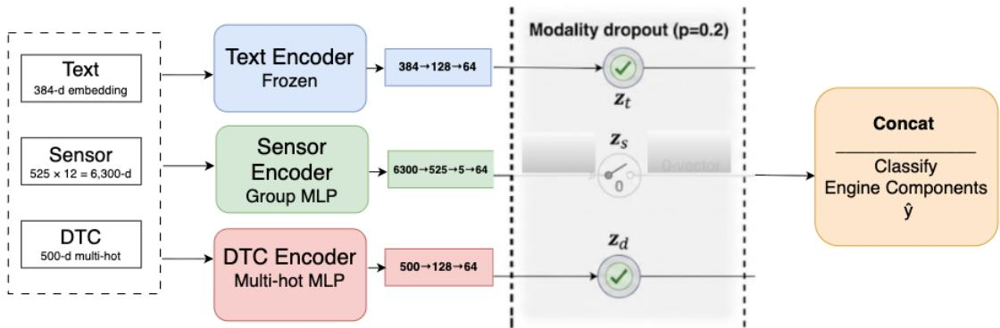
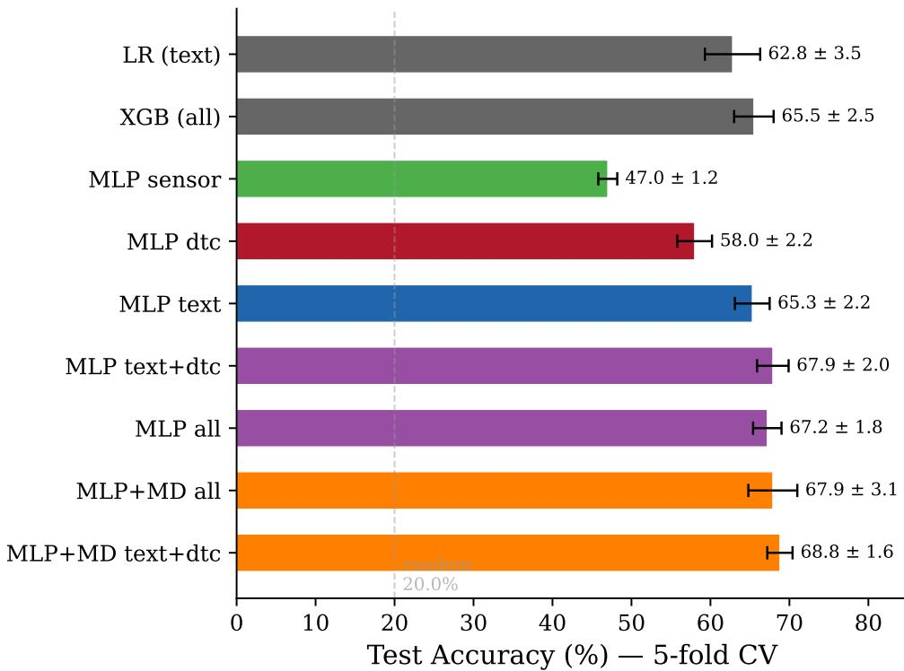
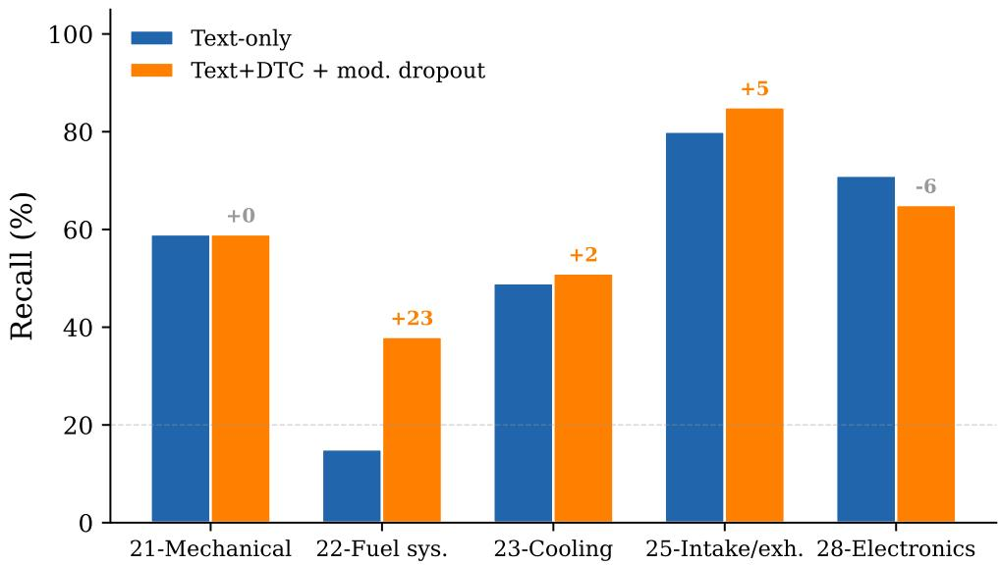
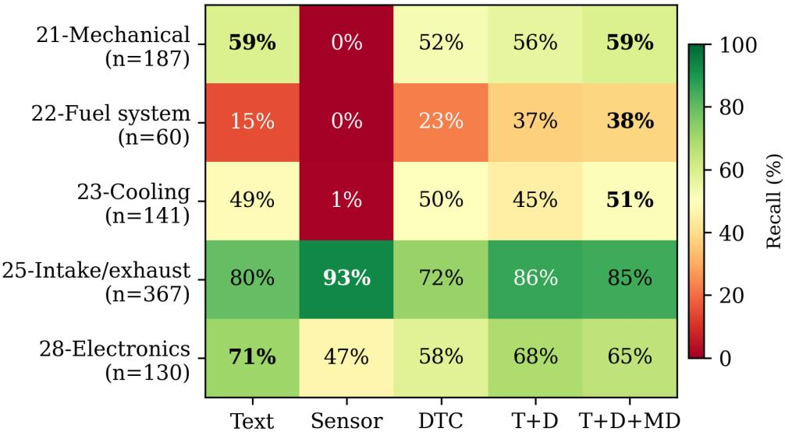
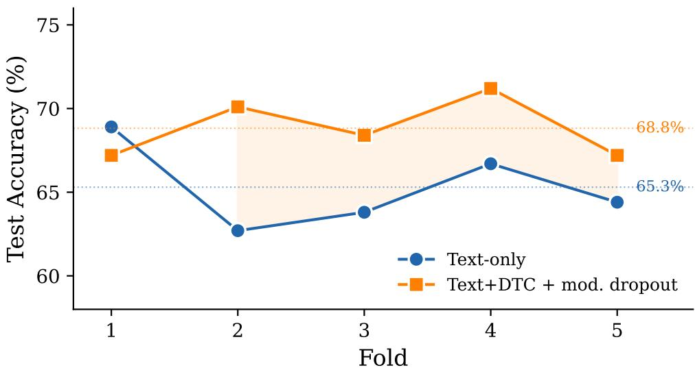

# WHEN MORE MODALITIES HURT: MODALITY DROPOUT FOR HEAVY-DUTY VEHICLE ENGINE DIAGNOSTICS

Adeel Zafar, Sławomir Nowaczyk, Hamid Sarmadi, Saeed Gholami Shahbandi

Center for Applied Intelligent Systems Research, Halmstad University, Sweden {adeel.zafar, slawomir.nowaczyk, hamid.sarmadi, saeed.gholami.shahbandi}@hh.se

August 25, 2026

## ABSTRACT

Heavy-duty vehicle diagnostics generate three disconnected data modalities: unstructured multilingual service complaints, high-dimensional sensor telemetry with over 80% missing values, and Diagnostic Trouble Codes (DTCs). We investigate whether fusing these modalities improves engine component classification on a proprietary dataset from a major truck manufacturer. Through 5-fold cross-validation across multiple model configurations spanning three model families on five engine component classes (885 samples, the full cross-database matched population for this manufacturer), we find that naive fusion provides modest gains over text alone (65.3%). However, modality dropout during training, which randomly disables entire modalities per batch, forces the network to exploit weaker inputs and achieves 68.8% accuracy on text+DTC fusion (weighted F1: 0.67), a 3.5-point improvement over text-only (65.3%, weighted F1: 0.64) and the best result across all methods including logistic regression and gradient-boosted trees. Per-class analysis shows that the dominant modality varies by fault type: text describes symptoms, DTCs encode structured fault signals, and sensors measure physical state. On intake/exhaust faults, sensors alone reach 93% where text achieves 80%. On fuel system faults, fusion with modality dropout nearly triples accuracy from 15% to 38% over text alone. To our knowledge, this is the first application of three-way modality fusion combining text, sensors, and fault codes in industrial vehicle diagnostics.

Keywords multi-modal fusion · modality dropout · vehicle diagnostics · fault classification · industrial NLP

## 1 Introduction

Heavy-duty trucks generate three parallel streams of diagnostic data. Technicians write service complaints describing observed symptoms. Electronic Control Units (ECUs) produce sensor telemetry that captures the physical state of vehicle components. When sensor values cross predefined thresholds, the onboard system generates DTCs, structured fault indicators that name the affected component. Each modality encodes a different aspect of the same underlying fault, yet in current practice they are analyzed in complete isolation [1, 2]. We study this problem using proprietary operational data from a major heavy-duty vehicle manufacturer’s global service network.

Consider a concrete example: a technician writes “intermittent power loss under load.” The DTC log shows P0299 (turbo underboost). The sensor readout shows anomalous boost pressure rankings. These three signals describe the same fault from different perspectives, yet no existing system connects them automatically. The question we investigate is whether fusing these modalities improves diagnostic classification or whether text, as the richest single source, already subsumes the information in sensors and DTCs.

Cross-modal alignment has succeeded in vision-language settings [3] and time-series-language tasks [4, 5], but industrial vehicle diagnostics presents distinct challenges. Complaints span 10+ languages and are mostly non-diagnostic. Sensor data is over 80% missing due to hardware configuration differences across vehicle models. The temporal relationship between modalities is causal rather than correlational: a complaint is filed after a failure, while sensors capture state before it. Initial pilot experiments using retrieval and contrastive alignment confirmed these difficulties (Appendix A).

Our main experiment is a systematic ablation for engine component classification (5 classes, 885 samples) evaluated with 5-fold cross-validation. We compare logistic regression, gradient-boosted trees, and MLP models across all modality combinations. Our contributions are:

1. The first application of three-way modality analysis (text, sensors, DTCs) to industrial vehicle diagnostics, with a modality dropout training strategy where text+DTC fusion achieves 68.8%, outperforming text-only (65.3%) and all classical baselines.

2. Per-class evidence of complementarity: sensors dominate on intake/exhaust faults (93%), fusion with modality dropout nearly triples fuel system accuracy (15% to 38%), and DTCs alone reach 58% from a binary vector.

## 2 Related Work

## 2.1 Multi-Modal Contrastive Learning

CLIP [3] aligns images and text through contrastive pre-training on 400M pairs. Extensions to audio [6] and inertial sensors [7] demonstrate the generality of the approach but rely on dense, regular signals and abundant paired data. Modality-level dropout, where entire input channels are randomly disabled during training, has been explored in audio-visual and medical multi-modal settings [8] to prevent modality dominance; we apply this strategy to industrial diagnostics for the first time.

## 2.2 Sensor-Language Alignment

PromptCast [4] converts time-series forecasting into a sentence-to-sentence task. SensorLLM [5] aligns motion sensor embeddings with text through a two-stage framework for human activity recognition on regular-frequency signals (50–100Hz). Our sensor data is structurally different: pre-aggregated ECU diagnostics read at irregular workshop visits, with over 80% missing values. Neither approach is directly applicable.

## 2.3 Industrial Text Mining and Maintenance

Brundage et al. [9] survey NLP for manufacturing maintenance; Sexton et al. [10] propose hybrid methods for technician-generated text. These efforts process complaint text in isolation without connecting it to sensor data or fault codes. TEST [11] and Time-LLM [12] align temporal data with text representations but target forecasting with clean signals. Traditional predictive maintenance relies on supervised learning over labeled failure data [1, 2, 13]. Retrieval-Augmented Generation [14] has been applied to technical manual retrieval [15], but these frameworks remain sensor-blind, retrieving textual remedies without validating them against physical telemetry. Cross-modal diagnosis connecting textual symptoms to quantitative sensor evidence remains largely unaddressed.

## 3 Data

Our dataset is from a major heavy-duty vehicle manufacturer and contains three modalities linked by vehicle identifier (VIN) and timestamp (Table 1).

Complaints are service records written by technicians across global markets in 10+ languages. Approximately 68% are non-diagnostic (parts requests, campaign notes), making the corpus noisy for fault classification.

Sensors consist of 525 diagnostic groups, each reporting six pre-aggregated features computed onboard by the ECU (fault counter, last ranking, ranking average, standard deviation, update counter, worst ranking). A missing value indicates that the corresponding diagnostic parameter was not updated during the readout period, resulting in structured sparsity where only 19.6% of values are observed per sample.

DTCs are structured fault signals generated when sensor values cross predefined thresholds. The database contains over 51M records across 7,339 vehicles with 1,677 unique codes. For each complaint, we collect all DTCs recorded for the same vehicle within last 30 day window and encode them as a multi-hot vector over the 500 most frequent codes.

Triplet construction: Aligning three independently maintained industrial databases into coherent triplets is a non-trivial data engineering challenge. Complaints, sensor readouts, and DTC logs are recorded by different systems, at different frequencies, with different coverage: complaints are filed at service visits, sensor readouts are captured during workshop diagnostic scans, and DTCs accumulate continuously in onboard memory. For each complaint, we retrieve the most recent sensor readout before the complaint date for the same vehicle, ensuring the sensor snapshot reflects the state leading up to the fault. Only ∼74% of vehicles in the complaint corpus have coverage in all three databases, and temporal alignment further reduces the yield. This produces 3,595 matched triplets from ∼9K original complaints, a 60% attrition rate inherent to cross-database alignment in industrial settings. Of these, more than 99% correspond to distinct vehicles (13 VINs contribute exactly two triplets each). The resulting dataset represents the full matchable population for this manufacturer, not a sample that could be enlarged by collecting more data.

Table 1: Dataset characteristics (approximate values due to proprietary constraints).
<table><tr><td>Complaint corpus</td></tr><tr><td>Service records ~9K Languages detected 10+ EN / FR / DE / ES / PL 31 / 18 / 8 / 7 / 6% Diagnostic complaints (est.) ~32%</td></tr><tr><td>Sensor telemetry</td></tr><tr><td>Readout rows &gt;700K Sensor groups × features 525 × 6 Global NaN fraction &gt;80%</td></tr><tr><td>Diagnostic Trouble Codes</td></tr><tr><td>DTC records &gt;51M Unique DTC codes 1,677 VINs with DTCs 89% of complaints</td></tr><tr><td>Mean DTCs per complaint (-30d) 30</td></tr><tr><td>Cross-modal overlap</td></tr><tr><td>Vehicles with all 3 modalities ~74% Engine-domain triplets 885</td></tr></table>

Engine component focus. We restrict to engine-related complaints (functional group prefixes 20–29) and exclude some classes due to insufficient samples. This yields 885 triplets across five classes: mechanical (21, n=187), fuel system (22, n=60), cooling (23, n=141), intake/exhaust (25, n=367), and electronics (28, n=130).

## 4 Method

Given a complaint, a sensor readout, and a set of DTC codes associated with a vehicle visit, the task is to classify which of five engine component classes is affected. We describe the input representation for each modality, the fusion architecture, and the modality dropout strategy. Figure 1 shows the overall architecture.

## 4.1 Input Representations

Text. Each complaint is encoded by a frozen pre-trained sentence transformer (all-MiniLM-L6-v2), producing a 384-dimensional embedding $\mathbf { t } \in \mathbb { R } ^ { 3 \bar { 8 } 4 }$ . No fine-tuning is applied to the text encoder. We keep the encoder frozen to avoid overfitting on 885 samples and to ensure the text representations remain general across the multilingual complaint corpus.

Sensors. For each complaint, we retrieve the most recent sensor readout before the complaint date. The raw input is a matrix $\mathbf { S } \in \mathbb { R } ^ { G \times 2 F }$ where $G = 5 2 5$ sensor groups and F = 6 features. Each group contributes F values concatenated with F binary observation indicators (1 if the feature was updated during the readout period, 0 if it remained at its default NaN value), yielding 12 inputs per group. A per-group MLP $\phi _ { g }$ compresses each group to a scalar health score:

$$
h _ { i } = \phi _ { g } ( [ \mathbf { s } _ { i } ; \mathbf { m } _ { i } ] ) \in \mathbb { R } , \quad i = 1 , \dots , G\tag{1}
$$

where $\mathbf { s } _ { i } \in \mathbb { R } ^ { F }$ are the feature values and $\mathbf { m } _ { i } \in \mathbb { R } ^ { F }$ is the observation mask. We then compute global statistics across observed groups:

$$
\mathbf { v } _ { s } = \left[ \mu _ { h } , \sigma _ { h } , \operatorname* { m a x } _ { h } , \operatorname* { m i n } _ { h } , \frac { | \{ i : \| \mathbf { m } _ { i } \| _ { 1 } > 0 \} | } { G } \right] \in \mathbb { R } ^ { 5 }\tag{2}
$$

where $\mu _ { h }$ and $\sigma _ { h }$ are the mean and standard deviation of health scores over groups with at least one observed feature. The final sensor representation is obtained via a two-layer MLP: $\mathbf { e } _ { s } = \psi _ { s } ( \mathbf { v } _ { s } ) \in \mathbf { \bar { \mathbb { R } } } ^ { 6 4 }$

  
Figure 1: Model architecture. Three parallel encoders produce 64-d embeddings from text (384-d sentence embedding), sensor (525 groups × 12 features), and DTC (500-d multi-hot) inputs. During training, modality dropout independently zeros each branch with probability $p = 0 . 2$ (illustrated here with the sensor branch disabled). At inference, all branches are active. The masked embeddings are concatenated and classified into five engine component classes.

DTCs: For each training fold, we select the 500 most frequent DTC codes using training data only and apply the resulting vocabulary to the corresponding validation fold. For each complaint, we collect all DTCs recorded for the same vehicle within last 30-day window centered on the diagnostic service visit, and encode them as a multi-hot vector $\mathbf { d } \in \{ 0 , 1 \} ^ { 5 0 0 }$ . A two-layer MLP produces the DTC embedding: $\mathbf { e } _ { d } = \psi _ { d } ( \mathbf { d } ) \in \mathbb { R } ^ { 6 4 }$

## 4.2 Fusion and Classification

Each modality encoder produces a 64-dimensional embedding. The text embedding is obtained via $\mathbf { e } _ { t } = \psi _ { t } ( \mathbf { t } ) \in \mathbb { R } ^ { 6 4 }$ The concatenated representation feeds a classifier:

$$
\hat { y } = f _ { \theta } ( [ \mathbf { e } _ { t } ; \mathbf { e } _ { s } ; \mathbf { e } _ { d } ] ) \in \mathbb { R } ^ { C }\tag{3}
$$

where $C = 5$ is the number of engine component classes and $f _ { \theta }$ is a three-layer MLP with ReLU activations and standard dropout $( p = 0 . 3 )$ . The model is trained with cross-entropy loss.

For ablation, we disable modalities by omitting the corresponding embeddings from the concatenation. Single-modality models use a 64-d input; pairwise models use 128-d; the full model uses 192-d. The classifier architecture adjusts its input dimension accordingly. We deliberately use a simple MLP architecture rather than attention-based or gating fusion mechanisms, as our dataset is too small to reliably train more complex fusion strategies without overfitting.

## 4.3 Modality Dropout

Naive fusion (Section 5) does not consistently outperform text alone, because the model learns to rely on the strongest single modality and treats the others as noise. To address this, we apply modality dropout [8]: during training, each modality is independently zeroed out with probability $p _ { \mathrm { d r o p } } = 0 . 2$ per batch, with the constraint that at least one modality remains active. Formally, at each training step we sample binary masks $z _ { t } , z _ { s } , z _ { d } \sim \mathrm { B e r n o u l l i } ( 1 - p _ { \mathrm { d r o p } } )$ and compute:

$$
\hat { y } = f _ { \theta } \big ( [ z _ { t } \cdot \mathbf { e } _ { t } ; ~ z _ { s } \cdot \mathbf { e } _ { s } ; ~ z _ { d } \cdot \mathbf { e } _ { d } ] \big )\tag{4}
$$

${ \mathrm { I f ~ } } z _ { t } = z _ { s } = z _ { d } = 0 .$ , we force $z _ { t } = 1$ , as text has the highest standalone accuracy. At inference, all modalities are active $( z _ { t } = z _ { s } = z _ { d } = 1 )$ . This forces the classifier to extract useful signal from every modality combination, preventing the network from ignoring weaker modalities. Because modality dropout trains the classifier to operate with any subset of modalities, the model naturally handles missing modalities at inference: if a vehicle lacks sensor data or DTC records, the corresponding branch is zeroed and the classifier produces a prediction from the available modalities without retraining.

## 4.4 Training Details

All MLP models are trained for 80 epochs with AdamW (learning rate $1 0 ^ { - 3 }$ , weight decay $1 0 ^ { - 4 } )$ and cosine annealing. Gradient norms are clipped to 1.0. Batch size is 32. Random seed is fixed at $^ { 4 2 }$ . We evaluate with stratified 5-fold cross-validation and report mean ± standard deviation.

Table 2: Engine component classification (5 classes, 885 samples, 5-fold CV). Best result in bold. × Rand. indicates the multiple over the 20.0% uniform random baseline. Weighted F1 reported for key models.
<table><tr><td>Method</td><td>Modalities</td><td>Acc. (%)</td><td>× Rand.</td><td>wF1</td></tr><tr><td>Baselines</td><td></td><td></td><td></td><td></td></tr><tr><td>Random</td><td></td><td>20.0</td><td>1.0</td><td>一</td></tr><tr><td>Majority</td><td></td><td>41.5</td><td>2.1</td><td>一</td></tr><tr><td>Logistic Regression</td><td></td><td></td><td></td><td></td></tr><tr><td>LR</td><td>Sensor</td><td> $4 4 . 6 \pm 1 . 5$ </td><td>2.2</td><td>1</td></tr><tr><td>LR</td><td>DTC</td><td> $5 4 . 8 \pm 2 . 2$ </td><td>2.7</td><td>一</td></tr><tr><td>LR</td><td>Text</td><td> $6 2 . 8 \pm 3 . 5$ </td><td>3.1</td><td>一</td></tr><tr><td colspan="3">Gradient-Boosted Trees</td><td></td><td></td></tr><tr><td>XGB</td><td>Sensor</td><td> $4 5 . 1 \pm 2 . 4$ </td><td>2.3</td><td></td></tr><tr><td>XGB</td><td>DTC</td><td> $5 6 . 9 \pm 1 . 5$ </td><td>2.8</td><td>一</td></tr><tr><td>XGB</td><td>Text</td><td> $6 1 . 9 \pm { 1 . 8 }$ </td><td>3.1</td><td>一</td></tr><tr><td>XGB</td><td>All</td><td> $6 5 . 5 \pm 2 . 5$ </td><td>3.3</td><td></td></tr><tr><td colspan="3"> $M L P \left( o u r s \right)$ </td><td></td><td></td></tr><tr><td>MLP</td><td>Sensor</td><td> $4 7 . 0 \pm 1 . 2$ </td><td>2.4</td><td>一</td></tr><tr><td>MLP</td><td>DTC</td><td> $5 8 . 0 \pm 2 . 2$ </td><td>2.9</td><td>一</td></tr><tr><td>MLP</td><td>Sens.+DTC</td><td> $5 7 . 7 \pm 0 . 7$ </td><td>2.9</td><td>一</td></tr><tr><td>MLP</td><td>Text</td><td> $6 5 . 3 \pm 2 . 2$ </td><td>3.3</td><td>.64</td></tr><tr><td>MLP</td><td>Text+Sens.</td><td> $6 4 . 4 \pm 3 . 3$ </td><td>3.2</td><td>一</td></tr><tr><td>MLP</td><td>Text+DTC</td><td> $6 7 . 9 \pm 2 . 0$ </td><td>3.4</td><td>.66</td></tr><tr><td>MLP</td><td>All</td><td> $6 7 . 2 \pm { 1 . 8 }$ </td><td>3.4</td><td>一</td></tr><tr><td> ${ \bf M L P + M D }$ </td><td>All</td><td> $6 7 . 9 \pm 3 . 1$ </td><td>3.4</td><td>一</td></tr><tr><td> ${ \bf M L P + M D }$ </td><td>Text+DTC</td><td> ${ \bf 6 8 . 8 \pm 1 . 6 }$ </td><td>3.4</td><td>.67</td></tr></table>

For classical baselines, we use logistic regression (LR, $C = 1 . 0 \mathrm { { : } }$ , max 2000 iterations) and gradient-boosted trees (XGBoost, 200 trees, max depth 4, learning rate 0.1) on the same input features. Text features are the 384-d sentence embeddings. Since logistic regression and XGBoost operate on fixed-length feature vectors and cannot incorporate a learned per-group neural encoder, sensor features are instead a 13-d hand-crafted summary (mean and standard deviation of each of the 6 raw feature types across observed groups, plus the overall observation fraction). DTC features are the 500-d multi-hot vector. For combined models, features are concatenated.

## 5 Results

Table 2 and Figure 2 present the main results. The random baseline (20.0%) reflects uniform prediction across five classes $( 1 / C \overset { \cdot } { = } 1 / 5 )$ . The weighted F1 score confirms the accuracy trend: text-only achieves 0.64 while modality dropout fusion reaches 0.67, indicating improvement across both common and rare classes. Four findings emerge.

## 5.1 Each Modality Carries Independent Signal

Across all three model families, the ranking is consistent: text $> \mathrm { D T C } >$ sensor. Sensors alone reach 45–47%, DTCs reach 55–58%, and text reaches 62–65%, all well above the 20.0% random baseline. The consistency across LR, XGBoost, and MLP confirms this is a data property, not an artifact of a particular model.

## 5.2 Naive Fusion Does Not Help

MLP with all three modalities (67.2%) modestly exceeds text-only (65.3%). Adding sensors to text actually hurts (64.4%) because the noisy, high-dimensional sensor embeddings introduce noise into the concatenated representation, diluting the text signal without contributing compensating information. This is consistent with findings in multi-modal learning where noisy modalities degrade the stronger signal [3].

## 5.3 Modality Dropout Makes Fusion Work

Text+DTC with modality dropout (68.8%) achieves the best accuracy among all configurations, with low variance (±1.6%). This outperforms text-only (65.3%) by 3.5 points (paired t-test over 5 folds: $\dot { t } = 1 . 4 9 , d f = 4 , p = 0 . 2 1 )$

  
Figure 2: Accuracy across methods and modality combinations (5-fold CV). Text+DTC with modality dropout achieves the highest accuracy, outperforming text-only MLP and all classical baselines.

While not statistically significant with 5 paired observations, modality dropout improves over text-only in 4 of 5 folds (Figure 5). The three-modality model with dropout (67.9%) does not improve over text+DTC+dropout, suggesting the sensor branch contributes limited additional signal. Modality dropout acts as an effective fusion regularizer that prevents dominant-modality collapse in both two-modality and three-modality settings.

## 5.4 Text + DTC Is the Strongest Pair

Among pairwise combinations, text + DTC (67.9%) outperforms text + sensor (64.4%) and sensor + DTC (57.7%). DTCs add the most complementary signal to text, likely because DTCs name the affected component (structured) while text describes the symptom (unstructured). Sensors contribute least to pairwise fusion, possibly due to their 80% missingness and the aggressive dimensionality reduction from 6,300 inputs to a 5-d summary, which may discard discriminative group-level patterns. A more expressive sensor encoder (e.g., attention over observed groups) could improve sensor contributions.

## 5.5 Per-Class Analysis

Figure 4 reveals that the dominant modality varies by component class.

Sensors dominate intake/exhaust faults. On class 25 (intake/exhaust), sensors alone achieve 93%, outperforming text (80%) and DTCs (72%). Boost pressure rankings and air intake measurements directly quantify the physical condition that text can only describe qualitatively.

Fusion rescues the fuel system class. On class 22 (fuel system), text achieves only 15% and sensors 0%. The text+DTC model with modality dropout reaches 38%, nearly tripling accuracy, because DTC codes like P0087 (fuel rail pressure too low) provide the structured signal that vague complaint text lacks.

Cooling benefits from cross-modal synergy. On class 23 (cooling), the T+D+MD model achieves 51% versus 49% for text alone, a modest improvement. Neither modality is strong individually, but together with modality dropout they provide complementary evidence.

Figure 3: Per-class recall comparison of text-only versus text+DTC with modality dropout. Fusion improves fuel system (+23pp), intake/exhaust (+5pp), and cooling (+2pp), with no change on mechanical and a decline on electronics (−6pp).  
  
Figure 4: Per-class recall by modality (pooled out-of-fold predictions across 5 folds). Bold values indicate the best result per class. The dominant modality varies by component.

Text suffices for electronics. On class 28 (electronics), text alone achieves 71%, the highest single-modality result, because complaints like “ECU fault code stored” or “wiring harness damage” are already diagnostic. This class is inherently more diagnosable from text because electronic faults produce specific, unambiguous symptoms.

## 6 Discussion

Each modality captures a different diagnostic dimension. Text reflects how a technician perceives a symptom. DTCs encode what the onboard system detected based on sensor thresholds. Sensors measure the physical state, including gradual degradation that may not yet trigger a DTC. The per-class results confirm this: sensors dominate where physical measurements are definitive (intake/exhaust), text dominates where the symptom description is most informative (electronics), and fusion helps where neither modality suffices alone (fuel system, cooling).

  
Figure 5: Fold-by-fold accuracy: text+DTC with modality dropout (orange) versus text-only (blue) across 5-fold CV. Fusion outperforms text in 4 of 5 folds with a mean improvement of 3.5 percentage points.

Without modality dropout, the classifier appears to rely predominantly on the strongest modality, limiting the benefit obtained from weaker branches. This is evidenced by naive fusion (67.2%) only modestly outperforming text-only (65.3%), whereas text+DTC+dropout achieves the best result (68.8%). Modality dropout forces the network to learn from every modality subset, analogous to standard dropout [16] applied at the modality level. The fact that text+DTC+dropout outperforms all+dropout (68.8% vs. 67.9%) indicates that additional modalities do not necessarily improve performance. More broadly, the per-class results suggest that the utility of each modality is fault-dependent.

The practical value of fusion lies in class-specific gains rather than aggregate improvement. Text-only achieves 15% on fuel system faults (near random), while text+DTC reaches 37%. DTCs alone achieve 58.0% from a raw binary vector that treats each code as an opaque identifier. However, DTC codes have internal structure: the first character indicates the system (P=powertrain, B=body, C=chassis, U=network) and subsequent digits encode the component and failure type. Encoding DTC textual descriptions (e.g., “NOx Sensor Bank 1 Sensor 2”) could capture semantic similarity between related codes and is a promising direction for future work.

## 7 Conclusion

We investigated three-way modality fusion for heavy-duty vehicle engine diagnostics. Each modality captures a different diagnostic dimension: text describes symptoms (65.3%), DTCs encode structured faults (58.0%), and sensors measure physical state (47.0%). Naive fusion fails to improve over text, but modality dropout on text+DTC achieves 68.8%, the best result across all methods, while the sensor branch provides limited additional value beyond text+DTC. Per-clas analysis reveals genuine complementarity: sensors dominate intake/exhaust faults (93%), fusion nearly triples fuel system accuracy (15% to 38%), and the combined model consistently improves on classes where text alone is weakest. These findings demonstrate that multi-modal fusion for industrial diagnostics requires training strategies that prevent modality collapse, and that the practical value of fusion lies in class-specific gains rather than aggregate accuracy improvement.

## Limitations

Our dataset contains 885 engine-domain triplets across five classes and exhibits class imbalance (ranging from 60 to 367 samples). While small for machine learning, this represents the full matchable population for this manufacturer, constrained by the requirement to temporally align three independent databases where only 74% of vehicles have complete coverage. Results reflect one truck manufacturer’s data and may not generalize to other OEMs or vehicle types. The text encoder (all-MiniLM-L6-v2) is English-centric; a multilingual encoder may yield different modality rankings given the 10+ languages in the corpus. The DTC window (last 30 days) and modality dropout probability (0.2) were chosen pragmatically rather than optimized, and alternative dropout strategies were not explored. Furthermore, we used a simple concatenation fusion method; investigating dynamic gating mechanisms to weight modalities per sample remains future work.

## References

[1] Andreas Theissler, Judith Pérez-Velázquez, Marcel Kettelgerdes, and Gordon Elger. Predictive maintenance enabled by machine learning: Use cases and challenges in the automotive industry. Reliability engineering & system safety, 215:107864, 2021.

[2] Tianwen Zhu, Yongyi Ran, Xin Zhou, and Yonggang Wen. A survey of predictive maintenance: Systems, purposes and approaches. arXiv preprint arXiv:1912.07383, 2019.

[3] Alec Radford, Jong Wook Kim, Chris Hallacy, Aditya Ramesh, Gabriel Goh, Sandhini Agarwal, Girish Sastry, Amanda Askell, Pamela Mishkin, Jack Clark, et al. Learning transferable visual models from natural language supervision. In International conference on machine learning, pages 8748–8763. PmLR, 2021.

[4] Hao Xue and Flora D Salim. Promptcast: A new prompt-based learning paradigm for time series forecasting. IEEE Transactions on Knowledge and Data Engineering, 36(11):6851–6864, 2023.

[5] Zechen Li, Shohreh Deldari, Linyao Chen, Hao Xue, and Flora D Salim. Sensorllm: Aligning large language models with motion sensors for human activity recognition. In Proceedings ofthe 2025 Conference on Empirical Methods in Natural Language Processing, pages 354–379, 2025.

[6] Andrey Guzhov, Federico Raue, Jörn Hees, and Andreas Dengel. Audioclip: Extending clip to image, text and audio. In ICASSP 2022-2022 IEEE International Conference on Acoustics, Speech and Signal Processing (ICASSP), pages 976–980. IEEE, 2022.

[7] Seungwhan Moon, Andrea Madotto, Zhaojiang Lin, Aparajita Saraf, Amy Bearman, and Babak Damavandi. Imu2clip: language-grounded motion sensor translation with multimodal contrastive learning. In Findings ofthe Associationfor Computational Linguistics: EMNLP 2023, pages 13246–13253, 2023.

[8] Natalia Neverova, Christian Wolf, Graham Taylor, and Florian Nebout. Moddrop: adaptive multi-modal gesture recognition. IEEE Transactions on Pattern Analysis and Machine Intelligence, 38(8):1692–1706, 2015.

[9] Michael P Brundage, Thurston Sexton, Melinda Hodkiewicz, Alden Dima, and Sarah Lukens. Technical language processing: Unlocking maintenance knowledge. Manufacturing Letters, 27:42–46, 2021.

[10] Thurston Sexton, Michael P Brundage, Michael Hoffman, and Katherine C Morris. Hybrid datafication of maintenance logs from ai-assisted human tags. In 2017 ieee international conference on big data (big data), pages 1769–1777. IEEE, 2017.

[11] Chenxi Sun, Hongyan Li, Yaliang Li, and Shenda Hong. Test: Text prototype aligned embedding to activate llm’s ability for time series. In International Conference on Learning Representations, volume 2024, pages 37854–37881, 2024.

[12] Ming Jin, Shiyu Wang, Lintao Ma, Zhixuan Chu, James Zhang, Xiaoming Shi, Pin-Yu Chen, Yuxuan Liang, Yuan-Fang Li, Shirui Pan, et al. Time-llm: Time series forecasting by reprogramming large language models. In International conference on learning representations, volume 2024, pages 23857–23880, 2024.

[13] Shuaicheng Zhang, Tuo Wang, Adithya Kulkarni, Stephen Adams, Sanmitra Bhattacharya, Sunil Reddy Tiyyagura, Edward Bowen, Balaji Veeramani, and Dawei Zhou. Pdmbench: A standardized platform for predictive maintenance research. 2025.

[14] Patrick Lewis, Ethan Perez, Aleksandra Piktus, Fabio Petroni, Vladimir Karpukhin, Naman Goyal, Heinrich Küttler, Mike Lewis, Wen-tau Yih, Tim Rocktäschel, et al. Retrieval-augmented generation for knowledgeintensive nlp tasks. Advances in neural information processing systems, 33:9459–9474, 2020.

[15] Scott Barnett, Stefanus Kurniawan, Srikanth Thudumu, Zach Brannelly, and Mohamed Abdelrazek. Seven failure points when engineering a retrieval augmented generation system. In Proceedings ofthe IEEE/ACM 3rd International Conference on AI Engineering-Software Engineeringfor AI, pages 194–199, 2024.

[16] Nitish Srivastava, Geoffrey Hinton, Alex Krizhevsky, Ilya Sutskever, and Ruslan Salakhutdinov. Dropout: a simple way to prevent neural networks from overfitting. The journal ofmachine learning research, 15(1):1929–1958, 2014.

## A Pilot Studies

Before the main experiment, two pilot studies informed our approach.

## A.1 Decoupled Retrieval

A RAG pipeline retrieves the top-5 most similar historical complaints using a pre-trained sentence transformer (all-MiniLM-L6-v2), while independently computing z-score anomalies for each sensor group. A domain expert evaluated five representative cases (Table 3), rating each retrieved complaint on a 4-point relevance scale and classifying flagged sensors as Directly Diagnostic, Consequential (downstream effect), or Not Relevant. In 4 of 5 cases, at least one retrieved complaint was rated as partially or highly relevant. However, no flagged sensor was rated directly diagnostic. Flagged sensors showed downstream effects rather than root causes because the z-score operates across the full signal space without knowing which sensors are relevant to the specific complaint. Case 3 yielded no relevant retrievals and was identified as a previously unseen failure type.

Table 3: Expert evaluation of decoupled retrieval. Relevance: 3=High, 2=Partial, 1=Not Relevant, 0=Cannot Assess.
<table><tr><td>Case</td><td>Ret-1</td><td>Ret-2</td><td>Ret-3</td><td>Ret-4</td><td>Ret-5</td><td>Sensors</td></tr><tr><td>1</td><td>3</td><td>3</td><td>3</td><td>2</td><td>1</td><td>Not Rel.</td></tr><tr><td>2</td><td>3</td><td>3</td><td>3</td><td>2</td><td>1</td><td>Conseq.</td></tr><tr><td>3</td><td>1</td><td>1</td><td>1</td><td>1</td><td>1</td><td>Not Rel.</td></tr><tr><td>4</td><td>3</td><td>3</td><td>2</td><td>1</td><td>1</td><td>Conseq.</td></tr><tr><td>5</td><td>3</td><td>1</td><td>1</td><td>1</td><td>0</td><td>Conseq.</td></tr></table>

## A.2 Contrastive Alignment

Following CLIP [3], we trained a dual-encoder (frozen text encoder + custom sensor GRU with 861K trainable parameters) with symmetric InfoNCE loss to embed complaints and sensor data into a shared 128-d space. Table 4 shows the cross-modal retrieval results on 553 test pairs. The model achieved 13× improvement over random at Top-1, with mean rank 164/553 (top 30%). However, diagnostic complaints (31.5%) achieved mean rank 171 while non-diagnostic complaints (68.5%) achieved 160, indicating the model learned vehicle-level correlations rather than fault-level alignment.

Table 4: Contrastive cross-modal retrieval on 553 test pairs.
<table><tr><td>Top-k</td><td>Accuracy</td><td>Random</td><td>Improv.</td></tr><tr><td>1</td><td>2.35%</td><td>0.18%</td><td>13.0×</td></tr><tr><td>5</td><td>6.15%</td><td>0.90%</td><td>6.8×</td></tr><tr><td>10</td><td>10.49%</td><td>1.81%</td><td>5.8×</td></tr><tr><td>50</td><td>30.92%</td><td>9.04%</td><td>3.4×</td></tr></table>

These studies motivated two decisions: (1) move from instance-level retrieval to category-level classification, which pools weak per-instance signal into stronger per-category patterns; and (2) incorporate DTCs as a third modality providing structured supervision between text and sensors.