# When a neural surrogate cannot accelerate a solver: runtime share, closed-loop drift, and the economics of uncertainty gating in a stif coupled simulation

L. Thümmlera,∗, T. Kurodab

aDepartment of Mathematics, ETH Zürich, Rämistrasse 101, 8092 Zürich, Switzerland bMax Planck Institute for Gravitational Physics (Albert Einstein Institute), Am Mühlenberg 1, D-14476 Potsdam, Germany

## Abstract

Learned surrogates for expensive inner solver blocks are a widely pursued route to faster multiphysics simulation. We report a controlled, end-toend negative result and identify three structural barriers, none of them a deficiency of the network we trained. The testbed is the implicit Newton solve coupling energy-dependent neutrino radiation to matter in a generalrelativistic radiation-hydrodynamics code, its most expensive physics routine per call.

First, per-call cost and share of runtime are diferent quantities, and only the second bounds acceleration. An exclusive self-time profile puts the target block at 16.9% of critical-rank wall clock, capping any surrogate at ≈ 1.2× by Amdahl’s law. A surrogate 5.8× cheaper per call merely ties the solver, and the configuration stable enough to run without fallback reaches only parity. Second, ofline accuracy cannot rank surrogates for deployment: across fourteen networks the pooled Spearman error-versus-survival correlation $( \rho = + 0 . 7 3 )$ is a between-family confound that vanishes under control $( \rho = - 0 . 0 4 )$ . Third, a correct out-of-distribution gate cannot accelerate a loop that leaves its training distribution. We give the break-even deferral fraction in closed form: because the visited states sit 73× of the data manifold, the gate defers 96.8 to 99.7% of cells, almost invariant to surrogate quality. Including its own cost, the gated loop is a 0.94 to 0.96× slowdown.

We further separate stability from fidelity: a never-crashing gated run accumulates a linear −19.9% density bias over 6000 steps. The error is a directed, ballistically accumulating bias, not the variance-driven divergence the autoregressive literature targets.

Keywords: machine-learning surrogates, operator learning, closed-loop stability, Amdahl’s law, out-of-distribution detection, stif coupled systems, radiation hydrodynamics

## 1. Introduction

A recurring proposal in computational physics is to replace an expensive inner solver block, a stif ordinary diferential equation integrator, a root find, a per-cell implicit coupling, with a learned surrogate whose forward pass costs microseconds. The appeal is immediate and the ofline evidence is usually encouraging: such surrogates routinely reach coeficients of determination above 0.99 on held-out data and per-call speedups of one to two orders of magnitude.

Whether that translates into a faster simulation is a separate question, and it is answered by three quantities that ofline benchmarks do not measure. The first is the block’s share of runtime, which bounds the achievable endto-end gain by Amdahl’s law (Amdahl, 1967) regardless of surrogate quality. The second is the surrogate’s behaviour in the closed loop, where its outputs become the next step’s inputs and errors compound, a regime in which perstep accuracy is a poor predictor of anything. The third arises only if one attempts the natural fix for the second, an uncertainty gate that routes uncertain cells back to the exact solver: such a gate has its own cost and its own deferral fraction, and these determine whether gating can pay at all.

This paper works all three through in a single system, with end-toend wall clock as the metric throughout. Our testbed is the implicit neutrino-matter coupling solve in a one-dimensional general-relativistic radiation-hydrodynamics code. We chose it because it is an unusually favourable target on the criterion that motivates most such work: it is by a wide margin the most expensive physics routine per call in that code, $3 . 4 \times 1 0 ^ { - 4 }$ s per cell per step, and it is called once per cell per step. If a learned surrogate can accelerate any block, it should accelerate this one.

It does not, and the reasons generalise beyond the testbed. We state our contributions explicitly.

1. A measured acceleration budget, and the distinction it enforces (Sec. 4). We profile the complete time step with exclusive selftime timers and validate the decomposition by summation. The target routine is 10.5% of mean wall clock and 16.9% on the critical rank, capping any surrogate at ≈ 1.2×. We trace how a per-call cost figure in our own earlier planning was mistaken for a runtime share, and we survey the literature for cases where replacing a minority-cost block produced a measured end-to-end speedup, finding none.

2. Evidence that ofline metrics cannot select surrogates (Sec. 5). Fourteen networks on a common held-out set, with the pooled correlation shown to be a between-family confound, plus a seed study establishing that single-run survival counts are not comparable.

3. Closed-form gate economics, with measured inputs (Sec. 8). We derive the break-even deferral fraction, measure the gate cost in situ at three implementation qualities, and show the measured deferral is nearly invariant to surrogate quality, which places the operating point beyond break-even structurally rather than incidentally.

4. A separation of stability from fidelity (Sec. 9). A gated run that never crashes still accumulates a linear density bias to −19.9% over 6000 steps.

5. A mechanism reframing (Sec. 10). The closed-loop failure here is driven by a directed bias accumulating ballistically, not the variancedriven blow-up that noise injection and pushforward losses are designed to damp, which explains why those remedies underperform and which ones do not.

6. Transferable guidance (Sec. 11), including a pre-deployment checklist and the observation, measured, that a stabilisation efective in one regime can be actively harmful in another.

Throughout we report negative and null results at the same level of detail as positive ones, and we mark clearly which claims are measured, which are modelled, and which remain open. Section 2 describes the testbed and the surrogate; Section 3 the evaluation protocol; Sections 4 to 10 the results; Section 11 the discussion and guidance; and Section 12 concludes.

## 2. Problem setting

## 2.1. The target block

The host code solves the Einstein equations in the Baumgarte-Shapiro-Shibata-Nakamura (BSSN) formulation (Shibata & Nakamura, 1995; Baumgarte & Shapiro, 1999) together with a two-moment (M1) neutrino radiation-hydrodynamics scheme (Shibata et al., 2011); it is the general-relativistic radiation-hydrodynamics code developed by Kuroda and collaborators (Kuroda, Takiwaki & Kotake, 2016; Kuroda, 2021; Kuroda & Shibata, 2024; Kuroda, Kawaguchi & Shibata, 2025). The details of the spacetime evolution are not essential to what follows; what matters computationally is the structure of the block we target.

For every grid cell and every time step, an inner Newton iteration (NeuMatIntImplicit) solves the stif coupling between the local matter state and the multi-group M1 radiation field. Each call takes as input the pre-coupling state, namely rest-mass density $\rho ,$ entropy $s$ (recorded as the equivalent temperature $T ,$ which the implicit solve does not search independently), electron fraction $Y _ { e }$ , time step $\Delta t .$ conserved energy $\tau _ { : }$ , momentum $m _ { 1 }$ , and the incoming radiation moments $\mathrm { Q S N _ { O } }$ (20 energy groups $\times \ 4$ four-momentum components × 3 species), and returns the post-coupling state $\left( \mathrm { Q S N } _ { \mathrm { N } } , Y _ { e } ^ { \prime } , \tau ^ { \prime } , m _ { 1 } ^ { \prime } \right)$ . Each logged record is 493 double-precision values; a 495-value variant additionally logs entropy before and after.

This is a per-cell, state-in/state-out map with no explicit spatial coupling in its interface, which is precisely the interface shape that makes a learned surrogate structurally straightforward: no mesh topology, no neighbour stencil, no time history. The map is nonetheless stif, and the radiation update accounts for roughly 80% of the per-call solver time against 20% for the matter update, measured pre-bounce over some 21,000 calls and consistent across MPI ranks to within 5%.

Two conventions apply throughout. We work per grid cell in cgs units, and we denote by $t _ { \mathrm { p b } }$ the time after core bounce, the moment at which the collapsing core reaches nuclear saturation density and rebounds. The collapse divides into three regimes with materially diferent numerical character (infall, bounce, post-bounce), and we report separately for each where the distinction matters, since one of our findings is that behaviour does not transfer between them.

## 2.2. Data and surrogate

We use a single progenitor $\left( \mathrm { a } ~ 9 . 6 { M _ { \odot } } \right)$ model, z9.6) with the DD2 nuclear equation of state (Typel et al., 2010; Hempel & Schafner-Bielich, 2010) and log every converged call to the coupling solver. The training set (nestedbox refinement level $L _ { \mathrm { m a x } } \le 7 )$ contains 2.74M records spanning collapse through core bounce. As an independent test we generate a second run at full resolution $( L _ { \mathrm { m a x } }$ up to 11, 4.3M records); because it explores the state space along a diferent numerical trajectory it is a genuine out-of-distribution probe rather than a random split.

The surrogate is a residual multilayer perceptron. Inputs are transformed by $\log _ { 1 0 } \left( \rho , T , \Delta t \right)$ , a signed logarithm for the wide-dynamic-range radiation and matter momenta, and per-feature z-scoring; the network predicts residuals in the same transformed space, with the electron fraction predicted directly. An architecture sweep over nine configurations selects a width-512, 3-block network (1.8M parameters). Width helps more than depth (width-512/3 beats width-256/6), LayerNorm improves parameter eficiency, and capacity saturates: a 6.3M-parameter network is worse than the 1.8M one, indicating a data- rather than capacity-limited regime. GELU and SiLU are indistinguishable. Training uses Adam (initial learning rate $1 0 ^ { - 3 }$ , reduced on validation plateau) with a batch size of 8192 and crash-safe checkpointing, on a random 90/10 train/validation split taken at the level of contiguous data windows (not individual records, to avoid near-duplicate leakage across the split; Sec. 5 discusses a further, independent-trajectory generalisation test beyond this split). This recipe is held fixed across every architecture and every retraining in this paper; only the width, depth, and (in Sec. 8.7) the random seed are varied.

For deployment the forward pass was re-implemented in Fortran and verified against the PyTorch reference to a maximum absolute deviation of $5 . 6 \times 1 0 ^ { - 6 }$ and a median relative deviation of $1 . 7 \times 1 0 ^ { - 5 }$ over 50 logged records (the maximum relative deviation is large only on outputs near zero). A later batched implementation reproduced the scalar path’s printed diagnostics exactly over a 65-step single-threaded trajectory, its per-call diference lying below print resolution. Agreement at that level is not identity, and Sec. 8.6 shows that it does not imply identical trajectories in general. We stress this verification because several of our measurements are diferences between configurations, and an unverified inference path would make those diferences uninterpretable.

## 3. Evaluation protocol

## 3.1. Closed-loop substitution

The decisive evaluation replaces the call NeuMatIntImplicit in the hydrodynamics sweep with a call to the network and runs a fresh collapse. The network’s outputs set the conserved variables and electron fraction; the solver’s equation-of-state epilogue then recovers the primitive state. We measure how many steps the simulation survives before a genuine crash, and whether the state remains physical.

Two properties of this protocol matter for interpreting what follows. It is a substitution test, not a coupled-training test: the surrogate is trained ofline and deployed frozen. And the failure criterion is the host code’s own guards (equation-of-state range checks, a causality check on characteristic wave speeds), so a “crash” is a physically meaningful violation rather than a numerical convenience.

## 3.2. Identity ablations

To localise failures we selectively replace individual network outputs with the identity map, so that the coupling does nothing for that channel while the network continues to drive the others. This isolates which predicted channel is responsible for a given failure, and it provides a control: with every channel set to identity the network is inert, and the framework itself can be validated independently of the surrogate.

## 3.3. Timing methodology

End-to-end comparisons are matched-window: identical starting state, identical number of steps, matched thread and rank counts, with startup excluded. Where node contention could confound a comparison we run the pair in both orders and report agreement. Profiling uses exclusive (selftime) timers, so that a routine is charged only for time spent outside its instrumented callees; we validate the decomposition by checking that disjoint leaves sum to the measured sweep duration within 0.2%. This validation is not incidental. Nested timers double-count, and a decomposition that does not sum to the whole cannot support an Amdahl argument.

## 3.4. Seed protocol

Closed-loop survival is a chaotic quantity, and single runs are not reliable estimates of it. Where we compare configurations we retrain each five or more times, varying only the random seed (weight initialisation and shufle order) with an otherwise identical recipe and an identical data partition, and restart all runs from the same verified state. We report distributions and rank tests rather than point comparisons.

One protocol detail is specific to this system and worth stating because it determines what a “seed” can mean. The simulation itself is fully deterministic: it contains no random number generator, and five identical repeat runs of the same model produce identical step counts. Seed variation therefore varies the training initialisation, not the trajectory, and the resulting spread measures sensitivity of the closed loop to which model was learned, not to numerical noise in the host code.

## 4. The acceleration budget

We begin with the quantity that bounds everything else, because it reframes what a surrogate for this block can deliver before any question of accuracy or stability arises.

## 4.1. Per-call cost is not a runtime share

The target routine is the most expensive physics routine per call in this code. It is natural, and it was natural to us, to read that as implying it dominates runtime. It does not, and the two quantities are related by the call count and by everything else the time step does.

We record this explicitly because the conflation had consequences in our own work. An early cost figure of $3 . 4 \times 1 0 ^ { - 4 }$ s per call was carried forward in planning as though it were a fraction of total runtime, which supported an expected ceiling of roughly 2.7×. That expectation survived until an end-toend measurement contradicted it, at which point the profiling below became the critical path rather than a supporting measurement. The distinction is elementary; the failure mode is that a per-call benchmark is easy to obtain and a validated runtime share is not, so the former tends to stand in for the latter.

Table 1: Exclusive self-time breakdown of one time step, as a percentage of mean wall clock across MPI ranks, for the three phases of the collapse. Leaves are disjoint; the six named categories are the ones large enough to discuss individually, and the residual row recovers the remainder so that each column sums to 100%. The lower block gives the solver’s share in two other framings and the mean number of Newton iterations per cell, which is the physical reason the solver cost varies across phases.
<table><tr><td>Routine (disjoint leaf)</td><td>Pre-bounce</td><td>Bounce</td><td>Post-bounce</td></tr><tr><td>Ghost exchange, mostly idle wait</td><td>30.8</td><td>27.8</td><td>34.6</td></tr><tr><td>PPM advection</td><td>20.3</td><td>27.6</td><td>21.7</td></tr><tr><td>Ghost exchange, genuine MPI</td><td>13.5</td><td>9.1</td><td>12.0</td></tr><tr><td>Loop overhead residual</td><td>11.0</td><td>10.1</td><td>11.8</td></tr><tr><td>Implicit coupling solve</td><td>7.5</td><td>16.1</td><td>10.5</td></tr><tr><td>Periodic I/O</td><td>9.8</td><td>2.5</td><td>3.1</td></tr><tr><td>Other genuine work &amp; untabulated</td><td>7.1</td><td>6.8</td><td>6.3</td></tr><tr><td>Solver, % of critical-rank wall</td><td>11.9</td><td>17.7</td><td>16.9</td></tr><tr><td>Solver, % of pure compute</td><td>21.5</td><td>31.9</td><td>27.4</td></tr><tr><td>Newton iterations per cell, mean</td><td>0.37</td><td>2.29</td><td>1.56</td></tr><tr><td>Newton iterations per cell, max</td><td>1</td><td>30</td><td>12</td></tr></table>

## 4.2. Exclusive self-time profile

Table 1 reports the exclusive self-time decomposition of one time step for the configuration used throughout this work, both pre-bounce and restarted at $t _ { \mathrm { p b } } = 2 0 \mathrm { m s }$ . Six categories are large enough to discuss individually; the remainder, 6–7% in every phase, is made up of the conformal-factor rescaling and the conserved-to-primitive recovery, which are of comparable size and together account for most of it, together with the spacetime evolution, the gravitational source term and state storage. None of it is idle time, and none of it changes which routine dominates.

The coupling solve is 10.5% of mean wall clock post-bounce. Because step duration is set by the slowest rank, the figure relevant to Amdahl’s law is its share on that critical rank, 16.9%. The mean is depressed by idle wait, which is not work: the same-level ghost-exchange timer records 52 s on the densecore ranks, which hold the fewest cells and therefore finish early and wait, against 0.44 s on the outer-zone rank that holds seven times as many cells and sets the pace, so it measures ranks waiting rather than messages in flight. That 0.44 s rank is the critical one, so the 16.9% figure is not depressed by idle wait at all; it is depressed by genuine communication, periodic I/O and loop overhead. Charging the solver against pure compute alone, the fraction an idealised perfectly balanced single-rank code would exhibit, raises it to 27.4% post-bounce and 21.5% pre-bounce. That denominator excludes the ghost-exchange leaf entirely; post-bounce 22.7% of that leaf is not wait but ghost-cell work, chiefly equation-of-state evaluations and Cartoon interpolation, a technique that imposes axial or spherical symmetry in a Cartesian calculation by reconstructing of-plane values through rotation and interpolation. Counting it lowers the solver’s pure-compute share to 22.7% and the idealised ceiling from 1.38× to 1.29×. We quote the more favourable convention throughout.

The share varies across phases, and it peaks where physics predicts. At bounce the coupling is stifest and the Newton iteration needs a mean of 2.29 iterations per cell against 1.56 post-bounce and 0.37 during infall, with maxima of 30, 12 and 1. Wall-clock share tracks this closely, reaching 16.1% of mean wall clock. On the critical rank the share is 17.7%, only marginally above the post-bounce 16.9%: the rank carrying the most solver work at bounce is not the rank that sets the step duration, so the solver’s prominence there does not translate into a higher ceiling. Bounce is thus the most favourable phase for a surrogate anywhere in this problem, but only just, with a ceiling of 1.21× against 1.20× post-bounce. Nor does it change the conclusion for a further reason: the bounce window spans about 3700 of the 53,203 steps to bounce, some 7% of the collapse.

## 4.3. The resulting bound, and its confirmation

A free surrogate, of perfect accuracy and unconditional stability, replacing this routine entirely, is bounded by $1 / ( 1 - f )$ : about 1.20× at $f = 0 . 1 6 9$ in the configuration studied here, and about 1.38× at $f = 0 . 2 7 4$ in the balanced idealisation.

This bound binds in practice. The batched post-bounce surrogate, a width-256 network, costs $5 . 9 \times 1 0 ^ { - 5 }$ s per cell against the solver’s $3 . 4 \times 1 0 ^ { - 4 } \mathrm { s }$ , a factor 5.8 cheaper per call, and merely ties the solver end-to-end (0.296 against 0.318 s per step, matched window, startup excluded).

We checked the obvious objection, that the low fraction is an artefact of an over-decomposed benchmark in which surface-scaling communication swamps volume-scaling physics. Growing the per-rank volume eightfold moves the solver share only from 7.5% to 11.3%, while the genuinely surfacebound communication term falls from 13.5% to 8.4%: a real but minority efect with no path towards a solver-dominated regime. We state the fraction as a property of this code and configuration and do not extrapolate it to production scale, but nothing in the volume scaling suggests the routine approaches majority cost there either.

## 4.4. The dominant cost is not the solver

The coupling solve is not the largest lever on wall clock in this code. Load imbalance is. Charging each rank only for genuine work (solver, advection, conserved-to-primitive recovery, gravitational source), the busiest rank does 1.82× the mean rank’s compute post-bounce (53.2 against 29.3 s), and idle time tracks compute inversely. Modelling a perfectly balanced decomposition and bracketing the residual overhead between optimistic and conservative assumptions yields 1.13 to 1.40× post-bounce and 1.11 to 1.27× pre-bounce. Combining both levers gives 1.29 to 1.64×, slightly super-multiplicative because balancing shrinks the compute pool against which the solver’s share is charged.

Two qualifications keep this from being oversold. The balance estimate is a model with stated bracketing assumptions, whereas the surrogate number is measured; at the conservative end the two levers are nearly equal. More instructively, removing the solver from the current bottleneck rank does not simply remove its cost from the step: the critical path migrates to a diferent, idle-dominated rank. The surrogate’s realised gain is therefore smaller than a naive application of Amdahl’s law to the aggregate share predicts, which is exactly what the measured tie shows.

Whether the imbalance can be removed is a separate question with a discouraging answer for a quick fix. The decomposition is static and contiguous in radius, one block per rank, assigned once; the rank count is pinned to a compile-time constant and the ghost-exchange routines fail below four ranks. A non-uniform static block width chosen from the density profile is architecturally compatible but would require promoting a global grid-spacing scalar to a per-block quantity and auditing every routine indexed of it. We note it because it is the dominant lever and because it is not a machine-learning problem at all.

## 4.5. Where learned surrogates have delivered savings

The literature pattern is instructive and consistent with the bound above. The clearest success replaces a component that dominates runtime. Fan et al. (2022) substitute a network for the stif nuclear reaction integrator in a low-Mach stellar hydrodynamics code where reactions occupy 59.5% of total runtime; the surrogate reduces that share to 29.4% and speeds the reaction kernel by 3.14 to 3.45 times. Even there the reported figure is a kernel speedup, with no end-to-end wall clock for the full simulation. The other success mode replaces the entire time step, as in learned weather emulators, where no Amdahl ceiling applies because nothing of the original solver remains.

The case closest to ours points the same way. Dieselhorst et al. (2021) learn the conservative-to-primitive inversion in relativistic hydrodynamics, a minority-cost inner root find much like our coupling solve, and report that the network accelerates variable recovery “by more than an order of magnitude”. That is a per-call inference benchmark; the paper gives neither the inversion’s share of runtime nor a measured wall clock for a running simulation. Zhang et al. (2025) are explicit that their reported factor is a conservative per-call estimate and that a realistic acceleration baseline remains to be established. We could find no published case in which replacing a minority-cost inner block produced a measured end-to-end speedup. Our numbers explain why that absence is unsurprising rather than accidental.

Two further directions difer in kind rather than degree. First, several groups accelerate the exact solve rather than replacing it. Laiu et al. (2020) replace dense-Jacobian Newton iteration for the same neutrino-matter coupling step with a Jacobian-free, GPU-batched, Anderson-accelerated fixedpoint solve, reporting up to 100× against a single CPU core. This requires restructuring the solve to operate across the whole grid at once rather than cell by cell, and uses no learned component; it is the clearest evidence we found that an order-of-magnitude gain is available in this exact block, just not through a drop-in surrogate. That line has since been carried into a production framework (Endeve et al., 2026), again without a learned component. Learned preconditioners for the underlying linear solves (Li et al., 2023; Trifonov et al., 2024) are a related non-replacement direction, though neither reports a figure directly comparable to ours. Second, hybrid schemes that correct a coarsened solver with a learned term (Kochkov et al., 2021; Um et al., 2020) can yield large measured speedups: Kochkov et al. (2021) report up to 80×, matching an 8 to 10× finer classical solve, but against a coarser-resolution classical baseline rather than a same-fidelity one. That is accuracy per unit compute at fixed cost, not the same-fidelity replacement tested here, so the results are not in tension. Physics-informed and neural-ODE approaches to stif microphysics (Raissi et al., 2019) embed the governing equations in the loss rather than fitting solver input-output pairs; we are not aware of an application to the neutrino-matter coupling specifically, and note it as an architecturally distinct alternative rather than a comparable result.

Machine learning has been applied to neutrino transport itself, but at a diferent point in the algorithm than the one we target, which is why those results neither support nor contradict ours. Harada, Nishikawa & Yamada (2022) and Takahashi, Harada & Yamada (2025) learn the Eddington tensor, that is the closure that the two-moment scheme requires, replacing an analytic approximation by a fitted one; the aim is fidelity to a Boltzmann reference rather than wall clock, and the learned closure enters the same implicit solve we time here rather than replacing it. Abbar, Harada & Nagakura (2025) and Richers et al. (2024) use learned models for fast flavour instabilities, a physical process our code does not resolve at all; notably Richers et al. (2024) find that an analytic subgrid model generalises better than the learned one, which is the same ordering of learned against constructed methods that our gate analysis produces by a diferent route. We are not aware of published work that replaces the neutrino-matter coupling solve itself with a surrogate inside a running simulation, which is the configuration measured here.

The reporting pattern behind this literature has itself been examined. McGreivy & Hakim (2024) survey machine-learning solvers for fluid-related partial diferential equations and find that 79% of articles claiming to outperform a standard numerical method compare against a weak baseline, with outcome- and publication-reporting biases suppressing negative results. Our protocol is a direct response to that finding: the baseline is the production solver in its own code at the same fidelity, the comparison is end-to-end rather than per call, and the result is negative.

## 4.6. On hardware

All measurements here are CPU-only. We have no GPU infrastructure for this code, and a port of the Fortran solver is well beyond this work’s scope. As an analytical estimate rather than a measurement, it is worth asking whether a GPU changes the conclusions.

A partial port of only the coupling block, with the rest of the step left on the CPU, would require transferring per-cell state across the host-device boundary every step; at this routine’s small per-cell payload, transfer and kernel-launch overhead could plausibly erase any gain unless the whole perrank cell array is batched in one call, which is precisely the restructuring Laiu et al. (2020) perform for the exact solver. Using the break-even formula of Sec. 8 to bound the best case for the gate, driving its cost to zero $( g \to$ 0, an optimistic proxy for a well-batched GPU implementation of a 249- dimensional quadratic form) while holding the best measured deferral $( d =$ 0.981) and network cost ratio $( r = 0 . 1 7 )$ fixed gives $S \approx 1 . 0 0 2$ pre-bounce and $S \approx 1 . 0 0 3$ post-bounce. That is a swing from the measured 0.94 to 0.96× slowdown to a two-to-three-per-mille gain, not a qualitative change.

The reason is structural rather than computational: the deferral fraction, not the gate’s cost, is the binding constraint, and deferral is set by how far the closed loop has drifted of the training manifold, a property of the physics and the training data that hardware speed does not change. A GPU port of the exact solver is not subject to this limit and remains the credible route to a real speedup in this block. If anything, making the coupling routine cheaper relative to the rest of the step would shrink f further and tighten, not loosen, the Amdahl ceiling on any surrogate for it.

## 5. Per-step accuracy is not a deployment metric

## 5.1. High ofline accuracy carries no deployment signal

On a held-out split of the training distribution the wide model reaches $R ^ { 2 } = 0 . 9 8 2$ for $Y _ { e }$ and 0.87 to 0.94 for the radiation, energy and momentum changes, with an electron-fraction mean absolute error of $3 . 4 \times 1 0 ^ { - 3 } ~ ( \mathrm { F i g . ~ 1 } )$ These numbers are optimistic: the data are a single highly autocorrelated trajectory, so a random split leaks near-duplicate states between train and test.

Evaluated on the never-trained full-resolution trajectory, the electron fraction generalises well $( R ^ { 2 } = 0 . 9 0 \ \mathrm { t o \ 0 . 9 8 ) }$ but the energy change collapses $( R ^ { 2 } = 0 . 0 6 \mathrm { t o } \ 0 . 3 2 )$ and the momentum change degrades $( R ^ { 2 } = 0 . 2 9$ to 0.45). The network has memorised the energy coupling of the training trajectory rather than learning a transferable map. The natural hypothesis, insuficient data diversity, we tested directly by training on two resolutions jointly and evaluating on a held-out dense regime: the energy $R ^ { 2 }$ did not improve; it worsened $( - 0 . 0 8  - 0 . 9 2 )$ . More data of the same kind does not help.

In the live simulation the naive surrogate crashes within tens of steps. A network with $R ^ { 2 } = 0 . 9 8$ per call terminates the simulation within two steps.

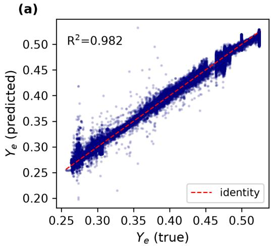

(b)  
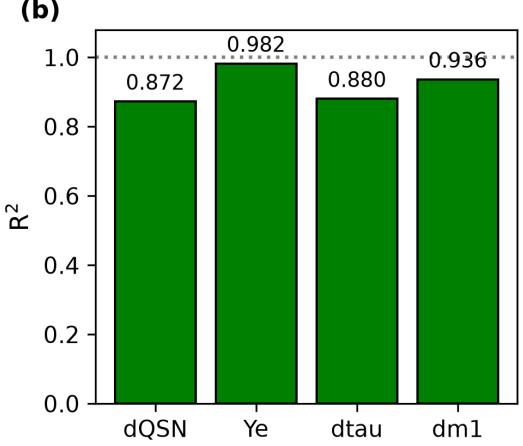  
Figure 1: Per-step accuracy of the wide model on a held-out split of the training distribution. (a) Predicted against true electron fraction with the identity line $( R ^ { 2 } = 0 . 9 8 2$ , mean absolute error $3 . 4 \times 1 0 ^ { - 3 } )$ . (b) Held-out $R ^ { 2 }$ per predicted quantity. These in-distribution figures are optimistic, and the remainder of this section shows they carry no ranking signal for deployment.

## 5.2. Seed variance forbids single-run comparison

Before comparing configurations we must establish what a diference means. We retrained two configurations five times each, varying only the seed. A narrow surrogate trained on the two innermost, densest cells survives 70, 73, 75, 89 and 102 steps (median 75, interquartile range 16). A broad surrogate trained on 128 cells spanning the whole radial domain survives 13, 21, 21, 26 and 29 steps (median 21, interquartile range 5). The distributions do not overlap: the worst specialist seed exceeds the best broad seed. A Mann-Whitney rank test gives complete separation $( U = 2 5 $ of 25, exact two-sided $p = 0 . 0 0 8 )$ ; with five draws per group this quantifies only that no overlap was observed.

The spread is substantial in absolute terms, and single-run survival counts should not be compared when they difer by less than it. This discipline immediately overturns two of our own earlier conclusions: doubling network width from 256 to 512, a 3.5× increase in parameters, and reweighting the loss so that crash-critical core cells receive half the gradient mass, each looked decisively harmful on a single seed. Repeated over five seeds, neither difers from the unmodified broad model (medians 22 and 22 against 21; $p = 0 . 8 4$ and $p = 0 . 5 2 )$ . Their apparent harm was seed noise, and we report them as null results.

One intervention survives: routing each cell by local density to one of two narrow experts, trained respectively on the dense core and the outer zone. This raises the median to 47 steps, significantly above the broad model $( p =$ 0.016) at no additional inference cost, since exactly one expert is evaluated per cell. It remains cleanly separated from the single narrow specialist $( p =$ 0.008), so specialisation, not routing, carries most of the benefit.

Two features of these runs are entirely seed-independent and carry the mechanism. The crash location: the narrow specialist fails in the outer, low-density region it never saw during training, in all five seeds, while the broad model fails at the dense core, in all five. Breadth of training domain does not buy competence at the core; it costs it. And the physical health of the terminal state: only three of five specialist seeds carry central density monotonically upward to the causality abort, while none of the five broad seeds does, every one reversing density before failing. Judged by physical validity rather than step count, the broad configuration never once reaches a healthy state.

A caution follows, and it bears on scoring generally. Ranking five configurations by median survival and by fraction of seeds reaching a physically healthy terminal state gives diferent orderings: the wider model ranks near the bottom by step count yet matches the specialist for clean terminal physics, while the routed model ranks second by step count and near the bottom by physical health. Step count and physical validity are only partly coupled, and a surrogate evaluated on the former alone can look better than it is.

## 5.3. Ofline error carries no usable ranking signal

Scored on a single common held-out set spanning both dense core and outer zone, verified by content fingerprinting to be excluded from every training set, the narrow model has the worst one-step electron-fraction error, 0.150, while the broad model has the best, 0.023; their survival medians are 75 and 21. Restricting the error to the dense core, where the broad model actually fails, does not change this.

Pooling fourteen independently trained surrogates scored on that common set, the Spearman rank correlation coeficient between one-step error and survival is $\rho = + 0 . 7 3 \ : ( p = 0 . 0 0 3 , n = 1 4 )$ , significant and of the sign opposite to the one a practitioner would assume. It would be tempting to report this as evidence that ofline error is actively anti-predictive. It is not, and the distinction matters. The fourteen models fall into two families, narrow and broad, and the families difer in both quantities at once: the narrow family has higher ofline error and longer survival. Controlling for family, the partial rank correlation collapses to $\rho = - 0 . 0 4 \ ( p = 0 . 8 9 ; \mathrm { F i g . \ 2 } )$ . Within families it is not statistically significant and changes sign $( \rho ~ = ~ + 0 . 6 0 , ~ p ~ = ~ 0 . 2 1$ narrow; $\rho = - 0 . 3 1 , \ p = 0 . 4 5 \ \mathrm { b r o a d } )$ The pooled coeficient restates the diference between families rather than measuring any property of the metric. The multi-step rollout error growth factor is uninformative throughout $( \rho =$ +0.25, p = 0.39 pooled), as is any of these metrics for predicting whether the terminal state is physically healthy (point-biserial $r = 0 . 5 2 , p = 0 . 0 6$ , at best borderline).

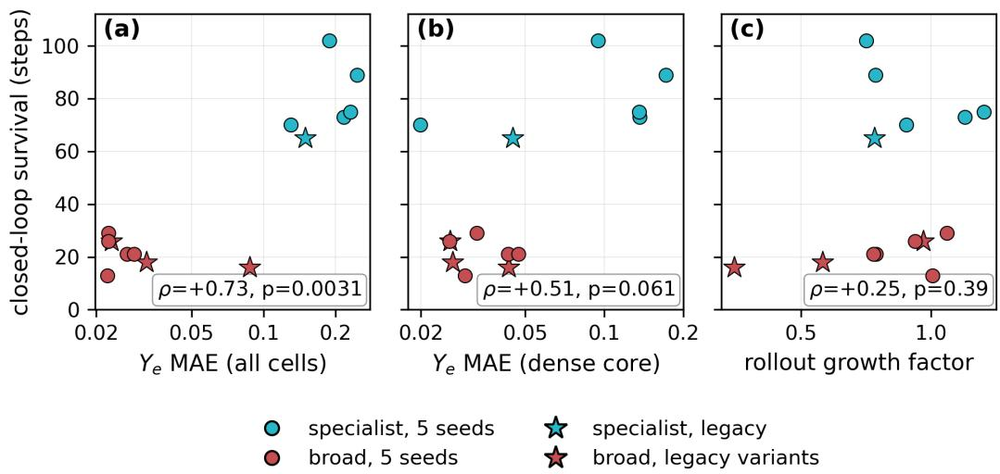  
Figure 2: Ofline error does not rank surrogates by closed-loop survival. Fourteen independently trained networks, all scored on one common held-out set (verified excluded from every training set), against closed-loop steps survived. The points separate into two clusters, narrow specialists (cyan, upper right) and broad models (red, lower left), and the apparently strong pooled correlation in the left panel is produced by that separation: within either cluster there is no trend, and the partial rank correlation controlling for cluster membership is $\rho = - 0 . 0 4 \ ( p = 0 . 8 9 )$ . Restricting the error to the dense core (centre), where the broad models actually fail, does not help, nor does the multi-step rollout error growth factor (right). Circles are the five seeds of each configuration; stars are earlier single-seed models.

A matched pair makes the resolution question concrete. Two checkpoints of the same network, trained from the same seed on the same data with the same recipe, difer in their weights (a consequence of an irreproducible divergence during training) and survive 56 and 397 closed-loop steps, a factor of seven. Scored on the common set, their one-step electron-fraction errors difer by 2.95%. A second pair difers by 0.85% ofline while surviving 326 and 389 steps. In both pairs the longer-surviving model does have the slightly lower ofline error, so the metric is not pointing the wrong way; it simply has no resolution. Three per cent of ofline signal stands against a sevenfold diference in the quantity that matters. We report this as illustration rather than evidence in its own right: two pairs are an anecdote, and they arise from a training divergence we could not deliberately reproduce.

Table 2: Identity ablations isolate two obstacles. The framework itself is sound (300 clean steps with an inert network). Predicting the conserved energy and momentum causes an acute density collapse at step 2; with those held fixed, a slow electron-fraction drift terminates the run near step 170.
<table><tr><td>Configuration</td><td>Steps survived</td><td>Density</td></tr><tr><td>Full identity (network inert)</td><td>300 (clean)</td><td>stable</td></tr><tr><td>Network drives Ye+QSN+entropy only</td><td>~170</td><td>stable, then Ye drift</td></tr><tr><td>Network drives everything (including τ, m1)</td><td>2</td><td>collapse 100×</td></tr></table>

The cross-model comparison only became meaningful once evaluation sets were unified. Judged on their own evaluation sets, these models appear to show a clean monotone relationship between one-step error and survival, an artefact of the narrow-domain model being scored on the two easy cells it was trained on. The practical consequence is therefore sharper than a simple inversion: ofline error carries no usable ranking signal within a configuration, and the only pooled correlation it exhibits is a confound. Selection must be performed in the loop, on distributions rather than single runs.

## 6. Closed-loop failure: diagnosis

## 6.1. Two obstacles, separated by ablation

Identity ablations localise the failure precisely (Table 2).

## 6.2. The acute obstacle: an unlearnable target

The acute collapse has a quantitative explanation, and it is a general lesson about which quantities should be regressed at all. The per-step change of the conserved matter energy is not merely small but, for most steps, unrepresentable: across $1 0 ^ { 5 }$ logged cell updates the relative change $| \Delta \tau / \tau |$ is bit-exact zero in 59% of steps, its median is exactly zero, its 99th percentile is $5 . 7 \times 1 0 ^ { - 5 }$ , and it never exceeds $3 \times 1 0 ^ { - 4 }$ . In the network’s transformed target units the median signal is $1 . 5 \times 1 0 ^ { - 1 1 }$ against a prediction error of $8 . 3 \times 1 0 ^ { - 8 }$ , a factor ∼5500 (Fig. 3).

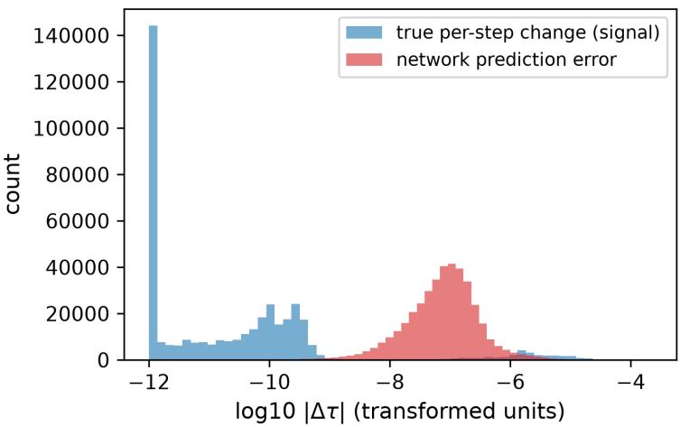  
Figure 3: Signal-to-noise of the energy channel. The true per-step energy change is ∼ 5500× smaller than the network error: the increment is below the learnable resolution.

A regression network cannot represent a target that is exactly zero most of the time and minute otherwise; it emits small non-zero noise everywhere. The downstream conserved-to-primitive inversion then amplifies this spurious increment: a 5% energy error drives $\mathrm { { a } \sim 1 0 0 \times }$ density collapse within one to two steps, because the coupled recovery ties density, energy and Lorentz factor together.

Seen through a conservation lens the same mismatch appears as $\mathrm { a } \sim 1 0 ^ { 7 }$ energy-conservation residual relative to the solver, and it would be easy to report that as a physics violation requiring a conservation-enforcing architecture. It is not: it is the same sub-resolution mismatch, a representable radiation-energy change set against a matter-energy change below floating point resolution. A conservation-by-construction layer is therefore structurally infeasible here, and the correct remedy is diferent in kind.

## 6.3. The remedy: predict the learnable state, derive the rest

Because the conserved energy increment is unlearnable but the thermodynamic state is not, we form the energy through the equation of state rather than predicting it. The network outputs $Y _ { e }$ and entropy; the conserved energy is then computed exactly as the solver does, from $( \rho , Y _ { e } ^ { \prime } , S ^ { \prime } )$ , consistent with the conserved rest-mass density by construction. This removes the density collapse and extends closed-loop survival from 2 to 102 steps with a stable density profile.

This is the one obstacle we solve outright, and it generalises: when a target’s true increment lies below the achievable regression error, do not regress it. Predict the quantities that carry signal and recover the rest through the exact algebraic relations the solver already implements, trading a noisy regression for a consistent map.

## 6.4. The chronic obstacle: covariate shift

With the acute collapse removed, the surviving failure is a slow electronfraction drift. The states the network-driven loop visits are massively of the training manifold: their 5-nearest-neighbour distance to the real-data manifold is 73× larger than real-to-real, 61% lie beyond the 99th-percentile Mahalanobis shell, and their entropy reaches 62 against a real maximum of 7.8, thermodynamic states no real cell trajectory ever occupies (Fig. 4).

This explains why more real data cannot help: a model trained on the full 2.3M all-cell dataset (density span $5 \times 1 0 ^ { 4 }$ , 17% of records in the crash regime) still drifts and crashes at the same ∼ 100 steps. The visited states lie in no real trajectory, so only collecting them from the network’s own rollout can cover them.

## 6.5. The failure is distributed, not localisable

The crash is not attributable to any single channel. Clamping the electron fraction, clamping the entropy (the most of-manifold variable, reaching $\sim 8 \times$ its physical maximum), and flooring the density guard that formally aborts the run each leave the crash at the same ∼ 550 steps: the abort merely migrates to the next guard. The instability is a distributed of-manifold drift of the whole state, which is why only a global correction helps and why channel-wise clamping is not a remedy.

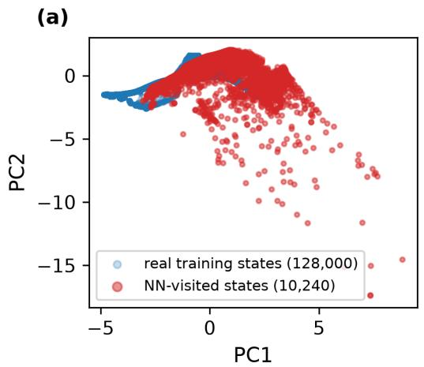

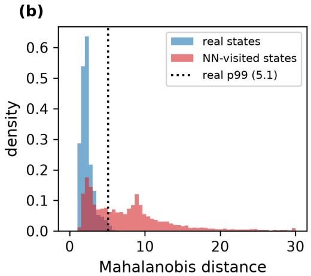  
Figure 4: The closed-loop drift is covariate shift. Network-visited states (red) lie far of the real-data manifold (blue): 73× the real-to-real nearest-neighbour distance, 61% beyond the 99th-percentile Mahalanobis shell, with unphysical entropies $( \leq 6 2$ versus a real maximum of 7.8) that no real trajectory occupies.

## 7. Stabilisation strategies and their limits

We attacked the drift from four directions. None removed it, and each confirms the same diagnosis from a diferent angle.

Multi-step rollout training. Training on an eight-step rollout of a single trajectory did not measurably improve long-horizon stability: one-step and rollout-trained models diverge almost identically (mean closed-loop Ye error 0.61). A curriculum along one trajectory teaches the network nothing about the of-trajectory states the loop actually visits.

Periodic solver re-anchoring. Inserting one true solver step every N network steps does not cure the drift. With the best aggregated model (horizon 557), re-anchoring as often as every 50 steps still crashes at the same ∼ 557: by the time a re-anchor fires the drift is spread across the whole state, so a single coupling correction cannot pull it back. A cadence small enough to matter, $N \sim 3$ , would in any case forfeit the speedup.

Dataset aggregation. We instrumented the loop to log the of-trajectory states it visits, labelled them with the true solver, filtered the non-finite near-crash cascade (78k→ 71k records; keeping them, or up-weighting them

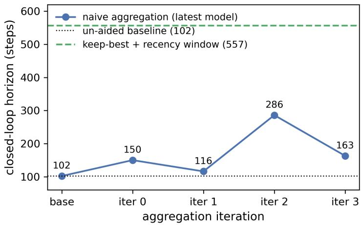  
Figure 5: Closed-loop horizon (steps to a genuine crash) versus aggregation iteration. Naive aggregation oscillates without converging (best 286, output model worse); keep-best plus a recency window reaches 557 steps, 5.5× the baseline (102), with $Y _ { e }$ held physical.

4×, instead regresses the model to a step-2 crash), and retrained, verifying deployed weights by checksum at every step. Naive iteration, retraining on all aggregated states and deploying the latest model, raises the horizon but does not converge: over four rounds it oscillates $1 0 2  1 5 0  1 1 6  2 8 6  1 6 3$ (all genuine crashes), and the procedure’s output, the last model, is not its best. Two corrections fix this: keep the best-horizon model across rounds, and weight recently visited states over old ones. The improved scheme reaches 557 steps (5.5× the baseline) while holding $Y _ { e }$ physical (Fig. 5), following Ross, Gordon & Bagnell (2011). The loop nonetheless crashes eventually: aggregation substantially delays the covariate-shift divergence without removing it.

Contractivity. The one model-side lever that helps at no inference cost is contractivity: penalising the Jacobian norm of the coupling map with respect to the fed-back variables lengthens the horizon by ∼36% at unchanged perstep accuracy, and it stacks with aggregation. Stacked, the two reach 2625 closed-loop steps as a pure replacement, 26× the un-aided baseline, with a physical electron fraction throughout. (A less-characterised run of the same configuration exceeded 4000 steps.) This is the correct target for a directed, feedback-amplified error: it constrains how the map responds to its own recirculated output rather than damping input noise.

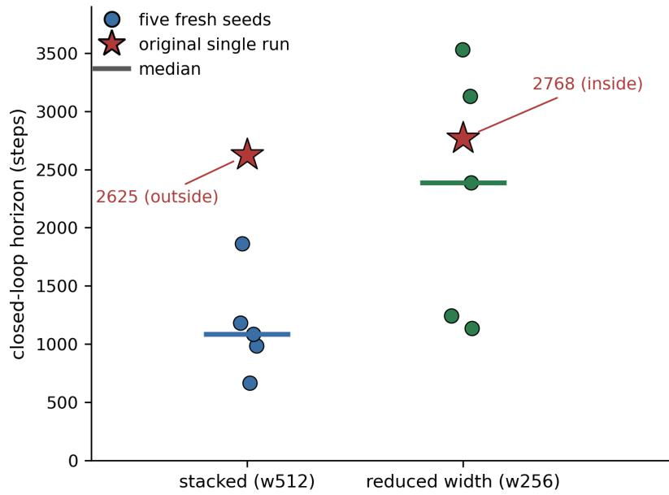  
Figure 6: Closed-loop horizon for five independently seeded trainings of the stacked configuration and of its reduced-width counterpart, against the single-run figures quoted elsewhere in this paper (stars). The original 2625-step figure falls outside its own five-seed distribution; the reduced-width single run (2768) falls inside its own.

Single-run horizons of this kind are not reliable evidence about stability, and a later $n = 5$ check of this exact configuration shows why. Five freshly trained seeds survive 666, 985, 1086, 1183 and 1862 steps (median 1086), so the 2625-step figure lies outside the entire distribution, above every one of the five fresh runs (Fig. 6). Data, recipe and export pipeline were verified identical between the original run and the check, so the most likely explanation is an unusually favourable initialisation that was never independently reproduced rather than any identified diference in method. We report 2625 as the original verified measurement but read it as a likely favourable outcome, with the five-seed distribution as the more representative estimate of what this architecture and recipe deliver. The same check covers the reducedwidth network of Sec. 8.7, whose five seeds survive 1134, 1243, 2388, 3128 and 3532 steps (median 2388); a Mann-Whitney test between the two arms gives $U = 3 , p = 0 . 0 5 6$

## 7.1. A regime-transfer warning

Aggregation is the most efective of the four levers pre-bounce. It does not transfer to the post-bounce regime, and the direction of the failure is worth reporting precisely because it is counterintuitive.

Applying the identical recipe post-bounce, five independently initialised models were each trained on a baseline dataset and again after aggregation augmentation (each augmented set combining the full prior archive with fresh self-visited states, 3.5 to 3.6M records against the baseline’s 2.3M), then evaluated by deterministic closed-loop rollout. All five got worse: mean survival fell from 64 steps to $6 ,$ a reduction of 3.9 to 19× in every one of the five pairs, with genuine physical divergence (the electron fraction oscillating between its guard floor and ceiling within two to three steps) rather than a training artefact.

Aggregating states from short, already-unstable trajectories and retraining pulls the network toward correcting those specific of-manifold points at the expense of general behaviour near the training manifold, sharpening the on-trajectory limit rather than loosening it. The same lever helping in one regime and actively hurting in another is itself the lesson: no stabilisation in this class transfers across regimes by default, and each must be validated in the regime it is meant to fix.

## 7.2. Stability is attainable; it is not the same as speedup

Two results turn this into a constructive statement. A per-cell gate, deferring only individual cells whose Mahalanobis distance exceeds a threshold, stabilises the loop over the full test window (more than 1000 steps with no crash), so closed-loop stability is attainable. And tracing the loop against the true trajectory rather than counting steps to a crash yields a physically motivated remedy: in the early-infall phase the true change in $Y _ { e }$ is essentially zero, so the surrogate’s tiny but systematic error accumulates ballistically, driving $Y _ { e }$ from its correct, nearly frozen 0.443 down to 0.384, whereupon the softened equation of state contracts the core too fast. Freezing every fed-back channel where the coupling is physically negligible, so that the surrogate is the identity exactly where the true change is, reproduces the true central-density trajectory to six figures through twelve thousand steps.

Both results are genuine and neither delivers acceleration. The freeze enforces the identity precisely where the surrogate would otherwise have been called, so it saves nothing; the substantive test is deferred to the high-density phase where the freeze lifts. The gate is the subject of the next section.

Table 3 collects the horizons.  
Table 3: Closed-loop horizon by method: steps the live simulation survives before a genuine crash, with the resulting speedup or solver-deferral fraction. Horizons are not directly comparable across rows, as they probe diferent phases and stabilisations; all are in the early-infall regime. The un-aided baseline for the “×” factors is the thermodynamic-energy model without drift coverage (102 steps).
<table><tr><td>Configuration</td><td>Horizon (steps)</td><td>Speedup / defer</td><td>Note</td></tr><tr><td>Naive surrogate ~2 (predicts τ, m1 too)</td><td></td><td> $\mathrm { n / a }$ </td><td>acute sub-resolution energy collapse (100× density)</td></tr><tr><td>+ thermodynamic 102 energy</td><td></td><td></td><td>pure replacement acute obstacle removed; chronic  $Y _ { e }$  drift remains</td></tr><tr><td>iteration</td><td>Aggregation, naive 102–286 (oscillates) pure replacement does not converge; last</td><td></td><td>model  $\neq$  best</td></tr><tr><td>Aggregation, keep- 557 (5.5×) best + recency</td><td></td><td>pure replacement</td><td> $Y _ { e }$  physical; delays but does not remove the crash</td></tr><tr><td>+ Jacobian con- 2625† (26×) tractivity</td><td></td><td>pure replacement levers stack;</td><td>contractivity alone gives ~36%</td></tr><tr><td>Per-cell lanobis gate</td><td>Maha- &gt; 1000</td><td>95–99% solver</td><td>stable, but ≈0.95× once gate cost is included</td></tr><tr><td>Ensemble- disagreement gate</td><td>1365</td><td>94% to solver</td><td>better detector, still no speedup</td></tr><tr><td>Near-identity freeze ~5000 (Ye only)</td><td></td><td>pure replacement central density tracks</td><td>truth within ~15%</td></tr><tr><td>Near-identity freeze ≥12000 (all channels)</td><td></td><td>pure replacement reproduces central</td><td>density to six figures</td></tr><tr><td>Target: full collapse 53,203 to bounce</td><td></td><td> $\mathrm { n / a }$ </td><td>high-density phase is the substantive test</td></tr></table>

†A subsequent n = 5 check of this configuration (Sec. 7) found this single-run figure lies outside the resulting five-seed distribution (median 1086, range 666–1862); read it as a verified but likely favourable outlier.

## 8. The economics of uncertainty gating

The uncertainty gate deserves separate treatment because it is the standard remedy for exactly the failure diagnosed above, because its economics can be written down in closed form, and because the result is the most restrictive of the paper.

## 8.1. Break-even in closed form

Let f be the target block’s share of critical-rank wall clock, d the fraction of cells the gate defers to the exact solver, $r = t _ { \mathrm { n n } } / t _ { \mathrm { s o l v e r } }$ the surrogate’s percall cost ratio, and $g = t _ { \mathrm { g a t e } } / t _ { \mathrm { s o l v e r } }$ the gate’s own per-cell cost ratio. Every cell pays the gate; deferred cells then pay the solver, the remainder pay the network. The end-to-end speedup is

$$
S ( d ) = \frac { 1 } { 1 - f \left[ 1 - \left( g + d + \left( 1 - d \right) r \right) \right] } ,\tag{1}
$$

and the gate breaks even $( S = 1 )$ at

$$
d _ { \mathrm { b r e a k } } \ = \ { \frac { 1 - g - r } { 1 - r } } .\tag{2}
$$

Two properties are worth noting. The break-even deferral is independent of $f \colon$ the runtime share sets how much a gate can win or lose, not whether it wins. And the gate can never amortise once $g \ > \ 1 - r .$ , which for our measured $r = 0 . 1 7$ means $g > 0 . 8 3$

## 8.2. Measured inputs

We measured g in situ at three implementation qualities. At the production compiler settings actually deployed (plain -O2, no fast-math) the full-covariance Mahalanobis test costs $g ~ = ~ 0 . 3 9 1$ of a solver call, giving $d _ { \mathrm { b r e a k } } ~ = ~ 0 . 5 3$ . Optimised compiler flags roughly halve this to $g \ = \ 0 . 1 5 3$ $( d _ { \mathrm { b r e a k } } = 0 . 8 2 )$ , and a diagonal covariance approximation lowers it to $g =$ 0.016 $( d _ { \mathrm { b r e a k } } = 0 . 9 8 )$

We flag one methodological trap encountered here, because it is easy to repeat. Our first estimate of g came from a standalone microbenchmark compiled with aggressive flags and gave $g = 0 . 0 3 1$ , a factor 12.7 below the in-situ value. The gap decomposes into roughly 4.5× from compiler flags (the production translation unit is built at plain -O2), 1.08× from a standardisation loop the microbenchmark omitted, and the remainder from in-situ cache efects. A component benchmarked outside the build and call context of its deployment can misstate its cost by an order of magnitude.

## 8.3. Correct detection forces near-total deferral

The gate is a correct out-of-distribution detector (Fig. 7): it separates large blow-up errors cleanly (area under the curve 0.996) while flagging the small accumulating drift errors only weakly (0.66). In the loop it prevents the crash. Precisely because it detects correctly, it routes almost every cell to the solver: the measured deferral fraction has median 96.8% (interquartile spread within a few tenths of a per cent; the 77.3% minimum occurs only in the startup transient), so the network evaluates 3.2% of cells.

Substituting the deployed $g = 0 . 3 9 1 , d = 0 . 9 6 8 , r = 0 . 1 7$ and the prebounce critical-rank share $\mathnormal { f } \ = \ 0 . 1 1 9$ (Table 1) into Eq. (1), the coupling block costs 136% of its original unguarded time and the end-to-end change is $0 . 9 6 \times :$ a measured slowdown, not merely an absence of gain. The postbounce share, $f ~ = ~ 0 . 1 6 9$ , gives a slightly worse $S ~ = ~ 0 . 9 4 \times$ at the same operating point.

## 8.4. Deferral is nearly invariant to surrogate quality

The natural response is that a better surrogate would defer less. We measured this directly, and it is the decisive result.

Two outer-zone models difering fivefold in training depth and fourfold in closed-loop survival (median 326 against 82 steps) defer, respectively, 98.1% and 99.7% of cells: a diference of 1.6 percentage points. Broken down by rank, the model sensitivity is concentrated in the four high-volume outerzone ranks, which carry eight times the gate evaluations, and even there the deeper model never defers below 91%. Of the four low-volume dense-core ranks, three sit at exactly 1.000 for both models and the fourth difers by one percentage point.

The deferral fraction is set by how pervasively the state has left the training manifold, not by the surrogate’s accuracy. A direct test with a better detector confirms the same asymmetry from the other side: an ensembledisagreement detector, which separates drifted from valid states markedly better than the Mahalanobis distance (area under the curve 0.96 against 0.91), extends the stable horizon (1365 against 1038 steps) but still defers 94% of cells.

The measured operating point, d = 0.98 to 0.99, sits at or beyond all three break-evens including the idealised diagonal one (Fig. 8). No gate variant we tested, at any surrogate accuracy this project reached, yields a speedup. The gate is not miscalibrated and it is not too expensive; a correct out-of-distribution detector applied to a loop that leaves distribution cannot accelerate it. To reach $d _ { \mathrm { b r e a k } } = 0 . 5 3$ from 0.98 would require a surrogate orders of magnitude more accurate than anything achieved here, and Sec. 5 shows we could not even reliably select such a model ofline if we had it.

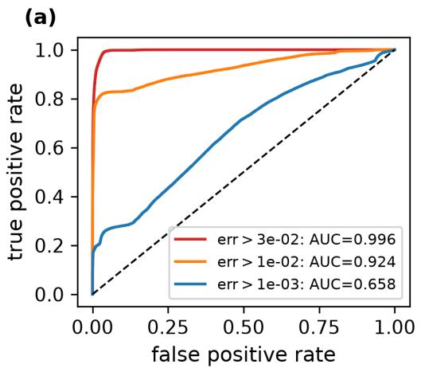

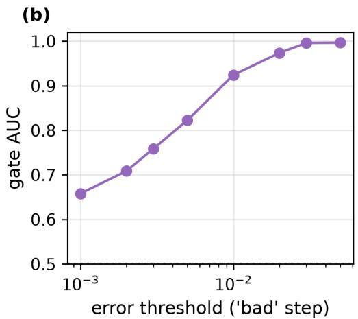  
Figure 7: Detection quality of the Mahalanobis gate. (a) ROC curves for three definitions $\mathrm { o f \ a \ ^ { \mathrm { \sc ~ a } } } \mathrm { b a d } ^ { \mathrm { \prime } }$ step: the gate separates large blow-up errors cleanly $( \mathrm { e r r > 3 \times 1 0 ^ { - 2 } }$ : AUC 0.996) but the small accumulating errors that constitute the drift only $\mathrm { w e a k l y ~ ( e r r > 1 0 ^ { - 3 } }$ AUC 0.658). (b) Gate AUC as a function of the error threshold, rising from 0.66 to 0.996: the detector is sharp exactly for the failures that are not the binding ones.

We verified both limits of the gate bitwise, since a mechanism this consequential should not rest on an unverified switch: routing every cell to the network reproduces the ungated network trajectory exactly, and routing every cell to the solver reproduces a solver-only run exactly.

## 8.5. A hybrid that localises the failure

Because whole-network comparisons cannot say where the loop fails, we built a radial hybrid in which the network drives all cells denser than a cutof and the exact solver drives the rest, verifying both limits bitwise as above.

The result separates two failure modes that every previous experiment had conflated. Replacing the core network by the exact solver, leaving the network in the outer zone, reproduces the pure-network survival distribution value for value across all five seeds (70, 73, 75, 89, 102), with the same outer crash location: the specialist’s ceiling is set entirely by the outer zone, and its core network is never driven to failure because the outer zone always fails first. Conversely, replacing the outer network by the exact solver raises survival to a median of 108 steps (against 75; $p = 0 . 0 2 4 )$ until an intrinsic instability of the core network appears at 92 to 131 steps, now with no seed reaching a healthy terminal state.

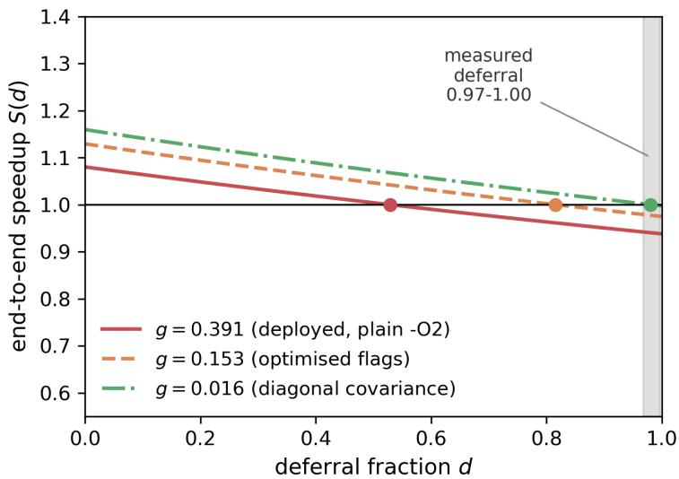  
Figure 8: Break-even deferral fraction as a function of gate cost, from $\operatorname { E q . }$ (2). Cutting the $\mathrm { g a t e ^ { \prime } s }$ cost by $2 4 \times$ (deployed $g = 0 . 3 9 1$ to idealised diagonal $g = 0 . 0 1 6 )$ only moves the break-even from $0 . 5 3$ to 0.98: the formula’s dependence on $g$ is far shallower than its dependence on d near $d = 1$ . The measured deferral, $0 . 9 7 { - } 1 . 0 0 $ , sits at or beyond all three.

This also disposes of an intuition that is wrong in an instructive way. The dense core is the stifest region and the one where the surrogate destabilises, so it is natural to assume it is where the solver spends its time. It is not: under this cutof the network drives only 12% of cells, and the outer ranks issue roughly $7 . 4 \times$ more solver calls each. The dense core is the unstable region, not the expensive one. A hybrid ofloading only the core therefore cannot save wall clock even if perfectly stable, and on a call-count basis would cost more than deploying the network everywhere.

Within this hybrid, matching the surrogate’s training domain to the zone it drives does help. Replacing the core specialist extrapolated onto the outer zone with a network trained on the outer cells raises median survival from $8 7$ to 224 steps, with individual seeds reaching 868. Tested on twelve paired training seeds under a strictly reproducible protocol (verified by retraining seeds to bitwise-identical weights), the magnitude-aware Wilcoxon signedrank test is significant $( W = 6 , p = 0 . 0 0 7 )$ , but the efect is not uniform: three of twelve seeds favour the untargeted baseline, so the magnitude-blind sign test is not significant $( 9 / 1 2 , p = 0 . 1 5 )$ , and an eight-seed pilot showing seven of eight positive was optimistic in its consistency. Training-domain match is a real and sizeable lever on outer-zone survival, but a variable one across seeds. It changes nothing about wall clock: network cost is architecturebound and identical, the mirror configuration is a measured 1.11× slowdown, and a longer-surviving surrogate keeps the expensive zone alive longer with out making the step faster.

## 8.6. Pure replacement reaches parity and still fails

The gate’s alternative is pure replacement with no fallback. Here the cost question has a subtlety that took us two rounds of measurement to see, and we report both rounds because the diference between them is instructive.

The configuration stable over the early infall is a width-512 network of $1 . 8 3 \times 1 0 ^ { 6 }$ parameters. Evaluated through the per-cell scalar loops in which it was first deployed, its forward pass costs $2 . 3 \times 1 0 ^ { - 3 } \mathrm { { s } }$ s per cell against the solver’s $3 . 4 \times 1 0 ^ { - 4 } \mathrm { s }$ , seven times more expensive than the routine it replaces, and the end-to-end run is correspondingly 1.62× slower than the pure solver (232 against 143 ms per step over a matched 2000-step window). Evaluated through a $\mathrm { B L A S } .$ -backed path, the identical network with the identical weights costs $2 . 7 \times 1 0 ^ { - 4 } \ : \mathrm { s }$ s per cell, a factor of 8.3 less, and $9 . 4 \times 1 0 ^ { - 5 } \mathrm { s }$ when the call is additionally batched across the cells of one sweep, a further factor of 2.9. The two implementations agree to $6 . 7 \times 1 0 ^ { - 1 6 }$ per call, at the floating-point reassociation floor.

Re-timed end-to-end on the BLAS path, with five runs per arm in alternating order over a common window, the surrogate takes $2 1 3 \pm 1 3$ ms per step against the pure solver’s $2 0 4 \pm 1 5$ , a ratio of 0.96× that a permutation test cannot separate from parity $( p = 0 . 4 1 )$ . Absolute per-step times are not comparable between the two rounds, which used diferent windows under diferent node load, but the two are consistent where it matters. The scalar arm’s 89 ms per step of excess over its own baseline is the diference between network and solver cost, so with the measured per-call ratio of 6.6 it implies a gross network cost of 105 ms against a 16 ms solver block. Dividing the network term by 8.3 predicts 201 ms for the BLAS arm, against the $2 1 3 \pm 1 3$ observed: consistent within the scatter, and predicting parity from the scalar-path numbers alone. The reduced-width network of Sec. 8.7 reaches 192 ms per step on the same path, nominally 1.06×, likewise inside the scatter.

The correction matters more than its size suggests. The cost penalty we first measured, and the asymmetry we first drew from it, were properties of an unoptimised inference path rather than of the surrogate. Once that is fixed, pure replacement is cost-competitive: it neither pays a penalty nor delivers a saving, which is exactly what the budget of Sec. 4 predicts for a block at 11.9% to 17.7% of critical-rank wall clock. The runs timed above use the unbatched BLAS path, where the surrogate is already 1.3× cheaper per call than the routine it replaces; batching the call across a sweep would make it 3.6× cheaper and still leave the end-to-end figure below the ≈ 1.2× ceiling of Sec. 4. That is the Amdahl argument in its strongest form, and it does not depend on our network being slow.

What pure replacement fails on is therefore not cost. It is that the configuration is demonstrated stable only over a few thousand of the 53,203 steps the infall phase takes, and that it is unfaithful within that window (Sec. 8.7). A cost-competitive surrogate that cannot complete the phase, and drifts while it runs, is not a usable replacement.

Running the same network through two implementations also produced a result we did not anticipate, and it bears on how closed-loop horizons should be reported. The two paths agree to $6 . 7 \times 1 0 ^ { - 1 6 }$ per call, yet the scalar-path run passes 2000 steps while the BLAS-path run terminates at step 293 through the same causality guard that ends every other run in this study. Neither is stochastic: four repetitions of the BLAS build give 293 steps every time, and its trajectory is reproducible digit for digit. The horizon is thus a reproducible property of a network together with the arithmetic that evaluates it, not of the trained network alone. Rounding diferences at the reassociation floor are amplified by the feedback loop into a factor of seven in survival. This sharpens the five-seed result of Sec. 8.7, where the spread could still be attributed to diferent initialisations: here the weights are bitidentical. A closed-loop horizon quoted without its inference path is therefore not a reproducible number, and comparisons of horizons across papers, or across builds within one project, should be read with that in mind.

## 8.7. Can the stable network be compressed?

The asymmetry just described invites an obvious response: obtain the large network’s stability in a small, cheap one. We tested this, because it is the natural next question. A width-256 network $( 5 . 2 \times 1 0 ^ { 5 }$ parameters, a 3.5× reduction and the same size as the cheap network that was not stable on its own) was retrained from scratch on identical data with the identical recipe that made the large one stable, aggregation data plus the Jacobiancontractivity penalty, on $8 . 7 \times 1 0 ^ { 6 }$ records. The large network’s outputs never entered its loss, so this is retraining at reduced width rather than knowledge distillation. Against a pure-solver baseline of 289 and 288 s over the matched window, the large network takes 467 s (0.618×) and the reduced-width one 330 and $3 2 7 \mathrm { s } \ ( 0 . 8 7 8 \times )$ . Both figures are from the scalar inference path; on the BLAS path of Sec. 8.6 the two arms are 0.96× and 1.06×, so the cost gap between them is itself largely an artefact of that path and the reduction buys little once inference is optimised. The $n = 5$ check reported in Sec. 7 finds no statistically demonstrable stability cost to the reduction, and if anything the trend runs opposite to the naive expectation that the smaller network would be less robust. Compressing further does not continue to help: a width-128 network $( 1 . 6 \times 1 0 ^ { 5 }$ parameters) trained identically crashed at step 1772 and did not complete the matched timing window, so no cost comparison could be obtained at that size. That last figure rests on a single run and falls inside the five-seed range of the larger arm, so it bounds the useful compression range only weakly.

Two conclusions follow. First, compression moves the result toward the Amdahl ceiling; it does not move the ceiling. With the block between 11.9% and 17.7% of critical-rank wall clock, even a free surrogate would cap between 1.14× and 1.21×, and both arms measured 0.96× and 1.06× on the BLAS path, inside run-to-run scatter of parity and far below that cap. Second, compression does not improve fidelity, and fidelity was poor in both arms from the outset. Deleptonisation sets in as soon as the collapse starts and lowers $Y _ { e }$ throughout, accelerating above $\approx 1 0 ^ { 1 1 }$ g cm−3; over the matched window analysed here, which stays near $6 \times 1 0 ^ { 9 } \mathrm { g c m ^ { - 3 } }$ , that decline is still slow enough that the reference $Y _ { e }$ holds at 0.442630 to the six digits logged. Both networks depart from it within the first hundred steps, both run low in entropy throughout, and the cheaper network ends 24% low in central density against the larger one’s 3.3%. This is the same dissociation between survival and fidelity documented below for the gate in Sec. 9, reached by an entirely diferent route. A compression study evaluated on step count alone would have reported a clear success.

The three stable configurations therefore span, in measured wall clock: 0.94 to 0.96× (gated, including its detection cost), 0.96× to 1.06× (pure replacement at full and reduced width on the BLAS inference path, both inside run-to-run scatter), and parity within contention noise (batched postbounce surrogate, 0.296 against 0.318 s per step). None accelerates the code measurably, and the budget of Sec. 4 says none could have exceeded ≈1.2×.

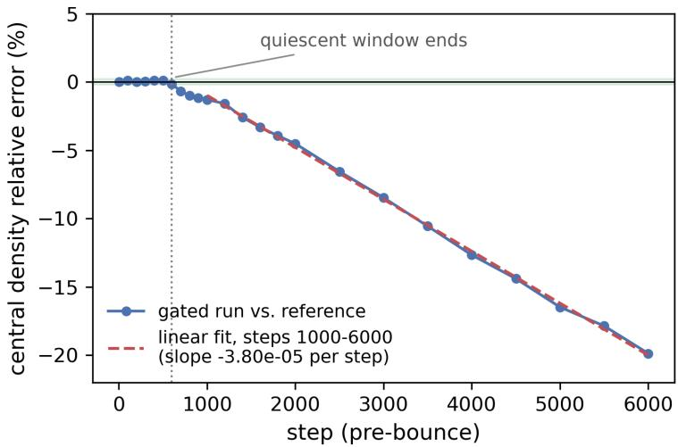  
Figure 9: Central density of a gated run relative to a solver-only reference from the same starting state, pre-bounce. After a quiescent window of ∼600 steps the error grows linearly (fitted slopes of −3.6 to $- 3 . 7 \times 1 0 ^ { - 5 }$ per step over steps 1000–3000, 3000–6000, and the full window, $R ^ { 2 } > 0 . 9 9 3$ in each case), reaching −19.9% by step 6000 despite 99.88% of cells being handled by the exact solver throughout.

## 9. Stability is not fidelity

A gated loop that never crashes is often reported as a success. Crashfreedom and trajectory fidelity are diferent claims, and the speedup analysis above does not settle the second. We tested it directly.

From an identical verified starting state we ran a matched pair: a gated run deferring 99.88% of cells to the solver and evaluating the network on 0.12%, against a solver-only reference, both to 6000 steps in the pre-bounce regime.

The electron fraction and entropy at a sampled cell jump to a small fixed ofset within the first 10 to 25 steps and then stay flat for the remaining ∼ 5975 steps: no continued drift there. Central density behaves diferently. Its relative error stays under 0.2% for roughly the first 609 steps, then grows linearly, with a fitted slope between $- 3 . 6 \times 1 0 ^ { - 5 }$ and $- 3 . 7 \times 1 0 ^ { - 5 }$ per step whether measured over steps 1000 to 3000, 3000 to 6000, or the full window $( R ^ { 2 } > 0 . 9 9 3$ in each case), reaching −19.9% by step 6000 (Fig. 9).

Three points follow. The growth is linear rather than accelerating, which is consistent with the directed-bias mechanism of Sec. 10 rather than with a variance-driven instability. It is non-self-correcting: deferring all but a fraction of a per cent of cells to the exact solver does not pull the trajectory back. And it is invisible to the crash criterion, so a stability-only evaluation would have reported this run as a success.

We are explicit about scope. This test covers the pre-bounce regime, where the gate’s deferral fraction is at its most conservative, and the code’s fixed benchmark length was reached well before bounce. Whether the drift stays linear, accelerates, or saturates in the post-bounce regime is not established by this measurement and remains open.

## 10. Mechanism: a directed bias, not a variance blow-up

A single causal chain organises the study, and identifying it correctly determines which remedies can work.

The per-step error of the surrogate is small but systematic: a directed bias rather than zero-mean noise. A directed error accumulates ballistically, linearly in the number of steps, carrying the state progressively of the training manifold; the network, accurate only on that manifold, grows less accurate there, which accelerates the departure. Once of-manifold the visited states are pervasively out of distribution, so any correct gate must defer almost every cell and cannot accelerate. The directed-bias measurement and the covariate-shift measurement are therefore not competing diagnoses but the cause and efect of one mechanism.

This distinguishes our setting from the standard framing. The autoregressive-surrogate literature typically treats closed-loop instability as variance-driven, to be damped by input noise (Sanchez-Gonzalez et al., 2020) or a pushforward stability loss (Brandstetter et al., 2022). Those remedies attack a fluctuation that is here sub-dominant to a systematic drift.

## 10.1. The bias is robust

We measured $\mathrm { | b i a s | / M A E } = 0 . 2 4 9 \pm 0 . 1 8 6$ post-bounce, robust under bootstrap over three seeds and ten temporal regions. It is not an artefact of the single progenitor: evaluating the frozen model on the full 20 ms postbounce data of six independent progenitors (12 to $4 0 M _ { \odot } )$ , each an entirely separate collapse, the directed electron-fraction bias persists at comparable magnitude (|bias|/MAE of 0.60 to 0.85 against 0.60 on the trained holdout; Fig. 10). Nor is it specific to one regime: networks trained and evaluated on pre-bounce records show a directed bias of the same size $( 0 . 3 3 \pm 0 . 2 0 $ for $Y _ { e }$

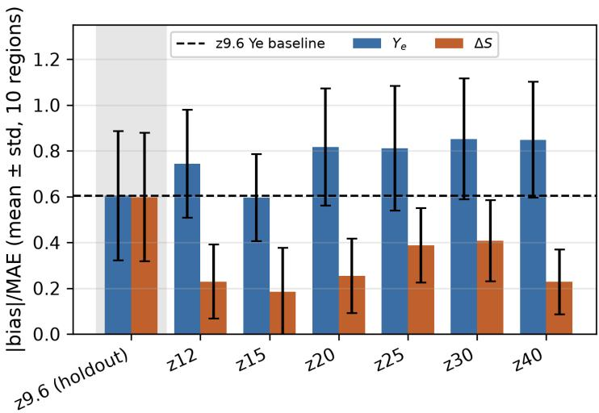  
Figure 10: The directed bias generalises across progenitors. The frozen model is evaluated on the 20 ms post-bounce data of six independent progenitor collapses (12 to 40 $M _ { \odot } ) ;$ ; the directed electron-fraction bias |bias|/MAE stays at 0.60 to 0.85, comparable to the 0.60 baseline (dashed), while the entropy-increment bias is smaller on the independent masses. Bootstrap over ten temporal regions.

$0 . 4 0 \pm 0 . 2 8$ for the entropy increment), and a larger residual network ofers no improvement $( 0 . 4 0 \pm 0 . 2 2 ) $

## 10.2. A systematic exclusion of remedies

Against a directed, ballistically accumulating bias, none of the cheap levers works. Not network capacity or architecture. Not training-set volume. Not training-data diversity: in a controlled comparison at matched sample size, a model trained on a mixture of five progenitor masses shows the same directed bias as the single-progenitor model on every evaluation set, including on masses contained in its own training mixture (0.44 to 0.53 against 0.39 to 0.54, all within bootstrap error bars). And not ofset or conservation debiasing: decomposing the correction into a channel-wise constant ofset and a state-dependent part is structurally informative (the entropy bias is almost entirely a constant ofset, the electron-fraction bias almost entirely statedependent), but quantitatively negative. On the $Y _ { e }$ channel |bias|/MAE falls only from $0 . 6 0 1 \pm 0 . 2 8 2$ to $0 . 4 9 7 \pm 0 . 3 4 6$ under a global scalar ofset and $0 . 4 5 6 \pm 0 . 2 5 0$ under the state-dependent correction, reductions lying entirely within the bootstrap error bars. About three-quarters of the directed bias is orthogonal to any ofset- or conservation-based correction, so a conservedquantity correction of the kind that stabilises autoregressive neural operators elsewhere (Current et al., 2026) does not transfer to this regime.

Two levers of a diferent kind remain, and both follow from the mechanism rather than from generic regularisation. The first exploits a structural property of a directed bias: it has a roughly fixed absolute floor while the true per-step physical change shrinks with the timestep. Predicting over the physical timescale $\tau _ { \varepsilon } = | X | / | \mathrm { d } X / \mathrm { d } t |$ and rescaling the increment by $\mathrm { d } t / \tau _ { \varepsilon }$ shrinks the delivered per-step bias by $\left. \mathrm { d } t / \tau _ { \varepsilon } \right.$ without touching the physical part. The ratio of bias to physical change drops by one to two orders of magnitude in every physically active regime (for $Y _ { e }$ from 0.092 to 0.0046, a factor of 20; for the entropy increment from 0.080 to 0.0016, a factor of 49), and it transfers to all six independent progenitors $( Y _ { e } ; ~ 0 . 0 1 6$ to 0.032; entropy: 0.0006 to 0.0015). The second is of-manifold coverage, which the covariateshift analysis independently identifies, and which has also been reported as decisive for a closely analogous surrogate of stif nuclear burning (Grichener et al., 2025).

The per-step figures above are the direct measurement, and for a rescaling lever they predict the reduced ballistic accumulation, because ballistic growth is by construction linear in the per-step bias. In the loop the picture is more restrictive, and we report it rather than resting on the per-step proxy. Applied on its own post-bounce, the rescaling extends survival from 50 to 59 steps, an 18% gain that is of no practical use. The reason is that it addresses the wrong failure mode: a channel ablation localises the acute post-bounce death to the radiation-moment prediction, not to $Y _ { e }$ and entropy. Freezing the radiation moments to their incoming values alone carries the loop to 2582 steps, and adding the timescale rescaling on top of that carries it to at least 9998 steps, the point at which the run terminated cleanly at its 2 ms cutof rather than crashing. The lever therefore does contribute in the loop, but only once the dominant failure mode has been removed by other means, and the combined configuration is a diagnostic rather than a usable scheme: it survives, but its central density settles at $4 . 6 \times 1 0 ^ { 1 1 } \mathrm { g c m ^ { - 3 } }$ instead of returning to proto-neutron-star values, so it is another instance of survival without fidelity rather than a remedy.

## 10.3. Where pushforward training does and does not help

The regime-dependence of Sec. 7.1 recurs here, in the opposite direction, which strengthens rather than weakens the point.

Pushforward training (Brandstetter et al., 2022) made no measurable difference pre-bounce, where the drift is a covariate shift into states no singletrajectory curriculum covers. Post-bounce the failure has a diferent character, and there it works ofline: over an eight-step rollout the plain model’s radiation-channel error grows roughly fortyfold, the ballistic accumulation expected of the feedback loop, whereas the pushforward-trained model’s error stays flat, at the cost of a few-fold worse one-step accuracy. This is the first lever in this study to measurably suppress rollout accumulation ofline.

The closed loop bears out both the promise and the caveat. Substituting the pushforward-trained model into the same restart test, changing only the weights, the run survives 65 steps rather than 31, and the specific dense-core instability diagnosed there does not recur at the tracked cell. But the same guard eventually fires, this time at a low-density outer cell far from the two dense-core cells the pushforward training saw. The regularisation transfers partially and genuinely, doubling survival and removing the failure mode it was trained against, but it relocates rather than eliminates the instability, moving it to a region outside its training diversity, exactly as the two-cell caveat predicts.

## 10.4. Attribution controls: solver-only and subcycled runs

One control deserves emphasis because it is the kind that is easy to omit. To establish that the instabilities above are caused by the substitution rather than by the host code in this regime, we ran the unmodified solver alone through the same window, bypassing the network entirely at every step. It completes the full 20 ms window without incident, with central density flat within 0.1% of nuclear saturation over its final 3000 steps, in clear contrast to every network-driven run. The instability is attributable to the substitution, not to the grid, domain size, or a latent numerical issue.

A second control cuts the other way and is equally necessary. A subcycling scheme calling the solver only every N-th step, swept over $N \in \{ 1 , 5 , 1 0 , 2 0 \}$ , produced an unexpected result. In all four arms the network drives the electron fraction and entropy at every step, so none is a solver-only reference; the sweep varies only how often the radiation is solved exactly. $N = 1$ , the arm that solves it every step, is the only configuration that aborts, while $N { = } 5 , 1 0 , 2 0$ all reach the cutof. They do so, however, at central densities of order $1 0 ^ { 5 }$ to $1 0 ^ { 6 } \mathrm { g c m ^ { - 3 } }$ , eight to nine orders of magnitude below nuclear saturation and five to six below the $8 . 6 \times 1 0 ^ { 1 1 } \mathrm { g c m ^ { - 3 } }$ at which the reference failed. Every subcycled configuration reaches an unphysical end state; the only distinction is whether the numerical degeneracy crosses a floating-point exception threshold before the cutof. Subcycling converts a hard crash into a silently unphysical but numerically stable trajectory, which is a worse failure mode for any application that trusts a non-aborting run, and we do not report it as a usable operating point. Measured wall clock across the four runs (0.270, 0.279, 0.276, 0.256 s per step) shows no discernible speedup at any N in any case.

## 11. Discussion and transferable guidance

## 11.1. What generalises

Our result is not that neural surrogates fail, nor that this particular network was inadequate. It is that three specific quantities determine whether a surrogate for an inner solver block can accelerate a simulation, and that all three can be measured before substantial modelling efort is spent.

The runtime share bounds everything. Per-call cost is the quantity that is easy to measure and the one most often reported; the validated share of critical-path wall clock is the quantity that bounds the achievable gain. Our target block was the most expensive routine per call in its code and still only 16.9% of critical-rank wall clock. A surrogate 5.8× cheaper per call tied.

Ofline metrics do not rank deployments. Across fourteen models the only significant pooled correlation was a between-family confound, and within families the metric had no resolution at all. If model selection matters, it must be done in the loop, on distributions.

The economics of gating are unfavourable. Equation (2) can be evaluated before a gate is built, from a per-call cost ratio and an estimate of the deferral fraction. The counterintuitive part is that deferral is set by the physics of the drift rather than by the detector or the surrogate: ours moved 1.6 percentage points across a fourfold change in survival.

Stability and fidelity are diferent acceptance criteria. A gated run deferring 99.88% of cells never crashed, yet drifted −19.9% in central density over 6000 steps.

Identify the error’s character before choosing a remedy. A directed bias accumulates linearly and is attacked by contractivity, timescale rescaling, or of-manifold coverage; a variance-driven blow-up is attacked by noise injection or pushforward losses. Applying the second class to the first damps a sub-dominant term, which is consistent with what we measured.

Validate stabilisations in the regime they are meant to fix. Dataset aggregation gave a 5.5× horizon gain pre-bounce and a 3.9 to 19× degradation post-bounce, across five paired seeds.

## 11.2. A pre-deployment checklist

For practitioners considering a surrogate for an inner solver block, we suggest the following order of operations, which is roughly the reverse of the order we followed.

1. Profile the full time step with exclusive timers and validate the decomposition by summation. Compute 1/(1 − f) on the critical path. If that ceiling does not justify the efort, stop here.

2. Measure the per-call cost of a surrogate of the size the problem plausibly needs, in the build and call context of deployment rather than a standalone benchmark.

3. Check whether the target increment is representable at all. If its true magnitude is at or below the achievable regression error, do not regress it; derive it from learnable quantities through the exact relations already implemented.

4. Establish seed variance before comparing configurations, and compare distributions.

5. If gating is contemplated, estimate d from a short instrumented run and evaluate Eq. (2) before building the gate.

6. Evaluate fidelity against a reference trajectory, not only survival.

7. Re-validate every stabilisation separately in each regime of the simulation.

## 11.3. Limitations

We state the boundaries of these claims plainly. All closed-loop and timing measurements are from a single code, a single progenitor, and a single node configuration; only the bias-generalisation tests of Sec. 10 use additional progenitors. The runtime share is a property of this code and configuration, and while the volume-scaling test found no path to a solver-dominated regime, we do not extrapolate it to production scale. The load-imbalance estimate is a model with stated bracketing assumptions, not a measurement. The fidelity test of Sec. 9 covers only the pre-bounce regime. The compression study of Sec. 8.7 rests on two timing runs per arm, so its cost figures are solid, but on a single stability run per arm; the five-seed follow-up reported in the same section has since replaced that single-run horizon comparison with a distributional one; the width-128 result rests on a single crashed run. The GPU analysis of Sec. 4.6 is an analytical estimate, not a measurement. And the chronic drift is diagnosed precisely but not solved: every stable configuration we tested is stable by deferring to the solver, by enforcing the identity where the coupling is negligible, or over a horizon short of the full collapse.

We also note what a favourable case this was. The target block has a percell, state-in/state-out interface with no spatial stencil and no history, the training data are abundant and exactly labelled by the solver itself, and the surrogate reaches $R ^ { 2 } = 0 . 9 8$ on held-out data. A block with a less convenient interface would not have done better on any of the three barriers.

## 12. Conclusions

We set out to accelerate a stif implicit coupling solve with a neural surrogate, in a setting deliberately chosen to be favourable: the target is the most expensive routine per call in its code, its interface is per-cell and historyfree, and exact training labels are abundant. No configuration we tested accelerates the simulation end-to-end, and the reasons are structural.

The block is 16.9% of critical-rank wall clock, capping any surrogate at ${ \approx } 1 . 2 \times ;$ a surrogate $5 . 8 \times$ cheaper per call ties the solver, and the surrogate stable enough to run unaided is 1.3× cheaper per call on the inference path we timed, 3.6× cheaper when the call is batched, and at parity end-to-end $( 0 . 9 6 \times , ~ p = 0 . 4 1 )$ . Ofline accuracy cannot select among surrogates: the pooled correlation across fourteen models is a between-family confound and vanishes $( \rho = - 0 . 0 4 )$ under control. A correct out-of-distribution gate must defer 96.8% to 99.7% of cells because the loop leaves its training distribution within a few steps, a fraction nearly invariant to surrogate quality, placing the operating point beyond every break-even we measured; including its own cost the gated loop is a 0.94 to 0.96× slowdown. Crash-freedom does not imply fidelity: a gated run deferring 99.88% of cells accumulates a linear −19.9% central-density bias over 6000 steps.

Two results are constructive. When a target increment lies below the achievable regression error, predicting the learnable thermodynamic state and deriving the rest through the exact algebraic relations removes an acute instability outright (2 → 102 steps). And closed-loop stability is attainable: dataset aggregation with best-model retention and a recency window, stacked with a Jacobian-contractivity penalty, reaches a median of 1086 closed-loop steps across five independently seeded trainings (one verified single run reached 2625, 26× the un-aided baseline, though that figure lies outside the five-seed distribution and should be read as a favourable outlier rather than typical) as a pure replacement. Neither delivers acceleration, and the second holds only in the regime it was validated in: the same aggregation degrades post-bounce survival by 3.9 to 19×.

The credible route to a real speedup in this block is not a learned surrogate but a restructured exact solver, for which Laiu et al. (2020) report up to 100× on GPU for this same physics, and, in our code, the static-decomposition load imbalance that dominates the profile and is not a machine-learning problem at all.

We regard the methodology as the transferable contribution: measure the runtime share before the per-call cost, validate in the loop on distributions rather than single runs, evaluate gate economics against the break-even fraction before building the gate, and treat stability and fidelity as separate acceptance criteria. Above all, a surrogate for a stif, coupled simulation is trustworthy only on-trajectory, and per-step accuracy alone can be confidently, and dangerously, misleading.

## CRediT authorship contribution statement

L. Thümmler: Conceptualization, Methodology, Software, Validation, Formal analysis, Investigation, Data curation, Writing – original draft, Writing – review & editing, Visualization. T. Kuroda: Software (original radiation-hydrodynamics code), Resources, Writing – review & editing.

## Declaration of competing interest

The authors declare that they have no known competing financial interests or personal relationships that could have appeared to influence the work reported in this paper.

## Funding

This research did not receive any specific grant from funding agencies in the public, commercial, or not-for-profit sectors.

## Data and code availability

The instrumented solver, the surrogate training and inference code, and the logged coupling datasets are available from the authors on reasonable request.

## Acknowledgements

Computations were performed on the yamazaki cluster at the Max Planck Institute for Gravitational Physics (Albert Einstein Institute).

Declaration of generative AI and AI-assisted technologies in the manuscript preparation process

During the preparation of this work the authors used Anthropic Claude in order to translate author-written text into English. After using this tool, the authors reviewed and edited the content as needed and take full responsibility for the content of the published article.

## References

S. Abbar, A. Harada, H. Nagakura, Machine learning-based detection of nonaxisymmetric fast neutrino flavor instabilities in core-collapse supernovae, Phys. Rev. D, 111, 063077, 2025, arXiv:2401.10915.

G. M. Amdahl, Validity of the single processor approach to achieving large scale computing capabilities, AFIPS Conference Proceedings, 30, 483–485, 1967.

T. W. Baumgarte, S. L. Shapiro, Numerical integration of Einstein’s field equations, Phys. Rev. D, 59, 024007, 1999.

J. Brandstetter, D. Worrall, M. Welling, Message Passing Neural PDE Solvers, ICLR, 2022, arXiv:2202.03376.

S. Current, C. Kumar, D. Gaitonde, S. Parthasarathy, Benchmarking Long Roll-outs of Auto-regressive Neural Operators for the Compressible Navier– Stokes Equations with Conserved Quantity Correction, arXiv:2601.22541, 2026.

T. Dieselhorst, W. Cook, S. Bernuzzi, D. Radice, Machine Learning for Conservative-to-Primitive in Relativistic Hydrodynamics, Symmetry, 13, 2157, 2021, arXiv:2109.02679.

E. Endeve, V. Mewes, J. A. Harris, M. P. Laiu, R. Chu, S. A. Fromm, A. Mezzacappa, et al., thornado+Flash-X: A Hybrid DG-IMEX and Finite-Volume Framework for Neutrino-Radiation Hydrodynamics in Core-Collapse Supernovae, 2026, arXiv:2601.00976.

D. Fan, D. E. Willcox, C. DeGrendele, M. Zingale, A. Nonaka, Neural Networks for Nuclear Reactions in MAESTROeX, ApJ, 940, 134, 2022, arXiv:2207.10628.

A. Grichener, M. Renzo, W. E. Kerzendorf, R. Farmer, S. E. de Mink, E. P. Bellinger, C. Chan, N. Chen, E. Farag, S. Justham, Nuclear Neural Networks: Emulating Late Burning Stages in Core-collapse Supernova Progenitors, ApJS, 279, 49, 2025, arXiv:2503.00115.

A. Harada, S. Nishikawa, S. Yamada, Deep Learning of the Eddington Tensor in Core-collapse Supernova Simulation, ApJ, 925, 117, 2022, arXiv:2104.13039.

M. Hempel, J. Schafner-Bielich, A statistical model for a complete supernova equation of state, Nucl. Phys. A, 837, 210–254, 2010, arXiv:0911.4073.

D. Kochkov, J. A. Smith, A. Alieva, Q. Wang, M. P. Brenner, S. Hoyer, Machine learning-accelerated computational fluid dynamics, PNAS, 118, e2101784118, 2021, arXiv:2102.01010.

T. Kuroda, T. Takiwaki, K. Kotake, A New Multi-energy Neutrino Radiation-Hydrodynamics Code in Full General Relativity and Its Application to the Gravitational Collapse of Massive Stars, ApJS, 222, 20, 2016, arXiv:1501.06330.

T. Kuroda, Impact of a Magnetic Field on Neutrino-Matter Interactions in Core-collapse Supernovae, ApJ, 906, 128, 2021, arXiv:2010.10371.

T. Kuroda, M. Shibata, Numerical relativity simulations of black hole and relativistic jet formation, MNRAS, 533, L107–L112, 2024, arXiv:2404.02792.

T. Kuroda, K. Kawaguchi, M. Shibata, Collapse of rotating white dwarfs and multimessenger signals, MNRAS, 541, 1649–1669, 2025, arXiv:2503.17082.

M. P. Laiu, J. A. Harris, R. Chu, E. Endeve, thornado-transport: Andersonand GPU-accelerated nonlinear solvers for neutrino-matter coupling, J. Phys.: Conf. Ser., 1623, 012013, 2020.

Y. Li, P. Y. Chen, T. Du, W. Matusik, Learning Preconditioners for Conjugate Gradient PDE Solvers, ICML, PMLR 202, 19425–19439, 2023, arXiv:2305.16432.

N. McGreivy, A. Hakim, Weak baselines and reporting biases lead to overoptimism in machine learning for fluid-related partial diferential equations, Nature Machine Intelligence, 6, 1256–1269, 2024, arXiv:2407.07218.

M. Raissi, P. Perdikaris, G. E. Karniadakis, Physics-informed neural networks: A deep learning framework for solving forward and inverse problems involving nonlinear partial diferential equations, J. Comput. Phys., 378, 686–707, 2019.

S. Richers, J. Froustey, S. Ghosh, F. Foucart, J. Gomez, Asymptotic-state prediction for fast flavor transformation in neutron star mergers, Phys. Rev. D, 110, 103019, 2024, arXiv:2409.04405.

S. Ross, G. Gordon, J. A. Bagnell, A reduction of imitation learning and structured prediction to no-regret online learning, AISTATS, PMLR 15, 627–635, 2011, arXiv:1011.0686.

A. Sanchez-Gonzalez, J. Godwin, T. Pfaf, R. Ying, J. Leskovec, P. W. Battaglia, Learning to Simulate Complex Physics with Graph Networks, ICML, PMLR 119, 8459–8468, 2020, arXiv:2002.09405.

M. Shibata, T. Nakamura, Evolution of three-dimensional gravitational waves: Harmonic slicing case, Phys. Rev. D, 52, 5428, 1995.

M. Shibata, K. Kiuchi, Y. Sekiguchi, Y. Suwa, Truncated Moment Formalism for Radiation Hydrodynamics in Numerical Relativity, Prog. Theor. Phys., 125, 1255–1287, 2011, arXiv:1104.3937.

S. Takahashi, A. Harada, S. Yamada, An Extended Closure Relation by Light-GBM for Neutrino Radiation Transport in Core-collapse Supernovae, ApJ, 986, 67, 2025, arXiv:2409.02719.

V. Trifonov, A. Rudikov, O. Iliev, Y. M. Laevsky, I. Oseledets, E. Muravleva, Learning from Linear Algebra: A Graph Neural Network Approach to Preconditioner Design for Conjugate Gradient Solvers, arXiv:2405.15557, 2024.

S. Typel, G. Röpke, T. Klähn, D. Blaschke, H. H. Wolter, Composition and thermodynamics of nuclear matter with light clusters, Phys. Rev. C, 81, 015803, 2010, arXiv:0908.2344.

K. Um, R. Brand, Y. Fei, P. Holl, N. Thuerey, Solver-in-the-Loop: Learning from Diferentiable Physics to Interact with Iterative PDE-Solvers, NeurIPS, 2020, arXiv:2007.00016.

X. Zhang, Y. Yi, L. Wang, Z.-Q. J. Xu, T. Zhang, Y. Zhou, Deep Neural Networks for Modeling Astrophysical Nuclear Reacting Flows, ApJ, 990, 105, 2025, arXiv:2504.14180.