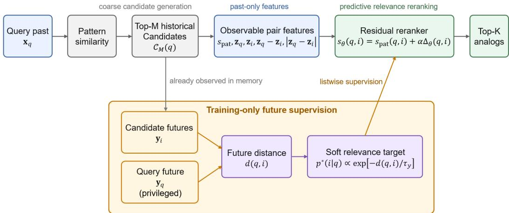
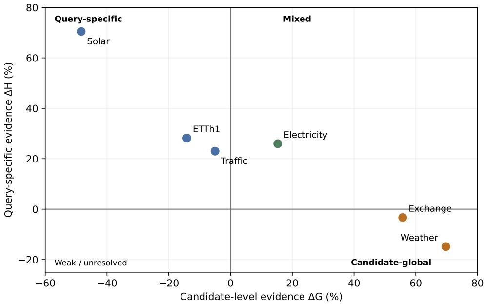

# Which Histories Matter for Time Series Forecasting? Learning Predictive Relevance with Future Supervision

Yong-Hoon Choi Youngjin Cho Division of Robotics, Kwangwoon University Seoul 01897, Republic of Korea yhchoi@kw.ac.kr yjaycho@kw.ac.kr

## ABSTRACT

Historical retrieval for time-series prediction commonly treats past similarity as a proxy for usefulness. We ask a different question: which historical examples should be expected to matter for a query? We define predictive relevance as expected future utility conditioned on information observable at inference, and use realized futures only during training as privileged supervision. A normalizedpattern retriever first forms a coarse candidate set, and a lightweight residual MLP learns a listwise future-compatibility target while remaining strictly past-only at test time. Our method does not replace similarity-based candidate generation; it asks whether similarity-selected candidates can be ranked by a more predictive final relevance criterion. Optimal relevance further decomposes into candidate-level utility and query-specific compatibility, motivating Candidate-Prior and Shuffled-Future controls. Across six benchmarks, the reranker improves Pattern retrieval while revealing candidate-global, query-specific, and mixed relevance regimes. On 12 confirmatory tasks it improves Pattern in all 12 and outperforms a matchedprotocol SARAF retrieval rule in all 12. Architecture-matched ablations show that correct future supervision, rather than the MLP or added context alone, drives gains in query-specific regimes. Alternative-similarity experiments provide an important counterpoint: a strong last-value-anchored L2 rule remains superior in some domains, whereas future-supervised relevance is strongest in query-specific regimes such as Solar. Candidate-pool diagnostics show that this contrast is not explained solely by coarse Pattern retrieval. The resulting picture is not universal superiority of one retriever, but a structured, domain-dependent notion of historical relevance.

Code and reproducibility. The implementation, executable notebooks, result summaries, and reproduction instructions are available at https://github.com/dearyonghoon/which-histories-matter/.

## 1 INTRODUCTION

Retrieval-augmented time-series forecasting uses historical examples as external evidence: given a current observation window, a system retrieves related past segments and exploits their observed futures when forming a prediction (Tire et al., 2024; Han et al., 2025; Ning et al., 2025). Most systems therefore require a practical notion of relevance, and past-pattern similarity is a natural default.

Similarity, however, is only a proxy for final predictive relevance. Two histories can look nearly identical and diverge afterward under nonstationarity or regime shifts. Recent methods respond with stationarity-aware diversification, semantic retrieval, spectral/channel-wise matching, or selective attention over retrieved references (Zhou et al., 2026a;b; Kang et al., 2026; Lee et al., 2026). These advances improve retrieval and aggregation, but leave a more basic question open: what makes a historical example predictively relevant to the current query? We retain similarity as a practical coarse search mechanism and study whether its selected candidates should be ordered by a different, more predictive criterion.

If the query future were known, one could judge a candidate by how compatible its subsequent trajectory is with that future. The future is unavailable at inference, but retrospectively observed during training. We therefore treat future outcomes as privileged supervision: they define which historical candidates were useful, while the deployed retriever must predict that relevance using past-only information. This follows the spirit of learning with privileged information (Vapnik and Vashist, 2009; Karlsson et al., 2021), but the privileged variable supervises retrieval relevance, not the forecast output itself.

We instantiate this idea with a deliberately simple model. Pattern similarity first constructs a Top-M candidate set, and a lightweight residual MLP reranks only those candidates using observable query/candidate context and a listwise target induced by future compatibility. Thus, we do not claim to remove similarity from the retrieval pipeline: an example excluded by the initial Top-M pool cannot be recovered by the reranker. The small architecture is intentional: our goal is to isolate the learning signal rather than attribute gains to a larger backbone, cross-attention module, or mixture of experts. At test time, neither query futures nor any future-derived feature is available.

The framework also exposes a structural distinction. A candidate can matter because it is broadly useful across many queries, or because it is specifically compatible with the current query. We formalize this as a decomposition of optimal observable relevance into candidate-level utility and query-specific compatibility. A Candidate Prior and an architecture-matched Shuffled-Future control provide empirical diagnostics for the two components.

Our experiments support a nuanced conclusion. Future-supervised reranking improves Pattern retrieval across six benchmarks, and on the four-dataset confirmatory suite it beats Pattern on all 12 dataset–horizon tasks and a matched SARAF retrieval rule on all 12. Yet a stronger similarity analysis shows that no retrieval rule dominates universally: last-value-anchored L2 remains stronger on Electricity and Exchange, while future supervision is decisively stronger on Solar. Crucially, the Shuffled-Future control shows that correct future correspondence is highly valuable exactly in the domains with query-specific relevance, but not in candidate-global Exchange. Thus, the scientific result is not that learning always defeats similarity; it is that predictive relevance has different structures across domains, and training-timefutures reveal those structures.

Our contributions are threefold. (1) We formulate historical retrieval as learning expected predictive utility and introduce a strictly past-only reranker supervised by futures available only during training. (2) We decompose predictive relevance into candidate-level and query-specific components and introduce controls that diagnose the two. (3) Across six benchmarks, strong alternative similarities, a matched SARAF comparison, architecture/supervision ablations, candidate-pool diagnostics, and a financial case study, we show when learned relevance helps, when simple geometric priors remain stronger, and why retrieval quality should be separated from forecast aggregation.

## 2 RELATED WORK

## 2.1 RETRIEVAL-AUGMENTED TIME-SERIES FORECASTING

RAF studies retrieval augmentation for time-series foundation models (Tire et al., 2024); RAFT retrieves historical segments with similar input patterns and incorporates their observed futures into forecasting (Han et al., 2025); TS-RAG combines retrieved patterns with a time-series foundation model through a learnable MoE-based augmentation module (Ning et al., 2025). Recent work broadens the retrieval principle. SARAF adapts relevance/diversity to stationarity (Zhou et al., 2026a); SERAF combines numerical and generated semantic retrieval (Zhou et al., 2026b); CRAFT performs channel-wise retrieval with time-domain pruning and spectral ranking (Kang et al., 2026); and Cross-RAG uses cross-attention to selectively consume retrieved references (Lee et al., 2026). PFRP builds a global historical memory and combines retrieved global predictions with a local forecaster (Du et al., 2026), while PIR uses local and global historical context for post-hoc forecast revision (Liu et al., 2025). Most recently, KReF treats retrieved historical futures as a query-local empirical predictive distribution and uses training-free handcrafted or frozen random features for retrieval (Zhang and Su, 2026).

These approaches optimize forecasting, post-hoc correction, probabilistic prediction, or retrieval and aggregation design. Our focus is complementary: we isolate candidate-level predictive relevance itself, ask what it should mean, and study how futures available only during training can supervise a past-only ranking rule. For this reason, methods whose primary output is a forecaster or predictive distribution are discussed as related retrieval paradigms rather than forced into a candidate-level matched comparison.

## 2.2 LEARNED RETRIEVAL AND PRIVILEGED INFORMATION

Learned retrieval has also been studied outside forecasting; for example, Gammell et al. (2026) learn input-dependent historical retrieval for nonstationary classification. Our supervision differs because historical future trajectories provide direct, retrospective evidence of candidate utility. More broadly, learning using privileged information allows variables available only during training to shape a predictor that must operate without them at test time (Vapnik and Vashist, 2009). Time-series privileged information has been used to improve prediction from baseline variables (Karlsson et al., 2021), and TimeKD uses ground-truth future information in a teacher for privileged knowledge distillation (Liu et al., 2025). In contrast, our privileged futures do not teach a forecaster or representation directly; they supervise a ranking over historical examples.

## 3 PREDICTIVE RELEVANCE FROM PRIVILEGED FUTURES

## 3.1 PROBLEM FORMULATION

For a query past window $\mathbf { x } _ { q } \in \mathbb { R } ^ { L }$ , let $\mathbf { z } _ { q } = \phi ( \mathbf { x } _ { q } )$ denote compact features derived only from the observed past, and define ${ \mathbf o } _ { q } = ( { \bf x } _ { q } , { \bf z } _ { q } )$ . Candidate i is represented analogously by $\mathbf { o } _ { i }$ . Candidate memories are temporally valid: the complete future of candidate i is observed before the query time. A conventional retriever ranks candidates by

$$
s _ { \mathrm { p a t } } ( q , i ) = \sin ( \mathbf { x } _ { q } , \mathbf { x } _ { i } ) .\tag{1}
$$

After channel-wise normalization using training-period statistics, let $\mathbf { y } _ { q } , \mathbf { y } _ { i } \in \mathbb { R } ^ { H }$ denote relative future trajectories. We define future distance and utility as

$$
d ( q , i ) = \frac 1 H \lVert \mathbf y _ { q } - \mathbf y _ { i } \rVert _ { 2 } ^ { 2 } , \qquad u ( q , i ) = - d ( q , i ) .\tag{2}
$$

Since $\mathbf { y } _ { q }$ is unavailable at inference, the population target of predictive retrieval is the utility recoverable from observable information,

$$
\begin{array} { r } { \boxed { r ^ { * } ( \mathbf { o } _ { q } , \mathbf { o } _ { i } ) = \mathbb { E } [ u ( q , i ) \mid \mathbf { o } _ { q } , \mathbf { o } _ { i } ] . } } \end{array}\tag{3}
$$

Future trajectories provide realized utility labels only during training.

## 3.2 CANDIDATE GENERATION AND RESIDUAL RERANKING

We center each past window, normalize its $\ell _ { 2 }$ magnitude, and use cosine similarity (equivalently Pearson ranking for these univariate windows) to construct $\mathcal { C } _ { M } ( \boldsymbol { q } )$ . Generic benchmarks use samechannel candidates. Importantly, our current method does not replace candidate generation; it asks whether similarity-selected candidates can be ranked by a more predictive notion of relevance. The learned score only reorders $\mathcal { C } _ { M } ( \boldsymbol { q } )$ , so if a relevant candidate $i ^ { * } \notin \mathcal { C } _ { M } ( q )$ , it cannot be recovered. We therefore move beyond similarity as the final relevance criterion, not as the coarse retrieval mechanism. The context ϕ contains seven lightweight past-only statistics: current relative level, short versus-long mean displacement, recent and long-range change, short-to-long difference-volatility ratio, normalized slope, and lag-1 autocorrelation. For each pair,

$$
\begin{array} { r } { \mathbf { f } _ { q i } = [ s _ { \mathrm { p a t } } , \mathbf { z } _ { q } , \mathbf { z } _ { i } , \mathbf { z } _ { q } - \mathbf { z } _ { i } , | \mathbf { z } _ { q } - \mathbf { z } _ { i } | ] , } \end{array}\tag{4}
$$

and a two-layer MLP predicts a residual correction $\Delta _ { \theta } ( q , i ) = g _ { \theta } ( \mathbf { f } _ { q i } )$

$$
\begin{array} { r } { \left| s _ { \theta } ( q , i ) = s _ { \mathrm { p a t } } ( q , i ) + \alpha \Delta _ { \theta } ( q , i ) , \quad \alpha > 0 . \right| } \end{array}\tag{5}
$$

The reranker is intentionally small: it is a minimal instantiation of future-supervised relevance learning, not a claim that an MLP is the optimal retrieval architecture.

Inference-available path  
  
Figure 1: Future-supervised predictive retrieval. Pattern similarity constructs the coarse candidate set $\mathcal { C } _ { M } ( \boldsymbol { q } )$ . A lightweight residual reranker uses only observable past/context features. During training, the privileged query future and already-observed candidate futures define a soft relevance distribution for listwise supervision; the future branch is absent at inference.

## 3.3 FUTURE-COMPATIBLE SUPERVISION

For a training query, future distances within $\mathcal { C } _ { M } ( \boldsymbol { q } )$ are standardized to $\widetilde { d } _ { q i }$ and converted to a soft ranking target,

$$
p ^ { * } ( i \mid q ) = \frac { \exp ( - \widetilde { d } _ { q i } / \tau _ { y } ) } { \sum _ { j \in \mathcal { C } _ { M } ( q ) } \exp ( - \widetilde { d } _ { q j } / \tau _ { y } ) } .\tag{6}
$$

Figure 1 suppresses the within-candidate-set standardization in the schematic notation for readability. With $p _ { \theta } ( i \mid q ) = \mathrm { s o f t m a x } _ { i \in \mathcal { C } _ { M } ( q ) } s _ { \theta } ( q , i )$ , we optimize

$$
\boxed { \mathcal { L } _ { \mathrm { F C } } = - \mathbb { E } _ { q } \sum _ { i \in \mathcal { C } _ { M } ( q ) } p ^ { * } ( i \mid q ) \log p _ { \theta } ( i \mid q ) . }\tag{7}
$$

This objective learns a ranking over historical examples rather than a forecast of $\mathbf { y } _ { q }$ . Validation is chronological; after selecting the epoch count, the model is reinitialized and refit using the historical supervision available before test. No test-query future enters training, normalization, candidate construction, or scoring.

## 4 WHAT MAKES HISTORY PREDICTIVELY RELEVANT?

## 4.1 OPTIMAL OBSERVABLE RELEVANCE

Proposition 1 (Bayes-optimal predictive relevance). Assume $u ( q , i )$ hasfinite second moment. Among all relevancefunctions measurablefrom $( \mathbf { o } _ { q } , \mathbf { o } _ { i } ) , r ^ { * } ( \mathbf { o } _ { q } , \mathbf { o } _ { i } ) = \mathbb { E } [ u ( q , i ) \mid \mathbf { o } _ { q } , \mathbf { o } _ { i } ]$ uniquely minimizes expected squared relevance-estimation risk up to almost-sure equality.

This is the orthogonality property of conditional expectation (proof in Appendix A). It gives privileged futures a precise role: realized utility is observable during training, while its conditional expectation from past-only variables is the target required at inference.

## 4.2 CANDIDATE-LEVEL UTILITY AND QUERY-SPECIFIC COMPATIBILITY

Define

$$
G ^ { * } ( \mathbf { o } _ { i } ) = \mathbb { E } [ u ( q , i ) \mid \mathbf { o } _ { i } ] , \qquad H ^ { * } ( \mathbf { o } _ { q } , \mathbf { o } _ { i } ) = r ^ { * } ( \mathbf { o } _ { q } , \mathbf { o } _ { i } ) - G ^ { * } ( \mathbf { o } _ { i } ) .\tag{8}
$$

Then

$$
\boxed { r ^ { * } ( \mathbf { o } _ { q } , \mathbf { o } _ { i } ) = G ^ { * } ( \mathbf { o } _ { i } ) + H ^ { * } ( \mathbf { o } _ { q } , \mathbf { o } _ { i } ) . }\tag{9}
$$

Proposition 2 (Predictive relevance decomposition). $\mathbb { E } [ H ^ { * } ( \mathbf { o } _ { q } , \mathbf { o } _ { i } ) \mid \mathbf { o } _ { i } ] = 0$ . With finite variance, $G ^ { * }$ and $H ^ { * }$ are orthogonal, so $\mathrm { V a r } ( r ^ { * } ) = \bar { \mathrm { V a r } } ( G ^ { * } ) + \bar { \mathrm { V a r } } ( \dot { H } ^ { * } )$

Thus, two domains can have equally imperfect Pattern retrieval for different reasons: one may contain broadly useful candidates (large candidate-level component), while another requires query-dependent compatibility.

## 4.3 CONTROLS FOR RELEVANCE STRUCTURE

Candidate Prior ranks each candidate by its average future compatibility with historical training queries in the same semantic stratum. It is query independent and diagnoses candidate-global structure; it is not asserted to equal the theoretical $\check { G } ^ { \ast }$

Shuffled Future uses the same MLP, input features, candidate pool, optimizer, and model-selection procedure as Learned, but applies a nonzero within-channel cyclic shift to training query futures. This preserves the empirical future marginal while destroying the original query–future correspondence. Under ideal within-stratum independence, the Bayes-optimal shuffled relevance cannot exploit query-specific future correspondence (Appendix A). Therefore Correct-vs.-Shuffled is an architecturematched identification diagnostic for query-specific signal, not a numerical estimator of $H ^ { * }$

## 5 EXPERIMENTS

## 5.1 PROTOCOL AND METRICS

We use ETTh1, Weather, Electricity, Traffic, Exchange, and Solar. ETTh1/Weather serve as mechanism-development datasets; Electricity/Traffic/Exchange/Solar form a held-out confirmatory suite for the final protocol. Generic experiments use $L \stackrel { - } { = } 9 6 , H \in \{ 2 4 , 4 8 , 9 6 \} , M = 1 0 0$ $K = 1 0$ , same-channel retrieval, chronological memory/query splits, and fixed train-scale future targets. Crucially, each dataset–horizon pair is trained separately from scratch; architecture, features, candidate size, and optimization settings are fixed across tasks. Final Learned/Shuffled results average five independently trained models. Details are in Appendices B–C.

The primary metric is AnalogFutureMSE, the mean future distance of the retrieved Top-K, because it directly evaluates historical relevance. RetrievalForecastMSE from uniform averaging is a downstream diagnostic. Significance uses 5,000-replicate moving-block bootstrap over query anchors. We compare Pattern, Candidate Prior, Learned, Shuffled Future, and a SARAF-Matched implementation of SARAF’s public retrieval rule under the same candidate/evaluation protocol. Additional robustness evaluates raw cosine, Pattern/Pearson, last-value-anchored L2, and spectral cosine from the same temporally admissible memory.

## 5.2 DOES FUTURE-SUPERVISED RERANKING WORK?

Table 1 reports the core retrieval results. Learned improves Pattern on all 18 benchmark–horizon settings. In the four-dataset confirmatory suite, all 12 gains are positive and 9 are statistically significant. Learned also beats SARAF-Matched on all 12 confirmatory tasks, with every SARAF→Learned bootstrap interval strictly above zero. These results establish that the lightweight reranker is an effective instantiation of future-supervised relevance learning, but they do not imply that it dominates every possible similarity rule.

## 5.3 PREDICTIVE RELEVANCE HAS DIFFERENT REGIMES

The controls explain why Pattern can be improved. ETTh1, Traffic, and Solar show strong Correctvs.-Shuffled gains but weak Candidate Prior, indicating query-specific compatibility. Weather and Exchange show the opposite: Candidate Prior dramatically improves Pattern while Correct does not beat Shuffled, indicating candidate-global utility. Electricity exhibits both. Figure 2 summarizes these two evidence axes.

Table 1: Historical retrieval quality (AnalogFutureMSE ↓). SARAF-M is a matched-protocol evaluation of SARAF’s retrieval rule. ∗: Learned significantly improves Pattern; †: Learned significantly improves Shuffled; ‡: Candidate Prior significantly improves Pattern (moving-block bootstrap).
<table><tr><td>Dataset</td><td></td><td>H Pattern SARAF-M</td><td>Prior</td><td></td><td>Learned Shuffled</td></tr><tr><td rowspan="3">ETTh1</td><td></td><td>240.9308</td><td>1.1888</td><td> $\mathbf { 0 . 7 8 2 0 ^ { * \dagger } }$ </td><td>1.0593</td></tr><tr><td></td><td>481.0527</td><td>1.1882</td><td> $\mathbf { 0 . 8 6 7 9 ^ { \ast \dagger } }$ </td><td>1.2434</td></tr><tr><td>961.1959</td><td></td><td>1.2183 一</td><td> $\mathbf { 0 . 9 9 5 4 } ^ { * \dagger }$ </td><td>1.3874</td></tr><tr><td rowspan="3">Weather</td><td>240.3963</td><td></td><td>0.1375</td><td>0.3565*</td><td>0.3150</td></tr><tr><td>480.7132</td><td></td><td>0.1988</td><td>0.5772*</td><td>0.5607</td></tr><tr><td>960.9131</td><td></td><td>0.2579‡</td><td>0.8063*</td><td>0.6277</td></tr><tr><td rowspan="3">Electricity</td><td>240.4138</td><td></td><td>0.48070.3469‡</td><td>0.3360*†</td><td>0.4381</td></tr><tr><td>480.4557</td><td></td><td>0.5322 0.3828</td><td>0.3753*†</td><td>0.5025</td></tr><tr><td>960.4771</td><td>0.5522</td><td> $0 . 4 1 1 8 ^ { \ddagger }$ </td><td>0.3924*†</td><td>0.5545</td></tr><tr><td rowspan="3">Traffic</td><td>240.8557</td><td></td><td>1.0578 0.9088</td><td>0.8163*†</td><td>1.1204</td></tr><tr><td>480.8691</td><td>1.0710</td><td>0.9157</td><td>0.8609†</td><td>1.0889</td></tr><tr><td>960.8751</td><td>1.0444</td><td>0.9057</td><td>0.8634†</td><td>1.0919</td></tr><tr><td rowspan="3">Exchange</td><td>240.0587</td><td></td><td>0.0581 0.0249‡</td><td>0.0466*</td><td>0.0443</td></tr><tr><td>480.1110</td><td>0.1132</td><td>0.0484‡</td><td>0.0930*</td><td>0.0894</td></tr><tr><td>960.2120</td><td>0.2185</td><td>0.0989</td><td>0.2012</td><td>0.1999</td></tr><tr><td rowspan="3">Solar</td><td>24 0.3050</td><td></td><td>0.4769 0.4081</td><td> $\mathbf { 0 . 2 0 3 4 } ^ { * \dagger }$ </td><td>0.8833</td></tr><tr><td>480.5253</td><td>0.9385</td><td>0.8337</td><td> $\mathbf { 0 . 3 5 2 9 ^ { \ast \dagger } }$ </td><td>1.1849</td></tr><tr><td>960.6662</td><td>1.0954</td><td>1.0164</td><td> $\mathbf { 0 . 4 7 1 3 ^ { \ast \dagger } }$ </td><td>1.3160</td></tr></table>

  
Figure 2: Predictive relevance regimes. Horizontal: horizon-averaged Candidate Prior vs. Pattern gain $( \Delta _ { G }$ , candidate-level evidence). Vertical: Correct vs. Shuffled gain $( \Delta _ { H }$ , query-specific evidence). ETTh1, Traffic, and Solar are query-specific; Weather and Exchange are candidate-global; Electricity contains both.

Exchange and Solar are particularly diagnostic. On Exchange, Candidate Prior improves Pattern by 55.8% on average, while Correct is 3.3% worse than Shuffled. On Solar, Candidate Prior is 48.4% worse than Pattern, whereas Correct improves Shuffled by 70.5% and Pattern by 31.8%. The same apparent inadequacy of Pattern similarity therefore arises from fundamentally different relevance structures.

Table 2: What drives predictive relevance? Horizon-averaged diagnostics. Context is Pattern→Pattern+Context; Future-sup. is Shuffled→Correct; Ours vs. L2 compares Learned with full-memory last-value-anchored L2 (positive favors Ours); Coverage is the fraction of L2 Top-10 contained in Pattern Top-100.
<table><tr><td>Dataset</td><td>Context</td><td>Future-sup.</td><td>Ours vs. L2</td><td>L2 Cov.@ 10 Diagnosis</td></tr><tr><td>Electricity</td><td>+7.5%</td><td>+26.0%</td><td>-16.3%</td><td>91.2% Mixed; L2 strong</td></tr><tr><td>Traffic</td><td>+2.0%</td><td>+23.0%</td><td>-1.0%</td><td>97.8% Query-specific; near tie</td></tr><tr><td>Exchange</td><td>+2.6%</td><td>-3.3%</td><td>-9.1%</td><td>84.7% Candidate-global; L2 strong</td></tr><tr><td>Solar</td><td>+7.1%</td><td>+70.5%</td><td>+25.3%</td><td>89.2% Query-specific; learned strong</td></tr></table>

Table 3: Alternative retrieval principles. AnalogFutureMSE (↓), averaged over H ∈ {24, 48, 96} on the confirmatory suite. Each conventional similarity searches the full admissible same-channel memory. Bold is best; underline is second best.
<table><tr><td>Dataset</td><td>Raw cos.</td><td>Pattern/Pearson</td><td>Anchored L2</td><td>Spectral</td><td>SARAF-M</td><td>Learned</td></tr><tr><td>Electricity</td><td>0.4219</td><td>0.4489</td><td>0.3163</td><td>0.6421</td><td>0.5217</td><td>0.3679</td></tr><tr><td>Traffic</td><td>0.8682</td><td>0.8666</td><td>0.8381</td><td>1.1508</td><td>1.0577</td><td>0.8469</td></tr><tr><td>Exchange</td><td>0.1258</td><td>0.1272</td><td>0.1035</td><td>0.1206</td><td>0.1299</td><td>0.1136</td></tr><tr><td>Solar</td><td>0.5004</td><td>0.4988</td><td>0.4484</td><td>1.9091</td><td>0.8369</td><td>0.3425</td></tr></table>

## 5.4 IS THE GAIN ARCHITECTURE, CONTEXT, OR FUTURE SUPERVISION?

We next address the most direct alternative explanation: perhaps an MLP with more features simply reranks better. A parameter-free Pattern+Context baseline fuses Pattern rank with rank induced by the same seven observable context features. It improves Pattern in all 12 confirmatory tasks (8 significant), showing that context itself contains signal. However, Learned beats Pattern+Context in 11/12 tasks (8 significant). More importantly, Correct and Shuffled use the same MLP and features; Correct beats Shuffled in 9/12 tasks, and all 9 gains are significant. The three non-improvements are exactly the three Exchange horizons, matching its candidate-global diagnosis.

Evidence synthesis. Table 2 separates three explanations that would otherwise be confounded. First, observable context helps even without learning, but its gain is modest relative to correct future supervision in Electricity, Traffic, and Solar. Second, Correct and Shuffled use the same MLP and features, so their large gap in these datasets isolates the value of the training-time query–future correspondence rather than model capacity. Third, the result is not simply “learned retrieval beats similarity”: Exchange favors a stable geometric prior, and Electricity is mixed. The method is therefore best interpreted as a learned final relevance criterion whose value depends on the relevance structure of the domain, not as a universal replacement for similarity.

## 5.5 IS PATTERN/PEARSON SIMPLY A WEAK SIMILARITY?

We therefore let conventional similarities search the full admissible same-channel memory rather than only the Pattern Top-100 pool. Table 3 gives the horizon-averaged comparison. Learned beats raw cosine, Pattern/Pearson, spectral cosine, and SARAF-Matched on all 12 confirmatory tasks. A strong last-value-anchored L2 baseline is different: Learned beats it on only 4/12 tasks, with decisive gains on Solar but losses on Electricity and Exchange. Thus, the result is not “learning always beats similarity.” Instead, future supervision is most valuable when relevance contains a query-specific component, while a stable geometric prior can remain stronger in some domains.

Could the L2 advantage merely reflect access to candidates excluded by Pattern Top-100? Table 2 shows high but imperfect coverage. Restricting L2 to the same Pattern Top-100 pool explains little of the gap: on Electricity it incurs only a 1.8% average penalty and still beats Learned by 14.2%; on Exchange the restricted L2 is actually slightly better than full-memory L2 and beats Learned by

11.4%. Conversely, on Solar Learned remains 16.7% better than L2 even within the identical pool. Candidate generation is therefore not the sole explanation. Detailed task-level values and bootstrap intervals are in Appendix G.

## 5.6 RETRIEVAL RELEVANCE IS NOT FORECAST AGGREGATION

AnalogFutureMSE evaluates which individual histories are relevant; a retrieval forecaster additionally decides how multiple retrieved futures should be combined. These are distinct objectives because neighbor errors can cancel or reinforce one another (derivation in Appendix A). On Traffic at $H = 9 6$ , for example, AnalogFutureMSE improves from 0.8751 to 0.8634 while uniform-neighbor RetrievalForecastMSE changes from 0.6115 to 0.6185. We therefore do not claim forecasting SOTA from relevance improvements.

A financial case study reinforces this distinction. With horizons $H \in \{ 1 , 5 , 2 0 \}$ , cross-stock Future-Compatible retrieval reduces ForecastMSE relative to cross-stock Pattern by 7.05%, 8.17%, and 7.28%; allowing cross-stock candidates further improves over same-stock Learned retrieval by 1.26%, 1.47%, and 2.68%. Yet the resulting retrieval-based predictor remains about 2.2–2.5% behind the strongest direct forecasting baseline. Full results are in Appendix F.

## 6 DISCUSSION AND LIMITATIONS

The central empirical finding is that predictive historical relevance is structured and domain dependent. Query-specific domains benefit strongly from correct future supervision; candidate-global domains may be well served by a simple prior or geometric similarity; mixed domains contain both mechanisms. The lightweight MLP remains useful because it cleanly demonstrates that privileged futures can teach an inference-time relevance function, but it should be viewed as one instantiation rather than a universally optimal retriever.

Several limitations follow directly from the experiments. First, our utility is future-trajectory MSE. Other downstream tasks or utility definitions (e.g., MAE, correlation, event-level utility) may induce different relevance structures. Second, our method does not replace candidate generation: it asks whether similarity-selected candidates can be ranked by a more predictive notion of relevance. If a useful example falls outside Pattern Top-M, the reranker cannot recover it. The candidate-pool coverage analysis shows that this restriction does not fully explain the strong L2 results in Electricity and Exchange—L2 remains competitive even when restricted to the same Pattern pool—but alternative or jointly learned candidate generators remain an important direction. Third, Candidate Prior and Shuffled Future are diagnostics rather than direct finite-sample estimators of $G ^ { * }$ and $H ^ { * }$ . Fourth, models are trained separately for each dataset and horizon; our cross-domain claim is reproducibility of the learning principle and relevance regimes, not zero-shot transfer of one universal checkpoint. Finally, retrieval relevance does not specify an optimal aggregation or forecasting architecture.

The SARAF comparison is also intentionally protocol matched: it evaluates SARAF’s public retrieval rule under our fixed retrieval objective and should not be interpreted as a reproduction of SARAF’s native forecasting benchmark. Similarly, the strong L2 result is not a failure of the central hypothesis; it is evidence that a fixed inductive bias can already approximate predictive relevance well in some domains. This is precisely why diagnosing the source of relevance matters.

## 7 CONCLUSION

We asked which histories should matter for a time-series query, rather than assuming that the most similar past is necessarily the most useful. Similarity remains useful for coarse candidate generation, but it need not be the final relevance criterion. Futures available only during training provide privileged relevance supervision while preserving strictly past-only inference. A simple residual reranker demonstrates the idea, and a candidate-level/query-specific decomposition explains when it helps. Across domains, no single retrieval principle dominates: learned future compatibility is strongest when relevance is query specific, while simple geometric or candidate-level structure can dominate elsewhere. Historical retrieval should therefore be evaluated not only by how it searches, but by why the retrieved examples should be expected to matter.

## REPRODUCIBILITY STATEMENT

The main text specifies the relevance target, residual reranker, controls, primary hyperparameters, matched SARAF comparison, conventional-similarity analysis, candidate-pool diagnostic, and statistical test. Appendices B–F document preprocessing, temporal splits, normalization, context features, optimization, seed-level evaluation, bootstrap intervals, complete ablations, mechanism analyses, and the financial case study. The implementation, executable notebooks, result summaries, and reproduc tion instructions are publicly available at https://github.com/dearyonghoon/which-histories-matter/.

## AI USE STATEMENT

ChatGPT was used as an assistive tool during the research process, primarily for discussing experimental ideas, supporting code development, and editing the manuscript. All experimental results, analyses, references, and scientific claims were independently reviewed and verified by the authors, who take full responsibility for the work.

## REFERENCES

Dazhao Du, Tao Han, and Song Guo. Predicting the future by retrieving the past. In Proceedings of the AAAI Conference on Artificial Intelligence, 40(25):20896–20904, 2026.

Jimmy Gammell, Bishal Thapaliya, Yoon Jung, Riyasat Ohib, Bilel Fehri, and Deepayan Chakrabarti. Learning to query history: Nonstationary classification via learned retrieval. arXiv preprint arXiv:2604.07027, 2026.

Sungwon Han, Seungeon Lee, Meeyoung Cha, Sercan O. Arik, and Jinsung Yoon. Retrieval augmented time series forecasting. In Proceedings of the 42nd International Conference on Machine Learning, volume 267 of PMLR, pages 21774–21797, 2025.

Junhyeok Kang, Jun Seo, Soyeon Park, Sangjun Han, Seohui Bae, Hyeokjun Choe, and Soonyoung Lee. Channel-wise retrieval for multivariate time series forecasting. arXiv preprint arXiv:2604.05543, 2026.

Rickard K. A. Karlsson, Martin Willbo, Zeshan Hussain, Rahul G. Krishnan, David Sontag, and Fredrik D. Johansson. Using time-series privileged information for provably efficient learning of prediction models. arXiv preprint arXiv:2110.14993, 2021.

Seunghan Lee, Jaehoon Lee, Jun Seo, Sungdong Yoo, Minjae Kim, Tae Yoon Lim, Dongwan Kang, Hwanil Choi, SoonYoung Lee, and Wonbin Ahn. Cross-RAG: Zero-shot retrieval-augmented time series forecasting via cross-attention. arXiv preprint arXiv:2603.14709, 2026.

Zhiding Liu, Mingyue Cheng, GuanHao Zhao, Jiqian Yang, Qi Liu, and Enhong Chen. Improving time series forecasting via instance-aware post-hoc revision. In Advances in Neural Information Processing Systems, 2025.

Chenxi Liu, Shaowen Zhou, Hao Miao, Qianxiong Xu, Cheng Long, Ziyue Li, and Rui Zhao. Efficient multivariate time series forecasting via calibrated language models with privileged knowledge distillation. arXiv preprint arXiv:2505.02138, 2025.

Kanghui Ning, Zijie Pan, Yu Liu, Yushan Jiang, James Y. Zhang, Kashif Rasul, Anderson Schneider, Lintao Ma, Yuriy Nevmyvaka, and Dongjin Song. TS-RAG: Retrieval-augmented generation based time series foundation models are stronger zero-shot forecaster. In Advances in Neural Information Processing Systems, 2025.

Kutay Tire, Ege Onur Taga, Muhammed Emrullah Ildiz, and Samet Oymak. Retrieval augmented time series forecasting. arXiv preprint arXiv:2411.08249, 2024.

Vladimir Vapnik and Akshay Vashist. A new learning paradigm: Learning using privileged information. Neural Networks, 22(5–6):544–557, 2009.

Yang Zhang and Rui Su. KReF: Training-free retrieval for long-term time-series forecasting and predictive uncertainty. arXiv preprint arXiv:2608.06748, 2026.

Shiqiao Zhou, Holger Schoner, Zipeng Wu, Edouard Fouch ¨ e, IAG Wilson, and Shuo Wang.´ Stationarity-aware retrieval-augmented time series forecasting. arXiv preprint arXiv:2606.04135, 2026.

Shiqiao Zhou, Zipeng Wu, Holger Schoner, Edouard Fouch¨ e, IAG Wilson, and Shuo Wang. Semantics-´ enhanced retrieval-augmented time series forecasting. arXiv preprint arXiv:2606.14941, 2026.

## A PROOFS AND ADDITIONAL THEORY

## A.1 PROOF OF PROPOSITION 1

Let $U \ : = \ : u ( q , i )$ and $O \ = \ \left( \mathbf { o } _ { q } , \mathbf { o } _ { i } \right)$ . For any square-integrable measurable function $r ( O )$ , let $r ^ { * } ( O ) = \mathbb { E } [ \tilde { U } \mid \hat { O } ]$ . Then

$$
\mathbb { E } [ ( U - r ) ^ { 2 } ] = \mathbb { E } [ ( U - r ^ { * } + r ^ { * } - r ) ^ { 2 } ]\tag{10}
$$

$$
= \mathbb { E } [ ( U - r ^ { * } ) ^ { 2 } ] + \mathbb { E } [ ( r ^ { * } - r ) ^ { 2 } ] + 2 \mathbb { E } [ ( U - r ^ { * } ) ( r ^ { * } - r ) ] .\tag{11}
$$

Because $r ^ { * } - r$ is measurable with respect to O and $\mathbb { E } [ U - r ^ { * } \mid O ] = 0 ,$

$$
\operatorname { \mathbb { E } } [ ( U - r ^ { * } ) ( r ^ { * } - r ) ] = \operatorname { \mathbb { E } } \left[ ( r ^ { * } - r ) \operatorname { \mathbb { E } } [ U - r ^ { * } \mid O ] \right] = 0 .\tag{12}
$$

Hence

$$
\begin{array} { r } { \mathbb { E } [ ( U - r ) ^ { 2 } ] = \mathbb { E } [ ( U - r ^ { * } ) ^ { 2 } ] + \mathbb { E } [ ( r - r ^ { * } ) ^ { 2 } ] , } \end{array}\tag{13}
$$

which is minimized by $r = r ^ { * }$ almost surely. For a fixed query and finite candidate set, ranking by $r ^ { * }$ therefore ranks candidates by conditional expected future utility.

## A.2 PROOF AND ORTHOGONALITY OF PROPOSITION 2

By definition,

$$
H ^ { * } ( \mathbf { o } _ { q } , \mathbf { o } _ { i } ) = r ^ { * } \big ( \mathbf { o } _ { q } , \mathbf { o } _ { i } \big ) - G ^ { * } \big ( \mathbf { o } _ { i } \big ) ,\tag{14}
$$

with $G ^ { * } ( \mathbf { o } _ { i } ) = \mathbb { E } [ U \mid \mathbf { o } _ { i } ]$ . Applying iterated expectation,

$$
\mathbb { E } [ H ^ { * } \mid \mathbf { o } _ { i } ] = \mathbb { E } [ \mathbb { E } [ U \mid \mathbf { o } _ { q } , \mathbf { o } _ { i } ] \mid \mathbf { o } _ { i } ] - \mathbb { E } [ U \mid \mathbf { o } _ { i } ]\tag{15}
$$

$$
\mathit { \Theta } = 0 .\tag{16}
$$

Since $G ^ { * }$ is measurable with respect to oi,

$$
\mathbb { E } [ G ^ { * } H ^ { * } ] = \mathbb { E } \{ G ^ { * } \mathbb { E } [ H ^ { * } \mid \mathbf { o } _ { i } ] \} = 0 .\tag{17}
$$

Thus $G ^ { * }$ and $H ^ { * }$ are orthogonal in $L ^ { 2 }$ , and for finite second moments the variance decomposition stated in Proposition 2 follows. This decomposition is analogous to removing a candidate-specific conditional mean before analyzing the remaining query-dependent interaction; it does not imply that the two terms are separately identifiable from a finite retrieval model without additional assumptions.

## A.3 IDEAL SHUFFLED-FUTURE ARGUMENT

Let $C _ { q }$ denote the semantic stratum (the channel in the controlled benchmarks). Suppose the shuffled future $\widetilde { \mathbf { y } } _ { q }$ is drawn from the within-stratum future distribution and satisfies $\widetilde { \mathbf { y } } _ { q } \perp \mathbf { o } _ { q } \mid C _ { q }$ . Define shuffled utility $\widetilde { U } = - \ell \big ( \widetilde { \mathbf { y } } _ { q } , \mathbf { y } _ { i } \big )$ . Under the idealization that conditioning on candidate information and the stratum captures all non-query dependence relevant to $\widetilde { U }$

$$
\mathbb { E } [ \widetilde { U } \mid { \mathbf { o } } _ { q } , { \mathbf { o } } _ { i } , C _ { q } ] = \mathbb { E } [ \widetilde { U } \mid { \mathbf { o } } _ { i } , C _ { q } ] .\tag{18}
$$

Hence the shuffled target cannot carry information from the original query–future correspondence. In the experiment we use a deterministic nonzero cyclic shift within each channel, which preserves each channel’s empirical future marginal and guarantees that no query retains its original future when there are at least two queries. The practical control approximates the ideal independence argument; it is not claimed to generate an independent sample in finite time series.

## A.4 WHY RETRIEVAL AND AGGREGATION CAN DISAGREE

For neighbor errors $\mathbf e _ { j } = \mathbf y _ { i _ { j } } - \mathbf y _ { q }$ , expanding the squared norm of the mean gives

$$
\left\| \frac { 1 } { K } \sum _ { j } \mathbf { e } _ { j } \right\| ^ { 2 } = \frac { 1 } { K ^ { 2 } } \left( \sum _ { j } \| \mathbf { e } _ { j } \| ^ { 2 } + 2 \sum _ { j < k } \mathbf { e } _ { j } ^ { \top } \mathbf { e } _ { k } \right) .\tag{19}
$$

The first term is proportional to the average individual analog error, while the second depends on pairwise error alignment. Therefore a retriever can reduce every individual distance on average yet lose beneficial cancellation among neighbors. This motivates AnalogFutureMSE as the primary metric for the relevance-learning question and RetrievalForecastMSE as a downstream diagnostic rather than the optimization target.

## B DATASETS, SPLITS, AND CANDIDATE CONSTRUCTION

## B.1 BENCHMARK DATASETS

Table 4 summarizes the six generic benchmarks. ETTh1 and Weather are used in the mechanismdevelopment stage; Electricity, Traffic, Exchange, and Solar form the final confirmatory suite. The raw benchmark files follow the Time-Series-Library data convention. Electricity and Traffic contain many homogeneous entities/sensors, so a deterministic 32-channel subset is used to keep candidate construction tractable and comparable to prior cross-domain experiments. Exchange and Solar are evaluated using all nondegenerate channels.

Table 4: Benchmark dataset characteristics and controlled protocol.
<table><tr><td>Dataset</td><td>Rows</td><td>Raw ch.</td><td>Used ch.</td><td>Sampling</td><td>Split</td></tr><tr><td>ETTh1</td><td>17,420</td><td>7</td><td>7</td><td>hourly</td><td>standard ETT</td></tr><tr><td>Weather</td><td>52,696</td><td>21</td><td>21</td><td>10 min</td><td>70/10/20</td></tr><tr><td>Electricity</td><td>26,304</td><td>321</td><td>32</td><td>hourly</td><td>70/10/20</td></tr><tr><td>Traffic</td><td>17,544</td><td>862</td><td>32</td><td>hourly</td><td>70/10/20</td></tr><tr><td>Exchange</td><td>7,588</td><td>8</td><td>8</td><td>daily</td><td>70/10/20</td></tr><tr><td>Solar</td><td>52,560</td><td>137</td><td>137</td><td>10 min</td><td>70/10/20</td></tr></table>

For ETTh1, the standard boundaries are 8,640 training observations, 2,880 validation observations, and the remaining $5 { , } 9 0 0$ test observations. Weather uses train end 36,887 and validation end 42,156. The other datasets use chronological 70/10/20 splits. Within the training region, the earliest 60% forms the initial retrieval memory and the remainder supplies training queries. Validation memory contains the complete training period; test memory contains train+validation. Every candidate’s future end occurs strictly before the relevant query boundary.

## B.2 WINDOW SAMPLING AND SEARCH CAPS

We use $L = 9 6$ throughout the generic experiments. The final horizons are $H \in \{ 2 4 , 4 8 , 9 6 \}$ Window stride is 8 for ETTh1 and Exchange and 24 for Weather, Electricity, Traffic, and Solar. To control runtime, memory pools are capped at 50,000 windows and training/validation/test queries at 10,000/10,000/12,000 where needed, using deterministic channel-balanced sampling. For example, Solar reaches all caps, whereas Exchange uses all available windows (approximately 3,000 trainingmemory windows, 2,000 training queries, and 1,400–1,500 test queries depending on horizon). Same-channel memory coverage always exceeds M = 100 for every evaluated query channel.

## B.3 TRAIN-ONLY NORMALIZATION AND FUTURE TARGETS

Each channel is standardized using mean and standard deviation estimated from the training period. Degenerate training channels with standard deviation below $1 0 ^ { - 6 }$ are excluded. In the final protocol, future trajectories are represented as

$$
y _ { t } ( h ) = x _ { t + h } ^ { \mathrm { t r a i n - n o r m } } - x _ { t } ^ { \mathrm { t r a i n - n o r m } } , \qquad h = 1 , \ldots , H .\tag{20}
$$

This fixed train-scale target was chosen after the Weather robustness analysis in Appendix E. It avoids dividing by the standard deviation of the individual past window, which can be arbitrarily small.

## C IMPLEMENTATION DETAILS

## C.1 OBSERVABLE CONTEXT FEATURES

The generic reranker uses seven past-only statistics. Let the normalized past window be $x _ { 1 : L }$ and let s denote the final quarter of the window. The features are: (1) current value relative to the full-window mean and standard deviation; (2) short-minus-long mean displacement; (3) change from the start of the short segment to the current point; (4) full-window endpoint change; (5) ratio of short-segment to full-window first-difference volatility; (6) least-squares slope normalized by window standard deviation; and (7) lag-1 autocorrelation. These statistics are not claimed to be an optimal state representation; they are deliberately lightweight so that improvements cannot be attributed to a large forecasting backbone. Features are median/IQR standardized using training-memory windows and clipped to a fixed robust range.

## C.2 RERANKER AND OPTIMIZATION

The pair feature has dimension $1 + 4 d _ { z }$ with $d _ { z } = 7 .$ . The residual network is a two-layer MLP with hidden dimension 128, LayerNorm, GELU activations, dropout 0.1, and a scalar output. The softplus residual scale α is initialized to 0.1. We train with AdamW, learning rate $1 0 ^ { - 3 }$ , weight decay $1 0 ^ { - 4 }$ , batch size 128, maximum 30 epochs, patience 6, and gradient clipping at 5.0. The future target temperature is $\tau _ { y } = 0 . 5$

Phase A selects the number of epochs using validation AnalogFutureMSE. Phase B reinitializes the model and refits from scratch for the selected number of epochs using training and validation retrieval supervision. The test split is evaluated only after this refit. A separate model is trained from scratch for each dataset, horizon, and seed; only architecture and optimization settings are shared. Final confirmatory Learned/Shuffled experiments use five seeds (0–4); ETTh1/Weather mechanism experiments use three seeds. Seed-level variability is reported below.

## C.3 CANDIDATE PRIOR

For candidate i in channel c, Candidate Prior estimates

$$
b _ { i } = \mathbb { E } _ { q ^ { \prime } \in \mathcal { Q } _ { \mathrm { h i s t } , c } } d ( q ^ { \prime } , i ) , \qquad s _ { \mathrm { p r i o r } } ( i ) = - b _ { i } ,\tag{21}
$$

using historical training-query futures only. For test evaluation, the reference distribution is expanded to train+validation after model selection, consistent with the available historical information. Candidate futures are historical and fully observed before test; no test query future is used to calculate the prior.

## C.4 SHUFFLED-FUTURE CONTROL

Within each semantic channel, query futures are circularly shifted by a random nonzero offset. The same candidate pools and inputs are retained. Phase A and Phase B use independently seeded nonzero shifts within their respective historical supervision partitions. Test futures are never shuffled because they are used only for evaluation.

## D COMPLETE BENCHMARK RESULTS

## D.1 FINAL CONFIRMATORY SUITE

Table 5 extends Table 1 with NDCG@K, OracleRecall@K, and uniform-neighbor RetrievalForecastMSE. Candidate Prior can have excellent ranking agreement while being unsuitable as a queryspecific mechanism, as illustrated by Exchange. Solar shows the reverse: Candidate Prior is weak, while Learned simultaneously improves AnalogFutureMSE and NDCG.

## D.2 EXTERNAL RETRIEVAL BASELINE: SARAF-MATCHED

To test whether the proposed reranker is competitive with a recent external retrieval principle rather than only with internal controls, we apply the public SARAF retrieval rule to the frozen Pattern Top-100 candidate pools of the final confirmatory suite. The comparison keeps the same queries, samechannel candidate admissibility, fixed train-scale future target, $M = 1 0 0$ , and $K = 1 0 . \mathrm { ~ A ~ }$ datasetlevel stationarity score s determines the MMR relevance–diversity coefficient $\lambda = 0 . 3 + 0 . 6 s$ . The resulting (s, λ) values are (0.6504,0.6902) for Electricity, (0.6053,0.6632) for Traffic, (0.4309,0.5585) for Exchange, and (0.3567,0.5140) for Solar. We average five stochastic MMR seeds.

Table 6 reports the matched retrieval comparison. Learned has lower AnalogFutureMSE than SARAF-Matched in all 12 tasks. The final column is the 95% moving-block bootstrap interval for the absolute per-query improvement $\mathrm { M S E } _ { \mathrm { S A R A F } } - \mathrm { M S E } _ { \mathrm { L e a r n e d } } ;$ every interval is strictly above zero. SARAF-Matched itself improves Pattern only for Exchange at H = 24, by 1.06%, with a confidence interval that includes zero. Since the native SARAF forecasting setup differs from our relevance protocol, these numbers should be interpreted only as a matched evaluation of its retrieval rule, not as a reproduction or comparison to its published forecasting scores.

Table 5: Full final-confirmatory results. For Learned and Shuffled, values are five-seed averages.
<table><tr><td>Data</td><td>H</td><td>Pat A</td><td>Learn A</td><td>Shuf A</td><td>Prior A</td><td>Pat F</td><td>Learn F</td><td>Learn NDCG</td><td>Learn Recall</td></tr><tr><td rowspan="2">Electricity</td><td>24</td><td>0.4138</td><td>0.3360</td><td>0.4381</td><td>0.3469</td><td>0.2398</td><td>0.1961</td><td>0.5132</td><td>0.2106</td></tr><tr><td>48</td><td>0.4557</td><td>0.3753</td><td>0.5025</td><td>0.3828</td><td>0.2648</td><td>0.2197</td><td>0.5096</td><td>0.2127</td></tr><tr><td rowspan="4">Traffic</td><td>96</td><td>0.4771</td><td>0.3924</td><td>0.5545</td><td>0.4118</td><td>0.2725</td><td>0.2263</td><td>0.5040</td><td>0.2192</td></tr><tr><td>24</td><td>0.8557</td><td>0.8163</td><td>1.1204</td><td>0.9088</td><td>0.5895</td><td>0.5851</td><td>0.6072</td><td>0.2407</td></tr><tr><td>48</td><td>0.8691</td><td>0.8609</td><td>1.0889</td><td>0.9157</td><td>0.6040</td><td>0.6090</td><td>0.5451</td><td>0.2490</td></tr><tr><td>96</td><td>0.8751</td><td>0.8634</td><td>1.0919</td><td>0.9057</td><td>0.6115</td><td>0.6185</td><td>0.4943</td><td>0.2598</td></tr><tr><td rowspan="3">Exchange</td><td>24</td><td>0.0587</td><td>0.0466</td><td>0.0443</td><td>0.0249</td><td>0.0262</td><td>0.0253</td><td>0.5801</td><td>0.1082</td></tr><tr><td>48</td><td>0.1110</td><td>0.0930</td><td>0.0894</td><td>0.0484</td><td>0.0494</td><td>0.0472</td><td>0.5629</td><td>0.1136</td></tr><tr><td>96</td><td>0.2120</td><td>0.2012</td><td>0.1999</td><td>0.0989</td><td>0.0991</td><td>0.0977</td><td>0.5389</td><td>0.1105</td></tr><tr><td rowspan="4">Solar</td><td>24</td><td>0.3050</td><td>0.2034</td><td>0.8833</td><td>0.4081</td><td>0.1806</td><td>0.1268</td><td>0.7922</td><td>0.3101</td></tr><tr><td>48</td><td>0.5253</td><td>0.3529</td><td>1.1849</td><td>0.8337</td><td>0.3330</td><td>0.2246</td><td>0.7868</td><td>0.3068</td></tr><tr><td>96</td><td>0.6662</td><td>0.4713</td><td>1.3160</td><td>1.0164</td><td>0.4344</td><td>0.2898</td><td>0.6838</td><td>0.2970</td></tr><tr><td></td><td></td><td></td><td></td><td></td><td></td><td></td><td></td><td></td></tr></table>

Pat/Learn/Shuf/Prior A denote AnalogFutureMSE; Pat/Learn F denote RetrievalForecastMSE.

Table 6: External retrieval comparison under the matched protocol (AnalogFutureMSE ↓). CI is the 95% moving-block bootstrap interval for SARAF-Matched minus Learned.
<table><tr><td>Dataset</td><td>H Pattern</td><td>SARAF-M</td><td>Learned</td><td>SARAF→Learned</td><td>95% CI</td></tr><tr><td>Electricity</td><td>24 0.4138</td><td>0.4807</td><td>0.3360</td><td>30.1%</td><td>[0.1359,0.1518]</td></tr><tr><td rowspan="4">Traffic</td><td>48 0.4557</td><td>0.5322</td><td>0.3753</td><td>29.5%</td><td>[0.1472,0.1649]</td></tr><tr><td>96 0.4771</td><td>0.5522</td><td>0.3924</td><td>29.0%</td><td>[0.1484,0.1665]</td></tr><tr><td>24 0.8557</td><td>1.0578</td><td>0.8163</td><td>22.8%</td><td>[0.2239,0.2627]</td></tr><tr><td>48 0.8691</td><td>1.0710</td><td>0.8609</td><td>19.6%</td><td>[0.1959,0.2306]</td></tr><tr><td rowspan="3">Exchange</td><td>96 0.8751</td><td>1.0444</td><td>0.8634</td><td>17.3%</td><td>[0.1671,0.2008]</td></tr><tr><td>24 0.0587</td><td>0.0581</td><td>0.0466</td><td>19.7%</td><td>[0.0096,0.0127]</td></tr><tr><td>48 0.1110</td><td>0.1132</td><td>0.0930</td><td>17.8%</td><td>[0.0167,0.0230]</td></tr><tr><td rowspan="4">Solar</td><td>96 0.2120</td><td>0.2185</td><td>0.2012</td><td>7.9%</td><td>[0.0086,0.0265]</td></tr><tr><td>24 0.3050</td><td>0.4769</td><td>0.2034</td><td>57.3%</td><td>[0.2540,0.2908]</td></tr><tr><td>48 0.5253</td><td>0.9385</td><td>0.3529</td><td>62.4%</td><td>[0.5508,0.6063]</td></tr><tr><td>96 0.6662</td><td>1.0954</td><td>0.4713</td><td>57.0%</td><td>[0.5900,0.6478]</td></tr></table>

## D.3 SEED STABILITY

Learned retrieval is stable in the final confirmatory suite. Its coefficient of variation in Analog-FutureMSE is 0.60–0.83% on Electricity, 1.13–1.24% on Traffic, 1.04–2.72% on Exchange, and 1.43–2.41% on Solar. The Shuffled control is intentionally harder to optimize in several datasets and has larger variability, especially on Electricity. Table 7 provides the mean and standard deviation.

Table 7: Five-seed stability of Learned AnalogFutureMSE.
<table><tr><td rowspan="2">Dataset</td><td rowspan="2">H = 24 Mean</td><td rowspan="2">Std</td><td rowspan="2"> $H = 4 8$  Mean</td><td rowspan="2">Std</td><td colspan="2"> $H = 9 6$  Std</td></tr><tr><td>Mean</td><td></td></tr><tr><td>Electricity</td><td>0.3360</td><td>0.0022</td><td>0.3753</td><td>0.0031</td><td>0.3924</td><td>0.0023</td></tr><tr><td>Traffic</td><td>0.8163</td><td>0.0092</td><td>0.8609</td><td>0.0107</td><td>0.8634</td><td>0.0102</td></tr><tr><td>Exchange</td><td>0.0466</td><td>0.0013</td><td>0.0930</td><td>0.0013</td><td>0.2012</td><td>0.0021</td></tr><tr><td>Solar</td><td>0.2034</td><td>0.0045</td><td>0.3529</td><td>0.0085</td><td>0.4713</td><td>0.0067</td></tr></table>

## D.4 ETTH1 AND WEATHER MECHANISM CONTROLS

Table 8 reports the same-channel fixed-scale mechanism study that supplies the ETTh1 and Weather points in Figure 2. ETTh1 Learned beats Shuffled by 26.2–30.2% and Candidate Prior is worse than Pattern. Weather is the opposite: Candidate Prior improves Pattern by 65.3–72.1%, while Shuffled is as good as or better than Correct Learned. These patterns motivate the candidate-global/query-specific interpretation rather than a universal claim that correct future correspondence always dominates.

Table 8: Same-channel fixed-scale mechanism controls for ETTh1 and Weather (AnalogFutureMSE ↓).
<table><tr><td>Dataset</td><td>H</td><td>Pattern</td><td>Prior</td><td>Learned</td><td>Shuffled</td></tr><tr><td>ETTh1</td><td>24</td><td>0.9308</td><td>1.1888</td><td>0.7820</td><td>1.0593</td></tr><tr><td></td><td>48</td><td>1.0527</td><td>1.1882</td><td>0.8679</td><td>1.2434</td></tr><tr><td></td><td>96</td><td>1.1959</td><td>1.2183</td><td>0.9954</td><td>1.3874</td></tr><tr><td>Weather</td><td>24</td><td>0.3963</td><td>0.1375</td><td>0.3565</td><td>0.3150</td></tr><tr><td></td><td>48</td><td>0.7132</td><td>0.1988</td><td>0.5772</td><td>0.5607</td></tr><tr><td></td><td>96</td><td>0.9131</td><td>0.2579</td><td>0.8063</td><td>0.6277</td></tr></table>

## E MECHANISM ANALYSES AND NEGATIVE RESULTS

## E.1 WEATHER EXPOSES AN UNSTABLE LOCAL-SCALE TARGET

The initial cross-domain experiment represented future motion as $( x _ { t + h } - x _ { t } ) / \sigma _ { \mathrm { p a s t } }$ . Weather contains low-variance past windows: the first quartile of test-window past standard deviation was approximately 0.0066, while the train-memory 10th-percentile floor was approximately 0.0345. The local target therefore produced extreme values (maximum absolute magnitude around 130–138). This inflated Pattern AnalogFutureMSE from otherwise moderate values to 140.8, 199.0, and 1460.3 for H = 24, 48, 96.

A robustness experiment imposed a train-memory quantile floor on the denominator. This substantially reduced the numerical tail, but Learned still did not consistently beat Pattern or Shuffled on Weather. We therefore changed the final protocol to the simpler fixed train-channel scale, not because it made every method win, but because it removes a dataset-dependent small-denominator pathology. Under the final same-channel fixed-scale target, Pattern values become 0.3963/0.7132/0.9131 and the Candidate Prior remains dominant (Table 8).

## E.2 SEMANTIC SAME-CHANNEL RESTRICTION IS NOT THE MAIN WEATHER EXPLANATION

We tested Cross vs. Same candidate pools under both Local and Fixed targets. Same-channel Fixed improves over Cross-Fixed on Weather at H = 24 and H = 96, but is worse at H = 48; the differences were not sufficiently consistent to attribute the Weather behavior to semantic cross-channel mismatch. The primary artifact was target scaling rather than candidate semantics. This is why the final confirmatory experiment adopts same-channel retrieval as a clean controlled protocol without claiming that same-channel retrieval is universally superior.

## E.3 CANDIDATE-PRIOR DECONFOUNDING DOES NOT IMPROVE THE FINAL METHOD

Raw future distance conflates candidate-global utility and query-specific compatibility. We therefore tested a deconfounded target that subtracts an empirical candidate prior before training. On ETTh1 this deconfounded model still beats a deconfounded Shuffled control by roughly 21% at all horizons, confirming genuine query-specific signal. However, it is substantially worse than the raw Learned model and Pattern. On Weather it fails completely. Thus simple prior subtraction is useful as an identification experiment but not as a final retrieval objective.

For example, ETTh1 H = 48 changes from Raw Learned 0.8679 to Deconfounded Learned 1.1733, even though Deconfounded Shuffled is 1.4947. Weather H = 48 changes from Raw Learned 0.5772 to Deconfounded Learned 1.1009. These negative results motivate treating Eq. 9 as a structural population view rather than forcing a $G + H$ neural architecture.

## E.4 EXPLICIT PRIOR + RESIDUAL DECOMPOSITION IS ALSO NOT UNIVERSAL

We further tested a score combining standardized Pattern similarity, candidate prior, and a learned deconfounded residual with validation-selected weights. It improves Pattern on ETTh1 and beats a shared-weight shuffled residual, but remains worse than the raw Learned reranker. On Weather, validation often suppresses the query residual entirely and Candidate Prior remains superior. Adding more mixture weights could improve individual datasets post hoc, but would weaken the scientific claim by turning the mechanism analysis into dataset-specific tuning. We therefore stop model development at the simpler residual reranker of Eq. 5.

## F FINANCIAL CASE STUDY

## F.1 TEMPORAL PROTOCOL AND UNIVERSE

The financial study uses current S&P 500 constituents collected from a fixed Yahoo Finance snapshot covering 2000–2025; because membership is based on a current-constituent snapshot, this experiment is explicitly survivorship-biased and is treated as an application/robustness case rather than a point-intime index backtest. The final cache contains 501 stocks and approximately 2.87 million rows. For $H = 5$ , training memory futures end by 2009, training queries cover 2010–2014, validation memory ends by 2014 with queries in 2015–2019, and test memory ends by 2019 with queries in 2020 onward. The analogous temporal rule is used for $H = 1$ and $H = 2 0$ . Futures are cumulative log-return paths.

The frozen finance retriever uses CrossStock Future-Compatible Learned retrieval, local-only observable context, $M = 1 0 0$ , and $K = 1 0$ . The design is intentionally not retuned after the cross-stock and context ablations.

## F.2 MULTI-HORIZON SAME-STOCK AND CROSS-STOCK RESULTS

Table 9: Finance case study. Cross-stock Learned improves both the cross-stock Pattern baseline and same-stock Learned retrieval.
<table><tr><td>H</td><td>Method</td><td>AnalogFutureMSE</td><td>ForecastMSE</td><td>TerminalMAE</td></tr><tr><td rowspan="4">1</td><td>Same Pattern</td><td>0.001138</td><td>0.000673</td><td>0.016716</td></tr><tr><td>Same Learned</td><td>0.000832</td><td>0.000643</td><td>0.016090</td></tr><tr><td>Cross Pattern</td><td>0.001151</td><td>0.000684</td><td>0.016967</td></tr><tr><td>Cross Learned</td><td>0.000748</td><td>0.000635</td><td>0.015970</td></tr><tr><td rowspan="4">5</td><td>Same Pattern</td><td>0.003238</td><td>0.001836</td><td>0.036734</td></tr><tr><td>Same Learned</td><td>0.002322</td><td>0.001746</td><td>0.035471</td></tr><tr><td>Cross Pattern</td><td>0.003278</td><td>0.001873</td><td>0.037358</td></tr><tr><td>Cross Learned</td><td>0.002043</td><td>0.001720</td><td>0.035167</td></tr><tr><td rowspan="4">20</td><td>Same Pattern</td><td>0.010466</td><td>0.006006</td><td>0.073744</td></tr><tr><td>Same Learned</td><td>0.007763</td><td>0.005785</td><td>0.072009</td></tr><tr><td>Cross Pattern</td><td>0.010529</td><td>0.006071</td><td>0.074459</td></tr><tr><td>Cross Learned</td><td>0.006767</td><td>0.005629</td><td>0.070802</td></tr></table>

Cross Pattern to Cross Learned ForecastMSE improvements are 7.05%, 8.17%, and 7.28% at $H = 1 , 5 , 2 0$ . Same Learned to Cross Learned improvements are 1.26%, 1.47%, and 2.68%, respectively; the moving-block confidence interval lower bounds are positive in all three cases. The cross-stock candidate pools are overwhelmingly composed of other-stock histories, showing that the large memory naturally supplies cross-entity analogs.

## F.3 COMPARISON WITH DIRECT FORECASTING

Retrieval relevance does not imply state-of-the-art direct forecasting. Table 10 compares the frozen retrieval forecaster with the strongest direct baseline identified in the corresponding horizon experiment.

Table 10: Retrieval remains slightly behind the strongest direct forecaster.
<table><tr><td>H</td><td>Best direct</td><td>Direct MSE</td><td>Retrieval MSE</td></tr><tr><td>1</td><td>Zero</td><td>0.000632</td><td>0.000646</td></tr><tr><td>5</td><td>Zero</td><td>0.001719</td><td>0.001759</td></tr><tr><td>20</td><td>MLP+Local</td><td>0.005634</td><td>0.005774</td></tr></table>

The retrieval gaps are approximately 2.19%, 2.29%, and 2.49% relative to the best direct predictor.   
This is why the paper’s main claim concerns retrieval relevance rather than forecasting SOTA.

## F.4 AGGREGATION DIAGNOSTICS

Scalar shrinkage toward a no-change forecast reduces raw retrieval ForecastMSE by about 2.1–2.2%, reaching 0.000632/0.001720/0.005652 for $H = 1 / 5 / 2 0$ , but it still does not clearly beat the strongest direct baselines. A learned gated neighbor aggregation improves uniform retrieval weighting but similarly fails to surpass the best direct method. These experiments were useful in deciding not to expand the paper into a complex fusion architecture: the strong, reproducible finding lies in historical relevance identification, while aggregation remains an independent modeling problem.

## G ADDITIONAL ABLATIONS AND SIMILARITY ROBUSTNESS

## G.1 ARCHITECTURE AND SUPERVISION ABLATION

Table 11 separates observable context from future supervision. Pattern+Context uses the same seven context features but no MLP and no future labels: Pattern and context-distance ranks are fused with equal weight. Shuffled and Learned use the same MLP, features, candidate pool, and optimization; only the query–future correspondence differs. Pattern+Context improves Pattern on all 12 tasks (8 significant), Learned improves Shuffled on 9/12 (all 9 significant), and Learned improves Pattern+Context on 11/12 (8 significant).

Table 11: Architecture/supervision ablation (AnalogFutureMSE ↓).
<table><tr><td>Dataset</td><td>H</td><td>Pattern</td><td>Pattern+Context</td><td>Shuffled MLP</td><td>Learned MLP</td></tr><tr><td>Electricity</td><td>24</td><td>0.4138</td><td>0.3859</td><td>0.4381</td><td>0.3360</td></tr><tr><td rowspan="4">Traffic</td><td>48</td><td>0.4557</td><td>0.4220</td><td>0.5025</td><td>0.3753</td></tr><tr><td>96</td><td>0.4771</td><td>0.4370</td><td>0.5545</td><td>0.3924</td></tr><tr><td>24</td><td>0.8557</td><td>0.8277</td><td>1.1204</td><td>0.8163</td></tr><tr><td>48</td><td>0.8691</td><td>0.8537</td><td>1.0889</td><td>0.8609</td></tr><tr><td rowspan="3">Exchange</td><td>96</td><td>0.8751</td><td>0.8680</td><td>1.0919</td><td>0.8634</td></tr><tr><td>24</td><td>0.0587</td><td>0.0568</td><td>0.0443</td><td>0.0466</td></tr><tr><td>48</td><td>0.1110</td><td>0.1078</td><td>0.0894</td><td>0.0930</td></tr><tr><td rowspan="4">Solar</td><td>96</td><td>0.2120</td><td>0.2086</td><td>0.1999</td><td>0.2012</td></tr><tr><td>24</td><td>0.3050</td><td>0.2921</td><td>0.8833</td><td>0.2034</td></tr><tr><td>48</td><td>0.5253</td><td>0.4803</td><td>1.1849</td><td>0.3529</td></tr><tr><td>96</td><td>0.6662</td><td>0.6102</td><td>1.3160</td><td>0.4713</td></tr></table>

## G.2 ALTERNATIVE SIMILARITY RULES

Pattern/Pearson is centered cosine and therefore induces the Pearson ranking for these univariate windows. Raw cosine retains level information. Last-value-anchored L2 subtracts the final observed value from each past window before measuring Euclidean distance. Spectral cosine compares logmagnitude rFFT features after mean removal. Unlike the proposed reranker, these conventional rules search the full temporally admissible same-channel memory, which is intentionally favorable to them.

Table 12: Alternative-similarity robustness (AnalogFutureMSE ↓). Bold is the best entry per row among the displayed retrieval rules.
<table><tr><td>Dataset</td><td>H</td><td>Raw cos.</td><td>Pattern/Pearson</td><td>Anchored L2</td><td>Spectral</td><td>SARAF-M</td><td>Learned</td></tr><tr><td>Electricity</td><td>24</td><td>0.3909</td><td>0.4138</td><td>0.2918</td><td>0.5877</td><td>0.4807</td><td>0.3360</td></tr><tr><td rowspan="4">Traffic</td><td>48</td><td>0.4252</td><td>0.4557</td><td>0.3214</td><td>0.6325</td><td>0.5322</td><td>0.3753</td></tr><tr><td>96</td><td>0.4495</td><td>0.4771</td><td>0.3358</td><td>0.7060</td><td>0.5522</td><td>0.3924</td></tr><tr><td>24</td><td>0.8585</td><td>0.8557</td><td>0.8208</td><td>1.1801</td><td>1.0578</td><td>0.8163</td></tr><tr><td>48</td><td>0.8726</td><td>0.8691</td><td>0.8449</td><td>1.1234</td><td>1.0710</td><td>0.8609</td></tr><tr><td rowspan="3">Exchange</td><td>96</td><td>0.8736</td><td>0.8751</td><td>0.8486</td><td>1.1489</td><td>1.0444</td><td>0.8634</td></tr><tr><td>24</td><td>0.0561</td><td>0.0587</td><td>0.0433</td><td>0.0550</td><td>0.0581</td><td>0.0466</td></tr><tr><td>48</td><td>0.1048</td><td>0.1110</td><td>0.0855</td><td>0.1041</td><td>0.1132</td><td>0.0930</td></tr><tr><td rowspan="4">Solar</td><td>96</td><td>0.2165</td><td>0.2120</td><td>0.1817</td><td>0.2027</td><td>0.2185</td><td>0.2012</td></tr><tr><td>24</td><td>0.3680</td><td>0.3050</td><td>0.3114</td><td>0.6766</td><td>0.4769</td><td>0.2034</td></tr><tr><td>48</td><td>0.5418</td><td>0.5253</td><td>0.5004</td><td>2.1285</td><td>0.9385</td><td>0.3529</td></tr><tr><td>96</td><td>0.5915</td><td>0.6662</td><td>0.5334</td><td>2.9222</td><td>1.0954</td><td>0.4713</td></tr></table>

Learned is lower than Raw Cosine, Pattern/Pearson, Spectral Cosine, and SARAF-Matched in all 12 tasks. Against anchored L2, it is lower in 4/12 tasks; the only statistically significant Learned-over-L2 gains are the three Solar horizons, while Electricity and Exchange significantly favor L2. This is why the main claim is domain-dependent predictive relevance rather than universal dominance of learned retrieval.

## G.3 CANDIDATE-POOL COVERAGE DIAGNOSTIC

To test whether Full-L2’s advantage is caused by access to candidates absent from Pattern Top-100, we compute

$$
\mathrm { C o v e r a g e @ 1 0 } ( q ) = \frac { | \mathrm { T o p 1 0 } _ { \mathrm { L 2 , f u l l } } ( q ) \cap \mathrm { T o p 1 0 0 } _ { \mathrm { P a t t e r n } } ( q ) | } { 1 0 } .\tag{22}
$$

We also rerank the same Pattern Top-100 using anchored L2 (L2-within-P100). Table 13 shows that candidate generation is not the dominant explanation for the L2 advantage.

Table 13: Candidate-pool diagnostic. Pool penalty is the relative increase of L2 AnalogFutureMSE when restricted to Pattern Top-100. Ours-vs.-P100-L2 is positive when Learned is better.
<table><tr><td>Dataset</td><td>H</td><td>Coverage@10</td><td>Full L2</td><td>L2-within-P100</td><td>Pool penalty</td><td>Ours vs. P100-L2</td></tr><tr><td rowspan="3">Electricity</td><td>24</td><td>91.1%</td><td>0.2918</td><td>0.2964</td><td>+1.6%</td><td>-13.4%</td></tr><tr><td>48</td><td>91.2%</td><td>0.3214</td><td>0.3268</td><td>+1.7%</td><td>-14.8%</td></tr><tr><td>96</td><td>91.2%</td><td>0.3358</td><td>0.3429</td><td>+2.1%</td><td>-14.4%</td></tr><tr><td rowspan="3">Traffic</td><td>24</td><td>97.7%</td><td>0.8208</td><td>0.8189</td><td>-0.2%</td><td>+0.3%</td></tr><tr><td>48</td><td>97.8%</td><td>0.8449</td><td>0.8417</td><td>-0.4%</td><td>-2.3%</td></tr><tr><td>96</td><td>97.9%</td><td>0.8486</td><td>0.8453</td><td>-0.4%</td><td>-2.1%</td></tr><tr><td rowspan="3">Exchange</td><td>24</td><td>84.6%</td><td>0.0433</td><td>0.0427</td><td>-1.4%</td><td>-9.2%</td></tr><tr><td>48</td><td>84.6%</td><td>0.0855</td><td>0.0836</td><td>-2.2%</td><td>-11.3%</td></tr><tr><td>96</td><td>85.0%</td><td>0.1817</td><td>0.1772</td><td>-2.5%</td><td>-13.6%</td></tr><tr><td rowspan="3">Solar</td><td>24</td><td>89.0%</td><td>0.3114</td><td>0.2795</td><td>-10.2%</td><td>+27.2%</td></tr><tr><td>48</td><td>89.3%</td><td>0.5004</td><td>0.4415</td><td>-11.8%</td><td>+20.1%</td></tr><tr><td>96</td><td>89.4%</td><td>0.5334</td><td>0.4848</td><td>-9.1%</td><td>+2.8%</td></tr></table>

On Electricity, restricting L2 to Pattern Top-100 causes only a 1.6–2.1% penalty and L2 remains significantly better than Learned at every horizon. On Exchange, restriction slightly improves L2 and it remains significantly better. On Solar, restriction also improves L2, but Learned remains better, significantly at H = 24, 48. Thus the observed domain contrast persists even when the candidate pool is held fixed.

## H ADDITIONAL ROBUSTNESS AND SCOPE NOTES

## H.1 CANDIDATE POOL SIZE IN FINANCE

At H = 5, CrossStock Learned retrieval is stable as the coarse Pattern candidate pool grows: ForecastMSE is approximately 0.001729, 0.001725, 0.001721, 0.001719, and 0.001720 for M = 50, 100, 200, 500, 1000. The local-context model shows no statistically meaningful gain from M = 100 to M = 500 under moving-block bootstrap. We therefore retain M = 100 as the frozen default.

## H.2 CROSS-CHANNEL VS. SAME-CHANNEL INTERPRETATION

The controlled six-benchmark mechanism study uses same-channel candidates to ensure semantic comparability of future trajectories. This should not be interpreted as a claim that cross-channel retrieval is undesirable. Electricity and Traffic contain homogeneous entities/sensors, and the earlier cross-channel study also showed strong Pattern-to-Learned improvements. The finance case study demonstrates a setting where cross-entity retrieval provides a small but significant additional gain. Candidate admissibility is therefore part of the retrieval problem specification rather than a universal modeling choice.

## H.3 SCOPE OF THE RELEVANCE REGIME MAP

The coordinates in Figure 2 are empirical diagnostics under a fixed representation, horizon set, candidate generator, and control construction. They are not intrinsic dataset constants and may move with richer observable features or different utilities. What is robust in our experiments is the qualitative existence of sharply contrasting cases: candidate priors dominate Weather/Exchange, whereas preserving correct query–future correspondence is decisive for ETTh1/Traffic/Solar. Electricity demonstrates that both effects can coexist.

## I SEED-LEVEL AND CONFIRMATORY DIAGNOSTICS

## I.1 FIVE-SEED STABILITY OF LEARNED AND SHUFFLED MODELS

Table 14 reports the complete five-seed mean, standard deviation, and coefficient of variation for the final confirmatory suite. The Learned model remains stable across all four datasets. The Shuffled model is more variable on Electricity, but this variability does not explain the Correct-vs.-Shuffled ordering because Correct is better at every seed and horizon there. Exchange provides the opposite case: Learned and Shuffled have comparable means and low variance, consistent with the absence of query-specific evidence.

Table 14: Five-seed AnalogFutureMSE stability. CV is standard deviation divided by mean.
<table><tr><td rowspan="2">Dataset</td><td rowspan="2">Method</td><td colspan="2"> $H = 2 4$ </td><td colspan="2"> $H = 4 8$ </td><td colspan="2"> $H = 9 6$ </td></tr><tr><td>Mean</td><td>CV%</td><td>Mean</td><td>CV%</td><td>Mean</td><td>CV%</td></tr><tr><td>Electricity</td><td>Learned</td><td>0.3360</td><td>0.66</td><td>0.3753</td><td>0.83</td><td>0.3924</td><td>0.60</td></tr><tr><td rowspan="2">Traffic</td><td>Shuffled</td><td>0.4381</td><td>2.78</td><td>0.5025</td><td>6.55</td><td>0.5545</td><td>7.67</td></tr><tr><td>Learned</td><td>0.8163</td><td>1.13</td><td>0.8609</td><td>1.24</td><td>0.8634</td><td>1.19</td></tr><tr><td rowspan="2">Exchange</td><td>Shuffled</td><td>1.1204</td><td>1.18</td><td>1.0889</td><td>1.98</td><td>1.0919</td><td>1.53</td></tr><tr><td>Learned</td><td>0.0466</td><td>2.72</td><td>0.0930</td><td>1.43</td><td>0.2012</td><td>1.04</td></tr><tr><td rowspan="3">Solar</td><td>Shuffled</td><td>0.0443</td><td>2.50</td><td>0.0894</td><td>5.66</td><td>0.1999</td><td>1.84</td></tr><tr><td>Learned</td><td>0.2034</td><td>2.19</td><td>0.3529</td><td>2.41</td><td>0.4713</td><td>1.43</td></tr><tr><td>Shuffled</td><td>0.8833</td><td>4.97</td><td>1.1849</td><td>4.83</td><td>1.3160</td><td>1.09</td></tr></table>

## I.2 TASK-LEVEL SIGNIFICANCE PATTERN

Across the 12 final tasks, Learned beats Pattern 12/12 and is significant in 9/12. Correct Learned beats Shuffled and is significant in all Electricity, Traffic, and Solar horizons (9/9), while it does not beat Shuffled in any Exchange horizon. Candidate Prior significantly beats Pattern in all Electricity

and Exchange horizons (6/6) and in none of the Traffic or Solar horizons. Table 15 records this pattern explicitly.

Table 15: Task-level mechanism evidence in the final confirmatory suite.
<table><tr><td>Dataset</td><td>H</td><td>Learn&lt;Pattern</td><td>Learn&lt;Shuffled</td><td>Prior&lt;Pattern</td><td>Regime</td></tr><tr><td rowspan="2">Electricity</td><td>24</td><td>sig.</td><td>sig.</td><td>sig.</td><td>query-specific + global</td></tr><tr><td>48</td><td>sig.</td><td>sig.</td><td>sig.</td><td>query-specific + global</td></tr><tr><td rowspan="4">Traffic</td><td>96</td><td>sig.</td><td>sig.</td><td>sig.</td><td>query-specific + global</td></tr><tr><td>24</td><td>sig.</td><td>sig.</td><td>no</td><td>query-specific</td></tr><tr><td>48</td><td>yes, n.s.</td><td>sig.</td><td>no</td><td>query-specific</td></tr><tr><td>96</td><td>yes, n.s.</td><td>sig.</td><td>no</td><td>query-specific</td></tr><tr><td rowspan="4">Exchange</td><td>24</td><td>sig.</td><td>no</td><td>sig.</td><td>candidate-global</td></tr><tr><td>48</td><td>sig.</td><td>no</td><td>sig.</td><td>candidate-global</td></tr><tr><td>96</td><td>yes, n.s.</td><td>no</td><td>sig.</td><td>candidate-global</td></tr><tr><td>24</td><td>sig.</td><td>sig.</td><td>no</td><td>query-specific</td></tr><tr><td rowspan="2">Solar</td><td>48</td><td>sig.</td><td>sig.</td><td>no</td><td>query-specific</td></tr><tr><td>96</td><td>sig.</td><td>sig.</td><td>no</td><td>query-specific</td></tr></table>

## J ADDITIONAL MECHANISM TABLES

## J.1 TARGET-SCALING ROBUSTNESS ON WEATHER

Table 16 summarizes the three stages of the Weather target-scaling diagnosis. The original local standardization creates extreme errors. A train-memory quantile floor reduces but does not eliminate instability. The final fixed train-channel scale yields numerically comparable targets and preserves the qualitative candidate-global finding.

Table 16: Weather Pattern AnalogFutureMSE under three target-scaling schemes.
<table><tr><td>Target</td><td>H = 24</td><td>H = 48</td><td>H = 96</td></tr><tr><td>Local past std (original)</td><td>140.7876</td><td>199.0089</td><td>1460.3328</td></tr><tr><td>Local std + train q10 floor</td><td>24.3401</td><td>22.7755</td><td>30.4483</td></tr><tr><td>Fixed train-channel scale (Same)</td><td>0.3963</td><td>0.7132</td><td>0.9131</td></tr></table>

## J.2 DECONFOUNDING AS AN IDENTIFICATION EXPERIMENT

Table 17 shows that subtracting a candidate prior from the future-distance target does not improve the final retriever. ETTh1 retains a clear Correct-vs.-Shuffled gap after deconfounding, which is useful as evidence that query-specific information exists; however, the absolute result becomes much worse than Raw Learned. Weather deconfounding fails for both Correct and Shuffled models. We therefore use the deconfounded experiment to interpret the mechanism, not as the proposed method.

Table 17: Raw and deconfounded AnalogFutureMSE.
<table><tr><td>Data</td><td>H</td><td>Pattern</td><td>Raw Learn</td><td>Raw Shuf</td><td>Prior</td><td>Deconf Learn</td><td>Deconf Shuf</td></tr><tr><td>ETTh1</td><td>24</td><td>0.9308</td><td>0.7820</td><td>1.0593</td><td>1.1888</td><td>1.0464</td><td>1.3239</td></tr><tr><td></td><td>48</td><td>1.0527</td><td>0.8679</td><td>1.2434</td><td>1.1882</td><td>1.1733</td><td>1.4947</td></tr><tr><td></td><td>96</td><td>1.1959</td><td>0.9954</td><td>1.3874</td><td>1.2183</td><td>1.3540</td><td>1.7204</td></tr><tr><td>Weather</td><td>24</td><td>0.3963</td><td>0.3565</td><td>0.3150</td><td>0.1375</td><td>0.7663</td><td>0.7124</td></tr><tr><td></td><td>48</td><td>0.7132</td><td>0.5772</td><td>0.5607</td><td>0.1988</td><td>1.1009</td><td>1.0569</td></tr><tr><td></td><td>96</td><td>0.9131</td><td>0.8063</td><td>0.6277</td><td>0.2579</td><td>1.4818</td><td>1.2679</td></tr></table>

## K ADDITIONAL FINANCIAL ABLATIONS

## K.1 CANDIDATE POOL AND CONTEXT ABLATIONS

The financial study was intentionally frozen after a small number of structural ablations. At $H = 5 ,$ enlarging the Pattern candidate pool beyond M = 100 yields diminishing returns: ForecastMSE is 0.001729, 0.001725, 0.001721, 0.001719, and 0.001720 at M = 50, 100, 200, 500, 1000. A direct moving-block comparison between local-context M = 100 and M = 500 is not significant, so $M = 1 0 0$ is retained.

At M = 500, the context ablation shows that local stock state is the dominant observable signal: Cross Pattern is 0.001873, a handcrafted reranker 0.001846, global-only learned context 0.001751, and local-only learned context 0.001712. A full learned model with M = 100 is 0.001725 and with $M = 5 0 0$ is approximately 0.001718. These results motivated the frozen local-only $M = 1 0 0$ setting rather than a more complex global/local mixer.

## K.2 FORECAST AGGREGATION ABLATIONS

Table 18 summarizes two attempts to convert improved retrieval into stronger point forecasts. Scalar shrinkage toward a no-change forecast substantially closes the gap, while gated neighbor aggregation improves uniform averaging. Neither reliably surpasses the best direct predictor, reinforcing the decision to keep relevance learning as the paper’s primary claim.

Table 18: Finance aggregation diagnostics (ForecastMSE ↓).
<table><tr><td>H</td><td>Raw retrieval</td><td>Scalar shrinkage</td><td>Gated aggregation</td><td>Best direct</td></tr><tr><td>1</td><td>0.000646</td><td>0.000632</td><td>0.000635</td><td>0.000632</td></tr><tr><td>5</td><td>0.001759</td><td>0.001720</td><td>0.001743</td><td>0.001719</td></tr><tr><td>20</td><td>0.005774</td><td>0.005652</td><td>0.005681</td><td>0.005634</td></tr></table>

The shrinkage coefficients selected on validation increase with horizon (approximately 0 at $H = 1$ 0.066 at $H = 5 ,$ , and 0.234 at $H = 2 0 )$ , consistent with historical analogs becoming more useful for longer cumulative-return paths while still requiring conservative calibration. The gated model beats uniform retrieval weighting, but the gains do not alter the central retrieval-vs.-forecasting distinction.