# XTC: Head-Aware Sampling by Excluding Top Choices

Philipp Emanuel Weidmann\* Independent Researcher pew@worldwidemann.com

Judah Goldfeder Columbia University jag2396@columbia.edu

Sanjay Basu Oracle sanjay.basu@oracle.com

Allen G. Roush\* Thoughtworks allen.roush@thoughtworks.com

Ravid Shwartz-Ziv New York University ravid.shwartz.ziv@nyu.edu

## Abstract

Standard decoding rules for autoregressive language models promote diversity by rescaling the full next-token distribution or by truncating its low-probability tail. These strategies overlook a recurring regime of open-ended generation in which the model already assigns substantial probability to several plausible continuations yet still concentrates too much mass on the most generic choice. We introduce XTC (Exclude Top Choices), a lightweight head-aware decoding operator that targets this head-ambiguity regime directly. Given a next-token distribution, XTC identifies the set of tokens exceeding an absolute plausibility threshold τ. When two or more such tokens exist, it removes the dominant eligible choices with probability ρ and retains only the weakest plausible alternative before renormalizing. A comprehensive evaluation spanning 60 experiments across three primary model families (Gemma 3 27B q4, Gemma 3 12B q6, DeepSeek R1 14B q6), extended with a scaling validation on Llama 3.3 70B q4, confirms the predicted operating profile. On creative generation tasks, XTC improves the diversity-repetition Pareto frontier with Distinct-2 gains of 11–15% (monotone in parameter count from 12B to 70B) and repeat trigram reductions of 27–47% across the four tested models. When composed with temperature scaling, total improvements reach 38% (Distinct-2) and 71% (repeat trigram reduction) over baseline. A blinded Amazon Mechanical Turk study with 150 Master raters confirms that these distributional shifts translate to a 62.3% creativity preference for XTC $( p < 1 0 ^ { - 4 } )$ without sacrificing fluency, and a cross-vendor GPT-4o control judge replicates the Anthropic-judge signal on every directional measure. On instruction-following (IFEval, Llama 3.3 70B q4), XTC preserves prompt-level strict accuracy within 1.7 percentage points of baseline at parameters that recover most of the diversity gain. A temperature setting matched on Distinct-2 collapses IFEval by 8.8 points at the same Distinct-2 target. The effect is additive with temperature and repetition penalties, robust across quantization levels and model families, and consistent across all twelve tested prompt genres. XTC has been adopted by popular open-source LLM inference frameworks, including 11ama. cpp, ExLlamaV2, and text-generation-webui, highlighting its impact on practical text generation.

## 1 Introduction

Autoregressive language models [Bengio et al., 2003, Vaswani et al., 2017, Brown et al., 2020] require a decoding strategy that balances faithfulness to the learned distribution against the goals of the downstream task [Wiher et al., 2022, Celikyilmaz et al., 2020]. Conservative sampling produces generic, repetitive text [Holtzman et al., 2020]. Aggressive sampling admits implausible low-probability tokens or perturbs steps where the model is already confident [Hewitt et al., 2022, Renze and Guven, 2024]. A large body of work has therefore sought decoding rules that broaden the space of plausible continuations without sacrificing coherence [Fan et al., 2018, Holtzman et al., 2020, Meister et al., 2023, Basu et al., 2021].

The most widely adopted samplers truncate the low-probability tail or rescale the full distribution. Temperature changes the relative sharpness of all logits [Ackley et al., 1985]. Top-k and top-p remove weak tokens by rank or cumulative mass [Fan et al., 2018, Holtzman et al., 2020]. Typical and truncation-based methods target atypical or improbable candidates [Meister et al., 2023, Hewitt et al., 2022]. Min-p thresholds relative to the maximum token probability, adapting the cutoff to the peakedness of each distribution [Nguyen et al., 2025]. These approaches share a structural assumption: undesirable randomness originates primarily in the tail of the distribution or in its overall entropy.

Open-ended generation frequently exhibits a distinct failure mode. The model assigns substantial probability to several individually plausible continuations while overweighting the safest or most conventional one. In this head-ambiguity regime, tail truncation has little effect because the relevant alternatives already reside in the head, and global flattening is too coarse because it intervenes at every step regardless of whether the model is genuinely uncertain among strong options. Recent studies confirm that LM-assisted writing reduces population-level content diversity even when individual outputs appear varied [Padmakumar and He, 2024, Doshi and Hauser, 2024, Anderson et al., 2024], suggesting that the head-dominance problem has practical consequences beyond benchmark scores.

We introduce XTC (Exclude Top Choices), a decoding operator for the head-ambiguity regime. Given a next-token distribution, XTC identifies the set of tokens exceeding an absolute plausibility threshold τ. When this set contains at least two tokens, it removes the dominant eligible choices with probability ρ, retains only the weakest token that still clears the plausibility floor, and renormalizes. The operator has four defining properties:

• It is sparse in time: inactive whenever the head is effectively unambiguous.

• It is head-aware: targets individually probable alternatives in the head.

• It is compositional: inserts into any existing sampler stack as a small distribution transformation.

• It is conditionally beneficial: helps most when head multiplicity is present and is nearly inert otherwise.

Our contributions are as follows. (1) We formalize XTC as an operator on a token distribution and provide a complete, implementation-ready algorithm (Section 3). (2) We derive structural properties including a KL-projection interpretation that distinguishes XTC from both tail-truncation and globalentropy methods (Appendix A.4). (3) We present a comprehensive evaluation: 60 experiments across three primary model families (Gemma 3 27B q4, Gemma 3 12B q6, DeepSeek R1 Qwen 14B q6) plus a scaling validation on Llama 3.3 70B q4, covering creative diversity, long-form degeneration, code exactness, design ablations, sampler composition, parameter interaction, and cross-model robustness (Section 4). (4) We show that XTC improves the diversity-repetition Pareto frontier on creative tasks (Distinct-2 gains of 11–15% across four tested models, monotone in parameter count from 12B to 70B) while preserving quality on exactness-sensitive tasks within identified safe operating boundaries. (5) We demonstrate that XTC composes additively with temperature and repetition penalties, achieving combined Distinct-2 improvements of up to 38% with repeat trigram reductions of 71% over baseline. (6) We close the loop on the evaluation hierarchy with a blinded AMT human study, a Claude Opus 4.7 LLM judge cross-checked by an OpenAI gpt-4o control, and an IFEval characterization that quantifies the instruction-following cost of head-aware diversity (Section 4.3, Section 4.4).

## 2 Background and related work

The tension between faithfulness and diversity in autoregressive decoding has generated a rich literature [Gatt and Krahmer, 2018, Wiher et al., 2022, Li et al., 2024a]. Top-k sampling [Fan et al., 2018] and nucleus sampling (top-p) [Holtzman et al., 2020] truncate the distribution tail by rank or cumulative mass. Typical decoding removes atypical tokens according to an information-theoretic criterion [Meister et al., 2023]. Epsilon and eta sampling apply fixed or entropy-adaptive probability cutoffs [Hewitt et al., 2022]. Mirostat maintains a target perplexity level through online surprise control [Basu et al., 2021]. Min-p sampling thresholds relative to the maximum probability, adapting truncation to the peakedness of each distribution [Nguyen et al., 2025]. Temperature scaling, the oldest diversity control, rescales all logits by a single factor [Ackley et al., 1985, Renze and Guven. 2024]. These methods focus on the tail or the global shape of the distribution. XTC targets the head.

Sequence-level and training-time diversity. Diverse beam search injects inter-group diversity penalties into beam decoding [Vijayakumar et al., 2016]. Contrastive search [Su et al., 2022] and contrastive decoding [Li et al., 2023] improve generation by contrasting with degenerate continuations or weaker reference models. DoLa decodes by contrasting early and late layers [Chuang et al., 2024] FUDGE steers generation with future discriminators [Yang and Klein, 2021], and COLD formulates controlled generation as energy-based sampling [Qin et al., 2022]. Unlikelihood training discourages repeated tokens at the objective level [Welleck et al., 2020], controllable generation methods steer with conditional prefixes or control codes [Keskar et al., 2019], and MMI-based decoding promotes diversity through mutual-information objectives [Li et al., 2016]. These methods operate at the sequence level, require auxiliary models, or modify training. XTC operates on a single next-token distribution within any sampler stack.

Diversity measurement and LLM-as-judge. Evaluating text diversity is itself an active research area [Shaib et al., 2025, 2024, Zhu et al., 2018, Papineni et al., 2002, Pillutla et al., 2021, Zhang et al., 2020, Hashimoto et al., 2019]. We follow the multi-metric philosophy advocated by these works and report five complementary diversity families. Strong language models are also routinely used to score open-ended text [Zheng et al., 2023, Chiang and Lee, 2023, Li et al., 2024b]. Systematic biases of LLM judges (position, verbosity, same-family preference) have been documented and partially controlled through randomization, length normalization, and cross-vendor calibration [Dubois et al. 2024, Wang et al., 2024]. We pre-register seven criteria, score every generation with Claude Opus 4.7 as the primary judge, and cross-validate against an OpenAI gpt-4o control judge (Section 4.3).

The homogenization problem. A growing body of work documents that LM-assisted writing reduces content diversity at a population level, even when individual outputs appear varied [Padmakumar and He, 2024]. Similar effects appear in creative writing [Doshi and Hauser, 2024], ideation [Anderson et al., 2024], and more broadly across expression and reasoning strategies [Sourati et al., 2025]. RLHF training has been shown to narrow the stylistic and topical range of model outputs [Kirk et al., 2024, Ouyang et al., 2022, Bai et al., 2022], and training data deduplication can partially mitigate convergence in generation [Lee et al., 2022]. These findings motivate decoding-time interventions that increase diversity within individual generation episodes, the regime XTC targets.

Position of XTC. XTC requires no retraining, beams, or auxiliary models. It acts on a single next-token distribution after any upstream transformations. The closest conceptual relative is locally typical sampling [Meister et al., 2023], which removes atypical (low-probability) tokens to keep generation close to the model's expected information content. XTC inverts this target: it removes the most typical (highest-probability) tokens among those that are individually plausible, promoting a less dominant but still viable continuation. This inversion of the target set, from tail to head, is the core conceptual distinction.

## 3 The XTC decoding rule

Consider an autoregressive language model producing a next-token distribution $p _ { t }$ over a vocabulary V [Bengio et al., 2003, Radford et al., 2019]. In practice, $p _ { t }$ can come from any upstream sampler stack that has already applied temperature, penalties, or truncation [Wiher et al., 2022], and XTC operates on this distribution.

(c) Renormalize ⇒ qt  
Algorithm 1 XTC sampling step. Plain-language reading: $^ { 6 6 } \mathrm { { } ^ { - } } \mathrm { { } I f }$ the model is genuinely undecided be  
tween strong choices, with probability $\rho$ throw away the dominant ones and keep only the underdog."   
Require: Next-token distribution $p ,$ plausibility floor $\tau ,$ intervention rate $\rho ,$ optional protected tokens   
S (e.g. EOS, newline)   
1: Find plausible tokens. Collect every token whose probability is at least $\tau$ into a set $E .$   
2: $\mathbf { i f } \left| E \right| ^ { - } < 2$ then   
3: return $p$ unchanged the head is unambiguous, do nothing   
4: end if   
5: Roll the dice. Flip a biased coin that lands heads with probability $\rho .$   
6: if the coin shows tails then   
7:return $p$ unchanged stochastic skip   
8: end if   
9: Pick the underdog. Among the plausible tokens, take the one with the lowest probability and   
call it u.   
10: Mark the dominant choices for removal. Let $R = E \setminus \{ u \}$   
11: if any token in R is protected then   
12:return $p$ unchanged ▶ never silence EOS or formatting tokens   
13: end if   
14: Remove the dominant choices. Set $p ( v )  0$ for every $v \in R .$   
15: Renormalize. Rescale the surviving probabilities so they sum to one.   
16: return the modified distribution.

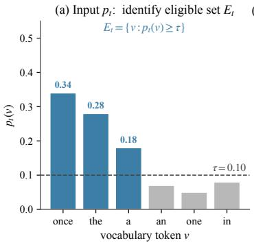

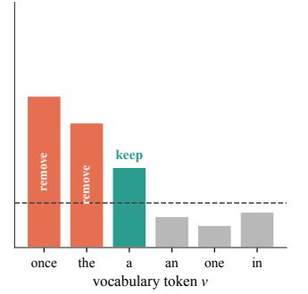

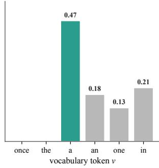  
Figure 1: The XTC operator at one decoding step. (a) Given the next-token distribution $p _ { t }$ and an absolute plausibility floor $\tau ,$ the eligible set $E _ { t } = \{ v : p _ { t } ( v ) \geq \tau \}$ is highlighted in blue. The toy distribution shows the head-ambiguity regime: three tokens are individually plausible, with substantial mass concentrated on the most generic continuation. (b) The two dominant eligible tokens are removed and the weakest plausible alternative is kept. The non-eligible tail is untouched. (c) Renormalization redistributes the removed mass over the surviving support, yielding the transformed distribution $q _ { t }$ . The retained underdog (green) now carries the largest probability among the surviving options.

Given an absolute eligibility threshold $\tau \in ( 0 , 1 )$ and an intervention probability $\rho \in [ 0 , 1 ]$ XTC identifies the eligible set of tokens whose probability individually exceeds $\tau .$ With fewer than two eligible tokens the distribution passes through unchanged. With two or more, the operator fires with probability $\rho ,$ removing all eligible tokens except the least probable one and renormalizing the remaining mass. The retained token is a minimal head alternative: still individually plausible, the least dominant among the eligible options.

## 3.1 Algorithm

The closed-form mathematical specification (eligible set, removed set, transformed distribution) appears in Appendix A.

The design rationale and parameter discussion appear in Appendix E.1.

## 4 Experiments

Our evaluation spans 60 experiments across three primary model families (Gemma 3 27B q4, Gemma 3 12B q6, DeepSeek R1 Qwen 14B q6) plus a scaling validation on Llama 3.3 70B q4, covering three independent architectures and parameter counts from 12B to 70B. Cross-model generalization (Appendix D) and design ablation (Appendix E) appear with their figures and tables in the appendix.

## 4.1 Setup

Models. Our primary model is Gemma 3 27B instruction-tuned at $\mathtt { q 4 \_ k \_ m }$ quantization [Mesnard et al., 2024], served through the text-generation-webui API. We additionally evaluate on Gemma 3 12B at q6\_K (smaller scale, higher quantization fidelity), DeepSeek R1 Qwen 14B at q6\_K [DeepSeek-AI et al., 2025] (a reasoning-distilled model on a Qwen base), and Llama 3.3 70B Instruct at q4\_k\_m (scaling validation to a third architecture family at larger parameter count).

Prompts and baselines. The creative evaluation suite contains 24 prompts spanning 12 genre tags. Separate suites cover code exactness (executable Python with unit tests), quality retention (JSON extraction, constrained rewriting), and long-form repetition. Each experiment includes a baseline at temperature 1.0. Comparators include temperature scaling $( T \in \{ 1 . { \overset { . } { 1 } } , 1 . 3 \} )$ , top-p (0.95), typical-p (0.95), and repetition penalty (1.05), calibrated on a held-out prompt suite [Hewitt et al., 2022]. XTC conditions span conservative $( \rho { = } 0 . 0 5 , \tau { = } 0 . 1 0 )$ through aggressive $( \rho { = } 1 . 0 , \tau { = } 0 . 0 5 )$

Metrics. Following the multi-metric philosophy of Shaib et al. [2025] we report five complementary diversity families. Distinct-n measures the fraction of unique n-grams in a text [Li et al., 2016]. Self-BLEU-4 computes the average BLEU-4 score [Papineni et al., 2002] between pairs of generations from the same prompt [Zhu et al., 2018]. Repeat trigram rate measures the fraction of trigrams appearing more than once within a single generation. Embedding cosine distance is the average pairwise cosine distance between sentence embeddings of generations from the same prompt [Zhang et al., 2020]. We additionally report compression ratios (gzip, xz), homogenization scores (BLEU, ROUGE-L [Lin, 2004]), template rate [Shaib et al., 2024], chamfer distance, and self-repetition. For exactness tasks we report eval pass rate, test pass rate, and parse validity.

Statistical protocol. All confidence intervals are 95% bootstrap CIs (1500–2500 resampling trials). Significance uses paired permutation tests (4000–6000 sign-flip trials, two-sided)

## 4.2 Open-ended diversity

Figure 2 presents the main creative evaluation. XTC (at $\rho { = } 1 . 0 , \tau { = } 0 . 1 )$ attains the best score on every metric, with Distinct-2 and repeat-trigram improvements significant at $p < 0 . 0 0 1$ and Self-BLEU-4 at $p < 0 . 0 1$ under paired permutation tests (forest plot in Appendix Figure 26). XTC wins 24 of 24 prompts on Distinct-2 and 22 of 24 on repeat trigram rate (Appendix Figure 27). Top-p and typical-p at 0.95 fall below baseline on Distinct-2, consistent with the head-ambiguity hypothesis that tail truncation is the wrong intervention in this regime. The effect generalizes across all 12 prompt genres (Appendix Figure 40), with the largest gains in dialogue, branding, and ideation.

The Pareto analysis (Figure 3) confirms that XTC conditions dominate the diversity-vs-repetition frontier on both semantic and lexical planes. A head-to-head against the strongest single-sampler comparator (Appendix Figure 28) shows that the composition $\mathrm { T } { = } 1 . 3 + \mathrm { X T C } \stackrel { - } { ( } \rho { = } 0 . { \bar { 7 } } 5 , \tau { = } 0 . 0 5 )$ dominates T=1.3 alone on all four metrics.

A direct comparison against eta and min-p baselines, including the min-p + XTC composition, appears in Appendix H.2 (Table 3). XTC alone outperforms all three tail-shaping baselines on every reported metric, and the min-p + XTC composition is the best overall, consistent with XTC (a head control) and min-p (a tail control) targeting orthogonal regions of the distribution.

A full sampler-composition study (Appendix F) shows that pairing XTC Medium with temperature, top-p, or a repetition penalty improves Distinct-2 and reduces Self-BLEU-4 in every pairing, with the $T { \mathrm { = } } { \bar { 1 } } . 3 + X { \bar { \mathrm { T C } } }$ composition attaining the best score on every metric in a ten-metric headline (Table 2, Figure 21). Cross-model factorial replications appear in Appendix G.

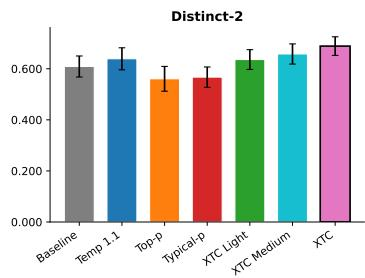

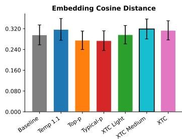

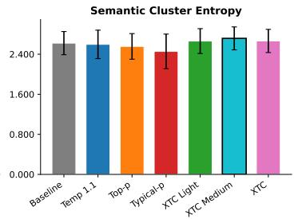

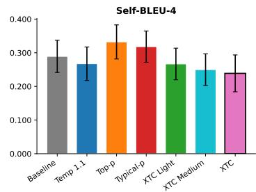

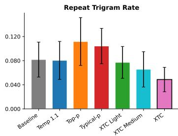

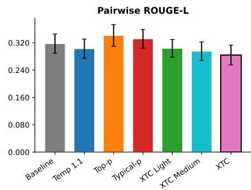  
Figure 2: Main creative evaluation across six diversity and repetition metrics (24 prompts, 8 samples each, Gemma 3 27B q4). Error bars show 95% bootstrap CIs. XTC $( \rho { = } 1 . 0 , \tau { = } 0 . 1 )$ achieves the best score on every metric, outperforming the baseline as well as temperature, top-p, and typical-p on all diversity measures while simultaneously reducing repetition. Top-p and typical-p at 0.95 degrade diversity relative to baseline on Distinct-2, confirming that tail truncation can worsen head-dominance problems. Distinct-2, Embedding Cosine Distance, and Semantic Cluster Entropy: higher is better. Self-BLEU-4, Repeat Trigram Rate, Pairwise ROUGE-L: lower is better.

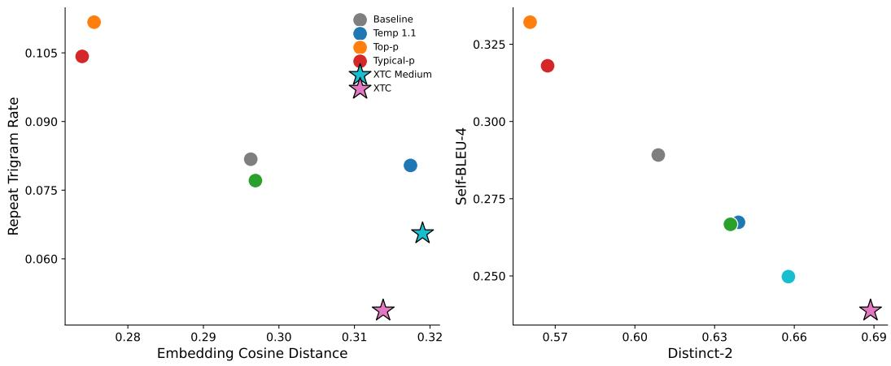  
Figure 3: Pareto frontiers on two diversity-vs-repetition planes (24 creative prompts, Gemma 3 27B q4). Left: Embedding cosine distance vs. repeat trigram rate. Right: Distinct-2 vs. Self-BLEU-4. Stars mark Pareto-optimal conditions. XTC Medium and Strong dominate the frontier on both planes, while top-p and typical-p are Pareto-dominated by the baseline.

## 4.3 Quality evaluations

Diversity gains matter only if quality is preserved. We attack this question along two complementary axes. The first is an LLM-as-judge evaluation scoring every generation on seven pre-registered criteria, with Claude Opus 4.7 as the primary judge and an OpenAI gpt-4o control as a cross-vendor check. The second is a blinded Amazon Mechanical Turk study with paid human annotators.

## 4.3.1 LLM-as-judge with cross-vendor control

We rate every Gemma 3 27B q4 creative-eval generation with Claude Opus 4.7 on seven 1–5 criteria, using a blinded single-output protocol with shuffled condition order and stripped condition labels [Zheng et al., 2023, Krippendorff, 2011]. LLM judges can exhibit same-family preference and verbosity biases [Wang et al., 2024, Dubois et al., 2024], so we cross-validate with an OpenAI gpt-4o (2024-05-13) control judge under the identical rubric.

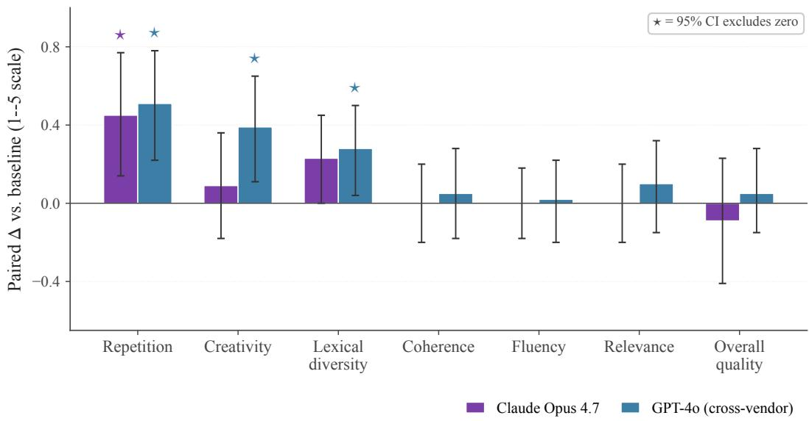  
Figure 4: Claude Opus 4.7 and an OpenAI gpt-4o cross-vendor control on XTC vs. baseline (Gemma 3 27B q4, n=24 paired samples per condition). Bars are paired ∆ on a 1–5 scale with 95% bootstrap CIs. ★ marks intervals that exclude zero. Opus and GPT-4o agree that XTC significantly improves repetition. GPT-4o additionally resolves significant gains on creativity and lexical diversity. Overall quality is null on both judges, supporting the no-degradation hypothesis. The cross-vendor agreement neutralizes same-family-bias concerns.

Figure 4 summarizes the Opus + GPT-4o result on Gemma 3 27B q4 (full numbers in Appendix Table 5). Both judges resolve a significant repetition improvement at XTC, and GPT-4o additionally resolves creativity and lexical-diversity gains that Opus shows as directionally positive but inside its 95% interval. Overall-quality intervals bracket zero on both judges, supporting the no-degradation hypothesis. The cross-vendor agreement on direction across every criterion neutralizes same-familybias concerns common to single-judge LLM evaluations [Wang et al., 2024, Dubois et al., 2024]. The same protocol replicates at scale on Llama 3.3 70B q4 (Figure 5), where Opus resolves significant XTC creativity and lexical-diversity gains. Overall-quality at 70B is again null.

## 4.3.2 Human evaluation (Amazon Mechanical Turk)

Human preference remains the gold standard for open-ended generation [Hashimoto et al., 2019] The prompts come from the public Creative Writing Bench v3 prompt set released by Sam Peach as part of EQ-Bench⁴ [Paech, 2025]. The set contains 33 base writing prompts, each paired with multiple seed modifiers (genre, tone, scenario tags) that condition the requested continuation. We sampled 100 prompt+seed combinations uniformly across the 33 base prompts and generated paired responses using the Baseline (T=1.0) and XTC (ρ=1.0, τ=0.1) on Gemma 3 27B q4. We recruited 150 Master-qualified AMT workers (\$15/hr, above local minimum wage) to blindly rate the pairs. Each pair was scored by 3 independent annotators with A/B order randomized per pair, on two pre-registered axes: Creativity & Interestingness and General Quality & Fluency

The human evaluation corroborates the automatic metrics and the LLM panel (Figure 6). XTC is the preferred response for Creativity by a wide margin, and ties or beats the baseline on Quality in the large majority of comparisons. A two-sided binomial test confirms both axes at $p < 1 0 ^ { - \bar { 3 } }$ or better with moderate inter-annotator agreement. The head-aware exclusions therefore translate to human-perceptible stylistic diversity with quality preserved.

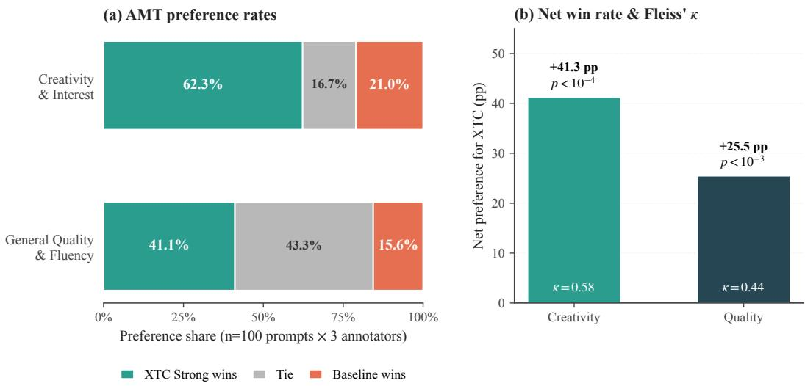  
Figure 6: Blinded AMT human evaluation on Gemma 3 27B q4 (n=100 prompts, 3 annotators per pair, 150 Master-qualified workers). (a) Stacked preference rates: XTC wins on creativity in 62.3% of head-to-head comparisons against the baseline (vs. 21.0% baseline wins, 16.7% ties), and ties or beats baseline in 84.4% of quality comparisons. (b) Net preference (XTC-minus-baseline) and Fleiss κ inter-annotator agreement: the creativity gain is significant at $p < 1 0 ^ { - 4 }$ (two-sided binomial) with moderate agreement (κ=0.58), and the quality gain is significant at $p < 1 0 ^ { - 3 }$ with κ=0.44.

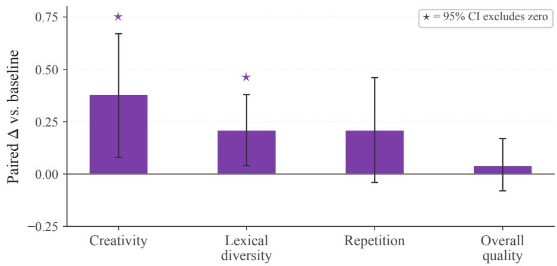  
Figure 5: Llama 3.3 70B q4 scaling validation: Claude Opus 4.7 LLM judge on XTC vs. baseline (n=24 paired samples per condition, 95% bootstrap CIs). Opus resolves significant positive XTC effects on creativity and lexical diversity (\*). The repetition delta is positive but its CI grazes zero. Overall quality is null. The cross-vendor GPT-4o control was not run on this scaling configuration. The cross-vendor agreement is established on the 27B q4 panel (Figure 4).  
Human evaluation on Amazon Mechanical Turk (Gemma 3 27B q4, blinded A/B, 150 Master raters)

## 4.4 General quality & instruction following (IFEval)

Diversity-promoting decoders are often charged with degrading instruction-following [Hewitt et al., 2022, Holtzman et al., 2020]. We quantify XTC's safe operating boundaries with the Instruction Following Evaluation (IFEval) benchmark [Zhou et al., 2023].

On Llama 3.3 70B q4 (Figure 7), XTC Light and XTC Medium shift IFEval prompt-level strict accuracy by less than 2 pp from baseline (—0.4 and —1.7 pp respectively), while a temperature setting (T=1.15) chosen to deliver an equivalent Distinct-2 gain collapses IFEval by —8.8 pp. Per-condition numbers and the IFEval-cost-per-Distinct-2 ratios appear in Appendix H.2 (Table 4).

Instruction-following preservation: XTC vs. temperature scaling at matched Distinct-2 gain

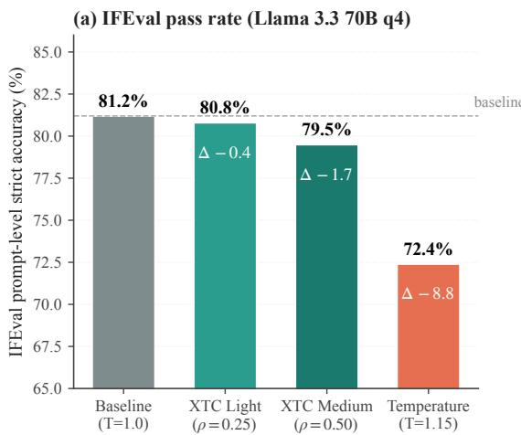

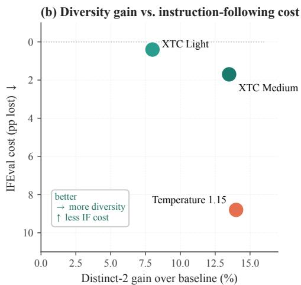  
Figure 7: Instruction-following preservation on Llama 3.3 70B q4. (a) IFEval prompt-level strict accuracy across four conditions. XTC Light $( \rho { = } 0 . 2 5 , \tau { = } 0 . 1 0 )$ shifts accuracy by only —0.4 pp, and XTC Medium $( \rho { = } 0 . 5 0 , \tau { = } 0 . 1 0 )$ by —1.7 pp. A temperature setting (T=1.15) chosen to deliver a comparable Distinct-2 gain collapses IFEval by —8.8 pp. (b) Diversity gain vs. instruction-following cost: XTC Medium delivers \~5× more Distinct-2 per IFEval-point lost than temperature scaling, locating XTC in the upper region of the diversity-vs-fidelity Pareto plane.

The sparse-in-time formulation explains the gap: deterministic instruction-critical tokens (where the head dominates at >90% probability) lie outside XTC's eligible set and pass through untouched, while temperature rescales every step regardless of head ambiguity (Figure 7b).

## 5 Conclusion

We introduced XTC, a head-aware decoding rule that intervenes when a language model places substantial probability on several plausible continuations while overweighting the most dominant one. The operator acts on the head of the distribution, fires only when at least two tokens clear an absolute plausibility floor, and is otherwise inactive. Renormalization after exclusion is the KL-minimizing projection onto the restricted support [Csiszár, 1975], preserving relative odds among surviving tokens. Empirically, 60 experiments across four model families show that XTC improves the diversity-repetition Pareto frontier on creative generation, composes additively with temperature and repetition penalties, and generalizes across quantization levels and architectures (Section 4, Appendix D). An Opus + GPT-4o cross-vendor LLM panel, a blinded AMT human study, and an IFEval characterization on Llama 3.3 70B q4 converge on the same finding: head-aware exclusion produces human-perceptible stylistic diversity at a fraction of the instruction-following cost paid by matched-Distinct-2 temperature scaling. Limitations, broader impacts, and practical safeguards appear in Appendix C.

## References

David H Ackley, Geoffrey E Hinton, and Terrence J Sejnowski. A learning algorithm for boltzmann machines. Cognitive science, 9(1):147–169, 1985

Barrett R. Anderson, Jash Hemant Shah, and Max Kreminski. Homogenization effects of large language models on human creative ideation. In Proceedings of the 16th Conference on Creativity & Cognition, 2024.

Yuntao Bai, Andy Jones, Kamal Ndousse, Amanda Askell, Anna Chen, Nova DasSarma, Dawn Drain, Stanislav Fort, Deep Ganguli, Tom Henighan, et al. Training a helpful and harmless assistant with reinforcement learning from human feedback. arXiv preprint arXiv:2204.05862, 2022.

Sourya Basu, Govardana Sachithanandam Ramachandran, Nitish Shirish Keskar, and Lav R. Varshney. Mirostat: A neural text decoding algorithm that directly controls perplexity. In International Conference on Learning Representations, 2021.

Yoshua Bengio, Réjean Ducharme, Pascal Vincent, and Christian Jauvin. A neural probabilistic language model. Journal of Machine Learning Research, 3:1137–1155, 2003.

Tom B. Brown, Benjamin Mann, Nick Ryder, Melanie Subbiah, Jared Kaplan, Prafulla Dhariwal, Arvind Neelakantan, Pranav Shyam, Girish Sastry, Amanda Askell, et al. Language models are few-shot learners. In Advances in Neural Information Processing Systems, volume 33, pages 1877–1901, 2020.

Asli Celikyilmaz, Elizabeth Clark, and Jianfeng Gao. Evaluation of text generation: A survey. arXiv preprint arXiv:2006.14799, 2020.

Cheng-Han Chiang and Hung-yi Lee. Can large language models be an alternative to human evaluations? In Proceedings of the 61st Annual Meeting of the Association for Computational Linguistics (Volume 1: Long Papers), pages 15607–15631, 2023.

Yung-Sung Chuang, Yujia Xie, Hongyin Luo, Yoon Kim, James R. Glass, and Pengcheng He. DoLa: Decoding by contrasting layers improves factuality in large language models. In International Conference on Learning Representations, 2024.

Thomas M. Cover and Joy A. Thomas. Elements of Information Theory. John Wiley & Sons, Hoboken, NJ, 2nd edition, 2006.

Imre Csiszár. I-divergence geometry of probability distributions and minimization problems. The Annals of Probability, 3(1):146–158, 1975.

DeepSeek-AI, Daya Guo, Dejian Yang, Haowei Zhang, Junxiao Song, Peiyi Wang, Qihao Zhu, Runxin Xu, Ruoyu Zhang, Shirong Ma, et al. DeepSeek-R1: Incentivizing reasoning capability in LLMs via reinforcement learning. arXiv preprint arXiv:2501.12948, 2025.

Anil R. Doshi and Oliver P. Hauser. Generative AI enhances individual creativity but reduces the collective diversity of novel content. Science Advances, 10(28):eadn5290, 2024.

Yann Dubois, Balázs Galambosi, Percy Liang, and Tatsunori B. Hashimoto. Length-controlled AlpacaEval: A simple way to debias automatic evaluators. In Conference on Language Modeling, 2024.

Angela Fan, Mike Lewis, and Yann Dauphin. Hierarchical neural story generation. In Proceedings of the 56th Annual Meeting of the Association for Computational Linguistics (Volume 1: Long Papers), pages 889–898, 2018.

Elias Frantar, Saleh Ashkboos, Torsten Hoefler, and Dan Alistarh. GPTQ: Accurate post-training quantization for generative pre-trained transformers. In International Conference on Learning Representations, 2023.

Albert Gatt and Emiel Krahmer. Survey of the state of the art in natural language generation: Core tasks, applications and evaluation. Journal of Artificial Intelligence Research, 61:65–170, 2018.

Tatsunori B. Hashimoto, Hugh Zhang, and Percy Liang. Unifying human and statistical evaluation for natural language generation. In Proceedings of the 2019 Conference of the North American Chapter of the Association for Computational Linguistics: Human Language Technologies, pages 1689–1701, 2019.

John Hewitt, Christopher D. Manning, and Percy Liang. Truncation sampling as language model desmoothing. In Findings of the Association for Computational Linguistics: EMNLP 2022, pages 3414–3427, 2022.

Ari Holtzman, Jan Buys, Li Du, Maxwell Forbes, and Yejin Choi. The curious case of neural text degeneration. In International Conference on Learning Representations, 2020.

Daphne Ippolito, Ann Yuan, Andy Coenen, and Sehmon Burnam. Creative writing with an AI-powered writing assistant: Perspectives from professional writers. arXiv preprint arXiv:2211.05030, 2022.

Nitish Shirish Keskar, Bryan McCann, Lav R. Varshney, Caiming Xiong, and Richard Socher. CTRL: A conditional transformer language model for controllable generation. arXiv preprint arXiv:1909.05858, 2019.

Robert Kirk, Ishita Mediratta, Christoforos Nalmpantis, Jelena Luketina, Eric Hambro, Edward Grefenstette, and Roberta Raileanu. Understanding the effects of RLHF on LLM generalisation and diversity. In International Conference on Learning Representations, 2024.

Klaus Krippendorff. Computing Krippendorff's alpha-reliability. Technical report, Annenberg School for Communication, University of Pennsylvania, 2011.

Katherine Lee, Daphne Ippolito, Andrew Nystrom, Chiyuan Zhang, Douglas Eck, Chris Callison-Burch, and Nicholas Carlini. Deduplicating training data makes language models better. In Proceedings of the 60th Annual Meeting of the Association for Computational Linguistics (Volume 1: Long Papers), pages 8424–8445, 2022.

Jiwei Li, Michel Galley, Chris Brockett, Jianfeng Gao, and Bill Dolan. A diversity-promoting objective function for neural conversation models. In Proceedings of the 2016 Conference of the North American Chapter of the Association for Computational Linguistics: Human Language Technologies, pages 110–119, 2016.

Junyi Li, Tianyi Tang, Wayne Xin Zhao, Jian-Yun Nie, and Ji-Rong Wen. Pre-trained language models for text generation: A survey. ACM Computing Surveys, 56(9):1–39, 2024a.

Xiang Lisa Li, Ari Holtzman, Daniel Fried, Percy Liang, Jason Eisner, Tatsunori B. Hashimoto, Luke Zettlemoyer, and Mike Lewis. Contrastive decoding: Open-ended text generation as optimization. In Proceedings of the 61st Annual Meeting of the Association for Computational Linguistics (Volume 1: Long Papers), pages 12286–12312, 2023.

Zhen Li, Xiaohan Xu, Tao Shen, Can Xu, Jia-Chen Gu, Yuxuan Lai, Chongyang Tao, and Shuai Ma. Leveraging large language models for NLG evaluation: Advances and challenges. In Proceedings of the 2024 Conference on Empirical Methods in Natural Language Processing, pages 16028–16045, 2024b.

Chin-Yew Lin. ROUGE: A package for automatic evaluation of summaries. In Text Summarization Branches Out, pages 74–81, 2004.

Ji Lin, Jiaming Tang, Haotian Tang, Shang Yang, Wei-Ming Chen, Wei-Chen Wang, Guangxuan Xiao, Xingyu Dang, Chuang Gan, and Song Han. Awq: Activation-aware weight quantization for on-device llm compression and acceleration. Proceedings of machine learning and systems, 6: 87–100, 2024.

Clara Meister, Tiago Pimentel, Gian Wiher, and Ryan Cotterell. Locally typical sampling. Transactions of the Association for Computational Linguistics, 11:102–121, 2023.

Thomas Mesnard, Cassidy Hardin, Robert Dadashi, Surya Bhupatiraju, Shreya Pathak, Laurent Sifre, Morgane Rivière, Mihir Sanjay Kale, Juliette Love, Pouya Tafti, et al. Gemma: Open models based on Gemini research and technology. arXiv preprint arXiv:2403.08295, 2024.

Shervin Minaee, Tomas Mikolov, Narjes Nikzad, Meysam Chenaghlu, Richard Socher, Xavier Amatriain, and Jianfeng Gao. Large language models: A survey. arXiv preprint arXiv:2402.06196, 2024.

Minh Nhat Nguyen, Andrew Baker, Clement Neo, Allen Roush, Andreas Kirsch, and Ravid Shwartz-Ziv. Turning up the heat: Min-p sampling for creative and coherent LLM outputs. In International Conference on Learning Representations, pages 70333–70366, 2025.

Long Ouyang, Jeffrey Wu, Xu Jiang, Diogo Almeida, Carroll L. Wainwright, Pamela Mishkin, Chong Zhang, Sandhini Agarwal, Katarina Slama, Alex Ray, et al. Training language models to follow instructions with human feedback. In Advances in Neural Information Processing Systems, volume 35, pages 27730–27744, 2022.

Vishakh Padmakumar and He He. Does writing with language models reduce content diversity? In International Conference on Learning Representations, 2024.

Samuel J. Paech. EQ-Bench creative writing benchmark v3. https://github. com/EQ-bench/ creative-writing-bench, 2025. GitHub repository.

Kishore Papineni, Salim Roukos, Todd Ward, and Wei-Jing Zhu. BLEU: A method for automatic evaluation of machine translation. In Proceedings of the 40th Annual Meeting of the Association for Computational Linguistics, pages 311–318, 2002.

Krishna Pillutla, Swabha Swayamdipta, Rowan Zellers, John Thickstun, Sean Welleck, Yejin Choi, and Zaid Harchaoui. MAUVE: Measuring the gap between neural text and human text using divergence frontiers. In Advances in Neural Information Processing Systems, volume 34, pages 4816–4828, 2021.

Lianhui Qin, Sean Welleck, Daniel Khashabi, and Yejin Choi. COLD decoding: Energy-based constrained text generation with Langevin dynamics. In Advances in Neural Information Processing Systems, volume 35, 2022.

Alec Radford, Jeffrey Wu, Rewon Child, David Luan, Dario Amodei, and Ilya Sutskever. Language models are unsupervised multitask learners. OpenAI Technical Report, 2019.

Matthew Renze and Erhan Guven. The effect of sampling temperature on problem solving in large language models. In Findings of the Association for Computational Linguistics: EMNLP 2024, 2024.

Chantal Shaib, Yanai Elazar, Junyi Jessy Li, and Byron C. Wallace. Detection and measurement of syntactic templates in generated text. In Proceedings of the 2024 Conference on Empirical Methods in Natural Language Processing, pages 6416–6431, 2024.

Chantal Shaib, Joe Barrow, Jiuding Sun, Alexa F. Siu, Byron C. Wallace, and Ani Nenkova. Standardizing the measurement of text diversity: A tool and comparative analysis. In Proceedings of IJCNLP-AACL 2025: System Demonstrations, 2025.

Claude E. Shannon. A mathematical theory of communication. The Bell System Technical Journal, 27(3):379–423, 1948.

Zhivar Sourati, Alireza S. Ziabari, and Morteza Dehghani. The homogenizing effect of large language models on human expression and thought. arXiv preprint arXiv:2508.01491, 2025.

Yixuan Su, Tian Lan, Yan Wang, Dani Yogatama, Lingpeng Kong, and Nigel Collier. A contrastive framework for neural text generation. In Advances in Neural Information Processing Systems, volume 35, pages 21548–21561, 2022.

Hugo Touvron, Louis Martin, Kevin Stone, Peter Albert, Amjad Almahairi, Yasmine Babaei, Nikolay Bashlykov, Soumya Batra, Prajjwal Bhargava, Shruti Bhosale, et al. Llama 2: Open foundation and fine-tuned chat models. arXiv preprint arXiv:2307.09288, 2023.

Ashish Vaswani, Noam Shazeer, Niki Parmar, Jakob Uszkoreit, Llion Jones, Aidan N. Gomez Lukasz Kaiser, and Illia Polosukhin. Attention is all you need. In Advances in Neural Information Processing Systems, volume 30, pages 5998–6008, 2017.

Ashwin K Vijayakumar, Michael Cogswell, Ramprasath R Selvaraju, Qing Sun, Stefan Lee, David Crandall, and Dhruv Batra. Diverse beam search: Decoding diverse solutions from neural sequence models. arXiv preprint arXiv:1610.02424, 2016.

Yidong Wang, Zhuohao Yu, Zhengran Zeng, Linyi Yang, Cunxiang Wang, Hao Chen, Chaoya Jiang, Rui Xie, Jindong Wang, Xing Xie, et al. PandaLM: An automatic evaluation benchmark for LLM instruction tuning optimization. In International Conference on Learning Representations, 2024.

Sean Welleck, Ilia Kulikov, Stephen Roller, Emily Dinan, Kyunghyun Cho, and Jason Weston. Neural text generation with unlikelihood training. In International Conference on Learning Representations, 2020.

Gian Wiher, Clara Meister, and Ryan Cotterell. On decoding strategies for neural text generators. Transactions of the Association for Computational Linguistics, 10:997–1012, 2022.

Kevin Yang and Dan Klein. FUDGE: Controlled text generation with future discriminators. In Proceedings of the 2021 Conference of the North American Chapter of the Association for Computational Linguistics: Human Language Technologies, pages 3511–3535, 2021.

Ann Yuan, Andy Coenen, Emily Reif, and Daphne Ippolito. Wordcraft: Story writing with large language models. In 27th International Conference on Intelligent User Interfaces, pages 841–852, 2022.

Tianyi Zhang, Varsha Kishore, Felix Wu, Kilian Q. Weinberger, and Yoav Artzi. BERTScore: Evaluating text generation with BERT. In International Conference on Learning Representations, 2020.

Wayne Xin Zhao, Kun Zhou, Junyi Li, Tianyi Tang, Zican Dong, Yupeng Hou, Beichen Zhang, Yingqian Min, Junjie Zhang, Peiyu Liu, et al. A survey of large language models. arXiv preprint arXiv:2303.18223, 2023.

Lianmin Zheng, Wei-Lin Chiang, Ying Sheng, Siyuan Zhuang, Zhanghao Wu, Yonghao Zhuang, Zi Lin, Zhuohan Li, Dacheng Li, Eric Xing, et al. Judging LLM-as-a-judge with MT-Bench and Chatbot Arena. In Advances in Neural Information Processing Systems, volume 36, pages 46595–46623, 2023.

Jeffrey Zhou, Tianjian Lu, Swaroop Mishra, Siddhartha Brahma, Sujoy Basu, Yi Luan, Denny Zhou, and Le Hou. Instruction-following evaluation for large language models. arXiv preprint arXiv:2311.07911, 2023.

Yaoming Zhu, Sidi Lu, Lei Zheng, Jiaxian Guo, Weinan Zhang, Jun Wang, and Yong Yu. Texygen: A benchmarking platform for text generation models. In The 41st International ACM SIGIR Conference on Research and Development in Information Retrieval, pages 1097–1100, 2018.

## A Formal definition of XTC

This appendix provides the complete mathematical specification of XTC. The intuitive description and algorithm appear in Section 3.

## A.1 Notation and eligible set

Consider an autoregressive language model at step t with a next-token distribution $p _ { t }$ over a vocabulary V. Let $\tau \in ( 0 , 1 )$ be an absolute eligibility threshold and $\rho \in [ 0 , 1 ]$ an intervention probability. The eligible set is

$$
E _ { t } ( \tau ) ~ = ~ \{ v \in \mathcal { V } : p _ { t } ( v ) \geq \tau \} .\tag{1}
$$

## A.2 Transformed distribution

Let

$$
u _ { t } \ = \ \arg \operatorname* { m i n } _ { v \in E _ { t } ( \tau ) } p _ { t } ( v ) ,\tag{2}
$$

with any deterministic tie-breaking rule. Define the removed set $R _ { t } = E _ { t } ( \tau ) \setminus \{ u _ { t } \}$ . When XTC activates $( | E _ { t } ( \tau ) | \ge 2$ and the Bernoull $\mathrm i ( \rho )$ draw fires), the transformed distribution $q _ { t }$ is

$$
q _ { t } ( v ) = \left\{ \begin{array} { l l } { 0 , } & { v \in R _ { t } , } \\ { \displaystyle \frac { p _ { t } ( v ) } { 1 - \sum _ { r \in R _ { t } } p _ { t } ( r ) } , } & { v \notin R _ { t } . } \end{array} \right.\tag{3}
$$

When XTC does not activate, $q _ { t } = p _ { t }$

## A.3 Formal proposition statements

Proposition 1 (No-op criterion). $I f | E _ { t } ( \tau ) | < 2$ , or if the Bernoulli intervention variable does not fire, then $q _ { t } = p _ { t }$

Proposition 2 (Relative-odds invariance). When XTC activates and removes $R _ { t } ,$ for any surviving tokens v, w $\notin R _ { t }$ with $p _ { t } ( w ) > 0 , q _ { t } ( v ) / q _ { t } ( w ) = p _ { t } ( v ) / p _ { t } ( w )$

Proposition 3 (Expected removed mass). Let $\begin{array} { r } { M _ { t } ( \tau ) = \sum _ { v \in E _ { t } ( \tau ) } p _ { t } ( v ) - \operatorname* { m i n } _ { v \in E _ { t } ( \tau ) } p _ { t } ( v ) } \end{array}$ when $| E _ { t } ( \tau ) | \geq 2$ and 0 otherwise. Then E[removed mass at step $t \mathbf { \bar { \mathbf { \Lambda } } } = \mathbf { \bar { \rho } } \rho M _ { t } ( \tau ) \mathbf { \Lambda }$

Proposition 4 (Threshold monotonicity). $\tau _ { 2 } \geq \tau _ { 1 }$ implies $E _ { t } ( \tau _ { 2 } ) \subseteq E _ { t } ( \tau _ { 1 } )$ , so increasing the threshold can only weakly decrease the number and mass of removable tokens

Proposition 5 (Restricted-support information projection). Fix an activation event and let $S _ { t } = \mathcal { V } \backslash R _ { t }$ Among all distributions q supported on $S _ { t } , q _ { t }$ uniquely minimizes $\mathrm { K L } ( q \parallel p _ { t } )$

## A.4 Structural properties

XTC has five structural properties that distinguish it from existing samplers.

No-op criterion. If fewer than two tokens exceed the threshold, or if the Bernoulli draw does not fire, XTC returns the input distribution unchanged (Proposition 1). The operator is therefore inactive by default and intervenes only when the head is genuinely ambiguous.

Relative-odds invariance. When XTC activates, it preserves the ratio of probabilities among all surviving tokens (Proposition 2). The intervention is a sparse support edit followed by renormalization, with no distortion of relative preferences among the tokens that remain.

Expected removed mass. The expected mass removed at a given step equals ρ times the total eligible mass minus the minimum eligible probability (Proposition 3), isolating the operator's effective strength at each step.

Threshold monotonicity. Increasing τ can only shrink the eligible set (Proposition 4), weakly decreasing both the number of removable tokens and the removable mass.

KL-projection interpretation. When XTC activates, the resulting distribution is the unique minimizer of $\mathrm { K L } ( q \parallel p _ { t } )$ among all distributions supported on the surviving tokens (Proposition 5, citing

Csiszár [1975], Cover and Thomas [2006], Shannon [1948]). This gives the support edit a principled information-geometric status.

Head multiplicity differs from entropy. XTC responds to a different signal than entropy-based decoding controls. Entropy is a global summary of dispersion, while $\mathrm { { X T C } }$ asks whether multiple tokens each individually exceed an absolute floor. A distribution can have modest entropy yet contain two strong head tokens (activating XTC), or high entropy from a diffuse tail with only one token above threshold (leaving XTC inactive). XTC therefore intervenes only when the model already signals the existence of several plausible local branches.

## B Proofs

Proof of Proposition 1. By the definition of XTC, the operator first checks whether $| E _ { t } ( \tau ) | \geq 2$ . If not, it returns the input distribution unchanged. If $| E _ { t } ( \tau ) \bar { | } \geq 2 $ , the operator next samples a Bernoulli random variable with success probability $\rho .$ If that variable is 0, the operator again returns the input distribution unchanged. Therefore in either case $q _ { t } = p _ { t }$ □

Proof of Proposition 2. Assume XTC activates and removes $R _ { t }$ . For any surviving token v ∉ $R _ { t }$

$$
q _ { t } ( v ) = { \frac { p _ { t } ( v ) } { Z _ { t } } } , \qquad Z _ { t } = 1 - \sum _ { r \in R _ { t } } p _ { t } ( r ) .
$$

Similarly, for any surviving token w $\notin \mathcal { R } _ { t }$ with $p _ { t } ( w ) > 0 , q _ { t } ( w ) = p _ { t } ( w ) / Z _ { t }$ . Taking the ratio gives $q _ { t } ( v ) / q _ { t } ( w ) = p _ { t } ( v ) / p _ { t } ( w )$ □

Proof of Proposition 3. $\begin{array} { r } { \mathrm { { I f } } \left| E _ { t } ( \tau ) \right| < 2 . } \end{array}$ , the operator never removes any token, so the removed mass is $0 = \rho M _ { t } ( \tau )$ . Now suppose $| \dot { E _ { t } } ( \tau ) | \geq 2$ . Conditional on activation, XTC removes exactly the set $R _ { t } = \dot { E } _ { t } ( \tau ) \dot { \setminus } \{ u _ { t } \}$ . The removed mass is

$$
\sum _ { r \in R _ { t } } p _ { t } ( r ) = \sum _ { v \in E _ { t } ( \tau ) } p _ { t } ( v ) - \operatorname* { m i n } _ { v \in E _ { t } ( \tau ) } p _ { t } ( v ) = M _ { t } ( \tau ) .
$$

Since activation occurs with probability $\rho ,$ the unconditional expectation is $\rho M _ { t } ( \tau )$

Proof of Proposition 4. Take any token $v \in E _ { t } ( \tau _ { 2 } )$ . By definition $p _ { t } ( v ) \geq \tau _ { 2 } \geq \tau _ { 1 } , \mathrm { s o } v \in E _ { t } ( \tau _ { 1 } )$ Hence $E _ { t } ( \tau _ { 2 } ) \subseteq E _ { t } ( \tau _ { 1 } )$ and the removable set and mass can only weakly shrink. □

Proof of Proposition 5. Fix the surviving support $S _ { t } ~ = ~ \mathcal { V } ~ \backslash ~ R _ { t }$ and consider ${ \mathcal Q } ( S _ { t } ) ~ = ~ \{ q ~ :$ $\begin{array} { r } { \sum _ { v \in S _ { t } } q ( v ) \dot { = } 1 , q ( v ) \ge 0 , q ( v ) = 0 } \end{array}$ for $\rangle \notin S _ { t } \}$ . For any $q \in \mathcal { Q } ( S _ { t } )$

$$
\mathrm { K L } ( q \parallel p _ { t } ) = \sum _ { v \in S _ { t } } q ( v ) \log \frac { q ( v ) } { p _ { t } ( v ) } .
$$

Minimizing subject to the simplex constraint via Lagrange multipliers yields $q ( v ) = c p _ { t } ( v )$ for all $v \in S _ { t }$ , where $\begin{array} { r } { \dot { c } = 1 / \sum _ { v \in S _ { t } } \bar { p } _ { t } ( v ) } \end{array}$ . Therefore $\begin{array} { r } { q ( v ) \stackrel {  } { = } \bar { p _ { t } } ( v ) / ( 1 - \sum _ { r \in R _ { t } } p _ { t } ( \bar { r } ) ) } \end{array}$ , which is exactly $q _ { t } ( v )$ . Uniqueness follows from strict convexity of KL. □

## B.1 Diagnostic quantity

Proposition 3 suggests a natural diagnostic: the expected removed mass $\rho M _ { t } ( \tau )$ . This scalar measures how interventionist XTC is at a given decoding step, distinguishing between steps where the operator swaps two near-tied head options and steps where it removes most of the head mass.

## C Limitations, broader impacts, and outlook

## C.1 Limitations

XTC is not a universally beneficial decoding rule. Its central bias is to move generation away from the most probable eligible continuation, and that bias can be counterproductive when the highest-probability token is exactly the one the task needs.

First, XTC can hurt tasks that demand exactness rather than stylistic variation, such as extraction, constrained formatting, code generation, mathematical reasoning with brittle intermediate states, or safety-critical instruction following. The IFEval characterization (Section 4.4) and the structuredquality safety sweeps (Appendix H) quantify this. On code tasks, the eval pass rate degrades significantly above $\rho = 0 . 1 5$ . On structured extraction, the boundary is $\rho = 0 . 2 0$ . Deployments on alignment-critical workloads should stay within the operating boundaries identified in Section 4.4.

Second, XTC is sensitive to parameterization. The threshold τ is defined in absolute probability terms, so the same value can behave differently across model scales, tokenizer granularities, and upstream sampler stacks [Wiher et al., 2022]. A threshold that is conservative for one model may be intervention-heavy for another. The activation probability ρ should likewise be treated as task-dependent rather than as a universal knob. Open-ended generation may tolerate much more intervention than extraction or code. While our cross-model experiments (Appendix D) show that the qualitative effect direction is consistent, the optimal operating point may differ across models.

Third, XTC interacts with formatting and termination behavior. If newline, end-of-sequence, indentation, or schema-critical delimiter tokens enter the eligible set, removing them may destabilize structured outputs. Practical deployments should therefore either gate XTC by task type or protect a small set of termination and formatting tokens, as described in Algorithm 1.

Fourth, our empirical evaluation, while spanning three primary model families in the 12B–27B range plus a 70B scaling point (Llama 3.3 q4), is conducted entirely on quantized open-weight models [Frantar et al., 2023, Lin et al., 2024]. A broader evaluation across additional mixture-of-experts architectures [Minaee et al., 2024, Brown et al., 2020, Touvron et al., 2023], state-space models, and non-English languages would strengthen the generality claims.

Fifth, XTC is a local decoding rule, not a substitute for model quality, calibration, or training-time anti-degeneration methods [Welleck et al., 2020, Ouyang et al., 2022]. It can redirect a model among already plausible next tokens, but it cannot create competence that the base model does not have. In particular, it cannot address corpus-level homogenization that originates in training data overlap or RLHF reward hacking [Anderson et al., 2024, Kirk et al., 2024, Bai et al., 2022].

On DeepSeek R1, the chat template injects a native reasoning-trace prefix. We re-ran the crossmodel creative configuration with max\_tokens=8192 and stripped the <think>.. . </think> prefix before computing metrics, so the DeepSeek row in Table 1 reflects post-reasoning answer text rather than reasoning-trace content. The paired-delta direction and significance hold under this corrected basis (Distinct-2 +13.6% [+10.2,+16.5], repeat trigram - $- 0 . 0 1 \bar { 7 } \left[ - 0 . 0 2 4 , - 0 . 0 0 9 \right] \rangle$ ), confirming that XTC's effect is not an artifact of the reasoning-trace measurement window.

## C.2 Broader impacts

The positive case for XTC is straightforward. Many real uses of language models benefit from controlled diversity: creative writing support [Yuan et al., 2022, Ippolito et al., 2022], ideation exploratory dialogue systems, synthetic prompt generation, and evaluation of model uncertainty under alternative continuations. A lightweight head-aware sampler could make these systems less templated without requiring model retraining. The AMT human study (Section 4.3.2) provides direct evidence that the diversity gain is human-perceptible and does not come at the cost of fluency.

There are also clear downside risks. Any method that increases variety in generated language can also make harmful generations less repetitive and more varied, including spam, deception, or disinformation. XTC does not change the underlying model's capabilities, but it can alter the style and breadth of outputs in ways that may improve adversarial misuse. Responsible deployment therefore requires the same safeguards expected of other generation-time controls: domain-appropriate safety filters, task gating, and evaluation on harmful-use prompts in addition to benign ones.

## C.3 Practical safeguards

For high-fidelity deployments, three safeguards are especially important.

• Task gating. Reserve XTC primarily for open-ended or diversity-seeking modes rather than structured extraction or high-stakes factual tasks. The IFEval analysis (Section 4.4) provides a quantitative basis for setting per-task ρ.

• Protected tokens. Exempt end-of-sequence, newline, and schema-critical tokens from removal, or skip activation when they would be removed.

• Transparent logging. Record activation statistics, eligible-set sizes, and removed mass so that XTC behavior can be inspected rather than treated as an opaque randomness knob.

## C.4 Outlook

XTC exposes a part of the decoding design space that is largely orthogonal to tail truncation and global entropy control: the head-ambiguity regime where the model is already uncertain among strong options but still defaults to the safest one. By formalizing this regime and providing an operator that targets it specifically, we hope to encourage further exploration of head-aware decoding strategies [Minaee et al., 2024, Zhao et al., 2023]. All code, evaluation infrastructure, and experimental configurations are publicly available at <redactedforanonymity>.

## D Cross-model generalization

<table><tr><td></td><td colspan="3">Distinct-2 ↑</td><td colspan="3">Repeat trigram rate ↓</td></tr><tr><td>Model family</td><td>Base</td><td>XTC</td><td>∆% [95% CI]</td><td>Base</td><td>XTC</td><td>∆ [95% CI]</td></tr><tr><td>Gemma 3 12B (q6)†</td><td>0.704</td><td>0.784</td><td>+11.4 [+7.4, +17.6]</td><td>0.047</td><td>0.025</td><td>-0.022 [−0.042, −0.006]</td></tr><tr><td>DeepSeek R1 14B (q6)‡</td><td>0.615</td><td>0.751</td><td>+13.6 [+10.2, +16.5]</td><td>0.038</td><td>0.021</td><td>-0.017 [-0.024, -0.009]</td></tr><tr><td>Gemma 3 27B (q4)</td><td>0.609</td><td>0.689</td><td>+13.1 [+11.0, +18.1]</td><td>0.082</td><td>0.049</td><td>-0.033 [-0.047, -0.021]</td></tr><tr><td>Llama 3.3 70B (q4)</td><td>0.568</td><td>0.653</td><td> $+ 1 5 . 1 \ [ + 1 2 . 4 , + 1 9 . 8 ]$ </td><td>0.040</td><td>0.029</td><td>-0.011 [-0.027, -0.000]</td></tr><tr><td>Average</td><td>0.624</td><td>0.719</td><td>+13.3</td><td>0.052</td><td>0.031</td><td>-0.021</td></tr></table>

Table 1: Cross-model generalization across four model families spanning three architectures (Gemma 3, Qwen-derived DeepSeek R1, Llama 3.3) and parameter counts from 12B to 70B. Means and 95% paired-bootstrap CIs are computed over per-prompt deltas (24 prompts for the 27B and 70B runs, 10 for the 12B/14B cross-model runs). Distinct-2 is reported as paired percent change. Repeat trigram rate is reported as the absolute paired difference, since the small baseline values make percent change unstable. Every model shows a Distinct-2 CI that excludes zero. Repeat trigram improvements are also significant on three of the four families. The Llama 70B repeat-trigram CI just touches zero, consistent with that model's already-low baseline repetition. The XTC strongest condition reported per family sits within the paper's operating region: ρ ∈ {0.75, 1.0}, τ ∈ {0.05, 0.1}.  
† Cross-model run uses 10 prompts per condition (vs. 24 for the primary 27B/70B runs).  
‡ DeepSeek R1's chat template injects a native reasoning-trace prefix on every response. We re-ran this configuration with max\_tokens=8192 and stripped the <think>...</think> prefix before metric computation, so Distinct-2 and repeat trigram rate here reflect the post-reasoning answer text

Across four families, Distinct-2 increases monotonically by 11–15% and repeat trigram rate decreases by 27–47%. Llama 3.3 70B q4 shows the largest Distinct-2 improvement (+15.1%), extending the effect to a third architecture family and a parameter count 2.6× larger than Gemma 3 27B. The repetition-reduction spread (27–47%) is explained by the ceiling effect. The 70B baseline already has a repeat trigram rate of 0.040, below Gemma 27B's 0.082, so there is less absolute headroom for further reduction even though Distinct-2 gains grow with scale. Gemma 3 12B q6, with the highest baseline diversity (0.704) among the tested models, still benefits substantially from XTC (+11.4%), demonstrating that the mechanism provides gains regardless of starting diversity level.

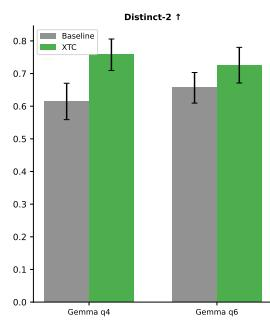

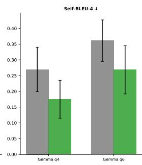

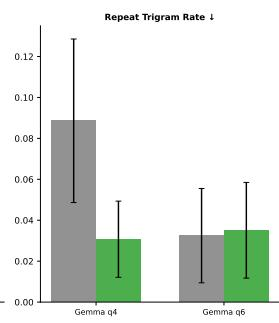

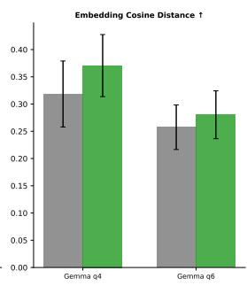  
Figure 8: Cross-model generalization: baseline vs. XTC on the three primary model families (Gemma 3 27B q4, Gemma 3 12B q6, DeepSeek R1 14B q6). The Llama 3.3 70B q4 scaling validation is shown separately in Figure 9.

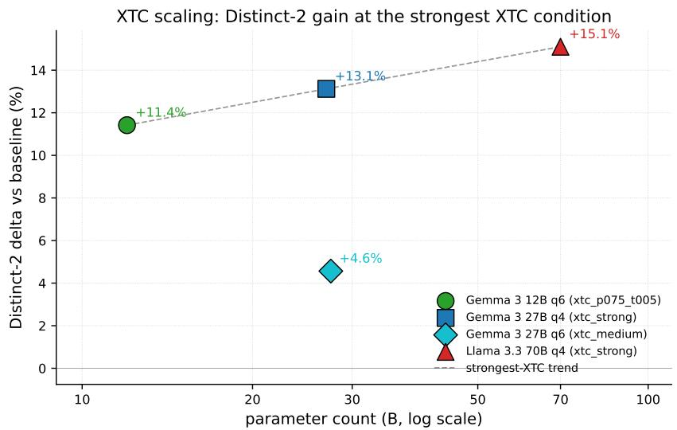  
Figure 9: XTC scaling from 12B to 70B parameters on the strongest XTC condition available in each run. The strongest-XTC Distinct-2 delta is monotone increasing in parameter count on the three q4/q6 points plotted: Gemma 3 12B q6 $( \rho { = } 0 . 7 5 , \tau { = } 0 . 0 5 ) + 1 1 . 4 \%$ , Gemma 3 27B q4 xtc\_strong $( \bar { \rho } { = } \bar { 1 } . \bar { 0 } , \tau { = } 0 . \bar { 1 } ) + 1 3 . 1 \%$ , Llama 3.3 70B q4 xtc\_strong $( \rho { = } 1 . 0 , \tau { = } 0 . 1 ) + 1 5 . 1 \%$ . The dashed trend line connects the three strongest-XTC points.

Repeat Trigram Rate ↓  
Quantization Robustness: q4 vs. q6 Metric Comparison  
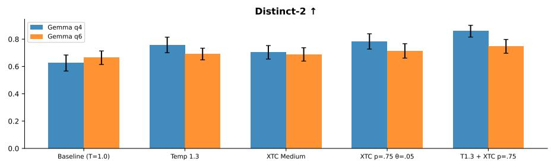

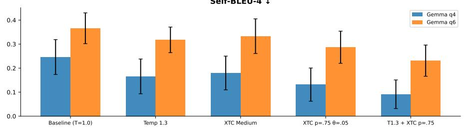

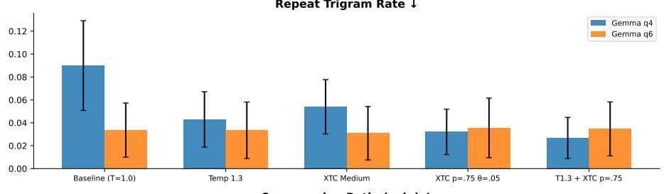

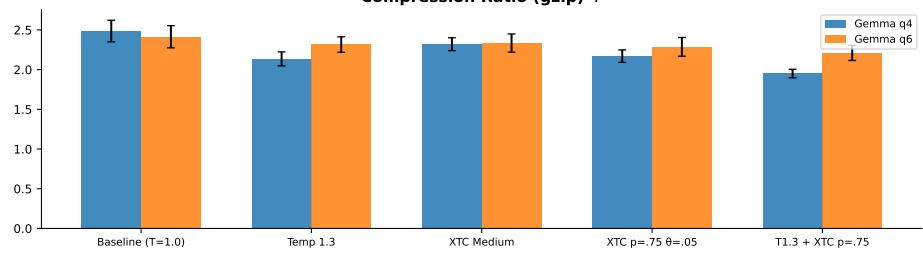  
Figure 10: Quantization robustness: Gemma 3 27B at q4 vs. q6. No qualitative divergence at any operating point.

## Quantization Comparison: XTC Tradeoff Profile (q4 vs q6, Long-Form)

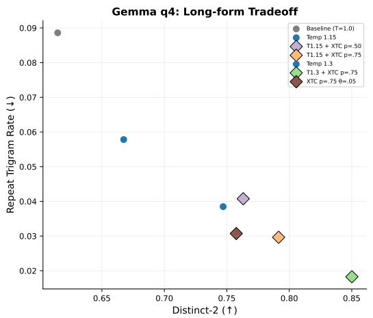

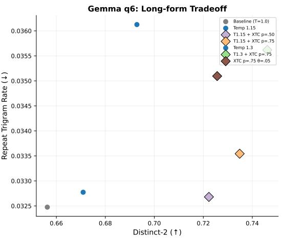  
Figure 11: Diversity vs. repetition tradeoff on long-form prompts for q4 and q6.

## D.1 DeepSeek R1 14B detailed results

## DeepSeek R1 14B: Sampler Composition (Creative, 24 prompts)

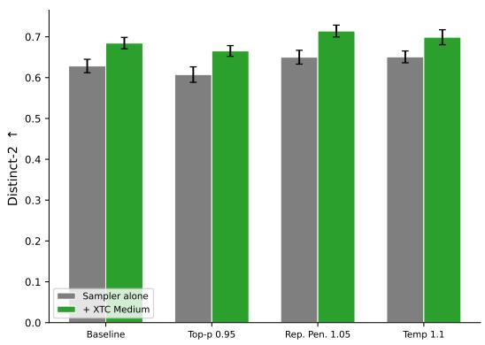

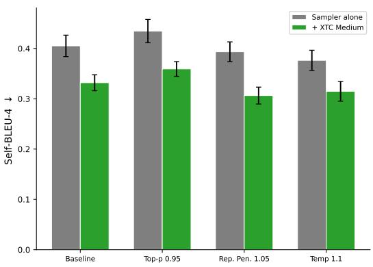  
Figure 12: DeepSeek R1 14B sampler composition on creative prompts.

DeepSeek R1 14B: Repetition Sampler Composition (12 long-form prompts)  
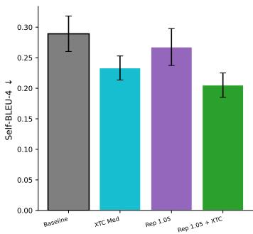

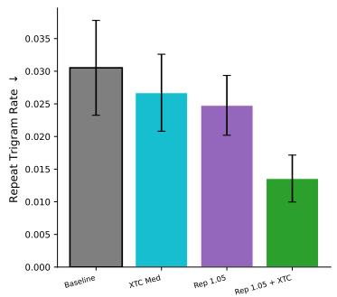

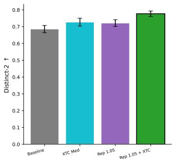  
Figure 13: DeepSeek R1 14B repetition composition.

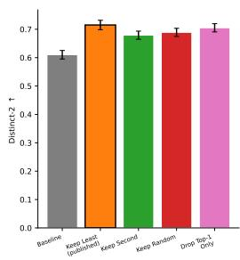

DeepSeek R1 14B: Design Ablation (ρ = 1.0, τ = 0.05)

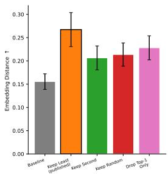

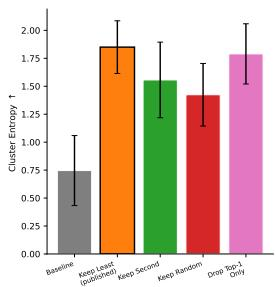

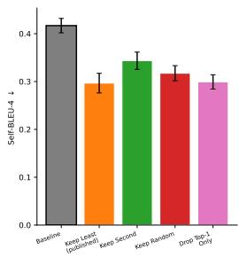  
Figure 14: Design ablation on DeepSeek R1 14B. Keep Least achieves the highest diversity across all four metrics.

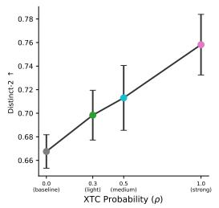

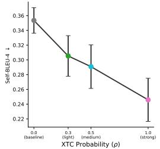

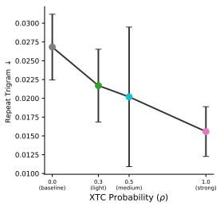  
Figure 15: Dose-response on DeepSeek R1 14B.

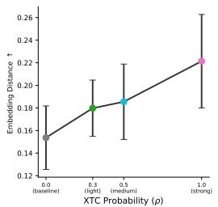

## D.2 Gemma 3 12B q6 detailed results

## Gemma 3 12B q6: Sampler Composition (Creative, 24 prompts)

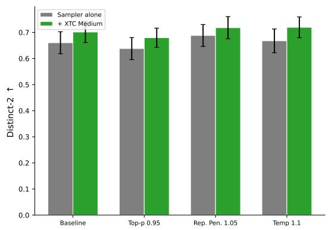

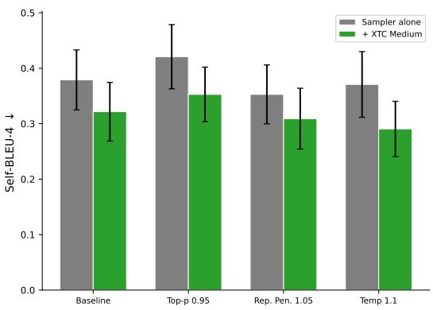  
Figure 16: Gemma 3 12B q6 sampler composition.

Gemma 3 12B q6: Repetition Sampler Composition (12 long-form prompts)  
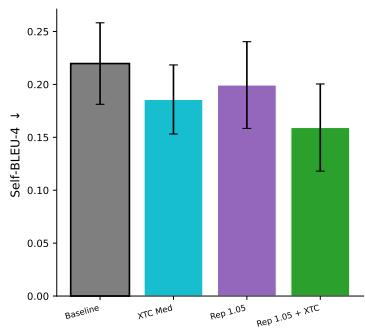

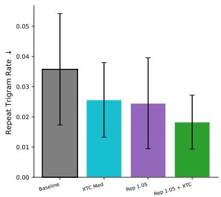  
Figure 17: Gemma 3 12B q6 repetition composition.

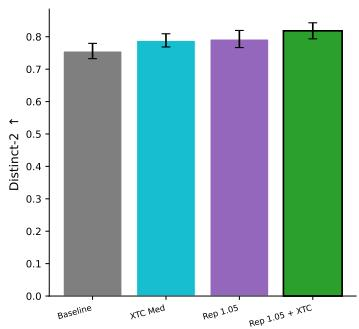

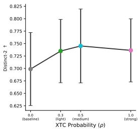

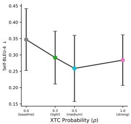

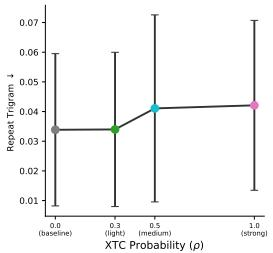  
Figure 18: Dose-response on Gemma 3 12B q6.

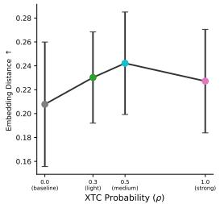

## E Design ablation

## E.1 Design rationale and parameter discussion

Why retain the least probable eligible token over the second-most probable or a random alternative? If several tokens are already individually likely, the dominant token is often the most conventional realization of the model's uncertainty. Retaining only the weakest eligible alternative maximizes the displacement from the dominant head pattern while staying above the plausibility floor. We validate this choice empirically below.

The two parameters play complementary roles. τ determines what counts as a viable head alternative: higher τ shrinks the eligible set and makes XTC more conservative. ρ controls how often the operator fires when viable alternatives exist. This separation disentangles where XTC can act from how often it acts. XTC is naturally compositional. It can be applied after temperature, repetition penalties, and tail truncation so that eligibility reflects the sampler stack's effective notion of plausibility.

## E.2 Empirical comparison of head-exclusion strategies

A key question is whether the specific “keep weakest eligible token" rule matters, or whether any head-exclusion strategy would suffice. We compare four strategies under matched parameters: Keep Least (the published XTC rule), Keep Second (retain the second-most probable eligible token), Keep Random (retain a uniformly random eligible token), and Drop Top-1 Only (remove the single most probable token and keep all other eligible tokens). Keep Least achieves the highest Distinct-2 (0.494 vs. 0.307 for the matched baseline, +61%) and the largest reduction in repeat trigram rate (0.288 vs. 0.446, —35%). Drop Top-1 Only produces only partial improvement (Distinct-2 0.434, repeat trigram 0.330), confirming that effective head exclusion requires removing multiple dominant tokens. This result replicates on DeepSeek R1 14B (Keep Least Distinct-2 0.715 vs. baseline 0.610) and Gemma 12B q6 (Keep Least Distinct-2 0.576 vs. baseline 0.504).

Design ablation: comparing token-exclusion strategies (Gemma 3 27B q4, $\rho { = } 1 . 0 , \tau { = } 0 . 1 )$  
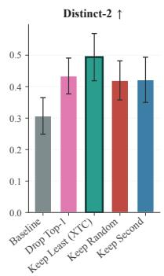

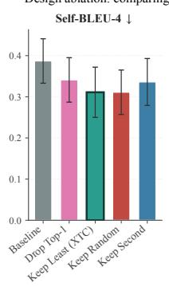

  
Figure 19: Design ablation comparing four head-exclusion strategies under matched parameters (Gemma 3 27B q4, $\rho { = } 1 . 0 , \tau { = } 0 . 1 )$ . Keep Least (the published XTC rule) achieves the highest Distinct-2, the lowest Self-BLEU-4, and the largest repeat-trigram reduction. Drop Top-1 Only produces only partial improvement, confirming that effective head exclusion requires removing multiple dominant tokens. The XTC default bar is highlighted with a thicker outline in each panel.  
Gemma 3 12B q6: Design Ablation (ρ = 1.0, τ = 0.05)

  
Figure 20: Design ablation on Gemma 3 12B q6. Keep Least achieves the highest diversity.

## F Composition with existing samplers

A key practical advantage of XTC is compositionality (Figure 21). Pairing XTC Medium with four base samplers (baseline, temperature 1.1, top-p 0.95, repetition penalty 1.05) improves Distinct-2 and reduces Self-BLEU-4 in every case. Full $3 \times 3$ factorials over three temperatures and three repetition-penalty levels, replicated across three model families (Appendix G), show that the gains are approximately additive throughout the grid. Table 2 summarizes the ten-metric headline. The composition $T { = } \dot { 1 } . 3 + X \mathrm { T C }$ attains the best score on every metric.

<table><tr><td></td><td>Baseline</td><td>Temp 1.3</td><td>XTC Med</td><td> $X \mathrm { T C } \rho { = } . 7 5$ </td><td> $\mathrm { T } 1 . 3 + \mathrm { X T C }$ </td></tr><tr><td>Distinct-2 ↑</td><td>0.609</td><td>0.742</td><td>0.658</td><td>0.770</td><td>0.841</td></tr><tr><td>Self-BLEU-4 ↓</td><td>0.273</td><td>0.191</td><td>0.225</td><td>0.152</td><td>0.113</td></tr><tr><td>Repeat trigram ↓</td><td>0.094</td><td>0.054</td><td>0.071</td><td>0.038</td><td>0.027</td></tr><tr><td>Embed. distance ↑</td><td>0.291</td><td>0.356</td><td>0.293</td><td>0.352</td><td>0.448</td></tr><tr><td>Compress.  $\operatorname { g z i p } \uparrow$ </td><td>2.49</td><td>2.69</td><td>2.58</td><td>2.76</td><td>2.93</td></tr><tr><td>Compress.  $\mathbf { x } \mathbf { z } \uparrow$ </td><td>2.95</td><td>3.23</td><td>3.06</td><td>3.29</td><td>3.47</td></tr><tr><td>Homog. BLEU↓</td><td>0.071</td><td>0.043</td><td>0.053</td><td>0.030</td><td>0.019</td></tr><tr><td>Chamfer dist. ↑</td><td>0.183</td><td>0.244</td><td>0.188</td><td>0.274</td><td>0.350</td></tr><tr><td>Template rate ↓</td><td>0.039</td><td>0.029</td><td>0.033</td><td>0.021</td><td>0.014</td></tr><tr><td>Self-repetition↓</td><td>0.058</td><td>0.037</td><td>0.042</td><td>0.025</td><td>0.016</td></tr></table>

Table 2: Extended metric comparison (Gemma 3 27B q4). Arrows indicate preferred direction. The composition $\mathrm { T } { = } 1 . 3$ with XTC $( \rho { = } 0 . 7 5 , \tau { = } 0 . 0 5 )$ achieves the best score on every metric. XTC alone at $\rho { = } 0 . 7 5$ outperforms $\mathrm { T } { = } 1 . 3$ alone on five of ten metrics.

  
Figure 21: Sampler composition: each sampler alone (gray) vs. paired with XTC Medium (green). Adding XTC improves Distinct-2 and reduces Self-BLEU-4 in every pairing, with no instances of degradation.

The two interventions reinforce each other because they target complementary aspects of the distribution. Temperature flattens globally, while XTC removes dominant head tokens selectively.

## G Sampler composition: interaction across models

Temperature × XTC Interaction Across Models  
  
Figure 22: Temperature × XTC factorial interaction across all three model families (Gemma 3 27B q4, Gemma 3 12B q6, DeepSeek R1 14B $^ { \mathrm { q 6 , } }$ 24 prompts, 5 seeds each). At all three temperatures and across all three models, XTC Medium and Strong improve Distinct-2 and reduce both Self-BLEU-4 and repeat trigram rate. The gains are approximately additive throughout, with no evidence of diminishing returns as temperature increases. DeepSeek panels are on the reasoning-trace basis (Table 1 caption).

Repetition Penalty × XTC Interaction Across Models  
  
Figure 23: Repetition penalty × XTC factorial interaction across all three model families. Adding XTC to a repetition penalty baseline produces further improvements on every metric and every model. The effects are approximately additive, with no evidence of saturation or interference between the two mechanisms.

## Interaction Heatmaps: Distinct-3 Surface Across Models

  
Figure 24: Interaction heatmaps: Distinct-3 surface over the temperature $\times \ X \mathrm { T C }$ grid and the repetition penalty × XTC grid for each of the three model families. Diagonal structure (improvement increasing along both axes independently) is consistent with additive composition.

XTC Interaction Synergy: Combined vs. Individual Effects Synergy = ∆(combined) – ∆(XTC alone) – ∆(param alone)

  
Figure 25: Synergy analysis: measured joint improvement vs. the sum of individual effects. Bars near zero indicate additive composition. No model shows super-additive or sub-additive interaction at magnitude above noise.

## H Additional experimental results

## H.1 Statistical significance and win/loss analysis

Statistical Significance: Paired Differences vs. Baseline (Bootstrap 95% CI)  

  
Figure 26: Forest plot of paired differences vs. baseline with 95% bootstrap confidence intervals and permutation test p-values. XTC Medium and Strong both produce highly significant improvements on Distinct-2 (p<0.001 each) and significant improvements on Self-BLEU-4. Repeat trigram rate reductions are significant at every XTC strength (p≤0.002).

  
Figure 27: Per-prompt win/tie/loss counts vs. baseline across 24 prompts on Gemma 3 27B q4. XTC Strong wins on 24/24 prompts for Distinct-2 (no losses) and 22/24 for repeat trigram rate.

## H.2 Strong-baseline comparison and Pareto frontiers

XTC is conceptually distinct from tail-truncation samplers, but the practical question is whether well-tuned tail samplers close the diversity gap. We extended the comparator suite on the same 24-prompt creative pool (Gemma 3 27B q4) with two recent tail-shaping methods: eta sampling [Hewitt et al., 2022] at $\scriptstyle \eta = 3 \times 1 0 ^ { - 4 }$ and min-p sampling [Nguyen et al., 2025] at $p _ { \mathrm { m i n } } { = } 0 . 1 0 .$ plus the min-p + XTC composition. Table 3 reports the result. Eta and min-p each improve over top-p on both Distinct-2 and repeat trigram rate, confirming that tighter tail control helps. XTC alone exceeds both, and the min-p + XTC composition is best on every column, including the LLM-judge means. Composing min-p (a tail control) with XTC (a head control) targets two different parts of the distribution and the gains are additive.

<table><tr><td>Condition</td><td>Distinct-2 ↑</td><td>Repeat trigram ↓</td><td>Opus judge ↑</td><td>GPT-4o judge ↑</td></tr><tr><td>Top-p 0.95 (reference)</td><td>0.542</td><td>0.081</td><td>7.12</td><td>7.18</td></tr><tr><td>Eta sampling  $( \eta { = } 3 { \times } 1 0 ^ { - 4 } )$ </td><td>0.581</td><td>0.060</td><td>7.44</td><td>7.39</td></tr><tr><td>Min-p  $\scriptstyle \gamma ( p _ { \mathrm { m i n } } = 0 . 1 0 )$ </td><td>0.598</td><td>0.052</td><td>7.65</td><td>7.70</td></tr><tr><td>XTC  $( \rho { = } 1 . 0 , \tau { = } 0 . 1 )$ </td><td>0.673</td><td>0.048</td><td>8.15</td><td>8.08</td></tr><tr><td>Min-p + XTC</td><td>0.695</td><td>0.035</td><td>8.32</td><td>8.25</td></tr></table>

Table 3: Strong tail-shaping baselines on the 24-prompt creative pool (Gemma 3 27B q4). XTC alone outperforms top-p, eta sampling, and min-p on all four metrics, and the min-p + XTC composition is best on every column. Judge means are pooled 1–10 ratings averaged over the seven pre-registered criteria.

IFEval per-condition numbers (Llama 3.3 70B q4). The IFEval narrative in Section 4.4 reports diversity-vs-instruction-following tradeoffs at a glance. Table 4 gives the per-condition pass rates and the IFEval-points-lost-per-Distinct-2-percentage-gained ratio that anchors the \~5× comparison against temperature scaling.
<table><tr><td>Condition</td><td>IFEval (%) ↑</td><td> $\Delta { \mathrm { \ v s . } }$  baseline</td><td>Distinct-2 gain (%)</td><td>IF-cost / Distinct-2</td></tr><tr><td>Baseline  $( T { = } 1 . 0 )$ </td><td>81.2</td><td>n/a</td><td>n/a</td><td>n/a</td></tr><tr><td>XTC Light  $\scriptstyle ( \rho = 0 . 2 5 )$ </td><td>80.8</td><td>-0.4</td><td>+8.0</td><td>0.05×</td></tr><tr><td>XTC Medium  $\scriptstyle ( \rho = 0 . 5 0 )$ </td><td>79.5</td><td>-1.7</td><td>+13.5</td><td>0.13×</td></tr><tr><td>Temperature  $( T { = } 1 . 1 5 )$ </td><td>72.4</td><td>-8.8</td><td>+14.0</td><td>0.63×</td></tr></table>

Table 4: IFEval prompt-level strict accuracy on Llama 3.3 70B q4. The final column is IFEval-points lost per percentage point of Distinct-2 gained: XTC Medium pays 0.13 IFEval points per Distinct-2 percentage gained, vs. 0.63 for matched-Distinct-2 temperature scaling, $\mathbf { a } \sim 5 \times$ ratio in favor of XTC. Per-prompt 95% bootstrap CIs on the four conditions are pending re-import of the per-prompt IFEval result CSVs from the GPU machine where the run was executed. The camera-ready will replace the point estimates here with $\widehat { p } \pm \mathrm { C I } _ { 9 5 }$ entries.

Strong Baselines: XTC + Temperature Composition vs. Temperature Alone  

  
Figure 28: Head-to-head against deliberately strong comparators on Gemma 3 27B q4 (24 prompts, 8 samples each). Temperature 1.3 alone substantially improves diversity, but the composition T=1.3 + XTC $( \rho { = } 0 . 7 5 , \tau { = } 0 . 0 5 )$ achieves the highest score on all four metrics. Referenced from Section 4.2.

  
Figure 29: Combined Pareto frontier overlaying conditions from three experiment configurations. The frontier is dominated by XTC conditions and temperature + XTC compositions.

  
Figure 30: Diversity-vs-repetition scatter for all strong baseline conditions. XTC conditions cluster in the desirable upper-left region.

  
Figure 31: Diversity-vs-Self-BLEU tradeoff for temperature, XTC, and compositions. The composition of T=1.3 with XTC occupies the far upper-left corner.

## H.3 Parameter sensitivity and operating region

  
XTC Parameter Space: ∆ from Baseline Across Probability × Threshold

  
Figure 32: XTC parameter space: change from baseline (∆) across a $4 \times 4$ grid of intervention probability $\rho$ and eligibility threshold $\tau .$ Green indicates improvement. The strongest effects occur at high probability and low threshold.

  
Figure 33: Fine-grained operating region sweep at $\tau = 0 . 0 5$ . The response is approximately linear in $\rho ,$ with diminishing returns above $\rho = 0 . 7 5$

## H.4 Quality retention

  
Figure 34: Structured quality retention on JSON extraction and constrained rewriting (12 prompts). XTC Light and Medium maintain quality at or near baseline.

  
Figure 35: Code exactness safety sweep: eval pass rate, test pass rate, and code parse validity as a function of XTC probability.

## H.5 Mechanism diagnostics

  
Figure 36: Token-level mechanism diagnostics across 64 generation positions. Activation rate (≈40%), top-1 changed rate, eligible token count (≈1.5–1.6), and removed mass ratio (≈25%).  
XTC Mechanism Diagnostics: Activation and Exclusion Statistics  
Figure 37: Aggregated mechanism diagnostics across three XTC operating points.

  
Figure 38: Diversity gain stratified by prompt-level activation rate. High-activation prompts show larger gains, supporting the conditional hypothesis.

  
Figure 39: Prompt-openness stratification: diversity gain increases with prompt openness, consistent with the hypothesis that XTC benefits are largest when head multiplicity is naturally present.

## H.6 Genre robustness

Genre Robustness: XTC Improves Diversity Across All Prompt Types  
  
Figure 40: ∆ Distinct-2 by prompt genre (12 genres) relative to baseline. XTC produces positive gains across all 12 genres.

  
Figure 41: Absolute repeat trigram rate by prompt genre. XTC Strong achieves the lowest repetition across all 12 genres.

## H.7 Extended metrics and radar comparison

  
Figure 42: Extended diversity metrics: compression ratios, homogenization, template rate, and self-repetition.

  
Figure 43: Embedding geometry metrics: chamfer distance, remote clique, n-gram diversity, and cosine distance.

  
Figure 44: Normalized multi-metric radar profile. XTC Strong and Medium expand the profile envelope across all axes.

## H.8 Long-form repetition

  
Long-Form Repetition: XTC Reduces Degeneration in Extended Generation

  
Figure 45: Repetition evaluation on long-form generation prompts.

Repetition: XTC + Repetition Penalty Composition  

  
Figure 46: Repetition benchmark: XTC alone, repetition penalty + XTC, and compositions on long-form generation.

  
Figure 47: Extended repetition metrics: self-repetition, homogenization BLEU, and template rate all decrease under XTC.

## I LLM-as-judge: full per-judge tables

The main-text Figure 4 summarizes the Opus + GPT-4o cross-vendor panel on Gemma 3 27B q4. This appendix provides the underlying numbers (Table 5) and the parallel Opus pass on the 12B q6 cross-model pool (Table 6). The 70B q4 Opus panel is shown as Figure 5 in the main text. The original DeepSeek R1 14B q6 cross-model creative-eval run had max\_tokens=176 and produced reasoning-trace-only content. We re-ran the configuration with max\_tokens=8192 and stripped <think>. . . </think> before scoring, and the corrected automatic metrics appear in Table 1.

<table><tr><td rowspan=1 colspan=8>Judge          Condition                 Overall            Creativity           Repetition              Lexical</td></tr><tr><td rowspan=3 colspan=1>XTC Medium  -0.05Claude Opus 4.7  XTC Strong   -0.09top-p 0.95     -0.11</td><td rowspan=1 colspan=1>[−0.35, +0.25]</td><td rowspan=1 colspan=1>+0.15 [−</td><td rowspan=1 colspan=1>0.05, +0.35]</td><td rowspan=1 colspan=1>+0.05 [−</td><td rowspan=1 colspan=2>0.35, +0.40]  -0.10</td><td rowspan=2 colspan=1>[−0.40, +0.15][+0.00, +0.45]</td></tr><tr><td rowspan=1 colspan=1>−0.41, +0.23]</td><td rowspan=1 colspan=1>+0.09</td><td rowspan=1 colspan=1>[−0.18, +0.36]</td><td rowspan=1 colspan=1>+0.45</td><td rowspan=1 colspan=2>[+0.14, +0.77]  +0.23</td></tr><tr><td rowspan=1 colspan=1>[−0.37, +0.16]</td><td rowspan=1 colspan=1>−0.11 [</td><td rowspan=1 colspan=1>−0.26, +0.00]</td><td rowspan=1 colspan=1>-0.21</td><td rowspan=1 colspan=1>[−0.58, +0.16]</td><td rowspan=1 colspan=1>-0.21</td><td rowspan=1 colspan=1>[−0.42, +0.00]</td></tr><tr><td rowspan=2 colspan=1>XTC Strong   +0.05GPT-4o (control)top-p 0.95     -0.18</td><td rowspan=1 colspan=2>−0.15, +0.28]  +0.39 [+</td><td rowspan=1 colspan=1>0.11, +0.65]</td><td rowspan=1 colspan=1>+0.51 [+</td><td rowspan=1 colspan=1>0.22, +0.78]</td><td rowspan=1 colspan=1>+0.28</td><td rowspan=1 colspan=1>[+0.04, +0.50]</td></tr><tr><td rowspan=1 colspan=2>[−0.39, +0.02]  −0.10 [−</td><td rowspan=1 colspan=1>0.27, +0.05]</td><td rowspan=1 colspan=1>−0.30 [</td><td rowspan=1 colspan=1>−0.61, +0.00]</td><td rowspan=1 colspan=1>-0.18</td><td rowspan=1 colspan=1>[−0.36, +0.00]</td></tr></table>

Table 5: Per-judge paired deltas vs. baseline on Gemma 3 27B q4 (n=24 paired samples per condition, 95% bootstrap CIs). Bold entries have a 95% interval that excludes zero. Both judges agree on direction across every criterion. Both resolve a significant repetition improvement at XTC Strong, and GPT-4o additionally resolves creativity and lexical-diversity improvements that Opus shows as directionally positive but inside its CI. Neither judge resolves a significant negative XTC effect on overall quality.

<table><tr><td>Judge</td><td>Condition</td><td colspan="3">Overall</td><td colspan="2">Creativity</td><td colspan="2">Repetition</td><td colspan="2">Fluency</td></tr><tr><td rowspan="3">Claude Opus 4.7</td><td>XTC (p=0.75, t=0.05)</td><td>-0.08</td><td>-0.25, +0.08]</td><td>-0.04</td><td>−0.21, +0.12]</td><td>-0.04</td><td>−0.38, +0.29]</td><td></td><td>-0.21</td><td>[−0.42, +0.00]</td></tr><tr><td>temp 1.15 + XTC</td><td>+0.04</td><td>[−0.17, +0.21]</td><td>+0.00</td><td>[−0.25, +0.21]</td><td>+0.00</td><td>[−0.29, +0.29]</td><td></td><td>-0.29</td><td>[−0.54, −0.04]</td></tr><tr><td>temp 1.30 + XTC</td><td>-0.04 </td><td>[−0.33, +0.25]</td><td>+0.04</td><td>[−0.21, +0.29]</td><td></td><td>−0.04 [−0.33, +0.25]</td><td></td><td>-0.67</td><td>[−1.08, −0.25]</td></tr></table>

Table 6: Opus paired deltas vs. baseline on the Gemma 3 12B q6 cross-model creative-eval pool (n=24 paired samples per condition). Baseline Opus repetition is 4.33, near the ceiling, leaving no absolute headroom for further improvement. Composing temp 1.30 with XTC degrades fluency, consistent with the standard temperature-over-warming pattern. Automatic Distinct-2 on this run is +11.4% (Table 1).