# A Data-dependent Early Stopping Rule using Rademacher Complexity with L1-norm

Duy Hoang   
Universit´e Paris-Saclay, CNRS, ENS Paris-Saclay, LMF   
Gif-sur-Yvette, 91190, France

Bastien Berret Universit´e Paris-Saclay, Inria, CIAMS Gif-sur-Yvette, 91190, France

Olivier Bruneau   
Universit´e Paris-Saclay, ENS Paris-Saclay, LURPA   
Gif-sur-Yvette, 91190, France

Laurent Fribourg

Universit´e Paris-Saclay, CNRS, ENS Paris-Saclay, LMF

Gif-sur-Yvette, 91190, France

hoangduy@lmf.cnrs.fr

bastien.berret@universite-paris-saclay.fr

olivier.bruneau@ens-paris-saclay.fr

fribourg@lmf.cnrs.fr

## Abstract

Training neural networks requires balancing the trade-of between fitting the training data and achieving robust performance on unseen inputs. This ability, commonly referred to as generalizability, is determined by the gap between the empirical risk on the training set (“empirical loss”) and the expected risk over the data distribution (“generalization error”). Existing approaches typically estimate the generalization error numerically, requiring gradient descent training and an “early stopping” strategy. In this work, we introduce an analytic framework that estimates the optimal time of early stopping without the need for training. Several works in the literature also give such analytical estimations, but they are generally based on random matrix theory and often make assumptions on the distribution of the data or the eigenvalue distribution of the covariance matrix. In contrast, our work is based on Rademacher complexity (RC) without needing such probabilistic assumptions. For both theoretical and numerical reasons, it is more relevant to express RC with the $L _ { 1 ^ { - } }$ norm rather than with the $L _ { \mathrm { { 2 } } } \mathrm { { - n o r m } }$ . We focus on the case of linear models and the problem of linear regression. Thanks to the “linear probing” method, our results can, however, be successfully applied to nonlinear neural networks, as illustrated in the classification MNIST example.

Keywords: generalization, bias-variance trade-of, linear regression.

## 1 Introduction

Given a distribution of input/output pairs, the expected loss across is referred to as a “population loss”, and denoted $L _ { D }$ . Using a neural network (NN) and a process of gradient descent (GD), one can estimate $L _ { D }$ on a set S of n samples randomly selected from . This is called the “empirical loss”, and denoted $L _ { S }$ . The generalization loss, denoted $L _ { G }$ , is the diference between $L _ { D }$ and $L _ { S } ,$ and accounts for the data located outside S. At the beginning of the GD process, $L _ { S }$ tends to decrease while $L _ { G }$ tends to increase (“bias-variance” tradeof), so the early stopping strategy seeks to halt GD at a time $t ^ { * }$ minimizing $L _ { S } + L _ { G }$

Classically, $t ^ { * }$ is estimated numerically as the time $t _ { t e s t }$ that minimizes the empirical loss on a separate dataset $S _ { t e s t }$ (see, e.g., Prechelt (2002)). Using random matrix theory (RMT), several works estimate $t ^ { * }$ analytically, without needing to perform GD (e.g., Raskutti et al. (2014); Liao and Couillet (2018); Ali et al. (2019); Advani et al. (2020)). However these works often assume the distribution $\mathcal { D }$ to be Gaussian, or the eigenvalue distribution of the data covariance matrix to be Marchenko–Pastur (Le Cun et al. (1991)). In contrast here, we estimate $t ^ { * }$ analytically using Rademacher complexity (RC) theory (Bartlett and Mendelson (2002)), and do not make any assumption about the data distribution. Our method is based on a data-dependent criterion of the form $\mathcal C ( s )$ that ensures $L _ { S } ( t ) + L _ { G } ( t )$ to decrease for all $t \leq s$ . We show that the highest s satisfying $\mathcal C ( s )$ is a low estimate $t ^ { + }$ of $t ^ { * }$ (see Proposition 7). We also give suficient conditions that ensure $t ^ { + } = t ^ { * }$ . In order to eliminate a factor M dependent on $\mathcal { D } ,$ we estimate RC using the $L _ { \mathrm { { 1 } - \mathrm { { n o r m } } } }$ rather than the $L _ { \mathrm { { 2 } } } \mathrm { { - n o r m } }$ (see Remark 2). On the examples (see Section 4), we check that the $L _ { \mathrm { 1 } } \mathrm { - n o r m }$ yields a value of $t ^ { + }$ much closer to the numerical stopping time $t _ { t e s t }$ than the $L _ { \mathrm { { 2 } } } \mathrm { { - n o r m } }$

We also give an analytic form for the value of $L _ { S } + L _ { G }$ at $t = \infty$ (see Section 3.3). By comparing it with $L _ { S } + L _ { G }$ at $t = t ^ { + }$ , we determine whether the early stopping strategy should be applied or not (see, e.g., Sonthalia et al. (2024); Bartlett et al. (2020); Belkin et al. (2018)). Our work focuses on linear models. However, our results can be applied to nonlinear NNs thanks to the linear probing strategy (see Alain and Bengio (2016)). This is illustrated on MNIST classification examples (Examples 2 and 3, Section 4). The proofs of our results are given in Appendix.

## Comparison with related work

As mentioned earlier, several works obtain analytical upper bounds on the generalization loss using RMT, and used them to estimate the optimal stopping time. More precisely, let $\lambda _ { 1 } \geq \lambda _ { 2 } \geq \cdot \cdot \cdot \geq \lambda _ { n } \geq 0$ be the eigenvalues of the data covariance matrix. In Advani et al. (2020) for example, they evaluate a stopping time that minimizes the average generalization dynamics, by determining the error associated with each mode $i ( i \in [ n ] )$ . For mode $i ,$ they find an optimal stopping time of the form

$$
t ^ { \mathrm { o p t } } = \frac { 1 } { \lambda _ { i } } \ln ( 1 + \lambda _ { i } \cdot S N R ) ,
$$

where SNR is a signal-to-noise ratio. Here, without making any probabilistic assumptions, we find a similar result using Rademacher complexity, viz., an estimate of the optimal stopping time of the form (see Equation (27))

$$
t ^ { + } \approx \frac { 1 } { \lambda _ { 1 } } \ln \frac { \Gamma ( 0 ) } { \Omega ( 0 ) } .
$$

The numerator Γ depends on the higher eigenvalues $\lambda _ { 1 } , \ldots , \lambda _ { \alpha }$ , and contains the “informative” part (see, e.g., Oymak et al. (2019)). The denominator Ω depends on the lower eigenvalues $\lambda _ { \alpha + 1 } , \ldots , \lambda _ { n }$ , and contains the “nuisance” part. So the quotient $\Gamma / \Omega$ can be interpreted as a form of SNR ratio.

In the literature, Rademacher complexity (together with “Neural Tangent Kernel” theory) has often been used to find analytical bounds on the population loss: see, e.g., Jacot et al. (2018); Du et al. (2018); Arora et al. (2019); Allen-Zhu et al. (2019); Oymak et al. (2019); Li et al. (2020). However, these studies require the number m of NN parameters be large compared to the number n of samples (overparameterization). In this case, a phenomenon of “benign overfitting” or “epochwise double descent” appears (see, e.g., Heckel and Yilmaz (2020); Stephenson and Lee (2021); Nakkiran et al. (2021)): The loss $L _ { t e s t } ( t )$ reaches a first local minimum at $t = t _ { t e s t }$ , then increases before going down later, converging towards a minimum lower than at $t = t _ { t e s t }$ . In this context, the strategy of early stopping is not “beneficial”. In contrast, our method is well adapted to the underparameterized case $( { \mathrm { i . e . , } } m \leq n )$

## Notation

In this paper, R and N refer to the sets of real and natural numbers, respectively. We denote by $\mathbb { R } ^ { p }$ a p-dimensional Euclidean space, and by $\mathbb { R } ^ { p \times q }$ a space of real matrices with p rows and q columns. We use bold letters for vectors and bold capital letters for matrices. For a given matrix $M \in \mathbb { R } ^ { p \times q }$ , we use $M ^ { \top }$ for its transpose, and $M ^ { \dagger }$ for its Moore-Penrose (pseudo)inverse. The $L _ { p } { \mathrm { - n o r m } }$ of a vector v is denoted by $\| \pmb { v } \| _ { p }$ . We use i.i.d. to indicate the set of independent and identically distributed random variables. We use [n] for $\{ 1 , \ldots , n \}$ and I for the identity matrix. For $v \in \mathbb { R }$ , we use $\operatorname { s g n } ( v )$ to denote 1 if $v \geq 0$ , or 1 if $v < 0$ For $\pmb { v } = ( v _ { 1 } , \dots , v _ { n } ) \in \mathbb { R } ^ { n }$ , we use sgn(v) for $( \operatorname { s g n } ( v _ { 1 } ) , \dots , \operatorname { s g n } ( v _ { n } ) )$

## 2 Preliminary Results

We consider a distribution over $\mathcal { H } \times \mathcal { V }$ where $\mathcal { H } \subset \mathbb { R } ^ { m }$ is the input space of all possible instances $^ { h , }$ and $\mathcal { V } \subset \mathbb { R }$ the space of the corresponding outputs.

## 2.1 Population loss and Rademacher complexity

The “training set” S is a set of n input/output pairs $\{ ( \pmb { h } _ { 1 } , y _ { 1 } ) , \dots , ( \pmb { h } _ { n } , y _ { n } ) \}$ made of n samples selected i.i.d. from . Let $\pmb { y } = ( y _ { 1 } , \dots , y _ { n } ) \in \mathbb { R } ^ { n }$ . Let K be the $n \times m$ matrix having $\pmb { h } _ { 1 } , \ldots , \pmb { h } _ { n } \in \mathbb { R } ^ { m }$ as columns. The data covariance matrix $\pmb { H } \in \mathbb { R } ^ { n \times n }$ is defined by

$$
\pmb { H } = \pmb { K } \pmb { K } ^ { \top } ,
$$

i.e., the (i, j)-entry of H is $H _ { i , j } = h _ { i } ^ { \top } h _ { j }$ . (See, e.g., Du et al. (2018).) As in Martin Xavier et al. (2025), we focus here on the L1-norm (see Remark 2). In this context, the population loss $L _ { \mathcal { D } } [ f ]$ (more simply denoted as $L _ { \mathcal { D } } )$ over data distribution is:

$$
L _ { \mathcal { D } } [ f ] = \mathbb { E } _ { ( h , y ) \sim \mathcal { D } } [ | f ( h ) - y | ] ,
$$

where $f : \mathbb { R } ^ { m }  \mathbb { R }$ is a given function. As we focus here on the linear regression problem, $f$ is of the form:

$$
f ( h ) = a ^ { \top } h
$$

where $\pmb { a } = ( a _ { 1 } , \dots , a _ { m } ) \in \mathbb { R } ^ { m }$ . The empirical loss $L _ { S }$ over $S$ is defined by:

$$
L _ { S } = { \frac { 1 } { n } } \sum _ { i \in [ n ] } | a ^ { \top } \pmb { h } _ { i } - y _ { i } | = { \frac { 1 } { n } } \sum _ { i \in [ n ] } | v _ { i } | = { \frac { 1 } { n } } \| \pmb { v } \| _ { 1 }\tag{1}
$$

with

$$
v _ { i } = \pmb { a } ^ { \top } h _ { i } - y _ { i } \in \mathbb { R } \quad ( i \in [ n ] ) ,\tag{2}
$$

$$
\pmb { v } = ( v _ { 1 } , \dots , v _ { n } ) = \pmb { K } \pmb { a } - \pmb { y } \in \mathbb { R } ^ { n } .\tag{3}
$$

The vector v is called the empirical error vector (or the training error vector). We are searching for a vector a that minimizes the population loss $L _ { D }$ across the entire data distribution . Since  is unknown, our objective is actually to minimize an upper bound on $L _ { D }$ . Let M and C be two positive reals satisfying respectively:

$$
| \boldsymbol { a } ^ { \intercal } \boldsymbol { h } - \boldsymbol { y } | \leq M \quad \forall ( \boldsymbol { h } , \boldsymbol { y } ) \in \mathcal { H } \times \mathcal { Y }\tag{4}
$$

$$
\begin{array} { r } { \mathbb { E } _ { \pmb { h } \sim \mathcal { D } } \left[ \| \pmb { h } \| _ { 2 } ^ { 2 } \right] \leq C ^ { 2 } . } \end{array}\tag{5}
$$

Let $L _ { G } ^ { * }$ and $L _ { \mathcal { D } } ^ { * }$ be defined as:

$$
L _ { G } ^ { * } = { \frac { 2 \| { \pmb { a } } \| _ { 2 } C } { \sqrt { n } } }\tag{6}
$$

$$
L _ { \mathcal { D } } ^ { * } = L _ { S } + L _ { G } ^ { * } = \frac { 1 } { n } \| \pmb { v } \| _ { 1 } + \frac { 2 \| \pmb { a } \| _ { 2 } C } { \sqrt { n } } .\tag{7}
$$

We follow an approach based on RC (see Martin Xavier et al. (2025)). In the linear setting, the result is as follows.

Proposition 1 (cf. Proposition 3 of Martin Xavier et al. (2025)) With probability at least $1 - \delta$ over the sample S of size $n ,$ the population loss $L _ { D }$ satisfies:

$$
L _ { \mathcal { D } } \leq L _ { \mathcal { D } } ^ { * } + \epsilon\tag{8}
$$

where

$$
\epsilon = 3 M \sqrt { \frac { \log \frac { 2 } { \delta } } { 2 n } } .\tag{9}
$$

Remark 2 (justification of the use of L1-norm) By Theorem 11.3 of Mohri et al. (2018) $( p . { \mathcal { Z } } 7 0 )$ , we have

$$
\mathbb { E } _ { ( \pmb { h } , \boldsymbol { y } ) \sim \mathcal { D } } [ \lvert \pmb { a } ^ { \top } \pmb { h } - \boldsymbol { y } \rvert ^ { p } ] \leq \frac { 1 } { n } \lVert \pmb { v } \rVert _ { p } + 2 \mu _ { p } \mathcal { R } _ { n } + \epsilon _ { p }
$$

where, for linear models, $\mathcal { R } _ { n } \leq \| \pmb { a } \| _ { 2 } C / \sqrt { n }$ (see Ma (2022), Theorem 5.10), $\mu _ { p } = p M ^ { p - 1 }$ and $\epsilon _ { p } = 3 M ^ { p } \sqrt { \log ( 2 / \delta ) / 2 n }$ . Hence:

$$
\mathbb { E } _ { ( h , y ) \sim \mathcal { D } } [ | a ^ { \top } h - y | ^ { p } ] - \epsilon _ { p } \le \frac { 1 } { n } \| v \| _ { p } + p M ^ { p - 1 } \frac { 2 C \| a \| _ { 2 } } { \sqrt { n } } .
$$

In order to eliminate M in the right-hand side, we let $p = 1$ . We get:

$$
L _ { \mathcal { D } } - \epsilon = \mathbb { E } _ { ( h , y ) \sim \mathcal { D } } [ | a ^ { \top } h - y | ] - \epsilon \leq \frac { 1 } { n } \| v \| _ { 1 } + \frac { 2 C \| a \| _ { 2 } } { \sqrt { n } } = L _ { \mathcal { D } } ^ { * } ,
$$

which corresponds to (8). The use of the $L _ { 1 }$ -norm allows us to define $L _ { \mathcal { D } } ^ { * }$ without using M. The time $t ^ { + }$ at which the gradient flow is stopped (see Equation (18)) corresponds to the minimum of $L _ { \mathcal { D } } ^ { * }$ , and does not depend on M either. The constant M is only used in the definition of ϵ (see (9)). On the examples (see Section $\it 4 )$ , we verify that the use of the L1-norm yields better results than the use of the L2-norm. Note that the $L _ { 1 } – n o r m \ i s$ used to evaluate the Rademacher complexity, but it is the classical quadratic loss $\begin{array} { r } { { \mathscr { L } } ( { \pmb a } ) = \frac { 1 } { 2 } \| { \pmb v } \| _ { 2 } ^ { 2 } } \end{array}$ (see (10)) that is used by the gradient flow (see (11)).

Remark 3 (estimates of C and M) As an upper bound C satisfying (5), we can take: $C = \operatorname* { s u p } _ { h \in \mathcal { H } } \| h \| _ { 2 }$ . As an upper bound M satisfying (4), we can take

$$
M = | | \pmb { a } ( t ^ { + } ) | | _ { 2 } \times \operatorname* { s u p } _ { \pmb { h } \in \mathcal { H } } | | \pmb { h } | | _ { 2 } + \operatorname* { s u p } _ { y \in \mathcal { V } } | y | .
$$

(This is possible because the definition (18) of $t ^ { + }$ does not involve M.) Note that these estimates of C and M suppose that the domains and $\mathcal { V }$ are bounded. Note also that, for the problem of binary classification, we have $M = 2$

## 2.2 Gradient flow for linear models

For simplicity, we express the problem in the continuous-time setting, and consider the gradient flow process (GF) instead of discrete-time GD. The idea is to apply GF to ${ \mathbf { } } a ,$ and stop the process at the time $t ^ { * }$ where $L _ { \mathcal { D } } ^ { * }$ is expected to reach its minimum (strategy of “early stopping”). Classically, one estimates $t ^ { * }$ by considering a separate set of data $S _ { t e s t }$ and determine the time $t _ { t e s t }$ where GF reaches its minimum on that set (see,e.g., Prechelt (2002)). We give here a method that allows us to estimate $t ^ { * }$ analytically without needing a separate set or having to apply GF. More formally, we consider the problem of finding $\pmb { a } = ( a _ { 1 } , . . . , a _ { m } ) \in \mathbb { R } ^ { m }$ that minimizes the following quadratic loss function:

$$
{ \mathcal { L } } ( { \boldsymbol { \mathbf { \mathit { a } } } } ) = { \frac { 1 } { 2 } } \sum _ { i = 1 } ^ { n } ( { \boldsymbol { \mathbf { \mathit { a } } } } ^ { \top } { \boldsymbol { \mathbf { \mathit { h } } } } _ { i } - { \boldsymbol { \mathbf { \mathit { y } } } } _ { i } ) ^ { 2 } = { \frac { 1 } { 2 } } \sum _ { i = 1 } ^ { n } v _ { i } ^ { 2 } = { \frac { 1 } { 2 } } \| { \boldsymbol { \mathbf { \mathit { v } } } } \| _ { 2 } ^ { 2 } .\tag{10}
$$

The vector a that minimizes $\mathcal { L } ( a )$ on  is found by considering a given training set S containing n samples $( h _ { i } , y _ { i } )$ drawn randomly i.i.d. from $\mathcal { D } .$ . The vector a is initialized to 0, and is updated via GF on $S$ as follows:

$$
\frac { d \pmb { a } } { d t } = - \frac { \partial \mathcal { L } } { \partial \pmb { a } } .
$$

Hence, using (2), (3) and (10), we have:

$$
\frac { d \pmb { a } } { d t } = \triangledown - \frac { \partial \mathcal { L } } { \partial \pmb { a } } = - \frac { 1 } { 2 } \sum _ { i = 1 } ^ { n } \frac { \partial v _ { i } ^ { 2 } } { \partial \pmb { a } } = - \sum _ { i = 1 } ^ { n } v _ { i } \pmb { h } _ { i } = - \pmb { K } ^ { \top } \pmb { v } .\tag{11}
$$

On the other hand, the dynamic of the training error vector v during GF is expressed by (see, e.g., Du et al. (2018)):

$$
\frac { d \pmb { v } } { d t } = - \pmb { H } \pmb { v } .\tag{12}
$$

The GF process makes the first term $\| \pmb { v } \| _ { 1 } / n$ of $L _ { \mathcal { D } } ^ { * }$ (see (7)) decrease, and the second term $2 \| a \| _ { 2 } C / { \sqrt { n } }$ increase. The curve $L _ { \mathcal { D } } ^ { * }$ is thus “U-shaped” 1. It reaches a first local minimum at $t = t ^ { * }$ , which is the first time when $d L _ { \mathcal { D } } ^ { \ast } ( t ) / d t \geq 0 \colon$

$$
t ^ { * } = \operatorname* { i n f } _ { t \geq 0 } \{ t : \frac { d L _ { \mathcal { D } } ^ { * } ( t ) } { d t } \geq 0 \} .\tag{13}
$$

Remark 4 The initialization of a to 0 has the efect of limiting the growth of the norm $\| \pmb { a } ( t ) \| _ { 2 }$ and the generalization loss $L _ { G } ^ { * } = 2 C \lVert { \pmb a } ( t ) \rVert _ { 2 } / \sqrt { n }$ during GF.

## 3 A Data-dependent Estimate $t ^ { + }$ of $t ^ { * }$

We now explain how to estimate the first local minimum of $L _ { \mathcal { D } } ^ { * }$ without needing to apply GF.

## 3.1 Analytic form of $d L _ { D } ^ { * } / d t$

Proposition 5 The derivative of $L _ { \mathcal { D } } ^ { * }$ is given by:

$$
\frac { d L _ { \mathcal { D } } ^ { * } ( t ) } { d t } = \mathrm { ~ - ~ } \frac { 1 } { n } \left( s g n ( \pmb { v } ( t ) ) \right) ^ { \top } \pmb { H } \pmb { v } ( t ) + \Psi ( t )\tag{14}
$$

with

$$
\Psi ( t ) = \mathbf { \Psi } - \frac { 2 C } { \sqrt { n } } \frac { ( K ^ { \dagger } ( \pmb { v } ( t ) + \pmb { y } ) ) ^ { \top } } { \| K ^ { \dagger } \left( \pmb { v } ( t ) + \pmb { y } \right) \| _ { 2 } } K ^ { \top } \pmb { v } ( t ) \in \mathbb { R } ,\tag{15}
$$

where $K ^ { \dagger } \in \mathbb { R } ^ { m \times n }$ is the pseudoinverse of K.

## 3.2 Identification of an area where $L _ { \mathcal { D } } ^ { * }$ decreases

We now consider the set of eigenvalues of $\pmb { H } \colon \lambda _ { 1 } \geq \lambda _ { 2 } \geq \cdot \cdot \cdot \lambda _ { n } \geq 0$ . This set typically breaks down into a set $\mathcal { V } _ { 1 } = \{ \lambda _ { 1 } , \ldots , \lambda _ { \alpha } \}$ made of a small number of large values, and the remaining set $\mathcal { V } _ { 2 } = \{ \lambda _ { \alpha + 1 } , \ldots , \lambda _ { n } \}$ made of a “bulk” of low values. See, e.g., Oymak et al. (2019); Ghorbani et al. (2019); Advani et al. (2020); Murray et al. (2023).

Let $\ b { P } \in \mathbb { R } ^ { n \times n }$ the transition matrix satisfying

$$
\pmb { H } = \pmb { P } \mathrm { d i a g } ( \lambda _ { 1 } , \ldots , \lambda _ { n } ) \pmb { P } ^ { \top }
$$

and $P _ { i }$ the i-th column of P. Let $\pmb { u } _ { 0 } = \pmb { P } ^ { \top } \pmb { v } ( 0 ) \in \mathbb { R } ^ { n }$ and $U _ { i } \in \mathbb { R }$ be the i-th component of $\mathbf { \delta } \mathbf { u } _ { 0 }$ . We have:

$$
\pmb { v } ( t ) = \sum _ { i = 1 } ^ { n } \pmb { w } _ { i } e ^ { - \lambda _ { i } t }\tag{16}
$$

with ${ \pmb w } _ { i } = U _ { i } { \pmb P } _ { i }$ . Let

$$
\begin{array} { r l } & { \Gamma _ { i } ( t ) = \mathrm { ( s g n } ( \boldsymbol { v } ( t ) ) ) ^ { \top } \boldsymbol { H } \boldsymbol { w } _ { i } \mathrm { ( \boldsymbol { i } \in [ \alpha ] ) } , } \\ & { \Gamma ( t ) = \displaystyle \sum _ { i \in [ \alpha ] } \Gamma _ { i } ( t ) , } \\ & { \Delta ( t ) = \mathrm { ( s g n } ( \boldsymbol { v } ( t ) ) ) ^ { \top } \boldsymbol { H } \displaystyle \sum _ { j = \alpha + 1 } ^ { n } w _ { j } e ^ { - \lambda _ { j } t } , } \\ & { \Omega ( t ) = n \Psi ( t ) - \Delta ( t ) . } \end{array}
$$

Remark 6 Note that Γ involves the higher eigenvalues $\lambda _ { i } \ ( i \in [ \alpha ] )$ , and $\Delta$ , hence $\Omega _ { i }$ , the lower ones. As the higher eigenvalues are related to the “informative” space, and the lower ones to the “nuisance” one (see Oymak et al. $( 2 0 1 9 )$ , the quotient $\Gamma / \Omega$ can be interpreted as a form of signal-to-noise ratio (SNR).

We decompose the time space into contiguous time intervals , $\mathcal { T } _ { 2 } , \ldots$ . over which the signs of each $\Gamma _ { i } ~ ( i \in [ \alpha ] )$ and $\Omega$ are invariant (“sign-invariance”). So over each time interval $\tau$ and each $i \in [ \alpha ]$ , we have:

$\Gamma _ { i } ( t ) > 0 \forall t \in \mathcal { T } \mathrm { o r } \Gamma _ { i } ( t ) \leq 0 \forall t \in \mathcal { T }$ , and

$$
\bullet \ \Omega ( t ) > 0 \ \forall t \in T \quad \mathrm { o r } \quad \Omega ( t ) \leq 0 \ \forall t \in T .
$$

We define

$$
\begin{array} { r l } & { I _ { + } ( { \mathcal T } ) = \{ i \in [ \alpha ] : \Gamma _ { i } ( t ) > 0 \forall t \in { \mathcal T } \} } \\ & { I _ { - } ( { \mathcal T } ) = \{ i \in [ \alpha ] : \Gamma _ { i } ( t ) \le 0 \forall t \in { \mathcal T } \} . } \end{array}
$$

Let

$$
\Phi ( t ) = \sum _ { i \in [ \alpha ] } \Gamma _ { i } ( t ) e ^ { - \lambda _ { i } t } - \Omega ( t ) .\tag{17}
$$

Note that the only time-varying terms of $\Phi ( t )$ are ${ \pmb v } ( t )$ and $e ^ { - \lambda _ { i } t } \left( i \in [ n ] \right)$ . Since ${ \pmb v } ( t )$ is itself a linear combination of $e ^ { - \lambda _ { i } t }$ (see (16)), the time-varying terms of $\Phi ( t )$ are just (products $\mathrm { o f } ) \ e ^ { - \lambda _ { i } t }$ . Let us consider interval $\mathcal { T } _ { 1 }$ (assumed to be of the form $[ 0 , \tau _ { 1 } )$ , and consider the time $t ^ { + }$ defined, using $\Phi ( t )$ , as:

$$
t ^ { + } = \operatorname* { s u p } _ { s \in \mathcal { T } _ { 1 } } \left\{ s : \Phi ( t ) > 0 , \forall t \in [ 0 , s ) \right\} .\tag{18}
$$

We suppose $\Phi ( 0 ) > 0$ . (Otherwise, $t ^ { * } = 0$ and our method fails.) We will show that $t ^ { + }$ is such that: $\begin{array} { r } { \frac { d L _ { \mathcal { D } } ^ { * } ( s ) } { d t } < 0 } \end{array}$ for all $s \in [ 0 , t ^ { + } )$ (see (20)). Hence, $L _ { \mathcal { D } } ^ { * }$ is decreasing on $[ 0 , t ^ { + } )$ . We can thus take $t ^ { + }$ as a low estimate of $t ^ { * }$ (which is the first time s such that $d L _ { \mathcal { D } } ( s ) / d t \geq 0 )$ We have $t ^ { + } \leq t ^ { * }$ and, under certain conditions: $t ^ { + } = t ^ { * }$ (case 1 of Proposition $^ 7 )$ . Formally:

Proposition 7 We have:

$$
\frac { d L _ { \mathcal { D } } ^ { * } ( t ) } { d t } < 0 { { { \it \Delta \phi } } } \quad i f f \quad \Phi ( t ) > 0 ,\tag{19}
$$

$$
t ^ { + } = \operatorname* { s u p } _ { s \in \mathcal { T } _ { 1 } } \left\{ s : \frac { d L _ { \mathcal { D } } ^ { * } ( s ) } { d t } < 0 \ \forall t \in [ 0 , s ) \right\} ,
$$

$$
t ^ { + } \leq t ^ { * } .\tag{20}
$$

(21)

There are two cases:

• if $t ^ { * } \in \mathcal { T } _ { 1 }$ (case 1), we have

$$
t ^ { + } = t ^ { * } < \tau _ { 1 } .\tag{22}
$$

• if $t ^ { \ast } \notin \mathcal { T } _ { 1 }$ (case 2), we have

$$
t ^ { + } = \tau _ { 1 } \leq t ^ { * } .\tag{23}
$$

Suppose furthermore:

$$
I _ { - } ( { \cal T } _ { 1 } ) = \emptyset \quad a n d \quad \Gamma ( 0 ) > \Omega ( 0 ) > 0 .\tag{24}
$$

Then:

$$
t _ { 1 } ^ { + } \leq t ^ { + } \leq t _ { \alpha } ^ { + }\tag{25}
$$

where, for $i \in \{ 1 , \alpha \} , t _ { i } ^ { + }$ is defined as:

$$
t _ { i } ^ { + } = \operatorname* { s u p } _ { s \in \mathcal { T } _ { 1 } } \left\{ s : t < \frac { 1 } { \lambda _ { i } } \ln \frac { \Gamma ( t ) } { \Omega ( t ) } \forall t \in [ 0 , s ) \right\} .\tag{26}
$$

Remark 8 Equation (18) tells us that $t ^ { + }$ is the least solution of equation $\Phi ( t ) \ = \ 0 .$ where $\Phi ( t )$ involves only time-varying terms of the form $e ^ { - \lambda _ { j } t } ~ ( j \in [ n ] )$ . One can thus calculate $t ^ { + }$ using classical numerical methods $( e . g .$ , fixed-point iteration, Newton method) without needing to apply GF.

Remark 9 Under (24), Equation (25) of Proposition 7 tells us that $t ^ { + }$ , as defined by (18), is between $t _ { 1 } ^ { + }$ and $t _ { \alpha } ^ { + }$ where $t _ { i } ^ { + } ~ ( i \in \{ 1 , \alpha \} )$ is the least solution of the equation:

$$
t = \frac { 1 } { \lambda _ { i } } \ln \frac { \Gamma ( t ) } { \Omega ( t ) } .
$$

Here again, $t _ { 1 } ^ { + }$ and $t _ { \alpha } ^ { + }$ can be computed with classical numerical methods without needing to apply GF. We can even avoid the use of numerical methods by simply approximating $t ^ { + }$ by

$$
t _ { a p p r o x } ^ { + } = \frac { 1 } { \lambda _ { 1 } } \ln \frac { \Gamma ( 0 ) } { \Omega ( 0 ) } .\tag{27}
$$

As shown in Examples 2 and 3 of Section $^ { 4 , }$ the values of $L _ { \mathcal { D } } ^ { * } ( t )$ at $t = t ^ { + }$ and $t = t _ { a p p r o x } ^ { + }$ are often almost the same (see Tables 1 and 2).

## 3.3 Beneficial early stopping

The first local minimum reached by $L _ { \mathcal { D } } ^ { * } ( t )$ at $t = t ^ { * }$ corresponds to the minimum of the $^ { 6 6 } \mathrm { U J } .$ shaped” phase of ${ \cal L } _ { \mathcal D } ^ { * } = { \cal L } _ { S } + { \cal L } _ { G } ^ { * }$ (where $L _ { S }$ decreases while $L _ { G } ^ { * }$ increases). Later, the curve $L _ { \mathcal { D } } ^ { * }$ can fall again, and pass through other local minima. This is related to the phenomenon $\mathrm { o f } ^ { \mathrm { ~ 6 6 ~ } }$ epoch-wise double descent” (see, $\mathrm { e . g . }$ , Heckel and Yilmaz (2020); Stephenson and Lee (2021); Nakkiran et al. (2021)). It is thus interesting to compare the value of $L _ { \mathcal { D } } ^ { * } ( t )$ at $t = t ^ { * }$ or at $t = t ^ { + }$ (as given by (18)) with $L _ { \mathcal { D } } ^ { * } ( \infty )$ . If $L _ { \mathcal { D } } ^ { * } ( t ^ { + } ) < L _ { \mathcal { D } } ^ { * } ( \infty )$ , the early stopping strategy is said to be “beneficial”; otherwise, a phenomenon of “benign overfitting” may occur, and it may be interesting to continue the training after $t ^ { + } \ ( \mathrm { s e e } , \mathrm { e . g . }$ , Bartlett et al. (2020); Sonthalia et al. (2024)). We now explain how to obtain an analytic form for $L _ { \mathcal { D } } ^ { * } ( \infty )$ (see (29)). Since $a ( t )$ has been initialized to 0, we can show using (3) that at $t = \infty$ (cf. Bj¨orck and Golub (1973)):

$$
\begin{array} { l } { { { \pmb a } ( \infty ) = { \pmb K } ^ { \dagger } { \pmb y } , } } \\ { { { \pmb v } ( \infty ) = ( { \pmb K } { \pmb K } ^ { \dagger } - { \pmb I } ) { \pmb y } . } } \end{array}
$$

At $t = \infty$ , Equation (7) gives:

$$
L _ { \mathcal { D } } ^ { * } ( \infty ) = \frac { 1 } { n } \| \pmb { v } ( \infty ) \| _ { 1 } + \frac { 2 C \| \pmb { a } ( \infty ) \| _ { 2 } } { \sqrt { n } } ,\tag{28}
$$

hence:

$$
L _ { \mathcal { D } } ^ { * } ( \infty ) = \frac { 1 } { n } \| ( K K ^ { \dag } - \pmb { I } ) \pmb { y } \| _ { 1 } + \frac { 2 C \| \pmb { K } ^ { \dag } \pmb { y } \| _ { 2 } } { \sqrt { n } } .\tag{29}
$$

Note that the epochwise double descent typically happens in the overparametrization case $\left( { \mathrm { i . e . , ~ } } m \gg n \right)$

## 4 Examples

We consider a training set of the form $S = \{ h _ { 1 } , \ldots , h _ { n } \}$ and a separate test set of the form $S _ { t e s t } = \{ \pmb { g } _ { 1 } , \ldots , \pmb { g } _ { n _ { t e s t } } \}$ . For $p \in \{ 1 , 2 \}$ , let

$$
\begin{array} { l } { { \displaystyle { \cal L } _ { D ^ { * } } ^ { L _ { p } } = \frac { 1 } { n } \sum _ { i = 1 } ^ { n } \| { \bf h } _ { i } \| _ { p } ^ { p } + 2 p M ^ { p - 1 } \frac { C \| { \bf a } \| _ { 2 } } { \sqrt { n } } } , }  \\ { { \displaystyle { \cal L } _ { t e s t } ^ { L _ { p } } = \frac { 1 } { n } \sum _ { i = 1 } ^ { n _ { t e s t } } \| { \bf g } _ { i } \| _ { p } ^ { p } . } } \end{array}
$$

Let $t _ { t e s t } ^ { L _ { p } } = \mathrm { a r g m i n } _ { t } ~ L _ { t e s t } ^ { L _ { p } }$ and $t _ { L _ { p } } ^ { * } = \mathrm { a r g m i n } _ { t } \ L _ { \mathcal { D } ^ { * } } ^ { L _ { p } }$ . (We have $L _ { \mathcal { D } } ^ { * } \equiv L _ { \mathcal { D } ^ { * } } ^ { L _ { 1 } } , L _ { t e s t } \equiv L _ { t e s t } ^ { L _ { 1 } } ,$ $t ^ { * } \equiv t _ { L _ { 1 } } ^ { * } , t _ { t e s t } \equiv t _ { t e s t } ^ { L _ { 1 } } . $ The value $t _ { t e s t } ^ { L _ { p } }$ represents a good estimate of the optimal early stopping time with respect to $L _ { p } { \mathrm { - n o r m } }$ . On the other hand, it follows from Equation (8) (and its counter part for $L _ { \mathrm { { 2 } ^ { - } } } \mathrm { n o r m } )$ that, with probability at least $1 - \delta \colon$

$$
L _ { t e s t } ^ { L _ { p } } \leq L _ { \mathcal { D } ^ { * } } ^ { L _ { p } } + \epsilon _ { p } .\tag{30}
$$

This is verified on the subsequent examples. We also check that $t ^ { * } \equiv t _ { L _ { 1 } } ^ { * }$ is closer than $t _ { L _ { 2 } } ^ { * }$ to $t _ { t e s t } ^ { L _ { p } }$ for both $p = 1$ and $p = 2$ . This confirms that our RC-based method works better with $L _ { \mathrm { { 1 } - n o r m } }$ than with $L _ { \mathrm { { 2 } - n o r m } }$ . We focus on the case $m \leq n$ (underparameterization). For $m > n$ , we have $L _ { \mathcal { D } } ^ { \ast } ( t ) > 0$ almost immediately for t equal or close to 0, and our method fails $( t ^ { * } \approx 0 )$ . In the examples, we check that our stopping rule is beneficial $( \mathrm { i . e . }$ $L _ { \mathcal { D } } ^ { * } ( t ^ { + } ) < L _ { \mathcal { D } } ^ { * } ( \infty ) )$ . As shown in Example 4, the method applies equally to various kinds of data distribution (Gaussian, uniform, Pareto). We observe that it works better $( \mathrm { i . e . } ,$ $t ^ { * }$ closer to $t _ { t e s t } )$ when the ratio $n / m$ is larger. The numerical results are obtained using GD with a step size of $1 0 ^ { - 6 }$ . For the sake of clarity, the values of times $t _ { 1 } ^ { + } , t _ { \alpha } ^ { + } , t ^ { + } , \ldots$ . are expressed as the number of GD steps.

Example 1 (Gaussian distribution) We consider the example of Liao and Couillet (2018) in a binary classification setup. The input vector $\pmb { h } _ { 1 } , . . . , \pmb { h } _ { n } \in \mathbb { R } ^ { m }$ with $m = 2 5 6$ are sampled from two distribution classes $\mathcal { C } _ { 1 }$ and $\mathcal { C } _ { 2 }$ . A vector $\boldsymbol { h } _ { i }$ belongs to the class $\mathcal { C } _ { j }$ satisfies:

$$
h _ { i } = ( - 1 ) ^ { j } \pmb { \mu } + \pmb { z } _ { i }\tag{31}
$$

for $j = \{ 1 , 2 \} , \mu = \{ 2 ; \mathbf { 0 } _ { m - 1 } ]$ , and the noise vector $\pmb { z } _ { i } \sim \mathcal { N } ( \mathbf { 0 } _ { m } , \pmb { I } _ { m } )$ . To distinguish the two distribution, an input vector $\boldsymbol { h } _ { i }$ is labeled by $y _ { i } = 1$ if $\boldsymbol { h } _ { i }$ is in classes $\mathcal { C } _ { 1 }$ and by $y _ { i } = - 1$ if $\boldsymbol { h } _ { i }$ is in classes $\mathcal { C } _ { 2 }$ . We first consider a training set of $n = 5 1 2$ samples, with 216 samples from $\mathcal { C } _ { 1 }$ and the remaining 216 from $\mathcal { C } _ { 2 }$ . We calculate the eigenvalues of the corresponding transition matrix H. We have $\mathcal { V } _ { 1 } : \{ \lambda _ { 1 } = \lambda _ { \alpha } = 2 8 6 5 \}$ and $\mathcal { V } _ { 2 } : \{ \lambda _ { 2 } = 1 4 7 5 , \dots , \lambda _ { n } \}$ . We see that $d L _ { \mathcal { D } } ^ { * } ( t ) / d t$ (computed using (14)) becomes 0 at $t = t ^ { * } = 2 7 < \tau _ { 1 } = 1 0 0$ This corresponds to case 1 of Proposition 7 $( t ^ { * } \in \mathcal { T } _ { 1 } = [ 0 , \tau _ { 1 } ) )$ . The estimate $t ^ { + } = 2 7$ (computed using (18)) satisfies $t ^ { + } = t ^ { * } = 2 7$ in accordance with Equation (22). See Figure 1. We see in Figure 2 that $t ^ { * } \equiv t _ { L _ { 1 } } ^ { * }$ is closer than $t _ { L _ { 2 } } ^ { * }$ to $t _ { t e s t } ^ { L _ { p } }$ for both $p = 1$ and $p = 2$

Similarly, for n = 16384 and $m = 2 5 6$ , the derivative $d L _ { \mathcal { D } } ^ { * } ( t ) / d t$ becomes 0 at $t = t ^ { * } =$ $6 4 < \tau _ { 1 } = 1 0 0$ . This corresponds again to case 1 of Proposition 7. The estimate $t ^ { + }$ satisfies $t ^ { + } = t ^ { * } = 6 4 < \tau _ { 1 }$ , in accordance with Equation (22). See Figure 3. Likewise in Figure 4, we see that $t ^ { * } \equiv t _ { L _ { 1 } } ^ { * }$ is closer than $t _ { L _ { 2 } } ^ { * }$ to $t _ { t e s t } ^ { L _ { p } }$ for both $p = 1$ and $p = 2$

Example 2 (MNIST classification 3-5) We consider a problem of binary classification between classes 3 and 5 of the MNIST dataset LeCun (1998). We consider an NN with $R e L U$ activation function, 4 hidden layers of width m = 10 and output layer a $\in \mathbb { R } ^ { m }$ . Using $P y -$ torch Paszke et al. (2019), we select a training set S $o f n = 1 0 ^ { 4 }$ samples of the form $( { \pmb x } _ { i } , y _ { i } )$ (with $\pmb { x } _ { i } \in \mathbb { R } ^ { 7 8 4 } )$ and a test set $S _ { t e s t }$ of 1900 samples. Following the linear probing method (see Alain and Bengio $( 2 0 1 6 ) )$ , we reduce the NN to a linear model as follows. We first freeze each weight $a _ { i } \ ( i \in [ m ] )$ of a arbitrarily to either 1 $o r - 1$ , and pre-train the resulting model NN using GD (with a step size $\eta = 1 0 ^ { - 6 } )$ . The weights of the hidden layers are then frozen themselves, which yields n fixed vectors of the form $\pmb { h } _ { 1 } = N N ( \pmb { x } _ { 1 } ) , \dots , \pmb { h } _ { n } = N N ( \pmb { x } _ { n } ) \in \mathbb { R } ^ { m }$ We then regard $h _ { 1 } , \ldots , h _ { n }$ as input vectors, and consider the linear model consisting only of the output layer a reinitialized to 0. We calculate the eigenvalues of the corresponding transition matrix H. We have $\mathcal { V } _ { 1 } : \{ \lambda _ { 1 } = 1 2 9 1 9 , \lambda _ { 2 } \equiv \lambda _ { \alpha } = 1 1 3 8 4 \}$ , and $\mathcal { V } _ { 2 } : \{ \lambda _ { 3 } = 4 8 , \dots , \lambda _ { n } \}$ We consider the time interval $T = [ 0 , 6 0 0 )$ , which divides it into three sign-invariant subintervals: $\mathcal { T } _ { 1 } = [ 0 , 3 4 3 )$ (in red, the top plot of Figure 5), $\mathcal { T } _ { 2 } = [ 3 4 3 , 4 0 7 )$ (in blue), and $\mathcal { T } _ { 3 } = [ 4 0 7 , 6 0 0 )$ (in green). We find $C = 1 . 5 7 2$ , M = 2 and $\epsilon = 0 . 0 8 1 4$ . Using (14), we find $d L _ { \mathcal { D } } ^ { * } ( t ) / d t \geq 0$ for the first time at $t ^ { * } = 3 5 7$ (see the middle plot of Figure 5). On the other hand, we have: $I _ { - } = \emptyset$ and $\Gamma ( 0 ) > \Omega ( 0 ) > 0$ on 1, so (24) is satisfied. We find $t ^ { + } = 3 4 2$ using Equation (18) (see the bottom plot of Figure 5), and verify $t _ { 1 } ^ { + } = 3 4 2 \leq t ^ { + } \leq t _ { \alpha } ^ { + } = 3 4 2$ in accordance with Equation (25). Since $t ^ { * } = 3 5 7 > \tau _ { 1 } = 3 4 3$ , we have $t ^ { \ast } \notin \mathcal { T } _ { 1 }$ (case 2 of Proposition 7). So $t ^ { + } = 3 4 2 \approx \tau _ { 1 } = 3 4 3 \le t ^ { * } = 3 5 7$ , in accordance with (23).

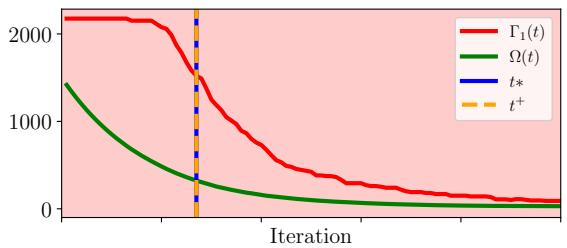

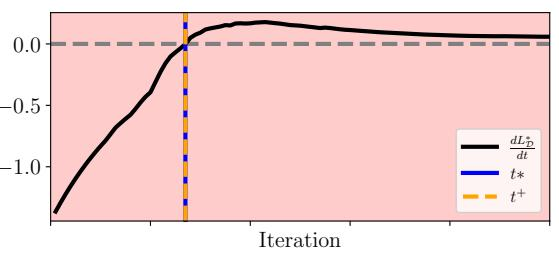

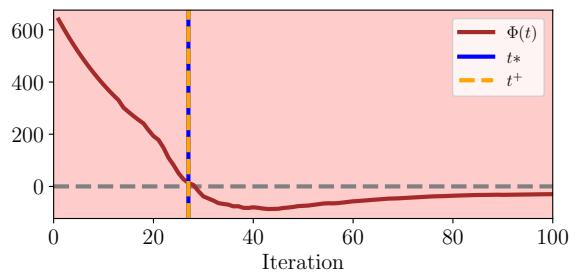  
Figure 1: Top: the sign-invariant subinterval $\mathcal { T } _ { 1 } ~ = ~ [ 0 , 1 0 0 )$ with curves $\Gamma _ { 1 } , \Omega$ . Middle: curve $d L _ { D } ^ { * } / d t$ . Bottom: curve $\Phi ( t )$ . We have $t ^ { + } = t ^ { * } = 2 7 < \tau _ { 1 } = 1 0 0$ (case 1 of Proposition 7).

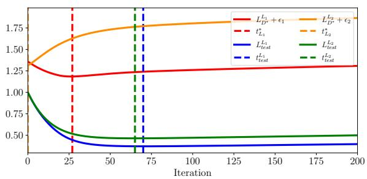  
Figure 2: Curves $L _ { \mathcal { D } ^ { * } } ^ { L _ { p } }$ and $L _ { t e s t } ^ { L _ { p } }$ for Gaussian distribution $( m = 2 5 6 , n = 5 1 2 )$ . We check that $L _ { t e s t } ^ { L _ { p } }$ is below $L _ { \mathcal { D } ^ { \ast } } ^ { L _ { p } } ~ ( p = 1 , 2 )$ , and $t _ { L _ { 1 } } ^ { * }$ closer than $t _ { L _ { 2 } } ^ { * }$ to $t _ { t e s t } ^ { L _ { p } }$ for $p = 1$ and 2.

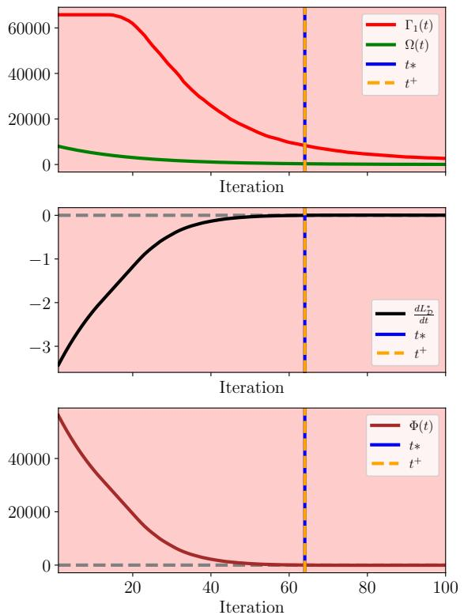  
Figure 3: Top: the sign-invariant subinterval $\mathcal { T } _ { 1 } = [ 0 , 1 0 0 )$ with curves $\Gamma _ { 1 } , \Omega$ . Middle: curve $d L _ { D } ^ { * } / d t$ . Bottom: curve $\Phi ( t )$ . We have $t ^ { + } = t ^ { * } = 6 4 < \tau _ { 1 } \ ( \mathrm { c a s e \ 1 } )$

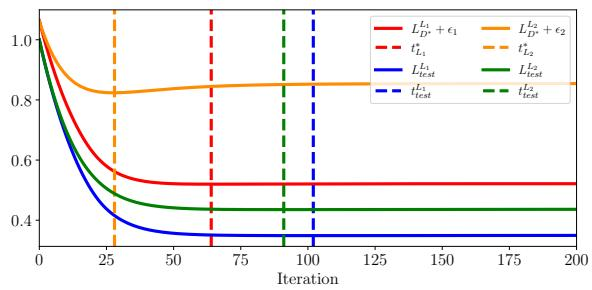  
Figure 4: Curves $L _ { \mathcal { D } ^ { * } } ^ { L _ { p } }$ and $L _ { t e s t } ^ { L _ { p } }$ for Gaussian distribution $( m = 2 5 6 , n = 1 6 3 8 4 )$ . We check that $L _ { t e s t } ^ { L _ { p } }$ is below $L _ { \mathcal { D } ^ { \ast } } ^ { L _ { p } } ~ ( p = 1 , 2 )$ , and $t _ { L _ { 1 } } ^ { * }$ closer than $t _ { L _ { 2 } } ^ { * }$ to $t _ { t e s t } ^ { L _ { p } }$ for $p = 1$ and 2.

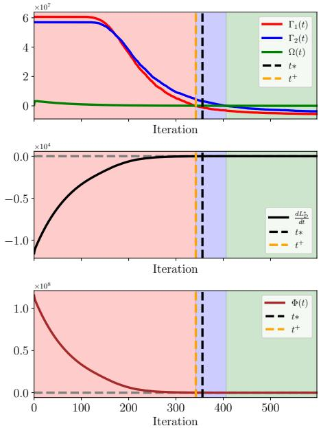  
Figure 5: Top: sign-invariant subintervals $\mathcal { T } _ { 1 } = [ 0 , 3 4 3 )$ ， $\mathcal { T } _ { 2 } = [ 3 4 3 , 4 0 7 )$ $\mathcal { T } _ { 3 } = [ 4 0 7 , 6 0 0 )$ with curves $\Gamma _ { 1 } , \Gamma _ { 2 } , \Omega .$ . Middle: curve $d L _ { D } ^ { * } / d t$ . Bottom: curve $\Phi ( t )$ . We have $t ^ { + } = 3 4 2 \approx \tau _ { 1 } = 3 4 3 \le t ^ { * } = 3 5 7$ (case 2 of Proposition 7).

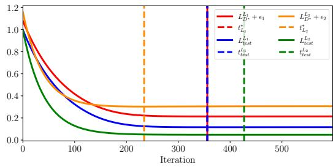  
Figure 6: Curves $L _ { \mathcal { D } ^ { * } } ^ { L _ { p } } + \epsilon _ { p }$ and $L _ { t e s t } ^ { L _ { p } }$ for classification 3-5. We check that $L _ { t e s t } ^ { L _ { p } }$ is below $L _ { \mathcal { D } ^ { \ast } } ^ { L _ { p } } + \epsilon _ { p } \ ( p = 1 , 2 )$ , and $t _ { L _ { 1 } } ^ { * }$ closer than $t _ { L _ { 2 } } ^ { * }$ to $t _ { t e s t } ^ { L _ { p } }$ for $p = 1$ and $p = 2$

Figure 6 shows that, for $\delta = 0 . 0 5$ , curve $L _ { t e s t }$ is always below $L _ { \mathcal { D } } ^ { * } + \epsilon ,$ in accordance with equation (30). We see that $t _ { t e s t } = 3 5 6$ almost coincides with $t ^ { * } = 3 5 7$ . So curves $L _ { t e s t }$ and $L _ { \mathcal { D } } ^ { * }$ reach their minima at almost the same time. The values of $L _ { t e s t } ( t )$ at $t = t ^ { + } , t ^ { * } , t _ { t e s t }$ are identical (equal to 0.1166), and almost equal to its value at $t = t _ { a p p r o x } ^ { + }$ (equal to 0.1167). See Table 1. This shows an excellent agreement between analytic and numerical estimates of the optimal stopping time. Besides, we have: $L _ { \mathcal { D } } ^ { * } ( t ^ { + } ) + \epsilon = 0 . 2 1 3 8 < L _ { \mathcal { D } } ^ { * } ( \infty ) + \epsilon = 0 . 2 2 7 4$ which shows that early stopping is beneficial.

<table><tr><td></td><td> $\overline { { t _ { 1 } ^ { + } } }$ </td><td> $\overline { { t _ { \alpha } ^ { + } } }$ </td><td> $\overline { { t ^ { + } } }$ </td><td> $t _ { \mathrm { a p p r o x } } ^ { + }$ </td><td> $\overline { { t ^ { * } } }$ </td><td> $t _ { t e s t }$ </td><td>∞</td></tr><tr><td> $t$ </td><td>342</td><td>342</td><td>342</td><td>400</td><td>357</td><td>356</td><td>∞</td></tr><tr><td> $L _ { t e s t }$ </td><td>0.1166</td><td>0.1166</td><td>0.1166</td><td>0.1167</td><td>0.1166</td><td>0.1166</td><td>0.1172</td></tr><tr><td> $L _ { \mathcal { D } } ^ { * } + \epsilon$ </td><td>0.2138</td><td>0.2138</td><td>0.2138</td><td>0.2139</td><td>0.2138</td><td>0.2138</td><td>0.2274</td></tr></table>

Table 1: The values of $t _ { 1 } ^ { + } , t _ { \alpha } ^ { + } ( \alpha = 2 ) , t ^ { + } , \ldots , t _ { t e s t }$ with corresponding $L _ { t e s t } ( t )$ and $L _ { \mathcal { D } } ^ { * } ( t ) + \epsilon$ (Example 2).

Example 3 (MNIST classification 0-1) We use the same framework as in Example 2 with a 4-hidden-layer NN ofwidth $m = 1 0 ,$ and a training set S of $n = 1 0 ^ { 4 }$ examples, corresponding to classes 0 and 1 (instead of 3 and 5). We calculate the eigenvalues of the corresponding transition matrix H. We have $\mathcal { V } _ { 1 } : \{ \lambda _ { 1 } = 1 1 4 3 2 , \lambda _ { 2 } \equiv \lambda _ { \alpha } = 1 0 6 3 9 \}$ and $\nu _ { 2 } \colon \{ \lambda _ { 3 } =$ $0 . 0 0 5 , \ldots , \lambda _ { n } \}$ . The time interval $T = [ 0 , 6 0 0 )$ divides into sign-invariant subintervals $\mathcal { T } _ { 1 } =$

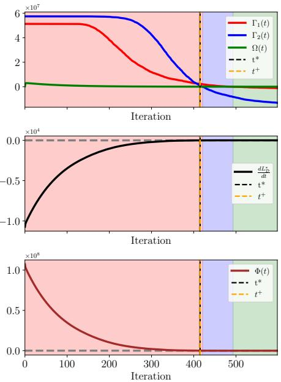  
Figure 7: Top: sign-invariant subintervals $\mathcal { T } _ { 1 } = [ 0 , 4 2 1 ) , ~ \mathcal { T } _ { 2 } = [ 4 2 1 , 4 9 3 ) , ~ \mathcal { T } _ { 3 } = [ 4 9 3 , 6 0 0 )$ with curves $\Gamma _ { 1 } , \Gamma _ { 2 } , \Omega$ . Middle: curve $d L _ { D } ^ { * } / d t$ . Bottom: curve Φ(t). We have $t ^ { + } = t ^ { * } = 4 1 5 < \tau _ { 1 } = 4 2 1$ (case 1).

[0, 421) (in red, the top plot of Figure 7), $\mathcal { T } _ { 2 } = [ 4 2 1 , 4 9 3 )$ (in blue), and $\mathcal { T } _ { 3 } = [ 4 9 3 , 6 0 0 )$ (in green). We find $C = 1 . 4 9 5$ , M = 2 and $\epsilon = 0 . 0 8 1 4$ . Using (14), we find $d L _ { \mathcal { D } } ^ { * } / d t = 0$ at $t ^ { * } = 4 1 5$ (see the middle plot Figure 7). Here again, (24) holds on $\mathcal { T } _ { 1 }$ . We find $t ^ { + } = 4 1 5$ (using Equation $( 1 8 ) / ,$ and verify $t _ { 1 } ^ { + } = 4 1 4 \leq t ^ { + } \leq t _ { \alpha } ^ { + } \equiv t _ { 2 } ^ { + } = 4 1 7 ,$ , in accordance with Equation (25). See the bottom plot of Figure 7. Since $t ^ { * } = 4 1 5 < \tau _ { 1 } = 4 2 1$ , we have $t ^ { * } \in \mathcal { T } _ { 1 }$ (case 1 of Prop. 7). We have: $t ^ { + } = t ^ { * } = 4 1 5 < \tau _ { 1 } = 4 2 1$ , in accordance with (22).

<table><tr><td></td><td> $\overline { { t _ { 1 } ^ { + } } }$ </td><td> $\overline { { t _ { \alpha } ^ { + } } }$ </td><td> $\overline { { t ^ { + } } }$ </td><td> $t _ { \mathrm { a p p r o x } } ^ { + }$ </td><td> $\overline { { t ^ { * } } }$ </td><td> $t _ { t e s t }$ </td><td>∞</td></tr><tr><td> $t$ </td><td>414</td><td>417</td><td>415</td><td>508</td><td>415</td><td>418</td><td>∞</td></tr><tr><td> $L _ { t e s t }$ </td><td>0.0582</td><td>0.0582</td><td>0.0582</td><td>0.0586</td><td>0.0582</td><td>0.0582</td><td>0.0590</td></tr><tr><td> $L _ { \mathcal { D } } ^ { * } + \epsilon$ </td><td>0.1703</td><td>0.1703</td><td>0.1703</td><td>0.1707</td><td>0.1703</td><td>0.1703</td><td>0.1713</td></tr></table>

Table 2: The values of $t _ { 1 } ^ { + } , t _ { \alpha } ^ { + } ( \alpha = 2 ) , t ^ { + } , \ldots , t _ { t e s t }$ with corresponding $L _ { t e s t } ( t )$ and $L _ { \mathcal { D } } ^ { * } ( t ) + \epsilon$ (Example 3).

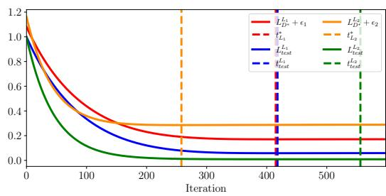  
Figure 8: Curves $L _ { \mathcal { D } ^ { * } } ^ { L _ { p } } + \epsilon _ { p }$ and $L _ { t e s t } ^ { L _ { p } }$ for classification 0-1. We check that $L _ { t e s t } ^ { L _ { p } }$ is below $L _ { \mathcal { D } ^ { \ast } } ^ { L _ { p } } + \epsilon _ { p } \ ( p = 1 , 2 )$ , and $t _ { L _ { 1 } } ^ { * }$ closer than $t _ { L _ { 2 } } ^ { * }$ to $t _ { t e s t } ^ { L _ { p } }$ for $p = 1$ and $p = 2$

Figure 8 shows that curve $L _ { t e s t }$ is again below $L _ { \mathcal { D } } ^ { * } + \epsilon$ in accordance with (30). We have $t _ { t e s t } = 4 1 8$ , which is close to $t ^ { * } = 4 1 5$ . So $L _ { t e s t }$ and $L _ { \mathcal { D } } ^ { * }$ reach their minima at around the same time $( t ^ { + } = t ^ { * } = 4 1 5 \approx t _ { t e s t } ^ { L _ { 1 } } = 4 1 8 )$ . The values of $L _ { t e s t } ( t )$ at $t = t ^ { + } , t ^ { * } , t _ { t e s t }$ are identical $\left( = 0 . 0 5 8 2 \right)$ , and almost equal to the value at $t = t _ { a p p r o x } ^ { + } ~ ( = 0 . 0 5 8 6 )$ . See Table 2. Here again, there is an excellent agreement between analytic and numerical estimates of the optimal stopping time. Finally, we have: $L _ { \mathcal { D } } ^ { * } ( t ^ { + } ) + \epsilon = 0 . 1 7 0 3 < L _ { \mathcal { D } } ^ { * } ( \infty ) + \epsilon = 0 . 1 7 1 3$ , which proves that early stopping is again beneficial.

Example 4 (Various input data distributions) For each kind of distribution, we give a figure displaying the curves $L _ { \mathcal { D } ^ { * } } ^ { L _ { p } } + \epsilon _ { p }$ and $L _ { t e s t } ^ { L _ { p } }$ with two couples $( m , n )$ of diferent ratio $m / n \colon$ Figure 9 for Gaussian distribution, Figure 10 for uniform distribution, Figure 11 for Pareto distribution. For all these examples, we have $\alpha = 1$ . The values of $\lambda _ { 1 }$ and $\lambda _ { 2 }$ are given in caption. We see that the method works better $( i . e . , t ^ { * }$ closer to $t _ { t e s t } )$ when the ratio $n / m$ is larger. For example, in Figure 11, the method fails for $m = 2 5 6 , n = 5 1 2$ (top plot: $t ^ { + } =$ $t ^ { * } = 0 )$ while it succeeds for $m = 2 5 6 , n = 1 6 3 8 4$ (bottom plot: $t ^ { + } = t ^ { * } = 4 5 \approx t _ { t e s t } = 4 6 )$ .

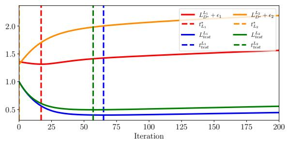

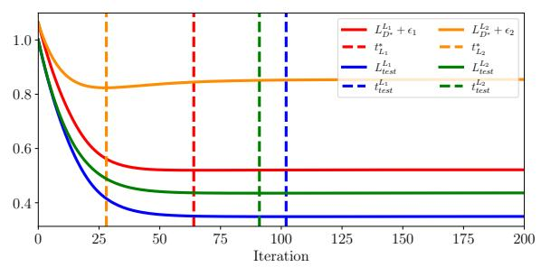  
Figure 9: Gaussian distribution. Top: $m = 5 1 2 , n = 5 1 2 \left( \lambda _ { 1 } \equiv \lambda _ { \alpha } = 2 2 9 1 , \lambda _ { 2 } = 4 8 6 \right)$ Bottom: $m = 2 5 6 , n = 1 6 3 8 4 \left( \lambda _ { 1 } \equiv \lambda _ { \alpha } = 8 . 2 3 \cdot 1 0 ^ { 4 } , \lambda _ { 2 } = 2 . 0 5 \cdot 1 0 ^ { 4 } \right)$

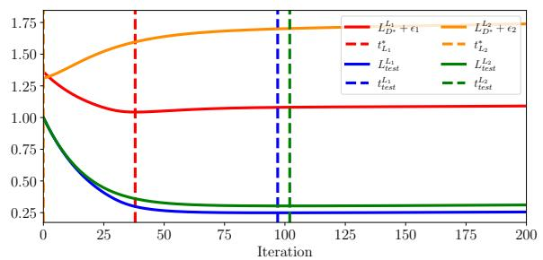

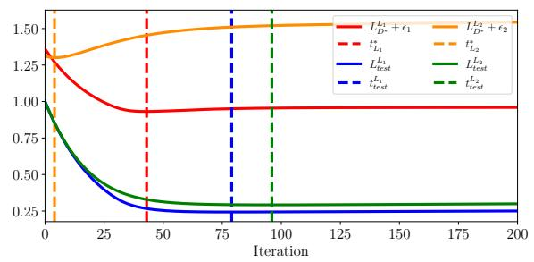  
Figure 10: Uniform distribution. Top: $m = 5 1 2 , n = 5 1 2 \left( \lambda _ { 1 } \equiv \lambda _ { \alpha } = 2 4 1 3 , \lambda _ { 2 } = 6 7 9 \right)$ Bottom: $m = 2 5 6 , n = 5 1 2 \left( \lambda _ { 1 } \equiv \lambda _ { \alpha } = 2 2 9 1 , \lambda _ { 2 } = 4 8 6 \right)$

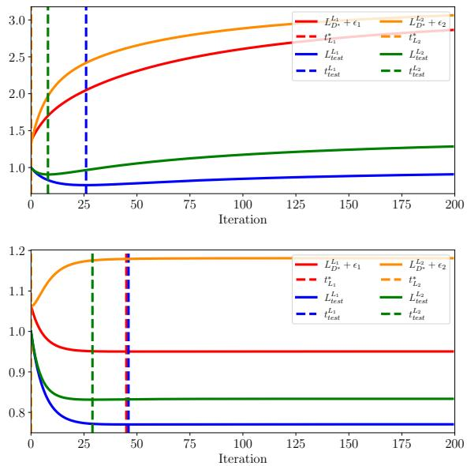  
Figure 11: Pareto distribution. Top: $m = 2 5 6 , n = 5 1 2 . \ ( \lambda _ { 1 } \equiv \lambda _ { \alpha } = 5 \cdot 1 0 ^ { 5 } , \lambda _ { 2 } = 1 \cdot 1 0 ^ { 5 } )$ Bottom: $m = 2 5 6 , n = 1 6 3 8 4 . \ ( \lambda _ { 1 } \equiv \lambda _ { \alpha } = 1 7 \cdot 1 0 ^ { 6 } , \lambda _ { 2 } = 3 \cdot 1 0 ^ { 6 } )$

## 5 Final Remarks

We have proposed a data-dependent definition of time $t ^ { + }$ as a stopping time for the gradient flow process. This time $t ^ { + }$ is a low estimate of the time $t ^ { * }$ at which an upper bound on the population loss $L _ { D }$ reaches its minimum. The advantage is that $t ^ { + }$ (and even more so its approximation $t _ { \mathrm { a p p r o x } } ^ { + } )$ is easily calculated without needing to apply gradient flow. Our method is well suited to the underparameterized context $( m \leq n )$ , with results improving as the ratio $n / m$ increases. It applies equally to diferent types of data distributions without requiring any specific knowledge on them.

We have focused on linear models. Although the method, in combination with linear probing, has been applied successfully to nonlinear examples, it would be interesting to apply it directly to nonlinear models. On the other hand, we have considered only scalar outputs $( y \in \mathbb { R } )$ . Another extension would be to consider vectorial outputs $( y \in \mathbb { R } ^ { q }$ with $q \geq 2 )$ . Finally, it would be interesting to treat input data afected by random noise. All these extensions will be the subject of future work.

## Appendix A. Proof of Proposition 1

Proof The proof is a simple adaptation of the proof of Proposition 3 of Martin Xavier et al. (2025) in the case of linear models. By Theorem (11.3) of Mohri et al. (2018), we have with probability $1 - \delta \colon$

$$
L _ { \mathcal { D } } - L _ { S } \leq 2 \mathcal { R } _ { n } + \epsilon
$$

where $\mathcal { R } _ { n }$ is the Rademacher complexity of the linear class. By Theorem 5.5 of Ma (2022), we have $\mathcal { R } _ { n } \leq \| \pmb { a } \| _ { 2 } C / \sqrt { n }$ . It then follows:

$$
L _ { \mathcal { D } } \leq L _ { S } + \frac { 2 C \| \pmb { a } \| _ { 2 } } { \sqrt { n } } + \epsilon = L _ { \mathcal { D } } ^ { \ast } + \epsilon ,
$$

i.e. (8).

## Appendix B. Proof of Proposition 5

Proof Using (1) and (12), the derivative of $L _ { S }$ is:

$$
\frac { d L _ { S } ( t ) } { d t } = \frac { 1 } { n } \frac { d \Vert \pmb { v } ( t ) \Vert _ { 1 } } { d t } = \frac { 1 } { n } \frac { \partial \Vert \pmb { v } \Vert _ { 1 } } { \partial \pmb { v } } \frac { d \pmb { v } ( t ) } { d t } = - \frac { 1 } { n } \left( \mathrm { s g n } ( \pmb { v } ( t ) ) \right) ^ { \top } \pmb { H } \pmb { v } ( t ) .\tag{32}
$$

Besides, using (6), the derivative of $L _ { G } ^ { * }$ is:

$$
\frac { d L _ { G } ^ { * } ( t ) } { d t } = \frac { 2 C \pmb { a } ^ { \top } } { \sqrt { n } \| \pmb { a } \| _ { 2 } } \frac { d \pmb { a } } { d t } .\tag{33}
$$

From (3), we have: $\begin{array} { r } { \pmb { K } \pmb { a } ( t ) = \pmb { v } ( t ) + \pmb { y } . } \end{array}$ . Since $\mathbf { } \mathbf { } \mathbf { } \mathbf { } \mathbf { } \mathbf { } \mathbf { } \mathbf { } \mathbf { } \mathbf { } \mathbf { } \mathbf { } \mathbf { } \mathbf { } \mathbf { } \mathbf { } \mathbf { } \mathbf { } \mathbf { } \mathbf { } \mathbf { } \mathbf { } \mathbf { } \mathbf { } \mathbf { } \mathbf { } \mathbf { } \mathbf { } \mathbf { } \mathbf { } \mathbf { } \mathbf { } \mathbf { } \mathbf { } \mathbf { } \mathbf { } \mathbf { } \mathbf { } \mathbf { } \mathbf { } \mathbf { } \mathbf { } \mathbf { } \mathbf { } \mathbf { } \mathbf { } \mathbf { } \mathbf { } \mathbf { } \mathbf { } \mathbf { } \mathbf { } \mathbf { } \mathbf { } \mathbf { } \mathbf { } \mathbf { } \mathbf { } \mathbf { } \mathbf { } \mathbf { } \mathbf { } \mathbf { } \mathbf { } \mathbf { } \mathbf { } \mathbf { } \mathbf { } \mathbf { } \mathbf { } \mathbf { } \mathbf { } \mathbf { } \mathbf { } \mathbf { } \mathbf { } \mathbf { } \mathbf { } \mathbf { } \mathbf { } \mathbf { } \mathbf { } \mathbf { } \mathbf { } \mathbf { } \mathbf { } \mathbf { } \mathbf { } \mathbf { } \mathbf { } \mathbf { } \mathbf { } \mathbf { } \mathbf { } \mathbf { } \mathbf { } \mathbf { } \mathbf { } \mathbf { } \mathbf { } \mathbf { } \mathbf { } \mathbf { } \mathbf { } \mathbf { } \mathbf { } \mathbf { } \mathbf { } \mathbf { } \mathbf { } \mathbf { } \mathbf { } \mathbf { } \mathbf { } \mathbf { } \mathbf { } \mathbf { } \mathbf { } \mathbf { } \mathbf \Psi \mathbf { } \mathbf { } \mathbf { } \mathbf { } \mathbf { } \mathbf { } \mathbf \Psi \Psi \mathbf { } \mathbf { } \mathbf { } \mathbf \Psi \Psi \mathbf { } \mathbf { } \mathbf \Psi \Psi \mathbf { } \mathbf { } \mathbf \Psi \mathbf { } \mathbf \Psi \Psi \mathbf { } \mathbf \Psi \Psi \mathbf { } \mathbf \Psi \mathbf { } \mathbf \Psi \mathbf \Psi \Psi \Psi \mathbf { } \mathbf \Psi \mathbf \Psi \Psi \Psi \mathbf \Psi \Psi \mathbf \Psi \Psi \Psi \mathbf \Psi \mathbf \Psi \Psi \Psi \mathbf \Psi \mathbf \Psi \Psi \mathbf \Psi \Psi \mathbf \Psi \mathbf \Psi \mathbf \Psi \Psi \mathbf \Psi \mathbf $ is initialized to 0, know that the vector a(t) updated by GF, satisfies (see, e.g., Bj¨orck and Golub (1973)):

$$
\begin{array} { r } { \pmb { a } ( t ) = \pmb { K } ^ { \dagger } \left( \pmb { v } ( t ) + \pmb { y } \right) . } \end{array}\tag{34}
$$

So, using (11), (15) and (34), Equation (33) becomes :

$$
\frac { d L _ { G } ^ { * } ( t ) } { d t } = \mathrm { ~ - ~ } \frac { 2 C } { \sqrt { n } } \frac { ( K ^ { \dagger } ( \pmb { v } ( t ) + \pmb { y } ) ) ^ { \top } } { \| K ^ { \dagger } ( \pmb { v } ( t ) + \pmb { y } ) \| _ { 2 } } K ^ { \top } \pmb { v } ( t ) = \Psi ( t ) .\tag{35}
$$

It then follows from (7), (32) and (35):

$$
\frac { d L _ { \mathcal { D } } ^ { * } ( t ) } { d t } = - \frac { 1 } { n } \left( \operatorname { s g n } ( \pmb { v } ( t ) ) \right) ^ { \top } \pmb { H } \pmb { v } ( t ) + \Psi ( t ) ,
$$

i.e. (14).

## Appendix C. Proof of Proposition 7

Proof We have

$$
\begin{array} { r l r } {  { \frac { d L _ { S } ( t ) } { d t } = - \frac { 1 } { n } ( \mathrm { s g n } ( \boldsymbol { v } ( t ) ) ) ^ { \top } H \boldsymbol { v } ( t ) } } \\ & { } & { = - \frac { 1 } { n } ( \mathrm { s g n } ( \boldsymbol { v } ( t ) ) ) ^ { \top } H \sum _ { i = 1 } ^ { \alpha } w _ { i } e ^ { - \lambda _ { i } t } } \\ & { } & { - \frac { 1 } { n } ( \mathrm { s g n } ( \boldsymbol { v } ( t ) ) ) ^ { \top } H \sum _ { j = \alpha + 1 } ^ { n } w _ { j } e ^ { - \lambda _ { j } t } } \\ & { } & { = - \frac { 1 } { n } ( \mathrm { s g n } ( \boldsymbol { v } ( t ) ) ) ^ { \top } H \sum _ { i = 1 } ^ { \alpha } w _ { i } e ^ { - \lambda _ { i } t } - \frac { 1 } { n } \Delta ( t ) . } \end{array}
$$

Hence, using (14), we have

$\begin{array} { r } { d L _ { \mathcal { D } } ^ { \ast } ( t ) / d t = \frac { 1 } { n } d L _ { S } ( t ) / d t + \Psi ( t ) < 0 } \end{array}$ if:

$$
- \sum _ { i = 1 } ^ { \alpha } \left( \operatorname { s g n } ( \pmb { v } ( t ) ) \right) ^ { \top } H \pmb { w } _ { i } e ^ { - \lambda _ { i } t } - \Delta ( t ) + n \pmb { \Psi } ( t ) < 0
$$

i.e.:

$$
- \sum _ { i = 1 } ^ { \alpha } \left( \mathrm { s g n } ( \pmb { v } ( t ) ) \right) ^ { \top } \pmb { H } \pmb { w } _ { i } e ^ { - \lambda _ { i } t } + \Omega ( t ) < 0
$$

i.e.:

$$
\sum _ { i \in [ \alpha ] } \Gamma _ { i } ( t ) e ^ { - \lambda _ { i } t } - \Omega ( t ) > 0
$$

i.e.:

$$
\Phi ( t ) > 0 .
$$

Hence $d L _ { \mathcal { D } } ^ { * } ( t ) / d t < 0$ if $\Phi ( t ) > 0$ , i.e.: (19). From (18) and (19), it then follows:

$$
t ^ { + } = \operatorname* { s u p } _ { s \in \mathcal { T } _ { 1 } } \left\{ s : \frac { d L _ { \mathcal { D } } ^ { * } ( s ) } { d t } < 0 \ \forall t \in [ 0 , s ) \right\} ,
$$

i.e. (20). On the other hand, $t ^ { * }$ is the least value $s \geq 0$ such that $d L _ { \mathcal { D } } ^ { \ast } ( s ) / d t = 0 \ ( \mathrm { s e e \ ( 1 3 ) } )$ Hence $t ^ { + } \leq t ^ { * }$ , i.e. (21).

There are now two cases: Either $t ^ { * }$ belongs to $\mathcal { T } _ { 1 }$ , i.e. $t ^ { * } < \tau _ { 1 }$ (case 1), or not, i.e. $t ^ { * } \geq \tau _ { 1 }$ (case 2).

Case 1 $( t ^ { * } < \tau _ { 1 } )$ : Since $t ^ { * }$ is the first time s such that $d L _ { \mathcal { D } } ^ { \ast } ( s ) / d t \geq 0$ (see (13)), we have $d L _ { \mathcal { D } } ^ { * } ( s ) / d t < 0$ for all $s < t ^ { * } < \tau _ { 1 }$ . It follows from (20): $t ^ { * } \leq t ^ { + }$ . Since $t ^ { + } \leq t ^ { * }$ (see (21)), we have: $t ^ { + } = t ^ { * }$ , i.e. (22).

Case $2 \ ( t ^ { * } \geq \tau _ { 1 } )$ : Since $t ^ { * }$ is the first time s such that $d L _ { \mathcal { D } } ^ { \ast } ( s ) / d t \geq 0$ (see (13)) and $t ^ { * } \geq \tau _ { 1 }$ , we have $d L _ { \mathcal { D } } ^ { * } ( s ) / d t < 0$ for all $s < \tau _ { 1 }$ . It follows from $( 2 0 ) \colon \tau _ { 1 } \leq t ^ { + }$ . Besides, as a supremum of a set of elements $< \tau _ { 1 } , t ^ { + }$ satisfies: $t ^ { + } \leq \tau _ { 1 }$ . So $t ^ { + } = \tau _ { 1 }$ , i.e. (23).

Suppose furthermore (24). Then $\Gamma ( t ) = \Sigma _ { i \in [ \alpha ] } \Gamma _ { i } ( t ) = \Sigma _ { i \in \mathcal { I } ^ { + } } \Gamma _ { i } ( t )$ , with $\Gamma _ { i } ( t ) > 0$ for all $i \in [ \alpha ]$ . Then, using (17), we have

$$
\Gamma ( t ) e ^ { - \lambda _ { 1 } t } - \Omega ( t ) \leq \Phi ( t ) \leq \Gamma ( t ) e ^ { - \lambda _ { \alpha } t } - \Omega ( t ) .
$$

Using (18):

$$
t ^ { + } = \operatorname* { s u p } _ { s \in \mathcal { T } _ { 1 } } \left\{ s : \Phi ( t ) > 0 , \forall t \in [ 0 , s ) \right\} ,
$$

it follows:

$$
\operatorname* { s u p } _ { s \in \mathcal { T } _ { 1 } } \left\{ s : \Gamma ( t ) e ^ { - \lambda _ { 1 } t } - \Omega ( t ) > 0 , \ \forall t \in [ 0 , s ) \right\} \leq t ^ { + } \leq \operatorname* { s u p } _ { s \in \mathcal { T } _ { 1 } } \left\{ s : \Gamma ( t ) e ^ { - \lambda _ { \alpha } t } - \Omega ( t ) > 0 , \ \forall t \in [ 0 , s ) \right\} ,
$$

i.e.:

$$
\operatorname* { s u p } _ { s \in \mathcal { T } _ { 1 } } \left\{ s : t < \frac { 1 } { \lambda _ { 1 } } \ln \frac { \Gamma ( t ) } { \Omega ( t ) } , \ : \forall t \in [ 0 , s ) \right\} \leq t ^ { + } \leq \operatorname* { s u p } _ { s \in \mathcal { T } _ { 1 } } \left\{ s : t < \frac { 1 } { \lambda _ { \alpha } } \ln \frac { \Gamma ( t ) } { \Omega ( t ) } , \ : \forall t \in [ 0 , s ) \right\} ,
$$

i.e.:

i.e. (25).

$$
t _ { 1 } ^ { + } \leq t ^ { + } \leq t _ { \alpha } ^ { + } ,
$$

## References

Madhu S. Advani, Andrew M. Saxe, and Haim Sompolinsky. High-dimensional dynamics of generalization error in neural networks. Neural Networks, 132:428–446, 2020.

Guillaume Alain and Yoshua Bengio. Understanding intermediate layers using linear classifier probes. arXiv preprint arXiv:1610.01644, 2016.

Alnur Ali, J Zico Kolter, and Ryan J Tibshirani. A continuous-time view of early stopping for least squares regression. In The 22nd international conference on artificial intelligence and statistics, pages 1370–1378. PMLR, 2019.

Zeyuan Allen-Zhu, Yuanzhi Li, and Yingyu Liang. Learning and generalization in overparameterized neural networks, going beyond two layers. Advances in neural information processing systems, 32, 2019.

Sanjeev Arora, Simon S. Du, Wei Hu, Zhiyuan Li, and Ruosong Wang. Fine-grained analysis of optimization and generalization for overparameterized two-layer neural networks. In ICML 2019, Long Beach, California, USA, 2019.

Peter L Bartlett and Shahar Mendelson. Rademacher and gaussian complexities: Risk bounds and structural results. Journal of Machine Learning Research, 3:463–482, 2002.

Peter L Bartlett, Philip M Long, G´abor Lugosi, and Alexander Tsigler. Benign overfitting in linear regression. Proceedings of the National Academy of Sciences, 117(48):30063–30070, 2020.

Mikhail Belkin, Daniel Hsu, Siyuan Ma, and Soumik Mandal. Reconciling modern machine learning and the bias-variance trade-of. CoRR, abs/1812.11118, 2018. URL http:// arxiv.org/abs/1812.11118.

Ake Bj¨orck and Gene H. Golub. Numerical methods for computing angles between linear subspaces. Mathematics of computation, 27(123):579–594, 1973.

Simon S. Du, Xiyu Zhai, Barnab´as P´oczos, and Aarti Singh. Gradient descent provably optimizes over-parameterized neural networks. CoRR, abs/1810.02054, 2018.

Behrooz Ghorbani, Shankar Krishnan, and Ying Xiao. An investigation into neural net optimization via hessian eigenvalue density. In International Conference on Machine Learning, pages 2232–2241. PMLR, 2019.

Reinhard Heckel and Fatih Furkan Yilmaz. Early stopping in deep networks: Double descent and how to eliminate it. arXiv preprint arXiv:2007.10099, 2020.

Arthur Jacot, Cl´ement Hongler, and Franck Gabriel. Neural tangent kernel: Convergence and generalization in neural networks. In NeurIPS 2018, December 3-8, 2018, Montr´eal, Canada, pages 8580–8589, 2018.

Yann Le Cun, Ido Kanter, and Sara A Solla. Eigenvalues of covariance matrices: Application to neural-network learning. Physical review letters, 66(18):2396, 1991.

Yann LeCun. The mnist database of handwritten digits. http://yann. lecun. com/exdb/mnist/, 1998.

Mingchen Li, Mahdi Soltanolkotabi, and Samet Oymak. Gradient descent with early stopping is provably robust to label noise for overparameterized neural networks. In AISTATS 2020, 26-28 August 2020, 2020.

Zhenyu Liao and Romain Couillet. The dynamics of learning: A random matrix approach. In Jennifer G. Dy and Andreas Krause, editors, Proceedings of the 35th International Conference on Machine Learning, ICML 2018, Stockholmsm¨assan, Stockholm, Sweden, July 10-15, 2018, Proceedings of Machine Learning Research, pages 3078–3087. PMLR, 2018.

Tengyu Ma. Lecture notes for machine learning theory (cs229m/stats214), 2022.

Daniel Martin Xavier, Ludovic Chamoin, and Laurent Fribourg. Early stopping strategy using neural tangent kernel theory and Rademacher complexity. In 2025 American Control Conference (ACC), pages 1301–1306. IEEE, 2025.

Mehryar Mohri, Afshin Rostamizadeh, and Ameet Talwalkar. Foundations of machine learning. MIT press, 2018.

Michael Murray, Hui Jin, Benjamin Bowman, and Guido Mont´ufar. Characterizing the spectrum of the NTK via a power series expansion. In ICLR 2023, Kigali, Rwanda, May 1-5, 2023. OpenReview.net, 2023.

Preetum Nakkiran, Gal Kaplun, Yamini Bansal, Tristan Yang, Boaz Barak, and Ilya Sutskever. Deep double descent: where bigger models and more data hurt\*. Journal of Statistical Mechanics: Theory and Experiment, 2021(12):124003, dec 2021. doi: 10.1088/1742-5468/ac3a74. URL https://doi.org/10.1088/1742-5468/ac3a74.

Samet Oymak, Zalan Fabian, Mingchen Li, and Mahdi Soltanolkotabi. Generalization guarantees for neural networks via harnessing the low-rank structure of the jacobian. CoRR, abs/1906.05392, 2019.

Adam Paszke, Sam Gross, and Francisco Massa et al. PyTorch: An imperative style, highperformance deep learning library. In NeurIPS 2019, December, Vancouver, BC, Canada, 2019.

Lutz Prechelt. Early stopping-but when? In Neural Networks: Tricks of the trade, pages 55–69. Springer, 2002.

Garvesh Raskutti, Martin J. Wainwright, and Bin Yu. Early stopping and non-parametric regression: An optimal data-dependent stopping rule. Journal of Machine Learning Research, 15(11):335–366, 2014.

Rishi Sonthalia, Jackie Lok, and Elizaveta Rebrova. On regularization via early stopping for least squares regression, 2024. URL https://arxiv.org/abs/2406.04425.

Cory Stephenson and Tyler Lee. When and how epochwise double descent happens, 2021. URL https://arxiv.org/abs/2108.12006.