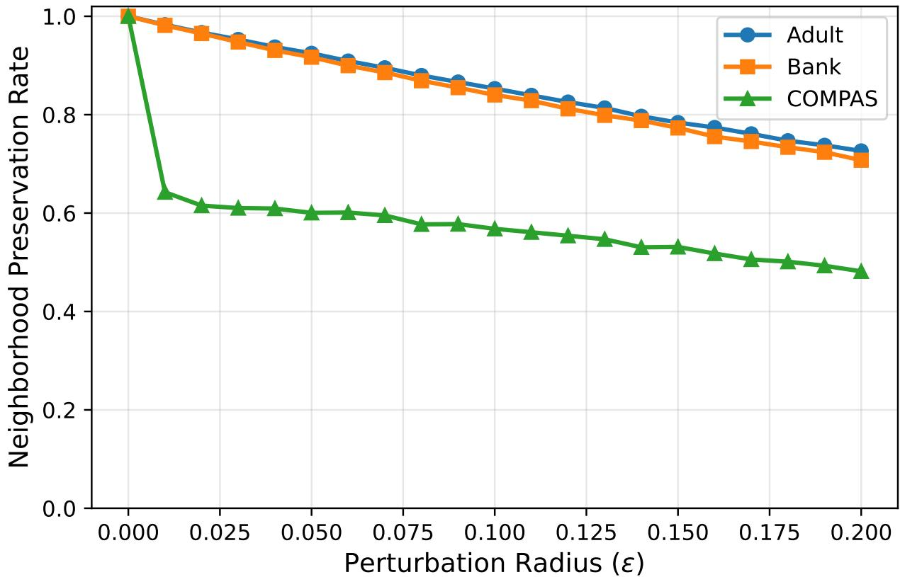
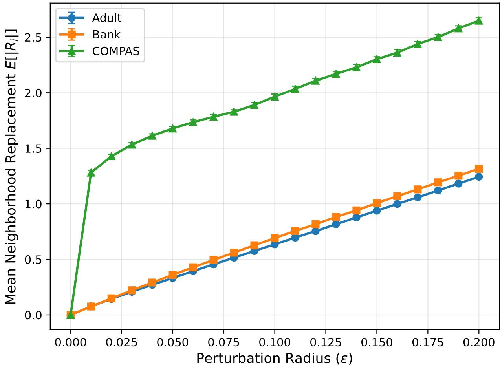
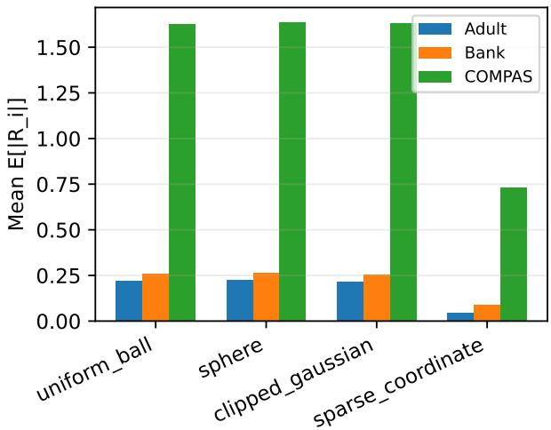
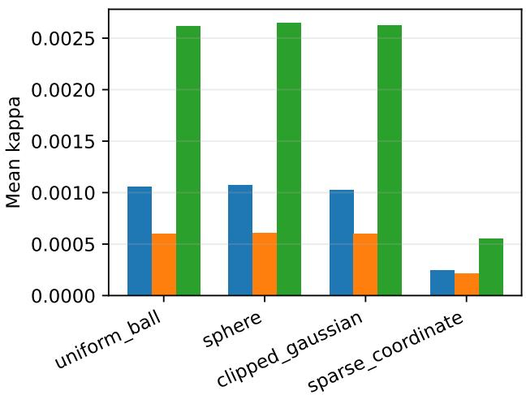
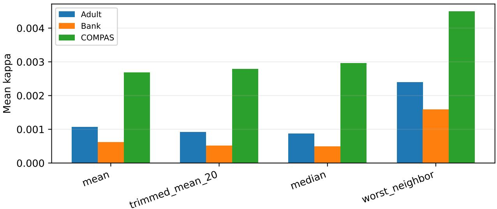
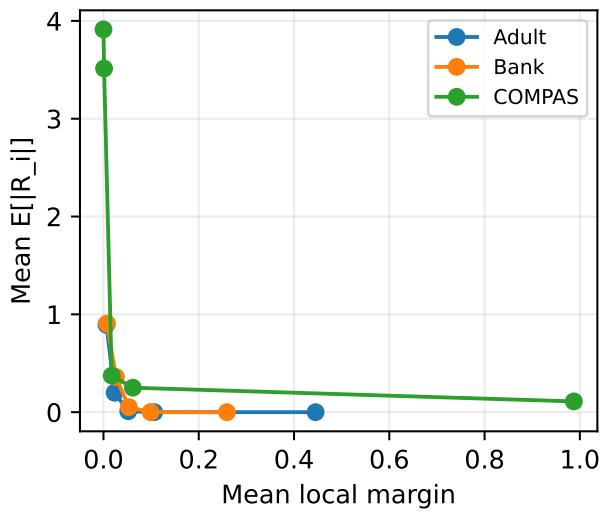
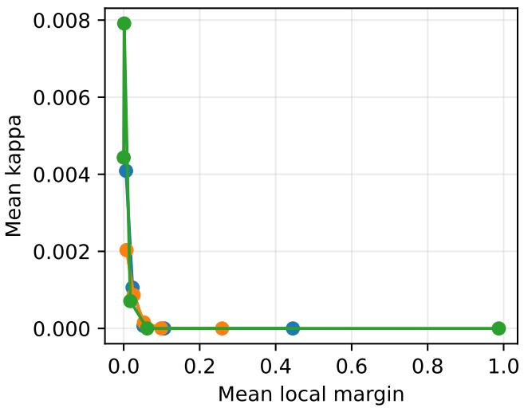

# A Geometric Theory of Robust Fairness Audits

Binita Maity Indian Institute of Technology, Gandhinagar binitamaity@iitgn.ac.in

August 26, 2026

## Abstract

Neighborhood-based fairness audits evaluate individual fairness by comparing predictions among similar individuals in feature space. Despite their widespread use, little is known about the robustness of the auditing procedure itself. Because these audits rely on nearest neighbor relationships, small perturbations in feature space can alter local neighborhoods and produce diferent fairness assessments even when model predictions remain unchanged. We develop a geometric framework for analyzing the robustness of neighborhood-based fairness audits under bounded perturbations. Our analysis establishes suficient conditions for neighborhood invariance, quantifies how neighborhood replacement propagates to audit instability, and introduces audit volatility, a measure of the expected sensitivity of fairness audits under repeated perturbations. Experiments on benchmark datasets support the theoretical analysis and show that the proposed framework explains the observed stability of neighborhood-based fairness audits.

## 1 Introduction

Algorithmic decision-making systems increasingly influence high stakes domains such as criminal justice, finance, healthcare, and public policy, making fairness assessment an essential component of responsible machine learning [1, 15, 14]. While much of the fairness literature has focused on group level notions such as demographic parity and equalized odds, these aggregate criteria may conceal unfair treatment of individuals. Individual fairness addresses this limitation by requiring that similar individuals receive similar outcomes [5]. Because application specific similarity metrics are rarely available, post hoc fairness auditing methods commonly approximate similarity using k-nearest neighbors in the feature space, comparing each individual’s prediction with those of its local neighbors [17, 2].

Neighborhood-based fairness audits are widely used because they are model agnostic, computationally eficient, and capable of detecting localized unfairness overlooked by aggregate statistics. However, they rely on a critical assumption that has received little attention: local neighborhoods remain suficiently stable to serve as reliable proxies for similarity. In practice, feature noise, preprocessing, normalization, missing values, and dataset heterogeneity can alter nearest neighbor relationships even when the prediction model is unchanged. Consequently, identical models may produce diferent fairness assessments solely because the auditing neighborhood changes, making it dificult to distinguish genuine unfairness from audit instability.

Although robustness has been extensively studied in fair machine learning, existing work primarily focuses on learning prediction models that remain fair under adversarial or feature perturbations [19, 16, 9]. In contrast, the robustness of the fairness audit itself remains largely unexplored, despite growing recognition that fairness should also be viewed as a measurement problem [11, 6].

There is currently no theoretical framework explaining when neighborhood-based fairness audits remain stable under feature space perturbations or how geometric changes in local neighborhoods propagate to audit outcomes.

In this paper, we present a geometric framework for analyzing the robustness of neighborhoodbased fairness audits. We formulate local fairness audits as Lipschitz aggregations of pairwise fairness evaluations over local neighborhoods, providing a unified abstraction for a broad class of existing auditing methods. Building on this formulation, we derive deterministic, probabilistic, and expected robustness guarantees that relate bounded feature space perturbations to neighborhood replacement and audit deviation. Our analysis identifies the local separation margin as a geometric certificate for neighborhood preservation and establishes neighborhood replacement as the fundamental mechanism governing audit instability. We further introduce Audit Volatility, a measure of expected audit sensitivity under repeated perturbations. Experiments on benchmark datasets validate the theoretical predictions and demonstrate that neighborhood geometry fundamentally governs the robustness of neighborhood-based fairness audits.

Our main contributions are summarized below.

• We formulate the robustness of neighborhood-based fairness auditing as a new theoretical problem, shifting the focus from robust prediction models to the reliability of the auditing procedure itself.

• We develop a unified geometric framework that models neighborhood-based fairness audits as Lipschitz aggregations of pairwise fairness evaluations, encompassing a broad class of existing auditing methods.

• We establish deterministic, probabilistic, and expected robustness guarantees that connect bounded feature space perturbations to neighborhood replacement and audit deviation, identifying neighborhood replacement as the key mechanism governing audit instability.

• We introduce Audit Volatility, a quantitative measure of audit robustness under repeated perturbations, and validate the proposed theory through experiments on multiple benchmark datasets.

## 2 Related Work

Individual Fairness and Local Fairness Audits Individual fairness was introduced by Dwork et al. [5], who proposed that similar individuals should receive similar decisions with respect to an application specific similarity metric. Subsequent work extended this framework by studying computationally eficient notions of individual fairness [12], approximately metric fair learning [18], and learning under unknown fairness metrics [7]. In practice, however, task specific similarity metrics are rarely available, and fairness is commonly evaluated through post hoc neighborhood-based audits.

Among the most widely used auditing approaches are nearest neighbor consistency measures and FaiTH [17], which evaluate fairness by aggregating pairwise prediction comparisons over local neighborhoods. Toolkits such as AI Fairness 360 [2] have further popularized these audits for practical fairness evaluation. Although these methods difer in their choice of pairwise fairness functions and aggregation rules, they all rely on nearest neighbor relationships in the feature space. Our framework generalizes this common computational structure and provides a unified analysis of their robustness.

Robustness in Fair Machine Learning Robustness has become an important objective in fair machine learning, with most existing work focusing on improving the robustness of predictive models. Sensitive Subspace Robustness [19] enforces individual fairness under feature perturbations by learning robust representations, while subsequent methods have incorporated robustness into training through sample selection and optimization techniques [16, 9]. These approaches improve the stability of the predictive model itself. In contrast, we assume that model predictions remain fixed and instead study the robustness of the auditing procedure, isolating instability introduced solely by changes in neighborhood structure.

Robust Statistics and Measurement Reliability Our work is also closely related to robust statistics, which studies estimators that remain reliable under contaminated observations or outliers [10, 8, 13]. Classical robust aggregation techniques, such as trimmed estimators, motivate the robust aggregation mechanisms studied in this paper. Unlike traditional robust statistics, however, our analysis focuses on instability arising from changes in neighborhood composition rather than contaminated observations.

Finally, recent work has argued that fairness should be viewed as a measurement problem rather than solely an optimization objective [11]. Similarly, broader eforts in responsible AI emphasize reliable documentation and auditing practices for machine learning systems [6, 14, 15]. Complementing these perspectives, we provide the first theoretical framework for analyzing the stability of local fairness audits under feature space perturbations, identifying neighborhood replacement as the fundamental source of audit instability and introducing Audit Volatility as a quantitative robustness measure.

## 3 Framework for Neighborhood-based Fairness Audits

Neighborhood-based fairness audits evaluate whether similar individuals receive similar predictions by aggregating pairwise fairness scores over local neighborhoods. Although existing methods difer in their choice of pairwise fairness functions and aggregation rules, they share this common computational structure. We formalize this abstraction as a unified framework for Neighborhood-based fairness audits, which serves as the foundation for the robustness analysis in Section 4.

## 3.1 Local Fairness Audits

Let $X = \{ x _ { 1 } , \ldots , x _ { n } \} \subseteq \left( M , d \right)$ be a dataset embedded in a metric space $( \mathcal { M } , d )$ , and let $f : X \to \mathcal { V }$ be a prediction model. For each individual $x _ { i }$ , let $N _ { k } ( i )$ denote its set of k-nearest neighbors under the metric d. A local fairness audit consists of two components: (i) a pairwise fairness function $g : \mathcal { V } \times \mathcal { V }  \mathbb { R }$ , which evaluates the fairness relationship between the predictions of neighboring individuals, and (ii) an aggregation operator $\Phi : \mathbb { R } ^ { k }  \mathbb { R }$ , which summarizes the resulting vector of pairwise fairness scores.

The local audit score for an individual $x _ { i }$ is defined as $A _ { i } ( X ) = \Phi { \Big ( } { \big ( } g ( f ( x _ { i } ) , f ( x _ { j } ) ) { \big ) } _ { x _ { j } \in N _ { k } ( i ) } { \Big ) }$ where the pairwise fairness scores are represented as a k-dimensional vector. The corresponding dataset level audit is $A ( X ) = ( A _ { 1 } ( X ) , \ldots , A _ { n } ( X ) )$ . This abstraction cleanly separates pairwise fairness from aggregation, enabling a unified analysis of Neighborhood-based fairness audits.

## 3.2 Lipschitz Aggregation Operators

The robustness of a local fairness audit depends on the sensitivity of its aggregation operator. To obtain stability guarantees that extend beyond a single auditing method, we consider aggregation

operators satisfying a Lipschitz continuity property.

Definition 1 (Lipschitz Aggregation Operator). An aggregation operator $\Phi : \mathbb { R } ^ { k }  \mathbb { R }$ is said to be $L _ { \Phi } { - } L i p s c h i t z$ with respect to the $\ell _ { 1 }$ norm $i f ,$ for every $u , v \in \mathbb { R } ^ { k }$ ，

$$
| \Phi ( u ) - \Phi ( v ) | \leq L _ { \Phi } \| u - v \| _ { 1 } .
$$

The constant $L _ { \Phi }$ quantifies the sensitivity of the aggregation operator to perturbations of its inputs.

This class includes many aggregation rules used in fairness auditing and robust statistics. For example, the arithmetic mean satisfies $L _ { \Phi } = 1 / k$ , while weighted means, trimmed means, Winsorized means, and several robust M-estimators are also Lipschitz under mild regularity conditions. Consequently, the theoretical results in Section 4 apply beyond arithmetic averaging to a broad family of neighborhood-based fairness audits.

Examples. Consistency based audits instantiate the framework using $g ( f ( x _ { i } ) , f ( x _ { j } ) ) = 1$ $| f ( x _ { i } ) - f ( x _ { j } ) |$ , together with arithmetic mean aggregation. Similarly, FaiTH [17] computes pairwise prediction discrepancies over local neighborhoods and summarizes them through an aggregation operator. Consequently, both methods instantiate the proposed framework, and the analysis developed in Section 4 applies uniformly to these and other neighborhood-based fairness audits employing Lipschitz aggregation operators.

The proposed framework identifies two complementary sources of audit robustness: the geometric stability of local neighborhoods and the sensitivity of the aggregation operator. Section 4 shows how bounded feature space perturbations propagate through neighborhood structure and how aggregation sensitivity determines the resulting stability of local fairness audits.

## 4 Stability of Local Fairness Audits

The framework introduced in the previous section expresses a local fairness audit as the aggregation of pairwise fairness scores over local neighborhoods. We now investigate how bounded feature space perturbations afect these audits. Since the prediction model is fixed throughout the analysis, any change in an audit score arises solely through changes in the underlying neighborhood structure.

Our analysis proceeds in three steps. We first introduce a geometric perturbation model and the notion of local separation. We then establish suficient conditions for neighborhood preservation under bounded perturbations. Finally, we quantify how neighborhood replacement propagates to changes in local fairness audits.

## 4.1 Geometric Perturbation Model

Let $( \mathcal { M } , d )$ be a metric space, $X = \{ x _ { 1 } , \ldots , x _ { n } \} \subseteq M$ a dataset, and $f : X \to \mathcal { V }$ a fixed prediction model. For each individual $x _ { i }$ , let $N _ { k } ( i )$ denote its set of k-nearest neighbors under $d ,$ where ties are resolved deterministically. Since the prediction model remains unchanged, perturbations influence fairness assessments only through changes in neighborhood geometry.

Definition 2 (ε-Bounded Geometric Perturbation). Let $X ^ { \prime } = \{ x _ { 1 } ^ { \prime } , x _ { 2 } ^ { \prime } , \ldots , x _ { n } ^ { \prime } \}$ be a perturbed version of X. We say that $X ^ { \prime }$ is an ε-bounded geometric perturbation of X if

$$
d ( x _ { i } , x _ { i } ^ { \prime } ) \leq \varepsilon , \qquad \forall x _ { i } \in X .
$$

For each perturbed point $x _ { i } ^ { \prime }$ , let $N _ { k } ^ { \prime } ( i )$ denote its k-nearest neighbor set in $X ^ { \prime }$

For the perturbed dataset $X ^ { \prime }$ , we analogously denote the corresponding local and dataset level audit scores by $A _ { i } ( X ^ { \prime } )$ and $A ( X ^ { \prime } )$ , respectively.

The stability of a local neighborhood depends not only on the perturbation magnitude but also on its geometric separation from the remaining data points. We capture this notion through the following definition.

Definition 3 (Local Separation Margin). For every point $x _ { i } \in X$ , define $r _ { \operatorname* { m a x } } ( i ) = \operatorname* { m a x } _ { x _ { j } \in N _ { k } ( i ) } d ( x _ { i } , x _ { j } )$ rmin(i) $\begin{array} { r } { \operatorname* { m i n } _ { x _ { j } \notin N _ { k } ( i ) } d ( x _ { i } , x _ { j } ) } \end{array}$ . The local separation margin of $x _ { i }$ is $\gamma _ { i } = r _ { \operatorname* { m i n } } ( i ) - r _ { \operatorname* { m a x } } ( i )$

The local separation margin measures the minimum geometric gap separating an individual’s neighborhood from the remaining data points. Larger values of $\gamma _ { i }$ indicate better separated neighborhoods and are therefore expected to yield greater robustness under bounded perturbations. The following subsection shows that this margin provides a suficient geometric certificate for neighborhood preservation.

## 4.2 Geometric Stability of Local Neighborhoods

We now characterize when local neighborhoods remain invariant under bounded feature space perturbations. We first bound perturbations of pairwise distances, then quantify the resulting change in the local separation margin, and finally derive a suficient condition for neighborhood preservation.

Lemma 1 (Pairwise Distance Stability). Let $X ^ { \prime }$ be an ε-bounded geometric perturbation of X. Then, for every pair of points $x _ { i } , x _ { j } \in X$ 2

$$
\left| d ( x _ { i } ^ { \prime } , x _ { j } ^ { \prime } ) - d ( x _ { i } , x _ { j } ) \right| \leq 2 \varepsilon .
$$

Proof Sketch. The result follows directly from two applications of the triangle inequality: each endpoint may move by at most $\varepsilon ,$ so the distance between two points changes by at most 2ε. The proof is deferred to Appendix A.1A2 due to space constraints. □

Lemma 1 bounds the perturbation of every pairwise distance by 2ε. Since neighborhood membership depends on the ordering of distances rather than their absolute values, the key quantity is the separation between the farthest neighbor and the nearest non-neighbor. The next lemma quantifies the maximum reduction of this separation margin.

Lemma 2 (Sharp Bound on Local Separation Margin Reduction). For every point $x _ { i } ,$ , let

$$
r _ { \mathrm { m a x } } ( i ) = \operatorname* { m a x } _ { x _ { j } \in N _ { k } ( i ) } d ( x _ { i } , x _ { j } ) , \qquad r _ { \mathrm { m i n } } ( i ) = \operatorname* { m i n } _ { x _ { j } \notin N _ { k } ( i ) } d ( x _ { i } , x _ { j } ) ,
$$

and define the local separation margin $\gamma _ { i } = r _ { \operatorname* { m i n } } ( i ) - r _ { \operatorname* { m a x } } ( i )$ . Under an ε-bounded geometric perturbation,

$\gamma _ { i } - \gamma _ { i } ^ { \prime } \leq 4 \varepsilon$ . Moreover, the constant 4ε is tight.

Proof Sketch. By Lemma 1, distances from $x _ { i }$ to its neighbors can increase by at most 2ε, while distances to non-neighbors can decrease by at most $2 \varepsilon .$ . Consequently, the local separation margin decreases by at most 4ε. The complete proof, including the tightness construction, is given in A.1Appendix A2. □

Lemma 2 shows that the local separation margin can decrease by at most 4ε. Therefore, neighborhoods whose original separation margins exceed this threshold remain geometrically distinguishable after perturbation.

Theorem 3 (Neighborhood Invariance under Bounded Perturbations). Let $x _ { i } ~ \in ~ X$ have local separation margin

$$
\gamma _ { i } = r _ { \operatorname* { m i n } } ( i ) - r _ { \operatorname* { m a x } } ( i ) .
$$

$$
I f
$$

$$
\gamma _ { i } > 4 \varepsilon ,
$$

then every original neighbor of $x _ { i }$ remains strictly closer to $x _ { i } ^ { \prime }$ than every original non-neighbor. Consequently,

$$
\begin{array} { r } { N _ { k } ^ { \prime } ( i ) = N _ { k } ( i ) . } \end{array}
$$

Proof Sketch. Lemma 2 guarantees that the local separation margin remains positive whenever $\gamma _ { i } ~ > ~ 4 \varepsilon$ . Consequently, every original neighbor remains strictly closer than every original nonneighbor, preserving the ordering of the k nearest neighbors and hence the neighborhood itself. The complete proof is deferred to A.1Appendix A2. □

Theorem 3 identifies the local separation margin as a suficient geometric certificate for neighborhood preservation under bounded perturbations. Together, Lemmas 1, 2, and Theorem 3 establish the geometric foundation of our framework: bounded perturbations induce bounded distance distortions, bounded distance distortions limit the reduction of the local separation margin, and suficiently separated neighborhoods remain invariant. This characterization forms the basis for the deterministic, probabilistic, and expected stability guarantees developed in the following subsections.

## 4.3 Probabilistic Robustness under Random Perturbations

Theorem 3 provides a deterministic guarantee for neighborhood preservation under bounded perturbations. In practice, however, feature perturbations often arise from stochastic sources such as measurement noise or randomized preprocessing. We therefore quantify the probability that a local neighborhood changes under random perturbations.

Corollary 4 (Probabilistic Neighborhood Stability). Suppose the perturbed dataset $X ^ { \prime }$ is sampled from a probability distribution over admissible perturbations, and let

$$
R = \operatorname* { m a x } _ { 1 \leq i \leq n } d ( x _ { i } , x _ { i } ^ { \prime } )
$$

denote the random perturbation radius. Then, for every point $x _ { i }$

$$
\operatorname* { P r } \bigl ( N _ { k } ^ { \prime } ( i ) \neq N _ { k } ( i ) \bigr ) \leq \operatorname* { P r } \Bigl ( R \geq \frac { \gamma _ { i } } { 4 } \Bigr ) .
$$

Proof Sketch. By Theorem 3, the neighborhood of $x _ { i }$ is preserved whenever $R < \gamma _ { i } / 4$ . Thus, neighborhood replacement can occur only if $R \ge \gamma _ { i } / 4$ , yielding the stated probability bound. The complete proof is provided in A.4 Appendix A3. □

Corollary 4 separates neighborhood robustness into two independent components: the local separation margin $\gamma _ { i } .$ , which depends solely on the geometry of the dataset, and the perturbation radius $R ,$ which captures the stochastic perturbation process. Consequently, any concentration inequality or tail bound on R immediately yields a corresponding probabilistic guarantee for neighborhood preservation. This distribution independent characterization extends the deterministic guarantee of Theorem 3 to a broad class of stochastic perturbation models and provides the probabilistic foundation for analyzing the stability of local fairness audits.

## 4.4 Stability of Local Fairness Audits

Theorem 3 establishes that suficiently separated neighborhoods remain invariant under bounded perturbations. We now characterize how neighborhood changes afect local fairness audits. Since the prediction model is fixed, perturbations influence the audit solely through changes in the neighborhood participating in the aggregation.

Corollary 5 (Audit Invariance). Let

$$
A _ { i } ( X ) = \Phi ( \mathbf { g } _ { i } ( X ) )
$$

be a local fairness audit. If

$$
\begin{array} { r } { N _ { k } ^ { \prime } ( i ) = N _ { k } ( i ) , } \end{array}
$$

then

$$
A _ { i } ( X ) = A _ { i } ( X ^ { \prime } ) .
$$

Proof Sketch. Neighborhood preservation implies that the same neighbors contribute identical pairwise fairness scores before and after perturbation. Since the prediction model is fixed, the fairnessscore vectors coincide, yielding identical audit scores. The full proof can be found in A.6Appendix A4.

When neighborhoods change, audit stability depends on the extent of neighborhood replacement.

Definition 4 (Neighborhood Replacement Set). For an individual $x _ { i }$ , define

$$
R _ { i } = N _ { k } ( i ) \triangle N _ { k } ^ { \prime } ( i ) ,
$$

where $\triangle$ denotes the symmetric diference.

Theorem 6 (Audit Stability via Neighborhood Replacement). Let

$$
A _ { i } ( X ) = \Phi ( \mathbf { g } _ { i } ( X ) )
$$

be a local fairness audit, where

$$
\Phi : \mathbb { R } ^ { k }  \mathbb { R }
$$

is an LΦ-Lipschitz aggregation operator. Suppose the prediction model is fixed, the pairwise fairness scores satisfy

$$
| g _ { i j } | \leq M ,
$$

and let

$$
R _ { i } = N _ { k } ( i ) \triangle N _ { k } ^ { \prime } ( i )
$$

denote the neighborhood replacement set. Then

$$
| A _ { i } ( X ) - A _ { i } ( X ^ { \prime } ) | \leq L _ { \Phi } M | R _ { i } | .
$$

Proof Sketch. Common neighbors contribute identical pairwise fairness scores before and after perturbation because the prediction model is fixed. Thus, only neighbors in the replacement set contribute to changes in the fairness-score vector, with each replaced neighbor contributing at most M to its $\ell _ { 1 }$ diference. The result then follows immediately from the Lipschitz continuity of Φ. The complete proof is provided in A.6Appendix A4. □

Corollary 7 (Mean Aggregation). For arithmetic mean aggregation,

$$
\Phi ( z ) = \frac { 1 } { k } \sum _ { i = 1 } ^ { k } z _ { i } ,
$$

the Lipschitz constant is

$$
L _ { \Phi } = { \frac { 1 } { k } } .
$$

Consequently,

$$
| A _ { i } ( X ) - A _ { i } ( X ^ { \prime } ) | \leq { \frac { M } { k } } | R _ { i } | .
$$

Proof Sketch. The arithmetic mean is 1/k-Lipschitz with respect to the $\ell _ { 1 }$ norm. Substituting $L _ { \Phi } =$ $1 / k$ into Theorem 6 yields the stated bound. The complete proof is provided in A.6Appendix A4.

Theorem 6 establishes that the robustness of a local fairness audit is governed by two complementary factors: the sensitivity of the aggregation operator, captured by its Lipschitz constant, and the extent of neighborhood replacement induced by feature space perturbations. Combined with Theorem 3, it completes the robustness pipeline underlying our framework: bounded feature space perturbations induce controlled neighborhood replacement, and the resulting audit deviation is bounded linearly by the number of replaced neighbors. The arithmetic mean follows as an immediate special case, while the same analysis applies to weighted means, trimmed means, and other Lipschitz aggregation operators.

## 4.5 Audit Volatility

The preceding results characterize the worst case deviation of a local fairness audit under a single perturbation. In practice, however, robustness is typically assessed over repeated perturbations drawn from a stochastic perturbation model. We therefore introduce audit volatility, which measures the expected variation of a local fairness audit across perturbation realizations.

Definition 5 (Audit Volatility). Let P denote a probability distribution over admissible perturbations. The audit volatility of an individual $x _ { i }$ is

$$
\kappa _ { i } = \mathbb { E } _ { X ^ { \prime } \sim \mathcal { P } } \big [ | A _ { i } ( X ) - A _ { i } ( X ^ { \prime } ) | \big ] .
$$

The corresponding dataset level audit volatility is

$$
\kappa = \frac { 1 } { n } \sum _ { i = 1 } ^ { n } \kappa _ { i } .
$$

Theorem 8 (Audit Volatility Bound). Under the assumptions of Theorem $\delta ,$

$$
\begin{array} { r } { \kappa _ { i } \leq L _ { \Phi } M \mathbb { E } [ | R _ { i } | ] . } \end{array}
$$

In particular, for arithmetic mean aggregation,

$$
\kappa _ { i } \leq \frac { M } { k } \mathbb { E } [ | R _ { i } | ] .
$$

Proof Sketch. The result follows by taking expectations on both sides of Theorem 6 and applying the linearity of expectation. The complete proof is provided in A.10Appendix A5. □

Theorem 8 shows that audit volatility is jointly determined by the sensitivity of the aggregation operator and the expected amount of neighborhood replacement induced by the perturbation model. Together with Corollary 4 and Theorem 6, it completes the theoretical framework developed in this section: the local separation margin governs neighborhood preservation under perturbations, neighborhood replacement quantifies the resulting deviation of a local fairness audit, and the expected amount of neighborhood replacement determines audit volatility under stochastic perturbations.

## 5 Experimental Evaluation

We evaluate whether the proposed geometric framework accurately explains the robustness of Neighborhood-based fairness audits under feature perturbations. Specifically, we address four questions: (i) do bounded perturbations afect neighborhood geometry as predicted by the theory; (ii) does neighborhood replacement explain audit instability; (iii) how does the aggregation operator influence robustness; and (iv) how does the intrinsic geometry of a dataset afect audit stability?

## 5.1 Experimental Setup

We evaluate the proposed framework on the Adult Income, Bank Marketing, and COMPAS datasets obtained through the AI Fairness 360 toolkit and UCI [3, 4]. Continuous attributes are standardized, categorical features are one-hot encoded, and a logistic regression classifier is trained using the default scikit-learn implementation. Unless otherwise stated, local fairness audits use Euclidean k-nearest neighborhoods with $k = 1 0$ , prediction consistency as the pairwise fairness score, and arithmetic mean aggregation.

Perturbed datasets are generated according to Definition 2. Unless otherwise specified, perturbations are sampled uniformly from an $\ell _ { 2 }$ ball of radius ϵ. To evaluate the distribution independence of the proposed theory, we additionally consider spherical, clipped Gaussian, and sparse coordinate perturbations under the same perturbation budget.

Throughout the experiments, we report the Neighborhood Preservation Rate (NPR), the expected neighborhood replacement size $\mathbb { E } [ | R _ { i } | ]$ , and the dataset-level audit volatility

$$
\kappa = \frac { 1 } { n } \sum _ { i = 1 } ^ { n } \mathbb { E } \big [ | A _ { i } ( X ) - A _ { i } ( X ^ { \prime } ) | \big ] .
$$

All reported values are averaged over 30 Monte Carlo perturbation trials.

## 5.2 Empirical Validation of Geometric Stability

We first validate the geometric results established in Lemmas 1 and 2 and Theorem 3. These results characterize how bounded perturbations afect pairwise distances, local separation margins, and neighborhood preservation.

For each dataset, we generate perturbations uniformly within an $\ell _ { 2 }$ ball of radius $\epsilon = 0 . 0 5$ and measure (i) the maximum pairwise distance distortion, max $_ { i , j } \Vdash ( x _ { i } , x _ { j } ) - d ( x _ { i } , x _ { j } ) |$ , and (ii) the maximum reduction in the local separation margin, max $i ( \gamma _ { i } - \gamma _ { i } ^ { \prime } )$ . Table 1 shows that the observed maxima remain well below the theoretical upper bounds of 2ϵ and 4ϵ, providing empirical support for Lemmas 1 and 2.

We next evaluate Theorem 3 by measuring the Neighborhood Preservation Rate (NPR) as the perturbation radius increases. Figure 1 shows a monotonic decrease in NPR across all datasets, indicating that neighborhood stability degrades predictably with perturbation magnitude. Adult and

Table 1: Empirical validation of the geometric stability bounds established in Lemmas 1 and 2 under $\ell _ { 2 }$ perturbations with $\epsilon = 0 . 0 5$ . Across all datasets, the observed maxima remain below the corresponding theoretical upper bounds.
<table><tr><td>Dataset</td><td>max  $| d ^ { \prime } - d |$ </td><td> $\mathrm { T h e o r y } ( 2 \epsilon )$ </td><td> $\operatorname* { m a x } ( \gamma - \gamma ^ { \prime } )$ </td><td> $\mathrm { T h e o r y } ( 4 \epsilon )$ </td></tr><tr><td>Adult</td><td>0.033</td><td>0.100</td><td>0.032</td><td>0.200</td></tr><tr><td>Bank</td><td>0.038</td><td>0.100</td><td>0.047</td><td>0.200</td></tr><tr><td>COMPAS</td><td>0.066</td><td>0.100</td><td>0.025</td><td>0.200</td></tr></table>

Bank remain substantially more stable than COMPAS, reflecting larger local separation margins. Together, these results validate the geometric foundations of the proposed framework and identify the local separation margin as an efective certificate for neighborhood preservation.

## 5.3 Neighborhood Replacement Explains Audit Instability

Our theory identifies neighborhood replacement as the fundamental mechanism governing audit instability. We evaluate this hypothesis by measuring the expected neighborhood replacement $\mathbb { E } [ | R _ { i } | ]$ and the resulting audit volatility under increasing perturbation magnitudes and multiple perturbation models.

Figure 2 shows that neighborhood replacement increases monotonically with the perturbation radius for all datasets. Adult and Bank exhibit relatively gradual growth, whereas COMPAS consistently experiences substantially larger neighborhood replacement, reflecting its smaller local separation margins. These results provide empirical support for the geometric characterization developed in Section 4.

Figure 3 further demonstrates that audit volatility closely tracks neighborhood replacement under four distinct perturbation models. Although the perturbation distributions difer substantially, the observed audit volatility is primarily determined by the amount of neighborhood replacement, supporting the distribution independent characterization established by Theorem 8.

For arithmetic mean aggregation, Theorem 8 predicts

$$
\kappa _ { i } \leq \frac { M } { k } \mathbb { E } [ | R _ { i } | ] ,
$$

where M = 1 for the bounded consistency score.

Figure 4 validates the theoretical bound over increasing perturbation radii. Audit volatility grows monotonically with perturbation magnitude while remaining well below the predicted upper bound across all datasets, with no observed violations. Together, these experiments demonstrate that neighborhood replacement provides an accurate and predictive explanation for the robustness of Neighborhood-based fairness audits.

## 5.4 Aggregation Robustness

Theorem 6 predicts that audit stability depends on the Lipschitz constant of the aggregation operator. We evaluate this prediction by comparing four representative aggregators: arithmetic mean, 20% trimmed mean, median, and worst neighbor aggregation under identical perturbations.

Figure 5 shows that aggregation choice has a direct impact on audit robustness across all datasets. The trimmed mean and median consistently produce lower audit volatility than the worst neighbor operator, while the arithmetic mean exhibits intermediate behavior. These observations

  
Figure 1: Neighborhood Preservation Rate (NPR) as a function of the perturbation radius ϵ. Larger perturbations progressively reduce neighborhood stability, consistent with Theorem 3.

are consistent with Theorem 6, confirming that aggregation sensitivity is a key determinant of the robustness of Neighborhood-based fairness audits.

## 5.5 Efect of Dataset Geometry

Finally, we investigate how the intrinsic geometry of a dataset influences audit robustness. Since Theorem 3 identifies the local separation margin as the geometric certificate for neighborhood preservation, we examine its relationship with neighborhood replacement and audit volatility.

Figure 6 shows that larger local separation margins consistently produce smaller neighborhood replacement and, consequently, lower audit volatility across all datasets. For well separated neighborhoods, audit volatility approaches zero, indicating that fairness assessments become increasingly insensitive to bounded perturbations. These observations provide empirical support for Theorem 3, confirming that the local separation margin is the primary geometric factor governing the robustness of Neighborhood-based fairness audits.

## 6 Conclusion

We presented a geometric framework for analyzing the robustness of Neighborhood-based fairness audits under bounded feature space perturbations. By modeling local fairness audits as Lipschitz aggregations of pairwise fairness evaluations, we established deterministic, probabilistic, and expected stability guarantees that relate feature space perturbations to neighborhood replacement and audit deviation. Our analysis identified the local separation margin as a geometric certificate for neighborhood preservation and introduced audit volatility as a quantitative measure of audit robustness. Experimental results on benchmark datasets validated the theoretical predictions, demonstrating that neighborhood replacement provides the key geometric mechanism governing audit stability. Together, these results establish a principled foundation for the design and analysis of robust Neighborhood-based fairness auditing methods.

  
Figure 2: Expected neighborhood replacement $\mathbb { E } [ | R _ { i } | ]$ as a function of the perturbation radius ϵ. Neighborhood replacement increases monotonically across all datasets, with COMPAS exhibiting substantially greater geometric sensitivity than Adult and Bank.

## References

[1] Solon Barocas, Moritz Hardt, and Arvind Narayanan. Fairness and machine learning limitations and opportunities. In The MIT Press, 2018.

[2] Rachel K. E. Bellamy, Kuntal Dey, Michael Hind, Samuel C. Hofman, Stephanie Houde, Kalapriya Kannan, Pranay Lohia, Jacquelyn Martino, Sameep Mehta, Aleksandra Mojsilovic, Seema Nagar, Karthikeyan Natesan Ramamurthy, John Richards, Diptikalyan Saha, Prasanna Sattigeri, Moninder Singh, Kush R. Varshney, and Yunfeng Zhang. Ai fairness 360: An extensible toolkit for detecting, understanding, and mitigating unwanted algorithmic bias, 2018.

  
Figure 3: Neighborhood replacement (left) and audit volatility (right) under four perturbation models with identical perturbation budgets. Despite diferences in the perturbation distributions, audit volatility consistently follows neighborhood replacement across all datasets.

Figure 4: Empirical validation of Theorem 8. Top: audit volatility increases with the perturbation radius. Bottom: after normalization by the theoretical upper bound $( M / k ) \mathbb { E } [ | R _ { i } | ]$ , all empirical values remain below one across Adult, Bank, and COMPAS.

[3] Rachel K. E. Bellamy, Kuntal Dey, Michael Hind, Samuel C. Hofman, Stephanie Houde, Kalapriya Kannan, Pranay Lohia, Jacquelyn Martino, Sameep Mehta, Aleksandra Mojsilovic, Seema Nagar, Karthikeyan Natesan Ramamurthy, John Richards, Diptikalyan Saha, Prasanna Sattigeri, Moninder Singh, Kush R. Varshney, and Yunfeng Zhang. AI Fairness 360: An extensible toolkit for detecting, understanding, and mitigating unwanted algorithmic bias, October 2018.

[4] Dua Dheeru and Efi Karra Taniskidou. machine learning repository, 2017, 2017.

[5] Cynthia Dwork, Moritz Hardt, Toniann Pitassi, Omer Reingold, and Richard Zemel. Fairness through awareness. In Proceedings of the 3rd Innovations in Theoretical Computer Science Conference, 2012.

[6] Timnit Gebru, Jamie Morgenstern, Briana Vecchione, Jennifer Wortman Vaughan, Hanna Wallach, Hal Daum´e III, and Kate Crawford. Datasheets for datasets, 2021.

[7] Stephen Gillen, Christopher Jung, Michael Kearns, and Aaron Roth. Online learning with an unknown fairness metric. Advances in neural information processing systems, 31, 2018.

[8] Frank R Hampel. Robust statistics: A brief introduction and overview. In Research Report/Seminar f¨ur Statistik, Eidgen¨ossische Technische Hochschule (ETH), volume 94. ETH Z¨urich, Seminar f¨ur Statistik, 2001.

[9] Tatsunori Hashimoto, Megha Srivastava, Hongseok Namkoong, and Percy Liang. Fairness without demographics in repeated loss minimization. In International Conference on Machine Learning, pages 1929–1938. PMLR, 2018.

  
Figure 5: Audit volatility under diferent aggregation operators. Robust aggregators (trimmed mean and median) consistently exhibit lower volatility than the worst neighbor operator, supporting Theorem 6.

[10] Peter J Huber and Elvezio M Ronchetti. Robust statistics. Wiley, 2009.

[11] Abigail Z. Jacobs and Hanna Wallach. Measurement and fairness. In Proceedings of the 2021 ACM Conference on Fairness, Accountability, and Transparency, FAccT ’21, page 375–385, New York, NY, USA, 2021. Association for Computing Machinery.

[12] Michael Kim, Omer Reingold, and Guy Rothblum. Fairness through computationally-bounded awareness. Advances in neural information processing systems, 31, 2018.

[13] Ricardo A Maronna, R Douglas Martin, Victor J Yohai, and Mat´ıas Salibi´an-Barrera. Robust statistics: theory and methods (with R). John Wiley & Sons, 2019.

[14] Margaret Mitchell, Simone Wu, Andrew Zaldivar, Parker Barnes, Lucy Vasserman, Ben Hutchinson, Elena Spitzer, Inioluwa Deborah Raji, and Timnit Gebru. Model cards for model reporting. In Proceedings of the conference on fairness, accountability, and transparency, pages 220–229, 2019.

[15] Inioluwa Deborah Raji, Andrew Smart, Rebecca N White, Margaret Mitchell, Timnit Gebru, Ben Hutchinson, Jamila Smith-Loud, Daniel Theron, and Parker Barnes. Closing the ai accountability gap: Defining an end-to-end framework for internal algorithmic auditing. In Proceedings of the 2020 conference on fairness, accountability, and transparency, pages 33–44, 2020.

[16] Yuji Roh, Kangwook Lee, Steven Whang, and Changho Suh. Sample selection for fair and robust training. Advances in Neural Information Processing Systems, 34:815–827, 2021.

[17] Songkai Xue, Mikhail Yurochkin, and Yuekai Sun. Auditing ml models for individual bias and unfairness. In Proceedings of the Twenty Third International Conference on Artificial Intelligence and Statistics, 2020.

  
Figure 6: Efect of the local separation margin on audit robustness. Left: Expected neighborhood replacement $\mathbb { E } [ | R _ { i } | ]$ decreases with increasing separation margin. Right: Audit volatility κ exhibits the same trend, approaching zero for well-separated neighborhoods.

[18] Gal Yona and Guy Rothblum. Probably approximately metric-fair learning. In International conference on machine learning, pages 5680–5688. PMLR, 2018.

[19] Mikhail Yurochkin, Amanda Bower, and Yuekai Sun. Training individually fair ml models with sensitive subspace robustness, 2020.

## A Appendix A : Stability of Local Fairness Audits

The general framework introduced in the previous section expresses a local fairness audit as the composition of two components: a pairwise fairness function that quantifies fairness relationships between neighboring individuals and an aggregation operator that summarizes these local relationships into an individual audit score. This abstraction naturally raises the following question:

How sensitive are local fairness audits to small perturbations of the underlying feature space?

Answering this question is essential for understanding the reliability of Neighborhood-based fairness assessments. Since the prediction model is fixed throughout the audit, perturbations afect fairness scores only indirectly through changes in the geometric structure of the feature space. Our analysis therefore separates the efect of feature-space perturbations from the auditing procedure itself and studies how geometric changes propagate to local fairness assessments.

The theoretical development proceeds in three stages. We first formalize a geometric perturbation model and introduce the notion of local separation. We then establish suficient conditions under which local neighborhoods remain invariant under bounded perturbations. Finally, we quantify how neighborhood changes afect the stability and volatility of local fairness audits.

## A.1 Appendix A2: Geometric Stability of Local Neighborhoods

The perturbation model introduced in the previous subsection specifies how the feature representation of each individual may vary under bounded perturbations. Since local fairness audits are computed from k-nearest neighbor sets, understanding the stability of these neighborhoods is a prerequisite for analyzing the robustness of the resulting fairness assessments. Our analysis proceeds in three steps. We first bound the perturbation of pairwise distances, then characterize the maximum reduction of the local separation margin, and finally derive a suficient condition guaranteeing the invariance of local neighborhoods under bounded perturbations.

Here we present proof of lemma 1.

Proof. By the triangle inequality, $d ( x _ { i } ^ { \prime } , x _ { j } ^ { \prime } ) \leq d ( x _ { i } ^ { \prime } , x _ { i } ) + d ( x _ { i } , x _ { j } ) + d ( x _ { j } , x _ { j } ^ { \prime } )$ . Since $d ( x _ { i } ^ { \prime } , x _ { i } ) \ \leq$ $\varepsilon , \qquad d ( x _ { i } ^ { \prime } , x _ { j } ) \leq \varepsilon .$ , we obtain

$$
d ( x _ { i } ^ { \prime } , x _ { i } ^ { \prime } ) \leq d ( x _ { i } , x _ { j } ) + 2 \varepsilon .
$$

Similarly, $d ( x _ { i } , x _ { j } ) \leq d ( x _ { i } , x _ { i } ^ { \prime } ) + d ( x _ { i } ^ { \prime } , x _ { j } ^ { \prime } ) + d ( x _ { j } ^ { \prime } , x _ { j } )$ , which implies $d ( x _ { i } ^ { \prime } , x _ { j } ^ { \prime } ) \geq d ( x _ { i } , x _ { j } ) - 2 \varepsilon$ Combining the two inequalities yields

$\left| d ( x _ { i } ^ { \prime } , x _ { j } ^ { \prime } ) - d ( x _ { i } , x _ { j } ) \right| \leq 2 \varepsilon .$ , proving the lemma.

Lemma 1 shows that every pairwise distance changes by at most $2 \varepsilon$ under the perturbation model. Neighborhood membership, however, depends on the relative ordering of distances rather than on their absolute values. The relevant quantity is therefore the separation margin between the farthest neighbor and the nearest non-neighbor. The next lemma shows that this margin can decrease by at most 4ε.

## A.2 Proof of lemma 2.

Proof. Fix any point $x _ { j } \notin N _ { k } ( i )$ . By Lemma 1,

$$
d ( x _ { i } ^ { \prime } , x _ { j } ^ { \prime } ) \geq d ( x _ { i } , x _ { j } ) - 2 \varepsilon .
$$

Taking the minimum over all points outside the neighborhood gives

$$
r _ { \operatorname* { m i n } } ^ { \prime } ( i ) = \operatorname* { m i n } _ { x _ { j } \notin N _ { k } ( i ) } d ( x _ { i } ^ { \prime } , x _ { j } ^ { \prime } ) \geq r _ { \operatorname* { m i n } } ( i ) - 2 \varepsilon .
$$

Similarly, fix any point $x _ { j } \in N _ { k } ( i )$ . Again by Lemma 1,

$$
d ( x _ { i } ^ { \prime } , x _ { j } ^ { \prime } ) \leq d ( x _ { i } , x _ { j } ) + 2 \varepsilon .
$$

Taking the maximum over all neighbors gives

$$
r _ { \operatorname* { m a x } } ^ { \prime } ( i ) = \operatorname* { m a x } _ { x _ { j } \in N _ { k } ( i ) } d ( x _ { i } ^ { \prime } , x _ { j } ^ { \prime } ) \leq r _ { \operatorname* { m a x } } ( i ) + 2 \varepsilon .
$$

Therefore,

$$
\begin{array} { r l } & { \gamma _ { i } ^ { \prime } = r _ { \operatorname* { m i n } } ^ { \prime } ( i ) - r _ { \operatorname* { m a x } } ^ { \prime } ( i ) } \\ & { \quad \geq \left( r _ { \operatorname* { m i n } } ( i ) - 2 \varepsilon \right) - \left( r _ { \operatorname* { m a x } } ( i ) + 2 \varepsilon \right) } \\ & { \quad = \gamma _ { i } - 4 \varepsilon . } \end{array}
$$

Equivalently,

$$
\gamma _ { i } - \gamma _ { i } ^ { \prime } \leq 4 \varepsilon .
$$

To show that the bound is attained, consider the case $k = 1$ with three collinear points $a _ { i } , x _ { i } , b _ { i }$ where $a _ { i }$ is the unique neighbor of $x _ { i }$ and $b _ { i }$ is the unique non-neighbor. Move $a _ { i }$ away from $x _ { i }$ move $b _ { i }$ toward $x _ { i }$ , and move $x _ { i }$ toward $b _ { i } ,$ , each by distance $\varepsilon .$ . Then

$$
r _ { \operatorname* { m a x } } ^ { \prime } = r _ { \operatorname* { m a x } } + 2 \varepsilon ,
$$

and

$$
r _ { \mathrm { m i n } } ^ { \prime } = r _ { \mathrm { m i n } } - 2 \varepsilon .
$$

Consequently,

$$
\gamma _ { i } - \gamma _ { i } ^ { \prime } = 4 \varepsilon ,
$$

showing that the bound is tight.

Lemma 2 identifies 4ε as the largest possible reduction of the local separation margin under the perturbation model. Consequently, whenever the original separation margin exceeds this worst-case reduction, the ordering between neighbors and non-neighbors is preserved.

## A.3 Proof of Theorem 3.

Proof. Fix arbitrary points

$$
x _ { a } \in N _ { k } ( i ) , \qquad x _ { b } \notin N _ { k } ( i ) .
$$

By Definition 3,

$$
d ( x _ { i } , x _ { a } ) \leq r _ { \operatorname* { m a x } } ( i ) , \qquad d ( x _ { i } , x _ { b } ) \geq r _ { \operatorname* { m i n } } ( i ) ,
$$

which implies

$$
d ( x _ { i } , x _ { b } ) - d ( x _ { i } , x _ { a } ) \geq r _ { \operatorname* { m i n } } ( i ) - r _ { \operatorname* { m a x } } ( i ) = \gamma _ { i } .
$$

By Lemma 2,

$$
d ( x _ { i } ^ { \prime } , x _ { a } ^ { \prime } ) \leq d ( x _ { i } , x _ { a } ) + 2 \varepsilon ,
$$

and

$$
d ( x _ { i } ^ { \prime } , x _ { b } ^ { \prime } ) \geq d ( x _ { i } , x _ { b } ) - 2 \varepsilon .
$$

Therefore,

$$
\begin{array} { c l } { { d ( x _ { i } ^ { \prime } , x _ { b } ^ { \prime } ) - d ( x _ { i } ^ { \prime } , x _ { a } ^ { \prime } ) \geq ( d ( x _ { i } , x _ { b } ) - 2 \varepsilon ) - ( d ( x _ { i } , x _ { a } ) + 2 \varepsilon ) } } \\ { { { } } } & { { { } } } \\ { { { } = d ( x _ { i } , x _ { b } ) - d ( x _ { i } , x _ { a } ) - 4 \varepsilon } } \\ { { { } } } & { { { } \geq \gamma _ { i } - 4 \varepsilon . } } \end{array}
$$

Since

$$
\gamma _ { i } > 4 \varepsilon ,
$$

it follows that

$$
d ( x _ { i } ^ { \prime } , x _ { b } ^ { \prime } ) - d ( x _ { i } ^ { \prime } , x _ { a } ^ { \prime } ) > 0 ,
$$

or equivalently,

$$
d ( x _ { i } ^ { \prime } , x _ { a } ^ { \prime } ) < d ( x _ { i } ^ { \prime } , x _ { b } ^ { \prime } ) .
$$

Because the choice of $x _ { a }$ and $x _ { b }$ was arbitrary, the above inequality holds for every original neighbor and every original non-neighbor. Thus, every point in $N _ { k } ( i )$ remains strictly closer to $x _ { i } ^ { \prime }$ than every point outside $N _ { k } ( i )$ after perturbation.

Since both $N _ { k } ( i )$ and $N _ { k } ^ { \prime } ( i )$ contain exactly k points, the first k positions in the perturbed distance ordering are occupied precisely by the points in $N _ { k } ( i )$ . Therefore,

$$
N _ { k } ^ { \prime } ( i ) = N _ { k } ( i ) .
$$

Theorem 3 identifies the local separation margin as a geometric certificate for neighborhood preservation. The proof shows that whenever the separation margin exceeds the maximum perturbationinduced distortion of pairwise distances, every original neighbor remains strictly closer than every original non-neighbor after perturbation, thereby preserving the k-nearest neighbor set. Lemma 2 further establishes that the threshold 4ε is intrinsic to the perturbation model: the local separation margin can decrease by at most $4 \varepsilon .$ , and this bound is tight. Consequently, neighborhoods with separation margins exceeding this threshold remain invariant under every admissible perturbation. Since the proposed fairness audits depend exclusively on local neighborhoods, Theorem 3 provides the geometric bridge between feature-space perturbations and audit robustness, forming the foundation for the deterministic, probabilistic, and expected stability guarantees developed in the following subsections.

Remark 1 (Optimality of the Stability Threshold). The condition $\gamma _ { i } >$ 4ε in Theorem 3 is essentially optimal. By Lemma 2, the local separation margin may decrease by exactly 4ε under an admissible ε-bounded perturbation, and this bound is tight. Therefore, any deterministic neighborhoodpreservation guarantee that holds uniformly over all admissible perturbations cannot replace the threshold 4ε by a smaller universal constant. Consequently, the stability condition in Theorem 3 is intrinsic to the perturbation model rather than an artifact of the analysis.

## A.4 Appendix A3: Probabilistic Robustness under Random Perturbations

Theorem 3 establishes a deterministic criterion guaranteeing neighborhood preservation under every admissible perturbation of bounded magnitude. In many practical settings, however, feature perturbations arise from stochastic sources such as measurement noise, sensor uncertainty, or randomized preprocessing. Rather than asking whether a neighborhood is preserved for every admissible perturbation, it is therefore natural to quantify the probability that a neighborhood changes under a prescribed perturbation model.

The deterministic guarantee immediately yields the following probabilistic robustness result.

## A.5 Proof of Corollary 4.

Proof. Let

$$
E _ { i } = \{ N _ { k } ^ { \prime } ( i ) \neq N _ { k } ( i ) \}
$$

denote the event that the neighborhood of $x _ { i }$ changes.

By Theorem 3,

$$
R < \frac { \gamma _ { i } } { 4 }
$$

implies

$$
\begin{array} { r } { N _ { k } ^ { \prime } ( i ) = N _ { k } ( i ) . } \end{array}
$$

Equivalently,

$$
E _ { i } \subseteq \left\{ R \geq { \frac { \gamma _ { i } } { 4 } } \right\} .
$$

Taking probabilities and using the monotonicity of probability,

$$
\operatorname* { P r } ( E _ { i } ) \leq \operatorname* { P r } \left( R \geq { \frac { \gamma _ { i } } { 4 } } \right) ,
$$

which proves the result.

Remark 2. Corollary 4 separates neighborhood robustness into geometric and stochastic components. The local separation margin $\gamma _ { i }$ depends solely on the geometry of the dataset, whereas the random variable R captures the uncertainty introduced by the perturbation process. Consequently, any concentration inequality or tail bound R immediately yields a corresponding probabilistic guarantee for neighborhood preservation.

This separation is particularly useful because the geometric analysis developed in Theorem 3 is independent of the choice of perturbation distribution. Therefore, the same deterministic argument applies uniformly to a broad family of stochastic perturbation models by simply specializing the corresponding tail bound for R.

The probabilistic interpretation developed above serves as the bridge between deterministic neighborhood stability and the audit robustness guarantees established in the following subsection.

## A.6 Appendix A4: Stability of Local Fairness Audits

Theorem 3 established that suficiently separated local neighborhoods remain invariant under bounded perturbations. We now investigate how this geometric stability translates into the stability of local fairness audits. Since a local audit score is obtained by aggregating pairwise fairness evaluations over an individual’s neighborhood, perturbations influence the audit only through changes in the set of neighboring individuals participating in the aggregation. We first establish the ideal case where the neighborhood remains unchanged and then quantify the efect of neighborhood replacement on the audit score.

## A.7 Proof of Corollary 5.

Proof. If

$$
\begin{array} { r } { N _ { k } ^ { \prime } ( i ) = N _ { k } ( i ) , } \end{array}
$$

the same neighboring individuals contribute to the audit before and after perturbation. Since the prediction model is fixed, every pairwise fairness evaluation remains unchanged. Hence,

$$
{ \bf g } _ { i } ( X ) = { \bf g } _ { i } ( X ^ { \prime } ) ,
$$

which immediately implies

$$
A _ { i } ( X ) = \Phi ( \mathbf { g } _ { i } ( X ) ) = \Phi ( \mathbf { g } _ { i } ( X ^ { \prime } ) ) = A _ { i } ( X ^ { \prime } ) .
$$

While Corollary 5 guarantees exact stability whenever neighborhoods are preserved, perturbations may replace some neighbors when the local separation margin is insuficient. We therefore quantify the resulting change in the audit score in terms of the number of replaced neighbors.

The general framework introduced in Section 3 represents a local fairness audit as the composition of a vector of pairwise fairness evaluations and an aggregation operator. We first establish a general stability result that depends only on the aggregation operator and is independent of the source of perturbation. We then specialize this result to geometric perturbations by relating changes in the audit score to neighborhood replacement.

Let

$$
{ \bf g } _ { i } ( X ) = ( g _ { i j } ) _ { x _ { j } \in N _ { k } ( i ) }
$$

denote the vector of pairwise fairness scores associated with individual $x _ { i } .$ , where

$$
| g _ { i j } | \le M
$$

for some constant $M > 0$

## A.8 Proof of Theorem 6: Audit Stability via Neighborhood Replacement

When the neighborhood changes under perturbation, the pairwise fairness scores before and after perturbation are evaluated over diferent neighbor sets. To compare the resulting fairness-score vectors, we match entries according to the identities of their associated neighbors. Consequently, pairwise fairness scores corresponding to common neighbors are compared directly, while diferences arise only from neighbors that The following lemma isolates the contribution of the aggregation operator independently of the geometric changes in the neighborhood.

Lemma 9 (Lipschitz Stability of the Aggregation Operator). Let

$$
A _ { i } ( X ) = \Phi ( \mathbf { g } _ { i } ( X ) ) ,
$$

where

$$
\Phi : \mathbb { R } ^ { k }  \mathbb { R }
$$

is an LΦ-Lipschitz aggregation operator with respect to the $\ell _ { 1 }$ norm. Then

$$
| A _ { i } ( X ) - A _ { i } ( X ^ { \prime } ) | \leq L _ { \Phi } \| \mathbf { g } _ { i } ( X ) - \mathbf { g } _ { i } ( X ^ { \prime } ) \| _ { 1 } .
$$

Proof. Since

$$
A _ { i } ( X ) = \Phi ( \mathbf { g } _ { i } ( X ) ) , \qquad A _ { i } ( X ^ { \prime } ) = \Phi ( \mathbf { g } _ { i } ( X ^ { \prime } ) ) ,
$$

the Lipschitz continuity of Φ immediately gives

$$
\begin{array} { r l } & { | A _ { i } ( X ) - A _ { i } ( X ^ { \prime } ) | = | \Phi ( \mathbf { g } _ { i } ( X ) ) - \Phi ( \mathbf { g } _ { i } ( X ^ { \prime } ) ) | } \\ & { \qquad \leq L _ { \Phi } \Vert \mathbf { g } _ { i } ( X ) - \mathbf { g } _ { i } ( X ^ { \prime } ) \Vert _ { 1 } . } \end{array}
$$

The next lemma shows that the diference between the fairness-score vectors is completely determined by neighborhood replacement.

## Lemma 10 (Neighborhood Replacement Bound). Assume that

1. the prediction function f is fixed;

2. the pairwise fairness scores satisfy

$$
| g _ { i j } | \leq M ;
$$

3.

$$
R _ { i } = N _ { k } ( i ) \triangle N _ { k } ^ { \prime } ( i )
$$

is the neighborhood replacement set.

Then

$$
\| \mathbf { g } _ { i } ( X ) - \mathbf { g } _ { i } ( X ^ { \prime } ) \| _ { 1 } \leq M | R _ { i } | .
$$

Proof. Compare the fairness-score vectors by matching entries corresponding to the same neighbor whenever that neighbor belongs to both $N _ { k } ( i )$ and $N _ { k } ^ { \prime } ( i )$

For every common neighbor in

$$
N _ { k } ( i ) \cap N _ { k } ^ { \prime } ( i ) ,
$$

the prediction model is unchanged. Hence the associated pairwise fairness score is identical before and after perturbation, and its contribution to the $\ell _ { 1 }$ diference is zero.

Therefore, only neighbors belonging to the replacement set

$$
R _ { i } = N _ { k } ( i ) \triangle N _ { k } ^ { \prime } ( i )
$$

can contribute to

$$
\| \mathbf { g } _ { i } ( X ) - \mathbf { g } _ { i } ( X ^ { \prime } ) \| _ { 1 } .
$$

Since each pairwise fairness score is bounded by

$$
| g _ { i j } | \leq M ,
$$

every replaced neighbor contributes at most M to the $\ell _ { 1 }$ diference. As the replacement set contains $\lvert R _ { i } \rvert$ neighbors,

$$
\| \mathbf { g } _ { i } ( X ) - \mathbf { g } _ { i } ( X ^ { \prime } ) \| _ { 1 } \leq M | R _ { i } | .
$$

Proof of Theorem 6. By Lemma 9,

$$
| A _ { i } ( X ) - A _ { i } ( X ^ { \prime } ) | \leq L _ { \Phi } \| \mathbf { g } _ { i } ( X ) - \mathbf { g } _ { i } ( X ^ { \prime } ) \| _ { 1 } .
$$

Applying Lemma 10 yields

$$
| A _ { i } ( X ) - A _ { i } ( X ^ { \prime } ) | \leq L _ { \Phi } M | R _ { i } | ,
$$

which is exactly the statement of Theorem 6.

## A.9 Proof of Corollary 7

Proof. For the arithmetic mean aggregation,

$$
\Phi ( z ) = \frac { 1 } { k } \sum _ { i = 1 } ^ { k } z _ { i } .
$$

For any vectors $u , v \in \mathbb { R } ^ { k }$

$$
\begin{array} { l } { \displaystyle | \Phi ( u ) - \Phi ( v ) | = \left| \frac { 1 } { k } \sum _ { i = 1 } ^ { k } ( u _ { i } - v _ { i } ) \right| } \\ { \displaystyle \qquad \leq \frac { 1 } { k } \sum _ { i = 1 } ^ { k } | u _ { i } - v _ { i } | } \\ { \displaystyle \qquad = \frac { 1 } { k } \| u - v \| _ { 1 } . } \end{array}
$$

Hence, the arithmetic mean is $1 / k { \mathrm { - I } }$ ipschitz with respect to the $\ell _ { 1 }$ norm, i.e.,

$$
L _ { \Phi } = { \frac { 1 } { k } } .
$$

Substituting this Lipschitz constant into Theorem 6 yields

$$
| A _ { i } ( X ) - A _ { i } ( X ^ { \prime } ) | \leq \frac { M } { k } | R _ { i } | ,
$$

which is precisely the desired bound.

Remark 3. The proof of Theorem 6 decomposes the robustness of a local fairness audit into two complementary components. Lemma 9 shows that the sensitivity of the audit is governed by the Lipschitz continuity of the aggregation operator, independent of the source of perturbation. Lemma 10 quantifies the geometric efect of perturbations by relating the diference between the fairness-score vectors to the neighborhood replacement set $R _ { i }$

Combined with Theorem 3, Theorem 6 establishes the robustness pipeline underlying our framework: bounded feature-space perturbations induce bounded neighborhood replacement, and the resulting audit deviation is bounded by the Lipschitz constant of the aggregation operator and the extent of neighborhood replacement. Consequently, aggregation operators with smaller Lipschitz constants exhibit greater robustness to neighborhood perturbations. The arithmetic mean follows as an immediate special case, while the same analysis extends to weighted means, trimmed means, and other Lipschitz aggregation operators.

## A.10 Appendix A5: Audit Volatility

The deterministic analysis in the previous subsection characterizes the maximum deviation of a local fairness audit under a single perturbation. In practice, however, robustness is often assessed over repeated perturbations drawn from a stochastic perturbation model. Theorem 8 bounds the resulting audit volatility in terms of the expected amount of neighborhood replacement.

## A.11 Proof of Theorem 8

Proof. By Definition 5,

$$
\kappa _ { i } = \mathbb { E } _ { X ^ { \prime } \sim \mathcal { P } } \left[ | A _ { i } ( X ) - A _ { i } ( X ^ { \prime } ) | \right] .
$$

Applying the deterministic audit stability bound of Theorem 6 inside the expectation gives

$$
\begin{array} { r l } & { \kappa _ { i } = \mathbb { E } \left[ | A _ { i } ( X ) - A _ { i } ( X ^ { \prime } ) | \right] } \\ & { \quad \leq \mathbb { E } \left[ L _ { \Phi } M | R _ { i } | \right] . } \end{array}
$$

Table 2: Empirical validation of Theorem 8 at the largest perturbation radius $( \epsilon = 0 . 2 0 )$ . Across all datasets, the observed audit volatility remains below the theoretical upper bound, with no perindividual violations.
<table><tr><td>Dataset</td><td>NPR</td><td> $\mathbb { E } [ | R _ { i } | ]$ </td><td>κ</td><td>Bound</td><td> $\kappa / \mathrm { B o u n d }$ </td><td>Viol.</td></tr><tr><td>Adult</td><td>0.765</td><td>0.520</td><td>0.00238</td><td>0.052</td><td>0.046</td><td>0</td></tr><tr><td>Bank</td><td>0.705</td><td>0.634</td><td>0.001504</td><td>0.063</td><td>0.024</td><td>0</td></tr><tr><td>COMPAS</td><td>0.515</td><td>2.196</td><td>0.004333</td><td>0.220</td><td>0.020</td><td>0</td></tr></table>

Since $L _ { \Phi }$ and M are constants independent of the perturbation,

$$
\begin{array} { r } { \kappa _ { i } \leq L _ { \Phi } M \mathbb { E } \left[ \left| R _ { i } \right| \right] . } \end{array}
$$

For arithmetic mean aggregation, Corollary 7 implies $L _ { \Phi } = 1 / k$ . Hence,

$$
\kappa _ { i } \leq \frac { M } { k } \mathbb { E } \left[ \left| R _ { i } \right| \right] ,
$$

which completes the proof.

Remark 4. Theorem 8 identifies two complementary factors that govern audit volatility: the sensitivity of the aggregation operator, captured by its Lipschitz constant $L _ { \Phi }$ , and the expected amount of neighborhood replacement induced by the perturbation model. Consequently, audit volatility decreases when either the aggregation operator is less sensitive $( i . e .$ , has a smaller Lipschitz constant) or the perturbation model induces less neighborhood replacement.

Together, Corollary 4, Theorem 6, and Theorem 8 complete the robustness framework developed in this paper. The local separation margin governs probabilistic neighborhood preservation, neighborhood replacement bounds the deviation of a single local fairness audit, and the expected amount of neighborhood replacement determines audit volatility under stochastic perturbations.

## B Appendix B: Additional Experimental Results

To complement the experimental evaluation in Section 5, we provide an additional empirical validation of Theorem 8 at the largest perturbation radius considered in our experiments $( \epsilon = 0 . 2 0 )$ . For arithmetic mean aggregation $( k = 1 0 , M = 1 )$ , Corollary 7 gives the theoretical bound

$$
\kappa _ { i } \leq \frac { M } { k } \mathbb { E } [ | R _ { i } | ] .
$$

Across all three datasets, the observed audit volatility remains substantially below the corresponding theoretical upper bound, and no per-individual violations are observed. Although the theoretical bound is conservative, it correctly captures the dependence of audit volatility on the expected amount of neighborhood replacement. These results provide empirical support for Theorem 8, confirming that the proposed geometric framework yields informative and reliable robustness guarantees in practice.