# A mesh-free multiresolution deep energy method with phase-field modeling of brittle fracture

Han Zhanga∗, Mehrisadat Makki Alamdaria, Babak Shahbodagha, Mohammad Vahabb, Cosmin Anitescuc, Timon Rabczukc, Elena Atroshchenkoa†

aUniversity of New South Wales, Australia bCentral Queensland University, Melbourne, Australia cBauhaus-Universit¨at Weimar, Germany

## Abstract

Phase-field modeling of brittle fracture removes the need to track cracks explicitly by recasting their evolution as the minimization of an energy functional. In return it requires a discretization dense enough to resolve a localization band whose width is set by a regularization length and whose path is not known in advance. In this work we propose a mesh-free discretization in which a single neural network represents the displacement and phase fields and is trained by minimizing the incremental energy directly. The coordinates enter the network through a multiresolution feature encoding built from C1 quadratic Bspline grids, so the finest scale the representation can express is set by choice rather than reached through slow training. The energy is estimated by stratified Monte Carlo integration on points redrawn at every optimizer iteration, which concentrates resolution on the damaged region and leaves no fixed point set for the optimizer to exploit. This pairing proves critical, since the crack fails to advance both when the integration points are held fixed and when the encoding is too coarse to represent the band, while each ingredient tolerates a wide range of settings once the other is in place. Essential boundary conditions are imposed exactly through lifts, and curved domains are treated through an exact map built from non-uniform rational B-splines together with a domain mask. Since the field representation is globally C1, the second- and the fourth-order fracture energy densities run on the identical discretization. The method is assessed on singleedge-notched tension and shear, crack branching, the coalescence of en-echelon cracks, crack nucleation at a circular hole and a thick-walled ring computed on a single spline patch. The computed load–displacement curves follow staggered finite element references at matched regularization length, with peak loads within about 1% on the single-edgenotched tests and within 8% where the crack pattern changes topology. On a public benchmark dataset of random multi-crack configurations the method classifies the active or dormant state of 90% of the seeded cracks in twenty zero-shot runs, where the deep Ritz baseline of the dataset authors fails. Robustness with respect to the network initialization and the sampling sequence is quantified over an ensemble of random seeds.

## 1 Introduction

The prediction of crack nucleation and growth remains one of the central dificulties of computational solid mechanics. Classical computational fracture builds on the sharp-crack description of linear elastic fracture mechanics [1, 2] and represents the crack explicitly, whether by remeshing around an advancing front [3], by cohesive interface elements along candidate paths [4], or by enriching the finite element space with discontinuous modes so that the crack can cross elements [5]. All of these treatments require the crack geometry to be tracked as it evolves, and they must be supplemented with separate criteria for nucleation, for the kinking angle and for branching, which becomes increasingly delicate once several cracks interact or merge.

The wish to free the crack from the mesh is older than machine learning. Elementfree Galerkin methods build the fields from moving least-squares approximants on scattered nodes [6], and meshfree crack methods in this tradition, such as the cracking particles of Rabczuk and Belytschko [7], have treated arbitrarily evolving cracks without any remeshing. Two burdens remain in these methods. The crack itself stays an explicit geometric object, carried by visibility or enrichment constructions around its faces, and the integrals of the weak form are evaluated on background cells, so the quadrature keeps a mesh-like structure that must track the solution even though the approximation does not. Removing the mesh does not eliminate the burden; it moves it into the integration.

The variational view introduced by Francfort and Marigo [8] removes the crack bookkeeping altogether by recasting Grifith’s energetic criterion as a minimization problem for the sum of elastic and surface energy, so that nucleation, propagation, kinking, branching and merging arise as outcomes of energy minimization rather than through criteria attached to each event. The formulation became computable through the regularization of Bourdin et al. [9, 10], in which the unknown crack set is replaced by a scalar phase field that localizes in a difuse band of width proportional to a regularization length l, with convergence to the free-discontinuity problem as l vanishes [11]. The model matured through thermodynamically consistent formulations and operator splits [12–14], energy decompositions that restrict damage to tension-like states [15– 18], a gradient-damage reading that gives the regularized model its own mechanical content [19, 20], solution strategies from alternating minimization to monolithic and active-set schemes [21, 22], and irreversibility enforced either through history fields [13] or through penalization [23].

One energetic setting has since carried dynamic branching [24], ductile fracture [25], fatigue [26], hydrogen-assisted cracking [27], thermal-shock crack patterns [28, 29] and coupled multi-physics fracture [30, 31], and the field has been reviewed comprehensively [17, 32, 33]. Two developments matter here. The first is nucleation from a smooth boundary, which discrete-crack descriptions must postulate and which arises naturally in the regularized setting, connecting the regularization length to a material strength [18, 34, 35]. The second is the fourth-order fracture energy density with improved convergence properties in l proposed by Borden et al. [36], following the isogeometric treatment of other higher-order phase-field equations [37].

These capabilities carry a resolution requirement. The energy competition is meaningful only where the discretization resolves the band of width proportional to l, and since the crack path is not known in advance, a mesh-based solver must either refine everywhere the crack might pass or follow the evolving pattern with adaptive refinement machinery, for which dedicated predictor-corrector and anisotropic strategies have been developed [22, 38–40]. The requirement is quantitative rather than nominal, since reported computations place several elements across the band, with element sizes of one half of l and below near the expected path [13], and the band is the one region whose location the computation is supposed to discover. The fourth-order model raises the requirement further, since its density contains second derivatives and a Galerkin treatment needs trial spaces of global C1 continuity, a principal motivation for isogeometric discretizations [36, 41, 42]. Curved domains add a further layer through boundaryfitted meshing or, in the isogeometric setting, through multi-patch couplings with interface terms [39, 43]. None of these ingredients is prohibitive, yet each ties the discretization more tightly to a mesh whose main task is to follow the crack.

Neural networks ofer a discretization of a diferent kind. Used as global trial functions [44–

47], they are smooth, mesh-free and diferentiable to any order through automatic diferentiation, and mature software exists for their training [48, 49]. For problems governed by a minimum principle, the deep Ritz method [50] and the closely related deep Galerkin method [51] minimize the governing functional directly over the network parameters, an approach carried into solid mechanics as the deep energy method [52, 53] and since extended to three-dimensional, mixed and structural formulations [54–56]. Variational forms with test functions have been explored as well [57], essential boundary conditions can be imposed exactly through distance-based lifts [58], and the optimization behavior of such solvers has received its own scrutiny [59–62]. One point returns throughout this paper. The optimizer follows the estimated functional rather than the exact one, so the reliability of an energy-based solver rests on the estimate of its energy integral, and integration and sampling for network-based losses have become subjects of their own [63, 64].

Since the phase-field description of brittle fracture is itself an incremental minimization problem, this line of work extends to it naturally. Goswami et al. minimized the phase-field energy with transfer learning between load steps [65], treated the fourth-order model with a quadrature grid refined adaptively along the crack [40], and later learned solution operators for families of fracture problems [66]. Manav et al. [67] gave a systematic account of the deep Ritz treatment, demonstrating nucleation, propagation, kinking, branching and coalescence, together with a careful analysis of the optimization dificulties involved. Chakraborty et al. [68] carried the energy formulation onto a decomposed domain, assigning a separate network to each subdomain, coupling the subdomains through interface penalties on the displacement and the phase field, and treating the fourth-order model on an adaptively refined element structure. Ghafari Motlagh et al. [69] compared the residual, the weak and the energy formulations of the same phase-field model and found the energy formulation the most accurate of the three. Wang et al. [70] brought the discrete and the difuse descriptions into one energy-based framework, enriching the trial displacement with a discontinuity and with the crack-tip asymptotics of linear elastic fracture mechanics where the crack is represented explicitly, and retaining the phase field where it is not. The higher-order densities have since been taken up in the energy setting from two directions. Plung˙e et al. [71] extended the deep Ritz treatment to a family of anisotropic higher-order crack density functionals, enriching the trial space with higher-order B-spline basis functions in order to represent the higher-order gradients without automatic diferentiation, and Dean and Bahtiri [72] coupled a fourth-order model to a conduction problem for self-sensing materials, taking the Laplacian by automatic diferentiation on a fixed grid of Gauss cells. Further routes place the network elsewhere in the computation, learning solution operators from finite element data [73], minimizing a peridynamic potential in place of the local one [74], enriching the trial fields with the crack-tip asymptotics of linear elastic fracture mechanics [75], predicting the phase field within a finite element solver that retains the equilibrium solve [76], or supplying the bulk constitutive response to a conventional phase-field code [77]. The wider use of machine learning in fracture and damage mechanics has been surveyed recently [78].

The energy-minimizing accounts are instructive for what they had to give up. Networks with smooth activations carry a bias toward smooth functions, so a localized band at the scale l emerges only slowly in training [62, 79, 80]. Coordinate encodings address this bias by supplying the network with structured input features [81, 82], and their multiresolution variants place trainable features on grids of increasing fineness [83, 84], an idea whose scale-splitting logic is familiar from multigrid methods [85] and which has entered physics-informed computation through domain-decomposed and multilevel architectures [86, 87]. Once the representation is expressive enough to form the band, however, a second dificulty appears, since an estimator built on a fixed point set ofers the optimizer configurations that lower the estimated energy while the fields deteriorate between the points. The two dificulties feed each other, as every gain in expressiveness sharpens the features the estimator must observe, so a representation cured of its bias toward smooth functions is precisely the one that endangers a fixed quadrature.

In the energy setting the remedies adopted so far anchor the method back to a mesh. In [67] the field gradients are computed numerically as in finite elements on a discretized domain with a fixed Gauss rule and weight regularization, so that a mesh and a fixed quadrature re-enter the discretization, and the adaptive quadrature of [40] responds to the same dificulty with refinement machinery of the kind the network was meant to remove, as does the subdomain refinement of [68]. The B-spline enrichment of [71] follows the same direction one step further, replacing automatic diferentiation by basis functions carrying the higher-order gradients, so that the derivatives are again read from a fixed set of shape functions. Where automatic diferentiation is retained together with a fixed quadrature grid, as in [72], the trial fields are kept small enough that the freedom the grid cannot observe does not arise. None of these devices is without consequences of its own. Weight regularization has been reported to prevent a network from representing the rapidly varying displacement close to the crack [74], and an independent evaluation of the deep Ritz treatment on samples containing ten to twenty interacting cracks, carried out with element shape functions for the gradients and a fixed Gauss rule for the integrals, returned a diferent crack pattern for every random seed and none that agreed with the finite element solution [88]. A remedy of a diferent kind alters the model instead of the discretization, decoupling the regularization length from the physical processzone scale through modified degradation functions so that a coarser resolution sufices [89]. A more radical route discards the length scale altogether, and reports crack paths that then depend on the network parameters rather than on the material [90]. This work keeps the standard model and resolves the physical band instead.

Both dificulties appear together in a form that is easily mistaken for a matter of network design. Ghafari Motlagh et al. [69] minimized the phase-field energy on a fixed collocation set for the single-edge-notched tension and shear tests and obtained a crack that advanced faster than the finite element reference, at a rate that depended on which activation function was used, with the piecewise linear choice reproducing the reference and the smooth choices failing to do so. Since the same study reports this rate to be insensitive to the depth and the width of the network, the deficiency lies in the discretization rather than in the capacity of the representation. A band that the trial fields cannot resolve contributes too little fracture energy, and on a fixed point set the deficit does not appear in the estimate, so the crack advances at too small a cost in energy.

This work retains the mesh-free, automatic-diferentiation form of the deep energy method and addresses both dificulties within the discretization itself. One network represents the displacement and phase fields and receives the coordinates through a multiresolution feature encoding built from $C ^ { 1 }$ quadratic B-spline grids, whose finest level sets the finest scale the representation can express, so resolving the band becomes a matter of choosing the level resolutions rather than an outcome of slow training. The finest scale is therefore fixed by the encoding rather than by the activation, and the computations reported here use one smooth activation throughout. The incremental energy is estimated by stratified Monte Carlo integration on points redrawn at every optimizer iteration, so no fixed point set exists for the optimizer to exploit, the estimate is unbiased by construction, and resolution follows the crack since one stratum concentrates on the damaged region. The crack therefore requires no treatment of its own anywhere in the discretization. Nothing is refined ahead of the tip, no degrees of freedom are inserted along the path, and the geometry of the crack need not be anticipated before the computation, which is the property that the refinement and remeshing devices reviewed above are introduced to recover. Each of the two ingredients has precedents of its own, and what this work contributes is their combination, together with the evidence that neither of them sufices alone.

Essential boundary conditions enter exactly through lifts, and curved domains enter through an exact map built from non-uniform rational B-splines (NURBS), with interior holes carried by an indicator mask of the material region, in the spirit of isogeometric analysis [41, 91]. Since the field representation is globally $C ^ { 1 }$ , the fourth-order density enters the same discretization by exchanging one term of the energy and adding one diferentiation pass. This continuity holds across the entire domain, so the fourth-order density requires none of the interface conditions that a formulation on decomposed subdomains must supply [68].

The contributions of this work are the following. The width of the crack band is set by the level resolutions of the encoding rather than reached through training, so the band is representable from the first iteration onward. Redrawing the integration points at every iteration removes the fixed point set on which such a fine representation would otherwise be free to deteriorate between the points, and the two devices are shown to be required together, since removing either one of them stops the crack from propagating. Essential boundary conditions and curved geometry are imposed exactly on a single spline patch, with interior holes carried by a mask, and the second- and the fourth-order fracture energy densities run on one and the same discretization at the cost of one further diferentiation pass. The method is verified against a closed-form elastic solution and against staggered finite element references at matched regularization length, where the peak loads agree to within about $1 \%$ on the single-edge-notched tests, and it is then applied without any per-configuration adjustment to a public benchmark dataset on which the deep Ritz baseline of its authors fails.

None of this is ofered as a faster route to a single quasi-static forward solution. A mature finite element implementation solves these same problems at a lower cost per load increment, as the measurements of Appendix B report and as others have found for network-based solvers generally [78, 92]. What the discretization ofers in return is of a diferent kind. The crack needs no representation of its own, so evolving and merging crack networks require neither remeshing nor tracking; the fourth-order density, which a $C ^ { 0 }$ element space cannot accommodate without a higher-continuity construction, follows from one additional diferentiation pass; curved geometry is exact on a single patch; and the same smooth representation together with a quadrature that fixes no point set carries over to problems in which further fields are solved alongside the two considered here.

The paper is organized as follows. Section 2 presents the phase-field model of brittle fracture in its second- and fourth-order forms. Section 3 describes the discretization, the encoding and the resampled estimator. Section 4 reports six numerical examples, from the single-edgenotched tests to a public benchmark dataset of random multi-crack configurations. Section 5 concludes.

## 2 Phase-field modeling of brittle fracture

Consider a homogeneous, isotropic, linearly elastic body occupying an open bounded domain $\Omega \subset \mathbb { R } ^ { 2 }$ , analyzed under plane strain and quasi-static, displacement-controlled loading. Cracks are described by a scalar phase field $\phi : \Omega \to [ 0 , 1 ]$ , where $\phi = 0$ corresponds to intact material and $\phi = 1$ to a fully developed crack; part of the literature works with the complementary variable $c = 1 - \phi \lceil 3 6 \rceil$ . Small strains are assumed throughout, with the strain tensor $\boldsymbol { \varepsilon } ( \boldsymbol { \mathbf { \rho } } \boldsymbol { \mathbf { \rho } } \boldsymbol { \mathbf { \rho } } \boldsymbol { u } ) =$ $\begin{array} { r } { \frac { 1 } { 2 } ( \nabla \pmb { u } + \nabla \pmb { u } ^ { \mathrm { T } } ) } \end{array}$ derived from the displacement field ${ \pmb u } = ( u , v ) ^ { \mathnormal \mathrm { T } }$ . Table 1 collects the main symbols.

Table 1: Main symbols. Total energies are written with an uppercase $\Psi _ { i }$ , energy densities with a lowercase $\psi _ { \mathrm { e } }$
<table><tr><td>Symbol</td><td>Meaning</td><td>Symbol Meaning</td><td></td></tr><tr><td> $\Omega , { \widehat \Omega }$ </td><td>physical / parametric domain</td><td> $\mathcal { N } _ { \theta } , \theta$ </td><td>network and its parameters</td></tr><tr><td> $u , \varepsilon$ </td><td>displacement vector, strain tensor</td><td> ${ \bf \nabla } F , G _ { \ell }$ </td><td>feature vector, feature grids</td></tr><tr><td> $\phi , \phi _ { 0 }$ </td><td>phase field, seeded profile</td><td> $h$ </td><td>finest grid spacing</td></tr><tr><td> $l$ </td><td>regularization length</td><td> $G , J$ </td><td>geometry map, its Jacobian</td></tr><tr><td> $\Psi , \psi _ { \mathrm { e } } , \psi _ { \mathrm { e } } ^ { \pm }$ </td><td>total energy, elastic density, its parts</td><td> $\chi$ </td><td>domain mask</td></tr><tr><td> $G _ { \mathrm { c } } , g , \kappa$ </td><td>toughness, degradation, residual stiffness</td><td> $\varrho , M$ </td><td>sampling density, points per iteration</td></tr><tr><td> $\psi _ { \mathrm { c } , 2 } , \psi _ { \mathrm { c } , 4 }$ </td><td>fracture energy densities</td><td> $n _ { \mathrm { r } }$ </td><td>resampling interval</td></tr><tr><td> $\delta , F$ </td><td>prescribed displacement, reaction</td><td>S</td><td>phase-field squash function</td></tr><tr><td> $\gamma _ { \mathrm { i r } } , ~ \tau$ </td><td>penalty weight, dead band</td><td> $U _ { \mathrm { r e f } }$ </td><td>displacement scale</td></tr><tr><td>ω</td><td>boundary envelope of the lifts</td><td> $\widehat { D }$ </td><td>driving-force indicator of the sampler</td></tr></table>

## 2.1 Energy functional

The energetic description of brittle fracture goes back to Grifith, who argued that a crack can only advance if the elastic energy released by its advance supplies the fracture energy of the surface it creates [1]. Francfort and Marigo recast this balance as a minimization principle for the total energy of the cracked body [8], and Bourdin et al. made the principle computable by regularizing the unknown crack set into a phase field [9, 10]. In this regularized setting the total energy reads

$$
\Psi ( { \pmb u } , \phi ) = \int _ { \Omega } \big [ g ( \phi ) \psi _ { \mathrm { e } } ^ { + } ( \pmb { \varepsilon } ) + \psi _ { \mathrm { e } } ^ { - } ( \pmb { \varepsilon } ) \big ] \mathrm { d } \Omega + \int _ { \Omega } \psi _ { \mathrm { c } , n } ( \phi ) \mathrm { d } \Omega ,\tag{1}
$$

in which $\psi _ { \mathrm { e } } ^ { + } + \psi _ { \mathrm { e } } ^ { - } = \psi _ { \epsilon }$ is a decomposition of the elastic strain energy density into a degradable and a protected part (Section 2.2) and $\psi _ { \mathrm { c } , n }$ is a fracture energy density of order n proportional to the critical energy release rate $G _ { \mathrm { c } }$ . All loading enters through prescribed boundary displacements and body forces are absent, so no external work term appears in Eq. (1). The strain energy density of the undamaged material is

$$
\begin{array} { r } { \psi _ { \mathrm { e } } ( \varepsilon ) = \frac 1 2 \lambda \mathrm { t r } ^ { 2 } \varepsilon + \mu \varepsilon : \varepsilon , } \end{array}\tag{2}
$$

with the Lam´e constants λ and $\mu _ { : }$ and the stifness degradation follows the standard quadratic form [9, 12]

$$
g ( \phi ) = ( 1 - \phi ) ^ { 2 } + \kappa ,\tag{3}
$$

where the small residual stifness κ keeps the fully broken state well-conditioned.

For the second-order model $( n = 2 )$ we use the quadratic fracture energy density [9, 11, 12]

$$
\psi _ { \mathrm { c } , 2 } ( \phi , \nabla \phi ) = \frac { G _ { \mathrm { c } } } { 2 l } \big ( \phi ^ { 2 } + l ^ { 2 } | \nabla \phi | ^ { 2 } \big ) ,\tag{4}
$$

where l is the regularization length that controls the width of the difuse crack. After the approximations of Ambrosio and Tortorelli [11], this density is commonly denoted AT2. Every computation reported here uses it or its fourth-order counterpart below. In one dimension, the transverse profile of a fully developed crack at $x = 0$ follows from minimizing $\int \psi _ { \mathrm { c } , 2 }$ dx subject to $\phi ( 0 ) = 1$ and decay at infinity. The optimality condition $\phi - l ^ { 2 } \phi ^ { \prime \prime } = 0$ then yields

$$
\phi _ { 2 } ( x ) = \exp \bigl ( - | x | / l \bigr ) .\tag{5}
$$

Inserting Eq. (5) into Eq. (4) and integrating across the band gives exactly $G _ { \mathrm { c } } ,$ so that the second term of Eq. (1) measures $G _ { \mathrm { c } }$ per unit crack length. As $l  0$ the regularized energy

Γ-converges to the Grifith functional [9, 11]. At finite l the model is best understood as a gradient damage model with an internal length [19, 34], and l acts as a model parameter; all comparisons of Section 4 are made between solutions computed at the same l.

Borden et al. proposed a fourth-order extension whose minimizers are smoother and whose surface energy is approximated more accurately [36]. Translated to our convention, in which their phase field is $c = 1 - \phi$ and their length scale equals $l / 2$ (see Appendix A), the density reads

$$
\psi _ { \mathrm { c } , 4 } ( \phi , \nabla \phi , \Delta \phi ) = \frac { G _ { \mathrm { c } } } { 2 l } \Big ( \phi ^ { 2 } + \frac { l ^ { 2 } } { 2 } | \nabla \phi | ^ { 2 } + \frac { l ^ { 4 } } { 1 6 } ( \Delta \phi ) ^ { 2 } \Big ) .\tag{6}
$$

The corresponding one-dimensional optimality condition, $\begin{array} { r } { \phi - \frac { 1 } { 2 } l ^ { 2 } \phi ^ { \prime \prime } + \frac { 1 } { 1 6 } l ^ { 4 } \phi ^ { \prime \prime \prime \prime } = 0 } \end{array}$ , admits the optimal profile

$$
\phi _ { 4 } ( x ) = \exp \bigl ( - 2 | x | / l \bigr ) \bigl ( 1 + 2 | x | / l \bigr )\tag{7}
$$

under the additional condition $\phi ^ { \prime } ( 0 ) = 0$ . The normalization is shared, since $\textstyle \int \psi _ { \mathrm { c } , 4 } \mathrm { d } x = G _ { \mathrm { c } }$ on the profile, and both models therefore dissipate $G _ { \mathrm { c } }$ per unit crack length by construction. The elementary computations behind Eq. (7) and the numerical verification of the normalization in our implementation are collected in Appendix A.

The two densities are compared in Fig. 1. The second-order profile of Eq. (5) has a slope discontinuity at the crack. The fourth-order profile of Eq. (7) is $C ^ { 1 }$ there and decays faster, so that for equal l the fourth-order band is visibly more compact, and Borden et al. report improved accuracy of the computed surface energy together with smoother stress fields adjacent to the band [36]. These benefits come at a regularity price. The term $( \Delta \phi ) ^ { 2 }$ is finite only for $\phi \in H ^ { 2 } ( \Omega )$ , so a conforming Galerkin discretization requires $C ^ { 1 }$ trial functions, realized in [36] through isogeometric spline spaces and otherwise available only through Hermite constructions or mixed reformulations. This requirement is the main reason second-order models dominate finite element practice [32]. A network representation removes the barrier, and two routes have been taken. The regularity can be carried by the basis, as in the higher-order B-spline enrichment of Plung˙e et al. [71], or the derivatives can be taken from the representation itself, as in the fourth-order multiphysics model of Dean and Bahtiri [72]. In the framework developed in Section 3 the fields are $C ^ { 1 }$ by construction and the Laplacian is obtained by one further automatic-diferentiation pass, so the regularity and the derivatives come from the same representation and no separate construction is needed for either. The two models then run on identical discretizations and difer by a single term in the energy density, the choice between them becomes a modeling question, and the numerical examples report both.

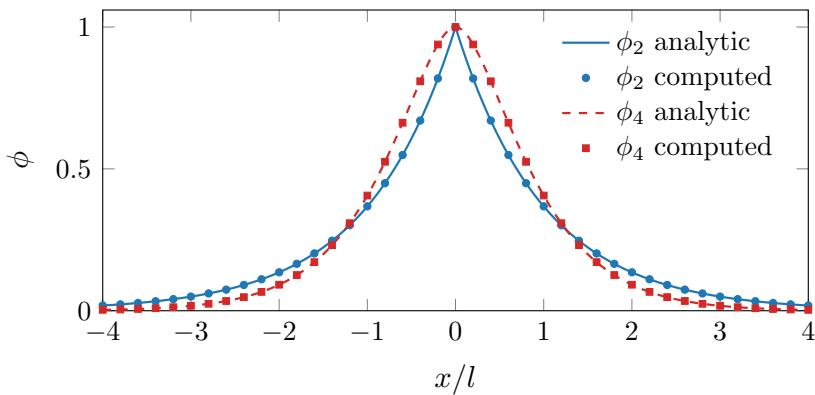  
Figure 1: Optimal crack profiles of the second-order density of Eq. (4) and the fourth-order density of Eq. (6) at equal regularization length. Lines show the analytic profiles of Eq. (5) and (7); markers show transverse cuts through the relaxed bands computed by the solver of Section 3. The second-order profile has a slope discontinuity at the crack, the fourth-order profile is $C ^ { 1 }$ there and decays faster; both dissipate $G _ { \mathrm { c } }$ per unit crack length.

The strong form follows from Eq. (1) by stationarity. Stationarity of Ψ with respect to the displacement field yields the equilibrium equation

$$
\operatorname { d i v } \pmb { \sigma } = \mathbf { 0 } , \qquad \pmb { \sigma } = g ( \phi ) \frac { \partial \psi _ { \mathrm { e } } ^ { + } } { \partial \pmb { \varepsilon } } + \frac { \partial \psi _ { \mathrm { e } } ^ { - } } { \partial \pmb { \varepsilon } } ,\tag{8}
$$

and stationarity with respect to the phase field yields, for the two densities,

$$
\frac { G _ { \mathrm { c } } } { l } \big ( \phi - l ^ { 2 } \Delta \phi \big ) = 2 ( 1 - \phi ) \psi _ { \mathrm { e } } ^ { + }
$$

$$
( n = 2 ) ,\tag{9}
$$

$$
\frac { G _ { \mathrm { c } } } { l } \Big ( \phi - { \textstyle \frac { 1 } { 2 } } l ^ { 2 } \Delta \phi + { \textstyle \frac { 1 } { 1 6 } } l ^ { 4 } \Delta ^ { 2 } \phi \Big ) = 2 ( 1 - \phi ) \psi _ { \mathrm { e } } ^ { + }
$$

$$
( n = 4 ) ,\tag{10}
$$

a second-order and a fourth-order partial diferential equation, respectively, the latter giving the model its name. The associated natural boundary conditions are $\nabla \phi \cdot \pmb { n } = 0$ for $n = 2$ and involve, in addition, the normal derivative of $\Delta \phi$ for $n = 4$ [36]. In a residual-based method these higher-order conditions must be built into the scheme. In an energy-minimization method they are never imposed at all, since minimizing Eq. (1) over an unconstrained representation does not require them to be stated. This is a practical advantage of working with the energy rather than with Eq. (9) and (10).

Since crack growth is irreversible, the phase field must not decrease as the load increases. Loading is applied incrementally through a monotone sequence of prescribed boundary displacements $\delta _ { 1 } < \delta _ { 2 } < \cdots < \delta _ { N }$ , and at step n we require $\phi \geq \phi _ { n - 1 }$ at every point, where $\phi _ { n - 1 }$ is the converged field of the previous step. The constraint is enforced by adding to the energy density the one-sided quadratic penalty

$$
\psi _ { \mathrm { i r } } = \gamma _ { \mathrm { i r } } \left. \phi _ { n - 1 } - \tau - \phi \right. _ { + } ^ { 2 } ,\tag{11}
$$

with penalty weight $\gamma _ { \mathrm { i r } }$ and a small dead band $\tau \geq 0$ that prevents integration noise from slowly ratcheting the far field upward over many load steps (parameter values are given in Appendix B). A widespread alternative is the history-field substitution of Miehe et al. [13], in which the crack driving force is replaced by its maximum over the loading history; it is also common in energy-based network solvers [40, 65]. We prefer the penalty for two reasons. It keeps each load step the minimization of a single well-defined energy, the property on which the proposed solver rests, whereas the history substitution modifies the governing equations in a way that corresponds to no energy; a detailed analysis of penalized irreversibility is given by Gerasimov and De Lorenzis [23]. It also requires the previous phase field only as a pointwiseevaluable field rather than as state stored at integration points, a distinction that becomes essential once the integration points change during the solve (Section 3.5).

The n-th incremental problem then reads

$$
( { \pmb u } _ { n } , \phi _ { n } ) = \arg \operatorname* { m i n } \biggr \{ \Psi ( { \pmb u } , \phi ; \delta _ { n } ) + \int _ { \Omega } \psi _ { \mathrm { i r } } \mathrm { d } \Omega \ : \ { \pmb u } \mathrm { a d m i s s i b l e \ f o r \ } \delta _ { n } \biggr \} ,\tag{12}
$$

where admissibility refers to the essential boundary conditions at load level $\delta _ { n }$ , which the trial fields of Section 3.1 satisfy exactly; the one boundary of Section 4 where they do not is treated there.

## 2.2 Strain energy decomposition and hybrid formulation

The decomposition $\psi _ { \mathrm { e } } = \psi _ { \mathrm { e } } ^ { + } + \psi _ { \mathrm { e } } ^ { - }$ − in Eq. (1) decides which portion of the strain energy drives, and is degraded by, damage. Without any decomposition $( \psi _ { \mathrm { e } } ^ { + } = \psi _ { \mathrm { e } } , \psi _ { \mathrm { e } } ^ { - } = 0 )$ compressive and shear states damage the material as readily as tension does. This is usually undesirable, but

not always. Fully isotropic driving is what permits a fast crack to branch symmetrically, and we retain the undecomposed model for the branching example of Section 4.2, in line with its use in dynamic branching studies [24].

For the remaining examples a unilateral decomposition is needed, and two classical constructions are considered. The spectral decomposition of Miehe et al. [13] separates the principal strains,

$$
\psi _ { \mathrm { e } } ^ { \pm } ( \varepsilon ) = { \textstyle { \frac { 1 } { 2 } } } \lambda \big \langle \mathrm { t r } \varepsilon \big \rangle _ { \pm } ^ { 2 } + \mu \sum _ { i } \big \langle \varepsilon _ { i } \big \rangle _ { \pm } ^ { 2 } ,\tag{13}
$$

where $\varepsilon _ { i }$ are the principal strains and $\langle \cdot \rangle _ { \pm }$ denote the positive and negative parts; under plane strain the out-of-plane principal strain vanishes identically and drops out of the sums. In pure shear the principal strains come in opposite pairs, so only half of the shear energy drives damage under Eq. (13), a property that matters for the mode II example and is examined in Appendix C. The volumetric–deviatoric decomposition of Amor et al. [15] instead degrades volumetric expansion and all deviatoric deformation,

$$
\begin{array} { r } { \psi _ { \mathrm { e } } ^ { + } = \frac { 1 } { 2 } K \left. \mathrm { t r } \varepsilon \right. _ { + } ^ { 2 } + \mu ~ \mathrm { d e v } \varepsilon : \mathrm { d e v } \varepsilon , \qquad \psi _ { \mathrm { e } } ^ { - } = \frac { 1 } { 2 } K \left. \mathrm { t r } \varepsilon \right. _ { - } ^ { 2 } , } \end{array}\tag{14}
$$

with the bulk modulus $K = \lambda + 2 \mu / 3$ . This split keeps shear fully damage-driving, but for the same reason it lets the shear-rich stress concentration at a fixed-edge corner nucleate damage there, an efect that becomes visible at the resolution reached in this work and is likewise documented in Appendix C. Generalizations such as the star-convex decomposition of Vicentini et al. [18] modulate the compressive-volumetric contribution and contain Eq. (14) as a special case; in exploratory runs the additional parameter had no influence on the behavior relevant here, and we retain the classical forms.

Our default is the hybrid formulation proposed by Ambati et al. [17]. The mechanical response is governed by isotropic degradation, so that a developed crack is compliant in all deformation modes, while the evolution of ϕ is driven by the spectral tensile energy alone, so that compressed material does not damage. The scheme is defined by the staggered pair

$$
\boldsymbol { \mathbf { \mathit { u } } } ^ { k + 1 } = \arg \operatorname* { m i n } _ { \boldsymbol { \mathbf { \mathit { u } } } } \int _ { \Omega } \boldsymbol { g } ( \boldsymbol { \phi } ^ { k } ) \boldsymbol { \psi } _ { \mathrm { e } } ( \boldsymbol { \varepsilon } ) \mathrm { d } \Omega ,\tag{15}
$$

$$
\phi ^ { k + 1 } = \arg \operatorname* { m i n } _ { \phi } \int _ { \Omega } \Bigl [ g ( \phi ) \psi _ { \mathrm { e , s p e c } } ^ { + } \bigl ( \varepsilon ( \boldsymbol { u } ^ { k + 1 } ) \bigr ) + \psi _ { \mathrm { c } , n } + \psi _ { \mathrm { i r } } \Bigr ] \mathrm { d } \Omega .\tag{16}
$$

Since the solver of Section 3 performs a single gradient-based minimization per load step, we fold the pair into one objective by freezing the cross couplings. Let sg[·] denote the stop-gradient operation, whose argument is treated as a constant during diferentiation. The hybrid elastic energy density is implemented as

$$
\psi _ { \mathrm { h y b } } = g \big ( \mathrm { s g } [ \phi ] \big ) \psi _ { \mathrm { e } } ( \varepsilon ) + \Big ( g ( \phi ) - \mathrm { s g } [ g ( \phi ) ] \Big ) \mathrm { s g } \big [ \psi _ { \mathrm { e , s p e c } } ^ { + } ( \varepsilon ) \big ] .\tag{17}
$$

Diferentiating Eq. (17) with respect to the displacement degrees of freedom recovers Eq. (15), diferentiating with respect to the phase-field degrees of freedom recovers Eq. (16), and the two updates advance together in each optimizer iteration. We verified that the resulting parameter gradients agree with those of an explicitly staggered implementation to machine precision. The numerical value of Eq. (17) equals the degraded isotropic strain energy, so energy logs and the reaction force retain their mechanical meaning. The original formulation supplements the scheme with a condition that prevents interpenetration of closed crack faces; the examples considered are opening- and sliding-dominated, no face closure occurs, and the condition is omitted. Like the original, the hybrid scheme does not minimize a single energy, an inconsistency accepted here as it is in the phase-field literature [17, 32].

## 2.3 Pre-existing cracks, loading and reaction force

Most of the cases considered in Section 4 are modeled on specimen geometries that contain pre-existing cracks, either an edge notch or internal flaws. We represent them difusely rather than by slitting the domain. The initial phase field is prescribed as the optimal profile of the governing density about the crack segments, that is $\phi _ { 0 } = \phi _ { 2 } ( d )$ or $\phi _ { 4 } ( d )$ from Eq. (5) and (7) with $d ( { \pmb x } )$ being the distance to the nearest segment, and the same function seeds the field representation of Section 3.1. The crack thereby enters at its energy-consistent difuse state, and no artificial equilibration transient occurs at the first load step. Several pre-existing cracks are handled by taking the minimum distance over all segments, which is how the coalescence example of Section 4.3 is set up. Traction-free outer boundaries require no treatment, being natural boundary conditions of Eq. (1).

The structural response is reported as a load–displacement curve. Let $\Psi ^ { * } ( \delta ) = \operatorname* { m i n } \Psi ( \pmb { u } , \phi ; \delta )$ denote the minimized energy at load level $\delta ,$ the minimum being taken over admissible fields. The reaction force work-conjugate to the prescribed displacement is

$$
F ( \delta ) = \frac { \mathrm { d } \Psi ^ { * } } { \mathrm { d } \delta } = \left. \frac { \partial \Psi } { \partial \delta } \right| _ { ( { \boldsymbol u } , \phi ) = \mathrm { m i n i m i z e r } } ,\tag{18}
$$

where the second equality holds since the energy is stationary at the minimizer, so only the explicit dependence on $\delta ,$ carried by the boundary lift of the displacement representation, survives. By work conjugacy, Eq. (18) equals the resultant of the tractions along the loaded edge,

$$
F ( \delta ) = \int _ { \Gamma _ { \mathrm { l o a d } } } ( { \pmb \sigma } \cdot { \pmb n } ) \cdot { \pmb e } _ { \mathrm { l o a d } } \mathrm { d } \Gamma ,\tag{19}
$$

with $e _ { \mathrm { l o a d } }$ the unit direction of the prescribed displacement. We evaluate Eq. (18) rather than Eq. (19). The energetic form requires no boundary quadrature, involves no stress postprocessing on a set of measure zero, and under the Monte Carlo integration of Section 3.5 it inherits the variance of a domain integral rather than that of a boundary one; in the discrete setting the derivative is evaluated exactly by automatic diferentiation (Section 3.7).

A last ingredient concerns the corners where a fixed edge meets a loaded edge. The linear elastic solution carries a wedge-type stress singularity at a corner where the boundary conditions change, whose order follows from the wedge angle and the conditions on the two faces in the classical analysis of Williams [93] and is a property of the boundary value problem rather than of any discretization. A phase-field solver that resolves the length l near such a corner therefore sees an unbounded driving force and nucleates damage there. A coarser discretization does not remove this; it merely fails to resolve the singular field, so the damage does not appear in the computation while the singularity remains in the problem. Since the corner is an artifact of how the specimen is held rather than a feature of the material, we prescribe a locally elevated toughness at the fixed-edge corners,

$$
G _ { \mathrm { c } } ( \pmb { x } ) = G _ { \mathrm { c } } \big [ 1 + \beta b ( \pmb { x } ) \big ] ,\tag{20}
$$

where b is a smooth bump equal to one at the corner points and decaying over a radius of a few l, and $\beta = 1$ wherever the device is applied; the runs that use it are listed in Appendix B. This is a numerical device at the grips rather than a material statement; it keeps the fracture energy smooth and the incremental problems unchanged in structure, and the damage it suppresses is documented in Appendix C. Its side efects on the post-failure response are noted in Section 5.

## 3 Mesh-free deep energy method

The incremental problems of Eq. (12) are solved with a deep energy method. The fields are represented by a neural network, the energy is estimated by Monte Carlo integration, and the network parameters are updated by a first-order optimizer until the estimated energy plateaus [50, 52, 53]. Energy-based losses of this kind involve lower-order derivatives than strong-form residuals and inherit the natural boundary conditions of the underlying functional [52, 57], which makes them a natural fit for the minimization structure of Section 2.

## 3.1 Field representation and boundary conditions

The discrete fields are built in two layers. A neural network supplies three raw outputs, and closed-form constructions turn these outputs into displacement and phase fields that satisfy the essential boundary conditions exactly and carry the pre-existing crack.

The network is shared by all fields,

$$
{ \mathcal { N } } _ { \theta } : ( \xi , F ( \xi ) ) \longmapsto ( { \hat { u } } , { \hat { v } } , { \hat { \phi } } ) ,\tag{21}
$$

taking the parametric coordinates $\pmb { \xi } = ( \xi , \eta ) \in [ 0 , 1 ] ^ { 2 }$ together with the feature vector F of Section 3.2, and returning two raw displacement components $\boldsymbol { \hat { u } } , \boldsymbol { \hat { v } }$ and one raw phase-field output $\hat { \phi } .$ The network itself is a standard multilayer perceptron. With input $z ^ { 0 } = ( \xi , F ( \xi ) )$ the hidden layers apply the recursion

$$
\begin{array} { r } { z ^ { k } = \sigma \big ( W ^ { k } z ^ { k - 1 } + b ^ { k } \big ) , \qquad k = 1 , \dots , D , } \end{array}\tag{22}
$$

followed by a linear output layer, with $\sigma$ the GELU activation. The trainable parameters θ collect the weights $W ^ { k }$ , the biases $\pmb { b } ^ { k }$ and the feature grids of the encoding. All computations use $D = 4$ hidden layers of width 128; the full architecture data are tabulated in Appendix B. Note that the network is small, since the spatial resolution of the method resides in the feature grids rather than in the network itself, and nothing in the formulation is tied to this particular architecture. Sharing one network among the fields lets the displacement and phase-field channels use the same encoding and keeps the whole state in a single optimizer.

The problem is solved in nondimensional form. Coordinates live on the unit parametric domain, displacements are scaled by a reference magnitude $U _ { \mathrm { r e f } }$ chosen so that the raw network outputs and the prescribed displacement are of order one, and all reported quantities are converted back to physical units. Scalings of this kind are routine in network-based solvers, where badly scaled inputs or outputs distort the optimization landscape long before they would afect a linear solver [47].

Essential boundary conditions are satisfied exactly by construction, in the manner introduced by Lagaris et al. [44] and developed systematically in [58]. The raw outputs are multiplied by a function that vanishes on the Dirichlet boundary and added to a lift that interpolates the prescribed data. For a specimen with a fixed bottom edge $( y = 0 )$ and a displacement-driven top edge $( y = 1 )$ , loaded in shear, the displacement fields read

$$
\boldsymbol { u } = U _ { \mathrm { r e f } } \left[ \omega ( y ) \boldsymbol { \hat { u } } + y \delta \right] ,\tag{23a}
$$

$$
v = U _ { \mathrm { r e f } } \omega ( y ) \hat { v } ,\tag{23b}
$$

where $\omega ( y ) = y ( 1 - y )$ is an envelope that vanishes on both grips; for tension the linear lift $y \delta$ moves to the v component. The fixed edge and the prescribed displacement thus hold identically for any network parameters, and no boundary penalty term, and hence no penaltyweight tuning, is needed. Traction-free lateral boundaries are natural boundary conditions of the energy and require no treatment.

The phase field is assembled around the seeded pre-existing crack of Section 2.3,

$$
\begin{array} { r } { \phi ( \pmb { \xi } ) = \phi _ { 0 } ( \pmb { \xi } ) + \left[ 1 - \phi _ { 0 } ( \pmb { \xi } ) \right] s \big ( \hat { \phi } ( \pmb { \xi } ) \big ) , } \end{array}\tag{24}
$$

where $\phi _ { 0 }$ is the optimal profile of the governing density about the crack segments and $s ( \hat { \phi } ) =$ $1 / ( 1 + e ^ { - \hat { \phi } } )$ is a logistic squash. The output bias of the $\hat { \phi }$ channel is initialized at −4, so that $s \approx 0 . 0 2$ at the start of training and the phase field begins within 2% of the seeded profile. Three properties of Eq. (24) are used repeatedly. The pre-existing crack carries $\phi = 1$ exactly, independently of the network. The first load step starts from the energy-consistent difuse state rather than from an arbitrary one, and in practice needs no special treatment beyond a larger iteration budget. Finally, since $s \in ( 0 , 1 )$ , the representation satisfies $\phi \geq \phi _ { 0 }$ pointwise, so the seeded crack cannot heal regardless of the state of the penalty term of Eq. (11). The penalty is not made redundant by this bound, which involves the seeded profile only; irreversibility with respect to the previous converged state, including whatever has grown during loading, is exactly what Eq. (11) enforces.

## 3.2 Multiresolution feature encoding

Used directly on the raw coordinates, a multilayer perceptron is a poor match for phase-field solutions. Networks of this kind are biased toward smooth, slowly varying functions [62, 79], while the solution consists of smooth fields interrupted by a damage band of width $O ( l )$ , two orders of magnitude below the specimen size. The established remedies enrich the input with global oscillatory features, either Fourier feature embeddings [81] or periodic activations [82]. These embeddings add fine-scale content, but they add it globally, and diferentiating globally supported oscillatory features across a steep gradient produces spurious spatial oscillations of the kind associated with the Gibbs phenomenon, as documented for phase-field modeling of brittle fracture in [67]. We therefore attach the fine-scale capacity to local, trainable degrees of freedom instead, namely learnable feature grids at several resolutions, read by smooth interpolation. Multiresolution grid encodings of this kind were popularized in computer graphics by M¨uller et al. [83] and have recently been used to accelerate physics-informed networks [84]. The variant used here difers in two respects that matter for energy minimization, dense rather than hashed grids and $C ^ { 1 }$ rather than $C ^ { 0 }$ interpolation. The second diference is essential. With the $C ^ { 0 }$ linear interpolation of hash encodings the derivatives are discontinuous, to the point that Huang and Alkhalifah replace automatic diferentiation by finite diferences [84], whereas the quadratic interpolation used here keeps exact automatic diferentiation available, which the kinematics of Section 3.4 relies on.

The encoding consists of L levels of feature grids $G _ { \ell } \in \mathbb { R } ^ { C \times n _ { \ell } \times n _ { \ell } }$ over the parametric domain, with $C$ channels per level. The feature vector stacks the per-level contributions,

$$
\pmb { F } ( \pmb { \xi } ) = \big ( \pmb { f } _ { 1 } ( \pmb { \xi } ) , \pmb { f } _ { 2 } ( \pmb { \xi } ) , \dots , \pmb { f } _ { L } ( \pmb { \xi } ) \big ) ,\tag{25}
$$

and each contribution interpolates its grid over the local $3 \times 3$ stencil,

$$
\pmb { f } _ { \ell } ( \pmb { \xi } ) = \sum _ { a , b \in \{ 0 , 1 , 2 \} } w _ { a } ( t _ { \xi } ) w _ { b } ( t _ { \eta } ) \ \pmb { G } _ { \ell } [ \cdot , \ 3 + b , i + a ] ,\tag{26}
$$

where $( i , j )$ indexes the grid cell containing ξ and $( t _ { \xi } , t _ { \eta } ) \in [ 0 , 1 ) ^ { 2 }$ are the local coordinates within it. The interpolation weights are those of the uniform quadratic B-spline,

$$
\begin{array} { r } { w _ { 0 } ( t ) = \frac 1 2 ( 1 - t ) ^ { 2 } , \qquad w _ { 1 } ( t ) = - t ^ { 2 } + t + \frac 1 2 , \qquad w _ { 2 } ( t ) = \frac 1 2 t ^ { 2 } . } \end{array}\tag{27}
$$

They form a partition of unity and are continuously diferentiable across cell boundaries, so the features, and with them every mechanical field, are $C ^ { 1 }$ . The input dimension of the perceptron is $2 + L C$ , and the cost of the encoding lookup, nine multiply-adds per level and channel, is negligible next to the network evaluation itself.

The grids are zero-initialized. The encoding starts as an inert augmentation, the network initially sees only the raw coordinates, and features grow as residuals where the optimization requires them. In trained models the coarse grids carry the smooth large-scale response, while the finest grid concentrates its amplitude in the crack band. The grids train at a larger learning rate than the network; the values are listed in Appendix B, and the runs reported here carry no weight regularization on the network. The feature grids alone carry a penalty $1 0 ^ { - 8 } \textstyle \sum _ { \ell } \| \pmb { G } _ { \ell } \| ^ { 2 }$ on the squared feature amplitudes, which bounds the amplitudes away from unbounded drift and is far too small to act on the solution itself.

Since the resolution limit is set by the finest level alone, one may ask why a hierarchy is used rather than a single fine grid. The reason lies in how gradient-based training distributes work across scales. Networks and trainable feature grids learn large-scale content first and fine-scale content late [62, 79], so a single fine grid would have to assemble the smooth large-scale response from its many small cells, which is slow to train. A hierarchy instead assigns the smooth part to coarse levels, which represent it with few parameters, and leaves the finest level to carry only the fine-scale residual, in close analogy with the coarse-grid correction of multigrid methods [85]. The same design choice has proven itself elsewhere, with multiresolution grids outperforming single-resolution ones at comparable parameter counts in neural graphics [83], and multilevel architectures accelerating the training of physics-informed networks [84, 86, 87]. Since the coarse grids are small compared with the finest one, the additional cost of the hierarchy is negligible.

The order of the interpolation matters, since it ties the encoding to the models of Section 2. With $C ^ { 0 }$ linear interpolation, as in hash-grid encodings [83], strains and $\nabla \phi$ would jump across cell boundaries and the fourth-order term $( \Delta \phi ) ^ { 2 }$ would not be integrable at all. With quadratic interpolation the fields are $C ^ { 1 }$ , strains and the gradient term of the fracture energy density are continuous, and the second derivatives of the features are piecewise constant, so the second derivatives of the fields are bounded and $\Delta \phi$ is square-integrable and the fourth-order energy of Eq. (6) is finite and well-posed on the representation. We note that $C ^ { 1 }$ quadratic splines are precisely the minimal space Borden et al. employed for the same functional in the isogeometric setting [36]. A cubic, $C ^ { 2 }$ variant of the encoding is the natural fallback should $( \Delta \phi ) ^ { 2 }$ ever exhibit cell-scale noise; in the fourth-order computations reported here it does not.

The resolutions $n _ { \ell }$ grow from coarse to fine, and the finest level plays the central role. Its spacing h is prescribed as a fixed fraction of the regularization length, small enough that the optimal profile of Eq. (5) decays over several cells. The examples use $h = 0 . 2 6 l$ , so that about four features span one decay length l of the profile and roughly fifteen span the half-width 4l over which it falls below 2% of its peak; the per-level resolutions of every run are listed in Appendix B. The spacing h is at the same time a hard limit on the finest scale the representation can express, a property we refer to as the resolution cap. The features are piecewise quadratic on fixed knots, so no localized degree of freedom anywhere in the representation can vary on scales below h. The band is thereby representable and sharp, while oscillations of the kind produced by global oscillatory features cannot be expressed at all. Matching h to l rather than to the specimen size is what keeps the grids afordable. What the cap does not do by itself is protect a fixed set of integration points from being exploited by the freedom that remains above h (Sections 3.5 and 3.6).

## 3.3 Geometry map and domain mask

Curved domains are treated in the spirit of isogeometric analysis, in which the geometry is represented exactly by the spline description used in computer-aided design and the same parametrization carries the analysis [41, 42]. Only the geometric half of this idea is adopted here. The computational domain is the image of a parametric unit square $\widehat \Omega$ under a fixed

NURBS map, while the solution fields continue to live on $\widehat \Omega$ through the representation of Sections 3.1 and 3.2.

Univariate B-spline basis functions $N _ { i , p }$ of degree p on a knot vector $\Xi = \{ \xi _ { 1 } , \ldots , \xi _ { m } \}$ are defined by the Cox–de Boor recursion [91], starting from the piecewise constants

$$
N _ { i , 0 } ( \xi ) = \left\{ { 1 \atop 0 } \right. \xi _ { i } \leq \xi < \xi _ { i + 1 } ,\tag{28}
$$

and proceeding for $p \geq 1$ through

$$
N _ { i , p } ( \xi ) = \frac { \xi - \xi _ { i } } { \xi _ { i + p } - \xi _ { i } } N _ { i , p - 1 } ( \xi ) + \frac { \xi _ { i + p + 1 } - \xi } { \xi _ { i + p + 1 } - \xi _ { i + 1 } } N _ { i + 1 , p - 1 } ( \xi ) .\tag{29}
$$

The bivariate rational basis with weights $w _ { i j }$ reads

$$
R _ { i j } ( \xi , \eta ) = \frac { N _ { i , p } ( \xi ) M _ { j , q } ( \eta ) w _ { i j } } { \sum _ { k , l } N _ { k , p } ( \xi ) M _ { l , q } ( \eta ) w _ { k l } } ,\tag{30}
$$

and with control points $P _ { i j }$ the geometry map is

$$
{ \pmb x } = { \pmb G } ( { \pmb \xi } ) = \sum _ { i , j } R _ { i j } ( { \pmb \xi } , { \pmb \eta } ) { \pmb P } _ { i j } .\tag{31}
$$

A single patch sufices for every geometry in this paper. The thick-walled ring of Section 4.5 is one quadratic NURBS patch whose weights reproduce the inner and outer circles exactly, the rational form of Eq. (30) being what makes conic sections representable without approximation [91]. Fig. 2 shows this patch together with the basis functions of its two parametric directions; for the illustration the radial direction, which is linear in the computations, is orderelevated to quadratic, an exact operation that leaves the geometry unchanged. The map, its knots, weights and control points are fixed data of the problem. G does not depend on the trainable parameters, and the recursion of Eq. (28)–(29) is evaluated inside the diferentiation graph, so the Jacobian $\pmb { J } = \partial \pmb { x } / \partial \pmb { \xi }$ is available exactly wherever it is needed. Physical gradients follow from the pullback

$$
\nabla _ { \pmb { x } } ( \cdot ) = \pmb { J } ^ { - \mathrm { T } } \nabla _ { \pmb { \xi } } ( \cdot ) ,\tag{32}
$$

and |det J| enters the integration weights of Section 3.5, where it also keeps the sampling physically uniform however strongly the patch stretches. Distances that define the seeded profile $\phi _ { 0 }$ corner positions and all plotting are consistently taken in physical coordinates through Eq. (31). On the square specimens the map is the identity, ${ J } = { I }$ , and the formulation reduces to the plain one at no cost. Since a single patch covers each domain, no boundary-fitted mesh is ever built on the physical domain and no multi-patch coupling or Nitsche-type interface terms arise [42]. Note that spline descriptions appear on both sides of Eq. (31), a NURBS map for the geometry and B-spline feature grids for the solution, with the network supplying the nonlinear composition in between.

Domains with interior holes are handled by an indicator mask rather than by boundary fitting. The energy density is multiplied by the characteristic function $\chi ( \pmb { x } )$ of the material region, evaluated exactly at every integration point. The hole boundary carries no quadrature of its own, and the traction-free condition on it is the natural boundary condition of the masked energy. The mask is discontinuous, but this costs nothing under Monte Carlo integration, where it is the integrand that is sampled and no derivative of $\chi$ is ever required; under the unbiased scheme of Section 3.5 the masked integral is recovered exactly in expectation. The plate-withhole example of Section 4.4 verifies the combination of mask and quadrature against the Kirsch solution before the same combination is used for nucleation.

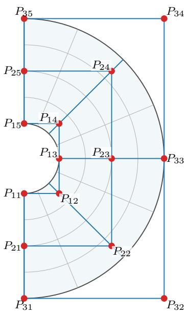  
(a) Exact geometry

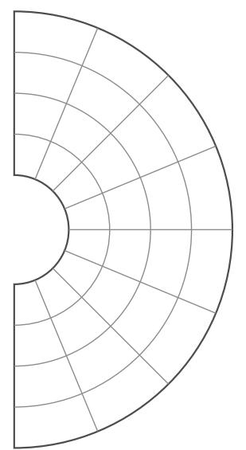  
(b) Mesh in physical space

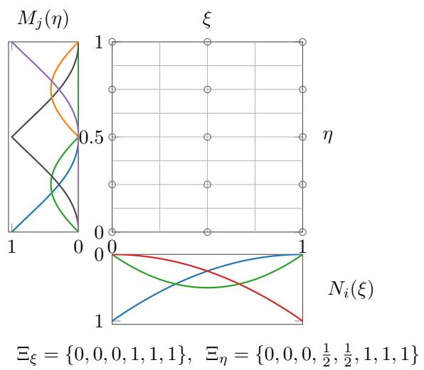  
(c) Mesh in parametric space, basis functions and knot vectors

Figure 2: The single-patch NURBS description of the ring, shown with the radial direction order-elevated to quadratic, which leaves the geometry unchanged. (a) Exact geometry with the isoparametric grid, the control polygon and the control points $P _ { i j }$ ; the weights reproduce both circles exactly. (b) Mesh in physical space after knot refinement, which likewise leaves the geometry unchanged; the knot lines map to concentric arcs and radial lines, and the same mesh underlies all three panels. (c) Parametric domain with the control-point grid at the Greville points, the rational quadratic basis $M _ { j }$ along the angular coordinate $\eta _ { \mathrm { { i } } }$ the quadratic basis $N _ { i }$ along the radial coordinate $\xi ,$ and the knot vectors.

## 3.4 Strains and higher-order derivatives

All spatial derivatives entering the energy are computed by reverse-mode automatic diferentiation through the field representation. Strains $\varepsilon ( u )$ and the gradient $\nabla \phi$ are the exact derivatives of the discrete fields of Eq. (23) and (24); no interpolation onto shape functions and no finite diferencing intervenes between the representation and its derivatives. Since the energy density contains first derivatives and is itself diferentiated with respect to θ during training, secondorder diferentiation through the computational graph is exercised at every iteration, and the $C ^ { 1 }$ regularity of the encoding is what makes this composition well-defined. The graph retention this requires is the main memory cost of the method, and it scales linearly with the number of integration points; quantities evaluated outside the training loop, such as the reaction force and the field plots, are computed in chunks so that memory never becomes a constraint there. On mapped geometries the raw parametric gradients are pulled back through Eq. (32) before strains are formed.

The fourth-order model requires one further pass. Diferentiating the components of $\nabla \phi$ once more assembles $\Delta \phi = \partial _ { x x } \phi + \partial _ { y y } \phi .$ , and this is the entire cost of switching models. The energy density exchanges Eq. (4) for Eq. (6), one additional diferentiation pass runs per iteration, and the measured time of a single iteration grows by a factor of about 1.3. This is the cost of the iteration alone; the wall-clock times of the complete runs, which also carry the early stopping of Section 3.7 and are therefore somewhat higher, are reported in Appendix B. The corresponding upgrade in a Galerkin setting requires a globally $C ^ { 1 }$ trial space; here it requires one additional call to the diferentiation engine. The fourth-order computations in this paper run on the identity geometry map, where the parametric Laplacian coincides with the physical one. The pullback of second derivatives through a curved map involves the second derivatives of G and is not needed for the examples considered, since the one curved-domain example, the ring, runs the second-order density.

## 3.5 Monte Carlo integration and adaptive sampling

The energy integral is estimated by importance-sampled Monte Carlo quadrature. Let $\psi _ { \mathrm { t o t } } ( \pmb { \xi } ; \pmb { \theta } )$ denote the total energy density, comprising the elastic, fracture and penalty terms together with the mask where present. For any sampling density $\varrho > 0$ on ${ \widehat { \Omega } } ,$ multiplying and dividing the integrand by $\varrho$ rewrites the energy as an expectation over points drawn from $\varrho ,$

$$
\Psi ( \pmb \theta ) = \int _ { \hat { \Omega } } \psi _ { \mathrm { t o t } } \left| \operatorname* { d e t } \pmb J \right| \mathrm { d } \pmb \xi = \mathbb { E } _ { \pmb \xi \sim \varrho } \left[ \frac { \psi _ { \mathrm { t o t } } \left| \operatorname* { d e t } \pmb J \right| } { \varrho } \right] .\tag{33}
$$

Drawing M independent points from $\varrho$ then gives the estimator

$$
\widehat { \Psi } ( \pmb { \theta } ) = \frac { 1 } { M } \sum _ { i = 1 } ^ { M } \frac { \psi _ { \mathrm { t o t } } ( \pmb { \xi } _ { i } ; \pmb { \theta } ) \left| \operatorname* { d e t } \pmb { J } \right| ( \pmb { \xi } _ { i } ) } { \varrho ( \pmb { \xi } _ { i } ) } , \qquad \pmb { \xi } _ { i } \overset { \mathrm { i i d } } { \sim } \varrho ,\tag{34}
$$

which is unbiased, $\mathbb { E } [ \widehat { \Psi } ] = \Psi$ , whatever density is chosen. The freedom in $\varrho$ is used to concentrate points where the solution localizes. Our density is a mixture of three strata,

$$
\varrho = w _ { \mathrm { u } } \varrho _ { \mathrm { u n i f } } + w _ { \mathrm { c } } \varrho _ { \mathrm { c r a c k } } + w _ { \mathrm { p } } \varrho _ { \mathrm { p r o c } } ,\tag{35}
$$

each of which is built once per load step from the frozen converged state of the previous step.

• a uniform bulk stratum, realized with a scrambled Sobol sequence [94] and reweighted by |det $J |$ on curved patches so that it is uniform in physical area;

• a crack stratum, a piecewise-constant density proportional to max $\left( \phi _ { 0 } , \phi _ { n - 1 } \right)$ |det $J |$ on an auxiliary grid. Since it is built from the previous converged phase field and not from the pre-existing crack alone, it covers the seeded crack and everything that has propagated at one common physical density. The point concentration assigned to the pre-existing crack thus transfers automatically to the growing crack at a fixed total budget;

• a process-zone stratum proportional to $\phi ( 1 - \phi ) + \eta _ { \mathrm { d } } \phi _ { 0 } + \beta _ { \mathrm { d } } \widehat { D }$ , where $\widehat { D }$ is the normalized driving force $g ( \phi ) \psi _ { \mathrm { e } } ^ { + }$ of the frozen state, evaluated in the volumetric–deviatoric form of Section 2.2 whatever decomposition the energy uses. Since the estimator divides by the sampling density, the choice of indicator moves the variance of $\widehat { \Psi }$ and not its expectation; the volumetric–deviatoric form is used since it is smooth and, in shear-dominated states, broader than the spectral one, so the process zone is never left under-sampled. The first term peaks on the flanks of the band, and the driving-force term places points ahead of the crack tip, where the next increment will localize.

When a crack propagates substantially within a simulation, an optional fourth component appends points on the newly created crack area at a prescribed physical density, so that the fixed budget is not diluted by a growing band; the number of appended points is the prescribed density times the area in which the previous solution exceeds $\begin{array} { r } { \phi = \frac { 1 } { 2 } } \end{array}$ while the seeded profile does not. This component is used in the branching example. The mixture weights, the auxiliary grid resolution and the budget M are listed in Appendix B.

The timing of the sampling matters as much as the densities themselves, and two rules are followed. First, the density $\varrho$ is frozen within each load step, so every iteration estimates the same energy and the incremental problem retains the minimization structure of Eq. (12). Second, the point set is redrawn from $\varrho$ every $n _ { \mathrm { r } }$ optimizer iterations, with $n _ { \mathrm { r } } ~ = ~ 1$ in all production runs, so the optimizer never interacts twice with the same integration points. It sees the energy only through fresh unbiased estimates, in the manner of stochastic gradient descent on the exact functional. A configuration that lowers the estimate on one particular point set, without lowering the energy, gains nothing that survives the next draw. The importance weights |det $J | / \varrho$ are quadrature data, not decision variables, and are excluded from the diferentiation graph.

The estimator variance is managed by the same construction. The stratification places the points where the integrand is largest, which is the classical variance-reduction role of importance sampling, and the low-discrepancy Sobol stratum keeps the smooth bulk contribution wellbehaved. The residual noise of order $M ^ { - 1 / 2 }$ enters the optimizer as gradient noise, which Adam tolerates by design, and enters the convergence test only through a windowed average (Section 3.7). Reported quantities are evaluated on a dedicated sample several times larger than the training budget, so the noise visible in the load–displacement curves is well below the physical features they resolve.

## 3.6 Stability of the discretization

Energy-minimizing network solvers for the phase-field description of brittle fracture are known to fail in two characteristic ways, both analyzed in [67]. First, diferentiating a globally supported smooth approximant across the damage band produces spurious oscillations in the strain and energy fields. Second, when the representation carries more localized freedom than the integration rule can observe, minimization finds configurations that are sharp between the integration points and meaningless as solutions; following [67] we refer to these as zero-energy modes. Reported remedies include taking gradients from a finite element interpolation with its fixed Gauss rule [67] and adaptively refining the integration point set [40].

In the proposed method the two components introduced above, summarized in Fig. 3, address the two failure modes directly. The resolution cap of Section 3.2 removes the first mode at the level of the function space. All localized capacity lives on $C ^ { 1 }$ splines of spacing $h .$ so there is no basis on which sub-h oscillations could be expressed, while the band itself, a few h wide by the choice of the finest level, remains fully representable. The resampling of Section 3.5 removes the second mode at the level of the optimization. Over a load step the optimizer is exposed to millions of freshly drawn points, so there is no fixed point set with respect to which a zero-energy mode could be defined or maintained.

It has been argued that a Gauss–Legendre rule laid out on the NURBS parameterization ofers better accuracy and eficiency than Monte Carlo sampling [40], an assessment a recent survey repeats [78]. The claim concerns the quadrature error of a fixed integrand, and on that measure it is correct. The estimator of Section 3.5 is constructed for a diferent setting, in which the integrand evolves with the parameters under optimization and any point set that stands still, deterministic or random, supplies the structure a zero-energy mode requires. Redrawing the points at every iteration removes that structure, and the variance this costs is controlled by the stratification of the sampler. The reuse an estimator of this kind tolerates is measured in Appendix C, where holding one point set for ten iterations leaves the response unchanged and holding it for a hundred already removes the failure event.

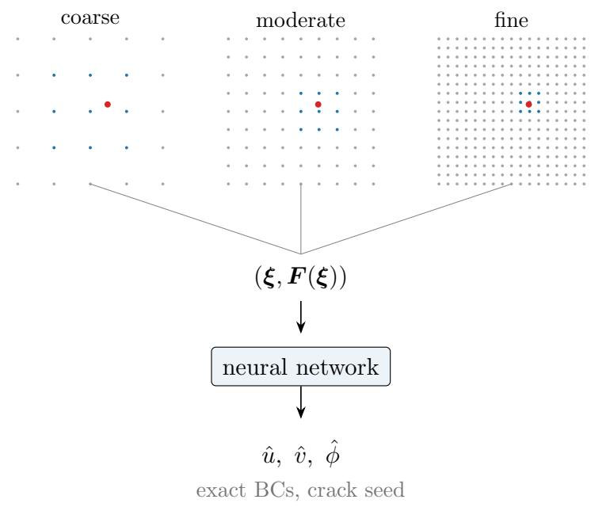  
(a)

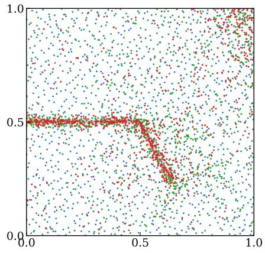  
(b)  
Figure 3: The two components of the discretization. (a) The three feature grids, drawn as the nodes that carry the features. At a query point, in red, each level contributes the nine nodes marked in blue, which are interpolated with $C ^ { 1 }$ B-splines and fed with the coordinates to the network; the finest grid sets the resolution cap. (b) One draw of the three sampling strata of Eq. (35) for the converged shear specimen of Section 4.1.2, the uniform stratum in blue, the process-zone stratum in green and the crack stratum in red, drawn over the phase field in light gray; the points are redrawn at every iteration.

Neither ingredient is suficient on its own. The cap does not protect a fixed quadrature rule, since configurations that lower the estimated energy at the integration points while deteriorating between them do not require sub-h scales at all; they can be built from the resolved scales alone, and a fixed rule never observes the space between its points. The resampling, conversely, does not remove the derivative oscillations, since a representation able to form arbitrarily fine features develops them at the band under diferentiation whether or not the points move. With both in place, the representation cannot form features finer than the integration observes, and the integration ofers no fixed point set that could be exploited. The resulting sharpness is obtained within the quadratic models of Section 2, with no threshold-type damage model involved. The studies of Appendix C examine the two directions separately. Fixing the point set reopens the failure mode, while enlarging the representation at a fixed budget leaves the response essentially unchanged, the peak moving by under 5%, so the pairing binds in the first direction and is forgiving in the second.

## 3.7 Training strategy

Load stepping proceeds by warm starting, the natural continuation strategy for a quasi-static problem. The parameters converged at step n − 1 initialize step n, and a frozen copy of the step-(n−1) network supplies everything the new step needs from the past, namely the field $\phi _ { n - 1 }$ entering the penalty of Eq. (11), the sampler densities of Section 3.5, and the driving-force field of the process-zone stratum. No state is stored at integration points at any time; the previous solution is available as a field, evaluable at whatever points the sampler draws next.

Each load step minimizes the estimated energy with Adam [95] in two parameter groups, the perceptron weights and the encoding grids, the latter at the larger learning rate and with the small penalty on the feature amplitudes of Section 3.2. The cold start at step 0, which begins from ϕ ≈ $\phi _ { 0 }$ , receives roughly twice the iteration budget of the warm steps. Iterations stop early when the relative range of the estimated energy over a trailing window falls below a plateau tolerance, with the window length chosen large enough that estimator noise averages out of the test. At convergence of each step the reaction force is evaluated from Eq. (18) by automatic diferentiation of the elastic energy with respect to the prescribed displacement, on a dedicated sample several times larger than the training budget. All schedules, learning rates, tolerances and budgets are tabulated in Appendix B. Algorithm 1 states the complete loop, and Fig. 4 shows the same structure graphically.

Algorithm 1 Load-stepping deep energy solver.   
1: initialize θ; seed the phase field with $\phi _ { 0 }$ (Section 3.1)   
2: for load step $n = 1 , \ldots , N$ do   
3: prescribe $\delta _ { n } ;$ freeze the previous network $( \phi _ { n - 1 }$ , strata densities of Eq. (35), driving   
force)   
4: for iteration $t = 1 , 2 , \ldots$ . until plateau or budget do   
5: if t ≡ 0 (mod n ) then   
6: redraw $\{ \pmb { \xi } _ { i } \} _ { i = 1 } ^ { M } \sim \varrho$   
7: end if   
8: $\widehat { \Psi } \longleftarrow \frac { 1 } { M } \sum _ { i } \psi _ { \mathrm { t o t } } ( \pmb { \xi } _ { i } ; \pmb { \theta } ) \left| \operatorname* { d e t } \pmb { J } \right| / \varrho ( \pmb { \xi } _ { i } )$ ▷ unbiased estimate of Eq. (34)   
9: θ ← Adamθ, ∂Ψb/∂θ   
10: end for   
11: $F ( \delta _ { n } ) \gets \partial \Psi _ { \mathrm { e l } } / \partial \delta$ on a dedicated sample ▷ reaction force of Eq. (18)   
12: save the converged state   
13: end for

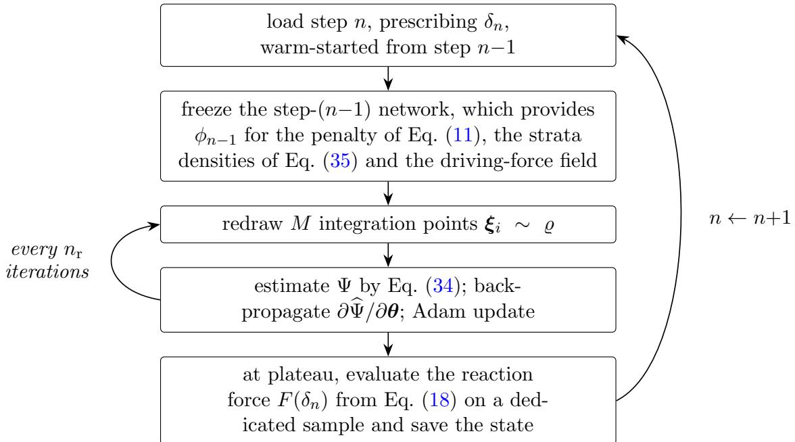  
Figure 4: One load step of the solver. The sampling density is frozen per load step; the integration points are redrawn every $n _ { \mathrm { r } }$ optimizer iterations, with $n _ { \mathrm { r } } = 1$ in all production runs.

## 4 Numerical examples

The capability of the method is assessed on six examples of increasing dificulty. The singleedge-notched (SEN) tension and shear tests provide the quantitative comparison with reference solutions, for the second- and fourth-order models alike, and crack branching and the coalescence of three pre-existing cracks exercise evolving crack topology. A plate with a circular hole verifies the elastic machinery against a closed-form solution and then demonstrates nucleation without any pre-existing crack, a thick-walled ring exercises the geometry mapping on a curved domain, and ten random multi-crack configurations from a recent public benchmark dataset test the method zero-shot, twenty runs evaluated against the reference solutions published with it. Alternatives to the method of Section 3 are examined one ingredient at a time in Appendix C, together with the failure modes they reproduce.

The finite element references for the notched square specimens and the coalescence test were computed with an in-house staggered solver written for this work and distributed with the code of the paper. It implements the standard second-order model on a uniform mesh of $5 1 2 \times 5 1 2$ bilinear quadrilateral elements over the unit square, an element size of $l / 5 ,$ finer than the $l / 2$ of common practice [13], with the displacement and the phase field together carrying 789 507 degrees of freedom. Irreversibility is enforced through the history field of Miehe et al. [13], and the pre-existing crack is imposed as a $\phi = 1$ condition on the notch nodes. Each load increment is solved by alternating the displacement and the phase-field problem, and geometry, material data, boundary conditions, regularization length and the strain energy decomposition are matched to the corresponding deep energy run. The implementation was verified against the published curves of Tangella et al. [31] for the single-edge-notched tests before being used as the reference here.

The elastic stage of the plate with a hole is compared against the Kirsch solution [96]. For the ring we compare the computed crack path against the isogeometric phase-field results of Si et al. [39], and the reference fields and curves of the random multi-crack configurations are those distributed with the benchmark dataset [88]. Unless stated otherwise, the square specimens share one material set, $E = 3 4 0 \mathrm { G P a } , \nu = 0 . 2 2$ and $G _ { \mathrm { c } } = 4 2 . 4 7 \ : \mathrm { J / m ^ { 2 } }$ under plane strain, a unit side length of 1 mm, a unit out-of-plane thickness of 1 mm, so that the reactions reported below are forces in newtons, and a regularization length $l = 0 . 0 1$ mm; the discretization and training parameters of every run are tabulated in Appendix B. All load–displacement curves are evaluated from the energy derivative of Eq. (18), and all runs of one example share the seeding, sampling and training strategy of Section 3; the discretization parameters that difer between examples are the level resolutions, the point budget and the iteration budget of Appendix B, and no quantity is tuned to a particular run.

## 4.1 Single-edge-notched tension and shear

The single-edge-notched square is the standard quantitative benchmark of the phase-field literature [13, 17]. A horizontal pre-existing crack runs from the left edge to the center at mid-height, seeded through the optimal profiles of Eq. (5) and (7) as described in Section 2.3. The bottom edge is fixed and the top edge is displacement-driven through the lift of Eq. (23), vertically for the tension (mode I) test and horizontally for the shear (mode II) test; both set-ups are shown in Fig. 5.

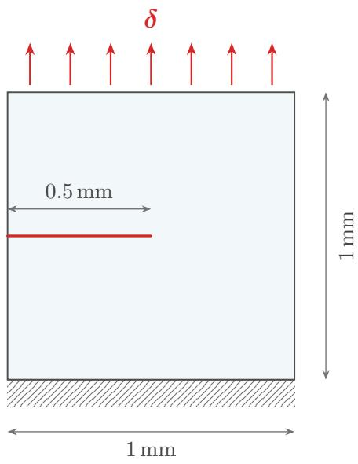  
(a)

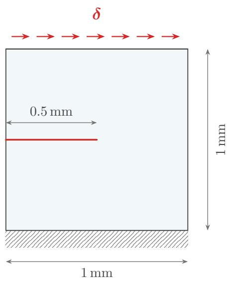  
(b)  
Figure 5: Single-edge-notched specimen under (a) tension and (b) shear. The bottom edge is fixed, the top edge is displacement-driven, and the pre-existing crack is seeded difusely through ϕ0.

The tension test applies 80 increments of $1 0 ^ { - 5 }$ mm; the shear test applies 126 increments of $2 . 5 \times 1 0 ^ { - 5 }$ mm. Both the second- and the fourth-order model are run on identical discretizations, difering only in the density $\psi _ { \mathrm { c } , n }$ entering Eq. (1), so each test produces three curves to compare, the finite element reference and the two deep energy solutions.

## 4.1.1 Tension

Under tension the crack propagates horizontally across the ligament and the load–displacement curves show a single peak followed by an abrupt drop to complete failure (Fig. 6). The secondorder solution peaks at 97.6 N at $\delta = 4 . 9 0 \times 1 0 ^ { - 4 }$ mm, against the reference peak of 98.7 N at $5 . 0 9 \times 1 0 ^ { - 4 }$ mm, so that the peak load is reproduced to within 1.1% and the displacement at which it occurs to within 3.7%. The fourth-order solution fails slightly earlier, at 94.3 N, about 3% below its second-order counterpart, consistent with its more compact crack band.

FEM proposed, second order proposed, fourth order

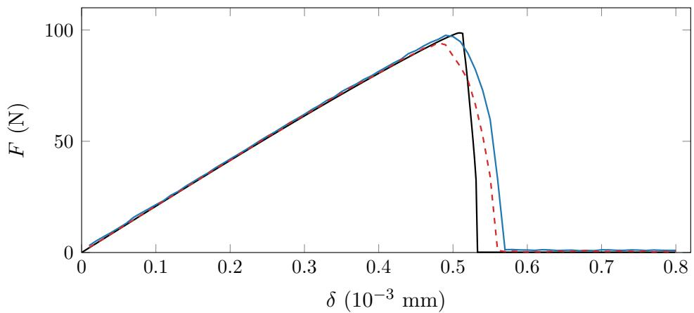  
Figure 6: Single-edge-notched tension. Load–displacement curves of the second- and fourthorder solutions against the finite element reference, computed with the in-house staggered solver described at the head of Section 4.

The fields while the crack is running are compared with the finite element fields in Fig. 7, at $\delta = 5 . 1 \times 1 0 ^ { - 4 }$ mm, with each displacement component drawn on one color scale shared between the two solutions. Both components jump across the grown part of the band and stay smooth ahead of the tip.

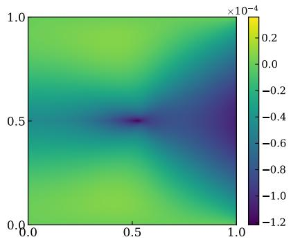  
(a)

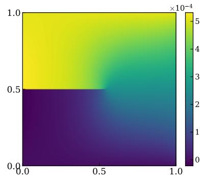  
(b)

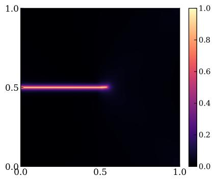  
(c)

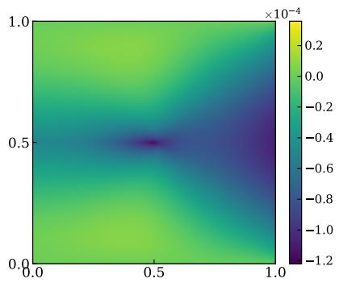  
(d)

  
(e)

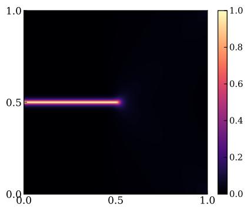  
(f)  
Figure 7: Single-edge-notched tension during propagation, at $\delta = 5 . 1 \times 1 0 ^ { - 4 } \mathrm { m m }$ . (a)–(c) Displacement components u, v and phase field of the second-order deep energy solution; (d)–(f) the finite element fields at the same load level. Displacements in mm; each displacement component shares one color scale between the two rows.

The final phase fields are compared in Fig. 8. The computed path coincides with the finite element path along the full ligament, and the fourth-order band is visibly more compact than the second-order one at the same regularization length, consistent with the narrower optimal profile of Eq. (7). The displacement components of the failed state follow in Fig. 9; the two parts of the specimen separate across the fully developed band and agree with the finite element fields on the shared color scales.

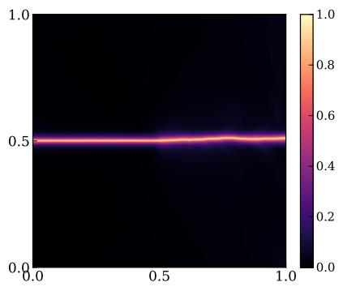  
(a)

  
(b)

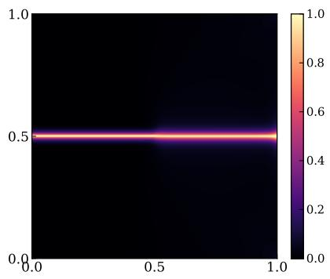  
(c)

Figure 8: Single-edge-notched tension, final phase fields. (a) Second-order and (b) fourth-order deep energy solutions, (c) finite element reference; all renderings share one color scale.  
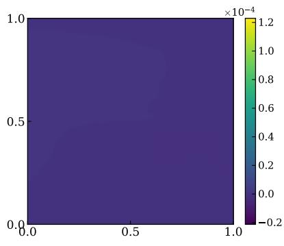  
(a)

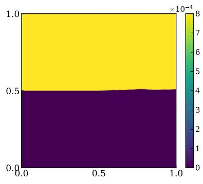

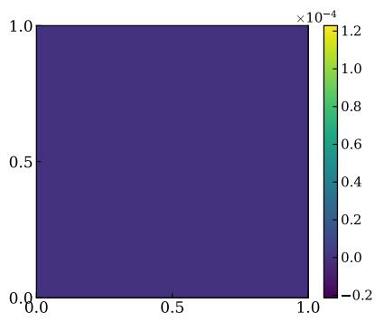  
(c)

(b)  
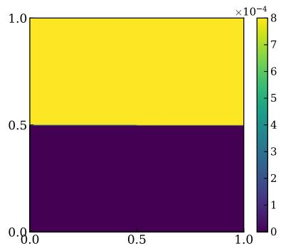  
(d)  
Figure 9: Single-edge-notched tension, displacement components of the failed state in mm. (a),(b) u and v of the second-order deep energy solution; (c),(d) the finite element fields; each component shares one color scale between the two rows.

## 4.1.2 Shear

The shear test provides the more demanding comparison. The crack curves downward toward the bottom edge, and the reference curve exhibits a first peak, a softening dip, and a second rise as the inclined crack interacts with the fixed edge before final severance. The computed curves reproduce all of these features (Fig. 10). The second-order peak of 66.42 N at $9 . 7 5 \times 1 0 ^ { - 4 }$ mm agrees with the reference value of 66.35 N at $9 . 7 0 \times 1 0 ^ { - 4 }$ mm to within 0.1%, the softening valley (43.1 against 42.6 N) and the second rise (51.1 N at $2 . 1 3 \times 1 0 ^ { - 3 }$ mm against 49.5 N at $2 . 0 7 \times 1 0 ^ { - 3 } \mathrm { m m } )$ follow the reference to within 3.2%, and the phase field remains a single band throughout, with no spurious secondary branch. The fourth-order model traces the same curve with a peak of 63.0 N, about 5% below the second-order one, and an earlier final severance.

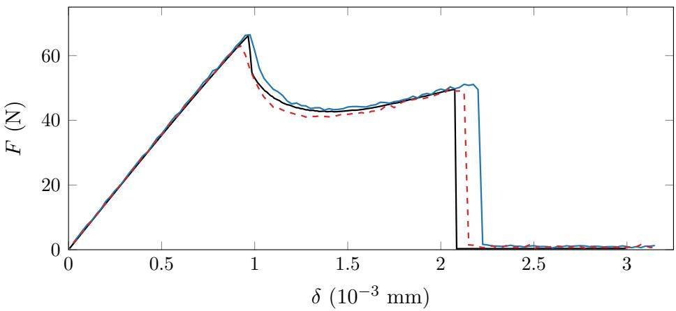  
FEM proposed, second order proposed, fourth order  
Figure 10: Single-edge-notched shear. Load–displacement curves of the second- and fourthorder solutions against the finite element reference.

Fig. 11 shows the corresponding comparison while the crack is running, at $\delta = 1 . 5 2 5 \times$ $1 0 ^ { - 3 }$ mm; displacement and phase field agree with the reference at this intermediate state as well, not only after failure.

The final phase fields are compared in Fig. 12 and the displacement components of the failed state in Fig. 13. The computed path coincides with the reference along its full trajectory, including the curved approach to the bottom edge, the fourth-order band is again the more compact one, and the two parts of the specimen separate across the fully developed band in agreement with the finite element fields.

Since the minimization problem is non-convex and the optimizer is stochastic, the robustness of these results against the network initialization and the sampling sequence is examined by repeating the shear test with four random seeds, all other settings unchanged. All four runs complete the full loading program, produce the single curved crack band, and retain every feature of the response, with a peak load of $6 6 . 3 \pm 0 . 3 \mathrm { N }$ , a softening valley of $4 2 . 6 \pm 1 . 0 \mathrm { N }$ and a second local maximum of $5 0 . 3 { \pm } 1 . 3 \mathrm { N }$ across the ensemble, quoted as mean and sample standard deviation. The ensemble mean lies within 0.1% of the reference peak, inside its own scatter of 0.5%, so the single-run agreement quoted above is representative rather than a fortunate draw; no run is excluded. The same specimen serves as the testbed of Appendix C, where the ingredients of Section 3 are removed or replaced one at a time.

  
(a)

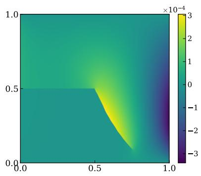  
(b)

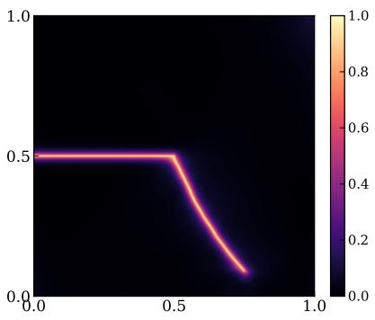  
(c)

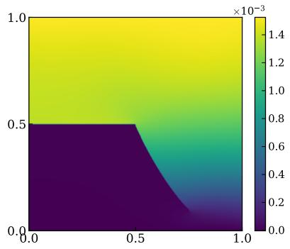  
(d)

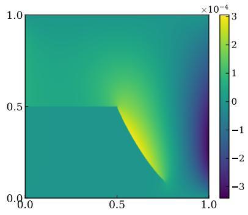  
(e)

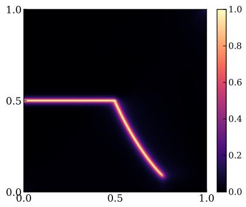  
(f)  
Figure 11: Single-edge-notched shear during propagation, at $\delta = 1 . 5 2 5 \times 1 0 ^ { - 3 } \mathrm { m m }$ . (a)–(c) Displacement components u, v and phase field of the second-order deep energy solution; (d)–(f) the finite element fields at the same load level. Displacements in mm; each displacement component shares one color scale between the two rows.

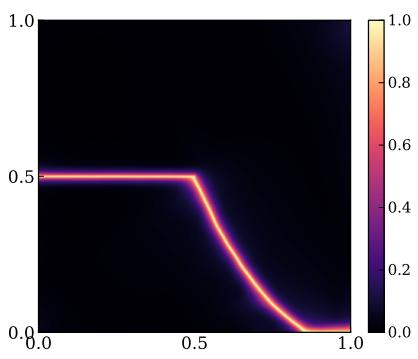  
(a)

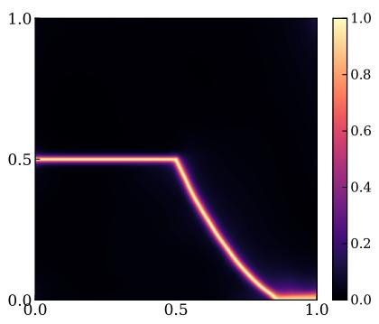  
(b)

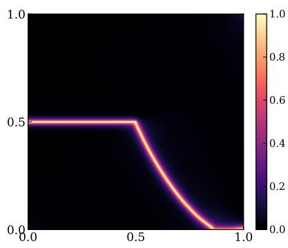  
(c)  
Figure 12: Single-edge-notched shear, final phase fields. (a) Second-order and (b) fourth-order deep energy solutions, (c) finite element reference; all renderings share one color scale.

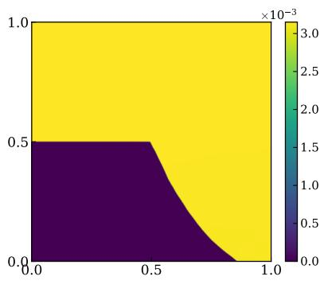  
(a)

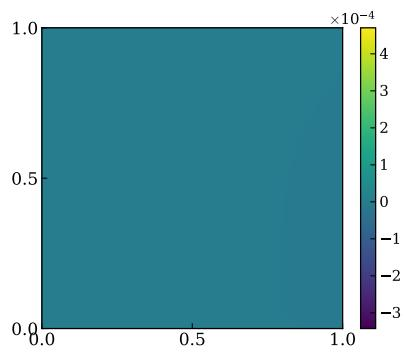  
(b)

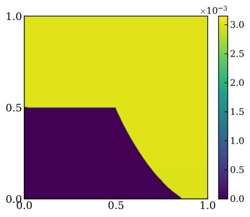  
(c)

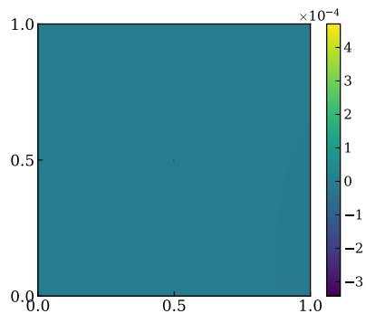  
(d)  
Figure 13: Single-edge-notched shear, displacement components of the failed state in mm. (a),(b) u and v of the second-order deep energy solution; (c),(d) the finite element fields; each component shares one color scale between the two rows.

## 4.2 Crack branching

Branching is the first topology-changing example. The specimen and loading are those of the shear test (Fig. 5b), but the strain energy is left undecomposed, $\psi _ { \mathrm { e } } ^ { + } = \psi _ { \mathrm { e } }$ in Eq. (1), so that damage is driven isotropically, the setting in which fast cracks are known to branch [24]. Branching in the physical sense is a dynamic instability that sets in above a critical crack speed, and a quasi-static analysis does not reproduce it. What the undecomposed energy admits here is a symmetric bifurcation of the incremental minimization, and the comparison below is accordingly made against a finite element solution of the same functional rather than against experiment. Two implementation details from Section 3 matter here. The crack stratum of the mixture of Eq. (35) is replaced by a fixed band that is symmetric about the pre-existing crack, since the adaptive stratum follows the current phase field and would otherwise feed points, and thereby resolution, asymmetrically to whichever branch happens to lead; and the appended-point component supplies fresh points on the newly created branches so that the growing pattern does not dilute the fixed budget.

The crack then leaves the pre-existing tip and splits into a symmetric pair of branches, forming a Y-shaped pattern without any crack tracking, kinking criterion or damage threshold (Fig. 14). The branches curve smoothly apart and arrest near the right edge, and the pattern remains symmetric about the crack plane to within the band width. The load–displacement curve peaks at 59.3 N, about 8% below the finite element reference computed with the same undecomposed energy, and decays over a long tail as the branches extend. The fourth-order run on the same configuration was exploratory, since the higher-order density might plausibly have suppressed the bifurcation; it does not. The fourth-order crack follows a nearly identical Y-shaped path (Fig. 15), with a peak of 57.8 N, so the branching behavior of the functional carries over unchanged. The displacement components of the final state are compared with the finite element fields in Fig. 15d–g.

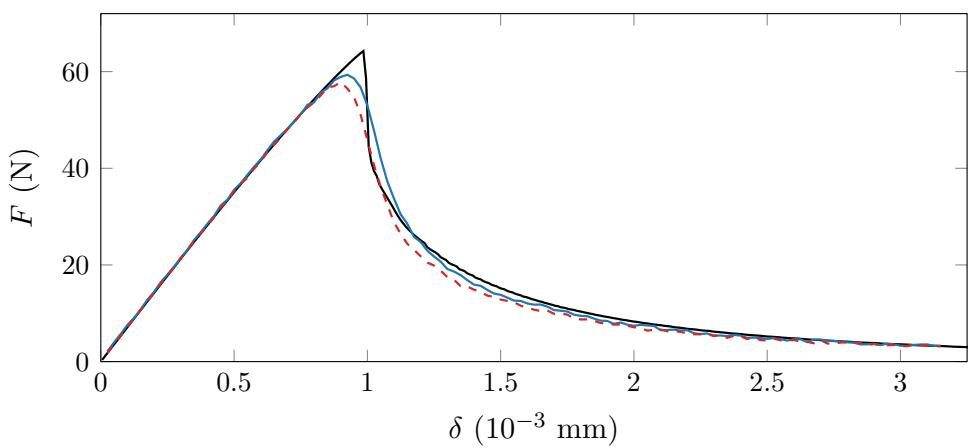  
FEM second order fourth order

(a)  
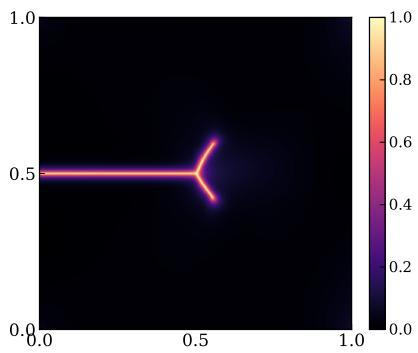  
(b) $\delta = 1 . 0 3 \times 1 0 ^ { - 3 }$ mm

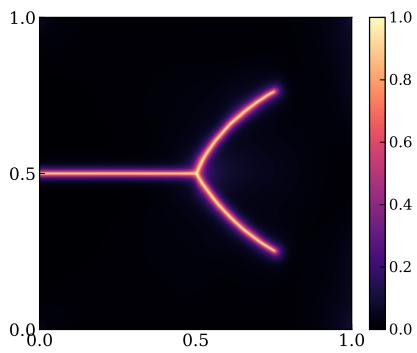  
(c) $\delta = 1 . 5 3 \times 1 0 ^ { - 3 }$ mm  
Figure 14: Crack branching under isotropic driving. (a) Load–displacement curves of the second- and fourth-order solutions against the finite element reference; (b),(c) phase field of the second-order solution at two load levels. The crack splits into a symmetric Y-shaped pattern with no geometric crack description involved at any stage.

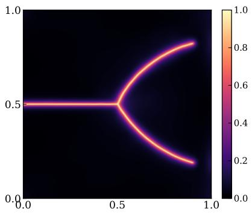  
(a)

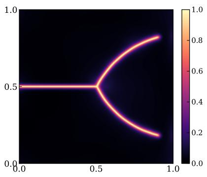  
(b)

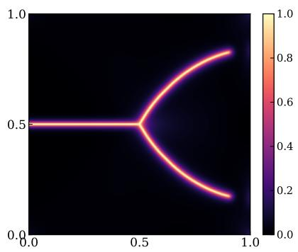  
(c)

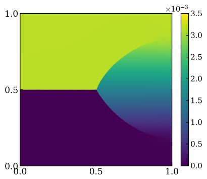  
(d)

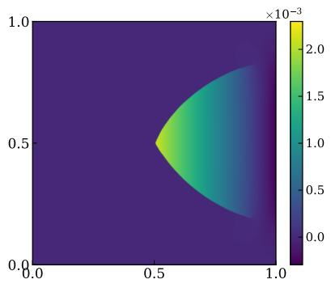

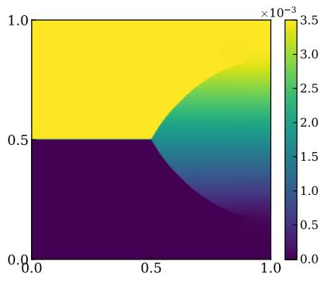  
(f)

(e)  
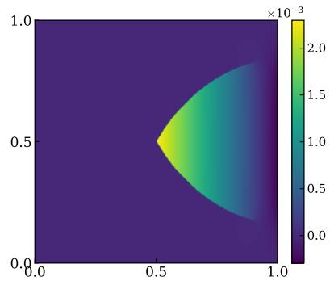  
(g)  
Figure 15: Crack branching, final fields. Phase fields of the (a) second-order and (b) fourth-order deep energy solutions and (c) the finite element reference; the fourth-order solution retains the symmetric Y-shaped pattern. Displacement components in mm, (d),(e) u and v of the secondorder solution and $\mathrm { ( f ) , ( g ) }$ the finite element fields, each component on one color scale shared with its counterpart.

## 4.3 Coalescence of en-echelon cracks

In the second topology example several cracks merge into one, in the arrangement introduced for rock specimens by Zhou et al. [97] and adopted since as a coalescence benchmark [67, 88]. Three parallel pre-existing cracks are arranged en echelon across the specimen, each inclined at $4 5 ^ { \circ }$ , and the specimen is loaded in vertical tension in 100 increments of $1 0 ^ { - 5 }$ mm (Fig. 16).

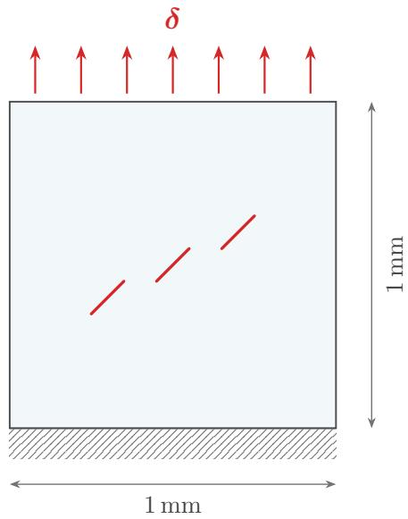  
Figure 16: Coalescence specimen. Three parallel pre-existing cracks of length 0.14 mm, inclined at $4 5 ^ { \circ }$ and arranged en echelon, in the square plate with a fixed bottom edge under vertical tension.

The seeded profile of Eq. (5) takes the minimum distance over the three segments, as described in Section 2.3, and no other ingredient changes. Under load the inner crack tips curve toward one another, link, and form a single staircase crack across the specimen, the linkage pattern reported for this arrangement in the phase-field literature [67, 97] (Fig. 17). The load–displacement curve peaks at 195.4 N at $6 . 4 \times 1 0 ^ { - 4 }$ mm, 5.8% above the finite element reference of 184.8 N at $6 . 1 \times 1 0 ^ { - 4 }$ mm, and drops to complete failure once the outer segments reach the lateral boundaries. The fourth-order run links the cracks along the same staircase (Fig. 18) and peaks at 182.8 N, about 6% below the second-order value and about 1% below the reference. The displacement components of the final state are compared with the finite element fields in Fig. 18d–g.

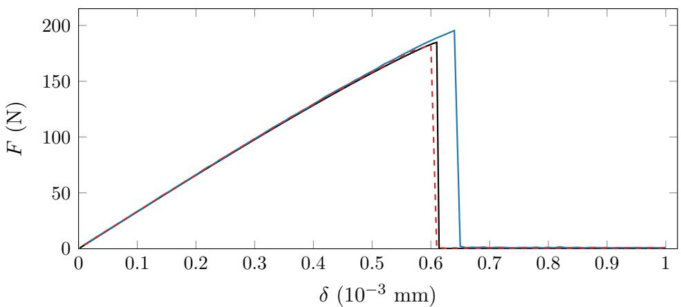  
FEM second order fourth order

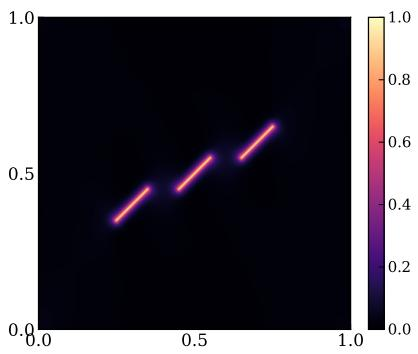  
(b) $\delta = 5 . 1 \times 1 0 ^ { - 4 } \mathrm { m m }$

(a)  
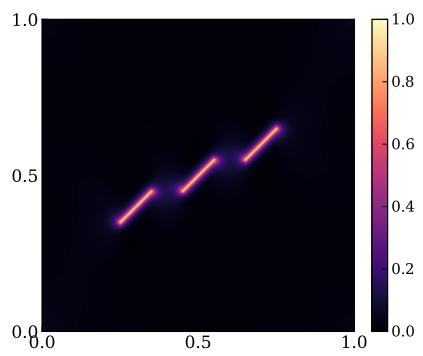  
(c) $\delta = 6 . 1 \times 1 0 ^ { - 4 } \mathrm { m m }$

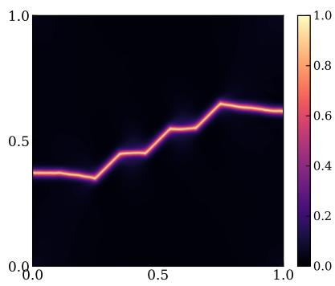  
(d) $\delta = 7 . 1 \times 1 0 ^ { - 4 }$ mm  
Figure 17: Coalescence of three en-echelon pre-existing cracks under tension. (a) Load– displacement curves of the second- and fourth-order solutions against the finite element reference; (b)–(d) phase field of the second-order solution at three load levels. The inner tips curve toward one another, link, and form a single staircase crack, and the multi-segment seeding requires no change to the method.

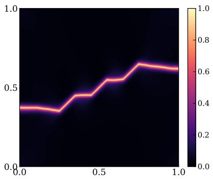  
(a)

  
(b)

  
(c)

  
(d)

  
(f)

(e)  
  
(g)  
Figure 18: Coalescence test, final fields. Phase fields of the (a) second-order and (b) fourthorder deep energy solutions and (c) the finite element reference; both orders link the three cracks along the same staircase. Displacement components in mm, (d),(e) u and v of the second-order solution and $\mathrm { ( f ) , ( g ) }$ the finite element fields, each component on one color scale shared with its counterpart.

## 4.4 Plate with a circular hole

Before any cracking, the computed fields of this example are verified against a closed-form elastic solution, which tests the combination of domain mask, sampling and quadrature; the same specimen then nucleates cracks with no pre-existing crack present.

The specimen is the unit square with a circular hole of radius 0.1 mm at its center, loaded in uniaxial tension along the horizontal axis through a boundary lift of the form of Eq. (23) and shown in Fig. 19. The hole enters the estimator of Eq. (34) as the indicator mask $\chi ,$ with no boundary fitting of any kind. The circular hole admits an exact boundary-fitted NURBS description, and the plate with a hole is among the original examples of isogeometric analysis [41], so the geometry map of Section 3.3 could represent it with no mask at all. The runs keep the identity map nonetheless, since the masked representation is the ingredient under test here; the geometry map itself is exercised by the ring of Section 4.5.

  
Figure 19: Plate with a circular hole. The left edge is fixed, the right edge is pulled horizontally, and the hole is a masked region with no boundary discretization.

Since there is no pre-existing crack, the seeded profile vanishes, $\phi _ { 0 } = 0$ , and the phasefield representation of Eq. (24) reduces to the squashed network output alone. Nucleation is therefore carried entirely by the energy competition, which is a recognized strength of the difuse description [34].

In a first stage the phase field is held at zero, so that minimizing Eq. (1) reduces to the elastic problem alone. The Kirsch solution for an infinite plate gives the hoop stress along the hole edge as $\sigma _ { \theta \theta } ( a , \theta ) = \sigma _ { \infty } ( 1 - 2 \cos 2 \theta )$ , with the stress concentration factor of three at $\theta = \pm 9 0 ^ { \circ }$ and a characteristic radial decay of $\sigma _ { \theta \theta }$ toward the far field [96]. Fig. 20 compares the computed hoop stress against this solution, with all stresses obtained by automatic diferentiation of the converged displacement field and normalized by the far-field stress $\sigma _ { \infty } = 3 4 2 \mathrm { { M P a } , }$ measured on the specimen itself as the mean axial stress over the bulk away from the hole. The infiniteplate reference applies on the finite specimen since the disturbance of the hole decays as $( a / r ) ^ { 2 }$ The outer boundary lies five radii from the center, where that decay leaves a disturbance of 4%, and the compared fields all lie within three radii. The angular profile follows the analytic distribution over the full sweep with a root-mean-square deviation of $0 . 0 9 \sigma _ { \infty }$ , about 3% of the peak value, and the radial decay is reproduced along both the $\theta = 9 0 ^ { \circ }$ and the $\theta = 0 ^ { \circ }$ rays. Near the peaks the computed values slightly exceed the infinite-plate curve, which is consistent with the finite width of the plate, since the hole occupies one fifth of the specimen width. Since this stage involves no fracture, it isolates the ingredients that are new in this example, namely the mask of Section 3.3, the hole-edge sampling and the quadrature of Section 3.5.

With the elastic stage verified, the full model is released. Damage nucleates on the hole edge at $\theta = \pm 9 0 ^ { \circ }$ , precisely where the Kirsch solution concentrates the hoop stress, and grows two symmetric cracks toward the top and bottom edges. There is no closed-form reference for this stage; the verification is one of physical consistency, in that the nucleation site follows the elastic concentration and the load–displacement curve shows a single sharp failure event. The site agrees with the variational cavity study of Tann´e et al. [34], which places nucleation at the points of maximum hoop stress for holes large on the scale of $l ;$ the radius used here is ten l. The peak load is 232.7 N at $\delta = 8 . 0 \times 1 0 ^ { - 4 }$ mm, and the load falls by an order of magnitude in the single increment that follows, to 23.8 N, the specimen carrying nothing thereafter (Fig. 21). The displacement components of the failed state are shown in Fig. 22, where the component along the loading direction jumps across the crack pair while the fields stay smooth elsewhere. A comparable specimen has been treated within an energy-minimizing network formulation before, where a plate with an eccentric hole was loaded in tension and a crack was reported to grow from the hole [68]. Neither a verification of the elastic stage against a closed-form solution nor a quantitative load is reported there, and both are supplied here.

  
(a)

  
(b)  
Figure 20: Plate with a circular hole, elastic stage. (a) Hoop stress on the circle $r = a + 0 . 1 l .$ one tenth of a regularization length outside the hole of radius $^ { a , }$ against the Kirsch solution [96]; (b) radial decay along the $\theta = 9 0 ^ { \circ }$ and $\theta = 0 ^ { \circ }$ rays. In both panels the lines are the analytic solution and the markers are the computed values. The hole is represented by the indicator mask in Eq. (34), with no boundary fitting; stresses are normalized by the measured far-field stress. Small discrepancies from the analytic values are expected, since the Kirsch solution describes an infinite plate and the specimen is finite.

  
(b) $\delta = 7 . 1 \times 1 0 ^ { - 4 } \mathrm { m m }$

(a)  
  
(c) $\delta = 8 . 1 \times 1 0 ^ { - 4 } \mathrm { m m }$

  
(d) $\delta = 8 . 6 \times 1 0 ^ { - 4 }$ mm

Figure 21: Plate with a circular hole, fracture stage. (a) Load–displacement curve; (b)– (d) phase field at three load levels. Damage nucleates at the stress concentration sites at $\theta = \pm 9 0 ^ { \circ }$ , and the two symmetric cracks traverse the specimen within a single load increment of the peak.  
  
(a)

  
(b)  
Figure 22: Plate with a circular hole, displacement components (a) u and (b) v of the failed state, in mm.

## 4.5 Thick-walled ring

The thick-walled ring involves a curved domain. Following Si et al. [39], a ring with inner radius 5 mm and outer radius 20 mm carries two symmetric 3 mm notches on its outer boundary; the upper outer semicircle is pulled vertically, the lower outer semicircle is fixed, and the cracks grow from the notch tips horizontally toward the center. By the symmetry of the set-up, one half of the ring is modeled, with the symmetry conditions imposed on the vertical centerline (Fig. 23).

  
Figure 23: Thick-walled ring, with inner radius 5 mm, outer radius 20 mm and two symmetric notches of length 3 mm at the outer boundary. The upper outer semicircle is pulled vertically, the lower outer semicircle is fixed, and the notches are seeded difusely. By symmetry about the vertical centerline (dash-dotted), one half of the ring is modeled; the computed right half is drawn at full tint, and the field renderings of Fig. 25 show that half.

The domain is represented by a single quadratic NURBS patch of the form of Eq. (31) whose weights reproduce both circles exactly, the solution fields and the encoding live on the parametric square with strains obtained through the pullback of Eq. (32), and the sampler operates in physical measure through the |det J| weight of Eq. (34), all as described in Section 3.3; the patch, its control net and its basis functions are the ones shown in Fig. 2. Every boundary of the specimen is one edge of that patch, and each carries its condition there (Fig. 24). The two straight edges on the symmetry line are the images of $\eta = 0$ and $\eta = 1$ , so the symmetry condition $u = 0$ holds exactly through the envelope of Eq. (23) with v left free, and the inner bore is the image of $\xi = 0$ and is traction free. The outer arc is the image of $\xi = 1$ and carries the prescribed vertical displacement above the notch and the fixed condition below it. This arc is the one boundary in this work that is not treated by the exact construction of Section 3.1. That construction multiplies the network output by an envelope vanishing on the whole Dirichlet boundary and adds a lift carrying the data, which presumes one condition along the edge; here the pulled and the fixed part meet at the interior knot $\begin{array} { r } { \eta = \frac { 1 } { 2 } } \end{array}$ of Fig. 2c, which the map sends to the notched point of the outer boundary, and a lift interpolating both would have to jump there. The two conditions are imposed instead through a quadratic boundary term on $\xi = 1$ of fixed stifness $1 0 ^ { 6 }$ in the nondimensional units of Section 3.1, integrated in physical arc length by the sampling scheme of Section 3.5. The term is admissible in a method that minimizes the energy since it is non-negative, so the total energy stays bounded below and the incremental problem keeps the minimization structure of Eq. (12), with the arc displacement approaching the prescribed data as the stifness grows; a boundary term able to lower the energy would remove that lower bound. The prescribed displacement enters the energy through this term alone, so the reaction force is again the derivative of the minimized energy with respect to $\delta ,$ as in Eq. (18). No boundary-fitted mesh, no multi-patch coupling and no interface terms are involved, which may be contrasted with the multi-patch adaptive scheme of Si et al. [39], where the same geometry is assembled from four quarter-ring patches joined by Nitsche interface terms. The run uses the second-order model with the material data of the reference, $E = 2 1 0 \mathrm { { G P a } }$ $\nu = 0 . 3$ and $G _ { \mathrm { c } } = 2 . 7 \mathrm { k J / m ^ { 2 } }$ , and a regularization length l = 0.2 mm, with the level resolutions scaled to it as in Section 3.2. The crack grows from the notch tip horizontally toward the center, reproducing the path reported in [39], and severs the full ligament down to the inner bore (Fig. 25c). The computed reaction force rises to 3.91 kN at $\delta = 2 . 6 7 \times 1 0 ^ { - 2 }$ mm and then softens over the remaining loading as the crack crosses the wall.

  
(a) Physical patch

  
(b) Parametric domain  
Figure 24: Boundary conditions of the ring on the single NURBS patch. (a) The modeled half in physical space; (b) the parametric domain it is mapped from, drawn with the same colors and conventions. Each boundary of the specimen is one edge of the patch, the symmetry line being the pair of edges $\eta = 0$ and $\eta = 1$ , the traction-free bore $\xi = 0$ , and the outer arc $\xi = 1$ pulled above the notch and fixed below it. The two arc conditions meet at the interior knot $\begin{array} { r } { \eta = \frac { 1 } { 2 } } \end{array}$ , which the map sends to the notched point of the outer boundary.

The displacement components behave as the set-up prescribes. The pulled upper semicircle carries the prescribed vertical displacement, the fixed lower semicircle stays at rest, and both components jump across the severed ligament (Fig. 25a,b).

  
(a)

  
(b)

  
(c)  
Figure 25: Thick-walled ring on a single NURBS patch, final state on the computed half. (a),(b) Displacement components u and v in mm; (c) phase field. The crack grows from the notch tip horizontally toward the center and severs the full wall down to the inner bore, in agreement with the path reported in [39].

## 4.6 Random multi-crack configurations

The examples so far are the standard tests of the phase-field literature. Hamdi and Lejeune have recently argued that these tests no longer separate solvers, and have published a benchmark dataset constructed to be harder [88]. The dataset comprises one thousand random configurations of 10–20 interior cracks in a 2 × 2 mm plate, each solved under biaxial tension and under shear by a staggered finite element scheme on an $8 0 0 \times 8 0 0$ mesh $\left( h = 0 . 2 5 l \right)$ , with one hundred snapshots of the fields and the reaction force stored per run. The dataset provides each configuration under three choices of the driving energy, and the comparisons here use the spectral one. Its relevance here is twofold. First, the physics matches Section 2.2 exactly. Their displacement solve degrades the full isotropic stress and drives the damage with the spectral tensile energy, which is the hybrid formulation adopted here, and the runs of this section take the second-order fracture energy density and the material of their study, $E = 1 0 ^ { 6 } \mathrm { N / m m ^ { 2 } }$ $\nu = 0 . 3 , G _ { \mathrm { c } } = 1 \mathrm { N / m m }$ and $l = 0 . 0 1$ mm. Second, their deep Ritz baseline, which runs the architecture and code of [67], failed on these configurations, producing a diferent crack pattern from every network initialization [88]. Running the proposed method on their data is therefore a stringent external test.

Ten configurations are evaluated under both loading cases, giving twenty runs with identical solver settings, no training data and no per-sample adjustment. They are the first ten of the one thousand the repository publishes, in the order in which it lists them, rather than a selection made here, and they carry between 11 and 17 cracks. The seeded cracks enter through the difuse initial profile of Section 2.3, its width calibrated once against the history-field initialization of the dataset. The phase fields agree at the first stored snapshot, reaching Dice 0.96–0.98 on the pixel grid of the dataset under its own threshold-0.5 metric, so the seeding is faithful and the diferences that develop later come from the computed evolution. In the shear case the dataset imposes $\phi = 0$ on the two constrained edges to suppress boundary fracture; the same condition is imposed here exactly, through a multiplicative envelope on the learnable part of the phase-field representation, in the spirit of the lift of Eq. (23). The loading schedule places one increment on every stored snapshot, one hundred increments of $5 \times 1 0 ^ { - 5 }$ mm on each pulled edge in tension and of $1 0 ^ { - 4 }$ mm in shear. The discretization uses three feature levels $4 8 / 1 9 2 / 7 6 8$ with $M = 1 6 0 0 0 0$ points and 3000 iterations per step. The shear runs widen the irreversibility dead band of Section 2.1 to $\tau = 0 . 0 2$ , which keeps the integration noise accumulated over the long elastic stage of that case from ratcheting the phase field upward. Fig. 26 shows the crack layout and the boundary conditions of configuration 106244.

  
(a)

  
(b)  
Figure 26: Benchmark configuration 106244 (11 seeded cracks) under (a) biaxial tension, where the left and bottom edges are supported by rollers $( u = 0$ and $v = 0$ respectively) and the right and top edges are pulled by the same δ, and (b) shear, where the bottom edge is fixed, the top edge slides horizontally, and both constrained edges carry the $\phi = 0$ condition of the dataset.

Two of the dataset’s own measures are reported for every run, namely the Dice coeficient of the final phase field against the reference on their pixel grid, and a per-crack classification in which a seeded crack counts as active if damage extends beyond its seeded band, evaluated by the same rule on both fields. The classification is the discriminating measure, since in every configuration the reference leaves several seeded cracks dormant while their neighbors grow, link and percolate. The trained surrogates of the dataset are not evaluated on this distinction, and the count is insensitive to the crack-number bias the dataset authors themselves report for the Dice score [88]. Table 2 lists all twenty runs. The computed fields classify 252 of 280 seeded cracks correctly (90.0%, where marking every crack active would attain 67%), with ten of the twenty runs classifying every crack correctly, and reach mean Dice scores of 0.739 in tension and 0.824 in shear. For calibration, the surrogates trained by the dataset authors on 800 solved samples reach Dice 0.680 (UNet) and 0.733 (Fourier neural operator with ensembling) [88]; the numbers reported here are obtained without seeing a single solved sample.

Fig. 27 shows the load–displacement response of configuration 106244, classified correctly for every crack under both loadings, and Figs. 28 and 29 the corresponding final fields. Under tension the computed curve reproduces the sequence of load drops of the reference. The peak of 4418 N at $\delta = 1 . 7 5 \times 1 0 ^ { - 3 }$ mm sits 4.6% above and later than the reference peak of 4223 N at $1 . 6 3 \times 1 0 ^ { - 3 }$ mm, and both curves collapse to below 2% of their peaks by the end of the range. Under shear the computed peak of 1247 N at $\delta = 6 . 5 \times 1 0 ^ { - 3 }$ mm lies 2.6% above the reference peak of 1216 N at $6 . 2 \times 1 0 ^ { - 3 }$ mm. The failure that follows is reproduced, the load declining as the crack network percolates diagonally across the specimen, and the computed curve ends the loading range at 0.45 of its peak against 0.43 for the reference. Compared at the same displacement rather than peak to peak, the two solutions agree closely. At the displacement where the reference attains its peak, the computed force agrees with the reference to within about 0.5% under both loadings. The discrepancy is therefore confined to the onset of failure. The reference advances the load in much finer increments, and the incremental minimization follows the metastable branch until that branch vanishes, so failure occurs later in the computed response. The final phase fields admit a crack-by-crack comparison, in which the same seeds grow, the same seeds stay dormant, and the percolation path is shared; the displacement components decompose into the same near-rigid blocks separated by jumps across the opened cracks.

Table 2: Zero-shot results on all twenty benchmark runs. Dice is computed at the final load step against the reference field with the dataset’s threshold-0.5 metric; the classification column counts seeded cracks whose active/dormant state matches the reference.
<table><tr><td colspan="3"></td><td colspan="3">tension</td></tr><tr><td>configuration</td><td>cracks</td><td>Dice</td><td>correct</td><td>Dice</td><td>correct</td></tr><tr><td>100192</td><td>16</td><td>0.839</td><td>16/16</td><td>0.888</td><td>16/16</td></tr><tr><td>100651</td><td>16</td><td>0.855</td><td>15/16</td><td>0.838</td><td>15/16</td></tr><tr><td>101617</td><td>13</td><td>0.760</td><td>13/13</td><td>0.817</td><td>13/13</td></tr><tr><td>103891</td><td>13</td><td>0.619</td><td>8/13</td><td>0.829</td><td>13/13</td></tr><tr><td>105657</td><td>14</td><td>0.667</td><td>11/14</td><td>0.756</td><td>7/14</td></tr><tr><td>106004</td><td>17</td><td>0.733</td><td>16/17</td><td>0.885</td><td>16/17</td></tr><tr><td>106244</td><td>11</td><td>0.698</td><td>11/11</td><td>0.796</td><td>11/11</td></tr><tr><td>106679</td><td>12</td><td>0.712</td><td>9/12</td><td>0.741</td><td>8/12</td></tr><tr><td>1005939</td><td>15</td><td>0.744</td><td>15/15</td><td>0.826</td><td>13/15</td></tr><tr><td>1077563</td><td>13</td><td>0.767</td><td>13/13</td><td>0.867</td><td>13/13</td></tr><tr><td>mean / total</td><td></td><td>0.739</td><td>127/140</td><td>0.824</td><td>125/140</td></tr></table>

  
(a)

  
(b)  
Figure 27: Load–displacement response of configuration 106244 under (a) biaxial tension, where the plotted force $| F _ { x } | + | F _ { y } |$ is the work conjugate of the common δ, and (b) shear, against the finite element reference of the dataset.

The stability of these results under network initialization is measured on the same configuration. Repeating each loading with four initializations moves the peak load by at most 2.0% in tension and 1.1% in shear, and 87 of the 88 per-crack decisions are identical across the eight runs. No two initializations of the deep Ritz baseline produced the same crack pattern [88]. We attribute the contrast to the resampled estimator of Section 3.5, which leaves no fixed point set for the optimizer to exploit whatever the initialization, although the two methods difer in more than this one ingredient. The curves and fields of all eight runs are collected in Appendix D. In one shear configuration (105657) damage develops along the constrained boundary, the mode the dataset introduced its $\phi = 0$ condition to suppress, since it dominated many of the raw simulations [88]; the reference field of the same configuration exhibits a matching nearboundary band. The crack network of this configuration percolates only beyond the loading range of the dataset, and the classification column of Table 2 counts the shortfall against the method.

  
(a)

  
(b)

  
(c)

  
(d)

  
(e)

  
(f)  
Figure 28: Benchmark configuration 106244 under biaxial tension at the end of the loading range, $\delta = 5 . 0 \times 1 0 ^ { - 3 }$ mm, on the pixel grid of the dataset. (a)–(c) Displacement components $u ,$ v and phase field of the computed solution; (d)–(f) the reference fields. Displacements in mm; each displacement component shares one color scale between the two rows. Eleven of eleven seeded cracks are classified correctly.

  
(a)

  
(b)

  
(c)

  
(d)

  
(e)

  
(f)  
Figure 29: Benchmark configuration 106244 under shear at the end of the loading range, $\delta = 1 . 0 \times 1 0 ^ { - 2 }$ mm, on the pixel grid of the dataset. (a)–(c) Displacement components $u ,$ v and phase field of the computed solution; (d)–(f) the reference fields. Displacements in mm; each displacement component shares one color scale between the two rows. Eleven of eleven seeded cracks are classified correctly.

## 5 Conclusions

We have presented a mesh-free discretization of phase-field modeling of brittle fracture in which one network represents the displacement and phase fields, a multiresolution $C ^ { 1 }$ feature encoding sets the finest resolvable scale, and the incremental energy is minimized directly on integration points that are redrawn at every iteration. The framework treats the second- and the fourthorder fracture energy densities alike, imposes essential boundary conditions exactly through lifts, and reaches curved domains through an exact NURBS map and a domain mask.

On the single-edge-notched benchmarks the computed load–displacement curves agree with staggered finite element references at the same regularization length to within about 1% at the peaks, and they reproduce the softening valley and the second local maximum of the shear response; repeating the shear test over four random seeds moves the peak by 0.5%. Since only the fracture density is exchanged, the fourth-order model runs on the identical discretization at a moderate increase in cost, with no higher-continuity trial space to construct, and it retains the branching bifurcation. Crack branching, the coalescence of en-echelon cracks, nucleation at a circular hole and the thick-walled ring were computed without crack tracking, remeshing or boundary-fitted meshing. The crack patterns follow the reference solutions where these exist, with peak loads within $8 \%$ of the finite element references of the two topology-changing tests. On the public benchmark dataset of Hamdi and Lejeune [88], twenty zero-shot runs on ten random multi-crack configurations of 11 to 17 cracks classify the active or dormant state of 90% of the seeded cracks correctly and reach mean Dice scores of 0.739 in tension and 0.824 in shear, against the 0.680 and 0.733 of the surrogates that the dataset authors trained on eight hundred solved samples, a clear margin under shear and a narrow one under tension; their deep Ritz baseline fails on these configurations. The evidence of Appendix C attributes the behavior of the discretization across these examples to the pairing of the encoding with the per-iteration resampling. Removing either ingredient stops the crack from advancing, whether by holding the integration points fixed or by coarsening the encoding beyond the width of the band, while the method is insensitive to a resolution cap far finer than required and to a redraw interval ten times longer than the one used, so that the requirement on each ingredient is a threshold rather than a narrow window. The alternative strain energy decompositions reproduce documented failure modes.

The scope of the study is limited in several respects. All results are quoted at a fixed regularization length per example, and no claim about the sharp-crack limit is made. The hybrid formulation is not variationally consistent [17], an inconsistency we accept since the spectral decomposition stalls the mode II test on the shear testbed of Appendix C. The corner toughening is a modeling device at the grips rather than a material statement, and the small force plateau after complete severance stems from the same boundary treatment. Essential conditions hold exactly wherever the prescribed data are constant along a patch edge; on the loaded arc of the ring, where two conditions meet on one edge, they are imposed through a boundary term instead. Irreversibility is enforced approximately by a penalty with a fixed weight [23], which held $\phi \geq \phi _ { n - 1 }$ to within the dead band in every run reported here. The computational cost per load increment remains roughly an order of magnitude above that of the finite element references, as measured in Appendix B and consistent with the experience of [67], so the method is not proposed as a faster route to a single quasi-static forward solution. The number of trainable parameters is likewise tied to the resolution rather than to the crack: the feature grids are dense over the whole domain and carry between 87% and 98% of the parameters of a run (Appendix B), although the damage band occupies a small fraction of any of these specimens. A representation that placed its localized capacity only where the phase field is active would remove that tie. Finally, all examples are two-dimensional and quasi-static.

The properties that generate the computational cost, a smooth representation of every field and a quadrature that requires no fixed point set, are also the ones that carry over to coupled multi-field problems. The estimator is indiferent to how many fields the problem has and to whether they are represented by one network or by several, so the subproblems of a staggered solve integrate on one and the same freshly drawn point set, with no interpolation between discretizations of the individual fields. That extension is the subject of ongoing work.

## Code and data availability

The solver, the staggered finite element reference implementation and the scripts reproducing all examples of this paper will be made publicly available upon publication at https://github. com/HannnZH/Meshfree-DEM-PhaseField.

## Acknowledgements

This research was undertaken with the assistance of resources from the National Computational Infrastructure (NCI Australia), an NCRIS enabled capability supported by the Australian Government. All production runs of this paper were computed on the Gadi supercomputer.

# Appendix A Convention map and surface-energy check for the fourth-order model

Borden et al. [36] write the phase field as $c ,$ equal to one in intact material and zero on the crack, and use a length parameter $\ell _ { 0 }$ . In that notation their second- and fourth-order crack surface densities read

$$
\gamma _ { 2 } ^ { \mathrm { B } } = \frac { ( 1 - c ) ^ { 2 } } { 4 \ell _ { 0 } } + \ell _ { 0 } | \nabla c | ^ { 2 } , \qquad \gamma _ { 4 } ^ { \mathrm { B } } = \frac { ( 1 - c ) ^ { 2 } } { 4 \ell _ { 0 } } + \frac { \ell _ { 0 } } { 2 } | \nabla c | ^ { 2 } + \frac { \ell _ { 0 } ^ { 3 } } { 4 } ( \Delta c ) ^ { 2 } .\tag{36}
$$

Substituting $c = 1 - \phi$ and $\ell _ { 0 } = l / 2$ maps $G _ { \mathrm { c } } \gamma _ { 2 } ^ { \mathrm { B } }$ and $G _ { \mathrm { c } } \gamma _ { 4 } ^ { \mathrm { B } }$ term by term onto the fracture energy densities of Eq. (4) and (6), and maps their optimal profiles, $1 - \exp ( - | x | / 2 \ell _ { 0 } )$ and $1 - \exp ( - | x | / \ell _ { 0 } ) ( 1 + | x | / \ell _ { 0 } )$ , onto Eq. (5) and (7). The identification $l = 2 \ell _ { 0 }$ follows from equating the decay lengths of the second-order profiles, since our l is defined as that decay length.

On its own optimal profile, each fracture energy density integrates to exactly $G _ { \mathrm { c } }$ per unit crack length, which is the design property behind the second term of Eq. (1). For the secondorder pair the bulk and gradient terms contribute one half each. For the fourth-order pair, the substitution $t = 2 | x | / l$ in Eq. (7) reduces the three contributions to elementary integrals of $t ^ { k } e ^ { - 2 t }$ , with the result

$$
\int _ { - \infty } ^ { \infty } \frac { G _ { \mathrm { c } } \phi _ { 4 } ^ { 2 } } { 2 l } \mathrm { d } x = \frac { 5 G _ { \mathrm { c } } } { 8 } , \qquad \int _ { - \infty } ^ { \infty } \frac { G _ { \mathrm { c } } l } { 4 } ( \phi _ { 4 } ^ { \prime } ) ^ { 2 } \mathrm { d } x = \frac { G _ { \mathrm { c } } } { 4 } , \qquad \int _ { - \infty } ^ { \infty } \frac { G _ { \mathrm { c } } l ^ { 3 } } { 3 2 } ( \phi _ { 4 } ^ { \prime \prime } ) ^ { 2 } \mathrm { d } x = \frac { G _ { \mathrm { c } } } { 8 } ,\tag{37}
$$

so the bulk, gradient and Laplacian terms carry the surface energy in the ratio $5 : 2 : 1$ and sum to $G _ { \mathrm { c } }$

The implementation is checked against these identities directly. The check solves no boundaryvalue problem; it feeds the closed-form profile through the energy routines of the solver and asks whether the integrals of Eq. (37) come back. The seeded profile and the energy density as implemented in the solver are evaluated on a transverse line through the band, with $\phi ^ { \prime }$ and $\phi ^ { \prime \prime }$ obtained by the same two automatic-diferentiation passes the solver uses in two dimensions, and integrated by the trapezoidal rule on a window of half-width 30l with $4 \times 1 0 ^ { 5 }$ points. With $l = 0 . 0 1$ and the material value $G _ { \mathrm { c } } = 0 . 0 4 2 4 7$ used in the examples, both models return a surface energy of 0.042467 per unit crack length, an error of −0.007%, and the fourth-order term integrals evaluate to 0.026544, 0.010617 and 0.005306 against the values $5 G _ { \mathrm { c } } / 8 = 0 . 0 2 6 5 4 4$ $G _ { \mathrm { c } } / 4 = 0 . 0 1 0 6 1 8$ and $G _ { \mathrm { c } } / 8 = 0 . 0 0 5 3 0 9$ from Eq. (37). The residual comes from quadrature near the band center, where the transverse profile is only piecewise smooth, and is orders of magnitude below any efect discussed in the paper. The check is reproduced by the script tests/verify profile.py distributed with the code.

## Appendix B Hyperparameters

Every production run of Section 4 was computed on a single NVIDIA V100 GPU with 12 CPU cores on the Gadi system of the National Computational Infrastructure, Australia. Under the schedules of Section 3.7 the second-order runs complete in 3.8 hours for the tension test, 6.2 for shear, 6.0 for branching, 5.2 for coalescence, 4.3 for the plate with a hole and 6.6 for the ring. The fourth-order runs on identical discretizations cost 1.4 to 1.6 times as much as their second-order counterparts, since only the additional derivative pass of Section 3.4 separates them. That figure is the ratio of complete runs and is therefore larger than the 1.3 quoted per iteration in Section 3.4, which times the iteration alone. Table 3 lists the discretization and training parameters of every run.

At the width and depth used throughout, the perceptron of Section 3.1 carries 51 075 trainable parameters. The three feature grids add a further 329 728 on the unit-square specimens, 1 257 984 on the multi-crack configurations and 2 236 416 on the ring, so that the totals are 380 803, 1 309 059 and 2 287 491 respectively. The count is therefore set by the encoding rather than by the network, and it measures the resolution made available rather than the complexity of the solution: the two-level variant of Appendix C reproduces the shear response on 85 635 parameters in all.

The remaining parameters are shared by every run reported here. The irreversibility penalty of Eq. (11) uses $\gamma _ { \mathrm { i r } } = 1 0 ^ { 3 }$ with a dead band $\tau = 0$ , raised to $\tau = 0 . 0 2$ for the multi-crack shear runs alone, and the residual stifness of Eq. (3) is $\kappa = 1 0 ^ { - 6 }$ . The displacement scale is $U _ { \mathrm { r e f } } =$ $1 0 ^ { - 3 }$ mm on the unit-square specimens, $5 \times 1 0 ^ { - 3 }$ and $1 0 ^ { - 2 }$ mm on the multi-crack configurations under tension and shear, equal to their final prescribed displacements, and $3 . 3 \times 1 0 ^ { - 2 }$ mm on the ring. The sampling mixture of Eq. (35) carries the weights $w _ { \mathrm { u } } = 0 . 4 , w _ { \mathrm { c } } = w _ { \mathrm { p } } = 0 . 3$ , with $\eta _ { \mathrm { d } } = 0 . 3$ and $\beta _ { \mathrm { d } } = 0 . 5$ in the process-zone stratum and an auxiliary grid of $2 5 6 ^ { 2 }$ cells for the piecewise-constant densities, $5 1 2 ^ { 2 }$ on the multi-crack configurations, whose domain has twice the side length; the points are redrawn at every iteration, $n _ { \mathrm { r } } = 1$ . The corner toughening of Eq. (20) decays over three l. Iterations stop when the relative range of the estimated energy over a trailing window of 400 iterations falls below $2 \times 1 0 ^ { - 4 }$ , or when the budget of Table 3 is exhausted. No weight regularization is applied to the network, and the penalty on the squared feature amplitudes of Section 3.2 carries the coeficient $1 0 ^ { - 8 }$ in every run.

The staggered finite element references ran on four CPU cores of the same system and completed in 5.1 hours for tension, shear and branching and 1.4 hours for coalescence, while resolving the loading with far finer increments, 500 to 800 steps against the 80 to 126 of the deep energy runs. Per load increment the finite element solver is therefore roughly an order of magnitude cheaper, on far more modest hardware, and no claim is made that the method competes with a mature finite element implementation on the cost of a single forward solution; a comparable observation is reported for the deep Ritz approach of [67], a systematic comparison across several linear and nonlinear equations found the finite element method faster at equal or better accuracy in every case examined [92], and a recent survey of the field reaches the same conclusion [78]. On the benchmark of Section 4.6 the production runs of Table 3 cost about 34 hours each on the V100, against 2.9 to 5.4 hours for the reference solutions distributed with the dataset, computed on sixteen CPU cores, and about 24 hours reported for the deep Ritz baseline on the same class of GPU [88]. The two network solvers are thus of the same order in price, and what separates them is the solutions they return.

Table 3: Discretization and training parameters of the production runs. All runs share the network of Section 3.1, four hidden layers of width 128, the learning rates $5 \times 1 0 ^ { - 4 }$ for the network and $2 \times 1 0 ^ { - 3 }$ for the feature grids, and two feature channels per level; the fourth-order runs use the discretization of their second-order counterparts unchanged. The corner toughening of Eq. (20) is active in the plate with a hole and in the single-edge-notched, branching and coalescence specimens; it is not needed for the ring, and the multi-crack runs use none.
<table><tr><td>Example</td><td>split</td><td>levels</td><td>M</td><td>steps</td><td> $\Delta \delta \ ( \mathrm { m m } )$ </td><td>iterations</td></tr><tr><td>SEN tension</td><td>hybrid</td><td>32/128/384</td><td>12000</td><td>80</td><td> $1 . 0 \times 1 0 ^ { - 5 }$ </td><td>2000 (4000 cold)</td></tr><tr><td>SEN shear</td><td>hybrid</td><td>32/128/384</td><td>12000</td><td>126</td><td> $2 . 5 \times 1 0 ^ { - 5 }$ </td><td>2000 (4000 cold)</td></tr><tr><td>branching</td><td>isotropic</td><td>32/128/384</td><td>12000</td><td>126</td><td> $2 . 5 \times 1 0 ^ { - 5 }$ </td><td>2000 (4000 cold)</td></tr><tr><td>coalescence</td><td>hybrid</td><td>32/128/384</td><td>12000</td><td>100</td><td> $1 . 0 \times 1 0 ^ { - 5 }$ </td><td>2000 (4000 cold)</td></tr><tr><td>plate with a hole</td><td>hybrid</td><td>32/128/384</td><td>12000</td><td>110</td><td> $1 . 0 \times 1 0 ^ { - 5 }$ </td><td>1500 (3000 cold)</td></tr><tr><td>ring</td><td>hybrid</td><td>64/256/1024</td><td>18000</td><td>120</td><td> $3 . 0 \times 1 0 ^ { - 4 }$ </td><td>1500 (3000 cold)</td></tr><tr><td>multi-crack tension (×10)</td><td>hybrid</td><td>48/192/768</td><td>160000</td><td>100</td><td> $5 . 0 \times 1 0 ^ { - 5 }$ </td><td>3000</td></tr><tr><td>multi-crack shear (×10)</td><td>hybrid</td><td>48/192/768</td><td>160000</td><td>100</td><td> $1 . 0 \times 1 0 ^ { - 4 }$ </td><td>3000</td></tr></table>

## Appendix C Failure modes of alternative configurations

The main text presents the proposed method of Section 3 in its production configuration. During its development a number of alternatives that appear plausible a priori were examined on the shear test of Section 4.1.2, one ingredient changed at a time with everything else held fixed. The alternatives that fail reproduce failure modes that the phase-field or deep-Ritz literature documents, and the variations around the production setting measure the range each ingredient tolerates. To keep the cost of the sweep moderate, the runs use a shortened loading program of 24 increments of $5 \times 1 0 ^ { - 5 }$ mm, which drives the specimen past its peak; under this program the production configuration peaks at 68.0 N and fails across the ligament, consistent with Section 4.1.2 once the coarser increments are taken into account. The load–displacement curves of the sampling-related runs are compared in Fig. 31 and their final phase fields are collected in Fig. 32; the fields of the rejected alternatives are collected in Fig. 33.

## C.1 Reuse of the integration points

In the first run of this group the integration points of Eq. (34) are drawn once at the beginning of every load step and held fixed through all of its iterations, instead of being redrawn every iteration from the mixture of Eq. (35). The optimizer still lowers the estimated energy at every step, but the reaction force climbs monotonically to 161.5 N at $\delta = 1 . 2 \times 1 0 ^ { - 3 }$ mm, more than twice the production peak, and no failure event occurs (Fig. 31b). The final phase field (Fig. 33a) shows the state behind this curve. The seeded band has degenerated into a ragged patch of speckled damage, values near one alternate with intact material at the scale of the finest encoding level, and no crack has propagated. Since the force of Eq. (18) is evaluated on freshly drawn points, the climb is a genuine property of the converged fields and not an artifact of the estimator being read at its own sample.

The cause is the pairing argument of Section 3.6. With the point set fixed, the finest encoding levels can lower the estimated energy by deteriorating between the points, where the estimator cannot see the fields, and the descent of the estimate decouples from the descent of the energy. The remedy is the per-iteration resampling of the production configuration; restoring it and changing nothing else returns the response to its 68.0 N peak and complete failure.

The energy recorded during training makes the decoupling directly visible (Fig. 30). In the frozen run the estimate falls by about two orders of magnitude over the iterations of a load step, a median factor of 74, and the redraw that opens the next step undoes that descent completely, a median factor of 81 and as much as 218. What falls within a step is therefore not the energy but the discrepancy between the fields and one particular point set, and a fresh set recovers it in full. Across the same step boundaries the production run rises by a median factor of 1.06, which is the load increment itself, since a set that is never reused leaves nothing for the next draw to expose. The first step shows the mechanism in its purest form. The frozen run closes it a quarter below the production estimate, on fields that are the worse of the two, and the first redraw raises that estimate by a factor of 102.

The failure is therefore not a statement about the accuracy of one integration rule against another. What the fixed set ofers the optimizer is the opportunity to place error where the estimate cannot register it, and a fixed rule of any construction, Gauss included, ofers the same opportunity to a representation fine enough to exploit it. This is visible in the interval between redraws. Repeating the run with the points held for $n _ { \mathrm { r } } = 1 0$ iterations rather than one leaves the response unchanged, at a peak of 68.7 N and a complete failure, although the estimate then sees ten times fewer distinct points over the load step. Holding them for 100 iterations already removes the failure event, at 73.0 N, and for 500 iterations the reaction reaches 127.4 N with the seeded band visibly speckled, so that the frozen run above is the end of a continuous progression rather than an isolated case (Fig. 31b; the fields are collected in Fig. 32c–e). What the estimator requires is thus not a large number of points but a point set that no representation can learn, and ten iterations of reuse are short enough to keep it so.

  
(a)

redrawn at every iteration  
  
(b)  
Figure 30: Estimated total energy during training, over the whole loading program of the shear testbed. The abscissa is the load step, the iterations of a step filling the unit interval that follows it, so that one tooth of a trace is one load step. The two runs difer in the interval between redraws of the integration points and in nothing else. (a) One point set serves a whole load step. Within the step the estimate falls by about two orders of magnitude, and the redraw at the next integer returns it above its starting value, so that the descent measures the agreement between the fields and that one point set rather than the energy. (b) The production configuration, in which the points are redrawn at every iteration. The estimate follows the load and carries no such structure, its rise across a step boundary being the load increment. The vertical scales difer: (a) is logarithmic over three decades, (b) is linear over a factor of three.

## C.2 Resolution of the encoding

The second ingredient of the pairing was varied in the same way, with the resampling left active throughout and the point budget unchanged. Raising the finest level from 384 to 1536, a cap four times finer than the regularization length requires, leaves the response essentially unafected, with a peak of 71.0 N, the same crack path and the same failure event. Lowering it in the other direction, to the two levels 32/128 and a spacing of $h = 0 . 7 9 l$ , still reproduces the response, at 65.9 N, within 3.1% of the production peak, and still fails across the ligament (Fig. 32a).

A single level of resolution 4, which places h at 50l and leaves the representation with no capacity to localize anything on the scale of the band, behaves diferently. The crack does not advance at all. The seeded profile remains where it was placed, the region beyond its tip carries only a faint difuse damage, and the reaction climbs to 82.0 N at the final increment without a failure event (Figs. 31a and 32b). The resampling alone therefore does not carry the method either.

Taken together the two subsections bracket the pairing of Section 3.6 from both sides. Neither ingredient sufices alone, since removing either one of them stops the crack from propagating, and the requirement on each is a threshold rather than a narrow window, since a cap four times finer and a cap three times coarser than the production value both reproduce the response, and a redraw interval ten times longer does the same. The choice of the level resolutions and of $n _ { \mathrm { r } }$ is accordingly not a delicate one, provided the band is representable and the point set is not reused for long.

## C.3 Spectral decomposition under shear

Selecting the driving energy by the spectral decomposition of Eq. (13) instead of the hybrid formulation stalls the mode II test. The crack never leaves the seeded tip (Fig. 33b), and the reaction climbs monotonically to 104.8 N at $\delta = 1 . 2 \times 1 0 ^ { - 3 }$ mm with no failure event.

The origin of the stall is kinematic. In pure shear the principal strains come in opposite pairs and only the tensile one enters the driving part, so the band receives about half of the available driving force, too little to advance at the loads the test reaches. The dificulty of the mode II test under spectral-type driving is a known observation [17], and the discretization reproduces it faithfully; the formulation, not the solver, is what stalls.

## C.4 Corner damage under the volumetric–deviatoric decomposition

The volumetric–deviatoric decomposition of Eq. (14) was probed on a longer program of 36 increments of $5 \times 1 0 ^ { - 5 }$ mm with the corner toughening of Eq. (20) switched of. The crack itself behaves correctly, with a peak of 64.4 N and full severance of the ligament by $\delta = 1 . 8 \times 1 0 ^ { - 3 }$ mm, but the fixed-edge corner accumulates damage to values near one (Fig. 33c), a spurious zone with no counterpart in the reference solution.

The damage traces back to the shear-rich stress concentration at the corner of the fixed edge. Under this decomposition all deviatoric deformation drives damage, the corner concentration supplies it in abundance, and a discretization that resolves l everywhere cannot ignore it. As a control, the hybrid formulation of Eq. (17) was run on the identical program, also without the toughening, and shows a clean single band with no corner damage (Fig. 33d), a peak of 68.5 N, and a reaction of 47.4 N at the final displacement, in line with the production run of Section 4.1.2 at the same load level. The corner toughening is therefore required under the volumetric–deviatoric decomposition and acts as a safeguard under the hybrid one; the production configuration applies it in both cases.

  
(a)

  
(b)  
Figure 31: Load–displacement curves of the sampling-related runs on the shear testbed, under the shortened loading program, with the two ingredients of the pairing varied one at a time. (a) The resolution cap, at a fixed point budget and with the points redrawn at every iteration. A cap four times finer than the production one and a cap three times coarser both reproduce the response, while a single grid too coarse to represent the band leaves the reaction climbing with no fracture. (b) The interval $n _ { \mathrm { r } }$ between redraws, at the production resolution. Redrawing every ten iterations is indistinguishable from redrawing at every one, and beyond that the response degrades continuously toward the frozen limit, in which one point set serves a whole load step.

  
(a)

  
(b)

  
(c)

  
(d)

  
(e)  
Figure 32: Final phase fields behind the curves of Fig. 31, at $\delta = 1 . 2 \times 1 0 ^ { - 3 }$ mm. Top row, the resolution of the encoding: (a) with the finest level removed, $h = 0 . 7 9 l$ , the crack still leaves the notch, kinks and crosses the ligament; (b) on a single coarse grid, $h = 5 0 l$ , the seeded profile has not advanced and only a faint difuse damage sits past its tip. Bottom row, the interval between redraws: (c) at $n _ { \mathrm { r } } = 1 0$ the crack is indistinguishable from the production one; (d) at $n _ { \mathrm { r } } = 1 0 0$ the notch has not propagated; (e) at $n _ { \mathrm { r } } = 5 0 0$ the seeded band itself has broken into speckle at the scale of the finest encoding level, the state the frozen run of Fig. 33a reaches in full.

  
(a)

  
(b)

  
(c)

  
(d)  
Figure 33: Final phase fields of the rejected configurations on the shear testbed. (a) Frozen integration points at $\delta = 1 . 2 \times 1 0 ^ { - 3 }$ mm, speckled damage and no propagation; (b) spectral decomposition at the same displacement, band stalled at the seeded tip; (c) volumetric–deviatoric decomposition without corner toughening at $\delta = 1 . 8 \times 1 0 ^ { - 3 }$ mm, spurious damage at the fixededge corner; (d) hybrid formulation on the identical program, clean band and intact corners.

## Appendix D Seed ensembles of the random multi-crack configurations

The deep Ritz baseline of the benchmark dataset produced a diferent crack pattern from every network initialization [88]. Section 4.6 states the summary statistics of the corresponding test of the proposed method, four random seeds under each loading of configuration 106244; this appendix collects the curves and fields behind those numbers. Fig. 34 overlays the load– displacement curves of the eight runs on the reference solutions, with the peaks spread over 2.0% in tension and 1.1% in shear. Figs. 35 and 36 show the displacement components and the phase field of every run at the end of the loading range, each column on one color scale shared by the four runs. The four solutions of each case are indistinguishable at the scale of the figures apart from one short band under tension, which carries the single difering per-crack decision of the ensemble. That seeded crack is activated in one of the four runs, as it is in the reference, and stays dormant in the other three, while the crack pattern is otherwise unchanged.

  
(a)

  
(b)  
reference seed 0 seed 1 seed 2 seed 3  
Figure 34: Load–displacement curves of the four random seeds of configuration 106244 under (a) biaxial tension and (b) shear, overlaid on the finite element reference of the dataset.

  
(a)

  
(b)

  
(c)

  
(d)

(e)  

  
(g)  
(h)

(f)  

  
(j)

(i)  
  
(k)

  
(l)  
Figure 35: Seed ensemble of configuration 106244 under biaxial tension at the end of the loading range. Rows show the four random seeds; columns show the displacement components u and v in mm and the phase field, each column on one color scale shared by the four runs.

  
(a)

  
(c)

(b)  

(d)  
(e)  

(f)  
  
(g)  
(h)

  
(i)

  
(j)

  
(k)

  
(l)  
Figure 36: Seed ensemble of configuration 106244 under shear at the end of the loading range, in the arrangement of Fig. 35.

## References

[1] A. A. Grifith. The phenomena of rupture and flow in solids. Philosophical Transactions of the Royal Society of London A, 221:163–198, 1921.

[2] G. R. Irwin. Analysis of stresses and strains near the end of a crack traversing a plate. Journal of Applied Mechanics, 24:361–364, 1957.

[3] T. N. Bittencourt, P. A. Wawrzynek, A. R. Ingrafea, and J. L. Sousa. Quasi-automatic simulation of crack propagation for 2D LEFM problems. Engineering Fracture Mechanics, 55(2):321–334, 1996.

[4] X.-P. Xu and A. Needleman. Numerical simulations of fast crack growth in brittle solids. Journal of the Mechanics and Physics of Solids, 42(9):1397–1434, 1994.

[5] N. Mo¨es, J. Dolbow, and T. Belytschko. A finite element method for crack growth without remeshing. International Journal for Numerical Methods in Engineering, 46(1):131–150, 1999.

[6] T. Belytschko, Y. Y. Lu, and L. Gu. Element-free Galerkin methods. International Journal for Numerical Methods in Engineering, 37(2):229–256, 1994.

[7] T. Rabczuk and T. Belytschko. Cracking particles: A simplified meshfree method for arbitrary evolving cracks. International Journal for Numerical Methods in Engineering, 61(13):2316–2343, 2004.

[8] G. A. Francfort and J.-J. Marigo. Revisiting brittle fracture as an energy minimization problem. Journal of the Mechanics and Physics of Solids, 46(8):1319–1342, 1998.

[9] B. Bourdin, G. A. Francfort, and J.-J. Marigo. Numerical experiments in revisited brittle fracture. Journal of the Mechanics and Physics of Solids, 48(4):797–826, 2000.

[10] B. Bourdin, G. A. Francfort, and J.-J. Marigo. The variational approach to fracture. Journal of Elasticity, 91(1–3):5–148, 2008.

[11] L. Ambrosio and V. M. Tortorelli. Approximation of functionals depending on jumps by elliptic functionals via Γ-convergence. Communications on Pure and Applied Mathematics, 43(8):999–1036, 1990.

[12] C. Miehe, F. Welschinger, and M. Hofacker. Thermodynamically consistent phase-field models of fracture: variational principles and multi-field FE implementations. International Journal for Numerical Methods in Engineering, 83(10):1273–1311, 2010.

[13] C. Miehe, M. Hofacker, and F. Welschinger. A phase field model for rate-independent crack propagation: robust algorithmic implementation based on operator splits. Computer Methods in Applied Mechanics and Engineering, 199(45–48):2765–2778, 2010.

[14] C. Kuhn and R. M¨uller. A continuum phase field model for fracture. Engineering Fracture Mechanics, 77(18):3625–3634, 2010.

[15] H. Amor, J.-J. Marigo, and C. Maurini. Regularized formulation of the variational brittle fracture with unilateral contact: numerical experiments. Journal of the Mechanics and Physics of Solids, 57(8):1209–1229, 2009.

[16] F. Freddi and G. Royer-Carfagni. Regularized variational theories of fracture: A unified approach. Journal of the Mechanics and Physics of Solids, 58(8):1154–1174, 2010.

[17] M. Ambati, T. Gerasimov, and L. De Lorenzis. A review on phase-field models of brittle fracture and a new fast hybrid formulation. Computational Mechanics, 55(2):383–405, 2015.

[18] F. Vicentini, C. Zolesi, P. Carrara, C. Maurini, and L. De Lorenzis. On the energy decomposition in variational phase-field models for brittle fracture under multi-axial stress states. International Journal of Fracture, 247(3):291–317, 2024.

[19] K. Pham, H. Amor, J.-J. Marigo, and C. Maurini. Gradient damage models and their use to approximate brittle fracture. International Journal of Damage Mechanics, 20(4): 618–652, 2011.

[20] J.-Y. Wu. A unified phase-field theory for the mechanics of damage and quasi-brittle failure. Journal of the Mechanics and Physics of Solids, 103:72–99, 2017.

[21] T. Gerasimov and L. De Lorenzis. A line search assisted monolithic approach for phase-field computing of brittle fracture. Computer Methods in Applied Mechanics and Engineering, 312:276–303, 2016.

[22] T. Heister, M. F. Wheeler, and T. Wick. A primal-dual active set method and predictorcorrector mesh adaptivity for computing fracture propagation using a phase-field approach. Computer Methods in Applied Mechanics and Engineering, 290:466–495, 2015.

[23] T. Gerasimov and L. De Lorenzis. On penalization in variational phase-field models of brittle fracture. Computer Methods in Applied Mechanics and Engineering, 354:990–1026, 2019.

[24] M. J. Borden, C. V. Verhoosel, M. A. Scott, T. J. R. Hughes, and C. M. Landis. A phasefield description of dynamic brittle fracture. Computer Methods in Applied Mechanics and Engineering, 217–220:77–95, 2012.

[25] M. Ambati, T. Gerasimov, and L. De Lorenzis. Phase-field modeling of ductile fracture. Computational Mechanics, 55(5):1017–1040, 2015.

[26] P. Carrara, M. Ambati, R. Alessi, and L. De Lorenzis. A framework to model the fatigue behavior of brittle materials based on a variational phase-field approach. Computer Methods in Applied Mechanics and Engineering, 361:112731, 2020.

[27] E. Mart´ınez-Pa˜neda, A. Golahmar, and C. F. Niordson. A phase field formulation for hydrogen assisted cracking. Computer Methods in Applied Mechanics and Engineering, 342:742–761, 2018.

[28] P. Sicsic, J.-J. Marigo, and C. Maurini. Initiation of a periodic array of cracks in the thermal shock problem: A gradient damage modeling. Journal of the Mechanics and Physics of Solids, 63:256–284, 2014.

[29] B. Bourdin, J.-J. Marigo, C. Maurini, and P. Sicsic. Morphogenesis and propagation of complex cracks induced by thermal shocks. Physical Review Letters, 112(1):014301, 2014.

[30] C. Miehe, L.-M. Sch¨anzel, and H. Ulmer. Phase field modeling of fracture in multi-physics problems. Part I. Balance of crack surface and failure criteria for brittle crack propagation in thermo-elastic solids. Computer Methods in Applied Mechanics and Engineering, 294: 449–485, 2015.

[31] R. G. Tangella, P. Kumbhar, and R. K. Annabattula. Hybrid phase-field modeling of thermo-elastic crack propagation. International Journal for Computational Methods in Engineering Science and Mechanics, 23(1):29–44, 2022.

[32] J.-Y. Wu, V. P. Nguyen, C. T. Nguyen, D. Sutula, S. Sinaie, and S. P. A. Bordas. Phasefield modeling of fracture. Advances in Applied Mechanics, 53:1–183, 2020.

[33] P. Li, W. Li, B. Li, S. Yang, Y. Shen, Q. Wang, and K. Zhou. A review on phase field models for fracture and fatigue. Engineering Fracture Mechanics, 289:109419, 2023.

[34] E. Tann´e, T. Li, B. Bourdin, J.-J. Marigo, and C. Maurini. Crack nucleation in variational phase-field models of brittle fracture. Journal of the Mechanics and Physics of Solids, 110: 80–99, 2018.

[35] A. Kumar, B. Bourdin, G. A. Francfort, and O. Lopez-Pamies. Revisiting nucleation in the phase-field approach to brittle fracture. Journal of the Mechanics and Physics of Solids, 142:104027, 2020.

[36] M. J. Borden, T. J. R. Hughes, C. M. Landis, and C. V. Verhoosel. A higher-order phasefield model for brittle fracture: formulation and analysis within the isogeometric analysis framework. Computer Methods in Applied Mechanics and Engineering, 273:100–118, 2014.

[37] H. G´omez, V. M. Calo, Y. Bazilevs, and T. J. R. Hughes. Isogeometric analysis of the Cahn–Hilliard phase-field model. Computer Methods in Applied Mechanics and Engineering, 197:4333–4352, 2008.

[38] M. Artina, M. Fornasier, S. Micheletti, and S. Perotto. Anisotropic mesh adaptation for crack detection in brittle materials. SIAM Journal on Scientific Computing, 37(4): B633–B659, 2015.

[39] Z. Si, T. Yu, Y. Li, and S. Natarajan. Adaptive multi-patch isogeometric phase-field method for quasi-static brittle fracture based on Nitsche’s method. Computer Methods in Applied Mechanics and Engineering, 414:116154, 2023.

[40] S. Goswami, C. Anitescu, and T. Rabczuk. Adaptive fourth-order phase field analysis using deep energy minimization. Theoretical and Applied Fracture Mechanics, 107:102527, 2020.

[41] T. J. R. Hughes, J. A. Cottrell, and Y. Bazilevs. Isogeometric analysis: CAD, finite elements, NURBS, exact geometry and mesh refinement. Computer Methods in Applied Mechanics and Engineering, 194(39–41):4135–4195, 2005.

[42] J. A. Cottrell, T. J. R. Hughes, and Y. Bazilevs. Isogeometric Analysis: Toward Integration of CAD and FEA. John Wiley & Sons, Chichester, 2009.

[43] M. Ruess, D. Schillinger, A. Ozcan, and E. Rank. Weak coupling for isogeometric analy- ¨ sis of non-matching and trimmed multi-patch geometries. Computer Methods in Applied Mechanics and Engineering, 269:46–71, 2014.

[44] I. E. Lagaris, A. Likas, and D. I. Fotiadis. Artificial neural networks for solving ordinary and partial diferential equations. IEEE Transactions on Neural Networks, 9(5):987–1000, 1998.

[45] J. Berg and K. Nystr¨om. A unified deep artificial neural network approach to partial diferential equations in complex geometries. Neurocomputing, 317:28–41, 2018.

[46] M. Raissi, P. Perdikaris, and G. E. Karniadakis. Physics-informed neural networks: a deep learning framework for solving forward and inverse problems involving nonlinear partial diferential equations. Journal of Computational Physics, 378:686–707, 2019.

[47] G. E. Karniadakis, I. G. Kevrekidis, L. Lu, P. Perdikaris, S. Wang, and L. Yang. Physicsinformed machine learning. Nature Reviews Physics, 3:422–440, 2021.

[48] L. Lu, X. Meng, Z. Mao, and G. E. Karniadakis. DeepXDE: a deep learning library for solving diferential equations. SIAM Review, 63(1):208–228, 2021.

[49] E. Haghighat, M. Raissi, A. Moure, H. Gomez, and R. Juanes. A physics-informed deep learning framework for inversion and surrogate modeling in solid mechanics. Computer Methods in Applied Mechanics and Engineering, 379:113741, 2021.

[50] W. E and B. Yu. The deep Ritz method: a deep learning-based numerical algorithm for solving variational problems. Communications in Mathematics and Statistics, 6(1):1–12, 2018.

[51] J. Sirignano and K. Spiliopoulos. DGM: A deep learning algorithm for solving partial diferential equations. Journal of Computational Physics, 375:1339–1364, 2018.

[52] E. Samaniego, C. Anitescu, S. Goswami, V. M. Nguyen-Thanh, H. Guo, K. Hamdia, X. Zhuang, and T. Rabczuk. An energy approach to the solution of partial diferential equations in computational mechanics via machine learning: concepts, implementation and applications. Computer Methods in Applied Mechanics and Engineering, 362:112790, 2020.

[53] V. M. Nguyen-Thanh, X. Zhuang, and T. Rabczuk. A deep energy method for finite deformation hyperelasticity. European Journal of Mechanics - A/Solids, 80:103874, 2020.

[54] D. W. Abueidda, Q. Lu, and S. Koric. Meshless physics-informed deep learning method for three-dimensional solid mechanics. International Journal for Numerical Methods in Engineering, 122(23):7182–7201, 2021.

[55] J. N. Fuhg and N. Bouklas. The mixed deep energy method for resolving concentration features in finite strain hyperelasticity. Journal of Computational Physics, 451:110839, 2022.

[56] X. Zhuang, H. Guo, N. Alajlan, H. Zhu, and T. Rabczuk. Deep autoencoder based energy method for the bending, vibration, and buckling analysis of Kirchhof plates with transfer learning. European Journal of Mechanics - A/Solids, 87:104225, 2021.

[57] E. Kharazmi, Z. Zhang, and G. E. Karniadakis. hp-VPINNs: variational physics-informed neural networks with domain decomposition. Computer Methods in Applied Mechanics and Engineering, 374:113547, 2021.

[58] N. Sukumar and A. Srivastava. Exact imposition of boundary conditions with distance functions in physics-informed deep neural networks. Computer Methods in Applied Mechanics and Engineering, 389:114333, 2022.

[59] S. Wang, Y. Teng, and P. Perdikaris. Understanding and mitigating gradient flow pathologies in physics-informed neural networks. SIAM Journal on Scientific Computing, 43(5): A3055–A3081, 2021.

[60] A. Krishnapriyan, A. Gholami, S. Zhe, R. Kirby, and M. W. Mahoney. Characterizing possible failure modes in physics-informed neural networks. In Advances in Neural Information Processing Systems, volume 34, 2021.

[61] A. D. Jagtap, K. Kawaguchi, and G. E. Karniadakis. Adaptive activation functions accelerate convergence in deep and physics-informed neural networks. Journal of Computational Physics, 404:109136, 2020.

[62] S. Wang, X. Yu, and P. Perdikaris. When and why PINNs fail to train: a neural tangent kernel perspective. Journal of Computational Physics, 449:110768, 2022.

[63] C. Wu, M. Zhu, Q. Tan, Y. Kartha, and L. Lu. A comprehensive study of non-adaptive and residual-based adaptive sampling for physics-informed neural networks. Computer Methods in Applied Mechanics and Engineering, 403:115671, 2023.

[64] M. A. Nabian, R. J. Gladstone, and H. Meidani. Eficient training of physics-informed neural networks via importance sampling. Computer-Aided Civil and Infrastructure Engineering, 36(8):962–977, 2021.

[65] S. Goswami, C. Anitescu, S. Chakraborty, and T. Rabczuk. Transfer learning enhanced physics informed neural network for phase-field modeling of fracture. Theoretical and Applied Fracture Mechanics, 106:102447, 2020.

[66] S. Goswami, M. Yin, Y. Yu, and G. E. Karniadakis. A physics-informed variational Deep-ONet for predicting crack path in quasi-brittle materials. Computer Methods in Applied Mechanics and Engineering, 391:114587, 2022.

[67] M. Manav, R. Molinaro, S. Mishra, and L. De Lorenzis. Phase-field modeling of fracture with physics-informed deep learning. Computer Methods in Applied Mechanics and Engineering, 429:117104, 2024.

[68] A. Chakraborty, C. Anitescu, S. Goswami, X. Zhuang, and T. Rabczuk. Variational energy based XPINNs for phase field analysis in brittle fracture. arXiv:2207.02307, 2022.

[69] Y. Ghafari Motlagh, P. K. Jimack, and R. de Borst. Deep learning phase-field model for brittle fractures. International Journal for Numerical Methods in Engineering, 124(3): 620–638, 2023.

[70] Y. Wang, Y. Lin, S. Goswami, L. Zhao, H. Zhang, J. Bai, C. Anitescu, M. S. Eshaghi, X. Zhuang, T. Rabczuk, and Y. Liu. Towards unified AI-driven fracture mechanics: the extended deep energy method. arXiv preprint arXiv:2511.05888, 2025.

[71] N. Plung˙e, P. Brommer, R. S. Edwards, and E. G. Kakouris. Deep learning-based phasefield modelling of brittle fracture in anisotropic media. International Journal for Numerical Methods in Engineering, 127(13):e70381, 2026.

[72] A. Dean and B. Bahtiri. A multiphysics deep energy method for fourth-order phase-field fracture with piezoresistive self-sensing. arXiv preprint arXiv:2604.03453, 2026.

[73] E. Kiyani, M. Manav, N. Kadivar, L. De Lorenzis, and G. E. Karniadakis. Predicting crack nucleation and propagation in brittle materials using deep operator networks with diverse trunk architectures. Computer Methods in Applied Mechanics and Engineering, 441:117984, 2025.

[74] L. Ning, Z. Cai, H. Dong, Y. Liu, and W. Wang. Physics-informed neural network frameworks for crack simulation based on minimized peridynamic potential energy. Computer Methods in Applied Mechanics and Engineering, 417:116430, 2023.

[75] Y. Gu, C. Zhang, P. Zhang, M. V. Golub, and B. Yu. Enriched physics-informed neural networks for 2D in-plane crack analysis: theory and MATLAB code. International Journal of Solids and Structures, 276:112321, 2023.

[76] P. Pantidis, L. Svolos, D. Abueidda, and M. E. Mobasher. Integrated finite element neural network (IFENN) for phase-field fracture with minimal input and generalized geometryload handling. Computer Methods in Applied Mechanics and Engineering, 448:118485, 2026.

[77] F. Dammaß, K. A. Kalina, and M. K¨astner. Neural networks meet phase-field: a hybrid fracture model. Computer Methods in Applied Mechanics and Engineering, 440:117937, 2025.

[78] A. Ani, R. Nakka, G. Subhash, J.-F. Molinari, and S. A. Ponnusami. Machine learning for computational fracture and damage mechanics—status and perspectives. Engineering Fracture Mechanics, 332:111778, 2026.

[79] N. Rahaman, A. Baratin, D. Arpit, F. Draxler, M. Lin, F. Hamprecht, Y. Bengio, and A. Courville. On the spectral bias of neural networks. In Proceedings of the 36th International Conference on Machine Learning, volume 97 of PMLR, pages 5301–5310, 2019.

[80] A. Jacot, F. Gabriel, and C. Hongler. Neural tangent kernel: Convergence and generalization in neural networks. In Advances in Neural Information Processing Systems, volume 31, 2018.

[81] M. Tancik, P. P. Srinivasan, B. Mildenhall, S. Fridovich-Keil, N. Raghavan, U. Singhal, R. Ramamoorthi, J. T. Barron, and R. Ng. Fourier features let networks learn high frequency functions in low dimensional domains. In Advances in Neural Information Processing Systems, volume 33, pages 7537–7547, 2020.

[82] V. Sitzmann, J. N. P. Martel, A. W. Bergman, D. B. Lindell, and G. Wetzstein. Implicit neural representations with periodic activation functions. In Advances in Neural Information Processing Systems, volume 33, pages 7462–7473, 2020.

[83] T. M¨uller, A. Evans, C. Schied, and A. Keller. Instant neural graphics primitives with a multiresolution hash encoding. ACM Transactions on Graphics, 41(4):102:1–102:15, 2022.

[84] X. Huang and T. Alkhalifah. Eficient physics-informed neural networks using hash encoding. Journal of Computational Physics, 501:112760, 2024.

[85] W. L. Briggs, V. E. Henson, and S. F. McCormick. A Multigrid Tutorial. SIAM, Philadelphia, 2nd edition, 2000.

[86] B. Moseley, A. Markham, and T. Nissen-Meyer. Finite basis physics-informed neural networks (FBPINNs): a scalable domain decomposition approach for solving diferential equations. Advances in Computational Mathematics, 49:62, 2023.

[87] V. Dolean, A. Heinlein, S. Mishra, and B. Moseley. Multilevel domain decompositionbased architectures for physics-informed neural networks. Computer Methods in Applied Mechanics and Engineering, 429:117116, 2024.

[88] E. Hamdi and E. Lejeune. Towards robust surrogate models: benchmarking machine learning approaches to expediting phase field simulations of brittle fracture. Computer Methods in Applied Mechanics and Engineering, 449:118526, 2026.

[89] H. Lian, P. Zhao, M. Zhang, P. Wang, and Y. Li. Physics informed neural networks for phase field fracture modeling enhanced by length-scale decoupling degradation functions. Frontiers in Physics, 11:1152811, 2023.

[90] A. Konale and V. Srivastava. A physics-informed neural network for modeling fracture without gradient damage: formulation, application, and assessment. Journal of the Mechanics and Physics of Solids, 206:106395, 2026.

[91] L. Piegl and W. Tiller. The NURBS Book. Springer, Berlin, 2nd edition, 1997.

[92] T. G. Grossmann, U. J. Komorowska, J. Latz, and C.-B. Sch¨onlieb. Can physics-informed neural networks beat the finite element method? IMA Journal of Applied Mathematics, 89(1):143–174, 2024.

[93] M. L. Williams. Stress singularities resulting from various boundary conditions in angular corners of plates in extension. Journal of Applied Mechanics, 19(4):526–528, 1952.

[94] I. M. Sobol’. On the distribution of points in a cube and the approximate evaluation of integrals. USSR Computational Mathematics and Mathematical Physics, 7(4):86–112, 1967.

[95] D. P. Kingma and J. Ba. Adam: a method for stochastic optimization. In International Conference on Learning Representations, 2015.

[96] G. Kirsch. Die Theorie der Elastizit¨at und die Bed¨urfnisse der Festigkeitslehre. Zeitschrift des Vereines deutscher Ingenieure, 42:797–807, 1898.

[97] S. Zhou, X. Zhuang, H. Zhu, and T. Rabczuk. Phase field modelling of crack propagation, branching and coalescence in rocks. Theoretical and Applied Fracture Mechanics, 96:174– 192, 2018.