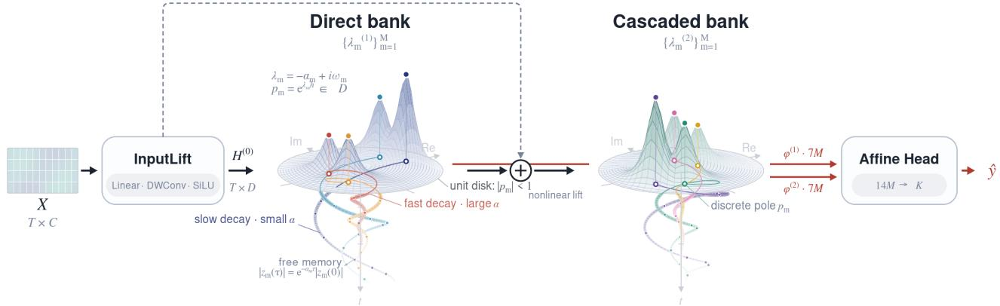
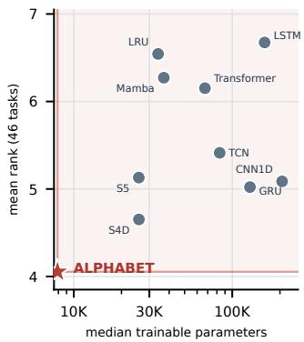
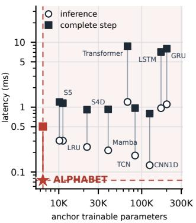
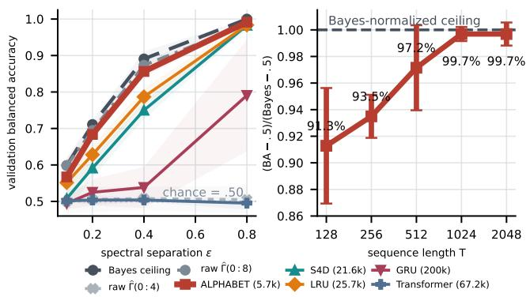
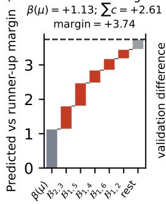
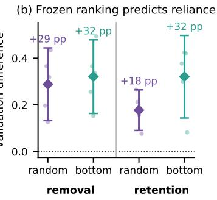
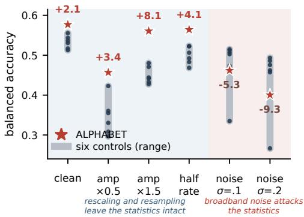

# ALPHABET: A Laplace-Pole History Aggregator with Banked Exponential Transport

Daehwa Ko, JaeHyeon Kim, Oh Seong Kwon, and Jay Hoon Jung

Department of Artificial Intelligence, Korea Aerospace University, Goyang, Republic of Korea daehwa001210@gmail.com, kjh990127@kau.kr, kos\_25@kau.kr, jhjung@kau.ac.kr

## Abstract

Can a sequence model remain competitive with only a few thousand parameters and an explicitly auditable prediction interface? We introduce ALPHABET, a compact linear-time model that compresses temporal history into stable complex pole modes: a direct bank synthesizes its modal states back into the feature trajectory, an independent cascaded bank analyzes the transformed trajectory without resynthesis, and an afine head reads only modal energies and lag moments from both banks. We characterize the temporal information this descriptor retains: for a stationary, fully observed feature process, each mode energy is a frequency-localized measurement of the second-order spectrum, the continuum of such measurements identifies the spectrum, and almost every mode separates any fixed finite set of spectrally distinct classes. On a Gaussian control with matched low-lag statistics, the learned descriptor approaches the Bayes oracle where raw autocovariances remain at chance.

Across the fixed 82-task registry, ALPHABET attains mean rank 3.97 in the complete ten-family comparison. At the common-width D = 64 runtime anchor, its 6,437 parameters deliver 5.02× faster inference and 3.93× faster complete training steps than the nine baselines on average.

## Introduction

A sequence model turns temporal history into a state that a predictor can use. Modern architectures have made that state increasingly powerful: gated recurrence propagates hidden states token by token, attention constructs contextual represen- tations from pairwise interactions, and structured or selective state-space models evolve states through learned dynamics (Hochreiter and Schmidhuber 1997; Cho et al. 2014; Vaswani et al. 2017; Gu, Goel, and Re 2022; Gu and Dao 2024). Yet competitive temporal prediction should not require a large, slow, and opaque backbone—and opacity has a concrete cost: it is rarely stated which temporal information the retained state preserves. Without such an account, the adequacy of a com- pact state is assessed mainly through downstream accuracy, and it remains unclear where its guarantees end.

We therefore study how much discriminative temporal structure a deliberately compact, stable state can preserve. Classical model reduction asks how few dynamical degrees of freedom approximate a known input–output system (Moore 1981; Antoulas 2005; Benner, Gugercin, and Willcox 2015). We pose the analogous question for prediction: a sequence encoder summarizes its recurrent states into a compact pre- diction interface, aiming not to reconstruct every input token but to expose a small set of temporal measurements whose meaning, stability, and empirical utility can all be checked.

ALPHABET uses two banks of complex recurrent modes parameterized by stable Laplace poles, with each pole specify- ing the decay and oscillation of its mode. Pole locations may be trained, but the spectral coverage of the bank and its modal moment readout are the essential construction. An input lift first forms a real-valued feature trajectory. The direct pole bank then accumulates projected features through interval-aware modal dynamics, projects the resulting complex states back into the real feature space, and adds them to the feature trajec tory. An independent cascaded pole bank applies a second set of modal dynamics to the resulting, nonlinearly transformed trajectory—a feature process shaped by direct-bank synthesis rather than the original lifted trajectory—without resynthesis. Both banks return mode-wise energies and complex-lag mo- ments, whose concatenation forms a fixed afine prediction interface.

The representation also has a precise population interpre- tation: for a stationary feature process, each pole energy is a directional, Poisson-localized measurement of its matrix- valued spectrum. The continuum of admissible measurements uniquely identifies that spectrum, and almost every admis- sible mode separates any fixed finite collection of distinct class spectra. Whenever a finite bank contains such a mode, there exists an afine head that exactly separates the resulting population prototypes. Under ergodicity, the corresponding empirical decision becomes consistent as sequence length grows. Independently, stable normalized dynamics bound the realized descriptor uniformly in sequence length. This analysis characterizes the information available to the model for a fixed feature process. Because the head is afine in these modal statistics, auditability is concrete: each predicted margin splits exactly into per-pole terms, and removing the top-attributed poles degrades accuracy far beyond random removal.

The empirical study asks whether this structured compres- sion retains useful predictive information in practice. Our contributions are threefold. First, we introduce a linear-time sequence model with a direct pole bank, an independent cascaded pole bank, and a fixed afine prediction interface that reads only mode-wise energies and lag moments from both banks. Second, for a fixed, fully observed, equal-step, second-order stationary feature process, we characterize mode energies as frequency-localized spectral measurements, show that the continuum family identifies the second-order spec- trum, and establish generic population separation for finite collections of spectrally distinct classes. Separately, stable interval-aware dynamics and normalized excitation yield sequence-length-independent bounds for realized finite-bank prediction interfaces. Third, we test whether end-to-end learn- ing realizes useful finite-mode representations through a fixed 82-task registry and a complete 82-task comparison against nine trainable sequence-model families, a moment-matched spectral diagnostic, and boundary and systems audits across data regimes, corruptions, sequence shapes, and execution phases.

  
Figure 1: ALPHABET architecture. The direct bank produces a 7×M modal descriptor (seven coordinates for each of M modes) and synthesizes $H ^ { ( 1 ) } { \vdots }$ ; the independent cascaded bank returns a second 7×M descriptor without resynthesis. Their concatenation forms the 14×M-dimensional afine prediction interface.

## Related Work

Temporal state construction. Recurrent models such as LSTMs and GRUs propagate gated hidden states through time, while Transformers construct contextual representations through attention (Hochreiter and Schmidhuber 1997; Cho et al. 2014; Vaswani et al. 2017). Structured and diagonal state-space models, including HiPPO, S4, DSS, S4D, S5, LRUs, and Mamba, instead represent temporal history through learned linear or selective dynamics (Gu et al. 2020; Gu, Goel, and Re 2022; Gupta, Gu, and Berant 2022; Gu et al. 2022; Smith, Warrington, and Linderman 2023; Orvieto et al. 2023; Gu and Dao 2024). Models for irregular observations, such as GRU-D, ODE-RNN, Latent ODE, and Neural CDE, additionally incorporate elapsed time through explicit decay, continuous- time evolution, or controlled diferential equations (Che et al. 2018; Rubanova, Chen, and Duvenaud 2019; Kidger et al. 2020). ALPHABET shares the linear-time recurrent form of diagonal state-space models but difers in its prediction interface: the head never sees the state trajectory itself, only mode-wise energies and complex-lag moments from the two banks.

Structured spectral representations. Balanced reduction, dynamic mode decomposition, and Laguerre or Kautz bases seek compact dynamical descriptions (Moore 1981; Antoulas 2005; Schmid 2010; Wahlberg and Mäkilä 1996; Ninness and Gustafsson 1997). Filter-output covariance and state covariance are classical spectral interpolation objects (Byrnes, Georgiou, and Lindquist 2000; Georgiou 2002); wavelet variances, random autoregressive filter banks, recurrent co- variance features, and complex-pole arrays provide related localized summaries (Li and Oh 2002; Farahmand, Pourazarm, and Nikovski 2017; Gilson et al. 2020; Orellana, Mirtaheri, and Hammer 2021). Dedicated time-series models—random convolutional pipelines such as ROCKET and MiniRocket (Dempster, Petitjean, and Webb 2020; Dempster, Schmidt, and Webb 2021) and specialized architectures such as InceptionTime and TimesNet (Ismail Fawaz et al. 2020; Wu et al. 2023)—achieve strong accuracy on the same archives; our comparison instead spans generic trainable sequence backbones under one shared protocol covering classification, forecasting, and irregular sampling, so we view them as complementary rather than competing baselines. Our use of learned poles is supervised, but the main distinction is not the filter family alone: we connect the implemented modal statistics to a characteristic continuum embedding, generic afine separation, and a bounded prediction interface.

## ALPHABET

Notation and shapes. Suppressing the batch dimension, let $X = [ x _ { 1 } , \dots , x _ { T } ] ^ { \top } \in \mathbb { R } ^ { \dot { T } \times C } , h \in \mathbb { R } _ { > 0 } ^ { T } , o \in \{ 0 , 1 \} ^ { T \times C }$ and $w \in \{ 0 , 1 \} ^ { T }$ . Here, $h _ { t }$ is the elapsed time from step t − 1 to t, while $o _ { t , c }$ and $w _ { t }$ indicate channel availability and token validity, respectively; a token-level scalar mask is broadcast across channels. We define the event-level availability $\widetilde { o } _ { t } =$ $\operatorname* { m a x } _ { c } o _ { t , c } .$ . The mask o removes unavailable raw entries, its reduction o gates external excitation, and w excludes padded or invalid tokens from local features and moment estimates.

Let D, M, and K denote the real feature width, the number of complex modes per bank, and the output dimension, respectively, and let $r = 1 .$ , 2 index the direct and cascaded banks, respectively.

$$
\begin{array} { r l } & { H ^ { ( r - 1 ) } , U ^ { ( r ) } \in \mathbb R ^ { T \times D } , \quad Z ^ { ( r ) } \in \mathbb C ^ { T \times M } , \quad W _ { X } \in \mathbb R ^ { D \times C } , } \\ & { \qquad A _ { r } \in \mathbb R ^ { D \times 2 M } , \quad A _ { r } ^ { \top } A _ { r } = I _ { 2 M } , \quad 2 M \le D . } \end{array}
$$

The paired coordinates of $A _ { r }$ form the real and imaginary parts of the M complex excitations. The finite set $\tau { \dot { c } }$ $\mathrm { \hat { N } } _ { > 0 }$ contains the token lags used by the modal readout, and $s _ { 1 } , \gamma _ { 1 } \in \mathbb { R } ^ { D }$ parameterize the direct-bank residual and feedthrough terms. We write $\phi ^ { ( r ) } ( X ) , g ( X )$ , and $f _ { \Theta } ( X )$ suppressing their dependence on $h , o , w .$

## Stable Laplace-pole dynamics

Fix a bank $r \in \{ 1 , 2 \}$ and suppress its index. For each mode m $\iota \in \{ 1 , \ldots , M \}$ , let

$$
\lambda _ { m } = - \alpha _ { m } + i \omega _ { m } , \qquad \alpha _ { m } > 0 ,
$$

where $\alpha _ { m }$ and $\omega _ { m }$ are the decay rate and angular frequency. ALPHABET maps $\boldsymbol { v } _ { t } \in \mathbb { R } ^ { D }$ to complex excitations $\boldsymbol { e } _ { t } \in \mathbb { C } ^ { M }$ with m-th component $e _ { m , t }$

Let $p _ { m , t } = e ^ { \lambda _ { m } h _ { t } }$ and $z _ { m , t } \in \mathbb { C }$ denote the discrete pole and modal state. Under a zero-order hold on $e _ { m , t }$ , the exact evolution is

$$
z _ { m , t } = p _ { m , t } z _ { m , t - 1 } + \chi _ { t } ^ { ( r ) } \frac { p _ { m , t } - 1 } { \lambda _ { m } } e _ { m , t } .\tag{1}
$$

The injection gates are

$$
\chi _ { t } ^ { ( 1 ) } = w _ { t } \widetilde { o } _ { t } , \qquad \chi _ { t } ^ { ( 2 ) } = w _ { t } .
$$

Thus $w _ { t }$ blocks injection at invalid tokens, while $\widetilde { o } _ { t }$ addition- ally blocks direct-bank injection at fully unobserved tokens; neither stops the elapsed-time state transition. The cascaded bank omits o to preserve memory transported by the direct bank.

For $h _ { t } > 0 ,$

$$
| p _ { m , t } | = e ^ { - \alpha _ { m } h _ { t } } < 1 .
$$

Regular sampling therefore yields a fixed pole $p _ { m } ,$ whereas irregular sampling changes $p _ { m , t }$ with $h _ { t }$ while preserving stability.

## Modal moment readout

For either bank, suppress the bank index and set $w _ { t , \tau } =$ $w _ { t } w _ { t - \tau }$ for in-range pairs and zero otherwise. For each $\tau \in \{ 0 \} \cup \tau$ , mode m contributes

$$
R _ { m , \tau } = \frac { \sum _ { t } w _ { t , \tau } z _ { m , t } \overline { { z _ { m , t - \tau } } } } { \operatorname* { m a x } \{ 1 , \sum _ { t } w _ { t , \tau } \} } .\tag{2}
$$

Here $R _ { m , 0 }$ is the empirical modal energy, while the com- plex nonzero-lag moments retain phase-sensitive temporal dependence. Define

$$
\operatorname { r l o g } ( u ) = { \left\{ \begin{array} { l l } { \log ( 1 + | u | ) u / | u | , } & { u \neq 0 , } \\ { 0 , } & { u = 0 . } \end{array} \right. }
$$

Representing each complex value by its real and imaginary parts, the descriptor of mode m is

$$
\phi _ { m } = \left[ \log ( 1 + R _ { m , 0 } ) \Big | \left( \mathrm { r l o g } R _ { m , \tau } \right) _ { \tau \in \mathcal { T } } \right] \in \mathbb { R } ^ { 1 + 2 | \mathcal { T } | } .\tag{3}
$$

Algorithm 1 ALPHABET forward pass   
Require: Values X, intervals h, observation mask $^ { O , }$ validity mask   
w, lag set T   
1: $\alpha _ { m } ^ { ( r ) } \gets \alpha _ { \mathrm { m i n } } + \left( \alpha _ { \mathrm { m a x } } - \alpha _ { \mathrm { m i n } } \right)$ sigmoid $( \delta _ { m } ^ { ( r ) } )$   
$2 \colon \omega _ { m } ^ { ( r ) } \gets \omega _ { \operatorname* { m a x } } \operatorname { t a n h } ( \vartheta _ { m } ^ { ( r ) } ) , \lambda _ { m } ^ { ( r ) } \gets - \alpha _ { m } ^ { ( r ) } + i \omega _ { m } ^ { ( r ) }$   
3: $\widetilde { \boldsymbol { o } _ { t } } \gets \operatorname* { m a x } _ { c } \boldsymbol { o } _ { t , c }$   
4: $\chi _ { t } ^ { ( 1 ) }  w _ { t } \widetilde { o } _ { t } , \quad \chi _ { t } ^ { ( 2 ) }  w _ { t }$   
5: $\dot { \mathrm { : } } \ \dot { H ^ { ( 0 ) } } \gets w \odot \mathrm { S i L U } ( \mathrm { D W C o n v } ( w \odot ( ( o \odot X ) W _ { X } ^ { \top } ) ) )$   
$6 \colon U ^ { ( 1 ) } \gets \mathrm { R M S N o r m } ( H ^ { ( 0 ) } )$   
$\begin{array} { r } { 7 \colon [ E _ { \Re } ^ { ( 1 ) } \mid E _ { \Im } ^ { ( 1 ) } ]  U ^ { ( 1 ) } A _ { 1 } , \quad E ^ { ( 1 ) }  E _ { \Re } ^ { ( 1 ) } + i E _ { \Im } ^ { ( 1 ) } } \end{array}$   
8: $\bar { Z } ^ { ( \mathrm { i } ) } \gets \bar { \mathrm { D i r e c t B a n k S c a n } } ( E ^ { ( 1 ) } ; \lambda ^ { ( 1 ) } , \bar { h } , \chi ^ { ( 1 ) } )$   
9: $H ^ { ( 1 ) } \gets H ^ { ( 0 ) } + s _ { 1 } \odot \left( [ \Re Z ^ { ( 1 ) } \mid \Im Z ^ { ( 1 ) } ] A _ { 1 } ^ { \top } + \gamma _ { 1 } \odot U ^ { ( 1 ) } \right)$   
10: $\phi ^ { ( 1 ) }  \mathrm { N }$ MomentReadout $( Z ^ { ( 1 ) } ; w , \mathcal { T } )$   
11: $\overline { { H } } ^ { ( 1 ) }  w \odot H ^ { ( 1 ) }$   
12: $U ^ { ( 2 ) } \gets w \odot \mathrm { R M S N o r m } \Big ( \mathrm { S i L U ( D W C o n v ( \overline { { H } } ^ { ( 1 ) } ) ) } \Big )$   
13: $[ E _ { \Re } ^ { ( 2 ) } \ | \ E _ { \Im } ^ { ( 2 ) } ]  U ^ { ( 2 ) } A _ { 2 } , \quad E ^ { ( 2 ) }  E _ { \Re } ^ { ( 2 ) } + i E _ { \Im } ^ { ( 2 ) }$   
14: $Z ^ { ( \vec { 2 } ) } \gets \mathrm { { \bar { C a s c a d e d B a n k S c a n } } } ( E ^ { ( 2 ) } ; \lambda ^ { ( \vec { 2 } ) } , h , \chi ^ { ( \bar { 2 } ) } )$   
15: ${ \phi ^ { ( 2 ) }  \mathrm { M o m e n t R e a d o u t } ( Z ^ { ( 2 ) } ; w , \mathcal { T } ) }$   
16: return $W _ { \mathrm { h e a d } } [ \phi ^ { ( 1 ) } \mid \phi ^ { ( 2 ) } ] + b _ { \mathrm { h e a d } }$

We use $\mathcal { T } = \{ 1 , 2 , 4 \}$ , giving seven real coordinates per mode and 7M coordinates per bank. Let $\phi ^ { ( r ) } ( X ) \in \mathbb { R } ^ { \bar { \top } M }$ concatenate the mode descriptors from bank r. The final descriptor and logits are $g ( \bar { X } ) = [ \phi ^ { ( 1 ) } ( X ) \mid \phi ^ { ( 2 ) } ( X ) ] \ \in$ $\mathbb { R } ^ { 1 4 M }$ and $f _ { \Theta } ( X ) \overset { \^ { \mathrm { { \textstyle ~ \sum } } } } { = } W _ { \mathrm { h e a d } } g ( X ) + \dot { b } _ { \mathrm { h e a d } } \in \mathbb { R } ^ { K }$

## Theoretical Properties of Modal Compression Pole moments as spectral measurements

On an equal-step, fully observed grid, let $V _ { t } ^ { ( y ) } \in \mathbb { R } ^ { D }$ be the second-order stationary feature process entering a pole bank for class $y ,$ with spectral measure $\mathbf { F } _ { y }$ defined by

$$
\Gamma _ { y } ( k ) = \mathbb { E } [ V _ { t + k } ^ { ( y ) } V _ { t } ^ { ( y ) \top } ] = \int _ { - \pi } ^ { \pi } e ^ { i k \theta } \mathbf { F } _ { y } ( d \theta ) .\tag{4}
$$

We use uncentered moments, so a nonzero feature mean appears as an atom at frequency zero. For orthonormal analysis directions $a , b \in \mathbb { R } ^ { D }$ , set $c = a +$ ib and $e _ { t _ { - } } ^ { ( y ) } = V _ { t } ^ { ( y ) \top } c ,$ whose scalar spectral measure is $\mu _ { y , c } ( d \theta ) = \bar { c } ^ { \top } { \bf F } _ { y } ( d \bar { \theta } ) \bar { c } .$

Write $p = e ^ { \lambda h } = \rho e ^ { i \varphi }$ and $\gamma _ { h } ( \lambda ) = ( e ^ { \lambda h } - 1 ) / \lambda$ . Here φ selects the preferred frequency, while $\rho < 1$ 1 controls the bandwidth. The frequency response and stationary state are

$$
H _ { \lambda , h } ( e ^ { i \theta } ) = { \frac { \gamma _ { h } ( \lambda ) } { 1 - p e ^ { - i \theta } } } , \qquad z _ { t } = \gamma _ { h } ( \lambda ) \sum _ { j = 0 } ^ { \infty } p ^ { j } e _ { t - j } .\tag{5}
$$

Stable linear filtering gives (Byrnes, Georgiou, and Lindquist 2000; Georgiou 2002)

$$
Q _ { y } ( c , \lambda ; h ) : = \mathbb { E } | z _ { t } | ^ { 2 } = | \gamma _ { h } ( \lambda ) | ^ { 2 } \int _ { - \pi } ^ { \pi } \frac { \mu _ { y , c } ( d \theta ) } { | e ^ { i \theta } - p | ^ { 2 } } ,\tag{6}
$$

$$
R _ { y , \tau } ( c , \lambda ; h ) : = \mathbb { E } [ z _ { t } \bar { z } _ { t - \tau } ] = | \gamma _ { h } ( \lambda ) | ^ { 2 } \int _ { - \pi } ^ { \pi } \frac { e ^ { i \tau \theta } \mu _ { y , c } ( d \theta ) } { | e ^ { i \theta } - p | ^ { 2 } } .\tag{7}
$$

Thus $Q _ { y }$ is localized spectral mass rather than energy at a single Fourier frequency. The kernel is centered near $\varphi$ and sharpens as $\rho$ approaches one. Defining $P _ { p } ( \theta ) = ( 1 \bar { \bf \Delta } ^ { \prime }$ $| p | ^ { 2 } ) / | e ^ { i \bar { \theta } } - p | ^ { 2 }$ gives

$$
{ \frac { 1 - | p | ^ { 2 } } { | \gamma _ { h } ( \lambda ) | ^ { 2 } } } Q _ { y } ( c , \lambda ; h ) = \int P _ { p } ( \theta ) \mu _ { y , c } ( d \theta ) .\tag{8}
$$

Hence modal energy is a positive rescaling of a Poisson- localized spectral mass. The complex moments $R _ { y , \tau }$ retain phase-sensitive lag information and provide additional coor- dinates for the implemented finite bank.

## Characteristicness and afine separation

Define the directional Poisson transform

$$
{ \mathcal { P } } _ { \mathbf { F } } ( c , p ) : = \int _ { - \pi } ^ { \pi } P _ { p } ( \theta ) c ^ { \top } \mathbf { F } ( d \theta ) { \bar { c } } .\tag{9}
$$

For fixed $c ,$ this transform determines the directional spectral measure; varying the real and imaginary directions recovers the full matrix-valued measure. Its real-analytic parameter dependence yields the following result.

Theorem 1 (Characteristicness and generic separation). Let $D \geq 3$ , let $\dot { \mathcal { V } } _ { 2 } ( \mathbb { R } ^ { D } )$ be the Stiefel manifold of orthonormal direction pairs, and let $\Lambda _ { p }$ be a connected open set of poles satisfying $0 < | p | < 1$ . Set $\Xi = \mathcal { V } _ { 2 } ( \mathbb { R } ^ { D } ) \times \Lambda _ { v }$ and, for $\xi = ( ( a , b ) , p ) \in \Xi .$ define ${ \mathcal { P } } _ { \mathbf { F } } ( \xi ) = { \mathcal { P } } _ { \mathbf { F } } ( a + i b , p )$

If finite matrix-valued spectral measures F and G satisfy $\mathcal { P } _ { \mathbf { F } } ( \boldsymbol { \xi } ) = \mathcal { P } _ { \mathbf { G } } ( \boldsymbol { \xi } )$ on a measurable set $E \subseteq \Xi$ of positive smooth volume, then $\mathbf { F } = \mathbf { G }$ . Consequently, for any pairwise distinct $\mathbf { F } _ { 1 } , \ldots , \mathbf { F } _ { K }$ , their transform values are pairwise distinct for almost every $\xi \in \Xi$ . Injectivity also holds at any fixed damping radius $\rho \in ( 0 , 1 )$ when frequency and direction pairs vary.

For $p = e ^ { \lambda h }$

$$
Q _ { \mathbf { F } } ( c , \lambda ; h ) = \frac { | \gamma _ { h } ( \lambda ) | ^ { 2 } } { 1 - | p | ^ { 2 } } \mathcal { P } _ { \mathbf { F } } ( c , p ) .
$$

The positive class-independent factor transfers generic sep- aration to the modal energies $Q _ { y }$ . Thus a generic mode can separate classes that have the same feature mean and Γ(0) but difer in some $\Gamma ( k ) , k \neq 0$

Corollary 1 (Afine realizability and sequence-length consistency). Fix a mode whose class energies $Q _ { 1 } , \ldots , Q _ { K }$ are pairwise distinct, and set $q _ { y } = \log ( 1 + \overline { { Q _ { y } } } )$ . The afine log- its $\ell _ { y } ( q ) = 2 q _ { y } q - q _ { y } ^ { 2 }$ classify every population prototype exactly, since

$$
\ell _ { i } ( q _ { i } ) - \ell _ { j } ( q _ { i } ) = ( q _ { i } - q _ { j } ) ^ { 2 } > 0 \qquad ( i \neq j ) .
$$

Suppose each class feature process is stationary ergodic with finite second moments. For the zero-initialized state trajectory, define

$$
\widehat { Q } _ { T } = \frac { 1 } { T } \sum _ { t = 1 } ^ { T } | z _ { t } | ^ { 2 } , \qquad \widehat { y } _ { T } = \arg \operatorname* { m a x } _ { j } \ell _ { j } \Big ( \log ( 1 + \widehat { Q } _ { T } ) \Big ) .
$$

Then

$$
\begin{array} { r l r } { \widehat { Q } _ { T } \xrightarrow { \mathrm { a . s . } } Q _ { y } , } & { { } } & { \operatorname* { P r } ( \widehat { y } _ { T } \neq y ) \longrightarrow 0 . } \end{array}\tag{10}
$$

Under bounded excitation and summable energy autoco- variance, the supplementary proof gives an $O ( \breve { T } ^ { - 1 } )$ error-probability bound.

When $2 M \leq D$ , the separating direction pair can be completed to the model’s semi-orthogonal M-mode frame; finite-bank margins are examined below.

## Information-preserving moment conditioning

We show that the logarithmic conditioning used in the modal descriptor preserves moment information while controlling perturbations.

Lemma 1 (Moment conditioning). For

$$
\begin{array} { r } { u = \left( u _ { 0 } , ( u _ { \tau } ) _ { \tau \in \mathcal { T } } \right) \in \mathbb { R } _ { \geq 0 } \times \mathbb { C } ^ { | \mathcal { T } | } , } \end{array}
$$

define

$$
\Psi ( u ) = \Big [ \mathrm { l o g } ( 1 + u _ { 0 } ) \Big | \left( \mathrm { r l o g } ( u _ { \tau } ) \right) _ { \tau \in \mathcal { T } } \Big ] ,
$$

identifying complex coordinates with pairs of real coordinates. Then $\dot { \Psi }$ is injective and, for all $u , v ,$

$$
\begin{array} { r } { \| \Psi ( u ) - \Psi ( v ) \| _ { 2 } ^ { 2 } \leq \langle \Psi ( u ) - \Psi ( v ) , u - v \rangle \leq \| u - v \| _ { 2 } ^ { 2 } . } \end{array}\tag{11}
$$

Moreover, if $\| u \| _ { 2 } , \| v \| _ { 2 } \leq U$ , then

$$
\frac { 1 } { 1 + U } \| u - v \| _ { 2 } \leq \| \Psi ( u ) - \Psi ( v ) \| _ { 2 } \leq \| u - v \| _ { 2 } .\tag{12}
$$

These statements extend to direct sums over all modes and both banks.

The proof and a trajectory-to-descriptor perturbation bound are in the supplement.

## Stable dynamics and bounded prediction

Unlike the spectral results, the following bounds require only stable poles, bounded normalized excitation, and $\bar { h _ { t } \geq 0 }$ , and apply to both banks.

Proposition 1 (Modal input-to-state bound). If $\begin{array} { r l } { \alpha _ { \star } } & { { } = } \end{array}$ min $\mathsf { i } _ { m } \alpha _ { m } > 0 , \| e _ { t } \| _ { 2 } \leq V$ , and $\textstyle T _ { n } = \sum _ { t = 1 } ^ { n } h _ { t }$ , then

$$
\| z _ { n } \| _ { 2 } \leq e ^ { - \alpha _ { \star } T _ { n } } \| z _ { 0 } \| _ { 2 } + \frac { V } { \alpha _ { \star } } ( 1 - e ^ { - \alpha _ { \star } T _ { n } } ) .\tag{13}
$$

Thus, for $z _ { 0 } = 0 , \| z _ { n } \| _ { 2 } \leq V / \alpha$ independently of token count. Modewise and synthesized-stream refinements are given in the supplement.

Corollary 2 (Bounded prediction interface). Let $\eta _ { r } \in \mathbb { R } ^ { D }$ be the RMSNorm gain of bank $r \in \{ 1 , 2 \}$ . Semi-orthogonality and RMS normalization imply

$$
\| e _ { t } ^ { ( r ) } \| _ { 2 } \leq \kappa _ { r } : = \sqrt { D } \| \eta _ { r } \| _ { \infty } , \qquad B _ { r , m } : = \frac { \kappa _ { r } } { \alpha _ { m } ^ { ( r ) } } .
$$

Define

$$
C _ { g } ^ { 2 } = ( 1 + | T | ) \sum _ { r = 1 } ^ { 2 } \sum _ { m = 1 } ^ { M } \log ^ { 2 } ( 1 + B _ { r , m } ^ { 2 } ) .
$$

With zero-initialized stable states,

$$
\begin{array} { r l } & { \quad \| g ( X ) \| _ { 2 } \leq C _ { g } , } \\ & { \quad \| f _ { \Theta } ( X ) \| _ { 2 } \leq \| W _ { \mathrm { h e a d } } \| _ { 2 } C _ { g } + \| b _ { \mathrm { h e a d } } \| _ { 2 } , } \end{array}\tag{14}
$$

  
Figure 2: Predictive and systems eficiency. Left: Mean TEST rank versus median trainable parameters over the complete ten-family subset. Right: FP32 inference and complete-step latency at the same-width $D = 6 4$ anchor $( B = 3 2 , T =$ 512).

uniformly over finite raw-input amplitudes, sequence lengths, validity patterns, and nonnegative interval grids in exact arithmetic.

This independence from raw-input amplitude and upstream operator norms follows because RMS normalization precedes each scan and the head uses only modal moments.

## Experiments

## Evaluation protocol

We evaluate a fixed registry of 82 public tasks: 30 UCR datasets (Dau et al. 2019), 31 multivariate sequence and vibration/fault tasks including UEA (Bagnall et al. 2018), and 21 additional sequence, ECG, clinical/activity, and forecasting tasks. The registry spans univariate and multivariate signals, regular and irregular observations, and classification, multil- abel, and forecasting objectives; it is coverage-oriented rather than archive-exhaustive (Bagnall et al. 2017). Each task is trained independently on its predefined split, with no pooled multi-dataset training. All ten families complete every task without missing or imputed cells. For each task–family pair, one of 18 family-native candidates is selected using TRAIN- derived validation, frozen before TEST, and evaluated over five final-training seeds. Full registry, split, preprocessing, and selection appear in the supplement.

## Predictive rank, capacity, and systems eficiency

The left panel of Figure 2 summarizes predictive rank and model capacity on the 82 tasks with complete results for all ten families. ALPHABET has mean rank 3.97, 14 Top-1 placements, and 43 Top-3 placements.

We optimize ALPHABET with parity-gated Triton kernels and shape-static CUDA Graph capture, then measure steady- state FP32 inference and complete training steps against nine baselines on one RTX 4090. We use each family’s fastest pub- lic implementation under an identical measurement harness, enabling compiled kernels when provided. At the evaluation- width anchor (D=64, B=32, T=512), ALPHABET is the smallest and fastest model tested, with 6,437 trainable pa- rameters, 5.02× faster inference and 3.93× faster complete steps on average. Across the broader audited grid of batch sizes and sequence lengths, this eficiency advantage gener- ally persists, although its magnitude varies with execution phase, shape, and baseline. Full shape-wise results, timing methodology, and numerical-parity checks are reported in the supplementary systems evaluation.

## Controlled spectral recovery under structural compression

Theorem 1 establishes continuum identification and generic population separation for fixed, spectrally distinct feature processes. The remaining finite-bank question is whether end- to-end learning realizes a margin large enough to estimate and exploit in practice. Moreover, because almost every ad- missible mode separates any fixed finite collection of distinct spectra, a covering fixed random bank can plausibly remain competitive with learned poles. The following diagnostics test these predictions using TRAIN-derived validation only.

We use a stronger moment-matched control. Class 0 is unit- variance white Gaussian noise; class 1 is a sparse stationary MA(5) process with nonzero coeficients only at lags 0 and ${ \check { 5 } } ,$ $X _ { t } = a Z _ { t } + b Z _ { t - 5 } .$ , where $a ^ { 2 } + b ^ { 2 } = 1$ and $2 a b = \epsilon .$ . Their population autocovariances agree exactly for lags 0 through 4 and first difer at lag 5. Moment matching removes population separation from the explicitly supplied lag-0:4 coordinates, turning Figure 3 into a controlled test of higher-lag spectral access under compression. Consistent with this population match, the raw $\widehat \Gamma ( 0 : 4 )$ control remains at chance empirically, while the oracle-informed $\widehat \Gamma ( 0 : 8 )$ control nearly reaches the Bayes ceiling. The full ALPHABET descriptor rises from .567 to .991 as the spectral separation ϵ increases, without being given the distinguishing lag.

${ \mathrm { A t } } \epsilon = . 4 ,$ the 5.7k-parameter descriptor (the diagnostictask configuration) reaches .856 balanced accuracy, compared with .787 for LRU and .750 for S4D under the evaluated configurations. Increasing T closes the remaining gap: Bayesnormalized excess-over-chance accuracy rises from 91.3% at $T = 1 2 8$ to 99.7% at $T = 1 0 2 4$ . This supports a finite- sample explanation for the short-sequence deficit; it does not establish the $O ( T ^ { - 1 } )$ rate or exact asymptotic equivalence to Bayes.

## Focused structural ablation

We isolate the two-scan design under a doubly matched control: $M ^ { \prime } = 3 2$ gives the one-scan baseline the same 224 real coordinates as the two 7M summaries, and $D ^ { \prime } = 7 2$ equalizes trainable parameters on every task. It is not a smaller model, but the same budget spent on a single bank. The audit contains 17 UCR tasks, each run over five TRAIN-derived validation seeds with no TEST access.

The full model exceeds the capacity-matched one-scan con- trol by 3.33 points (task-paired 95% CI [0.05, 6.62]; W/T/L $1 0 / 3 { \dot { / } } 4 )$ . It exceeds the no-synthesis and energy-only con- trols by 1.67 ([−0.53, 3.88]) and 5.48 points ([0.74, 10.21]), respectively. The energy-only MLP remains matched within

  
Figure 3: Controlled spectral recovery under structural com- pression. Left: Validation balanced accuracy versus spectral separation over five seeds. Right: Bayes-normalized excess- over-chance accuracy versus sequence length with paired 95% Student-t intervals. All results use TRAIN-derived validation only.

0.2% of the full model’s trainable count, so extra head capacity does not generally recover the lag-coordinate information. Fixed poles trail by 1.67 points but remain statistically competitive ([−1.01, 4.36]), as the genericity result predicts. None of the four reported contrasts has Holm-adjusted p < .05; the results therefore indicate a task-dependent two-scan advantage without treating any component as universally necessary.

## Pole-level prediction audit

For predicted class y and runner-up $j ,$ the afine head gives an exact per-pole margin decomposition. Let ${ { I } _ { b , m } }$ index the seven coordinates of bank b and pole $m ,$ and let $\mu$ be the optimization-fold mean descriptor:

$$
\begin{array} { c } { c _ { b , m } = ( W _ { y } - W _ { j } ) _ { I _ { b , m } } ^ { \top } ( g - \mu ) _ { I _ { b , m } } , } \\ { \beta _ { y j } ( \mu ) = b _ { y } - b _ { j } + ( W _ { y } - W _ { j } ) ^ { \top } \mu , } \\ { \ell _ { y } - \ell _ { j } = \beta _ { y j } ( \mu ) + \displaystyle \sum _ { b , m } c _ { b , m } . } \end{array}
$$

This algebraic identity reconstructs FP32 margins within $8 . 6 \times 1 0 ^ { - 6 }$ . Unlike an unstructured coordinate decomposition, ALPHABET groups its compact descriptor explicitly by bank and pole.

Removal replaces a pole’s seven descriptor coordinates with their optimization-fold means, leaving all other coordinates in- tact. Across 17 datasets and 85 checkpoints, optimization-fold pole rankings transfer to validation with mean rank correlation .990. Removing the top eight poles reduces balanced accuracy by 26.9 points more than random removal (paired 95% CI [19.0, 34.7]), while retaining only the top eight improves fullmodel agreement (prediction agreement with the unmasked model) by 23.3 points over random retention ([16.6, 30.0]). The top-versus-bottom contrasts are 29.4 ([21.2, 37.7]) and 43.7 points ([33.8, 53.6]), respectively (Figure 4).

<table><tr><td>Variant</td><td>BA</td><td>∆(pp)</td><td>Seed SD</td><td>Med. params</td></tr><tr><td>Full two-scan</td><td>.863</td><td></td><td>.061</td><td>5,698</td></tr><tr><td>Matched one-scan</td><td>.830</td><td>-3.33</td><td>.074</td><td>5,698</td></tr><tr><td>No synthesis</td><td>.847</td><td>-1.67</td><td>.071</td><td>5,570</td></tr><tr><td>Fixed poles</td><td>.847</td><td>-1.67</td><td>.074</td><td>5,634</td></tr><tr><td>Energy-only MLP</td><td>.808</td><td>-5.48</td><td>.085</td><td>5,705</td></tr></table>

Table 1: Matched structural ablation on 17 UCR tasks and five TRAIN-derived validation seeds. BA and seed SD are averaged across tasks, parameter counts are task-wise medians, and $\Delta$ is relative to the full model.

  
Figure 4: Pole attribution audit. Left: Exact ECG200 margin contributions from the top five poles and remainder. Right: Validation contrasts for frozen TRAIN-ranked top-eight re- moval/retention against random and bottom controls over 17 datasets. Points denote datasets, diamonds means, and bars paired 95% t intervals.

The cascaded bank accounts for 63.5% of validation attribution and 64.4% of top-eight positions, with at least one cas-caded pole in 84 of 85 checkpoints. Removing all 16 cascaded poles costs 13.6 points more than a size-matched random mask ([6.8, 20.4]), whereas cascaded-only retention remains borderline and inconclusive (4.3 points, $[ - 0 . 0 4 , 8 . 6 5 ] ; p = . 0 5 2 )$ Thus the audit shows systematic use of the cascaded bank without treating mean masking as proof of architectural ne- cessity.

## Corruption audit

Mechanistic prediction. The modal equations predict an asymmetric response to these corruptions. If a residual global scale $s > 0$ reaches a linear modal path, then

$$
Q _ { m } ^ { ( s ) } = s ^ { 2 } Q _ { m } , \qquad R _ { m , \tau } ^ { ( s ) } = s ^ { 2 } R _ { m , \tau } .
$$

Scaling therefore preserves modal phase, while the radial-log map compresses the magnitude change to log $\cdot ( 1 + s ^ { 2 } | R _ { m , \tau } | )$ RMS normalization before each scan further attenuates global scale changes, although the nonlinear lift prevents exact invariance.

Writing the exact interval update as

$$
\Phi _ { h } ( z , e ) = e ^ { \lambda h } z + \gamma _ { h } ( \lambda ) e ,
$$

constant excitation gives

$$
\Phi _ { h _ { 2 } } ( \Phi _ { h _ { 1 } } ( z , e ) , e ) = \Phi _ { h _ { 1 } + h _ { 2 } } ( z , e ) .
$$

Elapsed-time transport is therefore resolution-consistent un- der a zero-order-hold signal, although discarded samples,

  
Figure 5: Corruption audit on 17 UCR datasets and five seeds. Gray bars span the nine controls’ across-task means, stars show ALPHABET’s across-task mean, and annotations give its gap to the best control mean. These synthetic corruptions are not domain-level OOD.

aliasing, and token-lag readout prevent exact invariance after downsampling.

Additive white noise acts diferently. Under the feature- space idealization $V _ { t } = S _ { t } + N _ { t }$ , with independent isotropic white noise Cov $\left( N _ { t } \right) = \sigma ^ { 2 } I ,$ , the spectral identities give

$$
\begin{array} { c c } { { Q _ { S + N } = Q _ { S } + \nu , } } & { { R _ { S + N , \tau } = R _ { S , \tau } + \nu p ^ { \tau } , } } \\ { { \nu = \sigma ^ { 2 } \| c \| _ { 2 } ^ { 2 } \displaystyle \frac { | \gamma _ { h } ( \lambda ) | ^ { 2 } } { 1 - | p | ^ { 2 } } > 0 , } } & { { p = e ^ { \lambda h } . } } \end{array}
$$

Thus white noise creates a pole-dependent energy floor and contaminates the lag moments; radial-log conditioning com- presses but does not remove these terms. The model should therefore be comparatively more robust to amplitude and sampling-resolution shifts than to broadband additive noise.

We test this prediction against nine validation-frozen con- trols under five deterministic TEST corruptions across 17 UCR tasks (Figure 5). In across-task means, ALPHABET leads the best control by 10.2 and 9.4 points at amplitude ×0.5 and ×1.5, and by 1.3 points after half-rate resam-pling. Dataset-paired intervals against each task’s best control span zero for both amplitude shifts, so these are aggregate advantages rather than universal task-wise wins. Under ad- ditive noise the aggregate ordering reverses: ALPHABET trails by 1.6 and 4.3 points at $\sigma = . 1$ and .2. The stricter task-paired gaps are $- 7 . 2 ( [ - 1 3 . 6 , - 0 . 8 ] )$ ) and −10.4 points $( [ - 1 \dot { 7 } . 8 , - \dot { 3 } . 0 \dot { ] } )$ , respectively.

This reversal matches the predicted asymmetry, so we report additive noise as a distinct failure mode rather than averaging all corruptions into a generic robustness score.

## Discussion and Limitations

The spectral bridge has a precise domain: identification and afine consistency hold with the encoder fixed and the fea- ture process stationary, fully observed, and equal-step. Two boundaries matter. First, the object identified is the spectrum of the learned feature process, not of the raw input; the theory characterizes what the modal readout preserves about the encoder’s output, not what the encoder discards.

Second, the guarantee is generic rather than constructive: it does not show that optimization finds a separating mode, and the learned-bank diagnostics supply only empirical evidence that it can. Outside this domain, the interval-aware recurrence and the descriptor and logit bounds remain valid on irregular grids without stationarity; higher-order non-Gaussian class diferences fall outside the second-order theory entirely.

The empirical boundaries are equally concrete. The clearest is additive noise, where broadband energy contaminates the modal statistics at both evaluated noise levels; we would not recommend this representation in low-SNR settings. Across 17 tasks, the two-scan advantage stays positive but no abla- tion contrast survives Holm correction, fixed poles remain competitive, and attribution in the fixed-pole variant is sim- ilarly concentrated—so the evidence supports an auditable stable-bank interface more strongly than uniquely meaningful learned pole placement.

A post-hoc shrinkage rule that suppresses weak lag mo- ments failed to transfer to dataset-disjoint validation (supplement), consistent with a descriptor-level ambiguity: weak lag coherence may be nuisance noise or weak class-bearing signal, and an unconditional rule cannot separate them. The natural response—input-conditioned, pole-response-aware debiasing of $Q _ { m }$ and $R _ { m , \tau }$ —must be frozen and tested prospectively.

## Conclusion

ALPHABET provides evidence that competitive temporal pre- diction can be achieved without a large or opaque backbone. Two banks of stable Laplace poles compress temporal history into a fixed set of modal statistics whose spectral meaning is characterized by the theory, while predictions decompose exactl into per-pole contributions. Under the matched evalu- ation settings considered in this work, ALPHABET achieves substantially lower latency than all evaluated baselines. The audits show that this transparency is functional rather than nominal, and demonstrate that compactness, speed, and an auditable representation can be achieved simultaneously.

## Proofs and Mathematical Boundaries

## Radial-log geometry

Lemma 2 (Injective non-expansive moment conditioning). For a finite lag set $\tau$ , let $\Psi _ { T }$ apply log $( 1 + \cdot )$ to the energy and rlo $\smash { \xi ( u ) = \log ( 1 + | u | ) u / | u | }$ to each complex lag, with $\mathrm { r l o g } ( 0 ) = \dot { 0 }$ . Identifying C with $\dot { \mathbb { R } } ^ { 2 } , \Psi \tau$ is injective and maps zero to zero. For moment descriptors $r , s \bar { \in } \mathbb { R } _ { \geq 0 } \times \mathbb { C } ^ { | \bar { T } | }$ writing $\Delta _ { \Psi } = \Psi _ { T } ( r ) - \Psi _ { T } ( s )$ , it satisfies

$$
\begin{array} { r } { \| \Delta _ { \Psi } \| _ { 2 } ^ { 2 } \leq \langle \Delta _ { \Psi } , r - s \rangle \leq \| r - s \| _ { 2 } ^ { 2 } , } \end{array}\tag{15}
$$

Moreover, for any $U \geq 0$ such that $\| r \| _ { 2 } , \| s \| _ { 2 } \leq U$

$$
\frac { 1 } { 1 + U } \| r - s \| _ { 2 } \leq \| \Delta _ { \Psi } \| _ { 2 } \leq \| r - s \| _ { 2 } .\tag{16}
$$

Here U is the radius of the bounded moment-descriptor region, not a bound on the raw input. Both statements extend by direct sums.

Proof. Identify C with $\mathbb { R } ^ { 2 }$ and write $\psi ( u ) = \log ( 1 +$ $| u | ) u / | u |$ . Its radial and tangential Jacobian eigenvalues are

$$
{ \frac { 1 } { 1 + | u | } } , \qquad { \frac { \log ( 1 + | u | ) } { | u | } } .
$$

They extend to one at zero and lie in $[ ( 1 + U ) ^ { - 1 } , 1 ]$ on $| u | \overset { } { \leq } U ;$ the scalar energy coordinate has the same bounds. Since the Euclidean ball is convex, $s + t d$ remains in this ball for $t \in [ 0 , 1 ]$ . For $d = r - s , \Delta = \Psi _ { \mathcal { T } } ( r ) - \Psi _ { \mathcal { T } } ( s )$ , and the block Jacobian $J _ { t }$ at $s + t d _ { \colon }$

$$
\| \Delta \| _ { 2 } ^ { 2 } \leq \int _ { 0 } ^ { 1 } \| J _ { t } d \| _ { 2 } ^ { 2 } d t \leq \int _ { 0 } ^ { 1 } \langle J _ { t } d , d \rangle d t = \langle \Delta , d \rangle \leq \| d \| _ { 2 } ^ { 2 } .
$$

The lower Jacobian bound and Cauchy–Schwarz give Equa- tion (16); strict radial monotonicity (inverse radius $e ^ { r } - 1 )$ ) gives injectivity. Direct sums complete the proof.

## Spectral embedding, generic separation, and consistency

Under the main paper’s equal-step, fully observed pop- ulation model, its energy and lag identities reduce the pole statistics to Poisson-kernel integrals. Positive rescal- ing and Lemma 2 therefore preserve identification. Let $d ( \mathbf { \bar { \xi } } ) = \mathcal { P } _ { \mathbf { F } } ( \xi ) - \mathcal { P } _ { \mathbf { G } } ( \xi )$ on the connected real-analytic param- eter manifold Ξ, equipped with its smooth volume measure. If d vanishes on a positive-volume set, real analyticity implies $d \equiv 0$ . For $c = a + i b ,$ let $\mu _ { \Delta , c } ( A ) = c ^ { \top } ( \mathbf { F } - \mathbf { G } ) ( A ) \bar { c }$ be the corresponding finite complex Borel measure. Its Poisson integral is then zero. At any fixed radius $r \in ( 0 , 1 )$ ,

$$
P _ { r e ^ { i \varphi } } ( \theta ) = \sum _ { k \in \mathbb { Z } } r ^ { | k | } e ^ { i k ( \theta - \varphi ) } .\tag{17}
$$

All multipliers are nonzero, so every Fourier–Stieltjes coefi-cient of $\mu _ { \Delta , c }$ vanishes and hence $\mu _ { \Delta , c } = 0$

To recover the matrix measure, write $\Delta ( A ) = S + i A _ { 0 }$ with S real symmetric and $A _ { 0 }$ real skew-symmetric. For every orthonormal $a , b$ and $c = a + i b$

$$
c ^ { \top } \Delta ( A ) { \bar { c } } = a ^ { \top } S a + b ^ { \top } S b + 2 a ^ { \top } A _ { 0 } b = 0 .\tag{18}
$$

Subtracting the equation with b replaced by $- b$ gives $a ^ { \top } A _ { 0 } b = 0$ for every orthonormal pair $a , b ,$ and hence $A _ { 0 } ~ = ~ 0$ . The remaining identity is $\dot { a } ^ { \top } S a \dot { + } b ^ { \top } S b = 0$ In an eigenbasis of S, this is $\sigma _ { i } + \sigma _ { j } = 0$ for $i \neq j ;$ three indices (and hence $D \geq 3 )$ force $\bar { S } = 0$ . Thus ${ \textbf { F } } = { \textbf { G } }$ The same argument applies at a fixed damping radius when direction and frequency vary.

For pairwise distinct class spectra, each diference $d _ { i j } ( a , \dot { b , p } ) = \mathcal { P } _ { { \bf F } _ { i } } ( a + i b , p ) - \dot { \mathcal { P } } _ { { \bf F } _ { j } } ( a + i b , p )$ is analytic on the connected parameter manifold and not identically zero. Its zero set therefore has measure zero; a finite union over class pairs proves simultaneous single-mode separation for almost every direction and pole.

When $2 \dot { M } \leq D .$ , the separating pair can be completed by Gram–Schmidt to an admissible M-mode frame. This is an existence statement, not a claim that optimization finds that frame.

For a stationary ergodic process satisfying $\mathbb { E } | z _ { 0 } ^ { \star } | ^ { 2 } < \infty$ Birkhof’s theorem gives $T ^ { - 1 } \sum _ { t = 1 } ^ { T } | z _ { t } ^ { \star } | ^ { 2 } \to Q _ { y }$ almost surely. The zero-initialization transient satisfies $z _ { t } ^ { ( 0 ) } - z _ { t } ^ { \star } =$ $- p ^ { t } z _ { 0 } ^ { \star }$ and contributes vanishing average energy. Thus ${ \widehat { Q } } _ { T } \to Q _ { y } ;$ a positive minimum class margin gives even- tual correctness and $\operatorname* { P r } ( \widehat { y } _ { T } \neq y )  0$

A finite-length bound requires bounded excitation and summable energy autocovariance. With $| e _ { t } | \le B _ { e }$ and $r =$ $| p | < 1$

$$
Z = \frac { | \gamma _ { h } ( \lambda ) | B _ { e } } { 1 - r } ,\tag{19}
$$

$$
\Gamma _ { y } ^ { ( E ) } = \mathrm { V a r } ( | z _ { 0 } ^ { \star } | ^ { 2 } ) + 2 \sum _ { k \geq 1 } \big | \mathrm { C o v } ( | z _ { 0 } ^ { \star } | ^ { 2 } , | z _ { k } ^ { \star } | ^ { 2 } ) \big | < \infty .\tag{20}
$$

The transient discrepancy is bounded by

$$
b _ { T } = \frac { 2 Z ^ { 2 } } { T ( 1 - r ) } .\tag{21}
$$

With class-y radius

$$
\varrho _ { y } = \operatorname* { m i n } _ { j \neq y } \left. \sqrt { ( 1 + Q _ { y } ) ( 1 + Q _ { j } ) } - ( 1 + Q _ { y } ) \right. ,\tag{22}
$$

misclassification requires an additional deviation of at least $\varrho _ { y } - b _ { T }$ . Chebyshev’s inequality gives, when $b _ { T } < \varrho _ { y } ,$

$$
\operatorname* { P r } _ { y } ( \widehat { y } _ { T } \neq y ) \leq \frac { \Gamma _ { y } ^ { ( E ) } } { T ( \varrho _ { y } - b _ { T } ) ^ { 2 } } .\tag{23}
$$

Proposition 2 (Finite-bank boundary). For any fixed finite pole bank and finite collection of energy and raw complex- autocorrelation moments, there exist distinct strictly positive, real-analytic, full-support scalar spectral densities that pro- duce identical modal population descriptors.

Proof. The finite moments define finitely many linear functionals on any suficiently large finite-dimensional space H of real even trigonometric polynomials. A nonzero common- kernel element h yields $f _ { \pm } = c \pm \epsilon h$ with identical measured moments for suficiently small $\epsilon > 0$ . These are distinct, strictly positive analytic spectra, so the finite learned bank is not globally injective. □

This proposition rules out global injectivity over the full class of analytic spectra, but does not preclude separation on finite task families or under the generic conditions stated above.

Cumulative-step and prediction-interface bounds For the exact-ZOH recurrence in the main paper, write $T _ { n } =$ $\textstyle \sum _ { t = 1 } ^ { n } h _ { t }$ t and $\gamma _ { h } ( \lambda ) = ( e ^ { \lambda h } - 1 ) / \lambda$ . Variation of constants (Chen 1999) gives the exact unroll

$$
z _ { m , n } = e ^ { \lambda _ { m } T _ { n } } z _ { m , 0 } + \sum _ { j = 1 } ^ { n } e ^ { \lambda _ { m } ( T _ { n } - T _ { j } ) } \gamma _ { h _ { j } } ( \lambda _ { m } ) \chi _ { j } ^ { ( r ) } e _ { m , j } ^ { ( r ) } .\tag{24}
$$

Semi-orthogonality gives $\| v A _ { r } \| _ { 2 } \leq \| v \| _ { 2 }$ . Applying this contraction to Equation (24), using $| \chi _ { j } ^ { ( r ) } | \leq 1 , \| e _ { j } ^ { ( r ) } \| _ { 2 } \leq$ $V ,$ and $\begin{array} { r } { | \gamma _ { h } ( \lambda _ { m } ) | \leq \int _ { 0 } ^ { h } e ^ { - \alpha _ { m } u } d u . } \end{array}$ , and summing adjacent physical-time intervals gives the main-paper bound

$$
\| z _ { n } \| _ { 2 } \leq e ^ { - \alpha _ { \star } T _ { n } } \| z _ { 0 } \| _ { 2 } + \frac { V } { \alpha _ { \star } } ( 1 - e ^ { - \alpha _ { \star } T _ { n } } ) .
$$

This argument requires only $h _ { t } \geq 0$ and stable poles, notstationarity or equal spacing.

For FP32, the implementation substitutes h for $\gamma _ { h } ( \lambda )$ when $| \lambda h | < \delta _ { 0 } = 1 0 ^ { - 6 }$ . Its coeficient error is at most $\begin{array} { r } { \frac { 1 } { 2 } \delta _ { 0 } e ^ { \delta _ { 0 } } h . } \end{array}$ and the same state bound holds after multiplying the input term by $\chi _ { 0 } = \delta _ { 0 } / ( 1 - e ^ { - \delta _ { 0 } } )$ . This finite-precision qualification does not strengthen the exact-arithmetic proposition.

Proposition 3 (Synthesized-stream bound). Assume $\| H _ { n } ^ { \mathrm { ( 0 ) } } \| _ { 2 } \le H , \| U _ { n } ^ { \mathrm { ( i ) } } \| _ { 2 } \le V$ , and input gates have mag- nitude at most one. In this proposition, α⋆ and $z _ { \mathrm { 0 } }$ refer to the direct bank. Define

$$
B _ { n } = e ^ { - \alpha _ { \star } T _ { n } } \| z _ { 0 } \| _ { 2 } + \frac { V } { \alpha _ { \star } } ( 1 - e ^ { - \alpha _ { \star } T _ { n } } ) .\tag{25}
$$

Then the synthesized direct-bank trajectory satisfies

$$
\| H _ { n } ^ { ( 1 ) } \| _ { 2 } \leq H + \| s _ { 1 } \| _ { \infty } { \big ( } B _ { n } + \| \gamma _ { 1 } \| _ { \infty } V { \big ) } .\tag{26}
$$

Proof. Semi-orthogonality bounds the excitation by $V$ and the modal state by $B _ { n } ;$ the synthesis triangle inequality proves Equation (26). Because of the identity residual, this internal-stream bound remains input-relative. The FP32 branch replaces $B _ { n }$ by $B _ { n } ^ { \mathrm { F P 3 2 } } = e ^ { \frac { \cdot } { - \alpha _ { \star } T _ { n } } } \| z _ { 0 } \| _ { 2 } + \chi _ { 0 } V ( 1 -$ $e ^ { - \alpha _ { \star } T _ { n } } ) / \bar { \alpha } _ { \star }$ □

For bank r, RMS normalization and semi-orthogonal anal-ysis give

$$
\| e _ { t } ^ { ( r ) } \| _ { 2 } \leq \kappa _ { r } : = \sqrt { D } \| \eta _ { r } \| _ { \infty } .
$$

With zero initialization, the modewise form of the state bound gives $| z _ { m , t } ^ { ( r ) } | \leq B _ { r , m } : = \kappa _ { r } / \alpha _ { m } ^ { ( r ) }$ . Consequently, $0 \leq$ $R _ { m , 0 } ^ { ( r ) } \leq B _ { r , m } ^ { 2 }$ , and Cauchy–Schwarz gives $| R _ { m , \tau } ^ { ( r ) } | \leq B _ { r , m } ^ { 2 }$ for every selected token lag. Each of the $1 + | \mathcal { T } |$ radial-log blocks therefore contributes at most $\log ^ { 2 } ( 1 + B _ { r , m } ^ { 2 } )$ per mode. Summing over both banks proves

$$
\| g ( X ) \| _ { 2 } ^ { 2 } \leq ( 1 + | T | ) \sum _ { r = 1 } ^ { 2 } \sum _ { m = 1 } ^ { M } \log ^ { 2 } ( 1 + B _ { r , m } ^ { 2 } ) = C _ { g } ^ { 2 } .
$$

The afine head therefore obeys $\| f _ { \Theta } ( X ) \| _ { 2 } \leq \| W _ { \mathrm { h e a d } } \| _ { 2 } C _ { g } +$ $\left\| b _ { \mathrm { h e a d } } \right\| _ { 2 }$ . Under the stated normalization, stability, and param- eter bounds, the descriptor norm is independent of raw-input amplitude and token count; validity masks with no eligible pairs contribute zero by the denominator convention in the main-paper moment definition.

Proposition 4 (Trajectory-to-descriptor perturbation). For the implemented lag set $\dot { \mathcal { T } } = \{ 1 , 2 , \dot { 4 } \}$ and bank $r \in \{ 1 , 2 \}$ suppose two modal trajectories use the same validity weights and satisfy $\| z _ { t } ^ { ( r ) } \| _ { 2 } , \| z _ { t } ^ { \prime ( r ) } \| _ { 2 } \leq B _ { r }$ and $\| z _ { t } ^ { ( r ) } - z _ { t } ^ { \prime ( \bar { r } ) } \| _ { 2 } \overset { - } { \leq } \varepsilon _ { \tau }$ for every token. Then their joint radial-log descriptors obey

$$
\| g - g ^ { \prime } \| _ { 2 } \leq 4 \sqrt { B _ { 1 } ^ { 2 } \varepsilon _ { 1 } ^ { 2 } + B _ { 2 } ^ { 2 } \varepsilon _ { 2 } ^ { 2 } } .\tag{27}
$$

Consequently the afine scores difer by at most

$$
\lVert f _ { \Theta } - f _ { \Theta } ^ { \prime } \rVert _ { 2 } \leq \lVert W _ { \mathrm { h e a d } } \rVert _ { 2 } \lVert g - g ^ { \prime } \rVert _ { 2 } .
$$

Proof. Componentwise squaring and the Hadamard-product inequality give

$$
\begin{array} { r } { \left\| | z _ { t } | ^ { 2 } - | z _ { t } ^ { \prime } | ^ { 2 } \right\| _ { 2 } \leq 2 B _ { r } \varepsilon _ { r } , } \\ { \| z _ { t } \odot \bar { z } _ { t - \tau } - z _ { t } ^ { \prime } \odot \bar { z } _ { t - \tau } ^ { \prime } \| _ { 2 } \leq 2 B _ { r } \varepsilon _ { r } . } \end{array}
$$

Averaging and Lemma 2 preserve these bounds, so each block difers by at most $2 B _ { r } \varepsilon _ { r }$ . Concatenating one energy block and three complex-lag blocks gives

$$
\| g ^ { ( r ) } - g ^ { \prime ( r ) } \| _ { 2 } \leq 4 B _ { r } \varepsilon _ { r } .
$$

Concatenating the two banks proves Equation $( 2 7 ) ;$ ; a coordi- natewise bound $\varepsilon _ { r } ^ { \mathrm { c o o r d } }$ implies $\varepsilon _ { r } = \sqrt { M } \varepsilon _ { r } ^ { \mathrm { c o o r d } }$ □

## Model Implementation

The two banks use $A _ { r } = [ A _ { r , \Re } | A _ { r , \Im } ] , A _ { r } ^ { \top } A _ { r } = I _ { 2 M }$ maintained by a matrix-exponential Stiefel parameterization (Lezcano-Casado and Martínez-Rubio 2019). Independently for each bank,

$$
\begin{array} { r l } & { \alpha _ { m } = 1 0 ^ { - 3 } + ( 2 - 1 0 ^ { - 3 } ) \mathrm { s i g m o i d } ( \delta _ { m } ) , } \\ & { \omega _ { m } = \pi \operatorname { t a n h } ( \vartheta _ { m } ) , } \end{array}
$$

initialized with $\delta \quad =$ linspace $_ { M } ( - 3 , 1 )$ and $\vartheta \quad = \quad$ atanh(linspace $_ M ( 0 , . 7 5 ) )$ ; modal states start at zero.

Each local lift is a centered depthwise kernel of size 5 and di- lation 4, followed by learned bias and SiLU (Elfwing, Uchibe, and Doya 2018). Only the direct bank synthesizes through $A _ { 1 } ^ { \top }$ . With $\mathcal { T } = \{ 1 , 2 , 4 \}$ , the afine head has $K ( 1 4 M + \bar { 1 } )$ parameters and no pooled D-dimensional path.

On equal-step inputs, $\mathcal { T } = \{ 1 , 2 , 4 \}$ denotes token ofsets shared by both banks. When time\_delta is supplied, the implementation switches both local lifts and modal readout to fixed physical-time ofsets in the normalized units of $\mathtt { t i m e \_ d e l t a : }$ local kernels sample the piecewise-linear signal interpolant, and modal moments query/interpolate states at $t - \tau$ . The exact-ZOH transition uses the same elapsed-time metadata. Validity masks gate the interpolation support, and an empty support set returns zero. Thus the equal-step equations are the unit-grid special case, whereas irregular runs use physical-time interpolation/quadrature.

For fixed D, M, K, the two width-5 lifts cost $O ( T D )$ , the two dia onal ole recurrences and direct-bank s nthesis cost $O ( T M D )$ ), and the fixed lag set costs $O ( T M )$ . The terminal afine head costs $O ( M K )$ . Memory can be streamed with the current modal states and fixed-lag bufers, so the sequence- dependent compute is $O ( T )$ ; the implemented training path may retain trajectories for automatic diferentiation without changing that arithmetic complexity.

## Systems eficiency audit

## Final radial-log kernel specialization

Scope and dispatch. The optimized target is the final radiallog afine ALPHABET with $( C , D , M , { \bf \bar { K } } ) = ( 2 , 6 4 , 1 6 , 5 )$ The specialized path is used only for no-gradient CUDA inference with static poles, FP32 tensors, $B \in \{ 3 2 , 6 4 \}$ and $1 \leq T \leq 2 0 4 8$ . Unsupported shapes, masks, variable- step metadata, and non-FP32 inputs use the reference graph. Framework-level TF32 is disabled; the packed projection kernel explicitly uses Triton’s tf32x3 decomposition and is validated numerically against the FP32 reference.

Associative time-parallel scan. For one mode, write a recurrence step as

$$
\begin{array} { c } { { g _ { m , t } ( z ) = a _ { m , t } z + b _ { m , t } , } } \\ { { \left( a _ { 2 } , b _ { 2 } \right) \star ( a _ { 1 } , b _ { 1 } ) = ( a _ { 2 } a _ { 1 } , a _ { 2 } b _ { 1 } + b _ { 2 } ) . } } \end{array}
$$

Because ⋆ is associative, a parallel prefix scan produces the same states as the sequential recurrence. In the specialized path, $a _ { m , t } = p _ { m }$ is static, and the Triton kernel evaluates the prefixes with tl.associative\_scan. Each bank therefore retains $O ( T )$ work with ${ \cal O } ( \log T )$ parallel scan depth.

This is a parallel afine scan rather than Mamba’s selective scan: the specialized transition is static, and the direct and cascaded banks remain serially composed because the latter depends on the synthesized direct trajectory. The scan also accumulates the seven per-mode statistics: log energy and the real and imaginary radial-log moments at lags {1, 2, 4}. Parallel reassociation changes FP32 rounding order, so the specialized path is numerical-parity gated rather than required to be bitwise identical to the sequential reference.

Fused inference dataflow. The supported inference path is

edge lift −→ writer scan + moments

−→ reader moments-only scan −→ afine logits.

The writer scan retains its modal trajectory because synthesis through $A _ { 1 } ^ { \top }$ is required. A fused producer constructs the reader drive from the synthesized direct trajectory, the residual stream, and the reader lift. The reader then uses a moments- only parallel scan that does not materialize or export its full state trajectory, returning the 7M radial-log descriptor directly. A final Triton kernel applies the afine classifier to the two 7M descriptors without a separate concatenation or linear launch. These fusions preserve the main-paper forward map while reducing intermediate global-memory trafic and kernel launches.

Complete-step training path. Training uses diferentiable time-parallel scans for the forward states and reverse adjoints, together with fused edge and terminal-reader operations. The model and loss are compiled, and gradient-norm reduction, clipping, and AdamW are combined in a fused optimizer tail. A CUDA 12.8 graph captures the complete training step, including forward/loss, backward, optimization, and post-update frame constraints. The inference graph similarly captures one supported static-shape forward pass. Compila- tion, graph construction, and warmup are excluded from the reported steady-state measurements.

Systems audit protocol. After freezing the specialization, the runtime audit compares repository-native CNN1D, TCN, Transformer, S4D, S5, LRU, GRU, and LSTM with oficial mamba-ssm 2.3.2.post1 using causal-conv1d 1.6.1 and its fast path. The audit environment uses PyTorch 2.9.1+cu128, Triton 3.5.1, Python 3.13.14, CUDA 12.8, and a single 24 GiB RTX 4090.

The runtime audit uses two capacity controls, distinct from the task-level 18-candidate selection protocol. The approximately parameter-matched control selects, for each family, the nearest realizable variant from its predeclared structural choices to the parameter count of the reference ALPHABET design. Here D denotes the width of the reference design; a matched baseline may therefore use a diferent native width. No inactive parameters are added to force exact equality. The resulting 81 comparisons cover nine one-factor shapes:

$$
\begin{array} { l l } { B \in \{ 1 , 8 , 3 2 , 6 4 \} , } & { ( T , D ) = ( 5 1 2 , 6 4 ) , } \\ { T \in \{ 1 2 8 , 5 1 2 , 2 0 4 8 \} , } & { ( B , D ) = ( 3 2 , 6 4 ) , } \\ { D \in \{ 1 6 , 3 2 , 6 4 , 1 2 8 \} , } & { ( B , T ) = ( 3 2 , 5 1 2 ) . } \end{array}
$$

Inference uses the specialized kernel in the four $D = 6 4$ rows with $B \in \{ 3 2 , \bar { 6 4 } \}$ , giving 36 baseline comparisons; the remaining five rows use the reference graph, giving 45 com- parisons. Complete-step measurements use the diferentiable training runtime at every shape. The maximum parameter- count gap is 5.3%, and all other gaps are below 2.5%. This is an approximate parameter control rather than a FLOP-, activation-, or memory-matched comparison. The reported speedups should therefore be interpreted as empirical results under the stated parameter and workload controls.

The separate same-width control fixes the external hidden width at $D = 6 4$ and the workload at $( B , T ) = ( 3 2 , 5 1 2 )$ while retaining each family’s native internal structure. Its nine comparisons intentionally do not match parameter counts and are reported separately from the parameter-matched aggregate.

Measurement protocol. Correctness-valid runtime candidates are frozen by median latency at the of-grid (4, 256, 64) calibration shape. TF32 and autocast are disabled; a repeat calibration targets 25 ms and is excluded. Five warmups pre- cede seven seeded balanced ABBA/BAAB groups. Inference is forward-only; a complete step includes cross entropy, back- ward, global gradient clipping, AdamW, and model constraints. Each family uses its fastest correctness-valid calibrated path, and the manifest records authoritative imports.

<table><tr><td>Design B/T/D</td><td>CNN</td><td>TCN</td><td>Trf.</td><td>Mamba</td><td>S4D</td><td>S5</td><td>LRU</td><td>GRU</td><td>LSTM</td></tr><tr><td>Param. 1/512/64</td><td>1.05/0.41</td><td>0.99/0.34</td><td>18.47/25.79</td><td>1.88/0.64</td><td>5.88/1.34</td><td>5.45/1.29</td><td>3.90/1.00</td><td>21.00/18.81</td><td>11.14/2.02</td></tr><tr><td>Param. 8/512/64</td><td>0.21/0.58</td><td>0.21/0.51</td><td>3.97/23.42</td><td>0.41/0.62</td><td>1.17/1.36</td><td>1.20/1.37</td><td>0.85/0.98</td><td>4.28/16.24</td><td>2.06/1.81</td></tr><tr><td>Param. 32/128/64</td><td>0.83/0.55</td><td>0.96/0.44</td><td>14.36/25.06</td><td>1.30/0.61</td><td>4.26/1.33</td><td>2.77/0.96</td><td>2.19/0.79</td><td>6.72/16.95</td><td>2.99/0.90</td></tr><tr><td>Param. 32/512/16</td><td>0.27/0.54</td><td>0.53/0.73</td><td>10.83/19.75</td><td>0.62/0.64</td><td>1.08/0.83</td><td>1.68/1.17</td><td>1.13/0.93</td><td>6.19/16.37</td><td>5.03/2.74</td></tr><tr><td>Param. 32/512/32</td><td>0.39/0.65</td><td>0.40/0.50</td><td>8.96/14.93</td><td>0.59/0.58</td><td>1.54/1.10</td><td>2.07/1.43</td><td>2.37/1.51</td><td>7.26/16.88</td><td>3.89/1.98</td></tr><tr><td>Param. 32/512/64</td><td>0.50/0.60</td><td>0.60/0.48</td><td>14.13/18.29</td><td>1.07/0.77</td><td>2.58/1.38</td><td>2.66/1.46</td><td>1.78/0.95</td><td>6.63/3.32</td><td>3.64/1.54</td></tr><tr><td>Param. 32/512/128</td><td>0.41/0.44</td><td>0.46/0.39</td><td>4.34/6.69</td><td>0.83/0.66</td><td>1.12/0.89</td><td>3.78/2.99</td><td>2.57/1.80</td><td>2.23/5.50</td><td>3.04/7.72</td></tr><tr><td>Param. 32/2048/64</td><td>0.34/0.48</td><td>0.38/0.30</td><td>44.38/20.20</td><td>1.09/0.92</td><td>1.72/1.42</td><td>3.17/2.34</td><td>1.62/1.30</td><td>7.11/5.48</td><td>3.84/2.47</td></tr><tr><td>Param. 64/512/64</td><td>0.42/0.48</td><td>0.48/0.39</td><td>16.67/12.01</td><td>1.02/0.85</td><td>1.99/1.40</td><td>2.20/1.41</td><td>1.39/0.88</td><td>4.17/8.38</td><td>2.39/1.20</td></tr><tr><td>Same width 32/512/64</td><td>1.68/1.59</td><td>2.42/1.89</td><td>16.21/17.47</td><td>2.90/1.84</td><td>3.27/1.84</td><td>4.09/2.37</td><td>4.08/2.30</td><td>14.87/16.09</td><td>12.99/14.35</td></tr></table>

Table 2: Complete 90-cell systems ledger. Each entry is inference/complete-step speedup (baseline latency divided by ALPHABET latency); values above one favor ALPHABET. “Param.” denotes approximately parameter-matched comparisons (maximum gap 5.3%; all but one at most 2.49%). The final row fixes $D = 6 4$ at $\bar { ( B , T ) } = ( \bar { 3 2 } , \bar { 5 } 1 2 )$ without matching parameter counts. Each cell is the median of seven paired CUDA-event groups.

Parity and retained evidence. Maximum logit error is $8 . 3 4 5 \times 1 0 ^ { - 7 }$ . Input/parameter gradients and three-step opti- mization trajectories pass at both anchors for seeds {7, 11, 19}, with additional gates for $T = 2 0 4 8 , T = 3 1$ , seven modes, zero drive, finite diferences, and NaN/Inf propagation. The fail-closed 140-group evaluator reports $\mathtt { s t a t u s = p a s s }$ . Ta- ble entries are medians over seven paired groups; grid sum- maries are computed from the 90 cell medians (180 phase rows and 1,260 timing groups).

## Evaluation Protocol

The nine control families are CNN1D, TCN, Transformer, Mamba, S4D, S5, LRU, GRU, and LSTM. Candidate counts and final-seed counts are matched across families: every task–family cell uses 18 candidates and five final-training seeds. Native parameter counts, FLOPs, optimizer steps, and wall-clock costs are not matched. TCN denotes the disclosed causal dilated CNN control rather than the canonical two- convolution residual TCN. The capacity schedule for the proposed ALPHABET is specified separately from the control- family ledger.

Proposed-model capacity schedule. For the complete benchmark, ALPHABET uses the six capacity pairs

(D, M) ∈ {(32, 8), (32, 16), (64, 16), (64, 32), (128, 16), (128, 32)

each combined with the three common optimizer recipes. This gives 18 candidates per task–model cell. The schedule is part of the proposed model’s benchmark specification and is not treated as an additional control-family row.

## Model configuration ledger

Table 3 lists the structural configurations available to each con- trol family. The common candidate-selection, optimization, and TEST-sealing rules are given below; diagnostic-specific budgets are stated with their corresponding protocols.

Stage 1 evaluates all 18 candidates at seed 7 and retains the validation Top-6. Stage 2 evaluates those six candidates at seeds 11 and 19 and freezes the configuration with the highest mean validation score over seeds {7, 11, 19}. Exact ties are resolved using the predeclared configuration key.

<table><tr><td>Family group</td><td>Component</td><td>Choices</td></tr><tr><td>CNN1D</td><td>depth/kernel</td><td>(2, 3), (4, 5)</td></tr><tr><td>TCN</td><td>depth/kernel</td><td>(3, 3), (5, 5)</td></tr><tr><td>Transformer</td><td>depth/heads</td><td>(1, 2), (2, 4)</td></tr><tr><td>Mamba</td><td>state/conv</td><td>(16, 3), (32, 4)</td></tr><tr><td>S4D</td><td>depth/state</td><td>(1, 16), (3, 16)</td></tr><tr><td>S5/LRU/GRU/LSTM</td><td>depth/state</td><td>(1, 16), (2, 32)</td></tr></table>

Table 3: Control-family configuration ledger. Each family uses widths {32, 64, 128}, the two listed structural choices, and recipes A/B/C, giving 18 candidates per task–family cell. Recipes A/B/C respectively use the learning-rate and clipping pairs $( 1 0 ^ { - 3 } , 0 . 5 ) , ( 3 \times 1 \bar { 0 } ^ { - 3 } , 1 )$ , and $( 1 0 ^ { - \overset { \cdot } { 2 } } , 2 )$ , with weight decay $\mathrm { i 0 ^ { - 4 } }$ and efective batch size 64. Width 128 uses microbatches of 32 with two-step gradient accumulation; the other widths use batches of 64.

Regular-sequence tasks use at most 100 epochs. Final training uses seeds {23, 31, 43, 47, 59}, and oficial TEST data remain sealed until configuration selection is complete.

## Tasks, objectives, and data sealing

The fixed registry contains 82 independently trained tasks: 30 UCR datasets (Dau et al. 2019), 21 general sequence, ECG, clinical/activity, and forecasting tasks, and 31 multivariate and vibration/fault tasks, including UEA (Bagnall et al. 2018). Registry membership was determined using public data avail- ability, reproducible split and preprocessing requirements, compatibility with the common sequence interface, and broad coverage across task and application types. The registry is nei- ther exhaustive nor intended to be statistically representative of all time-series problems.

Non-UCR tasks use public releases and frozen manifests: PTB-XL and MIT-BIH ECG (Wagner et al. 2020; Moody and Mark 2001; de Chazal, O’Dwyer, and Reilly 2004), CWRU bearing signals (Smith and Randall 2015), ETT, Electricity, and Weather (Zhou et al. 2021; Trindade 2015; Max Planck Institute for Biogeochemistry n.d.), Sequential CIFAR-10 (Krizhevsky 2009), and balanced AudioSet VGGish features (Gemmeke et al. 2017; Hershey et al. 2017; Google Research n.d.). The remaining registry sources are PhysioNet 2012/2019 (Silva et al. 2012; Reyna et al. 2020), PAMAP2 (Reiss and Stricker 2012; Reiss 2012), UCI Localization Human Activity (UCI Machine Learning Repository 2008), USHCN as processed by GRU-ODE-Bayes (De Brouwer et al. 2019), ISRUC-Sleep (Khalighi et al. 2016), Chapman-Shaoxing ECG (Zheng et al. 2020), and MFPT and Paderborn bearing data (Machinery Failure Prevention Technology Society n.d.; Lessmeier et al. 2016). No dataset was added or removed because of observed ALPHABET or baseline performance. Released manifests fix the task-specific splits and preprocessing procedures.

UCR and UEA configuration selection uses only oficial TRAIN data; oficial TEST data remain sealed until final evaluation. Forecasting windows do not cross chronologica TRAIN/validation/TEST boundaries. Other external tasks retain their predefined record-, group-, or patient-level splits. Selection artifacts contain no TEST tensors or TEST-set identifiers. Normalization and all other data-dependent pre- processing are fitted without access to TEST data.

## Diagnostic Protocols

Common protocol. These TRAIN-only diagnostics test whether a finite bank separates temporal dependence when static first and second moments agree. UCR experiments use a stratified 80/20 oficial-TRAIN split, fit preprocessing on the optimization fold, and never load oficial TEST. Unless stated otherwise, we use $( D , M ) = ( 6 4 , 1 6 )$ , 100 epochs, seeds $\{ 7 , 1 1 , 1 9 \}$ , and confirmatory trial 4: AdamW with learning rate $3 \times 1 0 ^ { - 3 }$ , weight decay $\dot { 1 0 } ^ { - 4 }$ , efective batch size 64, and gradient clipping at 1. The synthetic control uses 60 epochs.

## Moment-matched spectral control

Class 0 is $X _ { t } = Z _ { t }$ , and class 1 is

$$
X _ { t } = a Z _ { t } + b Z _ { t - 5 } , \qquad a ^ { 2 } + b ^ { 2 } = 1 , \qquad 2 a b = \epsilon ,
$$

for independent standard Gaussian innovations. Both are stationary, Gaussian, and unit variance; their population autocovariances agree for $| k | \le 4$ and first difer at lag 5.

We sweep $\epsilon \in \{ . 1 , . 2 , . 4 , . 8 \}$ over seeds 23, 31, 43, 47, and 59, using 512 optimization and 256 validation paths of length 128 per seed. Four estimators share the same realized samples: the exact Gaussian Bayes likelihood ratio, a nearest- prototype classifier using only empirical raw $\widehat \Gamma ( 0 : 4 )$ , the capacity-matched energy-only model, and the full radial- log model. The neural models use $( D , M ) = ( 6 4 , 1 6 )$ and 60 epochs. The main-paper diagnostic reports the resulting validation curves; this appendix records the protocol and TEST exclusion only.

## Capacity-matched structural ablation

The energy-only control uses the same 17 datasets, seeds, two-bank backbone, optimization recipe, TRAIN-derived 80/20 split, and selection rule as the other ablations. It gives a nonlinear MLP only the direct and cascaded lag-zero energies and matches the complete model’s trainable count within

0.2%. The two-scan comparison gives a one-scan baseline the same 224 real coordinates with $M ^ { \prime } = 3 2$ and equalizes trainable parameters with $D ^ { \prime } = 7 2$ . The main-paper ablation reports the resulting task-paired comparison.

## Pole-coordinate audit

We audit learned- and fixed-random-pole checkpoints from the same 17-task campaign at seeds {23, 31, 43, 47, 59}. Using the afine margin identity, we rank the 32 bank–pole blocks by optimization-fold mean absolute contribution. For each check- point, neutralization replaces a selected seven-coordinate block by its optimization-fold mean, while retention keeps only selected blocks. Top and bottom subsets use the frozen ranking; random entries average 64 uniformly sampled sub- sets per checkpoint. The main-paper attribution audit reports the resulting validation contrasts; no oficial TEST data are used here.

## Synthetic-corruption protocol

We train ALPHABET and nine controls on 17 UCR tasks and seeds {23, 31, 43, 47, 59}, using configurations frozen from TRAIN-derived validation. The $1 0 \times 1 7 \times 5 = 8 5 0$ checkpoints are evaluated without retraining under Gaussian noise $\sigma \in \{ . 1 , . 2 \}$ , amplitude multipliers {.5, 1.5}, and half-rate downsampling followed by restoration to the original length. The main paper reports the corruption outcomes; this section records the evaluation contract and TEST-free configuration freeze.

## Complete TEST Results

## Configuration freezing and final evaluation

The control-famil candidates are listed in Table 3, and the proposed ALPHABET capacity schedule is specified in the Evaluation Protocol. Each task–family cell contains 18 candidate configurations. In Stage 1, all 18 candidates are evaluated at seed 7, and the six configurations with the highest validation scores are retained. In Stage 2, these six configurations are evaluated at seeds 11 and 19, and the configuration with the highest mean validation score across seeds {7, 11, 19} is frozen for final training. Exact ties are resolved using the predeclared configuration key.

Regular-sequence tasks are trained for at most 100 epochs, with validation checkpointing and an early-stopping patience of eight epochs.

For each task–family cell, the selection and final-evaluation protocol requires 18 Stage 1 fits, 12 additional Stage 2 fits, and five final-training fits. Across 82 tasks and ten model families, this yields a total of 28,700 fits.

Within each benchmark suite, all model families use the same epoch limit, validation split, checkpointing rule, and selection metric. Neither configuration-selection stage ac- cesses the TEST data, and each campaign manifest fixes the final-training seed set before TEST evaluation.

For UCR datasets, the selected configuration is retrained on the full oficial TRAIN set for the rounded median of its validation-selected epoch counts. For the remaining datasets, final evaluation uses the predefined TRAIN split and restores the validation-loss checkpoint obtained under the frozen configuration. Only the configuration selected by the two- stage validation procedure contributes to the reported TEST result; results from nonselected configurations do not afect TEST reporting or cross-model ranking.

<table><tr><td>Dataset</td><td>ALPHABET</td><td>CNN1D</td><td>TCN</td><td>Mamba</td><td>S4D</td></tr><tr><td>ACSF1 (Bal. Acc. ↑)</td><td>0.788 (0.020)</td><td>0.718 (0.059)</td><td>0.682 (0.029)</td><td>0.750 (0.019)</td><td>0.680 (0.031)</td></tr><tr><td>Adiac (Bal. Acc. ↑)</td><td>0.536 (0.148)</td><td>0.407 (0.118)</td><td>0.455 (0.017)</td><td>0.492 (0.064)</td><td>0.638 (0.061)</td></tr><tr><td>ArrowHead (Bal. Ácc. ↑)</td><td>0.630 (0.040)</td><td>0.543 (0.132)</td><td>0.556 (0.029)</td><td>0.474 (0.078)</td><td>0.501 (0.046)</td></tr><tr><td>BME (Bal. Acc. ↑)</td><td>0.995 (0.006)</td><td>0.752 (0.020)</td><td>0.815 (0.024)</td><td>0.932 (0.057)</td><td>0.873 (0.063)</td></tr><tr><td>CinCECGTorso (Bal. Acc. ↑)</td><td>0.674 (0.052)</td><td>0.638 (0.138)</td><td>0.309 (0.052)</td><td>0.557 (0.045)</td><td>0.326 (0.027)</td></tr><tr><td>Coffee (Bal. Acc. ↑)</td><td>1.000 (0.000)</td><td>0.865 (0.162)</td><td>1.000 (0.000)</td><td>0.967 (0.000)</td><td>0.887 (0.098)</td></tr><tr><td>CricketX (Bal. Acc. ↑)</td><td>0.683 (0.018)</td><td>0.739 (0.042)</td><td>0.673 (0.041)</td><td>0.676 (0.014)</td><td>0.747 (0.009)</td></tr><tr><td>Crop (Bal. Acc. ↑)</td><td>0.726 (0.006)</td><td>0.742 (0.004)</td><td>0.733 (0.003)</td><td>0.706 (0.004)</td><td>0.738 (0.003)</td></tr><tr><td>ECG200 (Bal. Acc. ↑)</td><td>0.831 (0.037)</td><td>0.832 (0.029)</td><td>0.845 (0.028)</td><td>0.776 (0.039)</td><td>0.811 (0.025)</td></tr><tr><td>ECG5000 (Bal. Acc. ↑)</td><td>0.534 (0.010)</td><td>0.518 (0.026)</td><td>0.524 (0.006)</td><td>0.513 (0.024)</td><td>0.529 (0.015)</td></tr><tr><td>ECGFiveDays (Bal. Acc. ↑)</td><td>0.830 (0.122)</td><td>0.818 (0.025)</td><td>0.968 (0.036)</td><td>0.818 (0.040)</td><td>0.737 (0.010)</td></tr><tr><td>EOGHorizontalSignal (Bal. Acc. ↑)</td><td>0.560 (0.030)</td><td>0.512 (0.055)</td><td>0.469 (0.043)</td><td>0.492 (0.040)</td><td>0.599 (0.027)</td></tr><tr><td>Earthquakes (Bal. Acc. ↑)</td><td>0.526 (0.035)</td><td>0.500 (0.000)</td><td>0.500 (0.000)</td><td>0.500 (0.000)</td><td>0.500 (0.000)</td></tr><tr><td>FordA (Bal. Àcc. ↑)</td><td>0.953 (0.005)</td><td>0.930 (0.018)</td><td>0.947 (0.009)</td><td>0.916 (0.009)</td><td>0.945 (0.003)</td></tr><tr><td>FordB (Bal. Acc. ↑)</td><td>0.823 (0.017)</td><td>0.804 (0.010)</td><td>0.821 (0.034)</td><td>0.784 (0.030)</td><td>0.803 (0.011)</td></tr><tr><td>GunPoint (Bal. Acc. ↑)</td><td>0.982 (0.010)</td><td>0.999 (0.003)</td><td>0.954 (0.015)</td><td>0.927 (0.042)</td><td>0.966 (0.007)</td></tr><tr><td>InsectEPGRegularTrain (Bal. Acc. ↑)</td><td>1.000 (0.000)</td><td>1.000 (0.000)</td><td>1.000 (0.000)</td><td>1.000 (0.000)</td><td>1.000 (0.000)</td></tr><tr><td>InsectWingbeatSound (Bal. Acc. ↑)</td><td>0.511 (0.014)</td><td>0.367 (0.033)</td><td>0.566 (0.008)</td><td>0.439 (0.016)</td><td>0.611 (0.013)</td></tr><tr><td>ItalyPowerDemand (Bal. Acc. ↑)</td><td>0.944 (0.018)</td><td>0.882 (0.024)</td><td>0.761 (0.139)</td><td>0.672 (0.147)</td><td>0.917 (0.020)</td></tr><tr><td>MoteStrain (Bal. Acc. ↑)</td><td>0.879 (0.026)</td><td>0.825 (0.043)</td><td>0.828 (0.025)</td><td>0.849 (0.015)</td><td>0.872 (0.010)</td></tr><tr><td>Plane (Bal. Àcc. ↑)</td><td>0.996 (0.005)</td><td>1.000 (0.000)</td><td>0.944 (0.037)</td><td>0.995 (0.007)</td><td>0.959 (0.013)</td></tr><tr><td>PowerCons (Bal. Acc. ↑)</td><td>0.983 (0.012)</td><td>0.830 (0.056)</td><td>0.978 (0.004)</td><td>0.963 (0.009)</td><td>0.979 (0.014)</td></tr><tr><td>Rock (Bal. Acc. ↑)</td><td>0.321 (0.058)</td><td>0.440 (0.019)</td><td>0.360 (0.092)</td><td>0.297 (0.037)</td><td>0.271 (0.071)</td></tr><tr><td>ShapesAll (Bal. Acc. ↑)</td><td>0.781 (0.008)</td><td>0.769 (0.059)</td><td>0.712 (0.040)</td><td>0.769 (0.015)</td><td></td></tr><tr><td>StarLightCurves (Bal. Acc. ↑)</td><td>0.947 (0.015)</td><td>0.922 (0.031)</td><td>0.946 (0.010)</td><td>0.938 (0.008)</td><td>0.823 (0.016) 0.951 (0.017)</td></tr><tr><td>SwedishLeaf (Bal. Acc. ↑)</td><td>0.897 (0.011)</td><td>0.931 (0.059)</td><td>0.894 (0.008)</td><td>0.914 (0.009)</td><td>0.936 (0.008)</td></tr><tr><td>Trace (Bal. Acc. ↑)</td><td>1.000 (0.000)</td><td>0.722 (0.283)</td><td>0.974 (0.009)</td><td>0.997 (0.006)</td><td>0.980 (0.010)</td></tr><tr><td>TwoLeadECG (Bal. Acc. ↑)</td><td>0.853 (0.144)</td><td>0.988 (0.021)</td><td>0.797 (0.077)</td><td>0.897 (0.056)</td><td>0.963 (0.013)</td></tr><tr><td>Wafer (Bal. Acc. ↑)</td><td>0.987 (0.005)</td><td>0.940 (0.056)</td><td>0.986 (0.007)</td><td>0.952 (0.023)</td><td>0.985 (0.005)</td></tr><tr><td>Worms (Bal. Acc. ↑)</td><td></td><td>0.569 (0.097) 0.577 (0.066)</td><td>0.525 (0.114)</td><td>0.554 (0.082)</td><td>0.628 (0.046)</td></tr></table>

Table 4: Panel (a): UCR classification, comparison block 1. Entries are mean (sample SD) over final-seed replicates; best and second-best displayed means are bold and underlined.

## Final metrics and PhysioNet handling

The metric contract is fixed per dataset in the registry. UCR, UEA, fault-diagnosis, Human Activity, ISRUC-Sleep, and Chapman-Shaoxing rows report balanced accuracy; forecast- ing rows report MSE. AudioSet reports macro AUPRC. The remaining standard multiclass rows report accuracy, and the PTB-XL and PhysioNet rows report macro AUROC or AU- ROC, respectively. Every row in Table 4 names its metric and direction.

Where selection and reporting difer, validation selec- tion uses the imbalance-sensitive metric fixed before TEST access—balanced accuracy for standard multiclass tasks, macro AUPRC/AUPRC for multilabel or binary clinical tasks, and macro-F1 for multiclass PAMAP2—while the primary row retains the dataset’s conventional accuracy or AUROC endpoint for comparison with prior work. The in- dented companion rows in Table 4 report the corresponding final-TEST selection metric for the same frozen configu- rations and seeds; these rows are not used for reselection or cross-task ranking. For K classes, balanced accuracy is

$K ^ { - 1 } \sum _ { k = 1 } ^ { K } \mathrm { T P } _ { k } / ( \mathrm { T P } _ { k } + \mathrm { F N } _ { k } )$ . Macro AUROC/AUPRC av- erage one-vs-rest label scores without prevalence weighting, and MSE averages squared error over the reported forecast targets.

## Dataset-specific protocol: PhysioNet 2012

The PhysioNet 2012 endpoint uses ICU mortality records (Silva et al. 2012; Goldberger et al. 2000). Original minute timestamp groups are retained without binning or forward filling. Inputs combine standardized values, observation in- dicators, elapsed time, and timestep validity; ALPHABET receives the last two as metadata and controls as channels.

Set A is split into 3,200 optimization and 800 valida- tion records; Set C remains sealed until configuration freez- ing, and standardization uses optimization records only. The preselection-frozen Set-C parser ignores nameless measure- ments, rejects non-empty unknown variables, and righttruncates beyond the Set-A-selected 208-step geometry (Set-A maximum: 203 groups). AUROC and AUPRC are thresholdfree; balanced accuracy uses the Set-A-validation threshold.

## Completeness, ranking, and statistical scope

Aggregation requires every key in each campaign’s expected- key manifest. Per-task ranks follow the stated metric direction; values satisfying isclose with rtol = 10−5, atol = 10−8 share average rank. Registry summaries average ranks, not heterogeneous raw metrics. Friedman tests use tasks as units; pairwise signed-rank tests operate on taskwise rank difer- ences, retain zeros by Pratt’s convention, and use Holm correction (Demšar 2006).

<table><tr><td>Dataset</td><td>ALPHABET</td><td>S5</td><td>LRU</td><td>GRU</td><td>LSTM</td><td>Transformer</td></tr><tr><td>ACSF1 (Bal. Acc. ↑)</td><td>0.788 (0.020)</td><td>0.722 (0.102)</td><td>0.680 (0.042)</td><td>0.714 (0.050)</td><td>0.776 (0.023)</td><td>0.588 (0.081)</td></tr><tr><td>Adiac (Bal. Acc. ↑)</td><td>0.536 (0.148)</td><td>0.415 (0.062)</td><td>0.276 (0.092)</td><td>0.230 (0.036)</td><td>0.275 (0.064)</td><td>0.563 (0.044)</td></tr><tr><td>ArrowHead (Bal. Acc. ↑)</td><td>0.630 (0.040)</td><td>0.392 (0.087)</td><td>0.534 (0.066)</td><td>0.524 (0.040</td><td>0.483 (0.065)</td><td>0.494 (0.050)</td></tr><tr><td>BME (Bal. Acc. ↑)</td><td>0.995 (0.006)</td><td>0.913 (0.055)</td><td>0.884 (0.041)</td><td>0.983 (0.039)</td><td>0.995 (0.006)</td><td>0.907 (0.101)</td></tr><tr><td>CinCECGTorso (Bal. Acc. ↑)</td><td>0.674 (0.052)</td><td>0.262 (0.014)</td><td>0.546 (0.144)</td><td>0.571 (0.044)</td><td>0.352 (0.017)</td><td>0.837 (0.040)</td></tr><tr><td>Coffee (Bal. Acc. ↑)</td><td>1.000 (0.000)</td><td>0.824 (0.147</td><td>0.933 (0.061)</td><td>0.960 (0.015)</td><td>0.836 (0.213)</td><td>0.967 (0.024)</td></tr><tr><td>CricketX (Bal. Acc. ↑)</td><td>0.683 (0.018)</td><td>0.732 (0.017</td><td>0.605 (0.047)</td><td>0.674 (0.023</td><td>0.690 (0.021</td><td>0.539 (0.028)</td></tr><tr><td>Crop (Bal. Acc. ↑)</td><td>0.726 (0.006)</td><td>0.709 (0.007</td><td>0.747 (0.014)</td><td>0.717 (0.008)</td><td>0.709 (0.008)</td><td>0.713 (0.008)</td></tr><tr><td>ECĠ200 (Bal. Acc. ↑)</td><td>0.831 (0.037)</td><td>0.813 (0.024)</td><td>0.809 (0.044)</td><td>0.751 (0.020)</td><td>0.803 (0.041)</td><td>0.822 (0.034)</td></tr><tr><td>ECG5000 (Bal. Acc. ↑)</td><td>0.534 (0.010)</td><td>0.537 (0.015)</td><td>0.477 (0.043)</td><td>0.530 (0.012</td><td>0.502 (0.039)</td><td>0.550 (0.015)</td></tr><tr><td>ECGFiveDays (Bal. Acc. ↑)</td><td>0.830 (0.122)</td><td>0.715 (0.076)</td><td>0.911 (0.085)</td><td>0.733 (0.011)</td><td>0.677 (0.070)</td><td>0.770 (0.048)</td></tr><tr><td>EOGHorizontalSignal (Bal. Acc. ↑)</td><td>0.560 (0.030)</td><td>0.542 (0.026)</td><td>0.405 (0.053)</td><td>0.594 (0.026)</td><td>0.520 (0.028)</td><td>0.509 (0.032)</td></tr><tr><td>Earthquakes (Bal. Acc. ↑)</td><td>0.526 (0.035)</td><td>0.500 (0.000)</td><td>0.500 (0.000)</td><td>0.548 (0.046)</td><td>0.500 (0.000)</td><td>0.544 (0.067)</td></tr><tr><td>FordA (Bal. Acc. ↑)</td><td>0.953 (0.005)</td><td>0.941 (0.011</td><td>0.935 (0.011)</td><td>0.937 (0.007</td><td>0.918 (0.011)</td><td>0.561 (0.022)</td></tr><tr><td>FordB (Bal. Acc. ↑)</td><td>0.823 (0.017</td><td>0.816 (0.017</td><td>0.804 (0.011)</td><td>0.808 (0.019</td><td>0.780 (0.037)</td><td>0.577 (0.026)</td></tr><tr><td>GunPoint (Bal. Acc. ↑)</td><td>0.982 (0.010)</td><td>0.924 (0.048)</td><td>0.900 (0.097)</td><td>0.952 (0.022)</td><td>0.817 (0.130)</td><td>0.929 (0.034)</td></tr><tr><td>InsectEPGRegularTrain (Bal. Acc. ↑)</td><td>1.000 (0.000)</td><td>1.000 (0.000)</td><td>1.000 (0.000)</td><td>1.000 (0.000)</td><td>1.000 (0.000)</td><td>1.000 (0.000)</td></tr><tr><td>InsectWingbeatSound (Bal. Acc. ↑)</td><td>0.511 (0.014)</td><td>0.581 (0.008)</td><td>0.528 (0.059)</td><td>0.503 (0.026)</td><td>0.491 (0.026)</td><td>0.499 (0.043)</td></tr><tr><td>ItalyPowerDemand (Bal. Acc. ↑)</td><td>0.944 (0.018)</td><td>0.882 (0.059)</td><td>0.924 (0.041</td><td>0.755 (0.165)</td><td>0.869 (0.052)</td><td>0.944 (0.028)</td></tr><tr><td>MoteStrain (Bal. Acc. ↑)</td><td>0.879 (0.026)</td><td>0.897 (0.008)</td><td>0.884 (0.024)</td><td>0.880 (0.024)</td><td>0.839 (0.047)</td><td>0.800 (0.021)</td></tr><tr><td>Plane (Bal. Acc. ↑)</td><td>0.996 (0.005)</td><td>0.960 (0.024)</td><td>0.971 (0.015)</td><td>0.974 (0.015)</td><td>0.971 (0.035)</td><td>0.940 (0.078)</td></tr><tr><td>PowerCons (Bal. Acc. ↑)</td><td>0.983 (0.012)</td><td>0.977 (0.005)</td><td>0.889 (0.052)</td><td>0.941 (0.010)</td><td>0.936 (0.009)</td><td>1.000 (0.000)</td></tr><tr><td>Rock (Bal. Acc. ↑)</td><td>0.321 (0.058)</td><td>0.346 (0.060)</td><td>0.275 (0.046)</td><td>0.373 (0.041</td><td>0.368 (0.072)</td><td>0.466 (0.006)</td></tr><tr><td>ShapesAll (Bal. Acc. ↑)</td><td>0.781 (0.008)</td><td>0.792 (0.016)</td><td>0.443 (0.309)</td><td>0.766 (0.024)</td><td>0.705 (0.024)</td><td>0.667 (0.008)</td></tr><tr><td>StarLightCurves (Bal. Acc. ↑)</td><td>0.947 (0.015)</td><td>0.951 (0.006)</td><td>0.935 (0.027</td><td>0.953 (0.008)</td><td>0.927 (0.015)</td><td>0.900 (0.040)</td></tr><tr><td>SwedishLeaf (Bal. Acc. ↑)</td><td>0.897 (0.011)</td><td>0.905 (0.033)</td><td>0.752 (0.184)</td><td>0.863 (0.019</td><td>0.842 (0.021)</td><td>0.828 (0.025)</td></tr><tr><td>Trace (Bal. Acc. ↑)</td><td>1.000 (0.000)</td><td>0.935 (0.109)</td><td>0.978 (0.018)</td><td>0.957 (0.009)</td><td>0.992 (0.013)</td><td>0.842 (0.146)</td></tr><tr><td>TwoLeadECG (Bal. Acc. ↑)</td><td>0.853 (0.144)</td><td>0.849 (0.098)</td><td>0.926 (0.102)</td><td>0.961 (0.021)</td><td>0.930 (0.063)</td><td>0.667 (0.058)</td></tr><tr><td>Wafer (Bal. Acc. ↑)</td><td>0.987 (0.005)</td><td>0.976 (0.006)</td><td>0.982 (0.017)</td><td>0.963 (0.006)</td><td>0.951 (0.025)</td><td>0.976 (0.012)</td></tr><tr><td>Worms (Bal. Acc. ↑)</td><td>0.569 (0.097)</td><td>0.554 (0.084)</td><td>0.538 (0.085)</td><td>0.609 (0.082)</td><td>0.504 (0.044)</td><td>0.377 (0.041)</td></tr></table>

Table 4: Panel (a), continued: UCR classification, comparison block 2. ALPHABET is repeated to keep both comparison blocks directly readable.

<table><tr><td>Dataset</td><td>ALPHABET</td><td>CNN1D</td><td>TCN</td><td>Mamba</td><td>S4D</td></tr><tr><td>PTB-XL (AUROC ↑)</td><td>0.921 (0.002)</td><td>0.921 (0.003)</td><td>0.925 (0.002)</td><td>0.907 (0.002)</td><td>0.913 (0.003)</td></tr><tr><td>Selection: AUPRC ↑</td><td>0.810 (0.005)</td><td>0.809 (0.005)</td><td>0.817 (0.005)</td><td>0.781 (0.004) 0.796 (0.006)</td><td></td></tr><tr><td>MIT-BIH (Acc. ↑)</td><td>0.873 (0.030)</td><td></td><td>0.886 (0.009) 0.817 (0.065)</td><td>0.871 (0.025)</td><td>0.863 (0.048)</td></tr><tr><td>Selection: Bal. Acc. ↑</td><td>0.337 (0.017)</td><td></td><td>0.268 (0.034) 0.442 (0.063) 0.358 (0.050) 0.372 (0.039)</td><td></td><td></td></tr><tr><td>CWRU (Acc. ↑)</td><td>0.978 (0.028)</td><td></td><td>0.974 (0.031) 0.936 (0.038) 0.974 (0.015)</td><td></td><td>0.941 (0.023)</td></tr><tr><td>Selection: Bal. Acc. ↑</td><td>0.974 (0.033)</td><td></td><td>0.969 (0.036) 0.925 (0.046) 0.970 (0.018) 0.940 (0.017)</td><td></td><td></td></tr><tr><td>ETTm1 (MSE ↓)</td><td>0.576 (0.023)</td><td></td><td>0.871 (0.095) 0.780 (0.031)</td><td>0.811 (0.067)</td><td>0.620 (0.027)</td></tr><tr><td>ETTm2 (MSE ↓)</td><td>0.618 (0.200)</td><td></td><td>0.600 (0.095) 0.542 (0.085) 0.592 (0.215) 0.596 (0.087)</td><td></td><td></td></tr><tr><td>Electricity (MSE ↓)</td><td>0.299 (0.007)</td><td></td><td>0.295 (0.006) 0.312 (0.010)</td><td>0.322 (0.005)</td><td>0.336 (0.013)</td></tr><tr><td>Weather (MSE ↓)</td><td>0.196 (0.010)</td><td>0.272 (0.009)</td><td>0.291 (0.020)</td><td>0.235 (0.018)</td><td>0.222 (0.007)</td></tr><tr><td>Sequential CIFAR (Acc. ↑)</td><td>0.601 (0.007)</td><td></td><td>0.666 (0.014) 0.633 (0.004)</td><td>0.613 (0.007)</td><td>0.653 (0.008)</td></tr><tr><td>Selection: Bal. Acc. ↑</td><td>0.601 (0.007)</td><td></td><td>0.666 (0.014) 0.633 (0.004)</td><td>0.613 (0.007)</td><td>0.653 (0.008)</td></tr><tr><td>AudioSet (AUPRC ↑)</td><td>0.114 (0.002)</td><td></td><td>0.141 (0.001) 0.118 (0.003)</td><td>0.125 (0.001)</td><td>0.141 (0.000)</td></tr><tr><td>PhysioNet-2012 (AUROC ↑)</td><td>0.783 (0.014)</td><td></td><td>0.773 (0.005) 0.773 (0.016)</td><td>0.769 (0.028)</td><td>0.805 (0.003)</td></tr><tr><td>Selection: AUPRC ↑</td><td></td><td></td><td>0.382 (0.028) 0.394 (0.015) 0.384 (0.019)</td><td>0.376 (0.027)</td><td>0.432 (0.009)</td></tr><tr><td>PhysioNet-2019 (AUROC ↑)</td><td>0.889 (0.009)</td><td>0.890 (0.008)</td><td>0.894 (0.009)</td><td>0.839 (0.018)</td><td>0.890 (0.009)</td></tr><tr><td>Selection: AUPRC ↑</td><td>0.604 (0.015)</td><td>0.494 (0.018)</td><td>0.506 (0.014)</td><td>0.507 (0.012)</td><td>0.639 (0.012)</td></tr><tr><td>PAM (PAMAP2) (Acc. ↑)</td><td>0.969 (0.011)</td><td>0.980 (0.001)</td><td>0.979 (0.006)</td><td>0.977 (0.003)</td><td>0.973 (0.002)</td></tr><tr><td>Selection: Macro-F1 ↑</td><td>0.972 (0.010)</td><td>0.983 (0.001)</td><td>0.981 (0.006)</td><td>0.979 (0.003)</td><td>0.977 (0.002)</td></tr><tr><td>Human Activity (Bal. Acc. ↑)</td><td>0.682 (0.016)</td><td>0.612 (0.033)</td><td>0.643 (0.013)</td><td>0.646 (0.027)</td><td>0.768 (0.018)</td></tr><tr><td>USHCN-Daily (MSE ↓)</td><td>0.375 (0.006)</td><td>0.374 (0.005)</td><td>0.379 (0.005)</td><td>0.384 (0.012)</td><td>0.265 (0.084)</td></tr><tr><td>ISRUC-Sleep (Bal. Acc. ↑)</td><td>0.699 (0.006)</td><td>0.557 (0.024)</td><td>0.693 (0.006)</td><td>0.655 (0.009)</td><td>0.708 (0.013)</td></tr><tr><td>Chapman-Shaoxing (Bal. Acc. ↑)</td><td>0.422 (0.025)</td><td>0.321 (0.003)</td><td>0.384 (0.008)</td><td>0.398 (0.009)</td><td>0.429 (0.004)</td></tr><tr><td>ETTh1 (MSE ↓)</td><td>1.041 (0.058)</td><td>1.005 (0.019)</td><td>1.695 (0.103)</td><td>1.540 (0.129)</td><td>1.200 (0.038)</td></tr><tr><td>ETTh2 (MSE ↓)</td><td>2.515 (0.129)</td><td>3.732 (0.089)</td><td>3.668 (1.093)</td><td>2.895 (0.297)</td><td>1.715 (0.103)</td></tr><tr><td>Traffic (MSE ↓)</td><td>0.676 (0.010)</td><td>0.943 (0.029)</td><td>0.827 (0.071)</td><td>0.772 (0.036)</td><td>0.851 (0.038)</td></tr><tr><td>ILI (MSE ↓)</td><td>5.693 (0.764)</td><td>8.861 (1.057)</td><td>7.027 (0.655)</td><td>6.529 (1.060)</td><td>5.096 (0.122)</td></tr><tr><td>Exchange-Rate (MSE ↓)</td><td></td><td>1.299 (0.429) 0.976 (0.222)</td><td>1.163 (0.176)</td><td>1.949 (0.286)</td><td>0.756 (0.140)</td></tr></table>

Table 5: Panel (b): general sequence, ECG, irregular clinical/activity, and forecasting tasks, comparison block 1. Entries are mean (sample SD) over final-seed replicates; best and second-best displayed means are bold and underlined.

<table><tr><td>Dataset</td><td>ALPHABET</td><td>S5</td><td>LRU</td><td>GRU</td><td>LSTM</td><td>Transformer</td></tr><tr><td>PTB-XL (AUROC ↑)</td><td>0.921 (0.002)</td><td>0.915 (0.002)</td><td>0.914 (0.004)</td><td>0.917 (0.003)</td><td>0.908 (0.004)</td><td>0.882 (0.003)</td></tr><tr><td>Selection: AUPRC ↑</td><td>0.810 (0.005)</td><td>0.798 (0.005)</td><td>0.793 (0.012)</td><td>0.801 (0.006)</td><td>0.787 (0.009)</td><td>0.737 (0.008)</td></tr><tr><td>MIT-BIH (Acc. ↑)</td><td>0.873 (0.030)</td><td>0.797 (0.089)</td><td>0.886 (0.028)</td><td>0.848 (0.039)</td><td>0.840 (0.026)</td><td>0.816 (0.093)</td></tr><tr><td>Selection: Bal. Acc. ↑</td><td>0.337 (0.017)</td><td>0.368 (0.029)</td><td>0.293 (0.032)</td><td>0.372 (0.019)</td><td>0.338 (0.023)</td><td>0.385 (0.054)</td></tr><tr><td>CWRU (Acc. ↑)</td><td>0.978 (0.028)</td><td>0.939 (0.013)</td><td>0.906 (0.047)</td><td>0.975 (0.008)</td><td>0.964 (0.005)</td><td>0.839 (0.012)</td></tr><tr><td>Selection: Bal. Acc. ↑</td><td>0.974 (0.033)</td><td>0.933 (0.011)</td><td>0.902 (0.048)</td><td>0.974 (0.010)</td><td>0.962 (0.005)</td><td>0.839 (0.022)</td></tr><tr><td>ETTm1 (MSE ↓)</td><td>0.576 (0.023)</td><td>0.634 (0.030)</td><td>0.577 (0.027)</td><td>0.691 (0.055)</td><td>0.778 (0.035)</td><td>0.555 (0.029)</td></tr><tr><td>ETTm2 (MSE ↓)</td><td>0.618 (0.200)</td><td>0.493 (0.107)</td><td>0.570 (0.220)</td><td>0.525 (0.074)</td><td>0.640 (0.069)</td><td>0.400 (0.046)</td></tr><tr><td>Electricity (MSE ↓)</td><td>0.299 (0.007)</td><td>0.377 (0.011)</td><td>0.320 (0.016)</td><td>0.287 (0.010)</td><td>0.292 (0.007)</td><td>0.280 (0.006)</td></tr><tr><td>Weather (MSE ↓)</td><td>0.196 (0.010)</td><td>0.236 (0.015)</td><td>0.245 (0.016)</td><td>0.224 (0.009)</td><td>0.275 (0.023)</td><td>0.169 (0.007)</td></tr><tr><td>Sequential CIFAR (Acc. ↑)</td><td>0.601 (0.007)</td><td>0.636 (0.007)</td><td>0.620 (0.005)</td><td>0.632 (0.007)</td><td>0.617 (0.009)</td><td>0.585 (0.003)</td></tr><tr><td>Šelection: Bal. Acc. ↑</td><td>0.601 (0.007)</td><td>0.636 (0.007)</td><td>0.620 (0.005)</td><td>0.632 (0.007)</td><td>0.617 (0.009)</td><td>0.585 (0.003)</td></tr><tr><td>AudioSet (AUPRC ↑)</td><td>0.114 (0.002)</td><td>0.142 (0.003)</td><td>0.133 (0.003)</td><td>0.129 (0.001)</td><td>0.134 (0.000)</td><td>0.151 (0.001)</td></tr><tr><td>PhysioNet-2012 (AUROC ↑)</td><td>0.783 (0.014)</td><td>0.822 (0.003)</td><td>0.769 (0.004)</td><td>0.815 (0.009)</td><td>0.803 (0.003)</td><td>0.778 (0.009)</td></tr><tr><td>Selection: AUPRC ↑</td><td>0.382 (0.028)</td><td>0.463 (0.004)</td><td>0.380 (0.017)</td><td>0.439 (0.030)</td><td>0.398 (0.012)</td><td>0.375 (0.018)</td></tr><tr><td>PhysioNet-2019 (AUROC ↑)</td><td>0.889 (0.009)</td><td>0.911 (0.008)</td><td>0.877 (0.020)</td><td>0.850 (0.031)</td><td>0.890 (0.008)</td><td>0.852 (0.018)</td></tr><tr><td>Selection: AUPRC ↑</td><td>0.604 (0.015)</td><td>0.646 (0.013)</td><td>0.596 (0.013)</td><td>0.539 (0.030)</td><td>0.585 (0.020)</td><td>0.599 (0.002)</td></tr><tr><td>PAM (PAMAP2) (Acc. ↑)</td><td>0.969 (0.011)</td><td>0.967 (0.003)</td><td>0.953 (0.012)</td><td>0.951 (0.011)</td><td>0.970 (0.009)</td><td>0.944 (0.012)</td></tr><tr><td>Selection: Macro-F1 ↑</td><td>0.972 (0.010)</td><td>0.970 (0.004)</td><td>0.960 (0.009)</td><td>0.956 (0.010)</td><td>0.973 (0.008)</td><td>0.952 (0.012)</td></tr><tr><td>Human Activity (Bal. Acc. ↑)</td><td>0.682 (0.016)</td><td>0.731 (0.019)</td><td>0.652 (0.028)</td><td>0.698 (0.021)</td><td>0.753 (0.046)</td><td>0.758 (0.046)</td></tr><tr><td>USHCN-Daily (MSE ↓)</td><td>0.375 (0.006)</td><td>0.372 (0.033)</td><td>0.379 (0.009)</td><td>0.277 (0.082)</td><td>0.242 (0.041)</td><td>0.382 (0.009)</td></tr><tr><td>ISRUC-Sleep (Bal. Acc. ↑)</td><td>0.699 (0.006)</td><td>0.653 (0.010)</td><td>0.686 (0.009)</td><td>0.701 (0.007)</td><td>0.651 (0.023)</td><td>0.524 (0.017)</td></tr><tr><td>Chapman-Shaoxing (Bal. Acc. ↑)</td><td>0.422 (0.025)</td><td>0.434 (0.021)</td><td>0.356 (0.013)</td><td>0.386 (0.013)</td><td>0.379 (0.008)</td><td>0.284 (0.015)</td></tr><tr><td>ETTh1 (MSE ↓)</td><td>1.041 (0.058)</td><td>1.120 (0.262)</td><td>1.158 (0.139)</td><td>1.099 (0.110)</td><td>1.196 (0.002)</td><td>0.916 (0.187)</td></tr><tr><td>ETTh2 (MSE ↓)</td><td>2.515 (0.129)</td><td>1.831 (0.045)</td><td>2.189 (0.221)</td><td>2.270 (0.219)</td><td>2.423 (0.342)</td><td>1.720 (0.222)</td></tr><tr><td>Traffic (MSE ↓)</td><td>0.676 (0.010)</td><td>0.945 (0.096)</td><td>0.846 (0.056)</td><td>0.755 (0.003)</td><td>0.713 (0.016)</td><td>0.757 (0.023)</td></tr><tr><td>ILI (MSE ↓)</td><td>5.693 (0.764)</td><td>5.242 (0.302)</td><td>5.028 (0.395)</td><td>5.831 (0.227)</td><td>6.463 (0.237)</td><td>5.114 (0.164)</td></tr><tr><td>Exchange-Rate (MSE ↓)</td><td>1.299 (0.429)</td><td>1.044 (0.297)</td><td>1.156 (0.148)</td><td>1.062 (0.161)</td><td>1.096 (0.066)</td><td>0.899 (0.127)</td></tr></table>

Table 5: Panel (b), continued: general sequence, ECG, irregular clinical/activity, and forecasting tasks, comparison block 2. ALPHABET is repeated to keep both comparison blocks directly readable.

<table><tr><td>Dataset</td><td>ALPHABET</td><td>CNN1D</td><td>TCN</td><td>Mamba</td><td>S4D</td></tr><tr><td>ArticularyWordRecognition (Bal. Acc. ↑)</td><td>0.971 (0.008)</td><td>0.956 (0.002)</td><td>0.852 (0.036)</td><td>0.978 (0.002)</td><td>0.974 (0.005)</td></tr><tr><td>AtrialFibrillation (Bal. Acc. ↑)</td><td>0.267 (0.115)</td><td>0.244 (0.077)</td><td>0.289 (0.038)</td><td>0.289 (0.038)</td><td>0.400 (0.000)</td></tr><tr><td>BasicMotions (Bal. Acc. ↑)</td><td>1.000 (0.000)</td><td>0.967 (0.014)</td><td>0.992 (0.014)</td><td>1.000 (0.000)</td><td>1.000 (0.000)</td></tr><tr><td>CharacterTrajectories (Bal. Acc. ↑)</td><td>0.988 (0.005)</td><td>0.950 (0.019)</td><td>0.988 (0.008)</td><td>0.987 (0.001)</td><td>0.995 (0.001)</td></tr><tr><td>Cricket (Bal. Acc. ↑)</td><td>0.986 (0.000)</td><td>0.986 (0.000)</td><td>0.921 (0.008)</td><td>0.986 (0.000)</td><td>0.977 (0.008)</td></tr><tr><td>DuckDuckGeese (Bal. Acc. ↑)</td><td>0.593 (0.101)</td><td>0.507 (0.095)</td><td>0.300 (0.053)</td><td>0.327 (0.095)</td><td>0.447 (0.064)</td></tr><tr><td>EigenWorms (Bal. Acc. ↑)</td><td>0.837 (0.027)</td><td>0.369 (0.055)</td><td>0.582 (0.111)</td><td>0.793 (0.043)</td><td>0.755 (0.006)</td></tr><tr><td>Epilepsy (Bal. Acc. ↑)</td><td>0.977 (0.001)</td><td>0.962 (0.004)</td><td>0.939 (0.012)</td><td>0.958 (0.000)</td><td>0.945 (0.004)</td></tr><tr><td>ERing (Bal. Acc. ↑)</td><td>0.862 (0.032)</td><td>0.806 (0.013)</td><td>0.836 (0.028)</td><td>0.851 (0.019)</td><td>0.859 (0.026)</td></tr><tr><td>EthanolConcentration (Bal. Acc. ↑)</td><td>0.289 (0.022)</td><td>0.271 (0.015)</td><td>0.276 (0.017)</td><td>0.247 (0.008)</td><td>0.265 (0.013)</td></tr><tr><td>FaceDetection (Bal. Acc. ↑)</td><td>0.630 (0.006)</td><td>0.546 (0.005)</td><td>0.550 (0.013)</td><td>0.566 (0.008)</td><td>0.611 (0.024)</td></tr><tr><td>FingerMovements (Bal. Acc. ↑)</td><td>0.521 (0.013)</td><td>0.493 (0.028)</td><td>0.470 (0.047)</td><td>0.507 (0.044)</td><td>0.474 (0.023)</td></tr><tr><td>HandMovementDirection (Bal. Acc. ↑)</td><td>0.240 (0.014)</td><td>0.278 (0.048)</td><td>0.295 (0.063)</td><td>0.286 (0.066)</td><td>0.352 (0.034)</td></tr><tr><td>Handwriting (Bal. Acc. ↑)</td><td>0.304 (0.021)</td><td>0.288 (0.021)</td><td>0.225 (0.065)</td><td>0.310 (0.029)</td><td>0.269 (0.008)</td></tr><tr><td>Heartbeat (Bal. Acc. ↑)</td><td>0.635 (0.033)</td><td>0.623 (0.030)</td><td>0.631 (0.007)</td><td>0.609 (0.051)</td><td>0.660 (0.016)</td></tr><tr><td>InsectWingbeat (Bal. Acc. ↑)</td><td>0.602 (0.004)</td><td>0.583 (0.005)</td><td>0.552 (0.010)</td><td>0.613 (0.007)</td><td>0.640 (0.002)</td></tr><tr><td>JapaneseVowels (Bal. Acc. ↑)</td><td>0.984 (0.000)</td><td>0.982 (0.007)</td><td>0.928 (0.009)</td><td>0.977 (0.002)</td><td>0.983 (0.004)</td></tr><tr><td>Libras (Bal. Acc. ↑)</td><td>0.898 (0.026)</td><td>0.887 (0.029)</td><td>0.617 (0.091)</td><td>0.791 (0.059)</td><td>0.831 (0.014)</td></tr><tr><td>LSST (Bal. Acc. ↑)</td><td>0.442 (0.010)</td><td>0.300 (0.023)</td><td>0.482 (0.026)</td><td>0.496 (0.013)</td><td>0.491 (0.035)</td></tr><tr><td>MotorImagery (Bal. Acc. ↑)</td><td>0.547 (0.015)</td><td>0.577 (0.015)</td><td>0.497 (0.040)</td><td>0.543 (0.025)</td><td>0.593 (0.035)</td></tr><tr><td>NATOPS (Bal. Acc. ↑)</td><td>0.950 (0.024)</td><td>0.952 (0.008)</td><td>0.863 (0.027)</td><td>0.913 (0.050)</td><td>0.889 (0.020)</td></tr><tr><td>PEMS-SF (Bal. Acc. ↑)</td><td>0.719 (0.004)</td><td>0.715 (0.045)</td><td>0.702 (0.042)</td><td>0.687 (0.029)</td><td>0.683 (0.011)</td></tr><tr><td>PenDigits (Bal. Acc. ↑)</td><td>0.978 (0.006)</td><td>0.988 (0.003) 0.982 (0.002)</td><td></td><td>0.978 (0.007)</td><td>0.984 (0.003)</td></tr><tr><td>RacketSports (Bal. Acc. ↑)</td><td>0.861 (0.011)</td><td>0.841 (0.034)</td><td>0.823 (0.020)</td><td>0.848 (0.051)</td><td>0.918 (0.009)</td></tr><tr><td>SelfRegulationSCP1 (Bal. Acc. ↑)</td><td>0.731 (0.018)</td><td>0.777 (0.019)</td><td>0.772 (0.007)</td><td>0.725 (0.041)</td><td>0.769 (0.024)</td></tr><tr><td>SelfRegulationSCP2 (Bal. Acc. ↑)</td><td>0.494 (0.024)</td><td>0.463 (0.055)</td><td>0.504 (0.029)</td><td>0.524 (0.022)</td><td>0.491 (0.018)</td></tr><tr><td>SpokenArabicDigits (Bal. Acc. ↑)</td><td>0.987 (0.001)</td><td>0.982 (0.003)</td><td>0.981 (0.006)</td><td>0.985 (0.003)</td><td>0.992 (0.002)</td></tr><tr><td>StandWalkJump (Bal. Acc. ↑)</td><td>0.333 (0.000)</td><td>0.333 (0.000)</td><td>0.289 (0.077)</td><td>0.267 (0.176)</td><td>0.333 (0.067)</td></tr><tr><td>UWaveGestureLibrary (Bal. Acc. ↑)</td><td>0.848 (0.015)</td><td>0.801 (0.010)</td><td>0.598 (0.010)</td><td>0.845 (0.041)</td><td>0.861 (0.010)</td></tr><tr><td>MFPT Bearing (Bal. Acc. ↑)</td><td>0.733 (0.149)</td><td>0.867 (0.098)</td><td>0.781 (0.134)</td><td>0.706 (0.088)</td><td>0.984 (0.035)</td></tr><tr><td>Paderborn (KÅT) (Bal. Acc. ↑)</td><td>0.612 (0.021)</td><td>0.419 (0.086)</td><td>0.466 (0.051)</td><td>0.611 (0.048)</td><td>0.567 (0.122)</td></tr></table>

Table 6: Panel (c): UEA multivariate classification and vibration/fault diagnosis, comparison block 1. Entries are mean (sample SD) over final-seed replicates; best and second-best displayed means are bold and underlined.

<table><tr><td>Dataset</td><td>ALPHABET</td><td>S5</td><td>LRU</td><td>GRU</td><td>LSTM</td><td>Transformer</td></tr><tr><td>ArticularyWordRecognition (Bal. Acc. ↑)</td><td>0.971 (0.008)</td><td>0.972 (0.008)</td><td>0.978 (0.002)</td><td>0.972 (0.002)</td><td>0.967 (0.003)</td><td>0.923 (0.023)</td></tr><tr><td>AtrialFibrillation (Bal. Acc. ↑)</td><td>0.267 (0.115)</td><td>0.378 (0.102)</td><td>0.356 (0.077)</td><td>0.378 (0.038)</td><td>0.222 (0.102)</td><td>0.267 (0.115)</td></tr><tr><td>BasicMotions (Bal. Acc. ↑)</td><td>1.000 (0.000</td><td>0.975 (0.000)</td><td>1.000 (0.000)</td><td>0.967 (0.014)</td><td>0.958 (0.014)</td><td>0.908 (0.038)</td></tr><tr><td>CharacterTrajectories (Bal. Acc. ↑)</td><td>0.988 (0.005</td><td>0.995 (0.001</td><td>0.982 (0.001)</td><td>0.982 (0.002)</td><td>0.989 (0.004)</td><td>0.959 (0.016)</td></tr><tr><td>Cricket (Bal. Acc. ↑)</td><td>0.986 (0.000</td><td>0.968 (0.016)</td><td>0.972 (0.000)</td><td>0.954 (0.021)</td><td>0.972 (0.014)</td><td>0.903 (0.073)</td></tr><tr><td>DuckDuckGeese (Bal. Acc. ↑)</td><td>0.593 (0.101</td><td>0.660 (0.020)</td><td>0.573 (0.117)</td><td>0.487 (0.050)</td><td>0.447 (0.042)</td><td>0.507 (0.050)</td></tr><tr><td>EigenWorms (Bal. Acc. ↑)</td><td>0.837 (0.027</td><td>0.759 (0.070)</td><td>0.652 (0.120)</td><td>0.667 (0.181)</td><td>0.747 (0.056)</td><td>0.307 (0.186)</td></tr><tr><td>Epilepsy (Bal. Acc. ↑)</td><td>0.977 (0.001</td><td>0.936 (0.019)</td><td>0.954 (0.017)</td><td>0.959 (0.015)</td><td>0.880 (0.018)</td><td>0.875 (0.053)</td></tr><tr><td>ERing (Bal. Acc. ↑)</td><td>0.862 (0.032)</td><td>0.856 (0.000)</td><td>0.833 (0.020)</td><td>0.767 (0.006)</td><td>0.815 (0.011)</td><td>0.819 (0.010)</td></tr><tr><td>EthanolConcentration (Bal. Acc. ↑)</td><td>0.289 (0.022)</td><td>0.270 (0.011)</td><td>0.276 (0.002)</td><td>0.279 (0.012)</td><td>0.284 (0.029)</td><td>0.284 ( (0.027)</td></tr><tr><td>FaceDetection (Bal. Acc. ↑)</td><td>0.630 (0.006)</td><td>0.639 (0.004)</td><td>0.607 (0.053)</td><td>0.559 (0.010)</td><td>0.570 (0.006)</td><td>0.683 (0.014)</td></tr><tr><td>FingerMovements (Bal. Acc. ↑)</td><td>0.521 (0.013</td><td>0.477 (0.045)</td><td>0.521 (0.026)</td><td>0.492 (0.010)</td><td>0.504 (0.026)</td><td>0.479 (0.018)</td></tr><tr><td>HandMovementDirection (Bal. Acc. ↑)</td><td>0.240 (0.014)</td><td>0.353 (0.072)</td><td>0.267 (0.045)</td><td>0.267 (0.057)</td><td>0.277 (0.013)</td><td>0.285 (0.034)</td></tr><tr><td>Handwriting (Bal. Acc. ↑)</td><td>0.304 (0.021</td><td>0.340 (0.018)</td><td>0.118 (0.042)</td><td>0.309 (0.023)</td><td>0.369 (0.026)</td><td>0.102 (0.008)</td></tr><tr><td>Heartbeat (Bal. Acc. ↑)</td><td>0.635 (0.033)</td><td>0.650 (0.015)</td><td>0.649 (0.013)</td><td>0.647 (0.017)</td><td>0.635 (0.009)</td><td>0.619 (0.022)</td></tr><tr><td>InsectWingbeat (Bal. Acc. ↑)</td><td>0.602 (0.004)</td><td>0.633 (0.010)</td><td>0.592 (0.005)</td><td>0.627 (0.001)</td><td>0.629 (0.001)</td><td>0.598 (0.003)</td></tr><tr><td>JapaneseVowels (Bal. Acc. ↑)</td><td>0.984 (0.000</td><td>0.978 (0.002)</td><td>0.968 (0.003)</td><td>0.971 (0.010)</td><td>0.965 (0.004)</td><td>0.978 (0.003)</td></tr><tr><td>Libras (Bal. Acc. ↑)</td><td>0.898 (0.026)</td><td>0.778 (0.006)</td><td>0.744 (0.019)</td><td>0.772 (0.040)</td><td>0.741 (0.037)</td><td>0.706 (0.063)</td></tr><tr><td>LSST (Bal. Acc. ↑)</td><td>0.442 (0.010)</td><td>0.486 (0.018)</td><td>0.474 (0.005)</td><td>0.463 (0.017)</td><td>0.474 (0.020)</td><td>0.421 (0.025)</td></tr><tr><td>MotorImagery (Bal. Acc. ↑)</td><td>0.547 (0.015)</td><td>0.573 (0.042)</td><td>0.577 (0.035)</td><td>0.590 (0.030)</td><td>0.557 (0.032)</td><td>0.567 (0.070)</td></tr><tr><td>NATOPS (Bal. Acc. ↑)</td><td>0.950 (0.024)</td><td>0.859 (0.006)</td><td>0.902 (0.031)</td><td>0.874 (0.042)</td><td>0.878 (0.044)</td><td>0.828 (0.031)</td></tr><tr><td>PEMS-SF (Bal. Acc. ↑)</td><td>0.719 (0.004)</td><td>0.709 (0.028)</td><td>0.725 (0.044)</td><td>0.690 (0.003)</td><td>0.694 (0.020)</td><td>0.688 (0.038)</td></tr><tr><td>PenDigits (Bal. Acc. ↑)</td><td>0.978 (0.006)</td><td>0.978 (0.005)</td><td>0.985 (0.003)</td><td>0.988 (0.003)</td><td>0.987 (0.002)</td><td>0.971 (0.003)</td></tr><tr><td>RacketSports (Bal. Acc. ↑)</td><td>0.861 (0.011)</td><td>0.925 (0.003)</td><td>0.884 (0.039)</td><td>0.847 (0.006)</td><td>0.869 (0.025)</td><td>0.728 (0.030)</td></tr><tr><td>SelfRegulationSCP1 (Bal. Acc. ↑)</td><td>0.731 (0.018</td><td>0.774 (0.010)</td><td>0.770 (0.002)</td><td>0.789 (0.045)</td><td>0.801 (0.019)</td><td>0.815 (0.054)</td></tr><tr><td>SelfRegulationSCP2 (Bal. Acc. ↑)</td><td>0.494 (0.024)</td><td>0.502 (0.032)</td><td>0.509 (0.033)</td><td>0.483 (0.035)</td><td>0.530 (0.062)</td><td>0.494 (0.048)</td></tr><tr><td>SpokenArabicDigits (Bal. Acc. ↑)</td><td>0.987 (0.00</td><td>0.987 (0.003)</td><td>0.988 (0.002)</td><td>0.975 (0.004)</td><td>0.979 (0.003)</td><td>0.979 (0.007)</td></tr><tr><td>StandWalkJump (Bal. Acc. ↑)</td><td>0.333 (0.000</td><td>0.289 (0.038)</td><td>0.422 (0.139)</td><td>0.311 (0.038)</td><td>0.333 (0.067)</td><td>0.289 (0.102)</td></tr><tr><td>UWaveGestureLibrary (Bal. Acc. ↑)</td><td>0.848 (0.015)</td><td>0.884 (0.011)</td><td>0.653 (0.151)</td><td>0.820 (0.024)</td><td>0.818 (0.008)</td><td>0.728 (0.019)</td></tr><tr><td>MFPT Bearing (Bal. Acc. ↑)</td><td>0.733 (0.149)</td><td>0.953 (0.095)</td><td>0.875 (0.086)</td><td>0.729 (0.090)</td><td>0.704 (0.246)</td><td>0.671 (0.020)</td></tr><tr><td>Paderborn (KAT) (Bal. Acc. ↑)</td><td>0.612 (0.021)</td><td>0.369 (0.080)</td><td>0.507 (0.020)</td><td>0.316 (0.088)</td><td>0.304 (0.125)</td><td>0.565 (0.112)</td></tr></table>

Table 6: Panel (c), continued: UEA multivariate classification and vibration/fault diagnosis, comparison block 2. ALPHABET is repeated to keep both comparison blocks directly readable.

## References

Antoulas, A. C. 2005. Approximation ofLarge-Scale Dynamical Systems. Advances in Design and Control. Society for Industrial and Applied Mathematics.

Bagnall, A.; Dau, H. A.; Lines, J.; Flynn, M.; Large, J.; Bostrom, A.; Southam, P.; and Keogh, E. 2018. The UEA Multivariate Time Series Classification Archive, 2018. arXiv preprint arXiv:1811.00075.

Bagnall, A.; Lines, J.; Bostrom, A.; Large, J.; and Keogh, E. 2017. The Great Time Series Classification Bake Of: A Review and Experimental Evaluation of Recent Algorithmic Advances. Data Mining and Knowledge Discovery, 31(3): 606–660.

Benner, P.; Gugercin, S.; and Willcox, K. 2015. A Survey of Projection-Based Model Reduction Methods for Parametric Dynamical Systems. SIAM Review, 57(4): 483–531.

Byrnes, C. I.; Georgiou, T. T.; and Lindquist, A. 2000. A New Approach to Spectral Estimation: A Tunable High-Resolution Spectral Estimator. IEEE Transactions on Signal Processing, 48(11): 3189–3205.

Che, Z.; Purushotham, S.; Cho, K.; Sontag, D.; and Liu, Y. 2018. Recurrent Neural Networks for Multivariate Time Series with Missing Values. Scientific Reports, 8(1). Article 6085.

Chen, C.-T. 1999. Linear System Theory and Design. Oxford University Press, 3 edition.

Cho, K.; van Merriënboer, B.; Gülçehre, Ç.; Bahdanau, D.; Bougares, F.; Schwenk, H.; and Bengio, Y. 2014. Learn- ing Phrase Representations using RNN Encoder–Decoder for Statistical Machine Translation. In Proceedings of the 2014 Conference on Empirical Methods in Natural Language Processing (EMNLP), 1724–1734.

Dau, H. A.; Bagnall, A.; Kamgar, K.; Yeh, C.-C. M.; Zhu, Y.; Gharghabi, S.; Ratanamahatana, C. A.; and Keogh, E. 2019. The UCR Time Series Archive. IEEE/CAA Journal of Automatica Sinica, 6(6): 1293–1305.

De Brouwer, E.; Simm, J.; Arany, A.; and Moreau, Y. 2019. GRU-ODE-Bayes: Continuous Modeling of Sporadically- Observed Time Series. In Advances in Neural Information Processing Systems, volume 32.

de Chazal, P.; O’Dwyer, M.; and Reilly, R. B. 2004. Automatic Classification of Heartbeats Using ECG Morphology and Heartbeat Interval Features. IEEE Transactions on Biomedical Engineering, 51(7): 1196–1206.

Dempster, A.; Petitjean, F.; and Webb, G. I. 2020. ROCKET: Exceptionally Fast and Accurate Time Series Classification Using Random Convolutional Kernels. Data Mining and Knowledge Discovery, 34(5): 1454–1495.

Dempster, A.; Schmidt, D. F.; and Webb, G. I. 2021. MiniRocket: A Very Fast (Almost) Deterministic Transform for Time Series Classification. In Proceedings of the 27th ACM SIGKDD Conference on Knowledge Discovery & Data Mining, 248–257.

Demšar, J. 2006. Statistical Comparisons of Classifiers over Multiple Data Sets. Journal of Machine Learning Research, 7(1): 1–30.

Elfwing, S.; Uchibe, E.; and Doya, K. 2018. Sigmoid- Weighted Linear Units for Neural Network Function Ap- proximation in Reinforcement Learning. Neural Networks, 107: 3–11.

Farahmand, A.-m.; Pourazarm, S.; and Nikovski, D. 2017. Random Projection Filter Bank for Time Series Data. In Advances in Neural Information Processing Systems, volume 30, 6562–6572.

Gemmeke, J. F.; Ellis, D. P. W.; Freedman, D.; Jansen, A.; Lawrence, W.; Moore, R. C.; Plakal, M.; and Ritter, M. 2017. Audio Set: An Ontology and Human-Labeled Dataset for Audio Events. In 2017 IEEE International Conference on Acoustics, Speech and Signal Processing (ICASSP), 776–780.

Georgiou, T. T. 2002. The Structure of State Covariances and Its Relation to the Power Spectrum of the Input. IEEE Transactions on Automatic Control, 47(7): 1056–1066.

Gilson, M.; Dahmen, D.; Moreno-Bote, R.; Insabato, A.; and Helias, M. 2020. The Covariance Perceptron: A New Paradigm for Classification and Processing of Time Series in Recurrent Neuronal Networks. PLOS Computational Biology, 16(10): e1008127.

Goldberger, A. L.; Amaral, L. A. N.; Glass, L.; Hausdorf, J. M.; Ivanov, P. C.; Mark, R. G.; Mietus, J. E.; Moody, G. B.; Peng, C.-K.; and Stanley, H. E. 2000. PhysioBank, PhysioToolkit, and PhysioNet: Components of a New Research Resource for Complex Physiologic Signals. Circulation, 101(23): e215–e220.

Google Research. n.d. AudioSet: Dataset Download. https: //research.google.com/audioset/download.html. Accessed 2026-07-20; balanced and evaluation segment metadata and class-label index files.

Gu, A.; and Dao, T. 2024. Mamba: Linear-Time Sequence Modeling with Selective State Spaces. In First Conference on Language Modeling.

Gu, A.; Dao, T.; Ermon, S.; Rudra, A.; and Ré, C. 2020. HiPPO: Recurrent Memory with Optimal Polynomial Projections. In Advances in Neural Information Processing Systems, volume 33, 1474–1487.

Gu, A.; Goel, K.; and Re, C. 2022. Eficiently Modeling Long Sequences with Structured State Spaces. In International Conference on Learning Representations.

Gu, A.; Gupta, A.; Goel, K.; and Ré, C. 2022. On the Parameterization and Initialization of Diagonal State Space Models. In Advances in Neural Information Processing Systems, volume 35, 35971–35983.

Gupta, A.; Gu, A.; and Berant, J. 2022. Diagonal State Spaces Are as Efective as Structured State Spaces. In Advances in Neural Information Processing Systems, volume 35, 22982– 22994.

Hershey, S.; Chaudhuri, S.; Ellis, D. P. W.; Gemmeke, J. F.; Jansen, A.; Moore, R. C.; Plakal, M.; Platt, D.; Saurous, R. A.; Seybold, B.; Slaney, M.; Weiss, R. J.; and Wilson, K. 2017. CNN Architectures for Lar e-Scale Audio Classification. In 2017 IEEE International Conference on Acoustics, Speech and Signal Processing (ICASSP), 131–135.

Hochreiter, S.; and Schmidhuber, J. 1997. Long Short-Term Memory. Neural Computation, 9(8): 1735–1780.

Ismail Fawaz, H.; Lucas, B.; Forestier, G.; Pelletier, C.; Schmidt, D. F.; Weber, J.; Webb, G. I.; Idoumghar, L.; Muller, P.-A.; and Petitjean, F. 2020. InceptionTime: Finding AlexNet for Time Series Classification. Data Mining and Knowledge Discovery, 34(6): 1936–1962.

Khalighi, S.; Sousa, T.; Santos, J. M.; and Nunes, U. 2016. ISRUC-Sleep: A Comprehensive Public Dataset for Sleep Re- searchers. Computer Methods and Programs in Biomedicine, 124: 180–192.

Kidger, P.; Morrill, J.; Foster, J.; and Lyons, T. 2020. Neural Controlled Diferential Equations for Irregular Time Series. In Advances in Neural Information Processing Systems, vol-ume 33, 6696–6707.

Krizhevsky, A. 2009. Learning Multiple Layers of Features from Tiny Images. Technical report, University of Toronto.

Lessmeier, C.; Kimotho, J. K.; Zimmer, D.; and Sextro, W. 2016. Condition Monitoring of Bearing Damage in Elec- tromechanical Drive Systems by Using Motor Current Signals of Electric Motors: A Benchmark Data Set for Data-Driven Classification. In European Conference of the Prognostics and Health Management Society. Bilbao, Spain.

Lezcano-Casado, M.; and Martínez-Rubio, D. 2019. Cheap Orthogonal Constraints in Neural Networks: A Simple Parametrization of the Orthogonal and Unitary Group. In Proceedings of the 36th International Conference on Machine Learning, volume 97 of Proceedings of Machine Learning Research, 3794–3803.

Li, T.-H.; and Oh, H.-S. 2002. Wavelet Spectrum and Its Characterization Pro ert for Random Processes. IEEE Transactions on Information Theory, 48(11): 2922–2937.

Machinery Failure Prevention Technology Society. n.d. MFPT Fault Data Sets. https://www.mfpt.org/fault-data-sets/. Bear- ing vibration benchmark data; accessed 2026-07-20.

Max Planck Institute for Biogeochemistry. n.d. Weather Data from the Jena Weather Station. https://weather.bgc- jena.mpg.de/weather\_data.html. Accessed 2026-07-15.

Moody, G. B.; and Mark, R. G. 2001. The Impact of the MIT- BIH Arrhythmia Database. IEEE Engineering in Medicine and Biology Magazine, 20(3): 45–50.

Moore, B. C. 1981. Principal Component Analysis in Linear Systems: Controllability, Observability, and Model Reduction. IEEE Transactions on Automatic Control, 26(1): 17–32.

Ninness, B.; and Gustafsson, F. 1997. A Unifying Construc- tion of Orthonormal Bases for System Identification. IEEE Transactions on Automatic Control, 42(4): 515–521.

Orellana, M. A. P.; Mirtaheri, P.; and Hammer, H. L. 2021. The Complex-Pole Filter Representation (COFRE) for Spectral Modeling of fNIRS Signals. arXiv:2105.13476.

Orvieto, A.; Smith, S. L.; Gu, A.; Fernando, A.; Gülçehre, Ç.; Pascanu, R.; and De, S. 2023. Resurrecting Recurrent Neural Networks for Long Sequences. In Proceedings of the 40th International Conference on Machine Learning, volume 202 of Proceedings ofMachine Learning Research, 26670–26698.

Reiss, A. 2012. PAMAP2 Physical Activity Monitoring. UCI Machine Learning Repository; https://doi.org/10.24432/ C5NW2H. Dataset.

Reiss, A.; and Stricker, D. 2012. Introducing a New Bench- marked Dataset for Activity Monitoring. In 2012 16th International Symposium on Wearable Computers, 108–109.

Reyna, M. A.; Josef, C. S.; Jeter, R.; Shashikumar, S. P.; Westover, M. B.; Nemati, S.; Cliford, G. D.; and Sharma, A. 2020. Early Prediction of Sepsis From Clinical Data: The PhysioNet/Computing in Cardiology Challenge 2019. Critical Care Medicine, 48(2): 210–217.

Rubanova, Y.; Chen, R. T. Q.; and Duvenaud, D. 2019. Latent Ordinary Diferential Equations for Irregularly-Sampled Time Series. InAdvances in Neural Information Processing Systems, volume 32.

Schmid, P. J. 2010. Dynamic Mode Decomposition of Nu- merical and Experimental Data. Journal of Fluid Mechanics, 656: 5–28.

Silva, I.; Moody, G.; Scott, D. J.; Celi, L. A.; and Mark, R. G. 2012. Predicting In-Hospital Mortality of ICU Patients: The PhysioNet/Computing in Cardiology Challenge 2012. In 2012 Computing in Cardiology, volume 39, 245–248. IEEE.

Smith, J. T. H.; Warrington, A.; and Linderman, S. W. 2023. Simplified State Space Layers for Sequence Modeling. In International Conference on Learning Representations.

Smith, W. A.; and Randall, R. B. 2015. Rolling Element Bear- ing Diagnostics Using the Case Western Reserve University Data: A Benchmark Study. Mechanical Systems and Signal Processing, 64–65: 100–131.

Trindade, A. 2015. ElectricityLoadDiagrams20112014. UCI Machine Learning Repository.

UCI Machine Learning Repository. 2008. Localiza- tion Data for Person Activity. University of California, Irvine; https://archive.ics.uci.edu/dataset/196/localization+ data+for+person+activity.

Vaswani, A.; Shazeer, N.; Parmar, N.; Uszkoreit, J.; Jones, L.; Gomez, A. N.; Kaiser, Ł.; and Polosukhin, I. 2017. Attention Is All You Need. In Advances in Neural Information Processing Systems, volume 30, 5998–6008.

Wagner, P.; Strodthof, N.; Bousseljot, R.-D.; Kreiseler, D.; Lunze, F. I.; Samek, W.; and Schaefter, T. 2020. PTB- XL, a Large Publicly Available Electrocardiography Dataset. Scientific Data, 7(1). Article 154.

Wahlberg, B.; and Mäkilä, P. M. 1996. On Approximation of Stable Linear Dynamical Systems Using Laguerre and Kautz Functions. Automatica, 32(5): 693–708.

Wu, H.; Hu, T.; Liu, Y.; Zhou, H.; Wang, J.; and Long, M. 2023. TimesNet: Temporal 2D-Variation Modeling for General Time Series Analysis. In International Conference on Learning Representations.

Zheng, J.; Zhang, J.; Danioko, S.; Yao, H.; Guo, H.; and Rakovski, C. 2020. A 12-Lead Electrocardiogram Database for Arrhythmia Research Covering More Than 10,000 Patients. Scientific Data, 7(1). Article 48.

Zhou, H.; Zhang, S.; Peng, J.; Zhang, S.; Li, J.; Xiong, H.; and Zhang, W. 2021. Informer: Beyond Eficient Transformer for Long Sequence Time-Series Forecasting. In Proceedings ofthe AAAI Conference on Artificial Intelligence, volume 35, 11106–11115. Issue 12.